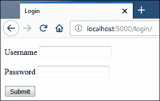
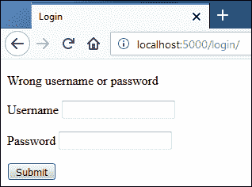
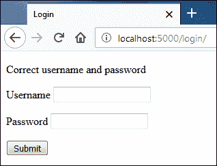
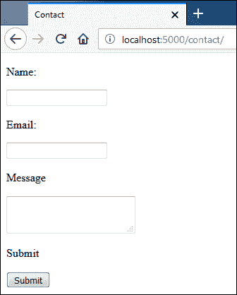
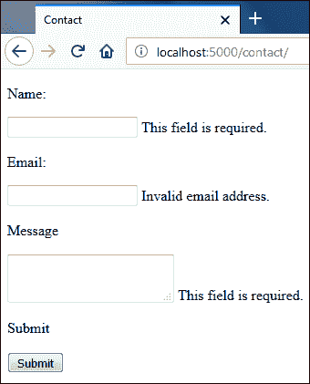
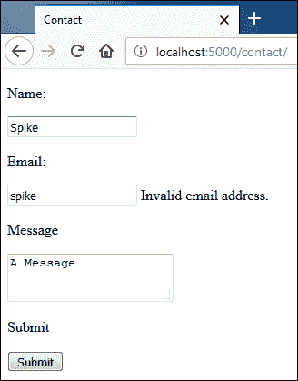
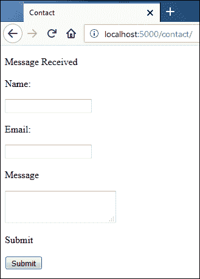

# Flask 中的表单处理

> 原文：<https://overiq.com/flask-101/form-handling-in-flask/>

最后更新于 2020 年 7 月 27 日

* * *

表单是任何 web 应用必不可少的一部分，但不幸的是，使用表单非常困难。这一切都从客户端开始，首先，您必须在客户端验证数据，然后在服务器端。如果这还不够，您还需要考虑所有的安全问题，如 CSRF、XSS、SQL 注入等等。总而言之，这是一个很大的工作量。幸运的是，我们有一个名为 WTForms 的优秀库来为我们做这项繁重的工作。在我们了解更多关于 WTForms 的知识之前，下一节将为您介绍如何在 Flask 中处理表单，而无需使用任何库或包。

## 表单处理-艰难之路

使用以下代码创建名为`login.html`的新模板:

**flask _ app/模板/login.html**

```py
<!DOCTYPE html>
<html lang="en">
<head>
    <meta charset="UTF-8">
    <title>Login</title>
</head>
<body>

    
        <p>{{ message }}</p>
    

    <form action="" method="post">
        <p>
            <label for="username">Username</label>
            <input type="text" name="username">
        </p>
        <p>
            <label for="password">Password</label>
            <input type="password" name="password">
        </p>
        <p>
            <input type="submit">
        </p>
    </form>

</body>
</html>

```

接下来，在`main2.py`中的`books()`查看功能后添加以下代码。

**Flask _app/main2.py**

```py
from flask import Flask, render_template, request
#...
@app.route('/login/', methods=['post', 'get'])
def login():
    message = ''
    if request.method == 'POST':
        username = request.form.get('username')  # access the data inside 
        password = request.form.get('password')

        if username == 'root' and password == 'pass':
            message = "Correct username and password"
        else:
            message = "Wrong username or password"

    return render_template('login.html', message=message)
#...

```

注意传递给`route()`装饰器的`methods`参数。默认情况下，只有当`request.method`为 GET 或 HEAD 时，才会调用请求处理程序。这可以通过将允许的 HTTP 方法列表传递给`methods`关键字参数来更改。从现在开始，`login()`视图功能
将只在使用 GET、POST 或 HEAD 方法请求`/login/`时调用。尝试使用任何其他方法访问`/login/`网址将导致 HTTP 405 方法不允许错误。

在之前的课程中，我们已经讨论过`request`对象提供了关于当前 web 请求的信息。通过表单提交的数据存储在`request`对象的`form`属性中。`request.form`是一个像字典一样不可变的对象，被称为`ImmutableMultiDict`。

启动服务器，访问[http://localhost:5000/log in/](http://localhost:5000/login/)。你应该看到这样一个表格。



使用 GET 请求请求页面，因此跳过了`login()`视图功能中 if 块
内的代码。

提交表单时无需输入任何内容，您应该会看到如下页面:



这一次页面是使用 POST 方法提交的，所以 if 块中的代码被执行。在 if 主体中，我们访问用户名和密码，并相应地设置`message`变量的值。因为我们提交了一个空表单，所以会显示一条错误消息。

用正确的用户名和密码填写表格，然后点击回车。您应该会收到如下`"Correct username and password"`信息:



这就是我们在 Flask 中处理表单的方式。现在让我们把注意力转移到 WTForms 包上。

## WTForms

WTForms 是一个用 Python 编写的强大的框架无关(框架无关)库。它允许我们生成 HTML 表单、验证表单、用数据预填充表单(对编辑有用)等等。除此之外，它还为 CSRF 提供保护。为了安装 WTForms，我们使用了 Flask-WTF。

Flask-WTF 是一个将 Flask 和 WTForms 集成在一起的 Flask 扩展。Flask-WTF 还提供了一些附加功能，如文件上传、reCAPTCHA、国际化(i18n)等。要安装 Flask-WTF，请输入以下命令。

```py
(env) overiq@vm:~/flask_app$ pip install flask-wtf
```

## 创建表单类

我们首先将表单定义为 Python 类。每个表单类都必须扩展`flask_wtf`包的`FlaskForm`类。`FlaskForm`是一个包装器，包含一些围绕原始`wtform.Form`类的有用方法，这是创建表单的基类。在表单类中，我们将表单字段定义为类变量。通过创建与字段类型相关联的对象来定义表单字段。`wtform`包提供了几个类来表示表单域，如`StringField`、`PasswordField`、`SelectField`、`TextAreaField`、`SubmitField`等。

在`flask_app`字典中创建一个新文件`forms.py`，并添加以下代码。

**Flask _app/forms.py**

```py
from flask_wtf import FlaskForm
from wtforms import StringField, SubmitField, TextAreaField
from wtforms.validators import DataRequired, Email

class ContactForm(FlaskForm):
    name = StringField("Name: ", validators=[DataRequired()])
    email = StringField("Email: ", validators=[Email()])
    message = TextAreaField("Message", validators=[DataRequired()])
    submit = SubmitField("Submit")

```

这里我们定义了一个表单类`ContactForm`，它包含四个表单域:`name`、`email`、`message`和`submit`。这些变量将用于渲染表单字段，以及在字段之间设置和检索数据。使用两个`StringField`创建表单，一个`TextAreaField`和一个`SubmitField`。每次我们创建一个字段对象，我们都会传递一些参数给它的构造函数。第一个参数是一个包含标签的字符串，当表单域被渲染时，它将显示在`<label>`标签中。第二个可选参数是作为关键字参数传递给构造函数的验证器列表。验证器是确定字段中的数据是否有效的函数或类。我们可以通过逗号(`,`)将多个验证器应用于一个字段。`wtforms.validators`模块提供了一些基本的验证器，但是我们也可以创建自己的验证器。在这个表单中，我们使用了两个内置验证器`DataRequired`和`Email`。

**数据要求**:保证用户必须在字段中输入一些数据。

**邮件**:检查输入的数据是否为有效的邮件地址。

字段中的数据将不会被接受，直到对其应用的所有验证器都得到满足。

**注意:**我们几乎没有触及表单域和验证器的表面，要查看完整列表，请访问[https://wtforms.readthedocs.io/en/master/](https://wtforms.readthedocs.io/en/master/)。

## 设置密钥

默认情况下，Flask-WTF 阻止所有形式的 CSRF 攻击。它通过在表单中隐藏的`<input>`元素中嵌入一个标记来实现这一点。然后使用令牌来验证请求的真实性。在 Flask-WTF 可以生成 csrf 令牌之前，我们必须添加一个密钥。打开`main2.py`并按如下方式设置密钥:

**Flask _app/main2.py**

```py
#...
app.debug = True
app.config['SECRET_KEY'] = 'a really really really really long secret key'

manager = Manager(app)
#...

```

这里我们使用的是`Flask`对象的`config`属性。`config`属性就像字典一样工作，它用于放置 Flask 和 Flask 扩展的配置选项，但是如果您愿意，也可以放置您自己的配置。

密钥应该是一个很长很难猜测的字符串。`SECRET_KEY`的使用不仅仅局限于创建 CSRF 代币，它还被 Flask 和许多其他扩展使用。密钥应该保密。与其将密钥存储在应用中，不如将它存储在环境变量中。我们将在后面的章节中学习如何做到这一点。

## 控制台中的表单

通过输入以下命令打开 Python shell:

```py
(env) overiq@vm:~/flask_app$ python main2.py shell
```

这将在应用上下文中启动 Python shell。

现在导入`ContactForm`类，并通过向其传递表单数据来实例化一个新的表单对象。

```py
>>>
>>> from forms import ContactForm
>>> from werkzeug.datastructures import MultiDict
>>>
>>>
>>> form1 = ContactForm(MultiDict([('name', 'jerry'),('email', 'jerry@mail.com')]))
>>>

```

请注意，我们将表单数据作为`MultiDict`对象传递，因为`wtforms.Form`类的构造函数接受类型为`MultiDict`的参数。如果在实例化表单对象时未指定表单数据，并且表单是使用 POST 请求提交的，则`wtforms.Form`将使用来自`request.form`属性的数据。回想一下`request.form`返回一个类型为`ImmutableMultiDict`的对象，该对象与`MultiDict`对象相同，但不可变。

表单对象的`validate()`方法验证表单。成功后返回`True`，否则返回`False`。

```py
>>>
>>> form1.validate()
False
>>>

```

我们的表单未能通过验证，因为我们在创建表单对象时没有向所需的`message`字段提供任何数据。我们可以使用表单对象的`errors`属性来访问表单错误:

```py
>>>
>>> form1.errors
{'message': ['This field is required.'], 'csrf_token': ['The CSRF token is missing.']}
>>>

```

请注意，除了`message`字段的错误消息外，输出还包含缺失 csrf 令牌的错误消息。这是因为我们在表单数据中没有带有 csrf 令牌的实际 POST 请求。

我们可以在实例化表单类时通过传递`csrf_enabled=False`来关闭表单上的 CSRF 保护。这里有一个例子:

```py
>>>
>>> form3 = ContactForm(MultiDict([('name', 'spike'),('email', 'spike@mail.com')]), csrf_enabled=False)
>>>
>>> form3.validate()
False
>>>
>>> form3.errors
{'message': ['This field is required.']}
>>>
>>>

```

不出所料，现在我们只得到丢失的`message`字段的错误。让我们创建另一个表单对象，但这次我们将向所有表单字段提供有效数据。

```py
>>>
>>> form4 = ContactForm(MultiDict([('name', 'jerry'), ('email', 'jerry@mail.com'), ('message', "hello tom")]), csrf_enabled=False)
>>>
>>> form4.validate()
True
>>>
>>> form4.errors
{}
>>>

```

这次表单验证成功。

我们的下一个逻辑步骤将是渲染接下来讨论的表单。

## 渲染表单

有两种方法可以渲染表单域:

1.  逐个渲染字段。
2.  使用 for 循环渲染字段。

### 逐个渲染字段

在模板中，一旦我们访问了表单实例，我们就可以使用字段名来渲染字段、标签和错误，如下所示:

```py
{# render the label tag associated with field #}
{{ form.field_name.label()  }}  

{# render the field itself #}
{{ form.field_name()  }}  

{# render the validation errors associated with the field #}

    {{ error }}  


```

让我们在控制台内部测试一下:

```py
>>>
>>> from forms import ContactForm
>>> from jinja2 import Template
>>>
>>> form = ContactForm()
>>>

```

这里我们已经实例化了没有任何请求数据的表单对象，这通常是第一次使用 GET 请求显示表单的情况。

```py
>>>
>>>
>>> Template("{{ form.name.label() }}").render(form=form)
'<label for="name">Name: </label>'
>>>
>>> Template("{{ form.name() }}").render(form=form)
'<input id="name" name="name" type="text" value="">'
>>>
>>>
>>> Template("{{ form.email.label() }}").render(form=form)
'<label for="email">Email: </label>'
>>>
>>> Template("{{ form.email() }}").render(form=form)
'<input id="email" name="email" type="text" value="">'
>>>
>>>
>>> Template("{{ form.message.label() }}").render(form=form)
'<label for="message">Message</label>'
>>>
>>> Template("{{ form.message() }}").render(form=form)
'<textarea id="message" name="message"></textarea>'
>>>
>>>
>>> Template("{{ form.submit() }}").render(form=form)
'<input id="submit" name="submit" type="submit" value="Submit">'
>>>
>>>

```

由于表单是第一次显示，因此它的任何字段都不会有任何验证错误。下面的代码演示了这一点:

```py
>>>
>>>
>>> Template("{{ error }}").render(form=form)
''
>>>
>>>
>>> Template("{{ error }}").render(form=form)
''
>>>
>>>
>>> Template("{{ error }}").render(form=form)
''
>>>
>>>

```

您可以使用`form.errors`来访问与表单相关的所有验证错误，而不是显示每个字段的验证错误。`forms.errors`常用于在表单顶部显示验证错误。

```py
>>>
>>> Template("{{ error }}").render(form=form)
''
>>>

```

在渲染字段和标签时，我们还可以提供额外的关键字参数，这些参数将作为键值对注入到 HTML 中。例如:

```py
>>>
>>> Template('{{ form.name(class="input", id="simple-input") }}').render(form=form)
'<input class="input" id="simple-input" name="name" type="text" value="">'
>>>
>>>
>>> Template('{{ form.name.label(class="lbl") }}').render(form=form)
'<label class="lbl" for="name">Name: </label>'
>>>
>>>

```

现在假设我们的表单已经提交。这次让我们尝试渲染字段，看看会发生什么。

```py
>>>
>>> from werkzeug.datastructures import MultiDict
>>>
>>> form = ContactForm(MultiDict([('name', 'spike'),('email', 'spike@mail.com')]))
>>>
>>> form.validate()
False
>>>
>>>
>>> Template("{{ form.name() }}").render(form=form)
'<input id="name" name="name" type="text" value="spike">'
>>>
>>>
>>> Template("{{ form.email() }}").render(form=form)
'<input id="email" name="email" type="text" value="spike@mail.com">'
>>>
>>>
>>> Template("{{ form.message() }}").render(form=form)
'<textarea id="message" name="message"></textarea>'
>>>
>>>

```

请注意，`name`和`email`字段的`value`属性已填充数据。然而，`message`字段的`<textarea>`元素是空的，因为我们没有向它提供任何数据。我们可以访问`message`字段的验证错误，如下所示:

```py
>>>
>>> Template("{{ error }}").render(form=form)
'This field is required.'
>>>

```

或者，您也可以使用`form.errors`一次遍历所有验证错误。

```py
>>>
>>> s ="""\
... \
...         \
...             <li>{{ field_name }}: {{ error }}</li>
...         \
... \
... """
>>>
>>> Template(s).render(form=form)
'<li>csrf_token: The CSRF token is missing.</li>\n
<li>message: This field is required.</li>\n'
>>>
>>>

```

请注意，由于提交的请求没有 csrf 令牌，因此出现了 csrf 令牌丢失错误。我们可以像正常场一样渲染 csrf 场，如下所示:

```py
>>>
>>> Template("{{ form.csrf_token() }}").render(form=form)
'<input id="csrf_token" name="csrf_token" type="hidden" value="IjZjOTBkOWM4ZmQ0M
GMzZTY3NDc3ZTNiZDIxZTFjNDAzMGU1YzEwOTYi.DQlFlA.GQ-PrxsCJkQfoJ5k6i5YfZMzC7k">'
>>>

```

如果您有相当多的表单域，逐个渲染域可能会很麻烦。对于这种情况，可以使用 For 循环来渲染字段。

### 使用循环渲染字段

下面的 shell 会话演示了如何使用 for 循环渲染字段。

```py
>>>
>>> s = """\
...     <div>
...         {{ form.csrf_token }}
...     </div>
... 
...     <div>
...         {{ field.label() }}
...         {{ field() }}
...         
...             <div class="error">{{ error }}</div>
...         
...     </div>
... 
... """
>>>
>>>
>>> print(Template(s).render(form=form))
    <div>
        <input id="csrf_token" name="csrf_token" type="hidden" value="IjZjOTBkOW
M4ZmQ0MGMzZTY3NDc3ZTNiZDIxZTFjNDAzMGU1YzEwOTYi.DQlFlA.GQ-PrxsCJkQfoJ5k6i5YfZMzC7
k">
    </div>

    <div>
        <label for="name">Name: </label>
        <input id="name" name="name" type="text" value="spike">

    </div>

    <div>
        <label for="email">Email: </label>
        <input id="email" name="email" type="text" value="spike@mail.com">

    </div>

    <div>
        <label for="message">Message</label>
        <textarea id="message" name="message"></textarea>

            <div class="error">This field is required.</div>

    </div>

    <div>
        <label for="submit">Submit</label>
        <input id="submit" name="submit" type="submit" value="Submit">

    </div>

>>>
>>>

```

需要注意的是，无论使用哪种方法，都必须手动添加`<form>`标签来包装表单字段。

现在我们知道如何创建、验证和渲染表单。让我们利用这些知识创造一些真实的形式。

首先用以下代码创建一个新模板`contact.html`:

**flask _ app/templates/contact . html**

```py
<!DOCTYPE html>
<html lang="en">
<head>
    <meta charset="UTF-8">
    <title>Title</title>
</head>
<body>

<form action="" method="post">

    {{ form.csrf_token() }}

    
        <p>{{ field.label() }}</p>
        <p>{{ field }}
            
                {{ error }}
            
        </p>
    

</form>

</body>
</html>

```

拼图中唯一缺少的部分是我们接下来将创建的视图功能。

## 提交表格

打开`main2.py`，在`login()`查看功能后添加以下代码。

**Flask _app/main2.py**

```py
from flask import Flask, render_template, request, redirect, url_for
from flask_script import Manager, Command, Shell
from forms import ContactForm
#...
@app.route('/contact/', methods=['get', 'post'])
def contact():
    form = ContactForm()
    if form.validate_on_submit():
        name = form.name.data
        email = form.email.data
        message = form.message.data
        print(name)
        print(email)
        print(message)
        # db logic goes here
        print("\nData received. Now redirecting ...")
        return redirect(url_for('contact'))

    return render_template('contact.html', form=form)
#...

```

在第 7 行，我们正在创建一个表单对象。在第 8 行，我们正在检查`validate_on_submit()`方法的返回值，以执行 if 语句体中的一些代码。

为什么我们使用`validate_on_submit()`而不是`validate()`，就像我们在控制台中做的那样？

`validate()`方法只是检查表单数据是否有效，并不检查请求是否使用 POST 方法提交。这意味着如果我们使用`validate()`方法，那么对`/contact/`的 GET 请求将触发表单验证，用户将在表单中看到验证错误。一般来说，只有在使用 POST 请求提交数据时，我们才会触发验证例程。当使用开机自检请求提交表单并且数据有效时，`validate_on_submit()`方法返回`True`。否则`False`。`validate_on_submit()`方法内部调用`validate()`方法。此外，请注意，我们在实例化表单对象时没有传递任何数据，因为当使用 POST 请求提交表单时，WTForms 会从`request.form`属性中读取表单数据。

表单类中定义的表单字段成为表单对象的属性。要访问字段数据，我们使用表单字段的`data`属性:

```py
form.name.data   # access the data in the name field.
form.email.data   # access the data in the email field.

```

要一次访问所有表单数据，请使用表单对象的`data`属性:

```py
form.data   # access all the form data

```

当您使用 GET 请求访问 URL `/contact/`时，`validate_on_submit()`方法返回`False`，跳过 if 主体内的代码，向用户显示一个空的 HTML 表单。

当使用 POST 请求提交表单时，`validate_on_submit()`返回`True`，假设数据有效。if 主体内的`print()`调用打印用户输入的数据，`redirect()`功能将用户重定向到`/contact/`页面。另一方面，如果`validate_on_submit()`返回`False`，则跳过 if 主体内部语句的执行，并显示带有验证错误的表单。

启动服务器，如果还没有运行，访问[http://localhost:5000/contact/](http://localhost:5000/contact/)。您应该会看到这样的联系人表单:



无需输入任何内容，点击提交，您将看到如下验证错误:



在名称和消息字段中输入一些数据，在电子邮件字段中输入无效数据，然后再次提交表单。



请注意，所有字段仍然包含来自上一个请求的数据。

在电子邮件字段中输入有效的电子邮件，然后点击提交。这一次我们的验证将会成功，在运行服务器的 shell 中，您应该会看到如下输出:

```py
Spike
spike@gmail.com
A Message

Data received. Now redirecting ...
```

在 shell 中显示提交的数据后，查看功能会再次将用户重定向到`/contact/` URL。此时，您应该会看到一个没有任何验证错误的空表单，就像您第一次使用 GET 请求访问`/contact/`网址一样。

成功提交表单后，向用户显示一些反馈是一个很好的做法。在 Flask 中，我们使用 flash 消息创建这样的反馈，这将在下面讨论。

## Flash 消息

Flash 消息是另一种依赖于密钥的功能。密钥是必要的，因为在幕后，闪存消息存储在会话中。我们将在 Flask 中的课程[中深入学习什么是会话以及如何使用它们。既然我们已经设置了密匙，我们就准备出发了。](/flask-101/sessions-in-flask/)

要闪烁消息，我们使用`flask`包中的`flash()`功能。`flash()`函数接受两个参数，消息到 flash 和一个可选类别。类别表示消息类型，如*成功*、*错误*、*警告*等。该类别可在模板中用于确定要显示的警报消息的类型。

在`contact()`视图功能中打开`main2.py`并在`redirect()`调用前添加`flash("Message Received", "success")`，如下所示:

**Flask _app/main2.py**

```py
from flask import Flask, render_template, request, redirect, url_for, flash
#...
        # db logic goes here
        print("\nData received. Now redirecting ...")
        flash("Message Received", "success")
        return redirect(url_for('contact'))
    return render_template('contact.html', form=form)

```

`flash()`功能设置的消息仅适用于后续请求，然后将被删除。

我们现在正在设置 flash 消息，为了显示它，我们也必须修改我们的模板。

打开`contact.html`，修改文件如下:

**flask _ app/templates/contact . html**

```py
<body>


    <p class="{{ category }}">{{ message }}</p>


<form action="" method="post">

```

Jinja 提供了一个名为`get_flashed_messages()`的函数，该函数返回一个没有类别的未决 flash 消息列表。拨打`get_flashed_messages()`时，要获得带类别通行证`with_categories=True`的闪光信息。当`with_categories`设置为真时，`get_flashed_messages()`返回形式为`(category, message)`的元组列表。

进行这些更改后，再次访问[http://localhost:5000/contact/](http://localhost:5000/contact/)。填写表格并点击提交。这一次，您应该会在表单顶部看到一条成功消息，如下所示:



* * *

* * *