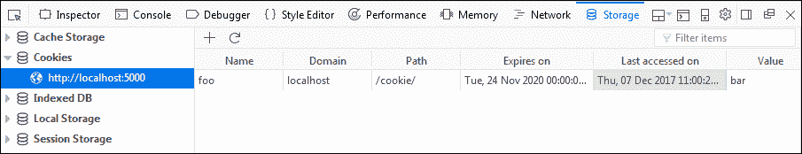
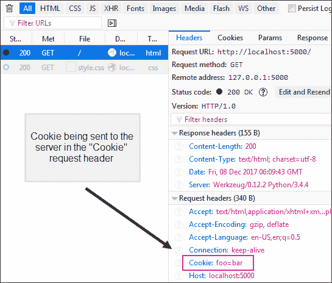
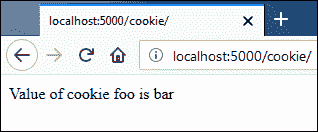
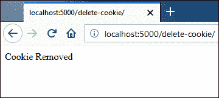
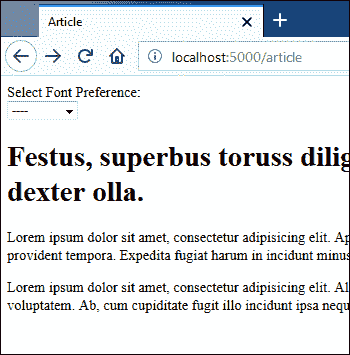
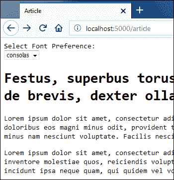

# Flask 中的 Cookie

> 原文：<https://overiq.com/flask-101/cookies-in-flask/>

最后更新于 2020 年 7 月 27 日

* * *

到目前为止，我们构建的页面非常简单。浏览器将请求发送给服务器，服务器用 HTML 页面进行响应，仅此而已。HTTP 是一种无状态协议。这意味着 HTTP 没有内置的方式来告诉服务器，这两个请求来自同一个用户。因此，服务器不知道您是第一次还是第一千次请求页面。它平等地为每个人服务，就像他们第一次请求页面一样。

访问一个电子商务网站，浏览一些项目。下次访问该网站时，您将根据以前的浏览模式获得一些产品推荐。那么网站怎么会知道你的存在呢？

答案在 Cookies 和会话中。

本课讨论 Cookies，下一课将讨论会话。

## 什么是 Cookie？

cookie 只是服务器在浏览器中设置的一段数据。以下是它的工作原理:

1.  浏览器向服务器发送网页请求。
2.  服务器通过发送所请求的网页以及一个或多个 cookies 来响应浏览器请求。
3.  收到响应后，浏览器会渲染网页并将 cookie 保存在用户计算机中。
4.  对服务器的后续请求将在`Cookie`头中包含来自所有 cookies 的数据。此过程将持续到 cookie 过期。一旦 cookie 过期，就会从浏览器中删除。

## 设置 Cookie

在 Flask 中，我们使用响应对象的`set_cookie()`方法来设置 cookies。`set_cookie()`方法的语法如下:

```py
set_cookie(key, value="", max_age=None)

```

`key`是必需的参数，指的是 cookie 的名称。`value`是您想要存储在 cookie 中的数据，默认为空字符串。`max_age`指的是 cookie 的过期时间，以秒为单位，如果没有设置，cookie 将在用户关闭浏览器时停止存在。

打开`main2.py`，在`contact()`查看功能后添加以下代码:

**Flask _app/main2.py**

```py
from flask import Flask, render_template, request, redirect, url_for, flash, make_response
#...
@app.route('/cookie/')
def cookie():
    res = make_response("Setting a cookie")
    res.set_cookie('foo', 'bar', max_age=60*60*24*365*2)
    return res
#...

```

这里我们正在创建一个名为`foo`的 cookie，其值`bar`将持续 2 年。

启动服务器，访问[http://localhost:5000/cookie/](http://localhost:5000/cookie/)。你应该会看到一个以`"Setting a cookie"`作为回应的页面。点击`Shift + F9`，在火狐中打开存储检查器，查看服务器设置的 cookie。浏览器窗口底部将出现一个新窗口。在左侧，选择“Cookies”存储类型，然后点击`http://localhost:5000/`查看服务器在[设置的所有 Cookies http://localhost:5000/](http://localhost:5000/)。



从现在开始，cookie `foo`将与任何请求一起发送到服务器 [http://localhost:5000/](http://localhost:5000/) 。我们可以使用火狐中的网络监视器来验证这一点。按 Ctrl+Shift+E 打开网络监视器，访问 [http://localhost:5000/](http://localhost:5000/) 。在左侧的网络请求列表中，选择第一个请求，您将在右侧窗格中获得如下请求详细信息:



请注意，一旦设置了 cookie，后续对[http://localhost:5000/cookie](http://localhost:5000/cookie)的请求将更新 cookie 的过期时间。

## 访问 Cookies

要访问 cookie，我们使用`request`对象的`cookie`属性。`cookie`属性是一个类似字典的属性，包含浏览器发送的所有 cookies。打开`main2.py`并修改`cookie()`查看功能如下:

**Flask _app/main2.py**

```py
#...
@app.route('/cookie/')
def cookie():
    if not request.cookies.get('foo'):
        res = make_response("Setting a cookie")
        res.set_cookie('foo', 'bar', max_age=60*60*24*365*2)
    else:
        res = make_response("Value of cookie foo is {}".format(request.cookies.get('foo')))
    return res
#...

```

我们修改了我们的视图函数来显示 cookie 值，假设有一个 cookie。否则，它会为我们设置一个 cookie。

访问[http://localhost:5000/cookie/](http://localhost:5000/cookie/)这次应该会得到如下的回应。



模板内部也有`request`对象。这意味着，在模板内部，我们可以使用与 Python 代码中相同的方式来访问 cookies。我们将在下一节看到这方面的一个例子。

## 删除 Cookies

要删除 cookie，使用 cookie 的名称和任意值调用`set_cookie()`方法，并将`max_age`参数设置为 0。打开`main2.py`文件，在`cookie()`查看功能后添加以下代码。

**Flask _app/main2.py**

```py
#...
@app.route('/delete-cookie/')
def delete_cookie():
    res = make_response("Cookie Removed")
    res.set_cookie('foo', 'bar', max_age=0)
    return res
#...

```

访问[http://localhost:5000/delete-cookie/](http://localhost:5000/delete-cookie/)会得到如下响应:



现在你应该对 Cookie 的工作原理有了很好的理解。下面的清单给出了一个如何使用 cookie 存储用户首选项的实际例子。

在`main2.py`中，在`delete_cookie()`查看功能后添加以下代码。

**Flask _app/main2.py**

```py
#...
@app.route('/article/', methods=['POST', 'GET'])
def article():
    if request.method == 'POST':
        print(request.form)
        res = make_response("")
        res.set_cookie("font", request.form.get('font'), 60*60*24*15)
        res.headers['location'] = url_for('article')
        return res, 302

    return render_template('article.html')
#...

```

使用以下代码创建新模板`article.html`:

```py
<!DOCTYPE html>
<html lang="en">
<head>
    <meta charset="UTF-8">
    <title>Article</title>
</head>
<body style="font-family:{{ request.cookies.get('font') }}">

Select Font Preference: <br>
<form action="" method="post">
    <select name="font" onchange="submit()">
        <option value="">----</option>
        <option value="consolas" selected>consolas</option>
        <option value="arial" selected>arial</option>
        <option value="verdana" selected>verdana</option>
    </select>
</form>

<h1>Festus, superbus toruss diligenter tractare de brevis, dexter olla.</h1>

<p>Lorem ipsum dolor sit amet, consectetur adipisicing elit. Aperiam blanditiis debitis doloribus eos magni minus odit, provident tempora. Expedita fugiat harum in incidunt minus nam nesciunt voluptate. Facilis nesciunt, similique!
</p>

<p>Lorem ipsum dolor sit amet, consectetur adipisicing elit. Alias amet animi aperiam inventore molestiae quos, reiciendis voluptatem. Ab, cum cupiditate fugit illo incidunt ipsa neque quam, qui quidem vel voluptatum.</p>

</body>
</html>

```

用户第一次访问[http://localhost:5000/article](http://localhost:5000/article)，页面使用默认浏览器字体显示。当用户使用下拉菜单改变字体时，我们提交表单。if 条件`request.method == 'POST'`变为真，我们设置一个名为`font`的 cookie，所选字体的值将在 15 天后过期，然后用户被重定向到[http://localhost:5000/article](http://localhost:5000/article)。并且用户以所选择的字体显示页面。

在浏览器中，访问[http://localhost:5000/article](http://localhost:5000/article)，你会看到一个浏览器默认字体的页面。



从下拉列表中选择字体，您将以所选字体显示页面。



## Cookie 的缺点

在项目中广泛使用 cookies 之前，您必须意识到它的缺点。

1.  Cookies 不安全。存储在 cookie 中的数据对任何人都是可见的，所以您不应该使用它来存储敏感数据，如密码、信用卡详细信息等。

2.  Cookies 可以被禁用。大多数浏览器给用户禁用 cookies 的选项。当 cookie 被禁用时，您将不会收到任何警告或错误消息，相反，设置 cookie 的响应头将被丢弃。为了解决这些问题，您可以像下面这样编写 Javascript 代码，提醒用户您的应用需要 cookies 才能正常工作。

    ```py
    <script>
        document.cookie = "foo=bar;";
        if (!document.cookie) 
        {
            alert("This website requires cookies to function properly");
        }
    </script>

    ```

3.  每个 Cookie 只能存储不超过 4KB 的数据。除此之外，浏览器还对网站可以设置的 cookies 数量进行了限制。该限制因浏览器而异。有些浏览器每个网站接受 50 个 cookies，有些接受 30 个。

4.  每次您向服务器请求页面时，都会发送 Cookies。假设你有 20 个 cookiess，每个 cookie 都存储 4KB 的数据。这意味着每次请求你都有 80KB 的额外负载！

我们可以使用会话来解决其中的一些问题。这是下一课的主题。

* * *

* * *