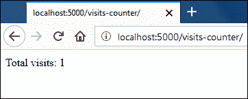
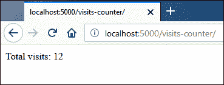
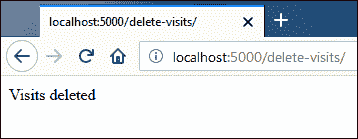
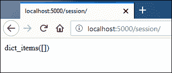
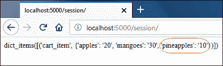
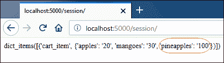

# Flask 中的会话

> 原文：<https://overiq.com/flask-101/sessions-in-flask/>

最后更新于 2020 年 7 月 27 日

* * *

会话是在请求之间存储用户特定数据的另一种方式。它的工作原理类似于 Cookie。要使用会话，您必须首先设置密钥。`flask`包的`session`对象用于设置和获取会话数据。`session`对象像字典一样工作，但它也可以跟踪修改。

当我们使用会话时，数据作为 cookie 存储在浏览器中。用于存储会话数据的 cookie 称为会话 cookie。然而，与普通的 cookie 不同，Flask 对会话 cookie 进行加密签名。这意味着任何人都可以查看 cookie 的内容，但不能修改 cookie，除非他有用于签名 cookie 的密钥。这就是为什么建议设置一个又长又难猜的字符串作为密钥。一旦设置了会话 cookie，对服务器的每个后续请求都通过使用相同的密钥取消分配来验证 cookie 的真实性。如果 Flask 未能取消 cookie 的设计，那么它的内容将被丢弃，一个新的会话 cookie 将被发送到浏览器。

如果您使用过像 PHP 这样的语言的会话，那么 Flask 中的会话就有点不同了。在 PHP 中，会话 cookie 不存储会话数据，而是只存储会话 id。会话 id 是 PHP 创建的唯一字符串，用于将会话数据与 cookie 相关联。会话数据本身存储在服务器的一个文件中。收到客户端的请求后，PHP 使用会话 id 来检索会话数据，并使其在您的代码中可用。这种类型的会话称为服务器端会话，默认情况下 Flask 提供的会话类型称为客户端会话。

默认情况下，cookies 和 Flask 中基于客户端的会话没有太大区别。因此，基于客户端的会话与 cookies 具有相同的缺点:

*   不能存储像密码这样的敏感数据。
*   每个请求都有额外的负载。
*   不能存储超过 4KB 的数据。
*   限制每个网站的 cookie 数量等等。

cookie 和基于客户端的会话之间唯一真正的区别是 Flask 保证会话 cookie 的内容不会被用户篡改(除非他有密钥)。

如果您想在 Flask 中使用服务器端会话，您可以编写自己的会话接口，也可以使用 Flask-Session 和 Flask-KVSession 这样的扩展。

## 如何读取、写入和删除会话数据

下面的清单演示了如何读取、写入和删除会话数据。打开`main2.py`文件，在`article()`查看功能后添加以下代码:

**Flask _app/main2.py**

```py
from flask import Flask, render_template, request, redirect, \
url_for, flash, make_response, session)
#...
@app.route('/visits-counter/')
def visits():
    if 'visits' in session:
        session['visits'] = session.get('visits') + 1  # reading and updating session data
    else:
        session['visits'] = 1 # setting session data
    return "Total visits: {}".format(session.get('visits'))

@app.route('/delete-visits/')
def delete_visits():
    session.pop('visits', None) # delete visits
    return 'Visits deleted'
#...

```

请注意，我们使用的`session`对象就像一个普通的字典。如果尚未运行，请启动服务器并访问[http://localhost:5000/访问量-计数器/](http://localhost:5000/visits-counter/) 。您应该看到总访问量如下所示:



多刷新页面几次以增加访问次数。



Flask 仅在您创建新会话或修改现有会话时向客户端发送会话 cookie。当您第一次访问[http://localhost:5000/visits-counter/](http://localhost:5000/visits-counter/)页面时，else 块的主体在`visits()`视图功能中执行，并创建一个新的会话。当我们创建一个新的会话时，Flask 向客户端发送会话 cookie。对[http://localhost:5000/visitos-counter/](http://localhost:5000/visits-counter/)的后续请求执行 if 块中的代码，其中正在更新会话中`visits`计数器的值。修改会话意味着需要创建新的 cookie，这就是为什么 Flask 再次将新的会话 cookie 发送给客户端。

要删除会话数据，请访问[。](http://localhost:5000/delete-visits/)



如果您现在访问[http://localhost:5000/访问量-计数器/](http://localhost:5000/visits-counter/) ，访问量计数器将再次从 1 开始。


默认情况下，会话 cookie 会持续到浏览器关闭。为了延长会话 cookie 的寿命，将`session`对象的`permanent`属性设置为`True`。当`permanent`设置为`True`时，会话 cookie 将持续`permanent_session_lifetime`。`permanent_session_lifetime`是`Flask`对象的`datetime.timedelta`属性，默认值为 31 天。我们可以通过为`permanent_session_lifetime`属性指定一个新值或通过设置`PERMANENT_SESSION_LIFETIME`配置键来改变它。

```py
import datetime

app = Flask(__name__)
app.permanent_session_lifetime = datetime.timedelta(days=365)
# app.config['PERMANENT_SESSION_LIFETIME'] = datetime.timedelta(days=365) # you can also do this

```

就像`request`对象一样，`session`对象在模板中也是可用的。

## 修改会话数据

**注意:**在跟随之前，删除本地主机设置的所有 cookies。

大多数时候`session`对象会自动拾取其上的修改。然而，在某些情况下，比如对可变数据结构的修改不会自动获得。对于这种情况，您必须将`session`对象的`modified`属性设置为`True`。如果不将`modified`属性设置为`True`，Flask 将不会向客户端发送更新的会话 cookie。下面的清单演示了如何使用`session`对象的`modified`属性。打开`main2.py`文件，在`delete_visits()`查看功能前添加以下代码。

**Flask _app/main2.py**

```py
#...
@app.route('/session/')
def updating_session():
    res = str(session.items())

    cart_item = {'pineapples': '10', 'apples': '20', 'mangoes': '30'}
    if 'cart_item' in session:
        session['cart_item']['pineapples'] = '100'
        session.modified = True
    else:
        session['cart_item'] = cart_item

    return res
#...

```

第一次访问[http://localhost:5000/session/](http://localhost:5000/session/)时，else 块中的代码会被执行并创建一个新的 session，其中 session 数据是一个字典。对[的后续请求 http://localhost:5000/session/](http://localhost:5000/session/)通过将菠萝计数设置为 100 来更新会话数据。在下一行中，我们将`modified`属性设置为`True`，因为如果没有它，Flask 将不会向客户端发送更新的会话 cookie。

如果尚未运行，请启动服务器，并访问[。您将看到一个空的`session`字典，因为浏览器没有会话 cookie 要发送到服务器:](http://localhost:5000/session/)



再次重新加载页面，会显示 10 个菠萝的`session`字典，如下所示:



第三次重新加载页面，你会看到`session`字典中有 100 个菠萝，而不是 10 个，如下所示:



由于`modified`属性，会话对象接受了此修改。我们可以通过删除会话 cookie 并注释掉将`modified`属性设置为`True`的行来验证这一点。现在，在第一次请求后，您将总是看到包含 10 个菠萝的会话字典。

这就完成了所有你需要知道的关于 Flask 会话的内容。别忘了默认情况下，Flask 中的会话是客户端会话。

* * *

* * *