# SQLAlchemy ORM 基础

> 原文：<https://overiq.com/flask-101/sqlalchemy-orm-basics/>

最后更新于 2020 年 7 月 27 日

* * *

## 插入数据

要使用 SQLAlchemy 创建新记录，我们需要执行以下步骤:

1.  创建一个对象。
2.  将对象添加到会话中。
3.  提交会话。

在 SQLAlchemy 中，我们使用会话与数据库交互。幸运的是，我们不需要手动创建会话，Flask-SQLAlchemy 为我们管理它。我们以`db.session`的形式访问会话对象。它是处理数据库连接的会话对象。会话对象也是事务的处理程序。默认情况下，事务隐式启动，并将保持打开状态，直到会话被提交或回滚。

启动 Python shell 并创建一些模型对象，如下所示:

```py
(env) overiq@vm:~/flask_app$ python main2.py shell
>>>
>>> from main2 import db, Post, Tag, Category
>>>
>>>
>>> c1 = Category(name='Python', slug='python')
>>> c2 = Category(name='Java', slug='java')
>>>

```

这里我们已经创建了两个`Category`对象。我们可以使用点(`.`)运算符访问对象的属性，如下所示:

```py
>>>
>>> c1.name, c1.slug
('Python', 'python')
>>>
>>> c2.name, c2.slug
('Java', 'java')
>>>

```

接下来，我们将对象添加到会话中。

```py
>>>
>>> db.session.add(c1)
>>> db.session.add(c2)
>>>

```

向会话中添加对象实际上并没有将它们写入数据库，它只是准备要在下一次提交中保存的对象。我们可以通过检查对象的主键来验证这一点。

```py
>>>
>>> print(c1.id)
None
>>>
>>> print(c2.id)
None
>>>

```

两个对象的`id`属性的值都是`None`。这意味着我们的对象还没有保存在数据库中。

我们可以使用`add_all()`方法，而不是一次向会话中添加一个对象。`add_all()`方法接受要添加到会话中的对象列表。

```py
>>>
>>> db.session.add_all([c1, c1])
>>>

```

多次向会话添加对象不会引发任何错误。您可以随时使用`db.session.new`查看会话中的对象。

```py
>>>
>>> db.session.new
IdentitySet([<None:Python>, <None:java>])
>>>

```

最后，要将对象保存到数据库中，调用`commit()`方法如下:

```py
>>>
>>> db.session.commit()
>>>

```

访问`Category`对象的`id`属性现在将返回主键，而不是`None`。

```py
>>>
>>> print(c1.id)
1
>>>
>>> print(c2.id)
2
>>>

```

此时，HeidiSQL 中的`categories`表应该是这样的:

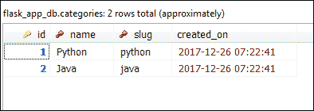

我们新创建的类别与任何帖子都没有关联。因此`c1.posts`和`c2.posts`将返回一个空列表。

```py
>>>
>>> c1.posts
[]
>>>
>>> c2.posts
[]
>>>

```

现在让我们创建一些帖子。

```py
>>>
>>> p1 = Post(title='Post 1', slug='post-1', content='Post 1', category=c1)
>>> p2 = Post(title='Post 2', slug='post-2', content='Post 2', category=c1)
>>> p3 = Post(title='Post 3', slug='post-3', content='Post 3', category=c2)
>>>

```

在创建`Post`对象时，我们也可以如下设置，而不是传递类别:

```py
>>>
>>> p1.category = c1
>>>

```

将对象添加到会话并提交。

```py
>>>
>>> db.session.add_all([p1, p2, p3])
>>> db.session.commit()
>>>

```

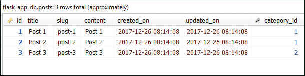

再次访问`Category`对象的`posts`属性，这次会得到一个非空列表，如下图:

```py
>>>
>>> c1.posts
[<1:Post 1>, <2:Post 2>]
>>>
>>> c2.posts
[<3:Post 3>]
>>>

```

从关系的另一面，我们可以使用`Post`对象上的`category`属性访问帖子所属的`Category`对象。

```py
>>>
>>> p1.category
<1:Python>
>>>
>>> p2.category
<1:Python>
>>>
>>> p3.category
<2:Java>
>>>

```

请记住，由于`Category`模型中的`relationship()`指令，所有这些都成为可能。我们的数据库中现在有三篇文章，但是没有一篇与任何标签相关联。

```py
>>>
>>> p1.tags, p2.tags, p3.tags
([], [], [])
>>>

```

是时候创建一些标签了。在 Shell 中创建`Tag`对象，如下所示:

```py
>>>
>>> t1 = Tag(name="refactoring", slug="refactoring")
>>> t2 = Tag(name="snippet", slug="snippet")
>>> t3 = Tag(name="analytics", slug="analytics")
>>>
>>> db.session.add_all([t1, t2, t3])
>>> db.session.commit()
>>>

```

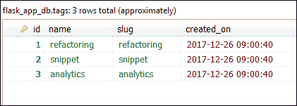

这段代码创建三个标记对象，并将它们提交给数据库。我们的帖子仍然没有连接到任何标签。这里他告诉我们如何将一个`Post`对象连接到一个`Tag`对象。

```py
>>>
>>> p1.tags.append(t1)
>>> p1.tags.extend([t2, t3])
>>> p2.tags.append(t2)
>>> p3.tags.append(t3)
>>>
>>> db.session.add_all([p1, p2, p3])
>>>
>>> db.session.commit()
>>>

```

该提交在`post_tags`表中添加了以下五条记录。

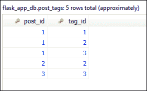

我们的帖子现在与一个或多个标签相关联:

```py
>>>
>>> p1.tags
[<1:refactoring>, <2:snippet>, <3:analytics>]
>>>
>>> p2.tags
[<2:snippet>]
>>>
>>> p3.tags
[<3:analytics>]
>>>

```

反过来，我们可以访问属于标签的帖子，如下所示:

```py
>>>
>>> t1.posts
[<1:Post 1>]
>>>
>>> t2.posts
[<1:Post 1>, <2:Post 2>]
>>>
>>> t3.posts
[<1:Post 1>, <3:Post 3>]
>>>
>>>

```

需要注意的是，我们不需要首先提交`Tag`对象，然后将其与`Post`对象相关联，而是可以一次完成所有这些，如下所示:

```py
>>>
>>> t1 = Tag(name="refactoring", slug="refactoring")
>>> t2 = Tag(name="snippet", slug="snippet")
>>> t3 = Tag(name="analytics", slug="analytics")
>>> 
>>> p1.tags.append(t1)
>>> p1.tags.extend([t2, t3])
>>> p2.tags.append(t2)
>>> p3.tags.append(t3)
>>>
>>> db.session.add(p1)
>>> db.session.add(p2)
>>> db.session.add(p3)
>>>
>>> db.session.commit()
>>>

```

请注意，在第 11-13 行中，我们只向会话添加了`Post`对象。`Tag`和`Post`对象通过多对多关系连接。因此，将一个`Post`对象添加到会话中，也会隐式地将其关联的`Tag`对象添加到会话中。即使您仍然将`Tag`对象手动添加到会话中，也不会出现任何错误。

## 更新数据

要更新对象，只需将其属性设置为新值，将对象添加到会话中并提交更改。

```py
>>>
>>> p1.content   # initial value
'Post 1'
>>>
>>> p1.content = "This is content for post 1"   # setting new value
>>> db.session.add(p1)
>>>
>>> db.session.commit()
>>>
>>> p1.content  # final value
'This is content for post 1'
>>>

```

## 删除数据

要删除对象，请使用会话对象的`delete()`方法。它接受一个对象，并将其标记为在下一次提交时删除。

创建一个名为`seo`的新临时标签，并将其与帖子`p1`和`p2`相关联，如下所示:

```py
>>>
>>> tmp = Tag(name='seo', slug='seo') # creating a temporary Tag object
>>>
>>> p1.tags.append(tmp)
>>> p2.tags.append(tmp)
>>>
>>> db.session.add_all([p1, p2])
>>> db.session.commit()
>>>

```

该提交总共添加了 3 行。一个在`tags`表，两个在`post_tags`表。在数据库中，这三行如下所示:

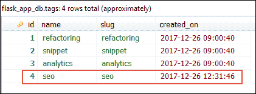

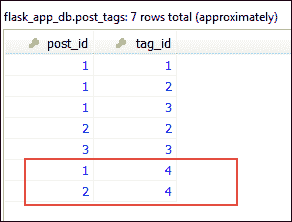

现在我们删除`seo`标记:

```py
>>>
>>> db.session.delete(tmp)
>>> db.session.commit()
>>>

```

此提交会删除上一步中添加的所有三行。但是，它不会删除标签关联的帖子。

默认情况下，如果删除父表中的对象(如`categories`)，则子表中其关联对象的外键(如`posts`)被设置为`NULL`。下面的清单通过创建一个新的类别对象和一个 post 对象，然后删除该类别对象来演示这种行为:

```py
>>>
>>> c4 = Category(name='css', slug='css')
>>> p4 = Post(title='Post 4', slug='post-4', content='Post 4', category=c4)
>>>
>>> db.session.add(c4)
>>>
>>> db.session.new
IdentitySet([<None:css>, <None:Post 4>])
>>>
>>> db.session.commit()
>>>

```

这个提交增加了两行。一个在`categories`表，一个在`posts`表。

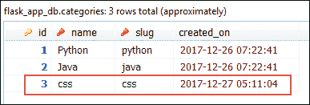

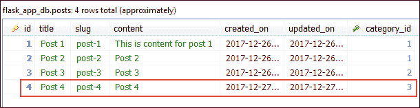

现在让我们看看当我们删除一个`Category`对象时会发生什么。

```py
>>>
>>> db.session.delete(c4)
>>> db.session.commit()
>>>

```

该提交从`categories`表中删除`css`类别，并将其关联帖子的外键(`category_id`)设置为`NULL`。


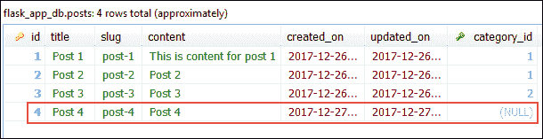

在某些情况下，一旦父记录被删除，您可能希望删除所有子记录。我们可以通过将`cascade='all,delete-orphan'`传递给`db.relationship()`指令来实现这一点。打开`main2.py`文件，修改`Category`模型中的`db.relationship()`指令如下(更改突出显示):

**Flask _app/main2.py**

```py
#...
class Category(db.Model):
    #...
    posts = db.relationship('Post', backref='category', cascade='all,delete-orphan')
#...

```

从现在开始，删除一个类别也会删除与之相关的所有帖子。重新启动 shell 以使更改生效，导入必要的对象，并创建一个新的类别和帖子，如下所示:

```py
(env) overiq@vm:~/flask_app$ python main2.py shell
>>>
>>> from main2 import db, Post, Tag, Category
>>>
>>> c5 = Category(name='css', slug='css')
>>> p5 = Post(title='Post 5', slug='post-5', content='Post 5', category=c5)
>>>
>>> db.session.add(c5)
>>> db.session.commit()
>>>

```

下面是数据库应该如何处理这个提交。

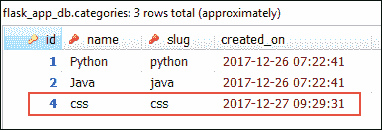

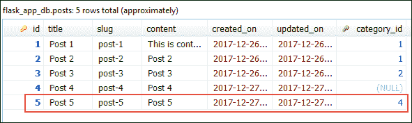

立即删除该类别。

```py
>>>
>>> db.session.delete(c5)
>>> db.session.commit()
>>>

```

提交后，数据库应该如下所示:

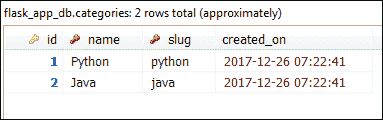

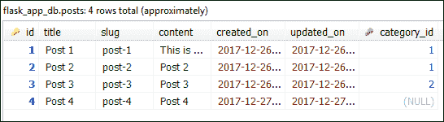

## 查询数据

要查询数据库，我们使用`session`对象的`query()`方法。`query()`方法返回一个`flask_sqlalchemy.BaseQuery`对象，它只是原`sqlalchemy.orm.query.Query`对象的扩展。`flask_sqlalchemy.BaseQuery`对象表示将用于查询数据库的`SELECT`语句。下表列出了`flask_sqlalchemy.BaseQuery`类的一些常用方法。

| 方法 | 描述 |
| --- | --- |
| `all()` | 以列表形式返回查询结果(用`flask_sqlalchemy.BaseQuery`表示)。 |
| `count()` | 返回查询中记录的总数。 |
| `first()` | 返回查询的第一个结果，如果结果中没有行，则返回`None`。 |
| `first_or_404()` | 如果结果中没有行，则返回查询的第一个结果或 HTTP 404 错误。 |
| `get(pk)` | 如果没有找到匹配给定主键(pk)或`None`的对象，则返回该对象。 |
| `get_or_404(pk)` | 如果没有找到与给定主键(pk)匹配的对象，则返回该对象。 |
| `filter(*criterion)` | 将`WHERE`子句应用于查询后，返回一个新的`flask_sqlalchemy.BaseQuery`实例。 |
| `limit(limit)` | 将`LIMIT`子句应用于查询后，返回一个新的`flask_sqlalchemy.BaseQuery`实例。 |
| `offset(offset)` | 将`OFFSET`子句应用于查询后，返回一个新的`flask_sqlalchemy.BaseQuery`实例。 |
| `order_by(*criterion)` | 在查询中应用`ORDER BY`子句后，返回一个新的`flask_sqlalchemy.BaseQuery`实例。 |
| `join()` | 在查询上创建 SQL JOIN 后，返回一个新的`flask_sqlalchemy.BaseQuery`实例。 |

### all()方法

最简单的形式是`query()`方法可以将一个或多个模型类或列作为参数。以下代码返回`posts`表中的所有记录。

```py
>>>
>>> db.session.query(Post).all()
[<1:Post 1>, <2:Post 2>, <3:Post 3>, <4:Post 4>]
>>>

```

同样，下面的代码返回来自`categories`和`tags`表的所有记录。

```py
>>>
>>> db.session.query(Category).all()
[<1:Python>, <2:Java>]
>>>
>>>
>>> db.session.query(Tag).all()
[<1:refactoring>, <2:snippet>, <3:analytics>]
>>>

```

要获取用于查询数据库的原始 SQL，只需按如下方式打印`flask_sqlalchemy.BaseQuery`对象:

```py
>>>
>>> print(db.session.query(Post))
SELECT
    posts.id AS posts_id,
    posts.title AS posts_title,
    posts.slug AS posts_slu g,
    posts.content AS posts_content,
    posts.created_on AS posts_created_on,
    posts.u pdated_on AS posts_updated_on,
    posts.category_id AS posts_category_id
FROM
    posts
>>>
>>>

```

在前面的示例中，数据从表的所有列中返回。我们可以通过将列名显式传递给`query()`方法来防止这种情况，如下所示:

```py
>>>
>>> db.session.query(Post.id, Post.title).all()
[(1, 'Post 1'), (2, 'Post 2'), (3, 'Post 3'), (4, 'Post 4')]
>>>

```

### count()方法

`count()`方法返回查询返回的结果数。

```py
>>>
>>> db.session.query(Post).count() # get the total number of records in the posts table
4
>>> db.session.query(Category).count()  # get the total number of records in the categories table
2
>>> db.session.query(Tag).count()  # get the total number of records in the tags table
3
>>>

```

### first()方法

`first()`方法只返回查询的第一个结果，如果查询返回零个结果，则返回`None`。

```py
>>>
>>> db.session.query(Post).first()
<1:Post 1>
>>>
>>> db.session.query(Category).first()
<1:Python>
>>>
>>> db.session.query(Tag).first()
<1:refactoring>
>>>

```

### get()方法

`get()`方法返回与传递给它的主键匹配的实例，如果没有找到这样的对象，则返回`None`。

```py
>>>
>>> db.session.query(Post).get(2)
<2:Post 2>
>>>
>>> db.session.query(Category).get(1)
<1:Python>
>>>
>>> print(db.session.query(Category).get(10))  # no result found for primary key 10
None
>>>

```

### get_or_404()方法

与`get()`方法相同，但是当没有找到对象时，它不会返回`None`，而是返回 HTTP 404 Error。

```py
>>>
>>> db.session.query(Post).get_or_404(1)
<1:Post 1>
>>>
>>>
>>> db.session.query(Post).get_or_404(100)
Traceback (most recent call last):
...
werkzeug.exceptions.NotFound: 404 Not Found: The requested URL was not found on
the server.  If you entered the URL manually please check your spelling and try
again.
>>>

```

### filter()方法

`filter()`方法允许我们通过在查询中添加`WHERE`子句来过滤结果。它至少接受一列、一个运算符和值。这里有一个例子:

```py
>>>
>>> db.session.query(Post).filter(Post.title == 'Post 1').all()
[<1:Post 1>]
>>>

```

该查询返回标题为`"Post 1"`的所有帖子。该查询的 SQL 等价物是:

```py
>>>
>>> print(db.session.query(Post).filter(Post.title == 'Post 1'))
SELECT
    posts.id AS posts_id,
    posts.title AS posts_title,
    posts.slug AS posts_slu g,
    posts.content AS posts_content,
    posts.created_on AS posts_created_on,
    posts.u pdated_on AS posts_updated_on,
    posts.category_id AS posts_category_id
FROM
    posts
WHERE
    posts.title = % (title_1) s
>>> 
>>>

```

`WHERE`子句中的字符串`% (title_1) s`是一个占位符，在执行查询时将被实际值替换。

我们可以将多个过滤器传递给`filter()`方法，它们将使用 SQL `AND`运算符连接在一起。例如:

```py
>>>
>>> db.session.query(Post).filter(Post.id >= 1, Post.id <= 2).all()
[<1:Post 1>, <2:Post 2>]
>>>
>>>

```

此查询返回主键大于或等于 1 但小于或等于 2 的所有帖子。它的 SQL 等价物是:

```py
>>>
>>> print(db.session.query(Post).filter(Post.id >= 1, Post.id <= 2))
SELECT
    posts.id AS posts_id,
    posts.title AS posts_title,
    posts.slug AS posts_slu g,
    posts.content AS posts_content,
    posts.created_on AS posts_created_on,
    posts.u pdated_on AS posts_updated_on,
    posts.category_id AS posts_category_id
FROM
    posts
WHERE
    posts.id >= % (id_1) s
AND posts.id <= % (id_2) s
>>>

```

### first_or_404()方法

与`first()`方法相同，但是当查询没有返回结果时，它不会返回`None`，而是返回 HTTP 404 Error。

```py
>>>
>>> db.session.query(Post).filter(Post.id > 1).first_or_404()
<2:Post 2>
>>>
>>> db.session.query(Post).filter(Post.id > 10).first_or_404().all()
Traceback (most recent call last):
...
werkzeug.exceptions.NotFound: 404 Not Found: The requested URL was not found on
the server.  If you entered the URL manually please check your spelling and try
again.
>>>

```

### 极限()方法

`limit()`方法将`LIMIT`子句添加到查询中。它接受您希望从查询中返回的行数。

```py
>>>
>>> db.session.query(Post).limit(2).all()
[<1:Post 1>, <2:Post 2>]
>>>
>>> db.session.query(Post).filter(Post.id >= 2).limit(1).all()
[<2:Post 2>]
>>>

```

上述查询的 SQL 等价物如下:

```py
>>>
>>> print(db.session.query(Post).limit(2))
SELECT
    posts.id AS posts_id,
    posts.title AS posts_title,
    posts.slug AS posts_slu g,
    posts.content AS posts_content,
    posts.created_on AS posts_created_on,
    posts.u pdated_on AS posts_updated_on,
    posts.category_id AS posts_category_id
FROM
    posts
LIMIT % (param_1) s
>>>
>>>
>>> print(db.session.query(Post).filter(Post.id >= 2).limit(1))
SELECT
    posts.id AS posts_id,
    posts.title AS posts_title,
    posts.slug AS posts_slu g,
    posts.content AS posts_content,
    posts.created_on AS posts_created_on,
    posts.u pdated_on AS posts_updated_on,
    posts.category_id AS posts_category_id
FROM
    posts
WHERE
    posts.id >= % (id_1) s
LIMIT % (param_1) s
>>>
>>>

```

### offset()方法

`offset()`方法将`OFFSET`子句添加到查询中。它接受偏移量作为参数。它常用于`limit()`从句。

```py
>>>
>>> db.session.query(Post).filter(Post.id > 1).limit(3).offset(1).all()
[<3:Post 3>, <4:Post 4>]
>>>

```

上述查询的等效 SQL 如下:

```py
>>>
>>> print(db.session.query(Post).filter(Post.id > 1).limit(3).offset(1))
SELECT
    posts.id AS posts_id,
    posts.title AS posts_title,
    posts.slug AS posts_slu g,
    posts.content AS posts_content,
    posts.created_on AS posts_created_on,
    posts.u pdated_on AS posts_updated_on,
    posts.category_id AS posts_category_id
FROM
    posts
WHERE
    posts.id > % (id_1) s
LIMIT % (param_1) s, % (param_2) s
>>>

```

字符串`% (param_1) s`和`% (param_2) s`分别是偏移和限制的占位符。

### order_by()方法

通过在查询中添加`ORDER BY`子句，使用`order_by()`方法对结果进行排序。它接受订单应该基于的列名。默认情况下，它按升序排序。

```py
>>>
>>> db.session.query(Tag).all()
[<1:refactoring>, <2:snippet>, <3:analytics>]
>>>
>>> db.session.query(Tag).order_by(Tag.name).all()
[<3:analytics>, <1:refactoring>, <2:snippet>]
>>>

```

要按降序排序，使用`db.desc()`功能，如下所示:

```py
>>>
>>> db.session.query(Tag).order_by(db.desc(Tag.name)).all()
[<2:snippet>, <1:refactoring>, <3:analytics>]
>>>

```

### join()方法

`join()`方法用于创建 SQL JOIN。它接受要为其创建 SQL JOIN 的表名。

```py
>>>
>>> db.session.query(Post).join(Category).all()
[<1:Post 1>, <2:Post 2>, <3:Post 3>]
>>>

```

该查询相当于以下 SQL:

```py
>>>
>>> print(db.session.query(Post).join(Category))
SELECT
    posts.id AS posts_id,
    posts.title AS posts_title,
    posts.slug AS posts_slu g,
    posts.content AS posts_content,
    posts.created_on AS posts_created_on,
    posts.u pdated_on AS posts_updated_on,
    posts.category_id AS posts_category_id
FROM
    posts
INNER JOIN categories ON categories.id = posts.category_id

```

`join()`方法通常用于在单个查询中从一个或多个表中获取数据。例如:

```py
>>>
>>> db.session.query(Post.title, Category.name).join(Category).all()
[('Post 1', 'Python'), ('Post 2', 'Python'), ('Post 3', 'Java')]
>>>

```

我们可以通过如下链接`join()`方法为两个以上的表创建 SQL JOIN:

```py
db.session.query(Table1).join(Table2).join(Table3).join(Table4).all()

```

让我们通过填写联系表来结束本课。

回想一下，在第[课“Flask 中的表单处理”](/flask-101/form-handling-in-flask/)中，我们创建了一个联系表单来接收用户的反馈。从目前的情况来看，`contact()`视图功能并没有将提交的反馈保存到数据库中。它只将反馈打印到控制台。为了将反馈保存到数据库，我们必须首先创建一个新表。打开`main2.py`并在`Tag`模型的正下方添加`Feedback`模型，如下所示:

**Flask _app/main2.py**

```py
#...
class Feedback(db.Model):
    __tablename__ = 'feedbacks'
    id = db.Column(db.Integer(), primary_key=True)
    name = db.Column(db.String(1000), nullable=False)
    email = db.Column(db.String(100), nullable=False)
    message = db.Column(db.Text(), nullable=False)
    created_on = db.Column(db.DateTime(), default=datetime.utcnow)

    def __repr__(self):
        return "<{}:{}>".format(self.id, self.name)
#...

```

重启 Python shell，调用`db`对象的`create_all()`方法，创建`feedbacks`表。

```py
(env) overiq@vm:~/flask_app$ python main2.py shell
>>>
>>> from main2 import db
>>>
>>> db.create_all()
>>>

```

接下来，修改`contact()`视图功能如下(更改突出显示):

**Flask _app/main2.py**

```py
#...
@app.route('/contact/', methods=['get', 'post'])
def contact():
    form = ContactForm()
    if form.validate_on_submit():
        name = form.name.data
        email = form.email.data
        message = form.message.data
        print(name)
        print(Post)
        print(email)
        print(message)

        # db logic goes here
        feedback = Feedback(name=name, email=email, message=message)
        db.session.add(feedback)
        db.session.commit()

        print("\nData received. Now redirecting ...")
        flash("Message Received", "success")
        return redirect(url_for('contact'))

    return render_template('contact.html', form=form)
#...

```

启动服务器，访问[http://127 . 0 . 0 . 1:5000/联系/](http://127.0.0.1:5000/contact/) ，填写表格，提交反馈。

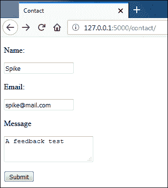

HeidiSQL 中提交的反馈应该如下所示:

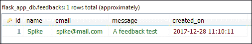

* * *

* * *