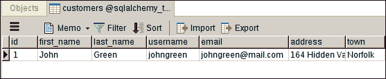
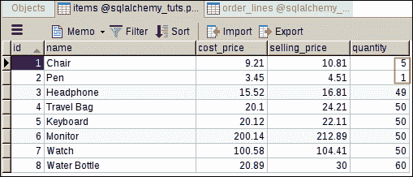
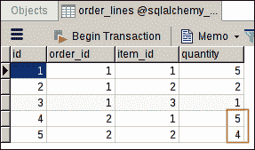

# 使用 SQLAlchemy 核心的 CRUD

> 原文：<https://overiq.com/sqlalchemy-101/crud-using-sqlalchemy-core/>

最后更新于 2020 年 7 月 27 日

* * *

## SQL 表达式语言

SQL 表达式语言是一种使用 Python 编写 SQL 语句的后端中立方式。

## 插入记录

有几种方法可以将记录插入数据库。最基本的方法是使用`Table`实例的`insert()`方法，并将列的值作为关键字参数传递给`values()`方法。

```py
ins = customers.insert().values(
    first_name = 'John',
    last_name = 'Green',
    username = 'johngreen',
    email = 'johngreen@mail.com',
    address = '164 Hidden Valley Road',
    town = 'Norfolk'
)

```

要查看该代码将生成的 SQL，请键入以下内容:

```py
str(ins)

```

**预期输出:**

```py
'INSERT INTO customers (first_name, last_name, username, email, created_on, updated_on) 
VALUES (:first_name, :last_name, :username, :email, :created_on, :updated_on)'

```

请注意，`VALUES`子句包含绑定参数(即形式为`:name`的参数)，而不是传递给`values()`方法的值。

当对数据库运行查询时，方言将用实际值替换绑定参数。方言也将逃避价值观，以减轻 SQL 注入的风险。

我们可以通过编译 insert 语句来查看将替换绑定参数的值。

```py
ins.compile().params

```

**预期输出:**

```py
{'address': '164 Hidden Valley Road',
 'created_on': None,
 'email': 'johngreen@mail.com',
 'first_name': 'John',
 'last_name': 'Green',
 'town': 'Norfolk',
 'updated_on': None,
 'username': 'johngreen'}

```

我们已经创建了 insert 语句，但是还没有将其发送到数据库。为此，调用`Connection`对象的`execute()`方法。

```py
conn = engine.connect()
conn
r = conn.execute(ins)
r

```

**预期输出:**

```py
<sqlalchemy.engine.base.Connection object at 0x7fa82a7d53c8>
<sqlalchemy.engine.result.ResultProxy object at 0x7fa828096da0>

```

上述代码在`customers`表中插入了以下记录。



`execute()`方法返回类型为`ResultProxy`的对象。`ResultProxy`提供了几个属性，其中一个叫做`inserted_primary_key`，它返回刚刚插入的记录的主键。

```py
r.inserted_primary_key
type(r.inserted_primary_key)

```

**预期输出:**

```py
[1]
list

```

创建 insert 语句的另一种方法是从`sqlalchemy`包中使用独立的`insert()`函数。

```py
from sqlalchemy import insert

ins = insert(customers).values(
    first_name = 'Katherine',
    last_name = 'Wilson',
    username = 'katwilson',
    email = 'katwilson@gmail.com',
    address = '4685 West Side Avenue',
    town = 'Peterbrugh'
)

r = conn.execute(ins)
r.inserted_primary_key

```

**预期输出:**

```py
[2]

```

## 多重插入

我们也可以将值传递给`execute()`方法，而不是将值作为关键字参数传递给`values()`方法。

```py
ins = insert(customers)

r = conn.execute(ins, 
    first_name = "Tim", 
    last_name = "Snyder", 
    username = "timsnyder", 
    email = "timsnyder@mail.com",
    address = '1611 Sundown Lane',
    town = 'Langdale'
)
r.inserted_primary_key

```

**预期输出:**

```py
[4]

```

`execute()`方法非常灵活，因为它允许我们通过传递一个字典列表来插入多行，每个字典代表一个要插入的行。

```py
r = conn.execute(ins, [
        {
            "first_name": "John", 
            "last_name": "Lara", 
            "username": "johnlara", 
            "email":"johnlara@mail.com", 
            "address": "3073 Derek Drive",
            "town": "Norfolk"
        },
        {
            "first_name": "Sarah", 
            "last_name": "Tomlin", 
            "username": "sarahtomlin", 
            "email":"sarahtomlin@mail.com",
            "address": "3572 Poplar Avenue",
            "town": "Norfolk"
        },
        {
            "first_name": "Pablo", 
            "last_name": "Gibson", 
            "username": "pablogibson", 
            "email":"pablogibson@mail.com",
            "address": "3494 Murry Street",
            "town": "Peterbrugh"
        },
        {
            "first_name": "Pablo", 
            "last_name": "Lewis", 
            "username": "pablolewis", 
            "email":"pablolewis@mail.com",
            "address": "3282 Jerry Toth Drive",
            "town": "Peterbrugh"
        },
    ])

r.rowcount

```

**预期输出:**

```py
4

```

在进入下一部分之前，让我们在`items`、`orders`和`order_lines`表中添加一些记录。

```py
items_list = [
    {
        "name":"Chair",
        "cost_price": 9.21,
        "selling_price": 10.81,
        "quantity": 5
    },
    {
        "name":"Pen",
        "cost_price": 3.45,
        "selling_price": 4.51,
        "quantity": 3
    },
    {
        "name":"Headphone",
        "cost_price": 15.52,
        "selling_price": 16.81,
        "quantity": 50
    },
    {
        "name":"Travel Bag",
        "cost_price": 20.1,
        "selling_price": 24.21,
        "quantity": 50
    },
    {
        "name":"Keyboard",
        "cost_price": 20.12,
        "selling_price": 22.11,
        "quantity": 50
    },
    {
        "name":"Monitor",
        "cost_price": 200.14,
        "selling_price": 212.89,
        "quantity": 50
    },
    {
        "name":"Watch",
        "cost_price": 100.58,
        "selling_price": 104.41,
        "quantity": 50
    },
    {
        "name":"Water Bottle",
        "cost_price": 20.89,
        "selling_price": 25.00,
        "quantity": 50
    },
]

order_list = [
    {
        "customer_id": 1
    },
    {
        "customer_id": 1
    }
]

order_line_list = [
    {
        "order_id": 1,
        "item_id": 1,
        "quantity": 5
    }, 
    {
        "order_id": 1,
        "item_id": 2,
        "quantity": 2
    }, 
    {
        "order_id": 1,
        "item_id": 3,
        "quantity": 1
    },
    {
        "order_id": 2,
        "item_id": 1,
        "quantity": 5
    },
    {
        "order_id": 2,
        "item_id": 2,
        "quantity": 5
    },
]

r = conn.execute(insert(items), items_list)
r.rowcount
r = conn.execute(insert(orders), order_list)
r.rowcount
r = conn.execute(insert(order_lines), order_line_list)
r.rowcount

```

**预期输出:**

```py
8
2
5

```

## 选择记录

要选择记录，我们使用`Table`对象的`select()`方法。

```py
s = customers.select()
str(s)

```

**预期输出:**

```py
'SELECT customers.id, customers.first_name, customers.last_name, customers.username, customers.email, customers.address, customers.town, customers.created_on, customers.updated_on \nFROM customers'

```

如您所见，该查询无论如何都是不合格的，因此，它将返回`customers`表中的所有行。

创建`SELECT`查询的另一种方法是使用独立的`select()`功能。它接受从中检索数据的表或列的列表。

```py
from sqlalchemy import select
s = select([customers])
str(s)

```

**预期输出:**

```py
'SELECT customers.id, customers.first_name, customers.last_name, customers.username, customers.email, customers.address, customers.town, customers.created_on, customers.updated_on \nFROM customers'

```

像往常一样，要将查询发送到数据库，我们使用`execute()`方法:

```py
r = conn.execute(s)
r.fetchall()

```

**预期输出:**

```py
[(1, 'John', 'Green', 'johngreen', 'johngreen@mail.com', '164 Hidden Valley Road', 'Norfolk', datetime.datetime(2018, 7, 8, 19, 6, 13, 844404), datetime.datetime(2018, 7, 8, 19, 6, 13, 844444)),
 (2, 'Katherine', 'Wilson', 'katwilson', 'katwilson@gmail.com', '4685 West Side Avenue', 'Peterbrugh', datetime.datetime(2018, 7, 8, 20, 37, 57, 407023), datetime.datetime(2018, 7, 8, 20, 37, 57, 407053)),
 (17, 'Tim', 'Snyder', 'timsnyder', 'timsnyder@mail.com', '1611 Sundown Lane', 'Langdale', datetime.datetime(2018, 7, 8, 22, 19, 55, 721864), datetime.datetime(2018, 7, 8, 22, 19, 55, 721895)),
 (18, 'John', 'Lara', 'johnlara', 'johnlara@mail.com', '3073 Derek Drive', 'Norfolk', datetime.datetime(2018, 7, 8, 22, 20, 11, 559344), datetime.datetime(2018, 7, 8, 22, 20, 11, 559380)),
 (19, 'Sarah', 'Tomlin', 'sarahtomlin', 'sarahtomlin@mail.com', '3572 Poplar Avenue', 'Norfolk', datetime.datetime(2018, 7, 8, 22, 20, 11, 559397), datetime.datetime(2018, 7, 8, 22, 20, 11, 559411)),
 (20, 'Pablo', 'Gibson', 'pablogibson', 'pablogibson@mail.com', '3494 Murry Street', 'Peterbrugh', datetime.datetime(2018, 7, 8, 22, 20, 11, 559424), datetime.datetime(2018, 7, 8, 22, 20, 11, 559437)),
 (21, 'Pablo', 'Lewis', 'pablolewis', 'pablolewis@mail.com', '3282 Jerry Toth Drive', 'Peterbrugh', datetime.datetime(2018, 7, 8, 22, 20, 11, 559450), datetime.datetime(2018, 7, 8, 22, 20, 11, 559464))]

```

`ResultProxy`对象的`fetchall()`方法返回查询匹配的所有记录。一旦结果集用尽，对`fetchall()`的后续调用将返回一个空列表。

```py
r.fetchall()

```

**预期输出:**

```py
[]
>>>

```

`fetchall()`方法一次将所有结果加载到内存中。因此，它在大复位集上不是很有效。或者，您可以使用 for 循环一次迭代一个结果集。

```py
rs = conn.execute(s)
for row in rs:
    print(row)

```

**预期输出:**

```py
(1, 'John', 'Green', 'johngreen', 'johngreen@mail.com', '164 Hidden Valley Road', 'Norfolk', datetime.datetime(2018, 7, 8, 19, 6, 13, 844404), datetime.datetime(2018, 7, 8, 19, 6, 13, 844444))
(2, 'Katherine', 'Wilson', 'katwilson', 'katwilson@gmail.com', '4685 West Side Avenue', 'Peterbrugh', datetime.datetime(2018, 7, 8, 20, 37, 57, 407023), datetime.datetime(2018, 7, 8, 20, 37, 57, 407053))
(17, 'Tim', 'Snyder', 'timsnyder', 'timsnyder@mail.com', '1611 Sundown Lane', 'Langdale', datetime.datetime(2018, 7, 8, 22, 19, 55, 721864), datetime.datetime(2018, 7, 8, 22, 19, 55, 721895))
(18, 'John', 'Lara', 'johnlara', 'johnlara@mail.com', '3073 Derek Drive', 'Norfolk', datetime.datetime(2018, 7, 8, 22, 20, 11, 559344), datetime.datetime(2018, 7, 8, 22, 20, 11, 559380))
(19, 'Sarah', 'Tomlin', 'sarahtomlin', 'sarahtomlin@mail.com', '3572 Poplar Avenue', 'Norfolk', datetime.datetime(2018, 7, 8, 22, 20, 11, 559397), datetime.datetime(2018, 7, 8, 22, 20, 11, 559411))
(20, 'Pablo', 'Gibson', 'pablogibson', 'pablogibson@mail.com', '3494 Murry Street', 'Peterbrugh', datetime.datetime(2018, 7, 8, 22, 20, 11, 559424), datetime.datetime(2018, 7, 8, 22, 20, 11, 559437))
(21, 'Pablo', 'Lewis', 'pablolewis', 'pablolewis@mail.com', '3282 Jerry Toth Drive', 'Peterbrugh', datetime.datetime(2018, 7, 8, 22, 20, 11, 559450), datetime.datetime(2018, 7, 8, 22, 20, 11, 559464))

```

这里列出了`ResultProxy`对象的一些常用方法和属性。

| 方法/属性 | 描述 |
| --- | --- |
| `fetchone()` | 从结果集中获取下一行。如果结果集已经用尽，对`fetchone()`的后续调用将返回`None`。 |
| `fetchmany(size=None)` | 从结果集中获取指定数量的行。如果结果集已经用尽，对`fetchmany()`的后续调用将返回`None`。 |
| `fetchall()` | 从结果集中获取所有行。如果结果集已经用尽，对`fetchall()`的后续调用将返回`None`。 |
| `first()` | 从结果集中获取第一行并关闭连接。这意味着在调用`first()`方法后，我们不能访问结果集中的任何其他行，直到我们再次将查询发送到数据库(使用`execute()`方法)。 |
| `rowcount` | 返回结果集中的行数。 |
| `keys()` | 返回从中检索数据的列列表。 |
| `scalar()` | 从第一行获取第一列并关闭连接。如果结果集为空，则返回`None`。 |

下面的 shell 会话演示了我们刚才讨论的方法和属性。

```py
s = select([customers])

```

### fetchone()

```py
r = conn.execute(s)
r.fetchone()
r.fetchone()

```

**预期输出:**

```py
(1, 'John', 'Green', 'johngreen', 'johngreen@mail.com', '164 Hidden Valley Road', 'Norfolk', datetime.datetime(2018, 7, 8, 19, 6, 13, 844404), datetime.datetime(2018, 7, 8, 19, 6, 13, 844444))

(2, 'Katherine', 'Wilson', 'katwilson', 'katwilson@gmail.com', '4685 West Side Avenue', 'Peterbrugh', datetime.datetime(2018, 7, 8, 20, 37, 57, 407023), datetime.datetime(2018, 7, 8, 20, 37, 57, 407053))

```

### fetchmany()

```py
r = conn.execute(s)
r.fetchmany(3)
r.fetchmany(5)

```

**预期输出:**

```py
[(1, 'John', 'Green', 'johngreen', 'johngreen@mail.com', '164 Hidden Valley Road', 'Norfolk', datetime.datetime(2018, 7, 8, 19, 6, 13, 844404), datetime.datetime(2018, 7, 8, 19, 6, 13, 844444)),
 (2, 'Katherine', 'Wilson', 'katwilson', 'katwilson@gmail.com', '4685 West Side Avenue', 'Peterbrugh', datetime.datetime(2018, 7, 8, 20, 37, 57, 407023), datetime.datetime(2018, 7, 8, 20, 37, 57, 407053)),
 (17, 'Tim', 'Snyder', 'timsnyder', 'timsnyder@mail.com', '1611 Sundown Lane', 'Langdale', datetime.datetime(2018, 7, 8, 22, 19, 55, 721864), datetime.datetime(2018, 7, 8, 22, 19, 55, 721895))]

[(18, 'John', 'Lara', 'johnlara', 'johnlara@mail.com', '3073 Derek Drive', 'Norfolk', datetime.datetime(2018, 7, 8, 22, 20, 11, 559344), datetime.datetime(2018, 7, 8, 22, 20, 11, 559380)),
 (19, 'Sarah', 'Tomlin', 'sarahtomlin', 'sarahtomlin@mail.com', '3572 Poplar Avenue', 'Norfolk', datetime.datetime(2018, 7, 8, 22, 20, 11, 559397), datetime.datetime(2018, 7, 8, 22, 20, 11, 559411)),
 (20, 'Pablo', 'Gibson', 'pablogibson', 'pablogibson@mail.com', '3494 Murry Street', 'Peterbrugh', datetime.datetime(2018, 7, 8, 22, 20, 11, 559424), datetime.datetime(2018, 7, 8, 22, 20, 11, 559437)),
 (21, 'Pablo', 'Lewis', 'pablolewis', 'pablolewis@mail.com', '3282 Jerry Toth Drive', 'Peterbrugh', datetime.datetime(2018, 7, 8, 22, 20, 11, 559450), datetime.datetime(2018, 7, 8, 22, 20, 11, 559464))]

```

### 第一次()

```py
r = conn.execute(s)
r.first()
r.first() # this will result in an error

```

**预期输出:**

```py
(4, 'Jon', 'Green', 'jongreen', 'jongreen@gmail.com', datetime.datetime(2018, 6, 22, 10, 3), datetime.datetime(2018, 6, 22, 10, 3))
...
ResourceClosedError: This result object is closed.

```

### 行数

```py
r = conn.execute(s)
r.rowcount

```

**预期输出:**

```py
7

```

### 按键()

```py
r.keys()

```

**预期输出:**

```py
['id',
 'first_name',
 'last_name',
 'username',
 'email',
 'address',
 'town',
 'created_on',
 'updated_on']
>>>

```

### 标量()

```py
r.scalar()

```

**预期输出:**

```py
4

```

需要注意的是，通过方法`fetchxxx()`和`first()`返回的行不是元组或字典，而是类型为`RowProxy`的对象，它允许我们使用列名、索引位置或`Column`实例来访问行中的数据。例如:

```py
r = conn.execute(s)
row = r.fetchone()
row
type(row)
row['id'], row['first_name']    # access column data via column name
row[0], row[1]    # access column data via column index position
row[customers.c.id], row[customers.c.first_name]    # access column data via Column object
row.id, row.first_name    # access column data via attribute

```

**预期输出:**

```py
(1, 'John', 'Green', 'johngreen', 'johngreen@mail.com', '164 Hidden Valley Road', 'Norfolk', datetime.datetime(2018, 7, 8, 19, 6, 13, 844404), datetime.datetime(2018, 7, 8, 19, 6, 13, 844444))

sqlalchemy.engine.result.RowProxy

(1, 'John')

(1, 'John')

(1, 'John')

(1, 'John')

```

要从多个表中访问数据，只需将逗号分隔的`Table`实例列表传递给`select()`函数。

```py
select([tableOne, tableTwo])

```

这段代码将返回两个表中的行的笛卡尔乘积。我们将在本章后面学习如何创建一个 SQL JOIN。

## 过滤记录

为了过滤记录，我们使用`where()`方法。它接受了一个条件，并在`SELECT`声明中增加了一个`WHERE`条款。

```py
s = select([items]).where(
    items.c.cost_price > 20
)

str(s)
r = conn.execute(s)
r.fetchall()

```

此查询将返回成本价大于 20 的所有项目。

**预期输出:**

```py
'SELECT items.id, items.name, items.cost_price, items.selling_price, items.quantity \nFROM items \nWHERE items.cost_price > :cost_price_1'

[(4, 'Travel Bag', Decimal('20.10'), Decimal('24.21'), 50),
 (5, 'Keyboard', Decimal('20.12'), Decimal('22.11'), 50),
 (6, 'Monitor', Decimal('200.14'), Decimal('212.89'), 50),
 (7, 'Watch', Decimal('100.58'), Decimal('104.41'), 50),
 (8, 'Water Bottle', Decimal('20.89'), Decimal('25.00'), 50)]

```

我们可以通过简单链接`where()`方法来指定附加条件。

```py
s = select([items]).\
where(items.c.cost_price + items.c.selling_price > 50).\
where(items.c.quantity > 10)
print(s)

```

**预期输出:**

```py
SELECT items.id, items.name, items.cost_price, items.selling_price, items.quantity 
FROM items 
WHERE items.cost_price + items.selling_price > :param_1 AND items.quantity > :quantity_1

```

如你所见，当我们使用`where()`方法时，这些条件被叠加在一起。

那么我们如何在我们的`SELECT`声明中指定`OR`或`NOT`条件呢？

事实证明，除了链接`where()`方法，还有两种方法可以组合条件:

1.  按位运算符。
2.  连词。

让我们从第一个开始。

### 按位运算符

按位运算符`&`、`|`和`~`允许我们分别用 SQL `AND`、`OR`和`NOT`运算符连接条件。

前面的查询可以使用按位运算符进行编码，如下所示:

```py
s = select([items]).\
where(
    (items.c.cost_price + items.c.selling_price > 50) & 
    (items.c.quantity > 10)
)

```

请注意，条件是用括号包装的，这是因为按位运算符的优先级大于`+`和`>`运算符。

下面是更多的例子:

**例:1**

```py
s = select([items]).\
where(
    (items.c.cost_price > 200 ) | 
    (items.c.quantity < 5)
) 
print(s)
conn.execute(s).fetchall()

```

**预期输出:**

```py
SELECT items.id, items.name, items.cost_price, items.selling_price, items.quantity 
FROM items 
WHERE items.cost_price > :cost_price_1 OR items.quantity < :quantity_1

[(2, 'Pen', Decimal('3.45'), Decimal('4.51'), 3),
 (6, 'Monitor', Decimal('200.14'), Decimal('212.89'), 50)]

```

**例:2**

```py
s = select([items]).\
where(    
    ~(items.c.quantity == 50)
) 
print(s)
conn.execute(s).fetchall()

```

**预期输出:**

```py
SELECT items.id, items.name, items.cost_price, items.selling_price, items.quantity 
FROM items 
WHERE items.quantity != :quantity_1

[(1, 'Chair', Decimal('9.21'), Decimal('10.81'), 5),
 (2, 'Pen', Decimal('3.45'), Decimal('4.51'), 3)]

```

**例:3**

```py
s = select([items]).\
where(
    ~(items.c.quantity == 50) &
    (items.c.cost_price < 20)
)
print(s)
conn.execute(s).fetchall()

```

**预期输出:**

```py
SELECT items.id, items.name, items.cost_price, items.selling_price, items.quantity 
FROM items 
WHERE items.quantity != :quantity_1 AND items.cost_price < :cost_price_1

[(1, 'Chair', Decimal('9.21'), Decimal('10.81'), 5),
 (2, 'Pen', Decimal('3.45'), Decimal('4.51'), 3)]

```

### 连词

连接条件的另一种方式是使用连接功能，即`and_()`、`or_()`和`not_()`。这是在 SQLAlchemy 中定义条件的首选方式。

以下是一些例子:

**例 1:**

```py
s = select([items]).\
where(    
    and_(
        items.c.quantity >= 50,
        items.c.cost_price < 100,
    )
) 
print(s)
conn.execute(s).fetchall()

```

**预期输出:**

```py
SELECT items.id, items.name, items.cost_price, items.selling_price, items.quantity 
FROM items 
WHERE items.quantity >= :quantity_1 AND items.cost_price < :cost_price_1

[(3, 'Headphone', Decimal('15.52'), Decimal('16.81'), 50),
 (4, 'Travel Bag', Decimal('20.10'), Decimal('24.21'), 50),
 (5, 'Keyboard', Decimal('20.12'), Decimal('22.11'), 50),
 (8, 'Water Bottle', Decimal('20.89'), Decimal('25.00'), 50)]

```

**例 2:**

```py
s = select([items]).\
where(    
    or_(
        items.c.quantity >= 50,
        items.c.cost_price < 100,
    )
) 
print(s)
conn.execute(s).fetchall()

```

**预期输出:**

```py
SELECT items.id, items.name, items.cost_price, items.selling_price, items.quantity 
FROM items 
WHERE items.quantity >= :quantity_1 OR items.cost_price < :cost_price_1

[(1, 'Chair', Decimal('9.21'), Decimal('10.81'), 5),
 (2, 'Pen', Decimal('3.45'), Decimal('4.51'), 3),
 (3, 'Headphone', Decimal('15.52'), Decimal('16.81'), 50),
 (4, 'Travel Bag', Decimal('20.10'), Decimal('24.21'), 50),
 (5, 'Keyboard', Decimal('20.12'), Decimal('22.11'), 50),
 (6, 'Monitor', Decimal('200.14'), Decimal('212.89'), 50),
 (7, 'Watch', Decimal('100.58'), Decimal('104.41'), 50),
 (8, 'Water Bottle', Decimal('20.89'), Decimal('25.00'), 50)]

```

**例 3:**

```py
s = select([items]).\
where(    
    and_(
        items.c.quantity >= 50,
        items.c.cost_price < 100,
        not_(
            items.c.name == 'Headphone'            
        ),        
    )
)
print(s)
conn.execute(s).fetchall()

```

**预期输出:**

```py
SELECT items.id, items.name, items.cost_price, items.selling_price, items.quantity 
FROM items 
WHERE items.quantity >= :quantity_1 AND items.cost_price < :cost_price_1 AND items.name != :name_1

[(4, 'Travel Bag', Decimal('20.10'), Decimal('24.21'), 50),
 (5, 'Keyboard', Decimal('20.12'), Decimal('22.11'), 50),
 (8, 'Water Bottle', Decimal('20.89'), Decimal('25.00'), 50)]

```

## 其他常见的比较运算符

下面的清单演示了如何在 SQLAlchemy 中定义条件时使用其他一些比较运算符。

### 为空

```py
s = select([orders]).where(
    orders.c.date_shipped == None
)
print(s)
conn.execute(s).fetchall()

```

**预期输出:**

```py
SELECT orders.id, orders.customer_id, orders.date_placed, orders.date_shipped 
FROM orders 
WHERE orders.date_shipped IS NULL

[(1, 1, datetime.datetime(2018, 7, 8, 22, 36, 20, 175526), None),
 (2, 1, datetime.datetime(2018, 7, 8, 22, 36, 20, 175549), None)]

```

### 不为空

```py
s = select([orders]).where(
    orders.c.date_shipped != None
)
print(s)
conn.execute(s).fetchall()

```

**预期输出:**

```py
SELECT orders.id, orders.customer_id, orders.date_placed, orders.date_shipped 
FROM orders 
WHERE orders.date_shipped IS NOT NULL

[]

```

### 在…里

```py
s = select([customers]).where(
    customers.c.first_name.in_(["Sarah", "John"])
)
print(s)
conn.execute(s).fetchall()

```

**预期输出:**

```py
SELECT customers.id, customers.first_name, customers.last_name, customers.username, customers.email, customers.address, customers.town, customers.created_on, customers.updated_on 
FROM customers 
WHERE customers.first_name IN (:first_name_1, :first_name_2)

[(1, 'John', 'Green', 'johngreen', 'johngreen@mail.com', '164 Hidden Valley Road', 'Norfolk', datetime.datetime(2018, 7, 8, 19, 6, 13, 844404), datetime.datetime(2018, 7, 8, 19, 6, 13, 844444)),
 (18, 'John', 'Lara', 'johnlara', 'johnlara@mail.com', '3073 Derek Drive', 'Norfolk', datetime.datetime(2018, 7, 8, 22, 20, 11, 559344), datetime.datetime(2018, 7, 8, 22, 20, 11, 559380)),
 (19, 'Sarah', 'Tomlin', 'sarahtomlin', 'sarahtomlin@mail.com', '3572 Poplar Avenue', 'Norfolk', datetime.datetime(2018, 7, 8, 22, 20, 11, 559397), datetime.datetime(2018, 7, 8, 22, 20, 11, 559411))

```

### 不在

```py
s = select([customers]).where(
    customers.c.first_name.notin_(["Sarah", "John"])
)
print(s)
conn.execute(s).fetchall()

```

**预期输出:**

```py
SELECT customers.id, customers.first_name, customers.last_name, customers.username, customers.email, customers.address, customers.town, customers.created_on, customers.updated_on 
FROM customers 
WHERE customers.first_name NOT IN (:first_name_1, :first_name_2)

[(2, 'Katherine', 'Wilson', 'katwilson', 'katwilson@gmail.com', '4685 West Side Avenue', 'Peterbrugh', datetime.datetime(2018, 7, 8, 20, 37, 57, 407023), datetime.datetime(2018, 7, 8, 20, 37, 57, 407053)),
 (17, 'Tim', 'Snyder', 'timsnyder', 'timsnyder@mail.com', '1611 Sundown Lane', 'Langdale', datetime.datetime(2018, 7, 8, 22, 19, 55, 721864), datetime.datetime(2018, 7, 8, 22, 19, 55, 721895)),
 (20, 'Pablo', 'Gibson', 'pablogibson', 'pablogibson@mail.com', '3494 Murry Street', 'Peterbrugh', datetime.datetime(2018, 7, 8, 22, 20, 11, 559424), datetime.datetime(2018, 7, 8, 22, 20, 11, 559437)),

```

### 在...之间

```py
s = select([items]).where(
    items.c.cost_price.between(10, 20)
)
print(s)
conn.execute(s).fetchall()

```

**预期输出:**

```py
SELECT items.id, items.name, items.cost_price, items.selling_price, items.quantity 
FROM items 
WHERE items.cost_price BETWEEN :cost_price_1 AND :cost_price_2

[(3, 'Headphone', Decimal('15.52'), Decimal('16.81'), 50)]

```

### 不在中间

```py
s = select([items]).where(
    not_(items.c.cost_price.between(10, 20))
)
print(s)
conn.execute(s).fetchall()

```

**预期输出:**

```py
SELECT items.id, items.name, items.cost_price, items.selling_price, items.quantity 
FROM items 
WHERE items.cost_price NOT BETWEEN :cost_price_1 AND :cost_price_2

[(1, 'Chair', Decimal('9.21'), Decimal('10.81'), 5),
 (2, 'Pen', Decimal('3.45'), Decimal('4.51'), 3),
 (4, 'Travel Bag', Decimal('20.10'), Decimal('24.21'), 50),
 (5, 'Keyboard', Decimal('20.12'), Decimal('22.11'), 50),
 (6, 'Monitor', Decimal('200.14'), Decimal('212.89'), 50),
 (7, 'Watch', Decimal('100.58'), Decimal('104.41'), 50),
 (8, 'Water Bottle', Decimal('20.89'), Decimal('25.00'), 50)]

```

### 喜欢

```py
s = select([items]).where(
    items.c.name.like("Wa%")
)
print(s)
conn.execute(s).fetchall()

```

**预期输出:**

```py
SELECT items.id, items.name, items.cost_price, items.selling_price, items.quantity 
FROM items 
WHERE items.name LIKE :name_1

[(7, 'Watch', Decimal('100.58'), Decimal('104.41'), 50),
 (8, 'Water Bottle', Decimal('20.89'), Decimal('25.00'), 50)]

```

`like()`方法执行区分大小写的匹配。对于不区分大小写的匹配，使用`ilike()`。

```py
s = select([items]).where(
    items.c.name.ilike("wa%")
)
print(s)
conn.execute(s).fetchall()

```

**预期输出:**

```py
SELECT items.id, items.name, items.cost_price, items.selling_price, items.quantity 
FROM items 
WHERE lower(items.name) LIKE lower(:name_1)

[(7, 'Watch', Decimal('100.58'), Decimal('104.41'), 50),
 (8, 'Water Bottle', Decimal('20.89'), Decimal('25.00'), 50)]

```

### 不喜欢

```py
s = select([items]).where(
    not_(items.c.name.like("wa%"))
)
print(s)
conn.execute(s).fetchall()

```

**预期输出:**

```py
SELECT items.id, items.name, items.cost_price, items.selling_price, items.quantity 
FROM items 
WHERE items.name NOT LIKE :name_1

[(1, 'Chair', Decimal('9.21'), Decimal('10.81'), 5),
 (2, 'Pen', Decimal('3.45'), Decimal('4.51'), 3),
 (3, 'Headphone', Decimal('15.52'), Decimal('16.81'), 50),
 (4, 'Travel Bag', Decimal('20.10'), Decimal('24.21'), 50),
 (5, 'Keyboard', Decimal('20.12'), Decimal('22.11'), 50),
 (6, 'Monitor', Decimal('200.14'), Decimal('212.89'), 50),
 (7, 'Watch', Decimal('100.58'), Decimal('104.41'), 50),
 (8, 'Water Bottle', Decimal('20.89'), Decimal('25.00'), 50)]

```

## 排序结果

`order_by()`方法将`ORDER BY`子句添加到`SELECT`语句中。它接受一列或多列作为排序依据。对于`order_by()`子句中列出的每一列，您可以指定行是按升序排序(使用`asc()`)还是按降序排序(使用`desc()`)。如果没有指定的行按升序排序。例如:

```py
s = select([items]).where(
    items.c.quantity > 10
).order_by(items.c.cost_price)
print(s)
conn.execute(s).fetchall()

```

**预期输出:**

```py
SELECT items.id, items.name, items.cost_price, items.selling_price, items.quantity 
FROM items 
WHERE items.quantity > :quantity_1 ORDER BY items.cost_price

[(3, 'Headphone', Decimal('15.52'), Decimal('16.81'), 50),
 (4, 'Travel Bag', Decimal('20.10'), Decimal('24.21'), 50),
 (5, 'Keyboard', Decimal('20.12'), Decimal('22.11'), 50),
 (8, 'Water Bottle', Decimal('20.89'), Decimal('25.00'), 50),
 (7, 'Watch', Decimal('100.58'), Decimal('104.41'), 50),
 (6, 'Monitor', Decimal('200.14'), Decimal('212.89'), 50)]

```

该查询返回按`cost_price`升序排序的行。它相当于:

```py
from sqlalchemy import asc

s = select([items]).where(
    items.c.quantity > 10
).order_by(asc(items.c.cost_price))

print(s)
rs = conn.execute(s)
rs.fetchall()

```

使用`desc()`功能对结果进行降序排序。例如:

```py
from sqlalchemy import desc

s = select([items]).where(
    items.c.quantity > 10
).order_by(desc(items.c.cost_price))

print(s)
conn.execute(s).fetchall()

```

**预期输出:**

```py
SELECT items.id, items.name, items.cost_price, items.selling_price, items.quantity 
FROM items 
WHERE items.quantity > :quantity_1 ORDER BY items.cost_price DESC

[(6, 'Monitor', Decimal('200.14'), Decimal('212.89'), 50),
 (7, 'Watch', Decimal('100.58'), Decimal('104.41'), 50),
 (8, 'Water Bottle', Decimal('20.89'), Decimal('25.00'), 50),
 (5, 'Keyboard', Decimal('20.12'), Decimal('22.11'), 50),
 (4, 'Travel Bag', Decimal('20.10'), Decimal('24.21'), 50),
 (3, 'Headphone', Decimal('15.52'), Decimal('16.81'), 50)]

```

下面是另一个例子，它根据两列对行进行排序，首先按`quantity`(升序)，然后按`cost_price`(降序)。

```py
s = select([items]).order_by(
    items.c.quantity, 
    desc(items.c.cost_price)
)
print(s)
conn.execute(s).fetchall()

```

**预期输出:**

```py
SELECT items.id, items.name, items.cost_price, items.selling_price, items.quantity 
FROM items ORDER BY items.quantity, items.cost_price DESC

[(2, 'Pen', Decimal('3.45'), Decimal('4.51'), 3),
 (1, 'Chair', Decimal('9.21'), Decimal('10.81'), 5),
 (6, 'Monitor', Decimal('200.14'), Decimal('212.89'), 50),
 (7, 'Watch', Decimal('100.58'), Decimal('104.41'), 50),
 (8, 'Water Bottle', Decimal('20.89'), Decimal('25.00'), 50),
 (5, 'Keyboard', Decimal('20.12'), Decimal('22.11'), 50),
 (4, 'Travel Bag', Decimal('20.10'), Decimal('24.21'), 50),
 (3, 'Headphone', Decimal('15.52'), Decimal('16.81'), 50)]

```

## 限制结果

`limit()`方法将`LIMIT`子句添加到`SELECT`语句中。它接受一个整数，该整数指示要返回的行数。例如:

```py
s = select([items]).order_by(
    items.c.quantity
).limit(2)

print(s)
conn.execute(s).fetchall()

```

**预期输出:**

```py
SELECT items.id, items.name, items.cost_price, items.selling_price, items.quantity 
FROM items ORDER BY items.quantity
 LIMIT :param_1

[(2, 'Pen', Decimal('3.45'), Decimal('4.51'), 3),
 (1, 'Chair', Decimal('9.21'), Decimal('10.81'), 5)]

```

使用`offset()`方法指定`LIMIT`子句的偏移量(即起始位置)。

```py
s = select([items]).order_by(
    items.c.quantity
).limit(2).offset(2)

print(s)
conn.execute(s).fetchall()

```

**预期输出:**

```py
SELECT items.id, items.name, items.cost_price, items.selling_price, items.quantity 
FROM items ORDER BY items.quantity
 LIMIT :param_1 OFFSET :param_2

[(4, 'Travel Bag', Decimal('20.10'), Decimal('24.21'), 50),
 (5, 'Keyboard', Decimal('20.12'), Decimal('22.11'), 50)]

```

## 限制列

到目前为止，我们创建的`SELECT`语句已经从表的所有列中返回了数据。我们可以通过将字段名称作为列表传递给`select()`函数来限制查询返回的字段数量。例如:

```py
s = select([items.c.name, items.c.quantity]).where(
    items.c.quantity ==  50
)

print(s)
rs = conn.execute(s)
str(rs.keys())
rs.fetchall()

```

**预期输出:**

```py
SELECT items.name, items.quantity 
FROM items 
WHERE items.quantity = :quantity_1

['name', 'quantity']

[('Headphone', 50),
 ('Travel Bag', 50),
 ('Keyboard', 50),
 ('Monitor', 50),
 ('Watch', 50),
 ('Water Bottle', 50)]

```

该查询仅返回来自`items`表的`name`和`quantity`列的数据。

就像在 SQL 中一样，在将行发送到输出之前，我们可以对检索到的行执行简单的计算。例如:

```py
s = select([
        items.c.name, 
        items.c.quantity, 
        items.c.selling_price * 5 
    ]).where(
    items.c.quantity ==  50
)

print(s)
rs = conn.execute(s)
rs.keys()
rs.fetchall()

```

**预期输出:**

```py
SELECT items.name, items.quantity, items.selling_price * :selling_price_1 AS anon_1 
FROM items 
WHERE items.quantity = :quantity_1

['name', 'quantity', 'anon_1']

[('Headphone', 50, Decimal('84.05')),
 ('Travel Bag', 50, Decimal('121.05')),
 ('Keyboard', 50, Decimal('110.55')),
 ('Monitor', 50, Decimal('1064.45')),
 ('Watch', 50, Decimal('522.05')),
 ('Water Bottle', 50, Decimal('125.00'))]

```

注意`items.c.selling_price * 5`不是实际的列，因此生成了一个名为`anon_1`的匿名名称来显示查询结果(第 5 行)。

我们可以使用`label()`方法给列或表达式分配一个标签，该方法通过在`SELECT`语句中添加一个`AS`子条款来工作。

```py
s = select([
        items.c.name, 
        items.c.quantity, 
        (items.c.selling_price * 5).label('price') 
    ]).where(
    items.c.quantity ==  50
)

print(s)
rs = conn.execute(s)
rs.keys()
rs.fetchall()

```

**预期输出:**

```py
SELECT items.name, items.quantity, items.selling_price * :selling_price_1 AS price 
FROM items 
WHERE items.quantity = :quantity_1

['name', 'quantity', 'price']

[('Headphone', 50, Decimal('84.05')),
 ('Travel Bag', 50, Decimal('121.05')),
 ('Keyboard', 50, Decimal('110.55')),
 ('Monitor', 50, Decimal('1064.45')),
 ('Watch', 50, Decimal('522.05')),
 ('Water Bottle', 50, Decimal('125.00'))]

```

## 访问内置函数

要访问数据库提供的内置函数，我们使用`func`对象。下面的列表显示了如何使用 PostgreSQL 数据库中的日期/时间、数学和字符串函数。

```py
from sqlalchemy.sql import func

c = [

    ##  date/time functions  ##

    func.timeofday(),
    func.localtime(),
    func.current_timestamp(),    
    func.date_part("month", func.now()),        
    func.now(),

    ##  mathematical functions  ##

    func.pow(4,2),
    func.sqrt(441),
    func.pi(),        
    func.floor(func.pi()),
    func.ceil(func.pi()),

    ##  string functions  ##

    func.lower("ABC"),
    func.upper("abc"),
    func.length("abc"),
    func.trim("  ab c  "),    
    func.chr(65),        
]

s = select(c)
rs = conn.execute(s)
rs.keys()
rs.fetchall()

```

**预期输出:**

```py
['timeofday_1',
 'localtime_1',
 'current_timestamp_1',
 'date_part_1',
 'now_1',
 'pow_1',
 'sqrt_1',
 'pi_1',
 'floor_1',
 'ceil_1',
 'lower_1',
 'upper_1',
 'length_1',
 'trim_1',
 'chr_1']

[('Mon Jul 09 00:03:29.638802 2018 IST', datetime.time(23, 6, 54, 773833), datetime.datetime(2018, 7, 8, 23, 6, 54, 773833, tzinfo=psycopg2.tz.FixedOffsetTimezone(offset=330, name=None)), 7.0, datetime.datetime(2018, 7, 8, 23, 6, 54, 773833, tzinfo=psycopg2.tz.FixedOffsetTimezone(offset=330, name=None)), 16.0, 21.0, 3.14159265358979, 3.0, 4.0, 'abc', 'ABC', 3, 'ab c', 'A')]

```

您还可以通过`func`对象访问聚合函数。

```py
from sqlalchemy.sql import func

c = [ 
    func.sum(items.c.quantity),
    func.avg(items.c.quantity),    
    func.max(items.c.quantity),
    func.min(items.c.quantity),
    func.count(customers.c.id),    
]

s = select(c)

print(s)
rs = conn.execute(s)
rs.keys()
rs.fetchall()

```

**预期输出:**

```py
SELECT sum(items.quantity) AS sum_1, avg(items.quantity) AS avg_1, max(items.quantity) AS max_1, min(items.quantity) AS min_1, count(customers.id) AS count_1 
FROM items, customers

['sum_1', 'avg_1', 'max_1', 'min_1', 'count_1']

[(1848, Decimal('38.5000000000000000'), 50, 3, 48)]

```

## 分组结果

通过`GROUP BY`子句对结果进行分组。它通常与聚合函数结合使用。我们使用`group_by()`方法在`select`声明中添加`GROUP BY`条款。它接受一列或多列，并根据列中的值对行进行分组。例如:

```py
from sqlalchemy.sql import func

c = [ 
    func.count("*").label('count'),         
    customers.c.town      
]

s = select(c).group_by(customers.c.town)

print(s)
conn.execute(s).fetchall()

```

**预期输出:**

```py
SELECT count(:count_1) AS count, customers.town 
FROM customers GROUP BY customers.town

[(1, 'Langdale'), (2, 'Peterbrugh'), (3, 'Norfolk')]

```

该查询返回每个城镇的客户数量。

为了根据聚合函数返回的值过滤出结果，我们使用`having()`方法，该方法将`HAVING`子句添加到`SELECT`语句中。就像`where()`条款一样，它接受一个条件。

```py
from sqlalchemy.sql import func

c = [
    func.count("*").label('count'),
    customers.c.town      
]

s = select(c).group_by(customers.c.town).having(func.count("*") > 2)

print(s)
rs = conn.execute(s)
rs.keys()
rs.fetchall()

```

**预期输出:**

```py
SELECT count(:count_1) AS count, customers.town 
FROM customers GROUP BY customers.town 
HAVING count(:count_2) > :count_3

['count', 'town']

[(3, 'Norfolk')]

```

## 连接

`Table`实例提供了以下两种方法来创建连接:

1.  `join()` -创建内部连接
2.  `outerjoin()` -创建外部连接(具体为`LEFT OUTER JOIN`)

内部联接只返回符合联接条件的行，而外部联接返回符合联接条件的行以及一些附加行。

这两种方法都接受一个`Table`实例，根据外键关系计算出连接条件，并返回一个`JOIN`构造。

```py
>>>
>>> print(customers.join(orders))
customers JOIN orders ON customers.id = orders.customer_id
>>>
>>>

```

如果这些方法不能正确计算连接条件，或者您想指定一个替代条件，您可以通过手动传递连接条件作为第二个参数来实现。

```py
>>>
>>> print(customers.join(items,
...                 customers.c.address.like(customers.c.first_name + '%')
...             )
... )
customers JOIN items ON customers.address LIKE customers.first_name || :first_name_1
>>>
>>>

```

当我们在`select()`函数中指定表或列列表时，SQLAlchemy 会自动将这些表放在`FROM`子句中。然而，当我们使用连接时，我们确切地知道我们想要在`FROM`子句中的表，所以我们使用`select_from()`方法。然而，如果我们愿意，我们也可以在不涉及连接的查询中使用`select_from()`。例如:

```py
s = select([        
    customers.c.id,
    customers.c.first_name
]).select_from(
    customers
)

print(s)
rs = conn.execute(s)
rs.keys()
rs.fetchall()

```

**预期输出:**

```py
SELECT customers.id, customers.first_name 
FROM customers

['id', 'first_name']

[(1, 'John'),
 (2, 'Katherine'),
 (17, 'Tim'),
 (18, 'John'),
 (19, 'Sarah'),
 (20, 'Pablo')]

```

让我们利用这些知识找到所有按客户名称`John Green`下的订单。

```py
s = select([
            orders.c.id,
            orders.c.date_placed
]).select_from(
    orders.join(customers)
).where(
    and_(
        customers.c.first_name == "John",
        customers.c.last_name == "Green",
    )
)

print(s)
rs = conn.execute(s)
rs.keys()
rs.fetchall()

```

**预期输出:**

```py
SELECT orders.id, orders.date_placed 
FROM orders JOIN customers ON customers.id = orders.customer_id 
WHERE customers.first_name = :first_name_1 AND customers.last_name = :last_name_1

['id', 'date_placed']

[(1, datetime.datetime(2018, 7, 8, 22, 36, 20, 175526)),
 (2, datetime.datetime(2018, 7, 8, 22, 36, 20, 175549))]

```

前面的查询只返回顺序`id`和`date_placed`。知道每个订单的项目和数量不是更好吗？

为了获得每个订单中的项目和项目数量，我们必须创建总共 3 个连接，一直到`items`表。

```py
s = select([        
    orders.c.id.label('order_id'),
    orders.c.date_placed,
    order_lines.c.quantity,
    items.c.name,

]).select_from(
    orders.join(customers).join(order_lines).join(items)
).where(
    and_(
        customers.c.first_name == "John",
        customers.c.last_name == "Green",
    )
)

print(s)
rs = conn.execute(s)
rs.keys()
rs.fetchall()

```

**预期输出:**

```py
SELECT
    orders.id AS order_id,
    orders.date_placed,
    order_lines.quantity,
    items.name
FROM
    orders
JOIN customers ON customers.id = orders.customer_id
JOIN order_lines ON orders.id = order_lines.order_id
JOIN items ON items.id = order_lines.item_id
WHERE
    customers.first_name = : first_name_1
AND customers.last_name = : last_name_1

['order_id', 'date_placed', 'quantity', 'name']

[(1, datetime.datetime(2018, 7, 8, 22, 36, 20, 175526), 5, 'Chair'),
 (1, datetime.datetime(2018, 7, 8, 22, 36, 20, 175526), 2, 'Pen'),
 (1, datetime.datetime(2018, 7, 8, 22, 36, 20, 175526), 1, 'Headphone'),
 (2, datetime.datetime(2018, 7, 8, 22, 36, 20, 175549), 5, 'Chair'),
 (2, datetime.datetime(2018, 7, 8, 22, 36, 20, 175549), 5, 'Pen')]

```

最后，这里有一个如何定义外部联接的示例。

```py
s = select([        
    customers.c.first_name,
    orders.c.id,
]).select_from(
    customers.outerjoin(orders)
)

print(s)
rs = conn.execute(s)
rs.keys()
rs.fetchall()

```

**预期输出:**

```py
SELECT
    customers.first_name,
    orders.id
FROM
    customers
LEFT OUTER JOIN orders ON customers.id = orders.customer_id

['first_name', 'id']

[('John', 1),
 ('John', 2),
 ('Pablo', None),
 ('Tim', None),
 ('John', None),
 ('Katherine', None),
 ('Sarah', None)]

```

我们传递给`outerjoin()`方法的`Table`实例位于外部连接的右侧。因此，上面的查询将返回来自`customers`表(左表)的所有行，并且仅从`orders`表(右表)返回满足连接条件的行。

如果您想要`order`表中的所有行，但只想要`orders`表中满足连接条件的行，请调用`outerjoin()`，如下所示:

```py
s = select([        
    customers.c.first_name,
    orders.c.id,
]).select_from(
    orders.outerjoin(customers)
)

print(s)
rs = conn.execute(s)
rs.keys()
rs.fetchall()

```

**预期输出:**

```py
SELECT
    customers.first_name,
    orders.id
FROM
    orders
LEFT OUTER JOIN customers ON customers.id = orders.customer_id

['first_name', 'id']

[('John', 1), ('John', 2)]

```

您也可以通过将`full=True`传递给`outerjoin()`方法来创建`FULL OUTER JOIN`。例如:

```py
s = select([        
    customers.c.first_name,
    orders.c.id,
]).select_from(
    orders.outerjoin(customers, full=True)
)

print(s)
rs = conn.execute(s)
rs.keys()
rs.fetchall()

```

**预期输出:**

```py
SELECT
    customers.first_name,
    orders.id
FROM
    orders
FULL OUTER JOIN customers ON customers.id = orders.customer_id

['first_name', 'id']

[('John', 1),
 ('John', 2),
 ('Pablo', None),
 ('Tim', None),
 ('John', None),
 ('Katherine', None),
 ('Sarah', None)]

```

## 更新记录

使用`update()`功能更新记录。例如，以下查询将`Water Bottle`的`selling_price`和`quantity`分别更新为`30`和`60`。

```py
from sqlalchemy import update

s = update(items).where(
    items.c.name == 'Water Bottle'
).values(
    selling_price = 30,
    quantity = 60,
)

print(s)
rs = conn.execute(s)
rs.rowcount  # count of rows updated

```

**预期输出:**

```py
UPDATE items
SET selling_price =: selling_price,
 quantity =: quantity
WHERE
    items. NAME = : name_1

1

```

## 删除记录

要删除记录，我们使用`delete()`功能。

```py
from sqlalchemy import delete

s = delete(customers).where(
    customers.c.username.like('pablo%')
)

print(s)
rs = conn.execute(s)
rs.rowcount

```

**预期输出:**

```py
DELETE
FROM
    customers
WHERE
    customers.username LIKE : username_1

1

```

该查询将删除所有用户名以`pablo`开头的客户。

## 处理重复项

为了处理结果集中的重复行，我们使用`DISTINCT`选项。我们可以使用`distinct()`方法将`DISTINCT`选项添加到`SELECT`语句中。例如:

```py
# without DISTINCT

s = select([customers.c.town]).where(customers.c.id  < 10)
print(s)
rs = conn.execute(s)
rs.fetchall()

# with DISTINCT

s = select([customers.c.town]).where(customers.c.id  < 10).distinct()
print(s)
rs = conn.execute(s)
rs.fetchall()

```

**预期输出:**

```py
SELECT customers.town 
FROM customers 
WHERE customers.id < :id_1

[('Norfolk',), ('Peterbrugh',), ('Langdale',), ('Norfolk',), ('Norfolk',)]

SELECT DISTINCT customers.town 
FROM customers 
WHERE customers.id < :id_1

[('Peterbrugh',), ('Langdale',), ('Norfolk',)]

```

下面是另一个例子，它使用带有`count()`聚合函数的`distinct()`选项，并计算`customers`表中不同的城镇数量。

```py
s = select([        
    func.count(distinct(customers.c.town)),
    func.count(customers.c.town)
])
print(s)
rs = conn.execute(s)
rs.keys()
rs.fetchall()

```

**预期输出:**

```py
SELECT
    COUNT (DISTINCT customers.town) AS count_1,
    COUNT (customers.town) AS count_2
FROM
    customers

['count_1', 'count_2']

[(3, 5)]

```

## 铸造

将数据从一种类型转换为另一种类型是一种常见的操作，通过`sqlalchemy`包中的`cast()`功能完成。

```py
from sqlalchemy import cast, Date

s = select([
    cast(func.pi(), Integer),
    cast(func.pi(), Numeric(10,2)),
    cast("2010-12-01", DateTime),
    cast("2010-12-01", Date),
])    

print(s)
rs = conn.execute(s)
rs.keys()
rs.fetchall()

```

**预期输出:**

```py
SELECT
    CAST (pi() AS INTEGER) AS anon_1,
    CAST (pi() AS NUMERIC(10, 2)) AS anon_2,
    CAST (:param_1 AS DATETIME) AS anon_3,
    CAST (:param_2 AS DATE) AS anon_4

['anon_1', 'anon_2', 'anon_3', 'anon_4']

[(3, Decimal('3.14'), datetime.datetime(2010, 12, 1, 0, 0), datetime.date(2010, 12, 1))]

```

## 联盟

SQL 的`UNION`运算符允许我们组合多个`SELECT`语句的结果集。要将`UNION`运算符添加到我们的`SELECT`语句中，我们使用`union()`函数。

```py
u = union(
    select([items.c.id, items.c.name]).where(items.c.name.like("Wa%")),
    select([items.c.id, items.c.name]).where(items.c.name.like("%e%")),
).order_by(desc("id"))

print(items.c.name)
print(u)
rs = conn.execute(u)
print(rs.keys())
rs.fetchall()

```

**预期输出:**

```py
SELECT items.id, items.name 
FROM items 
WHERE items.name LIKE :name_1 UNION SELECT items.id, items.name 
FROM items 
WHERE items.name LIKE :name_2 ORDER BY id DESC

['id', 'name']

[(8, 'Water Bottle'),
 (7, 'Watch'),
 (5, 'Keyboard'),
 (4, 'Travel Bag'),
 (3, 'Headphone'),
 (2, 'Pen')]

```

默认情况下，`union()`从结果集中删除所有重复的行。如果您想保留副本，请使用`union_all()`。

```py
from sqlalchemy import union_all

s = union_all(
    select([items.c.id, items.c.name]).where(items.c.name.like("Wa%")),
    select([items.c.id, items.c.name]).where(items.c.name.like("%e%")),
).order_by(desc("id"))

print(s)
rs = conn.execute(s)
rs.keys()
rs.fetchall()

```

**预期输出:**

```py
SELECT items.id, items.name 
FROM items 
WHERE items.name LIKE :name_1 UNION ALL SELECT items.id, items.name 
FROM items 
WHERE items.name LIKE :name_2 ORDER BY id DESC

['id', 'name']

[(8, 'Water Bottle'),
 (8, 'Water Bottle'),
 (7, 'Watch'),
 (5, 'Keyboard'),
 (4, 'Travel Bag'),
 (3, 'Headphone'),
 (2, 'Pen')]

```

## 创建子查询

我们还可以使用子查询从多个表中访问数据。

以下查询返回第一个订单中`John Green`订购的物品的 id 和名称:

```py
s = select([items.c.id, items.c.name]).where(
    items.c.id.in_( 
        select([order_lines.c.item_id]).select_from(customers.join(orders).join(order_lines)).where(    
                and_(
                    customers.c.first_name == 'John',
                    customers.c.last_name == 'Green',
                    orders.c.id == 1
                )    
        )
    )
)

print(s)
rs = conn.execute(s)
rs.keys()
rs.fetchall()

```

**预期输出:**

```py
SELECT
    items.ID,
    items. NAME
FROM
    items
WHERE
    items.ID IN (
        SELECT
            order_lines.item_id
        FROM
            customers
        JOIN orders ON customers.ID = orders.customer_id
        JOIN order_lines ON orders.ID = order_lines.order_id
        WHERE
            customers.first_name = : first_name_1
        AND customers.last_name = : last_name_1
        AND orders.ID = : id_1
    )

['id', 'name']

[(3, 'Headphone'), (1, 'Chair'), (2, 'Pen')]

```

该查询也可以使用 JOINs 编写，如下所示:

```py
s = select([items.c.id, items.c.name]).select_from(customers.join(orders).join(order_lines).join(items)).where(    
        and_(
            customers.c.first_name == 'John',
            customers.c.last_name == 'Green',
            orders.c.id == 1
        )    
)

rs = conn.execute(s)
rs.keys()
rs.fetchall()

```

**预期输出:**

```py
['id', 'name']

[(1, 'Chair'), (2, 'Pen'), (3, 'Headphone')]

```

## 原始查询

SQLAlchemy 还为您提供了使用`text()`函数执行原始 SQL 的灵活性。例如，以下`SELECT`语句返回所有订单，以及`John Green`订购的项目。

```py
from sqlalchemy.sql import text

s = text(
"""
SELECT
    orders.id as "Order ID", orders.date_placed, items.id, items.name
FROM
    customers
INNER JOIN orders ON customers.id = orders.customer_id
INNER JOIN order_lines ON order_lines.order_id = orders.id
INNER JOIN items ON items.id= order_lines.item_id
where customers.first_name = :first_name and customers.last_name = :last_name
"""
)

print(s)
rs = conn.execute(s, first_name="John", last_name='Green')
rs.fetchall()

```

**预期输出:**

```py
SELECT
    orders.id as "Order ID", orders.date_placed, items.id, items.name
FROM
    customers
INNER JOIN orders ON customers.id = orders.customer_id
INNER JOIN order_lines ON order_lines.order_id = orders.id
INNER JOIN items ON items.id= order_lines.item_id
where customers.first_name = :first_name and customers.last_name = :last_name

[(1, datetime.datetime(2018, 7, 8, 22, 36, 20, 175526), 1, 'Chair'),
 (1, datetime.datetime(2018, 7, 8, 22, 36, 20, 175526), 2, 'Pen'),
 (1, datetime.datetime(2018, 7, 8, 22, 36, 20, 175526), 3, 'Headphone'),
 (2, datetime.datetime(2018, 7, 8, 22, 36, 20, 175549), 1, 'Chair'),
 (2, datetime.datetime(2018, 7, 8, 22, 36, 20, 175549), 2, 'Pen')]

```

注意`SELECT`语句包含两个绑定参数:`first_name`和`last_name`。这些参数的值通过`execute()`方法传递。

`text()`功能也可以嵌入到`select()`构造中。例如:

```py
s = select([items]).where(
    text("items.name like 'Wa%'")
).order_by(text("items.id desc"))

print(s)
rs = conn.execute(s)
rs.fetchall()

```

**预期输出:**

```py
SELECT items.id, items.name, items.cost_price, items.selling_price, items.quantity 
FROM items 
WHERE items.name like 'Wa%' ORDER BY items.id desc

[(8, 'Water Bottle', Decimal('20.89'), Decimal('30.00'), 60),
 (7, 'Watch', Decimal('100.58'), Decimal('104.41'), 50)]

```

执行原始 SQL 的另一种方法是直接传递给`execute()`方法。例如:

```py
rs = conn.execute("select * from  orders;")
rs.fetchall()

```

**预期输出:**

```py
[(1, 1, datetime.datetime(2018, 7, 8, 22, 36, 20, 175526), None),
 (2, 1, datetime.datetime(2018, 7, 8, 22, 36, 20, 175549), None)]

```

## 处理

事务是一种执行一组 SQL 语句的方式，以便成功执行所有语句或根本不执行任何语句。如果事务中涉及的任何语句失败，那么数据库将返回到事务启动前的状态。

我们目前在数据库中有两个订单。为了完成订单，我们需要执行以下两个操作:

1.  从`items`表中减去订购项目的数量
2.  更新`date_shipped`列以包含日期时间值。

这两个动作必须作为一个单元来执行，以确保表中的数据是正确的。

`Connection`对象提供了一个`begin()`方法，该方法启动事务并返回一个类型为`Transaction`的对象。`Transaction`对象依次提供`rollback()`和`commit()`方法，分别回滚和提交事务。

在下面的列表中，我们定义了接受`order_id`作为参数的`dispatch_order()`方法，并使用事务执行上述操作。

```py
from sqlalchemy.exc import IntegrityError

def dispatch_order(order_id):

    # check whether order_id is valid or not
    r = conn.execute(select([func.count("*")]).where(orders.c.id == order_id))
    if not r.scalar():
        raise ValueError("Invalid order id: {}".format(order_id))

    # fetch items in the order
    s = select([order_lines.c.item_id, order_lines.c.quantity]).where(
        order_lines.c.order_id == order_id
    )

    rs = conn.execute(s)
    ordered_items_list = rs.fetchall()

    # start transaction
    t = conn.begin()

    try:
        for i in ordered_items_list:
            u = update(items).where(
                items.c.id == i.item_id
            ).values(quantity = items.c.quantity - i.quantity)

            rs = conn.execute(u)

        u = update(orders).where(orders.c.id == order_id).values(date_shipped=datetime.now())
        rs = conn.execute(u)
        t.commit()
        print("Transaction completed.")

    except IntegrityError as e:
        print(e)
        t.rollback()
        print("Transaction failed.")

```

我们的第一个订单是 5 把椅子，2 支笔和 1 个耳机。用`1`的订单 id 调用`dispatch_order()`函数，将返回如下输出:

```py
dispatch_order(1)

```

**预期输出:**

```py
Transaction completed.

```

此时，`items`和`order_lines`表应该是这样的:





我们的下一个订单是 5 把椅子和 4 支笔，但是我们现在只有 5 把椅子和 1 支笔库存！

让我们试着运行`dispatch_order()`二阶，看看会发生什么。

```py
dispatch_order(2)

```

**预期输出:**

```py
(psycopg2.IntegrityError) new row for relation "items" violates check constraint "quantity_check"
DETAIL:  Failing row contains (1, Chair, 9.21, 10.81, -4).
 [SQL: 'UPDATE items SET quantity=(items.quantity - %(quantity_1)s) WHERE items.id = %(id_1)s'] [parameters: {'quantity_1': 5, 'id_1': 1}] (Background on this error at: http://sqlalche.me/e/gkpj)
Transaction failed.

```

不出所料，我们的发货失败了，因为我们的库存中没有足够的笔，并且因为我们正在使用事务，所以我们的数据库恢复到了事务开始之前的状态。

* * *

* * *