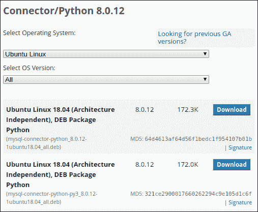
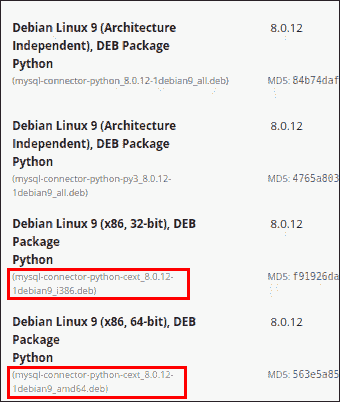

# 安装 Python MySQL 连接器

> 原文：<https://overiq.com/mysql-connector-python-101/installing-mysql-connector-python/>

最后更新于 2020 年 7 月 27 日

* * *

## 先决条件

在安装 MySQL Connector/Python 之前，请确保您的系统上安装了 MySQL 和 Python。如果您还没有安装这些，请访问以下链接获取进一步的说明。

*   [安装 MySQL](/installing-mysql-windows-linux-and-mac/)
*   [安装 Python](/python-101/installing-python/)

## MySQL Connector/Python 版本

在本教程中，我们将使用 Connector/Python 8.0 版本，该版本适用于 MySQL (8.0、5.7、5.6、5.5)和 Python (3.6、3.5、3.4、2.7)。如果你想使用旧版本的 MySQL 或 Python，那么在[这个](https://dev.mysql.com/doc/connector-python/en/connector-python-versions.html)链接上查看版本矩阵。

## 创建虚拟环境

使用`mkdir`命令创建名为`learn-mysql-connector`的新目录，如下所示:

```py
$ mkdir learn-mysql-connector

```

我们将使用这个目录来存储本教程中的示例。本教程中使用的所有示例都可以在链接下载。

接下来，将当前工作目录更改为`learn-mysql-connector`，并使用`virtualenv`包创建一个新的虚拟环境:

```py
$ cd learn-mysql-connector
$ virtualenv env

```

**注意:**如果您是 virtualenv 新手，请访问 [Virtualenv 指南](https://thepythonguru.com/python-virtualenv-guide/)了解更多信息。

如果您在 Linux 或 Mac OS 上，请执行以下命令来激活虚拟环境。

```py
$ source env/bin/activate

```

要停用虚拟环境类型，请执行以下操作:

```py
$ source env/bin/deactivate

```

Windows 用户可以使用以下命令来激活和停用虚拟环境:

```py
C:\>
C:\> env\Scripts\activate
(env) C:\>
C:\> env\Scripts\deactivate
C:\>

```

我们现在准备安装 MySQL Connector/Python。

## 安装 MySQL Connector/Python

在大多数平台上安装 Connector/Python 最简单的方法是通过`pip`命令。

```py
$ pip install mysql-connector-python
```

另一种安装 MySQL Connector/Python 的方法是直接从[官方网站](https://dev.mysql.com/downloads/connector/python/)下载。下面的屏幕显示了 Ubuntu Linux 可用的包列表。



## 测试装置

软件包安装完成后，启动 Python 解释器并导入`mysql.connector`模块，如下所示:

```py
Python 3.5.2 (default, Nov 17 2016, 17:05:23) 
[GCC 5.4.0 20160609] on linux
Type "help", "copyright", "credits" or "license" for more information.
>>> 
>>> import mysql.connector as m
>>> 
>>> m.__version__
'8.0.12'
>>>

```

如果您获得了前面代码片段中指出的版本，那么您就有了一个工作正常的 Connector/Python 安装。

## 扩展

最初，MySQL Connector/Python 是用纯 Python 编写的。在 2.1 版本中，引入了 C 扩展，与纯 Python 实现相比，它在处理大型结果集时允许更好的性能。

如果您已经在 Linux 上使用 pip 安装了 Connector/Python，那么很可能 C 扩展是与软件包一起安装的。如果不是这样，您可以从下载页面下载带有 C 扩展的 Connector/Python 包。



名字中有“cext”的包带有 C 扩展，而其余的都是纯 Python 实现。

我们也可以通过导入`_mysql_connector`模块而不是`mysql.connector`来检查你是否安装了 C 扩展。

```py
>>> 
>>> import _mysql_connector
>>>

```

导入语句成功是因为我在 Linux 上，`pip`已经安装了 C 扩展。

但是，如果您在 Windows 上，您将会看到如下错误:

```py
>>>
>>> import _mysql_connector
Traceback (most recent call last):
  File "<stdin>", line 1, in <module>
ImportError: No module named '_mysql_connector'
>>>

```

不幸的是，在编写的时候，Windows 包没有附带 C 扩展。

本教程中的大多数示例都使用纯 Python 实现。因此，您可以继续，而不必安装 C 扩展。但是，一旦您进入生产环境，您就应该考虑使用 C 扩展。

## 安装世界数据库

本教程中的所有示例都将查询世界示例数据库。要下载数据库，请访问[https://dev.mysql.com/doc/index-other.html](https://dev.mysql.com/doc/index-other.html)。

下载完成后，提取归档文件，您将获得一个名为
`world.sql`的文件。

要从`world.sql`文件创建数据库，请执行以下操作:

```py
$ mysql -u root -p < /path/to/world.sql

```

您现在应该已经安装了世界示例数据库。在下一课中，我们将学习如何使用 Connector/Python 连接到数据库。

* * *

* * *