# PYTHON编程技术

探索基础与高级Python核心的乐趣与实践

SAURABH CHANDRAKAR
DR. NILESH BHASKARRAO BAHADURE

# Python编程技术

探索基础与高级Python核心的乐趣与实践

Saurabh Chandrakar
Nilesh Bhaskarrao Bahadure

[www.bpbonline.com](http://www.bpbonline.com)

2022年第一版
版权所有 © BPB Publications，印度
ISBN: 978-89845-89-1

保留所有权利。未经出版商事先书面许可，不得以任何形式或任何方式复制、传播或传输本出版物的任何部分，也不得将其存储在数据库或检索系统中，但程序清单除外，这些清单可以输入、存储并在计算机系统中执行，但不能通过出版、影印、录音或任何电子和机械手段进行复制。

## 责任限制与保修免责声明

本书包含的信息据作者和出版商所知是真实且正确的。作者已尽一切努力确保这些出版物的准确性，但对于因本书中任何信息引起的任何损失或损害，出版商不承担任何责任。

本书提及的所有商标均被确认为其各自所有者的财产，但BPB Publications无法保证这些信息的准确性。

www.bpbonline.com

## 前言

在当今竞争激烈的繁忙世界中，每个学生/程序员都在挣扎，对于初学者来说，什么是他们要学习的最佳语言。无论背景如何，如今他们更渴望成为一名软件程序员，并为自身和国家的发展做出贡献。因此，在过去几年里，许多程序员和初学者选择Python，因为它易于学习和使用。所有发达国家都教授Python，现在印度几乎所有机构，包括IITs、NITs和许多不同的大学，也都引入了Python。许多初学者都在寻求学习Python，因为它涵盖了C语言中引入的所有概念。

Python的受欢迎程度与日俱异，并且未来即使不增加也将持续下去。技术领域广泛，从Spark到Go语言，但Python在这里是最突出使用的。许多跨国公司如谷歌、Netflix、Instagram、高通、优步、美国宇航局、Facebook等都在使用Python。在印度，即使像BHEL和ISRO这样的公共部门企业也使用Python。ISRO使用Python处理从不同卫星和空间设备收集的数据。BHEL使用Python进行不同的发电厂应用。任何从事人工智能工作的公司都会使用Python语言。软件行业为Python开发者提供高薪。Python将在几年内超越Java语言。

每个对计算机编程语言感兴趣的学生都必须从学校阶段就学习Python，即使它是在大学阶段引入的。这将有助于增强信心，学习这门语言永远不会太迟。可以用这门语言构建许多不同的应用程序，但需要具备相应的技能。你可以将其作为简历上的亮点。上面这本书是用非常简单的语言编写的，连中等水平的学生也能理解。外国作者编写的关于Python的书籍非常复杂难懂。一个人可以非常轻松地学习和理解核心和高级概念。我们逐点讨论了每段代码的输出，并附有参考说明，还添加了大量注释以增进理解。学习Python和本书不需要任何其他语言的先验知识。这只是第一部分，涵盖了从基础到高级的主题。此外，还介绍了使用Tkinter的不同控件解释的图形用户界面主题。提供了大量带有逐步代码解释的已解决示例，讲解清晰。流行的开源编程语言Python在今年的IEEE顶级编程语言排行榜中稳居榜首。在这份包含55种语言的列表中，Python在2020年排名第一。

## 本书内容

这本关于Python的书籍包含11个章节，涵盖一系列不同主题。

**第1章**将涵盖编写Python程序的基本要素，读者可以了解基本主题。

**第2章**将介绍字符串方法、命令行参数、字符串访问和格式化字符串。

**第3章**将涵盖条件语句、循环语句、跳转语句、异常处理和调试分析的概念。它将涵盖在运行时防止错误使用try-except块的多种方式的概念。此外，用户可以创建自己的异常来处理错误。

**第4章**将关于函数。本章讨论函数类型、不同类型的函数参数，如位置参数、关键字参数、默认参数、可变长度参数和kwargs。解释了不同类型的变量、闭包、lambda函数以及迭代器与可迭代对象之间的区别。

**第5章**涉及模块，特别是带有明确示例的日志记录模块。此外，还很好地解释了包的概念及其用法。

**第6章**涉及根据特定模式（称为正则表达式）表示一组字符串的声明机制，这很难理解并执行其用法。每个正则表达式都通过示例以非常清晰的方式进行了解释。

**第7章**关于非基本内置数据结构，如数组、列表、元组、集合、字典和文件，它们各自独特。讨论了所有数据结构的定义、方法、不同类型的推导式，如列表推导式、元组推导式、集合推导式和字典推导式。以简单的方式解释了关于生成器的特殊概念及示例。

**第8章**涉及面向对象编程概念、类、对象、装饰器、静态变量、局部变量和实例变量。讨论了局部方法、类方法和静态方法，重点是如何在Python中实现这些概念。理解面向对象编程概念非常重要，它是所有面向对象编程语言的平台。读者将能够了解如何创建一个类并为其创建对象。重要的概念如多态性、组合、继承、封装等，都以非常清晰的方式进行了讨论。此外，在完全阅读上述章节后，读者将了解抽象类、接口、如何使用及其区别。

**第9章**将提供有关访问文件的信息，可以是文本文件、zip文件、二进制文件或CSV文件。pickle概念也得到了很好的解释。读者还可以了解如何处理日期和时间模块。

**第10章**涉及多任务和线程创建的多种方式。我们在上一章中解释了如何执行单任务和多任务。此外，还很好地讨论了高级概念，如使用Lock、RLock和信号量的线程同步，使用事件对象、条件和队列进行线程间通信。

本书的每一章大多以已解决示例和必做练习（作为额外补充材料提供）结束。此外，读者可以准备上述问题用于面试，并在家中进行自我发展练习。

书中提供了“超级100道客观题”，用于练习不同的Python认证考试。额外提供了按章节分类的已解决示例，用于强化练习和复习概念。此外，还涵盖了不同的Python模块。至今，作者们从未在单本书中见过所有这些概念和材料，因此了解了每个Python学习者的基本需求。本书适用于每位学生、教授、研究人员、专业人士和每个Python爱好者。所以，享受学习Python的乐趣吧。

## 本书使用的Python版本

我们使用了Python 3.7.3版本，并在Visual Studio Code中执行了所有Python代码。但同样的也可以在其他IDE如Pycharm、Jupyter notebook等中执行。

# 致谢

首先，我要衷心感谢大家选择本书。本书的编写非常优雅，完全考虑到初学者的需求。首先，我借此机会向我的导师“尼莱什·巴哈杜尔教授”致以问候和感谢，感谢他激励我，并始终鼓励我完整地表达与Python相关的知识。我非常感激能成为他的学生。我感谢他信任我，始终支持我，并不断推动我取得更多成就。他总是让我铭记“千里之行，始于足下”。我始终想向我的父母——苏伦德拉·库马尔·钱德拉卡尔博士和布内什瓦里·钱德拉卡尔夫人、我的兄弟“普拉纳夫·钱德拉卡尔先生”、我亲爱的妻子普里扬卡·钱德拉卡尔夫人以及所有朋友表达我最深切的温暖之情，感谢他们一直以来的激励和对我信心的提升。

最后但同样重要的是，我要特别感谢出版商“BPB出版私人有限公司”及其团队，感谢他们的洞察力和贡献，没有他们，本书的部分内容可能无法完成。

**索拉布·钱德拉卡尔**

我荣幸地感谢戈达瓦特工业和戈达瓦特大学科尔哈布尔分校的主席桑贾伊·D·戈达瓦特先生，以及比卡伊工业比莱分校和BIT信托基金的主席维杰·库马尔·古普塔先生，感谢他们的鼓励和支持。我要感谢我的导师——印度布巴内斯瓦尔KIIT大学电子工程学院院长阿伦·库马尔·雷博士，以及浦那ITIT主任阿努帕姆·舒克拉博士。我还要感谢科尔哈布尔SGU信托基金受事维纳亚克·博萨莱先生、科尔哈布尔SGU副校长阿伦·帕蒂尔博士，感谢他们在本书编写过程中给予的建议和鼓励。

我感谢泰米尔纳德邦坦贾武尔SASTRA大学高级助理教授N·拉朱教授博士在写作过程中提供的支持、协助以及宝贵建议。

我还要感谢科尔哈布尔SGU航空工程系主任桑吉夫·坎达尔博士、科尔哈布尔SGU电子工程系副教授P·D·帕蒂尔博士、科尔哈布尔SGU电子工程系全体教职员工，以及我在比莱理工学院赖布尔分校的同事——穆罕默德·哈瓦贾·莫希丁教授、已故的桑卡尔普·维尔马教授和什拉万·库马尔·辛格教授，感谢他们在整个项目过程中提供的宝贵建议和大量鼓励。

编写一本优美、平衡且内容丰富的书籍并非一两天或一个月的工作，它需要大量的时间和耐心，需要数小时的辛勤工作。感谢我们的家庭成员、我们的父母、妻子、孩子和我们的祝福者们，感谢他们善意的支持。没有他们及其信念和支持，编写这本经典著作只是一个梦想。我也要感谢我的学生们，他们一直与我在一起，提出问题并共同寻找解决方案。

我还要感谢印度马哈拉施特拉邦索拉普尔区巴尔希MAEER's MIT铁路工程与研究学院执行董事斯瓦蒂·卡拉德-查特夫人，感谢她持续的鼓励。任何工作的完美并非一日之功，它需要大量的努力、时间和辛勤工作，有时还需要适当的指导。我衷心感谢谢冈SSGMCE电子与电信工程系教授拉姆·德赫卡博士和那格浦尔UGC教职员工学院主任C·G·德特博士。

最后但同样重要的是，我要向出版商“BPB出版公司”及其整个团队表示感激和特别感谢，感谢他们的洞察力和贡献，使本书得以成为现实。

最重要的是，我要将荣耀归于上帝象头神，感谢我在本书编写过程中付出的所有努力。若非上帝对宇宙的奇妙创造，我不会对Python有如此的热情。

> “因为，自从创世以来，上帝那看不见的特质——他永恒的大能和神性——就从所造之物中清晰可见，使人无可推诿。”

尼莱什·巴什卡拉拉奥·巴哈杜尔博士

# 勘误

我们在BPB出版公司对自己的工作深感自豪，并遵循最佳实践以确保内容的准确性，为订阅者提供沉浸式的阅读体验。我们的读者是我们的镜子，我们利用他们的反馈来反思并改进出版过程中可能出现的任何人为错误。为了让我们保持质量并帮助我们联系到可能因任何不可预见的错误而遇到困难的读者，请通过以下方式联系我们：

[errata@bpbonline.com](mailto:errata@bpbonline.com)

BPB出版公司大家庭非常感谢您的支持、建议和反馈。

> 您知道吗？BPB提供每本已出版书籍的电子书版本，提供PDF和ePub文件？您可以在[www.bpbonline.com](http://www.bpbonline.com)升级到电子书版本，作为纸质书客户，您有权享受电子书副本的折扣。请通过[business@bpbonline.com](mailto:business@bpbonline.com)联系我们了解更多详情。
>
> 在[www.bpbonline.com](http://www.bpbonline.com)，您还可以阅读免费技术文章合集，注册各种免费通讯，并获得BPB书籍和电子书的独家折扣和优惠。

# 献词

献给我的父母
*苏伦德拉·库马尔·钱德拉卡尔博士* 和 *布内什瓦里·钱德拉卡尔夫人*
兄弟
*普拉纳夫·钱德拉卡尔先生*
以及
我的妻子 *普里扬卡·钱德拉卡尔*

**索拉布·钱德拉卡尔**

献给我的父母
*卡马尔·B·巴哈杜尔夫人*
和
*已故的巴什卡拉拉奥·M·巴哈杜尔*
献给我的岳父母
*萨罗杰·R·洛坎德夫人* 和 *拉维坎特·A·洛坎德先生*
以及
我的妻子 *希拉帕·N·巴哈杜尔*
以及美丽的女儿们
*尼希塔* 和 *姆伦马伊*
以及我所有的亲爱的学生们。

**尼莱什·巴什卡拉拉奥·巴哈杜尔博士**

# 目录

## I Python基础

1. Python基础
    1.1 简介
    1.2 关键字/保留字
    1.3 标识符
    1.4 隐式和显式行连接方法
        1.4.1 隐式行连接方法
        1.4.2 显式连接方法
    1.5 打印函数
        1.5.1 使用打印函数的不同样式：
    1.6 转义序列
    1.7 作为普通文本的转义字符
    1.8 注释、缩进及其重要性
    1.9 原始字符串和表情符号
    1.10 运算符基础和类型
    1.11 运算符优先级
    1.12 基本的Hello World程序
    1.13 变量
        1.13.1 助记变量名的重要性
    1.14 数据类型
        1.14.1 int数据类型
        1.14.2 float数据类型
        1.14.3 复数数据类型
        1.14.4 Bool数据类型
        1.14.5 str类型
        1.14.6 bytes数据类型
        1.14.7 bytearray数据类型
        1.14.8 list数据类型
        1.14.9 tuple数据类型
        1.14.10 range数据类型
        1.14.11 set数据类型
        1.14.12 frozenset数据类型
        1.14.13 dict数据类型
        1.14.14 memoryview数据类型
    1.15 数据类型转换
    1.16 不可变性与基本数据类型的概念
    1.17 命名空间

## 2 Python字符串

2.1 从键盘读取动态输入
2.2 字符串
2.3 Python多行字符串
2.4 Python字符串访问
    2.4.1 使用索引
    2.4.2 使用切片运算符
2.5 Python字符串方法
    2.5.1 字符串 capitalize().
    2.5.2 字符串 casefold().
    2.5.3 字符串 center().
    2.5.4 字符串 count().
    2.5.5 字符串 encode().
    2.5.6 字符串 endswith().
    2.5.7 字符串 expandtabs().
    2.5.8 字符串 find().
    2.5.9 字符串 format().
    2.5.10 字符串 format_map().
    2.5.11 字符串 index().
    2.5.12 字符串 isalnum().
    2.5.13 字符串 isalpha().
    2.5.14 字符串 isdecimal().
    2.5.15 字符串 isdigit().
    2.5.16 字符串 isidentifier().
    2.5.17 字符串 islower().
    2.5.18 字符串 isnumeric().
    2.5.19 字符串 isprintable().
    2.5.20 字符串 isspace().
    2.5.21 字符串 istitle().
    2.5.22 字符串 isupper().
    2.5.23 字符串 join().
    2.5.24 字符串 ljust().
    2.5.25 字符串 lower()
    2.5.26 字符串.lstrip()
    2.5.27 字符串.maketrans()
    2.5.28 字符串.partition()
    2.5.29 字符串.replace()
    2.5.30 字符串.rfind()
    2.5.31 字符串.rindex()
    2.5.32 字符串.rjust()
    2.5.33 字符串.rpartition()
    2.5.34 字符串.rsplit()
    2.5.35 字符串.rstrip()
    2.5.36 字符串.split()
    2.5.37 字符串.splitlines()
    2.5.38 字符串.startswith()
    2.5.39 字符串.strip()
    2.5.40 字符串.swapcase()
    2.5.41 字符串.title()
    2.5.42 字符串.translate()
    2.5.43 字符串.upper()
    2.5.44 字符串.zfill()

## 3 Python决策与流程控制

3.1 选择语句/条件语句
    3.1.1 if
    3.1.2 if-else
    3.1.3 if-elif-else
3.2 循环语句
    3.2.1 for
    3.2.2 while
3.3 转移语句
    3.3.1 break
    3.3.2 continue
    3.3.3 pass
3.4 in关键字用法
    3.4.1 循环模式
    3.4.2 星号模式
    3.4.3 字母模式
    3.4.4 数字模式

## 3.5 调试分析

## 3.6 Python 3 中的异常处理
### 3.6.1 语法错误
### 3.6.2 运行时错误
### 3.6.3 异常处理的重要性
#### 3.6.4 Python 异常层次结构
## 3.6.5 自定义异常处理
#### 3.6.6 try-except 中的控制流
#### 3.6.7 异常信息打印到控制台
#### 3.6.8 带有多个 except 块的 try
#### 3.6.9 能够处理多个异常的单个 except 块
### 3.6.10 默认 except 块
### 3.6.11 except 块的可能组合
### 3.6.12 finally except 块
## 3.6.13 try-except 和 finally 中的控制流
#### 3.6.14 嵌套的 try-except finally 块
## 3.6.15 嵌套 try-except finally 块中的控制流
#### 3.6.16 try-except finally 块中的 else 块
#### 3.6.17 try-except-else-finally 块的可能组合
## 3.6.18 异常类型

## 3.7 DRY 原则

## II Python 函数

## 4 Python 函数

## 4.1 函数简介

## 4.2 函数类型
### 4.2.1 内置函数
#### 4.2.2 用户定义函数

## 4.3 函数参数
### 4.3.1 位置参数
### 4.3.2 关键字参数
### 4.3.3 默认参数
## 4.3.4 可变长度参数
## 4.3.5 关键字可变长度参数 (kwargs)

## 4.4 嵌套函数

## 4.5 Python 闭包

## 4.6 函数作为参数传递

### 4.7 局部、全局和非局部变量
### 4.7.1 局部变量
### 4.7.2 全局变量
## 4.7.3 非局部变量

## 4.8 递归函数

## 4.9 Python Lambda 函数
### 4.9.1 嵌套 Lambda 函数
### 4.9.2 将 Lambda 函数传递给另一个函数
### 4.9.3 立即调用函数执行 (IIFE)
#### 4.9.4 Python Lambda 和 map()
#### 4.9.5 Python Lambda 和 filter()
#### 4.9.6 Python Lambda 和 reduce()

### 4.10 按对象引用传递

### 4.11 包含所有类型参数的函数 (PADK)

## 4.12 迭代器与可迭代对象

## 4.13 Python 柯里化函数

## 5 Python 模块和包

### 5.1 Python 模块简介

### 5.2 带重命名的导入

## 5.3 from import 语句

## 5.4 Python 模块重载

### 5.5 特殊变量名

## 5.6 日志模块
### 5.6.1 日志级别
#### 5.6.2 日志实现
## 5.6.3 格式化日志消息
#### 5.6.4 可变数据日志
## 5.6.5 堆栈跟踪捕获
#### 5.6.6 日志模块中的类

## 5.7 使用断言进行调试

## 5.8 Python 包

## 6 Python 正则表达式

### 6.1 compile()

# 6.2 finditer()

# 6.3 字符类

## 6.4 预定义字符类

## 6.5 量词

### 6.6 re 模块的函数

### 6.7 元字符

### 6.8 r 前缀

## III Python 数据结构

## 7 Python 数据结构

## 7.1 数组数据结构
## 7.1.1 一维数组
## 7.1.2 一维数组创建
#### 7.1.3 创建空数组
## 7.1.4 索引
## 7.1.5 使用 for 循环访问数组
## 7.1.6 使用 while 循环访问数组
#### 7.1.7 数组中的 append 方法
#### 7.1.8 使用 for 循环从用户获取数组输入
#### 7.1.9 使用 while 循环从用户获取数组输入
#### 7.1.10 数组中的 insert 方法
#### 7.1.11 数组中的 pop 方法
### 7.1.12 数组中的 remove 方法
### 7.1.13 数组中的 index 方法
### 7.1.14 数组中的 reverse 方法
### 7.1.15 数组中的 extend 方法
### 7.1.16 数组中的切片方法

## 7.2 列表数据结构
## 7.2.1 创建列表
#### 7.2.2 列表与不可变性
## 7.2.3 访问列表元素
## 7.2.4 列表函数和方法
## 7.2.5 列表对象的别名
## 7.2.6 列表对象的克隆
## 7.2.7 列表对象的数学运算符
#### 7.2.8 列表对象比较
## 7.2.9 嵌套列表
## 7.2.10 列表推导式

## 7.3 元组数据结构
## 7.3.1 元组创建
#### 7.3.2 访问元组元素
## 7.3.3 元组与不可变性
## 7.3.4 元组对象的数学运算符
## 7.3.5 修改元组对象
## 7.3.6 从用户获取元组输入
## 7.3.7 元组函数和方法
#### 7.3.8 元组打包和解包
### 7.3.9 元组推导式
### 7.3.10 嵌套元组
### 7.3.11 列表与元组比较

## 7.4 集合数据结构
### 7.4.1 集合创建
### 7.4.2 集合方法
#### 7.4.3 执行集合数学运算的方法
## 7.4.4 集合推导式

## 7.5 字典数据结构
### 7.5.1 创建空字典
### 7.5.2 创建字典
### 7.5.3 访问字典
### 7.5.4 修改字典
### 7.5.5 删除字典项
## 7.5.6 字典方法和函数
## 7.5.7 字典推导式

## 7.6 生成器

### 7.7 collections 模块

## 8 Python 面向对象编程

## 8.1 类
### 8.1.1 类定义

## 8.2 对象

## 8.3 引用变量

## 8.4 Self 变量

## 8.5 构造函数概念

## 8.6 装饰器
### 8.6.1 函数装饰器
### 8.6.2 装饰器链
### 8.6.3 类装饰器

## 8.7 对象级别变量或实例变量
## 8.7.1 实例变量的声明位置
## 8.7.2 访问实例变量
## 8.7.3 从对象中删除实例变量

## 8.8 类级别变量或静态变量
### 8.8.1 声明静态变量的不同位置
### 8.8.2 访问静态变量
### 8.8.3 修改静态变量
#### 8.8.4 删除静态变量

### 8.9 局部变量

### 8.10 实例方法
#### 8.10.1 Getter / 访问器方法
#### 8.10.2 Setter / 修改器方法

## 8.11 类方法

## 8.12 静态方法

## 8.13 从一个类访问另一个类的成员

## 8.14 内部类

## 8.15 垃圾回收器

## 8.16 析构函数

### 8.17 组合与继承
## 8.17.1 组合
## 8.17.2 继承

## 8.18 super() 概念

## 8.19 多态
### 8.19.1 鸭子类型
### 8.19.2 Python 中的重载概念
#### 8.19.3 Python 中的重写概念
## 8.19.4 构造函数重写

## 8.20 访问修饰符与封装

## 8.21 抽象类

### 8.22 接口

## 9 Python 文件处理

### 9.1 简介

### 9.2 文件

### 9.3 打开文件

## 9.4 关闭文件

## 9.5 文件对象属性和方法

### 9.6 将数据写入文本文件
### 9.6.1 write() 方法
### 9.6.2 writelines() 方法

## 9.7 从文本文件读取字符数据

## 9.8 with 语句

### 9.9 文件方法

## 9.10 二进制数据处理

### 9.11 CSV 文件处理
#### 9.11.1 将数据写入 csv 文件
#### 9.11.2 从 csv 文件读取数据

### 9.12 文件压缩和解压
### 9.12.1 执行压缩操作
## 9.12.2 执行解压操作

### 9.13 对象的序列化与反序列化

## 9.14 日期和时间
#### 9.14.1 time 模块
#### 9.14.2 datetime 模块

## 10 Python 多线程

## 10.1 多任务
### 10.1.1 基于进程的多任务
### 10.1.2 基于线程的多任务

## 10.2 线程创建
## 10.2.1 不使用任何类创建线程
## 10.2.2 通过继承 Thread 类创建线程
#### 10.2.3 不通过继承 Thread 类创建线程

### 10.3 设置和获取线程名称

### 10.4 使用线程执行单个任务

### 10.5 线程标识号

### 10.6 活跃线程数

## 10.7 enumerate

## 10.8 IsAlive

## 10.9 Join

## 10.10 守护线程与非守护线程
### 10.10.1 创建守护线程
#### 10.10.2 默认线程性质

### 10.11 使用多个线程实现多任务

### 10.12 线程竞争条件

## 10.13 线程同步
### 10.13.1 使用锁
### 10.13.2 使用可重入锁 (RLock)
## 10.13.3 使用信号量

## 10.14 线程间通信 (ITC)
### 10.14.1 使用事件对象进行线程间通信
#### 10.14.2 使用条件变量进行线程间通信
## 10.14.3 使用队列进行线程间通信

### 10.15 良好编程实践的一些技巧

## 附录

## 附录

### 附录 A 其他一些 Python 模块

### 附录 B 额外的已解决示例

### 附录 C 字符串中的命令行参数

### 附录 D 一些 OS 模块方法/属性

### 附录 E 内置函数

### 附录 F 额外的练习编程

### 附录 G 客观题

## 索引

## 图列表

- 1.1 [Python 版本](#)
- 1.2 [Python 3.7.3 shell](#)
- 1.3 [保存为 hello.py 的 Python 文件](#)
- 1.4 [Python 3.7.3 shell 中的输出](#)
- 1.5 [pwd](#)
- 1.6 [ls](#)
- 1.7 [ls -l](#)
- 1.8 [clear](#)
- 1.9 [cd](#)
- 1.10 [mkdir](#)
- 1.11 [不带双引号的 mkdir](#)
- 1.12 [带双引号的 mkdir](#)
- 1.13 [移动到文件夹](#)
- 1.14 [touch（文本文件）](#)
- 1.15 [touch（python 文件）](#)
- 1.16 [删除文本文件](#)
- 1.17 [返回上一级文件夹的命令](#)
- 1.18 [rm -rf 命令](#)
- 1.19 [mv 命令（重命名）](#)
- 1.20 [mv 命令（将文件移动到文件夹）](#)
- 1.21 [cp 命令](#)
- 1.22 [history 命令](#)
- 1.23 [示例 1.50 的输出](#)
- 1.24 [示例 1.51 的输出](#)
- 1.25 [示例 1.52 的输出](#)
- 1.26 [示例 1.82 的操作](#)
- 1.27 [示例 1.83 的操作](#)
- 1.28 [半杯水](#)
- 1.29 [源代码](#)
- 1.30
- 1.31 [示例的操作](#)

## 图表列表

- 2.1 源代码
- 3.1 if 语句流程图
- 3.2 示例 3.1 流程图
- 3.3 if-else 语句流程图
- 3.4 示例 3.2 流程图
- 3.5 if-elif-else 语句流程图
- 3.6 示例 3.3 流程图
- 3.7 示例 3.4 流程图
- 3.8 for 循环流程图
- 3.9 while 循环流程图
- 3.10 break 语句流程图
- 3.11 continue 语句流程图
- 3.12 Python 异常层次结构
- 3.13 源代码
- 4.1 Python 中的函数
- 5.1 源代码
- 5.2 包概览
- 5.3 游戏包结构
- 5.4 游戏包
- 5.5 板球包
- 5.6 印度包
- 5.7 足球包
- 5.8 卡巴迪包
- 6.1 源代码
- 7.1 源代码
- 8.1 源代码
- 8.2 组合 HAS-A 组件
- 9.1 源代码
- 10.1 桌面应用程序
- 10.2 进程与线程的关系
- 10.3 源代码
- 10.4 守护线程继承流程图
- 10.5 多个线程访问临界区
- 10.6 示例 10.34 输出
- A.1 附录 A 二维码：一些其他 Python 模块
- B.1 附录 B 二维码：附加解答示例
- C.1 附录 C 二维码：字符串中的命令行参数
- D.1 附录 D 二维码：一些 OS 模块的方法/属性
- E.1 附录 E 二维码：内置函数
- F.1 附录 F 二维码：附加练习编程
- G.1 附录 G 二维码：客观题

## 表格列表

- 1.1 转义序列及其含义
- 1.2 AND 运算符逻辑
- 1.3 OR 运算符逻辑
- 1.4 NOT 运算符逻辑
- 1.5 运算符优先级顺序
- 1.6 不可变性
- 2.1 字符串格式中使用的格式说明符
- 2.2 换行
- 3.1
- 4.1 内置函数
- 5.1 日志级别
- 6.1 字符类
- 6.2 预定义字符类
- 6.3 量词字符
- 7.1 数组中使用的类型码
- 7.2 列表与元组的差异
- 8.1 二元运算符
- 8.2 赋值运算符
- 8.3 比较运算符
- 8.4 一元运算符
- 9.1 Python 中文本文件的模式
- 9.2 Python 中二进制文件的模式
- 10.1 Lock 与 RLock 的区别
- 10.2 示例 10.36 输出场景

# 第一部分

# Python 基础

# 第 1 章

# Python 基础

本章向用户介绍 Python 编程语言的基本信息。读者将深入了解为什么 Python 在几乎所有科学和工程领域都如此受欢迎。

## 1.1 引言

我们许多人开始时常对为职业生涯发展应选择哪个工程学科感到困惑。由于所有工程学科各有其优势，而最受关注的学科之一通常是计算机科学。为什么不是呢？优秀的程序员在大型跨国公司能获得丰厚的报酬。但成为聪明的程序员比成为优秀的程序员更重要。任何程序都可以用‘n’行代码来编写。但聪明的程序员用更少的代码行数编写代码，并融入更多逻辑。自然而然，第一个问题是：我们应该从哪门编程语言开始职业生涯？毫无疑问，任何程序员都必须学习‘C’编程语言，它是所有语言的母体。这是因为无论学科如何，C 语言的概念在各个领域都有应用，如 VHDL、C#、VB.net、C++ 等。但在本书中，我们将讨论当今最受欢迎的编程语言之一——“Python”。在开始学习 Python 语言之前，理解一些基本问题很重要，比如 Python 是什么，它的用途是什么，它能做什么，谁开发了这门语言，为什么要使用 Python 等。

计算机是一种机电设备，它根据可变程序中给出的指令，以二进制形式存储和处理数据。计算机不是自我操作的设备，它需要从被称为“程序员”或“开发者”的人那里获取指令。因此，程序员会给计算机指令。程序就是一组指令的集合。要编写程序，我们需要一种语言。程序员编写的语言称为编程语言。编程语言有很多，但我们将专注于 Python 编程语言。Python 是一种高级通用编程语言，用于开发各种类型的应用程序。20 世纪 90 年代初，Guido Van Rossum 创建了 Python 编程语言（其开发始于 1989 年 12 月，在荷兰国家研究院工作期间）。Python 语言甚至比 Java 语言更早。“Python”这个名字源自英国最著名的讽刺喜剧系列之一《蒙提·派森的飞行马戏团》。第一个 Python 版本 0.9.0 于 1991 年 2 月发布。下一个版本 Python 1.0 于 1994 年 1 月发布。Python 版本 2.0 于 2000 年 10 月发布。版本 3.0 于 2008 年 12 月发布。截至今日，最新版本是 2019 年 7 月发布的 3.7.4。理解为什么需要学习 Python 很重要，因为它具有多种优势。

- 1. Python 是一款免费软件，也是面向初学者的开源语言。如果您是初学者，Python 是开始的最佳语言。对于 Java，商业组织是 Oracle；对于 C#.net，商业组织是 Microsoft；但对于 Python，商业组织是 Python 软件基金会。它是一个拥有 Python 编程语言知识产权的非营利组织。其网站是 https://www.python.org。学习后，您可以选择捐赠。同时，其源代码是开放的。根据我们的需求，我们可以定制 Python 本身。要使用 Java 应用程序，我们需要借助 Jython；对于 C#.net，需要 Iron Python；处理大数据需要 Anaconda Python（用于机器学习、深度学习等）；要使用 Ruby 应用程序，则需要 Ruby Python。
- 2. 由于它是高级语言，因此非常简单且易于理解。语法易于掌握。我们无需担心内存管理、提供空闲空间等底层活动。这些由内部的 Python 虚拟机负责。
- 3. 它是平台无关的。我们可以在不同的硬件平台上运行这种语言，如 Linux、Mac、Windows、Raspberry Pi 等。“一次编写，随处运行”是平台无关性的理念。Python 虚拟机负责在不同平台上运行 Python 代码。Python 虚拟机是平台相关的，而 Python 是平台无关的。在 Python 中，代码可以即时执行。因此，它运行在解释器系统上，无需显式编译。
- 4. 程序员可以使用比其他编程语言更少的代码行编写程序。因此，这是一种编写代码更高效或更简洁的方式。
- 5. Python 可以作为函数式、面向对象或面向过程的语言使用。
- 6. Python 拥有大量库，可用于各种实现，如 NumPy、SciPy、Pandas 等。
- 7. 它是可扩展的。我们可以在应用程序中使用遗留的非 Python 代码。我们可以用其他语言的代码来弥补性能差距。
- 8. 它是可移植的语言。Python 应用程序可以非常容易地从一个平台迁移到另一个平台。
- 9. 它是可嵌入的。我们可以在 Java 或 C#.Net 应用程序中使用 Python 脚本。这提高了 Python 代码的作用域，从而使我们的应用程序更具可扩展性。
- 10. 它是动态类型的。我们无需显式声明类型。根据我们提供的值，类型将自动确定，从而为程序员提供更大的灵活性。

```
示例：1.1
a=10
print(type(a))
a='Python'
print(type(a))
a=False
print(type(a))
```

```
输出：1.1
<class 'int'>
<class 'str'>
<class 'bool'>
```

Python 语言与英语相似，旨在提高可读性。命令可以用新行完成，不同于

## Python编程语言概述

Python语言使用分号或括号的方式与其他编程语言不同。为了定义循环、类和函数的作用域，Python严重依赖缩进（如空白字符），而其他编程语言则使用花括号来实现这一目的。现在，任何初学者最可能被吸引的基本问题是：在哪里使用Python编程语言？Python语言用于：

- 1. 后端Web开发
- 2. 创建人工智能、科学计算、机器学习、深度学习、物联网等。
- 3. 桌面应用程序、3D图形、图形用户界面应用程序
- 4. 数据分析、网络应用程序（如客户端-服务器、聊天等）。
- 5. 连接数据库系统。它可以根据需要读取、写入、删除或更新数据。
- 6. 它可以执行非常复杂的数学运算并处理大数据。

一个优秀的Python开发者会为后端组件编写有效的代码，并进行测试和调试程序。一个优秀的开发者会创建可以与现有应用程序集成的应用程序。Python被不同的公司使用，如Google、Facebook、Yahoo、NASA、DropBox、BitTorrent、Netflix、YouTube等。在Python中，大部分语法借鉴自C语言和ABC语言。除了优点，Python也有一些局限性：

- 1. Python不适合开发移动应用程序，因为目前它没有开发移动应用程序的库支持。
- 2. 它不是开发端到端企业应用程序（如银行、电信应用程序等）的最佳选择，因为没有库支持。
- 3. 性能较低，因为它是解释型语言，执行是逐行进行的。因此，JIT编译器被添加到Python虚拟机中，这样一组行只会被解释一次，每次使用解释后的代码时都直接使用。上述版本称为PyPy版本（Python for speed）。

Python在2019年的受欢迎程度创下了纪录。根据Stack-Overflow，Python是被提问最多的新兴语言，领先于其竞争对手语言如JavaScript、C#等。GitHub将Python评为最受欢迎的语言榜首。要在系统上安装Python，请访问网站 [https://www.python.org](https://www.python.org)。然后转到下载选项卡并下载最新的Python版本（截至今天为3.7.4）。我们已经在Windows操作系统上安装了Python版本。我们所有的程序都将在Windows操作系统上进行。最好学习Python 3版本而不是版本2，因为截至今天，所有使用Python 2的跨国公司都已迁移到Python 3。Python 3.x被开发为完全独立的语言，而不是2.x版本的扩展。Python 3.x对Python 2.x没有向后兼容性，因为无法保证它会支持。此外，Python 2可能在不久的将来变得过时，因为库将不再维护。在安装过程中，需要注意的一个重要点是勾选复选框“Add Python 3.7 to Path”，否则在尝试安装自己的库时可能会出错。安装设置后，您就可以开始了。一旦安装了Python，输入“cmd”并输入单词python。您将看到如图1.1所示的屏幕。这里，我们使用的是Python 3.7.3版本。在本书中，我们将学习Python 3.x而不是Python 2.x。


*图1.1：Python版本*

一旦我们安装了Python，我们还会得到IDLE（Python的集成开发环境）。在这里，我们可以进行编码。它看起来如图1.2所示。


*图1.2：Python 3.7.3 shell*

转到文件 → 新建文件。
在文件中输入 `print('Hello World')` 并将其保存到相应的文件夹中。
点击运行 → 运行模块（F5），如图1.3所示。
输出 `Hello World` 将打印在IDLE屏幕上，如图1.4所示。

此外，您可以寻找其他IDE，如PyCharm、Jupyter等。但我们使用了Visual Studio Code（VsCode）并将gitbash集成到VsCode中。VsCode是由Microsoft开发的用于编写程序的源代码编辑器。它支持调试、语法高亮、代码重构、智能代码补全等。在开始Python基础知识之前，简要概述一下如何在VsCode中使用命令行。我们将学习如何借助命令行使用文件和文件夹，如何快速创建文件/文件夹并删除文件/文件夹，如何复制和移动文件到/从文件夹等。事不宜迟，让我们开始在VsCode的bash终端中输入命令。只需在bash终端中输入以下命令并查看输出。命令以粗体字母输入。


*图1.3：Python文件保存为hello.py*


*图1.4：Python 3.7.3 shell中的输出*

**pwd：** 打印工作目录。它将显示当前工作目录的位置。从终端输出（如图1.5所示）我们可以看到工作目录是 `E:/python_progs`。


*图1.5：pwd*

**ls：** 它将显示终端中文件和文件夹的列表。从终端输出（如图1.6所示）我们可以看到文件系统中的文件和目录列表。

**ls -l：** 它将以长列表格式显示终端中文件和文件夹的列表。从终端输出1.7我们可以看到文件系统中的文件和目录列表，包括所有者、权限。由于内容列表很长，即这里总共有412个文件，只显示了其中一部分。

**clear：** 它将清除屏幕终端。从终端输出1.8，我们可以看到屏幕已被清除。

**cd：** 它将更改操作系统中的当前工作目录。从终端输出1.9，我们可以看到目录已更改为 `E://democreated`。

**mkdir：** 上述命令用于在操作系统中创建文件夹。从终端输出1.10，我们可以看到创建了一个名为 `command` 的新文件夹。

注意：一个重要的观察点是，如果我们在文件夹名称之间给出空格，并且文件夹名称没有用双引号括起来，那么将创建单独的文件夹，如图1.11所示。在上图中，我们可以看到从 `mkdir` 命令 `practice 2` 创建了3个不同的文件夹。

现在在文件夹名称之间加上双引号。


*图1.6：ls*


*图1.7：ls -l*

`mkdir "command practice 2"`。从图1.12我们可以看到创建了一个新文件夹 `"command practice 2"`。

现在假设我们需要移动到文件夹 `command practice 2`。输入命令 `cd "command practice 2"`，如图1.13所示。

**touch：** 上述命令用于将文件的修改和访问时间设置为当前时间。如果文件不存在，则它将使用默认权限创建文件。从图1.14，创建了一个名为 `newfile.txt` 的文本文件。

我们甚至可以创建一个Python文件。创建了一个名为 `demo.py` 的新文件。

**rm：** 上述命令用于删除对象，如文件、目录等。从图1.16，我们想要删除 `newfile.txt`。

**cd ..：** 上述命令用于返回上一级文件夹。从图1.17，我们可以看到返回了一级文件夹。

**rm -rf：** 上述命令用于完全删除文件夹。**rf** 代表递归强制。从图1.18，我们可以看到文件夹 `command practice 2` 已被完全删除。

**mv：** 上述命令用于将文件重命名为新名称或将文件名移动到新文件夹。从图1.19，我们可以看到文件名 `file1.py` 已在当前文件夹 `cd commandfolder/` 中重命名为 `file.py`。

从图1.20，我们可以看到文件名 `file.py` 已被移动到当前文件夹 **mvfolder**。首先，我们创建了一个文件夹 **mvfolder**。然后我们使用命令 `mv file.py ./mvfolder/` 将文件移动到该文件夹中。

在当前路径上，我们输入 `ls` 查看文件和文件夹的列表。我们可以看到文件已移动到 **mvfolder** 中，因为只显示了文件夹名称。然后我们将目录更改为 **mvfolder**。我们输入 `ls` 查看文件和文件夹的列表。

```
SAURABH@LAPTOP-NHFM79LF MINGW64 /e/python_progs
$
```

*图1.8：clear*

```
SAURABH@LAPTOP-NHFM79LF MINGW64 /e/python_progs
$ cd E://democreated

SAURABH@LAPTOP-NHFM79LF MINGW64 /e/democreated
$ pwd
/e/democreated
```

*图1.9：cd*

## 1.2 关键字/保留字

在任何语言中，无论是英语这样的通用语言，还是Python或C这样的编程语言，都有一些表示特定含义或功能的保留字，被称为保留字或关键字。英语中有大量具有特定含义的保留字，完全记住这些词是相当困难的。另一方面，如果我们看一些编程语言，如Java，只有53个保留字。但在Python中，只有35个保留字。因此，如果我们理解了这35个关键字，就可能成为这门语言的专家。在2015年之前，有33个关键字，但Python在2015年的3.5版本中新增了`async`和`await`两个关键字。要了解Python语言中的全部关键字，请在VsCode中输入以下命令。

```python
import keyword
print(keyword.kwlist)
```

将文件保存为`python_keywords.py`。Python中所有的保留字都只包含字母符号。要运行上述程序，请输入命令

```
python python_keywords.py
```

你将得到如下所示的关键字列表

```
['False', 'None', 'True', 'and', 'as', 'assert', 'async', 'await', 'break', 'class', 'continue', 'def', 'del', 'elif', 'else', 'except', 'finally', 'for', 'from', 'global', 'if', 'import', 'in', 'is', 'lambda', 'nonlocal', 'not', 'or', 'pass', 'raise', 'return', 'try', 'while', 'with', 'yield']
```

我们将根据需要讨论所有关键字列表。但观察这些关键字，你可能得到的重要发现如下：


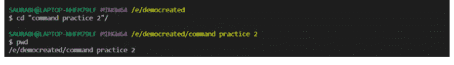

- 所有35个关键字仅包含字母符号。
- `True`、`False`和`None`是仅有的3个大写（首字母大写）关键字。其余32个关键字均为小写。
- 需要注意的重要一点是，Python中没有`switch`或`do-while`的概念。
- 由于Python是动态类型语言，没有如`int`、`float`、`Boolean`、复数数据类型等保留字。

要检查某个词是否是关键字，请输入以下命令

```python
print(keyword.iskeyword('yield'))
```

运行上述文件后，你将得到一个布尔值`True`，表明`yield`这个词是一个关键字。你可以继续检查其他保留字。**iskeyword**的返回类型是**True**或**False**。

## 1.3 标识符

标识符就是用户在程序中定义的名称，用于表示变量、函数、类或模块。标识符可以包含字母、数字或下划线。**标识符**的第一个字符必须是字母或下划线，不能以数字开头。标识符的示例如下：
`var_1=67`：变量名是标识符的一个例子
`_var = 4`：标识符的第一个字符可以是下划线。
`3sd = 7`：无效。SyntaxError: invalid syntax
特殊字符不能用在标识符中。
`var@2 = 8`：SyntaxError: can't assign to operator
Python中允许的字符是字母（大写或小写）、数字（0到9）和下划线符号。由于Python语言区分大小写，标识符本身也区分大小写。例如，变量`sum`和`SUM`是不同的。如果标识符以下划线开头，那么它是私有的。标识符中不允许使用保留字。标识符没有长度限制，但要注意不应过长，并且必须是一个有意义的名称，即使是新人也能通过查看标识符明白其含义。


## 1.4 隐式和显式换行方法

每当我们试图将输入分成不同的物理行时，就会出现错误。例如

```python
print("hello
```

当我们在下一行尝试写入剩余的单词时，将弹出以下错误

```python
print("hello
```
>
> SyntaxError: EOL while scanning string literal

这可以通过使用隐式和显式换行方法来解决。

### 1.4.1 隐式换行方法

在隐式换行方法中，表达式使用圆括号、花括号或方括号分成多行。例如：

**1. 使用花括号**
以下是关于花括号的示例，

```
示例: 1.3
days = {'Mon','Tue','Wed',
        'Thu','Fri','Sat',
        'Sun'}
print(days)
```

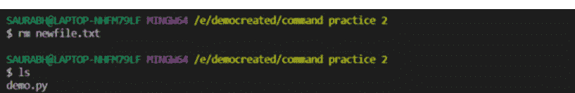

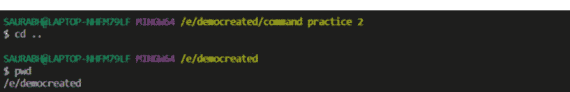

```
输出: 1.3
{'Tue', 'Sat', 'Fri', 'Sun', 'Mon', 'Wed', 'Thu'}
```
> **注意：**
> 你每次在这里得到的输出可能不同

**2. 使用方括号**
以下是关于方括号的示例，

```
示例: 1.4
days = ['Mon','Tue','Wed',
        'Thu','Fri','Sat',
        'Sun']
print(days)
```

```
输出: 1.4
['Mon', 'Tue', 'Wed', 'Thu', 'Fri', 'Sat', 'Sun']
```
> **注意：**
> 输出没有变化。输出的顺序与输入的顺序一致。

**3. 使用圆括号**

以下是关于圆括号的示例，

```
示例: 1.5
days = ('Mon','Tue','Wed',
        'Thu','Fri','Sat',
        'Sun')
print(days)
```

```
输出: 1.5
('Mon', 'Tue', 'Wed', 'Thu', 'Fri', 'Sat', 'Sun')
```
> **注意：**
> 输出没有变化。输出的顺序与输入的顺序一致。

现在，假设我们想将文件再向上移动一级文件夹，那么我们需要使用带`..`的文件名，如[图 1.21](Fig. 1.21)所示。输入以下命令`mv file.py ..`后，文件`file.py`已移动到`command`文件夹中。

假设我们想将**VsCode**的bash终端中输入的命令列表保存到一个文本文件中，则使用以下命令

```
history > history_for_print.txt
```

`history`是命令，`history_for_print.txt`是文本文件名，如[图 1.21](Fig. 1.21)所示。命令和文件名由`>`符号连接。我们可以看到，已输入的命令列表已保存在名为`history_for_print.txt`的文本文件中。

另外，假设我们想打开这个文本文件，则输入`code`然后跟文件名，例如这里的`code history_for_print.txt`。`code`命令用于打开文件，如果文件在当前文件系统中不存在，则也会创建它。在这里，我们可以在打开**VsCode**后看到如[示例 1.2](Example 1.2)所示的以下命令列表。我们看到一些命令如**rm**、**mkdir**不存在。这是有意为之，因为我们在输入这些命令后关闭了**VsCode**。然后再次重启VsCode后，只有从`cd ..`开始的当前命令存在。

```
示例: 1.2 （用code命令打开文件）
1 cd ..
2 cd democreated/
3 pwd
4 ls
5 cd ~
6 pwd
7 cd E://democreated
8 ls
9 clear
10 cd commandfolder/
11 touch file1.py
12 ls
13 mv file1.py file.py
14 ls
15 mv file1.py file.py
16 ls
17 mkdir mvfolder
18 ls
19 mv file.py ./mvfolder/
20 ls
21 cd mvfolder/
22 ls
23 mv file.py ..
24 ls
25 cd ..
26 ls
27 cp file.py ./mvfolder/
28 ls
29 cd mvfolder/
30 ls
31 cd ..
32 history > history_for_print.txt
```

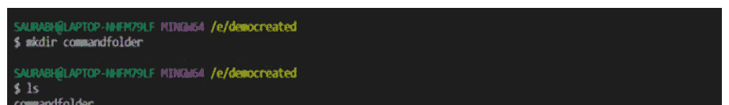

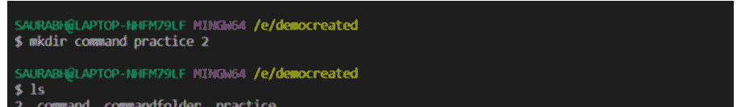

## 输出: 1.2

> 从上面的执行中观察到了不同的操作。


注意：上述示例也可以通过注释和空行的方式编写。

1. 我们可以在该行之后添加注释。

```
示例：1.6
days = {'Mon','Tue','Wed', # 周一 - 周三
    'Thu','Fri','Sat', # 周四 - 周六
    'Sun'} # 周日
print(days)
```

```
输出：1.6
{'Tue', 'Thu', 'Fri', 'Sun', 'Mon', 'Wed'}
```

2. 可以插入空行。

```
示例：1.7
days = { #空行
    'Mon', 'Tue', 'Wed', # 周一 - 周三
    'Thu', 'Fri', 'Sat', # 周四 - 周六
    'Sun'} # 周日
print(days)
```

```
输出：1.7
{'Sun', 'Tue', 'Thu', 'Sat', 'Wed', 'Mon', 'Fri'}
```

## 1.4.2 显式连接方法

在显式换行方法中，我们使用反斜杠来分割输入。反斜杠用于将逻辑行连接在一起，使得它们在单行中声明。例如：

```
示例：1.8
print("hello\n    欢迎初学者")
```

```
输出：1.8
hello   欢迎初学者
```

图 1.22：history 命令

我们没有将逻辑写在一行中，而是使用反斜杠并在另一行继续了部分逻辑。这种写法是完全允许的。

```
示例：1.9
x = 12
print(x>10 | \n        x<9)
```

```
输出：1.9
False
```

在显式连接方法中需要注意以下几点：

- 1. 反斜杠字符之后不能有任何注释。

```
示例：1.10
a<10 and b>30 | \ #注释
```

```
输出：1.10
SyntaxError: unexpected character after line continuation character
```

- 2. 反斜杠只能用于继续字符串字面量。它不能用于其他字面量。

```
示例：1.11
i=3 \n    2
```

```
输出：1.11
SyntaxError: invalid syntax
```

## 1.5 打印函数

如果我们要在屏幕或控制台打印某些内容，我们将使用打印函数。假设我们想打印基本语句 "Hello Python Beginners"。那么请使用打印语句，后跟括号 '('。在括号内使用单引号或双引号。然后输入我们想要打印的语句。在 VsCode 中输入如下所示的命令：

```
示例：1.12
print("Hello Python Beginners ")
print('Hello Python Beginners ')
```

```
输出：1.12
Hello Python Beginners
Hello Python Beginners
```

需要注意的是，单引号或双引号内的字符集合称为字符串。我们可以在 Python 中使用单引号或双引号。在某些编程语言中，我们不能使用单引号表示字符串。可以在"双引号"内使用'单引号'，也可以在'单引号'内使用"双引号"。

```
示例：1.13
print("Hello 'Students' World")
print('Hello "Students" World')
```

```
输出：1.13
Hello 'Students' World
Hello "Students" World
```

在第一个打印语句 print("Hello 'Students' World") 中，我们在双引号内使用了单引号。在下一个打印语句 print('Hello "Students" World') 中，我们在单引号内使用了双引号。

但我们不能在单引号内使用单引号，或在双引号内使用双引号，因为会出现 SyntaxError: invalid syntax 错误。

假设你想打印 I'm here，那么输入以下命令：

```
示例：1.14
print("I'm here")
```

```
输出：1.14
I'm here
```

### 1.5.1 使用打印函数的不同风格：

- 1. 假设有人要求使用打印函数打印一个新行。那么使用以下打印命令：
    print()
    没有任何参数的打印函数将插入一个新行，如下所示：

```
示例：1.15
print("I'm here")
print()
print('I am printing after a new line')
```

```
输出：1.15
I'm here

I am printing after a new line
```

在 Python 中，**print** 总是与 Java 中的 **println** 形式相同。
- 2. 我们在前面的示例中已经使用了带有字符串参数的打印函数。
- 3. 可以在打印语句中使用转义字符，如 \n、\t 等，如下所示：

```
示例：1.16
print('Hello \n Python Beginners')
print('Hello \t Python Beginners')
```

```
输出：1.16
Hello
    Python Beginners
Hello 	Python Beginners
```

> **注意：**
> 在单词之间插入更多的 \t 以增加水平间距。

- 4. 可以在打印函数内使用 '+' 运算符。'+' 表示连接，即连接两个字符串。这里，两个参数都必须是字符串类型。

```
示例：1.17
print('Hello ' + '! I hope you are enjoying print function')
```

```
输出：1.17
Hello ! I hope you are enjoying print function
```

- 5. 当使用 '*' 运算符时，一个参数必须是整数类型，另一个参数必须是字符串类型，如下所示。

```
示例：1.18
print('Hi '*2)
```

```
输出：1.18
Hi Hi
```

它被称为字符串重复运算符。这里 'Hi' 被打印了 2 次。
- 6. 有时开发者希望在打印语句中的参数之间使用空格。用户可以轻松使用连接运算符来实现该结果。但也可以在不使用连接运算符的情况下实现，如下所示：

```
示例：1.19
print('Hello','I am printing space without concatenation operator')
```

```
输出：1.19
Hello I am printing space without concatenation operator
```

从输出我们可以看到 'Hello' 和 'I' 之间有一个空格。两个参数之间用空格分隔。参数之间的默认分隔符称为空格。
- 7. 打印函数可以具有可变数量的参数。

```
示例：1.20
x,y,z = 3,4,5
print('The values of x,y and z are', x,y,z)
```

```
输出：1.20
The values of x,y and z are 3 4 5
```

这里，我们取了 3 个变量 x、y 和 z。可以取任意数量的变量。需要观察的一个重要点是，在第一个参数的输出以及变量之间，如前所述，有一个空格。
假设你不需要空格分隔符，而想要另一个分隔符，如逗号或冒号分隔符，那么请使用 sep 属性。sep 代表分隔符。示例如下：

```
示例：1.21
x,y,z = 3,4,5
print('The ratio of x,y and z are ', x,y,z,sep = ':')
```

```
输出：1.21
The ratio of x,y and z are :3:4:5
```

这里，我们可以看到冒号运算符替换了空格分隔符。而且，第一个参数后面也有一个冒号运算符。所以，你可以通过移除第一个参数来自行查看输出。
- 8. 打印函数可以与 end 属性一起使用。如果我们希望下一个数据在同一行，则使用此属性。如果有多个打印语句，并且我们希望去掉换行符而使用空格分隔符，那么我们可以使用 end 属性。示例如下：

```
示例：1.22
print('Hello',end=' ')
print('Python',end=' ')
print('Beginners.',end=' ')
print('This',end=' ')
print('is',end=' ')
print('an',end=' ')
print('example',end=' ')
print('of',end=' ')
print('end',end=' ')
print('attribute.',end=' ')
```

```
输出：1.22
Hello Python Beginners. This is an example of end attribute.
```

因此，**sep** 属性的默认值是空格，而 end 属性的默认值是换行符。
- 9. 我们可以在打印语句中传递任何类型的对象作为参数。它可以传递**字符串**、**列表**、**元组**、**字典**等作为打印语句的参数。示例如下：

```
示例：1.23
li = [1,2,3,4] # 列表
t1 = (5,6,7,8) # 元组
s1 = {9,10,11,12} # 集合

#方法1
print(li,t1,s1)
#方法2
print(li,end = ' ')
print(t1,end = ' ')
print(s1)
```

```
输出：1.23
[1, 2, 3, 4] (5, 6, 7, 8) {9, 10, 11, 12}
[1, 2, 3, 4] (5, 6, 7, 8) {9, 10, 11, 12}
```

我认为方法1和方法2的输出是不言自明的。我们将在后续章节中详细讨论**列表、元组、集合**。
- 10. 我们可以将打印函数与格式化字符串一起使用。我们都遇到过 %i、%d、%f 和 %s。%i 和 %d 是整数类型，%f 是浮点类型，%s 是字符串类型。上述类型在格式化字符串中使用。格式化字符串后跟空格和变量列表使用。语法如下所示：print("格式化字符串" (变量列表))

```
示例：1.24
r,s,t = 3,4,5
print('r value is %i' % r) # f1
print('r value is %i and s value is %i' % (r,s)) # f2
```

```
输出：1.24
r value is 3
r value is 3 and s value is 4
```

从 f1 来看，%i 的位置被 r 的值替代。从 f2 来看，两个不同位置的 %i 将被 r 和 s 的值替代。需要指出的一个重要点是，变量的数量和位置的数量必须相同，否则我们将遇到错误。让我们看另一个例子。

## 1.6 转义序列

我们现在都知道，不能在双引号内使用双引号。但是，如果在双引号前加上反斜杠 `\`，那么Python就能正确地将其识别为字符串的一部分，如下所示：

```
Example: 1.30
#" — double quote
print('Hello "Students" World')
```

```
Output: 1.30
Hello "Students" World
```

正如我们所看到的，Python现在能够正确地读取双引号中的“Students”字符串。表1.1列出了一些常用的转义序列。

| 编号 | 转义序列 | 含义 |
|---|---|---|
| 1 | \' | 单引号 |
| 2 | " | 双引号 |
| 3 | \ | 反斜杠 |
| 4 | \n | ASCII 换行符 (LF) |
| 5 | \t | ASCII 水平制表符 (TAB) |
| 6 | \b | ASCII 退格符 (BS) |
| 7 | \f | ASCII 换页符 (FF) |
| 8 | \r | ASCII 回车符 (CR) |
| 9 | \v | ASCII 垂直制表符 (VT) |
| 10 | \newline | 反斜杠和换行符被忽略 |
| 11 | \ooo | 八进制值为 ooo 的字符 |
| 12 | \xhh | 十六进制值为 hh 的字符 |

表1.1：转义序列及其含义

我们将逐一讨论每个转义序列的示例。

- 1. 单引号

```
Example: 1.31
#\' — single quote
print('I\' m a Python Beginner')
```

```
Output: 1.31
I\' m a Python Beginner
```

- 2. 双引号

如前所述，我们能够打印出 Hello "Students" World

- 3. 反斜杠

```
Example: 1.32
#\ — backslash
print("I am here for the backslash\")
```

```
Output: 1.32
I am here for the backslash
```

```
Example: 1.33
#\—— double backslash
print("I am here for the double backslash\")
```

```
Output: 1.33
I am here for the double backslash
```

- 4. ASCII 换行符 (LF)

```
Example: 1.34
print("hello \nWelcome Beginners ")
```

```
Output: 1.34
hello
Welcome Beginners
```

- 5. ASCII 水平制表符 (TAB)

```
Example: 1.35
#\t — Horizontal tab
print("Name:\tPython")
```

```
Output: 1.35
Name:    Python
```

- 6. ASCII 退格符 (BS)

```
Example: 1.36
#\b — backspace
print("Helll\bo")
```

```
Output: 1.36
Hello
```

- 7. ASCII 换页符 (FF)

```
Example: 1.37
#\f — form feed: used for giving indentation
print("stackoverflow\fnine")
```

```
Output: 1.37
stackoverflow
        nine
```

- 8. ASCII 回车符 (CR)

```
Example: 1.38
#\r — carriage return:
print("Mohan is enjoying python \rShyam")
```

```
Output: 1.38
Shyam is enjoying python
```

‘\r’ 之后的内容会出现在整个字符串的开头。

- 9. ASCII 垂直制表符 (VT)

```
Example: 1.39
#\v — vertical tab
print("Hi I am an \vEngineer")
```

```
Output: 1.39
Hi I am an
Engineer
```

- 10. 反斜杠和换行符被忽略

```
Example: 1.40
#backslash and new line ignored
print("one\ntwo\nthree")
```

```
Output: 1.40
one    two    three
```

- 11. 八进制值为 ooo 的字符

```
Example: 1.41
# character with octal value
print("\110\145\154\154\157")
```

```
Output: 1.41
Hello
```

- 12. 十六进制值为 hh 的字符

```
Example: 1.42
# character with hex value
print("\x48\x65\x6c\x6c\x6f")
```

```
Output: 1.42
Hello
```

下图展示了我们讨论内容的一个 Python 程序。你可以在 Python VSCode 中运行上述代码自行测试。
上面示例展示了转义序列的用法，其摘要如下，以便快速回顾。

# 示例：1.43

源代码见[第70页](page 70)的[图1.29](Figure 1.29)所示的二维码扫描

```
Output: 1.43
I am here for the backslash\nI am here for the double backslash\nName: Python
Line_One
Line_Two
stackoverflownine
Shyam is enjoying python
Hi I am an Engineer
one two three
Hello
Hello
```

## 1.7 转义字符作为普通文本

转义字符是具有特殊功能的字符。假设你想打印以下输出：
\' " \t \n

这是一个看起来相当复杂的输出，但一旦你熟悉了转义序列，概念就非常简单。请查看下面的 print 语句，以清楚地理解上述输出。

```
Example: 1.44
# \ \ 	 
 
print("\' " 	 
 ")
```

```
Output: 1.44
\' " \t \n
```

第一个 \' 可以使用4个反斜杠，后跟一个反斜杠和一个单引号来打印。
第二个 " 可以使用4个反斜杠，后跟一个反斜杠和一个单引号来打印。
第三个 \t 可以使用4个反斜杠和字母 **t** 来打印。
第四个 n 可以使用4个反斜杠和字母 **n** 来打印。
最后但同样重要的是，4个反斜杠可以使用8个反斜杠来打印。
让我们尝试更多示例来巩固我们的概念。
猜猜以下示例的输出：

```
Example: 1.45
print("\' " ") #- Q1
print(" \ \' ") #- Q2
print("these are \ slashes") #- Q3
print("Python is \t awesome") #- Q4
print("" \n \t ") #- Q5
```

**示例：1.25**
my_name = 'Python'
l1 = [3,4,5,6]
print("Hello s. The list is as follows s " (my_name,l1))
```

11. 我们可以将 print 函数与替换操作符一起使用。我们可以通过使用花括号来实现。让我们看一个例子以清楚地理解。

```
**示例：1.26**
    name = 'Ram'
salary = 100000
age = 22
print("Hello I am {0}. My age is {1} years old and salary is {2}"
      .format(name,age,salary)) # 方法1
print("Hello I am {}. My age is {} years old and salary is {}"
      .format(name,age,salary)) # 方法2
print("Hello I am {x}. My age is {y} years old and salary is {z}"
      .format(z = salary, x = name, y = age)) # 方法3
print(f"Hello I am {name}. My age is {age} years old and salary is
{salary}") # 方法4
```

```
**输出：1.26**
Hello I am Ram. My age is 22 years old and salary is 100000
Hello I am Ram. My age is 22 years old and salary is 100000
Hello I am Ram. My age is 22 years old and salary is 100000
Hello I am Ram. My age is 22 years old and salary is 100000
```

这是体现 Python 语言灵活性的一个例子。你可以用多种方式重现输出。字符串中的元素通过位置格式化连接。
在方法1中，我们可以看到索引写在花括号内。format 语句中的值可以是整数、字符、浮点数、字符串，甚至是变量。我们可以看到 format 函数以字符串和整数类型的变量作为参数，这些参数就是我们希望放入占位符的值。

在方法2中，我们看到花括号内没有写索引。即使花括号内没有写索引，默认情况下索引将被视为0、1、2等等。在方法3中，参数的顺序不重要。

在方法4中，使用了 F字符串。F字符串是一种新的字符串格式化机制，称为字面字符串插值，由 PEP 498（Python 增强提案 498）引入。这里，字符 **f** 放在字符串字面量的前面。为了使字符串插值更简单，引入了 **f字符串**。字符串以字母“f”为前缀。字符串本身的格式化方式与 **str.format()** 相同。**F字符串** 比两种最常见的字符串格式化机制 **%格式化** 和 **str.format()** 更快。我们不能直接在格式字符串中使用反斜杠，但可以将其作为后台使用放在变量中，如下所示。

```
**示例：1.27**
newline = ord('\n')
print(f"Hi: I am {newline}")
```

```
**输出：1.27**
Hi: I am 10
```

所以，现在我推测大家对 *print* 函数已经充满信心了。**ord** 函数接受一个长度为 **1** 的字符串作为参数，并返回传递参数的 Unicode 码点表示。

下图展示了我们讨论内容的一个 Python 程序。你可以在 Python VSCode 中运行上述代码自行测试。

```
**示例：1.28**
print("Hello Python Beginners ")
#collection of characters inside single quote or
#double quote is called as a string
#Note: It is possible to use “single quotes inside #double quotes” or vice-versa
print(“Hello ’Students’ World”)
```

```
**输出：1.28**
Hello Python Beginners
Hello ’Students’ World
```

上面的示例摘要在此列出，以便您快速回顾。

# 示例：1.29

源代码见[第70页](page 70)的[图1.29](Figure 1.29)所示的二维码扫描

```
**输出：1.29**
Hello "Students" World
I’m here

I am printing after a new line
Hello Python Beginners
Hello ! I hope you are enjoying print function
Hi Hi
Hello I am printing space without concatenation operator
The ratio of x,y and z are :3:4:5
Hello Python Beginners. This is an example of end attribute
[1, 2, 3, 4] (5, 6, 7, 8) {9, 10, 11, 12}
[1, 2, 3, 4] (5, 6, 7, 8) {9, 10, 11, 12}
r value is 3
r value is 3 and s value is 4
Hello Python. The list is as follows [3, 4, 5, 6]
Hello I am Ram. My age is 22 years old and salary is 100000
Hello I am Ram. My age is 22 years old and salary is 100000
Hello I am Ram. My age is 22 years old and salary is 100000
Hello I am Ram. My age is 22 years old and salary is 100000
Hi: I am 10
```

## 1.8 注释、缩进及其重要性

注释通常由用户编写，以便用户或其他人能够理解代码为何如此编写。Python 解释器会完全忽略注释。注释是添加在程序中的说明性文本，旨在增强代码的可读性。编写注释是一项极佳的实践，程序员必须养成这一习惯，以便日后能够回忆起程序背后的逻辑。注释在文档编写中也很有用。优秀的代码包含相关的注释。我们可以看到，在前面讲解的示例程序中，我们在尽可能多的地方使用了注释。注释必须清晰、准确。它们需要与其所在的代码块紧密相关。注释不应重复，否则会显得冗余。编写注释时必须使用得体的语言。通过查看注释，你们都能看出这段 Python 代码的编写目的。因此，要养成编写注释的习惯。在 Python 中，任何以 `#` 符号开头的内容都被视为注释。`#` 符号后的文本不会被 Python 解释器执行。`#` 是单行注释。要注释多行，我们再次使用 `#` 符号。每一行都必须以井号字符开头。有些人会说 `"""` 三引号用于注释多行。但是，它实际上是文档字符串。文档字符串写在代码内部，起到注释的作用。我们之前已经看过很多关于注释的例子，并且在接下来的例子中还会继续使用。在 VsCode 中注释多行，可以使用 Ctrl 键加斜杠（`Ctrl + '/'`）。这里，我们展示一个文档字符串的例子。

```
Example: 1.46
"""
This is a docstring
This code subtracts 2 numbers
'''
a = 3
b = 5
c = b-a print(c)
```

**输出：1.46**
2

缩进是 Python 程序编写机制中非常重要的一部分。许多语言，如 C、C++、Java 等，使用花括号 `{}` 来表示语句块。语句块可以看作是为了特定目的而组合在一起的一组语句。在这些语言中，嵌套的语句块会使花括号变得杂乱无章，很难识别语句块从哪里开始、到哪里结束。Python 摒弃了花括号的概念。取而代之的是使用统一缩进的机制。因此，如果语句属于同一个特定的语句块，它们将遵循统一的缩进。统一缩进的语句块将在冒号之后开始。一旦我们输入冒号，只要编辑器足够智能，它就会自动将光标向右移动几个字符，开始一个缩进。要被视为同一个语句块，所有语句必须具有相同的空格，即语句块内的所有语句必须具有相同的缩进。缩进在划分 Python 编程的不同语句块方面起着非常重要的作用。缩进用于为函数、if 语句、类或任何需要将多个语句组合在一起的地方创建语句块。

```
Example: 1.47
marks = 30
if marks > 28:
    print('You are passed')
else:
    print('You are failed')
```

**输出：1.47**
You are passed

从上面的例子可以看出，在输入 `:` 并按回车键后，**VsCode** 编辑器会自动从左边留出一些空格，然后编写 print 语句。每当我们想要结束属于统一语句块的一系列语句时，按退格键将光标移回缩进的初始级别。因此，在编写代码的过程中，必须注意缩进。

## 1.9 原始字符串和表情符号

当字符串字面量由 `'r'` 或 `'R'` 创建时，就会创建 Python 原始字符串。假设我们想在 Python 中创建字符串 `"Python \n Beginners"`。如果我们尝试将其作为普通字符串赋值，`\n` 将被视为普通字符串。

```
Example: 1.48
print('Python \n Beginners')
```

```
输出：1.48
Python
Beginners
```

现在，借助原始字符串，`\n` 将被视为普通字符。我们可以使用 `'r'` 或 `'R'`，如下所示。

```
Example: 1.49
print(r'Python \n Beginners')
print(R'Python \n Beginners')
```

**输出：1.49**
Python \n Beginners
Python \n Beginners

我们可以在 Python 中打印表情符号。每个表情符号都有一个唯一的 Unicode。有多种方法可以打印表情符号。

1. 使用 Unicode 打印表情符号
如前所述，每个表情符号都有一个与之关联的 Unicode。我们需要将 `'+'` 替换为 `'000'`，并在 Unicode 前加上 `'\'`，然后最终打印出来。例如，飞吻的表情符号的 Unicode 是 U+1F618。将 `'+'` 符号替换为 `000` 并加上反斜杠 `'\'` 前缀，得到的字符串是 `\U0001F618`。

```
Example: 1.50
print("\U0001F600")
print("\U0001F618")
print("\U0001F600")
print("\U0001F618")
print("\U0001F600")
print("\U0001F618")
print("\U0001F602")
print("\U0001F60D")
print("\U0001F642")
print("\U0001F923")
print("\U0001F609")
```

**输出：1.50**
输出显示在 [图 1.23](Figure 1.23)


图 1.23：示例 1.50 的输出

2. Unicode 通用语言环境数据存储库 (CLDR) 短名称
每个表情符号都有一个 CLDR 短名称，此处使用的就是这些名称。

```
Example: 1.51
# kissing face with closed eyes
print("\N{kissing face with closed eyes}")
```

输出：1.51

输出显示在图 1.24


图 1.24：示例 1.51 的输出

3. Emoji 模块
emoji 模块的 `emojize()` 函数需要 CLDR 短名称作为参数传入，并返回相应的表情符号。CLDR 短名称中的空格会被替换为下划线。

```
Example: 1.52
import emoji

print(emoji.emojize(":grinning_face_with_big_eyes:"))
```

输出：1.52

输出显示在图 1.25

`demojize()` 函数的功能与 `emojize()` 函数相反。它会将作为参数传入的 **emoji** 转换为其对应的 CLDR 短名称。


*图 1.25：示例 1.52 的输出*

## 1.10 运算符基础与类型

在我们的日常生活中，我们经常遇到“运算符”这个词。执行操作、进行某种活动的人就是操作员。每种语言都有一组预定义的符号，这些符号具有预定义的含义，它们既不是字母字符，也不是数字。还有一些其他特殊字符在使用时具有预定义的操作，这些被称为运算符。在 Python 中，有各种各样的运算符。一个基于一个或多个输入值产生新结果的操作称为 **操作数**。我们将逐一讨论基本运算符，整个 Python 逻辑都建立在它们之上。

1. 算术运算符
    它们是执行基本数学运算的运算符，如加法、减法、除法和乘法。除了这些运算，Python 还有两个特殊的算术运算符：地板除运算符和幂运算符。
    我们考虑变量 **a** 的值为 4，变量 **b** 的值为 2。我们将在本章后面讨论变量。
    (a) 加法运算符
        这里，运算符两侧的值相加。

```
Example: 1.53
a=4
b=2
# addition operator
print(a+b)
```

**输出：1.53**
6

这个 `'+'` 运算符也适用于字符串类型。在这种情况下，它被视为字符串连接运算符。你可能会想，如果至少有一个参数是字符串类型，那么 `'+'` 运算符将充当字符串连接运算符。但实际上，你会得到一个错误。错误将是 "TypeError: can only concatenate str (not "int") to str"。

```
Example: 1.54
print('Python' + 3)
```

```
输出：1.54
TypeError: can only concatenate str (not “int”) to str
```

如果我们想将 `'+'` 运算符应用于字符串类型，那么两个参数都必须是字符串类型。

```
Example: 1.55
print('Python ' + '3')
print('Python '+ str(3))
```

```
输出：1.55
Python 3
Python 3
```

(b) 减法运算符：
这里，右侧的操作数从左侧的操作数中减去。

减法运算符的示例：
示例：1.56
# 减法运算符
print(a-b)

输出：1.56
2

'-'运算符不适用于字符串。

(c) 乘法运算符：
此处，操作符两侧的值被相乘。

示例：1.57
# 乘法运算符
print(a*b)

输出：1.57
8

'*'运算符也可以应用于字符串类型。在这种情况下，该运算符被称为重复运算符。

示例：1.58
print('Python '*4)

输出：1.58
Python Python Python Python

从以下示例中，我们可以观察到，后跟一个空格的Python字符串被重复了4次。需要注意的一个重要点是，当我们使用'*'运算符时，其中一个参数必须必须是整数，否则将出现如下所示的错误。

示例：1.59
print('Python '*'*3')

输出：1.59
TypeError: can't multiply sequence by non-int of type 'str'

(d) 除法运算符：
此处，左侧操作数除以右侧操作数。

示例：1.60
# 除法运算符
print(a/b)

输出：1.60
2.0

除法运算符的结果始终是**浮点数**。它永远不会返回整数值。

(e) 取模运算符：
此处，左侧操作数除以右侧操作数并返回余数。

示例：1.61
# 取模运算符
print(a%b)

输出：1.61
0

(f) 地板除（Floor Division）运算符：
此运算符可以同时适用于浮点数和整数值。如果参数是整数类型，结果始终是整数类型。如果至少有一个参数是浮点数类型，结果始终是浮点数类型。

示例：1.62
源代码扫描二维码如[图 1.29]（第70页）所示。

输出：1.62
2
3.0
4.0
5.0
-5
-6

只需记住，**floor** 意味着取最近的前一个整数，**ceil** 意味着取最近的下一个整数。同时，观察下面的例子。

示例：1.63
x=13.0
y=2
print(x/y)
print(x//y)

输出：1.63
6.5
6.0

从上面的例子可以看出，如预期那样，除法运算符返回浮点值6.5，而地板除运算符将值舍入到最近的整数，即6.0。假设你希望答案是整数值6，那么如下面所示，用之前的同一个例子进行类型转换。这种类型转换是一个重要的概念，我们将在后面详细学习。现在你只需观察。

示例：1.64
print(int(x//y))

输出：1.64
6

(g) 指数/幂运算符：
此处，对操作数进行幂运算。

示例：1.65
# 幂运算符
a = 3
b = 4
print(a**b)
print(b**a)

输出：1.65
81
64

我们也可以为复数计算幂运算。例如：

**示例：1.66**
print((1+2j)**2)

**输出：1.66**
(-3+4j)

看，你得到上述问题输出的结果是：
((1 + 2j) ** 2) = (1 + 2j) * (1 + 2j) (1.1)
= 1 * (1 + 2j) + 2j(1 + 2j) (1.2)
= 1 + 2j + 2j + 4 * j^2 (1.3)
= 1 + 4j - 4 (1.4)
= -3 + 4j (1.5)

Python中有一个`round()`函数，它会将结果四舍五入到给定的位数，并返回浮点数。如果没有提供四舍五入的位数，它会将数字四舍五入到最接近的整数。

**示例：1.67**
print(round(20))# — M1
print(round(20.6))# — M2
print(round(20.4))# — M3
print(round(3.665,2))# — M4
print(round(3.676,2))# — M5
print(round(3.673,2))# — M6

输出：1.67
20
21
20
3.67
3.68
3.67

在M1中，如果只给出一个整数20，它会四舍五入到20。
在M2中，这里给出的小数部分6大于5，它会四舍五入到**ceil**整数。所以是21。
在M3中，这里给出的小数部分4小于5，它会四舍五入到floor整数。所以是20。
在M4中，第(ndigits+1)位数字是5，被舍入到最后一位的小数位增加1。因为第3位是5，这个数字变为3.67。
在M5中，第(ndigits+1)位数字大于5，被舍入到最后一位的小数位增加1。因为第3位是6，这个数字变为3.68。在M6中，第(ndigits+1)位数字小于5，被舍入到最后一位的小数位保持不变。因为第3位是3，这个数字变为3.67。
任何数字**x**除以零、对零取模或对零进行地板除，结果总是零除错误。我们将在后面阶段一起看到Python中的各种错误。你会惊讶地发现Python在代码执行过程中是如何产生错误的。每一个微小的细节都将得到详细的解释和说明。

**2. 比较/关系运算符** 用于比较值的运算符是关系运算符。它将根据操作数之间的值比较返回True或False。比较运算符列表如下：

(a) 等于运算符：
等于（==）运算符在左侧值和右侧值相等时返回True。让我们看下面的例子。

示例：1.68
# 例1
x = 4
y = 4
print(x==y)

# 例2
x = 5
y = '5'
print(x==y)

# 例3
x = 'Python'
y = 'python'
print(x==y)

# 例4
x = 'Python'
y = 'python'
print(x.lower())
print(x.lower()==y)

# 例5
print({5,6,7} == {7,6,5})

输出：1.68
True
False
False
python
True
True

从例1中，我们可以看到整数值4等于整数值4，因此返回输出True。
在例2中，整数值5不等于字符串值'5'，因此返回输出False。
在例3中，进行ASCII值比较。'P'的ASCII值是80，'p'的ASCII值是112。因此，'P'不等于'p'，所以返回输出False。
在例4中，我们将字符串转换为小写。所以，字符串'Python'变成了'python'，我们在转换为小写后打印字符串值。由于ASCII值相等，因此输出为True。
在例5中，值5,6,7放置在两侧的大括号下，称为集合（set）。
由于集合会重新排列自身且是无序的，所以返回值True。
此外，相等运算符对于复数也不会引发任何错误。

示例：1.69
print((1+2j) == (1+2j))
print((1+2j) == 'python')

输出：1.69
True
False

(b) 小于运算符：
小于运算符在左侧的值小于（<）右侧的值时返回True。

示例：1.70
# 小于运算符
print(4<10) # — L1
print(10<4) # — L2
print(4<4.0) # — L3
print(4.0<4) # — L4
print('python'<'Python') #— L5
print('python'<'python') # — L6
print('Python'<'python') #— L7

**输出：1.70**
True
False
False
False
False
False
True

> **注意：**
我们现在将用一些标识来表示每个表达式，以便更好地理解和解释。这将使我们的工作更轻松，有助于更好地学习概念。

在L1中，整数值4小于10，因此返回输出True。
在L2中，整数值4小于10，因此返回输出False。
在L3和L4中，整数值4不小于浮点值4.0，反之亦然。因此，两种情况都返回输出False。
对于L5和L7，'p'的ASCII值大于'P'。因此，分别返回输出值False和True。
对于L6，'python'的ASCII值不能小于'python'，因此返回输出False。

(c) 小于或等于运算符：
小于或等于运算符在左侧的值小于（<）或等于（=）右侧的值时返回True（<=）。我们将重复之前的例子。唯一的区别是将'<'运算符替换为'<='运算符。

示例：1.71
print(4<=10) # — LE1
print(10<=4) # — LE2
print(4<=4.0) # — LE3
print(4.0<=4) # — LE4
print('python'<='Python') #— LE5
print('python'<='python') # — LE6
print('Python'<='python') #— LE7
print(30<=40<=50) #— LE8
print(30>=20<=0) # — LE9

输出：1.71
True
False
True
True
False
True
True
True
False

在LE1中，整数值4小于或等于整数值10，因此返回输出True。
在LE2中，整数值4小于或等于整数值10，因此返回输出False。
在LE3和LE4中，整数值4小于或等于浮点值4.0，反之亦然。因此，两种情况都返回输出True。
对于LE5和LE7，'p'的ASCII值大于'P'。因此，分别返回输出值False和True。
对于LE6，'python'的ASCII值小于或等于'python'，因此返回输出True。
需要注意的是，所有比较都将由Python执行。如果至少有一个比较结果为False，那么结果就是False。

### (d) 大于运算符：
大于运算符在运算符左侧的值大于（>）右侧值时返回 True。

```
示例：1.72
print(4>2) # — G1
print('A'>'a') # — G2
print('hi'>'Hi') # — G3
print(30>20<40>5) # — G4
```

```
输出：1.72
True
False
True
True
```

在 G1 中，整数值 4 大于 2，因此返回输出值 True。在 G2 中，'a' 的 ASCII 值为 97，而 'A' 的 ASCII 值为 65。由于 97 > 65，因此返回输出值 False。在 G3 中，'h' 的 ASCII 值为 104，而 'A' 的 ASCII 值为 72。由于 104 > 72，因此返回输出值 True。在 G4 中，整数值 30 大于 20，40 大于 20 且 40 大于 5。因此返回输出值 True。

### (e) 大于或等于运算符：
大于或等于运算符在运算符左侧的值大于（>）或等于（=）右侧值（>=）时返回 True。

```
示例：1.73
print(4>=2) # — GE1
print('A'>='a') # — GE2
print('hi'>='Hi') # — GE3
print(30>=20<=20>=10) # — GE4
```

```
输出：1.73
True
False
True
True
```

在 GE1 中，整数值 4 大于或等于 2，因此返回输出值 True。在 GE2 中，'a' 的 ASCII 值为 97，而 'A' 的 ASCII 值为 65。由于 97 >= 65，因此返回输出值 False。在 GE3 中，'h' 的 ASCII 值为 104，而 'A' 的 ASCII 值为 72。由于 104 >= 72，因此返回输出值 True。在 GE4 中，整数值 30 大于或等于 20，40 大于或等于 20 且 40 大于或等于 5。因此返回输出值 True。

### (f) 不等于运算符：
不等于（!=）运算符在运算符左侧的值不等于右侧值时返回 True。需要注意的是，符号（<>）执行与（!=）相同的操作，但在 Python 3 中已被弃用，不再存在。

```
示例：1.74
#不等于运算符
print(True != False) # NE1
print('Hi' != 'hi')# NE2
print(23 != 30)# NE3
```

```
输出：1.74
True
True
True
```

在 NE1 中，布尔值 True 不等于 False，因此返回输出值 True。在 NE2 中，如前所述，由于 ASCII 值的差异，左右值不同。因此返回输出值 True。在 NE3 中，整数值 23 不等于值 30，因此返回输出值 True。

## 3. 逻辑运算符

逻辑运算符充当连接词，用于组合运算符两侧的操作数。Python 中的逻辑运算符有：

### (a) and 运算符：
如果两个操作数的条件都为 True，则条件必然为 True。请参阅下方 and 运算符的真值表 1.2。

**布尔类型行为**

| X | Y | X and Y |
|---|---|---|
| False | False | False |
| False | True | False |
| True | False | False |
| True | True | True |

*表 1.2：AND 运算符逻辑*

**非布尔类型行为**

对于非布尔类型，0 和空字符串（''）被视为 False，非零值被视为 True。对于两个操作数 a 和 b，如果 'a' 的求值结果为 False，则返回 'a'，否则返回 'b'。

```
示例：1.75
#非布尔 and 运算符
print(10 and 5) # –A1
print(0 and 12) # – A2
print(13 and 0) # –A3
print(12 and 'python') # –A4
```

**输出：1.75**
5
0
0
python

在 A1 中，第一个操作数 10 不等于 0，因此返回答案 5。在 A2 中，第一个操作数是 0，因此输出也是 0。在 A3 中，第一个操作数 13 不等于 0，但第二个操作数是 0，因此返回输出 0。在 A4 中，第一个操作数非零，第二个是字符串，因此返回输出字符串 python。

### (b) or 运算符：
如果任一操作数的条件为 True，则条件必然为 True。请参阅下方 or 运算符的真值表 1.3。

**布尔类型行为**

| X | Y | X or Y |
|---|---|---|
| False | False | False |
| False | True | True |
| True | False | True |
| True | True | True |

*表 1.3：OR 运算符逻辑*

**非布尔类型行为**

对于两个操作数 a 和 b，如果 'a' 的求值结果为 True，则返回 'a'，否则返回 'b'。

```
示例：1.76
#非布尔 or 运算符
print(10 or 5) # –O1
print(0 or 12) # –O2
print(13 or 0) # –O3
print(12 or 'python') # –O4
print('python' or 12) # –O5
```

**输出：1.76**
10
12
13
12
python

在 O1 中，第一个操作数 10 不等于 0，因此返回答案 10。在 O2 中，第一个操作数是 0，另一个操作数是 12。由于 'a' 的求值结果为 0，输出取决于另一个操作数，即 12。因此返回输出 12。在 O3 中，第一个操作数 13 不等于 0，因此返回输出 13。在 O4 中，第一个操作数是 12 且非零，因此返回输出 12。在 O5 中，第一个操作数是字符串且非零，因此返回输出字符串 python。

### (c) not 运算符：
它用于反转表达式的布尔状态。可以说它会反转其操作数的逻辑状态。请参阅下方 not 运算符的真值表 1.4。

**布尔类型行为**

| X | Y = not(X) |
|---|---|
| False | True |
| True | False |

*表 1.4：NOT 运算符逻辑*

**非布尔类型行为**

如果操作数 'x' 的求值结果为 False，则结果为 True，否则为 False。此运算符始终只返回布尔值。

```
示例：1.77
#非布尔 Not 运算符
print(not "") # — N1
print(not 'Hi') # — N2
print(not 102) # — N3
print(not 0) # — N4
```

```
输出：1.77
True
False
False
True
```

在 N1 中，有一个空字符串，其值为 False，因此输出为 True。在 N2 中，字符串 'Hi' 是非空字符串，因此输出为 False。在 N3 中，整数值 102 为 True，因此返回输出 False。在 N4 中，0 为 False，因此返回输出 True。

> 注意：
如果需要通过操作数和运算符来直观理解输出，只需简单执行即可。执行后，概念的清晰度和可视化程度将大大提高。

## 4. 位运算符

位运算符逐位执行操作，仅适用于位。这些运算符仅适用于 int 和布尔类型。如果应用于这两种类型之外的任何其他数据类型，我们将得到错误。不同的位运算符如下：

### (a) '&' 运算符：
在二进制 'AND' 运算符中，对两个操作数执行逐位 'AND' 操作。只有当两个位都为 1 时，输出才为 1，否则为 0。

```
示例：1.78
#位与运算符
a=15
b=10
print(bin(a))
print(bin(b))
print(a&b)
```

```
输出：1.78
0b1111
0b1010
10
```

从上面的例子可以看出，整数值 a 和 b 的值分别为 15 和 10。执行位与操作后，我们得到了值为 10 的输出。函数 bin 将返回数字的二进制表示，如所示。

### (b) '|' 运算符：
在二进制 'OR' 运算符中，对两个操作数执行逐位 'OR' 操作。只要至少有一个位为 1，输出就为 1，否则为 0。

```
示例：1.79
#位或运算符
a=24
b=10
print(bin(a))
print(bin(b))
print(a|b)
```

**输出：1.79**
0b11000
0b1010
26

从上面的例子可以看出，整数值 a 和 b 的值分别为 24 和 10。执行位或操作后，我们得到了值为 26 的输出。如果我们想将其表示为 8 位、16 位等，数字会根据内存级别的表示添加前导零。

### (c) ^ 运算符：
在二进制 'XOR' 运算符中，对两个操作数执行逐位 'XOR' 操作。只有当两个位不同时，输出才为 1，否则为 0。

```
示例：1.80
#位异或运算符
a=15
b=9
print(bin(a))
print(bin(b))
print(a^b)
```

**输出：1.80**
0b1111
0b1001
6

从上面的例子可以看出，整数值 a 和 b 的值分别为 15 和 9。执行位异或操作后，我们得到了值为 6 的输出。

(d) **~运算符**：
在二进制补码中，各位取反，返回一个二进制数的按位取反结果。这里，位`'1'`变为`'0'`，位`'0'`变为`'1'`。

```
示例：1.81
#二进制按位取反运算符
a = 1
b = 4
c = 12
d = 17
e = False
f = True
print(~a) # – O1
print(~b) # – O2
print(~c) # – O3
print(~d) # – O4
print(~e) # – O5
print(~f) # – O6
```

```
输出：1.81
-2
-5
-13
-18
-1
-2
```

我们将逐步解释每个二进制按位取反操作：
在O1中，a的值为1。
假设1的8位二进制表示为：00000001
(~1)的二进制表示：11111110
由于最高有效位（MSB）为1，其余位将以二进制补码形式表示，即1111110。

剩余位 1111110
1的补码 0000001
加1    0000001
2的补码 0000010 (2)
MSB作为符号位。正数在内存中直接表示，而负数则以二进制补码形式间接表示。由于MSB为1，因此是负数。如果MSB为0，则为正数。因此，给2加上前缀`-`，结果为-2。

在O2中，b的值为4。
4的8位二进制表示：00000100
(~4)的二进制表示：11111011
由于最高有效位（MSB）为1，其余位将以二进制补码形式表示，即11111011。
剩余位 11111011
1的补码 00000100
加1    00000001
2的补码 00000101 (5)
由于最高有效位（MSB）为1，因此是负数。因此，给5加上前缀`-`，结果为-5。

在O3中，c的值为12。
12的8位二进制表示：00001100
(~12)的二进制表示：11110011
由于最高有效位（MSB）为1，因此需要计算1110011的二进制补码。
二进制位 1110011
1的补码 0001100
加1    0000001
2的补码 00001101 (13)
由于MSB为1，因此是负数。因此，给13加上前缀`-`，结果为-13。

在O4中，d的值为17。
17的8位二进制表示：00010001
(~17)的二进制表示：11101110
由于最高有效位（MSB）为1，因此需要计算1101110的二进制补码。
二进制位 1101110
1的补码 0010001
加1    0000001
2的补码 0010010 (18)
由于MSB为1，因此是负数。因此，给18加上前缀`-`，结果为-18。
在O5中，e的值为0，因为False是整数`'0'`。
0的8位二进制表示：00000000
(~0)的二进制表示：11111111
由于最高有效位（MSB）为1，因此需要计算1111111的二进制补码。
二进制位 1111111
1的补码 0000000
加1    0000001
2的补码 0000001 (1)
由于MSB为1，因此是负数。因此，给1加上前缀`-`，结果为-1。
在O6中，f的值为1，因为True是整数`'1'`。那么，输出将与O1相同。

> **注意：**

这里我们考虑的是8位表示。如今，系统通常采用32位或64位表示。你可以自己验证32位或64位表示，只需在值前加上前导0即可。

(e) **<<运算符**：

在左移运算符中，左操作数的值向左移动右操作数指定的位数。如果向左移动，右侧空出的位将用0填充。

```
示例：1.82
#左移运算符
print(40<<2) # — LS1
print(True<<2) # — LS2
```

上述操作/结果总结在图1.26中。

在LS1中，40的二进制表示为

| M7 | M6 | M5 | M4 | M3 | M2 | M1 | M0 |
|---|---|---|---|---|---|---|---|
| 0 | 0 | 1 | 0 | 1 | 0 | 0 | 0 |

(2**5 + 2**3 = 40)

将整数值40左移2位。

| M7 | M6 | M5 | M4 | M3 | M2 | M1 | M0 |
|---|---|---|---|---|---|---|---|
| 1 | 0 | 1 | 0 | 0 | 0 | 0 | 0 |

(2**7 + 2**5 = 128 + 32 = 160)

在LS2中，True的二进制表示为1。

| M7 | M6 | M5 | M4 | M3 | M2 | M1 | M0 |
|---|---|---|---|---|---|---|---|
| 0 | 0 | 0 | 0 | 0 | 0 | 0 | 1 |

(2**0 = 1)

将整数值1左移2位。

| M7 | M6 | M5 | M4 | M3 | M2 | M1 | M0 |
|---|---|---|---|---|---|---|---|
| 0 | 1 | 0 | 0 | 0 | 0 | 0 | 0 |

(2**2 = 4)

图1.26：示例1.82的操作

(f) **>>运算符**：

在右移运算符中，左操作数的值向右移动右操作数指定的位数。如果向右移动，左侧空出的位将用符号位填充。对于正数，符号位为0；对于负数，符号位为1。

```
示例：1.83
#右移运算符
print(40>>2) #- MS1
print(True>>2) #- MS2
```

**输出：1.83**
10
0

上述操作/结果总结在图1.27中。

在MS1中，40的二进制表示为

| M7 | M6 | M5 | M4 | M3 | M2 | M1 | M0 |
|---|---|---|---|---|---|---|---|
| 0 | 0 | 1 | 0 | 1 | 0 | 0 | 0 |

(2**5 + 2**3 = 40)

将整数值40右移2位。

| M7 | M6 | M5 | M4 | M3 | M2 | M1 | M0 |
|---|---|---|---|---|---|---|---|
| 0 | 0 | 0 | 0 | 1 | 0 | 1 | 0 |

(2**3 + 2**1 = 8 + 2 = 10)

在MS2中，True的二进制表示为1。

| M7 | M6 | M5 | M4 | M3 | M2 | M1 | M0 |
|---|---|---|---|---|---|---|---|
| 0 | 0 | 0 | 0 | 0 | 0 | 0 | 1 |

(2**0 = 1)

将整数值1右移2位。

| M7 | M6 | M5 | M4 | M3 | M2 | M1 | M0 |
|---|---|---|---|---|---|---|---|
| 0 | 0 | 0 | 0 | 0 | 0 | 0 | 0 |

(0)

*图1.27：示例1.83的操作*

## 5. 赋值运算符

此运算符用于将值赋给变量。Python中有8种赋值运算符。其中7种赋值运算符专用于算术运算符。赋值运算符可以与其他运算符结合形成复合赋值运算符。剩下的一种是普通赋值。Python中不同的赋值运算符如下：

(a) **赋值（=）**：
这里，值被赋给左侧的表达式。单个`=`运算符用于赋值，而双等号`==`用于比较。

```
示例：1.84
a=20 # — 单变量赋值
print(a)

a,b,c,d = 4,5,6,7 # — 多变量赋值
print(f'a is {a}, b is {b}, c is {c}, d is {d}')
```

```
输出：1.84
20
a is 4, b is 5, c is 6, d is 7
```

(b) **加赋值（+=）**：
将右侧的值加到左侧的值上，然后将结果赋给左侧的表达式。这里，`a +=20`等同于`a = a+20`。

```
示例：1.85
a= 30
a += 20
print(a)
```

```
输出：1.85
50
```

(c) **减赋值（-=）**：
左侧的值减去右侧的值，然后将结果赋给左侧的表达式。这里，`a -=20`等同于`a = a-20`。

```
示例：1.86
a= 30
a -= 20
print(a)
```

```
输出：1.86
10
```

(d) **除赋值（/=）**：
左侧的值除以右侧的值，然后将结果赋给左侧的表达式。这里，`a /=20`等同于`a = a/20`。

```
示例：1.87
a= 30
a /= 20
print(a)
```

```
输出：1.87
1.5
```

(e) **乘赋值（*=）**：
将两侧的值相乘，然后将结果赋给左侧的表达式。这里，`a *=20`等同于`a = a*20`。

```
示例：1.88
a= 30
a *= 20
print(a)
```

```
输出：1.88
600
```

(f) **模赋值（%=）**：
对两侧的值进行取模运算，然后将结果赋给左侧的表达式。这里，`a %=20`等同于`a = a%20`。

```
示例：1.89
a= 30
a %= 20
print(a)
```

```
输出：1.89
10
```

(g) **幂赋值（**=）**：
对两侧的值进行幂运算，然后将结果赋给左侧的表达式。这里，`a **=2`等同于`a = a**2`。

```
示例：1.90
a= 30
a **= 2
print(a)
```

```
输出：1.90
900
```

(h) **整除赋值（//=）**：
对两侧的值进行整除运算，然后将结果赋给左侧的表达式。这里，`a //=2`等同于`a = a//2`。

```
示例：1.91
a= 30
a //= 2
print(a)
```

```
输出：1.91
15
```

> 注意：
在Python中，没有自增和自减运算符。Python中可以使用三元运算符，但语法有所不同。

## 6. 三元运算符

这些运算符也称为条件表达式，根据真或假来评估一个条件。它替换了多行的if-else语句，并在单行中测试条件。Python从版本2.5开始引入三元运算符。其语法为：
`x = [第一个值] if [表达式1] else [第二个值]`

```
示例：1.92
#从键盘读取2个数字并打印最大值
r = int(input("输入第一个数字: "))
s = int(input("输入第二个数字: "))
x = r if r>s else s
print(x)
```

输出：1.92
输入第一个数字：12
输入第二个数字：15
15

从上面的例子可以看到，我们请求用户输入两个整数。经过比较后，两个数中的最大值将被存储在变量'x'中。`input`函数允许用户通过键盘输入一些文本。它会等待用户键入数据。从键盘输入的数据默认是字符串类型。`int`函数可以将数字或字符串转换为整数类型。如果输入错误的数据，可能会出错。我们稍后将详细讨论如何捕获这些错误的数据输入。这个程序的主要目的是提高对三元运算符使用方式的熟悉程度。让我们再看一个嵌套条件运算符的例子。嵌套条件运算符的语法如下：

```
x = [first_value] if [expression1] else [second_value] if [expression2] else [third_value]
```

## 示例：1.93

如[第70页](page 70)的[图1.29](Figure 1.29)所示，扫描二维码查看源代码。

```
Output: 1.93
1
7
8
1
```

在 NC1 中，条件 `2 < 3` 为真，因此返回输出 `1`。

在 NC2 中，条件 `2 > 3` 为假，因此程序控制流向 `else` 部分。在 `else` 部分，正在评估另一个条件。条件 `5 > 6` 为假，因此返回输出 `7`。
在 NC3 中，`if` 条件 `8 > 5 and 8 > 7` 成立，因此返回输出 `8`。
在 NC4 中，`if` 条件为假。因此，程序控制流向 `else` 部分。在 `else` 部分，`if` 条件再次失败，因为 `3 < 1` 不成立。因此，返回输出 `1`。我认为我们已经具备了使用三元运算符的能力。在本书的后半部分，我们将演示如何使用元组、字典和lambda表达式来实现三元运算符。在 Python 中，编写代码的方式有多种。这取决于用户对 Python 的掌握程度。学习起来是不是既简单又有趣？选择权留给你。

## 7. 特殊运算符：

Python 中有一些特殊运算符，如下所述：

### (a) 标识运算符：

标识运算符用于地址比较。两个标识运算符 **`is`** 和 **`is not`** 用于检查两个值是否位于内存的同一区域。如果操作数相等，即两个操作数指向同一个对象，则 `'is'` 将返回 `True`；如果操作数不相等，即两个操作数不指向同一个对象，则 `'is not'` 将返回 `True`。在 Python 中，一切都被视为对象。所有基本数据类型都是不可变的。我们将了解如何检查变量是否指向同一个对象。

```
Example: 1.94
#is and is not operator
print(3 is 30) # I0
a = 1
b = 1
print(id(a))
print(id(b))
print(a is b)# — I1
print(a is not b) # — I2
a = 1
b = 2
print(id(a))
print(id(b))
print(a is b)# — I3
print(a is not b) # — I4
```

```
Output: 1.94
False
140730905502096
140730905502096
True
False
140730905502096
140730905502128
False
True
```

在 I0 中，整数值 `3` 与整数值 `30` 不相同。因此，返回输出 `False`。

在 I0 中，整数值 `3` 和 `30` 指向不同的对象。因此，返回输出 `False`。`id(obj)` 函数返回对象的地址。`print(id(a))` 和 `print(id(b))` 将返回 `a` 和 `b` 的地址。
在 I1 中，`a` 和 `b` 都指向同一个对象 (`1`)，因此返回 `True`。
所以，I2 将返回 `False`。
在 I3 中，`a` 和 `b` 指向不同的对象，因此返回 `False`。
所以，I4 将返回 `True`。
让我们再看一个关于列表的 `is` 运算符的示例。

```
Example: 1.95
# is operators for lists
l1 = [1,2,3]
l2 = [1,2,3]
print(id(l1)) # IL1
print(id(l2)) # IL2
print(l1 is l2) # IL3
print(l1 == l2) # IL4
```

**输出：1.95**
2209272376712
2209272442056
False
True

需要注意的是，列表对象是可变对象，即对象一旦创建就可以更改。`l1` 和 `l2` 都指向不同的对象。因此，IL1 和 IL2 将具有不同的地址。由于地址不同，IL3 将返回 `False`。在 IL4 中，我们进行的是内容比较。`l1` 和 `l2` 内部的内容是相同的。因此，返回输出 `True`。`'is'` 运算符用于地址比较，而 `'=='` 运算符用于内容比较。我认为，我们现在清楚标识运算符了。

### (b) 成员运算符：

成员运算符用于序列对象，如列表、字符串、集合、字典或元组。它验证特定元素是否是序列对象的一部分。两个成员运算符 `'in'` 和 `'not in'` 用于测试元素是否是序列对象的一部分。如果给定对象存在于指定集合中，则 `'in'` 将返回 `True`；如果给定对象不存在于指定集合中，则 `'not in'` 将返回 `True`。

**示例：1.96**

如[第70页](page 70)的[图1.29](Figure 1.29)所示，扫描二维码查看源代码。

```
Output: 1.96
True
True
True
False
True
True
False
True
True
True
True
False
True
False
```

在 M1 中，我们可以看到字符 `'I'` 是字符串 `'I am a Python Beginner'` 的一个成员，因此返回输出 `True`。
在 M2 中，我们可以看到字符串值 `'Python'` 是字符串 `'I am a Python Beginner'` 的一个成员，因此返回输出 `True`。
在 M3 中，我们可以看到字符 `'python'` 不是字符串 `'I am a Python Beginner'` 的一个成员，因此返回输出 `True`。`'Python'` 和 `'python'` 不同。
在 M4 中，我们可以看到字符串值 `'grapes'` 不是该列表的成员，因此返回输出 `False`。所以，M5 将返回输出 `True`。
在 M6 中，我们可以看到字符串值 `'litchi'` 是该列表的成员，因此返回输出 `True`。
在 M7 中，我们可以看到整数值 `3` 不是该元组的成员，因此返回输出 `False`。
在 M8 中，我们可以看到整数值 `5` 不是该元组的成员，因此返回输出 `True`。
在 M9 中，我们可以看到整数值 `1` 是该元组的成员，因此返回输出 `True`。

在 M10 中，我们可以看到字符串值 `'badminton'` 不在该集合中，因此返回输出 `True`。
在 M11 中，我们可以看到字符串值 `'snooker'` 不在该集合中，因此返回输出 `True`。
在 M12 中，我们可以看到字符串值 `'chess'` 不在该集合中，因此返回输出 `False`。
在 M13 中，我们可以看到键 `'a'` 存在于 `s5` 中。因此，返回 `True`。在 M14 中，我们可以看到键 `4` 不存在于 `s5` 中。因此，返回 `False`。
类似地，M15 将返回 true，因为键 `4` 不存在于 `s5` 中。

## 1.11 运算符优先级

对于一个表达式，如果存在多个运算符，那么哪个运算符需要首先计算呢？上述情况将通过运算符优先级来解决。假设有一个表达式 `3 + 4 * 3/4 – 5 + (3 * 2) – 1`。大多数人都会纠结哪个先算。了解哪个运算符将首先被计算非常重要。在 Python 中，最高优先级是圆括号 `()`。运算符的优先级顺序如表 1.5 所示。
从上表中，有几点需要观察：
(a) 优先级最高的运算符 `()` 出现在表格的顶部，优先级最低的运算符（lambda 表达式）出现在表格的底部。

| 序号 | 运算符符号 | 描述 |
| :--- | :--- | :--- |
| 1 | `()` (最高优先级) | 圆括号 (分组) |
| 2 | `f(args)` | 函数调用 |
| 3 | `(expressions)`, `[expressions]`, `{key : value}`, `{expressions}` | 绑定或元组显示、列表显示、字典显示、集合显示 |
| 4 | `x[index]`, `x[index:index]`, `x(arguments)`, `x.attribute` | 下标、切片、调用、属性引用 |
| 5 | `await x` | 等待表达式 |
| 6 | `**` | 幂运算 |
| 7 | `+x`, `-x`, `~x` | 正、负、按位 NOT |
| 8 | `*`, `@`, `/`, `//`, `%` | 乘法、除法、取余 |
| 9 | `+`, `-` | 加法、减法 |
| 10 | `<<`, `>>` | 按位移位 |
| 11 | `&` | 按位 AND |
| 12 | `^` | 按位 XOR |
| 13 | `\|` | 按位 OR |
| 14 | `in`, `not in`, `is`, `is not`, `<`, `<=`, `>`, `>=`, `<>`, `!=`, `==` | 比较、成员、标识 |
| 15 | `not x` | 布尔 NOT |
| 16 | `and` | 布尔 AND |
| 17 | `or` | 布尔 OR |
| 18 | `if-else` | 条件表达式 |
| 19 | `lambda` (最低优先级) | Lambda 表达式 |

表 1.5：运算符的优先级顺序

(b) 比较、成员和标识运算符具有相同的优先级。这里，同一组中存在多个运算符且具有相同的优先级。每当运算符具有相同的优先级时，结合性将决定运算的顺序。表达式求值的顺序称为结合性，该表达式包含多个具有相同优先级的运算符。表达式无非是值、变量、运算符和函数调用的组合。Python 解释器可以计算有效的表达式。优先级规则将指导操作执行的顺序。几乎所有运算符都遵循从左到右的结合规则。在 Python 中，幂运算符遵循从右到左的结合规则。

(c) 通常在我们上学的时候，我们学过 BODMAS 规则，但在 Python 中我们应该考虑 PEMDAS 规则。

- **P** 代表 Parenthesis（圆括号）
- **E** 代表 Exponentiation（幂运算）
- **M** 代表 Multiplication（乘法）
- **D** 代表 Division（除法）
- **A** 代表 Addition（加法）
- **S** 代表 Subtraction（减法）。

## 1.11 运算符优先级

一个简单的助记口诀：**“请解释我女儿关于科学的问题”**。

(d) Python 总是先计算左操作数再计算右操作数。但是，对于 `and` 或 `or` 操作，它会使用短路求值。这意味着 Python 只有在需要时才会计算第二个操作数。当 X 与 Y 进行 `or` 运算时，仅当 X 为 `False` 时才会计算 Y，否则直接返回 X。当 X 与 Y 进行 `and` 运算时，仅当 X 为 `True` 时才会计算 Y，否则直接返回 X。

让我们来看一些运算符优先级的示例。

```
Example: 1.97
#eg1
a = 10
b = 20
c = 100
d = 5
print((a+b)/c*d) # 1.1
print(a+(b/c)*d) # 1.2
print(a+b/(c*d)) # 1.3
print((a+b)/(c*d)) # 1.4

#eg2
print(10*4//6)

#eg3
print(10*(4//6))

#eg4
print(((((20+10)*5)-10)/2)-25)

#eg5
print(2**2**3)

#eg6
print((2**2)**3)

#eg7
print(0 or 'Python' and 1)

#eg8
print(10*8%3)

#eg9
print(5*(10%2))
```

**输出：1.97**
1.5
11.0
10.04
0.06
6
0
45.0
256
64
1
2
0

我们将逐一解释：
在示例1中，4个变量被赋予了值。每个 `print` 语句将根据优先级规则计算表达式，如下所示。

示例 1.1:

$(a + b)/c * d = (10 + 20)/100 * 5$
$= 30/100 * 5$（括号具有最高优先级）
$= 0.3 * 5$（由于优先级相同，从左到右结合）
$= 1.5$

示例 1.2:

$a + (b/c) * d = 10 + (20/100) * 5$
$= 10 + 0.2 * 5$（括号具有最高优先级）
$= 10 + 1.0$（先乘后加 - PEMDAS）
$= 11.0$

示例 1.3:
$a + b/(c * d) = 10 + 20/(100 * 5)$
$= 10 + 20/500$（括号具有最高优先级）
$= 10 + 0.04$（先除后加 - PEMDAS）
$= 10.04$

示例 1.4:
$(a + b)/(c * d) = (10 + 20)/(100 * 5)$
$= 30/500$（括号具有最高优先级）
$= 0.06$

在示例2中，
$10 * 4//6 = 40//6$（乘法优先）
$= 6$（地板除次之）

在示例3中，
$10 * (4//6) = 10 * 0$（括号优先）
$= 0$（地板除次之）

在示例4中，
$((((20 + 10) * 5) - 10)/2) - 25$
$= (((30 * 5) - 10)/2) - 25$（括号优先）
$= ((150 - 10)/2) - 25$（括号优先）
$= (140/2) - 25$（括号优先）
$= 70.0 - 25$（除法优先）
$= 45.0$

在示例5中，
$2**2**3$
$= 2**8$（指数运算从右到左结合）
$= 256$

在示例6中，
$(2**2)**3$
$= 4**3$（括号优先）
$= 64$

在示例7中，$0 \text{ or } \text{'Python'} \text{ and } 1$
$= 1$

在示例8中，
$10 * 8\%3$
$= 80\%3$（从左到右结合）
$= 2$

在示例9中，
$5 * (10\%2)$
$= 5 * 0$（括号优先）
$= 0$

希望我们已经领略了运算符优先级规则，并能顺利理解这些概念。

## 1.12 基础的 Hello World 程序

如果我们不从历史悠久且经典的 "Hello World" 程序开始，那么任何编程语言都不算完整。对于任何初学者来说，这都是一个必做程序，因为我们总是好奇如何开始编程环境。我想我们之前已经讨论了很多关于 `print` 函数的内容，因为它会输出括号内的所有内容。`print` 函数的括号内是一个字符字符串 `'Hello World'`。这个 `'Hello World'` 是一个参数，因为我们将上述值传递给了函数。

```
Example: 1.98
print(' Hello World ')
print(" Hello World ")
```

```
输出：1.98
Hello World
Hello World
```

无论你在 `print` 函数的参数中使用单引号还是双引号，都会得到相同的输出，它会告诉 Python 编译器该函数包含一个字符串。

## 1.13 变量

我们家中有很多容器，可以根据需要存放我们的物品。将上述类比应用到变量上。变量只不过是程序员分配给内存位置的一个名称。它是对存储在特定内存位置的数据的引用。Python 中没有声明变量的命令。通常，数据存储在计算机的内存位置中，每个内存位置都有一个唯一的地址。地址的分配取决于处理器的架构。因此，对于普通程序员来说，要了解处理器使用何种内存寻址方式非常困难。正是为此，高级编程语言允许用户选择任意的变量名。解释器会选择一个特定的内存位置并将该特定名称分配给它。例如：

```
Example: 1.99
name_var1 = 32
print(name_var1)
```

```
输出：1.99
32
```

如果我们想将数据32存储到一个特定的内存位置，我们可以说 *name_var1 = 32*。解释器将随机选择一个特定的内存位置，赋予其名称 *name_var1*，并将数据值32存储到其中。
变量上的数据由变量的数据类型决定。不一定需要将变量声明为任何特定类型，并且类型在设置后可以改变。

```
Example: 1.100
name_var1 = "Python"
print(name_var1)
```

```
输出：1.100
Python
```

变量名 *name_var1* 最初是整数类型。现在它是字符串类型，正如已经解释过的，Python 是一种动态类型的语言。字符串变量可以使用单引号或双引号来声明，我们已经在 Hello World 示例中介绍过。Python 变量有一些规则需要注意：

(a) 变量不能以数字开头。

```
Example: 1.101
1name_var1 = 3
```

```
输出：1.101
SyntaxError: invalid syntax
```

(b) 变量名必须以字母或下划线字符开头。

```
Example: 1.102
name = 'Python'
_name = 'Python'
print(name)
print(_name)
```

```
输出：1.102
Python
Python
```

(c) 变量名中不能有特殊字符。

```
Example: 1.103
#@var1 = 3 # —
#var@1 = 3 # —
```

```
输出：1.103
SyntaxError: invalid syntax
SyntaxError: can't assign to operator
```

(d) 变量名中允许使用字母数字字符和下划线。变量名中间可以包含数字。

```
Example: 1.104
var1er = 7
print(var1er)
```

```
输出：1.104
7
```

(e) Python 区分大小写。变量名也是如此。变量 `Name` 和 `name` 是不同的。

```
Example: 1.105
Name = 'Python'
name = 'Python'
print(Name)
print(name)
```

```
输出：1.105
Python
Python
```

在 Python 中，更好的做法是用下划线分隔单词。这被称为蛇形命名法，在 Python 中使用最广。
my_name = "Saurabh"
My_name = "Saurabh"
在蛇形命名法中书写复合词或短语时，各元素用下划线分隔，没有空格，每个元素的首字母通常小写，第一个字母可以是小写或大写。我们可以在一行中声明多个变量。

```
Example: 1.106
my_name1, age = "Python", 38
print("My_name1 is: " + my_name1 + " and Age is: " + str(age))
```

```
输出：1.106
My_name1 is: Python and Age is: 38
```

> **注意：**
> 在上面的例子中，+ 号也可以替换为逗号。

这里，变量 *my_name1* 和 `age` 在一行中被赋值为 'Python' 和 38。在 Python 中，可以在一行中将相同的值赋给多个变量。

```
Example: 1.107
r=s=t=1 #--- I1
print(r + s + t)
r=s=t='1' #--- I2
print(r + s + t)
```

```
输出：1.107
3
111
```

从上面的例子可以看出，在 I1 中，3个变量 r, s 和 t 被赋予了数值 1。输出是简单的加法，即值 3。在 I2 中，相同的变量被赋予了字符串值 '1'。所以，输出将是连接后的值 111。

### 1.13.1 助记变量名的重要性

我们人类仅通过观察事物就会有不同的解读。看看下面的图 1.28。有些人会看到一个半满的水杯。有些人会看到杯子一半是空的。因此，对于项目新手用户来说，清晰地理解变量非常重要。变量的定义方式应当能够自我解释。任何之前未参与项目的第三方都应能借助变量理解逻辑。变量名必须反映其意图，而无论存储的是什么数据。明智地选择变量名就引出了“助记变量名”。“mnemonic”一词的字典含义是“辅助记忆的方法”。这些助记变量名如此重要，以至于能帮助我们记住最初创建变量名的原因。借助助记变量，程序员能够解析和理解代码。


## 1.14 数据类型

数据类型指的是我们所使用的数据的类型。它表示变量中存储的数据的种类。数据类型是编程中的一个重要概念。变量存储着不同数据类型的数据。在Python中，我们不需要显式地指定数据类型。系统会根据提供的值或输入，自动分配类型。这就是为什么Python是一种**动态类型**编程语言。而像C、C++、Java这样的语言则强制要求显式提供类型，因此它们是**静态类型**语言。Python语言中默认的内置数据类型如下：

- 1. int（整数）
- 2. float（浮点数）
- 3. complex（复数）
- 4. str（字符串）
- 5. list（列表）
- 6. tuple（元组）
- 7. range（范围）
- 8. bool（布尔值）
- 9. dict（字典）
- 10. set（集合）
- 11. frozenset（不可变集合）
- 12. bytes（字节序列）
- 13. bytearray（字节数组）
- 14. memoryview（内存视图）

从上面的列表中，序号1、2、3属于**数值类型**。序号4属于**文本类型**。序号5、6和7属于**序列类型**。序号8属于**布尔类型**。序号9属于**映射类型**。序号10和11属于**集合类型**。序号12、13和14属于**二进制类型**。

在Python中，一切皆对象。Python是一种面向对象的编程语言。其核心在于对象。对象是由数据（变量）及其上的操作（方法）组成的集合。

Python中有许多内置函数，这里我们将讨论一些在数据类型中常用到的函数：

- a) **type（类型）**：上述函数用于检查变量的类型。它将返回作为参数传入的对象的类类型。主要用于调试目的。
- b) **id（标识）**：上述函数接受单个参数，用于返回对象的身份标识。对象的身份标识是唯一且恒定的。它类似于C语言中的内存地址。
- c) **print（打印）**：上述函数用于打印值。

现在，让我们详细讨论数据类型。

### 1.14.1 int（整数）数据类型

我们可以使用`int`数据类型来表示整数（整型值）。不带小数点的数字就是整型值。例如：1, 2, 12345, 1010101等。

```
示例：1.110
a = 12
print(type(a))
print(id(a))
```

```
输出：1.110
<class 'int'>
140730748674800
```

`a`的类型是`int`。`type`函数将返回输出`<class 'int'>`。`id`函数将打印变量`a`的内存地址。在Python 3中没有`long`的概念。尽管在Python 2中，我们使用`long`数据类型来表示非常大的整数值。在`int`数据类型中，值可以用4种方式表示：

- 1. 十进制形式（基数10）：十进制形式是Python中的默认数制。允许的数字是0到9。例如：12, 16, 1234, 478778687等。
- 2. 二进制形式（基数2）：允许的数字是0和1。如果任何数字以`0b`或`0B`为前缀，则该数字为二进制形式。例如：0b1010, 0B1010等。
- 3. 八进制形式（基数8）：允许的数字是0到7。如果任何数字以`0o`或`0O`为前缀，则该数字为八进制形式。例如：0o12, 0O12等。
- 4. 十六进制形式（基数16）：允许的数字是0到9, a-f（允许大小写）。如果任何数字以`0x`或`0X`为前缀，则该数字为十六进制形式。例如：0x10, 0X10, 0XCAFE等。

#### 1.14.1.1 十进制形式

我们可以以任何形式（十进制、二进制、八进制或十六进制）来指定一个变量。但Python虚拟机将始终只以十进制形式返回答案。让我们通过上面的例子来澄清这个概念。

```
示例：1.111
#十进制
num = 101
print(num) # — CON1

#二进制
print(0b101) # — CON2
print(0B101) # — CON3

#八进制
print(0o101) # — CON4
print(0O101) # — CON5

#十六进制
print(0x101) # — CON6
print(0X101) # — CON7
```

```
输出：1.111
101
5
5
65
65
257
257
```

最初在CON1中，**num**被赋值为101，所以输出是101。在CON2和CON3中，我们用二进制形式表示了整数值5。该整数值5是通过以下方法计算得到的。

$0b101 = (2^2) * 1 + (2^1) * 0 + (2^0) * 1$
$= 4 + 0 + 1$
$= 5$

在CON4和CON5中，我们用八进制形式表示了整数值65。该整数值65是通过以下方法计算得到的。

$$0o101 = (8^2) * 1 + (8^1) * 0 + (8^0) * 1$$
$$= 64 + 0 + 1$$
$$= 65$$

在CON6和CON7中，我们用十六进制形式表示了整数值257。该整数值257是通过以下方法计算得到的。

$$0x101 = (16^2) * 1 + (16^1) * 0 + (16^0) * 1$$
$$= 256 + 0 + 1$$
$$= 257$$

有一些用于进制转换的内置函数。我们将逐一讨论。

#### 1.14.1.2 二进制形式 `bin()`

`bin()`函数用于将任意进制的数转换为二进制。返回的是字符串格式的二进制表示。

```
示例：1.112
#bin函数
num1 = 5
print(bin(num1)) #-B1
print(bin(0o12)) #-B2
print(bin(0x15)) #-B3
```

```
输出：1.112
0b101
0b1010
0b10101
```

在B1中，`num1`是一个整数。`num1`的二进制表示是`0b101`。
在B2中，给出了八进制形式`0o12`。首先，这个八进制表示将被转换为十进制形式。因此，

$$0o12 = (8^1) * 1 + (8^0) * 2$$
$$= 8 + 2$$
$$= 10$$

现在，十进制值10的二进制表示是`0b1010`。
在B3中，给出了十六进制形式`0x15`。首先，这个十六进制表示将被转换为十进制形式。因此，

$$0x15 = (16^1) * 1 + (16^0) * 5$$
$$= 16 + 5$$
$$= 21$$

现在，十进制值21的二进制表示是`0b10101`。

#### 1.14.1.3 八进制形式 `oct()`

`oct()`函数用于将任意进制的数转换为八进制。返回的是字符串格式的八进制表示。

```
示例：1.113
#oct函数
num2 = 13
print(oct(num2)) # – O1
print(oct(0b1110)) #– O2
print(oct(0x13)) # – O3
```

```
输出：1.113
0o15
0o16
0o23
```

在O1中，`num2`是一个整数。`num2`的八进制表示是`0o15`。将数字13除以8，我们会得到商为1，余数为5。因此，八进制值是`0o15`。

在O2中，给出了二进制形式`0b1110`。首先，这个二进制表示将被转换为十进制形式。因此，

$$0b1110 = (2^3) * 1 + (2^2) * 1 + (2^1) * 1 + (2^0) * 0$$
$$= 8 + 4 + 2 + 0$$
$$= 14$$

现在，十进制值14的八进制表示是`0o16`。将数字14除以8，我们会得到商为1，余数为6。因此，八进制值是`0o16`。

在O3中，给出了十六进制形式`0x13`。首先，这个十六进制表示将被转换为十进制形式。因此，

$$0x13 = (16^1) * 1 + (16^0) * 3$$
$$= 16 + 3$$
$$= 19$$

现在，十进制值19的八进制表示是`0o23`。将数字19除以8，我们会得到商为2，余数为3。因此，八进制值是`0o23`。

#### 1.14.1.4 十六进制形式 `hex()`

`hex()`函数用于将任意进制的数转换为十六进制。返回的是字符串格式的十六进制表示。

### 1.14.2 浮点数据类型

我们可以使用浮点数据类型来返回数字或字符串的浮点数。带小数点的数字就是浮点值。例如：1.1、2.2、12345.1、1010101.67等。我们只能以十进制形式指定浮点值。我们也可以以指数形式指定浮点值。例如：3.2e3。在指数形式中，'e' 或 'E' 都是有效的。指数形式的主要优点是它能用更少的内存表示大数值。让我们看一些浮点类型的示例。

```
Example: 1.115
float_1 = 13.5
print(type(float_1)) # – f1
print(id(float_1)) # – f2
float_2 = 3.2e3
print(float_2) # – f3
float_3 = 4.2E3
print(float_3) # – f4
```

```
Output: 1.115
>class 'float'<
2013349924432
3200.0
4200.0
```

在 f1 中，打印了 `float_1` 变量的类型。它的类型是 `float`。
在 f2 中，打印了变量 `float_1` 的内存地址。地址是 2153458020976。
在 f3 中，值 3.2 * 10³ = 3.2 * 1000 = 3200.0 是科学记数法 `3.2e3` 的输出。
在 f4 中，值 4.2 * 10³ = 4.2 * 1000 = 4200.0 是科学记数法 `4.2E3` 的输出。
让我们看更多浮点类型的示例。

## 示例：1.116

源代码扫描 [第70页](page 70) 的 [图1.29](Figure 1.29) 中的二维码。

```
Output: 1.116
31.33
1.0
35.0
-69.69
-35.56
inf
inf
nan
nan
```

在 F1 中，输出以浮点类型打印。因此，输出为 31.33。
在 F2 中，整数值 1 被转换为浮点类型。因此，输出为 1.0。
在 F3 中，字符串值 35 被转换为浮点值 35.0，因为它是一个整数类型字符串。
在 F4 中，字符串值 -69.69 被转换为浮点值 -69.69，因为它是一个浮点类型字符串。
在 F5 中，字符串之间有一个空格，后面跟着一个换行符，`float` 函数会忽略这个换行符。因此，输出为 -35.56。
在 F6、F7、F8 和 F9 中，字符串可以包含 `Nan`、`Infinity` 或 `inf`（任何大小写形式）。因此，对于 `inf` 或 `InfiNITy`，输出是 `inf`；对于 `nan` 和 `NAN`，输出是 `nan`。

> **注意：**
>
> 整数可以是任意长度，这取决于可用内存；而浮点数只能保证15位小数以内的精度。

### 1.14.3 复数数据类型

Python 支持复数数据类型。复数的形式为 $x + yj$，其中 $x$ 是实部，$y$ 是虚部。例如：$2 + 3j$，$35.7 + 9j$ 等。$x$ 和 $y$ 可以包含整数或浮点值。在实部中，如果使用整数值，我们可以指定十进制、二进制、八进制或十六进制形式。但在虚部中，我们只能指定十进制形式。我们也可以对复数类型执行一些操作。我们可以使用复数数据类型的某些内置属性来提取实部和虚部。如果要开发基于数学或科学的应用程序，可以使用复数数据类型。让我们看一些复数数据类型的示例。

```
Example: 1.117
print(3+4j) # — C1
print(0b11 + 4j) # – C2
print(0o12 + 6j) # – C3
print(0x10 + 2j) # – C4
comp = 4 + 8j # – C5
print(comp.real) # – C6
print(comp.imag) # – C7
c1 = 3 + 2j
c2 = 1 - 3j
print(c1+c2) # – C8
print(c1-c2) # – C9
print(c1*c2) # – C10
print(c1/10) # – C11
print(c1**2) # – C12
```

```
Output: 1.117
(3+4j)
(3+4j)
(10+6j)
(16+2j)
4.0
8.0
(4-1j)
(2+5j)
(9-7j)
(0.3+0.2j)
(5+12j)
```

在 C1 中，我们直接打印复数 3 + 4j。
在 C2 中，实部 `0b11` 是整数值 3 的二进制表示。因此，输出为 3 + 4j。
在 C3 中，实部 `0o12` 是整数值 10 的八进制表示。因此，输出为 10 + 6j。
在 C4 中，实部 `0x10` 是整数值 16 的十六进制表示。因此，输出为 16 + 2j。
在 C5 中，给定的复数表达式是 4 + 8j。
在 C6 中，从复数 4 + 8j 中提取实部。这里的实部是 4.0。
在 C7 中，从复数 4 + 8j 中提取虚部。虚部是 8.0。
在 C8 中，对变量 `c1` 和 `c2` 执行加法运算。

$c1 = 3 + 2j$

$c2 = 1 - 3j$

$c1 + c2 = 3 + 2j + 1 - 3j$

$= 4 - j \text{ 或 } 4 - 1j$

在 C9 中，对变量 `c1` 和 `c2` 执行减法运算。

$c1 = 3 + 2j$
$c2 = 1 - 3j$
$c1 - c2 = 3 + 2j - (1 - 3j)$
$= 3 + 2j - 1 + 3j$
$= 2 + 5j$

在 C10 中，对变量 `c1` 和 `c2` 执行乘法运算。

$c1 = 3 + 2j$
$c2 = 1 - 3j$
$c1 * c2 = (3 + 2j) * (1 - 3j)$
$= 1 * (3 + 2j) - 3j(3 + 2j)$
$= 3 + 2j - 9j - 6j^2$
$注意 : (j^2 = -1)$
$= 3 - 7j - 6 * (-1)$
$= 3 - 7j + 6$
$= 9 - 7j$

在 C11 中，我们将复数 3 + 2j 除以 10。

$c1/10 = (3 + 2j)/10$
$= 0.3 + 0.2j$

在 C12 中，我们对复数进行平方。所以，3+2j 是自身相乘一次。

$c1 ** 2 = (3 + 2j) * (3 + 2j)$
$= 9 + 4j + (2j)^2$
$= 9 + 4j - 4$
$= 5 + 4j$

因此，我们可以说 Python 语言内置了对复数的支持。

### 1.14.4 布尔数据类型

此数据类型用于表示布尔值，该值可以是 True 或 False。整数值 '1' 表示为 True，整数值 '0' 表示为 False。在 True 或 False 中，T 和 F 必须大写。如果 bool 函数中没有参数，则返回 False。

## 示例：1.118

源代码扫描 [第70页](page 70) 的图1.29中的二维码。

在 B1 中，我们正在添加两个布尔值，即只有 True。True 的默认值是 1。因此，输出为 1 + 1 = 2。
在 B2 中，我们正在添加两个布尔值，即 True 和 False。False 的默认值是 0。因此，输出为 1 + 0 = 1。
在 B3 中，我们正在添加两个布尔值，即只有 False。因此，输出为 0 + 0 = 0。
在 B4 中，我们将整数值 3 与布尔值 True 的默认整数值（即 1）相乘。因此，输出为 1 * 3 = 3。
在 B5 中，我们用 1 除以某个数。因此，答案为 1.0，因为除法运算返回浮点类型。
在 B6 中，我们用 1 除以 3。因此，答案为 0.3333333333333333。
在 B7 中，输出为 False，因为 `var_bool1` 是 False。
在 B8 中，输出为 True，因为 `var_bool1` 是 True。
在 B9 中，我们比较两个变量值 15 和 20。由于两个整数不相同，因此返回 False。
在 B10 中，返回 False，因为 `var_bool1` 是 None。
在 B11 中，返回 False，因为 `var_bool1` 是一个空序列。
在 B12 中，返回 False，因为 `var_bool1` 是一个空映射。
在 B13 中，返回 False，因为 `var_bool1` 的值是 0.0。
在 B14 中，返回 True，因为 `var_bool1` 的值是 1.0。
在 B15 中，返回 True，因为 `var_bool1` 是一个包含字符串值 "Python" 的非空字符串。因此，返回 True。


*图 1.29：源代码*

### 1.14.5 字符串类型

此数据类型用于将指定值转换为字符串。字符串不过是用单引号或双引号括起来的字符序列。在 Python 中，没有 char 数据类型。即使对于 char 值，其表示形式也是 str 类型。给定在变量或常量中的数据被称为字面量。多行字符串字面量使用三引号表示。我们可以使用单三引号 `"""` 或双三引号 `""""""` 来表示多行字符串字面量。三引号可以与单引号或双引号一起在我们的字符串中使用。一个字符串可以嵌入另一个字符串。让我们看一些示例。

```
Example: 1.119
#string
```

## 1.119

```python
x = 3
print(str(x)) # – S1

y = 3.5
print(str(y)) # — S2
print(type(str(y)))

z = True
print(str(True)) # — S3

st1 = '4'
print(st1) # — S4

st2 = "4.5"
print(st2) # — S5

st3 = """Hello
dear """
print(st3) # — S6

st4 = """""I love
python """"""
print(st4) # — S7

st5 = """""" this is 'python' """""""
print(st5) # — S8
```

**输出：1.119**
```
3
3.5
<class 'str'>
True
4
4.5
Hello
dear
I love
python
    this is 'python'
```

在 S1 中，整数值 3 被转换为字符串类型。因此，输出为 3。
在 S2 中，浮点数值 3.5 被转换为字符串类型。因此，输出为 3.5。
同时，我们可以看到 `type(str(y))` 的类型是字符串类型。
在 S3 中，变量 `z` 被赋值为布尔值 `True`。使用 `str` 函数将其转换为字符串类型。因此，返回的输出是 `True`。
在 S4 和 S5 中，字符串值 4 和 4.5 被直接打印出来，因此输出就是这些字符串值。无论使用单引号还是双引号，这两个变量的类型都是字符串。
在 S6 中，我们使用单引号三引号打印字符串，`Hello` 和 `dear` 显示在两个不同的行上。
在 S7 中，我们使用双引号三引号打印字符串，`I love` 和 `python` 显示在两个不同的行上。
在 S8 中，字符串 `python` 被嵌入在双引号三引号中，其本身包含单引号。我们将讨论一个重要的概念——切片运算符。
假设你正在和一群朋友在餐厅享受派对，并且点了披萨。厨师会将披萨切成不同的块，然后送到餐桌上。整个披萨被分成若干块。每一块现在可以在朋友之间分享。这一块就是“切片”。
切片是 Python 中最常用的运算符。我们将在程序执行过程中多次使用这个运算符。它是一个简单但有趣的概念。我们还将在列表、元组等集合中使用这个切片运算符。方括号 `[]` 运算符就是切片运算符。它用于检索字符串的部分内容。
假设有一个字符串变量 `s1`，包含一个字符串值 `python`。

```python
s1 = 'python'
```

Python 中的字符串遵循从零开始的索引，即索引从 0 开始。值通过索引进行访问（参见图 1.30）。正索引（+）表示从左到右的向前方向。负索引（-）表示从右到左的向后方向。这为程序员提供了极大的灵活性。


图 1.30：正索引和负索引可以同时存在。我们可以使用索引来访问字符串的变量。

### 示例：1.120

```python
s1 = 'python'
print(s1[0]) # — sl1
print(s1[-len(s1)]) # — sl2

print(s1[1]) # — sl3
print(s1[-len(s1)+1]) # — sl4

print(s1[2]) # — sl5
print(s1[-len(s1)+2]) # — sl6

print(s1[5]) # — sl7
print(s1[-len(s1)+5]) # — sl8
```

**输出：1.120**
```
p
p
y
y
t
t
n
n
```

在 Sl1 中，通过引用方括号中的索引号 0，我们从字符串 'python' 中分离出字符 'p'。因此，我们收到的输出是 'p'。

在 Sl2 中，通过引用方括号中的索引号 -6，我们从字符串 'python' 中分离出字符 'p'。因此，我们收到的输出是 'p'。
注意：`len(s1)` 为 6，意味着变量 `s1` 的长度是 6。所以，`-len(s1)` 是 -6。`len()` 方法返回字符串中的总字符数。

在 Sl3 中，通过引用方括号中的索引号 1，我们从字符串 'python' 中分离出字符 'y'。因此，我们收到的输出是 'y'。

在 Sl4 中，通过引用方括号中的索引号 -5，我们从字符串 'python' 中分离出字符 'y'。因此，我们收到的输出是 'y'。
注意：`-len(s1) +1` 是 -5。

在 Sl5 中，通过引用方括号中的索引号 2，我们从字符串 'python' 中分离出字符 't'。因此，我们收到的输出是 't'。

在 Sl6 中，通过引用方括号中的索引号 -4，我们从字符串 'python' 中分离出字符 't'。因此，我们收到的输出是 't'。
注意：`-len(s1) +2` 是 -4。

在 Sl7 中，通过引用方括号中的索引号 5，我们从字符串 'python' 中分离出字符 'n'。因此，我们收到的输出是 'n'。

在 Sl8 中，通过引用方括号中的索引号 -1，我们从字符串 'python' 中分离出字符 'n'。因此，我们收到的输出是 'n'。
注意：`-len(s1) +5` 是 -1。

如果我们访问超出范围的索引，Python 将抛出索引错误 'string index out of range'。此错误在正索引和负索引时都可能发生。可以从字符串中调用字符范围。这可以通过创建切片来实现。原始字符串中的字符序列称为切片。可以通过创建由冒号分隔的索引号范围（例如 `[begin:end]`）并使用切片运算符来调用多个字符值。

### 示例：1.121

```python
s2 = 'Pythonisawesome'
print(len(s2))
print(s2[6:15])
```

**输出：1.121**
```
15
isawesome
```

上面的示例返回从起始索引 6 到结束索引减 1（即索引 14）的子字符串。

| 0 | 1 | 2 | 3 | 4 | 5 | 6 | 7 | 8 | 9 | 10 | 11 | 12 | 13 | 14 |
|---|---|---|---|---|---|---|---|---|---|---|---|---|---|---|
| p | y | t | h | o | n | i | s | a | w | e | s | o | m | e |

第一个索引表示切片的开始位置（包含），第二个索引表示切片的结束位置（不包含）。
当我们对字符串进行切片时，我们正在创建一个子字符串。在这里，我们调用的是存在于字符串 'pythonisawesome' 中的子字符串 'isawesome'。
我们甚至可以省略字符串中的一个数字。

### 示例：1.122

```python
s3 = 'Hello Python'
print(s3[:5])
```

**输出：1.122**
```
Hello
```

在这里，我们排除了语法中冒号之前的索引号，只包含冒号之后的索引号。未指定起始值。那么，默认值从字符串的开头到 *结束* – 1。所以，这里起始是 0，*结束* – 1 是 4。因此，最终输出是 'Hello'。

| 0 | 1 | 2 | 3 | 4 | 5 | 6 | 7 | 8 | 9 | 10 | 11 |
|---|---|---|---|---|---|---|---|---|---|---|---|
| H | e | l | l | o | | P | y | t | h | o | n |

我们可以排除冒号之后的索引号，即从语法中省略第二个索引号。

### 示例：1.123

```python
s4 = 'Doctor'
print(s4[1:])
```

**输出：1.123**
```
octor
```

如果我们不指定结束位置，则默认值是字符串的末尾。'end' 是可选的。在这里，子字符串从索引号对应的字符（即 'o'）开始，一直到字符串的末尾（即 'r'）。

| 0 | 1 | 2 | 3 | 4 | 5 |
|---|---|---|---|---|---|
| D | o | c | t | o | r |

使用切片运算符时，不一定需要指定起始和结束位置。仅冒号本身就足够了。

### 示例：1.124

```python
s5 = 'Wonderful'
print(s5[:])
```

**输出：1.124**
```
Wonderful
```

在这里，我们没有指定起始位置。所以，它从字符串的开头开始。我们也没有指定结束位置，所以一直到字符串的末尾。因此，它将从开头开始，一直到字符串的末尾，即我们将获得完整的字符串作为输出。

| 0 | 1 | 2 | 3 | 4 | 5 | 6 | 7 | 8 |
|---|---|---|---|---|---|---|---|---|
| W | o | n | d | e | r | f | u | l |

对于字符串切片，我们也可以使用负索引号。我们已经讨论过负索引号从 -1 开始，并从那里向下计数，直到到达字符串的开头。对于负数索引，一个需要考虑的重要观察是起始值必须较低，结束值必须较高。切片运算符永远不会提供索引类型的错误。我们将看一些例子来澄清我们的概念。

### 示例：1.125

```python
s6 = 'Negative'
print(s6[-8:-5]) # - NI1
print(s6[-5:]) # - NI2
print(s6[:-1]) # - NI3
```

**输出：1.125**
```
Neg
ative
Negativ
```

| -8 | -7 | -6 | -5 | -4 | -3 | -2 | -1 |
|---|---|---|---|---|---|---|---|
| N | e | g | a | t | i | v | e |

在 NI1 中，我们从索引位置 -8 开始，一直到结束位置减 1，即 -6。因此输出是 'Neg'。

| -8 | -7 | -6 | -5 | -4 | -3 | -2 | -1 |
|---|---|---|---|---|---|---|---|
| **N** | **e** | **g** | a | t | i | v | e |

在 NI2 中，我们从索引位置 -5 开始，一直到字符串的末尾，即 -1，因为未指定结束值。因此，输出是 'ative'。

| -8 | -7 | -6 | -5 | -4 | -3 | -2 | -1 |
|---|---|---|---|---|---|---|---|
| N | e | g | **a** | t | i | v | e |

在 NI3 中，由于未指定起始位置，我们从字符串的开头开始，一直到字符串的末尾，其索引将是 -1 - 1，即 -2。因此，输出是 'Negativ'。

### 1.14.6 bytes 数据类型

一组字节数字就像一个数组，它代表字节数据类型。byte 方法返回一个不可变对象。bytes 数据类型允许的值是从 0 到 256。如果我们提供任何其他值，Python 将会抛出值错误。如果我们尝试在创建 bytes 数据类型值后更改其值，Python 将会抛出类型错误。使用 bytes 数据类型，我们可以将字符串转换为字节，可以创建具有给定整数大小的字节，可以将可迭代列表转换为字节等。Bytes 对象包含单一数据类型。Bytes 函数返回一个新的 'bytes' 对象。

bytes() 方法的语法是：
bytes([source[, encoding[, errors]]])
bytes 方法中的三个可选参数如下：

- 1. **source**：上述参数将用于初始化字节数组。它是可选的。
- 2. **encoding**：如果 source 是一个字符串，则需要指定字符串的编码。它是可选的。
- 3. **errors**：如果 source 是一个字符串，则指定在编码转换失败时采取的操作。它也是可选的。

**示例：1.128**

源代码请扫描 [图 1.29](Figure 1.29) 中的二维码，位于 [第 70 页](page 70)

```
Output: 1.128
b'\x01\x02\x03\x04'
<class 'bytes'>
2
2
1
2
3
4
b'\x00\x00\x00'
b'Python is interesting.'
```

在 BY1 中，b1 是 bytes 数据类型，它包含一组值。因此，输出是 b'\x01\x02\x03\x04'。

在 BY2 中，数据类型是 bytes。

在 BY3 中，索引概念在 bytes 中是适用的。我们正在访问从左数第二个值。因此，输出是 2。

在 BY4 中，我们正在访问从左数第三个元素。因此，输出是 2。

在 BY5 中，我们正在使用 for 循环逐个访问所有元素。首先，将返回值 1，接着是 2，直到最后一个元素 4。所有值将逐行打印。

在 BY6 中，由于这是数组的大小，将创建一个整数大小为 3 的字节。这里，空字节将被初始化 3 次。因此，输出是 b'\x00\x00\x00'。

在 BY7 中，字符串被转换为字节。因此，输出是 b'Python is interesting.'。

## 使用 bytes 数据类型时的值错误：

```
示例：1.129
y = [1,3,257]
print(bytes(y))
```

```
Output: 1.129
ValueError: bytes must be in range(0, 256)
```

这里，值 257 超出了范围。因此，Python 将会抛出 ValueError。

## 使用 bytes 数据类型时的类型错误：

```
示例：1.130
y = [1,3,25]
b1 = bytes(y)
b1[0] = 13
```

```
Output: 1.130
TypeError: 'bytes' object does not support item assignment
```

因为 bytes 数据类型是不可变的。一旦创建了 bytes 数据类型值，我们就无法更改其值。因此，Python 解释器将会抛出 TypeError。
如果我们想用不可变的特性表示一组在 0 到 256 范围内的值，那么程序员可以考虑使用 bytes 数据类型。

### 1.14.7 bytearray 数据类型

byte array 方法返回一个给定字节的数组，即 bytearray 对象。Bytearray 对象是可变的，其元素在创建后可以被修改。它与 bytes 对象非常相似，除了它是可变的。bytearray 对象中的整数序列必须在 0 到 256 的范围内。bytearray 对象的语法是：

```
bytearray([source[, encoding[, errors]]])
```

> **重要提示：**

**Source：** 这个参数是可选的，将用于初始化字节数组。
**Encoding：** 这个参数是可选的，对字符串执行编码。
**Errors：** 这个参数也是可选的，在转换失败时采取操作。

数组由 source 参数以不同方式初始化。

## 示例：1.131

源代码请扫描 [图 1.29](Figure 1.29) 中的二维码，位于 [第 70 页](page 70)

```
Output: 1.131
bytearray(b'\x01\x02\x03\x05')
<class 'bytearray'>
1
2
3
5
23
2
3
5
bytearray(b'python')
bytearray(b'\xff\xfep\x00y\x00t\x00h\x00o\x00n\x00')
bytearray(b'\x00\x00\x00')
bytearray(b'\x15\x0c\x11\x08')
Count of bytes: 4
bytearray(b'')
```

在 BA1 中，0 到 256 之间的整数值范围被指定为初始内容。它正在被转换为 bytearray。因此，输出是 bytearray(b'\x01\x02\x03\x05')。
在 BA2 中，a1 是 bytearray 类型。
在 BA3 中，单个整数值被逐个迭代。因此，输出是 1 后跟 2、3 和 5。
在 BA4 中，索引 0 的值被修改。值 1 被替换为整数值 23。此外，单个整数值被逐个迭代。因此，输出是 23 后跟 2、3 和 5。
在 BA5 中，字符串 'python' 使用 Unicode 8 进行编码。因此，输出是 bytearray(b'python')。
在 BA6 中，字符串 'python' 使用 Unicode 16 进行编码。因此，输出是 bytearray(b'\xff\xfep\x00y\x00t\x00h\x00o\x00n\x00')。
在 BA7 中，我们正在创建一个给定大小的数组并用空字节初始化。因此，输出是 bytearray(b'\x00\x00\x00')。
在 BA8 中，字节数组将从一个可迭代列表中返回。因此，输出是 bytearray(b'\x15\x0c\x11\x08')。
在 BA9 中，字节的总数量是 4。
在 BA10 中，将创建一个大小为 0 的数组。因此，输出是 bytearray(b'')。
当字节不在 0 到 256 的范围内时，Python 将会抛出 ValueError。

```
示例：1.132
a3 = [258,3]
print(bytearray(a3))
```**输出: 1.132**
ValueError: byte must be in range(0, 256)

> **注意：**
> `bytes` 和 `bytearray` 数据类型用于表示二进制信息，如图像、视频文件等。

### 1.14.8 列表数据类型

Python 中最有用的变量数据类型之一是列表数据类型。当需要将一组值表示为一个单一实体，且需要保留插入顺序并允许重复值时，用户可以选择使用列表数据类型。插入顺序是指我们将元素添加到列表中的顺序。列表对象将维护我们添加元素的顺序。列表包含一系列值。在 Python 中，值的列表用方括号 `[]` 表示。让我们通过一个示例来看看列表中的插入顺序和重复值是什么意思。

```
示例: 1.133
#关于插入顺序和重复值的列表示例
l1 = []
print(type(l1))
l1.append(1)
l1.append(2)
l1.append(3)
l1.append(4)
l1.append(1)
print(l1)
```

```
输出: 1.133
<class 'list'>
[1, 2, 3, 4, 1]
```

在上面的例子中，`append` 方法会将一个单一元素添加到列表末尾。这里，插入顺序得到了保留。它是按照我们向列表添加元素的顺序。允许重复值 `'1'`。
在列表数据类型中，允许异构对象。异构对象意味着不同类型的对象。

```
示例: 1.134
l2 = []
l2.append('python')
l2.append(3)
print(l2)
```

```
输出: 1.134
['python', 3]
```

在上面的例子中，字符串值 `'python'` 被追加到列表中，随后是整数值 3。因此，输出是 `['python', 3]`。
我们也可以使用 `append()` 函数将 `None` 追加到列表中。

```
示例: 1.135
l2.append(None)
print(l2)
```

```
输出: 1.135
['python', 3, None]
```

列表对象本质上是可增长的。我们可以根据需求增加或减少其大小。

```
示例: 1.136
l3 =[]
l3.append(10)
l3.append('hello')
l3.append('HI')
print(l3) # l1
l3.remove('HI')
print(l3) # l2
l4 = l3*2
print(l4) # l3
```

```
输出: 1.136
[10, 'hello', 'HI']
[10, 'hello']
[10, 'hello', 10, 'hello']
```

在 `l1` 中，我们按插入顺序向列表添加元素。因此，输出是 `[10, 'hello', 'HI']`。
在 `l2` 中，我们移除了字符串值 `HI` 的第一次出现。因此，输出是 `[10, 'hello']`。
在 `l3` 中，我们通过将原始列表乘以 2 来增加列表的大小。因此，输出是 `[10, 'hello', 10, 'hello']`。
需要注意的是，如果要移除的字符串值不存在，我们将得到 `ValueError`。在同一个例子中，如果我们写 `l3.remove('JI')` 而不是 `'HI'`，那么 Python 会抛出错误：`ValueError: list.remove(x): x not in list`。
Python 中的列表遵循从零开始的索引。如果我们想访问列表中的值，可以使用索引或切片操作。

```
示例: 1.137
l5 = [1,5,6,8]
print(l5[0])
print(l5[-1])
print(l5[1:3])
```

```
输出: 1.137
1
8
[5, 6]
```

`l5[0]` 将返回索引 0（从左到右）的值，即 1。
`l5[-1]` 将返回索引 -1（从右到左）的值，即 8。负索引从列表末尾开始计数。
`l5[1:3]` 将返回从索引 1 到索引 2 的元素（索引从 1 开始到结束索引减1，即 3 – 1 = 2）。因此，输出是 `[5,6]`。
我们可以通过指定列表的索引来为列表的特定元素赋值。

```
示例: 1.138
l6 = [10,11,12,13]
l6[2] = 24
print(l6)
```

```
输出: 1.138
[10, 11, 24, 13]
```

在上面的例子中，我们可以看到索引 2 处的整数值 12 被新值 24 替换了。因此，输出是 `[10,11,24,13]`。

所以，一个有序的、可变的、允许重复的、异构的元素集合符合列表数据类型。列表对象是可变的，因为列表对象中的项目可以被添加、删除或修改。我们将在后续章节中详细讨论列表。

### 1.14.9 元组数据类型

元组数据类型与列表数据类型类似，不同之处在于它是不可变的，即值一旦赋值就不能更改。与列表不同，它不能被更改。元组元素可以用圆括号 `'()'` 表示。我们也可以在元组上执行索引和切片操作。如果我们试图修改元组中的项目，会得到 `TypeError`。我们可以取出现有元组的一部分来创建新的元组。我们不能删除元组中的单个元素。我们可以使用 `del()` 语句删除整个元组。如果我们试图在删除元组后访问**元组**对象，Python 会抛出 `NameError`。我们可以计算**元组**的长度、执行连接、重复、成员检查和迭代操作。Python 会抛出 'AttributeError'，因为元组对象没有 'append' 或 'remove' 这样的属性。让我们借助示例来了解上述概念。

```
示例: 1.139
#元组数据类型
t1 = (5,6,2,1)
print(t1) # T1
print(t1[2]) # T2
print(t1[-3]) # T3
print(t1[1:]) # T4
for i in t1:
    print(i) # T5
print(len(t1)) # T6
t2 = (1,2,3)
t3 = t1+t2
print(t3) # T7
t4 = t1 *3
print(t4) # T8
print(3 in t1) # T9
```

```
输出: 1.139
(5, 6, 2, 1)
2
6
(6, 2, 1)
5
6
2
1
4
(5, 6, 2, 1, 1, 2, 3)
(5, 6, 2, 1, 5, 6, 2, 1, 5, 6, 2, 1)
False
```

在 T1 中，我们显示了**元组**的值。圆括号内存在的元素构成了**元组**。因此，输出是 `(5, 6, 2, 1)`。
在 T2 中，将返回索引 2（从左到右）的值。因此，返回整数值 2。在 T3 中，将返回索引 -3（从右到左）的值。因此，整数值 6 将是输出。
在 T4 中，起始索引是 1，结束索引未提及。因此，默认情况下它将是最后一个元素。所以，结束索引是 3+1 = 4。因此，输出是 `(6,2,1)`。
在 T5 中，我们逐一迭代**元组**的每个元素。因此，输出是 5，然后是 6，2 和 1，各占新行。
在 T6 中，**元组**中的元素值总数是 4。因此，返回输出 4。
在 T7 中，我们连接了两个**元组**对象。因此，最终输出是 `(5, 6, 2, 1, 1, 2, 3)`。
在 T8 中，我们通过乘以值 3 来增加**元组**对象的大小。元素总数将是 12。所以，输出是 `(5, 6, 2, 1, 5, 6, 2, 1, 5, 6, 2, 1)`。
在 T9 中，我们检查整数值 3 是否存在于**元组**中。由于值 '3' 不存在，返回 `False`。


## 元组中的 TypeError：

```
示例: 1.140
t1 = (5,6,2,1)
t1[0] = 4
```

```
输出: 1.140
TypeError: 'tuple' object does not support item assignment
```

我们无法为元组对象赋值，因为它不支持项目赋值。

## 元组中的 NameError：

```
示例: 1.141
t1 = (5,6,2,1)
del t1
print(t1)
```

```
输出: 1.141
NameError: name 't1' is not defined
```

**del** 语句移除了元组对象。因此，Python 会抛出 `NameError`，因为 `t1` 未定义。

## 元组中的 AttributeError：

```
示例: 1.142
t1 = (5,6,2,1)
t1.append(3)
```

```
输出: 1.142
AttributeError: 'tuple' object has no attribute 'append'
```

元组中没有名为 `append` 的属性。因此，Python 抛出 `AttributeError`。

```
示例: 1.143
t1 = (5,6,2,1)
t1.remove(3)
```

```
输出: 1.143
AttributeError: 'tuple' object has no attribute 'remove'
```

元组中没有名为 `remove` 的属性。因此，Python 抛出 `AttributeError`。

### 1.14.10 范围数据类型

`range` 数据类型表示一个不可变的数字序列，具体取决于所使用的定义。

`range(stop)`:

它返回从 0 到 `stop -1` 的数字序列。如果 `stop` 是负数或 0，则返回空序列。`stop` 只是一个整数，要在它之前返回不可变的整数序列。整数范围在 `stop -1` 结束。

`range(start, stop[, step])`:

`start` 是一个整数，从这个整数开始返回不可变的整数序列。

`step` 是一个可选的整数参数，它决定序列中每个整数之间的增量。返回值由以下公式计算：

`r1[x] = start + step * x`（对于正步长和负步长）

对于正步长：`x >= 0` 且 `r[x] < stop`

对于负步长：`x >= 0` 且 `r[x] > stop`

我们可以在 `range` 数据类型上执行索引和切片操作。如果我们试图更改项目值，Python 会抛出 'TypeError'。此外，`range` 数据类型不适用于浮点类型值，否则 Python 会抛出 `TypeError`。

```
示例: 1.144
r1 = range(10)
r1[3] = 73
```

```
输出: 1.144
TypeError: 'range' object does not support item assignment
```

```
示例: 1.145
r1 = range(10.5)
```

```
输出: 1.145
TypeError: 'range' arg 2 must be a rational (integer, not float)
```## 1.14.10 range 数据类型

输出：1.145
类型错误：'float' 对象无法被解释为整数

我们可以明确指出，浮点对象不支持 range 数据类型。如果我们将 range 乘以一个整数值，Python 将会抛出类型错误。

示例：1.146
print((r1*2))

输出：1.146
类型错误：不支持的操作数类型：'range' 和 'int'

如果索引值超出范围，Python 将会引发索引错误。

示例：1.147
r4 = range(0,10)
print(r4[12])

输出：1.147
索引错误：range 对象索引超出范围

如果没有定义步长，则默认为 1。它返回一个从 start 开始，到 stop-1 结束的数字序列。
如果步长为 0，Python 将引发值错误异常。
如果步长不为零，Python 将检查是否满足值约束，并根据公式返回一个序列。如果未满足值约束条件，则返回一个空序列。

## 示例：1.148

扫描二维码查看源代码，图示见 [第 70 页](page 70) [图 1.29](Figure 1.29)

```
输出：1.148
<class 'range'>
0
1
2
3
4
4
0
range(1, 3)
15
16
17
18
19
10
12
14
16
18
[10, 12, 14, 16, 18]
[2, 0, -2, -4, -6, -8, -10, -12]
[]
```

在 RA0 中，r1 的类型是 'range'。
在 RA1 中，我们使用默认步长 1 逐个打印从 0 到 5 的 range 值。
在 RA2 中，返回了从左到右索引 4 的整数值。因此，输出为 4。
在 RA3 中，返回了从右到左索引 -5 的整数值。因此，输出为 0。
在 RA4 中，返回了从 1 到 3 的 range。
在 RA5 中，使用默认步长 1 逐个打印从 15 到 19 的值。
在 RA6 中，返回从 10 到 19、步长为 2 的值。因此，输出为：
10
12
14
16
18
在 RA7 中，我们将步长为 2、从 10 到 19 的 range 值转换为列表类型。因此，输出为 [10,12,14,16,18]。
在 RA8 中，我们将步长为负 2、从 2 到 -14 的 range 值转换为列表类型。因此，输出为 [2, 0, -2, -4, -6, -8, -10, -12]。
在 RA9 中，未满足值约束。因此，返回一个空列表。我们将在后续章节详细讨论元组及其属性。

### 1.14.11 set 数据类型

在 set 数据类型中，一组值用无重复项的方式表示，这里的顺序并不重要。在 set 中，值用花括号内的逗号分隔表示。它是一个无序的唯一项集合。set 具有唯一值，重复项会被消除。由于 set 是无序的，索引没有意义。因此，set 不允许使用切片运算符。在 set 中，允许异构对象。set 本质上是可增长的且可变的。我们可以根据需要增加或减少其大小。要创建一个空集，只需键入 set 函数即可。将创建一个空集。

示例：1.149
#set
s1 = {1,2,3,4,1,2,3}
print(s1) # - s1
s1.add('python')
print(s1) # - s2
s1.remove(3)
print(s1) # - s3
s4 = {'p','y','t','h','o','n'}
print(s4) # - s4
print(type(s4)) # - s5

```
输出：1.149
{1, 2, 3, 4}
{1, 2, 3, 4, 'python'}
{1, 2, 4, 'python'}
{'y', 'o', 'h', 't', 'p', 'n'}
<class 'set'>
```

在 s1 中，Python 会消除重复值，因为 set 只包含唯一值。因此，输出为 {1,2,3,4}。
在 s2 中，我们向 set 添加了一个字符串值 'python'。因此，输出为 {1, 2, 3, 4, 'python'}。set 包含整数和字符串值。所以，本质上是异构的。
在 s3 中，整数值 3 从 set 中被移除。因此，输出为 {1, 2, 4, 'python'}。
在 s4 中，我们打印 set 的值。输出为 {'n', 'o', 'h', 'y', 't', 'p'}，这是一个唯一项的无序集合。在 s5 中，类型是 set。

## set 中的类型错误：

示例：1.150
s5 = {1,2,3,4}
print(s5[0])

```
输出：1.150
类型错误：'set' 对象不可下标访问
```

如我们所见，set 对象不可下标访问，且不支持索引。

### 1.14.12 frozenset 数据类型

frozenset 数据类型与 set 数据类型相同。唯一的区别是 frozenset 数据类型是不可变的。因此，frozenset 数据类型中不存在 add 和 remove 函数。frozenset 的元素在创建后保持不变。它返回一个不可更改的 frozenset 对象。如果未向 frozenset() 函数传递任何参数，则返回一个空的 frozenset 类型对象。如果我们试图更改 frozenset 对象，PVM 会抛出类型错误。它主要用作字典的键或其他 set 的元素。

示例：1.151
#frozenset
fs1 = {'h','e','l','l','o'}
f1 = frozenset(fs1)
print(type(f1)) # – FS1
print(f1) # – FS2
fs2 = {'name':'saurabh','age':31,'sex':'Male'}
f2 = frozenset(fs2)
print(f2) # – FS3

```
输出：1.151
<class 'frozenset'>
frozenset({'l', 'o', 'h', 'e'})
frozenset({'sex', 'age', 'name'})
```

在 FS1 中，类型是 frozenset。
在 FS2 中，我们打印 frozenset 对象。因此，输出为 frozenset({'o', 'e', 'l', 'h'})。
在 FS3 中，字典的键值对以无序形式显示为 frozenset 对象。

## frozenset 中的类型错误：

示例：1.152
fs3 = {1,2,3,4}
fl = frozenset(fs3)
fl[0] = 5

```
输出：1.152
类型错误：'frozenset' 对象不支持元素赋值
```

在 frozenset 对象中，元素是相同的，一旦创建就不能更改。

示例：1.153
fs3 = {1,2,3,4}
fl = frozenset(fs3)
fl.add(6)

```
输出：1.153
属性错误：'frozenset' 对象没有属性 'add'
```

frozenset 对象是不可变的。因此，没有 add 函数。

示例：1.154
fs3 = {1,2,3,4}
f1 = frozenset(fs3)
f1.remove(3)

**输出：1.154**
属性错误：'frozenset' 对象没有属性 'remove'

frozenset 对象是不可变的。因此，也没有 remove 函数。

### 1.14.13 dict 数据类型

它是一个键值对的无序集合。单词 dict 代表字典。在任何字典中，对于所有字母都有单词和含义。类似地，有一个键和其对应的值。像列表、元组、字节、字节数组、set、frozenset、range 这样的数据类型仅适用于单个对象。当我们拥有大量数据时，通常会使用它。为了检索数据，字典是优化过的，我们必须知道键才能检索值。dict 数据类型在花括号 {} 内定义，每个项都是一个以键:值对形式存在的对。在 dict 数据类型中，不允许重复键，但值可以重复。如果我们试图插入一个具有重复键的条目，旧值将被新值替换。dict 数据类型是可变的。一个不包含任何键值对的空花括号 {} 就是一个字典。

**示例：1.155**
#dict
d1 = {'key':1, 'value':2, 'pair':3, 'in':4,'dict':5}
print(type(d1)) # – D1
print((d1)) # – D2
d1['key'] = 12
print(d1) # – D3

```
输出：1.155
<class 'dict'>
{'key': 1, 'value': 2, 'pair': 3, 'in': 4, 'dict': 5}
{'key': 12, 'value': 2, 'pair': 3, 'in': 4, 'dict': 5}
```

在 D1 中，d1 的类型是 'dict' 数据类型。
在 D2 中，我们显示带有键值对的 dict 对象。因此，输出为 {'key': 1, 'value': 2, 'pair': 3, 'in': 4, 'dict': 5}。
在 D3 中，我们试图插入一个具有重复键的新值。因此，旧值 1 被新值 12 替换。

### 1.14.14 memoryview 数据类型

memoryview 在许多有用的上下文中表现得像 bytes 数据类型。它允许 Python 在不复制的情况下访问支持缓冲区协议的对象的内部数据。缓冲区协议是一种访问对象的内存数组或缓冲区的方式。它允许一个对象暴露其内部数据（缓冲区），而另一个对象则可以访问这些缓冲区，无需中间复制。可以对对象的面向字节的数据进行直接的读写访问，而无需先复制它。语法是：
memoryview(obj)
其中 obj 是其内部数据将被暴露的对象。它返回一个 memoryview 对象。

示例：1.156
#random bytearray
randomByteArray = bytearray('DEF', 'utf-8')
mv1 = memoryview(randomByteArray)
print(mv1[0]) #- MV1
print(bytes(mv1[0:2])) #- MV2
print(list(mv1[0:3])) #- MV3

输出：1.156
68
b'DE'
[68, 69, 70]

这里，我们从字节数组 randomByteArray 创建了一个内存视图对象 mv1。在 MV1 中，我们访问了内存视图 mv1 的第 0 个索引 'D' 并打印了它。'D' 的 ASCII 值 68 被打印出来。
在 MV2 中，我们访问了内存视图 mv1 的索引 0 和 1（'DE'）并将其转换为字节。因此，输出是 b'DE'。
在 MV3 中，我们访问了内存视图 mv1 的所有索引并将其转换为列表。因此，输出是 [68, 69, 70]。由于内部字节数组存储的是字母的 ASCII 值，所以输出是 D、E 和 F 的 ASCII 值列表。因此，输出是 [68, 69, 70]。

## 关于不可变性的数据类型总结

关于不可变性的数据类型总结如表 1.6 所示。

| 编号 | 数据类型 | 是否不可变 |
|---|---|---|
| 1 | 整型 | 不可变 |
| 2 | 浮点型 | 不可变 |
| 3 | 复数型 | 不可变 |
| 4 | 布尔型 | 不可变 |
| 5 | 字符串型 | 不可变 |
| 6 | 字节型 | 不可变 |
| 7 | 字节数组型 | 可变 |
| 8 | 范围型 | 不可变 |
| 9 | 列表 | 可变 |
| 10 | 元组 | 不可变 |
| 11 | 集合 | 可变 |
| 12 | 冻结集合 | 不可变 |
| 13 | 字典 | 可变 |

表 1.6：不可变性

## 1.15 数据类型转换

在数据类型转换中，我们将一个类型的值转换为另一个类型。这被称为类型强制转换或类型强制。有两种类型转换：隐式转换和显式转换。

**隐式类型转换：** 在隐式类型转换中，Python 会自动将一种数据类型转换为另一种数据类型。用户无需参与。在上面的例子中，Python 将较低的数据类型（int）转换为较高的数据类型（float），以避免数据丢失。

```
示例：1.157
#隐式类型转换
num1 = 12
num2= 13.5
num3 = num1 + num2
print(type(num1))
print(type(num2))
print(num3)
print(type(num3))
```

```
输出：1.157
<class 'int'>
<class 'float'>
25.5
<class 'float'>
```

在上面的例子中，我们可以看到有两个变量 num1 和 num2，分别被赋值为整型和浮点型。变量 num3 将 num1 和 num2 的值相加。最终输出是 25.5。我们可以看到 num1 和 num2 分别是 int 和 float 数据类型。我们得到的最终结果是 float 数据类型。Python 自动转换成了更高的数据类型，即 float 数据类型，以避免数据丢失。

**显式类型转换：** 在显式类型转换中，用户将对象的一种数据类型转换为另一种数据类型。必须使用预定义函数如 int()、str()、complex()、bool()、float() 等来执行显式类型转换。用户在类型转换中强制转换对象的数据类型。我们将通过示例逐一讨论每种类型的转换。

-   1. int(): 此函数用于将其他数据类型的值转换为整型。它将给定进制的数字转换为十进制。语法是 int(string, base)。字符串由 1 和 0 组成，base 是（整数值）数字的进制。它返回一个整数值，该值是给定进制下二进制字符串的等价值。除了复数类型，我们可以从任何类型转换为 int。如果我们想将 str 类型转换为 int 类型，字符串应仅包含整数值，并且必须指定为十进制。

```
示例：1.158
#int()
s1 = int(12.34)
print(s1) #- INT1
s2 = int(True)
print(s2)#- INT2
s3 = int(False)
print(s3)#- INT3
s4 = int('1')
print(s4)#- INT4
s5 = '10'
print(int(s5,2))#- INT5
print(int(s5,6))#- INT6
print(int(s5,8))#- INT7
print(int(s5,10))#- INT8
print(int(s5,16))#- INT9
```

```
输出：1.158
12
1
0
1
2
6
8
10
16
```

在 INT1 中，浮点值 12.34 被转换为 int 数据类型。输出是 12。
在 INT2 中，布尔值 True 被转换为 int 类型。输出是 1。
在 INT3 中，布尔值 False 被转换为 int 类型。输出是 0。
在 INT4 中，字符串值 '1' 被转换为 int 类型。输出是 1。
在 INT5 中，字符串值 '10' 在以 2 为基数的情况下被转换为 int 类型。因此输出是 2。

int('10',2) = (2^1) * 1 + (2^0) * 0
= 2 + 0
= 2

在 INT6 中，字符串值 '10' 在以 6 为基数的情况下被转换为 int 类型。因此输出是 6。

int('10',6) = (6^1) * 1 + (6^0) * 0
= 6 + 0
= 6

在 INT7 中，字符串值 '10' 在以 8 为基数的情况下被转换为 int 类型。因此输出是 8。

int('10',8) = (8^1) * 1 + (8^0) * 0
= 8 + 0
= 8

在 INT8 中，字符串值 '10' 在以 10 为基数的情况下被转换为 int 类型。因此输出是 10。

int('10',10) = (10^1) * 1 + (10^0) * 0
= 10 + 0
= 10

在 INT9 中，字符串值 '10' 在以 16 为基数的情况下被转换为 int 类型。因此输出是 16。

int('10',16) = (16^1) * 1 + (16^0) * 0
= 16 + 0
= 16

此外，在转换为 int 数据类型时，可能会发生类型错误和值错误。

```
示例：1.159
print(int('1.5'))
```

```
输出：1.159
ValueError: invalid literal for int() with base 10: '1.5'
```

这里，我们尝试将字符串值 1.5 转换为 int 类型，但它不是十进制数。因此，我们得到了值错误。

```
示例：1.160
print(int('Four'))
```

```
输出：1.160
ValueError: invalid literal for int() with base 10: 'Four'
```

这里，我们将字符串值 'Four' 转换为整型。因此，我们得到了值错误。

```
示例：1.161
print(int('0b101'))
```

```
输出：1.161
ValueError: invalid literal for int() with base 10: '0b101'
```

这里，我们将二进制类型值（基数-2）转换为整型。因此，我们再次得到了值错误。

```
示例：1.162
bin = 111
print(int(bin,2))
```

```
输出：1.162
TypeError: int() can't convert non-string with explicit base
```

我们不能将带有显式基数的非字符串转换为 int 类型。因此，我们得到了类型错误。如果我们有一个带有显式基数的字符串值，我们就可以将其转换为 int 类型，如下所示：

```
示例：1.163
bin = '111'
print(int(bin,2))
```

```
输出：1.163
7
```

int('111',2) = (2^2) * 1 + (2^1) * 1 + (2^0) * 1
= 4 + 2 + 1
= 7

```
示例：1.164
print(int(1+2j))
```

```
输出：1.164
TypeError: can't convert complex to int
```

我们不能将复数类型转换为 int 类型。因此，Python 会抛出 'TypeError'。但是，我们可以提取实部和虚部，并将其转换为 int 类型，如下所示。

```
示例：1.165
a = 1+2j
b = a.real
c = a.imag
print(int(b))
print(int(c))
```

```
输出：1.165
1
2
```

我们正在提取实部和虚部，并将它们转换为 int 类型。因此显示输出 1 和 2。

-   2. float(): 此函数用于将其他数据类型的值转换为浮点型。除了复数类型，我们可以将任何类型的值转换为浮点型。如果我们尝试将字符串类型转换为浮点型，那么字符串应该是整型或浮点型字面量，并且只能指定为十进制。

```
示例：1.166
#float()
sbin = float(0b1100)
print(sbin) #- FLT0
soct = float(0o12)
print(soct) #- FLT1
shex = float(0x10)
print(shex) #- FLT2
s1 = float(12)
print(s1) #- FLT3
s2 = float(True)
print(s2)#- FLT4
s3 = float(False)
print(s3)#- FLT5
s4 = float('1')
print(s4)#- FLT6
s5 = '10'
print(float(s5))#- FLT7
s6 = '1.5'
print(float(s6))#- FLT8
```

```
输出：1.166
12.0
10.0
16.0
12.0
1.0
0.0
1.0
10.0
1.5
```

在 FLT0 中，我们正在将一个二进制值转换为浮点型。0b1100 的整数值是 12。现在，上述值被转换为浮点型。因此，输出是 12.0。
在 FLT1 中，我们正在将一个八进制值转换为浮点型。0o12 的八进制值是 10。现在，上述值被转换为浮点型。因此，输出是 10.0。
在 FLT2 中，我们正在将一个十六进制值转换为浮点型。0x10 的十六进制值是 16。现在，上述值被转换为浮点型。因此，输出是 16.0。
在 FLT3 中，整型值 12 被转换为浮点型。因此，输出是 12.0。
在 FLT4 中，True 的默认整数值是 1。因此，输出是 1.0。
在 FLT5 中，False 的默认整数值是 0。因此，输出是 0.0。
在 FLT6 中，字符串值 '1' 被转换为浮点型。因此，输出是 1.0。
在 FLT7 中，字符串值 '10' 被转换为浮点型。因此，输出是 10.0。
在 FLT8 中，字符串值 '10.5' 被转换为浮点型。因此，输出是 10.5。此外，在转换为 float 数据类型时，可能会发生类型错误和值错误。

```
示例：1.167
print(float(10+8j))
```

```
输出：1.167
TypeError: can't convert complex to float
```

从上面的例子我们可以看到，复数类型不能被转换为浮点型。我们会得到类型错误。

# 1.16 不可变性与基础数据类型的概念

## 3. complex()：此函数用于将其他数据类型的值转换为复数类型。有时在将其他类型转换为复数时，我们可能只传递实部值，或者同时传递实部值和虚部值。因此，根据参数的不同，有两种形式。

### 形式一：complex(a)
上述函数用于将值 a 转换为实部为 a、虚部为 0 的复数。

```
示例：1.169
print(float('0o11'))
```

```
输出：1.169
ValueError: could not convert string to float: '0o11'
```

我们无法将字符串值 `0o11` 转换为浮点类型。因此，Python 会抛出值错误。

```
示例：1.170
#complex(a)
print(complex(5)) # – CF1
print(complex(5.5)) # – CF2
print(complex(0b101)) # – CF3
print(complex(0o101)) # – CF4
print(complex(0x11)) # – CF5
print(complex(True)) # – CF6
print(complex(False)) # – CF7
print(complex('7')) # – CF8
print(complex('7.5')) # – CF9
```

```
输出：1.170
(5+0j)
(5.5+0j)
(5+0j)
(65+0j)
(17+0j)
(1+0j)
0j
(7+0j)
(7.5+0j)
```

在 CF1 中，整数值 5 被转换为复数类型 `5 + 0j`。
在 CF2 中，浮点值 5.5 被转换为复数类型 `5.5 + 0j`。
在 CF3 中，二进制值 `0b101` 被转换为复数类型 `5 + 0j`，因为 101 的十进制形式是 5。
在 CF4 中，八进制值 `0o101` 被转换为复数类型 `65 + 0j`，因为 101 的十进制形式是 65。
在 CF5 中，十六进制值 `0x11` 被转换为复数类型 `17 + 0j`，因为 11 的十进制形式是 17。
在 CF6 中，布尔值 `True` 被转换为复数类型 `1 + 0j`，因为 `True` 的整数值是 1。
在 CF7 中，布尔值 `False` 被转换为复数类型 `0j`，因为 `False` 的整数值是 0。
在 CF8 中，字符串值 `'7'` 被转换为复数类型 `7 + 0j`。
在 CF9 中，字符串值 `'7.5'` 被转换为复数类型 `7.5 + 0j`。

### 形式二：complex(a,b)
上述函数用于将值 a 和 b 转换为实部为 a、虚部为 b 的复数。

```
示例：1.171
#complex(a,b)
print(complex(5.5,1)) # – CMP1
print(complex(0b101,-1)) # – CMP2
print(complex(True,True)) # – CMP3
```

```
输出：1.171
(5.5+1j)
(5-1j)
(1+1j)
```

在 CMP1 中，实部是浮点值 `5.5`，虚部是整数值 `1`。因此，输出为 `5.5 + 1j`。
在 CMP2 中，实部是 `5`（`0b101` 的十进制形式），虚部是 `-1`。因此，输出为 `5 -1j`。
在 CMP3 中，实部是 `1`（`True` 的整数值），虚部是 `1`（`True` 的整数值）。因此，输出为 `1 + 1j`。

此外，在进行复数类型转换时，也有可能遇到类型错误和值错误。

```
示例：1.172
print(complex('6.5',7))
```

```
输出：1.172
TypeError: complex() can't take second arg if first is a string
```

当第一个参数是字符串时，我们不能传递第二个参数。因此，PVM（Python 虚拟机）会抛出类型错误。

```
示例：1.173
print(complex(6.5,'7'))
```

```
输出：1.173
TypeError: complex() second arg can't be a string
```

在进行复数类型转换时，我们不能将第二个参数传递为字符串。因此，PVM 会再次抛出类型错误。

```
示例：1.174
print(complex('Seven'))
```

```
输出：1.174
ValueError: complex() arg is a malformed string
```

这里，字符串的格式不正确。因此，PVM 会抛出值错误。

## 4. bool()：此函数用于将其他类型的值转换为布尔类型。

### 对于整数参数：
在 `bool` 函数中，如果传递的参数是零，则返回 `False`；如果传递的是非零数，则返回 `True`。这个非零数可以是正数也可以是负数。

```
示例：1.175
print(bool(0)) # – B1
print(bool(100)) # – B2
print(bool(-100)) # – B3
```

```
输出：1.175
False
True
True
```

在 B1 中，`bool` 函数内的参数是零，因此返回 `False`。
在 B2 中，参数是非零且为正数，因此返回 `True`。
在 B3 中，参数是非零且为负数，因此返回 `True`。

### 对于浮点数参数：
如果总的数值计算结果为 `0.0`，则自动视为 `False`，否则视为 `True`。

```
示例：1.176
print(bool(0.0)) # – B4
print(bool(0.011)) # – B5
print(bool(0.00001)) # – B6
```

```
输出：1.176
False
True
True
```

在 B4 中，参数是 `0.0`，因此返回 `False`。
在 B5 中，参数是非零且为正数，因此返回 `True`。
在 B6 中，参数是非零且为正数（原文此处为负，但0.00001为正，根据上下文逻辑应统一为正），因此返回 `True`。

### 对于复数：
当传递复数作为参数时，如果实部和虚部都为 0，则返回 `False`。如果实部或虚部任何一个非零，则返回 `True`。

```
示例：1.177
print(bool(0 + 0j)) # – B7
print(bool(0.011 + 0j)) # – B8
print(bool(0-0.00001j)) # – B9
```

```
输出：1.177
False
True
True
```

在 B7 中，实部和虚部都是 0，因此返回 `False`。
在 B8 中，实部非零且为正数，因此返回 `True`。
在 B9 中，虚部非零且为负数，因此返回 `True`。

### 对于字符串
如果参数是空字符串（`''` 或 `""`），则视为 `False`，否则视为 `True`。即使是空格也被视为一个字符，因此它是一个非空字符串。

```
示例：1.178
print(bool('')) # – B10
print(bool("")) # – B11
print(bool('python')) # – B12
```

```
输出：1.178
False
False
True
```

在 B10 中，参数是单引号中的空字符串，因此返回 `False`。
在 B11 中，参数是双引号中的空字符串，因此返回 `False`。
在 B12 中，参数是非空字符串，因此返回 `True`。
`bool` 函数对于任何类型的数据作为参数都不会引发错误。它总是返回 `True` 或 `False`。

## 5. str()：此函数用于将其他数据类型转换为字符串类型。

```
示例：1.179
print(str(3)) # – st1
print(str(3.2)) # – st2
print(str(3+2j)) # – st3
print(str('Four')) # – st4
```

```
输出：1.179
3
3.2
(3+2j)
Four
```

在 st1 中，整数值 `3` 被转换为字符串值 `'3'`。因此，输出是 `'3'`。
在 st2 中，浮点值 `3.2` 被转换为字符串值 `'3.2'`。因此，输出是 `'3.2'`。
在 st3 中，复数值 `3 + 2j` 被转换为字符串值 `'3+2j'`。
在 st4 中，字符串值 `'Four'` 被直接打印。

需要重点注意的是，基础数据类型是不可变的，即一旦对象被创建，我们就不能对该对象进行任何更改。如果我们试图更改，那么对于这些更改，默认情况下会创建一个新对象。这种不可更改的行为就是不可变性。“可变”意味着可更改，“不可变”意味着不可更改。

假设我们创建了一个对象，值为 `1`。我们无法更改这个值。如果有人试图将其值更改为 `2`，那么对于这个更改，默认情况下会创建一个新对象。了解 Python 中不可变性的概念很重要。让我们通过图示来理解。

(a) 假设 `z = 1`。Python 中的一切都是对象。所以，`z = 1` 的内存表示如下所示。


(b) 现在，假设 `z = 12`。现在，我们正试图更改 `z` 的内容。你可能会想，内部将用 `12` 替换 `1`。不要这样想。


一旦我们创建了一个整数对象，就不允许更改其内容。该值将始终是最终的，即 `z` 只能是 `1`。


但我们仍然试图更改。
(c) 将创建一个值为 `12` 的新对象。从现在起，`z` 将指向这个值为 `12` 的新对象，而值为 `1` 的旧对象将符合垃圾回收的条件。


我们并没有在现有对象上执行任何更改。一个新对象默认会被创建，并且 `z` 将指向那个对象。这种不可更改性就是不可变性的概念。像 `int`、`float`、`bool`、`complex` 和 `string` 对象这样的数据类型都是不可变的。
如果 Python 不断地创建新对象，肯定会浪费内存，性能也会下降，有人可能会这样想。实际上，这是一个优势特性。垃圾回收器（GC）会保留未使用或旧的对象，并自动将其销毁。PVM（Python 虚拟机）不会在需要新对象时立即创建对象。Python 会首先检查是否有任何对象具有所需的内容。如果有可用的对象，那么该对象将被重用。如果不可用，则会创建新对象。主要优势在于性能将得到提升，并节省内存使用。假设有3个引用变量a、b和c。假设Python为整数对象5创建了一个引用变量a。现在，需要创建一个值为5的b。如果需要创建任何对象，Python会检查值为5的整数对象是否存在。Python会发现一个值为5的整数对象已经创建。因此，b将引用同一个对象5。c以及更多指向同一对象的变量情况类似。可以用图示表示如下。


因此，我们可以看到多个引用变量指向同一个对象。通过使用一个引用变量，我们能够更改现有对象中的值。这样，其余的引用变量也会受到影响。不可变性概念就是为了防止这种情况。一旦对象创建，我们就不允许更改内容。如果我们试图更改值，则会创建新对象，旧对象将被GC自动销毁。让我们看看实际例子。

```
Example: 1.180
a1 = 'python'
a2 = 'python'
a3 = 'python'
a4 = 'python'

#we have created 1 python object and 4 references
print(id(a1))
print(id(a2))
print(id(a3))
print(id(a4))
```

```
Output: 1.180
2013265085104
2013265085104
2013265085104
2013265085104
```

从上面的例子，我们可以看到有1个对象拥有4个引用。每个引用都指向同一个对象。这个数字是对象'python'的地址。多个引用共享同一个对象。如果一个引用更改了内容，其余所有引用都不会受到影响。假设a1将值更改为'python2'，将创建一个新对象，仅由引用a1指向。所有其余引用仍将指向对象'python'。

```
Example: 1.181
a1 = 'python2'
print(id(a1))
```

```
Output: 1.181
2013282905072
```

现在，我们可以看到a1的地址与之前的地址不同，因为它指向不同的对象。现在，我们将检查引用是否指向同一个对象。

```
Example: 1.182
print(a1 is a2)
print(a2 is a3)
print(a3 is a4)
```

```
Output: 1.182
False
True
True
```

如果引用指向同一个对象，`is`运算符将返回True，否则返回False。a1和a2都指向不同的对象。因此，返回False。另一方面，a2、a3和a4指向同一个对象。因此，在这些情况下返回True。

## 1.17 命名空间

命名空间不过是一个系统，它确保程序中的名称是唯一的，并且可以无冲突地使用。这里，Name指的是一个唯一的标识符，space指的是与作用域相关。名称可以是任何Python方法，而空间取决于我们尝试访问变量或方法的位置。让我们首先理解什么是Name。Name就是赋予对象的名称。正如我们现在所知，Python中的一切都是对象。要访问底层对象，名称是一种方式。

```
Example: 1.183
n1 = 3
print(id(n1))
print(id(3))
```

```
Output: 1.183
140730748674512
140730748674512
```

在上面的例子中，当我们执行赋值`n1 = 3`时，这里的3是存储在内存中的对象，而n1是我们关联的名称。`id()`函数返回对象在RAM中的地址。这里，两者都指向同一个对象。让我们看看下面这个稍有变化的例子。

```
Example: 1.184
n1 = 3
print(id(n1))
n1 +=1
print(id(n1))
print(id(4))
n2 = 3
print(id(3))
```

```
Output: 1.184
140730748674512
140730748674544
140730748674544
140730748674512
```

参考下图


最初创建了一个对象3，名称n1与之关联。当我们执行`n1 += 1`时，创建了一个新对象4，现在n1与这个对象关联。注意`id(4)`和`id(n1)`具有相同的值。此外，当我们执行`n2 = 3`时，新名称n2与之前的对象3关联。因此，无需创建重复对象。由于名称绑定的动态特性，Python足够强大，一个名称可以引用任何类型的对象。同一个名称可以在不同实例中用于不同类型的对象，我们也可以通过它整洁地调用函数。

```
Example: 1.185
n1 = 3
n1 = 'Hi'
n1 = [4,5,6]

def Hello():
    print('Hello')

n1 = Hello()
```

```
Output: 1.185
Hello
```

所以，现在我们知道了名称，就可以理解命名空间了。命名空间是名称的集合。Python将命名空间实现为字典。命名空间就像名称到对象的映射。我们可以将命名空间想象为我们定义的每个名称到相应对象的映射（变量名称（键）及其相应对象（值）的字典）。命名空间是完全隔离的，并且可以在给定时间共存。每当我们启动Python解释器时，就会创建一个包含内置名称的命名空间。这就是为什么像`id()`和`print()`等内置函数可以从程序的任何部分使用。这些是内置命名空间。由于命名空间是隔离的，存在于不同模块中的相同名称不会冲突。当用户创建模块时，会创建全局命名空间。模块可以有各种函数和类。当调用函数时，会创建一个局部命名空间，其中包含其中定义的所有名称。类的情况也类似。内置命名空间包围全局命名空间，全局命名空间包围局部命名空间。请参阅下图以澄清概念。


作用域主题将在学习装饰器概念之前详细介绍。它也需要函数的概念。

## 第2章

## Python字符串

任何编程语言的重要组成部分都是字符串。字符串是包含字符数据序列的对象。换句话说，我们可以说字符串不过是字符的数组。我们几乎找不到任何不操作字符串的应用程序。字符串中最重要的概念之一，我们在第1章已经讨论过，就是字符串是不可变的。一旦创建，我们不能重新赋值给字符串。在本章中，我们将学习从键盘读取动态输入、命令行参数、字符串属性、字符串方法、字符串格式化、三引号，并通过实际解决的示例和练习进行实践。字符串文字可以用单引号或双引号括起来，我们现在都知道了。如果使用`""""""`或`"""`，字符串文字可以跨越多行文本。使用标准的`[]`语法，我们可以访问字符串中的字符。Python使用基于零的索引。如果索引超出字符串的范围，Python将引发错误。让我们从字符串的基本输入开始。

## 2.1 从键盘读取动态输入

在Python2中，有两个版本的输入函数可用于从键盘读取动态输入：`raw_input()`和`input()`。让我们逐一看看这些输入函数。

- 1. `raw_input()`：在此函数中，来自键盘的数据始终允许以字符串格式读取。输入始终被`raw_input`函数作为字符串获取。让我们看一个例子
    my_age = raw_input("How old am I ? :")
    print(my_age)

    如果输入31：输入的数据被视为字符串，即使没有引号
    如果输入'31'：输入的数据被视为字符串，包括引号

    即使我们从键盘输入整数值31或字符串值'31'，该值将仅作为字符串存储在`my_age`变量中。当我们使用表达式`print(my_age)`打印`my_age`变量时，答案将是字符串值'31'或"31"。上述函数在Python版本3.x中被`input()`函数取代。

- 2. `input()`：在Python v2.x中，如果接收到的数据包含在引号`""`或`''`中，`input`函数将将其视为字符串，否则数据将被视为数字。
    my_age = input("How old am I ? :")
    print(my_age)

    如果输入31：输入的数据被视为数字
    如果输入'31'：输入的数据被视为字符串
    如果我们从键盘输入整数值31，该值将作为整数存储在`my_age`变量中。当我们使用表达式`print(my_age)`打印`my_age`变量时，输出是整数值31。另一方面，如果我们从键盘输入字符串值'31'，该值将作为字符串存储在`my_age`变量中。当我们使用表达式`print(my_age)`打印`my_age`变量时，输出是字符串值'31'。

    但在Python版本3.x中，`raw_input()`函数已被弃用。`raw_input`函数被一个新的函数`input()`函数取代。如果我们尝试在Python版本3.x中使用`raw_input()`函数，Python将抛出`NameError`。

```
Example 2.1
my_age = raw_input("How old am I ? :")
print(my_age)
```

```
Output 2.1
NameError: name 'raw_input' is not defined
```

在 Python 3 中，无论是否加引号，输入的数据总是被视为字符串。

**示例 2.2**
```python
my_age = input("How old am I ? :")
print(my_age)
print(type(my_age))
```

**输出 2.2**
```
How old am I ? :42
42
<class 'str'>
```

**示例 2.3**
```python
my_age = input("How old am I ? :")
print(my_age)
print(type(my_age))
```

**输出 2.3**
```
How old am I ? :'42'
'42'
<class 'str'>
```

从上面的例子可以看出，即使我们从键盘输入数据时带或不带引号，变量的类型都只是字符串。因此，`input` 函数用于直接以我们需要的格式读取数据，无需进行类型转换。Python 3 中 `input` 函数的行为与 Python 2 中的 `raw_input` 函数完全相同，即每个输入值只被视为 `str` 类型。让我们再看一些例子来确认 `input` 函数的 `str` 类型。

**示例 2.4**
```python
name = input('Enter some value: ')
print(name)
print(type(name))
```

**输出 2.4**
```
Case I:
Enter some value: 42
42
<class 'str'>

Case II:
Enter some value: False
False
<class 'str'>

Case III:
Enter some value: 10+3j
10+3j
<class 'str'>
```

从上面的例子，即使我们输入浮点数、布尔值或复数，变量 `name` 的数据类型也只是字符串。我们可以根据需要将键盘输入的数据转换为所需的数据类型。现在，我们将看到如何编写一个 Python 程序，该程序从键盘获取两个数字作为输入，并打印它们的和、差、积、商和平均值。

**示例 2.5**
```python
num1 = input("Enter the first number: ")
num2 = input("Enter the second number: ")
add = int(num1) + int(num2)
subtract = int(num1) - int(num2)
mul = int(num1) * int(num2)
div = int(num1) / int(num2)
avg = (int(num1) + int(num2))/2.0
print(f"Sum of 2 numbers is {add}")
print(f"Subtraction of 2 numbers is {subtract}")
print(f"Multiplication of 2 numbers is {mul}")
print(f"Division of 2 numbers is {div}")
print(f"Average of 2 numbers is {avg}")
```

**输出 2.5**
```
Enter the first number: 3
Enter the second number: 2
Sum of 2 numbers is 5
Subtraction of 2 numbers is 1
Multiplication of 2 numbers is 6
Division of 2 numbers is 1.5
Average of 2 numbers is 2.5
```

在上面的例子中，程序要求用户从键盘输入两个数字。输入的数据被视为字符串，即 `'3'` 和 `'2'`。输入的字符串数据被转换为整数。然后，根据公式计算和、差、积、商和平均值。但现在大家可能有一个疑问：如果我输入的数据看起来不像数字会怎样？它可以是任何东西，比如 `3a`。那么 Python 将抛出 `ValueError`。

> ValueError: invalid literal for int() with base 10: '3a'

我们可以使用 `try` `except` 代码块来捕获上述错误。

## 使用 Try Except

**示例 2.6**
```python
try:
    num1 = input("Enter the first number: ")
    num2 = input("Enter the second number: ")
    add = int(num1) + int(num2)
    subtract = int(num1) - int(num2)
    mul = int(num1) * int(num2)
    div = int(num1) / int(num2)
    avg = (int(num1) + int(num2))/2.0
    print(f"Sum of 2 numbers is {add}")
    print(f"Subtraction of 2 numbers is {subtract}")
    print(f"Multiplication of 2 numbers is {mul}")
    print(f"Division of 2 numbers is {div}")
    print(f"Average of 2 numbers is {avg}")
except ValueError:
    print("Could not convert data to an integer.")
```

**输出 2.6**
```
Enter the first number: 3a
Enter the second number: 2
Could not convert data to an integer.
```

在 `try` 代码块下，我们编写一段代码来测试错误。`except` 代码块将让我们处理这些错误。我们将在后续详细学习这些概念，所以不用担心。只需知道我们可以捕获用户输入的错误数据即可。在 Python 中，也可以从键盘的一行读取多个数据。我们将在学习列表推导式等概念时处理这一点。Python 本身就是一种魔力。有海量的库支持这门语言。我们需要了解到何种程度取决于我们自己。

## Python 中的 eval 函数

`eval` 函数用于计算一个指定的表达式。如果该表达式是一个有效的 Python 语句，它一定会被执行。它允许 Python 程序在自身内部运行 Python 代码。字符串被传入，Python 表达式代码在程序内部被求值。语法是 `eval(expression, globals, locals)`，其中：
- **expression:** 一个字符串，要作为 Python 代码被解析和求值。
- **globals:** 可选。一个包含全局参数的字典。
- **locals:** 同样可选。一个包含局部参数的字典。

让我们看一些例子以获得清晰的概念。

**示例 2.7**
```python
print(eval("'pyth' + 'on'")) # 表达式1
print(eval("'python '*2 ")) # 表达式2
print(eval('3+5*(6-3) -12')) # 表达式3
print(eval('True == False')) # 表达式4
print(eval('3**2')) # 表达式5
print(eval('2*(2+1)-3')) # 表达式6
print(eval("'python'.upper()")) # 表达式7
print(eval("'PYTHON'.lower()")) # 表达式8
x= 3
print(eval("x*(x+1)*(x+2)")) # 表达式9
```

**输出 2.7**
```
python
python python
6
False
9
3
PYTHON
python
60
```

在表达式1中，我们计算表达式 `'pyth' + 'on'`。实际上，我们在连接两个字符串。因此，输出是 `python`。

在表达式2中，我们将字符串 `python` 重复两次。因此，输出是 `python python`。

在表达式3中，我们根据运算顺序计算表达式。
```
3 + 5 * (6 - 3) - 12 = 3 + 5 * 3 - 12
= 3 + 15 - 12
输出 = 6
```

在表达式4中，我们比较布尔值 `True` 是否与 `False` 相同。输出是 `False`。

在表达式5中，表达式 `3 ** 2 = 9`。

在表达式6中，我们根据运算顺序计算表达式。
```
2 * (2 + 1) - 3 = 2 * 3 - 3
= 6 - 3
输出 = 3
```

在表达式7中，我们从给定的字符串 `'python'` 返回大写字符串。因此，输出是 `PYTHON`。

在表达式8中，我们从给定的字符串 `'PYTHON'` 返回小写字符串。因此，输出是 `python`。

在表达式9中，我们通过将值 3 代入表达式来计算。
```
x * (x + 1) * (x + 2) = 3 * (3 + 1) * (3 + 2)
= 3 * 4 * 5
输出 = 60
```

## 2.2 字符串

现在，我们都知道了字符串是如何表示的。最受欢迎的数据类型之一是通过将字符括在引号中来表示的。Python 将单引号或双引号括起来的字符都视为字符串。因此，用单引号或双引号括起来的字符序列被称为字符串。例如 `'python'` 或 `"python"`。两者都是字符串对象。在 C、C++ 或 Java 等编程语言中，单引号内的单个字符属于字符数据类型的值。但在 Python 中，没有字符数据类型，它只被视为字符串。将字符串赋值给变量通过变量名后跟等号和字符串来完成。

**示例 2.8**
```python
v1 = 'python'
v2 = "python"
print(type(v1))
print(type(v2))
```

**输出 2.8**
```
<class 'str'>
<class 'str'>
```

从下面的例子可以看出，两个变量都只是字符串数据类型。Python 中没有字符数据类型的概念。

## 2.3 Python 多行字符串

在 Python 中，可以使用三个单引号或双引号来定义多行长字符串字面量。这是将长字符串分割到不同行最简单的方法之一。只需将长字符串用一对双引号括起来，开头一个，结尾一个。请看下面的 Python 代码片段。

**示例 2.9**
```python
s1 = "I am a beginner in python \nI will study the concepts to be familiar with this language.\nIt is a very user friendly language"
print("The long string is: \n" + s1) # – 行1

s2 = """The long string is:
I am a beginner in python
I will study the concepts to be familiar with this language.
It is a very user friendly language"""
print(s2) # – 行2
```

**输出 2.9**
```
The long string is:
I am a beginner in python
I will study the concepts to be familiar with this language.
It is a very user friendly language
The long string is:
I am a beginner in python
I will study the concepts to be familiar with this language.
It is a very user friendly language
```

在行1中，我们使用了 `\n` 将字符串放入下一行以提高可读性。字符串写在双引号内。最后，我们使用 `+` 运算符连接了两个字符串，最终得到了期望的输出。在行2中，我们在三引号内定义了字符串，也得到了期望的结果。因此，这完全取决于用户如何高效地显示字符串。换行符被插入到与代码中定义相同的位置。我们也可以在单引号内使用单引号，在双引号内使用双引号。

**示例 2.10**
```python
print('We are using \' single quote')
print("We are using ' single quote")
```

## 2.4 Python字符串访问

Python使用方括号 `[]` 来访问字符串的元素。可以通过以下方式访问字符串中的字符。

### 2.4.1 使用索引

索引可以是正数或负数。正索引从左到右计数，负索引从右到左计数。这一点我们已经在[第1章](chapter - 1)中讨论过。因此，由于我们正在介绍字符串，这将是一个复习主题。考虑一个字符串变量 'cricket'。

| 正向索引 | 0 | 1 | 2 | 3 | 4 | 5 | 6 |
|---|---|---|---|---|---|---|---|
| **字符** | c | r | i | c | k | e | t |
| 负向索引 | -7 | -6 | -5 | -4 | -3 | -2 | -1 |

要访问 'cricket' 中的字符 'c'，可以使用从左到右的第0个索引，或者从右到左的第-7个索引。如果需要使用索引访问字符串的字符，其值必须在 0 到 6 或 -1 到 -7 的范围内。如果不慎使用的索引超出了这个范围，我们将得到一个错误，如 `IndexError: string index out of range`。

```
示例 2.14
s1 = 'cricket'
print(s1[0])
print(s1[-7])
print(s1[6])
print(s1[-1])
```

```
输出 2.14
c
c
t
t
```

现在每个人都应该清楚如何使用索引访问字符串的元素了。

```
示例 2.15
s2 = 'generate'
print(s2[8])
```

```
输出 2.15
IndexError: string index out of range
```

由于索引超出了范围，Python将产生一个 `IndexError`。

### 2.4.2 使用切片运算符

我们也可以使用切片运算符来访问字符串的字符。切片语法返回指定范围的字符。切片运算符的语法是：

```
s[startindex:endindex:step]
```

指定了起始索引和结束索引，两者用冒号运算符分隔，以返回字符串的一部分。

*   **起始索引：** 我们考虑开始切片（子串）的起始整数。
*   **结束索引：** 我们终止切片（子串）的整数，并在 `结束索引 - 1` 处停止。
*   **步长：** 步长是确定切片时每个索引之间增量的整数值。

> **注意：**
> 如果未指定起始索引，则默认从字符串开头开始。如果未指定结束索引，则默认到字符串末尾。如果未指定步长，则默认增量值为1。步长值可以是正数或负数。如果是正数，则应从左到右（即向前方向）。步长值从 `开始索引` 到 `结束索引 - 1`。如果是负数，则应从右到左（即向后方向）。步长值从 `开始索引` 到 `结束索引 + 1`。需要注意的一些重要点：

**向前方向：**
- `开始索引` 的默认值：0
- `结束索引` 的默认值：字符串的长度
- `步长` 的默认值：1
- 如果结束值为0，结果始终为空。

**向后方向：**
- `开始索引` 的默认值：-1
- `结束索引` 的默认值：-(字符串的长度 + 1)
- 如果结束值为-1，结果始终为空。

在向前或向后方向，`开始索引` 和 `结束索引` 都可以使用正值或负值。

让我们看一个Python切片代码片段。

```
示例 2.16
s1= 'Pulchitudrinous'
print(s1[0:6]) # – SL1
print(s1[0:6:1]) # – SL2
print(s1[:6]) # – SL3
print(s1[1:6:2]) # – SL4
print(s1[6:]) # – SL5
print(s1[::]) # – SL6
print(s1[:]) # – SL7
print(s1[::-1]) # – SL8
print(s1[::-2]) # – SL9
print(s1[-1:-13:-2]) # – SL10
print(s1[1:13:-2]) # – SL11
print(s1[1:-8:1]) # – SL12
# print(s1[1:5:0]) # — ValueError
print(s1[1:7:-1]) # – SL13
print(s1[0:-4:-1]) # – SL14
print(s1[:1:-1]) # – SL15
```

```
输出 2.16
Pulchi
Pulchi
Pulchi
uci
tudrinous
Pulchitudrinous
Pulchitudrinous
suonirdutihcluP
soidthlP
soidth

ulchit

suonirdutihcl
```

首先，我们来看单词 "Pulchitudrinous" 的索引。

| 正向索引 | 0 | 1 | 2 | 3 | 4 | 5 | 6 | 7 | 8 | 9 | 10 | 11 | 12 | 13 | 14 |
|---|---|---|---|---|---|---|---|---|---|---|---|---|---|---|---|
| **字符** | P | u | l | c | h | i | t | u | d | r | i | n | o | u | s |
| 负向索引 | -15 | -14 | -13 | -12 | -11 | -10 | -9 | -8 | -7 | -6 | -5 | -4 | -3 | -2 | -1 |

在SL1中，起始索引是0，结束索引是6。从0到5，使用默认步长1。因此，输出是 **Pulchi**。

| 0 | 1 | 2 | 3 | 4 | 5 | 6 | 7 | 8 | 9 | 10 | 11 | 12 | 13 | 14 |
|---|---|---|---|---|---|---|---|---|---|---|---|---|---|---|
| P | u | l | c | h | i | t | u | d | r | i | n | o | u | s |

在SL2中，起始索引是0，结束索引是6。从0到5，步长为1。因此，输出是 **Pulchi**。
在SL3中，没有指定起始索引和步长。因此，起始索引将是0，字符将从位置0到位置5，步长增量为1。因此，输出是 **Pulchi**。

在SL4中，起始索引是1，结束索引是6。字符将从位置1到位置5，步长增量为2。因此，输出是 **uci**。

| 0 | 1 | 2 | 3 | 4 | 5 | 6 | 7 | 8 | 9 | 10 | 11 | 12 | 13 | 14 |
|---|---|---|---|---|---|---|---|---|---|---|---|---|---|---|
| P | u | l | c | h | i | t | u | d | r | i | n | o | u | s |

在SL5中，起始索引是6，结束索引将直到字符串末尾。因此，输出是 **tudrinous**。

| 0 | 1 | 2 | 3 | 4 | 5 | 6 | 7 | 8 | 9 | 10 | 11 | 12 | 13 | 14 |
|---|---|---|---|---|---|---|---|---|---|---|---|---|---|---|
| P | u | l | c | h | i | t | u | d | r | i | n | o | u | s |

在SL6中，没有指定起始索引、结束索引和步长。因此，字符将从位置0开始直到字符串末尾，使用默认步长1。因此，输出是 **Pulchitudrinous**。
在SL7中，情况与SL6相同。所以，输出是一样的。
在SL8中，没有起始索引和结束索引。但步长是向后方向的1，所以字符将从索引 -1 开始到 (字符串长度 + 1)。这等价于 `s1[-1:-16:-1]`。这将反向打印字符串。因此，输出是 **suonirdutihcluP**。

| P | u | l | c | h | i | t | u | d | r | i | n | o | u | s |
|---|---|---|---|---|---|---|---|---|---|---|---|---|---|---|
| -15 | -14 | -13 | -12 | -11 | -10 | -9 | -8 | -7 | -6 | -5 | -4 | -3 | -2 | -1 |

在SL9中，表达式 `s1[::-2]` 等价于 `s1[-1:-16:-2]`。因此，输出是 **soidthlP**。

| P | u | l | c | h | i | t | u | d | r | i | n | o | u | s |
|---|---|---|---|---|---|---|---|---|---|---|---|---|---|---|
| -15 | -14 | -13 | -12 | -11 | -10 | -9 | -8 | -7 | -6 | -5 | -4 | -3 | -2 | -1 |

在SL10中，从后向前计数，步长为2，获取从位置12到位置1的字符。

| P | u | l | c | h | i | t | u | d | r | i | n | o | u | s |
|---|---|---|---|---|---|---|---|---|---|---|---|---|---|---|
| -15 | -14 | -13 | -12 | -11 | -10 | -9 | -8 | -7 | -6 | -5 | -4 | -3 | -2 | -1 |

**输出 2.10**
We are using ' single quote
We are using ' single quote

我们可以在单引号前使用反斜杠，或者在字符串的双引号内使用单引号，从而得到所需的输出。每当我们使用反斜杠单引号 (`\'`) 时，单引号仅被视为符号。我们也可以在单引号和双引号内使用双引号。

```
示例 2.11
print('We are using " double quote')
print("We are using " double quote")
```

```
输出 2.11
We are using " double quote
We are using " double quote
```

我们可以在双引号前使用反斜杠，或者在字符串字面量的双引号内使用双引号，从而得到所需的输出。每当我们使用反斜杠双引号 (`"`) 时，双引号仅被视为符号。现在，我们可以在一个字符串中同时使用单引号和双引号，字符串本身用单引号或双引号括起来均可。

```
示例 2.12
print("This is \' single and " double quotes ")
print('This is \' single and " double quotes ')
```

```
输出 2.12
This is ' single and " double quotes
This is ' single and " double quotes
```

此外，无需在单引号或双引号前使用反斜杠，我们也可以在字符串字面量内打印它们。三引号用于在字符串字面量内将单引号或双引号作为符号使用。

```
示例 2.13
print("""This is ' single and " double quotes """)
print("""This is ' single and " double quotes """)
```

```
输出 2.13
This is ' single and " double quotes
This is ' single and " double quotes
```

因此，要声明多行字符串字面量，或者要在字符串字面量内仅将单引号或双引号作为符号使用，我们可以采用三引号。

在 SL11 中，起始索引为 1，结束索引为 13，步长为 2，方向为反向。我们无法在反向方向上从位置 1 获取到位置 14 的字符。因此，输出为空。

在 SL12 中，由于步长为正数 (1)，因此在正向方向上从位置 1 获取到位置 9 的字符。

1 到 (-8 - 1) = 1 到 -9

| 0 | 1 | 2 | 3 | 4 | 5 | 6 | 7 | 8 | 9 | 10 | 11 | 12 | 13 | 14 |
|---|---|---|---|---|---|---|---|---|---|---|---|---|---|---|
| P | u | l | c | h | i | t | u | d | r | i | n | o | u | s |
| -15 | -14 | -13 | -12 | -11 | -10 | -9 | -8 | -7 | -6 | -5 | -4 | -3 | -2 | -1 |

因此，输出为 **ulchit**。

在 SL13 中，步长为 1，方向为反向，从位置 1 获取到位置 8 的字符。因此，输出为空。

在 SL14 中，步长为 1，方向为反向，从位置 0 获取到位置 3 的字符。因此，输出为空。

在 SL15 中，表达式 `s1[:1:-1]` 等同于 `s1[-1:1:-1]`。

-1 到 (1 + 1) = -1 到 2

| 0 | 1 | 2 | 3 | 4 | 5 | 6 | 7 | 8 | 9 | 10 | 11 | 12 | 13 | 14 |
|---|---|---|---|---|---|---|---|---|---|---|---|---|---|---|
| P | u | l | c | h | i | t | u | d | r | i | n | o | u | s |
| -15 | -14 | -13 | -12 | -11 | -10 | -9 | -8 | -7 | -6 | -5 | -4 | -3 | -2 | -1 |

因此，输出为 **suonirdutihcl**。

## 2.5 Python 字符串方法

Python 有各种内置方法可用于字符串。所有字符串方法都返回新值，不会更改原始字符串。我们现在将讨论各种以字符串作为参数并执行某些操作的内置函数。

### 2.5.1 字符串 capitalize()

此方法返回一个字符串，其中字符串的第一个字符被转换为大写字母，所有其他字符都转换为小写字母。如果默认情况下第一个字符已经是大写字母，则不会有任何更改。此函数不接受任何参数。语法为 `string.capitalize()`。

```
示例 2.17
#capitalize 函数 —— 首字母大写
s1 = "indian brave soldiers..."
print(s1) # – CA1
print(s1.capitalize()) # – CA2
s2 = 'India'
print(s2.capitalize()) # – CA3
s3 = '31 is my age'
print(s3.capitalize()) # – CA4
```

```
输出 2.17
indian brave soldiers...
Indian brave soldiers...
India
31 is my age
```

在 CA1 中，打印了字符串。因此，输出为 **indian brave soldiers....**
在 CA2 中，第一个字母 'i' 被大写为 'I'，而所有其他字符均为小写字母。因此，输出为 **Indian brave soldiers.**
在 CA3 中，字符 'I' 已经是大写。因此，输出为 **India.**
在 CA4 中，第一个非字母字符是 3。输出为 **31 is my age.**

### 2.5.2 字符串 casefold()

此小写方法将字符串转换为 casefolded 字符串，用于不区分大小写的匹配。此方法在比较时会忽略大小写。返回一个所有字符均为小写的字符串。它不接受任何参数，用于不区分大小写的匹配。上述方法返回 casefolded 字符串。它比 `lower()` 方法更激进，在比较两个字符串且两个字符串都使用 `casefold()` 方法转换的应用程序中会很有用。

```
示例 2.18
s1 = "HELLO BEGINNERS"
print(s1.casefold()) # – CF1
s2 = "Hello Beginners"
print(s2.casefold()) # – CF2

if s1.casefold() == s2.casefold(): # – CF3
    print("Both the strings are same after conversion")
else:
    print("Both the strings are different after conversion ")
```

```
输出 2.18
hello beginners
hello beginners
Both the strings are same after conversion
```

在 CF1 中，字符串 "HELLO BEGINNERS" 被转换为 **hello beginners**。
在 CF2 中，字符串 'Hello Beginners' 被转换为 **hello beginners**。
在 CF3 中，我们正在比较两个字符串，将两个字符串的所有字符都转换为小写字母。由于返回了 True，因此输出为 Both the strings are same after conversion。
我们将在下一章讨论 if else 和许多 if-elif 概念。

### 2.5.3 字符串 center()

`center()` 方法将返回使用指定字符作为填充字符进行填充的字符串。如果未提及，默认使用空格作为填充字符。上述方法的语法为

```
string.center(width, fillchar)
```

其中

**width** 参数是必需的，它返回填充字符后的字符串长度

**fillchar** 参数是可选的，是用于填充每侧缺失空间的填充字符。

```
示例 2.19
#center 方法
s1 = 'Python'
print(s1.center(10,'@')) # – C1
print(s1.center(10)) # – C2
s2 = "I love python"
print(s2.center(13,' ')) # – C3
print(s2.center(14,' ')) # – C4
print(s2.center(15,' ')) # – C5
print(s2.center(16,' ')) # – C6
```

```
输出 2.19
@@Python@@
Python
    I love python
I love python%
%I love python%
%I love python%%
```

在 C1 中，字符串 'Python' 的长度为 6，给定的字符串宽度为 10。因此，填充字符 (@) 的数量将为 4。因此，输出为 @@Python@@。

在 C2 中，默认情况下空格是填充字符。因此，输出为 Python。

在 C3 中，字符串的总长度为 13，给定的字符串宽度为 13。因此，输出为 I love python。
在 C4 中，字符串的总长度为 13，给定的字符串宽度为 14。提到的填充字符是 '%'。此填充字符将用于填充字符串的右侧填充。因此，输出为 I love python%。
在 C5 中，字符串的总长度为 13，给定的字符串宽度为 15。填充字符将填充字符串的左侧和右侧填充。因此，输出为 %I love python%。
在 C6 中，字符串的总长度为 13，给定的字符串宽度为 16。填充字符将填充字符串的左侧和右侧填充。左侧一个 '%'，右侧两个 '%'。因此，输出为 %I love python%%。

### 2.5.4 字符串 count()

`count()` 方法返回子字符串在指定字符串中出现的次数。它将告诉我们给定子字符串在字符串中出现了多少次。上述字符串方法的语法为

```
string.count(sub[, start[, end]])
```

**sub：** 这是一个必需参数，是要查找其计数的字符串。
**start：** 这是一个可选参数，是一个整数，返回字符串中搜索开始的起始索引。默认值为 0。
**stop：** 这也是一个可选参数，是一个整数，返回字符串中搜索结束的结束索引。

```
示例 2.20
str1 = "The brave man is not the one who does not feel afraid, but he who conquers that fear"
print(str1.count('who')) # – CO1
str2 = 'The more you practice, the better the concepts will be cleared.'
print(str2.count('the', 10)) # – CO2
str3 = 'It is we who are responsible for all our misery and all our degradation'
print(str3.count('our',10,len(str3))) # – CO3
```

```
输出 2.20
2
2
2
```

在 CO1 中，子字符串 'who' 出现的次数为 2 次。因此，输出为 2。
在 CO2 中，计数在遇到第二个 'o' 之后开始。'the' 子字符串出现了 2 次。只需观察下面以粗体突出显示和灰色突出显示的字符串。
The more **you practice**, the **better** the **concepts will be cleared**.
在 CO3 中，计数在遇到 'h' 之后开始。子字符串 'our' 出现了 2 次。只需观察下面以粗体突出显示和灰色突出显示的 our。
It is we **who are responsible for all** our **misery and all** our **degradation**.

### 2.5.5 字符串 encode()

此方法将使用指定的编码标准对字符串进行编码，并返回编码后的字符串。将文本从一种标准代码转换为另一种标准代码的过程称为编码。Python 代码默认为 unicode 形式，但可以根据需要编码为其他标准。上述方法的语法为

```
string.encode(encoding, errors)
```

其中
**encoding** 是一个可选参数，是一个指定要使用的编码标准的字符串。如果未提及编码标准，则默认使用 UTF-8。**errors** 也是一个可选参数，是一个指定错误方法的字符串。合法值为 backslashreplace、ignore、namereplace、strict、replace 和 xmlcharrefreplace。

## 2.5.5 String encode()

```python
#encode
s1 = 'Adoråble'
print(s1.encode('ascii','backslashreplace')) # – E1
print(s1.encode("ascii","ignore")) # – E2
print(s1.encode("ascii","namereplace")) # – E3
print(s1.encode("ascii","replace")) # – E4
print(s1.encode("ascii","xmlcharrefreplace")) # – E5
print(s1.encode("ascii","strict")) # – E6
```

**输出 2.21**
```
b'Ador\xe5ble'
b'Adorble'
b'Ador\N{LATIN SMALL LETTER A WITH RING ABOVE}ble'
b'Ador?ble'
b'Ador&#229;ble'
UnicodeEncodeError: 'ascii' codec can't encode character '\xe5'
in position 4: ordinal not in range(128)
```

在上面的例子中，我们使用了ascii编码和一个无法被编码的字符。
在E1中，错误响应类型是'backslashreplace'。反斜杠代替了无法编码的字符。因此，输出是b'Ador\xe5ble'。
在E2中，错误响应类型是'ignore'，它会忽略无法编码的字符。因此，输出是b'Adorble'。
在E3中，错误响应类型是'namereplace'。它将通过文本替换无法编码的字符来解释该字符。因此，输出是b'Ador\N{LATIN SMALL LETTER A WITH RING ABOVE}ble'。
在E4中，错误类型是'replace'。它将用问号替换无法编码的Unicode字符。因此，输出是b'Ador?ble'。
在E5中，错误类型是'xmlcharrefreplace'。它将用XML字符引用替换无法编码的Unicode字符。因此，输出是b'Ador&#229;ble'。
在E6中，默认的错误类型响应是'strict'。这等同于`print(s1.encode('ascii'))`。如果失败，它将抛出一个UnicodeEncodeError异常。此处，'ascii'编解码器无法编码位置4的字符'\xe5'。因此，抛出了一个异常。

## 2.5.6 String endswith()

如果字符串以指定的后缀结尾，则此方法返回True，否则返回False。
上述方法的语法是

```
str.endswith(suffix[,start[,end]])
```

其中
- **suffix:** 这是一个必选参数，是一个字符串或需要检查的后缀元组。
- **start:** 这是一个可选参数。后缀将从指定的起始位置开始在字符串中检查。
- **end:** 这是一个可选参数。后缀将检查到字符串中的指定结束位置。

```python
#endswith
str1 = 'www.abc.com'
print(str1.endswith('com')) # – EW1
print(str1.endswith('args')) # – EW2
str2 = 'ISRO stands for Indian Space Research Organisation'
print(str2.endswith('Organisation')) # – EW3
print(str2.endswith('Organisation.')) # – EW4
print(str2.endswith('Organisation', 14)) # – EW5
print(str2.endswith('ISRO', 0,3)) # – EW6
print(str2.endswith('ISRO', 0,4)) # – EW7
print(str2.endswith('for', 5,15)) # – EW8
```

**输出 2.22**
```
True
False
True
False
True
False
True
True
```

在EW1中，返回True，因为字符串以指定的后缀'com'结尾。

在EW2中，返回False，因为字符串没有以指定的后缀'args'结尾。

在EW3中，返回True，因为字符串以指定的后缀'Organisation'结尾。

在EW4中，返回False，因为字符串没有以指定的后缀'Organisation.'结尾。

在EW5中，返回True，因为提供了范围的起始索引，方法从该位置开始搜索。

在EW6中，返回False，因为字符串没有在索引3处结束。

| 0 | 1 | 2 | 3 | 4 |
|---|---|---|---|---|
| I | S | R | O |   |

在EW7中，返回True，因为字符串在索引4处结束。

| 0 | 1 | 2 | 3 | 4 |
|---|---|---|---|---|
| I | S | R | O |   |

在EW8中，搜索字符串'stands for'，它在索引15处结束。因此，返回True。

| 0 | 1 | 2 | 3 | 4 | 5 | 6 | 7 | 8 | 9 | 10 | 11 | 12 | 13 | 14 | 15 |
|---|---|---|---|---|---|---|---|---|---|----|----|----|----|----|----|
| I | S | R | O |   | s | t | a | n | d | s  |    | f  | o  | r  |    |

## 2.5.7 String expandtabs()

此方法通过将所有制表符`'\t'`替换为空格，直到达到下一个`tabsize`参数的倍数，从而返回字符串的副本。默认情况下，1个制表符对应8个空格，可以根据需要进行覆盖。默认制表符大小为8。此方法会跟踪当前位置。上述方法的语法是

```
string.expandtabs(tabsize)
```

其中 **tabsize** 是一个可选的整数制表符大小参数。

```python
#expand tabs
s1 = '123\trstuv\t56780'
print(s1) # – ET1
print(s1.expandtabs()) # – ET2
print(s1.expandtabs(2)) # – ET3
print(s1.expandtabs(3)) # – ET4
print(s1.expandtabs(4)) # – ET5
print(s1.expandtabs(5)) # – ET6
print(s1.expandtabs(6)) # – ET7
```

**输出 2.23**
```
123     rstuv   56780
123     rstuv   56780
123 rstuv 56780
123     rstuv 56780
123 rstuv     56780
123   rstuv   56780
123     rstuv 56780
```

在ET1中，我们正在打印字符串。因此，输出是`123 rstuv 56780`。

在ET2中，程序中第一个`\t`字符的位置是三。如果未提及，第一个制表符大小默认为8。因此，'123'之后的空格数为`8 − 3 = 5`。下一个制表符停止位将是默认制表符大小的倍数，即16、24等。第二个`\t`字符的位置是13。所以，'rstuv'之后的总空格数为`16 − 13 = 3`。因此，输出是`123 rstuv 56780`。

在ET3中，制表符大小设置为2。下一个制表符停止位将是2、4、6等的倍数。对于'123'，制表符停止位是4，对于'rstuv'，制表符停止位是10。因此，'123'之后将有`4 − 3 = 1`个空格，'rstuv'之后将有`10 − 9 = 1`个空格。因此，输出是`123 rstuv 56780`。

在ET4中，制表符大小设置为3。下一个制表符停止位将是3、6、9等的倍数。对于'123'，制表符停止位是6，对于'rstuv'，制表符停止位是12。因此，'123'之后将有`6 − 3 = 3`个空格，'rstuv'之后将有`12 − 11 = 1`个空格。因此，输出是`123     rstuv 56780`。

在ET5中，制表符大小设置为4。下一个制表符停止位将是4、8、12等的倍数。对于'123'，制表符停止位是4，对于'rstuv'，制表符停止位是12。因此，'123'之后将有`4 − 3 = 1`个空格，'rstuv'之后将有`12 − 9 = 3`个空格。因此，输出是`123 rstuv     56780`。

在ET6中，制表符大小设置为5。下一个制表符停止位将是5、10、15等的倍数。对于'123'，制表符停止位是5，对于'rstuv'，制表符停止位是15。因此，'123'之后将有`5 − 3 = 2`个空格，'rstuv'之后将有`15 − 10 = 5`个空格。因此，输出是`123   rstuv   56780`。

在ET7中，制表符大小设置为6。下一个制表符停止位将是6、12、18等的倍数。对于'123'，制表符停止位是6，对于'rstuv'，制表符停止位是12。因此，'123'之后将有`6 − 3 = 3`个空格，'rstuv'之后将有`12 − 11 = 1`个空格。因此，输出是`123     rstuv 56780`。

## 2.5.8 String find()

此方法在整个字符串中查找子字符串，如果找到则返回子字符串首次出现的索引，否则返回-1。上述方法与`index()`方法相同，唯一的区别是`index()`方法在未找到搜索字符串时会抛出一个异常。上述方法的语法是

```
string.find(sub[, start[, end]])
```

其中
- **sub:** 这是要在字符串中搜索的子字符串。它是一个必需参数。
- **start:** 这是一个可选参数，搜索字符串中的子字符串从此位置开始。默认是0。
- **end:** 这也是一个可选参数，表示结束搜索的位置。默认是字符串的末尾。

```python
#find
s1 = 'Eerie'
print(s1.find('e')) # – F1
s2 = 'error'
print(s2.find('r')) # – F2
print(s2.find('r',3,len(s2))) # – F3
str1 = "Hello dear"
print(str1.find('r')) # – F4
print(str1.find('dear')) # – F5
str2 = 'Mother love is priceless'
print(str2.find('o',5)) # – F6
print(str2.find('q')) # – F7
```

**输出 2.24**
```
1
1
4
9
6
8
-1
```

在F1中，在字符串'Eerie'的索引1处找到了字母'e'的首次出现。因此，输出是1。

| 0 | 1 | 2 | 3 | 4 |
|---|---|---|---|---|
| E | e | r | i | e |

在F2中，在字符串'error'的索引1处找到了字母'r'的首次出现。因此，输出是1。
在F3中，在位置3和字符串'error'的长度（即5）之间，字母'r'的首次出现在索引4处。因此，输出是4。
在F4中，字母'r'首次出现在索引9。因此，输出是9。

| 0 | 1 | 2 | 3 | 4 | 5 | 6 | 7 | 8 | 9 |
|---|---|---|---|---|---|---|---|---|---|
| H | e | l | l | o |   | d | e | a | r |

在F5中，子字符串'dear'首次出现在索引6。因此，输出是6。
在F6中，从位置5开始搜索，字母'o'首次出现在索引8。
在F7中，字符串中没有字母'q'。因此，输出是-1。

## 2.5.9 String format()

此方法将对字符串执行格式化操作。给定的字符串在Python中被格式化为更美观的输出。指定的值在格式化后插入到字符串的占位符内，占位符使用花括号`{}`定义。索引或位置参数可以放在花括号内。使用命名索引、编号索引或空值，可以标识占位符。上述方法返回一个格式化的字符串。上述方法的语法是

```
string.format(value1, value2,)
```

其中
- **value1, value2**, 是被格式化并插入字符串的值。值可以是任何数据类型，也可以是`key=value`列表、逗号分隔的值列表、两者的组合，或者是一个指定我们想要移除的元素位置的数字。使用格式说明符，我们可以格式化数字。列表在表2.1中给出：

| 类型 | 描述 |
|---|---|
| :d | 十进制格式 |
| :c | 值转换为相应的Unicode字符 |## 表 2.1：字符串格式化中使用的格式说明符

| 格式说明符 | 描述 |
| :--- | :--- |
| :b | 二进制格式 |
| :o | 八进制格式 |
| :x | 小写十六进制格式 |
| :X | 大写十六进制格式 |
| :n | 与 'd' 相同。数字格式 |
| :e | 小写科学计数法 |
| :E | 大写科学计数法 |
| :f | 定点数格式（默认精度为6） |
| :F | 与 'f' 相同。但 'nan' 和 'inf' 显示为 'NAN' 和 'INF' |
| :g | 通用格式 |
| :G | 与 'g' 相同。但当数值较大时切换到 'E' |
| :% | 百分比格式 |
| :< | 在可用空间内左对齐结果 |
| :> | 在可用空间内右对齐结果 |
| :^ | 在可用空间内居中对齐结果 |
| := | 符号放置在最左侧位置 |
| :+ | 指示结果是正数还是负数 |
| :- | 仅为负值显示 '-' 符号 |
| : | 在正数前插入一个空格 |
| :, | 使用逗号作为千位分隔符 |
| :_ | 使用下划线作为千位分隔符 |

# 示例 2.25

源代码请扫描第129页图2.1中的二维码查看示例2.25。

# 输出 2.25

Hello Python beginners. The value of pi is 3.14159
Hello Python beginners. The value of pi is 3.14159
Hello Python beginners. The value of pi is 3.142
Hello Python beginners. The value of pi is 3.142

```
The number is 654
The float number is 987.345670
bin 1010 octal 12 hex a
56
987654
86.45
001
086.45
+33.360000 -33.360000
33.360000 -33.360000
33.360000 -33.360000
13
86.45
130000
-86.4547
top
top
top
*top**
Lyco
Lyc
Lyc
dec: 100,000,000
dec: 366.667%
```

在 FO1 中，参数 0 是 Python，参数 1 是 '3.14159'。字符串 "Hello {}beginners. The value of pi is {}" 是模板字符串。此处，格式化是使用默认参数完成的。Python 内部将上述模板字符串引用的 format() 参数转换为数字，即 {0} 和 {1}。由于 'Python' 是第 0 个参数，因此它被放置在 {0} 的位置。{0} 中没有格式代码，因此它不会执行任何其他操作。同样，浮点数被放置在 {1} 中。因此，输出为 Hello Python beginners. The value of pi is 3.14159。

在 FO2 中，格式化是使用位置参数完成的。输出将与 FO1 相同，即 Hello Python beginners. The value of pi is 3.14159。

在 FO3 中，格式化是使用关键字参数完成的。我们为参数使用了键值对。由键 {lang} 和 {pi:9.3f} 引用的参数称为关键字参数。内部，占位符 {lang} 被 name 的值 {Python} 替换。此处没有格式代码，因此放入 'Python'。对于参数 {pi = 3.14159}，占位符 {pi:9.3f} 被值 3.14159 替换。'.' 之前的部分（即 (9)）指定了数字 3.14159 可占用的最小宽度。数字 3.14159 被分配了至少 9 个字符的位置（包括 '.'）。在剩余的空格中进行右对齐。对于字符串，则是在剩余空格中左对齐。'.' 之后的部分将在 3 位后截断小数部分 14159。剩余的数字（159）被四舍五入到 2。因此，最终输出是 Hello Python beginners. The value of pi is 3.142。

| | | | | 3 | . | 1 | 4 | 2 |

在 FO4 中，格式化是使用混合参数完成的。它是关键字参数和位置参数的组合。'Python' 是第 0 个参数，它被放置在 {0} 的位置。占位符 {pi:9.3f} 在对其执行 9.3f 操作后，被值 3.14159 替换。因此，最终输出是 Hello Python beginners. The value of pi is 3.142。


*图 2.1：源代码*

| | | | | 3 | . | 1 | 4 | 2 |

在 FO5 中，格式化是使用整数参数完成的。我们将得到输出 **The number is 654.**

在 FO6 中，格式化是使用浮点数参数完成的。我们将得到输出 **The float number is 987.345670.**

在 FO7 中，格式化是使用八进制、二进制和十六进制格式完成的。我们将得到输出 bin 1010 octal 12 hex a。

在 FO8 中，格式化是使用具有最小宽度 {:4d} 的整数完成的。因此，输出是 **56。**

| | | 5 | 6 |

在 FO9 中，宽度对于长于填充的数字不起作用。此处，最小宽度是 {:2d}。因此，输出是 **987654。**

| 9 | 8 | 7 | 6 | 5 | 4 |

在 FO10 中，对浮点数进行了填充。数字 86.45468 可占用的最小宽度是 6（包括 '.'）。同时，小数部分 45468 将被截断到 2 位，即四舍五入到 45。f 代表处理浮点数的格式。因此，输出是 **86.45。**

| | 8 | 6 | . | 4 | 5 |

在 FO11 中，具有最小宽度的整数被零填充。此处，宽度为 3。因此，输出是 **003。**

| 0 | 0 | 3 |

在 FO12 中，对浮点数进行了用零填充的填充。如果我们希望用零填充剩余的位置，在格式说明符前放置一个零即可。因此，输出是 **086.45。**

| 0 | 8 | 6 | . | 4 | 5 |

在 FO13 中，对有符号数字进行了格式化。上述格式化显示正号。因此，输出是 +33.360000 -33.360000。

在 FO14 中，上述格式化显示负号。因此，输出是 33.360000 -33.360000。

在 FO15 中，上述格式化为 '+' 符号显示空格。因此，输出是 33.360000 -33.360000。


该空格以灰色高亮显示。

在 FO16 中，对整数进行了右对齐格式化。指定的宽度为 6。因此，输出是 **13**。


在 FO17 中，对浮点数进行了居中对齐格式化。因此，输出是 **86.45**。


在 FO18 中，对整数进行了用零填充的左对齐格式化。因此，输出是 **130000**。上述操作可能导致问题，因为输出是 130000 而不是 13。


在 FO19 中，对浮点数进行了居中对齐格式化。因此，输出是 **-86.4547**。


在 FO20 中，对字符串进行了左对齐填充格式化。因此，输出是 **top**。


在 FO21 中，对字符串进行了右对齐格式化。因此，输出是 **top**。


在 FO22 中，对字符串进行了居中对齐格式化。因此，输出是 **top**。


在 FO23 中，对字符串进行了居中对齐格式化，并用 '*' 填充字符。

| * | t | o | p | * | * |

在 FO24 中，字符串被截断为 4 个字母。因此，输出是 **Lyco**。

在 FO25 中，字符串被截断为 3 个字母，并用左对齐填充。因此，输出是 **Lyc**

| L | y | c |  |

在 FO26 中，字符串被截断为 3 个字母，并用右对齐填充。因此，输出是 **Lyc**

|  | L | y | c |

在 FO27 中，格式化是使用逗号作为千位分隔符完成的。因此，输出是 dec: 100,000,000。

在 FO28 中，格式化是使用 % 格式完成的。因此，输出是 dec: 366.667%。

## 2.5.10 字符串 format_map()

此方法将返回字典键的值。上述方法在方法调用期间创建了一个新字典。如果我们处理的是 dict 的子类，这将非常有用。

上述方法的语法是

```
str.format_map(mapping)
```

其中 **mapping** 是存储输入字典的变量，str 是输入字典的键。

> 示例 2.26

源代码请扫描第129页图2.1中的二维码查看。

```
Output 2.26
Saurabh’s last name is Chandrakar
Ram is a Lawyer and his telephone number is is 40 years old.
Shyam is a Carpenter and his telephone number is is 41 years old.
(10, b)
(a, 12)
(6, 12)
```

在 FM1 中，format_map 函数用于存储在变量 str1 中的输入。返回了键的值。因此，输出是 **Saurabh’s last name is Chandrakar**。

在 FM2 中，name 键中的第 0 个索引值是 'Ram'。第 1 个索引值是 'Shyam'。对于 profession 和 telephone_num 也可以做同样的解释。因此，输出是 **Ram is a Lawyer and his telephone number is is 40 years old.**

在 FM3 中，输出是 **Shyam is a Carpenter and his telephone number is is 41 years old.** 只需观察 FM4、FM5 和 FM6 的输出，我们将在处理字典时详细了解 __missing__(key) 函数。

## 2.5.11 字符串 index()

此方法返回子字符串在字符串中首次出现的索引（如果找到）。如果未找到子字符串，则会引发异常。index() 方法的语法是

```
str.index(sub[,start[, end]])
```

其中
**sub：** 要在字符串中搜索的子字符串。
**start：** 一个可选参数，表示在字符串中开始搜索子字符串的位置。默认为 0。
**end：** 也是一个可选参数，表示结束搜索的位置。默认为字符串的末尾。

`index()` 方法与 `find()` 方法几乎相同。唯一的区别在于，当使用 `find()` 方法找不到子串时，它返回 -1。但 `index()` 方法会引发一个异常。

```
示例 2.27
#index
s1 = 'ecstatic'
print(s1.index('e')) # – I1
s2 = 'Transparent'
print(len(s2))
print(s2.index('r')) # – I2
print(s2.index('r',3,len(s2))) # – I3
str1 = "Thank You"
print(str1.index('o')) # – I4
print(str1.index('You')) # – I5
str2 = 'My first love is my mother'
print(str2.index('o',5)) # – I6
print(str2.index('q')) # – I7
```

```
输出 2.27
0
11
1
7
7
6
10
ValueError: substring not found
```

在 I1 中，字母 'e' 存在于字符串 'ecstatic' 的索引 0 处。因此，输出为 0。
在 I2 中，字母 'r' 存在于字符串 'Transparent' 的索引 1 处。因此，输出为 1。
在 I3 中，搜索字符串中位置 3 到 11 之间的字母 'r'，即在索引 10 处。因此，输出为 7。
在 I4 中，字母 'o' 存在于字符串 'Thank You' 的索引 7 处。因此，输出为 7。
在 I5 中，子串 'You' 存在于字符串 'Thank You' 的索引 6 处。因此，输出为 6。
在 I6 中，由于我们从位置 5 开始搜索，字母 'o' 存在于字符串 'My first love is my mother' 的索引 10 处。因此，输出为 10。
在 I7 中，字符串中没有字母 'q'。因此，Python 将引发异常：'ValueError: substring not found'。

## 2.5.12 字符串 isalnum()

此方法检查字符串中的所有字符是否均为字母或数字字符。字母数字字符是指数字 (0-9) 或字母 (a-z) 中的一种。非字母数字字符包括 !@#$%^&*()? (空格) 等。不允许使用特殊字符。上述方法的语法为

```
string.isalnum()
```

如果字符串中的所有字符都是字母数字字符，则返回 True；否则，如果至少有一个字符不是字母数字字符，则返回 False。它不接受任何参数。字母字符可以是大写或小写。

在 IS1 中，字符串中的所有字符都是字母。因此，输出为 True。
在 IS2 中，字符串中有一个空格。因此，输出为 False。
在 IS3 中，字符串中存在特殊字符 '@'。因此，输出为 False。
在 IS4 中，字符串 'Dial100' 包含字母和数字。因此，输出为 True。
在 IS5 中，字符串 '#1234' 中存在特殊字符 '#'。因此，输出为 False。
在 IS6 中，字符串 "Hello()" 中存在特殊字符 '()'。因此，输出为 False。
在 IS7 中，字符串 "!Hello" 中存在特殊字符 '!'。因此，输出为 False。
在 IS8 中，字符串 "@Hello" 中存在特殊字符 '@'。因此，输出为 False。
在 IS9 中，字符串 "$Hello" 中存在特殊字符 '$'。因此，输出为 False。
在 IS10 中，字符串 "%Hello" 中存在特殊字符 '%'。因此，输出为 False。
在 IS11 中，字符串 "^Hello" 中存在特殊字符 '^'。因此，输出为 False。
在 IS12 中，字符串 "&Hello" 中存在特殊字符 '&'。因此，输出为 False。
在 IS13 中，字符串 "?Hello" 中存在特殊字符 '?'。因此，输出为 False。

### 示例 2.28

源代码请扫描第 129 页图 2.1 所示二维码

### 输出 2.28

```
True
False
False
True
False
False
False
False
False
False
False
False
False
```

## 2.5.13 字符串 isalpha()

此方法检查字符串中的所有字符是否均为字母 (a-z)。特殊字符 !@#$%^&*()? (空格) 不是字母。上述方法的语法为

```
string.isalpha()
```

它不接受任何参数。如果字符串中的所有字符都是字母（可以是大写或小写），则返回 True；如果至少有一个字符不是字母，则返回 False。

### 示例 2.29

源代码请扫描第 129 页图 2.1 所示二维码

### 输出 2.29

```
True
False
False
False
False
False
False
False
False
False
False
False
False
```

在 ISA1 中，字符串 'HelloBrother' 仅包含字母。因此，输出为 True。
在 ISA2 中，字符串 'Hello Brother' 中有一个空格。因此，输出为 False。
在 ISA3 中，字符串 'indigo@1234' 包含数字和特殊字符 '@'。因此，输出为 False。
在 ISA4 中，字符串 'Dial100' 包含数字。因此，输出为 False。
在 ISA5 中，字符串 "#1234" 包含特殊字符 '#'。因此，输出为 False。
在 ISA6 中，字符串 "Hello()" 包含特殊字符 '()'。因此，输出为 False。
在 ISA7 中，字符串 "!Hello" 包含特殊字符 '!'。因此，输出为 False。
在 ISA8 中，字符串 "@Hello" 包含特殊字符 '@'。因此，输出为 False。
在 ISA9 中，字符串 "$Hello" 包含特殊字符 '$'。因此，输出为 False。
在 ISA10 中，字符串 "%Hello" 包含特殊字符 '%'。因此，输出为 False。
在 ISA11 中，字符串 "^Hello" 包含特殊字符 '^'。因此，输出为 False。
在 ISA12 中，字符串 "&Hello" 包含特殊字符 '&'。因此，输出为 False。
在 ISA13 中，字符串 "?Hello" 包含特殊字符 '?'。因此，输出为 False。

## 2.5.14 字符串 isdecimal()

此方法检查字符串中的所有字符是否均为十进制数字 (0-9)。上述方法用于 unicode 对象。下标和上标（用 unicode 编写）被视为数字字符但不是十进制数字。因此，如果字符串包含上述字符，则上述方法将返回 False。上述方法的语法为

```
string.isdecimal()
```

它不接受任何参数。如果字符串中的所有字符都是十进制数字字符，则返回 True；如果至少有一个字符不是十进制数字字符，则返回 False。

```
示例 2.30
#isdecimal
n1 = "947"
print(n1.isdecimal()) # – D1
n2 = "947 2"
print(n2.isdecimal()) # – D2
n3 = "abx123"
print(n3.isdecimal()) # – D3
n4 = "\u0034"
print(n4.isdecimal()) # – D4
n5 = "\u0038"
print(n5.isdecimal()) # – D5
n6 = "\u0041"
print(n6.isdecimal()) # – D6
n7 = "3.4"
print(n7.isdecimal()) # – D7
n8 = "#$!@"
print(n8.isdecimal()) # – D8
```

```
输出 2.30
True
False
False
True
True
False
False
False
```

在 D1 中，字符串包含一个十进制值。因此，输出为 True。
在 D2 中，字符串包含一个空格。因此，输出为 False。
在 D3 中，字符串包含字母。因此，输出为 False。
在 D4 中，字符串包含数字 4 的 unicode。因此，输出为 True。
在 D5 中，字符串包含数字 8 的 unicode。因此，输出为 True。
在 D6 中，字符串包含字母 'A' 的 unicode。因此，输出为 False。
在 D7 中，字符串包含一个浮点值。因此，输出为 False。
在 D8 中，字符串包含特殊字符。因此，输出为 False。

## 2.5.15 字符串 isdigit()

此方法检查字符串中的所有字符是否均为数字。下标和上标（用 unicode 编写）被视为数字字符。因此，如果字符串包含上述字符，此方法将返回 True。上述方法的语法为

```
string.isdigit()
```

此方法不接受任何参数。如果字符串中的所有字符都是数字，则返回 True；如果至少有一个字符不是数字，则返回 False。

### 示例 2.31

源代码请扫描第 129 页图 2.1 所示二维码

### 输出 2.31

```
True
False
False
True
False
True
False
False
```

在 ID1 中，字符串中的所有字符都是数字。因此，输出为 True。
在 ID2 中，字符串中有一个空格。因此，输出为 False。
在 ID3 中，字符串中包含空格和字母。因此，输出为 False。
在 ID4 中，字符串包含数字 5 的 unicode。因此，输出为 True。
在 ID5 中，字符串包含一个分数 ¼ 的 unicode，这不是数字。因此，输出为 False。
在 ID6 中，字符串包含一个下标 ²343 的 unicode，这是一个数字。因此，输出为 True。
在 ID7 中，字符串包含一个浮点值。因此，输出为 False。
在 ID8 中，字符串包含特殊字符 '-'。因此，输出为 False。

## 2.5.16 字符串 isidentifier()

此方法检查一个字符串是否是有效的标识符。有效的标识符包含字母数字字符 (a-z) 和 (0-9) 或下划线(_)。有效的标识符不能包含空格，并且不能以数字开头。上述方法的语法为

```
string.isidentifier()
```

此方法不接受任何参数。如果给定的字符串是有效的标识符，则返回 True；如果给定的字符串不是有效的标识符，则返回 False。

```
示例 2.32
a1 = "NewFolder"
print(a1.isidentifier()) # – IDE1
a2 = "Agent007"
```

print(a2.isidentifier()) # – IDE2
a3 = “2Two”
print(a3.isidentifier()) # – IDE3
a4 = “ãc” $
print(a4.isidentifier()) # – IDE4
a5 = “See apart”
print(a5.isidentifier()) # – IDE5

**输出 2.32**
True
True
False
False
False

在 IDE1 中，字符串 “NewFolder” 包含字母。因此，输出为 True。
在 IDE2 中，上述字符串是有效的标识符，并且包含字母和数字字符。因此，输出为 True。
在 IDE3 中，字符串以数字开头，后跟字母。因此，输出为 False。
在 IDE4 中，字符串以特殊字符 ‘$’ 开头。因此，输出为 False。
在 IDE5 中，字符串中包含空格。因此，输出为 False。

## 2.5.17 字符串 islower()

此方法检查字符串中的所有字符是否均为小写。它只检查字母字符，而忽略数字、符号和空格的检查。如果字符串中包含至少一个大写字母，则返回 False。
上述方法的语法为

```
string.islower()
```

上述方法不接受任何参数。如果字符串中的所有字符均为小写，则返回 True；如果任何一个字符是大写字母，则返回 False。

```
示例 2.33
s1 = “i love python language”
print(s1.islower()) #– ISL1
s2 = “i l0ve pyth0n language”
print(s2.islower()) #– ISL2
s3 = “I love python language”
print(s3.islower()) #– ISL3
s4 = “Hello beginners!”
print(s4.islower()) #– ISL4
s5 = “dial 100”
print(s5.islower()) #– ISL5
s6 = “mynameisanthony”
print(s6.islower()) #– ISL6
s7 = “hello@1!?”
print(s7.islower()) #– ISL7
```

```
输出 2.33
True
True
False
False
True
True
True
```

在 ISL1 中，整个字符串均为小写字母。因此，输出为 True。
在 ISL2 中，数字 ‘0’ 被忽略，整个字符串均为小写字母。因此，输出为 True。
在 ISL3 中，字母 ‘I’ 是大写字母。因此，输出为 False。
在 ISL4 中，字母 ‘H’ 是大写字母。因此，输出为 False。
在 ISL5 中，数字 100 和空格被忽略，字符串 ‘dial 100’ 中的子字符串 ‘dial’ 是小写字母。因此，输出为 True。
在 ISL6 中，整个字符串均为小写字母。因此，输出为 True。
在 ISL7 中，特殊字符被忽略，子字符串 ‘hello’ 是小写字母。因此，输出为 True。

## 2.5.18 字符串 isnumeric()

此方法检查字符串中的所有字符是否均为数字字符。数字字符包括十进制数、数字（下标或上标）或具有 Unicode 数字值属性的字符。上述方法的语法为

```
string.isnumeric()
```

此方法不接受任何参数。如果字符串中的所有字符均为数字字符，则返回 True；如果字符串中的任何一个字符不是数字字符，则返回 False。

```
示例 2.34
s1 = '854'
print(s1.isnumeric()) # – ISN1
s2 = '\u00B2368'
print(s2.isnumeric()) # – ISN2
s3 = '\u00BC'
print(s3.isnumeric()) # – ISN3
s4='python895'
print(s4.isnumeric()) # – ISN4
s5='100m2'
print(s5.isnumeric()) # – ISN5
```

输出 2.34
True
True
True
False
False

在 ISN1 中，字符串包含数字字符。因此，输出为 True。
在 ISN2 中，字符串包含上标的 Unicode 编码。因此，输出为 True。
在 ISN3 中，字符串包含分数的 Unicode 编码。因此，输出为 True。
在 ISN4 和 ISN5 中，字符串同时包含字母和数字字符。因此，输出为 False。

## 2.5.19 字符串 isprintable()

此方法检查字符串中的所有字符是否均可打印，或者字符串是否为空。可打印字符是指在屏幕上占据空间的字符，如字母、符号、数字、标点符号或空白。上述方法的语法为

```
string.isprintable()
```

此方法不接受任何参数。如果字符串中的所有字符均可打印或字符串为空，则返回 True；如果字符串中存在至少一个不可打印字符，则返回 False。

> 示例 2.35

源代码请扫描第 129 页图 2.1 所示的二维码。

在 IP1 中，字符串中的所有字符都是可打印的。因此，输出为 True。
在 IP2 中，‘\t’ 制表符是不可打印的。因此输出为 False。
在 IP3 中，空字符串是可打印的。因此，输出为 True。
在 IP4 中，字符串 ‘c’ 是可打印的。因此，输出为 True。
在 IP5 中，表达式 3 * 2 = 6 是可打印的。因此，输出为 True。
在 IP6 中，chr(8) 代表退格符。因此，输出为 False。
在 IP7 中，chr(65) 代表 ‘A’。因此，输出为 True。

## 2.5.20 字符串 isspace()

此方法检查字符串中是否仅存在空白字符。空白字符是指用于间距的字符，如制表符（水平或垂直）、空格、换行符、换页符、回车符等。上述方法的语法为

```
string.isspace()
```

此方法不接受任何参数。如果字符串中的所有字符都是空白字符，则返回 True；如果字符串为空，或者存在至少一个非空白字符，则返回 False。

```
示例 2.36

s1 = ' \n'
print(s1.isspace()) # – SP1
s2='b'
print(s2.isspace()) # – SP2
s3=''
print(s3.isspace()) # – SP3
s4 = ' \t'
print(s4.isspace()) # – SP4
s5 = '10+3 = 13 '
print(s5.isspace()) # – SP5
s6 = ' \f'
print(s6.isspace()) # – SP6
```

输出 2.36
True
False
True
True
False
True

在 SP1 中，字符串包含换行符。因此，输出为 True。
在 SP2 中，字符串包含字母 ‘b’。因此，输出为 False。
在 SP3 中，字符串为空。因此，输出为 True。
在 SP4 中，字符串包含制表符。因此，输出为 True。
在 SP5 中，字符串包含表达式 ‘10 + 3 = 13’。因此，输出为 False。
在 SP6 中，字符串包含换页符。因此，输出为 True。

## 2.5.21 字符串 istitle()

此方法检查字符串是否为标题格式字符串，即文本中的所有单词是否都以大写字母开头，其余部分为小写字母。数字和符号在此检查中被忽略。上述方法的语法为

```
string.istitle()
```

此方法不接受任何参数。如果文本中所有单词的首字母均为大写字母，其余部分为小写字母，则返回 True；如果字符串不是标题格式字符串，则返回 False。

> 示例 2.37
源代码请扫描第 129 页图 2.1 所示的二维码。

> 输出 2.37

```
True
False
True
True
False
True
True
```

在 T1 中，文本中所有单词都以大写字母开头。因此，输出为 True。
在 T2 中，单词 'AWAY' 中的所有字母都是大写。因此，输出为 False。
在 T3 中，符号 '&' 被忽略，文本中所有单词都以大写字母开头。因此，输出为 True。
在 T4 中，数字 10 被忽略，每个单词的首字母都以大写字母开头。因此，输出为 True。
在 T5 中，整个字符串 "HELLO" 都是大写字母。因此，输出为 False。
在 T6 中，特殊字符被忽略，首字母是大写字母。因此，输出为 True。
在 T7 中，字母 'P' 是大写字母，其余字母是小写字母。因此，输出为 True。

## 2.5.22 字符串 isupper()

此方法检查字符串中的所有字符是否均为大写。它只检查字母字符。在检查过程中忽略数字、空格和符号。上述方法的语法为

```
string.isupper()
```

上述方法不接受任何参数。如果字符串中的所有字符均为大写，则返回 True；如果任何一个字符是小写字母，则返回 False。

```
示例 2.38
s1 = "NORTH CHAMOLI IS IN THE STATE OF UTTARAKHAND"
print(s1.isupper()) # – ISU1
s2= "PYTH0N IS AWES0ME"
print(s2.isupper()) # – ISU2
s3 = "HELP1234"
print(s3.isupper()) # – ISU3
s4 = "FABUL)(*&^OUS"
print(s4.isupper()) # – ISU4
s5 = "NOT good ENOUGH"
print(s5.isupper()) # – ISU5
s6 = "hELLO BROTHER!"
print(s6.isupper()) # – ISU6
```

```
输出 2.38
True
True
True
True
False
False
```

在 ISU1 中，文本中的所有单词都是大写字母。因此，输出为 True。
在 ISU2 中，Python 会忽略数字 0，并且所有字母都是大写字母。因此，输出为 True。
在 ISU3 中，Python 会忽略子字符串 '1234'。子字符串 'HELP' 全部是大写字母。因此，输出为 True。
在 ISU4 中，符号被忽略，字母是大写。因此，输出为 True。
在 ISU5 中，单词 'good' 是小写。因此，输出为 False。
在 ISU6 中，字母 'h' 是小写。因此，输出为 False。

## 2.5.23 字符串 join()

此方法将字符串与一个可迭代对象连接起来。如果可迭代对象包含非字符串值，Python 将抛出一个 TypeError 异常。必须指定一个字符串作为分隔符。上述方法提供了一种灵活的字符串连接方式。可迭代对象（如列表、字符串、元组）的每个元素都会被连接到字符串上，并返回一个连接后的字符串。上述方法的语法是

```
string.join(iterable)
```

其中 **iterable** 是任何必需的可迭代对象，如列表、元组、字符串，其中所有返回值都是字符串。

> **示例 2.39**

源代码请扫描 [第129页](https://example.com) [图2.1](https://example.com) 中的二维码

```
**输出 2.39**
1#2#3
4#5#6
123
3#2#1
Name#Age
9join7join6
j976o976i976n
TypeError: unhashable type: 'set'
```

在 J1 中，可迭代对象是列表。字符串 'a1' 与列表对象连接。因此，输出为 **1#2#3**。
在 J2 中，可迭代对象是元组。字符串 'a1' 与元组对象连接。因此，输出为 **4#5#6**。
在 J3 中，我们将空字符串连接到列表对象。因此，输出为 **123**。

在 J4 中，可迭代对象是集合。字符串 'a1' 与集合对象连接。因此，输出为 **3#2#1**。集合是无序的项目集合，每次运行可能会产生不同的输出。

在 J5 中，可迭代对象是字典。join() 方法只连接键。重要的是要确保键必须是字符串。否则将抛出异常。这里，键都是字符串。因此，输出为 **Name#Age**。

在 J6 中，st2 的每个字符将被连接到 st1 的前面。因此，输出为 **9join7join6**。

在 J7 中，st1 的每个字符将被连接到 st2 的前面。因此，输出为 **j976o976i976n**。

在 J8 中，键必须包含字符串。但这里的键包含集合对象。因此，Python 将抛出一个异常，错误信息为 **TypeError: unhashable type: 'set'**。

## 2.5.24 字符串 ljust()

此方法使用指定字符作为填充字符，将字符串左对齐。返回一个左对齐并用字符填充的新字符串。上述方法的语法是

```
string.ljust(width[,fillchar])
```

其中 **width** 是一个必需参数，表示给定字符串的宽度。如果宽度小于或等于字符串长度，则返回原始字符串。**fillchar** 是一个可选参数，是一个用于填充剩余空间（在字符串右侧）的字符。如果未提及，默认填充字符是空格。

```
示例 2.40
s1 = "ljust"
w1 = 10
print(s1.ljust(w1)) # – LJ1
fil_char = '*'
print(s1.ljust(w1,fil_char)) # – LJ2
s2 = "python"
fil_char = "@"
print(s2.ljust(w1,fil_char)) # – LJ3
```

**输出 2.40**
ljust
ljust*****
python@@@@

在 LJ1 中，定义的最小宽度为 10。字符串 'ljust' 将左对齐，在文本右侧留下 5 个空格。因此，输出为 **ljust**。

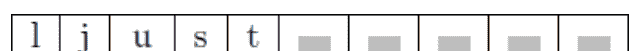

在 LJ2 中，字符串 'ljust' 将左对齐，剩余的 5 个位置将由字符 '*' 填充。因此，输出为 **ljust*****。

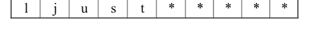

在 LJ3 中，定义的最小宽度为 10。字符串 'python' 将左对齐，剩余的 4 个位置将由字符 '@' 填充。因此，输出为 **python@@@@**。

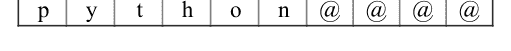

## 2.5.25 字符串 lower()

此方法将字符串中的所有大写字符转换为小写，并返回给定字符串的小写字符。如果不存在大写字符，则返回原始字符串。在此方法中，Python 会忽略数字和符号。
上述方法的语法是

```
string.lower()
```

此方法不接受任何参数。返回给定字符串的小写字符串。

```
示例 2.41
s1 = "Welcome My Friend"
print(s1.lower()) # – LO1
s2 = "python"
print(s2.lower()) # – LO2
s3 = "BE@utiFULL"
print(s3.lower()) # – LO3
s4 = "I LOVE PYTHON LANGUAGE!:"
print(s4.lower()) # – LO4
```

```
输出 2.41
welcome my friend
python
be@utifull
i love python language!:)
```

在 LO1 中，字符串中每个文本的首字母都是大写字母。因此，输出为 **welcome my friend**。
在 LO2 中，给定字符串中没有大写字母。因此，返回原始字符串 **python**。
在 LO3 中，字符串中的字符 '@' 被忽略，其余字符转换为小写。因此，输出为 **be@utifull**。
在 LO4 中，大写字母被转换为小写，并返回字符串。因此，输出为 **i love python language!:)**。

## 2.5.26 字符串 lstrip()

此方法移除前导字符（如果有的话），并返回移除后的字符串副本。默认要移除的前导字符是空格。从字符串左侧开始，移除 chars 参数中所有字符的组合，直到第一个不匹配的字符。这是一个需要特别注意的重要语句。上述方法的语法是

```
string.lstrip([chars])
```

其中 **chars** 是一个可选参数，是一个字符串，指定要作为前导字符移除的字符集。

```
**示例 2.42**
s1 = ' python '
print(s1.lstrip()) # – ls1
s2 = "@@@@@@,,,,....phew.....super"
print(s2.lstrip('.,@whep')) # – ls2
s3 = 'https://www.abc.com'
print(s3.lstrip('spth:/w.')) # – ls3
print(s3.lstrip('spth:/')) # – ls4
```

```
**输出 2.42**
python
super
abc.com
www.abc.com
```

在 ls1 中，由于未提供参数，字符串的所有前导空格都被移除。因此，输出为 **python**。
在 ls2 中，要从字符串中移除的字符集是 '.,@whep'。因此，结果字符串为 **super**。
在 ls3 中，要从字符串中移除的字符集是 'spth:/w.'。因此，结果字符串为 **abc.com**。
在 ls4 中，要从字符串中移除的字符集是 'spth:/'。因此，结果字符串为 **www.abc.com**。

## 2.5.27 字符串 maketrans()

此方法是一个静态方法，它创建一个字符到其翻译的一对一映射。返回一个可用于 translate() 方法的翻译映射表。为每个字符创建一个用于翻译的 Unicode 表示。上述方法的语法是

```
string.maketrans(x[,y[,z]])
```

有 3 个参数：

1.  **x**：如果传递一个参数，它必须是一个字典。该字典包含一个 Unicode 数字到其翻译的映射，或者一个字符到其翻译的一对一映射。
2.  **y**：如果传递 2 个参数，这两个字符串必须长度相等。第一个字符串中的每个字符将被替换为第二个字符串中对应索引的字符。
3.  **z**：如果方法中有 3 个参数，则第三个参数中的每个字符都将映射到 None。

### 示例 2.43

源代码请扫描 [图2.1](Figure 2.1) 中的二维码，位于 [第129页](page 129)

### 输出 2.43

```
{100: 'l', 101: 'o', 102: 't'}
{115: 49, 97: 50, 105: 51, 108: 52}
13mp4e 2welome 3nd32n 4o1t
{100: None, 101: None, 102: 105, 103: None}
```

在 MT1 中，定义了一个字典对象 d1，它包含字符 d、e 和 f 分别映射到 'l'、'o' 和 't'。maketrans() 方法将字符的 Unicode 序数映射到其对应的翻译。因此，'100' 映射到 'l'，'101' 映射到 'o'，'102' 映射到 't'。

在 MT2 中，定义了两个长度相等的字符串 'sail' 和 '1234'，并将创建相应的翻译。a1 中每个字符的 Unicode 序数将一对一映射到 'b1' 中对应索引的字符。在这种情况下，'115' 将映射到 '49'，'97' 映射到 '50'，'105' 映射到 '51'，'108' 映射到 '52'。因此，输出为 {115: 49, 97: 50, 105: 51, 108: 52}。

在 MT3 中，字符串 'str1' 中的每个字符都使用给定的翻译表。字母 's' 将被替换为 '1'，'a' 替换为 '2'，'I' 替换为 '3'，'l' 替换为 4。因此，结果字符串为 13mp4e 2we1ome 3nd32n 4o1t。

在 MT4 中，创建了字符串 firststring 和 secondstring 之间的映射。thirdstring 将重置其中每个字符的映射到 None，并为不存在的字符创建新的映射。thirdstring 将 'd' 和 'e' 的映射重置为 None，并为 '103' 创建新的映射并映射到 None。因此，输出为 {100: None, 101: None, 102: 105, 103: None}。

## 2.5.28 字符串 partition()

此方法将搜索指定的字符串，并在指定字符串（分隔符）第一次出现的位置将字符串分割，返回一个包含 3 部分的元组：第一部分包含分隔符之前的字符串，第二部分是分隔符本身，第三部分是分隔符之后的字符串。如果未找到分隔符参数，则返回字符串本身和两个空字符串。上述方法的语法是

```
string.partition(separator)
```

其中 **separator** 是一个字符串参数，它将在第一次出现时将字符串分割成 3 部分。

```
示例 2.44
s1 = "SAY NO TO ALCOHOL"
print(s1.partition('No')) #– P1
print(s1.partition('NO')) #– P2
s2 = "We must teach our boys to protect girls no matter the situation is"
```

# 2.5.28 字符串 partition() 方法

```
print(s2.partition('boys')) #- P3
s3 = "alliumsepa@1234"
print(s3.partition('@')) #- P4
```

```
Output 2.44
('SAY NO TO ALCOHOL', "", "")
('SAY ', 'NO', ' TO ALCOHOL')
('We must teach our ', 'boys', ' to protect girls no matter the situation is')
('alliumsepa', '@', '1234')
```

在 P1 中，分隔符是 'No'，它在字符串中未找到。返回一个包含字符串本身和两个空字符串的元组。因此，输出结果是 ('SAY NO TO ALCOHOL', "", "")。

在 P2 中，分隔符是 'NO'，它在字符串中被找到。因此，返回一个包含三部分的元组：分隔符 'NO' 之前的部分 'SAY'，分隔符本身 'NO'，以及分隔符之后的部分 ' TO ALCOHOL'。因此，输出结果是 ('SAY ', 'NO', ' TO ALCOHOL')。

在 P3 中，返回一个包含三部分的元组。因此，输出结果是 ('We must teach our ', 'boys', ' to protect girls no matter the situation is')。

在 P4 中，返回一个包含三部分的元组，输出结果为 ('alliumsepa', '@', '1234')。

# 2.5.29 字符串 replace() 方法

此方法通过将所有出现的旧子字符串替换为新字符串，返回字符串的一个副本。然而，原始字符串保持不变。上述方法的语法为

```
string.replace(old, new[, count])
```

其中
- **old** 是必需的子字符串，是用户想要替换的部分。
- **new** 也是一个必需的参数，是用来替换旧子字符串的新子字符串。
- **count** 是一个可选参数，表示将旧子字符串替换为新子字符串的次数。

```
示例 2.45
s1 = "GRAVY GRAVY Butter Paneer Masala"
print(s1.replace('GRAVY', "TASTY")) # – R1
s2 = "IEC61850$IEDCONTROL/LLN0/Mod$stVal"
print(s2) # – R2
print(s2.replace('Mod', "Pos")) # – R3
s3 = "I love to eat Chips"
print(s3.replace('love', 'hate')) # – R4
s4 = "We must Respect girls. We must respect girls. We must respect girls. Always and Forever"
print(s4.replace('respect', 'protect', 2)) # – R5
```

```
Output 2.45
TASTY TASTY Butter Paneer Masala
IEC61850$IEDCONTROL/LLN0/Mod$stVal
IEC61850$IEDCONTROL/LLN0/Pos$stVal
I hate to eat Chips
We must Respect girls. We must protect girls. We must protect girls. Always and Forever
```

在 R1 中，所有出现的子字符串 'GRAVY' 都被新子字符串 'TASTY' 替换。因此，输出结果是 **TASTY TASTY Butter Paneer Masala**。

在 R2 中，原始字符串是 IEC61850$IEDCONTROL/LLN0/Mod$stVal。

在 R3 中，子字符串 'Mod' 被新子字符串 'Pos' 替换。因此，输出结果是 IEC61850$IEDCONTROL/LLN0/Pos$stVal。

在 R4 中，子字符串 'love' 被新子字符串 'hate' 替换。因此，输出结果是 **I hate to eat Chips.**

在 R5 中，子字符串 'respect' 在两处被替换为子字符串 'protect'。因此，输出结果是 **We must Respect girls. We must protect girls. We must protect girls. Always and Forever.**

# 2.5.30 字符串 rfind() 方法

此方法将在字符串中搜索子字符串，并返回最高索引，即指定子字符串最后一次出现的位置。如果未找到子字符串，则返回 -1。上述方法的语法为

```
string.rfind(sub[,start[,end]])
```

其中
- **sub** 是要在字符串中搜索的子字符串。
- **start** 是一个可选参数，表示子字符串搜索的起始位置。默认值是 0。
- **end** 也是一个可选参数，表示子字符串搜索的结束位置。默认值是字符串的末尾。

示例 2.46

对于示例 2.46 中所示的源代码，请扫描二维码

```
Output 2.46
67
-1
56
-1
-1
16
6
5
-1
5
5
-1
3
```

在 S1 中，子字符串 'Save' 在给定字符串中的索引 67 处被找到。因此，输出结果是 67。

在 S2 中，子字符串 'demo' 在字符串中未找到。因此，输出结果是 -1。

在 S3 中，子字符串 'save' 在给定字符串中的索引 56 处被找到。因此，输出结果是 56。

在 S4 中，传递了起始索引 57。子字符串 'save' 将从索引 57 开始搜索。由于在字符串末尾之前都未找到上述子字符串，因此输出结果是 -1。

在 S5 中，子字符串 'Environment' 在位置 15 和 22 之间被搜索。因此，输出结果是 -1。

在 S6 中，子字符串 'Environment' 在位置 15 和 32 之间被找到。因此，输出结果是 16。

在 S7 中，字母 'u' 在字符串中最后一次出现的位置是在字符串的索引 6 处。因此，输出结果是 6。

在 S8 中，起始索引是 5。字母 'o' 在索引位置 5 被找到。因此，输出结果是 5。

| 0 | 1 | 2 | 3 | 4 | 5 | 6 | 7 |
|---|---|---|---|---|---|---|---|
| F | a | B | u | l | o | u | s |

在 S9 中，起始索引是 6。在索引位置 6 之后再未找到字母 'o'。因此，输出结果是 -1。

在 S10 中，字母 'r' 在最高索引处被找到，即字符串的索引位置 5。因此，输出结果是 5。

| 0 | 1 | 2 | 3 | 4 | 5 |
|---|---|---|---|---|---|
| H | o | r | r | o | r |
| -6 | -5 | -4 | -3 | -2 | -1 |

在 S11 中，起始索引是 -5，一直到字符串末尾。字母 'r' 在索引位置 5 被找到。因此，输出结果是 5。

在 S12 中，字母 'r' 在位置 -2 和 -5 之间被搜索。由于无法在指定的起始索引和结束索引之间找到该字母，因此输出结果将是 -1。

在 S13 中，字母 'r' 在位置 -5 和 -2 之间被搜索。因此，输出结果是 3。

| 0 | 1 | 2 | 3 | 4 | 5 |
|---|---|---|---|---|---|
| H | o | r | r | o | r |
| -6 | -5 | -4 | -3 | -2 | -1 |

如果题目中结束索引是 -3，那么字母 'r' 的最高索引将是 2。

# 2.5.31 字符串 rindex() 方法

此方法将在字符串中搜索子字符串，并返回最高索引，即指定子字符串最后一次出现的位置。如果未找到子字符串，则会引发 ValueError 异常。上述方法的语法为

```
string.rindex(sub[, start[, end]])
```

其中
- **sub** 是要在字符串中搜索的子字符串。
- **start** 是一个可选参数，表示子字符串搜索的起始位置。默认值是 0。
- **end** 也是一个可选参数，表示子字符串搜索的结束位置。默认值是字符串的末尾。

此方法与 rfind() 方法类似。唯一的区别在于，如果未找到子字符串，它会引发异常，而 rfind() 方法返回 -1。

```
示例 2.47
s2 = 'adamant'
print(s2.rindex('a')) # – RI1
print(s2.rindex('a',4)) # – RI2
s3 = "humongous"
print(s3.rindex('u')) # – RI3
print(s3.rindex('u',-5)) # – RI4
print(s3.rindex('g',-5,-3)) # – RI5
print(s3.rindex('g',-7,-4)) # – RI6
s4 = "Beautiful! Beautiful! you are so Beautiful"
print(s4.rindex('u')) # – RI7
print(s4.rindex('u',-5)) # – RI8
print(s4.rindex('!',-30,-3)) # – RI9
```

```
Output 2.47
4
4
7
7
5
ValueError: substring not found
40
40
20
```

在 RI1 中，字母 'a' 在字符串 'adamant' 中的索引 0、2 和 4 处存在。但是 rindex 将返回该字母的最高索引，即在位置 4。因此，输出结果是 4。

在 RI2 中，字母 'a' 将从位置 4 开始直到字符串末尾被搜索。使用上述方法，输出结果再次是 4。

在 RI3 中，字母 'u' 在字符串 'humongous' 中的索引 1 和 7 处存在。因此，输出结果是 7。

| 0 | 1 | 2 | 3 | 4 | 5 | 6 | 7 | 8 |
|---|---|---|---|---|---|---|---|---|
| h | u | m | o | n | g | o | u | s |
| -9 | -8 | -7 | -6 | -5 | -4 | -3 | -2 | -1 |

在 RI4 中，字母 'u' 从位置 -5 开始直到字符串末尾（即 -1）被搜索。使用上述方法，输出结果是 7。

在 RI5 中，字母 'g' 在位置 -5 和 -3 之间被搜索。它在索引位置 5 或 -4 被找到。使用上述方法，输出结果将在索引位置 5。

在 RI6 中，字母 'g' 在位置 -7 和 -4 之间（即到索引 -5 为止）被搜索。

| 0 | 1 | 2 | 3 | 4 | 5 | 6 | 7 | 8 |
|---|---|---|---|---|---|---|---|---|
| h | u | m | o | n | g | o | u | s |
| -9 | -8 | -7 | -6 | -5 | -4 | -3 | -2 | -1 |

由于在起始和结束位置之间未找到它，Python 将抛出 **ValueError: substring not found.**

在 RI7 中，使用上述方法，字母 'u' 存在于最高索引处，即索引 40。因此，输出结果是 40。

在 RI8 中，字母 'u' 从索引位置 -5 开始直到字符串末尾被搜索。使用上述方法，输出结果将在索引位置 40。

在 RI9 中，符号 '!' 在索引位置 9 和 20 存在。使用上述方法，输出结果将在索引位置 20。

# 2.5.32 字符串 rjust() 方法

此方法使用指定字符作为填充字符，将字符串右对齐。返回一个右对齐并用字符填充的新字符串。上述方法的语法为

```
string.rjust(width[,fillchar])
```

其中
- **width** 是一个必需的参数，表示给定字符串的宽度。如果宽度小于或等于字符串的长度，则返回原始字符串。
- **fillchar** 是一个可选参数，是用来填充剩余空间的字符（在字符串左侧）。如果未提及，默认的填充字符是空格。

示例 2.48

```python
s1 = 'python'
w1 = 10
print(s1.rjust(w1)) # – RJ1
print(s1.rjust(w1,'*')) # – RJ2
s2 = "injury"
w2=8
w3=4
print(s2.rjust(w3)) # – RJ3
print(s2.rjust(w2)) # – RJ4
print(s2.rjust(w2,'$')) # – RJ5
```

```
输出 2.48
    python
****python
injury
    injury
$$injury
```

在 RJ1 中，最小宽度为 10。因此，结果字符串的长度为 10。`rjust` 会将字符串 'python' 右对齐，在其左侧留下 4 个空格。因此，输出为

| | | | | p | y | t | h | o | n |
|---|---|---|---|---|---|---|---|---|---|

在 RJ2 中，`rjust` 会将字符串 'python' 右对齐，在其左侧留下 4 个空格，并用填充字符 '*' 填充。因此，输出为

| * | * | * | * | p | y | t | h | o | n |
|---|---|---|---|---|---|---|---|---|---|

在 RJ3 中，宽度 4 小于字符串 'injury' 的长度 6。因此，输出仅为 'injury'。

在 RJ4 中，`rjust` 会将字符串 'injury' 右对齐，在其左侧留下 2 个空格。因此，输出为

| | | i | n | j | u | r | y |
|---|---|---|---|---|---|---|---|

在 RJ5 中，`rjust` 会将字符串 'injury' 右对齐，在其左侧留下 2 个空格，并用填充字符 '$' 填充。因此，输出为

| $ | $ | i | n | j | u | r | y |
|---|---|---|---|---|---|---|---|

### 2.5.33 字符串 rpartition()

此方法将搜索指定的字符串，并在该指定字符串（分隔符）的最后一次出现处拆分字符串，返回一个包含 3 部分的元组。第一部分包含分隔符之前的字符串，第二部分是分隔符本身，第三部分是分隔符之后的字符串。如果未找到分隔符参数，则返回两个空字符串和字符串本身。上述方法的语法是

```
string.rpartition(separator)
```

其中 **separator** 是一个字符串参数，它将在其最后一次出现处将字符串分成 3 部分。

```
示例 2.49
s1 = 'Python is one of the best programming language'
print(s1.rpartition('Python')) # – RP1
print(s1.rpartition('here')) # – RP2
print(s1.rpartition('yth')) # – RP3
print(s1.rpartition('best')) # – RP4
print(s1.rpartition('language')) # – RP5
s2 = 'Python is one of the best programming language. I love Python'
print(s2.rpartition('Python')) # – RP6
```

```
输出 2.49
('', 'Python', ' is one of the best programming language')
('', '', 'Python is one of the best programming language')
('P', 'yth', 'on is one of the best programming language')
('Python is one of the ', 'best', ' programming language')
('Python is one of the best programming ', 'language', '')
```

> ('Python is one of the best programming language. I love ', 'Python', '')

在 RP1 中，分隔符 'Python' 字符串在索引 0 处被找到。因此，分隔符之前的字符串为空 ''。因此，输出为 ('', 'Python', ' is one of the best programming language')。

在 RP2 中，分隔符字符串 'here' 不存在于字符串中。因此，输出是两个空字符串后跟字符串。因此，输出为 ('', '', 'Python is one of the best programming language')。

在 RP3 中，这里的分隔符是 'yth'。因此，分隔符之前的字符串仅为 'P'。因此，输出为 ('P', 'yth', 'on is one of the best programming language')。

在 RP4 中，分隔符是 'best'。因此，输出为 ('Python is one of the ', 'best', ' programming language')。

在 RP5 中，分隔符是 'language'。因此，输出为 ('Python is one of the best programming ', 'language', '')。

在 RP6 中，分隔符 'Python' 重复了 2 次。但最后一次出现是在单词 'love' 之后，后面跟着一个空格。因此，分隔符之前的字符串将是 'Python is one of the best programming language. I love '。因此，最终输出将是 ('Python is one of the best programming language. I love ', 'Python', '')。

### 2.5.34 字符串 rsplit()

此方法使用分隔符作为分隔符从右侧拆分字符串，并返回一个逗号分隔的列表。如果没有分隔符，则默认情况下任何空白字符串都是分隔符。上述方法的语法是

```
string.rsplit([separator[, maxsplit]])
```

其中

**separator** 是一个可选参数，将从右侧开始拆分字符串。它是一个分隔符。

**maxsplit** 也是一个可选参数，它指定执行拆分的最大次数。默认值为 -1，这意味着对拆分次数没有限制。需要注意的一个重要点是，如果指定了 maxsplit，则列表最多将有 maxsplit+1 项。

### 示例 2.50

对于第 129 页图 2.1 所示的源代码扫描二维码

```
输出 2.50
['Python', 'is', 'a', 'programming', 'language']
['', ' is a programming language']
['Python is ', ' progr', 'mming l', 'ngu', 'ge']
['Python is a programming langu', 'ge']
['Python is a programming l', 'ngu', 'ge']
['Python is a progr', 'mming l', 'ngu', 'ge']
['apple,litchi,grapes,mango']
['apple,litchi,grapes,mango']
['apple,litchi,grapes', 'mango']
['apple,litchi', 'grapes', 'mango']
```

在 RS1 中，没有给出分隔符。因此，默认情况下空格是分隔符。字符串被拆分成字符串列表。因此，输出为 ['Python', 'is', 'a', 'programming', 'language']。

在 RS2 中，参数 'Python' 作为分隔符传递给方法。字符串在指定的分隔符处从右侧拆分。因此，输出为 ['', ' is a programming language']。

在 RS3 中，每次遇到分隔符 'a' 时，字符串都会被拆分。因此，输出为 ['Python is ', ' progr', 'mming l', 'ngu', 'ge']。

在 RS4 中，分隔符 'a' 与 maxsplit 值 1 一起传递。因此，输出为 ['Python is a programming langu', 'ge']。

在 RS5 中，分隔符 'a' 与 maxsplit 值 2 一起传递。因此，输出为 ['Python is a programming l', 'ngu', 'ge']。

在 RS6 中，分隔符 'a' 与 maxsplit 值 3 一起传递。因此，输出为 ['Python is a progr', 'mming l', 'ngu', 'ge']。

在 RS7 中，分隔符 ':' 作为参数传递。但字符串中没有 ':'。因此，输出为 ['apple,litchi,grapes,mango']。

在 RS8 中，分隔符 ',' 与 maxsplit 值 0 一起传递。因此，输出为 ['apple,litchi,grapes,mango']。

在 RS9 中，分隔符 ',' 与 maxsplit 值 1 一起传递。因此，输出为 ['apple,litchi,grapes', 'mango']。

在 RS10 中，分隔符 ',' 与 maxsplit 值 2 一起传递。因此，输出为 ['apple,litchi', 'grapes', 'mango']。

因此，根据上述示例，我们可以说，当 maxsplit 作为参数给出时，列表将有 maxsplit+1 项。如果没有给出，则 rsplit() 的行为类似于 split()。

### 2.5.35 字符串 rstrip()

此方法从字符串的右侧移除所有尾随字符，并返回字符串的副本。上述方法的语法是
```
string.rstrip([chars])
```
其中 **chars** 是一个可选的字符串参数，它指定要移除的字符集。如果没有指定参数，则默认情况下空白是尾随字符。在第一次不匹配之前，chars 参数中的所有字符组合都会从字符串的右侧移除。

**示例 2.51**
对于第 129 页图 2.1 所示的源代码扫描二维码

```
输出 2.51
I am greeting you!    Good Morning
37
I am greeting you!    Good Morning
34
Python and C#
Python and C
www.abc.com
apple
apple
```

在 RT1 中，字符串在与另一个字符串连接后被打印。因此，输出为 ' I am greeting you! Good Morning '。

在 RT2 中，字符串的长度为 37。

在 RT3 中，我们正在剥离尾随字符，默认情况下是空白。因此，输出为 ' I am greeting you! Good Morning'。

在 RT4 中，剥离后的字符串长度为 34。

在 RT5 中，剥离后的字符串是 **Python and C#**。

在 RT6 中，尾随字符是 '#'。因此，输出为 **Python and C**。

在 RT7 中，尾随字符是 '/'。因此，输出为 www.abc.com。

在 RT8 中，尾随字符是 ',.ws'。因此，输出仅为 **apple**。

在 RT9 中，尾随字符是 'ws.,'。因此，输出仅为 **apple**。

### 2.5.36 字符串 split()

此方法使用分隔符作为分隔符拆分字符串，并返回一个逗号分隔的列表。如果没有分隔符，则默认情况下任何空白字符串都是分隔符。上述方法的语法是

```
string.split([separator[, maxsplit]])
```其中
**separator** 是一个可选参数，将在指定的分隔符处拆分字符串。它是一个分隔符。
**maxsplit** 也是一个可选参数，用于指定执行拆分的最大次数。默认值为 -1，表示对拆分次数没有限制。需要注意的是，如果指定了 maxsplit，列表最多将有 maxsplit+1 个元素。

## 示例 2.52

对于 [第 129 页](page 129) [图 2.1](Figure 2.1) 中所示的源代码扫描二维码

```
输出 2.52
['Python', 'is', 'a', 'programming', 'language']
['', ' is a programming language']
['Python is ', ' progr', ' mming l', 'ngu', 'ge']
['Python is ', ' programming language']
['Python is ', ' progr', ' mming language']
['Python is ', ' progr', ' mming l', 'nguage']
['apple,litchi,grapes,mango']
['apple,litchi,grapes,mango']
['apple', 'litchi,grapes,mango']
['apple', 'litchi', 'grapes,mango']
```

在 S1 中，没有给出分隔符。因此，默认情况下空格是分隔符。字符串被拆分成字符串列表。因此，输出为 `['Python', 'is', 'a', 'programming', 'language']`。
在 S2 中，将参数 ‘Python’ 作为分隔符传递给该方法。字符串在指定的分隔符处被拆分。因此，输出为 `['', ' is a programming language']`。
在 S3 中，每次出现分隔符 ‘a’ 时都会拆分字符串。因此，输出为 `['Python is ', ' progr', ' mming l', 'ngu', 'ge']`。
在 S4 中，传递了分隔符 ‘a’，同时 maxsplit 的值为 1。因此，输出为 `['Python is ', ' programming language']`。
在 S5 中，传递了分隔符 ‘a’，同时 maxsplit 的值为 2。因此，输出为 `['Python is ', ' progr', ' mming language']`。
在 S6 中，传递了分隔符 ‘a’，同时 maxsplit 的值为 3。因此，输出为 `['Python is ', ' progr', ' mming l', 'nguage']`。
在 S7 中，将分隔符 ‘:’ 作为参数传递。但字符串中没有 ‘:’。因此，输出为 `['apple,litchi,grapes,mango']`。
在 S8 中，传递了分隔符 ‘,’，同时 maxsplit 的值为 0。因此，输出为 `['apple,litchi,grapes,mango']`。
在 S9 中，传递了分隔符 ‘,’，同时 maxsplit 的值为 1。因此，输出为 `['apple', 'litchi,grapes,mango']`。
在 S10 中，传递了分隔符 ‘,’，同时 maxsplit 的值为 2。因此，输出为 `['apple', 'litchi', 'grapes,mango']`。

所以，基于以上示例，我们可以说当 maxsplit 作为参数给出时，列表将有 maxsplit+1 个元素。

## 2.5.37 字符串 splitlines()

此方法在行边界处中断字符串，并返回字符串中的各行列表。

上述方法的语法为

```
string.splitlines([keepends])
```

其中 **keepends** 是一个可选参数，如果为 True，则包含换行符；如果为 False，则不包含换行符。默认值为 False。

换行符表格（表 2.2）如下：

| 表示 | 描述 |
|---|---|
| \n | 换行符 |
| \r | 回车符 |
| \r\n | 回车符和换行符 |
| \v 或 \x0b | 垂直制表符 |
| \f 或 \x0c | 换页符 |
| \x1c | 文件分隔符 |
| \x1d | 组分隔符 |
| \x1e | 记录分隔符 |
| \x85 | 下一行（C1 控制码） |
| \u2028 | 行分隔符 |
| \u2029 | 段落分隔符 |

表 2.2：换行符

```
示例 2.53
s1 = 'His Name is ABC'
print(s1) # – SP1
print(s1.splitlines()) # – SP2
s2 = 'His\nName is\nABC'
print(s2.splitlines()) # – SP3
print(s2.splitlines(True)) # – SP4
s3 = 'What\r a\n Game'
s4 = s3.splitlines()
print(s4) # – SP5
print("".join(s4)) # – SP6
```

```
输出 2.53
His Name is ABC
['His Name is ABC']
['His', 'Name is', 'ABC']
['His\n', 'Name is\n', 'ABC']
['What', ' a', ' Game']
What a Game
```

在 SP1 中，打印了一个字符串。因此，输出为 `His Name is ABC`。在 SP2 中，返回一个包含单个元素的列表。因此输出为 `['His Name is ABC']`。在 SP3 中，返回一个包含拆分元素的列表。因此输出为 `['His', 'Name is', 'ABC']`。
在 SP4 中，传递 True 作为参数，将换行符包含在字符串列表中。因此，输出为 `['His\n', 'Name is\n', 'ABC']`。
在 SP5 中，返回一个包含拆分元素的列表。因此输出为 `['What', 'a', 'Game']`。
在 SP6 中，列表被转换为不包含任何换行符的字符串。因此，输出为 `What a Game`。

## 2.5.38 字符串 startswith()

此方法检查字符串是否以指定的前缀开头。如果字符串以指定的前缀开头，则返回 True，否则返回 False。上述方法的语法为

```
string.startswith(prefix[,start[,end]])
```

其中
- **prefix：** 这是必需参数，是一个字符串或需要检查的字符串元组。如果字符串以元组中的任何项开头，则返回 True，否则返回 False。
- **start：** 这是可选参数。从起始位置开始在字符串中检查前缀。
- **end：** 这是可选参数。从结束位置开始在字符串中检查前缀。

```
示例 2.54
s1 = 'Python is a User-Friendly language'
print(s1.startswith('Python')) # – SW1
print(s1.startswith('python')) # – SW2
print(s1.startswith('User',12)) # – SW3
print(s1.startswith('User',12,16)) # – SW4
print(s1.startswith('User',13,16)) # – SW5
print(s1.startswith(('program','Python'))) # – SW6
print(s1.startswith(('program','is','a'))) # – SW7
print(s1.startswith(('User','is'),12,15)) # – SW8
```

```
输出 2.54
True
False
True
True
False
True
False
False
```

在 SW1 中，字符串以指定的前缀 ‘Python’ 开头。因此，输出为 True。
在 SW2 中，字符串不以指定的前缀 ‘python’ 开头。因此，输出为 False。
在 SW3 中，起始索引为 12。字符串以指定的前缀 ‘User’ 开头。因此，输出为 True。
在 SW4 中，在起始索引 12 和结束索引 16 之间搜索指定的前缀 ‘User’。因此，输出为 True。
在 SW5 中，在起始索引 13 和结束索引 16 之间搜索指定的前缀 ‘User’。因此，输出为 False。
在 SW6 中，字符串以 ‘Python’ 开头，它是元组的一部分。因此，输出为 True。
在 SW7 中，字符串以 ‘Python’ 开头，它不是元组的一部分。因此，输出为 False。
在 SW8 中，起始索引为 12，结束索引为 15。字符串以 ‘User’ 开头，它是元组的一部分。因此，输出为 False。

## 2.5.39 字符串 strip()

此方法根据传递的字符串参数移除前导和尾随字符，并返回该字符串的副本。上述方法的语法为

```
string.strip([chars])
```

其中 **chars** 是一个可选的字符串参数，指定要移除的字符集。如果 chars 参数为空，则从字符串中移除所有前导和尾随空格。

## 示例 2.55

对于 [第 129 页](page 129) [图 2.1](Figure 2.1) 中所示的源代码扫描二维码

```
输出 2.55
    Good Morning
18
Good Morning
12
Python and C#
    Python and C
[www.abc.com/](www.abc.com/)
apple
apple
banana
#banana
banana#
```

在 S1 中，显示原始字符串。因此，输出为 **Good Morning**。
在 S2 中，原始字符串的长度为 18。
在 S3 中，移除了尾随和前导空格。因此，输出为 **Good Morning**。
在 S4 中，移除尾随和前导空格后的字符串长度为 12。
在 S5 中，字符串中存在前导空格，这些空格被移除。因此，输出为 **Python and C#**。
在 S6 中，chars 参数包含 ‘#’，它已从字符串中移除。因此，输出为 `Python and C`。
在 S7 中，字符串不包含 ‘@’ 参数。因此，输出为 `www.abc.com/`。
在 S8 中，字符 ‘,.ws’ 已从字符串中移除。因此，输出为 `apple`。
在 S9 中，字符 ‘ws.,’ 已从字符串中移除。因此，输出为 `apple`。
在 S10 中，字符 ‘#’ 已从字符串的左右两侧移除。因此，输出为 `banana`。
在 S11 中，字符 ‘#’ 已从字符串的右侧移除。因此，输出为 `#banana`。
在 S12 中，字符 ‘#’ 已从字符串的左侧移除。因此，输出为 `banana#`。

## 2.5.40 字符串 swapcase()

此方法将字符串中的大小写进行互换，并返回转换后的字符串副本。上述方法的语法为

```
string.swapcase()
```

它不接受任何参数，并返回一个字符串。

```
示例 2.56
s1 = 'LOWERCASE'
print(s1.swapcase()) # – SW1
s2 = 'uppercase'
print(s2.swapcase()) # – SW2
s3 = 'MixedCAse'
print(s3.swapcase()) # – SW3
print(s3.swapcase().swapcase()) # – SW4
s4 = 'HE0llO1'
print(s4.swapcase()) # – SW5
```输出 2.56
小写
大写
混合大小写
混合大小写
he0LLo1

在 SW1 中，大写字符串 ‘LOWERCASE’ 被转换为小写。因此，输出为 **lowercase**。
在 SW2 中，小写字符串 ‘uppercase’ 被转换为大写。因此，输出为 **UPPERCASE**。
在 SW3 中，字符串 ‘MixedCAse’ 是大写和小写字符的组合。因此，输出为 **mIXEDcaSE**。
在 SW4 中，`swapcase()` 方法被使用了两次。因此，小写字符将首先被转换为大写，反之亦然。之后，大写字符将再次被转换为小写，反之亦然。因此，最终输出为 **MixedCAse**。
在 SW5 中，整数在转换过程中不受影响。因此，输出为 **he0LLo1**

## 2.5.41 字符串 title()

此方法将每个单词的第一个字符转换为大写，并在转换后返回一个字符串。如果字符串包含数字或符号，则其后的第一个字母将被转换为大写。上述方法的语法是

```
string.title()
```

它不包含任何参数。返回字符串的标题大小写版本。

```
示例 2.57
s1 = 'my name is shyam'
print(s1.title())# – T1
s2 = '12b @!d flags'
print(s2.title())# – T2
s3 = "I'm a doctor."
print(s3.title())# – T3
s4 = "Welcome to 9th Generation of i20"
print(s4.title())# – T4
s5 = "hi 4f4f4f 6j6j6j"
print(s5.title())# – T5
```

**输出 2.57**
My Name Is Shyam
12B @!D Flags
I’M A Doctor.
Welcome To 9Th Generation Of I20
Hi 4F4F4F 6J6J6J

在 T1 中，字符串中每个单词的第一个字母将是大写。因此，输出为 **My Name Is Shyam.**
在 T2 中，给定字符串中数字后的字母将是大写。因此，输出为 **12B @!D Flags.**
在 T3 中，字符串包含一个符号 ‘ ”。此撇号符号后的字母将是大写。因此，输出为 **I’M A Doctor.**
在 T4 中，输出将是 **Welcome To 9Th Generation Of I20.**
在 T5 中，字符串包含数字。因此，数字后的字母将是大写。因此，输出为 **Hi 4F4F4F 6J6J6J.**

## 2.5.42 字符串 translate()

此方法将每个字符映射到其在翻译表中的对应字符，并在映射后返回一个字符串。`maketrans()` 方法创建翻译表。上述方法的语法是

```
string.translate(table)
```

其中 **table** 是一个必需参数，是一个包含两个字符之间映射的翻译表。

> **示例 2.58**

有关源代码扫描二维码，请参见 [第 129 页](page 129) 的 [图 2.1](Figure 2.1)

```
**输出 2.58**
xytabc
wabc
abcdef
abcg
```

在 TR1 中，显示了原始字符串。因此，输出为 **xytabc**。
在 TR2 中，翻译包含从 ‘r’、‘s’、‘t’ 到 ‘u’、‘v’ 和 ‘w’ 的映射。第三个字符串 s3 将 ‘x’ 和 ‘y’ 的映射重置为 None。因此，当使用 `translate()` 方法翻译字符串时，‘x’ 和 ‘y’ 被移除，‘t’ 被替换为 ‘w’，输出 **wabc**。
在 TR3 中，显示了原始字符串。因此，输出为 **abcdef**。
在 TR4 中，字母 ‘d’ 和 ‘e’ 将被映射到 None。数字 102，即字母 ‘f’，将被翻译为字母 ‘g’。因此，输出为 **abcg**。

## 2.5.43 字符串 upper()

此方法将字符串中的所有小写字符转换为大写，并在转换后返回字符串的副本。Python 在转换过程中会忽略符号和数字。上述方法的语法是

```
string.upper()
```

它不接受任何参数。如果不存在小写字符，则返回原始字符串。

```
**示例 2.59**
s1 = "welcome my friend"
print(s1.upper()) # – UO1
s2 = "PYTHON"
print(s2.upper()) # – UO2
s3 = "be@UTIfull"
print(s3.upper()) # – UO3
s4 = "I love python language!:)"
print(s4.upper()) # – UO4
s5 = 'th3ree'
print(s5.upper()) # – UO5
```

```
**输出 2.59**
WELCOME MY FRIEND
PYTHON
BE@UTIFULL
I LOVE PYTHON LANGUAGE!:)
TH3REE
```

在 U01 中，字符串仅包含小写字符，这些字符将被转换为大写字符。因此，输出为 **WELCOME MY FRIEND**。
在 U02 中，字符串 ‘PYTHON’ 中没有小写字符。因此，返回原始字符串。因此，输出为 **PYTHON**。
在 U03 中，转换过程中忽略符号。使用上述方法，输出为 **BE@UTIFULL**。
在 U04 中，转换过程中忽略符号。使用上述方法，输出为 I LOVE PYTHON LANGUAGE!:)。
在 U05 中，转换过程中忽略数字。因此，输出为 **TH3REE**。

## 2.5.44 字符串 zfill()

此方法通过在字符串左侧填充 0 数字来创建一个长度为 width 的字符串。返回的字符串在 0 数字之前包含一个符号前缀 ‘+’ 或 ‘-’。如果宽度小于原始字符串长度，则返回原始字符串。上述方法的语法是

```
string.zfill(width)
```

其中 **width** 是一个必需参数，是一个数字，指定使用 `zfill` 返回的字符串的长度，其中 0 数字填充在字符串的左侧。

```
示例 2.60
s1 = 'python is fun to learn'
print(len(s1)) # – Z1
print(s1.zfill(15)) # – Z2
print(s1.zfill(23)) # – Z3
print(s1.zfill(30)) # – Z4
s2 = '+20'
print(s2.zfill(4)) # – Z5
s2 = '-30'
print(s2.zfill(4)) # – Z6
s2 = '-30+20'
print(s2.zfill(8)) # – Z7
```

```
输出 2.60
22
python is fun to learn
0python is fun to learn
00000000python is fun to learn
+020
-030
-0030+20
```

在 Z1 中，显示了字符串的长度。因此，输出为 22。

在 Z2 中，宽度 15 小于字符串长度 22。因此，返回原始字符串。因此，输出为 **python is fun to learn**。

在 Z3 中，宽度 23 大于字符串长度 22。因此，新字符串将在字符串左侧包含 23 – 22 = 1 个零。因此，输出为 **0python is fun to learn**

在 Z4 中，宽度 30 大于字符串长度 22。因此，新字符串将在字符串左侧包含 30 – 22 = 8 个零。因此，输出为 **00000000python is fun to learn.**

在 Z5 中，字符串长度为 3，给定的宽度为 4。字符串包含第一个前缀 ‘+’。0 数字将在第一个符号前缀字符之后填充。因此，输出为 **+020**。

在 Z6 中，字符串长度为 3，给定的宽度为 4。字符串包含第一个前缀 ‘-’。0 数字将在第一个符号前缀字符之后填充。因此，输出为 **-030**。

在 Z7 中，字符串长度为 6，给定的宽度为 8。字符串同时包含 ‘-‘ 和 ‘+’ 前缀。0 数字仅在第一个符号前缀字符之后填充。因此，输出为 **-0030+20**。

# 第 3 章

# Python 决策与流程控制

在日常生活中，我们首先识别备选方案，并根据价值观、信仰和偏好在它们之间进行选择。做出非常重要的决定的行为就是决策。有时决定对我们有利，有时则不然。但我们美丽奋斗的旅程永远持续。我们在旅程中预测情况并做出决定。然后我们决定选择哪条路径来达到我们的目标。同样的情况类比出现在编程中，我们也需要做出决定，并根据决定执行代码块。程序执行流程的方向由编程语言中的决策语句决定。代码语句在运行时将按什么顺序执行由流程控制决定。

## 3.1 选择语句/条件语句

### 3.1.1 if

最简单的决策语句之一是 if 语句。如果满足某个条件，则执行一条语句或语句块，否则不执行。上述语句的语法是

```
if test expression:
    statement(s)
```

程序评估后的测试表达式将为 True 或 False，即接受布尔值。如果为 True，则执行语句块，否则不执行。非零值将被解释为 True。0 和 None 将被解释为 False。测试表达式也可以与括号一起使用。为了识别一个块，Python 使用缩进。让我们看一个例子。

```
if test expression:
    statement1
statement2
```

如果测试表达式为 True，则 if 块将仅考虑 statement1 在其块内。if 语句的流程图如下所示。
让我们用一个例子来澄清 if 语句的概念


图 3.1：if 语句流程图

```
示例 3.1
my_age = int(input(“Enter your age: ”))
if my_age == 32:
    print(“I am 32 years old”)
print(“Good Morning!”)
```

输出 3.1
情形 - I:
请输入你的年龄: 32
我今年32岁
早上好！
情形 - II:
请输入你的年龄: 42
早上好！

在上面的程序中，用户将被提示输入年龄。`my_age == 32`是测试表达式。如果用户输入的年龄是32，则`if`语句内的代码将被执行。如果用户输入的年龄不是32，则上述测试表达式结果为False，`if`语句中的代码将被跳过。`print(“Good Morning!”)`方法位于`if`语句之外（未缩进）。因此，无论测试表达式结果为True还是False，它都将被执行。

上述代码的流程图如下：

在情形 - I中，用户输入的年龄是32。因此，`if`测试表达式内的`print()`语句将被执行，随后执行`if()`块之外的`print`语句。在情形 - II中，用户输入的年龄不是32。因此，只会执行`if()`块之外的`print()`语句。

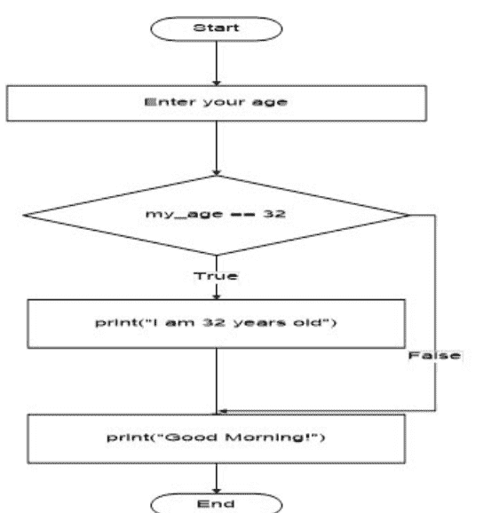
图 3.2: [示例 3.1](Example 3.1) 的流程图

## 3.1.2 if-else

在上一节中我们了解到，如果测试表达式为True，则会执行一个代码块。如果为False，则不会执行。但是，当测试表达式为False时，我们可以执行其他操作。当测试表达式为False时，else语句与if语句配合使用来执行一个代码块。上述语句的语法如下所示

```
if 测试表达式:
    if语句体
else:
    else语句体
```

当测试表达式为True时，将执行`if`语句体。如果为False，则执行`else`语句体。使用缩进来区分代码块。if-else语句的流程图如下所示

> **重要**

使用缩进来区分代码块。缩进在Python编程中扮演着非常重要的角色。

```
示例 3.2
num = int(input("Enter a number: "))
if num%2 == 0:
    print("Even number")
else:
    print("Odd number")
```

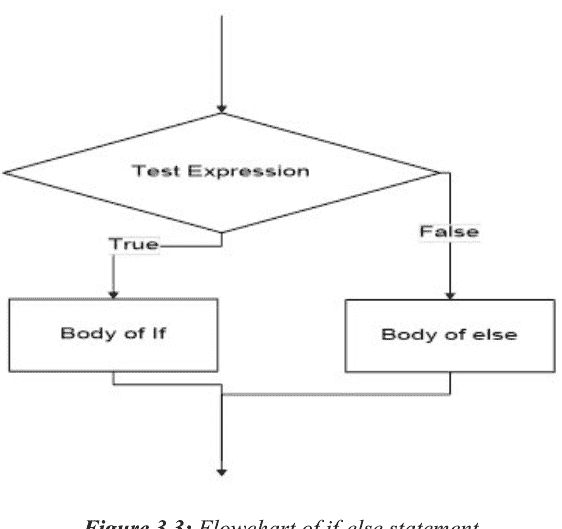
图 3.3: if-else语句的流程图

> **输出 3.2**
情形 - I:
Enter a number: 40
Even number

情形 - II:
Enter a number: 41
Odd number

在上面的Python代码片段中，用户将被提示输入一个数字，以检查输入的数字是偶数还是奇数。
在情形 - I中，输入的数字是40。测试表达式`num%2 == 0`为True，因此将执行`if`语句体，并显示输出“Even number”。
在情形 - II中，输入的数字是41。测试表达式`num%2 == 0`为False，因此将执行`else`语句体，并显示输出“Odd number”。

上述示例的流程图如下所示

## 3.1.3 if-elif-else

“elif”是“else if”的缩写。在某些情况下，我们需要检查多个表达式。if-elif-else语句的语法是

```
if 测试表达式:
    if语句体
elif 测试表达式:
    elif语句体
else:
    else语句体
```

从上面的语法可以看出，`if`块只会有一个对应的`else`块。如果`if`的测试表达式为True，则执行`if`语句体。如果`if`的测试表达式为False，则会检查下一个`elif`块的测试表达式，依此类推。如果`elif`块的测试表达式为True，则执行`elif`语句体。如果所有测试表达式都为False，则执行`else`语句体。在多个`if-elif-else`块中，只会有一个块被执行。if-elif-else块的流程图如下所示

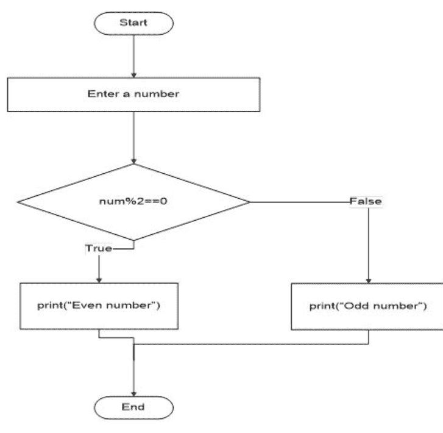
图 3.4: [示例 3.2](Example 3.2) 的流程图

```
示例 3.3
num1 = 9
num2 = -12
num3 = 7
if num1 <num2 and num1 < num3:
    print(f"1: The smallest number is {num1}")
elif num2 < num3:
    print(f"2: The smallest number is {num2}")
else:
    print(f"3: The smallest number is {num3}")
```

```
输出 3.3
2: The smallest number is -12
```

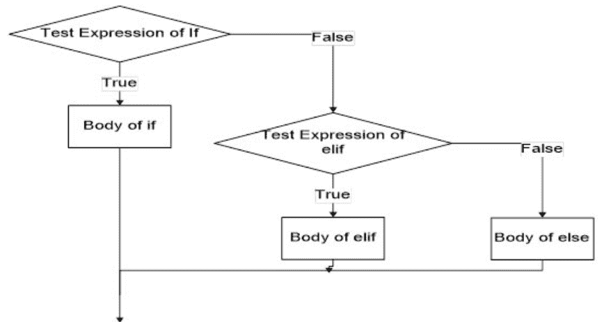
图 3.5: if-elif-else语句的流程图

在上面的示例中，我们比较第一个数字（num1）是否小于num2和num3。由于测试表达式为False，控制权转到`elif`块。数字-12小于7。因此，输出为“2: The smallest number is -12”。上述代码的流程图如下所示。

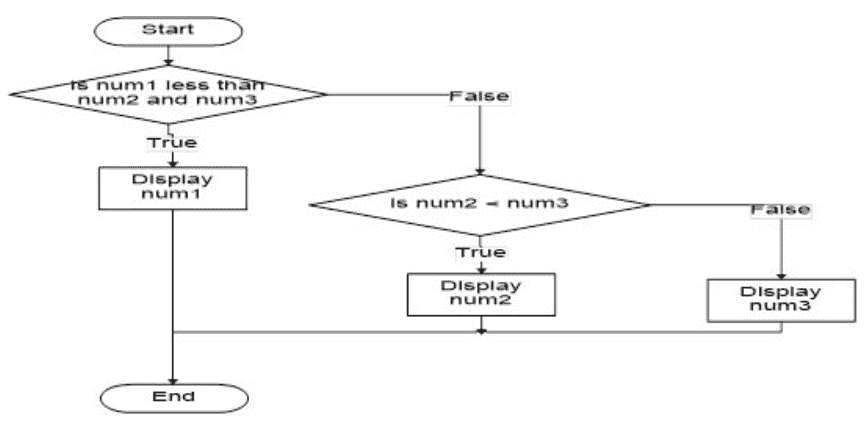
图 3.6: 示例 3.3 的流程图

## if-elif-else 多分支结构

用户被允许在多个选项之间进行选择。这些测试表达式将从上到下依次执行。当其中一个if语句的测试表达式为True时，将执行与该if相关联的代码块。如果没有一个测试表达式为True，则将执行最终的else块。

请观察下面的例子

```
**示例 3.4**
my_age = float(input("Enter the age: "))
if my_age > 0 and my_age < 1.5:
    print("The age is of infant")
elif my_age >=1.5 and my_age <12:
    print("The age is of children")
elif my_age >=12 and my_age <17:
    print("The age is of Teenager")
elif my_age >=17 and my_age <30:
    print("The age is of adult")
elif my_age >=30 and my_age <46:
    print("Middle aged person")
else:
    print("The age is of elder person")
```

```
**输出 3.4**
情形 - I:
Enter the age: 1.0
The age is of infant

情形 - II:
Enter the age: 6.0
The age is of children

情形 - III:
Enter the age: 13.0
The age is of Teenager
```

情形 - IV:
Enter the age: 20.0
The age is of adult

情形 - V:
Enter the age: 35.0
Middle aged person

情形 - VI:
Enter the age: 47.0
The age is of elder person

在上面的示例中，用户被提示输入年龄。
在情形 - I中，用户输入的年龄是1.0。因此，`if`的测试表达式为True，显示输出“The age is of infant”。
在情形 - II中，用户输入的年龄是6.0。因此，第一个`elif`的测试表达式为True，显示输出“The age is of children”。
在情形 - III中，用户输入的年龄是13.0。因此，第二个`elif`的测试表达式为True，显示输出“The age is of Teenager”。
在情形 - IV中，用户输入的年龄是20.0。因此，第三个`elif`的测试表达式为True，显示输出“The age is of adult”。
在情形 - V中，用户输入的年龄是35.0。因此，第四个`elif`的测试表达式为True，显示输出“Middle aged person”。
在情形 - VI中，用户输入的年龄是47.0。因此，`else`部分的测试表达式为True，显示输出“The age is of elder person”。
上述程序的流程图如下

`else`部分始终是可选的。不强制要求在if语句中编写else语句。另外，Python中没有`switch`语句。

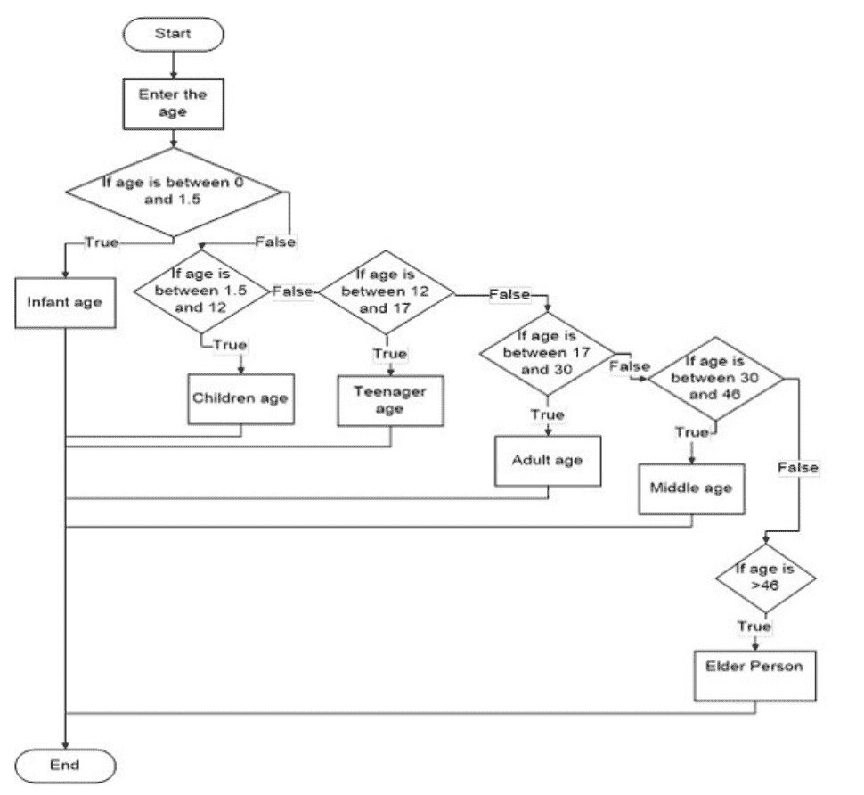
图 3.7: [示例 3.4](Example 3.4) 的流程图

## 3.2 循环语句

有时，一组语句需要多次或重复执行，这时我们就需要循环语句。它们被称为循环。只要条件为True，循环语句就允许我们执行一个代码块。在Python编程过程中，“循环”这个词会被用到很多次。没有循环，我们甚至无法构思编写Python代码。Python中只有两种循环：`for`循环和`while`循环。Python中没有`do-while`循环的概念。

## 3.2.1 for

Python中的`for`循环遍历一个元素序列。序列可以是字符串、列表、元组、集合或range对象。为了对序列中存在的每个元素执行一些必要的操作，使用`for`循环。`for`循环的语法是

```
for 变量 in 序列:
    for循环体
```

其中**变量**是一个变量，它在每次迭代中接收序列中的项值。使用缩进来将`for`循环体与其余代码分开。循环一直持续到序列中的最后一项被处理。`for`循环的流程图如下所示

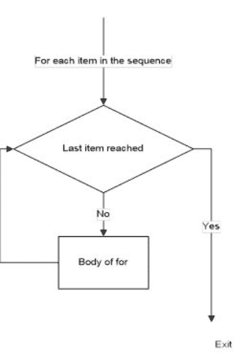
*图 3.8: for循环的流程图*

让我们看一些`for`循环的示例。

## 3.2.1 for循环

示例 3.5
```python
for i in range(4):#0 to 3
    print(f"I am: {i}")# F1

for i in range(1,5):#1 to 4
    print(f"I am: {i}")# F2
```

输出 3.5
```
I am: 0
I am: 1
I am: 2
I am: 3
I am: 1
I am: 2
I am: 3
I am: 4
```

在F1中，`range()`方法用于迭代一个数字序列。`range(4)`表示将从0迭代到3。因此，首先*i* = 0，然后执行`print()`函数。所以，将显示“I am: 0”。循环将继续处理*i* = 1, 2 和 3。因此，最终输出
```
I am: 0
I am: 1
I am: 2
I am: 3
```
将被显示。

类似地，在F2中，`range(1,5)`将从1迭代到4。因此，最终输出是
```
I am: 1
I am: 2
I am: 3
I am: 4
```

我们将再看一个计算前n个自然数之和的示例。

示例 3.6
```python
num = int(input("Enter the number: "))
total = 0
for i in range(1,num+1):
    total += i
print(total)
```

输出 3.6
```
Enter the number: 5
15
```

在上面的示例中，提示用户输入一个数字。输入的数字是5。最初`total`变量的值为0。`range()`将从1迭代到5。所以，循环将迭代5次。

### 第1次迭代
$i = 1$
total+ = 1 => total = 0 + 1
total = 1

### 第2次迭代
$i = 2$
total+ = 2 => total = 1 + 2
total = 3

### 第3次迭代
$i = 3$
total+ = 3 => total = 3 + 3
total = 6

### 第4次迭代
$i = 4$
total+ = 4 => total = 6 + 4
total = 10

### 第5次迭代
$i = 5$
total+ = 5 => total = 10 + 5
total = 15

所以，前5个自然数的和是15。

## 3.2.2 while循环

在`while`循环中，只要测试表达式为True，代码块就会被执行；如果测试表达式为False，控制权将退出循环。每次循环开始时都会检查条件。`while`循环的主体通过缩进来确定，第一个未缩进的行标志着循环结束。`while`循环的语法如下

```python
While test expression:
    Body of while
```

这里，首先检查测试表达式。如果为True，控制权进入`while`循环的主体。完成一次迭代后，控制权再次返回评估测试表达式。这是一个重复过程，直到测试表达式被评估为False。`while`循环的流程图如下所示

让我们看一些示例

示例 3.7
```python
j = 1
while j<=5:
    print("Welcome Python Beginners :)")
    j += 1
```


图 3.9：while循环流程图

输出 3.7
```
Welcome Python Beginners :)
Welcome Python Beginners :)
Welcome Python Beginners :)
Welcome Python Beginners :)
Welcome Python Beginners :)
```

在上面的程序中，只要我们的计数器变量`j`小于等于5，测试表达式就为True。最重要的一点是，`while`循环主体中的计数器变量的值必须递增。这里`j`的值递增1。如果未能这样做，将导致无限循环。代码将一直运行，必须强制停止。最终结果显示为字符串“Welcome Python Beginners :)”被显示了5次。我们可以看到控制权在每次迭代中是如何流转的。

### 第1次迭代
```
Test Expression: True
j = 1
print( Welcome Python Beginners :) )
j = 2
```

### 第2次迭代
```
Test Expression: True
j = 2
print( Welcome Python Beginners :) )
j = 3
```

### 第3次迭代
```
Test Expression: True
j = 3
print( Welcome Python Beginners :) )
j = 4
```

### 第4次迭代
```
Test Expression: True
j = 4
print( Welcome Python Beginners :) )
j = 5
```

### 第5次迭代
```
Test Expression: True
j = 5
print( Welcome Python Beginners :) )
j = 6
```

第5次迭代后，测试表达式被评估为False，控制权转到`while`循环之后的下一条语句，在这里就是代码的末尾。

> **注意：**
>
> 如果你提前知道迭代次数，那么使用‘for’循环。如果迭代次数未知，则使用‘while’循环。

## 3.3 跳转语句

有时，代码中存在需要改变正常循环流程的情况。当测试表达式为False时，控制权转到下一条语句。假设我们想要在检查测试表达式之前就终止当前循环迭代甚至整个循环，Python提供了`break`和`continue`语句来终止循环或跳过剩余代码。

### 3.3.1 break语句

在`break`语句中，循环被终止，程序控制流转向紧跟在循环体之后的语句。上述语句也可用于嵌套循环。如果存在，`break`将终止最内层的循环。`break`语句的语法是

```python
break
```

`break`语句的流程图如下：


让我们看看使用`for`和`while`循环的`break`语句示例

#### 在for循环中使用break语句

示例 3.8
```python
for num in range(1,6):
    #code inside for loop
    if num == 4:
        break
    #code inside for loop
    print(num)
#code outside for loop
print("break statement executed on num = 4")
```

输出 3.8
```
1
2
3
break statement executed on num = 4
```

在上面的Python代码中，‘for’语句在变量`num`小于6时构建循环。在‘for’循环内部，有一个‘if’语句，它评估测试表达式：如果变量`num`等于整数4，则循环将中断，控制权退出循环并显示最后的print语句。‘for’循环的每次迭代都会执行，直到在执行‘break’语句后循环中断。控制权流程如下。

### 第1次迭代
num = 1
num Expression: False
print(num)

### 第2次迭代
num = 2
num Expression: False
print(num)

### 第3次迭代
num = 3
num Expression: False
print(num)

### 第4次迭代
num = 4
num Expression: True
Control goes out of the body of for loop to the next immediate statement
print(break statement executed on num=4)

#### 在while循环中使用break语句

示例 3.9
```python
num = 0
while num <6:
    #code inside while loop
    if num == 3:
        break
    #code inside while loop
    print(num)
    num += 1
#code outside while loop
print(“break statement is executed at num = 3”)
```

输出 3.9
```
0
1
2
break statement is executed at num = 3
```

在上面的Python代码中，`num`变量初始化为0。只要变量`num`小于整数值6，‘while’循环就为True。在while循环内部，有一个if语句，它评估测试表达式：如果变量`num`等于整数3，则循环将中断，控制权退出循环并显示最后的print语句。‘while’循环将被执行，直到在执行‘break’语句后循环中断。控制权流程如下。

### 第1次迭代
```
num = 0
num Expression: False
print(num)
num = 1
```

### 第2次迭代
```
num = 1
num Expression: False
print(num)
num = 2
```

### 第3次迭代
```
num = 2
num Expression: False
print(num)
num = 3
```

### 第4次迭代
```
num = 3
num Expression: True
Control goes out of the body of while loop to the next immediate statement
print(break statement is executed at num=3)
```

### 3.3.2 continue语句

`continue`语句为用户提供了灵活性，可以仅跳过当前迭代的剩余代码部分。循环不会终止，而是继续进行下一次迭代以完成循环的其余部分。一旦外部条件被触发，控制权将转到下一次迭代，直到完成循环的剩余部分。循环完成后，控制权转到循环之后的下一条语句。`continue`语句的语法是

```python
continue
```

`continue`语句的流程图如下（[图 3.11](#)）：
让我们看看使用`for`和`while`循环的`continue`语句示例


#### 在for循环中使用continue语句

示例 3.10
```python
for num in range(1,6):
    #code inside for loop
    if num == 4:
        continue
    #code inside for loop
```# 3.3.3 pass

# 使用 while 循环的 continue 语句

```
示例 3.11
num = 0
while num < 6:
    #while 循环内部的代码
    num += 1
    if num == 3:
        continue
    #while 循环内部的代码
    print(num)
#while 循环外部的代码
print("continue statement is executed at num = 3")
```

```
输出 3.11
1
2
4
5
6
continue statement is executed at num = 3
```

在上面的例子中，当 `num` 变量的值等于整数值 3 时，控制流会跳转到循环的开始处进行下一次迭代。需要注意的是，`num` 的值必须在检查 `num` 的测试表达式之前先递增 1，因为如果写在表达式之后，那么表达式将始终为 True（因为 `num` 将始终是整数值 3），代码将进入无限循环。控制流如下：

控制流如下。

# 第 1 次迭代

num = 1
num 表达式：False
print(num)

# 第 2 次迭代

num = 2
num 表达式：False
print(num)

# 第 3 次迭代

num = 3
num 表达式：True
控制流跳转到循环的开始处进行下一次迭代

# 第 4 次迭代

num = 4
num 表达式：False
print(num)

# 第 5 次迭代

num = 5
num 表达式：False
print(num)
控制流跳转到循环之后的下一条语句
print(continue statement is executed at num=3)

Python 编程中有一个 `pass` 语句。`pass` 是一个空语句，用作未来循环、函数等实现的占位符。需要了解的是，注释语句会被解释器忽略，而 `pass` 语句则不会被忽略。当执行 `pass` 时，Python 将不做任何操作，是一个空操作。有时，Python 代码中的循环或函数在初始阶段未实现，将在后续阶段执行。因此，`pass` 语句将用于构建一个不执行任何操作的主体。

```
示例 3.12
num1 = 32
if num1 > 32:
    pass
```

```
输出 3.12
Python 将不做任何操作，因此没有输出。
```

# 3.4 in 关键字用法

我们在 Python 代码中多次使用过 `in` 关键字。这个特殊的关键字在 Python 中有两个用途。我们将通过示例来了解：

1.  它检查一个值是否存在于序列中。序列包括列表、范围、集合等。

```
示例 3.13
name = "Saurabh"
#I1
if 'z' in name:
    print('z is present in the name')
else:
    print('z is not present')

#I2
if 'a' in name:
    print('a is present in the name')
else:
    print('a is not present')
```

```
输出 3.13
z is not present
a is present in the name
```

在 I1 中，我们检查字母 'z' 是否在字符串变量 `name`（值为 'Saurabh'）中。由于字母 'z' 不在字符串变量中，因此输出将是 'z is not present'。
在 I2 中，我们检查字母 'a' 是否在字符串变量 `name`（值为 'Saurabh'）中。由于字母 'a' 在字符串变量中的两个不同索引位置出现，因此输出将是 'a is present in the name'。

2.  它用于在 `for` 循环中遍历序列。

```
示例 3.14
games = ['cricket','football','basketball']
for i in games:
    print(i)
```

```
输出 3.14
cricket
football
basketball
```

## 3.4.1 循环模式

在 C 语言中，我们学习了使用简单 `for` 循环的各种模式编程。同样的模式也可以用 Python 代码来实现。我们将使用嵌套 `for` 循环来处理行数和列数。`print` 语句将被调整以显示不同的数字模式、字母模式或星号模式。

## 3.4.2 星号模式

我们将以简单的方式查看不同的星号模式。基本程序将包含两个 `for` 循环。外层 `for` 循环用于行数，内层 `for` 循环用于模式中的列数。`print` 函数将用于显示输出，`input` 函数将用于获取用户输入。`range` 函数将用于在起始数字和用户输入的整数之间迭代循环。内层循环的迭代取决于外层循环的值。在每一行之后（即外层 `for` 循环的每次迭代后）添加换行符，以便根据需要显示模式。让我们看一个例子。

**打印金字塔形状的星号**

```
示例 3.15
my_num = int(input('Enter the number of rows: '))
for a in range(0,my_num):
    for b in range(0,my_num-a-1):
        print(end = " ")
    for c in range(0,a+1):
        print('*',end = " ")
    print()
```

| (s) | (s) | (s) | * |   |   |   | a=0 |
|-----|-----|-----|---|---|---|---|-----|
| (s) | (s) | *   |   | * |   |   | a=1 |
| (s) | *   |     | * |   | * |   | a=2 |
| *   |     | *   |   | * |   | * | a=3 |

表 3.1：

### 输出 3.15

```
Enter the number of rows: 4
    * 
   * * 
  * * * 
 * * * * 
```

首先提示用户输入行数。这里，用户输入的行数为 4。因此，第一个 `for` 循环用于从 a = 0 到 a=3 的行，如表-1 所示。下一个 `for` 循环 `for b in range(0,my_num-a-1)` 将在每一行打印空格。`print` 语句使用 `end =` 以空格结尾。在表 -3.1 中，空格被标记为 (s) 以识别每一行的空格数量。最后但同样重要的是，`for` 循环将在每一行打印星号，后跟一个空格。`print()` 函数用于将光标移动到下一行。我们将看到在行数的每次迭代中星号的显示。（这仅供参考。）

# a=0

在第 0 行，有 3 个空格和一个星号，后跟一个空格。

| (s) | (s) | (s) | * |   |   |   | a=0 |
|-----|-----|-----|---|---|---|---|-----|

# a=1

在第 1 行，有 2 个空格和 2 个星号，每个星号后跟一个空格。

| (s) | (s) | (s) | * |   |   |   | a=0 |
|-----|-----|-----|---|---|---|---|-----|
| (s) | (s) | *   |   | * |   |   | a=1 |

# a=2

在第 2 行，有 1 个空格和 3 个星号，每个星号后跟一个空格。

| (s) | (s) | (s) | * |   |   |   | a=0 |
|-----|-----|-----|---|---|---|---|-----|
| (s) | (s) | *   |   | * |   |   | a=1 |
| (s) | *   |     | * |   | * |   | a=2 |

# a=3

在第 3 行，没有空格，有 4 个星号，每个星号后跟一个空格。

| (s) | (s) | (s) | * |   |   |   | a=0 |
|-----|-----|-----|---|---|---|---|-----|
| (s) | (s) | *   |   | * |   |   | a=1 |
| (s) | *   |     | * |   | * |   | a=2 |
| *   |     | *   |   | * |   | * | a=3 |

## 3.4.3 字母模式

打印字母模式的行为将与使用星号模式相同。因此，事不宜迟，让我们看看上面的例子。

```
示例 3.16
#方法-1
for a in range(0,6):
    my_num = 65
    for b in range(0,a+1):
        my_alpha = chr(my_num)
        print(my_alpha,end = " ")
        my_num += 1
    print()

#方法-2
from string import ascii_uppercase
for i in range(1, 7):
    print(" ".join(ascii_uppercase[:i]))
```

```
输出 3.16
A 
A B 
A B C 
A B C D 
A B C D E 
A B C D E F 
A 
A B 
A B C 
A B C D 
A B C D E 
A B C D E F 
```

在方法-1中，我们使用字母的 ASCII 值。ASCII 值将被转换为字符以打印在屏幕上。行数为 6。首先，ASCII 值 65 将使用 `chr` 函数转换为字符 'A'。然后，当前 ASCII 值将递增 1，控制流跳转到下一行。根据每次迭代，ASCII 值将再次从初始值 65 开始，并在每次迭代中递增。相应的字符将根据 ASCII 值显示。程序在每次迭代中的执行情况如下所示。（这仅供参考。）

**a=0**

```
my_num = 65
for b in range(0,1)
A
```

**a=1**

```
my_num = 65
for b in range(0,2)
A B
```

## 3.4.4 数字模式

数字模式的行为与星形模式相同。我们将使用相同的 `for` 循环和 `range` 函数以某种模式显示数字。让我们通过一个例子来看看。

```
示例 3.17
num = int(input('Enter the number: '))
count = 1
for my_row in range(1,num + 1):
    for my_col in range(1,my_row+1):
        print(count,end = ' ')
        count +=1
    print()
```

```
输出 3.17
Enter the number: 4
1
2 3
4 5 6
7 8 9 10
```

在上面的示例中，程序会提示用户输入数字。用户输入了整数值 4。这里使用了嵌套的 `for` 循环，外层的 `for` 循环用于显示行，内层的 `for` 循环用于显示列。在每次循环迭代中，都会显示 `count` 值并将其递增 1。上述代码的程序执行过程如下所示。（仅供您参考。）

Enter the number : 4

count = 1

# 第 1 次迭代

```
my_row = 1
    for my_col in range(1,2):
        print(count,end =  )
        count +=1
    print()
```

输出：
1

# 第 2 次迭代

```
my_row = 2
    for my_col in range(1,3):
        print(count,end =  )
        count +=1
    print()
```

输出：
1
2 3

# 第 3 次迭代

```
my_row = 3
    for my_col in range(1,4):
        print(count,end =  )
        count +=1
    print()
```

输出：
1
2 3
4 5 6

# 第 4 次迭代

```
my_row = 4
    for my_col in range(1,5):
        print(count,end =  )
        count +=1
    print()
```

输出：
1
2 3
4 5 6
7 8 9 10

## 3.5 调试分析

到目前为止，我们已经讨论了编写简短的 Python 代码。但是，实际项目往往非常冗长，很难一次性预测输出结果。我们可能会根据自己的逻辑发现错误，并得到错误的输出。如果未能达到预期的输出，用户将会感到焦头烂额。因此，识别代码中的错误并修复这些错误非常重要。甚至很多时候，当我们的代码无法运行时，会陷入意外的错误之中。因此，调试代码至关重要，没有调试就无法得到所需的输出。所以，程序可以通过使用某些断点或使用跟踪来逐行调试。我们将涵盖上述两种方法。

### 使用断点

断点是调试过程中主要放置的措施，它是代码中一个有意设置的暂停点。借助断点，我们可以逐行检查变量的内容。通过在程序的特定位置暂停程序，可以分阶段检查程序的状态。
观察以下 Python 代码。

```
1  my_name = input("Enter your name: ")
2  my_age = input("Enter your age: ")
3  print(f"Hello {my_name} , your age is {my_age}")
4  my_age = my_age + 2
5  print(f"Your new age is: {my_age}")
```

在上面的 Python 代码中，断点设置在第 1 行。当开始调试上述代码时，控制权将首先暂停。要移动到下一行，用户需要执行“单步进入”或“单步跳过”。执行“单步跳过”时，用户将被提示输入您的姓名，如下所示：

> Enter your name: Nilesh

输入姓名后，控制权将在下一行暂停，即第 2 行。

```
1  my_name = input("Enter your name: ")
2  my_age = input("Enter your age: ")
3  print(f"Hello {my_name} , your age is {my_age}")
4  my_age = my_age + 2
5  print(f"Your new age is: {my_age}")
```

执行“单步跳过”后，用户将再次被提示输入您的年龄，如下所示。

> Enter your age: 42

输入年龄后，控制权将在第 3 行暂停。

```
1  my_name = input("Enter your name: ")
2  my_age = input("Enter your age: ")
3  print(f"Hello {my_name} , your age is {my_age}")
4  my_age = my_age + 2
5  print(f"Your new age is: {my_age}")
```

执行“单步跳过”后，将显示以下消息。

> Hello Nilesh, your age is 42

现在控制权将在第 4 行暂停。

```
1  my_name = input("Enter your name: ")
2  my_age = input("Enter your age: ")
3  print(f"Hello {my_name} , your age is {my_age}")
4  my_age = my_age + 2
5  print(f"Your new age is: {my_age}")
```

执行“单步跳过”后，将向用户显示 TypeError 错误信息。

```
1  my_name = input("Enter your name: ")
2  my_age = input("Enter your age: ")
3  print(f"Hello {my_name} , your age is {my_age}")
4  my_age = my_age + 2

Exception has occurred: TypeError
can only concatenate str (not "int") to str
```

因此我们可以看到错误出现在第 4 行。因此，断点是调试代码的终极武器之一。

### 使用 pdb

这也是一种强大的调试代码方法。我们将导入一个名为 pdb 的调试模块。Pdb 是 Python 调试器的缩写。它是用于交互式调试 Python 代码的标准内置模块。使用 pdb 模块，我们可以执行多种操作，如设置断点、单步进入例程、测试运行代码等。
我们将对相同的代码进行演示，并展示 pdb 的用法。这里，导入了 pdb 模块，并在我们想要开始监视执行的位置调用了 `set_trace()` 函数。我们可以根据自身逻辑的准确性，在任意位置插入它。

```
示例 3.18
import pdb

pdb.set_trace()
my_name = input("Enter your name: ")
my_age = input("Enter your age: ")
print(f'Hello {my_name} , your age is {my_age}')
my_age = my_age + 2
print(f'Your new age is: {my_age}')
```

运行上述代码后，pdb 调试器从 `set_trace()` 所在的位置开始，等待用户指令。`set_trace()` 会让用户根据程序内部的条件进入调试器。调试器将在调用栈帧处进入。

```
-> my_name = input("Enter your name: ")
(Pdb)
```

我们可以看到，箭头标记指向了 pdb 接下来将要运行的行。pdb 模块将通过反复停止程序来帮助用户逐行执行代码。当前程序执行停止在箭头 → 所在的行。现在，假设想知道上述程序当前执行停止在哪个行号，那么输入 'l'。'l' 命令（l 代表 list）会显示上下几行代码。输入 'l' 并按 Enter 键。

```
输出 3.18
(Pdb) l
  1     import pdb
  2
  3     pdb.set_trace()
  4  -> my_name = input("Enter your name: ")
  5     my_age = input("Enter your age: ")
  6     print(f"Hello {my_name} , your age is {my_age}")
  7     my_age = my_age + 2
  8     print(f"Your new age is: {my_age}")
[EOF]
(Pdb)
```

我们可以清楚地看到代码执行停止在第 4 行。

现在，我们希望运行上述行，并让控制权移动到下一行。输入 'n' 命令并按 Enter。'n' 命令代表 next，用于继续执行直到当前程序的下一行。

```
(Pdb) n
Enter your name: Saurabh
>e:\python_progs\prog74_debugging.py(5)<module>()
-> my_age = input("Enter your age: ")
(Pdb)
```

我们可以看到第 4 行已经开始运行，并且用户被要求输入您的姓名。在提示用户后，变量 `my_name` 具有字符串值 ‘Saurabh’。我们可以通过输入 'p' 命令来检查上述值是否存在。'p' 命令将计算表达式并在存在时打印该值。

```
(Pdb) p my_name
'Saurabh'
(Pdb)
```

类似地，如果我们检查 `my_age` 变量，将抛出 NameError。

```
(Pdb) p my_age
*** NameError: name 'my_age' is not defined
```

因为，我们尚未执行第 5 行，Python 解释器会抛出错误。现在，我们可以检查代码执行在第 5 行暂停。

```
(Pdb) l
  1     import pdb
  2
  3     pdb.set_trace()
  4     my_name = input("Enter your name: ")
  5  -> my_age = input("Enter your age: ")
  6     print(f"Hello {my_name} , your age is {my_age}")
  7     my_age = my_age + 2
  8     print(f"Your new age is: {my_age}")
[EOF]
```

现在要移动到下一行，输入 'n' 命令并按 Enter。

```
(Pdb) n
Enter your age: 31
>e:\python_progs\prog74_debugging.py(6)<module>()
-> print(f"Hello {my_name} , your age is {my_age}")
(Pdb)
```

现在，程序暂停在第6行，如下所示。

```
(Pdb) l
  1     import pdb
  2
  3     pdb.set_trace()
  4     my_name = input("Enter your name: ")
  5     my_age = input("Enter your age: ")
  6  -> print(f"Hello {my_name} , your age is {my_age}")
  7     my_age = my_age + 2
  8     print(f"Your new age is: {my_age}")
[EOF]
(Pdb)
```

我们将通过输入'n'命令并按回车键来执行上述行。

```
(Pdb) n
Hello Saurabh , your age is 31
> e:\python_progs\prog74_debugging.py(7)<module>()
-> my_age = my_age + 2
(Pdb)
```

现在，代码执行暂停在第7行，如下所示。

```
(Pdb) l
  2
  3     pdb.set_trace()
  4     my_name = input("Enter your name: ")
  5     my_age = input("Enter your age: ")
  6     print(f"Hello {my_name} , your age is {my_age}")
  7  -> my_age = my_age + 2
  8     print(f"Your new age is: {my_age}")
[EOF]
(Pdb)
```

我们将通过输入'n'命令并按回车键来执行上述行。

```
(Pdb) n
TypeError: can only concatenate str (not "int") to str
> e:\python_progs\prog74_debugging.py(7)<module>()
-> my_age = my_age + 2
(Pdb)
```

我们可以看到Python抛出了'TypeError'。错误发生在第7行，导致上述代码无法运行。我们可以看到变量`my_age`将获取一个字符串变量，而我们试图将一个字符串变量与一个整数变量连接，这是无法完成的。因此，我们将`age`变量转换为整数类型，然后尝试运行代码，如下所示。

```
-> my_name = input("Enter your name: ")
(Pdb) n
Enter your name: saurabh
> e:\python_progs\prog74_debugging.py(5)<module>()
-> my_age = input("Enter your age: ")
(Pdb) n
Enter your age: 31
> e:\python_progs\prog74_debugging.py(6)<module>()
-> print(f"Hello {my_name} , your age is {my_age}")
(Pdb) n
Hello saurabh , your age is 31
> e:\python_progs\prog74_debugging.py(7)<module>()
-> my_age =  int(my_age) + 2
(Pdb) n
> e:\python_progs\prog74_debugging.py(8)<module>()
-> print(f"Your new age is: {my_age}")
(Pdb) n
Your new age is: 33
```

现在我们可以看到错误已修复。但程序仍在逐行执行。我们不希望逐行执行，而是希望代码连续执行。所以，我们将输入'c'命令。'c'代表继续命令，它将继续执行，只在遇到断点时停止。

```
-> my_name = input("Enter your name: ")
(Pdb) c
Enter your name: saurabh
Enter your age: 31
Hello saurabh , your age is 31
Your new age is: 33
```

要退出程序，在逐行执行时使用'q'命令，如下所示。

```
> e:\python_progs\prog74_debugging.py(4)<module>()
-> my_name = input("Enter your name: ")
(Pdb) n
Enter your name: Saurabh
> e:\python_progs\prog74_debugging.py(5)<module>()
-> my_age = input("Enter your age: ")
(Pdb) n
Enter your age: 31
> e:\python_progs\prog74_debugging.py(6)<module>()
-> print(f"Hello {my_name} , your age is {my_age}")
(Pdb) n
Hello Saurabh , your age is 31
> e:\python_progs\prog74_debugging.py(7)<module>()
-> my_age =  int(my_age) + 2
(Pdb) n
> e:\python_progs\prog74_debugging.py(8)<module>()
-> print(f"Your new age is: {my_age}")
(Pdb) n
Your new age is: 33
--Return--
> e:\python_progs\prog74_debugging.py(8)<module>()->None
-> print(f"Your new age is: {my_age}")
(Pdb) q
Traceback (most recent call last):
  File "prog74_debugging.py", line 8, in <module>
    print(f"Your new age is: {my_age}")
  File "C:\Users\SAURABH\AppData\Local\Programs\Python\Python37\lib\bdb.py", line 92, in trace_dispatch
    return self.dispatch_return(frame, arg)
  File "C:\Users\SAURABH\AppData\Local\Programs\Python\Python37\lib\bdb.py", line 154, in dispatch_return
    if self.quitting: raise BdbQuit
bdb.BdbQuit
```

在Python 3.7中，无需导入`pdb`并使用`set_trace()`函数。只需使用`breakpoint()`函数，即可在程序执行期间开始调试代码。`breakpoint()`函数完成了`import pdb`和`pdb.set_trace()`的工作。只需观察以下代码及其执行过程中的输出行为。

```
Example 3.19
breakpoint()
my_name = input("Enter your name: ")
my_age = input("Enter your age: ")
print(f'Hello {my_name} , your age is {my_age}')
my_age = int(my_age) + 2
print(f'Your new age is: {my_age}')
```

```
Output 3.19
-> my_name = input("Enter your name: ")
(Pdb) n
Enter your name: Saurabh
> e:\python_progs\prog74_debugging.py(3)<module>()
-> my_age = input("Enter your age: ")
(Pdb) 31
31
(Pdb) n
Enter your age: 31
> e:\python_progs\prog74_debugging.py(4)<module>()
-> print(f"Hello {my_name} , your age is {my_age}")
(Pdb) n
Hello Saurabh , your age is 31
> e:\python_progs\prog74_debugging.py(5)<module>()
-> my_age =  int(my_age) + 2
(Pdb) n
> e:\python_progs\prog74_debugging.py(6)<module>()
-> print(f"Your new age is: {my_age}")
(Pdb) n
Your new age is: 33
--Return--
> e:\python_progs\prog74_debugging.py(6)<module>()->None
-> print(f"Your new age is: {my_age}")
(Pdb) q
Traceback (most recent call last):
  File "prog74_debugging.py", line 6, in <module>
    print(f"Your new age is: {my_age}")
  File "C:\Users\SAURABH\AppData\Local\Programs\Python\Python37\lib\bdb.py", line 92, in trace_dispatch return self.dispatch_return(frame, arg)
  File "C:\Users\SAURABH\AppData\Local\Programs\Python\Python37\lib\bdb.py", line 154, in dispatch_return if self.quitting: raise BdbQuit
bdb.BdbQuit
```

## 3.6 Python 3 中的异常处理

这是Python中最重要的主题之一。很多时候，用户有意或无意地输入了错误的信息，我们的程序就会遇到错误。当错误发生时，Python会生成一个可以被处理的异常，从而避免程序崩溃。我们将以更详细的方式介绍这个主题，因为程序员必须能够在他们自己的代码中灵活地使用它。

任何编程语言中通常有2种类型的错误：

### 3.6.1 语法错误

每当我们编写的Python代码语法无效时，Python解释器就会抛出语法错误。程序将无法运行，修正语法错误是程序员的责任。只有错误被修正，程序执行才会开始。

```
Example 3.20
if 1 == 1
print("One")
```

```
Output 3.20
if 1 == 1
^
SyntaxError: invalid syntax
```

在上面的例子中，我们缺少了一个简单的':'运算符。让我们再看一个例子。

```
Example 3.21
print "I am done"
```

```
Output 3.21
print "I am done"
^
SyntaxError: Missing parentheses in call to 'print'. Did you mean print("I am done")?
```

`print`语句中必须要有'()'括号。因此，解释器会再次抛出语法错误。

所以，修正这些错误是程序员的责任。

### 3.6.2 运行时错误

很多时候我们编写的代码没有任何语法错误。但在程序执行时的运行时，可能会输入错误的信息、出现内存问题或编程逻辑错误。在这种情况下，会发生运行时错误或异常。每个程序员都知道的最佳示例就是ZeroDivisionError（零除错误）。请观察下面的代码。

```
Example 3.22
num1 = int(input("Enter the first number: "))
num2 = int(input("Enter the second number: "))
my_div = num1/num2
print("my_div1 is", my_div)
```

```
Output 3.22
Enter the first number: 12

Enter the second number: 0
Traceback (most recent call last):

  File "<ipython-input-18-4bbba510400b>", line 3, in <module>
    my_div = num1/num2
```

> ZeroDivisionError: division by zero

在上面的程序中，没有语法错误。但是当提示用户输入两个数字进行除法运算时，第二个输入被故意输入为'0'，这是由于最终用户的输入所致。因此，Python解释器会抛出ZeroDivisionError（零除错误）。

让我们用不同的最终用户输入来观察相同的例子。

```
Enter the first number: Three
Traceback (most recent call last):
  File "execption_handling.py", line 1, in <module>
    num1 = int(input("Enter the first number: "))
ValueError: invalid literal for int() with base 10: 'Three'
```

用户输入了字符串'Three'，这是一个字符串，并且对于以10为基数的`int()`来说是无效的字面量。因此，Python解释器会抛出ValueError（值错误）。

因此，在运行时执行程序时如果出了问题，这些运行时错误会导致程序终止。

异常处理的概念仅适用于运行时错误，不适用于语法错误。我们现在必须了解什么是异常。

### 3.6.3 异常处理的重要性

假设我们正在看电视，突然肚子不舒服。在这种情况下，我们会冲去洗手间解决生理需求。这个意外且不必要的、扰乱了正常看电视流程的事件对我们来说就是异常。用我们的术语来说，我们称之为“生理需求”异常。所以，这种扰乱程序正常流程的不必要、意外的事件就称为异常。例如：ZeroDivisionError（零除错误）、TypeError（类型错误）、ValueError（值错误）、FileNotFoundError（文件未找到错误）等。为了防止异常，强烈建议处理这些异常。如果在程序执行期间引发异常，我们需要妥善地终止程序。可以这样理解。假设，我们正在制作项目启动报告需在下午2点前提交给我们的部门主管。下午1:30，我们正在通过桌面电脑修改报告——调整数据、更换字体、添加必要的输入输出等。突然停电了，且没有备用电源，导致我们所有工作付诸东流，形成了一次异常终止，即非优雅终止。因此，要实现优雅终止，就必须进行异常处理。

不应遗漏任何资源。

异常处理并非指修复问题，而是针对当前问题提供替代备份方案。换言之，定义一种替代方式以确保程序其余部分正常执行，这就是异常处理。请看下面两个语句：

S1：我感到饿了，想吃米饭和薄饼来充饥。

S2：我感到饿了，想吃米饭和薄饼来充饥。如果米饭和薄饼没做好，我就尝试吃些点心。如果点心也没有，那就吃饼干。

在S2中，满足饥饿感的可能性最大，因为有多条途径可选。但在S1中，若没有米饭和薄饼，饥饿感将无法得到满足。因此，必须存在一种替代方式，以确保程序其余部分正常执行。

在Python中，每个异常都是一个对象，且每种异常类型都有对应的类。当异常发生时，Python虚拟机（PVM）会创建相应的异常对象。该对象会检查处理代码：若存在处理代码，则执行该代码，并继续正常执行程序其余部分；若不存在，PVM将异常终止程序，剩余代码不会执行，并将对应的异常信息输出到控制台。这种异常终止可以通过try-except块进行显式处理。

在默认异常处理下，程序将被异常终止，并向控制台打印异常信息。

## 3.6.4 Python异常层级

我们需要对Python的异常层级结构有基本了解。应清楚各种异常类之间的父子关系。Python中的每个异常都是对象，意味着每个异常都有对应的异常类。所有异常类都是BaseException的子类，每个异常类直接或间接继承自BaseException。因此，BaseException是Python异常层级的根类。

层级结构如图3.12所示。

从图3.12中可以看出，ZeroDivisionError是ArithmeticError的子类，ArithmeticError是Exception的子类，而Exception是BaseException的子类。作为程序员，我们将更关注Exception及其子类。

## 3.6.5 自定义异常处理

强烈建议处理异常，以实现程序的优雅终止。我们不希望遗漏或阻塞任何资源。可以使用try和except两个关键字来处理异常。观察以下代码：


图3.12：Python异常层级

```
示例 3.23
print("St-1")
print(2/0)
print("St-2")
```

```
输出 3.23
St-1
Traceback (most recent call last):
  File "<ipython-input-19-7ec35c2eb6c5>", line 2, in <module>
    print(2/0)
ZeroDivisionError: division by zero
```

在上述代码中，`print(2/0)`语句处发生了ZeroDivisionError。这是导致代码异常/非优雅终止的风险代码之一。可能引发异常的代码必须置于try块内。在执行上述代码时，必须存在处理代码（置于except块内）。如果try块内出现问题，对应的except块将被执行。

```
示例 3.24
print("St-1")
try:
    print(2/0)
except ZeroDivisionError:
    print("Normal Execution")
print("St-2")
```

```
输出 3.24
St-1
Normal Execution
St-2
```

如我们所见，`print(2/0)`语句是会引发ZeroDivisionError的风险代码。在此类情况下，处理代码将被执行。因此，处理代码`print(Normal Execution)`会执行，控制流随后离开except块，`print(St-2)`将显示在控制台上。这是程序员建议在代码中实现的正常/优雅终止。

因此，可能产生异常的代码必须放在try块中，而处理代码应放在except块中。

自定义异常的全部核心总结如下：

```
try:
    风险代码
except:
    处理代码
```

## 3.6.6 try-except中的控制流

此处，我们需要了解当异常发生或未发生时，控制流如何进行。考虑以下Python代码片段：

```
try:
    st1
    st2
    st3
    st4
except:
    st5
st6
```

**情况-1：未发生异常**
如果未发生异常，则将执行except块之外的所有语句。except块仅在发生异常时执行。因此，控制流为：st1 → st2 → st3 → st4 → st6。这是一种正常/优雅终止。

**情况-2：st3处发生异常且对应的except块匹配**
在上述情况下，st1至st4的语句为主流程，st5是处理代码流或替代流程。如果st3处发生异常，控制流将转向替代流程。执行替代流程语句后，控制流不会返回主流程。try块中剩余的代码将不会执行。在try块内，必须考虑风险代码的执行，而非普通代码，因为无法保证整个代码块都会执行。因此，try块中的代码长度应尽可能短。此处，控制流为：st1 → st2 → st5 → st6。这是一种正常/优雅终止。

**情况-3：st3处发生异常但对应的except块不匹配**
此处，try块中发生了异常，但在现有的except块中未找到匹配项。由于except块中没有匹配项，因此程序将异常终止/非优雅终止。控制流为：st1 → st2 → 异常终止。

**情况-4：st5处发生异常**
异常也可能在except块中发生。在try块之外引发的任何异常都属于异常终止。因此，上述情况属于异常终止。

**情况-5：st6处发生异常**
在try块之外引发的任何异常都属于异常终止。因此，上述情况也属于异常终止。

综上所述，我们可以得出结论：只要try块中任何地方有可能发生异常，即使该异常被处理，try块中剩余的代码也不会被执行。因此，try块应尽可能短，且仅将风险代码置于其中。在except块（与try块相关联）中发生异常不足为奇。但如果某条语句不属于try块的一部分，且该处发生异常，则始终属于异常/非优雅终止。

### 3.6.7 异常信息输出到控制台

我们可以根据使用需求，将异常信息打印到控制台。请观察代码：

```
示例 3.25
try:
    print("st1")
    print(2/0)
    print("st-3")
except Exception as e:
    print(f"The type of exception is {type(e)}") # E1
    print(f"The type of exception is {e.__class__}") # E2
    print(f"The exception class name is {e.__class__.__name__}") # E3
    print(f"The exception description is {e}") # E4
```

```
输出 3.25
st1
The type of exception is <class 'ZeroDivisionError'>
The type of exception is <class 'ZeroDivisionError'>
The exception class name is ZeroDivisionError
The exception description is division by zero
```

在E1和E2中，我们尝试打印异常的类型。`e`是异常对象的引用变量。

在E3中，异常类名被显示在控制台上。可以这样理解：`e`是指向对应类对象及其名称的异常对象。

在E4中，异常描述被打印到控制台。

## 3.6.8 带有多个except块的try结构

在口试中，当面试官提出多个不同的问题时，我们最习惯的回答总是摇头说“我不知道，先生”。这无疑会激怒面试官的耐心。在面试中可能如此，但在真正的编程世界中，答案因问题而异。处理异常的方式也各不相同...异常类型到异常类型。对于每种异常类型，我们必须编写单独的 `except` 块。因此，建议使用带有多个 `except` 块的 `try` 语句。请看以下示例。

```
示例 3.26
try:
    num1= int(input(" Enter the first number: "))
    num2= int(input(" Enter the second number: "))
    total = num1 / num2
    print("The division is ", total)
except ValueError:
    print("It is a Value error")
except ZeroDivisionError:
    print("It is a zero division error")
```

```
输出 3.26
情况 - I:
Enter the first number: 1
Enter the second number: 2
The division is 0.5

情况 - II:
Enter the first number: 32
Enter the second number: 2a
It is a Value error

情况 - III:
Enter the first number: 32
Enter the second number: 0
It is a zero division error
```

在上面的示例中，我们将看到 Python 虚拟机（PVM）在 `except` 块中总是从上到下移动，直到找到匹配的 `except` 块。如果编写带有多个 `except` 块的代码，`except` 块的顺序很重要。

在情况-1中，我们提示用户输入两个整数 2 和 1。因此，输出将是 0.5。

在情况-2中，我们提示用户输入数字 32 和 2a。由于值 '2a' 无法转换为整数，PVM 将抛出 `ValueError`，因为用户提供了错误的输入。

在情况-3中，我们提示用户输入数字 32 和 0。由于我们不能用 0 除一个数，PVM 将抛出 `ZeroDivisionError`，因为用户提供了错误的输入。需要观察的一个重要点是，PVM 将首先优先处理 `ValueError` 的 `except` 块，然后才是 `ZeroDivisionError` 的 `except` 块。因此，根据引发的异常，相应的 `except` 块将被执行。如果使用带有多个 `except` 块的 `try` 语句，`except` 块的顺序很重要。

### 3.6.9 可以处理多个异常的单个 except 块

到目前为止，我们已经看到了可以处理多个 `except` 块的单个 `try` 块。但现在我们将看到可以处理多个异常的单个 `except` 块。`except` 块内的每个异常将用逗号分隔。因此，异常必须用括号括起来。异常组在内部被视为元组。如果是单个 `except` 块，则括号不是必需的。

```
try:
    st1
    st2
except (Exception1,Exception2,):
```

为了打印异常信息，请使用以下语法

```
try:
    st1
    st2
except (Exception1,Exception2,) as msg1:
```

需要观察的一个重要点是 `as msg1` 写在括号外面。如果多个异常的处理代码相同，我们应该使用单个 `except` 块，而不是多个 `except` 块。我们可以使用任何名称代替 `msg1`。这完全取决于用户编写代码的偏好。让我们看一个示例。

```
示例 3.27
try:
    num1= int(input(" Enter the first number: "))
    num2= int(input(" Enter the second number: "))
    total = num1 / num2
    print("The division is ", total)
except (ArithmeticError,ValueError) as msg1:
    print(f"The type of exception is {type(msg1)}")
    print(f"The exception class name is {msg1.__class__.__name__}")
    print("The input is not valid")
```

```
输出 3.27
情况 - I:
Enter the first number: 12
Enter the second number: 2a
The type of exception is <class 'ValueError'>
The exception class name is ValueError
The input is not valid

情况 - II:
Enter the first number: 12
Enter the second number: 0
The type of exception is <class 'ZeroDivisionError'>
The exception class name is ZeroDivisionError
The input is not valid
```

在情况-1中，我们提示用户输入数字 12 和 2a。由于 '2a' 是一个无效的整数，PVM 将抛出 `ValueError` 异常。因此，异常块将负责打印异常类型、异常类名和消息信息。

在情况-2中，我们提示用户输入数字 12 和 0。由于我们不能用 0 除一个数，PVM 将抛出 `ZeroDivisionError` 异常。因此，异常块将再次负责打印异常类型、异常类名和消息信息。

### 3.6.10 默认 except 块

我们已经讨论了多个 `except` 块。但是如果没有 `except` 块匹配怎么办？在这种情况下，默认的 `except` 块就派上用场了。如果没有一个 `except` 块匹配，它将被执行。默认的 `except` 块只包含将异常信息打印到控制台。默认的 `except` 块中不会有特定的处理代码。默认的 `except` 块必须是最后一个 `except` 块，否则我们将得到“语法错误”。语法如下所示

```
try:
    st1 st2
except:
```

任何类型的异常都由默认的 `except` 块处理。请观察以下代码片段。

```
示例 3.28
try:
    num1= int(input(" Enter the first number: "))
    num2= int(input(" Enter the second number: "))
    total = num1 / num2
    print("The division is ", total)
except ValueError as msg1:
    print("The input is not valid")
except:
    print("Default except block")
```

```
输出 3.28
情况 - I:                          情况 - II:
Enter the first number: 10         Enter the first number: 3
Enter the second number: 2a        Enter the second number: 0
The input is not valid             Default except block
```

在情况-1中，提示用户输入两个数字。用户输入了 10 和 '2a'。由于 2a 不是整数，Python 将抛出 `ValueError`。在情况-2中，用户输入了数字 10 和 0。由于这是一个 `ZeroDivisionError`，并且没有对应的 `except` 块，因此默认的 `except` 块将处理该异常。

### 3.6.11 except 块的可能组合

`except` 块的有效和无效语法如下所示：

**有效语法**

- 1. except ValueError:
- 2. except (ValueError):
- 3. except ValueError as msg1:
- 4. except (ValueError) as msg1:
- 5. except (ValueError,ZeroDivisionError):
- 6. except (ValueError,ZeroDivisionError) as msg1:
- 7. except:

**无效语法**

- 1. except (ValueError as msg1):
- 2. except ValueError,ZeroDivisionError:
- 3. except (ValueError,ZeroDivisionError as msg1):

对于多个异常，括号是必需的。对于单个异常，括号是可选的。如果使用了括号，那么 `as` 必须在括号外面。

### 3.6.12 finally except 块

到目前为止，我们已经解释了 `try` 和 `except` 关键字。现在，我们将介绍 `finally` 关键字。可能会出现这样的情况：一旦打开连接读取数据库或 Excel 文件，就必须关闭连接。如果在读取或写入内容期间发生错误，并且关闭连接的代码写在 `try` 块内，那么连接将被浪费并且不会被关闭。在这种情况下，建议在 `finally` 块内使用关闭连接的代码。关闭连接被称为资源释放或清理代码，绝不建议在 `try` 块内使用，因为无法保证 `try` 块内的每条语句都会始终被执行。此外，我们也不能在 `except` 块内编写清理代码，因为除非有异常发生，否则 `except` 块不会被执行。因此，无论是否引发异常以及异常是否被处理，它都必须始终在 `finally` 块内。`finally` 块的目的是维护清理代码。因此，`try-except-finally` 块的语法是

```
try:
    生成异常的代码或有风险的代码
except:
    已处理/替代代码
finally:
    清理代码（资源释放代码）。
```

观察以下使用 `try-except-finally` 块的可能情况

```
示例 3.29
try:
    print("inside try")
    num1= int(input(" Enter the first number: "))
    num2= int(input(" Enter the second number: "))
    total = num1 / num2
    print("The division is ", total)
except ValueError:
    print("inside except")
finally:
    print("inside finally")
```输出 3.29
情况 - I:
inside try
Enter the first number: 12
Enter the second number: 2
The division is 6.0
inside finally

情况 - II:
inside try
Enter the first number: 12
Enter the second number: 2a
inside except
inside finally

情况 - III:
inside try
Enter the first number: 12
Enter the second number: 0
inside finally
Traceback (most recent call last):
  File "<ipython-input-31-7e82521407d7>", line 5, in <module>
    total = num1 / num2
ZeroDivisionError: division by zero

在情况-1中，代码正常执行。在情况-2中，异常被引发，但被`except`块处理。在情况-3中，由于`except`块不匹配该异常，程序异常终止。但`finally`块被执行了。即使在异常终止的情况下，`finally`块也会被执行。

因此，在所有3种情况中，我们都了解到`finally`块会被执行。但有一种情况`finally`块不会被执行。当PVM通过写入语句`os._exit(0)`显式退出时。在这种情况下，PVM将关闭，`finally`块将不会被执行。请观察下面的程序。

示例 3.30
import os
try:
    print(“inside try”)
    print(“hello there”)
    os._exit(0)
except ValueError:
    print("inside except")
finally:
    print("inside finally")

**输出 3.30**
inside try
hello there

在上述情况中，调用了`os._exit(0)`函数。PVM将显式退出。此处的`finally`块将不会被执行。我们导入了`os`模块。为了与操作系统交互，使用`os`模块。
在`os._exit(0)`中，`0`表示状态码，是正常终止。非`0`表示异常终止。影响总是相同的，但此状态码将被Python用于内部日志记录或报告目的。作为程序员，我们无需担心。我们可以在`exit`函数中使用任何值。影响总是相同的，程序结果不会有差异。请看下面的代码。

**示例 3.31**
import os
try:
    print("inside try")
    print("hello there")
    os._exit(100)
except ValueError:
    print("inside except")
finally:
    print("inside finally")

**输出 3.31**
inside try
hello there

## 3.6.13 try-except 和 finally 中的控制流

现在，我们将看到在`try`块、`except`块或`finally`块中发生异常的不同情况。请观察以下演示Python代码片段。

try:
    st1
    st2
    st3
    st4
except xxx:
    st5
finally:
    st6
st7

**情况-1：未引发异常**
由于没有异常，`try`块中的所有语句将被执行，接着是`finally`块和剩余的代码行。`except`块将不会被执行。控制流如下
$st1 \rightarrow st2 \rightarrow st3 \rightarrow st4 \rightarrow st6 \rightarrow st7$。正常终止

**情况-2：在st3处引发异常且对应的except块匹配**
由于在`st3`处引发异常且对应的`except`块匹配，控制将移动到`except`块，接着是`finally`块和剩余的代码行。这将是正常终止。
$st1 \rightarrow st2 \rightarrow st5 \rightarrow st6 \rightarrow st7$。正常终止

**情况-3：在st3处引发异常且对应的except块不匹配**
由于在`st3`处引发异常且对应的`except`块不匹配，控制将跳过`except`块，仅执行`finally`块。这将是异常终止。
$st1 \rightarrow st2 \rightarrow st6$ 异常终止。

**情况-4：在st5处引发异常**
如果任何语句引发的异常不是`try`块的一部分，那么它总是异常终止。但在异常终止之前，`finally`块将被执行。

**情况-5：在st6或st7处引发异常**
在`try`块外引发的任何异常都是异常终止。因此，上述情况也是异常终止。

## 3.6.14 嵌套 try-except finally 块

我们可以在`try`、`except`或`finally`块内部放置`try`、`except`和`finally`块。请观察以下演示Python代码片段。

try:
    try:
        st1
    except:
        st2
    finally:
        st3
except:
    try:
        st4
    except:
        st5
finally:
    st6
    finally:
        try:
            st7
        except:
            st8
        finally:
            st9

在上述模式中，我们在每个`try`、`except`和`finally`块内部放置了嵌套的`try`、`except`和`finally`块。通常，正常风险代码放在外部`try`块外，高风险代码放在内部`try`块外。如果在内部`try`块内引发异常，则内部`except`块负责处理。如果内部`except`块无法处理，则由外部`except`块负责处理。让我们看上面的例子。

### 示例 3.32

源代码扫描二维码见[图 3.13](Figure 3.13)，位于[第 213 页](page 213)

输出 3.32
情况 - I:
inside try block

    Enter the first number: 12

    Enter the second number: 2
The division is 6.0
Inside finally block
Outside finally block

情况 - II:
inside try block

    Enter the first number: 12
Enter the second number: 2a
Inside ValueError
Inside finally block
Outside finally block

情况 - III:
inside try block

Enter the first number: 12

Enter the second number: 0
Inside finally block
Outside except block with ZeroDivision Error
Outside finally block

在情况-1中，提示用户输入两个数字12和2。由于输入数字有效，将显示除法结果6.0，接着显示内部`finally`块和外部`finally`块的消息。

在情况-2中，用户输入了数字12和2a。由于2a是无效整数，PVM将抛出`ValueError`，该异常将被内部`except`块处理。因此，将显示`except`块的消息，接着显示内部`finally`块和外部`finally`块的消息。

在情况-3中，用户输入了数字12和0。由于任何数除以0，PVM将抛出`ZeroDivisionError`，该异常将被外部`except`块处理。因此，首先执行内部`finally`块的消息，接着是外部`except`块和外部`finally`块的消息。

需要注意的一个重要点是，一旦控制未进入`try`块，则相应的`finally`块将不会被执行。一旦控制进入`try`块，`finally`块必须强制执行。


图 3.13：源代码

## 3.6.15 嵌套 try-except finally 块中的控制流

现在，我们将看到嵌套`try-except-finally`块中的控制流。请观察以下演示Python代码片段。

try:
    st1
    st2
    st3
    try:
        st4
        st5
        st6
    except X:
        st7
    finally:
        st8
    st9
except Y:
    st10
finally:
    st11
st12

**情况-1：如果没有异常**
如果没有异常，则`except`块将不会被执行。控制流如下
$st1 \rightarrow st2 \rightarrow st3 \rightarrow st4 \rightarrow st5 \rightarrow st6 \rightarrow st8 \rightarrow st9 \rightarrow st11 \rightarrow st12$。正常终止

**情况-2：在st3处引发异常且对应的except块匹配**
在上述情况中，在`st3`处引发异常，对应的`except`块（即`except Y`）将处理该块，因为它匹配。因此，控制流如下
$st1 \rightarrow st2 \rightarrow st10 \rightarrow st11 \rightarrow st12$。正常终止

**情况-3：在st3处引发异常且对应的except块不匹配**
在上述情况中，在`st3`处引发异常，对应的`except`块（即`except Y`）不匹配。仅执行外部`finally`块。由于`except`块不匹配，因此异常终止。因此，控制流如下
$st1 \rightarrow st2 \rightarrow st11$。异常终止

**情况-4：在st6处引发异常且内部except块匹配**
在上述情况中，在`st6`处引发异常，内部`except`块（即`except X`）匹配。因此，将执行内部`except`块。因此，控制流如下
$st1 \rightarrow st2 \rightarrow st3 \rightarrow st4 \rightarrow st5 \rightarrow st7 \rightarrow st8 \rightarrow st9 \rightarrow st11 \rightarrow st12$。正常终止

**情况-5：在st6处引发异常且内部except块不匹配但外部except块匹配**

在上述情况中，st6处引发的异常与外部`except`块匹配。这将是正常终止，`finally`块内的代码将被执行，然后控制权移至外部`except`块。控制流如下。
$st1 \rightarrow st2 \rightarrow st3 \rightarrow st4 \rightarrow st5 \rightarrow st8 \rightarrow st10 \rightarrow st11 \rightarrow st12$。正常终止

## 情况-6：在st6处引发异常，且内部和外部`except`块均不匹配

由于两个`except`块均不匹配，这将是异常终止。但内部和外部的`finally`块都将被执行。因此，控制流如下。
$st1 \rightarrow st2 \rightarrow st3 \rightarrow st4 \rightarrow st5 \rightarrow st8 \rightarrow st11$。异常终止

## 情况-7：在st7处引发异常，且对应的`except`块匹配。

由于异常在st7处引发，且对应的`except`块匹配（即`except Y`），这是正常终止。但st7处的异常只有在st4、st5或st6处发生异常时才会引发。内部`finally`块被执行。因此，控制流如下。
$st1 \rightarrow st2 \rightarrow st3 \rightarrow st4$（可能执行也可能不执行）$\rightarrow st5$（可能执行也可能不执行）$\rightarrow st6$（可能执行也可能不执行）$\rightarrow st8 \rightarrow st10 \rightarrow st11 \rightarrow st12$。正常终止

## 情况-8：在st7处引发异常，且对应的`except`块不匹配。

由于异常在st7处引发，且对应的`except`块不匹配（即`except Y`），这是异常终止。但st7处的异常只有在st4、st5或st6处发生异常时才会引发。内部`finally`块被执行。因此，控制流如下。
$st1 \rightarrow st2 \rightarrow st3 \rightarrow st4$（可能执行也可能不执行）$\rightarrow st5$（可能执行也可能不执行）$\rightarrow st6$（可能执行也可能不执行）$\rightarrow st8 \rightarrow st11$。异常终止

## 情况-9：在st8处引发异常，且对应的`except`块匹配。

在上述情况中，st4、st5和st6处可能引发异常，也可能不引发。如果未引发异常，则控制权可以到达st8，此时外部`except`块匹配（即`except Y`）。由于外部`except`块匹配，这是正常终止。如果引发异常，则控制权转到st7。因此，控制流如下。
$st1 \rightarrow st2 \rightarrow st3 \rightarrow st4$（可能执行也可能不执行）$\rightarrow st5$（可能执行也可能不执行）$\rightarrow st6$（可能执行也可能不执行）$\rightarrow st7$（可能执行也可能不执行）$\rightarrow st10 \rightarrow st11 \rightarrow st12$。正常终止。

## 情况-10：在st8处引发异常，且对应的`except`块不匹配。

在上述情况中，st4、st5和st6处可能引发异常，也可能不引发。如果未引发异常，则控制权可以到达st8，此时外部`except`块匹配（即`except Y`）。由于外部`except`块不匹配，这是异常终止。如果引发异常，则控制权转到st7。因此，控制流如下。
$st1 \rightarrow st2 \rightarrow st3 \rightarrow st4$（可能执行也可能不执行）$\rightarrow st5$（可能执行也可能不执行）$\rightarrow st6$（可能执行也可能不执行）$\rightarrow st7$（可能执行也可能不执行）$\rightarrow st11$。异常终止。

## 情况-11：在st9处引发异常，且对应的`except`块匹配

在上述情况中，异常在st9处引发，且外部`except`块匹配（即`except Y`），所以这是正常终止。st4、st5和st6处可能引发异常，也可能不引发。如果引发，则内部`except`块将被执行，控制权转到st8。因此，控制流如下。
$st1 \rightarrow st2 \rightarrow st3 \rightarrow st4$（可能执行也可能不执行）$\rightarrow st5$（可能执行也可能不执行）$\rightarrow st6$（可能执行也可能不执行）$\rightarrow st7$（可能执行也可能不执行）$\rightarrow st8 \rightarrow st10 \rightarrow st11 \rightarrow st12$。正常终止。

## 情况-12：在st9处引发异常，且对应的`except`块不匹配

在上述情况中，异常在st9处引发，且外部`except`块不匹配（即`except Y`），所以这是异常终止。st4、st5和st6处可能引发异常，也可能不引发。如果引发，则内部`except`块将被执行，控制权转到st8。因此，控制流如下。
$st1 \rightarrow st2 \rightarrow st3 \rightarrow st4$（可能执行也可能不执行）$\rightarrow st5$（可能执行也可能不执行）$\rightarrow st6$（可能执行也可能不执行）$\rightarrow st7$（可能执行也可能不执行）$\rightarrow st8 \rightarrow st11$。异常终止。

## 情况-13：在st10处引发异常

在st10处引发的异常是异常终止，但在异常终止之前，外部`finally`块（st-11）将被执行。

## 情况-14：在st11或st12处引发异常

如果在st11或st12处引发异常，那么它总是异常终止，因为这些语句不是`try`块的一部分，并且没有用于处理这些语句异常的`except`块。

## 3.6.16 带有try-except-finally块的else块

这是一个Python特有的概念。`else`块将在`try-except-finally`块内执行。因此，组合将是`try-except-else-finally`块。在`try`块内，如果没有异常，则`else`块将被执行。必须观察下面的Python示例代码。

```
try:
    risky code (code which generates an exception)
except:
    handled code/alternative code
    (will be executed if exception is raised in try block)
else:
    will be executed if there is no exception inside try block
finally:
    clean up code or resource deallocation code
    (will be executed if exception is raised or not
     If exception is handled or not )
```

需要注意的一个重要点是，`except`和`else`不会同时执行。如果`except`将要执行，那么`else`部分将不会执行，反之亦然。

请观察以下示例
```
Example 3.33
try:
    print("inside try")
    num1= int(input(" Enter the first number: "))
    num2= int(input(" Enter the second number: "))
    total = num1 / num2
    print("The division is ", total)
except:
    print("inside except block")
else:
    print("inside else part")
finally:
    print("inside finally part")
```

```
Output 3.33
Case - I:
inside try
Enter the first number: 14
Enter the second number: 2
The division is  7.0
inside else part
inside finally part

Case - II:
inside try
Enter the first number: 14
Enter the second number: 2a
inside except block
inside finally part

Case - III:
inside try
Enter the first number: 14
Enter the second number: 0
inside except block
inside finally part
```

在情况-1中，系统提示用户输入两个数字14和2。由于它们是有效输入，因此输出“The division is 7.0”将显示在控制台上。由于`try`部分内没有异常，`else`块将被执行。最后，`finally`块将执行。

在情况-2中，用户输入了两个数字14和2a。由于“2a”不是有效的整数，`try`块中将发生异常。因此，`except`块将被执行。最后，`finally`块将执行。

在情况-3中，用户输入了两个数字14和0。由于任何数字除以0都会导致`ZeroDivisionError`，`try`块中将发生异常。因此，`except`块将被执行。最后，`finally`块将执行。

我们必须知道，如果使用`else`块，则必须同时存在`except`块，否则Python虚拟机（PVM）将生成语法错误，如下所示。
```
Example 3.34
try:
    print(“inside try”)
    num1= int(input(“ Enter the first number: “))
    num2= int(input(“ Enter the second number: “))
    total = num1 / num2
    print(“The division is “, total)
else:
    print(“inside else part”)
finally:
    print(“inside finalaly part”)
```

```
Output 3.34
File “prog74_debugging.py”, line 93
    else:
       ^
SyntaxError: invalid syntax
```

正如我们所看到的，没有`except`块的`else`是无效的。

## 3.6.17 try-except-else-finally块的可能组合

在上一节中，我们将讨论`try-except-else-finally`块的各种可能组合。

### 情况-1
在Python中，`try`块必须始终与`except`块或`finally`块一起编写。没有这些块中的任何一个，我们就不能编写`try`块。

## 示例 3.35
try:
    print("inside try")
    num1 = int(input(" Enter the first number: "))
    num2 = int(input(" Enter the second number: "))
    total = num1 + num2
    print("The addition is ", total)

## 输出 3.35
情况 - I:
    ^
SyntaxError: unexpected EOF while parsing

### 情况-2
当我们编写带有 except 块的 Python 代码时，必须强制包含 try 块。没有 try 块的 except 块是无效的。如果没有风险代码，则不需要任何处理代码。

## 示例 3.36
except:
    print("inside except block")

## 输出 3.36
    except:
        ^
SyntaxError: invalid syntax

### 情况-3
当我们编写带有 finally 块的 Python 代码时，必须强制包含 try 块。没有 try 块的 finally 块是无效的。

## 示例 3.37
finally:
    print("inside finally part")

## 输出 3.37
    finally:
        ^
SyntaxError: invalid syntax

### 情况-4
当我们编写带有 else 块的 Python 代码时，必须强制包含 except 块。同样，当我们编写 except 块时，必须强制包含 try 块。没有 try-except 块的 else 块是无效的。

## 示例 3.38
else:
    print("inside else part")

## 输出 3.38
    else:
        ^
SyntaxError: invalid syntax

### 情况-5
try 块与 except 块的组合是有效的。

## 示例 3.39
try:
    print("inside try")
    num1 = int(input(" Enter the first number: "))
    num2 = int(input(" Enter the second number: "))
    total = num1 / num2
    print("The division is ", total)
except:
    print("inside except block")

## 输出 3.39
inside try
Enter the first number: 12
Enter the second number: 2
The division is  6.0

inside try
Enter the first number: 12
Enter the second number: 2a
inside except block

inside try
Enter the first number: 12
Enter the second number: 0
inside except block

### 情况-6
try 块与 else 块的组合是无效的。强制规则是，如果使用 else 块，则必须存在 except 块。

## 示例 3.40
try:
    print("inside try")
    num1 = int(input(" Enter the first number: "))
    num2 = int(input(" Enter the second number: "))
    total = num1 / num2
    print("The division is ", total)
else:
    print("inside else part")

## 输出 3.40
    else:
        ^
SyntaxError: invalid syntax

### 情况-7
try 块与 finally 块的组合是有效的。如果我们确实不知道如何处理异常，那么就不会编写 except 或 else 块。但这是一种有效的组合。然而，运行时仍有出错的可能。

## 示例 3.41
try:
    print("inside try")
    num1 = int(input(" Enter the first number: "))
    num2 = int(input(" Enter the second number: "))
    total = num1 / num2
    print("The division is ", total)
finally:
    print("inside finally part")

## 输出 3.41
inside try
Enter the first number: 12
Enter the second number: 2
The division is 6.0
inside finally part

inside try
Enter the first number: 12
Enter the second number: 0
inside finally part
Traceback (most recent call last):
    total = num1 / num2
ZeroDivisionError: division by zero

### 情况-8
try-except-else-finally 的顺序很重要。我们不能将 else、except 或 finally 反转到任何其他位置。

## 示例 3.42
源代码请扫描 [图 3.13](Figure 3.13)（位于[第 213 页](page 213)）中的二维码查看。

## 输出 3.42
    else:
        ^
SyntaxError: invalid syntax

### 情况-9
try-else-finally 块的组合是无效的。如果使用了 else，则必须强制包含 except 块。

## 示例 3.43
源代码请扫描 [图 3.13](Figure 3.13)（位于[第 213 页](page 213)）中的二维码查看。

## 输出 3.43
    else:
        ^
> SyntaxError: invalid syntax

### 情况-10
try-except 和 try-finally 的组合是有效的。我们甚至可以采用 try-except-try、except 或 try-finally 的组合。

## 示例 3.44
源代码请扫描 [图 3.13](Figure 3.13)（位于[第 213 页](page 213)）中的二维码查看。

## 输出 3.44
inside try
    Enter the first number: 12
    Enter the second number: 2
The division is 6.0
inside try
    Enter the first number: 12
    Enter the second number: 2
The addition is 14
inside finally

### 情况-11
顺序必须总是 try-except-else-finally。

## 示例 3.45
try:
    print("inside try")
    num1 = int(input(" Enter the first number: "))
    num2 = int(input(" Enter the second number: "))
    total = num1 - num2
    print("The subtraction is ", total)

except:
    print("inside except block")
else:
    print("inside else part")
finally:
    print("inside finally")

## 输出 3.45
inside try

Enter the first number: 10

Enter the second number: 3
The subtraction is 7
inside else part
inside finally

### 情况-12
try-except 和 try-else 的组合是无效的。

## 示例 3.46
源代码请扫描 [图 3.13](Figure 3.13)（位于[第 213 页](page 213)）中的二维码查看。

## 输出 3.46
    else:
        ^
> SyntaxError: invalid syntax

此处，try-except 是有效的，但 try-else 无效，因为只要有 else 块，就必须强制存在 except 块。

### 情况-13
可以有多个 except 块与 try 结合使用。

## 示例 3.47
try:
    print("inside try")
    num1 = int(input(" Enter the first number: "))
    num2 = int(input(" Enter the second number: "))
    total = num1 / num2
    print("The division is ", total)
except ValueError:
    print("inside ValueError")
except ZeroDivisionError:
    print("inside ZeroDivisionError")

## 输出 3.47
inside try
Enter the first number: 12
Enter the second number: 2
The division is  6.0

inside try
Enter the first number: 12
Enter the second number: 2a
inside ValueError

inside try
Enter the first number: 12
Enter the second number: 0
inside ZeroDivisionError

### 情况-14
我们可以使用单个 try 块与多个 except 块，但 else 块必须只有一个。多个 else 块是无效的。

## 示例 3.48
try:
    print("inside try")
    num1 = int(input(" Enter the first number: "))
    num2 = int(input(" Enter the second number: "))
    total = num1 / num2
    print("The division is ", total)
except ValueError:
    print("inside ValueError")
else:
    print("else1")
else:
    print("else2")

## 输出 3.48
    else:
       ^
SyntaxError: invalid syntax

### 情况-15
我们可以使用单个 try 块与多个 except 块，但 finally 块必须只有一个。多个 finally 块是无效的。

## 示例 3.49
try:
    print("inside try")
    num1 = int(input(" Enter the first number: "))
    num2 = int(input(" Enter the second number: "))
    total = num1 / num2
    print("The division is ", total)
except ValueError:
    print("inside ValueError")
finally:
    print("finally1")
finally:
    print("finally2")

## 输出 3.49
    finally:
        ^
SyntaxError: invalid syntax

### 情况-16
我们可以在 try-except 块中使用 if else 组合。这是完全有效的。

## 示例 3.50
try:
    print("inside try")
    num1 = int(input(" Enter the first number: "))
    num2 = int(input(" Enter the second number: "))
    total = num1 / num2
    print("The division is ", total)
except ValueError:
    print("inside ValueError")
if 2 == 2:
    print("Numbers are same")
else:
    print('Numbers are different')

## 输出 3.50
inside try

Enter the first number: 12
Enter the second number: 2
The division is 6.0
Numbers are same

### 情况-17
我们不能在 try-except 块内编写独立的语句。try-except 是一个单一的组合体。

## 示例 3.51
try:
    print("inside try")
    num1 = int(input(" Enter the first number: "))
    num2 = int(input(" Enter the second number: "))
    total = num1 / num2
    print("The division is ", total)
print("outside try")
except ValueError:
    print("inside ValueError")

## 输出 3.51
    print("outside try")
        ^
SyntaxError: invalid syntax

### 情况-18
我们不能在两个 except 块之间编写独立的语句，因为这将导致一个 except 块单独存在。

## 示例 3.52
try:```markdown
print("inside try")
num1 = int(input(" Enter the first number: "))
num2 = int(input(" Enter the second number: "))
total = num1 / num2
print("The division is ", total)
except ValueError:
    print("inside ValueError")
print("Between 2 except blocks")
except ZeroDivisionError:
    print("inside ZeroDivisionError")
```

```
Output 3.52
    except ZeroDivisionError:
^
SyntaxError: invalid syntax
```

### Case-19
我们不能在 except 和 else 块之间写独立的语句，因为 else 块将变得孤立。

```
Example 3.53
try:
    print("inside try")
    num1= int(input(" Enter the first number: "))
    num2= int(input(" Enter the second number: "))
    total = num1 / num2
    print("The division is ", total)
except ValueError:
    print("inside ValueError")
print("between except and else")
else:
    print("inside else")
```

```
Output 3.53
    else:
        ^

SyntaxError: invalid syntax
```

### Case-20
我们不能在 except 和 finally 块之间写独立的语句，因为 finally 块将变得孤立。

```
Example 3.54
try:
    print(“inside try”)
    num1= int(input(“ Enter the first number: ”))
    num2= int(input(“ Enter the second number: ”))
    total = num1 / num2
    print(“The division is ”, total)
except ValueError:
    print(“inside ValueError”)
else:
    print(“inside else”)
print(“between else and finally”)
finally:
    print(“inside finally block”)
```

```
Output 3.54
    finally:
        ^

SyntaxError: invalid syntax
```

### Case-21
在 try 块内部，可以嵌套 try-except-else-finally 块。

## Example 3.55
如[第213页](page 213) [图 3.13](Figure 3.13)所示，扫描二维码获取源代码

```
Output 3.55
inside try

    Enter the first number: 16

    Enter the second number: 2
The division is 8.0
inside else
inside finally block
```

### Case-22
在 except 块内部，可以嵌套 try-except-else-finally 块。

## Example 3.56
如[第213页](page 213) [图 3.13](Figure 3.13)所示，扫描二维码获取源代码

```
Output 3.56
inside try

    Enter the first number: 12

    Enter the second number: 2
The division is 6.0
inside else
inside finally block
```

### Case-23
在 else 块内部，可以嵌套 try-except-else-finally 块。

## Example 3.57
如[第213页](page 213) [图 3.13](Figure 3.13)所示，扫描二维码获取源代码

```
Output 3.57
inside try
    Enter the first number: 18
    Enter the second number: 2
The division is 9.0
inside else
inside finally block
```

### Case-24
在 finally 块内部，可以嵌套 try-except-else-finally 块。

## Example 3.58
如[第213页](page 213) [图 3.13](Figure 3.13)所示，扫描二维码获取源代码

```
Output 3.58
inside try
inside else
Enter the first number: 8
Enter the second number: 2
The division is 4.0
else block
finally block
```

### Case-25
try 块内部只有 try 块，而没有 except、else 或 finally 块，这是一种无效的组合。

```
Example 3.59
try:
    try:
        print(“try1”)
except:
    print(“except block”)
```

```
Output 3.59
    except:
        ^
IndentationError: unexpected unindent
```

### Case-26
try 块内部包含 finally 块是一种有效的组合。

```
Example 3.60
try:
    try:
        print("try1")
    finally:
        print("finally")
except:
    print("except block")
```

**Output 3.60**
try1
finally

## 3.6.18 异常类型
有2种类型的异常：

- **预定义异常：**
  python 中的内置异常是预定义异常。每当发生特定事件时，Python虚拟机(PVM)会自动抛出这些预定义异常。在我们迄今涵盖的示例中，我们已经见过 ZeroDivisionError、ValueError 等异常。这些都是预定义异常。它也被称为 PVM 异常或内置异常。

- **用户自定义异常：**
  有时我们必须定义自己的异常，并且应该显式地抛出异常以表明出现了问题。这类异常被称为用户自定义异常或自定义异常或程序性异常。‘raise’ 关键字用于抛出我们自己的异常。为了满足我们的编程需求，我们必须定义并抛出我们自己的异常以表明出现了问题。定义这些异常是程序员的责任，python 对此一无所知。我们必须使用 ‘raise’ 关键字显式地抛出这些异常。例如，我们从ATM取款金额超过可用余额，那么ATM机会抛出 ‘InSufficientFundsException’。假设我们正在使用Google Pay或Phone Pay在线购买某些商品进行交易。我们被要求输入PIN码以进行正确的金额交易。如果我们错误地输入了PIN码，那么我们的交易将失败并生成 ‘InvalidPin’ 异常。还有许多更多的例子你可以定义来生成异常。

python 中的每个异常都是一个类。Exception类被直接或间接扩展。它应该是 BaseException 的子类。语法如下：

```
class Exceptionname(Predefined exception):
    def __init__(self,arg): # 构造函数
    self.msg=arg
```

请看下面的例子：

```
Example 3.61
class InsufficientFundsException(Exception):
    def __init__(self, arg):
        self.msg = arg

my_amount = int(input(“Enter the money for the withdrawal: ”))
my_balance = 10000
if my_amount >= my_balance:
    raise InsufficientFundsException (“You cannot withdraw money more than your available balance”)
else:
    print(f“You can withdraw Rs {my_amount}”)
    my_finalamount = my_balance - my_amount
    print(“The total money left in your account is ”, my_finalamount)
```

```
Output 3.61
Case - I:
Enter the money for the withdrawal: 9000
You can withdraw Rs 9000
The total money left in your account is 1000

Case - II:
Enter the money for the withdrawal: 12000
InsufficientFundsException: You cannot withdraw money more than your available balance
```

在上面的示例中，InsufficientFundsException 是我们的异常类名，是 Exception 的子类。异常是通过 ‘raise’ 关键字抛出的，在上面的例子中就是 raise InsufficientFundsException (“You cannot withdraw money more than your available balance”)。

## 3.7 DRY 原则
DRY 代表 Don't Repeat Yourself（不要重复自己）。这是一种旨在减少信息重复的实践。请看以下代码。

## Example 3.62
如第213页图 3.13所示，扫描二维码获取源代码

```
Output 3.62
Guess the number between 1 and 100 : 59
You guessed the number too high

Enter the number again: 57
You guessed the number too low

Enter the number again: 58
You guessed the number correctly in 2 times
```

上面的代码是一个猜数字游戏，用户每次猜测一个数字，直到它与正确数字匹配为止。但是在上面的代码中，我们重复编写了两次相同的代码，如下所示：

```
my_count += 1
my_number = int(input(“Enter the number again: ”))
```

现在，DRY 原则指出我们不应该多次重复相同的代码。因此，我们对代码稍作修改。

## Example 3.63
如第213页图 3.13所示，扫描二维码获取源代码

```
Output 3.63
Guess the number between 1 and 100 : 57
You guessed the number too low

Enter the number again: 60
You guessed the number too high

Enter the number again: 59
You guessed the number too high

Enter the number again: 58
You guessed the number correctly in 3 times
```

这比之前的方案更具逻辑性，因为我们没有多次重复代码。优秀的程序员编写的代码更高效，编码更少，内置的逻辑更多。但我们还可以对代码进行一点小改动。我们将值硬编码为58，对于匹配数字。我们可以将匹配数字设为随机数。我们将从1到100之间随机选择一个匹配数字。为此，代码中将导入`random`模块，我们将选择一个在1到100之间随机选取的匹配数字。

## 示例 3.64

如[第213页](page 213)的[图 3.13](Figure 3.13)所示的源代码，请扫描二维码。

## 输出 3.64

```
Case - I:
Guess the number between 1 and 100 : 49
You guessed the number too high
Enter the number again: 39
You guessed the number too low
Enter the number again: 45
You guessed the number too high
Enter the number again: 43
You guessed the number too high
Enter the number again: 41
You guessed the number too high
Enter the number again: 40
You guessed the number correctly in 5 times

Case - II:
Guess the number between 1 and 100 : 49
You guessed the number too high
Enter the number again: 39
You guessed the number too low
Enter the number again: 40
You guessed the number too low
Enter the number again: 42
You guessed the number too low
Enter the number again: 45
You guessed the number too low
Enter the number again: 47
You guessed the number too high
Enter the number again: 46
You guessed the number correctly in 6 times
```

在第一个案例中，匹配数字是40；在第二个案例中，匹配数字是46。因此，匹配数字是随机选择的。

## 第二部分

## Python 函数

# 第 4 章

## Python 函数

本章向用户介绍科学与工程的基本信息。读者将深入了解为什么 Matlab 在几乎所有科学与工程领域都如此受欢迎。

## 4.1 函数简介

在编程过程中，有时需要反复使用相同的代码。我们已经学习过“DRY”（不要重复自己）的概念，即在编程中不应重复相同的代码。但有时我们需要多次使用一段代码块。在这种情况下，Python 中的函数就派上了用场。不建议重复编写一组语句来执行程序。这组语句将被定义为一个单一单元，从而将我们的程序分解成更小的、模块化的块。我们将这组语句命名为执行特定任务的函数。这样代码可以重用，避免了重复。我们只需要编写一次函数，但该函数可以被多次调用。函数的基本语法如下所示：

```
def func_name(parameters):
    """ docstring """
    statement(s)
```

让我们解释上述语法中每个组件的重要性：

1. `def` 是一个关键字，标志着函数头的开始。
2. `func_name`：用于标识函数的唯一名称，遵循与 Python 标识符书写相同的规则。
3. 参数（arguments）是可选的，通过它们我们向函数传递值。
4. 冒号运算符 (`:`) 用于标记函数头的结束。
5. 文档字符串（Docstring）是可选的，用于简要描述函数的功能。文档字符串用于简要说明函数。通常文档字符串使用三重引号编写，可以扩展为多行。文档字符串也可以作为函数的 `__doc__` 属性供我们使用。
6. 函数体包含一个或多个有效的 Python 语句。需要注意的一个重点是，这些语句必须具有相同的缩进级别（通常为 4 个空格）。
7. 末尾可选的 `return` 语句，以便从函数返回一个值。该语句将退出函数，控制权将返回到调用它的地方。如果函数内部没有 `return` 语句，则该函数将返回 `None` 对象。

下面是一个函数的示例。

```
Example 4.1
def myfun_add_two(a,b):
    """ adding two numbers functions"""
    return a + b # return is optional you can even write print here only.

print(myfun_add_two(3,4))
print(myfun_add_two.__doc__)
```

```
Output 4.1
7
adding two numbers functions
```

在上面的例子中，我们可以看到使用 `def` 关键字定义了一个函数 `my_fun_add_two`。上述函数有两个参数 `a` 和 `b`。关于该函数的文档字符串写在三重引号中。它返回两个值 `a` 和 `b` 的和。使用适当的参数 3 和 4 调用了函数名 `my_fun_add_two`。最后，我们使用函数的 `__doc__` 属性显示文档字符串。上述代码执行后的输出是不言自明的。如果我们先调用函数再定义函数名，则会显示错误，因为函数名尚未定义。

```
Example 4.2
print(myfun_add_two(3,4))
print(myfun_add_two.__doc__)
def myfun_add_two(a,b):
    """ adding two numbers functions"""
    return a + b # return is optional you can even write print here only.
```

```
Output 4.2
print(myfun_add_two(3,4))
NameError: name 'myfun_add_two' is not defined
```

函数在 Python 中的工作方式如下：

## 4.2 函数类型

Python 支持 2 种类型的函数：

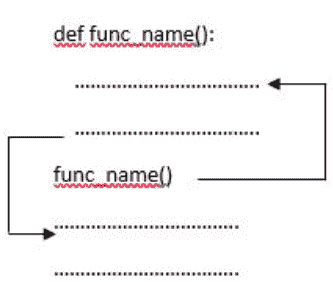

### 4.2.1 内置函数

那些内置在 Python 中、随软件自动提供的函数被称为内置函数或预定义函数。这些内置函数可以根据需求在我们的代码中使用。

| abs() | all() | any() | ascii() | bin() |
|---|---|---|---|---|
| bool() | bytearray() | bytes() | callable() | chr() |
| classmethod() | compile() | complex() | delattr() | dict() |
| dir() | divmod() | enumerate() | eval() | exec() |
| filter() | float() | format() | frozenset() | getattr() |
| hasattr() | hash() | help() | hex() | id() |
| input() | int() | isinstance() | issubclass() | iter() |
| len() | list() | map() | max() | memoryview() |
| min() | next() | object() | oct() | open() |
| ord() | pow() | print() | property() | range() |
| repr() | reversed() | round() | set() | setattr() |
| slice() | sorted() | str() | sum() | super() |
| tuple() | type() | vars() | zip() | __import__() |

表 4.1：内置函数

有关表 4.1 中所示内置函数的详细信息，请参阅附录 E。

### 4.2.2 用户自定义函数

由程序员显式定义以根据需要执行某些特定任务的函数被称为用户自定义函数。用户自定义函数对于其他人来说可能是库函数（库函数由他人编写，我们以库的形式使用它们）。借助用户自定义函数，程序员可以将大型程序分解成更小的部分，以便更好地理解和调试。通过调用函数，代码可以避免重复。一个项目可以有多个人共同参与。因此，一个大型项目可以通过创建不同的函数来划分。上述函数的优点有助于我们尽快达到业务需求。

创建用户自定义函数的语法如下

```
def functionname(parameters):
    """ docstring """
    Code 1
    Code 2
    return value
```

因此，创建函数时使用了两个关键字。第一个关键字 `def` 是必需的，另一个关键字 `return` 是可选的。如果我们不返回任何值，则默认值为 `None`。此外，在 Python 中，一个函数可以返回多个值。我们在处理内置函数时已经看过许多用户自定义函数的例子。但为了涵盖上述主题，我们将在这里看到。

```
Example 4.3
def my_mult(num1, num2):
    """ The above user defined function will multiply 2 numbers
    and return their product"""
    return num1 * num2

my_result = my_mult(3,6)
print("The product of 2 numbers 3 and 6 is: ", my_result)
```

**输出 4.3**
数字3和6的乘积是：18

函数 `my_mult()` 会将两个数相乘并返回结果。根据函数执行的任务来命名函数通常是一个更好的实践。此外，我们可以看到 `print()` 是一个内置函数。因此，程序员可以根据需求选择是否创建用户自定义函数。

## 4.3 函数参数

参数是在函数调用时传递给函数的输入。但在讨论参数类型之前，让我们先看看形参和实参到底是什么。我们已经在前面的多个例子中见过这些参数了。形参是在定义函数时起作用的参数，而实参是在调用函数时起作用的参数。

在前面已经讨论过的例子中，“num1 和 num2” 是形参，“3, 6” 是实参。

```
def my_mult(num1, num2):
    """ 上面这个用户定义的函数将两个数相加
    并返回结果"""
    return num1 * num2

my_result = my_mult(3,6)
print("The product of 2 numbers 3 and 6 is: ", my_result)
```

定义函数时可以接收可变数量参数的方式有多种。我们也可以说，这是不同类型的实参。

### 4.3.1 位置参数

以正确的顺序传递给函数的参数被称为位置参数。在调用函数时，第‘n’个位置参数必须位于第n个位置。每当函数被调用时，第一个位置参数总是列在第一位，第二个位置参数总是列在第二位，以此类推。函数定义中的参数数量和位置必须与函数调用中的参数数量和位置相等。如果我们改变顺序，结果可能会改变。

```
示例 4.4
def my_complex(my_real, my_imag):
    my_result = complex(my_real,my_imag)
    return my_result

print(my_complex(6,8)) # P1
print(my_complex(8,6)) # P2
print(my_complex(8,6,10)) # P3
```

```
输出 4.4
(6+8j)
(8+6j)
Traceback (most recent call last):
  File "<ipython-input-5-7726e7c01958>", line 7, in <module>
    print(my_complex(8,6,10)) # P3
TypeError: my_complex() takes 2 positional arguments but 3 were given
```

在P1中，实参6和8被传递给函数 `my_complex(my_real, my_imag)`。值6将作为第一个参数分配给 `my_real`，8将作为第二个参数分配给 `my_imag`。使用这些参数创建一个复数，结果被返回并显示。因此，输出将是6 + 8j。

在P2中，实参8和6被传递给函数 `my_complex(my_real, my_imag)`。值8将作为第一个参数分配给 `my_real`，6将作为第二个参数分配给 `my_imag`。使用这些参数创建一个复数，与P1相比顺序发生变化，结果被返回。因此，输出将是8 + 6j。

在P3中，形参只有2个，但我们传递给函数的实参是3个。因此，Python会生成 `TypeError : my_complex() takes 2 positional arguments but 3 were given`。

一个需要注意的重要点是，我们也可以使用可迭代对象（如列表、元组、集合等）向函数传递位置参数。

```
示例 4.5
my_list = [5,3]
print(pow(*my_list)) # F1

my_tuple = (3,4)
print(complex(*my_tuple)) # F2

import math
my_set = {4}
print(math.sqrt(*my_set)) # F3
```

```
输出 4.5
125
(3+4j)
2.0
```

在F1中，可迭代列表前加上了 `*`，计算两个数的幂。因此，输出将是5 ** 3 = 125。

在F2中，可迭代元组前加上了 `*`，返回一个复数，其中实部是第一个元素，虚部是第二个元素。因此，输出将是3 + 4j。

在F3中，可迭代集合前加上了 `*`，计算集合内元素的平方根，该元素是4。因此，输出将是2.0，因为返回值将是浮点类型。

### 4.3.2 关键字参数

以名称-值对的形式传递给函数，从而通过关键字参数的名称识别形参的参数，被称为关键字参数。匹配关键字参数的名称与形参的名称非常重要。一个关键字参数相对于另一个关键字参数的顺序并不重要。但参数的数量必须匹配。

```
示例 4.6
def my_complex(my_real, my_imag):
    my_result = complex(my_real,my_imag)
    return my_result

print(my_complex(my_real = 2,my_imag = 8)) # K1
print(my_complex(my_imag = 8, my_real = 2)) # K2
print(my_complex(2,my_imag = 8)) # K3
```

```
输出 4.6
(2+8j)
(2+8j)
(2+8j)
```

在K1中，关键字参数 `my_real` 被赋值为2，`my_imag` 被赋值为8。形参 `my_real` 的值将为2，`my_imag` 的值将为8。创建复数并返回。因此，输出将是2 + 8j。

在K2中，关键字参数的顺序与K1不同。但是，形参 `my_real` 的值仍然是2，`my_imag` 的值仍然是8。创建复数并返回。因此，输出将与K1相同，即2 + 8j。

在K3中，同时使用了位置参数和关键字参数。但是，位置参数必须在前，关键字参数在后，否则Python会报错。这里，值2将分配给 `my_real`，随后是关键字参数 `my_imag`，其值为8。创建复数并返回。因此，输出将与K1相同，即2 + 8j。

```
示例 4.7
def my_complex(my_real, my_imag):
    my_result = complex(my_real,my_imag)
    return my_result

print(my_complex(my_imag = 8, 2))
```

```
输出 4.7
print(my_complex(my_imag = 8, 2))
              ^
SyntaxError: positional argument follows keyword argument
```

在上面的例子中，Python会引发 `SyntaxError: positional argument follows keyword argument`。因此，永远不要犯上面的错误。

一个需要注意的重要点是，我们也可以使用Python字典向函数传递关键字参数。

```
**示例 4.8**
my_dict = {'real': 6, 'imag': 8}
print(complex(**my_dict))
```

```
**输出 4.8**
(6+8j)
```

在上面的例子中，`my_dict` 是字典的名称，包含关键字（`real`, `imag`）和值（`6`, `8`），前面带有 `**` 字符。因此，输出将是6 + 8j。

### 4.3.3 默认参数

很多时候，在函数定义中可能会为形参指定一个默认值，并且不需要提供实参。在这种情况下，形参将使用默认参数。如果在调用函数时没有为形参显式提供实参，形参将使用默认值。如果我们提供了实参，那么它将使用提供的值。

```
**示例 4.9**
def my_details(name,age):
    print(f"My name is {name} and age is {age}")

def my_details1(name,age = 31):
    print(f"My name is {name} and age is {age}")

my_details('Mukesh',31) # D1
my_details1(name = 'Mukesh') # D2
my_details1('Ramesh',32) # D3
```

```
**输出 4.9**
My name is Mukesh and age is 31
My name is Mukesh and age is 31
My name is Ramesh and age is 32
```

在D1中，实参被传递给函数 `my_details`。它们表现得像位置参数。因此，输出将是 My name is Mukesh and age is 31。

在D2中，调用函数 `my_details1` 时传递了关键字参数 `name`，其值为 ‘Mukesh’。但是，第二个参数没有为形参显式提供。`age` 的默认值是31。因此，输出将是 My name is Mukesh and age is 31。

在D3中，提供了第一个参数 ‘Ramesh’，并且为第二个参数显式提供了值32。因此，输出将是 My name is Ramesh and age is 32。

我们不应该在默认参数之后放置非默认参数。

```
**示例 4.10**
def my_details2(age = 31, name):
    print(f'My name is {name} and age is {age} ')
```

```
**输出 4.10**
def my_details2(age = 31, name):
          ^
SyntaxError: non-default argument follows default argument
```

在上面的例子中，Python会引发 `SyntaxError: non-default argument follows default argument`。

## 4.3.4 可变长度参数

许多时候，在执行大型项目时，我们事先并不知道将传递给函数的参数数量。因此，在 Python 中，有一种称为可变长度参数的机制，它可以接受任意数量的值。在参数名前使用星号（*）符号来表示上述参数。可以使用特殊的 `*args` 语法将可变数量的参数传递给函数。所有值都以元组的形式表示。这里的参数数量不会被记录。我们可以使用 for 循环来检索所有参数。可变长度参数可以与位置参数混合使用。传递的是一个非关键字的可变长度参数列表。可以向当前的形式参数添加任意数量的额外参数（包括零个额外参数）。如果在可变长度参数之后还有其他参数，那么这些值应该作为关键字参数提供。

### 示例 4.11

关于图 4.2（第 266 页）所示的源代码扫描二维码。

### 输出 4.11
24
24
24
24
120

在 V1 中，我们将实际参数 2、3 和 4 传递给函数 `mymul`。我们使用索引号访问上述参数。因此，`num[0]` 的值为 2，`num[1]` 为 3，`num[2]` 为 4。计算这些值的乘积并返回结果。输出为 24。

在 V2 中，我们将实际参数 2、3、4 和 5 传递给函数 `mymul`。我们使用索引号访问上述参数。因此，`num[0]` 的值为 2，`num[1]` 为 3，`num[2]` 为 4。我们没有使用索引号访问参数 5。这完全是程序员的选择。计算这些值的乘积并返回结果。输出为 24。

在 V3 中，我们将实际参数 2、3 和 4 传递给函数 `mymul2`。值 2 将由形式参数首先访问，值 3 和 4 使用索引号访问。计算这些值的乘积并返回结果。输出为 24。

在 V4 中，我们将实际参数 2、3、4 和 5 传递给函数 `mymul2`。我们通过形式参数首先访问，然后使用索引号访问 3 和 4。因此，`first` 的值为 2，`num[0]` 为 3，`num[1]` 为 4。我们没有使用索引号访问参数 5。计算这些值的乘积并返回结果。输出为 24。

在 V5 中，我们将实际参数 2、3、4 和 5 传递给函数 `mymul3`。使用 for 循环来检索所有参数。计算这些值的乘积并返回结果。输出为 120。

## 4.3.5 关键字可变长度参数 (kwargs)

可以接受任意数量以键-值对形式提供的参数，称为关键字可变长度参数。Python 使用 `*args` 将可变长度非关键字参数列表传递给函数，可以对该列表执行列表操作。Python 使用 `**kwargs` 将可变长度关键字参数字典传递给函数，可以对该字典执行字典操作。在参数名前使用双星号 ** 来表示上述参数。我们将以字典的形式传递参数，这些参数在函数内部形成一个与参数同名（但不包括 **）的字典。`*args` 和 `**kwargs` 都使函数具有灵活性。

### 示例 4.12

```
Output 4.12
{'fname': 'Saurabh', 'lname': 'chandrakar',
'phone_number': 9876543210}
<class 'dict'>
fname:Saurabh
lname:chandrakar
phone_number:9876543210
{'fname': 'Priyanka', 'lname': 'chandrakar',
'phone_number': 8987676543}
1
<class 'dict'>
fname:Priyanka
lname:chandrakar
phone_number:8987676543
name:Saurabh
age:31
```

从 F1 到 F3，我们有一个函数 `func1`，其参数为 `**kwargs`。将带有可变长度参数的字典 F10 传递给 `func1()` 函数。函数内部，显示传递的可变长度参数及其类型，随后是一个 for 循环，该循环处理传递字典的数据并打印字典的值。因此，

F1 的输出为 `{'fname': 'Saurabh', 'lname': 'chandrakar', 'phone_number': 9876543210}`。

F2 的输出为 `<class 'dict'>`。
F3 的输出为 `fname:Saurabh`、`lname:chandrakar`、`phone_number:9876543210`。

从 F4 到 F7，我们说明 kwargs 如何处理带有额外参数的可变数量关键字参数。我们有一个函数 `func2`，其参数为 `name1`、`**kwargs`。将带有可变长度参数的字典 F11 传递给 `func2()` 函数。在 `func2()` 函数内部，有一个 for 循环处理额外参数和传递字典的数据，并打印其值。因此，

F4 的输出为 `{'fname': 'Priyanka', 'lname': 'chandrakar', 'phone_number': 8987676543}`。
F5 的输出为 `1`。
F6 的输出为 `<class 'dict'>`。
F7 的输出为 `fname:Priyanka`、`lname:chandrakar`、`phone_number:8987676543`。

在 F12 中，我们有一个函数 `func3`，其参数为 `**kwargs`。将带有可变长度参数的字典 F12 传递给 `func3()` 函数。我们解包该字典。因此，输出将是：
```
name:Saurabh
age:31
```

> **注意：**
> 一组语句称为函数。
> 一组函数称为模块。
> 一组模块称为包。
> 一组包称为库。

## 4.4 嵌套函数

嵌套函数、内部函数或函数嵌套，指的是在一个函数内部定义另一个函数时使用的术语。我们可以访问封闭作用域内的变量。我们可以在函数内部创建一个函数，以保护它免受外部所有操作的影响。这个过程称为封装。

```
示例 4.13
def outside_func():
    def inner_func():
        print("Inside Inner Function")
    print("Inside Outer Function")
    inner_func()

outside_func()
```

```
输出 4.13
Inside Outer Function
Inside Inner Function
```

在上面的例子中，`inner_func()` 定义在 `outside_func()` 内部，使其成为一个内部函数。要调用 `inner_func()`，我们必须先调用 `outside_func()`。然后 `outside_func()` 将继续调用 `inner_func()`，因为它是在其内部定义的。

一个需要观察的重要点是，`outside_func()` 被调用来执行 `inner_func()`。如果 `outside_func()` 没有被调用，`inner_func()` 将永远不会执行。直接执行上面的代码。

```
def outside_func():
    def inner_func():
```

```
print("Inside Inner Function")
print("Inside Outer Function")
inner_func()
```

当执行时，Python 将不会返回任何内容。我们也可以向函数传递参数。

### 示例 4.14

```
def outside_func(str1):
    def inner_func():
        print(str1 + "Inner Function")
    print("Inside Outer Function")
    inner_func()
outside_func("Hello ")
```

### 输出 4.14

```
Inside Outer Function
Hello Inner Function
```

在上面的例子中，我们向 `outside_func` 函数传递了一个字符串参数，比如 `"Hello"`。如输出所示，可以在 `inner_func()` 内部访问该字符串变量。我们可以从内部函数内部更改外部函数的变量。

### 示例 4.15

```
def outer(a):
    b = 3
    b += a
    def inner(c):
        b = 6
        print(c**b)
        print(b)
        inner(3)
        outer(1)
```

**输出 4.15**
```
4
729
```

在上面的例子中，调用了 `outer(1)` 函数，将 `a` 的值存储为 1。表达式 `b+=a` 将产生 `b` 的值为 4，这描绘了 `outer()` 函数内定义的一个变量。`print(b)` 将显示 `outer` 函数的 `b` 的值。在 `inner()` 函数内定义了一个新变量 `b`，而不是更改 `outer()` 函数的 `b` 的值。最后 `print(c ** b)` 将产生结果：
729 (3**6)

## 4.5 Python 闭包

如果需要将数据绑定到函数而不实际将它们作为参数传递，则称为闭包。它有助于在其作用域之外调用函数。它是一个函数对象，即使它们不在内存中，也能记住其封闭作用域中的值，这意味着当一个嵌套函数引用其封闭作用域中的值时，就形成了一个闭包。要在 Python 中创建闭包，必须满足以下条件：
- 1. 必须有一个嵌套函数。
- 2. 嵌套函数将引用在封闭函数中定义的变量。
- 3. 封闭函数应返回嵌套函数。

请观察下面的例子。

## 4.6 函数作为参数传递

一个函数可以接受多个参数。参数可以是对象、变量（相同或不同数据类型）或函数。接受其他函数作为参数的函数称为**高阶函数**。

**示例 4.18**

```python
def myupper(mystr):
    return mystr.upper()

def mylower(mystr):
    return mystr.lower()

def world_virus(myfunc):
    virus = myfunc("CoronA")
    print(virus)

world_virus(myupper) # FF1
world_virus(mylower) # FF2
```

**输出 4.18**
```
CORONA
corona
```

在上面的示例中，创建了一个函数 `world_virus`，它接受一个函数作为参数。

在 FF1 中，我们将 `myupper` 作为参数传递给 `world_virus(myfunc)` 函数。`myupper("CoronA")` 将被调用，返回字符串值 "CORONA"，并存储在一个变量中用于显示输出。因此，输出将是 "CORONA"。

在 FF2 中，我们将 `mylower` 作为参数传递给 `world_virus(myfunc)` 函数。`mylower("CoronA")` 将被调用，返回字符串值 "corona"，并存储在一个变量中用于显示输出。因此，输出将是 "corona"。

所以，函数也可以作为参数传递给另一个函数。

## 4.7 局部变量、全局变量和非局部变量

我们在过去已经不知不觉地使用了局部变量、全局变量和非局部变量。但现在正是了解这些变量是什么以及如何在代码中使用它们的合适时机。

### 4.7.1 局部变量

在函数内部声明且在函数外部无法访问的变量称为**局部变量**。局部变量的值仅在该函数内部可用，函数外部则不可用，因为其作用域仅限于声明它的函数，我们称之为局部变量作用域。请观察上面的 Python 脚本。

**示例 4.19**

```python
def func1(num2):
    num1 = 1
    print(num1)
    print(num2 + num1)
func1(12)
print(num1)
```

**输出 4.19**
```
1
13
NameError: name 'num1' is not defined
```

在上面的 Python 脚本中，通过在函数内部声明变量 `num1`，创建了一个局部变量。该局部变量在函数内部通过打印和与形参变量相加来使用。每当我们在其作用域之外显示该局部变量时，Python 都会产生 `NameError`。在上面的示例中，`num1` 是 `func1()` 函数的局部变量，无法在其外部访问。因此，Python 抛出 `NameError: name 'num1' is not defined`。

### 4.7.2 全局变量

当一个变量在函数外部声明时，它被称为**全局变量**。这些变量在其之后编写的所有函数中都可用。全局变量的作用域将是其下方的整个程序体。请看下面的 Python 脚本。

**示例 4.20**

```python
g1 = 1 # GL1
def display():
    l1 = 2 # GL2
    print(l1) # GL3
    print(g1) # GL4
display()
print(g1) # GL5
print(l1) # GL6
```

**输出 4.20**
```
2
1
1
Traceback (most recent call last):
  File "<ipython-input-22-dcde7f3c8761>", line 8, in <module>
    print(l1) # GL6
NameError: name 'l1' is not defined
```

在 GL1 中，变量 ‘g1’ 被赋值为 1，是一个全局变量。

在 GL2 中，变量 ‘l1’ 被赋值为 2，是一个局部变量。

在 GL3 中，我们在 `display()` 函数内部使用局部变量。

在 GL4 中，我们在 `display()` 函数内部使用全局变量。

在 GL5 中，我们在函数外部使用全局变量。

在 GL6 中，我们在函数外部使用局部变量，这将显示 `NameError`。

我们能够访问全局变量 ‘g1’，因为它是在函数外部定义的。

如果在函数内部给一个全局声明的变量赋了另一个值，那么会在函数的命名空间中创建一个新的局部变量。全局变量的值不会改变。

**示例 4.21**

```python
g1 = 1
def display():
    g1 = 2
    print(g1)
    print("inside",id(g1))
display()
print(g1)
print("outside",id(g1))
```

**输出 4.21**
```
2
inside 140720117555632
1
outside 140720117555600
```

在上面的示例中，`display()` 函数内部创建了一个新变量 `g1`。从函数内部打印的 `id(g1)` 可以看出其值为 140733773341360。函数外部的全局变量 ‘g1’ 的 id 为 140733773341328。显然，这两个变量拥有不同的 id。

现在，为了从函数内部修改全局变量的值，需要使用 `global` 关键字。因此，如果需要在函数内部访问全局变量，可以使用 `global` 关键字后跟变量名来实现。

**示例 4.22**

```python
g1 = 1
def display():
    global g1
    g1 = 2
    print(g1)
    print("inside",id(g1))
display()
print(g1)
print("outside",id(g1))
```

**输出 4.22**
```
2
inside 140720117555632
2
outside 140720117555632
```

从上面的 Python 脚本可以看出，全局变量 ‘g1’ 的值已从 1 修改为 2。此外，函数内部和外部的全局变量的标识（id）保持一致。

需要注意的一个重要点是，当全局变量和局部变量同名时，函数默认引用局部变量而忽略全局变量。必须在赋值之前引用局部变量（以避免 `UnboundLocalError`）。

**示例 4.23**

```python
g1 = 1
def display():
    g1 = g1 -1
    print(g1)
display()
```

**输出 4.23**
```
g1 = g1 -1

UnboundLocalError: local variable 'g1' referenced before assignment
```

有一个名为 `globals()` 的函数，它以字典形式返回全局变量表。可以使用变量名作为键来访问和修改其值。因此，上述函数将为程序员提供灵活性，允许同时使用同名的全局和局部变量。

**示例 4.24**

```python
num1 = 1
def display():
    num1 = 2
    print("local variable: ", num1)
    num2 = globals()['num1']
    print(num2)
    num2 = 3
    print(num2)
display()
print('global variable: ', num1)
```

**输出 4.24**
```
local variable: 2
1
3
global variable: 1
```

在这里，我们可以看到变量名 ‘num1’ 同时被局部和全局使用。变量名 ‘num1’ 被用作键来访问全局value 值被存储在变量 num2 中。因此，num2 被赋值为 1。然后我们将一个新的变量赋值给 num2，其值为 3。原始的全局变量 'num1' 的值为 1。

## 4.7.3 非局部变量

非局部变量用于嵌套函数中，其局部作用域未定义，这意味着该变量既不在局部作用域，也不在全局作用域中。

```
示例 4.25
def outer():
    a1 = 20
    b1 = 40

    def inner():
        # 非局部绑定
        nonlocal a1
        a1 = 50 # 将更新
        b1 = 60 # 不会更新，
                # 它将被视为一个局部变量

    inner()
    print("a1 : ", a1)
    print("b1 : ", b1)
# 主代码
# 调用函数即 outer()
outer()
```

```
输出 4.25
a1 : 50
b1 : 40
```

在上面的示例中，a1 和 b1 是 `outer()` 函数的变量，在 `inner()` 函数中，我们使用变量 a1 作为非局部变量，但变量 b1 被视为 `inner()` 函数的局部变量，如果 b1 的值被更改，它将被视为对局部变量（对于 `inner()`）b1 的新赋值。因此，`nonlocal` 关键字用于创建非局部变量。因此，上述 Python 代码片段的输出将是：

- a1 : 50
- b1 : 40

## 4.8 递归函数

定义自身的过程称为递归。因此，一个调用自身的函数称为递归函数。这些递归函数可以减少代码长度并提高可读性。复杂的问题可以通过分解为更简单的子问题来轻松解决。使用递归生成序列比使用一些嵌套迭代更容易。但递归调用效率低下，因为它们占用大量内存和时间。递归中的逻辑相当难以理解和调试。现实世界中最好的例子就是我们站在两面相对的平行镜子之间时，我们美丽的脸会被递归地反射出来。我们从基础 C 语言中学到的最好例子就是计算一个数的阶乘。

```
示例 4.26
def factorial(a):
    if a == 1:
        return 1
    else:
        return (a * factorial(a-1))

num = 7
print("The factorial of", num, "is", factorial(num))
```

```
输出 4.26
The factorial of 7 is 5040
```

在上面的示例中，`factorial` 是一个调用自身的递归函数。当用正整数调用上述函数时，它会通过递减数字来递归调用自身。递归调用说明如下。

```
factorial(7)                  # 第一次调用，参数为 7
7 * factorial(6)              # 第二次调用，参数为 6
7 * 6 * factorial(5)          # 第三次调用，参数为 5
7 * 6 * 5 * factorial(4)      # 第四次调用，参数为 4
7 * 6 * 5 * 4 * factorial(3)  # 第五次调用，参数为 3
7 * 6 * 5 * 4 * 3 * factorial(2)  # 第六次调用，参数为 2
7 * 6 * 5 * 4 * 3 * 2 * factorial(1)  # 第七次调用，参数为 1
7 * 6 * 5 * 4 * 3 * 2 * 1    # 从第7次调用返回，返回值为数字1
7 * 6 * 5 * 4 * 3 * 2        # 从第6次调用返回，返回值为数字2
7 * 6 * 5 * 4 * 6            # 从第5次调用返回，返回值为数字6
7 * 6 * 5 * 24               # 从第4次调用返回，返回值为数字24
7 * 6 * 120                  # 从第3次调用返回，返回值为数字120
7 * 720                      # 从第2次调用返回，返回值为数字720
5040                         # 最终输出
```

当控制到达基本条件时，即数字减少到 1 时，递归将结束。
当我们使用递归函数时，必须要有基本条件，因为它会停止递归，否则函数将无限地调用自身。

## 4.9 Python Lambda 函数

到目前为止，我们已经使用给定的名字声明了函数。但也可以在不给任何名字的情况下声明函数。这种无名函数被称为匿名函数或 lambda 函数。普通函数使用 `def` 关键字定义，而匿名函数使用 `lambda` 关键字定义。对于一次性使用或即时使用，匿名函数就派上了用场。Lambda 函数可以接受任意数量的参数，但只能有一个表达式。

lambda 函数的语法如下。

```
lambda arguments: expression
```

其中 `lambda` 是定义 lambda 表达式的关键字。
第二个参数 `arguments` 是一个以逗号分隔的参数列表，类似于函数定义中看到的那样（请注意没有括号）。
第三个参数是一个单独的 Python 表达式，不能是一个完整的语句。
表达式在求值后被返回。
冒号 `:` 代表函数的开始。Lambda 函数返回一个函数。不需要写 `return` 语句。所有类型的实际参数都可以使用。
这里，参数可以有很多，但表达式必须是单个的。我们可以在需要函数对象的地方使用 lambda 表达式。
Lambda 函数用于内置函数，如 `map`、`filter` 和 `reduce`。为了更好地理解和评估，我们将看看每个函数的例子。

```
示例 4.27
def add(x,y):
    return x + y

print("Normal function: ", add(2,3)) # L1

add2 = lambda a,b: a+b # L2
print("Lambda function: ", add2(2,3))# L3
```

```
输出 4.27
Normal function: 5
Lambda function: 5
```

普通函数和 lambda 函数将产生相同的输出。

在 L1 中，我们用参数 2 和 3 调用函数，并返回输出 5。因此，输出将是 Normal function: 5。

在 L2 中，`lambda a,b: a + b` 是 lambda 函数。我们给出了参数 `a` 和 `b`，表达式 `a + b` 被求值并返回。上述函数没有名字，并返回一个赋值给标识符 `add2` 的函数对象。

因此，在 L3 中，输出将是 Lambda function: 5。

### 4.9.1 嵌套 Lambda 函数

写在另一个 lambda 函数内部的 lambda 函数称为嵌套 lambda 函数。请观察下面显示的示例

```
示例 4.28
#M-1
def mul1(a1):
    return lambda b1:b1*a1
myresult = mul1(3)
print(myresult(7))

#M-2
mul = lambda a = 3: (lambda b: a*b)
myres = mul()
print(myres)
print(myres(7))
```

```
输出 4.28
21
<function <lambda>.<locals>.<lambda> at 0x00000238D3128BF8>
21
```

在 M1 中，lambda 出现在函数 `mul1` 内部，并且可以访问在调用外层函数时，参数 `a1` 在函数作用域中的值。因此，当调用 `mul1(3)` 时，`a1` 的值将是 3。`myresult` 现在是一个函数对象，当用参数 7 调用上述函数时，`b1` 的值将是 7。因此，输出

7 * 3 = 21

被返回。

在 M2 中，lambda 可以访问外层 lambda 中的名称。这里的 lambda 结构是嵌套的，以创建一个在调用时创建另一个函数的函数。上述方法相当复杂，应该避免。此外，函数对象 `myres` 被打印出来，输出

<function <lambda>.<locals>.<lambda> at 0x00000238D3128BF8>

使用上述方法的整体输出产生的值与 M1 一样是 21。

### 4.9.2 将 Lambda 函数传递给另一个函数

Lambda 函数可以作为参数传递给另一个函数。让我们看一个例子。

```
示例 4.29
def mypow(num):
    print(num)
    print(num(3))
mypow(lambda a: a**4)
```

```
输出 4.29
<function <lambda> at 0x000001DEBFC15EE8>
81
```

在上面的示例中，我们将 lambda 函数作为参数传递给函数调用。因此，`num` 现在是一个被显示的函数参数。值 3 被作为参数传递给变量 `a`。因此，输出将是 3 ** 4 = 81

### 4.9.3 立即调用函数执行 (IIFE)

这是一个在定义后可立即调用的 lambda 函数。lambda 可以立即调用的能力允许我们将它们与 `map`、`filter` 或 `reduce` 等内置函数一起使用。

```
示例 4.30
print((lambda a, b, c: a + b + c)(11, 12, 13)) # IIFE1
print((lambda a, b, c=3: a + b + c)(11, 12)) # IIFE2
print((lambda a, b, c=3: a + b + c)(11, b=12)) # IIFE3
print((lambda *args: sum(args))(11,12,13)) # IIFE4
print((lambda **kwargs: sum(kwargs.values()))(Eleven=11, Twelve=12, Thirteen=13)) # IIFE5
print((lambda a, *, b=0, c=0: a + b + c)(11, b=12, c=13)) # IIFE6
```

```
输出 4.30
36
26
26
36
36
36
```

在 IIFE1 中，参数 11, 12 和 13 将被存储在参数 a、b 和 c 中。因此，输出将是$$a + b + c = 11 + 12 + 13 = 36$$

在 IIFE2 中，参数 11 和 12 将存储在参数 a 和 b 中。变量 c 的默认值为 3。因此，输出将是

$$a + b + c = 11 + 12 + 3 = 26$$

在 IIFE3 中，输出与 26 相同。

在 IIFE4 中，多个参数被用作一个参数。因此，输出将是

$$11 + 12 + 13 = 36$$

在 IIFE5 中，关键字参数被用作一个参数。因此，输出将是

$$11 + 12 + 13 = 36$$

在 IIFE6 中，输出将是 36。

因此，我们可以看到 lambda 表达式支持所有不同的参数传递方式。这包括位置参数、关键字参数、可变参数列表、kwargs、仅可变参数等。

## 4.9.4 Python Lambda 与 map()

如之前使用内置函数所见，map 函数将接受一个函数和一个列表作为参数。这里的函数将使用一个 lambda 函数和一个列表来调用，并返回一个新列表，其中包含该函数为每个元素返回的所有 lambda 修改后的项。

## 示例 4.31

有关源代码，请扫描 [第 266 页](page 266) [图 4.2](Figure 4.2) 中显示的二维码

```
输出 4.31
<map object at 0x0000021BB0FC5550>
[1, 4, 9, 16, 25]
(1, 4, 9, 16, 25)
[1, 4, 9, 16, 25]
(1, 4, 9, 16, 25)
[5, 6, 7, 8]
[5, 6, 7, 8]
```

在 M1 中，我们有一个整数列表，并使用 map 函数对列表的每个元素进行平方。因此，定义了一个函数并将其作为参数传递给 map。map 函数返回一个 map 对象。所以，这里的输出将是 `<map object at 0x0000021BB0FC5550>`。

在 M2 中，map 对象被转换为列表。这里，每个元素都将被平方。因此，输出将是 `[1, 4, 9, 16, 25]`。

在 M3 中，map 对象被转换为元组。这里，每个元素都将被平方。因此，输出将是 `(1, 4, 9, 16, 25)`。

现在，我们使用 lambda 来快速定义一个函数，这在我们不打算在代码中再次使用该函数时很有意义。定义了一个名为 l1 的列表，其中包含一些数字。一个 lambda 函数将对列表的每个元素运行，并返回数字的平方，然后显示结果。

在 M4 中，输出与 M2 相同，即 `[1, 4, 9, 16, 25]`。

在 M5 中，输出与 M3 相同，即 `(1, 4, 9, 16, 25)`。

在 M6 中，我们正在添加两个列表 l2 和 l3，其中列表的每个元素根据其索引位置相加。整体结果被转换为列表。因此，输出将是 `[5, 6, 7, 8]`。

在 M7 中，我们正在添加列表 l2 和元组 l3，其中列表和元组的每个元素根据其索引位置相加。整体结果被转换为列表。因此，输出将是 `[5, 6, 7, 8]`。

## 4.9.5 Python Lambda 与 filter()

如之前使用内置函数所见，filter 函数将接受一个函数和列表作为参数。此函数将根据调用者通过函数参数传递的某些标准，过滤掉一些元素，同时保留一些元素。

## 示例 4.32

```python
#M1
l1 = [0,1,2,5,7,9,12,16,19,21,24,28,31]
def iseven_odd(num):
    if num %2 != 0:
        return True
    else:
        return False
print(list(filter(iseven_odd, l1)))

#M2
print(list(filter(lambda num: num % 2 != 0, l1)))
```

## 输出 4.32

```
[1, 5, 7, 9, 19, 21, 31]
[1, 5, 7, 9, 19, 21, 31]
```

上述代码演示了从给定列表中过滤奇数。

在 M1 中，函数 iseven_odd 接受一个参数 num，列表从索引=0 开始的每个元素将被传递给它。如果元素返回的余数非零，则将其视为奇数，否则为偶数。返回一个新列表，其中包含函数评估为 False 的项。因此，输出将是 `[1, 5, 7, 9, 19, 21, 31]`。

在 M2 中，借助 lambda 的魔力，我们用一行代码从列表中过滤出奇数。l1 的每个元素将被传递给 lambda 函数的 num 参数，并检查该数字是偶数还是奇数。返回一个新列表，其中包含函数评估为 False 的项。因此，输出将与 M1 相同，即 `[1, 5, 7, 9, 19, 21, 31]`。

## 4.9.6 Python Lambda 与 reduce()

reduce() 函数将对其参数中传递的特定函数应用于序列中提到的所有列表元素。上述函数在 “functools” 模块中定义。reduce() 函数计算输出将遵循的步骤如下：

1.  选取序列的前 2 个元素并获得结果。
2.  保存结果。
3.  使用保存的结果和序列中的下一个元素执行操作。
4.  上述过程将持续进行，直到没有更多元素为止。
5.  返回并显示最终结果。

上述函数将接受 2 个参数：

```python
reduce(function, sequence)
```

第一个参数是定义要执行的操作的操作。第二个参数是像列表、元组等这样的序列。

## 示例 4.33

```python
from functools import reduce
myseq_list = [0,1,2,3,4,7,8,9]
mysum = reduce (lambda a, b: a+b, myseq_list)
print(mysum)
```

## 输出 4.33

```
34
```

在上面的例子中，需要注意以下几点：

1.  我们从 functools 模块导入了 reduce。
2.  定义了一个名为 myseq_list 的列表，其中包含一些数字。
3.  声明了一个名为 mysum 的变量，用于存储归约后的值。
4.  对列表的每个元素运行一个 lambda 函数，并根据先前的结果返回数字的总和。
5.  显示 reduce 函数返回的结果。

因此，上述代码的输出将是 34。

## 4.10 按对象引用传递或调用

在 C、Java 和许多其他编程语言中，值通过按值传递或按引用传递（通常称为按值传递或按引用传递）传递给函数。但在 Python 中，这些概念不适用，因为值是通过对象引用发送给函数的，这意味着当我们传递列表、字符串、元组或数字等值时，这些对象的引用被传递给函数。如果对象是不可变的（float、string、int、tuple），则修改后的值在函数外部不可用。如果对象是可变的（字典或列表），则修改后的值在函数外部可用。

考虑下面的两条语句

```python
a1 = 1 (ST1)
b1 = a1 + 2 (ST2)
```

在第一步中，创建一个值为 1 的 int 新实例，并将名称 ‘a1’ 分配给它。
在第二步中，创建一个值为 2 的 int 实例，然后将其添加到 ‘a1’ 所指向的实例的值中，并将加法后返回的结果存储在一个新实例中。新实例被赋予名称 ‘b1’。

## **示例 4.34**

```python
def myadd(b): # – L1
    b += 2 # – L2
    print(b) # – L3
    return b # – L4

a = 2 # – L6
res = myadd(a) # – L7
print(a) # – L8
print(res) # – L9
```

## **输出 4.34**

```
4
2
4
```

在 L6 中，创建一个值为 2 的 int 实例，并将名称 ‘a’ 分配给它。

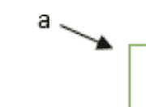

在 L7 中，调用函数 myadd。在 L1 中，由于形参是 ‘b’，标识符 ‘b’ 现在将引用 ‘a’ 所引用的实例。

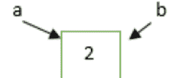

在 L2 中，标识符 ‘b’ 现在引用一个值为 ‘4’ 的新实例。

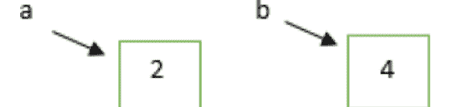

标识符 ‘b’ 现在指向一个新实例。因此，显示值 4。在 L4 中，返回 ‘b’ 所引用的实例。

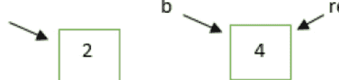

在 L7 中，一个新名称 ‘res’ 现在引用返回的实例。‘b’ 现在被销毁。

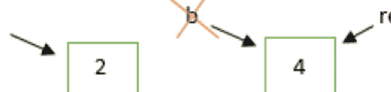

在 L8 中，‘a’ 仍然持有值为 2 的实例。因此，输出为 2。

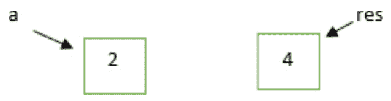

在 L9 中，‘res’ 指向值为 4 的实例。因此，输出为 4。

对于可变对象，由于列表对象是可修改或可变的，因此不会在内存中创建新对象。如上例所示，一个新元素被添加到同一个对象中。

## 示例 4.35

```python
def mylist(l1):
    print('b', l1, id(l1))
    l1.append(40)
    print('c', l1, id(l1))

l1 = [10,20,30]
print('a', l1, id(l1))
mylist(l1)
print('d', l1, id(l1))
```

## 输出 4.35

```
a [10, 20, 30] 2058653822728
b [10, 20, 30] 2058653822728
c [10, 20, 30, 40] 2058653822728
d [10, 20, 30, 40] 2058653822728
```

## 4.11 具有所有类型参数的函数 (PADK)

到目前为止，我们已经了解了不同类型的参数。但它们被传递的顺序非常重要。一个函数可能接受

## 4.12 迭代器与可迭代对象

从一系列元素中一次取出一个元素的过程称为迭代。简单来说，它可以定义为使用可迭代对象（如列表、元组、字符串等），并通过`while`或`for`循环遍历其元素的过程。

```python
# 示例 4.37
l1 = [1,2,3,4,5,6]
for myelements in l1:
    print(myelements)
```

```
# 输出 4.37
1
2
3
4
5
6
```

通常，可迭代对象是任何能够返回迭代器以实现返回其所有元素这一目的的对象。迭代器是一个能够遍历可迭代对象的对象，它由`__iter__()`函数返回，通过自身的`__iter__()`函数返回自身，并拥有一个`next()`函数。我们之前已经详细讨论过`iter()`和`next()`函数，请再次查阅。任何我们使用`iter()`函数调用的对象都会返回一个迭代器对象。

```python
# 示例 4.38
l1 = [1,2,3] # 可迭代对象
iter1 = iter(l1) # 迭代器对象
print(type(iter1)) # 使用迭代器对象获取下一个元素
print(next(iter1))
print(next(iter1))
print(next(iter1))
```

```
# 输出 4.38
<class 'list_iterator'>
1
2
3
```

在上面的脚本中，`l1`是一个可迭代对象，而`iter1`是该可迭代对象`l1`产生的一个独立的迭代器实例，用于生成值。我们调用了3次`next(iter1)`，这也可以通过使用循环来执行，并生成相同的输出。

```python
# 示例 4.39
l1 = [1,2,3]
iter1 = iter(l1)
while True:
    try:
        # 使用迭代器对象获取下一个元素
        print(next(iter1))
    except StopIteration:
        break
```

```
# 输出 4.39
1
2
3
```

在这里，我们对其可迭代对象调用了`next()`函数，以获取迭代器的下一个值。这个调用`next()`函数的过程将不断重复，直到遍历完迭代器中的所有元素，并抛出`StopIteration`错误。

因此，当我们编写使用`for`循环遍历列表的上述脚本时：

```python
# 示例 4.40
l1 = [1,2,3]
for i in l1:
    print(i)
```

```
# 输出 4.40
1
2
3
```

这实际上就是我们应当在脑海中构建的画面。


所以，我们可以得出结论：在可迭代对象中，我们首先使用`iter()`函数获取一个迭代器对象，然后反复在迭代器对象上调用`next()`函数，以遍历其所有元素。

……（此处省略了与迭代器/可迭代对象无关的、关于函数参数顺序的段落，该段落位于示例4.36之前，内容与前后文不连贯，故按原文完整保留并翻译）多个参数。但是，当我们传递参数、`*args`、默认参数和`**kwargs`时，参数传递的顺序非常重要。顺序应该是：普通参数，后跟`*args`，再后跟默认参数，最后是`**kwargs`。

```python
# 示例 4.36
def fname(myname, *args, funcname = 'Undefined', **kwargs):
    print(myname)
    print(args)
    print(funcname)
    print(kwargs)

fname('Saurabh',1,2,3,4,5,6,a1=1,name1="Hello") # ML1
print("----------------------------------------")
fname('Priyanka',11,12,13,14,15,16,funcname = "PADK",a1=2,name1="demo") # ML2
```

```
# 输出 4.36
Saurabh
(1, 2, 3, 4, 5, 6)
Undefined
{'a1': 1, 'name1': 'Hello'}
----------------------------------------
Priyanka
(11, 12, 13, 14, 15, 16)
PADK
{'a1': 2, 'name1': 'demo'}
```

在ML1中，函数`fname`被调用时传入了（普通参数、`*args`和`**kwargs`）。默认参数缺失，因此默认输出将是`Undefined`。我们在函数内部打印这些参数。`*args`返回一个元组，其值如参数中所示，从1到6。`**kwargs`返回一个字典，其键为（`'a1'`、`'name1'`），值为（1、`'Hello'`）。上述函数调用将产生以下输出。

```
Saurabh
(1, 2, 3, 4, 5, 6)
Undefined
{'a1': 1, 'name1': 'Hello'}
```

在ML2中，函数`fname`被调用时传入了（普通参数、`*args`、默认参数和`**kwargs`）。传入的默认参数是`funcname = 'PADK'`。我们在函数内部打印这些参数。`*args`返回一个元组，其值如参数中所示，从11到16。`**kwargs`返回一个字典，其键为（`'a1'`、`'name1'`），值为（2、`'demo'`）。上述函数调用将产生以下输出。

```
Priyanka
(11, 12, 13, 14, 15, 16)
PADK
{'a1': 2, 'name1': 'demo'}
```

## 4.13 Python 柯里化函数

通过逐步嵌套函数参数来将多参数函数转换为单参数函数的技术称为柯里化。简单来说，这是一个将接受`n`个参数的函数转换为一系列`n`个函数，每个函数只接受一个参数的过程。通过函数的柯里化，可以将任意数量的计算和数据归并到一个真正的函数中，以得到期望的输出。因此，这里我们采用：

```
f(a,b) = (a*a) + (b*b)
h(a) = (a*a)
h(b) = (b*b)
h(a)(b) = h(a)+h(b)
f(a, b) = h(a)(b)
Curry f = h(a)(b)
```

例如，考虑以下示例：

```python
# 示例 4.41
def fl(w):
    def gl(x,y,z):
        print(w,x,y,z)
    return gl # 因为fl返回gl，这就是柯里化

my_fl = fl(11)
my_fl(12,13,14)
```

```
# 输出 4.41
11 12 13 14
```

在上面的例子中，`fl(11)`会返回函数`gl(x,y,z)`，该函数对于所有的`x`、`y`和`z`的行为与`fl(11,x,y,z)`完全相同。

由于`gl`是一个函数，它也应该支持柯里化。因此，上述代码的输出将是`11 12 13 14`。

让我们再看一个例子：

```python
# 示例 4.42
def fl(a):
    def gl(b):
        def hl(c):
            def il(d):
                def jl(e):
                    print(a, b, c, d, e)
                return jl  # 返回给函数 il
            return il      # 返回给函数 hl
        return hl          # 返回给函数 gl
    return gl              # 返回给函数 fl

fl(21)(22)(23)(24)(25)
```

```
# 输出 4.42
21 22 23 24 25
```


## 第04章：源代码

*图 4.2：源代码*

在上面的例子中，数学关系是：

```
X(a,b,c,d,e) = f1(g1(h1(i1(j1(a,b,c,d,e)))))
```

我们正在将一个函数嵌套到另一个函数中，因此一个函数的结果将作为函数链的一部分记录在另一个函数中。因此，输出将是`21 22 23 24 25`。

# 第5章
## Python 模块与包

### 5.1 Python 模块简介

我们都知道，大型编程任务会被分解为独立的、更小的、更易于管理的子任务或模块，这就是模块化编程。**模块不过是一组保存在文件中的变量、函数和类。** 这些单独的模块可以像积木一样组合在一起，创建更大的应用程序。从事单个模块工作的程序员将专注于问题的相对较小的部分。程序员可以理解较小的领域，这使得开发更容易、更不容易出错。此外，处理独立模块将最小化相互依赖性，对单个模块进行的修改对其它程序部分的影响最小。因此，可维护性得到提高。单个模块中定义的函数可以被应用程序的其他部分重用，从而消除了重复。因此，代码可重用性是主要优点之一，它也减少了代码长度并提高了可读性。模块定义了一个独立的命名空间，避免了程序多个位置中标识符之间的冲突。需要指出的一个重要点是，每个`.py`文件都将充当一个模块。Python标准模块的完整列表位于以下链接：

[http://docs.python.org/3/py-modindex.html](http://docs.python.org/3/py-modindex.html)，它们位于Python安装位置内的`lib`目录中。本章将详细讨论一些常用模块。

让我们创建一个模块并了解如何使用它。

```python
myval = 3
def mymultiply(num1,num2):
    """ 上面的函数将接受两个数字，
    将它们相乘并返回结果 """
    return num1 * num2
class multiply1:
    pass
```

创建了一个名为`mymultiplyfile`的模块，并定义了一个函数`mymultiply()`。上述函数将接受两个数字`num1`和`num2`，并返回它们的乘积。还定义了多个对象，如`myval`和类`multiply1`。

一个模块中的变量、类和函数可以被导入到另一个模块中。为此，使用`import`关键字。因此，为了导入已存在的模块`mymultiplyfile`，需要使用以下语句：

```python
import mymultiplyfile
```

使用上面的模块名，可以通过点操作符访问变量和函数。因此，我们创建一个新文件`moduleeg1.py`，并访问`mymultiplyfile`的变量和函数。

```python
# 示例 5.1
import mymultiplyfile
print(mymultiplyfile.myval) # ML1
print(mymultiplyfile.mymultiply(3,4)) # ML2
print(mymultiplyfile.mymultiply.__doc__) # ML3
```

```
# 输出 5.1
3
12
上面的函数将接受两个数字，
```## 5.2 通过重命名导入模块

模块可以通过赋予别名来重命名导入。我们将沿用导入 `mymultiplyfile` 的例子，并将 `moduleeg1.py` 脚本修改如下。

moduleeg1.py

**示例 5.2**
```python
import mymultiplyfile as mymul
print(mymul.myval)
print(mymul.mymultiply(3,4))
print(mymul.mymultiply.__doc__)
```

**输出 5.2**
```
3
12
The above function will take 2 numbers,
multiply them and return the result
```

从上面的例子中，我们将 `mymultiplyfile` 模块重命名为 `mymul`，这在很多情况下节省了我们的输入时间。因此，这里使用 `mymultiplyfile.myval` 是无效的，而 `mymul.myval` 是有效的，否则会得到 `NameError: name 'mymultiplyfile' is not defined` 的错误。

所以，`mymul` 是 `mymultiplyfile` 的一个别名。当我们直接使用模块名称时，会得到相同的输出。

## 5.3 from import 语句

可以使用 `from import` 语句，从模块中导入特定的名称，而无需导入整个模块。模块的特定成员可以直接访问，而无需使用模块名。我们将沿用导入 `mymultiplyfile` 的例子，`moduleeg1.py` 脚本将如下所示。

**示例 5.3**
```python
from mymultiplyfile import mymultiply
print(mymultiply(3,4))
print(mymultiply.__doc__)
```

**输出 5.3**
```
12
The above function will take 2 numbers,
multiply them and return the result
```

在上面的例子中，我们只导入了 `mymultiply` 函数，而没有导入 `myval` 变量。如果我们尝试访问该变量，将会得到 `NameError: name 'myval' is not defined` 的错误。

因此，`mymultiplyfile` 模块会被导入，并在当前命名空间中创建到给定对象的引用。我们甚至可以为 `mymultiply` 对象创建一个别名 `mul1`，并得到如图所示的相同输出。

```python
from mymultiplyfile import mymultiply as mul1
print(mul1(3,4))
print(mul1.__doc__)
```

一旦定义了别名，就应该只使用该别名，而不要再去使用原始名称。

此外，我们可以使用 `from mymultiplyfile import *` 导入模块的所有成员。这里，模块将被导入，并在当前命名空间中创建到该模块定义的所有公共对象的引用。请观察上面的 Python 脚本。

**示例 5.4**
```python
from mymultiplyfile import *
print(myval)
print(mymultiply(3,4))
print(mymultiply.__doc__)
```

**输出 5.4**
```
3
12
The above function will take 2 numbers,
multiply them and return the result
```

我们可以看到，在不使用模块名的情况下，直接访问了 `mymultiplyfile` 模块的成员。

因此，不同的导入可能性如下：

```python
import modulename
import modulename1, modulename2 and modulename3
import modulename as dummy
import modulename1 as dummy1, modulename2 as dummy2
from modulename import anymember
from modulename import *
from modulename import anymember as dummyname
```

## 5.4 Python 模块重载

需要了解的是，Python 解释器在一个会话期间只会导入一次模块。让我们看一个例子，了解它是如何工作的。

假设我们正在创建一个名为 `safety precautions.py` 的模块，包含以下代码。

```python
print("The following are the safety measures we should take against the new COVID-19 virus: ")
print("We all should wash our hands frequently")
print("We all should maintain social distancing")
print("We all should avoid touching nose, eyes and mouth")
print("Seek medical care urgently if you have fever, cough and difficulty in breathing")
```

现在，我们想在新的 Python 文件 `testmod.py` 中使用上面的模块。

**示例 5.5**
```python
import safetyprecautions
import safetyprecautions
import safetyprecautions
import safetyprecautions
import safetyprecautions
import safetyprecautions
print("I am inside testmodule")
```

**输出 5.5**
```
The following are the safety measures we should take against the new COVID-19 virus:
We all should wash our hands frequently
We all should maintain social distancing
We all should avoid touching nose, eyes and mouth
Seek medical care urgently if you have fever, cough and difficulty in breathing
I am inside testmodule
```

我们可以看到，虽然我们写了 6 次 `import safetyprecautions`，但模块只被导入了一次。

但是这里有一个问题。假设我们在运行 `testmod.py` 的过程中更新了模块的某些代码，这个更新后的版本将不可用。因此，我们可能需要重新加载它。我们可以重启解释器，但这并没有太大帮助。

因此，要重新加载更新后的模块，Python 提供了 `imp` 模块，其中使用了 `reload()` 函数。为了更好地理解，我们将导入 `time` 模块并使用 `sleep()` 函数。当程序处于休眠状态时，我们将更新模块，并观察其影响。

**示例 5.6**
```python
import time
from imp import reload
import safetyprecautions
print("I am inside testmodule")
print("I am sleeping for 40 secs")
print("______________________")
time.sleep(40)
reload(safetyprecautions)
print("This is displayed after updation of module")
```

**输出 5.6**
```
The following are the safety measures we should take against the new COVID-19 virus:
We all should wash our hands frequently
We all should maintain social distancing
We all should avoid touching nose, eyes and mouth
Seek medical care urgently if you have fever, cough and difficulty in breathing
I am inside testmodule
I am sleeping for 40 secs
______________________
```

现在，上面的代码在执行时处于休眠状态，我们已经向模块 `safety precautions` 添加了一行新代码。

```python
print("So I promise myself I will take all these precautions from being infected")
```

因此，40 秒后的输出如下：

```
The following are the safety measures we should take against the new COVID-19 virus:
We all should wash our hands frequently
We all should maintain social distancing
We all should avoid touching nose, eyes and mouth
Seek medical care urgently if you have fever, cough and difficulty in breathing
So I promise myself I will take all these precautions from being infected
This is displayed after updation of module
```

所以，我们可以看到，高亮显示的那行显示在了输出中。如果我们想显式地加载一个模块，则可以使用 `reload()` 函数（通过导入 `imp` 模块），以便程序能使用该模块的更新版本。

现在，在第四章中，我们详细讨论了一个名为 `dir()` 的函数，它将列出对象的所有有效属性。这里，我们讨论了当前模块以及特定模块的成员。但在每个模块的执行时，Python 解释器会自动为内部使用添加一些特殊属性。请观察这个例子。

**示例 5.7**
```python
num1 = 1
num2 = 3

def add():
    print(num1 + num2)

print(dir())
```

**输出 5.7**
```
['__annotations__', '__builtins__', '__cached__',
'__doc__', '__file__', '__loader__', '__name__',
'__package__', '__spec__', 'add', 'num1', 'num2']
```

在上面的例子中，我们创建了像 `num1`, `num2`（变量）和 `add()` 函数这样的对象。但除此之外，Python 内部还添加了如下成员：

`'__annotations__'`, `'__builtins__'`, `'__cached__'`,
`'__doc__'`, `'__file__'`, `'__loader__'`, `'__name__'`,
`'__package__'`, `'__spec__'`

这些成员肯定具有某种意义。我们将打印出所有这些成员。

**示例 5.8**
```python
num1 = 1
num2 = 3

def add():
    print(num1 + num2)

print(__annotations__)
print(__builtins__)
print(__cached__)
print(__doc__)
print(__file__)
```

print(__loader__)
print(__name__)
print(__package__)
print(__spec__)

**输出 5.8**
```
{}
<module 'builtins' (built-in)>
None
None
direg.py
<_frozen_importlib_external.SourceFileLoader object at 0x0000027DBFB55278>
__main__
None
None
```

## 5.5 特殊变量 `__name__`

模块功能可以直接或间接执行。`__name__`（前后各两个下划线）是 Python 中的一个特殊变量。这个特殊变量会为每个 Python 程序内部添加。上述变量将根据程序执行方式（作为独立程序执行还是作为模块执行）来存储信息。如果程序作为独立程序执行，那么该变量的值将是 `__main__`（前后各两个下划线）。

因此，我们可以通过使用 `__name__` 变量来判断程序是直接执行还是作为模块执行。

请观察以下代码以更好地理解。

**示例 5.9**
*moduleprog3_main.py*
```python
def myfunc():
    print("Inside function")

if __name__ == '__main__':
    print("Program Execution is direct")
    print("The value of __name__ is", __name__)
    myfunc()

else:
    print("Program execution is indirectly as a module from some other program")
    print("The value of __name__ is", __name__)
```

**输出 5.9**
```
Program Execution is direct
The value of __name__ is __main__
Inside function
```

在上面的程序中，创建了一个名为 `moduleprog3_main` 的新模块。当上述模块作为主程序执行时，在所有其他代码运行之前，`__name__` 变量被设置为 `__main__`。由于上述条件评估为 True，因此首先执行打印语句，然后是 `__name__` 的值，即 `__main__`。接着，调用 `myfunc()` 函数。因此，我们将得到如上所示的输出。

现在，如果我们想在另一个 Python 脚本（例如 `mainmodule.py`）中重用 `myfunc()`，我们可以将 `moduleprog3_main` 作为模块导入。`mainmodule.py` 中的代码如下：

**示例 5.10**
```python
import moduleprog3_main
moduleprog3_main.myfunc()
```

**输出 5.10**
```
Program execution is indirectly as a module from some other program
The value of __name__ is moduleprog3_main
Inside function
```

在上面的例子中，我们将 `moduleprog3_main` 作为模块导入。因此，`__name__` 变量将被设置为 `moduleprog3_main`。由于上述条件评估为 False，因此将执行 else 部分，其中首先显示打印语句，然后是 `__name__` 的值，即 `moduleprog3_main`。最后，通过在 `mainmodule.py` 中使用 `moduleprog3_main.myfunc()` 语句调用函数 `myfunc()`。

至少现在我们对模块概念有了很好的理解。现在，我们将详细讨论一些内置的有用 Python 模块。其他模块，包括 Math、Random、Operator、Decimal 和 Itertools 模块，在附录 A 中给出。

## 5.6 日志模块

每当编写大型代码时，在软件运行时跟踪某些事件是强制性的。对于软件调试、开发和运行，Python 提供了一个重要的模块，即 `logging` 模块。几乎没有哪个大型 Python 代码不使用日志模块。如果软件在运行时崩溃并要求我们调试代码，我们会非常焦虑。如果我们没有任何日志文件来分析事件序列，那么我们可能会很难检测到问题的原因。即使我们检测到了原因，也会耗费大量时间。对于根本原因分析，必须有一些线索（连接的信息片段）来识别问题。因此，在运行时将完整的应用程序流程和异常信息存储到文件中是强制性的。上述过程称为日志记录。日志记录具有一些优势。建议在调试时使用日志文件。日志文件将为您提供软件运行时执行的事件序列（状态消息和其他所需流）。如果缺少任何序列，我们可能会得到问题识别的提示，即代码的哪一部分已运行以及出现了什么问题。此外，日志记录可以提供统计信息，例如每天的请求计数以及更多详细信息。要在 Python 中实现日志记录，我们必须实现日志模块。

### 5.6.1 日志级别

在执行日志记录时，我们应该知道要存储哪些信息。日志消息并非生而平等。我们需要使用标准模块设置日志级别，以告诉库处理从该级别向上的所有事件。根据信息类型，日志数据在 Python 中根据以下级别划分，如表 5.1 所示：

| 序号 | 日志级别 | 数值 | 含义表示 |
|------|---------------|---------------|------------------------|
| 1 | CRITICAL | 50 | 需要高度关注的严重问题。 |
| 2 | ERROR | 40 | 严重错误。 |
| 3 | WARNING | 30 | 警告消息，提醒程序员需要注意。 |
| 4 | INFO | 20 | 包含一些有价值信息的消息。 |
| 5 | DEBUG | 10 | 包含一些调试信息的消息。 |
| 6 | NOTSET | 0 | 未设置级别。 |

*表 5.1：日志级别*

因此，日志级别优先级如下：`NOTSET` < `DEBUG` < `INFO` < `WARNING` < `ERROR` < `CRITICAL`。默认情况下，在执行程序时，默认级别是 `WARNING`。只有警告和更高级别的消息才会显示。我们可以显式设置日志级别。

### 5.6.2 日志记录实现

执行日志记录的第一件事是首先创建一个文件来存储消息。还需要指定要存储哪些级别的消息。因此，我们将使用日志模块的 `basicConfig(**kwargs)` 函数。`basicConfig()` 的一些参数如下：

1.  **level:** 根日志记录器将设置要记录的日志消息的指定严重级别。
2.  **filename:** 用于指定文件。
3.  **filemode:** 如果给出了文件名，则默认文件模式是追加模式。
4.  **format:** 用于指定日志消息的格式。

请观察下面的例子：

**示例 5.11**
```python
import logging
logging.basicConfig(filename='mywarninglog.txt', level=logging.WARNING)
print("Displaying Warning level demo: ")
logging.debug('Debug message')
logging.info('Info message')
logging.warning('Warning message')
logging.error('Error message')
logging.critical('Critical message')
```

**输出 5.11**
```
Displaying Warning level demo:
The contents inside the file mywarninglog.txt is:
WARNING:root:Warning message
ERROR:root:Error message
CRITICAL:root:Critical message
```

上面的例子描述了每条消息之前的严重级别以及根记录器。根记录器是日志模块提供给其默认记录器的。上述格式描述了级别、名称和消息，由冒号（`:`）分隔，这是默认输出格式。可以配置不同的内容，例如所需格式的时间戳、行号等。

需要观察的一个重要点是，`info()` 和 `debug()` 消息没有记录在文件 `mywarninglog.txt` 中。这是因为日志消息是以 `WARNING` 或更高级别的严重级别记录的。如果我们希望日志模块记录所有模块的事件，那么我们必须更改严重级别。例如，我们将严重级别更改为 `DEBUG`。

```python
# 示例 5.12
import logging

logging.basicConfig(filename='mydebuglog.txt', level=10)
print("Displaying Debug level demo: ")
print("The contents inside the file mydebuglog.txt is:")
logging.debug('Debug message')
logging.info('Info message')
logging.warning('Warning message')
logging.error('Error message')
logging.critical('Critical message')
```

**输出 5.12**
```
Displaying Debug level demo:
The contents inside the file mydebuglog.txt is:
DEBUG:root:Debug message
INFO:root:Info message
WARNING:root:Warning message
ERROR:root:Error message
CRITICAL:root:Critical message
```

正如我们所看到的，通过将严重级别更改为整数值 10 或 `DEBUG`，所有具有其级别或更高级别的日志消息都保存在 `mydebuglog.txt` 文件中。假设我们没有提供文件名`basicConfig()` 函数之后会发生什么。日志消息将显示到输出控制台。

**示例 5.13**
```python
import logging

logging.basicConfig(level=10)
print("Displaying Debug level demo: ")
print("The contents inside the file mydebuglog.txt is:")
logging.debug('Debug message')
logging.info('Info message')
logging.warning('Warning message')
logging.error('Error message')
logging.critical('Critical message')
```

**输出 5.13**
```
Displaying Debug level demo:
The contents inside the file mydebuglog.txt is:
DEBUG:root:Debug message
INFO:root:Info message
WARNING:root:Warning message
ERROR:root:Error message
CRITICAL:root:Critical message
```

从上面的例子可以看出，文件名未被提及，日志消息显示在控制台上。因此，为了将日志消息存储到文件中，需要考虑以下几点：

1.  首先，我们创建并配置记录器（logger），它有多个参数，其中文件名作为参数传递以记录事件。
2.  可以设置记录器的格式。
3.  文件模式（filemode）默认是追加模式（append），但可以根据需要更改为其他模式，如写入模式（write）。
4.  设置了记录器级别，它作为跟踪日志消息的阈值。可以将不同的属性作为参数传递。
5.  用户可以根据需要选择所需的属性，例如 args、asctime、created、exc_info、filename、funcName、levelname、levelno、lineno、message、module、msecs、msg、name、pathname、process、processName、relativeCreated、stack_info、thread 和 threadName。

## 5.6.3 格式化日志消息

有一些基本信息属性可以添加到输出格式中。假设我们只想记录级别和消息，以下是一个 Python 代码片段。

**示例 5.14**
```python
import logging

logging.basicConfig(format='%(levelname)s-%(message)s')
logging.warning('It is a Warning Message')
```

**输出 5.14**
```
WARNING-It is a Warning Message
```

假设我们想记录进程ID以及级别和消息，我们将编写以下 Python 代码。

**示例 5.15**
```python
import logging

logging.basicConfig(format='%(process)d-%(levelname)s-%(message)s')
logging.warning('It is a Warning Message')
```

**输出 5.15**
```
13236-WARNING-It is a Warning Message
```

假设我们想在级别和消息之外添加日期和时间信息，以下 Python 代码将适用于我们。

**示例 5.16**
```python
import logging

logging.basicConfig(format='%(asctime)s: %(levelname)s-%(message)s', level=20)
logging.info('It is an info Message')
```

**输出 5.16**
```
2020-03-30 15:30:12,372: INFO-It is an info Message
```

`%(asctime)s` 将添加日志记录的创建时间。但我们想要更改日期和时间的格式。

**示例 5.17**
```python
import logging

logging.basicConfig(format='%(asctime)s: %(levelname)s-%(message)s',
level=20, datefmt = '%d-%m-%Y %I:%M:%S %p')
logging.info('It is an info Message')
```

**输出 5.17**
```
30-03-2020 03:34:51 PM: INFO-It is an info Message
```

如图所示，我们更改了日期和时间格式。但时间格式必须是24小时制，而不是12小时制。所以，只需将 %I 替换为 %H。

**示例 5.18**
```python
import logging

logging.basicConfig(format='%(asctime)s: %(levelname)s-%(message)s',
level=20, datefmt = '%d-%m-%Y %H:%M:%S %p')
logging.info('It is an info Message')
```

**输出 5.18**
```
30-03-2020 15:38:09 PM: INFO-It is an info Message
```

## 5.6.4 变量数据日志

我们可以在运行时将来自我们应用程序的动态信息包含在日志中。我们已经看到 logging 方法接受一个字符串作为参数，我们可以按照所示的方式格式化该字符串。

**示例 5.19**
```python
import logging

myname = 'ABC'
logging.error(f'Error caused due to {myname} variable.')
```

**输出 5.19**
```
ERROR:root:Error caused due to ABC variable.
```

## 5.6.5 堆栈跟踪捕获

可以使用 logging 模块在应用程序中捕获完整的堆栈跟踪。如果 `exc_info` 参数设置为 `True`，则可以捕获异常信息，否则在复杂的代码库中很难调试错误。

**当 `exc_info` 设置为 `False` 时**

**示例 5.20**
```python
import logging
num1 = 3
num2 = 0
try:
    divres = num1 / num2
except Exception as e:
    logging.error("Displaying Exception")
```

**输出 5.20**
```
ERROR:root:Displaying Exception
```

这里，`exc_info` 设置为 `False`，因此很难调试代码，因为它只显示了上述错误。

**当 `exc_info` 设置为 `True` 时**

**示例 5.21**
```python
import logging
num1 = 3
num2 = 0
try:
    divres = num1 / num2
except Exception as e:
    logging.error("Displaying Exception", exc_info=True)
```

**输出 5.21**
```
ERROR:root:Displaying Exception
Traceback (most recent call last):
  File "module10_logging.py", line 6, in <module>
    divres = num1 / num2
ZeroDivisionError: division by zero
```

在上面的例子中，`exc_info` 设置为 `True`。我们可以看到堆栈跟踪信息，显示 `ZeroDivisionError` 发生在第6行。但是，如果我们尝试在异常处理程序中记录日志，可以使用 `logging.exception()`。它将记录一条级别为 ERROR 的消息，并将异常信息添加到消息中。这等同于 `logging.error(exc_info=True)`。上述方法必须在异常处理程序中调用，因为此方法会输出异常信息。上述方法将显示一个级别为 ERROR 的日志。

**示例 5.22**

**输出 5.22**
```
Case-1
Enter the first number: 10
Enter the second number: 2
5.0

Case-2
Enter the first number: 10
Enter the second number: 2a
Only numbers are allowed

Case-3
Enter the first number: 10
Enter the second number: 0
Do not try to divide with zero
```

**myerrorlog.txt 文件中的日志**
```
30-03-2020 16:33:10 PM: INFO-Division of 2 numbers:
30-03-2020 16:33:12 PM: INFO-End of the code
30-03-2020 16:33:13 PM: INFO-Division of 2 numbers:
30-03-2020 16:33:16 PM: ERROR-invalid literal for int()
with base 10: '2a'
Traceback (most recent call last):
  File "module10_logging.py", line 7, in <module>
    num2=int(input("Enter the second number: "))
ValueError: invalid literal for int() with base 10: '2a'
30-03-2020 16:33:16 PM: INFO-End of the code
30-03-2020 16:33:17 PM: INFO-Division of 2 numbers:
30-03-2020 16:33:19 PM: ERROR-division by zero
Traceback (most recent call last):
  File "module10_logging.py", line 8, in <module>
    print(num1/num2)
ZeroDivisionError: division by zero
30-03-2020 16:33:19 PM: INFO-End of the code
```


第 05 章：源代码

图 5.1：源代码

当代码执行时，可能出现以下情况。

在 Case-1 中，用户输入了数字 10 和 2，生成了 5.0 的输出。由于上述情况没有产生任何异常，以下日志消息将被存储在文件 “myerrorlog.txt” 中。

```
30-03-2020 16:33:10 PM: INFO-Division of 2 numbers:
30-03-2020 16:33:12 PM: INFO-End of the code
```

在 Case-2 中，用户输入了数字 10 和 2a。由于输入错误，Python 抛出 ValueError 异常，显示输出 “Only numbers are allowed”。以下日志消息将被存储在文件 “myerrorlog.txt” 中。

```
30-03-2020 16:33:13 PM: INFO-Division of 2 numbers:
30-03-2020 16:33:16 PM: ERROR-invalid literal for int()
with base 10: '2a'
Traceback (most recent call last):
  File "module10_logging.py", line 7, in <module>
    num2=int(input("Enter the second number: "))
ValueError: invalid literal for int() with base 10: '2a'
30-03-2020 16:33:16 PM: INFO-End of the code
```

在 Case-3 中，用户输入了数字 10 和 0。由于输入了 0，Python 抛出 ZeroDivisionError 异常，显示输出 “Do not try to divide with zero”。以下日志消息将被存储在文件 “myerrorlog.txt” 中。

```
30-03-2020 16:33:17 PM: INFO-Division of 2 numbers:
30-03-2020 16:33:19 PM: ERROR-division by zero
Traceback (most recent call last):
  File "module10_logging.py", line 8, in <module>
    print(num1/num2)
ZeroDivisionError: division by zero
30-03-2020 16:33:19 PM: INFO-End of the code
```

## 5.6.6 Logging 模块中的类

我们现在对名为 `root` 的默认记录器有了很好的了解。但通过创建 Logger 类的对象，我们可以定义自己的记录器。Logger 模块中常用的类如下：

1.  **Logger（记录器）：** 在上面的类中，对象将直接用于调用应用程序代码中的函数。
2.  **LogRecord（日志记录）：** 记录器会自动创建 LogRecord 对象，其中包含与事件相关的必要信息，如记录器名称、行号、消息等。
3.  **Handler（处理器）：** 当我们配置好自己的记录器后，处理器就发挥作用了。LogRecord 将通过处理器发送到所需的目的地，例如文件。它作为 filehandler、HTTPHandler 等子类的基础。
4.  **Formatter（格式器）：** 输出格式通过指定字符串格式来定义，该格式列出了输出应包含的属性。

观察下面的例子。

## 示例 5.23

```python
import logging
mylogger = logging.getLogger(__name__)
my_handler = logging.FileHandler('myfilelog.txt')
my_handler.setLevel(logging.ERROR)
my_format = logging.Formatter('%(asctime)s - %(name)s - %(levelname)s - %(message)s')
my_handler.setFormatter(my_format)
mylogger.addHandler(my_handler)
mylogger.error('This is an error')
```

## 输出 5.23

```
2020-03-30 19:15:31,226 - __main__ - ERROR - This is an error
```

在文件 `myfilelog.txt` 中，将保存输出 `2020-03-30 19:15:31,226 - __main__ - ERROR - This is an error`。

在上面的示例中，首先创建了一个自定义的 logger，然后创建了一个级别为 ERROR 的 `my_handler`，它是一个 FileHandler。`my_handler` 将获取错误级别的 LogRecord，并通过将其写入指定文件 `mylog.txt` 来生成输出 `2020-03-30 19:15:31,226 - __main__ - ERROR - This is an error`。

此外，与变量 `__name__` 对应的 logger 名称记录为 `__main__`。这是 Python 在执行开始时分配给模块的。上面的代码保存在文件 `module10_logging.py` 中。

如果我们将上述文件导入到其他 Python 文件中，那么该文件的名称将被替换为 `module10_logging`。

## 示例 5.24


```
输出 5.24
2020-03-30 19:46:13,512 - module10_logging - ERROR - This is an error
2020-03-30 19:47:01,645 - module10_logging - ERROR - This is an error
```

## 5.7 使用断言进行调试

首先我们应该问问自己，我们是否知道什么是 bug（缺陷）？我们许多人已经熟悉这个词。如果预期结果与实际结果之间存在差异，就称之为 bug。让我们来理解一下现实世界中的一个应用程序场景。一旦应用程序由开发团队准备好，就会移交给测试团队。这称为构建版本。测试团队会进行一些测试。如果他们发现任何 bug，就会将信息更新给开发团队。开发团队在分析 bug 后会进行一些修改。因此，识别和修复 bug 的过程称为调试。这是开发人员的责任，而不是测试人员的责任。开发团队会根据收到的反馈，将修改后的构建版本移交给测试团队。一旦测试团队接受该应用程序，它就会移交给客户。

执行调试最常见的方法是使用 `print()` 语句。因此，我们习惯于编写 `print()` 语句来调试代码。调试完成后，必须移除额外添加的 `print()` 语句，否则上述语句将在运行时执行，这将影响性能并干扰控制台输出。为了克服这一点，我们将使用 assert（断言）语句。

assert 语句最大的优点是，调试完成后，无需移除这些语句。我们可以根据需要启用或禁用 assert 语句。在代码中自信地断言某个事实的语句称为断言（assertions）。如果我们对代码的某个特定部分有信心，可以在那里使用 assert 语句。例如，如果我们确定在执行除法函数时除数应该是一个数字，那么我们可以断言除数必须是一个数字。它是一种调试工具，可以向用户显示程序中发生错误的部分。

我们可以用两种方式使用 assert 语句：

### 1. 简单版本

在简单版本中，assert 语句检查条件，如果不满足，则程序中止并抛出 AssertionError。此版本的语法为

```
assert <条件表达式>
```

观察上面计算数字总和的例子。

**示例 5.25**

```python
def mysum(mymarks):
    assert len(mymarks) != 0
    return sum(mymarks)

myl1 = [1,2,3,4,5,6]
print("Sum of list myl1 is:",mysum(myl1))

myl2 = []
print("Sum of list myl2 is:",mysum(myl2))
```

```
输出 5.25
Sum of list myl1 is: 21
Traceback (most recent call last):
  File "<ipython-input-25-25ff38678825>", line 9, in <module>
    print("Sum of list myl2 is:",mysum(myl2))
  File "<ipython-input-25-25ff38678825>", line 2, in mysum
    assert len(mymarks) != 0
AssertionError
```

在上面的程序中，我们将列表 `myl1` 传递给 `mysum()` 函数。它会检查列表是否为空。由于列表不为空，将返回列表所有元素的总和。因此，输出将是 `Sum of list myl1 is: 21`。

现在，在第二种情况下，当我们传递一个空列表给 `mysum()` 函数时，条件会检查列表 `myl1` 是否为空列表。由于条件失败，断言将停止程序并给出 AssertionError。

### 2. 增强版本

增强版本的语法是

```
assert <条件表达式>, <错误消息>
```

在此版本中，assert 语句将首先检查条件。如果评估结果为 True，程序将继续。如果为 False，assert 语句将中止程序并给出 *AssertionError 以及错误消息*。

**示例 5.26**

```python
def mysum(mymarks):
    assert len(mymarks) != 0, "Empty list"
    return sum(mymarks)

myl1 = [1,2,3,4,5,6]
print("Sum of list myl1 is:",mysum(myl1))

myl2 = []
print("Sum of list myl2 is:",mysum(myl2))
```

```
输出 5.26
Sum of list myl1 is: 21
Traceback (most recent call last):
  File "<ipython-input-26-3dac8807c5a2>", line 9, in <module>
    print("Sum of list myl2 is:",mysum(myl2))
  File "<ipython-input-26-3dac8807c5a2>", line 2, in mysum
    assert len(mymarks) != 0, "Empty list"
AssertionError: Empty list
```

在上面的示例中，我们将 `myl1`（非空列表）和 `myl2`（空列表）传递给了 `mysum()` 函数。我们得到了 `myl1` 列表的输出，但之后我们得到了 `myl2` 的错误。断言条件被 `myl1` 列表满足，程序继续运行。然而，`myl2` 不满足条件，并给出了 *AssertionError: Empty list*。

因此，我们可以得出结论：断言（assertions）是布尔表达式，在代码中应该始终为真。它接收一个可选的消息和一个表达式，用于检查类型、值和函数输出。因此，它是一种调试工具，可以在错误发生的点中止程序。

## 5.8 Python 包

包（Package）是一种封装机制，用于将与单个单元相关的模块分组。它是一种使用“点号模块名称”来构建 Python 模块命名空间的方式。因此，X.Y 表示 Y 是包名 X 下的子模块。它是模块和包的集合。一个包可以包含子包。它是一个文件夹或目录。就像模块可以有效地处理函数和命名空间一样，Python 包可以以结构化的方式处理多个模块。


*图 5.2：包概览*

[图 5.2](figure_5.2) 描绘了一个包可以包含模块和包。简单来说，模块即文件，包即文件夹。但每个文件夹必须包含一个名为 `__init__.py` 的文件，以确保该文件夹被视为一个 Python 包。

因此，包应包含一个名为 `__init__.py` 的特殊文件。上述文件可以为空。它也可以是可执行的初始化代码。包语句解决命名冲突，组件可以被唯一标识，应用程序的模块化得到提高，从而在使用中提供灵活性优势。

要在 Python 中创建一个包，需要遵循以下 3 个基本步骤：-

1.  首先，创建一个文件夹并为其命名一个主要与操作相关的包名。
2.  然后将类、变量和所需的函数放入其中。
3.  在文件夹内创建 `__init__.py` 文件，以便将其视为 Python 包。

现在，我们将讨论为游戏（Games）设计的一组模块和包。在上述结构中，我们创建了一个名为 Games 的包。

上述包包含以下项目：

1.  Cricket（板球）包，包含模块（`othercountrybatsman.py` 和 `othercountrybowler.py`）、India（印度）包（`indianbatsman.py`、`indianbowler.py` 和 `__init__.py`）以及 `__init__.py`。
2.  Football（足球）包，包含模块（`goalkeeper.py` 和 `forward.py`）以及 `__init__.py`。
3.  Kabaddi（卡巴迪）包，包含模块（`raider.py` 和 `defender.py`）以及 `__init__.py`。
4.  `games.py`
5.  `__init__.py`

## 5.3 包的结构

现在，我们将看到如何访问包。

### 1. 在包中使用“import”

语法：`import packName.modName`，其中 `packName` 是包的名称，`modName` 是模块名称。

```
eg: import Cricket.othercountrybatsman
```

语法：`import packName.subPackName.modName`，其中 `packName` 是包的名称，`subPackName` 是 `packName` 内的包名称，`modName` 是模块名称。

```
eg: import Cricket.India.indianbatsman
```

如何访问对象，如变量、函数、类、列表等？

语法：`packName.modName.funcName()`，其中 `packName` 是包的名称，`modName` 是模块名称，`funcName` 是函数名称。

```
eg: Cricket.othercountrybatsman.name_othercountrybatsman()
```

语法：`packName.subPackName.modName.funcName()`，其中 `packName` 是包的名称，`subPackName` 是 `packName` 内的包名称，`modName` 是模块名称，`funcName` 是函数名称。

```
eg: Cricket.India.indianbatsman.name_indianbatsman()
```

### 2. 在包中使用“from import”

语法：`from packName.modName import funcName`，其中 `packName` 是包的名称，`modName` 是模块名称，`funcName` 是函数名称。

```
eg: from Cricket.othercountrybatsman import name_othercountrybatsman
```

语法：`from packName.subPackName.modName import funcName`，其中 `packName` 是包的名称，`subPackName` 是 `packName` 内的包名称，`modName` 是模块名称，`funcName` 是函数名称。

```
eg: from Cricket.India.indianbatsman import name_indianbatsman
```

如何访问对象，如变量、函数、类、列表等？

语法：`funcName()`，其中 `funcName` 是函数名称。

```
eg: name_othercountrybatsman()
```

语法：`funcName()`，其中 `funcName` 是函数名称。

```
eg: name_indianbatsman()
```

### 3. 在包中使用“from import *”

如果包的 `__init__.py` 代码定义了一个名为 `__all__` 的列表，它将考虑在遇到 `from Cricket import *` 时应导入的模块名称列表。

```
__all__ = [othercountrybatsman, othercountrybowler]
```

现在，我们创建了一个名为 `Games` 的文件夹，其中创建了不同的包（文件夹）以及模块名称，如图 5.4 所示。

Cricket 包包含以下模块和包，如图 5.5 所示。

India 是 Cricket 包中的一个子包，如图 5.6 所示。

Football 包包含以下模块和包，如图 5.7 所示。

Kabaddi 包包含以下模块和包，如图 5.8 所示。

我们创建了一个名为 `games.py` 的模块。首先，我们将看到如何使用上述文件访问不同包和子包（如 Cricket、India、Football 等）的模块名称。但在访问不同模块名称内部的代码之前，它们的函数如下所示。

**模块名称：othercountrybatsman.py**


```python
#Cricket Package — othercountrybatsman module

def name_othercountrybatsman():
    """Other Country Batsman Names are"""
    print("Other Country Batsman Function")
    print("Batsman1: Mr. E")
    print("Batsman2: Mr. F")
    print()
```

**模块名称：othercountrybowler.py**

```python
#Cricket Package — othercountrybowler module

def name_othercountrybowler():
    """Other Country Bowler Names are"""
    print("Other Country Bowler Function")
    print("Bowler1: Mr. G")
    print("Bowler2: Mr. H")
    print()
```

**模块名称：indianbatsman.py**

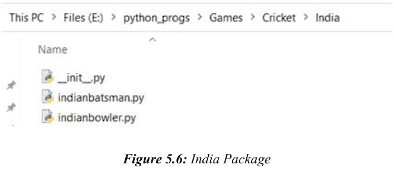

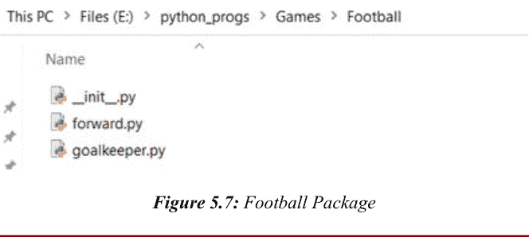

```python
#India subpackage — indianbatsman module

def name_indianbatsman():
    """Indian Batsman Names are"""
    print("Indian Batsman Function")
    print("Batsman1: Mr. A")
    print("Batsman2: Mr. B")
    print()
```

**模块名称：indianbowler.py**

```python
#India subpackage — indianbowler module

def name_indianbowler():
    """Indian Bowler Names are"""
    print("Indian Bowler Function")
    print("Bowler1: Mr. C")
    print("Bowler2: Mr. D")
    print()
```

**模块名称：goalkeeper.py**


```python
#Football Package — goalkeeper module

def name_goalkeeper():
    """Football goalkeeper names are"""
    print("GoalKeeper Function")
    print("GoalKeeper1: Mr. R")
    print("GoalKeeper2: Mr. S")
    print()
```

**模块名称：forward.py**

```python
#Football Package — forward module

def name_forward():
    """Football forward names are"""
    print("Forward Function")
    print("Forward1: Mr. T")
    print("Forward2: Mr. U")
    print()
```

**模块名称：raider.py**

```python
#Kabaddi Package — raider module

def name_raider():
    '''Kabaddi raider names are'''
    print("Raider Function")
    print("Raider1: Mr. W")
    print("Raider2: Mr. X")
    print()
```

**模块名称：defender.py**

```python
#Kabaddi Package — defender module

def name_defender():
    '''Kabaddi defender names are'''
    print("Defender Function")
    print("Defender1: Mr. Y")
    print("Defender2: Mr. Z")
    print()
```

现在，我们将查看使用 `games.py` 文件访问多个模块的不同情况。

### 1. games.py 模块并仅使用 import 访问 othercountrybatsman 模块

```python
#games module
import Cricket.othercountrybatsman
Cricket.othercountrybatsman.name_othercountrybatsman()
```

**输出 5.27**
输出：从控制台运行 `python games.py`

```
Other Country Batsman Function
Batsman1: Mr. E
Batsman2: Mr. F
```

在上面的代码中，我们从上述文件访问 Cricket 包的 othercountrybatsman 模块。在此模块下，我们访问 name_othercountrybatsman 函数。因此，输出如上所示。

### 2. games.py 模块并仅使用 import 访问 othercountrybowler 模块

```python
#games module
import Cricket.othercountrybowler
Cricket.othercountrybowler.name_othercountrybowler()
```

**输出 5.28**
输出：从控制台运行 `python games.py`

```
Other Country Bowler Function
Bowler1: Mr. G
Bowler2: Mr. H
```

在上面的代码中，我们从上述文件访问 Cricket 包的 othercountrybowler 模块。在此模块下，我们访问 name_othercountrybowler 函数。因此，输出如上所示。

### 3. games.py 模块并仅使用 import 访问 India 包内的 indianbatsman 模块

```python
#games module
import Cricket.India.indianbatsman
Cricket.India.indianbatsman.name_indianbatsman()
```

**输出 5.29**
输出：从控制台运行 `python games.py`

```
Indian Batsman Function
Batsman1: Mr. A
Batsman2: Mr. B
```

在上面的代码中，我们从上述文件访问 Cricket 包的 India 子包内的 indianbatsman 模块。在此模块下，我们访问 name_indianbatsman 函数。因此，输出如上所示。

### 4. games.py 模块并仅使用 import 访问 India 包内的 indianbowler 模块

```python
#games module
import Cricket.India.indianbowler
Cricket.India.indianbowler.name_indianbowler()
```

**输出 5.30**
输出：从控制台运行 `python games.py`

```
Indian Bowler Function
Bowler1: Mr. C
Bowler2: Mr. D
```

在上面的代码中，我们从上述文件访问 Cricket 包的 India 子包内的 indianbowler 模块。在此模块下，我们访问 name_indianbowler 函数。因此，输出如上所示。

### 5. games.py 模块并仅使用 import 访问 Football 包内的 goalkeeper 模块

```python
#games module
import Football.goalkeeper
Football.goalkeeper.name_goalkeeper()
```

输出：从控制台运行 `python games.py`

```
GoalKeeper Function
GoalKeeper1: Mr. R
GoalKeeper2: Mr. S
```

在上面的代码中，我们从上述文件访问 Football 包的 goalkeeper 模块。在此模块下，我们访问 name_goalkeeper 函数。因此，输出如上所示。

### 6. games.py 模块并仅使用 import 访问 Football 包内的 forward 模块

```python
#games module
```

## games.py 模块及使用 import 访问 Football 包内的 forward 模块

```python
import Football.forward
Football.forward.name_forward()
```

**输出 5.32**
输出：在控制台运行 python games.py 后

Forward Function
Forward1: Mr. T
Forward2: Mr. U

在上面的代码中，我们从该文件访问了 Football 包的 forward 模块。在此模块内，我们访问了 name_forward 函数。因此，输出如上所示。

## games.py 模块及使用 import 访问 Kabaddi 包内的 raider 模块

```python
#games module
import Kabaddi.raider
Kabaddi.raider.name_raider()
```

**输出 5.33**
输出：在控制台运行 python games.py 后

Raider Function
Raider1: Mr. W
Raider2: Mr. X

在上面的代码中，我们从该文件访问了 Kabaddi 包的 raider 模块。在此模块内，我们访问了 name_raider 函数。因此，输出如上所示。

## games.py 模块及使用 import 访问 Kabaddi 包内的 defender 模块

```python
#games module
import Kabaddi.defender
Kabaddi.defender.name_defender()
```

**输出 5.34**
输出：在控制台运行 python games.py 后

Defender Function
Defender1: Mr. Y
Defender2: Mr. Z

在上面的代码中，我们从该文件访问了 Kabaddi 包的 defender 模块。在此模块内，我们访问了 name_defender 函数。因此，输出如上所示。

但还存在另一种方法来访问不同包中的多个模块，即使用 **from 包名 import 模块名** 的方法。

## games.py 模块及使用 from ... import 访问 othercountrybatsman 模块

```python
#games module
from Cricket import othercountrybatsman
othercountrybatsman.name_othercountrybatsman()
```

**输出 5.35**
输出：在控制台运行 python games.py 后

Other Country Batsman Function
Batsman1: Mr. E
Batsman2: Mr. F

## games.py 模块及使用 from ... import 访问 othercountrybowler 模块

```python
#games module
from Cricket import othercountrybowler
othercountrybowler.name_othercountrybowler()
```

**输出 5.36**
输出：在控制台运行 python games.py 后

Other Country Bowler Function
Bowler1: Mr. G
Bowler2: Mr. H

## games.py 模块及使用 from ... import 访问 India 包内的 indianbatsman 模块

```python
#games module
from Cricket.India import indianbatsman
indianbatsman.name_indianbatsman()
```

**输出 5.37**
输出：在控制台运行 python games.py 后

Indian Batsman Function
Batsman1: Mr. A
Batsman2: Mr. B

## games.py 模块及使用 from ... import 访问 India 包内的 indianbowler 模块

```python
#games module
from Cricket.India import indianbowler
indianbowler.name_indianbowler()
```

**输出 5.38**
输出：在控制台运行 python games.py 后

Indian Bowler Function
Bowler1: Mr. C
Bowler2: Mr. D

## games.py 模块及使用 from ... import 访问 Football 包内的 goalkeeper 模块

```python
#games module
from Football import goalkeeper
goalkeeper.name_goalkeeper()
```

**输出 5.39**
输出：在控制台运行 python games.py 后

GoalKeeper Function
GoalKeeper1: Mr. R
GoalKeeper2: Mr. S

## games.py 模块及使用 from ... import 访问 Football 包内的 forward 模块

```python
#games module
from Football import forward
forward.name_forward()
```

**输出 5.40**
输出：在控制台运行 python games.py 后

Forward Function
Forward1: Mr. T
Forward2: Mr. U

## games.py 模块及使用 from ... import 访问 Kabaddi 包内的 raider 模块

```python
#games module
from Kabaddi import raider
raider.name_raider()
```

**输出 5.41**
输出：在控制台运行 python games.py 后

Raider Function
Raider1: Mr. W
Raider2: Mr. X

## games.py 模块及使用 from ... import 访问 Kabaddi 包内的 defender 模块

```python
#games module
from Kabaddi import defender
defender.name_defender()
```

**输出 5.42**
输出：在控制台运行 python games.py 后

Defender Function
Defender1: Mr. Y
Defender2: Mr. Z

还有第三种方法来访问不同包中多个模块内的对象（这里仅指函数名），即使用 **from 包名.模块名 import 函数名** 的方法。

## games.py 模块及访问 name_othercountrybatsman 函数

```python
#games module
from Cricket.othercountrybatsman import name_othercountrybatsman
name_othercountrybatsman()
```

**输出 5.43**
输出：在控制台运行 python games.py 后

Other Country Batsman Function
Batsman1: Mr. E
Batsman2: Mr. F

## games.py 模块及访问 name_othercountrybowler 函数

```python
#games module
from Cricket.othercountrybowler import name_othercountrybowler
name_othercountrybowler()
```

**输出 5.44**
输出：在控制台运行 python games.py 后

Other Country Bowler Function
Bowler1: Mr. G
Bowler2: Mr. H

## games.py 模块及访问 name_indianbatsman 函数

```python
#games module
from Cricket.India.indianbatsman import name_indianbatsman
name_indianbatsman()
```

**输出 5.45**
输出：在控制台运行 python games.py 后

Indian Batsman Function
Batsman1: Mr. A
Batsman2: Mr. B

## games.py 模块及访问 name_indianbowler 函数

```python
#games module
from Cricket.India.indianbowler import name_indianbowler
name_indianbowler()
```

**输出 5.46**
输出：在控制台运行 python games.py 后

Indian Bowler Function
Bowler1: Mr. C
Bowler2: Mr. D

## games.py 模块及访问 name_goalkeeper 函数

```python
#games module
from Football.goalkeeper import name_goalkeeper
name_goalkeeper()
```

**输出 5.47**
输出：在控制台运行 python games.py 后

GoalKeeper Function
GoalKeeper1: Mr. R
GoalKeeper2: Mr. S

## games.py 模块及访问 name_forward 函数

```python
#games module
from Football.forward import name_forward
name_forward()
```

**输出 5.48**
输出：在控制台运行 python games.py 后

Forward Function
Forward1: Mr. T
Forward2: Mr. U

## games.py 模块及访问 name_raider 函数

```python
#games module
from Kabaddi.raider import name_raider
name_raider()
```

**输出 5.49**
输出：在控制台运行 python games.py 后

Raider Function
Raider1: Mr. W
Raider2: Mr. X

## games.py 模块及访问 name_defender 函数

```python
#games module
from Kabaddi.defender import name_defender
name_defender()
```

**输出 5.50**
输出：在控制台运行 python games.py 后

Defender Function
Defender1: Mr. Y
Defender2: Mr. Z

现在，假设需要导入一个包中的所有模块。这可以通过两种方法实现。

### 方法 - I

```python
#games module
from Cricket import othercountrybatsman, othercountrybowler
othercountrybatsman.name_othercountrybatsman()
othercountrybowler.name_othercountrybowler()
```

**输出 5.51**
输出：在控制台运行 python games.py 后

Other Country Batsman Function
Batsman1: Mr. E
Batsman2: Mr. F

Other Country Bowler Function
Bowler1: Mr. G
Bowler2: Mr. H

### 方法 - II

你们中的大多数人可能都在想上面的方法。

```python
#games module
from Cricket import *
othercountrybatsman.name_othercountrybatsman()
othercountrybowler.name_othercountrybowler()
```

**输出 5.52**
输出：在控制台运行 python games.py 后

Traceback (most recent call last):
  File "games.py", line 3, in <module>
    othercountrybatsman.name_othercountrybatsman()
NameError: name 'othercountrybatsman' is not defined

在上述方法中，我们使用了 * 来导入模块。但在包中，上述方法不可行，因为会出现如上所示的 NameError。我们之前是在模块中使用 import *。因此，我们将指定所有模块名……（内容在此处截断）## Cricket 包的 init.py 文件

```python
# Cricket package — __init__ module
__all__ = ['othercountrybatsman', 'othercountrybowler']
```

## 用于加载 Cricket 包模块的 games.py 文件

```python
# Example 5.53
# games module
from Cricket import *
othercountrybatsman.name_othercountrybatsman()
othercountrybowler.name_othercountrybowler()
```

```
输出 5.53
输出：在控制台运行 `python games.py`

Batsman1: Mr. E
Batsman2: Mr. F
Other Country Bowler Function

Bowler1: Mr. G
Bowler2: Mr. H
```

## India 子包的 init.py 文件

```python
# Cricket Package — India subpackage — __init__ module
__all__ = ['indianbatsman', 'indianbowler']
```

## Football 包的 init.py 文件

```python
# Football Package — __init__ module
__all__ = ['goalkeeper', 'forward']
```

## Kabaddi 包的 init.py 文件

```python
# Kabaddi Package — __init__ module
__all__ = ['raider', 'defender']
```

## 用于加载 Cricket 包、India 子包、Football 包和 Kabaddi 包模块的 games.py 文件

示例 5.54

源代码扫描二维码见 [第 281 页](page 281) 的 [图 5.1](Figure 5.1)

输出 5.54
输出：在控制台运行 `python games.py`

Other Country Batsman Function
Batsman1: Mr. E
Batsman2: Mr. F

Other Country Bowler Function
Bowler1: Mr. G
Bowler2: Mr. H

Indian Batsman Function
Batsman1: Mr. A
Batsman2: Mr. B

Indian Bowler Function
Bowler1: Mr. C
Bowler2: Mr. D

GoalKeeper Function
GoalKeeper1: Mr. R
GoalKeeper2: Mr. S

Forward Function
Forward1: Mr. T
Forward2: Mr. U

Raider Function
Raider1: Mr. W
Raider2: Mr. X

Defender Function
Defender1: Mr. Y
Defender2: Mr. Z

假设有一个需求，需要在 Kabaddi 包的 defender 模块中使用 Football 包的 forward 模块。

## 示例 5.55

defender.py 文件内的代码

```python
# Kabaddi Package — defender module
from Football import forward
def name_defender():
    '''Kabaddi defender names are'''
    print("Defender Function")
    print("Defender1: Mr. Y")
    print("Defender2: Mr. Z")
    print()
    forward.name_forward()
```

## 输出 5.55

```
SAURABH@LAPTOP-NNFM79LF MINGW64 /e/python_progs/Games/Kabaddi
$ python defender.py
Traceback (most recent call last):
  File "defender.py", line 2, in <module>
    from Football import forward
ModuleNotFoundError: No module named 'Football'
```

使用上述方法运行时，我们遇到了错误 ModuleNotFoundError: No module named 'Football'。我们当前位于 Kabaddi 文件夹内，并尝试访问 Football 包的模块。因此，我们将退回到上一级文件夹，然后尝试再次执行上述文件。

```
SAURABH@LAPTOP-NHFM79LF MINGW64 /e/python_progs/Games/Kabaddi
$ cd ../

SAURABH@LAPTOP-NHFM79LF MINGW64 /e/python_progs/Games
$ python defender.py
c:\Users\SAURABH\AppData\Local\Programs\Python\Python37\python.exe: can't open file 'defender.py': [Errno 2] No such file or directory
```

但我们再次收到错误，因为没有这样的文件或目录。所以，我们将使用标志，因为我们需要将库模块作为脚本运行。只需观察上面高亮显示的 python 帮助信息。

```
SAURABH@LAPTOP-NHFM79LF MINGW64 /e/python_progs/Games
$ python --help
```

```
usage: C:\Users\SAURABH\AppData\Local\Programs\Python\Python37\python.exe
[option] ... [-c cmd | -m mod | file | -] [arg] ...
Options and arguments (and corresponding environment variables):
-b      : issue warnings about str(bytes_instance), str(bytearray_instance)
          and comparing bytes/bytearray with str. (-bb: issue errors)
-B      : don't write .pyc files on import; also PYTHONDONTWRITEBYTECODE=x
-c cmd  : program passed in as string (terminates option list)
-d      : debug output from parser; also PYTHONDEBUG=x
-E      : ignore PYTHON* environment variables (such as PYTHONPATH)
-h      : print this help message and exit (also --help)
-i      : inspect interactively after running script; forces a prompt even
          if stdin does not appear to be a terminal; also PYTHONINSPECT=x
-I      : isolate Python from the user's environment (implies -E and -s)

-m mod  : run library module as a script (terminates option list)

-O      : remove assert and __debug__-dependent statements; add .opt-1 before
          .pyc extension; also PYTHONOPTIMIZE=x
-OO     : do -O changes and also discard docstrings; add .opt-2 before
          .pyc extension
-q      : don't print version and copyright messages on interactive startup
-s      : don't add user site directory to sys.path; also PYTHONNOUSERSITE
-S      : don't imply 'import site' on initialization
-u      : force the stdout and stderr streams to be unbuffered;
          this option has no effect on stdin; also PYTHONUNBUFFERED=x
-v      : verbose (trace import statements); also PYTHONVERBOSE=x
          can be supplied multiple times to increase verbosity
-V      : print the Python version number and exit (also --version)
          when given twice, print more information about the build
-W arg  : warning control; arg is action:message:category:module:lineno
          also PYTHONWARNINGS=arg
-x      : skip first line of source, allowing use of non-Unix forms of #!cmd
-X opt  : set implementation-specific option
--check-hash-based-pycs always|default|never:
          control how Python invalidates hash-based .pyc files
file    : program read from script file
-       : program read from stdin (default; interactive mode if a tty)
arg ...: arguments passed to program in sys.argv[1:]

Other environment variables:
PYTHONSTARTUP: file executed on interactive startup (no default)
PYTHONPATH   : ';'-separated list of directories prefixed to the
               default module search path.  The result is sys.path.
PYTHONHOME   : alternate <prefix> directory (or <prefix>;<exec_prefix>).
               The default module search path uses <prefix>\python{major}{minor}.
PYTHONCASEOK : ignore case in 'import' statements (Windows).
PYTHONIOENCODING: Encoding[:errors] used for stdin/stdout/stderr.
PYTHONFAULTHANDLER: dump the Python traceback on fatal errors.
PYTHONHASHSEED: if this variable is set to 'random', a random value is used to seed the hashes of str, bytes and datetime objects. It can also be set to an integer in the range [0,4294967295] to get hash values with a predictable seed.
PYTHONMALLOC: set the Python memory allocators and/or install debug hooks on Python memory allocators. Use PYTHONMALLOC=debug to install debug hooks.
PYTHONCOERCELOCALE: if this variable is set to 0, it disables the locale coercion behavior. Use PYTHONCOERCELOCALE=warn to request display of locale coercion and locale compatibility warnings on stderr.
PYTHONBREAKPOINT: if this variable is set to 0, it disables the default debugger. It can be set to the callable of your debugger of choice.
PYTHONDEVMODE: enable the development mode.
```

因此，我们将使用 `python -m packageName.moduleName` 从 Games 文件夹运行该模块。

```
SAURABH@LAPTOP-NHFM79LF MINGW64 /e/python_progs/Games
$ python -m Kabaddi.defender
Forward Function
Forward1: Mr. T
Forward2: Mr. U
```

还有另一种方法可以获得相同的输出。只需观察 defender.py 文件的代码即可。

## defender.py 内的代码

```python
# Example 5.56
# Kabaddi Package — defender module
import sys
sys.path.append("E:/python_progs/Games/Football")
import forward

def name_defender():
    '''Kabaddi defender names are'''
    print("Defender Function")
    print("Defender1: Mr. Y")
    print("Defender2: Mr. Z")
    print()
    forward.name_forward()
```

## 输出 5.56

```
SAURABH@LAPTOP-NHFM79LF MINGW64 /e/python_progs/Games/Kabaddi
$ python defender.py
Forward Function
Forward1: Mr. T
Forward2: Mr. U
```

# 第 6 章

## Python 正则表达式

我们都知道任何手机号码都是 10 位数。这些数字可能以 9、8、7 甚至 6 开头。其余的 9 位数字可以是任何数字。这些手机号码遵循某种模式。因此，我们可以说，如果有任何需求需要根据特定的模式/格式来表示一组字符串，那么我们可以使用正则表达式。所以，它是一种根据特定模式来表示字符串组的声明性机制。正如所述，正则表达式可用于表示手机号码、电子邮件地址、密码等。正则表达式在逻辑验证、汇编器和编译器等翻译器（词法分析）、模式匹配相关领域、数字电路、TCP/IP 和 UDP 等连接与无连接通信协议以及许多其他领域都有应用。如果我们想使用正则表达式，Python 使用一个名为“re”的特殊模块。此模块包含多个内置函数，可以非常方便地在我们的应用程序中使用正则表达式。一个正则表达式模式是一个字符序列，是字面量和元字符的组合。字面量是没有任何特殊含义的普通字符，按原样处理。而元字符是具有特殊含义的特殊字符。在本章中，我们将详细讨论正则表达式的内置函数。

### 6.1 compile()

compile() 函数将模式编译为模式对象，该对象可以执行各种操作，例如执行字符串替换或搜索匹配模式。

## 示例6.1

```python
import re
mypattern=re.compile('re')
print(type(mypattern)) # C1
myans=mypattern.findall('regular expressions')
print(myans) # C2
print(mypattern.findall('recursive')) # C3

chk_name = re.compile(r"[^A-Za-z\s.]")
myname = input("Kindly, enter the name: ")
while chk_name.search(myname):
    print("Kindly enter the name correctly!")
    myname = input("Kindly, enter the name: ") # C4
```

## 输出6.1

```
<class 're.Pattern'>
['re', 're']
['re']

Kindly, enter the name: saurabh123
Kindly enter the name correctly!

Kindly, enter the name: saurabh
```

在C1中，变量`mypattern`的类型是`<class 're.Pattern'>`。

在C2中，返回了一个包含所有匹配项的字符串列表`'re'`，其中每个字符串代表一个单独的匹配。因此，输出为`['re', 're']`。

在C3中，只找到一个匹配。因此，输出为`['re']`。

在C4中，我们正在检查用户输入是否仅包含字母、空格或`.`（不含数字）。不允许任何其他字符。我们最初输入的名字是‘saurabh123’。由于输入的名字包含数字，因此系统会提示用户重新输入。第二次尝试时，输入了正确的名字‘saurabh’，不含任何数字。

注意：如果用户输入下面所示的名字

```
Kindly, enter the name: SAURABH
Kindly, enter the name: saurabh
Kindly, enter the name: saurabh.
```

那么这些名字也是正确的，因为上述正则表达式仅在输入了除字母、空格或`.`（不含数字）以外的其他字符时才为真。由于之前输入的`saurabh123`包含了数字，所以条件为真，用户被提示重新输入名字。

# 6.2 finditer()

函数`finditer()`将返回一个迭代器对象，该对象为所有不重叠的匹配项生成匹配对象。扫描将从左到右进行。如果找到匹配项，将按顺序返回。可以在每个匹配对象上调用以下方法。

- 1. start(): 它将返回匹配的起始索引。
- 2. end(): 它将返回匹配的结束索引+1。
- 3. group(): 它将返回匹配的字符串。

## 示例6.2

```python
import re
mycount = 0
mypattern = re.compile('10')
mymatcher = mypattern.finditer('1000010000100101')
for loop in mymatcher:
    mycount += 1
    print("starting {}: ,ending index {} and group is {}".format(loop.start(), loop.end(), loop.group()))
print("The total occurrences of pattern 10 is: ", mycount)
```

## 输出6.2

```
starting 0: ,ending index 2 and group is 10
starting 5: ,ending index 7 and group is 10
starting 10: ,ending index 12 and group is 10
starting 13: ,ending index 15 and group is 10
The total occurrences of pattern 10 is: 4
```

在上面的示例中，我们试图在字符串‘1000010000100101’中查找模式‘10’。`mymatcher`是一个`callable_iterator`对象。因此，我们使用for循环来获取匹配的起始索引、结束索引和匹配的字符串。这里，我们只搜索一个模式，即‘10’。所以，这里的`group`将始终返回匹配的字符串，即‘10’。因此，上述Python代码的最终输出如上所示。
我们可以将此处显示的代码简化如下。

## 示例6.3

```python
import re
mycount = 0
mymatcher = re.finditer('10','1000010000100101')
for loop in mymatcher:
    mycount += 1
    print("starting {}: ,ending index {} and group is {}".format(loop.start(), loop.end(), loop.group()))
print("The total occurrences of pattern '10' is: ", mycount)
```

## 输出6.3

```
starting 0: ,ending index 2 and group is 10
starting 5: ,ending index 7 and group is 10
starting 10: ,ending index 12 and group is 10
starting 13: ,ending index 15 and group is 10
The total occurrences of pattern '10' is: 4
```

这里，我们在字符串‘1000010000100101’中搜索模式‘10’。通过循环迭代`callable_iterator`对象来获取结果。

需要注意的一个重要点是，我们不能在`finditer`函数的第二个参数中使用文件名。有一种单独的方法来在文件中查找模式，我们稍后会讨论。

# 6.3 字符类

如果需要搜索一组字符，那么我们应该使用字符类。允许的字符类如表6.1所示。

| 序号 | 语法 | 描述 |
|-------|--------|-------------|
| 1 | [xyz] | 返回一个匹配项，其中存在指定字符之一（x、y或z）。 |
| 2 | [^xyz] | 返回除x、y和z以外的任何字符的匹配项。 |
| 3 | [a-z] | 返回在a和z之间按字母顺序排列的任何小写字符的匹配项。 |
| 4 | [A-Z] | 返回在A和Z之间按字母顺序排列的任何大写字符的匹配项。 |
| 5 | [a-zA-Z] | 返回在a和z之间按字母顺序排列的任何大写或小写字符的匹配项。 |
| 6 | [0-9] | 返回0到9之间任何数字的匹配项。 |
| 7 | [0-6][0-9] | 返回00到69之间任何两位数的匹配项。 |
| 8 | [aeiou] | 返回任何一个小写元音字母的匹配项。 |
| 9 | [^aeiou] | 返回除小写元音字母以外的任何字符的匹配项。 |
| 10 | [a-zA-Z0-9] | 返回任何字母数字字符的匹配项。 |
| 11 | [^a-zA-Z0-9] | 返回特殊字符（字母数字字符以外）的匹配项。 |
| 12 | [0123] | 返回0到3之间任何数字的匹配项。 |

*表6.1：字符类*

让我们看一些例子。

## 示例6.4

对于第309页图6.1所示的源代码扫描二维码

## 输出6.4

```
2 ..... x

0 ..... d
1 ..... j
3 ..... &
4 ..... A
5 ..... I
6 ..... #
7 ..... 8
8 ..... 2
9 ..... %
10 ..... 3
11 ..... U

0 ..... d
1 ..... j
2 ..... x

4 ..... A
5 ..... I
11 ..... U

0 ..... d
1 ..... j
2 ..... x
4 ..... A
5 ..... I
11 ..... U

7..... 8
8..... 2
10..... 3

12..... 10
14..... 59

0..... d
1..... j
2..... x
3..... &
4..... A
5..... I
6..... #
7..... 8
8..... 2
9..... %
10..... 3
11..... U

0..... d
1..... j
2..... x
4..... A
5..... I
7..... 8
8..... 2
10..... 3
11..... U

3..... &
6..... #
9..... %
```


*图6.1：源代码*

在CC1中，在字符串‘djx&AI#82%3U’中搜索字符x、y或z，并通过循环（因为迭代器总是可迭代的）获取起始索引和匹配项。因此，输出为`2 ..... x`

在CC2中，在字符串‘djx&AI#82%3U’中搜索除x、y和z以外的任何字符，并通过循环获取起始索引和匹配项。因此，输出为

```
0 ..... d
1 ..... j
3 ..... &
4 ..... A
5 ..... I
6 ..... #
7 ..... 8
8 ..... 2
9 ..... %
10 .... 3
11 .... U
```

在CC3中，在字符串‘djx&AI#82%3U’中搜索在a和z之间按字母顺序排列的小写字符，并通过循环获取起始索引和匹配项。因此，输出为

```
0 ..... d
1 ..... j
2 ..... x
```

在CC4中，在字符串‘djx&AI#82%3U’中搜索在A和Z之间按字母顺序排列的大写字符，并通过循环获取起始索引和匹配项。因此，输出为

```
4 ..... A
5 ..... I
11 ..... U
```

在CC5中，在字符串‘djx&AI#82%3U’中搜索在a和z之间按字母顺序排列的大写和小写字符，并通过循环获取起始索引和匹配项。因此，输出为

```
0 ..... d
1 ..... j
2 ..... x
4 ..... A
5 ..... I
11 ..... U
```

在CC6中，在字符串‘djx&AI#82%3U’中搜索0到9之间的任何数字，并通过循环获取起始索引和匹配项。因此，输出为

```
7 ..... 8
8 ..... 2
10 ..... 3
```

在CC7中，在字符串‘djx&AI#82%3U1059’中搜索00到69之间的任何两位数，并通过循环获取起始索引和匹配项。因此，输出为

```
12 ..... 10
14 ..... 59
```

在CC8中，在字符串‘djx&AI#82%3U’中搜索元音字母a, e, i, o和u，并通过循环获取起始索引和匹配项。因此，输出为`None`。

在CC9中，在字符串‘djx&AI#82%3U’中搜索除元音字母以外的任何字符，并通过循环获取起始索引和匹配项。因此，输出为

```
0 ..... d
1 ..... j
2 ..... x
3 ..... &
4 ..... A
5 ..... I
6 ..... #
7 ..... 8
8 ..... 2
9 ..... %
10 ..... 3
11 ..... U
```在CC10中，字符串‘djx&AI#82%3U’中搜索所有字母数字字符，并通过循环获取起始索引及匹配项。因此，输出结果为：

```
0..... d
1..... j
2..... x
4..... A
5..... I
7..... 8
8..... 2
10..... 3
11..... U
```

在CC11中，字符串‘djx&AI#82%3U’中搜索除字母数字字符外的特殊字符，并通过循环获取起始索引及匹配项。因此，输出结果为：

```
3..... &
6..... #
9..... %
```

## 6.4 预定义字符类

现在，我们将讨论预定义字符类。表6.2列出了允许使用的预定义字符类。

让我们来看一些示例。

### 示例6.5

针对第309页图6.1所示的源代码扫描二维码

| 序号 | 字符 | 描述 |
|---|---|---|
| 1 | \s | 当字符串包含空白字符时返回匹配项 |
| 2 | \S | 当字符串包含除空白字符外的任意字符时返回匹配项 |
| 3 | \d | 当字符串包含0到9的数字时返回匹配项 |
| 4 | \D | 当字符串包含数字以外的任意字符时返回匹配项 |
| 5 | \w | 当字符串包含任意单词字符（0-9、a-z、A-Z及下划线字符）时返回匹配项 |
| 6 | \W | 当字符串不包含单词字符（特殊字符）时返回匹配项 |
| 7 | \A | 如果指定字符位于字符串开头，则返回匹配项 |
| 8 | \b | 如果指定字符位于单词的开头或结尾，则返回匹配项 |
| 9 | \B | 当指定字符存在（不在单词的开头或结尾）时返回匹配项 |
| 10 | \Z | 如果指定字符出现在字符串末尾，则返回匹配项 |
| 11 | . | 当字符串包含除换行符外的任意字符时返回匹配项 |

表6.2：预定义字符类

```
输出6.5
4 .....
________
0 ..... f
1 ..... x
2 ..... &
3 ..... A
5 ..... I
6 ..... #
7 ..... 8
8 ..... 2
9 ..... %
10 .... 3
```

- 7..... 8
- 8..... 2
- 10..... 3

- 0..... f
- 1..... x
- 2..... &
- 3..... A
- 4.....
- 5..... I
- 6..... #
- 9..... %

- 0..... f
- 1..... x
- 3..... A
- 5..... I
- 7..... 8
- 8..... 2
- 10..... 3
- 11..... _

- 2..... &
- 4.....
- 6..... #
- 9..... %

- 0..... The

- 22..... rld

- 15..... ect

- 12..... effect

- 0..... f
- 1.....x
- 2.....&
- 3.....A
- 5.....I
- 6.....#
- 7.....8
- 8.....2
- 9.....%
- 10.....3

在PC1中，字符串‘fx&A I#82%3’中搜索空白字符，并通过循环获取起始索引及匹配项。因此，输出结果为 4…….

在PC2中，字符串‘fx&A I#82%3’中搜索除空白字符外的任意字符，并通过循环获取起始索引及匹配项。因此，输出结果为：

- 0.....f
- 1.....x
- 2.....&
- 3.....A
- 5.....I
- 6.....#
- 7.....8
- 8.....2
- 9.....%
- 10.....3

在PC3中，字符串‘fx&A I#82%3’中搜索0-9的数字，并通过循环获取起始索引及匹配项。因此，输出结果为：

- 7.....8
- 8.....2
- 10.....3

在PC4中，字符串‘fx&A I#82%3’中搜索除0-9数字外的任意字符，并通过循环获取起始索引及匹配项。因此，输出结果为：

```
0 ..... f
1 ..... x
2 ..... &
3 ..... A
4 .....
5 ..... I
6 ..... #
9 ..... %
```

在PC5中，字符串‘fx&A I#82%3 ’中搜索包含下划线（_）在内的字母数字字符，并通过循环获取起始索引及匹配项。因此，输出结果为：

```
0 ..... f
1 ..... x
3 ..... A
5 ..... I
7 ..... 8
8 ..... 2
10 ..... 3
11 ..... _
```

在PC6中，字符串‘fx&A I#82%3 ’中搜索除字母数字字符和下划线外的任意字符，并通过循环获取起始索引及匹配项。因此，输出结果为：

```
2 ..... &
4 .....
6 ..... #
9 ..... %
```

在PC7中，检查指定字符‘The’是否位于字符串“The Corona Virus in world”的开头，并通过循环获取起始索引及匹配项。因此，输出结果为：

```
0 ..... The
```

在PC8中，检查指定字符‘rld’是否位于字符串“The Corona Virus in world”的开头或结尾，并通过循环获取起始索引及匹配项。因此，输出结果为：

```
22 ..... rld
```

在PC9中，检查指定字符‘ect’是否存在于字符串“A Temporary effect”中但不在开头，并通过循环获取起始索引及匹配项。因此，输出结果为：

```
15 ..... ect
```

在PC10中，检查指定字符‘effect’是否是字符串“A Temporary effect”的结尾，并通过循环获取起始索引及匹配项。因此，输出结果为：

```
12 ..... effect
```

在PC11中，字符串 fx&A\nI#823_ 中搜索除换行符外的任意字符，并通过循环获取起始索引及匹配项。因此，输出结果为：

```
0 ..... f
1 ..... x
2 ..... &
3 ..... A
5 ..... I
6 ..... #
7 ..... 8
8 ..... 2
9 ..... %
10 .... 3
```

## 6.5 量词

当需要指定匹配的出现次数时，我们将使用量词。换句话说，量词是一种定义字符、字符集和元字符在模式中如何重复的机制。假设定义了一个正则表达式模式，并指定了一个字符应重复4次，那么我们可以写4次该字符，也可以使用量词的概念。量词字符如表6.3所示。

让我们来看一些示例。

### 示例6.6

针对第309页图6.1所示的源代码扫描二维码

| 序号 | 语法 | 描述 |
|---|---|---|
| 1 | x | 精确匹配单个 x |
| 2 | x+ | 匹配其左侧的表达式一次或多次。换句话说，它搜索至少一个 x |
| 3 | x* | 匹配其左侧的表达式零次或多次。换句话说，它搜索任意数量的 x，包括零个 |
| 4 | x? | 匹配其左侧的表达式零次或一次。换句话说，它搜索最多一个‘x’，即单个 x 或零个 |
| 5 | x{m} | 匹配其左侧的表达式 m 次，不少于 m 次。换句话说，恰好 m 个 x |
| 6 | x{m,n} | 匹配其左侧的表达式 m 到 n 次，不少于 m 次。换句话说，最少 m 个 x，最多 n 个 x |
| 7 | ^x | 当其右侧的表达式位于字符串开头时返回匹配项。字符串中每个 \n 之前的每个此类实例都会被匹配。换句话说，它检查目标字符串是否以 x 开头 |
| 8 | x$ | 当其左侧的表达式位于字符串结尾时返回匹配项。字符串中每个 \n 之前的每个此类实例都会被匹配。换句话说，它检查目标字符串是否以 x 结尾 |

表6.3：量词字符

```
输出6.6
0 ..... x
2 ..... x
3 ..... x
5 ..... x
6 ..... x
7 ..... x
9 ..... x
10 ..... x
11 ..... x
12 ..... x
_______________
0 ..... x
2 ..... xx
5 ..... xxx
9 ..... xxxx
_______________
0 ..... x
1 .....
2 ..... xx
4 .....
5 ..... xxx
8 .....
9 ..... xxxx
13 .....
14 .....
____________________
0 ..... x
1 .....
2 ..... x
3 ..... x
4 .....
5 ..... x
6 ..... x
7 ..... x
8 .....
9 ..... x
10 ..... x
11 ..... x
12 ..... x
13 .....
14 .....
____________________
5 ..... xxx
9 ..... xxx
____________________
5 ..... xxx
9 ..... xxxx
____________________
0 ..... x
____________________
13 ..... y
```

在Q1中，字符串‘xyxxyxxxyxxxxxy’中精确搜索单个字符‘x’，并通过循环获取起始索引及匹配项。因此，输出结果为：0 ..... x
2 ..... x
3 ..... x
5 ..... x
6 ..... x
7 ..... x
9 ..... x
10 ..... x
11 ..... x
12 ..... x

在 Q2 中，我们在字符串 ‘xyxxyxxxyxxxxxy’ 中搜索字符 ‘x’ 出现一次或多次（至少一个 x）的情况，并进行循环以返回起始索引和匹配项。因此，输出为

0 ..... x
2 ..... xx
5 ..... xxx
9 ..... xxxx

在 Q3 中，我们在字符串 ‘xyxxyxxxyxxxxxy’ 中搜索字符 x 出现任意次数（包括 0 次）的情况，并进行循环以返回起始索引和匹配项。因此，输出为

0 ..... x
1 .....
2 ..... xx
4 .....
5 ..... xxx
8 .....
9 ..... xxxx
13 .....
14 .....

一个需要注意的重要点是，尽管字符串在索引位置 13 以字符 ‘y’ 结束，它仍会检查索引 14（最后一个索引位置 +1），即没有任何内容，也就是 0 个 x。这就是为什么这里显示了索引位置 14。

在 Q4 中，我们在字符串 ‘xyxxyxxxyxxxxx’ 中搜索字符 x 最多出现一次的情况，并进行循环以返回起始索引和匹配项。因此，输出为

0 ..... x
1 .....
2 ..... x
3 ..... x
4 .....
5 ..... x
6 ..... x
7 ..... x
8 .....
9 ..... x
10 ..... x
11 ..... x
12 ..... x
13 .....
14 .....

在 Q5 中，我们在字符串 ‘xyxxyxxxyxxxxx’ 中精确搜索字符 x 出现 3 次的情况，并进行循环以返回起始索引和匹配项。因此，输出为

5 ..... xxx
9 ..... xxx

在 Q6 中，我们在字符串 ‘xyxxyxxxyxxxxx’ 中搜索字符 x 出现最少 3 次且最多 5 次的情况，并进行循环以返回起始索引和匹配项。因此，输出为

5 ....., 9 .....

在 Q7 中，检查字符串 ‘xyxxyxxxxyxxxxx’ 是否以字符 x 开头，并进行循环以返回起始索引和匹配项。因此，输出为 `0 x`。

在 Q8 中，检查字符串 ‘xyxxyxxxxyxxxxx’ 是否以字符 y 结尾，并进行循环以返回起始索引和匹配项。因此，输出为 `13 y`。

## 6.6 re 模块的功能

我们已经讨论了 `compile()` 和 `finditer()` 函数。除了上述两个函数外，我们还将讨论一些其他重要的函数。

1.  **match：** 此函数仅检查给定模式是否与目标字符串的开头匹配。如果匹配可用，则返回一个匹配对象，否则返回 `None`。
    `re.match()` 的语法是

    ```
    re.match(pattern, string, flags=0)
    ```

    第一个参数是要匹配其正则表达式的模式。第二个参数是要匹配模式的字符串。
    第三个参数是可选的标志，我们可以指定不同的标志，例如 `re.IGNORECASE`。

    **示例 6.7**

    ```python
    import re

    mypattern=input("Please write the pattern to check: ")
    mymatch=re.match(mypattern, "rstuvwxyz")
    if mymatch!= None:
        print("We have found match at the beginning of the string")
        print("Start Index is :",mymatch.start(), "and End Index is :",mymatch.end())
    else:
        print("We have not found match at the beginning of the string")
    ```

    **输出 6.7**

    情况-1：

    Please write the pattern to check: rstu
    We have found match at the beginning of the string
    Start Index is : 0 and End Index is : 4

    情况-2：
    Please write the pattern to check: rstuvwxyz
    We have found match at the beginning of the string
    Start Index is : 0 and End Index is : 9

    情况-3：
    Please write the pattern to check: qrst
    We have not found match at the beginning of the string

    在情况-1中，我们输入了模式 ‘rstu’。尝试在目标字符串 ‘rstuvwxyz’ 的开头匹配该模式。匹配成功，返回了匹配对象，并显示了起始索引 (0) 和结束索引 (4)。因此，输出如上所示。

    在情况-2中，我们输入了模式 ‘rstuvwxyz’。尝试在目标字符串 ‘rstuvwxyz’ 的开头匹配该模式。匹配成功，返回了匹配对象，并显示了起始索引 (0) 和结束索引 (9)。因此，输出如上所示。

    在情况-3中，我们输入了模式 ‘qrst’。尝试在目标字符串 ‘rstuvwxyz’ 的开头匹配该模式。未匹配。因此，输出如上所示。

    一个需要注意的重要点是，即使在 **MULTILINE** 模式下，模式也仅在字符串的开头匹配，而不是在每一行的开头匹配。

2.  **fullmatch**：此函数将检查给定模式是否与整个字符串匹配。如果匹配可用，则返回一个匹配对象，否则返回 `None`。
    `re.fullmatch()` 的语法是

    ```
    re.fullmatch(pattern, string, flags=0)
    ```

    **示例 6.8**

    ```python
    import re

    mypattern=input("Please write the pattern to check: ")
    mymatch=re.fullmatch(mypattern, "rstuvwxyz")
    if mymatch!= None:
        print("We have found match at the whole string")
        print("Start Index is :",mymatch.start(), "and End Index is :",mymatch.end())
    else:
        print("We have not found match at the whole string")
    ```

    **输出 6.8**

    情况-1：
    Please write the pattern to check: rstu
    We have not found match at the whole string

    情况-2：
    Please write the pattern to check: rstuvwxyz
    We have found match at the whole string
    Start Index is : 0 and End Index is : 9

    情况-3：
    Please write the pattern to check: rstuvwxyza
    We have not found match at the whole string

    在情况-1中，我们输入了模式 ‘rstu’。尝试在整个字符串 ‘rstuvwxyz’ 中匹配该模式。未匹配。因此，输出如上所示。

    在情况-2中，我们输入了模式 ‘rstuvwxyz’。尝试在整个字符串 ‘rstuvwxyz’ 中匹配该模式。匹配成功，返回了匹配对象，并显示了起始索引 (0) 和结束索引 (9)。因此，输出如上所示。

    在情况-3中，我们输入了模式 ‘rstuvwxyza’。尝试在整个字符串 ‘rstuvwxyz’ 中匹配该模式。未匹配。因此，输出如上所示。

3.  **search：** 此函数将在目标字符串中检查给定的模式。如果匹配可用，则返回一个匹配对象，代表第一次出现的匹配。如果未找到匹配，则返回 `None`。它最适合用于正则表达式测试而非数据提取，因为它在第一次匹配后就停止。
    `re.search()` 的语法是

    ```
    re.search(pattern, string, flags=0)
    ```

    **示例 6.9**

    ```python
    import re

    mypattern=input("Please write the pattern to check: ")
    mymatch=re.search(mypattern, "101101110")
    if mymatch!= None:
        print("We have found match")
        print("Start Index is :",mymatch.start(), "and End Index is :",mymatch.end())
    else:
        print("We have not found the match")
    ```

    **输出 6.9**

    情况-1：
    Please write the pattern to check: 111
    We have found match
    Start Index is : 5 and End Index is : 8

    情况-2：
    Please write the pattern to check: 1010
    We have not found the match

    情况-3：
    Please write the pattern to check: 0110
    We have found match
    Start Index is : 1 and End Index is : 5

    在情况-1中，我们输入了模式 ‘111’。尝试在目标字符串 ‘101101110’ 中匹配该模式的第一次出现。匹配成功，返回了匹配对象，并显示了起始索引 (5) 和结束索引 (8)。因此，输出如上所示。

    在情况-2中，我们输入了模式 ‘1010’。尝试在目标字符串 ‘101101110’ 中匹配该模式的第一次出现。未匹配。因此，输出如上所示。

    在情况-3中，我们输入了模式 ‘0110’。尝试在目标字符串 ‘101101110’ 中匹配该模式的第一次出现。匹配成功，返回了匹配对象，并显示了起始索引 (1) 和结束索引 (5)。因此，输出如上所示。

4.  **findall：** 此函数将返回一个列表对象，其中包含所有非重叠的匹配模式。字符串的扫描从左到右进行。如果找到匹配，则按顺序返回。
    `re.findall()` 的语法是## 6.6 **常用函数**

`re.findall(pattern, string, flags=0)`

**示例 6.10**
```python
import re
myl1=re.findall("[a-z]","b4j5k67ap0")
print(myl1)
```

**输出 6.10**
```
['b', 'j', 'k', 'a', 'p']
```

在上述示例中，匹配到的所有小写字母出现的位置被作为一个列表对象返回。

5.  **sub**：此函数代表替换或置换。`re.sub()`的语法如下：

```python
re.sub(pattern, repl, string, count=0, flags=0)
```

它会在给定的字符串（第3个参数）中搜索特定的正则表达式模式（第1个参数），找到匹配项后，将其替换为替换变量的内容（第2个参数）。会检查计数（第4个参数）并保留替换发生的次数。如果未找到模式，则返回原始字符串。

**示例 6.11**
参见[第309页](page 309) [图6.1](Figure 6.1)中显示的源代码扫描二维码。

**输出 6.11**
```
123123gfh
________
123
123 gfh
________
*#ay safe, *#ay healthy
________
Stay safe, *#ay healthy
________
*#ay safe, stay healthy
________
The prince & the pauper
```

在SUB1中，我们尝试匹配目标字符串`'123 \n123 gfh'`中的所有空格字符，并在找到匹配时替换为空字符串`''`。计数参数默认为0，将替换所有匹配项。因此，输出将是`123123gfh`。

在SUB2中，我们尝试匹配目标字符串`'123 \n123 gfh'`中的所有空格字符，并在找到匹配时替换为空字符串`''`。计数参数为1，因此最多替换1次。由于`\n`的存在，仅替换一次空格后的输出是：
```
123
123 gfh
```

在SUB3中，正则表达式模式`'st'`匹配了"Stay"和"stay"中的子串。由于使用了标志，大小写被忽略，因此"st"会与字符串匹配两次。两个子串中的"st"都将被替换为"*#"。因此，输出是`*#ay safe, *#ay healthy`。

在SUB4中，我们考虑大小写敏感性，"Stay"中的"st"不会被替换。因此，输出是`Stay safe, *#ay healthy`。

在SUB5中，计数参数为1。所以，最多只能替换1次。同时，忽略大小写。因此，输出是`*#ay safe, stay healthy`。

在SUB6中，模式前的字母`^`和`$`（在`re`中表示）分别表示字符串的开始和结束。AND被替换为`'& '`。因此，输出是`The prince & the pauper`。

6.  **subn**：此函数与**sub**类似，包括语法，但返回一个包含2个参数的元组。第一个参数是新字符串，而不仅仅是替换后的字符串；另一个是执行的替换或置换次数（计数值）。

**示例 6.12**
参见[第309页](page 309) [图6.1](Figure 6.1)中显示的源代码扫描二维码。

**输出 6.12**
```
('123123gfh', 3)
<class 'tuple'>
123123gfh
3
________
('123\n123 gfh', 1)
________
('*#ay safe, *#ay healthy', 2)
________
('Stay safe, *#ay healthy', 1)
________
('*#ay safe, stay healthy', 1)
________
('The prince & the pauper', 1)
```

在SUBN1中，我们尝试匹配目标字符串`'123 \n123 gfh'`中的所有空格字符，并在找到匹配时替换为空字符串`''`。计数参数默认为0，将替换所有匹配项。第一个参数将是替换后的新字符串，第二个参数是执行的总替换次数，即3。因此，输出将是`('123123gfh', 3)`。

此处，类型是元组，第一个和第二个元素如所示显示。
```
<class 'tuple'>
123123gfh
3
```

在SUBN2中，我们尝试匹配目标字符串`'123 \n123 gfh'`中的所有空格字符，并在找到匹配时替换为空字符串`''`。计数参数为1，因此最多替换1次。因此，输出是`('123\n123 gfh', 1)`。

在SUBN3中，正则表达式模式`'st'`匹配了"Stay"和"stay"中的子串。由于使用了标志，大小写被忽略，因此"st"会与字符串匹配两次。两个子串中的"st"都将被替换为"*#"。执行的替换次数是2。因此，输出是`('*#ay safe, *#ay healthy', 2)`。

在SUBN4中，我们考虑大小写敏感性，"Stay"中的"st"不会被替换。执行的替换次数是1。因此，输出是`('Stay safe, *#ay healthy', 1)`。

在SUBN5中，计数参数为1。所以，最多只能替换1次。同时，忽略大小写。执行的替换次数是1。因此，输出是`('*#ay safe, stay healthy', 1)`。

在SUBN6中，模式前的字母`^`和`$`（在`re`中表示）分别表示字符串的开始和结束。AND被替换为`'& '`。执行的替换次数是1。因此，输出是`('The prince & the pauper', 1)`。

7.  **split**：上述函数将根据特定模式拆分给定的目标字符串。
`re.split()`的语法如下：

```python
re.split(pattern, string, maxsplit=0, flags=0)
```

第一个参数是正则表达式模式。

第二个参数是目标字符串，将在其中搜索模式并进行拆分。

第三个参数是`maxsplit`。如果提供，则最多进行该次数的拆分，否则默认值为0。假设`maxsplit`参数设置为1，则字符串将只拆分一次，得到一个长度为2的列表。

第四个参数是可选标志，我们可以指定不同的标志，如`re.IGNORECASE`。

**示例 6.13**
参见[第309页](page 309) [图6.1](Figure 6.1)中显示的源代码扫描二维码。

**输出 6.13**
```
<class 'list'>
['Python', 'is', 'awesome']
Python
is
awesome
['www', 'abc', 'com']
['Fruits', 'fruits', 'Fruits']
['Fruit', 's', 'fruits', 'Fruits']
['25th', 'March', '2020', 'at', '12', '02', 'PM']
['', 'th March ', ', at ', ':', ' PM']
```

在SP1中，`mymatch`对象的类型是`<class 'list'>`。

在SP2中，返回一个列表，其中字符串在每个空格字符处被拆分。因此，输出是`['Python', 'is', 'awesome']`。

在SP3中，我们使用`for`循环遍历列表对象的每个元素。因此，输出是：
```
Python
is
awesome
```

在SP4中，返回一个列表，其中字符串在每个'.'字符处被拆分。因此，输出是`['www', 'abc', 'com']`。

在SP5中，返回一个列表，其中字符串在','或" "（空格）字符处被拆分。因此，输出是`['Fruits', 'fruits', 'Fruits']`。

在SP6中，返回一个列表，其中字符串在非字母数字字符处被拆分。此处是在"'"（撇号）和" "（空格）处。因此，输出是`['Fruit', 's', 'fruits', 'Fruits']`。

在SP7中，返回一个列表，其中字符串在非字母数字字符':'、','和' '处被拆分。因此，输出是`['25th', 'March', '2020', 'at', '12', '02', 'PM']`。

在SP8中，返回一个列表，其中在数字字符处发生拆分。此处是在'25'、'2020'、'12'和'02'处。因此，输出是`['', 'th March ', ', at ', ':', ' PM']`。

8.  **escape**：上述函数返回一个字符串，其中每个非字母数字字符前都有一个反斜杠。当存在可能包含正则表达式元字符的任意字面字符串时，此功能非常方便。

`re.escape()`的语法如下：

```python
re.escape(pattern)
```

**示例 6.14**
```python
import re
print(re.escape("Congratulations to all the team members")) # ES1
print(re.escape("https://www.webmail.in")) # ES2
print(re.escape("One of the set in regex is [a-z]. I am ^ /n flattered")) # ES3
```

**输出 6.14**
```
Congratulations\ to\ all\ the\ team\ members
https://www\.webmail\.in
One\ of\ the\ set\ in\ regex\ is\ \[a\-z\]\.. I\ am\ \^\ /n\ flattered
```

在ES1中，空格字符不是字母数字。因此，会在每个空格前使用反斜杠字符。所以，输出是`Congratulations\ to\ all\ the\ team\ members`。

在ES2中，'.'不是字母数字。因此，会在每个'.'字符前使用反斜杠字符。所以，输出是`https://www\.webmail\.in`。

在ES3中，空格、脱字符'^'、连字符'-'和'[]'不是字母数字。因此，会在每个这些字符前使用反斜杠字符。所以，输出是`One\ of\ the\ set\ in\ regex\ is\ \[a\-z\]\.. I\ am\ \^\ /n\ flattered`。

## 6.7 **元字符**

元字符是具有特殊含义的字符，会被正则表达式引擎以特殊方式解释。我们将逐一讨论这些元字符。

1.  **[]（方括号）**：可以指定一个我们希望匹配的字符集合。

## 1. [] (方括号)：上述元字符将匹配方括号内集合中的任意单个字符。

| 表达式 | 字符串 | 匹配情况？ |
| :--- | :--- | :--- |
| [xyz] | x | 1 次匹配 |
| | xz | 2 次匹配 |
| | Hello James | 无匹配 |
| | xyz abc zx | 5 次匹配 |

在上例中，如果目标字符串包含 x、y 或 z 中的任意一个，[xyz] 将会匹配。可以在方括号内使用 - 来指定一个字符范围。

[d-g] 等同于 [defg]

[0-8] 等同于 [012345678]

可以在方括号开头使用 ^ 符号来反转字符集。

[^xyz] 意味着除 x、y 或 z 之外的任何字符。

[^0-9] 意味着任何非数字字符（除 0 到 9 的数字之外的任何字符）

## 2. . (句点)：上述元字符将匹配除换行符之外的任何字符。

| 表达式 | 字符串 | 匹配情况？ |
| :--- | :--- | :--- |
| .. | x | 无匹配 |
| | xz | 1 次匹配 |
| | xyz | 1 次匹配 |
| | wxyz | 2 次匹配 (包含 4 个字符) |

## 3. ^ (脱字符)：上述元字符将检查目标字符串是否以提供的模式开头。如果目标字符串以提供的模式开头，则返回匹配对象；否则返回 None。

| 表达式 | 字符串 | 匹配情况？ |
| :--- | :--- | :--- |
| ^x | x | 1 次匹配 |
| | xyz | 1 次匹配 |
| | yzx | 无匹配 |
| | wxyz | 无匹配 |
| ^xy | xyz | 1 次匹配 |
| | xzy | 无匹配 (以 x 开头但后面不是 y |

## 4. $ (美元符)：上述元字符将检查目标字符串是否以提供的模式结尾。如果目标字符串以提供的模式结尾，则返回匹配对象；否则返回 None。

| 表达式 | 字符串 | 匹配情况？ |
|---|---|---|
| x$ | x | 1 次匹配 |
| | xyz | 无匹配 |
| xy$ | xyz | 无匹配 |
| | zxy | 1 次匹配 |

## 5. * (星号)：上述元字符将匹配其左侧的表达式 0 次或多次。

| 表达式 | 字符串 | 匹配情况？ |
|---|---|---|
| spa*n | spn | 1 次匹配 |
| | span | 1 次匹配 |
| | spaaan | 1 次匹配 |
| | spain | 无匹配 (字符 a 后面未跟随字符 n) |

## 6. + (加号)：上述元字符将匹配其左侧的表达式 1 次或多次。

| 表达式 | 字符串 | 匹配情况？ |
|---|---|---|
| spa+n | spn | 无匹配 (因为没有 'a' 字符) |
| | span | 1 次匹配 |
| | spaaan | 1 次匹配 |
| | spain | 无匹配 (字符 a 后面未跟随字符 n) |

## 7. ? (问号)：上述元字符将匹配其左侧的表达式 0 次或 1 次。

| 表达式 | 字符串 | 匹配情况？ |
|---|---|---|
| spa?n | spn | 1 次匹配 |
| | span | 1 次匹配 |
| | spaaan | 无匹配 (有超过一个 a 字符) |
| | spain | 无匹配 (字符 a 后面未跟随字符 n) |

## 8. {} (花括号)：上述元字符 {a,b} 将匹配其左侧的表达式 a 到 b 次，且不少于 a 次。

| 表达式 | 字符串 | 匹配情况？ |
|---|---|---|
| x{2,3} | xyz abc | 无匹配 |
| | vw xxy | 1 次匹配 (在 xx y 处) |
| | xxyz wxxxy | 2 次匹配 (在 xx yz 和 w xxx y 处) |
| | xxyz wxxxxxy | 2 次匹配 (在 xx yz 和 w xxxx y 处) |
| [0-9]{2,3} (将匹配至少 2 个但不超过 3 个数字) | xy34abs | 在 xy34abs 处 1 次匹配 |
| | 76 and 765432 | 2 次匹配 (在 76 和 765 432 处) |
| | 3 and 4 | 无匹配 |

## 9. | (竖线)：上述元字符竖线用于交替（或运算符）。

| 表达式 | 字符串 | 匹配情况？ |
|---|---|---|
| x|y (匹配包含 x 或 y 的字符串) | wst | 无匹配 |
| | xza | 1 次匹配 (在 x za 处) |
| | xzaybc | 2 次匹配 (在 x za y bc 处) |

## 10. () (圆括号)：元字符圆括号用于分组子模式。

| 表达式 | 字符串 | 匹配情况？ |
|---|---|---|
| (x|y|z) ac (匹配包含 x 或 y 或 z 后跟 ac 的字符串) | xy ac | 无匹配 |
| | xyac | 1 次匹配 (在 x yac 处) |
| | xac and zyxac | 2 次匹配 (在 xac 和 zy xac 处) |

## 11. \ (反斜杠)：字符 \ 会转义包括元字符在内的各种字符。例如，如果字符串中有 $ 后跟字符 x，则 \$x 将匹配。这里，$ 的特殊解释方式将不会生效。所以，只要加上反斜杠，该字符就不会被特殊对待。我们之前已经讨论过使用反斜杠的预定义字符类。

## 6.8 r_前缀

我们多次见到正则表达式前使用 r 或 R 前缀。它表示原始字符串。例如，\n 表示换行，而 r'\n' 表示有两个字符，一个反斜杠后跟字符 n。

```
**示例 6.15**
python
import re
mystr = '\n and \t are escape sequences.'
myres = re.findall(r'[\n\t]', mystr)
print(myres)

```

```
**输出 6.15**

['\n', '\t']

```

# 第三部分

# Python 数据结构

# 第 7 章

# Python 数据结构

一种以有序方式组织和存储数据以便高效访问和修改的方法称为数据结构。每种编程语言中都提供了数据结构。我们已经看到了一些原始数据类型，如字符串、整数、布尔值和浮点数。现在，我们将学习一些非原始的内置数据结构，如数组、列表、元组、集合、字典和文件。这些数据结构各具特色。这些数据结构是编程不可或缺的部分。没有这些数据结构，我们无法想象编写任何 Python 程序。我们将在单独的章节中详细讨论文件。除文件外，让我们详细逐一了解这些数据结构。

## 7.1 数组数据结构

在 Python 中，数组是一个对象，它持有一组元素，且这些元素必须是相同的数据类型。它提供了一种仅用一个标识符存储多个数据项的机制。它简化了数据管理任务。数组的大小可以动态增减。数组的现实例子比如鱼群、医生团体等。所有元素都具有相同的数据类型。因此，数组只能存储单一数据类型。存在一种误解，认为数组和列表相同，这是错误的。数组只能存储一种数据类型的元素，而列表可以存储多种数据类型的元素。数组的内存需求少于列表。

但问题来了，我们究竟为什么需要数组？假设我们有数据 60001, 60002, 60003, 60004 和 60005。这些是一家公司员工的工号。现在，这些数据将被分配给5名员工，比如员工1的工号是60001，员工2是60002，员工3是60003，员工4是60004，员工5是60005。现在，我们想显示所有员工的工号。所以，我们将打印每个员工的工号，如 print(employee1)，这将输出 60001。同样，我们将以这种方式显示其他4名员工的工号。如果只有5个数据，这样做没问题。但在一个组织中，有许多员工在工作。所以，我们必须为这些员工创建许多变量名。要查看他们的工号，必须使用许多打印语句，这完全是不正确的。这需要大量的编码工作，完全不推荐。因此，在这种情况下，我们将使用数组。我们可以看到，这里的**数据类型**是相同的，都是整数。所以，上面的例子可以总结为不使用数组和使用数组的情况，如下所示。两段代码都将产生如下所示的输出。

## 示例 7.1

源代码请扫描[第 336 页](page 336)的[图 7.1](Figure 7.1)中的二维码。

## 输出 7.1

```
60001
60002
60003
60004
60005
```

## 7.1.1 一维数组

一维数组意味着单行多列。例如，员工的工号如 [60001,60002,60003,60004,60005]。Python 不支持多维数组，但可以使用第三方包（如 numpy 数组）来创建。

| | 列[0] | 列[1] | 列[2] | 列[3] | 列[4] |
|---|---|---|---|---|---|
| 行[0] | 60001 | 60002 | 60003 | 60004 | 60005 |

根据上述图示，请注意以下几点：

- 1. 索引从 0 开始。
- 2. 此处，数组长度为 5，意味着它可以存储 5 个元素。
- 3. 元素可以通过其索引访问。

如果我们想在 Python 中使用数组，就必须导入 array 模块。有两种方式导入 array 模块：

- 1. 第一种方式是导入整个 array 模块，如 import array。
- 2. 第二种方式是从 array 模块导入所有类、对象、变量等，即 **from array import ***，其中 * 表示全部。

## 7.1.2 一维数组创建

一维数组的语法如下：

### 语法 - I:

```

import array
array_obj = array.array('type code' [,initializer])

```

array_obj 是 Array 类的一个对象。*斜体* 的 *array* 是模块名。**粗体** 的 **array** 是类名。type code 是一个单字符值，定义数组元素的类型，即给定类型代码的元素列表。数组通过初始化器初始化一些值。

### 语法 - II:

```

from array import *
array_obj = array('type code' [,initializer])

```array obj 是 Array 类的一个对象。
以粗体突出显示的 **array** 是类名。
类型码（type code）是一个单字符值，用于定义数组元素的类型，即给定类型码对应的元素列表。
数组通过初始化器（initializer）以某些值进行初始化。

## 7.1.3 空数组创建

```python
from array import *
array obj = array('type code', [])
```
array obj 是 Array 类的一个对象。
以粗体突出显示的 **array** 是类名。
类型码（type code）是一个单字符值，用于定义数组元素的类型，即给定类型码对应的元素列表。
此处，初始化器为空。

数组创建中使用的类型码如表 7.1 所示。

> **注意：**
> 从版本 3.3 起，'u' 类型类型码已被弃用。

## 7.1.4 索引

索引表示数组元素的位置编号。它始终从 0 开始。让我们看一个通过索引访问元素的示例。

| 序号 | 代码 | C 编程类型 (CType) | Python 类型 | 字节数 |
|-------|------|-------------------|-------------|--------|
| 1     | 'b'  | signed char       | int         | 1      |
| 2     | 'B'  | unsigned char     | int         | 1      |
| 3     | 'i'  | signed integer    | int         | 2      |
| 4     | 'I'  | unsigned integer  | int         | 2      |
| 5     | 'u'  | Py UNICODE        | Unicode     | 2      |
| 6     | 'h'  | signed short      | int         | 2      |
| 7     | 'H'  | unsigned short    | int         | 2      |
| 8     | 'f'  | Float             | float       | 4      |
| 9     | 'l'  | signed long       | int         | 4      |
| 10    | 'L'  | unsigned long     | int         | 4      |
| 11    | 'd'  | Double            | float       | 8      |
| 12    | 'q'  | signed long long  | int         | 8      |
| 13    | 'Q'  | unsigned long long| int         | 8      |

表 7.1：数组中使用的类型码。

## 示例 7.2

```python
import array as ar
staff_number = ar.array('I',[60001,60002,60003,60004,60005])
print(type(staff_number))
print(f'0th element is {staff_number[0]}')
print(f'1st element is {staff_number[1]}')
print(f'2nd element is {staff_number[2]}')
print(f'3rd element is {staff_number[3]}')
print(f'4th element is {staff_number[4]}')
```

## 输出 7.2

```
<class 'array.array'>
0th element is 60001
1st element is 60002
2nd element is 60003
3rd element is 60004
4th element is 60005
```

在上面的示例中，员工编号的类型是 <class 'array.array'>。
此处，数组大小为 5，其中第 0 个元素是 60001，第 4 个元素是 60005，其访问方式如下所示。

| staff number[0] | staff number[1] | staff number[2] | staff number[3] | staff number[4] |
| :---: | :---: | :---: | :---: | :---: |
| 60001 | 60002 | 60003 | 60004 | 60005 |

## 7.1.5 使用 for 循环访问数组

可以使用 for 循环在不带/带索引的情况下访问数组元素。

### 示例 7.3

不带索引：

```python
import array as ar
employee_staffnum = ar.array("I", [60001, 60002, 60003, 60004, 60005])
for loop in employee_staffnum:
    print(loop)
```

### 输出 7.3

```
60001
60002
60003
60004
60005
```

在上面的示例中，首先导入 array 模块，并使用无符号整数类型创建数组。员工编号的每个元素将从第 0 个元素开始逐个迭代。

### 示例 7.4

带索引：

```python
import array as ar
employee_staffnum = ar.array("I", [60001, 60002, 60003, 60004, 60005])
myarr_len = len(employee_staffnum) # will return the number of elements.
for loop in range(myarr_len):
    print(f"{loop}: ",employee_staffnum[loop])
```

### 输出 7.4

```
0: 60001
1: 60002
2: 60003
3: 60004
4: 60005
```

在上面的示例中，首先导入 array 模块，并使用无符号整数类型创建数组。len 函数将返回数组中的元素数量，此处为 5。将迭代从 0 到 4 的数组元素，并使用索引号访问数组的所有元素。

## 7.1.6 使用 while 循环访问数组

### 示例 7.5

```python
import array as ar
employee_staffnum = ar.array("I", [60001, 60002, 60003, 60004, 60005] )
myarr_len = len(employee_staffnum) # will return the number of elements.
loop = 0
while myarr_len > loop:
    print(f"{loop}: ",employee_staffnum[loop])
    loop += 1
```

### 输出 7.5

```
0: 60001
1: 60002
2: 60003
3: 60004
4: 60005
```

在上面的示例中，从初始化到查找长度的所有内容都相同，只是这里使用了 while 循环。变量 loop 被赋值为 0。首先检查变量 loop 是否小于持有数组元素长度的变量。如果为 true，则将显示数组元素及其索引号。循环变量递增 1，该过程持续进行直到条件失败。

## 7.1.7 数组的 append 方法

当需要在现有数组末尾添加元素时，我们将使用 append 方法。append() 的语法如下：

```
arrayname.append(new_element)
```

### 示例 7.6

有关源代码，请扫描第 336 页图 7.1 所示的二维码。

### 输出 7.6

```
employee_staffnum[0]: 201 employee_staffnum[1]: 202
employee_staffnum[2]: 203 employee_staffnum[3]: 204
employee_staffnum[4]: 205
___________________
employee_staffnum[0]: 201 employee_staffnum[1]: 202
employee_staffnum[2]: 203 employee_staffnum[3]: 204
employee_staffnum[4]: 205 employee_staffnum[5]: 206
```

上面的数组最初仅包含 5 个元素。使用 append 方法在数组末尾添加第 6 个元素后，数组长度变为 6。因此，使用 append 方法我们增加了数组的长度。


**第 7 章：源代码**
图 7.1：源代码。

## 7.1.8 使用 for 循环提示用户输入数组

### 示例 7.7

```python
import array as ar # F1
myarray = ar.array("i", []) # F2
myarrlen = int(input("Kindly enter the array length: ")) # F3
for loop in range(myarrlen):
    myarray.append(int(input("Enter element number: "))) # F4

for loop in range(len(myarray)):
    print(myarray[loop]) # F5
```

### 输出 7.7

```
Kindly enter the array length: 4
Enter element number: -1
Enter element number: -2
Enter element number: 3
Enter element number: 4
```

在 F1 中，我们导入 array 模块，并使用别名 **ar**。
在 F2 中，创建一个空数组，它可以接受正负整数，因为类型码是 "i"。
在 F3 中，提示用户输入数组的元素数量长度，此处为 4。
在 F4 中，用户将逐个输入数组元素。每个元素将被添加到现有数组的末尾。
在 F5 中，使用 for 循环迭代数组的每个元素。数组元素将被逐个显示。

## 7.1.9 使用 while 循环提示用户输入数组

### 示例 7.8

```python
import array as arr # W1
myarray = arr.array("i", []) # W2
myarrlen = int(input("Kindly enter the array length: ")) # W3
ele = 0
while ele < myarrlen:
    myarray.append(int(input("Enter element number: "))) # W4
    ele += 1
i = 0
while len(myarray) > i:
    print(myarray[i]) # W5
    i += 1
```

### 输出 7.8

```
Kindly enter the array length: 4
Enter element number: -10
Enter element number: -20
Enter element number: 30
Enter element number: 40
```

在 W1 中，我们导入 array 模块，并使用别名 arr。
在 W2 中，创建一个空数组，它可以接受正负整数，因为类型码是 "i"。
在 W3 中，提示用户输入数组的元素数量长度，此处为 4。
在 W4 中，用户将使用 while 循环逐个输入数组元素。每个元素将被添加到现有数组的末尾。
在 W5 中，使用 while 循环迭代数组的每个元素。随着循环的迭代，数组元素将被逐个显示。

## 7.1.10 数组的 insert 方法

上述方法将在现有数组的给定索引/位置插入一个元素。insert() 的语法如下：

```
arrayname.insert(position_number, new_element)
```

### 示例 7.9

```python
import array as ar # I1
my_number = ar.array('i',[11,19,38,-49,-14]) # I2
for loop in range(len(my_number)):
    print(my_number[loop], end = ' ') # I3
print()
print("________________")
my_number.insert(1,-28) # I4
my_number.insert(4,32) # I5
print("New array")
for loop in range(len(my_number)):
    print(my_number[loop], end = ' ') # I6
```

### 输出 7.9

```
11 19 38 -49 -14
________________
New array
11 -28 19 38 32 -49 -14
```

在 I1 中，我们导入 array 模块，并使用别名 ar。
在 I2 中，创建一个数组，它可以接受正负整数，因为类型码是 "i"。
在 I3 中，用户将迭代数组元素并逐个显示每个数组元素。
在 I4 中，用户将在现有数组的给定索引 1 处插入元素 -28。因此，数组元素现在将是 11 -28 19 38 -49 -14。
在 I5 中，用户将在现有数组的给定索引 4 处插入元素 32。因此，数组元素现在将是 11 -28 19 38 32 -49 -14。
在 I6 中，用户将迭代新数组元素并逐个显示新的数组元素。

## 7.1.11 数组的 pop 方法

上述方法将从现有数组中移除最后一个元素。其语法为

```
arrayname.pop()
```

此外，`arrayname.pop(position_number)` 将从现有数组中移除指定索引/位置编号的项目，并返回被移除的元素。

## 示例 7.10

扫描 [第 336 页](page 336) [图 7.1](Figure 7.1) 所示的二维码可查看源代码

## 输出 7.10

```
Original array before pop: 11 19 38 -49 -14

New array after pop: 11 19 38 -49

38
```

在 P1 中，我们使用别名 `ar` 导入了一个数组模块。
在 P2 中，创建了一个数组，由于类型代码为 `"i"`，它可以接受正数和负数整数。
在 P3 中，用户将遍历弹出前的原始数组元素，并逐一显示每个数组元素。
在 P4 中，用户将从现有数组中移除最后一个元素，即 -14。
在 P5 中，用户将从现有数组中移除给定索引 4 处的最后一个元素 -14。因此，数组元素现在将是 11 19 38 -49。

在 P6 中，用户将移除从右边数的索引位置 -2 处的项目，即 38。

### 7.1.12 数组中的 remove 方法

上述方法将从现有数组中返回给定元素的第一次出现。如果未找到该元素，Python 将显示 ValueError。`remove()` 的语法为：

```
arrayname.remove(element)
```

```
Example 7.11

import array as ar #R1
my_number = ar.array('i',[11,19,38,19,-49,-14])# R2
print("Original array before remove: ", end = " ")
for loop in range(len(my_number)):
    print(my_number[loop], end = ' ') # R3
print()
print("________________")
my_number.remove(19) # R4
print("New array after remove: ", end = " ")
for loop in range(len(my_number)):
    print(my_number[loop], end = ' ') # R5
my_number.remove(59) # R6
```

```
Output 7.11

Original array before remove: 11 19 38 19 -49 -14
________________
New array after remove: 11 38 19 -49 -14
ValueError: array.remove(x): x not in array
```

在 R1 中，我们使用别名 `ar` 导入了一个数组模块。在 R2 中，创建了一个数组，由于类型代码为 `"i"`，它可以接受正数和负数整数。
在 R3 中，用户将遍历移除前的原始数组元素，并逐一显示每个数组元素。
在 R4 中，用户将移除元素 19 的第一次出现，因为它存在于两个索引/位置 1 和 3。该元素将从索引/位置 1 被移除。
在 R5 中，用户将逐一遍历移除后的新数组元素。因此，移除后的新数组元素现在是 11 38 19 -49 -14。
在 R6 中，用户尝试移除元素 59 的第一次出现。由于未找到该元素，Python 将显示 ValueError : array.remove(x): x not in array。

### 7.1.13 数组中的 index 方法

上述方法将返回给定元素在现有数组中第一次出现的位置编号。如果未找到该元素，则显示值错误。
`index()` 的语法为：

```
arrayname.index(element)
```

```
Example 7.12

import array as ar #IN1
my_number = ar.array('i',[11,19,38,19,-49,-14])# IN2
print("Original array ", end = " ")
for loop in range(len(my_number)):
    print(my_number[loop], end = " ") # IN3
print()
print("__________________")
print(my_number.index(19)) # IN4
print(my_number.index(59)) # IN5
```

```
Original array 11 19 38 19 -49 -14
__________________
1
ValueError: array.index(x): x not in array
```

在 IN1 中，我们使用别名 `ar` 导入了一个数组模块。
在 IN2 中，创建了一个数组，由于类型代码为 `"i"`，它可以接受正数和负数整数。
在 IN3 中，用户将遍历原始数组元素，并逐一显示每个数组元素。
在 IN4 中，用户将返回给定元素 19 在现有数组中第一次出现的位置编号。因此，输出将是 1，因为这是它的第一次出现。
在 IN5 中，用户将尝试查找给定元素 59 在现有数组中第一次出现的位置编号。由于未找到该元素，Python 将抛出 ValueError: array.index(x): x not in array。

### 7.1.14 数组中的 reverse 方法

上述方法将反转数组中元素的顺序。`reverse()` 的语法为：

```
arrayname.reverse()
```

## 示例 7.13

```
import array as ar
my_number = ar.array('i',[11,19,38,19,-49,-14])
print("Original array before reverse : ", end = " ")
for loop in range(len(my_number)):
    print(my_number[loop], end = ' ')# RV1
print()
print("________________")
my_number.reverse()# RV2
print("New array after reverse: ", end = " ")
for loop in range(len(my_number)):
    print(my_number[loop], end = ' ') # RV3
```

## 输出 7.13

```
Original array before reverse : 11 19 38 19 -49 -14
________________
New array after reverse: -14 -49 19 38 19 11
```

在 RV1 中，用户将遍历反转前的原始数组元素，并逐一显示每个数组元素。
在 RV2 中，用户将反转数组中元素的顺序。
在 RV3 中，用户将逐一遍历反转后的新数组元素。
因此，反转后的新数组元素为 -14 -49 19 38 19 11。

### 7.1.15 数组中的 extend 方法

上述方法将在数组末尾追加另一个数组或可迭代对象。
`extend()` 的语法为：

```
arrayname.extend(arr)
```

其中 **arr** 在这里是数组对象。

## 示例 7.14

扫描 [第 336 页](page 336) [图 7.1](Figure 7.1) 所示的二维码可查看源代码

## 输出 7.14

```
Original array before extend : 11 19 38 19 -49 -14

New array after extend: 11 19 38 19 -49 -14 100 200 -300
```

在 E1 中，我们使用别名 `ar` 导入了一个数组模块。
在 E2 中，创建了一个数组，由于类型代码为 `"i"`，它可以接受正数和负数整数。
在 E3 中，创建了另一个数组，其数组元素为带符号的数字。
在 E4 中，用户将遍历扩展前的原始数组元素，并逐一显示每个数组元素。
在 E5 中，用户将在数组末尾将数组对象 `appendarr` 追加到 `my number`。
在 E6 中，追加后的新数组元素为 11 19 38 19 -49 -14 100 200 -300。

### 7.1.16 数组中的切片方法

数组切片用于检索包含一组元素的数组片段。因此，每当需要检索一定范围的元素时，切片将非常有用。

```
newarrayname = arrayname.slicing(start:stop:step)
```

## 示例 7.15

扫描 [第 336 页](page 336) [图 7.1](Figure 7.1) 所示的二维码可查看源代码

## 输出 7.15

```
Original array 11 19 38 19 -49 -14

19 38 19

11 19 38 19

38 19 -49 -14

19 -49 -14

19 38 19
```

| 正向索引 | 0 | 1 | 2 | 3 | 4 | 5 |
|---|---|---|---|---|---|---|
| 元素 | 11 | 19 | 38 | 19 | -49 | -14 |
| 负向索引 | -6 | -5 | -4 | -3 | -2 | -1 |

在 S1 中，我们使用别名 `ar` 导入了一个数组模块。
在 S2 中，创建了一个数组，由于类型代码为 `"i"`，它可以接受正数和负数整数。
在 S3 中，用户将遍历原始数组元素，并逐一显示每个数组元素。

在 S4 中，访问了索引/位置 1 到索引/位置 3 之间的项目范围。因此，输出为 19 38 19。

| 正向索引 | 0 | 1 | 2 | 3 | 4 | 5 |
|---|---|---|---|---|---|---|
| 元素 | 11 | 19 | 38 | 19 | -49 | -14 |

在 S5 中，访问了索引/位置 0（起始）到索引/位置 3 之间的项目范围。因此，输出为 11 19 38 19。

| 正向索引 | 0 | 1 | 2 | 3 | 4 | 5 |
|---|---|---|---|---|---|---|
| 元素 | 11 | 19 | 38 | 19 | -49 | -14 |

在 S6 中，访问了索引/位置 2 到索引/位置 5（结束）之间的项目范围。因此，输出为 38 19 -49 -14。

| 正向索引 | 0 | 1 | 2 | 3 | 4 | 5 |
|---|---|---|---|---|---|---|
| 元素 | 11 | 19 | 38 | 19 | -49 | -14 |

在 S7 中，访问了索引/位置 -3 到索引/位置 -1（结束）之间的项目范围。因此，输出为 19 -49 -14。

| 元素 | 11 | 19 | 38 | 19 | -49 | -14 |
|---|---|---|---|---|---|---|
| 负向索引 | -6 | -5 | -4 | -3 | -2 | -1 |

在 S8 中，访问了索引/位置 -5 到索引/位置 -3 之间的项目范围。因此，输出为 19 38 19。

| 元素 | 11 | 19 | 38 | 19 | -49 | -14 |
|---|---|---|---|---|---|---|
| 负向索引 | -6 | -5 | -4 | -3 | -2 | -1 |

## 7.2 列表数据结构

到目前为止，我们已经了解了数组。现在，我们将介绍列表。列表与数组非常相似，但有一个主要区别。数组只能存储单一类型的元素，而列表可以存储不同类型的元素。它表示一组元素，允许异构对象。列表是动态的，其大小可以根据我们的需求增加或减少。我们可以修改列表中的元素，因为它是可变的。这里，允许重复对象是允许的。在列表中，插入顺序通过索引来保持。列表中的重复元素通过索引来区分。因此，索引在其中扮演着至关重要的角色。列表中的所有元素用逗号分隔，并放在方括号内。因此，当需要将一组独立对象表示为一个单一实体，且需要保持插入顺序并允许重复对象时，我们应该使用列表。

## 7.2.1 创建列表

列表对象创建的语法如下：

```
列表名 = [元素1, 元素2, 元素3, ]
```

例如：`myl1 = [10, 20, -30.1, 'Hello']`
上面的例子创建了一个包含正数、负数、字符串等的列表对象。我们可以根据需要和要求，创建包含整数、浮点数、字符串的列表对象。

### 7.2.1.1 创建空列表

创建空列表的语法如下：

```
列表名 = []
```

```
示例 7.16

myl1 = []
print(myl1) # L1
print(type(myl1)) #L2
```

```
输出 7.16
[]
<class 'list'>
```

在 L1 中，`myl1` 是一个空列表。
在 L2 中，`myl1` 对象的类型是列表。

### 7.2.1.2 当元素已知时创建列表

如果我们已经知道列表中的元素，则可以如下创建。

```
myl1 = [1,2,3,4,5]
```

### 7.2.1.3 使用动态输入创建列表

列表元素将从命令提示符提供。

```
示例 7.17
mylist = eval(input("Enter the list: "))
print(mylist) # LI1
print(type(mylist)) # LI2
```

```
输出 7.17
Enter the list: [1,2,3,4,5]
[1, 2, 3, 4, 5]
<class 'list'>
```

在上面的例子中，系统会提示用户输入列表。
在 LI1 中，用户输入的列表是 `[1,2,3,4,5]`。
在 LI2 中，`mylist` 对象的类型是列表。

### 7.2.1.4 使用 `list()` 函数创建列表

对于给定的序列（可以是集合、字符串、范围等），我们都可以将其转换为列表。

```
示例 7.18

mylist = list(range(1,10,2))
print(mylist)# LS1
print(type(mylist))# LS2
```

```
输出 7.18

[1, 3, 5, 7, 9]
<class 'list'>
```

这里，序列是一个范围函数，起始值为 1，结束值为 10，步长为 2。它被 `list()` 转换为列表对象。因此，LS1 的输出是 `[1, 3, 5, 7, 9]`。
在 LS2 中，`mylist` 对象的类型是列表。

### 7.2.1.5 使用 `split()` 函数创建列表

在 Python 中，可以将字符串转换为列表。

```
示例 7.19
st1 = "Python is awesome"
mylist = st1.split(' ')
print(mylist) # SP1
print(type(mylist))# SP2
```

```
输出 7.19

['Python', 'is', 'awesome']
<class 'list'>
```

在 SP1 中，字符串被转换为列表对象。因此，输出是 `['Python', 'is', 'awesome']`。
在 SP2 中，`mylist` 对象的类型是列表。

## 7.2.2 列表 vs 不可变性

一旦创建了列表对象，其内容就可以被修改。因此，列表对象是**可变的**。

示例 7.20

```
myl1 = [11,12,13,14]
print(myl1)# MU1
myl1[1] = 20
print(myl1)# MU2
```

输出 7.20

```
[11, 12, 13, 14]
[11, 20, 13, 14]
```

在 MU1 中，列表元素显示为 `[11, 12, 13, 14]`。
在 MU2 中，我们修改了索引/位置 1 处的元素为 20。因此，修改后的输出将是 `[11, 20, 13, 14]`。

## 7.2.3 访问列表元素

可以通过索引或切片操作符来访问列表元素。

### 7.2.3.1 使用索引

列表元素的位置号由索引表示。索引写在方括号内，从 0 开始。

```
例如: myl1 = [10, 20, -30.1, 'Hello']
```

#### 正向索引

正向索引表示从左到右。根据上面的例子，正向索引编号如下：

| 带索引的列表对象 | 元素 |
|------------------------|----------|
| `myl1[0]`               | 10       |
| `myl1[1]`               | 20       |
| `myl1[2]`               | -30.1    |
| `myl1[3]`               | Hello    |

#### 负向索引

负向索引表示从右到左。根据上面的例子，负向索引编号如下：

| 带索引的列表对象 | 元素 |
|------------------------|----------|
| `myl1[-4]`              | 10       |
| `myl1[-3]`              | 20       |
| `myl1[-2]`              | -30.1    |
| `myl1[-1]`              | Hello    |

#### 示例 7.21

```
myl1 = [10, 20, -30.1, 'Hello'];
print(myl1[3])# LI1
print(myl1[-1])# LI2
print(myl1[4])# LI3
```

#### 输出 7.21

```
Hello
Hello
IndexError: list index out of range
```

在 LI1 中，索引/位置 3 处的元素是 `Hello`。
在 LI2 中，索引/位置 -1 处的元素是 `Hello`。
在 LI3 中，索引/位置 4 不可用，因为只有 4 个元素。
因此，Python 会引发 `IndexError : list index out of range`。

#### 使用索引和 `for` 循环

可以使用索引和 `for` 循环来访问列表元素，如下所示：

#### 示例 7.22

```
myl1 = [10, 20, -30.1, 'Hello']
list_length = len(myl1)
for loop in range(list_length):
    print(loop, myl1[loop])
```

#### 输出 7.22

```
0 10
1 20
2 -30.1
3 Hello
```

在上面的例子中，获取了列表中元素的数量，并使用 `for` 循环进行迭代。将显示索引号以及对应的元素。

这里，我们按顺序访问列表的每个元素，这称为遍历。使用 `for` 循环通过索引访问元素。

#### 使用索引和 `while` 循环

可以使用索引和 `while` 循环来访问列表元素，如下所示：

#### 示例 7.23

```
myl1 = [10, 20, -30.1, 'Hello']
list_length = len(myl1)
count = 0
while count<list_length:
    print(count, myl1[count])
    count +=1
```

#### 输出 7.23

```
0 10
1 20
2 -30.1
3 Hello
```

在上面的例子中，列表中的元素数量被返回到变量 `list_length`。将检查 `while` 循环的条件，判断计数器值是否小于列表长度。如果为 `True`，则将显示索引号以及对应的元素。使用 `while` 循环通过索引访问元素。

### 7.2.3.2 使用列表切片

也可以使用列表切片来访问列表元素。
列表切片的语法是：

```
列表名[开始:结束:步长]
```

其中 **开始** 表示切片开始的索引，默认值为 0。**结束** 表示切片结束的索引，默认值是列表长度。**步长** 是增量值，默认值为 1。

#### 示例 7.24

扫描二维码查看源代码，如[图 7.1](Figure 7.1)所示，位于[第 336 页](page 336)。

#### 输出 7.24

```
myl1: [10, 20, -30.1, 'Hello', 34.1, True]
myl1[:4]: [10, 20, -30.1, 'Hello']
myl1[1:]: [20, -30.1, 'Hello', 34.1, True]
myl1[3:5]: ['Hello', 34.1]
myl1[1:4]: [20, -30.1, 'Hello']
myl1[ : : -1]: [True, 34.1, 'Hello', -30.1, 20, 10]
```

## 7.2.4 列表函数和方法

重要的列表函数分为以下子类别：

### 7.2.4.1 获取列表信息

- 1. `len()`
   上述函数将返回列表中元素的数量。

```
示例 7.25

l1 = [10,11,14,17,19,20]
print(len(l1))
```

```
输出 7.25

6
```

如图所示，列表元素的数量是 6。

- 2. `count()`
   上述方法将返回指定元素在列表中出现的次数。`count()` 的语法是

```
列表名.count(元素)
```

#### 示例 7.26

```
myl1 = [10,11,14,17,19,20,14,35,14]
print(myl1.count(14)) # CO1
myl2 = ['c','o','r','o','n','a','w','a','r','r','i','o','r','s']
print(myl2.count('r')) # CO2
```

#### 输出 7.26

```
3
4
```

在 CO1 中，元素 14 出现的次数是 3。
在 CO2 中，元素 ‘r’ 出现的次数是 4。

- 3. `index()`
上述方法将返回列表中指定元素第一次出现的位置或索引。如果列表中找不到指定元素，Python 会显示 `ValueError`。因此，建议使用 ‘in’ 运算符检查项目是否存在于列表中。`index()` 的语法是

```
列表名.index(元素)
```

#### 示例 7.27

```
myl1 = [10,11,14,17,19,20,14,35,14]
print(myl1.index(14)) # IN1
myl2 = ['c','o','r','o','n','a','w','a','r','r','i','o','r','s']
search_element = input("Enter the element to be searched: ")
if search_element in myl2:
    print(f"The first occurrence of {search_element} is present at index no. ", myl2.index(search_element))
else:
    print(f"The element {search_element} is not present")# IN2
```

#### 输出 7.27

```
2
Enter the element to be searched: r
The first occurrence of r is present at index no. 2
```

在 IN1 中，我们正在检查列表对象 `myl1` 中元素 14 的第一次出现位置，它在索引/位置 2。
在 IN2 中，系统提示用户输入要在列表中搜索的元素。用户输入了元素 ‘r’，它在索引/位置 2。
如果用户输入任何其他不存在的搜索元素，则将执行 else 部分，如下所示。

```
Enter the element to be searched: z
The element z is not present
```

### 7.2.4.2 操作列表元素

- 1. `append()`
    上述方法将在现有列表的末尾添加一个元素。它不返回任何值，但会修改现有列表。
    `append()` 的语法是`listname.append(element)`

## 示例 7.28

```
myl1 = []
myl1.append('P')
myl1.append('Y')
myl1.append('T')
myl1.append('H')
myl1.append('O')
myl1.append('N')
print(myl1)
```

## 输出 7.28

```
['P', 'Y', 'T', 'H', 'O', 'N']
```

在上面的示例中，初始列表没有任何元素。然后我们使用上述方法添加了每个字符串元素。每个元素将被追加到现有列表的末尾。因此，输出结果为 `['P', 'Y', 'T', 'H', 'O', 'N']`。

2. insert()
上述方法将在现有列表的指定索引位置添加一个元素。`insert()` 的语法为：

```
listname.insert(index_position, element)
```

## 示例 7.29

```
myl1 = [1,2,-3.1, True, 'python']
myl1.insert(2,'awesome')
print(myl1)
```

## 输出 7.29

```
[1, 2, 'awesome', -3.1, True, 'python']
```

初始列表有 5 个元素。我们在索引/位置 2 处添加了元素 'awesome'。插入该元素后，新列表包含 6 个元素：`[1, 2, 'awesome', -3.1, True, 'python']`。

如果指定的索引大于列表中的最大索引，则该元素将被插入到最后一个位置。

## 示例 7.30

```
myl1 = [1,2,-3.1, True, 'python']
myl1.insert(12,'awesome')
print(myl1)
```

## 输出 7.30

```
[1, 2, -3.1, True, 'python', 'awesome']
```

如果指定的索引小于列表中的最小索引，则该元素将被插入到第一个位置。

## 示例 7.31

```
myl1 = [1,2,-3.1, True, 'python']
myl1.insert(-8,'awesome')
print(myl1)
```

## 输出 7.31

```
['awesome', 1, 2, -3.1, True, 'python']
```

3. extend()
上述方法将在列表末尾追加一个可迭代对象。`extend()` 的语法为：

```
listname.extend(iterable)
```

## 示例 7.32

（源代码扫描图 7.1 二维码，位于第 336 页）

```
myl1 = [1, 2, 3, 4]
myl2 = ['Hello', 'Python', 'is', 'awesome']
myl1.extend(myl2)
print(myl1)
```

## 输出 7.32

```
[1, 2, 3, 4, 'Hello', 'Python', 'is', 'awesome']
```

```
myl3 = ['Stay', 'Happy', 'Stay']
myl4 = 'Safe'
myl3.extend(myl4)
print(myl3)
```

```
['Stay', 'Happy', 'Stay', 'S', 'a', 'f', 'e']
myl5 = [True, 10.1]
myset1 = {10, 20, 30}
myl5.extend(myset1)
print(myl5)
```

```
['True', 10.1, 10, 20, 30]
```

在示例1中，myl2 列表对象中的所有元素将被添加到 myl1 列表对象中。在示例2中，输出结果为 `[1, 2, 3, 4, 'Hello', 'Python', 'is', 'awesome']`。在示例3中，字符串对象 myl4 中的所有字符将被添加到 myl3 列表对象中。在示例4中，输出结果为 `['Stay', 'Happy', 'Stay', 'S', 'a', 'f', 'e']`。在示例5中，集合对象 myset1 中的所有元素将被添加到 myl5 列表对象中。在示例6中，输出结果为 `['True', 10.1, 10, 20, 30]`。

## 4. remove()

上述方法将从现有列表中移除给定元素的第一次出现。如果一个元素在列表中多次出现，则只会移除第一次出现。如果未找到该元素，则 Python 会显示 ValueError。因此，建议使用 `in` 运算符或 `try...except` 来检查指定元素是否存在。`remove()` 的语法为：

```
listname.remove(element)
```

## 示例 7.33

```
myl1 = [11,12,13,14,11,15,16,11]
myl1.remove(11) # RM1
print(myl1)
if 17 in myl1: # RM2
    print("元素 17 存在于列表中，并已从列表中移除", myl1.remove(17))
else:
    print("元素 17 不在列表中")
try:
    myl1.remove(18) # RM3
except ValueError:
    print("ValueError: list.remove(x): x not in list")
```

## 输出 7.33

```
[12, 13, 14, 11, 15, 16, 11]
元素 17 不在列表中
ValueError: list.remove(x): x not in list
```

在 RM1 中，从列表中移除了给定元素 11 的第一次出现。因此，移除元素 11 后的列表为 `[12, 13, 14, 11, 15, 16, 11]`。

在 RM2 中，我们使用 `in` 运算符检查元素 17 是否存在于列表中。由于它不存在，将执行 else 部分，输出“元素 17 不在列表中”。

在 RM3 中，我们在 try 块内尝试从列表中移除元素 18 的第一次出现。由于它不存在，Python 将引发 ValueError，因为 try 块中引发的错误由代码中的 except 块处理。因此，输出结果为 `ValueError: list.remove(x): x not in list`。

5. pop()
上述方法将从现有列表中移除指定索引处的元素。`pop()` 的语法为：

```
listname.pop(index)
```

这里，`index` 是一个可选参数。如果指定了，则它表示列表中要移除元素的索引。如果未指定，则默认值为 -1，它将移除列表中的最后一个元素。

## 示例 7.34

```
myl1 = [11,12,13,14,15]
print(myl1.pop(2)) # P1
print(myl1) # P2
print(myl1.pop()) # P3
print(myl1) # P4
```

## 输出 7.34

```
13
[11, 12, 14, 15]
15
[11, 12, 14]
```

在 P1 中，移除了索引 2 处的元素。因此，输出结果为 13。在 P2 中，显示的列表为 `[11, 12, 14, 15]`。在 P3 中，移除了列表的最后一个元素。因此，输出结果为 15。在 P4 中，显示的列表为 `[11, 12, 14]`。

**注意：** 如果列表为空或索引超出范围，则 Python 会引发 IndexError。

## 示例 7.35

```
空列表
myl2 = []
print(myl2.pop())
```

## 输出 7.35

```
IndexError: pop from empty list
```

## 示例 7.36

```
索引超出范围
myl1 = [11,12,13,14,15]
print(myl1.pop(10))
```

## 输出 7.36

```
IndexError: pop index out of range
```

因此，`pop()` 是唯一一个修改列表并返回某个值的方法。我们可以通过使用列表的 `append()` 和 `pop()` 方法来实现栈数据结构，该结构遵循后进先出（LIFO）的顺序。

6. clear()
上述方法将移除列表的所有元素。它不返回任何值。`clear()` 的语法为：

```
listname.clear()
```

```
myl1 = [1,2,3,4]
print("清空前类型是: "+ str(type(myl1)))
myl1 = myl1.clear()
print(myl1)
print("清空后类型是: "+ str(type(myl1)))
```

```
清空前类型是: <class 'list'>
None
清空后类型是: <class 'NoneType'>
```

因此，我们可以得出结论：列表对象是动态的，即可以根据需要增大或减小其大小。`append()`、`insert()` 和 `extend()` 方法用于增加大小。`remove()` 和 `pop()` 方法用于减小大小。

## 7.2.4.3 对列表元素排序

1. reverse()
上述方法将反转列表中元素的顺序。`reverse()` 的语法为：

```
listname.reverse()
```

## 示例 7.38

```
myl1 = [1,2,3,4]
print("反转前列表元素为: " + str(myl1))
myl1.reverse()
print("反转后列表元素为: " + str(myl1))
```

## 输出 7.38

```
反转前列表元素为: [1, 2, 3, 4]
反转后列表元素为: [4, 3, 2, 1]
```

2. sort()
上述方法将对列表元素进行升序或降序排序。它不返回任何值。`sort()` 的语法为：

```
listname.sort(reverse, key = function)
```

第一个参数是可选参数。默认值为 False，列表元素将按升序排序。如果设置为 True，则列表元素按降序排序。第二个参数也是可选参数，它指定了排序标准。对于字符串，默认排序顺序是字母顺序。对于数字，默认排序顺序是升序。

## 示例 7.39

```
myl1 = [12,10,38,22]
myl1.sort()
print(myl1)

myl2 = ['Banana','Apple','Litchi','Watermelon','Mango']
myl2.sort()
print(myl2)
```

## 输出 7.39

```
[10, 12, 22, 38]
['Apple', 'Banana', 'Litchi', 'Mango', 'Watermelon']
```

如上所示，默认的排序顺序对于数字是升序，对于字符串是字母顺序。当我们使用 `sort()` 方法时，列表应只包含同质元素，否则 Python 将引发 TypeError。

## 示例 7.40

```
myl1 = [12,10,38,22,'Watermelon','Mango']
myl1.sort()
print(myl1)
```

## 输出 7.40

```
TypeError: '<' not supported between instances of 'str' and 'int'
```

这在 Python 3 版本中是无效的，而在 Python 2 版本中是有效的。当 `reverse = True` 时，将按降序排序。当为 False 时，按升序排序。

## 示例 7.41

```
myl1 = [12,10,38,22]
myl1.sort(reverse = True)
print(myl1)
myl1.sort(reverse = False)
print(myl1)
```

## 输出 7.41

```
[38, 22, 12, 10]
[10, 12, 22, 38]
```

我们也可以使用 `key = function` 来指定排序标准。

## 示例 7.42

```
def myfunc_len(element):
    return len(element)
``````python
myl1 = ['Banana','Apple','Litchi','Watermelon','Mango']
myl1.sort(reverse = False, key = myfunc_len)
print(myl1)
```

```
输出 7.42

['Apple', 'Mango', 'Banana', 'Litchi', 'Watermelon']
```

由此可见，通过使用 `reverse()` 和 `sort()`，我们可以改变列表中元素的顺序。

## 7.2.5 列表对象的别名

为现有对象赋予另一个引用名称的过程称为别名。在这里，对象是一个列表。这并不意味着复制。这就像你的绰号（昵称）。

假设有一个列表，比如 `myl1 = [1,2,3,4,5]`

要创建一个别名，只需这样做

`myl2 = myl1`。

因此，`myl1` 有了一个新的名字 `myl2`。同一个列表拥有了两个不同的名字。`myl1` 和 `myl2` 都指向同一个列表。


但是别名存在一个问题。通过使用一个引用对象 `myl1`，如果我们更改其内容，那么这些更改也会反映在另一个引用对象 `myl2` 中。对 `myl1` 的修改将影响 `myl2`，反之亦然，如下所示。

## 示例 7.43

源代码扫描二维码请参阅第336页的[图 7.1](#)

## 输出 7.43

```
3071992291976
3071992291976
Initially
 myl1 is: [1, 2, 3, 4, 5]
 myl2 is: [1, 2, 3, 4, 5]
 
Modifying myl1
 myl1 is: [1, 2, 13, 4, 5]
 myl2 is: [1, 2, 13, 4, 5]
 
Modifying myl2
 myl1 is: [1, 2, 13, 14, 5]
 myl2 is: [1, 2, 13, 14, 5]
```

在上面的例子中，`myl1` 和 `myl2` 的 `id` 相同。我们首先将 `myl1` 对象在索引位置 2 的元素修改为 13。相同的修改反映在 `myl1` 和 `myl2` 两个对象中。


然后我们修改 `myl2` 对象在索引位置 3 的元素为 14。相同的修改反映在 `myl1` 和 `myl2` 两个对象中。


## 7.2.6 列表对象的克隆

为了克服别名的问题，我们采用克隆。克隆是创建完全相同且独立对象的过程。可以通过2种方法进行克隆：

### 7.2.6.1 使用 copy() 方法

上述方法会将一个列表的所有元素复制到另一个列表。当复制一个列表时，所有元素的独立副本会存储在另一个列表中。两个列表是独立的。因此，如果有一个列表对象 `myl1 = [1,2,3,4,5]`，我们执行 `myl2 = myl1.copy()` 之后，`myl2` 和 `myl1` 就是两个不同的列表对象。


对 `myl1` 对象的修改不会影响 `myl2` 对象，反之亦然。

## 示例 7.44

源代码扫描二维码请参阅[第 336 页](#)的[图 7.1](#)

## 输出 7.44

```
3040407282312
3040407282376
Initially
myl1 is: [1, 2, 3, 4, 5]
myl2 is: [1, 2, 3, 4, 5]
```

```
Modifying myl1
myl1 is: [1, 2, 13, 4, 5]
myl2 is: [1, 2, 3, 4, 5]
__________________________
Modifying myl2
myl1 is: [1, 2, 13, 4, 5]
myl2 is: [1, 2, 3, 14, 5]
```

在上面的例子中，`myl1` 和 `myl2` 的 `id` 不同。我们首先将 `myl1` 对象在索引位置 2 的元素修改为 13。此修改仅反映在 `myl1` 对象中，不影响 `myl2` 对象。


然后我们修改 `myl2` 对象在索引位置 3 的元素为 14。此修改仅反映在 `myl2` 对象中，不影响 `myl1` 对象。

+   myl1:
    - 1
    - 2
    - 13
    - 4
    - 5

+   myl2:
    - 1
    - 2
    - 3
    - 14
    - 5

### 7.2.6.2 使用切片操作符

上述方法将使用切片将一个列表克隆到另一个列表。克隆列表时，所有元素的独立副本会存储在另一个列表中。两个列表是独立的。

因此，如果有一个列表对象 `myl1 = [1,2,3,4,5]`，我们执行 `myl2 = myl1[:]` 之后，`myl2` 和 `myl1` 就是两个不同的列表对象。


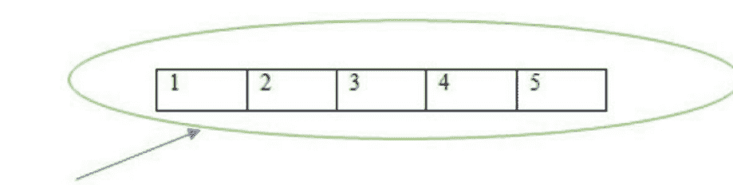

对 `myl1` 对象的修改不会影响 `myl2` 对象，反之亦然。

## 示例 7.45

> 源代码扫描二维码请参阅第336页的图 7.1

## 输出 7.45

```
1672151786120
1672151786184
Initially
myl1 is: [1, 2, 3, 4, 5]
myl2 is: [1, 2, 3, 4, 5]
```

```
Modifying myl1
 myl1 is: [1, 2, 23, 4, 5]
 myl2 is: [1, 2, 3, 4, 5]
Modifying myl2
 myl1 is: [1, 2, 23, 4, 5]
 myl2 is: [1, 2, 3, 24, 5]
```

在上面的例子中，`myl1` 和 `myl2` 的 `id` 不同。我们首先将 `myl1` 对象在索引位置 2 的元素修改为 23。此修改仅反映在 `myl1` 对象中，不影响 `myl2` 对象。


然后我们修改 `myl2` 对象在索引位置 3 的元素为 24。此修改仅反映在 `myl2` 对象中，不影响 `myl1` 对象。


因此，我们可以得出结论，`=` 操作符用于别名，而 `copy()` 方法用于克隆。

## 7.2.7 列表对象的数学运算符

### 7.2.7.1 连接 (+) 运算符

`+` 运算符将用于连接列表。借助 `+` 运算符，两个列表将连接成一个单独的列表，如下所示。

```
示例 7.46

myl1 = [1,2,3,4,5]
myl2 = [6,7,8,9,10]
myl3 = myl1 + myl2
print(myl3)
```

## 输出 7.46

```
[1, 2, 3, 4, 5, 6, 7, 8, 9, 10]
```

> **注意：**
> 要使用 `+` 运算符，强制要求两个参数都必须是列表对象。如果不是，Python 将抛出 `TypeError`。

## 示例 7.47

```python
myl1 = [1,2,3,4,5]
myl3 = myl1 + 6
print(myl3)
```

## 输出 7.47

```
TypeError: can only concatenate list (not “int”) to list
```

如果我们使用 `[6]` 代替 `6`，那么输出将是 `[1,2,3,4,5,6]`。

### 7.2.7.2 重复 (*) 运算符

`*` 运算符将用于按指定次数重复列表元素。

```
示例 7.48

myl1 = ['a','b','c']
myl3 = myl1* 2
print(myl3)
```

```
输出 7.48

['a', 'b', 'c', 'a', 'b', 'c']
```

因此，我们可以看到列表元素被重复了2次。

## 7.2.8 列表对象的比较

比较运算符可以用于列表对象。当在列表对象之间使用比较运算符（`==`，`!=`）时，需要考虑以下几点：

- 1. 元素数量必须相等。
- 2. 元素的顺序必须相同。
- 3. 内容（包括大小写）应该相同。

```
示例 7.49

myl1 = ['Rat','Bat','Hat']
myl2 = ['Rat','Bat','Hat']
myl3 = ['RAT','BAT','HAT']
print(myl1 == myl2)
print(myl1 == myl3)
```

```
print(my11 != my13)
```

## 输出 7.49

True
False
True

当在列表对象之间使用关系运算符（`>`，`>=`，`<`，`<=`）时，比较将仅针对第一个元素执行。

## 示例 7.50

源代码扫描二维码请参阅[第 336 页](#)的[图 7.1](#)

## 输出 7.50

True
True
False
False
_______
True
True
False
False

## 7.2.9 嵌套列表

嵌套列表或列表嵌套是指一个列表包含在另一个列表中。嵌套列表的元素可以通过使用索引来访问，就像多维数组元素一样。

```
示例 7.51

myl1 = [1,2,3,[4,5]]
print(myl1) # L1
print(myl1[3]) # L2
print(myl1[3][0]) # L3
print(myl1[3][1]) # L4
```

```
输出 7.51

[1, 2, 3, [4, 5]]
[4, 5]
4
5
```

| 列表元素 | 1 | 2 | 3 | 列表元素 | 4 | 5 |
| :--- | :--- | :--- | :--- | :--- | :--- | :--- |
| 索引 | [0] | [1] | [2] | 索引 | [0] | [1] |
| | | | | [3] | | |

在 L1 中，我们显示了列表元素。
在 L2 中，索引位置 3 的元素是一个嵌套列表 `[4,5]`。
在 L3 中，该元素是 4。
在 L4 中，该元素是 5。

## 7.2.10 列表推导式

一种从可迭代对象创建满足给定条件的新列表的方法。它以 `[` 开始，以 `]` 结束，以确保结果必须是一个列表。列表推导式必须包含以下部分：

> 输出表达式，
> 输入序列，
> 表示输入序列成员的一个变量，
> 一个可选的谓词部分。

例如：`[a**3 for a in range(1,15) if a 2 == 0]`
这里，
`a**3` 是输出表达式，
`range(1,15)` 是输入序列，
`a` 是变量，
`if a 2 == 0` 是谓词部分。

列表推导式的语法是

```
列表 = [表达式 for 项 in 可迭代对象 if 条件]
```

可以有 0 个或多个 `if` 语句。
可以有 1 个或多个 `for` 循环。
观察下面的代码

### 7.2.10.1 使用 for 循环的列表推导式

示例 7.52## 7.2.10.2 使用for循环和if语句的列表推导式

示例 7.53

```python
# 不使用列表推导式的代码
myl1 = []
for loop in range(11):
    if loop % 2 == 0:
        myl1.append(loop **3)
print(myl1)

# 使用列表推导式的代码
lic1 = [loop **3 for loop in range(11) if loop % 2 == 0]
print(lic1)
```

输出 7.53

```
[0, 8, 64, 216, 512, 1000]
[0, 8, 64, 216, 512, 1000]
```

在不使用列表推导式的代码中，最初创建一个空列表，然后将前10个偶数的立方添加到该空列表中。
在使用列表推导式的代码中，输出结果相同，但我们仅用一行代码就实现了结果。输出表达式是 `loop**3`，变量是 `loop`，输入表达式是 `range(11)`。`if loop %2 == 0` 是谓词部分。

## 7.2.10.3 使用for循环和嵌套if语句的列表推导式

### 示例 7.54

```python
# 不使用列表推导式的代码
myll = []
for loop in range(21):
    if loop %3 == 0:
        if loop %4 == 0:
            myll.append(loop **3)
print(myll)

# 使用列表推导式的代码
lic1 = [loop **3 for loop in range(21) if loop %3 == 0 if loop %4 == 0]
print(lic1)
```

输出 7.54

```
[0, 1728]
[0, 1728]
```

在不使用列表推导式的代码中，最初创建一个空列表，然后找出能被12整除的元素的立方，并将其添加到空列表中。
在使用列表推导式的代码中，输出结果相同，但我们仅用一行代码就实现了结果。输出表达式是 `loop**3`，变量是 `loop`，输入表达式是 `range(21)`。`if loop %2 == 0 if loop %3` 是谓词部分。

## 7.2.10.4 使用if else语句和for循环的列表推导式

使用if else语句和for循环的列表推导式语法如下：

```python
newlist = [expression if condition else statement for item in iterable_object]
```

### 示例 7.55

```python
# 不使用列表推导式的代码
myl1 = []
for loop in range(11):
    if loop %2 == 0:
        myl1.append(loop **3)
    else:
        myl1.append(loop**2)
print(myl1)

# 使用列表推导式的代码
lic1 = [loop **3 if loop %2 == 0 else loop**2 for loop in range(11)]
print(lic1)
```

输出 7.55

```
[0, 1, 8, 9, 64, 25, 216, 49, 512, 81, 1000]
[0, 1, 8, 9, 64, 25, 216, 49, 512, 81, 1000]
```

在不使用列表推导式的代码中，最初创建一个空列表，然后将前10个数字中偶数的立方和奇数的平方添加到空列表中。
在使用列表推导式的代码中，输出结果相同，但我们仅用一行代码就实现了结果。

## 7.2.10.5 使用for循环的嵌套列表推导式

使用for循环的嵌套列表推导式语法如下：


### 示例 7.56

```python
# 不使用列表推导式的代码
myl1 = []
for a in range(4,6):
    for b in range(3,5):
        myl1.append(a*b)
print(myl1)

# 使用列表推导式的代码
lic1 = [a*b for a in range(4,6) for b in range(3,5)]
print(lic1)
```

输出 7.56

```
[12, 16, 15, 20]
[12, 16, 15, 20]
```

在不使用列表推导式的代码中，使用了嵌套的for循环来生成输出。但在使用列表推导式的代码中，相同的输出仅用一行代码就产生了。

因此，我们可以说，推导式需要的代码更少，并且比for循环更快。此外，它还可以用于for循环无法使用的地方。

## 7.3 元组数据结构

由于我们现在已经了解了列表，讨论元组就很容易了。元组与列表完全相同，只是它是不可变的。一旦我们创建了元组对象，就不能对该对象进行任何更改。因此，我们可以说它是列表的只读版本。如果我们的数据是固定的，并且不需要更改，那么我们应该选择元组。在这里，插入顺序得以保留，并且可以通过使用索引来区分重复对象。因此，索引在元组中起着至关重要的作用。元组支持正向和负向索引。与列表相比，它占用的内存更少。元组元素用括号 `()` 表示，并用逗号分隔。括号是可选的，但建议使用。

### 示例 7.57

```python
t1 = 1,2,3,4
print(t1) # T1
print(type(t1)) # T2
t2 = (1,2,3,4)
print(t2) # T3
print(type(t2)) # T4
```

输出 7.57

```
(1, 2, 3, 4)
<class 'tuple'>
(1, 2, 3, 4)
<class 'tuple'>
```

在 T1 中，我们没有使用括号。输出是 (1,2,3,4)。
在 T2 中，t1 对象的类型是元组。
在 T3 中，使用了括号，输出是 (1,2,3,4)。
在 T4 中，t2 对象的类型是元组。

## 7.3.1 元组创建

元组可以通过以下方式创建：

### 7.3.1.1 创建空元组

语法：

```python
tuplename()
```

### 示例 7.58

```python
t1 = ()
print(t1) # ET1
print(type(t1)) # ET2
```

输出 7.58

```
()
<class 'tuple'>
```

在 ET1 中，元组是空的。
在 ET2 中，t1 对象的类型是元组。

### 7.3.1.2 创建单值元组

元组可以通过在括号内写入以逗号分隔的元素来创建。对于单值元组对象的创建，括号是可选的，但必须以逗号结尾。
在编写单值元组时需要特别注意。该值必须以逗号结尾，否则它将不被视为元组，如下所示。

### 示例 7.59

```python
i1 = (20)
print(i1) # TI1
print(type(i1)) # TI2
t1 = (20,)
print(t1) # TI3
print(type(t1)) # TI4
```

输出 7.59

```
20
<class 'int'>
(20,)
<class 'tuple'>
```

在 TI1 中，输出是 20。在 TI2 中，i1 对象的类型是整数。在 TI3 中，输出是 (20,)。在 TI4 中，t1 对象的类型是元组。上述示例说明了当元组中只有一个元素时，逗号的重要性。

### 7.3.1.3 创建多值元组

对于多值对象的创建，括号是可选的。根据需要，元素可以具有相同或不同的数据类型。

### 示例 7.60

```python
t1 = (1,2,3,4)
t2 = (1,1,1,True, 'python')
print(t1)
print(t2)
print(type(t1))
print(type(t2))
```

输出 7.60

```
(1, 2, 3, 4)
(1, 1, 1, True, 'python')
<class 'tuple'>
<class 'tuple'>
```

### 7.3.1.4 使用 `tuple()` 函数

可以使用 `tuple()` 将一个对象转换为元组，如下所示。

### 示例 7.61

```python
l1 = [1,2,3,4]
print(tuple(l1))
print(type(tuple(l1)))
t2 = tuple(range(1,9,2))
print(t2)
print(type(t2))
```

输出 7.61

```
(1, 2, 3, 4)
<class 'tuple'>
(1, 3, 5, 7)
<class 'tuple'>
```

## 7.3.2 访问元组的元素

元组元素可以通过使用索引或切片运算符来访问。

### 7.3.2.1 通过索引访问

元组元素的位置编号将由索引表示。索引写在括号内，从 0 开始。
例如：`myt1 = (10, 20, -30.1, 'Hello')`

**正向索引**
正向索引表示从左到右。根据上面的示例，正向索引编号如下：

| 带索引的元组对象 | 元素 |
|---|---|
| myt1[0] | 10 |
| myt1[1] | 20 |
| myt1[2] | -30.1 |
| myt1[3] | Hello |

**负向索引**
负向索引表示从右到左。根据上面的示例，负向索引编号如下：

| 带索引的元组对象 | 元素 |
|---|---|
| myt1[-4] | 10 |
| myt1[-3] | 20 |
| myt1[-2] | -30.1 |
| myt1[-1] | Hello |

### 示例 7.62

```python
myt1 = (10, 20, -30.1, 'Hello')
print(myt1[3])# LI1
print(myt1[-1])# LI2
print(myt1[4])# LI3
```

输出 7.62

```
Hello
Hello
IndexError: tuple index out of range
```

在 LI1 中，索引/位置 3 处的元素是 Hello。
在 LI2 中，索引/位置 -1 处的元素是 Hello。
在 LI3 中，索引/位置 4 不可用，因为只有 4 个元素。
因此，Python 将引发 `IndexError: tuple index out of range`。

### 通过索引和for循环访问

元组的元素可以使用索引和for循环访问，如下所示：

### 示例 7.63

```python
myt1 = (10, 20, -30.1, 'Hello')
tuple_length = len(myt1)

for loop in range(tuple_length):
    print(loop, myt1[loop])
```

## 输出 7.63

```
0 10
1 20
2 -30.1
3 Hello
```

在上面的例子中，返回了元组中元素的数量，并使用 `for` 循环进行迭代。索引号及其对应的元素将被显示。
这里，我们按顺序访问元组的每个元素。元素是通过 `for` 循环使用索引来访问的。

## 使用索引和 while 循环

元组的元素可以使用索引和 `while` 循环来访问，如下所示：

## 示例 7.64

```
myt1 = (10, 20, -30.1, 'Hello')
tuple_length = len(myt1)
count = 0
while count < tuple_length:
    print(count, myt1[count])
    count +=1
```

## 输出 7.64

```
0 10
1 20
2 -30.1
3 Hello
```

在上面的例子中，元组中元素的数量被返回给变量 `tuple_length`。`while` 循环的条件将检查计数器值是否小于 `tuple_length`。如果条件为真，则会显示索引号及其对应的元素。元素是通过 `while` 循环使用索引来访问的。

## 7.3.2.2 使用元组切片

元组元素也可以使用元组切片来访问。元组切片的语法如下：

```
myt1= tuplename[start:stop:step]
```

其中 **start** 表示切片的起始索引，默认值为 0。**stop** 表示切片的结束索引，默认值将是列表长度。**step** 是增量值，默认值为 1。

## 示例 7.65

源代码扫描[图 7.1](Figure 7.1) 所示二维码，见[第 336 页](page 336)

## 输出 7.65

```
myt1: (10, 20, -30.1, 'Hello', 34.1, True)
myt1[:4]: (10, 20, -30.1, 'Hello')
myt1[1:]: (20, -30.1, 'Hello', 34.1, True)
myt1[3:5]: ('Hello', 34.1)
myt1[1:4]: (20, -30.1, 'Hello')
myt1[::-1]: (True, 34.1, 'Hello', -30.1, 20, 10)
```

## 7.3.3 元组与不可变性

一旦创建了元组对象，其内容就不能被修改。因此，元组对象是不可变的。

```
示例 7.66

myt1 = (11,12,13,14)
print(myt1)# MU1
myt1[1] = 20
print(myt1)# MU2
```

```
输出 7.66

(11, 12, 13, 14)
TypeError: 'tuple' object does not support item assignment
```

在 MU1 中，元组元素显示为 `(11, 12, 13, 14)`。
在 MU2 中，我们尝试将索引/位置 1 的元素修改为 20。
由于元组对象是不可变的，Python 将引发
`TypeError: 'tuple' object does not support item assignment`。

## 7.3.4 元组对象的数学运算符

## 7.3.4.1 连接（+）运算符

`+` 运算符用于连接元组。借助 `+` 运算符，两个元组将被连接成一个元组，如下所示。

```
示例 7.67

myt1 = (1,2,3,4,5)
myt2 = (6,7,8,9,10)
myt3 = myt1 + myt2
print(myt3)
```

```
输出 7.67

(1, 2, 3, 4, 5, 6, 7, 8, 9, 10)
```

> 注意：

要使用 `+` 运算符，两个参数都必须是元组对象。否则，Python 将抛出 `TypeError`。

```
示例 7.68

myt1 = (1,2,3,4,5)
myt2 = 6
myt3 = myt1 + myt2
print(myt3)
```

```
输出 7.68

TypeError: can only concatenate tuple (not "int") to tuple
```

如果我们使用 `(6,)` 代替 `6`，则输出将是 `(1,2,3,4,5,6)`。

## 7.3.4.2 重复（*）运算符

`*` 运算符用于将元组元素重复指定次数。

```
示例 7.69
myt1 = ('a','b','c')
myt3 = myt1 * 2
print(myt3)
```

```
输出 7.69

('a', 'b', 'c', 'a', 'b', 'c')
```

所以，我们可以看到元组元素被重复了 2 次。

## 7.3.5 修改元组对象

元组对象是不可变的。因此，我们不能修改、更新或删除其元素。但是，我们可以使用切片和连接运算符将元素插入元组对象。将创建一个新对象，如下所示。

## 示例 7.70

```
t1 = (1,2,3,4,5)
t2 = ('Hello',True)
mys1 = t1[0:3] # MT1
mys2 = t1[3:] # MT2
myt1 = mys1 + t2 + mys2 # MT3
print(myt1) # MT4
print(type(myt1)) # MT5
print(id(t1)) # MT6
print(id(myt1)) # MT7
```

## 输出 7.70

```
(1, 2, 3, 'Hello', True, 4, 5)
<class 'tuple'>
2456430536224
2456433694304
```

在 MT1 中，0 到 3 之间的元素被存储在 `mys1` 对象中。
在 MT2 中，从索引 3 到末尾的所有元素被存储在 `mys2` 对象中。
在 MT3 中，对象 `mys1`、`t2` 和 `mys2` 被连接起来。
在 MT4 中，显示 `myt1` 对象中存储的数据。因此，输出为 `(1, 2, 3, 'Hello', True, 4, 5)`。
在 MT5 中，`myt1` 对象的类型是元组。
在 MT6 中，`t1` 对象的 id 是 2456430536224。
在 MT7 中，`myt1` 对象的 id 是 2456433694304。

所以，我们可以看到元素如愿地被插入到其他元素之间，但这是通过执行切片和连接操作创建了一个新对象。

## 7.3.6 从用户获取元组输入

众所周知，元组是不可变的，因此我们无法让用户向元组中插入元素。所以，一个简单的方法是提示用户输入，将用户输入的所有元素制成一个列表对象，然后转换成元组对象。

## 示例 7.71

源代码扫描[图 7.1](Figure 7.1) 所示二维码，见[第 336 页](page 336)

## 输出 7.71

```
Enter the number of elements: 4
Enter element at index 0 : 10
Enter element at index 1 : 20
Enter element at index 2 : 30
Enter element at index 3 : python
['10', '20', '30', 'python']
<class 'list'>
('10', '20', '30', 'python')
<class 'tuple'>
The elements of tuple object are:
10
20
30
python
```

## 7.3.7 元组函数和方法

- 1. `len()`
上述函数将返回元组中元素的数量。

```
示例 7.72

t1 = (10,11,14,17,19,20)
print(len(t1))
```

```
输出 7.72

6
```

如上所示，元组元素的数量为 6。

- 2. `count()`
上述方法将返回元组中指定元素的出现次数。
`count()` 的语法如下：

```
tuplename.count(element)
```

```
示例 7.73

myt1 = (10,11,14,17,19,20,14,35,14)
print(myt1.count(14)) # CO1
myt2 = ('c','o','r','o','n','a','w','a','r','r','i','o','r','s')
print(myt2.count('r')) # CO2
```

```
输出 7.73

3
4
```

在 CO1 中，元素 14 的出现次数为 3。
在 CO2 中，元素 'r' 的出现次数为 4。

- 3. `index()`
上述方法将返回元组中指定元素首次出现的位置或索引。如果在元组中找不到指定元素，Python 会显示 `ValueError`。因此，建议使用 `'in'` 运算符检查项目是否存在于元组中。
`index()` 的语法如下：

```
tuplename.index(element)
```

## 示例 7.74

```
myt1 = (10,11,14,17,19,20,14,35,14)
print(myt1.index(14)) # IN1
myt2 = ('c','o','r','o','n','a','w','a','r','r','i','o','r','s')
search_element = input("Enter the element to be searched: ")
if search_element in myt2:
    print(f'The first occurrence of {search_element} is present at index no. ', myt2.index(search_element))
else:
    print(f"The element {search_element} is not present")# IN2
```

```
输出 7.74

2
Enter the element to be searched: o
The first occurrence of o is present at index no. 1
```

在 IN1 中，我们检查列表对象 `myt1` 中元素 14 首次出现的位置，它在索引/位置 2。
在 IN2 中，提示用户输入要搜索的列表元素。
用户输入的元素 'o' 在索引/位置 1。
如果用户输入任何其他不存在的搜索元素，则将执行 else 部分，如下所示。

```
Enter the element to be searched: x
The element x is not present
```

- 4. `sorted()`
上述方法将按升序或降序对元组元素进行排序。`sorted()` 的语法如下：

```
sorted(iterable, key = function, reverse)
```

第一个参数是需要排序的序列、集合或其他任何可迭代对象。
第二个参数也是一个可选参数。它指定排序条件。
第三个参数是一个可选参数。默认值为 `False`，元组元素按升序排序。如果设置为 `True`，则元组元素按降序排序。
对于字符串，默认排序顺序是字母顺序。
对于数字，默认排序顺序是升序。

## 示例 7.75

```
python
myt1 = (12,10,38,22)
myt3 = tuple(sorted(myt1))
print(myt3)
print(type(myt3))
myt2 = ('Banana','Apple','Litchi','Watermelon','Mango')
myt4 = tuple(sorted(myt2))
print(myt4)
print(type(myt4))
```

## 输出 7.75

```
(10, 12, 22, 38)
<class 'tuple'> 
('Apple', 'Banana', 'Litchi', 'Mango', 'Watermelon')
<class 'tuple'>
```

如上所示，默认排序顺序对于数字是升序，对于字符串是字母顺序。当使用 `sorted()` 方法时，元组应只包含同类型元素，否则 Python 将引发 `TypeError`。

## 示例 7.76

## 7.3.7 `sorted()` 函数

```python
myt1 = (12,10,38,22, 'Watermelon', 'Mango')
myt2 = tuple(sorted(myt1))
print(myt2)
```

**输出 7.76**

```
TypeError: '<' not supported between instances of 'str' and 'int'
```

当 `reverse = True` 时，排序将按降序进行。当为 `False` 时，则按升序进行。

**示例 7.77**

```python
myt1 = (12,10,38,22)
myt2 = tuple(sorted(myt1, reverse = True))
print(myt2)
myt3 = tuple(sorted(myt1, reverse = False))
print(myt3)
print(type(myt3))
```

**输出 7.77**

```
(38, 22, 12, 10)
(10, 12, 22, 38)
<class 'tuple'>
```

`sorted()` 函数返回列表对象。
我们也可以使用 `key = function` 来指定排序标准。

**示例 7.78**

```python
def myfunc_len(element):
    return len(element)

myt1 = ('Banana','Apple','Litchi','Watermelon','Mango')
myt2 = sorted(myt1, key = myfunc_len, reverse = False)
print(myt2)
print(type(myt2))
myt3 = tuple(myt2)
print(myt3)
print(type(myt3))
```

**输出 7.78**

```
['Apple', 'Mango', 'Banana', 'Litchi', 'Watermelon']
<class 'list'>
('Apple', 'Mango', 'Banana', 'Litchi', 'Watermelon')
<class 'tuple'>
```

从上面的例子可以清楚地看到，使用 `tuple` 函数可以将列表对象转换为元组对象。

### 5. `min()` 和 `max()`

上述函数将根据默认的自然排序顺序返回最小值和最大值。

**示例 7.79**

```python
t1 = (10,20,30,22,46,58,99,78,9,33)
print(min(t1)) # M1
print(max(t1)) # M2
t2 = 'python'
print(min(t2)) # M3
print(max(t2)) # M4
```

**输出 7.79**

```
9
99
h
y
```

在 M1 中，元组对象中的最小值是 9。
在 M2 中，元组对象中的最大值是 99。

> **注意：** 元组中有一个 `cmp()` 函数，它在 Python 2 中可用，但在 Python 3 版本中不可用。

### 7.3.8 元组打包与解包

在元组打包中，通过打包一组变量来创建元组。

**示例 7.80**

```python
ele1 = 1
ele2 = 2
ele3 = 3
ele4 = 4
myt1 = ele1,ele2,ele3,ele4
print(myt1)
```

**输出 7.80**

```
(1, 2, 3, 4)
```

在上面的例子中，`ele1`、`ele2`、`ele3` 和 `ele4` 被打包成一个元组 `myt1`。因此，这就是元组打包。
现在，元组解包是元组打包的逆过程。一个元组被解包，其值被分配给不同的变量。

**示例 7.81**

```python
myt1 = (1,2,3,4)
ele1, ele2, ele3, ele4 = myt1
print("The 1st element is: " + str(ele1))
print("The 2nd element is: " + str(ele2))
print("The 3rd element is: " + str(ele3))
print("The 4th element is: " + str(ele4))
```

**输出 7.81**

```
The 1st element is: 1
The 2nd element is: 2
The 3rd element is: 3
The 4th element is: 4
```

但需要注意的一个重要点是，在元组解包时，变量的数量和值的数量必须相同。否则，我们将得到如下所示的 `ValueError`。

**示例 7.82**

```python
myt1 = (1,2,3,4)
ele1, ele2, ele3 = myt1
```

**输出 7.82**

```
ValueError: too many values to unpack (expected 3)
```

### 7.3.9 元组推导式

Python 不支持元组推导式。我们将得到一个生成器对象而不是元组对象。生成器表达式将一次产生一个项目。我们将在本章末尾讨论生成器。

**示例 7.83**

```python
g1 = (x**2 for x in range(1,7))
print(type(g1))

for loop in g1:
    print(loop)
```

**输出 7.83**

```
<class 'generator'>
1
4
9
16
25
36
```

### 7.3.10 嵌套元组

嵌套元组或元组的嵌套是指一个元组位于另一个元组内部。嵌套元组的元素可以通过索引访问，就像多维数组元素一样。

**示例 7.84**

```python
myt1 = (1,2,3,(4,5))
print(myt1) # L1
print(myt1[3]) # L2
print(myt1[3][0]) # L3
print(myt1[3][1]) # L4
```

**输出 7.84**

```
(1, 2, 3, (4, 5))
(4, 5)
4
5
```

| 元组元素 | 1 | 2 | 3 | 元组元素 | 4 | 5 |
| :--- | :--- | :--- | :--- | :--- | :--- | :--- |
| | | | | 索引 | [0] | [1] |
| 索引 | [0] | [1] | [2] | [3] | | |

在 L1 中，我们显示了元组元素。
在 L2 中，索引 3 处的元素是一个嵌套元组 `(4,5)`。
在 L3 中，元素是 4。
在 L4 中，元素是 5。

### 7.3.11 列表与元组比较

#### 相似之处

1.  保持插入顺序。
2.  允许重复对象。
3.  允许异构对象。
4.  支持切片和索引。

#### 不同之处

列表和元组之间的不同之处如表 7.2 所示。

| 序号 | 列表 | 元组 |
| :--- | :--- | :--- |
| 1 | 它是方括号内的一组逗号分隔的值。方括号是必需的。例如：`[1,2,3,4]` | 它是圆括号内的一组逗号分隔的值。圆括号是可选的。例如：`1,2,3,4` `(1,2,3,4)` |
| 2 | 列表对象是可变的，即一旦创建了列表对象，就可以对该对象进行任何更改。 | 元组对象是不可变的，即一旦创建了元组对象，其内容就无法修改。 |
| 3 | 当内容不固定且不断变化时，我们应该使用列表。 | 当内容固定且永不改变时，我们应该使用元组。 |
| 4 | 列表对象不能用作字典的键，因为键应该是不可变且可哈希的。 | 元组对象可以用作字典的键，因为键应该是不可变且可哈希的。 |

## 7.4 集合数据结构

项目的无序集合就是一个集合。在集合中，元素的顺序不被维护。元素出现的顺序可能与它们输入集合的顺序不同。插入顺序不被保留，但元素可以被排序。集合中不允许重复。集合没有索引和切片的规定。集合中允许异构元素。一旦创建了集合对象，就可以根据需要对其进行任何更改。因此，集合是可变的。集合用花括号 `{}` 表示，并用逗号分隔。所有数学运算，如并集、交集、差集等，都可以应用于集合对象。

**示例 7.85**

```python
s1 = {1,2,3,4}
print(s1)
print(type(s1))
```

**输出 7.85**

```
{1, 2, 3, 4}
<class 'set'>
```

### 7.4.1 集合创建

要创建一个集合，所有项目必须放在花括号 `{}` 内，并用逗号分隔。集合不会接受重复的元素。
可以使用 `set()` 函数创建集合对象。

语法是

```
set(iterable)
```

可迭代对象可以是任何序列，如列表、元组、字典或范围。

**示例 7.86**

```python
mys1 = set(range(1,10))
print(mys1) # S1
mys2 = set('python')
print(mys2) # S2
myl1 = [1,2,3,1,4,5]
mys3 = set(myl1)
print(mys3) # S3
myd1 = {'a': 1, 'b':2, 'c':3}
print(set(myd1)) # S4
```

**输出 7.86**

```
{1, 2, 3, 4, 5, 6, 7, 8, 9}
{'n', 'h', 't', 'y', 'p', 'o'}
{1, 2, 3, 4, 5}
{'b', 'c', 'a'}
```

在 S1 中，数字 1 到 9 将成为集合的元素。因此，输出将是 `{1, 2, 3, 4, 5, 6, 7, 8, 9}`。
在 S2 中，一个集合对象将包含无序的元素 `{'n', 'h', 't', 'y', 'p', 'o'}`。
在 S3 中，重复的元素将被移除，一个集合对象将包含无序的唯一元素 `{1,2,3,4,5}`。
在 S4 中，可以使用集合创建字典，但转换后只会保留键，因为值会丢失。因此，输出将是 `{'b', 'c', 'a'}`。

可以使用 `set()` 函数创建一个空集合。

```python
mys1 = set()
print(mys1)
print(type(mys1))
```

```
set()
<class 'set'>
```

我们不能只写 `{}` 来表示空集合。它将被视为字典。

```python
d1 = {}
print(d1)
print(type(d1))
```

```
{}
<class 'dict'>
```

### 7.4.2 集合方法

集合中的不同方法如下：

1.  **`add()`**
    上述方法将向集合添加一个新元素。它不返回任何值。`add()` 的语法是：

```
setname.add(element)
```

**示例 7.89**

```python
mys1 = {'10', 20, 30}
mys1.add(40)
print(mys1) # AS1
print(type(mys1)) # AS2
```

**输出 7.89**

```
{40, '10', 20, 30}
<class 'set'>
```

在 AS1 中，一个新元素 40 将被添加到集合中。但这并不意味着该元素将被添加到最后。这里的输出是 `{40, 20, '10', 30}`。
在 AS2 中，`mys1` 对象的类型是集合。

## 2. update()
上述方法会向集合中添加多个元素。它接受可迭代对象（如列表、元组、字符串或其他集合作为参数。给定可迭代对象中存在的元素将被添加到集合中。
`update()` 的语法是

```
setname.update(elements)
```

```
示例 7.91

mys1 = {'10',20,30}
myl1 = [1,2,3,4]
mys1.update(myl1)
print(mys1) # U1
mys1.update(myl1,range(1,4))
print(mys1) # U2
mys2 = {100,200}
mys1.update(mys2)
print(mys1) #U3
myt1 = (100,)
mys1.update(myt1)
print(mys1) #U4
```

输出 7.91

{1, 2, 3, 4, '10', 20, 30}
{1, 2, 3, 4, '10', 20, 30}
{1, 2, 3, 4, 100, 200, '10', 20, 30}
{1, 2, 3, 4, 100, 200, '10', 20, 30}

在 U1 中，我们使用列表元素更新当前集合。因此，输出是 {1, 2, 3, 4, 20, '10', 30}。
在 U2 中，我们使用列表元素和从 1 到 4 的元素更新当前集合。因此，输出是 {1, 2, 3, 4, 20, '10', 30}。
在 U3 中，我们通过添加另一个集合的所有元素来更新当前集合。因此，输出是 {1, 2, 3, 4, 100, 200, 20, '10', 30}。
在 U4 中，我们通过添加一个元组元素来更新当前集合。因此，输出是 {1, 2, 3, 4, 100, 200, 20, '10', 30}。

> **注意：**
每当需要向集合中添加单个元素时，我们使用 `add()` 方法。`update()` 方法用于向集合中添加多个元素。`add()` 的参数数量为 1，而 `update()` 可以接受任意数量的参数，但这些参数必须是可迭代对象。

## 3. copy()
上述方法将返回集合的一个副本，并将现有集合的元素复制到另一个集合中。`copy()` 的语法是

```
setname.copy()
```

### 示例 7.92

```
mys1 = {'Agra',100, True, 'Swiss Alps'}
mys2 = mys1.copy()
print(mys1)
print(mys2)
print(id(mys1))
print(id(mys2))
```

输出 7.92

```
{True, 'Swiss Alps', 100, 'Agra'}
{True, 'Swiss Alps', 100, 'Agra'}
212369576
211852864
```

从上面的例子可以看出，`copy()` 方法创建了另一个包含所有元素的集合。但这两个集合的内存地址不同。

## 4. pop()
上述方法将从集合中移除并返回某个随机元素。`pop()` 的语法是

```
setname.pop()
```

### 示例 7.93

源代码请扫描 [第 336 页](https://example.com) 上 [图 7.1](https://example.com) 中所示的二维码。

输出 7.93

```
Before pop() method...
fruits: {'Mango', 'Grapes', 'Banana', 'Apple', 'Litchi'}
numbers: {1, 2, 3, 4, 5}
Mango is removed from fruits
Grapes is removed from fruits
Banana is removed from fruits
1 is removed from numbers
2 is removed from numbers
3 is removed from numbers
After pop() method...
fruits: {'Apple', 'Litchi'}
numbers: {4, 5}
```

从上面的例子可以看出，集合 `myfruits` 和 `mynums` 中的某个随机元素被移除了。

如果集合为空，则 Python 会引发 `KeyError`。

### 示例 7.94

```
ms1 = set()
print(ms1.pop())
```

输出 7.94

```
KeyError: 'pop from an empty set'
```

## 5. remove()
删除元素的一种方法是使用 `remove()`。上述方法将从集合中移除指定的元素。`remove()` 的语法是

```
setname.remove(element)
```

### 示例 7.95

源代码请扫描第 336 页图 7.1 中所示的二维码。

输出 7.95

```
Before remove() method...
fruits: {'Mango', 'Grapes', 'Banana', 'Apple', 'Litchi'}
numbers: {1, 2, 3, 4, 5}
After remove() method...
fruits: {'Grapes', 'Banana'}
numbers: {2, 5}
```

如果指定的元素不存在于集合中，则 Python 会引发如下的 `KeyError`。

### 示例 7.96

```
myfruits = {"Apple", "Banana", "Grapes", "Litchi", "Mango"}
myfruits.remove('Guava')
```

输出 7.96

```
KeyError: 'Guava'
```

## 6. discard()
另一种删除元素的方法是使用 `discard()`。上述方法同样会从集合中移除指定的元素。
`discard()` 的语法是

```
setname.discard(element)
```

### 示例 7.97

源代码请扫描 [第 336 页](page 336) 上 [图 7.1](Figure 7.1) 中所示的二维码。

输出 7.97

```
Before discard() method…
fruits: {‘Mango’, ‘Grapes’, ‘Banana’, ‘Apple’, ‘Litchi’}
numbers: {1, 2, 3, 4, 5}
After discard() method…
fruits: {'Mango', 'Apple'}
numbers: {1, 4}
```

如果指定的元素不存在于集合中，则 Python 不会引发任何错误，如下面所示。

```
myfruits = {"Apple", "Banana", "Grapes", "Litchi", "Mango"}
myfruits.discard('Guava')
```

## 7. clear()
上述方法将清空或移除集合中的所有元素。`clear()` 的语法是：

```
setname.clear()
```

### 示例 7.98
源代码请扫描第 336 页图 7.1 中所示的二维码。

输出 7.98
```
Before clearing() method...
fruits: {'Mango', 'Grapes', 'Banana', 'Apple', 'Litchi'}
numbers: {1, 2, 3, 4, 5}
After clearing() method...
fruits: set()
numbers: set()
```

## 7.4.3 对集合执行数学运算的方法

集合上的不同数学运算如下：

### 1. union()
上述方法将返回一个包含所有集合中全部元素的集合。它用于求所有集合的并集。公共元素将只出现一次。也可以使用 `|` 运算符执行此操作。
其语法是

```
set1.union(set2, set3)
```

其中
`set1` 是要在其中搜索相同项的集合。
`set2`、`set3`... 是可选的集合，可以提供多个用于比较的集合。

```
# 示例 7.99
mys1 = {1,2,3,4}
mys2 = {3,4,5,6}
print(mys1.union(mys2)) # U1

mys3 = {'a','b','c','d'}
mys4 = {'d','e','f','g'}
mys5 = {'v','w','x','d'}
print(mys3.union(mys4)) # U2
print(mys3.union(mys4,mys5)) # U3
```

输出 7.99

```
{1, 2, 3, 4, 5, 6}
{'b', 'd', 'a', 'c', 'e', 'f', 'g'}
{'x', 'a', 'v', 'd', 'b', 'g', 'f', 'w', 'e', 'c'}
```

在 U1 中，集合对象 `mys1` 和 `mys2` 的组合元素是 {1, 2, 3, 4, 5, 6}。
在 U2 中，集合对象 `mys3` 和 `mys4` 的组合元素是 {'b', 'd', 'a', 'c', 'e', 'f', 'g'}。
在 U3 中，集合对象 `mys3`、`mys4` 和 `mys5` 的组合元素是 {'x', 'a', 'v', 'd', 'b', 'g', 'f', 'w', 'e', 'c'}。

### 2. intersection()
上述方法将返回一个包含两个或多个集合之间相似元素的集合。它将返回存在于所有集合中的元素的集合。即返回一个不含多余元素的新集合，它是两个或多个集合的交集。也可以使用 `&` 运算符执行此操作。原始集合不会被修改。
其语法是

```
set1.intersection(set1, set2, set3)
```

其中
`set1` 是要在其中搜索相同项的集合。
`set2`、`set3`... 是可选的集合，可以提供多个用于比较的集合。

### 示例 7.100

```
mys1 = {1,2,3,4}
mys2 = {3,4,5,6}
print(mys1.intersection(mys2)) # I1
mys3 = {'a','b','c','d'}
mys4 = {'d','w','f','g'}
mys5 = {'v','w','x','z'}
print(mys3.intersection(mys4)) # I2
print(mys4.intersection(mys5)) # I3
```

输出 7.100

```
{3, 4}
{'d'}
{'w'}
```

在 I1 中，返回的新集合包含集合对象 `mys1` 和 `mys2` 的公共元素 {3, 4}。
在 I2 中，返回的新集合包含集合对象 `mys3` 和 `mys4` 的公共元素 {'d'}。
在 I3 中，返回的新集合包含集合对象 `mys4` 和 `mys5` 的公共元素 {'w'}。

### 3. intersection_update()
上述方法将从原始集合中移除不需要的元素。它将使用存在于所有集合中的公共元素来更新原始集合。
其语法是

```
set1.intersection_update(set1, set2, set3)
```

其中
`set1` 是要在其中搜索相同项的集合。
`set2`、`set3`... 是可选的集合，可以提供多个用于比较的集合。

### 示例 7.101

```
mys1 = {1,2,3,4}
mys2 = {3,4,5,6}
mys1.intersection_update(mys2)
print(mys1) # IU1

mys3 = {'a','b','c','d'}
mys4 = {'d','w','f','g'}
mys5 = {'v','w','x','z'}
mys3.intersection_update(mys4)
print(mys3) # IU2
mys4.intersection_update(mys5)
print(mys4) # IU3
```

输出 7.101

```
{3, 4}
{'d'}
{'w'}
```

在 IU1 中，原始集合 `mys1` 使用存在于另一个集合 `mys2` 中的公共元素进行了更新。因此，`mys1` 对象内的元素是 {3, 4}。

在 IU2 中，原始集合 `mys3` 使用存在于另一个集合 `mys4` 中的公共元素进行了更新。因此，`mys3` 对象内的元素是 {'d'}。

在 IU3 中，原始集合 `mys4` 使用存在于另一个集合 `mys5` 中的公共元素进行了更新。因此，`mys4` 对象内的元素是 {'w'}。

### 4. difference()
上述方法将返回两个集合的差集。返回一个新集合，其中包含仅存在于第一个集合中而不在两个集合中。它甚至可以使用 `-` 运算符执行。原始集合不会被修改。语法是

```
setname1.difference(setname2)
```

其中
setname2 是第二个集合的名称，它将与 setname1 找出差集。

## 示例 7.102

```
mys1 = {1,2,3,4}
mys2 = {3,4,5,6}
print(mys1.difference(mys2)) # D1
mys3 = {’a’,’b’,’c’,’d’}
mys4 = {’d’,’w’,’f’,’g’}
mys5 = {’v’,’w’,’x’,’z’}
print(mys3.difference(mys4)) # D2
print(mys4.difference(mys5)) # D3
```

## 输出 7.102

```
{1, 2}
{’a’, ’c’, ’b’}
{’d’, ’g’, ’f’}
```

在 D1 中，返回一个集合，其中包含仅存在于 mys1 中而不存在于集合 mys2 中的元素。因此，输出为 {1, 2}。
在 D2 中，返回一个集合，其中包含仅存在于 mys3 中而不存在于集合 mys4 中的元素。因此，输出为 {‘a’, ’c’, ’b’}。
在 D3 中，返回一个集合，其中包含仅存在于 mys4 中而不存在于集合 mys5 中的元素。因此，输出为 {'d', 'g', 'f'}。

### 5. difference_update()

上述方法将从原始集合中移除不需要的元素。它将通过移除另一个集合中不存在于原始集合中的元素和重复元素来更新原始集合的元素。

语法是

```
setname1.difference_update(setname2)
```

其中

setname2 是第二个集合的名称，它将与 setname1 找出差集。

## 示例 7.103

```
mys1 = {1,2,3,4}
mys2 = {3,4,5,6}
mys1.difference_update(mys2)
print(mys1) # DU1

mys3 = {'a','b','c','d'}
mys4 = {'d','w','f','g'}
mys5 = {'v','w','x','z'}
mys3.difference_update(mys4)
print(mys3) # DU2
mys4.difference_update(mys5)
print(mys4) # DU3
```

## 输出 7.103

```
{1, 2}
{'b', 'c', 'a'}
{'f', 'd', 'g'}
```

在 DU1 中，原始集合 mys1 被更新为元素 {1,2}。
在 DU2 中，原始集合 mys3 被更新为元素 {'b', 'c', 'a'}。
在 DU3 中，原始集合 mys4 被更新为元素 {'f', 'd', 'g'}。

### 6. symmetric_difference()

上述方法将返回一个包含两个集合中所有元素的集合，但不包含同时存在于两个集合中的元素，即两个集合的公共元素将被移除，并返回一个混合了两个集合中不存在的元素的集合。它甚至可以使用 `^` 运算符执行。原始集合不会被修改。
语法是

```
setname1.symmetric_difference(setname2)
```

其中 setname2 是要与 setname1 进行比较的另一个集合。

## 示例 7.104

```
mys1 = {1,2,3,4}
mys2 = {3,4,5,6}
print(mys1.symmetric_difference(mys2)) # S1
mys3 = {'a','b','c','d'}
mys4 = {'d','w','f','g'}
mys5 = {'v','w','x','z'}
print(mys3.symmetric_difference(mys4)) # S2
print(mys4.symmetric_difference(mys5)) # S3
```

## 输出 7.104

```
{1, 2, 5, 6}
{'c', 'f', 'w', 'b', 'g', 'a'}
{'z', 'f', 'x', 'd', 'g', 'v'}
```

在 S1 中，返回一个新集合，不包含集合 mys1 和 mys2 的公共元素。因此，输出为 {1, 2, 5, 6}。
在 S2 中，返回一个新集合，不包含集合 mys3 和 mys4 的公共元素。因此，输出为 {'c', 'f', 'w', 'b', 'g', 'a'}。
在 S3 中，返回一个新集合，不包含集合 mys4 和 mys5 的公共元素。因此，输出为 {'z', 'f', 'x', 'd', 'g', 'v'}。

### 7. symmetric_difference_update()

上述方法将通过移除同时存在于两个集合中的元素并插入其他元素来更新原始集合。
语法是

```
setname1.symmetric_difference_update(setname2)
```

其中 setname2 是要与 setname1 进行比较的另一个集合。

## 示例 7.105

源代码请扫描 [图 7.1](on page 336) 中显示的二维码

## 输出 7.105

```
{1, 2, 5, 6}
{’c’, ’w’, ’f’, ’b’, ’a’, ’g’}
{’f’, ’z’, ’d’, ’v’, ’g’, ’x’}
```

在 SU1 中，原始集合 mys1 通过移除集合 mys1 和 mys2 的公共元素进行更新。集合 mys1 被更新为集合 mys1 和 mys2 的对称差集。因此，输出为 {1, 2, 5, 6}。

在 SU2 中，原始集合 mys3 通过移除集合 mys3 和 mys4 的公共元素进行更新。因此，输出为 {’c’, ’w’, ’f’, ’b’, ’a’, ’g’}。

在 SU3 中，原始集合 mys4 通过移除集合 mys4 和 mys5 的公共元素进行更新。因此，输出为 {’f’, ’z’, ’d’, ’v’, ’g’, ’x’}。

### 8. isdisjoint()

如果两个集合中没有公共元素，上述方法将返回 True，否则返回 False。

语法是

```
setname1.isdisjoint(setname2)
```

## 示例 7.106

源代码请扫描 [图 7.1](Figure 7.1) 中显示的二维码，位于 [第 336 页](page 336)

## 输出 7.106

```
False
False
False
True
```

在 ID1 中，集合 mys1 和 mys2 之间存在公共元素 {3,4}。因此，返回 False。
在 ID2 中，集合 mys3 和 mys4 之间存在公共元素 {'d'}。因此，返回 False。
在 ID3 中，集合 mys4 和 mys5 之间存在公共元素 {'w'}。因此，返回 False。
在 ID4 中，集合 mys3 和 mys5 之间没有公共元素。因此，返回 True。

### 9. issubset()

如果原始集合的所有元素都存在于指定集合中，上述方法将返回 True，否则返回 False。
语法是

```
setname1.issubset(setname2)
```

其中原始集合 setname1 要与指定集合 setname2 进行比较。

## 示例 7.107

```
mys1 = {1,2,3,4}
mys2 = {1,2,3,4,5,6}
print(mys1.issubset(mys2)) # ISUB1

mys3 = {'a','b','c','d'}
mys4 = {'d','w','f','g'}
mys5 = {'a','b','c','d','v','w','x','z'}
print(mys3.issubset(mys4)) # ISUB2
print(mys4.issubset(mys5)) # ISUB3
print(mys3.issubset(mys5)) # ISUB4
```

## 输出 7.107

```
True
False
False
True
```

在 ISUB1 中，集合 mys1 的所有元素都存在于集合 mys2 中。因此，返回 True。
在 ISUB2 中，集合 mys3 的所有元素都不存在于集合 mys4 中。因此，返回 False。
在 ISUB3 中，集合 mys4 的所有元素都不存在于集合 mys5 中。因此，返回 False。
在 ISUB4 中，集合 mys3 的所有元素都存在于集合 mys5 中。因此，返回 True。

### 10. issuperset()

如果指定集合的所有元素都存在于原始集合中，上述方法将返回 True，否则返回 False。
语法是

```
setname1.issuperset(setname2)
```

其中 setname2 是要与原始集合 setname1 进行比较的指定集合。

## 示例 7.108

源代码请扫描 [图 7.1](Figure 7.1) 中显示的二维码，位于 [第 336 页](page 336)

## 输出 7.108

```
True
False
False
True
```

在 ISUP1 中，集合 mys1 的所有元素都存在于集合 mys2 中。因此，返回 True。
在 ISUP2 中，集合 mys4 的所有元素都不存在于集合 mys3 中。因此，返回 False。
在 ISUP3 中，集合 mys5 的所有元素都不存在于集合 mys4 中。因此，返回 False。
在 ISUP4 中，集合 mys3 的所有元素都存在于集合 mys5 中。因此，返回 True。

> 注意：

有一些内置函数，如 `any()`、`all()`、`len()`、`enumerate()`、`min()`、`max()`、`sum()`、`sorted()` 等，我们已经讨论过，它们最常与集合一起使用，以根据需求执行任务。

## 7.4.4 集合推导式

在集合推导式中，从满足给定条件的可迭代对象创建一个新集合。集合推导式最重要的方面是元素是唯一的、无序的，并且不能包含任何重复项，从而返回一个集合。它使用花括号 `{}`。

语法是

```
new_set = {expression for item in iterable_object if statement}
```

可以有 0 个或多个 `if` 语句。
可以有 1 个或多个 `for` 循环语句。
请观察以下代码

## 示例 7.109

```
带 for 循环的集合推导式

# 不使用集合推导式的代码
mys1 = set()
for loop in range(11):
    mys1.add(loop **3)
print(mys1)

# 使用集合推导式的代码
mys2 = {loop **3 for loop in range(11)}
print(mys2)
```

## 输出 7.109

```
{0, 1, 64, 512, 8, 1000, 343, 216, 729, 27, 125}
{0, 1, 64, 512, 8, 1000, 343, 216, 729, 27, 125}
```

在不使用集合推导式的代码中，最初创建一个空集，然后将前 10 个数字的立方逐个添加到空集中。

在使用集合推导式的代码中，输出结果相同，但我们仅用一行代码就实现了目标。

## 示例 7.110

```
使用 for 循环和 if 语句的集合推导式
#不使用集合推导式的代码
mys1 = set()
for loop in range(11):
    if loop %2 == 0:
        mys1.add(loop **3)
print(mys1)
#使用集合推导式的代码
mys2 = {loop **3 for loop in range(11) if loop %2 == 0}
print(mys2)
```

## 输出 7.110

```
{0, 64, 512, 8, 1000, 216}
{0, 64, 512, 8, 1000, 216}
```

在不使用集合推导式的代码中，首先创建一个空集，然后将前10个偶数的立方添加到空集中。
在使用集合推导式的代码中，输出结果相同，但我们仅用一行代码就实现了目标。

## 示例 7.111

使用 for 循环和嵌套 if 语句的集合推导式

```
#不使用集合推导式的代码
mys1 = set()
for loop in range(21):
    if loop %3 == 0:
        if loop %4 == 0:
            mys1.add(loop **3)
print(mys1)

#使用集合推导式的代码
mys2 = {loop **3 for loop in range(21) if loop %3 == 0 if loop %4 == 0}
print(mys2)
```

## 输出 7.111

```
{0, 1728}
{0, 1728}
```

在不使用集合推导式的代码中，首先创建一个空集，然后找出能被12整除的元素的立方，并将其添加到空集中。
在使用集合推导式的代码中，输出结果相同，但我们仅用一行代码就实现了目标。

## 示例 7.112

使用 if else 语句和 for 循环的集合推导式

```
#不使用集合推导式的代码
mys1 = set()
for loop in range(11):
    if loop %2 == 0:
        mys1.add(loop **3)
    else:
        mys1.add(loop**2)
print(mys1)

#使用集合推导式的代码
mys2 = {loop **3 if loop %2 == 0 else loop**2 for loop in range(11)}
print(mys2)
```

## 输出 7.112

```
{0, 1, 64, 512, 8, 9, 1000, 49, 81, 216, 25}
{0, 1, 64, 512, 8, 9, 1000, 49, 81, 216, 25}
```

使用 if else 语句和 for 循环的集合推导式语法如下：

```
new_set = {expression if condition else statement for item in iterable_object}
```

在不使用集合推导式的代码中，首先创建一个空集，然后将前10个数字中偶数的立方和奇数的平方添加到空集中。
在使用集合推导式的代码中，输出结果相同，但我们仅用一行代码就实现了目标。

## 7.5 字典数据结构

数据结构列表、元组和集合用于将一组独立对象表示为一个单一实体。如果我们想将一组对象表示为键值对，那么我们应该使用字典。在字典中，不允许重复的键，但值可以重复。

键和值都允许是异构对象。
字典中不保留插入顺序。
它是一个无序集合，并且是可变的，因为我们可以修改其项而不改变其身份。切片和索引的概念不适用于字典。
它使用花括号 {} 表示。

### 一些关键规则

在创建字典之前，编写键时必须考虑以下几点：

- 1. 键必须是唯一的。
- 2. 如果再次提到相同的键，则旧键将被覆盖。
- 3. 键必须是不可变的，如整数、字符串或元组。
- 4. 列表或字典不能用作键。
- 5. 键区分大小写。例如，键名 'k' 和 'K' 是不同的。

### 7.5.1 创建空字典

可以通过两种方式创建空字典：
1. 使用 dict() 函数

```
d1 = dict()
print(d1)
print(type(d1))
```

```
输出 7.113
{}
<class 'dict'>
```

2. 仅使用花括号

```
d1 = {}
print(d1)
print(type(d1))
```

```
{}
<class 'dict'>
```

### 7.5.2 创建字典

字典可以以键值对的形式创建，其中键将遵循讨论的规则，值可以是任何数据类型并且可以重复。语法是

```
dict1 = {key1: value1, key2: value2, ... }
```

```
d1 = {}
d1[1] = 'python'
d1[2] = 'is'
d1[3] = 'awesome'
print(d1) # DI1

d2 = {1: 'python',
      2: 'is',
      3: 'awesome'}
print(d2) # DI2
```

## 输出 7.115

```
{1: 'python', 2: 'is', 3: 'awesome'}
{1: 'python', 2: 'is', 3: 'awesome'}
```

在 DI1 中，首先创建一个空字典，然后以 d1[key] = value 的形式添加数据条目。键名在方括号内引用。字典使用键值对创建，输出为 {1: 'python', 2: 'is', 3: 'awesome'}。
在 DI2 中，假设数据已经提前完全已知。因此，它使用键值对创建。因此，输出为 {1: 'python', 2: 'is', 3: 'awesome'}。

## 示例 7.116

```
d2 = {1: 'python',
      2: 'is',
      3: 'awesome',
      3: 'True'}
print(d2)
```

## 输出 7.116

```
{1: 'python', 2: 'is', 3: 'True'}
```

正如我们所看到的，键值 3 被重复了。因此，根据键规则，旧键被覆盖。因此，输出为 {1: 'python', 2: 'is', 3: 'True'}。

### 7.5.3 访问字典

可以使用键访问数据。字典的值可以通过在方括号内引用其键名来访问。
例如：employee details = {101: 'Ram', 102: 'Shyam', 103: 'Mohan'}

| 键 | 值 |
|---|---|
| 101 | Ram |
| 102 | Shyam |
| 103 | Mohan |

## 示例 7.117

```
employee_details = {101: 'Ram', 102: 'Shyam', 103: 'Mohan'}
print(employee_details[101])
print(employee_details[102])
print(employee_details[103])
print(employee_details[104])
```

### 输出 7.117

```
Ram
Shyam
Mohan
KeyError: 104
```

我们可以看到数据是通过键 101、102 和 103 访问的。但指定的键 104 在字典对象中不可用。因此，Python 抛出了 KeyError。我们可以通过使用 in 运算符来防止这种情况，如下所示。

```
employee_details = {101: 'Ram', 102: 'Shyam', 103: 'Mohan'}
if 104 in employee_details:
    print("Present")
else:
    print("The key is not present")
```

### 输出 7.118

```
The key is not present
```

另一种方法是使用 get() 方法。如果找不到键，它返回 None 而不是 KeyError。

```
employee_details = {101: 'Ram', 102: 'Shyam', 103: 'Mohan'}
print(employee_details.get(104))
```

```
None
```

在 Python 2 中，有一个叫做 has_key() 的函数，它会检查键是否可用。但它在 Python 2 版本中可用，在 Python 3 版本中已过时。

### 7.5.4 修改字典

可以通过分配新值来修改键的现有值。如果键不可用，则会将具有指定键值对的新条目添加到字典中。由于它是无序集合，它可能被添加到字典中的任何位置。如果键可用，则旧值将被新值替换，因为值是更新而不是添加新项。

```
d1 = {1:'Sugandh', 2:'Divya', 3:'Mintoo'}
print(d1) # UD1
d1[4] = 'Neeharika'
print("After adding a key value pair")
print(d1) # UD2
print("After modifying the value")
d1[3] = 'Animesh'
print(d1) # UD3
```

## 输出 7.120

```
{1: 'Sugandh', 2: 'Divya', 3: 'Mintoo'}
After adding a key value pair
{1: 'Sugandh', 2: 'Divya', 3: 'Mintoo', 4: 'Neeharika'}
After modifying the value
{1: 'Sugandh', 2: 'Divya', 3: 'Animesh', 4: 'Neeharika'}
```

在 UD1 中，我们显示字典中的键值对。输出为 {1: 'Sugandh', 2: 'Divya', 3: 'Mintoo'}。
在 UD2 中，由于键 4 不可用，因此向字典对象添加了一个键值对。因此，输出为 {1: 'Sugandh', 2: 'Divya', 3: 'Mintoo', 4: 'Neeharika'}。
在 UD3 中，键 3 已经存在。因此，旧值 Mintoo 被新值 Animesh 替换。因此，输出为 {1: 'Sugandh', 2: 'Divya', 3: 'Animesh', 4: 'Neeharika'}。

### 7.5.5 删除字典项

可以使用 del 语句删除字典的项或整个字典。删除项的语法是：

```
del dictionaryname[key]
```

删除整个字典的语法是`del dictionaryname`

## 示例 7.121

```python
d1 = {1:'Sugandh', 2:'Divya', 3:'Mintoo'}
print(d1) # D1
print("deleting an item from the dictionary...")
del d1[3]
print(d1) # D2
print("deleting an entire dictionary...")
del d1
print(d1) # D3
```

## 输出 7.121

```
{1: 'Sugandh', 2: 'Divya', 3: 'Mintoo'}
deleting an item from the dictionary...
{1: 'Sugandh', 2: 'Divya'}
deleting an entire dictionary...
NameError: name 'd1' is not defined
```

在 D1 中，我们显示了字典中的键值对。因此，输出为 {1: 'Sugandh', 2: 'Divya', 3: 'Mintoo'}。
在 D2 中，我们从字典中删除了一个特定的项。因此，输出为 {1: 'Sugandh', 2: 'Divya'}。
在 D3 中，我们删除了整个字典本身。现在，我们无法访问字典对象 d1。因此，Python 将引发 NameError: name 'd1' is not defined。
如果键不存在，Python 将引发 KeyError。

### 示例 7.122

```python
d1 = {1:'Sugandh', 2:'Divya', 3:'Mintoo'}
print("deleting a key from the dictionary...")
del d1[3]
print(d1)
print("deleting the same key again...")
del d1[3]
print(d1)
```

### 输出 7.122

```
deleting a key from the dictionary...
{1: 'Sugandh', 2: 'Divya'}
deleting the same key again...
KeyError: 3
```

## 7.5.6 字典方法和函数

各种字典函数和方法如下：

- 1. dict()

    我们可以使用 dict() 函数创建字典，如下所示。

    ### 示例 7.123

    源代码请扫描第 336 页图 7.1 所示的二维码

    ### 输出 7.123

    ```
    {}
    <class 'dict'>
    {1: 'a', 2: 'b', 3: 'c'}
    {1: 'python', 2: 'is', 3: 'awesome'}
    {1: 'python', 2: 'is', 3: 'awesome'}
    {2: 'is', 3: 'awesome', 1: 'python'}
    TypeError: unhashable type: 'list'
    ```

    在 DI1 中，我们创建了一个空字典。因此，输出为 {}。
    在 DI2 中，创建了一个包含指定元素的字典。因此，输出为 {1: 'a', 2: 'b', 3: 'c'}。
    在 DI3 中，使用给定的元组元素列表创建了一个字典。因此，输出为 {1: 'python', 2: 'is', 3: 'awesome'}。
    在 DI4 中，使用给定的元组元素元组创建了一个字典。因此，输出为 {1: 'python', 2: 'is', 3: 'awesome'}。
    在 DI5 中，使用给定的元组元素集合创建了一个字典。因此，输出为 {2: 'is', 3: 'awesome', 1: 'python'}。
    在 DI6 中，由于我们试图使用给定的列表元素集合创建字典，Python 将引发 TypeError。因此，Python 将引发 TypeError: unhashable type: 'list'。

- 2. len()

    上述函数将返回字典中存在的项目数量。项目指的是每个键值对。

    ### 示例 7.124

    ```python
    d2 = dict({11:'h',12:'a',13:'t'})
    print(len(d2))
    ```

    ### 输出 7.124

    ```
    3
    ```

- 3. clear()

    上述方法将从字典中移除所有键值对。但在移除项目后，我们仍然可以访问字典对象。
    语法为 `dictionaryname.clear()`。

    ### 示例 7.125

    ```python
    d1 = dict(((11,"Stay"),(12,"safe"),(13,"completely"),
    (14,"anywhere")))
    print(d1)
    d1.clear()
    print(d1)
    ```

    ### 输出 7.125

    ```
    {11: 'Stay', 12: 'safe', 13: 'completely', 14: 'anywhere'}
    {}
    ```

- 4. get()

    上述方法将返回指定键对应的值（如果键存在），否则返回 None 或默认值。
    语法为 `dictionaryname.get(key[, value])`，其中第一个参数是必需参数，是要在字典中搜索的键。value 参数是可选的，如果未找到键，则返回该值。默认值为 None。因此，上述方法将返回：
    (a) 如果指定键存在于字典中，则返回其值。
    (b) 如果未找到键且未指定值，则返回 None。
    (c) 如果未找到键但指定了值，则返回指定的值。

    ### 示例 7.126

    ```python
    myemp = {'Name': 'Michael','Age':39}
    print(myemp.get('Name')) # G1
    print(myemp.get('Age')) # G2
    print(myemp.get('MobileNumber')) # G3
    print(myemp.get('MobileNumber',9876543210)) # G4
    print(myemp.get('Age',34)) # G5
    ```

    ### 输出 7.126

    ```
    Michael
    39
    None
    9876543210
    39
    ```

    在 G1 中，指定键 Name 的值为 Michael。
    在 G2 中，指定键 Age 的值为 39。
    在 G3 中，未找到键 MobileNumber。由于未指定默认值，因此默认值为 None。
    在 G4 中，未找到键 MobileNumber。指定了默认值。因此，输出为 9876543210。
    在 G5 中，键 Age 存在。即使指定了默认值，指定键对应的值仍为 39。

- 5. pop()

    上述方法将从字典中移除具有指定键的项。如果找到键，则返回从字典中移除的项的值。如果未找到键且指定了默认值，则返回默认值。如果未找到键且未指定默认值，则 Python 将引发 KeyError 异常。
    语法为 `dictionaryname.pop(key[, default])`，其中第一个参数是要搜索并移除的键。第二个参数是默认值，当在字典中未找到键时返回该值。

    ### 示例 7.127

    源代码请扫描第 336 页图 7.1 所示的二维码

    ### 输出 7.127

    ```
    data of employee dictionary...
    {'Name': 'Priyanka', 'Age': 39, 'Sex': 'Female'}
    Priyanka is removed.
    39 is removed.
    data of employee dictionary after removing Name and Age...
    {'Sex': 'Female'}
    Landline Number does not exist.
    KeyError: 'LandlineNumber'
    ```

    在 P1 中，显示了字典的所有项。输出为 {'Name': 'Priyanka', 'Age': 39, 'Sex': 'Female'}。
    在 P2 中，移除了具有指定键 Name 的项。因此，值 Priyanka 被移除。
    在 P3 中，移除了具有指定键 Age 的项。因此，值 39 被移除。
    在 P4 中，移除键 Name 和 Age 后字典中存在的项为 {'Sex': 'Female'}。
    在 P5 中，未找到键 LandlineNumber，但指定了默认值。因此，输出为 Landline Number does not exist。
    在 P6 中，未找到键 LandlineNumber 且未指定默认值。因此，Python 将引发 KeyError: 'LandlineNumber'。

- 6. popitem()

    上述方法将从字典中移除并返回一个任意的元素（键值）对。如果字典为空且我们尝试使用上述方法，我们将得到 KeyError。
    语法为 `dictionaryname.popitem()`。

    ### 示例 7.128

    源代码请扫描[第 336 页](link)的[图 7.1](link)所示的二维码

    ### 输出 7.128

    ```
    {'Name': 'Alestair', 'Age': 58, 'Sex': 'Male'}
    ('Sex', 'Male') is removed
    ('Age', 58) is removed
    ('Name', 'Alestair') is removed
    {}
    KeyError: 'popitem(): dictionary is empty'
    ```

    在 PI1 中，显示了字典的所有项。输出为 {'Name': 'Alestair', 'Age': 58, 'Sex': 'Male'}。
    在 PI2 中，从字典中移除了一个任意的键值对 ('Sex', 'Male')。
    在 PI3 中，从字典中移除了一个任意的键值对 ('Age', 58)。
    在 PI4 中，从字典中移除了一个任意的键值对 ('Name', 'Alestair')。
    在 PI5 中，显示了一个空字典。
    在 PI6 中，字典为空。因此，Python 将引发 KeyError: 'popitem(): dictionary is empty'。

- 7. keys()

    上述方法将返回字典中所有键的序列。语法为 `dictionaryname.keys()`。它不接受任何参数。

    ### 示例 7.129

    ```python
    myemp = {
        'Name': 'Steve',
        'Age':58,
        'Sex': 'Male'}
    print(myemp)# K1
    print(myemp.keys())# K2
    myrem = myemp.popitem()
    print(myrem, 'is removed')# K3
    print(myemp.keys())# K4
    print(list(myemp.keys()))# K5
    for key in myemp.keys(): # K6
        print(key)
    ```

    ### 输出 7.129

    ```
    {'Name': 'Steve', 'Age': 58, 'Sex': 'Male'}
    dict_keys(['Name', 'Age', 'Sex'])
    ('Sex', 'Male') is removed
    dict_keys(['Name', 'Age'])
    ['Name', 'Age']
    Name
    Age
    ```

    在 K1 中，显示了字典的所有项。输出为 {'Name': 'Steve', 'Age': 58, 'Sex': 'Male'}。
    在 K2 中，显示了字典中所有键的序列。输出为 dict_keys(['Name', 'Age', 'Sex'])。

## 8. values()
此方法将返回字典中的一个值序列。
语法是
```
dictionaryname.values()
```
它不接受任何参数。
### 示例 7.130
```
myemp = {
    'Name': 'Angela',
    'Age':30,
    'Sex': 'Female',
    'Profession': 'Doctor'}
print(myemp)# V1
print(myemp.values())# V2
myrem = myemp.pop('Sex')
print(myrem, 'is removed')# V3
print(myemp.values())# V4
print(tuple(myemp.values()))# V5
for value in myemp.values():
    print(value)# V6
```
### 输出 7.130
```
{'Name': 'Angela', 'Age': 30, 'Sex': 'Female', 'Profession': 'Doctor'}
dict_values(['Angela', 30, 'Female', 'Doctor'])
Female is removed
dict_values(['Angela', 30, 'Doctor'])
('Angela', 30, 'Doctor')
Angela
30
Doctor
```
在 V1 中，显示字典的所有条目。输出是 `{'Name':'Angela','Age':30,'Sex':'Female','Profession':'Doctor'}`。
在 V2 中，显示字典所有值的一个序列。输出是 `dict_values(['Angela', 30, 'Female', 'Doctor'])`。
在 V3 中，指定键 `Sex` 的条目从字典中被移除。所以，输出将是 `Female is removed`。
在 V4 中，使用 `pop()` 方法后，再次显示字典所有值的一个序列。输出是 `dict_values(['Angela', 30, 'Doctor'])`。
在 V5 中，值的序列将被转换为元组。因此，输出是 `('Angela', 30, 'Doctor')`。
在 V6 中，每个值将被逐一迭代。因此，输出将是：
```
Angela
30
Doctor
```

## 9. items()
此方法将返回一个包含字典键值对的对象。键值对将以元组列表的形式存储在该对象中。
语法是
```
dictionaryname.items()
```
### 示例 7.131
```
myemp = {
    'Name': 'Angela',
    'Age':30,
    'Sex': 'Female',
    'Profession': 'Doctor'}
print(myemp.items())# I1
print(type(myemp.items()))# I2
for key, value in myemp.items():
    print(key, '——',value)# I3
```
### 输出 7.131
```
dict_items([('Name', 'Angela'), ('Age', 30),
('Sex', 'Female'), ('Profession', 'Doctor')])
<class 'dict_items'>
Name —— Angela
Age —— 30
Sex —— Female
Profession —— Doctor
```
在 I1 中，显示字典的所有条目。因此，输出将是 `dict_items([('Name', 'Angela'), ('Age', 30), ('Sex', 'Female'), ('Profession', 'Doctor')])`。
在 I2 中，类型是 `<class 'dict_items'>`。在 I3 中，键和值同时被逐一迭代。所以，输出将是：
```
Name Angela
Age 30
Sex Female
Profession Doctor
```

## 10. copy()
此方法将把现有字典的所有元素复制到一个新字典中。返回字典的浅拷贝。原始字典不会被修改。
语法是
```
dictionaryname.copy()
```
### 示例 7.132
源代码请扫描第336页图7.1所示的二维码
### 输出 7.132
```
{'Name': 'Kripki', 'Age': 29, 'Sex': 'Male', 'Profession': 'Scientist'}
{'Name': 'Kripki', 'Age': 29, 'Sex': 'Male', 'Profession': 'Scientist'}
After clearing the new dictionary which was copied from the original using copy method
{}
{'Name': 'Kripki', 'Age': 29, 'Sex': 'Male', 'Profession': 'Scientist'}
{'Name': 'Kripki', 'Age': 29, 'Sex': 'Male', 'Profession': 'Scientist'}
After clearing the dictionary which was copied from the original using = operator
{}
{}
```
在 C1 中，我们正在显示原始字典。所以，输出是 `{'Name': 'Kripki', 'Age': 29, 'Sex': 'Male', 'Profession': 'Scientist'}`。
在 C2 中，返回字典的一个浅拷贝。因此，输出是 `{'Name': 'Kripki', 'Age': 29, 'Sex': 'Male', 'Profession': 'Scientist'}`。
在 C3 中，在移除新字典的所有元素之后。输出是一个空字典 `{}`。
在 C4 中，当新字典被清空时，原始字典保持不变。因此，输出是 `{'Name': 'Kripki', 'Age': 29, 'Sex': 'Male', 'Profession': 'Scientist'}`。
在 C5 中，我们使用 `=` 运算符复制字典。所以，新字典的输出是 `{'Name': 'Kripki', 'Age': 29, 'Sex': 'Male', 'Profession': 'Scientist'}`。
在 C6 中，在移除新字典的所有元素之后。输出是一个空字典 `{}`。
在 C7 中，当新字典被清空时，原始字典也被清空。因此，输出是一个空字典 `{}`。

## 11. setdefault()
此方法将返回指定键的值。如果键不存在，则它会将带有指定值的键插入字典中。
语法是
```
dictionaryname.setdefault(key[, default_value])
```
其中
第一个参数是将在字典中搜索的键。
第二个参数是可选参数，是一个默认值（带有值的键），当字典中找不到该键时将被插入。如果未提供默认值，则默认为 `None`。
### 示例 7.133
源代码请扫描第336页图7.1所示的二维码
### 输出 7.133
```
{'Name': 'Priyanka', 'Age': 27, 'Sex': 'Female',
'Profession': 'Scientist'}
27
{'Name': 'Priyanka', 'Age': 27, 'Sex': 'Female',
'Profession': 'Scientist', 'salary': 100000}
100000
{'Name': 'Priyanka', 'Age': 27, 'Sex': 'Female',
'Profession': 'Scientist', 'salary': 100000, 'mobilenumber': None}
None
```
在 SD1 中，显示字典的所有条目。所以，输出是 `{'Name':'Priyanka','Age':27,'Sex':'Female','Profession':'Scientist'}`。
在 SD2 中，字典中键 `Age` 的值是 27。
在 SD3 中，显示字典的所有条目。键 `salary` 及其默认值 100000 将被插入字典。所以，输出是 `{'Name': 'Priyanka', 'Age': 27, 'Sex': 'Female', 'Profession': 'Scientist', 'salary': 100000}`。
在 SD4 中，键 `salary` 的默认值将被返回。因此，输出是 100000。
在 SD5 中，显示字典的所有条目。键 `mobilenumber` 及其默认值 `None` 将被插入字典。所以，输出是 `{'Name': 'Priyanka', 'Age': 27, 'Sex': 'Female', 'Profession': 'Scientist', 'salary': 100000, 'mobilenumber': None}`。
在 SD6 中，键 `mobilenumber` 的默认值未提供。因此，输出是 `None`。

## 12. update()
此方法将使用另一个字典对象的元素或键值对的可迭代对象来更新字典。
如果键在字典中不存在，则它将把元素添加到字典中。如果键存在，则它将用新值更新该键。
语法是
```
dictionaryname.update(iterable)
```
### 示例 7.134
```
d1 = {'x':1}
d2 = {'y':2}
d1.update(d2) # U1
print(d1) # U2
d3 = {'x':3}
d1.update(d3) # U3
print(d1) # U4
d1.update(z = 4) #U5
print(d1) # U6
```
### 输出 7.134
```
{'x': 1, 'y': 2}
{'x': 3, 'y': 2}
{'x': 3, 'y': 2, 'z': 4}
```
在 U1 中，字典对象 `d1` 用另一个字典对象 `d2` 的元素进行更新。
在 U2 中，输出是 `{'x': 1, 'y': 2}`。
在 U3 中，键 `x` 的值被更新。
在 U4 中，输出是 `{'x': 3, 'y': 2}`。
在 U5 中，一个新的元素被添加到字典对象 `d1` 中。
在 U6 中，输出是 `{'x': 3, 'y': 2, 'z': 4}`。

## 13. fromkeys()
此方法将从给定的元素序列创建一个新字典，该序列将用作键，并带有一个由用户提供的值。
语法是
```
dictionaryname.fromkeys(sequence[,value])
```
其中
第一个参数是将用作键的元素序列（包含键的容器）
第二个参数是可选的，用于指定值，如果未提供，则默认值为 `None`。
### 示例 7.135
源代码请扫描第336页图7.1所示的二维码输出 7.135
{'a': 1, 'b': 1, 'c': 1}
{'a': None, 'b': None, 'c': None}
{'a': [100], 'c': [100], 'b': [100]}
{'a': [100, 10], 'c': [100, 10], 'b': [100, 10]}

在 FK1 中，创建了一个带有键和值的字典。
在 FK2 中，输出是 {'a': 1, 'b': 1, 'c': 1}
在 FK3 中，创建了一个只包含键的字典。
在 FK4 中，输出是 {'a': None, 'b': None, 'c': None}。
在 FK5 中，创建了一个带有键和一个可变对象列表的字典。
在 FK6 中，输出是 {'a': [100], 'c': [100], 'b': [100]}。
在 FK7 中，修改了可变对象，这将导致序列的每个元素都得到更新。
在 FK8 中，输出是 {'a': [100, 10], 'c': [100, 10], 'b': [100, 10]}。

## 7.5.7 字典推导式

其语法为：

```
dictionary = {key:value for vars in iterable}
```

### 7.5.7.1 带 for 循环的字典推导式

让我们看一个例子。

## 示例 7.136

```
#没有字典推导式的代码
cube_dict = dict()
for mynum in range(1,6):
    cube_dict[mynum] = mynum**3
print(cube_dict)

#使用字典推导式的代码
my_cube_dict_comp = {mynum: mynum**3 for mynum in range(1, 6)}
print(my_cube_dict_comp)
```

## 输出 7.136

```
{1: 1, 2: 8, 3: 27, 4: 64, 5: 125}
{1: 1, 2: 8, 3: 27, 4: 64, 5: 125}
```

在没有字典推导式的代码中，创建了一个字典 `cube_dict`，其键/值对是数字-立方值。
在使用字典推导式的代码中，字典 `my_cube_dict_comp` 是在一行中创建的。
我们也可以将字典推导式与字典对象一起使用。

## 示例 7.137

```
my_old_price = {'eggs': 0.8, 'chocos': 3, 'rice': 1}
dollar_to_indiancurrency = 75
my_new_price = {key: value*dollar_to_indiancurrency for (key, value) in my_old_price.items()}
print(my_new_price)
```

## 输出 7.137

```
{'eggs': 60.0, 'chocos': 225, 'rice': 75}
```

在上面的例子中，我们可以看到我们检索了以美元计价的商品价格，并将其转换为印度货币。

### 7.5.7.2 带 for 循环和 if 语句的字典推导式

语法是

```
dictionary = {key:value for vars in iterable if condition}
```

```
#没有字典推导式的代码
cube_dict = dict()
for mynum in range(1,6):
    if mynum %2 == 0:
        cube_dict[mynum] = mynum**3
print(cube_dict)

#使用字典推导式的代码
my_cube_dict_comp = {mynum: mynum**3 for mynum in range(1, 6) if mynum %2 == 0}
print(my_cube_dict_comp)
```

## 输出 7.138

```
{2: 8, 4: 64}
{2: 8, 4: 64}
```

正如我们所见，由于字典推导式中的 `if` 子句，只有值为偶数的项才会被添加。

### 7.5.7.3 带 for 循环和嵌套 if 语句的字典推导式

```
cube_dict = dict()
for mynum in range(1,21):
    if mynum %2 == 0:
        if mynum %3 == 0:
            cube_dict[mynum] = mynum**3
print(cube_dict)

#使用字典推导式的代码
my_cube_dict_comp = {mynum: mynum**3 for mynum in range(1, 21) if mynum %2 == 0 if mynum %3 == 0}
print(my_cube_dict_comp)
```

```
{6: 216, 12: 1728, 18: 5832}
{6: 216, 12: 1728, 18: 5832}
```

正如我们所见，由于字典推导式中的嵌套 `if` 子句，只有值为偶数且能被3整除的项才会被添加。

### 7.5.7.4 带 if else 语句和 for 循环的字典推导式

语法是

```
dictionary = {key:value if condition else statement for vars in iterable}
```

## 示例 7.140

关于源代码，请扫描 [第 336 页](page 336) 的 [图 7.1](Figure 7.1) 中显示的二维码

## 输出 7.140

```
{'Ankt': 'young', 'Saurabh': 'young', 'Nilesh': 'old', 'Mr. Ben': 'old'}
{'Ankt': 'young', 'Saurabh': 'young', 'Nilesh': 'old', 'Mr. Ben': 'old'}
```

在这两种情况下，都会使用字典推导式创建一个新字典。值大于35的项标记为 `'old'`，而其他项的值将是 `'young'`。尽管有这些优点，字典推导式必须谨慎使用，因为它会消耗更多内存，使代码运行变慢，并且还会降低代码的可读性。

> **注意：**
> 有许多内置函数，如 `len()`、`all()`、`cmp()`、`any()`、`sorted()` 等，可以与字典一起使用，根据需要执行代码。

## 7.6 生成器

生成器是负责生成一系列值的函数。生成器函数将使用 `yield` 关键字从函数返回值。它类似于普通函数，但我们使用 `yield()` 而不是 `return()` 来返回结果。`yield` 关键字将生成器函数中的元素返回到生成器对象中。元素将逐个从生成器对象中使用 `next()` 函数检索。其语法是

```
next(generator_object)
```

在 Python 中构建迭代器有很多开销。必须实现一个包含 `__iter__()` 和 `__next__()` 方法的类，该类需要跟踪内部状态，并在没有值可返回时引发 `StopIteration`。这相当冗长且反直觉。这种开销将由 Python 生成器自动处理，这是创建迭代器的简单方式。如果一个函数包含至少一个 `yield` 语句，那么它将成为一个生成器函数。`yield` 和 `return` 都可以返回一些值。正如我们所知，`return` 语句会完全终止函数，而 `yield` 语句会暂停函数，保存其所有状态，并将控制权转移给调用者语句，然后在后续每次调用中从那里继续。

生成器函数包含一个或多个 `yield` 语句。调用时返回一个对象，但执行不会立即开始。将使用 `next()` 来迭代其中的项目。有一些方法如 `__iter__()` 和 `__next__()` 会被自动实现。每当控制权执行 `yield` 语句时，函数就会暂停，并将控制权转移给调用者语句。在每次连续调用之间，局部变量及其状态会被记住。当函数终止时，会自动引发 `StopIteration`。

## 示例 7.141

关于源代码，请扫描 [第 336 页](page 336) 的 [图 7.1](Figure 7.1) 中显示的二维码

## 输出 7.141

```
<class 'generator'>
Printing first
1
Printing second
2
Printing third
3
Printing at last
4
StopIteration
```

这里，函数 `my_generator_function()` 包含 `yield` 语句。所以，该函数是一个生成器函数。此函数将返回一个生成器对象。这些生成器对象可以通过对生成器对象调用 `next()` 函数或在 "for in" 循环中使用生成器对象来使用。上面的例子演示了对生成器对象调用 `next()` 函数的用法。

在 G0 中，`mynum` 是一个生成器对象，但执行并未立即开始。

在 G1 中，`mynum` 的类型是 `<class 'generator'>`。

在 G2 中，使用生成器对象上的 `next()` 函数迭代项目。函数每次 `yield` 时都会暂停，并将控制权转移给调用者语句。因此，输出将是

*Printing first*

1

在 G3 中，在每次连续调用之间，局部变量及其状态会被记住。因此，输出将是

*Printing second*

2

在 G4 中，输出将是

*Printing third*

3

在 G5 中，输出将是

*Printing at last*

4

在 G6 中，当函数终止时，会自动引发 `StopIteration`。一个需要注意的重要点是，变量 `num` 的值在每次连续调用之间都会被记住。因此，当函数 `yield` 时，局部变量不会像普通函数那样被销毁。为了重新启动该过程，需要创建另一个生成器对象，如下所示

```
mynum = my_generator_function()
```

此外，生成器对象可以直接在 for 循环中使用。for 循环会获取一个迭代器，并通过 `next()` 函数对其进行迭代。当引发 `StopIteration` 时，它会自动结束。

## 示例 7.142

关于源代码，请扫描第 336 页图 7.1 中显示的二维码

## 输出 7.142

# 生成器函数的优势：

- 1. 与类级别的迭代器相比，生成器易于实现。请观察以下代码。

> **示例 7.143**
> 如需查看源代码，请扫描第336页**图7.1**所示的二维码

```
输出 7.143

1
3
9
27
81
243
```

如上所示，实现3的幂次序列的代码非常冗长且违反直觉。

现在，我们将使用生成器函数来执行相同的操作。

## 示例 7.144

```
def my_Pow_Three(max = 0):
    num = 0
    while num <= max:
        yield 3 ** num
        num += 1

mynum = my_Pow_Three(5)
for loop in mynum:
    print(loop)
```

## 输出 7.144

```
1
3
9
27
81
243
```

如我们所见，它清晰、简洁、易于实现，代码更干净。

- 2. 使用生成器可以提高性能。

请观察以下代码。

## 示例 7.145

如需查看源代码，请扫描[**图7.1**](Figure 7.1)位于[**第336页**](page 336)的二维码

## 输出 7.145

```
列表耗时 3.8439066410064697
生成器函数耗时 0.09375429153442383
```

如我们所见，列表的执行时间比生成器长。
因此，使用生成器可以提高性能。

- 3. 使用生成器实现值序列对内存更友好，因为它一次只生成一个项目。

请观察以下代码。

## 示例 7.146

```
python
myll1=[x*x for x in range(1000000000000)]
while True:
    print(myll1[0]) # M1

mygen=(x*x for x in range(1000000))
while True:
    print(next(mygen)) # M2
```

## 输出 7.146

```
MemoryError
```

在 M1 中，我们将收到内存错误，并且您的系统会变慢，因为所有这些值都需要存储在内存中。
在 M2 中，将不会出现内存错误，因为不需要一开始就存储这些值。因此，使用生成器可以提高内存利用率。

- 4. 当需要从大型文件中读取大量数据时，我们可以优先选择生成器。
- 5. 它非常适合网络爬虫。

## 7.7 Collections 模块

该模块将提供内置数据类型（如列表、元组和字典）的替代方案。

- 1. namedtuple()
    上述函数将返回一个类似元组的对象，其中包含命名字段。字段属性可以通过名称或索引进行访问。可以通过为元组中的所有值分配名称，将元组转换为具名元组。
    语法如下

```
collections.namedtuple(type_name, field-list)
```

## 示例 7.147

```
from collections import namedtuple
emp=namedtuple('employee', 'name age staffnumber')
myemp = emp(name = 'Suresh',age = 31, staffnumber = 60001)
print(myemp)
print(myemp.name)
print(myemp.age)
print(myemp.staffnumber)
```

## 输出 7.147

```
employee(name='Suresh', age=31, staffnumber=60001)
Suresh
31
60001
```

## 2. OrderedDict

上述函数类似于普通的字典对象。当键和值插入字典时，会维护插入顺序。如果尝试再次添加同一个键，其先前的值将被覆盖。这里，重复的值将被删除，并且值将按顺序给出。该顺序与插入顺序相同。

## 示例 7.148

```
from collections import OrderedDict
myd1=OrderedDict()
myd1['a']=97
myd1['b']=98
myd1['c']=99
myd1['d']=100
myd1['a']=97

for key,value in myd1.items():
    print (key,value)
```

## 输出 7.148

```
a 97
b 98
c 99
d 100
```

## 3. deque()

双端队列是栈和队列的泛化。它是一个双端队列，即允许从两端添加和删除项目。它增强了栈和队列的功能。它内存效率高，并支持线程安全操作。

```
from collections import deque
mydq =deque([10,11,12,13])
print(mydq)
mydq.appendleft(9)
print(mydq)
mydq.append(14)
print(mydq)
print(mydq.popleft())
print(mydq)
print(mydq.pop())
print(mydq)
```

```
deque([10, 11, 12, 13])
deque([9, 10, 11, 12, 13])
deque([9, 10, 11, 12, 13, 14])
9
deque([10, 11, 12, 13, 14])
14
deque([10, 11, 12, 13])
```

## 4. defaultdict()

上述函数可以包含重复的键。其优点是可以收集属于同一键的元素。它是内置 `dict` 类的一个子类。

> **示例 7.150**

如需查看源代码，请扫描[**图7.1**](Figure 7.1)位于[**第336页**](page 336)的二维码

> **输出 7.150**

```
[('Maths', [90, 90]), ('Physics', [92]), ('Chemistry', [80]), ('Biology', [80]), ('English', [80])]
```

## 5. Counter()

上述函数将跟踪所有被插入到集合中并用键标识的项目的计数。这是一个无序集合，将项目存储为字典键，计数作为字典值。允许任何整数值，包括0或负数计数。

## 示例 7.151

```
python
from collections import Counter

student_subject_marks = [
    ('Maths', 90),
    ('Physics', 92),
    ('Chemistry', 80),
    ('Biology', 80),
    ('English', 80),
    ('Maths', 90)
]

mycount = Counter(subjectname for subjectname, marks in
student_subject_marks)
print(mycount)
```

## 输出 7.151

```
Counter({'Maths': 2, 'Physics': 1, 'Chemistry': 1,
'Biology': 1, 'English': 1})
```

# 第8章

## Python 面向对象编程

到目前为止，我们将 Python 作为过程式编程语言来学习，其主要重点在于函数。现在，我们将接触一种编程语言模型，即面向对象编程语言（OOP），我们将强调对象。大多数 Python 程序员会习惯于将 Python 用作脚本语言或函数式编程语言。但当涉及将 Python 作为面向对象编程语言来使用时，他们会感到不适，因为与其他 OOP 语言相比，存在许多内部差异。Java OOP 和 Python OOP 概念的内部实现是不同的。面向对象编程语言是一种围绕数据而非逻辑、围绕对象而非动作组织的编程语言模型。在 Python 中，一切都会被视为对象。我们已经在使用对象了。但我们将会明确地讨论 OOP。我们必须清楚 3 个不同的术语：类、对象和引用变量。我们将在执行编码时多次使用这 3 个术语。但在学习技术细节之前，让我们用一个简单的实际例子来了解这 3 个术语。

假设我们要购买一台索尼 Bravia Edge LED 电视，其规格非常丰富，即它包含各种智能功能，如 Bravia Sync、屏幕镜像、MHL、MyRemote 应用、一键连接、照片共享、WiFi Direct、波动保护、附带3D眼镜、全高清显示屏、178度水平和垂直视角以及更多功能。我们会在不同的地方寻找这种型号，如电子商务网站、任何商店、购物中心等。谈判后会比较价格，我们会在这些地方中的任何一个以最佳价格购买拥有所有上述功能且型号为XYZ的电视。现在，所有这些型号都将在全球范围内以相同的设计出售。上述型号的设计将具有相同的图纸。

基于相同的设计，将制造多台索尼LED电视。在上一句中，我们可以看到类和对象之间存在某种关系。

设计是类，每台物理的LED电视是一个对象。因此，要创建一些对象，我们需要一个计划或设计或蓝图，我们称之为类，而对象是类的物理存在/实例。

现在，基于相同的设计，我们可以拥有多个电视对象。但是，仅仅获取电视并将其放在家中并不是我们的目的。我们想要观看一些频道，如新闻、娱乐、音乐等。我们甚至想根据时间更换频道，并根据需要增大或减小音量。我们将通过一个小部件对电视执行一些操作，我们称之为遥控器。遥控器将始终指向某个对应的电视对象。我们称之为引用变量。类和对象具有一对多的关系，即一个类可以有多个对象。对象和引用变量可以具有一对一或多对多的关系。两者都是允许的。多对多意味着对于同一个对象，可以有多个引用变量。我们通过 `is` 运算符看到了这一点。

现在，我们来看看 Python 中的类、对象和引用变量。

## 8.1 类

从示例中我们看到，为了创建一些对象，需要某个计划、设计或蓝图，我们称之为类。可以编写一个类来表示对象的属性和动作。属性可以用包含一些数据的变量表示，动作可以用方法（类似于函数并执行某些任务）表示。

### 8.1.1 类定义

可以使用 `class` 关键字定义一个类。语法如下：

```
class classname(object):
    """ 文档字符串 """
    变量：实例变量、静态和局部变量
    方法：实例方法、静态方法、类方法
```

这里，`object` 是可选的，并表示所有 Python 类都派生自的基类的名称。

类的描述通过文档字符串表示。文档字符串在类中也是可选的。可以通过两种方式获取文档字符串：

1.  首先是使用 `print(classname.__doc__)` 语句。
2.  其次是使用 `help(classname)` 语句。

## 示例 8.1

```python
class Employee:
    """ This is an employee class """

print(Employee.__doc__)
print("————M2————")
help(Employee)
```

## 输出 8.1

```
This is an employee class
————M2————
Help on class Employee in module __main__:

class Employee(builtins.object)
 | This is an employee class
 | 
 | Data descriptors defined here:
 | 
 | __dict__
 |     dictionary for instance variables (if defined)
 | 
 | __weakref__
 |     list of weak references to the object (if defined)
```

在上面的例子中，`class` 关键字表明我们正在创建一个类，后跟类名（此例中为 `Employee`）。可以通过 `print` 和 `help` 语句获取文档字符串。

在 Python 类中，数据通过变量表示。允许使用三种类型的变量：

1.  实例变量。
2.  静态变量。
3.  局部变量。

在 Python 类中，操作通过方法表示。允许使用三种类型的方法：

1.  实例方法。
2.  类方法。
3.  静态方法。

编写类名有一些规则：

1.  类名通常以大写字母开头。
2.  可以是任何有效的标识符。
3.  类名不能是 Python 的保留字。
4.  类名如果以字母开头，后跟任意数量的数字、字母或下划线，则可以是有效的。

因此，类包含不同的方法和属性，如下所示：

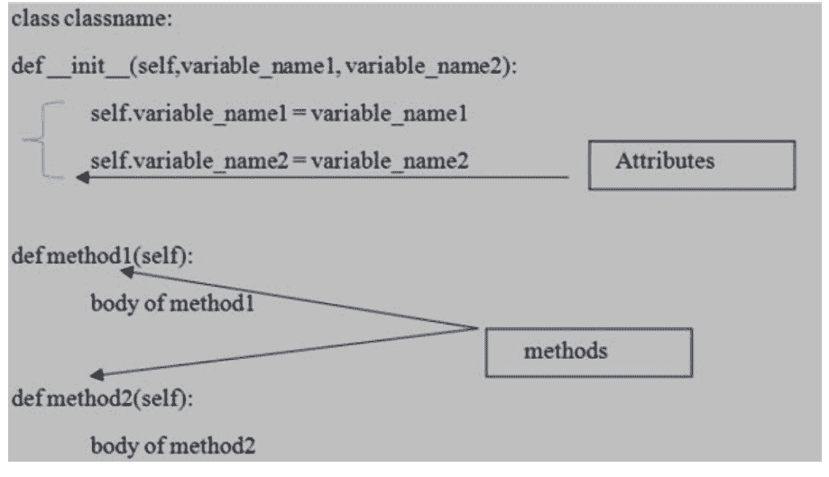

这里，`__init__(self)` 是 Python 中的一个特殊方法。它类似于 C++ 和 Java 中的构造函数。每当我们创建一个对象时，构造函数 `__init__(self)` 就会被执行。实例方法是 `method1` 和 `method2`。

## 8.2 对象

正如索尼 LED 电视的例子所讨论的那样，它是类的一个物理存在。对于一个类，我们可以创建任意数量的对象。它是一个类类型的变量，是类的实例，而创建这个对象的过程称为实例化。当实例被创建时，会分配内存以存储变量的实际数据。每次创建类的对象时，都会创建类中定义的每个变量的副本。因此，可以说类的每个对象都有自己类中定义的数据成员的副本。语法是：

```python
reference_variable = classname()
reference_variable = classname(args)
```

对象的变量和方法可以使用引用变量来访问。访问变量的语法是：

```python
reference_variable.variable_name
```

访问方法的语法是：

```python
reference_variable.method_name()
```

访问带参数方法的语法是：

```python
reference_variable.method_name(parameters_list)
```

## 8.3 引用变量

正如索尼 LED 电视的例子所讨论的那样，用于引用对象的变量称为引用变量。对于同一个对象，我们可以有多个引用变量。让我们看一个例子。

**示例 8.2**

如 [第 432 页](page 432) [图 8.1](Figure 8.1) 所示，扫描二维码查看源代码。

**输出 8.2**

```
Raj
24
600001
Engineer Trainee
The name is: Raj
The age is: 24
The staff number is: 600001
The designation is: Engineer Trainee
----------------
Shyam
36
600002
Senior Manager
The name is: Shyam
The age is: 36
The staff number is: 600002
The designation is: Senior Manager
2577680955264
2577680957224
```

在上面的例子中，我们正在创建一个 `Employee` 类。

默认名称 `__init__` 是一个构造函数，当类的对象被创建时，它会被隐式调用。

包括构造函数在内的实例方法的第一个参数都是 `self`。名字、年龄、员工编号和职位是实例变量，`display` 是一个实例方法。通过使用 `self`，我们正在访问对象的实例变量和实例方法。

`myobj1` 和 `myobj2` 是引用变量名，它们将指向 `Employee` 类的对象。

尽管该类有 5 个参数（包括 `self`），但在创建对象时，我们只传递名字、年龄、员工编号和职位，因为我们不需要在这里引用 `self`，它是隐式的。我们可以看到 `self` 是构造函数内的第一个参数：

```python
def __init__(self, name, age, staffnumber and designation)
```

同样，`self` 是实例方法内的第一个参数。

```python
def display(self)
```

一旦对象被创建并由某个引用变量引用，属性和方法就可以使用点（`.`）来引用。例如，`myobj1.name` 引用的是 `myobj1` 的名字属性。

> **注意：**
> 上面的代码 [示例 8.2] 也可以不使用引用变量重新运行并产生相同的输出，如下所示。但这里每次创建对象时，构造函数都会自动执行。

## 示例 8.3

如 [第 432 页](page 432) [图 8.1](Figure 8.1) 所示，扫描二维码查看源代码。

## 输出 8.3

```
Raj
24
600001
Engineer Trainee
The name is: Raj
The age is: 24
The staff number is: 600001
The designation is: Engineer Trainee
____________________
Shyam
36
600002
Senior Manager
The name is: Shyam
The age is: 36
The staff number is: 600002
The designation is: Senior Manager
```

## 8.4 Self 变量

`self` 是一个默认变量，它总是指向当前对象。它将包含当前对象的内存地址。它应该是构造函数和实例方法内的第一个参数，因为第一个参数始终是对象引用。

为了声明实例变量，使用了 `self` 变量。对象的实例变量和实例方法可以通过使用 `self` 变量来访问。这个变量将由 Python 本身隐式提供。

它类似于 C++ 中的 `this` 指针和 Java 中的 `this` 引用。

```python
class Employee:
    def __init__(self, name, age):
        self.name = name
        self.age = age
        print("Inside the constructor: "+ str(id(self)))

print(id(Employee('Priyanka',28)))
```

```
Inside the constructor: 2669865751944
2669865751944
```

为了在类中引用当前对象，Python 提供了一个隐式变量，即 `self` 变量，它由 Python 本身提供。`self` 变量仅在类内适用，用于引用当前对象。它在类外不适用。此外，我们不需要在调用构造函数和实例方法时为 `self` 变量提供值。Python 虚拟机将负责提供值。无论我们传递的第一个参数是什么，它都将是对当前对象的引用。因此，我们可以使用任何名称来代替 `self`，如下所示。

```python
class Employee:
    def __init__(shelf, name, age):
        shelf.name = name
        shelf.age = age
        print("Inside the constructor: "+ str(id(shelf)))
print(id(Employee('Priyanka',28)))
```

```
Inside the constructor: 2311318091088
2311318091088
```

这里，我们使用了 `shelf` 名称代替 `self` 并运行了代码。但建议只使用 `self`。

## 8.5 构造函数概念

它是 Python 中的特殊方法之一，其中构造函数名称是 `__init__(self)`。它将在创建对象时自动执行。构造函数的主要目的是声明和初始化对象的实例变量。构造函数对每个对象执行一次。构造函数接受的参数至少有一个，即至少 `self` 变量。观察一下构造函数示例。

```python
class Demo:
    def __init__(self): # taking only one argument
        print("I am a constructor")

    def method1(self):
        print("I am method 1")

myd1 = Demo()
# will be executing the constructor automatically
#at the time of object creation
Demo()
# will be executing the constructor automatically
#at the time of object creation
myd3 = Demo()
# will be executing the constructor automatically
#at the time of object creation
myd3.method1()
# will be executing the instance method
```

```
I am a constructor
I am a constructor
I am a constructor
I am method 1
```

如果我们不提供任何构造函数，Python 将提供一个默认的构造函数，因为它是可选的，如下所示。

```
class Demo1:
    pass

Demo1()
myd2 = Demo1()
```

即使我们没有提供任何构造函数，上述代码也完全没问题。

## 8.6 装饰器

我们已经详细学习了函数。但是在讨论 Python 类中的变量和方法之前，有必要讨论一个重要概念——装饰器。每当需要修改函数或类的行为时，Python 中有一个强大的工具叫做装饰器。首先，我们将讨论函数装饰器、装饰器链，然后讨论类装饰器。

### 8.6.1 函数装饰器

装饰器函数总是接收一个输入函数，执行一些修改，并提供一个具有扩展功能的输出函数。装饰器函数的主要目标是在不修改原始函数的情况下扩展其功能。装饰器有助于使我们的代码更简洁、更 Python 化。
在装饰器中，函数作为参数被传递给另一个函数，然后在包装函数内部被调用。
为了指定要应用于另一个函数的装饰器，我们将使用 `@function_name`。让我们看下面的代码。

示例 8.7

```
def greet(myname):
    print("HI!",myname,"!Welcome to learning decorators!")

greet('Tom')
greet('Latham')
greet('Michael')
```

输出 8.7

HI! Tom !Welcome to learning decorators!
HI! Latham !Welcome to learning decorators!
HI! Michael !Welcome to learning decorators!

在上面的代码中，我们只需调用函数就能显示任何名字的输出。现在，让我们修改上面的函数，当名字是 Michael 时提供一些特定消息。可以在不接触 `greet()` 函数的情况下，通过使用装饰器来实现，如下所示。

示例 8.8

如需源代码，请扫描第 432 页图 8.1 所示的二维码

输出 8.8

HI! Tom !Welcome to learning decorators!
HI! Latham !Welcome to learning decorators!
Hello Michael !Your functionality is extended!


第 8 章：源代码

*图 8.1：源代码*

在上面的代码中，`@` 符号与装饰器函数 (`mydecorator`) 的名称一起使用，并放置在要装饰的 `greet()` 函数定义的上方。这里，

```
@mydecorator
def greet(myname):
    print("HI!",myname,"!Welcome to learning decorators!")
```

等价于

```
def greet(myname):
    print("HI!",myname,"!Welcome to learning decorators!")
greet = mydecorator(greet)
```

示例 8.9

如需源代码，请扫描 [第 432 页](https://example.com) [图 8.1](https://example.com) 所示的二维码

输出 8.9

HI! Tom !Welcome to learning decorators!
HI! Latham !Welcome to learning decorators!
Hello Michael !Your functionality is extended!

这只是实现装饰器的语法糖。我们可以看到，装饰器函数为原始函数添加了一些功能。这就像礼物包装，被装饰对象（里面实际的礼物）的性质没有改变。但在装饰后看起来更漂亮了。在上面的程序中，每当我们调用 `greet()` 函数，`mydecorator` 函数就会自动执行。
此外，我们可以在有和没有装饰器的情况下调用同一个 `greet()` 函数，如下所示。

示例 8.10

如需源代码，请扫描 [第 432 页](https://example.com) [图 8.1](https://example.com) 所示的二维码

输出 8.10

HI! Tom !Welcome to learning decorators!
HI! Latham !Welcome to learning decorators!
HI! Michael !Welcome to learning decorators!
Hello Jordan !Your functionality is extended!

当代码有可能异常终止时，装饰器函数也很有用，如下所示。

```
示例 8.11

def mydivision(num1,num2):
    return num1/num2
print(mydivision(10,3))
print(mydivision(10,2))
print(mydivision(10,0))
```

```
输出 8.11

3.3333333333333335
5.0
ZeroDivisionError: division by zero
```

正如预期的那样，我们提供第二个参数为 0。因此，Python 将引发 `ZeroDivisionError`。一个解决方案是使用 try-except 块来捕获错误。另一个是使用装饰器来增强 `mydivision()` 函数的功能，如下所示。

```
示例 8.12

如需源代码，请扫描第 432 页图 8.1 所示的二维码
```

```
输出 8.12
```

```
Dividing 10 with 3
3.3333333333333335
Dividing 10 with 2
5.0
Dividing 10 with 0
We cannot divide if num2 is 0
None
```

因此，我们可以看到，借助装饰器，我们不会得到任何错误，因为我们增强了 `mydivision()` 函数的功能。

### 8.6.2 装饰器链

可以为同一个函数定义多个装饰器，所有这些装饰器将形成装饰器链。例如，

```
@mydecorator1
@ mydecorator
def mynum():
```

对于 `mynum()` 函数，我们应用了 2 个装饰器函数。首先内部的装饰器会工作，然后是外部的装饰器。

#### 示例 8.13

如需源代码，请扫描 [第 432 页](https://example.com) [图 8.1](https://example.com) 所示的二维码

#### 输出 8.13

```
#############################
@@@@@@@@@@@@@@@@@@@@@@@@@@@@
Welcome to decorator chaining
@@@@@@@@@@@@@@@@@@@@@@@@@@@@@@
#############################
```

这里，上述语法

```
@myhash
@myattherate
def myprint(mymsg):
    print(mymsg)
```

等价于

```
def myprint(mymsg):
    print(mymsg)
myprint = myhash(myattherate(myprint))
```

所以，装饰器链接的顺序很重要。如果我们反转装饰器的链接顺序会怎样？那么输出将会不同，如下所示。

#### 示例 8.14

如需源代码，请扫描 [第 432 页](https://example.com) [图 8.1](https://example.com) 所示的二维码

```
输出 8.14

@@@@@@@@@@@@@@@@@@@@@@@@@@@@@@
#############################
Welcome to decorator chaining
#########################
@@@@@@@@@@@@@@@@@@@@@@@
```

### 8.6.3 类装饰器

到目前为止，我们已经看到了函数装饰器。但我们也可以把类视为装饰器。我们可以从两个方面看待类装饰器：

- 1. 使用装饰器函数装饰类的方法

示例 8.15
如需源代码，请扫描第 432 页图 8.1 所示的二维码

```
输出 8.15
输出 1
Enter the name: Saurabh
Hey! I am Saurabh
输出 2
Enter the name: Nilesh
My name is: Nilesh
```

- 2. 将类作为装饰器使用，并应用于函数

在学习类作为装饰器之前，我们需要了解 `call` 方法。这是一个特殊方法。当以函数形式调用一个实例时，这个调用将会执行。假设我们在以下代码中以函数形式使用一个实例。

示例 8.16

```
class displayname:
    def __init__(self,myname):
        self.myname = myname

    def mydisplay(self):
        print(f"My name is: {self.myname}")

myobj = displayname('Ram')
myobj()
```

输出 8.16

TypeError: 'displayname' object is not callable

运行上面的代码，我们会得到 `TypeError`，因为对象不可调用。因此，我们将 `mydisplay(self)` 方法替换为 `__call__(self)`，如下所示。

示例 8.17

```
class displayname:
    def __init__(self,myname):
        self.myname = myname

    def __call__(self):
        print(f"My name is: {self.myname}")

myobj = displayname('Ram')
myobj()
```

输出 8.17

My name is: Ram

我们将得到所需的输出，如下所示。因此，当一个创建对象的用户表现为函数时，函数装饰器必须返回一个表现为函数的对象。因此，必须使用类的 `__call__` 方法。现在，我们将定义一个类作为装饰器。

示例 8.18

```
class Uppercase_decorator:
    def __init__(self,myfunc):
        self.myfunc = myfunc

    def __call__(self):
        mystr1 = self.myfunc()
        return mystr1.upper()

# 将类装饰器添加到函数 mygreet
@Uppercase_decorator
def mygreet():
    return "good evening"

print(mygreet())
```

输出 8.18

GOOD EVENING

Python 类内部允许使用 3 种类型的变量。

## 8.7 对象级别变量或实例变量

## 8.7.1 实例变量的声明位置

如果变量的值会因对象而异，那么这种变量类型就称为实例变量。每个对象都会创建一份独立的实例变量副本。

```python
class Person:
    def __init__(self, name, age):
        self.name = name
        self.age = age

    def mydisplay(self):
        print(f"The name is {self.name}")
        print(f"The age is {self.age}")

myobj1 = Person('Saurabh', 32)
myobj2 = Person('Nilesh', 40)
myobj1.mydisplay()
myobj2.mydisplay()
```

```
The name is Saurabh
The age is 32
The name is Nilesh
The age is 40
```

在上面的例子中，有两个 `Person` 对象，每个对象的变量值都不同。每个对象都会创建一份独立的实例变量副本。

### 8.7.1.1 在构造函数内使用 self 变量声明

实例变量可以在构造函数内使用 `self` 变量作为第一个参数来声明。一旦创建了对象，这些变量就会自动添加到该对象中。

#### 示例 8.20

```python
class Student:
    def __init__(self):
        self.name = 'Sunita'
        self.age = 12
        self.hobby = 'dancing'
myobj1 = Student()
print(myobj1.__dict__)
# the above object will contain all the attributes
# defined for object itself where attribute name will
# be mapped to its value.
```

#### 输出 8.20

```
{'name': 'Sunita', 'age': 12, 'hobby': 'dancing'}
```

### 8.7.1.2 在实例方法内使用 self 变量声明

实例变量可以在方法内使用 `self` 变量作为第一个参数来声明。在实例方法内部声明的实例变量，只有在调用该方法时才会被添加。实例变量可以通过 `self.variable_name` 来访问。

#### 示例 8.21

```python
class Student:
    def __init__(self):
        self.name = 'Sunita'
        self.age = 12

    def myhobby(self):
        self.hobby = 'dancing' # accessing instance variable
myobj1 = Student()
print("Before calling hobby method")
print(myobj1.__dict__)
myobj1.myhobby()
print("After calling hobby method")
print(myobj1.__dict__)
```

#### 输出 8.21

```
Before calling hobby method
{'name': 'Sunita', 'age': 12}
After calling hobby method
{'name': 'Sunita', 'age': 12, 'hobby': 'dancing'}
```

### 8.7.1.3 在类外部使用对象引用变量

实例变量可以在类外部添加到特定对象中。

#### 示例 8.22

源代码请扫描第 432 页图 8.1 所示的二维码。

#### 输出 8.22

```
Before accessing instance variable from outside class
{'name': 'Sunita', 'age': 12, 'hobby': 'dancing'}
After accessing instance variable from outside class
{'name': 'Sunita', 'age': 12, 'hobby': 'dancing', 'telephonenum': 9876543210}
```

## 8.7.2 访问实例变量

实例变量可以在类内部通过 `self` 变量访问，在类外部通过对象引用访问。

#### 示例 8.23

源代码请扫描第 432 页图 8.1 所示的二维码。

#### 输出 8.23

```
Chaya
13
Chaya
13
```

## 8.7.3 从对象中删除实例变量

实例变量可以从类内部和类外部删除。在类内部，可以按如下方式删除实例变量：

```python
del self.variable_name
```

在类外部，可以按如下方式删除实例变量：

```python
del objectreference.variablename
```

#### 示例 8.24

源代码请扫描第 432 页图 8.1 所示的二维码。

#### 输出 8.24

```
Before deleting:
{'name': 'Mohan', 'age': 10, 'country': 'India'}
After deleting outside of the class:
{'name': 'Mohan', 'age': 10}
After deleting from inside of the class
{'name': 'Mohan'}
```

需要注意的一个重要点是，从一个对象中删除的实例变量不会对另一个对象产生任何影响，即不会从其他对象中删除，如下所示。

#### 示例 8.25

```python
class Student:
    def __init__(self):
        self.name = 'Mohan'
        self.age = 10
        self.country = 'India'
        self.contact = 9876543210

myobj1 = Student()
myobj2 = Student()
del myobj1.contact
print(myobj1.__dict__)
print(myobj2.__dict__)
```

#### 输出 8.25

```
{'name': 'Mohan', 'age': 10, 'country': 'India'}
{'name': 'Mohan', 'age': 10, 'country': 'India', 'contact': 9876543210}
```

每个对象都有自己独立的实例变量副本。如果我们修改一个对象的实例变量值，这些更改不会反映到其他对象上。

#### 示例 8.26

源代码请扫描第 432 页图 8.1 所示的二维码。

#### 输出 8.26

```
The name is: Rohan
The age is: 10
The country is: USA
The contact number is: 9876543210
_______________
The name is: Mohan
The age is: 10
The country is: India
The contact number is: 9876543210
```

## 8.8 类级别变量或静态变量

当一个变量的值不随对象而变化时，这种类型的变量应直接在类内部、方法外部声明，我们称之为静态变量。整个类只会创建一份静态变量副本，并由该类的所有对象共享，如下所示。

```python
class Employee:
    companyname = 'ABC' # class variable
    def __init__(self, myname, staffno):
        self.myname = myname
        self.staffno = staffno

myobj1 = Employee('Ram', 60001)
myobj2 = Employee('Shyam', 60002)
print(myobj1.myname, myobj1.staffno, Employee.companyname)
print(myobj2.myname, myobj2.staffno, Employee.companyname)
```

```
Output 8.27
Ram 60001 ABC
Shyam 60002 ABC
```

从上面的例子可以看出，两个员工的公司名称是相同的，即所有类实例共享同一份副本。静态变量可以通过类名或对象引用来访问。但强烈建议使用类名。如果一个实例中的类变量副本被修改，它将影响其他实例中的所有副本，如下所示。

```python
class Employee:
    companyname = 'ABC' # class variable
    def __init__(self, myname, staffno):
        self.myname = myname
        self.staffno = staffno

myobj1 = Employee('Ram', 60001)
myobj2 = Employee('Shyam', 60002)
Employee.companyname = 'XYZ'
print(myobj1.companyname)
print(myobj2.companyname)
```

```
XYZ
XYZ
```

### 8.8.1 声明静态变量的不同位置

声明静态变量有多种位置：

- 1. 我们可以直接在类内部、任何方法外部声明静态变量。
- 2. 我们可以在构造函数内使用类名声明静态变量。
- 3. 我们可以在实例方法内使用类名声明静态变量。
- 4. 我们可以在类方法内使用 `cls` 变量或类名声明静态变量。
- 5. 我们可以在静态方法内使用类名声明静态变量。
- 6. 我们可以在类外部使用类名声明静态变量。

请观察下面的代码。

**示例 8.29**

源代码请扫描第 432 页图 8.1 所示的二维码。

**输出 8.29**

输出请扫描第 432 页图 8.1 所示的二维码。

### 8.8.2 访问静态变量

访问静态变量有多种方式：

- 1. 我们可以在构造函数内使用 `self` 或类名访问静态变量。
- 2. 我们可以在实例方法内使用 `self` 或类名访问静态变量。
- 3. 我们可以在类方法内使用 `cls` 变量或类名访问静态变量。
- 4. 我们可以在静态方法内使用类名访问静态变量。
- 5. 我们可以在类外部使用类名或对象引用访问静态变量。

**示例 8.30**

源代码请扫描第 432 页图 8.1 所示的二维码。

**输出 8.30**

```
1
1
________________
2
2
________________
3
3
________________
4
________________
1
2
```

### 8.8.3 修改静态变量

类内部的静态变量值可以通过类名或 `cls` 变量（在类方法内）来修改。但在类外部，只能使用类名来修改静态变量。

**示例 8.31**

关于源代码，请扫描[第432页](page 432)上[图8.1](Figure 8.1)所示的二维码。

## 输出 8.31
```
2
2
___________
4
4
___________
5
5
___________
6
6
___________
7
7
```

现在，我们可能会思考，当我们尝试使用`self`或对象引用变量来更改变量的值时会发生什么。

## 示例 8.32
关于源代码，请扫描[第432页](page 432)上[图8.1](Figure 8.1)所示的二维码。

## 输出 8.32
```
1
```
```
2
__________
myobj2: 1 3
myobj3: 1 3
myobj2: 8 9
myobj3: 1 3
__________
1
```

因此，每当我们尝试使用`self`或对象引用变量来修改静态变量的值时，静态变量的值都不会改变。相反，一个同名的新实例变量将被添加到该特定对象中。

### 8.8.4 静态变量的删除
静态变量可以在类内部和外部通过类名进行删除。语法如下：
```
del classname.variablename
```
静态变量也可以在类方法内部通过`cls`变量进行删除。语法如下：
```
del cls. variablename
```

### 8.8.4.1 在构造函数中删除静态变量
```
示例 8.33

class Demo:
    a1 = 1

    def __init__(self):
        del Demo.a1

print("创建对象前，静态变量 a1 存在")
print(Demo.__dict__)
print("________________________")
myobj = Demo()
print("创建对象后，静态变量 a1 不存在")
print(Demo.__dict__)
```

## 输出 8.33
```
创建对象前，静态变量 a1 存在
{'__module__': '__main__', 'a1': 1, '__init__':
<function Demo.__init__ at 0x0000017E75E17AE8>,
'__dict__': <attribute '__dict__' of 'Demo' objects>,
'__weakref__': <attribute '__weakref__' of 'Demo' objects>,
'__doc__': None}
________________________
创建对象后，静态变量 a1 不存在
{'__module__': '__main__', '__init__':
<function Demo.__init__ at 0x0000017E75E17AE8>,
'__dict__': <attribute '__dict__' of
'Demo' objects>, '__weakref__': <attribute '__weakref__'
of 'Demo' objects>, '__doc__': None}
```

### 8.8.4.2 在实例方法中删除静态变量

## 示例 8.34
```
class Demo:
    a1 = 1
    def mymethod1(self):
        Demo.b1 = 10
        del Demo.a1

print("创建对象前，静态变量 a1 存在")
print(Demo.__dict__)
print("________________________")
myobj = Demo()
myobj.mymethod1()
print("创建对象后，静态变量 a1 不存在，只有 b1 存在")
print(Demo.__dict__)
```

## 输出 8.34
```
创建对象前，静态变量 a1 存在
{'__module__': '__main__', 'a1': 1, 'mymethod1': <function Demo.mymethod1 at 0x0000021ED0C07AE8>, '__dict__': <attribute '__dict__' of 'Demo' objects>, '__weakref__': <attribute '__weakref__' of 'Demo' objects>, '__doc__': None}
________________________
创建对象后，静态变量 a1 不存在，只有 b1 存在
{'__module__': '__main__', 'mymethod1': <function Demo.mymethod1 at 0x0000021ED0C07AE8>, '__dict__': <attribute '__dict__' of 'Demo' objects>, '__weakref__': <attribute '__weakref__' of 'Demo' objects>, '__doc__': None, 'b1': 10}
```

### 8.8.4.3 在类方法中删除静态变量

## 示例 8.35
```
class Demo:
    a1 = 1
    @classmethod
    def mymethod1(cls):
        cls.c1 = 20
        del Demo.a1

print("只有静态变量 a1 存在")
print(Demo.__dict__)
print("____________________")
Demo.mymethod1()
print("静态变量 a1 不存在，只有 c1 存在")
print(Demo.__dict__)
```

## 输出 8.35
```
只有静态变量 a1 存在
{'__module__': '__main__', 'a1': 1, 'mymethod1':
<classmethod object at 0x000001BB18375208>,
'__dict__': <attribute '__dict__' of 'Demo' objects>,
'__weakref__': <attribute '__weakref__' of 'Demo' objects>,
'__doc__': None}
____________________
静态变量 a1 不存在，只有 c1 存在
{'__module__': '__main__', 'mymethod1':
<classmethod object at 0x000001BB18375208>,
'__dict__': <attribute '__dict__' of 'Demo' objects>,
'__weakref__': <attribute '__weakref__' of 'Demo' objects>,
'__doc__': None, 'c1': 20}
```

### 8.8.4.4 在静态方法中删除静态变量

## 示例 8.36
```
class Demo:
    a1 = 1
    @staticmethod
    def mymethod1():
        Demo.d1 = 40
        del Demo.a1

print("只有静态变量 a1 存在")
print(Demo.__dict__)
print("________________________")
Demo.mymethod1()
print("静态变量 a1 不存在，只有 d1 存在")
print(Demo.__dict__)
```

## 输出 8.36
```
只有静态变量 a1 存在
{'__module__': '__main__', 'a1': 1, 'mymethod1':
<staticmethod object at 0x00000234407D5208>, '__dict__':
<attribute '__dict__' of 'Demo' objects>, '__weakref__':
<attribute '__weakref__' of 'Demo' objects>, '__doc__': None}
________________________
静态变量 a1 不存在，只有 d1 存在
{'__module__': '__main__', 'mymethod1':
<staticmethod object at 0x00000234407D5208>, '__dict__':
<attribute '__dict__' of 'Demo' objects>, '__weakref__':
<attribute '__weakref__' of 'Demo' objects>,
'__doc__': None, 'd1': 40}
```

如果我们尝试使用对象引用来删除静态变量，那么我们将得到如下所示的`AttributeError`。

## 示例 8.37
```
class Demo:
    a1 = 1

myobj = Demo()
del myobj.a1
```

## 输出 8.37
```
AttributeError: a1
```

**结论：**
因此，我们得出结论：使用对象引用或`self`变量，我们只能读取静态变量，但不能修改或删除。如果我们尝试修改静态变量，一个新的实例变量将被添加到该特定对象中。如果我们尝试删除，我们将得到`AttributeError`。
静态变量可以通过使用类名或`cls`变量进行修改或删除。

### 8.9 局部变量
直接在方法内部声明，仅为满足程序员临时需求的变量称为局部变量或临时变量。我们不会使用`self`或`cls`变量。这些变量将在方法执行时创建，并在方法完成后销毁。

## 示例 8.38
```
class Demo:
    def mymethod1(self):
        mynum1 = 10
        print("局部变量 mynum1 的值是", mynum1)

    def mymethod2(self):
        mynum2 = 120
        print("局部变量 mynum2 的值是", mynum2)

myobj = Demo()
myobj.mymethod1()
myobj.mymethod2()
```

## 输出 8.38
```
局部变量 mynum1 的值是 10
局部变量 mynum2 的值是 120
```

方法的局部变量无法从方法外部访问，如下所示。

## 示例 8.39
```
class Demo:
    def mymethod1(self):
        mynum1 = 10
        print("局部变量 mynum1 的值是", mynum1)

    def mymethod2(self):
        mynum2 = 120
        print(mynum1)
        print("局部变量 mynum2 的值是", mynum2)

myobj = Demo()
myobj.mymethod1()
myobj.mymethod2()
```

## 输出 8.39
```
局部变量 mynum1 的值是 10
NameError: name 'mynum1' is not defined
```

可以在类内部访问全局变量。

## 示例 8.40
```
a1 = 100
class Demo:
    def mymethod1(self):
        print(a1)
myobj = Demo()
myobj.mymethod1()
```

## 输出 8.40
```
100
```

现在，假设我们在类内部赋值了一个静态变量`a1 = 200`，如下所示。那么请预测输出结果。

## 示例 8.41
```
a1 = 100
class Demo:
    a1 = 200
    def mymethod1(self):
        print(a1)
        print(self.a1)
        print(Demo.a1)

myobj = Demo()
myobj.mymethod1()
```

## 输出 8.41
```
100
200
200
```

现在，我们再次在`mymethod1()`内部赋值了一个局部变量`a1 = 300`。那么，局部变量将获得最高优先级，如下所示。

## 示例 8.42
```
a1 = 100
class Demo:
    a1 = 200
    def mymethod1(self):
        a1 = 300
        print(a1)

myobj = Demo()
myobj.mymethod1()
```

## 输出 8.42
```
300
```

可以在类内部声明全局变量，但我们需要在方法内部使用`global`关键字。请确保全局变量是函数式编程的概念，而不是面向对象编程的概念。

## 示例 8.43
```
class Demo:
    def mymethod1(self):
        global a1
        a1 = 300
        print(a1)

    def mymethod2(self):
        print(a1)

myobj = Demo()
myobj.mymethod1()
myobj.mymethod2()
```

## 输出 8.43
```
300
300
```

### 8.10 实例方法
在方法实现中，如果我们至少使用了一个实例变量，那么该方法总是只与特定对象相关。因此，该方法作用于类的实例变量的方法称为实例方法。上述方法需要知道实例的内存地址，该地址通过实例方法的默认第一个参数（即 self 变量）提供。因此，通过在方法内部使用 self 变量，我们能够访问实例变量。类内部的实例方法通过 self 变量调用，而从类外部则通过使用对象引用来调用。实例方法可以带有或不带形式参数。

## 示例 8.44

如需查看源代码，请扫描第 432 页图 8.1 中的二维码

## 输出 8.44

```
Enter number of Passengers:5
Enter Name:Ram
Enter the Seat Abbreviation:S10
Hi Ram
Your reservation is: S10
Your seat is at Sleeper
@@@@@@@@@@@@@@@@@@@@@@@@@@@@
Enter Name:Shyam
Enter the Seat Abbreviation:IAC
Hi Shyam
Your reservation is: IAC
Your seat is at first AC
@@@@@@@@@@@@@@@@@@@@@@@@@@@@
Enter Name:Mohan
Enter the Seat Abbreviation:IIAC
Hi Mohan
Your reservation is: IIAC
Your seat is at second AC
@@@@@@@@@@@@@@@@@@@@@@@@@@@@
Enter Name:Rohan
Enter the Seat Abbreviation:IIIAC
Hi Rohan
Your reservation is: IIIAC
Your seat is at third AC
@@@@@@@@@@@@@@@@@@@@@@@@@@
Enter Name:Sohan
Enter the Seat Abbreviation:IVAC
Hi Sohan
Your reservation is: IVAC
You entered the wrong seat abbreviation
@@@@@@@@@@@@@@@@@@@@@@@@@@
```

## 8.10.1 Getter / Accessor 方法

上述方法用于获取实例变量的值。它将访问变量的数据，但不会修改变量中的数据。
其语法如下

```
def getVariable(self):
    return self.myvariable
```

## 8.10.2 Setter / Mutator 方法

上述方法用于设置实例变量的值。它将访问并修改变量中的数据。
其语法如下

```
def setVariable(self,myvariable):
    self.myvariable=myvariable
```

## 示例 8.45

如需查看源代码，请扫描第 432 页图 8.1 中的二维码

## 输出 8.45

```
Enter number of employees:4
Enter the Name:Ram
Enter the Staff number:60001
Welcome! Ram
Your Staff number is: 60001
*****************************
Enter the Name:Divya
Enter the Staff number:60002
Welcome! Divya
Your Staff number is: 60002
*****************************
Enter the Name:Ashwin
Enter the Staff number:60003
Welcome! Ashwin
Your Staff number is: 60003
*****************************
Enter the Name:Himanshu
Enter the Staff number:60004
Welcome! Himanshu
Your Staff number is: 60004
*****************************
```

## 8.11 类方法

作用于类或类的静态变量的方法称为类方法。类方法通过使用 `@classmethod` 装饰器显式声明。类方法的第一个参数是 cls 变量，它指向当前类对象。通过使用 cls，我们能够访问类级别的变量。
其语法如下

```
@classmethod
def name_method(cls):
    Body of method
```

让我们看一个例子以更好地理解

## 示例 8.46

```
class Heart:
    myheart = 4 # class variable
    @classmethod # decorator
    def mylivingbeing(cls,myname):
        # class method with parameter
        print(f"{myname} have {cls.myheart} chambered heart")
        # accessing class variable inside class method

Heart.mylivingbeing('Crocodile')
# calling class method with argument
Heart.mylivingbeing('Human')
# calling class method with argument
```

## 输出 8.46

```
Crocodile have 4 chambered heart
Human have 4 chambered heart
```

> **注意：**
> 1. 声明实例方法时不需要使用任何装饰器，而类方法必须使用 `@classmethod` 装饰器。
> 2. 实例方法的第一个参数是 self，它指向当前对象，并可在方法内部访问实例变量。类方法的第一个参数是 cls，它指向当前类对象，并可访问静态变量。
> 3. 我们可以在实例方法内部访问实例变量和静态变量，而在类方法内部只能访问静态变量。
> 4. 我们只能通过对象引用来调用实例方法，而可以通过对象引用或类名来调用类方法。

## 8.12 静态方法

静态方法是通用的实用程序或辅助方法。当某些处理与类相关，但不需要类或其任何实例来执行任何工作时，就会使用它。因此，我们不会使用任何实例或类变量。上述方法与静态变量无关。在声明时不会提供 cls 或 self 参数。静态方法通过使用 `@staticmethod` 装饰器显式声明。静态方法可以通过类名或对象引用来访问，但建议使用类名。

其语法如下

```
@staticmethod
def name_method():
    Body of method
```

## 示例 8.47

如需查看源代码，请扫描第 432 页图 8.1 中的二维码

## 输出 8.47

```
The sum of 15 + 12 is 27
The difference of 15 - 12 is 3
The multiplication of 15 * 12 is 180
The division of 15/12 is 1.25
```

> **注意：**
> 如果没有装饰器，那么该方法可以是实例方法或静态方法。如果我们通过对象引用调用，那么它应该是实例方法。如果我们通过类名调用，那么它应该是静态方法。请观察下面的代码。

## 示例 8.48

```
class demo:
    def mymethod1():
        print("Hello")

myobj = demo()
myobj.mymethod1()
```

> **输出 8.48**
> TypeError: mymethod1() takes 0 positional arguments but 1 was given

在上面的例子中，当没有装饰器时，方法 mymethod1() 将被视为实例方法。但上述方法中没有 self 变量。因此，Python 会引发 TypeError。现在，考虑下面的代码。

## 示例 8.49

```
class demo:
    def mymethod1():
        print("Hello")
demo.mymethod1()
```

> **输出 8.49**
> Hello

上述代码完全有效，Python 会将上述方法视为静态方法。但如果我们像下面这样编写 @staticmethod 装饰器呢。

## 示例 8.50

```
class demo:
    @staticmethod
    def mymethod1():
        print("Hello")

myobj = demo()
demo.mymethod1()
```

**输出 8.50**

```
Hello
```

这里的静态方法是通过对象引用来调用的。

## 8.13 从一个类访问另一个类的成员

**示例 8.51**

如需查看源代码，请扫描第 432 页图 8.1 中的二维码

**输出 8.51**

```
The name is: Priyanka
The staff number is: 600011
The age is: 28
```

在上面的代码中，我们创建了两个类：Demo 类和 Employee 类。从 Demo 类中，我们正在访问 Employee 类的成员，即 Employee 类的 staffno 和 mydisplay 方法。因此，一旦我们有了对象引用，就可以从一个类访问另一个类的成员。Employee 类的成员通过对象引用对 Demo 类可用。因此，从一个类访问另一个类的成员是可能的。

## 8.14 内部类

有时，需要在另一个类内部声明一个类。这称为内部类。

当没有一种类型的对象存在，另一种类型的对象就不可能存在时，我们应该使用内部类。例如，没有教师对象的存在，就不可能有学生对象的存在。因此，内部类的基本思想如下所示

```
class Teacher: # outer class
    ... (Teacher related functionality)
    class Student: # inner class
        ... (Student related functionality)
```

因此，我们可以得出结论，内部类对象总是与外部类对象相关联。一个基本用法如下所示

```
class OuterClassName:
    def __init__(self):
        self.name_variable = value
        self.innerClassObjectName = self.InnerClassName()
        # inner class object
    def name_method(self):
        Body of method
    class InnerClassName:
        def __init__(self):
            self.name_variable = value
        def name_method(self):
```方法体

让我们来看一个内部类的简单示例。

## 示例 8.52

如图 [8.1](Figure 8.1) 所示，位于[第 432 页](page 432)的源代码，请扫描二维码。

## 输出 8.52

```
outer class object is created
inner class object is created
It is an inner class method
***************************
outer class object is created
inner class object is created
It is an inner class method
***************************
outer class object is created
inner class object is created
It is an inner class method
```

在上面的代码中，我们看到了3种不同的调用内部类方法的方式。所有这些方法都是访问内部类方法的快捷方式和不同语法。
让我们通过另一段代码来看内部类的用法。

## 示例 8.53

如图 8.1 所示，位于第 432 页的源代码，请扫描二维码。

## 输出 8.53

```
The employee name is: Saurabh
****************************
The staff number is 600001
The department is ABC Department
The age is 32
@@@@@@@@@@@@@@@@@@@@@@@@@@@@
<class '__main__.Employee.Details'>
The staff number is 600001
The department is ABC Department
The age is 32
```

在上面的代码中，我们创建了 `Employee` 和 `Details` 两个类。
在 L1 处，每当我们创建一个 `Employee` 类的对象时，`Details` 类的对象会自动创建，因为我们将 `Details` 对象设置为了实例变量。因此，`Details` 类的构造函数会被执行。
在 L2 处，我们调用了 `Employee` 类的 `mydisplay()` 方法，该方法内部会调用 `Details` 类的 `mydisplay1()` 方法。
在 L3 处，类型是 `<class '__main__.Employee.Details'>`。
在 L4 处，我们调用了 `Details` 类的 `mydisplay1()` 方法。
我们也可以在类内声明任意数量的内部类，如下所示。

## 示例 8.54

如图 8.1 所示，位于第 432 页的源代码，请扫描二维码。

```
输出 8.54

Good Morning! GrandFather
Good Morning! Father
Good Morning! Son
```

## 8.15 垃圾回收器

每个程序员都使用过像 C++ 这样的老语言。在 C++ 中，对象的创建和销毁都是程序员的责任。通常，程序员在创建对象时会非常小心。但是，销毁这些无用对象往往被忽视。由于疏忽，这些无用对象可能会填满全部内存，导致常见的内存问题。因此，整个应用程序可能会因内存不足错误而崩溃。但在像 C#、Python 这样的语言中，有某种后台助手一直在运行，负责销毁这些无用对象。所以，Python 程序因内存问题失败的可能性很小。我们称上述助手为垃圾回收器（GC）。GC 的主要目标是销毁无用对象。如果一个对象没有任何引用变量引用它，那么该对象就符合垃圾回收的条件。如果该对象被删除，它也符合垃圾回收的条件。GC 是一个守护线程，因为它在后台执行。我们可以在程序中启用或禁用 GC。默认情况下，GC 是启用的，但可以根据需要禁用。因此，在上述上下文中，我们将使用 `gc` 模块。

- 1. `isenabled()`
  上述方法将检查 GC 是否已启用。如果已启用，则返回 `True`；如果已禁用，则返回 `False`。
- 2. `disable()`
  上述方法将显式地禁用 GC。
- 3. `enable()`
  上述方法将显式地启用 GC。

## 示例 8.55

```python
import gc
print("The above method will check whether GC is enabled or disabled")
print(gc.isenabled())
print("The above method will disable the GC explicitly")
gc.disable()
print(gc.isenabled())
print("The above method will enable the GC explicitly")
gc.enable()
print(gc.isenabled())
```

## 输出 8.55

- The above method will check whether GC is enabled or disabled
- True
- The above method will disable the GC explicitly
- False
- The above method will enable the GC explicitly
- True

## 8.16 析构函数

它是一种特殊的方法，其名称必须是 `__del__`。当一个对象即将被 GC 销毁时，在销毁对象之前，GC 会调用析构函数来执行清理活动，即资源释放活动，如关闭数据库连接、网络连接等。一旦析构函数执行完毕，GC 将自动销毁该对象。

现在，可能会产生一个问题：如果我们不编写析构函数，会发生什么？在这种情况下，`object` 类的析构函数将被执行，但它不会执行任何操作。在 Python 中，每个类的父类都是 `object`。该 `object` 类的析构函数将被执行，但不会执行任何操作。析构函数由 GC 调用，而 GC 由 PVM（Python 虚拟机）调用。请看下面的代码。

## 示例 8.56

```python
from time import sleep
class Demo:
    def __init__(self):
        print("Initializing the object")
    def __del__(self):
        print("clean up activities are performed...")
myobj=Demo()
sleep(5)
print("Application end") # L1
```

## 输出 8.56

初始状态。


5 秒后
Initializing the object
Application end
clean up activities are performed...

在上面的代码中，我们创建了一个 `Demo` 类的对象。因此，构造函数 `__init__` 将被调用，从而显示输出 `Initializing the object`。
现在，代码进入休眠状态，持续 5 秒。
在程序执行期间，GC 可能不会销毁该对象。但该对象何时被销毁？在执行带有 `#L1` 的行之后，没有更多代码可执行，因此程序将停止。在停止程序之前，程序执行过程中创建的所有对象都将被 GC 销毁。之后，程序将终止。一旦程序终止，此时所有对象都已被销毁。
5 秒后，带有 `#L1` 的行将被执行。从而显示输出 `Application end`。
因此，现在 GC 将调用析构函数，然后销毁程序中存在的对象。因此，将显示输出 `clean up activities are performed...`。
现在，假设我们将 `None` 赋给一个对象，如下所示。

## 示例 8.57

```python
from time import sleep
class Demo:
    def __init__(self):
        print("Initializing the object")
    def __del__(self):
        print("clean up activities are performed...")
myobj=Demo()
myobj = None #L2
sleep(5)
print("Application end")
```

## 输出 8.57

```
SAURABH@LAPTOP-NHFM79LF MINGW64 /e/python_progs
$ python oops1.py
Initializing the object
clean up activities are performed...
```

**5 秒后**

Initializing the object
clean up activities are performed...
Application end

在上面的代码中，`myobj` 指向一个对象。
在 L2 处，`myobj` 不再指向一个对象，这意味着没有任何东西允许使用该对象。因此，它将被 GC 销毁。如果一个对象不包含任何引用变量，则它符合 GC 的条件，这意味着对象的引用计数为 0。
现在，假设我们有多个引用变量指向一个对象。
只有当所有引用变量都消失时，对象才符合 GC 的条件，否则不符合，如下所示。

## 示例 8.58

如图 8.1 所示，位于第 432 页的源代码，请扫描二维码。

## 输出 8.58

```
Initializing the object
Deleting myobj reference variable
***************************
object is not yet destroyed after deleting myobj
Deleting myobj1 reference variable
***************************
object is still not yet destroyed even after deleting myobj1
Deleting myobj2 reference variable
clean up activities are performed...
***************************
Application end
```

> 注意：
> 如何知道一个对象的引用数量。

为了知道一个对象的引用数量，`sys` 模块提供了一个名为 `getrefcount()` 的内置函数。我们在学习 `sys` 模块时已经了解过 `getrefcount()` 函数。但让我们在这里讨论一个重要的点。

```python
# 示例 8.59
import sys
class Demo:
    def __init__(self):
        print("Initializing the object")

myobj1 = Demo()
myobj2 = myobj1
myobj3 = myobj2
myobj4 = myobj3
print(sys.getrefcount(myobj1))
# 如果我们传递一个对象引用，
# 该函数会返回该对象总共有多少个引用
```## 8.17 组合与继承

## 8.17.1 组合

组合是一种对“拥有”关系进行建模的概念。它有一个名为`Composite`的类，该类包含另一个类`Component`的对象，这意味着一个`Composite`“拥有”一个`Component`。


图 8.2：`Composite`拥有`Component`

组合的表示是通过一条从`Composite`类指向`Component`类的线，并在`Composite`类端有一个菱形。`Composite`端表示关系的基数，它指示`Composite`类将包含的`Composite`实例的数量或有效范围。例如，`Dog`类可以由另一个`Tail`类型的对象组合而成。组合允许通过说一条狗有一条尾巴来表达这种关系。因此，我们可以说组合是一个面向对象的设计概念，它对“拥有”关系进行建模。一个组合类拥有另一个类的组件。组合使用类的实例。通过创建类的实例来使用它，并将该实例包含在另一个更大的对象中。我们可以将其视为对象和实例变量之间的关系。如果一个对象被销毁，那么它所有的实例变量默认也会消失，因为没有现有的对象，就不存在现有的实例变量。

# 示例 8.60

要查看源代码，请扫描图 8.1（见[图 8.1](https://example.com)）中的二维码（[第 432 页](https://example.com)）。

# 输出 8.60

```
9
3
18
2.0
216
```

在上面的示例中，我们有两个类：`Mymath1`和`Mymath2`。`Mymath1`有两个执行`normal_addition`和`normal_subtraction`的实例方法，而`Mymath2`有两个执行`normal_multiplication`和`normal_division`的实例方法。现有的类被用来提供一个新的操作（除了这4个操作之外），即`normal_power`方法。
然后我们定义了一个新类`Mymath3`，并定义了`__init__`方法来初始化实例。在构造函数方法内部，我们初始化了两个对象`obj1`（L1）和`obj2`（L2），一个是`Mymath1`类的实例，另一个是`Mymath2`类的实例。然后定义了一个新方法`normal_power`（L3）。接着定义了一个新方法`normal_addition`（L4），它将调用`obj1`的`normal_addition`方法。在L5中，定义了一个新方法`normal_subtraction`，它将调用`obj1`的`normal_subtraction`方法。在L6中，定义了一个新方法`normal_multiplication`，它将调用`obj2`的`normal_multiplication`方法。在L7中，定义了一个新方法`normal_division`，它将调用`obj2`的`normal_division`方法。在L8中，我们创建了一个`Mymath3`对象，它将初始化`Mymath3`、`Mymath2`和`Mymath1`的实例变量。在L9中，我们调用了`Mymath3`的`normal_addition`方法。因此，输出将是9。在L10中，我们调用了`Mymath3`的`normal_subtraction`方法。因此，输出将是3。在L11中，我们调用了`Mymath3`的`normal_multiplication`方法。因此，输出将是18。在L12中，我们调用了`Mymath3`的`normal_division`方法。因此，输出将是2.0。在L13中，我们调用了`Mymath3`的`normal_power`方法。因此，输出将是216。因此，在上面的示例中，我们创建了一个新类，该类定义了现有类的实例。因此，一个新类将定义新的数据和方法，其基本目的是实现并将所需操作委托（将工作分配给已知能胜任的人）给现有类的实例执行。因此，组合包括将某些功能委托给对象，某些术语可能会使用“委托”而不是“组合”。

## 8.17.2 继承

继承是一种从一个旧类（现有类）派生出一个新类的机制，使得旧类的成员（变量和方法）将被新类继承。旧类称为超类，新类称为子类。**父类** - 也可以称为基类或超类。
子类 - 也可以称为派生类或子类。

> 注意：在Python中，所有类都源自一个名为`object`的单一超类。因此，每当我们创建一个类时，对于它们来说，超类在内部就是`object`。

继承的主要优点是代码重用、功能扩展。

-   1. **单一继承**
    如果一个子类派生自父类，则称为单一继承。
    语法是：


```
class name_ParentClass(object):
    members of Parent class
class name_ChildClass(name_ParentClass):
    members of Child class
```

让我们看一个例子。

# 示例 8.61

要查看源代码，请扫描图 8.1（见[图 8.1](#figure8.1)）中的二维码（[第 432 页](#page432)）。

# 输出 8.61

```
I love to help others those who are in need
My father's hobby is to listen Music and News
My father love to eat roti and sabji
My father by profession is a doctor
55
***************************
My father's hobby is to listen Music and News
My father love to eat roti and sabji
My father by profession is a doctor
55
```

从上面的代码，我们可以得出以下结论：

-   -   父类的变量和方法可以使用父类对象访问。
-   父类的变量和方法可以使用子类对象访问。
-   子类的变量和方法不能使用父类对象访问。

# 2. 多级继承

在多级继承中，类将继承另一个派生类的特性。语法是


```
class name_ParentClass(object):
    members of Parent class
class name_ChildClass(name_ParentClass):
    members of Child class
class name_GrandChildClass(name_ChildClass):
    members of GrandChild class
```

让我们看一个例子。

# 示例 8.62

要查看源代码，请扫描图 8.1（见[图 8.1](figure8.1)）中的二维码（[第 432 页](page432)）。

# 输出 8.62

```
I am a Grand Son class constructor
I am a Grand Son class instance method
I am a Son class instance method
I am a Father class instance method
```

在L1中，我们创建了一个`MyGrandSon`类的对象。因此，`MyGrandSon`类的构造函数将被调用，输出将是`I am a Grand Son class constructor`。
在L2中，我们访问了`MyGrandSon`类的实例方法。因此，输出将是`I am a Grand Son class instance method`。
在L3中，我们访问了`MySon`类的实例方法。因此，输出将是`I am a Son class instance method`。
在L4中，我们访问了`Myfather`类的实例方法。因此，输出将是`I am a Father class instance method`。
但假设我们想使用`MyGrandSon`类访问`MySon`和`Myfather`类的构造函数方法，那么我们必须使用`super()`概念，如下所示。

# 示例 8.63

要查看源代码，请扫描图 8.1（见[图 8.1](Figure 8.1)）中的二维码（[第 432 页](page 432)）。

# 输出 8.63

```
I am a Father class constructor
I am a Son class constructor
I am a Grand Son class constructor
***************************
I am a Grand Son class instance method
I am a Son class instance method
I am a Father class instance method
```

正如我们所看到的，我们使用了`super()`方法来调用`MySon`和`Myfather`类的构造函数。因此，根据编写代码的方式，控制流将从`MyGrandSon`类构造函数转移到`MySon`类构造函数，再到`Myfather`类。所以，输出将如上所示。

## 3. 层次继承

在层次继承中，从一个基类创建出多个派生类。语法是


```
class name_ParentClass(object):
    members of Parent class
class name_ChildClass1(name_ParentClass):
    members of Child class1
class name_ChildClass2(name_ParentClass):
    members of Child class2
```

让我们看一个例子。

### 示例 8.64

要查看源代码，请扫描图 8.1（见[图 8.1](figure8.1)）中的二维码（[第 432 页](page432)）。

### 输出 8.64

```
I am a Father class constructor
I am a Daughter class constructor
```## 4. 多重继承

在上面的代码中，`MySon` 和 `MyDaughter` 类都继承自 `MyFather` 类。同时，为 `MySon` 和 `MyDaughter` 类各创建了2个对象。因此，它们的构造函数被调用了。此外，我们使用这2个对象调用了 `MySon` 和 `MyDaughter` 类的实例方法。

在多重继承中，所有基类的特性都会被继承到派生类中。其语法如下：


```
class name_ParentClass1(object):
    members of Parent class1
class name_ParentClass2(object):
    members of Parent class2
class name_ChildClass(name_ParentClass1,name_ParentClass2):
    members of Child class
```

让我们看一个例子。

### 示例 8.65

源代码请扫描 [第432页](#) [图8.1](#) 中的二维码

### 输出 8.65

```
I am a Daughter class constructor
```

在上面的例子中，我们有2个父类 `MyFather` 和 `MyMother`，以及一个子类 `MyDaughter`。我们创建了一个 `MyDaughter` 类的对象，这导致了构造函数的调用。因此，输出将是 `I am a Daughter class constructor`。

现在，假设我们想显示父类的构造函数。那么，我们将使用 `super()` 方法，如下所示。

### 示例 8.66

源代码请扫描 [第432页](#) [图8.1](#) 中的二维码

### 输出 8.66

```
I am a Father class constructor
I am a Daughter class constructor
```

现在，我们在 `MyDaughter` 类的构造函数内部使用了 `super()` 方法。但是上面的类有2个父类 `MyFather` 和 `MyMother`，并且它们都有构造函数方法。我们可以看到只有 `MyFather` 的构造函数被调用了。但我们也需要调用 `MyMother` 的构造函数。那么，我们现在要做的就是在两个父类的构造函数中都写上 `super()` 方法，如下所示。

## 示例 8.67

源代码请扫描 [第432页](page 432) [图8.1](Figure 8.1) 中的二维码

## 输出 8.67

```
I am a Mother class constructor
I are a Father class constructor
I am a Daughter class constructor
```

现在，我们可以看到所有3个构造函数都被调用了。但是你是否对它的执行方式感到困惑？为此，我们需要了解方法解析顺序（MRO）。在多重继承场景中，类的成员首先在当前类中搜索。如果未找到，则搜索将继续深入到父类中，按照从左到右的顺序进行，并且不会重复搜索同一个类。上面这句话分为3个部分：

- (a) 在进入父类之前，先搜索子类。
- (b) 当一个类从多个类继承时，搜索按照从左到右的顺序在父类中进行。
- (c) 任何类都不会被访问超过一次，这意味着继承层次结构中的每个类都只被遍历一次。

那么，让我们理解一下我们是如何得到这个输出的。

- (a) `myobj = MyDaughter()`
搜索将从 `MyDaughter` 开始。由于创建了 `MyDaughter` 的对象，它的构造函数将被调用。
- (b) `MyDaughter` 的构造函数内部有 `super(). init ()`，因此它的父类，即左侧的 `MyFather` 类的构造函数被调用。
- (c) `MyFather` 类的构造函数内部也有 `super(). init ()`。因此，它的父对象类的构造函数被调用。
- (d) 但是 `object` 类没有任何构造函数，所以搜索将继续到 `object` 类的右侧类。因此，`MyMother` 类的构造函数被调用。
- (e) 由于 `MyMother` 类也有 `super(). init ()`。因此，它的父对象类构造函数被调用。但是 `object` 类已经被访问过了，所以搜索将在此停止。

因此，首先调用 `MyMother` 类构造函数，然后是 `MyFather` 类构造函数，最后是 `MyDaughter` 类构造函数。如果我们尝试查找 `MyDaughter` 类的方法解析顺序，我们将得到如下所示的输出。

## 示例 8.68

源代码请扫描第432页图8.1中的二维码

## 输出 8.68

```
I am a Mother class constructor
I are a Father class constructor
I am a Daughter class constructor
[<class '__main__.MyDaughter'>, <class '__main__.MyFather'>, <class '__main__.MyMother'>, <class 'object'>]
```

如果我们交换 `MyFather` 和 `MyMother` 类的顺序，那么输出将会改变。

> **示例 8.69**

源代码请扫描 [第432页](page 432) [图8.1](Figure 8.1) 中的二维码

```
**输出 8.69**

I are a Father class constructor
I am a Mother class constructor
I am a Daughter class constructor
[<class '__main__.MyDaughter'>, <class '__main__.MyMother'>, <class '__main__.MyFather'>, <class 'object'>]
```

但是有一个叫做 **C3 MRO** 的东西。请将这个概念视为非常重要。设 **B1 B2 ... BN** 是一个类列表 [**B1, B2, ... , BN**]。这里，第一个元素是列表的头部。所以，head = **B1**。列表的其余部分是尾部，所以，tail = **B2 ... BN**。设符号 **B+ (B1 B2 ... BN) = B B1 B2 ... BN** 表示列表 [**B**] + [**B1,B2-BN**] 的和。这里，让我们考虑多重继承层次结构中的一个类 B，其中 B 继承自基类 **BC1, BC2, ... , BCN**。需要计算类 B 的线性化 L[B]。以下规则是：

**B 的线性化是 B 加上其父类的线性化列表与父类列表的合并。**

L[B(BC1 ... BCN)] = B + merge(L[BC1]... L[BCN], BC1 ... BCN)

如果 B 是没有父类的 `object` 类，那么线性化就不太重要了。

L[object] = object

合并需要按照以下规定进行计算：

如果第一个列表的头部元素不存在于任何其他列表的尾部部分中，则将该元素纳入结果，并从所有列表中移除该元素。

以上都是理论部分，让我们来处理我们已经看到的多重继承的例子。我们将用字母 O 表示 Object，F 表示 MyFather，M 表示 MyMother，D 表示 MyDaughter。


因此，从上图可以看出层次结构是

```
O = object
class F(O): pass
class M(O): pass
class D(F,M): pass
```

步骤1：首先我们将考虑每个类的 MRO。
mro(F) = F,O
mro(M) = M,O
mro(D) = D,F,M,O

D 的直接父类是 F 和 M。所以，
mro(D) = D + Merge(mro(F), mro(M), FM)
mro(D) = D + Merge(FO, MO,FM)
F 是头部元素，它不存在于任何其他列表的尾部中。所以，我们将这个元素纳入结果，并从所有列表中移除该元素。

mro(D) = D + F + Merge(O,MO,M)
M 是头部元素，它不存在于任何其他列表的尾部中。所以，我们将这个元素纳入结果，并从所有列表中移除该元素。

mro(D) = D + F + M + Merge(O,O)
现在，O 是头部元素，它不存在于任何其他列表的尾部中。

mro(D) = D + F + M + O

这就是 D 的算法。

现在，与 `MyDaughter.mro()` 的输出进行比较，即
[<class '__main__.MyDaughter'>, <class '__main__.MyFather'>, <class '__main__.MyMother'>, <class 'object'>]

所以，我认为这将澄清 MRO 的概念。

## 5. 继承中的构造函数

当一个子类从父类继承特性时，父类中的构造函数默认对子类可用。

### 示例 8.70

源代码请扫描 [第432页](#) [图8.1](#) 中的二维码

### 输出 8.70

```
I am a Mother class constructor
10
I am a Daughter class instance method
I am a Mother class instance method
```

在上面的代码中，我们可以看到为 `MyDaughter` 类创建了一个对象，并且该类中没有构造函数方法。由于它继承了基类的所有特性，因此调用了父类的构造函数。我们也可以访问实例变量。我们还可以借助 `MyDaughter` 类对象调用父类和子类的实例方法。

## 8.18 super() 概念

到目前为止，我们已经多次使用了 `super()` 方法，但让我们看看它的含义。每当在父类和子类中都编写了构造函数时，父类的构造函数将对子类不可用。在这种情况下，只有子类构造函数是可访问的，这意味着子类构造函数将覆盖父类构造函数。因此，为了从子类调用父类构造函数或方法，将使用 `super()` 方法。`super()` 和被调用方法的参数应该匹配。它可以在单重继承和多重继承中使用。代码重用是我们可以获得的最大优势，因为不需要重写整个方法。它是动态调用的。

让我们看一个可以调用父类构造函数或方法的例子

### 示例 8.71如图8.1所示，扫描二维码获取源代码（第432页）

## 输出 8.71

```
The name is: Ram
The age is: 16
The city is: Hyderabad
The hobby is: Studying
**************************
The name is: Surendra
The age is: 54
The staff number is: 60001
The contact number is: 9406121337
```

在上述代码中，我们从子类构造函数调用父类构造函数，并从子类方法调用父类方法。(a) 调用特定超类的方法。现在，考虑下面的多级继承代码。

## 示例 8.72

如图8.1所示，扫描二维码获取源代码（第432页）

## 输出 8.72

```
It is an instance method of E1 class
```

现在，我们可以使用 `super()` 从类 E1 的方法调用类 D1 的方法，如下所示。

## 示例 8.73

如图8.1所示，扫描二维码获取源代码（第432页）

## 输出 8.73

```
It is an instance method of D1 class
```

假设我们在类 D1 中编写 `pass`，如下所示。

## 示例 8.74

如图8.1所示，扫描二维码获取源代码（第432页）

## 输出 8.74

```
It is an instance method of C1 class
```

现在，将调用类 C1 的 `Mymethod1`。但是，假设出现任何需要调用特定超类方法的场景，那么我们的方法应该是什么？可以通过两种方式完成：

使用语法：

```
name_parentclass.name_method(self)
```

请观察下面的代码

## 示例 8.75

如图8.1所示，扫描二维码获取源代码（第432页）

## 输出 8.75

```
It is an instance method of C1 class
```

在上面的示例中，将调用 C1 类的实例方法 `mymethod1`。上述规则也适用于构造函数，如下所示。

## 示例 8.76

如图8.1所示，扫描二维码获取源代码（第432页）

## 输出 8.76

```
I am B1 class constructor
I am A1 class constructor
```

在 L1 中，我们创建了一个 E1 的对象，这导致调用 B1 类的构造函数。因此，输出将是 `I am B1 class constructor`。在 L2 中，将调用类 E1 的 `mymethod1()` 方法，该方法将调用 A1 类的构造函数。因此，输出将是 `I am A1 class constructor`。

使用语法：

```
super(name_class, self).name_method()
```

请观察下面的代码

## 示例 8.77

如图8.1所示，扫描二维码获取源代码（第432页）

## 输出 8.77

```
It is an instance method of C1 class
```

在上面的示例中，D1 的超类是 C1 类。因此，将调用 C1 类的 `mymethod1()`。

(b) super 方法的一些重要结论

从子类中，我们可以使用 `super()` 方法调用父类的静态变量，如下所示。

## 示例 8.78

```
class M1:
    num1 = 20 # static variable
    def __init__(self):
        self.num2 = 40

class M2(M1):
    def mymethod1(self):
        print(super().num1) # L1
myobj = M2()
myobj.mymethod1()
```

## 输出 8.78

```
20
```

我们可以看到，我们能够使用 `super()` 方法从子类调用父类的静态变量。

从子类中，我们无法使用 `super()` 方法调用父类的实例变量，如下所示。

```
class M1:
    num1 = 20 # static variable
    def __init__(self):
        self.num2 = 40
class M2(M1):
    def mymethod1(self):
        print(super().num2)
myobj = M2()
myobj.mymethod1()
```

## 输出 8.79

```
AttributeError: 'super' object has no attribute 'num2'
```

但是，我们应该只使用 `self`。

## 示例 8.80

```
class M1:
    num1 = 20 # static variable

    def __init__(self):
        self.num2 = 40

class M2(M1):
    def mymethod1(self):
        print(self.num2)

myobj = M2()
myobj.mymethod1()
```

## 输出 8.80

```
40
```

从子类构造函数中，我们可以使用 `super()` 方法调用父类的实例方法、静态方法和类方法，如下所示。

## 示例 8.81

如图8.1所示，扫描二维码获取源代码（第432页）

## 输出 8.81

```
Instance method
Class method
Static method
```

从子类方法中，我们可以使用 `super()` 方法调用父类的实例方法、静态方法和类方法，如下所示。

## 示例 8.82

如图8.1所示，扫描二维码获取源代码（第432页）

## 输出 8.82

```
Instance method
Class method
Static method
```

## 8.19 多态

这是一个源自两个希腊词的单词，poly 意为“多”，morphs 意为“形式”。如果一个方法、对象或变量将根据情况表现出不同的行为，那么它就被称为多态，例如：人类本身。同一个人在不同的地方有不同的行为。我们与父母相处时的行为会不同，与朋友相处时的心情也会不同，等等。

### 8.19.1 鸭子类型

Python 是一种动态类型语言。根据运行时提供的值，类型将被自动考虑。我们无法显式指定类型，从而使 Python 成为一种动态类型语言。Python 中有一个原则：“如果它走起来像鸭子，叫起来像鸭子，那么它一定是鸭子。”这意味着 Python 并不真正关心它是哪个类的对象。如果它是一个对象，并且该对象具有所需的行为，那么它将完美运行。对象类型将在运行时被区分，这被称为鸭子类型。它被称为 Python 的鸭子类型哲学。因此，Python 将更重视行为而不是原始类型。它将提高代码的可读性。代码将易于理解。首先，让我们看看下面一个非 Pythonic 的代码，类似于 C# 或 Java 语言。

## 示例 8.83

如图8.1所示，扫描二维码获取源代码（第432页）

## 输出 8.83

```
Quack….Quack..
<class ‘__main__.Owl’>
The object must be duck to perform the talk
```

在上面的代码中，我们在执行 Duck 类的 `mytalk()` 方法之前，检查对象是否为 Duck 类型。这是一种非 Pythonic 的代码编写方式。现在，我们将编写 Pythonic 的代码。

## 示例 8.84

如图8.1所示，扫描二维码获取源代码（第432页）

## 输出 8.84

```
Bark…Bark..
Caw…Caw..
Quack…Quack..
Hoot…Hoot..
**************************
Bark…Bark..
Caw…Caw..
Quack…Quack..
Hoot…Hoot..
```

在上面的代码中，我们没有检查对象是否为 Duck 类型。如果对象具有 `talk` 方法，那么它将被调用。我们重视行为而不是对象的类型。但是，上述方法存在一个问题。如果对象没有 `talk` 方法，那么我们将得到 `AttributeError`，如下所示。

## 示例 8.85

如图8.1所示，扫描二维码获取源代码（第432页）

## 输出 8.85

```
Bark…Bark..
Caw…Caw..
Quack…Quack..
AttributeError: 'Owl' object has no attribute 'mytalk'
```

从上面的代码中，我们可以看到 Owl 类有一个 `myhoot()` 方法而不是 `mytalk()`。因此，我们得到 `AttributeError: 'Owl' object has no attribute 'mytalk'`。

在这种情况下，我们需要使用“请求原谅比请求许可更容易”的概念。我们可以使用 `hasattr()` 函数来解决上述问题。它将检查对象是否具有某个方法。如果在对象中找到，则返回 `True`，否则返回 `False`。`hasattr()` 的语法是

```
hasattr(obj,'attributename')
```

属性可以是方法或变量名。

## 示例 8.86

如图8.1所示，扫描二维码获取源代码（第432页）

## 输出 8.86

```
Bark...Bark..
Caw...Caw..
Quack...Quack..
Hoot...Hoot..
************************
Bark...Bark..
Caw...Caw..
Quack...Quack..
Hoot...Hoot..
```

### 8.19.2 Python 中的重载概念

同一个运算符或方法可以用于不同的目的。

例如：

`+` 运算符可用于算术加法和字符串连接操作，如下所示。

```
num1 = 2
num2 = 3
print(num1+num2)
str1 = 'Hello'
str2 = 'Beginners'
print(str1+str2)
```

```
5
HelloBeginners
```

同样，`*` 运算符可用于字符串重复和乘法目的。

```
num1 = 2
num2 = 3
print(num1*num2)
str1 = 'Hello'
print(str1*2)
```

## 1. 运算符重载

如果任何运算符执行了超出其预期功能的额外操作，则称为运算符重载。让我们以 `Mycylinder` 类对象的 `+` 运算符为例进行说明。

```python
class Mycylinder:
    def __init__(self, myweight):
        self.myweight = myweight

myobj1 = Mycylinder(9)
myobj2 = Mycylinder(14)
print(myobj1 + myobj2)
```

输出：
```
TypeError: unsupported operand type(s) for +: 'Mycylinder' and 'Mycylinder'
```

在上面的例子中，我们在 `Mycylinder` 对象之间应用了 `+` 运算符。我们可以为 `Mycylinder` 对象扩展 `+` 运算符，即我们可以重载 `+` 运算符使其也能与 `Mycylinder` 对象一起工作，也就是说 Python 支持运算符重载。每个运算符都有对应的魔法方法。为了重载任何运算符，我们必须在我们的类中重写该方法。`+` 运算符在内部是通过 `__add__` 方法操作的。在 Python 中，这些方法被称为魔法方法或双下划线方法，因为它们的方法名前后各有两个下划线。因此，上述方法必须在我们的类中被重写。修改后的代码如下。

```python
class Mycylinder:
    def __init__(self, myweight):
        self.myweight = myweight
    def __add__(self, other):
        return self.myweight + other.myweight

myobj1 = Mycylinder(9)
myobj2 = Mycylinder(14)
print(myobj1 + myobj2)
```

输出：
```
23
```

在上面的代码中，当我们使用 `+` 运算符时，魔法方法 `__add__` 会被自动调用，其中定义了 `+` 运算符的操作。因此，`+` 运算符被赋予了额外的含义。运算符及其对应的魔法方法列表如下：

二元运算符（见表 8.1）

| 序号 | 运算符 | 魔法方法 |
|---|---|---|
| 1 | + | object.__add__(self, other) |
| 2 | - | object.__sub__(self, other) |
| 3 | * | object.__mul__(self, other) |
| 4 | / | object.__truediv__(self, other) |
| 5 | // | object.__floordiv__(self, other) |
| 6 | % | object.__mod__(self, other) |

*表 8.1：二元运算符*

赋值运算符（见表 8.2）

| 序号 | 运算符 | 魔法方法 |
|---|---|---|
| 1 | -= | object.__isub__(self, other) |
| 2 | += | object.__iadd__(self, other) |
| 3 | *= | object.__imul__(self, other) |
| 4 | /= | object.__idiv__(self, other) |
| 5 | //= | object.__ifloordiv__(self, other) |
| 6 | %= | object.__imod__(self, other) |
| 7 | **= | object.__ipow__(self, other) |

*表 8.2：赋值运算符*

比较运算符（见表 8.3）

| 序号 | 运算符 | 魔法方法 |
|---|---|---|
| 1 | < | object.__lt__(self, other) |
| 2 | > | object.__gt__(self, other) |
| 3 | <= | object.__le__(self, other) |
| 4 | >= | object.__ge__(self, other) |
| 5 | == | object.__eq__(self, other) |
| 6 | != | object.__ne__(self, other) |

*表 8.3：比较运算符*

一元运算符（见表 8.4）

| 序号 | 运算符 | 魔法方法 |
| :--- | :--- | :--- |
| 1 | - | object.__neg__(self, other) |
| 2 | + | object.__pos__(self, other) |
| 3 | ~ | object.__invert__(self, other) |

*表 8.4：一元运算符*

## 2. 方法重载

当多个方法具有相同的名称但参数类型不同时，这些方法被称为方法重载。在 Python 中，方法重载通常不是必需的，因为没有显式的类型。当我们试图声明多个具有相同名称和不同类型参数的方法时，Python 总是会考虑最后一个方法。

```python
class Demo:
    def mymethod1(self, num1):
        print("Second method with one argument")
    def mymethod1(self, num1, num2):
        print("Third method with two arguments")

myobj = Demo()
myobj.mymethod1(2, 3) # L1
myobj.mymethod1(2) # L2
```

输出：
```
Third method with two arguments
TypeError: mymethod1() missing 1 required positional argument: 'num2'
```

在上面的代码中，声明了两个具有相同名称但参数不同的方法。因此，Python 只会考虑最后一个方法。
在 L1 处，输出将是 `Third method with two arguments`。
在 L2 处，由于只考虑最后一个方法（它有两个参数），Python 将会报错。因此，输出将是 `TypeError: mymethod1() missing 1 required positional argument: 'num2'`。
但是我们可以在 Python 中处理重载方法的需求。
如果需要具有可变数量参数的方法，我们可以通过默认参数或可变数量参数的方法来处理。

-   使用默认参数的程序

```python
class Demo:
    def mymul(self, mynum1=None, mynum2=None, mynum3=None):
        if mynum1 != None and mynum2 != None and mynum3 != None:
            print(f'The Product of {mynum1},{mynum2} and {mynum3} are:', mynum1 * mynum2 * mynum3)
        elif mynum1 != None and mynum2 != None:
            print(f'The Product of {mynum1} and {mynum2}:', mynum1 * mynum2)
        else:
            print(f'Please provide either 2 or 3 arguments')

myobj = Demo()
myobj.mymul(10, 20, 30)
myobj.mymul(10, 20)
myobj.mymul(10)
```

输出：
```
The Product of 10,20 and 30 are: 6000
The Product of 10 and 20: 200
Please provide either 2 or 3 arguments
```

在上面的代码中，我们为方法 `mymul()` 提供了 3 个变量，每个变量的默认值都是 `None`。如果提供 2 或 3 个参数，则会显示输出，否则 Python 将显示消息要求提供 2 或 3 个参数。

但这里我们只处理了 3 个变量。假设我们将来想处理超过 3 个变量，这种方法将不可行。在这种情况下，我们应该使用可变长度参数。

-   使用可变数量参数方法的程序

```python
class Demo:
    def mymul(self, *vars):
        mytotal = 1
        for loop in vars:
            mytotal *= loop
        print('The Product of arguments is :', mytotal)

myobj = Demo()
myobj.mymul(10, 20, 30)
myobj.mymul(10, 20)
myobj.mymul(10)
myobj.mymul()
myobj.mymul(10, 20, 30, 40)
```

输出：
```
The Product of arguments is : 6000
The Product of arguments is : 200
The Product of arguments is : 10
The Product of arguments is : 1
The Product of arguments is : 240000
```

## 3. 构造函数重载

在 Python 中，没有构造函数重载。如果我们定义了多个构造函数，那么最后一个构造函数将被考虑。

```python
class Demo:
    def __init__(self):
        print('No arguments')

    def __init__(self, num1):
        print('Single argument')

    def __init__(self, num1, num2):
        print('Two arguments')

mobj = Demo(1, 2)
mobj = Demo(1)
```

输出：
```
Two arguments
TypeError: __init__() missing 1 required positional argument: 'num2'
```

所以，我们可以看到，如果有多个构造函数，那么最后一个构造函数将被考虑。如果我们传递 1 个或 0 个参数，我们将得到如上所示的 `TypeError`。
但根据我们的需求，我们可以使用默认构造函数和可变长度参数。

(a) 带默认参数的构造函数

```python
class Demo:
    def __init__(self, num1=None, num2=None, num3=None):
        print('It is a constructor where we can pass 0, 1, 2 or 3 arguments based on the need')

mobj = Demo() # No arguments
mobj = Demo(1) # 1 argument
mobj = Demo(1, 2) # 2 arguments
mobj = Demo(1, 2, 3) # 3 arguments
```

输出：
```
It is a constructor where we can pass 0, 1, 2 or 3 arguments based on the need
It is a constructor where we can pass 0, 1, 2 or 3 arguments based on the need
It is a constructor where we can pass 0, 1, 2 or 3 arguments based on the need
It is a constructor where we can pass 0, 1, 2 or 3 arguments based on the need
```

在上面的代码中，构造函数可以包含 0、1、2 或 3 个参数，因为我们已经用默认值声明了。如果我们不传递任何值，Python 将自动使用这些默认值。
但假设我们想要任意数量的参数，那么我们应该使用可变数量参数的构造函数。

(b) 带可变数量参数的构造函数

```python
class Demo:
    def __init__(self, *args):
        print('It is a constructor where we can pass any number of arguments based on the need')
```

## 8.19.3 Python中的方法重写

父类中的成员默认通过继承在子类中可用。当子类对父类的实现不满意时，子类可以根据需求重新定义父类的该方法。当子类方法访问父类方法时，子类就在重写父类方法。这个概念被称为方法重写。我们可以为方法和构造函数都进行重写。

## 示例 8.97

源代码请扫描第432页图8.1中的二维码

## 输出 8.97

```
数字3和4的和是 7
数字3和4的差是 -1
```

在上述代码中，有`Parent`和`Child`两个类，`Child`类将继承基类（`Parent`类）的特性并添加新特性，从而提高代码的可重用性。`Child`类从`Parent`类派生，使得`Parent`类中的所有方法和属性在`Child`类中都可直接使用。我们可以看到`Parent`和`Child`类都包含`result()`方法。但`Child`类中的这个方法会重写`Parent`类中的方法。在`Parent`类中它执行减法运算，而在`Child`类中它执行加法运算。我们为`Child`和`Parent`类各创建了2个对象。因此，输出结果如上所示。但在上面的例子中，我们为`Parent`类创建了一个对象。由于创建了对象，我们没有正确使用继承的概念。因此，我们将使用`super()`方法，它用于从子类中调用父类的构造函数或方法。

## 示例 8.98

源代码请扫描第432页图8.1中的二维码

## 输出 8.98

```
数字10和9的差是 1
数字3和4的和是 7
```

## 8.19.4 构造函数重写

当父类和子类中都编写了构造函数时，父类的构造函数对子类将不可用。在这种情况下，只有子类的构造函数可以被访问，并且会重写父类构造函数。因此，当程序员想要修改构造函数现有行为时，将使用构造函数重写。

```python
class M1:
    def __init__(self):
        print("I am a Parent class constructor")

class M2(M1):
    def __init__(self):
        print("I am a Child class constructor")

myobj = M2()
```

```
I am a Child class constructor
```

在上面的例子中，子类构造函数重写了父类构造函数。

现在，当子类不包含构造函数时，父类构造函数将被执行。

```python
class M1:
    def __init__(self):
        print("I am a Parent class constructor")

class M2(M1):
    pass

myobj = M2()
```

```
I am a Parent class constructor
```

## 8.20 访问修饰符与封装

有3种访问修饰符：公有、私有和受保护。Python类中的所有成员默认都是公有的。任何成员都可以在类外部被访问。

```python
class Myemployee:
    def __init__(self,myname,myage):
        self.myname = myname
        self.myage = myage
```

```python
myemp = Myemployee('Raj',34)
print(myemp.myname)
print(myemp.myage)
myemp.myname = 'Rohan'
print(myemp.myname)
```

## 输出 8.101

```
Raj
34
Rohan
```

在上面的例子中，我们可以看到`Myemployee`类的属性可以被访问，并且其值正在被修改。这些公有数据成员可以从程序的任何地方访问。
如果我们想在Python中使实例变量受保护，那么我们需要为其添加一个前缀`_`（单个下划线）。可以从派生它的类中访问它。

## 示例 8.102

源代码请扫描第432页图8.1中的二维码

## 输出 8.102

```
The name is: ABC
The Roll No. is : 620178
The Branch is: ECE
```

在上面的代码中，`_myname`、`_myrollno`和`_mybranch`是受保护的数据成员，`_mydisplay()`方法是父类`MyEngineer`的一个受保护方法。`mydisplayDetails()`方法是派生自`MyEngineer`类的`Display`类的一个实例方法，`Display`类中的`mydisplayDetails()`方法将访问`MyEngineer`类的受保护数据成员。

现在，为变量添加双下划线`__`前缀会使其成为私有的。无法从类外部访问它。如果尝试访问将导致`AttributeError`。

```python
class Myemployee:
    def __init__(self,myname,myage):
        self.__myname = myname
        self.__myage = myage
myemp = Myemployee('Raj',34)
print(myemp.__myage)
```

```
AttributeError: 'Myemployee' object has no attribute '__myage'
```

在上面的代码中，我们试图从类外部访问`__variable`。因此，Python将引发`AttributeError`。

但Python可以对私有变量执行名称改写。私有变量仍然可以通过将其更改为`_object._class__variable`的方式从类外部访问。

## 示例 8.104

```python
class Myemployee:
    def __init__(self,myname,myage):
        self.__myname = myname
        self.__myage = myage
myemp = Myemployee('Raj',34)
print(myemp._Myemployee__myage)
```

## 输出 8.104

```
34
```

但应避免使用上述做法。
我们通过限制对方法和变量的访问来防止数据被直接修改。因此，这个数据绑定的过程被称为封装。它是面向对象编程（OOP）的基本概念之一。

## 示例 8.105

源代码请扫描第432页图8.1中的二维码

## 输出 8.105

```
The Selling Price is : 55000
The Selling Price is : 55000
The Selling Price is : 54000
```

在上面的例子中，定义了一个`TV`类。`__init__`方法用于存储`sonyTV`的价格。我们试图更改价格，但无法更改，因为Python会将`__mysonyvprice`视为私有属性。我们还尝试使用`myMaxPrice()`方法来更改值，该方法接受`myprice`作为参数。

## 8.21 抽象类

在Python中，从属于`abc`模块的`ABC`类派生的类被称为抽象类。

`ABC`类也被称为元类。它是定义其他类行为的类。因此，可以说从`ABC`类定义的类成为了元类。

这个类可以有抽象方法和具体方法。

这个类需要被扩展，并且其方法需要被实现。

抽象类的对象不能由PVM（Python虚拟机）创建。

抽象类的创建语法如下所示：

```python
from abc import ABC, abstractmethod
class name_class(ABC): # abstract class
```

其中`abstractmethod`是一个装饰器。

一个其动作在子类中根据对象需求被重新定义的方法被称为抽象方法。可以通过使用`@abstractmethod`装饰器将方法声明为抽象方法。

抽象方法的创建语法如下所示：

```python
from abc import ABC, abstractmethod
class name_class(ABC): # abstract class
    @abstractmethod
    def name_method(self): #abstract method without body
        pass
```

一个其动作在抽象类本身中被定义的方法被称为具体方法。它就像我们通常在类内部编写的一个普通方法。具体方法的创建语法如下所示：

```python
from abc import ABC, abstractmethod
class name_class(ABC): # abstract class
    @abstractmethod
    def name_method(self): #abstract method without body
        pass
    def name_anymethodname(self):# concrete method with body
        print("I am a Concrete method")
```

每当我们需要使用抽象类和方法时，需要注意以下规则：

1. 抽象类的对象不能由PVM创建。
2. 在抽象类中，不强制将所有方法声明为抽象。
3. 如果一个类中有任何抽象方法，那么该类必须是抽象的。
4. 抽象类的抽象方法的定义必须在其子类/派生类中。
5. 如果继承的任何抽象类具有抽象方法，则必须提供方法的实现或将此类设为抽象。
6. 一个抽象类可以拥有抽象方法和具体方法。

当所有对象都有一些共同特征时，可以使用抽象类。让我们看看当我们试图创建一个抽象类对象时会发生什么。

## 示例 8.106

```python
from abc import ABC, abstractmethod
class Parent(ABC):
```

@abstractmethod
def mymethod1(self):
    pass

def mymethod2(self):
    print('I am a Concrete method')

myobj = Parent()

## 输出 8.106

```
TypeError: Can’t instantiate abstract class Parent with
abstract methods mymethod1
```

在上面的例子中，我们创建了一个抽象类和抽象方法。当我们尝试创建抽象类的对象时，如所示，Python 抛出了一个错误。

现在，让我们创建一个抽象类的子类。

## 示例 8.107

源代码扫描 [第 432 页](page 432) 上 [图 8.1](Figure 8.1) 所示的二维码

## 输出 8.107

```
I am defining abstract method
I am a Concrete method
```

在上面的代码中，MyChild 类负责编写其父类抽象方法的定义。

### 8.22 接口

与其他编程语言如 Java、C#.Net 不同，Python 中没有显式提供接口概念。Python 中的接口是一个只包含抽象方法而不包含任何具体方法的抽象类。接口创建语法如下：

```python
from abc import ABC, abstractmethod
class name_class(ABC): # abstract class
    @abstractmethod
    def name_method(self): #abstract method without body
        pass
```

但有一些规则。

- 1. 接口的所有方法都是抽象的。
- 2. 不能创建接口对象。
- 3. 如果任何类实现了接口，那么该接口中给出的所有方法都必须被定义。
- 4. 如果任何类没有实现该接口中声明的所有方法，则该类必须声明为抽象类。

当需要为不同的对象以不同的方式实现所有功能时，就会使用接口。

让我们看看尝试创建接口类对象时会发生什么。

## 示例 8.108

```python
from abc import ABC, abstractmethod
class Myengineer(ABC):
    @abstractmethod
    def mybranch(self):
        pass

myobj = Myengineer()
```

## 输出 8.108

TypeError: Can’t instantiate abstract class Myengineer with abstract methods mybranch

当我们在子类中没有定义接口方法时，Python 会生成一个错误。

## 示例 8.109

```python
from abc import ABC, abstractmethod
class Myengineer(ABC):
    @abstractmethod
    def mybranch(self):
        pass

class MyEEE(Myengineer):
    pass

myobj = MyEEE()
```

## 输出 8.109

TypeError: Can’t instantiate abstract class MyEEE with abstract methods mybranch

因此，我们必须在子类 MyEEE 中定义 Myengineer 类的抽象方法。

## 示例 8.110

```python
from abc import ABC, abstractmethod
class Myengineer(ABC):
    @abstractmethod
    def mybranch(self):
        pass

class MyEEE(Myengineer):
    def mybranch(self):
        print("I am an electrical and electronics Engineer")

myobj = MyEEE()
myobj.mybranch()
```

```
输出 8.110

I am an electrical and electronics Engineer
```

在上面的代码中，我们在子类中定义了 Myengineer 类的抽象方法。

# 第 9 章

# Python 文件处理与日期时间函数

### 9.1 简介

作为编程需求的一部分，保存我们的数据是强制性的。因此，保存数据是我们编程中最常见的需求之一。数据需要永久存储以备将来使用。为了使上述需求成为可能，我们转向文件的概念。只要我们的程序在执行，就需要数据。一旦程序执行完成，数据或多或少就不需要了。对于这些临时需求，我们应该使用临时存储区域。假设我们想将数据存储在列表、元组或字典对象中。上述数据默认被视为默认数据。一旦程序执行完成，数据就消失了。看看上面的例子。

```python
myl1 = []
num = int(input("Enter the number: "))
for loop in range(num):
    mydata = input("Enter the data: ")
    myl1.append(mydata)
print(myl1)
```

```
Enter the number: 4
Enter the data: 10
Enter the data: True
Enter the data: Hello
Enter the data: False
['10', 'True', 'Hello', 'False']
```

在上面的例子中，列表用于存储数据。它是临时存储，因为一旦程序执行完成，数据将不可用。只要程序执行，我们想保存数据，那么我们可以选择列表、元组、集合或字典。数据将作为堆区域的一部分存储在 PVM 中。因此，当我们想在程序运行期间临时存储数据时，这些数据结构就会发挥作用。我们不能将数据用于将来目的。这种类型的情况称为临时存储区域。

但我们希望数据被永久存储以备将来使用。那么我们应该使用永久存储区域。

在当今竞争激烈的繁忙世界中，用户可以获得的最重要的信息是数据。我们可以将数据存储在文件或数据库中，这样它将是永久的。如果我们想存储少量信息，那么我们可以使用文件的概念。如果我们想存储大量信息，那么我们可以使用数据库的概念。在上面的章节中，我们将只学习文件。

### 9.2 文件

文件是可供程序使用的数据集合。可以根据需要从文件中检索数据，也可以将数据存储到文件中。在文件中，数据永久存储在非易失性存储器（硬盘）中，除非有人将其删除。存储在文件中的数据可以通过任何共享方式与第二方共享。可以根据需要更新或删除数据。因此，文件对用户具有基本优势，作为一种有效的信息存储模式非常方便。文件有 2 种类型：

- **1. 文本文件：**
  上述文件将以字符形式存储数据。它将用于存储字符和字符串。文本数据存储在上述文件中。
- **2. 二进制文件：**
  上述文件将以字节（每组 8 位）形式存储数据。它将用于存储图像、视频、音频文件、文本、CSV 等。

### 9.3 打开文件

在对文件执行任何读写操作之前，首先我们必须打开文件。Python 中有一个内置函数用于打开文件，称为 open() 函数。open 函数将用于打开文件。它将返回一个指向文件开头的指针，称为文件句柄或文件对象。

open() 的语法是

```python
fileobject = open('filename', mode = 'r', buffering,
encoding = None, errors = None, newline = None, closefd= True,
opener = None)
```

其中参数如下：

- **filename**：它是文件名。
- **mode**：模式在打开文件时指定，它将表示打开文件的目的。默认是 'r'，表示文件以文本模式打开仅用于读取。

Python 中允许的文本文件模式如下（表 9.1）：

| 字符 | 含义 |
|---|---|
| r | 它将打开一个现有文件用于读取操作。文件指针将定位在文件开头。这是默认模式。如果指定的文件不可用，那么我们将得到 FileNotFoundError。 |
| w | 它将打开一个现有文件用于写入操作。如果指定的文件不可用，那么上述模式将创建该文件。如果文件中已经存在一些数据，那么它将覆盖数据。 |
| a | 它将打开一个现有文件用于追加操作。文件指针将定位在文件末尾。新数据将追加到文件末尾。如果指定的文件不可用，那么上述模式将创建该文件用于写入数据。 |
| r+ | 它将首先读取然后写入数据到文件。文件指针将定位在文件开头。文件中的旧数据不会被删除。 |
| w+ | 它将首先写入然后读取数据。现有数据将被覆盖。 |
| a+ | 它将首先追加然后读取数据。现有数据不会被覆盖。 |
| x | 它将以独占创建模式打开文件用于写入操作。指定的文件必须不可用。如果可用，那么我们将得到 FileExistsError。 |

*表 9.1：Python 中文本文件的模式*

Python 中允许的二进制文件模式如下（表 9.2）：

| 字符 | 含义 |
|---|---|
| rb | 它将打开一个现有文件用于读取操作。文件指针将定位在文件开头。这是默认模式。如果指定的文件不可用，那么我们将得到 FileNotFoundError。 |
| wb | 它将打开一个现有文件用于写入操作。如果指定的文件不可用，那么上述模式将创建该文件。如果文件中已经存在一些数据，那么它将覆盖数据。 |

**buffering：** 它指定文件的所需缓冲区大小。它是一个整数值，其中 0 表示无缓冲，1 表示在文本模式下一次从文件中检索一行数据的缓冲。其他正值表示缓冲区大小。默认值是 4096 或 8192 字节。

**encoding：** 它是用于编码或解码文件的编码名称。它应该仅在文本模式下使用，例如：UTF-8。

**errors：** 它将指定如何处理编码和解码错误。它不能在二进制模式下使用。一些错误处理方式有 ignore、replace、strict 等。

**newline：** 上述参数将允许我们控制通用换行模式的工作。它仅应用于文本模式，可以是 \n、None、"、\r、\r\n。

**closefd：** 如果给出了文件名，那么 closed 必须为 True（默认），否则将引发错误。如果为 False，那么给出的是文件描述符而不是文件名。

**opener：** 通过传递一个可调用对象作为 opener，可以使用自定义 opener。
例如：myfile = open(“abc.txt”,w)
这里，myfile 是一个文件句柄或文件对象
文件名是 abc.txt
文件模式是写入模式。

| 模式 | 描述 |
| :--- | :--- |
| ab | 它将以追加操作方式打开一个现有文件。文件指针将被定位在文件的末尾。新数据会被追加到文件末尾。如果指定的文件不存在，则上述模式将创建该文件用于写入数据。 |
| rb+ | 它将先读取然后向文件写入数据。文件指针将被定位在文件的开头。文件中的旧数据不会被删除。 |
| wb+ | 它将先写入然后读取数据。现有数据将被覆盖。 |
| ab+ | 它将先追加然后读取数据。现有数据将不会被覆盖。 |
| xb | 它将以独占创建模式打开文件以进行写操作。指定的文件必须不存在。如果文件已存在，则会引发 `FileExistsError`。 |

表 9.2：Python 中用于二进制文件的模式

## 示例 9.2

```python
print("files creating...")
myfile1 = open("abc_1.txt", "w") # F1
myfile2 = open("abc_1.txt", "r") # F2
myfile3 = open("abc_1.txt", "a") # F3
myfile4 = open("abc_2.txt", "wb") # F4
myfile5 = open("abc_3.txt", "w+") # F5
print(myfile1) # F6
print(myfile2) # F7
print(myfile3) # F8
print(myfile4) # F9
print(myfile5) # F10
print("file opening")
myfile6 = open("abc_4.txt")
print(myfile6) # F11
```

## 输出 9.2

```
files creating...
<_io.TextIOWrapper name='abc_1.txt' mode='w' encoding='cp1252'>
<_io.TextIOWrapper name='abc_1.txt' mode='r' encoding='cp1252'>
<_io.TextIOWrapper name='abc_1.txt' mode='a' encoding='cp1252'>
<_io.BufferedWriter name='abc_2.txt'>
<_io.TextIOWrapper name='abc_3.txt' mode='w+' encoding='cp1252'>
file opening
Traceback (most recent call last):
  File "<ipython-input-1-cb9f934d0cb8>", line 13, in <module>
    myfile6 = open("abc_4.txt")
FileNotFoundError: [Errno 2] No such file or directory: 'abc_4.txt'
```

在 F1 中，创建了一个文件。
在 F2 中，一个已创建的文件以读取模式被打开。
在 F3 中，一个已创建的文件以追加模式被打开。
在 F4 中，一个文件以二进制模式被创建。
在 F5 中，一个文件将以文本模式被创建。
在 F6 中，返回一个文件对象，其中包含文件名、文件打开目的以及编码名称。这里，编码名称是 `cp1252`，它是 Windows 操作系统中的一种单字节字符编码。因此，输出为 `<_io.TextIOWrapper name='abc_1.txt' mode='w' encoding='cp1252'>`。类似地，在 F7、F8、F9 和 F10 中，文件对象将被返回。
在 F11 中，我们试图以默认读取模式打开一个根本不存在的文件。因此，我们将得到 `FileNotFoundError: [Errno 2] No such file or directory: 'abc_4.txt'`。

## 9.4 关闭文件

一旦文件被打开并且我们完成了对文件的操作，就必须关闭文件。一个打开的文件总是需要被关闭。除非再次打开，否则文件对象将从内存中删除，并且在文件关闭后将不再可访问。

如果我们忘记关闭文件，那么 Python 的垃圾回收器最终将销毁该对象，并可能关闭为我们打开的文件。但文件可能会保持打开一段时间，这可能导致文件数据损坏或删除，并且可能因为文件占用的内存未被释放而导致内存不足。

因此，我们应该始终关闭文件。

`close()` 方法的语法如下：

```python
fileobject.close()
```

```python
myfile1 = open('abc4.txt','w')
myfile1.close()
```

所以，这里我们创建了一个文件并关闭了该文件。

但是，如果在对文件执行某些操作时发生异常，代码将在不关闭文件的情况下退出。

因此，一个安全的方法是使用 `try-finally` 块：

```python
try:
    myfile1 = open('abc4.txt','w')
    # perform some file operations
finally:
    myfile1.close()
```

这里可以保证，即使引发异常导致程序流程停止，文件对象也会被正确关闭。

## 9.5 文件对象属性和方法

通过使用文件对象的属性，我们可以在打开文件后获取与文件相关的各种信息：

### 1. name：
`name` 属性用于从文件对象获取文件名。语法是：

```python
fileobject.name
```

**示例 9.3**

```python
myfile1 = open("mydemofile.txt", "w") # FN1
print("The file name is:", myfile1.name) # FN2
myfile1.close() # FN3
```

**输出 9.3**

```
The file name is: mydemofile.txt
```

在 FN1 中，创建了一个文件名 `mydemofile.txt`。在 FN2 中，输出将是 `The file name is: mydemofile.txt`。在 FN3 中，文件被关闭。

### 2. mode：
`mode` 属性用于从文件对象获取文件的打开模式。语法是：

```python
fileobject.mode
```

**示例 9.4**

```python
try:
    myfile1 = open("mydemofile.txt", "w")
    myfile2 = open("mydemofile.txt", "r")
    myfile3 = open("mydemofile.txt", "a")

    print("mydemofile mode is:", myfile1.mode) # M1
    print("mydemofile mode is:", myfile2.mode) # M2
    print("mydemofile mode is:", myfile3.mode) # M3
finally:
    myfile1.close()
    myfile2.close()
    myfile3.close()
```

**输出 9.4**

```
mydemofile mode is: w
mydemofile mode is: r
mydemofile mode is: a
```

在 M1 中，文件以 'w' 模式打开。
在 M2 中，文件以 'r' 模式打开。
在 M3 中，文件以 'a' 模式打开。

### 3. closed：
上述属性将检查文件（文件对象）是否已关闭。它是一个只读属性，当文件关闭时返回 `True`，否则返回 `False`。

语法是：

```python
fileobject.closed
```

**示例 9.5**

```python
try:
    myfile1 = open("mydemofile.txt", "w")
    #Status of file objects before closing
    print("mydemofile closed status before closing is:",
    myfile1.closed) # C1
finally:
    myfile1.close()

    #Status of file objects after closing
    print("mydemofile closed status after closing is:", myfile1.closed)
    # C2
```

**输出 9.5**

```
mydemofile closed status before closing is: False
mydemofile closed status after closing is: True
```

在 C1 中，文件关闭前的状态是 `False`。
在 C2 中，文件关闭后的状态是 `True`。

### 4. encoding：
上述属性用于从文件对象获取文件的编码格式。
语法是：

```python
fileobject.encoding
```

**示例 9.6**

```python
try:
    myfile1 = open("mydemofile.txt", "w")
    myfile2 = open("mydemofile1.txt", "w", encoding = 'utf-16')
    print("mydemofile encoding format is:", myfile1.encoding) # E1
    print("mydemofile1 encoding format is:", myfile2.encoding) # E2
finally:
    myfile1.close()
    myfile2.close()
```

**输出 9.6**

```
mydemofile encoding format is: cp1252
mydemofile1 encoding format is: utf-16
```

在 E1 中，Windows 操作系统的默认编码格式是 `cp1252`。因此，输出将是 `mydemofile encoding format is: cp1252`。
在 E2 中，编码格式将是明确指定的 'utf-16'。因此，输出将是 `mydemofile1 encoding format is: utf-16`。

### 5. errors：
上述属性用于从文件对象获取 Unicode 错误处理器。
语法是：

```python
fileobject.errors
```

**示例 9.7**

```python
try:
    myfile1 = open("mydemofile.txt", "w")
    myfile2 = open("mydemofile1.txt", "w", errors = 'ignore')
    print("mydemofile unicode error handler is:", myfile1.errors)
    # ER1
    print("mydemofile1 unicode error handler is:", myfile2.errors)
    # ER2
finally:
    myfile1.close()
    myfile2.close()
```

**输出 9.7**

```
mydemofile unicode error handler is: strict
mydemofile1 unicode error handler is: ignore
```

### 6. readable：
上述方法将检查文件流是否可读。如果文件可读则返回 `True`，否则返回 `False`。
语法是：

```python
fileobject.readable()
```

**示例 9.8**

```python
try:
    myfile1 = open("mydemofile.txt", "w")
    myfile2 = open("mydemofile1.txt", "r")
    print("mydemofile readable status is:", myfile1.readable()) # R1
    print("mydemofile1 readable status is:", myfile2.readable()) # R2
finally:
    myfile1.close()
    myfile2.close()
```

**输出 9.8**

```
mydemofile readable status is: False
mydemofile1 readable status is: True
```

## 7. writable:

上述方法将检查文件流是否可写。当文件可写时返回 True，否则返回 False。
其语法为

```
fileobject.writable()
```

## 示例 9.9

```
try:
    myfile1 = open("mydemofile.txt", "w")
    myfile2 = open("mydemofile1.txt", "r")
    print("mydemofile writable status is:", myfile1.writable()) # W1
    print("mydemofile1 writable status is:", myfile2.writable()) # W2
finally:
    myfile1.close()
    myfile2.close()
```

## 输出 9.9

```
mydemofile writable status is: True
mydemofile1 writable status is: False
```

在 W1 中，输出将是 mydemofile writable status is: True。
在 W2 中，输出将是 mydemofile1 writable status is: False。

## 9.6 向文本文件写入数据

### 9.6.1 write() 方法

上述方法用于将字符数据或字符串写入由文件对象表示的文件。它将返回写入的总字符数。
其语法为

```
fileobject.write(string)
```

字符数据或字符串的插入取决于文件模式和文件指针的位置。

1. 当模式为 ‘w’ 时

示例 9.10
源代码请扫描第 503 页图 9.1 所示的二维码

输出 9.10
第一行写入的字符数（包括 \n）为：7
第二行写入的字符数（包括 \n）为：3
第三行写入的字符数（包括 \n）为：8
第一、二、三行写入的总字符数为：18
数据写入成功


## 第 09 章：源代码

图 9.1：源代码

写入文件 mywrite1.txt 中的数据为

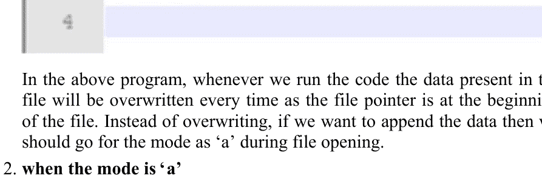

在上述程序中，每次运行代码时，由于文件指针位于文件开头，文件中的数据都会被覆盖。如果我们不想覆盖而是想追加数据，则应在打开文件时选择模式 ‘a’。

2. 当模式为 ‘a’ 时

```
示例 9.11
```

```
try:
    myfile1 = open("mywrite1.txt",'a')
    num1 = myfile1.write("Beginners are welcome here\n")
    print("The number of characters written in last line including \n are: ", num1)
    print("Data appended successfully in the file")
finally:
    myfile1.close()
```

## 输出 9.11

The number of characters written in last line including \n are: 27
Data appended successfully in the file

运行上述程序后，文件 mywrite1.txt 中的数据为

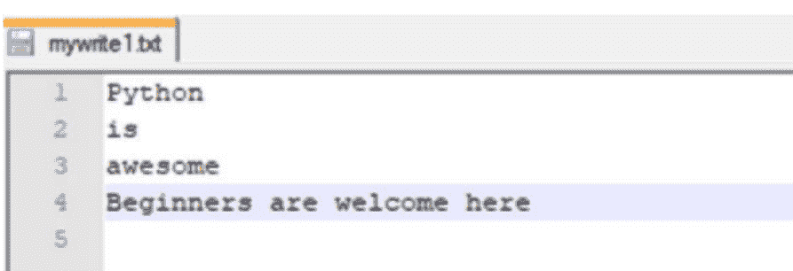

在上述程序中，当我们运行代码时，文件指针将位于文件末尾。因此，数据将从该光标位置开始追加。因此，上述行 *Beginners are welcome here* 被存储在第 4 行，因为程序运行前闪烁的光标位置就在这里。

3. try:

## 示例 9.12

```
try:
    myfile1 = open("mywrite2.txt",'x')
    num1 = myfile1.write("Python is awesome.Beginners are welcome here")
    print("The number of characters written in first line are: ", num1)
    print("Opened a file exclusively for write operation")
finally:
    myfile1.close()
```

## 输出 9.12

The number of characters written in first line are: 44
Opened a file exclusively for write operation

运行上述程序后，文件 mywrite2.txt 中的数据为


使用 write() 方法写入数据时，在末尾提供行分隔符 \n 很重要，否则，所有数据将写入单行，如图所示。如果我们尝试再次运行上述代码，将会得到一个错误，因为文件已经创建，如下所示。

> FileExistsError: [Errno 17] File exists: 'mywrite2.txt'

### 9.6.2 writelines() 方法

上述方法用于存储/写入由文件对象表示的字符串组（元组、列表、集合）。在某些数据结构内部，有一组数据，该数据可以使用 writelines() 方法写入文件。
其语法为

```
fileobject.writelines(group of string)
```

字符串组数据的插入取决于文件模式和文件指针的位置。

1. 当模式为 ‘w’ 时

```
try:
    myfile1 = open("mywrite1.txt", 'w')
    num1 = myfile1.writelines(("Python\n","is\n","awesome\n"))
    print("Data written successfully from tuple")
finally:
    myfile1.close()
```

```
Data written successfully from tuple
```

写入文件 mywrite1.txt 中的数据为

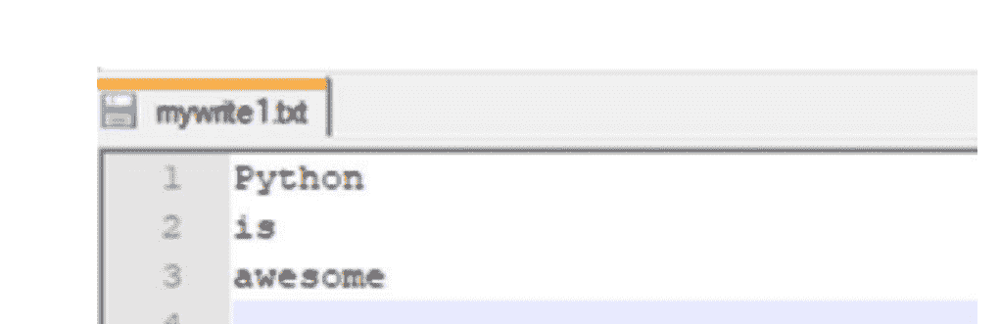

在上述程序中，每次运行代码时，由于文件指针位于文件开头，文件中的数据都会被覆盖。如果我们不想覆盖而是想追加数据，则应在打开文件时选择模式 ‘a’。

2. 当模式为 ‘a’ 时

## 示例 9.14

```
try:
  myfile1 = open("mywrite1.txt","a")
  num1 = myfile1.writelines(["Beginners ","are ","welcome ","here"])
  print("Data written successfully from list")
finally:
  myfile1.close()
```

## 输出 9.14

Data written successfully from list

运行上述程序后，文件 mywrite1.txt 中的数据为


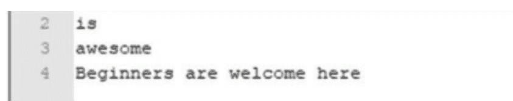

在上述程序中，当我们运行代码时，文件指针将位于文件末尾。因此，数据将从该光标位置开始追加。因此，来自列表对象的数据将被存储在第 4 行，因为程序运行前闪烁的光标位置就在这里。

3. 当模式为 ‘x’ 时

```
try:
    myfile1 = open("mywrite3.txt",'x')
    num1 = myfile1.writelines({"Python is awesome.","Beginners are welcome here"})
    print("Set Data is written after creating a file exclusively for write operation")
finally:
    myfile1.close()
```

```
Set Data is written after creating a file exclusively for write operation
```

运行上述程序后，文件 mywrite3.txt 中的数据为


使用 writelines() 方法写入数据时，在末尾提供行分隔符 \n 很重要，否则，所有数据将写入单行，如图所示。如果我们尝试再次运行上述代码，将会得到一个错误，因为文件已经创建，如下所示。

> FileExistsError: [Errno 17] File exists: 'mywrite3.txt'

## 9.7 从文本文件读取字符数据

可以使用以下读取方法从文本文件读取字符数据：

1. **read():**
   上述方法用于从文件读取数据，并在二进制模式下将其作为字节对象返回，或在文本模式下作为字符串返回。
   其语法为

```
fileobject.read(size)
```

其中 size 表示要从文件开头读取的字节数。
size 的默认值为 -1。当其为负数或省略时，将读取并返回整个文件内容。当到达文件末尾时，上述方法将返回空字符串。
考虑文件 mydemowrite1.txt 内的内容

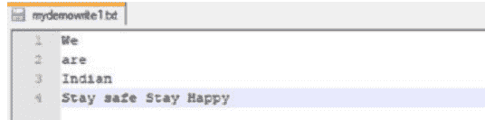

## 示例 9.16

源代码请扫描第 503 页图 9.1 所示的二维码

## 输出 9.16

```
We
are
Indian
Stay safe Stay Happy
____________________
We
are
Indian
Stay safe Stay Happy
____________________
We
are
India
```

在 R1 和 R2 中，未指定 size 或其为负数，即 -1。因此，将从文件中读取全部数据。
在 R3 中，将只从文件中读取前 12 个字符。因此，输出将是
We
are India

需要注意的是，每行末尾都包含 \n。因此，第 1 行包含 3 个字符，第 2 行包含 4 个字符，第 3 行包含 5 个字符。总共是 12 个字符。

2. readline() 方法：

上述方法用于从文件中读取单行。
其语法为

```
fileobject.readline(size)
```

其中 size 表示要从文件中读取的字节数。默认值为 -1，表示读取整行。
考虑文件 mydemowrite1.txt 内的内容为

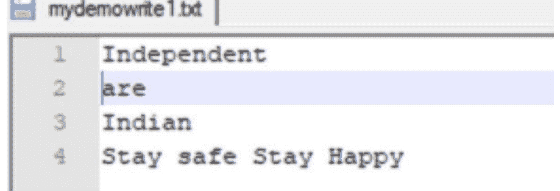

## 示例 9.17

源代码请扫描第 503 页图 9.1 所示的二维码

## 输出 9.17

Independent
________________________

独立

在 RE1 中，由于未提及大小，我们从文件开头读取单行。第一行包含字符串 Independent 后跟 \n。因此，输出为


第一行已包含一个 \n。但 print() 方法也会再添加一个 \n，因为 print 方法会在末尾插入新行。
在 RE2 中，同样由于大小为负数（即 -1），我们从文件开头读取单行。此外，我们添加了 end = ""（空）。因此，print() 方法不会添加任何 \n。所以，输出仅为 Independent。
在 RE3 中，我们读取文件的前 5 个字节。因此，输出为 Indep。

## 3. readlines() 方法：

上述方法会将所有行读入一个列表，即文件中的每一行将成为一个列表项。
语法为

```
fileobject.readlines(len)
```

其中 len 表示要从文件读取的总字节数。默认值为 -1。
如果 len 大于文件的总字节数，则不会返回更多数据。
让我们看一个例子。
文件 mydemowrite1.txt 中的内容为

- 1. We
- 2. Salute
- 3. Corona Warriors
- 4. Stay safe Stay Happy

## 示例 9.18

```python
try:
    myfile1 = open('mydemowrite1.txt','r')
    mydata = myfile1.readlines()
    print(mydata) # RL1
    for loop in mydata:
        print(loop, end='') # RL2
finally:
    myfile1.close()
```

## 输出 9.18

```
['We\n', 'Salute\n', 'Corona Warriors\n', 'Stay safe Stay Happy']
We
Salute
Corona Warriors
Stay safe Stay Happy
```

在 RL1 中，返回一个列表，其中文件的每一行都是一个列表项。因此，输出将是
['We\n', 'Salute\n', 'Corona Warriors\n', 'Stay safe Stay Happy']。在 RL2 中，我们使用 end=""（空）迭代每个列表项。因此，输出将是
We
Salute
Corona Warriors
Stay safe Stay Happy

## 9.8 with 语句

'with' 语句在打开文件时使用。使用 with 语句打开文件时，无需显式关闭文件。语法为

```python
with open(filename, mode='r') as fileobject:
    statements
```

'with' 语句可用于将文件操作分组在一个块中。它会自动处理关闭文件，即使在运行时发生异常，也会在完成所有所需操作后自动关闭文件。

> **注意：**
> open() 函数的语法与我们之前讨论的相同。

考虑 "readinput.txt" 中的内容为


## 示例 9.19

```python
with open('readinput.txt') as myfile1:
    mydata = myfile1.read()
    print(mydata) # W1
    print("________")
    print('File closed status: ?', myfile1.closed) # W2
print("________")
print('Again checking for file closed status ?', myfile1.closed) # W3
```

## 输出 9.19

```
It is my dream
to visit european
countries once
during my lifetime.
________
File closed status: ? False
________
Again checking for file closed status ? True
```

在 W1 中，我们使用 with 语句以读取模式打开文件。文件的内容被读取并显示。因此，输出将是

It is my dream
to visit european countries once during my lifetime.

在 W2 中，我们在 with 块内检查文件状态。因此，输出将是 File closed status:? False。在 W3 中，我们再次在 with 块外检查文件状态。因此，这次输出将是 True。

## 9.9 文件方法()

文件中的不同方法有：

### 1. tell():
上述方法将返回文件指针从文件开头的光标位置。它将告诉当前光标位置。文件中的第一个字符索引为零，就像字符串索引一样。
语法为

```python
fileobject.tell()
```

考虑 readinput.txt 中的内容为


## 示例 9.20

```python
with open('readinput.txt') as myfile1:
    print(myfile1.tell()) # T1
    print("______")
    print(myfile1.read(4)) # T2
    print(myfile1.tell()) # T3
    print("______")
    print(myfile1.read()) # T4
    print(myfile1.tell()) # T5
```

## 输出 9.20

```
0
______
Welc
4
______
ome Python beginners
25
```

在 T1 中，文件指针的当前位置为 0。
在 T2 中，我们从当前光标位置读取前 4 个字符。因此，输出将是 Welc。
在 T3 中，文件指针的当前位置为 4。
在 T4 中，我们读取文件的剩余内容。因此，输出将是 ome Python beginners。
在 T5 中，文件指针的当前位置为 25，即文件末尾。

### 2. seek():
上述方法将光标位置从一个位置移动到文件开头的指定位置。这里，光标将被定位到特定位置。
语法为

```python
fileobject.seek(position)
```

其中 position 将从 0 开始，并且是一个正整数。

## 示例 9.21

对于 [第 503 页](page_503) 上 [图 9.1](Figure 9.1) 所示的源代码扫描二维码

## 输出 9.21

```
Hello! I am studying tell method.
Current Cursor Position: 33
Current Cursor Position: 21
Data After modifying at position 21 is :
Hello! I am studying seek method.
```

在 S0 中，我们以写入模式创建文件 mydemofile2.txt。数据 Hello! I am studying tell method. 被存储在文件中。
在 S1 中，我们打开文件 mydemofile2.txt 并读取所有数据。
在 S2 中，当前光标位置：33。
在 S3 中，我们将当前文件位置更改为 21。
在 S4 中，当前光标位置：21。
在 S5 中，我们从光标位置 21 写入数据 seek method。
在 S6 中，我们将当前文件位置设置为 0，即文件开头。
在 S7 中，我们从开头读取文件的所有数据。
在 S8 中，修改后的数据为 Hello! I am studying seek method。
文件 mydemofile2.txt 中的数据为


### 3. flush()
上述方法将清除内部缓冲区。在将文本写入文件之前，最好清除内部缓冲区。

语法为

```python
fileobject.flush()
```

> **示例 9.22**
> 对于 [第 503 页](link) 上 [图 9.1](link) 所示的源代码扫描二维码

> **输出 9.22**
> Hello beginner!I hope you are enjoying python file handling
> I hope yes

myflush.txt 中的内容为


### 4. fileno()
上述方法将返回文件号，即作为整数值的文件描述符。如果操作系统不使用文件的文件描述符，则可能会发生错误。
语法为

```python
fileobject.fileno()
```

## 示例 9.23

```python
with open("myfileno.txt", 'w') as myfile1:
    print("The file descriptor is: ", myfile1.fileno()) # FN1
print("The file descriptor is: ", myfile1.fileno()) # FN2
```

## 输出 9.23

```
The file descriptor is: 3
ValueError: I/O operation on closed file
```

在 FN1 中，文件描述符为 3。
在 FN2 中，文件自动关闭后，我们尝试打印文件描述符。因此，Python 将引发 ValueError。

### 5. truncate()
上述方法将根据给定的字节数调整文件大小。如果未指定大小，则将使用当前位置。
语法为

```python
fileobject.truncate(size)
```

其中 size 是一个可选参数，表示截断后的文件大小（以字节为单位）。

## 示例 9.24

对于 [第 503 页](page_503) 上 [图 9.1](page_503) 所示的源代码扫描二维码

## 输出 9.24

```
Python is a user-friendly lang
```

truncate.txt 的内容为


### 6. isatty()
如果文件连接到终端设备（如 tty 设备），上述方法将返回 True，否则返回 False。

语法为

```python
fileobject.isatty()
```

## 示例 9.25

```python
#creating a file
myfile1 = open("demo1234.txt", "w")
# displaying the file name
print("File name is: ", myfile1.name)
# checking whether file is connected to end device or not
myret = myfile1.isatty()
print("Return value : ", myret)
# file is getting closed
myfile1.close()
```

## 输出 9.25

```
File name is: demo1234.txt
Return value : False
```

## 9.10 二进制数据处理

现在，有时会有需要读取或写入二进制数据的情况，例如图像、视频文件、音频文件、文档（如 word 或 pdf 等）。众所周知，二进制文件是其格式不由可读字符组成的文件。我们已经看到，要打开任何二进制文件，必须在其后添加后缀 'b'。我们将通过代码来查看上述示例。

图像文件 pic1.jpg 位于文件夹 E:\python_progs\demochange\mydir2 中，如下所示


图片如下所示。


访问上述图像并创建新图像的代码如下

```
try:
    myfile1=open("E:\python_progs\demochange\mydir2\pic1.jpg", "rb")
    myfile2=open("E:\python_progs\demochange\mydir2\newpic1.jpg", "wb")
    bytes=myfile1.read()
    myfile2.write(bytes)
    print("A new Image is available having name as: newpic1.jpg")
finally:
    myfile1.close()
    myfile2.close()
```

一张新图像已生成，文件名为：newpic1.jpg

正如预期，在文件夹`E:\python_progs\demochange\mydir2`中创建了一个新的图像文件`newpic1.jpg`，如下所示。

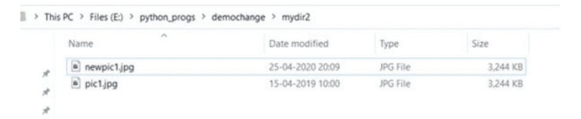

它与图像文件`pic1.jpg`相同。

## 9.11 CSV文件处理

CSV代表逗号分隔值，是一种纯文本文件类型，它使用特定的结构来安排表格数据。它只包含实际的文本数据。这些文件易于通过编程方式处理，并能处理大量数据。作为编程的一部分，使用Python csv库读取和写入与csv文件相关的数据是一个常见需求。如果有处理海量数据或数值分析的需求，我们可以考虑使用同时具备csv解析功能的`pandas`库。但这里我们只讨论如何使用Python库读取csv文件。为了处理csv文件，Python提供了csv模块。

### 9.11.1 将数据写入csv文件

```
示例 9.27

import csv
with open("mycsvfile1.csv","w") as myfile1:
    mywrite=csv.writer(myfile1) # CS1
    print(type(mywrite)) # CS2
    mywrite.writerow(["ROLLNO","NAME","AGE","CONTACT"]) # CS3
    while True:
        myroll_no=input("Enter Student Roll No:") # CS4
        myname=input("Enter Student Name:") # CS5
        myage=input("Enter Student Age:") # CS6
        mycontactno=input("Enter Student contact number:") # CS7
        mywrite.writerow([myroll_no,myname,myage,mycontactno]) # CS8
        check = input("Do you want to enter one more student data: (Yes|No): ")
        # CS9
        if check.upper() == 'NO': # CS10
            break
        print("Total Students data written to csv file successfully")
```

#### 输出 9.27

```
<class '_csv.writer'>
Enter Student Roll No:1
Enter Student Name:Saurabh
Enter Student Age:10
Enter Student contact number:8907654321
Do you want to enter one more student data: (Yes|No): Yes
Enter Student Roll No:2
Enter Student Name:Divya
Enter Student Age:10
Enter Student contact number:9876543210
Do you want to enter one more student data: (Yes|No): No
Total Students data written to csv file successfully
```

文件`mycsvfile1.csv`以写模式打开。
在CS1中，返回一个csv写入对象用于写入数据，并将用户数据转换为分隔字符串。
在CS2中，类型是`<class '_csv.writer'>`。
在CS3中，使用`writerow()`函数将字符串写入csv文件。列标题作为列表传递，该列表将被转换为分隔字符串并写入csv文件。
在CS4中，提示用户输入学号。
在CS5中，提示用户输入姓名。在CS6中，提示用户输入年龄。
在CS7中，提示用户输入联系电话。
在CS8中，用户将学号、姓名、年龄和联系电话作为列表传递，这些将被转换为分隔字符串并写入csv文件。
在CS9中，如果需要，会提示用户输入更多学生数据。
在CS10中，检查用户是否输入了'No'的条件，输入的内容将自动转换为大写。如果用户输入Yes，则会将更多学生数据写入文件；否则，由于控制跳出while循环，代码将退出。
`mycsvfile1.csv`文件将如下图所示。


我们可以看到每行数据之间都存在一个空行。因此，为了防止这些空行，在python-3中添加了`newline=""`（空）的属性，如下所示。

```
import csv
with open("mycsvfile1.csv", "w", newline="") as myfile1:
    mywrite=csv.writer(myfile1) # CS1
    print(type(mywrite)) # CS2
    mywrite.writerow(["ROLLNO", "NAME", "AGE", "CONTACT"]) # CS3
    while True:
        myroll_no=input("Enter Student Roll No:") # CS4
        myname=input("Enter Student Name:") # CS5
        myage=input("Enter Student Age:") # CS6
        mycontactno=input("Enter Student contact number:") # CS7
        mywrite.writerow([myroll_no,myname,myage,mycontactno]) # CS8
        check = input("Do you want to enter one more student data: (Yes|No): ")
        # CS9
        if check.upper() == 'NO': # CS10
            break
        print("Total Students data written to csv file successfully")
```

#### 输出 9.28

```
<class '_csv.writer'>
Enter Student Roll No:1
Enter Student Name:Saurabh
Enter Student Age:10
Enter Student contact number:8907654321
Do you want to enter one more student data: (Yes|No): yes
Enter Student Roll No:2
Enter Student Name:Divya
Enter Student Age:10
Enter Student contact number:9876543210
Do you want to enter one more student data: (Yes|No): no
Total Students data written to csv file successfully
```

现在，`mycsvfile1.csv`文件将如下图所示。

| ROLLNO | NAME   | AGE | CONTACT    |
|--------|--------|-----|------------|
| 1      | Saurabh| 10  | 8907654321 |
| 2      | Divya  | 10  | 9876543210 |

### 9.11.2 从csv文件读取数据

`mycsvfile1.csv`中的数据为

| ROLLNO | NAME   | AGE | CONTACT    |
|--------|--------|-----|------------|
| 1      | Saurabh| 10  | 8907654321 |
| 2      | Divya  | 10  | 9876543210 |

现在，我们将使用Python代码读取并显示上述数据。

```
示例 9.29
import csv
myfile1=open("mycsvfile1.csv",'r')
myfile1=csv.reader(myfile1) #returns csv reader object
print(type(myfile1))
mydata=list(myfile1)
print(mydata) # list of list returning
for myrow in mydata: # iterating each element as list
  for mycol in myrow:# iterating each element of list
    print(mycol,'\t',end="")
  print()
```

#### 输出 9.29

```
<class '_csv.reader'>
[['ROLLNO', 'NAME', 'AGE', 'CONTACT'],
['1', 'Saurabh', '10', '8907654321'],
['2', 'Divya', '10', '9876543210']]
ROLLNO   NAME   AGE   CONTACT
1        Saurabh 10   8907654321
2        Divya   10   9876543210
```

在上面的代码中，我们首先导入了csv模块，然后以读模式打开了csv文件`mycsvfile1.csv`。文件将由`csv.reader()`读取，它将返回一个可迭代的读取器对象。整个数据将以列表形式从csv文件中读取。然后使用嵌套for循环迭代读取器对象，以显示每行的内容。

## 9.12 文件的压缩与解压缩

Zip是一种存档文件格式，包含一个或多个压缩文件。它支持无损数据压缩，即原始数据可以从压缩数据中完美重建。我们经常有压缩和解压缩文件以满足需求的需要，因为它具有以下优势：

-   内存利用率将得到改善。
-   传输速度将提高，从而减少传输时间。
-   性能将得到提升。

Python中有一个内置模块用于执行zip和unzip操作，名为`zipfile`。它包含一个`ZipFile`类。

### 9.12.1 执行压缩操作

可以通过zip文件的名称、模式和常量**ZIP_DEFLATED**创建一个`ZipFile`类对象来执行压缩操作。上述常量表示我们正在创建一个zip文件。

```
myfile1 = Zipfile('zipfilename', mode = 'w', ZIP_DEFLATED)
```

可以使用`ZipFile`对象的`write()`方法添加文件。

```
myfile1.write()
```

目录`E:\python_progs\zip`中的zip文件夹内的文件如下：


现在，我们将对上述文件夹中的所有文件执行压缩操作。

#### 示例 9.30

```
from zipfile import *
myfile1=ZipFile("E:\python_progs\zip\myfiles.zip",'w',ZIP_DEFLATED)
myfile1.write("abcd.txt")
myfile1.write("mydemofile2.txt")
myfile1.write("myflush.txt")
myfile1.write("readinput.txt")
myfile1.write("truncate.txt")
myfile1.write("writeinput.txt")
myfile1.close()
print("myfiles.zip file is created successfully")
```## 输出 9.30

myfiles.zip 文件创建成功

运行上述代码后，将在文件夹 E:\python_progs\zip 中创建一个 zip 文件，如下图所示。


zip 文件中的多个文件如下所示。


## 9.12.2 执行解压操作

要执行解压操作，可以使用 zip 文件的名称、模式以及常量 **`ZIP_STORED`** 来创建一个 Zipfile 类对象。上述常量表示我们正在执行解压操作。它是默认值，因此我们无需指定。

```python
myfile1 = Zipfile('zipfilename', mode = 'r', ZIP_STORED)
```

一旦为解压操作创建了 Zipfile 对象，我们就可以使用 `namelist()` 方法获取 zip 文件中存在的所有文件名。

```python
myfilename = myfile1.namelist()
```

## 示例 9.31

```python
from zipfile import *
myfile1=ZipFile("E:\python_progs\zip\myfiles.zip",'r',ZIP_STORED)
myfilename=myfile1.namelist()
for myfile in myfilename:
    print("File Name is : ",myfile)
    print("The Contents of this file are:")
    myfl=open(myfile,'r')
    print(myfl.read())
    print()
    print("___________________")
```

## 输出 9.31

```
File Name is : abcd.txt
The Contents of this file are:
python
___________________
File Name is : mydemofile2.txt
The Contents of this file are:
Hello! I am studying seek method.
___________________
File Name is : myflush.txt
The Contents of this file are:
Hello beginner!I hope you are enjoying python file handling
I hope yes
___________________
File Name is : readinput.txt
The Contents of this file are:
Welcome Python beginners
___________________
File Name is : truncate.txt
The Contents of this file are:
Python is a user-friendly lang
___________________
File Name is : writeinput.txt
The Contents of this file are:
Hellothere!
___________________
```

我们甚至可以通过指定所有内容来解压一个 zip 文件，如下所示。此处，目录 E:\python_progs\zip 中的 zip 文件夹仅包含一个 .zip 文件。

| 名称 | 修改日期 | 类型 | 大小 |
| --- | --- | --- | --- |
| myfiles.zip | 26-04-2020 12:07 | WinRAR ZIP archive | 1 KB |

现在，我们将编写代码来解压此 .zip 文件中的所有文件。

## 示例 9.32

```python
# 导入必要的模块
from zipfile import ZipFile

# 指定 zip 文件名
myfile_name = "E:\python_progs\zip\myfiles.zip"

# 默认以读取模式打开 zip 文件
with ZipFile(myfile_name, 'r') as myzip:
    # 显示归档文件的目录内容
    myzip.printdir()
    print("-------------------")
    # 将所有文件解压到指定目录
    print('Extracting all the files started…')
    myzip.extractall("E:\\python_progs\\zip\\")
    print('Done!')
```

## 输出 9.32

示例 9.32 的输出如下图所示。


现在，zip 文件夹内的文件如下。因此，我们已经解压了所有文件。


我们甚至可以像下面这样获取 zip 文件的所有信息。

## 示例 9.33

有关源代码，请扫描第 503 页图 9.1 所示的二维码

## 输出 9.33

```
abcd.txt
Modified Time: 2020-04-25 02:23:04
Operating System: 0(0 = Windows, 3 = Unix)
Specifying ZIP version: 20
Bytes Compressed: 8 bytes
Bytes Uncompressed: 6 bytes

mydemofile2.txt
Modified Time: 2020-04-24 20:37:00
Operating System: 0(0 = Windows, 3 = Unix)
Specifying ZIP version: 20
Bytes Compressed: 35 bytes
Bytes Uncompressed: 33 bytes

myflush.txt
Modified Time: 2020-04-24 20:50:14
Operating System: 0(0 = Windows, 3 = Unix)
Specifying ZIP version: 20
Bytes Compressed: 65 bytes
Bytes Uncompressed: 71 bytes

readinput.txt
Modified Time: 2020-04-24 20:07:56
Operating System: 0(0 = Windows, 3 = Unix)
Specifying ZIP version: 20
Bytes Compressed: 26 bytes
Bytes Uncompressed: 24 bytes

truncate.txt
Modified Time: 2020-04-24 22:57:40
Operating System: 0(0 = Windows, 3 = Unix)
Specifying ZIP version: 20
Bytes Compressed: 32 bytes
Bytes Uncompressed: 30 bytes

writeinput.txt
Modified Time: 2020-04-24 13:25:30
Operating System: 0(0 = Windows, 3 = Unix)
Specifying ZIP version: 20
Bytes Compressed: 13 bytes
Bytes Uncompressed: 11 bytes
```

## 9.13 对象的封存与反封存

每当需要对 Python 数据结构进行序列化和反序列化时，我们就会执行封存操作。我们需要将对象的整个状态写入文件，并从文件中读取整个对象。

将对象状态写入文件的过程，即将类对象转换为字节流并存储到文件中的过程，称为 **封存**。它也被称为对象序列化。

从文件中读取对象状态的过程，即将字节流转换回类对象的过程，称为 **反封存**。它是封存的逆操作。它也被称为对象反序列化。

封存和反封存可以通过使用 `pickle` 模块来实现。

由于二进制文件支持字节流，封存和反封存操作应使用二进制文件进行。

可以封存的数据类型如下：

1. 整数
2. 布尔值
3. 复数
4. 浮点数
5. 普通字符串和 Unicode 字符串
6. 元组
7. 列表
8. 包含可封存对象的集合和字典
9. 在模块顶层定义的类和内置函数。

封存和反封存过程中将使用两个重要函数：

1.  **`dump()`:**
    上述函数执行封存操作。它将返回对象的封存表示形式作为一个字节对象，而不是将其写入文件。它用于序列化对象层次结构。
    语法为
    ```python
    import pickle
    pickle.dump(object, file, protocol)
    ```
    其中
    `object` 是要序列化的 Python 对象
    `file` 是将存储已序列化 Python 对象的文件对象
    `protocol` 如果未指定则为 0。如果指定为 `HIGHEST_PROTOCOL` 或负数，则将使用可用的最高协议版本。

2.  **`load()`:**
    上述函数执行反封存操作。它从二进制文件中读取一个封存的对象并将其返回为一个对象。它用于反序列化数据流。
    语法为
    ```python
    import pickle
    pickle.load(file)
    ```

整个封存和反封存过程可以从下面的流程图中学习。


下面的代码演示了使用 pickle 模块读写对象状态的示例。

## 示例 9.34

有关源代码，请扫描 [图 9.1](https://example.com/figure9.1)（位于 [第 503 页](https://example.com/page503)）所示的二维码

## 输出 9.34

```
Pickling of Student Object completed...
Printing Student Information after unpickling
Shyam  12  1  HYD
```

现在，我们将演示如何将多个学生对象写入文件。我们将创建 3 个 Python 文件。

**student.py**

```python
import pickle

class Student:
    def __init__(self,name,age,rollno,hometown):
        self.name=name
        self.age=age
        self.rollno=rollno
        self.hometown=hometown

    def mydisplay(self):
        print(self.name,"\t",self.age,"\t",self.rollno,"\t",self.hometown)
```

**mypick.py**

```python
import pickle, student

myfile1=open("mypick_umpickle1.dat","wb")
mynum=int(input("Enter The number of Students:"))
for i in range(mynum):
    myname=input("Enter Student Name:")
    myage=int(input("Enter Student Age:"))
    myrollno=int(input("Enter Roll No:"))
    myhometown=input("Enter Student HomeTown:")
    mystu1=student.Student(myname,myage,myrollno,myhometown)
    pickle.dump(mystu1,myfile1)
myfile1.close()
print("Student Objects pickled successfully")
```

**myunpickle.py**

```python
import pickle, student

myfile1=open("mypick_umpickle1.dat","rb")
print("Student Details:")
while True:
    try:
        myobj=pickle.load(myfile1)
        myobj.mydisplay()
    except EOFError:
        print("All students Completed")
        break
```myfile1.close()

现在，我们将运行**mypick.py**文件

```
Enter The number of Students:2
Enter Student Name:Ram
Enter Student Age:13
Enter Roll No:2
Enter Student HomeTown:Hyderabad
Enter Student Name:Shyam
Enter Student Age:13
Enter Roll No:3
Enter Student HomeTown:Raipur
Student Objects pickled successfully
```

要执行反序列化，我们将运行**myunpickle.py**文件。

```
SAURABH@LAPTOP-NHFM79LF MINGW64 /e/python_progs
$ python myunpickle.py
Student Details:
Ram     13      2       Hyderabad
Shyam   13      3       Raipur
All students Completed
```

因此，可以使用序列化将多个对象写入文件，也可以使用反序列化从文件中读取对象。

## 9.14 日期和时间

在开始学习Python的日期和时间之前，有一些基本概念需要了解。

- 1. **纪元（Epoch）**：这是时间开始的起点，取决于平台。它通常被设定为当前年份的1月1日，00:00:00。但对于Unix系统，纪元是1970年1月1日，00:00:00（UTC）。
- 2. **UTC**：UTC代表协调世界时（也称为格林威治标准时间），是英语和法语之间妥协的产物。
- 3. **DST**：这是夏令时，是一年中部分时段将时区调整一小时的做法。换句话说，时钟在春季向前拨快一小时，在秋季向后拨慢一小时，以恢复到标准时间。

以下是用于处理日期、时间和时长的常用模块。

### 9.14.1 Time模块

这是一个内置模块，包含执行各种时间操作所需的各种函数。它允许从纪元开始记录时间。time模块的一些重要函数如下：

- 1. **time():**
   它以秒为单位返回时间，即自纪元以来经过的秒数。具体的纪元日期和闰秒处理取决于平台。

```
from time import *
mysecs = time()
print("The number of seconds since epoch are: ", mysecs)
```

> 输出 9.35

The number of seconds since epoch are: 1587988490.7900558

- 2. **ctime():**
   它用于获取当前日期和时间。
   当我们向上述函数传递以秒为单位的纪元时间时，它将返回对应日期和时间的字符串格式。
   当我们不向上述函数传递纪元时间时，它将返回当前日期和时间的字符串格式。

# 示例 9.36

```
from time import *

mylocal_time = ctime(1587988490.7900558)
# 传递了以秒为单位的纪元时间
print("The corresponding date and time is: ",mylocal_time)

mylocal_time = ctime() # 未传递纪元时间
print("The current date and time is: ",mylocal_time)
```

# 输出 9.36

The corresponding date and time is:
Mon Apr 27 17:24:50 2020
The current date and time is:
Mon Apr 27 17:29:06 2020

- 3. **struct_time类:**

time模块中的多个函数，如gmtime、mktime和asctime，会接受time.struct_time对象作为参数或返回它。

time.struct_time对象的不同元素可以通过索引或属性来访问。

| 索引 | 属性 | 值 |
|-------|-----------|--------|
| 0     | tm_year   | 4位数的年份 |
| 1     | tm_mon    | 范围[1,12] |
| 2     | tm_mday   | 范围[1,31] |
| 3     | tm_hour   | 范围[0,23] |
| 4     | tm_min    | 范围[0,59] |
| 5     | tm_sec    | 范围[0,61]，包括闰秒 |
| 6     | tm_wday   | 范围[0,6]，其中0代表星期一 |
| 7     | tm_yday   | 范围[1,366] |

- 4. **localtime():**

它将返回自纪元以来经过的秒数，并以本地时间返回**struct_time**。如果上述函数未传递参数，则使用time()返回的值。

# 示例 9.37

```
from time import *
mystruct_time = localtime()
print(type(mystruct_time))
print(mystruct_time)
print("Year is: ",mystruct_time.tm_year)
print("Month is: ",mystruct_time.tm_mon)
print("Date is: ",mystruct_time.tm_mday)
print("Hour is: ",mystruct_time.tm_hour)
print("Min is: ",mystruct_time.tm_min)
print("Second is: ",mystruct_time.tm_sec)
print(mystruct_time.tm_wday)
print(mystruct_time.tm_yday)
```

# 输出 9.37

```
<class 'time.struct_time'>
time.struct_time(tm_year=2020, tm_mon=4, tm_mday=27, tm_hour=17, tm_min=37, tm_sec=31, tm_wday=0, tm_yday=118, tm_isdst=0)
Year is: 2020
Month is: 4
Date is: 27
Hour is: 17
Min is: 37
Second is: 31
0
118
```

- 5. **gmtime():**

它将返回自纪元以来经过的秒数，并以UTC时间返回**struct_time**。如果上述函数未传递参数，则使用time()返回的值。

# 示例 9.38

关于源代码，请扫描第503页图9.1所示的二维码。

# 输出 9.38

```
<class 'time.struct_time'>
time.struct_time(tm_year=2020, tm_mon=4, tm_mday=27,
tm_hour=17, tm_min=43, tm_sec=39, tm_wday=0,
tm_yday=118, tm_isdst=0)
Year is: 2020
Month is: 4
Date is: 27
Hour is: 17
Min is: 43
Second is: 39
0
118
__________________
<class 'time.struct_time'>
time.struct_time(tm_year=2020, tm_mon=4, tm_mday=27,
tm_hour=12, tm_min=13, tm_sec=39, tm_wday=0,
tm_yday=118, tm_isdst=0)
Year is: 2020
Month is: 4
Date is: 27
Hour is: 12
Min is: 13
Second is: 39
0
118
The difference between localtime and UTC time is 5 hrs
and 30 mins
```

- 6. **mktime():**

它是localtime()的逆操作，将接受一个**struct_time**（包含9个元素的元组）作为参数，并返回以本地时间表示的自纪元以来经过的秒数。

```
from time import *

mytime = (2020, 4, 27, 12, 13, 39, 0, 118, 0)
mymk_time = mktime(mytime)
print("The number of seconds passed since epoch is: ", mymk_time)

print("The struct_time is ",localtime(mymk_time))
# 获取struct_time
```

```
The number of seconds passed since epoch
is: 1587969819.0
The struct_time is time.struct_time(tm_year=2020,
tm_mon=4, tm_mday=27, tm_hour=12, tm_min=13, tm_sec=39,
tm_wday=0, tm_yday=118, tm_isdst=0)
```

- 7. **asctime():**

它将接受一个**struct_time**（包含9个元素的元组）作为参数，并返回一个表示时间的24个字符的字符串。

```
示例 9.40
from time import *
mytime = (2020, 4, 27, 12, 13, 39, 0, 118, 0)
asc_time = asctime(mytime)
print("The string representing the time is: ", asc_time)
```

```
输出 9.40
The string representing the time is: Mon Apr 27 12:13:39 2020
```

- 8. **strftime():**

它将接受一个**struct_time**（包含9个元素的元组）作为参数，并根据使用的主要格式代码返回一个字符串。

| 格式代码 | 含义 |
|---|---|
| %Y | 4位数的年份 |
| %m | 01,02...12 |
| %d | 01,02...31 |
| %H | 00,01...23 |
| %M | 00,01...59 |
| %S | 00,01...61 |

```
示例 9.41
from time import *
my_local_time = localtime() # 获取struct_time
print(my_local_time)

my_format_time= strftime("%m/%d/%Y, %H:%M:%S",
                        my_local_time)
print(my_format_time)
```

# 输出 9.41

```
time.struct_time(tm_year=2020, tm_mon=4, tm_mday=28, tm_hour=19, tm_min=19, tm_sec=39, tm_wday=1, tm_yday=119, tm_isdst=0)
04/28/2020, 19:19:39
```

- 9. **strptime():**

它通过解析表示时间的字符串来返回**struct_time**对象。如果未指定格式字符串，它将默认为"%a %b %d %H:%M:%S %Y"，这与ctime()函数返回的格式相匹配。

# 示例 9.42

```
from time import *

my_time_string = "27 Apr, 2020"

myresult = strptime(my_time_string, "%d %b, %Y")
print(myresult)

my_time_string = "27 April, 2020"

myresult = strptime(my_time_string, "%d %B, %Y")
print(myresult)
```

# 输出 9.42

```
time.struct_time(tm_year=2020, tm_mon=4, tm_mday=27, tm_hour=0, tm_min=0, tm_sec=0, tm_wday=0, tm_yday=118, tm_isdst=-1)
time.struct_time(tm_year=2020, tm_mon=4, tm_mday=27, tm_hour=0, tm_min=0, tm_sec=0, tm_wday=0, tm_yday=118, tm_isdst=-1)
```

- 10. **sleep():**

time模块中的上述函数会将线程的执行暂停给定的秒数。我们将在后面详细讨论使用sleep()函数的多线程程序。

```
示例 9.43
python
import time
for loop in range(5):
    time.sleep(1)
    print("The number is: ", str(loop))
```

```
输出 9.43
The number is: 0
The number is: 1
The number is: 2
The number is: 3
The number is: 4
```

### 9.14.2 Datetime模块

如果需要处理日期和时间，Python中有一个内置模块，称为datetime模块。上述模块将提供用于处理日期和时间的类，这些类包含许多用于处理日期、时间以及时间间隔的函数。上述模块中的不同类如下：

## 9.14.2.1 date 类

上述类将处理公历日期。它不考虑时区。日期对象以 YYYY-MM-DD 格式表示。
语法如下

```
from datetime import date
dateobject = date(year, month, day)
```

其中
year 的范围在 MINYEAR（日期对象中允许的最小年份数，即 1）和 MAXYEAR（日期对象中允许的最大年份数，即 9999）之间，即 MINYEAR<=year<=MAXYEAR
month 必须在 1 到 12 之间，即 1<=month<=12。
day 必须 >=1 且应 <= 给定月份和年份中的天数。
如果任何参数超出这些给定范围，Python 将引发 ValueError。
不同的日期对象属性如下：

| 属性 | 描述 |
| :--- | :--- |
| min | 返回最小日期 |
| max | 返回最大日期 |
| year | 返回 MINYEAR 到 MAXYEAR 之间的年份（含） |
| month | 返回 1 到 12 之间的月份（含） |
| day | 返回日期中的天数 |

## 示例 9.44

源代码请扫描第 503 页图 9.1 中的二维码

```
**输出 9.44**

给定日期：2020-04-27
<class 'datetime.date'>
给定日期：2020-04-27
最小日期是：0001-01-01
最大日期是：9999-12-31
年份是：2020
月份是：4
日期是：27
```

## date 类中引发 ValueError 的情况

```
**示例 9.45**

#由于超出范围而在 date 中引发 ValueError
from datetime import date

mydate_obj = date(year = 2020, month=4, day =32)
print("给定日期：", mydate_obj)
```

```
**输出 9.45**

ValueError: day is out of range for month
```

date 类中有一个 today() 方法，它将获取当前日期，因为它只返回日期。

## 示例 9.46

```
#today() 方法
from datetime import date

mydate = date.today()

print("此处使用 today() 方法显示今天的日期：", mydate)

# 打印日期详情
print(f"当前本地日期详情为
{mydate.year}-{mydate.month}-{mydate.day}")
```

## 输出 9.46

此处使用 today() 方法显示今天的日期：2020-04-28
当前本地日期详情为 2020-4-28

时间戳可以使用 fromtimestamp() 方法转换为日期。

## 示例 9.47

```
from datetime import date

mytimestamp = date.fromtimestamp(1587969819)
print("日期是", mytimestamp)
```

## 输出 9.47

日期是 2020-04-27

## 9.14.2.2 time 类

上述类将处理时间。它不包含日期信息。它将假设每天恰好有 24*60*60 秒。
time 对象将包含独立于任何特定日期的本地时间信息。语法如下

```
from datetime import time
timeobject = time(hour=0, minute=0, second=0,
microsecond=0, tzinfo=None, *, fold=0)
```

此处，所有参数都是可选的。

tzinfo 表示时区，可以是 tzinfo 子类的实例，也可以是 None。

* 是一个展开运算符，用于解包元组并从元组的值构造一个 time 对象。

fold 的值为 [0,1]。它是时钟时间的回退。

其余参数是整数，其范围如下：
hour 必须 >=0 且 <24。
minute 必须 >=0 且 <60。
second 必须 >=0 且 <60。
microsecond 必须 >=0 且 <1000000。

## 示例 9.48

源代码请扫描第 503 页图 9.1 中的二维码

```
输出 9.48

mytime = 00:00:00
<class 'datetime.time'>
mytime1 = 10:30:59
mytime2 = 10:30:59
mytime3 = 10:30:59.123459
小时是：10
分钟是：30
秒是：59
秒是：123459
13:31:54.654321
```

在 time 对象中，也有可能引发 ValueError 和 TypeError

```
示例 9.49
python
#ValueError
from datetime import time
mytime = time(hour = 25)
```

```
输出 9.49
```

ValueError: hour must be in 0..23

## 示例 9.50

```
#TypeError
from datetime import time
mytime = time(hour = '23')
```

## 输出 9.50

TypeError: an integer is required (got type str)

## 9.14.2.3 datetime 类：

上述类包含日期和时间的信息。它假设当前的公历在两个方向上扩展，就像日期对象一样，并且也假设一天中恰好有 24*3600 秒，就像 time 对象一样。因此，我们可以得出结论，单个 datetime 对象将包含来自日期对象和时间对象的信息。语法如下

```
from datetime import datetime
datetime_object = datetime(year, month, day,
hour=0, minute=0, second=0, microsecond=0,
tzinfo=None, *, fold=0)
```

year、month 和 day 参数是必需的。

year 的范围在 MINYEAR（日期对象中允许的最小年份数，即 1）和 MAXYEAR（日期对象中允许的最大年份数，即 9999）之间，即 MINYEAR<=year<=MAXYEAR

month 必须在 1 到 12 之间，即 1<=month<=12。

day 必须 >=1 且应 <= 给定月份和年份中的天数。

hour 必须 >=0 且 <24。

minute 必须 >=0 且 <60。

second 必须 >=0 且 <60。

microsecond 必须 >=0 且 <1000000。

tzinfo 表示时区，可以是 tzinfo 子类的实例，也可以是 None。* 是一个展开运算符，用于解包元组并从元组的值构造一个 time 对象。

fold 的值为 [0,1]。它是时钟时间的回退。

我们将讨论 datetime 类中的一些方法：

1. **now()**：
   上述方法将获取当前日期和时间。可以向上述方法提供时区信息。如果未提供时区信息，则采用本地时区。

2. **today()**：
   上述方法也将获取当前日期和时间。返回日期和时间信息。

## 示例 9.51

源代码请扫描第 503 页图 9.1 中的二维码

## 输出 9.51

```
2020-04-28 00:00:00
____________________
2020-04-28 10:45:30.124536
____________________
年份是：2020
月份是：4
小时是：10
分钟是：45
秒是：30
毫秒是：124536
时间戳是：1588050930.124536
____________________
2020-04-28 01:59:41.808499
____________________
2020-04-28 01:59:41.809495
____________________
2020-04-27 20:29:41.809495
```

1. **datetime.strftime()**
   它将使用 datetime、date 或 time 对象返回一个表示日期和时间的字符串。此处，datetime、date 和 time 类对象的内容将被格式化。它将通过将对象转换为指定格式来返回格式化的字符串。

## 示例 9.52

源代码请扫描第 503 页图 9.1 中的二维码

## 输出 9.52

```
年份是：2020
月份是：04
日期是：28
时间是：19:39:32
日期和时间是：04/28/2020, 19:39:32
```

上面显示的示例描述了使用 strftime() 将 datetime 转换为字符串。

## 示例 9.53

源代码请扫描第 503 页图 9.1 中的二维码

## 输出 9.53

```
日期时间对象：2020-04-28 10:45:30.124536
____________________
输出 1：04/28/2020, 10:45:30
____________________
输出 2：28 Apr, 2020
____________________
输出 3：28 April, 2020
____________________
输出 4：10AM
```

上面显示的示例使用 strftime() 从时间戳创建字符串。

## 2. datetime.strptime()

它可以从字符串创建一个 datetime 对象。但字符串必须是特定格式，因为无法从任意字符串创建 datetime 对象。

## 示例 9.54

源代码请扫描第 503 页图 9.1 中的二维码

## 输出 9.54

```
我的日期字符串是：28 April, 2020
日期字符串的类型是：<class 'str'>
__________
日期对象是：2020-04-28 00:00:00
日期对象的类型是：<class 'datetime.datetime'>
__________
dt_object1 = 2020-04-28 02:37:39
```

上面的示例将使用 strptime() 将字符串转换为 datetime 对象。


> 注意：

strftime() 和 strptime() 方法不同格式代码的官方 Python 文档链接是 [https://docs.python.org/3.7/library/datetime.html#strftime-and-strptime-behavior](https://docs.python.org/3.7/library/datetime.html#strftime-and-strptime-behavior)

## 9.14.2.4 timedelta 类

上述类的对象将表示两个日期或时间之间的差异。可以使用 timedelta 类来了解未来或过去的日期。语法如下from datetime import timedelta
timedeltaobj = timedelta(days=0, seconds=0,
microseconds=0, milliseconds=0, minutes=0,
hours=0, weeks=0)

所有参数都是可选的，默认值为0。参数可以是正数或负数，整数或浮点数。

天数、秒数和微秒数在内部存储。参数将按以下方式转换为这些单位：

- 1毫秒转换为1000微秒。
- 1分钟转换为60秒。
- 1小时转换为3600秒。
- 1周转换为7天。

## 示例 9.55

源代码扫描二维码见第503页图9.1

## 输出 9.55

```
2020-04-28
1 day, 0:00:00
Tomorrow’s date is: 2020-04-29
Yesterday’s date is: 2020-04-27
_______________________
999999999 days, 23:59:59.999999
-999999999 days, 0:00:00
0:00:00.000001
```

30天月份的秒数为：2592000.0
______________________
myt3 = 492 days, 0:00:00
______________________
myt6 = 719 days, 1:24:13
myt3 的类型 = <class 'datetime.timedelta'>
myt6 的类型 = <class 'datetime.timedelta'>
______________________
myt3 = 23 days, 0:54:32
______________________
myt3 = -1 day, 23:59:24
myt3 = 0:00:36

# 第10章

# Python 多线程

## 10.1 多任务

在本章中，我们将讨论一些重要概念，如线程、多线程、信号量等。但在此之前，我们应该了解什么是多任务。顾名思义，多意味着许多，任务意味着一项工作或活动。同时执行多项工作或同时执行多个任务被称为多任务。我们在现实生活中看到的最佳例子是我们的母亲。她早上为我们准备食物。同时，她让我们准备好去学校，为父亲准备好衣服，照顾我们的祖父母并为他们准备茶水，如果紧急的话还会接听一些手机。所以，她同时执行多项任务。多任务有两种类型：

### 10.1.1 基于进程的多任务

在基于进程的多任务中，多个任务同时执行，其中每个任务都是一个独立的程序（进程）。例如，我们打开了一个浏览器，正在文本编辑器中编写一些文本。同时，我们正在听mp3歌曲，并通过互联网从浏览器下载应用程序。所有任务彼此独立，我们同时执行这些任务。所以，所有这些都被称为基于进程的多任务。这种多任务类型仅在操作系统级别最为适用。

在图10.1中，我们显示了4个桌面进程应用程序，即VSCode编辑器、计算器、记事本和Google Chrome。所有这些任务彼此独立，它们都在同时执行自己的任务。

### 10.1.2 基于线程的多任务

在基于线程的多任务中，多个任务同时执行，其中每个任务都是同一程序的一个独立部分。每个独立部分称为线程。假设有一段5000行的代码，包含与2个客户相关的应用程序。两个客户应用程序彼此独立。每个客户应用程序各有2500行代码。现在，假设客户1应用程序需要2分钟，客户2应用程序需要3分钟来逐行执行代码完成程序。现在，有1个程序和5000行代码可用，所以如果每一行代码都从上到下执行，那么整个程序代码执行时间至少需要5分钟。但是，在同一个程序中，前2500行代码和后2500行代码之间没有关系，因为它们都与不同的、独立的客户相关。现在，如果没有依赖关系，为什么客户2的代码要等待客户1的代码完成呢？最好同时执行两个客户代码应用程序。如果两个代码同时执行，那么我们将在更短的时间内完成任务。这种类型的多任务称为基于线程的多任务，程序的每个独立部分称为线程。这里将有2个线程，假设线程1和线程2分别用于客户1和客户2。但是，即使两个线程同时执行，也无法预期线程的顺序。所以，线程是一个执行流。每个线程都有一定的工作。一旦线程启动，自动执行该工作就是线程的责任。因此，基于线程的多任务在编程级别最为适用。


*图10.1：桌面应用程序*

> **注意：**
> 多任务的主要优点是通过减少响应时间来提高系统性能，无论是基于进程还是基于线程的多任务。此外，只要有独立的工作可用，强烈建议同时执行这些工作，而不是一个接一个地执行。因此，在这种情况下，我们将使用多线程的概念。这种多线程给我们带来的好处是，同一应用程序中相互独立的多个任务可以同时访问应用程序而不会中断。

多线程应用程序可用于多个领域，如动画、视频游戏、Web服务器、应用程序服务器、图形等。

Python提供了一个内置模块来支持线程概念，用于开发名为“threading”的线程。

有一个默认的单线程，称为主线程，当我们启动一个由Python虚拟机创建的Python程序时，它会立即开始，如上例所示。

```python
import threading
x = int('12')
print(x)
print("The current executing thread name is:
",threading.current_thread().getName())
```

```
12
The current executing thread name is: MainThread
```

在上面的例子中，threading模块中有一个名为current_thread()的函数，它返回当前执行的线程对象。当前执行的线程对象有一个名为getName()的方法，它将返回当前执行的线程名称。

进程：被执行的计算机程序实例，主要包含3个基本组件：

1. 要执行的程序。
2. 程序所需的数据（变量、缓冲区等）。
3. 程序执行上下文（进程状态）。

线程：进程内的一个实体或一个Python对象，是操作系统中可以执行的最小处理单元，是一个独立的执行流。换句话说，它是进程的一个子集。线程包含在线程控制块（TCB）中。从图10.2可以看出，TCB包含：

1. **线程ID：** 线程标识符是分配给每个线程的唯一ID。
2. **栈指针：** 它指向进程中的线程栈，包含线程作用域内的局部变量。
3. **程序计数器：** 它是一个寄存器，存储线程当前正在执行的指令地址。
4. **线程状态：** 它指的是线程的状态，可以是就绪、运行、等待、启动或完成。
5. **线程寄存器集：** 这些是分配给线程用于计算的寄存器。
6. **父进程指针：** 它是指向线程所在进程的进程控制块的指针。

单个进程中可以存在多个线程，前提是每个线程都有自己的寄存器集和局部变量。内存堆部分中的全局变量和程序代码在所有线程之间共享。

> **注意：**
> 每当我们编写任何Python代码且没有显式创建线程时，默认情况下有一个称为主线程的线程。因此，执行代码是主线程的责任。

## 10.2 线程创建

为了创建线程，使用threading模块的Thread类。threading模块中存在一个预定义类，用于创建我们自己的线程。如果需要创建自己的线程，则创建Thread类的对象。让我们看看如何创建对象。

```python
thread_object = Thread(group = None, target = None, name = None,
                       args = (), kwargs = {})
```

这里，`thread_object` 代表我们的线程对象。

第一个参数是 `group`，其默认值为 `None`，为未来使用而保留。
第二个参数是 `target`，其默认值为 `None`。它是一个可调用对象，将由 `run()` 方法调用。通常，可以指定线程将要执行的函数名。
第三个参数是 `name`，其默认值是遵循 `Thread-N` 格式的唯一名称，其中 `N` 是一个小的十进制数。它将指定线程的名称。
第四个参数是 `args`，其默认值为 `()`。它是用于目标调用的参数元组。通常，提供的值将用于目标方法。
第五个参数是 `kwargs`，其默认值为 `{}`。它是用于目标调用的关键字参数字典。

在 Python 中创建线程有 3 种方式：

## 10.2.1 不使用任何类创建线程

可以不使用任何类来创建线程。这并不意味着我们没有使用 Thread 类，而是没有创建自己的类。不使用任何类创建线程的语法如下：
```
from threading import *
mythread_object = Thread(target = function_name, name = None,
                         args = (args1, args2,))
```
这里，`mythread_object` 代表我们的线程对象。

第一个参数将显示线程将要执行的函数名。
第二个参数是线程名称。
第三个参数是将传递给函数的参数元组。

例如：
```
myt1 = Thread(target = mymessage_display, name = MyThread, args = (10,))
```
在上面的例子中，`myt1` 是一个线程对象，`mymessage_display` 是函数名。线程名称被设置为 `MyThread`。元组中的参数数量仅为一个，即整数值 10。我们现在来看一个例子以更好地理解。

### 示例 10.2
> 如需源代码，请扫描图 10.3 中的二维码，见第 583 页。

### 输出 10.2
```
Main Thread creating child object
Main Thread starting child thread
The above line is executed by: Thread-1
```
在上面的例子中，创建了一个线程对象。函数名 `my_msgprint` 将由线程执行。在 L1 中，主线程正在创建一个子对象。子线程对象负责执行 `my_msgprint` 函数。在 L2 中，主线程正在启动子线程。一旦线程被创建，就应该通过调用 `start` 方法来启动它。除了主线程，子线程现在也已创建。默认情况下，子线程的名称是 `Thread-1`，正如我们之前所述，它将遵循 `Thread-N` 格式，其中 `N` 是一个十进制数。

我们可以根据需要更改子线程的名称，如 [示例 10.3](#示例-103) 所示。

### 示例 10.3
如需源代码，请扫描 [图 10.3](#图-103) 中的二维码，见 [第 583 页](#第-583-页)。

### 输出 10.3
```
Main Thread creating child object
Main Thread starting child thread
The above line is executed by: MyChildThread
```
如图所示，子线程的名称已更改为 `MyChildThread`，因为我们将参数 `name` 设置为了 `MyChildThread`。

如果我们程序中有多个线程，那么执行顺序是无法预期的，因此我们无法预测多线程程序的确切输出。它会因机器和执行运行而异，如 [示例 10.4](#示例-104) 所示。

### 示例 10.4
如需源代码，请扫描 [图 10.3](#图-103) 中的二维码，见 [第 583 页](#第-583-页)。

### 输出 10.4
```
On 1st run
MyChildThread thread running count is 1
Main thread running count is 1
MyChildThread thread running count is 2
MyChildThread thread running count is 3
MyChildThread thread running count is 4
Main thread running count is 2
Main thread running count is 3
Main thread running count is 4
On 2nd run
MyChildThread thread running count is 1
MyChildThread thread running count is 2
MyChildThread thread running count is 3
MyChildThread thread running count is 4
Main thread running count is 1
Main thread running count is 2
Main thread running count is 3
Main thread running count is 4
```
因此，从上面不同运行的例子中，我们可以说确切的输出顺序是无法预测的。

## 10.2.2 通过继承 Thread 类创建线程

我们可以通过继承 `threading` 模块中的 `Thread` 类来创建我们自己的线程子类。通过继承 Thread 类创建线程的语法如下：
```
class MyChildThread(Thread):
    Statement1.
    Statement2.
mythread_object = MyChildThread()
```
在上述语法中，我们正在创建一个名为 `MyChildThread` 的子类，它继承自 `Thread` 类。我们可以在语句中编写一些属性、方法。最后，我们正在创建 `MyChildThread` 类的一个对象实例。

例如：
```
class myChildThread(Thread)
    pass
myt1 = myChildThread()
```
有一个 Thread 类的方法称为 `run()` 方法。每当创建一个线程时，每个线程都会运行此方法。上述方法可以被覆盖，我们自己的代码将作为此方法的主体编写。因此，每当调用 `start` 方法时，`run()` 方法将自动执行，我们的任务将被执行。当控制从 `run()` 方法中退出时，线程将自动终止。

让我们看一个例子（示例 10.5），通过为 Thread 类创建子类来创建线程。

### 示例 10.5
如需源代码，请扫描 [图 10.3](http://figure-10.3) 中的二维码，见 [第 583 页](http://page-583)。

### 输出 10.5
```
Output on 1st run
Thread-1 is executing at count of 1
Thread-1 is executing at count of 2
MainThread is executing at count of 1
MainThread is executing at count of 2
MainThread is executing at count of 3
MainThread is executing at count of 4
MainThread is executing at count of 5
Thread-1 is executing at count of 3
Thread-1 is executing at count of 4
Thread-1 is executing at count of 5
MainThread is executing at count of 6
MainThread is executing at count of 7
Thread-1 is executing at count of 6
Thread-1 is executing at count of 7
Thread-1 is executing at count of 8
MainThread is executing at count of 8
Output on 2nd run
Thread-1 is executing at count of 1
MainThread is executing at count of 1
MainThread is executing at count of 2
MainThread is executing at count of 3
Thread-1 is executing at count of 2
MainThread is executing at count of 4
Thread-1 is executing at count of 3
MainThread is executing at count of 5
Thread-1 is executing at count of 4
Thread-1 is executing at count of 5
MainThread is executing at count of 6
Thread-1 is executing at count of 6
MainThread is executing at count of 7
MainThread is executing at count of 8
Thread-1 is executing at count of 7
Thread-1 is executing at count of 8
```
在上面的例子中，我们为 Thread 类定义了一个子类 `MyChildClass`。我们覆盖了 `run` 方法，因为 Thread 类已经包含了一个 `run` 方法。每当一个子线程启动时，每个线程都会运行此方法。创建了 `MyChildClass` 的一个对象，并由主线程启动。因此，在此时，除了主线程，子线程也将被启动。两个线程是分离的。子线程负责执行 `run` 方法，主线程负责执行其余的代码。正如预期，每次运行的执行顺序都会不同。

需要注意的一点是，这里没有使用 `target`，因为如果我们正在 `run` 方法内编写任何代码，那么它将自动被视为目标。我们覆盖了 `run` 方法。所以，没有显式指定目标。

## 10.2.3 不继承 Thread 类创建线程

我们可以通过不继承 `threading` 模块中的 `Thread` 类来创建一个独立的线程子类。不继承 Thread 类创建线程的语法如下：
```
class MyThreadClass():
    statement1
    statement2
myobj_name = MyThreadClass()
mythread_obj = Thread(target = myobj_name.func_name, name = MyThreadName,
                      args = (args1, args2))
```
在上述语法中，我们正在创建一个名为 `MyThreadClass` 的子类。我们可以在语句中编写一些属性、方法。我们正在创建 `MyThreadClass` 类的一个对象实例。这里，`mythread_obj` 代表我们的线程对象。

第一个参数将显示线程将要执行的函数名，即 `myobj_name.func_name()`。实例方法只能通过对象引用来调用。
第二个参数是线程名称。
第三个参数是将传递给函数的参数元组。

让我们来看示例 10.6，其中不通过继承 Thread 类来创建线程。

## 示例 10.6

如需查看源代码，请扫描第 583 页图 10.3 中的二维码

## 输出 10.6

```
第1次运行输出
Thread-1 正在执行，计数为 1
MainThread 正在执行，计数为 1
Thread-1 正在执行，计数为 2
MainThread 正在执行，计数为 2
Thread-1 正在执行，计数为 3
MainThread 正在执行，计数为 3
MainThread 正在执行，计数为 4
MainThread 正在执行，计数为 5
Thread-1 正在执行，计数为 4
Thread-1 正在执行，计数为 5
MainThread 正在执行，计数为 6
Thread-1 正在执行，计数为 6
第2次运行输出
Thread-1 正在执行，计数为 1
MainThread 正在执行，计数为 1
MainThread 正在执行，计数为 2
Thread-1 正在执行，计数为 2
MainThread 正在执行，计数为 3
MainThread 正在执行，计数为 4
MainThread 正在执行，计数为 5
Thread-1 正在执行，计数为 3
MainThread 正在执行，计数为 6
Thread-1 正在执行，计数为 4
Thread-1 正在执行，计数为 5
Thread-1 正在执行，计数为 6
```

在上面的示例中，创建了一个名为 MyClass 的普通类。在该类内部定义了一个名为 my_msgprint 的实例方法。然后，我们将创建一个 MyClass 对象。通过调用 threading 模块中的 Thread 类来创建一个线程对象。它通过对象引用指向 my_msgprint 方法。最后，当线程启动时，my_msgprint 方法被执行。MainThread 负责执行剩余的代码。正如预期，每次运行的执行顺序会有所不同。

## 10.3 获取与设置线程名称

正如我们所见，Python 中的任何线程都有默认名称或由程序员提供的自定义名称。`current_thread()` 将返回线程对象。通过这个线程对象，我们可以使用 `getname()` 方法获取线程的名称。

- 1. `my_thread.getName()`
- 2. `my_thread.name`

我们可以通过以下方式将线程名称设置为 ABC：

- 1. `my_thread.setName('ABC')`
- 2. `my_thread.name = 'ABC'`

可以看到，有一个 name 属性可用于获取或设置线程的名称。

## 示例 10.7

如需查看源代码，请扫描第 583 页图 10.3 中的二维码

```
输出 10.7

子线程的默认名称是 Thread-1
主线程的默认名称是 MainThread
子线程的新名称是 NewChildThread
主线程的新名称是 NewMainThread
```

## 获取与设置线程名称 - 方法2

### 示例 10.8

如需查看源代码，请扫描第 583 页图 10.3 中的二维码

```
输出 10.8

子线程的默认名称是 Thread-1
主线程的默认名称是 MainThread
子线程的新名称是 NewChildThread
主线程的新名称是 NewMainThread
```

## 10.4 使用线程实现单任务处理

当一个线程依次执行多个任务时，就称为单任务处理。我们今天看到的最好例子就是在家里。我们的母亲是如何准备食物的。假设，我们的母亲想要做薄饼，那么她会依次准备好以下食材。她会在炒锅或煎锅中热油。然后她会揉面团，将其切成圆形片状并油炸。最终，一张美味可口的薄饼就做好了，让我们所有人都垂涎欲滴。但是，她是单手完成了多项任务。让我们通过代码来理解上述概念。

## 示例 10.9

如需查看源代码，请扫描第 583 页图 10.3 中的二维码

## 输出 10.9

- 正在热油
- 正在揉面团
- 正在制作面饼
- 油炸过程开始
- 美味的薄饼可以享用啦！

## 10.5 线程标识符

每个线程内部都有一个唯一的标识符。可以通过隐式变量 `ident` 来访问这个唯一标识符。因此，每当我们创建一个线程对象时，Python 虚拟机都会分配一个唯一的标识符。每次运行，标识符的值都会改变。

## 示例 10.10

```python
from threading import *

def displaymsg():
    print("Child Thread")

myt1 = Thread(target = displaymsg)
myt1.start()
print(f"{current_thread().getName()} unique id is: {current_thread().ident}")
print(f"{myt1.getName()} unique id is: {myt1.ident}")
```

## 输出 10.10

第1次运行输出
Child Thread
MainThread unique id is: 16440
Thread-1 unique id is: 17296

第2次运行输出
Child Thread
MainThread unique id is: 17660
Thread-1 unique id is: 14544

第3次运行输出
Child Thread
MainThread unique id is: 17396
Thread-1 unique id is: 14252

从示例 10.10 可以清楚地看到，程序每次运行时，唯一标识符都会不同。

## 10.6 active count

此函数将返回当前正在执行的活动线程的数量。让我们通过一个例子来讨论。

## 示例 10.11

如需查看源代码，请扫描第 583 页图 10.3 中的二维码

## 输出 10.11

```
第1次运行输出
子线程启动前的活动线程总数是：1
MyChildThread1 线程已启动
MyChildThread2 线程已启动
MyChildThread3 线程已启动
子线程启动后的活动线程总数是：4
MyChildThread2 正在执行 display 函数，值为 1200
MyChildThread1 正在执行 display 函数，值为 200
MyChildThread3 正在执行 display 函数，值为 3000
现在，活动线程总数是：1

第2次运行输出
子线程启动前的活动线程总数是：1
MyChildThread1 线程已启动
MyChildThread2 线程已启动
MyChildThread3 线程已启动
子线程启动后的活动线程总数是：4
MyChildThread1 正在执行 display 函数，值为 200
MyChildThread2 正在执行 display 函数，值为 1200
MyChildThread3 正在执行 display 函数，值为 3000
现在，活动线程总数是：1
```

在上面的示例中，当创建 3 个子线程对象时，活动线程总数是 1。在子线程对象启动后，由于 display 函数中的 `sleep(1)`，子线程启动后的活动线程数量将是 4（1+3）。当 MainThread 休眠 4 秒时，活动线程数量将只有 1，因为所有 3 个线程最多只能休眠 1 秒。1 秒后，子线程将结束。4 秒后，我们将发现只有 1 个活动线程，即 MainThread。正如预期，每次运行，线程的执行顺序都会不同。

## 10.7 enumerate

此函数将返回当前正在运行的所有活动线程的列表。一旦我们获得列表，就能够显示诸如标识符、线程名称等信息。让我们通过一个例子来看。

### 示例 10.12

如需查看源代码，请扫描第 583 页图 10.3 中的二维码

### 输出 10.12

```
第1次运行输出
子线程启动前的活动线程总数是：1
MyChildThread1 线程已启动
MyChildThread2 线程已启动
MyChildThread3 线程已启动
线程名称是：MainThread，其唯一线程 ID 是：5704

线程名称是：MyChildThread1，其唯一线程 ID 是：11308

线程名称是：MyChildThread2，其唯一线程 ID 是：13720

线程名称是：MyChildThread3，其唯一线程 ID 是：16504

MyChildThread2 正在执行 display 函数，值为 1200
MyChildThread1 正在执行 display 函数，值为 200
MyChildThread3 正在执行 display 函数，值为 3000
仅休眠 5 秒后：MainThread 是一个活动线程，其唯一线程 ID 是：5704

第2次运行输出
子线程启动前的活动线程总数是：1
MyChildThread1 线程已启动
MyChildThread2 线程已启动
MyChildThread3 线程已启动
线程名称是：MainThread，其唯一线程 ID 是：9276

线程名称是：MyChildThread1，其唯一线程 ID 是：14140

线程名称是：MyChildThread2，其唯一线程 ID 是：13748

线程名称是：MyChildThread3，其唯一线程 ID 是：9344

MyChildThread3 正在执行 display 函数，值为 3000
MyChildThread2 正在执行 display 函数，值为 1200
MyChildThread1 正在执行 display 函数，值为 200
仅休眠 5 秒后：MainThread 是一个活动线程，其唯一线程 ID 是：9276
```

在上面的示例中，当创建 3 个子线程对象时，活动线程总数是 1。在子线程对象启动后，由于 display 函数中的 `sleep(1)`，子线程启动后的活动线程数量将是 4（1+3）。因此，`enumerate` 将列出所有当前正在运行的活动线程，显示它们的名称和唯一标识符。当 MainThread 休眠 5 秒时，活动线程数量将只有 1，因为所有 3 个线程最多只能休眠 1 秒。1 秒后，子线程将终止。5 秒后，我们将发现只有 1 个活动线程，即 MainThread。因此，`enumerate` 将只列出主线程名称及其唯一 ID。正如预期，每次运行，所有线程的唯一 ID 都会不同。

## 10.8 IsAlive

此方法将验证线程是否仍在执行。让我们看一个例子。

## 10.13 示例

关于第583页图10.3所示的源代码，请扫描二维码。

## 输出 10.13

```
text
第一次运行输出
子线程启动前的活动线程总数为：1
MyChildThread1 线程已启动
MyChildThread2 线程已启动
MyChildThread3 线程已启动
MyChildThread1 是否存活：True
MyChildThread2 是否存活：True
MyChildThread3 是否存活：True
MyChildThread1 正在执行 display 函数，值为 200
MyChildThread2 正在执行 display 函数，值为 1200
MyChildThread3 正在执行 display 函数，值为 3000
主线程休眠 5 秒后，MyChildThread1 是否存活：False
主线程休眠 5 秒后，MyChildThread2 是否存活：False
主线程休眠 5 秒后，MyChildThread3 是否存活：False

第二次运行输出
子线程启动前的活动线程总数为：1
MyChildThread1 线程已启动
MyChildThread2 线程已启动
MyChildThread3 线程已启动
MyChildThread1 是否存活：True
MyChildThread2 是否存活：True
MyChildThread3 是否存活：True
MyChildThread2 正在执行 display 函数，值为 1200
MyChildThread1 正在执行 display 函数，值为 200
MyChildThread3 正在执行 display 函数，值为 3000
主线程休眠 5 秒后，MyChildThread1 是否存活：False
主线程休眠 5 秒后，MyChildThread2 是否存活：False
主线程休眠 5 秒后，MyChildThread3 是否存活：False
```

在示例10.13中，当创建了3个子线程对象时，活动线程总数为1。因此，只有主线程是存活的。在子线程对象启动之后，由于 `display` 函数中的 `sleep(1)`，子线程启动后的活动线程数将是4（1 + 3）。因此，所有子线程都是存活的，因为它们都还在执行中。当主线程休眠5秒时，活动线程数将只有1，因为所有3个线程最多只能休眠1秒。1秒后，子线程就会终止。5秒后，我们将发现只有一个活动线程，那就是主线程。因此，所有子线程的存活状态都为 False。如预期的那样，每次运行时，线程的执行顺序都会不同。

## 10.9 Join

当需要一个线程等待直到另一个线程完成时，可以使用 `join()` 方法。调用线程在 `join` 方法被调用时会阻塞，直到在其上调用的线程对象终止。当上述方法从主线程调用时，主线程将处于等待状态，直到在其上调用 `join` 的子线程终止。如果未调用 `join()` 方法，主线程有可能在子线程之前退出，这可能会影响程序所操作的数据完整性，并导致程序行为不确定。还可以指定一个超时值。让我们通过一个例子来理解上述概念。

## 示例 10.14

关于第583页图10.3所示的源代码，请扫描二维码。

## 输出 10.14

```
2*0 = 0
2*1 = 2
2*2 = 4
2*3 = 6
2*4 = 8
2*5 = 10
2*6 = 12
2*7 = 14
2*8 = 16
2*9 = 18
2*10 = 20
Child Thread Completed
3*0 = 0
3*1 = 3
3*2 = 6
3*3 = 9
3*4 = 12
3*5 = 15
3*6 = 18
3*7 = 21
3*8 = 24
3*9 = 27
3*10 = 30
Main Thread Completed
```

在上面的例子中，有两个函数 `multiply_two()` 和 `multiply_three()`。第一个函数 `multiply_two()` 将生成2的乘法表，它会在子线程启动时执行；而 `multiply_three()` 将生成3的乘法表，它将由主线程执行。现在，一旦主线程启动了子线程，主线程将继续执行，直到子线程完成其任务，因此我们将对子线程对象 `myt1` 使用 `join()` 方法，即 `myt1.join()`，因为主线程将首先等待子线程 `myt1` 完成。只有当子线程完成了它的任务，主线程才会执行剩下的代码，也就是上面例子中调用 `multiply_three()` 的部分。

但是，主线程并非必须等待子线程完成其任务。主线程可以给子线程一些时间，然后从阻塞状态中恢复执行。假设有一个线程正试图建立到服务器的网络连接。预期它能在一段时间内成功建立连接。现在，当超时时间过后，调用线程将从阻塞状态变为活动状态，并通过尝试连接到一些备用服务器（例如那些很少使用的备份服务器）来执行其任务。让我们看同一个例子，但给 `join()` 方法添加一个时间限制。

## 示例 10.15

关于第583页图10.3所示的源代码，请扫描二维码。

## 输出 10.15

```
2*0 = 0
2*1 = 2
2*2 = 4
2*3 = 6
2*4 = 8
3*0 = 0
3*1 = 3
3*2 = 6
3*3 = 9
3*4 = 12
3*5 = 15
3*6 = 18
3*7 = 21
3*8 = 24
3*9 = 27
3*10 = 30
Main Thread Completed
2*5 = 10
2*6 = 12
2*7 = 14
2*8 = 16
2*9 = 18
2*10 = 20
Child Thread Completed
```

我们可以看到，5秒后，主线程从阻塞状态中恢复并继续执行，然后子线程将继续执行直到完成。

## 10.10 守护线程与非守护线程

在后台持续运行的线程称为守护线程。这种线程的主要目的是为非守护线程（如主线程）提供支持。守护线程的最佳示例是垃圾回收器（GC）。这个GC从不像主线程那样在屏幕上显示输出。想象一下，主线程在内存不足的情况下运行，垃圾回收器会立即销毁无用的对象以提供可用内存，它在后台由PVM运行。现在，主线程可以继续执行而不会出现任何内存问题。

### 10.10.1 创建守护线程

我们可以使用 `daemon=True` 或 `setDaemon(True)` 方法将线程设置为守护线程。

- **1. setDaemon(True/False)：** 可以使用 `setDaemon()` 方法将线程设置为守护线程或非守护线程。如果在上述方法中传递 `True` 作为参数，则非守护线程将变为守护线程；如果传递 `False`，则守护线程将变为非守护线程。需要注意的一个重要点是，我们只能在启动线程之前将线程设置为守护线程，这意味着活动线程的状态不能更改为守护线程。一旦线程启动，我们就无法更改其守护性质。我们将得到错误提示。
- **2. daemon 属性**：可以使用 `daemon` 属性检查线程是否为守护线程。如果线程是守护线程，则返回 `True`，否则返回 `False`。我们也可以使用上述属性设置线程为守护线程或非守护线程。
- **3. isDaemon()：** 可以使用 `isDaemon()` 方法检查线程是否为守护线程。当线程是守护线程时返回 `True`，否则返回 `False`。

让我们看一个例子以便更好地理解。

## 示例 10.16

关于第583页图10.3所示的源代码，请扫描二维码。

## 输出 10.16

```
设置线程为守护线程之前：False
设置线程为守护线程之后：True
```

从示例10.16中，我们可以观察到以下内容。

在 D0 中，创建了一个线程对象，其目标函数为 `disp`。

在 D1 中，在将线程设置为守护线程之前，线程对象的状态为 False，即它是一个非守护线程。

在 D2 中，我们使用 `setDaemon(True)` 将线程对象设置为守护线程。

在 D3 中，在将线程设置为守护线程之后，线程对象的状态为 True，即它是一个守护线程。

现在，我们之前已经指出，线程可以在启动前设置为守护线程/非守护线程，如下所示。

## 示例 10.17

关于第583页图10.3所示的源代码，请扫描二维码。

## 输出 10.17

```
设置线程为守护线程之前：False
仅当线程是守护线程时才执行 Display 函数
```

如果在上面的例子中，我们在 `start()` 方法之后将线程设置为守护线程，Python 将引发运行时错误，如下所示。

## 示例 10.18

关于第583页图10.3所示的源代码，请扫描二维码。

## 输出 10.18

```
设置线程为守护线程之前：False
非守护线程
Traceback (most recent call last):
  File "prog1_thread.py", line 223, in <module>
    threadobj.setDaemon(True)
```## 文件 "C:\Users\SAURABH\AppData\Local\Programs\Python\Python37\lib\threading.py"，第 1132 行，setDaemon 方法
    self.daemon = daemonic
## 文件 "C:\Users\SAURABH\AppData\Local\Programs\Python\Python37\lib\threading.py"，第 1125 行，daemon 属性
    raise RuntimeError("cannot set daemon status of active thread")
RuntimeError: cannot set daemon status of active thread

如上所示，我们试图在 `start()` 之后将线程设置为守护线程。我们是在更改其守护性质，因此 Python 抛出了 `RuntimeError: cannot set daemon status of active thread` 错误。

到目前为止，我们已经看了如何使用 `daemon` 属性将线程设置为守护线程的例子。现在，我们将再次使用 `daemon` 属性。

## 示例 10.19

源代码见 [第 583 页](#) 的 [图 10.3](#) 扫描二维码。

### 输出 10.19

设置线程为守护线程之前：False
仅当它是守护线程时才显示函数

## **10.10.2 线程的默认性质**

1.  每当我们在 Python 中编写一个从不使用任何线程的程序时，默认情况下该代码包含一个称为**主线程**的线程。但是，您是否好奇主线程是否是守护线程？请注意，默认情况下主线程始终是非守护线程。我们不能更改其守护性质，因为它在开始时就已经启动了。让我们通过实际操作来看看。

### 示例 10.20

源代码见 [第 583 页](#) 的 [图 10.3](#) 扫描二维码。

### 输出 10.20

MainThread
False
False

在 L1 中，线程对象的名称是 MainThread。
在 L2 和 L3 中，主线程是一个非守护线程。

2.  对于其余的线程，其守护性质是从父线程继承给子线程的，即如果父线程是守护线程，那么子线程也是守护线程。如果父线程是非守护线程，那么子线程也是非守护线程。让我们逐一讨论上述情况。

### 当父线程是非守护线程时

#### 示例 10.21

源代码见 [第 583 页](#) 的 [图 10.3](#) 扫描二维码。

### 输出 10.21

主线程名称为 MainThread，是一个非守护线程。子线程名称为 Thread-1，是一个非守护线程。显示函数。

在上面展示的例子中，主线程是非守护线程，因此子线程也是非守护线程，因为主线程创建了子线程。因此，主线程是子线程的父线程。一旦子线程被创建，主线程和子线程的执行将是不同的。

### 当父线程是守护线程时

#### 示例 10.22

源代码见 [第 583 页](http://example.com/page583) 的 [图 10.3](http://example.com/figure10.3) 扫描二维码。

### 输出 10.22

主线程名称为 MainThread，是一个非守护线程。子线程名称为 Thread-1，是一个守护线程。第二个子线程名称为 Thread-2，是一个守护线程，其父线程名称为 Thread-1。显示函数 Display2。主线程已完成！

在上面的例子中，主线程是一个非守护线程。

在 DL1 中，我们将子线程对象 `mychilddt1` 设置为守护线程，因为其父线程（即主线程）是非守护线程。当子线程对象 `mychilddt1` 变为活动状态时，一个新的子线程对象 `mychildthread2` 被创建，我们从 DL2 中可以看到这一点。由于其父线程 `mychilddt1` 是守护线程，`mychildthread2` 线程也是一个守护线程。由于我们没有将上述线程显式设置为守护线程，显然它是从其父线程 `mychilddt1`（本身就是一个守护线程）继承而来的。请参阅 [图 10.4](https://example.com) 作为上述例子的流程图总结。

3.  每当最后一个非守护线程终止时，所有守护线程将自动终止。守护线程不需要被显式终止。让我们用一个例子来阐明上述概念。

### 示例 10.23

源代码见 [第 583 页](https://example.com) 的 [图 10.3](https://example.com) 扫描二维码。

### 输出 10.23

正在为桌 1 点餐，桌 1 服务完成
正在为桌 2 点餐，桌 2 服务完成
正在为桌 3 点餐，桌 3 服务完成
正在为桌 4 点餐，桌 4 服务完成
正在为桌 5 点餐，桌 5 服务完成
正在为桌 6 点餐，桌 6 服务完成
正在为桌 7 点餐，桌 7 服务完成
餐厅已打烊！
正在为桌 8 点餐，桌 8 服务完成
正在为桌 9 点餐，桌 9 服务完成
正在为桌 10 点餐，桌 10 服务完成

这里，我们并没有做任何新的事情。我们创建了一个子线程对象，其目标函数 `mymsgprint` 将被执行。当子线程变为活动状态时，`mymsgprint()` 函数被执行。每次迭代有 1 秒的休眠。主线程将处于休眠状态 7 秒，7 秒后它将从阻塞状态恢复并完成其执行。在主线程执行完毕后，子线程将完成其剩余任务。在这里，我们可以看到，即使餐厅已经打烊，点餐仍在继续，这是不正确的。

因此，现在我们将把子线程设为守护线程，然后再次执行程序。

### 示例 10.24

源代码见第 583 页的图 10.3 扫描二维码。

### 输出 10.24

正在为桌 1 点餐，桌 1 服务完成
正在为桌 2 点餐，桌 2 服务完成
正在为桌 3 点餐，桌 3 服务完成
正在为桌 4 点餐，桌 4 服务完成
正在为桌 5 点餐，桌 5 服务完成
正在为桌 6 点餐，桌 6 服务完成
正在为桌 7 点餐，桌 7 服务完成
餐厅已打烊！

现在，我们在 `mychildt1` 变为活动状态之前将其设置为守护线程。主线程将处于阻塞状态 7 秒。子线程将执行其工作。一旦主线程在 7 秒后从阻塞状态恢复，“餐厅已打烊”将被显示，从而使主线程终止。由于非守护线程已终止，守护线程（子线程）也将自动终止。

## 10.11 使用多线程进行多任务处理

当多个任务同时执行时，这被称为多任务处理。为此目的，我们需要一个以上的线程。每当我们使用一个以上的线程时，这被称为多线程。假设在餐厅里，有人进来坐在桌 1 号。服务员过来从坐在桌 1 号的顾客那里点了餐。服务员去厨师那里，按照从桌 1 号收到的订单让厨师制作餐点。与此同时，又有更多顾客进来坐在桌 2 号。服务员来到坐在桌 2 号的顾客那里并点了餐。当服务员去厨师那里时，他为坐在桌 1 号的顾客上了菜。所以，这里有两个人在工作。一个是服务员，负责点餐；另一个是厨师，负责烹饪食物。这里，多任务处理是通过多线程完成的。执行了两项任务：一项是从顾客那里点餐，另一项是为顾客上菜。这两项任务需要同时进行，即点餐和上菜。厨师正在为一张桌子烹饪食物的同时，必须从另一张桌子点餐，然后将食物送到最初点餐的桌子。因此，所有这些任务必须同时执行，但在不同的线程中。让我们看一个使用代码的例子。

### 示例 10.25

源代码见第 583 页的图 10.3 扫描二维码。

### 输出 10.25

第一次运行的输出

为顾客 0 点餐
为顾客 0 上菜
为顾客 1 点餐
为顾客 1 上菜
为顾客 2 点餐
为顾客 2 上菜
为顾客 3 点餐
为顾客 3 上菜
为顾客 4 点餐
为顾客 4 上菜

第二次运行的输出
为顾客 0 点餐
为顾客 0 上菜
为顾客 1 上菜
为顾客 1 点餐
为顾客 2 上菜
为顾客 2 点餐
为顾客 3 上菜
为顾客 3 点餐
为顾客 4 上菜
为顾客 4 点餐

在上面的代码中，创建了一个名为 `restaurant` 的类，该类包含一个构造函数和 `myOrder_serve_food` 方法。我们执行两个多任务：一个是从顾客那里点餐，另一个是为顾客上菜。为此，创建了两个 `restaurant` 类的对象。创建了两个具有相同目标方法的不同线程。调用 `Thread` 类的 `start()` 方法来启动线程。在每次运行时，我们都会得到不同的输出，因为在多线程中输出是不可预测的。在第一次输出运行中，从顾客点餐到为顾客上菜的顺序是正确的。但在第二次运行中，是先执行“为顾客 1 上菜”，然后才是“为顾客 1 点餐”。这是执行输出的错误显示。不可能在为顾客点餐之前就上菜。这在 Python 中被称为**竞态条件**。在这里，两个线程试图共享访问数据并同时尝试更改它。结果，我们将得到不可预测的输出。它可能因进程上下文切换的时机而异。

## 10.12 线程竞态条件

在 [Figure 10.5] 中，4个线程正尝试以非预期的顺序访问共享资源或临界区（访问共享资源的程序部分），并试图同时更改数据。因此，这些值将不可预测，并且会根据进程上下文切换的时间而变化。这会导致数据不一致的问题。生成的输出将是不可靠的。我们已经在多任务处理的多线程示例中看到过一个例子。现在让我们再看一个例子。有两个人"Saurabh"和"Nilesh"，他们正试图同时在"abc"网站上预订一张从海得拉巴到比莱、同一日期和时间的公交车票。

> **注意：**

上述代码中未提及日期、时间、出发/到达地点以及公交车名称。我们仅关注这两个乘客试图同时预订车票的场景。不幸的是，车上只有一个座位可用。

让我们看看这个场景。

## 示例 10.26

如 [Figure 10.3]（第583页）所示，扫描二维码查看源代码。

## 输出 10.26

第一次运行的输出

```
剩余座位数：1
Saurabh 被分配了座位号 L1
剩余座位数：1
所有座位都已预订，抱歉！
```

第二次运行的输出

```
剩余座位数：1
剩余座位数：1
Nilesh 被分配了座位号 L1
Saurabh 被分配了座位号 L1
```

在示例 10.26 中，创建了一个名为 `abc` 的类。在 LO1 中，有一个构造函数，它包含一个名为 `seat_available` 的参数。作为程序员，我们会给它一个值，表示有多少个座位可用。创建了类 `abc` 的一个对象 `obj_abc`，我们向其构造函数参数传递了值 `1`。因此，`self.seat_available` 的值为 `1`。创建了两个线程 `myt1` 和 `myt2`。两个线程具有相同的目标方法 `abc_reserveseat`。它有一个参数 `seat_required`，该参数告诉我们需要多少个座位。在上述方法中，首先将显示剩余座位数，这告诉我们有多少个座位可用。然后检查 `seat_available` 的数量是否大于或等于 `seat_required`。如果条件为 True，则会显示预订座位的客户姓名以及座位号。`seat_available` 将减少一个。

因此，在第一次运行中，我们得到了错误的输出，尽管 Saurabh 被分配了座位号，但可用座位数仍然是1。这是因为有2个线程，并且两个线程同时在 `abc_reserveseat` 方法中运行。所以，Nilesh 的线程看到剩余座位数为1。与此同时，Saurabh 的线程预订了座位，并为 Nilesh 的线程显示了输出"All the seats are booked now Sorry !"。

第二次运行的输出完全不同，因为座位被分配给了两个线程。两个线程都在同时执行。

这是竞态条件，我们需要找到一种技术，使得当一个线程正在处理某行代码时，另一个线程不能执行。因此，可以通过线程同步来消除多线程之间的竞态条件。

## 10.13 线程同步

正如我们所看到的，多个线程试图访问同一个对象可能导致数据不一致或输出不可靠等问题。因此，当一个线程已经在访问一个对象时，可以阻止另一个线程访问同一个对象，这称为线程同步。这些线程将被逐一执行，从而可以克服数据不一致的问题。因此，同步意味着同一时间只有一个线程。当资源被同时访问时，线程之间不会相互干扰。线程同步的主要实际应用领域包括在线预订系统、从联名账户转账等。同步对象或互斥对象（mutex）是线程在其上进行同步的对象。当多个线程同时作用于同一对象时，建议使用线程同步。

线程同步可以通过使用以下技术来实现：

### 10.13.1 使用锁

在 Python 中，`threading` 模块提供的最基本的同步机制是锁（Lock）。锁用于同步对共享资源的访问。使用锁时，线程正在处理的对象将被锁定。锁有两种状态：已锁定和未锁定。锁将在未锁定状态下创建。我们可以这样想象：假设有一扇锁着的门。我们不能对已锁着的门上锁。只有当门未锁时，才能上锁。锁对象可以这样创建：

```python
mylock = Lock()
```

同一时间只能有一个线程持有锁对象。如果任何其他线程需要相同的锁，它将等待，直到锁被线程释放。这类似于一个人在公共浴室洗澡或使用公共电话亭。

### 10.13.1.1 acquire()

此方法用于将状态更改为已锁定并立即返回。未锁定状态将更改为已锁定状态。锁对象同一时间只能被一个线程持有。如果任何其他线程需要相同的锁，它将等待，直到线程释放锁。线程将保持锁定状态，直到锁被释放。`acquire()` 的语法是：

```python
acquire(blocking=True, timeout=-1)
```

#### 当值设置为 True 时

如果使用 True 调用上述方法，则线程的执行将被阻塞，直到锁被解锁。True 是默认参数。

#### 当值设置为 False 时

如果使用 False 调用上述方法，则线程的执行不会被阻塞，直到锁被锁定或设置为 True。False 不是默认参数。

当 `timeout` 参数不为 -1，并且通过传递浮点数 `timeout` 参数设置为一个正值时，线程执行将被阻塞最多 `timeout` 秒数的时间，并且只要无法获取锁。如果 `timeout` 参数为 -1，则表示无限期等待。

如果锁被成功获取，则返回值为 True，否则（例如超时）返回 False。

一个线程可以使用 `acquire()` 方法获取锁。例如 `mylock.acquire()`。

### 10.13.1.2 release()

此方法用于释放锁。如果锁处于锁定状态，则上述方法将解锁该锁。它不仅限于获取锁的那个线程，而是可以从任何线程调用。如果任何其他线程因等待锁变为解锁状态而被阻塞，则恰好允许其中一个继续执行。

一个线程可以使用 `release()` 方法释放锁。例如 `mylock.release()`

在未锁定的锁上调用此方法会引发运行时错误，如下所示。

```python
from threading import *
mylock = Lock()
mylock.release()
```

```
输出 10.27
RuntimeError: release unlocked lock
```

现在，我们将采用之前产生竞态条件的同一个例子。但会稍作调整。另一位名为“Divya”的乘客也想在同一时间、同一辆公交车上预订同一日期的车票。同时，座位可用性增加了一个。因此，现在总共有2个可用座位。让我们讨论这个例子。

## 示例 10.28

如 [Figure 10.3]（第583页）所示，扫描二维码查看源代码。

## 输出 10.28

```
第一次运行的输出
<class ‘_thread.lock’>
剩余座位数：2
Saurabh 被分配了座位号 L2
剩余座位数：1
Nilesh 被分配了座位号 L1
剩余座位数：0
所有座位都已预订，抱歉！
```

```
第二次运行的输出
<class ‘_thread.lock’>
剩余座位数：2
Saurabh 被分配了座位号 L2
剩余座位数：1
Divya 被分配了座位号 L1
剩余座位数：0
所有座位都已预订，抱歉！
```

在 LO1 中，我们使用 `self.mylock = Lock()` 创建了一个锁对象。

创建了一个新的乘客线程“Divya”。现在，所有三个线程都具有相同的目标方法 `abc_reserveseat`，因为它作为目标函数参数传递。

在目标方法的临界区中，在 LO2 使用 `self.mylock.acquire()` 应用了锁。一旦获取了锁，其他线程将无法直到锁通过 `self.mylock.release()`（在 LO3 处）被释放之前，都无法进入临界区。
所以，记住：获取锁 → 执行安全操作 → 释放锁。

我们将可用座位数增加到了2个。因此，在第一次运行输出时，乘客 Saurabh 和 Nilesh 都成功在下铺 L2 和 L1 预订了车票。

在第二次运行中，这次乘客 Saurabh 和 Divya 成功订票。因此，正如预期，对于不同数量的线程我们可能得到输出，但这里我们不会遇到竞态条件。

需要注意的一个重要点是，我们没有在代码中写参数 `blocking = True` 和 `timeout = -1`。

即使我们写了那些参数，我们也会得到如图所示的、没有任何竞态条件的输出。

## 示例 10.29

源代码请扫描位于[第 583 页](page 583) [图 10.3](Figure 10.3) 中所示的二维码。

## 输出 10.29

```
第一次运行的输出
剩余座位数 : 2
Saurabh 被分配了座位号 L2
剩余座位数 : 1
Nilesh 被分配了座位号 L1
剩余座位数 : 0
所有座位已售罄，抱歉！
第二次运行的输出
剩余座位数 : 2
Saurabh 被分配了座位号 L2
剩余座位数 : 1
Divya 被分配了座位号 L1
剩余座位数 : 0
所有座位已售罄，抱歉！
```

假设有使用超时的要求。我们将超时参数设置为 2，即 2 秒，并导入 `time` 模块，然后在临界区中提供休眠，如下所示。

## 示例 10.30

源代码请扫描位于[第 583 页](page 583) [图 10.3](Figure 10.3) 中所示的二维码。

## 输出 10.30

```
剩余座位数 : 2
Saurabh 被分配了座位号 L2
剩余座位数 : 1
剩余座位数 : 1
Divya 被分配了座位号 L1
Nilesh 被分配了座位号 L1
线程 Divya 中的异常:
Traceback (most recent call last):
  File "C:\Users\SAURABH\AppData\Local\Programs\Python\Python37\lib\threading.py", line 917, in _bootstrap_inner
    self.run()
  File "C:\Users\SAURABH\AppData\Local\Programs\Python\Python37\lib\threading.py", line 865, in run
    self._target(*self._args, **self._kwargs)
  File "prog1_thread.py", line 314, in abc_reserveseat
    self.mylock.release()
RuntimeError: release unlocked lock
线程 Nilesh 中的异常:
Traceback (most recent call last):
  File "C:\Users\SAURABH\AppData\Local\Programs\Python\Python37\lib\threading.py", line 917, in _bootstrap_inner
    self.run()
  File "C:\Users\SAURABH\AppData\Local\Programs\Python\Python37\lib\threading.py", line 865, in run
    self._target(*self._args, **self._kwargs)
  File "prog1_thread.py", line 314, in abc_reserveseat
    self.mylock.release()
RuntimeError: release unlocked lock
```

在上面的输出中，我们可以看到，一旦线程对象 `myt1` 成功订票，它就会休眠 5 秒（而没有释放锁）。在此期间，其余两个线程都会因为 2 秒的超时而尝试访问该对象，即目标方法 `abc_reserveseat`。现在，我们得到了 `RuntimeError : release unlocked lock`。第一个线程没有被释放，并且因为它休眠了 5 秒，其他线程由于第一个线程的超时而获得了访问该对象的机会。

当我们给 `blocking = False` 赋值时，也会看到同样的错误。这里我们移除 `time` 模块。

## 示例 10.31

源代码请扫描位于第 583 页图 10.3 中所示的二维码。

## 输出 10.31

```
剩余座位数 : 2
Saurabh 被分配了座位号 L2
剩余座位数 : 2
剩余座位数 : 1
Divya 被分配了座位号 L1
Nilesh 被分配了座位号 L1
线程 Nilesh 中的异常:
Traceback (most recent call last):
  File "C:\Users\SAURABH\AppData\Local\Programs\Python\Python37\lib\threading.py", line 917, in _bootstrap_inner
    self.run()
  File "C:\Users\SAURABH\AppData\Local\Programs\Python\Python37\lib\threading.py", line 865, in run
    self._target(*self._args, **self._kwargs)
  File "prog1_thread.py", line 312, in abc_reserveseat
    self.mylock.release()
RuntimeError: release unlocked lock
```

因此，当你希望一次只有一个线程在某个临界区中执行操作，并在执行任务后释放锁时，请使用 `acquire` 方法。同时，确保参数 `blocking = True`（这是默认值）。

不过，这里还有一个小问题。在乘客线程执行时，主线程也可能介入，如下所示。

## 示例 10.32

源代码请扫描位于第 583 页图 10.3 中所示的二维码。

## 输出 10.32

```
剩余座位数 : 2
Saurabh 被分配了座位号 L2
主线程
剩余座位数 : 1
Nilesh 被分配了座位号 L1
剩余座位数 : 0
所有座位已售罄，抱歉！
```

如图所示，当乘客线程 `myt1` 处于锁定状态时，主线程的打印语句出现了。

但我们希望首先执行完所有乘客线程，然后主线程才介入执行。因此，我们将对所有乘客线程对象使用 `join` 方法。这样，所有乘客线程将首先执行，然后主线程最后介入，如下所示。

## 示例 10.33

源代码请扫描位于第 583 页图 10.3 中所示的二维码。

## 输出 10.33

```
剩余座位数 : 2
Saurabh 被分配了座位号 L2
剩余座位数 : 1
Nilesh 被分配了座位号 L1
剩余座位数 : 0
所有座位已售罄，抱歉！
主线程
```

## 简单锁的问题

标准的锁对象不关心是哪个线程当前持有该锁。如果锁已被持有，并且任何线程尝试获取该锁，那么该线程将被阻塞，即使该线程之前已经持有过这个锁。请观察示例 10.34。

```
示例 10.34

from threading import *
mylockobj = Lock()
print("锁已由主线程获取")
mylockobj.acquire()
print("主线程再次尝试获取锁")
mylockobj.acquire()
```

## 输出 10.34

在示例 10.34 中，主线程首先获取了锁。主线程再次尝试获取锁，导致主线程被阻塞。现在，要从 Windows 命令提示符终止被阻塞的线程，我们将使用 `Ctrl + Break`。`Ctrl + C` 命令将完全不起作用。

### 10.13.2 使用可重入锁 (RLock)

标准锁不知道当前持有该锁的线程名称。如果锁已被持有，任何尝试获取它的线程都会被阻塞，即使该锁是同一个线程自身持有。我们都知道什么是递归。如果我们想使用线程来调用递归函数呢？标准锁定机制对于执行递归函数将完全不起作用。为了克服这个问题，我们需要一个可以被同一线程多次获取的同步原语，即**可重入锁 (RLock)**。这个 RLock 对其他线程不可用，并且仅限于所有者使用，即该锁必须由获取它的线程来释放。一旦一个线程获取了这个 RLock，同一线程可以再次获取它而不会阻塞。但是，同一线程每次获取它都应该释放一次。因此，在 RLock 中，`acquire()` 和 `release()` 调用的次数必须匹配，并且只有所有者线程可以多次获取锁。请观察以下示例。

## 示例 10.35

源代码请扫描位于[第 583 页](page 583) [图 10.3](Figure 10.3) 中所示的二维码。

## 输出 10.35

```
锁已由主线程获取
<locked _thread.RLock object owner=12684 count=1 at 0x000001F3110F6580>
主线程再次尝试获取锁
<locked _thread.RLock object owner=12684 count=2 at 0x000001F3110F6580>
```

在 RL1 中，锁被线程第一次获取。

在 RL2 中，显示了具有唯一所有者 ID 的锁线程对象，其 ID 为 12684，锁定计数值为 1。

在 RL3 中，锁被线程第二次获取。

在 RL4 中，锁线程对象是相同的所有者 ID 12684，这次锁定计数值增加了 1，变为 2。

因此，我们可以说主线程不会被阻塞，因为该线程可以任意多次获取锁。

每次 `acquire()` 调用都必须对应一次 `release()` 调用。为了释放锁，`acquire()` 和 `release()` 调用的次数必须匹配。如示例 10.36 所示，锁在两次 `release()` 调用后被释放。

## 让我们来看一下 Lock 和 RLock 之间的一些区别（表 10.1）

| Lock | RLock |
|---|---|
| 同一时间，只有一个线程可以获取锁对象。拥有锁的线程本身不能多次获取同一个锁对象。 | 同一时间，只有一个线程可以获取 RLock 对象。但是，拥有锁的线程可以多次获取同一个锁对象。 |
| 不适用于递归函数执行和嵌套访问调用。 | 适用于递归函数执行和嵌套访问调用。 |
| Lock 对象只管理锁定或未锁定状态，不关心递归和拥有者线程信息。 | RLock 对象管理锁定或未锁定状态、递归以及拥有者线程信息。 |
| Lock 对象执行速度更快。 | RLock 对象的执行速度比 Lock 对象慢。 |

*表 10.1：Lock 和 RLock 的区别*

我认为现在 Lock 和 RLock 的概念已经清晰了。让我们进入另一个重要的线程同步技术。

## 10.13.3 使用信号量

由荷兰科学家 Edsger W.Dijkstra 发明的最古老的原始同步技术是信号量。

在使用 Lock 和 RLock 的情况下，同一时间只允许一个线程执行。但是，会有需要允许可变数量线程同时访问的情况。Lock 和 RLock 无法处理这类需求，我们应该采用更高级的同步机制，即信号量。当需要对有限容量的共享资源进行访问限制时，就会使用信号量。

信号量对象按如下方式创建：

```python
from threading import Semaphore
mysemaphore_obj = Semaphore(counter)
```

一个内部计数器表示允许同时访问的最大线程数。其默认值为 1。

每当线程执行 `acquire()` 方法时，计数器值减一。

每当线程执行 `release()` 方法时，计数器值加一。

因此，每次 `acquire()` 调用都会导致计数器值减少，每次 `release()` 调用都会导致计数器值增加。

但是计数器值永远不会低于零。当 `acquire()` 方法发现其值为 0 时，它将阻塞并等待，直到某个线程执行 `release()` 方法。

> **注意：**
> 当未指定计数器值时，默认值为 1。同一时间只允许一个线程访问信号量对象。这等同于锁的概念。当计数器值设置为 'n' 时，则允许 'n' 个线程同时访问信号量对象。所有其余的线程必须等待，直到其中任何一个线程释放。

荷兰科学家将信号量上的两个操作称为 'p' 和 'v'。'p' 和 'v' 分别是荷兰语 proberen（测试）和 verhogen（增加）的首字母。让我们看一个例子。

## 示例 10.36

> 源代码扫描第 583 页图 10.3 中显示的二维码

## 输出 10.36

```
<threading.Semaphore object at 0x00000274BADBC668>
Acquired by Saurabh and counter value is: 1
Saurabh hits 6
Acquired by Divya and counter value is: 0
Divya hits 6
Saurabh hits 4
Divya hits 4
Saurabh is out
Divya is out
Released by Saurabh and counter value is: 1
Acquired by Aditya and counter value is: 0
Aditya hits 6
Released by Divya and counter value is: 1
Acquired by Vineet and counter value is: 0
Vineet hits 6
Aditya hits 4
Vineet hits 4
Aditya is out
Vineet is out
Released by Aditya and counter value is: 1
Acquired by Suman and counter value is: 0
Suman hits 6
Released by Vineet and counter value is: 1
Suman hits 4
Suman is out
Released by Suman and counter value is: 2
Main Thread completion
```

在上面的示例中，我们创建了 5 个 Thread 类的对象。每个线程接收一个共同的参数 `target = runs`，其中 `runs()` 函数由每个线程执行。每个线程被赋予一个名称，如“Saurabh”、“Divya”、“Aditya”、“Vineet”和“Suman”。

为了启动每个线程，需要调用 Thread 类的 `start()` 方法。

一旦线程启动，主线程也会继续执行。为了在子线程完成执行之前停止主线程的执行，需要对所有线程对象使用 `join()` 方法。

在 S0 中，值 2 作为参数传递给 Semaphore 类，这意味着允许 2 个线程访问信号量，因此允许 2 个线程同时执行 `runs()` 函数。在 S1 中，我们显示信号量对象。因此，输出 `<threading.Semaphore object at 0x000002BD2EBAC668>` 将被显示。

在 runs 函数中，每次 for 循环迭代指定了 1 秒的睡眠时间。

现在，我们将解释输出场景及其执行方式（参见表 10.2）。

因此，上面的代码首先会等待 5 个线程完成。一旦它们执行完毕，主线程的其余语句将被执行。因此，“Main Thread Completion”将显示在最后。

## 10.13.3.1 有限信号量

在普通信号量中，`release()` 方法可以被任意多次调用以增加计数器。这就像一个无限信号量。`release()` 调用的次数也可能超过 `acquire()` 调用的次数，如下例所示。

```python
from threading import *
mysemaphore_obj = Semaphore(2)
mysemaphore_obj.acquire()
mysemaphore_obj.acquire()
mysemaphore_obj.release()
mysemaphore_obj.release()
mysemaphore_obj.release()
mysemaphore_obj.release()
```

上面的代码可以正常运行，因为在普通信号量中我们可以任意多次调用 `release()`，这是有效的。

而 BoundedSemaphore 与普通信号量完全相同，只是 `release()` 调用的计数器不应超过 `acquire()` 调用的计数器，否则我们将得到 ValueError，如下例所示。

### 示例 10.37

```python
from threading import *
mysemaphore_obj = BoundedSemaphore(2)
mysemaphore_obj.acquire()
mysemaphore_obj.acquire()
mysemaphore_obj.release()
mysemaphore_obj.release()
mysemaphore_obj.release()
mysemaphore_obj.release()
```

### 输出 10.37

```
ValueError: Semaphore released too many times
```

当我们运行上面的代码时，我们会得到 ValueError，因为在 BoundedSemaphore 中，`release()` 调用的计数值 (4) 大于 `acquire()` 调用的计数值。

因此，建议使用 BoundedSemaphore 而不是普通信号量，以防止小的编程错误。

## Lock 和 Semaphore 的区别

| Lock | Semaphore |
| :--- | :--- |
| Lock 对象一次只能被一个线程获取。 | 根据指定的计数值，信号量对象可以被固定数量的线程获取。 |

## 线程同步的总结

我们已经看到数据不一致问题可以通过线程同步来克服。但是，缺点是线程的等待时间增加并产生性能问题。因此，如果没有特定要求，则不建议使用线程同步。

## 10.14 线程间通信 (ITC)

有时作为编程要求的一部分，线程需要彼此通信。因此，当需要两个或多个线程相互通信时，就称为线程间通信。Python 中的线程间通信可以通过以下方式实现：

### 10.14.1 使用事件对象进行线程间通信

线程之间最简单的通信机制之一是使用事件对象。在这里，其中一个线程发出事件信号，其他线程则等待它。

事件对象将管理一个内部标志，该标志初始为 false，可以通过 `set()` 方法设置为 True，并通过 `clear()` 方法重置为 False。`wait()` 方法将被阻塞，直到标志变为 True。也就是说，线程可以等待直到标志被设置。

事件对象可以按如下方式创建：from threading import Event

myeventobj = Event()

其中myeventobj是一个事件对象，它管理一个内部标志，可以通过set()或clear()方法设置为True或False。

让我们来查看一些事件方法。

1. **set()**：内部标志将被设置为True。等待它变为True的线程将被唤醒。一旦内部标志为True，调用wait()的线程将不再阻塞，即变为非阻塞状态并执行wait()之后的语句。这对所有等待的线程来说是**绿色信号**。
2. **clear()**：内部标志被重置为False。调用wait()的线程随后将被阻塞，直到再次调用set()将内部标志设置为True。这对所有等待的线程来说是**红色信号**。
3. **is_set()**：如果内部标志被设置为True，此方法将返回True，否则返回False。
4. **wait(timeout=None)**：在wait()中，默认超时时间为None。它会阻塞线程，直到内部标志被设置为True。如果进入时内部标志已为True，则立即返回；否则阻塞，直到另一个线程调用set()或等待超时发生。如果超时未设置为None，则应为一个浮点数，指定以秒为单位的超时操作。

让我们看一个基本示例来理解。

## 示例 10.38

关于源代码，请扫描第583页图10.3所示的二维码。

## 输出 10.38

```
Initially myeventobj is: False
func1 sleeping for 3 secs....
True when myeventobj.set() is called from func1 .i.e. Internal flag is set
func2 sleeping for 4 secs....
False when myeventobj.clear() is called from func1.i.e. Internal flag is reset
Main Thread Completed
```

在示例 10.38 中，我们将讨论代码如何执行。

首先，我们创建了一个事件对象myeventobj。我们创建了Thread类的两个对象。这两个线程以不同的参数target = func1和target = func2传递。

要启动每个线程，需调用Thread类的start()方法。

线程启动后，主线程也会继续执行。为了停止主线程的执行，直到子线程完成执行，可以对所有线程对象使用join()方法。

在E1中，myeventobj为False。第二个线程将被阻塞，处于wait()状态，并且由于func1()执行的sleep(2)，程序将处于睡眠状态2秒。

然后在E2中，当我们使用eventobject调用set()时，内部标志将被设置为True。通过设置事件来发出通知。

第二个线程现在将被唤醒并解除阻塞。

在E3中，执行func1()的线程正在睡眠3秒。

在E5中，条件为True，因为内部标志状态为True。因此，将显示输出：当从func1调用myeventobj.set()时为True，即内部标志已设置。

在E6中，执行func2()的线程正在睡眠4秒。

在E4中，执行func1()的线程将内部标志设置为False。通过重置事件来发出通知。

在E7中，检查内部标志状态是否为False，并将显示输出：当从func1调用myeventobj.clear()时为False，即内部标志已重置。

上述代码将首先等待2个线程完成。一旦它们完成，主线程的其余语句将被执行。因此，最后将显示“主线程已完成”。

## 10.14.2 使用条件对象进行线程间通信

事件对象的高级版本用于线程间通信是使用条件对象。每当需要改善线程间的通信时，我们就会使用条件类。它代表应用程序中某种状态变化，如生产项目或消费项目。条件对象将允许一个或多个线程等待，直到被另一个线程通知。因此，线程可以等待该条件，并在条件发生时被通知。条件对象总是与某种锁相关联。可以在创建时传入一个锁（这在多个条件变量必须共享同一个锁时很有用），或者将默认创建一个。我们不必单独跟踪锁，因为它是条件对象的一部分。条件对象具有acquire()和release()方法，它们会调用相关联的锁的相应方法。

条件对象的创建如下：

```
from threading import Condition
mycond_obj = Condition()
```

我们将查看一些条件方法。

- **notify(n=1)**：此方法将为等待在条件上的一个线程发出立即唤醒的通知，其中'n'是要唤醒的线程数。
- **notify_all()**：此方法将为所有等待在条件上的线程发出唤醒通知。
- **acquire()**：此方法用于在生产或消费项目之前获取条件对象，即线程获取内部锁。
- **release()**：此方法用于在生产或消费项目之后释放条件对象，即线程释放内部锁。
- **wait(timeout=None)**：此方法将等待直到收到通知或直到时间到期（发生超时）。当调用notify()或notify_all()方法时，等待终止。当调用wait()时，如果调用线程未获取锁，可能会引发RunTimeError。

为了更好地理解，让我们看一个例子。生产者从1到80中生产6个随机项目并将其存储在列表中。消费者将消费存储的项目。

## 示例 10.39

关于源代码，请扫描第583页图10.3所示的二维码。

## 输出 10.39

```
Waiting for update by the consumer
Items producing starts!!!!
Producer producing item no. 11
Producer producing item no. 20
Producer producing item no. 74
Producer producing item no. 5
Producer producing item no. 69
Notification given to consumer
Notification received from producer and item is getting consumed
11 20 74 5 69
Main Thread Completed
```

在上面的例子中，我们将讨论代码如何执行。

首先，我们创建了一个条件对象mycond_obj。

我们创建了Thread类的两个对象。这两个线程以不同的参数target = my_producer和target = my_consumer传递。

要启动每个线程，需调用Thread类的start()方法。

线程启动后，主线程也会继续执行。为了停止主线程的执行，直到子线程完成执行，可以对所有线程对象使用join()方法。

在C7中，消费者线程正在获取锁条件，然后它将消费项目。

在C1中，生产者线程在生产项目并通知消费者线程之前，正在获取锁条件。

在C8中，消费者线程将等待，直到从生产者那里得到通知。

因此，显示输出：等待消费者的更新。

在C2中，开始生产项目!!!!

在C3和C4中，将1到80之间的6个随机项目追加到列表中，生产者将生产这些项目编号。为了显示项目编号，给了1秒的睡眠时间。

在C5中，生产者将通过调用notify()来通知等待的线程。

在C6中，生产者线程释放内部锁。

在C9中，消费者从生产者那里收到通知后，将逐个消费项目。

在C10中，消费者线程释放内部锁。

因此，在这里消费者线程期望更新，因此将负责在条件对象上调用wait()。

另一方面，生产者线程正在执行更新，因此将负责在条件对象上调用notify()。

上述代码将首先等待2个线程完成。一旦它们完成，主线程的其余语句将被执行。因此，最后将显示“主线程已完成”。

## 10.14.3 使用队列进行线程间通信

在线程之间共享数据的最先进方法是使用队列概念。队列内部有条件，并且该锁由条件持有。队列保存生产者生产的数据。queue模块的Queue类将创建队列。数据从队列中取出并由消费者使用。队列是线程安全的，因此无需使用锁。锁定由队列模块自己处理，这本身就是一个很大的优势。

队列对象可以如下创建：

```
from queue import Queue
myqueue_obj = Queue()
```

让我们看看一些队列方法。

- **put()**：此方法将被生产者用来将项目插入队列。生产者线程将使用put()将数据插入队列。上述方法内部具有在将数据插入队列之前获取锁的逻辑。数据插入后，锁将自动释放。

上述方法用于检查队列是否已满。如果队列已满，生产者线程将通过内部调用 `wait()` 进入等待状态。

2.  **get()**：此方法由消费者用于从队列中移除并返回一个元素。消费者线程将使用 `get()` 从队列中检索数据元素。上述方法内部在从队列移除数据前有获取锁的逻辑。移除完成后，锁会自动释放。此方法检查队列是否为空。如果队列为空，消费者线程将通过内部调用 `wait()` 进入等待状态。一旦队列被数据更新，该线程将自动收到通知。

3.  **empty()**：此方法在队列为空时返回 True，否则返回 False。

4.  **full()**：此方法在队列已满时返回 True，否则返回 False。

## 示例 10.40

如第 583 页图 10.3 所示，源代码请扫描二维码

## 输出 10.40

生产者生产的产品编号 0 为：17
生产者给出通知
等待消费者的更新
生产者生产的产品编号 1 为：13
消费者消耗的产品编号 0 为：17
生产者给出通知
消费者消耗的产品编号 1 为：13
生产者生产的产品编号 2 为：85
生产者给出通知
生产者生产的产品编号 3 为：40
消费者消耗的产品编号 2 为：85
生产者给出通知
消费者消耗的产品编号 3 为：40
生产者生产的产品编号 4 为：29
生产者给出通知
消费者消耗的产品编号 4 为：29
主线程已完成！

首先，我们创建了一个队列对象 `myqueue obj`。

我们创建了两个 `Thread` 类的对象。两个线程分别接收不同的参数，`target = my_producer` 和 `target = my_consumer`。

要启动每个线程，需调用 `Thread` 类的 `start()` 方法。

一旦线程启动，主线程也会继续执行。为了在子线程完成执行之前停止主线程的执行，对所有线程对象都使用了 `join()` 方法。

如前所述，队列有一个条件（condition），而该条件有其自身的锁。因此，我们无需担心条件和锁的问题。

在生产者线程中，会生成一个 1 到 100 之间的随机整数值，并使用 `put()` 插入队列。`put()` 会在插入第一个随机数据（17）到队列前获取锁，数据插入后锁会自动释放。

消费者线程将使用 `get()` 从队列获取数据（17）。`get()` 会在从队列移除数据前获取锁，数据从队列移除后锁会自动释放。

因此，这里随机整数值数据插入队列和从队列移除的过程将重复 5 次。所以，生产者生产的产品将被消费者消耗。

上述代码将首先等待 2 个线程完成。一旦它们执行完毕，主线程的剩余语句将被执行。因此，最后将显示 “Main Thread Completed”。

Python 支持 3 种类型的队列：

## 10.14.3.1 FIFO（先进先出）队列

这是默认行为。我们将元素放入队列的顺序，将是元素出来的顺序，即队列中的元素将按照放入时的顺序出来。

```
示例 10.41

如第 583 页图 10.3 所示，源代码请扫描二维码
```

```
输出 10.41

P
Y
T
H
O
N
```

## 10.14.3.2 LIFO（后进先出）队列

元素将按照插入队列的相反顺序从队列中出来。

```
示例 10.42
```

如第 583 页图 10.3 所示，源代码请扫描二维码

```
输出 10.42

N
O
H
Y
Y
P
```

## 10.14.3.3 优先队列

这里，元素将按优先级顺序返回。因此，当我们向优先队列添加元素时，也需要提供优先级。元素按优先级顺序被检索。优先级编号最低的元素最先返回。如果数据是 (a,b) 的形式，则数据应以元组形式提供。这里，‘a’ 是优先级，‘b’ 是任意元素。

示例 10.43

如第 583 页图 10.3 所示，源代码请扫描二维码

```
输出 10.43

<class 'queue.PriorityQueue'>
```

```
6
(1, 'T')
(2, 'H')
(3, 'Y')
(4, 'O')
(5, 'P')
(6, 'N')
```

## 10.15 一些良好的编程实践建议

1.  我们需要将释放锁的代码写在 `finally` 块中。这样，无论异常是否被处理、是否被触发，锁总会被释放。语法如下：

```
from threading import *
obj_lock= Lock()
obj_lock.acquire()
try:
    write some safe statements
finally:
    obj_lock.release()
```

## 示例 10.44

如第 583 页图 10.3 所示，源代码请扫描二维码

## 输出 10.44

```
Hello! Chikki, 0 time
Hello! Chikki, 1 time
Hello! Ankit, 0 time
Hello! Ankit, 1 time
Hello! Ashwin, 0 time
Hello! Ashwin, 1 time
Main Thread Completed
```

2.  我们需要使用 `with` 语句来编写获取锁的代码。这样，一旦控制流到达 `with` 块的末尾，锁将自动释放。无需显式释放锁。使用 `with` 语句获取锁的语法如下：

```
from threading import *
obj_lock = Lock()
with obj_lock:
    write some safe statements
    lock will be released automatically
```

## 示例 10.45

如第 583 页图 10.3 所示，源代码请扫描二维码

## 输出 10.45

```
Hello! Chikki, 0 time
Hello! Chikki, 1 time
Hello! Ankit, 0 time
Hello! Ankit, 1 time
Hello! Ashwin, 0 time
Hello! Ashwin, 1 time
Main Thread Completed
```

> **注意：**

我们也可以对 `Lock`、`RLock`、`Semaphore` 和 `Condition` 使用 `with` 语句。

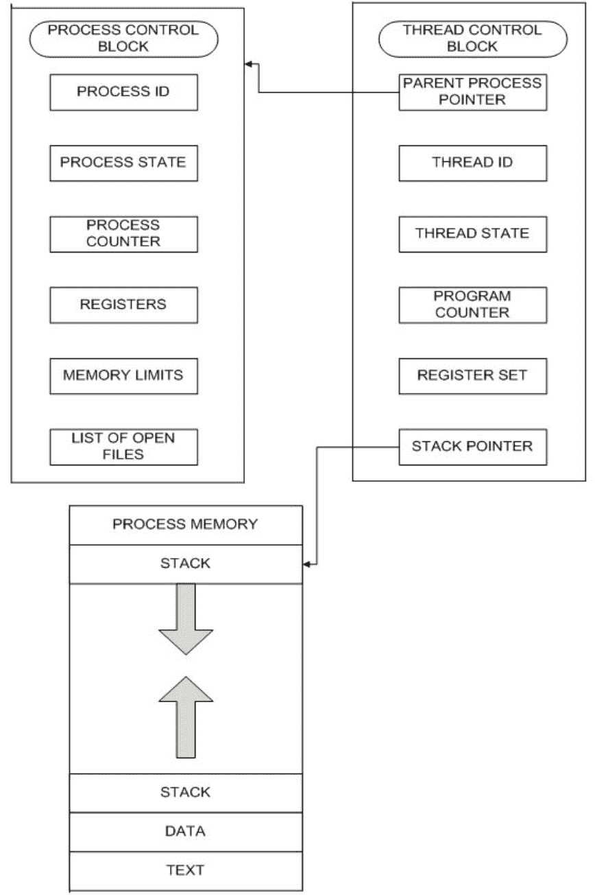

图 10.2：进程与线程之间的关系


## 第 10 章：源代码

图 10.3：源代码


图 10.4：守护线程继承流程图


图 10.5：多个线程访问临界区

```
$ python prog1_thread.py
Lock acquired by main thread
Lock again is trying to acquire by main thread
```

图 10.6：示例 10.34 的输出

| 输出出现的顺序 | 原因 |
| :--- | :--- |
| Acquired by Saurabh and counter value is: 1 | 名为 Saurabh 的第 1 个线程会锁定对象。因此，计数器值减 1。现在计数器值为 1。 |
| Saurabh hits 6 | 第 1 个线程开始执行。当 ‘i’ 值为 0 时显示输出。 |
| Acquired by Divya and counter value is: 0 | 名为 Divya 的第 2 个线程会锁定对象。因此，计数器值减 1。计数器值为 0。 |
| Divya hits 6 | 第 2 个线程开始执行。当 i 为 0 时显示输出。 |
| Saurabh hits 4 | 第 1 个线程在 ‘i’ 值为 1 时显示输出。 |
| Divya hits 4 | 第 2 个线程在 ‘i’ 值为 1 时显示输出。 |
| Saurabh is out | 第 1 个线程在 ‘i’ 值为 2 时显示输出。 |
| Divya is out | 第 2 个线程在 ‘i’ 值为 2 时显示输出。 |
| Released by Saurabh and counter value is: 1 | 第 1 个线程已释放锁，计数值增加 1。现在计数器值为 1。 |
| Acquired by Aditya and counter value is: 0 | 现在，名为 Aditya 的第 3 个线程在第 1 个线程释放锁后锁定对象。 |
| Aditya hits 6 | 因此，计数器值减 1。现在计数器值又变为 0。 |
| Released by Divya and counter value is: 1 | 第 3 个线程开始执行。当 ‘i’ 为 0 时显示输出。 |
| Acquired by Vineet and counter value is: 0 | 第 2 个线程已释放锁，计数值增加 1。因此计数器值又变为 1。 |
| Vineet hits 6 | 名为 Vineet 的第 4 个线程在第 2 个线程释放锁后锁定对象。因此，计数器值减 1。所以计数器值又变为 0。 |
| Aditya hits 4 | 第 4 个线程开始执行。当 ‘i’ 为 0 时显示输出。 |
| Vineet hits 4 | 第 3 个线程在 ‘i’ 值为 1 时显示输出。 |
| Aditya is out | 第 4 个线程在 ‘i’ 值为 1 时显示输出。 |
| Vineet is out | 第 3 个线程在 ‘i’ 值为 2 时显示输出。 |
| Released by Aditya and counter value is: 1 | 第 4 个线程在 ‘i’ 值为 2 时显示输出。 |
| Acquired by Suman and counter value is: 0 | 第 3 个线程已释放锁，计数值增加 1。现在计数器值为 1。 |
| Suman hits 6 | 名为 Suman 的第 5 个线程在第 3 个线程释放锁后锁定对象。因此，计数器值减 1。所以计数器值又变为 0。 |
| Released by Vineet and counter value is: 1 | 第 5 个线程开始执行。当 ‘i’ 为 0 时显示输出。 |
| Suman hits 4 | 第 4 个线程已释放锁，计数值增加 1。因此计数器值又变为 1。 |
| Suman is out | 第 5 个线程在 ‘i’ 值为 1 时显示输出。 |
| Released by Suman and counter value is: 2 | 第 5 个线程在 ‘i’ 值为 2 时显示输出。 |
| | 最终，第 5 个线程已释放锁，计数值增加 1。因此，计数器值为 2。 |

**表 10.2：** 示例 10.36 的输出情景

## 附录

## 附录 A

### 其他 Python 模块

扫描下方二维码（图 A.1）访问附录 A：其他 Python 模块。


附录 A

*图 A.1：附录 A：其他 Python 模块的二维码*

## 附录 B

### 补充解答示例

扫描下方二维码（图 B.1）访问附录 B：补充解答示例。


**图 B.1：** 附录 B：补充解答示例的二维码

## 附录 C

### 字符串中的命令行参数

扫描下方二维码（图 C.1）访问附录 C：字符串中的命令行参数。


**图 C.1：** *附录 C：字符串中的命令行参数的二维码*

## 附录 D

### 部分 OS 模块方法/属性

扫描下方二维码（图 D.1）访问附录 D：部分 OS 模块方法/属性。


图 D.1：附录 D：部分 OS 模块方法/属性的二维码

## 附录 E

### 内置函数

扫描下方二维码（图 E.1）访问附录 E：内置函数。


**图 E.1：** 附录 E：内置函数的二维码

## 附录 F

### 补充编程练习

扫描下方二维码（图 F.1）访问附录 F：补充编程练习。


图 F.1：附录 F：补充编程练习的二维码

## 附录 G

### 客观题

扫描下方二维码（图 G.1）访问附录 G：客观题。


图 G.1：附录 G：客观题的二维码

## 索引

- `__import__()`，236
- `__main__`，273
- `__name__`，273
- `abs()`，236
- `acquire()`，564，576
- `active_count()`，552
- `add()`，385
- `all()`，236
- `any()`，236
- `append()`，80，335，350
- `ascii()`，236
- `AssertionError`，284
- `BaseClass`，201
- `BaseException`，201
- `bin()`，64，236
- `bool()`，91，99，236
- `break`，177
- `breakpoint()`，197
- `bytearray()`，236
- `bytes()`，76，236
- `callable()`，236
- `casefold()`，120
- `ceil`，34
- `center()`，120
- `chr()`，236
- `classmethod()`，236
- `clear()`，355，390，406，574
- `close()`，497
- `compile()`，236，305
- `complex()`，91，96，236
- `continue`，180
- `copy()`，359，386，411
- `count()`，121，349，376
- `Counter()`，423
- `def`，234，235
- `defaultdict()`，423
- `del()`，82
- `delattr()`，236
- `demojize()`，30
- `deque()`，422
- `dict`，89
- `dict()`，236，400，405
- `difference()`，392
- `difference_update()`，393
- `dir()`，236，272
- `disable()`，457
- `discard()`，389
- `divmod()`，236
- `docstring`，234
- `emojize()`，30
- `enable()`，457
- `endswith()`，123
- `enumerate()`，236
- `enumeration`，553
- `eval`，111
- `eval()`，236
- `except`，110，202，212，218
- `exec()`，236
- `expandtabs()`，124
- `extend()`，341，352
- `filter`，258
- `filter()`，236
- `finally`，212，228
- `find()`，125，132
- `finditer()`，306
- `float()`，91，95，236
- `floor`，34
- `for`，61，172，185
- `format()`，126，236
- `format_map()`，131
- `fromkeys()`，414
- `frozenset`，88
- `frozenset()`，236
- `get()`，406，578
- `getattr()`，236
- `hasattr()`，236，477
- `hash()`，236
- `help()`，236
- `hex()`，65，236
- `id()`，104，236
- `if`，166
- `if-elif-else`，168
- `if-else`，167
- `in`，61，184
- `index()`，125，132，340，349，377
- `IndexError`，85，115
- `input()`，107，236
- `insert()`，337，351
- `int`，62
- `int()`，91，92，200，236
- `intersection()`，391
- `intersection_update()`，392
- `isalnum()`，133
- `isalpha()`，134
- `isdecimal()`，135
- `isdigit()`，136
- `isdisjoint()`，395
- `isenabled()`，457
- `isidentifier()`，136
- `isinstance()`，236
- `islower()`，137
- `isnumeric()`，138
- `isprintable()`，139
- `isspace()`，140
- `issubclass()`，236
- `issubset()`，396
- `issuperset()`，396
- `istitle()`，140
- `isupper()`，141
- `items()`，411
- `iter()`，236
- `join()`，142，555，556
- `keys()`，409
- `Lambda`，256
- `lambda`，254，256
- `len()`，72，236，349，376，406
- `list`，20
- `list()`，236，345
- `ljust()`，143
- `lower()`，144
- `lstrip()`，144
- `maketrans()`，145，162
- `map`，257
- `map()`，236
- `max()`，236，380
- `memoryview()`，236
- `memoryview(obj)`，90
- `min()`，236，380
- `mymsgprint()`，561
- `mynum()`，434
- `namedtuple()`，421
- `NameError`，108，194，249，269
- `Namespaces`，200
- `next()`，236，417
- `object()`，236
- `oct()`，64，236
- `open()`，236，494
- `ord`，21
- `ord()`，236
- `OrderedDict`，422
- `partition()`，146
- `pass`，184
- `pdb`，192
- `pop()`，338，353，387，407
- `popitem()`，408
- `pow()`，236
- `print()`，17，236
- `print(f)`，21
- `property()`，236
- `put()`，578
- `range()`，174，236
- `range();`，84
- `raw_input()`，107
- `re.escape()`，324
- `re.findall()`，320
- `re.fullmatch()`，318
- `re.match()`，317
- `re.search()`，319
- `re.split()`，323
- `re.sub()`，321
- `reduce()`，259
- `release()`，565，576
- `reload()`，271，272
- `remove()`，81，339，352，388
- `replace()`，147
- `repr()`，236
- `reverse()`，341，355
- `reversed()`，236
- `rfind()`，148，150
- `rindex()`，150
- `rjust()`，151
- `round()`，35，236
- `rpartition()`，153
- `rsplit()`，154，155
- `rstrip()`，155
- `sep`，19
- `set`，87
- `set()`，236，384，574
- `set_trace()`，192
- `setattr()`，236
- `setdefault()`，412
- `sleep()`，271
- `slice()`，236
- `slicing`，348
- `slicing()`，342
- `sort()`，356
- `sorted()`，236，378
- `split()`，155，156，345
- `splitlines()`，157
- `start()`，558，562
- `startswith()`，158
- `str`，70，109
- `str()`，91，100，236
- `string.capitalize()`，119
- `strip()`，159
- `sum()`，236
- `super()`，236
- `swapcase()`，160
- `symmetric_difference()`，394
- `symmetric_difference_update()`，394
- `title()`，161
- `translate()`，145，162
- `try`，110，202，212，218
- `try-except`，222
- `try-except-else-finally`，216，221，222，228
- `try-except-finally`，209，214
- `try-finally`，222
- `tuple`，20，82，206
- `tuple()`，236，371
- `type()`，236
- `TypeError`，85，192，195
- `UnicodeEncodeError`，123
- `union()`，390
- `update()`，386，413
- `upper()`，162
- `ValueError`，110，200，206
- `values()`，410
- `vars()`，236
- `wait()`，574
- `while`，175
- `ZeroDivisionError`，199，206
- `zfill()`，163
- `zip()`，236