# 使用Python的编程技巧

## 玩转基础与高级Python核心，乐在其中

SAURABH CHANDRAKAR

DR. NILESH BHASKARRAO BAHADURE

第一版 2022
版权所有 © BPB Publications, India
ISBN: 978-93-89845-89-1

保留所有权利。未经出版商事先书面许可，不得以任何形式或任何方式复制、分发或传播本出版物的任何部分，也不得将其存储在数据库或检索系统中，但程序清单除外，这些清单可以输入、存储和执行在计算机系统中，但不能通过出版、影印、录音或任何电子和机械手段进行复制。

## 责任限制与免责声明

本书所含信息在作者和出版商所知范围内真实准确。作者已尽一切努力确保这些出版物的准确性，但对于因本书中任何信息引起的任何损失或损害，出版商概不负责。

本书中提及的所有商标均被确认为其各自所有者的财产，但BPB Publications无法保证这些信息的准确性。

www.bpbonline.com

## 前言

如今，在竞争激烈的快节奏世界中，每个学生/程序员都在纠结作为初学者学习哪种语言最好。无论背景如何，他们现在都更渴望成为一名软件程序员，为自身和国家的发展做出贡献。因此，过去几年，许多程序员和初学者的选择是Python，因为它易于学习和使用。Python在所有发达国家都有教授，现在印度几乎所有机构都引入了Python，包括印度理工学院、国家理工学院和许多不同的大学。许多初学者选择Python进行学习，因为它涵盖了C语言中介绍的所有概念。

Python的受欢迎程度与日俱增，未来即使不增加，也会持续下去。技术领域从Spark到Golang多种多样，但Python在这里使用最为广泛。Python被许多跨国公司使用，如谷歌、Netflix、Instagram、高通、优步、美国宇航局、脸书等。在印度，即使是像印度重型电力设备公司和印度空间研究组织这样的公共部门企业也使用Python。印度空间研究组织使用Python处理从不同卫星和空间设备收集的数据。印度重型电力设备公司使用Python用于不同的发电厂应用程序。任何从事人工智能领域的公司都会使用Python语言。软件行业为Python开发者支付高薪。Python将在几年内超越Java语言。

每个对计算机编程语言感兴趣的学生，即使是在大学阶段才引入，也必须从学校阶段就开始学习Python。这将有助于增强信心，而且学习这门语言永远不会太晚。可以用这门语言构建许多不同的应用程序，但需要具备相应的技能。你可以将其作为锦上添花添加到你的简历中。上面这本书是用非常简单的语言编写的，即使是中等水平的学生也能理解。外国作者编写的关于Python的书籍非常难以理解。一个人可以以非常简单的方式学习和理解核心和高级概念。我们逐点讨论了每个代码的输出及其参考，并添加了大量注释以帮助更好地理解。学习Python和本书不需要任何其他语言的先验知识。这只是第一部分，涵盖了从基础到高级的主题。此外，还涵盖了使用Tkinter解释不同组件的图形用户界面主题。提供了大量带有逐步代码解释的已解决示例，清晰明了。流行的开源编程语言Python在今年IEEE顶级编程语言榜单中稳居榜首。在这份包含55种语言的榜单中，Python在2020年排名第一。

## 本书内容

这本关于Python的书包含11章，涵盖了一系列不同的主题。

**第1章**将涵盖编写Python程序的基本要素，读者可以理解基本主题。

**第2章**将介绍字符串方法、命令行参数、字符串访问和格式化字符串。

**第3章**将涵盖条件语句、迭代语句、转移语句、异常处理和调试分析的概念。它将涵盖使用try-except块的多种方式，以防止运行时错误。此外，用户可以创建自己的异常来处理错误。

**第4章**将关于函数。本章讨论函数类型、不同类型的函数参数，如位置参数、关键字参数、默认参数、可变长度参数和kwargs。解释了不同类型的变量、闭包、lambda函数以及迭代器和可迭代对象之间的区别。

**第5章**涉及模块，特别是日志记录模块，并提供了定义明确的示例。此外，还很好地解释了包的概念及其用法。

**第6章**涉及一种声明性机制，用于根据称为正则表达式的特定模式表示一组字符串，这相当难以理解并执行其用法。每个正则表达式都以非常清晰的方式通过示例进行了解释。

**第7章**是关于非原始内置数据结构，如数组、列表、元组、集合、字典和文件，它们各自都是独特的。讨论了所有数据结构的定义、方法、不同类型的推导式，如列表推导式、元组推导式、集合推导式和字典推导式。以简单的方式解释了关于生成器的特殊概念及示例。

**第8章**涉及面向对象编程概念、类、对象、装饰器、静态变量、局部变量和实例变量。讨论了局部方法、类方法和静态方法，重点是在Python中实现这些概念。理解面向对象编程概念非常重要，它是所有面向对象编程语言的平台。读者将能够了解如何创建一个类并为其创建对象。重要概念如多态性、组合、继承、封装等，都以非常清晰的方式进行了讨论。此外，读者在完全阅读上述章节后，将了解抽象类、接口、如何使用及其区别。

**第9章**将提供有关访问文件的信息，这些文件可以是文本文件、zip文件、二进制文件或CSV文件。pickle概念也得到了很好的解释。读者还可以了解如何处理日期和时间模块。

**第10章**涉及多任务和多种线程创建方式。我们在上一章中解释了如何执行单任务和多任务。此外，还很好地讨论了高级概念，如使用锁、可重入锁和信号量的线程同步，以及使用事件对象、条件和队列的线程间通信。

本书的每一章大多以已解决示例和必做练习（作为额外补充材料提供）结束。此外，读者可以为面试准备上述问题，并在家中进行自我提升的练习。

“Super-100 目标类型问题”专为练习各类 Python 认证考试而设。为强化练习和复习概念，本书额外提供了按章节划分的习题解答示例。同时，书中涵盖了不同的 Python 模块。迄今为止，作者们从未在单一书籍中呈现过如此全面的概念与材料，因此本书充分满足了每位 Python 学习者的基本需求。本书适用于所有学生、教授、研究人员、专业人士以及每一位 Python 爱好者。所以，尽情享受学习 Python 的乐趣吧。

## 本书使用的 Python 版本

我们使用 Python 3.7.3 版本，并在 Visual Studio Code 中执行了所有 Python 代码。但同样的代码也可在 Pycharm、Jupyter notebook 等其他集成开发环境中运行。

## 致谢

首先，我要衷心感谢大家选择本书。上述书籍的编写非常优雅，完全考虑到初学者的需求。首先，我借此机会向我的导师“Nilesh Bahadure 教授”致以问候和感谢，感谢他激励我，并始终鼓励我完整地表达与 Python 相关主题的知识。我非常感激能成为他的学生。我感谢他信任我，始终支持我，并不断推动我取得更多成就。他总是让我铭记“千里之行，始于足下”。我始终想向我的父母 Dr Surendra Kumar Chandrakar 和 Smt. Bhuneshwari Chandrakar、我的兄弟“Shri Pranav Chandrakar”、我亲爱的妻子 Mrs. Priyanka Chandrakar 以及我所有的朋友表达最深切的温暖之情，感谢他们一直以来的激励和对我信心的提升。

最后但同样重要的是，我要特别感谢出版商“BPB Publication Private Limited”及其团队，感谢他们的洞察力和贡献，没有他们，本书的部分内容可能无法完成。

> **Saurabh Chandrakar**

我荣幸地感谢 Ghodawat Industries 和 Sanjay Ghodawat University Kolhapur 的主席 Shri. Sanjay D. Ghodawat，以及 Beekay Industries Bhilai 和 BIT Trust 的主席 Shri. Vijay Kumar Gupta，感谢他的鼓励和支持。我要感谢我的导师们：KIIT Deemed to be University, Bhubaneswar 电子工程学院院长 Dr. Arun Kumar Ray，以及 ITIT Pune 的主任 Dr. Anupam Shukla。我要感谢 SGU Kolhapur 的受托人 Shri. Vinayak Bhosale、SGU Kolhapur 的副校长 Dr. Arun Patil，感谢他们在本书编写过程中给予的建议和鼓励。

我感谢 SASTRA University, Thanjavur, Tamil Nadu 的高级助理教授 Prof. Dr. N. Raju，感谢他在写作过程中的支持、协助以及宝贵的建议。

我还要感谢 SGU Kolhapur 航空工程系主任 Dr. Sanjeev Khandal、SGU Kolhapur 电子工程系副教授 Dr. P.D. Patil、SGU Kolhapur 电子工程系的所有教职员工，以及我在 Bhilai Institute of Technology Raipur 的同事 Prof. Md. Khwaja Mohiddin、已故的 Prof. Sankalp Verma 和 Prof. Shravan Kumar Singh，感谢他们在整个项目过程中提供的宝贵建议和大量鼓励。

撰写一本优美、平衡且内容丰富的书籍并非一两天或一两个月的工作，它需要大量的时间和耐心，需要数小时的辛勤工作。感谢我们的家庭成员、我们的父母、妻子、孩子和我们的祝福者们，感谢他们善意的支持。没有他们及其信念和支持，撰写这本经典著作只是一个梦想。我也要感谢我的学生们，他们一直与我在一起，提出问题并共同寻找解决方案。

我还要感谢印度马哈拉施特拉邦索拉普尔区巴尔希的 MAEER’s MIT College of Railway Engineering & Research 的执行董事 Mrs. Swati Karad-Chate，感谢她持续的鼓励。任何工作的完美并非一日之功，它需要大量的努力、时间和辛勤工作，有时通过适当的指导，我将从心底深处感谢 SSGMCE Shegaon 电子与电信工程系的教授 Prof. (Dr.) Ram Dhekekkar 和 Nagpur UGC Staff College 的主任 Dr. C. G. Dethes。

最后但同样重要的是，我要向出版商“BPB Publications”及其整个团队表示感激和特别的感谢，感谢他们的洞察力和贡献，使本书得以成为现实。

最重要的是，我要将荣耀归于神 Lord Ganesha，感谢我在本书编写过程中付出的所有努力。若非神对宇宙的奇妙创造，我不会对 Python 有如此的热情。

> “因为，自从造天地以来，神的永能和神性是明明可知的，虽是眼不能见，但借着所造之物就可以晓得，叫人无可推诿。”

Dr. Nilesh Bhaskarrao Bahadure

## 勘误

我们在 BPB Publications 对工作感到无比自豪，并遵循最佳实践以确保内容的准确性，为订阅者提供沉浸式的阅读体验。我们的读者是我们的镜子，我们利用他们的反馈来反思并改进出版过程中可能出现的任何人为错误。为了让我们保持质量并帮助我们联系到任何可能因任何不可预见的错误而遇到困难的读者，请写信给我们：
errata@bpbonline.com
BPB Publications 大家庭非常感谢您的支持、建议和反馈。

> 您知道吗？BPB 为出版的每本书都提供电子书版本，提供 PDF 和 ePub 文件？您可以在 www.bpbolone.com 升级到电子书版本，作为印刷书客户，您有权享受电子书副本的折扣。请通过 business@bpbolone.com 联系我们了解更多详情。
在 www.bpbolone.com，您还可以阅读免费技术文章合集，注册各种免费通讯，并接收 BPB 书籍和电子书的独家折扣和优惠。

## 献词

献给我的父母
Dr Surendra Kumar Chandraker 和 Smt. Bhuneshwari Chandrakar
兄弟
Shri Pranav Chandrkar
以及
我的妻子 Priyanka Chandrakar

Saurabh Chandrakar

献给我的父母
Smt. Kamal B. Bahadure
和
已故的 Bhaskarrao M. Bahadure
献给我的岳父母
Smt. Saroj R. Lokhande 和 Shri. Ravikant A. Lokhande
以及
我的妻子 Shilpa N. Bahadure
以及美丽的女儿们
Nishita 和 Mrunmayee
以及我所有的亲爱的学生们。

Dr. Nilesh Bhaskarrao Bahadure

## 目录

+   I Python 基础
1 Python 基础
1.1 简介
1.2 关键字/保留字
1.3 标识符
1.4 隐式和显式行连接方法
1.4.1 隐式行连接方法
1.4.2 显式连接方法
1.5 Print 函数
1.5.1 使用 print 函数的不同样式：
1.6 转义序列
1.7 作为普通文本的转义字符
1.8 注释、缩进及其重要性
1.9 原始字符串和表情符号
1.10 运算符基础和类型
1.11 运算符优先级
1.12 基本的 Hello World 程序
1.13 变量
1.13.1 助记变量名的重要性
1.14 数据类型
1.14.1 int 数据类型
1.14.2 float 数据类型
1.14.3 Complex 数据类型
1.14.4 Bool 数据类型
1.14.5 str 类型
1.14.6 bytes 数据类型
1.14.7 bytearray 数据类型
1.14.8 list 数据类型
1.14.9 tuple 数据类型
1.14.10 range 数据类型
1.14.11 set 数据类型
1.14.12 frozenset 数据类型
1.14.13 dict 数据类型
1.14.14 memoryview 数据类型
1.15 数据类型转换
1.16 不可变性与基本数据类型的概念
1.17 命名空间

# 2 Python 字符串

+   2.1 从键盘读取动态输入
2.2 字符串
2.3 Python 多行字符串
2.4 Python 字符串访问
2.4.1 使用索引
2.4.2 使用切片运算符
2.5 Python 字符串方法
2.5.1 字符串 capitalize()。
2.5.2 字符串 casefold()。
2.5.3 字符串 center()。
2.5.4 字符串 count()。
2.5.5 字符串 encode()。
2.5.6 字符串 endswith()。
2.5.7 字符串 expandtabs()。
2.5.8 字符串 find()。
2.5.9 字符串 format()。
2.5.10 字符串 format_map()。
2.5.11 字符串 index()。
2.5.12 字符串 isalnum()。
2.5.13 字符串 isalpha()。
2.5.14 字符串 isdecimal()。
2.5.15 字符串 isdigit()。
2.5.16 字符串 isidentifier()。
2.5.17 字符串 islower()。
2.5.18 字符串 isnumeric()。
2.5.19 字符串 isprintable()。
2.5.20 字符串 isspace()。
2.5.21 字符串 istitle()。
2.5.22 字符串 isupper()。
2.5.23 字符串 join()。
2.5.24 字符串 ljust()。

### 2.5.25 String.lower()
2.5.26 String.lstrip()
2.5.27 String.maketrans()
2.5.28 String.partition()
2.5.29 String.replace()
2.5.30 String.rfind()
2.5.31 String.rindex()
2.5.32 String.rjust()
2.5.33 String.rpartition()
2.5.34 String.rsplit()
2.5.35 String.rstrip()
2.5.36 String.split()
2.5.37 String.splitlines()
2.5.38 String.startswith()
2.5.39 String.strip()
2.5.40 String.swapcase()
2.5.41 String.title()
2.5.42 String.translate()
2.5.43 String.upper()
2.5.44 String.zfill()

# 3 Python 决策与流程控制

#### 3.1 选择语句 / 条件语句
3.1.1 if
3.1.2 if-else
3.1.3 if-elif-else
## 3.2 迭代语句
3.2.1 for
3.2.2 while
## 3.3 跳转语句
3.3.1 break
3.3.2 continue
3.3.3 pass
#### 3.4 `in` 关键字用法
3.4.1 循环模式
3.4.2 星号模式
3.4.3 字母模式
3.4.4 数字模式
## 3.5 调试分析
## 3.6 Python 3 中的异常处理
3.6.1 语法错误
3.6.2 运行时错误
3.6.3 异常处理的重要性
3.6.4 Python 异常层次结构
3.6.5 自定义异常处理
3.6.6 `try-except` 中的控制流
3.6.7 向控制台打印异常信息
3.6.8 包含多个 `except` 块的 `try`
3.6.9 单个处理多种异常的 `except` 块
3.6.10 默认的 `except` 块
3.6.11 `except` 块的可能组合
3.6.12 `finally` 块
3.6.13 `try-except` 和 `finally` 中的控制流
3.6.14 嵌套的 `try-except-finally` 块
3.6.15 嵌套 `try-except-finally` 块中的控制流
3.6.16 `try-except-finally` 块中的 `else` 块
3.6.17 `try-except-else-finally` 块的可能组合
3.6.18 异常类型
## 3.7 DRY 原则

## II Python 函数

# 4 Python 函数

### 4.1 函数简介
### 4.2 函数类型
4.2.1 内置函数
4.2.2 用户自定义函数
### 4.3 函数参数
4.3.1 位置参数
4.3.2 关键字参数
4.3.3 默认参数
4.3.4 可变长度参数
4.3.5 关键字可变长度参数 (`kwargs`)。
## 4.4 嵌套函数
## 4.5 Python 闭包
## 4.6 函数作为参数传递
#### 4.7 局部、全局和非局部变量
4.7.1 局部变量
4.7.2 全局变量
4.7.3 非局部变量
## 4.8 递归函数
#### 4.9 Python Lambda 函数
4.9.1 嵌套 Lambda 函数
4.9.2 将 Lambda 函数传递给另一个函数
4.9.3 立即调用函数执行 (IIFE)。
4.9.4 Python Lambda 与 `map()`。
4.9.5 Python Lambda 与 `filter()`。
4.9.6 Python Lambda 与 `reduce()`。
## 4.10 按对象引用传递或调用
#### 4.11 包含所有类型参数的函数 (PADK)
## 4.12 迭代器 vs 可迭代对象
## 4.13 Python 柯里化函数

# 5 Python 模块与包

### 5.1 Python 模块简介
#### 5.2 重命名导入
#### 5.3 `from ... import` 语句
#### 5.4 Python 模块重载
#### 5.5 特殊变量名
#### 5.6 `logging` 模块
5.6.1 日志级别
5.6.2 日志实现
5.6.3 格式化日志消息
5.6.4 变量数据日志
5.6.5 堆栈跟踪捕获
5.6.6 `logging` 模块中的类
## 5.7 使用断言进行调试
## 5.8 Python 包

# 6 Python 正则表达式

#### 6.1 `compile()`
#### 6.2 `finditer()`
## 6.3 字符类
## 6.4 预定义字符类
#### 6.5 量词
#### 6.6 `re` 模块的函数
## 6.7 元字符
#### 6.8 `r` 前缀

## III Python 数据结构

# 7 Python 数据结构

## 7.1 数组数据结构
7.1.1 一维数组
7.1.2 一维数组创建
7.1.3 空数组创建
7.1.4 索引
7.1.5 使用 `for` 循环访问数组
7.1.6 使用 `while` 循环访问数组
7.1.7 数组中的 `append` 方法
7.1.8 使用 `for` 循环提示用户输入数组
7.1.9 使用 `while` 循环提示用户输入数组
7.1.10 数组中的 `insert` 方法
7.1.11 数组中的 `pop` 方法
7.1.12 数组中的 `remove` 方法
7.1.13 数组中的 `index` 方法
7.1.14 数组中的 `reverse` 方法
7.1.15 数组中的 `extend` 方法
7.1.16 数组中的切片方法

## 7.2 列表数据结构
7.2.1 创建列表
7.2.2 列表 vs 不可变性
7.2.3 访问列表元素
7.2.4 列表函数和方法
7.2.5 列表对象的别名
7.2.6 列表对象的克隆
7.2.7 列表对象的数学运算符
7.2.8 列表对象比较
7.2.9 嵌套列表
7.2.10 列表推导式

## 7.3 元组数据结构
7.3.1 元组创建
7.3.2 访问元组元素
7.3.3 元组 vs 不可变性
7.3.4 元组对象的数学运算符
7.3.5 修改元组对象
7.3.6 从用户获取元组输入
7.3.7 元组函数和方法
7.3.8 元组打包与解包
7.3.9 元组推导式
7.3.10 嵌套元组
7.3.11 列表 vs 元组比较

## 7.4 集合数据结构
7.4.1 集合创建
7.4.2 集合方法
7.4.3 在集合上执行数学运算的方法
7.4.4 集合推导式

## 7.5 字典数据结构
7.5.1 创建空字典
7.5.2 创建字典
7.5.3 访问字典
7.5.4 修改字典
7.5.5 删除字典项
7.5.6 字典方法和函数
7.5.7 字典推导式

## 7.6 生成器

#### 7.7 `collections` 模块

# 8 Python 面向对象编程

### 8.1 类
8.1.1 类定义

## 8.2 对象

## 8.3 引用变量

#### 8.4 `self` 变量

## 8.5 构造函数概念

## 8.6 装饰器
8.6.1 函数装饰器
8.6.2 装饰器链
8.6.3 类装饰器

## 8.7 对象级变量或实例变量
8.7.1 实例变量的声明位置
8.7.2 访问实例变量
8.7.3 从对象中删除实例变量

#### 8.8 类级变量或静态变量
8.8.1 声明静态变量的不同位置
8.8.2 访问静态变量
8.8.3 修改静态变量
8.8.4 删除静态变量

## 8.9 局部变量

## 8.10 实例方法
8.10.1 Getter / 访问器方法
8.10.2 Setter / 修改器方法

## 8.11 类方法

## 8.12 静态方法

#### 8.13 一个类的成员访问另一个类的成员

## 8.14 内部类

## 8.15 垃圾回收器

## 8.16 析构函数

## 8.17 组合与继承
8.17.1 组合
8.17.2 继承

#### 8.18 `super()` 概念

## 8.19 多态
8.19.1 鸭子类型
8.19.2 Python 中的重载概念
8.19.3 Python 中的重写概念
8.19.4 构造函数重写

## 8.20 访问修饰符与封装

## 8.21 抽象类

#### 8.22 接口

# 9 Python 文件处理

### 9.1 简介
### 9.2 文件
### 9.3 打开文件
## 9.4 关闭文件
## 9.5 文件对象属性和方法
#### 9.6 向文本文件写入数据
9.6.1 `write()` 方法
9.6.2 `writelines()` 方法

## 9.7 从文本文件读取字符数据

## 9.8 `with` 语句

#### 9.9 文件方法

## 9.10 二进制数据处理

## 9.11 CSV 文件处理
9.11.1 向 CSV 文件写入数据
9.11.2 从 CSV 文件读取数据

#### 9.12 文件压缩与解压缩
9.12.1 执行压缩操作
9.12.2 执行解压缩操作

#### 9.13 对象的序列化与反序列化

## 9.14 日期和时间
9.14.1 `time` 模块
9.14.2 `datetime` 模块

# 10 Python 多线程

#### 10.1 多任务处理
10.1.1 基于进程的多任务处理
10.1.2 基于线程的多任务处理

### 10.2 线程创建
10.2.1 不使用任何类创建线程
10.2.2 通过继承 `Thread` 类创建线程
10.2.3 不继承 `Thread` 类创建线程

## 10.3 设置和获取线程名称

## 10.4 使用线程执行单任务

## 10.5 线程标识号

#### 10.6 `active_count`

#### 10.7 `enumerate`

#### 10.8 `isAlive`

#### 10.9 `join`

#### 10.10 守护线程和非守护线程
10.10.1 创建守护线程
10.10.2 线程的默认性质

## 10.11 使用多个线程进行多任务处理

## 10.12 线程竞态条件

## 10.13 线程同步
10.13.1 使用锁 (`Lock`)
10.13.2 使用可重入锁 (`RLock`)
10.13.3 使用信号量

## 10.14 线程间通信 (ITC)
10.14.1 使用 `Event` 对象进行线程间通信
10.14.2 使用 `Condition` 进行线程间通信
10.14.3 使用 `Queue` 进行线程间通信

### 10.15 良好编程实践的一些技巧

## 附录

## 附录

## 附录 A 其他一些 Python 模块

## 附录 B 额外的已解决示例

## 附录 C 字符串中的命令行参数

## 附录 D 一些 `os` 模块的方法/属性

## 附录 E 内置函数

## 附录 F 用于练习的额外编程题

## 附录 G 客观题

## 索引

# 图目录

- 1.1 Python版本
- 1.2 Python 3.7.3交互式解释器
- 1.3 保存为hello.py的Python文件
- 1.4 在Python 3.7.3交互式解释器中的输出
- 1.5 pwd命令
- 1.6 ls命令
- 1.7 ls -l命令
- 1.8 clear命令
- 1.9 cd命令
- 1.10 mkdir命令
- 1.11 不带双引号的mkdir命令
- 1.12 带双引号的mkdir命令
- 1.13 移动到文件夹
- 1.14 touch命令（创建文本文件）
- 1.15 touch命令（创建Python文件）
- 1.16 删除文本文件
- 1.17 返回上一级文件夹的命令
- 1.18 rm -rf命令
- 1.19 mv命令（重命名）
- 1.20 mv命令（移动文件到文件夹）
- 1.21 cp命令
- 1.22 history命令
- 1.23 示例1.50的输出
- 1.24 示例1.51的输出
- 1.25 示例1.52的输出
- 1.26 示例1.82的操作
- 1.27 示例1.83的操作
- 1.28 半杯水的玻璃杯
- 1.29 源代码
- 1.30
- 1.31 示例的操作
- 2.1 源代码
- 3.1 if语句流程图
- 3.2 示例3.1的流程图
- 3.3 if-else语句流程图
- 3.4 示例3.2的流程图
- 3.5 if-elif-else语句流程图
- 3.6 示例3.3的流程图
- 3.7 示例3.4的流程图
- 3.8 for循环流程图
- 3.9 while循环流程图
- 3.10 break语句流程图
- 3.11 continue语句流程图
- 3.12 Python异常层次结构
- 3.13 源代码
- 4.1 Python中的函数
- 5.1 源代码
- 5.2 包概览
- 5.3 游戏包结构
- 5.4 Games包
- 5.5 Cricket包
- 5.6 India包
- 5.7 Football包
- 5.8 Kabaddi包
- 6.1 源代码
- 7.1 源代码
- 8.1 源代码
- 8.2 组合与组件的关系（HAS-A）
- 9.1 源代码
- 10.1 桌面应用程序
- 10.2 进程与线程的关系
- 10.3 源代码
- 10.4 守护线程继承流程图
- 10.5 多个线程访问临界区
- 10.6 示例10.34的输出
- A.1 附录A（其他一些Python模块）的二维码
- B.1 附录B（额外的已解示例）的二维码
- C.1 附录C（字符串中的命令行参数）的二维码
- D.1 附录D（一些OS模块的方法/属性）的二维码
- E.1 附录E（内置函数）的二维码
- F.1 附录F（额外的编程练习）的二维码
- G.1 附录G（客观题）的二维码

# 表目录

- 1.1 转义序列及其含义
- 1.2 AND运算符逻辑
- 1.3 OR运算符逻辑
- 1.4 NOT运算符逻辑
- 1.5 运算符的优先级顺序
- 1.6 不可变性
- 2.1 字符串格式中使用的格式说明符
- 2.2 换行符
- 3.1
- 4.1 内置函数
- 5.1 日志级别
- 6.1 字符类
- 6.2 预定义字符类
- 6.3 量词字符
- 7.1 数组中使用的类型码
- 7.2 列表与元组的区别
- 8.1 二元运算符
- 8.2 赋值运算符
- 8.3 比较运算符
- 8.4 一元运算符
- 9.1 Python中文本文件的模式
- 9.2 Python中二进制文件的模式
- 10.1 Lock与RLock的区别
- 10.2 示例10.36的输出场景

# 第一部分

### Python基础

# # 第1章

# ## Python基础

本章向用户介绍Python编程语言的基本信息。读者将深入了解为什么Python在几乎所有科学和工程领域都如此受欢迎。

#### 1.1 引言

我们许多人起初常常困惑于应该选择哪个工程学科来促进自己的职业发展。因为所有工程学科各有其优势，而最常被想到的高需求学科是计算机科学。为什么不呢？优秀的程序员在大型跨国公司获得的报酬非常高。但成为一个聪明的程序员比成为一个优秀的程序员更重要。任何程序都可以用'n'行代码编写出来。但聪明的程序员能用更少的代码行数、更丰富的逻辑来编写代码。自然而然，第一个想到的问题应该是从哪种编程语言开始我们的职业生涯。毫无疑问，任何程序员都必须知道'C'编程语言，它是所有语言的鼻祖。这是因为无论哪个学科，C语言的概念都被用于各种领域，如VHDL、C#、VB.net、C++等。但在本书中，我们将讨论当今最受欢迎的编程语言之一——“Python”。在开始学习Python语言之前，理解一些基本问题很重要，比如什么是Python，它用来做什么，它能做什么，谁开发了这门语言，为什么选择Python等等。

计算机是一种机电设备，它根据变量程序中给出的指令，以二进制形式存储和处理数据。计算机不是自行操作的设备，它需要从被称为“程序员”或“开发者”的人那里获取指令。因此，程序员将给计算机下达指令。程序无非就是一组指令的集合。要编写程序，我们需要一种语言。程序员编写的语言被称为编程语言。编程语言有很多种，但我们将专注于Python编程语言。Python是一种高级通用编程语言，用于开发不同类型的应用程序。在1990年代初，Python编程语言由吉多·范罗苏姆创建（其实现始于1989年12月，当时他在荷兰国家研究所工作）。Python语言甚至比Java语言还要古老。Python这个名字来源于英国最受欢迎的讽刺喜剧系列之一“巨蟒剧团之飞翔的马戏团”。第一个Python版本0.9.0发布于1991年2月。下一个Python版本1.0发布于1994年1月。Python版本2.0发布于2000年10月。版本3.0于2008年12月推出。截至今日，最新版本是2019年7月发布的3.7.4。理解我们为什么需要学习Python很重要，因为它包含各种优势。

1.  Python对初学者来说是免费且开源的。如果任何人是初学者，Python是最好的入门语言。对于Java，商业组织是Oracle；对于C#.net，商业组织是Microsoft；但对于Python，商业组织是Python软件基金会。它是一个非营利组织，拥有Python编程语言的知识产权。网站是https://www.python.org。愉快的是，你可以在学习后捐赠一些款项。而且，源代码是开放的。根据我们的需求，我们可以定制Python本身。要使用Java应用程序，我们需要转向Jython；对于C#.net，是Iron Python；处理大数据需要Anaconda Python（用于机器学习、深度学习等）；处理Ruby应用程序需要Ruby Python。
2.  它非常简单且易于理解，因为它是一门高级语言。语法非常容易理解。我们无需担心底层活动，如内存管理、提供空闲空间等。内部由Python虚拟机负责处理。
3.  它是平台无关的。我们可以在不同的硬件平台上运行这门语言，如Linux、Mac、Windows、树莓派等。“一次编写，到处运行”是平台无关特性的概念。PVM负责在不同的平台上运行Python代码。PVM是平台相关的，而Python是平台无关的。在Python中，代码一旦编写就可以立即执行。因此，它运行在解释器系统上。不需要显式编译。
4.  程序员可以用比其他编程语言更少的代码行编写程序。因此，是更高效的编写代码方式或更简洁的编写代码方式。
5.  Python可以用作函数式、面向对象或面向过程的编程。
6.  Python拥有大量的库，用于各种实现，如NumPy、SciPy、Pandas等。
7.  它是可扩展的。我们可以在应用程序中使用遗留的非Python代码。我们可以用其他语言代码填补性能差距。
8.  它是可移植的语言。Python应用程序可以非常容易地从一个平台迁移到另一个平台。
9.  它是可嵌入的。我们可以在Java或C#.Net应用程序内部使用Python脚本。Python代码的作用域得到提升。因此，我们的应用程序将变得可扩展。
10. 它是动态类型的。我们不需要显式声明类型。根据我们提供的值，类型将被自动确定，从而为程序员提供更多灵活性。

```
示例：1.1
a=10
print(type(a))
a='Python'
print(type(a))
a=False
print(type(a))
```

```
输出：1.1
<class 'int'>
<class 'str'>
<class 'bool'>
```

Python语言与英语有相似之处，并且是为可读性而设计的。命令可以通过换行符完成，而不像

## Python编程语言概述

Python语言使用分号或括号的方式与其他编程语言不同。为了定义循环、类和函数的作用域，Python严重依赖缩进（如空白字符），而其他编程语言则使用花括号来实现这一目的。现在，任何初学者最可能产生的基本问题是：在哪里使用Python编程语言？Python语言用于：

- 1. 后端Web开发
- 2. 创建人工智能、科学计算、机器学习、深度学习、物联网等。
- 3. 桌面应用程序、3D图形、图形用户界面应用程序
- 4. 数据分析、网络应用程序（如客户端-服务器、聊天等）。
- 5. 连接数据库系统。它可以根据需要读取、写入、删除或更新数据。
- 6. 它可以执行非常复杂的数学运算并处理大数据。

优秀的Python开发者会为后端组件编写高效的代码，并进行测试和调试。优秀的开发者创建的应用程序可以与现有应用程序集成。Python被不同的公司使用，如Google、Facebook、Yahoo、NASA、DropBox、BitTorrent、Netflix、YouTube等。在Python中，大部分语法借鉴自C语言和ABC语言。除了优点，Python也有一些局限性：

- 1. Python不适合开发移动应用程序，因为目前它没有开发移动应用程序的库支持。
- 2. 它不是开发端到端企业应用程序（如银行、电信应用程序等）的最佳选择，因为没有库支持。
- 3. 性能较低，因为它是解释型语言，执行是逐行进行的。因此，JIT编译器被添加到Python虚拟机中，这样一组代码行只会被解释一次，每次使用解释后的代码时直接执行。上述版本称为PyPy版本（Python for speed）。

Python在2019年的受欢迎程度创下了纪录。根据Stack-Overflow，Python是被提问最多的新兴语言，领先于其竞争对手语言如JavaScript、C#等。GitHub将Python评为最受欢迎的语言榜首。要在系统上安装Python，请访问网站 https://www.python.org。然后转到下载选项卡，下载最新的Python版本（截至今天为3.7.4）。我们已经在Windows操作系统上安装了Python版本。我们所有的程序都将在Windows操作系统上进行。最好学习Python 3版本而不是版本2，因为截至今天，所有使用Python 2的跨国公司都已迁移到Python 3。Python 3.x被开发为完全独立的语言，而不是2.x版本的扩展。Python 3.x对Python 2.x没有向后兼容性，因为无法保证它会支持。此外，Python 2可能在不久的将来变得过时，因为库将不再维护。在安装过程中，需要注意的一个重要点是勾选复选框“Add Python 3.7 to Path”，否则在尝试安装自己的库时可能会出错。安装设置后，您就可以开始了。安装Python后，输入“cmd”并输入单词python。您将看到如图1.1所示的屏幕。这里，我们使用的是Python 3.7.3版本。在本书中，我们将学习Python 3.x而不是Python 2.x。

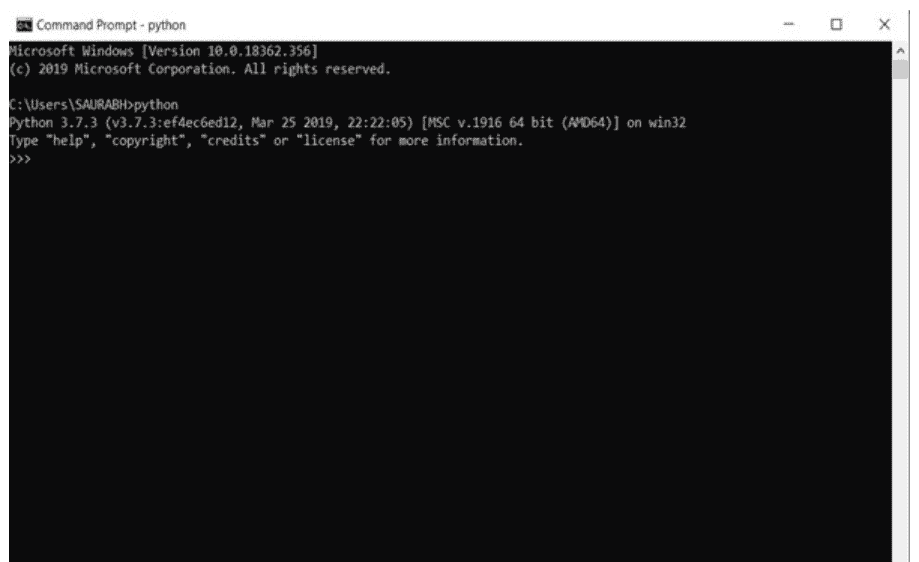

*图1.1：Python版本*

安装Python后，我们还会获得IDLE（Python的集成开发环境）。在这里，我们可以进行编码。它看起来如图1.2所示。

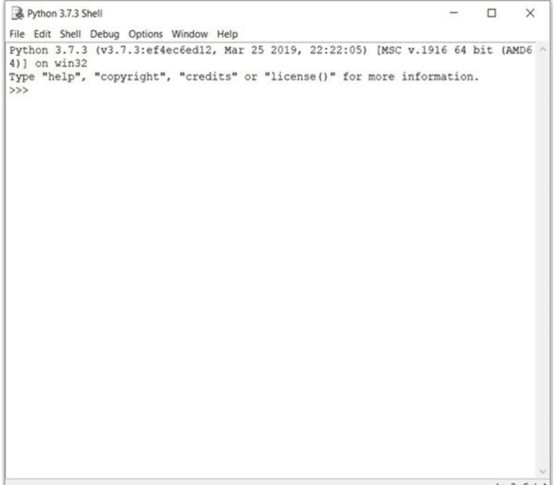

*图1.2：Python 3.7.3 shell*

转到文件 → 新建文件。
在文件中输入 `print('Hello World')` 并将其保存到相应的文件夹中。
点击运行 → 运行模块（F5），如图1.3所示。
输出 `Hello World` 将打印在IDLE屏幕上，如图1.4所示。

此外，您可以寻找其他IDE，如PyCharm、Jupyter等。但我们使用了Visual Studio Code（VsCode）并将gitbash集成到VsCode中。VsCode是由Microsoft开发的源代码编辑器，用于编写程序。它支持调试、语法高亮、代码重构、智能代码补全等。在开始Python基础知识之前，简要概述一下如何在VsCode中使用命令行。我们将学习如何借助命令行使用文件和文件夹，如何快速创建文件/文件夹并删除文件/文件夹，如何复制和移动文件到/从文件夹等。事不宜迟，让我们开始在VsCode的bash终端中输入命令。只需在bash终端中输入以下命令并查看输出。命令以粗体字母输入。

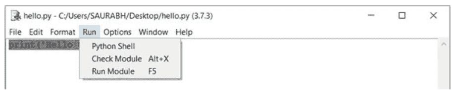

*图1.3：保存为hello.py的Python文件*

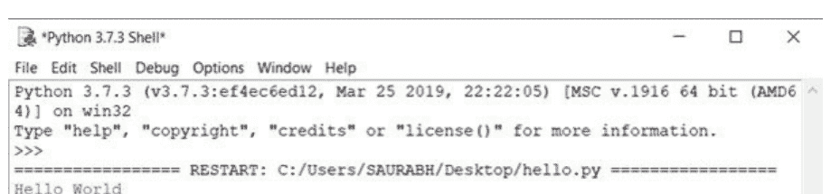

*图1.4：Python 3.7.3 shell中的输出*

**pwd：** 打印工作目录。它将显示当前工作目录的位置。从终端输出（如图1.5所示）我们可以看到工作目录是E:/python_progs。


*图1.5：pwd*

**ls：** 它将显示终端中文件和文件夹的列表。从终端输出（如图1.6所示）我们可以看到文件系统内文件和目录的列表。

**ls -l：** 它将以长列表格式显示终端中文件和文件夹的列表。从终端输出1.7我们可以看到文件系统内文件和目录的列表，包括所有者、权限。由于内容列表很长，即这里总共有412个文件，只显示了其中一部分。

**clear：** 它将清除屏幕终端。从终端输出1.8，我们可以看到屏幕已被清除。

**cd：** 它将更改操作系统中的当前工作目录。从终端输出1.9，我们可以看到目录已更改为E://democreated。

**mkdir：** 上述命令用于在操作系统中创建文件夹。从终端输出1.10，我们可以看到创建了一个名为command的新文件夹。

注意：一个重要的观察点是，如果我们在文件夹名称之间给出空格，并且文件夹名称没有用双引号括起来，那么将创建单独的文件夹，如图1.11所示。在上图中，我们可以看到从mkdir命令practice 2创建了3个不同的文件夹。

现在在文件夹名称之间加上双引号。

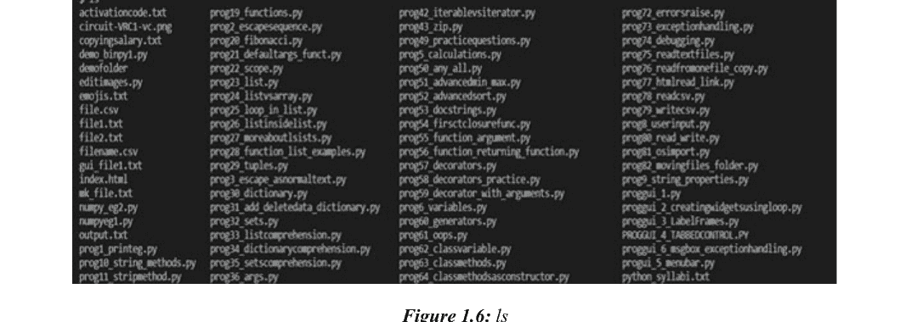

*图1.6：ls*

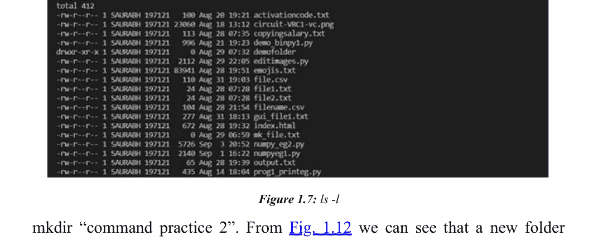

*图1.7：ls -l*

`mkdir "command practice 2"`。从图1.12我们可以看到创建了一个新文件夹“command practice 2”。

现在假设我们需要移动到文件夹command practice 2。输入命令 `cd "command practice 2"`，如图1.13所示。

**touch：** 上述命令用于将文件的修改和访问时间设置为当前时间。如果文件不存在，则将以默认权限创建该文件。从图1.14，创建了一个名为newfile.txt的文本文件。

我们甚至可以创建一个Python文件。创建了一个名为demo.py的新文件。

**rm：** 上述命令用于删除对象，如文件、目录等。从图1.16，我们想要删除newfile.txt。

**cd ..：** 上述命令用于返回上一级文件夹。从图1.17，我们可以看到已返回上一级文件夹。

**rm -rf：** 上述命令用于完全删除文件夹。**rf** 代表递归强制。从图1.18，我们可以看到文件夹command practice 2已被完全删除。

**mv：** 上述命令用于将文件重命名为新名称或将文件名移动到新文件夹。从图1.19，我们可以看到文件名file1.py在当前文件夹cd commandfolder/中已重命名为file.py。

从图1.20，我们可以看到文件名file.py已移动到当前文件夹**mvfolder**。首先，我们创建了一个文件夹**mvfolder**。然后我们使用命令 `mv file.py ./mvfolder/` 将文件移动到该文件夹。

在当前路径上，我们输入 `ls` 查看文件和文件夹的列表。我们可以看到文件已移动到**mvfolder**中，因为只显示了文件夹名称。然后我们将目录更改为**mvfolder**。我们输入 `ls` 查看文件和文件夹的列表。

```
SAURABH@LAPTOP-NHFM79LF MINGW64 /e/python_progs
$
```

*图1.8：clear*

```
SAURABH@LAPTOP-NHFM79LF MINGW64 /e/python_progs
$ cd E://democreated

SAURABH@LAPTOP-NHFM79LF MINGW64 /e/democreated
$ pwd
/e/democreated
```

*图1.9：cd*

## 1.2 关键字/保留字

在任何语言中，无论是像英语这样的通用语言，还是像 Python 或 C 这样的编程语言，都有一些保留字用来表示某些含义或功能，这些被称为保留字或关键字。英语中有大量的保留字，每个都有其特定含义。记住所有这些词几乎是不可能的。另一方面，如果我们观察像 Java 这样的编程语言，它只有 53 个保留字。而在 Python 中，只有 35 个保留字。所以，如果我们理解了这 35 个关键字，就有可能成为这门语言的专家。在 2015 年之前，Python 有 33 个关键字，但在 2015 年发布的 3.5 版本中，Python 新增了 `async`/`await` 这两个新关键字。要查看 Python 语言中的所有关键字，可以在 VsCode 中输入以下命令。

```python
import keyword
print(keyword.kwlist)
```

将文件保存为 `python_keywords.py`。Python 中的所有保留字都只包含字母符号。要运行上述程序，输入以下命令：

```bash
python python_keywords.py
```

你将得到如下所示的关键字列表：

```
['False', 'None', 'True', 'and', 'as', 'assert', 'async', 'await', 'break',
'class', 'continue', 'def', 'del', 'elif', 'else', 'except', 'finally', 'for',
'from', 'global', 'if', 'import', 'in', 'is', 'lambda', 'nonlocal', 'not', 'or',
'pass', 'raise', 'return', 'try', 'while', 'with', 'yield']
```

我们将根据需要讨论所有关键字列表。但通过查看这些关键字，你可能会得到以下重要观察：

1.  所有 35 个关键字仅包含字母符号。
2.  `True`、`False` 和 `None` 是仅有的三个大写（首字母大写）关键字。其余 32 个关键字均为小写。
3.  需要注意的一个重要点是，Python 中没有 `switch` 或 `do-while` 概念。
4.  由于 Python 是动态类型语言，因此没有像 `int`、`float`、`Boolean`、`complex` 这样的保留字用于表示数据类型。

要检查某个单词是否是关键字，可以输入以下命令：

```python
print(keyword.iskeyword('yield'))
```

运行上述文件后，你将得到一个布尔值 `True`，表示 `yield` 这个单词是一个关键字。你可以继续用其他保留字进行检查。**`iskeyword`** 的返回值为 **`True`** 或 **`False`**。

## 1.3 标识符

标识符无非是用户在程序中定义的用于表示变量、函数、类或模块的名称。标识符可以包含字母、数字或下划线。**标识符** 的首字母必须是字母或下划线，不能以数字开头。标识符的示例如下：

-   `var_1=67`：变量名是标识符的一个例子。
-   `_var = 4`：标识符的首字母可以是下划线。
-   `3sd = 7`：无效。SyntaxError: invalid syntax（语法错误：无效语法）
-   特殊字符被排除在标识符之外。
-   `var@2 = 8`：SyntaxError: can't assign to operator（语法错误：无法赋值给运算符）

Python 中允许的字符是字母（大写或小写）、数字（0 到 9）和下划线符号。由于 Python 语言区分大小写，标识符本身也区分大小写。例如，变量 `sum` 和 `SUM` 是不同的。如果标识符以下划线开头，则它被视为私有。保留字不允许用作标识符。标识符没有长度限制，但需要注意的是，它不应太长，并且必须是有意义的，即使新人也能通过标识符名明白其含义。

## 1.4 隐式和显式换行连接方法

每当我们尝试将输入内容分写到不同的物理行时，就可能会出现错误。例如：

```python
print("hello"
```

当我们尝试在下一行写入剩余内容时，会弹出以下错误：

```
SyntaxError: EOL while scanning string literal
```

这个问题可以通过使用隐式和显式换行连接方法来克服。

#### 1.4.1 隐式换行连接方法

在隐式换行连接方法中，表达式可以使用圆括号、花括号或方括号分割成多行。例如：

1.  使用花括号
    示例如下：

```python
# Example: 1.3
days = {'Mon','Tue','Wed',
        'Thu','Fri','Sat',
        'Sun'}
print(days)
```

> Output: 1.3
> {'Tue', 'Sat', 'Fri', 'Sun', 'Mon', 'Wed', 'Thu'}

> **注意：** 你每次运行得到的输出顺序可能不同

2.  使用方括号
    示例如下：

```python
# Example: 1.4
days = ['Mon','Tue','Wed',
        'Thu','Fri','Sat',
        'Sun']
print(days)
```

> Output: 1.4
> ['Mon', 'Tue', 'Wed', 'Thu', 'Fri', 'Sat', 'Sun']

> **注意：** 输出没有变化。输出顺序与输入顺序一致。

3.  使用圆括号
    示例如下：

```python
# Example: 1.5
days = ('Mon','Tue','Wed',
        'Thu','Fri','Sat',
        'Sun')
print(days)
```

> Output: 1.5
> ('Mon', 'Tue', 'Wed', 'Thu', 'Fri', 'Sat', 'Sun')

> **注意：** 输出没有变化。输出顺序与输入顺序一致。

现在，假设我们想将文件向上移动一个文件夹，则需要使用带 `..` 的文件名，如图 1.21 所示。输入命令 `mv file.py ..` 后，文件 `file.py` 已移动到 `command` 文件夹中。

假设我们想将 **VsCode** 的 bash 终端中输入的命令列表保存到一个文本文件中，则使用命令：

```bash
history > history_for_print.txt
```

`history` 是命令，`history_for_print.txt` 是文本文件名，如图 1.21 所示。命令和文件名通过 `>` 符号连接。我们可以看到，输入的命令列表已被保存到名为 `history_for_print.txt` 的文本文件中。

另外，假设我们想打开这个文本文件，则输入 `code` 命令，然后是文件名，例如这里的 `code history_for_print.txt`。`code` 命令用于打开文件，如果在当前文件系统中文件不存在，则会创建它。这里，在打开 **VsCode** 后，我们可以看到下面示例 1.2 中列出的命令。我们注意到有些命令如 **rm**、**mkdir** 并不存在。这是有意为之的，因为我们在输入那些命令后关闭了 **VsCode**。再次启动 VsCode 后，只存在从 `cd ..` 开始的当前命令。

### 示例：1.2（使用 code 命令打开文件）

```
1 cd ..
2 cd democreated/
3 pwd
4 ls
5 cd ~
6 pwd
7 cd E://democreated
8 ls
9 clear
10 cd commandfolder/
11 touch file1.py
12 ls
13 mv file1.py file.py
14 ls
15 mv file1.py file.py
16 ls
17 mkdir mvfolder
18 ls
19 mv file.py ./mvfolder/
20 ls
21 cd mvfolder/
22 ls
23 mv file.py ..
24 ls
25 cd ..
26 ls
27 cp file.py ./mvfolder/
28 ls
29 cd mvfolder/
30 ls
31 cd ..
32 history > history_for_print.txt
```

> Output: 1.2
> 从上面的执行过程可以观察到不同的操作。

注意：以上示例也可以通过添加注释和空行来书写。

-   1. 我们可以在行后添加注释。

```
示例：1.6
days = {'Mon','Tue','Wed', # Mon - Wed
        'Thu','Fri','Sat', # Thu - Sat
        'Sun'} # sun
print(days)
```

```
输出：1.6
{'Tue', 'Thu', 'Fri', 'Sun', 'Mon', 'Wed'}
```

-   2. 可以插入空行。

```
示例：1.7
days = { #Blank
    'Mon','Tue','Wed', # Mon - Wed
    'Thu','Fri','Sat', # Thu - Sat
    'Sun'} # sun
print(days)
```

```
输出：1.7
{'Sun', 'Tue', 'Thu', 'Sat', 'Wed', 'Mon', 'Fri'}
```

## 1.4.2 显式连接方法

在显式行连接方法中，我们使用反斜杠来分割输入。反斜杠用于将逻辑行连接在一起，使其在单行中声明。例如：

```
示例：1.8
print("hello\
        welcome beginners")
```

```
输出：1.8
hello   welcome beginners
```

图 1.22：history命令

我们没有将逻辑写在一行中，而是使用了反斜杠，并将一半的逻辑延续到了另一行。这种书写方式是允许的。

```
示例：1.9
x = 12
print(x>10 | \n        x<9)
```

```
输出：1.9
False
```

在显式连接方法中需要注意以下几点：

-   1. 反斜杠字符后不应有任何注释。

```
示例：1.10
a<10 and b>30 | \ #comment
```

```
输出：1.10
SyntaxError: unexpected character after line continuation character
```

-   2. 反斜杠只能用于连接字符串字面量，不能用于其他字面量。

```
示例：1.11
i=3 \n    2
```

```
输出：1.11
SyntaxError: invalid syntax
```

## 1.5 打印函数

如果想在屏幕或控制台上打印内容，我们将使用print函数。假设我们想打印基本语句"Hello Python Beginners"。那么可以使用print语句，后跟括号'('。在括号内使用单引号或双引号均可。然后输入我们想要打印的语句。请在VsCode中键入以下命令，如所示：

```
示例：1.12
print(“Hello Python Beginners “)
print('Hello Python Beginners ')
```

```
输出：1.12
Hello Python Beginners
Hello Python Beginners
``

需要注意的是，单引号或双引号内的字符集合称为字符串。在Python中，我们可以使用单引号或双引号。在某些编程语言中，我们不能使用单引号来表示字符串。在"双引号"内部使用'单引号'，或在'单引号'内部使用"双引号"是可行的。

```
示例：1.13
print(“Hello ‘Students’ World”)
print('Hello “Students” World')
```

```
输出：1.13
Hello 'Students'
World Hello "Students" World
```

在第一个打印语句print(“Hello ‘Students’ World”)中，我们在双引号内部使用了单引号。在下一个打印语句print('Hello “Students” World')中，我们在单引号内部使用了双引号。

但我们不能在单引号内部使用单引号，或在双引号内部使用双引号，否则会出现语法错误：invalid syntax。

假设你想打印 I'm here，那么请输入以下命令

```
示例：1.14
print(“I'm here”)
```

```
输出：1.14
I'm here
```

### 1.5.1 使用打印函数的不同样式：

-   1. 假设有人要求使用打印函数打印一个换行符。那么可以使用以下打印命令：

```
print()
```

不带任何参数的print函数将插入一个换行符，如下所示

```
示例：1.15
print(“I'm here”)
print()
print(‘I am printing after a new line’)
```

**输出：1.15**
I’m here

I am printing after a new line

在Python中，**print** 始终等同于Java中的 **println** 形式。
-   2. 我们在前面的示例中已经使用过带有字符串参数的print函数。
-   3. 可以在print语句中使用转义字符，如 \n、\t 等，如下所示

```
**示例：1.16**
print('Hello \n Python Beginners')
print('Hello \t Python Beginners')
```

**输出：1.16**
Hello
    Python Beginners
Hello Python Beginners
a
____________________
    a

> **注意：**
插入更多的 \t 以增加单词间的水平间距。

-   4. 可以在print函数中使用‘+’运算符。‘+’表示连接，即连接两个字符串。这里，两个参数必须都是字符串类型。

```
**示例：1.17**
print(‘Hello ‘ + ‘! I hope you are enjoying print function’)
```

```
**输出：1.17**
Hello ! I hope you are enjoying print function
```

-   5. 使用任何‘*’运算符时，一个参数必须是整数类型，另一个参数必须是字符串类型，如下所示。

```
**示例：1.18**
print(‘Hi ‘*2)
```

```
**输出：1.18**
Hi Hi
```

这称为字符串重复运算符。这里 'Hi' 被打印了2次。

-   6. 有时开发者希望使用print语句在参数之间添加空格。用户可以轻松使用连接运算符来实现此结果。但也可以在不使用连接运算符的情况下实现，如下所示：

```
**示例：1.19**
print(‘Hello’,’I am printing space without concatenation operator’)
```

```
输出：1.19
Hello I am printing space without concatenation operator
```

从输出中我们可以看到，'Hello' 和 'I' 之间有一个空格。这两个参数由中间的空格分隔。参数之间的默认分隔符是空格。

-   7. print函数可以接受可变数量的参数。

```
示例：1.20
x,y,z = 3,4,5
print('The values of x,y and z are', x,y,z)
```

```
输出：1.20
The values of x,y and z are 3 4 5
```

这里，我们取了3个变量 x, y 和 z。这里可以取任意数量的变量。一个重要的观察点是，在变量输出与第一个参数之间，正如前面所讨论的，有一个空格。

假设你不需要空格分隔符，而想要使用其他分隔符，如逗号或冒号分隔符，那么可以使用 sep 属性。sep 代表分隔符。示例如下：

```
示例：1.21
x,y,z = 3,4,5
print('The ratio of x,y and z are ', x,y,z,sep = ':')
```

```
输出：1.21
The ratio of x,y and z are :3:4:5
```

这里，我们可以看到冒号运算符替换了空格分隔符。同时，在第一个参数之后也有一个冒号运算符。所以，你可以通过删除第一个参数来查看输出。

-   8. print函数可以与 end 属性一起使用。如果想在下一行的数据仍打印在同一行，则使用此属性。如果有多个print语句，而我们想移除 '\n' 并用空格分隔符替换，那么可以使用 end 属性。示例如下：

```
示例：1.22
print('Hello',end=' ')
print('Python',end=' ')
print('Beginners.',end=' ')
print('This',end=' ')
print('is',end=' ')
print('an',end=' ')
print('example',end=' ')
print('of',end=' ')
print('end',end=' ')
print('attribute.',end=' ')
```

```
输出：1.22
Hello Python Beginners. This is an example of end attribute.
```

因此，sep 属性的默认值是空格，而 end 属性的默认值是换行符。

-   9. 我们可以在print语句中传递任何类型的对象作为参数。它可以传递字符串、列表、元组、字典等作为print语句的参数。示例如下：

```
示例：1.23
li = [1,2,3,4] # list
t1 = (5,6,7,8) # tuple
s1 = {9,10,11,12} # set
```

```
#方法-1
print(li,t1,s1)
#方法-2
print(li,end = ' ')
print(t1,end = ' ')
print(s1)
```

```
输出：1.23
[1, 2, 3, 4] (5, 6, 7, 8) {9, 10, 11, 12}
[1, 2, 3, 4] (5, 6, 7, 8) {9, 10, 11, 12}
```

我认为方法-1和方法-2的输出是自明的。我们将在后续章节中详细讨论列表、元组和集合。

-   10. 我们可以将打印函数与格式化字符串一起使用。我们都遇到过 %i, %d, %f 和 %s。%i 和 %d 是整数类型，%f 是浮点类型，%s 是字符串类型。上述类型用于格式化字符串。格式化字符串后跟空格和变量列表使用。语法如下所示：print(“formatted string” (variable list))

```
示例：1.24
r,s,t = 3,4,5
print(’r value is i’ r) # f1
print(’r value is i and s value is i’ (r,s)) # f2
```

```
输出：1.24
r value is 3
r value is 3 and s value is 4
```

从 f1 来看，%i 的位置由 r 的值替代。从 f2 来看，两个不同位置的 %i 将分别由 r 和 s 的值替代。一个需要记的重要点是，变量的数量和占位符的数量必须相同，否则我们将遇到错误。让我们看另一个例子。

**示例：1.25**
```python
my_name = 'Python'
l1 = [3, 4, 5, 6]
print("Hello", my_name, ". The list is as follows", l1)
```

11. 我们可以使用`print`函数和替换运算符。我们可以通过使用成对的花括号来实现。让我们看一个例子以便清楚地理解。

**示例：1.26**
```python
name = 'Ram'
salary = 100000
age = 22
print("Hello I am {0}. My age is {1} years old and salary is {2}"
      .format(name, age, salary))  # M-1
print("Hello I am {}. My age is {} years old and salary is {}"
      .format(name, age, salary))  # M-2
print("Hello I am {x}. My age is {y} years old and salary is {z}"
      .format(z=salary, x=name, y=age))  # M-3
print(f"Hello I am {name}. My age is {age} years old and salary is {salary}")  # M-4
```

**输出：1.26**
```
Hello I am Ram. My age is 22 years old and salary is 100000
Hello I am Ram. My age is 22 years old and salary is 100000
Hello I am Ram. My age is 22 years old and salary is 100000
Hello I am Ram. My age is 22 years old and salary is 100000
```

这是一个展示Python语言灵活性的例子。你可以通过多种方式重现输出。字符串中的元素通过位置格式化连接在一起。

在M-1中，我们可以看到索引写在花括号内。`format`语句中的值可以是整数、字符、浮点数、字符串，甚至变量。我们可以看到`format`函数接受字符串和整数类型的变量作为参数，这些参数正是我们希望放入占位符中的值。

在M-2中，我们可以看到索引没有写在花括号内。即使索引没有写在花括号内，索引也会默认按0, 1, 2等顺序考虑。

在M-3中，参数的顺序并不重要。

在M-4中，使用了F-string。F-string是一种新的字符串格式化机制，称为字面字符串插值（literal string interpolation），由PEP 498（Python增强提案498）引入。这里，`f`字符位于字符串字面量之前。为了使字符串插值更简单，引入了F-string。字符串以字母“f”为前缀。字符串本身可以以与`str.format()`相同的方式进行格式化。F-string比两种最常用的字符串格式化机制`%`格式化和`str.format()`更快。我们不能直接在格式字符串中使用反斜杠，但可以将其放入变量中作为后台使用，如下所示。

## 示例：1.27
```python
newline = ord('\n')
print(f"Hi: I am {newline}")
```

## 输出：1.27
```
Hi: I am 10
```

所以，现在我假设你们都对`print`函数充满信心了。`ord`函数接受一个长度为1的字符串作为参数，并返回传递参数的Unicode码点表示。我们讨论过的Python程序如下所示。你可以在Python VSCode中运行上述代码来自我测试。

## 示例：1.28
```python
print("Hello Python Beginners ")
#collection of characters inside single quote or
#double quote is called as a string

#Note: It is possible to use "single quotes inside
#double quotes" or vice-versa

print("Hello 'Students' World")
```

**输出：1.28**
```
Hello Python Beginners
Hello 'Students' World
```

上述示例的摘要列于此处供你快速回顾。

## 示例：1.29
要获取源代码，请扫描第70页图1.29所示的二维码

**输出：1.29**
```
Hello "Students" World
I'm here

I am printing after a new line
Hello   Python Beginners
Hello ! I hope you are enjoying print function
Hi Hi
Hello I am printing space without concatenation operator
The ratio of x, y and z are :3:4:5
Hello Python Beginners. This is an example of end attribute
[1, 2, 3, 4] (5, 6, 7, 8) {9, 10, 11, 12}
[1, 2, 3, 4] (5, 6, 7, 8) {9, 10, 11, 12}
r value is 3
r value is 3 and s value is 4
Hello Python. The list is as follows [3, 4, 5, 6]
Hello I am Ram. My age is 22 years old and salary is 100000
Hello I am Ram. My age is 22 years old and salary is 100000
Hello I am Ram. My age is 22 years old and salary is 100000
Hello I am Ram. My age is 22 years old and salary is 100000
Hi: I am 10
```

## 1.6 转义字符

我们都知道我们不能在双引号内使用双引号。但是，如果你在双引号前加上反斜杠`\`，那么Python就能将其正确识别为字符串的一部分，如下所示：

**示例：1.30**
```python
#\" — double quote
print('Hello "Students" World')
```

**输出：1.30**
```
Hello "Students" World
```

正如我们所见，Python现在能够正确读取双引号内的`Students`字符串。一些常用转义字符的列表显示在[表1.1](表1.1)中。

| 序号 | 转义序列 | 含义 |
|---|---|---|
| 1 | \' | 单引号 |
| 2 | \" | 双引号 |
| 3 | \\ | 反斜杠 |
| 4 | \n | ASCII换行符（LF） |
| 5 | \t | ASCII水平制表符（TAB） |
| 6 | \b | ASCII退格符（BS） |
| 7 | \f | ASCII换页符（FF） |
| 8 | \r | ASCII回车符（CR） |
| 9 | \v | ASCII垂直制表符（VT） |
| 10 | \newline | 反斜杠和换行符被忽略 |
| 11 | \ooo | 八进制值为ooo的字符 |

表1.1：转义字符及其含义

我们将逐一讨论每个转义字符的示例。

1. 单引号

**示例：1.31**
```python
#\' — single quote
print('I\'m a Python Beginner')
```

**输出：1.31**
```
I'm a Python Beginner
```

2. 双引号

如前所述，我们能够打印`Hello "Students" World`。

3. 反斜杠

**示例：1.32**
```python
#\\ — backslash
print("I am here for the backslash\\")
```

**输出：1.32**
```
I am here for the backslash\
```

**示例：1.33**
```python
#\\\\ — double backslash
print("I am here for the double backslash\\\\")
```

**输出：1.33**
```
I am here for the double backslash\\
```

4. ASCII换行符（LF）

**示例：1.34**
```python
print("hello \nWelcome Beginners ")
```

**输出：1.34**
```
hello
Welcome Beginners
```

5. ASCII水平制表符（TAB）

**示例：1.35**
```python
#\t — Horizontal tab
print("Name:\tPython")
```

**输出：1.35**
```
Name:    Python
```

6. ASCII退格符（BS）

**示例：1.36**
```python
#\b — backspace
print("Helll\bo")
```

**输出：1.36**
```
Hello
```

7. ASCII换页符（FF）

**示例：1.37**
```python
#\f — form feed: used for giving indentation
print("stackoverflow\nnine")
```

**输出：1.37**
```
stackoverflow
        nine
```

8. ASCII回车符（CR）

**示例：1.38**
```python
#\r — carriage return:
print("Mohan is enjoying python \rShyam")
```

**输出：1.38**
```
Shyam is enjoying python
```

`'\r'`之后的内容会出现在整个字符串的开头。

9. ASCII垂直制表符（VT）

**示例：1.39**
```python
#\v — vertical tab
print("Hi I am an \vEngineer")
```

**输出：1.39**
```
Hi I am an
Engineer
```

10. 反斜杠和换行符被忽略

**示例：1.40**
```python
#backslash and new line ignored
print("one\\\ntwo\\\nthree")
```

**输出：1.40**
```
one
two
three
```

11. 八进制值为ooo的字符

**示例：1.41**
```python
# character with octal value
print("\110\145\154\154\157")
```

**输出：1.41**
```
Hello
```

12. 十六进制值为hh的字符

**示例：1.42**
```python
# character with hex value
print("\x48\x65\x6c\x6c\x6f")
```

**输出：1.42**
```
Hello
```

我们讨论过的Python程序如下所示。你可以在Python VSCode中运行上述代码来自我测试。
上述示例展示了转义字符用法的摘要列于此处供快速回顾。

## 示例：1.43
要获取源代码，请扫描[第70页](第70页) [图1.29](图1.29)所示的二维码

**输出：1.43**
```
I am here for the backslash
I am here for the double backslash
Name:   Python
Line_One
Line_Two
stackoverflow
        nine
Shyam is enjoying python
Hi I am an
Engineer
one
two
three
Hello
Hello
```

## 1.7 将转义字符作为普通文本

转义字符是具有特殊功能的字符。假设你想打印以下输出：
```
\' " \t \n
```

这个输出看起来相当复杂，但一旦你熟悉了转义字符，概念就非常简单了。请看下面的`print`语句以清楚理解上述输出。

**示例：1.44**
```python
# \ \ \t \n \n
print("\\' \" \\t \\n \\n")
```## 1.8 注释、缩进及其重要性

注释通常由用户编写，目的是让使用者或他人能理解代码为何如此编写。Python解释器会完全忽略注释。注释是添加在程序中以增强其可读性的说明性文本。编写注释是一个极好的实践，程序员必须养成这一习惯，以便日后能回忆起程序背后可能存在的任何逻辑。注释在文档编写中也很有用。一段好的代码包含着相关的注释。我们可以看到，在讲解的示例程序中，我们在很多地方都使用了注释。注释必须清晰、精确。它们需要与其所包含的代码块紧密相关。注释不应重复，以免变得冗余。必须使用得体的语言编写注释。通过查看注释，你们都能看出这段Python代码的编写目的。所以，请始终养成编写注释的习惯。在Python中，任何以`#`符号开头的文本都被视为注释。`#`符号后面的文本不会被Python解释器执行。`#`是单行注释。若要注释多行，我们将再次使用`#`符号。每一行都必须以井号字符`#`开头。有些人可能会说，使用`"""`三引号可以注释多行。但那实际上是文档字符串。文档字符串写在代码内部，起着注释的作用。我们之前已经见过许多关于注释的例子，并且在后续示例中还会继续使用。要在VsCode中注释多行，请使用Ctrl加斜杠键（`Ctrl + '/'`）。这里，我们展示一个文档字符串的例子。

```
示例：1.46
"""
这是一个文档字符串
此代码用于计算两个数的差值
'''
a = 3
b = 5
c = b-a print(c)
```

```
输出：1.46
2
```

缩进是Python程序编写机制中非常重要的一部分。许多语言如C、C++、Java等使用花括号`{}`来表示语句块。代码块可以被看作是为特定目的而分组的一组语句。在这些语言中，嵌套代码块的花括号会变得杂乱无章，很难识别块的起始和结束位置。Python摒弃了花括号的概念，而是采用了一种均匀缩进的机制。因此，如果这些语句属于同一个特定的代码块，它们将遵循统一的缩进。统一缩进的代码块将在冒号`:`之后开始。一旦我们输入了冒号，只要编辑器足够智能，它就会自动将光标向右移动几个字符，开始一个缩进。为了被视为同一个块，其中的所有语句必须具有相同的缩进量，即块内的所有语句必须具有相同的缩进级别。缩进在区分Python编程的不同代码块方面起着非常重要的作用。缩进用于创建函数、if语句、类或任何需要将多条语句组合在一起的地方的代码块。

```
示例：1.47
marks = 30
if marks > 28:
    print('You are passed')
else:
    print('You are failed')
```

```
输出：1.47
You are passed
```

从上面的例子可以看出，在输入`:`并按下回车后，**VsCode**编辑器会自动在左侧留出一些空格，然后编写print语句。每当我们想结束作为统一块一部分的语句系列时，只需按下退格键，将光标带回缩进的初始级别。因此，在编写代码的过程中，必须注意缩进问题。

## 1.9 原始字符串和表情符号

当字符串字面量由`'r'`或`'R'`创建时，就产生了Python原始字符串。假设我们想在Python中创建字符串`"Python \n Beginners"`。如果将其作为普通字符串赋值，`\n`会被当作普通字符串处理。

```
示例：1.48
print('Python \n Beginners')
```

```
输出：1.48
Python
Beginners
```

现在，借助原始字符串，`\n`将被视为普通字符。我们可以使用`'r'`或`'R'`，如下所示。

```
示例：1.49
print(r'Python \n Beginners')
print(R'Python \n Beginners')
```

```
输出：1.49
Python \n Beginners
Python \n Beginners
```

我们可以在Python中打印表情符号。每个表情符号都有一个唯一的Unicode编码。有多种方式可以打印表情符号。

1.  使用Unicode编码打印表情符号
    如前所述，每个表情符号都有一个与之关联的Unicode编码。我们需要将`'+'`替换为`'000'`，并在Unicode编码前加上反斜杠`\`，最后进行打印。例如，飞吻表情的Unicode编码是U+1F618。将`'+'`符号替换为`000`并加上反斜杠前缀，得到的字符串是`\U0001F618`。

```
示例：1.50
print("\U0001F600")
print("\U0001F618")
print("\U0001F600")
print("\U0001F618")
print("\U0001F600")
print("\U0001F618")
print("\U0001F602")
print("\U0001F60D")
print("\U0001F642")
print("\U0001F923")
print("\U0001F609")
```

```
输出：1.50
输出结果如图1.23所示
```


*图1.23：示例1.50的输出*

2.  Unicode通用语言环境数据仓库（CLDR）简称
    每个表情符号都有一个CLDR简称，此处使用该简称。

```
示例：1.51
# kissing face with closed eyes
print("\N{kissing face with closed eyes}")
```

```
输出：1.51
输出结果如图1.24所示
```


*图1.24：示例1.51的输出*

3.  Emoji模块
    emoji模块中的`emojize()`函数需要将CLDR简称作为参数传递，并返回相应的表情符号。在CLDR简称中，空格会被替换为下划线。

```
示例：1.52
import emoji

print(emoji.emojize(":grinning_face_with_big_eyes:"))
```

```
输出：1.52
输出结果如图1.25所示
```

`demojize()`函数的功能与`emojize()`函数相反。它会将作为参数传递的**表情符号**转换为相应的CLDR简称。


*图1.25：示例1.52的输出*

## 1.10 运算符基础与类型

在我们的日常生活中，我们经常遇到“运算符”这个词。执行操作、进行某项活动的人就是运算符。每种语言都有一定数量的预定义符号，这些符号附带了一些预定义的含义，它们既不是字母字符，也不是数字。还有一些其他特殊字符在被使用时具有预定义的操作，这些被称为运算符。Python中有多种运算符。一个基于一个或多个输入值产生新结果的动作被称为**操作数**。我们将逐一讨论基本运算符，所有Python逻辑都建立在此基础上。

#### 1. 算术运算符

算术运算符执行基本的数学运算，如加法、减法、除法和乘法。除了这些运算，Python还有两个特殊的算术运算符：整除运算符和幂运算符。

我们考虑变量`a`的值为4，变量`b`的值为2。我们将在本章稍后讨论变量。

#### (a) 加法运算符

此处，运算符两侧的值相加。

```
示例：1.53
a=4
b=2
# 加法运算符
print(a+b)
```

```
输出：1.53
6
```

这个`'+'`运算符也适用于字符串类型。此时，它被视为字符串连接运算符。你可能会想，如果至少有一个参数是字符串类型，那么`'+'`参数将作为字符串连接运算符。但实际上，你会得到一个错误。错误信息将是"TypeError: can only concatenate str (not "int") to str"。

```
示例：1.54
print('Python' + 3)
```

```
输出：1.54
TypeError: can only concatenate str (not “int”) to str
```

如果想将`'+'`参数与字符串类型一起使用，则两个参数都必须是字符串类型。

```
示例：1.55
print('Python ' + '3')
print('Python '+ str(3))
```

```
输出：1.55
Python 3
Python 3
```

#### (b) 减法运算符：

此处，右侧操作数从左侧操作数中减去。

## 2. 算术运算符

### (a) 减法运算符
`-` 运算符不适用于字符串。

**示例 1.57**
```python
# 减法运算符
print(a-b)
```
**输出：**
```
1.56
2
```

### (b) 乘法运算符：
将运算符两侧的值相乘。

**示例 1.58**
```python
# 乘法运算符
print(a*b)
```
**输出：**
```
1.57
8
```

`*` 运算符也可应用于字符串类型。此时，该运算符称为重复运算符。

**示例 1.59**
```python
print('Python '*4)
```
**输出：**
```
1.58
Python Python Python Python
```
从以下例子中，我们可以观察到带有空格的Python字符串被重复了4次。需要注意的一点是，使用`*`运算符时，其中一个参数必须是整数，否则将出现如下所示的错误。

**示例 1.60**
```python
print('Python ' * '3')
```
**输出：**
```
1.59
TypeError: can't multiply sequence by non-int of type 'str'
```

### (c) 除法运算符：
将运算符左侧的值除以右侧的值。

**示例 1.61**
```python
# 除法运算符
print(a/b)
```
**输出：**
```
1.60
2.0
```

除法运算符的结果始终是**浮点数**。它永远不会返回整数值。

### (d) 取余运算符：
将运算符左侧的值除以右侧的值并返回余数。

**示例 1.62**
```python
# 取余运算符
print(a%b)
```
**输出：**
```
1.61
0
```

### (e) 整除运算符：
此运算符适用于浮点数和整数值。如果参数是整数类型，结果始终是整数类型。如果至少有一个参数是浮点数类型，结果始终是浮点数类型。

**示例 1.63**
（此处应有扫描二维码查看源代码，图1.29，第70页）
**输出：**
```
1.62
2
3.0
4.0
5.0
-5
-6
```

请记住，**floor**（向下取整）是指最近的前一个数字，**ceil**（向上取整）是指最近的后一个数字。同时，请观察下面的例子。

**示例 1.64**
```python
x=13.0
y=2
print(x/y)
print(x//y)
```
**输出：**
```
1.63
6.5
6.0
```

从上面的例子来看，正如预期的那样，除法运算符返回浮点数值6.5，而整除运算符返回最近整数的值，即6.0。假设你想要整数值6，可以像下面这样使用之前的例子进行类型转换。类型转换是一个重要概念，我们将在后面详细学习。目前，你只需观察即可。

**示例 1.65**
```python
print(int(x//y))
```
**输出：**
```
1.64
6
```

### (f) 指数/幂运算符：
此运算符执行幂运算。

**示例 1.66**
```python
# 幂运算符
a = 3
b = 4
print(a**b)
print(b**a)
```
**输出：**
```
1.65
81
64
```
我们也可以为复数计算幂运算。例如：

**示例 1.67**
```python
print((1+2j)**2)
```
**输出：**
```
1.66
(-3+4j)
```

请看上述问题的结果是如何得出的：
`((1 + 2j) ** 2) = (1 + 2j) * (1 + 2j)` (1.1)
`= 1 * (1 + 2j) + 2j(1 + 2j)` (1.2)
`= 1 + 2j + 2j + 4 * j**2` (1.3)
`= 1 + 4j - 4` (1.4)
`= -3 + 4j` (1.5)

Python中有一个`round()`函数，可以将结果四舍五入到指定的小数位数，并返回浮点数。如果未提供用于四舍五入的小数位数，则会将数字四舍五入到最近的整数。

**示例 1.68**
```python
print(round(20))  # — M1
print(round(20.6))  # — M2
print(round(20.4))  # — M3
print(round(3.665,2))  # — M4
print(round(3.676,2))  # — M5
print(round(3.673,2))  # — M6
```
**输出：**
```
1.67
20
21
20
3.67
3.68
3.67
```

在M1中，如果只给出整数20，则它将四舍五入为20。
在M2中，这里小数点后数字6大于5，它将四舍五入到**ceil**整数。所以是21。
在M3中，这里小数点后数字4小于5。所以，它将四舍五入到floor整数。所以是20。
在M4中，(ndigits+1)位的数字是5，被四舍五入的最后一位小数会增加1。由于第3位是5，这个数变成3.67。
在M5中，(ndigits+1)位的数字 > 5，被四舍五入的最后一位小数会增加1。由于第3位是6，这个数变成3.68。在M6中，(ndigits+1)位的数字 < 5，被四舍五入的最后一位小数保持不变。由于第3位是3，这个数变成3.67。

任何数字**x**除以零、模零或整除零，结果总是零除错误。我们将在后续阶段学习Python中的各种错误。你会惊讶地看到在代码执行过程中Python是如何产生错误的。每个细微的细节都将得到详细解释。

## 2. 比较/关系运算符
用于比较值的运算符是关系运算符。它将根据操作数之间值的比较返回True或False。比较运算符列表如下：

### (a) 等于运算符：
等于运算符（`==`）在左侧值和右侧值相等时返回True。让我们看下面的例子。

**示例 1.69**
```python
# 例1
x = 4
y = 4
print(x==y)

# 例2
x = 5
y = '5'
print(x==y)

# 例3
x = 'Python'
y = 'python'
print(x==y)

# 例4
x = 'Python'
y = 'python'
print(x.lower())
print(x.lower()==y)

# 例5
print({5,6,7} == {7,6,5})
```
**输出：**
```
1.68
True
False
False
python
True
True
```

从例1可以看出，整数值4等于整数值4。因此，返回True。
在例2中，整数值5不等于字符串值'5'。因此，返回False。
在例3中，比较的是ASCII值。'P'的ASCII值是80，'p'的ASCII值是112。所以，'P'不等于'p'。因此，返回False。
在例4中，我们将字符串转换为小写。所以，字符串Python变成python，因为我们打印的是转换为小写后的字符串值。由于ASCII值相等，因此输出为True。
在例5中，值5,6,7被放在两边的花括号下，称为集合（set）。由于集合会重新排列自身且是无序的，所以返回True。
此外，等于运算符对于复数也不会引发任何错误。

**示例 1.70**
```python
print((1+2j) == (1+2j))
print((1+2j) == 'python')
```
**输出：**
```
1.69
True
False
```

### (b) 小于运算符：
如果运算符左侧的值小于（<）右侧的值，则小于运算符返回True。

**示例 1.71**
```python
# 小于运算符
print(4<10)  # — L1
print(10<4)  # — L2
print(4<4.0)  # — L3
print(4.0<4)  # — L4
print('python'<'Python')  # — L5
print('python'<'python')  # — L6
print('Python'<'python')  # — L7
```
**输出：**
```
1.70
True
False
False
False
False
False
True
```

**注意：**
我们现在将用一些标识来表示每个表达式，以便更好地理解和解释。这将使我们的工作更容易，便于更好地学习概念。

在L1中，整数值4小于10，因此返回True。
在L2中，整数值10不小于4，因此返回False。
在L3和L4中，整数值4不小于浮点数值4.0，反之亦然。因此，在这两种情况下都返回False。
对于L5和L7，'p'的ASCII值大于'P'。因此，返回值False和True。
对于L6，字符串'python'的ASCII值不可能小于'python'，因此返回False。

### (c) 小于或等于运算符：
如果运算符左侧的值小于（<）或等于（=）右侧的值（<=），则小于或等于运算符返回True。我们将重复前面的例子。唯一的区别是将`<`运算符替换为`<=`运算符。

**示例 1.72**
```python
print(4<=10)  # — LE1
print(10<=4)  # — LE2
print(4<=4.0)  # — LE3
print(4.0<=4)  # — LE4
print('python'<='Python')  # — LE5
print('python'<='python')  # — LE6
print('Python'<='python')  # — LE7
print(30<=40<=50)  # — LE8
print(30>=20<=0)  # — LE9
```
**输出：**
```
1.71
True
False
True
True
False
True
True
True
False
```

在LE1中，整数值4小于等于整数值10，因此返回True。
在LE2中，整数值10不小于等于整数值4，因此返回False。
在LE3和LE4中，整数值4小于或等于浮点数值4.0，反之亦然。因此，在这两种情况下都返回True。
对于LE5和LE7，'p'的ASCII值大于'P'。因此，返回值False和True。
对于LE6，字符串'python'的ASCII值小于或等于'python'，因此返回True。
需要注意的是，所有的比较都将由Python执行。如果至少有一个比较为False，则结果为False。

## 3. 逻辑运算符

逻辑运算符充当连接词，用于组合运算符两侧的操作数。Python 中的逻辑运算符有：

### (a) and 运算符：
如果两个操作数的条件都为 True，则结果必定为 True。请参阅下方 and 运算符的真值表 1.2。

**布尔类型行为**

| X | Y | X and Y |
|---|---|---|
| False | False | False |
| False | True | False |
| True | False | False |
| True | True | True |

*表 1.2：AND 运算符逻辑*

**非布尔类型行为**

对于非布尔类型，0 和空字符串（''）被视为 False，非零值被视为 True。对于两个操作数 a 和 b，如果 'a' 的求值结果为 False，则返回 'a'，否则返回 'b'。

```
示例：1.75
#非布尔 and 运算符
print(10 and 5) # –A1
print(0 and 12) # – A2
print(13 and 0) # –A3
print(12 and 'python') # –A4
```

```
输出：1.75
5
0
0
python
```

在 A1 中，第一个操作数 10 不等于 0，因此返回答案 5。
在 A2 中，第一个操作数是 0，因此输出也是 0。
在 A3 中，第一个操作数 13 不等于 0，但第二个操作数是 0，因此返回输出 0。
在 A4 中，第一个操作数非零，第二个是字符串，因此返回输出字符串 python。

### (b) or 运算符：
如果任一操作数的条件为 True，则结果必定为 True。请参阅下方 or 运算符的真值表 1.3。

**布尔类型行为**

| X | Y | X or Y |
|---|---|---|
| False | False | False |
| False | True | True |
| True | False | True |
| True | True | True |

*表 1.3：OR 运算符逻辑*

**非布尔类型行为**
对于两个操作数 a 和 b，如果 'a' 的求值结果为 True，则返回 'a'，否则返回 'b'。

```
示例：1.76
#非布尔 or 运算符
print(10 or 5) # –O1
print(0 or 12) # –O2
print(13 or 0) # –O3
print(12 or 'python') # –O4
print('python' or 12) # –O5
```

```
输出：1.76
10
12
13
12
python
```

在 O1 中，第一个操作数 10 不等于 0，因此返回答案 10。
在 O2 中，第一个操作数是 0，另一个操作数是 12。由于 'a' 求值为 0，输出取决于另一个操作数，即 12。因此返回输出 12。
在 O3 中，第一个操作数 13 不等于 0，因此返回输出 13。
在 O4 中，第一个操作数是 12 且非零，因此返回输出 12。
在 O5 中，第一个操作数是字符串且非零，因此返回输出字符串 python。

### (c) not 运算符：
它用于反转表达式的布尔状态。可以说它会反转其操作数的逻辑状态。请参阅下方 not 运算符的真值表 1.4。

**布尔类型行为**

| X | Y = not(X) |
|---|---|
| False | True |
| True | False |

*表 1.4：NOT 运算符逻辑*

**非布尔类型行为**

如果操作数 'x' 的求值结果为 False，则结果为 True，否则为 False。此运算符始终只返回布尔值。

```
示例：1.77
#非布尔 Not 运算符
print(not "") # — N1
print(not 'Hi') # — N2
print(not 102) # — N3
print(not 0) # — N4
```

```
输出：1.77
True
False
False
True
```

在 N1 中，有一个空字符串，其值为 False，因此输出为 True。
在 N2 中，字符串 'Hi' 是非空字符串，因此输出为 False。
在 N3 中，整数值 102 为 True，因此返回输出 False。
在 N4 中，0 为 False，因此返回输出 True。

> 注意：
如果需要通过操作数和运算符来直观理解输出，只需简单执行即可。执行后，概念的清晰度和可视化程度将大大提高。

## 4. 位运算符

位运算符逐位执行操作，仅作用于位。这些运算符仅适用于 int 和 Boolean 类型。如果应用于这两种类型之外的任何其他类型，将会得到错误。不同的位运算符如下：

### (a) '&' 运算符：
在二进制 'AND' 运算符中，对两个操作数执行逐位 'AND' 操作。只有当两个位都为 1 时，输出才为 1，否则为 0。

```
示例：1.78
#位与运算符
a=15
b=10
print(bin(a))
print(bin(b))
print(a&b)
```

```
输出：1.78
0b1111
0b1010
10
```

从上面的例子可以看出，整数值 a 和 b 分别为 15 和 10。执行位与操作后，我们得到了值为 10 的输出。函数 bin 将返回数字的二进制表示，如所示。

### (b) '|' 运算符：
在二进制 'OR' 运算符中，对两个操作数执行逐位 'OR' 操作。只要至少有一个位为 1，输出就为 1，否则为 0。

```
示例：1.79
#位或运算符
a=24
b=10
print(bin(a))
print(bin(b))
print(a|b)
```

```
输出：1.79
0b11000
0b1010
26
```

从上面的例子可以看出，整数值 a 和 b 分别为 24 和 10。执行位或操作后，我们得到了值为 26 的输出。如果我们想使其成为 8 位、16 位等，取决于内存级别的表示，数字会以相应数量的前导零作为前缀。

### (c) '^' 运算符：
在二进制 'XOR' 运算符中，对两个操作数执行逐位 'XOR' 操作。只有当两个位不同时，输出才为 1，否则为 0。

```
示例：1.80
#位异或运算符
a=15
b=9
print(bin(a))
print(bin(b))
print(a^b)
```

```
输出：1.80
0b1111
0b1001
6
```

从上面的例子可以看出，整数值 a 和 b 分别为 15 和 9。执行位异或操作后，我们得到了值为 6 的输出。

(d) `~` 运算符：
在二进制反码运算中，比特位会被翻转，返回一个二进制数的反码。在这里，位 `1` 变为 `0`，位 `0` 变为 `1`。

```
示例：1.81
#二进制反码运算符
a = 1
b = 4
c = 12
d = 17
e = False
f = True
print(~a) # – O1
print(~b) # – O2
print(~c) # – O3
print(~d) # – O4
print(~e) # – O5
print(~f) # – O6
```

```
输出：1.81
-2
-5
-13
-18
-1
-2
```

我们将逐步解释每个二进制反码运算：
在 O1 中，a 的值为 1。
假设 1 的 8 位二进制表示为：00000001
(~1) 的二进制表示为：11111110
由于最高有效位（MSB）为 1，其余位将用补码形式表示，即 11111110。
剩余位 11111110
反码 00000001
加一 00000001
补码 00000010 (2)

最高有效位作为符号位。正数在内存中直接表示，而负数则以补码形式间接表示。由于 MSB 为 1，所以是一个负数。如果 MSB 为 0，则为正数。因此，在 2 前加上 '-' 得到 -2。

在 O2 中，b 的值为 4。
4 的 8 位二进制表示为：00000100
(~4) 的二进制表示为：11111011
由于 MSB（最高有效位）为 1，其余位将用补码形式表示，即 11111011。
剩余位 11111011
反码 00000100
加一 00000001
补码 00000101 (5)

由于 MSB（最高有效位）为 1，所以是一个负数。因此，在 5 前加上 '-' 得到 -5。

在 O3 中，c 的值为 12。
12 的 8 位二进制表示为：00001100
(~12) 的二进制表示为：11110011
由于 MSB（最高有效位）为 1，所以需要求 1110011 的补码。

二进制位 1110011
反码 0001100
加一 0000001
补码 00001101 (13)
由于 MSB 为 1，所以是一个负数。因此，在 13 前加上 '-' 得到 -13。

在 O4 中，d 的值为 17。
17 的 8 位二进制表示为：00010001
(~17) 的二进制表示为：11101110
由于 MSB（最高有效位）为 1，所以需要求 1101110 的补码。
二进制位 1101110
反码 0010001
加一 0000001
补码 0010010 (18)
由于 MSB 为 1，所以是一个负数。因此，在 18 前加上 '-' 得到 -18。
在 O5 中，e 的值为 0，因为 False 是整数 '0'。
0 的 8 位二进制表示为：00000000
(~0) 的二进制表示为：11111111
由于 MSB（最高有效位）为 1，所以需要求 1111111 的补码。
二进制位 1111111
反码 0000000
加一 0000001
补码 0000001 (1)
由于 MSB 为 1，所以是一个负数。因此，在 1 前加上 '-' 得到 -1。
在 O6 中，f 的值为 1，因为 True 是整数 '1'。那么，输出结果将与 O1 相同。

> **注意：** 这里我们考虑了 8 位表示。如今，系统常使用 32 位或 64 位表示。你可以自行检查 32 位或 64 位表示的结果，方法是用值 0 进行扩展。

## (e) `<<` 运算符：

在左移运算符中，左操作数的值会根据右操作数指定的位数向左移动。如果向左移动，右侧空出的位置将用 0 填充。

```
示例：1.82
#左移运算符
print(40<<2) # — LS1
print(True<<2) # — LS2
```

上述操作/结果在[图 1.26](figure 1.26) 中进行了总结。

在 LS1 中，40 的二进制表示为

| M7 | M6 | M5 | M4 | M3 | M2 | M1 | M0 |
|---|---|---|---|---|---|---|---|
| 0 | 0 | 1 | 0 | 1 | 0 | 0 | 0 |

(2**5 + 2**3 = 40)

将整数值 40 左移 2 位。

| M7 | M6 | M5 | M4 | M3 | M2 | M1 | M0 |
|---|---|---|---|---|---|---|---|
| 1 | 0 | 1 | 0 | 0 | 0 | 0 | 0 |

(2**7 + 2**5 = 128 + 32 = 160)

在 LS2 中，True 的二进制表示为 1。

| M7 | M6 | M5 | M4 | M3 | M2 | M1 | M0 |
|---|---|---|---|---|---|---|---|
| 0 | 0 | 0 | 0 | 0 | 0 | 0 | 1 |

(2**0 = 1)

将整数值 1 左移 2 位。

| M7 | M6 | M5 | M4 | M3 | M2 | M1 | M0 |
|---|---|---|---|---|---|---|---|
| 1 | 0 | 1 | 0 | 0 | 1 | 0 | 0 |

(2**2 = 4)

图 1.26：[示例 1.82](Example 1.82) 的操作

(f) `>>` 运算符：

在右移运算符中，左操作数的值会根据右操作数指定的位数向右移动。如果向右移动，左侧空出的位置将用符号位填充。对于正数，符号位是 0；对于负数，符号位是 1。

```
示例：1.83
#右移运算符
print(40>>2) #- MS1
print(True>>2) #- MS2
```

**输出：1.83**
10
0

上述操作/结果在[图 1.27](figure 1.27) 中进行了总结。

在 MS1 中，40 的二进制表示为

| M7 | M6 | M5 | M4 | M3 | M2 | M1 | M0 |
|---|---|---|---|---|---|---|---|
| 0 | 0 | 1 | 0 | 1 | 0 | 0 | 0 |

(2**5 + 2**3 = 40)

将整数值 40 右移 2 位。

| M7 | M6 | M5 | M4 | M3 | M2 | M1 | M0 |
|---|---|---|---|---|---|---|---|
| 0 | 0 | 0 | 0 | 1 | 0 | 1 | 0 |

(2**3 + 2**1 = 8 + 2 = 10)

在 MS2 中，True 的二进制表示为 1。

| M7 | M6 | M5 | M4 | M3 | M2 | M1 | M0 |
|---|---|---|---|---|---|---|---|
| 0 | 0 | 0 | 0 | 0 | 0 | 0 | 1 |

(2**0 = 1)

将整数值 1 右移 2 位。

| M7 | M6 | M5 | M4 | M3 | M2 | M1 | M0 |
|---|---|---|---|---|---|---|---|
| 0 | 0 | 0 | 0 | 0 | 0 | 0 | 0 |

(0)

*图 1.27：[示例 1.83](Example 1.83) 的操作*

## 5. 赋值运算符

此运算符用于为变量赋值。Python 中有 8 种赋值运算符。其中 7 种赋值运算符与算术运算符相关。赋值运算符与其他一些运算符结合，形成复合赋值运算符。剩下的一种是基本赋值。Python 中不同的赋值运算符如下：

(a) 赋值 (`=`)：
这里，值被赋给左边的表达式。单个 `=` 运算符用于赋值，而双等号即 `==` 用于比较。

```
示例：1.84
a=20 # — 单个变量赋值
print(a)
a,b,c,d = 4,5,6,7 # — 多个变量赋值
print(f'a is {a}, b is {b}, c is {c}, d is {d}')
```

```
输出：1.84
20
a is 4, b is 5, c is 6, d is 7
```

(b) 加并赋值 (`+=`)：
将两侧的值相加，然后将结果赋给左边的表达式。这里，`a += 20` 等同于 `a = a + 20`。

```
示例：1.85
a= 30
a += 20
print(a)
```

```
输出：1.85
50
```

(c) 减并赋值 (`-=`)：
用左边的值减去右边的值，然后将结果赋给左边的表达式。这里，`a -= 20` 等同于 `a = a - 20`。

```
示例：1.86
a= 30
a -= 20
print(a)
```

```
输出：1.86
10
```

(d) 除并赋值 (`/=`)：
用左边的值除以右边的值，然后将结果赋给左边的表达式。这里，`a /= 20` 等同于 `a = a / 20`。

```
示例：1.87
a= 30
a /= 20
print(a)
```

```
输出：1.87
1.5
```

(e) 乘并赋值 (`*=`)：
将两侧的值相乘，然后将结果赋给左边的表达式。这里，`a *= 20` 等同于 `a = a * 20`。

```
示例：1.88
a= 30
a *= 20
print(a)
```

```
输出：1.88
600
```

(f) 取模并赋值 (`%=`)：
对两侧的值执行取模运算，然后将结果赋给左边的表达式。这里，`a %= 20` 等同于 `a = a % 20`。

```
示例：1.89
a= 30
a %= 20
print(a)
```

```
输出：1.89
10
```

(g) 幂运算并赋值 (`**=`)：
对两侧的值执行幂运算，然后将结果赋给左边的表达式。这里，`a **= 2` 等同于 `a = a ** 2`。

```
示例：1.90
a= 30
a **= 2
print(a)
```

```
输出：1.90
900
```

(h) 整除并赋值 (`//=`)：
对两侧的值执行整除运算，然后将结果赋给左边的表达式。这里，`a //= 2` 等同于 `a = a // 2`。

```
示例：1.91
a= 30
a //= 2
print(a)
```

```
输出：1.91
15
```

> 注意：
在 Python 中，没有自增和自减运算符。在 Python 中，可以使用三元运算符，但语法有所不同。

## 6. 三元运算符

这些运算符也称为条件表达式，根据真或假来计算一个条件。它取代了多行的 if-else 语句，在单行内测试条件。Python 在 2.5 版本引入了三元运算符。其语法为：
`x = [第一个值] if [表达式1] else [第二个值]`

```
示例：1.92
# 从键盘读取两个数字并打印较大值
r = int(input("请输入第一个数字: "))
s = int(input("请输入第二个数字: "))
x = r if r>s else s
print(x)
```

## 7. 特殊运算符：

Python 中有一些特殊的运算符，如下所述：

### (a) 身份运算符：

身份运算符用于地址比较。两个身份运算符 **is** 和 **not is** 都用于检查两个值是否位于内存的同一位置。如果操作数相等，即如果两个操作数指向同一个对象，则 `is` 返回 `True`；如果操作数不相等，即如果两个操作数不指向同一个对象，则 `is not` 返回 `True`。在 Python 中，万物皆对象。所有基本数据类型都是不可变的。我们将了解如何检查变量是否指向同一个对象。

```
示例: 1.94
#is and is not operator
print(3 is 30) # I0
a = 1
b = 1
print(id(a))
print(id(b))
print(a is b)# — I1
print(a is not b) # — I2
a = 1
b = 2
print(id(a))
print(id(b))
print(a is b)# — I3
print(a is not b) # — I4
```

**输出: 1.94**
False
140730905502096
140730905502096
True
False
140730905502096
140730905502128
False
True

在 I0 中，整数值 3 与整数值 30 不同。因此，返回输出 `False`。

在 I0 中，整数值 3 和 30 指向不同的对象。因此，返回输出 `False`。`id(obj)` 函数返回对象的地址。`print(id(a))` 和 `print(id(b))` 将返回 `a` 和 `b` 的地址。
在 I1 中，`a` 和 `b` 都指向同一个对象（1），因此返回 `True`。
所以，I2 将返回 `False`。
在 I3 中，`a` 和 `b` 指向不同的对象，因此返回 `False`。
所以，I4 将返回 `True`。
让我们再看一个关于列表的 `is` 运算符示例。

```
python
# is operators for lists
l1 = [1,2,3]
l2 = [1,2,3]
print(id(l1)) # IL1
print(id(l2)) # IL2
print(l1 is l2) # IL3
print(l1 == l2) # IL4
```

输出: 1.95
2209272376712
2209272442056
False
True

需要注意的是，列表对象是可变对象，即对象一旦创建就可以更改。`l1` 和 `l2` 指向不同的对象。因此，`IL1` 和 `IL2` 将具有不同的地址。由于地址不同，`IL3` 将返回 `False`。在 `IL4` 中，我们进行的是内容比较。`l1` 和 `l2` 内部的内容相同。因此，返回输出 `True`。`is` 运算符用于地址比较，而 `==` 运算符用于内容比较。我认为，我们现在对身份运算符已经清楚了。

成员运算符作用于序列对象，如列表、字符串、集合、字典或元组。它验证特定元素是否是序列对象的一部分。两个成员运算符 `in` 和 `not in` 用于测试元素是否是序列对象的一部分。如果给定对象存在于指定的集合中，`in` 将返回 `True`；如果给定对象不存在于指定的集合中，`not in` 将返回 `True`。

### 示例: 1.96

> 源代码扫描图 1.29（第 70 页）所示的二维码

```
输出: 1.96
True
True
True
False
True
True
False
True
True
True
True
False
True
False
```

在 M1 中，我们可以看到字符 `'I'` 是字符串 `'I am a Python Beginner'` 的成员，因此返回输出 `True`。

在 M2 中，我们可以看到字符串值 `'Python'` 是字符串 `'I am a Python Beginner'` 的成员，因此返回输出 `True`。

在 M3 中，我们可以看到字符 `'python'` 不是字符串 `'I am a Python Beginner'` 的成员，因此返回输出 `True`。`'Python'` 与 `'python'` 不同。

在 M4 中，我们可以看到字符串值 `'grapes'` 不是列表的成员，因此返回输出 `False`。所以，M5 将返回输出 `True`。

在 M6 中，我们可以看到字符串值 `'litchi'` 是列表的成员，因此返回输出 `True`。

在 M7 中，我们可以看到整数值 3 是元组的成员，因此返回输出 `False`。

在 M8 中，我们可以看到整数值 5 不是元组的成员，因此返回输出 `True`。

在 M9 中，我们可以看到整数值 1 是元组的成员，因此返回输出 `True`。

在 M10 中，我们可以看到字符串值 `'badminton'` 不存在于集合中，因此返回输出 `True`。
在 M11 中，我们可以看到字符串值 `'snooker'` 不存在于集合中，因此返回输出 `True`。
在 M12 中，我们可以看到字符串值 `'chess'` 不存在于集合中，因此返回输出 `False`。
在 M13 中，我们可以看到键 `'a'` 存在于 `s5` 中。因此，返回 `True`。在 M14 中，我们可以看到键 4 不存在于 `s5` 中。因此，返回 `False`。
类似地，M15 将返回 True，因为键 4 不存在于 `s5` 中。

## 1.11 运算符优先级

对于一个表达式，如果存在多个运算符，哪个运算符应该先计算？上述情况将通过运算符优先级来解决。假设有一个表达式 `3 + 4 * 3/4 – 5 + (3 * 2) – 1`。大多数人都会困惑，什么先计算。了解哪个运算符应该先计算很重要。在 Python 中，最高优先级属于括号 `()`。运算符的优先级顺序如表 1.5 所示。
从上表中，有几点需要观察：
(a) 优先级最高的运算符 (`()`) 出现在表格顶部，优先级最低的运算符（lambda 表达式）出现在表格底部。

| 序号 | 运算符符号 | 描述 |
| :--- | :--- | :--- |
| 1 | () (最高优先级) | 括号（分组） |
| 2 | f(args) | 函数调用 |
| 3 | (表达式), [表达式], {键 : 值}, {表达式} | 绑定或元组显示、列表显示、字典显示、集合显示 |
| 4 | x[索引], x[索引:索引], x(参数), x.属性 | 下标、切片、调用、属性引用 |
| 5 | await x | 等待表达式 |
| 6 | ** | 求幂 |
| 7 | +x, -x, ~x | 正、负、按位 NOT |
| 8 | *, @, /, //, % | 乘法、除法、取余 |
| 9 | +, - | 加法、减法 |
| 10 | <<, >> | 按位移位 |
| 11 | & | 按位 AND |
| 12 | ^ | 按位 XOR |
| 13 | \| | 按位 OR |
| 14 | in, not in, is, is not, <, <=, >, >=, <>, !=, == | 比较、成员、身份 |
| 15 | not x | 布尔 NOT |
| 16 | and | 布尔 AND |
| 17 | or | 布尔 OR |
| 18 | if-else | 条件表达式 |
| 19 | lambda (最低优先级) | Lambda 表达式 |

表 1.5: 运算符的优先级顺序

(b) 比较、成员和身份运算符具有相同的优先级。这里，同一组中存在多个运算符且具有相同的优先级。当运算符具有相同的优先级时，结合性将决定运算的顺序。表达式求值的顺序（具有多个相同优先级的运算符）称为结合性。表达式无非是值、变量、运算符和函数调用的组合。Python 解释器可以计算有效的表达式。优先级规则将指导运算执行的顺序。几乎所有运算符都遵循从左到右的结合性规则。指数运算符在 Python 中遵循从右到左的结合性。

(c) 通常在学生时代，我们学过 BODMAS 规则，但在 Python 中，我们应该考虑 PEMDAS 规则。

- **P** 代表 Parenthesis (括号)
- **E** 代表 Exponentiation (求幂)
- **M** 代表 Multiplication (乘法)
- **D** 代表 Division (除法)
- **A** 代表 Addition (加法)
- **S** 代表 Subtraction (减法)。

## 1.11 运算符优先级

一个简单的助记方法是记住“请您（PEMDAS）向我女儿解释科学”。

(d) Python 总是会先计算左操作数再计算右操作数。但是，对于 `and` 或 `or` 运算，它会使用**短路求值**。这意味着 Python 只会在必要时才计算第二个操作数。当 X `or` Y 时，仅当 X 为 `False` 时才会计算 Y，否则直接返回 X。当 X `and` Y 时，仅当 X 为 `True` 时才会计算 Y，否则直接返回 X。

让我们看一些运算符优先级的例子。

```
Example: 1.97
#eg1
a = 10
b = 20
c = 100
d = 5
print((a+b)/c*d) # 1.1
print(a+(b/c)*d) # 1.2
print(a+b/(c*d)) # 1.3
print((a+b)/(c*d)) # 1.4

#eg2
print(10*4//6)

#eg3
print(10*(4//6))

#eg4
print(((((20+10)*5)-10)/2)-25)

#eg5
print(2**2**3)

#eg6
print((2**2)**3)

#eg7
print(0 or 'Python' and 1)

#eg8
print(10*8%3)
#eg9
print(5*(10%2))
```

```
Output: 1.97
1.5
11.0
10.04
0.06
6
0
45.0
256
64
1
2
0
```

我们将逐一进行解释：
在 eg1 中，4 个变量被赋予了特定的值。每个 `print` 语句将根据优先级规则计算表达式，如下所示。

### 示例 1.1:

(a + b)/c * d = (10 + 20)/100 * 5

= 30/100 * 5 （括号优先级最高）

= 0.3 * 5 （由于属于同一优先级组，从左向右结合）

= 1.5

### 示例 1.2:

a + (b/c) * d = 10 + (20/100) * 5

= 10 + 0.2 * 5 （括号优先级最高）

= 10 + 1.0 （先乘法后加法 - PEMDAS）

= 11.0

### 示例 1.3:

a + b/(c * d) = 10 + 20/(100 * 5)

= 10 + 20/500 （括号优先级最高）

= 10 + 0.04 （先除法后加法 - PEMDAS）

= 10.04

### 示例 1.4:

(a + b)/(c * d) = (10 + 20)/(100 * 5)

= 30/500 （括号优先级最高）

= 0.06

在 eg2 中，

10 * 4//6 = 40//6 （乘法优先级较高）

= 6 （整除优先级次之）

在 eg3 中，

10 * (4//6) = 10 * 0 （括号优先级最高）

= 0 （整除优先级次之）

在 eg4 中，

((((20 + 10) * 5) - 10)/2) - 25

= (((30 * 5) - 10)/2) - 25 （括号优先级）

= ((150 - 10)/2) - 25 （括号优先级）

= (140/2) - 25 （括号优先级）

= 70.0 - 25 （除法优先级）

= 45.0

在 eg5 中，

2**2**3

= 2**8 （幂运算从右向左结合）

= 256

在 eg6 中，

(2**2)**3

= 4**3 （括号优先级最高）

= 64

在 eg7 中，0 or 'Python' and 1

= 1

在 eg8 中，

10 * 8%3

= 80%3 （从左向右结合）

= 2

在 eg5 中，

5 * (10%2)

= 5 * 0 （括号优先级最高）

= 0

希望我们已经初步体会了优先级规则，并能顺利消化这些概念。

## 1.12 基础 Hello World 程序

如果我们不以历史悠久且经典的“Hello World”程序作为开端，那么任何编程语言都是不完整的。对于任何初学者来说，这是一个必须的程序，因为我们很好奇如何启动编程环境。我认为我们之前已经讨论了很多关于 `print` 函数的内容，因为它会输出括号内的所有内容。`print` 函数的括号内是一个字符串 `'Hello World'`。这个 `'Hello World'` 是一个参数，因为我们正在向函数传递上述值。

```
Example: 1.98
print('Hello World')
print("Hello World")
```

> Output: 1.98
> Hello World
> Hello World

无论你为 `print` 函数的参数使用单引号还是双引号，都会得到相同的输出，并且它会告知 Python 编译器 `print` 函数包含一个字符串。

## 1.13 变量

我们家中有很多容器，可以根据需要存放我们的物品。将上面的类比与变量相比较。变量不过是程序员分配给内存位置的一个名称。它是对存储在特定内存位置的数据的引用。Python 中没有声明变量的命令。通常，数据存储在计算机的内存位置，每个内存位置都有一个唯一的地址。根据处理器的架构来分配地址。因此，对于普通程序员来说，要了解处理器使用何种内存寻址方式是非常困难的。正是为此目的，高级编程语言提供了允许用户自由选择变量名称的功能。解释器会选择一个特定的内存位置，并将该特定名称分配给它。例如：

```
Example: 1.99
name_var1 = 32
print(name_var1)
```

```
Output: 1.99
32
```

如果我们想将数据 32 存储到某个特定内存位置，我们可以说 *name_var1* = 32。解释器会选择一个随机的特定内存位置，将其命名为 *name_var1*，并将数据值 32 存储到其中。
变量上的数据由其数据类型决定。无需声明具有任何特定类型的变量，并且在设置后可以更改类型。

```
Example: 1.100
name_var1 = "Python"
print(name_var1)
```

```
Output: 1.100
Python
```

变量名 *name_var1* 最初是整数类型。现在它是字符串类型，正如之前已解释的那样，Python 是一种**动态类型语言**。字符串变量可以使用单引号或双引号声明，这在 Hello World 示例中已经介绍过。Python 变量有一些我们需要遵守的规则：

(a) 变量名不能以数字开头。

```
Example: 1.101
1name_var1 = 3
```

```
Output: 1.101
SyntaxError: invalid syntax
```

(b) 变量名必须以字母或下划线字符开头。

```
Example: 1.102
name = 'Python'
_name = 'Python'
print(name)
print(_name)
```

```
Output: 1.102
Python
Python
```

(c) 变量名中不能包含任何特殊字符。

```
Example: 1.103
#@var1 = 3 # —
#var@1 = 3 # —
```

```
Output: 1.103
SyntaxError: invalid syntax
SyntaxError: can't assign to operator
```

(d) 变量名中允许包含字母数字字符。变量名中可以包含数字。

```
Example: 1.104
var1er = 7
print(var1er)
```

```
Output: 1.104
7
```

(e) Python 区分大小写。变量名也是如此。变量 `Name` 和 `name` 是不同的。

```
Example: 1.105
Name = 'Python'
name = 'Python'
print(Name)
print(name)
```

```
Output: 1.105
Python
Python
```

在 Python 中，更好的做法是用下划线分隔单词。这被称为蛇形命名法，在 Python 中使用最多。
my_name = "Saurabh"
My_name = "Saurabh"
在复合词或短语的蛇形命名法中，元素之间用下划线分隔，没有空格，每个元素的首字母通常小写，第一个字母可以小写也可以大写。我们可以在一行中声明多个变量。

```
Example: 1.106
my_name1, age = "Python", 38
print("My_name1 is: " + my_name1 + " and Age is: " + str(age))
```

```
Output: 1.106
My_name1 is: Python and Age is: 38
```

> **注意：**
> 在上例中，`+` 号也可以用逗号替换。

这里，变量 *my_name1* 和 `age` 在一行中被赋值为 'Python' 和 38。在 Python 中，可以在一行中将相同的值分配给多个变量。

```
Example: 1.107
r=s=t=1 #--- I1
print(r + s + t)
r=s=t='1' #--- I2
print(r + s + t)
```

```
Output: 1.107
3
111
```

从上例可以看出，在 I1 中，3 个变量 r、s 和 t 被赋值为数字值 1。输出是简单的加法，即值 3。在 I2 中，相同的变量被赋值为字符串值 '1'。因此，输出将是连接后的值 111。

#### 1.13.1 助记符变量名的重要性

我们人类仅通过观察事物就会有不同的解读。看看下面的图片 [Fig.1.28](#fig128)。有些人会看到杯子里的水是半满的。有些人会看到杯子是半空的。因此，向项目新手清晰地呈现变量的理解非常重要。变量的定义方式应该使其不言自明。任何之前未参与项目的第三方都应能够借助变量理解逻辑。无论存储的数据是什么，变量名都必须反映其意图。明智地选择变量名可以形成“助记符变量名”。单词 mnemonic 的字典意思是“辅助记忆的实践”。这些助记符变量名如此重要，以至于帮助我们记住最初创建变量名的原因。借助助记符变量，程序员能够解析和理解代码。


图 1.28：半杯水的杯子

让我们看三个不同的例子，它们最终产生相同的输出。

```
Example: 1.108
# M-1
x1 = 12
y1 = 5
z1 = x1*y1
print(z1)

# M-2
eggs = 12
unit_price = 5
total_price = eggs*unit_price
print(total_price)

# M-3
a12345 = 12
b12345 = 5
c12345 = a12345*b12345
print(c12345)
```

```
Output: 1.108
60
60
60
```

M1 描绘了无意义的变量 x1、y1 和 z1，而 M3 描绘了过长而难以阅读和理解的变量。这里定义的变量同样是无意义的。在 M2 中，程序员选择的变量名如此有意义，以至于人们可以理解存储在每个变量中的数据的意图。变量 "eggs"、"unit_price" 和 "total_price" 不言自明。M1、M2 和 M3 的输出相同，但现在我们能够区分变量名了。让我们再看一个例子。

```
Example: 1.109
animals = ['monkey','donkey','hyena']
for name in animals:
    print(name)
```

```
Output: 1.109
monkey
donkey
hyena
```

我们很容易看出 name 和 animals 是用户选择的词，(for 和 in) 是保留字，而 **print** 是 Python 中的一个函数。文本编辑器能够区分保留字和用户定义的变量。我们将在后面讨论变量的作用域和 CGI 环境变量。

## 1.14 数据类型

数据类型意味着我们所使用的数据的类型。它表示变量中存在的数据类型。数据类型是编程中的一个重要概念。变量存储不同数据类型的数据。在 Python 中，我们不需要显式地指定数据类型。根据提供的值或输入的值，类型将自动分配。这就是为什么 Python 是一种动态类型的编程语言。而像 C、C++、Java 这样的语言则强制要求我们显式提供类型，因此它们是静态类型语言。Python 语言中默认的内置数据类型如下：

- 1. int
- 2. float
- 3. complex
- 4. str
- 5. list
- 6. tuple
- 7. range
- 8. bool
- 9. dict
- 10. set
- 11. frozenset
- 12. bytes
- 13. bytearray
- 14. memoryview

从上面的列表看，序号 1、2 和 3 是数值类型。序号 4 是文本类型。序号 5、6 和 7 是序列类型。序号 8 是布尔类型。序号 9 是映射类型。序号 10 和 11 是集合类型。序号 12、13 和 14 是二进制类型。

在 Python 中，一切都是对象。Python 是一种面向对象的编程语言。主要强调的是对象。数据（变量）的集合和作用于这些数据的方法（函数）被称为对象。

Python 中有几个内置函数，但我们将讨论一些在数据类型中会频繁使用的：

a) **type**：上述函数用于检查变量的类型。它将返回作为参数传递的对象（参数）的类类型。它主要用于调试目的。

b) **id**：上述函数接受一个参数，用于返回对象的身份标识。身份标识对于对象来说是唯一且不变的。它类似于 C 语言中的内存地址。

c) **print**：上述函数用于打印值。

现在让我们详细讨论数据类型。

#### 1.14.1 int 数据类型

我们可以使用 int 数据类型来表示整数（整数值）。没有小数点的数字就是整数值。例如：1、2、12345、1010101 等。

```
Example: 1.110
a = 12
print(type(a))
print(id(a))
```

```
Output: 1.110
<class 'int'>
140730748674800
```

a 的类型是 int。type 函数将返回输出为 `<class 'int'>`。id 函数将打印变量 'a' 的内存地址。Python 3 中没有 long 的概念。尽管在 Python 2 中，我们使用 long 数据类型来表示非常大的整数值。在 int 数据类型中，值可以用 4 种方式表示：

- 1. 十进制形式（基数为 10）：十进制形式是 Python 中的默认数字系统。允许的数字是 0 到 9。例如：12、16、1234、478778687 等。
- 2. 二进制形式（基数为 2）：允许的数字是 0 和 1。如果任何数字以 '0b' 或 '0B' 为前缀，则该数字为二进制形式。例如：0b1010、0B1010 等。
- 3. 八进制形式（基数为 8）：允许的数字是 0 到 7。如果任何数字以 '0o' 或 '0O' 为前缀，则该数字为八进制形式。例如：0o12、0O12 等。
- 4. 十六进制形式（基数为 16）：允许的数字是 0 到 9，a-f（大小写均可）。如果任何数字以 '0x' 或 '0X' 为前缀，则该数字为十六进制形式。例如：0x10、0X10、0XCAFE 等。

#### 1.14.1.1 十进制形式

我们可以用任何形式（十进制、二进制、八进制或十六进制）来指定一个变量。但是 Python 虚拟机将始终只以十进制形式返回答案。让我们看上面的例子来理清概念。

```
# Example: 1.111

#decimal
num = 101
print(num) # — CON1

#binary
print(0b101) # — CON2
print(0B101) # — CON3

#octal
print(0o101) # — CON4
print(0O101) # — CON5

#hexadecimal
print(0x101) # — CON6
print(0X101) # — CON7
```

```
# Output: 1.111

101
5
5
65
65
257
257
```

最初在 CON1 中，**num** 被赋值为 101，所以输出 101。在 CON2 和 CON3 中，我们以二进制形式表示整数值 5。整数值 5 使用以下方法在二进制形式中计算得出。

0b101 = (2²) * 1 + (2¹) * 0 + (2⁰) * 1 = 4 + 0 + 1 = 5

在 CON4 和 CON5 中，我们以八进制形式表示整数值 65。整数值 65 使用以下方法在八进制形式中计算得出。

0o101 = (8^2) * 1 + (8^1) * 0 + (8^0) * 1 = 64 + 0 + 1 = 65

在 CON6 和 CON7 中，我们以十六进制形式表示整数值 257。整数值 257 使用以下方法在十六进制形式中计算得出。

0x101 = (16^2) * 1 + (16^1) * 0 + (16^0) * 1 = 256 + 0 + 1 = 257

有一些用于基数转换的内置函数。我们将逐一讨论。

#### 1.14.1.2 二进制形式 bin()

bin() 函数用于从任何基数转换为二进制。它返回字符串格式的二进制表示。

```
Example: 1.112
#bin function
num1 = 5
print(bin(num1)) #-B1
print(bin(0o12)) #-B2
print(bin(0x15)) #-B3
```

```
Output: 1.112
0b101
0b1010
0b10101
```

在 B1 中，num1 是一个整数。num1 的二进制表示是 0b101。

在 B2 中，给出的八进制形式是 0o12。首先，这个八进制表示将被转换为十进制形式。所以，

0o12 = (8^1) * 1 + (8^0) * 2 = 8 + 2 = 10

现在，十进制值 10 的二进制表示是 0b1010。

在 B3 中，给出的十六进制形式是 0x15。首先，这个十六进制表示将被转换为十进制形式。所以，

0x15 = (16^1) * 1 + (16^0) * 5 = 16 + 5 = 21

现在，十进制值 21 的二进制表示是 0b10101。

#### 1.14.1.3 八进制形式 oct()

oct() 函数用于从任何基数转换为八进制。它返回字符串格式的八进制表示。

```
Example: 1.113
#oct function
num2 = 13
print(oct(num2)) # – O1
print(oct(0b1110)) #– O2
print(oct(0x13)) # – O3
```

```
Output: 1.113
0o15
0o16
0o23
```

在 O1 中，num2 是一个整数。num2 的八进制表示是 0o15。将数字 13 除以 8。我们将得到商 1 和余数 5。因此，八进制值是 0o15。

在 O2 中，给出的二进制形式是 0b1110。首先，这个二进制表示将被转换为十进制形式。所以，

$$0b1110 = (2^3) * 1 + (2^2) * 1 + (2^1) * 1 + (2^0) * 0$$
$$= 8 + 4 + 2 + 0$$
$$= 14$$

现在，十进制值 14 的八进制表示是 0o16。将数字 14 除以 8。我们将得到商 1 和余数 6。因此，八进制值是 0o16。

在 O3 中，给出的十六进制形式是 0x13。首先，这个十六进制表示将被转换为十进制形式。所以，

$$0x13 = (16^1) * 1 + (16^0) * 3$$
$$= 16 + 3$$
$$= 19$$

现在，十进制值 19 的八进制表示是 0o23。将数字 19 除以 8。我们将得到商 2 和余数 3。因此，八进制值是 0o23。

#### 1.14.1.4 十六进制形式 hex()

hex() 函数用于从任何基数转换为十六进制。它返回字符串格式的十六进制表示。

示例：1.114
#hex 函数
num3 = 14
print(hex(num3)) # – H1
print(hex(0b10111)) # – H2
print(hex(0o24)) # – H3

输出：1.114
0xe
0x17
0x14

在 H1 中，num3 是一个整数。num3 的十六进制表示为 0xe。
在 H2 中，给出了二进制形式 0b10111。首先，这个二进制表示将被转换成十进制形式。所以，

$$0b10111 = (2^4) * 1 + (2^3) * 0 + (2^2) * 1 + (2^1) * 1 + (2^0) * 1$$
$$= 16 + 4 + 2 + 1$$
$$= 23$$

现在，十进制值 23 的十六进制表示为 0x17。将数字 23 除以 16，我们得到商为 1，余数为 7。因此，十六进制值为 0x17。
在 H3 中，给出了八进制形式 0o24。首先，这个八进制表示将被转换成十进制形式。所以，

$$0o24 = (8^1) * 2 + (8^0) * 4$$
$$= 16 + 4$$
$$= 20$$

现在，十进制值 20 的十六进制表示为 0x14。将数字 20 除以 16，我们得到商为 1，余数为 4。因此，十六进制值为 0x14。

#### 1.14.2 浮点数据类型

我们可以使用浮点数据类型从一个数字或字符串返回浮点数。带有小数点的数字是浮点值。例如：1.1、2.2、12345.1、1010101.67 等。我们只能以十进制形式指定浮点值。我们也可以以指数形式指定浮点值。例如：3.2e3。'e' 或 'E' 在指数形式中都是有效的。指数形式的主要优点是我们可以用较少的内存表示大值。让我们看一些浮点类型的示例。

```python
示例：1.115
float_1 = 13.5
print(type(float_1)) # - f1
print(id(float_1)) # - f2
float_2 = 3.2e3
print(float_2) # - f3
float_3 = 4.2E3
print(float_3) # - f4
```

输出：1.115
>class 'float'<
2013349924432
3200.0
4200.0

在 f1 中，打印了变量 float_1 的类型。它是 float 类型。
在 f2 中，打印了变量 float_1 的内存地址。该地址是 2153458020976。
在 f3 中，值 3.2 * 10³ = 3.2 * 1000 = 3200.0 是科学记数法 3.2e3 的输出。
在 f4 中，值 4.2 * 10³ = 4.2 * 1000 = 4200.0 是科学记数法 4.2E3 的输出。
让我们看更多浮点类型的示例。

# 示例：1.116

扫描 [第70页](page 70) 的 [图1.29](Figure 1.29) 二维码查看源代码

输出：1.116
31.33
1.0
35.0
-69.69
-35.56
inf
inf
nan
nan

在 F1 中，输出以浮点类型打印。因此，输出是 31.33。
在 F2 中，整数值 1 被转换为浮点类型。因此，输出是 1.0。
在 F3 中，字符串值 35 被转换为浮点值 35.0，因为它是一个整数类型字符串。
在 F4 中，字符串值 -69.69 被转换为浮点值 -69.69，因为它是一个浮点类型字符串。
在 F5 中，字符串之间有一个空格，后跟一个换行符，这被 float 函数忽略。因此，输出是 -35.56。
在 F6、F7、F8 和 F9 中，字符串可以包含 Nan、Infinity 或 inf（任何大小写）。因此，对于 inf 或 InfiNITy，输出是 inf；对于 nan 和 NAN，输出是 nan。

> **注意：**

整数可以是任意长度，因为它取决于可用内存，而浮点数在 15 位小数内给出准确结果。

#### 1.14.3 复数数据类型

Python 支持复数数据类型。复数的形式为 $x + yj$，其中 $x$ 是实部，$y$ 是虚部。例如：$2 + 3j$，$35.7 + 9j$ 等。$x$ 和 $y$ 可以是整数或浮点值。在实部中，如果使用 int 值，我们可以指定十进制、二进制、八进制或十六进制形式。但在虚部中，我们只能指定十进制形式。我们也可以对复数类型执行一些操作。我们可以使用复数数据类型的某些内置属性来提取实部和虚部。如果我们要开发基于数学或科学的应用程序，可以使用复数数据类型。让我们看一些复数数据类型的示例。

```python
示例：1.117
print(3+4j) # — C1
print(0b11 + 4j) # – C2
print(0o12 + 6j) # – C3
print(0x10 + 2j) # – C4
comp = 4 + 8j # – C5
print(comp.real) # – C6
print(comp.imag) # – C7
c1 = 3 + 2j
c2 = 1 - 3j
print(c1+c2) # – C8
print(c1-c2) # – C9
print(c1*c2) # – C10
print(c1/10) # – C11
print(c1**2) # – C12
```

输出：1.117
(3+4j)
(3+4j)
(10+6j)
(16+2j)
4.0
8.0
(4-1j)
(2+5j)
(9-7j)
(0.3+0.2j)
(5+12j)

在 C1 中，我们直接打印复数 3 + 4j。

在 C2 中，实部 0b11 是整数值 3 的二进制表示。因此，输出是 3 + 4j。

在 C3 中，实部 0o12 是整数值 10 的八进制表示。因此，输出是 10 + 6j。

在 C4 中，实部 0x10 是整数值 16 的十六进制表示。因此，输出是 16 + 2j。

在 C5 中，复数表达式为 4 + 8j。

在 C6 中，从复数 4 + 8j 中提取实部。这里的实部是 4.0。

在 C7 中，从复数 4 + 8j 中提取虚部。虚部是 8.0。

在 C8 中，对变量 c1 和 c2 执行加法运算。

c1 = 3+ 2j
c2 = 1- 3j
c1+ c2 = 3+ 2j +1- 3j
= 4- j 或 4- 1j

在 C9 中，对变量 c1 和 c2 执行减法运算。

$$c1 = 3 + 2j$$
$$c2 = 1 - 3j$$

$$c1 - c2 = 3 + 2j(1 - 3j)$$
$$= 3 + 2j - 1 + 3j$$
$$= 2 + 5j$$

在 C10 中，对变量 c1 和 c2 执行乘法运算。

$$c1 = 3 + 2j$$
$$c2 = 1 - 3j$$

$$c1 * c2 = (3 + 2j) * (1 - 3j)$$
$$= 1 * (3 + 2j) - 3j(3 + 2j)$$
$$= 3 + 2j - 9j - 6j^2$$
$$注意：(j^2 = -1)$$
$$= 3 - 7j - 6 * (-1)$$
$$= 3 - 7j + 6$$
$$= 9 - 7j$$

在 C11 中，我们将复数 3 + 2j 除以 10。

$$c1 / 10 = (3 + 2j) / 10$$
$$= 0.3 + 0.2j$$

在 C12 中，我们将复数求平方。所以，3+2j 被乘以自身一次。

$$c1 ** 2 = (3 + 2j) * (3 + 2j)$$
$$= 9 + 4j + (2j)^2$$
$$= 9 + 4j - 4$$
$$= 5 + 4j$$

因此，我们可以说 Python 语言内置了对复数的支持。

#### 1.14.4 布尔数据类型

此数据类型用于表示布尔值，可以是 True 或 False。整数值 '1' 表示为 True，整数值 '0' 表示为 False。在 True 或 False 中，T 和 F 必须大写。如果 bool 函数中没有参数，则它将返回 False。

> 示例：1.118

扫描第70页图1.29的二维码查看源代码

在 B1 中，我们正在添加两个布尔值，即只有 True。True 的默认值是 1。所以，1 + 1 = 2 将是输出。
在 B2 中，我们正在添加两个布尔值，即 True 和 False。False 的默认值是 0。所以，1 + 0 = 1 将是输出。
在 B3 中，我们正在添加两个布尔值，即只有 False。所以，0 + 0 = 0 将是输出。
在 B4 中，我们将整数值 3 与布尔值 True 的默认整数值（即 1）相乘。所以，1 * 3 = 3 是输出。
在 B5 中，我们将 1 除以... 所以，答案是 1.0，因为除法运算返回浮点类型。
在 B6 中，我们将 1 除以 3。所以，答案是 0.3333333333333333。
在 B7 中，输出为 False，因为 var_bool1 为 False。
在 B8 中，输出为 True，因为 var_bool1 为 True。
在 B9 中，我们正在比较两个变量值 15 和 20。由于两个整数不相同，因此返回 False。
在 B10 中，返回 False，因为 var_bool1 为 None。
在 B11 中，返回 False，因为 var_bool1 是一个空序列。
在 B12 中，返回 False，因为 var_bool1 是一个空映射。
在 B13 中，返回 False，因为 var_bool1 的值为 0.0。
在 B14 中，返回 True，因为 var_bool1 的值为 1.0。
在 B15 中，返回 True，因为 var_bool1 是一个包含字符串值 Python 的非空字符串。因此，返回 True。


*图1.29：源代码*

#### 1.14.5 str 类型

此数据类型用于将指定值转换为字符串。字符串只不过是用单引号或双引号括起来的字符序列。在 Python 中，不存在 char 数据类型。即使是 char 值，其表示也仅为 str 类型。在变量或常量中给出的数据称为字面量。多行字符串字面量使用三引号表示。我们可以使用单三引号 """ 或双三引号 """ 来表示多行字符串字面量。三引号可以与单引号或双引号一起用于我们的字符串中。一个字符串可以嵌入另一个字符串中。让我们看一些示例。

```python
示例：1.119
#string
```## 1.119

```python
x = 3
print(str(x)) # – S1

y = 3.5
print(str(y)) # — S2
print(type(str(y)))

z = True
print(str(True)) # — S3

st1 = '4'
print(st1) # — S4

st2 = "4.5"
print(st2) # — S5

st3 = """Hello
dear """
print(st3) # — S6

st4 = """""I love
python """"""
print(st4) # — S7

st5 = """""" this is 'python' """""""
print(st5) # — S8
```

**输出：1.119**
```
3
3.5
<class 'str'>
True
4
4.5
Hello
dear
I love
python
  this is 'python'
```

在 S1 中，整数值 3 被转换为字符串类型。因此，输出为 3。
在 S2 中，浮点数值 3.5 被转换为字符串类型。因此，输出为 3.5。
另外，我们可以看到 `type(str(y))` 是字符串类型。
在 S3 中，变量 `z` 被赋值为布尔值 `True`。使用 `str` 函数将其转换为字符串类型。因此，返回输出 `True`。
在 S4 和 S5 中，我们直接打印字符串值，因此输出字符串值 '4' 和 '4.5'。无论是单引号还是双引号，两个变量的类型都只是字符串。
在 S6 中，我们使用单三引号打印字符串，`Hello` 和 `dear` 显示在两个不同的行上。
在 S7 中，使用双三引号，字符串 `I love` 和 `python` 显示在两个不同的行上。
在 S8 中，将带有单引号的字符串 `python` 嵌入在双三引号中。这是一个重要的概念，我们将在讨论切片操作符时涉及。

假设你正在和一群朋友在餐厅享受派对，点了披萨。厨师会将披萨切成不同的块，并将其送到餐桌上。整个披萨被分成若干块。每块现在可以在朋友间分享。这块东西就是“切片”。

切片是 Python 中最常用的操作符。我们将在程序执行期间多次使用此操作符。它是一个简单但有趣的概念。我们还将在列表、元组等集合中使用这个切片操作符。左方括号 `[]` 和右方括号 `[]` 运算符就是切片操作符。它用于检索字符串的一部分。

假设有一个名为 `s1` 的字符串变量，包含一个称为 `python` 的字符串值

```python
s1 = 'python'
```

在 Python 中，字符串遵循从零开始的索引，即索引从 0 开始。值通过索引访问（参见图 1.30）。正索引 (`+`) 表示从左向右的前进方向。负索引 (`-`) 表示从右向左的后退方向。这为程序员提供了极大的灵活性。

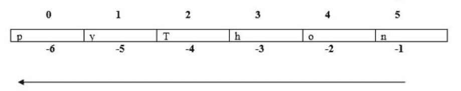

图 1.30：正索引和负索引可以同时存在。我们可以使用索引访问字符串的变量。

### 示例：1.120

```python
s1 = 'python'
print(s1[0]) # — sl1
print(s1[-len(s1)]) # — sl2

print(s1[1]) # — sl3
print(s1[-len(s1)+1]) # — sl4

print(s1[2]) # — sl5
print(s1[-len(s1)+2]) # — sl6

print(s1[5]) # — sl7
print(s1[-len(s1)+5]) # — sl8
```

**输出：1.120**
```
p
p
y
y
t
t
n
n
```

在 sl1 中，通过引用方括号中的索引号 0，我们从字符串 'python' 中分离出字符 'p'。因此，我们收到输出 'p'。

在 sl2 中，通过引用方括号中的索引号 -6，我们从字符串 'python' 中分离出字符 'p'。因此，我们收到输出 'p'。
注意：`len(s1)` 为 6 意味着变量 `s1` 的长度为 6。所以，`-len(s1)` 是 -6。`len()` 方法返回字符串内的字符总数。

在 sl3 中，通过引用方括号中的索引号 1，我们从字符串 'python' 中分离出字符 'y'。因此，我们收到输出 'y'。

在 sl4 中，通过引用方括号中的索引号 -5，我们从字符串 'python' 中分离出字符 'y'。因此，我们收到输出 'y'。
注意：`-len(s1) + 1` 是 -5。

在 sl5 中，通过引用方括号中的索引号 2，我们从字符串 'python' 中分离出字符 't'。因此，我们收到输出 't'。

在 sl6 中，通过引用方括号中的索引号 -4，我们从字符串 'python' 中分离出字符 't'。因此，我们收到输出 't'。
注意：`-len(s1) + 2` 是 -4。

在 sl7 中，通过引用方括号中的索引号 5，我们从字符串 'python' 中分离出字符 'n'。因此，我们收到输出 'n'。

在 sl8 中，通过引用方括号中的索引号 -1，我们从字符串 'python' 中分离出字符 'n'。因此，我们收到输出 'n'。
注意：`-len(s1) + 5` 是 -1。

如果我们访问超出范围的索引，那么 Python 将抛出一个索引错误 `string index out of range`。此错误在正索引和负索引时都可能发生。可以通过创建切片从字符串中调用字符范围。原始字符串中的字符序列称为切片。可以通过创建一个用冒号分隔的索引数字范围（例如 `[begin:end]`）并使用切片操作符来调用多个字符值。

### 示例：1.121

```python
s2 = 'Pythonisawesome'
print(len(s2))
print(s2[6:15])
```

**输出：1.121**
```
15
isawesome
```

上述示例返回从起始索引 6 到结束索引减 1（即第 14 个索引）的子字符串。

| 0 | 1 | 2 | 3 | 4 | 5 | 6 | 7 | 8 | 9 | 10 | 11 | 12 | 13 | 14 |
|---|---|---|---|---|---|---|---|---|---|---|---|---|---|---|
| p | y | t | h | o | n | i | s | a | w | e | s | o | m | e |

第一个索引表示切片的开始位置（包含），第二个索引表示切片的结束位置（不包含）。

当我们对字符串进行切片时，我们正在创建一个子字符串。在这里，我们调用存在于字符串 'pythonisawesome' 内部的子字符串 'isawesome'。

我们甚至可以省略字符串中的一个数字。

### 示例：1.122

```python
s3 = 'Hello Python'
print(s3[:5])
```

**输出：1.122**
```
Hello
```

在这里，我们排除了语法中冒号之前的索引号，只包含冒号之后的索引号。没有指定起始值。那么，默认值从字符串开头到末尾减 1。因此，这里起始是 0，末尾减 1 是 4。所以，最终输出是 'Hello'。

| 0 | 1 | 2 | 3 | 4 | 5 | 6 | 7 | 8 | 9 | 10 | 11 |
|---|---|---|---|---|---|---|---|---|---|---|---|
| H | e | l | l | o |   | P | y | t | h | o | n |

我们可以排除冒号之后的索引号，即从语法中省略第二个索引号。

### 示例：1.123

```python
s4 = 'Doctor'
print(s4[1:])
```

**输出：1.123**
```
octor
```

如果我们不指定结束位置，则默认值是字符串的末尾。'end' 是可选的。在这里，子字符串从索引号对应的字符（即 'o'）开始，一直到字符串的末尾（即 'r'）。

| 0 | 1 | 2 | 3 | 4 | 5 |
|---|---|---|---|---|---|
| D | o | c | t | o | r |

使用切片操作符不一定非要提及开始和结束位置。只使用冒号本身就足够了。

### 示例：1.124

```python
s5 = 'Wonderful'
print(s5[:])
```

**输出：1.124**
```
Wonderful
```

在这里，我们没有指定开始位置。所以，它从字符串的开头开始。我们也没有指定结束位置，所以一直到字符串的末尾。因此，它将从开头开始，一直到字符串的末尾，即我们得到完整的字符串作为输出。

| 0 | 1 | 2 | 3 | 4 | 5 | 6 | 7 | 8 |
|---|---|---|---|---|---|---|---|---|
| W | o | n | d | e | r | f | u | l |

对于切片字符串，我们也可以使用负索引数字。我们已经讨论过，负索引数字从 -1 开始，向下计数直到字符串的开头。对于负数索引，一个需要考虑的重要观察是：起始值必须较低，结束值必须较高。切片操作符永远不会提供索引类型的错误。我们将通过一些示例来澄清我们的概念。

### 示例：1.125

```python
s6 = 'Negative'
print(s6[-8:-5]) # - NI1
print(s6[-5:]) # - NI2
print(s6[:-1]) # - NI3
```

**输出：1.125**
```
Neg
ative
Negativ
```

| -8 | -7 | -6 | -5 | -4 | -3 | -2 | -1 |
|---|---|---|---|---|---|---|---|
| N | e | g | a | t | i | v | e |

在 NI1 中，我们从索引位置 -8 开始，一直到末尾减 1（即 -6）。因此输出为 'Neg'。

| -8 | -7 | -6 | -5 | -4 | -3 | -2 | -1 |
|---|---|---|---|---|---|---|---|
| **N** | **e** | **g** | a | t | i | v | e |

在 NI2 中，我们从索引位置 -5 开始，一直到字符串的末尾（即 -1），因为未指定结束值。因此，输出为 'ative'。

| -8 | -7 | -6 | -5 | -4 | -3 | -2 | -1 |
|---|---|---|---|---|---|---|---|
| N | e | g | **a** | t | i | v | e |

在 NI3 中，由于未指定，我们从字符串的开头开始，一直到字符串的末尾（索引将是 -1 - 1，即 -2）。因此，输出为 'Negativ'。

## 1.14.6 bytes 数据类型

一组字节数据就像一个数组，表示 bytes 数据类型。byte 方法返回的是一个不可变对象。bytes 数据类型的允许值范围是 0 到 255。如果我们提供任何其他值，Python 将抛出值错误（ValueError）。一旦创建了 bytes 数据类型的值，如果我们试图更改其值，Python 将抛出类型错误（TypeError）。使用 bytes 数据类型，我们可以将字符串转换为字节，可以创建给定整数大小的字节，也可以将可迭代列表转换为字节，等等。Bytes 对象包含单一数据类型。Bytes 函数返回一个新的 'bytes' 对象。

bytes() 方法的语法如下：
`bytes([source[, encoding[, errors]]])`
bytes 方法中的三个可选参数如下：

- 1. **source**：上述参数将作为初始化字节数组的来源。它是可选的。
- 2. **encoding**：如果 source 是一个字符串，则需要该字符串的编码。它是可选的。
- 3. **errors**：如果 source 是一个字符串，则指定编码转换失败时要执行的操作。它也是可选的。

# 示例：1.128

源代码扫描二维码见 [第70页] 的 [图 1.29]。

```
输出：1.128
b'\x01\x02\x03\x04'
<class 'bytes'>
2
2
1
2
3
4
b'\x00\x00\x00'
b'Python is interesting.'
```

在 BY1 中，b1 是 bytes 数据类型，包含一组值。因此，输出是 b'\x01\x02\x03\x04'。
在 BY2 中，数据类型是 bytes。

在 BY3 中，索引概念适用于 bytes。我们从左访问第二个值。因此，输出是 2。

在 BY4 中，我们从左访问第三个元素。因此，输出是 2。

在 BY5 中，我们使用 for 循环逐个访问所有元素。首先返回值 1，然后是 2，直到最后一个元素 4。所有值将逐行打印。

在 BY6 中，将创建一个大小为 3 的整数字节，因为这是数组的大小。这里，空字节将被初始化 3 次。因此，输出是 b'\x00\x00\x00'。

在 BY7 中，字符串被转换为字节。因此，输出是 b'Python is interesting.'。

# 使用 bytes 数据类型时的值错误：

```
示例：1.129
y = [1,3,257]
print(bytes(y))
```

```
输出：1.129
ValueError: bytes must be in range(0, 256)
```

这里，值 257 超出了范围。因此，Python 将抛出 ValueError。

# 使用 bytes 数据类型时的类型错误：

```
示例：1.130
y = [1,3,25]
b1 = bytes(y)
b1[0] = 13
```

```
输出：1.130
TypeError: 'bytes' object does not support item assignment
```

由于 bytes 数据类型是不可变的，一旦创建了 bytes 数据类型的值，我们就不能更改其值。因此，Python 解释器将抛出 TypeError。

如果我们想以不可变的性质表示一组 0 到 255 之间的值，那么程序员可以考虑使用 bytes 数据类型。

## 1.14.7 bytearray 数据类型

bytearray 方法返回一个给定字节的数组，即 bytearray 对象。Bytearray 对象是可变的，这意味着其元素在创建后可以被修改。它与 bytes 对象非常相似，区别在于它是可变的。bytearray 对象中的整数序列必须在 0 到 255 的范围内。bytearray 对象的语法如下：

```
bytearray([source[, encoding[, errors]]])
```

> **重要：**

**Source:** 此参数是可选的，它将初始化字节数组。
**Encoding:** 此参数是可选的，执行字符串的编码。
**Errors:** 此参数也是可选的，在转换失败时执行操作。

数组通过 source 参数以不同方式初始化。

# 示例：1.131

源代码扫描二维码见 [图 1.29](Figure 1.29) 的 [第70页](page 70)。

```
输出：1.131
bytearray(b'\x01\x02\x03\x05')
<class 'bytearray'>
1
2
3
5
23
2
3
5
bytearray(b'python')
bytearray(b'\xff\xfep\x00y\x00t\x00h\x00o\x00n\x00')
bytearray(b'\x00\x00\x00')
bytearray(b'\x15\x0c\x11\x08')
Count of bytes: 4
bytearray(b'')
```

在 BA1 中，指定了 0 到 255 之间的整数值范围作为初始内容。它被转换为 bytearray。因此，输出是 bytearray(b'\x01\x02\x03\x05')。
在 BA2 中，a1 是 bytearray 类型。
在 BA3 中，单个整数值被逐一遍历。因此，输出是 1，接着是 2、3 和 5。
在 BA4 中，第 0 个索引值被修改。值 1 被替换为整数值 23。同时，单个整数值被逐一遍历。因此，输出是 23，接着是 2、3 和 5。
在 BA5 中，字符串 'python' 使用 Unicode 8 进行编码。因此，输出是 bytearray(b'python')。
在 BA6 中，字符串 'python' 使用 Unicode 16 进行编码。因此，输出是 bytearray(b'\xff\xfep\x00y\x00t\x00h\x00o\x00n\x00')。
在 BA7 中，我们创建一个给定大小的数组，并用空字节初始化。因此，输出是 bytearray(b'\x00\x00\x00')。
在 BA8 中，字节数组将从一个可迭代列表返回。因此，输出是 bytearray(b'\x15\x0c\x11\x08')。
在 BA9 中，字节总数是 4。
在 BA10 中，将创建一个大小为 0 的数组。因此，输出是 bytearray(b'')。
如果字节不在 0 到 255 的范围内，Python 将抛出 ValueError。

```
示例：1.132
a3 = [258,3]
print(bytearray(a3))
```

## 1.14.8 列表数据类型

Python 中最有用的变量数据类型之一是列表数据类型。当需要将一组值表示为一个单一实体，且要求保持插入顺序并允许重复值时，用户可以选择列表数据类型。插入顺序是指我们向列表中添加元素的顺序。列表对象会维护我们添加元素的顺序。列表包含一系列值。在 Python 中，值的列表用方括号 `[]` 表示。让我们通过一个例子来看看列表中的插入顺序和重复值是什么意思。

```
**示例：1.133**
python
#关于插入顺序和重复值的列表示例
l1 = []
print(type(l1))
l1.append(1)
l1.append(2)
l1.append(3)
l1.append(4)
l1.append(1)
print(l1)
```

```
输出：1.133
<class 'list'>
[1, 2, 3, 4, 1]
```

在上面的例子中，`append` 方法会将单个元素添加到列表的末尾。这里，插入顺序得到了保留。它就是我们向列表中添加元素的顺序。重复的值 '1' 是被允许的。
在列表数据类型中，允许异构对象。异构对象意味着不同类型的对象。

```
示例：1.134
l2 = []
l2.append('python')
l2.append(3)
print(l2)
```

```
输出：1.134
['python', 3]
```

在上面的例子中，字符串值 'python' 被追加到列表中，随后是整数值 3。因此，输出是 `['python', 3]`。
我们也可以使用 `append()` 函数将 `None` 追加到列表中。

```
示例：1.135
l2.append(None)
print(l2)
```

```
输出：1.135
['python', 3, None]
```

列表对象本质上是可增长的。我们可以根据需要增加或减少其大小。

```
示例：1.136
l3 =[]
l3.append(10)
l3.append('hello')
l3.append('HI')
print(l3) # - l1
l3.remove('HI')
print(l3) # - l2
l4 = l3*2
print(l4) # - l3
```

```
输出：1.136
[10, 'hello', 'HI']
[10, 'hello']
[10, 'hello', 10, 'hello']
```

在 l1 中，我们按照插入顺序向列表添加元素。因此，输出是 `[10, 'hello', 'HI']`。
在 l2 中，我们移除了字符串值 HI 的第一次出现。因此，输出是 `[10, 'hello']`。
在 l3 中，我们通过将原始列表乘以 2 来增加列表的大小。因此，输出是 `[10, 'hello', 10, 'hello']`。
需要注意的是，如果我们尝试移除的字符串值不存在，将会得到 `ValueError`。在同一个例子中，如果我们写的是 `l3.remove('JI')` 而不是 `'HI'`，那么 Python 将会抛出错误：`'ValueError: list.remove(x): x not in list'`。
Python 中的列表遵循从零开始的索引。如果我们想访问列表中的值，可以使用索引或切片操作。

```
示例：1.137
l5 = [1,5,6,8]
print(l5[0])
print(l5[-1])
print(l5[1:3])
```

```
输出：1.137
1
8
[5, 6]
```

`l5[0]` 将返回索引 0（从左到右）的值，即 1。
`l5[-1]` 将返回索引 -1（从右到左）的值，即 8。负索引从列表末尾开始计数。
`l5[1:3]` 将返回从索引 1 到索引 2 的元素（索引从 1 开始到结束-1，即 3 – 1 = 2）。因此，输出是 `[5,6]`。
我们可以通过索引将数据赋值给列表的特定元素。

```
示例：1.138
l6 = [10,11,12,13]
l6[2] = 24
print(l6)
```

```
输出：1.138
[10, 11, 24, 13]
```

在上面的例子中，我们可以看到索引 2 处的整数值 12 被新值 24 替换了。因此，输出是 `[10,11,24,13]`。

所以，一个有序的、可变的、允许重复的、异构的元素集合符合列表数据类型。列表对象是可变的，因为列表对象中的项目可以被添加、删除或修改。我们将在后续章节中详细讨论列表。

## 1.14.9 元组数据类型

元组数据类型与列表数据类型相似，但它是不可变的，即一旦赋值，值就不能更改。与列表不同，它不能被更改。元组元素可以用括号 `'()'` 表示。我们也可以在元组上执行索引和切片操作。如果我们尝试修改元组中的项目，将会得到 `TypeError`。我们可以从现有元组中取出部分来创建新的元组。我们不能移除元组中的单个元素。我们可以使用 `del()` 语句删除整个元组。如果我们尝试在删除元组后访问该 **元组** 对象，Python 将会抛出 `NameError`。我们可以在 **元组** 上计算长度、连接、重复、成员关系和迭代操作。Python 将会抛出 `'AttributeError'`，因为元组对象没有名为 `'append'` 或 `'remove'` 的属性。让我们通过例子来理解上述概念。

```
示例：1.139
#元组数据类型
t1 = (5,6,2,1)
print(t1) # – T1
print(t1[2]) # – T2
print(t1[-3]) # – T3
print(t1[1:]) # – T4
for i in t1:
    print(i) # – T5
print(len(t1)) # – T6
t2 = (1,2,3)
t3 = t1+t2
print(t3) # – T7
t4 = t1 *3
print(t4) # – T8
print(3 in t1) # – T9
```

```
输出：1.139
(5, 6, 2, 1)
2
6
(6, 2, 1)
5
6
2
1
4
(5, 6, 2, 1, 1, 2, 3)
(5, 6, 2, 1, 5, 6, 2, 1, 5, 6, 2, 1)
False
```

在 T1 中，我们显示 **元组** 的值。括号内的元素是 **元组**。因此，输出是 `(5, 6, 2, 1)`。

在 T2 中，将返回索引 2（从左到右）的值。因此，返回整数值 2。在 T3 中，将返回索引 -3（从右到左）的值。因此，输出将是整数值 6。

在 T4 中，起始索引是 1，结束索引未提及。因此，默认情况下它将是最后一个元素。所以，结束索引是 3+1 = 4。因此，输出是 `(6,2,1)`。

在 T5 中，我们逐个迭代 **元组** 的每个元素。因此，输出是 5，然后是 6、2 和 1，各占一行。

在 T6 中，**元组** 中的元素值总数为 4。因此，返回输出 4。

在 T7 中，我们连接了两个 **元组** 对象。因此，最终输出是 `(5, 6, 2, 1, 1, 2, 3)`。

在 T8 中，我们通过乘以值 3 来增加 **元组** 对象的大小。元素总数将是 12。所以，输出是 `(5, 6, 2, 1, 5, 6, 2, 1, 5, 6, 2, 1)`。

在 T9 中，我们检查整数值 3 是否存在于 **元组** 中。由于值 '3' 不存在，因此返回 `False`。

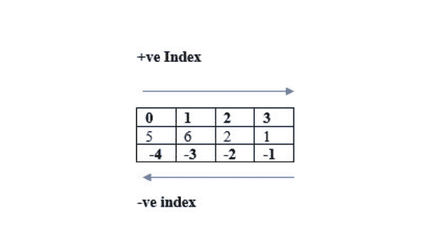

### 元组中的 TypeError：

```
示例：1.140
t1 = (5,6,2,1)
t1[0] = 4
```

```
输出：1.140
TypeError: 'tuple' object does not support item assignment
```

我们不能为元组对象赋值，因为它不支持项目赋值。

### 元组中的 NameError：

```
示例：1.141
t1 = (5,6,2,1)
del t1
print(t1)
```

```
输出：1.141
NameError: name 't1' is not defined
```

`del` 语句移除了元组对象。因此，Python 将会抛出 `NameError`，因为 t1 未定义。

### 元组中的 AttributeError：

```
示例：1.142
t1 = (5,6,2,1)
t1.append(3)
```

```
输出：1.142
AttributeError: 'tuple' object has no attribute 'append'
```

元组中没有名为 `append` 的属性。因此，Python 抛出 `AttributeError`。

```
示例：1.143
t1 = (5,6,2,1)
t1.remove(3)
```

```
输出：1.143
AttributeError: 'tuple' object has no attribute 'remove'
```

元组中没有名为 `remove` 的属性。因此，Python 抛出 `AttributeError`。

## 1.14.10 range 数据类型

range 数据类型表示一个不可变的数字序列，具体取决于所使用的定义。

```
range(stop):
```

它返回从 0 到 stop -1 的数字序列。如果 stop 是负数或 0，则返回一个空序列。stop 就是要返回的不可变整数序列之前的整数。整数的范围在 stop -1 结束。

```
range(start,stop[,step]):
```

start 是一个整数，从该整数开始返回不可变的整数序列。

step 是一个可选的整数参数，它决定了序列中每个整数之间的增量。返回值由以下公式计算

r1[x] = start + step * x（对于正步长和负步长）
对于正步长，x >= 0 且 r[x] < stop
（对于负步长），x >= 0 且 r[x] > stop

我们可以在 range 数据类型上执行索引和切片操作。如果我们尝试更改项目值，Python 将会抛出 `'TypeError'`。此外，range 数据类型不适用于浮点类型的值，否则 Python 将会抛出 `TypeError`。

```
示例：1.144
r1 = range(10)
r1[3] = 73
```

```
输出：1.144
TypeError: 'range' object does not support item assignment
```

```
示例：1.145
r1 = range(10.5)
```

## 1.14.11 集合数据类型

在集合数据类型中，一组值的表示不包含重复项，且顺序并不那么重要。在集合中，值用花括号内的逗号分隔表示。它是一个无序的唯一项集合。集合拥有唯一的值，重复项会被消除。由于集合是无序的，索引没有意义。因此，集合不允许使用切片运算符。集合中允许异构对象。集合本质上是可增长的，也是可变的。我们可以根据需要增加或减少其大小。要创建一个空集合，只需输入set函数。将创建一个空集合。

```
示例: 1.149
#set
s1 = {1,2,3,4,1,2,3}
print(s1) # – s1
s1.add('python')
print(s1) # – s2
s1.remove(3)
print(s1) # – s3
s4 = {'p','y','t','h','o','n'}
print(s4) # – s4
print(type(s4)) # – s5
```

```
输出: 1.149
{1, 2, 3, 4}
{1, 2, 3, 4, 'python'}
{1, 2, 4, 'python'}
{'y', 'o', 'h', 't', 'p', 'n'}
<class 'set'>
```

在s1中，python会消除重复值，因为集合只包含唯一值。所以，输出是{1,2,3,4}。
在s2中，我们向集合添加了一个字符串值'python'。因此，输出是{1, 2, 3, 4, 'python'}。集合包含整数和浮点数。所以，本质上是异构的。
在s3中，整数值3从集合中移除。所以，输出是{1, 2, 4, 'python'}。
在s4中，我们打印集合的值。输出是{'n', 'o', 'h', 'y', 't', 'p'}，这是一个无序的唯一项集合。在s5中，类型是set。

### 集合中的TypeError:

```
示例: 1.150
s5 = {1,2,3,4}
print(s5[0])
```

```
输出: 1.150
TypeError: 'set' object is not subscriptable
```

如我们所见，集合对象不可下标，并且不支持索引。

## 1.14.12 冻结集合数据类型

冻结集合数据类型与集合数据类型相同。唯一的区别是冻结集合数据类型是不可变的。所以，冻结集合数据类型中没有add和remove函数。冻结集合的元素在创建后保持不变。它返回一个不可更改的冻结集合对象。如果未向`frozenset()`函数传递参数，则返回一个空的冻结集合类型对象。如果我们尝试更改冻结集合对象，则Python虚拟机会抛出一个TypeError。它主要用作字典的键或其他集合的元素。

```
示例: 1.151
#frozenset
fs1 = {'h','e','l','l','o'}
f1 = frozenset(fs1)
print(type(f1)) # – FS1
print(f1) # – FS2
fs2 = {'name':'saurabh','age':31,'sex':'Male'}
f2 = frozenset(fs2)
print(f2) # – FS3
```

```
输出: 1.151
<class 'frozenset'>
frozenset({'l', 'o', 'h', 'e'})
frozenset({'sex', 'age', 'name'})
```

在FS1中，类型是frozenset。
在FS2中，我们打印冻结集合对象。因此，输出是frozenset({'o', 'e', 'l', 'h'})。
在FS3中，字典的键值以无序形式显示为冻结集合对象。

### 冻结集合中的TypeError:

```
示例: 1.152
fs3 = {1,2,3,4}
fl = frozenset(fs3)
fl[0] = 5
```

```
输出: 1.152
TypeError: 'frozenset' object does not support item assignment
```

在冻结集合对象中，元素是相同的，一旦创建就不能更改。

```
示例: 1.153
fs3 = {1,2,3,4}
fl = frozenset(fs3)
fl.add(6)
```

```
输出: 1.153
AttributeError: 'frozenset' object has no attribute 'add'
```

冻结集合对象是不可变的。所以，没有add函数。

```
示例: 1.154
python
fs3 = {1,2,3,4}
f1 = frozenset(fs3)
f1.remove(3)
```

```
输出: 1.154
AttributeError: 'frozenset' object has no attribute 'remove'
```

冻结集合对象是不可变的。所以，也没有remove函数。

## 1.14.13 字典数据类型

它是一个无序的键值对集合。单词dict代表dictionary（字典）。在任何字典中，我们都有对应所有字母的单词及其含义。类似地，有一个键（key）及其对应的值（value）。像列表、元组、字节、字节数组、集合、冻结集合、范围这样的数据类型仅适用于单个对象。它通常在我们有大量数据时使用。为了检索数据，字典经过了优化，并且我们必须知道键才能检索值。字典数据类型在花括号{}内定义，每项是一个键值对，形式为`key:value`对。在字典数据类型中，不允许重复的键，但值可以重复。如果我们尝试插入一个具有重复键的条目，旧值将被新值替换。字典数据类型是可变的。不包含任何键值对的空花括号`{}`就是一个字典。

```
示例: 1.155
python
#dict
d1 = {'key':1, 'value':2, 'pair':3, 'in':4,'dict':5}
print(type(d1)) # – D1
print((d1)) # – D2
d1['key'] = 12
print(d1) # – D3
```

```
输出: 1.155
<class 'dict'>
{'key': 1, 'value': 2, 'pair': 3, 'in': 4, 'dict': 5}
{'key': 12, 'value': 2, 'pair': 3, 'in': 4, 'dict': 5}
```

在D1中，d1是'dict'数据类型。
在D2中，我们显示了一个带有键值对的字典对象。因此，输出是`{'key': 1, 'value': 2, 'pair': 3, 'in': 4, 'dict': 5}`。
在D3中，我们尝试使用重复的键插入一个新值。所以，旧值1被新值12替换。

## 1.14.14 内存视图数据类型

内存视图在许多有用的上下文中表现得就像字节数据类型。它允许Python访问支持缓冲区协议的对象的内部数据，而无需复制。缓冲区协议是访问对象内存数组或缓冲区的一种方式。它允许一个对象暴露其内部数据（缓冲区），另一个对象访问这些缓冲区而无需中间复制。可以对对象的字节导向数据进行直接读写访问，而无需先复制它。其语法是

`memoryview(obj)`

其中`obj`是要暴露其内部数据的对象。它返回一个内存视图对象。

```
示例: 1.156
#random bytearray
randomByteArray = bytearray('DEF', 'utf-8')
mv1 = memoryview(randomByteArray)
print(mv1[0]) #- MV1
print(bytes(mv1[0:2])) #- MV2
print(list(mv1[0:3])) #- MV3
``````
输出: 1.156
68
b’DE’
[68, 69, 70]

在此，我们从字节数组 `randomByteArray` 创建了一个内存视图对象 `mv1`。在 MV1 中，我们访问了内存视图 `mv1` 的第 0 个索引 `'D'` 并打印了出来。打印出的是 `'D'` 的 ASCII 码值 68。在 MV2 中，我们访问了内存视图 `mv1` 的索引 0 和 1（`'DE'`）并将其转换为字节。因此，输出为 `b’DE’`。在 MV3 中，我们访问了内存视图 `mv1` 的所有索引并将其转换为列表。因此，输出为 `b’DE’`。由于字节数组内部为字母存储的是 ASCII 码值，因此输出的是 D、E 和 F 的 ASCII 码值列表。所以，输出是 `[68, 69, 70]`。

## 关于不可变性的数据类型总结

关于不可变性的数据类型总结如表 1.6 所示。

| 序号 | 数据类型 | 是否不可变 |
|---|---|---|
| 1 | 整数 | 不可变 |
| 2 | 浮点数 | 不可变 |
| 3 | 复数 | 不可变 |
| 4 | 布尔值 | 不可变 |
| 5 | 字符串 | 不可变 |
| 6 | 字节串 | 不可变 |
| 7 | 字节数组 | 可变 |
| 8 | 范围 | 不可变 |
| 9 | 列表 | 可变 |
| 10 | 元组 | 不可变 |
| 11 | 集合 | 可变 |
| 12 | 冻结集合 | 不可变 |
| 13 | 字典 | 可变 |

表 1.6：不可变性

## 1.15 数据类型转换

在数据类型转换中，我们将一种类型的值转换为另一种类型。这被称为类型强制转换或类型强制。类型转换有 2 种类型，即隐式转换和显式转换。

**隐式类型转换：** 在隐式类型转换中，Python 会自动将一种数据类型转换为另一种数据类型，无需用户参与。在上述示例中，Python 会将较低的数据类型（整数）转换为较高的数据类型（浮点数），以避免数据丢失。

```
示例: 1.157
#隐式类型转换
num1 = 12
num2= 13.5
num3 = num1 + num2
print(type(num1))
print(type(num2))
print(num3)
print(type(num3))
```

```
输出: 1.157
<class 'int'>
<class 'float'>
25.5
<class 'float'>
```

在上面的例子中，我们可以看到有两个变量 `num1` 和 `num2` 分别被赋值为整数和浮点值。变量 `num3` 将 `num1` 和 `num2` 的值相加。最终输出是 25.5。我们可以看到 `num1` 和 `num2` 分别是整数和浮点数据类型。我们得到的最终结果是浮点数据类型。Python 已自动转换为更高的数据类型（即浮点数据类型），以避免数据丢失。

**显式类型转换：** 在显式类型转换中，对象的一种数据类型由用户转换为另一种数据类型。必须使用预定义函数如 `int()`, `str()`, `complex()`, `bool()`, `float()` 等来执行显式类型转换。用户在类型转换中转换对象的数据类型。我们将通过示例逐一讨论每种类型的转换。

- 1. `int()`: 此函数用于将其他数据类型的值转换为整数。它将给定基数的数字转换为十进制。语法是 `int(string,base)`。字符串由 1 和 0 组成，基数是（整数值）数字的基数。它返回一个整数值，这是二进制字符串在给定基数下的等价表示。除了复数数据类型，我们可以从任何类型转换为 int。字符串应仅包含整数值，如果要将字符串类型转换为整数类型，则必须以 10 进制指定。

```
示例: 1.158
#int()
s1 = int(12.34)
print(s1) #– INT1
s2 = int(True)
print(s2)#– INT2
s3 = int(False)
print(s3)#– INT3
s4 = int('1')
print(s4)#– INT4
s5 = '10'
print(int(s5,2))#– INT5
print(int(s5,6))#– INT6
print(int(s5,8))#– INT7
print(int(s5,10))#– INT8
print(int(s5,16))#– INT9
```

```
输出: 1.158
12
1
0
1
2
6
8
10
16
```

在 INT1 中，浮点值 12.34 被转换为 int 数据类型。输出是 12。在 INT2 中，布尔值 `True` 被转换为 int 类型。输出是 1。在 INT3 中，布尔值 `False` 被转换为 int 类型。输出是 0。在 INT4 中，字符串值 `'1'` 被转换为 int 类型。输出是 1。在 INT5 中，字符串值 `'10'` 被转换为基数为 2 的 int 类型。因此输出是 2。

```
int('10',2) = (2^1) * 1 + (2^0) * 0
= 2 + 0
= 2
```

在 INT6 中，字符串值 `'10'` 被转换为基数为 6 的 int 类型。因此输出是 6。

```
int('10',6) = (6^1) * 1 + (6^0) * 0
= 6 + 0
= 6
```

在 INT7 中，字符串值 `'10'` 被转换为基数为 8 的 int 类型。因此输出是 8。

```
int('10',8) = (8^1) * 1 + (8^0) * 0
= 8 + 0
= 8
```

在 INT8 中，字符串值 `'10'` 被转换为基数为 10 的 int 类型。因此输出是 10。

```
int('10',10) = (10^1) * 1 + (10^0) * 0
= 10 + 0
= 10
```

在 INT9 中，字符串值 `'10'` 被转换为基数为 16 的 int 类型。因此输出是 16。

```
int('10',16) = (16^1) * 1 + (16^0) * 0
= 16 + 0
= 16
```

此外，在转换为 int 数据类型的过程中，可能会出现类型错误和值错误。

```
示例: 1.159
print(int('1.5'))
```

```
输出: 1.159
ValueError: invalid literal for int() with base 10: '1.5'
```

在此，我们尝试将不是以 10 进制表示的字符串值 '1.5' 转换为 int 类型。因此，我们得到了值错误。

```
示例: 1.160
print(int('Four'))
```

```
输出: 1.160
ValueError: invalid literal for int() with base 10: 'Four'
```

在此，我们将字符串值 'Four' 转换为整数类型。因此，我们得到了值错误。

```
示例: 1.161
print(int('0b101'))
```

```
输出: 1.161
ValueError: invalid literal for int() with base 10: '0b101'
```

在此，我们将二进制类型值（基数为 2）转换为整数类型。因此，我们再次得到值错误。

```
示例: 1.162
bin = 111
print(int(bin,2))
```

```
输出: 1.162
TypeError: int() can't convert non-string with explicit base
```

我们不能将带有显式基数的非字符串转换为 int 类型。所以，我们得到了类型错误。如果我们有一个带有显式基数的字符串值，我们就可以将其转换为 int 类型，如下所示。

```
示例: 1.163
bin = '111'
print(int(bin,2))
```

```
输出: 1.163
7
```

```
int('111',2) = (2^2) * 1 + (2^1) * 1 + (2^0) * 1
= 4 + 2 + 1
= 7
```

```
示例: 1.164
print(int(1+2j))
```

```
输出: 1.164
TypeError: can't convert complex to int
```

我们不能将复数类型转换为整数类型。因此，Python 将抛出“类型错误”。但是，我们可以提取实部和虚部，并将其转换为整数类型，如下所示。

```
示例: 1.165
a = 1+2j
b = a.real
c = a.imag
print(int(b))
print(int(c))
```

```
输出: 1.165
1
2
```

我们正在提取实部和虚部，并将它们转换为整数类型。因此，显示输出 1 和 2。

- 2. `float()`: 此函数用于将其他数据类型的值转换为浮点类型。我们可以将除复数类型外的任何类型值转换为浮点类型。如果我们尝试将字符串类型转换为浮点类型，则字符串应为整数或浮点字面量，并且只能以 10 进制指定。

```
示例: 1.166
#float()
sbin = float(0b1100)
print(sbin) #- FLT0
soct = float(0o12)
print(soct) #- FLT1
shex = float(0x10)
print(shex) #- FLT2
s1 = float(12)
print(s1) #- FLT3
s2 = float(True)
print(s2)#- FLT4
s3 = float(False)
print(s3)#- FLT5
s4 = float('1')
print(s4)#- FLT6
s5 = '10'
print(float(s5))#- FLT7
s6 = '1.5'
print(float(s6))#- FLT8
```

```
输出: 1.166
12.0
10.0
16.0
12.0
1.0
0.0
1.0
10.0
1.5
```

在 FLT0 中，我们将一个二进制值转换为浮点类型。0b1100 的整数值是 12。现在，上述值被转换为浮点类型。因此，输出是 12.0。在 FLT1 中，我们将一个八进制值转换为浮点类型。0o12 的八进制值是 10。现在，上述值被转换为浮点类型。因此，输出是 10.0。在 FLT2 中，我们将一个十六进制值转换为浮点类型。0x10 的十六进制值是 16。现在，上述值被转换为浮点类型。因此，输出是 16.0。在 FLT3 中，整数值 12 被转换为浮点类型。因此，输出是 12.0。在 FLT4 中，`True` 的默认整数值是 1。因此，输出是 1.0。在 FLT5 中，`False` 的默认整数值是 0。因此，输出是 0.0。在 FLT6 中，字符串值 '1' 被转换为浮点类型。因此，输出是 1.0。在 FLT7 中，字符串值 '10' 被转换为浮点类型。因此，输出是 10.0。在 FLT8 中，字符串值 '1.5' 被转换为浮点类型。因此，输出是 1.5。此外，在转换为浮点数据类型的过程中，可能会出现类型错误和值错误。

```
示例: 1.167
print(float(10+8j))
```

```
输出: 1.167
TypeError: can't convert complex to float
```

从上面的例子中，我们可以看到复数类型不能转换为浮点类型。我们会得到类型错误。
```

## 示例：1.168
print(float('Five'))
```

输出：1.168
ValueError: could not convert string to float: 'Five'
```

我们无法将字符串值 Five 转换为浮点类型。这将引发值错误。

## 示例：1.169
print(float('0o11'))
```

输出：1.169
ValueError: could not convert string to float: '0o11'
```

我们无法将字符串值 0o11 转换为浮点类型。因此，Python 将抛出值错误。

### 3. complex()
此函数用于将其他数据类型的值转换为复数类型。有时在将其他类型转换为复数时，我们可能只传递实部值，或者同时传递实部和虚部值。因此，根据参数的不同，有两种形式。

#### 形式-1：complex(a)

上述函数用于将值 a 转换为实部为 a、虚部为 0 的复数。

## 示例：1.170
#complex(a)
print(complex(5)) # – CF1
print(complex(5.5)) # – CF2
print(complex(0b101)) # – CF3
print(complex(0o101)) # – CF4
print(complex(0x11)) # – CF5
print(complex(True)) # – CF6
print(complex(False)) # – CF7
print(complex('7')) # – CF8
print(complex('7.5')) # – CF9
```

输出：1.170
(5+0j)
(5.5+0j)
(5+0j)
(65+0j)
(17+0j)
(1+0j)
0j
(7+0j)
(7.5+0j)
```

在 CF1 中，整数值 5 被转换为复数类型 5 + 0j。

在 CF2 中，浮点值 5.5 被转换为复数类型 5.5 + 0j。

在 CF3 中，二进制值 0b101 被转换为复数类型 5 + 0j，因为 101 的十进制形式是 5。

在 CF4 中，八进制值 0o101 被转换为复数类型 65 + 0j，因为 101 的十进制形式是 65。

在 CF5 中，十六进制值 0x11 被转换为复数类型 17 + 0j，因为 11 的十进制形式是 17。

在 CF6 中，布尔值 True 被转换为复数类型 1 + 0j，因为 True 的整数值是 1。

在 CF7 中，布尔值 False 被转换为复数类型 0j，因为 False 的整数值是 0。

在 CF8 中，字符串值 '7' 被转换为复数类型 7 + 0j。

在 CF9 中，字符串值 '7.5' 被转换为复数类型 7.5 + 0j。

#### 形式-2：complex(a,b)

上述函数用于将值 a 和 b 转换为实部为 a、虚部为 b 的复数。

## 示例：1.171
#complex(a,b)
print(complex(5.5,1)) # – CMP1
print(complex(0b101,-1)) # – CMP2
print(complex(True,True)) # – CMP3
```

输出：1.171
(5.5+1j)
(5-1j)
(1+1j)
```

在 CMP1 中，实部是浮点值 5.5，虚部是整数值 1。因此，输出为 5.5 + 1j。

在 CMP2 中，实部是 5.5，虚部是 -1。因此，输出为 5.5 -1j。

在 CMP3 中，实部是 1（True 的整数值），虚部是 1（True 的整数值）。因此，输出为 1 + 1j。

此外，在复数类型转换过程中，也有可能遇到类型错误和值错误。

## 示例：1.172
print(complex('6.5',7))
```

输出：1.172
TypeError: complex() can’t take second arg if first is a string
```

当第一个参数是字符串时，我们不能传递第二个参数。因此，PVM 将抛出类型错误。

## 示例：1.173
print(complex(6.5,'7'))
```

输出：1.173
TypeError: complex() second arg can't be a string
```

在复数类型转换期间，我们不能将第二个参数作为字符串传递。因此，PVM 将再次抛出类型错误。

## 示例：1.174
print(complex('Seven'))
```

输出：1.174
ValueError: complex() arg is a malformed string
```

这里，字符串格式不正确。因此，PVM 将抛出值错误。

### 4. bool()
此函数用于将其他类型的值转换为布尔类型。

#### 对于整数参数：
在 bool 函数中，如果我们传递的参数是零，则返回 False；如果传递的是非零数字，则返回 True。这个非零数字可以是正数也可以是负数。

## 示例：1.175
print(bool(0)) # – B1
print(bool(100)) # – B2
print(bool(-100)) # – B3
```

输出：1.175
False
True
True
```

在 B1 中，bool 函数内的参数是零，因此返回 False。

在 B2 中，bool 函数内的参数是非零正数，因此返回 True。

在 B3 中，bool 函数内的参数是非零负数，因此返回 True。

#### 对于浮点数参数：
如果数值计算结果为 0.0，则自动视为 False，否则为 True。

## 示例：1.176
print(bool(0.0)) # - B4
print(bool(0.011)) # - B5
print(bool(0.00001)) # - B6
```

输出：1.176
False
True
True
```

在 B4 中，参数是 0.0，因此返回 False。

在 B5 中，参数是非零正数，因此返回 True。

在 B6 中，参数是非零负数，因此返回 True。

#### 对于复数：
当我们将复数作为参数传递时，如果实部和虚部都为 0，则返回 False。如果实部或虚部中任何一个非零，则返回 True。

## 示例：1.177
print(bool(0 + 0j)) # – B7
print(bool(0.011 + 0j)) # – B8
print(bool(0-0.00001j)) # – B9
```

输出：1.177
False
True
True
```

在 B7 中，实部和虚部都是 0，因此返回 False。

在 B8 中，实部是非零正数，因此返回 True。

在 B9 中，虚部是非零负数，因此返回 True。

#### 对于字符串：
如果参数是空字符串（"" 或 ""），则视为 False，否则为 True。即使是空格也被视为一个字符，因此它是一个非空字符串。

## 示例：1.178
print(bool('')) # – B10
print(bool("")) # – B11
print(bool('python')) # – B12
```

输出：1.178
False
False
True
```

在 B10 中，参数是单引号内的空字符串，因此返回 False。

在 B11 中，参数是双引号内的空字符串，因此返回 False。

在 B12 中，参数是非空字符串，因此返回 True。

bool 函数对于任何类型的数据作为参数都不会引发错误。它总是返回 True 或 False。

### 5. str()
此函数用于将其他数据类型转换为字符串类型。

## 示例：1.179
print(str(3)) # – st1
print(str(3.2)) # – st2
print(str(3+2j)) # – st3
print(str('Four')) # – st4
```

输出：1.179
3
3.2
(3+2j)
Four
```

在 st1 中，整数值 3 被转换为字符串值 '3'。因此，输出为 '3'。

在 st2 中，浮点值 3.2 被转换为字符串值 '3.2'。因此，输出为 '3.2'。

在 st3 中，复数值 3 + 2j 被转换为字符串值 '3+2j'。

在 st4 中，字符串值 'Four' 被直接打印。

## 1.16 不可变性与基本数据类型的概念

需要注意的是，基本数据类型是不可变的，即一旦创建了一个对象，我们就无法对该对象进行任何更改。如果我们试图更改，那么对于这些更改，默认情况下会创建一个新对象。这种不可更改的行为就是不可变性。可变意味着可以更改，不可变意味着不可更改。

假设我们创建了一个对象，其值为 1。我们无法更改这个值。如果有人试图将其更改为 2，那么对于这个更改，默认情况下会创建一个新对象。了解 Python 中的不可变性概念很重要。让我们通过图示来理解。

(a) 假设 z = 1。Python 中的一切都是对象。因此，z = 1 的内存表示如下所示。

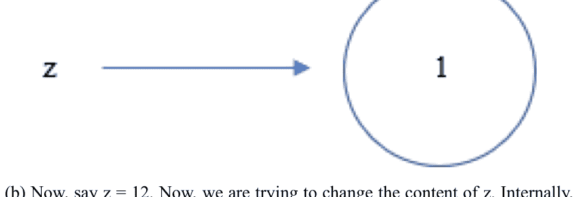

(b) 现在，假设 z = 12。现在，我们试图更改 z 的内容。内部地，这个 1 将被替换为 12。不要这样想。

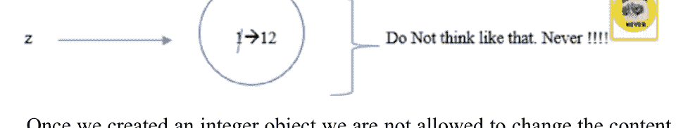

一旦我们创建了一个整数对象，我们就不允许更改其内容。该值将始终是最终的。即 z = 1。

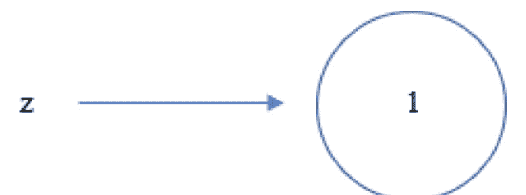

但我们仍然试图更改它。

(c) 将创建一个值为 12 的新对象。从现在开始，z 将指向这个值为 12 的新对象，而值为 1 的对象将符合垃圾回收的条件。

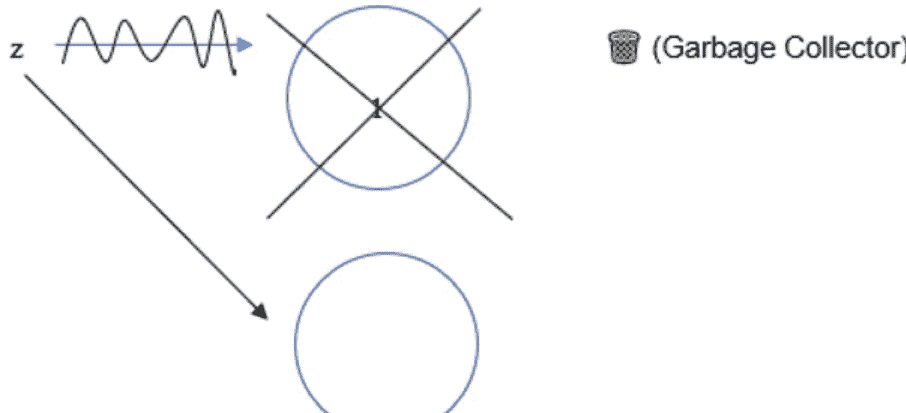

我们没有对现有对象进行任何更改。默认情况下会创建一个新对象，z 将指向该对象。这种不可更改性就是不可变性概念。像 int、float、bool、complex 和字符串对象这样的数据类型都是不可变的。

如果 Python 不断地创建新对象，肯定会浪费内存，性能会下降，有人可能会这样想。实际上，这是一个优势特性。垃圾回收器（GC）会保留未使用或旧的对象，并自动销毁它们。PVM 不会在需要新对象时立即创建。Python 会首先检查是否有任何对象具有所需的内容。如果有任何对象可用那么该对象将被重用。如果不可用，则会创建一个新对象。主要优点是性能得到提升，内存使用也更高效。假设有3个引用变量a、b和c。比如python创建了一个整数对象5，a是它的引用变量。现在，需要创建一个值为5的b。如果任何对象被需要创建，python会检查值为5的整数对象是否已存在。Python会发现值为5的整数对象已经创建。所以，b将引用同一个对象5。c以及更多指向同一对象的变量情况类似。可以用下图表示：

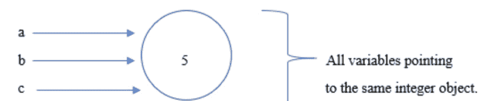

所以，我们可以看到多个引用变量指向同一个对象。通过一个引用变量，我们就能改变现有对象中的值。这样，其余的引用变量都会受到影响。为了防止这种情况，需要不可变性概念。一旦创建了对象，我们就不允许更改其内容。如果我们尝试更改值，那么将创建一个新对象，而旧对象将被GC自动销毁。让我们在实践中看看。

```
示例：1.180
a1 = 'python'
a2 = 'python'
a3 = 'python'
a4 = 'python'

#我们创建了1个python对象和4个引用
print(id(a1))
print(id(a2))
print(id(a3))
print(id(a4))
```

```
输出：1.180
2013265085104
2013265085104
2013265085104
2013265085104
```

从上面的例子，我们可以看到有1个对象具有4个引用。每个引用都指向同一个对象。这个数字是对象'python'的地址。多个引用共享同一个对象。如果一个引用改变了内容，其余所有引用都不会受到影响。假设a1将值更改为'python2'，将创建一个新对象，仅由引用a1指向。所有其余引用仍将指向对象'python'。

```
示例：1.181
a1 = 'python2'
print(id(a1))
```

```
输出：1.181
2013282905072
```

现在，我们可以看到a1的地址与之前的地址不同，因为它指向一个不同的对象。现在，我们将检查引用是否指向同一个对象。

```
示例：1.182
print(a1 is a2)
print(a2 is a3)
print(a3 is a4)
```

```
输出：1.182
False
True
True
```

如果引用指向同一个对象，is运算符将返回True，否则返回False。a1和a2指向不同的对象。因此，返回False。另一方面，a2、a3和a4指向同一个对象。因此，在这些情况下返回True。

## 1.17 命名空间

命名空间就是一个系统，确保程序中的名称唯一且可以无冲突地使用。这里，Name指的是唯一标识符，space指的是作用域。一个名称可以是任何python方法，而空间取决于我们尝试从哪个位置访问变量或方法。让我们先了解什么是Name。Name就是赋予对象的名称。我们都知道python中一切都是对象。要访问底层对象，名称是一种方式。

```
示例：1.183
n1 = 3
print(id(n1))
print(id(3))
```

```
输出：1.183
140730748674512
140730748674512
```

在上面的例子中，当我们执行赋值 n1 = 3 时，3是存储在内存中的对象，而n1是我们关联的名称。id()函数返回对象在RAM中的地址。这里，两者指的是同一个对象。让我们看下面一个有细微变化的例子。

```
示例：1.184
n1 = 3
print(id(n1))
n1 +=1
print(id(n1))
print(id(4))
n2 = 3
print(id(3))
```

```
输出：1.184
140730748674512
140730748674544
140730748674544
140730748674512
```

参考下图

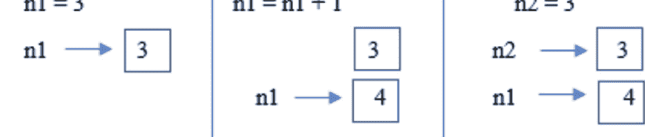

最初创建了一个对象3，名称n1与之关联。当我们执行 `n1 += 1` 时，创建了一个新的对象4，现在n1与这个对象关联。注意 `id(4)` 和 `id(n1)` 具有相同的值。此外，当我们执行 `n2 = 3` 时，新名称n2与之前的对象3关联。因此，无需创建重复的对象。由于名称绑定的动态特性，python足够强大，一个名称可以引用任何类型的对象。同一个名称可以在不同实例用于不同类型的对象，并且我们也可以通过它整洁地调用函数。

```
示例：1.185
n1 = 3
n1 = 'Hi'
n1 = [4,5,6]

def Hello():
    print('Hello')

n1 = Hello()
```

```
输出：1.185
Hello
```

现在我们知道名称，就可以理解命名空间了。命名空间是名称的集合。Python将命名空间实现为字典。命名空间类似于名称到对象的映射。我们可以将命名空间想象为每个我们定义的名称到相应对象的映射（变量名(键)及其相应对象(值)的字典）。命名空间是完全隔离的，可以在给定时间共存。当我们启动Python解释器时，会创建一个包含内置名称的命名空间。这就是为什么像id()和print()这样的内置函数可以从程序的任何部分使用。这些是内置命名空间。由于命名空间是隔离的，存在于不同模块中的相同名称不会冲突。当用户创建模块时，会创建全局命名空间。模块可以拥有各种函数和类。当调用函数时，会创建一个局部命名空间，其中包含其中定义的所有名称。类的情况类似。内置命名空间包含全局命名空间，全局命名空间包含局部命名空间。请参见下图以澄清概念。

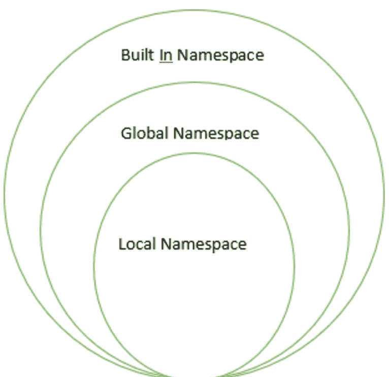

作用域主题将在学习装饰器概念之前详细介绍。它也需要函数的概念。

## 第 2 章

## Python 字符串

字符串是任何编程语言的重要组成部分。字符串是包含字符数据序列的对象。换句话说，我们可以认为字符串不过就是字符数组。我们几乎找不到任何不操作字符串的应用程序。字符串中最重要的概念之一（我们已经在第1章讨论过）是字符串是不可变的。一旦创建，就不能为字符串重新赋值。在本章中，我们将学习从键盘读取动态输入、命令行参数、字符串属性、字符串方法、字符串格式化、三引号，并通过实际的解答示例和练习进行实践。我们都知道，字符串字面量可以包含在单引号或双引号中。如果使用在 ''' 或 """ 内，字符串字面量可以跨越多行文本。使用标准的 `[]` 语法，我们可以访问字符串中的字符。Python使用基于零的索引。如果索引超出字符串范围，Python将引发错误。让我们从字符串的基本输入开始。

## 2.1 从键盘读取动态输入

在Python2中，有两个版本的input函数可用于从键盘读取动态输入：`raw_input()` 和 `input()`。让我们逐一了解这些输入函数。

- 1. `raw_input()`: 在此函数中，从键盘读取的数据始终以字符串格式允许读取。`raw_input` 函数始终将输入作为字符串接收。让我们看一个例子
    my_age = raw_input("How old am I ? :")
    print(my_age)

    如果输入31：即使没有引号，输入的数据也被视为字符串
    如果输入'31'：输入的数据被视为包含引号的字符串

即使我们从键盘输入整数值31或字符串值'31'，值也只会作为字符串存储在 `my_age` 变量中。当我们用表达式 `print(my_age)` 打印 `my_age` 变量时，答案将是字符串值'31'或"31"。上述函数在python版本3.x中被 `input()` 函数替代。

- 2. `input()`: 在python v2.x中，如果输入的数据包含在引号 `""` 或 `''` 中，`input` 函数会将接收到的数据视为字符串，否则数据将被视为数字。

    my_age = input("How old am I ? :")
    print(my_age)

    如果输入31：输入的数据被视为数字
    如果输入'31'：输入的数据被视为字符串

如果从键盘输入整数值31，该值将作为整数存储在 `my_age` 变量中。当我们用表达式 `print(my_age)` 打印 `my_age` 变量时，输出是整数值31。另一方面，如果从键盘输入字符串值'31'，该值将作为字符串存储在 `my_age` 变量中。当我们用表达式 `print(my_age)` 打印 `my_age` 变量时，输出是字符串值'31'。

但在python版本3.x中，`raw_input()` 函数已被弃用。`raw_input` 函数被一个新的函数 `input()` 替代。如果在python版本3.x中尝试使用 `raw_input()` 函数，python将引发NameError。

```
示例 2.1
my_age = raw_input("How old am I ? :")
print(my_age)
```

```
输出 2.1
NameError: name 'raw_input' is not defined
```

在 Python 3 中，输入的数据无论是否带有引号，始终被视为字符串处理。

```
示例 2.2
my_age = input("How old am I ? :")
print(my_age)
print(type(my_age))
```

```
输出 2.2
How old am I ? :42
42
<class 'str'>
```

```
示例 2.3
my_age = input("How old am I ? :")
print(my_age)
print(type(my_age))
```

```
输出 2.3
How old am I ? :'42'
'42'
<class 'str'>
```

从上面的例子可以看出，无论我们从键盘输入的数据是否带有引号，变量的类型都始终是字符串。因此，`input` 函数用于直接以我们需要的格式读取数据，无需进行类型转换。所以，Python 3 中 `input` 函数的行为与 Python 2 的 `raw_input` 函数完全相同，即每个输入值都仅被视为 `str` 类型。让我们再看几个例子，以确认 `input` 函数的 `str` 类型。

```
示例 2.4
name = input('Enter some value: ')
print(name)
print(type(name))
```

```
输出 2.4
Case I:
Enter some value: 42
42
<class 'str'>

Case II:
Enter some value: False
False
<class 'str'>

Case III:
Enter some value: 10+3j
10+3j
<class 'str'>
```

从上例可见，即使输入浮点数、布尔值或复数值，变量 `name` 的数据类型也只是字符串。我们可以根据需要，将键盘输入的数据转换为所需的数据类型。现在，我们将看看如何编写一个 Python 程序，从键盘接收两个数字作为输入，并打印它们的和、差、积、商及平均值。

```
示例 2.5
num1 = input("Enter the first number: ")
num2 = input("Enter the second number: ")
add = int(num1) + int(num2)
subtract = int(num1) - int(num2)
mul = int(num1) * int(num2)
div = int(num1) / int(num2)
avg = (int(num1) + int(num2))/2.0
print(f"Sum of 2 numbers is {add}")
print(f"Subtraction of 2 numbers is {subtract}")
print(f"Multiplication of 2 numbers is {mul}")
print(f"Division of 2 numbers is {div}")
print(f"Average of 2 numbers is {avg}")
```

```
输出 2.5
Enter the first number: 3
Enter the second number: 2
Sum of 2 numbers is 5
Subtraction of 2 numbers is 1
Multiplication of 2 numbers is 6
Division of 2 numbers is 1.5
Average of 2 numbers is 2.5
```

在上面的例子中，程序要求用户从键盘输入两个数字。输入的数据被视为字符串，即 `'3'` 和 `'2'`。输入的字符串数据被转换为整数。然后根据公式计算加法、减法、乘法、除法和平均值。但现在每个人心中可能都有一个问题：如果我输入的数据不像数字怎么办？它可以是任何东西，比如 `3a`。那么 Python 会抛出一个 `ValueError` 错误。

> ValueError: invalid literal for int() with base 10: '3a'

我们可以使用 `try-except` 块来捕获上述错误。

## 使用 try-except

```
try:
    num1 = input("Enter the first number: ")
    num2 = input("Enter the second number: ")
    add = int(num1) + int(num2)
    subtract = int(num1) - int(num2)
    mul = int(num1) * int(num2)
    div = int(num1) / int(num2)
    avg = (int(num1) + int(num2))/2.0
    print(f"Sum of 2 numbers is {add}")
    print(f"Subtraction of 2 numbers is {subtract}")
    print(f"Multiplication of 2 numbers is {mul}")
    print(f"Division of 2 numbers is {div}")
    print(f"Average of 2 numbers is {avg}")
except ValueError:
    print("Could not convert data to an integer.")
```

```
输出 2.6
Enter the first number: 3a
Enter the second number: 2
Could not convert data to an integer.
```

在 `try` 块下，我们编写一段代码来检测错误。`except` 块将让我们处理这些错误。我们将会详细学习上述概念，所以不必担心。只需知道我们可以捕获用户的错误数据输入即可。在 Python 中，也可以在一行内从键盘读取多个数据。我们将在学习列表推导式等概念时处理这个问题。Python 本身就像一种魔法。有海量的库支持这门语言。我们必须了解它的程度，取决于我们自己。

## Python 中的 eval 函数

`eval` 函数用于计算一个指定的表达式。如果该表达式是有效的 Python 语句，它将会被执行。它允许一个 Python 程序在自身内部运行 Python 代码。字符串被传入，Python 表达式代码在程序内部被求值。其语法是 `eval(expression, globals, locals)`，其中：
- **expression**：一个字符串，将被解析并作为 Python 代码求值。
- **globals**：可选。一个包含全局参数的字典。
- **locals**：可选。一个包含局部参数的字典。

让我们看一些例子以获得更清晰的了解。

### 示例 2.7

```
print(eval("'pyth' + 'on'")) # Exp1
print(eval("'python '*2 ")) # Exp2
print(eval('3+5*(6-3) -12')) # Exp3
print(eval('True == False')) # Exp4
print(eval('3**2')) # Exp5
print(eval('2*(2+1)-3')) # Exp6
print(eval("'python'.upper()")) # Exp7
print(eval("'PYTHON'.lower()")) # Exp8
x= 3
print(eval("x*(x+1)*(x+2)")) # Exp9
```

### 输出 2.7

```
python
python python
6
False
9
3
PYTHON
python
60
```

在 Exp1 中，我们对表达式 `'pyth' + 'on'` 进行求值。实际上我们是在连接两个字符串。因此，输出为 `python`。

在 Exp2 中，我们将字符串 `python` 乘以 2 次。因此，输出为 `python python`。

在 Exp3 中，我们根据运算符优先级对表达式进行求值。

3 + 5 * (6 – 3) – 12 = 3 + 5 * 3 – 12
= 3 + 15 – 12
输出 = 6

在 Exp4 中，我们比较布尔值 `True` 是否与 `False` 相同。输出为 `False`。

在 Exp5 中，表达式为 `3 ** 2 = 9`。

在 Exp6 中，我们根据运算符优先级对表达式进行求值。

2 * (2 + 1) – 3 = 2 * 3 – 3
= 6 – 3
输出 = 3

在 Exp7 中，我们从给定的字符串 `'python'` 返回大写字符串。因此，输出为 `PYTHON`。

在 Exp8 中，我们从给定的字符串 `'PYTHON'` 返回小写字符串。因此，输出为 `python`。

在 Exp9 中，我们通过将值 3 代入表达式来对其求值。

x * (x + 1) * (x + 2) = 3 * (3 + 1) * (3 + 2)
= 3 * 4 * 5
输出 = 60

## 2.2 字符串

现在，我们都知道字符串是如何表示的。最流行的数据类型之一是通过将字符括在引号中来表示的。Python 用单引号或双引号处理字符串。因此，用单引号或双引号括起来的字符序列被称为字符串。例如 `'python'` 或 `"python"`。两者都是字符串对象。在像 C、C++ 或 Java 这样的编程语言中，单引号内的单个字符是字符数据类型值。但是，Python 中没有字符数据类型，它只被视为字符串。将字符串赋值给变量，需要使用变量名，后跟等号和字符串。

```
示例 2.8
v1 = 'python'
v2 = "python"
print(type(v1))
print(type(v2))
```

```
输出 2.8
<class 'str'>
<class 'str'>
```

从下面的例子可以看出，两个变量都只是字符串数据类型。Python 中没有字符数据类型的概念。

## 2.3 Python 多行字符串

在 Python 中，可以使用三个单引号或双引号来定义多行长字符串字面量。将长字符串拆分到不同行的最简单方法之一，就是将整个长字符串用一对双引号括起来，一个在开头，一个在结尾。看下面的 Python 代码片段。

```
示例 2.9
s1 = "I am a beginner in python \nI will study the concepts to be familiar with this language.\nIt is a very user friendly language"
print("The long string is: \n" + s1) # – L1

s2 = """The long string is:
I am a beginner in python
I will study the concepts to be familiar with this language.
It is a very user friendly language"""
print(s2) # – L2
```

```
输出 2.9
The long string is:
I am a beginner in python
I will study the concepts to be familiar with this language.
It is a very user friendly language
The long string is:
I am a beginner in python
I will study the concepts to be familiar with this language.
It is a very user friendly language
```

在 L1 中，我们使用了 `\n` 来将字符串包含在下一行以提高可读性。字符串写在双引号内。最后，我们使用 `+` 运算符连接了两个字符串，最终得到了期望的输出。在 L2 中，我们使用三引号定义字符串并得到了期望的结果。因此，如何高效地显示字符串完全取决于用户。换行符被插入在代码中定义的位置。我们也可以在单引号内使用单引号，在双引号内使用双引号。

```
示例 2.10
print('We are using \' single quote')
print("We are using ' single quote")
```

## 2.4 Python 字符串访问

#### 2.4.1 使用索引

#### 2.4.2 使用切片操作符

---

输出 2.10

```python
print('We are using \' single quote')
print("We are using ' single quote")
```

```text
Output 2.10
We are using ' single quote
We are using ' single quote
```

我们可以在单引号前使用反斜杠，或者将单引号放在字符串的双引号内，都可以得到所需的输出。每当我们使用反斜杠加单引号 (`\'`) 时，单引号仅被视为符号。我们同样可以在单引号字符串内使用双引号，也可以在双引号字符串内使用双引号。

```python
Example 2.11
print('We are using " double quote')
print("We are using \" double quote")
```

```text
Output 2.11
We are using " double quote
We are using " double quote
```

我们可以在双引号前使用反斜杠，或者将双引号放在字符串字面量的双引号内，都可以得到所需的输出。每当我们使用反斜杠加双引号 (`\"`) 时，双引号仅被视为符号。现在，我们可以在一个字符串中同时使用单引号和双引号，无论该字符串是用单引号还是双引号定义的。

```python
Example 2.12
print("This is \' single and \" double quotes ")
print('This is \' single and \" double quotes ')
```

```text
Output 2.12
This is ' single and " double quotes
This is ' single and " double quotes
```

此外，无需在单引号或双引号前使用反斜杠，我们也可以在字符串字面量内打印它们。三引号用于在字符串字面量内将单引号或双引号仅作为符号使用。

```python
Example 2.13
print('''This is ' single and " double quotes ''')
print("""This is ' single and " double quotes """)
```

```text
Output 2.13
This is ' single and " double quotes
This is ' single and " double quotes
```

因此，若要声明多行字符串字面量，并在字符串字面量中仅将单引号或双引号作为符号使用，我们可以选择三引号符号。

Python 使用方括号 `[]` 来访问字符串的元素。可以使用以下方式访问字符串的字符：

索引可以是正数或负数。正索引从左到右，负索引从右到左。我们在[第 - 1 章]中已经讨论过这一点。由于我们现在在讨论字符串，这将是一个复习话题。考虑字符串变量 `'cricket'`。

| 正索引 | | | | | | |
|---|---|---|---|---|---|---|
| 0 | 1 | 2 | 3 | 4 | 5 | 6 |
| c | r | i | c | k | e | t |
| -7 | -6 | -5 | -4 | -3 | -2 | -1 |
| 负索引 | | | | | | |

`cricket` 中的字符 'c' 可以使用从左到右的 0 索引或从右到左的负 7 索引访问。如果需要使用索引访问字符串的字符，则索引值必须在 0 到 6 或 -1 到 -7 的范围内。如果错误地使用了超出此范围的索引，我们将得到 `IndexError` 错误，提示超出范围。

```python
Example 2.14
s1 = 'cricket'
print(s1[0])
print(s1[-7])
print(s1[6])
print(s1[-1])
```

```text
Output 2.14
c
c
t
t
```

现在大家应该都清楚如何使用索引访问字符串的元素了。

```python
Example 2.15
s2 = 'generate'
print(s2[8])
```

```text
Output 2.15
IndexError: string index out of range
```

由于索引超出了范围，Python 将生成 `IndexError` 错误。

我们也可以使用切片操作符访问字符串的字符。切片语法返回字符的范围。切片操作符的语法是：

```text
s[startindex:endindex:step]
```

起始索引和结束索引通过冒号分隔指定，以返回部分索引。

- **起始索引（startindex）：** 我们考虑开始切片（子字符串）的起始整数位置。
- **结束索引（endindex）：** 我们终止切片（子字符串）的整数位置，并在 `endindex - 1` 处停止。
- **步长（step）：** 步长是确定切片时每个索引之间增量的整数值。

> **注意：**
> 如果未指定 `起始索引`，则从字符串开头开始考虑。如果未指定 `结束索引`，则考虑至字符串末尾。如果未指定 `步长`，则默认增量值为 1。`步长` 值可以是正数或负数。如果是正数，则应从左到右，即正向方向。步长值从起始位置到结束位置 - 1。如果是负数，则应从右到左，即反向方向。步长值从起始位置到结束位置 + 1。需要注意以下几点：

**正向方向**

- `起始索引` 的默认值：0
- `结束索引` 的默认值：字符串长度
- `步长` 的默认值：1
- 如果 `结束` 值为 0，则结果始终为空。

**反向方向**

- `起始索引` 的默认值：-1
- `结束索引` 的默认值：-(字符串长度 + 1)
- 如果 `结束` 值为 -1，则结果始终为空。

我们可以在正向或反向方向为 `起始` 和 `结束` 索引同时使用正数和负数值。让我们看一个 Python 切片示例片段。

```python
Example 2.16
s1 = 'Pulchitudrinous'
print(s1[0:6]) # – SL1
print(s1[0:6:1]) # – SL2
print(s1[:6]) # – SL3
print(s1[1:6:2]) # – SL4
print(s1[6:]) # – SL5
print(s1[::]) # – SL6
print(s1[:]) # – SL7
print(s1[::-1]) # – SL8
print(s1[::-2]) # – SL9
print(s1[-1:-13:-2]) # – SL10
print(s1[1:13:-2]) # – SL11
print(s1[1:-8:1]) # – SL12
# print(s1[1:5:0]) # — ValueError
print(s1[1:7:-1]) # – SL13
print(s1[0:-4:-1]) # – SL14
print(s1[:1:-1]) # – SL15
```

```text
Output 2.16
Pulchi
Pulchi
Pulchi
uci
tudrinous
Pulchitudrinous
Pulchitudrinous
suonirdutihcluP
soidthlP
soidth
ulchit
suonirdutihcl
```

首先我们来看单词 `"Pulchitudrinous"` 的索引：

| 正索引 | 0 | 1 | 2 | 3 | 4 | 5 | 6 | 7 | 8 | 9 | 10 | 11 | 12 | 13 | 14 |
|---|---|---|---|---|---|---|---|---|---|---|---|---|---|---|---|
| | P | u | l | c | h | i | t | u | d | r | i | n | o | u | s |
| 负索引 | -15 | -14 | -13 | -12 | -11 | -10 | -9 | -8 | -7 | -6 | -5 | -4 | -3 | -2 | -1 |

在 SL1 中，起始索引为 0，结束索引为 6。从 0 到 5，默认增量为 1。因此，输出是 **Pulchi**。

| 0 | 1 | 2 | 3 | 4 | 5 | 6 | 7 | 8 | 9 | 10 | 11 | 12 | 13 | 14 |
|---|---|---|---|---|---|---|---|---|---|---|---|---|---|---|
| P | u | l | c | h | i | t | u | d | r | i | n | o | u | s |

在 SL2 中，起始索引为 0，结束索引为 6。从 0 到 5，步长增量为 1。因此，输出是 **Pulchi**。

在 SL3 中，起始索引和步长增量未指定。因此，起始索引将为 0，字符将从位置 0 到位置 5，步长增量为 1。因此，输出是 **Pulchi**。

在 SL4 中，起始索引为 1，结束索引为 6。字符将从位置 1 到位置 5，步长增量为 2。因此，输出是 **uci**。

| 0 | 1 | 2 | 3 | 4 | 5 | 6 | 7 | 8 | 9 | 10 | 11 | 12 | 13 | 14 |
|---|---|---|---|---|---|---|---|---|---|---|---|---|---|---|
| P | u | l | c | h | i | t | u | d | r | i | n | o | u | s |

在 SL5 中，起始索引为 6，结束索引将持续到字符串末尾。因此输出是 **tudrinous**。

| 0 | 1 | 2 | 3 | 4 | 5 | 6 | 7 | 8 | 9 | 10 | 11 | 12 | 13 | 14 |
|---|---|---|---|---|---|---|---|---|---|---|---|---|---|---|
| P | u | l | c | h | i | t | u | d | r | i | n | o | u | s |

在 SL6 中，未指定起始索引、结束索引和步长增量。因此，字符将从位置 0 开始直到字符串末尾，默认增量为 1。因此输出是 **Pulchitudrinous**。

在 SL7 中，情况与 SL6 相同。所以，输出也相同。

在 SL8 中，未指定起始索引和结束索引。但步长增量为 -1（反向方向），因此字符将从索引 -1 开始，直到（字符串长度 + 1）的位置。这等价于 `s1[-1:-16:-1]`。这将反向打印字符串。因此，输出是 **suonirdutihcluP**。

| | -15 | -14 | -13 | -12 | -11 | -10 | -9 | -8 | -7 | -6 | -5 | -4 | -3 | -2 | -1 |
|---|---|---|---|---|---|---|---|---|---|---|---|---|---|---|---|
| | P | u | l | c | h | i | t | u | d | r | i | n | o | u | s |

在 SL9 中，表达式 `s1[::-2]` 等价于 `s1[-1:-16:-2]`。因此，输出是 **soidthlP**。

| | -15 | -14 | -13 | -12 | -11 | -10 | -9 | -8 | -7 | -6 | -5 | -4 | -3 | -2 | -1 |
|---|---|---|---|---|---|---|---|---|---|---|---|---|---|---|---|
| | P | u | l | c | h | i | t | u | d | r | i | n | o | u | s |

在 SL10 中，从位置 12 到位置 1 获取字符，计数从反向方向开始，步长增量为 2。

| | -15 | -14 | -13 | -12 | -11 | -10 | -9 | -8 | -7 | -6 | -5 | -4 | -3 | -2 | -1 |
|---|---|---|---|---|---|---|---|---|---|---|---|---|---|---|---|
| | P | u | l | c | h | i | t | u | d | r | i | n | o | u | s |在SL11中，起始索引是1，结束索引是13，步长增量是2，方向为反向。我们无法从位置1向后获取到位置14的字符。因此，输出为空。

在SL12中，由于步长增量是正数（1），我们从位置1向前获取字符到位置9。

1 到 (-8 - 1) = 1 到 -9

| 0 | 1 | 2 | 3 | 4 | 5 | 6 | 7 | 8 | 9 | 10 | 11 | 12 | 13 | 14 |
|---|---|---|---|---|---|---|---|---|---|---|---|---|---|---|
| P | u | l | c | h | i | t | u | d | r | i | n | o | u | s |
| -15 | -14 | -13 | -12 | -11 | -10 | -9 | -8 | -7 | -6 | -5 | -4 | -3 | -2 | -1 |

因此，输出为 **ulchit**。

在SL13中，我们以步长增量1，从位置1向后获取字符到位置8。因此，输出为空。

在SL14中，我们以步长增量1，从位置0向后获取字符到位置3。因此，输出为空。

在SL15中，表达式 s1[:1:-1] 等同于 s1[-1:1:-1]。

-1 到 (1 + 1) = -1 到 2

| 0 | 1 | 2 | 3 | 4 | 5 | 6 | 7 | 8 | 9 | 10 | 11 | 12 | 13 | 14 |
|---|---|---|---|---|---|---|---|---|---|---|---|---|---|---|
| P | u | l | c | h | i | t | u | d | r | i | n | o | u | s |
| -15 | -14 | -13 | -12 | -11 | -10 | -9 | -8 | -7 | -6 | -5 | -4 | -3 | -2 | -1 |

因此，输出为 **suonirdutihcl**。

## 2.5 Python 字符串方法

Python有多种内置方法可用于字符串。所有字符串方法都返回新值，并且不会改变原始字符串。我们现在将讨论多种以字符串为参数并执行某些操作的内置函数。

#### 2.5.1 字符串 capitalize()

此方法返回一个字符串，其中字符串的第一个字符被转换为大写字母，而所有其他字符都转换为小写字母。如果默认情况下第一个字符已经是大写字母，则不会有任何更改。此函数不接受任何参数。语法为 string.capitalize()。

```
示例 2.17
#capitalize 函数 —— 首字母大写
s1 = "indian brave soldiers..."
print(s1) # – CA1
print(s1.capitalize()) # – CA2
s2 = 'India'
print(s2.capitalize()) # – CA3
s3 = '31 is my age'
print(s3.capitalize()) # – CA4
```

```
输出 2.17
indian brave soldiers...
Indian brave soldiers...
India
31 is my age
```

在CA1中，打印了字符串。因此，输出为 **indian brave soldiers....**
在CA2中，第一个字母'i'被大写为'I'，而所有其他字符保持小写。因此，输出为 **Indian brave soldiers.**
在CA3中，字符'I'已经是大写。因此，输出为 **India.**
在CA4中，第一个非字母字符是3。输出为 **31 is my age.**

#### 2.5.2 字符串 casefold()

此小写方法将字符串转换为casefolded字符串，用于无大小写匹配。此方法在比较时会忽略大小写。返回一个所有字符均为小写的字符串。它不接受任何参数，用于无大小写匹配。上述方法返回casefolded字符串。它比 `lower()` 方法更激进，在比较两个字符串且两个字符串都使用 `casefold()` 方法转换时会非常有用。

```
示例 2.18
s1 = "HELLO BEGINNERS"
print(s1.casefold()) # – CF1
s2 = "Hello Beginners"
print(s2.casefold()) # – CF2

if s1.casefold() == s2.casefold(): # – CF3
    print("Both the strings are same after conversion")
else:
    print("Both the strings are different after conversion ")
```

```
输出 2.18
hello beginners
hello beginners
Both the strings are same after conversion
```

在CF1中，字符串"HELLO BEGINNERS"被转换为 **hello beginners**。
在CF2中，字符串'Hello Beginners'被转换为 **hello beginners**。
在CF3中，我们将两个字符串的所有字符都转换为小写字母后进行比较。由于返回了True，因此输出为"转换后两个字符串相同"。
我们将在下一章讨论if-else和多种if-elif概念。

#### 2.5.3 字符串 center()

`center()` 方法将返回一个字符串，该字符串使用指定字符作为填充字符进行填充。如果未指定，默认使用空格作为填充字符。上述方法的语法为

```
string.center(width, fillchar)
```

其中

**width** 参数是必需的，返回填充字符后的字符串长度。

**fillchar** 参数是可选的，是用于填充每侧缺失空间的填充字符。

```
示例 2.19
#center 方法
s1 = 'Python'
print(s1.center(10,'@')) # – C1
print(s1.center(10)) # – C2
s2 = "I love python"
print(s2.center(13,' ')) # – C3
print(s2.center(14,' ')) # – C4
print(s2.center(15,' ')) # – C5
print(s2.center(16,' ')) # – C6
```

```
输出 2.19
@@Python@@
Python
    I love python
I love python%
%I love python%
%I love python%%
```

在C1中，字符串'Python'的长度为6，给定的字符串宽度为10。所以，填充字符(@)的数量为4。因此，输出为 @@Python@@。

在C2中，默认空格是填充字符。因此，输出为 Python。

在C3中，字符串的总长度为13，给定的字符串宽度为13。因此，输出为 I love python。

在C4中，字符串的总长度为13，给定的字符串宽度为14。指定的填充字符是'%'。此填充字符将用于填充字符串的右侧填充。因此，输出为 I love python%。

在C5中，字符串的总长度为13，给定的字符串宽度为15。填充字符将填充字符串的左侧和右侧填充。因此，输出为 %I love python%。

在C6中，字符串的总长度为13，给定的字符串宽度为16。填充字符将填充字符串的左侧和右侧填充。左侧一个'%'，右侧两个'%'。因此，输出为 %I love python%%。

#### 2.5.4 字符串 count()

`count()` 方法返回子字符串在指定字符串中出现的次数。它将告诉我们给定的子字符串在字符串中出现了多少次。上述字符串方法的语法为

```
string.count(sub[, start[, end]])
```

**sub:** 一个必需的参数，是要计数的字符串。

**start:** 一个可选参数，是一个整数，表示在字符串内搜索开始的起始索引。默认值为0。

**stop:** 也是一个可选参数，是一个整数，表示在字符串内搜索结束的结束索引。

```
示例 2.20
str1 = "The brave man is not the one who does not feel afraid, but he who conquers that fear"
print(str1.count('who')) # – CO1
str2 = 'The more you practice, the better the concepts will be cleared.'
print(str2.count('the', 10)) # – CO2
str3 = 'It is we who are responsible for all our misery and all our degradation'
print(str3.count('our',10,len(str3))) # – CO3
```

```
输出 2.20
2
2
2
```

在CO1中，子字符串'who'出现了2次。因此，输出为2。
在CO2中，计数从遇到第二个'o'之后开始。'the'子字符串出现了2次。请注意下面以粗体和灰色突出显示的字符串。
The more **you practice**, the **better** the **concepts will be cleared**。
在CO3中，计数从'h'之后开始。子字符串'our'出现了2次。请注意下面以粗体和灰色our突出显示的字符串。
It is we **who are responsible for all** our **misery and all** our **degradation**。

#### 2.5.5 字符串 encode()

此方法将使用指定的编码标准对字符串进行编码，并返回编码后的字符串。将文本从一种标准编码转换为另一种标准编码的过程称为编码。Python代码默认是Unicode形式，但可以根据需要编码为其他标准。上述方法的语法为

```
string.encode(encoding, errors)
```

其中
**encoding** 是一个可选参数，是一个字符串，指定要使用的编码标准。如果未指定编码标准，则默认使用UTF-8。**errors** 也是一个可选参数，是一个字符串，指定错误处理方法。合法值有 backslashreplace, ignore, namereplace, strict, replace 和 xmlcharrefreplace。

#### 2.5.5 字符串 encode()

```python
#encode
s1 = 'Adoråble'
print(s1.encode('ascii','backslashreplace')) # – E1
print(s1.encode("ascii","ignore")) # – E2
print(s1.encode("ascii","namereplace")) # – E3
print(s1.encode("ascii","replace")) # – E4
print(s1.encode("ascii","xmlcharrefreplace")) # – E5
print(s1.encode("ascii","strict")) # – E6
```

**输出 2.21**
```
b'Ador\xe5ble'
b'Adorble'
b'Ador\N{LATIN SMALL LETTER A WITH RING ABOVE}ble'
b'Ador?ble'
b'Ador&#229;ble'
UnicodeEncodeError: 'ascii' codec can't encode character '\xe5'
in position 4: ordinal not in range(128)
```

在上面的例子中，我们使用了ASCII编码来编码一个无法编码的字符。

在 E1 中，错误响应类型是 `'backslashreplace'`。使用反斜杠代替了无法编码的字符。因此，输出为 `b'Ador\xe5ble'`。

在 E2 中，错误响应类型是 `'ignore'`，它将忽略无法编码的字符。因此，输出为 `b'Adorble'`。

在 E3 中，错误响应类型是 `'namereplace'`。它将通过用文本替换无法编码的字符来描述该字符。因此，输出为 `b'Ador\N{LATIN SMALL LETTER A WITH RING ABOVE}ble'`。

在 E4 中，错误类型是 `'replace'`。它将用问号替换无法编码的 Unicode 字符。因此，输出为 `b'Ador?ble'`。

在 E5 中，错误类型是 `'xmlcharrefreplace'`。它将用 XML 字符引用替换无法编码的 Unicode 字符。因此，输出为 `b'Ador&#229;ble'`。

在 E6 中，默认的错误类型响应是 `'strict'`。这等同于 `print(s1.encode('ascii'))`。失败时会引发 `UnicodeEncodeError` 异常。这里，'ascii' 编解码器无法编码位置 4 的字符 '\xe5'。因此，会引发一个异常。

## 2.5.6 字符串 endswith()

此方法在字符串以指定的后缀结尾时返回 `True`，否则返回 `False`。
上述方法的语法是

```
str.endswith(suffix[,start[,end]])
```

其中
**suffix:** 是必需的参数，它是需要检查的后缀字符串或后缀元组。
**start:** 是一个可选参数。从字符串的起始位置开始检查后缀。
**end:** 是一个可选参数。从字符串的结束位置开始检查后缀。

```python
#endswith
str1 = 'www.abc.com'
print(str1.endswith('com')) # – EW1
print(str1.endswith('args')) # – EW2
str2 = 'ISRO stands for Indian Space Research Organisation'
print(str2.endswith('Organisation')) # – EW3
print(str2.endswith('Organisation.')) # – EW4
print(str2.endswith('Organisation', 14)) # – EW5
print(str2.endswith('ISRO', 0,3)) # – EW6
print(str2.endswith('ISRO', 0,4)) # – EW7
print(str2.endswith('for', 5,15)) # – EW8
```

**输出 2.22**
```
True
False
True
False
True
False
True
True
```

在 EW1 中，返回 `True`，因为字符串以指定的后缀 'com' 结尾。

在 EW2 中，返回 `False`，因为字符串没有以指定的后缀 'args' 结尾。

在 EW3 中，返回 `True`，因为字符串以指定的后缀 'Organisation' 结尾。

在 EW4 中，返回 `False`，因为字符串没有以指定的后缀 'Organisation.' 结尾。

在 EW5 中，返回 `True`，因为提供了范围的起始索引，方法从那里开始搜索。

在 EW6 中，返回 `False`，因为字符串在索引 3 处没有结束。

| 0 | 1 | 2 | 3 | 4 |
|---|---|---|---|---|
| I | S | R | O |   |

在 EW7 中，返回 `True`，因为字符串在索引 4 处结束。

| 0 | 1 | 2 | 3 | 4 |
|---|---|---|---|---|
| I | S | R | O |   |

在 EW8 中，搜索字符串 'stands for'，它在索引 15 处结束。因此，返回 `True`。

| 0 | 1 | 2 | 3 | 4 | 5 | 6 | 7 | 8 | 9 | 10 | 11 | 12 | 13 | 14 | 15 |
|---|---|---|---|---|---|---|---|---|---|----|----|----|----|----|----|
| I | S | R | O |   | s | t | a | n | d | s  |    | f  | o  | r  |    |

## 2.5.7 字符串 expandtabs()

此方法通过将所有制表符 `'\t'` 替换为空白，直到达到 `tabsize` 参数的下一个倍数，从而返回字符串的副本。默认情况下，1个制表符对应8个空格，可以根据需要进行覆盖。默认制表符大小为8。此方法会跟踪当前位置。上述方法的语法是

```
string.expandtabs(tabsize)
```

其中 `tabsize` 是一个可选的整数制表符大小参数。

```python
#expand tabs
s1 = '123\trstuv\t56780'
print(s1) # – ET1
print(s1.expandtabs()) # – ET2
print(s1.expandtabs(2)) # – ET3
print(s1.expandtabs(3)) # – ET4
print(s1.expandtabs(4)) # – ET5
print(s1.expandtabs(5)) # – ET6
print(s1.expandtabs(6)) # – ET7
```

**输出 2.23**
```
123   rstuv   56780
123   rstuv   56780
123 rstuv 56780
123   rstuv 56780
123 rstuv   56780
123 rstuv   56780
123   rstuv 56780
```

在 ET1 中，我们打印了字符串。因此，输出是 `123\trstuv\t56780`。

在 ET2 中，上述程序中第一个 `'\t'` 字符的位置是三。如果没有提及，第一个制表符大小默认为8。因此，'123' 后面的空格数是 8 – 3 = 5。下一个制表位将是默认制表符大小的倍数，即 16, 24 等等。第二个 `'\t'` 字符的位置是 13。所以，'rstuv' 后面的总空格数是 16 – 13 = 3。因此，输出是 `123   rstuv   56780`。

在 ET3 中，制表符大小设置为2。下一个制表位将是 2, 4, 6 等等的倍数。对于 '123'，制表位是 4，对于 'rstuv'，制表位是 10。因此，'123' 后面会有 4 – 3 = 1 个空格，'rstuv' 后面会有 10 – 9 = 1 个空格。因此，输出是 `123 rstuv 56780`。

在 ET4 中，制表符大小设置为3。下一个制表位将是 3, 6, 9 等等的倍数。对于 '123'，制表位是 6，对于 'rstuv'，制表位是 12。因此，'123' 后面会有 6 – 3 = 3 个空格，'rstuv' 后面会有 12 – 11 = 1 个空格。因此，输出是 `123   rstuv 56780`。

在 ET5 中，制表符大小设置为4。下一个制表位将是 4, 8, 12 等等的倍数。对于 '123'，制表位是 4，对于 'rstuv'，制表位是 12。因此，'123' 后面会有 4 – 3 = 1 个空格，'rstuv' 后面会有 12 – 9 = 3 个空格。因此，输出是 `123 rstuv   56780`。

在 ET6 中，制表符大小设置为5。下一个制表位将是 5, 10, 15 等等的倍数。对于 '123'，制表位是 5，对于 'rstuv'，制表位是 15。因此，'123' 后面会有 5 – 3 = 2 个空格，'rstuv' 后面会有 15 – 10 = 5 个空格。因此，输出是 `123 rstuv   56780`。

在 ET7 中，制表符大小设置为6。下一个制表位将是 6, 12, 18 等等的倍数。对于 '123'，制表位是 6，对于 'rstuv'，制表位是 12。因此，'123' 后面会有 6 – 3 = 3 个空格，'rstuv' 后面会有 12 – 11 = 1 个空格。因此，输出是 `123   rstuv 56780`。

## 2.5.8 字符串 find()

此方法在整个字符串中查找子字符串，如果找到则返回子字符串第一次出现的索引，否则返回 -1。上述方法与 `index()` 方法相同，唯一的区别是 `index()` 方法在找不到搜索字符串时会引发异常。上述方法的语法是

```
string.find(sub[, start[, end]])
```

其中

**sub:** 是需要在字符串中搜索的子字符串。它是必需参数。

**start:** 是一个可选参数，表示在字符串中开始搜索子字符串的位置。默认为 0。

**end:** 也是一个可选参数，表示结束搜索的位置。默认为字符串的末尾。

```python
#find
s1 = 'Eerie'
print(s1.find('e')) # – F1
s2 = 'error'
print(s2.find('r')) # – F2
print(s2.find('r',3,len(s2))) # – F3
str1 = "Hello dear"
print(str1.find('r')) # – F4
print(str1.find('dear')) # – F5
str2 = 'Mother love is priceless'
print(str2.find('o',5)) # – F6
print(str2.find('q')) # – F7
```

**输出 2.24**
```
1
1
4
9
6
8
-1
```

在 F1 中，在字符串 'Eerie' 中找到了字母 'e' 的第一次出现，位于索引 1。因此，输出是 1。

| 0 | 1 | 2 | 3 | 4 |
|---|---|---|---|---|
| E | e | r | i | e |

在 F2 中，在字符串 'error' 中找到了字母 'r' 的第一次出现，位于索引 1。因此，输出是 1。
在 F3 中，在字符串 'error' 的位置 3 到长度（即 5）之间找到了字母 'r' 的第一次出现，位于索引 4。因此，输出是 4。
在 F4 中，字母 'r' 首次出现在索引 9。因此，输出是 9。

| 0 | 1 | 2 | 3 | 4 | 5 | 6 | 7 | 8 | 9 |
|---|---|---|---|---|---|---|---|---|---|
| H | e | l | l | o |   | d | e | a | r |

在 F5 中，子字符串 'dear' 首次出现在索引 6。因此，输出是 6。
在 F6 中，从位置 5 开始搜索，字母 'o' 首次出现在索引 8。
在 F7 中，字符串中没有字母 'q'。因此，输出是 -1。

## 2.5.9 字符串 format()

此方法将对字符串执行格式化操作。给定的字符串被格式化为更美观的输出。指定的值在格式化后插入到字符串的占位符中，该占位符使用花括号 `{}` 定义。花括号内可以是索引或位置参数。可以使用命名索引、编号索引或空的占位符来标识它们。上述方法返回一个格式化后的字符串。上述方法的语法是

```
string.format(value1, value2,)
```

其中
**value1, value2**，是需要格式化并插入字符串的值。值可以是任何数据类型，也可以是键值对列表、逗号分隔的值列表，或两者的组合，或者是一个指定要移除的元素位置的数字。使用格式说明符，我们可以格式化数字。表 2.1 列出了相关列表：

| 类型 | 描述 |
|---|---|
| :d | 十进制格式 |
| :c | 将值转换为相应的 Unicode 字符 |

## 2.5.10 字符串格式映射()

此方法将返回字典键的值。上述方法在方法调用时会创建一个新字典。如果我们在处理字典子类时，这将会很有用。

上述方法的语法为

```
str.format_map(mapping)
```

其中，**mapping** 是一个存储输入字典的变量，而 **str** 是输入字典的键。

> **示例 2.26**

扫描二维码查看第 129 页图 2.1 所示的源代码

```
输出 2.26
Saurabh’s last name is Chandrakar
Ram is a Lawyer and his telephone number is is 40 years old.
Shyam is a Carpenter and his telephone number is is 41 years old.
(10, b)
(a, 12)
(6, 12)
```

在 FM1 中，`format_map` 函数用于存储在变量 `str1` 中的输入。它返回了键的值。因此，输出是 **Saurabh’s last name is Chandrakar**。

在 FM2 中，name 键的第 0 个索引值是 'Ram'。第 1 个索引值是 'Shyam'。对于 profession 和 telephone_num 可以作相同理解。因此，输出是 **Ram is a Lawyer and his telephone number is is 40 years old.**

在 FM3 中，输出是 **Shyam is a Carpenter and his telephone number is is 41 years old**。只需观察 FM4、FM5 和 FM6 的输出，我们将在讨论字典时详细学习 `__missing__`(key) 函数。

## 2.5.11 字符串索引()

此方法返回子字符串在字符串中首次出现的索引（如果找到）。如果未找到子字符串，它会引发一个异常。`index()` 方法的语法为

```
str.index(sub[,start[, end]])
```

其中

- **sub：** 要在字符串中搜索的子字符串。
- **start：** 这是一个可选参数，表示在字符串中开始搜索子字符串的位置。默认值为 0。
- **end：** 这也是一个可选参数，表示结束搜索的位置。默认值为字符串末尾。

| 说明符 | 描述 |
| :--- | :--- |
| :b | 二进制格式 |
| :o | 八进制格式 |
| :x | 小写 x 的十六进制格式 |
| :X | 大写 X 的十六进制格式 |
| :n | 与‘d’相同。数字格式 |
| :e | 小写 e 的科学计数法 |
| :E | 大写 E 的科学计数法 |
| :f | 浮点数格式（默认为 6 位小数） |
| :F | 与‘f’相同。但‘nan’和‘inf’显示为‘NAN’和‘INF’ |
| :g | 通用格式 |
| :G | 与‘g’相同。但如果数字很大则切换为‘E’ |
| :% | 百分比格式 |
| :< | 在可用空间内左对齐结果 |
| :> | 在可用空间内右对齐结果 |
| :^ | 在可用空间内居中对齐结果 |
| := | 符号放置在最左位置 |
| :+ | 表示结果是正数还是负数 |
| :- | 仅负值显示‘-’符号 |
| : | 在正数前插入一个额外空格 |
| : , | 使用逗号作为千位分隔符 |
| :_ | 使用下划线作为千位分隔符 |

表 2.1：字符串格式中使用的格式说明符

# 示例 2.25

扫描二维码查看第 129 页图 2.1 所示的源代码 示例 2.25

# 输出 2.25

```
Hello Python beginners. The value of pi is 3.14159
Hello Python beginners. The value of pi is 3.14159
Hello Python beginners. The value of pi is 3.142
Hello Python beginners. The value of pi is 3.142
```

```
The number is 654
The float number is 987.345670
bin 1010 octal 12 hex a
56
987654
86.45
001
086.45
+33.360000 -33.360000
33.360000 -33.360000
33.360000 -33.360000
13
86.45
130000
-86.4547
top
top
top
*top**
Lyco
Lyc
Lyc
dec: 100,000,000
dec: 366.667%
```

在 FO1 中，参数 0 是 Python，参数 1 是 '3.14159'。字符串 "Hello {}beginners. The value of pi is {}" 是模板字符串。此处，格式化使用默认参数完成。Python 内部将上述模板字符串的引用转换为数字，即 {0} 和 {1}。由于 'Python' 是第 0 个参数，它被放置在 {0} 的位置。{0} 中没有格式代码，因此不执行任何其他操作。同样，浮点数被放置在 {1} 中。因此，输出是 Hello Python beginners. The value of pi is 3.14159。

在 FO2 中，格式化使用位置参数完成。输出将与 FO1 相同，即 Hello Python beginners. The value of pi is 3.14159。

在 FO3 中，格式化使用关键字参数完成。我们为参数使用了键值对。通过其键（如 {lang} 和 {pi:9.3f}）引用的参数称为关键字参数。内部，占位符 {lang} 被 name 的值 {Python} 替换。此处没有格式代码，因此放置 'Python'。对于参数 {pi = 3.14159}，占位符 {pi:9.3f} 被值 3.14159 替换。'.' 之前的部分（即 (9)）指定了数字 3.14159 可以占据的最小宽度。数字 3.14159 被分配了至少 9 个位置，包括 '.'。剩余空间向右对齐。对于字符串，剩余空间向左对齐。'.' 之后的部分将在 3 位后截断小数部分 14159。剩余数字 (159) 被四舍五入到 2。因此，最终输出是 Hello Python beginners. The value of pi is 3.142。

| | | | | 3 | . | 1 | 4 | 2 |

在 FO4 中，格式化使用混合参数完成。它是关键字和位置参数的组合。'Python' 是第 0 个参数，它被放置在 {0} 的位置。占位符 {pi:9.3f} 在对其执行 9.3f 操作后被值 3.14159 替换。因此，最终输出是 Hello Python beginners. The value of pi is 3.142。


*图 2.1：源代码*

| | | | | 3 | . | 1 | 4 | 2 |

在 FO5 中，格式化使用整数参数完成。我们将得到输出 **The number is 654.**

在 FO6 中，格式化使用浮点数参数完成。我们将得到输出 **The float number is 987.345670.**

在 FO7 中，格式化使用八进制、二进制和十六进制格式完成。我们将得到输出 bin 1010 octal 12 hex a。

在 FO8 中，格式化使用具有最小宽度 {:4d} 的整数完成。因此，输出是 **56.**

| | | 5 | 6 |

在 FO9 中，宽度对于比填充更长的数字不起作用。此处，最小宽度是 {:2d}。因此，输出是 **987654.**

| 9 | 8 | 7 | 6 | 5 | 4 |

在 FO10 中，对浮点数进行了填充。86.45468 可以占据的最小宽度是 6，包括 '.'。同时，小数部分 45468 将被截断到 2 位，即四舍五入到 45。f 代表处理浮点数的格式。因此，输出是 **86.45.**

| | 8 | 6 | . | 4 | 5 |

在 FO11 中，具有最小宽度的整数用零填充。此处，宽度是 3。因此，输出是 **003.**

| 0 | 0 | 3 |

在 FO12 中，对浮点数进行了填充并用零填充。如果我们想用零填充剩余位置，在格式说明符前放置一个零就足够了。因此，输出是 **086.45.**

| 0 | 8 | 6 | . | 4 | 5 |

在 FO13 中，对带符号的数字进行了格式化。上述格式化显示了正号。因此，输出是 +33.360000 -33.360000。

在 FO14 中，上述格式化显示了负号。因此，输出是 33.360000 -33.360000。

在 FO15 中，上述格式化为 '+' 号显示了空格。因此，输出是 33.360000 -33.360000。


空格以灰色突出显示。

在 FO16 中，对整数进行了右对齐格式化。提到的宽度是 6。因此，输出是 **13**。


在 FO17 中，对浮点数进行了居中对齐格式化。因此，输出是 **86.45**。


在 FO18 中，对整数进行了左对齐并用零填充。因此，输出是 **130000**。上述问题可能导致输出为 130000 而非 13，从而引发问题。


在 FO19 中，对浮点数进行了居中对齐格式化。因此，输出是 **-86.4547**。

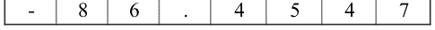

在 FO20 中，对字符串填充进行了左对齐格式化。因此，输出是 **top**。


在 FO21 中，对字符串进行了右对齐格式化。因此，输出是 **top**。

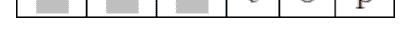

在 FO22 中，对字符串进行了居中对齐格式化。因此，输出是 **top**。


在 FO23 中，对字符串进行了居中对齐格式化，并用 '*' 填充字符。

| * | t | o | p | * | * |

在 FO24 中，字符串被截断为 4 个字母。因此，输出是 **Lyco**。

在 FO25 中，字符串被截断为 3 个字母，填充使用了左对齐。因此，输出是 **Lyc**

| L | y | c |  |

在 FO26 中，字符串被截断为 3 个字母，填充使用了右对齐。因此，输出是 **Lyc**

|  | L | y | c |

在 FO27 中，格式化使用逗号作为千位分隔符完成。因此，输出是 dec: 100,000,000。

在 FO28 中，格式化以 % 格式完成。因此，输出是 dec: 366.667%。

## 2.5.11 字符串 index() 方法

index() 方法与 find() 方法几乎完全相同。唯一的区别是，当找不到子字符串时，find() 方法返回 -1。而 index() 方法会引发一个异常。

### 示例 2.27

```python
#index
s1 = 'ecstatic'
print(s1.index('e')) # – I1
s2 = 'Transparent'
print(len(s2))
print(s2.index('r')) # – I2
print(s2.index('r',3,len(s2))) # – I3
str1 = "Thank You"
print(str1.index('o')) # – I4
print(str1.index('You')) # – I5
str2 = 'My first love is my mother'
print(str2.index('o',5)) # – I6
print(str2.index('q')) # – I7
```

### 输出 2.27

```
0
11
1
7
7
6
10
ValueError: substring not found
```

在 I1 中，字母 ‘e’ 位于字符串 ‘ecstatic’ 的第 0 个索引处。因此，输出为 0。
在 I2 中，字母 ‘r’ 位于字符串 ‘Transparent’ 的第 1 个索引处。因此，输出为 1。
在 I3 中，搜索字符串中位置 3 和 11 之间的字母 ‘r’。即在索引 10 处。因此，输出为 7。
在 I4 中，字母 ‘o’ 位于字符串 ‘Thank You’ 的第 7 个索引处。因此，输出为 7。
在 I5 中，子字符串 ‘You’ 位于字符串 ‘Thank You’ 的第 6 个索引处。因此，输出为 6。
在 I6 中，由于搜索从位置 5 开始，字母 ‘o’ 位于字符串 ‘My first love is my mother’ 的第 10 个索引处。因此，输出为 10。
在 I7 中，字符串中没有字母 ‘q’。因此，Python 将引发异常 ‘ValueError: substring not found’。

## 2.5.12 字符串 isalnum() 方法

此方法检查字符串中的所有字符是否都是字母数字字符。字母数字字符是数字（0-9）或字母（a-z）。不是字母数字字符的字符包括 !@$%^&*()?（空格）等。不允许使用特殊字符。上述方法的语法如下

```python
string.isalnum()
```

如果字符串中的所有字符都是字母数字字符，则返回 True；如果至少有一个字符不是字母数字字符，则返回 False。它不接受任何参数。字母可以是大写或小写。
在 IS1 中，字符串中的所有字符都是字母。因此，输出为 True。
在 IS2 中，字符串中有一个空格。因此，输出为 False。
在 IS3 中，字符串中存在特殊字符 ‘@’。因此，输出为 False。
在 IS4 中，字符串 ‘Dial100’ 包含字母和数字。因此，输出为 True。
在 IS5 中，字符串 ‘#1234’ 中存在特殊字符 ‘#’。因此，输出为 False。
在 IS6 中，字符串 “Hello()” 中存在特殊字符 ‘()’。因此，输出为 False。
在 IS7 中，字符串 “!Hello” 中存在特殊字符 ‘!’。因此，输出为 False。
在 IS8 中，字符串 “@Hello” 中存在特殊字符 ‘@’。因此，输出为 False。
在 IS9 中，字符串 “$Hello” 中存在特殊字符 ‘$’。因此，输出为 False。
在 IS10 中，字符串 “%Hello” 中存在特殊字符 ‘%’。因此，输出为 False。
在 IS11 中，字符串 “^Hello” 中存在特殊字符 ‘^’。因此，输出为 False。
在 IS12 中，字符串 “&Hello” 中存在特殊字符 ‘&’。因此，输出为 False。
在 IS13 中，字符串 “?Hello” 中存在特殊字符 ‘?’。因此，输出为 False。

### 示例 2.28

源代码请扫描第 129 页图 2.1 所示的二维码

### 输出 2.28

```
True
False
False
True
False
False
False
False
False
False
False
False
False
```

## 2.5.13 字符串 isalpha() 方法

此方法检查字符串中的所有字符是否都是字母（a-z）。特殊字符 !@#$%^&*()?（空格）不是字母。上述方法的语法如下

```python
string.isalpha()
```

它不接受任何参数。如果字符串中的所有字符都是字母（可以是大写或小写），则返回 True；如果至少有一个字符不是字母，则返回 False。

### 示例 2.29

源代码请扫描第 129 页图 2.1 所示的二维码

### 输出 2.29

```
True
False
False
False
False
False
False
False
False
False
False
False
False
```

在 ISA1 中，字符串 ‘HelloBrother’ 仅包含字母。因此，输出为 True。
在 ISA2 中，字符串 ‘Hello Brother’ 中有一个空格。因此，输出为 False。
在 ISA3 中，字符串 ‘indigo@1234’ 包含数字和特殊字符 ‘@’。因此，输出为 False。
在 ISA4 中，字符串 ‘Dial100’ 包含数字。因此，输出为 False。
在 ISA5 中，字符串 “#1234” 包含特殊字符 ‘#’。因此，输出为 False。
在 ISA6 中，字符串 “Hello()” 包含特殊字符 ‘()’。因此，输出为 False。
在 ISA7 中，字符串 “!Hello” 包含特殊字符 ‘!’。因此，输出为 False。
在 ISA8 中，字符串 “@Hello” 包含特殊字符 ‘@’。因此，输出为 False。
在 ISA9 中，字符串 “$Hello” 包含特殊字符 ‘$’。因此，输出为 False。
在 ISA10 中，字符串 “%Hello” 包含特殊字符 ‘%’。因此，输出为 False。
在 ISA11 中，字符串 “^Hello” 包含特殊字符 ‘^’。因此，输出为 False。
在 ISA12 中，字符串 “&Hello” 包含特殊字符 ‘&’。因此，输出为 False。
在 ISA13 中，字符串 “?Hello” 包含特殊字符 ‘?’。因此，输出为 False。

## 2.5.14 字符串 isdecimal() 方法

此方法检查字符串中的所有字符是否都是十进制数字（0-9）。上述方法用于 unicode 对象。下标和上标（以 unicode 编写）被视为数字字符，但不是十进制数字。因此，如果字符串包含上述字符，则上述方法将返回 False。上述方法的语法如下

```python
string.isdecimal()
```

它不接受任何参数，如果字符串中的所有字符都是十进制字符，则返回 True；如果至少有一个字符不是十进制字符，则返回 False。

### 示例 2.30

```python
#isdecimal
n1 = “947”
print(n1.isdecimal()) # – D1
n2 = “947 2”
print(n2.isdecimal()) # – D2
n3 = “abx123”
print(n3.isdecimal()) # – D3
n4 = “\u0034”
print(n4.isdecimal()) # – D4
n5 = “\u0038”
print(n5.isdecimal()) # – D5
n6 = “\u0041”
print(n6.isdecimal()) # – D6
n7 = “3.4”
print(n7.isdecimal()) # – D7
n8 = “#$!@”
print(n8.isdecimal()) # – D8
```

### 输出 2.30

```
True
False
False
True
True
False
False
False
```

在 D1 中，字符串包含十进制值。因此，输出为 True。
在 D2 中，字符串包含空格。因此，输出为 False。
在 D3 中，字符串包含字母。因此，输出为 False。
在 D4 中，字符串包含数字 4 的 unicode。因此，输出为 True。
在 D5 中，字符串包含数字 8 的 unicode。因此，输出为 True。
在 D6 中，字符串包含字母 'A' 的 unicode。因此，输出为 False。
在 D7 中，字符串包含浮点值。因此，输出为 False。
在 D8 中，字符串包含特殊字符。因此，输出为 False。

## 2.5.15 字符串 isdigit() 方法

此方法检查字符串中的所有字符是否都是数字。下标和上标（以 unicode 编写）被视为数字字符。因此，如果字符串包含上述字符，则此方法将返回 True。上述方法的语法如下

```python
string.isdigit()
```

此方法不接受任何参数。如果字符串中的所有字符都是数字，则返回 True；如果至少有一个字符不是数字，则返回 False。

### 示例 2.31

源代码请扫描第 129 页图 2.1 所示的二维码

### 输出 2.31

```
True
False
False
True
False
True
False
False
```

- 在 ID1 中，字符串中的所有字符都是数字。因此，输出为 True。
- 在 ID2 中，字符串中有一个空格。因此，输出为 False。
- 在 ID3 中，字符串中包含空格和字母。因此，输出为 False。
- 在 ID4 中，字符串包含数字 5 的 unicode。因此，输出为 True。
- 在 ID5 中，字符串包含分数 ¼ 的 unicode，这不是一个数字。因此，输出为 False。
- 在 ID6 中，字符串包含下标 ²343 的 unicode，这是一个数字。因此，输出为 True。
- 在 ID7 中，字符串包含浮点值。因此，输出为 False。
- 在 ID8 中，字符串包含特殊字符 ‘-’。因此，输出为 False。

## 2.5.16 字符串 isidentifier() 方法

此方法检查字符串是否为有效的标识符。有效的标识符包含字母数字字符（a-z）和（0-9）或下划线(_)。有效的标识符不能包含空格，并且不能以数字开头。上述方法的语法如下

```python
string.isidentifier()
```

此方法不接受任何参数。如果给定的字符串是有效的标识符，则返回 True；如果给定的字符串不是有效的标识符，则返回 False。

### 示例 2.32

```python
a1 = "NewFolder"
print(a1.isidentifier()) # – IDE1
a2 = "Agent007"
```

print(a2.isidentifier()) # – IDE2
a3 = "2Two"
print(a3.isidentifier()) # – IDE3
a4 = "äc"
print(a4.isidentifier()) # – IDE4
a5 = "See apart"
print(a5.isidentifier()) # – IDE5

## 输出 2.32

True
True
False
False
False

在 IDE1 中，字符串 “NewFolder” 包含字母。因此，输出为 True。

在 IDE2 中，上述字符串是有效的标识符，并且包含字母和数字字符。因此，输出为 True。

在 IDE3 中，字符串以数字开头，后跟字母。因此，输出为 False。

在 IDE4 中，字符串以特殊字符 ‘$’ 开头。因此，输出为 False。

在 IDE5 中，字符串中包含一个空格。因此，输出为 False。

## 2.5.17 字符串 islower()

此方法检查字符串中的所有字符是否均为小写。仅检查字母字符，而数字、符号和空格在检查时会被忽略。如果字符串中包含至少一个大写字母，则返回 False。

上述方法的语法如下

```
string.islower()
```

上述方法不接受任何参数。如果字符串中的所有字符均为小写，则返回 True；如果其中任何一个字符是大写字母，则返回 False。

```
示例 2.33
s1 = “i love python language”
print(s1.islower()) #– ISL1
s2 = “i l0ve pyth0n language”
print(s2.islower()) #– ISL2
s3 = “I love python language”
print(s3.islower()) #– ISL3
s4 = “Hello beginners!”
print(s4.islower()) #– ISL4
s5 = “dial 100”
print(s5.islower()) #– ISL5
s6 = “mynameisanthony”
print(s6.islower()) #– ISL6
s7 = “hello@1!?”
print(s7.islower()) #– ISL7
```

```
输出 2.33
True
True
False
False
True
True
True
```

在 ISL1 中，整个字符串均为小写字母。因此，输出为 True。

在 ISL2 中，数字 ‘0’ 被忽略，整个字符串均为小写字母。因此，输出为 True。

在 ISL3 中，字母 ‘I’ 是大写字母。因此，输出为 False。

在 ISL4 中，字母 ‘H’ 是大写字母。因此，输出为 False。

在 ISL5 中，数字 100 和空格被忽略，字符串 ‘dial 100’ 中的子字符串 ‘dial’ 是小写字母。因此，输出为 True。

在 ISL6 中，整个字符串均为小写字母。因此，输出为 True。

在 ISL7 中，特殊字符被忽略，子字符串 ‘hello’ 是小写字母。因此，输出为 True。

## 2.5.18 字符串 isnumeric()

此方法检查字符串中的所有字符是否均为数字字符。数字字符包括十进制数、数字（下标或上标）或具有 Unicode 数字值属性的字符。上述方法的语法如下

```
string.isnumeric()
```

此方法不接受任何参数。如果字符串中的所有字符均为数字字符，则返回 True；如果字符串中任何一个字符不是数字字符，则返回 False。

```
示例 2.34
s1 = '854'
print(s1.isnumeric()) # – ISN1
s2 = '\u00B2368'
print(s2.isnumeric()) # – ISN2
s3 = '\u00BC'
print(s3.isnumeric()) # – ISN3
s4='python895'
print(s4.isnumeric()) # – ISN4
s5='100m2'
print(s5.isnumeric()) # – ISN5
```

```
输出 2.34
True
True
True
False
False
```

在 ISN1 中，字符串包含数字字符。因此，输出为 True。

在 ISN2 中，字符串包含上标的 Unicode 字符。因此，输出为 True。

在 ISN3 中，字符串包含分数的 Unicode 字符。因此，输出为 True。

在 ISN4 和 ISN5 中，字符串包含字母和数字字符。因此，输出为 False。

## 2.5.19 字符串 isprintable()

此方法检查字符串中的所有字符是否均可打印，或者字符串是否为空。可打印字符是指在屏幕上占据空间的字符，如字母、符号、数字、标点符号或空白字符。上述方法的语法如下

```
string.isprintable()
```

此方法不接受任何参数。如果字符串中的所有字符均可打印或字符串为空，则返回 True；如果字符串中至少有一个不可打印字符，则返回 False。

> 示例 2.35

源代码扫描二维码见第 129 页图 2.1

在 IP1 中，字符串中的所有字符均可打印。因此，输出为 True。

在 IP2 中，‘\t’ 制表符不可打印。因此，输出为 False。

在 IP3 中，空字符串是可打印的。因此，输出为 True。

在 IP4 中，字符串 ‘c’ 是可打印的。因此，输出为 True。

在 IP5 中，表达式 3 * 2 = 6 是可打印的。因此，输出为 True。

在 IP6 中，chr(8) 代表退格字符。因此，输出为 False。

在 IP7 中，chr(65) 代表 ‘A’。因此，输出为 True。

## 2.5.20 字符串 isspace()

此方法检查字符串中是否仅包含空白字符。空白字符是指用于间隔的字符，如制表符（水平或垂直）、空格、换行符、进纸符、回车符等。上述方法的语法如下

```
string.isspace()
```

此方法不接受任何参数。如果字符串中的所有字符均为空白字符，则返回 True；如果字符串为空或至少有一个非空白字符，则返回 False。

### 示例 2.36

```
s1 = ' \n'
print(s1.isspace()) # – SP1
s2='b'
print(s2.isspace()) # – SP2
s3=''
print(s3.isspace()) # – SP3
s4 = ' \t'
print(s4.isspace()) # – SP4
s5 = ' 10+3 = 13 '
print(s5.isspace()) # – SP5
s6 = ' \f'
print(s6.isspace()) # – SP6
```

### 输出 2.36

True
False
True
True
False
True

在 SP1 中，字符串包含换行符。因此，输出为 True。

在 SP2 中，字符串包含字母 ‘b’。因此，输出为 False。

在 SP3 中，字符串包含空格。因此，输出为 True。

在 SP4 中，字符串包含制表符。因此，输出为 True。

在 SP5 中，字符串包含表达式 ‘10 + 3 = 13’。因此，输出为 False。

在 SP6 中，字符串包含进纸符。因此，输出为 True。

## 2.5.21 字符串 istitle()

此方法检查字符串是否为标题式字符串，即文本中的所有单词是否以大写字母开头，其余部分为小写字母。此处，数字和符号会被忽略。上述方法的语法如下

```
string.istitle()
```

此方法不接受任何参数。如果文本中所有单词的首字母均为大写字母，其余部分为小写字母，则返回 True；如果字符串不是标题式字符串，则返回 False。

> 示例 2.37

源代码扫描二维码见第 129 页图 2.1

> 输出 2.37

True
False
True
True
False
True
True

在 T1 中，文本中的所有单词均以大写字母开头。因此，输出为 True。

在 T2 中，单词 'AWAY' 中的所有字母均为大写。因此，输出为 False。

在 T3 中，符号 '&' 被忽略，文本中的所有单词均以大写字母开头。因此，输出为 True。

在 T4 中，数字 10 被忽略，每个单词的首字母均为大写字母。因此，输出为 True。

在 T5 中，整个字符串 "HELLO" 均为大写字母。因此，输出为 False。

在 T6 中，特殊字符被忽略，首字母为大写字母。因此，输出为 True。

在 T7 中，字母 'P' 为大写，其余字母为小写。因此，输出为 True。

## 2.5.22 字符串 isupper()

此方法检查字符串中的所有字符是否均为大写。仅检查字母字符。数字、空格和符号在检查时会被忽略。上述方法的语法如下

```
string.isupper()
```

上述方法不接受任何参数。如果字符串中的所有字符均为大写，则返回 True；如果至少有一个字符是小写字母，则返回 False。

```
示例 2.38
s1 = “NORTH CHAMOLI IS IN THE STATE OF UTTARAKHAND“
print(s1.isupper()) # – ISU1
s2= “PYTH0N IS AWES0ME”
print(s2.isupper()) # – ISU2
s3 = “HELP1234”
print(s3.isupper()) # – ISU3
s4 = “FABUL)(*&^OUS”
print(s4.isupper()) # – ISU4
s5 = “NOT good ENOUGH”
print(s5.isupper()) # – ISU5
s6 = “hELLO BROTHER!”
print(s6.isupper()) # – ISU6
```

```
输出 2.38
True
True
True
True
False
False
```

在 ISU1 中，文本中的所有单词均为大写字母。因此，输出为 True。

在 ISU2 中，数字 0 被 Python 忽略，并且所有字母均为大写字母。因此，输出为 True。

在 ISU3 中，子字符串 ’1234’ 被 Python 忽略。子字符串 ’HELP’ 均为大写字母。因此，输出为 True。

在 ISU4 中，符号被忽略，字母为大写。因此，输出为 True。

在 ISU5 中，单词 ’good’ 为小写。因此，输出为 False。

在 ISU6 中，字母 ’h’ 为小写。因此，输出为 False。

## 2.5.23 String join()

此方法将字符串与一个可迭代对象连接。如果可迭代对象包含非字符串值，Python 会抛出 TypeError 异常。必须指定一个字符串作为分隔符。上述方法提供了一种灵活的字符串连接方式。它将可迭代对象（如列表、字符串、元组）的每个元素连接到字符串上，并返回连接后的字符串。该方法的语法如下：

```
string.join(iterable)
```

其中 **iterable** 是必需的可迭代对象，例如列表、元组、字符串，其中所有返回的值都必须是字符串。

> 示例 2.39

源代码扫描二维码，参见[第129页](page 129)的[图 2.1](Figure 2.1)

```
输出 2.39
1#2#3
4#5#6
123
3#2#1
Name#Age
9join7join6
j976o976i976n
TypeError: unhashable type: 'set'
```

在 J1 中，可迭代对象是列表。字符串 'a1' 与列表对象连接。因此，输出是 **1#2#3**。
在 J2 中，可迭代对象是元组。字符串 'a1' 与元组对象连接。因此，输出是 **4#5#6**。
在 J3 中，我们将空字符串与列表对象连接。因此，输出是 **123**。
在 J4 中，可迭代对象是集合。字符串 'a1' 与集合对象连接。因此，输出是 **3#2#1**。集合是元素的无序集合，每次产生的输出可能不同。
在 J5 中，可迭代对象是字典。join() 方法只连接键。必须确保键必须是字符串，否则会抛出异常。此处，键全部是字符串。因此，输出是 **Name#Age**。
在 J6 中，st2 的每个字符将被连接到 st1 的前面。因此，输出是 **9join7join6**。
在 J7 中，st1 的每个字符将被连接到 st2 的前面。因此，输出是 **j976o976i976n**。
在 J8 中，键必须包含字符串。但这里的键包含集合对象。因此，Python 将引发异常，错误为 **TypeError: unhashable type: 'set'**。

## 2.5.24 String ljust()

此方法使用指定字符作为填充字符，将字符串左对齐。返回一个左对齐并用字符填充的新字符串。该方法的语法如下：

`string.ljust(width[,fillchar])`

其中 **width** 是必需的参数，表示给定字符串的宽度。如果宽度小于或等于字符串的长度，则返回原始字符串。**fillchar** 是可选参数，是一个用于填充剩余空间（在字符串右侧）的字符。如果未提及，默认的 fillchar 是空格。

```
示例 2.40
s1 = "ljust"
w1 = 10
print(s1.ljust(w1)) # – LJ1
fil_char = '*'
print(s1.ljust(w1,fil_char)) # – LJ2
s2 = "python"
fil_char = "@"
print(s2.ljust(w1,fil_char)) # – LJ3
```

**输出 2.40**
ljust
ljust*****
python@@@@

在 LJ1 中，定义的最小宽度为 10。字符串 ‘ljust’ 将左对齐，在文本右侧留下 5 个空格。因此，输出是 **ljust**。
在 LJ2 中，字符串 ‘ljust’ 将左对齐，剩余的 5 个位置将由字符 ‘*’ 填充。因此，输出是 **ljust*****。
在 LJ3 中，定义的最小宽度为 10。字符串 ‘python’ 将左对齐，剩余的 4 个位置将由字符 ‘@’ 填充。因此，输出是 **python@@@@**。

## 2.5.25 String lower()

此方法将字符串中的所有大写字符转换为小写，并返回给定字符串的小写字符。如果不存在大写字符，则返回原始字符串。在此方法中，Python 会忽略数字和符号。该方法的语法如下：
`string.lower()`
此方法不接受任何参数。返回给定字符串的小写形式。

```
示例 2.41
s1 = "Welcome My Friend"
print(s1.lower()) # - LO1
s2 = "python"
print(s2.lower()) # - LO2
s3 = "BE@utiFULL"
print(s3.lower()) # - LO3
s4 = "I LOVE PYTHON LANGUAGE!)"
print(s4.lower()) # - LO4
```

```
输出 2.41
welcome my friend
python
be@utifull
i love python language!:)
```

在 LO1 中，字符串中每个文本的首字母是大写字母。因此，输出是 **welcome my friend**。
在 LO2 中，给定字符串中没有大写字母。因此，返回原始字符串 **python**。
在 LO3 中，字符串中的字符 '@' 被忽略，其余字符被转换为小写。因此，输出是 **be@utifull**。
在 LO4 中，大写字母被转换为小写，并返回字符串。因此，输出是 **i love python language!:)**。

## 2.5.26 String lstrip()

此方法移除前导字符（如果有的话），并返回移除后的字符串副本。默认移除的前导字符是空格。从字符串的左侧开始，移除 chars 参数中指定的所有字符组合，直到遇到第一个不匹配的字符。这是需要特别注意的重要说明。该方法的语法如下：

`string.lstrip([chars])`

其中 **chars** 是可选参数，是一个字符串，指定要作为前导字符移除的字符集合。

```
示例 2.42
s1 = ' python '
print(s1.lstrip()) # – ls1
s2 = "@@@@@@,,,,....phew.....super"
print(s2.lstrip('.,@whep')) # – ls2
s3 = 'https://www.abc.com'
print(s3.lstrip('spth:/w.')) # – ls3
print(s3.lstrip('spth:/')) # – ls4
```

```
输出 2.42
python
super
abc.com
www.abc.com
```

在 ls1 中，由于未提供参数，字符串的所有前导空格都被移除。因此，输出是 **python**。
在 ls2 中，要从字符串中移除的字符集合是 ‘.,@whep’。因此，结果字符串是 **super**。
在 ls3 中，要从字符串中移除的字符集合是 ‘spth:/w.’。因此，结果字符串是 [abc.com](http://abc.com)。
在 ls4 中，要从字符串中移除的字符集合是 ‘spth:/’。因此，结果字符串是 [www.abc.com](http://www.abc.com)。

## 2.5.27 String maketrans()

此方法是一个静态方法，创建字符与其翻译之间的一对一映射。它返回一个可用于 translate() 方法的翻译映射表。为每个字符创建一个 Unicode 表示以进行翻译。该方法的语法如下：

```
string.maketrans(x[,y[,z]])
```

有 3 个参数：

1.  **x：** 如果传递一个参数，则必须是字典。该字典包含 Unicode 编号到其翻译的映射，或从单个字符到其翻译的一对一映射。
2.  **y：** 如果传递两个参数，则这两个字符串必须长度相等。第一个字符串中的每个字符将被替换为第二个字符串中对应索引的字符。
3.  **z：** 如果方法中有三个参数，则第三个参数中的每个字符都将被映射到 None。

> 示例 2.43

源代码扫描二维码，参见第 129 页的图 2.1

> 输出 2.43

{100: 'l', 101: 'o', 102: 't'}
{115: 49, 97: 50, 105: 51, 108: 52}
13mp4e 2welcome 3nd32n 4o1t
{100: None, 101: None, 102: 105, 103: None}

在 MT1 中，定义了一个字典对象 d1，其中包含字符 d、e 和 f 分别映射到 'l'、'o' 和 't'。字符的 Unicode 序数将通过 maketrans() 方法映射到其对应的翻译。因此，'100' 映射到 'l'，'101' 映射到 'o'，'102' 映射到 't'。
在 MT2 中，定义了前两个长度相等的字符串 'sail' 和 '1234'，并将创建对应的翻译。a1 中每个字符的 Unicode 序数将一对一映射到 'b1' 中对应索引的字符。在这种情况下，'115' 将映射到 '49'，'97' 映射到 '50'，'105' 映射到 '51'，'108' 映射到 '52'。因此，输出是 {115: 49, 97: 50, 105: 51, 108: 52}。
在 MT3 中，字符串 'str1' 中的每个字符使用给定的翻译表。字母 's' 将被 '1' 替换，'a' 被 '2' 替换，'I' 被 '3' 替换，'l' 被 '4' 替换。因此，结果字符串是 13mp4e 2we1ome 3nd32n 4o1t。
在 MT4 中，创建了字符串 firststring 和 secondstring 之间的映射。thirdstring 将重置其中每个字符的映射到 None，并为不存在的字符创建新的映射。thirdstring 将 'd' 和 'e' 的映射重置为 None，并为 '103' 创建新的映射并将其映射到 None。因此，输出是 {100: None, 101: None, 102: 105, 103: None}。

## 2.5.28 String partition()

此方法将搜索一个指定的字符串，并在该指定字符串（分隔符）第一次出现的位置将字符串拆分，并返回一个包含三部分的元组：第一部分包含分隔符之前的字符串，第二部分是分隔符本身，第三部分是分隔符之后的字符串。如果未找到分隔符参数，则返回字符串本身和两个空字符串。该方法的语法如下：

```
string.partition(separator)
```

其中 separator 是字符串参数，它将在其第一次出现的位置将字符串分成三部分。

```
示例 2.44
s1 = "SAY NO TO ALCOHOL"
print(s1.partition('No')) #– P1
print(s1.partition('NO')) #– P2
s2 = "We must teach our boys to protect girls no matter the situation is"
```

## 2.5.29 字符串 replace()

此方法返回字符串的一个副本，其中所有出现的旧子串都被新的字符串替换。然而，原始字符串保持不变。上述方法的语法如下：

```
string.replace(old, new[, count])
```

其中
**old** 是必需的子串，即用户想要替换的内容。
**new** 也是一个必需参数，是用于替换旧子串的新子串。
**count** 是一个可选参数，表示旧子串被新子串替换的次数。

### 示例 2.45

```
s1 = "GRAVY GRAVY Butter Paneer Masala"
print(s1.replace("GRAVY","TASTY")) # – R1
s2 = "IEC61850$IEDCONTROL/LLN0/Mod$stVal"
print(s2) # – R2
print(s2.replace('Mod',"Pos")) # – R3
s3 = "I love to eat Chips"
print(s3.replace('love','hate')) # – R4
s4 = "We must Respect girls. We must respect girls. We must respect girls.
Alwways and Forever"
print(s4.replace('respect','protect',2)) # – R5
```

### 输出 2.45

```
TASTY TASTY Butter Paneer Masala
IEC61850$IEDCONTROL/LLN0/Mod$stVal
IEC61850$IEDCONTROL/LLN0/Pos$stVal
I hate to eat Chips
We must Respect girls. We must protect girls. We must protect girls.
Alwways and Forever
```

在 R1 中，子串 'GRAVY' 的所有出现都被替换为新的子串 'TASTY'。因此，输出为 **TASTY TASTY Butter Paneer Masala.**
在 R2 中，原始字符串是 IEC61850$IEDCONTROL/LLN0/Mod$stVal。
在 R3 中，子串 'Mod' 被替换为新的子串 'Pos'。因此，输出为 IEC61850$IEDCONTROL/LLN0/Pos$stVal。
在 R4 中，子串 'love' 被替换为新的子串 'hate'。因此，输出为 **I hate to eat Chips.**
在 R5 中，子串 'respect' 在 2 个不同的位置被替换为子串 'protect'。因此，输出为 **We must Respect girls. We must protect girls. We must protect girls. Alwways and Forever.**

## 2.5.30 字符串 rfind()

此方法将在字符串中搜索子串，并返回最高索引，即指定子串的最后一次出现位置。如果未找到子串，则返回 -1。上述方法的语法如下：

```
string.rfind(sub[,start[,end]])
```

其中

**sub** 是要在字符串中搜索的子串。
**start** 是一个可选参数，表示开始搜索子串的位置。默认值为 0。
**end** 也是一个可选参数，表示结束搜索子串的位置。默认值为字符串的末尾。

### 示例 2.46

对于[第 129 页](page 129) [图 2.1](Figure 2.1) 中所示的源代码扫描二维码：

```
输出 2.46
67
-1
56
-1
-1
16
6
5
-1
5
5
-1
3
```

在 S1 中，子串 'Save' 在给定字符串中位于索引 67。因此，输出为 67。
在 S2 中，子串 'demo' 在字符串中未找到。因此，输出为 -1。
在 S3 中，子串 'save' 在给定字符串中位于索引 56。因此，输出为 56。
在 S4 中，传入了起始索引 57。子串 'save' 将从索引 57 开始搜索。由于直到字符串结束都找不到该子串，因此输出为 -1。
在 S5 中，子串 'Environment' 在位置 15 和 22 之间搜索。因此，输出为 -1。
在 S6 中，子串 'Environment' 在位置 15 和 32 之间搜索。因此，输出为 16。
在 S7 中，字母 'u' 在字符串中的最后一次出现在索引 6 位置。因此，输出为 6。

| 0 | 1 | 2 | 3 | 4 | 5 | 6 | 7 |
|---|---|---|---|---|---|---|---|
| F | a | B | u | l | o | u | s |

在 S8 中，起始索引为 5。字母 'o' 在索引位置 5 找到。因此，输出为 5。
在 S9 中，起始索引为 6。在索引位置 6 之后从未找到字母 'o'。因此，输出为 -1。
在 S10 中，字母 'r' 在最高索引处找到，即字符串的索引位置 5。因此，输出为 5。

| 0 | 1 | 2 | 3 | 4 | 5 |
|---|---|---|---|---|---|
| H | o | r | r | o | r |
| -6 | -5 | -4 | -3 | -2 | -1 |

在 S11 中，起始索引为 -5，直到字符串末尾。字母 'r' 在索引位置 5 找到。因此，输出为 5。
在 S12 中，字母 'r' 在位置 -2 和 -5 之间搜索。由于无法在指定的起始索引和结束索引之间找到该字母，因此输出为 -1。
在 S13 中，字母 'r' 在位置 -5 和 -2 之间搜索。因此，输出为 3。

| 0 | 1 | 2 | 3 | 4 | 5 |
|---|---|---|---|---|---|
| H | o | r | r | o | r |
| -6 | -5 | -4 | -3 | -2 | -1 |

如果在题目中，结束索引是 -3，那么字母 'r' 的最高索引将是 2。

## 2.5.31 字符串 rindex()

此方法将在字符串中搜索子串，并返回最高索引，即指定子串的最后一次出现位置。如果未找到子串，则引发 ValueError 异常。上述方法的语法如下：

```
string.rindex(sub[, start[, end]])
```

其中
**sub** 是要在字符串中搜索的子串。
**start** 是一个可选参数，表示开始搜索子串的位置。默认值为 0。
**end** 也是一个可选参数，表示结束搜索子串的位置。默认值为字符串的末尾。

此方法与 rfind() 方法类似。唯一的区别是，如果未找到子串，它会引发异常，而 rfind() 方法返回 -1。

### 示例 2.47

```
s2 = 'adamant'
print(s2.rindex('a')) # – RI1
print(s2.rindex('a',4)) # – RI2
s3 = "humongous"
print(s3.rindex('u')) # – RI3
print(s3.rindex('u',-5)) # – RI4
print(s3.rindex('g',-5,-3)) # – RI5
print(s3.rindex('g',-7,-4)) # – RI6
s4 = "Beautiful! Beautiful! you are so Beautiful"
print(s4.rindex('u')) # – RI7
print(s4.rindex('u',-5)) # – RI8
print(s4.rindex('!',-30,-3)) # – RI9
```

### 输出 2.47

```
4
4
7
7
5
ValueError: substring not found
40
40
20
```

在 RI1 中，字母 'a' 在字符串 'adamant' 中的索引 0、2 和 4 处存在。但 rindex 会返回该字母的最高索引，即 4。因此，输出为 4。
在 RI2 中，字母 'a' 将从字符串的位置 4 开始搜索直到字符串末尾。使用上述方法，输出仍然是 4。
在 RI3 中，字母 'u' 在字符串 'humongous' 中的索引 1 和 7 处存在。因此，输出为 7。

| 0 | 1 | 2 | 3 | 4 | 5 | 6 | 7 | 8 |
|---|---|---|---|---|---|---|---|---|
| h | u | m | o | n | g | o | u | S |
| -9 | -8 | -7 | -6 | -5 | -4 | -3 | -2 | -1 |

在 RI4 中，字母 'u' 从位置 -5 开始搜索直到字符串末尾，即 -1。使用上述方法，输出为 7。
在 RI5 中，字母 'g' 在位置 -5 和 -3 之间搜索。它在索引位置 5 或 -4 处找到。使用上述方法，输出将位于索引位置 5。
在 RI6 中，字母 'g' 在位置 -7 和 -4 之间搜索，即直到索引 -5。

| 0 | 1 | 2 | 3 | 4 | 5 | 6 | 7 | 8 |
|---|---|---|---|---|---|---|---|---|
| h | u | m | o | n | g | o | u | S |
| -9 | -8 | -7 | -6 | -5 | -4 | -3 | -2 | -1 |

由于在起始位置和结束位置之间未找到，python 将抛出 **ValueError: substring not found。**
在 RI7 中，使用上述方法，字母 'u' 出现在最高索引处，即 40。使用上述方法，输出为 40。
在 RI8 中，字母 'u' 从索引位置 -5 开始搜索直到字符串末尾。使用上述方法，输出将位于索引位置 40。
在 RI9 中，符号 '!' 在索引位置 9 和 20 处存在。使用上述方法，输出将位于索引位置 20。

## 2.5.32 字符串 rjust()

此方法使用指定的字符作为填充字符，将字符串右对齐。返回一个右对齐并填充字符的新字符串。上述方法的语法如下：

```
string.rjust(width[,fillchar])
```

其中

**width** 是必需的参数，表示给定字符串的宽度。如果宽度小于或等于字符串的长度，则返回原始字符串。
**fillchar** 是一个可选参数，是用于填充剩余空间（在字符串左侧）的字符。如果未提及，默认 fillchar 是空格。

### 示例 2.48

## 2.5.33 字符串 rpartition()

此方法会搜索指定的字符串，并在该字符串（分隔符）最后一次出现的位置将其分割，返回一个包含3部分的元组。第一部分包含分隔符之前的字符串，第二部分是分隔符本身，第三部分是分隔符之后的字符串。如果未找到分隔符参数，则返回两个空字符串和字符串本身。上述方法的语法是

```
string.rpartition(separator)
```

其中，separator 是一个字符串参数，它将在其最后一次出现的位置将字符串分割成3部分。

```
示例 2.49
s1 = 'Python is one of the best programming language'
print(s1.rpartition('Python')) # – RP1
print(s1.rpartition('here')) # – RP2
print(s1.rpartition('yth')) # – RP3
print(s1.rpartition('best')) # – RP4
print(s1.rpartition('language')) # – RP5
s2 = 'Python is one of the best programming language. I love Python'
print(s2.rpartition('Python')) # – RP6
```

```
输出 2.49
('', 'Python', ' is one of the best programming language')
('', '', 'Python is one of the best programming language')
('P', 'yth', 'on is one of the best programming language')
('Python is one of the ', 'best', ' programming language')
('Python is one of the best programming ', 'language', '')
('Python is one of the best programming language. I love ', 'Python', '')
```

在 RP1 中，分隔符 'Python' 字符串在索引 0 处被找到。因此，分隔符之前的字符串为空 ''。所以，输出是 ('', 'Python', ' is one of the best programming language')。
在 RP2 中，分隔符字符串 'here' 不存在于字符串中。所以，输出是两个空字符串后跟原字符串。因此，输出是 ('', '', 'Python is one of the best programming language')。
在 RP3 中，这里的分隔符是 'yth'。所以，分隔符之前的字符串仅为 'P'。因此，输出是 ('P', 'yth', 'on is one of the best programming language')。
在 RP4 中，分隔符是 'best'。因此，输出是 ('Python is one of the ', 'best', ' programming language')。
在 RP5 中，分隔符是 'language'。因此，输出是 ('Python is one of the best programming ', 'language', '')。
在 RP6 中，分隔符 'Python' 出现了2次。但最后一次出现是在单词 'love' 之后，后面跟着一个空格。所以，分隔符之前的字符串是 'Python is one of the best programming language. I love '。因此，最终输出是 ('Python is one of the best programming language. I love ', 'Python', '')。

## 2.5.34 字符串 rsplit()

此方法使用分隔符作为分隔符从右侧分割字符串，并返回一个逗号分隔的列表。如果没有提供分隔符，则默认情况下任何空白字符串都是分隔符。上述方法的语法是

```
string.rsplit([separator[, maxsplit]])
```

其中
**separator** 是一个可选参数，它将从右侧开始分割字符串。它是一个分隔符。
**maxsplit** 也是一个可选参数，它指定执行分割的最大次数。默认值为 -1，这意味着对分割次数没有限制。需要注意的一个重要点是，如果指定了 maxsplit，列表最多将有 maxsplit+1 个元素。

### 示例 2.50

源代码扫描二维码见 [图 2.1](https://example.com)，位于 [第 129 页](https://example.com)。

### 输出 2.50

```
['Python', 'is', 'a', 'programming', 'language']
['', ' is a programming language']
['Python is ', ' progr', 'mming l', 'ngu', 'ge']
['Python is a programming langu', 'ge']
['Python is a programming l', 'ngu', 'ge']
['Python is a progr', 'mming l', 'ngu', 'ge']
['apple,litchi,grapes,mango']
['apple,litchi,grapes,mango']
['apple,litchi,grapes', 'mango']
['apple,litchi', 'grapes', 'mango']
```

在 RS1 中，没有给出分隔符。因此，默认情况下空格是分隔符。字符串被分割成字符串列表。所以，输出是 ['Python', 'is', 'a', 'programming', 'language']。
在 RS2 中，参数 'Python' 作为分隔符传递给该方法。字符串在指定的分隔符处从右侧被分割。所以，输出是 ["", ' is a programming language']。
在 RS3 中，每当遇到分隔符 'a' 时，字符串就被分割一次。所以，输出是 ['Python is ', ' progr', 'mming l', 'ngu', 'ge']。
在 RS4 中，分隔符 'a' 与 maxsplit 值 1 一起传递。所以，输出是 ['Python is a programming langu', 'ge']。
在 RS5 中，分隔符 'a' 与 maxsplit 值 2 一起传递。所以，输出是 ['Python is a programming l', 'ngu', 'ge']。
在 RS6 中，分隔符 'a' 与 maxsplit 值 3 一起传递。所以，输出是 ['Python is a progr', 'mming l', 'ngu', 'ge']。
在 RS7 中，分隔符 ':' 作为参数传递。但字符串中没有 ':'。所以，输出是 ['apple,litchi,grapes,mango']。
在 RS8 中，分隔符 ',' 与 maxsplit 值 0 一起传递。所以，输出是 ['apple,litchi,grapes,mango']。
在 RS9 中，分隔符 ',' 与 maxsplit 值 1 一起传递。所以，输出是 ['apple,litchi,grapes', 'mango']。
在 RS10 中，分隔符 ',' 与 maxsplit 值 2 一起传递。所以，输出是 ['apple,litchi', 'grapes', 'mango']。
因此，根据上述示例，我们可以说，当 maxsplit 作为参数给出时，列表将有 maxsplit+1 个元素。如果没有给出，则 rsplit() 的行为类似于 split()。

## 2.5.35 字符串 rstrip()

此方法从字符串的右侧移除所有尾随字符，并返回字符串的副本。上述方法的语法是

```
string.rstrip([chars])
```

其中 chars 是一个可选的字符串参数，它指定要移除的字符集。如果没有指定参数，则默认移除空白字符作为尾随字符。在遇到第一个不匹配的字符之前，chars 参数中的所有字符组合都会从字符串的右侧被移除。

### 示例 2.51

源代码扫描二维码见图 2.1，位于第 129 页。

### 输出 2.51

```
I am greeting you!    Good Morning
37
I am greeting you!    Good Morning
34
Python and C#
Python and C
www.abc.com
apple
apple
```

在 RT1 中，字符串与另一个字符串连接后被打印。所以，输出是 ' I am greeting you! Good Morning '。
在 RT2 中，字符串的长度是 37。
在 RT3 中，我们正在剥离尾随字符，默认情况下是空白字符。所以，输出是 ' I am greeting you! Good Morning'。
在 RT4 中，剥离后字符串的长度是 34。
在 RT5 中，剥离后的字符串是 **Python and C#**。
在 RT6 中，尾随字符是 '#'。所以，输出是 **Python and C**。
在 RT7 中，尾随字符是 '/'。所以，输出是 [www.abc.com](http://www.abc.com)。
在 RT8 中，尾随字符是 ',.ws'。所以，输出仅为 **apple**。
在 RT9 中，尾随字符是 'ws.,'。所以，输出仅为 **apple**。

## 2.5.36 字符串 split()

此方法使用分隔符作为分隔符分割字符串，并返回一个逗号分隔的列表。如果没有提供分隔符，则默认情况下任何空白字符串都是分隔符。上述方法的语法是

```
string.split([separator[, maxsplit]])
```

其中
**separator**（分隔符）是一个可选参数，它将根据指定的分隔符拆分字符串。它是一个分隔标记。
**maxsplit**（最大拆分次数）也是一个可选参数，用于指定拆分操作执行的最大次数。默认值为 -1，表示对拆分次数没有限制。需要注意的一点是，如果指定了 maxsplit，结果列表将最多包含 maxsplit+1 个元素。

## 示例 2.52

针对[第 129 页](page 129) [图 2.1](Figure 2.1)所示的源代码扫码查看

```
输出 2.52
['Python', 'is', 'a', 'programming', 'language']
['', ' is a programming language']
['Python is ', ' progr', ' mming l', 'ngu', 'ge']
['Python is ', ' programming language']
['Python is ', ' progr', ' mming language']
['Python is ', ' progr', ' mming l', 'nguage']
['apple,litchi,grapes,mango']
['apple,litchi,grapes,mango']
['apple', 'litchi,grapes,mango']
['apple', 'litchi', 'grapes,mango']
```

在 S1 中，未给出分隔符。因此，默认使用空格作为分隔符。字符串被拆分成一个字符串列表。所以，输出结果为 ['Python', 'is', 'a', 'programming', 'language']。
在 S2 中，参数 'Python' 作为分隔符传递给了该方法。字符串在指定的分隔符处被拆分。所以，输出结果为 ['', ' is a programming language']。
在 S3 中，字符串在每次出现分隔符 'a' 时都被拆分。所以，输出结果为 ['Python is ', ' progr', ' mming l', 'ngu', 'ge']。
在 S4 中，分隔符 'a' 连同 maxsplit 值 1 一起传入。所以，输出结果为 ['Python is ', ' programming language']。
在 S5 中，分隔符 'a' 连同 maxsplit 值 2 一起传入。所以，输出结果为 ['Python is ', ' progr', ' mming language']。
在 S6 中，分隔符 'a' 连同 maxsplit 值 3 一起传入。所以，输出结果为 ['Python is ', ' progr', ' mming l', 'nguage']。
在 S7 中，参数中传入了一个分隔符 ':'。但字符串中没有 ':'。所以，输出结果为 ['apple,litchi,grapes,mango']。
在 S8 中，分隔符 ',' 连同 maxsplit 值 0 一起传入。所以，输出结果为 ['apple,litchi,grapes,mango']。
在 S9 中，分隔符 ',' 连同 maxsplit 值 1 一起传入。所以，输出结果为 ['apple', 'litchi,grapes,mango']。
在 S10 中，分隔符 ',' 连同 maxsplit 值 2 一起传入。所以，输出结果为 ['apple', 'litchi', 'grapes,mango']。
因此，基于以上示例，我们可以说当 maxsplit 作为参数给定时，列表将包含 maxsplit+1 个元素。

## 2.5.38 字符串 splitlines()

此方法在行边界处断开字符串，并返回字符串中的一个行列表。
上述方法的语法是

```
string.splitlines([keepends])
```

其中 **keepends** 是一个可选参数，如果为 True，则换行符将被包含在内；如果为 False，则不包含换行符。默认值为 False。

换行符表（表 2.2）如下

| 表示法 | 描述 |
| :--- | :--- |
| \n | 换行符 |
| \r | 回车符 |
| \r\n | 回车换行符 |
| \v 或 \x0b | 垂直制表符 |
| \f 或 \x0c | 换页符 |
| \x1c | 文件分隔符 |
| \x1d | 组分隔符 |
| \x1e | 记录分隔符 |
| \x85 | 下一行（C1 控制码） |
| \u2028 | 行分隔符 |
| \u2029 | 段落分隔符 |

表 2.2：换行符

```
示例 2.53
s1 = 'His Name is ABC'
print(s1) # – SP1
print(s1.splitlines()) # – SP2
s2 = 'His\nName is\nABC'
print(s2.splitlines()) # – SP3
print(s2.splitlines(True)) # – SP4
s3 = 'What\r a\n Game'
s4 = s3.splitlines()
print(s4) # – SP5
print(''.join(s4)) # – SP6
```

```
输出 2.53
His Name is ABC
['His Name is ABC']
['His', 'Name is', 'ABC']
['His\n', 'Name is\n', 'ABC']
['What', ' a', ' Game']
What a Game
```

在 SP1 中，打印了一个字符串。所以，输出结果为 His Name is ABC。在 SP2 中，返回一个包含单个元素的列表。所以输出结果为 ['His Name is ABC']。在 SP3 中，返回一个包含拆分后元素的列表。所以输出结果为 ['His', 'Name is', 'ABC']。
在 SP4 中，True 作为参数传入，这会将换行符包含在字符串列表中。所以，输出结果为 ['His\n', 'Name is\n', 'ABC']。
在 SP5 中，返回一个包含拆分后元素的列表。所以输出结果为 ['What', ' a', ' Game']。
在 SP6 中，列表被转换为不包含任何换行符的字符串。所以，输出结果为 What a Game。

## 2.5.39 字符串 startswith()

此方法检查字符串是否以指定的前缀开头。如果字符串以指定的前缀开头，则返回 True；否则返回 False。上述方法的语法是

```
string.startswith(prefix[,start[,end]])
```

其中

**prefix**：这是一个必需的参数，是一个字符串或字符串元组，需要检查字符串是否以其中的任何项开头。如果字符串以元组中的任何一项开头，则返回 True；否则返回 False。

**start**：这是一个可选参数。前缀应在字符串的起始位置内进行检查。

**end**：这是一个可选参数。前缀应在字符串的结束位置内进行检查。

```
示例 2.54
s1 = 'Python is a User-Friendly language'
print(s1.startswith('Python')) # – SW1
print(s1.startswith('python')) # – SW2
print(s1.startswith('User',12)) # – SW3
print(s1.startswith('User',12,16)) # – SW4
print(s1.startswith('User',13,16)) # – SW5
print(s1.startswith(('program','Python'))) # – SW6
print(s1.startswith(('program','is','a'))) # – SW7
print(s1.startswith(('User','is'),12,15)) # – SW8
```

```
输出 2.54
True
False
True
True
False
True
False
False
```

在 SW1 中，字符串以指定前缀 'Python' 开头。所以，输出结果为 True。
在 SW2 中，字符串不以指定前缀 'python' 开头。所以，输出结果为 False。
在 SW3 中，起始索引为 12。字符串以指定前缀 'User' 开头。所以，输出结果为 True。
在 SW4 中，指定前缀 'User' 在起始索引 12 和结束索引 16 之间被搜索。所以，输出结果为 True。
在 SW5 中，指定前缀 'User' 在起始索引 13 和结束索引 16 之间被搜索。所以，输出结果为 False。
在 SW6 中，字符串以 'Python' 开头，这是元组的一部分。所以，输出结果为 True。
在 SW7 中，字符串以 'Python' 开头，这不是元组的一部分。所以，输出结果为 False。
在 SW8 中，起始索引为 12，结束索引为 15。字符串以 'User' 开头，这是元组的一部分。所以，输出结果为 False。

## 2.5.40 字符串 strip()

此方法根据传入的字符串参数移除字符串首尾的任意字符，并返回该字符串的一个副本。上述方法的语法是

```
string.strip([chars])
```

其中 **chars** 是一个可选的字符串参数，指定要移除的字符集。如果 chars 参数为空，则移除字符串中所有的首尾空白字符。

## 示例 2.55

针对[第 129 页](page 129) [图 2.1](Figure 2.1)所示的源代码扫码查看

## 输出 2.55

```
Good Morning
18
Good Morning
12
Python and C#
Python and C
www.abc.com/
apple
apple
banana
#banana
banana#
```

在 S1 中，显示了原始字符串。所以，输出结果为 **Good Morning**。
在 S2 中，原始字符串的长度为 18。
在 S3 中，前导空格和尾随空格都被移除。所以，输出结果为 **Good Morning**。
在 S4 中，移除首尾空格后的字符串长度为 12。
在 S5 中，字符串中存在前导空格，这些空格被移除。所以，输出结果为 **Python and C#**。
在 S6 中，chars 参数包含 '#'，它从字符串中被移除。所以，输出结果为 **Python and C**。
在 S7 中，字符串不包含 '@' 参数。所以，输出结果为 [www.abc.com/](http://www.abc.com/)。
在 S8 中，字符 '、.ws' 从字符串中被移除。所以，输出结果为 **apple**。
在 S9 中，字符 'ws.、' 从字符串中被移除。所以，输出结果为 **apple**。
在 S10 中，字符 '#' 从字符串的左右两侧被移除。所以，输出结果为 **banana**。
在 S11 中，字符 '#' 从字符串的右侧被移除。所以，输出结果为 **#banana**。
在 S12 中，字符 '#' 从字符串的左侧被移除。所以，输出结果为 **banana#**。

## 2.5.41 字符串 swapcase()

此方法将字符串的大小写进行转换，大写变小写，小写变大写，并返回转换后的字符串副本。上述方法的语法是

```
string.swapcase()
```

它不接受任何参数，并返回一个字符串。

```
示例 2.56
s1 = 'LOWERCASE'
print(s1.swapcase()) # – SW1
s2 = 'uppercase'
print(s2.swapcase()) # – SW2
s3 = 'MixedCAsE'
print(s3.swapcase()) # – SW3
print(s3.swapcase().swapcase()) # – SW4
s4 = 'HE0llO1'
print(s4.swapcase()) # – SW5
```

### 2.5.40 String swapcase()
> 输出 2.56
> lowercase
> UPPERCASE
> mIXEDcaSE
> MixedCAse
> he0LLo1

在 SW1 中，大写字符串‘LOWERCASE’被转换为小写。因此，输出是 lowercase。在 SW2 中，小写字符串‘uppercase’被转换为大写。因此，输出是 UPPERCASE。

在 SW3 中，字符串‘MixedCAse’是大写和小写字符的组合。因此，输出是 mIXEDcaSE。

在 SW4 中，`swapcase()` 方法被使用了两次。因此，小写字符将首先被转换为大写，反之亦然。之后，大写字符将再次被转换为小写，反之亦然。因此，最终输出是 MixedCAse。

在 SW5 中，整数在转换过程中不受影响。因此，输出是 he0LLo1。

### 2.5.41 String title()

此方法将每个单词的第一个字符转换为大写，并返回转换后的字符串。如果字符串包含数字或符号，则之后的第一个字母将被转换为大写。上述方法的语法是：

```
string.title()
```

它不包含参数。返回字符串的标题大写版本。

> 示例 2.57

```
s1 = 'my name is shyam'
print(s1.title())# – T1
s2 = '12b @!d flags'
print(s2.title())# – T2
s3 = “I’m a doctor.”
print(s3.title())# – T3
s4 = “Welcome to 9th Generation of i20”
print(s4.title())# – T4
s5 = “hi 4f4f4f 6j6j6j”
print(s5.title())# – T5
```

> 输出 2.57
> My Name Is Shyam
> 12B @!D Flags
> I’M A Doctor.
> Welcome To 9Th Generation Of I20
> Hi 4F4F4F 6J6J6J

在 T1 中，字符串中每个单词的首字母将是大写。因此，输出是 **My Name Is Shyam**。

在 T2 中，给定字符串中数字之后的字母将是大写。因此，输出是 **12B @!D Flags**。

在 T3 中，字符串包含一个符号‘'’。这个撇号符号之后的字母将是大写。因此，输出是 **I’M A Doctor**。

在 T4 中，输出将是 **Welcome To 9Th Generation Of I20**。

在 T5 中，字符串包含数字。所以，数字之后的字母将是大写。因此，输出是 **Hi 4F4F4F 6J6J6J**。

### 2.5.42 String translate()

此方法将每个字符映射到其在翻译表中的对应字符，并在映射后返回一个字符串。`maketrans()` 方法创建翻译表。上述方法的语法是：

```
string.translate(table)
```

其中 **table** 是必需的参数，是一个包含两个字符之间映射关系的翻译表。

> 示例 2.58
> 源代码扫描二维码如第129页图2.1所示

```
输出 2.58
xytabc
wabc
abcdef
abcg
```

在 TR1 中，显示原始字符串。因此，输出是 **xytabc**。在 TR2 中，翻译包含从‘r’、‘s’、‘t’到‘u’、‘v’和‘w’的映射。第三个字符串 s3 重置了‘x’和‘y’的映射到 None。因此，当使用 `translate()` 方法翻译字符串时，‘x’和‘y’被移除，‘t’被替换为‘w’，输出 **wabc**。在 TR3 中，显示原始字符串。因此，输出是 **abcdef**。在 TR4 中，字母‘d’和‘e’将被映射到 None。数字 102 也就是字母‘f’将被翻译为字母‘g’。因此，输出是 **abcg**。

### 2.5.43 String upper()

此方法将字符串中的所有小写字符转换为大写，并返回转换后的字符串副本。Python 在转换过程中会忽略符号和数字。上述方法的语法是：

```
string.upper()
```

它不接受任何参数。如果没有小写字符存在，则返回原始字符串。

```
示例 2.59
s1 = "welcome my friend"
print(s1.upper()) # – UO1
s2 = "PYTHON"
print(s2.upper()) # – UO2
s3 = "be@UTIfull"
print(s3.upper()) # – UO3
s4 = "I love python language!:)"
print(s4.upper()) # – UO4
s5 = 'th3ree'
print(s5.upper()) # – UO5
```

> 输出 2.59
> WELCOME MY FRIEND
> PYTHON
> BE@UTIFULL
> I LOVE PYTHON LANGUAGE!:)
> TH3REE

在 U01 中，字符串仅包含小写字符，它们将被转换为大写字符。因此，输出是 **WELCOME MY FRIEND**。
在 U02 中，字符串‘PYTHON’中没有小写字符。所以，返回原始字符串。因此，输出是 **PYTHON**。
在 U03 中，符号在转换过程中被忽略。使用上述方法，输出是 **BE@UTIFULL**。
在 U04 中，符号在转换过程中被忽略。使用上述方法，输出是 I LOVE PYTHON LANGUAGE!:)。
在 U05 中，数字在转换过程中被忽略。因此，输出是 **TH3REE**。

### 2.5.44 String zfill()

此方法通过在字符串左侧填充 0 数字来创建一个指定宽度的字符串。返回的字符串在 0 数字之前包含一个符号前缀‘+’或‘-’。如果宽度小于原始字符串长度，则返回原始字符串。上述方法的语法是：

```
string.zfill(width)
```

其中 width 是必需的参数，是一个数字，它指定了 `zfill` 返回的字符串的长度，其中 0 数字填充在字符串的左侧。

> 示例 2.60

```
s1 = 'python is fun to learn'
print(len(s1)) # – Z1
print(s1.zfill(15)) # – Z2
print(s1.zfill(23)) # – Z3
print(s1.zfill(30)) # – Z4
s2 = '+20'
print(s2.zfill(4)) # – Z5
s2 = '-30'
print(s2.zfill(4)) # – Z6
s2 = '-30+20'
print(s2.zfill(8)) # – Z7
```

> 输出 2.60
> 22
> python is fun to learn
> 0python is fun to learn
> 00000000python is fun to learn
> +020
> -030
> -0030+20

在 Z1 中，显示字符串的长度。因此，输出是 22。

在 Z2 中，宽度 15 小于字符串长度 22。所以，返回原始字符串。因此，输出是 **python is fun to learn**。

在 Z3 中，宽度 23 大于字符串长度 22。所以，新字符串将在字符串左侧包含 23 – 22 = 1 个零。因此，输出是 **0python is fun to learn**。

在 Z4 中，宽度 30 大于字符串长度 22。所以，新字符串将在字符串左侧包含 30 – 22 = 8 个零。因此，输出是 **00000000python is fun to learn**。

在 Z5 中，字符串长度为 3，给定宽度为 4。字符串包含第一个前缀‘+’。0 数字将在第一个符号前缀字符之后填充。因此，输出是 **+020**。

在 Z6 中，字符串长度为 3，给定宽度为 4。字符串包含第一个前缀‘-’。0 数字将在第一个符号前缀字符之后填充。因此，输出是 **-030**。

在 Z7 中，字符串长度为 6，给定宽度为 8。字符串同时包含‘-’和‘+’前缀。0 数字仅会在第一个符号前缀字符之后填充。因此，输出是 **-0030+20**。

## 第 3 章
## Python 决策与流程控制

在日常生活中，我们首先识别备选方案，并根据我们的价值观、信仰和偏好在它们之间做出选择。做出非常重要的决定的行为就是决策。有时决定对我们有利，有时并非如此。但我们美好奋斗的旅程永远持续。我们在旅途中预期情况并做出决定。然后我们选择哪条路径以达到我们的目标。同样的情境类比也出现在编程中，我们也需要做出决定，并且根据决定，我们将执行代码块。程序执行的流程方向由编程语言中的决策语句决定。代码语句在运行时以何种顺序执行是由流程控制决定的。

### 3.1 选择语句/条件语句

#### 3.1.1 if

最简单的决策语句之一是 if 语句。如果满足某个条件，则执行一条语句或语句块，否则不执行。上述语句的语法是：

```
if test expression:
    statement(s)
```

测试表达式在程序求值后将是 True 或 False。即，接受布尔值。如果是 True，则执行语句块，否则不执行。非零值将被解释为 True。0 和 None 将被解释为 False。测试表达式也可以与括号一起使用。为了识别一个块，Python 使用缩进。让我们看一个例子。

```
if test expression:
    statement1
statement2
```

如果测试表达式为 True，那么 if 块将只考虑 statement1 在其块内。if 语句的流程图如下所示。
让我们通过一个例子来澄清 if 语句的概念

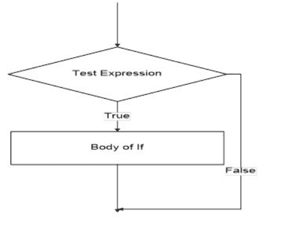

*图 3.1: if 语句的流程图*

```
示例 3.1
my_age = int(input("Enter your age: "))
if my_age == 32:
    print("I am 32 years old")
print("Good Morning!")
```

#### 3.1.2 if-else

在上一节中，我们了解到如果测试表达式为真，则会执行一个语句块。如果为假，则不会执行。但是，我们可以在测试表达式为假时执行其他操作。当测试表达式为假时，else语句与if语句配合使用来执行一段代码。上述语句的语法如下所示

```
if test expression:
    Body of if
else:
    Body of else
```

当测试表达式为真时，将执行if的主体。如果为假，则执行else的主体。为了区分语句块，需要使用缩进。if-else语句的流程图如下所示

> **重要提示**

为了区分语句块，需要使用缩进。缩进在Python编程中扮演着非常重要的角色。

```
**示例 3.2**
python
num = int(input("Enter a number: "))
if num%2 == 0:
    print("Even number")
else:
    print("Odd number")
```

*图 3.3：if-else语句流程图*

```
**输出 3.2**

案例 - I:
Enter a number: 40
Even number
```

> > 案例 - II:
Enter a number: 41
Odd number

在上面的Python代码片段中，用户将被提示输入一个数字，以检查输入的数字是偶数还是奇数。

在案例 - I中，输入的数字是40。测试表达式`num%2 == 0`为真，因此if的主体将被执行，并显示输出“Even number”。

在案例 - II中，输入的数字是41。测试表达式`num%2 == 0`为假，因此else的主体将被执行，并显示输出“Odd number”。

上述示例的流程图如下所示

#### 3.1.3 if-elif-else

单词‘elif’代表else if（否则如果）。有些情况下，我们需要检查多个表达式。if-elif-else语句的语法是

```
if test expression:
    Body of if
elif test expression:
    Body of elif
else:
    Body of else
```

从上面的语法可以看出，if块只能有一个else块。如果if的测试表达式为真，则执行if的主体。如果if的测试表达式为假，则它将检查下一个elif块的测试表达式，以此类推。如果elif块的测试表达式为真，则执行elif块的主体。如果所有测试表达式都为假，则执行else的主体。在多个if-elif-else块中，只有一个块会被执行。if-elif-else块的流程图如下所示

*图 3.4：示例3.2的流程图*

### 示例 3.3

```
num1 = 9
num2 = -12
num3 = 7
if num1 <num2 and num1 < num3:
    print(f"1: The smallest number is {num1}")
elif num2 < num3:
    print(f"2: The smallest number is {num2}")
else:
    print(f"3: The smallest number is {num3}")
```

### 输出 3.3

2: The smallest number is -12

**图 3.5：if-elif-else语句流程图**

在上面的示例中，我们比较第一个数字（`num1`）是否小于`num2`和`num3`。由于测试表达式为假，控制权转移到elif块。数字-12小于7。因此，输出为“2: The smallest number is -12”。上述代码的流程图如下所示。

**图 3.6：示例3.3的流程图**

### if-elif-else阶梯

用户被允许在多个选项中选择。这些测试表达式将从上到下依次执行。一旦某个if语句为真，与该if关联的语句块将被执行。如果所有测试表达式都为假，则最终的else块将被执行。
请观察以下示例

```
**示例 3.4**
my_age = float(input("Enter the age: "))
if my_age > 0 and my_age < 1.5:
    print("The age is of infant")
elif my_age >=1.5 and my_age <12:
    print("The age is of children")
elif my_age >=12 and my_age <17:
    print("The age is of Teenager")
elif my_age >=17 and my_age <30:
    print("The age is of adult")
elif my_age >=30 and my_age <46:
    print("Middle aged person")
else:
    print("The age is of elder person")
```

```
**输出 3.4**
案例 - I:
Enter the age: 1.0
The age is of infant

案例 - II:
Enter the age: 6.0
The age is of children

案例 - III:
Enter the age: 13.0
The age is of Teenager
```

```
案例 - IV:
Enter the age: 20.0
The age is of adult

案例 - V:
Enter the age: 35.0
Middle aged person

案例 - VI:
Enter the age: 47.0
The age is of elder person
```

在上面的示例中，用户被提示输入年龄。在案例 - I中，用户输入的年龄为1.0。因此，if的测试表达式为真，显示输出“The age is of infant”。在案例 - II中，用户输入的年龄为6.0。因此，第一个elif的测试表达式为真，显示输出“The age is of children”。在案例 - III中，用户输入的年龄为13.0。因此，第二个elif的测试表达式为真，显示输出“The age is of Teenager”。在案例 - IV中，用户输入的年龄为20.0。因此，第三个elif的测试表达式为真，显示输出“The age is of adult”。在案例 - V中，用户输入的年龄为35.0。因此，第四个elif的测试表达式为真，显示输出“Middle aged person”。在案例 - VI中，用户输入的年龄为47.0。因此，else部分的测试表达式为真，显示输出“The age is of elder person”。上述程序的流程图如下。else部分始终是可选的。并不强制要求在if语句中编写else语句。此外，Python中没有switch语句。

*图 3.7：示例3.4的流程图*

## 3.2 迭代语句

有时，一组语句需要多次或重复执行，这时我们就需要迭代语句。它们被称为循环。只要条件为真，循环语句就允许我们执行一段语句。这个循环（loop）一词在Python程序中会频繁使用。没有循环，我们甚至无法考虑编写Python代码。Python中只有两种循环：for循环和while循环。Python中没有do-while循环的概念。

### 3.2.1 for

Python中的for循环遍历一个元素序列。序列可以是字符串、列表、元组、集合或range。为了对序列中的每个元素执行一些必要的操作，可以使用for循环。for循环的语法是

```
for val in sequence:
    Body of for
```

其中**val**是一个变量，在每次迭代中获取序列中的项值。使用缩进，for循环的主体与其余代码分开。循环持续进行，直到序列中的最后一项被处理。for循环的流程图如下所示

*图 3.8：for循环流程图*

让我们看一些已解答的for循环示例。

### 3.2.1 for循环

示例 3.5
```python
for i in range(4):  # 0 to 3
    print(f"I am: {i}")  # F1

for i in range(1, 5):  # 1 to 4
    print(f"I am: {i}")  # F2
```

输出 3.5
```
I am: 0
I am: 1
I am: 2
I am: 3
I am: 1
I am: 2
I am: 3
I am: 4
```

在F1中，`range()`方法用于迭代一个数字序列。`range(4)`表示将迭代从0到3的数字。因此，首先*i* = 0，然后执行`print()`函数，显示“I am: 0”。循环将继续处理*i* = 1，2和3。因此，最终显示的输出是
```
I am: 0
I am: 1
I am: 2
I am: 3
```

类似地，在F2中，`range(1,5)`将从1迭代到4。因此，最终输出是
```
I am: 1
I am: 2
I am: 3
I am: 4
```

我们将再看一个例子，来计算前n个自然数的和。

示例 3.6
```python
num = int(input("Enter the number: "))
total = 0
for i in range(1, num + 1):
    total += i
print(total)
```

输出 3.6
```
Enter the number: 5
15
```

在上面的例子中，系统会提示用户输入一个数字。输入的数字是5。初始时，`total`变量的值为0。`range()`将从1迭代到5。因此，循环将迭代5次。

### 第1次迭代
$i = 1$
total += 1 => total = 0 + 1
total = 1

### 第2次迭代
$i = 2$
total += 2 => total = 1 + 2
total = 3

### 第3次迭代
$i = 3$
total += 3 => total = 3 + 3
total = 6

### 第4次迭代
$i = 4$
total += 4 => total = 6 + 4
total = 10

### 第5次迭代
$i = 5$
total += 5 => total = 10 + 5
total = 15

因此，前5个自然数的和是15。

## 3.2.2 while循环

在while循环中，只要测试表达式为True，就会执行一段代码块；如果测试表达式为False，控制权将退出循环。循环开始时，每次都会检查条件。while循环的体（body）由缩进决定，第一个未缩进的行标志着循环的结束。while循环的语法如下：

```python
while test expression:
    Body of while
```

这里，首先检查测试表达式。如果为True，控制权进入while循环的主体。一次迭代后，控制权再次评估测试表达式。这是一个重复的过程，直到测试表达式被求值为False。while循环的流程图如下所示：

让我们看一些例子

示例 3.7
```python
j = 1
while j <= 5:
    print("Welcome Python Beginners :)")
    j += 1
```

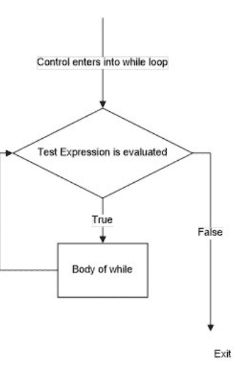

图 3.9：while循环流程图

输出 3.7
```
Welcome Python Beginners :)
Welcome Python Beginners :)
Welcome Python Beginners :)
Welcome Python Beginners :)
Welcome Python Beginners :)
```

在上面的程序中，只要计数器变量`j`小于等于5，测试表达式就为True。最重要的观察点是，while循环体中计数器变量的值必须递增。这里`j`的值增加了1。如果不这样做，将导致无限循环。代码会持续运行，必须强行停止。最终结果是字符串“Welcome Python Beginners :)”显示了5次。我们可以看看每次迭代中控制权是如何流动的。

### 第1次迭代
测试表达式：True
j = 1
print( Welcome Python Beginners :) )
j = 2

### 第2次迭代
测试表达式：True
j = 2
print( Welcome Python Beginners :) )
j = 3

### 第3次迭代
测试表达式：True
j = 3
print( Welcome Python Beginners :) )
j = 4

### 第4次迭代
测试表达式：True
j = 4
print( Welcome Python Beginners :) )
j = 5

### 第5次迭代
测试表达式：True
j = 5
print( Welcome Python Beginners :) )
j = 6

5次迭代之后，测试表达式求值为False，控制权转移到while循环之后的下一条语句，这里也就是代码的结束。

> **注意：** 如果你事先知道迭代次数，就使用‘for’循环。如果事先不知道迭代次数，就使用‘while’循环。

## 3.3 跳转语句

有时候，代码中需要改变正常循环的流程。当测试表达式为False时，控制权会转到下一条语句。假设我们想在不检查测试表达式的情况下终止当前循环迭代甚至整个循环，那么Python提供了`break`和`continue`语句来终止循环或跳过剩余代码。

### 3.3.1 break语句

在break语句中，循环被终止，程序控制权立即流向循环体之后的语句。上面的语句也可以在嵌套循环中使用。如果存在`break`，它将终止最内层的循环。break语句的语法是：

```python
break
```

break语句的流程图如下：

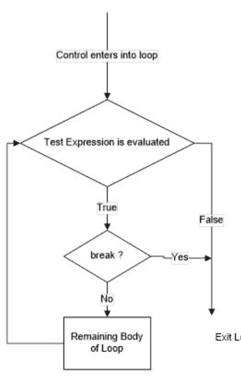

图 3.10：break语句流程图

让我们看看在for和while循环中使用break语句的例子

#### 在for循环中使用break语句

示例 3.8
```python
for num in range(1, 6):
    # for循环内的代码
    if num == 4:
        break
    # for循环内的代码
    print(num)
# for循环外的代码
print("break statement executed on num = 4")
```

输出 3.8
```
1
2
3
break statement executed on num = 4
```

在上面的Python代码中，只要变量`num`小于6，‘for’语句就会构建循环。在‘for’循环内部，有一个‘if’语句，它会计算测试表达式：如果变量`num`等于整数4，则循环将中断，控制权跳出循环，显示最后的print语句。‘for’循环的每次迭代都会执行，直到执行‘break’语句后循环中断。控制流如下。

### 第1次迭代
num = 1
num表达式：False
print(num)

### 第2次迭代
num = 2
num表达式：False
print(num)

### 第3次迭代
num = 3
num表达式：False
print(num)

### 第4次迭代
num = 4
num表达式：True
控制权跳出for循环体，进入下一条直接语句
print(break statement executed on num=4)

#### 在while循环中使用break语句

示例 3.9
```python
num = 0
while num < 6:
    # while循环内的代码
    if num == 3:
        break
    # while循环内的代码
    print(num)
    num += 1
# while循环外的代码
print("break statement is executed at num = 3")
```

输出 3.9
```
0
1
2
break statement is executed at num = 3
```

在上面的Python代码中，`num`变量被初始化为0。只要变量`num`小于整数值6，‘while’循环的条件就为True。在while循环内部有一个if语句，它会计算测试表达式：如果变量`num`等于整数3，则循环将中断，控制权跳出循环，显示最后的print语句。‘while’循环会执行，直到执行‘break’语句后循环中断。控制流如下。

### 第1次迭代
num = 0
num表达式：False
print(num)
num = 1

### 第2次迭代
num = 1
num表达式：False
print(num)
num = 2

### 第3次迭代
num = 2
num表达式：False
print(num)
num = 3

### 第4次迭代
num = 3
num表达式：True
控制权跳出while循环体，进入下一条直接语句print(break statement is executed at num=3)

### 3.3.2 continue语句

continue语句让用户可以灵活地仅跳过当前迭代的剩余代码部分。循环不会终止，而是继续进行下一次迭代，以完成循环的其余部分。一旦触发外部条件，控制权就会转到下一次迭代，直到完成循环的剩余部分。循环完成后，控制权转到循环之后的下一条语句。continue语句的语法是：

```python
continue
```

continue语句的流程图如下（图3.11）：
让我们看看在for和while循环中使用continue语句的例子

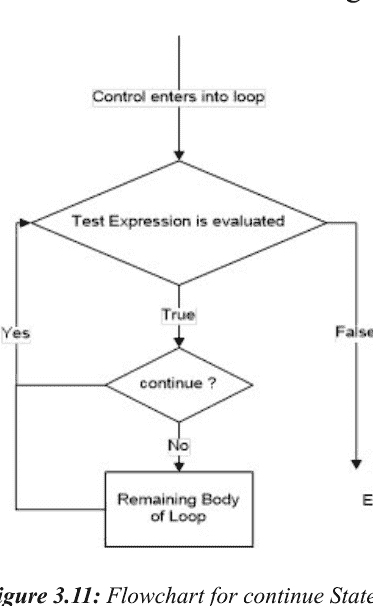

**图 3.11：** continue语句流程图

#### 在for循环中使用continue语句

示例 3.10
```python
for num in range(1, 6):
    # for循环内的代码
    if num == 4:
        continue
    # for循环内的代码
```

### 3.3.2 continue语句

```python
print(num)
#code outside for loop
print("continue statement executed on num = 4")
```

```
Output 3.10
1
2
3
5
continue statement executed on num = 4
```

在上面的例子中，break语句被替换为continue语句。当变量num的值等于整数4时，语句块的剩余部分不会被执行。从1到5的整数值将会显示，除了值4，然后执行print语句。

控制流如下。

# 第一次迭代

num = 1
num 表达式: False
print(num)

# 第二次迭代

num = 2
num 表达式: False
print(num)

# 第三次迭代

num = 3
num 表达式: False
print(num)

# 第四次迭代

num = 4
num 表达式: True
控制转移到for循环的开始，进行下一次迭代

# 第五次迭代

num = 5
num 表达式: False
print(num)
控制转移到循环后的第一条语句
print(continue statement executed on num=4)

# 在while循环中使用continue语句

```python
Example 3.11
num = 0
while num <6:
    #code inside while loop
    num += 1
    if num == 3:
        continue
    #code inside while loop
    print(num)
#code outside while loop
print("continue statement is executed at num = 3")
```

```
Output 3.11
1
2
4
5
6
continue statement is executed at num = 3
```

在上面的例子中，当num变量的值等于整数值3时，控制转移到循环的开始，进行下一次迭代。重要的一点是，num的值必须在检查num的测试表达式之前先递增1，因为如果写在表达式之后，那么表达式将始终为True，因为num将始终是整数值3，代码将进入无限循环。控制流如下：

控制流如下。

# **第一次迭代**

```
num = 1
num 表达式: False
print(num)
```

# **第二次迭代**

```
num = 2
num 表达式: False
print(num)
```

# **第三次迭代**

```
num = 3
num 表达式: True
控制转移到循环的开始，进行下一次迭代
```

# **第四次迭代**

```
num = 4
num 表达式: False
print(num)
```

# 第五次迭代

num = 5
num 表达式: False
print(num)
控制转移到循环后的第一条语句
print(continue statement is executed at num=3)

## 3.3.3 pass

在Python编程中有一个pass语句。Pass是一个空语句，用作未来循环、函数等实现的占位符。需要知道的是，注释语句会被解释器忽略，而pass语句不会被忽略。当pass被执行时，Python将什么也不做，这是一个空操作。有时Python代码中的循环或函数在初始阶段未实现，将在后续阶段执行。因此，pass语句将用于构造一个不执行任何操作的主体。

```python
Example 3.12
num1 = 32
if num1 > 32:
    pass
```

Output 3.12
Python将什么也不做，将没有输出。

## 3.4 in关键字用法

我们在Python代码中多次使用了‘in’关键字。这个特殊的关键字在Python中有两个用途。我们将通过例子来看：

1.  它检查值是否存在于序列中。序列包括列表、range、集合等。

```python
**Example 3.13**
name = "Saurabh"
#I1
if 'z' in name:
    print('z is present in the name')
else:
    print('z is not present')

#I2
if 'a' in name:
    print('a is present in the name')
else:
    print('a is not present')
```

```
**Output 3.13**
z is not present
a is present in the name
```

在I1中，我们检查字母‘z’是否在字符串变量name（值为‘Saurabh’）中。由于字母‘z’不在该字符串变量中，因此输出将是‘z is not present’。
在I2中，我们检查字母‘a’是否在字符串变量name（值为‘Saurabh’）中。由于字母‘a’在该字符串变量中的两个不同索引位置出现，因此输出将是‘a is present in the name’。

2.  它用于在‘for’循环中遍历序列。

```python
**Example 3.14**
games = ['cricket', 'football', 'basketball']
for i in games:
    print(i)
```

Output 3.14
cricket
football
basketball

### 3.4.1 循环模式

在C语言中，我们学习了使用简单for循环的各种模式编程。这些同样可以使用Python代码来复制。我们将使用嵌套for循环来处理行和列的数量。print语句将被修改以显示不同的数字模式、字母模式或星号模式。

### 3.4.2 星号模式

我们将以简单的方式查看不同的星号模式。基本程序将包含两个‘for’循环。外层‘for’循环用于行数，内层‘for’循环用于模式中的列数。print函数将用于显示输出，input函数将用于获取用户输入。range函数将用于在起始数字和用户输入的结束整数之间迭代循环。内层循环的迭代依赖于外层循环的值。每行（即外层for循环的每次迭代）之后添加换行符，以便可以根据需要显示模式。让我们看一个例子。

以金字塔形状打印星号

```python
Example 3.15
my_num = int(input('Enter the number of rows: '))
for a in range(0,my_num):
    for b in range(0,my_num-a-1):
        print(end = " ")
    for c in range(0,a+1):
        print('*',end = " ")
    print()
```

# 表 3.1:

| (s) | (s) | (s) | * | | | | a=0 |
| (s) | (s) | * | | * | | | a=1 |
| (s) | * | | * | | * | | a=2 |
| * | | * | | * | | * | a=3 |

# 输出 3.15

Enter the number of rows: 4
    *
   * *
  * * *
 * * * *

首先提示用户输入行数。这里，用户输入行数为4。因此，第一个for循环用于行，a从0到3，如表1所示。下一个for循环（for b in range(0,my_num-a-1)）将在每行打印空格。print语句通过end = 以空格结束。在表-3.1中，空格被标记为(s)以识别每行中的空格数。最后但同样重要的是for循环，将在每行打印星号后跟一个空格。print()函数用于将光标移动到下一行。让我们看看在每次行迭代中星号的显示。（此信息仅供参考。）

# a=0

行 = 0 中有3个空格和1个星号后跟一个空格。

| (s) | (s) | (s) | * | | | | a=1 |

# a=1

行 = 1 中有2个空格和2个星号，每个星号后跟一个空格。

| (s) | (s) | (s) | * | | | a=0 |
| (s) | (s) | * | | * | | a=1 |

a=2

行 = 2 中有1个空格和3个星号，每个星号后跟一个空格。

| (s) | (s) | (s) | * | | | a=0 |
| (s) | (s) | * | | * | | a=1 |
| (s) | * | | * | | * | a=2 |

a=3

行 = 3 中没有空格和4个星号，每个星号后跟一个空格。

| (s) | (s) | (s) | * | | | a=0 |
| (s) | (s) | * | | * | | a=1 |
| (s) | * | | * | | * | a=2 |
| * | | * | | * | | * | a=3 |

### 3.4.3 字母模式

打印字母模式的行为与使用星号模式相同。那么，让我们毫不拖延地看上面的例子。

```python
Example 3.16
#Method-1
for a in range(0,6):
    my_num = 65
    for b in range(0,a+1):
        my_alpha = chr(my_num)
        print(my_alpha, end=" ")
        my_num += 1
    print()

#Method-2
from string import ascii_uppercase
for i in range(1, 7):
    print(" ".join(ascii_uppercase[:i]))
```

# 输出 3.16

```
A
A B
A B C
A B C D
A B C D E
A B C D E F
A
A B
A B C
A B C D
A B C D E
A B C D E F
```

在方法-1中，我们使用了一个字母的ASCII值。ASCII值将被转换为字符以打印在屏幕上。行数为6。首先，ASCII值65将使用chr函数转换为字符‘A’。然后当前ASCII值递增一，控制转到下一行。根据每次迭代，ASCII值将再次从初始值65开始，并在每次迭代中递增。将基于ASCII值显示相应的字符。程序在每次迭代中的执行如下所示。（此信息仅供参考。）

```
a=0

my_num = 65
for b in range(0,1)
A

a=1

my_num = 65
for b in range(0,2)
A
```

# a=2

```python
my_num = 65
for b in range(0, 3):
    pass
```

A
A B
A B C

# a=3

```python
my_num = 65
for b in range(0, 4):
    pass
```

A
A B
A B C
A B C D

# a=4

```python
my_num = 65
for b in range(0, 5):
    pass
```

A
A B
A B C
A B C D
A B C D E

# a=5

```python
my_num = 65
for b in range(0, 5):
    pass
```

A
A B
A B C
A B C D
A B C D E
A B C D E F

在方法2中，我们从字符串模块导入了 `ascii_uppercase` 字符串。`ascii_uppercase` 在字符串模块中被初始化为 `ABCDEFGHIJKLMNOPQRSTUVWXYZ`。创建一个新的子字符串，并使用 `join` 方法与空格连接。输出将与方法1相同。

### 3.4.4 数字模式

数字模式的行为与星形模式相同。我们将使用相同的 `for` 循环和 `range` 函数以某种模式显示数字。让我们通过一个例子来查看。

**示例 3.17**
```python
num = int(input('Enter the number: '))
count = 1
for my_row in range(1, num + 1):
    for my_col in range(1, my_row + 1):
        print(count, end=' ')
        count += 1
    print()
```

**输出 3.17**
```
Enter the number: 4
1
2 3
4 5 6
7 8 9 10
```

在上面的示例中，提示用户输入数字。用户输入了整数值 `4`。这里使用了嵌套的 `for` 循环，外层的 `for` 循环用于显示行，内层的 `for` 循环用于显示列。在每次循环迭代中，`count` 的值被显示并递增 1。上述代码的程序执行过程如下所示。（此部分仅供参考。）

```
Enter the number : 4
count = 1
```

**第一次迭代**
```python
my_row = 1
for my_col in range(1, 2):
    print(count, end=' ')
    count += 1
print()
```
输出：
```
1
```

**第二次迭代**
```python
my_row = 2
for my_col in range(1, 3):
    print(count, end=' ')
    count += 1
print()
```
输出：
```
1
2 3
```

**第三次迭代**
```python
my_row = 3
for my_col in range(1, 4):
    print(count, end=' ')
    count += 1
print()
```
输出：
```
1
2 3
4 5 6
```

**第四次迭代**
```python
my_row = 4
for my_col in range(1, 5):
    print(count, end=' ')
    count += 1
print()
```
输出：
```
1
2 3
4 5 6
7 8 9 10
```

## 3.5 调试分析

到目前为止，我们已经讨论了编写小型 Python 代码。但是，实际项目通常很长，很难一次性预测输出。我们可能会使用自己的逻辑找到错误并得到错误的输出。如果未达到预期输出，这对用户来说将是一种令人焦灼的体验。因此，识别代码中的错误并修复这些错误非常重要。有时我们的代码甚至会在运行时出现意外错误。因此，调试代码是至关重要的，没有调试就无法满足预期的输出需求。所以，可以使用断点或跟踪功能来逐行调试程序。我们将涵盖上述两种方法。

### 使用断点

断点主要用于调试过程，它是代码中一个有意设置的暂停点。借助断点，我们可以逐行检查变量的内容。通过将程序暂停在所需位置，可以分阶段检查程序的状态。
观察以下 Python 代码。

```python
1 my_name = input("Enter your name: ")
2 my_age = input("Enter your age: ")
3 print(f"Hello {my_name} , your age is {my_age}")
4 my_age = my_age + 2
5 print(f"Your new age is: {my_age}")
```

在上面的 Python 代码中，断点设置在第 1 行。开始执行上述代码进行调试时，控制流会首先暂停。要进入下一行，用户需要执行 **Step Into** 或 **Step Over**。执行 **Step Over** 后，用户将被提示 **Enter your name:** ，如下所示：

> Enter your name: Nilesh

输入姓名后，控制流将暂停在下一行，即第 2 行。

```python
1 my_name = input("Enter your name: ")
2 my_age = input("Enter your age: ")
3 print(f"Hello {my_name} , your age is {my_age}")
4 my_age = my_age + 2
5 print(f"Your new age is: {my_age}")
```

执行 **Step Over** 后，用户将再次被提示 **Enter your age:** ，如下所示。

> Enter your age: 42

输入年龄后，控制流将暂停在第 3 行。

```python
1 my_name = input("Enter your name: ")
2 my_age = input("Enter your age: ")
3 print(f"Hello {my_name} , your age is {my_age}")
4 my_age = my_age + 2
5 print(f"Your new age is: {my_age}")
```

执行 **Step Over** 后，将显示以下消息。

> Hello Nilesh, your age is 42

现在控制流将暂停在第 4 行。

```python
1 my_name = input("Enter your name: ")
2 my_age = input("Enter your age: ")
3 print(f"Hello {my_name} , your age is {my_age}")
4 my_age = my_age + 2
5 print(f"Your new age is: {my_age}")
```

执行 **Step Over** 后，用户将看到 **TypeError** 错误消息。

```python
1 my_name = input("Enter your name: ")
2 my_age = input("Enter your age: ")
3 print(f"Hello {my_name} , your age is {my_age}")
4 my_age = my_age + 2
Exception has occurred: TypeError
can only concatenate str (not 'int') to str
```

因此，我们可以看到错误显示在第 4 行。所以，断点是调试代码的终极武器之一。

### 使用 pdb

这也是调试代码的一种强大方法。但我们需要导入一个用于调试的模块，称为 `pdb`。Pdb 代表 Python 调试器。它是一个标准的内置模块，用于交互式地调试 Python 代码。我们可以使用 pdb 模块执行多种操作，如设置断点、单步进入例程、测试运行代码等。

我们将对同一段代码执行操作，并演示 `pdb` 的使用。这里，导入了 `pdb` 模块，并在我们希望开始观察执行的位置调用了 `set_trace()` 函数。我们可以根据自身逻辑的准确性，在任何位置插入它。

```python
import pdb
pdb.set_trace()
my_name = input("Enter your name: ")
my_age = input("Enter your age: ")
print(f"Hello {my_name} , your age is {my_age}")
my_age = my_age + 2
print(f"Your new age is: {my_age}")
```

运行上述代码后，pdb 的调试器从 `set_trace()` 所在位置开始，等待用户指令。`set_trace()` 会让用户根据程序内部的条件进入调试器。将在调用栈帧处进入调试器。

```
-> my_name = input("Enter your name: ")
(Pdb)
```

我们可以看到箭头指向 pdb 下次将运行的代码行。pdb 模块通过反复暂停程序来帮助用户逐行执行代码。当前程序执行暂停在箭头 `→` 标记的行。现在，假设我们想知道上述程序的当前执行停止在哪一行，则输入 `l`。`l` 命令（list 的缩写）会查看上下几行。输入 `l` 并按回车键。

```python
(Pdb) l
1   import pdb
2
3   pdb.set_trace()
4   -> my_name = input("Enter your name: ")
5   my_age = input("Enter your age: ")
6   print(f"Hello {my_name} , your age is {my_age}")
7   my_age = my_age + 2
8   print(f"Your new age is: {my_age}")
[EOF]
(Pdb)
```

我们可以清楚地看到代码执行停止在第 4 行。

现在，我们想让上面这行代码运行，并让控制流移到下一行。输入 `n` 命令并按回车。`n` 命令代表 next，它将继续执行直到当前程序的下一行。

```python
(Pdb) n
Enter your name: Saurabh
>e:\python_progs\prog74_debugging.py(5)<module>()
-> my_age = input("Enter your age: ")
(Pdb)
```

我们可以看到第 4 行已开始运行，并提示用户 **Enter your name:** 。变量 `my_name` 在用户输入后具有字符串值 `'Saurabh'`。我们可以通过输入 `p` 命令来检查上述值是否存在。`p` 命令将计算表达式并打印值（如果存在）。

```python
(Pdb) p my_name
'Saurabh'
(Pdb)
```

类似地，如果我们检查 `my_age` 变量，将会抛出 **NameError**。

```python
(Pdb) p my_age
*** NameError: name 'my_age' is not defined
```

因为，我们还没有执行第 5 行，Python 解释器将抛出一个错误。现在，我们可以检查代码执行暂停在第 5 行。

```python
(Pdb) l
  1     import pdb
  2
  3     pdb.set_trace()
  4     my_name = input("Enter your name: ")
  5  -> my_age = input("Enter your age: ")
  6     print(f"Hello {my_name} , your age is {my_age}")
  7     my_age = my_age + 2
  8     print(f"Your new age is: {my_age}")
[EOF]
```

现在要进入下一行，按 `n` 命令并按回车。

```python
(Pdb) n
Enter your age: 31
>e:\python_progs\prog74_debugging.py(6)<module>()
-> print(f"Hello {my_name} , your age is {my_age}")
(Pdb)
```

现在，程序在第6行暂停，如下所示。

```
pdb
(Pdb) l
1    import pdb
2
3    pdb.set_trace()
4    my_name = input("Enter your name: ")
5    my_age = input("Enter your age: ")
6 -> print(f"Hello {my_name} , your age is {my_age}")
7    my_age = my_age + 2
8    print(f"Your new age is: {my_age}")
[EOF]
(Pdb)
```

我们将通过输入'n'命令并按回车键来执行上述行。

```
pdb
(Pdb) n
Hello Saurabh , your age is 31
> e:\python_progs\prog74_debugging.py(7)<module>()
-> my_age = my_age + 2
(Pdb)
```

现在，代码执行在第7行暂停，如下所示。

```
pdb
(Pdb) l
2
3    pdb.set_trace()
4    my_name = input("Enter your name: ")
5    my_age = input("Enter your age: ")
6    print(f"Hello {my_name} , your age is {my_age}")
7 -> my_age = my_age + 2
8    print(f"Your new age is: {my_age}")
[EOF]
(Pdb)
```

我们将通过输入'n'命令并按回车键来执行上述行。

```
(Pdb) n
TypeError: can only concatenate str (not “int”) to str
> e:\python_progs\prog74_debugging.py(7)<module>()
-> my_age = my_age + 2
(Pdb)
```

我们可以看到Python抛出了一个'TypeError'。错误发生在第7行，因此上述代码无法运行。我们可以看到变量`my_age`将接收一个字符串变量，而我们试图将一个字符串变量与一个整数变量连接，这是无法完成的。因此，我们将年龄变量转换为整数类型，然后尝试运行代码，如下所示。

```
-> my_name = input("Enter your name: ")
(Pdb) n
Enter your name: saurabh
> e:\python_progs\prog74_debugging.py(5)<module>()
-> my_age = input("Enter your age: ")
(Pdb) n
Enter your age: 31
> e:\python_progs\prog74_debugging.py(6)<module>()
-> print(f"Hello {my_name} , your age is {my_age}")
(Pdb) n
Hello saurabh , your age is 31
> e:\python_progs\prog74_debugging.py(7)<module>()
-> my_age =  int(my_age) + 2
(Pdb) n
> e:\python_progs\prog74_debugging.py(8)<module>()
-> print(f"Your new age is: {my_age}")
(Pdb) n
Your new age is: 33
```

我们现在可以看到错误已经修复。但程序仍然在逐行执行。我们不希望逐行执行，而是希望代码连续执行。因此，我们将输入'c'命令。'c'代表continue命令，它会继续执行，只在遇到断点时停止。

```
-> my_name = input("Enter your name: ")
(Pdb) c
Enter your name: saurabh
Enter your age: 31
Hello saurabh , your age is 31
Your new age is: 33
```

要退出程序，请在逐行执行时使用'q'命令，如下所示。

```
> e:\python_progs\prog74_debugging.py(4)<module>()
-> my_name = input("Enter your name: ")
(Pdb) n
Enter your name: Saurabh
> e:\python_progs\prog74_debugging.py(5)<module>()
-> my_age = input("Enter your age: ")
(Pdb) n
Enter your age: 31
> e:\python_progs\prog74_debugging.py(6)<module>()
-> print(f"Hello {my_name} , your age is {my_age}")
(Pdb) n
Hello Saurabh , your age is 31
> e:\python_progs\prog74_debugging.py(7)<module>()
-> my_age =  int(my_age) + 2
(Pdb) n
> e:\python_progs\prog74_debugging.py(8)<module>()
-> print(f"Your new age is: {my_age}")
(Pdb) n
Your new age is: 33
--Return--
> e:\python_progs\prog74_debugging.py(8)<module>()->None
-> print(f"Your new age is: {my_age}")
(Pdb) q
Traceback (most recent call last):
  File "prog74_debugging.py", line 8, in <module>
    print(f"Your new age is: {my_age}")
  File "C:\Users\SAURABH\AppData\Local\Programs\Python\Python37\lib\bdb.py", line 92, in trace_dispatch
    return self.dispatch_return(frame, arg)
  File "C:\Users\SAURABH\AppData\Local\Programs\Python\Python37\lib\bdb.py", line 154, in dispatch_return
    if self.quitting: raise BdbQuit
bdb.BdbQuit
```

在Python 3.7中，无需导入`pdb`并使用`set_trace()`函数。只需使用`breakpoint()`函数，即可在程序执行期间开始调试代码。`breakpoint()`函数执行了`import pdb`和`pdb.set_trace()`的工作。请观察以下代码及其执行期间的输出行为。

```
Example 3.19
breakpoint()
my_name = input(“Enter your name: “)
my_age = input(“Enter your age: “)
print(f’Hello {my_name} , your age is {my_age}’)
my_age = int(my_age) + 2
print(f’Your new age is: {my_age}’)
```

```
Output 3.19
-> my_name = input("Enter your name: ")
(Pdb) n
Enter your name: Saurabh
> e:\python_progs\prog74_debugging.py(3)<module>()
-> my_age = input("Enter your age: ")
(Pdb) 31
31
(Pdb) n
Enter your age: 31
> e:\python_progs\prog74_debugging.py(4)<module>()
-> print(f"Hello {my_name} , your age is {my_age}")
(Pdb) n
Hello Saurabh , your age is 31
> e:\python_progs\prog74_debugging.py(5)<module>()
-> my_age =  int(my_age) + 2
(Pdb) n
> e:\python_progs\prog74_debugging.py(6)<module>()
-> print(f"Your new age is: {my_age}")
(Pdb) n
Your new age is: 33
--Return--
> e:\python_progs\prog74_debugging.py(6)<module>()->None
-> print(f"Your new age is: {my_age}")
(Pdb) q
Traceback (most recent call last):
  File "prog74_debugging.py", line 6, in <module>
    print(f"Your new age is: {my_age}")
  File "C:\Users\SAURABH\AppData\Local\Programs\Python\Python37\lib\bdb.py", line 92, in trace_dispatch return self.dispatch_return(frame, arg)
  File "C:\Users\SAURABH\AppData\Local\Programs\Python\Python37\lib\bdb.py", line 154, in dispatch_return if self.quitting: raise BdbQuit
bdb.BdbQuit
```

## 3.6 Python 3 中的异常处理

这是Python中最重要的主题之一。很多时候，用户有意或无意地输入或遇到了错误的输入，我们的程序就会遇到错误。当错误发生时，Python会生成一个可以处理的异常，从而避免程序崩溃。我们将非常详细地介绍这个主题，因为程序员必须具备在自己的代码中使用它的灵活性。

任何编程语言中通常有2种类型的错误：

### 3.6.1 语法错误

每当我们在Python代码中编写无效的语法时，Python解释器就会抛出语法错误。程序将无法运行，程序员有责任纠正语法错误。只有在错误被纠正后，程序执行才会开始。

```
Example 3.20
if 1 == 1
print(“One”)
```

```
Output 3.20
if 1 == 1
        ^
SyntaxError: invalid syntax
```

在上面的例子中，我们缺少了一个简单的':'运算符。让我们再看一个例子。

```
Example 3.21
print “I am done”
```

```
**Output 3.21**
print “I am done”
^
SyntaxError: Missing parentheses in call to ’print’. Did you mean print(“I am done”)?
```

print语句中必须有'()'括号。因此，解释器将再次抛出语法错误。所以，程序员有责任纠正这些错误。

### 3.6.2 运行时错误

很多时候，我们编写的代码没有任何语法错误。但在运行时执行程序时，可能会输入错误的输入、出现内存问题或错误的编程逻辑。在这种情况下，会发生运行时错误或异常。每个程序员都知道的一个最好的例子是ZeroDivisionError。请观察下面的代码。

```
**Example 3.22**
num1 = int(input(“Enter the first number: ”))
num2 = int(input(“Enter the second number: ”))
my_div = num1/num2
print(“my_div1 is”, my_div)
```

```
**Output 3.22**
Enter the first number: 12

Enter the second number: 0
Traceback (most recent call last):

  File “<ipython-input-18-4bbba510400b>”, line 3, in <module>
    my_div = num1/num2
```

```
ZeroDivisionError: division by zero
```

在上面的程序中，没有语法错误。但是当用户被提示输入两个数字进行除法运算时，第二个输入被故意输入为'0'，这是由于最终用户的输入造成的。因此，Python解释器将抛出ZeroDivisionError。

让我们用不同的最终用户输入来观察同一个例子。

```
Enter the first number: Three
Traceback (most recent call last):
  File “execption_handling.py”, line 1, in <module>
    num1 = int(input(“Enter the first number: ”))
ValueError: invalid literal for int() with base 10: 'Three'
```

用户输入了字符串'Three'，这是一个字符串，对于以10为基数的int()来说是无效的字面量。因此，Python解释器将抛出ValueError。所以，在运行时执行程序时如果出了问题，程序将被这些运行时错误终止。异常处理的概念仅适用于运行时错误，而不适用于语法错误。我们现在必须知道什么是异常。

### 3.6.3 异常处理的重要性

假设我们正在看电视，突然我们的胃不舒服了。在这种情况下，我们冲进厕所解决内急。这个意外且不受欢迎的事件打扰了我们看电视的正常流程，对我们来说就是一个异常。用我们的术语来说，我们称之为“内急异常”。因此，一个不受欢迎的、意外的、打扰程序正常流程的事件被称为异常。例如：ZeroDivisionError、TypeError、ValueError、FileNotFoundError等。为了防止异常，强烈建议处理这些异常。如果在程序执行期间引发异常，我们需要正确地终止程序。可以这样理解：假设我们正在制作一个项目启动报告需要在下午2点前提交给我们的部门主管。下午1:30时，我们正在电脑上修改报告，对齐数据、更改字体、添加一些必要的输入输出等。突然停电了，而且没有备用电源，于是我们所有的工作都白费了，这是一次异常终止，一次非优雅终止。因此，为了实现优雅终止，需要进行异常处理。

不应缺少任何资源。

异常处理并不意味着修复。它意味着为当前问题提供一个备用方案。所以，定义一种替代方法来让程序的其余部分正常继续执行，这就是异常处理。请看下面的两个语句。

S1：我饿了。我想吃米饭和薄饼来充饥。

S2：我饿了。我想吃米饭和薄饼来充饥。如果米饭和薄饼没做好，那我就试试零食。如果零食也没有，那我就吃饼干。

在S2中，成功的可能性最大，因为有多种方式可以满足饥饿。但在S1中，如果没有米饭和薄饼，那么很遗憾，饥饿将无法得到满足。因此，必须有一种替代方法来让程序的其余部分正常继续执行。

在Python中，每个异常都是一个对象，每种异常类型都有对应的类。每当发生异常时，Python虚拟机（PVM）都会创建一个相应的异常对象。这个对象会检查处理代码。如果有，那么它将被执行，程序的其余代码将正常执行。如果没有，PVM将异常终止程序，程序的其余代码将不会执行。相应的异常信息将显示在控制台上。这种异常终止可以使用try-except块显式处理。

因此，在默认的异常处理中，程序将被异常终止，并将异常信息打印到控制台。

### 3.6.4 Python异常层次结构

我们需要对Python的异常层次结构有一个基本的了解。我们应该清楚各种异常类，哪个是父类，哪个是子类。Python中的每个异常都是一个对象，并且有对应的类，也就是说存在异常类。因此，Python中所有的异常类都是BaseException的子类。每个异常类都直接或间接地继承自BaseException。所以，对于Python异常层次结构，BaseException充当根。

层次结构如图3.12所示。

从图3.12可以看出，ZeroDivisionError是ArithmeticError的子类。ArithmeticError是Exception的子类，而Exception是BaseException的子类。作为程序员，我们将更多地关注Exception及其子类。

### 3.6.5 自定义异常处理

强烈建议处理异常，因为我们希望程序能够优雅终止。我们不想丢失或阻塞任何资源。我们可以使用try和except两个关键字来处理异常。观察以下代码。

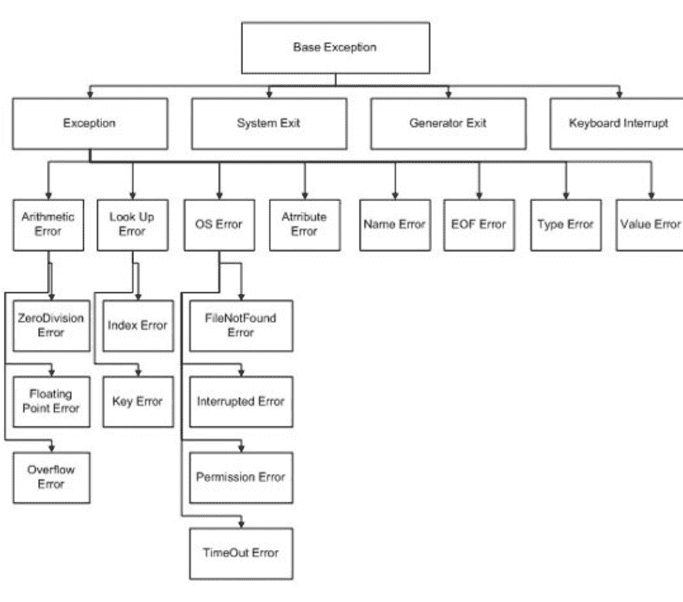

图3.12：Python异常层次结构

```
示例 3.23
print("St-1")
print(2/0)
print("St-2")
```

```
输出 3.23
St-1
Traceback (most recent call last):
  File "<ipython-input-19-7ec35c2eb6c5>", line 2, in <module>
    print(2/0)
ZeroDivisionError: division by zero
```

在上面的代码中，我们可以看到ZeroDivisionError发生在语句print(2/0)上。这是导致代码异常/非优雅终止的风险代码之一。这个引发异常的代码必须放在try块中。在执行上述代码时，必须有一个处理代码，它必须放在except块中。如果try块中出现问题，那么相应的except块将被执行。

```
示例 3.24
print("St-1")
try:
    print(2/0)
except ZeroDivisionError:
    print("Normal Execution")
print("St-2")
```

```
输出 3.24
St-1
Normal Execution
St-2
```

正如我们所看到的，print(2/0)语句是会引发ZeroDivisionError的风险代码。在这种情况下，处理代码将被执行。因此，处理代码print("Normal Execution")将被执行，控制权离开except块，print("St-2")将显示在控制台上。这是一种正常/优雅的终止，建议程序员在代码中编写。

因此，可能产生异常的代码必须放在try块中，而处理代码应该放在except块中。

所以，自定义异常的整个总结是

```
try:
    风险代码
except:
    处理代码
```

## 3.6.6 try-except中的控制流

这里，我们必须看看当异常被引发或未被引发时，控制流将如何流动。考虑以下Python代码片段。

```
try:
    st1
    st2
    st3
    st4
except:
    st5
st6
```

**情况1：未引发异常**
如果没有异常发生，那么除了except块之外的所有语句都将被执行。只有在引发异常时，except块才会被执行。因此，控制流将是 st1 → st2 → st3 → st4 → st6。因此，这是一种正常/优雅的终止。

**情况2：在st3处引发异常，并且相应的except块匹配**
在上述情况下，从st1到st4的语句将是主流程，而语句st5是处理代码流或替代流程。如果st3中发生异常，那么控制权将转向替代流程。执行完该语句后，控制权永远不会返回到主流程。try块中剩余的代码将不会被执行。在try块内部，只应考虑风险代码的执行，而不是正常代码，因为无法保证整个代码都会执行。因此，try块中的代码长度应尽可能短。这里，控制流将是 st1 → st2 → st5 → st6。因此，这是一种正常/优雅的终止。

**情况3：在st3处引发异常，但相应的except块不匹配**

这里，异常将在try块中引发，但在可用的except块中没有匹配项。由于except块中没有匹配项，因此将发生异常/非优雅终止。因此，控制流将是 st1 → st2 → 异常终止。

**情况4：在st5处引发异常**

异常也可能在except块中引发。在try块外部引发的任何异常都是异常终止。因此，上述情况是异常终止。

**情况5：在st6处引发异常**

在try块外部引发的任何异常都是异常终止。因此，上述情况也是异常终止。

因此，我们可以得出结论：如果在try块中的任何地方都有可能引发异常，那么即使异常被处理，try块的其余部分也不会被执行。因此，try块的长度应尽可能短，并且只有风险代码应放在try块内部。在try块之外引发异常时，except块中出现异常并不奇怪。如果语句不是try块的一部分并且引发了异常，那么它总是异常/非优雅终止。

## 3.6.7 将异常信息打印到控制台

我们可以根据我们的使用和需求将异常信息打印到控制台。请观察代码。

### 示例 3.25

```
try:
    print("st1")
    print(2/0)
    print("st-3")
except Exception as e:
    print(f"异常的类型是 {type(e)}") # E1
    print(f"异常的类型是 {e.__class__}") # E2
    print(f"异常类名是 {e.__class__.__name__}") # E3
    print(f"异常描述是 {e}") # E4
```

### 输出 3.25

st1
异常的类型是 <class 'ZeroDivisionError'>
异常的类型是 <class 'ZeroDivisionError'>
异常类名是 ZeroDivisionError
异常描述是 division by zero

在E1和E2中，我们尝试打印异常的类型。'e'是指向异常对象的引用变量。

在E3中，异常类名被显示在控制台上。可以这样理解：'e'是指向相应类对象及其名称的异常对象。

在E4中，异常描述被打印到控制台。

## 3.6.8 带有多个except块的try

在面试中，当面试官问多个不同的问题时。我们最喜欢的回答总是“我不知道，先生”，同时摇着头。这肯定会激怒面试官的耐心。在面试中可能这样，但在真正的编程世界中，答案因问题而异。处理异常的方式也各不相同。

异常类型到异常类型。对于每种异常类型，我们都必须使用单独的 except 块。因此建议使用带有多个 except 块的 try 语句。请考虑以下示例。

```
Example 3.26
try:
    num1= int(input(" Enter the first number: "))
    num2= int(input(" Enter the second number: "))
    total = num1 / num2
    print("The division is ", total)
except ValueError:
    print("It is a Value error")
except ZeroDivisionError:
    print("It is a zero division error")
```

```
Output 3.26
Case - I:
Enter the first number: 1
Enter the second number: 2
The division is  0.5

Case - II:
Enter the first number: 32
Enter the second number: 2a
It is a Value error

Case - III:
Enter the first number: 32
Enter the second number: 0
It is a zero division error
```

在上面的例子中，我们将看到 Python 虚拟机 (PVM) 在 except 块中总是从上到下移动，直到找到匹配的 except 块。如果编写带有多个 except 块的代码，except 块的顺序很重要。

在 Case-1 中，我们提示用户输入 2 个整数 2 和 1。因此，输出将是 0.5。

在 Case-2 中，我们提示用户输入数字 32 和 2a。由于值 '2a' 无法转换为整数，PVM 将抛出 ValueError，因为用户提供了错误的输入。

在 Case-3 中，我们提示用户输入数字 32 和 0。由于我们不能用 0 除一个数，PVM 将抛出 ZeroDivisionError，因为用户提供了错误的输入。需要注意的一个重要点是，PVM 会首先优先处理 ValueError 的 except 块，然后才是 ZeroDivisionError 的 except 块。因此，根据引发的异常，将执行相应的 except 块。如果我们使用带有多个 except 块的 try，except 块的顺序很重要。

## 3.6.9 可以处理多个异常的单个 except 块

到目前为止，我们已经看到了单个 try 块可以处理多个 except 块。但现在我们将看到单个 except 块可以处理多个异常。except 块中的每个异常都将通过逗号分隔提交。因此，异常必须加括号。异常组在内部被视为元组。如果是单个 except 块，则括号不是必需的。

```
try:
    st1
    st2
except (Exception1,Exception2,):
```

要打印异常信息，请使用上述语法。

```
try:
    st1
    st2
except (Exception1,Exception2,) as msg1:
```

需要注意的一个重要点是，`as msg1` 是写在括号外面的。如果多个异常的处理代码相同，我们应该使用单个 except 块，而不是多个 except 块。我们可以使用任何名称代替 `msg1`。这完全取决于用户编写代码的习惯。让我们看一个例子。

```
Example 3.27
try:
    num1= int(input(" Enter the first number: "))
    num2= int(input(" Enter the second number: "))
    total = num1 / num2
    print("The division is ", total)
except (ArithmeticError,ValueError) as msg1:
    print(f"The type of exception is {type(msg1)}")
    print(f"The exception class name is {msg1.__class__.__name__}")
    print("The input is not valid")
```

```
Output 3.27
Case - I:
Enter the first number: 12
Enter the second number: 2a
The type of exception is <class 'ValueError'>
The exception class name is ValueError
The input is not valid

Case - II:
Enter the first number: 12
Enter the second number: 0
The type of exception is <class 'ZeroDivisionError'>
The exception class name is ZeroDivisionError
The input is not valid
```

在 Case-1 中，我们提示用户输入数字 12 和 2a。由于 '2a' 是一个无效的整数，PVM 将抛出 ValueError 异常。因此，异常块将负责打印异常类型、异常类名和消息信息。

在 Case-2 中，我们提示用户输入数字 12 和 0。由于我们不能用 0 除一个数，PVM 将抛出 ZeroDivisionError 异常。因此，异常块将再次负责打印异常类型、异常类名和消息信息。

## 3.6.10 默认 except 块

我们已经讨论了多个 except 块。但是，如果没有匹配的 except 块怎么办？在这种情况下，默认 except 块会很方便。如果没有一个 except 块匹配，它将被执行。默认 except 块仅包含将异常信息打印到控制台。默认 except 块中不会有任何特定的处理代码。默认 except 块必须是最后一个 except 块，否则会出现“语法错误”。语法如下所示：

```
try:
    st1 st2
    except :
```

任何类型的异常都由默认 except 块处理。请观察以下代码片段。

```
Example 3.28
try:
    num1= int(input(" Enter the first number: "))
    num2= int(input(" Enter the second number: "))
    total = num1 / num2
    print("The division is ", total)
except ValueError as msg1:
    print("The input is not valid")
except:
    print("Default except block")
```

```
Output 3.28
Case - I:
 Enter the first number: 10
 Enter the second number: 2a
The input is not valid

Case - II:
 Enter the first number: 3
 Enter the second number: 0
Default except block
```

在 Case-1 中，提示用户输入 2 个数字。用户输入了 10 和 '2a'。由于 2a 不是整数，Python 将抛出 ValueError。在 Case-2 中，用户输入了数字 10 和 0。由于这是 ZeroDivisionError，并且没有对应的 except 块，因此默认 except 块将处理该异常。

## 3.6.11 except 块的可能组合

except 块的有效和无效语法如下所示：

有效语法

- 1. `except ValueError:`
- 2. `except (ValueError):`
- 3. `except ValueError as msg1:`
- 4. `except (ValueError) as msg1:`
- 5. `except (ValueError,ZeroDivisionError):`
- 6. `except (ValueError,ZeroDivisionError) as msg1:`
- 7. `except:`

无效语法

- 1. `except (ValueError as msg1):`
- 2. `except ValueError,ZeroDivisionError:`
- 3. `except (ValueError,ZeroDivisionError as msg1):`

对于多个异常，括号是必须的。对于单个异常，括号是可选的。如果使用了括号，那么 `as` 必须写在括号外面。

## 3.6.12 finally except 块

到目前为止，我们已经解释了 'try' 和 'except' 关键字。现在，我们将介绍 'finally' 关键字。有可能出现这样的情况：一旦打开连接读取数据库或 Excel 文件，就必须关闭连接。如果在读写内容时发生错误，并且关闭连接的语句写在 try 块内部，那么连接将会被浪费，并且不会被关闭。在这种情况下，建议在 finally 块内部关闭连接。关闭连接被称为资源释放或清理代码，绝不建议放在 try 块内部，因为无法保证 try 块中的每条语句都会被执行。同时，我们也不能将清理代码放在 except 块内部，因为除非发生异常，否则 except 块不会被执行。因此，无论是否引发异常，也无论异常是否被处理，都必须将其放在 finally 块中。finally 块的目的是维护清理代码。所以，try-except-finally 块的语法是：

```
try:
    生成异常的代码或风险代码
except:
    处理过的/替代代码
finally:
    清理代码（资源释放代码）。
```

观察以下使用 try-except-finally 块的可能情况

Example 3.29

```
try:
    print("inside try")
    num1= int(input(" Enter the first number: "))
    num2= int(input(" Enter the second number: "))
    total = num1 / num2
    print("The division is ", total)
except ValueError:
    print("inside except")
finally:
    print("inside finally")
```## 输出 3.29

情况 - I：
在 try 块内
请输入第一个数字：12
请输入第二个数字：2
除法结果为 6.0
在 finally 块内

情况 - II：
在 try 块内
请输入第一个数字：12
请输入第二个数字：2a
在 except 块内
在 finally 块内

情况 - III：
在 try 块内
请输入第一个数字：12
请输入第二个数字：0
在 finally 块内
回溯（最近一次调用最后）：
  文件 "<ipython-input-31-7e82521407d7>"，第 5 行，在 <module>
    total = num1 / num2
ZeroDivisionError: 除以零

在情况-1中，代码正常执行。在情况-2中，异常被引发，但被 except 块处理。在情况-3中，由于 except 块不匹配该异常，程序异常终止。但 finally 块被执行了。即使在异常终止的情况下，finally 块也会被执行。

因此，在所有3种情况中，我们都了解到‘finally’块会被执行。但有一种情况 finally 块不会被执行。当 PVM 通过写入语句 `os._exit(0)` 显式退出时。在这种情况下，PVM 将被关闭，finally 块将不会被执行。请观察下面的程序。

```
示例 3.30
import os
try:
    print("inside try")
    print("hello there")
    os._exit(0)
except ValueError:
    print("inside except")
finally:
    print("inside finally")
```

**输出 3.30**
inside try
hello there

在上述情况中，调用了 `os._exit(0)` 函数。PVM 将显式退出。这里的‘finally’块将不会被执行。我们导入了 `os` 模块。为了与操作系统交互，使用了 `os` 模块。
在 `os._exit(0)` 中，0 表示状态码，是正常终止。非‘0’表示异常终止。影响总是相同的，但此状态码将被 Python 用于内部日志记录或报告目的。作为程序员，我们无需担心。我们可以在退出函数中使用任何值。影响总是相同的，程序结果不会有差异。请看下面的代码。

```
示例 3.31
import os
try:
    print("inside try")
    print("hello there")
    os._exit(100)
except ValueError:
    print("inside except")
finally:
    print("inside finally")
```

**输出 3.31**
inside try
hello there

## 3.6.13 try-except 和 finally 中的控制流

现在，我们将看到在 try 块、except 块或 finally 块内发生异常的不同情况。请观察以下演示 Python 代码片段。

```
try:
    st1
    st2
    st3
    st4
except xxx:
    st5
finally:
    st6
st7
```

### 情况-1：未引发异常

由于没有异常，try 块中的所有语句将被执行，然后是 finally 块和剩余的代码行。except 块将不会被执行。控制流如下

`st1 → st2 → st3 → st4 → st6 → st7`。正常终止

### 情况-2：在 st3 处引发异常且对应的 except 块匹配

由于在 st3 处引发异常且对应的 except 块匹配，控制将移动到 except 块，然后是 finally 块和剩余的代码行。这将是正常终止。

`st1 → st2 → st5 → st6 → st7`。正常终止

### 情况-3：在 st3 处引发异常且对应的 except 块不匹配

由于在 st3 处引发异常且对应的 except 块不匹配，控制将跳过 except 块，仅执行 finally 块。这将是异常终止。

`st1 → st2 → st6`。异常终止。

### 情况-4：在 st5 处引发异常

如果任何语句引发的异常不是 try 块的一部分，那么它总是异常终止。但在异常终止之前，finally 块将被执行。

### 情况-5：在 st6 或 st7 处引发异常

在 try 块外引发的任何异常都是异常终止。因此，上述情况也是异常终止。

## 3.6.14 嵌套 try-except finally 块

我们可以在 try、except 或 finally 块内放置 try-except 和 finally 块。请观察以下演示 Python 代码片段。

```
try:
    try:
        st1
    except:
        st2
    finally:
        st3
except:
    try:
        st4
    except:
        st5
    finally:
        st6

try:
    st7
except:
    st8
finally:
    st9
```

在上述模式中，我们在每个 try、except 和 finally 块内放置了嵌套的 try-except 和 finally 块。通常，正常风险代码放在外部 try 块外，高风险代码放在内部 try 块外。如果在内部 try 块内引发异常，则内部 except 块负责处理。如果内部 except 块无法处理，则由外部 except 块负责处理。让我们看上面的例子。

### 示例 3.32

源代码扫描二维码见 [第 213 页](page 213) 的 [图 3.13](Figure 3.13)

### 输出 3.32

情况 - I：
在 try 块内

请输入第一个数字：12

请输入第二个数字：2
除法结果为 6.0
在内部 finally 块内
在外部 finally 块内

情况 - II：
在 try 块内

请输入第一个数字：12

请输入第二个数字：2a
在 ValueError 内
在内部 finally 块内
在外部 finally 块内

情况 - III：
在 try 块内

请输入第一个数字：12

请输入第二个数字：0
在内部 finally 块内
在外部 except 块内，带有 ZeroDivisionError
在外部 finally 块内

在情况-1中，提示用户输入两个数字 12 和 2。由于输入数字有效，将显示除法结果 6.0，然后显示内部 finally 块和外部 finally 块的消息。

在情况-2中，用户输入了数字 12 和 2a。由于 2a 不是有效的整数，PVM 将抛出 ValueError，该异常将被内部 except 块处理。因此，将显示 except 块的消息，然后显示内部 finally 块和外部 finally 块的消息。

在情况-3中，用户输入了数字 12 和 0。由于任何数除以 0，PVM 将抛出 ZeroDivisionError，该异常将被外部 except 块处理。因此，首先执行内部 finally 块的消息，然后是外部 except 块和外部 finally 块的消息。

需要注意的一个重要点是，一旦控制未进入 try 块，则相应的 finally 块将不会被执行。一旦控制进入 try 块，finally 块必须强制执行。


图 3.13：源代码

## 3.6.15 嵌套 try-except finally 块中的控制流

现在，我们将看到嵌套 try-except-finally 块中的控制流。请观察以下演示 Python 代码片段。

```
try:
    st1
    st2
    st3
    try:
        st4
        st5
        st6
    except X:
        st7
    finally:
        st8
    st9
except Y:
    st10
finally:
    st11
st12
```

### 情况-1：如果没有异常

如果没有异常，则 except 块将不会被执行。控制流如下

`st1 → st2 → st3 → st4 → st5 → st6 → st8 → st9 → st11 → st12`。正常终止

### 情况-2：在 st3 处引发异常且对应的 except 块匹配

在上述情况中，在 st3 处引发异常，对应的 except 块（即‘except Y’）将处理该块，因为它匹配。因此，控制流如下

`st1 → st2 → st10 → st11 → st12`。正常终止

### 情况-3：在 st3 处引发异常且对应的 except 块不匹配

在上述情况中，在 st3 处引发异常，对应的 except 块（即‘except Y’）不匹配。仅执行外部 finally 块。由于 except 块不匹配，因此异常终止。因此，控制流如下

`st1 → st2 → st11`。异常终止

### 情况-4：在 st6 处引发异常且内部 except 块匹配

在上述情况中，在 st6 处引发异常，内部 except 块（即 except X）匹配。因此，将执行内部 except 块。因此，控制流如下

`st1 → st2 → st3 → st4 → st5 → st7 → st8 → st9 → st11 → st12`。正常终止

### 情况-5：在 st6 处引发异常且内部 except 块不匹配但外部 except 块匹配

## 情况-6：在st6处引发异常，且内部和外部except块均未匹配

由于两个except块均未匹配，程序将异常终止。但内部和外部的finally块都会执行。因此，控制流如下。

$st1 \rightarrow st2 \rightarrow st3 \rightarrow st4 \rightarrow st5 \rightarrow st8 \rightarrow st11$。异常终止

## 情况-7：在st7处引发异常，且对应的except块匹配。

由于异常在st7处引发，且对应的except块匹配（即‘except Y’），程序正常终止。但st7处的异常只有在st4、st5或st6处发生异常时才会引发。内部finally块会执行。因此，控制流如下。

$st1 \rightarrow st2 \rightarrow st3 \rightarrow st4$（可能发生或不发生）$\rightarrow st5$（可能发生或不发生）$\rightarrow st6$（可能发生或不发生）$\rightarrow st8 \rightarrow st10 \rightarrow st11 \rightarrow st12$。正常终止

## 情况-8：在st7处引发异常，且对应的except块未匹配。

由于异常在st7处引发，且对应的except块未匹配（即‘except Y’），程序异常终止。但st7处的异常只有在st4、st5或st6处发生异常时才会引发。内部finally块会执行。因此，控制流如下。

$st1 \rightarrow st2 \rightarrow st3 \rightarrow st4$（可能发生或不发生）$\rightarrow st5$（可能发生或不发生）$\rightarrow st6$（可能发生或不发生）$\rightarrow st8 \rightarrow st11$。异常终止

## 情况-9：在st8处引发异常，且对应的except块匹配。

在上述情况下，st4、st5和st6处可能引发异常，也可能不引发。如果未引发异常，则控制流可以从st8进入外部except块（即‘except Y’）并匹配。由于外部except块匹配，程序正常终止。如果引发异常，则控制流会转到st7。因此，控制流如下。

$st1 \rightarrow st2 \rightarrow st3 \rightarrow st4$（可能发生或不发生）$\rightarrow st5$（可能发生或不发生）$\rightarrow st6$（可能发生或不发生）$\rightarrow st7$（可能发生或不发生）$\rightarrow st10 \rightarrow st11 \rightarrow st12$。正常终止。

## 情况-10：在st8处引发异常，且对应的except块未匹配。

在上述情况下，st4、st5和st6处可能引发异常，也可能不引发。如果未引发异常，则控制流可以从st8进入外部except块（即‘except Y’）。由于外部except块未匹配，程序异常终止。如果引发异常，则控制流会转到st7。因此，控制流如下。

$st1 \rightarrow st2 \rightarrow st3 \rightarrow st4$（可能发生或不发生）$\rightarrow st5$（可能发生或不发生）$\rightarrow st6$（可能发生或不发生）$\rightarrow st7$（可能发生或不发生）$\rightarrow st11$。异常终止。

## 情况-11：在st9处引发异常，且对应的except块匹配

在上述情况下，异常在st9处引发，且外部except块匹配（即‘except Y’），因此程序正常终止。st4、st5和st6处可能引发异常，也可能不引发。如果引发异常，则内部except块会执行，控制流会转到st8。因此，控制流如下。

$st1 \rightarrow st2 \rightarrow st3 \rightarrow st4$（可能发生或不发生）$\rightarrow st5$（可能发生或不发生）$\rightarrow st6$（可能发生或不发生）$\rightarrow st7$（可能发生或不发生）$\rightarrow st8 \rightarrow st10 \rightarrow st11 \rightarrow st12$。正常终止。

## 情况-12：在st9处引发异常，且对应的except块未匹配

在上述情况下，异常在st9处引发，且外部except块未匹配（即‘except Y’），因此程序异常终止。st4、st5和st6处可能引发异常，也可能不引发。如果引发异常，则内部except块会执行，控制流会转到st8。因此，控制流如下。

$st1 \rightarrow st2 \rightarrow st3 \rightarrow st4$（可能发生或不发生）$\rightarrow st5$（可能发生或不发生）$\rightarrow st6$（可能发生或不发生）$\rightarrow st7$（可能发生或不发生）$\rightarrow st8 \rightarrow st11$。异常终止。

**情况-13：在st10处引发异常**

在st10处引发异常会导致异常终止，但在异常终止之前，外部finally块（st-11）将会执行。

**情况-14：在st11或st12处引发异常**

如果在st11或st12处引发异常，则程序总是异常终止，因为这些语句不属于try块的一部分，并且没有用于处理这些语句异常的except块。

## 3.6.16 带有try-except-finally块的else块

这是一个Python特有的概念。else块将在try-except-finally块内部执行。因此，组合形式将是try-except-else-finally块。在try块内部，如果没有异常发生，则else块将会执行。请务必观察下面的演示Python代码片段。

```
try:
    risky code (code which generates an exception)
except:
    handled code/alternative code
    (will be executed if exception is raised in try block)
else:
    will be executed if there is no exception inside try block
finally:
    clean up code or resource deallocation code
    (will be executed if exception is raised or not
    If exception is handled or not )
```

一个需要注意的重要点是，except和else不会同时执行。如果except执行，则else部分不会执行，反之亦然。

请观察以下示例

### 示例 3.33

```python
try:
    print("inside try")
    num1= int(input(" Enter the first number: "))
    num2= int(input(" Enter the second number: "))
    total = num1 / num2
    print("The division is ", total)
except:
    print("inside except block")
else:
    print("inside else part")
finally:
    print("inside finally part")
```

### 输出 3.33

情况 - I:
inside try
Enter the first number: 14
Enter the second number: 2
The division is 7.0
inside else part
inside finally part

情况 - II:
inside try
Enter the first number: 14
Enter the first number: 2a
inside except block
inside finally part

情况 - III:
inside try
Enter the first number: 14
Enter the second number: 0
inside except block
inside finally part

在情况-1中，用户被提示输入两个数字14和2。由于它们是有效输入，因此输出“The division is 7.0”将显示在控制台。由于try部分内没有异常，else块将被执行。最后，finally块将执行。

在情况-2中，用户输入了两个数字14和2a。由于‘2a’不是有效的整数，try块中会发生异常。因此，except块将被执行。最后，finally块将执行。

在情况-3中，用户输入了两个数字14和0。由于任何数除以0都会导致ZeroDivisionError，try块中会发生异常。因此，except块将被执行。最后，finally块将执行。

我们必须知道，如果使用else块，则必须同时存在except块，否则Python虚拟机（PVM）将生成语法错误，如下所示。

```
示例 3.34
try:
    print(“inside try”)
    num1= int(input(“ Enter the first number: “))
    num2= int(input(“ Enter the second number: “))
    total = num1 / num2
    print(“The division is “, total)
else:
    print(“inside else part”)
finally:
    print(“inside finalaly part”)
```

```
输出 3.34
    File “prog74_debugging.py”, line 93
    else:
       ^
SyntaxError: invalid syntax
```

如我们所见，没有except块的else是无效的。

## 3.6.17 try-except-else-finally块的可能组合

在上一节中，我们将讨论try-except-else-finally块的各种可能组合。

**情况-1**
在Python中，try块必须始终与except块或finally块一起编写。没有这些块中的任何一个，我们就不能编写try块。

## 示例 3.35
```python
try:
    print("inside try")
    num1 = int(input(" Enter the first number: "))
    num2 = int(input(" Enter the second number: "))
    total = num1 + num2
    print("The addition is ", total)
```

## 输出 3.35
情况 - I:
```
SyntaxError: unexpected EOF while parsing
```

### 情况 - 2
当我们编写带有 `except` 块的 Python 代码时，必须要有 `try` 块。没有 `try` 块的 `except` 块是无效的。如果没有可能出错的代码，就不需要任何处理代码。

## 示例 3.36
```python
except:
    print("inside except block")
```

## 输出 3.36
```
except:
    ^
SyntaxError: invalid syntax
```

### 情况 - 3
当我们编写带有 `finally` 块的 Python 代码时，必须要有 `try` 块。没有 `try` 块的 `finally` 块是无效的。

## 示例 3.37
```python
finally:
    print("inside finally part")
```

## 输出 3.37
```
    finally:
        ^
SyntaxError: invalid syntax
```

### 情况 - 4
当我们编写带有 `else` 块的 Python 代码时，必须要有 `except` 块。同样，当我们编写 `except` 块时，必须要有 `try` 块。没有 `try-except` 块的 `else` 块是无效的。

## 示例 3.38
```python
else:
    print("inside else part")
```

## 输出 3.38
```
    else:
        ^
SyntaxError: invalid syntax
```

### 情况 - 5
`try` 块与 `except` 块的组合是有效的。

## 示例 3.39
```python
try:
    print("inside try")
    num1 = int(input(" Enter the first number: "))
    num2 = int(input(" Enter the second number: "))
    total = num1 / num2
    print("The division is ", total)
except:
    print("inside except block")
```

## 输出 3.39
```
inside try
Enter the first number: 12
Enter the second number: 2
The division is 6.0
inside try
Enter the first number: 12
Enter the second number: 2a
inside except block
inside try
Enter the first number: 12
Enter the second number: 0
inside except block
```

### 情况 - 6
`try` 块与 `else` 块的组合是无效的。强制规定，如果使用 `else` 块，则必须有 `except` 块。

## 示例 3.40
```python
try:
    print("inside try")
    num1 = int(input(" Enter the first number: "))
    num2 = int(input(" Enter the second number: "))
    total = num1 / num2
    print("The division is ", total)
else:
    print("inside else part")
```

## 输出 3.40
```
else:
    ^
SyntaxError: invalid syntax
```

### 情况 - 7
`try` 块与 `finally` 块的组合是有效的。如果我们确实不知道如何处理异常，那么我们不会编写 `except` 或 `else` 块。但这是一个有效的组合。然而，在运行时仍有出错的可能性。

## 示例 3.41
```python
try:
    print("inside try")
    num1 = int(input(" Enter the first number: "))
    num2 = int(input(" Enter the second number: "))
    total = num1 / num2
    print("The division is ", total)
finally:
    print("inside finally part")
```

## 输出 3.41
```
inside try
Enter the first number: 12
Enter the second number: 2
The division is 6.0
inside finally part

inside try
Enter the first number: 12
Enter the second number: 0
inside finally part
Traceback (most recent call last):
    total = num1 / num2
ZeroDivisionError: division by zero
```

### 情况 - 8
`try-except-else-finally` 的顺序很重要。我们不能将 `else`、`except` 或 `finally` 以任何顺序颠倒。

## 示例 3.42
源代码请扫描 [第 213 页](page 213) [图 3.13](Figure 3.13) 中显示的二维码

## 输出 3.42
```
else:
    ^
SyntaxError: invalid syntax
```

### 情况 - 9
`try-else-finally` 块的组合是无效的。如果使用 `else`，则必须有 `except` 块。

## 示例 3.43
源代码请扫描 [第 213 页](page 213) [图 3.13](Figure 3.13) 中显示的二维码

## 输出 3.43
```
else:
    ^
SyntaxError: invalid syntax
```

### 情况 - 10
`try-except` 和 `try-finally` 的组合是有效的。我们甚至可以使用 `try-except`、`try`、`except` 或 `try-finally` 的组合。

## 示例 3.44
源代码请扫描 [第 213 页](page 213) [图 3.13](Figure 3.13) 中显示的二维码

## 输出 3.44
```
inside try
    Enter the first number: 12
    Enter the second number: 2
The division is 6.0
inside try
    Enter the first number: 12
    Enter the second number: 2
The addition is 14
inside finally
```

### 情况 - 11
顺序必须始终是 `try-except-else-finally`。

## 示例 3.45
```python
try:
    print("inside try")
    num1 = int(input(" Enter the first number: "))
    num2 = int(input(" Enter the second number: "))
    total = num1 - num2
    print("The subtraction is ", total)
except:
    print("inside except block")
else:
    print("inside else part")
finally:
    print("inside finally")
```

## 输出 3.45
```
inside try
 Enter the first number: 10
 Enter the second number: 3
 The subtraction is 7
 inside else part
 inside finally
```

### 情况 - 12
`try-except` 和 `try-else` 的组合是无效的。

## 示例 3.46
源代码请扫描第 213 页图 3.13 中显示的二维码

## 输出 3.46
```
else:
    ^
SyntaxError: invalid syntax
```
这里，`try-except` 是有效的，但 `try-else` 是无效的，因为只要有 `else` 块，就必须有 `except` 块。

### 情况 - 13
`try` 块可以与多个 `except` 块组合。

## 示例 3.47
```python
try:
    print("inside try")
    num1 = int(input(" Enter the first number: "))
    num2 = int(input(" Enter the second number: "))
    total = num1 / num2
    print("The division is ", total)
except ValueError:
    print("inside ValueError")
except ZeroDivisionError:
    print("inside ZeroDivisionError")
```

## 输出 3.47
```
inside try
Enter the first number: 12
Enter the second number: 2a
inside ValueError

inside try
Enter the first number: 12
Enter the second number: 2
The division is 6.0

inside try
Enter the first number: 12
Enter the second number: 0
inside ZeroDivisionError
```

### 情况 - 14
我们可以使用单个 `try` 块与多个 `except` 块，但 `else` 块只能有一个。多个 `else` 块是无效的。

## 示例 3.48
```python
try:
    print("inside try")
    num1 = int(input(" Enter the first number: "))
    num2 = int(input(" Enter the second number: "))
    total = num1 / num2
    print("The division is ", total)
except ValueError:
    print("inside ValueError")
else:
    print("else1")
else:
    print("else2")
```

## 输出 3.48
```
    else:
        ^
SyntaxError: invalid syntax
```

### 情况 - 15
我们可以使用单个 `try` 块与多个 `except` 块，但 `finally` 块只能有一个。多个 `finally` 块是无效的。

## 示例 3.49
```python
try:
    print("inside try")
    num1 = int(input(" Enter the first number: "))
    num2 = int(input(" Enter the second number: "))
    total = num1 / num2
    print("The division is ", total)
except ValueError:
    print("inside ValueError")
finally:
    print("finally1")
finally:
    print("finally2")
```

## 输出 3.49
```
finally:
    ^
SyntaxError: invalid syntax
```

### 情况 - 16
我们可以在 `try-except` 块中使用 `if-else` 组合。这是完全有效的。

## 示例 3.50
```python
try:
    print("inside try")
    num1 = int(input(" Enter the first number: "))
    num2 = int(input(" Enter the second number: "))
    total = num1 / num2
    print("The division is ", total)
except ValueError:
    print("inside ValueError")
if 2 == 2:
    print("Numbers are same")
else:
    print("Numbers are different")
```

## 输出 3.50
```
inside try
Enter the first number: 12
Enter the second number: 2
The division is 6.0
Numbers are same
```

### 情况 - 17
我们不能在 `try-except` 块内编写独立的语句。`try-except` 是一个单一的组合。

## 示例 3.51
```python
try:
    print("inside try")
    num1 = int(input(" Enter the first number: "))
    num2 = int(input(" Enter the second number: "))
    total = num1 / num2
    print("The division is ", total)
print("outside try")
except ValueError:
    print("inside ValueError")
```

## 输出 3.51
```
    print("outside try")
        ^
SyntaxError: invalid syntax
```

### 情况 - 18
我们不能在两个 `except` 块之间编写独立的语句，因为其中一个 `except` 块会变成孤立的。

## 示例 3.52
```python
try:
```

## 3.6.18 异常类型

异常分为两种类型：

1.  **预定义异常：** Python 中内置的异常是预定义异常。每当特定事件发生时，Python 虚拟机 (PVM) 会自动引发这些预定义异常。在我们已涵盖的示例中，我们已经见过 `ZeroDivisionError`、`ValueError` 等异常。这些都是预定义异常。它们也被称为 PVM 异常或内置异常。

2.  **用户自定义异常：** 有时我们需要定义自己的异常，并且应该显式地引发异常，以表明出现了问题。此类异常称为用户自定义异常、自定义异常或编程异常。使用 `'raise'` 关键字来引发我们自己的异常。为了满足编程需求，我们必须定义和引发自己的异常来表明出现了问题。定义这些异常是程序员的责任，Python 本身对此一无所知。我们必须使用 `'raise'` 关键字显式地引发这些异常。例如，如果我们从 ATM 中取款的金额超过可用余额，那么 ATM 机会抛出 `'InSufficientFundsException'`。假设我们正在使用 Google Pay 或 Phone Pay 对一些商品进行在线交易。交易要求我们输入 Pin 码以正确处理金额。如果我们输入了错误的 Pin 码，交易将会失败并生成 `'InvalidPin'` 异常。还有很多其他的例子可以由您定义来生成异常。

Python 中的每个异常都是一个类。`Exception` 类被直接或间接地继承。它应该是 `BaseException` 的子类。语法如下：

```
class 异常名称(预定义异常):
    def __init__(self, 参数): # 构造函数
    self.msg = 参数
```

请观察下面的示例：

```
示例 3.61
class InsufficientFundsException(Exception):
    def __init__(self, arg):
        self.msg = arg

my_amount = int(input("Enter the money for the withdrawal: "))
my_balance = 10000
if my_amount >= my_balance:
    raise InsufficientFundsException ("You cannot withdraw money more than your available balance")
else:
    print(f"You can withdraw Rs {my_amount}")
    my_finalamount = my_balance - my_amount
    print("The total money left in your account is ", my_finalamount)
```

```
输出 3.61
情况 - I:
Enter the money for the withdrawal: 9000
You can withdraw Rs 9000
The total money left in your account is 1000

情况 - II:
Enter the money for the withdrawal: 12000
InsufficientFundsException: You cannot withdraw money more than your available balance
```

在上面的示例中，`InsufficientFundsException` 是我们的异常类名，它是 `Exception` 的子类。该异常使用 `'raise'` 关键字引发，在上面的示例中即 `raise InsufficientFundsException ("You cannot withdraw money more than your available balance")`。

## 3.7 DRY 原则

DRY 是 **"不要重复自己"** 的缩写。它是一种旨在减少信息重复的实践。请观察以下代码。

**示例 3.62**

源代码请扫描第 213 页图 3.13 所示的二维码

```
输出 3.62
Guess the number between 1 and 100 : 59
You guessed the number too high

Enter the number again: 57
You guessed the number too low

Enter the number again: 58
You guessed the number correctly in 2 times
```

上面的代码是一个猜数字游戏，用户每次都在猜测数字，直到与正确数字匹配为止。但在上面的代码中，我们写了两次相同的代码，如下所示。

```
my_count += 1
my_number = int(input("Enter the number again: "))
```

现在，DRY 原则指出我们不应该多次重复代码。因此，我们稍微修改一下代码。

### 示例 3.63

源代码请扫描 [第 213 页](#) 的 [图 3.13](#) 所示的二维码

```
输出 3.63
Guess the number between 1 amd 100 : 57
You guessed the number too low
Enter the number again: 60
You guessed the number too high
Enter the number again: 59
You guessed the number too high
Enter the number again: 58
You guessed the number correctly in 3 times
```

这比之前的方案更符合逻辑，因为我们没有多次重复代码。优秀的程序员会编写高效的代码，使用更少的代码并融入更多逻辑。但我们还可以对代码进行一点修改。我们将匹配的数字硬编码为 58。我们可以将匹配的数字设为一个随机数。我们将从 1 到 100 中随机选择一个匹配的数字。为此，代码中将导入 `random` 模块，我们将选择一个在 1 到 100 之间随机选取的匹配数字。

### 示例 3.64

源代码请扫描第 213 页图 3.13 所示的二维码

### 输出 3.64

```
情况 - I:
Guess the number between 1 amd 100 : 49
You guessed the number too high
Enter the number again: 39
You guessed the number too low
Enter the number again: 45
You guessed the number too high
Enter the number again: 43
You guessed the number too high
Enter the number again: 41
You guessed the number too high
Enter the number again: 40
You guessed the number correctly in 5 times

情况 - II:
Guess the number between 1 amd 100 : 49
You guessed the number too high
Enter the number again: 39
You guessed the number too low
Enter the number again: 40
You guessed the number too low
Enter the number again: 42
You guessed the number too low
```

### 情况-19

我们不能在 `except` 块和 `else` 块之间编写独立的语句，否则 `else` 块会孤立出来。

### 示例 3.53

```
try:
    print("inside try")
    num1= int(input(" Enter the first number: "))
    num2= int(input(" Enter the second number: "))
    total = num1 / num2
    print("The division is ", total)
except ValueError:
    print("inside ValueError")
print("between except and else")
else:
    print("inside else")
```

### 输出 3.53

```
else:
  ^
SyntaxError: invalid syntax
```

### 情况-20

我们不能在 `except` 块和 `finally` 块之间编写独立的语句，否则 `finally` 块会孤立出来。

### 示例 3.54

```
try:
    print("inside try")
    num1= int(input(" Enter the first number: "))
    num2= int(input(" Enter the second number: "))
    total = num1 / num2
    print("The division is ", total)
except ValueError:
    print("inside ValueError")
else:
    print("inside else")
print("between else and finally")
finally:
    print("inside finally block")
```

### 输出 3.54

```
finally:
  ^
SyntaxError: invalid syntax
```

### 情况-21

在 `try` 块内部，可以嵌套 `try-except-else-finally` 块。

### 示例 3.55

源代码请扫描第 213 页图 3.13 所示的二维码

### 输出 3.55

```
inside try
Enter the first number: 16
Enter the second number: 2
The division is 8.0
inside else
inside finally block
```

### 情况-22

在 `except` 块内部，可以嵌套 `try-except-else-finally` 块。

### 示例 3.56

源代码请扫描第 213 页图 3.13 所示的二维码

### 输出 3.56

```
inside try
Enter the first number: 12
Enter the second number: 2
The division is 6.0
inside else
inside finally block
```

### 情况-23

在 `else` 块内部，可以嵌套 `try-except-else-finally` 块。

### 示例 3.57

源代码请扫描 [图 3.13](Figure 3.13) 的 [第 213 页](page 213) 所示的二维码

### 输出 3.57

```
inside try
    Enter the first number: 18
    Enter the second number: 2
The division is 9.0
inside else
inside finally block
```

### 情况-24

在 `finally` 块内部，可以嵌套 `try-except-else-finally` 块。

### 示例 3.58

源代码请扫描 [图 3.13](Figure 3.13) 的 [第 213 页](page 213) 所示的二维码

### 输出 3.58

```
inside try
inside else

Enter the first number: 8

Enter the second number: 2
The division is 4.0
else block
finally block
```

### 情况-25

在 `try` 块内部，没有 `except`、`else` 或 `finally` 块的 `try` 块是无效组合。

```
示例 3.59
try:
    try:
        print("try1")
except:
    print("except block")
```

```
输出 3.59
    except:
        ^
IndentationError: unexpected unindent
```

### 情况-26

在 `try` 块内部，带有 `finally` 块的 `try` 块是有效组合。

```
示例 3.60
try:
    try:
        print("try1")
finally:
    print("finally")
except:
    print("except block")
```

**输出 3.60**
try1
finally

## 第二部分

## Python 函数

## 第4章

## Python 函数

本章向用户介绍科学与工程领域的基础知识。读者可以深入了解为何Matlab在几乎所有科学与工程领域都如此受欢迎。

### 4.1 函数简介

在编程过程中，有时需要重复使用同一段代码。我们已经了解了“DRY”原则，即在编程中不应重复相同的代码。但有时我们需要多次使用同一段代码块。在这种情况下，Python中的函数就派上了用场。不建议通过重复编写语句组来执行程序。这些语句组将被定义为一个单元，从而将我们的程序分解为更小、更模块化的部分。我们将这组执行特定任务的语句称为函数。这样可以实现代码复用，避免重复。函数只需编写一次，但可以被多次调用。函数的基本语法如下所示：

```python
def func_name(parameters):
    '''docstring'''
    statement(s)
```

让我们解释上述语法中各组成部分的重要性：

1.  def 是一个关键字，标志着函数头部的开始。
2.  func_name：用于标识函数的唯一名称，其命名规则与Python中标识符的书写规则相同。
3.  参数（arguments）是可选的，用于向函数传递值。
4.  冒号运算符（:）标记函数头部的结束。
5.  文档字符串（Docstring）是可选的，用于简要描述函数的功能。文档字符串用于简要解释函数的作用。通常使用三引号编写，可以跨越多行。文档字符串也可作为函数的 `__doc__` 属性被访问。
6.  函数体包含一个或多个有效的Python语句。需要注意的一个重要点是，这些语句必须具有相同的缩进级别（通常是4个空格）。
7.  函数末尾有一个可选的 `return` 语句，以便从函数返回一个值。该语句将退出函数，控制权返回到调用该函数的位置。如果函数内部没有 `return` 语句，则函数将返回 `None` 对象。

下面展示了一个函数示例。

**示例 4.1**
```python
def myfun_add_two(a,b):
    ''' adding two numbers functions'''
    return a + b # return is optional you can even write print here only.

print(myfun_add_two(3,4))
print(myfun_add_two.__doc__)
```

**输出 4.1**
```
7
adding two numbers functions
```

在上面的例子中，我们可以看到使用 `def` 关键字定义了一个名为 `my_fun_add_two` 的函数。该函数有两个参数 `a` 和 `b`。使用三引号编写了该函数的文档字符串。函数返回了 `a` 和 `b` 两个值的和。使用适当的参数 `3` 和 `4` 调用了函数名 `my_fun_add_two`。最后，我们使用函数的 `__doc__` 属性显示了文档字符串。执行上述代码后的输出是自解释的。如果在调用之后定义函数名，则会显示错误，因为函数名未定义。

```python
print(myfun_add_two(3,4))
print(myfun_add_two.__doc__)
def myfun_add_two(a,b):
    """ adding two numbers functions"""
    return a + b # return is optional you can even write print here only.
```

```python
print(myfun_add_two(3,4))
```

```
NameError: name 'myfun_add_two' is not defined
```

函数在Python中按照以下方式工作：

### 4.2 函数类型

Python支持两种类型的函数：

#### 4.2.1 内置函数

内置于Python并随软件自动提供的函数称为内置函数或预定义函数。这些内置函数可以根据需求在我们的代码中使用。

| abs() | all() | any() | ascii() | bin() |
| :--- | :--- | :--- | :--- | :--- |
| bool() | bytearray() | bytes() | callable() | chr() |
| classmethod() | compile() | complex() | delattr() | dict() |
| dir() | divmod() | enumerate() | eval() | exec() |
| filter() | float() | format() | frozenset() | getattr() |
| hasattr() | hash() | help() | hex() | id() |
| input() | int() | isinstance() | issubclass() | iter() |
| len() | list() | map() | max() | memoryview() |
| min() | next() | object() | oct() | open() |
| ord() | pow() | print() | property() | range() |
| repr() | reversed() | round() | set() | setattr() |
| slice() | sorted() | str() | sum() | super() |
| tuple() | type() | vars() | zip() | __import__() |

**表4.1：内置函数**

关于表4.1中所示内置函数的详细信息，请参阅附录E。

#### 4.2.2 用户自定义函数

程序员根据需要明确地定义用来执行特定任务的函数，称为用户自定义函数。用户自定义函数对其他人来说可能是一个库函数（库函数由他人编写，我们以库的形式使用它们）。借助用户自定义函数，程序员可以将大型程序分解为更小的部分，以便更好地理解和调试。由于我们可以通过调用函数来执行这些代码，因此不会出现代码重复。一个项目可能有多人共同参与。因此，可以通过制作不同的函数来划分一个大型项目。因此，上述函数的优点有助于我们尽快满足业务需求。

创建用户自定义函数的语法如下：

```python
def functionname(parameters):
    """ docstring """
    Code 1
    Code 2
    return value
```

因此，创建函数时使用了两个关键字。第一个关键字是 `def`，这是必需的；另一个关键字是 `return`，这是可选的。如果我们不返回任何值，则默认值为 `None`。此外，在Python中我们可以从一个函数返回多个值。在讨论内置函数时，我们已经看到过许多用户自定义函数的例子。但为了涵盖上述主题，我们将在这里进行讲解。

**示例 4.3**
```python
def my_mult(num1, num2):
    """ The above user defined function will multiply 2 numbers
    and return their product"""
    return num1 * num2

my_result = my_mult(3,6)
print("The product of 2 numbers 3 and 6 is: ", my_result)
```

**输出 4.3**
```
The product of 2 numbers 3 and 6 is: 18
```

函数 `my_mult()` 将两个数字相乘并返回结果。根据执行的任务来命名函数始终是一个更好的做法。同样，我们可以看到 `print()` 是一个内置函数。因此，程序员根据需求选择制作用户自定义函数。

### 4.3 函数参数

参数是在函数调用期间传递给函数的输入。但在讨论参数类型之前，让我们先看看形式参数和实际参数到底是什么。我们之前在许多例子中已经看到了这些参数。形式参数是在定义函数时起作用的参数。而实际参数是在调用函数时起作用的参数。

在上例中，正如之前所讨论的，“num1 和 num2”是形式参数，而“3,6”是实际参数。

```python
def my_add(num1, num2):
    ''' The above user defined function will add 2 numbers
    and return the result'''
    return num1 * num2

my_result = my_add(3,6)
print("The addition of 2 numbers 3 and 6 is: ", my_result)
```

函数可以通过不同的方式定义，以接受可变数量的参数。我们也可以说有不同类型的实际参数。

## 4.3.1 位置参数

以正确的顺序传递给函数的参数被称为位置参数。在调用函数时，“第n个”位置参数必须始终位于第n个位置。无论何时调用函数，第一个位置参数总是第一个列出，第二个位置参数总是第二个列出，以此类推。函数定义中的参数数量及其位置必须与函数调用中的参数数量和位置相等。如果我们改变顺序，结果有可能发生变化。

**示例 4.4**

```python
def my_complex(my_real, my_imag):
    my_result = complex(my_real, my_imag)
    return my_result

print(my_complex(6, 8))  # P1
print(my_complex(8, 6))  # P2
print(my_complex(8, 6, 10))  # P3
```

**输出 4.4**

```
(6+8j)
(8+6j)
Traceback (most recent call last):
  File "<ipython-input-5-7726e7c01958>", line 7, in <module>
    print(my_complex(8, 6, 10))  # P3
TypeError: my_complex() takes 2 positional arguments but 3 were given
```

在 P1 中，实际参数 6 和 8 被传递给函数 `my_complex(my_real, my_imag)`。值 6 将首先作为 `my_real` 列出，8 将作为 `my_imag` 第二个列出。使用这些参数创建了一个复数，结果被返回并显示。因此，输出将是 6 + 8j。

在 P2 中，实际参数 8 和 6 被传递给函数 `my_complex(my_real, my_imag)`。值 8 将首先作为 `my_real` 列出，6 将作为 `my_imag` 第二个列出。使用这些参数创建了一个复数，与 P1 相比，顺序发生变化后结果被返回。因此，输出将是 8 + 6j。

在 P3 中，形式参数只有 2 个，但我们传递给函数的实际参数是 3 个。因此，Python 将生成 `TypeError: my_complex() takes 2 positional arguments but 3 were given`。

需要注意的一个重要点是，我们也可以使用可迭代对象（如列表、元组、集合等）向函数传递位置参数。

**示例 4.5**

```python
my_list = [5, 3]
print(pow(*my_list))  # F1

my_tuple = (3, 4)
print(complex(*my_tuple))  # F2

import math
my_set = {4}
print(math.sqrt(*my_set))  # F3
```

**输出 4.5**

```
125
(3+4j)
2.0
```

在 F1 中，可迭代列表前面加了 `*`，并计算两个数的幂。因此，输出将是 5 ** 3 = 125。

在 F2 中，可迭代元组前面加了 `*`，返回一个复数，其中实部是第一个元素，虚部是第二个元素。因此，输出将是 3 + 4j。

在 F3 中，可迭代集合前面加了 `*`，计算集合内元素（即 4）的平方根。因此，输出将是 2.0，因为返回值将是浮点类型。

## 4.3.2 关键字参数

以名称-值对的形式传递给函数的参数，使得关键字参数可以通过其名称来识别形式参数，这种参数称为关键字参数。重要的是要匹配关键字参数的名称和形式参数的名称。一个关键字参数相对于另一个关键字参数的顺序并不重要。但参数的数量必须匹配。

**示例 4.6**

```python
def my_complex(my_real, my_imag):
    my_result = complex(my_real, my_imag)
    return my_result

print(my_complex(my_real=2, my_imag=8))  # K1
print(my_complex(my_imag=8, my_real=2))  # K2
print(my_complex(2, my_imag=8))  # K3
```

**输出 4.6**

```
(2+8j)
(2+8j)
(2+8j)
```

在 K1 中，关键字参数 `my_real` 被赋值为 2，`my_imag` 被赋值为 8。形式参数 `my_real` 的值将为 2，`my_imag` 的值为 8。创建并返回复数。因此，输出将是 2 + 8j。

在 K2 中，关键字参数的顺序与 K1 不同。但是，形式参数 `my_real` 的值仍将是 2，`my_imag` 的值仍将是 8。创建并返回复数。因此，输出将与 K1 相同，即 2 + 8j。

在 K3 中，同时使用了位置参数和关键字参数。但是，位置参数必须首先被处理，然后是关键字参数，否则 Python 将会报错。在这里，值 2 将被赋给 `my_real`，接着是关键字参数 `my_imag`，其值为 8。创建并返回复数。因此，输出将与 K1 相同，即 2 + 8j。

**示例 4.7**

```python
def my_complex(my_real, my_imag):
    my_result = complex(my_real, my_imag)
    return my_result

print(my_complex(my_imag=8, 2))
```

**输出 4.7**

```
print(my_complex(my_imag=8, 2))
      ^
SyntaxError: positional argument follows keyword argument
```

在上面的例子中，Python 将会报错 `SyntaxError: positional argument follows keyword argument`。因此，切勿尝试犯上述错误。

需要注意的一个重要点是，我们也可以使用 Python 字典向函数传递关键字参数。

**示例 4.8**

```python
my_dict = {'real': 6, 'imag': 8}
print(complex(**my_dict))
```

**输出 4.8**

```
(6+8j)
```

在上面的例子中，`my_dict` 是字典的名称，它包含关键字（`real`，`imag`）和值（`6`，`8`），前面加了 `**` 字符。因此，输出将是 6 + 8j。

## 4.3.3 默认参数

很多时候，函数定义中可能会为形式参数指定默认值，并且在调用函数时无需提供实际参数。因此，在这种情况下，形式参数将使用默认参数。如果在调用函数时未明确为形式参数提供实际参数，形式参数将使用默认值。如果我们提供了实际参数，则它将使用提供的值。

**示例 4.9**

```python
def my_details(name, age):
    print(f'My name is {name} and age is {age} ')

def my_details1(name, age=31):
    print(f'My name is {name} and age is {age} ')

my_details('Mukesh', 31)  # D1
my_details1(name='Mukesh')  # D2
my_details1('Ramesh', 32)  # D3
```

**输出 4.9**

```
My name is Mukesh and age is 31
My name is Mukesh and age is 31
My name is Ramesh and age is 32
```

在 D1 中，实际参数被传递给函数 `my_details`。它们表现得像位置参数。因此，输出将是 My name is Mukesh and age is 31。

在 D2 中，调用函数 `my_details1` 时传递了值为 “Mukesh” 的关键字参数 `name`。但未明确为第二个形式参数提供实际参数。`age` 的默认值将是 31。因此，输出将是 My name is Mukesh and age is 31。

在 D3 中，第一个参数是 ‘Ramesh’，第二个参数明确提供了值 32 作为形式参数。因此，输出将是 My name is Ramesh and age is 32。

我们不应该在默认参数之后放置非默认参数。

**示例 4.10**

```python
def my_details2(age=31, name):
    print(f'My name is {name} and age is {age} ')
```

**输出 4.10**

```
def my_details2(age=31, name):
              ^
SyntaxError: non-default argument follows default argument
```

在上面的例子中，Python 将会报错 `SyntaxError: non-default argument follows default argument`。

## 4.3.4 可变长度参数

很多时候在执行大型项目时，我们不会预先知道将传递给函数的参数数量。因此，在 Python 中有一种称为可变长度参数的东西，它可以接受任意数量的值。在参数名前使用星号（`*`）符号来表示上述参数。可以使用特殊语法 `*args` 将可变数量的参数传递给函数。所有值都以元组的形式表示。这里不会维护参数的数量。我们可以使用 for 循环来检索所有参数。可变长度参数可以与位置参数混合使用。传递一个非关键字的可变长度参数列表。对于当前的形式参数，可以附加任意数量的额外参数（包括零个额外参数）。如果我们在可变长度参数之后使用任何其他参数，则值应以关键字参数的形式提供。

**示例 4.11**

关于源代码，请扫描第 266 页图 4.2 所示的二维码

**输出 4.11**

```
24
24
24
24
120
```

在 V1 中，我们将实际参数 2、3 和 4 传递给函数 ‘mymul’。我们使用索引号访问上述参数。因此，`num[0]` 的值将为 2，`num[1]` 为 3，`num[2]` 为 4。计算这些值的乘积并返回结果。输出是 24。

## 4.3.5 关键字可变长度参数（kwargs）

能够接受以键值对形式提供的任意数量值的参数被称为关键字可变长度参数。Python使用`*args`将可变长度的非关键字参数列表传递给函数，可以对该列表执行操作。Python使用`**kwargs`将可变长度的关键字参数字典传递给函数，可以对该字典执行操作。双星号`**`符号用于参数名之前以表示上述参数。我们将以字典形式传递参数，这些参数在函数内部形成一个字典，其名称与参数名相同，但不包含`**`。`*args`和`**kwargs`都使函数更具灵活性。

在V2中，我们将实际参数2、3、4和5传递给函数`mymul`。我们使用索引号访问上述参数。因此，`num[0]`的值为2，`num[1]`为3，`num[2]`为4。我们没有使用索引号访问参数5。这完全取决于程序员的选择。执行这些值的乘法运算并返回结果。输出是24。

在V3中，我们将实际参数2、3和4传递给函数`mymul2`。值2将首先通过形式参数访问，而3和4通过索引号访问。执行这些值的乘法运算并返回结果。输出是24。

在V4中，我们将实际参数2、3、4和5传递给函数`mymul2`。我们首先通过形式参数访问参数，而3和4通过索引号访问。因此，`first`的值为2，`num[0]`为3，`num[1]`为4。我们没有使用索引号访问参数5。执行这些值的乘法运算并返回结果。输出是24。

在V5中，我们将实际参数2、3、4和5传递给函数`mymul3`。使用一个for循环来检索所有参数。执行这些值的乘法运算并返回结果。输出是120。

### 示例 4.12

有关源代码，请扫描第266页图4.2中的二维码。

```python
# 输出 4.12
{'fname': 'Saurabh', 'lname': 'chandrakar',
'phone_number': 9876543210}
<class 'dict'>
fname:Saurabh
lname:chandrakar
phone_number:9876543210
{'fname': 'Priyanka', 'lname': 'chandrakar',
'phone_number': 8987676543}
1
<class 'dict'>
fname:Priyanka
lname:chandrakar
phone_number:8987676543
name:Saurabh
age:31
```

从F1到F3，我们有一个函数`func1`，其参数为`**kwargs`。一个包含可变长度参数的字典F10被传递给`func1()`函数。传递的可变长度参数及其类型被显示出来，随后`func1()`函数内部的一个for循环处理传递字典的数据并打印字典的值。因此，F1的输出是`{'fname': 'Saurabh', 'lname': 'chandrakar', 'phone_number': 9876543210}`。

F2的输出是`<class 'dict'>`。

F3的输出是：
```
fname:Saurabh
lname:chandrakar
phone_number:9876543210
```

从F4到F7，我们通过一个额外的参数来说明用于可变数量关键字参数的kwargs。我们有一个函数`func2`，其参数为`name1, **kwargs`。一个包含可变长度参数的字典F11被传递给`func2()`函数。在`func2()`函数内部，我们有一个for循环处理额外参数和传递字典的数据，并打印其值。因此，F4的输出是`{'fname': 'Priyanka', 'lname': 'chandrakar', 'phone_number': 8987676543}`。

F5的输出是`1`。

F6的输出是`<class 'dict'>`。

F7的输出是：
```
fname:Priyanka
lname:chandrakar
phone_number:8987676543
```

在F12中，我们有一个函数`func3`，其参数为`**kwargs`。一个包含可变长度参数的字典F12被传递给`func3()`函数。我们解包了该字典。因此，输出将是：
```
name:Saurabh
age:31
```

> **注意：**
>
> - 一组语句被称为函数。
> - 一组函数被称为模块。
> - 一组模块被称为包。
> - 一组包被称为库。

## 4.4 嵌套函数

嵌套函数、内部函数或函数嵌套是指当我们在一个函数内部定义另一个函数时所使用的术语。我们可以通过内部函数访问外部作用域内的变量。我们可以创建一个内部函数，以保护它不受函数外部发生的所有事情的影响。这个过程被称为封装。

```python
# 示例 4.13
def outside_func():
    def inner_func():
        print("Inside Inner Function")
    print("Inside Outer Function")
    inner_func()

outside_func()
```

```
# 输出 4.13
Inside Outer Function
Inside Inner Function
```

在上面的示例中，`inner_func()`被定义在`outside_func()`内部，使其成为一个内部函数。要调用`inner_func()`，我们必须首先调用`outside_func()`。然后，`outside_func()`会继续调用`inner_func()`，因为它是在其内部定义的。

一个需要观察的重要点是，`outside_func()`被调用以执行`inner_func()`。如果`outside_func()`没有被调用，`inner_func()`将永远不会执行。请执行上面的代码。

```python
def outside_func():
    def inner_func():
        print("Inside Inner Function")
    print("Inside Outer Function")
    inner_func()
```

执行时，Python不会返回任何内容。

我们也可以向函数传递参数。

```python
# 示例 4.14
def outside_func(str1):
    def inner_func():
        print(str1 + "Inner Function")
    print("Inside Outer Function")
    inner_func()

outside_func("Hello ")
```

```
# 输出 4.14
Inside Outer Function
Hello Inner Function
```

在上面的示例中，我们向`outside_func`函数传递一个字符串参数，例如“Hello”。如输出所示，该字符串变量可以在`inner_func()`内部访问。

我们可以从内部函数内部改变外部函数的变量。

```python
# 示例 4.15
def outer(a):
    b = 3
    b += a
    def inner(c):
        b = 6
        print(c**b)
    print(b)
    inner(3)

outer(1)
```

```
# 输出 4.15
4
729
```

在上面的示例中，`outer(1)`函数被调用，将`a`的值存储为1。表达式`b+=a`将使`b`的值为4，这将代表在`outer()`函数内定义的一个变量。`print(b)`将显示外部函数的`b`值。在`inner()`函数内部定义了一个新的变量`b`，而不是改变`outer()`函数的`b`值。最后，`print(c**b)`的结果将是729（3 ** 6）。

## 4.5 Python 闭包

如果需要将数据绑定到函数而不实际将它们作为参数传递，则称为闭包。这将有助于在其作用域之外调用函数。它是一个函数对象，即使这些值在内存中不存在，它也能记住其封闭作用域中的值，这意味着当嵌套函数引用其封闭作用域中的值时，我们就有了一个闭包。要在Python中创建闭包，需要满足以下条件：

1. 必须存在嵌套函数。
2. 嵌套函数将引用在外部函数中定义的一个变量。
3. 外部函数应该返回嵌套函数。

请观察下面的示例。

```python
# 示例 4.16
def outer_func(str1):
    var1 = " is awesome"
    def nested_func():
        print(str1 + var1)
    return nested_func

myobj = outer_func('Python')
myobj()
```

```
# 输出 4.16
Python is awesome
```

到目前为止，我们只是看到了在函数内部调用嵌套函数。在上面的示例中，我们返回了嵌套函数而不是调用它。我们返回了嵌套函数的整个功能，并将其绑定到一个变量以供进一步使用。`nested_func()`的作用域仅限于`outer_func()`内部。但在闭包的帮助下，我们扩展了它的作用域，并从其外部作用域调用它。PVM（Python虚拟机）将检测嵌套函数对外部函数的依赖性，并确保嵌套函数所依赖的变量即使在外部分函数消失后也可用。因此，上面的示例将生成输出为**Python is awesome**。

闭包的优点在于，由于它们提供了一定程度的数据隐藏性，因此有助于减少全局变量的使用。当我们的代码中只有少数几个函数时，闭包被证明是一种有效的方式。但如果我们需要很多函数，可以选择使用类。

有一种函数会创建另一个对象，称为工厂函数。内部函数将帮助我们定义工厂函数。

```python
# 示例 4.17
def outer(mynum):
```

def inner(a1):
    return mynum ** a1
    return inner

obj1 = outer(6)
obj2 = outer(5)
print(obj1(2))
print(obj2(3))

```
Output 4.17
36
125
```

在上面的 Python 脚本中，基于 `inner(a1)` 函数创建了两个对象 `obj1` 和 `obj2`，这使得 `inner(a1)` 成为了一个**工厂函数**，因为它使用我们传入的参数为我们生成了 `obj1` 和 `obj2` 函数。因此，这里显示的输出将是

(6 ** 2) = 36

和 125。

## 4.6 函数作为参数传递

一个函数可以接受多个参数。参数可以是对象、变量（相同或不同数据类型）或函数。接受其他函数作为参数的函数称为**高阶函数**。

```
Example 4.18
def myupper(mystr):
    return mystr.upper()

def mylower(mystr):
    return mystr.lower()

def world_virus(myfunc):
    virus = myfunc("CoronA")
    print(virus)

world_virus(myupper) # FF1
world_virus(mylower) # FF2
```

**输出 4.18**
CORONA
corona

在上面的例子中，创建了一个名为 `world_virus` 的函数，它接受一个函数作为参数。

在 FF1 中，我们将 `myupper` 作为参数传递给 `world_virus(myfunc)` 函数。`myupper("CoronA")` 将被调用，返回字符串值 "CORONA"，并存储在一个变量中用于显示输出。因此，输出将是 "CORONA"。

在 FF2 中，我们将 `mylower` 作为参数传递给 `world_virus(myfunc)` 函数。`mylower("CoronA")` 将被调用，返回字符串值 "corona"，并存储在一个变量中用于显示输出。因此，输出将是 "corona"。

所以，一个函数也可以作为参数传递给另一个函数。

## 4.7 局部变量、全局变量和非局部变量

我们过去已经不自觉地使用了局部、全局和非局部变量。但现在是时候了解这些变量是什么以及如何在我们的代码中使用它们了。

### 4.7.1 局部变量

在函数内部声明且在函数外部无法访问的变量称为**局部变量**。局部变量的值只在该函数本身内部可用，因为其作用域仅限于创建它的函数，我们称之为局部变量作用域。只需观察上面的 Python 脚本。

```
Example 4.19
def func1(num2):
    num1 = 1
    print(num1)
    print(num2 + num1)
func1(12)
print(num1)
```

```
输出 4.19
1
13
NameError: name 'num1' is not defined
```

在上面的 Python 脚本中，通过在函数内部声明变量创建了一个局部变量 `num1`。这个局部变量在函数内部被使用，通过显示它并与形参变量相加。每当我们在其作用域之外显示这个局部变量时，Python 就会产生 NameError。在上面的例子中，`num1` 是 `func1()` 函数的局部变量，在其外部无法访问。所以，Python 会引发 NameError: name 'num1' is not defined。

### 4.7.2 全局变量

当一个变量在函数外部声明时，它被称为**全局变量**。这些变量将对在其之后编写的所有函数可用。全局变量的作用域将是其下方编写的整个程序体。请查看以下 Python 脚本。

```
Example 4.20
g1 = 1 # GL1
def display():
    l1 = 2 # GL2
    print(l1) # GL3
    print(g1) # GL4
display()
print(g1) # GL5
print(l1) # GL6
```

```
输出 4.20
2
1
1
Traceback (most recent call last):
  File "<ipython-input-22-dcde7f3c8761>", line 8, in <module>
    print(l1) # GL6
NameError: name 'l1' is not defined
```

在 GL1 中，变量 'g1' 被赋值为 1，它是一个全局变量。

在 GL2 中，变量 'l1' 被赋值为 2，它是一个局部变量。

在 GL3 中，我们在 `display()` 函数内部使用了局部变量。

在 GL4 中，我们在 `display()` 函数内部使用了全局变量。

在 GL5 中，我们在函数外部使用了全局变量。

在 GL6 中，我们在函数外部使用了局部变量，这将显示 NameError。

我们能够访问全局变量 'g1'，因为它是在函数外部定义的。

如果在函数内部给一个全局声明的变量赋新值，则会在函数的命名空间中创建一个新的局部变量。全局变量的值不会改变。

```
Example 4.21
g1 = 1
def display():
    g1 = 2
    print(g1)
    print("inside", id(g1))
display()
print(g1)
print("outside", id(g1))
```

```
输出 4.21
2
inside 140720117555632
1
outside 140720117555600
```

在上面的例子中，在 `display()` 函数内部创建了一个新的变量 `g1`。我们可以从函数内部显示的 `id(g1)` 看到它是 140733773341360。函数外部的全局变量 'g1' 的 id 是 140733773341328。显然，这两个变量具有不同的 id。

现在，为了在函数内部修改全局变量的值，需要使用 `global` 关键字。所以，如果有任何在函数内部访问全局变量的需求，则可以使用 `global` 关键字后跟变量名来访问。

```
Example 4.22
g1 = 1
def display():
    global g1
    g1 = 2
    print(g1)
    print("inside",id(g1))
display()
print(g1)
print("outside",id(g1))
```

```
输出 4.22
2
inside 140720117555632
2
outside 140720117555632
```

从上面的 Python 脚本中，我们可以看到全局变量 'g1' 的值已从 1 修改为 2。此外，函数内部和外部的全局变量的标识（id）保持相同。

一个重要的点需要注意：当全局变量和局部变量的名称相同时，函数默认指的是局部变量，并忽略全局变量。在赋值之前引用局部变量是强制性的（会引发错误）。

```
Example 4.23
g1 = 1
def display():
    g1 = g1 -1
    print(g1)
display()
```

```
输出 4.23

g1 = g1 -1

UnboundLocalError: local variable 'g1' referenced before assignment
```

有一个名为 `globals()` 的函数，它以字典形式返回一个全局变量表。使用变量名作为键，可以访问和修改其值。因此，上面的函数将为程序员提供灵活性，以同时使用同名的全局变量和局部变量。

```
Example 4.24

num1 = 1
def display():
    num1 = 2
    print("local variable: ", num1)
    num2 = globals()['num1']
    print(num2)
    num2 = 3
    print(num2)
display()
print('global variable: ', num1)
```

```
输出 4.24

local variable: 2
1
3
global variable: 1
```

在这里，我们可以看到相同的变量名 'num1' 在局部和全局中都使用了。变量名 'num1' 被用作键来访问全局值，并存储在变量 `num2` 中。因此，`num2` 被赋值为 1。然后我们将新变量 `num2` 赋值为 3。原始的全局变量 'num1' 的值是 1。

### 4.7.3 非局部变量

非局部变量将用于嵌套函数中，其局部作用域未定义，这意味着该变量既不能在局部作用域也不能在全局作用域中。

```
Example 4.25
def outer():
    a1 = 20
    b1 = 40

    def inner():
        # nonlocal binding
        nonlocal a1
        a1 = 50 # 将更新
        b1 = 60 # 不会更新，
            # 将被视为局部变量

    inner()
    print("a1 : ", a1)
    print("b1 : ", b1)
# 主代码
# 调用函数，即 outer()
outer()
```

```
输出 4.25

a1 : 50
b1 : 40
```

在上面的例子中，`a1` 和 `b1` 是 `outer()` 函数的变量，在 `inner()` 函数中，我们使用了变量 `a1` 作为非局部变量，但变量 `b1` 被视为 `inner()` 函数的局部变量，如果 `b1` 的值被改变，它将被视为局部变量（对于 `inner()`）`b1` 的新赋值。因此，`nonlocal` 关键字用于创建一个非局部变量。所以上面这段 Python 代码片段的输出将是

a1 : 50
b1 : 40

## 4.8 递归函数

定义自身的过程称为**递归**。因此，一个调用自身的函数称为**递归函数**。这些递归函数可以减少代码长度并提高可读性。复杂的问题可以通过分解成更简单的子问题来轻松解决。使用递归生成序列比使用一些嵌套迭代更容易。但是递归调用效率低下，因为它们会占用大量的内存和时间。递归中的逻辑很难理解，也很难调试。现实世界中最好的例子是当我们站在两面相对的平行镜子之间时。我们美丽的面孔会被递归地反射。我们在基础 C 语言中学到的最好例子是计算一个数的阶乘。

```
Example 4.26
def factorial(a):
    if a == 1:
        return 1
    else:
        return (a * factorial(a-1))

num = 7
print("The factorial of", num, "is", factorial(num))
```## 4.9 Python Lambda函数

到目前为止，我们声明的函数都带有一个给定的名称。但我们也能够声明一个没有任何名称的函数。这类没有名称的函数被称为匿名函数或lambda函数。普通函数使用`def`关键字定义，而匿名函数则使用`lambda`关键字定义。匿名函数适用于一次性使用或即时使用场景。一个lambda函数可以接受任意数量的参数，但只能有一个表达式。

lambda函数的语法如下所示。

```
lambda arguments: expression
```

其中`lambda`是一个定义lambda表达式的关键字。第二个参数`arguments`是一个以逗号分隔的参数列表，类似于函数定义中的参数（请注意此处没有括号）。第三个参数是一个单独的Python表达式，它不能是一个完整的语句。表达式在求值后返回。`:`代表函数的开始。lambda函数返回一个函数对象。无需编写`return`语句。所有类型的实际参数都可以使用。这里，参数可以有多个，但表达式必须是单一的。我们可以在任何需要函数对象的地方使用lambda表达式。Lambda函数常用于内置函数如`map`、`filter`和`reduce`中。我们将分别查看它们的示例，以加深理解和评估。

```
Example 4.27
def add(x,y):
    return x + y

print("Normal function: ", add(2,3)) # L1

add2 = lambda a,b: a+b # L2
print("Lambda function: ", add2(2,3))# L3
```

Output 4.27
Normal function: 5
Lambda function: 5

普通函数和lambda函数将产生相同的输出。

在L1中，我们用参数2和3调用函数，返回输出5。因此，输出将是`Normal function: 5`。

在L2中，`lambda a,b: a + b`是lambda函数。我们给出了参数`a`和`b`，表达式`a + b`被求值并返回。该函数没有名称，并返回一个函数对象赋值给标识符`add2`。

因此，在L3中输出将是`Lambda function: 5`。

### 4.9.1 嵌套Lambda函数

在另一个lambda函数内部编写的lambda函数称为嵌套lambda函数。请看下面的示例。

在M1中，lambda出现在函数`mul1`内部，在调用外部函数时，可以访问参数`a1`在函数作用域中的值。因此，当调用`mul1(3)`时，`a1`的值将是3。`myresult`现在是一个函数对象，当用参数7调用上述函数时，`b1`的值将是7。因此，输出

7 * 3 = 21

被返回。

在M2中，lambda可以访问外层lambda中的名称。这里，lambda结构是嵌套的，构成了一个在被调用时创建函数的函数。上述方法相当复杂，应避免使用。此外，打印了函数对象`myres`，产生输出

<function <lambda>.<locals>.<lambda> at 0x00000238D3128BF8>

使用上述方法的整体输出产生的值为21，与M1相同。

### 4.9.2 将Lambda函数传递给另一个函数

Lambda函数可以作为参数传递给另一个函数。让我们看一个例子。

```
Example 4.29
def mypow(num):
    print(num)
    print(num(3))
mypow(lambda a: a**4)
```

Output 4.29
<function <lambda> at 0x000001DEBFC15EE8>
81

在上面的示例中，我们将lambda函数作为参数传递给函数调用。因此，`num`现在是一个函数参数，它被打印出来。值3作为参数传递给变量`a`。因此，输出将是

3 ** 4 = 81

### 4.9.3 立即调用函数表达式（IIFE）

它是一个lambda函数，在定义后即可立即调用。lambda能够立即被调用的能力使我们能够将其与内置函数如`map`、`filter`或`reduce`一起使用。

```
Example 4.30
print((lambda a, b, c: a + b + c)(11, 12, 13)) # IIFE1
print((lambda a, b, c=3: a + b + c)(11, 12)) # IIFE2
print((lambda a, b, c=3: a + b + c)(11, b=12)) # IIFE3
print((lambda *args: sum(args))(11,12,13)) # IIFE4
print((lambda **kwargs: sum(kwargs.values()))(Eleven=11, Twelve=12, Thirteen=13)) # IIFE5
print((lambda a, *, b=0, c=0: a + b + c)(11, b=12, c=13)) # IIFE6
```

```
Output 4.30
36
26
26
36
36
36
```

在IIFE1中，参数11、12和13将存储在参数`a`、`b`和`c`中。因此，输出将是

$a + b + c$
$= 11 + 12 + 13$
$= 36$

在IIFE2中，参数11和12将存储在参数`a`和`b`中。变量`c`具有默认值3。因此，输出将是

$a + b + c$
$= 11 + 12 + 3$
$= 26$

在IIFE3中，输出与26相同。
在IIFE4中，使用了多个参数作为参数。因此，输出将是

$11 + 12 + 13 = 36$

在IIFE5中，使用了关键字参数作为参数。因此，输出将是

$11 + 12 + 13 = 36$

在IIFE6中，输出将是36。

所以，我们可以看到lambda表达式支持所有不同的参数传递方式。这包括位置参数、关键字参数、可变参数列表、kwargs、仅可变参数等。

### 4.9.4 Python Lambda与map()

如先前使用内置函数所见，`map`函数将接受一个函数和一个列表作为参数。这里的函数将是一个lambda函数和一个列表，`map`函数返回一个新的列表，其中包含该函数为每个元素返回的所有lambda修改后的项。

Example 4.31

源代码请扫描[第266页](page 266)上的[图4.2](Figure 4.2)中的二维码。

```
Output 4.31
<map object at 0x0000021BB0FC5550>
[1, 4, 9, 16, 25]
(1, 4, 9, 16, 25)
[1, 4, 9, 16, 25]
(1, 4, 9, 16, 25)
[5, 6, 7, 8]
[5, 6, 7, 8]
```

在M1中，我们有一个整数列表，我们使用`map`函数对列表中的每个元素进行平方。因此，定义了一个函数并将其作为参数传递给`map`。`map`函数返回一个`map`对象。所以，这里的输出将是`<map object at 0x0000021BB0FC5550>`。

在M2中，`map`对象被转换为列表。这里，每个元素都将被平方。因此，输出将是`[1, 4, 9, 16, 25]`。

在M3中，`map`对象被转换为元组。这里，每个元素都将被平方。因此，输出将是`(1, 4, 9, 16, 25)`。

现在，我们使用lambda来快速定义一个函数，当我们在代码中不再次使用该函数时，这是很有意义的。定义了一个名为`l1`的列表，包含一些数字。一个lambda函数将运行在列表的每个元素上，返回数字的平方，并显示结果。

在M4中，输出与M2相同，为`[1, 4, 9, 16, 25]`。

在M5中，输出与M3相同，为`(1, 4, 9, 16, 25)`。

在M6中，我们添加了两个列表l2和l3，其中每个列表的元素是根据其索引位置相加的。总体结果被转换为列表。因此，输出将是[5, 6, 7, 8]。

在M7中，我们添加了列表l2和元组l3，其中列表和元组的每个元素是根据其索引位置相加的。总体结果被转换为列表。因此，输出将是[5, 6, 7, 8]。

## 4.9.5 Python Lambda和filter()

如前所述，使用内置函数时，filter函数将接受一个函数和一个列表作为参数。该函数将过滤掉一些元素，同时根据filter调用者通过函数参数传递的某些标准保留一些元素。

```
示例 4.32
#M1
l1 = [0,1,2,5,7,9,12,16,19,21,24,28,31]
def iseven_odd(num):
    if num %2 != 0:
        return True
    else:
        return False
print(list(filter(iseven_odd, l1)))

#M2
print(list(filter(lambda num: num % 2 != 0, l1)))
```

```
输出 4.32
[1, 5, 7, 9, 19, 21, 31]
[1, 5, 7, 9, 19, 21, 31]
```

上面的代码演示了如何从给定的列表中过滤奇数。

在M1中，函数iseven_odd接受单个参数num，列表的每个元素（从索引=0开始）将被传递给该参数。如果元素返回的余数不为零，则它将被视为奇数，否则为偶数。返回一个新列表，其中包含函数评估为False的项。因此，输出将是[1, 5, 7, 9, 19, 21, 31]。

在M2中，利用lambda的魔力，我们在一行代码中过滤出列表中的奇数。l1的每个元素将被传递给lambda函数的num参数，并检查该数字是偶数还是奇数。返回一个新列表，其中包含函数评估为False的项。因此，输出将与M1相同，即[1, 5, 7, 9, 19, 21, 31]。

## 4.9.6 Python Lambda和reduce()

reduce()函数将把在其参数中传递的特定函数应用于序列中提到的所有列表元素。上述函数定义在“functools”模块中。reduce()函数计算输出所遵循的步骤如下：

1.  选取序列的前2个元素并获得结果。
2.  保存结果。
3.  将操作应用于保存的结果和序列中的下一个元素。
4.  上述过程将持续，直到没有更多元素为止。
5.  返回并显示最终结果。

上述函数将接受2个参数：

```
reduce(function, sequence)
```

第一个参数是定义要执行的操作的函数。第二个参数是像列表、元组等这样的序列。

```python
from functools import reduce
myseq_list = [0,1,2,3,4,7,8,9]
mysum = reduce (lambda a, b: a+b, myseq_list)
print(mysum)
```

输出 4.33
34

在上面的例子中，需要注意以下几点：

1.  我们从functools模块导入了reduce。
2.  定义了一个名为myseq_list的列表，其中包含一些数字。
3.  声明了一个名为mysum的变量，它将存储归约后的值。
4.  对列表的每个元素运行一个lambda函数，该函数将根据之前的结果返回数字的总和。
5.  显示reduce函数返回的结果。

因此，上述代码的输出将是34。

## 4.10 按对象引用传递或调用

在C、Java以及许多其他编程语言中，值是通过按值传递或按引用传递（通常称为按值传递或按引用传递）的方式传递给函数的。但在Python中，这些概念并不适用，因为值是通过对象引用发送给函数的，这意味着当我们传递列表、字符串、元组或数字等值时，这些对象的引用被传递给函数。如果对象是不可变的（float、string、int、tuple），则修改后的值在函数外部不可用。如果对象是可变的（dictionary或list），则修改后的值在函数外部可用。考虑下面两条语句

a1 = 1 (ST1)
b1 = a1 + 2 (ST2)

在第一步中，创建了一个值为1的int新实例，并将名称‘a1’分配给它。
在第二步中，创建一个值为2的int实例，然后将其与‘a1’所指向的实例的值相加，加法后返回的结果存储在一个新实例中。新实例被赋予名称‘b1’。

```
示例 4.34
def myadd(b): # – L1
    b += 2 # – L2
    print(b) # – L3
    return b # – L4

a = 2 # – L6
res = myadd(a) # – L7
print(a) # – L8
print(res) # – L9
```

```
输出 4.34
4
2
4
```

在L6中，创建了一个值为2的int实例，并将名称‘a’分配给它。

在L7中，调用函数myadd。在L1中，由于形参是‘b’，标识符‘b’现在将引用‘a’所引用的实例。

在L2中，标识符‘b’现在引用一个值为‘4’的新实例。

标识符‘b’现在指向一个新实例。因此，显示值4。在L4中，返回‘b’所引用的实例。

在L7中，一个新名称‘res’现在引用返回的实例。‘b’现在被销毁。

在L8中，‘a’仍然持有值为2的实例。因此，输出为2。

在L9中，‘res’指向值为4的实例。因此，输出为4。

对于可变对象，不会在内存中创建新对象，因为列表对象是可修改或可变的。如上面的示例所示，新元素被添加到同一个对象中。

```
示例 4.35
def mylist(l1):
    print('b', l1, id(l1))
    l1.append(40)
    print('c', l1, id(l1))

l1 = [10,20,30]
print('a', l1, id(l1))
mylist(l1)
print('d', l1, id(l1))
```

```
输出 4.35
a [10, 20, 30] 2058653822728
b [10, 20, 30] 2058653822728
c [10, 20, 30, 40] 2058653822728
d [10, 20, 30, 40] 2058653822728
```

## 4.11 具有所有类型参数的函数（PADK）

到目前为止，我们已经了解了不同类型的参数。但它们被传递的顺序非常重要。一个函数可以接受多个参数。但是，当我们传递普通参数、*args、默认参数和**kwargs时，参数被传递的顺序非常重要。顺序将是：普通参数，后跟*args，后跟默认参数，后跟**kwargs。

```
示例 4.36

def fname(myname, *args, funcname = 'Undefined',**kwargs):
    print(myname)
    print(args)
    print(funcname)
    print(kwargs)

fname('Saurabh',1,2,3,4,5,6,a1=1,name1="Hello") # ML1
print("--------------------------------------------------")
fname('Priyanka',11,12,13,14,15,16,funcname = "PADK",
a1=2,name1="demo")
# ML2
```

```
输出 4.36

Saurabh
(1, 2, 3, 4, 5, 6)
Undefined
{'a1': 1, 'name1': 'Hello'}
--------------------------------------------------
Priyanka
(11, 12, 13, 14, 15, 16)
PADK
{'a1': 2, 'name1': 'demo'}
```

在ML1中，使用参数（普通参数、*args和**kwargs）调用函数fname。缺少默认参数。因此，默认情况下，它的输出将是Undefined。我们在函数内部打印参数。*args返回一个元组，其值是参数中看到的1到6。**kwargs返回一个字典，其键是（‘a1’，‘name1’），值是（1，‘Hello’）。上述函数调用将生成以下输出。
Saurabh
(1, 2, 3, 4, 5, 6)
Undefined
{‘a1’: 1, ‘name1’: ‘Hello’}

在ML2中，使用参数（普通参数、*args、默认参数和**kwargs）调用函数fname。传递的默认参数是funcname = ‘PADK’。我们在函数内部打印参数。*args返回一个元组，其值是参数中看到的11到16。**kwargs返回一个字典，其键是（‘a1’，‘name1’），值是（2，‘demo’）。上述函数调用将生成以下输出。
Priyanka
(11, 12, 13, 14, 15, 16)
PADK
{‘a1’: 2, ‘name1’: ‘demo’}

## 4.12 迭代器 vs 可迭代对象

一次从元素行中获取单个元素的过程称为迭代。简单来说，它可以定义为使用可迭代对象（如列表、元组、字符串等）通过while或for循环遍历其元素的过程。

```
示例 4.37
l1 = [1,2,3,4,5,6]
for myelements in l1:
    print(myelements)
```

输出 4.37通常，可迭代对象（iterable）是指任何能够返回一个迭代器（iterator）以返回其所有元素的对象。迭代器是一个用于遍历可迭代对象的对象，它由 `__iter__()` 函数返回，通过自身的 `__iter__()` 函数返回自身，并且具有一个 `next()` 函数。我们之前已经详细讨论过 `iter()` 和 `next()` 函数。请再回顾一下。任何我们使用 `iter()` 函数调用的对象都将返回一个迭代器对象。

```
示例 4.38
l1 = [1,2,3] # 可迭代对象
iter1 = iter(l1) # 迭代器对象
print(type(iter1))
# 使用迭代器对象获取下一个元素
print(next(iter1))
print(next(iter1))
print(next(iter1))
```

```
输出 4.38
<class 'list_iterator'>
1
2
3
```

在上面的脚本中，`l1` 是一个可迭代对象，而 `iter1` 是一个从可迭代对象 `l1` 产生值的单独迭代器实例。我们使用了 3 次 `next(iter1)`，这可以通过一个循环来执行，并产生相同的输出。

```
示例 4.39
l1 = [1,2,3]
iter1 = iter(l1)
while True:
    try:
        # 使用迭代器对象获取下一个元素
        print(next(iter1))
    except StopIteration:
        break
```

```
输出 4.39
1
2
3
```

这里，在可迭代对象上调用了 `next()` 函数以获取其下一个值。这个调用 `next()` 函数的过程将被重复，直到到达可迭代对象的元素末尾并抛出 `StopIteration` 错误。

因此，每当我们编写上面的使用 `for` 循环遍历列表的脚本时。

```
示例 4.40
l1 = [1,2,3]
for i in l1:
    print(i)
```

```
输出 4.40
1
2
3
```

这实际上是我们应该看到的。

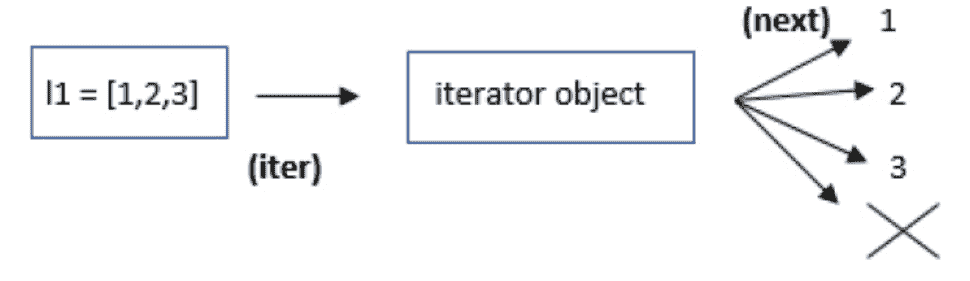

因此，我们可以得出结论：在可迭代对象中，我们首先使用 `iter()` 函数获取一个迭代器对象，然后在迭代器对象上反复调用 `next()` 函数来遍历其所有元素。

## 4.13 Python 柯里化函数

一种通过评估函数参数的增量嵌套，将多参数函数转换为单参数函数的技术，称为柯里化。简单来说，这是一个将接受‘n’个参数的函数转换为一系列‘n’个函数的过程，每个函数只接受一个参数。通过函数的柯里化，任意数量的计算和数据都可以被封装到一个最终的、接受预期输出的真实函数中。因此，这里我们有

```
f(a,b) = (a*a) + (b*b)
h(a) = (a*a)
h(b) = (b*b)
h(a)(b) = h(a)+h(b)
f(a, b) = h(a)(b)
柯里化 f = h(a)(b)
```

例如，考虑以下示例

```
示例 4.41
def fl(w):
    def gl(x,y,z):
        print(w,x,y,z)
    return gl  # 因为 fl 返回 gl，这就是柯里化

my_fl = fl(11)
my_fl(12,13,14)
```

```
输出 4.41
11 12 13 14
```

在上面的例子中，`fl(11)` 将返回函数 `gl(x,y,z)`，对于所有的 x、y 和 z，其行为与 `fl(11,x,y,z)` 完全一样。

由于 `gl` 是一个函数，它也应该支持柯里化。因此，上面代码的输出将是 `11 12 13 14`。

让我们再看一个例子

```
示例 4.42
def fl(a):
    def gl(b):
        def hl(c):
            def il(d):
                def jl(e):
                    print(a, b, c, d, e)
                return jl  # 返回给函数 il
            return il      # 返回给函数 hl
        return hl          # 返回给函数 gl
    return gl              # 返回给函数 fl

fl(21)(22)(23)(24)(25)
```

```
输出 4.42
21 22 23 24 25
```


图 4.2：源代码

在上面的例子中，数学关系是

```
X(a,b,c,d,e) = f1(g1(h1(i1(j1(a,b,c,d,e)))))
```

我们正在执行一个函数到另一个函数的嵌套，因此一个函数的结果将被记录在另一个函数中，形成一个函数链。因此，输出将是 `21 22 23 24 25`。

# 第5章
## Python 模块和包
### 5.1 Python 模块简介

我们都知道，大型编程任务被分解为独立的、更小的、更易管理的子任务或模块，这被称为模块化编程。模块本质上是一组保存到文件中的变量、函数和类。这些独立的模块可以像积木一样组合在一起，创建一个更大的应用程序。处理单个模块的程序员将专注于问题中相对较小的部分。程序员可以理解较小的领域，这使得开发更容易且不易出错。此外，处理独立的模块将最小化相互依赖性，对单个模块的修改对其余程序部分的影响最小。因此，可维护性得到提高。在单个模块中定义的函数可以被应用程序的其他部分重复使用，这消除了代码重复。因此，代码重用是主要好处之一，这也减少了代码长度并提高了可读性。模块定义了一个单独的命名空间，避免了程序多个位置之间标识符的冲突。一个重要的点是，每个 `.py` 文件都将充当一个模块。Python 标准模块的完整列表存在于以下链接中。

[http://docs.python.org/3/py-modindex.html](http://docs.python.org/3/py-modindex.html)，它们位于 Python 安装位置内的 lib 目录中。我们将在本章中详细讨论一些常用的模块。

让我们创建一个模块并看看如何使用它。

```
myval = 3
```

```
def mymultiply(num1,num2):
    """ 上述函数将接受两个数字，
    将它们相乘并返回结果 """
    return num1 * num2

class multiply1:
    pass
```

创建了一个名为 `mymultiplyfile` 的模块，并定义了一个函数 `mymultiply()`。
上述函数将接受两个数字 `num1` 和 `num2` 并返回它们的乘积。还定义了多个对象，如 `myval` 和类 `multiply1`。

一个模块内的变量、类和函数可以被导入到另一个模块中。为此，使用 `import` 关键字。因此，为了导入已经存在的模块 `mymultiplyfile`，需要使用以下代码行

```
import mymultiplyfile
```

使用上面的模块名，可以使用点运算符访问变量和函数。因此，我们创建一个新文件 `moduleeg1.py`，并将访问 `mymultiplyfile` 的变量和函数。

```
示例 5.1
import mymultiplyfile
print(mymultiplyfile.myval) # ML1
print(mymultiplyfile.mymultiply(3,4)) # ML2
print(mymultiplyfile.mymultiply.__doc__) # ML3
```

```
输出 5.1
3
12
The above function will take 2 numbers, multiply them and return the result
```

在上面的例子中，成员是通过模块名访问的。变量通过 `模块名.变量` 访问，函数通过 `模块名.函数()` 访问。

在 ML1 中，我们试图访问模块 `mymultiplyfile` 的变量名 (`myval`)，这是我们最初导入的。因此，这里我们可以看到的输出是 3。

在 ML2 中，在函数调用期间，两个参数 3 和 4 被传递给 `num1` 和 `num2`。因此，返回的输出是 12。

在 ML3 中，我们试图打印函数 `mymultiply` 的文档字符串。因此，输出将是

> The above function will take 2 numbers, multiply them and return the result

> **注意：**
> 有时，当我们在程序中使用一个模块时，会为该模块生成一个编译后的文件 `.PYC`，并将其永久存储在硬盘的 `__pycache__` 文件夹中（前后各有两个下划线）。

### 5.2 带重命名的导入

模块可以通过用别名重命名来导入。我们将使用导入 `mymultiplyfile` 的相同示例，并将 `moduleeg1.py` python 脚本更改如下。

```
示例 5.2
import mymultiplyfile as mymul
print(mymul.myval)
print(mymul.mymultiply(3,4))
print(mymul.mymultiply.__doc__)
```

```
输出 5.2
3
12
The above function will take 2 numbers, multiply them and return the result
```

从上面的例子中，我们将 `mymultiplyfile` 模块重命名为 `mymul`，这在许多情况下节省了我们的输入时间。因此，这里 `mymultiplyfile.myval` 将是无效的，而 `mymul.myval` 将是有效的，因为我们会得到 `NameError: name 'mymultiplyfile' is not defined`。

所以，`mymul` 是 `mymultiplyfile` 的别名。当我们直接使用模块名时，会得到相同的输出。

### 5.3 from import 语句

可以导入模块中的特定名称，而无需导入整个模块。可以使用 `from import` 导入模块的特定成员。成员可以直接访问，无需使用模块名。我们将采用导入 `mymultiplyfile` 的相同示例，`moduleeg1.py` python 脚本将如下所示。

```
示例 5.3
```## 5.4 Python 模块重载

我们应该知道，Python 解释器在一个会话期间只会导入一个模块一次。让我们通过一个例子来看看它是如何工作的。

假设我们创建一个名为 `safetyprecautions.py` 的模块，其中包含以下代码：

```python
print("The following are the safety measures we should take against the new COVID-19 virus: ")
print("We all should wash our hands frequently")
print("We all should maintain social distancing")
print("We all should avoid touching nose, eyes and mouth")
print("Seek medical care urgently if you have fever, cough and difficulty in breathing")
```

现在，我们想在新的 Python 文件（比如 `testmod.py`）中使用上述模块：

```python
# 示例 5.5
import safetyprecautions
import safetyprecautions
import safetyprecautions
import safetyprecautions
import safetyprecautions
import safetyprecautions
print("I am inside testmodule")
```

```
输出 5.5
The following are the safety measures we should take against the new COVID-19 virus:
We all should wash our hands frequently
We all should maintain social distancing
We all should avoid touching nose, eyes and mouth
Seek medical care urgently if you have fever, cough and difficulty in breathing
I am inside testmodule
```

我们可以看到，我们写了 6 次 `import safetyprecautions`，但模块只被导入了一次。

但这里有个问题。假设我们在运行 `testmod.py` 的过程中更新了我们的模块（添加了一些代码），这个更新后的版本并不会可用。所以，我们可能需要重新加载它。我们可以重启解释器，但这帮助不大。

因此，为了重新加载更新后的模块，Python 提供了 `imp` 模块，其中使用 `reload()` 函数。为了更好地理解，我们将导入 `time` 模块并使用 `sleep()` 函数。当程序处于休眠模式时，我们将更新模块，并观察其影响。

### 示例 5.6

```python
import time
from imp import reload
import safetyprecautions
print("I am inside testmodule")
print("I am sleeping for 40 secs")
print("____________________")
time.sleep(40)
reload(safetyprecautions)
print("This is displayed after updation of module")
```

### 输出 5.6

```
The following are the safety measures we should take against the new COVID-19 virus:
We all should wash our hands frequently
We all should maintain social distancing
We all should avoid touching nose, eyes and mouth
Seek medical care urgently if you have fever, cough and difficulty in breathing
I am inside testmodule
I am sleeping for 40 secs
____________________
```

现在，上面的代码在执行时处于休眠状态，我们已经更新了 `safetyprecautions` 模块，添加了一行新代码：

```python
print("So I promise myself I will take all these precautions from being infected")
```

因此，40 秒后输出如下：

```
The following are the safety measures we should take against the new COVID-19 virus:
We all should wash our hands frequently
We all should maintain social distancing
We all should avoid touching nose, eyes and mouth
Seek medical care urgently if you have fever, cough and difficulty in breathing
So I promise myself I will take all these precautions from being infected
This is displayed after updation of module
```

我们可以看到，高亮显示的行出现在输出中。如果我们想显式加载一个模块，那么可以通过导入 `imp` 模块并使用 `reload()` 函数，以便程序能够使用更新后的模块版本。

现在，在第四章中我们详细讨论了一个名为 `dir()` 的函数，它会列出对象的所有有效属性。这里，我们讨论了当前模块的成员和特定模块的成员。但对于每个模块，在执行时，Python 解释器会自动添加一些特殊的属性以供内部使用。请观察以下示例。

### 示例 5.7

```python
num1 = 1
num2 = 3

def add():
    print(num1 + num2)

print(dir())
```

```
输出 5.7
['__annotations__', '__builtins__', '__cached__',
'__doc__', '__file__', '__loader__', '__name__',
'__package__', '__spec__', 'add', 'num1', 'num2']
```

在上面的例子中，我们创建了像 `num1`、`num2`（变量）和 `add()` 函数这样的对象。但除此之外，Python 内部还添加了诸如：

`'__annotations__', '__builtins__', '__cached__',`
`'__doc__', '__file__', '__loader__', '__name__',`
`'__package__', '__spec__'`

这些成员肯定有其含义。我们将打印所有这些成员。

### 示例 5.8

```python
num1 = 1
num2 = 3

def add():
    print(num1 + num2)

print(__annotations__)
print(__builtins__)
print(__cached__)
print(__doc__)
print(__file__)
print(__loader__)
print(__name__)
print(__package__)
print(__spec__)
```

### 输出 5.8

```
{}
<module 'builtins' (built-in)>
None
None
direg.py
<_frozen_importlib_external.SourceFileLoader object at 0x0000027DBFB55278>
__main__
None
None
```

## 5.5 特殊变量 __name__

一个模块的功能可以直接执行，也可以间接执行。`__name__`（前后各两个下划线）是 Python 中的一个特殊变量。这个特殊变量会被内部添加到每个 Python 程序中。上面的变量会存储信息，具体取决于程序的执行方式——是作为独立程序执行，还是作为模块执行。如果程序是作为独立程序执行的，那么该变量的值将是 `__main__`（前后各两个下划线）。如果程序是作为模块从其他程序执行的，那么该变量的值将被设置为定义它的模块的名称。因此，我们可以通过使用 `__name__` 变量来判断程序是直接执行还是作为模块执行。请观察以下代码以更好地理解。

### 示例 5.9

```python
# moduleprog3_main.py
def myfunc():
    print("Inside function")

if __name__ == '__main__':
    print("Program Execution is direct")
    print("The value of __name__ is", __name__)
    myfunc()

else:
    print("Program execution is indirectly as a module from some other program")
    print("The value of __name__ is", __name__)
```

```
输出 5.9
Program Execution is direct
The value of __name__ is __main__
Inside function
```

在上面的程序中，创建了一个名为 `moduleprog3_main` 的新模块。当作为主程序执行上述模块时（在运行其他所有代码之前），`__name__` 变量被设置为 `__main__`。由于上面的条件判断为 `True`，所以先执行 `print` 语句，然后打印 `__name__` 的值（即 `__main__`）。接着调用 `myfunc()` 函数。因此，我们将得到如图所示的输出。

现在，如果我们想在另一个 Python 脚本（比如 `mainmodule.py`）中复用 `myfunc()` 函数，我们可以将 `moduleprog3_main` 作为模块导入。`mainmodule.py` 中的代码如下：

### 示例 5.10

```python
import moduleprog3_main
moduleprog3_main.myfunc()
```

## 5.6 日志模块

每当编写大型代码时，在软件运行过程中跟踪一些事件是必不可少的。对于软件调试、开发和运行，Python提供了一个重要的模块，即日志模块。几乎任何大型的Python代码都会用到日志模块。如果软件在运行时崩溃，并且要求我们调试代码，而我们没有任何日志文件来分析事件发生的顺序，那么我们可能会很难找到问题的原因。即便找到了原因，也会耗费大量的时间。为了进行根本原因分析，必须留下一些“面包屑”（相互关联的信息片段）来识别问题。因此，在运行时将完整的应用程序流程和异常信息存储到文件中是必需的。上述过程称为日志记录。日志记录具有一些优势。建议在调试时使用日志文件。日志文件会为你提供软件运行时执行的事件序列（状态消息和其他所需的数据流）。如果缺失任何序列，我们可能会得到一些提示，了解到是代码的哪个部分已经运行，以及出现了什么问题。此外，日志记录可以提供诸如每日请求次数等统计数据以及更多细节。要在Python中实现日志记录，我们需要实现日志模块。

### 5.6.1 日志级别

在执行日志记录时，我们需要知道应该存储哪些信息。日志消息并非同等重要。我们需要使用标准模块设置一个日志级别，以告诉库处理从该级别及以上的所有事件。根据信息类型，日志数据在Python中根据以下级别划分，如表5.1所示：

| 序号 | 日志级别 | 数值 | 含义说明 |
|------|----------|------|----------|
| 1    | CRITICAL | 50   | 需要高度关注的严重问题。 |
| 2    | ERROR    | 40   | 严重错误。 |
| 3    | WARNING  | 30   | 警告消息，提醒程序员需要注意。 |
| 4    | INFO     | 20   | 包含有价值信息的消息。 |
| 5    | DEBUG    | 10   | 包含调试信息的消息。 |
| 6    | NOTSET   | 0    | 未设置级别。 |

*表5.1：日志级别*

因此，日志级别的优先级如下：NOTSET < DEBUG < INFO < WARNING < ERROR < CRITICAL。默认情况下，程序执行时的默认级别是WARNING。只会显示WARNING级别及更高级别的消息。我们可以显式地设置日志级别。

### 5.6.2 日志记录实现

执行日志记录的第一步是先创建一个文件以存储消息。还需要指定要存储哪些级别的消息。因此，我们将使用logging模块的basicConfig(**kwargs)函数。

basicConfig()的部分参数如下：

1.  **level**：根日志记录器将设置要记录的日志消息的指定严重级别。
2.  **filename**：用于指定文件名。
3.  **filemode**：如果给出了文件名，则默认的文件模式是追加模式（append）。
4.  **format**：用于指定日志消息的格式。

请观察下面的示例：

```python
import logging

logging.basicConfig(filename='mywarninglog.txt', level=logging.WARNING)
print("Displaying Warning level demo:")
logging.debug('Debug message')
logging.info('Info message')
logging.warning('Warning message')
logging.error('Error message')
logging.critical('Critical message')
```

```
Displaying Warning level demo:
The contents inside the file mywarninglog.txt is:
WARNING:root:Warning message
ERROR:root:Error message
CRITICAL:root:Critical message
```

上述示例展示了每条消息前的严重级别以及“root”。Root是日志模块为其默认日志记录器分配的名称。上述格式展示了由冒号（:）分隔的级别、名称和消息，这是默认的输出格式。可以配置不同的内容，如所需格式的时间戳、行号等。

需要注意的一个重要点是，info()和debug()消息没有记录到文件mywarninglog.txt中。这是因为日志记录的消息其严重级别必须是WARNING或更高。如果我们希望日志记录模块记录所有模块的事件，那么必须更改严重级别。例如，我们将严重级别更改为DEBUG。

#### 示例 5.12

```python
import logging
logging.basicConfig(filename='mydebuglog.txt', level=10)
print("Displaying Debug level demo: ")
print("The contents inside the file mydebuglog.txt is:")
logging.debug('Debug message')
logging.info('Info message')
logging.warning('Warning message')
logging.error('Error message')
logging.critical('Critical message')
```

#### 输出 5.12

```
Displaying Debug level demo:
The contents inside the file mydebuglog.txt is:
DEBUG:root:Debug message
INFO:root:Info message
WARNING:root:Warning message
ERROR:root:Error message
CRITICAL:root:Critical message
```

如我们所见，通过将严重级别更改为整数值10或DEBUG，所有具有该级别或更高级别的日志消息都被保存到mydebuglog.txt文件中。假设我们在basicConfig()函数中没有提供文件名，那么会发生什么？日志消息将显示到输出控制台。

#### 示例 5.13

```python
import logging

logging.basicConfig(level=10)
print("Displaying Debug level demo: ")
print("The contents inside the file mydebuglog.txt is:")
logging.debug('Debug message')
logging.info('Info message')
logging.warning('Warning message')
logging.error('Error message')
logging.critical('Critical message')
```

#### 输出 5.13

```
Displaying Debug level demo:
The contents inside the file mydebuglog.txt is:
DEBUG:root:Debug message
INFO:root:Info message
WARNING:root:Warning message
ERROR:root:Error message
CRITICAL:root:Critical message
```

从上述示例可以看出，没有提及文件名，日志消息显示在了控制台。因此，要将日志消息存储到文件中，需考虑以下几点：

1.  首先我们创建并配置了日志记录器，它有多个参数，其中文件名被传递用于记录事件。
2.  可以设置日志记录器格式。
3.  文件模式默认为追加，但根据需要可以更改为其他模式，如写入模式。
4.  设置了日志记录器级别，它作为跟踪日志消息的阈值。不同的属性可以作为参数传递。
5.  用户可以根据需要选择所需的属性，例如 args、asctime、created、exc_info、filename、funcName、levelname、levelno、lineno、message、module、msecs、msg、name、pathname、process、processName、relativeCreated、stack_info、thread 和 threadName。

### 5.6.3 格式化日志消息

有一些基本的信息属性可以添加到输出格式中。假设我们只想记录级别和消息，下面的Python代码片段展示了这一点。

#### 示例 5.14

```python
import logging
logging.basicConfig(format='%(levelname)s-%(message)s')
logging.warning('It is a Warning Message')
```

#### 输出 5.14

```
WARNING-It is a Warning Message
```

假设我们想连同级别和消息一起记录进程ID，我们将编写以下Python代码。

#### 示例 5.15

```python
import logging
logging.basicConfig(format='%(process)d-%(levelname)s-%(message)s')
```logging.warning('It is a Warning Message')

> **输出 5.15**
13236-WARNING-It is a Warning Message

假设我们想在日志中添加日期和时间信息，以及级别和消息，下面的 Python 代码可以实现。

```
**示例 5.16**
import logging
logging.basicConfig(format='%(asctime)s: %(levelname)s-%(message)s', level=20)
logging.info('It is an info Message')
```

> **输出 5.16**
2020-03-30 15:30:12,372: INFO-It is an info Message

`%(asctime)s` 将会添加日志记录的创建时间。但我们要更改日期和时间的格式。

```
**示例 5.17**
import logging
logging.basicConfig(format='%(asctime)s: %(levelname)s-%(message)s', level=20, datefmt='%d-%m-%Y %I:%M:%S %p')
logging.info('It is an info Message')
```

```
**输出 5.17**
30-03-2020 03:34:51 PM: INFO-It is an info Message
```

如上所示，我们更改了日期和时间的格式。但是时间格式必须使用 24 小时制，而不是 12 小时制。因此，只需将 `%I` 替换为 `%H`。

```
**示例 5.18**
import logging

logging.basicConfig(format='%(asctime)s: %(levelname)s-%(message)s',
level=20, datefmt = '%d-%m-%Y %H:%M:%S %p')
logging.info('It is an info Message')
```

```
**输出 5.18**
30-03-2020 15:38:09 PM: INFO-It is an info Message
```

## 5.6.4 变量数据日志

我们可以在运行时将应用程序中的动态信息包含在日志中。我们已经看到日志方法接受一个字符串作为参数，并且我们可以按照所示方式格式化该字符串。

```
**示例 5.19**
import logging

myname = 'ABC'
logging.error(f'Error caused due to {myname} variable.')
```

> 输出 5.19
ERROR:root:Error caused due to ABC variable.

## 5.6.5 堆栈跟踪捕获

可以使用 logging 模块在应用程序中捕获完整的堆栈跟踪。如果 `exc_info` 参数设置为 `True`，则可以捕获异常信息；否则，在复杂的代码库中调试错误将很困难。

**当 exc_info 设置为 False 时**

```
示例 5.20
import logging

num1 = 3
num2 = 0
try:
    divres = num1 / num2
except Exception as e:
    logging.error("Displaying Exception")
```

> 输出 5.20
ERROR:root:Error caused due to ABC variable.

此处，`exc_info` 设置为 False，因此调试代码很困难，只显示上述错误。

**当 exc_info 设置为 True 时**

```
示例 5.21
python
import logging
num1 = 3
num2 = 0
try:
    divres = num1 / num2
except Exception as e:
    logging.error("Displaying Exception", exc_info=True)
```

**输出 5.21**

ERROR:root:Displaying Exception
Traceback (most recent call last):
  File "module10_logging.py", line 6, in <module>
    divres = num1 / num2
ZeroDivisionError: division by zero

在上面的例子中，`exc_info` 设置为 True。我们可以看到堆栈跟踪，显示 `ZeroDivisionError` 发生在第 6 行。

但是，如果我们尝试从异常处理程序中记录日志，可以使用 `logging.exception()`。它将记录一个级别为 ERROR 的消息，并将异常信息添加到消息中。这等同于 `logging.error(exc_info=True)`。上述方法需要从异常处理程序中调用，因为该方法会输出异常信息。上述方法将显示一条 ERROR 级别的日志。

## **示例 5.22**

如需查看图 5.1（第 281 页）所示的源代码，请扫描二维码。

**输出 5.22**

```
Case-1
Enter the first number: 10
Enter the second number: 2
5.0

Case-2
Enter the first number: 10
Enter the second number: 2a
Only numbers are allowed

Case-3
Enter the first number: 10
Enter the second number: 0
Do not try to divide with zero
```

## # myerrorlog.txt 文件中的日志

```
30-03-2020 16:33:10 PM: INFO-Division of 2 numbers:
30-03-2020 16:33:12 PM: INFO-End of the code
30-03-2020 16:33:13 PM: INFO-Division of 2 numbers:
30-03-2020 16:33:16 PM: ERROR-invalid literal for int()
with base 10: '2a'
Traceback (most recent call last):
  File "module10_logging.py", line 7, in <module>
    num2=int(input("Enter the second number: "))
ValueError: invalid literal for int() with base 10: '2a'
30-03-2020 16:33:16 PM: INFO-End of the code
30-03-2020 16:33:17 PM: INFO-Division of 2 numbers:
30-03-2020 16:33:19 PM: ERROR-division by zero
Traceback (most recent call last):
  File "module10_logging.py", line 8, in <module>
    print(num1/num2)
ZeroDivisionError: division by zero
30-03-2020 16:33:19 PM: INFO-End of the code
```


图 5.1：源代码

当代码执行时，可能出现以下情况。
在 Case-1 中，
用户输入了数字 10 和 2，生成输出 5.0。由于上述情况未产生任何异常，以下日志消息将存储在文件 "myerrorlog.txt" 中。

```
30-03-2020 16:33:10 PM: INFO-Division of 2 numbers:
30-03-2020 16:33:12 PM: INFO-End of the code
```

在 Case-2 中，
用户输入了数字 10 和 2a。由于输入了错误的内容，Python 抛出 `ValueError` 异常，显示输出 "Only numbers are allowed"。以下日志消息将存储在文件 "myerrorlog.txt" 中。

```
30-03-2020 16:33:13 PM: INFO-Division of 2 numbers:
30-03-2020 16:33:16 PM: ERROR-invalid literal for int()
with base 10: '2a'
Traceback (most recent call last):
  File "module10_logging.py", line 7, in <module>
    num2=int(input("Enter the second number: "))
ValueError: invalid literal for int() with base 10: '2a'
30-03-2020 16:33:16 PM: INFO-End of the code
```

在 Case-3 中，
用户输入了数字 10 和 0。由于输入了 0，Python 抛出 `ZeroDivisionError` 异常，显示输出 "Do not try to divide with zero"。以下日志消息将存储在文件 "myerrorlog.txt" 中。

```
30-03-2020 16:33:17 PM: INFO-Division of 2 numbers:
30-03-2020 16:33:19 PM: ERROR-division by zero
Traceback (most recent call last):
  File "module10_logging.py", line 8, in <module>
    print(num1/num2)
ZeroDivisionError: division by zero
30-03-2020 16:33:19 PM: INFO-End of the code
```

## 5.6.6 Logging 模块中的类

我们现在对名为 root 的默认 logger 有了很好的了解。但是通过创建 Logger 类的对象，我们可以定义自己的 logger。Logger 模块中常用的类如下：

1.  **Logger:** 在上述类中，对象将直接用于调用应用程序代码中的函数。
2.  **LogRecord:** logger 会自动创建 LogRecord 对象，其中包含与事件相关的必要信息，如 logger 名称、行号、消息等。
3.  **Handler:** 一旦我们完成了自定义 logger 的配置，handler 就会介入。LogRecord 会被 handler 发送到所需的输出目的地（例如文件）。它充当子类（如 FileHandler、HTTPHandler 等）的基础。
4.  **Formatter:** 通过指定字符串格式来指定输出格式，该格式列出了输出应包含的属性。

观察以下示例。

```
python
示例 5.23
import logging

mylogger = logging.getLogger(__name__)

my_handler = logging.FileHandler('myfilelog.txt')
my_handler.setLevel(logging.ERROR)

my_format = logging.Formatter('%(asctime)s - %(name)s - %(levelname)s - %(message)s')
my_handler.setFormatter(my_format)

mylogger.addHandler(my_handler)
mylogger.error('This is an error')
```

> > 输出 5.23
> 2020-03-30 19:15:31,226 - __main__ - ERROR - This is an error

在文件 "myfilelog.txt" 中，输出
2020-03-30 19:15:31,226 - __main__ - ERROR - This is an error 将被保存。

在上述示例中，首先创建了一个自定义 logger，然后创建了 `my_handler`，这是一个 FileHandler，级别为 ERROR。`my_handler` 会接收 ERROR 级别的 LogRecord，并通过将其写入指定文件 "mylog.txt" 来生成输出，内容为 2020-03-30 19:15:31,226 - __main__ - ERROR - This is an error。

此外，对应于 `__name__` 变量的 logger 名称被记录为 `__main__`。这是 Python 在执行开始时分配给模块的名称。上述代码保存在文件 module10_logging.py 中。

如果我们将在其他 Python 文件中导入上述文件，那么文件名将被替换为 module10_logging。

## **示例 5.24**

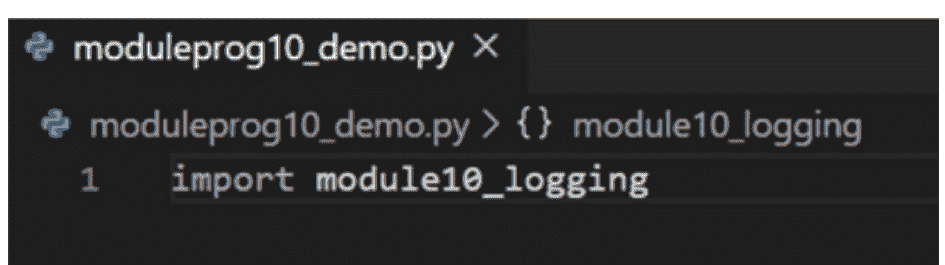

```
**输出 5.24**
2020-03-30 19:46:13,512 - module10_logging - ERROR - This is an error
2020-03-30 19:47:01,645 - module10_logging - ERROR - This is an error
```

## 5.7 使用断言进行调试

首先，我们应该问问自己，是否知道什么是 bug？我们许多人已经熟悉这个词。如果预期结果和实际结果之间存在不匹配，那么就称之为 bug。让我们理解一个现实世界中应用程序的场景。一旦开发团队完成了应用程序，它将被移交给测试团队。这被称为构建。测试团队会进行一些测试。如果他们发现任何 bug，他们会将信息更新给开发团队。开发团队在分析 bug 后会进行一些修改。因此，识别和修复 bug 的过程被称为调试。这是开发者的责任，而不是测试者的责任。根据收到的反馈，他们会将修改后的构建移交给测试团队。一旦测试团队接受了应用程序，它将被移交给客户。

执行调试最常见的方式是使用 print() 语句。因此，我们习惯于编写 print() 语句来调试代码。一旦调试完成，必须移除额外添加的 print() 语句，否则上述语句将在运行时执行，这会影响性能并干扰控制台输出。为了克服这个问题，我们将使用 assert 语句。

assert 语句最大的优点是，调试完成后，无需移除上述语句。我们可以根据需要启用或禁用 assert 语句。在代码中自信地断言一个事实的语句被称为断言。如果我们对代码的某个特定部分有信心，我们可以在那里使用 assert 语句。例如，如果我们确定在执行除法函数时除数应该是一个数字，那么我们可以断言除数必须是一个数字。它是一个调试工具，向用户显示程序的哪个部分发生了错误。

我们可以用两种方式使用 assert 语句：

- **简单版本**
在简单版本中，assert 语句检查条件，如果不满足，则程序停止并抛出 AssertionError。此版本的语法是

```
assert <conditional_expression>
```

请观察上面计算数字总和的示例。

```
**示例 5.25**
def mysum(mymarks):
    assert len(mymarks) != 0
    return sum(mymarks)

myl1 = [1,2,3,4,5,6]
print("Sum of list myl1 is:",mysum(myl1))

myl2 = []
print("Sum of list myl2 is:",mysum(myl2))
```

```
**输出 5.25**
Sum of list myl1 is: 21
Traceback (most recent call last):
  File "<ipython-input-25-25ff38678825>", line 9, in <module>
    print("Sum of list myl2 is:",mysum(myl2))
  File "<ipython-input-25-25ff38678825>", line 2, in mysum
    assert len(mymarks) != 0
AssertionError
```

在上面的程序中，我们将列表 myl1 传递给 mysum() 函数。它将检查列表是否为空。由于列表不为空，将返回列表所有元素的总和。因此，输出将是 Sum of list myl1 is: 21

现在，在第二种情况下，当我们向 mysum() 函数传递一个空列表时，将检查条件列表 myl1 是否为空列表。由于条件失败，assert 将停止程序并给出 AssertionError。

### 2. 增强版本

增强版本的语法是

```
assert <conditional_expression>, <error message>
```

在此版本中，assert 语句将首先检查条件。如果求值为 True，程序将继续。如果为 False，assert 语句将停止程序并给出 AssertionError 以及错误消息。

```
示例 5.26
def mysum(mymarks):
    assert len(mymarks) != 0, "Empty list"
    return sum(mymarks)

myl1 = [1,2,3,4,5,6]
print("Sum of list myl1 is:",mysum(myl1))

myl2 = []
print("Sum of list myl2 is:",mysum(myl2))
```

```
**输出 5.26**
Sum of list myl1 is: 21
Traceback (most recent call last):
  File "<ipython-input-26-3dac8807c5a2>", line 9, in <module>
    print("Sum of list myl2 is:",mysum(myl2))
  File "<ipython-input-26-3dac8807c5a2>", line 2, in mysum
    assert len(mymarks) != 0, "Empty list"
AssertionError: Empty list
```

在上面的示例中，我们将 myl1（非空列表）和 myl2（空列表）传递给 mysum() 函数。我们得到了 myl1 列表的输出，但之后我们得到了 myl2 的错误。myl1 列表满足了 assert 条件，程序继续运行。然而，myl2 不满足条件，并给出了 *AssertionError: Empty list* 作为替代。

因此，我们可以得出结论，断言是代码中应该始终为真的布尔表达式。它接受一个可选的消息和一个表达式，用于检查类型、值和函数输出。因此，它是一个调试工具，在发生错误的点停止程序。

## 5.8 Python 包

包是一种封装机制，用于将与单个单元相关的模块分组在一起。它是一种使用“点分模块名称”来构建 Python 模块命名空间的方式。因此，X.Y 表示 Y 是包名 X 下的子模块。它是模块和包的集合。一个包可以包含子包。它是一个文件夹或目录。就像模块可以有效地处理函数和命名空间一样，Python 包可以以结构化的方式处理多个模块。

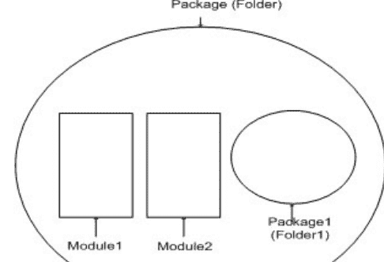

图 5.2：包概述

图 5.2 描绘了一个包可以由模块和包组成。简单来说，模块意味着文件，包意味着文件夹。但每个文件夹必须包含一个名为 __init__.py 的文件，以确保上述文件夹被视为 Python 包。

因此，包应包含一个名为 __init__.py 的特殊文件。上述文件可以为空。它也可以是可执行的初始化代码。包语句解决命名冲突，组件可以被唯一标识，应用程序的模块化得到提高，提供了使用上的灵活性优势。

为了在 Python 中创建一个包，需要遵循 3 个基本步骤：-

- 1. 首先是创建一个文件夹并给它一个主要与操作相关的包名。
- 2. 然后将类、变量和所需的函数放入其中。
- 3. 在文件夹内创建 __init__.py 文件，以将其视为 Python 包。

现在，我们将讨论一个为游戏设计的模块和包的集合。在上述结构中，我们创建了一个名为 Games 的包。

上述包包含以下项目：

- 1. Cricket 包，包含模块（othercountrybatsman.py 和 othercountrybowler.py）、India 包（indianbatsman.py、indianbowler.py 和 __init__.py）以及 __init__.py。
- 2. Football 包，包含模块（goalkeeper.py 和 forward.py）以及 __init__.py。
- 3. Kabaddi 包，包含模块（raider.py 和 defender.py）以及 __init__.py。
- 4. games.py
- 5. __init__.py

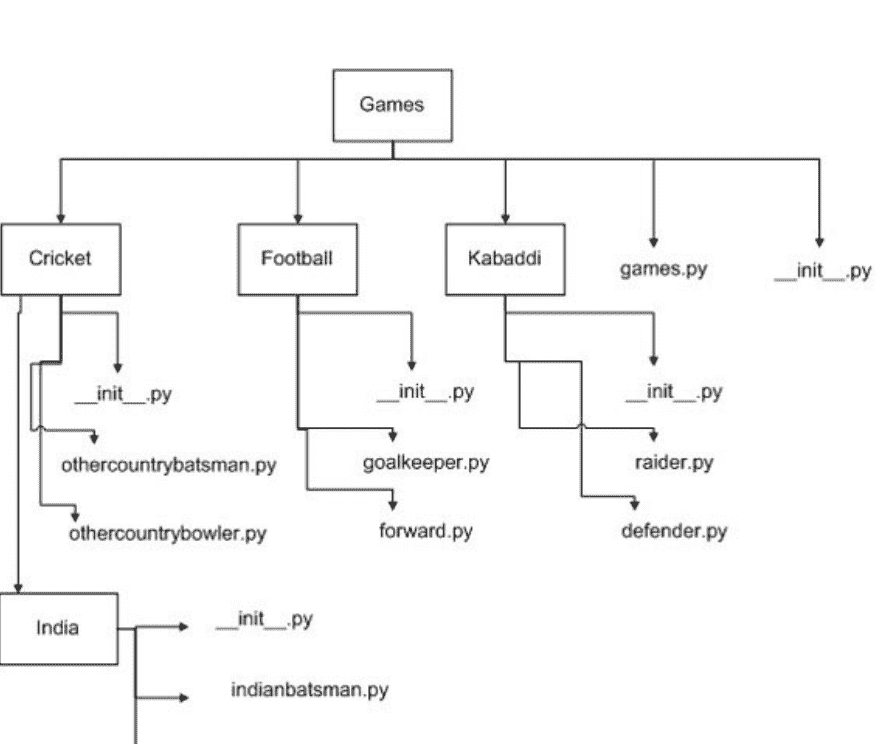

- 1. **在包中使用“import”** 语法：`import packName.modName`，其中 packName 是包名，modName 是模块名。

```
例如：`import Cricket.othercountrybatsman`
```

语法：`import packName.subPackName.modName`，其中 packName 是包名，subPackName 是 packName 内的包名，modName 是模块名。

```
例如：`import Cricket.India.indianbatsman`
```

如何访问对象，如变量、函数、类、列表等？

语法：packName.modName.funcName()，其中 packName 是包名，modName 是模块名，funcName 是函数名。

例如：**Cricket.othercountrybatsman.name othercountrybatsman()**

语法：packName.subPackName.modName.funcName()，其中 packName 是包名，subPackName 是 packName 内的包名，modName 是模块名，funcName 是函数名。

例如：**Cricket.India.indianbatsman.name indianbatsman()**

- 2. **在包中使用“from import”** 语法：from packName.modName import funcName，其中 packName 是包名，modName 是模块名，funcName 是函数名。

例如：**from Cricket.othercountrybatsman import name othercountrybatsman**

语法：from packName.subPackName.modName import funcName，其中 packName 是包名，subPackName 是 packName 内的包名，modName 是模块名，funcName 是函数名。

例如：**from Cricket.India.indianbatsman import name indianbatsman**

如何访问对象，如变量、函数、类、列表等？

语法：funcName()，其中 funcName 是函数名。

例如：**name othercountrybatsman()**语法：`def funcName()`，其中 `funcName` 是函数名称。

示例：`def name_indianbatsman()`

### 3. 在包中使用 “from import *”

如果包的 `__init__.py` 代码定义了一个名为 `__all__` 的列表，那么当遇到 `from Cricket import *` 时，系统会考虑该模块名列表，从而确定应该导入哪些模块。

```python
__all__ = [othercountrybatsman, othercountrybowler]
```

现在，我们创建了一个名为 `Games` 的文件夹，其中包含了不同的包（文件夹）以及如图5.4所示的模块名称。

`Cricket` 包包含以下模块和子包，如图5.5所示。

`India` 是 `Cricket` 包中的一个子包，如图5.6所示。

`Football` 包包含以下模块和子包，如图5.7所示。

`Kabaddi` 包包含以下模块和子包，如图5.8所示。

我们创建了一个名为 `games.py` 的模块。首先，我们将看到如何使用上述文件访问不同包和子包（如 `Cricket`、`India`、`Football` 等）中的模块。但在访问之前，下面列出了不同模块名称及其包含的函数。

## 模块名: othercountrybatsman.py


图 5.4：Games 包

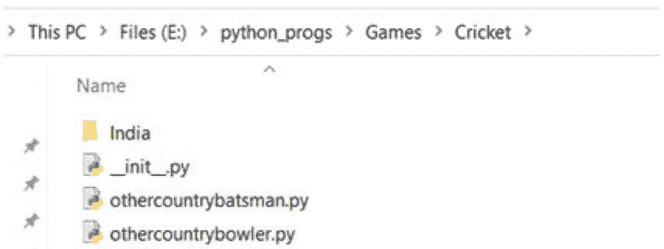

```python
#Cricket 包 — othercountrybatsman 模块

def name_othercountrybatsman():
    """其他国家队击球手姓名为"""
    print("Other Country Batsman Function")
    print("Batsman1: Mr. E")
    print("Batsman2: Mr. F")
    print()
```

## 模块名: othercountrybowler.py

```python
#Cricket 包 — othercountrybowler 模块

def name_othercountrybowler():
    """其他国家队投球手姓名为"""
    print("Other Country Bowler Function")
    print("Bowler1: Mr. G")
    print("Bowler2: Mr. H")
    print()
```

## 模块名: indianbatsman.py

此电脑 > 文件 (E:) > python_progs > Games > Cricket > India

- __init__.py
- indianbatsman.py
- indianbowler.py

图 5.6：India 包

此电脑 > 文件 (E:) > python_progs > Games > Football

- __init__.py
- forward.py
- goalkeeper.py

图 5.7：Football 包

```python
#India 子包 — indianbatsman 模块

def name_indianbatsman():
    """印度队击球手姓名为"""
    print("Indian Batsman Function")
    print("Batsman1: Mr. A")
    print("Batsman2: Mr. B")
    print()
```

## 模块名: indianbowler.py

```python
#India 子包 — indianbowler 模块

def name_indianbowler():
    """印度队投球手姓名为"""
    print("Indian Bowler Function")
    print("Bowler1: Mr. C")
    print("Bowler2: Mr. D")
    print()
```


图 5.8：Kabaddi 包

## 模块名: goalkeeper.py

```python
#Football 包 — goalkeeper 模块

def name_goalkeeper():
    """足球守门员姓名为"""
    print("GoalKeeper Function")
    print("GoalKeeper1: Mr. R")
    print("GoalKeeper2: Mr. S")
    print()
```

## 模块名: forward.py

```python
#Football 包 — forward 模块

def name_forward():
    """足球前锋姓名为"""
    print("Forward Function")
    print("Forward1: Mr. T")
    print("Forward2: Mr. U")
    print()
```

## 模块名: raider.py

```python
#Kabaddi 包 — raider 模块

def name_raider():
    """卡巴迪突击手姓名为"""
    print("Raider Function")
    print("Raider1: Mr. W")
    print("Raider2: Mr. X")
    print()
```

## 模块名: defender.py

```python
#Kabaddi 包 — defender 模块

def name_defender():
    """卡巴迪防守队员姓名为"""
    print("Defender Function")
    print("Defender1: Mr. Y")
    print("Defender2: Mr. Z")
    print()
```

现在，我们将通过 `games.py` 文件来查看访问多个模块的不同情况。

- 1. games.py 模块，使用 `import` 仅访问 `othercountrybatsman` 模块

```python
#games 模块
import Cricket.othercountrybatsman
Cricket.othercountrybatsman.name_othercountrybatsman()
```

输出 5.27：从控制台运行 `python games.py`

```
Other Country Batsman Function
Batsman1: Mr. E
Batsman2: Mr. F
```

在上面的代码中，我们从该文件访问了 `Cricket` 包的 `othercountrybatsman` 模块。在这个模块中，我们访问了 `name_othercountrybatsman` 函数。因此，输出如上所示。

- 2. games.py 模块，使用 `import` 仅访问 `othercountrybowler` 模块

```python
#games 模块
import Cricket.othercountrybowler
Cricket.othercountrybowler.name_othercountrybowler()
```

输出 5.28：从控制台运行 `python games.py`

```
Other Country Bowler Function
Bowler1: Mr. G
Bowler2: Mr. H
```

在上面的代码中，我们从该文件访问了 `Cricket` 包的 `othercountrybowler` 模块。在这个模块中，我们访问了 `name_othercountrybowler` 函数。因此，输出如上所示。

- 3. games.py 模块，使用 `import` 仅访问 `India` 包内的 `indianbatsman` 模块

```python
#games 模块
import Cricket.India.indianbatsman
Cricket.India.indianbatsman.name_indianbatsman()
```

输出 5.29：从控制台运行 `python games.py`

```
Indian Batsman Function
Batsman1: Mr. A
Batsman2: Mr. B
```

在上面的代码中，我们从该文件访问了 `Cricket` 包的 `India` 子包内的 `indianbatsman` 模块。在这个模块中，我们访问了 `name_indianbatsman` 函数。因此，输出如上所示。

- 4. games.py 模块，使用 `import` 仅访问 `India` 包内的 `indianbowler` 模块

```python
#games 模块
import Cricket.India.indianbowler
Cricket.India.indianbowler.name_indianbowler()
```

输出 5.30：从控制台运行 `python games.py`

```
Indian Bowler Function
Bowler1: Mr. C
Bowler2: Mr. D
```

在上面的代码中，我们从该文件访问了 `Cricket` 包的 `India` 子包内的 `indianbowler` 模块。在这个模块中，我们访问了 `name_indianbowler` 函数。因此，输出如上所示。

- 5. games.py 模块，使用 `import` 仅访问 `Football` 包内的 `goalkeeper` 模块

```python
#games 模块
import Football.goalkeeper
Football.goalkeeper.name_goalkeeper()
```

输出 5.31：从控制台运行 `python games.py`

```
GoalKeeper Function
GoalKeeper1: Mr. R
GoalKeeper2: Mr. S
```

在上面的代码中，我们从该文件访问了 `Football` 包的 `goalkeeper` 模块。在这个模块中，我们访问了 `name_goalkeeper` 函数。因此，输出如上所示。

- 6. games.py 模块，使用 `import` 仅访问 `Football` 包内的 `forward` 模块

```python
#games 模块
import Football.forward
Football.forward.name_forward()
```

输出 5.32：从控制台运行 `python games.py`

```
Forward Function
Forward1: Mr. T
Forward2: Mr. U
```

在上面的代码中，我们从该文件访问了 `Football` 包的 `forward` 模块。在这个模块中，我们访问了 `name_forward` 函数。因此，输出如上所示。

- 7. games.py 模块，使用 `import` 仅访问 `Kabaddi` 包内的 `raider` 模块

```python
#games 模块
import Kabaddi.raider
Kabaddi.raider.name_raider()
```

输出 5.33：从控制台运行 `python games.py`

```
Raider Function
Raider1: Mr. W
Raider2: Mr. X
```

在上面的代码中，我们从该文件访问了 `Kabaddi` 包的 `raider` 模块。在这个模块中，我们访问了 `name_raider` 函数。因此，输出如上所示。

- 8. games.py 模块，使用 `import` 仅访问 `Kabaddi` 包内的 `defender` 模块

```python
#games 模块
import Kabaddi.defender
Kabaddi.defender.name_defender()
```

输出 5.34：从控制台运行 `python games.py`

```
Defender Function
Defender1: Mr. Y
Defender2: Mr. Z
```

在上面的代码中，我们从该文件访问了 `Kabaddi` 包的 `defender` 模块。在这个模块中，我们访问了 `name_defender` 函数。因此，输出如上所示。

但是，还存在另一种方法，可以使用 **from packname import modulename** 方式来访问不同包的多个模块。

- 9. games.py 模块，使用 `from ... import` 访问 `othercountrybatsman` 模块

```python
#games 模块
from Cricket import othercountrybatsman
othercountrybatsman.name_othercountrybatsman()
```

## 10. games.py 模块及使用 from ... import 访问 othercountrybowler 模块

```python
#games module
from Cricket import othercountrybowler
othercountrybowler.name_othercountrybowler()
```

输出 5.36
输出：从控制台运行 python games.py

Other Country Bowler Function
Bowler1: Mr. G
Bowler2: Mr. H

## 11. games.py 模块及使用 from ... import 访问 India 包内的 indianbatsman 模块

```python
#games module
from Cricket.India import indianbatsman
indianbatsman.name_indianbatsman()
```

**输出 5.37**
输出：从控制台运行 python games.py

Indian Batsman Function
Batsman1: Mr. A
Batsman2: Mr. B

## 12. games.py 模块及使用 from ... import 访问 India 包内的 indianbowler 模块

```python
#games module
from Cricket.India import indianbowler
indianbowler.name_indianbowler()
```

**输出 5.38**
输出：从控制台运行 python games.py

Indian Bowler Function
Bowler1: Mr. C
Bowler2: Mr. D

## 13. games.py 模块及使用 from ... import 访问 Football 包内的 goalkeeper 模块

```python
#games module
from Football import goalkeeper
goalkeeper.name_goalkeeper()
```

**输出 5.39**
输出：从控制台运行 python games.py

GoalKeeper Function
GoalKeeper1: Mr. R
GoalKeeper2: Mr. S

## 14. games.py 模块及使用 from ... import 访问 Football 包内的 forward 模块

```python
#games module
from Football import forward
forward.name_forward()
```

**输出 5.40**
输出：从控制台运行 python games.py

Forward Function
Forward1: Mr. T
Forward2: Mr. U

## 15. games.py 模块及使用 from ... import 访问 Kabaddi 包内的 raider 模块

```python
#games module
from Kabaddi import raider
raider.name_raider()
```

输出 5.41
输出：从控制台运行 python games.py

Raider Function
Raider1: Mr. W
Raider2: Mr. X

## 16. games.py 模块及使用 from ... import 访问 Kabaddi 包内的 defender 模块

```python
#games module
from Kabaddi import defender
defender.name_defender()
```

输出 5.42
输出：从控制台运行 python games.py

Defender Function
Defender1: Mr. Y
Defender2: Mr. Z

还有第三种方法可以使用 `from packagename.modulename import funcname` 方式访问不同包中多个模块内的对象（此处仅指函数名）。

## 17. games.py 模块及访问 name_othercountrybatsman 函数

```python
#games module
from Cricket.othercountrybatsman import name_othercountrybatsman
name_othercountrybatsman()
```

**输出 5.43**
输出：从控制台运行 python games.py

Other Country Batsman Function
Batsman1: Mr. E
Batsman2: Mr. F

## 18. games.py 模块及访问 name_othercountrybowler 函数

```python
#games module
from Cricket.othercountrybowler import name_othercountrybowler
name_othercountrybowler()
```

**输出 5.44**
输出：从控制台运行 python games.py

Other Country Bowler Function
Bowler1: Mr. G
Bowler2: Mr. H

## 19. games.py 模块及访问 name_indianbatsman 函数

```python
#games module
from Cricket.India.indianbatsman import name_indianbatsman
name_indianbatsman()
```

输出 5.45
输出：从控制台运行 python games.py

Indian Batsman Function
Batsman1: Mr. A
Batsman2: Mr. B

## 20. games.py 模块及访问 name_indianbowler 函数

```python
#games module
from Cricket.India.indianbowler import name_indianbowler
name_indianbowler()
```

输出 5.46
输出：从控制台运行 python games.py

Indian Bowler Function
Bowler1: Mr. C
Bowler2: Mr. D

## 21. games.py 模块及访问 name_goalkeeper 函数

```python
#games module
from Football.goalkeeper import name_goalkeeper
name_goalkeeper()
```

**输出 5.47**
输出：从控制台运行 python games.py

GoalKeeper Function
GoalKeeper1: Mr. R
GoalKeeper2: Mr. S

## 22. games.py 模块及访问 name_forward 函数

```python
#games module
from Football.forward import name_forward
name_forward()
```

**输出 5.48**
输出：从控制台运行 python games.py

Forward Function
Forward1: Mr. T
Forward2: Mr. U

## 23. games.py 模块及访问 name_raider 函数

```python
#games module
from Kabaddi.raider import name_raider
name_raider()
```

**输出 5.49**
输出：从控制台运行 python games.py

Raider Function
Raider1: Mr. W
Raider2: Mr. X

## 24. games.py 模块及访问 name_defender 函数

```python
#games module
from Kabaddi.defender import name_defender
name_defender()
```

**输出 5.50**
输出：从控制台运行 python games.py

Defender Function
Defender1: Mr. Y
Defender2: Mr. Z

现在，假设需要导入一个包中的所有模块。这可以通过两种方法完成。

### 方法 - I

```python
#games module
from Cricket import othercountrybatsman, othercountrybowler
othercountrybatsman.name_othercountrybatsman()
othercountrybowler.name_othercountrybowler()
```

**输出 5.51**
输出：从控制台运行 python games.py

Batsman1: Mr. E
Batsman2: Mr. F

Other Country Bowler Function
Bowler1: Mr. G
Bowler2: Mr. H

### 方法 - II

你们大多数人可能想到的是上述方法。

```python
#games module
from Cricket import *
othercountrybatsman.name_othercountrybatsman()
othercountrybowler.name_othercountrybowler()
```

**输出 5.52**
输出：从控制台运行 python games.py

Traceback (most recent call last):
  File "games.py", line 3, in <module>
    othercountrybatsman.name_othercountrybatsman()
NameError: name 'othercountrybatsman' is not defined

在上述方法中，我们使用了 `*` 来导入模块。但在包中，上述方法不可行，因为我们会得到如图所示的 NameError。我们之前在模块中使用了 `import *`。因此，我们将在 Cricket 包的 `__init__.py` 文件中指定所有需要加载的上述模块名称。

### Cricket 包 __init__.py 文件

```python
# Cricket package — __init__ module
__all__ = ['othercountrybatsman','othercountrybowler']
```

### 用于加载 Cricket 包模块的 games.py 文件

```python
#games module
from Cricket import *
othercountrybatsman.name_othercountrybatsman()
othercountrybowler.name_othercountrybowler()
```

输出 5.53
输出：从控制台运行 python games.py

Batsman1: Mr. E
Batsman2: Mr. F
Other Country Bowler Function

Bowler1: Mr. G
Bowler2: Mr. H

### India 子包 __init__.py 文件

```python
# Cricket Package — India subpackage — __init__ module
__all__ = ['indianbatsman','indianbowler']
```

### Football 包 __init__.py 文件

```python
# Football Package — __init__ module
__all__ = ['goalkeeper','forward']
```

### Kabaddi 包 __init__.py 文件

```python
# Kabaddi Package — __init__ module
__all__ = ['raider','defender']
```

### 用于加载 Cricket 包、India 子包、Football 包和 Kabaddi 包模块的 games.py 文件

**示例 5.54**

源代码请扫描第 281 页图 5.1 所示的二维码

**输出 5.54**

输出：从控制台运行 python games.py

Other Country Batsman Function
Batsman1: Mr. E
Batsman2: Mr. F

Other Country Bowler Function
Bowler1: Mr. G
Bowler2: Mr. H

Indian Batsman Function
Batsman1: Mr. A
Batsman2: Mr. B

Indian Bowler Function
Bowler1: Mr. C
Bowler2: Mr. D

GoalKeeper Function
GoalKeeper1: Mr. R
GoalKeeper2: Mr. S

Forward Function
Forward1: Mr. T
Forward2: Mr. U

Raider Function
Raider1: Mr. W
Raider2: Mr. X

Defender Function
Defender1: Mr. Y
Defender2: Mr. Z

假设需要在 Kabaddi 包的 defender 模块中使用 Football 包的 forward 模块。

**示例 5.55**

defender.py 文件中的代码

```python
#Kabaddi Package — defender module
from Football import forward
def name_defender():
    '''Kabaddi defender names are'''
    print("Defender Function")
```print("防守者1：Y先生")
print("防守者2：Z先生")
print()
forward.name_forward()

## 输出 5.55

```
SAURABH@LAPTOP-NHFM79LF MINGW64 /e/python_progs/Games/Kabaddi
$ python defender.py
Traceback (most recent call last):
  File "defender.py", line 2, in <module>
    from Football import forward
ModuleNotFoundError: No module named 'Football'
```

使用上述方法运行时，我们遇到了错误 `ModuleNotFoundError : No module named 'Football'`。我们当前位于 Kabaddi 文件夹内，却试图访问 Football 包的模块。因此，我们将退回到上一级文件夹，然后尝试执行上述文件。

```
SAURABH@LAPTOP-NHFM79LF MINGW64 /e/python_progs/Games/Kabaddi
$ cd ../
SAURABH@LAPTOP-NHFM79LF MINGW64 /e/python_progs/Games
$ python defender.py
C:\Users\SAURABH\AppData\Local\Programs\Python\Python37\python.exe: can't open file 'defender.py': [Errno 2] No such file or directory
```

但我们再次收到错误，因为没有这样的文件或目录。因此，我们将使用标志，因为我们必须将库模块作为脚本运行。请仔细观察上面高亮显示的 python 帮助信息。

```
SAURABH@LAPTOP-NHFM79LF MINGW64 /e/python_progs/Games
$ python --help
```

用法：C:\Users\SAURABH\AppData\Local\Programs\Python\Python37\python.exe [选项] ... [-c 命令 | -m 模块 | 文件 | -] [参数] ...

选项和参数（以及相应的环境变量）：

- `-b`：对 `str(bytes_instance)`、`str(bytearray_instance)` 以及将 bytes/bytearray 与 str 进行比较时发出警告。(`-bb`：发出错误)
- `-B`：导入时不写入 .pyc 文件；也可使用 `PYTHONDONTWRITEBYTECODE=x`
- `-c cmd`：以字符串形式传入的程序（终止选项列表）
- `-d`：来自解析器的调试输出；也可使用 `PYTHONDEBUG=x`
- `-E`：忽略 PYTHON* 环境变量（如 PYTHONPATH）
- `-h`：打印此帮助信息并退出（也可使用 `--help`）
- `-i`：运行脚本后进行交互式检查；即使标准输入看起来不是终端也强制显示提示符；也可使用 `PYTHONINSPECT=x`
- `-I`：将 Python 与用户环境隔离（隐含 -E 和 -s）
- `-m mod`：将库模块作为脚本运行（终止选项列表）
- `-O`：移除 assert 和依赖于 `__debug__` 的语句；在 .pyc 扩展名前添加 .opt-1；也可使用 `PYTHONOPTIMIZE=x`
- `-OO`：执行 -O 的更改并丢弃文档字符串；在 .pyc 扩展名前添加 .opt-2
- `-q`：交互式启动时不打印版本和版权信息
- `-s`：不将用户站点目录添加到 sys.path；也可使用 `PYTHONNOUSERSITE`
- `-S`：初始化时不隐含 'import site'
- `-u`：强制标准输出和标准错误流为无缓冲；此选项对标准输入无效；也可使用 `PYTHONUNBUFFERED=x`
- `-v`：详细模式（跟踪导入语句）；也可使用 `PYTHONVERBOSE=x`，可多次提供以增加详细程度
- `-V`：打印 Python 版本号并退出（也可使用 `--version`），当提供两次时，打印更多关于构建的信息
- `-W arg`：警告控制；arg 格式为 `action:message:category:module:lineno`，也可使用 `PYTHONWARNINGS=arg`
- `-x`：跳过源代码的第一行，允许使用非 Unix 形式的 `#!cmd`
- `-X opt`：设置实现特定的选项
- `--check-hash-based-pycs always|default|never:` 控制 Python 如何使基于哈希的 .pyc 文件失效
- `file`：从脚本文件读取的程序
- `-`：从标准输入读取的程序（默认；如果是 tty 则为交互模式）
- `arg ...`：传递给程序的参数，位于 sys.argv[1:]

其他环境变量：

- `PYTHONSTARTUP`：交互式启动时执行的文件（无默认值）
- `PYTHONPATH`：以分号分隔的目录列表，前缀到默认模块搜索路径。结果为 sys.path。
- `PYTHONHOME`：备用的 `<prefix>` 目录（或 `<prefix>;<exec_prefix>`）。默认模块搜索路径使用 `<prefix>\python{major}{minor}`。
- `PYTHONCASEOK`：在 'import' 语句中忽略大小写（Windows）。
- `PYTHONIOENCODING`：用于标准输入/标准输出/标准错误的编码[:错误处理]。
- `PYTHONFAULTHANDLER`：在致命错误时转储 Python 回溯信息。
- `PYTHONHASHSEED`：如果此变量设置为 'random'，则使用随机值为 str、bytes 和 datetime 对象的哈希值设定种子。也可以设置为 [0,4294967295] 范围内的整数，以获得具有可预测种子的哈希值。
- `PYTHONMALLOC`：设置 Python 内存分配器和/或在 Python 内存分配器上安装调试钩子。使用 `PYTHONMALLOC=debug` 安装调试钩子。
- `PYTHONCOERCELOCALE`：如果此变量设置为 0，则禁用区域设置强制行为。使用 `PYTHONCOERCELOCALE=warn` 请求在标准错误上显示区域设置强制和区域设置兼容性警告。
- `PYTHONBREAKPOINT`：如果此变量设置为 0，则禁用默认调试器。可以设置为您选择的调试器的可调用对象。
- `PYTHONDEVMODE`：启用开发模式。

因此，我们将使用 `python -m packageName.moduleName` 从 Games 文件夹运行模块。

```
SAURABH@LAPTOP-NHFM79LF MINGW64 /e/python_progs/Games
$ python -m Kabaddi.defender
Forward Function
Forward1: Mr. T
Forward2: Mr. U
```

还有另一种方法可以获得相同的输出。请观察 defender.py 文件的代码。

## defender.py 中的代码

### 示例 5.56

```python
#Kabaddi Package — defender module
import sys
sys.path.append("E:/python_progs/Games/Football")
import forward

def name_defender():
    '''Kabaddi defender names are'''
    print("Defender Function")
    print("Defender1: Mr. Y")
    print("Defender2: Mr. Z")
    print()

forward.name_forward()
```

## 输出 5.56

```
SAURABH@LAPTOP-NHFM79LF MINGW64 /e/python_progs/Games/Kabaddi
$ python defender.py
Forward Function
Forward1: Mr. T
Forward2: Mr. U
```

# 第 6 章

## Python 正则表达式

我们都知道任何手机号码都有 10 位数字。这些数字可能以 9、8、7 甚至 6 开头。其余的 9 位数字可以是任何数字。这些手机号码遵循某种模式。因此，我们可以说，如果有任何需求需要根据特定模式/格式来表示一组字符串，那么我们可以使用正则表达式。所以，它是一种根据特定模式表示字符串组的声明性机制。如前所述，正则表达式可以用来表示手机号码、电子邮件地址、密码等。正则表达式在逻辑验证、翻译器（如汇编器、编译器（词法分析））等领域、与模式匹配相关的领域、数字电路、连接和无连接通信协议（如 TCP/IP、UDP）等许多方面都有应用。如果我们想使用正则表达式，Python 使用一个名为 "re" 的特殊模块。该模块包含几个内置函数，可以非常轻松地在我们的应用程序中使用正则表达式。正则表达式模式是一个字符序列，是字面量和元字符的组合。字面量是没有特殊含义的普通字符，按原样处理。而元字符是具有特殊含义的特殊字符。在本章中，我们将详细讨论正则表达式的内置函数。

### 6.1 compile()

函数 `compile()` 将模式编译成模式对象，这些对象可以执行各种操作，例如执行字符串替换或搜索模式匹配。

```
示例 6.1
import re
mypattern=re.compile('re')
print(type(mypattern)) # C1
myans=mypattern.findall('regular expressions')
print(myans) # C2
print(mypattern.findall('recursive')) # C3
chk_name = re.compile(r"[^A-Za-z\s.]")
myname = input("Kindly, enter the name: ")
while chk_name.search(myname):
    print("Kindly enter the name correctly!")
    myname = input("Kindly, enter the name: ") # C4
```

```
输出 6.1
<class 're.Pattern'>
['re', 're']
['re']
Kindly, enter the name: saurabh123
Kindly enter the name correctly!
Kindly, enter the name: saurabh
```

在 C1 中，变量 `mypattern` 的类型是 `<class 're.Pattern'>`。

在 C2 中，返回一个包含所有匹配项的字符串列表 `'re'`，其中每个字符串是一个单独的匹配。因此，输出是 `['re', 're']`。

在 C3 中，只找到一个匹配。因此，输出是 `['re']`。

在 C4 中，我们正在检查用户输入是否只包含字母、空格或 `.`（没有数字）。不允许任何其他字符。我们最初输入的名字是 'saurabh123'。由于输入的名字包含数字，因此## 6.2 finditer()

`finditer()`函数将返回一个迭代器对象，该对象为所有不重叠的匹配生成匹配对象。扫描将从左到右进行。如果找到匹配项，则将按顺序返回。可以在每个匹配对象上调用以下方法。

1.  start()：它将返回匹配的起始索引。
2.  end()：它将返回匹配的结束索引+1。
3.  group()：它将返回匹配的字符串。

```
示例 6.2
import re
mycount = 0
mypattern = re.compile('10')
mymatcher = mypattern.finditer('1000010000100101')
for loop in mymatcher:
    mycount += 1
    print("starting {}: ,ending index {} and group is {}".format(loop.start(), loop.end(), loop.group()))
print("The total occurrences of pattern 10 is: ", mycount)
```

**输出 6.2**
starting 0: ,ending index 2 and group is 10
starting 5: ,ending index 7 and group is 10
starting 10: ,ending index 12 and group is 10
starting 13: ,ending index 15 and group is 10
The total occurrences of pattern 10 is: 4

在上面的例子中，我们尝试在字符串 `'1000010000100101'` 中查找模式 `'10'`。`mymatcher` 是一个 `callable_iterator` 对象。因此，我们使用 `for` 循环来获取匹配的起始索引、结束索引和匹配的字符串。这里，我们只搜索一个模式 `'10'`。所以，`group` 将始终返回匹配的字符串 `'10'`。因此，上面 Python 代码的最终输出如上所示。

我们可以将这里展示的代码简化为如下所示。

```
import re
mycount = 0
mymatcher = re.finditer('10','1000010000100101')
for loop in mymatcher:
    mycount += 1
    print("starting {}: ,ending index {} and group is {}".format(loop.start(), loop.end(), loop.group()))
print("The total occurrences of pattern '10' is: ", mycount)
```

**输出 6.3**
starting 0: ,ending index 2 and group is 10
starting 5: ,ending index 7 and group is 10
starting 10: ,ending index 12 and group is 10
starting 13: ,ending index 15 and group is 10
The total occurrences of pattern '10' is: 4

这里，我们在字符串 `'1000010000100101'` 中搜索模式 `'10'`。遍历 `callable_iterator` 对象以获取结果。

需要注意的一个重要点是，我们不能在 `finditer` 函数的第二个参数中使用文件名。查找文件中的模式有单独的方法，我们将在后面讨论。

## 6.3 字符类

如果需要搜索一组字符，那么我们应该使用字符类。允许的字符类如表 6.1 所示。

| 序号 | 语法 | 描述 |
|---|---|---|
| 1 | [xyz] | 返回匹配，其中存在指定的字符之一（x、y 或 z）。 |
| 2 | [^xyz] | 返回匹配，适用于除 x、y 和 z 之外的任何字符。 |
| 3 | [a-z] | 返回匹配，适用于字母顺序在 a 和 z 之间的任何小写字母。 |
| 4 | [A-Z] | 返回匹配，适用于字母顺序在 A 和 Z 之间的任何大写字母。 |
| 5 | [a-zA-Z] | 返回匹配，适用于字母顺序在 a 和 z 之间的大写或小写字母。 |
| 6 | [0-9] | 返回匹配，适用于 0 到 9 之间的任何数字。 |
| 7 | [0-6][0-9] | 返回匹配，适用于 00 到 69 之间的任何两位数。 |
| 8 | [aeiou] | 返回匹配，适用于任何一个小写元音字母。 |
| 9 | [^aeiou] | 返回匹配，适用于除小写元音字母以外的字符。 |
| 10 | [a-zA-Z0-9] | 返回匹配，适用于任何字母数字字符。 |
| 11 | [^a-zA-Z0-9] | 返回匹配，适用于特殊字符（字母数字字符以外的字符）。 |
| 12 | [0123] | 返回匹配，适用于 0 到 3 之间的任何数字。 |

表 6.1：字符类

让我们看一些例子。

### 示例 6.4

对于第 309 页图 6.1 所示的源代码扫描二维码

### 输出 6.4

```
2 ..... x

0 ..... d
1 ..... j
3 ..... &
4 ..... A
5 ..... I
6 ..... #
7 ..... 8
8 ..... 2
9 ..... %
10 ..... 3
11 ..... U

0 ..... d
1 ..... j
2 ..... x

4 ..... A
5 ..... I
11 ..... U

0 ..... d
1 ..... j
2 ..... x
4 ..... A
5 ..... I
11 ..... U

7..... 8
8..... 2
10..... 3

12..... 10
14..... 59

0..... d
1..... j
2..... x
3..... &
4..... A
5..... I
6..... #
7..... 8
8..... 2
9..... %
10..... 3
11..... U

0..... d
1..... j
2..... x
4..... A
5..... I
7..... 8
8..... 2
10..... 3
11..... U

3 ..... &
6..... #
9..... %
```


## 第 06 章：源代码

图 6.1：源代码

在 CC1 中，在字符串 `'djx&AI#82%3U'` 中搜索字符 x、y 或 z，并进行循环（因为迭代器始终是可迭代对象）以获取起始索引和匹配项。因此，输出为 `2 …… x`

在 CC2 中，在字符串 `'djx&AI#82%3U'` 中搜索除 x、y 和 z 之外的任何字符，并进行循环以获取起始索引和匹配项。因此，输出为

```
0 …… d
1 …… j
3 …… &
4 …… A
5 …… I
6 …… #
7 …… 8
8 …… 2
9 …… %
10 …… 3
11 …… U
```

在 CC3 中，在字符串 `'djx&AI#82%3U'` 中搜索字母顺序在 a 和 z 之间的小写字符，并进行循环以获取起始索引和匹配项。因此，输出为

```
0 ..... d
1 ..... j
2 ..... x
```

在 CC4 中，在字符串 `'djx&AI#82%3U'` 中搜索字母顺序在 A 和 Z 之间的大写字符，并进行循环以获取起始索引和匹配项。因此，输出为

```
4 ..... A
5 ..... I
11 ..... U
```

在 CC5 中，在字符串 `'djx&AI#82%3U'` 中搜索字母顺序在 a 和 z 之间的大写和小写字符，并进行循环以获取起始索引和匹配项。因此，输出为

```
0 ..... d
1 ..... j
2 ..... x
4 ..... A
5 ..... I
11 ..... U
```

在 CC6 中，在字符串 `'djx&AI#82%3U'` 中搜索 0 到 9 之间的任何数字，并进行循环以获取起始索引和匹配项。因此，输出为

```
7.....8
8.....2
10.....3
```

在 CC7 中，在字符串 `'djx&AI#82%3U1059'` 中搜索 00 到 69 之间的任何两位数，并进行循环以获取起始索引和匹配项。因此，输出为

```
12.....10
14.....59
```

在 CC8 中，在字符串 `'djx&AI#82%3U'` 中搜索元音字母 a、e、i、o 和 u，并进行循环以获取起始索引和匹配项。因此，输出为 None。

在 CC9 中，在字符串 `'djx&AI#82%3U'` 中搜索除元音字母以外的任何字符，并进行循环以获取起始索引和匹配项。因此，输出为

```
0.....d
1.....j
2.....x
3.....&
4.....A
5.....I
6.....#
7.....8
8.....2
9.....%
10.....3
11.....U
```

在 CC10 中，在字符串 'djx&AI#82%3U' 中搜索任何字母数字字符，并进行循环以获取起始索引和匹配项。因此，输出为

```
0..... d
1 ..... j
2 ..... x
4 ..... A
5 ..... I
7 ..... 8
8 ..... 2
10 ..... 3
11 ..... U
```

在 CC11 中，在字符串 'djx&AI#82%3U' 中搜索特殊字符（字母数字字符以外的字符），并进行循环以获取起始索引和匹配项。因此，输出为

```
3 ..... &
6 ..... #
9 ..... %
```

## 6.4 预定义字符类

现在，我们将讨论预定义字符类。表 6.2 显示了允许的预定义字符类。

让我们看一些例子。

### 示例 6.5

对于第 309 页图 6.1 所示的源代码扫描二维码

| 序号 | 字符 | 描述 |
| :--- | :--- | :--- |
| 1 | \s | 返回匹配，其中字符串包含空白字符。 |
| 2 | \S | 返回匹配，其中字符串包含除空白字符以外的任何字符。 |
| 3 | \d | 返回匹配，其中字符串包含 0 到 9 的数字。 |
| 4 | \D | 返回匹配，其中字符串包含除数字以外的任何字符。 |
| 5 | \w | 返回匹配，其中字符串包含任何单词字符（0-9、a-z、A-Z 和下划线的字符）。 |
| 6 | \W | 返回匹配，其中字符串不包含单词字符（特殊字符）。 |
| 7 | \A | 如果指定的字符位于字符串的开头，则返回匹配。 |
| 8 | \b | 如果指定的字符位于单词的开头或结尾，则返回匹配。 |
| 9 | \B | 返回匹配，其中存在指定的字符（不在单词的开头或结尾）。 |
| 10 | \Z | 如果指定的字符位于字符串的末尾，则返回匹配。 |
| 11 | . | 返回匹配，其中字符串包含除换行符以外的任何字符。 |

表 6.2：预定义字符类

```
输出 6.5
4 .....
________
0 ..... f
1 ..... x
2 ..... &
3 ..... A
5 ..... I
6 ..... #
7 ..... 8
8 ..... 2
9 ..... %
10 .... 3
```## 6.5 量词

每当需要指定匹配的出现次数时，我们就会使用量词。换句话说，这是一种定义字符、字符集和元字符如何在模式中重复的机制。假设定义了一个正则表达式模式，并指定一个字符应重复4次，那么我们可以将该字符书写4次，也可以使用量词的概念。量词字符如表6.3所示。让我们看一些例子。

> 示例 6.6

源代码扫描二维码见第309页图6.1

| 序号 | 语法 | 描述 |
|------|--------|-------------|
| 1 | x | 精确匹配单个x时返回匹配结果。 |
| 2 | x+ | 匹配其左侧的表达式1次或多次。换句话说，它搜索至少一个x。 |
| 3 | x* | 匹配其左侧的表达式0次或多次。换句话说，它搜索任意数量的x，包括0次。 |
| 4 | x? | 匹配其左侧的表达式0次或1次。换句话说，它搜索最多一个‘x’，即单个x或零个x。 |
| 5 | x{m} | 匹配其左侧的表达式m次且不少于m次。换句话说，精确匹配m个x。 |
| 6 | x{m,n} | 匹配其左侧的表达式m到n次且不少于m次。换句话说，最少匹配m个x，最多匹配n个x。 |
| 7 | ^x | 匹配字符串开头的右侧表达式。字符串中每个\n之前的每个此类实例都会被匹配。换句话说，它检查目标字符串是否以x开头。 |
| 8 | x$ | 匹配字符串结尾的左侧表达式。字符串中每个\n之前的每个此类实例都会被匹配。换句话说，它检查目标字符串是否以x结尾。 |

表6.3：量词字符

```
输出 6.6
0 …… x
2 …… x
3 …… x
5 …… x
6 …… x
7 …… x
9 …… x
10 …… x
11 …… x
12 …… x
```

```
0 …… x
2 …… xx
5 …… xxx
9 …… xxxx
```

```
0 …… x
1 ……
2 …… xx
```

```
4 …..
5 .. xxx
8 …..
9 .. xxxx
13 ….
14 ….
___________
0 .. x
1 …..
2 .. x
3 .. x
4 ….
5 .. x
6 .. x
7 .. x
8 ….
9 .. x
10 .. x
11 .. x
12 .. x
13 ….
14 ….
___________
5 .. xxx
9 .. xxx
___________
5 .. xxx
9 .. xxxx
___________
0 .. x
___________
13 .. y
```

在Q1中，在字符串'xyxxxyxxxyxxxxy'中搜索精确的单个字符'x'，并循环以返回起始索引和匹配项。因此，输出为

```
0 …… x
2 …… x
3 …… x
5 …… x
6 …… x
7 …… x
9 …… x
10 …… x
11 …… x
12 …… x
```

在Q2中，在字符串'xyxxyxxxxyxxxxxy'中搜索字符'x'出现一次或多次（至少一个x），并循环以返回起始索引和匹配项。因此，输出为

```
0 …… x
2 …… xx
5 …… xxx
9 …… xxxx
```

在Q3中，在字符串'xyxxyxxxxyxxxxxy'中搜索字符x出现任意次数（包括0次），并循环以返回起始索引和匹配项。因此，输出为

```
0 …… x
1 ……
2 …… xx
4 ……
5 …… xxx
8 ……
9 …… xxxx
13 ……
14 ……
```

需要注意的一个重要点是，即使字符串在索引位置13处以字符'y'终止，它也会检查索引14（最后一个索引位置+1），即0个x。这就是为什么这里显示了索引位置14。

在Q4中，在字符串'xyxxyxxxyxxxxxy'中搜索最多一个字符x的出现，并循环以返回起始索引和匹配项。因此，输出为

```
0 ..... x
1 .....
2 ..... x
3 ..... x
4 .....
5 ..... x
6 ..... x
7 ..... x
8 .....
9 ..... x
10 .... x
11 .... x
12 .... x
13 ....
14 ....
```

在Q5中，在字符串'xyxxyxxxyxxxxxy'中搜索精确的3个字符x，并循环以返回起始索引和匹配项。因此，输出为

```
5 ..... xxx
9 ..... xxx
```

在Q6中，在字符串'xyxxyxxxyxxxxxy'中搜索最少3个字符x和最多5个字符x，并循环以返回起始索引和匹配项。因此，输出为

```
5 ..... xxx
9 .... xxxx
```

在Q7中，检查字符串'xyxxyxxxyxxxxxy'是否以字符x开头，并循环以返回起始索引和匹配项。因此，输出为 0 x。

在Q8中，检查字符串'xyxxyxxxyxxxxxy'是否以字符y结尾，并循环以返回起始索引和匹配项。因此，输出为 13 y。

## 6.6 re模块的功能

我们已经讨论了compile()和finditer()函数。除了上述两个函数外，我们还将讨论一些其他重要的函数。

- 1. **match：** 此函数仅在目标字符串的开头检查给定模式的匹配。如果匹配可用，则返回匹配对象，否则返回None。

re.match()的语法是

```
re.match(pattern, string, flags=0)
```

第一个参数是要匹配其正则表达式的模式。第二个参数是要匹配模式的字符串。

第三个参数是可选的标志，我们可以指定不同的标志，如re.IGNORECASE。

**示例 6.7**

```markdown
```python
import re
mypattern=input("Please write the pattern to check: ")
mymatch=re.match(mypattern, "rstuvwxyz")
if mymatch!= None:
    print("We have found match at the beginning of the string")
    print("Start Index is :",mymatch.start(), "and End Index is :",mymatch.end())
else:
    print("We have not found match at the beginning of the string")
```

## 输出 6.7

案例-1：
请输入要检查的模式：rstu
我们在字符串开头找到了匹配
起始索引是：0，结束索引是：4

案例-2：
请输入要检查的模式：rstuvwxyz
我们在字符串开头找到了匹配
起始索引是：0，结束索引是：9

案例-3：
请输入要检查的模式：qrst
我们在字符串开头未找到匹配

在案例-1中，我们输入了模式‘rstu’。尝试将此模式与目标字符串‘rstuvwxyz’的开头进行匹配。匹配成功，返回了匹配对象，并显示起始索引（0）和结束索引（4）。因此，输出如上所示。

在案例-2中，我们输入了模式‘rstuvwxyz’。尝试将此模式与目标字符串‘rstuvwxyz’的开头进行匹配。匹配成功，返回了匹配对象，并显示起始索引（0）和结束索引（9）。因此，输出如上所示。

在案例-3中，我们输入了模式‘qrst’。尝试将此模式与目标字符串‘rstuvwxyz’的开头进行匹配。匹配不成功。因此，输出如上所示。

需要注意的一点是，即使在`MULTILINE`模式下，模式也仅在字符串的开头进行匹配，而**不是**在每行的开头匹配。

### 2. fullmatch
此函数将检查给定的模式是否与**整个字符串**匹配。如果匹配成功则返回一个匹配对象，否则返回`None`。`re.fullmatch()`的语法如下：

```
re.fullmatch(pattern, string, flags=0)
```

## 示例 6.8

```python
import re
mypattern=input("Please write the pattern to check: ")
mymatch=re.fullmatch(mypattern, "rstuvwxyz")
if mymatch!= None:
    print("We have found match at the whole string")
    print("Start Index is :",mymatch.start(), "and End Index is :",mymatch.end())
else:
    print("We have not found match at the whole string")
```

## 输出 6.8

案例-1：
请输入要检查的模式：rstu
我们在整个字符串中未找到匹配

案例-2：
请输入要检查的模式：rstuvwxyz
我们在整个字符串中找到了匹配
起始索引是：0，结束索引是：9

案例-3：
请输入要检查的模式：rstuvwxyza
我们在整个字符串中未找到匹配

在案例-1中，我们输入了模式‘rstu’。尝试将此模式与整个字符串‘rstuvwxyz’进行匹配。匹配不成功。因此，输出如上所示。
在案例-2中，我们输入了模式‘rstuvwxyxyz’。尝试将此模式与整个字符串‘rstuvwxyz’进行匹配。匹配成功，返回了匹配对象，并显示起始索引（0）和结束索引（9）。因此，输出如上所示。
在案例-3中，我们输入了模式‘rstuvwxyza’。尝试将此模式与整个字符串‘rstuvwxyz’进行匹配。匹配不成功。因此，输出如上所示。

### 3. search
此函数将在目标字符串中检查给定的模式。如果匹配成功则返回一个匹配对象，表示匹配的**第一次出现**。如果未找到匹配则返回`None`。它最适合用于正则表达式测试，而非数据提取，因为它在找到第一次匹配后就会停止。`re.search()`的语法如下：

```
re.search(pattern, string, flags=0)
```

## 示例 6.9

```python
import re
mypattern=input("Please write the pattern to check: ")
mymatch=re.search(mypattern, "101101110")
if mymatch!= None:
    print("We have found match")
    print("Start Index is :",mymatch.start(), "and End Index is :",mymatch.end())
else:
    print("We have not found the match")
```

## 输出 6.9

案例-1：
请输入要检查的模式：111
我们找到了匹配
起始索引是：5，结束索引是：8

案例-2：
请输入要检查的模式：1010
我们未找到匹配

案例-3：
请输入要检查的模式：0110
我们找到了匹配
起始索引是：1，结束索引是：5

在案例-1中，我们输入了模式‘111’。尝试在目标字符串‘101101110’中匹配此模式的第一次出现。匹配成功，返回了匹配对象，并显示起始索引（5）和结束索引（8）。因此，输出如上所示。

在案例-2中，我们输入了模式‘1010’。尝试在目标字符串‘101101110’中匹配此模式的第一次出现。匹配不成功。因此，输出如上所示。

在案例-3中，我们输入了模式‘0110’。尝试在目标字符串‘101101110’中匹配此模式的第一次出现。匹配成功，返回了匹配对象，并显示起始索引（1）和结束索引（5）。因此，输出如上所示。

### 4. findall
此函数将返回一个包含所有**非重叠**匹配模式的列表对象。字符串的扫描从左到右进行。如果找到匹配，则按顺序返回。

`re.findall()`的语法如下：

```
re.findall(pattern, string, flags=0)
```

## 示例 6.10

```python
import re
myl1=re.findall("[a-z]","b4j5k67ap0")
print(myl1)
```

## 输出 6.10

```
['b', 'j', 'k', 'a', 'p']
```

在上面的例子中，所有小写字母字符的匹配结果都作为一个列表对象返回。

### 5. sub
此函数代表替换或替换。`re.sub()`的语法如下：

```
re.sub(pattern, repl, string, count=0, flags=0)
```

在提到的字符串（第3个参数）中搜索特定的正则表达式模式（第1个参数），找到匹配项后，用替换变量内容（第2个参数）替换它们，计数（第4个参数）被检查并记录此操作发生的次数。如果未找到模式，则返回原始字符串。

## 示例 6.11

源代码扫描二维码见第309页图6.1

## 输出 6.11

```
123123gfh
__________
123
123 gfh
__________
*#ay safe, *#ay healthy
__________
Stay safe, *#ay healthy
__________
*#ay safe, stay healthy
__________
The prince & the pauper
```

在SUB1中，我们尝试匹配目标字符串‘123 \n123 gfh’中的所有空白字符，并在匹配成功时替换为空字符串‘’。count参数默认为0，将替换所有匹配项。因此，输出将是123123gfh。

在SUB2中，我们尝试匹配目标字符串‘123 \n123 gfh’中的所有空白字符，并在匹配成功时替换为空字符串‘’。count参数为1，因此最多替换1次。由于存在\n，仅替换1次空白字符后的输出是：

```
123
123 gfh
```

在SUB3中，正则表达式模式‘st’匹配“Stay”和“stay”中的子串。由于使用了标志，忽略了大小写，“st”会在字符串中匹配两次。“st”将在两个子串中都被替换为“*#”。因此，输出是*#ay safe, *#ay healthy。

在SUB4中，我们考虑了大小写敏感性，“Stay”中的“st”不会被替换。因此，输出是Stay safe, *#ay healthy。

在SUB5中，count参数为1。因此，最多只能替换1次。同时，忽略了大小写。因此，输出是*#ay safe, stay healthy。

在SUB6中，模式前面的字母`re`表示字符串的开头和结尾。`AND`被替换为‘& ’。因此，输出是The prince & the pauper。

### 6. subn
此函数与**sub**类似，包括语法，区别在于它返回一个包含2个参数的元组。第一个参数是替换后的新字符串（而不仅仅是替换后的字符串），另一个是替换或替换操作的次数（count值）。

## 示例 6.12

源代码扫描二维码见第309页图6.1

## 输出 6.12

```
('123123gfh', 3)
<class 'tuple'>
123123gfh
3
________
('123\n123 gfh', 1)
________
('*#ay safe, *#ay healthy', 2)
________
('Stay safe, *#ay healthy', 1)
________
('*#ay safe, stay healthy', 1)
________
('The prince & the pauper', 1)
```
```

在SUBN1中，我们尝试匹配目标字符串‘123 \n123 gfh’中的所有空白字符，并在匹配成功时将其替换为空字符串‘’。count参数默认为0，将替换所有匹配项。第1个参数是替换后的新字符串，第2个参数是执行替换的总次数，即3。因此，输出结果为（‘123123gfh’, 3）。

此处，类别为元组，第1个和第2个元素按如下所示显示。

```
<class 'tuple'>
123123gfh
3
```

在SUBN2中，我们尝试匹配目标字符串‘123 \n123 gfh’中的所有空白字符，并在匹配成功时将其替换为空字符串‘’。count参数为1，因此最多执行1次替换。因此，输出结果为（‘123\n123 gfh’, 1）。

在SUBN3中，正则表达式模式‘st’匹配了“Stay”和“stay”中的子字符串。由于使用了标志，大小写被忽略，“st”将在字符串中匹配两次。“st”将在两个子字符串中都被替换为“*#”。替换次数为2。因此，输出结果为（‘*#ay safe, *#ay healthy’, 2）。

在SUBN4中，我们考虑了“Stay”中“st”的大小写敏感性，因此该处不会被替换。替换次数为1。因此，输出结果为（‘Stay safe, *#ay healthy’, 1）。

在SUBN5中，count参数为1。因此，最多可执行1次替换。同时，大小写被忽略。替换次数为1。因此，输出结果为（‘*#ay safe, stay healthy’, 1）。

在SUBN6中，模式前的字母`re`表示字符串的开始和结束。`AND`被替换为‘& ’。替换次数为1。因此，输出结果为（‘The prince & the pauper’, 1）。

## 7. split: 上述函数将根据特定模式分割指定的目标字符串。

`re.split()`的语法如下

```
re.split(pattern, string, maxsplit=0, flags=0)
```

第一个参数是正则表达式模式。

第二个参数是目标字符串，将在其中搜索模式并进行分割。

第三个参数是maxsplit。如果提供，分割将发生大约那么多次，否则默认值为0。假设maxsplit参数为1，那么字符串将被分割一次，生成一个长度为2的列表。

第四个参数是可选的标志，我们可以指定不同的标志，如`re.IGNORECASE`。

```
示例 6.13

查看第309页图6.1所示源代码的二维码
```

```
输出 6.13
<class 'list'>
['Python', 'is', 'awesome']
Python
is
awesome
['www', 'abc', 'com']
['Fruits', 'fruits', 'Fruits']
['Fruit', 's', 'fruits', 'Fruits']
['25th', 'March', '2020', 'at', '12', '02', 'PM']
['', 'th March ', ', at ', ':', ' PM']
```

在SP1中，mymatch对象的类型是<class 'list'>。

在SP2中，返回一个列表，其中字符串在每个空白字符处被分割。因此，输出为['Python', 'is', 'awesome']。

在SP3中，我们使用for循环遍历列表对象的每个元素。因此，输出为

```
Python
is
awesome
```

在SP4中，返回一个列表，其中字符串在每个‘.’字符处被分割。因此，输出为['www', 'abc', 'com']。

在SP5中，返回一个列表，其中字符串在‘,’或“ ”（空白）字符处被分割。因此，输出为['Fruits', 'fruits', 'Fruits']。

在SP6中，返回一个列表，其中字符串在非字母数字字符处被分割。此处，在‘'’（撇号）和“ ”（空格）处。因此，输出为['Fruit', 's', 'fruits', 'Fruits']。

在SP7中，返回一个列表，其中字符串在‘:’, ‘, ’和‘ ‘（非字母数字字符）处被分割。因此，输出为['25th', 'March', '2020', 'at', '12', '02', 'PM']。

在SP8中，返回一个列表，其中分割发生在数字字符处。此处，在‘25’, ‘2020’, ‘12’和‘02’处。因此，输出为['', 'th March ', ', at ', ':', ' PM']。

## 8. escape: 上述函数将返回一个字符串，在每个非字母数字字符前添加反斜杠。当存在可能包含正则表达式元字符的任意字面字符串时，它非常方便。

`re.escape()`的语法如下

```
re.escape(pattern)
```

```
示例 6.14
import re
print(re.escape("Congratulations to all the team members")) # ES1
print(re.escape("https://www.webmail.in")) # ES2
print(re.escape("One of the set in regex is [a-z]. I am ^ /n flattered")) # ES3
```

```
输出 6.14
Congratulations\ to\ all\ the\ team\ members
https://www\.webmail\.in
One\ of\ the\ set\ in\ regex\ is\ [a\-z]\.\ I\ am\ \^\ /n\ flattered
```

在ES1中，空白字符不是字母数字字符。因此，在每个空白字符前都会使用一个反斜杠字符。因此，输出为Congratulations\ to\ all\ the\ team\ members。

在ES2中，‘.’不是字母数字字符。因此，在每个‘.’字符前都会使用一个反斜杠字符。因此，输出为https://www\.webmail\.in。

在ES3中，‘ ’、脱字符‘^’、‘-’和‘[]’不是字母数字字符。因此，在每个这些字符前都会使用一个反斜杠字符。因此，输出为One\ of\ the\ set\ in\ regex\ is\ [a\-z]\.\ I\ am\ \^\ /n\ flattered。

## 6.7 元字符

元字符是具有特殊含义的字符，正则表达式引擎会以特殊方式解释它们。我们将逐一讨论这些元字符。

### 1. [] (方括号): 可以指定一组我们希望匹配的字符。

| 表达式 | 字符串 | 是否匹配？ |
|---|---|---|
| [xyz] | x | 1 处匹配 |
| | xz | 2 处匹配 |
| | Hello James | 无匹配 |
| | xyz abc zx | 5 处匹配 |

在上面的例子中，如果目标字符串包含x、y或z中的任何一个，[xyz]就会匹配。可以在方括号内使用-指定字符范围。

[d-g]等同于[defg]

[0-8]等同于[012345678]

可以使用方括号开头的^符号来反转字符集。

[^xyz]表示除x、y或z之外的任何字符。

[^0-9]表示任何非数字字符（除0到9的数字之外的任何字符）

### 2. . (句号): 上述元字符将匹配除换行符之外的任何字符。

| 表达式 | 字符串 | 是否匹配？ |
|---|---|---|
| .. | x | 无匹配 |
| | xz | 1 处匹配 |
| | xyz | 1 处匹配 |
| | wxyz | 2 处匹配（包含4个字符） |

### 3. ^ (脱字符): 上述元字符将检查目标字符串是否以提供的模式开头。如果目标字符串以提供的模式开头，则返回匹配对象，否则返回None。

| 表达式 | 字符串 | 是否匹配？ |
|---|---|---|
| ^x | x | 1 处匹配 |
| | xyz | 1 处匹配 |
| | yzx | 无匹配 |
| | wxyz | 无匹配 |
| ^xy | xyz | 1 处匹配 |

### 4. $ (美元符号): 上述元字符将检查目标字符串是否以提供的模式结尾。如果目标字符串以提供的模式结尾，则返回匹配对象，否则返回None。

| 表达式 | 字符串 | 是否匹配？ |
|---|---|---|
| x$ | x | 1 处匹配 |
| | xyz | 无匹配 |
| xy$ | xyz | 无匹配 |
| | zxy | 1 处匹配 |

### 5. * (星号): 上述元字符将匹配其左侧的表达式0次或多次。

| 表达式 | 字符串 | 是否匹配？ |
|---|---|---|
| spa*n | spn | 1 处匹配 |
| | span | 1 处匹配 |
| | spaaan | 1 处匹配 |
| | spain | 无匹配（字符a后面没有字符n） |

### 6. + (加号): 上述元字符将匹配其左侧的表达式1次或多次。

| 表达式 | 字符串 | 是否匹配？ |
|---|---|---|
| spa+n | spn | 无匹配（没有'a'字符） |
| | span | 1 处匹配 |
| | spaaan | 1 处匹配 |
| | spain | 无匹配（字符a后面没有字符n） |

### 7. ? (问号): 上述元字符将匹配其左侧的表达式0次或1次。

| 表达式 | 字符串 | 是否匹配？ |
|---|---|---|
| spa?n | spn | 1 处匹配 |
| | span | 1 处匹配 |
| | spaaan | 无匹配（超过一个a字符） |
| | spain | 无匹配（字符a后面没有字符n） |

### 8. {} (花括号): 上述元字符{a,b}将匹配其左侧的表达式a到b次，但不更少。

| 表达式 | 字符串 | 是否匹配？ |
|---|---|---|## 6.8 r前缀

我们已多次在正则表达式中见到使用 `r` 或 `R` 前缀。它表示原始字符串。例如，`\n` 表示换行，而 `r'\n'` 表示两个字符：一个反斜杠后跟字符 n。

```
**示例 6.15**
import re
mystr = '\n and \t are escape sequences.'
myres = re.findall(r'[\n\t]', mystr)
print(myres)
```

```
**输出 6.15**
['\n', '\t']
```

# 第三部分

# Python 数据结构

# 第7章

# Python 数据结构

数据结构是一种以特定方式组织和存储数据的方法，以便能够高效地访问和修改数据。每种编程语言都提供了数据结构。我们已经了解了一些基本数据类型，如字符串、整数、布尔值和浮点数。现在，我们将研究一些非基本的内置数据结构，如数组、列表、元组、集合、字典和文件。这些数据结构各有其独特性。它们是编程不可或缺的部分。没有这些数据结构，我们无法编写任何 Python 程序。我们将在单独的章节中详细讨论文件。除了文件，让我们逐一详细了解这些数据结构。

## 7.1 数组数据结构

在 Python 中，数组是一个对象，它持有一组元素，并且这些元素必须是相同的数据类型。它提供了一种机制，可以用一个标识符存储多个数据项。它简化了数据管理任务。数组的大小可以动态增加或减少。实际的数组例子就像一群鱼、一组医生等。它们都具有相同的数据类型。因此，数组只能存储一种数据类型。有一种误解认为数组和列表是相同的，这是错误的。数组只能存储一种数据类型的元素，而列表可以存储多种数据类型的元素。数组的内存需求小于列表。

但问题来了，我们为什么需要数组？假设我们有数据 60001, 60002, 60003, 60004 和 60005。这些是一家公司员工的工号。现在，这些数据将分配给 5 名员工，例如 employee1 的工号是 60001，employee2 是 60002，employee3 是 60003，employee4 是 60004，employee5 是 60005。现在，我们想显示所有员工的工号。

所以，我们将打印每个员工的工号，例如 `print(employee1)`，输出将是 60001。同样，我们将以这种方式显示其他 4 名员工的工号。如果只有 5 个数据，这样做是可以的。但在一个组织中，有许多员工在工作。因此，我们必须为这些员工创建许多变量名。要查看他们的工号，必须使用许多 print 语句，这完全不正确。这需要大量的编码，这是完全不推荐的。因此，在这种情况下，我们将使用数组。我们可以看到，这里的数据类型是相同的，即整数。因此，上述情况可以总结为使用数组和不使用数组两种情况。两种代码都将生成如下所示的相同输出。

### 示例 7.1

源代码扫描二维码见 [图 7.1](Figure 7.1)（第 336 页）。

### 输出 7.1

```
60001
60002
60003
60004
60005
```

### 7.1.1 一维数组

一维数组意味着单行多列。例如，员工的工号列表 [60001, 60002, 60003, 60004, 60005]。Python 不支持多维数组，但可以使用第三方包（如 numpy 数组）来创建。

| Column[0] | Column[1] | Column[2] | Column[3] | Column[4] |
| --- | --- | --- | --- | --- |
| Row[0] | 60001 | 60002 | 60003 | 60004 | 60005 |

根据上述说明，请注意以下几点：

1. 索引从 0 开始。
2. 这里，数组长度为 5，意味着它可以存储 5 个元素。
3. 元素可以通过其索引访问。

如果要在 Python 中使用数组，则必须导入 array 模块。有两种导入 array 模块的方式：

1. 第一种方式是导入整个 array 模块，如 `import array`。
2. 第二种方式是从 array 模块导入所有类、对象、变量等，即 `from array import *`，其中 `*` 表示全部。

### 7.1.2 一维数组的创建

一维数组的语法如下：

**语法 - I:**

```
import array
array_obj = array.array('type_code' [,initializer])
```

`array_obj` 是 Array 类的一个对象。
*array*（斜体）是模块名。
**array**（粗体）是类名。
`type_code` 是一个字符值，定义数组元素的类型，即给定类型码的元素列表。
数组通过初始化器用一些值初始化。

**语法 - II:**

```
from array import *
array_obj = array('type_code' [,initializer])
```

`array_obj` 是 Array 类的一个对象。
**array**（粗体）是类名。
`type_code` 是一个字符值，定义数组元素的类型，即给定类型码的元素列表。
数组通过初始化器用一些值初始化。

### 7.1.3 空数组的创建

当用户被提示输入时，就需要空数组。

```
from array import *
array_obj = array('type_code', [])
```

`array_obj` 是 Array 类的一个对象。
**array**（粗体）是类名。
`type_code` 是一个字符值，定义数组元素的类型，即给定类型码的元素列表。
这里，初始化器是空的。
数组创建中使用的类型码如表 7.1 所示。

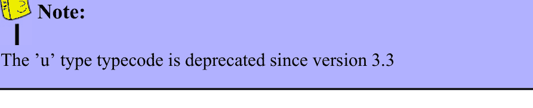

### 7.1.4 索引

索引表示数组元素的位置编号。它总是从 0 开始。让我们看一个通过索引访问元素的例子。

| S No. | Code | CProgramming Type (CType) | Python Type | Number of bytes |
|-------|------|---------------------------|-------------|------------------|
| 1     | 'b'  | signed char               | int         | 1                |
| 2 | 'B' | unsigned char | int | 1 |
| 3 | 'i' | signed integer | int | 2 |
| 4 | 'I' | unsigned integer | int | 2 |
| 5 | 'u' | Py UNICODE | Unicode | 2 |
| 6 | 'h' | signed short | int | 2 |
| 7 | 'H' | unsigned short | int | 2 |
| 8 | 'f' | Float | float | 4 |
| 9 | 'l' | signed long | int | 4 |
| 10 | 'L' | unsigned long | int | 4 |
| 11 | 'd' | Double | float | 8 |
| 12 | 'q' | signed long long | int | 8 |
| 13 | 'Q' | unsigned long long | int | 8 |

表 7.1：数组中使用的类型码

### 示例 7.2

```
import array as ar
staff_number = ar.array('I',[60001,60002,60003,60004,60005])
print(type(staff_number))
print(f'0th element is {staff_number[0]}')
print(f'1st element is {staff_number[1]}')
print(f'2nd element is {staff_number[2]}')
print(f'3rd element is {staff_number[3]}')
print(f'4th element is {staff_number[4]}')
```

### 输出 7.2

```
<class 'array.array'>
0th element is 60001
1st element is 60002
2nd element is 60003
```

第3个元素是60004
第4个元素是60005

在上面的例子中，员工编号的类型是 `<class 'array.array'>`。这里，数组大小为5，其中第0个元素是60001，第4个元素是60005，访问方式如下所示。

| staff number[0] | staff number[1] | staff number[2] | staff number[3] | staff number[4] |
| :---: | :---: | :---: | :---: | :---: |
| 60001 | 60002 | 60003 | 60004 | 60005 |

## 7.1.5 使用 for 循环访问数组

可以使用 for 循环在不带索引/带索引的情况下访问数组元素。

### 示例 7.3

不带索引：

```python
import array as ar
employee_staffnum = ar.array("I", [60001, 60002, 60003, 60004, 60005])
for loop in employee_staffnum:
    print(loop)
```

### 输出 7.3

```
60001
60002
60003
60004
60005
```

在上面的例子中，首先导入 array 模块，并使用无符号整数类型创建数组。`employee_staffnum` 的每个元素将从第0个元素开始逐一迭代。

### 示例 7.4

带索引：

```python
import array as ar
employee_staffnum = ar.array("I", [60001, 60002, 60003, 60004, 60005])
myarr_len = len(employee_staffnum) # will return the number of elements.
for loop in range(myarr_len):
    print(f"{loop}: ", employee_staffnum[loop])
```

### 输出 7.4

```
0: 60001
1: 60002
2: 60003
3: 60004
4: 60005
```

在上面的例子中，首先导入 array 模块，并使用无符号整数类型创建数组。`len` 函数将返回数组中的元素数量，这里是5。将迭代从0到4的数组元素，并使用索引号访问数组的所有元素。

## 7.1.6 使用 while 循环访问数组

### 示例 7.5

```python
import array as ar
employee_staffnum = ar.array("I", [60001, 60002, 60003, 60004, 60005])
myarr_len = len(employee_staffnum) # will return the number of elements.
loop = 0
while myarr_len > loop:
    print(f"{loop}: ", employee_staffnum[loop])
    loop += 1
```

### 输出 7.5

```
0: 60001
1: 60002
2: 60003
3: 60004
4: 60005
```

在上面的例子中，从初始化到查找长度的所有内容都相同，只是这里我们使用了 while 循环。变量 `loop` 被赋值为0。首先检查变量 `loop` 是否小于保存数组元素长度的变量。如果为真，则将显示带有其索引号的数组元素。循环变量递增1，该过程持续进行，直到条件不满足。

## 7.1.7 数组中的 append 方法

当需要在现有数组末尾添加元素时，我们将使用 append 方法。`append()` 的语法是

```
arrayname.append(new_element)
```

### 示例 7.6

源代码请扫描 [第336页](link) 上 [图 7.1](link) 所示的二维码

### 输出 7.6

```
employee_staffnum[0]: 201 employee_staffnum[1]: 202
employee_staffnum[2]: 203 employee_staffnum[3]: 204
employee_staffnum[4]: 205
___________________
employee_staffnum[0]: 201 employee_staffnum[1]: 202
employee_staffnum[2]: 203 employee_staffnum[3]: 204
employee_staffnum[4]: 205 employee_staffnum[5]: 206
```

上面的数组最初只包含5个元素。使用 append 方法在数组末尾添加第6个元素后，数组长度变为6。因此，使用 append 方法我们增加了数组的长度。


第07章：源代码

图 7.1：源代码

## 7.1.8 使用 for 循环提示用户输入数组

### 示例 7.7

```python
import array as ar # F1
myarray = ar.array("i", []) # F2
myarrlen = int(input("Kindly enter the array length: ")) # F3
for loop in range(myarrlen):
    myarray.append(int(input("Enter element number: "))) # F4

for loop in range(len(myarray)):
    print(myarray[loop]) # F5
```

### 输出 7.7

```
Kindly enter the array length: 4
Enter element number: -1
Enter element number: -2
Enter element number: 3
Enter element number: 4
```

在 F1 中，我们导入 array 模块，并使用别名 **ar**。
在 F2 中，创建了一个空数组，由于类型码是 "i"，它可以接受正整数和负整数。
在 F3 中，提示用户输入数组的元素数量长度，这里是4。
在 F4 中，用户将逐一输入数组元素。每个元素将被添加到现有数组的末尾。
在 F5 中，使用 for 循环迭代数组的每个元素。数组元素将逐一显示。

## 7.1.9 使用 while 循环提示用户输入数组

### 示例 7.8

```python
import array as arr # W1
myarray = arr.array("i", []) # W2
myarrlen = int(input("Kindly enter the array length: ")) # W3
ele = 0
while ele < myarrlen:
    myarray.append(int(input("Enter element number: "))) # W4
    ele += 1
i = 0
while len(myarray) > i:
    print(myarray[i]) # W5
    i += 1
```

### 输出 7.8

```
Kindly enter the array length: 4
Enter element number: -10
Enter element number: -20
Enter element number: 30
Enter element number: 40
```

在 W1 中，我们导入 array 模块，并使用别名 arr。
在 W2 中，创建了一个空数组，由于类型码是 "i"，它可以接受正整数和负整数。
在 W3 中，提示用户输入数组的元素数量长度，这里是4。
在 W4 中，用户将使用 while 循环逐一输入数组元素。每个元素将被添加到现有数组的末尾。
在 W5 中，使用 while 循环迭代数组的每个元素。随着循环的迭代，数组元素将逐一显示。

## 7.1.10 数组中的 insert 方法

上述方法将在现有数组的给定索引/位置插入一个元素。`insert()` 的语法是：

```
arrayname.insert(position_number, new_element)
```

### 示例 7.9

```python
import array as ar # I1
my_number = ar.array('i', [11, 19, 38, -49, -14]) # I2
for loop in range(len(my_number)):
    print(my_number[loop], end=' ') # I3
print()
print("_______________")
my_number.insert(1, -28) # I4
my_number.insert(4, 32) # I5
print("New array")
for loop in range(len(my_number)):
    print(my_number[loop], end=' ') # I6
```

**输出 7.9**

```
11 19 38 -49 -14
_______________
New array
11 -28 19 38 32 -49 -14
```

在 I1 中，我们导入 array 模块，并使用别名 ar。
在 I2 中，创建了一个数组，由于类型码是 "i"，它可以接受正整数和负整数。
在 I3 中，用户将迭代数组元素并逐一显示每个数组元素。
在 I4 中，用户将在现有数组的给定索引1处插入元素 -28。因此，数组元素现在将是 11 -28 19 38 -49 -14。
在 I5 中，用户将在现有数组的给定索引4处插入元素 32。因此，数组元素现在将是 11 -28 19 38 32 -49 -14。
在 I6 中，用户将迭代新的数组元素并逐一显示新的数组元素。

## 7.1.11 数组中的 pop 方法

上述方法将从现有数组中移除最后一个元素。语法是

```
arrayname.pop()
```

此外，`arrayname.pop(position_number)` 将从现有数组中移除指定索引/位置编号的项目，并返回被移除的元素。

### 示例 7.10

源代码请扫描 [第336页](link) 上 [图 7.1](link) 所示的二维码

### 输出 7.10

```
Original array before pop: 11 19 38 -49 -14
_____
New array after pop: 11 19 38 -49
_____
38
```

在 P1 中，我们导入 array 模块，并使用别名 ar。
在 P2 中，创建了一个数组，由于类型码是 "i"，它可以接受正整数和负整数。
在 P3 中，用户将迭代 pop 之前的原始数组元素，并逐一显示每个数组元素。
在 P4 中，用户将从现有数组中移除最后一个元素，即 -14。
在 P5 中，用户将移除现有数组中给定索引4处的最后一个元素 -14。因此，数组元素现在将是 11 19 38 -49。
在 P6 中，用户将移除从右边数起索引位置为 -2 的项目，即 38。

## 7.1.12 数组中的 remove 方法

上述方法将从现有数组中返回给定元素的第一次出现。如果未找到该元素，Python 将显示 ValueError。`remove()` 的语法是：

```
arrayname.remove(element)
```

### 示例 7.11

```python
import array as ar # R1
my_number = ar.array('i', [11, 19, 38, 19, -49, -14]) # R2
print("Original array before remove: ", end=" ")
for loop in range(len(my_number)):
    print(my_number[loop], end=' ') # R3
print()
print("_______________")
my_number.remove(19) # R4
print("New array after remove: ", end=" ")
for loop in range(len(my_number)):
    print(my_number[loop], end=' ') # R5
my_number.remove(59) # R6
```

### 输出 7.11

```
Original array before remove: 11 19 38 19 -49 -14
```移除后的新数组: 11 38 19 -49 -14  
ValueError: array.remove(x): x not in array

在 R1 中，我们导入了一个数组模块并使用别名 ar。在 R2 中，创建了一个可以同时接受正整数和负整数的数组，因为类型代码为“i”。
在 R3 中，用户将在移除前遍历原始数组元素，并逐一显示每个数组元素。
在 R4 中，用户将移除元素 19 的第一次出现，因为它在索引/位置 1 和 3 处存在。该元素将从索引/位置 1 处被移除。
在 R5 中，用户将逐一遍历移除后的新数组元素。因此，移除后的新数组元素现在是 11 38 19 -49 -14。
在 R6 中，用户尝试移除元素 59 的第一次出现。由于未找到该元素，Python 将显示 ValueError: array.remove(x): x not in array。

## 7.1.13 数组中的 index 方法

上述方法将返回给定元素在现有数组中第一次出现的位置编号。如果未找到该元素，则显示值错误。
`index()` 的语法为：

```
arrayname.index(element)
```

### 示例 7.12

```
import array as ar #IN1
my_number = ar.array('i',[11,19,38,19,-49,-14])# IN2
print("Original array ", end = " ")
for loop in range(len(my_number)):
    print(my_number[loop], end = ' ') # IN3
print()
print("________________")
print(my_number.index(19)) # IN4
print(my_number.index(59)) # IN5
```

输出 7.12

Original array 11 19 38 19 -49 -14
________________
1
ValueError: array.index(x): x not in array

在 IN1 中，我们导入了一个数组模块并使用别名 ar。
在 IN2 中，创建了一个可以同时接受正整数和负整数的数组，因为类型代码为“i”。
在 IN3 中，用户将遍历原始数组元素，并逐一显示每个数组元素。
在 IN4 中，用户将返回给定元素 19 在现有数组中第一次出现的位置编号。因此，输出将是 1，因为这是它第一次出现。
在 IN5 中，用户将尝试查找给定元素 59 在现有数组中第一次出现的位置编号。由于未找到该元素，Python 将抛出 ValueError: array.index(x): x not in array。

## 7.1.14 数组中的 reverse 方法

上述方法将反转数组中元素的顺序。`reverse()` 的语法为：

```
arrayname.reverse()
```

### 示例 7.13

```
import array as ar
my_number = ar.array('i',[11,19,38,19,-49,-14])
print("Original array before reverse : ", end = " ")
for loop in range(len(my_number)):
    print(my_number[loop], end = ' ')# RV1
print()
print("________________")
my_number.reverse()# RV2
print("New array after reverse: ", end = " ")
for loop in range(len(my_number)):
    print(my_number[loop], end = ' ') # RV3
```

输出 7.13

Original array before reverse : 11 19 38 19 -49 -14
________________
New array after reverse: -14 -49 19 38 19 11

在 RV1 中，用户将在反转前遍历原始数组元素，并逐一显示每个数组元素。
在 RV2 中，用户将反转数组中元素的顺序。
在 RV3 中，用户将逐一遍历反转后的新数组元素。
因此，反转后的新数组元素是 -14 -49 19 38 19 11。

## 7.1.15 数组中的 extend 方法

上述方法将在数组末尾追加另一个数组或可迭代对象。
`extend()` 的语法为：

```
arrayname.extend(arr)
```

其中 **arr** 这里是一个数组对象。

### 示例 7.14

要获取源代码，请扫描 [第 336 页](page 336) 中 [图 7.1](Figure 7.1) 所示的二维码。

输出 7.14

Original array before extend : 11 19 38 19 -49 -14

New array after extend: 11 19 38 19 -49 -14 100 200 -300

在 E1 中，我们导入了一个数组模块并使用别名 ar。
在 E2 中，创建了一个可以同时接受正整数和负整数的数组，因为类型代码为“i”。
在 E3 中，创建了另一个数组，其元素为带符号数字。
在 E4 中，用户将在扩展前遍历原始数组元素，并逐一显示每个数组元素。
在 E5 中，用户将在数组末尾将数组对象 appendarr 追加到 my number。
在 E6 中，追加后的新数组元素是 11 19 38 19 -49 -14 100 200 -300。

## 7.1.16 数组中的切片方法

数组切片用于检索包含一组元素的数组片段。因此，每当需要检索一系列元素时，切片将非常有用。

```
newarrayname = arrayname.slicing(start:stop:step)
```

### 示例 7.15

要获取源代码，请扫描 [第 336 页](page 336) 中 [图 7.1](Figure 7.1) 所示的二维码。

输出 7.15

```
Original array 11 19 38 19 -49 -14

19 38 19

11 19 38 19

38 19 -49 -14

19 -49 -14

19 38 19
```

| 正向索引 | 0 | 1 | 2 | 3 | 4 | 5 |
|---|---|---|---|---|---|---|
| 元素 | 11 | 19 | 38 | 19 | -49 | -14 |
| 负向索引 | -6 | -5 | -4 | -3 | -2 | -1 |

在 S1 中，我们导入了一个数组模块并使用别名 ar。
在 S2 中，创建了一个可以同时接受正整数和负整数的数组，因为类型代码为“i”。
在 S3 中，用户将遍历原始数组元素，并逐一显示每个数组元素。

在 S4 中，访问了从索引/位置 1 到索引/位置 3 的元素范围。因此，输出是 19 38 19。

| 正向索引 | 0 | 1 | 2 | 3 | 4 | 5 |
|---|---|---|---|---|---|---|
| 元素 | 11 | 19 | 38 | 19 | -49 | -14 |

在 S5 中，访问了从索引/位置 0（开始）到索引/位置 3 的元素范围。因此，输出是 11 19 38 19。

| 正向索引 | 0 | 1 | 2 | 3 | 4 | 5 |
|---|---|---|---|---|---|---|
| 元素 | 11 | 19 | 38 | 19 | -49 | -14 |

在 S6 中，访问了从索引/位置 2 到索引/位置 5（末尾）的元素范围。因此，输出是 38 19 -49 -14。

| 正向索引 | 0 | 1 | 2 | 3 | 4 | 5 |
|---|---|---|---|---|---|---|
| 元素 | 11 | 19 | 38 | 19 | -49 | -14 |

在 S7 中，访问了从索引/位置 -3 到索引/位置 -1（末尾）的元素范围。因此，输出是 19 -49 -14。

| 元素 | 11 | 19 | 38 | 19 | -49 | -14 |
|---|---|---|---|---|---|---|
| 负向索引 | -6 | -5 | -4 | -3 | -2 | -1 |

在 S8 中，访问了从索引/位置 -5 到索引/位置 -3 的元素范围。因此，输出是 19 38 19。

| 元素 | 11 | 19 | 38 | 19 | -49 | -14 |
|---|---|---|---|---|---|---|
| 负向索引 | -6 | -5 | -4 | -3 | -2 | -1 |

## 7.2 列表数据结构

到目前为止我们已经介绍了数组。现在，我们将介绍列表。列表与数组非常相似，但有一个主要区别。数组只能存储单一类型的元素，而列表可以存储不同类型的元素。它表示一组元素，允许异构对象。列表是动态的，因为其大小可以根据我们的需求增加或减少。我们可以修改列表中的元素，因为它是可变的。这里，允许重复对象。在列表中，插入顺序通过使用索引来保留。列表中的重复元素通过使用索引来区分。因此，索引扮演着至关重要的角色。列表中的所有元素由逗号分隔并放置在方括号内。因此，当需要将一组独立的对象表示为单个实体，同时需要保留插入顺序并允许重复对象时，就应该使用列表。

### 7.2.1 创建列表

列表对象创建的语法如下：

```
listname = [element1, element2, element3, ]
```

例如：myl1 = [10, 20, -30.1, ’Hello’]

上述示例创建了一个包含正数、负数、字符串等的列表对象。我们可以根据自己的需要和需求创建包含整数、浮点数、字符串的列表对象。

#### 7.2.1.1 创建空列表

创建空列表的语法如下：

```
listname = []
```

### 示例 7.16

```
myl1 = []
print(myl1) # L1
print(type(myl1)) #L2
```

输出 7.16

```
[]
<class 'list'>
```

在 L1 中，myl1 是一个空列表。
在 L2 中，myl1 对象是列表类型。

#### 7.2.1.2 元素已知时创建列表

如果已经知道列表中的元素，则可以如下创建。
myl1 = [1,2,3,4,5]

#### 7.2.1.3 通过动态输入创建列表

列表元素将从命令行提示符提供。

### 示例 7.17

```
mylist = eval(input("Enter the list: "))
print(mylist) # LI1
print(type(mylist)) # LI2
```

输出 7.17

```
Enter the list: [1,2,3,4,5]
[1, 2, 3, 4, 5]
<class 'list'>
```

在上面的示例中，系统会提示用户输入列表。在 LI1 中，用户输入的列表为 [1,2,3,4,5]。在 LI2 中，mylist 对象的类型是列表。

## 7.2.1.4 使用 list() 函数创建列表

对于给定的序列，我们可以提供集合、字符串、范围等。

```
mylist = list(range(1,10,2))
print(mylist)# LS1
print(type(mylist))# LS2
```

```
[1, 3, 5, 7, 9]
<class 'list'>
```

这里，序列是一个范围函数，起始值为 1，终止值为 10，步长为 2。它使用 list() 转换为列表对象。因此，LS1 的输出是 [1, 3, 5, 7, 9]。在 LS2 中，mylist 对象的类型是列表。

## 7.2.1.5 使用 split() 函数创建列表

在 Python 中，可以将字符串转换为列表。

```
Example 7.19
```

```
st1 = "Python is awesome"
mylist = st1.split(' ')
print(mylist) # SP1
print(type(mylist))# SP2
```

### Output 7.19

```
['Python', 'is', 'awesome']
<class 'list'>
```

在 SP1 中，字符串被转换为列表对象。因此，输出是 ['Python', 'is', 'awesome']。
在 SP2 中，mylist 对象的类型是列表。

### 7.2.2 列表与可变性

一旦创建了列表对象，其内容就可以被修改。因此，列表对象是可变的。

```
myl1 = [11,12,13,14]
print(myl1)# MU1
myl1[1] = 20
print(myl1)# MU2
```

### Output 7.20

```
[11, 12, 13, 14]
[11, 20, 13, 14]
```

在 MU1 中，列表元素显示为 [11, 12, 13, 14]。
在 MU2 中，我们将索引/位置 1 的元素修改为 20。因此，修改后的输出将是 [11, 20, 13, 14]。

### 7.2.3 访问列表元素

可以通过使用索引或切片运算符来访问列表元素。

### 7.2.3.1 使用索引

列表元素的位置编号将由索引表示。索引写在方括号内，并从 0 开始。
例如：myl1 = [10, 20, -30.1, 'Hello']

#### 正向索引

正向索引表示从左到右。根据上面的示例，正向索引编号如下：

| 带索引的列表对象 | 元素 |
|---|---|
| myl1[0] | 10 |
| myl1[1] | 20 |
| myl1[2] | -30.1 |
| myl1[3] | Hello |

#### 负向索引

负向索引表示从右到左。根据上面的示例，负向索引编号如下：

| 带索引的列表对象 | 元素 |
|---|---|
| myl1[-4] | 10 |
| myl1[-3] | 20 |
| myl1[-2] | -30.1 |
| myl1[-1] | Hello |

```
myl1 = [10, 20, -30.1, 'Hello'];
print(myl1[3])# LI1
print(myl1[-1])# LI2
print(myl1[4])# LI3
```

```
Hello
Hello
IndexError: list index out of range
```

在 LI1 中，索引/位置 3 的元素是 Hello。
在 LI2 中，索引/位置 -1 的元素是 Hello。
在 LI3 中，索引/位置 4 不可用，因为只有 4 个元素。
因此，Python 将引发 IndexError : list index out of range。

#### 使用索引和 for 循环

可以使用索引和 for 循环来访问列表元素，如下所示：

```
myl1 = [10, 20, -30.1, 'Hello']
list_length = len(myl1)
for loop in range(list_length):
    print(loop, myl1[loop])
```

### Output 7.22

```
0 10
1 20
2 -30.1
3 Hello
```

在上面的示例中，返回了列表中的元素数量，并使用 for 循环进行迭代。将显示索引号以及元素。
这里，我们正在顺序访问列表的每个元素，这称为遍历。使用 for 循环通过索引访问元素。

#### 使用索引和 while 循环

可以使用索引和 while 循环来访问列表元素，如下所示：

### Example 7.23

```
myl1 = [10, 20, -30.1, 'Hello']
list_length = len(myl1)
count = 0
while count<list_length:
    print(count, myl1[count])
    count +=1
```

### Output 7.23

```
0 10
1 20
2 -30.1
3 Hello
```

在上面的示例中，列表中的元素数量被返回给变量 list_length。将检查 while 循环的条件，即计数器值是否小于列表长度。如果为 True，则将显示索引号以及元素。使用 while 循环通过索引访问元素。

### 7.2.3.2 使用列表切片

也可以使用列表切片来访问列表元素。
列表切片的语法是：

```
myl1 = listname[start:stop:step]
```

其中 **start** 表示切片开始的索引，默认值为 0。**stop** 表示切片结束的索引，默认值将是列表长度。**step** 是增量值，默认值为 1。

### Example 7.24
源代码扫描二维码见第 336 页的 [图 7.1]

### Output 7.24

```
myl1: [10, 20, -30.1, 'Hello', 34.1, True]
myl1[:4]: [10, 20, -30.1, 'Hello']
myl1[1:]: [20, -30.1, 'Hello', 34.1, True]
myl1[3:5]: ['Hello', 34.1]
myl1[1:4]: [20, -30.1, 'Hello']
myl1[ : : -1]: [True, 34.1, 'Hello', -30.1, 20, 10]
```

### 7.2.4 列表函数和方法

重要的列表函数分为子类别：

### 7.2.4.1 获取列表信息

- 1. len()
   上述函数将返回列表中的元素数量。

```
Example 7.25

l1 = [10,11,14,17,19,20]
print(len(l1))
```

```
Output 7.25

6
```

如图所示，列表元素的数量是 6。

- 2. count()
   上述方法将返回列表中指定元素的出现次数。count() 的语法是

```
listname.count(element)
```

### Example 7.26

```
myl1 = [10,11,14,17,19,20,14,35,14]
print(myl1.count(14)) # CO1
myl2 = ['c','o','r','o','n','a','w','a','r','r','i','o','r','s']
print(myl2.count('r')) # CO2
```

### Output 7.26

```
3
4
```

在 CO1 中，元素 14 的出现次数是 3。在 CO2 中，元素 'r' 的出现次数是 4。

- 3. index()

上述方法将返回列表中指定元素第一次出现的位置或索引。如果在列表中未找到指定元素，Python 将显示 ValueError。因此，建议使用 'in' 运算符检查项目是否存在于列表中。index() 的语法是

```
listname.index(element)
```

### Example 7.27

```
myl1 = [10,11,14,17,19,20,14,35,14]
print(myl1.index(14)) # IN1
myl2 = ['c','o','r','o','n','a','w','a','r','r','i','o','r','s']
search_element = input("Enter the element to be searched: ")
if search_element in myl2:
    print(f"The first occurrence of {search_element} is present at index no. ", myl2.index(search_element))
else:
    print(f"The element {search_element} is not present")# IN2
```

### Output 7.27

```
2
Enter the element to be searched: r
The first occurrence of r is present at index no. 2
```

在 IN1 中，我们正在检查列表对象 myl1 中元素 14 的第一次出现，它位于索引/位置 2。
在 IN2 中，系统提示用户输入列表中要搜索的元素。用户输入了元素 'r'，它位于索引/位置 2。
如果用户输入任何其他不存在的搜索元素，则将执行 else 部分，如下所示。

```
Enter the element to be searched: z
The element z is not present
```

### 7.2.4.2 操作列表元素

- 1. append()
    上述方法将在现有列表的末尾添加一个元素。它不返回任何值，但会修改现有列表。
    append() 的语法是

```
listname.append(element)
```

### Example 7.28

```
myl1 = []
myl1.append('P')
myl1.append('Y')
myl1.append('T')
myl1.append('H')
myl1.append('O')
myl1.append('N')
print(myl1)
```

### Output 7.28

```
['P', 'Y', 'T', 'H', 'O', 'N']
```

在上面的示例中，最初列表中没有元素。然后我们使用上述方法添加了每个字符串元素。每个元素都将附加在现有列表的末尾。因此，输出将是 ['P', 'Y', 'T', 'H', 'O', 'N']。

- 2. insert()

上述方法将在现有列表的指定索引处添加一个元素。insert() 的语法是

```
listname.insert(index_position, element)
```

### Example 7.29

```
myl1 = [1,2,-3.1, True, 'python']
myl1.insert(2,'awesome')
print(myl1)
```

### Output 7.29

```
[1, 2, 'awesome', -3.1, True, 'python']
```

最初列表中有 5 个元素。我们在索引/位置 2 添加了元素 'awesome'。插入元素后，新列表包含 6 个元素，即 [1, 2, 'awesome', -3.1, True, 'python']。如果指定的索引大于列表中存在的最大索引，则元素将被插入到最后一个位置。

### Example 7.30

```
myl1 = [1,2,-3.1, True, 'python']
myl1.insert(12,'awesome')
print(myl1)
```

### Output 7.30

```
[1, 2, -3.1, True, 'python', 'awesome']
```如果指定的索引小于列表中已存在的最小索引，那么该元素将被插入到第一个位置。

## 示例 7.31

```
myll = [1,2,-3.1, True, 'python']
myll.insert(-8,'awesome')
print(myll)
```

## 输出 7.31

```
['awesome', 1, 2, -3.1, True, 'python']
```

### 3. extend()

上述方法会在列表末尾追加一个可迭代对象。`extend()` 的语法是

```
listname.extend(iterable)
```

## 示例 7.32

关于第336页图7.1所示源代码，扫描二维码查看

## 输出 7.32

```
[1, 2, 3, 4, 'Hello', 'Python', 'is', 'awesome']
```

```
['Stay', 'Happy', 'Stay', 'S', 'a', 'f', 'e']
['True', 10.1, 10, 20, 30]
```

在示例1（EX1）中，`myl2` 列表对象中的所有元素都将被添加到 `myl1` 列表对象。
在示例2（EX2）中，输出为 `[1, 2, 3, 4, 'Hello', 'Python', 'is', 'awesome']`。
在示例3（EX3）中，字符串对象 `myl4` 中的所有元素都将被添加到 `myl3` 列表对象。
在示例4（EX4）中，输出将是 `['Stay', 'Happy', 'Stay', 'S', 'a', 'f', 'e']`。
在示例5（EX5）中，集合对象 `myset1` 中的所有元素都将被添加到 `myl5` 列表对象。
在示例6（EX6）中，输出为 `['True', 10.1, 10, 20, 30]`。

### 4. remove()

上述方法会从现有列表中移除给定元素的第一次出现。如果一个元素在列表中多次出现，则只移除第一次出现的那个。如果未找到该元素，则 Python 会显示 `ValueError`。因此，建议使用 `in` 操作符或 `try except` 块来检查指定元素是否存在。

`remove()` 的语法是

```
listname.remove(element)
```

## 示例 7.33

```
myl1 = [11,12,13,14,11,15,16,11]
myl1.remove(11) # RM1
print(myl1)
if 17 in myl1: # RM2
    print(f"The element 17 is present in the list and is removed from the list", myll.remove(17))
else:
    print("The element 17 is absent from the list")
try:
    myll.remove(18) # RM3
except ValueError:
    print("ValueError: list.remove(x): x not in list")
```

## 输出 7.33

```
[12, 13, 14, 11, 15, 16, 11]
The element 17 is absent from the list
ValueError: list.remove(x): x not in list
```

在示例 RM1 中，给定元素 11 的第一次出现被从列表中移除。因此，移除元素 11 后的列表是 `[12, 13, 14, 11, 15, 16, 11]`。
在示例 RM2 中，我们使用 `in` 操作符检查元素 17 是否存在于列表中。由于它不存在，else 部分将被执行，生成输出 `The element 17 is absent from the list`。
在示例 RM3 中，我们在 `try` 块中尝试从列表中移除元素 18 的第一次出现。由于它不存在，Python 会引发 `ValueError`，因为 `try` 块引发了错误，该错误由代码中的 `except` 块处理。因此，输出将是 `ValueError: list.remove(x): x not in list`。

### 5. pop()

上述方法会从现有列表中移除指定索引处的一个元素。`pop()` 的语法是：

```
listname.pop(index)
```

这里，`index` 是一个可选参数。如果指定了，则表示要移除元素的列表索引。如果未指定，则默认值为 -1，这将移除列表的最后一个元素。

## 示例 7.34

```
myl1 = [11,12,13,14,15]
print(myl1.pop(2)) # P1
print(myl1) # P2
print(myl1.pop()) # P3
print(myl1) # P4
```

## 输出 7.34

```
13
[11, 12, 14, 15]
15
[11, 12, 14]
```

在示例 P1 中，索引 2 处的元素被从列表中移除。因此，输出是 13。
在示例 P2 中，显示的列表是 `[11, 12, 14, 15]`。
在示例 P3 中，最后一个元素被从列表中移除。因此，输出是 15。
在示例 P4 中，显示的列表是 `[11, 12, 14]`。

> **注意：**
如果列表为空或索引超出范围，Python 将引发 `IndexError`。

## 示例 7.35

空列表
```
myl2 = []
print(myl2.pop())
```

## 输出 7.35

```
IndexError: pop from empty list
```

## 示例 7.36

索引超出范围
```
myl1 = [11,12,13,14,15]
print(myl1.pop(10))
```

## 输出 7.36

```
IndexError: pop index out of range
```

因此，`pop()` 是唯一一个在操作列表的同时返回某个值的方法。我们可以通过使用列表的 `append()` 和 `pop()` 方法来实现栈数据结构，它遵循后进先出（LIFO）原则。

### 6. clear()

上述方法会移除列表的所有元素。它不返回任何值。`clear()` 的语法是

```
listname.clear()
```

## 示例 7.37

```
myl1 = [1,2,3,4]
print("Before clearing type is: "+ str(type(myl1)))
myl1 = myl1.clear()
print(myl1)
print("After clearing type is: "+ str(type(myl1)))
```

## 输出 7.37

```
Before clearing type is: <class 'list'>
None
After clearing type is: <class 'NoneType'>
```

因此，我们可以得出结论，列表对象是动态的，即可以根据需要增加或减少大小。
`append()`、`insert()` 和 `extend()` 方法用于增加大小。
`remove()` 和 `pop()` 方法用于减少大小。

## 7.2.4.3 对列表元素排序

1. reverse()

上述方法将反转列表中元素的顺序。`reverse()` 的语法是

```
listname.reverse()
```

## 示例 7.38

```
myl1 = [1,2,3,4]
print("Before reversing list elements are: " + str(myl1))
myl1.reverse()
print("After reversing list elements are: " + str(myl1))
```

## 输出 7.38

```
Before reversing list elements are: [1, 2, 3, 4]
After reversing list elements are: [4, 3, 2, 1]
```

2. sort()

上述方法将按升序或降序对列表元素排序。它不返回任何值。
`sort()` 的语法是

```
listname.sort(reverse, key = function)
```

第一个参数是可选参数。默认值为 `False`，列表元素按升序排序。如果设置为 `True`，则列表元素按降序排序。
第二个参数也是可选参数。它指定了排序标准。

对于字符串，默认排序顺序是按字母顺序。
对于数字，默认排序顺序是升序。

## 示例 7.39

```
myl1 = [12,10,38,22]
myl1.sort()
print(myl1)

myl2 = ['Banana','Apple','Litchi','Watermelon','Mango']
myl2.sort()
print(myl2)
```

## 输出 7.39

```
[10, 12, 22, 38]
['Apple', 'Banana', 'Litchi', 'Mango', 'Watermelon']
```

如示例所示，数字的默认排序顺序是升序，字符串是按字母顺序。只有当我们使用 `sort()` 方法时，列表才应该只包含同质元素，否则 Python 会引发 `TypeError`。

## 示例 7.40

```
myl1 = [12,10,38,22,'Watermelon','Mango']
myl1.sort()
print(myl1)
```

## 输出 7.40

```
TypeError: '<' not supported between instances of 'str' and 'int'
```

这在 Python 3 版本中是无效的，而在 Python 2 版本中是有效的。当 `reverse = True` 时，排序将按降序进行。当 `False` 时，按升序排序。

## 示例 7.41

```
myl1 = [12,10,38,22]
myl1.sort(reverse = True)
print(myl1)
myl1.sort(reverse = False)
print(myl1)
```

## 输出 7.41

```
[38, 22, 12, 10]
[10, 12, 22, 38]
```

我们也可以使用 `key = function` 来指定排序标准。

## 示例 7.42

```
def myfunc_len(element):
    return len(element)

python
myl1 = ['Banana', 'Apple', 'Litchi', 'Watermelon', 'Mango']
myl1.sort(reverse = False, key = myfunc_len)
print(myl1)
```

## 输出 7.42

```
python
['Apple', 'Mango', 'Banana', 'Litchi', 'Watermelon']
```

因此，我们可以看到，通过 `reverse()` 和 `sort()`，我们可以改变列表中元素的顺序。

## ### 7.2.5 列表对象的别名

为现有对象赋予另一个引用名称的过程称为别名。这里的对象是列表。这并不意味着复制。它就像你的昵称（绰号）。

假设有一个列表，例如 `myl1 = [1,2,3,4,5]`

要创建一个别名，只需这样做

`myl2 = myl1`

所以，`myl1` 有一个新名字是 `myl2`。因此，同一个列表有了两个不同的名字。`myl1` 和 `myl2` 都指向同一个列表。

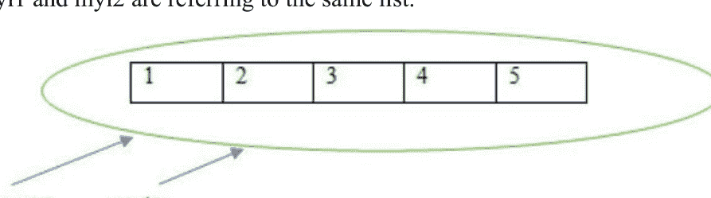

但别名有一个问题。通过使用一个引用对象 `myl1`，如果我们更改其内容，那么相同的更改将反映在另一个引用对象 `myl2` 中。在 `myl1` 中所做的修改会影响 `myl2`，反之亦然，如下所示。

## 示例 7.43

源代码扫描二维码见[第336页](page 336)的[图7.1](Figure 7.1)

## 输出 7.43

```
3071992291976
3071992291976
Initially
 myl1 is: [1, 2, 3, 4, 5]
 myl2 is: [1, 2, 3, 4, 5]

Modifying myl1
 myl1 is: [1, 2, 13, 4, 5]
 myl2 is: [1, 2, 13, 4, 5]

Modifying myl2
 myl1 is: [1, 2, 13, 14, 5]
 myl2 is: [1, 2, 13, 14, 5]
```

在上面的例子中，`myl1`和`myl2`的ID相同。我们首先将`myl1`对象在索引2处的元素修改为13。相同的修改同时反映在`myl1`和`myl2`两个对象中。

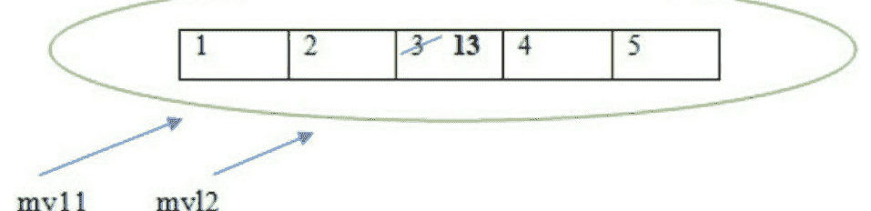

然后，我们将`myl2`对象在索引3处的元素修改为14。相同的修改同样同时反映在`myl1`和`myl2`两个对象中。

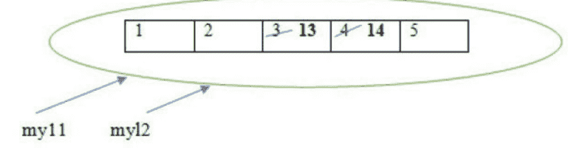

## 7.2.6 列表对象的克隆

为了克服别名带来的问题，我们采用克隆。克隆是创建完全独立且副本的过程。克隆可以通过两种方法完成：

### 7.2.6.1 使用 `copy()` 方法

上述方法会将一个列表的所有元素复制到另一个列表。当我们复制一个列表时，所有元素的独立副本会存储在另一个列表中。两个列表是相互独立的。因此，如果有一个列表对象 `myl1 = [1,2,3,4,5]`，在我们执行 `myl2 = myl1.copy()` 之后，`myl2` 和 `myl1` 是两个不同的列表对象。

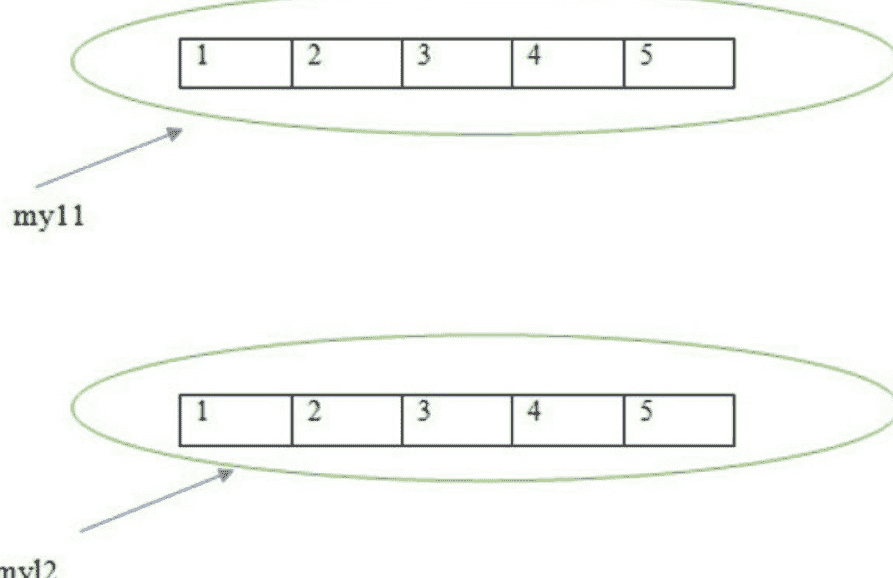

对`myl1`对象所做的修改不会影响`myl2`对象，反之亦然。

## 示例 7.44

源代码扫描二维码见[第336页](#)的[图7.1](#)

## 输出 7.44

```
3040407282312
3040407282376
Initially
myl1 is: [1, 2, 3, 4, 5]
myl2 is: [1, 2, 3, 4, 5]
```

```
Modifying myl1
myl1 is: [1, 2, 13, 4, 5]
myl2 is: [1, 2, 3, 4, 5]
________________________
Modifying myl2
myl1 is: [1, 2, 13, 4, 5]
myl2 is: [1, 2, 3, 14, 5]
```

在上面的例子中，`myl1`和`myl2`的ID不同。我们首先将`myl1`对象在索引2处的元素修改为13。此修改仅反映在`myl1`对象中，而不影响`myl2`对象。

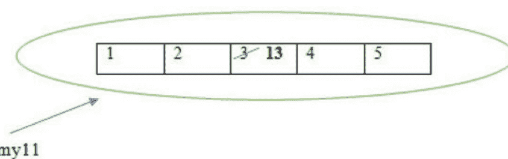

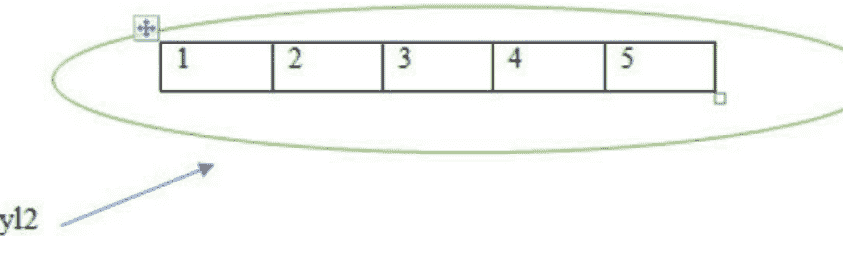

然后，我们将`myl2`对象在索引3处的元素修改为14。此修改仅反映在`myl2`对象中，而不影响`myl1`对象。

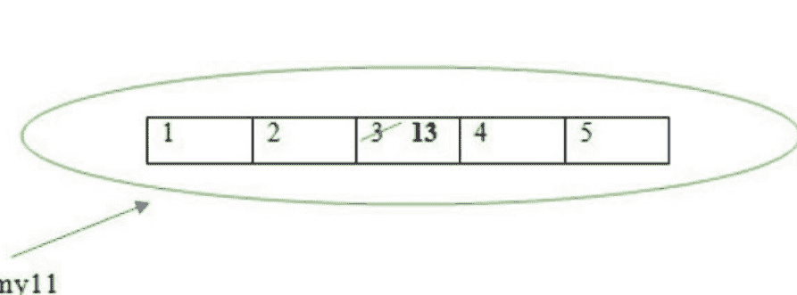

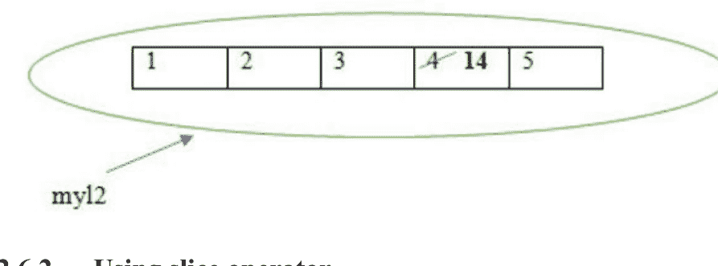

### 7.2.6.2 使用切片操作符

上述方法使用切片将一个列表克隆到另一个列表。当我们克隆一个列表时，所有元素的独立副本会存储在另一个列表中。两个列表是相互独立的。

因此，如果有一个列表对象 `myl1 = [1,2,3,4,5]`，在我们执行 `myl2 = myl1[:]` 之后，`myl2` 和 `myl1` 是两个不同的列表对象。

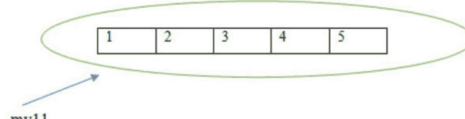

对`myl1`对象所做的修改不会影响`myl2`对象，反之亦然。

## 示例 7.45

源代码扫描二维码见[第336页](#)的[图7.1](#)

## 输出 7.45

```
1672151786120
1672151786184
Initially
myl1 is: [1, 2, 3, 4, 5]
myl2 is: [1, 2, 3, 4, 5]
```

```
Modifying myl1
myl1 is: [1, 2, 23, 4, 5]
myl2 is: [1, 2, 3, 4, 5]

Modifying myl2
myl1 is: [1, 2, 23, 4, 5]
myl2 is: [1, 2, 3, 24, 5]
```

在上面的例子中，`myl1`和`myl2`的ID不同。我们首先将`myl1`对象在索引2处的元素修改为23。此修改仅反映在`myl1`对象中，而不影响`myl2`对象。

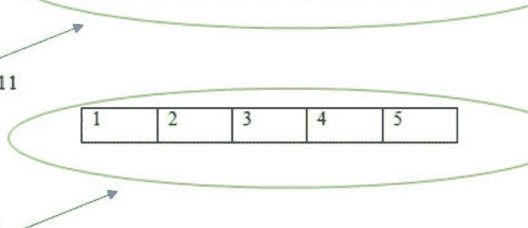

然后，我们将`myl2`对象在索引3处的元素修改为24。此修改仅反映在`myl2`对象中，而不影响`myl1`对象。

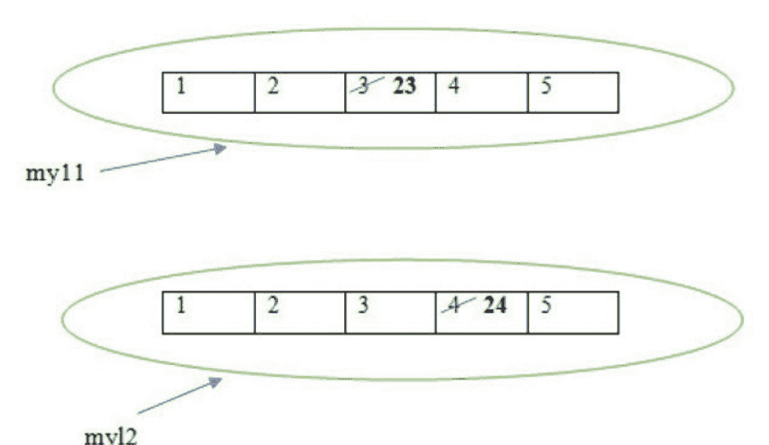


因此，我们可以得出结论：`=`操作符用于别名，而`copy()`方法用于克隆。

## 7.2.7 列表对象的数学运算符

### 7.2.7.1 连接（`+`）运算符

`+`运算符用于连接列表。借助`+`运算符，两个列表可以连接成一个列表，如下所示。

## 示例 7.46

```
myl1 = [1,2,3,4,5]
myl2 = [6,7,8,9,10]
myl3 = myl1 + myl2
print(myl3)
```

## 输出 7.46

```
[1, 2, 3, 4, 5, 6, 7, 8, 9, 10]
```

> 注意：

为了使用`+`运算符，两个操作数必须都是列表对象。否则，Python会抛出`TypeError`。

## 示例 7.47

```
myl1 = [1,2,3,4,5]
myl3 = myl1 + 6
print(myl3)
```

## 输出 7.47

```
TypeError: can only concatenate list (not "int") to list
```

如果我们使用`[6]`而不是`6`，输出将是 `[1,2,3,4,5,6]`。

### 7.2.7.2 重复（`*`）运算符

`*`运算符用于将列表元素重复指定的次数。

## 示例 7.48

```
myl1 = ['a','b','c']
myl3 = myl1 * 2
print(myl3)
```

## 输出 7.48

```
['a', 'b', 'c', 'a', 'b', 'c']
```

因此，我们可以看到列表元素被重复了2次。

## 7.2.8 列表对象的比较

比较运算符可以用于列表对象。当在列表对象之间使用比较运算符（`==`, `!=`）时，需要考虑以下几点：

- 1. 元素数量必须相等。
- 2. 元素顺序必须相同。
- 3. 内容必须完全相同，包括大小写。

## 示例 7.49

```
myl1 = ['Rat','Bat','Hat']
myl2 = ['Rat','Bat','Hat']
myl3 = ['RAT','BAT','HAT']
print(myl1 == myl2)
print(myl1 == myl3)
print(myl1 != myl3)
```

## 输出 7.49

```
True
False
True
```

当在列表对象之间使用关系运算符（`>`, `>=`, `<`, `<=`）时，比较仅对第一个元素进行。

## 示例 7.50

源代码扫描二维码见[第336页](page 336)的[图7.1](Figure 7.1)

## 输出 7.50

```
True
True
False
False
_______
True
True
False
False
```

## 7.2.9 嵌套列表

嵌套列表或列表的嵌套是指一个列表包含在另一个列表中。嵌套列表的元素可以通过使用索引来访问，类似于多维数组元素。

```python
myl1 = [1,2,3,[4,5]]
print(myl1) # L1
print(myl1[3]) # L2
print(myl1[3][0]) # L3
print(myl1[3][1]) # L4
```

```
[1, 2, 3, [4, 5]]
[4, 5]
4
5
```

| 列表元素 | 1 | 2 | 3 | 列表元素 | 4 | 5 |
|:-------------|:---:|:---:|:---:|:-------------|:---:|:---:|
| 索引        | [0] | [1] | [2] | [3]          | [0] | [1] |

在L1中，我们显示了列表元素。
在L2中，索引3处的元素是一个嵌套列表`[4,5]`。
在L3中，元素是4。
在L4中，元素是5。

## 7.2.10 列表推导式

一种从可迭代对象创建满足给定条件的新列表的方法。它以`[`开始，以`]`结束，以确保结果必须是一个列表。列表推导式必须包含以下部分：

- 输出表达式，
- 输入序列，
- 表示输入序列成员的变量，
- 一个可选的谓词部分。

例如：`[a**3 for a in range(1,15) if a % 2 == 0]`
这里，
- `a**3` 是输出表达式，
- `range(1,15)` 是输入序列，
- `a` 是变量，
- `if a % 2 == 0` 是谓词部分。

列表推导式的语法是

```
list = [expression for item in iterable_object if condition]
```

可以有0个或多个`if`语句。
可以有1个或多个`for`循环。
请观察以下代码

### 7.2.10.1 带有 `for` 循环的列表推导式

## 示例 7.52

```
#code without list comprehension
myl1 = []
for loop in range(11):
    myl1.append(loop **3)
print(myl1)

#code with list comprehension
lic1 = [loop **3 for loop in range(11)]
print(lic1)
```

## 输出 7.52

```
[0, 1, 8, 27, 64, 125, 216, 343, 512, 729, 1000]
[0, 1, 8, 27, 64, 125, 216, 343, 512, 729, 1000]
```

在不使用列表推导式的代码中，首先创建了一个空列表，然后将前10个数字的立方添加到该空列表中。
在使用列表推导式的代码中，输出相同，但仅用一行代码就实现了结果。输出表达式是 `loop**3`，
变量是 `loop`，
输入表达式是 `range(11)`。

### 7.2.10.2 带有 `for` 循环和 `if` 语句的列表推导式

## 示例 7.53

```
#code without list comprehension
myl1 = []
for loop in range(11):
    if loop % 2 == 0:
        myl1.append(loop **3)
```

## 7.2.10.3 包含 `for` 循环和嵌套 `if` 语句的列表推导式

### 示例 7.54

```python
#不使用列表推导式的代码
my11 = []
for loop in range(21):
    if loop %3 == 0:
        if loop %4 == 0:
            my11.append(loop **3)
print(my11)
```

```python
#使用列表推导式的代码
lic1 = [loop **3 for loop in range(21) if loop %3 == 0 if loop %4 == 0]
print(lic1)
```

### 输出 7.54

```
[0, 1728]
[0, 1728]
```

在不使用列表推导式的代码中，首先创建了一个空列表，然后找出能被12整除的元素的立方，并将其添加到空列表中。
在使用列表推导式的代码中，输出结果相同，但我们只用一行代码就实现了目标。输出表达式是 `loop**3`，
变量是 `loop`，
输入表达式是 `range(21)`。
`if loop %3 == 0 if loop %4 == 0` 是谓词部分。

## 7.2.10.4 包含 `if else` 语句和 `for` 循环的列表推导式

包含 `if else` 语句和 `for` 循环的列表推导式语法如下：

```python
newlist = [expression if condition else statement for item in iterable_object]
```

### 示例 7.55

```python
#不使用列表推导式的代码
myl1 = []
for loop in range(11):
    if loop %2 == 0:
        myl1.append(loop **3)
    else:
        myl1.append(loop**2)
print(myl1)

#使用列表推导式的代码
lic1 = [loop **3 if loop %2 == 0 else loop**2 for loop in range(11)]
print(lic1)
```

### 输出 7.55

```
[0, 1, 8, 9, 64, 25, 216, 49, 512, 81, 1000]
[0, 1, 8, 9, 64, 25, 216, 49, 512, 81, 1000]
```

在不使用列表推导式的代码中，首先创建了一个空列表，然后将前10个数字中偶数的立方和奇数的平方添加到空列表中。
在使用列表推导式的代码中，输出结果相同，但我们只用一行代码就实现了目标。

## 7.2.10.5 包含 `for` 循环的嵌套列表推导式

包含 `for` 循环的嵌套列表推导式语法是：

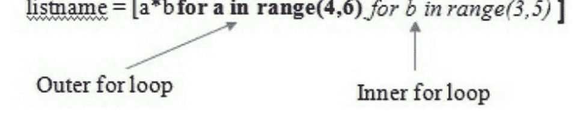

### 示例 7.56

```python
#不使用列表推导式的代码
myl1 = []
for a in range(4,6):
    for b in range(3,5):
        myl1.append(a*b)
print(myl1)

#使用列表推导式的代码
lic1 = [a*b for a in range(4,6) for b in range(3,5)]
print(lic1)
```

### 输出 7.56

```
[12, 16, 15, 20]
[12, 16, 15, 20]
```

在不使用列表推导式的代码中，使用了嵌套 `for` 循环来产生输出。但在使用列表推导式的代码中，仅用一行就产生了相同的输出。
因此，我们可以说列表推导式需要更少的代码，并且比 `for` 循环更快。此外，它还能在 `for` 循环无法使用的地方使用。

## 7.3 元组数据结构

既然我们现在已经了解了列表，讨论元组就很容易了。元组与列表完全相同，只是它是不可变的。一旦创建了元组对象，就不能对该对象进行任何更改。所以，我们可以说它是列表的只读版本。如果我们的数据是固定的且不需要更改，那么我们就应该选择元组。这里，插入顺序被保留，重复的对象可以通过索引来区分。所以，索引在元组中起着至关重要的作用。元组支持正索引和负索引。与列表相比，它占用的内存更少。元组元素在括号 `()` 内表示，并使用逗号分隔。括号是可选的，但建议使用。

### 示例 7.57

```python
t1 = 1,2,3,4
print(t1) # T1
print(type(t1)) # T2
t2 = (1,2,3,4)
print(t2) # T3
print(type(t2)) # T4
```

### 输出 7.57

```
(1, 2, 3, 4)
<class 'tuple'>
(1, 2, 3, 4)
<class 'tuple'>
```

在 T1 中，我们没有使用括号。输出是 `(1,2,3,4)`。
在 T2 中，`t1` 对象的类型是元组。
在 T3 中，使用了括号，输出是 `(1,2,3,4)`。
在 T4 中，`t2` 对象的类型是元组。

### 7.3.1 元组的创建

可以通过以下方式创建元组：

### 7.3.1.1 创建空元组

语法：

```python
tuplename()
```

### 示例 7.58

```python
t1 = ()
print(t1) # ET1
print(type(t1)) # ET2
```

### 输出 7.58

```
()
<class 'tuple'>
```

在 ET1 中，元组是空的。
在 ET2 中，`t1` 对象的类型是元组。

### 7.3.1.2 创建单值元组

可以通过在括号内写入用逗号分隔的元素来创建元组。对于单值元组对象的创建，括号是可选的，但必须以逗号结尾。
在编写单值元组时需要特别注意。值后面必须强制性地加上逗号，否则它不会被视为元组，如下所示。

### 示例 7.59

```python
i1 = (20)
print(i1) # TI1
print(type(i1)) # TI2
t1 = (20,)
print(t1) # TI3
print(type(t1)) # TI4
```

### 输出 7.59

```
20
<class 'int'>
(20,)
<class 'tuple'>
```

在 TI1 中，输出是 20。
在 TI2 中，`i1` 对象的类型是整数。
在 TI3 中，输出是 `(20,)`。
在 TI4 中，`t1` 对象的类型是元组。
上述示例说明了当元组中仅存在单个元素时逗号的重要性。

### 7.3.1.3 创建多值元组

对于多值对象的创建，括号是可选的。
元素可以具有相同的数据类型，也可以根据需要具有不同的数据类型。

### 示例 7.60

```python
t1 = (1,2,3,4)
t2 = (1,1,1,True, 'python')
print(t1)
print(t2)
print(type(t1))
print(type(t2))
```

### 输出 7.60

```
(1, 2, 3, 4)
(1, 1, 1, True, 'python')
<class 'tuple'>
<class 'tuple'>
```

### 7.3.1.4 使用 `tuple()` 函数

使用 `tuple()` 函数，可以将对象转换为元组，如下所示。

### 示例 7.61

```python
l1 = [1,2,3,4]
print(tuple(l1))
print(type(tuple(l1)))
t2 = tuple(range(1,9,2))
print(t2)
print(type(t2))
```

### 输出 7.61

```
(1, 2, 3, 4)
<class 'tuple'>
(1, 3, 5, 7)
<class 'tuple'>
```

## 7.3.2 访问元组的元素

可以通过使用索引或使用切片操作符来访问元组的元素。

### 7.3.2.1 通过使用索引

元组元素的位置编号将由索引表示。索引将写在括号内，并从 0 开始。
例如：`myt1 = (10, 20, -30.1, 'Hello')`

**正索引**
正索引表示从左到右。从上面的例子来看，正索引编号如下：

| 带索引的元组对象 | 元素 |
| --- | --- |
| myt1[0] | 10 |
| myt1[1] | 20 |
| myt1[2] | -30.1 |
| myt1[3] | Hello |

**负索引**
负索引表示从右到左。从上面的例子来看，负索引编号如下：

| 带索引的元组对象 | 元素 |
| --- | --- |
| myt1[-4] | 10 |
| myt1[-3] | 20 |
| myt1[-2] | -30.1 |
| myt1[-1] | Hello |

### 示例 7.62

```python
myt1 = (10, 20, -30.1, 'Hello')
print(myt1[3])# LI1
print(myt1[-1])# LI2
print(myt1[4])# LI3
```

### 输出 7.62

```
Hello
Hello
IndexError: tuple index out of range
```

在 LI1 中，索引/位置 3 处的元素是 Hello。
在 LI2 中，索引/位置 -1 处的元素是 Hello。
在 LI3 中，索引/位置 4 不可用，因为只有 4 个元素。
因此，Python 将引发 `IndexError : tuple index out of range`。

### 通过使用索引和 `for` 循环

可以使用索引和 `for` 循环来访问元组的元素，如下所示：

### 示例 7.63

```python
myt1 = (10, 20, -30.1, 'Hello')
tuple_length = len(myt1)

for loop in range(tuple_length):
    print(loop, myt1[loop])
```

### 输出 7.63

```
0 10
1 20
2 -30.1
3 Hello
```

在上面的例子中，返回了元组中元素的数量，并使用 `for` 循环进行迭代。将显示索引号以及对应的元素。

在这里，我们正在顺序访问元组的每个元素。通过使用索引和 `for` 循环来访问元素。

### 通过使用索引和 `while` 循环

可以使用索引和 `while` 循环来访问元组的元素，如下所示：

### 示例 7.64

```python
myt1 = (10, 20, -30.1, 'Hello')
tuple_length = len(myt1)
count = 0
while count<tuple_length:
    print(count, myt1[count])
    count +=1
```

### 输出 7.64

## 7.3.2.2 使用元组切片

元组元素也可以通过元组切片来访问。元组切片的语法如下：

```
myt1= tuplename(start:stop:step)
```

其中 **start** 表示切片开始的索引，默认值为 0。**stop** 表示切片结束的索引，默认值为列表长度。**step** 是增量值，默认值为 1。

### 示例 7.65

关于源代码，请扫描 [第 336 页](page 336) [图 7.1](Figure 7.1) 中显示的二维码。

### 输出 7.65

```
myt1: (10, 20, -30.1, 'Hello', 34.1, True)
myt1[:4]: (10, 20, -30.1, 'Hello')
myt1[1:]: (20, -30.1, 'Hello', 34.1, True)
myt1[3:5]: ('Hello', 34.1)
myt1[1:4]: (20, -30.1, 'Hello')
myt1[::-1]: (True, 34.1, 'Hello', -30.1, 20, 10)
```

## 7.3.3 元组与不可变性

一旦创建了元组对象，其内容就无法修改。因此，元组对象是不可变的。

```
示例 7.66
myt1 = (11,12,13,14)
print(myt1)# MU1
myt1[1] = 20
print(myt1)# MU2
```

```
输出 7.66
(11, 12, 13, 14)
TypeError: 'tuple' object does not support item assignment
```

在 MU1 中，元组元素显示为 (11, 12, 13, 14)。
在 MU2 中，我们尝试将索引/位置 1 的元素修改为 20。由于元组对象是不可变的，Python 将引发 TypeError: 'tuple' object does not support item assignment。

## 7.3.4 元组对象的数学运算符

### 7.3.4.1 连接 (+) 运算符

+ 运算符用于连接元组。借助 + 运算符，两个元组将被连接成一个元组，如下所示。

```
示例 7.67
myt1 = (1,2,3,4,5)
myt2 = (6,7,8,9,10)
myt3 = myt1 + myt2
print(myt3)
```

```
输出 7.67
(1, 2, 3, 4, 5, 6, 7, 8, 9, 10)
```

> **注意：**

要使用 + 运算符，两个参数都必须是元组对象。否则，Python 将抛出 TypeError。

```
示例 7.68
myt1 = (1,2,3,4,5)
myt2 = 6
myt3 = myt1 + myt2
print(myt3)
```

### 输出 7.68

TypeError: can only concatenate tuple (not “int“) to tuple

如果我们使用 (6,) 而不是 6，那么输出将是 (1,2,3,4,5,6)

### 7.3.4.2 重复 (*) 运算符

* 运算符用于将元组元素重复指定的次数。

### 示例 7.69

```
myt1 = ('a','b','c')
myt3 = myt1* 2
print(myt3)
```

### 输出 7.69

('a', 'b', 'c', 'a', 'b', 'c')

因此，我们可以看到元组元素被重复了 2 次。

## 7.3.5 修改元组对象

元组对象是不可变的。因此，我们不能修改、更新或删除其元素。但是，我们可以使用切片和连接运算符将元素插入到元组对象中。将创建一个新对象，如下所示。

### 示例 7.70

```
python
t1 = (1,2,3,4,5)
t2 = ('Hello',True)
mys1 = t1[0:3] # MT1
mys2 = t1[3:] # MT2
myt1 = mys1 + t2 + mys2 # MT3
print(myt1) # MT4
print(type(myt1)) # MT5
print(id(t1)) # MT6
print(id(myt1)) # MT7
```

### 输出 7.70

```
(1, 2, 3, 'Hello', True, 4, 5)
<class 'tuple'>
2456430536224
2456433694304
```

在 MT1 中，索引 0 到 3 之间的元素存储在 mys1 对象中。
在 MT2 中，从索引 3 到末尾的所有元素存储在 mys2 对象中。
在 MT3 中，对象 mys1、t2 和 mys2 被连接起来。
在 MT4 中，显示存储在 myt1 对象中的数据。因此，输出为 (1, 2, 3, 'Hello', True, 4, 5)。
在 MT5 中，myt1 对象的类型是元组。
在 MT6 中，t1 对象的 id 是 2456430536224。
在 MT7 中，myt1 对象的 id 是 2456433694304。

因此，我们可以看到，虽然通过执行切片和连接操作在所需位置插入了元素，但创建了一个新对象。

## 7.3.6 从用户获取元组输入

众所周知，元组是不可变的，因此我们无法向元组中插入元素。所以，一种简单的方法是提示用户输入，将用户提示的所有元素制作成一个列表对象，然后转换为元组对象。

### 示例 7.71

关于源代码，请扫描第 336 页图 7.1 中显示的二维码。

```
输出 7.71

Enter the number of elements: 4
Enter element at index 0 : 10
Enter element at index 1 : 20
Enter element at index 2 : 30
Enter element at index 3 : python
['10', '20', '30', 'python']
<class 'list'>
('10', '20', '30', 'python')
<class 'tuple'>
The elements of tuple object are:
10
20
30
```

## 7.3.7 元组函数和方法

- 1. len()

上述函数将返回元组中存在的元素数量。

```
示例 7.72
t1 = (10,11,14,17,19,20)
print(len(t1))
```

```
输出 7.72
6
```

如图所示，元组元素的数量是 6。

- 2. count()

上述方法将返回元组中指定元素的出现次数。

count() 的语法是

```
tuplename.count(element)
```

```
示例 7.73
myt1 = (10,11,14,17,19,20,14,35,14)
print(myt1.count(14)) # CO1
myt2 = ('c','o','r','o','n','a','w','a','r','r','i','o','r','s')
print(myt2.count('r')) # CO2
```

### 输出 7.73

```
3
4
```

在 CO1 中，元素 14 的出现次数是 3。
在 CO2 中，元素 ‘r’ 的出现次数是 4。

- 3. index()

上述方法将返回元组中指定元素第一次出现的位置或索引。如果在元组中未找到指定元素，Python 将显示 ValueError。因此，建议使用 ‘in’ 运算符检查项目是否存在于元组中。
index() 的语法是

```
tuplename.index(element)
```

### 示例 7.74

```
myt1 = (10,11,14,17,19,20,14,35,14)
print(myt1.index(14)) # IN1
myt2 = ('c','o','r','o','n','a','w','a','r','r','i','o','r','s')
search_element = input("Enter the element to be searched: ")
if search_element in myt2:
    print(f'The first occurrence of {search_element} is present at index no. ', myt2.index(search_element))
else:
    print(f"The element {search_element} is not present")# IN2
```

### 输出 7.74

```
2
Enter the element to be searched: o
The first occurrence of o is present at index no. 1
```

在 IN1 中，我们正在检查列表对象 myt1 中元素 14 的第一次出现，它位于索引/位置 2。
在 IN2 中，提示用户输入要搜索的元素。用户输入了元素 ‘o’，它位于索引/位置 1。
如果用户输入任何其他不存在的搜索元素，则将执行 else 部分，如下所示。

```
Enter the element to be searched: x
The element x is not present
```

- 4. sorted()

上述方法将按升序或降序对元组元素进行排序。sorted() 的语法是

```
sorted(iterable, key = function, reverse)
```

第一个参数是需要排序的序列、集合或任何其他迭代器。
第二个参数也是可选参数。它指定排序条件。
第三个参数是可选参数。默认值为 False，元组元素按升序排序。如果设置为 True，则元组元素按降序排序。对于字符串，默认排序顺序是字母顺序。对于数字，默认排序顺序是升序。

### 示例 7.75

```
myt1 = (12,10,38,22)
myt3 = tuple(sorted(myt1))
print(myt3)
print(type(myt3))

myt2 = ('Banana','Apple','Litchi','Watermelon','Mango')
myt4 = tuple(sorted(myt2))
print(myt4)
print(type(myt4))
```

### 输出 7.75

```
(10, 12, 22, 38)
<class 'tuple' >
('Apple', 'Banana', 'Litchi', 'Mango', 'Watermelon')
<class 'tuple' >
```

如图所示，数字的默认排序顺序是升序，字符串的默认排序顺序是字母顺序。当我们使用 sorted() 方法时，元组应仅包含同质元素，否则 Python 将引发 TypeError。

### 示例 7.76

## 7.3.8 元组打包与解包

在元组打包中，通过打包一组变量来创建一个元组。

**示例 7.80**

```python
ele1 = 1
ele2 = 2
ele3 = 3
ele4 = 4
myt1 = ele1,ele2,ele3,ele4
print(myt1)
```

**输出 7.80**

```
(1, 2, 3, 4)
```

在上面的示例中，ele1、ele2、ele3 和 ele4 被打包成一个元组 myt1。因此，这是元组打包。

现在，元组解包是元组打包的逆过程。一个元组被解包，其值被分配给不同的变量。

**示例 7.81**

```python
myt1 = (1,2,3,4)
ele1, ele2, ele3, ele4 = myt1
print("第1个元素是: " + str(ele1))
print("第2个元素是: " + str(ele2))
print("第3个元素是: " + str(ele3))
print("第4个元素是: " + str(ele4))
```

**输出 7.81**

```
第1个元素是: 1
第2个元素是: 2
第3个元素是: 3
第4个元素是: 4
```

但是，一个需要观察的重要点是，在进行元组解包时，变量数量和值的数量必须相同。否则，我们将得到如下面所示的 ValueError。

**示例 7.82**

```python
myt1 = (1,2,3,4)
ele1, ele2, ele3 = myt1
```

**输出 7.82**

```
ValueError: too many values to unpack (expected 3)
```

## 7.3.9 元组推导式

Python 不支持元组推导式。我们将得到一个生成器对象而不是元组对象。生成器表达式会一次产生一个项目。我们将在本章末尾讨论生成器。

**示例 7.83**

```python
g1 = (x**2 for x in range(1,7))
print(type(g1))

for loop in g1:
    print(loop)
```

**输出 7.83**

```
<class 'generator'>
1
4
9
16
25
36
```

## 7.3.10 嵌套元组

嵌套元组或元组的嵌套是指一个元组包含在另一个元组内。嵌套元组的元素可以通过索引来访问，就像多维数组元素一样。

**示例 7.84**

```python
myt1 = (1,2,3,(4,5))
print(myt1) # L1
print(myt1[3]) # L2
print(myt1[3][0]) # L3
print(myt1[3][1]) # L4
```

**输出 7.84**

```
(1, 2, 3, (4, 5))
(4, 5)
4
5
```

| 元组元素 | 1 | 2 | 3 | 元组元素 | 4 | 5 |
| :--- | :--- | :--- | :--- | :--- | :--- | :--- |
| | | | | 索引 | [0] | [1] |
| 索引 | [0] | [1] | [2] | [3] | | |

在 L1 中，我们显示了元组元素。
在 L2 中，索引 3 处的元素是一个嵌套元组 (4,5)。
在 L3 中，元素是 4。
在 L4 中，元素是 5。

## 7.3.11 列表与元组比较

### 相似性

- 1. 保留插入顺序。
- 2. 允许重复对象。
- 3. 允许异构对象。
- 4. 支持切片和索引。

### 差异性

列表和元组之间的差异性如表 7.2 所示。

| 序号 | 列表 | 元组 |
| :--- | :--- | :--- |
| 1 | 它是在方括号内的一组逗号分隔的值。方括号是必需的。例如：[1,2,3,4] | 它是在圆括号内的一组逗号分隔的值。圆括号是可选的。例如：1,2,3,4 (1,2,3,4) |
| 2 | 列表对象是可变的，即一旦创建了列表对象，就可以在该对象上执行任何更改。 | 元组对象是不可变的，即一旦创建了元组对象，内容就不能修改。 |
| 3 | 当内容不固定且持续变化时，我们应该使用列表。 | 当内容固定且永不改变时，我们应该使用元组。 |
| 4 | 列表对象不能用作字典的键，因为键必须是不可变且可哈希的。 | 元组对象可以用作字典的键，因为键必须是不可变且可哈希的。 |

表 7.2：列表与元组的差异性

## 7.4 集合数据结构

项目的无序集合就是一个集合。在集合中，元素的顺序是不被保持的。元素出现的顺序可能与其被添加到集合中的顺序不同。插入顺序不被保留，但元素可以被排序。集合中不允许有重复项。集合没有索引和切片的规定。集合中允许异构元素。一旦创建了一个集合对象，就可以根据需要在该对象上执行任何更改。因此，集合是可变的。集合用花括号 `{}` 表示，并用逗号分隔。所有数学运算，如并集、交集、差集等，都可以应用于集合对象。

**示例 7.85**

```python
s1 = {1,2,3,4}
print(s1)
print(type(s1))
```

**输出 7.85**

```
{1, 2, 3, 4}
<class 'set'>
```

## 7.4.1 集合创建

要创建一个集合，所有项目必须放在花括号 `{}` 内，用逗号分隔。集合不接受重复的元素。可以使用 `set()` 函数创建集合对象。

语法是

```python
set(iterable)
```

`iterable` 可以是任何序列，如列表、元组、字典或 `range`。

**示例 7.86**

```python
mys1 = set(range(1,10))
print(mys1) # S1
mys2 = set('python')
print(mys2) # S2
myl1 = [1,2,3,1,4,5]
mys3 = set(myl1)
print(mys3) # S3
myd1 = {'a': 1, 'b':2, 'c':3}
print(set(myd1)) # S4
```

**输出 7.86**

```
{1, 2, 3, 4, 5, 6, 7, 8, 9}
{'n', 'h', 't', 'y', 'p', 'o'}
{1, 2, 3, 4, 5}
{'b', 'c', 'a'}
```

在 S1 中，从 1 到 9 的数字将是集合的元素。因此，输出将是 `{1, 2, 3, 4, 5, 6, 7, 8, 9}`。
在 S2 中，一个集合对象将包含无序元素 `{'n', 'h', 't', 'y', 'p', 'o'}`。
在 S3 中，重复的元素将被移除，集合对象将包含无序的唯一元素 `{1,2,3,4,5}`。
在 S4 中，可以使用集合创建字典，但转换后只会保留键，因为值会丢失。因此，输出将是 `{'b', 'c', 'a'}`。

可以使用 `set()` 函数创建一个空集合。

```python
mys1 = set()
print(mys1)
print(type(mys1))
```

**输出**

```
set()
<class 'set'>
```

我们不能只写 `{}` 来表示空集合。它会被当作字典。

```python
d1 = {}
print(d1)
print(type(d1))
```

**输出**

```
{}
<class 'dict'>
```

## 7.4.2 集合方法

集合中的不同方法如下：

- 1. `add()`
   上述方法将向集合添加一个新元素。它不返回任何值。`add()` 的语法是：

```python
setname.add(element)
```

**示例 7.89**

```python
mys1 = {'10', 20, 30}
mys1.add(40)
print(mys1) # AS1
print(type(mys1)) # AS2
```

**输出 7.89**

```
{40, '10', 20, 30}
<class 'set'>
```

在 AS1 中，一个新的元素 40 将被添加到集合中。但这并不意味着元素会被添加到最后。这里的输出是 `{40, 20, '10', 30}`。
在 AS2 中，`mys1` 对象的类型是 set。

## 7.4.2 对集合执行修改操作的方法

上述方法不会向集合中添加任何元素，如果指定的元素已经存在。

```
示例 7.90

mys1 = {'10',20,30}
mys1.add(20)
print(mys1)
```

```
输出 7.90

{'10', 20, 30}
```

### 2. update()
上述方法将向集合中添加多个元素。它可以接受可迭代对象作为参数，如列表、元组、字符串或其他集合。给定可迭代对象中存在的元素将被添加到集合中。
`update()` 的语法是

```
setname.update(elements)
```

```
示例 7.91

mys1 = {'10',20,30}
myl1 = [1,2,3,4]
mys1.update(myl1)
print(mys1) # U1
mys1.update(myl1,range(1,4))
print(mys1) # U2
mys2 = {100,200}
mys1.update(mys2)
print(mys1) #U3
myt1 = (100,)
mys1.update(myt1)
print(mys1) #U4
```

```
输出 7.91

{1, 2, 3, 4, '10', 20, 30}
{1, 2, 3, 4, '10', 20, 30}
{1, 2, 3, 4, 100, 200, '10', 20, 30}
{1, 2, 3, 4, 100, 200, '10', 20, 30}
```

在 U1 中，我们正在用列表元素更新当前集合。因此，输出将是 {1, 2, 3, 4, 20, '10', 30}。
在 U2 中，我们正在用列表元素和从 1 到 4 的元素更新当前集合。因此，输出将是 {1, 2, 3, 4, 20, '10', 30}。
在 U3 中，我们正在通过添加另一个集合中的所有元素来更新当前集合。因此，输出将是 {1, 2, 3, 4, 100, 200, 20, '10', 30}。
在 U4 中，我们正在通过添加一个元组元素来更新当前集合。因此，输出将是 {1, 2, 3, 4, 100, 200, 20, '10', 30}。

> **注意：**
每当需要向集合中添加单个元素时，我们将使用 `add()` 方法。`update()` 方法用于向集合中添加多个元素。`add()` 的参数数量是 1，而 `update()` 可以接受任意数量的参数，但参数必须是可迭代对象。

### 3. copy()
上述方法将返回集合的一个副本，并将现有集合元素复制到另一个集合中。

`copy()` 的语法是

```
setname.copy()
```

```
示例 7.92

mys1 = {'Agra',100, True, 'Swiss Alps'}
mys2 = mys1.copy()

print(mys1)
print(mys2)
print(id(mys1))
print(id(mys2))
```

```
输出 7.92

{True, 'Swiss Alps', 100, 'Agra'}
{True, 'Swiss Alps', 100, 'Agra'}
212369576
211852864
```

从上面的例子可以看出，`copy()` 方法创建了另一个包含所有元素的集合。但这两个集合具有不同的地址。

### 4. pop()
上述方法将从集合中移除并返回某个随机元素。`pop()` 的语法是

```
setname.pop()
```

```
示例 7.93

源代码请扫描第 336 页图 7.1 所示的二维码
```

```
输出 7.93

调用 pop() 方法之前...
fruits: {'Mango', 'Grapes', 'Banana', 'Apple', 'Litchi'}
numbers: {1, 2, 3, 4, 5}
Mango 已从 fruits 中移除
Grapes 已从 fruits 中移除
Banana 已从 fruits 中移除
1 已从 numbers 中移除
2 已从 numbers 中移除
3 已从 numbers 中移除
调用 pop() 方法之后...
fruits: {'Apple', 'Litchi'}
numbers: {4, 5}
```

从上面的例子可以看出，集合 myfruits 和 mynums 中的一些随机元素被移除了。

如果集合为空，Python 将引发 `KeyError`。

```
示例 7.94

ms1 = set()
print(ms1.pop())
```

```
输出 7.94

KeyError: 'pop from an empty set'
```

### 5. remove()
删除元素的方法之一是使用 `remove()`。上述方法将从集合中移除一个指定的元素。`remove()` 的语法是

```
setname.remove(element)
```

```
示例 7.95

源代码请扫描第 336 页图 7.1 所示的二维码
```

```
输出 7.95

调用 remove() 方法之前...
fruits: {'Mango', 'Grapes', 'Banana', 'Apple', 'Litchi'}
numbers: {1, 2, 3, 4, 5}
调用 remove() 方法之后...
fruits: {'Grapes', 'Banana'}
numbers: {2, 5}
```

如果指定的元素不在集合中，Python 将引发 `KeyError`，如下所示。

```
示例 7.96

myfruits = {"Apple", "Banana", "Grapes", "Litchi", "Mango"}
myfruits.remove('Guava')
```

```
输出 7.96

KeyError: 'Guava'
```

### 6. discard()
另一种删除元素的方法是使用 `discard()`。上述方法也将从集合中移除一个指定的元素。
`discard()` 的语法是

```
setname.discard(element)
```

```
示例 7.97

源代码请扫描第 336 页图 7.1 所示的二维码
```

```
输出 7.97

调用 discard() 方法之前...
fruits: {'Mango', 'Grapes', 'Banana', 'Apple', 'Litchi'}
numbers: {1, 2, 3, 4, 5}
调用 discard() 方法之后...
fruits: {'Mango', 'Apple'}
numbers: {1, 4}
```

如果指定的元素不在集合中，Python 不会引发任何错误，如下所示。

```
myfruits = {"Apple", "Banana", "Grapes", "Litchi", "Mango"}
myfruits.discard('Guava')
```

### 7. clear()
上述方法将清除或移除集合中的所有元素。
`clear()` 的语法是：

```
setname.clear()
```

```
示例 7.98

源代码请扫描第 336 页图 7.1 所示的二维码
```

```
输出 7.98

调用 clear() 方法之前...
fruits: {'Mango', 'Grapes', 'Banana', 'Apple', 'Litchi'}
numbers: {1, 2, 3, 4, 5}
调用 clear() 方法之后...
fruits: set()
numbers: set()
```

## 7.4.3 对集合执行数学运算的方法

集合上不同的数学运算如下：

### 1. union()
上述方法将返回一个包含所有集合中所有元素的集合。它用于查找所有集合的并集。公共元素将只重复一次。它也可以使用 `|` 运算符执行。
语法是

```
set1.union(set2, set3)
```

其中
`set1` 是要搜索相同项目的集合。
`set2`、`set3` 等是可选的集合，可以提供多个要比较的集合。

```
示例 7.99

mys1 = {1,2,3,4}
mys2 = {3,4,5,6}
print(mys1.union(mys2)) # U1

mys3 = {'a','b','c','d'}
mys4 = {'d','e','f','g'}
mys5 = {'v','w','x','d'}
print(mys3.union(mys4)) # U2
print(mys3.union(mys4,mys5)) # U3
```

```
输出 7.99

{1, 2, 3, 4, 5, 6}
{'b', 'd', 'a', 'c', 'e', 'f', 'g'}
{'x', 'a', 'v', 'd', 'b', 'g', 'f', 'w', 'e', 'c'}
```

在 U1 中，集合对象 mys1 和 mys2 中的组合元素是 {1, 2, 3, 4, 5, 6}。
在 U2 中，集合对象 mys3 和 mys4 中的组合元素是 {'b', 'd', 'a', 'c', 'e', 'f', 'g'}。
在 U3 中，集合对象 mys3、mys4 和 mys5 中的组合元素是 {'x', 'a', 'v', 'd', 'b', 'g', 'f', 'w', 'e', 'c'}。

### 2. intersection()
上述方法将返回一个包含 2 个或更多集合之间相似元素的集合。它将返回存在于所有集合中的元素集合，即返回一个没有不需要元素的新集合，是 2 个或更多集合的交集。它也可以使用 `&` 运算符执行。原始集合不会被修改。
语法是

```
set1.intersection(set1, set2, set3)
```

其中
`set1` 是要搜索相同项目的集合。
`set2`、`set3` 等是可选的集合，可以提供多个要比较的集合。

```
示例 7.100

mys1 = {1,2,3,4}
mys2 = {3,4,5,6}
print(mys1.intersection(mys2)) # I1

mys3 = {'a','b','c','d'}
mys4 = {'d','w','f','g'}
mys5 = {'v','w','x','z'}
print(mys3.intersection(mys4)) # I2
print(mys4.intersection(mys5)) # I3
```

```
输出 7.100

{3, 4}
{'d'}
{'w'}
```

在 I1 中，返回了一个新集合，包含集合对象 mys1 和 mys2 中的公共元素 {3, 4}。
在 I2 中，返回了一个新集合，包含集合对象 mys3 和 mys4 中的公共元素 {'d'}。
在 I3 中，返回了一个新集合，包含集合对象 mys4 和 mys5 中的公共元素 {'w'}。

### 3. intersection_update()
上述方法将从原始集合中移除不需要的元素。它将用存在于所有集合中的公共元素更新原始集合。
语法是

```
set1.intersection_update(set1, set2, set3)
```

其中
`set1` 是要搜索相同项目的集合。
`set2`、`set3` 等是可选的集合，可以提供多个要比较的集合。

```
示例 7.101

mys1 = {1,2,3,4}
mys2 = {3,4,5,6}
mys1.intersection_update(mys2)
print(mys1) # IU1

mys3 = {'a','b','c','d'}
mys4 = {'d','w','f','g'}
mys5 = {'v','w','x','z'}
mys3.intersection_update(mys4)
print(mys3) # IU2
mys4.intersection_update(mys5)
print(mys4) # IU3
```

```
输出 7.101

{3, 4}
{'d'}
{'w'}
```

在 IU1 中，原始集合 mys1 用存在于另一个集合 mys2 中的公共元素进行了更新。因此，mys1 对象内的元素是 {3, 4}。

在 IU2 中，原始集合 mys3 用存在于另一个集合 mys4 中的公共元素进行了更新。因此，mys3 对象内的元素是 {'d'}。

在 IU3 中，原始集合 mys4 用存在于另一个集合 mys5 中的公共元素进行了更新。因此，mys4 对象内的元素是 {'w'}。

### 4. difference()
上述方法将返回两个集合的差集。返回一个新集合，包含仅存在于第一个集合中的元素，不在两个集合中。它甚至可以使用‘-’运算符来执行。原始集合不会被修改。其语法是

```
setname1.difference(setname2)
```

其中
`setname2` 是第二个集合名，它将与 `setname1` 找出差集。

```
示例 7.102

mys1 = {1,2,3,4}
mys2 = {3,4,5,6}
print(mys1.difference(mys2)) # D1

mys3 = {'a','b','c','d'}
mys4 = {'d','w','f','g'}
mys5 = {'v','w','x','z'}
print(mys3.difference(mys4)) # D2
print(mys4.difference(mys5)) # D3
```

```
输出 7.102

{1, 2}
{'a', 'c', 'b'}
{'d', 'g', 'f'}
```

在 D1 中，返回的集合包含了仅存在于 `mys1` 而不存在于集合 `mys2` 中的元素。因此，输出是 `{1, 2}`。
在 D2 中，返回的集合包含了仅存在于 `mys3` 而不存在于集合 `mys4` 中的元素。因此，输出是 `{'a', 'c', 'b'}`。
在 D3 中，返回的集合包含了仅存在于 `mys4` 而不存在于集合 `mys5` 中的元素。因此，输出是 `{'d', 'g', 'f'}`。

## 5. difference_update()

上述方法会从原始集合中移除不需要的元素。它会通过移除另一个集合中不存在于原始集合中的元素和重复元素，用原始集合的元素来更新该集合。

其语法是

```
setname1.difference_update(setname2)
```

其中
`setname2` 是第二个集合名，它将与 `setname1` 找出差集。

```
示例 7.103

mys1 = {1,2,3,4}
mys2 = {3,4,5,6}
mys1.difference_update(mys2)
print(mys1) # DU1

mys3 = {'a','b','c','d'}
mys4 = {'d','w','f','g'}
mys5 = {'v','w','x','z'}
mys3.difference_update(mys4)
print(mys3) # DU2
mys4.difference_update(mys5)
print(mys4) # DU3
```

```
输出 7.103

{1, 2}
{'b', 'c', 'a'}
{'f', 'd', 'g'}
```

在 DU1 中，原始集合 `mys1` 被更新为元素 `{1,2}`。
在 DU2 中，原始集合 `mys3` 被更新为元素 `{'b', 'c', 'a'}`。
在 DU3 中，原始集合 `mys4` 被更新为元素 `{'f', 'd', 'g'}`。

## 6. symmetric_difference()

上述方法将返回一个包含两个集合中所有元素的集合，但不包含同时存在于两个集合中的元素，即两个集合的公共元素将被移除，并返回一个混合了那些不同时存在于两个集合中的元素的集合。它甚至可以使用 `^` 运算符来执行。原始集合不会被修改。
其语法是

```
setname1.symmetric_difference(setname2)
```

其中 `setname2` 是要与 `setname1` 进行比较的另一个集合。

```
示例 7.104

mys1 = {1,2,3,4}
mys2 = {3,4,5,6}
print(mys1.symmetric_difference(mys2)) # S1

mys3 = {'a','b','c','d'}
mys4 = {'d','w','f','g'}
mys5 = {'v','w','x','z'}
print(mys3.symmetric_difference(mys4)) # S2
print(mys4.symmetric_difference(mys5)) # S3
```

```
输出 7.104

{1, 2, 5, 6}
{'c', 'f', 'w', 'b', 'g', 'a'}
{'z', 'f', 'x', 'd', 'g', 'v'}
```

在 S1 中，返回的新集合不包含集合 `mys1` 和 `mys2` 的公共元素。因此，输出将是 `{1, 2, 5, 6}`。
在 S2 中，返回的新集合不包含集合 `mys3` 和 `mys4` 的公共元素。因此，输出将是 `{'c', 'f', 'w', 'b', 'g', 'a'}`。
在 S3 中，返回的新集合不包含集合 `mys4` 和 `mys5` 的公共元素。因此，输出将是 `{'z', 'f', 'x', 'd', 'g', 'v'}`。

## 7. symmetric_difference_update()

上述方法将通过移除两个集合中都存在的元素并插入其他元素来更新原始集合。
其语法是

```
setname1.symmetric_difference_update(setname2)
```

其中 `setname2` 是要与 `setname1` 进行比较的另一个集合。

```
示例 7.105

源代码请扫描 [第 336 页](page 336) 所示的 [图 7.1](Figure 7.1) 中的二维码
```

```
输出 7.105

{1, 2, 5, 6}
{'c', 'w', 'f', 'b', 'a', 'g'}
{'f', 'z', 'd', 'v', 'g', 'x'}
```

在 SU1 中，原始集合 `mys1` 被更新，移除了集合 `mys1` 和 `mys2` 的公共元素。集合 `mys1` 被更新为集合 `mys1` 和 `mys2` 的对称差。因此，输出将是 `{1, 2, 5, 6}`。
在 SU2 中，原始集合 `mys3` 被更新，移除了集合 `mys3` 和 `mys4` 的公共元素。因此，输出将是 `{'c', 'w', 'f', 'b', 'a', 'g'}`。
在 SU3 中，原始集合 `mys4` 被更新，移除了集合 `mys4` 和 `mys5` 的公共元素。因此，输出将是 `{'f', 'z', 'd', 'v', 'g', 'x'}`。

## 8. isdisjoint()

上述方法将在两个集合中都没有公共元素时返回 `True`，否则返回 `False`。
其语法是

```
setname1.isdisjoint(setname2)
```

```
示例 7.106

源代码请扫描 [第 336 页](page 336) 所示的 [图 7.1](Figure 7.1) 中的二维码
```

```
输出 7.106

False
False
False
True
```

在 ID1 中，集合 `mys1` 和 `mys2` 之间存在公共元素 `{3,4}`。因此，返回 `False`。
在 ID2 中，集合 `mys3` 和 `mys4` 之间存在公共元素 `{'d'}`。因此，返回 `False`。
在 ID3 中，集合 `mys4` 和 `mys5` 之间存在公共元素 `{'w'}`。因此，返回 `False`。
在 ID4 中，集合 `mys3` 和 `mys5` 之间没有公共元素。因此，返回 `True`。

## 9. issubset()

上述方法将在原始集合的所有元素都存在于指定集合中时返回 `True`，否则返回 `False`。
其语法是

```
setname1.issubset(setname2)
```

其中原始集合 `setname1` 要与指定集合 `setname2` 进行比较。

```
示例 7.107

mys1 = {1,2,3,4}
mys2 = {1,2,3,4,5,6}
print(mys1.issubset(mys2)) # ISUB1

mys3 = {'a','b','c','d'}
mys4 = {'d','w','f','g'}
mys5 = {'a','b','c','d','v','w','x','z'}
print(mys3.issubset(mys4)) # ISUB2
print(mys4.issubset(mys5)) # ISUB3
print(mys3.issubset(mys5)) # ISUB4
```

```
输出 7.107

True
False
False
True
```

在 ISUB1 中，集合 `mys1` 的所有元素都存在于集合 `mys2` 中。因此，返回 `True`。
在 ISUB2 中，集合 `mys3` 的所有元素都缺失于集合 `mys4` 中。因此，返回 `False`。
在 ISUB3 中，集合 `mys4` 的所有元素都缺失于集合 `mys5` 中。因此，返回 `False`。
在 ISUB4 中，集合 `mys3` 的所有元素都存在于集合 `mys5` 中。因此，返回 `True`。

## 10. issuperset()

上述方法将在指定集合的所有元素都存在于原始集合中时返回 `True`，否则返回 `False`。
其语法是

```
setname1.issuperset(setname2)
```

其中 `setname2` 是要与原始集合 `setname1` 进行比较的指定集合。

```
示例 7.108

源代码请扫描第 336 页图 7.1 中的二维码
```

```
输出 7.108

True
False
False
True
```

在 ISUP1 中，集合 `mys1` 的所有元素都存在于集合 `mys2` 中。因此，返回 `True`。
在 ISUP2 中，集合 `mys4` 的所有元素都缺失于集合 `mys3` 中。因此，返回 `False`。
在 ISUP3 中，集合 `mys5` 的所有元素都缺失于集合 `mys4` 中。因此，返回 `False`。
在 ISUP4 中，集合 `mys3` 的所有元素都存在于集合 `mys5` 中。因此，返回 `True`。

> 注意：

我们已经讨论过一些内置函数，如 `any()`、`all()`、`len()`、`enumerate()`、`min()`、`max()`、`sum()`、`sorted()` 等，这些函数最常与集合一起使用，以根据要求执行任务。

## 7.4.4 集合推导式

在集合推导式中，一个新的集合从一个满足给定条件的可迭代对象中创建。集合推导式最重要的方面是元素是唯一的、无序的，并且不能包含任何重复项，它返回一个集合。它使用花括号 `{}`。

其语法是

```
new_set = {expression for item in iterable_object if statement}
```

可以有 0 个或多个 `if` 语句。
可以有 1 个或多个 `for` 循环语句。
请观察以下代码

```
示例 7.109

带 for 循环的集合推导式

# 没有集合推导式的代码
mys1 = set()
for loop in range(11):
    mys1.add(loop **3)
print(mys1)

# 使用集合推导式的代码
mys2 = {loop **3 for loop in range(11)}
print(mys2)
```

```
输出 7.109

{0, 1, 64, 512, 8, 1000, 343, 216, 729, 27, 125}
{0, 1, 64, 512, 8, 1000, 343, 216, 729, 27, 125}
```

在没有集合推导式的代码中，最初创建一个空集合，并将前 10 个数字的立方值逐一添加到空集合中。

在使用集合推导式的代码中，输出结果相同，但我们仅用一行代码就实现了目标。

## 示例 7.110

```
使用 for 循环和 if 语句的集合推导式
#code without set comprehension
mys1 = set()
for loop in range(11):
    if loop %2 == 0:
        mys1.add(loop **3)
print(mys1)
#code with set comprehension
mys2 = {loop **3 for loop in range(11) if loop %2 == 0}
print(mys2)
```

## 输出 7.110

```
{0, 64, 512, 8, 1000, 216}
{0, 64, 512, 8, 1000, 216}
```

在不使用集合推导式的代码中，首先创建了一个空集，然后将前10个偶数的立方值添加到空集中。
在使用集合推导式的代码中，输出结果相同，但我们仅用一行代码就实现了目标。

## 示例 7.111

使用 for 循环和嵌套 if 语句的集合推导式

```
#code without set comprehension
mys1 = set()
for loop in range(21):
    if loop %3 == 0:
        if loop %4 == 0:
            mys1.add(loop **3)
print(mys1)

#code with set comprehension
mys2 = {loop **3 for loop in range(21) if loop %3 == 0 if loop %4 == 0}
print(mys2)
```

## 输出 7.111

```
{0, 1728}
{0, 1728}
```

在不使用集合推导式的代码中，首先创建了一个空集，然后为能被12整除的元素计算其立方值，并将其添加到空集中。

在使用集合推导式的代码中，输出结果相同，但我们仅用一行代码就实现了目标。

## 示例 7.112

### 使用 if else 语句和 for 循环的集合推导式

```
#code without set comprehension
mys1 = set()
for loop in range(11):
    if loop %2 == 0:
        mys1.add(loop **3)
    else:
        mys1.add(loop**2)
    print(mys1)

#code with set comprehension
mys2 = {loop **3 if loop %2 == 0 else loop**2 for loop in range(11)}
print(mys2)
```

```
输出 7.112
{0, 1, 64, 512, 8, 9, 1000, 49, 81, 216, 25}
{0, 1, 64, 512, 8, 9, 1000, 49, 81, 216, 25}
```

使用 if else 语句和 for 循环的集合推导式的语法如下：

```
new_set = {expression if condition else statement for item in iterable_object}
```

在不使用集合推导式的代码中，首先创建了一个空集，然后将前10个数中偶数的立方值和奇数的平方值添加到空集中。
在使用集合推导式的代码中，输出结果相同，但我们仅用一行代码就实现了目标。

## 7.5 字典数据结构

列表、元组和集合等数据结构用于将一组独立对象表示为单个实体。如果我们想将一组对象表示为键值对，则应该使用字典。在字典中，键不允许重复，但值可以重复。

键和值都允许是异构对象。字典不保留插入顺序。它是一个无序集合，并且是可变的，因为我们可以修改其元素而不改变其标识。切片和索引的概念不适用于字典。它使用花括号 `{}` 表示。

### 一些关键规则

在创建字典之前，编写键时必须考虑以下几点：

- 1. 键必须是唯一的。
- 2. 如果再次提及相同的键，则旧键将被覆盖。
- 3. 键必须是不可变的，如整数、字符串或元组。
- 4. 列表或字典不能用作键。
- 5. 键区分大小写。例如，键名 `k` 和 `K` 是不同的。

### 7.5.1 创建空字典

可以通过两种方式创建空字典：

- 1. 使用 `dict()` 函数

```
示例 7.113
python
d1 = dict()
print(d1)
print(type(d1))
```

```
输出 7.113
```

```
{}
<class 'dict'>
```

- 2. 仅使用花括号

```
示例 7.114

d1 = {}
print(d1)
print(type(d1))
```

```
输出 7.114

{}
<class 'dict'>
```

### 7.5.2 创建字典

字典可以以键值对的形式创建，其中键遵循上述讨论的规则，值可以是任何数据类型且可以重复。其语法是

```
dict1 = {key1: value1, key2: value2, ... }
```

```
示例 7.115

d1 = {}
d1[1] = 'python'
d1[2] = 'is'
d1[3] = 'awesome'
print(d1) # DI1

d2 = {1: 'python',
      2: 'is',
      3: 'awesome'}
print(d2) # DI2
```

## 输出 7.115

```
{1: 'python', 2: 'is', 3: 'awesome'}
{1: 'python', 2: 'is', 3: 'awesome'}
```

在 DI1 中，首先创建了一个空字典，然后通过 `d1[key] = value` 的方式添加数据条目。键名在方括号内被引用。该字典使用键值对创建，输出为 `{1: 'python', 2: 'is', 3: 'awesome'}`。

在 DI2 中，假定数据已提前获知。因此，它使用键值对创建。因此，输出为 `{1: 'python', 2: 'is', 3: 'awesome'}`。

## 示例 7.116

```
d2 = {1: 'python',
      2: 'is',
      3: 'awesome',
      3: 'True'}
print(d2)
```

```
输出 7.116

{1: 'python', 2: 'is', 3: 'True'}
```

如我们所见，键值 `3` 重复了。因此，根据键规则，旧键被覆盖。因此，输出为 `{1: 'python', 2: 'is', 3: 'True'}`。

### 7.5.3 访问字典

可以使用键来访问数据。可以通过在其键名置于方括号内来访问字典的值。
例如：`employee_details = {101: 'Ram', 102: 'Shyam', 103: 'Mohan'}`

```
输出 7.116

{1: 'python', 2: 'is', 3: 'True'}
```

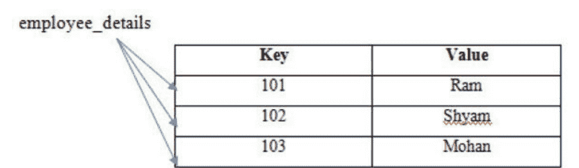

| 键 | 值 |
|---|---|
| 101 | Ram |
| 102 | Shyam |
| 103 | Mohan |

```
示例 7.117

employee_details = {101: 'Ram', 102: 'Shyam', 103: 'Mohan'}
print(employee_details[101])
print(employee_details[102])
print(employee_details[103])
print(employee_details[104])
```

## 输出 7.117

```
Ram
Shyam
Mohan
KeyError: 104
```

我们可以看到，数据是通过键 101、102 和 103 访问的。但是，指定的键 104 在字典对象中不存在。因此，Python 抛出了 KeyError。我们可以通过使用 `in` 操作符来防止这种情况，如下所示。

## 示例 7.118

```
employee_details = {101: 'Ram', 102: 'Shyam', 103: 'Mohan'}
if 104 in employee_details:
    print('Present')
else:
    print('The key is not present')
```

## 输出 7.118

```
The key is not present
```

另一种方法是使用 `get()` 方法。如果未找到键，它返回 `None` 而不是 KeyError。

## 示例 7.119

```
employee_details = {101: 'Ram', 102: 'Shyam', 103: 'Mohan'}
print(employee_details.get(104))
```

## 输出 7.119

None

在 Python 2 中，有一个名为 `has_key()` 的函数，用于检查键是否可用。但它仅在 Python 2 版本中存在，在 Python 3 版本中已过时。

### 7.5.4 修改字典

可以通过为键分配新值来修改键的现有值。如果键不存在，则将在字典中添加一个具有指定键值对的新条目。由于它是一个无序集合，它可能被添加到字典的任何位置。如果键存在，则旧值将被新值替换，因为值会被更新而不是添加新项。

## 示例 7.120

```
d1 = {1:'Sugandh', 2:'Divya', 3:'Mintoo'}
print(d1) # UD1
d1[4] = 'Neeharika'
print("After adding a key value pair")
print(d1) # UD2
print("After modifying the value")
d1[3] = 'Animesh'
print(d1) # UD3
```

## 输出 7.120

```
{1: 'Sugandh', 2: 'Divya', 3: 'Mintoo'}
After adding a key value pair
{1: 'Sugandh', 2: 'Divya', 3: 'Mintoo', 4: 'Neeharika'}
After modifying the value
{1: 'Sugandh', 2: 'Divya', 3: 'Animesh', 4: 'Neeharika'}
```

在 UD1 中，我们显示字典中的键值对。输出为 `{1: 'Sugandh', 2: 'Divya', 3: 'Mintoo'}`。
在 UD2 中，由于键 4 不存在，向字典对象添加了一个键值对。因此，输出为 `{1: 'Sugandh', 2: 'Divya', 3: 'Mintoo', 4: 'Neeharika'}`。
在 UD3 中，键 3 已存在。因此，旧值 `Mintoo` 被新值 `Animesh` 替换。因此，输出为 `{1: 'Sugandh', 2: 'Divya', 3: 'Animesh', 4: 'Neeharika'}`。

### 7.5.5 删除字典项

可以使用 `del` 语句删除字典的一个项或整个字典。删除项的语法是：

```
del dictionaryname[key]
```

删除整个字典的语法是## del 字典名

## 示例 7.121

```
d1 = {1:'Sugandh', 2:'Divya', 3:'Mintoo'}
print(d1) # D1
print("deleting an item from the dictionary...")
del d1[3]
print(d1) # D2
print("deleting an entire dictionary...")
del d1
print(d1) # D3
```

## 输出 7.121

```
{1: 'Sugandh', 2: 'Divya', 3: 'Mintoo'}
deleting an item from the dictionary...
{1: 'Sugandh', 2: 'Divya'}
deleting an entire dictionary...
NameError: name 'd1' is not defined
```

在 D1 中，我们显示了字典中的键值对。因此，输出为 {1: 'Sugandh', 2: 'Divya', 3: 'Mintoo'}。在 D2 中，我们从字典中删除了一个特定的项。因此，输出为 {1: 'Sugandh', 2: 'Divya'}。在 D3 中，我们删除了整个字典本身。现在，我们无法访问字典对象 d1。因此，Python 将引发 NameError: name 'd1' is not defined。如果键不存在，Python 将引发 KeyError。

## 示例 7.122

```
d1 = {1:'Sugandh', 2:'Divya', 3:'Mintoo'}
print("deleting a key from the dictionary...")
del d1[3]
print(d1)
print("deleting the same key again...")
del d1[3]
print(d1)
```

## 输出 7.122

```
deleting a key from the dictionary...
{1: 'Sugandh', 2: 'Divya'}
deleting the same key again...
KeyError: 3
```

## 7.5.6 字典方法和函数

各种字典函数和方法如下：

### 1. dict()

我们可以使用 dict() 函数创建字典，如下所示。

## 示例 7.123

源代码请扫描第 336 页图 7.1 所示的二维码

## 输出 7.123

```
{}
<class 'dict'>
{1: 'a', 2: 'b', 3: 'c'}
{1: 'python', 2: 'is', 3: 'awesome'}
{1: 'python', 2: 'is', 3: 'awesome'}
{2: 'is', 3: 'awesome', 1: 'python'}
TypeError: unhashable type: 'list'
```

在 DI1 中，我们创建了一个空字典。因此，输出为 {}。
在 DI2 中，使用指定的元素创建了一个字典。因此，输出为 {1: 'a', 2: 'b', 3: 'c'}。
在 DI3 中，使用给定的元组元素列表创建了一个字典。因此，输出为 {1: 'python', 2: 'is', 3: 'awesome'}。
在 DI4 中，使用给定的元组元素元组创建了一个字典。因此，输出为 {1: 'python', 2: 'is', 3: 'awesome'}。
在 DI5 中，使用给定的元组元素集合创建了一个字典。因此，输出为 {2: 'is', 3: 'awesome', 1: 'python'}。
在 DI6 中，Python 将引发 TypeError，因为我们试图使用给定的列表元素集合来创建字典。因此，Python 将引发 TypeError: unhashable type: 'list'。

### 2. len()

上述函数将返回字典中存在的项数。项指的是每个键值对。

## 示例 7.124

```
d2 = dict({11:'h',12:'a',13:'t'})
print(len(d2))
```

## 输出 7.124

```
3
```

### 3. clear()

上述方法将从字典中移除所有键值对。但是，在移除项后，我们仍然可以访问字典对象。
其语法为

```
字典名.clear()
```

## 示例 7.125

```
d1 = dict(((11,"Stay"),(12,"safe"),(13,"completely"),
(14,"anywhere")))
print(d1)
d1.clear()
print(d1)
```

## 输出 7.125

```
{11: 'Stay', 12: 'safe', 13: 'completely', 14: 'anywhere'}
{}
```

### 4. get()

上述方法将返回指定键对应的值（如果键存在），否则返回 None 或默认值。

其语法为

```
字典名.get(key[, value])
```

其中第一个参数是必需参数，是要在字典中搜索的键。

value 参数是可选的，如果未找到键，则返回该值。默认值为 None。因此，上述方法将返回：

- (a) 如果指定的键存在于字典中，则返回该键的值。
- (b) 如果未找到键且未指定值，则返回 None。
- (c) 如果未找到键但指定了值，则返回指定的值。

## 示例 7.126

```
myemp = {'Name': 'Michael','Age':39}
print(myemp.get('Name')) # G1
print(myemp.get('Age')) # G2
print(myemp.get('MobileNumber')) # G3
print(myemp.get('MobileNumber',9876543210)) # G4
print(myemp.get('Age',34)) # G5
```

## 输出 7.126

```
Michael
39
None
9876543210
39
```

在 G1 中，指定键 Name 的值为 Michael。在 G2 中，指定键 Age 的值为 39。在 G3 中，未找到键 MobileNumber。由于未指定默认值，因此默认值为 None。在 G4 中，未找到键 MobileNumber。指定了默认值。因此，输出为 9876543210。在 G5 中，键 Age 存在。即使指定了默认值，指定键对应的值仍然是 39。

### 5. pop()

上述方法将从字典中移除具有指定键的项。如果找到键，则返回从字典中移除的项的值。如果未找到键且指定了默认值，则返回默认值。如果未找到键且未指定默认值，则 Python 将引发 KeyError 异常。

其语法为

```
字典名.pop(key[, default])
```

其中
第一个参数是要搜索并移除的键。
第二个参数是默认值，当在字典中未找到键时返回该值。

## 示例 7.127

源代码请扫描第 336 页图 7.1 所示的二维码

## 输出 7.127

```
data of employee dictionary...
{'Name': 'Priyanka', 'Age': 39, 'Sex': 'Female'}
Priyanka is removed.
39 is removed.
data of employee dictionary after removing Name and Age...
{'Sex': 'Female'}
Landline Number does not exist.
KeyError: 'LandlineNumber'
```

在 P1 中，显示了字典的所有项。输出为 {'Name': 'Priyanka', 'Age': 39, 'Sex': 'Female'}。

在 P2 中，移除了具有指定键 Name 的项。因此，值 Priyanka 被移除。

在 P3 中，移除了具有指定键 Age 的项。因此，值 39 被移除。

在 P4 中，移除键 Name 和 Age 后字典中存在的项为 {'Sex': 'Female'}。

在 P5 中，未找到键 LandlineNumber，但指定了默认值。因此，输出为 Landline Number does not exist。

在 P6 中，未找到键 LandlineNumber 且未指定默认值。因此，Python 将引发 KeyError: 'LandlineNumber'。

### 6. popitem()

上述方法将从字典中移除并返回一个任意的元素（键值）对。如果字典为空且我们尝试使用上述方法，则会得到 KeyError。

其语法为

```
字典名.popitem()
```

## 示例 7.128

源代码请扫描第 336 页图 7.1 所示的二维码

## 输出 7.128

```
{'Name': 'Alestair', 'Age': 58, 'Sex': 'Male'}
('Sex', 'Male') is removed
('Age', 58) is removed
('Name', 'Alestair') is removed
{}
KeyError: 'popitem(): dictionary is empty'
```

在 PI1 中，显示了字典的所有项。输出为 {'Name': 'Alestair', 'Age': 58, 'Sex': 'Male'}。
在 PI2 中，从字典中移除了一个任意的键值对 ('Sex', 'Male')。
在 PI3 中，从字典中移除了一个任意的键值对 ('Age', 58)。
在 PI4 中，从字典中移除了一个任意的键值对 ('Name', 'Alestair')。
在 PI5 中，显示了一个空字典。
在 PI6 中，字典为空。因此，Python 将引发 KeyError: 'popitem(): dictionary is empty'。

### 7. keys()

上述方法将返回字典中所有键的序列。其语法为

```
字典名.keys()
```

它不接受任何参数。

## 示例 7.129

```
myemp = {
    'Name': 'Steve',
    'Age':58,
    'Sex': 'Male'}
print(myemp)# K1
print(myemp.keys())# K2
myrem = myemp.popitem()
print(myrem, 'is removed')# K3
print(myemp.keys())# K4
print(list(myemp.keys()))# K5
for key in myemp.keys(): # K6
    print(key)
```

## 输出 7.129

```
{'Name': 'Steve', 'Age': 58, 'Sex': 'Male'}
dict_keys(['Name', 'Age', 'Sex'])
('Sex', 'Male') is removed
dict_keys(['Name', 'Age'])
['Name', 'Age']
Name
Age
```

在 K1 中，显示了字典的所有项。输出为 {'Name': 'Steve', 'Age': 58, 'Sex': 'Male'}。在 K2 中，显示了字典中所有键的序列。输出为 dict_keys(['Name', 'Age', 'Sex'])。

## 8. values()

上述方法将返回字典中的一系列值。
其语法为

```
dictionaryname.values()
```

它不接受任何参数。

```
示例 7.130

myemp = {
    'Name': 'Angela',
    'Age':30,
    'Sex': 'Female',
    'Profession': 'Doctor'}
print(myemp)# V1
print(myemp.values())# V2
myrem = myemp.pop('Sex')
print(myrem, 'is removed')# V3
print(myemp.values())# V4
print(tuple(myemp.values()))# V5
for value in myemp.values():
    print(value)# V6
```

输出 7.130

```
{'Name': 'Angela', 'Age': 30, 'Sex': 'Female', 'Profession': 'Doctor'}
dict_values(['Angela', 30, 'Female', 'Doctor'])
Female is removed
dict_values(['Angela', 30, 'Doctor'])
('Angela', 30, 'Doctor')
Angela
30
Doctor
```

在 V1 中，显示了字典的所有条目。输出为 {'Name':'Angela','Age':30,'Sex':'Female','Profession':'Doctor'}。

在 V2 中，显示了字典所有值的一个序列。输出为 dict_values(['Angela', 30, 'Female', 'Doctor'])。

在 V3 中，字典中键为 `Sex` 的指定条目被移除。因此，输出为 Female is removed。

在 V4 中，在使用 `pop()` 方法后，再次显示字典所有值的一个序列。输出为 dict_values(['Angela', 30, 'Doctor'])。

在 V5 中，值的序列将被转换为元组。因此，输出为 ('Angela', 30, 'Doctor')。

在 V6 中，每个值将逐一被迭代。因此，输出为

Angela
30
Doctor

## 9. items()

上述方法将返回一个包含字典键值对的对象。键值对将以元组列表的形式存储在该对象中。
其语法为

```
dictionaryname.items()
```

### 示例 7.131

```
myemp = {
    'Name': 'Angela',
    'Age':30,
    'Sex': 'Female',
    'Profession': 'Doctor'}
print(myemp.items())# I1
print(type(myemp.items()))# I2
for key, value in myemp.items():
    print(key, '----',value)# I3
```

### 输出 7.131

```
dict_items([('Name', 'Angela'), ('Age', 30), ('Sex', 'Female'), ('Profession', 'Doctor')])
<class 'dict_items'>
Name ---- Angela
Age ---- 30
Sex ---- Female
Profession ---- Doctor
```

在 I1 中，显示了字典的所有条目。因此，输出为 dict_items([('Name', 'Angela'), ('Age', 30), ('Sex', 'Female'), ('Profession', 'Doctor')])。

在 I2 中，类型为 <class 'dict_items'>。
在 I3 中，键和值同时被逐一迭代。因此，输出为

Name Angela
Age 30
Sex Female
Profession Doctor

## 10. copy()

上述方法将从现有字典中复制所有元素到一个新字典中。它返回字典的浅拷贝。原始字典不会被修改。
其语法为

```
dictionaryname.copy()
```

### 示例 7.132

源代码请扫描第 336 页图 7.1 中显示的二维码

### 输出 7.132

```
{'Name': 'Kripki', 'Age': 29, 'Sex': 'Male', 'Profession': 'Scientist'}
{'Name': 'Kripki', 'Age': 29, 'Sex': 'Male', 'Profession': 'Scientist'}
使用 copy 方法从原始字典复制的新字典被清空后
{}
{'Name': 'Kripki', 'Age': 29, 'Sex': 'Male', 'Profession': 'Scientist'}
{'Name': 'Kripki', 'Age': 29, 'Sex': 'Male', 'Profession': 'Scientist'}
使用 = 运算符从原始字典复制的字典被清空后
{}
{}
```

在 C1 中，我们显示了原始字典。因此，输出为 {'Name': 'Kripki', 'Age': 29, 'Sex': 'Male', 'Profession': 'Scientist'}。
在 C2 中，返回了字典的浅拷贝。因此，输出为 {'Name': 'Kripki', 'Age': 29, 'Sex': 'Male', 'Profession': 'Scientist'}。
在 C3 中，在移除了新字典的所有元素后。输出是一个空字典 {}。
在 C4 中，当新字典被清空时，原始字典保持不变。因此，输出为 {'Name': 'Kripki', 'Age': 29, 'Sex': 'Male', 'Profession': 'Scientist'}。
在 C5 中，我们使用了 `=` 运算符来复制字典。因此，新字典的输出为 {'Name': 'Kripki', 'Age': 29, 'Sex': 'Male', 'Profession': 'Scientist'}。
在 C6 中，在移除了新字典的所有元素后。输出是一个空字典 {}。
在 C7 中，当新字典被清空时，原始字典也被清空。因此，输出是一个空字典 {}。

## 11. setdefault()

上述方法将返回指定键的值。如果键不存在，则会将该键及指定的值插入到字典中。
其语法为

```
dictionaryname.setdefault(key[, default_value])
```

其中
第一个参数 `key` 将在字典中搜索。
第二个参数是可选参数，是一个默认值（带值的键），当在字典中找不到该键时将被插入。如果未提供默认值，则默认为 `None`。

### 示例 7.133

源代码请扫描第 336 页图 7.1 中显示的二维码

### 输出 7.133

```
{'Name': 'Priyanka', 'Age': 27, 'Sex': 'Female', 'Profession': 'Scientist'}
27
{'Name': 'Priyanka', 'Age': 27, 'Sex': 'Female', 'Profession': 'Scientist', 'salary': 100000}
100000
{'Name': 'Priyanka', 'Age': 27, 'Sex': 'Female', 'Profession': 'Scientist', 'salary': 100000, 'mobilenumber': None}
None
```

在 SD1 中，显示了字典的所有条目。因此，输出为 {'Name':'Priyanka','Age':27,'Sex':'Female','Profession':'Scientist'}。
在 SD2 中，字典中键 `Age` 的值是 27。
在 SD3 中，显示了字典的所有条目。键 `salary` 及其默认值 100000 将被插入字典。因此，输出为 {'Name': 'Priyanka', 'Age': 27, 'Sex': 'Female', 'Profession': 'Scientist', 'salary': 100000}。
在 SD4 中，将返回键 `salary` 的默认值。因此，输出为 100000。
在 SD5 中，显示了字典的所有条目。键 `mobilenumber` 及其默认值 `None` 将被插入字典。因此，输出为 {'Name': 'Priyanka', 'Age': 27, 'Sex': 'Female', 'Profession': 'Scientist', 'salary': 100000, 'mobilenumber': None}。
在 SD6 中，未提供键 `mobilenumber` 的默认值。因此，输出为 `None`。

## 12. update()

上述方法将使用另一个字典对象的元素或键值对的可迭代对象来更新字典。如果键在字典中不存在，则会将元素添加到字典中。如果键存在，则会用新值更新该键。
其语法为

```
dictionaryname.update(iterable)
```

### 示例 7.134

```
d1 = {'x':1}
d2 = {'y':2}
d1.update(d2) # U1
print(d1) # U2
d3 = {'x':3}
d1.update(d3) # U3
print(d1) # U4
d1.update(z = 4) #U5
print(d1) # U6
```

### 输出 7.134

```
{'x': 1, 'y': 2}
{'x': 3, 'y': 2}
{'x': 3, 'y': 2, 'z': 4}
```

在 U1 中，字典对象 `d1` 使用另一个字典对象 `d2` 的元素进行了更新。在 U2 中，输出为 {'x': 1, 'y': 2}。在 U3 中，键 `x` 的值被更新。在 U4 中，输出为 {'x': 3, 'y': 2}。在 U5 中，一个新元素被添加到字典对象 `d1` 中。在 U6 中，输出为 {'x': 3, 'y': 2, 'z': 4}。

## 13. fromkeys()

上述方法将根据给定的元素序列创建一个新字典，这些序列将用作键，如果用户提供了值，则将其作为键的值。
其语法为

```
dictionaryname.fromkeys(sequence[,value])
```

其中第一个参数 `sequence` 是将用作键的元素序列（包含键的容器）。第二个参数是可选的，用于指定值，如果未提供，其默认值为 `None`。

### 示例 7.135

源代码请扫描第 336 页图 7.1 中显示的二维码

### 输出 7.135

```
{'a': 1, 'b': 1, 'c': 1}
{'a': None, 'b': None, 'c': None}
{'a': [100], 'c': [100], 'b': [100]}
{'a': [100, 10], 'c': [100, 10], 'b': [100, 10]}
```

在 FK1 中，创建了一个带有键和值的字典。
在 FK2 中，输出为 `{'a': 1, 'b': 1, 'c': 1}`。
在 FK3 中，创建了一个只带有键的字典。
在 FK4 中，输出为 `{'a': None, 'b': None, 'c': None}`。
在 FK5 中，创建了一个带有键和可变对象 `list` 的字典。
在 FK6 中，输出为 `{'a': [100], 'c': [100], 'b': [100]}`。
在 FK7 中，可变对象被修改，这将导致序列中的每个元素都被更新。
在 FK8 中，输出为 `{'a': [100, 10], 'c': [100, 10], 'b': [100, 10]}`。

### 7.5.7 字典推导式

其语法为：

```
dictionary = {key:value for vars in iterable}
```

### 7.5.7.1 使用 for 循环的字典推导式

让我们看一个例子。

### 示例 7.136

### 7.5.7 字典推导式

### 7.5.7.1 使用 for 循环的字典推导式

```python
#code without dictionary comprehension
cube_dict = dict()
for mynum in range(1,6):
    cube_dict[mynum] = mynum**3
print(cube_dict)

#code with dictionary comprehension
my_cube_dict_comp = {mynum: mynum**3 for mynum in range(1, 6)}
print(my_cube_dict_comp)
```

**输出 7.136**

```
{1: 1, 2: 8, 3: 27, 4: 64, 5: 125}
{1: 1, 2: 8, 3: 27, 4: 64, 5: 125}
```

在没有使用字典推导式的代码中，我们创建了一个包含数字-立方键值对的字典 `cube_dict`。
在使用字典推导式的代码中，我们用一行代码就创建了字典 `my_cube_dict_comp`。
我们也可以将字典推导式与字典对象一起使用。

### 示例 7.137

```python
my_old_price = {'eggs': 0.8, 'chocos': 3, 'rice': 1}
dollar_to_indiancurrency = 75
my_new_price = {key: value*dollar_to_indiancurrency for (key, value) in my_old_price.items()}
print(my_new_price)
```

**输出 7.137**

```
{'eggs': 60.0, 'chocos': 225, 'rice': 75}
```

在上面的例子中，我们可以看到我们检索了以美元为单位的商品价格，并将其转换成了印度货币。

### 7.5.7.2 使用 for 循环和 if 语句的字典推导式

语法为

```python
dictionary = {key:value for vars in iterable if condition}
```

### 示例 7.138

```python
#code without dictionary comprehension
cube_dict = dict()
for mynum in range(1,6):
    if mynum %2 == 0:
        cube_dict[mynum] = mynum**3
print(cube_dict)

#code with dictionary comprehension
my_cube_dict_comp = {mynum: mynum**3 for mynum in range(1, 6) if mynum %2 == 0}
print(my_cube_dict_comp)
```

**输出 7.138**

```
{2: 8, 4: 64}
{2: 8, 4: 64}
```

正如我们所看到的，由于字典推导式中的 `if` 子句，只有值为偶数的项目会被添加。

### 7.5.7.3 使用 for 循环和嵌套 if 语句的字典推导式

### 示例 7.139

```python
cube_dict = dict()
for mynum in range(1,21):
    if mynum %2 == 0:
        if mynum %3 == 0:
            cube_dict[mynum] = mynum**3
print(cube_dict)
#code with dictionary comprehension
my_cube_dict_comp = {mynum: mynum**3 for mynum in range(1, 21) if mynum %2 == 0 if mynum %3 == 0}
print(my_cube_dict_comp)
```

**输出 7.139**

```
{6: 216, 12: 1728, 18: 5832}
{6: 216, 12: 1728, 18: 5832}
```

正如我们所看到的，由于字典推导式中的嵌套 `if` 子句，只有值为偶数且能被3整除的项目会被添加。

### 7.5.7.4 使用 if else 语句和 for 循环的字典推导式

语法为

```python
dictionary = {key:value if condition else statement for vars in iterable}
```

### 示例 7.140

源代码扫描第336页图7.1所示的二维码

### 输出 7.140

```
{'Ankt': 'young', 'Saurabh': 'young', 'Nilesh': 'old', 'Mr. Ben': 'old'}
{'Ankt': 'young', 'Saurabh': 'young', 'Nilesh': 'old', 'Mr. Ben': 'old'}
```

在这两种情况下，都会使用字典推导式创建一个新字典。值大于35的项目会被标记为 'old'，其他则标记为 'young'。尽管有这些优点，但必须谨慎使用字典推导式，因为它会消耗更多内存，使代码运行变慢，并降低代码可读性。


> **注意：** 有许多内置函数，如 `len()`、`all()`、`cmp()`、`any()`、`sorted()` 等，可以与字典一起使用，根据需要执行代码。

## 7.6 生成器

生成器是负责生成一系列值的函数。生成器函数将使用 `yield` 关键字从函数返回值。它类似于普通函数，但我们将使用 `yield()` 而不是 `return()` 来返回结果。`yield` 关键字会将元素从生成器函数返回到生成器对象中。可以使用 `next()` 函数从生成器对象中逐个检索元素。

其语法为

```python
next(generator_object)
```

在 Python 中构建迭代器有很多开销。需要实现一个带有 `__iter__()` 和 `__next__()` 方法的类，该类会跟踪内部状态，并在没有值可返回时引发 `StopIteration`。这过程相当冗长且反直觉。Python 生成器可以自动处理这些开销，这是一种创建迭代器的简单方法。如果任何函数包含至少一个 `yield` 语句，那么它将成为一个生成器函数。`yield` 和 `return` 都会返回一些值。众所周知，`return` 语句会完全终止函数，而 `yield` 语句会暂停函数，从而保存其所有状态，并将控制权转移给调用语句，然后在每次调用时从那里继续。

生成器函数包含一个或多个 `yield` 语句。调用时会返回一个对象，但执行不会立即开始。将使用 `next()` 来迭代项目。像 `__iter__()` 和 `__next__()` 这样的方法会自动实现。每当控制权执行到 `yield` 语句时，函数就会暂停，控制权将转移给调用语句。在每次连续调用之间，局部变量及其状态都会被记住。当函数终止时，会自动引发 `StopIteration`。

### 示例 7.141

源代码扫描第336页图7.1所示的二维码

### 输出 7.141

```
<class 'generator'>
Printing first
1
Printing second
2
Printing third
3
Printing at last
4
StopIteration
```

这里，函数 `my_generator_function()` 包含了 `yield` 语句。因此，该函数是一个生成器函数。此函数将返回一个生成器对象。这些生成器对象可以通过调用生成器对象上的 `next()` 函数来使用，也可以在 "for in" 循环中使用。上面的例子演示了对生成器对象调用 `next()` 函数的用法。

在 G0 中，`mynum` 是一个生成器对象，但执行没有立即开始。

在 G1 中，`mynum` 的类型是 `<class 'generator'>`。

在 G2 中，使用生成器对象上的 `next()` 函数来迭代项目。函数一旦 yield 就会暂停，控制权被转移给调用语句。因此，输出将是

*Printing first*

+   1

在 G3 中，在每次连续调用之间，局部变量及其状态都会被记住。因此，输出将是

*Printing second*

+   2

在 G4 中，输出将是

*Printing third*

+   3

在 G5 中，输出将是

*Printing at last*

+   4

在 G6 中，当函数终止时，会自动引发 `StopIteration`。一个需要注意的重要点是，变量 `num` 的值在每次连续调用之间都被记住。因此，当函数 yield 时，局部变量不会像普通函数那样被销毁。为了重新启动此过程，需要像这样创建另一个生成器对象

```python
mynum = my_generator_function()
```

此外，生成器对象也可以直接在 for 循环中使用。for 循环获取一个迭代器，该迭代器通过使用 `next()` 函数对其进行迭代。当引发 `StopIteration` 时，它将自动结束。

### 示例 7.142

源代码扫描第336页图7.1所示的二维码

### 输出 7.142

```
Printing first
1
Printing second
2
Printing third
3
Printing at last
4
```

### 生成器函数的优点：

1.  与类级别的迭代器相比，生成器更易于实现。只需观察代码。

### 示例 7.143

源代码扫描第336页图7.1所示的二维码

```
Output 7.143
1
3
9
27
81
243
```

正如我们从上面实现 3 的序列的代码中所看到的，它非常冗长且反直觉。
现在我们将使用生成器函数执行相同的操作。

### 示例 7.144

```python
def my_Pow_Three(max = 0):
    num = 0
    while num <= max:
        yield 3 ** num
        num += 1

mynum = my_Pow_Three(5)
for loop in mynum:
    print(loop)
```

### 输出 7.144

```
1
3
9
27
81
243
```

正如我们所见，它清晰、简洁、易于实现且更干净。

2.  使用生成器，性能得到提升。

请观察以下代码。

### 示例 7.145

源代码扫描第336页图7.1所示的二维码输出 7.145
列表耗时 3.8439066410064697
生成器函数耗时 0.09375429153442383

如我们所见，列表的执行时间多于生成器。
因此，使用生成器可以提升性能。

3. 使用生成器实现值序列对内存更友好，因为它一次只产生一个项。

请观察以下代码。

示例 7.146
myl1=[x*x for x in range(1000000000000)]
while True:
    print(myl1[0]) # M1

mygen=(x*x for x in range(1000000))
while True:
    print(next(mygen)) # M2

输出 7.146
MemoryError

在 M1 中，我们会遇到内存错误，系统会变慢，因为所有值都需要存储在内存中。
在 M2 中，不会有内存错误，因为值无需预先存储。因此，使用生成器提高了内存利用率。

4. 当需要从一个大文件中读取大量数据时，我们可以优先考虑使用生成器。
5. 它非常适合用于网页抓取。

## 7.7 集合模块

该模块将提供内置数据类型（如列表、元组和字典）的替代方案。

### 1. namedtuple()

上述函数将返回一个具有命名字段的类元组对象。字段属性可以通过名称查找或索引进行访问。可以通过为元组中的所有值分配名称，将元组转换为具名元组。

语法如下

```
collections.namedtuple(type_name, field-list)
```

示例 7.147

```python
from collections import namedtuple
emp=namedtuple('employee', 'name age staffnumber')
myemp = emp(name = 'Suresh',age = 31, staffnumber = 60001)
print(myemp)
print(myemp.name)
print(myemp.age)
print(myemp.staffnumber)
```

输出 7.147

```
employee(name='Suresh', age=31, staffnumber=60001)
Suresh
31
60001
```

### 2. 有序字典

上述函数类似于普通的字典对象。当键和值插入字典时，会维护插入顺序。如果我们尝试再次添加一个键，其先前的值将被覆盖。这里，重复的值将被移除，值将按顺序给出。顺序将与插入顺序相同。

```python
from collections import OrderedDict
myd1=OrderedDict()
myd1['a']=97
myd1['b']=98
myd1['c']=99
myd1['d']=100
myd1['a']=97

for key,value in myd1.items():
    print (key,value)
```

```
a 97
b 98
c 99
d 100
```

### 3. deque()

双端队列是栈和队列的泛化。它是一个双端队列，即允许从两端添加和移除项。它增强了栈和队列的功能。它内存效率高并支持线程安全操作。

```python
from collections import deque
mydq =deque([10,11,12,13])
print(mydq)
mydq.appendleft(9)
print(mydq)
mydq.append(14)
print(mydq)
print(mydq.popleft())
print(mydq)
print(mydq.pop())
print(mydq)
```

```
deque([10, 11, 12, 13])
deque([9, 10, 11, 12, 13])
deque([9, 10, 11, 12, 13, 14])
9
deque([10, 11, 12, 13, 14])
14
deque([10, 11, 12, 13])
```

### 4. defaultdict()

上述函数可以包含重复的键。其优点在于可以收集属于同一键的元素。它是内置 dict 类的一个子类。

示例 7.150

关于源代码，请扫描第 336 页图 7.1 中所示的二维码

输出 7.150

[('Maths', [90, 90]), ('Physics', [92]), ('Chemistry', [80]), ('Biology', [80]), ('English', [80])]

### 5. Counter()

上述函数将跟踪插入到集合中的所有项的计数。它是一个无序集合，将项存储为字典键，将计数存储为字典值。允许任何整数值、0 或负数计数。

示例 7.151

```python
from collections import Counter

student_subject_marks = [
    ('Maths', 90),
    ('Physics', 92),
    ('Chemistry', 80),
    ('Biology', 80),
    ('English', 80),
    ('Maths', 90)
]
mycount = Counter(subjectname for subjectname, marks in student_subject_marks)
print(mycount)
```

输出 7.151

Counter({'Maths': 2, 'Physics': 1, 'Chemistry': 1, 'Biology': 1, 'English': 1})

# 第 8 章

## Python 面向对象编程

到目前为止，我们已经学习了将 Python 作为一门过程式编程语言，其主要重点在于函数。现在，我们将处理一种面向对象编程语言（OOP）模型，其重点将放在对象上。大多数 Python 程序员可能会觉得将 Python 作为脚本语言或函数式编程语言使用比较舒适。但是，当涉及到将 Python 作为面向对象编程语言使用时，他们可能会感到不适，因为与其他 OOP 语言相比，它有大量内部变化。Java OOP 和 Python OOP 概念的内部实现是不同的。面向对象编程语言是一种以数据而非逻辑、以对象而非动作为中心的编程语言模型。在 Python 中，一切都会被视为对象。我们已经在使用对象了。但是，我们将明确地讨论 OOP。我们必须清楚三个不同的词：类、对象和引用变量。当我们执行编码时，会多次使用这三个词。但在技术性地学习之前，让我们先通过一个简单的实际例子来学习这三个词。

假设我们想购买一台索尼 Bravia Edge LED 电视，其规格非常丰富，即包含多种智能功能，如 Bravia Sync、屏幕镜像、MHL、MyRemote 应用程序、一键连接、照片分享、WiFi 直连、波动保护、附带 3D 眼镜、全高清显示屏、178 度水平和垂直观看角度以及更多功能。我们会在不同地方寻找这样的型号，如电子商务网站、任何商店、购物中心等。谈判后会比较价格，购买具有上述所有功能且型号为 XYZ 的电视，价格最优的地点。现在，所有这些型号在全球范围内都有相同的设计。上述型号的设计将具有相同的方案。

基于相同的设计，将制造多台索尼 LED 电视。在上一句话中，我们可以看到类和对象之间的一些关系。设计是一个类，每台实体的 LED 电视将是一个对象。因此，要创建一些对象，我们需要一个计划、设计或蓝图，我们称之为类，而对象是类的一个物理存在/实例。

现在，基于相同的设计，我们可以有多个电视对象。但是，就像采购电视并把它放在家里不是我们的目的一样。我们想观看一些频道，如新闻、娱乐、音乐等。我们甚至想根据时间切换频道，并根据需要增大或减小音量。我们将通过一个我们称之为遥控器的小部件对电视执行一些操作。遥控器将始终指向某个对应的电视对象。我们称其为引用变量。类和对象具有一对多关系，即一个类可以有多个对象。对象和引用变量可以具有一对一或多对多关系。两者都是允许的。多对多意味着同一个对象可以有多个引用变量。我们已经通过 `is` 运算符看到了这一点。

现在，我们将讨论 Python 中的类、对象和引用变量。

### 8.1 类

从示例中我们可以看到，为了创建一些对象，需要一些计划、设计或蓝图，我们称之为类。可以编写一个类来表示对象的属性和行为。属性可以由包含一些数据的变量表示，行为可以由类似于函数并执行某些任务的方法表示。

#### 8.1.1 类定义

一个类可以使用 `class` 关键字定义。语法如下：

```
class classname(object):
    ''' 文档字符串 '''
    变量：实例变量、静态变量和局部变量
    方法：实例方法、静态方法、类方法
```

这里，`object` 是可选的，表示基类的名称，Python 中的所有类都派生自该类。

## 8.1 类描述

类描述通过文档字符串来表示。此文档字符串在类中也是可选的。可以通过以下两种方式获取文档字符串：

- 1. 首先使用`print(classname.__doc__)`打印语句。
- 2. 其次使用`help(classname)`帮助语句。

### 示例 8.1

```python
class Employee:
    """ This is an employee class """

print(Employee.__doc__)
print("————M2————")
help(Employee)
```

### 输出 8.1

```
This is an employee class
————M2————
Help on class Employee in module __main__:

class Employee(builtins.object)
 | This is an employee class
 | 
 | Data descriptors defined here:
 | 
 | __dict__
 | dictionary for instance variables (if defined)
 | 
 | __weakref__
 | list of weak references to the object (if defined)
```

在上面的示例中，`class`关键字表明我们正在创建一个类，其后是类的名称（本例中为`Employee`）。文档字符串可以通过使用`print`和`help`语句来获取。

在Python类中，数据通过变量来表示。允许使用三种类型的变量：

- 1. 实例变量。
- 2. 静态变量。
- 3. 局部变量。

在Python类中，操作通过方法来表示。允许使用三种类型的方法：

- 1. 实例方法。
- 2. 类方法。
- 3. 静态方法。

编写类名有一些规则：

- 1. 类名通常以大写字母开头。
- 2. 可以是任何有效的标识符。
- 3. 类名不能是Python保留字。
- 4. 类名如果以字母开头，后跟任意数量的数字、字母或下划线，则是有效的。

因此，类包含不同的方法和属性，如下所示：

```python
class classname:

    def __init__(self, variable_name1, variable_name2):
        self.variable_name1 = variable_name1
        self.variable_name2 = variable_name2  # 属性

    def method1(self):
        body of method1  # 方法

    def method2(self):
        body of method2
```

这里，`__init__(self)`是Python中的一个特殊方法。它类似于C++和Java中的构造函数。每当我们创建一个对象时，构造函数`__init__(self)`就会被执行。实例方法是`method1`和`method2`。

## 8.2 对象

正如从索尼LED电视的示例中所讨论的，它是类的一个物理存在。对于一个类，我们可以创建任意数量的对象。它是一个类类型的变量，是类的一个实例，而创建这个对象的过程称为实例化。创建实例时会分配内存以存储变量的实际数据。每次创建类的对象时，都会为类中定义的每个变量创建一个副本。因此，可以说类的每个对象都有自己定义的数据成员的副本。语法如下

```python
reference_variable = classname()
reference_variable = classname(args)
```

对象的变量和方法可以使用引用变量来访问。访问变量的语法是

```python
reference_variable.variable_name
```

访问方法的语法是

```python
reference_variable.method_name()
```

访问带参数的方法的语法是

```python
reference_variable.method_name(parameters_list)
```

## 8.3 引用变量

正如从索尼LED电视的示例中所讨论的，用于引用对象的变量称为引用变量。对于同一个对象，我们可以有多个引用变量。让我们来看一个例子。

### 示例 8.2

源代码请扫描第432页图8.1中的二维码。

### 输出 8.2

```
Raj
24
600001
Engineer Trainee
The name is: Raj
The age is: 24
The staff number is: 600001
The designation is: Engineer Trainee
__________________________
Shyam
36
600002
Senior Manager
The name is: Shyam
The age is: 36
The staff number is: 600002
The designation is: Senior Manager
2577680955264
2577680957224
```

在上面的示例中，我们正在创建一个Employee类。
默认名称`__init__`是一个构造函数，当类的对象被创建时，它将被隐式调用。
包括构造函数在内的实例方法，其第一个参数是`self`。名字、年龄、员工编号和职位是实例变量，`display`是一个实例方法。通过使用`self`，我们正在访问对象的实例变量和实例方法。
`myobj1`和`myobj2`是引用变量名，它们将指向Employee类的对象。
即使类有包括`self`在内的5个参数，在创建对象时我们只传递名字、年龄、员工编号和职位，因为我们不需要在这里引用隐式的`self`。我们可以看到`self`是构造函数内部的第一个参数

```python
def __init__(self, name, age, staffnumber, designation)
```

同样，`self`是实例方法内部的第一个参数。

```python
def display(self)
```

一旦对象被创建并由某个引用变量引用，就可以使用点（`.`）来引用属性和方法。例如，`myobj1.name`引用的是`myobj1`的`name`属性。

> 注意：上面的代码[示例8.2]也可以重新运行，并在不使用引用变量的情况下产生相同的输出，如下所示。但这里每次创建对象时，构造函数都会自动执行。

### 示例 8.3

源代码请扫描第432页图8.1中的二维码。

### 输出 8.3

```
Raj
24
600001
Engineer Trainee
The name is: Raj
The age is: 24
The staff number is: 600001
The designation is: Engineer Trainee
________________
Shyam
36
600002
Senior Manager
The name is: Shyam
The age is: 36
The staff number is: 600002
The designation is: Senior Manager
```

## 8.4 Self 变量

`self`是一个默认变量，它始终指向当前对象。它将包含当前对象的内存地址。它应该是构造函数和实例方法内部的第一个参数，因为第一个参数总是对象的引用。

为了声明实例变量，使用`self`变量。可以通过使用`self`变量来访问对象的实例变量和实例方法。这个变量将由Python本身隐式提供。

它类似于C++中的`this`指针和Java中的`this`引用。

```python
class Employee:
    def __init__(self, name, age):
        self.name = name
        self.age = age
        print("Inside the constructor: "+ str(id(self)))

print(id(Employee('Priyanka',28)))
```

```
Inside the constructor: 2669865751944
2669865751944
```

为了在类内部引用当前对象，Python提供了一个隐式变量，即`self`变量，它由Python自身提供。`self`变量仅在类内部用于引用当前对象。它在类外部不适用。此外，在调用构造函数和实例方法时，我们不需要为`self`变量提供值。PVM（Python虚拟机）本身将负责提供值。

无论我们传递的第一个参数是什么，它都将是对当前对象的引用。因此，我们可以使用任何名称代替这里的`self`，如下所示。

```python
class Employee:
    def __init__(shelf, name, age):
        shelf.name = name
        shelf.age = age
        print("Inside the constructor: "+ str(id(shelf)))

print(id(Employee('Priyanka',28)))
```

```
Inside the constructor: 2311318091088
2311318091088
```

这里，我们使用了`shelf`名称代替`self`并运行了代码。但建议只使用`self`。

## 8.5 构造函数概念

这是Python中的一个特殊方法，其中构造函数名称为`__init__(self)`。它在对象创建时自动执行。构造函数的主要目的是声明和初始化对象的实例变量。每个对象将执行一次构造函数。构造函数接受的参数数量至少有一个，即至少`self`变量。请看构造函数的演示示例。

### 示例 8.6

```python
class Demo:
    def __init__(self): # 只接受一个参数
        print("I am a constructor")

    def method1(self):
        print("I am method 1")

myd1 = Demo()
# 将在对象创建时自动执行构造函数
Demo()
# 将在对象创建时自动执行构造函数
myd3 = Demo()
# 将在对象创建时自动执行构造函数
myd3.method1()
# 将执行实例方法
```

### 输出 8.6

```
I am a constructor
I am a constructor
I am a constructor
I am method 1
```如果我们不提供任何构造函数，Python将提供一个默认构造函数，因为它是可选的，如下所示。

```python
class Demo1:
    pass

Demo1()
myd2 = Demo1()
```

即使我们没有提供任何构造函数，上面的代码也完全没问题。

## 8.6 装饰器

我们已经详细学习了函数。但在讨论Python类中的变量和方法之前，是时候讨论一个重要的概念了，那就是装饰器。当需要修改函数或类的行为时，Python中有一个强大的工具，称为装饰器。首先，我们将讨论函数装饰器、装饰器链，然后再讨论类装饰器。

### 8.6.1 函数装饰器

装饰器函数总是会接受某个输入函数，执行一些修改，然后提供具有扩展功能的输出函数。装饰器函数的主要目标是在不修改原有函数的情况下扩展其功能。装饰器有助于使我们的代码更简洁、更符合Python风格。在装饰器中，函数作为参数传递给另一个函数，然后在包装函数内部调用。为了指定要应用于另一个函数的装饰器，我们将使用`@function_name`。让我们看看下面的代码。

### 示例 8.7

```python
def greet(myname):
    print("HI!",myname,"!Welcome to learning decorators!")

greet('Tom')
greet('Latham')
greet('Michael')
```

### 输出 8.7

```
HI! Tom !Welcome to learning decorators!
HI! Latham !Welcome to learning decorators!
HI! Michael !Welcome to learning decorators!
```

在上面的代码中，我们只需调用函数就可以为任何名字显示输出。现在，让我们修改上面的函数，当名字是'Michael'时提供一些信息。这可以通过使用装饰器来实现，如下所示，而无需接触`greet()`函数。

### 示例 8.8

源代码扫描[图 8.1](https://example.com/figure8.1)所示二维码，位于[第 432 页](https://example.com/page432)

### 输出 8.8

```
HI! Tom !Welcome to learning decorators!
HI! Latham !Welcome to learning decorators!
Hello Michael !Your functionality is extended!
```


### 第 08 章：源代码

> 图 8.1：源代码

在上面的代码中，`@`符号与装饰器函数（`mydecorator`）的名称一起使用，并放置在要装饰的`greet()`函数定义上方。这里，

```python
@mydecorator
def greet(myname):
    print("HI!",myname,"!Welcome to learning decorators!")
```

等同于

```python
def greet(myname):
    print("HI!",myname,"!Welcome to learning decorators!")
greet = mydecorator(greet)
```

### 示例 8.9

源代码扫描[图 8.1](https://example.com/figure8.1)所示二维码，位于[第 432 页](https://example.com/page432)

### 输出 8.9

```
HI! Tom !Welcome to learning decorators!
HI! Latham !Welcome to learning decorators!
Hello Michael !Your functionality is extended!
```

这只是实现装饰器的语法糖。我们可以看到装饰器函数为原始函数添加了一些功能。这就像礼品包装，被装饰对象的本质（里面的实际礼物）没有改变，但装饰后看起来更漂亮。在上面的程序中，每当调用`greet()`函数时，`mydecorator`函数就会自动执行。此外，我们可以调用带装饰器和不带装饰器的同一个`greet()`函数，如下所示。

### 示例 8.10

源代码扫描[图 8.1](https://example.com/figure8.1)所示二维码，位于[第 432 页](https://example.com/page432)

### 输出 8.10

```
HI! Tom !Welcome to learning decorators!
HI! Latham !Welcome to learning decorators!
HI! Michael !Welcome to learning decorators!
Hello Jordan !Your functionality is extended!
```

当代码中可能出现异常终止时，装饰器函数也很方便，如下所示。

### 示例 8.11

```python
def mydivision(num1,num2):
    return num1/num2
print(mydivision(10,3))
print(mydivision(10,2))
print(mydivision(10,0))
```

### 输出 8.11

```
3.3333333333333335
5.0
ZeroDivisionError: division by zero
```

正如预期，我们提供了第二个参数为0。所以，Python将抛出`ZeroDivisionError`。一个解决方案是使用try-except块来捕获错误。另一个是使用装饰器，仅仅增强`mydivision()`函数的功能，如下所示。

### 示例 8.12

源代码扫描第 432 页图 8.1 所示二维码

### 输出 8.12

```
Dividing 10 with 3
3.3333333333333335
Dividing 10 with 2
5.0
Dividing 10 with 0
We cannot divide if num2 is 0
None
```

所以，我们可以看到，借助装饰器，我们不会得到任何错误，因为我们已经增强了`mydivision()`函数的功能。

### 8.6.2 装饰器链

可以为同一函数定义多个装饰器，所有这些装饰器将形成装饰器链。例如，

```python
@mydecorator1
    @ mydecorator
    def mynum():
```

对于`mynum()`函数，我们应用了2个装饰器函数。首先内部装饰器工作，然后是外部装饰器。

### 示例 8.13

源代码扫描[图 8.1](https://example.com/figure8.1)所示二维码，位于[第 432 页](https://example.com/page432)

### 输出 8.13

```
###########################
@@@@@@@@@@@@@@@@@@@@@@@@@@@
# Welcome to decorator chaining
@@@@@@@@@@@@@@@@@@@@@@@@@@@@@@@@
################################
```

这里，上面的语法

```python
@myhash
@myattherate
def myprint(mymsg):
    print(mymsg)
```

等同于

```python
def myprint(mymsg):
    print(mymsg)
myprint = myhash(myattherate(myprint))
```

所以，装饰器链的顺序很重要。如果我们颠倒装饰器链的顺序会怎样？那么输出会不同，如下所示。

### 示例 8.14

源代码扫描[图 8.1](https://example.com/figure8.1)所示二维码，位于[第 432 页](https://example.com/page432)

### 输出 8.14

```
@@@@@@@@@@@@@@@@@@@@@@@@@@@@@@@@
################################
> Welcome to decorator chaining
########################
@@@@@@@@@@@@@@@@@@@@@@@@
```

### 8.6.3 类装饰器

到目前为止，我们已经看到了函数装饰器。但我们可以把类也看作装饰器。我们可以通过两种方式看待类装饰器：

- 1. 使用装饰器函数装饰类方法

### 示例 8.15

源代码扫描第 432 页图 8.1 所示二维码

### 输出 8.15

```
Output 1
Enter the name: Saurabh
Hey! I am Saurabh
Output 2
Enter the name: Nilesh
My name is: Nilesh
```

- 2. 接收类装饰器并将其应用于一个函数

在学习类作为装饰器之前，我们需要学习`__call__`方法。这是一个特殊方法。当实例以函数形式调用时，这个`__call__`会被执行。假设我们在以下代码的函数形式中使用一个实例。

### 示例 8.16

```python
class displayname:
    def __init__(self,myname):
        self.myname = myname

    def mydisplay(self):
        print(f"My name is: {self.myname}")

myobj = displayname('Ram')
myobj()
```

### 输出 8.16

```
TypeError: 'displayname' object is not callable
```

运行上面的代码，我们会得到TypeError，因为对象不可调用。所以，我们将把`mydisplay(self)`方法替换为`__call__(self)`，如下所示。

### 示例 8.17

```python
class displayname:
    def __init__(self,myname):
        self.myname = myname

    def __call__(self):
        print(f"My name is: {self.myname}")

myobj = displayname('Ram')
myobj()
```

### 输出 8.17

> My name is: Ram

我们将得到如下所示的所需输出。因此，当创建对象的用户充当函数时，函数装饰器必须返回一个像函数一样工作的对象。所以，必须使用类的`__call__`方法。现在，我们将定义一个类作为装饰器。

### 示例 8.18

```python
class Uppercase_decorator:
  def __init__(self,myfunc):
    self.myfunc = myfunc
  def __call__(self):
    mystr1 = self.myfunc()
    return mystr1.upper()

# adding class decorator to the function mygreet
@Uppercase_decorator
def mygreet():
  return "good evening"

print(mygreet())
```

### 输出 8.18

```
GOOD EVENING
```

Python类中允许有3种类型的变量。

## 8.7 对象级变量或实例变量如果变量的值会因对象的不同而变化，那么这种变量类型就称为实例变量。每个对象都会创建一份独立的实例变量副本。

```
示例 8.19

class Person:
    def __init__(self,name,age):
        self.name = name
        self.age = age

    def mydisplay(self):
        print(f"The name is {self.name}")
        print(f"The age is {self.age}")

myobj1 = Person('Saurabh',32)
myobj2 = Person('Nilesh',40)
myobj1.mydisplay()
myobj2.mydisplay()
```

```
输出 8.19

The name is Saurabh
The age is 32
The name is Nilesh
The age is 40
```

在上面的例子中，有两个 `Person` 对象，每个对象的变量值都不同。每个对象都会创建一份独立的实例变量副本。

### 8.7.1 实例变量的声明位置

### 8.7.1.1 在构造函数内使用 self 变量声明

实例变量可以在构造函数内使用 `self` 变量作为第一个参数来声明。一旦创建了对象，这些变量就会自动添加到该对象中。

```
示例 8.20

class Student:
    def __init__(self):
        self.name = 'Sunita'
        self.age= 12
        self.hobby = 'dancing'
myobj1 = Student()
print(myobj1.__dict__)
# 上述对象将包含为对象本身定义的所有属性，
# 其中属性名将映射到其值。
```

```
输出 8.20

{'name': 'Sunita', 'age': 12, 'hobby': 'dancing'}
```

### 8.7.1.2 在实例方法内使用 self 变量声明

实例变量可以在方法内使用 `self` 变量作为第一个参数来声明。在实例方法内部，如果声明了任何实例变量，那么一旦调用该方法，该实例变量就会被添加。可以使用 `self.variable_name` 来访问实例变量。

```
示例 8.21
```

```
class Student:
  def __init__(self):
    self.name = 'Sunita'
    self.age= 12

  def myhobby(self):
    self.hobby = 'dancing' # 访问实例变量
myobj1 = Student()
print("调用 hobby 方法之前")
print(myobj1.__dict__)
myobj1.myhobby()
print("调用 hobby 方法之后")
print(myobj1.__dict__)
```

## 输出 8.21

调用 hobby 方法之前
{'name': 'Sunita', 'age': 12}
调用 hobby 方法之后
{'name': 'Sunita', 'age': 12, 'hobby': 'dancing'}

### 8.7.1.3 在类外部使用对象引用变量声明

实例变量可以在类外部添加到特定对象。

## 示例 8.22

源代码请扫描第 432 页图 8.1 所示的二维码

## 输出 8.22

```
从类外部访问实例变量之前
{'name': 'Sunita', 'age': 12, 'hobby': 'dancing'}
从类外部访问实例变量之后
{'name': 'Sunita', 'age': 12, 'hobby': 'dancing', 'telephonenumber': 9876543210}
```

### 8.7.2 访问实例变量

可以在类内部使用 `self` 变量访问实例变量，在类外部使用对象引用来访问。

示例 8.23

源代码请扫描 [第 432 页](https://example.com) [图 8.1](https://example.com) 所示的二维码

## 输出 8.23

```
Chaya
13
Chaya
13
```

### 8.7.3 从对象中删除实例变量

实例变量可以从类内部和类外部删除。在类内部，可以按如下方式删除实例变量：

```
del self.variable_name
```

在类外部，可以按如下方式删除实例变量：

```
del objectreference.variablename
```

示例 8.24

源代码请扫描 [第 432 页](page 432) [图 8.1](Figure 8.1) 所示的二维码

## 输出 8.24

```
删除之前：
{'name': 'Mohan', 'age': 10, 'country': 'India'}
在类外部删除之后：
{'name': 'Mohan', 'age': 10}
在类内部删除之后
{'name': 'Mohan'}
```

需要注意的一个重要点是，从一个对象中删除的实例变量不会对另一个对象产生任何影响，即不会从其他对象中删除，如下所示。

示例 8.25

```
class Student:
    def __init__(self):
```

```
self.name = 'Mohan'
self.age = 10
self.country = 'India'
self.contact = 9876543210

myobj1 = Student()
myobj2 = Student()
del myobj1.contact
print(myobj1.__dict__)
print(myobj2.__dict__)
```

## 输出 8.25

```
{'name': 'Mohan', 'age': 10, 'country': 'India'}
{'name': 'Mohan', 'age': 10, 'country': 'India', 'contact': 9876543210}
```

每个对象都有独立的实例变量副本。如果我们修改一个对象的实例变量值，这些更改不会反映到其他对象。

示例 8.26

源代码请扫描 [第 432 页](page 432) [图 8.1](Figure 8.1) 所示的二维码

## 输出 8.26

```
姓名是：Rohan
年龄是：10
国家是：USA
```

> 联系电话是：9876543210

姓名是：Mohan
年龄是：10
国家是：India
联系电话是：9876543210

## 8.8 类级别变量或静态变量

当一个变量的值不随对象的不同而变化时，这种类型的变量应直接在类内部声明，但在方法外部，我们称之为静态变量。整个类只会创建一份静态变量副本，并由该类的所有对象共享，如下所示。

```
class Employee:
    companyname = 'ABC' # 类变量
    def __init__(self, myname, staffno):
        self.myname = myname
        self.staffno = staffno

myobj1 = Employee('Ram',60001)
myobj2 = Employee('Shyam',60002)
print(myobj1.myname, myobj1.staffno, Employee.companyname)
print(myobj2.myname, myobj2.staffno, Employee.companyname)
```

```
Ram 60001 ABC
Shyam 60002 ABC
```

从上面的例子可以看出，两个员工的公司名称是相同的，即所有类实例共享一份副本。静态变量可以通过类名或对象引用来访问。但强烈建议使用类名。如果实例中类变量的副本被修改，它将影响其他实例中的所有副本，如下所示。

```
class Employee:
    companyname = 'ABC' # 类变量
    def __init__(self, myname, staffno):
        self.myname = myname
        self.staffno = staffno

myobj1 = Employee('Ram',60001)
myobj2 = Employee('Shyam',60002)
Employee.companyname = 'XYZ'
print(myobj1.companyname)
print(myobj2.companyname)
```

```
XYZ
XYZ
```

### 8.8.1 声明静态变量的不同位置

有多种位置可以声明静态变量：

- 1. 我们可以直接在类内部声明静态变量，但在任何方法外部。
- 2. 我们可以在构造函数内使用类名声明静态变量。
- 3. 我们可以在实例方法内使用类名声明静态变量。
- 4. 我们可以在类方法内使用 `cls` 变量或类名声明静态变量。
- 5. 我们可以在静态方法内使用类名声明静态变量。
- 6. 我们可以在类外部使用类名声明静态变量。

请观察下面的代码。

示例 8.29

源代码请扫描 [第 432 页](page 432) [图 8.1](Figure 8.1) 所示的二维码

输出 8.29

输出请扫描 [第 432 页](page 432) [图 8.1](Figure 8.1) 所示的二维码

### 8.8.2 访问静态变量

有多种方式可以访问静态变量：

- 1. 我们可以在构造函数内使用 `self` 或类名访问静态变量。
- 2. 我们可以在实例方法内使用 `self` 或类名访问静态变量。
- 3. 我们可以在类方法内使用 `cls` 变量或类名访问静态变量。
- 4. 我们可以在静态方法内使用类名访问静态变量。
- 5. 我们可以在类外部使用类名或对象引用来访问静态变量。

示例 8.30

源代码请扫描 [第 432 页](page 432) [图 8.1](Figure 8.1) 所示的二维码

## 输出 8.30

```
1
1
________
2
2
________
3
3
________
4
________
1
2
```

### 8.8.3 修改静态变量

在类内部，可以使用类名或 `cls` 变量（在类方法内）修改静态变量的值。但在类外部，只能使用类名修改静态变量。

示例 8.31

关于图8.1（第432页）所示的源代码，请扫描二维码。

## 输出 8.31

```
2
2
________
4
4
________
5
5
________
6
6
________
7
7
```

现在，我们可能会思考，当我们尝试使用`self`或对象引用变量来修改静态变量的值时，会发生什么。

## 示例 8.32

> 关于图8.1（第432页）所示的源代码，请扫描二维码。

## 输出 8.32

```
1
2
___________
myobj2: 1 3
myobj3: 1 3
myobj2: 8 9
myobj3: 1 3
___________
1
```

因此，每当我们尝试使用`self`或对象引用变量来修改静态变量的值时，静态变量的值并不会改变。相反，一个具有该名称的新实例变量将被添加到该特定对象中。

### 8.8.4 静态变量的删除

静态变量可以在类内部和外部通过使用类名来删除。语法如下：

```
del classname.variablename
```

静态变量可以在类方法内部通过使用`cls`变量来删除。语法如下：

```
del cls.variablename
```

### 8.8.4.1 在构造函数内部删除静态变量

```
示例 8.33

class Demo:
    a1 = 1
    def __init__(self):
        del Demo.a1

print("创建对象前，静态变量 a1 存在")
print(Demo.__dict__)
print("------------------------")
myobj = Demo()
print("创建对象后，静态变量 a1 不存在")
print(Demo.__dict__)
```

```
输出 8.33

创建对象前，静态变量 a1 存在
{'__module__': '__main__', 'a1': 1, '__init__':
<function Demo.__init__ at 0x0000017E75E17AE8>,
'__dict__': <attribute '__dict__' of 'Demo' objects>,
'__weakref__': <attribute '__weakref__' of 'Demo' objects>,
'__doc__': None}
------------------------
创建对象后，静态变量 a1 不存在
{'__module__': '__main__', '__init__':
<function Demo.__init__ at 0x0000017E75E17AE8>,
'__dict__': <attribute '__dict__' of
'Demo' objects>, '__weakref__': <attribute '__weakref__'
of 'Demo' objects>, '__doc__': None}
```

### 8.8.4.2 在实例方法内部删除静态变量

```
示例 8.34

class Demo:
    a1 = 1
    def mymethod1(self):
        Demo.b1 = 10
        del Demo.a1

print("创建对象前，静态变量 a1 存在")
print(Demo.__dict__)
print("________________________")
myobj = Demo()
myobj.mymethod1()
print("创建对象后，静态变量 a1 不存在，只有 b1 存在")
print(Demo.__dict__)
```

## 输出 8.34

```
创建对象前，静态变量 a1 存在
{'__module__': '__main__', 'a1': 1, 'mymethod1': <function Demo.mymethod1 at 0x0000021ED0C07AE8>, '__dict__': <attribute '__dict__' of 'Demo' objects>, '__weakref__': <attribute '__weakref__' of 'Demo' objects>, '__doc__': None}
________________________
创建对象后，静态变量 a1 不存在，只有 b1 存在
{'__module__': '__main__', 'mymethod1': <function Demo.mymethod1 at 0x0000021ED0C07AE8>, '__dict__': <attribute '__dict__' of 'Demo' objects>, '__weakref__': <attribute '__weakref__' of 'Demo' objects>, '__doc__': None, 'b1': 10}
```

### 8.8.4.3 在类方法内部删除静态变量

## 示例 8.35

```
class Demo:
    a1 = 1
    @classmethod
    def mymethod1(cls):
        cls.c1 = 20
        del Demo.a1

print("只有静态变量 a1 存在")
print(Demo.__dict__)
print("____________________")
Demo.mymethod1()
print("静态变量 a1 不存在，只有 c1 存在")
print(Demo.__dict__)
```

## 输出 8.35

```
只有静态变量 a1 存在
{'__module__': '__main__', 'a1': 1, 'mymethod1':
<classmethod object at 0x000001BB18375208>,
'__dict__': <attribute '__dict__' of 'Demo' objects>,
'__weakref__': <attribute '__weakref__' of 'Demo' objects>,
'__doc__': None}
____________________
静态变量 a1 不存在，只有 c1 存在
{'__module__': '__main__', 'mymethod1':
<classmethod object at 0x000001BB18375208>,
'__dict__': <attribute '__dict__' of 'Demo' objects>,
'__weakref__': <attribute '__weakref__' of 'Demo' objects>,
'__doc__': None, 'c1': 20}
```

### 8.8.4.4 在静态方法内部删除静态变量

## 示例 8.36

```
class Demo:
    a1 = 1
    @staticmethod
    def mymethod1():
        Demo.d1 = 40
        del Demo.a1

print("只有静态变量 a1 存在")
print(Demo.__dict__)
print("________________________")
Demo.mymethod1()
print("静态变量 a1 不存在，只有 d1 存在")
print(Demo.__dict__)
```

## 输出 8.36

```
只有静态变量 a1 存在
{'__module__': '__main__', 'a1': 1, 'mymethod1':
<staticmethod object at 0x00000234407D5208>, '__dict__':
<attribute '__dict__' of 'Demo' objects>, '__weakref__':
<attribute '__weakref__' of 'Demo' objects>, '__doc__': None}
________________________
静态变量 a1 不存在，只有 d1 存在
{'__module__': '__main__', 'mymethod1':
<staticmethod object at 0x00000234407D5208>, '__dict__':
<attribute '__dict__' of 'Demo' objects>, '__weakref__':
<attribute '__weakref__' of 'Demo' objects>,
'__doc__': None, 'd1': 40}
```

如果我们尝试使用对象引用来删除静态变量，那么我们将得到如下的`AttributeError`。

## 示例 8.37

```
class Demo:
    a1 = 1

myobj = Demo()
del myobj.a1
```

## 输出 8.37

```
AttributeError: a1
```

**结论：**
因此，我们得出结论：使用对象引用或`self`变量，我们只能读取静态变量，但不能修改或删除。如果我们尝试修改静态变量，一个新实例将被添加到该特定对象中。如果我们尝试删除，我们将得到`AttributeError`。
静态变量可以通过使用类名或`cls`变量来修改或删除。

## 8.9 局部变量

直接在方法内部声明，仅为满足程序员临时需求的变量称为局部变量或临时变量。我们不会使用`self`或`cls`变量。这些变量将在方法执行时创建，并在方法完成后销毁。

```
示例 8.38

class Demo:
    def mymethod1(self):
        mynum1 = 10
        print("局部变量 mynum1 的值是", mynum1)

    def mymethod2(self):
        mynum2 = 120
        print("局部变量 mynum2 的值是", mynum2)

myobj = Demo()
myobj.mymethod1()
myobj.mymethod2()
```

## 输出 8.38

```
局部变量 mynum1 的值是 10
局部变量 mynum2 的值是 120
```

方法的局部变量无法从方法外部访问，如下所示。

## 示例 8.39

```
class Demo:
    def mymethod1(self):
        mynum1 = 10
        print("局部变量 mynum1 的值是", mynum1)

    def mymethod2(self):
        mynum2 = 120
        print(mynum1)
        print("局部变量 mynum2 的值是", mynum2)

myobj = Demo()
myobj.mymethod1()
myobj.mymethod2()
```

```
局部变量 mynum1 的值是 10
NameError: name 'mynum1' is not defined
```

可以在类内部访问全局变量。

```
a1 = 100
class Demo:
    def mymethod1(self):
        print(a1)
myobj = Demo()
myobj.mymethod1()
```

```
100
```

现在，假设我们在类内部赋值了一个静态变量`a1 = 200`，如下所示。那么请预测输出。

```
a1 = 100
class Demo:
    a1 = 200
    def mymethod1(self):
        print(a1)
        print(self.a1)
        print(Demo.a1)

myobj = Demo()
myobj.mymethod1()
```

## 输出 8.41

```
100
200
200
```

现在，我们再次在`mymethod1()`内部赋值了一个局部变量`a1 = 300`。那么，局部变量将获得最高优先级，如下所示。

## 示例 8.42

```
a1 = 100
class Demo:
    a1 = 200
    def mymethod1(self):
        a1 = 300
        print(a1)

myobj = Demo()
myobj.mymethod1()
```

## 输出 8.42

```
300
```

可以在类内部声明全局变量，但我们需要在方法内部使用`global`关键字。请确保全局变量是函数式编程的概念，而不是面向对象编程的概念。

```
class Demo:
    def mymethod1(self):
        global a1
        a1 = 300
        print(a1)

    def mymethod2(self):
        print(a1)

myobj = Demo()
myobj.mymethod1()
myobj.mymethod2()
```

```
300
300
```

## 8.10 实例方法

在方法实现内部，如果我们至少使用了一个实例变量，那么该方法总是只与特定对象相关。因此，该方法作用于类的实例变量的方法称为实例方法。上述方法需要知道实例的内存地址，该地址通过实例方法的默认第一个参数 `self` 变量提供。因此，通过在方法内部使用 `self` 变量，我们能够访问实例变量。类内部的实例方法通过 `self` 变量调用，从类外部则使用对象引用来调用。实例方法可以有或没有形式参数。

**示例 8.44**

关于源代码，请扫描 [图 8.1](https://example.com) 中的二维码，位于[第 432 页](https://example.com)。

**输出 8.44**

Enter number of Passengers:5
Enter Name:Ram
Enter the Seat Abbreviation:S10
Hi Ram
Your reservation is: S10
Your seat is at Sleeper
@@@@@@@@@@@@@@@@@@@@@@@@@@
Enter Name:Shyam
Enter the Seat Abbreviation:IAC
Hi Shyam
Your reservation is: IAC
Your seat is at first AC
@@@@@@@@@@@@@@@@@@@@@@@@@@
Enter Name:Mohan
Enter the Seat Abbreviation:IIAC
Hi Mohan
Your reservation is: IIAC
Your seat is at second AC
@@@@@@@@@@@@@@@@@@@@@@@@@@
Enter Name:Rohan
Enter the Seat Abbreviation:IIIAC
Hi Rohan
Your reservation is: IIIAC
Your seat is at third AC
@@@@@@@@@@@@@@@@@@@@@@@@@@@@@@@@@@@@@@@@
Enter Name:Sohan
Enter the Seat Abbreviation:IVAC
Hi Sohan
Your reservation is: IVAC
You entered the wrong seat abbreviation
@@@@@@@@@@@@@@@@@@@@@@@@@@@@@@@@@@@@@@@@

### 8.10.1 获取器/访问器方法

上述方法用于获取实例变量的值。它将访问变量的数据，但不会修改变量中的数据。
语法如下

```
def getVariable(self):
    return self.myvariable
```

### 8.10.2 设置器/修改器方法

上述方法用于设置实例变量的值。它将访问并修改变量的数据。
语法如下

```
def setVariable(self,myvariable):
    self.myvariable=myvariable
```

## 示例 8.45

关于源代码，请扫描二维码，该代码在[图 8.1](Figure 8.1) 中展示，位于[第 432 页](page 432)。

```
输出 8.45

Enter number of employees:4
Enter the Name:Ram
Enter the Staff number:60001
Welcome! Ram
Your Staff number is: 60001
***************************
Enter the Name:Divya
Enter the Staff number:60002
Welcome! Divya
Your Staff number is: 60002
***************************
Enter the Name:Ashwin
Enter the Staff number:60003
Welcome! Ashwin
Your Staff number is: 60003
***************************
Enter the Name:Himanshu
Enter the Staff number:60004
Welcome! Himanshu
Your Staff number is: 60004
***************************
```

## 8.11 类方法

作用于类的类变量或静态变量的方法称为类方法。类方法需要使用 `@classmethod` 装饰器显式声明。类方法的第一个参数是 `cls` 变量，它指向当前的类对象。通过使用 `cls`，我们能够访问类级别的变量。语法如下

```
@classmethod
def name_method(cls):
    方法体
```

让我们看一个例子以便更好地理解

## 示例 8.46

```
class Heart:
    myheart = 4 # 类变量
    @classmethod # 装饰器
    def mylivingbeing(cls,myname):
        # 带参数的类方法
        print(f"{myname} have {cls.myheart} chambered heart")
        # 在类方法内部访问类变量

Heart.mylivingbeing('Crocodile')
# 使用参数调用类方法
Heart.mylivingbeing('Human')
# 使用参数调用类方法
```

## 输出 8.46

Crocodile have 4 chambered heart
Human have 4 chambered heart

> ## 注意：
1. 声明实例方法不需要使用任何装饰器，而类方法必须使用 `@classmethod` 装饰器。
2. 实例方法的第一个参数是 `self`，它引用当前对象，并可以在方法内部访问实例变量。类方法的第一个参数是 `cls`，它引用当前的类对象，并可以访问静态变量。
3. 在实例方法内部可以访问实例变量和静态变量，而在类方法内部只能访问静态变量。
4. 只能通过对象引用来调用实例方法，而可以通过对象引用或类名来调用类方法。

## 8.12 静态方法

静态方法是通用的工具或辅助方法。当某些处理与类相关，但不需要类或其任何实例来执行工作时，就会使用静态方法。因此，我们不会使用任何实例变量或类变量。上述方法与静态变量无关。在声明时不会提供 `cls` 或 `self` 参数。静态方法需要使用 `@staticmethod` 装饰器显式声明。静态方法可以通过类名或对象引用来访问，但推荐使用类名。
语法如下

```
@staticmethod
def name_method():
    方法体
```

## 示例 8.47

关于源代码，请扫描二维码，该代码在 Figure 8.1 中展示，位于 page 432。

## 输出 8.47

- The sum of 15 + 12 is 27
- The difference of 15 - 12 is 3
- The multiplication of 15 * 12 is 180
- The division of 15/12 is 1.25

## 注意：

如果没有装饰器，那么该方法可能是实例方法或静态方法。如果我们通过对象引用调用，那么它应该是实例方法。如果我们通过类名调用，那么它应该是静态方法。请观察下面的代码。

## 示例 8.48

```
class demo:
    def mymethod1():
        print("Hello")

myobj = demo()
myobj.mymethod1()
```

## 输出 8.48

TypeError: mymethod1() takes 0 positional arguments but 1 was given

在上面的例子中，当没有装饰器时，方法 `mymethod1()` 将被视为实例方法。但是上面的方法中没有 `self` 变量。因此，Python 会引发 TypeError。
现在，考虑下面的代码。

## 示例 8.49

```
class demo:
    def mymethod1():
        print("Hello")

demo.mymethod1()
```

## 输出 8.49

Hello

上面的代码完全有效，Python 将上面的方法视为静态方法。但是如果我们添加 `@staticmethod` 装饰器，如下所示呢。

## 示例 8.50

```
class demo:
    @staticmethod
    def mymethod1():
        print("Hello")

myobj = demo()
demo.mymethod1()
```

**输出 8.50**

Hello

这里的静态方法是通过对象引用来调用的。

## 8.13 从一个类访问另一个类的成员

**示例 8.51**

关于源代码，请扫描二维码，该代码在 Figure 8.1 中展示，位于 page 432。

**输出 8.51**

The name is: Priyanka
The staff number is: 600011
The age is: 28

在上面的代码中，我们创建了两个类：Demo 类和 Employee 类。从 Demo 类中，我们访问了 Employee 类的成员，即 Employee 类的 `staffno` 和 `mydisplay` 方法。因此，一旦我们有了对象引用，就可以从一个类访问另一个类的成员。通过使用对象引用，Employee 类的成员对 Demo 类可用。所以，从一个类访问另一个类的成员是可行的。

## 8.14 内部类

有时，需要在另一个类内部声明一个类。这称为内部类。当没有一种类型的对象存在，另一种类型的对象就无法存在时，我们应该使用内部类。例如，没有 teacher 对象的存在，就不可能有 student 对象的存在。所以，内部类的基本思想如下所示

```
class Teacher: # 外部类
    ... (教师相关功能)
    class Student: # 内部类
        ... (学生相关功能)
```

因此，我们可以得出结论：内部类对象总是与外部类对象相关联。一个基本用法如下所示

```
class OuterClassName:
    def __init__(self):
        self.name_variable = value
        self.innerClassObjectName = self.InnerClassName()
        # 内部类对象
    def name_method(self):
        方法体
        class InnerClassName:
            def __init__(self):
                self.name_variable = value
            def name_method(self):
```## 方法主体

让我们来看一个内部类的简单示例。

## 示例 8.52

源代码扫描二维码见[图 8.1](Figure%208.1)，位于[第 432 页](page%20432)

## 输出 8.52

```
outer class object is created
inner class object is created
It is an inner class method
***************************
outer class object is created
inner class object is created
It is an inner class method
***************************
outer class object is created
inner class object is created
It is an inner class method
```

在上面的代码中，我们看到了 3 种不同的调用内部类方法的方式。所有这些方法都是访问内部类方法的快捷方式和各种语法。
让我们通过另一段代码来看内部类的用法。

## 示例 8.53

## 输出 8.53

```
The employee name is: Saurabh
******************************
The staff number is 600001
The department is ABC Department
The age is 32
@@@@@@@@@@@@@@@@@@@@@@@@@@@@@@@
<class '__main__.Employee.Details'>
The staff number is 600001
The department is ABC Department
The age is 32
```

在上面的代码中，我们创建了两个类 Employee 和 Details。
在 L1 中，每当我们创建一个 Employee 类对象时，Details 类对象会自动创建，因为我们将 Details 对象作为实例变量。因此，Details 类的构造函数将被执行。
在 L2 中，我们调用 Employee 类的 mydisplay() 方法，该方法内部会调用 Details 类的 mydisplay1() 方法。
在 L3 中，类型是 <class '__main__.Employee.Details'>。
在 L4 中，我们调用 Details 类的 mydisplay1() 方法。
我们也可以在类内部声明任意数量的内部类，如下所示。

**输出 8.54**

Good Morning! GrandFather
Good Morning! Father
Good Morning! Son

## 8.15 垃圾回收器

每个计算机程序员都使用过一些旧语言，比如 C++。在 C++ 中，对象的创建和销毁都是程序员的责任。通常，程序员在创建对象时会非常小心。但是，销毁这些无用对象却被忽视了。由于这种疏忽，整个内存可能会被这些无用对象填满，从而导致常见的内存问题。因此，整个应用程序会因内存不足错误而崩溃。但在 C#、Python 等语言中，有一个助手一直在后台运行，负责销毁这些无用对象。因此，Python 程序因内存问题而失败的可能性很小。我们将上述助手称为垃圾回收器（GC）。GC 的主要目标是销毁无用对象。如果对象没有任何引用变量，那么该对象就有资格被垃圾回收。如果上述对象被删除，那么它也有资格被垃圾回收。GC 是一个守护线程，因为它在后台执行。GC 可以在我们的程序中启用或禁用。默认情况下，GC 是启用的，但可以根据需要禁用。因此，在上述上下文中，我们将使用 gc 模块。

- 1. isenabled()
上述方法将检查 GC 是启用还是禁用。如果启用，它将返回 True；如果禁用，则返回 False。
- 2. disable()
上述方法将显式禁用 GC。
- 3. enable()
上述方法将显式启用 GC。

```
import gc
print("The above method will check whether GC is enabled or disabled")
print(gc.isenabled())
print("The above method will disable the GC explicitly")
gc.disable()
print(gc.isenabled())
print("The above method will enable the GC explicitly")
gc.enable()
print(gc.isenabled())
```

The above method will check whether GC is enabled or disabled
True
The above method will disable the GC explicitly
False
The above method will enable the GC explicitly
True

## 8.16 析构函数

它是一个特殊的方法，其名称必须是 `__del__`。当一个对象即将被 GC 销毁时，在销毁对象之前，GC 会调用析构函数来执行清理活动，即资源释放活动，如关闭数据库连接、任何网络连接等。一旦析构函数执行完毕，GC 将自动销毁该对象。

现在，可能会有一个问题：如果我们不编写析构函数，会发生什么？在这种情况下，对象类的析构函数将被执行，但它不会做任何事情。在 Python 中，每个类的父类都是 object。那个 object 类的析构函数将被执行，但它不会做任何事情。析构函数由 GC 调用，而 GC 由 PVM 调用。考虑以下代码

```
# 示例 8.56
from time import sleep
class Demo:
    def __init__(self):
        print("Initializing the object")
    def __del__(self):
        print("clean up activities are performed...")
myobj=Demo()
sleep(5)
print("Application end") # L1
```

## 输出 8.56

初始状态

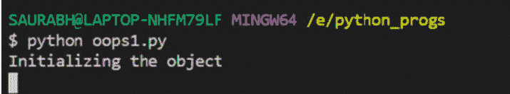

*5 秒后*
Initializing the object
Application end
clean up activities are performed...

在上面的代码中，我们创建了一个 Demo 类的对象。因此，构造函数 `__init__` 将被调用，从而显示输出 Initializing the object。
现在，代码进入休眠模式 5 秒。
在程序执行期间，GC 可能不会销毁对象。但是，对象何时会被销毁是在执行带有 #L1 的行之后，因为没有更多内容需要继续，所以程序将停止。在停止程序之前，作为程序执行一部分创建的所有对象都将被 GC 销毁。之后程序将终止。一旦程序终止，此时所有对象都已被销毁。
5 秒后，带有 #L1 的行将被执行。从而显示输出 Application end。
因此，现在 GC 将调用析构函数，然后销毁程序中存在的对象。因此，将显示输出 clean up activities are performed...。
现在，假设我们将 None 赋给一个对象，如下所示。

## 示例 8.57

```
from time import sleep
class Demo:
    def __init__(self):
        print("Initializing the object")
    def __del__(self):
        print("clean up activities are performed...")
myobj=Demo()
myobj = None #L2
sleep(5)
print("Application end")
```

## 输出 8.57

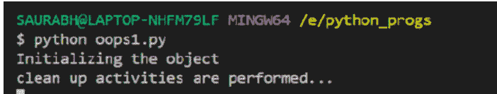

*5 秒后*

Initializing the object
clean up activities are performed...
Application end

在上面的代码中，myobj 指向一个对象。
在 L2 中，myobj 不再指向一个对象，这意味着不允许任何人使用任何对象。因此，它将被 GC 销毁。如果对象不包含任何引用变量，那么它才有资格被 GC 回收，这意味着对象引用计数为 0。
现在，假设我们有多个引用变量指向一个对象。如果所有引用变量都消失了，那么对象才有资格被 GC 回收，否则不会，如下所示。

## 示例 8.58

源代码扫描二维码见[图 8.1](https://example.com/figure8.1)，位于[第 432 页](https://example.com/page432)

## 输出 8.58

Initializing the object
Deleting myobj reference variable
------------------------
object is not yet destroyed after deleting myobj
Deleting myobj1 reference variable
object is still not yet destroyed even after deleting myobj1
Deleting myobj2 reference variable
clean up activities are performed...
Application end

> **注意：**

如何知道对象的引用数量。

为了知道对象的引用数量，sys 模块提供了一个名为 getrefcount() 的内置函数。我们在学习 sys 模块时已经了解过 getrefcount() 函数。但让我们在这里讨论一个重要的点。

## 示例 8.59

```
import sys
class Demo:
    def __init__(self):
        print("Initializing the object")

myobj1 = Demo()
myobj2 = myobj1
myobj3 = myobj2
myobj4 = myobj3
print(sys.getrefcount(myobj1))
# 如果我们传递任何对象引用，
# 对于该对象总共有多少个引用
```

## 8.17 组合与继承

### 8.17.1 组合

这是一个建模“拥有”关系的概念。它有一个组合类（Composite），其中包含另一个组件类（Component）的对象，这意味着组合类“拥有”一个组件类。

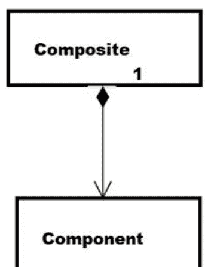

图 8.2：组合类“拥有”组件类

组合的表示方式是通过一条线，线的一端在组合类处有一个菱形，指向组件类。组合类一侧将表达关系的基数，这表示组合类将包含的组合类实例的数量或有效范围。例如，狗类可以由另一个尾巴类型的对象组合而成。组合允许通过说“狗有一条尾巴”来表达这种关系。因此，我们可以说组合是一种面向对象的设计概念，它建模了一种“拥有”关系。一个组合类拥有另一个类的组件。组合使用该类的一个实例。通过创建该类的一个实例来使用它，并将该实例包含在另一个更大的对象中。我们可以将其视为对象和实例变量之间的关系。如果一个对象被销毁，那么它的所有实例变量默认情况下也会消失，因为没有存在的对象，就不可能存在实例变量。

### 示例 8.60

源代码请扫描第 432 页图 8.1 所示的二维码

### 输出 8.60

- 9
- 3
- 18
- 2.0
- 216

在上面的例子中，我们有两个类：Mymath1 和 Mymath2。Mymath1 有两个实例方法，执行 normal_addition 和 normal_subtraction，而 Mymath2 有两个实例方法，执行 normal_multiplication 和 normal_division。现有的类需要被利用，并提供一个新的操作（除了这 4 个操作之外），即 normal_power 方法。然后我们定义了一个新的类 Mymath3，并定义了 `__init__` 方法来初始化实例。在构造函数方法中，我们初始化了两个对象 obj1 (L1) 和 obj2 (L2)，一个是 Mymath1 类的实例，另一个是 Mymath2 类的实例。然后定义了一个新方法 normal_power (L3)。接着定义了一个新方法 normal_addition(L4)，它将调用 obj1 的 normal_addition 方法。在 L5 中，定义了一个新方法 normal_subtraction，它将调用 obj1 的 normal_subtraction 方法。

在 L6 中，定义了一个新方法 normal_multiplication，它将调用 obj2 的 normal_multiplication 方法。

在 L7 中，定义了一个新方法 normal_division，它将调用 obj2 的 normal_division 方法。

在 L8 中，我们创建了一个 Mymath3 对象，它将初始化 Mymath3、Mymath2 和 Mymath1 的实例变量。

在 L9 中，我们调用了 Mymath3 的 normal_addition 方法。因此，输出将是 9。

在 L10 中，我们调用了 Mymath3 的 normal_subtraction 方法。因此，输出将是 3。

在 L11 中，我们调用了 Mymath3 的 normal_multiplication 方法。因此，输出将是 18。

在 L12 中，我们调用了 Mymath3 的 normal_division 方法。因此，输出将是 2.0。

在 L13 中，我们调用了 Mymath3 的 normal_power 方法。因此，输出将是 216。因此，在上面的例子中，我们创建了一个新类，该类定义了现有类的实例。所以，一个新类将定义新的数据和方法，这些基本上是为了实现目标而创建的，并将一些所需的操作委托（将工作分配给已知能胜任的人）给现有类的实例。

因此，组合将包括将一些功能委托给对象，一些参考文献可能会使用“委托”一词而不是“组合”。

### 8.17.2 继承

这是一种从旧类（现有类）派生新类的机制，使得旧类的成员（变量和方法）被新类继承，这被称为继承。旧类被称为超类，新类被称为子类。

**父类** - 可以称为基类或超类。

**子类** - 可以称为派生类或子类。

> **注意：**

在 Python 中，所有类都源自一个名为 'object' 的单一超类。因此，每当我们在 Python 中创建一个类时，它们的超类在内部将是 object。

继承的主要优点是代码重用性、功能扩展。

#### 1. 单继承
如果一个子类派生自父类，则称为单继承。
语法如下

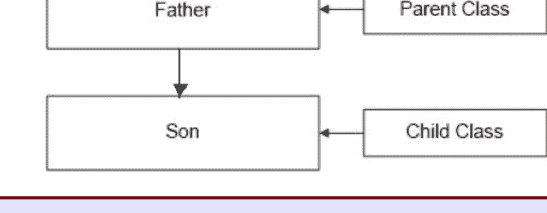

```python
class name_ParentClass(object):
    members of Parent class
class name_ChildClass(name_ParentClass):
    members of Child class
```

让我们看一个例子。

### 示例 8.61

源代码请扫描 [第 432 页](page 432) [图 8.1](Figure 8.1) 所示的二维码

### 输出 8.61

```
I love to help others those who are in need
My father's hobby is to listen Music and News
My father love to eat roti and sabji
My father by profession is a doctor
55
***************************
My father's hobby is to listen Music and News
My father love to eat roti and sabji
My father by profession is a doctor
55
```

从上面的代码，我们可以得出结论：

- 父类的变量和方法可以使用父类对象访问。
- 父类的变量和方法可以使用子类对象访问。
- 子类的变量和方法不能使用父类对象访问。

#### 2. 多级继承
在多级继承中，类将继承另一个派生类的特性。语法如下

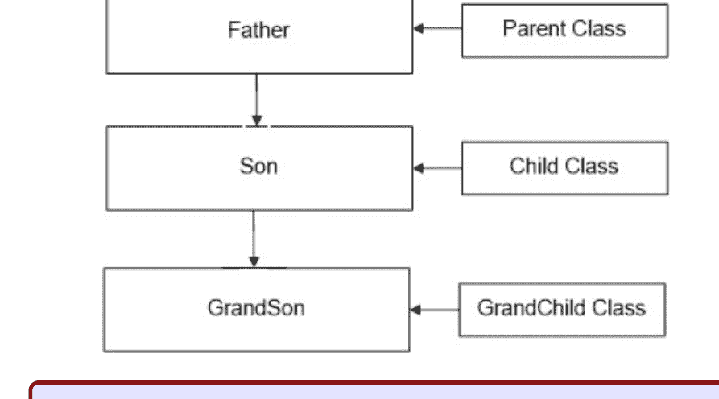

```python
class name_ParentClass(object):
    members of Parent class
class name_ChildClass(name_ParentClass):
    members of Child class
class name_GrandChildClass(name_ChildClass):
    members of GrandChild class
```

让我们看一个例子。

### 示例 8.62

源代码请扫描第 432 页图 8.1 所示的二维码

### 输出 8.62

```
I am a Grand Son class constructor
I am a Grand Son class instance method
I am a Son class instance method
I am a Father class instance method
```

在 L1 中，我们创建了一个 MyGrandSon 类的对象。因此，MyGrandSon 类的构造函数将被调用，输出将是 I am a Grand Son class constructor。
在 L2 中，我们访问 MyGrandSon 类的实例方法。因此，输出将是 I am a Grand Son class instance method。
在 L3 中，我们访问 MySon 类的实例方法。因此，输出将是 I am a Son class instance method。
在 L4 中，我们访问 Myfather 类的实例方法。因此，输出将是 I am a Father class instance method。
但假设我们想使用 MyGrandSon 类访问 MySon 和 Myfather 类的构造函数方法，那么我们必须使用 super() 概念，如下所示。

### 示例 8.63

源代码请扫描 [第 432 页](page 432) [图 8.1](Figure 8.1) 所示的二维码

### 输出 8.63

```
I am a Father class constructor
I am a Son class constructor
I am a Grand Son class constructor
***************************
I am a Grand Son class instance method
I am a Son class instance method
I am a Father class instance method
```

正如我们所看到的，我们使用了 super() 方法来调用 MySon 和 Myfather 类的构造函数。因此，根据代码的编写方式，即控制权将从 MyGrandSon 类构造函数转移到 MySon 类构造函数，再到 Myfather 类。因此，输出将如所示显示。

#### 3. 层次继承
在层次继承中，从单个基类创建多个派生类。语法如下

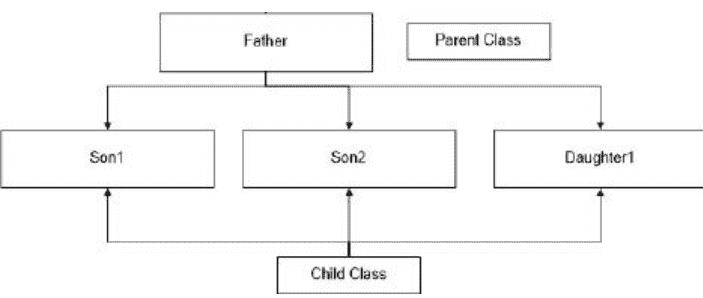

```python
class name_ParentClass(object):
    members of Parent class
class name_ChildClass1(name_ParentClass):
    members of Child class1
class name_ChildClass2(name_ParentClass):
    members of Child class2
```

让我们看一个例子。

### 示例 8.64

源代码请扫描 [第 432 页](page 432) [图 8.1](Figure 8.1) 所示的二维码

### 输出 8.64

```
I am a Father class constructor
I am a Daughter class constructor
```***************************
我是一个子类实例方法
我是一个父类实例方法
***************************
我是一个父类构造函数
我是一个子类构造函数
***************************
我是一个子类实例方法
我是一个父类实例方法

在上面的代码中，`MySon` 和 `MyDaughter` 两个类都继承自 `MyFather` 类。同时，为 `MySon` 和 `MyDaughter` 类各创建了两个对象。因此，它们的构造函数被调用了。此外，我们使用这两个对象调用了 `MySon` 和 `MyDaughter` 类的实例方法。

## 4. 多重继承

在多重继承中，所有基类的特性都会被继承到派生类中。其语法如下：

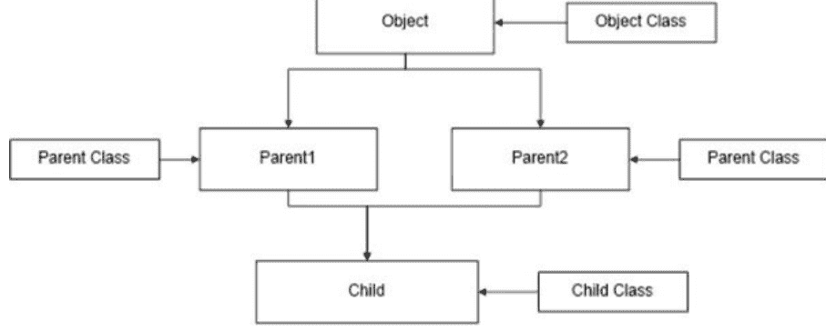

```
class name_ParentClass1(object):
    members of Parent class1
class name_ParentClass2(object):
    members of Parent class2
class name_ChildClass(name_ParentClass1,name_ParentClass2):
    members of Child class
```

让我们来看一个例子。

### 示例 8.65

源代码请扫描 [第 432 页](page 432) [图 8.1](Figure 8.1) 中的二维码

### 输出 8.65

我是一个子类构造函数

在上面的例子中，我们有两个父类 `MyFather` 和 `MyMother`，以及一个子类 `MyDaughter`。我们创建了一个 `MyDaughter` 类的对象，这导致了其构造函数被调用。因此，输出将是“我是一个子类构造函数”。现在，假设我们想显示父类的构造函数。那么，我们将使用 `super()` 方法，如下所示。

### 示例 8.66

源代码请扫描 [第 432 页](page 432) [图 8.1](Figure 8.1) 中的二维码

### 输出 8.66

我是一个父类构造函数
我是一个子类构造函数

现在，我们在 `MyDaughter` 类的构造函数中使用了 `super()` 方法。但是上面的类有两个父类 `MyFather` 和 `MyMother`，并且它们都有构造函数方法。我们可以看到只有 `MyFather` 的构造函数被调用了。但我们也需要调用 `MyMother` 的构造函数。那么，我们现在要做的就是在两个父类的构造函数中再次编写 `super()` 方法，如下所示。

### 示例 8.67

> 源代码请扫描第 432 页图 8.1 中的二维码

### 输出 8.67

> 我是一个母类构造函数
我是一个父类构造函数
我是一个子类构造函数

现在，我们可以看到所有 3 个构造函数都被调用了。但是，你是否对它的执行方式感到困惑？为此，我们需要了解方法解析顺序（MRO）。在多重继承场景中，类的成员首先在当前类中搜索。如果未找到，则搜索将继续深入到父类中，按照从左到右的顺序进行，并且不会重复搜索同一个类。上面这句话分为 3 个部分：

- (a) 在进入父类之前，先搜索子类。
- (b) 当一个类从多个类继承时，搜索按照从左到右的顺序在父类中进行。
- (c) 任何类都不会被访问超过一次，这意味着继承层次结构中的每个类都只被精确地遍历一次。

那么，让我们来理解我们是如何得到这个输出的。

1. `myobj = MyDaughter()` 搜索将从 `MyDaughter` 开始。由于创建了 `MyDaughter` 的对象，其构造函数将被调用。
2. `MyDaughter` 的构造函数中有 `super().__init__()`，因此其父类，即左侧的 `MyFather` 类的构造函数被调用。
3. `MyFather` 类的构造函数中也有 `super().__init__()`。因此，其父对象类的构造函数被调用。
4. 但是 `object` 类没有任何构造函数，所以搜索将继续到 `object` 类的右侧类。因此，`MyMother` 类的构造函数被调用。
5. 由于 `MyMother` 类也有 `super().__init__()`。因此，其父对象类的构造函数被调用。但 `object` 类已经被访问过了，所以搜索将在此停止。

因此，首先调用的是 `MyMother` 类的构造函数，然后是 `MyFather` 类的构造函数，最后是 `MyDaughter` 类的构造函数。

如果我们尝试查找 `MyDaughter` 类的方法解析顺序，我们将得到如下所示的输出。

### 示例 8.68

源代码请扫描第 432 页图 8.1 中的二维码

### 输出 8.68

```
我是一个母类构造函数
我是一个父类构造函数
我是一个子类构造函数
[<class '__main__.MyDaughter'>, <class '__main__.MyFather'>, <class '__main__.MyMother'>, <class 'object'>]
```

如果我们交换 `MyFather` 和 `MyMother` 类的顺序，那么输出将会改变。

### 示例 8.69

源代码请扫描 [第 432 页](page 432) [图 8.1](Figure 8.1) 中的二维码

```
输出 8.69
我是一个父类构造函数
我是一个母类构造函数
我是一个子类构造函数
[<class '__main__.MyDaughter'>, <class '__main__.MyMother'>, <class '__main__.MyFather'>, <class 'object'>]
```

但是有一个叫做 **C3 MRO** 的东西。请将这个概念视为非常重要。设 **B1 B2 ... BN** 是一个类列表 [**B1, B2, ... , BN**]。这里，第一个元素是列表的头部。所以，head = **B1**。列表的其余部分是尾部，所以 tail = **B2 ... BN**。设符号 **B+ (B1 B2 ... BN) = B B1 B2 ... BN** 表示列表 [**B**] + [**B1,B2-BN**] 的和。这里，让我们考虑多重继承层次结构中的一个类 B，其中 B 继承自基类 **BC1, BC2, ... , BCN**。需要计算类 B 的线性化 L[B]。以下规则是 **B 的线性化是 B 加上其父类的线性化与父类列表的合并结果。**

L[B(BC1 ... BCN)] = B + merge(L[BC1]... L[BCN], BC1 ... BCN)

如果 B 是没有父类的 `object` 类，那么线性化就不太重要了。

L[object] = object

合并的计算遵循以下规定：如果第一个列表的头部元素不在任何其他列表的尾部部分中，则将该元素纳入结果，并从所有列表中移除该元素。

以上都是理论部分，让我们来处理我们已经看到的多重继承的例子。我们将用字母 O 表示 Object，F 表示 MyFather，M 表示 MyMother，D 表示 MyDaughter。

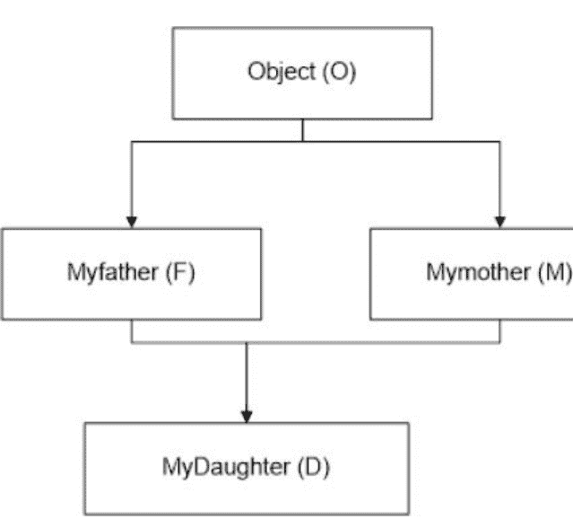

因此，从上图可以看出层次结构是

```
O = object
class F(O): pass
class M(O): pass
class D(F,M): pass
```

步骤 1：首先我们将考虑每个类的 MRO。
mro(F) = F,O
mro(M) = M,O
mro(D) = D,F,M,O

D 的直接父类是 F 和 M。所以，
mro(D) = D + Merge(mro(F), mro(M), FM)
mro(D) = D + Merge(FO, MO, FM) #F 是头部，它不在任何其他列表的尾部中。所以，我们将这个元素纳入结果，并从所有列表中移除该元素。

mro(D) = D + F + Merge(O, MO, M) #M 是头部，它不在任何其他列表的尾部中。所以，我们将这个元素纳入结果，并从所有列表中移除该元素。

mro(D) = D + F + M + Merge(O, O) #现在，O 是头部，它不在任何其他列表的尾部中。

mro(D) = D + F + M + O

这就是 D 的算法。

现在，与 `MyDaughter.mro()` 的输出 [<class '__main__.MyDaughter'>, <class '__main__.MyFather'>, <class '__main__.MyMother'>, <class 'object'>] 进行比较。

所以，我认为这将澄清 MRO 的概念。

## 5. 继承中的构造函数

当一个子类从父类继承特性时，父类中的构造函数默认对子类可用。

### 示例 8.70

### 输出 8.70

我是一个母类构造函数
10
我是一个子类实例方法
我是一个母类实例方法

在上面的代码中，我们可以看到为 `MyDaughter` 类创建了一个对象，并且该类中没有构造函数方法。由于它继承了基类的所有特性，因此调用了父类的构造函数。我们也可以访问实例变量。我们还可以借助 `MyDaughter` 类的对象调用父类和子类的实例方法。

## 8.18 super() 概念

到目前为止，我们已经多次使用了 `super()` 方法，但让我们看看它的含义。每当在父类和子类中都编写了构造函数时，父类的构造函数将对子类不可用。在这种情况下，只有子类的构造函数是可访问的，这意味着子类的构造函数将覆盖父类的构造函数。因此，为了从子类调用父类的构造函数或方法，将使用 `super()` 方法。`super()` 和被调用方法的参数应该匹配。它可以在单重继承和多重继承中使用。代码重用是我们可以获得的最大优势，因为不需要重写整个方法。它是动态调用的。让我们看一个可以调用父类构造函数或方法的例子。

### 示例 8.71

## 8.19 多态
这个词源于两个希腊词，poly 意为“多”，morphs 意为“形式”。如果一个方法、对象或变量会根据情况表现出不同的行为，那么它就被称为多态，例如：人类本身。同一个人在不同场合会有不同的行为。我们与父母相处时的行为，与朋友相处时的心情等都会有所不同。

## 8.19.1 鸭子类型
Python 是一种动态类型语言。根据运行时提供的值，类型会被自动确定。我们无法显式指定类型，因此 Python 是一种动态类型语言。Python 中有一个原则：“如果它走起来像鸭子，叫起来也像鸭子，那么它一定是鸭子。”这意味着 Python 并不真正关心对象属于哪个类。如果它是一个对象，并且该对象具备所需的行为，那么它就能完美运行。对象类型将在运行时被区分，这被称为鸭子类型。它被称为 Python 的鸭子类型哲学。因此，Python 会更重视行为而非原始类型。这将提高代码的可读性，使代码易于理解。首先，让我们看一个非 Python 风格的代码，类似于 C# 或 Java 语言。

要查看源代码，请扫描 [第 432 页](page 432) [图 8.1](Figure 8.1) 中显示的二维码

Quack....Quack..
<class '__main__.Owl'>
The object must be duck to perform the talk

在上面的代码中，我们在执行 Duck 类的 mytalk() 方法之前，检查对象是否为 Duck 类型。这是一种非 Python 风格的代码编写方式。

现在，我们将编写 Python 风格的代码。

要查看源代码，请扫描 [第 432 页](page 432) [图 8.1](Figure 8.1) 中显示的二维码

```

Bark…Bark..
Caw…Caw..
Quack…Quack..
Hoot…Hoot..
*************************
Bark…Bark..
Caw…Caw..
Quack…Quack..
Hoot…Hoot..

```

在上面的代码中，我们没有检查对象是否为 Duck 类型。如果对象具有 talk 方法，那么它就会被调用。我们重视的是行为，而不是对象的类型。但上述方法存在一个问题。如果对象没有 talk 方法，那么我们将得到 AttributeError，如下所示。

### 示例 8.85
要查看源代码，请扫描第 432 页图 8.1 中显示的二维码

### 输出 8.85
```

Bark…Bark..
Caw…Caw..
Quack…Quack..
AttributeError: 'Owl' object has no attribute 'mytalk'

```

从上面的代码可以看出，Owl 类有一个 myhoot() 方法，而不是 mytalk()。因此，我们得到了 AttributeError: 'Owl' object has no attribute 'mytalk'。

在这种情况下，我们需要使用“请求原谅比请求许可更容易”的概念。

我们可以使用 hasattr() 函数来解决上述问题。它将检查对象是否具有某个方法。如果在对象中找到，则返回 True，否则返回 False。hasattr() 的语法如下：

```
hasattr(obj,'attributename')
```

属性可以是方法或变量名。

### 示例 8.86
要查看源代码，请扫描第 432 页图 8.1 中显示的二维码

### 输出 8.86
```
Bark…Bark..
Caw….Caw..
Quack….Quack..
Hoot….Hoot..
***********************
Bark…Bark..
Caw….Caw..
Quack….Quack..
Hoot….Hoot..
```

### 8.19.2 Python 中的重载概念
同一个运算符或方法可以用于不同的目的。

例如：
‘+’ 运算符可用于算术加法和字符串连接操作，如下所示。

```
**示例 8.87**
python
num1 = 2
num2 = 3
print(num1+num2)
str1 = 'Hello'
str2 = 'Beginners'
print(str1+str2)

```

```
**输出 8.87**

5
HelloBeginners

```

同样，'*' 运算符可用于字符串重复和乘法目的。

```
**示例 8.88**
python
num1 = 2
num2 = 3
print(num1*num2)
str1 = 'Hello'
print(str1*2)

```

### 8.19.2 Python 中的重载概念
同一个运算符或方法可以用于不同的目的。

例如：

'+' 运算符可用于算术加法和字符串连接操作，如下所示。

```
**示例 8.87**
python
num1 = 2
num2 = 3
print(num1+num2)
str1 = 'Hello'
str2 = 'Beginners'
print(str1+str2)

```

```
**输出 8.87**

5
HelloBeginners

```

同样，'*' 运算符可用于字符串重复和乘法目的。

```
**示例 8.88**
python
num1 = 2
num2 = 3
print(num1*num2)
str1 = 'Hello'
print(str1*2)

```

要查看源代码，请扫描 [第 432 页](page 432) [图 8.1](Figure 8.1) 中显示的二维码

```
输出 8.71

The name is: Ram
The age is: 16
The city is: Hyderabad
The hobby is: Studying
***************************
The name is: Surendra
The age is: 54
The staff number is: 60001
The contact number is: 9406121337
```

在上面的代码中，我们从子类构造函数调用父类构造函数，并从子类方法调用父类方法。

### (a) 调用特定超类的方法
现在，考虑下面的多级继承代码。

### 示例 8.72
要查看源代码，请扫描 [第 432 页](page 432) [图 8.1](Figure 8.1) 中显示的二维码

### 输出 8.72
It is an instance method of E1 class

现在，我们可以使用 super() 从 E1 类的方法调用 D1 类的方法，如下所示。

### 示例 8.73
要查看源代码，请扫描 [第 432 页](page 432) [图 8.1](Figure 8.1) 中显示的二维码

### 输出 8.73
It is an instance method of D1 class

假设我们在 D1 类中编写 pass，如下所示。

### 示例 8.74
要查看源代码，请扫描 [第 432 页](page 432) [图 8.1](Figure 8.1) 中显示的二维码

### 输出 8.74
It is an instance method of C1 class

现在，将调用 C1 类的 Mymethod1。但假设出现任何需要调用特定超类方法的需求，那么我们的方法应该是什么。可以通过两种方式完成：

使用语法：
```
`name_parentclass.name_method(self)`
```

请观察下面给出的代码

### 示例 8.75
要查看源代码，请扫描第 432 页图 8.1 中显示的二维码

### 输出 8.75
It is an instance method of C1 class

在上面的示例中，将调用 C1 类的实例方法 mymethod1。上述规则也适用于构造函数，如下所示。

### 示例 8.76
要查看源代码，请扫描第 432 页图 8.1 中显示的二维码

### 输出 8.76
I am B1 class constructor
I am A1 class constructor

在 L1 中，我们创建了一个 E1 的对象，这导致调用 B1 类的构造函数。因此，输出将是 I am B1 class constructor。在 L2 中，将调用 E1 类的 mymethod1() 方法，该方法将调用 A1 类的构造函数。因此，输出将是 I am A1 class constructor。

使用语法：
```
super(name_class, self).name_method()
```

请观察下面给出的代码

### 示例 8.77
要查看源代码，请扫描第 432 页图 8.1 中显示的二维码

### 输出 8.77
It is an instance method of C1 class

在上面的示例中，D1 的超类是 C1 类。因此，将调用 C1 类的 mymethod1()。

### (b) super 方法的一些重要结论
从子类中，我们可以使用 super() 方法调用父类的静态变量，如下所示。

### 示例 8.78
```
class M1:
    num1 = 20 # static variable
    def __init__(self):
        self.num2 = 40

class M2(M1):
    def mymethod1(self):
        print(super().num1) # L1

myobj = M2()
myobj.mymethod1()
```

### 输出 8.78
20

我们可以看到，我们能够从子类中使用 super() 方法调用父类的静态变量。从子类中，我们无法使用 super() 方法调用父类的实例变量，如下所示。

### 示例 8.79
```
class M1:
    num1 = 20 # static variable
    def __init__(self):
        self.num2 = 40

class M2(M1):
    def mymethod1(self):
        print(super().num2)

myobj = M2()
myobj.mymethod1()
```

### 输出 8.79
AttributeError: 'super' object has no attribute 'num2'

但我们应该只使用 self。

### 示例 8.80
```
class M1:
    num1 = 20 # static variable
    def __init__(self):
        self.num2 = 40

class M2(M1):
    def mymethod1(self):
        print(self.num2)

myobj = M2()
myobj.mymethod1()
```

### 输出 8.80
40

从子类构造函数中，我们可以使用 super() 方法调用父类的实例方法、静态方法和类方法，如下所示。

### 示例 8.81
要查看源代码，请扫描 [第 432 页](https://example.com) [图 8.1](https://example.com) 中显示的二维码

### 输出 8.81
Instance method
Class method
Static method

从子类方法中，我们可以使用 super() 方法调用父类的实例方法、静态方法和类方法，如下所示。

### 示例 8.82
要查看源代码，请扫描第 432 页图 8.1 中显示的二维码

### 输出 8.82
- Instance method
- Class method
- Static method

## 输出 8.88

你好你好

假设我们有一种支付方式，支付可以通过现金、在线支付或支票完成。

```
payment(cash)
payment(online_payment)
payment(cheque)
```

在 Python 中有 3 种重载类型：

- 1. **运算符重载**
如果任何运算符执行了超出其本意的操作，则称为运算符重载。让我们通过 `MyCylinder` 类对象的 `+` 运算符看一个例子。

## 示例 8.89

```
class Mycylinder:
    def __init__(self, myweight):
        self.myweight = myweight

myobj1 = Mycylinder(9)
myobj2 = Mycylinder(14)
print(myobj1 + myobj2)
```

## 输出 8.89

```
TypeError: unsupported operand type(s) for +: 'Mycylinder' and 'Mycylinder'
```

在上面的例子中，我们在 `Mycylinder` 对象之间应用 `+` 运算符。我们可以扩展 `Mycylinder` 对象的 `+` 运算符，我们可以重载 `+` 运算符使其也能与 `Mycylinder` 对象一起工作，即 Python 支持运算符重载。每个运算符都有对应的魔术方法可用。为了重载任何运算符，我们必须在我们的类中重写该方法。`+` 运算符在内部是通过使用 `__add__` 方法来操作的。它在 Python 中被称为魔术方法或双下划线（Dunder）方法，其方法名具有 2 个前缀下划线和 2 个后缀下划线。因此，上述方法必须在我们的类中被重写。修改后的代码如下。

## 示例 8.90

```
class Mycylinder:
    def __init__(self, myweight):
        self.myweight = myweight
    
    def __add__(self, other):
        return self.myweight + other.myweight

myobj1 = Mycylinder(9)
myobj2 = Mycylinder(14)
print(myobj1 + myobj2)
```

## 输出 8.90

```
23
```

在上面的代码中，当我们使用 `+` 运算符时，魔术方法 `__add__` 会被自动调用，其中定义了 `+` 运算符的操作。因此，为 `+` 运算符提供了额外的含义。运算符及其对应的魔术方法列表如下：

二元运算符（见表 8.1）

| 序号 | 运算符 | 魔术方法 |
|------|----------|--------------|
| 1 | + | object.__add__(self, other) |
| 2 | - | object.__sub__(self, other) |
| 3 | * | object.__mul__(self, other) |
| 4 | / | object.__truediv__(self, other) |
| 5 | // | object.__floordiv__(self, other) |
| 6 | % | object.__mod__(self, other) |

表 8.1：二元运算符

赋值运算符（见表 8.2）

| 序号 | 运算符 | 魔术方法 |
|------|----------|--------------|
| 1 | -= | object.__isub__(self, other) |
| 2 | += | object.__iadd__(self, other) |
| 3 | *= | object.__imul__(self, other) |
| 4 | /= | object.__idiv__(self, other) |
| 5 | //= | object.__ifloordiv__(self, other) |
| 6 | %= | object.__imod__(self, other) |
| 7 | **= | object.__ipow__(self, other) |

表 8.2：赋值运算符

比较运算符（见表 8.3）

| 序号 | 运算符 | 魔术方法 |
|------|----------|--------------|
| 1 | < | object.__lt__(self, other) |
| 2 | > | object.__gt__(self, other) |
| 3 | <= | object.__le__(self, other) |
| 4 | >= | object.__ge__(self, other) |
| 5 | == | object.__eq__(self, other) |
| 6 | != | object.__ne__(self, other) |

表 8.3：比较运算符

一元运算符（见表 8.4）

| 序号 | 运算符 | 魔术方法 |
|------|----------|--------------|
| 1 | - | object.__neg__(self, other) |
| 2 | + | object.__pos__(self, other) |
| 3 | ~ | object.__invert__(self, other) |

表 8.4：一元运算符

## 2. 方法重载

当多个方法具有相同的名称但不同类型的参数时。这样的方法称为方法重载。在 Python 中通常不需要方法重载，因为没有显式的类型。当我们尝试用相同的名称和不同类型的参数声明多个方法时，Python 总是会考虑最后一个方法。

## 示例 8.91

```
class Demo:
    def mymethod1(self, num1):
        print("Second method with one argument")
    def mymethod1(self, num1, num2):
        print("Third method with two arguments")

myobj = Demo()
myobj.mymethod1(2, 3) # L1
myobj.mymethod1(2) # L2
```

## 输出 8.91

```
Third method with two arguments
TypeError: mymethod1() missing 1 required positional argument: 'num2'
```

在上面的代码中，声明了两个具有相同名称但不同参数的方法。因此，Python 只会考虑最后一个方法。
在 L1 处，输出将是 Third method with two arguments。
在 L2 处，由于只会考虑最后一个具有 2 个参数的方法，因此 Python 会引发错误。因此，输出将是 TypeError: mymethod1() missing 1 required positional argument: 'num2'。
但是我们可以处理 Python 中的重载方法需求。
如果需要具有可变数量参数的方法，我们可以通过默认参数或可变参数长度的方法来处理。

- 使用默认参数的程序

```
class Demo:
    def mymul(self, mynum1=None, mynum2=None, mynum3=None):
        if mynum1 != None and mynum2 != None and mynum3 != None:
            print(f'The Product of {mynum1}, {mynum2} and {mynum3} are:', mynum1 * mynum2 * mynum3)
        elif mynum1 != None and mynum2 != None:
            print(f'The Product of {mynum1} and {mynum2}:', mynum1 * mynum2)
        else:
            print(f'Please provide either 2 or 3 arguments')

myobj = Demo()
myobj.mymul(10, 20, 30)
myobj.mymul(10, 20)
myobj.mymul(10)
```

```
The Product of 10, 20 and 30 are: 6000
The Product of 10 and 20: 200
Please provide either 2 or 3 arguments
```

在上面的代码中，我们向 `mymul()` 方法提供了 3 个变量，每个变量的默认值都为 None。如果传递 2 或 3 个参数，则会显示输出，否则 Python 会显示一条消息，要求提供 2 或 3 个参数。

但在这里我们只处理 3 个变量。假设我们希望在将来处理超过 3 个变量，那么这种方法将不可行。在这种情况下，我们应该使用可变长度参数。

- 使用可变数量参数方法的程序

## 示例 8.93

```
class Demo:
    def mymul(self, *vars):
        mytotal = 1
        for loop in vars:
            mytotal *= loop
        print('The Product of arguments is :', mytotal)

myobj = Demo()
myobj.mymul(10, 20, 30)
myobj.mymul(10, 20)
myobj.mymul(10)
myobj.mymul()
myobj.mymul(10, 20, 30, 40)
```

## 输出 8.93

```
The Product of arguments is : 6000
The Product of arguments is : 200
The Product of arguments is : 10
The Product of arguments is : 1
The Product of arguments is : 240000
```

## 3. 构造函数重载

在 Python 中，没有构造函数重载。如果我们定义多个构造函数，那么最后一个构造函数将被考虑。

```
class Demo:
    def __init__(self):
        print('No arguments')

    def __init__(self, num1):
        print('Single argument')

    def __init__(self, num1, num2):
        print('Two arguments')

mobj = Demo(1, 2)
mobj = Demo(1)
```

```
Two arguments
TypeError: __init__() missing 1 required positional argument: 'num2'
```

因此，我们可以看到，如果有多个构造函数，那么最后一个构造函数将被考虑。如果我们传递 1 个或 0 个参数，那么我们将得到如图所示的 TypeError。
但根据我们的需求，我们可以拥有默认构造函数和可变长度参数的构造函数。

(a) 带默认参数的构造函数

## 示例 8.95

```
class Demo:
    def __init__(self, num1=None, num2=None, num3=None):
        print('It is a constructor where we can pass 0, 1, 2 or 3 arguments based on the need')

mobj = Demo() # No arguments
mobj = Demo(1) # 1 argument
mobj = Demo(1, 2) # 2 arguments
mobj = Demo(1, 2, 3) # 3 arguments
```

## 输出 8.95

```
It is a constructor where we can pass 0, 1, 2 or 3 arguments based on the need
It is a constructor where we can pass 0, 1, 2 or 3 arguments based on the need
It is a constructor where we can pass 0, 1, 2 or 3 arguments based on the need
It is a constructor where we can pass 0, 1, 2 or 3 arguments based on the need
```

在上面的代码中，构造函数可以包含 0、1、2 或 3 个参数，因为我们已经使用默认值进行了声明。如果我们不传递任何值，那么 Python 本身将考虑这些默认值。但假设我们想要任意数量的参数，那么我们应该使用具有可变数量参数的构造函数。

(b) 带可变数量参数的构造函数

## 示例 8.96

```
class Demo:
    def __init__(self, *args):
        print('It is a constructor where we can pass any number of arguments based on the need')
```

## 输出 8.96

这是一个构造函数，我们可以在其中根据需求传递任意数量的参数。

因此，我们可以看到在 Python 中通常不需要构造函数重载。

## 8.19.3 Python 中的重写概念

父类中的成员通过继承默认地在子类中可用。当子类对父类的实现不满意时，可以根据需求重新定义父类的那个方法。当子类方法访问父类方法时，子类就在重写父类的方法。这个概念被称为方法重写。我们可以为方法和构造函数都进行重写。

## 示例 8.97

源代码请扫描第 432 页图 8.1 所示的二维码

## 输出 8.97

数字 3 和 4 的加法结果是 7
数字 3 和 4 的减法结果是 -1

在上面的代码中，有 `Parent` 和 `Child` 两个类，其中 `Child` 类将从基类继承特性，并为其添加新特性，从而提高代码的可重用性。`Child` 类继承自 `Parent` 类，因此 `Parent` 类中的所有方法和属性在 `Child` 类中都可直接使用。我们可以看到 `Parent` 和 `Child` 类都包含 `result()` 方法。但 `Child` 类中的方法将覆盖 `Parent` 类中的该方法。在 `Parent` 类中它执行减法操作，而在 `Child` 类中它执行加法操作。我们为 `Child` 和 `Parent` 类各创建了两个对象。因此，显示了如上的输出结果。但在上面的例子中，我们为 `Parent` 类创建了一个对象。由于创建了对象，我们没有正确使用继承的概念。因此，我们将使用 `super()` 方法，该方法用于从子类调用父类的构造函数或方法。

## 示例 8.98

源代码请扫描第 432 页图 8.1 所示的二维码

## 输出 8.98

数字 10 和 9 的减法结果是 1
数字 3 和 4 的加法结果是 7

## 8.19.4 构造函数重写

每当父类和子类中都编写了构造函数时，父类的构造函数对于子类就不可用了。在这种情况下，只有子类的构造函数可以被访问，并且会覆盖父类的构造函数。因此，当程序员想要修改现有构造函数的行为时，将使用构造函数重写。

```python
class M1:
    def __init__(self):
        print("I am a Parent class constructor")

class M2(M1):
    def __init__(self):
        print("I am a Child class constructor")

myobj = M2()
```

I am a Child class constructor

在上面的例子中，子类构造函数将覆盖父类构造函数。

现在，当子类不包含构造函数时，父类构造函数将被执行。

```python
class M1:
    def __init__(self):
        print("I am a Parent class constructor")

class M2(M1):
    pass

myobj = M2()
```

```
I am a Parent class constructor
```

## 8.20 访问修饰符与封装

有三种访问修饰符：`public`、`private` 和 `protected`。Python 类中的所有成员默认都是 `public` 的。任何成员都可以在类外部被访问。

```python
class Myemployee:
    def __init__(self,myname,myage):
        self.myname = myname
        self.myage = myage
```

```python
myemp = Myemployee('Raj',34)
print(myemp.myname)
print(myemp.myage)
myemp.myname = 'Rohan'
print(myemp.myname)
```

## 输出 8.101

Raj
34
Rohan

在上面的例子中，我们可以看到 `Myemployee` 类的属性可以被访问，并且它们的值正在被修改。这些公共数据成员可以从程序中的任何地方访问。
如果我们想在 Python 中使一个实例变量成为受保护的，那么我们需要在它前面添加一个 `_`（单下划线）前缀。它可以从派生自它的类中访问。

## 示例 8.102

源代码请扫描第 432 页图 8.1 所示的二维码

## 输出 8.102

The name is: ABC
The Roll No. is : 620178
The Branch is: ECE

在上面的代码中，`_myname`、`_myrollno` 和 `_mybranch` 是受保护的数据成员，`_mydisplay()` 方法是父类 `MyEngineer` 的一个受保护方法。`mydisplayDetails()` 方法是派生自 `MyEngineer` 类的 `Display` 类的一个实例方法，`Display` 类中的 `mydisplayDetails()` 方法将访问 `MyEngineer` 类的受保护数据成员。
现在，在一个变量前加双下划线 `__` 将使其成为私有的。它不能在类外部被访问。如果尝试访问将导致 `AttributeError`。

```python
class Myemployee:
    def __init__(self,myname,myage):
        self.__myname = myname
        self.__myage = myage
myemp = Myemployee('Raj',34)
print(myemp.__myage)
```

```
AttributeError: 'Myemployee' object has no attribute '__myage'
```

在上面的代码中，我们试图从类外部访问 `__` 变量。因此，Python 将引发 `AttributeError`。
但是 Python 可以对私有变量进行名称修饰。私有变量仍然可以通过将其更改为 `_object._class__variable` 的形式从类外部访问。

## 示例 8.104

```python
class Myemployee:
    def __init__(self,myname,myage):
        self.__myname = myname
        self.__myage = myage
myemp = Myemployee('Raj',34)
print(myemp.__myage)
```

**输出 8.104**
34

但应避免上述做法。
我们限制对方法和变量的访问，从而防止数据被直接修改。因此，数据绑定的过程被称为封装。它是面向对象编程（OOP）中的基本概念之一。

**示例 8.105**
源代码请扫描第 432 页图 8.1 所示的二维码

**输出 8.105**
The Selling Price is : 55000
The Selling Price is : 55000
The Selling Price is : 54000

在上面的例子中，定义了一个 `TV` 类。`__init__` 方法用于存储索尼电视的价格。我们试图更改价格，但无法更改，因为 Python 会将 `__mysonyctvprice` 视为私有属性。我们也试图通过使用以 `myprice` 为参数的 `myMaxPrice()` 方法来更改值。

## 8.21 抽象类

在 Python 中，一个类如果派生自 `abc` 模块中的 `ABC` 类，就被称为抽象类。`ABC` 类也被称为元类。它是定义其他类行为的类。因此，可以说从 `ABC` 类定义出的类，就成为了一个元类。这个类可以拥有抽象方法和具体方法。这个类需要被扩展，其方法需要被实现。抽象类的对象无法由 PVM（Python 虚拟机）创建。抽象类的创建语法如下所示：

```python
from abc import ABC, abstractmethod
class name_class(ABC): # abstract class
```

其中 `abstractmethod` 是一个装饰器。一个根据对象需求在子类中重新定义其动作的方法被称为抽象方法。一个方法可以通过使用 `@abstractmethod` 装饰器被声明为抽象方法。抽象方法的创建语法如下所示：

```python
from abc import ABC, abstractmethod
class name_class(ABC): # abstract class
    @abstractmethod
    def name_method(self): #abstract method without body
        pass
```

一个在抽象类本身中定义了动作的方法被称为具体方法。它就像我们通常在类内部编写的普通方法。具体方法的创建语法如下所示：

```python
from abc import ABC, abstractmethod
class name_class(ABC): # abstract class
    @abstractmethod
    def name_method(self): #abstract method without body
        pass
    def name_anymethodname(self):# concrete method with body
        print("I am a Concrete method")
```

每当我们需要使用抽象类和方法时，需要注意以下规则：

- 1. 抽象类的对象无法由 PVM 创建。
- 2. 在抽象类中，不必将所有方法都声明为抽象方法。
- 3. 如果一个类中有任何抽象方法，那么该类必须是抽象的。
- 4. 抽象类的抽象方法必须在其子类/派生类中定义。
- 5. 如果继承了任何包含抽象方法的抽象类，那么必须提供该方法的实现，或者使该类成为抽象类。
- 6. 一个抽象类可以同时拥有抽象方法和具体方法。

当某些特性被所有对象以其当前方式共享时，可以使用抽象类。让我们看看当我们尝试创建一个抽象类对象时会发生什么。

## 示例 8.106

```python
from abc import ABC, abstractmethod
class Parent(ABC):
```## 8.22 接口

与其他编程语言如Java、C#.Net不同，Python中没有明确的接口概念。Python中的接口是一种只包含抽象方法而不包含任何具体方法的抽象类。创建接口的语法如下：

```python
from abc import ABC, abstractmethod
class name_class(ABC): # abstract class
    @abstractmethod
    def name_method(self): #abstract method without body
        pass
```

但存在一些规则。

- 1. 接口的所有方法都是抽象的。
- 2. 不能创建接口对象。
- 3. 如果某个类实现了接口，则必须定义该接口中提供的所有方法。
- 4. 如果某个类没有实现该接口中声明的所有方法，则该类必须声明为抽象类。

当需要为不同对象以不同方式实现所有功能时，会使用接口。

让我们看看尝试创建接口类对象时会发生什么。

```python
# Example 8.108
from abc import ABC, abstractmethod
class Myengineer(ABC):
    @abstractmethod
    def mybranch(self):
        pass

myobj = Myengineer()
```

### 输出 8.108

```
TypeError: Can’t instantiate abstract class Myengineer with abstract methods mybranch
```

当我们在子类中没有定义接口方法时，Python会产生错误。

```python
# Example 8.109
from abc import ABC, abstractmethod
class Myengineer(ABC):
    @abstractmethod
    def mybranch(self):
        pass

class MyEEE(Myengineer):
    pass

myobj = MyEEE()
```

### 输出 8.109

```
TypeError: Can’t instantiate abstract class MyEEE with abstract methods mybranch
```

因此，我们必须在子类MyEEE中定义Myengineer类的抽象方法。

```python
# Example 8.110
from abc import ABC, abstractmethod
class Myengineer(ABC):
    @abstractmethod
    def mybranch(self):
        pass

class MyEEE(Myengineer):
    def mybranch(self):
        print("I am an electrical and electronics Engineer")

myobj = MyEEE()
myobj.mybranch()
```

### 输出 8.110

```
I am an electrical and electronics Engineer
```

在上面的代码中，我们已经在子类中定义了Myengineer类的抽象方法。

## 第9章

## Python 文件处理与日期和时间函数

### 9.1 简介

作为编程需求的一部分，保存数据是必不可少的。因此，保存数据是我们编程中最常见的需求之一。数据需要永久存储以备将来使用。为了满足上述需求，我们引入了文件的概念。只要程序正在执行，就需要数据。一旦程序执行完成，数据或多或少就不再需要了。对于这些临时需求，我们应该使用临时存储区域。假设我们想将数据存储在列表、元组或字典对象中。上述数据默认被视为临时数据。一旦程序执行完成，数据就会消失。看下面的例子。

```python
myl1 = []
num = int(input("Enter the number: "))
for loop in range(num):
    mydata = input("Enter the data: ")
    myl1.append(mydata)
print(myl1)
```

```
Enter the number: 4
Enter the data: 10
Enter the data: True
Enter the data: Hello
Enter the data: False
['10', 'True', 'Hello', 'False']
```

在上面的例子中，列表用于存储数据。它是临时存储，因为一旦程序执行完成，数据将不可用。只要程序在执行，我们想持有数据，就可以选择列表、元组、集合或字典。这些数据将作为堆区域的一部分存储在PVM（Python虚拟机）内部。因此，当我们想在程序运行期间临时存储数据时，这些数据结构就会发挥作用。我们不能将这些数据用于未来目的。此类情况称为临时存储区域。

但我们希望数据能被永久存储以备将来使用。那么我们就需要使用永久存储区域。

在当今繁忙的竞争世界中，用户能获取到的最重要信息就是数据。我们可以将数据存储在文件或数据库中，使其永久保存。如果我们想存储少量信息，可以选择文件的概念。如果想存储大量信息，则可以使用数据库概念。在本章中，我们将仅学习文件。

### 9.2 文件

文件是可供程序使用的数据集合。可以根据需要从文件中检索数据，也可以将数据存储到文件中。文件中的数据会永久存储在非易失性存储器（硬盘）中，除非有人将其删除。文件中存储的数据可以通过任何共享方式与第三方共享。可以根据需要更新或删除数据。因此，文件为用户提供了基本优势，使其成为一种有效的信息存储模式。文件有两种类型：

- 1. **文本文件：** 此类文件将以字符形式存储数据。用于存储字符和字符串。文本数据存储在此类文件中。
- 2. **二进制文件：** 此类文件将以字节（每组8位）形式存储数据。用于存储图像、视频、音频文件、文本、CSV等。

### 9.3 打开文件

在对文件执行任何读写操作之前，首先必须打开文件。Python中有一个用于打开文件的内置函数，称为`open()`函数。`open`函数用于打开文件。它将返回指向文件开头的指针，称为文件句柄或文件对象。`open()`的语法如下：

```python
fileobject = open('filename', mode = 'r', buffering,
                 encoding = None, errors = None, newline = None, closefd= True,
                 opener = None)
```

其中参数如下：
**filename：** 文件名。
**mode：** 打开文件时需要指定模式，表示打开文件的目的。默认为`'r'`，表示以只读文本模式打开文件。
Python中允许的文本文件模式如下（表9.1）：
Python中允许的二进制文件模式如下（表9.2）：
**buffering：** 指定文件的所需缓冲区大小。它是一个整数值，其中0表示无缓冲，1表示在文本模式下从文件中逐行检索数据的缓冲。其他正值表示缓冲区大小。默认值为4096或8192字节。

**表9.1：Python中文本文件的模式**

| 字符 | 含义 |
| --- | --- |
| r | 以读操作方式打开一个现有文件。文件指针将定位在文件开头。这是默认模式。如果指定的文件不可用，则会得到FileNotFoundError。 |
| w | 以写操作方式打开一个现有文件。如果指定的文件不可用，则上述模式将创建该文件。如果文件中已存在数据，则会覆盖数据。 |
| a | 以追加操作方式打开一个现有文件。文件指针将定位在文件末尾。新数据将追加到文件末尾。如果指定的文件不可用，则上述模式将创建该文件用于写入数据。 |
| r+ | 先读取数据，然后将数据写入文件。文件指针将定位在文件开头。文件中的旧数据不会被删除。 |
| w+ | 先写入数据，然后读取数据。现有数据将被覆盖。 |
| a+ | 先追加数据，然后读取数据。现有数据不会被覆盖。 |
| x | 以独占创建模式打开文件进行写操作。指定的文件必须不存在。如果存在，则会得到FileExistsError。 |

**encoding：** 用于编码或解码文件的编码名称。只能在文本模式下使用，例如：UTF-8。

**errors：** 指定如何处理编码和解码错误。不能在二进制模式下使用。一些错误处理方式有ignore（忽略）、replace（替换）、strict（严格）等。

**newline：** 上述参数允许我们控制通用换行模式的工作方式。仅适用于文本模式，可以是`\n`、`None`、`''`、`\r`、`\r\n`。

**closefd：** 如果给出了文件名，则`closefd`必须为True（默认值），否则会引发错误。如果为False，则给出的是文件描述符而不是文件名。

**opener：** 通过传递一个可调用对象作为opener，可以使用自定义的打开器。例如：`myfile = open("abc.txt",w)`。这里，`myfile`是文件句柄或文件对象，文件名为`abc.txt`，文件模式为写入模式。

**表9.2：Python中二进制文件的模式**

| 字符 | 含义 |
|-----------|---------|
| rb | 以读操作方式打开一个现有文件。文件指针将定位在文件开头。这是默认模式。如果指定的文件不可用，则会得到FileNotFoundError。 |
| wb | 以写操作方式打开一个现有文件。如果指定的文件不可用，则上述模式将创建该文件。如果文件中已存在数据，则会覆盖数据。 |

## 9.4 关闭文件

| 模式 | 描述 |
|------|------|
| ab | 它将打开一个现有文件进行追加操作。文件指针将定位在文件末尾。新数据将被追加到文件末尾。如果指定的文件不存在，则上述模式将创建该文件以写入数据。 |
| rb+ | 它将先读取数据，然后将数据写入文件。文件指针将定位在文件开头。文件中的旧数据不会被删除。 |
| wb+ | 它将先写入数据，然后读取数据。现有数据将被覆盖。 |
| ab+ | 它将先追加数据，然后读取数据。现有数据不会被覆盖。 |
| xb | 它将以独占创建模式打开文件进行写操作。指定的文件必须不存在。如果文件已存在，则会引发 `FileExistsError`。 |

表 9.2：Python 中用于二进制文件的模式

## 示例 9.2

```
print("files creating... ")
myfile1 = open("abc_1.txt", "w") # F1
myfile2 = open("abc_1.txt", "r") # F2
myfile3 = open("abc_1.txt", "a") # F3
myfile4 = open("abc_2.txt", "wb") # F4
myfile5 = open("abc_3.txt", "w+") # F5
print(myfile1) # F6
print(myfile2) # F7
print(myfile3) # F8
print(myfile4) # F9
print(myfile5) # F10
print("file opening")
myfile6 = open("abc_4.txt")
print(myfile6) # F11
```

## 输出 9.2

```
files creating...
<_io.TextIOWrapper name='abc_1.txt' mode='w' encoding='cp1252'>
<_io.TextIOWrapper name='abc_1.txt' mode='r' encoding='cp1252'>
<_io.TextIOWrapper name='abc_1.txt' mode='a' encoding='cp1252'>
```

```
python
<_io.BufferedWriter name='abc_2.txt'>
<_io.TextIOWrapper name='abc_3.txt' mode='w+' encoding='cp1252'>
file opening
Traceback (most recent call last):
  File "<ipython-input-1-cb9f934d0cb8>", line 13, in <module>
    myfile6 = open("abc_4.txt")
FileNotFoundError: [Errno 2] No such file or directory: 'abc_4.txt'
```

在 F1 中，创建了一个文件。在 F2 中，以读模式打开一个已创建的文件。在 F3 中，以追加模式打开一个已创建的文件。在 F4 中，以二进制模式创建一个文件。在 F5 中，将以文本模式创建一个文件。在 F6 中，返回一个文件对象，其中包含文件名、文件打开目的和编码名称。这里的编码名称是 `cp1252`，它是 Windows 操作系统中的单字节字符编码。因此，输出是 `<_io.TextIOWrapper name='abc_1.txt' mode='w' encoding='cp1252'>`。类似地，在 F7、F8、F9 和 F10 中，也会返回文件对象。在 F11 中，我们尝试以默认的读模式打开一个根本不存在的文件。因此，我们会得到 `FileNotFoundError: [Errno 2] No such file or directory: 'abc_4.txt'`。

## 9.4 关闭文件

一旦文件被打开并且我们完成了对文件的操作，就必须关闭文件。打开的文件总是需要被关闭。文件关闭后，文件对象将从内存中删除，并且将不再可访问，除非我们再次打开它。

如果我们忘记关闭文件，那么 Python 的垃圾回收器最终会销毁该对象，并可能关闭为我们打开的文件。但文件可能会保持打开状态一段时间，并且有可能文件的数据被损坏或删除，并且由于文件占用的内存未被释放，可能导致内存不足。

因此，我们应该始终关闭文件。

`close()` 方法的语法是

```
fileobject.close()
```

```
myfile1 = open('abc4.txt','w')
myfile1.close()
```

所以，这里我们创建了一个文件并关闭了它。

但是，如果在执行文件操作时发生异常，代码将在不关闭文件的情况下退出。

因此，一个安全的方法是使用 `try-finally` 块。

```
try:
    myfile1 = open('abc4.txt','w')
    # perform some file operations
finally:
    myfile1.close()
```

这里保证即使引发异常导致程序流程停止，文件对象也会被正确关闭。

## 9.5 文件对象属性和方法

一旦通过打开文件创建了文件对象，我们就可以使用其属性获取与文件相关的各种信息：

- 1. `name`：`name` 属性用于从文件对象获取文件名。语法是

```
fileobject.name
```

## 示例 9.3

```
myfile1 = open("mydemofile.txt", "w") # FN1
print("The file name is:", myfile1.name) # FN2
myfile1.close() # FN3
```

## 输出 9.3

```
The file name is: mydemofile.txt
```

在 FN1 中，创建了一个名为 `mydemofile.txt` 的文件。
在 FN2 中，输出将是 `The file name is: mydemofile.txt`。
在 FN3 中，文件被关闭。

- 2. `mode`：

`mode` 属性用于从文件对象获取文件打开的模式。
语法是

```
fileobject.mode
```

## 示例 9.4

```
try:
    myfile1 = open("mydemofile.txt", "w")
    myfile2 = open("mydemofile.txt", "r")
    myfile3 = open("mydemofile.txt", "a")

    print("mydemofile mode is:", myfile1.mode) # M1
    print("mydemofile mode is:", myfile2.mode) # M2
    print("mydemofile mode is:", myfile3.mode) # M3
finally:
    myfile1.close()
    myfile2.close()
    myfile3.close()
```

## 输出 9.4

```
mydemofile mode is: w
mydemofile mode is: r
mydemofile mode is: a
```

在 M1 中，文件以 `'w'` 模式打开。

在 M2 中，文件以 `'r'` 模式打开。

在 M3 中，文件以 `'a'` 模式打开。

- 3. `closed`：

上述属性将检查文件（文件对象）是否已关闭。它是一个只读属性，当文件关闭时返回 `True`，否则返回 `False`。

语法是

```
fileobject.closed
```

## 示例 9.5

```
try:
    myfile1 = open("mydemofile.txt", "w")
    #Status of file objects before closing
    print("mydemofile closed status before closing is:", myfile1.closed) # C1
finally:
    myfile1.close()

    #Status of file objects after closing
    print("mydemofile closed status after closing is:", myfile1.closed)
    # C2
```

### 输出 9.5

```
mydemofile closed status before closing is: False
mydemofile closed status after closing is: True
```

在 C1 中，文件关闭前的状态是 `False`。
在 C2 中，文件关闭后的状态是 `True`。

- 4. `encoding`：

上述属性用于从文件对象获取文件的编码格式。
语法是

```
fileobject.encoding
```

### 示例 9.6

```
try:
    myfile1 = open("mydemofile.txt", "w")
    myfile2 = open("mydemofile1.txt", "w", encoding = 'utf-16')
    print("mydemofile encoding format is:", myfile1.encoding) # E1
    print("mydemofile1 encoding format is:", myfile2.encoding) # E2
finally:
    myfile1.close()
    myfile2.close()
```

### 输出 9.6

```
mydemofile encoding format is: cp1252
mydemofile1 encoding format is: utf-16
```

在 E1 中，Windows 操作系统中的默认编码格式是 `cp1252`。因此，输出将是 `mydemofile encoding format is: cp1252`。
在 E2 中，编码格式将是明确指定的 `'utf-16'`。因此，输出将是 `mydemofile encoding format is: utf-16`。

- 5. `errors`：
    上述属性用于从文件对象获取 Unicode 错误处理器以及 Unicode。
    语法是

```
fileobject.errors
```

## 示例 9.7

```
try:
    myfile1 = open("mydemofile.txt", "w")
    myfile2 = open("mydemofile1.txt", "w", errors = 'ignore')
    print("mydemofile unicode error handler is:", myfile1.errors) # ER1
    print("mydemofile1 unicode error handler is:", myfile2.errors) # ER2
finally:
    myfile1.close()
    myfile2.close()
```

## 输出 9.7

```
mydemofile unicode error handler is: strict
mydemofile1 unicode error handler is: ignore
```

- 6. `readable`：

上述方法将检查文件流是否可读。当文件可读时返回 `True`，否则返回 `False`。

语法是

```
fileobject.readable()
```

## 示例 9.8

```
try:
    myfile1 = open("mydemofile.txt", "w")
    myfile2 = open("mydemofile1.txt", "r")
    print("mydemofile readable status is:", myfile1.readable()) # R1
    print("mydemofile1 readable status is:", myfile2.readable()) # R2
finally:
    myfile1.close()
    myfile2.close()
```

## 输出 9.8

## 7. writable

上述方法将检查文件流是否可写。当文件可写时返回 True，否则返回 False。

其语法为：
```
fileobject.writable()
```

## 示例 9.9

```
try:
    myfile1 = open("mydemofile.txt", "w")
    myfile2 = open("mydemofile1.txt", "r")
    print("mydemofile writable status is:", myfile1.writable()) # W1
    print("mydemofile1 writable status is:", myfile2.writable()) # W2
finally:
    myfile1.close()
    myfile2.close()
```

### 输出 9.9

> mydemofile writable status is: True
> mydemofile1 writable status is: False

在 W1 中，输出将是 mydemofile writable status is: True。在 W2 中，输出将是 mydemofile1 writable status is: False。

## 9.6 将数据写入文本文件

### 9.6.1 write() 方法

上述方法用于将字符数据或字符串写入由文件对象表示的文件。它将返回写入的总字符数。

其语法为：
```
fileobject.write(string)
```

字符数据或字符串的插入取决于文件模式和文件指针的位置。

- 1. 当模式为 ‘w’ 时

#### 示例 9.10

源代码请扫描第 503 页图 9.1 所示的二维码。

#### 输出 9.10

第一行写入的字符数（包括 \n）为：7
第二行写入的字符数（包括 \n）为：3
第三行写入的字符数（包括 \n）为：8
第一、第二和第三行写入的总字符数为：18
数据写入成功

文件 mywrite1.txt 中写入的数据为：

在上述程序中，每次运行代码时，由于文件指针位于文件开头，文件中的数据都会被覆盖。如果我们不想覆盖，而是想追加数据，那么在打开文件时应使用模式 ‘a’。

- 2. 当模式为 ‘a’ 时

#### 示例 9.11

```
try:
    myfile1 = open("mywrite1.txt", 'a')
    num1 = myfile1.write("Beginners are welcome here\n")
    print("The number of characters written in last line including \n are: ", num1)
    print("Data appended successfully in the file")
finally:
    myfile1.close()
```

#### 输出 9.11

The number of characters written in last line including \n are: 27
Data appended successfully in the file

运行上述程序后，文件 mywrite1.txt 中的数据为：

在上述程序中，当我们运行代码时，文件指针将位于文件末尾。因此，数据将从上述光标位置开始追加。因此，上述行 *Beginners are welcome here* 存储在第 4 行，因为程序运行前闪烁的光标位置就在这里。

- 3. 当模式为 ‘x’ 时

#### 示例 9.12

```
try:
    myfile1 = open("mywrite2.txt",'x')
    num1 = myfile1.write("Python is awesome.Beginners are welcome here")
    print("The number of characters written in first line are: ", num1)
    print("Opened a file exclusively for write operation")
finally:
    myfile1.close()
```

#### 输出 9.12

The number of characters written in first line are: 44
Opened a file exclusively for write operation

运行上述程序后，文件 mywrite2.txt 中的数据为：

使用 write() 方法写入数据时，在末尾提供行分隔符 \n 很重要，否则，所有数据将写入单行，如这里所示。如果我们尝试再次运行上述代码，将会得到一个错误，因为文件已经创建，如下所示。

> FileExistsError: [Errno 17] File exists: 'mywrite2.txt'

### 9.6.2 writelines() 方法

上述方法用于存储/写入由文件对象表示的字符串组（元组、列表、集合）。在某些数据结构内部，有一组数据，该数据可以使用 writelines() 方法写入文件。

其语法为：
```
fileobject.writelines(group of string)
```

字符串组数据的插入取决于文件模式和文件指针的位置。

- 1. 当模式为 ‘w’ 时

#### 示例 9.13

```python
try:
    myfile1 = open("mywrite1.txt", 'w')
    num1 = myfile1.writelines(("Python\n", "is\n", "awesome\n"))
    print("Data written successfully from tuple")
finally:
    myfile1.close()
```

```
### 输出 9.13
Data written successfully from tuple
```

文件 mywrite1.txt 中写入的数据为：

在上述程序中，每次运行代码时，由于文件指针位于文件开头，文件中的数据都会被覆盖。如果我们不想覆盖，而是想追加数据，那么在打开文件时应使用模式 ‘a’。

- 2. 当模式为 ‘a’ 时

#### 示例 9.14

```
try:
    myfile1 = open("mywrite1.txt", 'a')
    num1 = myfile1.writelines(["Beginners ", "are ", "welcome ", "here"])
    print("Data written successfully from list")
finally:
    myfile1.close()
```

#### 输出 9.14

Data written successfully from list

运行上述程序后，文件 mywrite1.txt 中的数据为：

在上述程序中，当我们运行代码时，文件指针将位于文件末尾。因此，数据将从上述光标位置开始追加。因此，来自列表对象的数据将存储在第 4 行，因为程序运行前闪烁的光标位置就在这里。

- 3. **当模式为 ‘x’ 时**

#### 示例 9.15

```
try:
    myfile1 = open("mywrite3.txt",'x')
    num1 = myfile1.writelines({"Python is awesome.","Beginners are welcome here"})
    print("Set Data is written after creating a file exclusively for write operation")
finally:
    myfile1.close()
```

```
**输出 9.15**

Set Data is written after creating a file exclusively for write operation
```

运行上述程序后，文件 mywrite3.txt 中的数据为：

使用 writelines() 方法写入数据时，在末尾提供行分隔符 \n 很重要，否则，所有数据将写入单行，如这里所示。如果我们尝试再次运行上述代码，将会得到一个错误，因为文件已经创建，如下所示。

> FileExistsError: [Errno 17] File exists: 'mywrite3.txt'

## 9.7 从文本文件读取字符数据

可以使用以下读取方法从文本文件读取字符数据：

- 1. **read():**

上述方法用于从文件读取数据，并在二进制模式下将其作为字节对象返回，或在文本模式下作为字符串返回。

其语法为：
```
fileobject.read(size)
```

其中 size 表示从文件开头要读取的字节数。size 的默认值为 -1。当其为负数或省略时，将读取并返回整个文件内容。当到达文件末尾时，上述方法将返回空字符串。

考虑文件 mydemowrite1.txt 中的内容：

#### 示例 9.16

源代码请扫描第 503 页图 9.1 所示的二维码。

#### 输出 9.16

```
We
are
Indian
Stay safe Stay Happy
_________________
We
are
Indian
Stay safe Stay Happy
_________________
We
are
India
```

在 R1 和 R2 中，未指定 size 或其为负数，即 -1。因此，将从文件中读取全部数据。

在 R3 中，将从文件中读取前 12 个字符。因此，输出将是 We are India。

需要注意的是，每行末尾都包含 \n。因此，第 1 行包含 3 个字符，第 2 行包含 4 个字符，第 3 行包含 5 个字符。总共 12 个字符。

- 2. **readline() 方法:**

上述方法用于从文件中读取单行。

其语法为：
```
fileobject.readline(size)
```

其中 size 表示要从文件中读取的字节数。默认值为 -1，表示读取整行。

考虑文件 mydemowrite1.txt 中的内容为：

#### 示例 9.17

源代码请扫描第 503 页图 9.1 所示的二维码。

#### 输出 9.17

Independent

\_\_\_\_\_## 3. `readlines()` 方法：

在RE1中，我们从文件开头读取单行，因为没有指定大小。第一行包含字符串`Independent`后跟`\n`，所以输出为


第一行已经包含一个`\n`，但`print()`方法会额外添加一个`\n`，因为该方法在末尾会插入换行符。

在RE2中，我们同样从文件开头读取单行，因为大小为负数（-1）。此外，我们添加了`end = ""`（空）。所以`print()`方法不会添加任何`\n`，因此输出仅为`Independent`。

在RE3中，我们读取文件的前5个字节，所以输出为`Indep`。

# 3. `readlines()` 方法：

上述方法将所有行读入一个列表，即文件中的每一行将成为列表中的一个元素。其语法如下：

```python
fileobject.readlines(len)
```

其中`len`表示要从文件中读取的总字节数。默认值为-1。如果`len`大于文件中的总字节数，则不再返回更多数据。让我们看一个例子。文件`mydemowrite1.txt`的内容如下：

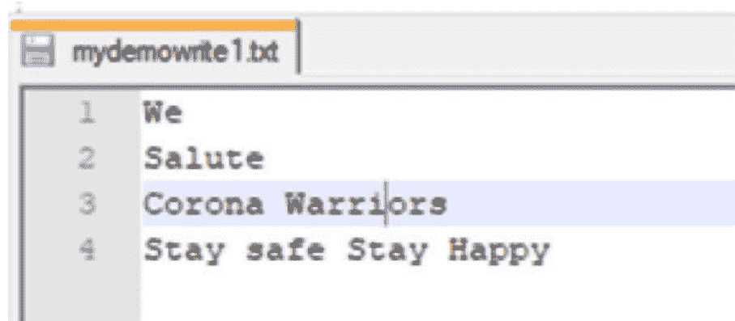

# 示例 9.18

```python
try:
    myfile1 = open('mydemowrite1.txt','r')
    mydata = myfile1.readlines()
    print(mydata) # RL1
    for loop in mydata:
        print(loop, end='') # RL2
finally:
    myfile1.close()
```

# 输出 9.18

```
['We\n', 'Salute\n', 'Corona Warriors\n', 'Stay safe Stay Happy']
We
Salute
Corona Warriors
Stay safe Stay Happy
```

在RL1中，返回一个列表，其中文件的每一行都是列表的一个元素。因此输出为`['We\n', 'Salute\n', 'Corona Warriors\n', 'Stay safe Stay Happy']`。在RL2中，我们遍历每个列表项，并用`end=""`（空）分隔。因此输出为：

```
We
Salute
Corona Warriors
Stay safe Stay Happy
```

## 9.8 `with` 语句

`with`语句在打开文件时使用。使用`with`语句打开文件时，不需要显式关闭文件。其语法如下：

```python
with open(filename, mode='r') as fileobject:
    statements
```

`with`语句可用于将文件操作分组在一个块中。即使在运行时产生异常，它也会在完成所有必需操作后自动关闭文件。

> **注意：**
> `open()`函数的语法与我们之前已经讨论过的相同。

考虑文件“readinput.txt”的内容如下：

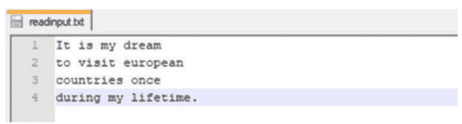

# 示例 9.19

```python
with open('readinput.txt') as myfile1:
    mydata = myfile1.read()
    print(mydata) # W1
    print("________")
    print('File closed status: ?', myfile1.closed) # W2
print("________")
print('Again checking for file closed status ?', myfile1.closed) # W3
```

# 输出 9.19

```
It is my dream
to visit european
countries once
during my lifetime.
________
File closed status: ? False
________
Again checking for file closed status ? True
```

在W1中，我们使用`with`语句以读模式打开文件。文件内容被读取并显示。因此输出为：

```
It is my dream
to visit european
countries once
during my lifetime.
```

在W2中，我们在`with`块内检查文件状态。因此输出为`File closed status: ? False`。

在W3中，我们在`with`块外再次检查文件状态。因此这次输出为`True`。

## 9.9 文件方法()

文件中的不同方法如下：

- **1. `tell()`：**
  该方法将返回文件指针从文件开头的光标位置。它将告诉当前光标位置。文件中第一个字符的索引与字符串索引一样，是从零开始的。
  其语法如下：

  ```python
  fileobject.tell()
  ```

  考虑文件`readinput.txt`的内容如下：

  

  # 示例 9.20

  ```python
  with open('readinput.txt') as myfile1:
      print(myfile1.tell()) # T1
      print("________")
      print(myfile1.read(4)) # T2
      print(myfile1.tell()) # T3
      print("________")
      print(myfile1.read()) # T4
      print(myfile1.tell()) # T5
  ```

  # 输出 9.20

  ```
  0
  ________
  Welc
  4
  ________
  ome Python beginners
  25
  ```

  在T1中，文件指针的当前位置是0。
  在T2中，我们从当前光标位置读取前4个字符，因此输出为`Welc`。
  在T3中，文件指针的当前位置是4。
  在T4中，我们读取文件的剩余内容，因此输出为`ome Python beginners`。
  在T5中，文件指针的当前位置是25，即文件末尾。

- **2. `seek()`：**
  该方法将光标位置从文件开头的某个位置移动到指定位置。这里，光标将被定位到特定位置。其语法如下：

  ```python
  fileobject.seek(position)
  ```

  其中`position`从0开始，是一个正整数。

  # 示例 9.21

  关于源代码扫描二维码，请参见第503页的图9.1。

  # 输出 9.21

  ```
  Hello! I am studying tell method.
  Current Cursor Position: 33
  Current Cursor Position: 21
  Data After modifying at position 21 is :
  Hello! I am studying seek method.
  ```

  在S0中，我们以写模式创建文件`mydemofile2.txt`。数据`Hello! I am studying tell method.`被存储在文件中。
  在S1中，我们打开文件`mydemofile2.txt`并读取全部数据。
  在S2中，当前光标位置是33。
  在S3中，我们将当前文件位置更改为21。
  在S4中，当前光标位置是21。
  在S5中，我们从光标位置21开始写入数据`seek method`。
  在S6中，我们将当前文件位置设置为0，即文件开头。
  在S7中，我们从文件开头读取全部数据。
  在S8中，修改后的数据为`Hello! I am studying seek method.`。
  文件`mydemofile2.txt`中的内容如下：

  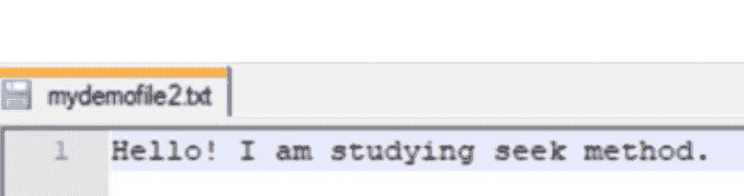

- **3. `flush()`：**
  该方法将清除内部缓冲区。在将文本写入文件之前，最好清除该内部缓冲区。其语法如下：

  ```python
  fileobject.flush()
  ```

  > 示例 9.22
  > 关于源代码扫描二维码，请参见第503页的图9.1。
  > 输出 9.22
  > `Hello beginner!I hope you are enjoying python file handling I hope yes`

  文件`myflush.txt`中的内容如下：

  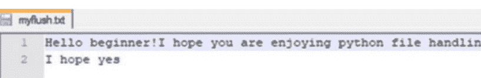

- **4. `fileno()`：**
  该方法将返回文件号，即作为整数值的文件描述符。如果操作系统不使用文件的文件描述符，则可能会发生错误。其语法如下：

  ```python
  fileobject.fileno()
  ```

  # 示例 9.23

  ```python
  with open("myfileno.txt",'w') as myfile1:
      print("The file descriptor is: ", myfile1.fileno()) # FN1
  print("The file descriptor is: ", myfile1.fileno()) # FN2
  ```

  # 输出 9.23

  ```
  The file descriptor is: 3
  ValueError: I/O operation on closed file
  ```

  在FN1中，文件描述符是3。
  在FN2中，文件关闭后我们尝试打印文件描述符，因此Python将引发`ValueError`。

- **5. `truncate()`：**
  该方法将根据给定的字节数调整文件大小。如果未指定大小，则使用当前位置。其语法如下：

  ```python
  fileobject.truncate(size)
  ```

  其中`size`是一个可选参数，表示截断后的文件大小（以字节为单位）。

  # 示例 9.24

  关于源代码扫描二维码，请参见第503页的图9.1。

  # 输出 9.24

  ```
  Python is a user-friendly lang
  ```

  文件`truncate.txt`中的内容如下：

  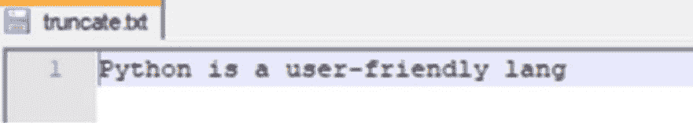

- **6. `isatty()`：**
  该方法将返回`True`如果文件连接到像`tty`这样的终端设备，否则将返回`False`。其语法如下：

  ```python
  fileobject.isatty()
  ```

  # 示例 9.25

  ```python
  # 创建一个文件
  myfile1 = open("demo1234.txt", "w")
  # 显示文件名
  print("File name is: ", myfile1.name)
  # 检查文件是否连接到终端设备
  myret = myfile1.isatty()
  print("Return value : ", myret)
  # 关闭文件
  myfile1.close()
  ```

  输出 9.25

  ```
  File name is: demo1234.txt
  Return value : False
  ```

## 9.10 二进制数据处理

现在，有时会有需要读写二进制数据，如图像、视频文件、音频文件、文档（如Word或PDF）等。众所周知，二进制文件的格式不是由可读字符组成的。我们已经看到，要打开任何二进制文件，必须添加后缀‘b’。我们将通过一个代码来查看上述例子。

图像文件`pic1.jpg`位于文件夹`E:\python_progs\demochange\mydir2`中，如下所示：


该图片如下所示。

## 示例 9.26

访问上述图像并创建新图像的代码如下：

```
try:
    myfile1=open("E:\\python_progs\\demochange\\mydir2\\pic1.jpg","rb")
    myfile2=open("E:\\python_progs\\demochange\\mydir2\\newpic1.jpg","wb")
    bytes=myfile1.read()
    myfile2.write(bytes)
    print("A new Image is available having name as: newpic1.jpg")
finally:
    myfile1.close()
    myfile2.close()
```

## 输出 9.26

```
A new Image is available having name as: newpic1.jpg
```

如预期，在文件夹 `E:\python_progs\demochange\mydir2` 中创建了一个新的图像文件 `newpic1.jpg`，如下所示。

| 名称 | 修改日期 | 类型 | 大小 |
| --- | --- | --- | --- |
| newpic1.jpg | 2020-04-25 20:09 | JPG 文件 | 3,244 KB |
| pic1.jpg | 2019-04-15 10:00 | JPG 文件 | 3,244 KB |

它与图像文件 `pic1.jpg` 相同。

## 9.11 CSV 文件处理

CSV 是逗号分隔值的缩写，是一种纯文本文件类型，它使用特定的结构来排列表格数据。它只包含实际的文本数据。这些文件易于通过程序处理，并且可以处理大量数据。作为编程的一部分，使用 Python csv 库读写 csv 文件是一个常见需求。如果有处理海量数据或进行数值分析的需求，我们可以考虑使用 `pandas` 库，它也具备 csv 解析功能。但在此，我们只讨论如何仅使用 Python 库来读取 csv 文件。为了处理 csv 文件，Python 提供了 `csv` 模块。

### 9.11.1 将数据写入 csv 文件

## 示例 9.27

```
import csv
with open("mycsvfile1.csv","w") as myfile1:
    mywrite=csv.writer(myfile1) # CS1
    print(type(mywrite)) # CS2
    mywrite.writerow(["ROLLNO","NAME","AGE","CONTACT"]) # CS3
    while True:
        myroll_no=input("Enter Student Roll No:") # CS4
        myname=input("Enter Student Name:") # CS5
        myage=input("Enter Student Age:") # CS6
        mycontactno=input("Enter Student contact number:") # CS7
        mywrite.writerow([myroll_no,myname,myage,mycontactno]) # CS8
        check = input("Do you want to enter one more student data: (Yes|No): ") # CS9
        if check.upper() == 'NO': # CS10
            break
print("Total Students data written to csv file successfully")
```

## 输出 9.27

```
<class '_csv.writer'>
Enter Student Roll No:1
Enter Student Name:Saurabh
Enter Student Age:10
Enter Student contact number:8907654321
Do you want to enter one more student data: (Yes|No): Yes
Enter Student Roll No:2
Enter Student Name:Divya
Enter Student Age:10
Enter Student contact number:9876543210
Do you want to enter one more student data: (Yes|No): No
Total Students data written to csv file successfully
```

文件 `mycsvfile1.csv` 以写模式打开。

在 CS1，返回一个 csv writer 对象来写入数据，它会将用户数据转换为分隔符字符串。
在 CS2，类型是 `<class '_csv.writer'>`。
在 CS3，使用 `writerow()` 函数将字符串写入 csv 文件。列标题以列表形式传递，它将被转换为分隔符字符串并写入 csv 文件。
在 CS4，提示用户输入学号。
在 CS5，提示用户输入姓名。在 CS6，提示用户输入年龄。
在 CS7，提示用户输入联系方式。
在 CS8，用户以列表形式传递学号、姓名、年龄和联系方式，这些数据被转换为分隔符字符串并写入 csv 文件。
在 CS9，提示用户在需要时输入更多学生数据。
在 CS10，检查用户是否输入了“No”，它会自动转换为大写。如果用户输入了 Yes，则更多学生数据将被写入文件，否则代码将退出，因为控制权离开了 while 循环。

`mycsvfile1.csv` 文件将如下所示。

| 学号 | 姓名 | 年龄 | 联系方式 |
| :--- | :--- | :--- | :--- |
| 1 | Saurabh | 10 | 8907654321 |
| 2 | Divya | 10 | 9876543210 |

正如我们所见，每行数据之间存在一个空行。因此，为了防止这些空行，在 Python-3 中添加了 `newline=''`（空）属性，如下所示。

## 示例 9.28

```
import csv
with open("mycsvfile1.csv", "w", newline="") as myfile1:
    mywrite=csv.writer(myfile1) # CS1
    print(type(mywrite)) # CS2
    mywrite.writerow(["ROLLNO", "NAME", "AGE", "CONTACT"]) # CS3
    while True:
        myroll_no=input("Enter Student Roll No:") # CS4
        myname=input("Enter Student Name:") # CS5
        myage=input("Enter Student Age:") # CS6
        mycontactno=input("Enter Student contact number:") # CS7
        mywrite.writerow([myroll_no,myname,myage,mycontactno]) # CS8
        check = input("Do you want to enter one more student data: (Yes|No): ") # CS9
        if check.upper() == 'NO': # CS10
            break
print("Total Students data written to csv file successfully")
```

## 输出 9.28

```
<class '_csv.writer'>
Enter Student Roll No:1
Enter Student Name:Saurabh
Enter Student Age:10
Enter Student contact number:8907654321
Do you want to enter one more student data: (Yes|No): yes
Enter Student Roll No:2
Enter Student Name:Divya
Enter Student Age:10
Enter Student contact number:9876543210
Do you want to enter one more student data: (Yes|No): no
Total Students data written to csv file successfully
```

现在，`mycsvfile1.csv` 文件将如下所示。

| 学号 | 姓名 | 年龄 | 联系方式 |
| :--- | :--- | :--- | :--- |
| 1 | Saurabh | 10 | 8907654321 |
| 2 | Divya | 10 | 9876543210 |

### 9.11.2 从 csv 文件读取数据

`mycsvfile1.csv` 中的数据是

| 学号 | 姓名 | 年龄 | 联系方式 |
| :--- | :--- | :--- | :--- |
| 1 | Saurabh | 10 | 8907654321 |
| 2 | Divya | 10 | 9876543210 |

现在，我们将使用 Python 代码读取并显示上述数据。

```
import csv
myfile1=open("mycsvfile1.csv",'r')
myfile1=csv.reader(myfile1) #returns csv reader object
print(type(myfile1))
mydata=list(myfile1)
print(mydata) # list of list returning
for myrow in mydata: # iterating each element as list
    for mycol in myrow:# iterating each element of list
        print(mycol,'\t',end="")
    print()
```

## 输出 9.29

```
<class '_csv.reader'>

[['ROLLNO', 'NAME', 'AGE', 'CONTACT'],
 ['1', 'Saurabh', '10', '8907654321'],
 ['2', 'Divya', '10', '9876543210']]

ROLLNO  NAME    AGE     CONTACT
1       Saurabh 10      8907654321
2       Divya   10      9876543210
```

在上面的代码中，我们首先导入了 csv 模块，然后以读模式打开了 csv 文件 `mycsvfile1.csv`。文件将由 `csv.reader()` 读取，它返回一个可迭代的 reader 对象。reader 对象将以列表的形式读取 csv 文件中的所有数据。然后，将使用嵌套 for 循环遍历 reader 对象以显示每行的内容。

## 9.12 压缩与解压文件

Zip 是一种归档文件格式，包含一个或多个压缩文件。它支持无损数据压缩，即可以从压缩数据完美地重建原始数据。我们有一个常见的需求是压缩和解压文件以满足我们的要求，因为它具有以下优势：

- 内存利用率将得到提高。
- 传输速度将提高，从而减少传输时间。
- 性能将得到提高。

Python 中有一个用于执行 zip 和 unzip 操作的内置模块，名为 `zipfile`。它包含一个 `Zipfile` 类。

### 9.12.1 执行 zip 操作

可以使用 `Zipfile` 类对象，通过 zip 文件名、模式和常量 `ZIP_DEFLATED` 来创建它，以执行 zip 操作。上述常量表示我们正在创建一个 zip 文件。

```
myfile1 = Zipfile('zipfilename', mode = 'w', ZIP_DEFLATED)
```

可以使用 `Zipfile` 对象的 `write()` 方法添加文件。

```
myfile1.write()
```

目录 `E:\python_progs\zip` 中的 zip 文件夹内的文件如下：

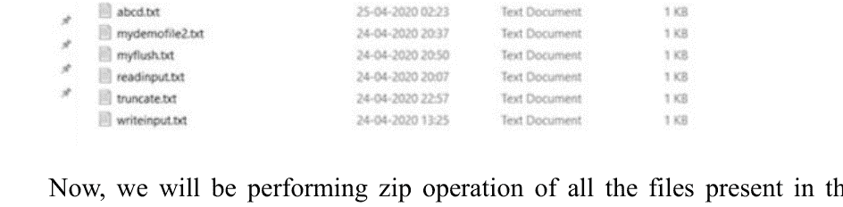

现在，我们将对上述文件夹中的所有文件执行 zip 操作。

## 示例 9.30

```
from zipfile import *
myfile1=ZipFile("E:\python_progs\zip\myfiles.zip",'w',ZIP_DEFLATED)
myfile1.write("abcd.txt")
myfile1.write("mydemofile2.txt")
myfile1.write("myflush.txt")
myfile1.write("readinput.txt")
myfile1.write("truncate.txt")
myfile1.write("writeinput.txt")
myfile1.close()
print("myfiles.zip file is created successfully")
```

## 输出 9.30

myfiles.zip 文件创建成功。

运行上述代码后，在文件夹 `E:\python_progs\zip` 中会创建一个 zip 文件，如下所示。

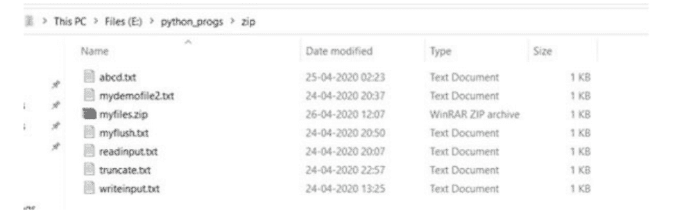

zip 文件中的多个文件如下所示。

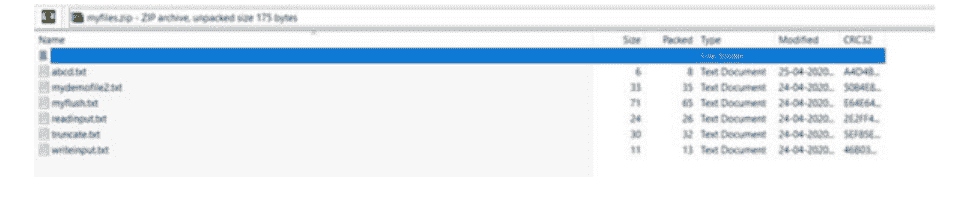

### 9.12.2 执行解压操作

可以通过指定 zip 文件的名称、模式以及常量 **ZIP_STORED** 来创建一个 Zipfile 类对象，以进行解压操作。上述常量表示我们正在执行解压操作。由于它是默认值，因此我们无需指定。

```
myfile1 = Zipfile('zipfilename', mode = 'r', ZIP_STORED)
```

一旦为解压操作创建了 Zipfile 对象，我们就可以使用 `namelist()` 方法获取 zip 文件中存在的所有文件名。

myfilename = myfile1.namelist()

## 示例 9.31

```
from zipfile import *
myfile1=ZipFile("E:\python_progs\zip\myfiles.zip",'r',ZIP_STORED)
myfilename=myfile1.namelist()
for myfile in myfilename:
    print("File Name is : ",myfile)
    print("The Contents of this file are:")
    myfl=open(myfile,'r')
    print(myfl.read())
    print()
    print("___________________")
```

## 输出 9.31

File Name is : abcd.txt
The Contents of this file are:
python
___________________
File Name is : mydemofile2.txt
The Contents of this file are:
Hello! I am studying seek method.
___________________
File Name is : myflush.txt
The Contents of this file are:
Hello beginner!I hope you are enjoying python file handling
I hope yes
___________________
File Name is : readinput.txt
The Contents of this file are:
Welcome Python beginners

```
File Name is : truncate.txt
The Contents of this file are:
Python is a user-friendly lang

File Name is : writeinput.txt
The Contents of this file are:
Hellothere!
```

我们甚至可以通过指定所有内容来解压 zip 文件，如下所示。此处，目录 `E:\python_progs\zip` 中的 zip 文件夹仅包含 .zip 文件。


现在，我们将编写代码来解压此 .zip 文件中存在的所有文件。

## 示例 9.32

```
# 导入必要的模块
from zipfile import ZipFile

# 指定 zip 文件名
myfile_name = "E:\python_progs\zip\myfiles.zip"

# 默认以读取模式打开 zip 文件
with ZipFile(myfile_name, 'r') as myzip:
    # 显示归档的目录表
    myzip.printdir()
```

```
print("-------------------------")
# 将所有文件解压到指定目录
print('开始解压所有文件...')
myzip.extractall("E:\python_progs\zip")
print('完成！')
```

## 输出 9.32

[示例 9.32](Example 9.32) 的输出如下图所示。

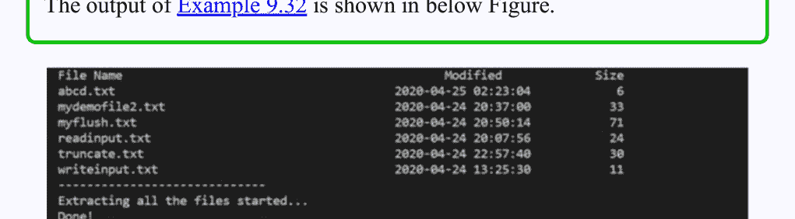

现在，zip 文件夹内的文件如下所示。因此，我们已解压了所有文件。


我们甚至可以如下获取 zip 文件的所有信息。

## 示例 9.33

有关源代码，请扫描 [第 503 页](page_503) [图 9.1](Figure 9.1) 中显示的二维码

## 输出 9.33

```
abcd.txt
    Modified Time:    2020-04-25 02:23:04
    Operating System:     0(0 = Windows, 3 = Unix)
    Specifying ZIP version:    20
    Bytes Compressed:    8 bytes
    Bytes Uncompressed:    6 bytes
mydemofile2.txt
    Modified Time:    2020-04-24 20:37:00
    Operating System:     0(0 = Windows, 3 = Unix)
    Specifying ZIP version:    20
    Bytes Compressed:    35 bytes
    Bytes Uncompressed:    33 bytes
myflush.txt
    Modified Time:    2020-04-24 20:50:14
    Operating System:     0(0 = Windows, 3 = Unix)
    Specifying ZIP version:    20
    Bytes Compressed:    65 bytes
    Bytes Uncompressed:    71 bytes
readinput.txt
    Modified Time:    2020-04-24 20:07:56
    Operating System:     0(0 = Windows, 3 = Unix)
    Specifying ZIP version:    20
    Bytes Compressed:    26 bytes
    Bytes Uncompressed:    24 bytes
truncate.txt
    Modified Time:    2020-04-24 22:57:40
    Operating System:     0(0 = Windows, 3 = Unix)
    Specifying ZIP version:    20
    Bytes Compressed:    32 bytes
    Bytes Uncompressed:    30 bytes
writeinput.txt
    Modified Time:    2020-04-24 13:25:30
    Operating System:     0(0 = Windows, 3 = Unix)
    Specifying ZIP version: 20
    Bytes Compressed: 13 bytes
    Bytes Uncompressed: 11 bytes
```

## 9.13 对象的打包与解包

每当需要序列化和反序列化 Python 数据结构时，我们将执行打包操作。我们需要将对象的完整状态写入文件，并从文件中读取完整的对象。

将对象状态写入文件的过程，即将类对象转换为字节流并存储到文件中，称为**打包**。这也被称为对象序列化。

从文件中读取对象状态的过程，即将字节流转换回类对象，称为**解包**。这是打包的逆操作，也被称为对象反序列化。

打包和解包可以通过使用 pickle 模块实现。

由于二进制文件支持字节流，打包和解包应使用二进制文件进行。

可以打包的数据类型如下：

- 1. 整数
- 2. 布尔值
- 3. 复数
- 4. 浮点数
- 5. 普通字符串和 Unicode 字符串
- 6. 元组
- 7. 列表
- 8. 包含可打包对象的集合和字典
- 9. 在模块顶层定义的类和内置函数。

有两个重要的函数将在打包和解包过程中使用：

- 1. **dump():**
   上述函数将执行打包。它将返回对象的打包表示形式作为一个字节对象，而不是将其写入文件。它用于序列化对象层次结构。
   语法为：

```
import pickle
pickle.dump(object, file, protocol)
```

其中
`object` 是要序列化的 Python 对象
`file` 是将存储序列化 Python 对象的文件对象
`protocol` 如果未指定则为 0。如果指定为 **HIGHEST_PROTOCOL** 或负数，则将使用可用的最高协议版本。

- 2. **load():**
   上述函数将执行解包。它从二进制文件中读取打包的对象并返回一个对象。它用于反序列化数据流。
   语法为：

```
import pickle
pickle.load(file)
```

整个打包和解包过程可以从下面所示的流程图中学习。

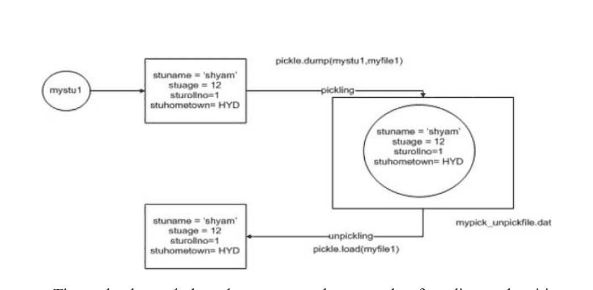

下面所示的代码演示了使用 pickle 模块读写对象状态的示例。

### 示例 9.34

有关源代码，请扫描 [第 503 页](page_503) [图 9.1](page_503) 中显示的二维码

### 输出 9.34

Student 对象打包完成…
解包后打印学生信息
Shyam 12 1 HYD

现在，我们将演示将多个学生对象写入文件
我们将创建 3 个 Python 文件。

### student.py

```
import pickle
class Student:
```

```
def __init__(self,name,age,rollno,hometown):
    self.name=name
    self.age=age
    self.rollno=rollno
    self.hometown=hometown

def mydisplay(self):
    print(self.name,"\t",self.age,"\t",self.rollno,"\t",self.hometown)
```

### mypick.py

```
import pickle, student
myfile1=open("mypick_umpickle1.dat","wb")
mynum=int(input("输入学生人数:"))
for i in range(mynum):
    myname=input("输入学生姓名:")
    myage=int(input("输入学生年龄:"))
    myrollno=int(input("输入学号:"))
    myhometown=input("输入学生家乡:")
    mystu1=student.Student(myname,myage,myrollno,myhometown)
    pickle.dump(mystu1,myfile1)
myfile1.close()
print("学生对象打包成功")
```

### myunpickle.py

```
import pickle, student
myfile1=open("mypick_umpickle1.dat","rb")
print("学生详情:")
while True:
    try:
        myobj=pickle.load(myfile1)
        myobj.mydisplay()
    except EOFError:
        print("所有学生信息读取完毕")
        break
```

```
myfile1.close()

现在，我们将运行 **mypick.py** 文件。

```
Enter The number of Students:2
Enter Student Name:Ram
Enter Student Age:13
Enter Roll No:2
Enter Student HomeTown:Hyderabad
Enter Student Name:Shyam
Enter Student Age:13
Enter Roll No:3
Enter Student HomeTown:Raipur
Student Objects pickled successfully
```

为了执行反序列化操作，我们将运行 **myunpickle.py** 文件。

```
SAURABH@LAPTOP-NHFM79LF MINGW64 /e/python_progs
$ python myunpickle.py
Student Details:
Ram    13    2    Hyderabad
Shyam  13    3    Raipur
All students Completed
```

因此，通过使用序列化（pickling）可以将多个对象写入文件，并且也可以通过使用反序列化（unpickling）从文件中读取。

## 9.14 日期和时间

在开始学习Python日期和时间之前，有几个我们需要了解的术语。

1.  **纪元（Epoch）**：这是时间开始的起点，具体取决于平台。通常被定义为当前年份的1月1日 00:00:00。但对于Unix系统，纪元是1970年1月1日 00:00:00（协调世界时）。
2.  **UTC**：UTC代表协调世界时（也称为格林威治标准时间），是英语和法语名称之间的折中。
3.  **DST**：DST代表夏令时，这是一种在一年中部分时间将时区调整一小时的制度。换句话说，时钟在春天拨快一小时，在秋天拨回一小时，以恢复到标准时间。

以下是用于处理日期、时间和时长的常用模块。

### 9.14.1 Time模块

这是一个内置模块，包含了执行更多时间操作所需的各种函数。它允许从纪元开始记录时间。Time模块的一些重要函数如下：

1.  **time()**：
    它将以秒为单位返回时间，即自纪元以来经过的秒数。具体的纪元日期和闰秒处理取决于平台。

    ```
    示例 9.35

    from time import *
    mysecs = time()
    print("The number of seconds since epoch are: ", mysecs)
    ```

    ```
    输出 9.35

    The number of seconds since epoch are: 1587988490.7900558
    ```

2.  **ctime()**：
    它用于获取当前日期和时间。
    当向上述函数传递纪元时间（秒）时，它将返回对应日期和时间的字符串格式。
    当不向上述函数传递纪元时间时，它将返回当前日期和时间的字符串格式。

    ```
    示例 9.36

    from time import *

    mylocal_time = ctime(1587988490.7900558)

        # 传递了纪元时间（秒）
        print("The corresponding date and time is: ", mylocal_time)

    mylocal_time = ctime() # 未传递纪元时间
    print("The current date and time is: ", mylocal_time)
    ```

    ```
    输出 9.36

    The corresponding date and time is:
    Mon Apr 27 17:24:50 2020
    The current date and time is:
    Mon Apr 27 17:29:06 2020
    ```

3.  **struct_time类：**
    time模块中的多个函数，如gmtime、mktime和asctime，会接收`time.struct_time`对象作为参数或返回它。

    `time.struct_time`对象的不同元素可以通过索引或属性访问。

    | 索引 | 属性 | 值 |
    |-------|-----------|--------|
    | 0 | tm_year | 4位数的年份 |
    | 1 | tm_mon | 范围[1,12] |
    | 2 | tm_mday | 范围[1,31] |
    | 3 | tm_hour | 范围[0,23] |
    | 4 | tm_min | 范围[0,59] |
    | 5 | tm_sec | 范围[0,61]，包括闰秒 |
    | 6 | tm_wday | 范围[0,6]，其中0代表星期一 |
    | 7 | tm_yday | 范围[1,366] |

4.  **localtime():**
    它将返回自纪元以来经过的秒数，并以本地时间返回**struct_time**对象。如果未向上述函数传递参数，则使用`time()`返回的值。

    ```
    from time import *
    mystruct_time = localtime()
    print(type(mystruct_time))
    print(mystruct_time)
    print("Year is: ",mystruct_time.tm_year)
    print("Month is: ",mystruct_time.tm_mon)
    print("Date is: ",mystruct_time.tm_mday)
    print("Hour is: ",mystruct_time.tm_hour)
    print("Min is: ",mystruct_time.tm_min)
    print("Second is: ",mystruct_time.tm_sec)
    print(mystruct_time.tm_wday)
    print(mystruct_time.tm_yday)
    ```

    ```
    <class 'time.struct_time'>
    time.struct_time(tm_year=2020, tm_mon=4, tm_mday=27, tm_hour=17, tm_min=37, tm_sec=31, tm_wday=0, tm_yday=118, tm_isdst=0)
    Year is: 2020
    Month is: 4
    Date is: 27
    Hour is: 17
    Min is: 37
    Second is: 31
    0
    118
    ```

5.  **gmtime():**
    它将返回自纪元以来经过的秒数，并以UTC时间返回**struct_time**对象。如果未向上述函数传递参数，则使用`time()`返回的值。

    ```
    示例 9.38

    关于源代码，请扫描[第503页](#)的[图9.1](#)所示二维码。
    ```

    ```
    输出 9.38

    <class 'time.struct_time'>
    time.struct_time(tm_year=2020, tm_mon=4, tm_mday=27, tm_hour=17, tm_min=43, tm_sec=39, tm_wday=0, tm_yday=118, tm_isdst=0)
    Year is: 2020
    Month is: 4
    Date is: 27
    Hour is: 17
    Min is: 43
    Second is: 39
    0
    118
    ________________
    <class 'time.struct_time'>
    time.struct_time(tm_year=2020, tm_mon=4, tm_mday=27, tm_hour=12, tm_min=13, tm_sec=39, tm_wday=0, tm_yday=118, tm_isdst=0)
    Year is: 2020
    Month is: 4
    Date is: 27
    Hour is: 12
    Min is: 13
    Second is: 39
    0
    118
    The difference between localtime and UTC time is 5 hrs
    and 30 mins
    ```

6.  **mktime():**
    它是`localtime()`的逆操作，将接收一个**struct_time**（包含9个元素的元组）作为参数，并返回以本地时间表示的自纪元以来经过的秒数。

    ```
    示例 9.39

    from time import *

    mytime = (2020, 4, 27, 12, 13, 39, 0, 118, 0)
    mymk_time = mktime(mytime)
    print("The number of seconds passed since epoch is: ", mymk_time)

    print("The struct_time is ",localtime(mymk_time))
    # 获取struct_time
    ```

    ```
    输出 9.39

    The number of seconds passed since epoch is: 1587969819.0
    The struct_time is time.struct_time(tm_year=2020, tm_mon=4, tm_mday=27, tm_hour=12, tm_min=13, tm_sec=39, tm_wday=0, tm_yday=118, tm_isdst=0)
    ```

7.  **asctime():**
    它将接收一个**struct_time**（包含9个元素的元组）作为参数，并返回一个表示时间的24字符字符串。

    ```
    from time import *

    mytime = (2020, 4, 27, 12, 13, 39, 0, 118, 0)
    asc_time = asctime(mytime)
    print("The string representing the time is: ", asc_time)
    ```

    ```
    The string representing the time is: Mon Apr 27 12:13:39 2020
    ```

8.  **strftime():**
    它将接收一个**struct_time**（包含9个元素的元组）作为参数，并根据主要使用的格式代码返回一个字符串。

    | 格式代码 | 含义 |
    |---|---|
    | %Y | 4位数的年份 |
    | %m | 01,02...12 |
    | %d | 01,02...31 |
    | %H | 00,01...23 |
    | %M | 00,01...59 |
    | %S | 00,01...61 |

    ```
    from time import *

    my_local_time = localtime() # 获取struct_time
    print(my_local_time)
    my_format_time= strftime("%m/%d/%Y, %H:%M:%S",
    my_local_time)
    print(my_format_time)
    ```

    ```
    输出 9.41

    time.struct_time(tm_year=2020, tm_mon=4,
    tm_mday=28, tm_hour=19, tm_min=19, tm_sec=39,
    tm_wday=1, tm_yday=119, tm_isdst=0)
    04/28/2020, 19:19:39
    ```

9.  **strptime():**
    它通过解析表示时间的字符串来返回**struct_time**对象。如果未指定格式字符串，则默认为`"%a %b %d %H:%M:%S %Y"`，这与`ctime()`函数返回的格式相匹配。

    ```
    示例 9.42

    from time import *

    my_time_string = "27 Apr, 2020"
    myresult = strptime(my_time_string, "%d %b, %Y")
    print(myresult)

    my_time_string = "27 April, 2020"
    myresult = strptime(my_time_string, "%d %B, %Y")
    print(myresult)
    ```

    ```
    输出 9.42

    time.struct_time(tm_year=2020, tm_mon=4, tm_mday=27,
    tm_hour=0, tm_min=0, tm_sec=0, tm_wday=0, tm_yday=118,
    tm_isdst=-1)
    time.struct_time(tm_year=2020, tm_mon=4, tm_mday=27,
    tm_hour=0, tm_min=0, tm_sec=0, tm_wday=0, tm_yday=118,
    tm_isdst=-1)
    ```

10. **sleep():**
    time模块中的上述函数将使线程执行暂停给定的秒数。我们将在后面详细讨论使用`sleep()`函数的多线程程序。

    ```
    import time
    for loop in range(5):
        time.sleep(1)
        print("The number is: ", str(loop))
    ```

    ```
    The number is: 0
    The number is: 1
    The number is: 2
    The number is: 3
    The number is: 4
    ```

### 9.14.2 Datetime模块

如果有处理日期和时间的需求，Python中有一个名为datetime模块的内置模块。上述模块将提供
```

用于处理日期和时间的类，这些类包含许多用于操作日期、时间和时间间隔的函数。上述模块中的不同类如下：

### 9.14.2.1 date 类

上述类将处理公历日期。它不考虑时区。日期对象以 YYYY-MM-DD 格式表示。

语法如下

```
from datetime import date
dateobject =date(year, month, day)
```

其中

year 的范围在 MINYEAR（日期对象中允许的最小年份数，即 1）和 MAXYEAR（日期对象中允许的最大年份数，即 9999）之间，即 MINYEAR<=year<=MAXYEAR

month 必须在 1 到 12 之间，即 1<=month<=12。

day 必须 >=1 且应 <= 给定月份和年份中的天数。

如果任何参数超出这些给定范围，Python 将引发 ValueError。

不同的日期对象属性如下：

| 属性 | 描述 |
| --- | --- |
| min | 它将返回最小日期 |
| max | 它将返回最大日期 |
| year | 它将返回 MINYEAR 和 MAXYEAR 之间的年份（含） |
| month | 它将返回 1 到 12 之间的月份（含） |
| day | 它返回日期中的天数 |

源代码请扫描 [第 503 页](page 503) [图 9.1](Figure 9.1) 中显示的二维码

```
Output 9.44

The given date : 2020-04-27
<class 'datetime.date'>
The given date : 2020-04-27
The Min Date is: 0001-01-01
The Max Date is: 9999-12-31
The Year is: 2020
The Month is: 4
The Day is: 27
```

### date 类中引发 ValueError 的情况

```
Example 9.45

#getting ValueError in date as it is outside range
from datetime import date

mydate_obj = date(year = 2020,month=4,day =32)
print("The given date : ",mydate_obj)
```

```
Output 9.45

ValueError: day is out of range for month
```

date 类中有一个 today() 方法，它将获取当前日期，因为它只返回日期。

### 示例 9.46

```
#today() method
from datetime import date

mydate = date.today()
print(“Today’s date is shown here using today() method:”, mydate)
# Printing date details
print(f‘The current local date details are {mydate.year}-{mydate.month}-{mydate.day}’)
```

### 输出 9.46

Today’s date is shown here using today() method: 2020-04-28
The current local date details are 2020-4-28

可以使用 fromtimestamp() 方法将时间戳转换为日期。

### 示例 9.47

```
from datetime import date

mytimestamp = date.fromtimestamp(1587969819)
print(“The date is “, mytimestamp)
```

### 输出 9.47

The date is 2020-04-27

### 9.14.2.2 time 类

上述类将处理时间。它不包含日期信息。它将假设每天恰好有 24*60*60 秒。
time 对象将包含独立于任何特定日期的本地时间信息。语法如下

```
from datetime import time
timeobject = time(hour=0, minute=0, second=0,
microsecond=0, tzinfo=None, *, fold=0)
```

这里，所有参数都是可选的。
tzinfo 代表时区，可以是 tzinfo 子类的实例，也可以是 None。

* 是一个展开运算符，用于解包元组并从元组的值构造一个 time 对象。

fold 的值为 [0,1]。它是时钟时间的回退。

其余参数是整数，其范围如下：
hour 必须 >=0 且 <24。
minute 必须 >=0 且 <60。
second 必须 >=0 且 <60。
microsecond 必须 >=0 且 <1000000。

### 示例 9.48

源代码请扫描 [第 503 页](page 503) [图 9.1](Figure 9.1) 中显示的二维码

### 输出 9.48

```
mytime = 00:00:00
<class 'datetime.time'>
mytime1 = 10:30:59

mytime2 = 10:30:59

mytime3 = 10:30:59.123459
Hour is: 10
Min is: 30
Sec is: 59
Sec is: 123459

13:31:54.654321
```

在 time 对象中，也有可能引发 ValueError 和 TypeError。

### 示例 9.49

```
#ValueError
from datetime import time
mytime = time(hour = 25)
```

### 输出 9.49

> ValueError: hour must be in 0..23

### 示例 9.50

```
#TypeError
from datetime import time
mytime = time(hour = '23')
```

### 输出 9.50

> TypeError: an integer is required (got type str)

### 9.14.2.3 datetime 类：

上述类包含日期和时间的信息。它假设当前的公历在两个方向上扩展，就像日期对象一样，并且也假设一天中恰好有 24*3600 秒，就像 time 对象一样。因此，我们可以得出结论，单个 datetime 对象将包含来自日期对象和时间对象的信息。
语法如下

```
from datetime import datetime
datetime_object = datetime(year, month, day,
hour=0, minute=0, second=0, microsecond=0,
tzinfo=None, *, fold=0)
```

year、month 和 day 参数是必需的。

year 的范围在 MINYEAR（日期对象中允许的最小年份数，即 1）和 MAXYEAR（日期对象中允许的最大年份数，即 9999）之间，即 MINYEAR<=year<=MAXYEAR

month 必须在 1 到 12 之间，即 1<=month<=12。

day 必须 >=1 且应 <= 给定月份和年份中的天数。

hour 必须 >=0 且 <24。

minute 必须 >=0 且 <60。

second 必须 >=0 且 <60。

microsecond 必须 >=0 且 <1000000。

tzinfo 代表时区，可以是 tzinfo 子类的实例，也可以是 None。* 是一个展开运算符，用于解包元组并从元组的值构造一个 time 对象。

fold 的值为 [0,1]。它是时钟时间的回退。

我们将讨论 datetime 类中的一些方法：

- **now():** 上述方法将获取当前日期和时间。可以向上述方法提供时区信息。如果未提供时区信息，则采用本地时区。
- **today():** 上述方法也将获取当前日期和时间。它返回日期和时间信息。

### 示例 9.51

源代码请扫描 [第 503 页](page 503) [图 9.1](Figure 9.1) 中显示的二维码

### 输出 9.51

```
2020-04-28 00:00:00
2020-04-28 10:45:30.124536
year is: 2020
month is: 4
hour is: 10
minute is: 45
second is: 30
millisecond is: 124536
timestamp is: 1588050930.124536
2020-04-28 01:59:41.808499
2020-04-28 01:59:41.809495
2020-04-27 20:29:41.809495
```

- **datetime.strftime():** 它将使用 datetime、date 或 time 对象返回一个表示日期和时间的字符串。这里，datetime、date 和 time 类对象的内容将被格式化。它将通过将对象转换为指定格式来返回格式化的字符串。

### 示例 9.52

源代码请扫描第 503 页图 9.1 中显示的二维码

```
The year is: 2020
The month is: 04
The day is: 28
The time is: 19:39:32
The date and time is: 04/28/2020, 19:39:32
```

上面显示的示例描述了使用 strftime() 将 datetime 转换为字符串。

### 示例 9.53

> 源代码请扫描第 503 页图 9.1 中显示的二维码

### 输出 9.53

The date time object: 2020-04-28 10:45:30.124536

Output 1: 04/28/2020, 10:45:30

Output 2: 28 Apr, 2020

Output 3: 28 April, 2020

Output 4: 10AM

上面显示的示例使用 strftime() 从时间戳创建字符串。

- **datetime.strptime():** 它可以从字符串创建一个 datetime 对象。但是字符串必须是特定格式，因为不能从任何字符串创建 datetime 对象。

### 示例 9.54

源代码请扫描第 503 页图 9.1 中显示的二维码

### 输出 9.54

```
My date string is: 28 April, 2020
type of date string is: <class 'str'>
____________________
date object is: 2020-04-28 00:00:00
type of date object is: <class 'datetime.datetime'>
____________________
dt_object1 = 2020-04-28 02:37:39
```

上面的示例将使用 strptime() 将字符串转换为 datetime 对象。

> **注意：** strftime() 和 strptime() 方法不同格式代码的官方 Python 文档链接是 [https://docs.python.org/3.7/library/datetime.html#strftime-and-strptime-behavior](https://docs.python.org/3.7/library/datetime.html#strftime-and-strptime-behavior)

### 9.14.2.4 timedelta 类

上述类的对象将表示两个日期或时间之间的差异。可以使用 timedelta 类来了解未来或过去的日期。

语法如下from datetime import timedelta
timedeltaobj = timedelta(days=0, seconds=0,
    microseconds=0, milliseconds=0, minutes=0,
    hours=0, weeks=0)

所有参数都是可选的，默认值为0。参数可以是正数或负数，整数或浮点数。

天数、秒数和微秒数在内部存储。参数将按以下方式转换为这些单位：

- 1毫秒转换为1000微秒。
- 1分钟转换为60秒。
- 1小时转换为3600秒。
- 1周转换为7天。

## 示例 9.55

源代码扫描二维码见[第503页](https://example.com)的[图 9.1](https://example.com)

## 输出 9.55

```
2020-04-28
1 day, 0:00:00
Tomorrow’s date is: 2020-04-29
Yesterday’s date is: 2020-04-27
__________________
999999999 days, 23:59:59.999999
-999999999 days, 0:00:00
0:00:00.000001
```

```
Number of seconds in 30 days month is: 2592000.0

myt3 = 492 days, 0:00:00

myt6 = 719 days, 1:24:13
type of myt3 = <class 'datetime.timedelta'>
type of myt6 = <class 'datetime.timedelta'>

myt3 = 23 days, 0:54:32

myt3 = -1 day, 23:59:24
myt3 = 0:00:36
```

# 第 10 章

## Python 多线程

### 10.1 多任务

在本章中，我们将讨论一些重要概念，如线程、多线程、信号量等。但是，在此之前，我们应该了解什么是多任务。顾名思义，"多"意味着许多，"任务"意味着一项工作或活动。同时执行多项工作或同时执行多个任务被称为多任务。我们在现实生活中看到的最佳例子是我们的母亲。她早上为我们准备食物。同时，她让我们准备好去学校，为父亲准备好衣服，照顾我们的祖父母并为他们准备茶水，如果紧急的话还会接听一些手机。所以，她同时执行多项任务。多任务有两种类型：

#### 10.1.1 基于进程的多任务

在基于进程的多任务中，多个任务同时执行，其中每个任务都是一个独立的程序（进程）。例如，我们打开了一个浏览器，正在文本编辑器中编写一些文本。同时，我们正在听一首 mp3 歌曲，并通过互联网从浏览器下载一个应用程序。所有任务彼此独立，我们同时执行这些任务。因此，所有这些都被称为基于进程的多任务。这种多任务类型仅最适合在操作系统级别。

在图 10.1 中，我们显示了 4 个桌面进程应用程序，即 VSCode 编辑器、计算器、记事本和 Google Chrome。所有这些任务彼此独立，它们都在同时执行自己的任务。

#### 10.1.2 基于线程的多任务

在基于线程的多任务中，多个任务同时执行，其中每个任务都是同一程序的一个独立部分。每个独立部分称为线程。假设有一段大约 5000 行的代码，包含与 2 个客户相关的应用程序。两个客户应用程序彼此独立。每个客户应用程序各有 2500 行代码。现在，假设客户 1 应用程序需要 2 分钟，客户 2 应用程序需要 3 分钟来逐行执行代码完成程序。现在，有 1 个程序和 5000 行代码可用，因此如果每一行代码都从上到下执行，那么整个程序代码执行时间至少需要 5 分钟。但是，在同一个程序中，前 2500 行代码和后 2500 行代码之间没有关系，因为它们都与不同的、相互独立的客户相关。现在，如果没有依赖关系，那么客户 2 的代码为什么要等待客户 1 的代码完成呢？最好同时执行两个客户代码应用程序。如果两个代码同时执行，那么我们将在更短的时间内完成任务。这种类型的多任务称为基于线程的多任务，程序的每个独立部分称为线程。这里将有 2 个线程，假设线程 1 和线程 2 分别用于客户 1 和客户 2。但是，即使两个线程同时执行，也无法预期线程的顺序。因此，线程是一个执行流。对于每个线程，都有一些工作。一旦线程启动，自动执行该工作就是线程的责任。因此，基于线程的多任务最适合编程级别。

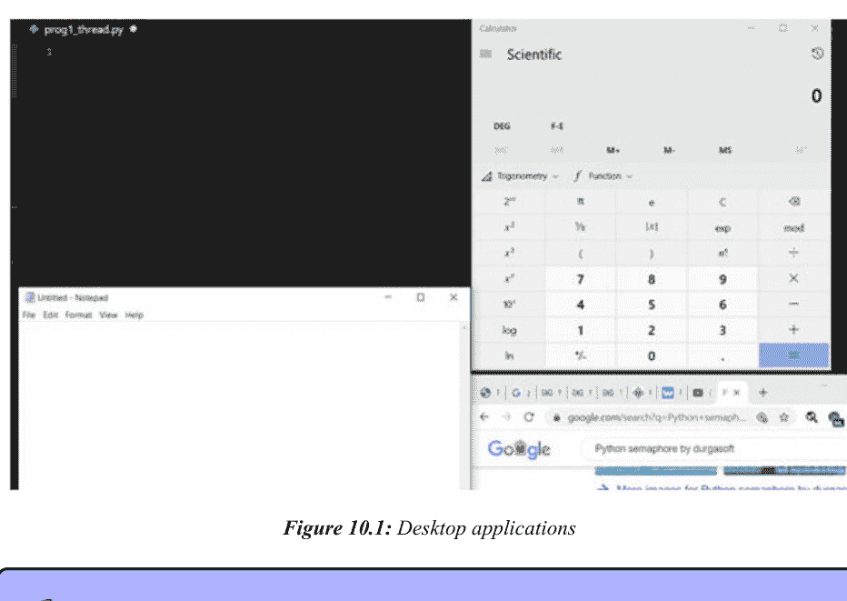

*图 10.1：桌面应用程序*

> **注意：**
多任务的主要优点是通过减少响应时间来提高系统性能，无论是基于进程还是基于线程的多任务。此外，只要有独立的工作可用，强烈建议同时执行这些工作，而不是一个接一个地执行。因此，在这种情况下，我们将使用多线程的概念。这种多线程给我们带来的好处是，同时，属于同一应用程序且彼此独立的多个任务可以毫无中断地访问该应用程序。

多线程应用程序可用于多个领域，如动画、视频游戏、Web 服务器、应用程序服务器、图形等。

Python 提供了一个内置模块来支持线程概念，用于开发名为 "threading" 的线程。

有一个默认的单线程，名为 Main Thread，当我们启动一个由 Python 虚拟机创建的 Python 程序时，它会立即开始，如上例所示。

```
import threading
x = int('12')
print(x)
print("The current executing thread name is: ",threading.current_thread().getName())
```

```
12
The current executing thread name is: MainThread
```

在上面的例子中，threading 模块中有一个名为 current_thread() 的函数，它返回当前正在执行的线程对象。当前正在执行的线程对象有一个名为 getName() 的方法，它将返回当前正在执行的线程名称。

### 一些有用的术语

**进程：** 正在执行的计算机程序实例，主要包含 3 个基本组件：

1. 要执行的程序。
2. 程序所需的数据（变量、缓冲区等）。
3. 程序执行上下文（进程状态）。

**线程：** 进程内的一个实体或一个 Python 对象，是操作系统中可以执行的最小处理单元，是一个独立的执行流。换句话说，它是进程的一个子集。线程包含在线程控制块（TCB）中的信息。从[图 10.2](Figure 10.2) 可以看出，TCB 包含：

1. **线程 ID：** 线程标识符是分配给每个线程的唯一 ID。
2. **栈指针：** 它指向进程中线程的栈，并包含线程作用域内的局部变量。
3. **程序计数器：** 它是一个寄存器，存储线程当前正在执行的指令地址。
4. **线程状态：** 它指的是线程的状态，可以是就绪、运行、等待、启动或完成。
5. **线程的寄存器集：** 这些是分配给线程用于计算的寄存器。
6. **父进程指针：** 它是指向线程所在进程的进程控制块的指针。

单个进程中可以存在多个线程，前提是每个线程都有自己的寄存器集和局部变量。内存堆部分中的全局变量和程序代码在所有线程之间共享。

> **注意：**
每当我们编写任何 Python 代码并且没有显式创建线程时，默认情况下有一个称为主线程的线程。因此，执行代码是主线程的责任。

### 10.2 线程创建

为了创建线程，使用 threading 模块的 Thread 类。threading 模块中存在一个预定义类，用于创建我们自己的线程。如果需要创建我们自己的线程，则创建 Thread 类的一个对象。让我们看看如何创建一个对象。

## 10.2.1 不使用任何类创建线程

```python
thread_object = Thread(group=None, target=None, name=None,
                       args=(), kwargs={})
```

这里，`thread_object` 代表我们的线程。

第一个参数是 `group`，其默认值为 `None`，保留供将来使用。

第二个参数是 `target`，其默认值为 `None`。它是一个可调用对象，将由 `run()` 方法调用。通常，可以指定线程将作用于哪个函数名。

第三个参数是 `name`，其默认值是遵循 `Thread-N` 格式的唯一名称，其中 `N` 是一个小的十进制数。它将指定线程名称。

第四个参数 `args`，其默认值为 `()`。它是目标调用的参数元组。通常，提供这些值以在目标方法中使用。

第五个参数是 `kwargs`，其默认值为 `{}`。它是目标调用的关键字参数字典。

在 Python 中创建线程有 3 种方式：

可以不使用任何类来创建线程。这并不意味着我们不使用 Thread 类。我们只是没有创建自己的类。不使用任何类创建线程的语法如下：

```python
from threading import *
mythread_object = Thread(target=function_name, name=None,
                         args=(args1, args2,))
```

这里，`mythread_object` 代表我们的线程。

第一个参数将显示线程将作用于哪个函数名，即线程要执行的函数。

第二个参数是线程名称。

第三个参数是将传递给函数的参数元组。

```python
eg: myt1 = Thread(target=mymessage_display, name=MyThread, args=(10,))
```

在上面的例子中，`myt1` 是一个线程对象，`mymessage_display` 是函数名。设置的线程名称是 `MyThread`。元组中的参数数量只有一个，即整数值 10。我们现在来看一个例子以更好地理解。

### 示例 10.2

源代码请扫描第 583 页图 10.3 所示的二维码

### 输出 10.2

```
Main Thread creating child object
Main Thread starting child thread
The above line is executed by: Thread-1
```

在上面的例子中，创建了一个线程对象。一个函数名 `my_msgprint` 将由线程执行。在 L1 中，主线程正在创建一个子对象。子线程对象负责执行 `my_msgprint` 函数。在 L2 中，主线程正在启动子线程。一旦线程被创建，就应该通过调用 `start` 方法来启动它。除了主线程之外，子线程现在也被创建了。默认情况下，子线程的名称是 `Thread-1`，正如我们之前所述，它将遵循 `Thread-N` 的格式，其中 `N` 是一个十进制数。

我们可以根据需要更改子线程的名称，如示例 10.3 所示。

### 示例 10.3

源代码请扫描第 583 页图 10.3 所示的二维码

### 输出 10.3

```
Main Thread creating child object
Main Thread starting child thread
The above line is executed by: MyChildThread
```

如图所示，子线程名称已更改为 `MyChildThread`，因为我们已将参数 `name` 设置为 `MyChildThread`。

我们的程序中有多个线程。那么执行顺序就无法预期，因此我们无法预测多线程程序的确切输出。它因机器和执行运行而异，如示例 10.4 所示。

### 示例 10.4

源代码请扫描第 583 页图 10.3 所示的二维码

### 输出 10.4

```
On 1st run
MyChildThread thread running count is 1
Main thread running count is 1
MyChildThread thread running count is 2
MyChildThread thread running count is 3
MyChildThread thread running count is 4
Main thread running count is 2
Main thread running count is 3
Main thread running count is 4
On 2nd run
MyChildThread thread running count is 1
MyChildThread thread running count is 2
MyChildThread thread running count is 3
MyChildThread thread running count is 4
Main thread running count is 1
Main thread running count is 2
Main thread running count is 3
Main thread running count is 4
```

因此，从上面程序不同运行的例子中，我们可以说无法预测确切的输出顺序。

## 10.2.2 通过继承 Thread 类创建线程

我们可以通过继承 threading 模块中的 Thread 类来创建自己的线程子类。通过继承 Thread 类创建线程的语法如下：

```python
class MyChildThread(Thread):
    Statement1.
    Statement2.
mythread_object = MyChildThread()
```

在上面的语法中，我们正在创建一个名为 `MyChildThread` 的子类，它继承自 Thread 类。我们可以在语句中编写一些属性、方法。最后，我们创建 `MyChildThread` 类的一个对象实例。

```python
eg: class myChildThread(Thread):
    pass
myt1 = myChildThread()
```

有一个 Thread 类方法称为 `run()` 方法。每当创建一个线程时，每个线程都会运行此方法。上述方法可以被重写，我们自己的代码将作为此方法（任务）的主体编写。因此，每当调用 `start` 方法时，`run()` 方法将自动执行，我们的任务将被执行。当控制从 `run()` 方法中出来时，线程将自动终止。

让我们看一个例子（示例 10.5），通过为 Thread 类创建子类来创建线程。

### 示例 10.5

源代码请扫描第 583 页图 10.3 所示的二维码

### 输出 10.5

第一次运行的输出
```
Thread-1 is executing at count of 1
Thread-1 is executing at count of 2
MainThread is executing at count of 1
MainThread is executing at count of 2
MainThread is executing at count of 3
MainThread is executing at count of 4
MainThread is executing at count of 5
Thread-1 is executing at count of 3
Thread-1 is executing at count of 4
Thread-1 is executing at count of 5
MainThread is executing at count of 6
MainThread is executing at count of 7
Thread-1 is executing at count of 6
Thread-1 is executing at count of 7
Thread-1 is executing at count of 8
MainThread is executing at count of 8
```

第二次运行的输出
```
Thread-1 is executing at count of 1
MainThread is executing at count of 1
MainThread is executing at count of 2
MainThread is executing at count of 3
Thread-1 is executing at count of 2
MainThread is executing at count of 4
Thread-1 is executing at count of 3
MainThread is executing at count of 5
Thread-1 is executing at count of 4
Thread-1 is executing at count of 5
MainThread is executing at count of 6
Thread-1 is executing at count of 6
MainThread is executing at count of 7
MainThread is executing at count of 8
Thread-1 is executing at count of 7
Thread-1 is executing at count of 8
```

在上面的例子中，我们为 Thread 类定义了子类 `MyChildClass`。我们重写了 `run` 方法，因为 Thread 类已经包含一个 `run` 方法。每当启动一个子线程时，每个线程都会运行此方法。创建了 `MyChildClass` 的一个对象，并由主线程启动。因此，在这个时刻，除了主线程之外，子线程也将被启动。两个线程是分离的。子线程负责执行 `run` 方法，主线程负责执行剩余的代码。正如预期的那样，每次运行的执行顺序都会不同。

需要注意的一个重要点是，这里没有使用 `target`，因为如果我们在 `run` 方法内编写任何代码，那么它将自动被视为目标。我们正在重写 `run` 方法。因此，没有显式指定目标。

## 10.2.3 不继承 Thread 类创建线程

可以通过不继承 threading 模块中的 Thread 类来创建一个独立的线程子类。不继承 Thread 类创建线程的语法如下：

```python
class MyThreadClass():
    statement1
    statement2
myobj_name = MyThreadClass()
mythread_obj = Thread(target=myobj_name.func_name, name=MyThreadName, args=(args1, args2))
```

在上面的语法中，我们正在创建一个名为 `MyThreadClass` 的子类。我们可以在语句中编写一些属性、方法。我们创建 `MyThreadClass` 类的一个对象实例。这里，`mythread_obj` 代表我们的线程。

第一个参数将显示函数名，即 `myobj_name.func_name()`，线程将作用于该函数。实例方法只能通过对象引用来调用。

第二个参数是线程名称。

第三个参数是将传递给函数的参数元组。

让我们来看一个示例 10.6，它展示了如何在不继承 Thread 类的情况下创建线程。

## 示例 10.6

源代码请扫描第 583 页图 10.3 中的二维码

## 输出 10.6

```
第一次运行的输出
Thread-1 正在执行，计数为 1
MainThread 正在执行，计数为 1
Thread-1 正在执行，计数为 2
MainThread 正在执行，计数为 2
Thread-1 正在执行，计数为 3
MainThread 正在执行，计数为 3
MainThread 正在执行，计数为 4
MainThread 正在执行，计数为 5
Thread-1 正在执行，计数为 4
Thread-1 正在执行，计数为 5
MainThread 正在执行，计数为 6
Thread-1 正在执行，计数为 6
第二次运行的输出
Thread-1 正在执行，计数为 1
MainThread 正在执行，计数为 1
MainThread 正在执行，计数为 2
Thread-1 正在执行，计数为 2
MainThread 正在执行，计数为 3
MainThread 正在执行，计数为 4
MainThread 正在执行，计数为 5
Thread-1 正在执行，计数为 3
MainThread 正在执行，计数为 6
Thread-1 正在执行，计数为 4
Thread-1 正在执行，计数为 5
Thread-1 正在执行，计数为 6
```

在上面的示例中，创建了一个名为 MyClass 的普通类。在类内部定义了一个名为 my_msgprint 的实例方法。然后，我们将创建 MyClass 的一个对象。通过调用 threading 模块中的 Thread 类来创建一个线程对象。它使用对象引用来引用 my_msgprint 方法。最后，当线程启动时，my_msgprint 方法被执行。MainThread 将负责执行剩余的代码。正如预期的那样，每次运行的执行顺序都会不同。

## 10.3 设置和获取线程名称

正如我们所看到的，Python 中的任何线程都有一个默认名称或由程序员提供的自定义名称。`current_thread()` 将返回线程对象。通过这个线程对象，我们可以使用 `getname()` 方法获取线程的名称。

假设 `my_thread` 是一个线程对象。我们可以使用以下方法获取线程的名称：

- 1. `my_thread.getName()`
- 2. `my_thread.name`

我们可以使用以下方法将线程的名称设置为 ABC：

- 1. `my_thread.setName('ABC')`
- 2. `my_thread.name = 'ABC'`

我们可以看到有一个 `name` 属性，可用于获取或设置线程的名称。

## 获取和设置线程名称 - 方法1

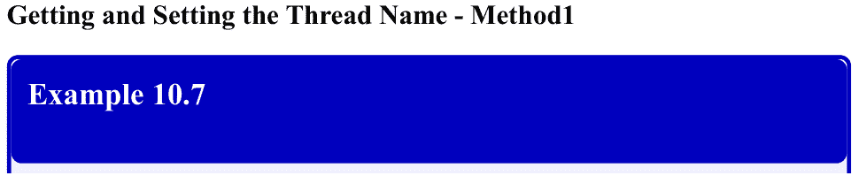

源代码请扫描第 583 页图 10.3 中的二维码

```
输出 10.7

子线程的默认名称是 Thread-1
主线程的默认名称是 MainThread
子线程的新名称是 NewChildThread
主线程的新名称是 NewMainThread
```

## 获取和设置线程名称 - 方法2

```
示例 10.8

源代码请扫描第 583 页图 10.3 中的二维码
```

```
输出 10.8

子线程的默认名称是 Thread-1
主线程的默认名称是 MainThread
子线程的新名称是 NewChildThread
主线程的新名称是 NewMainThread
```

## 10.4 使用线程执行单任务

当一个线程依次执行多个任务时，就称为单任务处理。我们今天看到的最好的例子就在我们家里。我们的母亲是如何准备食物的。假设，我们的母亲想做普里饼，那么她会依次准备好以下原料。她会在炒锅或深锅里加热油。然后她会和面，做成圆形薄片并油炸。最终，一个美味可口的普里饼就做好了，让我们所有人都垂涎欲滴。但是，她是在单手执行多个任务。让我们通过代码来理解上述概念。

## 示例 10.9

源代码请扫描第 583 页图 10.3 中的二维码

## 输出 10.9

- 加热油
- 和面
- 制作面片
- 开始油炸
- 美味的普里饼可以吃了！

## 10.5 线程标识号

每个线程内部都有一个唯一的标识号。这个唯一的标识号可以通过隐式变量 `ident` 来访问。因此，每当我们创建线程对象时，Python 虚拟机都会分配一个唯一的标识号。每次运行时，`id` 的值都会改变。

## 示例 10.10

```python
from threading import *

def displaymsg():
    print("Child Thread")

myt1 = Thread(target = displaymsg)
myt1.start()
print(f"{current_thread().getName()} unique id is: {current_thread().ident}")
print(f"{myt1.getName()} unique id is: {myt1.ident}")
```

## 输出 10.10

```
第一次运行的输出
Child Thread
MainThread unique id is: 16440
Thread-1 unique id is: 17296

第二次运行的输出
Child Thread
MainThread unique id is: 17660
Thread-1 unique id is: 14544

第三次运行的输出
Child Thread
MainThread unique id is: 17396
Thread-1 unique id is: 14252
```

从示例 10.10 可以清楚地看到，每次运行程序时，唯一 ID 都会不同。

## 10.6 active count

此函数将返回当前正在执行的活动线程的数量。让我们通过一个例子来讨论。

## 示例 10.11

源代码请扫描第 583 页图 10.3 中的二维码

## 输出 10.11

```
第一次运行的输出
子线程启动前的活动线程总数为：1
MyChildThread1 线程已启动
MyChildThread2 线程已启动
MyChildThread3 线程已启动
子线程启动后的活动线程总数为：4
MyChildThread2 正在执行 display 函数，值为 1200
MyChildThread1 正在执行 display 函数，值为 200
MyChildThread3 正在执行 display 函数，值为 3000
现在，活动线程总数为：1

第二次运行的输出
子线程启动前的活动线程总数为：1
MyChildThread1 线程已启动
MyChildThread2 线程已启动
MyChildThread3 线程已启动
子线程启动后的活动线程总数为：4
MyChildThread1 正在执行 display 函数，值为 200
MyChildThread2 正在执行 display 函数，值为 1200
MyChildThread3 正在执行 display 函数，值为 3000
现在，活动线程总数为：1
```

在上面的示例中，当创建了 3 个子线程对象时，活动线程的总数为 1。在子线程对象启动后，由于 display 函数中的 `sleep(1)`，子线程启动后的活动线程数量将为 4（1 + 3）。当 MainThread 休眠 4 秒时，活动线程的数量将只有 1，因为所有 3 个线程最多只能休眠 1 秒。1 秒后，子线程将结束。4 秒后，我们将发现只有 1 个活动线程，即 MainThread。正如预期的那样，每次运行时，线程的执行顺序都会不同。

## 10.7 enumerate

此函数将返回当前正在运行的所有活动线程的列表。一旦我们获得列表，我们就能显示诸如标识号、线程名称等信息。让我们通过一个例子来看。

## 示例 10.12

源代码请扫描第 583 页图 10.3 中的二维码

## 输出 10.12

```
第一次运行的输出
子线程启动前的活动线程总数为：1
MyChildThread1 线程已启动
MyChildThread2 线程已启动
MyChildThread3 线程已启动
线程名称是：MainThread，其唯一线程 ID 是：5704

线程名称是：MyChildThread1，其唯一线程 ID 是：11308

线程名称是：MyChildThread2，其唯一线程 ID 是：13720

线程名称是：MyChildThread3，其唯一线程 ID 是：16504

MyChildThread2 正在执行 display 函数，值为 1200
MyChildThread1 正在执行 display 函数，值为 200
MyChildThread3 正在执行 display 函数，值为 3000
休眠 5 秒后，只有：MainThread 是活动线程，其唯一线程 ID 是：5704

第二次运行的输出
子线程启动前的活动线程总数为：1
MyChildThread1 线程已启动
MyChildThread2 线程已启动
MyChildThread3 线程已启动
线程名称是：MainThread，其唯一线程 ID 是：9276

线程名称是：MyChildThread1，其唯一线程 ID 是：14140

线程名称是：MyChildThread2，其唯一线程 ID 是：13748

线程名称是：MyChildThread3，其唯一线程 ID 是：9344

MyChildThread3 正在执行 display 函数，值为 3000
MyChildThread2 正在执行 display 函数，值为 1200
MyChildThread1 正在执行 display 函数，值为 200
休眠 5 秒后，只有：MainThread 是活动线程，其唯一线程 ID 是：9276
```

在上面的示例中，当创建了 3 个子线程对象时，活动线程的总数为 1。在子线程对象启动后，由于 display 函数中的 `sleep(1)`，子线程启动后的活动线程数量将为 4（1 + 3）。因此，`enumerate` 将列出所有当前正在运行的活动线程，显示它们的名称和唯一标识号。当 MainThread 休眠 5 秒时，活动线程的数量将只有 1，因为所有 3 个线程最多只能休眠 1 秒。1 秒后，子线程将结束。5 秒后，我们将发现只有 1 个活动线程，即 MainThread。因此，`enumerate` 将只列出主线程的名称及其唯一 ID。正如预期的那样，每次运行时，所有线程的唯一 ID 都会不同。

## 10.8 IsAlive

此方法将验证线程是否仍在执行。让我们看一个例子。

## 示例 10.13

源代码请扫描第583页图10.3中的二维码

## 输出 10.13

```
第一次运行输出
子线程启动前活跃线程总数为：1
MyChildThread1 线程已启动
MyChildThread2 线程已启动
MyChildThread3 线程已启动
MyChildThread1 是否存活：True
MyChildThread2 是否存活：True
MyChildThread3 是否存活：True
MyChildThread1 正在执行显示函数，值为 200
MyChildThread2 正在执行显示函数，值为 1200
MyChildThread3 正在执行显示函数，值为 3000
主线程休眠5秒后，MyChildThread1 是否存活：False
主线程休眠5秒后，MyChildThread2 是否存活：False
主线程休眠5秒后，MyChildThread3 是否存活：False
第二次运行输出
子线程启动前活跃线程总数为：1
MyChildThread1 线程已启动
MyChildThread2 线程已启动
MyChildThread3 线程已启动
MyChildThread1 是否存活：True
MyChildThread2 是否存活：True
MyChildThread3 是否存活：True
MyChildThread2 正在执行显示函数，值为 1200
MyChildThread1 正在执行显示函数，值为 200
MyChildThread3 正在执行显示函数，值为 3000
主线程休眠5秒后，MyChildThread1 是否存活：False
主线程休眠5秒后，MyChildThread2 是否存活：False
主线程休眠5秒后，MyChildThread3 是否存活：False
```

在示例10.13中，当创建了3个子线程对象时，活跃线程总数为1。因此，只有主线程是存活的。在子线程对象启动后，由于显示函数中的`sleep(1)`，子线程启动后的活跃线程数将为4（1 + 3）。因此，所有子线程都是存活的，因为它们仍在执行。当主线程休眠5秒时，活跃线程数将仅为1，因为所有3个线程最多只能休眠1秒。1秒后，子线程将终止。5秒后，我们将发现只有1个活跃线程，即主线程。因此，所有子线程的存活状态均为False。正如预期的那样，每次运行时，线程的执行顺序都会不同。

## 10.9 Join

当需要一个线程等待另一个线程完成时，可以使用`join()`方法。调用线程在调用`join`方法时会被阻塞，直到被调用的线程对象终止。当从主线程调用上述方法时，主线程将处于等待状态，直到被调用`join`的子线程终止。如果不调用`join()`方法，主线程有可能在子线程之前退出，这可能会影响程序操作的数据完整性，并导致程序行为不确定。还可以指定超时值。让我们通过一个例子来理解上述概念。

## 示例 10.14

源代码请扫描第583页图10.3中的二维码

## 输出 10.14

```
2*0 = 0
2*1 = 2
2*2 = 4
2*3 = 6
2*4 = 8
2*5 = 10
2*6 = 12
2*7 = 14
2*8 = 16
2*9 = 18
2*10 = 20
子线程已完成
3*0 = 0
3*1 = 3
3*2 = 6
3*3 = 9
3*4 = 12
3*5 = 15
3*6 = 18
3*7 = 21
3*8 = 24
3*9 = 27
3*10 = 30
主线程已完成
```

在上面的例子中，有两个函数`multiply_two()`和`multiply_three()`。第一个函数`multiply_two()`将生成2的乘法表，由子线程在其启动时执行；而`multiply_three()`将生成3的乘法表，由主线程执行。现在，一旦主线程启动了子线程，主线程将继续执行，直到子线程完成其任务，因此我们将使用`join()`方法，将子线程对象作为`myt1.join()`，因为主线程将首先等待子线程`myt1`完成。一旦子线程完成了其任务，主线程才会执行剩余的代码，在上述情况下是调用`multiply_three()`。但是，主线程并非必须等待子线程完成其任务。主线程可以给子线程一些时间，然后退出阻塞状态继续执行。假设有一个线程正在尝试与服务器建立网络连接。预计在一段时间内成功建立网络连接。现在，当超时时间过后，调用线程将从阻塞状态变为活动状态，并通过尝试连接一些较少使用的备用服务器来执行其任务。让我们看看同一个例子，但给`join()`方法设置一个时间限制。

## 示例 10.15

源代码请扫描第583页图10.3中的二维码

## 输出 10.15

```
2*0 = 0
2*1 = 2
2*2 = 4
2*3 = 6
2*4 = 8
3*0 = 0
3*1 = 3
3*2 = 6
3*3 = 9
3*4 = 12
3*5 = 15
3*6 = 18
3*7 = 21
3*8 = 24
3*9 = 27
3*10 = 30
主线程已完成
2*5 = 10
2*6 = 12
2*7 = 14
2*8 = 16
2*9 = 18
2*10 = 20
子线程已完成
```

正如我们所看到的，5秒后，主线程从阻塞状态中恢复并继续执行，然后子线程将继续执行直到完成。

## 10.10 守护线程与非守护线程

在后台持续运行的线程称为守护线程。这种线程的主要目的是为非守护线程（如主线程）提供支持。守护线程的最佳例子是垃圾回收器（GC）。与主线程不同，GC永远不会出现在屏幕上，我们无法查看其输出。想象一下，主线程在内存不足的情况下运行，垃圾回收器会立即销毁无用对象以释放内存，它将在后台由PVM运行。这样，主线程就可以在没有任何内存问题的情况下继续执行。

### 10.10.1 创建守护线程

我们可以使用`daemon=True`或`setDaemon(True)`方法将线程设置为守护线程。

- 1. **setDaemon(True/False):** 可以使用`setDaemon()`方法将线程设置为守护线程或非守护线程。如果我们在上述方法中传递`True`作为参数，那么非守护线程将变为守护线程；如果传递`False`，那么守护线程将变为非守护线程。需要注意的一个重要点是，我们可以在启动线程之前将其设置为守护线程。
- 2. **daemon属性**: 可以使用`daemon`属性检查线程是否为守护线程。如果线程是守护线程，则返回`True`，否则返回`False`。我们也可以使用上述属性将线程设置为守护线程或非守护线程。
- 3. **isDaemon()**: 可以使用`isDaemon()`方法检查线程是否为守护线程。当线程是守护线程时返回`True`，否则返回`False`。

让我们通过一个例子来更好地理解。

**示例 10.16**

源代码请扫描第583页图10.3中的二维码

**输出 10.16**

```
设置线程为守护线程前：False
设置线程为守护线程后：True
```

从示例10.16中，我们可以观察到以下内容。

在D0中，创建了一个线程对象，其目标函数为`disp`。

在D1中，在将线程设置为守护线程之前，线程对象的状态为`False`，即它是一个非守护线程。

在D2中，我们使用`setDaemon(True)`将线程对象设置为守护线程。

在D3中，在将线程设置为守护线程之后，线程对象的状态为`True`，即它是一个守护线程。现在，我们之前已经说明，可以在启动线程之前将其设置为守护线程/非守护线程，如下所示。

**示例 10.17**

源代码请扫描第583页图10.3中的二维码

**输出 10.17**

```
设置线程为守护线程前：False
仅当它是守护线程时才显示函数
```

如果我们在上面的例子中，在`start()`方法之后将线程设置为守护线程，Python将引发运行时错误，如下所示。

**示例 10.18**

源代码请扫描第583页图10.3中的二维码

**输出 10.18**

```
设置线程为守护线程前：False
非守护线程
Traceback (most recent call last):
  File "prog1_thread.py", line 223, in <module>
    threadobj.setDaemon(True)
```

```
文件 "C:\Users\SAURABH\AppData\Local\Programs\Python\Python37\lib\threading.py", 第 1132 行, 在 setDaemon 方法中
    self.daemon = daemonic
文件 "C:\Users\SAURABH\AppData\Local\Programs\Python\Python37\lib\threading.py", 第 1125 行, 在 daemon 属性中
    raise RuntimeError("cannot set daemon status of active thread")
RuntimeError: cannot set daemon status of active thread
```

如上所示，我们尝试在 `start()` 之后将线程设置为守护线程。由于我们试图更改其守护属性，Python 抛出了 `RuntimeError: cannot set daemon status of active thread`（无法设置活动线程的守护状态）。

到目前为止，我们已经了解了使用 `isDaemon()` 方法设置守护线程的示例。现在，我们将使用 `daemon` 属性。

## 示例 10.19

源代码扫描 [图 10.3](Figure 10.3) 二维码，见 [第 583 页](page 583)

## 输出 10.19

设置线程为守护线程前：False
仅当线程是守护线程时才显示函数

### 10.10.2 线程的默认性质

1.  每当我们在 Python 中编写一个程序时，如果我们从未显式编写任何线程，那么该代码默认包含一个名为**主线程**的线程。但是，您是否好奇主线程是不是守护线程？请注意，主线程默认始终是一个非守护线程。我们无法更改其守护性质，因为它在开始时就已经启动。让我们从实践上看一下上述内容。

    > **示例 10.20**
    >
    > 源代码扫描 [图 10.3] 二维码，见 [第 583 页]

    > **输出 10.20**
    >
    > MainThread
    > False
    > False

    在 L1 中，线程对象的名称是 `MainThread`。

    在 L2 和 L3 中，主线程是一个非守护线程。

2.  对于其余的线程，守护性质是从父线程继承给子线程的，即如果父线程是守护线程，则子线程也是守护线程。如果父线程是非守护线程，则子线程也是非守护线程。让我们逐一讨论上述情况。

    #### 当父线程是非守护线程时

    > **示例 10.21**
    >
    > 源代码扫描 [图 10.3] 二维码，见 [第 583 页]

    ## 输出 10.21

    主线程名称为 `MainThread`，是一个非守护线程。子线程名称为 `Thread-1`，是一个非守护线程。显示函数

    在上面的示例中，主线程是非守护线程，因此子线程也是非守护线程，因为主线程创建了子线程。所以，主线程是子线程的父线程。一旦子线程被创建，主线程和子线程的执行将是不同的。

    #### 当父线程是守护线程时

    ## 示例 10.22

    源代码扫描 [图 10.3](#Figure_10.3) 二维码，见 [第 583 页](#page_583)

    ## 输出 10.22

    主线程名称为 `MainThread`，是一个非守护线程。子线程名称为 `Thread-1`，是一个守护线程。第二个子线程名称为 `Thread-2`，是一个守护线程，其父线程名称为 `Thread-1`。Display2 函数。主程序已完成！

    在上面的示例中，主线程是一个非守护线程。在 DL1 中，我们将子线程对象 `mychilddt1` 设置为守护线程，因为其父线程（即主线程）是非守护线程。当子线程对象 `mychilddt1` 激活时，从 DL2 可以看到，会创建一个新的子线程对象 `mychildthread2`。由于其父线程 `mychilddt1` 是守护线程，所以 `mychildthread2` 线程也是守护线程。由于我们并未显式将上述线程设置为守护线程，因此很明显它是从其父线程 `mychilddt1` 继承而来，而父线程本身就是一个守护线程。请参阅图 10.4 中的流程图，作为上述示例的总结。

3.  每当最后一个非守护线程终止时，所有的守护线程将自动终止。守护线程不需要显式终止。让我们用一个例子来澄清上述概念。

## 示例 10.23

源代码扫描图 10.3 二维码，见第 583 页

## 输出 10.23

为 1 号桌接单并完成服务
为 2 号桌接单并完成服务
为 3 号桌接单并完成服务
为 4 号桌接单并完成服务
为 5 号桌接单并完成服务
为 6 号桌接单并完成服务
为 7 号桌接单并完成服务
餐厅已打烊！
为 8 号桌接单并完成服务
为 9 号桌接单并完成服务
为 10 号桌接单并完成服务

这里，我们没有做任何新奇的事情。我们创建了一个子线程对象，其目标函数 `mymsgprint` 待执行。当子线程激活时，会执行 `mymsgprint()` 函数。每次迭代休息 1 秒。主线程将休眠 7 秒，7 秒后它将从阻塞状态恢复并完成其执行。主线程执行完毕后，子线程将完成其剩余任务。这里我们可以看到，尽管餐厅已经打烊，但仍在为餐桌接单，这是不正确的。

所以，现在我们将把子线程设置为守护线程，之后我们将再次执行程序。

## 示例 10.24

源代码扫描图 10.3 二维码，见第 583 页

## 输出 10.24

为 1 号桌接单并完成服务
为 2 号桌接单并完成服务
为 3 号桌接单并完成服务
为 4 号桌接单并完成服务
为 5 号桌接单并完成服务
为 6 号桌接单并完成服务
为 7 号桌接单并完成服务
餐厅已打烊！

现在，我们在子线程 `mychildt1` 激活之前将其设置为守护线程。主线程将处于阻塞状态 7 秒。子线程将执行其任务。一旦主线程在 7 秒后从阻塞状态恢复，将显示“餐厅已打烊”，从而使主线程终止。由于非守护线程已终止，守护线程（子线程）将自动终止。

## 10.11 使用多个线程进行多任务处理

当多个任务同时执行时，称为多任务处理。为此，我们需要一个以上的线程。当我们使用多个线程时，称为多线程。假设在一家餐厅，某人来了并坐在 1 号桌。服务员过来从坐在 1 号桌的顾客那里接单。服务员去到厨师那里，要求制作从 1 号桌收到的食物订单。与此同时，又有更多顾客来了并坐在 2 号桌。服务员走到坐在 2 号桌的顾客面前接单。当服务员去厨师那里时，他将食物端给了坐在 1 号桌的顾客。所以，这里有两个人在工作。一个是服务员负责接单，另一个是厨师负责烹饪食物。这里，通过多线程实现了多任务处理。这里执行了两项任务。一项是从顾客那里接单，另一项是将食物端到顾客的餐桌。这两项任务需要同时进行，即接单和上菜。当厨师正在为一张桌子烹饪食物时，必须从另一张桌子接单，然后将食物端到最初下单的那张桌子。因此，所有这些任务必须同时在不同的线程中执行。让我们通过代码看一个例子。

源代码扫描图 10.3 二维码，见第 583 页

第 1 次运行输出

```
为顾客 0 接单
为顾客 0 上菜
为顾客 1 接单
为顾客 1 上菜
为顾客 2 接单
为顾客 2 上菜
为顾客 3 接单
为顾客 3 上菜
为顾客 4 接单
为顾客 4 上菜
```

第 2 次运行输出

```
为顾客 0 接单
为顾客 0 上菜
为顾客 1 上菜
为顾客 1 接单
为顾客 2 上菜
为顾客 2 接单
为顾客 3 上菜
为顾客 3 接单
为顾客 4 上菜
为顾客 4 接单
```

在上面的代码中，创建了一个名为 `restaurant` 的类，包含一个构造函数和 `myOrder_serve_food` 方法。我们正在执行两个多任务。一个是从顾客那里接单，另一个是向顾客上菜。为此，创建了两个 `restaurant` 类的对象。创建了两个具有相同目标方法的不同线程。调用了 `Thread` 类的 `start()` 方法来启动线程。每次运行都会得到不同的输出，因为在多线程中它们是不可预测的。在第一次输出中，从顾客那里接单的顺序和向顾客上菜的顺序是正确的。但在第二次运行中，先为顾客 1 上菜，然后才为顾客 1 接单。这是执行输出的错误显示。不可能在从顾客那里接单之前就上菜。这在 Python 中被称为**竞态条件**。这里，两个线程试图共享访问数据，并同时试图更改它。结果，我们将获得不可预测的输出。它可能根据进程上下文切换的时间而有所不同。

## 10.12 线程竞态条件

在图10.5中，4个线程正试图以不可预期的顺序访问共享资源或临界区（访问共享资源的程序部分），并试图同时修改数据。因此，其值将是不可预测的，并且会根据进程上下文切换的时机而变化。存在数据不一致问题的可能性。生成的输出将是不可靠的。我们已经在多任务多线程中看到过一个例子。但我们将再看一个例子。有两个人“Saurabh”和“Nilesh”正试图同时从一个“abc”网站预订一张从海得拉巴到比莱的巴士车票，日期和时间相同。

> 注意：上述代码中未提及日期、时间、出发/到达地点以及巴士名称。我们仅探讨这两位乘客试图同时订票的场景。不幸的是，巴士上只剩1个座位。

让我们看看这个场景。

## 示例 10.26

源代码请扫描第583页图10.3所示的二维码

## 输出 10.26

第一次运行的输出

```
Number of seats remaining : 1
Saurabh was alloted the seat No. L1
Number of seats remaining : 1
All the seats are booked now Sorry !
```

第二次运行的输出

```
Number of seats remaining : 1
Number of seats remaining : 1
Nilesh was alloted the seat No. L1
Saurabh was alloted the seat No. L1
```

在示例10.26中，创建了一个名为`abc`的类。
在ML1中，有一个构造函数，它包含一个名为`seat_available`的参数。作为程序员，我们将给它一个值，表示有多少个座位可用。为类`abc`创建了一个对象`obj_abc`，我们向其构造函数参数传递了值1作为参数。因此，`self.seat_available`的值为1。创建了两个线程`myt1`和`myt2`。两个线程具有相同的目标方法`abc_reserveseat`。它有一个参数`seat_required`，它将告诉我们需要多少个座位。在上述方法中，首先将显示剩余座位数，这将告诉我们有多少个座位可用。然后将检查条件`seat_available`是否大于或等于`seat_required`。如果条件为True，则将显示预订座位的客户姓名以及座位号。`seat_available`将减一。

因此，在第一次运行中，我们得到了一个错误的输出，即尽管Saurabh被分配了座位号，但可用座位数仍然是1。这是因为有两个线程，并且两个线程同时在`abc_reserveseat`方法中执行。因此，Nilesh的线程看到剩余座位数为1。与此同时，座位被名为Saurabh的线程预订，并且为名为Nilesh的线程显示了输出“All the seats are booked now Sorry !”。

第二次运行的输出完全不同，因为座位被分配给了两个线程。两个线程正在同时执行。

这就是竞态条件，我们需要找到一种技术，使得如果一个线程正在执行一行代码，那么另一个线程就不能执行。因此，可以使用线程同步来消除多个线程之间的竞态条件。

## 10.13 线程同步

正如我们所看到的，多个线程试图访问同一个对象，这可能导致数据不一致或获得不可靠的输出等问题。因此，当一个线程已经在访问一个对象时，可以阻止另一个线程访问同一个对象，这称为线程同步。线程将一个接一个地执行，以便可以克服数据不一致的问题。因此，同步意味着同一时间只有一个线程。当资源被同时访问时，线程之间不会相互干扰。线程同步的主要实际应用领域是在线预订系统、从联名账户转账等。同步对象或互斥对象（mutex）是线程同步的对象。在多个线程同时作用于同一对象的情况下，建议使用线程同步。

线程同步可以通过以下技术实现：

### 10.13.1 使用锁

在Python中，`threading`模块提供的最基本的同步机制是锁。锁将用于同步对共享资源的访问。使用锁，线程正在操作的对象将被锁定。锁有两种状态：已锁定和未锁定。锁将以未锁定状态创建。我们可以这样想象：假设有一扇门是锁着的。我们不能给一扇锁着的门上锁。只有在门未锁定的情况下才能上锁。锁对象可以如下创建：

```
mylock = Lock()
```

同一时间只有一个线程可以持有锁对象。如果任何线程需要相同的锁，那么它将等待，直到锁被线程释放。这类似于一个人在公共浴室洗澡或使用公共电话亭。

#### 10.13.1.1 acquire()

此方法用于将状态更改为已锁定并立即返回。未锁定状态将更改为已锁定状态。锁对象一次只能由一个线程持有。如果任何其他线程需要相同的锁，那么它将等待，直到线程释放锁。已锁定状态将由线程保持，直到它被释放。`acquire()`的语法是：

```
acquire(blocking = True, timeout = -1)
```

**当值设置为True时**

如果使用True调用上述方法，则线程的执行将被阻塞，直到锁被解锁。True是默认参数。

**当值设置为False时**

如果使用False调用上述方法，则线程的执行不会被阻塞，直到它被锁定或设置为True。False不是默认参数。

当`timeout`参数不是-1，并且通过调用浮点数`timeout`参数设置为正值时，线程执行将被阻塞最多`timeout`指定的秒数，并且只要无法获取锁。如果`timeout`参数为-1，则指定无限期等待。

如果成功获取锁，则返回值为True，否则为False（例如超时到期）。

线程可以使用`acquire()`方法获取锁。例如`mylock.acquire()`

#### 10.13.1.2 release()

此方法用于释放锁。如果锁已锁定，则上述方法将解锁锁。它不限于获取锁的唯一线程，而是可以从任何线程调用。如果任何其他线程因等待锁解锁而被阻塞，则允许其中一个继续执行。

线程可以使用`release()`方法释放锁。例如`mylock.release()`

当在未锁定的锁上调用时，会引发运行时错误，如下所示。

## 示例 10.27

```
from threading import *
mylock = Lock()
mylock.release()
```

## 输出 10.27

```
RuntimeError: release unlocked lock
```

因此，我们现在将采用产生竞态条件的相同示例。但会进行一些小的调整。另一位乘客“Divya”希望在同一日期和时间在同一辆巴士上预订车票。此外，座位可用性增加了一个。因此，现在可用的总座位数为2。让我们讨论这个例子。

## 示例 10.28

源代码请扫描第583页图10.3所示的二维码

## 输出 10.28

```
Output on 1st run
<class '_thread.lock'>
Number of seats remaining : 2
Saurabh was alloted the seat No. L2
Number of seats remaining : 1
Nilesh was alloted the seat No. L1
Number of seats remaining : 0
All the seats are booked now Sorry !

Output on 2nd run
<class '_thread.lock'>
Number of seats remaining : 2
Saurabh was alloted the seat No. L2
Number of seats remaining : 1
Divya was alloted the seat No. L1
Number of seats remaining : 0
All the seats are booked now Sorry !
```

在LO1中，我们使用`self.mylock = Lock()`创建了一个锁对象。

创建了一个新的乘客线程“Divya”。现在，所有三个线程都具有相同的目标方法`abc_reserveseat`，因为它作为目标函数参数传递。

在目标方法的临界区LO2处，使用`self.mylock.acquire()`应用锁。一旦获取了锁，其他线程将无法能够访问临界区，直到使用 `self.mylock.release()`（在 LO3 处）释放锁为止。
因此，请记住 **获取锁 → 执行安全操作 → 释放锁**。

我们将可用座位数增加到了2个。因此，在第一次运行输出时，乘客 Saurabh 和 Nilesh 都成功预订了下铺 L2 和 L1 的票。

在第二次运行时，乘客 Saurabh 和 Divya 成功预订了票。因此，正如预期的那样，我们可能会得到不同线程数的输出，但在这里不会遇到竞态条件。

需要注意的一个重要点是，我们在代码中没有写明参数 `blocking = True` 和 `timeout = -1`。

即使我们写了这些参数，我们得到的输出也不会有任何竞态条件，如所示。

## 示例 10.29

源代码扫描 [第583页](page 583) [图10.3](Figure 10.3) 所示的二维码。

## 输出 10.29

```
第1次运行输出
剩余座位数：2
Saurabh 被分配了座位号 L2
剩余座位数：1
Nilesh 被分配了座位号 L1
剩余座位数：0
所有座位已预订，抱歉！
第2次运行输出
剩余座位数：2
Saurabh 被分配了座位号 L2
剩余座位数：1
Divya 被分配了座位号 L1
剩余座位数：0
所有座位已预订，抱歉！
```

假设需要使用超时功能。我们将超时参数设置为2，即2秒，将导入 `time` 模块，并在临界区提供睡眠，如这里所示。

## 示例 10.30

源代码扫描 [第583页](page 583) [图10.3](Figure 10.3) 所示的二维码。

## 输出 10.30

```
剩余座位数：2
Saurabh 被分配了座位号 L2
剩余座位数：1
剩余座位数：1
Divya 被分配了座位号 L1
Nilesh 被分配了座位号 L1
线程 Divya 异常：
Traceback (most recent call last):
  File "C:\Users\SAURABH\AppData\Local\Programs\Python\Python37\lib\threading.py", line 917, in _bootstrap_inner
    self.run()
  File "C:\Users\SAURABH\AppData\Local\Programs\Python\Python37\lib\threading.py", line 865, in run
    self._target(*self._args, **self._kwargs)
  File "prog1_thread.py", line 314, in abc_reserveseat
    self.mylock.release()
RuntimeError: release unlocked lock
线程 Nilesh 异常：
Traceback (most recent call last):
  File "C:\Users\SAURABH\AppData\Local\Programs\Python\Python37\lib\threading.py", line 917, in _bootstrap_inner
    self.run()
  File "C:\Users\SAURABH\AppData\Local\Programs\Python\Python37\lib\threading.py", line 865, in run
    self._target(*self._args, **self._kwargs)
  File "prog1_thread.py", line 314, in abc_reserveseat
    self.mylock.release()
RuntimeError: release unlocked lock
```

在上面的输出中，我们可以看到，一旦线程对象 `myt1` 成功预订了票，它将进入5秒的睡眠（而不释放锁）。与此同时，由于超时时间为2秒，其余两个线程都会尝试访问该对象，即目标方法 `abc_reserveseat`。现在，我们得到了 `RuntimeError: release unlocked lock`（运行时错误：释放未锁定的锁）。第一个线程没有被释放，并且由于它睡眠了5秒，其他线程因为第一个线程超时而获得访问该对象的机会。

当设置 `blocking = False` 时，我们也会看到相同的错误。这里我们移除了 `time` 模块。

## 示例 10.31

源代码扫描 [第583页](page 583) [图10.3](Figure 10.3) 所示的二维码。

## 输出 10.31

```
剩余座位数：2
Saurabh 被分配了座位号 L2
剩余座位数：2
剩余座位数：1
Divya 被分配了座位号 L1
Nilesh 被分配了座位号 L1
线程 Nilesh 异常：
Traceback (most recent call last):
  File "C:\Users\SAURABH\AppData\Local\Programs\Python\Python37\lib\threading.py", line 917, in _bootstrap_inner
    self.run()
  File "C:\Users\SAURABH\AppData\Local\Programs\Python\Python37\lib\threading.py", line 865, in run
    self._target(*self._args, **self._kwargs)
  File "prog1_thread.py", line 312, in abc_reserveseat
    self.mylock.release()
RuntimeError: release unlocked lock
```

因此，当你希望一次只有一个线程在临界区内操作，并在执行完任务后释放锁时，请使用 `acquire` 方法。同时，将参数 `blocking` 设置为 `True`，这是默认值。

现在，这里还有一个小问题。如下面所示，当乘客线程执行时，主线程也可能介入。

## 示例 10.32

```
剩余座位数：2
Saurabh 被分配了座位号 L2
主线程
剩余座位数：1
Nilesh 被分配了座位号 L1
剩余座位数：0
所有座位已预订，抱歉！
```

如图所示，当乘客线程 `myt1` 处于锁定状态时，主线程的打印语句介入了。

但我们希望首先所有乘客线程执行完毕，然后主线程才在执行流程中出现。因此，我们将对所有乘客线程对象使用 `join` 方法。这样，首先所有乘客线程将被执行，然后主线程才会在最后介入，如下所示。

## 示例 10.33

源代码扫描 [第583页](page 583) [图10.3](Figure 10.3) 所示的二维码。

## 输出 10.33

```
剩余座位数：2
Saurabh 被分配了座位号 L2
剩余座位数：1
Nilesh 被分配了座位号 L1
剩余座位数：0
所有座位已预订，抱歉！
```

## 简单锁的问题

标准锁对象不关心当前是哪个线程持有锁。如果锁已被持有，并且任何线程试图获取该锁，那么该线程将被阻塞，即使该线程之前已经持有该锁。请观察 [示例 10.34]。

## 示例 10.34

```
from threading import *
mylockobj = Lock()
print("主线程已获取锁")
mylockobj.acquire()
print("主线程再次尝试获取锁")
mylockobj.acquire()
```

## 输出 10.34

在 [示例 10.34](Example 10.34) 中，主线程首先获取了锁。主线程再次尝试获取锁，导致主线程被阻塞。现在，要从 Windows 命令提示符终止被阻塞的线程，我们将使用 `Ctrl + Break`。`Ctrl + C` 命令将完全不起作用。

### 10.13.2 使用可重入锁 (RLock)

标准锁不知道当前持有锁的线程名称。如果锁已被持有，任何尝试获取它的线程都会被阻塞，即使同一个线程本身持有该锁。我们都知道到目前为止什么是递归。如果我们想使用线程调用递归函数会怎样？标准锁机制在执行递归函数时将完全失效。为了克服这个问题，需要一个允许被同一个线程多次获取的同步原语，即可重入锁 (RLock)。这个 RLock 对其他线程不可用，仅限于所有者线程，即该锁必须由获取它的线程释放。一旦一个线程获取了这个 RLock，同一个线程可以再次获取它而不会被阻塞。但是，同一个线程应该为每次获取都释放一次。因此在 RLock 中，`acquire()` 和 `release()` 的调用次数必须匹配，并且只有所有者线程才能多次获取锁。请观察下面的例子。

## 示例 10.35

源代码扫描第583页图10.3所示的二维码。

## 输出 10.35

```
主线程已获取锁
<locked _thread.RLock object owner=12684 count=1 at 0x000001F3110F6580>
主线程再次尝试获取锁
<locked _thread.RLock object owner=12684 count=2 at 0x000001F3110F6580>
```

在 RL1 中，锁被线程首次获取。

在 RL2 中，显示了具有唯一所有者 ID 的锁线程对象，其 ID 为 12684，锁计数为 1。

在 RL3 中，锁被线程第二次获取。

在 RL4 中，锁线程对象具有相同的所有者 ID 12684，这次锁计数值增加了 1，变为 2。

因此，我们可以说主线程不会被锁定，因为该线程可以多次获取锁。

对于每一次 `acquire()` 调用，都应该有一个强制的 `release()` 调用。为了释放锁，`acquire()` 和 `release()` 的调用次数必须匹配。在示例10.36中，锁是在两次 `release()` 调用后释放的。

## 让我们看看锁和可重入锁之间的一些区别（表10.1）

| 锁 (Lock) | 可重入锁 (RLock) |
|---|---|
| 一次只能有一个线程获取锁对象。拥有者线程本身不能多次获取同一个锁对象。 | 一次只能有一个线程获取可重入锁对象。但是，拥有者线程可以多次获取同一个锁对象。 |
| 不适用于递归函数执行和嵌套访问调用。 | 适用于递归函数执行和嵌套访问调用。 |
| 此处，锁对象只负责锁定或解锁状态，不处理递归和拥有者线程信息。 | 此处，可重入锁对象负责处理锁定或解锁状态、递归以及拥有者线程信息。 |
| 锁对象执行更快。 | 可重入锁对象的执行比锁对象慢。 |

*表10.1：锁和可重入锁的区别*

我认为现在锁和可重入锁的概念已经清晰了。让我们继续讨论另一种重要的线程同步技术。

### 10.13.3 使用信号量

由荷兰科学家Edsger W. Dijkstra发明的最古老的原始同步技术是信号量。

在锁和可重入锁的情况下，一次只允许一个线程执行。但是，有些需求要求一次允许特定数量的线程访问。这类需求无法通过锁和可重入锁处理，我们应该采用更高级的同步机制——信号量。每当需要限制对具有有限容量的共享资源的访问时，就会使用信号量。

信号量对象创建方式如下：

```python
from threading import Semaphore
mysemaphore_obj = Semaphore(counter)
```

允许同时访问的最大线程数由一个内部计数器表示。其默认值为1。

每当线程执行 `acquire()` 方法时，计数器值减一。

每当线程执行 `release()` 方法时，计数器值加一。

因此，每次 `acquire()` 调用会导致计数器值减少，每次 `release()` 调用会导致计数器值增加。

但是计数器值永远不会低于零。当 `acquire()` 方法发现其为0时，它将阻塞并等待，直到某个线程执行 `release()` 方法。

> **注意：**
>
> 当未提及计数器值时，默认值为1。一次只允许一个线程访问信号量对象。这等同于锁的概念。当计数器值设置为‘n’时，那么信号量对象将一次被‘n’个线程访问。所有其余线程必须等待，直到某个线程释放。

这位荷兰科学家在信号量上命名了两个操作：获取为‘p’，释放为‘v’。‘p’和‘v’是荷兰单词 proberen（测试）和 verhogen（增加）的首字母。让我们看一个例子。

## 示例10.36

扫描图10.3（第583页）中显示的二维码获取源代码。

## 输出10.36

```
<threading.Semaphore object at 0x00000274BADBC668>
Acquired by Saurabh and counter value is: 1
Saurabh hits 6
Acquired by Divya and counter value is: 0
Divya hits 6
Saurabh hits 4
Divya hits 4
Saurabh is out
Divya is out
Released by Saurabh and counter value is: 1
Acquired by Aditya and counter value is: 0
Aditya hits 6
Released by Divya and counter value is: 1
Acquired by Vineet and counter value is: 0
Vineet hits 6
Aditya hits 4
Vineet hits 4
Aditya is out
Vineet is out
Released by Aditya and counter value is: 1
Acquired by Suman and counter value is: 0
Suman hits 6
Released by Vineet and counter value is: 1
Suman hits 4
Suman is out
Released by Suman and counter value is: 2
Main Thread completion
```

在上面的例子中，我们创建了Thread类的5个对象。每个线程接受一个公共参数target = runs，其中runs()函数由每个线程执行。每个线程被分配了一些名称，如"Saurabh"、"Divya"、"Aditya"、"Vineet"和"Suman"。

要启动每个线程，需要调用Thread类的 `start()` 方法。

线程启动后，主线程也会继续执行。为了阻止主线程执行，直到子线程完成执行，`join()` 方法与所有线程对象一起使用。

在S0中，值2作为参数传递给Semaphore类，这意味着允许2个线程访问信号量，因此一次允许2个线程执行 `runs()` 函数。在S1中，我们显示信号量对象。因此，将显示输出 `<threading.Semaphore object at 0x000002BD2EBAC668>`。

在runs函数中，for循环的每次迭代都指定了1秒的睡眠时间。

现在，我们将解释输出场景及其执行方式（见表10.2）。

因此，上述代码将首先等待5个线程的完成。一旦它们完成，主线程的其余语句将被执行。因此，最后将显示“Main Thread Completion”。

### 10.13.3.1 有界信号量

在普通信号量中，`release()` 方法可以被调用任意次数以增加计数器。这就像一个无限信号量。`release()` 调用的次数也可能超过 `acquire()` 调用的次数，如下例所示。

```python
from threading import *
mysemaphore_obj = Semaphore(2)
mysemaphore_obj.acquire()
mysemaphore_obj.acquire()
mysemaphore_obj.release()
mysemaphore_obj.release()
mysemaphore_obj.release()
mysemaphore_obj.release()
```

上述代码将正常运行，因为我们可以任意次数调用 `release()`，这在普通信号量中是有效的。

而有界信号量（BoundedSemaphore）与普通信号量完全相同，只是 `release()` 调用的计数器不应超过 `acquire()` 调用的计数器，否则我们将得到ValueError，如下例所示。

## 示例10.37

```python
from threading import *
mysemaphore_obj = BoundedSemaphore(2)
mysemaphore_obj.acquire()
mysemaphore_obj.acquire()
mysemaphore_obj.release()
mysemaphore_obj.release()
mysemaphore_obj.release()
mysemaphore_obj.release()
```

## 输出10.37

```
ValueError: Semaphore released too many times
```

当我们运行上面的代码时，我们将得到ValueError，因为在有界信号量中，`release()` 调用的计数器值（4）大于 `acquire()` 调用的计数器值。

因此，建议使用有界信号量而不是普通信号量，以防止小的编程错误。

## 锁和信号量的区别

| 锁 (Lock) | 信号量 (Semaphore) |
|---|---|
| 锁对象一次只能被1个线程获取。 | 根据计数器值指定，信号量对象可以被固定数量的线程获取。 |

## 线程同步总结

我们已经看到，通过线程同步可以克服数据不一致问题。但是，缺点是线程的等待时间增加，并导致性能问题。因此，如果没有特定需求，不建议使用线程同步。

## 10.14 线程间通信 (ITC)

有时作为编程需求的一部分，线程需要彼此通信。因此，当2个或更多线程需要相互通信时，称为线程间通信。Python中的线程间通信可以通过以下方式实现：

### 10.14.1 使用事件对象进行线程间通信

线程间最简单的通信机制之一是使用事件对象。这里，一个线程发出事件信号，其他线程等待它。

事件对象将管理一个内部标志，该标志最初为false，可以使用 `set()` 方法设置为True，并使用 `clear()` 方法重置为False。`wait()` 方法将被阻塞，直到标志为True。即线程可以等待标志被设置。

可以如下创建事件对象：

from threading import Event
myeventobj = Event()

其中myeventobj是一个事件对象，它管理一个内部标志，可通过`set()`或`clear()`方法将其设置为True或False。

让我们看看一些事件方法。

1.  **set()**：内部标志将被设置为True。等待该标志变为True的线程将被唤醒。一旦内部标志为True，调用`wait()`的线程将不会阻塞，即变为非阻塞状态，并将执行`wait()`之后的语句。这对所有等待的线程来说是一个**绿灯**信号。
2.  **clear()**：内部标志被重置为False。调用`wait()`的线程随后将被阻塞，直到再次调用`set()`将内部标志设置为True。这对所有等待的线程来说是一个**红灯**信号。
3.  **is set()**：如果内部标志被设置为True，此方法将返回True，否则返回False。
4.  **wait(timeout = None)**：在`wait()`中，默认超时时间为None。它会阻塞线程，直到内部标志被设置为True。如果进入时内部标志已设置为True，则立即返回，否则阻塞直到另一个线程调用`set()`或直到超时发生。如果超时未设置为None，则它应为一个浮点数，指定以秒为单位的超时操作。

让我们看一个基本示例来理解。

> 示例 10.38

源代码扫描第583页图10.3所示的二维码

> 输出 10.38

```
Initially myeventobj is: False
func1 sleeping for 3 secs....
True when myeventobj.set() is called from func1 .i.e. Internal flag is set
func2 sleeping for 4 secs....
False when myeventobj.clear() is called from func1.i.e. Internal flag is reset
Main Thread Completed
```

在示例10.38中，我们将讨论代码是如何执行的。

首先，我们创建了一个事件对象`myeventobj`。
我们创建了两个`Thread`类的对象。两个线程分别接受不同的参数`target = func1`和`target = func2`。

为了启动每个线程，调用了`Thread`类的`start()`方法。

线程启动后，主线程也会继续执行。为了停止主线程的执行，直到子线程完成执行，我们对所有线程对象使用了`join()`方法。

在E1点，`myeventobj`为False。第2个线程将被阻塞，处于`wait()`状态，由于`func1()`执行了`sleep(2)`，程序将休眠2秒。

然后在E2点，当我们通过事件对象调用`set()`时，内部标志将被设置为True。通过设置事件给出通知。

第2个线程现在将被唤醒并解除阻塞。

在E3点，执行`func1()`的线程休眠3秒。

在E5点，由于内部标志状态为True，条件为True。因此，将显示输出"True when myeventobj.set() is called from func1 i.e. Internal flag is set"。

在E6点，执行`func2()`的线程休眠4秒。

在E4点，内部标志被执行`func1()`的线程设置为False。通过重置事件给出通知。

在E7点，检查内部标志状态是否为False，并显示输出"False when myeventobj.clear() is called from func1 i.e. Internal flag is reset"。

上述代码将首先等待2个线程完成。一旦它们完成，主线程的剩余语句将被执行。因此，最后将显示“Main Thread Completed”。

## 10.14.2 使用Condition进行线程间通信

用于线程间通信的高级版本的事件对象是Condition的使用。每当需要改进线程间的通信时，我们将使用Condition类。它表示应用程序中某种状态变化，例如生产项目或消费项目。条件对象将允许一个或多个线程等待，直到被另一个线程通知。因此，线程可以等待该条件，并在条件发生后被通知。条件对象始终与某种锁关联。可以在创建时传入锁，这在多个条件变量必须共享同一锁时很有用；或者也可以默认创建。我们不必单独跟踪锁，因为它是条件对象的一部分。条件对象具有`acquire()`和`release()`方法，它们调用关联锁的相应方法。

条件对象创建如下：

```
from threading import Condition
mycond_obj = Condition()
```

我们将查看一些条件方法

1.  **notify(n=1)**：此方法将通知一个正在条件上等待的线程立即唤醒，其中‘n’是要唤醒的线程数。
2.  **notify all**：此方法将通知所有正在条件上等待的线程唤醒。
3.  **acquire()**：此方法用于在生产或消费项目之前获取条件对象，即线程获取内部锁。
4.  **release()**：此方法用于在生产或消费项目之后释放条件对象，即线程释放内部锁。
5.  **wait(timeout=None)**：此方法将等待直到收到通知或直到时间到期（超时发生）。当调用`notify()`或`notify_all()`方法时，等待终止。当调用`wait()`时，如果调用线程未获取锁，则有可能发生RuntimeError。

让我们看一个例子以更好地理解。生产者从1到80中随机生产6个项目，并将其存储在列表中。消费者将消费存储的项目。

示例 10.39

源代码扫描第583页图10.3所示的二维码

输出 10.39

```
Waiting for update by the consumer
Items producing starts!!!!
Producer producing item no. 11
Producer producing item no. 20
Producer producing item no. 74
Producer producing item no. 5
Producer producing item no. 69
Notification given to consumer
Notification received from producer and item is getting consumed
11 20 74 5 69
Main Thread Completed
```

在上面的例子中，我们将讨论代码是如何执行的。

首先，我们创建了一个条件对象`mycond_obj`。

我们创建了两个`Thread`类的对象。两个线程分别接受不同的参数`target = my_producer`和`target = my_consumer`。

为了启动每个线程，调用了`Thread`类的`start()`方法。

线程启动后，主线程也会继续执行。为了停止主线程的执行，直到子线程完成执行，我们对所有线程对象使用了`join()`方法。

在C7点，消费者线程正在获取锁条件，然后它将消费这些项目。

在C1点，生产者线程在生产项目并通知消费者线程之前，正在获取锁条件。

在C8点，消费者线程将等待，直到从生产者那里收到通知。

因此，将显示输出"Waiting for update by the consumer"。

在C2点，Items producing starts!!!!

在C3和C4点，6个1到80之间的随机项目将被追加到列表中，生产者将生产这些项目编号。显示项目编号时给出了1秒的休眠。

在C5点，生产者将通过调用`notify()`来通知等待的线程。

在C6点，内部锁被生产者线程释放。

在C9点，在消费者从生产者收到通知后，项目将被逐一消费。

在C10点，内部锁被消费者线程释放。

所以，在这里，消费者线程期望更新，因此将负责在条件对象上调用`wait()`。

另一方面，生产者线程执行更新，因此将负责在条件对象上调用`notify()`。

上述代码将首先等待2个线程完成。一旦它们完成，主线程的剩余语句将被执行。因此，最后将显示“Main Thread”。

## 10.14.3 使用Queue进行线程间通信

在线程之间共享数据的最先进方法是使用队列概念。队列内部有条件，该条件具有锁。队列保存生产者生产的数据。`queue`模块的`Queue`类将创建队列。数据从队列中取出并被消费者使用。队列是线程安全的，因此不需要使用锁。锁定由队列模块本身处理，这本身就是一个巨大的优势。

队列对象可以创建如下：

```
from queue import Queue
myqueue_obj = Queue()
```

让我们看看一些队列方法。

1.  **put():** 此方法将被生产者用来将项目插入队列。生产者线程将使用`put()`将数据插入队列。上述方法内部具有在将数据插入队列之前获取锁的逻辑。插入数据后，锁将自动释放。

上述方法用于检查队列是否已满。如果队列已满，生产者线程将通过内部调用 `wait()` 进入等待状态。

2.  **get()**：此方法由消费者使用，用于从队列中移除并返回一个项目。消费者线程将使用 `get()` 从队列中检索数据项。上述方法内部包含在从队列移除数据前获取锁的逻辑。一旦移除完成，锁将自动释放。

    此方法检查队列是否为空。如果队列为空，消费者线程将通过内部调用 `wait()` 进入等待状态。一旦队列更新了数据，线程将自动收到通知。

3.  **empty()**：如果队列为空，此方法返回 `True`，否则返回 `False`。

4.  **full()**：如果队列已满，此方法返回 `True`，否则返回 `False`。

让我们来看一个队列的示例。

## 示例 10.40

源代码请扫描 [第 583 页](page 583) [图 10.3](Figure 10.3) 中的二维码。

## 输出 10.40

```
Item No. 0 produced by producer is: 17
Notification given by the producer
Waiting for updation by consumer
Item No. 1 produced by producer is: 13
The item no. 0 consumed by the consumer is: 17
Notification given by the producer
The item no. 1 consumed by the consumer is: 13
Item No. 2 produced by producer is: 85
Notification given by the producer
Item No. 3 produced by producer is: 40
The item no. 2 consumed by the consumer is: 85
Notification given by the producer
The item no. 3 consumed by the consumer is: 40
Item No. 4 produced by producer is: 29
Notification given by the producer
The item no. 4 consumed by the consumer is: 29
Main Thread Completed!
```

首先，我们创建了一个队列对象 `myqueue obj`。

我们创建了两个 `Thread` 类的对象。这两个线程分别接收不同的参数：`target = my producer` 和 `target = my consumer`。

要启动每个线程，需要调用 `Thread` 类的 `start()` 方法。

线程启动后，主线程也会继续执行。为了在子线程完成执行之前停止主线程的执行，需要对所有线程对象使用 `join()` 方法。

如前所述，队列有一个条件（condition），该条件有其自身的锁。因此，我们无需担心条件和锁的问题。

在生产者线程中，会生成一个 1 到 100 之间的随机整数值，并使用 `put()` 插入队列。`put()` 会在将第一个随机数据（17）插入队列前获取锁，并且一旦数据插入完成，锁将自动释放。

消费者线程将使用 `get()` 从队列中获取数据（17）。`get()` 会在从队列移除数据前获取锁，并且一旦数据从队列中移除，锁将自动释放。

因此，这里随机整数值数据进入队列和从队列移除的过程将重复 5 次。所以，生产者生产的产品将被消费者消费。

上述代码将首先等待 2 个线程完成。一旦它们执行完毕，主线程的剩余语句将被执行。因此，最后将显示 "Main Thread Completed"。

Python 支持 3 种类型的队列：

### 10.14.3.1 FIFO（先进先出）队列

这是默认行为。我们将项目放入队列的顺序，与项目从队列中出来的顺序相同，即项目从队列中出来的顺序与放入的顺序一致。

> 示例 10.41

源代码请扫描第 583 页图 10.3 中的二维码。

```
P
Y
T
H
O
N
```

### 10.14.3.2 LIFO（后进先出）队列

项目从队列中出来的顺序与插入队列的顺序相反。

## 示例 10.42

源代码请扫描 [第 583 页](#) [图 10.3](#) 中的二维码。

## 输出 10.42

```
N
O
H
Y
Y
P
```

### 10.14.3.3 优先级队列

这里，项目将按优先级顺序返回。因此，当我们将项目添加到优先级队列时，也需要提供优先级。项目按优先级顺序检索。优先级数字最低的项目最先返回。如果数据形式为 `(a,b)`，则数据应以元组形式提供。这里，`'a'` 是优先级，`'b'` 是任意元素。

## 示例 10.43

源代码请扫描 [第 583 页](#) [图 10.3](#) 中的二维码。

## 输出 10.43

```
<class 'queue.PriorityQueue'>
6
(1, 'T')
(2, 'H')
(3, 'Y')
(4, 'O')
(5, 'P')
(6, 'N')
```

### 10.15 良好编程实践的一些技巧

1.  我们需要在 `finally` 块内编写释放锁的代码。这里，无论异常是否被处理、是否被引发，锁都将被释放。
    语法如下：

```python
from threading import *
obj_lock= Lock()
obj_lock.acquire()
try:
    write some safe statements
finally:
    obj_lock.release()
```

## 示例 10.44

源代码请扫描 [第 583 页](link) [图 10.3](link) 中的二维码。

## 输出 10.44

```
Hello! Chikki, 0 time
Hello! Chikki, 1 time
Hello! Ankit, 0 time
Hello! Ankit, 1 time
Hello! Ashwin, 0 time
Hello! Ashwin, 1 time
Main Thread Completed
```

2.  我们需要使用 `with` 语句编写获取锁的代码。这里，一旦控制流到达 `with` 块的末尾，锁将自动释放。无需显式释放锁。
    使用 `with` 语句的锁语法如下：

```python
from threading import *
obj_lock = Lock()
with obj_lock:
    write some safe statements
    lock will be released automatically
```

## 示例 10.45

源代码请扫描 [第 583 页](page 583) [图 10.3](Figure 10.3) 中的二维码。

## 输出 10.45

```
Hello! Chikki, 0 time
Hello! Chikki, 1 time
Hello! Ankit, 0 time
Hello! Ankit, 1 time
Hello! Ashwin, 0 time
Hello! Ashwin, 1 time
Main Thread Completed
```

> **注意：**
>
> 我们也可以将 `with` 语句与 `Lock`、`RLock`、`Semaphore` 和 `Condition` 一起使用。

## 进程控制块

-   进程 ID
-   进程状态
-   程序计数器
-   寄存器
-   内存限制
-   打开文件列表

## 线程控制块

-   父进程指针
-   线程 ID
-   线程状态
-   程序计数器
-   寄存器集
-   栈指针

## 进程内存

-   栈
-   堆
-   数据段
-   代码段

图 10.2：进程与线程的关系


第 10 章：源代码

图 10.3：源代码

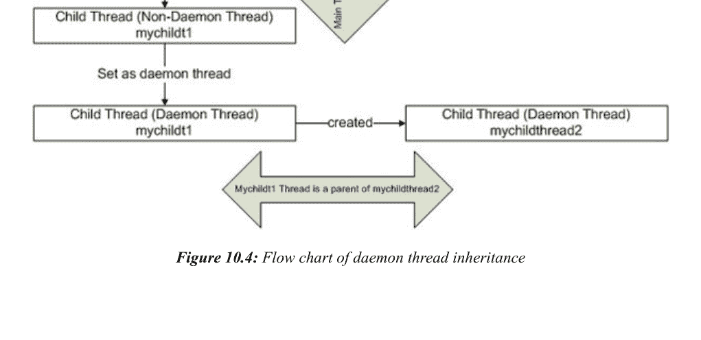

图 10.4：守护线程继承流程图

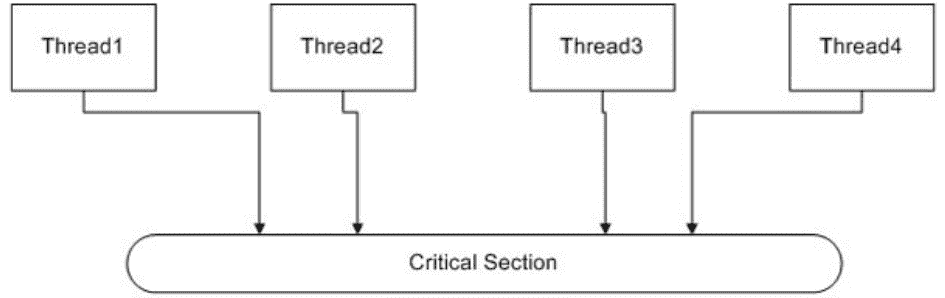

**图 10.5：多个线程访问临界区**

```
$ python prog1_thread.py
Lock acquired by main thread
Lock again is trying to acquire by main thread
```

**图 10.6：[示例 10.34](Example 10.34) 的输出**

| 输出发生的顺序 | 原因 |
| --- | --- |
| Acquired by Saurabh and counter value is: 1 | 第一个名为 Saurabh 的线程将锁定对象。因此，计数器值减 1。现在，计数器值为 1。 |
| Saurabh hits 6 | 第一个线程开始执行。当 `i` 值为 0 时显示输出。 |
| Acquired by Divya and counter value is: 0 | 第二个名为 Divya 的线程将锁定对象。因此，计数器值减 1。计数器值为 0。 |
| Divya hits 6 | 第二个线程开始执行。当 `i` 值为 0 时显示输出。 |
| Saurabh hits 4 | 当 `i` 值为 1 时，由第一个线程显示输出。 |
| Divya hits 4 | 当 `i` 值为 1 时，由第二个线程显示输出。 |
| Saurabh is out | 当 `i` 值为 2 时，由第一个线程显示输出。 |
| Divya is out | 当 `i` 值为 2 时，由第二个线程显示输出。 |
| Released by Saurabh and counter value is: 1 | 第一个线程已释放锁，计数值加一。现在，计数器值为 1。 |
| Acquired by Aditya and counter value is: 0 | 现在，第三个名为 Aditya 的线程将在第一个线程释放锁后锁定对象。 |

| 左列 | 右列 |
|---|---|
| Aditya 执行到 6 | 因此，计数器值减 1。此时，计数器值再次变为 0。 |
| Divya 释放锁，计数器值为：1 | 第 3 个线程开始执行。当 `i` 为 0 时显示输出。 |
| Vineet 获取锁，计数器值为：0 | 第 2 个线程已释放锁，计数值加一。因此，计数器值再次变为 1。 |
| Vineet 执行到 6 | 当第 2 个线程释放锁后，名为 Vineet 的第 4 个线程将锁定该对象。因此，计数器值减 1。所以，计数器值再次变为 0。 |
| Aditya 执行到 4 | 第 4 个线程开始执行。当 `i` 为 0 时显示输出。 |
| Vineet 执行到 4 | 第 3 个线程在 `i` 值为 1 时显示输出。 |
| Aditya 退出 | 第 4 个线程在 `i` 值为 1 时显示输出。 |
| Vineet 退出 | 第 3 个线程在 `i` 值为 2 时显示输出。 |
| Aditya 释放锁，计数器值为：1 | 第 4 个线程在 `i` 值为 2 时显示输出。 |
| Suman 获取锁，计数器值为：0 | 第 3 个线程已释放锁，计数值加一。现在，计数器值为 1。 |
| Suman 执行到 6 | 当第 3 个线程释放锁后，名为 Suman 的第 5 个线程将锁定该对象。因此，计数器值减 1。所以，计数器值再次变为 0。 |
| Vineet 释放锁，计数器值为：1 | 第 5 个线程开始执行。当 `i` 为 0 时显示输出。 |
| Suman 执行到 4 | 第 4 个线程已释放锁，计数值加一。因此，计数器值再次变为 1。 |
| Suman 退出 | 第 5 个线程在 `i` 值为 1 时显示输出。 |
| Suman 释放锁，计数器值为：2 | 第 5 个线程在 `i` 值为 2 时显示输出。 |
| | 最后，第 5 个线程释放了锁，计数值加一。因此，计数器值为 2。 |

表 10.2：示例 10.36 的输出场景

## 附录

# 附录 A

## 其他 Python 模块

扫描下方二维码（图 A.1）访问附录 A：其他 Python 模块。


*图 A.1：* 附录 A：其他 Python 模块的二维码

# 附录 B

## 补充解答示例

扫描下方二维码（图 B.1）访问附录 B：补充解答示例。


**图 B.1：** *附录 B：补充解答示例的二维码*

# 附录 C

## 字符串中的命令行参数

扫描下方二维码（图 C.1）访问附录 C：字符串中的命令行参数。


**图 C.1：** *附录 C：字符串中的命令行参数的二维码*

# 附录 D

## 部分 OS 模块方法/属性

扫描下方二维码（图 D.1）访问附录 D：部分 OS 模块方法/属性。


**图 D.1：** *附录 D：部分 OS 模块方法/属性的二维码*

# 附录 E

## 内置函数

扫描下方二维码（图 E.1）访问附录 E：内置函数。


**图 E.1：** *附录 E：内置函数的二维码*

# 附录 F

## 补充练习编程

扫描下方二维码（图 F.1）访问附录 F：补充练习编程。


图 F.1：附录 F：补充练习编程的二维码

# 附录 G

## 客观题

扫描下方二维码（图 G.1）访问附录 G：客观题。


## 索引

- `__import__()`，[236](#)
- `__main__`，[273](#)
- `__name__`，[273](#)
- `abs()`，[236](#)
- `acquire()`，[564](#)，[576](#)
- `active_count()`，[552](#)
- `add()`，[385](#)
- `all()`，[236](#)
- `any()`，[236](#)
- `append()`，[80](#)，[335](#)，[350](#)
- `ascii()`，[236](#)
- `AssertionError`，[284](#)
- `BaseClass`，[201](#)
- `BaseException`，[201](#)
- `bin()`，[64](#)，[236](#)
- `bool()`，[91](#)，[99](#)，[236](#)
- `break`，[177](#)
- `breakpoint()`，[197](#)
- `bytearray()`，[236](#)
- `bytes()`，[76](#)，[236](#)
- `callable()`，[236](#)
- `casefold()`，[120](#)
- `ceil`，[34](#)
- `center()`，[120](#)
- `chr()`，[236](#)
- `classmethod()`，[236](#)
- `clear()`，[355](#)，[390](#)，[406](#)，[574](#)
- `close()`，[497](#)
- `compile()`，[236](#)，[305](#)
- `complex()`，[91](#)，[96](#)，[236](#)
- `continue`，[180](#)
- `copy()`，[359](#)，[386](#)，[411](#)
- `count()`，[121](#)，[349](#)，[376](#)
- `Counter()`，[423](#)
- `def`，[234](#)，[235](#)
- `defaultdict()`，[423](#)
- `del()`，[82](#)
- `delattr()`，[236](#)
- `demojize()`，[30](#)
- `deque()`，[422](#)
- `dict`，[89](#)
- `dict()`，[236](#)，[400](#)，[405](#)
- `difference()`，[392](#)
- `difference_update()`，[393](#)
- `dir()`，[236](#)，[272](#)
- `disable()`，[457](#)
- `discard()`，[389](#)
- `divmod()`，[236](#)
- `docstring`，[234](#)
- `emojize()`，[30](#)
- `enable()`，[457](#)
- `endswith()`，[123](#)
- `enumerate()`，[236](#)
- `enumeration`，[553](#)
- `eval`，[111](#)
- `eval()`，[236](#)
- `except`，[110](#)，[202](#)，[212](#)，[218](#)
- `exec()`，[236](#)
- `expandtabs()`，[124](#)
- `extend()`，[341](#)，[352](#)
- `filter`，[258](#)
- `filter()`，[236](#)
- `finally`，[212](#)，[228](#)
- `find()`，[125](#)，[132](#)
- `finditer()`，[306](#)
- `float()`，[91](#)，[95](#)，[236](#)
- `floor`，[34](#)
- `for`，[61](#)，[172](#)，[185](#)
- `format()`，[126](#)，[236](#)
- `format_map()`，[131](#)
- `fromkeys()`，[414](#)
- `frozenset`，[88](#)
- `frozenset()`，[236](#)
- `get()`，[406](#)，[578](#)
- `getattr()`，[236](#)
- `hasattr()`，[236](#)，[477](#)
- `hash()`，[236](#)
- `help()`，[236](#)
- `hex()`，[65](#)，[236](#)
- `id()`，[104](#)，[236](#)
- `if`，[166](#)
- `if-elif-else`，[168](#)
- `if-else`，[167](#)
- `in`，[61](#)，[184](#)
- `index()`，[125](#)，[132](#)，[340](#)，[349](#)，[377](#)
- `IndexError`，[85](#)，[115](#)
- `input()`，[107](#)，[236](#)
- `insert()`，[337](#)，[351](#)
- `int`，[62](#)
- `int()`，[91](#)，[92](#)，[200](#)，[236](#)
- `intersection()`，[391](#)
- `intersection_update()`，[392](#)
- `isalnum()`，[133](#)
- `isalpha()`，[134](#)
- `isdecimal()`，[135](#)
- `isdigit()`，[136](#)
- `isdisjoint()`，[395](#)
- `isenabled()`，[457](#)
- `isidentifier()`，[136](#)
- `isinstance()`，[236](#)
- `islower()`，[137](#)
- `isnumeric()`，[138](#)
- `isprintable()`，[139](#)
- `isspace()`，[140](#)
- `issubclass()`，[236](#)
- `issubset()`，[396](#)
- `issuperset()`，[396](#)
- `istitle()`，[140](#)
- `isupper()`，[141](#)
- `items()`，[411](#)
- `iter()`，[236](#)
- `join()`，[142](#)，[555](#)，[556](#)
- `keys()`，[409](#)
- `Lambda`，[256](#)
- `lambda`，[254](#)，[256](#)
- `len()`，[72](#)，[236](#)，[349](#)，[376](#)，[406](#)
- `list`，[20](#)
- `list()`，[236](#)，[345](#)
- `ljust()`，[143](#)
- `lower()`，[144](#)
- `lstrip()`，[144](#)
- `maketrans()`，[145](#)，[162](#)
- `map`，[257](#)
- `map()`，[236](#)
- `max()`，[236](#)，[380](#)
- `memoryview()`，[236](#)
- `memoryview(obj)`，[90](#)
- `min()`，[236](#)，[380](#)
- `mymsgprint()`，[561](#)
- `mynum()`，[434](#)
- `namedtuple()`，[421](#)
- `NameError`，[108](#)，[194](#)，[249](#)，[269](#)
- `NaturesCall`，[200](#)
- `next()`，[236](#)，[417](#)
- `object()`，[236](#)
- `oct()`，[64](#)，[236](#)
- `open()`，[236](#)，[494](#)
- `ord`，[21](#)
- `ord()`，[236](#)
- `OrderedDict`，[422](#)
- `partition()`，[146](#)
- `pass`，[184](#)
- `pdb`，[192](#)
- `pop()`，[338](#)，[353](#)，[387](#)，[407](#)
- `popitem()`，[408](#)
- `pow()`，[236](#)
- `print()`，[17](#)，[236](#)
- `print(f)`，[21](#)
- `property()`，[236](#)
- `put()`，[578](#)
- `range()`，[174](#)，[236](#)
- `range():`，[84](#)
- `raw_input()`，[107](#)
- `re.escape()`，[324](#)
- `re.findall()`，[320](#)
- `re.fullmatch()`，[318](#)
- `re.match()`，[317](#)
- `re.search()`，[319](#)
- `re.split()`，[323](#)
- `re.sub()`，[321](#)
- `reduce()`，[259](#)
- `release()`，[565](#)，[576](#)
- `reload()`，[271](#)，[272](#)
- `remove()`，[81](#)，[339](#)，[352](#)，[388](#)
- `replace()`，[147](#)
- `repr()`，[236](#)
- `reverse()`，[341](#)，[355](#)
- `reversed()`，[236](#)
- `rfind()`，[148](#)，[150](#)
- `rindex()`，[150](#)
- `rjust()`，[151](#)
- `round()`，[35](#)，[236](#)
- `rpartition()`，[153](#)
- `rsplit()`，[154](#)，[155](#)
- `rstrip()`，[155](#)
- `sep`，[19](#)
- `set`，[87](#)
- `set()`，[236](#)，[384](#)，[574](#)
- `set_trace()`，[192](#)
- `setattr()`，[236](#)
- `setdefault()`，[412](#)
- `sets`，[20](#)
- `sleep()`，[271](#)
- `slice()`，[236](#)
- `slicing`，[348](#)
- `slicing()`，[342](#)
- `sort()`，[356](#)
- `sorted()`，[236](#)，[378](#)
- `split()`，[155](#)，[156](#)，[345](#)
- `splitlines()`，[157](#)
- `start()`，[558](#)，[562](#)
- `startswith()`，[158](#)
- `str`，[70](#)，[109](#)
- `str()`，[91](#)，[100](#)，[236](#)
- `string.capitalize()`，[119](#)
- `strip()`，[159](#)
- `sum()`，[236](#)
- `super()`，[236](#)
- `swapcase()`，[160](#)
- `symmetric_difference()`，[394](#)
- `symmetric_difference_update()`，[394](#)
- `title()`，[161](#)
- `translate()`，[145](#)，[162](#)
- `try`，[110](#)，[202](#)，[212](#)，[218](#)
- `try-except`，[222](#)
- `try-except-else-finally`，[216](#)，[221](#)，[222](#)，[228](#)
- `try-except-finally`，[209](#)，[214](#)
- `try-finally`，[222](#)
- `tuple`，[20](#)，[82](#)，[206](#)
- `tuple()`，[236](#)，[371](#)
- `type()`，[236](#)
- `TypeError`，[85](#)，[192](#)，[195](#)
- `UnicodeEncodeError`，[123](#)
- `union()`，[390](#)
- `update()`，[386](#)，[413](#)
- `upper()`，[162](#)
- `ValueError`，[110](#)，[200](#)，[206](#)
- `values()`，[410](#)
- `vars()`，[236](#)
- `wait()`，[574](#)
- `while`，[175](#)ZeroDivisionError，[199](199)，[206](206)
zfill()，[163](163)
zip()，[236](236)