# Python 编程 – 第二册

Kiran Gurbani
Vijay Vastava

喜马拉雅出版社
ISO 9001:2015 认证

# PYTHON 编程 – 第二册

Kiran Gurbani
工学士，计算机应用硕士，哲学硕士，
计算机科学系主任，
R.K. Talreja 学院，
Ulhasnagar - 3。

Vijay Vastava
计算机应用硕士，
计算机科学与信息技术系教授，
K.M. Agrawal 文学、理学与商科学院，
Kalyan。

喜马拉雅出版社
ISO 9001:2015 认证

© 作者
未经出版商事先书面许可，本出版物任何部分不得以任何形式或任何方式（电子、机械、影印、录音和/或其他）进行复制、存储于检索系统或传播。

# 第一版：2017 年

**出版人**：喜马拉雅出版社有限公司的 Meena Pandey 女士，地址："Ramdoot", Dr. Bhalerao Marg, Girgaon, Mumbai - 400 004。
电话：022-23860170, 23863863；传真：022-23877178
电子邮件：himpub@bharatmail.co.in；网址：www.himpub.com

**分支机构**：
**新德里**："Pooja Apartments", 4-B, Murari Lal Street, Ansari Road, Darya Ganj, New Delhi - 110 002。电话：011-23270392, 23278631；传真：011-23256286
**那格浦尔**：Kundanlal Chandak 工业园，Ghat Road, Nagpur - 440 018。
电话：0712-2738731, 3296733；图文传真：0712-2721216
**班加罗尔**：地块编号 91-33，2nd Main Road Seshadripuram，Nataraja 剧院后面，Bengaluru - 560020。电话：08041138821；手机：09379847017, 09379847005。
**海得拉巴**：编号 3-4-184，Lingampally，Raghavendra Swamy Matham 旁边，Kachiguda，Hyderabad - 500 027。电话：040-27560041, 27550139
**金奈**：新编号 48/2，旧编号 28/2，底层，Sarangapani Street, T. Nagar, Chennai - 600 017。手机：09380460419
**浦那**：一层，"Laksha" 公寓，编号 527，Mehhunpura，Shaniwarpeth（靠近 Prabhat 剧院），Pune - 411 030。
电话：020-24496323/24496333；手机：09370579333
**勒克瑙**：房屋编号 731，Shekhipura Colony，靠近 B.D. Convent School, Aliganj, Lucknow - 226 022。电话：0522-4012353；手机：09307501549
**艾哈迈达巴德**：114, "SHAIL", 一层，C.G. Road, Navrang Pura 对面，Ahmedabad - 380 009。电话：079-26560126；手机：09377088847
**埃尔讷古勒姆**：39/176（新编号 60/251），一层，Karikkamuri Road, Ernakulam, Kochi - 682011。电话：0484-2378012, 2378016；手机：09387122121
**克塔克**：New LIC Colony，Kamala Mandap 后面，Badambadi, Cuttack - 753 012, Odisha。手机：9338746007
**加尔各答**：108/4, Beliaghata Main Road，ID 医院附近，SBI 银行对面，Kolkata - 700 010。电话：033-32449649；手机：07439040301

**电脑排版**：Nilima Jadhav
**印刷**：Aditya Offset Process (I) Pvt. Ltd., Hyderabad。代表 HPH。

# ❖ 献词 ❖

> “每一个相信自己的孩子背后，都有一位率先相信她的父母。”

因此，我想将本书献给我的母亲 **Kavita S. Bajaj** 和父亲 **Sahijram Bajaj**。我要感谢我的儿子 **Chirag Gurbani**，他是我的减压良药，也是激励我每次取得更好表现的动力。

我衷心且终身地感谢喜马拉雅出版社的 **S.K. Srivastava 先生**，感谢他给予我最佳的写作建议和激励。他令人印象深刻的职业发展激励着我在人生中攀登越来越多的成功阶梯。

**Kiran Gurbani**

我想将本书献给我的父亲 **已故 Laxman B. Vastava 先生** 和我的母亲 **Smt Kasturi L. Vastava**。

**Vijay Vastava**

# # 前言

Python 是一种广泛使用的高级编程语言，用于通用编程，由 Guido van Rossum 创建，于 1991 年首次发布。Python 的设计哲学强调代码的可读性（特别是使用空格缩进来界定代码块，而不是花括号或关键字），其语法允许程序员用比 C++ 或 Java 等语言更少的代码行来表达概念。

Python 是一种解释型、面向对象的高级编程语言，具有动态语义。其高级的内置数据结构，结合动态类型和动态绑定，使其对快速应用开发极具吸引力，同时也可用作脚本语言或胶水语言，将现有组件连接在一起。

Python 支持模块和包，这鼓励了程序的模块化和代码重用。Python 解释器和广泛的标准库可在所有主要平台上以源代码或二进制形式免费获取，并可自由分发。

Python 2.0 于 2000 年 10 月 16 日发布，带来了许多重要的新特性。Python 3.0（在其早期开发阶段常被称为 Python 3000 或 py3k）。

我从程序员的角度推荐本书。本书教授高级 Python 内容，涵盖文件处理、异常处理与正则表达式、GUI 编程，以及与 MySQL 和 Sqlite3 的数据库连接和网络连接。

本书为您提供了全面的 Python 学习工具。它涵盖了您需要了解的几乎所有 Python 编程知识：类型与操作、语句与语法、函数与迭代器、生成器、模块与包、数据库以及更多内容。

在本书中，每个主题的概念之后都跟着理论解释，并提供了 Python 编程的所有实际问题及其程序执行的各个步骤。我们努力使文本易于阅读和理解。

来自用户的建设性意见和评论我们将真诚地感谢。如果您发现任何文本错误或遗漏，我们将很乐意听取您的反馈。如果您想提出改进建议或以任何方式做出贡献，我们将非常高兴。

请将通信发送至 kiranrkcollege@gmail.com 和 vvastava@gmail.com。

最后但同样重要的是，我们要衷心感谢喜马拉雅出版社的 **S.K. Srivastava 先生**，感谢他提供了激发新思维和创新的环境，以及他的支持、激励、指导、合作和鼓励，使我们得以撰写本书。我们对他的支持深表感谢，并感谢他真正的祝福。

**Kiran Gurbani**
kiranrkcollege@gmail.com
9637128628/7769979964

**Vijay Vastava**
vvastava@gmail.com
9594950917

## 目录

#### 第一单元

1.  PYTHON 文件输入输出 1 – 39
2.  异常处理 40 – 62
3.  正则表达式 63 – 80

#### 第二单元

4.  PYTHON 中的 GUI 编程 81 – 114

#### 第三单元

5.  PYTHON 中的数据库连接 115 – 162
6.  网络连接 163 – 202

最终 Python 实践 203 – 244
PYTHON 编程选择题 245 – 250

#### 第一单元

## 第 1 章

### Python 文件输入输出

#### 结构

- 1.1 文件处理简介
  - 1.1.1 文本文件
  - 1.1.2 二进制文件
  - 1.1.3 文本文件与二进制文件的区别
  - 1.1.4 文件操作
- 1.2 打开和关闭文件
  - 1.2.1 使用 Open() 打开文件
    - 1.2.1.1 以读取模式打开
    - 1.2.1.2 以写入模式打开
- 1.3 使用 Close() 关闭文件
  - 1.3.1 各种文件模式类型
  - 1.3.2 文件对象的属性
- 1.4 读写文件
  - 1.4.1 通过 Read()、Readline() 和 readlines() 读取文件
  - 1.4.2 从键盘读取输入
  - 1.4.3 通过 Write() 写入文件
- 1.5 向文件追加文本
- 1.6 重命名文件
- 1.7 删除文件
- 1.8 Python 不同的文件输入输出函数
- 1.9 文件位置
- 1.10 操作目录
  - 1.10.1 Python 中的目录
  - 1.10.2 mkdir() 方法
  - 1.10.3 chdir() 方法
  - 1.10.4 getcwd() 方法
  - 1.10.5 rmdir() 方法
- 1.11 Python 迭代器与可迭代对象
  - 1.11.1 Python 迭代器
  - 1.11.2 Python 可迭代对象
  - 1.11.3 在 Python 中创建自己的迭代器
  - 1.11.4 Python 无限迭代器
  - 1.11.5 生成器
- 1.12 迭代及其问题解决应用
- 1.13 问题

#### 1.1 文件处理简介

在 Python 编程中，文件是磁盘上用于存储相关信息的命名位置。它用于将数据永久存储在非易失性存储器（例如硬盘）中。
由于随机存取存储器（RAM）是易失性的，计算机关机时会丢失其数据，因此我们使用文件来供将来使用数据。
文件可以是文本文件、音乐文件、二进制文件或视频文件，所有这些文件被归类为两种类型

1.  文本文件
2.  二进制文件

当我们想要从文件读取或向文件写入时，我们需要先打开它。完成后，需要关闭它，以便释放与文件绑定的资源。

##### 为什么需要文件？

- 当程序终止时，所有数据都会丢失。存储在文件中可以保留您的数据，即使程序终止。
- 如果您必须输入大量数据，输入所有这些数据将花费大量时间。但是，如果您有一个包含所有数据的文件，您可以使用 C 中的几个命令轻松访问文件的内容。
- 您可以轻松地将数据从一台计算机移动到另一台计算机，而无需任何更改。

Python 语言中的文件处理概念用于将数据永久存储在计算机内存中。使用这个概念，我们可以将数据存储在辅助存储器（硬盘）中。文件表示磁盘上存储一组相关数据的字节序列。文件是为数据的永久存储而创建的。它使用文件对象来处理文件。

##### 1.1.1 文本文件

文本文件通常被构造为行的序列，而行是字符的序列。该行由行结束符（EOL）字符终止。

### Python 文件输入输出

文本文件是包含字符的文件，其结构为独立的文本行。除了可打印字符外，文本文件还包含非打印的换行符 `\n`，用于表示每个文本行的结束。换行符会使屏幕光标移动到下一行的开头。因此，文本文件可以直接使用文本编辑器查看和创建。

##### 1.1.2 二进制文件

二进制文件可以包含各种类型的数据，例如数值，因此其结构不是文本行。这类文件只能通过计算机程序进行读写。

任何直接查看二进制文件的尝试都会导致屏幕上出现“乱码”字符。二进制文件是一种只有计算机程序才能读取的格式化文件。

##### 1.1.3 区分文本文件和二进制文件

| 文本文件 | 二进制文件 |
| --- | --- |
| 文本文件通常被构造为一系列行，而行是一系列字符。行由行结束符（EOL）终止。 | 二进制文件可以包含各种类型的数据，例如数值，因此其结构不是文本行。 |
| 文本文件包含数字、字母和符号的 ASCII 码。 | 二进制文件包含字节集合（0 和 1）。二进制文件是文本文件的编译版本。 |
| 文本文件是包含字符的文件，其结构为独立的文本行。 | 二进制文件是一种只有计算机程序才能读取的格式化文件。 |
| 文本文件的文件访问模式为<br>r → 以只读方式打开文件<br>r+ → 以读写方式打开文件<br>w → 以只写方式打开文件<br>w+ → 以读写方式打开文件<br>a → 以追加方式打开文件<br>a+ → 以追加和读取方式打开文件 | 二进制文件的文件访问模式为<br>rb → 以只读方式打开文件<br>rb+ → 以读写方式打开文件<br>wb → 以只写方式打开文件<br>wb+ → 以读写方式打开文件<br>ab → 以追加方式打开文件<br>ab+ → 以追加和读取方式打开文件 |

##### 1.1.4 文件操作

可以执行不同的文件操作，如下所示：

1.  创建新文件<br>使用 "w" 属性的 `open( )`
2.  打开现有文件<br>使用 "w" 或 "r" 或 "a" 属性的 `open( )`
3.  从文件读取数据<br>`read( )` 或 `readline( )` 和 `readlines( )`
4.  将数据写入文件<br>`write( )`
5.  将数据追加到文件<br>使用 "a" 属性的 `open( )`
6.  关闭文件<br>`close( )`

所有文件在使用前都必须先打开。在 Python 中，当文件被打开时，会创建一个文件对象，该对象提供了访问文件的方法。

#### 1.2 打开和关闭文本文件

到目前为止，我们一直在读写标准输入和输出，但接下来我们将了解如何处理实际的数据文件。
Python 默认提供了操作文件所需的基本函数和方法。你可以使用 **file** 对象完成大部分文件操作。
分别使用 **open( )** 和 **close( )** 方法来打开和关闭文件。

##### 1.2.1 使用 Open( ) 打开文件

**open 函数**
在读写文件之前，你必须使用 Python 内置的 *open()* 函数打开它。此函数创建一个 **file** 对象，该对象将用于调用与其关联的其他支持方法。

**语法**
`file object = open(file_name [, access_mode][, buffering])`

**以下是参数的详细说明**

- **file_name**：file_name 参数是一个字符串值，包含你要访问的文件的名称。
- **access_mode**：access_mode 决定文件的打开模式，即读取、写入、追加等。可能的值的完整列表在 1.3 节的表格中给出。这是一个可选参数，默认的文件访问模式是读取（r）。
- **buffering**：如果 buffering 值设置为 0，则不会进行缓冲。如果 buffering 值为 1，则在访问文件时将执行行缓冲。如果你将 buffering 值指定为大于 1 的整数，则将使用指定的缓冲区大小执行缓冲操作。如果为负数，则缓冲区大小为系统默认值（默认行为）。

**示例**

```
###### 以写模式打开文件
>>> fobj=open( “kiran.txt”,”w”)
其中 fobj 是一个文件对象，open 是一个 Python 函数，指定了文件名和打开文件的模式。Open 函数返回文件对象。

###### 使用 with 关键字以写模式打开文件的另一种方式
>>> with open( “kiran.txt”,”w”) as fobj:
其中 fobj 是一个文件对象，open 是一个 Python 函数，指定了文件名和打开文件的模式。Open 函数返回文件对象。
```

以下是打开文件的三种基本模式列表：

| 模式 | 描述 |
| :--- | :--- |
| r | 以只读方式打开文件。文件指针放在文件的开头。这是默认模式。 |
| w | 以只写方式打开文件。如果文件存在，则覆盖该文件。如果文件不存在，则创建一个新文件用于写入。 |
| a | 以追加方式打开文件。如果文件存在，则文件指针位于文件末尾。即文件处于追加模式。如果文件不存在，则创建一个新文件用于写入。 |

所有文件在读取或写入之前都必须先打开。

###### open 方法示例

```
#!/usr/bin/python
##### 打开一个文件

fobj = open("kiran.txt", "w")
print ("文件名: ", fobj.name)

##### 关闭已打开的文件
fobj.close()
```

##### 输出

文件名: kiran.txt

在此示例中，借助 open( ) 方法，kiran.txt 文件以 w 指示的写模式打开，借助文件对象的 name 属性，我们可以确认已打开文件的名称。借助 close( ) 方法，我们关闭文件对象，从而关闭文件并使其不可访问。

###### 1.2.1.1 以读取方式打开

要以读取方式打开文件，使用内置的 open 函数，如下所示：

**input_fileobj = open ('kiranfile.txt','r')**

**input_fileobj** 是一个对象，第一个参数是要打开的文件名 '**kiranfile.txt**'。

第二个参数 'r' 表示文件将以读取方式打开。（打开文件时，第二个参数是可选的）

在 Python 中，当文件（成功）打开时，会创建一个文件对象，该对象提供了访问文件的方法。如果文件成功打开，则会创建一个文件对象并分配给提供的标识符，在本例中标识符为 **input_fileobj**。

以读取方式打开文件时，如果文件名不存在，则程序将因 **"no such file or directory"** 错误而终止。

打开文件时，首先会在程序所在的同一文件夹/目录中搜索该文件。有两种方法可以指定路径：

1.  **相对路径**：可以在调用 open 时通过提供文件路径来指定替代位置，
    ```python
    input_fileobj = open('kiran/kiranfile.txt','r')
    ```
    这里，文件将在程序所在目录的名为 kiran 的子目录中搜索。因此，其位置相对于程序位置。Python 中的目录路径始终使用正斜杠书写。

2.  **绝对路径**：也可以提供绝对路径，给出文件在文件系统中的任何位置，
    ```python
    input_fileobj = open('C:/mypythonfiles/kiran/kiranfile.txt','r')
    ```
    当程序读取完文件后，应通过对文件对象调用 close 方法来关闭它。
    ```python
    input_fileobj.close()
    ```
    一旦关闭，文件可以被同一程序或另一个程序重新打开（从文件开头开始读取）。

###### 以读取方式打开的示例

```
fo=open("foo.txt","r+")
str=fo.read(10)
print ("读取的字符串是",str)
fo.close()
```

##### 输出

读取的字符串是 python in

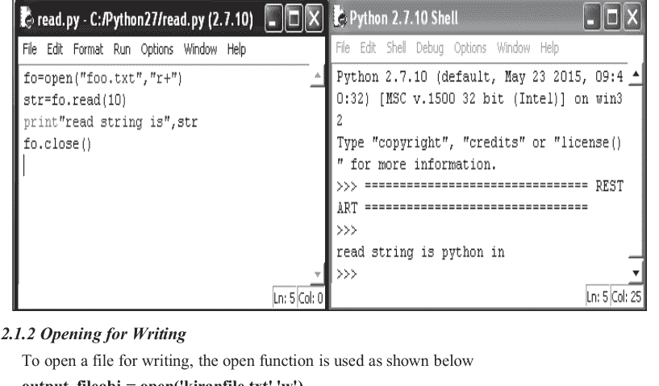

###### 1.2.1.2 以写入方式打开

要以写入方式打开文件，使用 open 函数，如下所示：

```
output_fileobj = open('kiranfile.txt','w')
```

在这种情况下，'w' 用于表示文件将以写入方式打开。如果文件已存在，它将被覆盖（从文件的第一行开始）。当使用第二个参数 'a' 时，输出将追加到现有文件中。

关闭写入的文件很重要，否则文件的末尾部分可能不会写入文件。

```
output_file.close()
```

以写入方式打开文件时，发生 I/O 错误的可能性不大。提供的文件名不需要存在，因为它正在被创建（或覆盖）。因此，唯一可能发生的错误是文件系统（如硬盘）已满。

- w 模式可用于文本文件
- wb 模式可用于二进制文件

###### 以二进制模式写入的示例

```
fo=open("foo.txt","wb")
fo.write("python in great lang\n")
fo.close()
```

##### 输出

```
>>> ========================= RESTART =========================
>>>
```

##### 1.2.2 使用 Close() 关闭文件

###### Close() 方法

文件对象的 close() 方法会刷新任何未写入的信息并关闭文件对象。文件一旦关闭，就无法再进行写入操作。

当文件的引用对象被重新赋值给另一个文件时，Python 会自动关闭该文件。使用 close() 方法来关闭文件是一种良好的实践。

###### 语法

```
fileobject.close()
```

###### 关闭函数的演示示例

```python
fo=open("foo.txt","wb")
print ("name of the file",fo.name)
fo.close
```

##### 输出

name of the file foo.txt

#### 1.3 不同的文件打开模式

以下是打开文件的不同模式列表：

| 模式 | 描述 |
| :--- | :--- |
| **r** | 以只读方式打开文件。文件指针置于文件的开头。这是默认模式。 |
| **rb** | 以二进制格式只读方式打开文件。文件指针置于文件的开头。这是默认模式。 |
| **r+** | 以读写方式打开文件。文件指针置于文件的开头。 |
| **rb+** | 以二进制格式读写方式打开文件。文件指针置于文件的开头。 |
| **w** | 以只写方式打开文件。如果文件已存在，则覆盖该文件。如果文件不存在，则创建一个新文件用于写入。 |
| **wb** | 以二进制格式只写方式打开文件。如果文件已存在，则覆盖该文件。如果文件不存在，则创建一个新文件用于写入。 |
| **w+** | 以读写方式打开文件。如果文件已存在，则覆盖该文件。如果文件不存在，则创建一个新文件用于读写。 |
| **wb+** | 以二进制格式读写方式打开文件。如果文件已存在，则覆盖该文件。如果文件不存在，则创建一个新文件用于读写。 |
| **a** | 以追加方式打开文件。如果文件存在，文件指针置于文件的末尾。也就是说，文件处于追加模式。如果文件不存在，则创建一个新文件用于写入。 |
| **ab** | 以二进制格式追加方式打开文件。如果文件存在，文件指针置于文件的末尾。也就是说，文件处于追加模式。如果文件不存在，则创建一个新文件用于写入。 |
| **a+** | 以追加和读取方式打开文件。如果文件存在，文件指针置于文件的末尾。文件以追加模式打开。如果文件不存在，则创建一个新文件用于读写。 |
| **ab+** | 以二进制格式追加和读取方式打开文件。如果文件存在，文件指针置于文件的末尾。文件以追加模式打开。如果文件不存在，则创建一个新文件用于读写。 |

文件打开后，你就拥有了一个文件对象。以下是与文件对象相关的所有属性列表。

### 1.3 文件对象的属性

| 属性 | 描述 |
|-----------|-------------|
| file.closed | 如果文件已关闭，则返回 true，否则返回 false。 |
| file.mode | 返回打开文件时使用的访问模式。（例如，‘r’, ‘w’, ‘r+’, ‘rb’ 等） |
| file.name | 返回文件的名称。 |
| file.softspace | 如果 print 需要显式空格，则返回 false，否则返回 true。 |

```python
>>> my_file.closed
False
>>> my_file.mode
'r'
>>> my_file.name
'mynewfile.txt'
```

> 示例：编写一个 GUI 程序来展示文件的打开和关闭。

```python
程序
fo=open("foo.txt","wb")
print"name of file:",fo.name
print"closed or not:",fo.closed
print"opening mode:",fo.mode
print"softspace flag:",fo.softspace
```

```
输出
name of file: foo.txt
closed or not: False
opening mode: wb
softspace flag: 0
```

#### 1.4 文件的读写

1. 文件对象提供了一系列访问方法，使文件的使用更加便捷。`read()` 和 `write()` 方法用于读写文件。
2. 正如前面所述，有两种类型的文件可用：文本文件和二进制文件。
3. 文本文件由一系列字符序列组成，以行结束符（EOL）字符终止，该字符用于结束一行。

##### 1.4.1 通过 Read()、Readline() 和 Readlines() 读取文件

1. 从文件读取的过程类似。首先，通过创建文件对象来打开文件。这次，使用“r”来告诉 Python 你打算从文件读取。第一个参数指定文件名，第二个参数可以省略。
   `a=open("kiran.txt","r")`
   使用与编写程序位置相同的文本文件路径。如果文件存在，Python 会读取该文件；如果文件不存在，Python 将引发异常。
   你可以使用 **readline** 方法从文件中读取一行。第一次在文件对象上调用此方法时，它将返回文件中的第一行文本：
   `>>> a.readline()`
   `read()` 和 `readline()` 这两种方法用于读取文件内容。
2. `readline()` 方法在其返回的字符串末尾包含换行符。要一次读取一行文件内容，可以反复调用 `readline()` 方法。
3. `read()` 方法也可以一次性读取文件的其余部分。此方法返回你尚未读取的文件中的任何文本。（如果你在打开文件后立即调用 `read()`，它将返回整个文件内容，作为一个长字符串）

```python
>>> f=open("test.txt","r")
>>> text=a.read()
>>> print(text)
```

这将读取文件的所有内容并打印到标准输出。

4. **`readline()`** 方法以字符串形式返回文本文件的下一行，包括行结束符 `\n`。当到达文件末尾时，如图 1.4 的 while 循环所示，它返回一个空字符串。

由于我们正在创建文本文件 kiran.txt

**文本文件 kiran.txt**

**屏幕输出**

```
Hello\n
How are You\n
Welcome to Python
Learning\n
```

```python
input_fileobj = open('kiran.txt','r')
str=' '
line = input_fileobj.readline( )
while line != str:
    print(line)
    line = input_fileobj.readline( )
input_fileobj.close( )
```

```
Hello

How are You

Welcome to Python
Learning
```

**图 1.4：通过 readline() 方法读取文件**

5. 要从文件中读取所有行，我们可以使用 for 循环或 while 循环。
6. 在 for 循环中，文件的所有行将被逐一读取；使用 while 循环，则可以逐行读取，直到找到给定的值。最后，注意屏幕输出中的空白行。由于 **`readline()` 方法**返回换行符，而 **`print`** 又会添加一个换行符，因此每显示一行都会输出两个换行符，导致每行之后有一个空行。
7. **`readlines()`**
   **`readlines()` 方法**使用 `readline()` 读取直到文件末尾（EOF），并返回包含这些行的列表。如果存在可选的 sizehint 参数，则不会读取到 EOF，而是读取总计约 sizehint 字节的整行（可能在向上舍入到内部缓冲区大小之后）。

   只有在立即遇到 EOF 时才返回空字符串。

   **语法**

   以下是 **`readlines()`** 方法的语法——
   `fileObject.readlines( sizehint );`

   **sizehint 参数** -- 这是要从文件读取的字节数。

   当你在 Python 中创建一个文件对象时，你可以用几种不同的方式从中读取。直到今天我才明白 `readline()` 和 `readlines()` 之间的区别。答案就在名字里。`readline()` 一次读取一个字符（直到行尾），`readlines()` 则一次性读取整个文件并按行分割。

   以下两种方式等效：

```python
f = open('somefile.txt','r')
for line in f.readlines():
    print (line)
f.close()
```

```python
# ...以及...
f = open('somefile.txt','r')
for line in f.read().split('\n'):
    print (line)
f.close()
```

##### 1.4.2 读取键盘输入

Python 提供了两个内置函数，用于从标准输入（默认来自键盘）读取一行文本。这些函数是：

- raw_input
- input

Python 提供了两个内置函数，用于从标准输入（默认来自键盘）读取一行文本。这些函数是——

- raw_input
- input

###### raw_input 函数

`raw_input([prompt])` 函数从标准输入读取一行，并将其作为字符串返回（去除末尾的换行符）。

```python
#!/usr/bin/python
str = raw_input("Enter your input: ");
print "Received input is : ", str
```

这会提示你输入任意字符串，并在屏幕上显示相同的字符串。当我输入 "Hello Python!" 时，其输出如下——

```
Enter your input: Hello Python
Received input is : Hello Python
```

示例：使用 GUI 打印 raw_input 函数。

程序：

```python
str=raw_input("enter your input");
print"received input is:",str
```

##### input函数

输入您的输入：hello python
收到的输入是：hello python

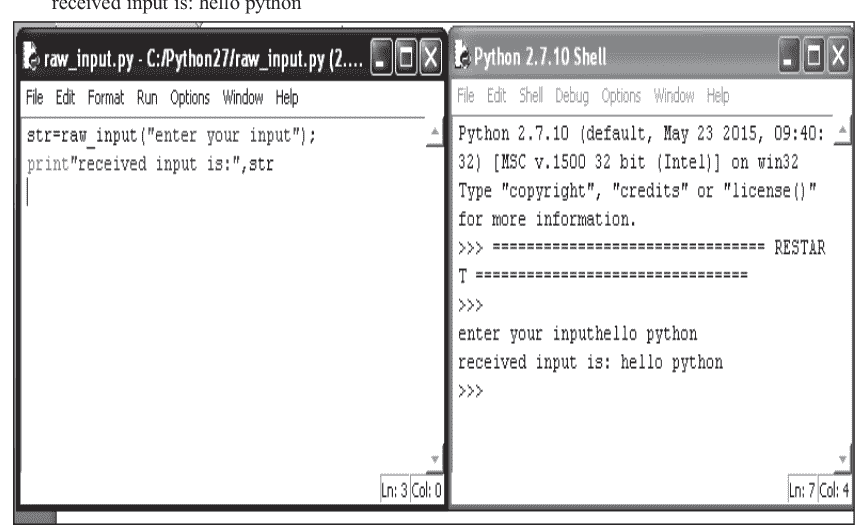

`input([prompt])`函数与`raw_input`功能相同，但其假设输入是一个有效的Python表达式，并会将评估后的结果返回给您。

```python
#!/usr/bin/python
str = input("Enter your input: ");
print "Received input is : ", str
```

针对输入的输入，这将产生以下结果 -

```
Enter your input: [x*5 for x in range(2,10,2)]
Received input is : [10, 20, 30, 40]
```

##### 在图形界面中打印input函数的示例

程序：

```python
str=input("enter your input:");
print"received input is:",str
```

**输出**

```
enter your input:[x*5 for x in range (2,10,2)]
received input is: [10, 20, 30, 40]
```

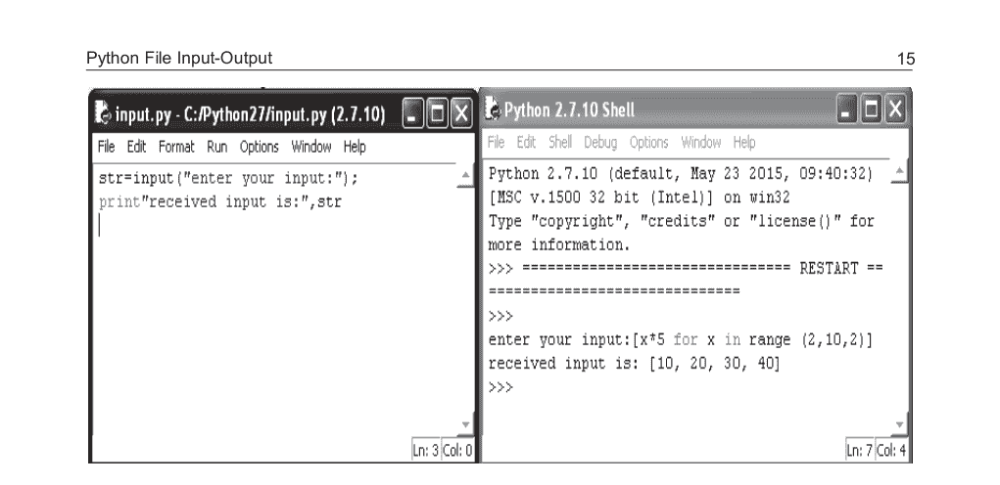

##### 1.4.3 通过write()写入文件

写入文件类似。首先创建一个包含一些简单文本的文件。要在系统上创建新文件，然后，通过创建一个文件对象来打开该文件。这次，使用“w”来告诉Python您打算写入文件。在第一个参数中指定文件名，可以省略第二个参数。

```python
a=open("kiran.txt","w")
```

`write()`方法将任何字符串写入已打开的文件。需要注意的是，Python字符串可以包含二进制数据，而不仅仅是文本。

`write()`方法不会在字符串末尾添加换行符（'\n'）：
输入以下内容：

```python
>>> def make_text_file():
    a=open('kiran.txt','w')
    a.write('This is how you create a new text file')
    a.close()
```

`make_text_file()`是用于创建文本文件的内置函数。借助文件对象a，可以打开一个名为kiran.txt的文件用于写入。“w”参数告诉Python您打算写入该文件，并借助`write()`方法将行写入文件。`write()`方法不会在字符串末尾添加换行符（'\n'）：
现在以写入模式打开kiran.txt文件，然后使用多次`write()`方法写入两行：

```python
>>> def make_text_file():
    a=open('kiran.txt','w')
    a.write('This is how you create a new text file')
    a.write('This is how add more lines to text file')
    a.close()
```

`make_text_file()`是用于创建文本文件的内置函数。借助文件对象a，可以打开一个名为kiran.txt的文件用于写入。“w”参数告诉Python您打算写入该文件，并借助`write()`方法多次将多行写入文件。

4. 现在，您已经使用前面的技术创建了一个文件，请创建一个程序，该程序首先检查文件名是否存在；如果存在，将给出错误消息；如果不存在，则创建该文件。

输入以下代码：

```python
>>> import os
>>> def make_another_file():
    if os.path.isfile('kiran.txt'):
        print("You are trying to create a file that already exists!")
    else:
        f=open('kiran.txt',"w")
        f.write("This is how you create a new text file")
...
>>> make_another_file()
"You are trying to create a file that already exists! "
```

###### 语法

`文件对象.write(字符串);`

此处，传递的参数是要写入已打开文件的内容。

###### 示例

```python
#! /usr/bin/python

##### 打开一个文件
fo = open ("foo.txt", "wb")

fo.write ("Python is a great language. \nYeah its great ! ! \n");

###### 关闭打开的文件
fo.close ()
```

上述方法将创建foo.txt文件，并将给定内容写入该文件，最终关闭该文件。如果您打开此文件，它将包含以下内容：

```
Python is a great language.
Yeah its great! !
```

#### 1.5 向文件追加文本

1.  追加文本是在文件末尾添加文本。
2.  您不是使用写入方法（“w”），而是使用追加（“a”）。
3.  在追加模式下，您可以确保现有文件中的数据不会被覆盖，而是将任何新文本附加到文件末尾。
4.  当文件以追加模式打开时，光标默认位于文件的EOL（行尾），新文本将被添加到文件末尾。

##### 向文件追加文本的示例

```python
>>> def add_some_text():
    fobj=open('kiran.txt','r')
    text=fobj.read( )
    print("\n",text)
    fobj.close( )
    fobj=open('kiran.txt','a')
    fobj.write("\n Here is some additional text!")
    text = f.read( )
    print("\n", text)
```

运行模块并观察输出

```
>>> add_some_text()
My name is kiran
This book is written for Fycs students
My name is kiran
This book is written for Fycs students
Here is some additional text!
```

在示例中，

1.  我创建了一个名为`add_some_text()`的函数。
2.  使用`open`方法以读取模式打开文件`kiran.txt`。
3.  使用`read`方法读取整个文件内容并存储到`text`对象中。
4.  使用`print`方法打印`text`对象的内容。
5.  关闭文件对象。
6.  再次以追加模式打开文件。
7.  在文件末尾添加并写入一行，告诉Python您想追加到文件（这是“a”参数）。
8.  使用`read`方法读取整个文件内容并存储到`text`对象中。
9.  使用`print`方法打印`text`对象的内容。
10. 关闭文件对象。

#### 1.6 重命名文件

1.  当我们想要更改文件名时，可以使用Python的`rename()`方法。
2.  Python的OS模块提供了不同的文件处理操作方法，其中一个函数`rename()`用于更改文件名。
3.  如果我们想使用`rename()`方法，必须导入OS模块。导入OS模块后，我们就可以使用所有的文件处理操作函数。

**`rename()`方法的语法：**
`os.rename(当前文件名, 新文件名)`
`*rename()*`方法接受两个参数：当前文件名和新文件名。

*示例*
以下是重命名现有文件`kiran.txt`的示例：

```python
#!/usr/bin/python
import os

##### 将文件从 kiran.txt 重命名为 ks.txt
os.rename( "kiran.txt", "ks.txt" )
```

因此，`kiran.txt`文件被重命名为`ks.txt`。

#### 1.7 删除文件

1.  当我们想要删除文件时，可以使用Python的`remove()`方法。
2.  Python的OS模块提供了不同的文件处理操作方法，其中一个方法`remove()`用于删除文件。
3.  如果我们想使用`remove()`方法，必须导入OS模块。导入OS模块后，我们就可以使用所有的文件处理操作函数。

**`remove()`方法的语法：**
`os.remove(文件名)`
您可以通过将要删除的文件的名称作为参数传递给`remove()`方法来删除文件。

*示例*
以下是删除现有文件`ks.txt`的示例：

```python
#!/usr/bin/python
import os

##### 删除文件 test2.txt
os.remove("ks.txt")
```

#### 1.8 Python不同的文件输入输出函数

1.  Python通过不同的文件处理操作提供文件处理功能。
2.  Python提供了OS模块，其中包含不同的文件处理操作和方法。
3.  Python的OS模块提供了不同的方法，用于以不同模式打开文件、读写文件、向文件追加新数据、重命名、移动、删除和关闭文件。
4.  Python拥有丰富的输入输出函数集合，列出如下：
    (a) open()
    (b) read()
    (c) readline()
    (d) write()
    (e) rename()
    (f) remove()
    (g) move()
    (h) close()
所有这些方法都将在本章中进一步解释，并提供描述和合适的示例。

#### 1.9 文件位置

`tell()`和`seek()`方法用于查找文件位置

##### 1. tell()

`tell()`方法返回文件读写指针在文件内的当前位置。下一次读取或写入将发生在从文件开头起指定字节数的位置。

**语法**

```
文件对象.tell()
```

**返回值**

此方法返回文件读写指针在文件内的当前位置。

**示例**

以下示例展示了`tell()`方法的用法。
假设已创建一个名为`kiran.txt`的新文件

```
Python is a great language
Python is also structured language
Python is also object oriented language
Python has tuples
```

###### Python 包含字典

```python
#!/usr/bin/python
##### 打开一个文件
fo = open("kiran.txt", "rw+")
print "Name of the file: ", fo.name
line = fo.readline()
print "Read Line: %s" % (line)
###### 获取文件的当前位置。
pos = fo.tell()
print "Current Position: %d" % (pos)
fo.close()  # 关闭已打开的文件
```

###### 运行程序查看结果

```
Name of the file: kiran.txt
Read Line: Python is a great language.
Current Position: 28
```

###### 示例

让我们使用上面创建的文件 kiran.txt。

```python
#!/usr/bin/python

##### 打开一个文件
fo = open("kiran.txt", "r+")
str = fo.read(10);
print "Read String is : ", str

###### 检查当前位置
position = fo.tell();
print "Current file position : ", position

###### 将指针重新定位到开头
position = fo.seek(0, 0);
str = fo.read(10);
print "Again read String is : ", str
##### 关闭已打开的文件
fo.close()
```

这将产生以下结果 –

```
Read String is : Python is
Current file position : 10
Again read String is : Python is
```

##### 2. seek( )

**seek( )** 方法用于更改当前文件位置。当需要在特定位置改变文件位置时，就会使用 seek 方法。seek( ) 方法有两个参数/实参。

###### 语法

以下是 **seek()** 方法的语法 –

```
seek(offset[, from])
```

**参数**

- **offset:** 这是文件内读/写指针的位置。这表示要移动的字节数。
- **from:** 指定字节移动的参考位置。这是可选的，其值为 0、1、2。
    - **默认为 0**，表示使用文件的开头作为参考。
    - **值为 1** 表示相对于当前位置进行查找，即使用当前位置作为参考位置。
    - **值为 2** 表示相对于文件末尾进行查找，即使用文件末尾作为参考位置。

###### 示例

以下示例展示了 seek() 方法的用法。假设创建一个名为 kiran.txt 的新文件

```
Python is a great language
Python is also structured language
Python is also object oriented language
Python has tuples
```

###### 示例

```python
#!/usr/bin/python
##### 打开一个文件
fo = open("kiran.txt", "rw+")
print "Name of the file: ", fo.name
line = fo.readline()
print "Read Line: %s" % (line)
###### 再次将指针设置到开头
fo.seek(0, 0)
line = fo.readline()
print "Read Line: %s" % (line)

##### 关闭已打开的文件
fo.close()
```

运行上述程序并查看结果

```
Name of the file: kiran.txt
Read Line: Python is a great language.
Read Line: Python is a great language.
```

###### 在 GUI 中显示当前位置和读取函数的示例。

**程序：**

```python
fo=open("foo.txt","r+")
str=fo.read(10);
print"read string is:",str
position=fo.tell();
print"current position is:",+position
position=fo.seek(0,0);
str=fo.read(10);
print"read string is:",str
fo.close()
```

**输出**

```
read string is: python in
current position is: 9
read string is: python in
```

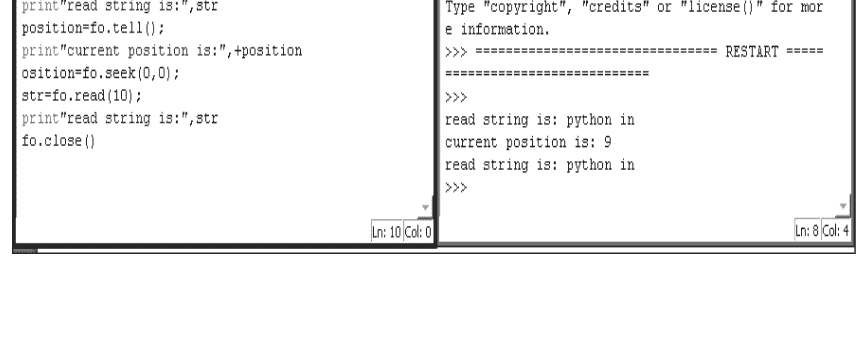

#### 1.10 操作目录

##### 1.10.1 Python 中的目录

- Python 中的目录包含所有 Python 文件。
- Python 提供了不同的实用方法来操作文件和目录。
    - 文件对象方法有不同的函数来操作文件。文件对象有多种方法用于创建、打开、读取、写入、刷新、设置文件位置和关闭文件。
    - OS 对象方法有不同的函数来处理文件以及目录。OS 有多种方法可以帮助您创建、删除和更改目录。

使用 open 函数创建文件对象，以下是可以在该对象上调用的函数列表：

| 序号 | 带描述的方法 |
| :--- | :--- |
| 1 | *file.close()* 关闭文件。已关闭的文件无法再被读写。 |
| 2 | *file.flush()* 刷新内部缓冲区，类似于 stdio 的 fflush。对于某些类文件对象，这可能是一个空操作。 |
| 3 | *file.fileno()* 返回底层实现用于向操作系统请求 I/O 操作的整数文件描述符。 |
| 4 | *file.isatty()* 如果文件连接到 tty（或类似）设备则返回 True，否则返回 False。 |
| 5 | *file.next()* 每次调用时返回文件中的下一行。 |
| 6 | *file.read([size])* 从文件中读取最多 size 个字节（如果在获得 size 个字节之前读取到 EOF，则读取的字节数会少一些）。 |
| 7 | *file.readline([size])* 从文件中读取一整行。末尾的换行符会保留在字符串中。 |
| 8 | *file.readlines([sizehint])* 使用 readline() 读取直到 EOF 并返回一个包含各行的列表。如果提供了可选的 sizehint 参数，则不是读取直到 EOF，而是读取总字节数大约为 sizehint 的所有行（可能在四舍五入到内部缓冲区大小之后）。 |
| 9 | *file.seek(offset[, whence])* 设置文件的当前位置。 |
| 10 | *file.tell()* 返回文件的当前位置。 |
| 11 | *file.truncate([size])* 截断文件的大小。如果提供了可选的 size 参数，则文件被截断为（最多）该大小。 |
| 12 | *file.write(str)* 将字符串写入文件。没有返回值。 |
| 13 | *file.writelines(sequence)* 将字符串序列写入文件。该序列可以是任何产生字符串的可迭代对象，通常是一个字符串列表。 |

###### OS 对象方法

此模块提供了处理文件和目录的方法。

| 序号 | 带描述的方法 |
| :--- | :--- |
| 1 | *os.access(path, mode)* 使用真实的 uid/gid 测试对 path 的访问权限。 |
| 2 | *os.chdir(path)* 将当前工作目录更改为 path。 |
| 3 | *os.chmod(path, mode)* 将 path 的模式更改为数字模式。 |
| 4 | *os.chown(path, uid, gid)* 将 path 的所有者和组 ID 更改为数字 uid 和 gid。 |
| 5 | *os.chroot(path)* 将当前进程的根目录更改为 path。 |
| 6 | *os.close(fd)* 关闭文件描述符 fd。 |
| 7 | *os.dup(fd)* 返回文件描述符 fd 的副本。 |
| 8 | *os.getcwd()* 返回一个表示当前工作目录的字符串。 |
| 9 | *os.link(src, dst)* 创建一个指向 src 的硬链接，名称为 dst。 |
| 10 | *os.listdir(path)* 返回一个列表，包含由 path 指定的目录中的条目名称。 |
| 11 | *os.lseek(fd, pos, how)* 将文件描述符 fd 的当前位置设置为 pos，并由 how 进行调整。 |
| 12 | *os.makedirs(path[, mode])* 递归目录创建函数。 |
| 13 | *os.open(file, flags[, mode])* 打开文件 file，并根据 flags 设置各种标志，可能还根据 mode 设置其模式。 |
| 14 | *os.read(fd, n)* 从文件描述符 fd 读取最多 n 个字节。返回包含读取字节的字符串。如果已到达 fd 所引用的文件末尾，则返回空字符串。 |
| 15 | *os.remove(path)* 删除文件 path。 |
| 16 | *os.rename(src, dst)* 将文件或目录 src 重命名为 dst。 |
| 17 | *os.rmdir(path)* 删除目录 path。 |
| 18 | *os.tmpfile()* 返回一个以更新模式 (w+b) 打开的新文件对象。 |
| 19 | *os.write(fd, str)* 将字符串 str 写入文件描述符 fd。返回实际写入的字节数。 |

##### 1.10.2 mkdir( ) 方法

- mkdir() 代表创建目录。
- 此方法用于在当前目录路径中创建一个新目录。
- 此方法在 OS 模块中可用。
- mkdir(参数)：在 mkdir( ) 中，我们需要传递一个参数，该参数包含要创建的目录的名称。由于 mkdir( ) 在 OS 模块中可用，因此在创建目录之前，您必须导入 OS 模块。

###### 语法

```
os.mkdir("newdir")
```

###### 示例

以下是在当前目录中创建目录 **kiran** 的示例 –

```python
#!/usr/bin/python
import os
##### 创建一个名为 "test" 的目录
os.mkdir("kiran")
```

##### 1.10.3 chdir() 方法

- chdir() 代表更改目录。
- 此方法用于更改当前目录路径。

###### chdir方法

- 此方法可在 OS 模块中使用
- **chdir(参数)：** 在 chdir( ) 中，我们必须传递一个参数，该参数包含要切换到的目录名称。由于 chdir( ) 在 OS 模块中可用，因此在切换到目录之前，必须导入 OS 模块。

###### 语法

```
os.chdir("kiran")
```

###### 示例

以下是进入 "/home/ks" 目录的示例 –

```
#!/usr/bin/python
import os
##### 这将给出当前目录的位置
os.getcwd()
```

##### 1.10.4 getcwd() 方法

- getcwd() 代表获取当前工作目录
- 此方法用于显示当前工作目录。
- 此方法可在 OS 模块中使用
- 由于 getcwd( ) 在 OS 模块中可用，因此在使用此函数显示当前工作目录之前，必须导入 OS 模块。

###### 语法

```
os.getcwd()
```

###### 示例

以下是提供当前目录的示例 –

```
#!/usr/bin/python
import os
##### 这将给出当前目录的位置
os.getcwd()
```

##### 1.10.5 rmdir() 方法

- rmdir() 代表删除目录
- 此方法用于移除或删除目录。
- 此方法可在 OS 模块中使用
- **rmdir(参数)：-** 在 rmdir( ) 中，我们必须传递一个参数，该参数包含要删除或移除的目录的名称。由于 rmdir( ) 在 OS 模块中可用，因此在删除目录之前，必须导入 OS 模块。
- 在移除目录之前，应清空其中的所有内容，即目录必须为空。
- 在移除目录之前，你应该已不在该目录中。

###### 语法

```
os.rmdir('dirname')
```

###### 示例

以下是移除 "/home/ks" 目录的示例。需要提供目录的完全限定名称，否则它将在当前目录中搜索该目录，唯一的条件是 ks 目录必须为空且你不能在 ks 目录中。

```
#!/usr/bin/python
import os

###### 这将移除 "/tmp/test" 目录。
os.rmdir("/home/ks" )
```

#### 1.11 迭代器，可迭代对象

##### 1.11.1 Python 迭代器

1. **迭代器** 是一个对象，它允许程序员遍历集合的所有元素，无论其具体实现如何。
2. 迭代器是可以被迭代的对象。
3. Python 中的迭代器简单来说就是可以被迭代的对象。一个每次返回一个数据元素的对象。
4. Python **迭代器对象** 基于 **迭代器协议**，在创建迭代器对象时，Python 必须实现两个特殊方法，
   - (a) \_\_iter\_\_()
   - (b) \_\_next\_\_()，统称为 **迭代器协议**，这意味着你可以使用 \_\_iter\_\_ 和 \_\_next\_\_ 方法构建自己的迭代器。
     - \_\_iter\_\_ 返回迭代器对象本身。如果需要，可以执行一些初始化。它在 `for` 和 `in` 语句中使用。
     - \_\_next\_\_ 方法返回迭代器中的下一个值，即返回序列中的下一个元素。在到达末尾时，它必须引发 `StopIteration`。
5. 它们在 **for** 循环、列表推导式、生成器等中实现。
6. 如果我们可以从中获得一个迭代器，则称该对象为 **可迭代对象**。Python 中的大多数内置容器，如：列表、元组、字符串等，都是可迭代对象。
7. 迭代器将数据与算法解耦。
8. 迭代器有几个优点：
   - 代码更简洁
   - 迭代器可以处理无限序列
   - 迭代器节省资源

##### 1.11.2 Python 可迭代对象

可迭代对象是在其内部定义了 `iter` 方法的容器。例如 `my_list = [4,7,0,3]`，其中 `my_list` 是一个可迭代对象，它拥有 `iter` 方法。Python 中的内置容器，如列表、元组和字符串等，都是可迭代对象。

###### 示例 1

在此示例中

1. 首先将容器定义为名为 `my_list` 的列表
2. `iter()` 返回迭代器对象，因为我们得到 `my_iter()` 是一个迭代器。
3. `next()` 方法遍历迭代器并打印下一个值。
4. 通过使用 `object._next_()` 方法，我们打印下一个值。
5. 当列表结束且没有值可打印时，列表会引发 `StopIteration` 错误。

```
Python 3.4.3 Shell
Python 3.4.3 (v3.4.3:9b73f1c3e601, Feb 24 2015, 22:43:06) [MSC v.1600 32 bit (Intel)] on win32
Type "copyright", "credits" or "license()" for more information.
>>> my_list = [4, 7, 0, 3]
>>> my_iter = iter(my_list)
>>> print(next(my_iter))
4
>>> print(next(my_iter))
7
>>> print(my_iter.__next__())
0
>>> print(my_iter.__next__())
3
>>> next(my_iter)
Traceback (most recent call last):
  File "<pyshell#6>", line 1, in <module>
    next(my_iter)
StopIteration
>>> for element in my_list:
        print(element)

4
7
0
3
>>>
```

**iter()** 函数（它又调用 **\_\_iter\_\_()** 方法）从中返回一个迭代器。

在 Python 中遍历迭代器

我们使用 **next()** 函数来手动遍历迭代器的所有项。当我们到达末尾且没有更多数据可返回时，它将引发 **StopIteration**。

###### 示例 2

我们使用 **for 语句** 来循环遍历 **数字列表**。

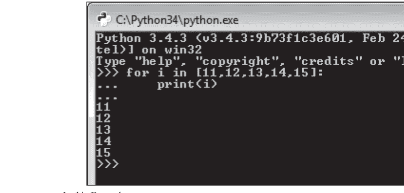

在此示例中

1. 使用 `for` 循环，自动迭代传递给它的数字列表。
2. 使用 `print` 语句，打印列表的每个迭代值。

###### 示例 3

使用 **for 语句**，如果将其与字符串一起使用，它将循环遍历其字符。

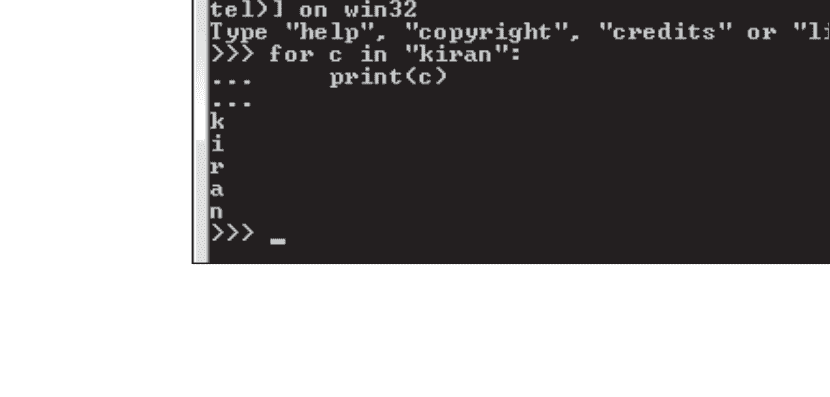

在此示例中

1. 使用 `for` 循环，自动迭代传递给它的字符串列表。
2. 使用 `print` 语句，打印列表的每个迭代值。

###### 示例 4

使用 `for` 语句，如果将其与字典一起使用，它将循环遍历其键。

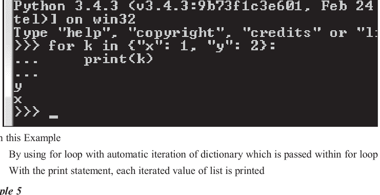

在此示例中

1. 使用 `for` 循环，自动迭代传递给它的字典。
2. 使用 `print` 语句，打印列表的每个迭代值。

###### 示例 5

使用 `for` 语句，如果我们定义一个列表，然后将计数器变量初始化为迭代器的初始值，然后使用循环来迭代可迭代对象。`for` 循环执行自动迭代。

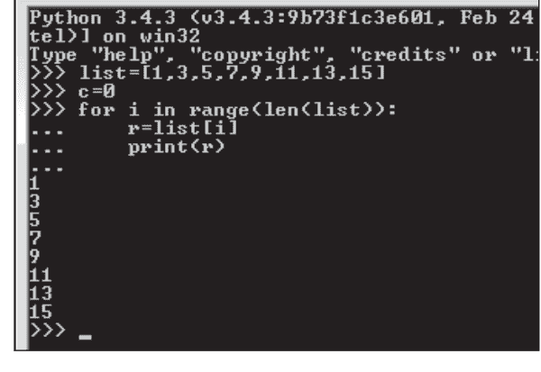

###### 示例 6

使用 **while 语句**，如果我们定义一个列表，然后将计数器变量初始化为迭代器的初始值，然后使用 `while` 循环来迭代可迭代对象。`while` 循环执行自动迭代。

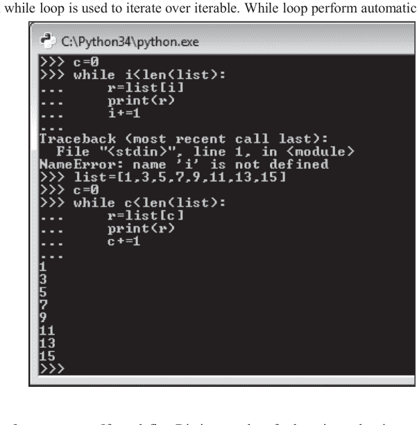

###### 示例 7

使用 **for 语句**，如果我们定义一个字典，则使用 `for` 循环来迭代可迭代对象。`for` 循环执行自动迭代。

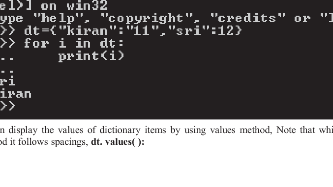

你可以使用 `values` 方法显示字典项的值，注意使用 `values` 方法时，它遵循间距，即 `dt.values()`：

###### 示例 8

使用 `for` 语句，如果将其与文件一起使用，它将循环遍历文件的行。

在此示例中，首先我需要一个文本文件，因此通过文件处理，我创建了 `kiranfile.txt`，其中包含一些内容。

```
python
Python 3.4.3 (v3.4.3:9b73f1c3e601, Feb 24 2015, 22:43:06) [MSC v.1600 32 bit (Intel)] on win32
Type "help", "copyright", "credits" or "license" for more information.
>>> dt={"kiran":"11","sri":12}
>>> for c in dt . values ():
...     print(c)
...
11
12
>>> _
```

现在使用 `for` 语句，利用可迭代对象，打印文件的内容。

```
python
>>> f=open("kiranfile.txt","w")
>>> f.write("Hello Everyone, This is Message from Kiran maam to all students: Please refer this Book, It is very helpful exam point of view as well as knowledge point of view. All the Best for Exams")
186
>>> f=open("kiranfile.txt","r")
>>> f.read()
'Hello Everyone, This is Message from Kiran maam to all students: Please refer this Book, It is very helpful exam point of view as well as knowledge point of view. All the Best for Exams'
>>> _
```

```
python
C:\Python34\python.exe
Python 3.4.3 (v3.4.3:9b73f1c3e601, Feb 24 2015, 22:43:06) [MSC v.1600 32 bit (Intel)] on win32
Type "help", "copyright", "credits" or "license" for more information.
>>> for line in open("kiranfile.txt"):
...     print(line)
...
Hello Everyone, This is Message from Kiran maam to all students: Please refer this Book, It is very helpful exam point of view as well as knowledge point of view. All the Best for Exams
>>> _
```## 示例 9

可以**与 for 循环一起使用**的**对象类型**有很多。这些对象被称为**可迭代对象**。有许多函数会消耗这些可迭代对象。

-   列表的连接（join with List）
-   字典的连接（join with Dictionary）
-   字符串的列表（list with String）
-   字典的列表（list with Dictionary）

## 1. 列表连接示例

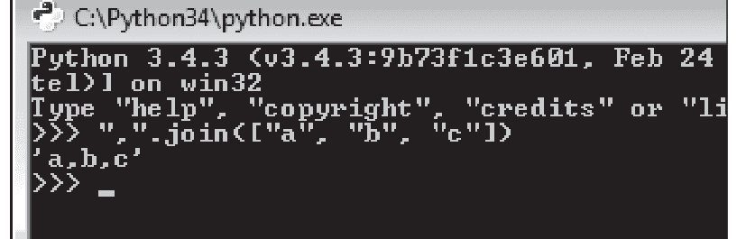

## 2. 字典连接示例

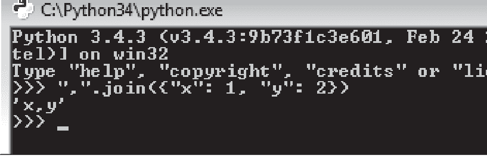

## 3. 字符串列表示例

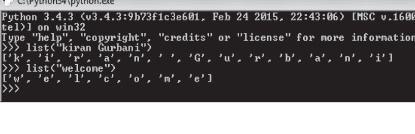

## 4. 字典列表示例

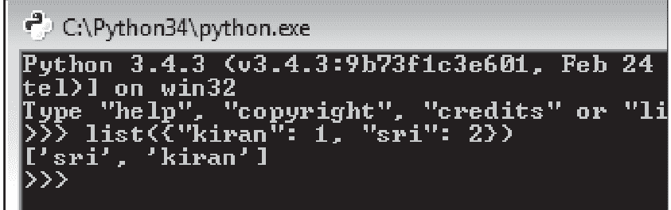

##### 1.11.3 在 Python 中创建你自己的迭代器

- 我们可以在 Python 中创建一个迭代器。要创建迭代器，我们必须实现 `__iter__()` 和 `__next__()` 方法。
- `__iter__()` 方法返回迭代器对象本身。如果需要，可以进行一些初始化。
- `__next__()` 方法必须返回序列中的下一个项。在到达末尾以及后续调用时，它必须引发 `StopIteration`。

在这个示例中，每次迭代都会给出下一个 2 的幂。幂指数从零开始，直到用户设定的数字。这里我们创建一个类来实现一个 2 的幂次的迭代器。

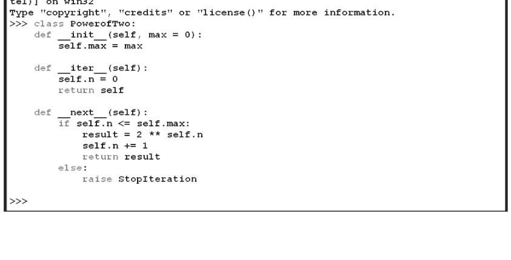

##### 输出

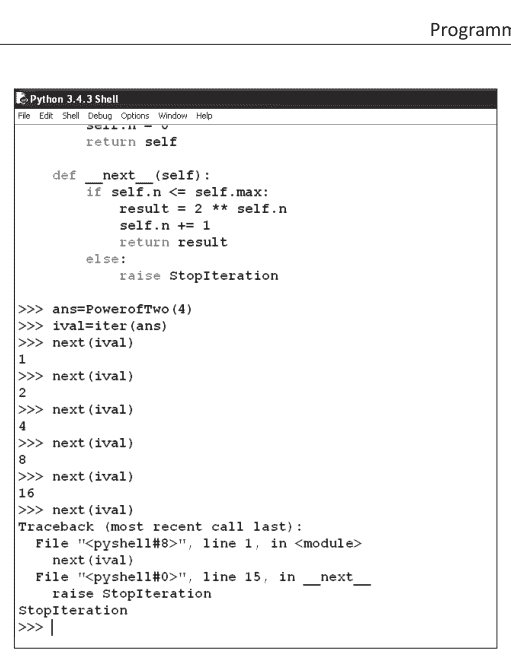

我们也可以使用 **for** 循环来遍历我们的迭代器类。

##### 1.11.4 Python 无限迭代器

迭代器对象中的项不一定会耗尽。可以存在无限迭代器（永不停止）。我们在处理这类迭代器时必须小心。

> *演示无限迭代器的示例。*

内置函数 `iter()` 可以接受两个参数调用，其中第一个参数必须是一个可调用对象（函数），第二个是哨兵值。迭代器会调用这个函数，直到返回值等于哨兵值。

```python
>>> int()
0

>>> inf = iter(int,1)
>>> next(inf)
0
>>> next(inf)
0
```

我们可以看到 **int()** 函数总是返回 0。因此，将其作为 **iter(int,1)** 传递将返回一个迭代器，该迭代器调用 **int()** 直到返回值等于 1。这永远不会发生，所以我们得到了一个无限迭代器。

我们也可以构建自己的无限迭代器。下面的迭代器将返回所有奇数。

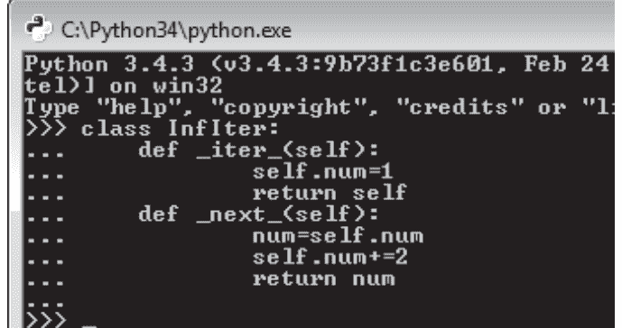

一个示例运行如下所示。

```python
a = iter(InfIter())
>>> next(a)
1
>>> next(a)
3
>>> next(a)
5
>>> next(a)
7
以此类推...
```

在遍历这类无限迭代器时，请注意包含一个终止条件。

使用迭代器的优点是它们节省资源。如上例所示，我们可以在不将整个数字系统存储在内存中的情况下获取所有奇数。理论上，我们可以在有限的内存中拥有无限个项目。

##### 1.11.5 生成器

生成器简化了迭代器的创建。生成器是一个产生一系列结果而非单个值的函数。

```python
def yrange(n):
    i = 0
    while i < n:
        yield i
        i += 1
```

每次执行 `yield` 语句时，函数都会生成一个新值。

```python
>>> y = yrange(3)
>>> y
<generator object yrange at 0x401f30>
>>> y.next()
0
>>> y.next()
1
>>> y.next()
2
>>> y.next()
Traceback (most recent call last):
  File "<stdin>", line 1, in <module>
StopIteration
```

因此，生成器也是一个迭代器。你不必担心迭代器协议。

“生成器”这个词既指生成值的函数，也指它生成的内容。当生成器函数被调用时，它返回一个生成器对象，甚至不会开始执行函数。当第一次调用 `next` 方法时，函数开始执行，直到它遇到 `yield` 语句。产生的值由下一次调用返回。

以下示例演示了 `yield` 和对生成器对象调用 `next` 方法之间的交互。

```python
>>> def foo():
...     print "begin"
...     for i in range(3):
...         print "before yield", i
...         yield i
...         print "after yield", i
...     print "end"
...
>>> f = foo()
>>> f.next()
begin
before yield 0
0
>>> f.next()
after yield 0
before yield 1
1
>>> f.next()
after yield 1
before yield 2
2
>>> f.next()
after yield 2
end
Traceback (most recent call last):
  File "<stdin>", line 1, in <module>
StopIteration
>>>
```

#### 1.12 迭代及其问题解决应用

在这种情况下，我们使用迭代器。代码更简洁。
在下面的例子中，我们创建自己的对象来实现迭代器协议。

```python
#!/usr/bin/python
##### iterator.py
class seq:
    def __init__(self):
        self.x = 0
    def next(self):
        self.x += 1
        return self.x**self.x
    def __iter__(self):
        return self
s = seq()
n = 0
for i in s:
    print i
    n += 1
    if n > 10:
        break
```

在代码示例中，我们创建了一个数字序列 1, 4, 27, 256, ...。这证明了使用迭代器，我们可以处理无限序列。`for` 语句在容器对象上调用 `iter()` 函数。该函数返回一个迭代器对象，该对象定义了 `next()` 方法，该方法一次访问容器中的一个元素。

```python
def next(self):
    self.x += 1
    return self.x**self.x
```

`next()` 方法返回序列的下一个元素。

```python
def __iter__(self):
    return self
```

`__iter__` 方法返回迭代器对象。

```python
if n > 10:
    break
```

因为我们正在处理无限序列，我们必须中断 for 循环。

```
$ ./iterator.py
1
4
27
256
3125
46656
823543
16777216
387420489
10000000000
285311670611
```

#### 1.13 问题

-   什么是文本文件，写出 `open()` 函数的语法及其参数
-   举例解释 write、read 和 append 函数。
-   `r+` 和 `rb` 的区别是什么，举例说明。
-   编写一个 Python 程序，以文本模式创建一个新文件，然后以二进制模式读取该文件的内容。
-   解释如何使用 `os.path` 处理路径和目录，并解释如何创建和删除目录。
-   `write()` 和 `append()` 函数的区别是什么？
-   什么是文本文件？并解释其不同的文件模式。
-   举例解释 `input` 和 `raw_input` 函数。
-   什么是文本文件，写出 `open()` 和 `close()` 函数的语法及其参数
-   `read()` 和 `write()` 函数的区别是什么？
-   区分文本文件和二进制文件。
-   用合适的例子解释不同的文件操作。
-   解释如何为文本文件以及二进制文件打开文件进行读取和关闭文件。
-   解释什么是文件以及各种文件模式，并给出合适的语法。
-   解释文件对象的属性。
-   解释可以通过 `read()`、`readline()` 和 `readlines()` 执行文件读取。
-   用合适的例子解释如何从键盘读取输入。
-   解释如何将文本追加到文件。
-   解释如何重命名和删除文件。
-   解释不同的 Python 文件输入输出函数。
-   解释不同的文件位置函数。
-   解释如何创建目录、如何切换到目录以及如何删除目录。
-   解释 `mkdir()`、`chdir()`、`getcwd()`、`rmdir()` 目录方法。
-   解释 Python 迭代器及其迭代器协议。
-   解释 Python 无限迭代器。
-   用合适的例子解释可迭代对象。
-   用合适的例子解释 Python 中的生成器。
-   解释任何迭代执行应用的问题或应用。

## 第 2 章
###### 异常处理

#### 结构

-   2.1 错误与 Bug 简介
-   2.2 异常处理简介
-   2.3 什么是异常
-   2.4 异常类型
    -   2.4.1 标准内置异常
    -   2.4.2 用户自定义异常
-   2.5 异常的传播
-   2.6 Python 中的断言
-   2.7 捕获与处理异常
    -   2.7.1 Try... except
    -   2.7.2 使用定义函数的异常处理和用户输入
    -   2.7.3 不带异常的 Except 子句
    -   2.7.4 带多个异常的 Except 子句
    -   2.7.5 Try-Finally 子句
    -   2.7.6 异常的参数
    -   2.7.7 引发异常
-   2.8 文件异常处理
-   2.9 异常处理的优点
-   2.10 问题

#### 2.1 错误与 Bug 简介

通常程序包含错误和 Bug。最常见的 Bug 类型是：

-   逻辑错误
-   语法错误

逻辑错误源于错误的解决方案或错误的逻辑，而语法错误则源于对语言理解不足，即语法错误。我们可以检测这些错误，然后进行调试，并相应地为这些错误提供错误描述，这些被称为异常。

异常是程序在执行过程中可能遇到的运行时条件或错误。例如除以 0、访问超出边界的数组、内存不足或磁盘空间不足。

异常处理有两种类型：

- 1. 同步异常
- 2. 异步异常

同步异常包括索引越界和溢出错误。异步异常则是指超出控制范围的事件，如键盘中断、磁盘坏扇区或硬件故障。

以下任务可用于异常处理：

- 1. 找到问题（触发异常）
- 2. 通知已发生错误（抛出异常）
- 3. 接收错误信息（捕获异常）
- 4. 采取纠正措施（处理异常）

##### 语法错误

语法错误，也称为解析错误，是你在学习 Python 时最常遇到的一类问题：

```
>>> while True print 'Hello world'
  File "<stdin>", line 1
    while True print 'Hello world'
          ^
SyntaxError: invalid syntax
```

解析器会重复显示有问题的行，并用一个小“箭头”指出该行中最早检测到错误的位置。错误是由箭头前的标记引起的（或至少在该处检测到）：在示例中，错误在关键字 **print** 处被检测到，因为其前面缺少冒号（':'）。文件名和行号会被打印出来，以便在输入来自脚本时知道在哪里查看。

#### 2.2 异常处理简介

执行 Python 程序时可能会出现各种错误消息。此类错误称为**异常**。Python 通过在屏幕上报告这些错误来处理它们。然而，程序可以“捕获”和“处理”异常，以纠正错误并继续执行，或者终止程序。

Python 有许多内置异常，当程序内部出现错误时，它会强制程序输出错误。

当这些异常发生时，会导致当前进程停止，并将其传递给调用进程，直到被处理。如果未处理，我们的程序将会崩溃。

例如，如果函数 **A** 调用函数 **B**，而函数 **B** 又调用函数 **C**，并且在函数 **C** 中发生异常。如果该异常在 **C** 中未处理，它会传递给 **B**，然后传递给 **A**。

如果始终未处理，程序会输出一条错误消息，然后突然意外停止。

#### 2.3 什么是异常

异常是一个事件，它在程序执行过程中发生，破坏了程序指令的正常流程。当 Python 脚本遇到它无法处理的情况时，就会引发一个异常。**异常**是一个*引发*（“抛出”）的值（对象），表示发生了一个意外的或“异常的”情况。

当 Python 脚本引发异常时，它必须立即处理该异常，否则程序将终止并退出。

Python 包含一组预定义的异常，称为**标准异常**。部分标准异常如下所列：

##### 表 2.1：Python 中的一些标准异常

| 异常 | 描述 |
|-----------|-------------|
| ImportError | 当 import（或 from...import）语句失败时引发 |
| IndexError | 当序列索引超出范围时引发 |
| NameError | 当未找到局部或全局名称时引发 |
| TypeError | 当操作或函数应用于不适当类型的对象时引发 |
| ValueError | 当内置操作或函数应用于类型正确但值不适当的对象时引发 |
| IOError | 当输入/输出操作失败时引发（例如，“文件未找到”） |

标准异常定义在 Python 标准库的 exceptions 模块中，该模块会自动导入到 Python 程序中。

**引发异常**是函数向其调用者通知发生了一个*函数本身无法处理*的问题的一种方式。

例如，假设一个名为 **getYN** 的**函数**提示用户输入‘y’或‘n’。如果用户输入的不是这两个值，该函数可以简单地提示用户重新输入。另一方面，如果一个名为 **isEven** 的**函数**需要传入一个数值，但却传入了一个字符串，它无法纠正这个问题。它只能将问题通知给用户。

**异常**是一个由函数“引发”的值（对象），表示发生了一个意外的或“异常的”情况，且该函数本身无法处理。

##### 处理异常

如果你有一些可疑的代码可能会引发异常，你可以通过将可疑代码放在 try: 块中来保护你的程序。在 try: 块之后，包含一个 except: 语句，后跟一个尽可能优雅地处理问题的代码块。

*语法:*

**以下是 try....except...else 块的简单语法：**

```
try:
    在此处执行你的操作；
    ......................

except Exception I:
    如果发生 ExceptionI，则执行此块。

except Exception II:
    如果发生 ExceptionII，则执行此块。
    ......................

else:
    如果没有异常发生，则执行此块
```

#### 2.4 异常类型

##### 2.4.1 标准内置异常

**内置异常**

异常应该是类对象。异常定义在 **exceptions** 模块中。这个模块永远不需要显式导入：异常在内置命名空间和 **exceptions** 模块中都可用。

对于类异常，在包含提及特定类的 **except** 子句的 **try** 语句中，该子句也会处理从该类派生出的任何异常类（但不处理从该类派生出的异常类）。

内置异常可由解释器或内置函数生成。除非另有说明，它们都有一个“关联值”，指示错误的详细原因。这可能是一个字符串或一个包含多条信息的元组（例如，一个错误代码和解释该代码的字符串描述）。关联值是 **raise** 语句的第二个参数。如果异常类派生自标准根类 **BaseException**，则关联值作为异常实例的 args 属性存在。

内置异常类可以被子类化以定义新的异常；鼓励程序员从 **Exception** 类或其子类派生新异常，而不是从 **BaseException** 派生。

内置标准异常列表 –

| 异常名称 | 描述 |
| :--- | :--- |
| Exception | 所有异常的基类 |
| StopIteration | 当迭代器的 next() 方法不指向任何对象时引发。 |
| SystemExit | 由 sys.exit() 函数引发。 |
| StandardError | 除 StopIteration 和 SystemExit 外所有内置异常的基类。 |
| ArithmeticError | 所有数值计算错误的基类。 |
| OverflowError | 当计算超出数值类型的最大限制时引发。 |
| FloatingPointError | 当浮点计算失败时引发。 |
| ZeroDivisonError | 当对所有数值类型进行除以零或取模操作时引发。 |
| AssertionError | 在 Assert 语句失败的情况下引发。 |
| AttributeError | 在属性引用或赋值失败的情况下引发。 |
| EOFError | 当从 raw_input() 或 input() 函数没有输入且到达文件末尾时引发。 |

###### 异常处理

| 异常 | 描述 |
| --- | --- |
| ImportError | 当导入语句失败时引发。 |
| KeyboardInterrupt | 当用户中断程序执行时引发，通常是通过按下 Ctrl+c。 |
| LookupError | 所有查找错误的基类。 |
| IndexError | 当索引在序列中未找到时引发。 |
| KeyError | 当指定的键在字典中未找到时引发。 |
| NameError | 当标识符在局部或全局命名空间中未找到时引发。 |
| UnboundLocalError | 当尝试在函数或方法中访问局部变量但尚未为其赋值时引发。 |
| EnvironmentError | 所有发生在 Python 环境之外的异常的基类。 |
| IOError | 当输入/输出操作失败时引发，例如 print 语句或 open() 函数尝试打开一个不存在的文件时。 |
| OSError | 用于操作系统相关错误。 |
| SyntaxError | 当 Python 语法中存在错误时引发。 |
| IndentationError | 当缩进未正确指定时引发。 |
| SystemError | 当解释器发现内部问题时引发，但遇到此错误时 Python 解释器不会退出。 |
| SystemExit | 当使用 sys.exit() 函数退出 Python 解释器时引发。如果在代码中未处理，将导致解释器退出。 |
| ValueError | 当内置函数的数据类型参数有效，但参数指定了无效值时引发。 |
| RuntimeError | 当生成的错误不属于任何类别时引发。 |
| NotImplementedError | 当需要在继承类中实现的抽象方法未实际实现时引发。 |
| BufferError | 当无法执行与缓冲区相关的操作时引发。 |
| KeyError | 当映射（字典）键在现有键集中未找到时引发。 |
| MemoryError | 当操作耗尽内存但情况可能仍可挽救（通过删除某些对象）时引发。 |
| OverflowError | 当算术运算的结果太大而无法表示时引发。 |
| ReferenceError | 当使用 weakref.proxy() 函数创建的弱引用代理在引用对象已被垃圾回收后尝试访问其属性时，引发此异常。 |
| IndentationError | 与错误缩进相关的语法错误的基类。 |
| TabError | 当缩进包含不一致的制表符和空格使用时引发。 |
| TypeError | 当操作或函数应用于不适当类型的对象时引发。关联值是一个字符串，详细说明了类型不匹配。 |
| WindowsError | 当发生 Windows 特定错误时引发。 |
| ZeroDivisionError | 当除法或取模运算的第二个参数为零时引发。 |

###### 异常层次结构

内置异常的类层次结构如下：

```
BaseException
 +-- SystemExit
 +-- KeyboardInterrupt
 +-- GeneratorExit
 +-- Exception
     +-- StopIteration
     +-- StandardError
     |    +-- BufferError
     +-- ArithmeticError
     |    +-- FloatingPointError
     |    +-- OverflowError
     |    +-- ZeroDivisionError
     +-- AssertionError
     +-- AttributeError
     +-- EnvironmentError
     |    +-- IOError
     |    +-- OSError
     |         +-- WindowsError (Windows)
     |         +-- VMSError (VMS)
     +-- EOFError
     +-- ImportError
     +-- LookupError
     |    +-- IndexError
     |    +-- KeyError
     +-- MemoryError
     +-- NameError
     |    +-- UnboundLocalError
     +-- ReferenceError
     +-- RuntimeError
     |    +-- NotImplementedError
     +-- SyntaxError
     |    +-- IndentationError
     |         +-- TabError
     +-- SystemError
     +-- TypeError
     +-- ValueError
         +-- UnicodeError
             +-- UnicodeDecodeError
             +-- UnicodeEncodeError
             +-- UnicodeTranslateError
 +-- Warning
     +-- DeprecationWarning
     +-- PendingDeprecationWarning
     +-- RuntimeWarning
     +-- SyntaxWarning
     +-- UserWarning
     +-- FutureWarning
     +-- ImportWarning
     +-- UnicodeWarning
     +-- BytesWarning
```

##### 2.4.2 用户自定义异常

Python 还允许我们通过从标准内置异常派生类来创建自己的异常。

在 try 块中，引发用户自定义异常，并在 except 块中捕获。变量 e 用于创建 *Networkerror* 类的实例。

```
class Networkerror(RuntimeError):
    def __init__(self, arg):
        self.args = arg
```

因此，一旦你定义了上述类，就可以如下引发异常 –

```
try:
    raise Networkerror(“Bad hostname”)
except Networkerror,e:
    print (e.args)
```

#### 2.5 异常的传播

当一个异常被引发且未被用户端或客户端代码处理时，它会自动传播回调用它的代码，直到被处理。如果异常一直传播到顶层（主模块）且未被处理，那么程序将终止并显示异常的详细信息。

例如，一个程序可能无法在输入源确定密码是否有效。相反，密码必须在访问密码文件后进行验证，而访问密码文件需要在进行**一系列函数调用**之后。如果密码被发现无效，异常将从识别错误的函数一直传播回负责用户输入的函数，然后该函数可以提示用户重新输入密码。

异常要么由用户端或客户端代码处理，要么自动传播回用户或客户端的调用代码，依此类推，直到被处理。如果异常一直传播回主模块（且未被处理），程序将终止并显示异常的详细信息。

#### 2.6 Python 中的断言

断言是一种健全性检查，你可以在完成程序测试后打开或关闭它。断言可以比作一个 **raise-if** 语句。测试一个表达式，如果结果为假，则引发一个异常。

断言由 **assert** 语句执行。程序员通常在函数开始时放置断言以检查有效输入，并在函数调用后检查有效输出。

**assert 语句**

当遇到 assert 语句时，Python 会计算伴随的表达式，该表达式可能为真。如果表达式为假，Python 会引发一个 *AssertionError* 异常。

**Assert 的语法是 –**

```
assert Expression[, Arguments]
```

如果断言失败，Python 使用 ArgumentExpression 作为 AssertionError 的参数。AssertionError 异常可以像任何其他异常一样使用 try-except 语句捕获和处理，但如果未处理，它们将终止程序并产生回溯信息。

**示例**

这是一个将温度从开尔文转换为华氏度的函数。由于零开尔文是能达到的最低温度，如果函数看到负温度就会退出 –

首先观察此程序的输出

```
def KelvinToFahrenheit(Temperature):
    assert (Temperature >= 0),"Colder than absolute zero!"
    return ((Temperature-273)*1.8)+32
print (KelvinToFahrenheit(273))
print (int(KelvinToFahrenheit(505.78)))
```

**输出**

```
Python 3.4.3 Shell
Python 3.4.3 (v3.4.3:9b73f1c3e601, Feb 24 2015, 22:43:tel]) on win32
Type "copyright", "credits" or "license()" for more information.
>>> ======================== RESTART ========================
>>> 
32.0
451
>>> 
```

现在我传递一个小于零的温度，即负温度，观察负温度时的 AssertionError。

```
def KelvinToFahrenheit(Temperature):
    assert (Temperature >= 0),"Colder than absolute zero!"
    return ((Temperature-273)*1.8)+32
print (KelvinToFahrenheit(273))
print (int(KelvinToFahrenheit(505.78)))
print (KelvinToFahrenheit(-5))
```

**输出**

```
Python 3.4.3 Shell
Python 3.4.3 (v3.4.3:9b73f1c3e601, Feb 24 2015, 22:43:06) [MSC v.1600 32 bit (Intel)] on win32
Type "copyright", "credits" or "license()" for more information.
>>> ======================== RESTART ========================
>>> 
32.0
451
Traceback (most recent call last):
  File "C:/Python34/KelvinToFahrenheit.py", line 6, in <module>
    print (KelvinToFahrenheit(-5))
  File "C:/Python34/KelvinToFahrenheit.py", line 2, in KelvinToFahrenheit
    assert (Temperature >= 0),"Colder than absolute zero!"
AssertionError: Colder than absolute zero!
>>> 
```## 2.7 捕获和处理异常

##### 2.7.1 try... except

如果你有一些*可疑的*代码可能会引发异常，你可以通过将可疑代码放在一个**try:** 代码块中来保护你的程序。在 `try:` 代码块之后，包含一个 **except:** 语句，后面跟上一个尽可能快地处理问题的代码块。

###### 语法

这是 *try....except...else* 代码块的简单语法 –

```
try:
    You do your operations here;
    ......................
except Exception I:
    If there is ExceptionI, then execute this block.
except Exception II:
    If there is ExceptionII, then execute this block.
    ......................
else:
    If there is no exception then execute this block.
```

**一些需要考虑的重要点：**

-   单个 `try` 语句可以有多个 `except` 子句。当 `try` 代码块包含可能抛出不同类型的异常的语句时，这很有用。
-   你也可以提供一个通用的 `except` 子句，它可以处理任何异常。
-   在 `except` 子句之后，你可以包含一个 `else` 子句。如果 `try:` 代码块中的代码没有引发异常，则执行 `else` 代码块中的代码。
-   `else` 代码块是放置不需要 `try:` 代码块保护的代码的好地方。

**异常处理可以通过用户输入完成：**

```
>>> while True:
...     try:
...         x = int(raw_input(“Please enter a number:”))
...         break
...     except ValueError:
...         print ("Oops! That was no valid number. Try again...")
...
```

`try` 语句的工作原理如下。

1.  首先，执行 `try` 子句（`try` 和 `except` 关键字之间的语句）。
2.  如果没有异常发生，则跳过 `except` 子句，`try` 语句的执行完成。
3.  如果在执行 `try` 子句时发生异常，则跳过该子句的其余部分。然后，如果其类型与 `except` 关键字后命名的异常匹配，则执行 `except` 子句，然后在 `try` 语句之后继续执行。
4.  如果发生与 `except` 子句中命名的异常不匹配的异常，则将其传递给外层的 `try` 语句；如果找不到处理程序，则它是一个未处理的异常，执行停止并显示如上所示的消息。

###### 示例 1:

此示例打开一个文件，并在该文件中写入内容。

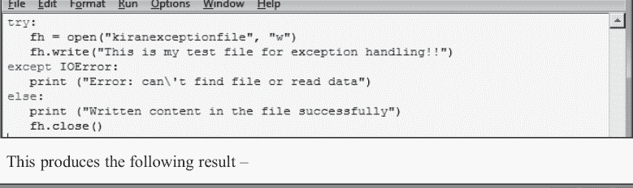

这将产生以下结果 –

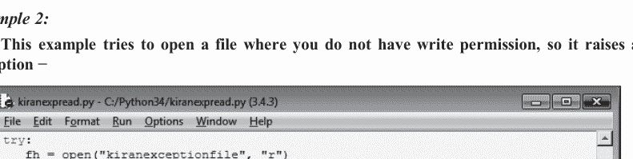

###### 示例 2:

此示例尝试打开一个你没有写权限的文件，因此会引发异常 –

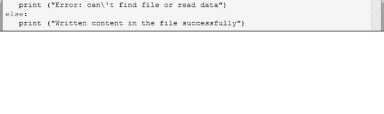

这将产生以下结果 –

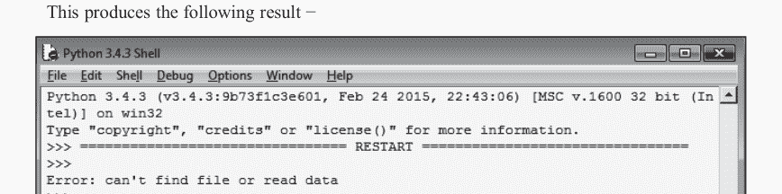

##### 2.7.2 异常处理与自定义函数处理用户输入

异常可以由内置函数以及程序员定义的函数引发。
考虑以下示例：

1.  我们通过 `input` 函数提示用户输入一个 1-12 之间的数字作为当前月份。
2.  `input` 函数将返回输入的内容作为字符串。我们可以对这个值进行整数类型转换，将其转换为整数类型：
    `month = int(input(‘Enter current month (1–12):’))`
3.  如果输入字符串包含非数字字符（1 和 2 除外），`int` 函数将引发 `ValueError` 异常。此外，还需要检查值是否在 1-12 的范围之外。

###### 1. 定义 getMonth( ) 函数

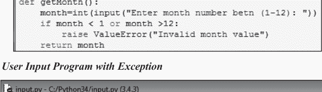

###### 2. 编写带异常处理的用户输入程序

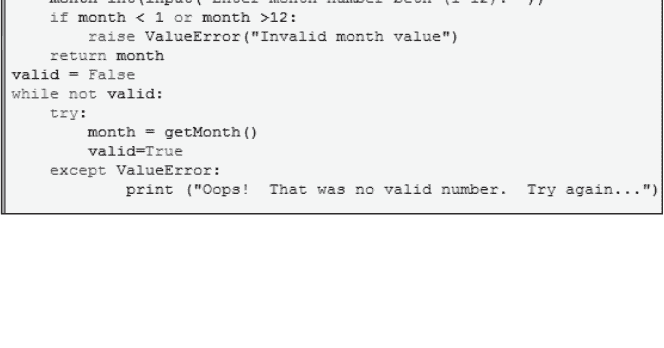

输入无效的数字值后运行程序观察到的输出

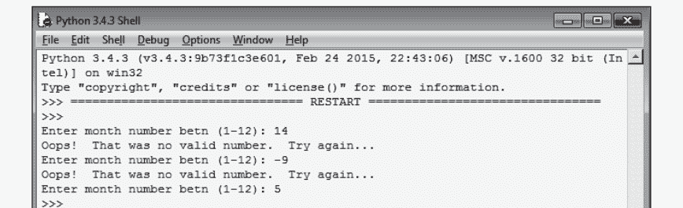

输入非数字值后运行程序观察到的输出

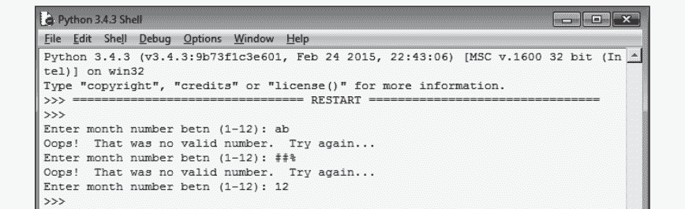

##### 2.7.3 不带特定异常的 except 子句

1.  你也可以如下使用没有定义具体异常的 `except` 语句 –

```
try:
    You do your operations here;
    ....................
except:
    If there is any exception, then execute this block.
    ....................
else:
    If there is no exception then execute this block.
```

2.  `try-except` 语句会捕获发生的所有异常。不过，使用这种 `try-except` 语句不被视为良好的编程实践，因为它会捕获所有异常，但不会让程序员识别可能发生的根本问题原因。

示例：

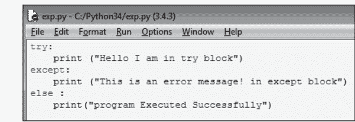

运行后观察到的输出：

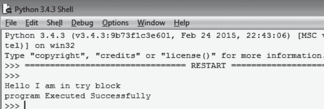

##### 2.7.4 捕获多个异常的 *except* 子句

你也可以如下使用同一个 *except* 语句来处理多个异常 –

```
try:
    You do your operations here;
    ....................

except(Exception1[, Exception2[,....ExceptionN]]):
    If there is any exception from the given exception list,
    then execute this block.
    ....................

else:
    If there is no exception then execute this block.
```

###### 示例 1:

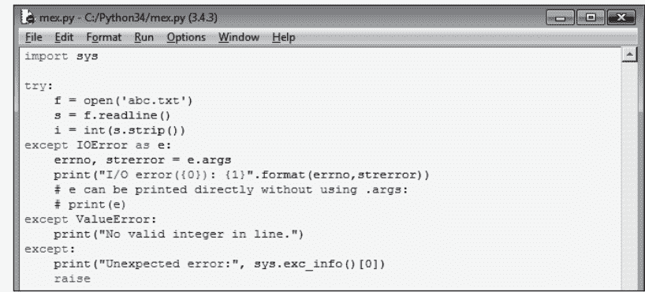

***运行后观察到的输出***

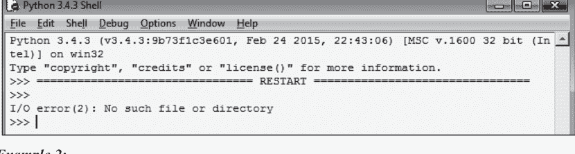

###### 示例 2:

现在检查 kiranfile 文件，该文件存在于当前路径中。

kiranfile 文件的内容如下：

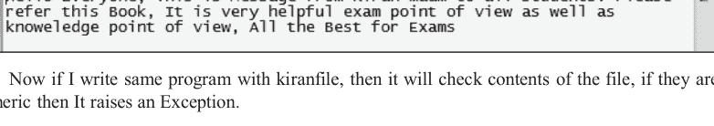

现在，如果我使用 kiranfile 编写相同的程序，它会检查文件内容，如果内容不是数字，则会引发一个异常。

```
python
import sys
try:
    f = open('kiranfile.txt')
    s = f.readline()
    i = int(s.strip())
except IOError as e:
    errno, strerror = e.args
    print("I/O error({0}): {1}".format(errno,strerror))
    # e can be printed directly without using .args:
    # print(e)
except ValueError:
    print("No valid integer in line.")
except:
    print("Unexpected error:", sys.exc_info()[0])
    raise
```

##### 输出

```
Python 3.4.3 Shell
File Edit Shell Debug Options Window Help
Python 3.4.3 (v3.4.3:9b73f1c3e601, Feb 24 2015, 22:43:06) [MSC v.1600 32 bit (Intel)] on win32
Type "copyright", "credits" or "license()" for more information.
>>> ============================= RESTART =============================
>>> 
No valid integer in line.
>>> 
```

##### 2.7.5 try-finally 子句

1.  我们可以将 `finally:` 代码块与 `try:` 代码块一起使用。
2.  通常 `try:` 代码块可以与 `except` 子句配对，但 `try` 代码块也可以与 `finally` 代码块一起使用。
3.  `finally` 代码块是放置任何必须执行的代码的地方，无论 `try` 代码块是否引发异常。
4.  `finally` 代码块将在程序结束时执行。
5.  你可以为 `try` 代码块提供 `except` 子句，或者一个 `finally` 子句，但不能两者都提供。
6.  你也不能在使用 `finally` 子句的同时使用 `else` 子句。

`try-finally` 语句的语法如下：

```
try:
    You do your operations here;
    ......................
    Due to any exception, this may be skipped.
```

###### finally:

这部分总会被执行。

##### 示例：

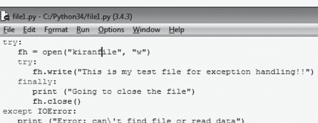

如果你没有以写模式打开文件的权限，则会产生以下结果：Error: can’t find file or read data，否则它将执行 `Finally` 代码块。

###### 运行后观察到的输出：

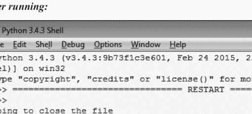

##### 2.7.6 异常的参数

1.  一个异常可以有参数。
2.  参数是一个提供有关问题的附加信息的值。
3.  参数的内容不是固定的，它们因异常而异。
4.  你可以通过在 `except` 子句中提供一个变量来捕获异常的参数，如下所示：

###### 语法如下：

```
try:
    You do your operations here;
    ......................
except ExceptionType, Argument:
    You can print value of Argument here...
```

如果你正在编写处理单个异常的代码，可以在 `except` 语句中让一个变量跟在异常类型名后面。如果你正在捕获多个异常，可以让一个变量跟在异常元组后面。

这个变量将接收异常的值，该值通常包含异常的原因。这个变量可以接收单个值或多个值（以元组形式）。这个元组通常包含错误字符串、错误编号和错误位置。

##### 示例：

这将产生以下结果：

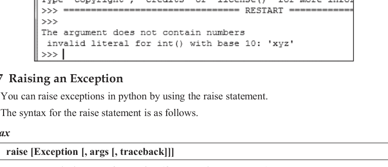

##### 2.7.7 引发异常

你可以使用 `raise` 语句在 Python 中引发异常。

`raise` 语句的语法如下。

###### 语法

```
raise [Exception [, args [, traceback]]]
```

1.  **Exception** 是异常的类型（例如，`NameError`）。
2.  *argument* 意指 **args** 是一个作为异常参数的值。该参数是可选的；如果未提供，则异常参数为 `None`。
3.  *traceback* 也是可选的，如果存在，则是用于异常的回溯对象。

###### 示例

异常可以是一个字符串、一个类或一个对象。Python 核心引发的大多数异常都是类，其参数是该类的一个实例。

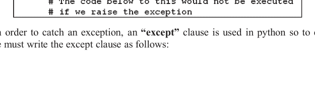

注意：为了捕获异常，在 Python 中使用 “except” 子句，因此要捕获上述异常，我们必须如下编写 `except` 子句：

#### 2.8 文件操作中的异常处理

很多时候，当我们打开文件进行读写时，如果找不到该文件，可能会引发异常。这里会引发标准的 `IOError` 异常，程序会以一条“`No such file or directory`”错误信息终止。我们可以捕获并处理这个异常，如下所示。

打开文件错误的异常处理示例：

```python
fname=input("Enter Filename: ")
emptystr=" "
inp_file_opened=False
while not inp_file_opened:
    try:
        inp_file = open(fname,'r')
        inp_file_opened=True
        rline = inp_file.readline()
        while rline != emptystr:
            rline=inp_file.readline()
    except IOError:
        print("File open Error\n")
        fname=input("Enter Filename: ")
```

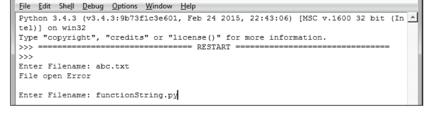

1.  变量 `fname` 存储用户输入的文件名。
2.  变量 `inp_file_opened` 是一个标志变量，初始化为 `False`。
3.  只要 `inp_file_opened` 为 `False`，`while` 循环就会持续迭代。由于循环内有 `try` 块，每次 `open(file_name, ‘r')` 引发异常时，`try` 块中剩余的行会被跳过，而 `except` 标头后的异常处理程序会被执行。
4.  只有当 `open` 调用没有抛出异常时，`try` 块中的所有指令才会被执行，程序会在 `while` 循环之后继续执行。
5.  从文本文件读取时，`readline` 方法不会引发任何异常。
6.  当到达文件末尾时，`readline` 返回一个空字符串，而不是抛出异常。
7.  由文件打开错误引发的 `IOError` 异常可以被捕获并处理。

#### 2.9 异常处理的优势

1.  借助异常，我们可以检测逻辑错误和语法错误。
2.  借助运行时异常，我们可以捕获错误并将错误信息抛出给用户。
3.  异常处理提供了一种类型安全的集成方法。
4.  同步异常可以由用户创建，因此用户可以控制程序。
5.  异常处理机制的主要优势在于检测异常并报告异常情况，以便用户可以采取适当措施。
6.  一个程序段可以有多个条件，所有这些多个条件可以通过多个 `catch` 或 `except` 块来处理，这意味着一个 `try` 块可以有多个 `catch` 或 `except` 块。
7.  Python 异常中提供了断言。

#### 2.10 问题

1.  定义什么是错误和缺陷，以及有哪些类型的错误。
2.  解释“异常”的含义。
3.  解释什么是异常以及如何处理它。
4.  解释不同类型的异常，并列出一些标准异常。
5.  解释内置异常和用户自定义异常之间的区别。
6.  用清晰的图表解释异常的传播。
7.  解释 Python 中的断言。
8.  解释可以使用 `try` 和 `except` 块处理捕获到的异常的不同方式。
9.  用合适的例子解释异常参数。
10. 用例子解释异常的引发。
11. 解释如何在文件处理中使用异常处理。
12. 解释异常处理的优势。

## 第三章

### 正则表达式

#### 结构

- 3.1 正则表达式简介
- 3.2 正则表达式模式
    - 3.2.1 编译标志
- 3.3 正则表达式 [re] 模块
- 3.4 各种类型的正则表达式
- 3.5 正则表达式的不同方法
    - 3.5.1 Match() 方法
    - 3.5.2 Search() 方法
    - 3.5.3 Replace() 方法
- 3.6 匹配 vs. 搜索
- 3.7 搜索与替换
- 3.8 正则表达式修饰符 – 选项标志
- 3.9 问题

#### 3.1 正则表达式简介

正则表达式（称为 REs、regexes 或 regex 模式）本质上是一种小型、高度专业化的编程语言，内嵌在 Python 中，并通过 `re` 模块提供。
正则表达式内置了解析器，可以匹配、替换和搜索字符串。
它使用不同的正则表达式符号和通配符，如 `*` 和 `?`，以及 `.`、`#`、`^`、`$`、`[ ]` 等许多其他符号。
正则表达式是一种特殊的字符序列，可帮助你匹配或查找其他字符串或字符串集。
- “正则表达式”一词有时也称为 regex 或 regexp，起源于理论计算机科学。
- `re` 模块在 Python 中提供了对类似 Perl 正则表达式的完全支持。如果在编译或使用正则表达式时发生错误，`re` 模块会引发 `re.error` 异常。
- 正则表达式模式被编译为一系列字节码，然后由用 C 编写的匹配引擎执行。
- 反斜杠是正则表达式中使用的特殊字符，但也用作字符串中的转义字符。这意味着 Python 会首先求值字符串中的每个反斜杠，然后在没有必要反斜杠的情况下将其用作正则表达式。防止这种情况的一种方法是将每个反斜杠写为 “`\\`”，以此方式将其保留用于正则表达式的求值。克服这个问题的最佳方法是将正则表达式标记为原始字符串。
- 你也可以使用正则表达式以各种方式修改或拆分字符串。
- 如果想在 Python 中使用正则表达式，必须导入 `re` 模块，该模块提供了处理正则表达式的方法和函数。

##### 演示正则表达式的简单示例

我们通过以下图示逐步展示这种匹配是如何进行的：

我们检查字符串 sub = "abc"

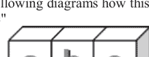

是否包含在字符串 s = "xaababcbcd" 中


顺便说一句，字符串 sub = "abc" 可以看作一个正则表达式，只是一个非常简单的正则表达式。

首先，我们检查两个字符串的第一个位置是否匹配，即 `s[0] == sub[0]`。

在我们的例子中，这并不满足。我们用红色标记这个事实：

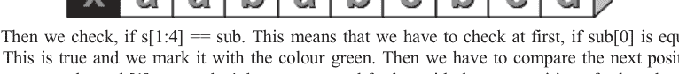

然后我们检查 `s[1:4] == sub`。这意味着我们首先需要检查 `sub[0]` 是否等于 `s[1]`。这是真的，我们用绿色标记它。然后我们需要比较下一个位置。`s[2]` 不等于 `sub[1]`，因此我们无需进一步比较 `sub` 和 `s` 的下一个位置：


现在我们必须检查 `s[2:5]` 和 `sub` 是否相等。前两个位置相等，但第三个不相等：

以下步骤无需任何解释就应一目了然：

最终，`s[4:7] == sub`，我们得到了完全匹配。

#### 3.2 正则表达式模式

正则表达式被分为多种类型，如下所示：

1.  *简单模式*
    正则表达式用于操作字符串，因此我们将看到匹配字符。

2.  *匹配字符*
    字母和字符将简单地匹配自身。例如，正则表达式 `python` 将精确匹配字符串 `python`。

    元字符列表：`.` `^` `$` `*` `+` `?` `{` `}` `[` `]` `|` `\` `(` `)`

    `[` 和 `]` 用于指定一个**字符类**，这是一个你希望匹配的字符集合。字符可以逐个列出，或者通过给出两个字符并用 `-` 分隔来表示一个字符范围。

    **[abc]** 或 **[a-c]** 将匹配字符 **a**、**b** 或 **c** 中的任何一个；

    `[a-z]` 只匹配**从 a 到 z** 的小写字母。

    最重要的元字符是**反斜杠**，`\`。就像在 Python 字符串字面量中一样，反斜杠后面可以跟各种字符来表示各种特殊序列。它也用于转义所有元字符，以便你仍然可以在模式中匹配它们；例如，如果你需要匹配一个 `[` 或 `\`，可以在它们前面加上反斜杠来消除其特殊含义：`\[` 或 `\\`。

##### 3. 重复操作

我们将看到的第一个用于重复操作的**元字符是 `*`**。`*` 不匹配字面字符 `*`；相反，它指定前一个字符可以匹配零次或多次，而不是恰好一次。

例如，`ca*t` 将匹配 `ct`（0 个 a 字符）、`cat`（1 个 a）、`caaat`（3 个 a 字符），后跟 t 字符。

**另一个重复元字符是 `+`**，它匹配一次或多次。`*` 和 `+` 之间的区别在于：`*` 匹配零次或多次，因此被重复的内容可能根本不存在，而 `+` 要求至少出现一次。使用类似的例子，`ca+t` 将匹配 `cat`（1 个 a）、`caaat`（3 个 a），但不会匹配 `ct`。

还有两个重复限定符。**问号字符 `?` 匹配一次或零次。**

##### 正则表达式模式

除了控制字符 `+` `?` `.` `*` `^` `$` `(` `)` `[` `]` `{` `}` `|` `\` 之外，所有字符都匹配自身。你可以通过在其前面加上反斜杠来转义控制字符。

下表列出了 Python 中可用的正则表达式语法：

##### 正则表达式模式

| 模式 | 描述 |
| :--- | :--- |
| `^` | 匹配行的开始。 |
| `$` | 匹配行的结束。 |
| `.` | 匹配除换行符外的任何单个字符。使用 `m` 选项也允许匹配换行符。 |
| `[...]` | 匹配方括号内的任何单个字符。 |
| `[^...]` | 匹配不在方括号内的任何单个字符。 |
| `re*` | 匹配前面的表达式零次或多次。 |
| `re+` | 匹配前面的表达式一次或多次。 |
| `re?` | 匹配前面的表达式零次或一次。 |
| `re{ n}` | 精确匹配前面的表达式 n 次。 |
| `re{ n,}` | 匹配前面的表达式 n 次或更多次。 |
| `re{ n, m}` | 匹配前面的表达式至少 n 次，最多 m 次。 |
| `a| b` | 匹配 a 或 b。 |
| `(re)` | 对正则表达式进行分组并记住匹配的文本。 |
| `(?imx)` | 在正则表达式中临时打开 i、m 或 x 选项。如果在括号内，则仅影响该区域。 |
| `(?-imx)` | 在正则表达式中临时关闭 i、m 或 x 选项。如果在括号内，则仅影响该区域。 |
| `(: re)` | 对正则表达式进行分组但不记住匹配的文本。 |
| `(?imx: re)` | 在括号内临时打开 i、m 或 x 选项。 |
| `(?-imx: re)` | 在括号内临时关闭 i、m 或 x 选项。 |
| `(?#...)` | 注释。 |
| `(?= re)` | 使用模式指定位置。没有范围。 |
| `(?! re)` | 使用模式否定指定位置。没有范围。 |
| `(?> re)` | 匹配独立模式，不进行回溯。 |
| `\w` | 匹配独立模式，不进行回溯。 |
| `\W` | 匹配非单词字符。 |
| `\s` | 匹配空白字符。等同于 `[\t\n\r\f]`。 |
| `\S` | 匹配非空白字符。 |
| `\d` | 匹配数字。等同于 `[0-9]`。 |
| `\D` | 匹配非数字。 |
| `\A` | 匹配字符串的开始。 |
| `\Z` | 匹配字符串的结束。如果存在换行符，则匹配换行符之前的位置。 |
| `\z` | 匹配字符串的结束。 |
| `\G` | 匹配上一次匹配结束的位置。 |
| `\b` | 在方括号外时匹配单词边界。在方括号内匹配退格符 (0x08)。 |
| `\B` | 匹配非单词边界。 |
| `\n`, `\t` 等 | 匹配换行符、回车符、制表符等。 |
| `\1...\9` | 匹配第 n 个分组的子表达式。 |
| `\10` | 如果已匹配，则匹配第 n 个分组的子表达式。否则引用字符代码的八进制表示。 |

##### 正则表达式示例

字面字符：

| 示例 | 描述 |
| :--- | :--- |
| `python` | 匹配 "python"。 |

字符类：

| 示例 | 描述 |
| :--- | :--- |
| `[Pp]ython` | 匹配 "Python" 或 "python" |
| `rub[ye]` | 匹配 "ruby" 或 "rube" |
| `[aeiou]` | 匹配任一小写元音字母 |
| `[0-9]` | 匹配任一数字；与 `[0123456789]` 相同 |
| `[a-z]` | 匹配任一小写 ASCII 字母 |
| `[A-Z]` | 匹配任一大写 ASCII 字母 |
| `[a-zA-Z0-9]` | 匹配上述任何字符 |
| `[^aeiou]` | 匹配除小写元音字母外的任何字符 |
| `[^0-9]` | 匹配除数字外的任何字符 |

##### 特殊字符类：

| 示例 | 描述 |
| :--- | :--- |
| `.` | 匹配除换行符外的任何字符 |
| `\d` | 匹配一个数字：`[0-9]` |
| `\D` | 匹配一个非数字：`[^0-9]` |
| `\s` | 匹配一个空白字符：`[ \t\r\n\f]` |
| `\S` | 匹配非空白字符：`[^ \t\r\n\f]` |
| `\w` | 匹配一个单词字符：`[A-Za-z0-9_]` |
| `\W` | 匹配一个非单词字符：`[^A-Za-z0-9_]` |

##### 重复情况：

| 示例 | 描述 |
| :--- | :--- |
| `ruby?` | 匹配 "rub" 或 "ruby"：y 是可选的 |
| `ruby*` | 匹配 "rub" 加上 0 个或多个 y |
| `ruby+` | 匹配 "rub" 加上 1 个或多个 y |
| `\d{3}` | 精确匹配 3 个数字 |
| `\d{3,}` | 匹配 3 个或更多数字 |
| `\d{3,5}` | 匹配 3、4 或 5 个数字 |

##### 非贪婪重复：

这匹配最小数量的重复：

| 示例 | 描述 |
| :--- | :--- |
| `<.*>` | 贪婪重复：匹配 "<python>perl>" |
| `<.*?>` | 非贪婪：匹配 "<python>perl>" 中的 "<python>" |

##### 使用圆括号分组：

| 示例 | 描述 |
| :--- | :--- |
| `\D\d+` | 无分组：+ 重复 `\d` |
| `(\D\d)+` | 已分组：+ 重复 `\D\d` 这一对 |
| `([Pp]ython(, )?)+` | 匹配 "Python"、"Python, python, python" 等。 |

##### 反向引用：

这再次匹配之前匹配过的分组：

| 示例 | 描述 |
| :--- | :--- |
| `([Pp])ython&\1ails` | 匹配 python&pails 或 Python&Pails |
| `(["'])\1*1` | 单引号或双引号字符串。`\1` 匹配第 1 组匹配的任何内容。`\2` 匹配第 2 组匹配的任何内容，依此类推。 |

##### 替选项：

| 示例 | 描述 |
| :--- | :--- |
| `python\|perl` | 匹配 "python" 或 "perl" |
| `rub(y\|le)` | 匹配 "ruby" 或 "ruble" |
| `Python(!+\|\?)` | "Python" 后跟一个或多个 ! 或一个 ? |

##### 锚点：

这需要指定匹配位置。

| 示例 | 描述 |
| :--- | :--- |
| `^Python` | 匹配字符串或内部行开始的 "Python" |
| `Python$` | 匹配字符串或行结束的 "Python" |
| `\APython` | 匹配字符串开始的 "Python" |
| `Python\Z` | 匹配字符串结束的 "Python" |
| `\bPython\b` | 匹配单词边界处的 "Python" |
| `\brub\ B` | `\B` 是非单词边界：匹配 "rube" 和 "ruby" 中的 "rub"，但不匹配单独的 "rub" |
| `Python(?=!)` | 如果后面跟有感叹号，则匹配 "Python" |
| `Python(?! !)` | 如果后面不跟感叹号，则匹配 "Python" |

##### 圆括号的特殊语法：

| 示例 | 描述 |
| :--- | :--- |
| `R(?#comment)` | 匹配 "R"。其余部分都是注释 |
| `R(?i)uby` | 在匹配 "uby" 时不区分大小写 |
| `R(?i:uby)` | 同上 |
| `rub(?:y\|le)` | 仅分组，不创建 `\1` 反向引用 |

##### 3.2.1 编译标志

编译标志允许你修改正则表达式工作方式的某些方面。标志在 `re` 模块下有两种名称可用，长名如 `IGNORECASE` 和短的单字母形式如 `I`。（如果你熟悉 Perl 的模式修饰符，单字母形式使用相同的字母；例如，`re.VERBOSE` 的短形式是 `re.X`。）可以通过按位或来指定多个标志；例如，`re.I | re.M` 同时设置 `I` 和 `M` 标志。

下表列出了可用的标志，随后是对每个标志的更详细解释。

| 标志 | 含义 |
| :--- | :--- |
| ASCII, A | 使 `\w`、`\b`、`\s` 和 `\d` 等转义序列仅匹配具有相应属性的 ASCII 字符。 |
| DOTALL, S | 使 `.` 匹配任何字符，包括换行符。 |
| IGNORECASE, I | 进行不区分大小写的匹配。 |
| LOCALE, L | 进行区域设置感知的匹配。 |
| MULTILINE, M | 多行匹配，影响 `^` 和 `$`。 |
| VERBOSE, X (对应 `extended`) | 启用详细的 RE，可以更清晰、易懂地组织。 |

###### I

####### IGNORECASE

I 选项 执行不区分大小写的匹配；字符类和字面量字符串在匹配字母时将忽略大小写。例如，`[A-Z]` 也将匹配小写字母，并且 `Kiran` 将匹配 `Kiran`、`kiran` 或 `kirAN`。

###### L

####### LOCALE

使 `\w`、`\W`、`\b` 和 `\B` 依赖于当前区域设置，而不是 Unicode 数据库。

例如，如果你正在处理法语文本，你会希望能够编写 `\w+` 来匹配单词，但 `\w` 仅匹配字符类 `[A-Za-z]`；它不会匹配 ‘é’ 或 ‘ç’。如果你的系统配置正确并选择了法语区域，某些 C 函数将告诉程序 ‘é’ 也应被视为一个字母。

###### M

####### MULTILINE

通常，`^` 仅匹配字符串的开头，`$` 仅匹配字符串的结尾以及字符串末尾换行符（如果有）之前的位置。

###### S

####### DOTALL

使 `.` 特殊字符匹配任何字符，包括换行符；没有此标志，`.` 将匹配除换行符外的任何内容。

###### A

####### ASCII

使 `\w`、`\W`、`\b`、`\B`、`\s` 和 `\S` 仅执行 ASCII 匹配，而不是完整的 Unicode 匹配。这仅对 Unicode 模式有意义，对于字节模式会被忽略。

###### X

####### VERBOSE

此标志允许你编写更易读的正则表达式，因为它提供了更多格式化灵活性。当指定此标志时，正则表达式字符串中的空白字符将被忽略，除非空白字符位于字符类中或前面有未转义的反斜杠；这允许你更清晰地组织和缩进正则表达式。此标志还允许你在正则表达式中放置会被引擎忽略的注释；注释由 `#` 标记，该 `#` 既不在字符类中，前面也没有未转义的反斜杠。

#### 3.3 正则表达式 [re] 模块

- re 模块用于 Python 中的正则表达式操作。
- 使用 re 正则表达式时，模式（pattern）和待搜索字符串都可以是 Unicode 字符串或 8 位字符串。
- 大多数正则表达式操作既可作为模块级函数使用，也可作为已编译正则表达式的方法使用。
- 正则表达式（或 RE）指定一组匹配它的字符串；此模块中的函数让你检查一个特定字符串是否匹配给定的正则表达式。
- re 有两个重要函数：
  - `match()`
  - `search()`
- 我们可以使用 re 模块与所有正则表达式模式。

#### 3.4 正则表达式的不同类型

根据 POSIX（“可移植操作系统接口（UNIX）”），正则表达式有不同的类型。

1.  POSIX 基本正则表达式
2.  POSIX 扩展正则表达式

##### POSIX 基本正则表达式

POSIX 是可移植操作系统接口，它有一系列标准定义了（UNIX）操作系统应支持的一些功能。这些标准定义了两种风格的正则表达式。涉及正则表达式的命令，如 grep 和 egrep，

grep 是 Unix 和 Linux 中的全局正则表达式，支持不同的正则表达式模式。像字符串匹配模式、?、.、^、/、*、+、$、[] 每个字符都有特殊含义。

egrep 是 Unix 和 Linux 中的扩展全局正则表达式，支持不同的正则表达式模式以及 `|`（管道）符号以比较两个或多个模式。

##### POSIX 扩展正则表达式

扩展正则表达式（ERE）标准化了与 UNIX `egrep` 命令使用的类似语法。相对于原始的 UNIX `grep`（仅包含方括号表达式、点、脱字符、美元符和星号），“扩展”是相对的。ERE 支持 `grep` 的所有正则表达式，并带有一些扩展。

因此，`egrep` 和 POSIX ERE 添加了不需要反斜杠的其他元字符。你可以使用反斜杠来抑制所有元字符的含义。

`grep`、`egrep`、`sed`、`awk` 这些都使用扩展正则表达式。

量词 `?`、`+`、`{n}`、`{n,m}` 和 `{n,}` 分别将前面的标记重复零次或一次、一次或多次、n 次、n 到 m 次，以及 n 次或更多次。

在 `egrep` 中，通过竖线 `|` 支持多个模式的扩展正则表达式。括号创建一个分组，例如 `(abc){2}` 匹配 `abcabc`。

下表显示了 Unix 和 Linux 中可用的不同实用工具和正则表达式类型。

| 实用工具 | 正则表达式类型 |
|---|---|
| Vi（可视化编辑器） | 基本正则表达式 |
| grep | 基本正则表达式 |
| sed | 基本正则表达式 |
| ed | 基本正则表达式 |
| more | 基本正则表达式 |
| expr | 基本正则表达式 |
| pg | 基本正则表达式 |
| nl | 基本正则表达式 |
| awk | 扩展正则表达式 |
| egrep | 扩展正则表达式 |
| EMAC | EMAC 正则表达式 |

#### 3.5 正则表达式的不同方法

##### 3.5.1 `match()` 方法

此函数尝试使用可选标志将正则表达式模式与字符串匹配。
此函数的语法如下：
**`re.match(pattern, string, flags=0)`**
参数说明如下：

| 参数 | 描述 |
|---|---|
| `pattern` | 这是要匹配的正则表达式。 |
| `string` | 这是将在字符串开头进行搜索以匹配模式的字符串。 |
| `flags` | 你可以使用按位或（`|`）指定不同的标志。这些是修饰符，列于下表中 |

**`re.match`** 函数在成功时返回一个匹配对象，失败时返回 `None`。我们将使用匹配对象的 **`group(num)`** 或 **`groups()`** 函数来获取匹配的表达式。

| 匹配对象方法 | 描述 |
|---|---|
| `group(num=0)` | 此方法返回整个匹配（或特定子组 `num`） |
| `groups()` | 此方法以元组形式返回所有匹配的子组（如果没有，则为空） |

###### match 函数示例

```python
#!/usr/bin/python
import re

line = "Cats are smarter than dogs"
matchObj = re.match( r'(.*) are (.*?) .*', line, re.M|re.I)

if matchObj:
    print ('matchObj.group() :', (matchObj.group()))
    print ('matchObj.group(1) :', (matchObj.group(1)))
    print ('matchObj.group(2) :', (matchObj.group(2)))
else:
    print ('No match!!')
```

##### 输出

```
matchObj.group() : Cats are smarter than dogs
matchObj.group(1) : Cats
matchObj.group(2) : smarter
```

##### 3.5.2 `search()` 方法

此函数使用可选标志在字符串中搜索正则表达式模式的第一次出现。
此函数的语法如下：
**`re.search(pattern, string, flags=0)`**
参数说明如下：

| 参数 | 描述 |
|---|---|
| **`pattern`** | 这是要匹配的正则表达式。 |
| **`string`** | 这是将在字符串中任何位置进行搜索以匹配模式的字符串。 |
| **`flags`** | 你可以使用按位或（`|`）指定不同的标志。这些是修饰符，列于下表中。 |

**`re.search`** 函数在成功时返回一个匹配对象。我们将使用匹配对象的 `group(num)` 或 `groups()` 函数来获取匹配的表达式。

| 匹配对象方法 | 描述 |
|---|---|
| **`group(num=0)`** | 此方法返回整个匹配（或特定子组 `num`） |
| **`groups()`** | 此方法以元组形式返回所有匹配的子组（如果没有，则为空） |

###### search 函数示例

```python
#!/usr/bin/python
import re

line = "Cats are smarter than dogs";
searchObj = re.search( r'(.*) are (.*?) .*', line, re.M|re.I)

if searchObj:
    print ('searchObj.group() : ', (searchObj.group()))
    print ('searchObj.group(1) : ', (searchObj.group(1)))
    print ('searchObj.group(2) : ', (searchObj.group(2)))
else:
    print ('Nothing found!!')
```

##### 输出

```
Python 3.4.3 Shell
>>> matchObj.group() : Cats are smarter than dogs
matchObj.group(1) : Cats
matchObj.group(2) : smarter
>>> =================== RESTART ===================
>>> searchObj.group() : Cats are smarter than dogs
searchObj.group(1) : Cats
searchObj.group(2) : smarter
>>> |
```

```
Python 2.7.13 Shell
Python 2.7.13 (v2.7.13:a06454b1afa1, Dec 17 2016, 20:42:59) [MSC v.1500 Intel)] on win32
Type "copyright", "credits" or "license()" for more information.
>>> =================== RESTART: C:/Python27/search.py ===================
('searchObj.group() : ', 'Cats are smarter than dogs')
('searchObj.group(1) : ', 'Cats')
('searchObj.group(2) : ', 'smarter')
>>> |
```## 3.5.3 `replace()` 方法

`replace()` 方法返回一个字符串的副本，其中所有出现的子字符串 `old` 被替换为 `new`，可选地限制替换次数为 `max`。

###### 语法

```
str.replace(old, new[, max])
```

###### 参数

- **old**: 要被替换的旧子字符串。
- **new**: 替换旧子字符串的新子字符串。
- **max**: 如果提供了可选参数 `max`，则只替换前 `max` 次出现的子字符串。

###### 示例

以下示例展示了 `replace()` 方法的用法。此代码在 Python 2.7 版本中有效。

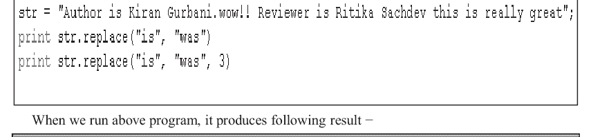

当我们运行上面的程序时，它产生以下结果 –

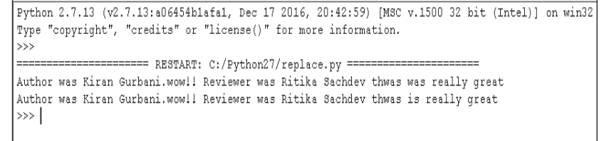

#### 3.6 匹配与搜索

**match() 与 search()**

**`match()`** 函数仅检查正则表达式是否在字符串的开头匹配，而 **`search()`** 会向前扫描整个字符串以查找匹配项。`match()` 只会报告在位置 0 开始的成功匹配；如果匹配不从位置 0 开始，`match()` 将不会报告它。

```
>>> print(re.match('super', 'superstition').span())
(0, 5)

>>> print(re.match('super', 'insuperable'))
None
```

**另一方面，`search()` 会向前扫描字符串，并报告它找到的第一个匹配项。**

```
>>> print(re.search('super', 'superstition').span())
(0, 5)

>>> print(re.search('super', 'insuperable').span())
(2, 7)
```

##### 匹配与搜索示例

###### 代码

```
#!/usr/bin/python
import re

line = "Cats are smarter than dogs";
matchObj = re.match( r'dogs', line, re.M|re.I)
if matchObj:
    print ('match --> matchObj.group() : ', matchObj.group( ))
else:
    print ('No match!!')

searchObj = re.search( r'dogs', line, re.M|re.I)
if searchObj:
    print ('search --> searchObj.group() : ', searchObj.group( ))
else:
    print ('Nothing found!!')
```

##### 输出

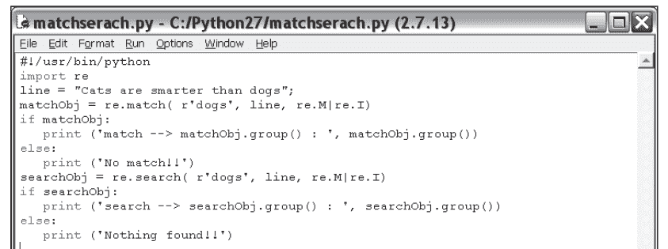

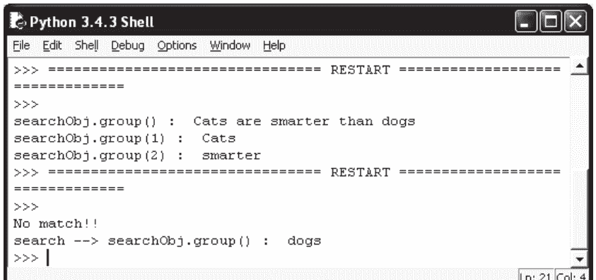

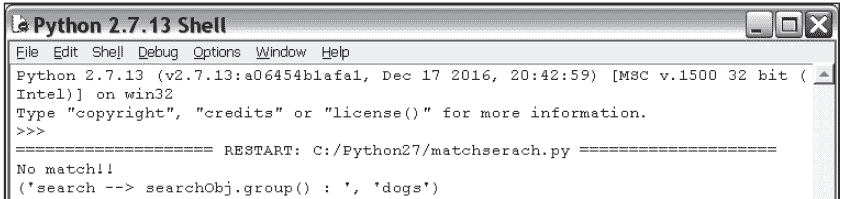

#### 3.7 正则表达式搜索与替换简介

##### 搜索与替换

使用正则表达式的一些最重要的 `re` 方法是 `sub`。

###### 语法

```
re.sub(pattern, repl, string, max=0)
```

此方法将字符串中所有匹配的正则表达式模式替换为 `repl`，除非提供了 `max` 参数。此方法将返回修改后的字符串。

##### 搜索与替换示例

###### 代码

```
#!/usr/bin/python
import re
phone = "2004-959-559 # This is Phone Number"
###### 删除 Python 风格的注释
num = re.sub(r'#.*$', "", phone)
print ('Phone Num : ', (num))
###### 移除除数字以外的所有字符
num = re.sub(r'\D', "", phone)
print ('Phone Num : ', (num))
```

##### 输出

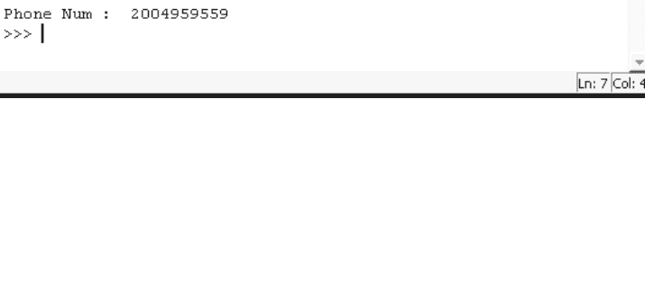

#### 3.8 正则表达式修饰符 – 选项标志

正则表达式字面量可以包含可选的修饰符来控制匹配的各个方面。修饰符被指定为一个可选标志。你可以使用按位异或（`|`）来提供多个修饰符，如前所示，并且可以由以下之一表示：

| 修饰符 | 描述 |
|----------|-------------|
| re.I | 执行不区分大小写的匹配。 |
| re.L | 根据当前语言环境解释单词。此解释影响字母组（`\w` 和 `\W`）以及单词边界行为（`\b` 和 `\B`）。 |
| re.M | 使 `$` 匹配行的结尾（而不仅仅是字符串的结尾），并使 `^` 匹配任何行的开头（而不仅仅是字符串的开头）。 |
| re.S | 使点（`.`）匹配任何字符，包括换行符。 |
| re.U | 根据 Unicode 字符集解释字母。此标志影响 `\w`、`\W`、`\b`、`\B` 的行为。 |
| re.X | 允许更“简洁”的正则表达式语法。它忽略空白（除非在集合 `[]` 内或被反斜杠转义），并将未转义的 `#` 视为注释标记。 |

#### 3.9 问题

1.  解释 Python 中使用的不同正则表达式。
2.  定义带有编译标志的正则表达式模式。
3.  解释什么是正则表达式？定义所有正则表达式模式。
4.  详细解释 `re` 模块。
5.  解释正则表达式的不同方法。
6.  通过合适的示例解释 `match()` 和 `search()` 方法。
7.  列出不同类型的正则表达式。解释每一种。
8.  通过合适的示例解释 `search()` 和 `replace()` 方法。
9.  解释匹配和搜索之间的区别。
10. 解释搜索和替换之间的区别。
11. 解释带有选项标志的正则表达式修饰符。

## 第4章 Python中的GUI编程

#### 结构

1.  4.1 什么是GUI？
    - 4.1.1 什么是GUI？
    - 4.1.2 GUI的优点
    - 4.1.3 GUI的缺点
2.  4.2 GUI简介
    - 4.2.1 图形库
3.  4.3 布局管理
    - 4.3.1 Pack布局
    - 4.3.2 Grid布局
4.  4.4 事件与绑定
    - 4.4.1 绑定事件
    - 4.4.2 运动事件
5.  4.5 在Canvas上绘制
    - 4.5.1 Canvas小部件选项
    - 4.5.2 Canvas项目
    - 4.5.3 如何绘制canvas？
    - 4.5.4 如何用Python绘制椭圆？
    - 4.5.5 如何用canvas绘制线条？
    - 4.5.6 如何用canvas绘制矩形？
    - 4.5.7 如何用canvas绘制多边形？
    - 4.5.8 Canvas中的坐标系
6.  4.6 小部件
    - 4.6.1 Button小部件
    - 4.6.2 Radio Button小部件
    - 4.6.3 Checkbox小部件
    - 4.6.4 Entry小部件
    - 4.6.5 List box小部件
    - 4.6.6 Frame小部件
    - 4.6.7 Label小部件
    - 4.6.8 Spinbox小部件
    - 4.6.9 Textbox小部件
    - 4.6.10 带有图像的Text小部件
7.  4.7 问题

#### 4.1 什么是GUI？

GUI的全称是**图形用户界面**，是一种利用计算机图形功能使程序/脚本易于使用的程序接口。GUI的最佳示例是我们的Microsoft Windows。

第一个图形用户界面由Xerox公司的帕洛阿尔托研究中心在1970年代设计，但直到1980年代Apple Macintosh的出现，图形用户界面才变得流行起来。它们接受缓慢的一个原因是，它们需要相当大的CPU功率和高质量的显示器，这些在当时非常昂贵。

我们可以说GUI是一种用作计算机与其用户之间接口的软件，它使用图形元素，如对话框、图标、菜单、滚动条等。

Python为开发图形用户界面（GUI）提供了多种选择。最重要的是以下这些。

- **tkinter**：tkinter是Python对随Python分发的Tk GUI工具包的接口。tkinter是Python的标准GUI库。Python与tkinter结合提供了一种快速且简便的方式来创建GUI应用程序。tkinter提供了对Tk GUI工具包的强大面向对象接口。
- **wxPython**：这是wxWindows的开源Python接口 http://wxpython.org。
- **JPython**：JPython是Java的Python移植版本，它使Python脚本能够无缝访问本地计算机上的Java类库 http://www.jython.org。

#### 4.1.2 GUI的优点

1.  使用GUI，我们可以在没有先验知识的情况下节省大量配置任何驱动程序或软件的时间。
2.  借助GUI应用程序，每个人都可以使用计算机，而无需记住命令。
3.  大多数普通用户使用GUI的学习曲线会更小。
4.  GUI允许计算机用户使用视觉元素，如桌面图标，来导航和操作软件。

#### 4.1.3 GUI的缺点

1.  当它构建不正确时，可能会非常难以使用。
2.  GUI比非图形界面需要更多的内存资源。
3.  它可能需要安装额外的软件，例如Java的“运行时环境”。
4.  GUI中没有搜索选项。
5.  GUI的主要缺点是，你只能做应用程序/程序中预先定义好的事情，不能从你的端插入任何单个命令。

#### 4.2 Python中的GUI库简介

##### 4.2.1 图形库

###### 图形库

- Pyglet
- Bottle
- Invoke
- Splinter
- Arrow
- Peewee

###### 图形库

Python的常规构建版本包含一个面向对象的接口，用于Tcl/Tk小部件集，称为 **tkinter**。

Tkinter框架传统上与Python捆绑在一起，它使用Tk。完整的可用框架列表可以在这里看到：Python中的GUI编程。Tkinter是Python的标准Python接口（Tk接口），用于Tk GUI工具包。Tk接口模块也由许多其他模块组成。

当你使用Python 2.7.x版本时，必须使用 **Tkinter** 的首字母大写，而如果你使用更高版本如3.4.x，则使用 **tkinter**。

在本书中，我们同时使用2.7.x和3.4.x版本，因此我们会不时在书中指示哪个程序使用哪个特定版本。

现在我们将逐步介绍Python库并提供示例，以便你熟悉每个相关的库。

##### Pyglet

Pyglet是一个用于多媒体和窗口图形的跨平台框架，完全使用Python编写。

###### Pyglet在Python中的用途

我们可以将其用于窗口函数、OpenGL图形、音频和视频播放、键盘和鼠标处理以及处理图像文件。

##### Bottle

Bottle 是一个微小、轻量级的 Web 框架。

###### Bottle 在 Python 中的使用

Bottle 用于路由、模板、访问请求和响应数据、支持从普通旧式 CGI 到更高级的服务器类型，并支持 WebSockets 等更高级的功能。

##### Invoke

Invoke 允许你使用 Python 库执行管理任务。

###### Invoke 在 Python 中的使用

Invoke 为将命令行任务作为 Python 函数进行管理提供了合乎常理的解决方案，允许围绕它们优雅地构建更大的项目。

##### Splinter

Splinter 是一个 Python 库，用于通过自动化交互来测试 Web 应用程序。

###### Splinter 在 Python 中的使用

Splinter 自动化端到端的一切，包括调用浏览器、传递 URL、填写表单、点击按钮等。

它需要驱动程序来与特定的浏览器配合工作，但 Chrome 和 Firefox 已经包含在内，并且它可以使用 Selenium Remote 来控制在其他地方运行的浏览器。

如果你想知道特定浏览器在面对给定网站时的行为，Splinter 非常有用。

##### Arrow

Arrow 库理清了 Python 日期/时间处理的混乱局面。

###### Arrow 在 Python 中的使用

处理时区、日期转换、日期格式以及其他所有事情都令人头疼。使用 Python 的标准库进行日期/时间处理，则是双重头疼。

##### Peewee

Peewee 是一个虽小但功能强大的数据库访问库，原生支持 MySQL 等数据库。

###### Peewee 在 Python 中的使用

Peewee 使用一组 Python 类提供了一条安全、编程化的路径来访问数据库资源。通过 Peewee，一种快速粗糙的数据库访问方式日后可以扩展到更健壮的选项，而无需将其拆除并重新开始。

# 4.3. 布局管理器

Python Tkinter GUI 为我们提供了对组件布局的灵活性和完全控制。为此，它提供了三种类型的布局管理器：即最简单的是 Pack 布局管理器，更符合逻辑的布局管理器是 Grid，还有 Place 布局管理器。这些布局管理器有助于在屏幕上排列、管理、控制和注册不同的 Python Tkinter 小部件。外观取决于所使用的操作系统，但基本结构保持不变。需要注意的一点是，Pack、Grid 和 Place 永远不会在一个窗口中混合使用。

##### 4.3.1 Pack 布局

```
from tkinter import *
master = Tk()
Label(master, text="Python", bg="blue", fg="white").pack()
Label(master, text="Linux ", bg="black", fg="white").pack()
Label(master, text="Java ", bg="pink", fg="black").pack()
mainloop()
```

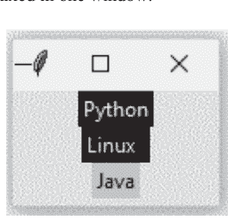

##### 4.3.2 Grid 布局

```
from tkinter import *
bg = ['pink','brown','indigo','teal','red','yellow']
counter = 0
for color in bg:
    Label(text=color, relief=RIDGE,width=23).grid(row=counter,column=0)
    Entry(bg=color, relief=SUNKEN,width=18).grid(row=counter,column=1)
    counter+=1
```

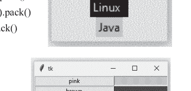

# 4.4. 事件与绑定

##### 事件

在计算中，事件是一个通常由程序范围外发起并由程序内的代码处理的操作。事件包括例如鼠标点击、鼠标移动或用户的按键动作，即他或她在键盘上按下某个键。另一个来源可能是硬件设备，如计时器。

####### 4.4.1 绑定事件

事件以字符串形式给出，使用特殊的事件语法：
`<修饰符-类型-详情>`
类型字段是事件指定符中最重要的部分。它指定我们希望绑定的事件类型，可以是用户操作，如 *Button* 和 *Key*，也可以是窗口管理器事件，如 *Enter*、*Configure* 等。

###### 绑定

绑定仅适用于单个小部件；如果你创建新的框架，它们不会继承这些绑定。
但 tkinter 也允许你在类和应用程序级别创建绑定；事实上，你可以在四个不同的级别创建绑定：
- 使用 **bind** 在小部件实例级别。
- 使用 **bind** 在小部件的顶层窗口（Toplevel 或 root）级别。
- 使用 **bind_class** 在小部件类级别（Tkinter 使用此方式提供标准绑定）。
- 使用 **bind_all** 在整个应用程序级别。

例如，你可以使用 `bind_all` 为 F1 键创建绑定，从而可以在应用程序的任何地方提供帮助。但是，如果你为同一个键创建多个绑定，或者提供重叠的绑定，会发生什么？首先，在这四个级别中的每一个，tkinter 都会选择可用绑定的“最接近匹配”。例如，如果你为 `<Key>` 和 `<Return>` 事件创建了实例绑定，那么当你按下 **Enter** 键时，只会调用第二个绑定。

一个 tkinter 应用程序大部分时间都在事件循环内运行（通过 `mainloop` 方法进入）。事件可能来自各种来源，包括用户的按键和鼠标操作。对于每个小部件，你可以将 Python 函数和方法绑定到事件上。

```
widget.bind(event, handler)
```

如果小部件中发生与 *event* 描述匹配的事件，给定的 *handler* 将会接收到一个描述该事件的对象并被调用。

####### 4.4.1 绑定事件

###### 4.4.2 移动事件

###### 示例

###### 绑定事件

程序名 eventnbind.py

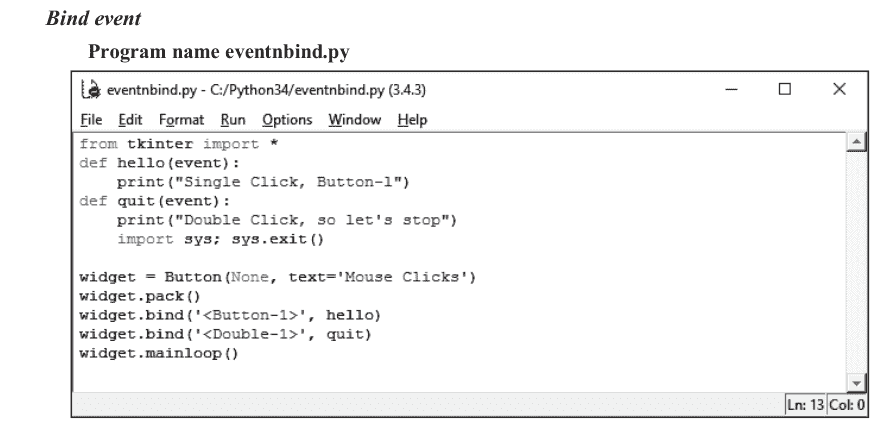

##### 输出

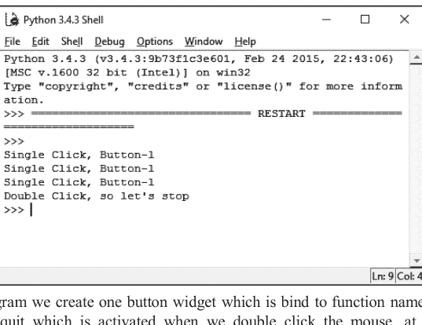

在上面的程序中，我们创建了一个按钮小部件，它被绑定到名为 `hello` 的函数，另一个名为 `quit` 的函数在双击鼠标时被激活，此时程序终止，我们得到 Python 提示符，即 `>>>`。

###### 4.4.2 移动事件

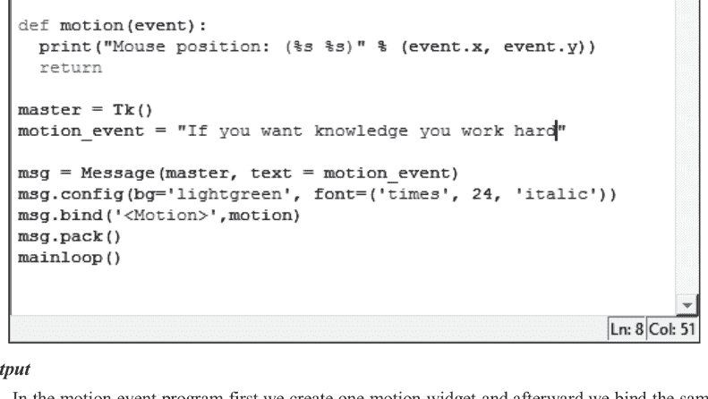

##### 输出

在移动事件程序中，我们首先创建一个移动小部件，然后将其绑定到名为 `motion(event)` 的函数。在这里，我们借助消息 `Mouse position : event.x,event.y` 显示了确切的鼠标坐标，即 x, y。同时，我们将背景定义为绿色（`bg='lightgreen'`），字体大小和名称分别设置为 24 和 Times。

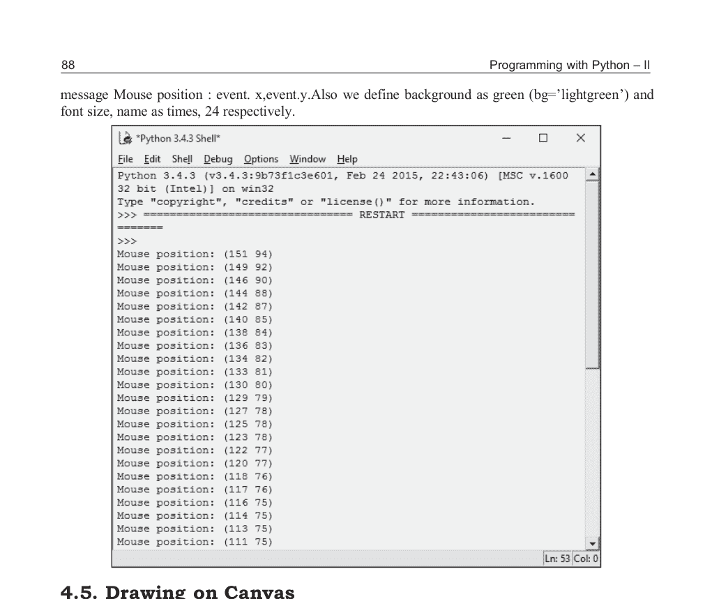

# 4.5. 在画布上绘制

Canvas 小部件为 Tkinter 提供了结构化的图形功能。这是一个用途非常广泛的小部件，可用于绘制图形和图表、创建图形编辑器，以及实现各种自定义小部件。就像一个用于绘制图片或其他复杂布局的矩形区域。

###### 语法

```
c = Canvas(master, option=value,...)
```

###### 参数

- master = 父窗口
- option= 有许多可用选项，见下表

##### 4.5.1 Canvas 小部件选项

| 选项 | 描述 |
| :--- | :--- |
| bd 或 borderwidth | 画布外部边框的宽度；默认为两个像素。 |
| bg 或 background | 画布的背景颜色。默认为浅灰色，约为 '#E4E4E4'。 |
| closeenough | 一个浮点数，指定鼠标必须离项目多近才被视为在其内部。默认为 1.0。 |
| confine | 如果为 true（默认值），画布不能滚动出 scrollregion（见下文）。 |
| cursor | 画布中使用的光标。 |
| height | 画布在 Y 维度的大小。 |
| highlightbackground | 小部件没有焦点时，焦点高亮显示的颜色。 |
| highlightcolor | 焦点高亮显示中显示的颜色。 |
| highlightthickness | 焦点高亮显示的厚度。默认值为 1。 |
| relief | 画布的浮雕样式。默认为 tk.FLAT。 |
| scrollregion | 一个元组 (w, n, e, s)，定义画布可以滚动的区域大小，其中 w 是左侧，n 是顶部，e 是右侧，s 是底部。 |
| selectbackground | 显示选中项目时使用的背景颜色。 |
| selectborderwidth | 选中项目周围使用的边框宽度。 |
| selectforeground | 显示选中项目时使用的前景颜色。 |
| takefocus | 通常，焦点（参见第 53 节，“焦点：路由键盘输入”）仅在为小部件设置了键盘绑定时，才会通过 Tab 键循环到此小部件。如果将此选项设置为 1，焦点将始终访问此小部件。设置为 "" 以获得默认行为。 |
| width | 画布在 X 维度的大小。 |
| xscrollincrement | 通常，画布可以水平滚动到任何位置。通过将 xscrollincrement 设置为零可以获得此行为。如果将此选项设置为某个正数维度，画布只能定位在该距离的倍数处，该值将用于滚动单位，例如用户单击滚动条两端的箭头时。有关滚动单位的更多信息，请参见第 22 节，“Scrollbar 小部件”。 |
| xscrollcommand | 如果画布可滚动，请将此选项设置为水平滚动条的 `.set()` 方法。 |
| yscrollincrement | 工作方式与 xscrollincrement 相同，但控制垂直移动。 |
| yscrollcommand | 如果画布可滚动，此选项应为垂直滚动条的 `.set()` 方法。 |

##### 4.5.2 Canvas 项目

Canvas 小部件支持以下标准项目：
- 直线 (line)
- 椭圆 (oval)（圆形或椭圆形）
- 矩形 (rectangle)
- 多边形 (polygon)
- 文本 (text)

-   窗口
-   弧形（弧线、弦或扇形）
-   位图（内置或从XBM文件读取）
-   图像（`BitmapImage` 或 `PhotoImage` 实例）

要在画布上绘制图形，请使用 `create` 方法来添加新项目。

要在画布上显示图形，我们创建一个或多个画布项目，它们被放置在一个堆栈中。默认情况下，新项目会绘制在画布上已有项目的顶部。`tkinter` 提供了多种方法，允许你以各种方式操作这些项目。除了其他功能外，你还可以将事件回调（函数）绑定（关联）到单个画布项目上。

通过滚动画布，你可以指定窗口中显示画布坐标系的哪一部分。

##### 4.5.3 如何绘制画布？

以下程序将阐明如何定义画布及其标题：

```
canvas.py - E:\Python\canvas.py (3.4.3)
File Edit Format Run Options Window Help
from tkinter import *
c = Tk()

canvas_width = 300
canvas_height = 100
w = Canvas(c,
          width=canvas_width,
          height=canvas_height)
c.title('My canvas program')
w.pack()
```
在上面的程序中，画布的宽度是300，因为如果我们设置小于300，标题就有可能无法正常显示或完全消失；高度设置为100，这是根据程序要求设定的。为了在窗口顶部激活标题，我们使用了 `tkinter` 接口 `c`（`c = Tk()`），然后调用 `title` 方法，即 `My canvas program`。

##### 4.5.5 如何使用画布绘制线条？

要绘制水平线，请输入下面的程序，执行脚本/程序后，我们将得到一条水平直线。在以下程序中，我们预先定义了画布宽度和高度为80X40，然后我们使用一个名为 `y` 的变量来将线条绘制在中心位置。

```
from tkinter import *
master = Tk()

canvas_width = 80
canvas_height = 40
w = Canvas(master,
           width=canvas_width,
           height=canvas_height)
w.pack()

y = int(canvas_height / 2)
w.create_line(0, y, canvas_width, y, fill="#476042")

mainloop()
```

###### 4.5.4 如何使用Python绘制椭圆？

```
from tkinter import *

canvas_width = 190
canvas_height = 150

s = Tk()

c = Canvas(s,
           width=canvas_width,
           height=canvas_height)
c.pack()

c.create_oval(50,50,150,100)

mainloop()
```
从上面的程序可以很容易地在瞬间绘制出椭圆。这里我们定义了画布高度=190，宽度=150，并使用坐标50,50,150,100。

##### 4.5.4 如何使用画布绘制矩形？

要绘制矩形，请使用以下程序：

```
from tkinter import *

master = Tk()

w = Canvas(master, width=200, height=100)
w.pack()

w.create_rectangle(50, 20, 150, 80, fill="blue")

mainloop()
```
在上面的程序中，定义画布宽度为200，高度为100，然后定义坐标x1,y1,x2,y2为50,20,150,80，并将填充颜色设置为蓝色。

##### 4.5.7 如何使用画布绘制多边形？

```
from tkinter import *

canvas_width = 150
canvas_height = 150
border_line_color = "black"

master = Tk()

w = Canvas(master,
           width=canvas_width,
           height=canvas_height)
w.pack()

points = [0,0,canvas_width,canvas_height/2, 0, canvas_height]
w.create_polygon(points, outline= border_line_color,
                fill='red', width=5)

mainloop()
```
现在我们定义画布的高度和宽度均为150，使用黑色作为边框颜色（如上图输出所示）。然后使用 `fill='red'` 将多边形填充为红色，最后定义边框宽度为5，因此你会看到粗黑的边框，这是由 `width=5` 导致的。

##### 4.5.8 画布中的坐标系

Canvas 控件使用两种坐标系：窗口坐标系（左上角为(0, 0)）和画布坐标系，后者用于指定绘制项目的位置。通过滚动画布，你可以指定窗口中显示画布坐标系的哪一部分。

`scrollregion` 选项用于限制画布的滚动操作。设置它，我们通常可以使用：

```
canvas.config(scrollregion=canvas.bbox(ALL))
```
要将窗口坐标转换为画布坐标，请使用 `canvasx` 和 `canvasy` 方法。

`bbox(item=None)`

返回所有匹配项目的边界框。如果省略标签，则返回所有项目的边界框。注意，边界框是近似的，可能与实际值相差几个像素。

`item`

项目指定符。如果省略，则返回画布上所有元素的边界框。

Canvas 控件还提供了两个预定义的标签：

-   `ALL`（或字符串 "all"）匹配画布上的所有项目。
-   `CURRENT`（或 "current"）匹配鼠标指针下的项目（如果有的话）。这可以在鼠标事件绑定内部使用，用于引用触发回调的项目。

```
canvasx(x, gridspacing=None) [#]
```
将窗口坐标转换为画布坐标。即 `x`

屏幕坐标。

`gridspacing`：可选的网格间距。坐标将四舍五入到最近的网格坐标。

返回：
画布坐标。

```
canvasy(y, gridspacing=None) [#]
```
将窗口坐标转换为画布坐标。即 `y`

屏幕坐标。

`gridspacing`：可选的网格间距。坐标将四舍五入到最近的网格坐标。

返回：
画布坐标。

#### 4.6 Python 控件

##### 使用 Tkinter 创建 GUI 控件

控件是 GUI 的组成部分——按钮、标签和文本框都是控件。大多数控件在屏幕上有图形表示，但有些控件（如表格和框）仅用于容纳其他控件并在屏幕上排列它们。

##### 工作原理

第一行导入 `Tkinter` 模块。接下来，你可以从 `Tkinter` 导入 `Label`，或者简单地导入所有内容（`*`），就像在示例中所做的那样。之后，你为每个控件（在本例中是 `Label`）创建一个对象。然后，`Label` 被安排在父窗口中。最后，控件被显示出来。

Widget 构建工具包（WCK）是一个简单的编程接口，你可以用它在 Python 中创建新的控件。WCK 目前可用于 `tkinter` 库，但完全可以为其他环境实现。要创建一个更具表现力的控件，你必须创建一个 `Widget` 基类的子类，并实现必要的绘制和事件处理方法。

`tkinter` GUI 的主要单元是控件。你可以使用 Tk 提供的“内置”控件，创建自己的控件，或者安装定义了额外控件的扩展包。

##### 调整控件大小

默认情况下，控件具有内置的最小化和最大化按钮，以及一个“X”按钮来关闭窗口。此外，我们可以拉伸窗口。

当你运行这个程序时，尝试调整窗口大小；你会看到“My first GUI!”标签始终保持居中，无论窗口变成什么样子，如下图所示。

##### 对上述程序的解释：

在上面的程序中，我们将 `expand` 的值分配为 `Yes`，`fill` 分配为 `Both`。这告诉 Python 在父窗口扩大时扩展控件。默认情况下，此选项是关闭的。

##### 配置控件选项

在这个例子中，你创建了相同的父窗口和标签。然而，不是在创建控件的同时设置选项，而是等待并在我已经创建它们之后进行设置：

```
import tkinter
from tkinter import *
root = Tk( )

widget = Label(root)
widget.config(text='My first GUI!')
widget.pack(side=TOP, expand=YES, fill=BOTH)
root.mainloop()
```
在这个例子中，你调用了 `configure` 方法来达到与前一个例子相同的结果。如果你愿意，你可以稍后在程序中更改控件的外观。例如，也许用户希望改变窗口的外观。你可以插入一个按钮来触发 `configure` 方法，这反过来会更改控件的选项。现在我们来详细看看不同的控件。

##### 4.6.1 按钮控件

**按钮** 控件是 tkinter 的一个标准控件，用于实现各种按钮。按钮可以包含文本或图像，并且你可以将一个 Python 函数或方法与每个按钮关联起来。当按钮被按下时，tkinter 会自动调用该函数或方法。按钮只能显示单一字体的文本，但文本可以跨越多行。默认情况下，可以使用 **Tab** 键在按钮控件之间移动。

按钮主要用于应用程序、工具栏，以及很多时候用于在对话框中接受或拒绝特定信息。现在，我们来看一个如何使用简单程序创建一个简单按钮和点击事件的例子。

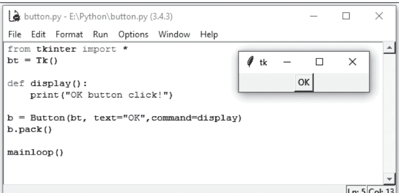

在上面的程序中，我们使用变量 `b` 定义按钮控件，将文本设置为 “OK”，并使用一个命令，其中我们通过 `command=display` 调用名为 `display` 的函数。这将调用该函数，当你按下 OK 按钮时，它会显示 **OK 按钮被点击！**。

现在，我们来看一下与按钮控件一起使用的各种选项，如下所示：

-   1. activeforeground：当按钮处于活动状态时使用什么前景色。
-   2. activebackground：当按钮处于活动状态时使用什么背景色。
-   3. font：按钮中使用的字体。
-   4. height：按钮的高度。
-   5. width：按钮的宽度。
-   6. relief：边框装饰。通常，按钮被按下时是 SUNKEN（凹陷），否则是 RAISED（凸起）。其他可能的值有 GROOVE（凹槽）、RIDGE（凸脊）和 FLAT（平坦）。默认是 RAISED。
-   7. bd：同 borderwidth。
-   8. fg：同 foreground。

所有上述选项都在以下程序中使用。

程序名称：**button.py**

```
from tkinter import *
bt = Tk()

def display():
    print("OK button click!")

b=Button(bt,relief=RAISED,font='Arial',underline=1,bd=3,text="OK",activeforeground="red",fg="blue",height=1,width=5)

b.pack()
mainloop()
```

##### 4.6.2 单选按钮控件

单选按钮是 tkinter 的一个标准控件，用于实现“多选一”的选择。单选按钮可以包含文本或图像，并且你可以将一个 Python 函数或方法与每个按钮关联起来。当按钮被按下时，Tkinter 会自动调用该函数或方法。

单选按钮，有时也称为选项按钮，是 tkinter 的一个图形用户界面元素，允许用户（精确地）从一组预定义的选项中选择一个。它可以包含文本或图像。

在上面的程序中，我们定义了两个单选按钮 “Python” 和 “Linux”，其初始 `padx` 值为 20，标签对齐方式为 LEFT，最后使用 `mainloop()` 调用主窗口。

**语法**

```
w= tk.Radiobutton (master,option, . . .)
```

| Radiobutton widget 选项 | 描述 |
| :--- | :--- |
| activebackground | 鼠标悬停在单选按钮上时的背景色。 |
| activeforeground | 鼠标悬停在单选按钮上时的前景色。 |
| anchor | 如果控件占据的空间大于其所需空间，此选项指定单选按钮在该空间中的位置。默认为 anchor=tk.CENTER。对于其他定位选项，例如，如果你设置 anchor=tk.NE，单选按钮将放置在可用空间的右上角。 |
| bg or background | 指示器和标签后面的一般背景色。 |
| bitmap | 要在单选按钮上显示单色图像，请将此选项设置为位图。 |
| bd or borderwidth | 指示器本身周围边框的大小。默认是两个像素。有关可能的值，请参见第 5.1 节 “尺寸”。 |
| command | 每次用户更改此单选按钮状态时调用的过程。 |
| cursor | 如果你将此选项设置为光标名称，当鼠标悬停在单选按钮上时，鼠标光标将更改为该图案。 |
| font | 文本使用的字体。 |
| fg or foreground | 用于渲染文本的颜色。 |
| height | 单选按钮上文本的行数（不是像素）。默认为 1。 |
| highlightbackground | 单选按钮没有焦点时，焦点高亮显示的颜色。 |
| highlightcolor | 单选按钮具有焦点时，焦点高亮显示的颜色。 |
| highlightthickness | 焦点高亮显示的粗细。默认为 1。设置 highlightthickness=0 可以抑制焦点高亮显示的显示。 |
| image | 要在此单选按钮上显示图形图像而不是文本，请将此选项设置为图像对象。请参见第 5.9 节 “图像”。当单选按钮未被选中时图像出现；请比较下面的 selectimage。 |
| indicatoron | 通常，单选按钮显示其指示器。如果你将此选项设置为零，指示器消失，整个控件变成一个“推-推”按钮，当它被清除时看起来凸起，当被设置时看起来凹陷。你可能想增加 borderwidth 值，以便更容易看到这种控件的状态。 |
| justify | 如果文本包含多行，此选项控制文本如何对齐：tk.CENTER（默认），tk.LEFT 或 tk.RIGHT。 |
| offrelief | 如果你通过声明 indicatoron=False 来抑制指示器，offrelief 选项指定单选按钮未被选中时要显示的 relief 样式。默认值是 tk.RAISED。 |
| overrelief | 指定鼠标悬停在单选按钮上时要显示的 relief 样式。 |
| padx | 在单选按钮和文本的左右两侧留出多少空间。默认为 1。 |
| pady | 在单选按钮和文本的上方和下方留出多少空间。默认为 1。 |
| relief | 默认情况下，单选按钮将具有 tk.FLAT relief，因此它不会比其背景更突出以获得更多 3d 效果选项。你也可以使用 relief=tk.SOLID，它在单选按钮周围显示一个实心黑色框架。 |
| selectimage | 如果你正在使用 image 选项在单选按钮被清除时显示图形而不是文本，你可以将 selectimage 选项设置为不同的图像，当单选按钮被设置时将显示该图像。请参见 |
| state | 默认为 state=tk.NORMAL，但你可以设置 state=tk.DISABLED 来将控件灰显并使其无响应。如果光标当前悬停在单选按钮上，则状态为 tk.ACTIVE。 |
| takefocus | 默认情况下，输入将传递到单选按钮。如果你设置 takefocus=0，焦点将不会访问此单选按钮。 |
| text | 显示在单选按钮旁边的标签。使用换行符（'\n'）显示多行文本。 |
| textvariable | 如果你需要在执行期间更改单选按钮上的标签，请创建一个 StringVar 来管理当前值，并将此选项设置为该控制变量。只要控制变量的值发生变化，单选按钮的注释也会自动更改为该文本。 |
| underline | 默认值为 -1，表示文本标签的字符都不带下划线。将此选项设置为文本中某个字符的索引（从零开始计数），即可为该字符添加下划线。 |
| value | 当用户打开单选按钮时，其控制变量被设置为当前 value 选项的值。如果控制变量是 IntVar，请为组中的每个单选按钮分配一个不同的整数 value 选项。如果控制变量是 StringVar，请为每个单选按钮分配一个不同的字符串 value 选项。 |
| variable | 此单选按钮与组中其他单选按钮共享的控制变量。 |
| width | 单选按钮的默认宽度由显示的图像或文本的大小决定。你可以将此选项设置为字符数（不是像素），单选按钮将始终为这么多字符留出空间。 |
| wraplength | 通常，行不会换行。你可以将此选项设置为字符数，所有行将被分成不超过该数字的片段。 |

第一个演示单选按钮控件的基础程序：


在上面的例子中，我们使用了多个 “languages” 单选按钮，其中包含按钮文本和对应的值。借助 for 循环来创建所有单选按钮。

##### 4.6.3 复选框小部件

复选框小部件用于向用户显示更多的选项，用户可以选择其中一个或多个选项。我们也可以使用图像来替代文本显示。

###### 语法

```
w=Checkbutton(master,option,...)
```

###### 参数

- master：表示父窗口。
- options：以下是该小部件最常用选项的列表：

| 选项 | 描述 |
|---|---|
| activebackground | 复选框在光标下时的背景色。 |
| activeforeground | 复选框在光标下时的前景色。 |
| bg | 标签和指示器后面显示的正常背景色。 |
| bitmap | 在按钮上显示单色图像。 |
| bd | 指示器周围的边框大小。默认为2像素。 |
| command | 每次用户更改此复选框状态时要调用的过程。 |
| cursor | 如果将此选项设置为光标名称（箭头、点等），当鼠标悬停在复选框上时，鼠标光标会变成该样式。 |
| font | 用于文本的字体。 |
| fg | 用于渲染文本的颜色。 |
| height | 复选框上的文本行数。默认为1。 |
| highlightcolor | 复选框获得焦点时的焦点高亮颜色。 |
| image | 在按钮上显示图形图像。 |
| justify | 如果文本包含多行，此选项控制文本的对齐方式：CENTER、LEFT 或 RIGHT。 |
| offvalue | 通常，当复选框被清除（关闭）时，其关联的控制变量将设置为0。你可以通过将 offvalue 设置为某个值来提供关闭状态的替代值。 |
| onvalue | 通常，当复选框被选中（打开）时，其关联的控制变量将设置为1。你可以通过将 onvalue 设置为某个值来提供打开状态的替代值。 |
| padx | 复选框和文本左右两侧要留出的空间。默认为1像素。 |
| pady | 复选框和文本上下两侧要留出的空间。默认为1像素。 |
| relief | 使用默认值 relief=FLAT，复选框不会从其背景中突出显示。你可以将此选项设置为任何其他样式。 |
| state | 默认为 state=NORMAL，但你可以使用 state=DISABLED 使控件变灰并变得无响应。如果光标当前在复选框上，则状态为 ACTIVE。 |
| text | 显示在复选框旁边的标签。使用换行符（"\n"）来显示多行文本。 |
| underline | 默认值为 -1 时，文本标签中的字符均不加下划线。将此选项设置为文本中字符的索引（从零开始计数）即可为该字符添加下划线。 |
| variable | 跟踪复选框当前状态的控制变量。通常此变量是 IntVar，0 表示清除，1 表示选中，但请参阅上面的 offvalue 和 onvalue 选项。 |
| width | 复选框的默认宽度由显示的图像或文本的大小决定。你可以将此选项设置为一个字符数，复选框将始终为该数量的字符留出空间。 |
| wraplength | 通常，文本不会自动换行。你可以将此选项设置为一个字符数，所有行都将被分割成不超过该字符数的片段。 |

复选框小部件最常用的方法

| 方法 | 描述 |
|---|---|
| deselect() | 清除（关闭）复选框。 |
| flash() | 在复选框的活动颜色和正常颜色之间闪烁几次，但保持其初始状态。 |
| invoke() | 你可以调用此方法来获得与用户单击复选框以更改其状态时相同的操作。 |
| select() | 设置（打开）复选框。 |
| toggle() | 如果复选框已选中，则清除它；如果已清除，则设置它。 |


让我们逐行分析程序。

```
from tkinter import *
cb=Tk()
```

导入 tkinter 并调用 cb 小部件以控制我们程序中的整个 GUI 框架。

```
var1 = IntVar()
```

var1 是一个变量，我们也可以给它起不同的名字，比如 check_1 等。但始终最好给一个能解释其用途的变量命名。

```
var2 = IntVar()
```

在 Python GUI 中声明第二个变量。

```
Checkbutton(cb, text="Male",variable=var1).grid(row=0,sticky=W)
```

这部分代码是创建和放置复选框实际工作的部分。Checkbutton 是一个函数/方法，它接受父小部件作为参数，一个显示在复选框旁边的文本字符串，以及一个用于存储复选框值的变量。grid 是复选框在主 GUI 上的布局方式。如果我们改变行位置，复选框也会相应改变。Row=0 表示第一个复选框，以此类推。

```
Checkbutton(cb, text="Female",variable=var2).grid(row=1,sticky=W)
```

像创建第一个复选框一样创建第二个复选框。

##### 4.6.4 输入框小部件

**输入框** 小部件是 tkinter 的一个标准小部件，用于输入或显示单行文本。如果你想输入多行文本，必须使用文本小部件。输入框小部件也仅限于单一字体。

###### 语法

```
w = Entry(master, option, ... )
```

“master” 代表父窗口，输入框小部件应放置在此处。选项的逗号分隔列表可以为空。

输入框小部件示例 程序名：**entry.py**

```
from tkinter import *

master = Tk()
Label(master, text="Enter your First Name").grid(row=0)
Label(master, text="Enter your Last Name").grid(row=1)

e1 = Entry(master)
e2 = Entry(master)

e1.grid(row=0, column=1)
e2.grid(row=1, column=1)

mainloop( )
```


##### 4.6.5 列表框小部件

列表框小部件的目的是显示一组文本行。通常，它们旨在允许用户从列表中选择一个或多个项目。所有文本行使用相同的字体。

###### 语法

```
w = tk.Listbox(parent,option,...)
```

###### 列表框小部件选项

| 选项 | 描述 |
|---|---|
| activestyle | 'underline'：活动行带下划线。这是默认选项。'dotbox'：活动行被四周的虚线包围。"none"：活动行没有特殊外观。 |
| bg 或 background | 设置列表框的背景色。 |
| bd 或 borderwidth | 设置列表框周围的边框宽度。默认为两像素。 |
| cursor | 设置鼠标悬停在列表框上时出现的光标。 |
| disabledforeground | 当列表框状态为 tk.DISABLED 时，其中文本的颜色。 |
| exportselection | 默认情况下，用户可以用鼠标选择文本，所选文本将导出到剪贴板。要禁用此行为，请使用 exportselection=0。 |
| font | 用于列表框中文本的字体。 |
| fg 或 foreground | 用于列表框中文本的颜色。 |
| height | 列表框中显示的行数（不是像素！）。默认为10。 |
| highlightbackground | 小部件没有焦点时的焦点高亮颜色。 |
| highlightcolor | 小部件获得焦点时，焦点高亮显示的颜色。 |
| highlightthickness | 焦点高亮的厚度。 |
| relief | 选择三维边框阴影效果。默认为 tk.SUNKEN。 |
| selectbackground | 显示所选文本时使用的背景色。 |

##### 4.6.5 列表框控件

| 属性 | 描述 |
|------|------|
| selectborderwidth | 选中文本周围边框的宽度。默认情况下，选中项以纯色块 `selectbackground` 显示；如果增加 `selectborderwidth`，条目之间的间距会变大，并且选中条目会显示 `tk.RAISED` 浮雕效果。 |
| selectforeground | 用于显示选中文本的前景色。 |
| selectmode | 确定可以选择多少个项目，以及鼠标拖动如何影响选择：<br>▶ `tk.BROWSE`：通常，你只能从列表框中选择一行。如果你点击一个项目然后拖动到另一行，选择将跟随鼠标。这是默认模式。<br>▶ `tk.SINGLE`：你只能选择一行，并且不能拖动鼠标——无论你点击按钮1的哪个位置，那一行都会被选中。<br>▶ `tk.MULTIPLE`：你可以一次选择任意数量的行。点击任何一行会切换其选中状态。<br>▶ `tk.EXTENDED`：你可以通过点击第一行并拖动到最后一行来一次选择任意相邻的一组行。 |
| state | 默认情况下，列表框处于 `tk.NORMAL` 状态。要使列表框不响应鼠标事件，请将此选项设置为 `tk.DISABLED`。 |
| takefocus | 通常，焦点会通过 Tab 键在列表框控件之间切换。将此选项设置为 0 可将该控件从序列中移除。 |
| width | 控件的宽度，以字符为单位（不是像素！）。宽度基于平均字符，因此在比例字体中，某些此长度的字符串可能无法容纳。默认值为 20。 |
| xscrollcommand | 如果你想允许用户水平滚动列表框，可以将你的列表框控件链接到水平滚动条。将此选项设置为滚动条的 `.set` 方法。 |
| yscrollcommand | 如果你想允许用户垂直滚动列表框，可以将你的列表框控件链接到垂直滚动条。将此选项设置为滚动条的 `.set` 方法。 |

###### 列表框对象的方法

| 选项 | 描述 |
|--------|-------------|
| delete ( first, last=None ) | 删除索引在 [first, last] 范围内的行。如果省略第二个参数，则删除索引为 first 的单行。 |
| get ( first, last=None ) | 返回一个元组，包含从 first 到 last（包含）索引的行的文本。如果省略第二个参数，则返回最接近 first 的行的文本。 |
| index ( i ) | 如果可能，调整列表框的可见部分，使包含索引 i 的行位于控件的顶部。 |
| insert ( index, *elements ) | 在列表框中指定索引的行之前插入一行或多行新行。如果你想将新行添加到列表框的末尾，请使用 `END` 作为第一个参数。 |
| nearest ( y ) | 返回相对于列表框控件，y 坐标 y 最近的可见行的索引。 |
| see ( index ) | 调整列表框的位置，使索引引用的行可见。 |
| size() | 返回列表框中的行数。 |
| xview() | 要使列表框可水平滚动，请将关联水平滚动条的 `command` 选项设置为此方法。 |
| xview_moveto ( fraction ) | 滚动列表框，使其最长行的宽度的最左侧 fraction 部分位于列表框左侧之外。Fraction 的范围是 [0,1]。 |
| xview_scroll ( number, what ) | 水平滚动列表框。对于 `what` 参数，使用 `UNITS` 按字符滚动，或使用 `PAGES` 按页滚动（即按列表框的宽度）。`number` 参数指定滚动的数量。 |

###### Listb.py

```python
from tkinter import *
import tkMessageBox
import tkinter
top = Tk()
Lb1 = Listbox(top)
Lb1.insert(1, "List Item-1")
Lb1.insert(2, "List Item-2")
Lb1.insert(3, "List Item-3")
Lb1.pack()
top.mainloop()
```


##### 4.6.6 框架控件

框架基本上只是一个用于容纳其他控件的容器，负责安排其他控件的位置。你的应用程序的根窗口基本上就是一个框架。框架控件对于分组和组织其他控件的过程非常重要。

###### 语法

```python
w = Frame ( master, option, ... )
```

###### 参数

- **master**：这表示父窗口。
- **options**：这是此控件最常用选项的列表。这些选项可以用逗号分隔的键值对形式使用。

| 选项 | 描述 |
|--------|-------------|
| bg | 标签和指示器后面显示的正常背景色。 |
| bd | 指示器周围边框的大小。默认为 2 像素。 |
| Cursor | 如果你将此选项设置为光标名称（箭头、点等），当鼠标悬停在复选按钮上时，鼠标光标将更改为该图案。 |
| Height | 新框架的垂直尺寸。 |
| highlightbackground | 框架没有焦点时，焦点高亮的颜色。 |
| Highlightcolor | 框架获得焦点时，焦点高亮中显示的颜色。 |
| Highlightthickness | 焦点高亮的粗细。 |
| Relief | 使用默认值 `relief=FLAT` 时，复选按钮不会从其背景中突出显示。你可以将此选项设置为任何其他样式。 |
| Width | 复选按钮的默认宽度由显示的图像或文本的大小决定。你可以将此选项设置为字符数，复选按钮将始终为该数量的字符留出空间。 |

###### 示例：frame.py


##### 4.6.7 标签控件

标签是一个 Tkinter 控件类，用于显示文本或图像。标签是用户只能查看而不能交互的控件。

###### 语法

```python
w = Label ( master, option, ... )
```

###### 参数

- **master**：这表示父窗口。
- **options**：这是此控件最常用选项的列表。这些选项可以用逗号分隔的键值对形式使用。

| 选项 | 描述 |
|---|---|
| Anchor | 此选项控制当控件的空间大于文本所需空间时，文本的位置。默认值为 `anchor=CENTER`，将文本居中放置在可用空间中。 |
| Bg | 标签和指示器后面显示的正常背景色。 |
| Bitmap | 将此选项设置为位图或图像对象，标签将显示该图形。 |
| bd | 指示器周围边框的大小。默认为 2 像素。 |
| Cursor | 如果你将此选项设置为光标名称（箭头、点等），当鼠标悬停在复选按钮上时，鼠标光标将更改为该图案。 |
| Font | 如果你在此标签中显示文本（使用 `text` 或 `textvariable` 选项），`font` 选项指定该文本将以何种字体显示。 |
| fg | 如果你在此标签中显示文本或位图，此选项指定文本的颜色。如果你显示的是位图，这将是位图中 1 位位置出现的颜色。 |
| Height | 新框架的垂直尺寸。 |
| Image | 要在标签控件中显示静态图像，请将此选项设置为图像对象。 |
| Justify | 指定多行文本如何相互对齐：`LEFT` 左对齐，`CENTER` 居中（默认），或 `RIGHT` 右对齐。 |
| Padx | 在控件内文本左右添加的额外空间。默认值为 1。 |
| Pady | 在控件内文本上下添加的额外空间。默认值为 1。 |
| Relief | 指定标签周围装饰性边框的外观。默认值为 `FLAT`；其他值请参见相关文档。 |
| Text | 要在标签控件中显示一行或多行文本，请将此选项设置为包含文本的字符串。内部换行符（`"\n"`）将强制换行。 |
| Textvariable | 要将标签控件中显示的文本链接到 `StringVar` 类的控制变量，请将此选项设置为该变量。 |
| Underline | 你可以通过将此选项设置为 n（从 0 开始计数）来在文本的第 n 个字母下方显示下划线（ _ ）。默认值为 `underline=-1`，表示不显示下划线。 |
| Width | 标签的宽度，以字符为单位（不是像素！）。如果未设置此选项，标签将调整大小以适应其内容。 |
| Wraplength | 你可以通过将此选项设置为所需的数字来限制每行的字符数。默认值 0 表示仅在换行符处换行。 |

###### 示例


###### 解释

Tkinter 模块包含了 Tk 工具包，必须始终被导入。在我们的示例中，我们使用星号 (“*”) 将 Tkinter 模块的所有内容导入到当前模块的命名空间中：

```python
from Tkinter import *
```

要初始化 Tkinter，我们必须创建一个 Tk 根控件，这是一个由窗口管理器提供标题栏和其他装饰的窗口。根控件必须在所有其他控件之前创建，并且只能有一个根控件。

```python
root = Tk()
```

下一行代码包含了 Label 控件。Label 调用的第一个参数是父窗口的名称，在我们的例子中是 “root”。因此，我们的 Label 控件是根控件的子控件。关键字参数 “text” 指定了要显示的文本：

```python
w = Label(root, text="Hello Tkinter!")
```

pack 方法告诉 Tk 调整窗口大小以适应给定的文本。

```python
w.pack()
```

窗口在我们进入 Tkinter 事件循环之前不会显示：

```python
root.mainloop()
```

我们的脚本将停留在事件循环中，直到我们关闭窗口。

##### 4.6.8 微调框控件

微调框 (Spinbox) 控件允许用户从给定的集合中选择值。这些值可以是数字范围，也可以是固定的字符串集合。

###### 语法

```python
w = Spinbox( master, option, ... )
```

###### 参数

- master: 表示父窗口。
- options: 这是该控件最常用选项的列表。这些选项可以作为用逗号分隔的键值对使用。

| 选项 | 描述 |
|---|---|
| activebackground | 鼠标悬停在滑块和箭头上时的颜色。 |
| bg | 鼠标未悬停在滑块和箭头上时的颜色。 |
| bd | 围绕整个滑槽的 3D 边框宽度，以及箭头和滑块的 3D 效果宽度。默认值为滑槽无边框，箭头和滑块有 2 像素的边框。 |
| command | 滚动条被移动时调用的过程。 |
| cursor | 鼠标悬停在滚动条上时出现的光标。 |
| Disabledbackground | 控件被禁用时使用的背景色。 |
| disabledforeground | 控件被禁用时使用的文本颜色。 |
| fg | 文本颜色。 |
| font | 该控件中使用的字体。 |
| format | 格式化字符串。无默认值。 |
| from_ | 最小值。与 to 一起使用以限制微调框的范围。 |
| justify | 默认为 LEFT。 |
| relief | 默认为 SUNKEN。 |
| repeatdelay | 与 repeatinterval 一起，此选项控制按钮自动重复。两个值均以毫秒为单位。 |
| repeatinterval | 见 repeatdelay。 |
| state | NORMAL、DISABLED 或 “readonly” 之一。默认为 NORMAL。 |
| textvariable | 无默认值。 |
| to | 见 from。 |
| validate | 验证模式。默认为 NONE。 |
| validatecommand | 验证回调函数。无默认值。 |
| values | 包含此控件有效值的元组。覆盖 from/to/increment。 |
| vcmd | 与 validatecommand 相同。 |
| Width | 控件宽度，以字符单位计。默认为 20。 |
| wrap | 如果为真，向上和向下按钮将循环。 |
| xscrollcommand | 用于将微调框字段连接到水平滚动条。此选项应设置为相应滚动条的 set 方法。 |

###### 方法

微调框对象具有以下方法：

1.  **delete(startindex [,endindex])**
    此方法删除特定字符或文本范围。
2.  **get(startindex [,endindex])**
    此方法返回特定字符或文本范围。
3.  **identify(x, y)**
    识别给定位置的控件元素。
4.  **index(index)**
    根据给定索引返回索引的绝对值。
5.  **insert(index [,string]...)**
    此方法在指定的索引位置插入字符串。


##### 4.6.9 文本框控件

文本控件用于多行文本区域。Tkinter 的文本控件非常强大和灵活，可用于广泛的任务。虽然主要目的之一是提供简单的多行区域（如在表单中常用），但文本控件也可以用作简单的文本编辑器，甚至网页浏览器。

我们使用 `Text()` 方法创建文本控件。我们将其高度设置为 5，即 5 行，宽度设置为 38，即 38 个字符。我们可以在 `Text()` 方法返回的对象 T 上应用 `insert()` 方法来插入文本。我们添加了五行文本。（其中三行是空行）。


要强制光标进入下一行，我们使用 `‘\n’`（类似于 C 语言编程）。
我们可以使用 `Scrollbar()` 方法在文本控件中添加滚动条。我们使用根对象作为唯一参数来调用它。


在上面的程序中，我们将高度设置为 4，意味着一次显示 4 行，宽度设置为 50，意味着显示 50 个字符（包括空格和句号）。`S.pack(side=RIGHT)` 将滚动条显示在右侧；如果改为 `LEFT`，则会将滚动条显示在左侧。

##### 4.6.10 带图像的文本控件

我们向文本中添加图像，并将命令绑定到文本行。

程序名称：textimage.py

```python
from tkinter import *
root = Tk()
text1 = Text(root, height=20, width=30)
photo=PhotoImage(file='./plant.gif')
text1.insert(END,'\n')
text1.image_create(END, image=photo)
text1.pack(side=LEFT)
text2 = Text(root, height=17, width=55)
scroll = Scrollbar(root, command=text2.yview)
text2.configure(yscrollcommand=scroll.set)
text2.tag_configure('bold_italics', font=('Arial', 12, 'bold', 'italic'))
text2.tag_configure('big', font=('Verdana', 20, 'bold'))
text2.tag_configure('color', foreground='#474042',font=('Tempus Sans ITC', 12, 'bold'))
text2.tag_bind('Click', '<1>', lambda e, t=text2: t.insert(END, "Thanks , BYE!"))
text2.insert(END,'\nPlant\n', 'big')
quote = """
Plants, also called green plants, are multicellular eukaryotes
of the kingdom Plantae. They form an unranked clade
Viridiplantae (Latin for green plants) that includes the flowering
plants, conifers and other gymnosperms, ferns, clubmosses, hornworts,
liverworts, mosses and the green algae. Green plants exclude
the red and brown algae, the fungi, archaea, bacteria and animals.
"""
text2.insert(END, quote, 'color')
text2.insert(END, 'Click here\n', 'Click')
text2.pack(side=LEFT)
scroll.pack(side=RIGHT, fill=Y)
root.mainloop()
```

输出在下一页


#### 4.7 问题

1.  什么是 GUI？解释 GUI 的优点和缺点。
2.  解释不同的图形库。
3.  什么是 Peewee？写出它的用途。
4.  解释布局管理器？
5.  解释事件与绑定。
6.  结合简单程序解释运动和绑定事件。
7.  什么是 Canvas？解释 Canvas 控件选项。
8.  描述不同的 Canvas 元素？
9.  如何使用 canvas 绘制线条？结合示例解释。
10. 描述 canvas 中的坐标系。
11. 什么是控件？解释调整控件大小。
12. 如何配置控件选项？
13. 简要介绍 Button 控件。
14. 解释按钮控件使用的各种选项。
15. 解释带有至少 5 个选项的单选按钮控件。
16. 定义以下内容：
    (a) 复选框控件及其方法
    (b) 输入框控件
    (c) 列表框控件
17. 哪个控件是其他控件的容器？简要解释。
18. 解释 Label 控件的 anchor、bg、bd、fg、padx 和 pady 选项。
19. 哪个控件允许用户从给定集合中选择值？简要解释。
20. 解释微调框控件中使用的不同方法？
21. 哪个控件用于多行文本区域？请解释。
22. 编写一个使用 canvas 绘制以下图形的程序
    (a) 线
    (b) 矩形
    (c) 多边形
    (d) 椭圆
23. 编写一个通过调整窗口大小来显示 “我的第一个GUI！” 的程序。
24. 编写一个显示标准按钮控件的程序。
25. 编写一个使用输入框控件显示你的名字和姓氏的程序。
26. 编写一个使用框架控件显示不同颜色按钮的程序。
27. 编写一个显示多行文本区域的程序。
28. 编写一个向文本添加图像并将命令绑定到文本行的程序。


## 第5章
Python中的数据库连接

#### 结构

- 5.1 数据库连接简介
  - 5.1.1 Python数据库API简介
  - 5.1.2 DBM模块简介
  - 5.1.3 创建持久化目录
  - 5.1.4 访问持久化目录
- 5.2 关系型数据库管理系统简介
- 5.3 SQL语句简介
- 5.4 什么是MySQLdb
- 5.5 MYSQL连接器简介与安装
- 5.6 Connector模块简介与安装
- 5.7 建立连接
- 5.8 创建游标对象
- 5.9 MySQLdb与Python连接的步骤
  - 5.9.1 安装Python-2.7.13
  - 5.9.2 安装MySQLdb连接器（步骤2）
  - 5.9.3 安装MySQLdb连接器模块（步骤4）
  - 5.9.4 安装MySQL Server 5.1（步骤13）
  - 5.9.5 导入MySQLdb & OS（步骤34）
  - 5.9.6 在MySQL中创建数据库并打开数据库（步骤37）
  - 5.9.7 使用连接，访问连接器模块（连接到MySQLdb）（步骤41）
  - 5.9.8 游标
  - 5.9.9 执行和关闭函数
- 5.10 读取查询执行的单条和多条结果
- 5.11 执行不同类型的语句
  - 5.11.1 插入操作
  - 5.11.2 读取操作
  - 5.11.3 更新操作
  - 5.11.4 删除操作
- 5.12 事务简介
  - 5.12.1 执行事务
- 5.13 理解数据库连接中的异常
- 5.14 使用Sqlite3进行连接
- 5.15 问题

#### 5.1 数据库连接简介

- 数据库是经过组织和检查的数据集合。

- 数据库文件的各个组件：
  - 记录：记录包含关于不同实体或人员的信息。
  - 字段：每条记录包含在称为字段的列中的信息。
  - 文件：每个数据库被称为数据库文件或表。

- 数据库管理系统是一个基于从不同来源收集的相关信息的系统。它允许高效处理数据，例如：过滤记录、生成报告、标签、重新排列、查询等。

- 数据库是相关数据的组织化集合，通常存储在磁盘上，并可供许多并发用户访问。

- 数据库可能包含人力资源数据（员工数据、员工工资和薪资详情）；另一个可能包含销售数据；另一个可能包含会计数据；等等。所有这些数据库都由数据库管理系统管理。

- 数据库指一组相关的数据，并且是经过组织的。对这些数据的访问通常由“数据库管理系统”提供，该系统由一套集成的计算机软件组成，允许用户与一个或多个数据库交互，并提供对数据库中所有包含数据的访问。

- 数据库管理系统提供了各种功能，允许输入、存储和检索大量信息，并提供管理信息组织方式的方法。数据库管理系统控制您对数据库的访问，并使您能够定义、创建和维护该数据库。

- 数据库是一个后端应用程序，可以存储和维护数据，而Python是一个前端应用程序，可以通过SQL语句输入数据。对于与Python的后端连接，我们可以使用sqlite3或MySQL作为后端数据库应用程序。

- 通过数据库连接：
  - 我们可以创建与数据库MySQL或sqlite的连接
  - 使用游标访问数据
  - 查询和修改数据
  - 处理所有类型的数据库事务
  - 处理错误

##### 5.1.1 Python数据库API简介

Python对关系型数据库Oracle和SQL的支持。

每个数据库模块都创建了自己的API，该API高度特定于该数据库，因为每个数据库供应商根据自己的需求开发了自己的API。

Python支持一个通用的数据库DB，API，称为DB API。特定模块使您的Python脚本能够与不同的数据库通信，例如DB/2、PostgreSQL等。

DB API为使用Python结构和语法尽可能地处理数据库提供了最小标准。该API包括以下内容：

1. 连接，涵盖如何连接到数据库的指导方针
2. 使用游标执行语句和存储过程以查询、更新、插入和删除数据
3. 事务，支持提交或回滚事务
4. 检查数据库模块以及数据库和表结构的元数据
5. 定义错误类型

Python数据库API支持广泛的数据库服务器：GadFly、MySQL、PostgreSQL、Microsoft SQL Server 2000、Informix、Interbasse、Oracle、Sybase。

DB API为使用Python结构处理数据库提供了标准。该API包括以下内容：

- 导入API模块。
- 获取与数据库的连接。
- 发出SQL语句和存储过程。
- 关闭连接。

##### 5.1.2 DBM模块简介

DBM，*database manager*的缩写，是最初在UNIX系统上创建的多个C语言库的通用名称。这些库的名称包括*dbm*、*gdbm*、*ndbm*、*sdbm*等。

Python支持多个dbm模块。每个dbm模块支持类似的接口，并使用特定的C库将数据存储到磁盘。

下表列出了dbm模块：

| 模块 | 描述 |
| --- | --- |
| dbm | 选择最佳的dbm模块 |
| dbm.dumb | 使用dbm库的简单但可移植的实现 |
| dbm.gnu | 使用GNU dbm库 |

dbm模块在创建**新的持久化字典**时将选择可用的最佳实现。在**读取文件**时。

##### 5.1.3 创建持久化目录

所有dbm模块都支持一个**open函数**来**创建新的dbm对象**。一旦打开，您可以**在字典中存储数据**、**读取数据**、**关闭dbm**、**删除项**以及**测试字典中是否存在键**。

要打开dbm持久化字典，请在您选择的模块上使用open函数。

例如，您可以使用dbm模块创建一个持久化字典。

###### 创建持久化字典的程序

```python
import dbm
db = dbm.open('websites', 'c')
####### 添加一个项目。
db['www.python.org'] = 'Python home page'
print(db['www.python.org'])
##### 关闭并保存到磁盘。
db.close()
```

**注意：** DBM模块在程序中被导入，open函数需要要创建的字典的名称。此名称被转换为可能已存在于磁盘上的数据文件的名称。下表列出了可用的标志。

| 标志 | 用法 |
|---|---|
| C | 打开数据文件进行读写，如果需要则创建文件。 |
| N | 打开文件进行读写，但总是创建一个新的空文件。如果已存在，它将被覆盖且其内容丢失。 |
| W | 打开文件进行读写，但如果文件不存在则不会创建。 |

您还可以传递另一个可选参数，即模式。模式包含一组UNIX文件权限。有关打开文件的更多信息，请参见第8章。

> **dbm模块的open方法返回一个新的dbm对象，您可以使用该对象来存储和检索数据。**

**打开持久化字典后，您可以像通常使用Python字典一样写入值，如下例所示：**

`db['www.python.org'] = 'Python home page'`

**键和值都必须是字符串，不能是其他对象，如数字或python对象。但是请记住，如果您想保存一个对象，可以使用pickle模块对其进行序列化，如第8章所示。**

**close方法关闭文件并将数据保存到磁盘。**

##### 5.1.4 访问持久化目录

使用dbm模块，您可以将open函数返回的对象用作字典对象。使用如下代码获取和设置值：

```python
db['key'] = 'value'
value = db['key']
```

请记住，键和值都必须是文本字符串。您可以使用del删除字典中的值：

```python
del db['key']
```

keys方法返回所有键的列表，方式与普通字典相同：

```python
for key in db.keys():
    # 执行某些操作...
```

如果文件中有大量的键，keys方法可能需要很长时间才能执行。

###### 访问持久化字典的程序

*代码：*

```python
import dbm
##### 打开现有文件。
```

db = dbm.open('websites', 'w')
##### 添加另一个条目。
db['www.wrox.com'] = 'Wrox 主页'
##### 验证之前的条目是否仍然存在。
if db['www.python.org'] != None:
    print('找到 www.python.org')
else:
    print('错误：条目缺失')
####### 遍历键。可能较慢。可能占用大量内存。
for key in db.keys():
    print('键 =', key, '值 =', db[key])
del db['www.wrox.com']
print('删除 www.wrox.com 后，我们有：')
for key in db.keys():
    print('键 =', key, '值 =', db[key])
##### 关闭并保存到磁盘。
db.close()

**输出：**


**注意：**
此示例创建了 dbm 文件并在文件中存储数据。如果当前目录的磁盘上没有必需的数据文件，调用 open 函数将会产生错误。
在字典中应有一个值，键为 **www.python.org**。此示例添加了 **Wrox 网站** **www.wrox.com** 作为另一个键。
该脚本使用以下代码验证 www.python.org 键在字典中是否存在：

```
if db['www.python.org'] != None:
    print('Found www.python.org')
else:
    print('Error: Missing item')
```

接下来，脚本打印出字典中所有的键和值：

```
for key in db.keys():
    print("Key =",key," value =",db[key])
```

注意，此时应该只有这两个条目。打印出所有条目后，脚本使用 del 删除其中一个：

```
del db['www.wrox.com']
```

脚本随后再次打印所有键和值，此时应只剩下一个条目，如输出所示。

最后，close 方法关闭字典，这包括将所有更改保存到磁盘，因此下次打开文件时，它将处于你离开时的状态。

#### 5.2 关系数据库管理系统简介

RDBMS 代表 **关系数据库管理系统**。RDBMS 数据结构化存储在数据库表、字段和记录中。

每个 RDBMS 表由数据库表行组成。每个数据库表行由一个或多个数据库表字段组成。

关系数据库是复杂数据存储的首选技术。

在关系数据库中，数据存储在可被视为二维数据结构的表中。

二维矩阵的列，或称 **垂直部分**，都是相同的数据类型；如字符串、数字、日期等。

表的每个水平组件由行（也称为记录）组成。每行又由列组成。通常，每条记录存储与一个项目相关的信息，例如一张音频 CD、一个人、一张采购订单、一辆汽车等。

RDBMS 将数据存储到表的集合中，这些表可以通过公共字段（数据库表列）相互关联。

RDBMS 还提供关系运算符来操作存储在数据库表中的数据。大多数 RDBMS 使用 SQL 作为数据库查询语言。

最流行的 RDBMS 包括 MS SQL Server、DB2、Oracle 和 MySQL。

为了克服数据库的缺点，E.F. Codd 于 1970 年引入了关系数据库的新概念。他的想法是将这些重复数据分解到可以使用公共键字段关联的单独文件中。

关系数据库中的关系基于关系模式，该模式由若干属性组成。关系数据库由若干关系和相应的数据库关系模式组成。关系数据库设计的目标是生成一组关系模式，使我们能够存储信息而不产生不必要的冗余，并能轻松检索信息。

- 市场上可用的不同 RDBMS：
- Oracle
- Sybase
- Ingress
- Db2
- Informix

因此，根据使用情况，我们必须决定是使用 DBM 模块还是关系数据库。

当你的数据需求可以存储为键/值对时，dbm 模块可以工作。如果你想在键/值对中处理更复杂的数据，使用 dbm 可能会非常难以维护。

- 1. 如果你的数据需求简单，请使用 dbm 持久化字典。
- 2. 如果你只计划存储少量数据，请使用 dbm 持久化字典。
- 3. 如果你需要 *事务* 支持，请使用 **关系数据库**。
- 4. 如果你需要复杂的数据结构或多个关联数据表，请使用关系数据库。
- 5. 关系数据库提供更丰富和更复杂的 API。

#### 5.3 SQL 语句简介

SQL 命令分为 4 类：

- 1. **数据定义语言 (DDL)：** 用于创建和修改结构。(CREATE, ALTER, DROP, RENAME, TRUNCATE)
- 2. **数据操作语言 (DML)：** 用于添加和修改数据。(INSERT, UPDATE, DELETE)
- 3. **数据控制语言 (DCL)：** 用于控制数据库访问和事务。(GRANT, REVOKE, ROLLBACK, COMMIT, BEGIN TRANSACTION)
- 4. **数据查询语言 (DQL)：** 用于查询数据库。(SELECT 语句)

##### 语句的语法和示例

*创建表：*

*语法：*

```
CREATE TABLE <Name>
(<Field1> <Datatype>, <Field 2> <Datatype>);
```

##### 示例：

```
CREATE TABLE Students
(Roll_no Number(3), Name Varchar2(10),
Address Varchar2(15), Dos Number(3), Win Number(3));
```

注意：表名和列名最大长度为 30 个字符。它们可以包含特殊字符，如 $, #, _。每个表最多允许 254 列。)

##### 向表中插入值：-

*语法：*

```
INSERT INTO <Table Name> VALUES
(Value1, Value2, Value3);
```

##### 示例：

- 1. INSERT INTO Students VALUES (1, 'kiran', 'UNR', 45,50); [将字符类型数据用 ' ' 括起来]
- 2. INSERT INTO Students VALUES (1, null, 'UNR', null,50); [当你不想输入任何值时使用 null。]
- 3. INSERT INTO Students VALUES (&Roll_no, '&NAME', '&ADDRESS', &DOS,&WIN); [执行时替换值。]
- 4. INSERT INTO Students VALUES (Roll_no, Name) (1, 'kiran'); [仅插入指定字段。]

##### 显示表的行：

*语法：*

```
SELECT * FROM < Table Name> ;
[WHERE <condition>]
[GROUP BY <exp> [HAVING <condition>]]
[ORDER BY <exp> [ASC | DESC]]
```

##### 示例：

- 1. SELECT * FROM Students; [显示表的所有行]
- 2. SELECT Roll_no, Name FROM Students; [仅显示指定列的行]

##### 从表中删除行：

(A) 语法：
DELETE FROM <Table Name>

示例：
1. DELETE FROM Students;

##### 更新行：

**示例：**
1. UPDATE TABLE Students SET Address=’Kalyan’; [将所有地址设置为新值 'Kalyan']
2. UPDATE TABLE Students SET Dos =80 WHERE Name=’Tina’; [将 'Tina' 的 Dos 分数设置为 80]

##### 回滚：

语法：ROLLBACK;
此命令将撤销所有未提交的 DML 语句。

##### 提交 DML 语句的不同方式：

在会话期间执行的所有 DML 语句，只有在提交后才会对数据库进行永久性更改。以下是提交 DML 语句的不同方式。
1. COMMIT：在 SQL 提示符下发出 COMMIT 语句时。
2. EXIT：当我们从 SQL 会话退出时。
3. 所有 DDL 语句 (CREATE, ALTER, DROP, RENAME, TRUNCATE)

##### 删除表：

**语法：**
DROP TABLE <Table Name>;

**示例：**
DROP TABLE Students;

#### 5.4 什么是 MySQLdb

MySQLdb 是一个用于从 Python 连接到 MySQL 数据库服务器的接口。Python 是一个前端应用程序，通过它，Python 脚本和程序以及 SQL 语句将被输入到后端数据库应用程序（MySQL 或 sqlite3）以访问和检索数据库数据。

在进行数据库连接之前，MySQLdb 应该已经安装在你的机器上。

要为 Python 安装 MySQLdb 连接器，请使用以下链接为 Python 2.7 安装 MySQLdb 连接器。它不适用于 Python 3.4。

#### 5.5 MySQL 连接器的介绍和安装

MySQL Connector 是一个用于将 Python 与 MySQL 后端连接的 Python 对象。

`connect()` 构造函数创建与 MySQL 服务器的连接并返回 MySQLConnection 对象。

```
import mysql.connector
cnx = mysql.connector.connect(user='scott', password='tiger', host='127.0.0.1', database='employees')
cnx.close()
```

有关 MySQLdb 的安装，请参考第 5.9.2 节（步骤 2）。

#### 5.6 Connector 模块的介绍和安装

Python 模块 MySQLdb 包含 connect 方法，这样我们可以通过指定主机名、用户名、密码信息（作为用户身份验证）以及你已经创建的 MySQL 数据库，将 MySQL 后端与 Python 连接起来。

Python 模块 MySQLdb 需要正确安装在你的机器上。为此，从 Google 下载 MySQL-python-1.2.2.tar。下载 .rar 文件后。将该文件夹解压到 Python 安装目录并安装所有安装文件，其中一个适用于 Windows，一个适用于通用。

有关 Python 连接器模块的安装步骤，请参考第 5.9.3 节（步骤 4）。

#### 5.7 建立连接

连接对象提供了从你的 Python 脚本与数据库程序通信的手段。

Python 数据库模块连接到数据库。它们不包含数据库应用程序本身。每个数据库模块都需要提供一个 connect 函数，该函数返回一个连接对象。

传递给 connect 的参数因模块以及与数据库通信所需的内容而异。下表列出了最常见的参数。

| 参数 | 用途 |
| --- | --- |
| Dsn | 数据源名称，来自 ODBC 术语。这通常包括你的数据库名称及其运行的服务器。 |
| Host | 数据库运行所在的主机或网络系统名称。 |
| Database | 数据库的名称。 |
| User | 用于连接数据库的用户名。 |
| Password | 给定用户名的密码。 |

例如，你可以使用以下代码作为参考：
`conn = dbmodule.connect(dsn='localhost: MYDB', user='tiger', password='scott')`

请查阅你的数据库模块文档以确定需要哪些参数。

通过连接对象，你可以处理事务（本章后续将介绍）、关闭连接以释放系统资源（尤其是在数据库端），以及获取游标。

在连接到 MySQL 数据库之前，请确保以下几点：

- 你已创建了一个数据库，例如我已创建了 `kirandb`。
- 打开 `kirandb` 数据库，然后在其中创建一个名为 `EMPLOYEE` 的表。
- 该表包含字段 `FIRST_NAME`、`LAST_NAME`、`AGE`、`SEX` 和 `INCOME`。
- 用户名 "root" 和密码 "password" 是用于访问 `kirandb` 数据库的 MySQL 用户名和密码。
- Python MySQL Connector 应已正确安装，且 Python 模块 `MySQLdb` 及其所有安装文件也应在你的机器上正确安装。
- 完成上述步骤后，导入 `MySQLdb`，然后使用 `connect` 方法打开数据库连接。

###### 示例

以下是连接到 MySQL 数据库 "kirandb" 的示例。

```python
import MySQLdb
###### Open database connection
db = MySQLdb.connect("localhost", "root", "password", "kirandb")
###### prepare a cursor object using cursor() method
cursor = db.cursor()
###### execute SQL query using execute() method.
cursor.execute("SELECT VERSION()")
###### Fetch a single row using fetchone() method.
data = cursor.fetchone()
print("Database version: %s" % data)
###### disconnect from server
db.close()
```

在 Linux 机器上运行此脚本时，会产生以下结果：

> Database version: 5.0.45

如果与数据源建立了连接，则会返回一个连接对象并保存到 `db` 中以供后续使用；否则，`db` 会被设置为 `None`。接着，`db` 对象用于创建游标对象，游标对象进而用于执行 SQL 查询。最后，在程序结束前，它确保数据库连接被关闭且资源被释放。

#### 5.8 创建游标对象

- 游标是一个 Python 对象，它使你能够与数据库进行交互。
- 在建立连接后，要使用该连接，我们需要创建一个游标对象。
- 游标对象是 Python DB-API 2.0 中指定的一种抽象概念。
- 游标定位在数据库中某个表的特定位置，这类似于你在编辑文档时屏幕上的光标。
- 它使我们能够通过同一数据库连接拥有多个独立的工作环境。
- 你可以通过执行数据库对象的 `cursor` 函数来创建游标：`cur = db.cursor()`
- 一旦有了游标，你就可以在该游标上执行数据库操作，如插入、更新和删除记录。
- 默认情况下，游标是使用默认的游标类创建的。
- 如果需要，你可以通过将 `cursorclass` 参数设置为你想要使用的游标类，来指定一个不同的游标类。

有几种不同的游标类，它们在执行查询时提供不同的功能。

##### 模块 MySQLdb.cursors

MySQLdb 游标
此模块为 MySQLdb 实现了各种类型的游标。默认情况下，MySQLdb 使用 Cursor 类。

| 类 | 描述 |
|---|---|
| **BaseCursor** | **游标类的基类。** |
| Cursor | 这是标准的 Cursor 类，它将行作为元组返回，并将结果集存储在客户端。 |
| CursorDictRowsMixIn | 这是一个 MixIn 类，它导致所有行都以字典形式返回。 |
| CursorOldDictRowsMixIn | 这是一个 MixIn 类，它返回的字典行具有与旧版 Mysqldb (MySQLmodule) 相同的键约定。 |
| CursorStoreResultMixIn | 这是一个 MixIn 类，它导致整个结果集存储在客户端，即。 |
| CursorTupleRowsMixIn | 这是一个 MixIn 类，它导致所有行都作为元组返回，这是 DB API 所要求的标准形式。 |
| CursorUseResultMixIn | 这是一个 MixIn 类，它导致结果集存储在服务器端并逐行发送到客户端，即。 |
| DictCursor | 这是一个 Cursor 类，它将行作为字典返回，并将结果集存储在客户端。 |
| SSCursor | 这是一个 Cursor 类，它将行作为元组返回，并将结果集存储在服务器端。 |
| SSDictCursor | 这是一个 Cursor 类，它将行作为字典返回，并将结果集存储在服务器端。 |

#### 5.9 MySQLdb 与 Python 连接的步骤

##### 5.9.1 安装 Python-2.7.13

1.  安装 python-2.7.13
    https://www.python.org/downloads/

##### 5.9.2 安装 MySQLdb 连接器（第 2 步）

1.  下载 MySQLdb 连接器 http://sourceforge.net/projects/mysql-python/?source=directory


###### 双击 MySQL-python 连接器


###### 点击“下一步”按钮


默认情况下，它将选择安装目录。点击“下一步”按钮。


点击“完成”按钮。

3.  在继续之前，请确保你的机器上已安装 MySQLdb。安装 MySQLdb 连接器模块。

##### 5.9.3 安装 MySQLdb 连接器模块（第 4 步）

1.  要安装 MySQLdb 模块，从 Google 下载 MySQL-python-1.2.2.tar。


Python 中的数据库连接

131

2.  将 MySQL-python-1.2.2.tar 文件复制到 Python 2.7 安装文件夹 (C:\Python27\) 中。


3.  解压该文件夹。


使用 win rar 或 winzip 解压缩或解压。

4.  安装所有设置文件。

我们需要从解压的文件夹中安装这四个设置文件。


5.  如图所示，单击 **setup** 文件。


6.  执行 setup 文件后，执行 ez_setup、setup_windows、setup_common。


Python 中的数据库连接

133

7.  如图所示，单击 **setup_common** 文件。


8.  如图所示，单击 **setup_posix** 文件。


9.  如图所示，单击 **setup_windows** 文件。


##### 5.9.4 安装 MySQL Server 5.1（第 13 步）

1.  安装 MySQL Server 5.1。


2.  点击“下一步”按钮。


3.  点击“下一步”按钮。


4.  点击“安装”按钮。


5.  点击“安装”按钮。


6.  点击“安装”按钮。


7.  点击“下一步”按钮。


8.  点击“下一步”按钮。


9.  点击“完成”按钮。


10. 点击“下一步”按钮。


11. 点击“下一步”按钮。


12. 点击“下一步”按钮。


13. 点击“下一步”按钮。


14. 点击“下一步”按钮。


15. 点击“下一步”按钮。


16. 点击“下一步”按钮。


17. 点击“下一步”按钮。


18. 选择第一个复选框，然后点击“下一步”。


19. 输入密码- `` password'' （该密码将用于数据库连接）& 点击“Next”按钮


20. 点击“execute”按钮


21. 点击“Finish”按钮


##### 5.9.5 导入 MySQLdb 和 OS 模块（第 34 步）

1.  现在 MySQL 模块已安装并构建，且适用于 Python2.7 的 MySQL Connector 也已安装。现在要检查 MySQLdb 模块，您可以导入 MySQLdb
2.  完成 MySQLdb 设置安装后，我们需要将目录更改为在 Python27 安装文件夹中创建的 `MySQL-python-1.2.2` 目录。
3.  要更改目录，请使用 Python OS 模块中可用的 `chdir` 方法，因此先导入 OS，然后更改为 `MySQL-python-1.2.2` 目录。


##### 5.9.6 在 MySQL 中创建数据库并打开数据库（第 37 步）

1.  在建立连接之前，我们需要在 MySQL 5.1 服务器中创建一个数据库


2.  选择 MySQL 命令行客户端
3.  在 MySQL 服务器中创建数据库并打开该数据库


4.  因为 MySQL 服务器的默认用户名是 “root”，在安装 MySQL 时设置的密码是 “password”，并且创建了名为 kirandb1 的数据库，当前机器通过 localhost 标识。

##### 5.9.7 使用 Connect 方法连接到 MySQLdb（第 41 步）

1.  现在我们将把 MySQLdb 连接到创建的 MYSQL 数据库。建立数据库连接的语法是：

```
Objectname=MySQLdb.connect(“当前系统名称”,“mysql服务器用户名”, “mysql服务器密码”,“mysql服务器中已创建的数据库名”)
```

-   当前系统名称：`localhost`
-   MySQL 用户名：`root`
-   MySQL 密码：`password`
-   MySQL 中创建的数据库名：`kirandb`


##### 5.9.8 游标（通过游标创建对象）

1.  现在使用 `cursor()` 方法准备游标对象


##### 5.9.9 执行和关闭函数

1.  使用 `execute()` 方法执行 SQL 查询。


2.  使用 `fetchone()` 方法获取单行数据。


3.  打印 data 对象，其中第一行是从游标获取到 data 对象中的数据。


4.  断开与服务器的连接


#### 5.10 读取查询执行的单条和多条结果

**示例 2：** 创建数据库连接并访问 MYSQL 表

1.  使用 SQL 命令在 MYSQL 服务器中创建 `kirandb` 数据库 **`Create database kirandb;`**
2.  使用 SQL 命令打开数据库 `kirandb` **`use kirandb;`**
3.  使用 **`Create table`** 命令创建包含 `empno`、`name` 和 `salary` 字段的 Employee 表

```
MySQL Command Line Client

Database changed
mysql> create table employee
    -> (empno int(3),
    -> name char(25),
    -> sal int(5));
Query OK, 0 rows affected (0.08 sec)
```

4.  向 Employee 表中插入记录

```
mysql> insert into employee values(1,'kiran',45000)
    -> ;
Query OK, 1 row affected (0.05 sec)

mysql> insert into employee values(2,'shruti',43000);
Query OK, 1 row affected (0.03 sec)
```

5.  显示 Employee 表的所有记录

```
mysql> select * from employee
    -> ;
+--------+--------+------+
| empno  | name   | sal  |
+--------+--------+------+
|      1 | kiran  | 45000|
|      2 | shruti | 43000|
+--------+--------+------+
2 rows in set (0.00 sec)

mysql>
```

6.  现在要在 Python 中访问 Employee 表，请重复相同的步骤来创建 Mysqldb 连接和游标。

```
Python 2.7.13 Shell

File Edit Shell Debug Options Window Help

Python 2.7.13 (v2.7.13:a06454b1faf1, Dec 17 2016, 20:42:59) [MSC v.1500 32 bit (Intel)] on win32
Type "copyright", "credits" or "license()" for more information.
>>> import MySQLdb
>>> import os
>>> os.chdir("MySQL-python-1.2.2")
>>> db=MySQLdb.connect("localhost","root","password","kirandb")
>>> cursor =db.cursor()
>>> cursor.execute("SELECT * from Employee")
2L
>>> data=cursor.fetchone()
>>> print data
(1L, 'kiran', 45000L)
>>>
```

7.  调用游标的 `execute` 方法，并将 `Select` 语句作为参数传递给 `execute` 方法。然后调用游标的 `fetchone` 方法读取表的第一行，并将结果存储在 `data` 对象中。
8.  使用 `print` 方法打印 `data` 对象。
9.  要从表中获取所有记录：
    >>> data=cursor.fetchone()
    >>> print data

##### 示例 3：创建数据库连接并创建表 & 在 Python 中访问表

```
#!/usr/bin/python
import MySQLdb
###### Open database connection
db = MySQLdb.connect("localhost","root","password","kirandb" )
###### prepare a cursor object using cursor() method
cursor = db.cursor()
###### Drop table if it already exist using execute() method.
cursor.execute("DROP TABLE IF EXISTS EMPLOYEE")
###### Create table as per requirement
sql = """CREATE TABLE EMPLOYEE (
FIRST_NAME CHAR(20) NOT NULL,
LAST_NAME CHAR(20),
AGE INT,
SEX CHAR(1),
INCOME FLOAT )"""
cursor.execute(sql)
print("EMPLOYEE TABLE CREATED")
###### disconnect from server
db.close()
```

输出

```
Python 2.7.13 (v2.7.13:a06454b1afa1, Dec 17 2016, 20:42:59) [Intel] on win32
Type "copyright", "credits" or "license()" for more information.
>>> 
==================== RESTART: C:/Python27/db3.py ====================
EMPLOYEE TABLE CREATED
>>> | 
```

#### 5.11 执行不同类型的语句

##### 5.11.1 插入操作

当你想要在数据库表中创建记录时，需要执行插入操作。

###### 示例

以下示例执行 SQL *INSERT* 语句，在 EMPLOYEE 表中创建一条记录：

```
python
#!/usr/bin/python
import MySQLdb
###### Open database connection
db = MySQLdb.connect("localhost","root","password","kirandb" )
###### prepare a cursor object using cursor() method
cursor = db.cursor()
###### Prepare SQL query to INSERT a record into the database.
sql = """INSERT INTO EMPLOYEE(FIRST_NAME,
LAST_NAME, AGE, SEX, INCOME)
VALUES ('Kir', 'kiran', 20, 'M', 2000)"""
try:
   # Execute the SQL command
   cursor.execute(sql)
   print("1 Record inserted")
   # Commit your changes in the database
   db.commit()
   print("1 Record committed ie. saved")
except:
   # Rollback in case there is any error
   db.rollback()
###### disconnect from server
db.close()
```

##### 输出

```
Python 2.7.13 Shell
File Edit Shell Debug Options Window Help
Python 2.7.13 (v2.7.13:a06454b1afal, Dec 17 2016, 20:42:59) [M
Intel)] on win32
Type "copyright", "credits" or "license()" for more informatio
>>>
============================== RESTART: C:/Python27/db6.py ==========
>>>
============================== RESTART: C:/Python27/db6.py ==========
1 Record inserted
1 Record committed ie. saved
>>> |
```

通过动态创建 SQL 查询插入记录的示例：


##### 输出


##### 5.11.2 读取操作

对任何数据库的 READ（读取）操作意味着从数据库中获取一些有用的信息。一旦连接建立，我们就可以查询数据库。您可以使用 **`fetchone()`** 方法获取单条记录，或使用 **`fetchall()`** 方法从数据库表中获取多条值。

-   **`fetchone()`**: 它获取查询结果集的下一行。结果集是使用游标对象查询表时返回的对象。
-   **`fetchall()`**: 它获取结果集中的所有行。如果某些行已经从结果集中提取，则它检索结果集中剩余的行。

`rowcount`: 这是一个只读属性，返回受 `execute()` 方法影响的行数。

###### 示例

以下过程查询 EMPLOYEE 表中所有工资大于 1000 的记录：

```
#!/usr/bin/python
import MySQLdb
###### Open database connection
db = MySQLdb.connect("localhost","root","password","kirandb" )
###### prepare a cursor object using cursor() method
cursor = db.cursor()
###### Prepare SQL query to INSERT a record into the database.
sql = "SELECT * FROM EMPLOYEE \nWHERE INCOME > '%d'" % (1000)
try:
    # Execute the SQL command
    cursor.execute(sql)
    # Fetch all the rows in a list of lists.
    results = cursor.fetchall()
    for row in results:
        fname = row[0]
        lname = row[1]
        age = row[2]
        sex = row[3]
        income = row[4]
        # Now print fetched result
        print "fname=%s,lname=%s,age=%d,sex=%s,income=%d" % \n              (fname, lname, age, sex, income )
except:
    print "Error: unable to fecth data"
###### disconnect from server
db.close()
```

##### 输出

```
Python 2.7.13 (v2.7.13:a06454b1afaf1, Dec 17 2016, 20:42:47) [MSC v.1500 32 bit (Intel)] on win32
Type "copyright", "credits" or "license()" for more information.
>>> 
========================= RESTART: C:/Python27/newdb.py =========================
1 Record inserted
1 record saved
>>> 
========================= RESTART: C:/Python27/db5.py =========================
fname=kiran,lname=Gurbani,age=40,sex=F,income=40000
>>> |
```

##### 5.11.3 更新操作

对任何数据库的更新操作都意味着要更新数据库中已存在的一条或多条记录。

以下过程将更新所有性别为‘M’的记录。在此，我们将所有男性的年龄增加一岁。

```python
#!/usr/bin/python
import MySQLdb
###### Open database connection
db = MySQLdb.connect("localhost","root","password","kirandb")
###### prepare a cursor object using cursor() method
cursor = db.cursor()
###### Prepare SQL query to INSERT a record into the database.
sql = "INSERT INTO EMPLOYEE(FIRST_NAME, \
LAST_NAME, AGE, SEX, INCOME) \
VALUES ('%s', '%s', '%d', '%c', '%d' )" % \
('kiran', 'Gurbani', 40, 'F', 40000)
try:
    # Execute the SQL command
    cursor.execute(sql)
    print("1 Record inserted")
    # Commit your changes in the database
    db.commit()
    print("1 record saved")
except:
    # Rollback in case there is any error
    db.rollback()
###### disconnect from server
db.close()
```

```
Python 2.7.13 (v2.7.13:a06454b1afa1, Dec 17 2016, 20:42:53) [MSC v.1500 32 bit (Intel)] on win32
Type "copyright", "credits" or "license()" for more information.
>>>
============================= RESTART: C:/Python27/db7.py ==============================
Record updated
>>>
```

##### 5.11.4 删除操作

当你想从数据库中删除某些记录时，需要使用删除操作。以下是从EMPLOYEE表中删除所有年龄大于20的记录的过程：

```python
#!/usr/bin/python
import MySQLdb
###### Open database connection
db = MySQLdb.connect("localhost","root","password","kirandb")
###### prepare a cursor object using cursor() method
cursor = db.cursor()
###### Prepare SQL query to DELETE required records
sql = "DELETE FROM EMPLOYEE WHERE AGE > '%d'" % (20)
try:
    # Execute the SQL command
    cursor.execute(sql)
    print("Record deleted")
    # Commit your changes in the database
    db.commit()
except:
    # Rollback in case there is any error
    db.rollback()
###### disconnect from server
db.close()
```

输出

```
Python 2.7.13 (v2.7.13:a06454b1afa1, Dec 17 2016, 20:42:53) [MSC v.1500 32 bit (Intel)] on win32
Type "copyright", "credits" or "license()" for more information.
>>> 
============================== RESTART: C:/Python27/db8.py ==============================
Record deleted
>>> 
```

#### 5.12 事务简介

*   事务是一个程序单元，其执行可能会也可能不会更改数据库的内容。
*   事务作为单个单元执行。如果事务之前数据库处于一致状态，那么事务执行后也必须处于一致状态。
*   事务是工作的逻辑单元。它是一组操作（主要是读和写）来完成这个工作单元（包括小的子工作单元）。
*   可以将其视为一个执行过程，该过程保持数据库的一致性。并发控制和恢复方案的主要目标是确保事务的执行是原子的。
*   事务是程序中非常小的单元，它可能包含几个底层任务。它们被组合成任务。
*   数据库系统中的一个事务必须保持原子性、一致性、隔离性和持久性。
*   事务通过COMMIT或ROLLBACK SQL语句来完成，这些语句指示事务的开始或结束。
*   当事务成功完成时，数据库更改被称为*已提交*。当事务未完成时，更改会被*回滚*。

例如，从一个银行账户转账到另一个账户需要对数据库进行两项更改，这两项更改必须同时成功或同时失败。


##### 事务的流程

事务是通过对数据库对象的一系列读写操作来执行的，下面进行说明：

###### 读操作

要读取一个数据库对象，首先需要将其从磁盘读入主**内存**，然后将其值复制到程序变量中，如图所示。


###### 写操作

要写入一个数据库对象，首先修改该对象的内存副本，然后将其写入磁盘。


##### 事务的特性

事务是确保数据一致性的机制。事务具有以下四个特性：

1.  **原子性：（全有或全无）** 如果一个事务总是在一步中执行其所有操作，或者根本不执行任何操作，则称该事务是原子的。这意味着要么执行所有事务操作，要么一个也不执行。要么事务完成，要么什么也不发生。

2.  **一致性：（不违反完整性约束）** 事务执行后必须保持数据库的一致性。DBMS假设此属性对每个事务都成立。确保此事务属性是用户的责任。事务必须在一致的状态下开始，并在一致的状态下结束。

3.  **隔离性：（并发更改不可见）** 事务的行为必须好像它们是隔离执行的。这意味着如果几个事务并发执行，其结果必须与它们按某种顺序串行执行的结果相同。在第一个事务完成之前，第二个事务不能使用第一个事务执行期间使用的数据。事务的中间结果在当前事务之外不可见。

4.  **持久性：（已提交的更新持久存在）** 即使在崩溃之后，已完成或已提交事务的效果也应持久存在。这意味着一旦事务提交，系统必须保证其操作的结果永远不会丢失，即使后续发生故障。一旦事务被提交，其效果就是持久的，即使在系统故障后也是如此。

Python DB API 2.0 提供了两种方法来*提交*或*回滚*事务。

##### 5.12.1 执行事务

示例

你已经知道如何实现事务。这里再给出一个类似的示例：


示例

在此示例中，数据库事务中使用了异常处理，如果事务未执行，它将被回滚。


##### 输出


###### COMMIT 操作

提交是一种操作，用于确认将更改永久保存到数据库。一旦执行了COMMIT语句，任何更改都无法恢复。

以下是一个调用提交方法的简单示例。

```python
db.commit()
```

###### ROLLBACK 操作

如果你想完全回滚任何DML语句（如INSERT、UPDATE和DELETE）的更改，那么可以使用rollback()方法。以下是一个调用rollback()方法的简单示例。

```python
db.rollback()
```

###### 断开数据库连接

要断开数据库连接，请使用close()方法。

```python
db.close()
```

如果用户使用close()方法关闭了与数据库的连接，DB会将所有未完成的事务回滚。

#### 5.13 理解数据库连接中的异常

异常是程序执行期间发生的事件，它会干扰程序的正常流程，因此为了处理这些错误，我们可以根据自己的需要设置消息。

##### 文件中异常处理的示例


##### 输出


##### 处理错误

错误来源有很多。例如，执行的SQL语句中的语法错误、连接失败，或者对已经取消或完成的语句句柄调用fetch方法。

DB API定义了一些错误，这些错误必须存在于每个数据库模块中。下表列出了这些异常。

| 异常                 | 描述                                                         |
|----------------------|--------------------------------------------------------------|
| Warning              | 用于非致命问题。必须是StandardError的子类。                  |
| Error                | 错误的基类。必须是StandardError的子类。                      |
| InterfaceError       | 用于数据库模块本身的错误，而非数据库本身。必须是Error的子类。 |
| DatabaseError        | 用于数据库中的错误。必须是Error的子类。                      |
| DataError            | DatabaseError的子类，指与数据相关的错误。                    |
| OperationalError     | DatabaseError的子类，指与连接丢失等相关的错误。这些错误通常超出Python脚本控制范围。 |
| IntegrityError       | DatabaseError的子类，用于会破坏关系完整性的情况，如唯一性约束或外键。 |
| InternalError        | DatabaseError的子类，指数据库模块内部的错误，如游标不再活跃。 |
| ProgrammingError     | DatabaseError的子类，指可以安全归咎于编程的错误，如表名错误等。 |
| NotSupportedError    | DatabaseError的子类，指尝试调用不受支持的功能。              |

#### 5.14 使用Sqlite3进行连接

1.  **在sqlite3中创建数据库**
    ```
    $ sqlite3 testDB.db
    ```
2.  **检查数据库是否已创建**
    ```
    sqlite> .databases
    ```

##### 3. 创建表

```sql
sqlite> CREATE TABLE COMPANY(
   ID INT PRIMARY KEY NOT NULL,
   NAME TEXT NOT NULL,
   AGE INT NOT NULL,
   ADDRESS CHAR(50),
   SALARY REAL
);
sqlite> CREATE TABLE DEPARTMENT(
   ID INT PRIMARY KEY NOT NULL,
   DEPT CHAR(50) NOT NULL,
   EMP_ID INT NOT NULL
);
```

##### 4. 查看所有表

```
sqlite>.tables
```

##### 5. 插入记录

```sql
INSERT INTO COMPANY (ID,NAME,AGE,ADDRESS,SALARY)
VALUES (1, 'Paul', 32, 'California', 20000.00);
INSERT INTO DEPARTMENT (ID, DEPT, EMP_ID)
VALUES (1, 'IT Billing', 1);
```

##### 6. 显示所有记录

```sql
Select * from company;
```

##### 7. 使用 limit 命令

```sql
sqlite> SELECT * FROM COMPANY LIMIT 6;
```

##### 8. 使用 offset

```sql
sqlite> SELECT * FROM COMPANY LIMIT 3 OFFSET 2;
```
将跳过前2条记录，从第3条开始显示3条记录。

##### 9. 连接查询

```sql
sqlite> SELECT EMP_ID, NAME, DEPT FROM COMPANY CROSS JOIN
DEPARTMENT;
```

结构化查询语言，或称SQL，定义了一种用于查询和修改数据库的标准语言。*SQL 可读作“sequel”或“s-q-l”。*
SQL 支持下表所列的基本操作。

| 操作 | 用途 |
|---|---|
| 选择 | 执行查询，在数据库中搜索特定数据。 |
| 更新 | 通常根据特定条件，修改一行或多行数据。 |
| 插入 | 在数据库中创建新行。 |
| 删除 | 从数据库中移除一行或多行数据。 |

通常，这些基本操作被称为 CRUD，即创建、读取、更新和删除的首字母缩写。SQL 提供的功能不止这些基本操作，但在大部分情况下，这些是你编写应用程序时会使用到的主要操作。

```
Python 3.4 (command line - 32 bit)
Python 3.4.3 (v3.4.3:9b73f1c3e601, Feb 24 2015, 22:43:06) [MSC v.1600 32 bit (Intel)] on win32
Type "help", "copyright", "credits" or "license" for more information.
>>> import os
>>> import sqlite3
>>> con=sqlite3.connect('employee.db')
>>> cur=con.cursor()
>>> cur.execute('CREATE TABLE emp(empno INTEGER, ename TEXT)')
<sqlite3.Cursor object at 0x00B72B20>
>>> cur.execute('INSERT INTO emp VALUES(120,"kiran")')
Traceback (most recent call last):
  File "<stdin>", line 1, in <module>
sqlite3.OperationalError: near "120": syntax error
>>> cur.execute('INSERT INTO emp(120,'kiran')')
  File "<stdin>", line 1
    cur.execute('INSERT INTO emp(120,'kiran')')
                                ^
SyntaxError: invalid syntax
>>> cur.execute('INSERT INTO emp VALUES(120,"kiran")')
Traceback (most recent call last):
  File "<stdin>", line 1, in <module>
sqlite3.OperationalError: near "120": syntax error
>>> cur.execute('INSERT INTO emp(120,'kiran')')
  File "<stdin>", line 1
    cur.execute('INSERT INTO emp(120,'kiran')')
                                ^
SyntaxError: invalid syntax
>>> cur.execute('INSERT INTO emp VALUES(120,"kiran")')
<sqlite3.Cursor object at 0x00B72B20>
>>> cur.execute('INSERT INTO emp VALUES(121,"sanjana")')
<sqlite3.Cursor object at 0x00B72B20>
>>> con.commit()
>>> cur.execute('select empno,ename from emp')
<sqlite3.Cursor object at 0x00B72B20>
>>> cur.fetchone()
(120, 'kiran')
>>> cur.fetchall()
[(121, 'sanjana')]
>>> cur.fetchone()
>>> cur.execute('select empno,ename from emp')
<sqlite3.Cursor object at 0x00B72B20>
>>> cur.fetchall()
[(120, 'kiran'), (121, 'sanjana')]
>>>
```

#### 5.15 问题

- 1. 解释Python中的数据库连接，并详细说明并解释DBM模块。
- 2. 解释DBM模块，解释什么是持久化目录，以及如何在Python中创建和访问持久化目录。
- 3. 解释什么是MySQL连接器以及如何安装它。
- 4. 解释MySQL连接器模块，如何在程序中导入它，以及如何使用MySQL连接器模块的connect方法。
- 5. 解释什么是连接对象和游标对象，并举例说明如何在Python和MySQL之间建立连接。
- 6. 在Python和数据库之间建立连接，并编写一个Python程序来显示表中的记录。
- 7. 在Python和数据库之间建立连接，并编写一个Python程序来向表中插入一条记录。
- 8. 在Python和数据库之间建立连接，并编写一个Python程序来从表中删除一条记录。
- 9. 在Python和数据库之间建立连接，并编写一个Python程序来更新表中的一条记录。
- 10. 解释什么是事务，以及事务在Python中是如何完成的。请举例说明。
- 11. 解释Python中带有提交和回滚的事务。
- 12. 解释Python中数据库连接的异常。
- 13. 解释Python中使用sqlite3的连接。

## 单元 III

## 第6章

### 网络连接

#### 结构

- 1. 6.1 什么是网络
- 2. 6.2 网络类型
- 3. 6.3 网络拓扑
- 4. 6.4 什么是域以及域的不同类型
- 5. 6.5 面向连接和无连接
  - 6.5.1 无连接服务
  - 6.5.2 面向连接服务
- 6. 6.6 协议简介及不同类型的协议。
- 7. 6.7 网络连接简介
- 8. 6.8 什么是套接字
- 9. 6.9 套接字模块
- 10. 6.10 客户端-服务器架构
- 11. 6.11 创建服务器-客户端程序
- 12. 6.12 通过SMTP发送邮件
  - 6.12.1 SMTP简介
  - 6.12.2 发送电子邮件
- 13. 6.13 什么是URL？
- 14. 6.14 从URL读取数据
- 15. 6.15 问题

#### 6.1 什么是网络

通信系统的基本目的是在两方之间交换数据，或在两个通信网络之间交换数据。

计算机网络是允许两台或多台计算机（称为主机）相互通信的基础设施。网络通过提供一套通信规则（称为协议）来实现这一点，所有参与的主机都必须遵守这些规则。协议的必要性是显而易见的：它允许来自不同供应商、具有不同操作特性的计算机“说同一种语言”。

对于网络，我们应该了解不同的网络组件。然后我们应该了解不同的网络拓扑。我们还应该了解不同类型的网络：点对点、多点、局域网、广域网和互联网络（互联网）。

通信可以发生在工作站（即节点或客户端）与服务器之间，通过公共电话网络进行。另一个例子是语音信道的交换，即：通过同一网络在两部电话之间传输语音信号。

##### 网络通信的关键组件

- 1. 服务器（源）
- 2. 发送器
- 3. 传输系统
- 4. 接收器
- 5. 目的地


图 6.1.1

1.  **服务器（源）：** 服务器是生成待传输数据的设备，即：输入传输所需的数据元素。
    例如：电话和个人电脑。

2.  **发送器：** 源系统生成的数据并非以其生成的原始形式直接传输，而是首先对源信息进行编码，输出信号，然后通过传输系统进行传输。**发送器**是一种设备，它转换信号或数据，并以一种特定方式编码信息，从而产生可通过某种传输系统传输的电磁信号。
    例如：调制解调器从连接的设备（如个人电脑）获取数字比特流（比特的组合）（因为电脑的输出是通过调制解调器的数字信号），并将该比特流转换成模拟信号（模拟信号是正弦波中的变化信号），以便电话网络能够处理。
    因此，源和发送器的组合被称为源系统。

3.  **传输系统：** **传输系统**可以是单条传输线，也可以是连接源和目的地的复杂网络。它是用于连接源和目的地的媒介。

4.  **接收器：** **接收器**从传输系统接收信号，并将其转换成目的地设备可以处理的形式。
    例如：**调制解调器**（调制器-解调器）从发送器或源接收一种形式的信号，并将其转换为另一种形式以提供给传输系统，然后传输系统的输出又是信号形式，需要转换为另一种形式才能到达目的地。因此，输出调制解调器将接收来自网络或传输线的模拟信号，并将其转换为数字比特流。

5.  **目的地：** **目的地**从接收器接收传入的数据，接收器的输出是源数据（来自工作站或节点）通过发送器调制解调器转换后进入传输系统（即：公共电话网络）的结果，而公共电话网络的输出被接收器（即：调制解调器）接收，该接收器将此信号转换为目的地形式的信号，并将转换后的信号从接收器传送到目的地。

###### 网络寻址

机器拥有主机名和IP地址。程序/服务拥有端口号。

###### 标准端口

- 每个主机有65,536个端口。
- 一些端口为特定应用保留。
  - 20, 21：FTP
  - 23：Telnet
  - 80：HTTP
  - 参见RFC 1700
- 大约2000个端口被保留。

套接字提供了一个通过端口向/从网络发送数据的接口。

- 常见服务的端口是预分配的。
  - 21：FTP
  - 22：SSH
  - 23：Telnet
  - 25：SMTP（邮件）
  - 80：HTTP（网页）
  - 110：POP3（邮件）
  - 119：NNTP（新闻）
  - 443：HTTPS（网页）

其他端口号可由操作系统随机分配给程序。

###### 使用Netstat检查活动网络连接

- 使用 ‘netstat’ 查看活动的网络连接。

```
shell % netstat -a
Active Internet connections (servers and established)
Proto Recv-Q Send-Q Local Address           Foreign Address
tcp        0      0 *:imaps                 *:*
tcp        0      0 *:pop3s                 *:*
tcp        0      0 localhost:mysql         *:*
tcp        0      0 *:pop3                  *:*
tcp        0      0 *:imap2                 *:*
tcp        0      0 *:8880                  *:*
tcp        0      0 *:www                   *:*
tcp        0      0 192.168.119.139:domain  *:*
tcp        0      0 localhost:domain        *:*
tcp        0      0 *:ssh                   *:*
...
```

- 注意：在Unix和Windows中都必须从命令shell执行。

#### 6.2 网络类型

网络要么是点对点网络（也称为工作组），要么是基于服务器的网络（也称为客户端/服务器网络）。

##### 点对点网络

在点对点网络中，一组计算机连接在一起，以便用户可以共享资源和信息。没有用于验证用户身份、存储文件或访问资源的中央位置。这意味着用户必须记住工作组中哪些计算机拥有他们想要访问的共享资源或信息。这也意味着用户必须登录到每台计算机才能访问该计算机上的共享资源。

在大多数点对点网络中，用户很难跟踪信息的位置，因为数据通常存储在多个计算机上。这使得备份关键业务信息变得困难，并且常常导致小企业无法完成备份。通常，同一文件在工作组的不同计算机上存在多个版本。

##### 基于服务器的网络

在基于服务器的网络中，服务器是用户共享和访问网络资源的中央位置。这台专用计算机控制用户访问共享资源的级别。共享数据集中存储在一个位置，使备份关键业务信息变得容易。

连接到网络的每台计算机称为客户端计算机。在基于服务器的网络中，用户拥有一个用户账户和密码来登录服务器并访问共享资源。服务器操作系统被设计用来处理多个客户端计算机访问基于服务器资源时的负载。

#### 6.3 网络拓扑

网络的物理拓扑是指电缆、计算机和其他外围设备的配置。

在网络中，术语“**拓扑**”指的是网络中连接设备的布局。拓扑是网络的虚拟形状或结构。这种形状不一定对应于网络上设备的实际物理布局。例如，家庭局域网中的计算机可能在家庭室中排列成一个圆圈，但在那里找到实际的环形拓扑的可能性极低。

网络拓扑分为以下基本类型：

1. 总线拓扑
2. 环形拓扑
3. 星形拓扑
4. 网状拓扑
5. 树形拓扑
6. 混合拓扑

##### 1. 总线拓扑

总线拓扑是一种网络类型，其中每台计算机和网络设备都连接到一条电缆上。当它恰好有两个端点时，则称为**线性总线拓扑**。

###### 总线拓扑的特点

1. 它仅在一个方向上传输数据。
2. 每个设备都连接到单条电缆。

##### 2. 环形拓扑

它被称为环形拓扑，因为每台计算机连接到另一台计算机，最后一台连接到第一台，形成一个环。每个设备恰好有两个邻居。

###### 环形拓扑的特点

1. 在具有大量节点的环形拓扑中使用了许多中继器，因为如果有人想向一个有100个节点的环形拓扑中的最后一个节点发送一些数据，则数据将不得不经过99个节点才能到达第100个节点。因此，为了防止数据丢失，网络中使用了中继器。
2. 传输是单向的，但可以通过在每两个网络节点之间建立2个连接使其成为双向；这称为**双环拓扑**。
3. 在双环拓扑中，形成了两个环形网络，数据在其中以相反方向流动。此外，如果一个环发生故障，第二个环可以作为备份，以保持网络正常运行。
4. 数据以逐位的方式顺序传输。传输的数据必须经过网络的每个节点，直到目的节点。

##### 3. 星形拓扑

在这种类型的拓扑中，所有计算机通过电缆连接到一个单一的集线器。这个集线器是中央节点，所有其他节点都连接到中央节点。

###### 星形拓扑的特点

1. 每个节点都有其到集线器的专用连接。
2. 集线器充当数据流的中继器。
3. 可用于双绞线、光纤或同轴电缆。

##### 4. 网状拓扑

它是与其他节点或设备的点对点连接。所有网络节点彼此连接。网状拓扑有 n(n – 2)/2 条物理通道来链接 n 个设备。

在网状拓扑上传输数据有两种技术：

1. 路由
2. 泛洪

**路由：** 在路由中，节点根据网络需求具有路由逻辑。例如，用于引导数据通过最短距离到达目的地的路由逻辑。或者，具有有关断开链路信息并避开这些节点的路由逻辑等。我们甚至可以拥有重新配置故障节点的路由逻辑。

**泛洪：** 在泛洪中，相同的数据被传输到所有网络节点，因此不需要路由逻辑。网络是稳健的，并且不太可能丢失数据。但它会导致网络上不必要的负载。

###### 网状拓扑的类型

1. 部分网状拓扑：在这种拓扑中，一些系统以与网状拓扑相同的方式连接，但某些设备只连接到两台或三台设备。
2. 完全网状拓扑：每个节点或设备都彼此连接。

###### 网状拓扑的特点

1. 完全连接。
2. 稳健。
3. 不灵活。

##### 5. 树形拓扑

它有一个根节点，所有其他节点连接到它，形成层次结构。它也称为层次型拓扑。它应该至少具有三层的层次结构。

###### 树形拓扑的特点

1. 如果工作站成组分布，则是理想的选择。
2. 用于广域网。

##### 6. 混合拓扑

它是两种不同类型的拓扑，是两种或多种拓扑的混合。例如，如果在一个办公室中，一个部门使用环形拓扑，另一个使用星形拓扑，连接这些拓扑将产生混合拓扑（环形拓扑和星形拓扑）。

###### 混合拓扑的特点

1. 它是两种或多种拓扑的组合。
2. 继承了所包含拓扑的优缺点。

#### 6.4 什么是域及不同类型的域

（域名系统）一种将主机名和域名转换为Internet上或使用TCP/IP协议的本地网络上的IP地址的系统。

例如，当通过在浏览器中输入URL或将URL从一个应用程序传到另一个应用程序后台，将网站地址提供给DNS时，DNS服务器会返回与该名称关联的服务器的IP地址。

##### DNS的结构

- IP地址通常与更人性化的名称配对：域名系统 (DNS)。

其他顶级域名包括 **.com**、**.gov**、**.org**、**等等**。也有特定国家的域名，如 **.uk**、**.ca**、**.jp**、**等等**。

需要为您的域名注册主要和辅助域名服务器，并安排在DNS服务器上创建区域文件。

serverA.example.org


###### 域名的类型

**根域：** 在倒置的域名树顶层是 DNS 结构的最高级别，称为根域，用一个简单的点 (.) 表示。

**顶级域名：** 顶级域名 (TLD) 可以进一步细分为通用顶级域名（例如 .org、.com、.net、.mil、.gov、.edu、.int、.biz）、国家代码顶级域名（例如 .us、.uk、.ng 和 .ca，分别对应美国、英国、尼日利亚和加拿大的国家代码）。

**二级域名：** DNS 的这一级别的名称构成了命名空间的实际组织边界。公司、互联网服务提供商 (ISP)、教育社区、非营利组织和个人通常在此级别内获取唯一的名称。以下是一些示例：redhat.com、caldera.com、kernel.org。

我们 URL 中的二级域名 (serverA.example.org.) 是 “example”。

**三级域名：** 三级名称用于反映主机名或其他功能用途。三级域名功能性分配的一个例子是 www.yahoo.com 中的 “www”。这里的 “www” 可以是 yahoo.com 域下某台机器的实际主机名，也可以是真实主机名的别名。

(serverA.example.org.) 中的三级域名是 “serverA”。这里，它仅仅反映了我们系统的实际主机名。

###### 顶级域名

| 类别     | 描述             | 国家/地区代码 | 描述             |
| :------- | :--------------- | :------------ | :--------------- |
| .com     | 商业             | .us           | 美国             |
| .edu     | 教育             | .ca           | 加拿大           |
| .org     | 非营利组织       | .uk           | 英国             |
| .net     | 网络             | .de           | 德国             |
| .biz     | 商业             | .au           | 澳大利亚         |
| .name    | 个人使用         | .tw           | 台湾             |
| .pro     | 专业人士         | .ru           | 俄罗斯           |

顶级域名 (TLDs) 分为两种类型：

1.  通用顶级域名 (gTLD)：.com、.edu、.net、.org、.mil 等。
2.  国家代码顶级域名 (ccTLD)：例如 .us、.ca、.tv、.uk 等。


###### 域名系统的作用

-   DNS 用于将主机名解析为 IP 地址并查找服务。
-   对于使用活动目录 (Active Directory) 的网络来说，DNS 是一项必不可少的服务。
-   如果你希望 Web 服务器等资源能在互联网上访问，同样需要 DNS。
-   最常见的实现 DNS 的操作系统是 UNIX/Linux，并且它可以与 Windows 版本的 DNS 集成。

#### 6.5 面向连接与无连接

##### 6.5.1 无连接服务

由于 UDP 是一种无连接协议，因此 UDP 用于无连接服务。使用 UDP 时，服务器创建一个套接字 (socket)，并将地址和端口号绑定到该套接字上。然后服务器等待传入的数据（记住：UDP 是无连接的）。

###### 简单的无连接服务器

```python
from socket import socket, AF_INET, SOCK_DGRAM
s = socket(AF_INET, SOCK_DGRAM)
s.bind(('127.0.0.1', 11111))
while True:
    data, addr = s.recvfrom(1024)
    print "Connection from", addr
    s.sendto(data.upper(), addr)
```

请注意 `bind()` 的参数是一个包含地址和端口号的二元组。

更常见的做法是导入整个 socket 库并使用限定名，但 **from** 语句是仅从模块访问特定名称的便捷方式。

```python
import socket
s = socket.socket(socket.AF_INET, socket.SOCK_DGRAM)
```

请仔细注意，`bind()` 调用接受单个参数，即一个包含 IP 地址字符串和端口号的元组。如果 IP 地址是空字符串，那么代码将绑定到所有接口，这也是大多数服务器实际启动的方式。上面的示例稍微安全一些，因为只有本地进程可以通过本地环回接口连接。

###### 简单的无连接客户端

```python
from socket import socket, AF_INET, SOCK_DGRAM
s = socket(AF_INET, SOCK_DGRAM)
s.bind(('127.0.0.1', 0)) # 操作系统选择端口
print "using", s.getsocketname()
server = ('127.0.0.1', 11111)
s.sendto("MixedCaseString", server)
data, addr = s.recvfrom(1024)
print "received", data, "from", addr
s.close()
```

客户端指定端口号零，表示它只需要一个临时端口——这比尝试使用特定端口号更高效，因为请求的端口可能已被占用，那样 `bind()` 调用就会失败。

`getsocketname()` 调用告知用户通信客户端端使用的地址和端口号。虽然这不是程序的基本部分，但它是有用的调试数据。

客户端只需发送数据并（通常）接收服务器的回复。这个特定程序在错误检查方面有些不足：如果服务器的响应以某种方式丢失，客户端将永远挂起。

##### 6.5.2 面向连接服务

*   **被动参与者**
    -   步骤 1：监听（传入的请求）
    -   步骤 3：接受（一个请求）
    -   步骤 4：数据传输
    -   接受的连接在一个新的套接字上。
    -   旧的套接字继续监听其他活动参与者。
*   **主动参与者**
    -   步骤 2：请求并建立连接
    -   步骤 4：数据传输


###### 面向连接的服务


###### 面向连接的服务器

```python
from socket import \
    socket, AF_INET, SOCK_STREAM

s = socket(AF_INET, SOCK_STREAM)
s.bind(('127.0.0.1', 9999))
s.listen(5) # 最大排队连接数

while True:
    sock, addr = s.accept()
    # 使用套接字 sock 与客户端进程通信
```

-   **客户端连接创建新套接字**：由 `accept()` 返回地址。
-   **服务器一次处理一个客户端**：面向连接的服务器稍微复杂一些，因为连接允许客户端和服务器跨多个 `send()` 和 `recv()` 调用进行交互。
-   服务器在 `accept()` 中阻塞，直到有客户端连接。`accept()` 的返回值是一个元组，由一个套接字和客户端地址（通常是（地址，端口）元组）组成。
-   如果需要，服务器可以选择使用多任务技术，例如创建新线程或分叉新进程，以使其能够处理多个并发连接。这两种解决方案都允许在处理连接的同时，主控制循环返回执行另一个 `accept()` 并处理下一个客户端连接。
-   由于每个连接都会生成一个新的服务器端套接字，因此不同的会话之间没有冲突，服务器可以在服务已连接的客户端的同时，继续使用 `listen()` 套接字监听传入连接。

```python
###### 面向连接的客户端
s = socket(AF_INET, SOCK_STREAM)
s.connect((HOST, PORT))
s.send('Hello, world')
data = s.recv(1024)
s.close()
print 'Received', data
```

-   **这是一个简单的例子**：发送消息，接收响应。服务器在 `close()` 后接收到 0 字节。

这个非常简单的客户端只发送一条消息并接收一个响应。

更典型的代码会发送一个请求，并利用其对应用程序协议的理解来确定何时完成了对该请求的响应。

像 HTTP 1.0 这样的协议为每个请求使用单独的连接。像 telnet 这样的协议可以在连接关闭之前交换数千条消息，在这种情况下代码往往更复杂。

在正常情况下，`recv()` 调用保证至少会返回一个字节的数据。当程序看到 `recv()` 返回空字符串（零字节）时，它知道对方已通过在其套接字上调用 `close()` 终止了连接。

#### 6.6 协议及不同协议类型简介

协议可以被定义为管理两个实体之间数据交换的一组规则。

**协议的关键要素：**

1.  语法。
2.  语义。
3.  时序。

**1. 语法：** 它包括诸如数据格式和信号电平之类的东西（即：编码和解码）。

**2. 语义：** 它包括用于协调和错误处理的控制信息。

**3. 时序：** 它包括速度匹配和排序。

根据这三个关键要素，协议分为两种类型。

**基于关键要素的两种协议类型：**

1.  硬件协议。
2.  软件协议。

**1. 硬件协议：** 它是一种用于检查所有硬件设备规则集的协议，这意味着在数据传输过程中，它会检查每个电缆连接以及所有中间硬件设备（如路由器和网关）。如果发生任何硬件设备损坏，硬件协议将识别该情况并向服务器提供诸如“网络电缆已拔出”的消息。

**2. 软件协议：** 它是一组用于检查通过其传输的数据或应用程序的规则。它还会检查每个数据包的数据以及每个数据包的控制信息。在传输过程中，会使用软件协议创建检查点，这些检查点在数据包丢失或损坏、数据报丢失或损坏或任何类型的数据问题时提供信息。

这些软件协议被细分为不同类型，如 SMTP、FTP、HTTP 和 MIME 等。

#### 6.7 网络连接简介

**网络连接**

网络连接意味着我们将不同类型的网络相互连接。连接可以通过网络内实现的不同拓扑结构来实现。借助拓扑结构，我们可以使用集线器 (Hub)、中继器 (Repeater)、交换机 (Switch) 和路由器 (Router) 与其他计算机及其资源（如打印机、DVD 刻录机等）进行通信。

Python 提供了两级网络服务访问。在低级别，你可以访问底层操作系统中的基本套接字支持，这使你能够实现面向连接和无连接协议的客户端和服务器。

Python 还提供了提供对特定应用层网络协议（如 FTP、HTTP 等）高级访问的库。

网络编程是 Python 的一个主要用途。

##### 层间关系

- 每一层都使用其下一层
- 下层为上层数据添加头部
- 上层的数据也可以作为其上一层数据的头部……


#### 6.8 什么是套接字

套接字是双向通信通道的端点。套接字可以被配置为服务器，监听传入的消息，或者作为*客户端*连接到其他应用程序。当 TCP/IP 套接字的两端都连接起来时，通信是双向的，即我们从另一端得到回复。

套接字可以使用 Unix/Linux 域套接字、TCP、用户自定义协议（UDP）等来实现。套接字库提供了常见的传输协议，以及用于处理全部或特定类别的通用接口。

| 术语 | 描述 |
| :--- | :--- |
| domain | 用作传输机制的协议族。这些值是常量，如 AF_INET、PF_INET、PF_UNIX、PF_X25 等。 |
| type | 两个端点之间的通信类型，通常是 SOCK_STREAM 用于面向连接的协议，SOCK_DGRAM 用于无连接协议。 |
| protocol | 通常为零，可用于在特定的域和类型内标识协议的一个变体。 |
| hostname | 网络接口的标识符：<br>一个字符串，可以是主机名、点分十进制地址，或 IPv6 地址（冒号分隔，可能包含点号）<br>字符串 "<broadcast>"，指定一个 INADDR_BROADCAST 地址。<br>一个零长度字符串，指定 INADDR_ANY，或<br>一个整数，被解释为主机字节序的二进制地址。 |
| port | 每个服务器在一个或多个端口上监听客户端调用。端口可以是一个 Fixnum 端口号、一个包含端口号的字符串，或者一个服务名称 |

套接字是一个软件抽象，它提供了单个服务器进程与单个客户端进程之间的通信链路。

##### 各种类型的套接字


- 连接的端点
- 通过 IP 地址和端口号标识
- 实现高级网络接口的基本原语
- 例如，远程过程调用 (RPC)

###### 网络套接字

- 用于标识特定机器上的特定进程（程序）。
- 套接字由两个数字组成：- IP 地址：机器标识符 - 端口号：进程标识符
- Berkeley 套接字是最常见的套接字实现方式。
- 两台计算机之间的连接可以表示为两个套接字：一个用于客户端机器和程序，一个用于服务器机器和程序。

###### 端口号

- 知名端口 – 0-1023
- 示例：
  - 25：SMTP（电子邮件），80：HTTP（Web），110：POP3（电子邮件），443：HTTPS（安全 Web）
- 注册端口 – 1024-49151
- 私有/动态端口 – 49151-65535

##### 套接字编程 API

应用程序编程接口

套接字 API 是你进行消息收发所需的编程接口。它就像一种门，一扇通往传输层的门（注意我们是在应用层）。

- 套接字类似于门
- 发送进程将消息推出门外
- 发送进程假定门外有传输基础设施，将消息带到接收进程的套接字
- 主机本地、应用程序创建/拥有、操作系统控制
- 套接字间的连接由操作系统建立/管理


##### 套接字：概念视图


##### 两种基本套接字类型

- 又称 TCP
- 可靠传输
- 保证顺序
- 面向连接
- 双向

- 又称 UDP
- 不可靠传输
- 不保证顺序
- 无“连接”概念 - 应用程序为每个数据包指明目的地
- 可发送或接收


#### 6.9 Socket 模块

Socket 模块实现了与套接字通信层的接口。我们可以使用此模块创建客户端和服务器套接字。

**socket 模块**

要创建套接字，我们必须使用 socket 模块中可用的 **socket.socket()** 函数，其通用形式为

```
语法：
    s = socket.socket (socket_family, socket_type, protocol=0)
    其中
        socket_family： 要么是 AF_UNIX，要么是 AF_INET
        socket_type： 要么是 SOCK_STREAM，要么是 SOCK_DGRAM。
        protocol： 通常省略，默认值为 0。
```

AF_UNIX 或 AF_LOCAL 套接字族用于在同一台机器上的进程之间进行高效通信。

AF_INET 的基本目的是允许其他可能的网络协议或地址族（AF 代表地址族；PF_INET 代表（IPv4）互联网协议族）。

SOCK_STREAM 表示套接字流，数据传递就像文件流一样。

协议 - 一套特定的通信规则称为协议。

当套接字对象准备好使用后，我们创建服务器套接字方法和客户端套接字方法。

**服务器套接字方法**

| 方法 | 描述 |
|---|---|
| s.bind() | 此方法将地址（主机名，端口号对）绑定到套接字。 |
| s.listen() | 此方法设置并启动 TCP 监听器。 |
| s.accept() | 此方法被动接受 TCP 客户端连接，等待连接到达（阻塞）。 |

**客户端套接字方法**

| 方法 | 描述 |
|---|---|
| s.connect() | 此方法主动发起与 TCP 服务器的连接。 |

##### 通用套接字方法

| 方法 | 描述 |
|---|---|
| s.recv() | 此方法接收 TCP 消息 |
| s.send() | 此方法发送 TCP 消息 |
| s.recvfrom() | 此方法接收 UDP 消息 |
| s.sendto() | 此方法发送 UDP 消息 |
| s.close() | 此方法关闭套接字 |
| socket.gethostname() | 返回主机名。 |

##### 创建套接字

现在我们在 Python 中创建一个 INET、STREAMing 类型的套接字

```
s = socket.socket(socket.AF_INET, socket.SOCK_STREAM)
```

现在连接到端口 80 上的 Web 服务器（这是正常的 HTTP 端口）

```
s.connect(("www.google.com", 80))
```

连接完成后，套接字 `s` 可用于发送请求以获取页面的文本。同一个套接字将读取回复，然后被销毁。销毁后的客户端套接字通常只用于一次交换（或一小批连续的交换）。

Web 服务器中发生的事情稍微复杂一些。首先，Web 服务器创建一个“服务器套接字”：

```
###### 创建一个 INET, STREAMing 套接字
serversocket = socket.socket(socket.AF_INET, socket.SOCK_STREAM)
###### 将套接字绑定到一个公共主机和一个知名端口
serversocket.bind((socket.gethostname(), 80))
###### 成为一个服务器套接字
serversocket.listen(5)
```

请注意，我们使用了 `socket.gethostname()`，以便套接字对所有人可见。如果我们使用 `s.bind(('localhost', 80))` 或 `s.bind(('127.0.0.1', 80))`，我们仍然会有一个“服务器”套接字，但它只在同一台机器内可见。`s.bind(("", 80))` 指定套接字可以通过机器具有的任何地址访问。

我们再次注意到，低端口号通常保留给“知名”服务（HTTP、SNMP 等）。如果我们只是试验，请使用一个较高的好记数字（即 4 位数）。

最后，`listen` 的参数告诉套接字库，我们希望它在拒绝外部/其他连接之前，将多达 5 个连接请求排队（通常是最大值）。如果其余代码编写正确，这应该是足够的。

现在我们有了一个监听端口 80 的“服务器”套接字，我们可以进入 Web 服务器的主循环：

```
while True:
    # 接受来自其他/外部的连接
    (clientsocket, address) = serversocket.accept()
```

```
###### 现在对 clientsocket 做些什么
###### 在本例中，我们假设这是一个多线程服务器
ct = client_thread(clientsocket)
ct.run()
```

此循环可以三种通用方式工作

1.  派发一个线程来处理 clientsocket，创建一个新进程来处理 clientsocket，或者重构此应用程序以使用非阻塞套接字，并使用 select 在我们的“服务器”套接字和任何活动的 clientsocket 之间进行多路复用。
2.  现在需要理解的重要事情是：这就是“服务器”套接字所做的全部。它不发送任何数据。它不接收任何数据。它只是产生“客户端”套接字。
3.  每个 clientsocket 都是在响应某个其他“客户端”套接字对主机和端口的 `connect()` 调用而创建的。一旦我们创建了该 clientsocket，我们就回到监听更多连接的状态。两个“客户端”可以自由聊天——它们使用一些动态分配的端口，这些端口将在对话结束时回收。

#### 6.10 客户端-服务器架构

*什么是客户端/服务器？*

**客户端**
客户端是一个单用户工作站，提供表示服务、数据库服务、连接性，以及用于用户交互以获取业务需求的接口。

**服务器**
服务器是一个或多个多用户处理器，具有更高的共享内存容量，提供连接性和数据库服务，以及与业务流程相关的接口。


*客户端/服务器架构简介*

**客户端-服务器架构**，是一种计算机网络架构，其中许多客户端（远程处理器）向一个集中的服务器（主机计算机）请求并接收服务。客户端计算机提供接口，允许计算机用户请求服务器的服务，并显示服务器返回的结果。服务器等待来自客户端的请求，然后进行响应。

该协议基于请求服务、客户端服务请求以及服务器处理结果响应的基础之上。两个方面之间的通信通过进程间通信（IPC）实现，这促进了客户端和服务器程序的分布式部署。

客户端/服务器模型基本上是与平台无关的，并与"协作处理"或"对等"模型相融合。该平台为用户提供了访问业务功能的机会，但这也使其暴露于风险之中，因为它对底层技术和用户来说都是透明的。

#### 6.11 创建服务器-客户端程序

*客户端和服务器编程基础*

（请注意，对于客户端/服务器连接，你需要在 Linux 中安装 Python 3.4 或更高版本，然后执行以下步骤。我先在 VMware Workstation 12 Player 中安装了 Linux，然后安装了 Python 3.5）

服务器是向你提供或交付特定服务的东西，而客户端是请求该服务的一方。

为了实现客户端和服务器连接，我们需要以下四个基本要素：

- 1. 套接字（TCP 或用户自定义协议）
- 2. 绑定
- 3. 监听
- 4. 接受

套接字通常是两个实体之间连接的端点，它充当客户端和服务器之间的桥梁。首先客户端将连接到套接字，那将是实际的服务器套接字，然后它才会连接到服务器。现在我们需要基本的协议，即 TCP。我们需要使用以下命令在 Python 终端中导入已经存在于 Python 库中的 socket 模块

```
>>>import socket
>>>s=socket.socket(socket.AF_INET,socket.SOCK_STREAM)
```

我们创建了套接字的完整实现，它访问两个参数：第一个是地址族，即 AF_INET，另一个是实际的协议，即 TCP。现在下一步是绑定，什么是绑定？绑定告诉服务器它应该在哪里连接，以便它可以提供服务，这可以使用以下命令轻松完成

```
>>>s.bind(("127.0.0.1",8000))
```

它需要两个参数：一个是 IP 地址，另一个是它将要连接的端口。现在下一步是监听，什么是监听？监听意味着我们告诉服务器开始监听来自客户端的连接或请求，使用以下命令

```
>>>s.listen(2)
```

2 意味着它将能够同时处理两个客户端，通过这种方式，我们实际上可以在运行时连接两个客户端。最后一步是接受，这里服务器实际接受来自客户端的连接。

```
>>>(client,(ip,port))=s.accept()
```

我们创建了一个客户端套接字，这意味着每当建立连接或即将建立与服务器的连接时，会生成一个单独的客户端套接字，它告诉服务器是哪个客户端实际连接了，这仅仅表示服务器将能够区分两个客户端之间的连接。另一个重要的是 IP 端口，它作为一个阻塞语句接受，并且将一直等待直到我收到任何类型的连接。我们可以使用 net cat 工具（即 nc）来建立连接，为此你在 Linux 中打开另一个新的终端窗口并输入以下命令：

```
$ nc 127.0.0.1 8000
```

现在，一旦你在之前的窗口中按下回车键，它会显示 Python 提示符，即

```
>>>
```

在这里你输入 client 并按下回车键，它显示

```
>>>client
```

<socket._socketobject object at 0x61b61618> 这表示服务器正在运行。

```
>>>ip
```

'127.0.0.1' 这表示它已经连接。

```
>>>port
```

45918 这显示了客户端连接所使用的远程端口地址。
我们使用 IP 地址和实际使用的端口（即 8000）。现在使用以下命令从客户端发送一些内容

```
>>>client.send("Welcome in client server connection")
```

所以我们在之前打开的另一个终端窗口中成功收到了横幅消息。
现在我们从客户端向服务器发送一些数据，为此你需要首先使用以下命令告诉服务器你应该准备好

```
>>>client.recv(2000)
```

这里的 2000 是缓冲区大小或数据大小。现在从第二个终端窗口输入一些内容，例如 This message is send from client for the server 并按下回车键，一旦你在服务器窗口（即第一个终端窗口）按下回车键，你就会得到

```
>>>client.recv(2000)
```

'This message is send from client for the server'

因此，通过这种方式我们可以建立简单的客户端和服务器连接。

##### 服务器步骤

- 创建套接字对象
- 将套接字对象绑定到特定套接字
- 监听
- 程序循环：
  - 接受来自客户端的连接
  - [执行程序操作]
  - 关闭套接字

##### 客户端步骤

- 创建套接字对象
- 请求连接到特定套接字（服务器的套接字）
- [执行程序操作]
- 关闭套接字

##### 创建服务器–客户端程序

要创建服务器和客户端程序，我们首先必须查看服务器和客户端程序中使用的不同方法。

##### 服务器套接字方法

| 方法 | 描述 |
|---|---|
| s.bind() | 它将地址（主机名，端口号对）绑定到套接字。 |
| s.listen() | 它设置并启动 TCP 监听器。 |
| s.accept() | 被动地接受 TCP 客户端连接，等待连接到达（阻塞）。 |

##### 客户端套接字方法

| 方法 | 描述 |
|---|---|
| s.connect() | 这个特定方法主动发起连接。 |

##### 服务器实现的顺序：

##### 服务器实现

- 网络服务器稍微复杂一些
- 必须在众所周知的端口上监听传入的连接
- 通常在服务器循环中永远运行
- 可能需要为多个客户端提供服务

##### TCP 服务器

###### 一个简单的服务器

```
from socket import *
s = socket(AF_INET, SOCK_STREAM)
s.bind(("", 9000))
s.listen(5)
while True:
    c,a = s.accept()
    print "Received connection from", a
    c.send("Hello %s\n" % a[0])
    c.close()
```

###### 发送消息回客户端

```
% telnet localhost 9000
Connected to localhost.
Escape character is '^]'.
Hello 127.0.0.1
Connection closed by foreign host.
```

##### TCP 服务器

###### 地址绑定

```
from socket import *
s = socket(AF_INET, SOCK_STREAM)
s.bind(("", 9000))
s.listen(5)
while True:
    c,a = s.accept()
    print "Received connection from", a
    c.send("Hello %s\n" % a[0])
    c.close()
```

将套接字绑定到特定地址

###### 寻址

```
s.bind(("", 9000))
s.bind(("localhost", 9000))
s.bind(("192.168.2.1", 9000))
s.bind(("104.21.4.2", 9000))
```

绑定到 localhost
如果系统有多个 IP 地址，可以绑定到特定地址

##### TCP 服务器

###### 开始监听连接

```
from socket import *
s = socket(AF_INET, SOCK_STREAM)
s.bind(("", 9000))
s.listen(5)
while True:
    c,a = s.accept()
    print "Received connection from", a
    c.send("Hello %s\n" % a[0])
    c.close()
```

告诉操作系统开始在套接字上监听连接

s.listen(backlog)

- backlog 是允许的待处理连接数
- 注意：与最大客户端数量无关

##### TCP 服务器

###### 接受新连接

```
python
from socket import *
s = socket(AF_INET, SOCK_STREAM)
s.bind(('', 9000))
s.listen(5)
while True:
    c, a = s.accept()
    print('Received connection from', a)
    c.send('Hello %s\n' % a[0])
    c.close()
```

> 接受一个新的客户端连接

- s.accept() 会阻塞直到接收到连接
- 如果没有事情发生，服务器会休眠

##### TCP 服务器

###### 客户端套接字和地址

```
python
from socket import *
s = socket(AF_INET, SOCK_STREAM)
s.bind(('', 9000))
s.listen(5)
while True:
    c, a = s.accept()
    print('Received connection from', a)
    c.send('Hello %s\n' % a[0])
    c.close()
```

> accept 返回一个对 (客户端, 地址)
> 这是用于数据的新套接字
> 192.168.1.4:27743
> 这是连接的客户端的网络/端口地址

##### TCP 服务器

###### 发送数据

```
python
from socket import *
s = socket(AF_INET, SOCK_STREAM)
s.bind(('', 9000))
s.listen(5)
while True:
    c, a = s.accept()
    print('Received connection from', a)
    c.send('Hello %s\n' % a[0])
    c.close()
```

> 向客户端发送数据
> 注意：使用客户端套接字传输数据。服务器套接字仅用于接受新连接。

##### TCP 服务器

###### 关闭连接

```
python
from socket import *
s = socket(AF_INET, SOCK_STREAM)
s.bind(('', 9000))
s.listen(5)
while True:
    c, a = s.accept()
    print('Received connection from', a)
    c.send('Hello %s\n' % a[0])
    c.close()
```

> 关闭客户端连接

- 注意：服务器可以按照自己的意愿保持客户端连接存活
- 可以重复接收/发送数据

##### TCP 服务器

###### 等待下一个连接

```
python
from socket import *
s = socket(AF_INET, SOCK_STREAM)
s.bind(('', 9000))
s.listen(5)
while True:
    c, a = s.accept()
    print('Received connection from', a)
    c.send('Hello %s\n' % a[0])
    c.close()
```

> 等待下一个连接

- 原始服务器套接字被重用以监听更多连接
- 服务器像这样在循环中永远运行## TCP 服务器连接：


```python
import socket
import sys

HOST = ''  # Symbolic name, meaning all available interfaces
PORT = 8888 # Arbitrary non-privileged port

s = socket.socket(socket.AF_INET, socket.SOCK_STREAM)
print('Socket created')

#Bind socket to local host and port
try:
    s.bind((HOST, PORT))
except socket.error as msg:
    print('Bind failed. Error Code : ' + str(msg[0]) + ' Message ' + msg[1])
    sys.exit()

print('Socket bind complete')

#Start listening on socket
s.listen(10)
print('Socket now listening')

#now keep talking with the client
while 1:
    #wait to accept a connection - blocking call
    conn, addr = s.accept()
    print('Connected with ' + addr[0] + ':' + str(addr[1]))

s.close()
```

在上面的程序中，`accept` 函数在循环中被调用，以便持续接受来自多个客户端的连接。

##### server.py 程序的输出


输出表明套接字已被创建、绑定，然后进入监听模式。此时，请尝试从另一个终端使用 `telnet` 命令连接到该服务器。

```
C:\>telnet localhost 8888
```

telnet 命令应能立即连接到服务器，服务器终端将显示如下信息。

```
Socket created
Socket bind complete
Socket now listening
Connected with 127.0.0.1:47758
```

因此，现在我们的套接字客户端（telnet）已经连接到了套接字服务器程序。

以下是来自套接字（底层网络接口）的一些关键函数：

1.  **socket.socket()**：使用给定的地址族、套接字类型和协议号创建一个新的套接字。
2.  **socket.bind(address)**：将套接字绑定到地址。
3.  **socket.listen(backlog)**：监听对套接字的连接。backlog 参数指定排队连接的最大数量，应至少为 0；最大值取决于系统（通常为 5），最小值强制为 0。
4.  **socket.accept()**：返回值是一个元组 (conn, address)，其中 conn 是一个新的套接字对象，可用于连接上的数据收发，address 是连接另一端绑定到套接字的地址。在 accept() 时，会创建一个与命名套接字不同的新套接字。这个新套接字专门用于与这个特定客户端通信。对于 TCP 服务器，用于接收连接的套接字对象与用于后续与客户端通信的套接字对象不同。特别是，accept() 系统调用返回一个新的套接字对象，该对象实际用于此连接。这允许服务器同时管理来自大量客户端的连接。
5.  **socket.send(bytes[, flags])**：向套接字发送数据。套接字必须已连接到远程套接字。返回已发送的字节数。应用程序负责检查所有数据是否已发送；如果只发送了部分数据，则应用程序需要尝试发送剩余的数据。
6.  **socket.close()**：将套接字标记为已关闭，此后对该套接字对象的所有操作都将失败。远程端将不会收到更多数据（在排队数据被刷新之后）。套接字会在被垃圾回收时自动关闭，但建议显式地调用 close()。

请注意，**服务器**套接字不接收任何数据。它只是产生**客户端**套接字。每个**客户端套接字**都是在另一个客户端套接字对我们绑定的主机和端口执行 **connect()** 时创建的。一旦创建了这个**客户端套接字**，我们就返回到监听更多连接。

#### 6.12 通过 SMTP 发送邮件

##### 6.12.1 SMTP 简介

简单邮件传输协议（SMTP）是一种处理电子邮件发送以及在邮件服务器之间路由电子邮件的协议。Python 提供了 **smtplib** 模块，该模块定义了一个 SMTP 客户端会话对象，可用于向任何具有 SMTP 或 ESMTP 监听守护程序的互联网机器发送邮件。

```python
import smtplib
```

```python
smtpObj = smtplib.SMTP( [host [, port [, local_hostname]]] )
```

参数详细说明如下：
**host**：运行您的 SMTP 服务器的主机。您可以指定主机的 IP 地址或像 tutorialspoint.com 这样的域名。这是一个可选参数。
**port**：如果您提供了 host 参数，则需要指定 SMTP 服务器正在监听的端口。通常此端口为 25。
**local_hostname**：如果您的 SMTP 服务器在本地机器上运行，那么您可以在此选项中指定 *localhost*。

SMTP 对象有一个名为 **sendmail** 的实例方法，通常用于执行发送邮件的工作。它接受三个参数：
**sender**：一个包含发件人地址的字符串。
**receivers**：一个字符串列表，每个字符串对应一个收件人。
**message**：一个按照各种 RFC 中指定格式格式化的消息字符串。

##### 6.12.2 发送电子邮件

###### 在 Python 中发送邮件

首先在您的 Linux 机器上安装 sendmail 实用程序，这样您就不必依赖任何 SMTP 服务器：
您需要安装 sendmail。在终端中输入以下命令：

```bash
####### sudo apt-get install sendmail
```

要重启、停止、启动 sendmail：
```bash
####### /etc/init.d/sendmail restart
####### /etc/init.d/sendmail stop
####### /etc/init.d/sendmail start
```

##### 在 Python 中创建 SMTP 对象的语法

```python
import smtplib
smtpObj = smtplib.SMTP( [host [, port [, local_hostname]]] )
```

其中
**host**：在此运行您的 SMTP 服务器，我们可以指定主机的 IP 地址或域名，例如我们使用域名 yahoo.com 或 facebook.com，但这是一个可选参数。
**port**：需要指定 SMTP 服务器正在监听的端口。默认值是 25。
**local_hostname**：当我们在本地机器上运行 SMTP 服务器时，您可以在此选项中指定 localhost。

现在您的 SMTP 邮件传输代理（MTA）将准备就绪。如果您想从代码中发送邮件通知，您需要做的是在 smtplib.SMTP('localhost', 25) 中导入 smtp lib。

简单邮件传输协议（SMTP）是一种处理电子邮件发送以及在邮件服务器之间路由电子邮件的协议。在 Python 中，smtplib 模块用于发送邮件。该模块定义了一个 SMTP 客户端会话对象，可用于向通过互联网连接的任何具有 SMTP 或 ESMTP 监听守护程序的机器发送邮件。

现在在 Linux vi 编辑器中创建 **send.py 文件**，创建文件后使用 `#python3.5 send.py` 运行该文件。

```python
import smtplib
from_id = 'sender@domain.com'
to_id = ['vvastava@yahoo.com','vvastava@gmai.com']
mail_body = """From: From Person <naren>
To: vvastava@gmail.com
Subject: This is SMTP mail sent using
SMTP mail server located in same system(localhost)
"""
try:
    smtpObj = smtplib.SMTP('localhost', 25)
    smtpObj.sendmail(from_id, to_id, mail_body)
    print "Sent email succesfully"
except SMTPException:
    print "Error: Mail Not sent"
```

现在它将显示如下输出


##### 如何使用 Python 通过 Google 账户发送邮件

Python 方便地附带了 smtplib，它处理协议的所有不同部分，如连接、身份验证、验证和发送邮件。

使用此库（即 smtblib），您可以通过不同的方式创建与邮件服务器的连接。在本节中，我们将重点介绍如何创建一个简单的、不安全的连接。此连接未加密，并使用默认端口地址 25。使用 smtplib 创建这些连接非常简单，这里我们使用端口 587。

```python
import smtplib
try:
    server = smtplib.SMTP('smtp.gmail.com', 587)
    server.ehlo()
except:
    print('Something went wrong...')
```

除了传递服务器地址、端口和调用 .ehlo()（用于向 SMTP 服务器标识您自身）之外，真的没有太多其他内容。现在，我们可以使用此服务器对象通过不安全的连接发送邮件。对于安全连接，我们只需在 server.ehlo() 之后添加一行代码，即 server.starttls()。

创建邮件
大多数邮件至少包含“发件人”、“收件人”、“主题”和正文字段。以下是一个简单的示例：

```
From: you@gmail.com
To: me@gmail.com, bill@gmail.com
Subject: Python email program
```

借助参数，这些字段在 Python 中使用字符串格式化：

```python
sender = 'you@gmail.com'
receivers = ['me@gmail.com', 'bill@gmail.com']
subject = 'Python email program'
body = 'Hello you are sending email'
email_text = '''\nFrom: %s
To: %s
```

主题：%s
%s
'''' % (from, '', ''.join(to), subject, body)

现在你需要做的就是将这个`email_text`字符串传递给`smtplib`，我们将在下一节展示如何操作。

在通过SMTP使用Gmail发送邮件之前，你需要完成几个步骤，这与身份验证有关。如果你使用Gmail作为邮件服务商，你需要告知Google允许你通过SMTP进行连接，这被认为是一种“安全性较低”的方法。

至于实际的Python代码，你只需调用`login`方法即可：

```
import smtplib
gmail_user = 'you@gmail.com'
gmail_password = 'P@ssword!'
try:
    server = smtplib.SMTP_SSL('smtp.gmail.com', 587)
    server.ehlo()
    server.login(gmail_user, gmail_password)
except:
    print('Something went wrong...')
```

##### 发送邮件

现在我们已经设置了SMTP连接并授权了我们的应用与Google交互，我们终于可以使用Python通过Gmail发送邮件了。

使用我们上面构建的`email_text`字符串，以及已连接和认证的服务器对象，你需要调用`.sendmail()`方法。以下是完整代码，包括关闭连接的方法：

```
from = 'you@gmail.com'
to = ['me@gmail.com', 'bill@gmail.com']
subject = 'Python email program'
body = 'Hello you are sending email'
email_text = """\nFrom: %s
To: %s
Subject: %s
%s
'''' % (from, '', ''.join(to), subject, body)
try:
    server = smtplib.SMTP_SSL('smtp.gmail.com', 465)
    server.ehlo()
    server.login(gmail_user, gmail_password)
    server.sendmail(from, to, email_text)
    server.close()
    print('Email sent!')
except:
    print('Something went wrong...')
```

#### 6.13 什么是URL？

URL（统一资源定位符）是URI的一种形式，是一种用于对可通过互联网和内网访问的文档进行寻址的标准化命名约定。URL的一个例子是`http://www.kirancomputer.com`，这是Computer Hope网站的URL。

##### URL概述
以下是此页面的http URL各部分的附加信息。
`http://www.kirancomputer.com/kiran/python/url.htm`
`protocol` `Subdomain` `Domain and domain suffix` `Directory` `Web page`

###### http://
“http”代表超文本传输协议，它使浏览器能够知道将使用何种协议来访问域名中指定的信息。http后面是冒号（:）和两个正斜杠（//），用于将协议与URL的其余部分分隔开。

###### www.
`www.`代表万维网，用于区分内容。这部分URL并非必需，很多时候可以省略。例如，输入`“http://kirancomputer.com”`仍然可以访问到Computer Hope网页。这部分地址也可以替换为一个称为“子域名”的重要子页面。例如，`http://support.computerhope.com`会将您转到Computer Hope的主帮助部分。

###### kirancomputer.com
接下来，`computerhope.com`是网站的域名。域名的最后一部分称为“域名后缀”或TLD（顶级域名），用于标识网站的类型或位置。例如，`.com`是`commercial`（商业）的缩写，`.org`是`organization`（组织）的缩写，`.co.uk`代表英国。还有许多其他可用的域名后缀。要获得一个域名，你需要通过域名注册商注册该名称。

###### /kiran/python/
接下来，上述URL中的`“kiran”`和`“python”`部分是网页在服务器上所在位置的目录。在此示例中，网页位于两层目录深度，因此如果你试图在服务器上找到该文件，它将位于`/public_html/kiran/python`目录中。对于大多数服务器，`public_html`目录是包含HTML文件的默认目录。

###### url.htm
最后，`url.htm`是你正在查看的域名上的实际网页。末尾的`.htm`是网页的文件扩展名，表示该文件是一个HTML文件。互联网上其他常见的文件扩展名包括`.html`、`.php`、`.asp`、`.cgi`、`.xml`、`.jpg`和`.gif`。这些文件扩展名各自执行不同的功能，就像你计算机上所有不同类型的文件一样。

#### 6.14 从URL读取

`urllib`模块在Python 3中已被拆分并重命名为`urllib.request`、`urllib.parse`和`urllib.error`。

##### urllib — URL处理模块

`urllib`是一个包，收集了多个用于处理URL的模块：

- `urllib.error`：包含由`urllib.request`引发的异常
- `urllib.parse`：用于解析URL
- `urllib.robotparser`：用于解析`robots.txt`文件

特别地，`urlopen()`函数类似于内置函数`open()`，但它接受通用资源定位符（URL）而不是文件名。存在一些限制——它只能打开用于读取的URL，并且不支持`seek`操作。

`urllib.request`模块定义了函数和类，这些函数和类有助于在复杂的环境中打开URL（主要是HTTP）——基本和摘要身份验证、重定向、Cookie等等。

`urllib.request`模块定义了以下函数：

```
urllib.urlopen(url[, data[, proxies[, context]]])
```

现在我们来看一个简单的例子，这个例子获取`python.org`主页并显示其前300个字节。

```
>>> import urllib.request
>>> f = urllib.request.urlopen('http://www.python.org/')
>>> print(f.read(300))
```


注意，`urlopen`返回的是一个`bytes`对象。这是因为`urlopen`无法自动确定从HTTP服务器接收到的字节流的编码。通常，程序会在确定或猜测出适当的编码后，将返回的`bytes`对象解码为字符串。

##### 请求对象

###### Request.full_url
传递给构造函数的原始URL。

###### Request.type
URI方案。

###### Request.host
URI权限部分，通常是一个主机，但也可能包含一个由冒号分隔的端口。

###### Request.origin_req_host
请求的原始主机，不包含端口。

###### Request.selector
URI路径。如果请求使用了代理，那么`selector`将是传递给代理的完整URL。

###### Request.data
请求的实体正文，如果未指定则为`None`。

###### Request.method
要使用的HTTP请求方法。默认情况下其值为`None`，这意味着`get_method()`将正常计算要使用的方法。可以通过在`Request`子类中在类级别设置一个默认值来设置其值（从而覆盖`get_method()`中的默认计算），也可以通过`method`参数向`Request`构造函数传递一个值。

###### Request.get_method()
返回一个表示HTTP请求方法的字符串。如果`Request.method`不是`None`，则返回其值；否则，如果`Request.data`为`None`则返回`'GET'`，如果不是则返回`'POST'`。这仅对HTTP请求有意义。

###### Request.remove_header(header)
从请求实例中删除指定的头部（包括常规头部和未重定向的头部）。

以下是一个示例会话，使用GET方法检索包含参数的URL：

```
import urllib.request
import urllib.parse
params = urllib.parse.urlencode({'spam': 1, 'eggs': 2, 'bacon': 0})
f = urllib.request.urlopen("http://www.musi-cal.com/cgi-bin/query?%s" % params)
print(f.read().decode('utf-8'))
```

以下示例改用POST方法。

```
import urllib.request
import urllib.parse
data = urllib.parse.urlencode({'spam': 1, 'eggs': 2, 'bacon': 0})
data = data.encode('utf-8')
request = urllib.request.Request("http://requestb.in/xrbl82xr")
request.add_header("Content-Type","application/x-www-form-urlencoded;charset=utf-8")
f = urllib.request.urlopen(request, data)
print(f.read().decode('utf-8'))
```

###### 对于HTTP请求，请求对象还允许你做两件额外的事情：

1. 首先，你可以传递要发送到服务器的数据。
2. 其次，你可以传递额外的信息（即“元数据”），这些信息作为HTTP“头部”发送。

##### 数据

当我们想通过HTTP向一个URL发送数据时，这通常是通过**POST**请求完成的。这通常就是你浏览器在提交我们在网页上填写的HTML表单时所做的操作。

在HTML表单的常见情况下，数据需要以标准方式编码，然后作为数据参数传递给请求对象。


##### 基本HTTP认证的使用：

这里我们向CGI的标准输入发送一个数据流，并读取它返回给我们的数据。请注意，此示例仅在Python安装支持SSL时有效。

```
>>> import urllib2
>>> req = urllib2.Request(url='https://localhost/cgi-bin/test.cgi',data='This data is passed')
>>> f = urllib2.urlopen(req)
>>> print f.read()
```

```
import urllib2
###### 创建一个支持基本HTTP认证的OpenerDirector
###### 并全局安装它，以便可以与urlopen一起使用。
auth_handler = urllib2.HTTPBasicAuthHandler()
auth_handler.add_password('realm', 'host', 'username', 'password')
opener = urllib2.build_opener(auth_handler)
urllib2.install_opener(opener)
urllib2.urlopen('http://www.example.com/login.html')
```

`build_opener()` 默认提供许多处理器，包括一个 `ProxyHandler`。默认情况下，`ProxyHandler` 使用名为 `<scheme>_proxy` 的环境变量，其中 `<scheme>` 是涉及的URL方案。

我们首先看到Requests的安装。使用任何软件包的第一步是正确安装它。

##### 通过Pip安装Requests

要安装Requests，只需在您选择的Linux终端中运行这个简单的命令：

```
###### pip install requests
```

如果您尚未安装pip，请首先使用以下命令安装pip

```
#apt install python-pip  // 此命令安装pip
```

##### 获取源代码

Requests在GitHub上进行活跃开发，代码始终可用。如果您的操作系统中未安装git，请首先使用以下命令安装git，

```
#apt install git
```

您可以克隆公共仓库：

```
$ git clone git://github.com/kennethreitz/requests.git
```

以下方法描述了Requests的公共接口，它还定义了几个公共属性，客户端可以使用这些属性来检查解析后的请求。

##### 如何在Python中发送POST请求？

```
import urllib
import requests
```

```
load = {'keey1': '17', 'key2': '09'}
r = requests.post("http://httpbin.org/post", data=load)
print(r.text)
```

##### 上述代码的输出


在上面的程序中，我们借助 `request.post` 方法发布了两个字段 `key1` 和 `key2` 及其值 `17` 和 `09`，并分配了这两个东西，即URL和数据。在我们的例子中，我们使用URL `http://httpbin.org/post` 并传递数据。

##### Python网络模块

Python网络/互联网编程：

| 协议 | 常用功能 | 端口号 | Python模块 |
| :--- | :--- | :--- | :--- |
| HTTP | 网页 | 80 | httplib, urllib, xmlrpclib |
| NNTP | Usenet新闻 | 119 | Nntplib |
| FTP | 文件传输 | 20 | ftplib, urllib |
| SMTP | 发送电子邮件 | 25 | Smtplib |
| POP3 | 接收电子邮件 | 110 | Poplib |
| IMAP4 | 接收电子邮件 | 143 | Imaplib |
| Telnet | 命令行 | 23 | telnetlib |
| Gopher | 文档传输 | 70 | gopherlib, urllib |

#### 6.15 问题

- 1. 解释什么是网络和网络拓扑结构
- 2. 解释不同类型的网络
- 3. 解释客户端-服务器架构
- 4. 解释套接字（Socket）及创建套接字的步骤
- 5. 解释套接字模块
- 6. 解释客户端-服务器架构，并用程序说明。
- 7. 解释SMTP，并通过合适的程序示例展示如何在Python中发送邮件。
- 8. 解释无连接和面向连接的服务
- 9. 如何在Python中发送邮件，用示例说明。
- 10. 解释什么是URL以及如何读取URL
- 11. 网络连接是什么意思？
- 12. 我们如何创建套接字？请解释。
- 13. 写出服务器和客户端程序中使用的方法。
- 14. 描述客户端和服务器连接所需的四个基本要素。
- 15. 如何在Python中创建SMTP对象
- 16. 如何使用Python通过Google账户发送电子邮件？
- 17. 如何在Python中创建电子邮件？
- 18. 如何在Python中发送POST请求？

## 最终Python实践

### 文件处理

1.  编写一个Python GUI程序来打印 `raw_input` 函数。

**程序：**

```
str=raw_input("enter your input");
print"received input is:",str
```

**输出：**

```
enter your input :hello python
received input is: hello python
```


2.  编写一个Python GUI程序来打印 `input` 函数。

**程序：**

```
str=input("enter your input:");
print"received input is:",str
```

**输出：**

```
enter your input:[x*5 for x in range (2,10,2)]
received input is: [10, 20, 30, 40]
```


3.  编写一个GUI程序来展示文件的打开和关闭。

**程序：**

```
fo=open("foo.txt","wb")
print"name of file:",fo.name
print"closed or not:",fo.closed
print"opening mode:",fo.mode
print"softspace flag:",fo.softspace
```

**输出：**

```
name of file: foo.txt
closed or not: False
opening mode: wb
softspace flag: 0
```


4.  编写一个GUI程序来展示 `close` 函数。

**程序：**

```
fo=open("foo.txt","wb")
print"name of the file",fo.name
fo.close
```

**输出：**


5.  编写一个GUI程序来展示 `write` 函数。

**程序：**

```
fo=open("foo.txt","wb")
fo.write("python in great lang\n")
fo.close
```

##### 输出

```
>>> ============================= 
RESTART =============================
>>>
```


6.  编写一个GUI程序来展示 `read` 函数。

**程序：**

```
fo=open("foo.txt","r+")
str=fo.read(10)
print"read string is",str
fo.close()
```

**输出**

read string is python in


7.  编写一个GUI程序来展示当前位置和 `read` 函数。

**程序：**

```
fo=open("foo.txt","r+")
str=fo.read(10);
print"read string is:",str
position=fo.tell();
print"current position is:",+position
osition=fo.seek(0,0);
str=fo.read(10);
print"read string is:",str
fo.close()
```

**输出**

read string is: python in
current position is: 9
read string is: python in


8.  编写一个Python程序来演示如何重命名文件。

```
#!/usr/bin/python
import os

##### 将文件从 test1.txt 重命名为 test2.txt
os.rename( "test1.txt", "test2.txt" )
```

9.  编写一个Python程序来演示如何删除文件。

```
#!/usr/bin/python
import os

##### 删除文件 test2.txt
os.remove("text2.txt")
```

10. 编写一个Python程序来演示如何创建目录。

```
#!/usr/bin/python
import os

##### 创建一个名为 "test" 的目录
os.mkdir("test")
```

11. 编写一个Python程序来演示如何更改目录。

**程序：**

```
#!/usr/bin/python
import os
##### 将目录更改为 "/home/newdir"
os.chdir("/home/newdir")
```

12. 编写一个Python程序来演示当前目录的位置。

**程序：**

```
#!/usr/bin/python
import os
##### 这将给出当前目录的位置
os.getcwd()
```

13. 编写一个Python程序来演示如何删除目录。

**程序：**

```
#!/usr/bin/python
import os
##### 这将删除 "/tmp/test" 目录。
os.rmdir( "/tmp/test" )
```

14. 编写一个Python程序来演示如何打开或关闭文件。

**程序：**

```
#!/usr/bin/python
##### 打开一个文件
fo = open("foo.txt", "wb")
print "Name of the file: ", fo.name
##### 关闭已打开的文件
fo.close()
```

**输出**

```
Name of the file: foo.txt
```

```
def getMonth():
    month=int(input('enter current month(1-12):'))
    if month < 1 or month > 12:
        raise ValueError('invalid month value')
    return month
valid=False
while not valid:
    try:
        month=getMonth()
        valid=True
    except ValueError as err_mesg:
        print(err_mesg, '\n')
```

```
Python 3.4.3 (v3.4.3:9b73f1c3e601, Feb 24 2015, 22:43:06) [MSC v.1600 32 bit (Intel)] on win32
Type "copyright", "credits" or "license()" for more information.
>>> ============================= RESTART =============================
>>> 
enter current month(1-12):u
invalid literal for int() with base 10: 'u'

enter current month(1-12):15
invalid month value

enter current month(1-12):4
>>>
```

### 正则表达式

- 1. 编写一个Python程序来演示搜索与替换表达式。

**程序：**

```
#!/usr/bin/python
import re
phone = "2004-959-559 # This is Phone Number"
##### 删除Python风格的注释
````num = re.sub(r'#.*$', "", phone)`
`print('Phone Num : ', (num))`
`# Remove anything other than digits`
`num = re.sub(r'\D', "", phone)`
`print('Phone Num : ', (num))`

##### 输出


2.  编写一个 Python 程序来演示匹配函数。

###### 程序

```
#!/usr/bin/python
import re

line = "Cats are smarter than dogs"
matchObj = re.match(r'(.*) are (.*?) .*', line, re.M|re.I)

if matchObj:
    print('matchObj.group() : ', (matchObj.group()))
    print('matchObj.group(1) : ', (matchObj.group(1)))
    print('matchObj.group(2) : ', (matchObj.group(2)))
else:
    print('No match!!')
```

##### 输出


3.  编写一个 Python 程序来演示搜索函数。

###### 程序

```
#!/usr/bin/python
import re

line = "Cats are smarter than dogs";
searchObj = re.search(r'(.*) are (.*?) .*', line, re.M|re.I)

if searchObj:
    print('searchObj.group() : ', (searchObj.group()))
    print('searchObj.group(1) : ', (searchObj.group(1)))
    print('searchObj.group(2) : ', (searchObj.group(2)))
else:
    print('Nothing found!!')
```

##### 输出


4.  编写一个 Python 程序来演示匹配与搜索表达式。

###### 程序

```
#!/usr/bin/python
import re
line = "Cats are smarter than dogs";
matchObj = re.match(r'dogs', line, re.M|re.I)
if matchObj:
    print('match --> matchObj.group() : ', matchObj.group())
else:
    print('No match!!')
searchObj = re.search(r'dogs', line, re.M|re.I)
if searchObj:
    print('search --> searchObj.group() : ', searchObj.group())
else:
    print('Nothing found!!')
```

##### 输出


### GUI 编程

1.  编写一个 Python 程序创建欢迎 GUI。

###### 程序

```
import tkinter
from tkinter import *
widget=Label(None,text='this is my first GUI!!')
widget.pack()
widget.mainloop()
```

##### 输出


2.  编写一个 Python 程序演示 tkinter 的窗口。

###### 程序

```
import tkinter
top=tkinter.Tk()
top.mainloop
```

##### 输出


##### (A) 画布

1.  编写一个 Python 程序演示画布窗口。

###### 程序

```
import tkinter
top=tkinter.Tk()
C=tkinter.Canvas(top,bg="blue",height=250,width=300)
C.pack()
top.mainloop()
```

##### 输出


2.  编写一个 Python 程序使用画布演示圆弧。

###### 程序

```
import tkinter
top = tkinter.Tk()
C = tkinter.Canvas(top, bg="blue", height=250, width=300)
coord = 10, 50, 240, 210
arc = C.create_arc(coord, start=0, extent=150, fill="red")
C.pack()
top.mainloop()
```

##### 输出


3.  编写一个 Python 程序使用画布演示圆弧。

###### 程序

```
import tkinter
top = tkinter.Tk()
C = tkinter.Canvas(top, bg="blue", height=250, width=300)
coord = 10, 50, 240, 210
arc = C.create_arc(coord, start=0, extent=180, fill="red")
C.pack()
top.mainloop()
```

##### 输出


4.  编写一个 Python 程序使用画布演示椭圆。

###### 程序

```
import tkinter
top = tkinter.Tk()
C = tkinter.Canvas(top, bg="blue", height=250, width=300)
coord = 10, 90, 210, 40
oval = C.create_oval(coord,fill="red")
C.pack()
top.mainloop()
```

##### 输出


5.  编写一个 Python 程序使用画布演示线条。

###### 程序

```
import tkinter
top = tkinter.Tk()
C = tkinter.Canvas(top, bg="blue", height=250, width=300)
coord = 100, 100, 300, 100
line = C.create_line(coord,fill="red")
C.pack()
top.mainloop()
```

##### 输出


6.  编写一个 Python 程序使用画布演示多边形。

###### 程序

```
import tkinter
top = tkinter.Tk()
C = tkinter.Canvas(top, bg="blue", height=250, width=300)
coord= 76, 92, 120, 47, 186, 96, 187, 178, 77, 177
oval = C.create_polygon(coord, fill="green")
C.pack()
top.mainloop()
```

##### 输出


7.  编写一个 Python 程序使用画布演示圆形。

###### 程序

```
import tkinter
top=tkinter.Tk()
C=tkinter.Canvas(top,bg="blue",height=250,width=300)
coord=100,100,50,50
oval=C.create_oval(coord,fill="red")
C.pack()
top.mainloop()
```

##### 输出


8.  编写一个 Python 程序使用画布演示垂直椭圆。

###### 程序

```
import tkinter
top=tkinter.Tk()
C=tkinter.Canvas(top,bg="blue",height=500,width=600)
coord=450,159,450,285
oval=C.create_oval(coord,width=80,fill="red")
C.pack()
top.mainloop()
```

##### 输出


9.  编写一个 Python 程序使用画布演示水平椭圆。

###### 程序

```
import tkinter
top=tkinter.Tk()
C=tkinter.Canvas(top,bg="blue",height=500,width=600)
coord=414,318,159,285
oval=C.create_oval(coord,fill="violet")
C.pack()
top.mainloop()
```

##### 输出


10. 编写一个 Python 程序使用画布演示六边形。

###### 程序

```
import tkinter
top=tkinter.Tk()
C=tkinter.Canvas(top,bg="blue",height=250,width=300)
coord=72,130,71,177,115,219,152,175,153,135,108,84
oval=C.create_polygon(coord,fill="green")
C.pack()
top.mainloop()
```

##### 输出


11. 编写一个 Python 程序在画布上显示线条。

###### 程序


##### 输出


12. 编写一个 Python 程序在画布上显示矩形。

###### 程序


##### 输出


##### (B) 框架

1.  编写一个 Python 程序使用 GUI 演示框架。

###### 程序

```
from tkinter import *
root = Tk()
frame = Frame(root)
frame.pack()
bottomframe = Frame(root)
bottomframe.pack(side=BOTTOM)
redbutton = Button(frame, text="Red", fg="red")
redbutton.pack(side=LEFT)
greenbutton = Button(frame, text="Brown", fg="brown")
greenbutton.pack(side=LEFT)
bluebutton = Button(frame, text="Blue", fg="blue")
bluebutton.pack(side=LEFT)
blackbutton = Button(bottomframe, text="Black", fg="black")
blackbutton.pack(side=BOTTOM)
root.mainloop()
```

##### 输出


##### (C) 标签

1.  编写一个 Python 程序使用 GUI 演示标签。

###### 程序

```
import tkinter
from tkinter import *
Label(text='my first gui!').pack(expand=YES,fill=BOTH)
mainloop()
```

##### 输出


2.  编写一个 Python 程序演示使用不同属性的标签。

###### 程序

```
import tkinter
from tkinter import *
a=Tk()
l=Label(a,text="python",fg="red")
l.pack()
l1=Label(a,text="my first gui",fg="green")
l1.pack()
l2=Label(a,text="database",fg="violet")
l2.pack()
a.mainloop()
```

##### 输出


3.  编写一个 Python 程序显示标签。

###### 程序


##### 输出


##### (D) 输入框

1.  编写一个 Python 程序使用 GUI 演示输入框。

###### 程序

```
import tkinter
from tkinter import *
a=Tk()
b=Entry(a)
b.pack()
b1=Entry(a)
b1.pack()
a.mainloop()
```

##### 输出


##### (E) 文本

1.  编写一个Python程序，使用GUI演示文本组件。

```
from tkinter import *
def onclick():
    pass
root = Tk()
text = Text(root)
text.insert(INSERT, "Hello.....")
text.insert(END, "Bye Bye.....")
text.pack()
text.tag_add("here", "1.0", "1.4")
text.tag_add("start", "1.8", "1.13")
text.tag_config("here", background="yellow", foreground="blue")
text.tag_config("start", background="black", foreground="green")
root.mainloop()
```

##### 输出

2.  编写一个Python程序，使用GUI演示简单文本。

###### 程序：

```
import tkinter
from tkinter import *
a=Tk()
b=Text(a)
b.pack()
b.insert(END,"dolly")
b1=Text(a)
b1.pack()
a.mainloop()
```

输出：

##### (F) 消息

1.  编写一个Python程序，使用GUI演示消息组件。

###### 程序

```
from tkinter import *
root = Tk()
var = StringVar()
label = Message( root, textvariable=var, relief=RAISED )
var.set("Hey!? How are you doing?")
label.pack()
root.mainloop()
```

输出：

2.  编写一个Python程序，显示消息对话框。

###### 程序：

输出：

##### (G) 按钮

1.  编写一个Python程序，使用GUI演示按钮组件。

###### 程序

```
import sys
from tkinter import *
widget=Button(None,text='Click me',command=sys.exit)
widget.pack()
widget.mainloop()
```

###### 输出：

2.  编写一个Python程序，使用GUI演示具有不同属性的按钮。

###### 程序

```
import tkinter
from tkinter import *
a=Tk()
b=Button(a,text="click")
b.pack()
b1=Button(a,text="edit")
b1.pack()
b2=Button(a,text="close")
b2.pack()
a.mainloop()
```

###### 输出：

3.  编写一个Python程序，显示按钮。

###### 程序：

```
import tkinter
top = tkinter.Tk()
B = tkinter.Button(top, text = "Hello", bg = 'black', fg = 'white')
B.pack()
top.mainloop()
```

输出：

4.  编写一个Python程序，显示具有背景色和前景色的按钮。

###### 程序

```
def response():
    print("You did it!")
from tkinter import Button
x=Button(None, text="Do it!", command=response, bg="red", fg="Yellow")
x.pack()
x.mainloop()
```

###### **输出**

5.  编写一个Python程序，在窗口中显示不同对齐方式的按钮。

###### **程序：**

```
from tkinter import *

root=Tk()
b1=Button(root, text="Button on Top East!")
b1.pack(side=TOP,anchor=E)

b2=Button(root, text="Button on Left")
b2.pack(side=LEFT)

b2=Button(root, text="Button on Bottom")
b2.pack(side=BOTTOM)

root.mainloop()
```

输出

##### (H) 复选框

1.  编写一个Python程序，使用GUI演示复选框组件。

###### 程序：

```
import tkinter
from tkinter import *
a=Tk()
b=Checkbutton(a,text="fc")
b.pack()
b1=Checkbutton(a,text="cs-1")
b1.pack()
b2=Checkbutton(a,text="cs-2")
b2.pack()
b3=Checkbutton(a,text="phy-1")
b3.pack()
b4=Checkbutton(a,text="phy-2")
b4.pack()
b5=Checkbutton(a,text="maths-1")
b5.pack()
b6=Checkbutton(a,text="maths-2")
b6.pack()
a.mainloop()
```

输出：

```
import tkinter
from tkinter import *
a=Tk()
b=Checkbutton(a, text="fc")
b.pack()
b1=Checkbutton(a, text="cs-1")
b1.pack()
b2=Checkbutton(a, text="cs-2")
b2.pack()
b3=Checkbutton(a, text="phy-1")
b3.pack()
b4=Checkbutton(a, text="phy-2")
b4.pack()
b5=Checkbutton(a, text="maths-1")
b5.pack()
b6=Checkbutton(a, text="maths-2")
b6.pack()
a.mainloop()
```

2.  编写一个Python程序，使用GUI演示具有不同属性的复选框。

###### 程序：

```
from tkinter import *
import tkinter
top = tkinter.Tk()
CheckVar1 = IntVar()
CheckVar2 = IntVar()
C1 = Checkbutton(top, text = "Music", variable = CheckVar1, onvalue = 1, offvalue = 0, height=5, width = 20)
C2 = Checkbutton(top, text = "Video", variable = CheckVar2, onvalue = 1, offvalue = 0, height=5, width = 20)
C1.pack()
C2.pack()
top.mainloop()
```

输出：

3.  编写一个Python程序，使用GUI演示具有不同属性的复选框。

###### 程序：

```
from tkinter import *
states = [ ]
def check(i):
    states[i] = not states[i]
root = Tk( )
for i in range(4):
    test = Checkbutton(root, text=str(i), command=(lambda i=i: check(i)) )
    test.pack(side=TOP)
    states.append(0)
root.mainloop( )
print(states)
```

输出：

4.  编写一个Python程序，显示复选框。

###### 程序：

```
from tkinter import *
root=Tk()
debug_mode=IntVar(value=0)
w=Checkbutton(root, text="Debug mode", variable=debug_mode)
w.pack()
w.mainloop()
```

输出：

##### (I) 单选按钮

1.  编写一个Python程序，使用GUI演示单选按钮组件。

###### 程序

```
from tkinter import *
root = Tk( )
R1=Radiobutton(root,text="male",value=1).pack()
R2=Radiobutton(root,text="female",value=2).pack()
root.mainloop()
```

**输出：**

2.  编写一个Python程序，使用GUI演示具有多选功能的单选按钮。

###### **程序：**

```
from tkinter import *
root = Tk( )
label = Label( root, text= "Select Font Names :" )
label.pack()
R1=Radiobutton(root,text="Roman",value=1,variable=1).pack()
R2=Radiobutton(root,text="Impact",value=2, variable=1).pack()
R3=Radiobutton(root,text="Courier",value=3,variable=1).pack()
label1 = Label( root, text= "Select Font Size :" )
label1.pack()
R4=Radiobutton(root,text="10",value=4, variable=2).pack()
R5=Radiobutton(root,text="12",value=5,variable=2).pack()
R6=Radiobutton(root,text="14",value=6, variable=2).pack()
root.mainloop()
```

###### 输出：

###### 或者

```
from tkinter import *
root = Tk( )
label = Label( root, text= "Select Font Names :" )
label.pack()
R1=Radiobutton(root,text="Roman",value=1,variable='grp1').pack()
R2=Radiobutton(root,text="Impact",value=2, variable='grp1').pack()
R3=Radiobutton(root,text="Courier",value=3,variable='grp1').pack()

label1 = Label( root, text= "Select Font Size :" )
label1.pack()
R4=Radiobutton(root,text="10",value=4, variable='grp2').pack()
R5=Radiobutton(root,text="12",value=5,variable='grp2').pack()
R6=Radiobutton(root,text="14",value=6, variable='grp2').pack()
root.mainloop()
```

输出：

3.  编写一个Python程序，使用GUI演示具有其属性的单选按钮。

###### 程序：

```
from tkinter import *
def sel():
    selection = "You selected the option " + str(var.get())
    label.config(text = selection)
root = Tk()
var = IntVar()
R1 = Radiobutton(root, text="Option 1", variable=var, value=1,command=sel)
R1.pack( anchor = W )
R2 = Radiobutton(root, text="Option 2", variable=var, value=2,command=sel)
R2.pack( anchor = W )
R3 = Radiobutton(root, text="Option 3", variable=var, value=3,command=sel)
R3.pack( anchor = W)
label = Label(root)
label.pack()
root.mainloop()
```

输出

##### (J) 列表框

1.  编写一个Python程序，使用GUI演示列表框组件。

###### 程序：

```
from tkinter import *
import tkinter
top = Tk()
Lb1 = Listbox(top)
Lb1.insert(1, "Python")
Lb1.insert(2, "Perl")
Lb1.insert(3, "C")
Lb1.insert(4, "PHP")
Lb1.insert(5, "JSP")
Lb1.insert(6, "Ruby")
Lb1.pack()
top.mainloop()
```

##### (K) Spinbox

- 1. 用Python编写一个程序，演示如何使用GUI中的Spinbox控件。

程序：

```python
from tkinter import *
master = Tk()
w = Spinbox(master, from_=0, to=10)
w.pack()
mainloop()
```

输出：


### 数据库连接

- 1. 用Python编写一个程序，创建一个持久化字典。

代码：

```python
import dbm
db = dbm.open('websites', 'c')
##### 添加一个条目。
db['www.python.org'] = 'Python home page'
print(db['www.python.org'])
##### 关闭并保存到磁盘。
db.close()
```

输出：


- 2. 用Python编写一个程序，访问持久化字典。

代码：

```python
import dbm
##### 打开现有文件。
db = dbm.open('websites', 'w')
##### 添加另一个条目。
db['www.wrox.com'] = 'Wrox home page'
##### 验证之前的条目是否仍然存在。
if db['www.python.org'] != None:
    print('Found www.python.org')
else:
    print('Error: Missing item')
##### 遍历键。可能较慢，可能占用大量内存。
for key in db.keys():
    print('Key =',key,' value =',db[key])

del db['www.wrox.com']

print('After deleting www.wrox.com, we have:')

for key in db.keys():
    print('Key =',key,' value =',db[key])

##### 关闭并保存到磁盘。
db.close()
```

输出：


- 3. 通过sqlite3进行数据库连接。

在Python命令行提示符中运行的程序及输出：


### Python编程选择题

#### 第一单元

1. 以下哪种模式用于读取二进制数据？

- (a) r
- (b) W
- (c) r+
- (d) rb

答案：(d) rb

2. Python中用于关闭文件的函数是哪个？

- (a) Close()
- (b) Stop()
- (c) End()
- (d) Closefile()

答案：(a) Close()

3. 哪两个是内置函数，用于从标准输入（默认来自键盘）读取一行文本？

- (a) Raw_input 和 Input
- (b) Scan
- (c) Scanner
- (d) keyboard

答案：(a) Raw_input 和 Input

4. 以下哪个不是打开文件的有效模式？

- (a) rb
- (b) rw
- (c) r+
- (d) w+

答案：(b) rw

5. 如何获取文件中的当前位置？

- (a) fp.seek()
- (b) fp.tell()
- (c) fp.loc
- (d) fp.pos

答案：(b) fp.tell()

6. 以下哪种模式可以在不覆盖文件的情况下，以二进制格式同时进行读写操作？

- (a) rb+
- (b) w
- (c) wb
- (d) w+

答案：(a) rb+

7. 哪个函数用于从文件中读取单行？

- (a) Readline()
- (b) Readlines()
- (c) Readstatement()
- (d) Readfullline()

答案：(a) Readline()

8. 我们可以在Python中创建文本文件吗？

- (a) 是
- (b) 否
- (c) 以上都不是
- (d) 以上都是

答案：(a) 是

9. 如何删除文件？

- (a) del(fp)
- (b) fp.delete()
- (c) os.remove('file')
- (d) os.delete('file')

答案：(c) os.remove('file')

10. 哪个语句可以用于异常处理？

- (a) try 和 catch
- (b) try 和 except --- else
- (c) 仅 try
- (d) 仅 catch

答案：(b) try 和 except --- else

#### 第二单元

1. GUI的全称是

- (a) 图形用户界面
- (b) 图形使用界面
- (c) 图形化用户界面
- (d) 图形用户标识符

答案：(a) 图形用户界面

2. Tkinter是Python附带的Tk GUI工具包的Python接口。

- (a) 正确
- (b) 错误

答案：(b) 错误

3. 以下哪些是Python库？

- (a) Pyglet
- (b) Bottle
- (c) Invoke
- (d) Splinter

答案：(全部)

4. 为了在屏幕上排列、管理、控制和注册不同的Python tkinter小部件，我们使用

- (a) 布局管理器
- (b) Tk()
- (c) tkinter
- (d) 以上都不是

答案：(a) 布局管理器

5. ___________可以来自多种来源，包括用户的按键和鼠标操作。

- (a) 绑定
- (b) 事件
- (c) 运动事件
- (d) 以上都不是

答案：(b) 事件

6. ___________小部件为Tkinter提供了结构化的图形功能。

- (a) 复选框
- (b) 画布
- (c) 按钮
- (d) 无

答案：(b) 画布

7. 此小部件选项用于设置画布在Y维度上的大小。

- (a) 宽度
- (b) 高度
- (c) 长度
- (d) 边框

答案：(b) 高度

8. 此小部件选项用于设置画布在X维度上的大小。

- (a) 宽度
- (b) 高度
- (c) 长度
- (d) 边框

答案：(a) 宽度

9. 要在画布上绘制内容，请使用 ___________ 方法添加新项目。

- (a) create
- (b) design
- (c) focus
- (d) arc

答案：(a) create

10. 通过滚动画布，你可以指定画布 ___________ 系统的哪个部分显示在窗口中。

- (a) 坐标
- (b) 行
- (c) 冒号
- (d) 以上都不是

答案：(a) 坐标

11. 画布小部件使用两种坐标系： ___________ 和 ___________ 系统。

- (a) 窗口坐标
- (b) 画布坐标
- (c) 滚动
- (d) 网格间距

答案：(a) 窗口坐标 和 (b) 画布坐标

12. 小部件是 __________ 的组成部分。

- (a) GUI
- (b) Tk()
- (c) tkinter
- (d) 小部件

答案：(a) GUI

13. tkinter GUI的主要单元是 __________。

- (a) Tk()
- (b) 小部件
- (c) WCK
- (d) 无

答案：(b) 小部件

14. 当按钮被按下时，tkinter会自动调用那个 __________。

- (a) 应用程序和数据库
- (b) 小部件和Tk()
- (c) 函数或方法
- (d) 仅b

答案：(c) 函数或方法

15. 默认情况下， __________ 键可用于移动到按钮小部件。

- (a) Shift键
- (b) Tab键
- (c) Enter键
- (d) Alt键

答案：(b) Tab键

16. __________ 是一个标准的tkinter小部件，用于实现多选一的选择按钮。

- (a) 选项按钮
- (b) 复选框按钮
- (c) 单选按钮
- (d) 以上都不是

答案：(c) 单选按钮

17. __________ 小部件用于向用户显示更多的选项。

- (a) 复选框
- (b) 选项按钮
- (c) 单选按钮
- (d) 列表按钮

答案：(a) 复选框

18. 复选框小部件最常用的方法是 __________ 和 __________。

- (a) select()
- (b) flash()
- (c) open()
- (d) close()

答案：(a) select() 和 (d) close()

19. __________ 小部件是一个标准的tkinter小部件，用于输入或显示单行文本。

- (a) 复选按钮
- (b) 单选按钮
- (c) 输入框
- (d) 选项按钮

答案：(c) 输入框

20. __________ 小部件的目的是显示一组文本行。

- (a) 输入框
- (b) 单选按钮
- (c) 列表框
- (d) 复选框

答案：(c) 列表框

21. 框架基本上只是一个 ____________，用于容纳其他小部件，并负责安排其他小部件的位置。

- (a) 一组行
- (b) 显示更多选项
- (c) 容器
- (d) 以上都不是

答案：(c) 容器

22. ____________ 小部件的目的是显示一组文本行。

- (a) 复选框
- (b) 输入框
- (c) 列表框
- (d) 选项

答案：(c) 列表框

23. 标签是一个Tkinter小部件类，用于显示 ____________ 或 ____________。

- (a) 文本，图像
- (b) 文本，图片
- (c) 图像，线条
- (d) 文本，线条

答案：(a) 文本，图像

24. ____________ 小部件允许用户从给定的集合中选择值。这些值可以是一系列数字，或一组固定的字符串。

- (a) 列表框
- (b) 输入框
- (c) 按钮
- (d) Spinbox

答案：(d) Spinbox

25. 我们使用 ____________ 方法创建文本小部件。

- (a) Line()
- (b) Text()
- (c) pack()
- (d) insert()

答案：(b) Text()

#### 第三单元

1. ____________ 意味着我们将不同类型的网络相互连接。

- (a) 拓扑
- (b) 连接性
- (c) 网络连接
- (d) 接口

答案：(c) 网络连接

2. 当TCP/IP套接字的两端都连接时，通信是 ____________。

- (a) 双向通信
- (b) 广播
- (c) 单向通信
- (d) 双向的

答案：(d) 双向的

3. 要创建套接字，我们必须使用socket模块中可用的 ____________ 函数。

- (a) socket_family
- (b) socket.socket()
- (c) socket_type
- (d) socket.AF_INET

答案：(b) socket.socket()4. 当我们使用 __________ 时，套接字将对所有人可见。
(a) socket.gethostname()
(b) socket.get:hostname()
(c) socket.gethost()
(d) socket.get-hostname()
**答案：(a) socket.gethostname()**

5. 对于客户端和服务器的连接，我们需要以下四个基本要素
(a) 套接字和绑定
(b) 监听和接受
(c) 选项 a 正确
(d) 选项 a 和 b 都正确
**答案：(d) 选项 a 和 b 都正确**

6. 套接字通常是两个实体之间连接的端点，套接字充当客户端和服务器之间的 __________。
(a) 接口
(b) 桥梁
(c) 终端
(d) 实现
**答案：(b) 桥梁**

7. IP 地址 127.0.0.1 被称为
(a) 服务器 IP 地址
(b) 客户端 IP 地址
(c) 回环 IP 地址
(d) 面向连接的 IP 地址
**答案：(c) 回环 IP 地址**

8. __________ 是一种协议，用于处理电子邮件的发送和在邮件服务器之间的路由。
(a) smtplib
(b) 简单邮件传输协议 (SMTP)
(c) ESMTP
(d) MTA
**答案：(b) 简单邮件传输协议 (SMTP)**

9. 大多数电子邮件至少包含 __________ 和正文字段。
(a) "发件人"、"收件人"、"主题"
(b) "发件人"、"收件人"、"抄送"
(c) "发件人"、"收件人"、"主题"、"密送"
(d) "发件人"、"收件人"
**答案：(a) "发件人"、"收件人"、"主题"**

10. __________ 模块定义了在复杂网络环境中打开 URL 所需的函数和类——包括基本和摘要认证、重定向、Cookie 等。
(a) Urllib.urlopen
(b) urllib.request
(c) Urllib.parse
(d) urllib.robotparser
**答案：(b) urllib.request**

11. 当我们想通过 HTTP 向 URL 发送数据时，通常使用 __________ 请求。
(a) SEND
(b) Receive
(c) POST
(d) a 和 C 都正确
**答案：(c) POST**

## 关于作者


**基兰·古尔巴尼教授**

基兰·古尔巴尼目前是 R.K. 塔尔雷贾艺术、科学与商业学院计算机科学系主任。她的教学生涯始于 1994 年，先后在 Jondhale 工程学院、浦那和孟买的 CDAC 中心任教，后来加入了 R.K.T. 学院。此后，她在多所知名学院担任计算机科学与信息技术研究生课程的教授。拥有超过 18 年的培训师/学术主管/特定技术平台主题专家经验。

她担任教授已有 18 年，教授多种技术课程——面向对象 C++、Java、Visual Basic、.NET (VB.NET & ASP.NET)、Unix Shell 脚本、Linux 管理、Oracle、SQL、云计算、虚拟化与云管理、Web 技术、软件工程、软件测试、JBOSS 和 Web Logic、并行与分布式计算、ADBMS、C#、CCNA 和互联网技术。

她是 Capgemini、Oracle、c-Edge、Seed、CDAC 等公司的自由企业培训师，教授 Unix Shell 脚本与 Ant 技术、Linux 管理、Unix Shell 脚本、云计算和软件工程 (SSAD, OOAD)、RDBMS、网络 CCNA 和中间件。

她是 ICWA、MMS 系统与技术以及计算机科学与信息技术硕士课程的客座教师。她为孟买各地的学生和教师举办过多次研讨会和讲习班。

**她是孟买和塔那多所知名学院的自由培训师**，为本科生和研究生讲授 **Linux 故障排除**，并指导了 **通过 Apache Web 服务器进行域名创建和公司网站上传** 的 **迷你项目**。指导了用于在 Windows 和 Linux 机器之间共享文件的 Samba 服务器迷你项目（需认证用户），以及通过 Linux **Shell 脚本** **处理数据、创建组、用户并进行身份验证** 的迷你项目。

她是组织和知名学院以及大学级别培训项目的资源专家。

**她担任本科生和研究生毕业班学生的项目指导**，指导 .NET、Android 和云管理项目。

**她出版了关于** Visual Basic、C++ 编程、Linux 操作系统、Java 和数据结构、Linux 管理、命令式编程、C 语言编程和 Python 编程 - II 的书籍。

**即将出版的书籍**
(1) Web 编程，(2) Linux 操作系统，(3) 大数据分析（参考书）。

**她发表了多篇论文**
(1) 不同的 ICT 设备，(2) 女性在职业发展中面临的问题，
(3) 云存储的不同机制，(4) 基于 GitHub 的 OpenStack 私有云，以及
(5) 大数据中 NOSQL 数据库系统分析的概率独立虚拟化数据库。


**维杰·瓦斯塔瓦教授**

维杰·瓦斯塔瓦目前是卡利扬 K.M. 阿格瓦尔艺术、科学与商业学院计算机科学与信息技术系的教授。他已完成 M.C.A.、PGDCSA 学业，并获得微软认证专家 (MCP) 资格。**他拥有 9 年的本科教学经验。**

**他担任本科生毕业班学生的项目指导**，指导 .NET 和 Java 项目。

**他发表了多篇论文**
(1) 城市化的影响，(2) 网络媒体与印地语，(3) ICT 对当代社会的影响，
(4) ICT 对当代社会的影响，(5) 印度的全球形象：过去、现在和未来，以及
(6) 化学和生物科学的最新进展

www.himpub.com


ISBN: 978-93-90109-66-1

ESM 0655