## 使用 Python 进行编程 - II

**基兰·古尔巴尼**
工程学士，计算机应用硕士，哲学硕士，
计算机科学系主任，
R.K. 塔尔雷贾学院，
乌尔哈斯纳加尔 - 3。

**维杰·瓦斯塔瓦**
计算机应用硕士，
计算机科学与信息技术系教授，
K.M. 阿格拉瓦尔艺术、科学与商业学院，
卡利亚尼。


**喜马拉雅出版社**
ISO 9001:2015 认证

© 作者
未经出版商事先书面许可，不得以任何形式或任何方式（电子、机械、影印、录制和/或其他方式）复制、存储在检索系统中或传播本出版物的任何部分。

**第一版：2017年**

**出版者**：**喜马拉雅出版社私人有限公司**的 Meena Pandey 夫人，地址：Mumbai - 400 004, Girgaon, Dr. Bhalerao Marg, "Ramdoot"。
**电话**：022-23860170, 23863863；**传真**：022-23877178
**电子邮件**：himpub@bharatmail.co.in；**网站**：www.himpub.com

**分支机构**：

- **新德里**：New Delhi - 110 002, Darya Ganj, Ansari Road, Murari Lal Street, 4-B, "Pooja Apartments"。电话：011-23270392, 23278631；传真：011-23256286
- **那格浦尔**：Nagpur - 440 018, Ghat Road, Kundanlal Chandak Industrial Estate。电话：0712-2738731, 3296733；可视传真：0712-2721216
- **班加罗尔**：Bengaluru - 560020, Behind Nataraja Theatre, Seshadripuram, 2nd Main Road, Plot No. 91-33。电话：08041138821；手机：09379847017, 09379847005。
- **海得拉巴**：Hyderabad - 500 027, Kachiguda, Besides Raghavendra Swamy Matham, Lingampally, No. 3-4-184。电话：040-27560041, 27550139
- **金奈**：Chennai - 600 017, T. Nagar, Sarangapani Street, Ground Floor, Old No. 28/2, New No. 48/2。手机：09380460419
- **浦那**：Pune - 411 030, Near Prabhat Theatre), Shaniwarpeth, Mehunpura, No. 527, "Laksha" Apartment, First Floor。电话：020-24496323/24496333；手机：09370579333
- **勒克瑙**：Lucknow - 226 022, Aliganj, Near B.D. Convent School, Shekhupura Colony, House No 731。电话：0522-4012353；手机：09307501549
- **艾哈迈达巴德**：Ahmedabad - 380 009, Navrang Pura, C.G. Road, Opp. Madhu Sudan House, 1st Floor, "SHAIL", 114。电话：079-26560126；手机：09377088847
- **埃尔讷古勒姆**：Kochi - 682011, Karikkamuri Road, 1st Floor, New No. 60/251, 39/176。电话：0484-2378012, 2378016；手机：09387122121
- **克塔克**：Odisha, Cuttack - 753 012, Badambadi, Behind Kamala Mandap, New LIC Colony。手机：9338746007
- **加尔各答**：Kolkata - 700 010, Opp. SBI Bank, Near ID Hospital, Beliaghata Main Road, 108/4。电话：033-32449649；手机：07439040301

**排版**：尼利马·贾达夫

**印刷**：阿迪亚胶印工艺（印度）私人有限公司，海得拉巴。代表 HPH。

## ❖ 献词 ❖

> “每一个相信自己的年轻孩子背后，都有一位首先相信他的家长。”

因此，我想将此书献给我的母亲和父亲**卡维塔·S·巴贾吉**和**萨希杰拉姆·巴贾吉**。我要感谢我的儿子**奇拉格·古尔巴尼**，他是我的解压剂，也是激励我每次取得更好表现的动力。

我衷心地、终生感谢喜马拉雅出版社的**S.K. 斯里瓦斯塔瓦先生**，感谢他为我提供了最好的写作建议和激励。他令人印象深刻的职业生涯进步激励我攀登人生中越来越多的成功阶梯。

**基兰·古尔巴尼**

我想将此书献给我的父亲**已故的拉克什曼·B·瓦斯塔瓦先生**和我的母亲**卡斯图里·L·瓦斯塔瓦夫人**。

**维杰·瓦斯塔瓦**

## 前言

Python 是一种广泛使用的高级编程语言，用于通用编程，由吉多·范罗苏姆创建并于 1991 年首次发布。Python 的设计哲学强调代码可读性（特别是使用空格缩进来分隔代码块，而不是花括号或关键字），其语法允许程序员用比 C++ 或 Java 等语言更少的行数来表达概念。

Python 是一种解释型、面向对象、具有动态语义的高级编程语言。其高级的内置数据结构，结合动态类型和动态绑定，使其非常适合快速应用开发，也可用作脚本语言或胶水语言来连接现有组件。

Python 支持模块和包，这鼓励了程序的模块化和代码重用。Python 解释器和广泛的标准库在所有主要平台上均以源代码或二进制形式免费提供，并且可以自由分发。

Python 2.0 于 2000 年 10 月 16 日发布，具有许多重要的新功能。Python 3.0（在其早期开发中通常被称为 Python 3000 或 py3k）。

我从程序员的角度推荐这本书。本书教授高级 Python，从文件处理、异常处理与正则表达式、GUI 编程以及数据库连接（MySQL 和 Sqlite3）和网络编程开始。

本书为您提供了全面的 Python 学习工具。它涵盖了您需要了解的关于 Python 编程的几乎所有内容：类型与操作、语句与语法、函数与迭代器、生成器、模块与包、数据库等等。

在此书中，每个主题的概念之后都附有理论解释，并提供了 Python 编程的所有实践问题以及程序执行的各个步骤。我们已努力使文本易于阅读和理解。

用户的建设性建议和意见将得到真诚的赞赏。如果您发现任何文本错误或遗漏，我们将非常乐意听取您的意见。如果您想提出改进建议或以任何方式做出贡献，我们也非常乐意听取。请将信件发送至 kiranrktcollege@gmail.com 和 vvastava@gmail.com。

最后但同样重要的是，我们要衷心感谢喜马拉雅出版社的 S.K. 斯里瓦斯塔瓦先生，感谢他提供了一个激发新思想和创新的环境，以及他为撰写本书提供的支持、激励、指导、合作和鼓励。我们对他的支持深表感激，并感谢他真诚的祝福。

**基兰·古尔巴尼**
kiranrktcollege@gmail.com
9637128628/7769979964

**维杰·瓦斯塔瓦**
vvastava@gmail.com
9594950917

## 目录

## 单元 I

- 1. PYTHON 文件输入-输出 1 – 39
- 2. 异常处理 40 – 62
- 3. 正则表达式 63 – 80

### 单元 II

- 4. PYTHON 中的 GUI 编程 81 – 114

### 单元 III

- 5. PYTHON 中的数据库连接 115 – 162
- 6. 网络连接 163 – 202
- 最终的 PYTHON 实践 203 – 244
- PYTHON 编程 MCQ 245 – 250

## 单元 I

### 第 1 章

## Python 文件输入-输出

**结构**

- 1.1 文件处理简介
    - 1.1.1 文本文件
    - 1.1.2 二进制文件
    - 1.1.3 文本文件与二进制文件的区别
    - 1.1.4 文件操作
- 1.2 打开和关闭文件
    - 1.2.1 使用 Open() 打开文件
        - 1.2.1.1 以读取模式打开
        - 1.2.1.2 以写入模式打开
- 1.3 使用 Close() 关闭文件
    - 1.3.1 各种文件模式
    - 1.3.2 文件对象的属性
- 1.4 读取和写入文件
    - 1.4.1 通过 Read()、Readline() 和 readlines() 读取文件
    - 1.4.2 从键盘读取输入
    - 1.4.3 通过 Write() 写入文件
- 1.5 向文件追加文本
- 1.6 重命名文件
- 1.7 删除文件
- 1.8 Python 不同的文件输入输出函数
- 1.9 文件位置
- 1.10 操作目录
    - 1.10.1 Python 中的目录
    - 1.10.2 mkdir() 方法
    - 1.10.3 chdir() 方法
    - 1.10.4 getcwd() 方法
    - 1.10.5 rmdir() 方法
- 1.11 Python 迭代器与可迭代对象
    - 1.11.1 Python 迭代器
    - 1.11.2 Python 可迭代对象
    - 1.11.3 在 Python 中创建你自己的迭代器
    - 1.11.4 Python 无限迭代器
    - 1.11.5 生成器
- 1.12 迭代及其问题解决应用
- 1.13 问题

### 1.1 文件处理简介

在 Python 编程中，文件是磁盘上存储相关信息的命名位置。它用于在非易失性存储器（例如硬盘）中永久存储数据。

由于随机存取存储器（RAM）是易失性的，在计算机关闭时会丢失数据，因此我们使用文件以便将来使用数据。

文件可以是文本文件、音乐文件、二进制文件或视频文件。所有这些文件分为两种类型：

1. 文本文件
2. 二进制文件

当我们想从文件读取或向文件写入时，需要先打开它。完成后，需要将其关闭，以便释放与该文件绑定的资源。

#### 为什么需要文件？

- 当程序终止时，整个数据会丢失。存储在文件中将保存你的数据，即使程序终止。
- 如果你需要输入大量数据，将所有数据都输入会花费很多时间。但是，如果你有一个包含所有数据的文件，你可以使用 C 语言中的几个命令轻松访问文件内容。
- 你可以轻松地将数据从一台计算机移动到另一台，而无需任何更改。

Python 语言中的文件处理概念用于将数据永久存储在计算机内存中。使用这个概念，我们可以将数据存储在辅助存储器（硬盘）中。文件代表磁盘上存储一组相关数据的字节序列。文件是为数据的永久存储而创建的。它使用文件对象来处理文件。

#### 1.1.1 文本文件

文本文件通常被构造为行的序列，而行是字符的序列。该行由 EOL（行尾）字符终止。

### 1.1.2 二进制文件

**二进制文件**可以包含多种类型的数据，例如数值，因此其结构并非以文本行组织。这类文件只能通过计算机程序来读取和写入。

任何直接查看二进制文件的尝试都会导致屏幕上出现“乱码”字符。**二进制文件**是一种只有计算机程序才能读取其格式的文件。

### 1.1.3 文本文件与二进制文件的区别

| 文本文件 | 二进制文件 |
|---|---|
| 文本文件通常被组织为一系列行，每行是一个字符序列。行由行结束符 (EOL) 终止。 | **二进制文件**可以包含多种类型的数据，例如数值，因此其结构并非以文本行组织。 |
| 文本文件包含数字、字母和符号的 ASCII 码。 | 二进制文件包含字节（0 和 1）的集合。二进制文件是文本文件的编译版本。 |
| **文本文件**是包含字符的文件，结构上表现为独立的文本行。 | **二进制文件**是一种只有计算机程序才能读取其格式的文件。 |
| 文本文件的文件访问模式如下：<br>r → 以只读模式打开文件<br>r+ → 以读写模式打开文件<br>w → 以只写模式打开文件<br>w+ → 以写读模式打开文件<br>a → 以追加模式打开文件<br>a+ → 以追加读取模式打开文件 | 二进制文件的文件访问模式如下：<br>rb → 以只读模式打开文件<br>rb+ → 以读写模式打开文件<br>wb → 以只写模式打开文件<br>wb+ → 以写读模式打开文件<br>ab → 以追加模式打开文件<br>ab+ → 以追加读取模式打开文件 |

### 1.1.4 文件操作

**不同的文件操作可以按如下方式执行：**

1.  创建新文件
    使用带“w”属性的 `open()` 函数。
2.  打开已有文件
    使用带“w”或“r”或“a”属性的 `open()` 函数。
3.  从文件中读取数据
    `read()` 或 `readline()` 和 `readlines()` 函数。
4.  向文件中写入数据
    `write()` 函数。
5.  向文件中追加数据
    使用带“a”属性的 `open()` 函数。

### 1.2 打开和关闭文本文件

到目前为止，我们一直在对标准输入输出进行读写操作，但接下来我们将看看如何处理实际的数据文件。Python 默认提供了操作文件所必需的基本函数和方法。你可以使用文件对象完成大部分文件操作。`open()` 和 `close()` 方法分别用于打开和关闭文件。

#### 1.2.1 使用 open() 打开文件

##### open 函数

在读取或写入文件之前，必须使用 Python 内置的 `open()` 函数将其打开。该函数创建一个文件对象，该对象将用于调用其关联的其他支持方法。

### 语法

```
file object = open(file_name [, access_mode][, buffering])
```

##### 参数详解

- **file_name**：`file_name` 参数是一个字符串值，包含要访问的文件名称。
- **access_mode**：`access_mode` 决定文件的打开模式，即读、写、追加等。所有可能值的完整列表在 1.3 节的表格中给出。这是一个可选参数，默认的文件访问模式是读取 (`r`)。
- **buffering**：如果 `buffering` 值设置为 0，则不会执行缓冲。如果 `buffering` 值为 1，则在访问文件时将执行行缓冲。如果将 `buffering` 值指定为大于 1 的整数，则将使用指定的缓冲区大小执行缓冲操作。如果为负数，则缓冲区大小为系统默认值（默认行为）。

### 示例

```
# 以写模式打开一个文件
>>> fobj=open("kiran.txt","w")
其中 fobj 是文件对象，open 是指定文件名和打开模式的 Python 函数。Open 函数返回一个文件对象。

# 使用 with 关键字以写模式打开文件的另一种方式
>>> with open("kiran.txt","w") as fobj:
其中 fobj 是文件对象，open 是指定文件名和打开模式的 Python 函数。Open 函数返回一个文件对象。
```

以下是打开文件的三种基本不同模式的列表：

| 模式 | 描述 |
| :--- | :--- |
| **r** | 以只读模式打开文件。文件指针置于文件开头。这是默认模式。 |
| **w** | 以只写模式打开文件。如果文件存在，则覆盖该文件。如果文件不存在，则创建一个新文件用于写入。 |
| **a** | 以追加模式打开文件。如果文件存在，文件指针位于文件末尾。即，文件处于追加模式。如果文件不存在，则创建一个新文件用于写入。 |

所有文件必须先打开，然后才能对其进行读写操作。

##### open 方法示例

```
#!/usr/bin/python
# 打开一个文件

fobj = open("kiran.txt", "w")
print ("Name of the file: ", fobj.name)


# 关闭已打开的文件
fobj.close()
```

### 输出

Name of the file: kiran.txt

在此示例中，借助 `open()` 方法，`kiran.txt` 文件以 `w` 指示的写模式被打开。通过文件对象的 `name` 属性，我们可以确认打开的文件名。借助 `close()` 方法，我们关闭文件对象，从而文件被关闭且无法访问。

###### 1.2.1.1 以读取模式打开

要以读取模式打开文件，使用内置的 open 函数，如下所示：

```
input_fileobj = open('kiranfile.txt','r')
```

**input_fileobj** 是一个对象，第一个参数是要打开的文件名 **'kiranfile.txt'**。第二个参数 'r' 指示该文件将以读取模式打开。（打开文件时，第二个参数是可选的）

在 Python 中，当文件（成功）打开时，会创建一个文件对象，该对象提供访问文件的方法。如果文件成功打开，将创建一个文件对象并分配给提供的标识符，在本例中标识符是 **input_fileobj**。

以读取模式打开文件时，如果文件名不存在，则程序将因“**没有该文件或目录**”错误而终止。

打开文件时，首先会在程序所在的同一文件夹/目录中搜索该文件。有两种方法指定路径：

1.  相对路径：通过在 `open` 调用中提供文件路径，可以指定替代位置，
    ```
    input_fileobj = open('kiran/kiranfile.txt','r')
    ```
    此处，文件会在程序所在目录的一个名为 kiran 的子目录中搜索。因此，其位置相对于程序位置。Python 中的目录路径始终使用正斜杠书写。

2.  绝对路径：也可以提供绝对路径，指定文件在文件系统中的任何位置，
    ```
    input_fileobj = open('C:/mypythonfiles/kiran/kiranfile.txt','r')
    ```

当程序读取完文件后，应通过调用文件对象上的 `close` 方法将其关闭。
```
input_fileobj.close()
```

一旦关闭，同一个或另一个程序可以重新打开该文件（读取将从文件开头开始）。

####### 以读取模式打开示例

```
fo=open("foo.txt","r+")
str=fo.read(10)
print ("read string is",str)
fo.close()
```

### 输出

read string is python in


###### 1.2.1.2 以写入模式打开

要以写入模式打开文件，使用 open 函数，如下所示：

```
output_fileobj = open('kiranfile.txt','w')
```

在这种情况下，'w' 用于指示文件将以写入模式打开。如果文件已存在，它将被覆盖（从文件的第一行开始）。如果使用第二个参数 'a'，则输出将追加到现有文件。

关闭写入的文件非常重要，否则文件的尾部内容可能不会被写入文件。

```
output_file.close()
```

以写入模式打开文件时，不太可能发生 I/O 错误。提供的文件名不需要存在，因为它将被创建（或覆盖）。因此，唯一可能发生的错误是文件系统（如硬盘）已满。

- w 模式可用于文本文件
- wb 模式可用于二进制文件

####### 以二进制模式写入的打开示例

```
fo=open("foo.txt","wb")
fo.write("python in great lang\n")
fo.close
```

### 输出

```
>>> ============================= RESTART =============================
======================================
>>>
```

### 1.2.2 使用 Close() 关闭文件

#### Close() 方法

文件对象的 `close()` 方法会将所有未写入的信息刷新到文件中，并关闭该文件对象。文件一旦关闭，就无法再进行写入操作。

Python 会在文件的引用对象被重新赋值给另一个文件时自动关闭该文件。使用 `close()` 方法关闭文件是一个良好的编程习惯。

### 语法

```python
fileobject.close()
```

#### 展示 Close 函数用法的示例

```python
fo=open("foo.txt","wb")
print ("name of the file",fo.name)
fo.close
```

### 输出

name of the file foo.txt

### 1.3 文件的不同打开模式

以下是打开文件的不同模式列表：

| 模式 | 描述 |
| :--- | :--- |
| **r** | 以只读模式打开文件。文件指针置于文件开头。这是默认模式。 |
| **rb** | 以二进制格式打开文件进行只读。文件指针置于文件开头。这是默认模式。 |
| **r+** | 打开文件进行读写。文件指针置于文件开头。 |
| **rb+** | 以二进制格式打开文件进行读写。文件指针置于文件开头。 |
| **w** | 打开文件进行只写。如果文件存在则覆盖该文件。如果文件不存在，则创建一个新文件用于写入。 |
| **wb** | 以二进制格式打开文件进行只写。如果文件存在则覆盖该文件。如果文件不存在，则创建一个新文件用于写入。 |
| **w+** | 打开文件进行读写。如果文件存在则覆盖该文件。如果文件不存在，则创建一个新文件用于读写。 |
| **wb+** | 以二进制格式打开文件进行读写。如果文件存在则覆盖该文件。如果文件不存在，则创建一个新文件用于读写。 |
| **a** | 以追加模式打开文件。如果文件存在，文件指针置于文件末尾。也就是说，文件处于追加模式。如果文件不存在，则创建一个新文件用于写入。 |
| **ab** | 以二进制格式打开文件进行追加。如果文件存在，文件指针置于文件末尾。也就是说，文件处于追加模式。如果文件不存在，则创建一个新文件用于写入。 |
| **a+** | 打开文件进行追加和读取。如果文件存在，文件指针置于文件末尾。文件以追加模式打开。如果文件不存在，则创建一个新文件用于读写。 |
| **ab+** | 以二进制格式打开文件进行追加和读取。如果文件存在，文件指针置于文件末尾。文件以追加模式打开。如果文件不存在，则创建一个新文件用于读写。 |

一旦文件被打开并获得了一个文件对象，以下是与文件对象相关的所有属性列表。

### 1.3 文件对象的属性

| 属性 | 描述 |
| --- | --- |
| **file.closed** | 如果文件已关闭则返回 True，否则返回 False。 |
| **file.mode** | 返回文件被打开时的访问模式。（例如：'r'，'w'，'r+'，'rb' 等） |
| **file.name** | 返回文件的名称。 |
| **file.softspace** | 如果 print 语句需要显式空格则返回 False，否则返回 True。 |

```python
>>> my_file.closed
False
>>> my_file.mode
'r'
>>> my_file.name
'mynewfile.txt'
```

*示例：编写一个图形界面程序来展示文件的打开和关闭。*

*程序*

```python
fo=open("foo.txt","wb")
print"name of file:",fo.name
print"closed or not:",fo.closed
print"opening mode:",fo.mode
print"softspace flag:",fo.softspace
```

*输出*

```
name of file: foo.txt
closed or not: False
opening mode: wb
softspace flag: 0
```

### 1.4 文件的读写

1.  文件对象提供了一组访问方法，使得文件操作更加容易。**read( )** 和 **write( )** 方法用于读写文件。
2.  如前所述，文件有两种类型：文本文件和二进制文件。
3.  文本文件由一系列字符组成，以行结束符 (EOL) 字符终止。

#### 1.4.1 通过 Read()、Readline() 和 Readlines() 读取文件

1.  **从文件读取**操作类似。首先，通过创建文件对象来打开文件。这次，使用 "r" 来告诉 Python 你打算读取文件。在第一个参数中指定文件名，可以省略第二个参数。

```python
a=open("kiran.txt","r")
```

使用与你编写程序所在位置相同的路径来指定文本文件。如果文件存在，Python 将读取该文件；如果文件不存在，Python 将引发一个异常。

你可以使用 **readline** 方法从文件中读取一行。当你第一次在文件对象上调用此方法时，它将返回文件中的第一行文本：

```python
>>> a.readline()
```

**read( )** 和 **readline( )** 这两个方法用于读取文件的内容。
2.  **readline( )** 包含它返回的字符串末尾的换行符。要一次读取一行文件内容，请重复调用 readline( ) 方法。
3.  **read( )** 方法也可以一次读取文件的其余部分。此方法返回文件中你尚未读取的所有文本。（如果你在打开文件后立即调用 read，它将返回整个文件内容，作为一个长字符串）

```python
>>> f=open("test.txt","r")
>>> text=a.read()
>>> print(text)
```

这将读取文件的所有内容并将其打印到标准输出。

4.  **readline( )** 方法以字符串形式返回文本文件的下一行，包括行尾字符 `\n`。当到达文件末尾时，它返回一个空字符串，如图 1.4 的 while 循环所示。

由于我们创建了文本文件 kiran.txt

**文本文件 kiran.txt**

**屏幕输出**

```
Hello\n
How are You\n
Welcome to Python
Learning\n
```

```python
input_fileobj = open('kiran.txt','r')
str=' '
line = input_fileobj.readline( )
while line != str:
    print(line)
    line = input_fileobj.readline( )
input_fileobj.close( )
```

```
Hello

How are You

Welcome to Python
Learning
```

**图 1.4：通过 readline( ) 方法读取文件**

5.  要读取文件中的所有行，我们可以使用 for 循环或 while 循环。
6.  在 for 循环中，文件的所有行将被逐行读取；而使用 while 循环，可以读取行直到找到给定值。最后，注意屏幕输出中的空行。由于 **readline( ) 方法**返回换行符，而 **print** 会添加一个换行符，因此对于显示的每一行，会输出两个换行符，导致每行后都有一个空行。
7.  **readlines( )**

**readlines()** 方法使用 readline() 读取直到 EOF，并返回一个包含这些行的列表。如果提供了可选的 `sizehint` 参数，则不是读取到 EOF，而是读取大约 `sizehint` 字节的整个行（可能在向上舍入到内部缓冲区大小后）。

仅当立即遇到 EOF 时才返回空字符串。

*语法*

以下是 **readlines( )** 方法的语法：

```python
fileObject.readlines( sizehint );
```

**sizehint 参数** -- 这是从文件中读取的字节数。

当你在 Python 中创建一个文件对象时，你可以用几种不同的方式从中读取。直到今天我才明白 `readline()` 和 `readlines()` 的区别。答案就在名字里。`readline()` 一次读取一行字符，而 `readlines()` 一次性读取整个文件并按行拆分。

以下两种方式是等效的：

```python
f = open('somefile.txt','r')
for line in f.readlines():
    print (line)
f.close()
```

...与...

```python
f = open('somefile.txt','r')
for line in f.read().split('\n'):
    print (line)
f.close()
```

#### 1.4.2 读取键盘输入

Python 提供了两个内置函数，用于从标准输入读取一行文本，默认情况下标准输入来自键盘。这些函数是：

- raw_input
- input

Python 提供了两个内置函数，用于从标准输入读取一行文本，默认情况下标准输入来自键盘。这些函数是：

- raw_input
- input

##### raw_input 函数

`raw_input([prompt])` 函数从标准输入读取一行，并将其作为字符串返回（去除尾随的换行符）。

```python
#!/usr/bin/python
str = raw_input("Enter your input: ");
print "Received input is : ", str
```

这将提示你输入任何字符串，并在屏幕上显示相同的字符串。当我输入 "Hello Python!" 时，其输出如下：

```
Enter your input: Hello Python
Received input is : Hello Python
```

示例：打印 raw_input 函数结果的图形界面程序。

程序：

```python
str=raw_input("enter your input");
print"received input is:",str
```

##### 输入函数

`input([prompt])` 函数等同于 `raw_input`，不同之处在于它假定输入是一个有效的 Python 表达式，并将计算后的结果返回给你。

```python
#!/usr/bin/python
str = input("Enter your input: ");
print "Received input is : ", str
```

针对输入内容，这将产生以下结果：

Enter your input: [x*5 for x in range(2,10,2)]
Received input is : [10, 20, 30, 40]

##### 在图形界面中打印输入函数的示例

程序：

```python
str=input("enter your input:");
print"received input is:",str
```

输出：

enter your input:[x*5 for x in range (2,10,2)]

received input is: [10, 20, 30, 40]

#### 1.4.3 通过 Write() 写入文件

1.  写入文件的过程类似。首先创建一个包含一些简单文本的文件。要在系统上创建一个新文件，然后通过创建一个文件对象来打开该文件。这次，使用“w”来告诉 Python 你打算写入文件。在第一个参数中指定文件名，第二个参数可以省略。
    ```python
    a=open("kiran.txt","w")
    ```

2.  `write()` 方法将任何字符串写入已打开的文件。需要注意的是，Python 字符串可以包含二进制数据，而不仅仅是文本。

3.  `write()` 方法不会在字符串末尾添加换行符（`'\n'`）：
    输入以下内容：
    ```python
    >>> def make_text_file():
            a=open('kiran.txt',"w")
            a.write("This is how you create a new text file")
            a.close()
    
    make_text_file()
    ```
    用于创建文本文件的内置函数。借助文件对象 `a`，可以打开名为 `kiran.txt` 的文件进行写入。“w”参数告诉 Python 你打算写入该文件，并借助 `write()` 方法将行写入文件。
    `write()` 方法不会在字符串末尾添加换行符（`'\n'`）：
    现在以写入模式打开 `kiran.txt` 文件，然后使用多次 `write()` 方法写入两行：
    ```python
    >>> def make_text_file():
            a=open('kiran.txt',"w")
            a.write("This is how you create a new text file")
            a.write("This is how add more lines to text file")
            a.close()
    ```
    `make_text_file()` 是用于创建文本文件的内置函数。借助文件对象 `a`，可以打开名为 `kiran.txt` 的文件进行写入。“w”参数告诉 Python 你打算写入该文件，并借助 `write()` 方法多次将多行写入文件。

4.  既然你已经使用前面的技术创建了一个文件，现在创建一个程序，首先检查文件名是否存在；如果存在，它会给你一个错误信息；如果不存在，它将创建该文件。

    输入以下代码：
    ```python
    >>> import os
    >>> def make_another_file():
        if os.path.isfile('kiran.txt'):
            print("You are trying to create a file that already exists!")
        else:
            f=open('kiran.txt',"w")
            f.write("This is how you create a new text file")
            ...
    >>> make_another_file()
    "You are trying to create a file that already exists! "
    ```

### 语法

`fileObject.write(string);`
这里，传递的参数是要写入已打开文件的内容。

### 示例

```python
#! /usr/bin/python

# Open a file
fo = open ("foo.txt", "wb")

fo.write ("Python is a great language. \nYeah its great ! ! \n");

# Close opened file
fo.close ()
```

上述方法将创建 `foo.txt` 文件，并将给定内容写入该文件，最后关闭该文件。如果你打开此文件，它将包含以下内容：Python is a great language. Yeah its great!!

### 1.5 向文件追加文本

1.  追加文本是在文件末尾添加文本。
2.  不使用写入方法（“w”），而是使用追加（“a”）。
3.  在追加模式下，你确保现有文件中的数据不会被覆盖，而是任何新文本都追加到文件末尾。
4.  当文件以追加模式打开时，光标默认位于文件的行尾（EOL），新文本将添加到文件末尾。

#### 向文件追加文本的示例

```python
>>> def add_some_text():
    fobj=open('kiran.txt','r')
    text=fobj.read( )
    print("\n",text)
    fobj.close( )
    fobj=open('kiran.txt','a')
    fobj.write("\n Here is some additional text!")
    text = f.read( )
    print("\n", text)
```

运行模块并观察输出

```python
>>> add_some_text()
My name is kiran
This book is written for Fycs students
My name is kiran
This book is written for Fycs students
Here is some additional text!
```

在示例中，

1.  我创建了一个名为 `add_some_text()` 的函数。
2.  使用 `open` 方法以读取模式打开文件 `kiran.txt`。
3.  使用 `read` 方法读取文件的全部内容并存储到 `text` 对象中。
4.  使用 `print` 方法打印 `text` 对象的内容。
5.  关闭文件对象。
6.  再次以追加模式打开文件。
7.  在文件末尾添加并写入一行，告诉 Python 你想要追加到文件（这是“a”参数）。
8.  使用 `read` 方法读取文件的全部内容并存储到 `text` 对象中。
9.  使用 `print` 方法打印 `text` 对象的内容。
10. 关闭文件对象。

### 1.6 重命名文件

1.  当我们想要更改文件名时，可以使用 Python 的 `rename()` 方法。
2.  Python 的 OS 模块提供了不同的文件处理操作方法，其中 `rename()` 函数用于更改文件名。
3.  如果我们想使用 `rename()` 方法，必须导入 OS 模块。导入 OS 模块后，我们可以使用所有文件处理操作函数。

#### rename() 方法的语法：

`os.rename(current_file_name, new_file_name)`
`*rename()*` 方法接受两个参数：当前文件名和新文件名。

### 示例

以下是重命名现有文件 `kiran.txt` 的示例：

```python
#!/usr/bin/python
import os

# Rename a file from kiran.txt to ks.txt
os.rename( "kiran.txt", "ks.txt" )
```

因此，`kiran.txt` 文件被重命名为 `ks.txt`。

### 1.7 删除文件

1.  当我们想要删除文件时，可以使用 Python 的 `remove()` 方法。
2.  Python 的 OS 模块提供了不同的文件处理操作方法，其中 `remove()` 方法用于删除文件。
3.  如果我们想使用 `remove()` 方法，必须导入 OS 模块。导入 OS 模块后，我们可以使用所有文件处理操作函数。

#### remove() 方法的语法：

`os.remove(file_name)`
你可以使用 `*remove()*` 方法通过提供要删除的文件名作为参数来删除文件。

### 示例

以下是删除现有文件 `ks.txt` 的示例：

```python
#!/usr/bin/python
import os

# Delete file test2.txt
os.remove("ks.txt")
```

### 1.8 Python 不同的文件输入输出函数

1.  Python 通过不同的文件处理操作提供文件处理功能。
2.  Python 提供 OS 模块，包含不同的文件处理操作和方法。
3.  Python OS 模块提供了不同的方法，用于以不同模式打开文件、读写文件、向文件追加新数据、重命名、移动、删除和关闭文件。
4.  Python 拥有丰富的输入输出函数集合，它们如下所列：
    (a) `open( )`
    (b) `read( )`
    (c) `readline( )`
    (d) `write( )`
    (e) `rename( )`
    (f) `remove( )`
    (g) `move( )`
    (h) `close( )`
    所有这些方法将在本章中进一步解释，并附有描述和合适的示例。

### 1.9 文件位置

`tell()` 和 `seek()` 方法用于查找文件位置。

#### 1. tell( )

`tell()` 方法返回文件读/写指针在文件中的当前位置。下一次读取或写入将从文件开头算起的该字节数处开始。

### 语法

```python
fileObject.tell()
```

##### 返回值

此方法返回文件读/写指针在文件中的当前位置。

### 示例

以下示例展示了 `tell()` 方法的用法。
假设创建了一个名为 `kiran.txt` 的新文件

```
Python is a great language
Python is also structured language
Python is also object oriented language
Python has tuples
```

## Python 拥有字典

```python
#!/usr/bin/python
# Open a file
fo = open("kiran.txt", "rw+")
print "Name of the file: ", fo.name
line = fo.readline()
print "Read Line: %s" % (line)
# Get the current position of the file.
pos = fo.tell()
print "Current Position: %d" % (pos)
fo.close()  # Close opened file
```

运行程序以查看结果：

```
Name of the file: kiran.txt
Read Line: Python is a great language.

Current Position: 28
```

示例

让我们以在上面创建的文件 kiran.txt 为例。

```python
#!/usr/bin/python

# Open a file
fo = open("kiran.txt", "r+")
str = fo.read(10);
print "Read String is : ", str

# Check current position
position = fo.tell();
print "Current file position : ", position

# Reposition pointer at the beginning once again
position = fo.seek(0, 0);
str = fo.read(10);
print "Again read String is : ", str
# Close opened file
fo.close()
```

这将产生以下结果 –

```
Read String is : Python is
Current file position : 10
Again read String is : Python is
```

#### 2. seek( )

*seek( )* 方法会更改当前的文件位置。当需要在特定位置更改文件位置时，就会使用 seek 方法。*seek( )* 方法有两个参数。

### 语法

以下是 seek() 方法的语法 –

**seek(offset[, from])**

### 参数

- **offset:** 这是读/写指针在文件中的位置。它表示要移动的字节数。
- **from:** 它指定从哪个参考位置开始移动字节。这是可选的，其值为 0、1、2。
    - **默认值为 0**，表示以文件开头作为参考。
    - **值 1** 表示相对于当前位置进行定位，即使用当前位置作为参考位置。
    - **值 2** 表示相对于文件末尾进行定位，即以文件末尾作为参考位置。

### 示例

以下示例展示了 seek() 方法的用法。假设创建了一个名为 kiran.txt 的新文件

```
Python is a great language
Python is also structured language
Python is also object oriented language
Python has tuples
```

### 示例

```python
#!/usr/bin/python
# Open a file
fo = open("kiran.txt", "rw+")
print "Name of the file: ", fo.name
line = fo.readline()
print "Read Line: %s" % (line)
# Again set the pointer to the beginning
fo.seek(0, 0)
line = fo.readline()
print "Read Line: %s" % (line)

# Close opened file
fo.close()
```

运行上述程序并查看结果

```
Name of the file: kiran.txt
Read Line: Python is a great language.
Read Line: Python is a great language.
```

####### 在图形用户界面中展示当前位置和读取功能的示例。

程序：

```python
fo=open("foo.txt","r+")
str=fo.read(10);
print"read string is:",str
position=fo.tell();
print"current position is:",+position
position=fo.seek(0,0);
str=fo.read(10);
print"read string is:",str
fo.close()
```

### 输出

```
read string is: python in
current position is: 9
read string is: python in
```


### 1.10 操作目录

#### 1.10.1 Python 中的目录

- Python 中的目录包含所有 Python 文件。
- Python 提供不同的实用方法来操作文件和目录。
    - **文件对象方法** 包含用于操作文件的不同功能。文件对象有多个方法用于创建、打开、读取、写入、刷新、设置文件位置和关闭文件。
    - **操作系统对象方法** 包含用于处理文件及目录的不同功能。操作系统有多个方法帮助你创建、删除和更改目录。

使用 *open* 函数可以创建一个文件对象，以下是可以在此对象上调用的函数列表：

| 编号 | 方法及其描述 |
|---|---|
| 1 | *file.close()* 关闭文件。关闭的文件将无法再被读取或写入。 |
| 2 | *file.flush()* 刷新内部缓冲区，类似于 stdio 的 fflush。对于某些类文件对象，这可能是一个空操作。 |
| 3 | *file.fileno()* 返回底层实现用于向操作系统请求 I/O 操作的整数文件描述符。 |
| 4 | *file.isatty()* 如果文件连接到 tty(-like) 设备，则返回 True，否则返回 False。 |
| 5 | *file.next()* 每次调用时返回文件中的下一行。 |
| 6 | *file.read([size])* 从文件中读取最多 size 个字节（如果读取时在获取 size 个字节之前遇到 EOF，则读取的字节数较少）。 |
| 7 | *file.readline([size])* 从文件中读取一整行。尾随的换行符会保留在字符串中。 |
| 8 | *file.readlines([sizehint])* 使用 readline() 读取直到 EOF，返回包含各行的列表。如果提供了可选的 sizehint 参数，则不是读取到 EOF，而是读取总大小约为 sizehint 字节（可能在向上取整到内部缓冲区大小之后）的完整行。 |
| 9 | *file.seek(offset[, whence])* 设置文件的当前位置。 |
| 10 | *file.tell()* 返回文件的当前位置。 |
| 11 | *file.truncate([size])* 截断文件的大小。如果提供了可选的 size 参数，则文件被截断为（最多）该大小。 |
| 12 | *file.write(str)* 将字符串写入文件。没有返回值。 |
| 13 | *file.writelines(sequence)* 将字符串序列写入文件。该序列可以是任何产生字符串的可迭代对象，通常是字符串列表。 |

##### 操作系统对象方法

这提供了处理文件及目录的方法。

| 编号 | 方法及其描述 |
|---|---|
| 1 | *os.access(path, mode)* 使用真实的 uid/gid 来测试对 path 的访问权限。 |
| 2 | *os.chdir(path)* 将当前工作目录更改为 path。 |
| 3 | *os.chmod(path, mode)* 将 path 的模式更改为数字模式。 |
| 4 | *os.chown(path, uid, gid)* 将 path 的所有者和组 id 更改为数字 uid 和 gid。 |
| 5 | *os.chroot(path)* 将当前进程的根目录更改为 path。 |
| 6 | `os.close(fd)` 关闭文件描述符 fd。 |
| 7 | `os.dup(fd)` 返回文件描述符 fd 的一个副本。 |
| 8 | `os.getcwd()` 返回表示当前工作目录的字符串。 |
| 9 | `os.link(src, dst)` 创建一个指向 src 的硬链接，命名为 dst。 |
| 10 | `os.listdir(path)` 返回一个列表，包含由 path 指定的目录中的条目名称。 |
| 11 | `os.lseek(fd, pos, how)` 将文件描述符 fd 的当前位置设置为 pos，并由 how 修改。 |
| 12 | `os.makedirs(path[, mode])` 递归的目录创建函数。 |
| 13 | `os.open(file, flags[, mode])` 打开文件 file，并根据 flags 设置各种标志，可能根据 mode 设置其模式。 |
| 14 | `os.read(fd, n)` 从文件描述符 fd 读取最多 n 个字节。返回包含读取字节的字符串。如果已到达 fd 所指文件的末尾，则返回一个空字符串。 |
| 15 | `os.remove(path)` 删除文件 path。 |
| 16 | `os.rename(src, dst)` 将文件或目录 src 重命名为 dst。 |
| 17 | `os.rmdir(path)` 删除目录 path。 |
| 18 | `os.tmpfile()` 返回一个以更新模式 (w+b) 打开的新文件对象。 |
| 19 | `os.write(fd, str)` 将字符串 str 写入文件描述符 fd。返回实际写入的字节数。 |

#### 1.10.2 mkdir() 方法

- mkdir() 代表创建目录。
- 此方法用于在当前目录路径下创建一个新目录。
- 此方法在操作系统模块中可用。
- mkdir(参数)：在 mkdir( ) 中，我们必须传递一个参数，该参数包含要创建的目录的名称，因为 mkdir( ) 在操作系统模块中可用，所以在创建目录之前，必须导入操作系统模块。

### 语法

```python
os.mkdir("newdir")
```

### 示例

以下是在当前目录中创建目录 kiran 的示例 –

```python
#!/usr/bin/python
import os
# Create a directory "test"
os.mkdir("kiran")
```

#### 1.10.3 chdir() 方法

- chdir() 代表更改目录。
- 此方法用于更改当前目录路径。

#### 1.10.4 `getcwd()` 方法

- `getcwd()` 代表获取当前工作目录。
- 此方法用于显示当前工作目录。
- 该方法在 OS 模块中可用。
- 由于 `getcwd()` 在 OS 模块中可用，因此在使用此函数显示当前工作目录之前，必须导入 OS 模块。

语法

```
os.getcwd()
```

示例

以下是获取当前目录的示例 –

```
#!/usr/bin/python
import os
# This would give location of the current directory
os.getcwd()
```

#### 1.10.5 `rmdir()` 方法

- `rmdir()` 代表移除目录。
- 此方法用于删除或移除一个目录。
- 该方法在 OS 模块中可用。
- `rmdir(参数)`：在 `rmdir()` 中，我们需要传递一个参数，该参数包含要删除或移除的目录名称。由于 `rmdir()` 在 OS 模块中可用，因此在删除目录之前，必须导入 OS 模块。
- 在移除目录之前，应先删除其中的所有内容，即目录应为空。
- 在移除目录之前，你应该退出该目录。

语法

```
os.rmdir('dirname')
```

示例

以下是移除 "/home/ks" 目录的示例。需要提供目录的完整路径名，否则它将在当前目录中搜索该目录，唯一的条件是 ks 目录必须为空且你当前不能在 ks 目录中。

```
#!/usr/bin/python
import os

# This would remove "/tmp/test" directory.
os.rmdir("/home/ks" )
```

### 1.11 迭代器，可迭代对象

#### 1.11.1 Python 迭代器

1. **迭代器**是一个对象，允许程序员遍历集合的所有元素，无论其具体实现如何。
2. 迭代器是那些可以被迭代的对象。
3. Python 中的迭代器就是一个可以被迭代的对象。它将一次返回一个数据元素。
4. Python **迭代器对象**基于**迭代器协议**，在创建迭代器对象时，Python 必须实现两个特殊方法：
    (a) **`__iter__()`**
    (b) **`__next__()`**，统称为**迭代器协议**，这意味着你可以使用 `__iter__` 和 `__next__` 方法构建自己的迭代器。
        — `__iter__` 返回迭代器对象本身。如果需要，可以执行一些初始化操作。这在 `for` 和 `in` 语句中使用。
        — `__next__` 方法返回迭代器中的下一个值，即返回序列中的下一个项。到达末尾时，它必须引发 `StopIteration`。
5. 它们在 **`for` 循环**、推导式、生成器等中实现。
6. 如果我们可以从中获取一个迭代器，则该对象被称为**可迭代的**。Python 中的大多数内置容器，如：列表、元组、字符串等，都是可迭代对象。
7. 迭代器将数据与算法解耦。

#### 1.11.2 Python 可迭代对象

可迭代对象是一个在其内部定义了 `iter` 方法的容器。例如 `my_list = [4,7,0,3]`，其中 `my_list` 是一个可迭代对象，并且它拥有 `iter` 方法。Python 中的内置容器，如列表、元组和字符串等，都是可迭代对象。

*示例 1:*

在此示例中

1. 首先定义一个名为 **`my_list`** 的列表**容器**。
2. **`iter()`** 返回迭代器对象，因为我们得到的 **`my_iter`** 是**迭代器**。
3. **`next()`** 方法遍历迭代器并打印下一个值。
4. 通过使用 **`object.__next__()`** 方法，我们打印**下一个值**。
5. 当**列表遍历完毕**且没有剩余值可打印时，列表引发 **`StopIteration`** 错误。

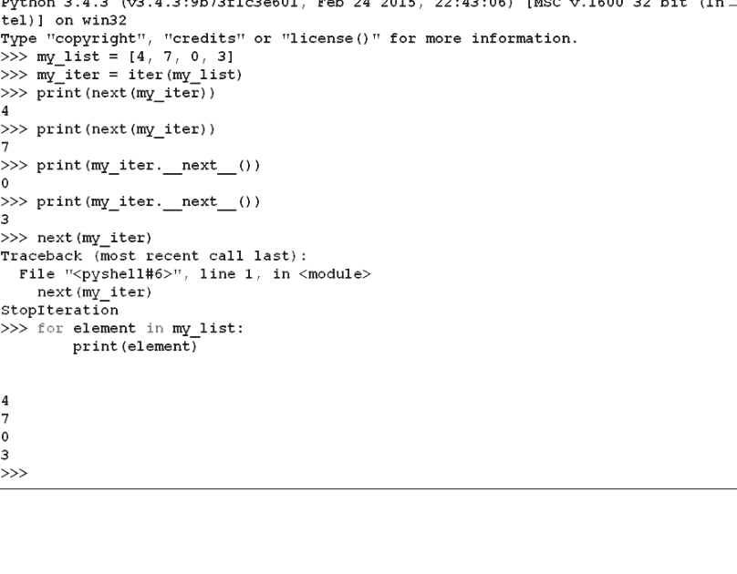

**`iter()`** 函数（进而调用 **`__iter__()`** 方法）从这些对象返回一个迭代器。

##### 在 Python 中遍历迭代器

我们使用 **`next()`** 函数来手动遍历迭代器的所有项。当我们到达末尾且没有更多数据可返回时，它将引发 **`StopIteration`**。

##### 示例 2

我们使用 **`for` 语句**来循环遍历**一个数字列表**。


在此示例中

1. 使用 `for` 循环，对传递到循环中的编号列表进行自动迭代。
2. 通过 `print` 语句，打印列表中每个被迭代的值。

##### 示例 3

使用 **`for` 语句**，如果将其与字符串一起使用，它会循环遍历其字符。


在此示例中

1. 使用 `for` 循环，对传递到循环中的字符串列表进行自动迭代。
2. 通过 `print` 语句，打印列表中每个被迭代的值。

##### 示例 4

使用 **`for` 语句**，如果将其与字典一起使用，它会循环遍历其键。


在此示例中

1. 使用 `for` 循环，对传递到循环中的字典进行自动迭代。
2. 通过 `print` 语句，打印列表中每个被迭代的值。

##### 示例 5

使用 **`for` 语句**，如果我们定义一个列表，然后使用迭代器的初始值启动计数器变量，那么循环将用于遍历可迭代对象。`for` 循环执行自动迭代。


##### 示例 6

使用 **`while` 语句**，如果我们定义一个列表，然后使用迭代器的初始值启动计数器变量，那么 `while` 循环将用于遍历可迭代对象。`while` 循环执行自动迭代。


##### 示例 7

使用 **`for` 语句**，如果我们定义一个字典，那么 `for` 循环用于遍历可迭代对象。`for` 循环执行自动迭代。


你可以通过使用 `values()` 方法来显示字典项的值，注意使用 `values` 方法时遵循特定格式，**`dt.values()`：**

```
C:\Python34\python.exe
Python 3.4.3 (v3.4.3:9b73f1c3e601, Feb 24 2015, 22:43:06) [MSC v.1600 32 bit (Intel)] on win32
Type "help", "copyright", "credits" or "license" for more information.
>>> dt={"kiran":"11","sri":12}
>>> for c in dt . values ():
...     print(c)
...
11
12
>>> _
```

##### 示例 8

使用 `for` 语句，如果将其与文件一起使用，它会循环遍历文件的行。

在此示例中，首先我需要一个文本文件，因此通过文件处理，我创建了 `kiranfile.txt` 并包含一些内容。

```
>>> f=open("kiranfile.txt","w")
>>> f.write("Hello Everyone, This is Message from Kiran maam to all students: Please refer this Book, It is very helpful exam point of view as well as knowledge point of view, All the Best for Exams")
186
>>> f=open("kiranfile.txt","r")
>>> f.read()
'Hello Everyone, This is Message from Kiran maam to all students: Please refer this Book, It is very helpful exam point of view as well as knowledge point of view, All the Best for Exams'
>>> _
```

现在使用 `for` 语句，利用可迭代对象，打印文件内容。

```
C:\Python34\python.exe
Python 3.4.3 (v3.4.3:9b73f1c3e601, Feb 24 2015, 22:43:06) [MSC v.1600 32 bit (Intel)] on win32
Type "help", "copyright", "credits" or "license" for more information.
>>> for line in open("kiranfile.txt"):
...     print(line)
...
Hello Everyone, This is Message from Kiran maam to all students: Please refer this Book, It is very helpful exam point of view as well as knowledge point of view, All the Best for Exams
>>>
```

##### 示例 9

有**许多类型的对象**可以**与 `for` 循环一起使用**。这些被称为**可迭代对象**。有许多函数可以消耗这些可迭代对象。

1. 与列表连接 (`join`)
2. 与字典连接 (`join`)
3. 将字符串转为列表 (`list`)
4. 将字典转为列表 (`list`)

###### 1. 与列表连接的示例


###### 2. 与字典连接的示例


###### 3. 将字符串转为列表的示例


##### 4. 包含字典的列表示例

```python
Python 3.4.3 (v3.4.3:9b73f1c3e601, Feb 24 tel>] on win32
Type "help", "copyright", "credits" or "li"
>>> list({"kiran": 1, "sri": 2})
['sri', 'kiran']
>>>
```

#### 1.11.3 在Python中创建你自己的迭代器

1.  我们可以在Python中创建迭代器。要创建一个迭代器，必须实现 `__iter__()` 和 `__next__()` 方法。
2.  `__iter__()` 方法返回迭代器对象本身。如果需要，可以进行一些初始化操作。
3.  `__next__()` 方法必须返回序列中的下一个项。当到达末尾以及在后续的调用中，它必须引发 `StopIteration` 异常。

这个例子将在每次迭代中给我们下一个2的幂。幂指数从零开始，直到用户设定的数字。这里我们创建一个类来实现2的幂的迭代器。

```python
class PowerofTwo:
    def __init__(self, max = 0):
        self.max = max

    def __iter__(self):
        self.n = 0
        return self

    def __next__(self):
        if self.n <= self.max:
            result = 2 ** self.n
            self.n += 1
            return result
        else:
            raise StopIteration
```

### 输出


我们也可以使用 **for** 循环来遍历我们的迭代器类。

#### 1.11.4 Python无限迭代器

迭代器对象中的项不一定必须耗尽。可以有无限迭代器（永不结束）。我们必须小心处理此类迭代器。

##### *演示无限迭代器的例子。*

内置函数 `iter()` 可以用两个参数调用，其中第一个参数必须是可调用对象（函数），第二个是哨兵值。迭代器会调用此函数，直到返回的值等于哨兵值。

```python
>>> int()
0
>>> inf = iter(int,1)
>>> next(inf)
0
>>> next(inf)
0
```

我们可以看到 `int()` 函数总是返回0。所以将其作为 `iter(int,1)` 传递，将返回一个迭代器，该迭代器调用 `int()` 直到返回值等于1。这永远不会发生，于是我们得到了一个无限迭代器。

我们也可以构建自己的无限迭代器。下面的迭代器将返回所有奇数。


一次示例运行如下所示。

```python
a = iter(InfIter())
>>> next(a)
1
>>> next(a)
3
>>> next(a)
5
>>> next(a)
7
And so on...
```

在迭代这些类型的无限迭代器时，请注意包含终止条件。

使用迭代器的优点是它们节省资源。如上面的例子所示，我们可以在不将整个数字系统存储在内存中的情况下获得所有奇数。我们可以在有限的内存中拥有（理论上）无限的项。

#### 1.11.5 生成器

生成器简化了迭代器的创建。生成器是一个函数，它产生一系列结果而不是单个值。

```python
def yrange(n):
    i = 0
    while i < n:
        yield i
        i += 1
```

每次执行 `yield` 语句时，函数会生成一个新值。

```python
>>> y = yrange(3)
>>> y
<generator object yrange at 0x401f30>
>>> y.next()
0
>>> y.next()
1
>>> y.next()
2
>>> y.next()
Traceback (most recent call last):
  File "<stdin>", line 1, in <module>
StopIteration
```

所以生成器也是一个迭代器。你不必担心迭代器协议。

“生成器”这个词既指生成值的函数，也指它生成的东西。当生成器函数被调用时，它返回一个生成器对象，甚至不会开始执行该函数。当第一次调用 `next` 方法时，函数开始执行，直到达到 `yield` 语句。生成的值由 `next` 调用返回。

以下示例演示了 `yield` 与生成器对象 `next` 方法调用之间的交互。

```python
>>> def foo():
...     print "begin"
...     for i in range(3):
...         print "before yield", i
...         yield i
...         print "after yield", i
...     print "end"
...
```

```python
>>> f = foo()
>>> f.next()
begin
before yield 0
0
>>> f.next()
after yield 0
before yield 1
1
>>> f.next()
after yield 1
before yield 2
2
>>> f.next()
after yield 2
end
Traceback (most recent call last):
  File "<stdin>", line 1, in <module>
StopIteration
>>>
```

### 1.12 迭代及其问题解决应用

在这种情况下，我们使用迭代器。代码更清晰。
在下面的例子中，我们创建自己的对象来实现迭代器协议。

```python
#!/usr/bin/python

# iterator.py

class seq:
    def __init__(self):
        self.x = 0

    def next(self):
        self.x += 1
        return self.x**self.x

    def __iter__(self):
        return self

s = seq()
n = 0
for i in s:
    print i
    n += 1
    if n > 10:
        break
```

在这个代码示例中，我们创建了一个数字序列1, 4, 27, 256, ...。这表明使用迭代器，我们可以处理无限序列。`for` 语句在容器对象上调用 `iter()` 函数。该函数返回一个定义了 `next()` 方法的迭代器对象，该方法一次访问容器中的一个元素。

```python
def next(self):
    self.x += 1
    return self.x**self.x
```

`next()` 方法返回序列的下一个元素。

```python
def __iter__(self):
    return self
```

`__iter__` 方法返回迭代器对象。

```python
if n > 10:
    break
```

因为我们正在处理一个无限序列，我们必须中断 `for` 循环。

```text
$ ./iterator.py
1
4
27
256
3125
46656
823543
16777216
387420489
10000000000
285311670611
```

### 1.13 问题

1.  什么是文本文件？写出 `open()` 函数的语法及其参数。
2.  用例子解释写入、读取和追加功能。
3.  用例子解释 `r+` 和 `rb` 的区别。
4.  编写一个Python程序，以文本模式创建一个新文件，然后以二进制模式读取该文件的内容。
5.  解释如何用 `os.path` 处理路径和目录，并解释如何创建和删除目录。
6.  `write()` 和 `append()` 函数有什么区别？
7.  什么是文本文件？并解释其不同的文件模式。
8.  用例子解释 `input` 和 `raw_input` 函数。
9.  什么是文本文件？写出 `open()` 和 `close()` 函数的语法及其参数。
10. `read()` 和 `write()` 函数有什么区别？
11. 区分文本文件和二进制文件。
12. 用合适的例子解释不同的文件操作。
13. 解释如何为文本文件和二进制文件打开文件进行读取以及关闭文件。
14. 解释什么是文件以及各种类型的文件模式并给出合适的语法。
15. 解释文件对象的属性。
16. 解释如何通过 `read()`、`readline()` 和 `readlines()` 执行文件读取。
17. 用合适的例子解释如何从键盘读取输入。
18. 解释如何将文本追加到文件。
19. 解释如何重命名和删除文件。
20. 解释不同的Python文件输入输出函数。
21. 解释不同的文件位置函数。
22. 解释如何创建目录、如何切换到目录以及如何删除目录。
23. 解释 `mkdir()`、`chdir()`、`getcwd()`、`rmdir()` 目录方法。
24. 结合迭代器协议解释Python迭代器。
25. 解释Python无限迭代器。
26. 用合适的例子解释可迭代对象。
27. 用合适的例子解释Python中的生成器。
28. 解释一个迭代执行的问题或应用。

## 第2章
异常处理

### 结构

1.  2.1 错误和Bug简介
2.  2.2 异常处理简介
3.  2.3 什么是异常
4.  2.4 异常类型
    2.4.1 标准内建异常
    2.4.2 用户自定义异常
5.  2.5 异常的传播
6.  2.6 Python中的断言
7.  2.7 捕获和处理异常
    2.7.1 Try... except
    2.7.2 异常处理与带定义函数的用户输入
    2.7.3 不带异常的Except子句
    2.7.4 带多个异常的Except子句
    2.7.5 Try-Finally子句
    2.7.6 异常的参数
    2.7.7 引发异常
8.  2.8 与文件一起使用异常处理
9.  2.9 异常处理的优点
10. 2.10 问题

### 2.1 错误和Bug简介

通常程序包含错误和Bug。最常见的Bug类型是：

1.  逻辑错误
2.  语法错误

逻辑错误源于错误的解决方案或逻辑，而语法错误则源于对语言理解不足，即语法错误。我们可以检测这些错误，然后进行调试，并提供相应的错误描述，这些错误被称为**异常**。

异常是程序在执行过程中可能遇到的运行时条件或错误。例如，除以零、访问数组越界、内存耗尽或磁盘空间不足等错误。

异常处理有两种类型：

- 1. 同步
- 2. 异步

同步异常可能出现索引超范围和溢出错误。异步异常则是指超出控制范围的事件，如键盘中断、磁盘坏扇区或硬件故障等。

可以执行以下任务来处理异常：

- 1. 发现问题（触发异常）
- 2. 通知已发生错误（抛出异常）
- 3. 接收错误信息（捕获异常）
- 4. 采取纠正措施（处理异常）

### 语法错误

语法错误，也称为解析错误，可能是你在学习Python时最常见的报错类型：

```
>>> while True print 'Hello world'
  File "<stdin>", line 1
    while True print 'Hello world'
          ^
SyntaxError: invalid syntax
```

解析器会重复显示错误行，并用一个小箭头指向行中最早检测到错误的位置。错误是由箭头前的标记引起的（或至少在此处检测到）：在本例中，错误在关键字`print`处被检测到，因为其前面缺少一个冒号（':'）。文件名和行号也会被打印出来，这样当输入来自脚本时，你就知道在哪里查找。

### 2.2 异常处理简介

执行Python程序时，可能会出现各种错误信息。此类错误称为**异常**。Python通过将错误报告到屏幕上来处理这些错误。然而，异常可以被程序"捕获"和"处理"，以纠正错误并继续执行，或者终止程序。

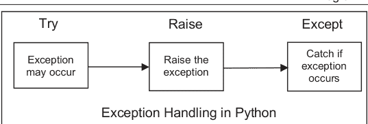

Python拥有许多内置异常，当程序内部出现错误时，会强制输出错误信息。

当这些异常发生时，它会导致当前进程停止，并将异常传递给调用进程，直到被处理。如果未被处理，我们的程序将会崩溃。

例如，如果函数**A**调用函数**B**，而函数**B**又调用函数**C**，并且在函数**C**中发生异常。如果异常在**C**中未被处理，它会传递给**B**，然后传递给**A**。

如果一直没有处理，程序会输出错误信息，并突然意外地终止。

### 2.3 什么是异常

异常是一种事件，在程序执行过程中发生，会扰乱程序指令的正常流程。当Python脚本遇到无法处理的情况时，它会引发一个异常。**异常**是一个值（对象），它被*引发*（"抛出"），表示发生了意外的或"异常的"情况。

当Python脚本引发异常时，它必须立即处理该异常，否则程序将终止并退出。

Python包含一组预定义的异常，称为**标准异常**。

一些标准异常如下所列：

表 2.1：Python中的部分标准异常

| ImportError | 当`import`（或`from...import`）语句失败时引发 |
|---|---|
| IndexError | 当序列索引超出范围时引发 |
| NameError | 当找不到本地或全局名称时引发 |
| TypeError | 当操作或函数应用于不适当类型的对象时引发 |
| ValueError | 当内置操作或函数应用于适当类型但值不当时引发 |
| IOError | 当输入/输出操作失败时（例如，"文件未找到"）引发 |

标准异常定义在Python标准库的`exceptions`模块中，该模块会自动导入到Python程序中。

| **示例 1** | **示例 2** |
|---|---|
| `>>> lst = [1, 2, 3]`<br>`>>> lst[3]`<br>Traceback (most recent call last):<br>File "<pyshell#4>", line 1, in <module><br>IndexError: list index out of range | `>>> lsst[0]`<br>Traceback (most recent call last):<br>File "<pyshell#5>", line 1, in <module><br>NameError: name 'lsst' is not defined |
| `>>> 2 + '3'`<br>Traceback (most recent call last):<br>File "<pyshell#7>", line 1, in <module><br>TypeError: unsupported operand type(s) for +: 'int' and 'str' | `>>> int('12.04')`<br>Traceback (most recent call last):<br>File "<pyshell#9>", line 1, in <module><br>ValueError: invalid literal for int() with base 10: '12.04' |

图 2.1：部分内置错误或异常列表

引发异常是函数告知其调用者已发生函数本身无法处理的问题的一种方式。

例如，假设一个名为`getYN`的函数提示用户输入'y'或'n'。如果用户输入的不是这两个值之一，函数可以简单地提示用户重新输入。另一方面，如果一个名为`isEven`的函数应接收一个数值，但却接收了一个字符串，它无法纠正问题。它只能将问题通知给用户。

异常是一个值（对象），它被函数"引发"，表示发生了意外的或"异常的"情况，且函数本身无法处理该情况。

### 处理异常

如果有一些可疑的代码可能引发异常，你可以通过将这些可疑代码放在`try:`块中来保护你的程序。在`try:`块之后，包含一个`except:`语句，后跟一段代码，以尽可能优雅地处理问题。

*语法：*

以下是`try....except...else`块的简单语法：

```
try:
    You do your operations here;
    ....................
except Exception I:
    If there is ExceptionI, then execute this block.
except Exception II:
    If there is ExceptionII, then execute this block.
    ....................
else:
    If there is no exception then execute this block
```

### 2.4 异常类型

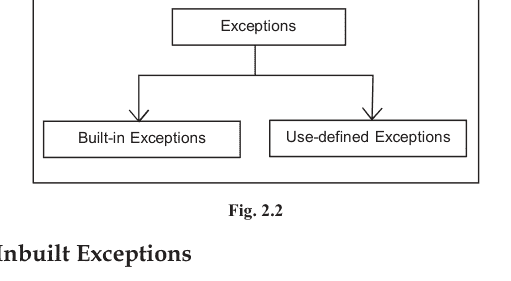

图 2.2

#### 2.4.1 标准内置异常

*内置异常*

异常应该是类对象。异常在`exceptions`模块中定义。这个模块从不需要显式导入：异常在内置命名空间和`exceptions`模块中都可用。

对于类异常，在一个包含提到特定类的`except`子句的`try`语句中，该子句也处理任何从该类派生的异常类（但不处理它从中派生的异常类）。

内置异常可以由解释器或内置函数生成。除特殊情况外，它们都有一个"关联值"，指示错误的详细原因。这可以是一个字符串或一个包含多个信息项的元组（例如，一个错误代码和一个解释该代码的描述性字符串）。关联值是`raise`语句的第二个参数。如果异常类派生自标准根类`BaseException`，则关联值作为异常实例的`args`属性存在。

内置异常类可以被子类化以定义新的异常；鼓励程序员从`Exception`类或其子类派生新异常，而不是从`BaseException`派生。

内置标准异常列表 –

| EXCEPTION NAME | DESCRIPTION |
|---|---|
| Exception | 所有异常的基类 |
| StopIteration | 当迭代器的`next()`方法不指向任何对象时引发。 |
| SystemExit | 由`sys.exit()`函数引发。 |
| StandardError | 除StopIteration和SystemExit外，所有内置异常的基类。 |
| ArithmeticError | 所有数值计算错误的基类。 |
| OverflowError | 当计算超过数值类型的最大限制时引发。 |
| FloatingPointError | 当浮点计算失败时引发。 |
| ZeroDivisionError | 当所有数值类型进行除法或模零运算时引发。 |
| AssertionError | 在Assert语句失败的情况下引发。 |
| AttributeError | 在属性引用或赋值失败的情况下引发。 |
| EOFError | 当从`raw_input()`或`input()`函数没有收到输入并到达文件末尾时引发。 |

##### 异常处理

| 异常 | 描述 |
|---|---|
| ImportError | 当导入语句失败时引发。 |
| KeyboardInterrupt | 当用户中断程序执行时引发，通常是通过按下 Ctrl+c。 |
| LookupError | 所有查找错误的基类。 |
| IndexError | 当索引在序列中未找到时引发。 |
| KeyError | 当在字典中未找到指定的键时引发。 |
| NameError | 当在局部或全局命名空间中未找到标识符时引发。 |
| UnboundLocalError | 当尝试在函数或方法中访问局部变量但未为其赋值时引发。 |
| EnvironmentError | 所有发生在Python环境之外的异常的基类。 |
| IOError | 当输入/输出操作失败时引发，例如 `print` 语句或尝试打开不存在的文件的 `open()` 函数。 |
| IOError | 当发生与操作系统相关的错误时引发。 |
| SyntaxError | 当Python语法存在错误时引发。 |
| IndentationError | 当缩进指定不正确时引发。 |
| SystemError | 当解释器发现内部问题时引发，但遇到此错误时Python解释器不会退出。 |
| SystemExit | 当通过使用 `sys.exit()` 函数退出Python解释器时引发。如果在代码中未处理，将导致解释器退出。 |
| ValueError | 当数据类型的内置函数具有有效的参数类型，但参数指定了无效值时引发。 |
| RuntimeError | 当生成的错误不属于任何类别时引发。 |
| NotImplementedError | 当需要在子类中实现的抽象方法实际上未实现时引发。 |
| BufferError | 当无法执行与缓冲区相关的操作时引发。 |
| KeyError | 当在现有键集中未找到映射（字典）键时引发。 |
| MemoryError | 当操作耗尽内存但情况仍可能恢复（通过删除某些对象）时引发。 |
| OverflowError | 当算术运算的结果太大而无法表示时引发。 |
| ReferenceError | 当使用通过 `weakref.proxy()` 函数创建的弱引用代理访问被引用对象的属性，而该对象已被垃圾回收时，引发此异常。 |
| IndentationError | 与不正确缩进相关的语法错误的基类。 |
| TabError | 当缩进包含不一致的制表符和空格使用时引发。 |
| TypeError | 当操作或函数应用于不适当类型的对象时引发。关联的值是一个字符串，提供有关类型不匹配的详细信息。 |
| WindowsError | 当发生特定于Windows的错误时引发。 |
| ZeroDivisionError | 当除法或模运算的第二个参数为零时引发 |

##### 异常层次结构

内置异常的类层次结构如下：

```
BaseException
+-- SystemExit
+-- KeyboardInterrupt
+-- GeneratorExit
+-- Exception
    +-- StopIteration
    +-- StandardError
    | +-- BufferError
    | +-- ArithmeticError
    | |   +-- FloatingPointError
    | |   +-- OverflowError
    | |   +-- ZeroDivisionError
    | +-- AssertionError
    | +-- AttributeError
    | +-- EnvironmentError
    | |   +-- IOError
    | |   +-- OSError
    | |       +-- WindowsError (Windows)
    | |       +-- VMSError (VMS)
    | +-- EOFError
    | +-- ImportError
    | +-- LookupError
    | |   +-- IndexError
    | |   +-- KeyError
    | +-- MemoryError
    | +-- NameError
    | |   +-- UnboundLocalError
    | +-- ReferenceError
    | +-- RuntimeError
    | |   +-- NotImplementedError
    | +-- SyntaxError
    | |   +-- IndentationError
    | |       +-- TabError
    | +-- SystemError
    | +-- TypeError
    | +-- ValueError
    |   +-- UnicodeError
    |     +-- UnicodeDecodeError
    |     +-- UnicodeEncodeError
    |     +-- UnicodeTranslateError
+-- Warning
  +-- DeprecationWarning
  +-- PendingDeprecationWarning
  +-- RuntimeWarning
  +-- SyntaxWarning
  +-- UserWarning
  +-- FutureWarning
  +-- ImportWarning
  +-- UnicodeWarning
  +-- BytesWarning
```

#### 2.4.2 用户自定义异常

Python还允许我们通过从标准内置异常派生类来创建自己的异常。

在 `try` 块中引发用户自定义异常，并在 `except` 块中捕获它。变量 `e` 用于创建 *Networkerror* 类的一个实例。

```
class Networkerror(RuntimeError):
    def __init__(self, arg):
        self.args = arg
```

因此，一旦你定义了上述类，就可以如下引发异常 –

```
try:
    raise Networkerror(“Bad hostname”)
except Networkerror,e:
    print (e.args)
```

### 2.5 异常的传播

当异常被引发且未被使用方或客户端代码处理时，它会自动传播回*客户端的*调用代码，直到被处理。如果异常一直抛回最顶层（主模块）且未被处理，那么程序将终止并显示异常的详细信息。

例如，一个程序可能无法在输入源确定密码是否有效。相反，必须在调用了一段**函数调用链**后才能访问的密码文件中进行验证。如果密码无效，异常将从发现错误的函数一直传播到负责用户输入的函数，后者随后可以提示用户重新输入其密码。

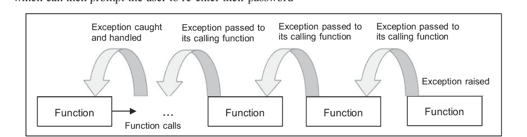

异常要么由用户方或客户端代码处理，要么自动传播回用户或客户端的调用代码，依此类推，直到被处理。如果异常一直抛回主模块（且未被处理），程序将终止并显示异常的详细信息。

### 2.6 Python 中的断言

断言是一种健全性检查，可以在完成程序测试时打开或关闭。可以将断言比作一个 **raise-if** 语句。对表达式进行测试，如果结果为假，则引发异常。

断言通过 **assert** 语句执行。程序员通常在函数开始处放置断言以检查有效输入，在函数调用后放置断言以检查有效输出。

**assert 语句**
当遇到 `assert` 语句时，Python会计算其后的表达式，该表达式可能为真。如果表达式为假，Python会引发一个 *AssertionError* 异常。

**Assert 的语法如下 –**

```
assert Expression[, Arguments]
```

如果断言失败，Python将使用 ArgumentExpression 作为 AssertionError 的参数。AssertionError 异常可以像任何其他异常一样，使用 `try-except` 语句捕获和处理，但如果未处理，它们将终止程序并产生回溯信息。

**示例**
这是一个将温度从开尔文转换为华氏度的函数。由于绝对零度是最冷的，所以如果函数看到负温度就会退出 –

首先观察这个程序的输出

```
python
def KelvinToFahrenheit(Temperature):
    assert (Temperature >= 0),"Colder than absolute zero!"
    return ((Temperature-273)*1.8)+32
print (KelvinToFahrenheit(273))
print (int(KelvinToFahrenheit(505.78)))

```

输出

```
plaintext
Python 3.4.3 (v3.4.3:9b73f1c3e601, Feb 24 2015, 22:43:06) [MSC v.1600 32 bit (Intel)] on win32
Type "copyright", "credits" or "license()" for more information.
>>> ==================== RESTART ====================
>>>
32.0
451
>>> 

```

现在我传递小于零的温度，即负温度，观察对负温度的 AssertionError。

```
python
def KelvinToFahrenheit(Temperature):
    assert (Temperature >= 0),"Colder than absolute zero!"
    return ((Temperature-273)*1.8)+32
print (KelvinToFahrenheit(273))
print (int(KelvinToFahrenheit(505.78)))
print (KelvinToFahrenheit(-5))

```

输出

```
plaintext
Python 3.4.3 (v3.4.3:9b73f1c3e601, Feb 24 2015, 22:43:06) [MSC v.1600 32 bit (Intel)] on win32
Type "copyright", "credits" or "license()" for more information.
>>> ==================== RESTART ====================
>>>
32.0
451
Traceback (most recent call last):
  File "C:/Python34/KelvinToFahrenheit.py", line 6, in <module>
    print (KelvinToFahrenheit(-5))
  File "C:/Python34/KelvinToFahrenheit.py", line 2, in KelvinToFahrenheit
    assert (Temperature >= 0),"Colder than absolute zero!"
AssertionError: Colder than absolute zero!
>>> 

```

### 2.7 捕获和处理异常

#### 2.7.1 try... except

如果你有一些可能引发异常的*可疑*代码，你可以将这些可疑代码放在一个 **try:** 代码块中来保护你的程序。在 try: 代码块之后，包含一个 **except:** 语句，其后是一个处理该问题的代码块，并尽快处理。

*语法*

以下是 *try....except...else* 代码块的简单语法 –

```
try:
    You do your operations here;
    ......................
except Exception I:
    If there is ExceptionI, then execute this block.
except Exception II:
    If there is ExceptionII, then execute this block.
    ......................
else:
    If there is no exception then execute this block.
```

**一些需要考虑的重要要点：**

-   单个 try 语句可以有多个 except 语句。当 try 代码块包含可能抛出不同类型的异常的语句时，这非常有用。
-   你也可以提供一个通用的 except 子句，它可以处理任何异常。
-   在 except 子句之后，你可以包含一个 else 子句。如果 try: 代码块中的代码没有引发异常，则执行 else 代码块中的代码。
-   else 代码块是放置不需要 try: 代码块保护的代码的好地方。

*异常处理可以使用用户输入完成：*

```
>>> while True:
...     try:
...         x = int(raw_input(“Please enter a number:”))
...         break
...     except ValueError:
...         print ("Oops! That was no valid number. Try again...")
...
```

try 语句的工作方式如下。

-   首先，执行 try 子句（try 和 except 关键字之间的语句）。
-   如果没有发生异常，则跳过 except 子句，并完成 try 语句的执行。
-   如果在执行 try 子句期间发生异常，则跳过该子句的其余部分。然后，如果其类型与 except 关键字后命名的异常匹配，则执行 except 子句，然后在 try 语句之后继续执行。
-   如果发生与 except 子句中命名的异常不匹配的异常，则会将其传递给外部的 try 语句；如果没有找到处理程序，则它是一个未处理的异常，执行将停止并显示如上所示的消息。

##### 示例 1：

此示例打开一个文件并在文件中写入内容。


这将产生以下结果 –


##### 示例 2：

此示例尝试打开一个你没有写入权限的文件，因此会引发异常 –


这将产生以下结果 –


#### 2.7.2 使用定义函数进行异常处理和用户输入

异常可以由内置函数和程序员定义的函数引发。
考虑以下示例

1.  我们通过 input 函数提示用户输入当前月份的数字（介于 1-12 之间）。
2.  input 函数将返回输入的任何内容作为字符串。我们可以对该值进行整数类型转换，使其成为整数类型，
    `month = int(input('Enter current month (1–12):'))`
3.  如果输入字符串包含非数字字符（除了 1 和 2），int 函数将引发 ValueError 异常，还需要检查超出 1-12 范围的值。

##### 1. 定义 getMonth( ) 函数


##### 2. 编写带有异常的用户输入程序


通过输入无效数字值运行程序后观察到的输出


通过输入非数字值运行程序后观察到的输出


#### 2.7.3 不带异常的 except 子句

1.  你也可以如下所示使用不带异常定义的 except 语句 –

```
try:
    You do your operations here;
    ....................

except:
    If there is any exception, then execute this block.
    ....................

else:
    If there is no exception then execute this block.
```

2.  **try-except** 语句会捕获所有发生的异常。不过，使用这种 try-except 语句不被认为是好的编程实践，因为它捕获所有异常，但不会让程序员识别可能发生的问题的根本原因。

示例：


运行后观察到的输出：


#### 2.7.4 *except* 子句与多个异常

你也可以使用相同的 *except* 语句来处理多个异常，如下所示 –

```
try:
    You do your operations here;
    ....................

except(Exception1[, Exception2[,....ExceptionN]]):
    If there is any exception from the given exception list,
    then execute this block.
    ....................

else:
    If there is no exception then execute this block.
```

##### 示例 1：


##### 运行后观察到的输出


##### 示例 2：

现在检查 kiranfile，此文件存在于当前路径中。
kiranfile 的内容如下：


现在，如果我用 kiranfile 编写相同的程序，它将检查文件内容，如果它们不是数字，则会引发异常。

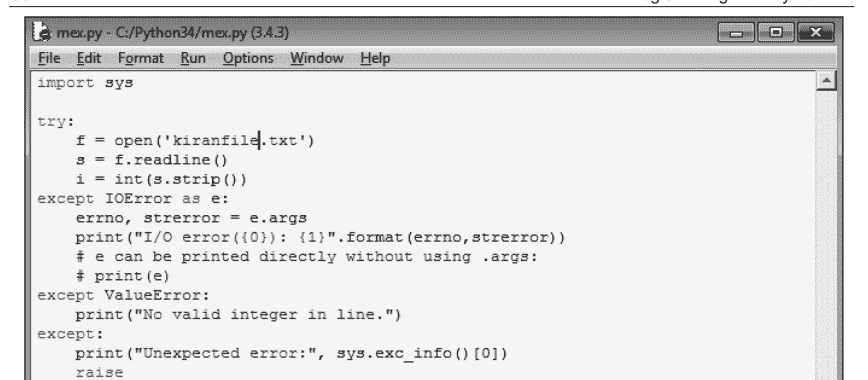

### 输出

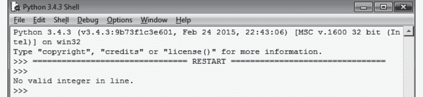

#### 2.7.5 try-finally 子句

1.  我们可以将 **finally:** 代码块与 **try:** 代码块一起使用。
2.  通常 try : 代码块可以与 except 子句配对，但 try 代码块也可以与 finally 代码块一起使用。
3.  finally 代码块是放置任何必须执行的代码的地方，无论 try 代码块是否引发异常。
4.  Finally 代码块将在程序结束时执行。
5.  你可以为 try 代码块提供 except 子句或 finally 子句，但不能同时提供两者。
6.  你也不能在使用 finally 子句的同时使用 else 子句。

**try-finally 语句的语法如下：**

```
try:
    You do your operations here;
    ......................
    Due to any exception, this may be skipped.
finally:
    This would always be executed.
.....................
```

*示例：*


如果你没有以写入模式打开文件的权限，那么这将产生以下结果：**错误：找不到文件或读取数据**，否则它将执行 Finally 代码块

*运行后观察到的输出：*


#### 2.7.6 异常的参数

1.  异常可以有一个参数
2.  参数是一个值，它提供有关问题的额外信息。
3.  参数的内容不是固定的，它们因异常而异。
4.  你可以通过在 except 子句中提供一个变量来捕获异常的参数，如下所示：

*语法如下：*

```
try:
    You do your operations here;
    .....................

except ExceptionType, Argument:
    You can print value of Argument here...
```

如果你正在编写代码来处理单个异常，你可以在 except 语句中的异常名称后跟一个变量。如果你正在捕获多个异常，你可以在异常的元组后跟一个变量。

这个变量将接收异常的值，通常包含异常的原因。该变量可以接收单个值或以元组形式接收多个值。此元组通常包含错误字符串、错误编号和错误位置。

*示例：*

这将产生以下结果：


#### 2.7.7 引发异常

你可以使用 raise 语句在 python 中引发异常。raise 语句的语法如下。

*语法*

```
raise [Exception [, args [, traceback]]]
```

1.  **Exception** 是异常的类型（例如，NameError）
2.  **argument** 意味着 **args** 是异常参数的值。参数是可选的；如果不提供，异常参数为 None。
3.  **traceback** 也是可选的，如果存在，则是用于异常的 traceback 对象。

*示例*

异常可以是字符串、类或对象。Python 核心引发的大多数异常都是类，其参数是该类的一个实例。


**注意：** 为了捕获异常，在 python 中使用“except”子句，因此为了捕获上述异常，我们必须如下编写 except 子句：## 第3章

## 正则表达式

### 结构

- 3.1 正则表达式简介
- 3.2 正则表达式模式
    - 3.2.1 编译标志
- 3.3 正则表达式 `re` 模块
- 3.4 各种类型的正则表达式
- 3.5 正则表达式的不同方法
    - 3.5.1 Match() 方法
    - 3.5.2 Search() 方法
    - 3.5.3 Replace() 方法
- 3.6 匹配 vs 搜索
- 3.7 搜索与替换
- 3.8 正则表达式修饰符——选项标志
- 3.9 问题

### 3.1 正则表达式简介

- 正则表达式（称为 RE、或正则、或正则模式）本质上是嵌入在 Python 中的一种小型、高度专业化的编程语言，并通过 `re` 模块提供。
- 正则表达式内置了解析器，可以匹配字符串、替换字符串以及搜索字符串。
- 它使用不同的正则表达式符号和通配符字符，例如 `*` 和 `?`，以及 `.`、`#`、`^`、`$`、`[ ]` 等许多其他字符。
- 正则表达式是一个特殊的字符序列，帮助你匹配或查找其他字符串或字符串集合。
- "正则表达式"一词有时也称为 regex 或 regexp，起源于理论计算机科学。
- 模块 `re` 为 Python 中的类 Perl 正则表达式提供了完整支持。如果在编译或使用正则表达式时发生错误，`re` 模块会引发 `re.error` 异常。
- 正则表达式模式被编译为一系列字节码，然后由用 C 编写的匹配引擎执行。
- 反斜杠是正则表达式中使用的特殊字符，但也用作字符串中的转义字符。这意味着 Python 会首先处理字符串中的每个反斜杠，之后——在没有必要的反斜杠的情况下——它才会被用作正则表达式。防止这种情况的一种方法是将每个反斜杠写为 `\\`，从而将其保留用于正则表达式的求值。解决这个问题的最佳方法是将正则表达式标记为原始字符串。
- 你还可以使用正则表达式以各种方式修改字符串或将其拆分。
- 如果你想在 Python 中使用正则表达式，必须导入 `re` 模块，它提供了处理正则表达式的方法和函数。

### 一个演示正则表达式的简单示例

我们通过以下图示逐步展示此匹配是如何进行的：
我们检查字符串 `sub = "abc"`


是否包含在字符串 `s = "xaababcbcd"` 中。


顺便说一下，字符串 `sub = "abc"` 可以看作一个正则表达式，只是非常简单。
首先，我们检查两个字符串的第一个位置是否匹配，即 `s[0] == sub[0]`。
在我们的示例中，这不成立。我们用红色标记这个事实：


然后我们检查 `s[1:4] == sub`。这意味着我们首先需要检查 `sub[0]` 是否等于 `s[1]`。这是成立的，我们用绿色标记它。然后我们需要比较后续位置。`s[2]` 不等于 `sub[1]`，因此我们不需要继续检查 sub 和 s 的下一个位置：

python
try:
    print ("Business Logic here...")
except "Invalid level!":
    print( "Exception handling here...")
else:
    print("Rest of the code here...")

因此：

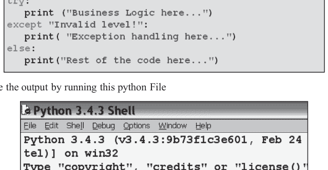

通过运行此 python 文件观察输出。

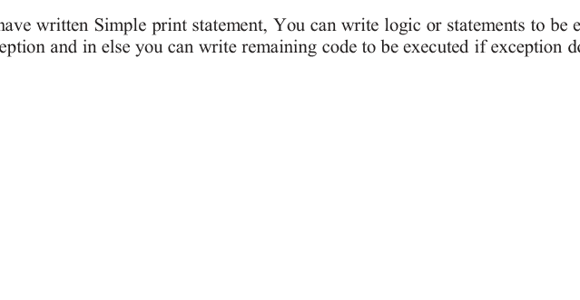

这里我写了简单的 print 语句。你可以编写在捕获异常后执行的逻辑或语句，并且在 else 中，你可以编写如果异常不存在则执行的其余代码。

## 添加业务逻辑和其他代码后执行的示例

1.  如果我们传递的参数值是负值，则会引发异常。据此，可以捕获异常。

    python
    def functionString( explevel ):
        if explevel < 1:
            raise Exception(explevel)
        return explevel
    try:
        r=functionString(-5)
        print("level=",r)
    except Exception as e:
        print("error in argument level",e.args[0])
    else:
        print("Program works smoothly without exception")

    运行后观察到的输出：

    text
    Python 3.4.3 Shell
    Python 3.4.3 (v3.4.3:9b73f1c3e601, Feb 24 2015, 22:43:06) [MSC v.1600 32 bit (Intel)] on win32
    Type "copyright", "credits" or "license()" for more information.
    >>> ============================= RESTART ============================
    >>> 
    error in argument level -5
    >>> | 

2.  如果我们传递的参数值是正值，则不会引发异常，程序无异常地顺利运行。

    python
    def functionString( explevel ):
        if explevel < 1:
            raise Exception(explevel)
        return explevel
    try:
        r=functionString(8)
        print("level=",r)
    except Exception as e:
        print("error in argument level",e.args[0])
    else:
        print("Program works smoothly without exception")

    运行程序后观察到的输出：

    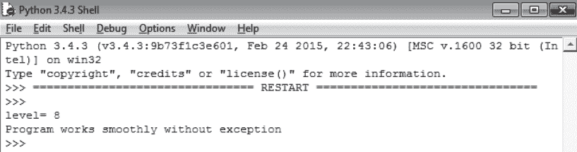

### 2.8 文件异常处理

很多时候，当我们打开一个文件进行读写时，如果找不到文件，可能会引发异常。这里，会引发标准的 `IOError` 异常，程序会以 "No such file or directory" 错误消息终止。我们可以捕获这个异常并处理错误，如所示。

文件打开错误的异常处理示例：


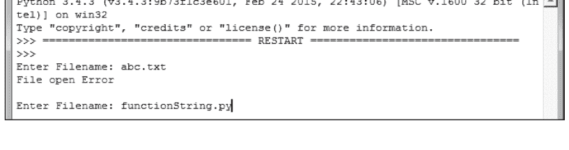

- 1. 变量 `fname` 存储用户输入的文件名。
- 2. 变量 `inp_file_opened` 是一个标志变量，初始化为 False。
- 3. while 循环在 `inp_file_opened` 为 False 时持续迭代。由于循环内有 try 块，每次 `open(file_name, ‘r’)` 引发异常时，try 块中剩余的行将被跳过，并且执行 except 头之后的异常处理程序。
- 4. 只有当对 `open` 的调用没有抛出异常时，try 块中的所有指令才会被执行，程序在 while 循环之后继续。
- 5. 从文本文件读取时，`readline` 方法不会引发任何异常。
- 6. 当到达文件末尾时，`readline` 返回一个空字符串，而不是抛出异常。
- 7. 由文件打开错误引起的 IOError 异常可以被捕获和处理。

### 2.9 异常处理的优点

- 1. 借助异常，我们可以检测逻辑错误和语法错误。
- 2. 借助运行时的异常，我们可以捕获错误并向用户抛出错误消息。
- 3. 异常处理提供了类型安全的集成方法。
- 4. 同步异常可以由用户创建，因此用户可以控制程序。
- 5. 异常处理机制的主要优点是检测异常并报告异常情况，以便用户可以采取适当的操作。
- 6. 一个程序段可以有多个条件，所有这些多个条件都可以由多个 catch 或 except 块处理，这意味着一个 try 块可以有多个 catch 或 except 块。
- 7. Python 异常中提供了断言。

### 2.10 问题

- 1. 定义什么是错误和缺陷，以及有哪些类型的错误。
- 2. 解释你所说的异常是什么意思。
- 3. 解释什么是异常以及如何处理它。
- 4. 解释不同类型的异常，并列出一些标准异常。
- 5. 解释内置异常和用户定义异常之间的区别。
- 6. 用清晰的图示解释异常的传播。
- 7. 解释 Python 中的断言。
- 8. 解释可以使用 try 和 except 块处理捕获异常的不同方式。
- 9. 用合适的示例解释参数和异常。
- 10. 举例说明如何引发异常。
- 11. 解释异常处理如何在文件处理中使用。
- 12. 解释异常处理的优点。

## 3.2 正则表达式模式

现在我们需要检查 `s[2:5]` 和 `sub` 是否相等。前两个位置相等，但第三个不相等：

以下步骤无需任何解释便应清晰明了：

最后，`s[4:7] == sub` 完全匹配：

正则表达式分为多种类型，如下所示：

1.  *简单模式*
    正则表达式用于操作字符串，因此我们将看到字符匹配。

2.  *字符匹配*
    字母和字符将直接匹配自身。例如，正则表达式 `python` 将精确匹配字符串 `python`。

    元字符列表
    `.` `^` `$` `*` `+` `?` `{` `}` `[` `]` `(` `)` `|` `\`

    `[` 和 `]` 用于指定一个**字符类**，即你希望匹配的一组字符。字符可以逐个列出，也可以通过给出两个字符并用 `-` 分隔来表示一个范围。
    **`[abc]`** 或 **`[a-c]`** 将匹配字符 **`a`**、**`b`** 或 **`c`** 中的任何一个；
    `[a-z]` 仅匹配**从 a 到 z** 的小写字母。

    最重要的元字符是**反斜杠** `\`。与 Python 字符串字面量一样，反斜杠后可以跟各种字符来表示各种特殊序列。它也用于转义所有元字符，这样你仍然可以在模式中匹配它们；例如，如果你需要匹配 `[` 或 `\`，可以在它们前面加上反斜杠以消除其特殊含义：`\[` 或 `\\`。

### 3. 重复事项

我们将看到的第一个用于**重复事项的元字符**是 `*`。`*` 不匹配字面字符 `*`；相反，它指定前面的字符可以匹配零次或多次，而不是恰好一次。

例如，`ca*t` 将匹配 `ct`（0 个 a 字符）、`cat`（1 个 a）、`caaat`（3 个 a 字符），以及后面的 t 字符。

**另一个重复元字符是 `+`**，它匹配一次或多次。`*` 和 `+` 的区别在于；`*` 匹配零次或多次，因此被重复的内容可能根本不存在，而 `+` 则要求至少出现一次。使用一个类似的例子，`ca+t` 将匹配 `cat`（1 个 a）、`caaat`（3 个 a），但不会匹配 `ct`。

还有两个重复限定符。**问号字符 `?` 匹配一次或零次。**

## 正则表达式模式

除了控制字符 `(+ ? . * ^ $ ( ) [ ] { } | \)` 外，所有字符都匹配自身。你可以在控制字符前面加上反斜杠来转义它。

下表列出了 Python 中可用的正则表达式语法：

## 正则表达式模式

| 模式 | 描述 |
| :--- | :--- |
| `^` | 匹配行首。 |
| `$` | 匹配行尾。 |
| `.` | 匹配除换行符外的任意单个字符。使用 `m` 选项时，它也可以匹配换行符。 |
| `[...]` | 匹配方括号内的任意单个字符。 |
| `[^...]` | 匹配方括号外的任意单个字符。 |
| `re*` | 匹配前面的表达式零次或多次。 |
| `re+` | 匹配前面的表达式一次或多次。 |
| `re?` | 匹配前面的表达式零次或一次。 |
| `re{n}` | 精确匹配前面的表达式 `n` 次。 |
| `re{n,}` | 匹配前面的表达式 `n` 次或更多次。 |
| `re{n, m}` | 匹配前面的表达式至少 `n` 次，至多 `m` 次。 |
| `a\|b` | 匹配 `a` 或 `b`。 |
| `(re)` | 对正则表达式进行分组并记住匹配的文本。 |
| `(?imx)` | 在正则表达式内临时启用 `i`、`m` 或 `x` 选项。如果在括号内，则仅影响该区域。 |
| `(?-imx)` | 在正则表达式内临时关闭 `i`、`m` 或 `x` 选项。如果在括号内，则仅影响该区域。 |
| `(?:re)` | 对正则表达式进行分组但不记住匹配的文本。 |
| `(?imx:re)` | 在括号内临时启用 `i`、`m` 或 `x` 选项。 |
| `(?-imx:re)` | 在括号内临时关闭 `i`、`m` 或 `x` 选项。 |
| `(?#...)` | 注释。 |
| `(?=re)` | 使用模式指定位置。没有范围。 |
| `(?!re)` | 使用模式否定指定位置。没有范围。 |
| `(?>re)` | 匹配独立的模式，不进行回溯。 |
| `\w` | 匹配字母数字字符及下划线，等同于 `[A-Za-z0-9_]`。 |
| `\W` | 匹配非字母数字字符。 |
| `\s` | 匹配空白字符。等同于 `[ \t\n\r\f]`。 |
| `\S` | 匹配非空白字符。 |
| `\d` | 匹配数字。等同于 `[0-9]`。 |
| `\D` | 匹配非数字字符。 |
| `\A` | 匹配字符串开头。 |
| `\Z` | 匹配字符串结尾。如果存在换行符，则匹配换行符之前的位置。 |
| `\z` | 匹配字符串结尾。 |
| `\G` | 匹配上一次匹配结束的位置。 |
| `\b` | 在方括号外时，匹配单词边界。在方括号内时，匹配退格符 (0x08)。 |
| `\B` | 匹配非单词边界。 |
| `\n`, `\t`, 等。 | 匹配换行符、回车符、制表符等。 |
| `\1...\9` | 匹配第 `n` 个分组的子表达式。 |
| `\10` | 如果第 `n` 个分组的子表达式已匹配，则匹配它。否则，它表示字符代码的八进制表示。 |

## 正则表达式示例

### 字面字符：

| 示例 | 描述 |
|---------|-------------|
| `python` | 匹配 "python"。 |

### 字符类：

| 示例 | 描述 |
|---------|-------------|
| `[Pp]ython` | 匹配 "Python" 或 "python" |
| `rub[ye]` | 匹配 "ruby" 或 "rube" |
| `[aeiou]` | 匹配任意一个小写元音字母 |
| `[0-9]` | 匹配任意一个数字；等同于 `[0123456789]` |
| `[a-z]` | 匹配任意一个小写 ASCII 字母 |
| `[A-Z]` | 匹配任意一个大写 ASCII 字母 |
| `[a-zA-Z0-9]` | 匹配上述任意一个 |
| `[^aeiou]` | 匹配除小写元音字母外的任意字符 |
| `[^0-9]` | 匹配除数字外的任意字符 |

### 特殊字符类：

| 示例 | 描述 |
| --- | --- |
| `.` | 匹配除换行符外的任意字符 |
| `\d` | 匹配一个数字：`[0-9]` |
| `\D` | 匹配一个非数字：`[^0-9]` |
| `\s` | 匹配一个空白字符：`[ \t\r\n\f]` |
| `\S` | 匹配非空白字符：`[^ \t\r\n\f]` |
| `\w` | 匹配一个单词字符：`[A-Za-z0-9_]` |
| `\W` | 匹配一个非单词字符：`[^A-Za-z0-9_]` |

### 重复案例：

| 示例 | 描述 |
| --- | --- |
| `ruby?` | 匹配 "rub" 或 "ruby"：`y` 是可选的 |
| `ruby*` | 匹配 "rub" 加上 0 个或多个 `y` |
| `ruby+` | 匹配 "rub" 加上 1 个或多个 `y` |
| `\d{3}` | 精确匹配 3 个数字 |
| `\d{3,}` | 匹配 3 个或更多数字 |
| `\d{3,5}` | 匹配 3、4 或 5 个数字 |

### 非贪婪重复：

此模式匹配最小数量的重复：

| 示例 | 描述 |
| --- | --- |
| `<.*>` | 贪婪重复：匹配 "<python>perl>" |
| `<.*?>` | 非贪婪：在 "<python>perl>" 中匹配 "<python>" |

### 使用圆括号分组：

| 示例 | 描述 |
| --- | --- |
| `\D\d+` | 无分组：`+` 重复 `\d` |
| `(\D\d)+` | 分组：`+` 重复 `\D\d` 组合 |
| `([Pp]ython(, )?)+` | 匹配 "Python"、"Python, python, python" 等。 |

### 反向引用：

此模式再次匹配先前匹配过的组：

| 示例 | 描述 |
| --- | --- |
| `([Pp])ython&\1ails` | 匹配 python&pails 或 Python&Pails |
| `(["'])[^\1]*\1` | 单引号或双引号字符串。`\1` 匹配第 1 组匹配的任何内容。`\2` 匹配第 2 组匹配的任何内容，以此类推。 |

### 替代项：

| 示例 | 描述 |
|---------|-------------|
| `python\|perl` | 匹配 "python" 或 "perl" |
| `rub(y\|le)` | 匹配 "ruby" 或 "ruble" |
| `Python(!+\|\?)` | "Python" 后跟一个或多个 `!` 或一个 `?` |

### 锚点：

这需要指定匹配位置。

| 示例 | 描述 |
|---------|-------------|
| `^Python` | 匹配字符串或内部行开头的 "Python" |
| `Python$` | 匹配字符串或行尾的 "Python" |
| `\APython` | 匹配字符串开头的 "Python" |
| `Python\Z` | 匹配字符串结尾的 "Python" |
| `\bPython\b` | 匹配单词边界处的 "Python" |
| `\brub\B` | `\B` 是非单词边界：匹配 "rube" 和 "ruby" 中的 "rub"，但不匹配单独的 "rub" |
| `Python(?=!)` | 如果后面跟着感叹号，则匹配 "Python" |
| `Python(?!!)` | 如果后面不跟感叹号，则匹配 "Python" |

### 使用圆括号的特殊语法：

| 示例 | 描述 |
|---------|-------------|
| `R(?#comment)` | 匹配 "R"。其余所有内容都是注释 |
| `R(?i)uby` | 在匹配 "uby" 时不区分大小写 |
| `R(?i:uby)` | 与上面相同 |
| `rub(?:y\|le)` | 仅分组，不创建 `\1` 反向引用 |

### 3.2.1 编译标志

编译标志可以让你修改正则表达式工作方式的某些方面。标志在 `re` 模块下以两种名称提供，长名称如 `IGNORECASE` 和短的单字母形式如 `I`。（如果你熟悉 Perl 的模式修饰符，单字母形式使用相同的字母；例如，`re.VERBOSE` 的短形式是 `re.X`。）可以通过按位或运算来指定多个标志；例如，`re.I | re.M` 同时设置 `I` 和 `M` 标志。

| 标志 | 含义 |
|------|---------|
| `ASCII`, `A` | 使 `\w`、`\b`、`\s` 和 `\d` 等转义序列仅匹配具有相应属性的 ASCII 字符。 |
| `DOTALL`, `S` | 使 `.` 匹配任何字符，包括换行符。 |
| `IGNORECASE`, `I` | 进行不区分大小写的匹配。 |
| `LOCALE`, `L` | 进行区域设置感知的匹配。 |
| `MULTILINE`, `M` | 多行匹配，影响 `^` 和 `$`。 |
| `VERBOSE`, `X`（代表 'extended'） | 启用详细的正则表达式，可以更清晰、更易于理解地组织。 |

## I
## IGNORECASE
`I` 选项：执行不区分大小写的匹配；字符类和字面字符串将忽略大小写进行匹配。例如，`[A-Z]` 也会匹配小写字母，`Kiran` 会匹配 `Kiran`、`kiran` 或 `kirAN`。

## L
## LOCALE
使 `\w`、`\W`、`\b` 和 `\B` 依赖于当前区域设置，而不是 Unicode 数据库。

例如，如果你正在处理法语文本，你可能希望能够编写 `\w+` 来匹配单词，但 `\w` 只匹配字符类 `[A-Za-z]`；它不会匹配 `é` 或 `ç`。如果你的系统配置正确并选择了法语区域设置，某些 C 函数会告诉程序 `é` 也应该被视为一个字母。

## M
## MULTILINE
通常 `^` 仅匹配字符串的开头，`$` 仅匹配字符串的结尾以及字符串结尾换行符（如果有）之前的位置。

## S
## DOTALL
使 `.` 特殊字符匹配任何字符，包括换行符；没有此标志时，`.` 将匹配除换行符之外的任何字符。

## A
## ASCII
使 `\w`、`\W`、`\b`、`\B`、`\s` 和 `\S` 仅执行 ASCII 匹配，而不是完整的 Unicode 匹配。这只对 Unicode 模式有意义，对字节模式会被忽略。

## X
## VERBOSE
此标志允许你通过提供更大的格式灵活性来编写更具可读性的正则表达式。指定此标志后，正则表达式字符串中的空格将被忽略，除非空格位于字符类中或前面没有未转义的反斜杠；这使你可以更清晰地组织和缩进正则表达式。此标志还允许你在正则表达式中放置将被引擎忽略的注释；注释由既不在字符类中也没有未转义反斜杠前置的 `#` 标记。

### 3.3 正则表达式 [re] 模块
- **re 模块** 用于在 Python 中进行正则表达式操作。
- 使用 re 正则表达式，模式和要搜索的字符串都可以是 Unicode 字符串或 8 位字符串。
- 大多数正则表达式操作既可作为模块级函数，也可作为编译后的正则表达式对象的方法使用。
- 一个正则表达式（或 RE）指定了匹配它的字符串集合；此模块中的函数让你检查特定字符串是否匹配给定的正则表达式。
- re 有两个重要函数：
    - **match()**
    - **search()**
- 我们可以在 re 模块中使用所有正则表达式模式。

### 3.4 各种类型的正则表达式
基于 POSIX（“UNIX 的可移植操作系统接口”），有不同类型的正则表达式。

1. **POSIX 基本正则表达式**
2. **POSIX 扩展正则表达式**

#### POSIX 基本正则表达式
POSIX 是可移植操作系统接口，它定义了一系列标准，规定了一个（UNIX）操作系统应支持的功能。这些标准定义了两种风格的正则表达式。涉及正则表达式的命令，如 `grep` 和 `egrep`，都使用基本正则表达式。

`grep` 是 Unix 和 Linux 中的全局正则表达式工具，支持不同的正则表达式模式。像 **字符串匹配模式** `?`、`.`、`^`、`*`、`+`、`$`、`[]` 等每个字符都有特殊含义。

`egrep` 是 Unix 和 Linux 中的扩展全局正则表达式工具，除了上述模式外，还支持使用 `|`（管道）符号来比较两个或多个模式。

#### POSIX 扩展正则表达式
扩展正则表达式（ERE）标准化了与 UNIX `egrep` 命令使用的类似语法。“扩展”是相对于原始的 UNIX `grep`（它只有方括号表达式、点、脱字符、美元符号和星号）而言的。ERE 支持 `grep` 的所有正则表达式，并带有一些扩展。

因此，`egrep` 和 POSIX ERE 在不使用反斜杠的情况下添加了额外的元字符。你可以使用反斜杠来抑制所有元字符的含义。

`Grep`、`egrep`、`sed`、`awk` 都使用扩展正则表达式。

**量词** `?`、`+`、`{n}`、`{n,m}` 和 `{n,}` 分别将前面的标记重复零次或一次、一次或更多次、n 次、介于 n 和 m 次之间以及 n 次或更多次。

在 `egrep` 中通过竖线 `|` 支持用于多模式匹配的扩展正则表达式。括号创建一个分组，例如 `(abc){2}` 匹配 `abcabc`。

### 3.5 正则表达式的不同方法
#### 3.5.1 match() 方法
此函数尝试使用可选标志将 RE 模式与字符串匹配。

该函数的语法如下：

```python
re.match(pattern, string, flags=0)
```

参数说明如下：

| 参数 | 描述 |
| --- | --- |
| pattern | 这是要匹配的正则表达式。 |
| string | 这是要搜索的字符串，将在字符串开头匹配模式。 |
| flags | 你可以使用按位或 (|) 指定不同的标志。这些是修饰符，列于下表。 |

`re.match` 函数成功时返回一个匹配对象，失败时返回 `None`。我们将使用匹配对象的 `group(num)` 或 `groups()` 函数来获取匹配的表达式。

| 匹配对象方法 | 描述 |
| --- | --- |
| group(num=0) | 此方法返回整个匹配（或特定的子组 num）。 |
| groups() | 此方法以元组形式返回所有匹配的子组（如果没有则为空）。 |

##### match 函数示例

**代码**

```python
#!/usr/bin/python
import re

line = "Cats are smarter than dogs"

matchObj = re.match( r'(.*) are (.*?) .*', line, re.M|re.I)

if matchObj:
    print ('matchObj.group() :', (matchObj.group()))
    print ('matchObj.group(1) :', (matchObj.group(1)))
    print ('matchObj.group(2) :', (matchObj.group(2)))
else:
    print ('No match!!')
```

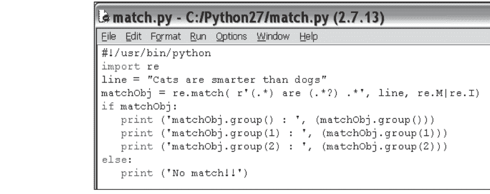

**输出**

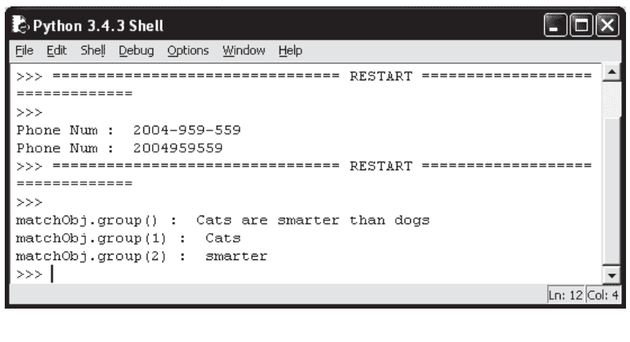

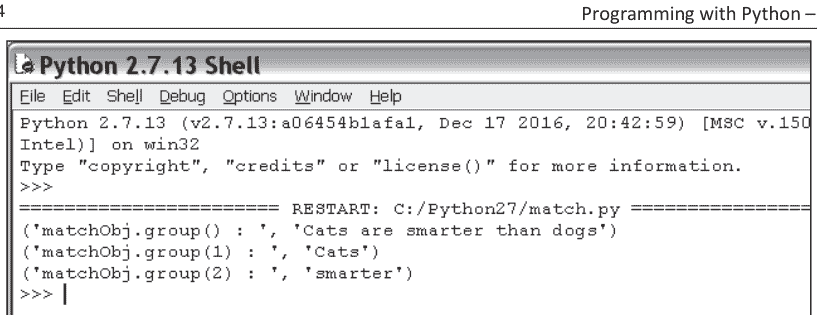

#### 3.5.2 search() 方法
此函数在字符串中搜索 RE 模式的第一次出现，可以使用可选标志。

该函数的语法如下：

`re.search(pattern, string, flags=0)`

参数说明如下：

| 参数 | 描述 |
| --- | --- |
| **pattern** | 这是要匹配的正则表达式。 |
| **string** | 这是要搜索的字符串，将在字符串中的任何位置匹配模式。 |
| **flags** | 你可以使用按位或 (|) 指定不同的标志。这些是修饰符，列于下表。 |

`re.search` 函数成功时返回一个匹配对象。我们将使用匹配对象的 `group(num)` 或 `groups()` 函数来获取匹配的表达式。

| 匹配对象方法 | 描述 |
| --- | --- |
| **group(num=0)** | 此方法返回整个匹配（或特定的子组 num）。 |
| **groups()** | 此方法以元组形式返回所有匹配的子组（如果没有则为空）。 |

##### search 函数示例

**代码**

```python
#!/usr/bin/python
import re

line = "Cats are smarter than dogs";
searchObj = re.search( r'(.*) are (.*?) .*', line, re.M|re.I)

if searchObj:
    print ('searchObj.group() : ', (searchObj.group()))
    print ('searchObj.group(1) : ', (searchObj.group(1)))
    print ('searchObj.group(2) : ', (searchObj.group(2)))
else:
    print ('Nothing found!!')
```

**输出**

```
==================
>>>
matchObj.group() : Cats are smarter than dogs
matchObj.group(1) : Cats
matchObj.group(2) : smarter
>>> ================== RESTART ==================
==================
>>>
searchObj.group() : Cats are smarter than dogs
searchObj.group(1) : Cats
searchObj.group(2) : smarter
>>> |
```

```
Python 2.7.13 (v2.7.13:a06454b1afa1, Dec 17 2016, 20:42:59) [MSC v.1500 32 bit (Intel)] on win32
Type "copyright", "credits" or "license()" for more information.
>>>
================== RESTART: C:/Python27/search.py ==================
('searchObj.group() : ', 'Cats are smarter than dogs')
('searchObj.group(1) : ', 'Cats')
('searchObj.group(2) : ', 'smarter')
>>> |
```

### 3.5.3 replace() 方法

`replace()` 方法返回字符串的一个副本，其中所有出现的 `old` 子字符串都被替换为 `new`，并且可选地将替换次数限制为 `max`。

### 语法

```
str.replace(old, new[, max])
```

### 参数

- **old**：这是要被替换的旧子字符串。
- **new**：这是新子字符串，它将替换旧子字符串。
- **max**：如果提供了这个可选参数 `max`，则只有前 `count` 次出现会被替换。

### 示例

以下示例展示了 `replace()` 方法的用法。此代码适用于 python2.7 版本。


当我们运行上面的程序时，它会产生以下结果：


### 3.6 匹配与搜索

**`match()` 与 `search()` 对比**

**`match()`** 函数仅检查正则表达式（RE）是否在字符串的开头匹配，而 **`search()`** 会向前扫描字符串以查找匹配项。`match()` 仅报告从位置 0 开始的成功匹配；如果匹配不会从位置 0 开始，`match()` 将不会报告它。

```
>>> print(re.match('super', 'superstition').span())
(0, 5)
```

```
>>> print(re.match('super', 'insuperable'))
None
```

**另一方面，`search()` 会向前扫描字符串，报告它找到的第一个匹配项。**

```
>>> print(re.search('super', 'superstition').span())
(0, 5)
```

```
>>> print(re.search('super', 'insuperable').span())
(2, 7)
```

#### 匹配与搜索的示例

###### 代码

```
#!/usr/bin/python
import re
line = "Cats are smarter than dogs";
matchObj = re.match( r'dogs', line, re.M|re.I)
if matchObj:
    print ('match --> matchObj.group() : ', matchObj.group( ))
else:
    print ('No match!!')
searchObj = re.search( r'dogs', line, re.M|re.I)
if searchObj:
    print ('search --> searchObj.group() : ', searchObj.group( ))
else:
    print ('Nothing found!!')
```

```
python
#!/usr/bin/python
import re
line = "Cats are smarter than dogs";
matchObj = re.match( r'dogs', line, re.M|re.I)
if matchObj:
    print ('match --> matchObj.group() : ', matchObj.group())
else:
    print ('No match!!')
searchObj = re.search( r'dogs', line, re.M|re.I)
if searchObj:
    print ('search --> searchObj.group() : ', searchObj.group())
else:
    print ('Nothing found!!')
```

### 输出

```
>>> ======================== RESTART ========================

>>> 
searchObj.group() :  Cats are smarter than dogs
searchObj.group(1) :  Cats
searchObj.group(2) :  smarter
>>> ======================== RESTART ========================

>>> 
No match!!
search --> searchObj.group() :  dogs
>>> 
```

```
Python 2.7.13 (v2.7.13:a06454b1afaf, Dec 17 2016, 20:42:59) [MSC v.1500 32 bit (Intel)] on win32
Type "copyright", "credits" or "license()" for more information.
>>> ======================== RESTART: C:/Python27/matchserach.py ========================
No match!!
('search --> searchObj.group() : ', 'dogs')
>>> 
```

### 3.7 正则表达式搜索与替换简介

#### 搜索与替换

一些使用正则表达式的最重要的 `re` 方法是 `sub`。

### 语法

```
re.sub(pattern, repl, string, max=0)
```

此方法将字符串中所有匹配正则表达式模式的出现替换为 `repl`，除非提供了 `max`，否则会替换所有出现。此方法将返回修改后的字符串。

##### 搜索与替换的示例

###### 代码

```
#!/usr/bin/python
import re
phone = "2004-959-559 # This is Phone Number"
# Delete Python-style comments
num = re.sub(r'#.*$', '', phone)
print ('Phone Num : ', (num))
# Remove anything other than digits
num = re.sub(r'\D', '', phone)
print ('Phone Num : ', (num))
```

### 输出


### 3.8 正则表达式修饰符 – 选项标志

正则表达式字面量可以包含一个可选的修饰符，以控制匹配的各个方面。修饰符作为可选的标志指定。你可以使用异或（|）提供多个修饰符，如前所述，并且可以由以下之一表示：

| 修饰符 | 描述 |
|---|---|
| re.I | 执行不区分大小写的匹配。 |
| re.L | 根据当前区域设置解释单词。这种解释影响字母分组（`\w` 和 `\W`）以及单词边界行为（`\b` 和 `\B`）。 |
| re.M | 使 `$` 匹配行的结尾（而不仅仅是字符串的结尾），并使 `^` 匹配任何行的开头（而不仅仅是字符串的开头）。 |
| re.S | 使句点（点）匹配任何字符，包括换行符。 |
| re.U | 根据 Unicode 字符集解释字母。此标志影响 `\w`、`\W`、`\b`、`\B` 的行为。 |
| re.X | 允许“更简洁的”正则表达式语法。它忽略空格（除非在集合 `[]` 内或被反斜杠转义），并将未转义的 `#` 视为注释标记。 |

### 3.9 问题

1.  解释 Python 中使用的不同正则表达式。
2.  使用编译标志定义正则表达式模式。
3.  解释什么是正则表达式？定义所有正则表达式模式。
4.  详细解释 `re` 模块。
5.  解释正则表达式的不同方法。
6.  用合适的示例解释 `match()` 和 `search()` 方法。
7.  列出不同类型的正则表达式。解释每种类型。
8.  用合适的示例解释 `search()` 和 `replace()` 方法。
9.  解释匹配与搜索之间的区别。
10. 解释搜索与替换之间的区别。
11. 解释带选项标志的正则表达式修饰符。

# 第4章
## Python GUI 编程

### 结构

- 4.1 什么是 GUI？
    - 4.1.1 什么是 GUI？
    - 4.1.2 GUI 的优点
    - 4.1.3 GUI 的缺点
- 4.2 GUI 简介
    - 4.2.1 图形库
- 4.3 布局管理
    - 4.3.1 Pack 布局
    - 4.3.2 Grid 布局
- 4.4 事件与绑定
    - 4.4.1 绑定事件
    - 4.4.2 运动事件
- 4.5 在画布上绘图
    - 4.5.1 Canvas 小部件选项
    - 4.5.2 Canvas 项目
    - 4.5.3 如何绘制画布？
    - 4.5.4 如何使用 Python 绘制椭圆？
    - 4.5.5 如何使用 Canvas 绘制线条？
    - 4.5.6 如何使用 Canvas 绘制矩形？
    - 4.5.7 如何使用 Canvas 绘制多边形？
    - 4.5.8 画布中的坐标系
- 4.6 小部件
    - 4.6.1 Button 小部件
    - 4.6.2 Radio Button 小部件
    - 4.6.3 Checkbox 小部件
    - 4.6.4 Entry 小部件
    - 4.6.5 List box 小部件
    - 4.6.6 Frame 小部件
    - 4.6.7 Label 小部件
    - 4.6.8 Spinbox 小部件
    - 4.6.9 Textbox 小部件
    - 4.6.10 带图像的 Text 小部件
- 4.7 问题

## 4.1 什么是 GUI？

GUI 的全称是 **图形用户界面**，它是一种利用计算机图形功能使程序/脚本易于使用的程序接口。GUI 最好的例子是我们的 Microsoft Windows。

第一个图形用户界面由施乐公司帕洛阿尔托研究中心在 20 世纪 70 年代设计，但直到 20 世纪 80 年代苹果 Macintosh 的出现，图形用户界面才变得流行。它们被接受缓慢的一个原因是它们需要相当大的 CPU 能力和高质量的显示器，这在当时是极其昂贵的。

我们可以说 GUI 是一种用作计算机及其用户之间接口的软件，它使用图形元素，如对话框、图标、菜单、滚动条等。

Python 为开发图形用户界面（GUI）提供了各种选项。最重要的如下所列。

- tkinter：tkinter 是 Python 附带的 Tk GUI 工具包的 Python 接口。tkinter 是 Python 的标准 GUI 库。Python 与 tkinter 结合使用，提供了一种快速简便的方法来创建 GUI 应用程序。tkinter 为 Tk GUI 工具包提供了强大的面向对象接口。
- wxPython：这是 wxWindows 的开源 Python 接口 http://wxpython.org。
- JPython：JPython 是 Python 的 Java 移植版，它使 Python 脚本能够无缝访问本地机器上的 Java 类库 http://www.jython.org。

### 4.1.2 GUI 的优点

1.  使用 GUI，我们无需事先了解知识就可以节省配置任何驱动程序或软件的大量时间。
2.  借助 GUI 应用程序，每个人都可以使用计算机，而无需记住命令。
3.  大多数普通用户使用 GUI 的学习曲线会更小。
4.  GUI 允许计算机用户使用视觉元素，如桌面图标，来导航和操作软件。

### 4.1.3 GUI 的缺点

1.  如果构建不当，使用起来可能会非常困难。
2.  与非图形界面相比，GUI 需要更多的内存资源。
3.  它可能需要安装额外的软件，例如，在 Java 的情况下需要 "运行环境"。
4.  在 GUI 中没有搜索选项。
5.  GUI 的主要缺点是你只能执行应用程序/程序中预定义的操作，无法从你的端输入任何单条命令。

## 4.2. Python 中的 GUI 库简介

### 4.2.1 图形库

*图形库*

-   Pyglet
-   Bottle
-   Invoke
-   Splinter
-   Arrow
-   Peewee

*GUI 库*

Tkinter Python 的标准构建包含一个面向对象的接口，用于 Tcl/Tk 控件集，称为 **tkinter**。

Tkinter 框架传统上随 Python 捆绑，它使用 Tk。可用的框架完整列表可在此处查看：[Python GUI 编程](https://docs.python.org/3/library/tkinter.html)。Tkinter 是用于 Tk GUI 工具包的标准 Python 接口（Tk 接口）。Tk 接口模块也包含许多其他模块。

当你使用 Python 2.7.x 版本时，必须将 **Tkinter** 的首字母大写，如果你使用更高版本如 3.4.x，则使用 **tkinter**。

在本书中，我们同时使用 2.7.x 和 3.4.x 版本，因此我们会在书中适时地指示哪个特定版本用于哪个程序。

现在，我们将通过示例逐步介绍 Python 库，以便你熟悉每一个相关的库。

## Pyglet

Pyglet 是一个跨平台的多媒体和窗口图形框架，使用纯 Python 实现。

## 在 Python 中使用 Pyglet

我们可以将其用于窗口函数、OpenGL 图形、音频和视频播放、键盘和鼠标处理以及图像文件操作。

## Bottle

Bottle 是一个微小、轻量级的 Web 框架。

## 在 Python 中使用 Bottle

Bottle 用于路由、模板、访问请求和响应数据、支持从普通 CGI 到更高级的多种服务器类型，并支持 WebSockets 等更高级的功能。

## Invoke

Invoke 允许你使用 Python 库执行管理任务。

## 在 Python 中使用 Invoke

Invoke 为管理命令行任务提供了常识性的解决方案，并将它们视为 Python 函数进行管理，允许围绕它们优雅地构建更大的项目。

## Splinter

Splinter 是一个用于通过自动化交互来测试 Web 应用程序的 Python 库。

## 在 Python 中使用 Splinter

Splinter 自动化端到端的一切，包括调用浏览器、传递 URL、填写表单、点击按钮等。

它需要特定浏览器的驱动程序，但 Chrome 和 Firefox 已经内置支持，并且可以使用 Selenium Remote 控制在其他地方运行的浏览器。

如果你想了解特定浏览器在面对给定网站时的行为，Splinter 很有用。

## Arrow

Arrow 库理清了 Python 日期/时间处理中的混乱。

## 在 Python 中使用 Arrow

处理时区、日期转换、日期格式等所有问题都是令人头疼的双重难题。使用 Python 的标准库进行日期/时间工作，你会面临双重头疼。

## Peewee

Peewee 是一个小型但功能强大的数据库访问库，原生支持 MySQL 等。

## 在 Python 中使用 Peewee

Peewee 提供了一条安全、程序化的路径来访问数据库资源，使用一组 Python 类。借助 Peewee，一种快速简陋的数据库访问方式可以在之后扩展为更强大的选项，而无需推倒重来。

## 4.3. 布局管理器

Python Tkinter GUI 为我们提供了灵活性和对组件布局的完全控制。为此，它提供了三种类型的布局管理器：最简单的是 Pack 布局管理器，更符合逻辑的是 grid 布局管理器，还有 place 布局管理器。这些布局管理器有助于在屏幕上排列、管理、控制和注册不同的 Python tkinter 组件。外观取决于所使用的操作系统，但基本结构保持不变。需要注意的一点是，Pack、grid 和 Place 永远不会在一个窗口中混合使用。

### 4.3.1 Pack 布局

```python
from tkinter import *
master = Tk()
Label(master, text="Python", bg="blue", fg="white").pack()
Label(master, text="Linux  ", bg="black", fg="white").pack()
Label(master, text="Java  ", bg="pink", fg="black").pack()
mainloop()
```


### 4.3.2 Grid 布局

```python
from tkinter import *
bg = ['pink','brown','indigo','teal','red','yellow']
counter = 0
for color in bg:
    Label(text=color, relief=RIDGE, width=23).grid(row=counter, column=0)
    Entry(bg=color, relief=SUNKEN, width=18).grid(row=counter, column=1)
    counter += 1
```


## 4.4. 事件与绑定

### 事件

在计算中，事件是一个通常由程序外部发起的动作，由程序内部的一段代码处理。例如，事件包括鼠标点击、鼠标移动或用户的按键操作，即他或她在键盘上按下一个键。另一个来源可以是硬件设备，如计时器。

### 4.4.1 绑定事件

事件以字符串形式给出，使用特殊的事件语法：
`<修饰符-类型-详情>`
类型字段是事件说明符最重要的部分。它指定了我们希望绑定的事件类型，可以是像 *Button* 和 *Key* 这样的用户操作，也可以是像 *Enter*、*Configure* 等窗口管理器事件。

#### 绑定

绑定仅适用于单个组件；如果你创建新的框架，它们不会继承这些绑定。但 tkinter 也允许你在类和应用程序级别创建绑定；实际上，你可以在四个不同级别创建绑定：

-   组件实例，使用 `bind`。
-   组件的顶层窗口（Toplevel 或根窗口），也使用 `bind`。
-   组件类，使用 `bind_class`（Tkinter 用此提供标准绑定）。
-   整个应用程序，使用 `bind_all`。

例如，你可以使用 bind_all 为 F1 键创建绑定，这样你就可以在应用程序的任何地方提供帮助。但如果你为同一个键创建多个绑定，或者提供重叠的绑定会发生什么呢？首先，在这四个级别中的每一个，tkinter 都会选择可用绑定中“最接近匹配”的那个。例如，如果你为 `<Key>` 和 `<Return>` 事件创建了实例绑定，那么当你按下 **Enter** 键时，只有第二个绑定会被调用。

一个 tkinter 应用程序大部分时间都在事件循环内部度过（通过 mainloop 方法进入）。事件可以来自各种来源，包括用户的按键和鼠标操作。对于每个组件，你可以将 Python 函数和方法绑定到事件。

```python
widget.bind(event, handler)
```

如果在组件中发生了匹配 *event* 描述的事件，则会调用给定的 *handler*，并传递一个描述该事件的对象。

### 4.4.1 绑定事件

#### 4.4.2 移动事件

### 示例

##### 绑定事件

程序名：eventnbind.py


### 输出


在上面的程序中，我们创建了一个按钮组件，它绑定到一个名为 hello 的函数，另一个名为 quit 的函数在我们双击鼠标时被激活，此时程序终止，我们得到 Python 提示符，即 >>>

#### 4.4.2 移动事件

```python
from tkinter import *

def motion(event):
    print("Mouse position: (%s %s)" % (event.x, event.y))
    return

master = Tk()
motion_event = "If you want knowledge you work hard"

msg = Message(master, text = motion_event)
msg.config(bg='lightgreen', font=('times', 24, 'italic'))
msg.bind('<Motion>',motion)
msg.pack()
mainloop()
```

### 输出

在移动事件程序中，我们首先创建一个 motion 组件，然后将其绑定到名为 motion(event) 的函数，这里我们借助该函数显示精确的鼠标坐标，即 x，y鼠标位置信息：event.x, event.y。同时我们定义背景为绿色（bg='lightgreen'），字体大小和名称分别为24和times。


## 4.5. 在画布上绘制

Canvas（画布）组件为Tkinter提供了结构化的图形功能。这是一个用途非常广泛的组件，可用于绘制图表和图形、创建图形编辑器，以及实现各种自定义组件。它类似于一个用于绘制图形或其他复杂布局的矩形区域。

### 语法

```
c = Canvas(master, option=value,...)
```

### 参数

master = 表示父窗口
option= 有许多可用选项，如下表所示

### 4.5.1 Canvas组件选项

| 参数 | 描述 |
| :--- | :--- |
| bd 或 borderwidth | 画布边框的宽度；默认值为两个像素。 |
| bg 或 background | 画布的背景颜色。默认是浅灰色，大约为'#E4E4E4'。 |
| closeenough | 一个浮点数，指定鼠标距离项目多近时被认为在该项目内部。默认值为1.0。 |
| confine | 如果为true（默认值），则画布不能滚动到scrollregion（见下文）之外。 |
| cursor | 在画布中使用的光标。 |
| height | 画布在Y维度上的尺寸。 |
| highlightbackground | 当组件没有焦点时，焦点高亮显示的颜色。 |
| highlightcolor | 焦点高亮显示中显示的颜色。 |
| highlightthickness | 焦点高亮显示的厚度。默认值为1。 |
| relief | 画布的浮雕样式。默认值为tk.FLAT。 |
| scrollregion | 一个元组 (w, n, e, s)，定义了画布可以滚动的区域范围，其中 w 是左侧，n 是顶部，e 是右侧，s 是底部。 |
| selectbackground | 显示选中项目时使用的背景颜色。 |
| selectborderwidth | 选中项目周围使用的边框宽度。 |
| selectforeground | 显示选中项目时使用的前景颜色。 |
| takefocus | 通常，焦点（参见第53节，“焦点：引导键盘输入”）仅当为组件设置了键盘绑定时，才会通过Tab键循环访问该组件。如果你将此选项设置为1，焦点将始终访问该组件。设置为“0”以获得默认行为。 |
| width | 画布在X维度上的尺寸。 |
| xscrollincrement | 通常，画布可以水平滚动到任何位置。通过将xscrollincrement设置为零，你可以获得此行为。如果你将此选项设置为某个正的尺寸值，则画布只能按该距离的倍数定位，该值将用于滚动单位，例如当用户单击滚动条两端的箭头时。有关滚动单位的更多信息，请参见第22节“Scrollbar组件”。 |
| xscrollcommand | 如果画布可滚动，请将此选项设置为水平滚动条的.set()方法。 |
| yscrollincrement | 工作方式类似于xscrollincrement，但管理垂直移动。 |
| yscrollcommand | 如果画布可滚动，此选项应为垂直滚动条的.set()方法。 |

### 4.5.2 Canvas项目

Canvas组件支持以下标准项目：
- line（直线）
- oval（圆形或椭圆形）
- rectangle（矩形）
- polygon（多边形）
- text（文本）
- window（窗口）
- arc（弧形、弦形或扇形）
- bitmap（内置或从XBM文件读取的位图）
- image（BitmapImage或PhotoImage实例）

- 要在画布中绘制东西，请使用create方法添加新项目。
- 要在画布上显示东西，我们创建一个或多个画布项目，它们被放置在一个堆栈中。默认情况下，新项目绘制在画布上已有项目的顶部。
- tkinter提供了许多方法，允许你以各种方式操作这些项目。
- 除了其他功能外，你还可以将事件回调绑定到单个画布项目上。
- 通过滚动画布，你可以指定画布坐标系的哪一部分在窗口中显示。

### 4.5.3 如何绘制画布？

以下程序将阐明如何定义画布及其标题？


在上面的程序中，画布的宽度是300，因为如果小于300，标题可能无法正确显示或完全消失，高度设置为100，这是根据程序的要求。为了在窗口顶部激活标题，我们使用Tkinter接口c（c = Tk( )）后跟标题，即 My canvas program。

### 4.5.5 如何使用Canvas绘制线条？

要绘制水平线，请输入下面的程序，执行脚本/程序后，我们将得到一条水平的直线输出。在下面的程序中，我们预定义了画布宽度和高度为80X40，然后我们使用一个名为y的变量，用于在中心绘制线条。

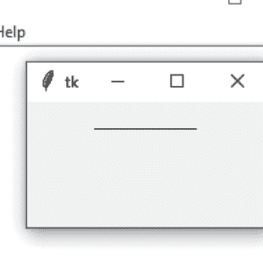

### 4.5.4 如何使用Python绘制椭圆？

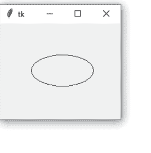

从上面的程序可以很容易地在一秒钟内绘制椭圆。这里我们定义了画布高度=190，宽度=150，并使用坐标50,50,150,100。

### 4.5.4 如何使用画布绘制矩形？

使用以下程序绘制矩形


在上面的程序中，将画布宽度定义为200，高度定义为100，现在定义坐标x1,y1,x2,y2为50,20,150,80，并填充颜色为蓝色。

### 4.5.7 如何使用画布绘制多边形？


现在我们将画布的高度和宽度都定义为150，并使用黑色作为边框颜色，如上面输出所示。然后使用fill='red'将多边形颜色填充为红色，最后我们定义边框宽度为5，因此你会看到一个粗黑边框，因为width=5。

### 4.5.8 画布中的坐标系

Canvas组件使用两种坐标系：窗口坐标系（左上角为(0, 0)），以及指定项目绘制位置的画布坐标系。通过滚动画布，你可以指定画布坐标系的哪一部分在窗口中显示。

*scrollregion*选项用于限制画布的滚动操作。要设置它，我们通常可以使用：

```
canvas.config(scrollregion=canvas.bbox(ALL))
```

要将窗口坐标转换为画布坐标，使用canvasx和canvasy方法。

bbox(item=None)
返回所有匹配项目的边界框。如果省略标签，则返回所有项目的边界框。请注意，边界框是近似的，可能与真实值相差几个像素。
item
项目说明符。如果省略，则指画布上所有元素的边界框。

Canvas组件还提供两个预定义标签：
ALL（或字符串“all”）匹配画布上的所有项目。
CURRENT（或“current”）匹配鼠标指针下的项目（如果有的话）。这可以在鼠标事件绑定中使用，以引用触发回调的项目。

```
canvasx(x, gridspacing=None) [#]
    将窗口坐标转换为画布坐标。即 x
    屏幕坐标。
    Gridspacing：可选的网格间距。坐标将四舍五入到最近的网格坐标。
返回：
    画布坐标。
```

```
canvasy(y, gridspacing=None) [#]
    将窗口坐标转换为画布坐标。即 y
    屏幕坐标。
    gridspacing：可选的网格间距。坐标将四舍五入到最近的网格坐标。
返回：
    画布坐标。
```

## 4.6 Python组件

### 组件

### 使用Tkinter创建GUI组件

组件是GUI的一个部分——按钮、标签和文本框都是组件。大多数组件在屏幕上都有图形表示，但有些组件，如表格和方框，仅用于包含其他组件并将其排列在屏幕上。

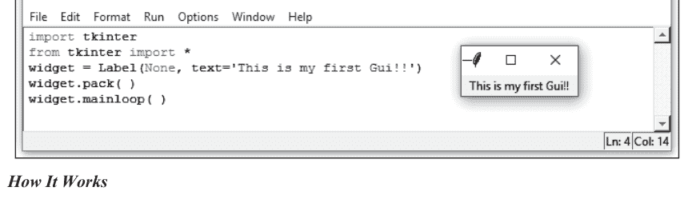

### 工作原理

第一行导入Tkinter模块。接下来，你可以从Tkinter导入Label，或者像示例中那样简单地从Tkinter导入所有(*)。之后，你为每个组件（本例中为Label）创建一个对象。然后将Label安排在父窗口中。最后，显示该组件。

组件构建工具包（WCK）是一个简单的编程接口，可用于在Python中创建新的组件。WCK目前可用于tkinter库，但为其他环境实现是完全可能的。要创建一个更具表现力的组件，你需要创建Widget基类的子类，并实现必要的绘制和事件处理方法。

tkinter GUI的主要单元是一个组件。你可以使用Tk提供的“内置”组件，创建自己的组件，或者安装定义了额外组件的扩展包。

### 调整组件大小

默认情况下，组件有一个内置的最小化和最大化按钮，以及一个用于关闭窗口的“X”按钮。此外，我们可以拉伸窗口。

当你运行这个程序时，尝试调整窗口大小；你会看到“My first GUI!”标签无论窗口如何变化都保持居中，如下图所示。

## *上述程序解释：*

在上述程序中，我们将 `expand` 的值设为 `Yes`，`fill` 的值设为 `Both`。这告知 Python 在父窗口扩展时也扩展该部件。默认情况下，此选项是关闭的。

## *配置部件选项*

在此示例中，你创建了相同的父窗口和相同的标签。然而，你并不是在创建它们的同时设置选项，而是等待它们创建完成后再进行设置：

```
import tkinter
from tkinter import *
root = Tk()

widget = Label(root)
widget.config(text='My first GUI!')
widget.pack(side=TOP, expand=YES, fill=BOTH)
root.mainloop()
```

在这个示例中，你调用了 `configure` 方法来实现与上一个示例相同的结果。如果你愿意，可以在程序后续更改部件的外观。例如，或许用户希望改变窗口的样子。你可以插入一个按钮，该按钮触发 `configure` 方法，从而改变你的部件选项。现在我们来详细看看不同的部件。

### 4.6.1 按钮部件

按钮部件是标准的 tkinter 部件，用于实现各种类型的按钮。按钮可以包含文本或图像，并且你可以将一个 Python 函数或方法与每个按钮关联。当按钮被按下时，tkinter 会自动调用该函数或方法。按钮只能以单一字体显示文本，但文本可以跨多行。默认情况下，可以使用 Tab 键切换到按钮部件。按钮主要用于应用程序、工具栏，并且在对话框中常用于接受或不接受特定信息。现在我们来看一个如何借助简单程序创建简单按钮和点击事件的例子。

```
python
from tkinter import *
bt = Tk()

def display():
    print("OK button click!")

b = Button(bt, text="OK", command=display)
b.pack()

mainloop()
```

(运行界面显示 OK 按钮窗口)

在上面的程序中，我们使用变量 `b` 定义了按钮部件，将文本定义为 `OK`，并在 `command=display` 中调用了名为 `display` 的函数。这将调用该函数，当你按下 OK 按钮时，它会显示 **OK button click!**

现在我们来看按钮部件使用的各种选项如下：

-   `activeforeground=` 按钮处于活动状态时使用的前景颜色。
-   `activebackground=` 按钮处于活动状态时使用的背景颜色。
-   `font=` 按钮中使用的字体。
-   `height=` 按钮的高度。
-   `width=` 按钮的宽度。
-   `relief=` 边框装饰。通常，按钮按下时为 `SUNKEN`（凹陷），否则为 `RAISED`（凸起）。其他可能的值有 `GROOVE`（凹槽）、`RIDGE`（脊状）和 `FLAT`（平面）。默认值是 `RAISED`。
-   `bd=` 与 `borderwidth`（边框宽度）相同。
-   `fg=` 与 `foreground`（前景）相同。

所有上述选项都在以下程序中使用。

程序名：**button.py**

```
from tkinter import *
bt = Tk()

def display():
    print("OK button click!")

b=Button(bt, relief=RAISED, font='Arial', underline=1, bd=3, text="OK", activeforeground="red", fg="blue", height=1, width=5)

b.pack()
mainloop()
```

### 4.6.2 单选按钮部件

单选按钮是标准的 tkinter 部件，用于实现多选一的选项。单选按钮可以包含文本或图像，并且你可以将一个 Python 函数或方法与每个按钮关联。当按钮被按下时，Tkinter 会自动调用该函数或方法。

单选按钮，有时也称为选项按钮，是 tkinter 的图形用户界面元素，允许用户从一组预定义的选项中选择（确切地说）一个。它可以包含文本或图像。

在上面的程序中，我们定义了两个名为 `Python` 和 `Linux` 的单选按钮，其初始的 `padx` 值设为 20，标签对齐方式为 `LEFT`，最后通过 `mainloop()` 调用主窗口。

*语法*
`w= tk.Radiobutton(master, option, ...)`

| 选项 | 描述 |
|--------|-------------|
| `activebackground` | 鼠标悬停在单选按钮上时的背景颜色。 |
| `activeforeground` | 鼠标悬停在单选按钮上时的前景颜色。 |
| `anchor` | 如果部件占据的空间大于其所需空间，此选项指定单选按钮在该空间中的位置。默认值是 `anchor=tk.CENTER`。例如，如果你设置 `anchor=tk.NE`，单选按钮将放置在可用空间的右上角。 |
| `bg` 或 `background` | 指示器和标签背后的常规背景颜色。 |
| `bitmap` | 要在单选按钮上显示单色图像，请将此选项设置为一个位图。 |
| `bd` 或 `borderwidth` | 指示器部分周围的边框大小。默认值是两个像素。可能的值，请参见第 5.1 节“尺寸”。 |
| `command` | 每次用户更改此单选按钮状态时要调用的过程。 |
| `cursor` | 如果你将此选项设置为光标名称，当鼠标光标悬停在单选按钮上时，鼠标光标将变为该图案。 |
| `font` | 用于文本的字体。 |
| `fg` 或 `foreground` | 用于渲染文本的颜色。 |
| `height` | 单选按钮上文本的行数（不是像素）。默认值是 1。 |
| `highlightbackground` | 当单选按钮没有焦点时，焦点高亮的颜色。 |
| `highlightcolor` | 当单选按钮拥有焦点时，焦点高亮的颜色。 |
| `highlightthickness` | 焦点高亮的厚度。默认值是 1。设置 `highlightthickness=0` 可以隐藏焦点高亮的显示。 |
| `image` | 要为此单选按钮显示图形图像而非文本，请将此选项设置为一个图像对象。请参见第 5.9 节“图像”。图像在单选按钮未被选中时显示；与下面的 `selectimage` 比较。 |
| `indicatoron` | 通常，单选按钮会显示其指示器。如果你将此选项设置为 0，指示器将消失，整个部件变成一个“按-按”按钮，当清除时看起来凸起，当设置时看起来凹陷。你可能需要增加 `borderwidth` 的值以便更容易看清该控件的状态。 |
| `justify` | 如果文本包含多行，此选项控制文本的对齐方式：`tk.CENTER`（默认）、`tk.LEFT` 或 `tk.RIGHT`。 |
| `offrelief` | 如果你通过声明 `indicatoron=False` 隐藏了指示器，`offrelief` 选项指定单选按钮未被选中时显示的浮雕样式。默认值是 `tk.RAISED`。 |
| `overrelief` | 指定鼠标悬停在单选按钮上时显示的浮雕样式。 |
| `padx` | 单选按钮和文本左右两侧的间距。默认值是 1。 |
| `pady` | 单选按钮和文本上下的间距。默认值是 1。 |
| `relief` | 默认情况下，单选按钮的浮雕为 `tk.FLAT`，因此不会从其背景中突出。要获得更多 3D 效果的选项，你也可以使用 `relief=tk.SOLID`，这会在单选按钮周围显示一个实心的黑色边框。 |
| `selectimage` | 如果你使用 `image` 选项在单选按钮清除时显示图形而非文本，你可以将 `selectimage` 选项设置为不同的图像，该图像将在单选按钮被选中时显示。 |
| `state` | 默认值是 `state=tk.NORMAL`，但你可以设置 `state=tk.DISABLED` 使控件灰显且无响应。如果光标当前悬停在单选按钮上，状态为 `tk.ACTIVE`。 |
| `takefocus` | 默认情况下，输入会通过单选按钮。如果你设置 `takefocus=0`，焦点将不会访问此单选按钮。 |
| `text` | 单选按钮旁边显示的标签。使用换行符 (`'\n'`) 来显示多行文本。 |
| `textvariable` | 如果你需要在执行期间更改单选按钮上的标签，请创建一个 `StringVar` 来管理当前值，并将此选项设置为该控制变量。每当控制变量的值改变时，单选按钮的注释也会自动更改为该文本。 |
| `underline` | 默认值为 -1，文本标签中没有字符被加下划线。将此选项设置为文本中字符的索引（从零开始）以给该字符加下划线。 |
| `value` | 当用户选中单选按钮时，其控制变量将被设置为其当前的 `value` 选项值。如果控制变量是 `IntVar`，则为组中的每个单选按钮分配不同的整数 `value` 选项。如果控制变量是 `StringVar`，则为每个单选按钮分配不同的字符串 `value` 选项。 |
| `variable` | 此单选按钮与组中其他单选按钮共享的控制变量。 |
| `width` | 单选按钮的默认宽度由显示的图像或文本的大小决定。你可以将此选项设置为字符数（不是像素），单选按钮将始终为这么多字符保留空间。 |
| `wraplength` | 通常，行不会换行。你可以将此选项设置为字符数，所有行都将被分割成不超过该数字长度的片段。 |

第一个演示单选按钮部件的基础程序：

```
python
from tkinter import *

rb = Tk()

r = IntVar()

Label(rb,
        text="Choose a programming language:",
        justify = LEFT,
        padx = 20).pack()
Radiobutton(rb, text="Python",
            padx = 20,
            variable=r,
            value=1).pack(anchor=W)
Radiobutton(rb, text="Linux",
            padx = 20,
            variable=r,
            value=2).pack(anchor=W)
mainloop()
```


在上面的示例中，我们使用了多个“语言”单选按钮，它们包含按钮文本和相应的值。借助 `for` 循环创建了所有单选按钮。

## 4.6.3 复选框控件

复选框控件用于向用户显示多个选项，用户可以选择一个或多个选项。我们也可以使用图像来代替文本显示。

### 语法

```
w = Checkbutton(master, option, ...)
```

### 参数

- **master**：表示父窗口。
- **options**：以下是该控件最常用选项的列表：

| 选项 | 描述 |
|---|---|
| activebackground | 当复选框位于光标下时的背景色。 |
| activeforeground | 当复选框位于光标下时的前景色。 |
| bg | 标签和指示器后面显示的正常背景色。 |
| bitmap | 在按钮上显示单色图像。 |
| bd | 指示器周围边框的大小。默认为 2 像素。 |
| command | 每次用户更改此复选框状态时要调用的过程。 |
| cursor | 如果将此选项设置为光标名称（箭头、点等），当鼠标位于复选框上时，鼠标光标将更改为该图案。 |
| font | 用于文本的字体。 |
| fg | 用于渲染文本的颜色。 |
| height | 复选框上文本的行数。默认为 1。 |
| highlightcolor | 当复选框获得焦点时，焦点高亮的颜色。 |
| image | 在按钮上显示图形图像。 |
| justify | 如果文本包含多行，此选项控制文本的对齐方式：CENTER、LEFT 或 RIGHT。 |
| offvalue | 通常，当复选框被清除（关闭）时，其关联的控制变量将设置为 0。你可以通过将 offvalue 设置为该值来提供关闭状态的替代值。 |
| onvalue | 通常，当复选框被选中（打开）时，其关联的控制变量将设置为 1。你可以通过将 onvalue 设置为该值来提供打开状态的替代值。 |
| padx | 复选框和文本左右两侧留出的空间。默认为 1 像素。 |
| pady | 复选框和文本上下两侧留出的空间。默认为 1 像素。 |
| relief | 使用默认值 relief=FLAT 时，复选框不会从其背景中突出显示。你可以将此选项设置为任何其他样式。 |
| state | 默认值为 state=NORMAL，但你可以使用 state=DISABLED 使控件变灰并使其无响应。如果光标当前位于复选框上，则状态为 ACTIVE。 |
| text | 显示在复选框旁边的标签。使用换行符（"\n"）显示多行文本。 |
| underline | 默认值为 -1 时，文本标签的任何字符都不会加下划线。将此选项设置为文本中字符的索引（从零开始计数）以给该字符加下划线。 |
| variable | 跟踪复选框当前状态的控制变量。通常此变量是 IntVar，0 表示清除，1 表示选中，但请参阅上面的 offvalue 和 onvalue 选项。 |
| width | 复选框的默认宽度由显示的图像或文本的大小决定。你可以将此选项设置为字符数，复选框将始终为该数量的字符留出空间。 |
| wraplength | 通常，行不会换行。你可以将此选项设置为字符数，所有行将被分成不超过该数量的片段。 |

复选框控件最常用的方法：

| 方法 | 描述 |
| --- | --- |
| deselect() | 清除（关闭）复选框。 |
| flash() | 在活动颜色和正常颜色之间闪烁复选框几次，但保持其初始状态。 |
| invoke() | 你可以调用此方法来获得与用户单击复选框以更改其状态时相同的操作。 |
| select() | 设置（打开）复选框。 |
| toggle() | 如果已选中则清除复选框，如果已清除则设置它。 |

让我们逐行查看程序。

```python
from tkinter import *
cb = Tk()
```

导入 tkinter 并调用 cb 控件以控制我们程序中的整个 GUI 框架。

**var1 = IntVar()**
var1 是一个变量，我们可以用不同的方式命名它，比如 check_1 等。但最好命名一个能解释其用途的变量。

**var2 = IntVar()**
在 Python GUI 中声明第二个变量。

```python
Checkbutton(cb, text="Male", variable=var1).grid(row=0, sticky=W)
```

这是实际创建和放置复选框的代码部分。Checkbutton 是一个函数/方法，它接受主控件作为参数，一个显示在复选框旁边的文本字符串，以及一个用于存储复选框值的变量。grid 是复选框在主 GUI 上的放置方式。如果我们更改行位置，它会相应地更改复选框。Row=0 表示第一个复选框，依此类推。

```python
Checkbutton(cb, text="Female", variable=var2).grid(row=1, sticky=W)
```

创建第二个复选框，就像第一个一样。

## 4.6.4 输入框控件

**输入框**控件是标准的 tkinter 控件，用于输入或显示单行文本。如果你想输入多行文本，必须使用文本控件。输入框控件也仅限于单一字体。

### 语法

```
w = Entry(master, option, ...)
```

"master" 表示父窗口，输入框控件应放置在其中。以逗号分隔的选项列表可以为空。

输入框控件示例。程序名称：**entry.py**

```python
from tkinter import *

master = Tk()
Label(master, text="Enter your First Name").grid(row=0)
Label(master, text="Enter your Last Name").grid(row=1)

e1 = Entry(master)
e2 = Entry(master)

e1.grid(row=0, column=1)
e2.grid(row=1, column=1)

mainloop()
```

## 4.6.5 列表框控件

列表框控件的目的是显示一组文本行。通常，它们旨在允许用户从列表中选择一个或多个项目。所有文本行使用相同的字体。

### 语法

```
w = tk.Listbox(parent, option, ...)
```

### 列表框控件选项

| 选项 | 描述 |
|---|---|
| activestyle | 'underline' 活动行带下划线。这是默认选项。'dotbox' 活动行四周被虚线包围。'none' 活动行没有特殊外观。 |
| bg 或 background | 设置列表框中的背景色。 |
| bd 或 borderwidth | 设置列表框周围边框的宽度。默认为两个像素。 |
| cursor | 设置鼠标位于列表框上时出现的光标。 |
| disabledforeground | 当列表框状态为 tk.DISABLED 时，列表框中文本的颜色。 |
| exportselection | 默认情况下，用户可以用鼠标选择文本，选中的文本将导出到剪贴板。要禁用此行为，请使用 exportselection=0。 |
| font | 用于列表框中文本的字体。 |
| fg 或 foreground | 用于列表框中文本的颜色。 |
| height | 列表框中显示的行数（不是像素！）。默认为 10。 |
| highlightbackground | 当控件没有焦点时，焦点高亮的颜色。 |
| highlightcolor | 当控件获得焦点时，焦点高亮中显示的颜色。 |
| highlightthickness | 焦点高亮的粗细。 |
| relief | 选择三维边框阴影效果。默认为 tk.SUNKEN。 |
| selectbackground | 用于显示选中文本的背景色。 |

## Listbox 对象的方法

| 选项 | 描述 |
| --- | --- |
| delete ( first, last=None ) | 删除索引在 [first, last] 范围内的行。如果省略第二个参数，则删除索引为 first 的单行。 |
| get ( first, last=None ) | 返回一个元组，包含从 first 到 last（含）索引行的文本。如果省略第二个参数，则返回最接近 first 的行的文本。 |
| index ( i ) | 如果可能，调整列表框的可见部分，使包含索引 i 的行位于控件的顶部。 |
| insert ( index, *elements ) | 在列表框中，于 index 指定的行之前插入一行或多行新内容。如果要将新行添加到列表框末尾，请使用 END 作为第一个参数。 |
| nearest ( y ) | 返回相对于列表框控件，y 坐标 y 最近的可见行的索引。 |
| see ( index ) | 调整列表框的位置，使 index 引用的行可见。 |
| size() | 返回列表框中的行数。 |
| xview() | 要使列表框可水平滚动，请将关联水平滚动条的 command 选项设置为此方法。 |
| xview_moveto ( fraction ) | 滚动列表框，使其最长行的左侧 fraction 部分位于列表框左侧之外。Fraction 的范围是 [0,1]。 |
| xview_scroll ( number, what ) | 水平滚动列表框。对于 what 参数，使用 UNITS 按字符滚动，或使用 PAGES 按页滚动（即按列表框的宽度）。number 参数指定滚动的数量。 |

# Listb.py

```python
from tkinter import *
import tkMessageBox
import tkinter
top = Tk()
Lb1 = Listbox(top)
Lb1.insert(1, "List Item-1")
Lb1.insert(2, "List Item-2")
Lb1.insert(3, "List Item-3")
Lb1.pack()
top.mainloop()
```


## 4.6.6 Frame 控件

Frame 基本上只是一个用于容纳其他控件的容器，负责安排其他控件的位置。你的应用程序的根窗口基本上就是一个 Frame。Frame 控件对于分组和组织其他控件的过程非常重要。

### 语法

```python
w = Frame ( master, option, ... )
```

### 参数

- **master**: 这代表父窗口。
- **options**: 这是此控件最常用选项的列表。这些选项可以用逗号分隔的键值对形式使用。

| 选项 | 描述 |
| :--- | :--- |
| bg | 标签和指示器后面显示的正常背景颜色。 |
| bd | 指示器周围边框的大小。默认为 2 像素。 |
| Cursor | 如果将此选项设置为光标名称（箭头、点等），当鼠标悬停在复选按钮上时，鼠标光标将变为该样式。 |
| Height | 新框架的垂直尺寸。 |
| highlightbackground | 当框架没有焦点时，焦点高亮的颜色。 |
| Highlightcolor | 当框架获得焦点时，焦点高亮中显示的颜色。 |
| Highlightthickness | 焦点高亮的厚度。 |
| Relief | 使用默认值 relief=FLAT 时，复选按钮不会从其背景中突出显示。你可以将此选项设置为任何其他样式。 |
| Width | 复选按钮的默认宽度由显示的图像或文本的大小决定。你可以将此选项设置为字符数，复选按钮将始终为该数量的字符留出空间。 |

## *示例：frame.py*


# 4.6.7 Label 控件

Label 是一个 Tkinter 控件类，用于显示文本或图像。Label 是一个用户只能查看而不能交互的控件。

语法

```python
w = Label ( master, option, ... )
```

参数：

- **master:** 这代表父窗口。
- **options:** 这是此控件最常用选项的列表。这些选项可以用逗号分隔的键值对形式使用。

| 选项 | 描述 |
|---|---|
| Anchor | 此选项控制当控件的空间大于文本所需空间时，文本的定位位置。默认为 anchor=CENTER，即将文本置于可用空间的中心。 |
| Bg | 标签和指示器后面显示的正常背景颜色。 |
| Bitmap | 将此选项设置为位图或图像对象，标签将显示该图形。 |
| bd | 指示器周围边框的大小。默认为 2 像素。 |
| Cursor | 如果将此选项设置为光标名称（箭头、点等），当鼠标悬停在复选按钮上时，鼠标光标将变为该样式。 |
| Font | 如果你在此标签中显示文本（使用 text 或 textvariable 选项），font 选项指定该文本将以何种字体显示。 |
| fg | 如果你在此标签中显示文本或位图，此选项指定文本的颜色。如果你显示的是位图，这将是位图中 1 位位置出现的颜色。 |
| Height | 新框架的垂直尺寸。 |
| Image | 要在标签控件中显示静态图像，请将此选项设置为图像对象。 |
| Justify | 指定多行文本如何相互对齐：LEFT 为左对齐，CENTER 为居中对齐（默认），或 RIGHT 为右对齐。 |
| Padx | 在控件内文本左右添加的额外空间。默认为 1。 |
| Pady | 在控件内文本上下添加的额外空间。默认为 1。 |
| Relief | 指定标签周围装饰性边框的外观。默认为 FLAT；其他值请参见。 |
| Text | 要在标签控件中显示一行或多行文本，请将此选项设置为包含文本的字符串。内部换行符（"\n"）将强制换行。 |
| Textvariable | 要将标签控件中显示的文本绑定到 StringVar 类的控制变量，请将此选项设置为该变量。 |
| Underline | 你可以通过将此选项设置为 n（从 0 开始计数），在文本的第 n 个字母下方显示下划线 (_)。默认为 underline=-1，表示不显示下划线。 |
| Width | 标签的宽度，以字符为单位（不是像素！）。如果未设置此选项，标签将调整大小以适应其内容。 |
| Wraplength | 你可以通过将此选项设置为所需的数字来限制每行的字符数。默认值 0 表示仅在换行符处换行。 |

### 示例


## 解释

Tkinter 模块包含了 Tk 工具包，必须始终导入。在我们的示例中，我们使用星号 `*` 将 Tkinter 中的所有内容导入到我们的模块命名空间中：

```
from Tkinter import *
```

要初始化 Tkinter，我们必须创建一个 Tk 根窗口小部件，它是一个由窗口管理器提供标题栏和其他装饰的窗口。根窗口小部件必须在任何其他小部件之前创建，并且只能有一个根窗口小部件。

```
root = Tk()
```

下一行代码包含标签小部件。`Label` 调用的第一个参数是父窗口的名称，在我们的例子中是 `root`。因此，我们的标签小部件是根窗口小部件的子部件。关键字参数 `text` 指定要显示的文本：

```
w = Label(root, text="Hello Tkinter!")
```

`pack` 方法告诉 Tk 调整窗口大小以适应给定的文本。

```
w.pack()
```

在我们进入 Tkinter 事件循环之前，窗口不会显示：

```
root.mainloop()
```

我们的脚本将留在事件循环中，直到我们关闭窗口。

## 4.6.8 Spinbox 小部件

Spinbox 小部件允许用户从给定的集合中选择值。这些值可以是一系列数字，也可以是固定的字符串集。

语法

```
w = Spinbox( master, option, ... )
```

参数

- **master:** 表示父窗口。
- **options:** 这是该小部件最常用选项的列表。这些选项可用逗号分隔的键值对形式使用。

| 选项 | 描述 |
|---|---|
| activebackground | 当鼠标悬停在滑块和箭头上时，它们的活动背景色。 |
| bg | 当鼠标未悬停在滑块和箭头上时，它们的背景色。 |
| bd | 滑槽整个周围的 3D 边框宽度，以及箭头和滑块上的 3D 效果宽度。默认滑槽无边框，箭头和滑块有 2 像素的边框。 |
| command | 当滚动条移动时要调用的过程。 |
| cursor | 当鼠标悬停在滚动条上时出现的光标。 |
| Disabledbackground | 当小部件被禁用时使用的背景色。 |
| disabledforeground | 当小部件被禁用时使用的文本颜色。 |
| fg | 文本颜色。 |
| font | 此小部件使用的字体。 |
| format | 格式化字符串。无默认值。 |
| from_ | 最小值。与 `to` 一起用于限制 Spinbox 范围。 |
| justify | 默认为 LEFT。 |
| relief | 默认为 SUNKEN。 |
| repeatdelay | 与 `repeatinterval` 一起控制按钮的自动重复。两个值均以毫秒为单位。 |
| repeatinterval | 参见 `repeatdelay`。 |
| state | NORMAL、DISABLED 或 "readonly" 之一。默认为 NORMAL。 |
| textvariable | 无默认值。 |
| to | 参见 `from`。 |
| validate | 验证模式。默认为 NONE。 |
| validatecommand | 验证回调。无默认值。 |
| values | 包含此小部件有效值的元组。会覆盖 `from/to/increment`。 |
| vcmd | 与 `validatecommand` 相同。 |
| Width | 小部件宽度，以字符为单位。默认为 20。 |
| wrap | 如果为真，上下按钮将循环。 |
| xscrollcommand | 用于将 Spinbox 字段连接到水平滚动条。此选项应设置为相应滚动条的 `set` 方法。 |

## 方法

Spinbox 对象具有以下方法：

I. **delete(startindex [,endindex])**
此方法删除特定字符或文本范围。

II. **get(startindex [,endindex])**
此方法返回特定字符或文本范围。

III. **identify(x, y)**
标识给定位置的界面元素。

IV. **index(index)**
根据给定的索引返回其绝对值。

V. **insert(index [,string]...)**
此方法在指定索引位置插入字符串。


## 4.6.9 文本框小部件

文本小部件用于多行文本区域。Tkinter 的文本小部件非常强大且灵活，可用于各种任务。虽然其主要目的之一是提供简单的多行区域（如表单中常用），但文本小部件也可以用作简单的文本编辑器，甚至网页浏览器。

我们使用 `Text()` 方法创建文本小部件。我们将高度设置为 5（即五行），宽度设置为 38（即 38 个字符）。我们可以对 `Text()` 方法返回的对象 `T` 应用 `insert()` 方法来包含文本。我们添加了五行文本（其中三行是空行）。


为了强制光标进入下一行，我们使用 `\n`（类似于 C 编程）。

我们可以使用 `Scrollbar()` 方法在文本小部件中添加滚动条。我们使用根对象作为唯一参数来调用它。


在上面的程序中，我们将高度设置为 4，意味着一次显示 4 行，宽度设置为 50，意味着显示 50 个字符（包括空格和句点）。`S.pack(side=RIGHT)` 将滚动条显示在右侧，如果改为 `LEFT`，则滚动条显示在左侧。

## 4.6.10 带图像的文本小部件

我们向文本添加图像，并将命令绑定到文本行。

程序名称：**textimage.py**

```python
from tkinter import *
root = Tk()
text1 = Text(root, height=20, width=30)
photo=PhotoImage(file='./plant.gif')
text1.insert(END,'\n')
text1.image_create(END, image=photo)
text1.pack(side=LEFT)
text2 = Text(root, height=17, width=55)
scroll = Scrollbar(root, command=text2.yview)
text2.configure(yscrollcommand=scroll.set)
text2.tag_configure('bold_italics', font=('Arial', 12, 'bold', 'italic'))
text2.tag_configure('big', font=('Verdana', 20, 'bold'))
text2.tag_configure('color', foreground='#474042',font=('Tempus Sans ITC', 12, 'bold'))
text2.tag_bind('Click', '<1>', lambda e, t=text2: t.insert(END, "Thanks , BYE!"))
text2.insert(END,'\nPlant\n', 'big')
quote = """
Plants, also called green plants, are multicellular eukaryotes
of the kingdom Plantae. They form an unranked clade
Viridiplantae (Latin for green plants) that includes the flowering
plants, conifers and other gymnosperms, ferns, clubmosses, hornworts,
liverworts, mosses and the green algae. Green plants exclude
the red and brown algae, the fungi, archaea, bacteria and animals.
"""
text2.insert(END, quote, 'color')
text2.insert(END, 'Click here\n', 'Click')
text2.pack(side=LEFT)
scroll.pack(side=RIGHT, fill=Y)
root.mainloop()
```

输出在下一页


## 4.7 问题

1.  什么是 GUI？解释 GUI 的优点和缺点。
2.  解释不同的图形库。
3.  什么是 Peewee？写下它的用途。
4.  解释布局管理器。
5.  解释事件和绑定。
6.  通过一个简单的程序解释 motion 和 bind 事件。
7.  什么是 Canvas？解释 Canvas 小部件选项。
8.  描述不同的 Canvas 图形对象？
9.  如何使用 Canvas 绘制线条？通过示例解释。
10. 描述 Canvas 中的坐标系。
11. 什么是小部件？解释小部件的大小调整？
12. 如何配置小部件选项？
13. 写一个关于按钮小部件的简短说明。
14. 解释按钮小部件使用的各种选项。
15. 解释至少带有 5 个选项的单选按钮小部件。
16. 定义以下内容：
    (a) 复选框小部件及其方法
    (b) 输入框小部件
    (c) 列表框小部件
17. 哪个小部件是其他小部件的容器？简要解释。
18. 解释标签小部件的 anchor、bg、bd、fg、padx 和 pady 选项。
19. 哪个小部件允许用户从给定的集合中选择值？简要解释。
20. 解释 Spinbox 小部件中使用的不同方法？
21. 哪个小部件用于多行文本区域？解释。
22. 编写一个程序，使用 Canvas 绘制以下图形
    (a) 线条
    (b) 矩形
    (c) 多边形
    (d) 椭圆
23. 编写一个程序，通过调整窗口大小显示“我的第一个 GUI !”。
24. 编写一个程序显示标准按钮小部件。
25. 编写一个程序，使用输入框小部件显示你的名和姓。
26. 编写一个程序，使用框架小部件显示不同颜色的按钮。
27. 编写一个显示多行文本区域的程序。
28. 编写一个程序，向文本添加图像并将命令绑定到文本行。

# 第5章
# Python 中的数据库连接

# 目录结构

- 5.1 数据库连接简介
  - 5.1.1 Python 数据库 API 简介
  - 5.1.2 DBM 模块简介
  - 5.1.3 创建持久目录
  - 5.1.4 访问持久目录
- 5.2 关系数据库管理系统简介
- 5.3 SQL 语句简介
- 5.4 什么是 MySQLdb
- 5.5 MySQL 连接器的介绍与安装
- 5.6 连接器模块的介绍与安装
- 5.7 建立连接
- 5.8 创建游标对象
- 5.9 MySQLdb 与 Python 的连接步骤
  - 5.9.1 安装 Python-2.7.13
  - 5.9.2 安装 MySQLdb 连接器（步骤 2）
  - 5.9.3 安装 MySQLdb 连接器模块（步骤 4）
  - 5.9.4 安装 MySQL Server 5.1（步骤 13）
  - 5.9.5 导入 MySQLdb 和 OS（步骤 34）
  - 5.9.6 在 MySQL 中创建数据库并打开数据库（步骤 37）
  - 5.9.7 使用 Connect，访问连接器模块（连接到 MySQLdb）（步骤 41）
  - 5.9.8 游标
  - 5.9.9 执行与关闭函数
- 5.10 读取单条和多条查询执行结果
- 5.11 执行不同类型的语句
  - 5.11.1 插入操作
  - 5.11.2 读取操作
  - 5.11.3 更新操作
  - 5.11.4 删除操作
- 5.12 事务简介
  - 5.12.1 执行事务
- 5.13 理解数据库连接中的异常
- 5.14 使用 Sqlite3 进行连接
- 5.15 问题

## 5.1 数据库连接简介

- 数据库是经过组织和审查的数据集合。

- 数据库文件的各个组成部分：
  - 记录：记录包含有关不同实体或人员的信息。
  - 字段：每条记录包含在称为字段的列中的信息。
  - 文件：每个数据库被称为数据库文件或表。

- 数据库管理系统是一个基于从不同来源收集的相关信息的系统。它允许高效地处理数据，例如 - 过滤记录、生成报告、标签、重新排列、查询等

- 数据库是相关数据的有组织集合，通常存储在磁盘上，并可供许多并发用户访问。

- 数据库可能包含人力资源数据（员工数据、员工薪资和工资详情）；另一个可能包含销售数据；另一个可能包含会计数据；等等。所有这些数据库都由数据库管理系统管理。

- 数据库指的是一组相关数据，并且它是有组织的。对这些数据的访问通常由“数据库管理系统”提供，该系统由一套集成的计算机软件组成，允许用户与一个或多个数据库交互，并提供对数据库中包含的所有数据的访问。

- 数据库管理系统提供了各种功能，允许大量信息的输入、存储和检索，并提供管理这些信息组织方式的方法。

- **数据库管理系统**控制您对数据库的访问，并使您能够定义、创建和维护该数据库。

- 数据库是一个后端应用程序，可以在其中存储和维护数据，而 Python 是一个前端应用程序，可以通过 SQL 语句输入数据。为了与 Python 进行后端连接，我们可以使用 sqlite3 或 MySQL 作为后端数据库应用程序。

- 借助数据库连接
  - 我们可以与数据库 MySQL 或 sqlite 建立连接
  - 借助游标访问数据
  - 查询和修改数据
  - 处理所有类型的数据库事务
  - 处理错误

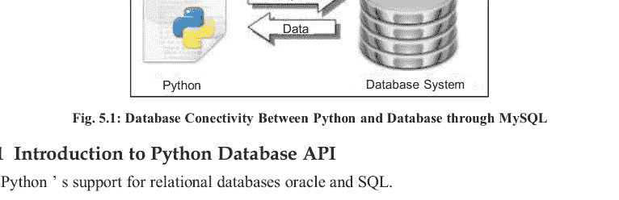

### 5.1.1 Python 数据库 API 简介

Python 支持关系数据库 Oracle 和 SQL。每个数据库模块都创建了自己的 API，该 API 高度特定于该数据库，因为每个数据库供应商根据其自身需求开发了自己的 API。Python 支持一个通用的数据库 DB API，称为 **DB API**。特定模块使您的 Python 脚本能够与不同的数据库通信，例如 **DB/2**、**PostgreSQL** 等。DB API 提供了使用数据库的最低标准，尽可能使用 Python 结构和语法。该 API 包括以下内容：

1.  连接，涵盖如何连接到数据库的指南
2.  使用游标执行语句和存储过程，以查询、更新、插入和删除数据
3.  事务，支持提交或回滚事务
4.  检查数据库模块以及数据库和表结构的元数据
5.  定义错误类型

Python 数据库 API 支持广泛的数据库服务器：**GadFly, MySQL, PostgreSQL, Microsoft SQL Server 2000, Informix, Interbasse, Oracle, Sybase**

**DB API 提供了使用 Python 结构处理数据库的标准。该 API 包括以下内容：**

- 导入 API 模块。
- 获取与数据库的连接。
- 发出 SQL 语句和存储过程。
- 关闭连接

### 5.1.2 DBM 模块简介

DBM，全称为*数据库管理器*，是许多最初在 UNIX 系统上创建的 C 语言库的通用名称。这些库的名称包括 **dbm**、**gdbm**、**ndbm**、**sdbm** 等。

Python 支持多个 dbm 模块。每个 dbm 模块支持类似的接口，并使用特定的 C 库将数据存储到磁盘。

下表列出了 dbm 模块：

| 模块 | 描述 |
|---|---|
| dbm | 选择最佳的 dbm 模块 |
| dbm.dumb | 使用简单但可移植的 dbm 库实现 |
| dbm.gnu | 使用 GNU dbm 库 |

dbm 模块在创建**新的持久字典**时将选择可用的最佳实现。当**读取文件**时也是如此。

### 5.1.3 创建持久目录

所有 dbm 模块都支持一个 **open 函数**来**创建新的 dbm 对象**。打开后，您可以**在字典中存储数据**、**读取数据**、**关闭 dbm**、**删除项目**，以及**测试字典中是否存在键**。

要打开一个 dbm 持久字典，请在您选择的模块上使用 open 函数。

例如，您可以使用 dbm 模块创建一个持久字典。

#### 创建持久字典的程序

代码：

```python
import dbm

db = dbm.open('websites', 'c')

# Add an item.
db['www.python.org'] = 'Python home page'

print(db['www.python.org'])

# Close and save to disk.
db.close()
```

输出

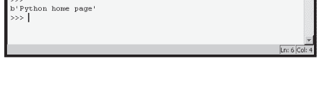

**注意：** 程序中导入了 DBM 模块，open 函数需要创建的字典的名称。此名称会被翻译成磁盘上可能已经存在的数据文件的名称。下表列出了可用的标志。

| 标志 | 用途 |
| :--- | :--- |
| C | 打开数据文件进行读写，如果需要则创建文件。 |
| N | 打开文件进行读写，但总是创建一个全新的空文件。如果文件已存在，它将被覆盖，其内容将丢失。 |
| W | 打开文件进行读写，但如果文件不存在则不会创建它。 |

您还可以传递另一个可选参数，即模式。模式包含一组 UNIX 文件权限。有关打开文件的更多信息，请参阅第 8 章。

> dbm 模块的 open 方法返回一个新的 dbm 对象，然后您可以使用该对象来存储和检索数据。

打开持久字典后，您可以像使用普通 Python 字典一样写入值，如以下示例所示：

```python
db['www.python.org'] = 'Python home page'
```

键和值都必须是字符串，不能是其他对象，例如数字或 Python 对象。但是请记住，如果您想保存对象，可以使用 pickle 模块对其进行序列化，正如您在第 8 章所看到的。

close 方法关闭文件并将数据保存到磁盘。

## 5.1.4 访问持久目录

使用 dbm 模块，您可以将从 open 函数返回的对象用作字典对象。使用如下代码获取和设置值：

```python
db['key'] = 'value'
value = db['key']
```

请记住，键和值都必须是文本字符串。

您可以使用 del 删除字典中的值：

```python
del db['key']
```

keys 方法返回所有键的列表，其方式与普通字典相同：

```python
for key in db.keys():
    # do something...
```

如果文件中有大量的键，keys 方法可能需要很长时间才能执行。

### 访问持久字典的程序

代码：

```python
import dbm
# Open existing file.
```

```python
db = dbm.open('websites', 'w')

# 添加另一个条目。
db['www.wrox.com'] = 'Wrox 主页'

# 验证之前的条目是否仍然存在。
if db['www.python.org'] != None:
    print('Found www.python.org')
else:
    print('Error: Missing item')

# 遍历键。可能较慢，可能占用大量内存。
for key in db.keys():
    print('Key =',key, 'value =',db[key])

del db['www.wrox.com']

print('After deleting www.wrox.com, we have:')

for key in db.keys():
    print('Key =',key, 'value =',db[key])

# 关闭并保存到磁盘。
db.close()
```


此示例创建了 dbm 文件并将数据存储在文件中。如果当前目录中不存在必要的数据文件，调用 open 函数将会生成错误。字典中应该有一个值，其键为 **www.python.org**。此示例添加了 **Wrox 网站**，**www.wrox.com**，作为另一个键。脚本使用以下代码验证 www.python.org 键是否存在于字典中：

```python
if db['www.python.org'] != None:
    print('Found www.python.org')
else:
    print('Error: Missing item')
```

接下来，脚本打印出字典中的所有键和值：

```python
for key in db.keys():
    print("Key =",key," value =",db[key])
```

请注意，应该只有这两个条目。打印出所有条目后，脚本使用 del 删除其中一个：

```python
del db['www.wrox.com']
```

然后脚本再次打印所有键和值，结果应该只剩下一个条目，如输出所示。最后，close 方法关闭字典，这涉及将所有更改保存到磁盘，因此下次打开文件时，它将处于你离开时的状态。

## 5.2 关系数据库管理系统简介

**RDBMS** 代表 **关系数据库管理系统**。RDBMS 数据在数据库表、字段和记录中进行结构化。每个 RDBMS 表由数据库表行组成。每个数据库表行由一个或多个数据库表字段组成。关系数据库是复杂数据存储的首选技术。

在关系数据库中，数据存储在可以视为二维数据结构的表中。列，或二维矩阵的 **垂直部分**，都是相同类型的数据；例如字符串、数字、日期等。表的每个水平分量由行（也称为记录）组成。每行又由列组成。通常，每条记录保存与一个项目相关的信息，例如一张音频 CD、一个人、一张采购订单、一辆汽车等。

RDBMS 将数据存储到表的集合中，这些表可能通过公共字段（数据库表列）相关联。RDBMS 还提供关系运算符来操作存储在数据库表中的数据。大多数 RDBMS 使用 SQL 作为数据库查询语言。最流行的 RDBMS 是 MS SQL Server、DB2、Oracle 和 MySQL。

为了克服数据库的缺点，E.F.Codd 于 1970 年引入了关系数据库的新概念。他的想法是将这些重复的数据分解成单独的文件，这些文件可以使用公共键字段进行关联。

关系数据库中的关系基于关系模式，该模式由多个属性组成。关系数据库由多个关系和相应的数据库模式组成。关系数据库设计的目标是生成一组关系模式，使我们能够存储信息而没有不必要的冗余，并且能够轻松地检索信息。

### 市场上可用的不同 RDBMS：

- 1. Oracle
- 2. Sybase
- 3. Ingress
- 4. Db2
- 5. Informix

因此，根据使用情况，我们必须决定是使用 DBM 模块还是关系数据库。当你的数据需求可以存储为键/值对时，dbm 模块可以工作。如果你想在键/值对中处理更复杂的数据，那么使用 dbm 可能会非常难以维护。

- 1. 如果你的数据需求很简单，请使用 dbm 持久字典。
- 2. 如果你计划只存储少量数据，请使用 dbm 持久字典。
- 3. 如果你需要 *事务* 支持，请使用 **关系数据库**。
- 4. 如果你需要复杂的数据结构或多个链接数据表，请使用关系数据库。
- 5. 关系数据库提供更丰富和更复杂的 API。

## 5.3 SQL 语句简介

SQL 命令分为 4 类：

- 1. **数据定义语言 (DDL)：** 用于创建和修改结构。
   (CREATE, ALTER, DROP, RENAME, TRUNCATE)
- 2. **数据操作语言 (DML)：** 用于添加和修改数据。
   (INSERT, UPDATE, DELETE)
- 3. **数据控制语言 (DCL)：** 用于控制数据库访问和事务。
   (GRANT, REVOKE, ROLLBACK, COMMIT, BEGIN TRANSACTION)
- 4. **数据查询语言 (DQL)：** 用于查询数据库。
   (SELECT 语句)

### 语句的语法和示例

创建表：

语法：

```sql
CREATE TABLE <Name>
(<Field1> <Datatype>, <Field 2> <Datatype>);
```

### 示例：

```sql
CREATE TABLE Students
(Roll_no Number(3), Name Varchar2(10),
Address Varchar2(15), Dos Number(3), Win Number(3));
```

（注意：表名和列名最多为 30 个字符。它们可以包含特殊字符，如 $、#、_。每个表最多允许 254 列。）

### 向表中插入值：

语法：

```sql
INSERT INTO <Table Name> VALUES
(Value1, Value2, Value3);
```

### 示例：

- 1. INSERT INTO Students VALUES
   (1, ‘kiran‘, ‘UNR‘, 45,50);
   [将字符类型的数据用 ‘ ‘ 括起来。]
- 2. INSERT INTO Students VALUES
   (1, null, ‘UNR‘, null,50);
   [当你不想输入任何值时使用 null。]
- 3. INSERT INTO Students VALUES
   (&Roll_no, ‘&NAME‘, ‘&ADDRESS‘, &DOS,&WIN);
   [在执行时替换值。]
- 4. INSERT INTO Students VALUES (Roll_no, Name)
   (1, ‘kiran‘);
   [仅插入指定的字段。]

### 显示表的行：

语法：

```sql
SELECT * FROM <Table Name>;
[WHERE <condition>]
[GROUP BY <exp> [HAVING <condition>]]
[ORDER BY <exp> [ASC | DESC]
```

### 示例：

- 1. SELECT * FROM Students;
   [显示表的所有行]
- 2. SELECT Roll_no, Name FROM Students;
   [仅显示指定列的行]

### 从表中删除行：

语法：

```sql
DELETE FROM <Table Name>
```

示例：

- 1. DELETE FROM Students;

### 更新行：

示例：

- 1. UPDATE TABLE Students SET Address=’Kalyan‘;
   [将所有地址设置为新值 ‘Kalyan‘]
- 2. UPDATE TABLE Students SET Dos =80
   WHERE Name=’Tina‘;
   [将 ‘Tina‘ 的 Dos 分数设置为 80]

### 回滚：

语法：

```sql
ROLLBACK;
```

此命令将撤销所有未提交的 DML 语句。

### 提交 DML 语句的不同方式：

在会话期间执行的所有 DML 语句在提交之前不会对数据库进行永久更改。以下是提交 DML 语句的不同方式。

- 1. COMMIT：在 SQL 提示符下给出 COMMIT 语句时。
- 2. EXIT：当我们从 SQL 会话退出时。
- 3. 所有 DDL 语句 (CREATE, ALTER, DROP, RENAME, TRUNCATE)

### 删除表：

语法：

```sql
DROP TABLE <Table Name>;
```

示例：

```sql
DROP TABLE Students;
```

## 5.4 什么是 MySQLdb

MySQLdb 是一个用于从 Python 连接到 MySQL 数据库服务器的接口。Python 是一个前端应用程序，通过它，Python 脚本和程序以及 SQL 语句将被输入到后端数据库应用程序（MySQL 或 sqlite3）以访问和检索数据。在进行数据库连接之前，应在你的机器上安装 MySQLdb。

要为 Python 安装 MySQLdb 连接器，请使用以下链接为 Python 2.7 安装 MySQLdb 连接器。它不适用于 Python 3.4。

## 5.5 MySQL 连接器的介绍和安装

MySQL 连接器是一个用于将 Python 与 MySQL 后端连接的 Python 对象。connect() 构造函数创建一个到 MySQL 服务器的连接并返回 MySQLConnection 对象。以下示例展示了如何连接到 MySQL 服务器：

```python
import mysql.connector
cnx = mysql.connector.connect(user=’scott‘, password=’tiger‘, host=’127.0.0.1‘, database=’employees‘)
cnx.close()
```

有关 MySQLdb 安装，请参考第 5.9.2 节（步骤 2）。

## 5.6 连接器模块的介绍和安装

Python 模块 MySQLdb 包含 connect 方法，因此我们可以通过指定主机名、用户名和密码信息（作为用户身份验证）以及你已创建的 MySQL 数据库，将 MySQL 后端与 Python 连接起来。

Python 模块 MySQLdb 应正确安装在你的机器上。为此，请从 Google 下载 MySQL-python-1.2.2.tar。下载 .rar 文件后。将该文件夹解压到 Python 安装目录并安装其中的所有安装文件，一个用于 Windows，一个用于通用。

有关 Python 连接器模块的安装步骤，请参考第 5.9.3 节（步骤 4）。

## 5.7 建立连接

连接对象提供了从你的 Python 脚本与数据库程序进行通信的方式。Python 数据库模块连接到数据库。它们不包括数据库应用程序本身。每个数据库模块都需要提供一个 connect 函数，该函数返回一个连接对象。

传递给 connect 的参数因模块以及与数据库通信所需的内容而异。下表列出了最常见的参数。

| 参数 | 用法 |
| --- | --- |
| Dsn | 数据源名称，来自 ODBC 术语。这通常包括你的数据库名称和运行它的服务器。 |
| Host | 数据库运行所在的主机或网络系统名称。 |
| Database | 数据库的名称。 |
| User | 连接到数据库的用户名。 |
| Password | 给定用户名的密码。 |

例如，你可以使用以下代码作为参考：

**conn = dbmodule.connect(dsn='localhost: MYDB', user='tiger', password='scott')**

请查阅你的数据库模块文档以确定需要哪些参数。

获得连接对象后，你可以处理事务（本章稍后介绍）、关闭连接以释放系统资源（尤其是在数据库端），以及获取游标。

**在连接 MySQL 数据库连接之前，请确保满足以下条件：**

- 你已经**创建了一个数据库**，例如我已经创建了 **kirandb**。
- 打开 kirandb 数据库，并在其**创建一个名为 EMPLOYEE 的表**。
- 该表包含字段 FIRST_NAME、LAST_NAME、AGE、SEX 和 INCOME。
- 用于访问 kirandb 数据库的 MySQL **用户名**是 “root”，**密码**是 “password”。
- 已经正确安装了 Python MySQL Connector，并且 Python 模块 MySQLdb 也已正确安装在你的机器上，包含所有安装文件。
- 完成上述步骤后，导入 MySQLdb，然后使用 connect 方法打开数据库连接。

**示例**

以下是连接名为 “kirandb” 的 MySQL 数据库的示例。

```python
import MySQLdb

# 打开数据库连接
db = MySQLdb.connect("localhost", "root", "password", "kirandb")

# 使用 cursor() 方法创建一个游标对象
cursor = db.cursor()

# 使用 execute() 方法执行 SQL 查询
cursor.execute("SELECT VERSION()")

# 使用 fetchone() 方法获取单条数据
data = cursor.fetchone()

print ("Database version: %s" % data)

# 断开服务器连接
db.close()
```

运行此脚本时，我的 Linux 机器上产生了以下结果。

```
Database version: 5.0.45
```

如果与数据源建立了连接，则会返回一个 Connection Object 并保存到 **db** 中以供后续使用；否则，**db** 被设置为 None。接下来，使用 **db** 对象创建一个**游标**对象，该对象又用于执行 SQL 查询。最后，在退出之前，它确保数据库连接已关闭且资源已释放。

## 5.8 创建游标对象

- 游标（Cursor）是一个 Python 对象，它使你能够与数据库进行交互。
- 建立连接后，为了使用该连接，我们需要创建一个游标对象。
- 游标对象是 Python DB-API 2.0 中定义的一个抽象概念。
- 游标定位在数据库中特定表中的某个位置，就像你编辑文档时屏幕上的光标一样。
- 它使我们能够通过同一数据库连接拥有多个独立的工作环境。
- 你可以通过执行数据库对象的 ‘cursor’ 函数来创建游标。`cur = db.cursor()`
- 一旦拥有游标，你就可以在该游标上执行数据库操作，例如插入、更新和删除记录。
- 默认情况下，使用默认的游标类创建游标。
- 如果需要，你可以通过将 ‘cursorclass’ 参数设置为你想要使用的游标类来指定不同的游标类。

有几种不同的游标类，在执行查询时提供不同的功能。

### 模块 MySQLdb.cursors

MySQLdb 游标
此模块为 MySQLdb 实现了各种类型的游标。默认情况下，MySQLdb 使用 Cursor 类。

| 类 | 描述 |
| :--- | :--- |
| **BaseCursor** | **游标类的基类。** |
| Cursor | 这是标准的游标类，将行作为元组返回，并将结果集存储在客户端。 |
| CursorDictRowsMixIn | 这是一个 MixIn 类，导致所有行都作为字典返回。 |
| CursorOldDictRowsMixIn | 这是一个 MixIn 类，将行作为字典返回，其键约定与旧的 Mysqldb (MySQLmodule) 相同。 |
| CursorStoreResultMixIn | 这是一个 MixIn 类，它导致整个结果集存储在客户端，即 |
| CursorTupleRowsMixIn | 这是一个 MixIn 类，导致所有行都作为元组返回，这是 DB API 要求的标准形式。 |
| CursorUseResultMixIn | 这是一个 MixIn 类，它导致结果集存储在服务器中，并逐行发送到客户端，即 |
| DictCursor | 这是一个游标类，将行作为字典返回，并将结果集存储在客户端。 |
| SSCursor | 这是一个游标类，将行作为元组返回，并将结果集存储在服务器端。 |
| SSDictCursor | 这是一个游标类，将行作为字典返回，并将结果集存储在服务器端。 |

## 5.9 MySQLdb 与 Python 的连接步骤

### 5.9.1 安装 Python-2.7.13

1. 安装 python-2.7.13
https://www.python.org/downloads/

### 5.9.2 安装 MySQLdb 连接器（步骤 2）

1. 下载 MySQLdb 连接器
http://sourceforge.net/projects/mysql-python/?source=directory


## 双击 MySQL-python 连接器


## 点击“下一步”按钮


默认情况下会选中安装目录。点击“下一步”按钮


点击“完成”按钮。

1. 在继续之前，请确保你的机器上已安装 MySQLdb。安装 MySQLdb 连接器模块。

### 5.9.3 安装 MySQLdb 连接器模块（步骤 4）

1. 要安装 MySQLdb 模块，请从 Google 下载 MySQL-python-1.2.2.tar。


2. 将 MySQL-python-1.2.2.tar 文件复制到 Python 2.7 安装文件夹 (C:\Python27\)


3. 解压该文件夹


通过 WinRAR 或 WinZip 解压缩。

4. 安装所有安装文件

我们需要安装解压文件夹中的这四个安装文件。


5. 如图所示，点击安装文件


6. 执行安装文件 ez_setup、setup_windows、setup_common 后


7. 如图所示，点击 **setup_common** 文件


8. 如图所示，点击 **setup_posix** 文件


9. 如图所示，点击 **setup_windows** 文件


### 5.9.4 安装 MySQL Server 5.1（步骤 13）

1. 安装 MySQL Server 5.1


2. 点击“下一步”按钮


3. 点击“下一步”按钮


4. 点击“安装”按钮


5. 点击“安装”按钮


6. 点击“安装”按钮


7. 点击“下一步”按钮


8. 点击“下一步”按钮


9. 点击“完成”按钮


10. 点击“下一步”按钮


11. 点击“下一步”按钮


12. 点击“下一步”按钮


13. 点击“下一步”按钮


14. 点击“下一步”按钮


15. 点击“下一步”按钮


16. 点击“下一步”按钮


17. 点击“下一步”按钮


18. 选中第一个复选框并点击“下一步”


19. 输入密码-"password"，该密码将用于数据库连接，然后点击“下一步”按钮。


20. 点击“执行”按钮。


21. 点击“完成”按钮。


## 5.9.5 导入 MySQLdb 和 OS 模块（步骤 34）

1.  现在 MySQL 模块已安装并构建完成，且适用于 Python 2.7 的 MySQL Connector 也已安装。现在，要检查 MySQLdb 模块，你可以导入 MySQLdb。


2.  完成 MySQLdb 安装后，我们需要切换到在 Python 2.7 安装文件夹中创建的 `MySQL-python-1.2.2` 目录。
3.  要切换目录，请使用 Python OS 模块中可用的 `chdir` 方法。因此，先导入 OS 模块，然后切换到 `MySQL-python-1.2.2` 目录。

## 5.9.6 在 MySQL 中创建并打开数据库（步骤 37）

1.  在创建连接之前，我们必须在 MySQL 5.1 服务器中创建一个数据库。


2.  选择 MySQL 命令行客户端。
3.  在 MySQL 服务器中创建数据库并打开该数据库。


4.  由于 MySQL 服务器的默认用户名是 "root"，在安装 MySQL 时设置的密码是 "password"，创建的数据库名为 `kirandb1`，当前机器由 `localhost` 标识。

### 5.9.7 使用 Connect 连接到 MySQLdb（步骤 41）

1.  现在我们将把 MySQLdb 连接到已创建的 MySQL 数据库。打开数据库连接的语法是：

**对象名=MySQLdb.connect("当前系统名称", "MySQL服务器用户名", "MySQL服务器密码", "在MySQL服务器中创建的数据库")**

**当前系统名称：localhost**
**MySQL用户名：root**
**MySQL密码：password**
**在MySQL中创建的数据库名称：kirandb**


### 5.9.8 游标（通过游标创建对象）

1.  现在使用 `cursor()` 方法准备游标对象。


### 5.9.9 执行和关闭函数

1.  使用 `execute()` 方法执行 SQL 查询。


2.  使用 `fetchone()` 方法获取单行数据。


3.  打印数据对象，其中第一行是从游标获取并存入数据对象的。


4.  断开与服务器的连接。


## 5.10 读取查询执行的单个和多个结果

1.  使用 SQL 命令 `Create database kirandb;` 在 MySQL 服务器中创建 `kirandb` 数据库。
2.  使用 SQL 命令 `use kirandb;` 打开 `kirandb` 数据库。
3.  使用 SQL 命令 `Create table command` 创建包含 `empno`、`name` 和 `salary` 字段的 `Employee` 表。
4.  向 `Employee` 表中插入记录。
5.  显示 `Employee` 表的所有记录。
6.  现在要在 Python 中访问 `Employee` 表，请重复相同的步骤来创建 Mysqldb 连接和游标。


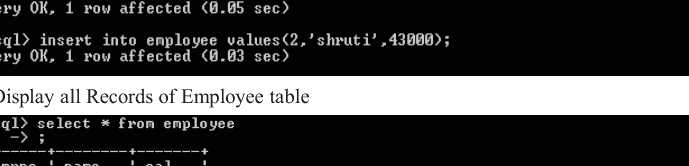

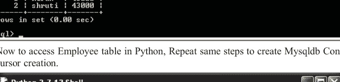

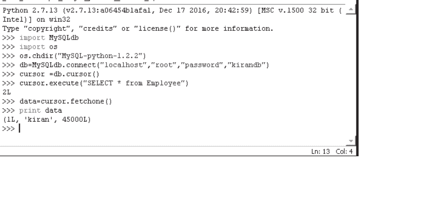

7.  调用游标的 `execute` 方法，并将 `Select` 语句作为参数传递给 `execute` 方法。然后调用游标的 `fetchone` 方法来读取表的第一行，并将结果存储在 `data` 对象中。
8.  使用 `print` 方法打印 `data` 对象。
9.  要从表中获取所有记录：

```
>>> data=cursor.fetchone()
>>> print data
```

示例 3：创建数据库连接、创建表并在 Python 中访问表

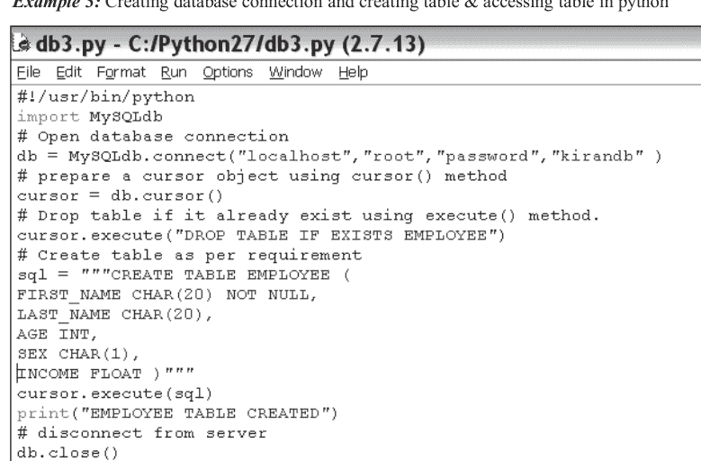

输出

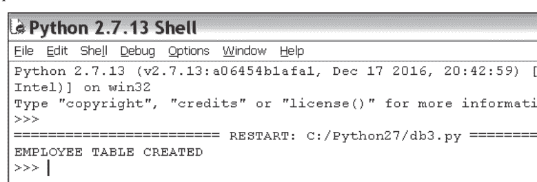

## 5.11 执行不同类型的语句

### 5.11.1 插入操作

当你想在数据库表中创建记录时，需要插入操作。

以下示例执行 SQL INSERT 语句，在 EMPLOYEE 表中创建一条记录：

```
#!/usr/bin/python
import MySQLdb
# Open database connection
db = MySQLdb.connect("localhost","root","password","kirandb" )
# prepare a cursor object using cursor() method
cursor = db.cursor()
# Prepare SQL query to INSERT a record into the database.
sql = """INSERT INTO EMPLOYEE(FIRST_NAME,
LAST_NAME, AGE, SEX, INCOME)
VALUES ('Kir', 'kiran', 20, 'M', 2000)"""
try:
    # Execute the SQL command
    cursor.execute(sql)
    print("1 Record inserted")
    # Commit your changes in the database
    db.commit()
    print("1 Record committed ie. saved")
except:
    # Rollback in case there is any error
    db.rollback()
# disconnect from server
db.close()
```

输出

```
Python 2.7.13 (v2.7.13:a06454b1afa1, Dec 17 2016, 20:42:59) [M
Intel)] on win32
Type "copyright", "credits" or "license()" for more informatio
>>>
======================== RESTART: C:/Python27/db6.py =========
>>>
======================== RESTART: C:/Python27/db6.py =========
1 Record inserted
1 Record committed ie. saved
>>> |
```

通过动态创建 SQL 查询来插入记录的示例：


*输出*


## 5.11.2 读取操作

对任何数据库的读取操作意味着从数据库中获取一些有用的信息。

一旦建立连接，我们就可以查询数据库。你可以使用 **fetchone()** 方法获取单条记录，或者使用 **fetchall()** 方法从数据库表中获取多个值。

1.  **fetchone()**：它获取查询结果集的下一行。结果集是当游标对象用于查询表时返回的对象。
2.  **fetchall()**：它获取结果集中的所有行。如果某些行已经从结果集中提取，则它检索结果集中剩余的行。
3.  **rowcount**：这是一个只读属性，返回受 `execute()` 方法影响的行数。

### 示例

以下过程查询 EMPLOYEE 表中所有工资大于 1000 的记录：

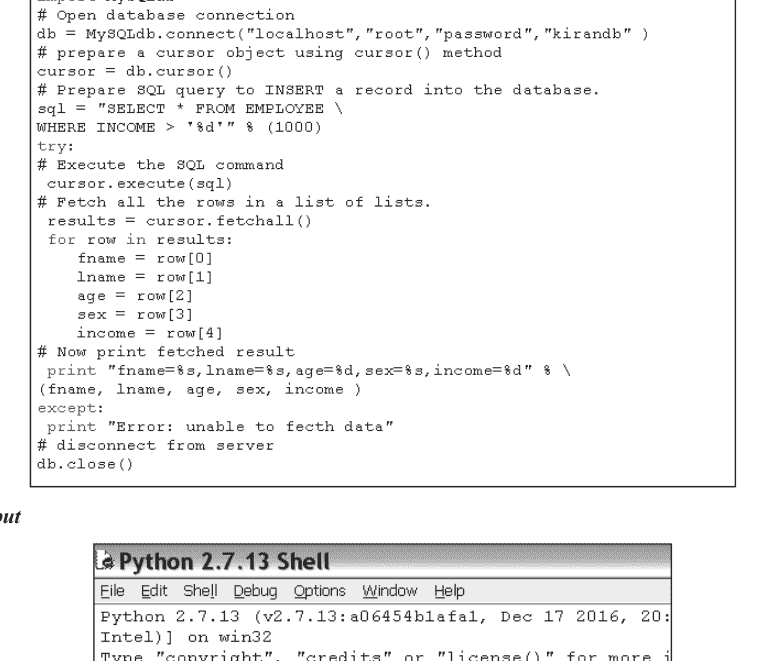

### 输出

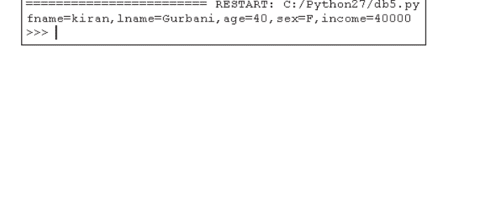

## 5.11.3 更新操作

对任何数据库的更新操作意味着更新数据库中已存在的一条或多条记录。

以下过程更新所有性别为 'M' 的记录。在这里，我们将所有男性的年龄增加一岁。

```python
#!/usr/bin/python
import MySQLdb
# Open database connection
db = MySQLdb.connect("localhost","root","password","kirandb" )
# prepare a cursor object using cursor() method
cursor = db.cursor()
# Prepare SQL query to INSERT a record into the database.
sql = "INSERT INTO EMPLOYEE(FIRST_NAME, \
LAST_NAME, AGE, SEX, INCOME) \
VALUES ('%s', '%s', '%d', '%c', '%d' )" % \
('kiran', 'Gurbani', 40, 'F', 40000)
try:
    # Execute the SQL command
    cursor.execute(sql)
    print("1 Record inserted")
    # Commit your changes in the database
    db.commit()
    print("1 record saved")
except:
    # Rollback in case there is any error
    db.rollback()
# disconnect from server
db.close()
```

```
Python 2.7.13 Shell
File Edit Shell Debug Options Window Help
Python 2.7.13 (v2.7.13:a06454b1afa1, Dec 17 2016, 20:42: Intel)] on win32
Type "copyright", "credits" or "license()" for more info
>>>
============================== RESTART: C:/Python27/db7.py ==============================
Record updated
>>>
```

## 5.11.4 删除操作

当你想从数据库中删除一些记录时，需要删除操作。以下是从 EMPLOYEE 表中删除所有年龄大于 20 的记录的过程：

```python
#!/usr/bin/python
import MySQLdb

# Open database connection
db = MySQLdb.connect("localhost","root","password","kirandb" )

# prepare a cursor object using cursor() method
cursor = db.cursor()

# Prepare SQL query to DELETE required records
sql = "DELETE FROM EMPLOYEE WHERE AGE > '%d'" % (20)
try:
   # Execute the SQL command
   cursor.execute(sql)
   print("Record deleted")
   # Commit your changes in the database
   db.commit()
except:
   # Rollback in case there is any error
   db.rollback()

# disconnect from server
db.close()
```

输出

```
Python 2.7.13 Shell

Python 2.7.13 (v2.7.13:a06454b1afa1, Dec 17 2016, 20
Intel)] on win32
Type "copyright", "credits" or "license()" for more
>>>
============================== RESTART: C:/Python27/db8.py
Record deleted
>>> |
```

## 5.12 事务简介

-   事务是一个程序单元，其执行可能会也可能不会改变数据库的内容。
-   事务作为一个单一单元执行。如果事务执行前数据库处于一致状态，那么事务执行后数据库也必须处于一致状态。
-   事务是一个逻辑工作单元。它是执行工作单元（包括小的工作单元）的一组操作（主要是读和写）。
-   它可以被视为一个执行时保持数据库一致性的程序。并发控制和恢复方案的主要目标是确保事务的执行是原子的。
-   事务是程序中一个非常小的单元，它可能包含几个低级任务。它们被分组到任务中。

### 事务属性

数据库系统中的事务必须维护原子性、一致性、隔离性和持久性。事务通过 `COMMIT` 或 `ROLLBACK` SQL 语句完成，这些语句表示事务的开始或结束。当事务成功完成时，数据库更改被称为已提交。当事务未完成时，更改将被回滚。

例如，从一个银行账户向另一个账户转账需要对数据库进行两次更改，这两次更改必须同时成功或同时失败。

### 事务处理过程

事务作为一系列对数据库对象的读写操作来执行，具体说明如下：

#### 读操作

要读取一个数据库对象，首先将其从磁盘加载到主内存中，然后将其值复制到程序变量中，如图所示。

#### 写操作

要写入一个数据库对象，首先修改该对象的内存副本，然后将其写入磁盘。

### 事务属性

事务是确保数据一致性的一种机制。事务具有以下四个属性：

1.  **原子性：（全有或全无）** 如果一个事务总是要么执行其所有操作，要么根本不执行任何操作，则称该事务是原子的。这意味着事务的所有操作要么全部执行，要么全部不执行。要么事务完成，要么什么也不发生。

2.  **一致性：（不违反完整性约束）** 事务在执行后必须保持数据库的一致性。DBMS 假定此属性对每个事务都成立。确保事务的此属性是用户的责任。事务必须从一个一致的状态开始，并使系统处于一致的状态结束。

3.  **隔离性：（并发更改不可见）** 事务的行为必须如同它们是隔离执行的。这意味着如果多个事务并发执行，其结果必须与它们按某种顺序串行执行的结果相同。在第一个事务完成之前，第二个事务不能使用第一个事务执行期间使用的数据。事务的中间结果在当前事务外部不可见。

4.  **持久性：（已提交的更新持久化）** 已完成或已提交事务的效果即使在崩溃后也应持续存在。这意味着一旦事务提交，系统必须保证其操作结果永远不会丢失，无论后续发生什么故障。一旦事务被提交，其效果就是持久的，即使在系统故障之后也是如此。

Python DB API 2.0 提供了两种方法来 *提交* 或 *回滚* 事务。

## 5.12.1 执行事务

示例

你已经知道如何实现事务了。这里再举一个类似的例子：

示例

在此示例中，数据库事务中使用了异常处理，如果事务未执行，它将被回滚。

### 输出

### COMMIT 操作

提交是确认将更改永久保存到数据库中的操作。一旦执行了 `COMMIT` 语句，任何更改都无法恢复。

这是一个调用 **commit** 方法的简单示例。

```
db.commit()
```

### ROLLBACK 操作

如果任何 DML 语句（如 `INSERT`、`UPDATE` 和 `DELETE`）你想完全恢复这些更改，那么使用 **rollback()** 方法。这是一个调用 **rollback()** 方法的简单示例。

```
db.rollback()
```

### 断开数据库连接

要断开数据库连接，请使用 **close()** 方法。

```
db.close()
```

如果用户使用 `close()` 方法关闭了与数据库的连接，DB 将回滚任何未完成的事务。

## 5.13 理解数据库连接中的异常

异常是在程序执行期间发生的事件，它会干扰程序的正常流程，因此为了处理这些错误，我们可以根据自己的需求放置消息。

### 文件中的异常处理示例

```
try:
    fob = open("kiran.txt", "r")
    fob.write("This is my test file for exception handling!!")
except IOError:
    print "Error: can\'t find the file or read data"
else:
    print "Write operation is performed successfully on the file"
    fob.close()
```

### 处理错误

错误有很多来源。一些例子包括执行的 SQL 语句中的语法错误、连接失败，或者对已取消或已完成的语句句柄调用 `fetch` 方法。

DB API 定义了许多必须存在于每个数据库模块中的错误。下表列出了这些异常。

| 异常                | 描述                                                                 |
|--------------------|-----------------------------------------------------------------------------|
| Warning            | 用于非致命问题。必须是 StandardError 的子类。                     |
| Error              | 错误的基类。必须是 StandardError 的子类。                         |
| InterfaceError     | 用于数据库模块中的错误，而非数据库本身的错误。必须是 Error 的子类。 |
| DatabaseError      | 用于数据库中的错误。必须是 Error 的子类。                        |
| DataError          | DatabaseError 的子类，指数据中的错误。                |
| OperationalError   | DatabaseError 的子类，指诸如与数据库连接丢失之类的错误。这些错误通常超出 Python 脚本编写者的控制范围。 |
| IntegrityError     | DatabaseError 的子类，用于会损害关系完整性的情况，例如唯一性约束或外键。 |
| InternalError      | DatabaseError 的子类，指数据库模块内部的错误，例如游标不再处于活动状态。 |
| ProgrammingError   | DatabaseError 的子类，指诸如错误的表名以及其他可以安全地归咎于你的错误。 |
| NotSupportedError  | DatabaseError 的子类，指尝试调用不支持的功能。 |

## 5.14 使用 Sqlite3 进行连接

1.  在 sqlite3 中创建数据库
    $ sqlite3 testDB.db

2.  检查数据库是否已创建
    sqlite>. databases

### 3. 创建表

```
sqlite> CREATE TABLE COMPANY(
ID INT PRIMARY KEY NOT NULL,
NAME TEXT NOT NULL,
AGE INT NOT NULL,
ADDRESS CHAR(50),
SALARY REAL
);
sqlite> CREATE TABLE DEPARTMENT(
ID INT PRIMARY KEY NOT NULL,
DEPT CHAR(50) NOT NULL,
EMP_ID INT NOT NULL
);
```

### 4. 查看所有表

```
sqlite>.tables
```

### 5. 插入记录

```
INSERT INTO COMPANY (ID,NAME,AGE,ADDRESS,SALARY)
VALUES (1, ‘Paul’, 32, ‘California ‘, 20000.00);
INSERT INTO DEPARTMENT (ID, DEPT, EMP_ID)
VALUES (1, ‘IT Billing’, 1);
```

### 6. 显示所有记录

```
Select * from company;
```

### 7. 使用 limit 命令

```
sqlite> SELECT * FROM COMPANY LIMIT 6;
```

### 8. 使用 offset

```
sqlite> SELECT * FROM COMPANY LIMIT 3 OFFSET 2;
```

将跳过前 2 条记录，从第 3 条开始显示 3 条记录。

### 9. 连接

```
sqlite> SELECT EMP_ID, NAME, DEPT FROM COMPANY CROSS JOIN
DEPARTMENT;
```

结构化查询语言（SQL）定义了一种用于查询和修改数据库的标准语言。你可以将 SQL 发音为“sequel”或“s-q-l”。SQL 支持下表列出的基本操作。

### 操作用法

| 操作 | 用法 |
|-----------|-------|
| Select | 执行查询以在数据库中搜索特定数据。 |
| Update | 修改一行或多行，通常基于某个条件。 |
| Insert | 在数据库中创建新行。 |
| Delete | 从数据库中删除一行或多行。 |

通常，这些基本操作被称为 QUID（Query、Update、Insert 和 Delete 的缩写）或 CRUD（Create、Read、Update 和 Delete 的缩写）。SQL 提供的功能不止这些基本操作，但大部分情况下，这些是你编写应用程序时将使用的主要操作。

```
Python 3.4 (command line - 32 bit)
Python 3.4.3 (v3.4.3:9b73f1c3e601, Feb 24 2015, 22:43:06) [MSC v.1600 32 bit (Intel)] on win32
Type "help", "copyright", "credits" or "license" for more information.
>>> import os
>>> import sqlite3
>>> con=sqlite3.connect('employee.db')
>>> cur=con.cursor()
>>> cur.execute('CREATE TABLE emp(empno INTEGER, ename TEXT)')
<sqlite3.Cursor object at 0x00B72B20>
>>> cur.execute('INSERT INTO emp(120,"kiran")')
Traceback (most recent call last):
  File "<stdin>", line 1, in <module>
sqlite3.OperationalError: near "120": syntax error
>>> cur.execute('INSERT INTO emp(120,'kiran')')
  File "<stdin>", line 1
    cur.execute('INSERT INTO emp(120,'kiran')')
                          ^
SyntaxError: invalid syntax
>>> cur.execute('INSERT INTO emp(120,"kiran")')
Traceback (most recent call last):
  File "<stdin>", line 1, in <module>
sqlite3.OperationalError: near "120": syntax error
>>> cur.execute('INSERT INTO emp VALUES(120,"kiran")')
<sqlite3.Cursor object at 0x00B72B20>
>>> cur.execute('INSERT INTO emp VALUES(121,"sanjana")')
<sqlite3.Cursor object at 0x00B72B20>
>>> con.commit()
>>> cur.execute('select empno,ename from emp')
<sqlite3.Cursor object at 0x00B72B20>
>>> cur.fetchone()
(120, 'kiran')
>>> cur.fetchall()
[(121, 'sanjana')]
>>> cur.fetchtwo()
Traceback (most recent call last):
  File "<stdin>", line 1, in <module>
AttributeError: 'sqlite3.Cursor' object has no attribute 'fetchtwo'
>>> cur.fetch()
Traceback (most recent call last):
  File "<stdin>", line 1, in <module>
AttributeError: 'sqlite3.Cursor' object has no attribute 'fetch'
>>> cur.fetchone()
>>> cur.execute('select empno,ename from emp')
<sqlite3.Cursor object at 0x00B72B20>
>>> cur.fetchall()
[(120, 'kiran'), (121, 'sanjana')]
>>>
```

## 5.15 问题

1.  解释Python中的数据库连接，详细说明并阐述DBM模块。
2.  解释DBM模块，说明什么是持久化目录以及如何在Python中创建和访问持久化目录。
3.  解释什么是MySQL连接器以及如何安装它。
4.  解释MySQL连接器模块，如何在程序中导入它以及如何使用MySQL连接器模块的`connect`方法。
5.  解释什么是连接对象和游标对象，并通过示例说明如何建立Python与MySQL之间的连接。
6.  建立Python与数据库之间的连接，并编写一个Python程序来显示表中的记录。
7.  建立Python与数据库之间的连接，并编写一个Python程序来向表中插入一条记录。
8.  建立Python与数据库之间的连接，并编写一个Python程序来从表中删除一条记录。
9.  建立Python与数据库之间的连接，并编写一个Python程序来更新表中的一条记录。
10. 解释什么是事务，以及在Python中如何执行事务。请举例说明。
11. 解释Python中的`commit`和`Rollback`事务。
12. 解释Python数据库连接中的异常。
13. 解释Python中使用`sqlite3`的连接。

### 第三单元

## 第6章

## 网络连接

### 结构

- 6.1 什么是网络
- 6.2 网络类型
- 6.3 网络拓扑
- 6.4 什么是域以及域的不同类型
- 6.5 面向连接和无连接
    - 6.5.1 无连接服务
    - 6.5.2 面向连接服务
- 6.5 协议简介及不同类型的协议。
- 6.7 网络连接简介
- 6.8 什么是套接字
- 6.9 套接字模块
- 6.10 客户端-服务器架构
- 6.11 创建服务器-客户端程序
- 6.12 通过SMTP发送邮件
    - 6.12.1 SMTP简介
    - 6.12.2 发送电子邮件
- 6.13 什么是URL？
- 6.14 从URL读取数据
- 6.15 问题

## 6.1 什么是网络

通信系统的基本目的是在两方之间交换数据，或在两个通信网络之间交换数据。

计算机网络是允许多台计算机（称为主机）相互通信的基础设施。网络通过提供一套称为**协议**的通信规则来实现这一点，所有参与的主机都应遵守这些规则。协议的必要性显而易见：它使来自不同厂商、具有不同操作特性的计算机能够“使用同一种语言交流”。

对于网络，我们应该了解不同的网络组件。然后我们需要了解不同的网络拓扑。我们应该清楚不同类型的网络：点对点、多点、局域网、广域网以及互联网络（互联网）。

通信可以发生在工作站（即节点或客户端）和服务器之间，通过公共电话网络。另一个例子是在同一网络上两个电话之间交换语音通道，即语音信号。

### 网络通信的关键组件

1.  服务器（源）
2.  发送器
3.  传输系统
4.  接收器
5.  目的地

1.  **服务器（源）：** 服务器是生成待传输数据的设备，即输入传输所需的数据元素。
    例如：电话和个人计算机。
2.  **发送器：** 源系统生成的数据不会以其生成的形式直接传输，而是先对源信息进行编码，输出信号，然后通过传输系统进行传输。而**发送器**是一种设备，它转换信号或数据，并对信息进行编码，从而产生可以通过某种传输系统传输的电磁信号。
    例如：调制解调器从连接的设备（如个人计算机，因为计算机的输出是通过调制解调器的数字信号）获取数字比特流（比特的组合），并将该比特流转换为模拟信号（模拟信号是在正弦波中变化的信号），以便电话网络能够处理。
    因此，源和发送器合称为源系统。
3.  **传输系统：** **传输系统**可以是单根传输线，也可以是连接源和目的地的复杂网络。它是用于连接源和目的地的媒介。
4.  **接收器：** **接收器**从传输系统接收信号，并将其转换为目的地设备可以处理的形式。
    例如：**调制解调器**（调制解调器）从发送器或源接收一种形式的信号，将其转换为另一种形式传递给传输系统，而传输系统的输出又是信号形式，需要转换成另一种形式才能到达目的地。因此，输出调制解调器将接受来自网络或传输线的模拟信号，并将其转换为数字比特流。
5.  **目的地：** **目的地**从接收器接收传入的数据，这是接收器的输出，其中工作站或节点的源数据通过发送器调制解调器转换到传输系统（即公共电话网络），公共电话网络的输出由接收器（即调制解调器）接收，该调制解调器将此信号转换为目的地所需的信号形式，并将转换后的信号从接收器传输到目的地。

## 网络寻址

机器有一个主机名和IP地址。

程序/服务有一个端口号。

## 标准端口

- 每个主机有65,536个端口。
- 某些端口为特定应用程序保留。
    - 20, 21: FTP
    - 23: Telnet
    - 80: HTTP
    - 参见RFC 1700
- 大约有2000个端口被保留。

套接字提供了一个通过端口向网络发送数据和从网络接收数据的接口。

- 常用服务的端口是预先分配的。
    - 21 FTP
    - 22 SSH
    - 23 Telnet
    - 25 SMTP（邮件）
    - 80 HTTP（Web）
    - 110 POP3（邮件）
    - 119 NNTP（新闻）
    - 443 HTTPS（Web）

其他端口号可能只是由操作系统随机分配给程序。

## 使用netstat检查活动的网络连接

使用“netstat”查看活动的网络连接。

```
shell % netstat -a
Active Internet connections (servers and established)
Proto Recv-Q Send-Q Local Address           Foreign Address
 tcp        0      0 *:imaps                 *:*
 tcp        0      0 *:pop3s                 *:*
 tcp        0      0 localhost:mysql         *:*
 tcp        0      0 *:pop3                  *:*
 tcp        0      0 *:imap2                 *:*
 tcp        0      0 *:8880                  *:*
 tcp        0      0 *:www                   *:*
 tcp        0      0 192.168.119.139:domain  *:*
 tcp        0      0 localhost:domain        *:*
 tcp        0      0 *:ssh                   *:*
 ...
```

注意：必须在命令行shell中执行，适用于Unix和Windows。

## 6.2 网络类型

网络可以是对等网络（也称为工作组）或基于服务器的网络（也称为客户端/服务器网络）。

### 对等网络

在对等网络中，一组计算机连接在一起，以便用户可以共享资源和信息。没有用于认证用户、存储文件或访问资源的中心位置。

这意味着用户必须记住工作组中哪些计算机拥有他们想要访问的共享资源或信息。这也意味着用户必须登录到每台计算机才能访问该计算机上的共享资源。

在大多数对等网络中，用户难以跟踪信息的位置，因为数据通常存储在多个计算机上。这使得备份关键业务信息变得困难，并且常常导致小企业无法完成备份。通常，工作组中的不同计算机上存在同一文件的多个版本。

### 基于服务器的网络

在基于服务器的网络中，服务器是用户共享和访问网络资源的中心位置。这台专用计算机控制用户对共享资源的访问级别。共享数据集中存储在一个位置，使得备份关键业务信息变得容易。

连接到网络的每台计算机都称为客户端计算机。在基于服务器的网络中，用户拥有一个用户帐户和密码来登录服务器并访问共享资源。服务器操作系统旨在处理多台客户端计算机访问基于服务器的资源时的负载。

## 6.3 网络拓扑

网络的物理拓扑是指电缆、计算机和其他外围设备的配置。

在联网中，“拓扑”一词指的是网络上连接设备的布局。拓扑作为网络的虚拟形状或结构。这种形状不一定与网络上设备的实际物理布局相对应。例如，家庭局域网上的计算机可能在家庭房间里排成一圈，但在那里找到实际的环形拓扑的可能性极低。

网络拓扑分为以下基本类型：

1.  总线拓扑
2.  环形拓扑
3.  星形拓扑
4.  网状拓扑
5.  树形拓扑
6.  混合拓扑

### 1. 总线型拓扑

总线型拓扑是一种网络类型，其中所有计算机和网络设备都连接到单根电缆上。当它只有两个端点时，则称为**线性总线拓扑**。

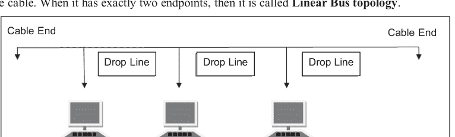

### 总线型拓扑的特点

- 1. 数据仅以单方向传输。
- 2. 每个设备都连接到单根电缆。

### 2. 环形拓扑

它被称为环形拓扑，因为每台计算机连接到另一台计算机，最后一台连接到第一台，形成一个环。每个设备恰好有两个邻居。


### 环形拓扑的特点

- 1. 对于拥有大量节点的环形拓扑，会使用许多中继器，因为如果有人想将数据发送到具有100个节点的环形拓扑中的最后一个节点，数据将不得不经过99个节点才能到达第100个节点。因此，为了防止数据丢失，网络中使用了中继器。
- 2. 传输是单向的，但可以通过在每个网络节点之间建立2个连接使其双向工作，这称为**双环拓扑**。
- 3. 在双环拓扑中，形成两个环形网络，数据在其中以相反方向流动。此外，如果一个环发生故障，第二个环可以充当备用，以保持网络运行。
- 4. 数据以逐位的方式顺序传输。传输的数据必须经过网络的每个节点，直到到达目标节点。

### 3. 星型拓扑

在这种拓扑类型中，所有计算机都通过一根电缆连接到单个集线器。此集线器是中心节点，所有其他节点都连接到中心节点。

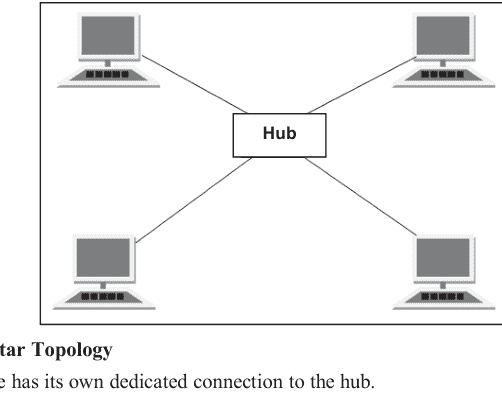

### 星型拓扑的特点

- 1. 每个节点都有自己专用的到集线器的连接。
- 2. 集线器充当数据流的中继器。
- 3. 可以与双绞线、光纤或同轴电缆一起使用。

### 4. 网状拓扑

它是与其他节点或设备的点对点连接。所有网络节点彼此连接。网状拓扑有 `n(n – 2)/2` 条物理通道来连接 `n` 个设备。
有两种技术用于在网状拓扑上传输数据：

- 1. 路由
- 2. 洪泛

**路由：** 在路由中，节点根据网络需求具有路由逻辑。例如，将数据定向到使用最短距离到达目的地的路由逻辑。或者，具有有关断开链路信息的路由逻辑，并避开这些节点等。我们甚至可以拥有重新配置故障节点的路由逻辑。

**洪泛：** 在洪泛中，相同的数据被传输到所有网络节点，因此不需要路由逻辑。网络是健壮的，丢失数据的可能性非常小。但它会导致网络上不必要的负载。

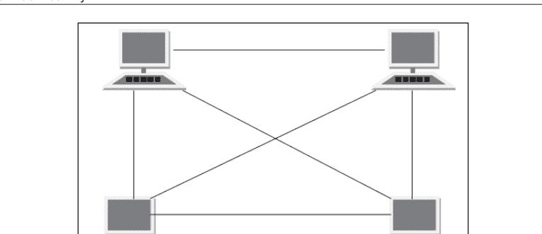

#### 网状拓扑的类型

- 1. 部分网状拓扑：在此拓扑中，一些系统以与网状拓扑相同的方式连接，但一些设备只连接到两三个设备。
- 2. 全网状拓扑：每个节点或设备都彼此连接。

#### 网状拓扑的特点

- 1. 完全连接。
- 2. 健壮。
- 3. 不灵活。

### 5. 树型拓扑

它有一个根节点，所有其他节点连接到它形成层次结构。它也称为分层拓扑。它应至少具有三个层次。

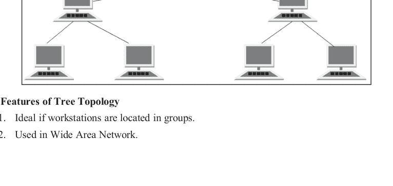

#### 树型拓扑的特点

- 1. 如果工作站分组放置，则是理想的选择。
- 2. 用于广域网。

### 6. 混合型拓扑

它是两种不同类型的拓扑的混合，是两种或多种拓扑的混合。例如，如果一个办公室的一个部门使用环形拓扑，另一个部门使用星型拓扑，连接这些拓扑将导致混合拓扑（环形拓扑和星型拓扑）。

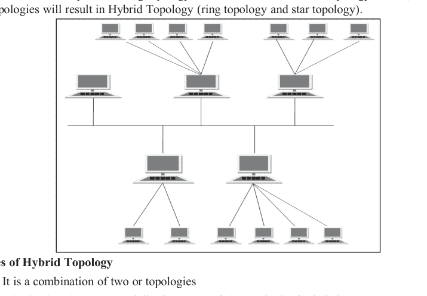

## 混合型拓扑的特点

- 1. 它是两种或多种拓扑的组合。
- 2. 继承了所包含拓扑的优缺点。

## 6.4 什么是域以及不同类型的域

（域名系统）一种在互联网或使用 TCP/IP 协议的本地网络上将主机名和域名转换为 IP 地址的系统。

例如，当通过在浏览器中输入 URL 或在后台从一个应用程序到另一个应用程序将网站地址提供给 DNS 时，DNS 服务器会返回与该名称关联的服务器的 IP 地址。

### DNS 结构

- IP 地址通常与更人性化的名称配对：域名系统 (DNS)。


其他顶级域名包括 .com、.gov、.org 等。还有一些特定国家的域名，如 .uk、.ca、.jp 等。

需要为你的域名注册主域名服务器和辅助域名服务器，并安排在 DNS 服务器上创建区域文件。

### serverA.example.org.in


### 域的类型

根域：在倒置域名树的顶部是 DNS 结构的最高级别，称为根域，用单个点 (.) 表示。

顶级域名：TLD 可以进一步细分为通用顶级域名（例如，.org、.com、.net、.mil、.gov、.edu、.int、.biz）、国家代码顶级域名（例如，.us、.uk、.ng 和 .ca，分别对应美国、英国、尼日利亚和加拿大的国家代码）。

二级域名：此级别的 DNS 名称构成了命名空间的实际组织边界。公司、互联网服务提供商 (ISP)、教育社区、非营利组织和个人通常在此级别获取唯一名称。以下是一些示例：redhat.com、caldera.com、kernel.org。

我们 URL (serverA.example.org.) 中的二级域名是 "example"。

三级域名：三级名称反映主机名或其他功能用途。三级域名的功能分配示例将是 www.yahoo.com 中的 "www"。这里的 "www" 可以是 yahoo.com 域下某台机器的实际主机名，也可以是真实主机名的别名。

(serverA.example.org.) 中的三级域名是 "serverA"。这里，它简单地反映了我们系统的实际主机名。

### 顶级域名

| 类别      | 描述             | 国家    | 描述       |
|-----------|------------------|---------|------------|
| .com      | 商业             | .us     | 美国       |
| .edu      | 教育             | .ca     | 加拿大     |
| .org      | 非营利组织       | .uk     | 英国       |
| .net      | 网络             | .de     | 德国       |
| .biz      | 商业             | .au     | 澳大利亚   |
| .name     | 个人使用         | .tw     | 台湾       |
| .pro      | 专业人士         | .ru     | 俄罗斯     |

- 顶级域名 (TLD) 分为两种类型：
- 1. 通用顶级域名 (gTLD) .com、.edu、.net、.org、.mil 等。
- 2. 国家代码顶级域名 (ccTLD) 例如 .us、.ca、.tv、.uk 等。


### 域名系统的功能

- DNS 用于将主机名解析为 IP 地址并查找服务。
- DNS 对于使用 Active Directory 的网络是必不可少的服务。
- 如果你希望 Web 服务器等资源在互联网上可用，也需要 DNS。
- 实施 DNS 最常见的操作系统是 UNIX/Linux，并且可以与 Windows 版本的 DNS 集成。

## 6.5 面向连接与无连接

### 6.5.1 无连接服务

由于 UDP 是一个无连接协议，因此 UDP 用于无连接服务。当使用 UDP 时，服务器创建一个套接字，并将地址和端口号绑定到它。然后服务器等待传入数据（记住：UDP 是无连接的）。

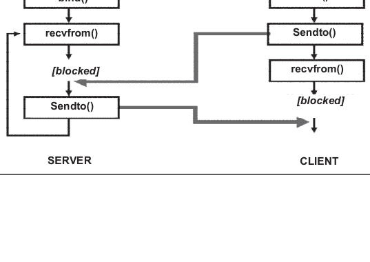

## 简单的无连接服务器

```python
from socket import socket, AF_INET, SOCK_DGRAM
s = socket(AF_INET, SOCK_DGRAM)
s.bind(('127.0.0.1', 11111))
while True:
    data, addr = s.recvfrom(1024)
    print("Connection from", addr)
    s.sendto(data.upper(), addr)
```

请注意，`bind()` 的参数是一个包含地址和端口号的二元组。更常见的做法是导入整个 socket 库并使用限定名，但 **from** 语句是从模块中仅访问特定名称的一种便捷方式。

```python
import socket
s = socket.socket(socket.AF_INET, socket.SOCK_DGRAM)
```

请仔细注意，`bind()` 调用接受一个参数，即一个包含 IP 地址字符串和端口号的元组。如果 IP 地址是空字符串，那么代码将绑定到所有接口，这也是大多数服务器实际启动的方式。上面的例子更安全一些，因为只有本地进程才能通过本地回环接口连接。

## 简单的无连接客户端

```python
from socket import socket, AF_INET, SOCK_DGRAM
s = socket(AF_INET, SOCK_DGRAM)
s.bind(('127.0.0.1', 0)) # OS chooses port
print("using", s.getsockname())
server = ('127.0.0.1', 11111)
s.sendto("MixedCaseString", server)
data, addr = s.recvfrom(1024)
print("received", data, "from", addr)
s.close()
```

客户端指定端口号为零，表示它只需要一个临时端口——这比尝试使用特定端口号更高效，因为请求的端口可能已被占用，从而导致 `bind()` 调用失败。

**getsockname()** 调用告知用户用于通信客户端端的地址和端口号。虽然这不是程序的基本部分，但它是有用的调试数据。

客户端只是发送数据并（通常）从服务器接收回复。这个特定程序在错误检查方面有些不足：如果服务器的响应以某种方式丢失，那么客户端将永远挂起。

### 6.5.2 面向连接的服务

- 被动参与者
  - 步骤 1：监听（传入的请求）
  - 步骤 3：接受（一个请求）
  - 步骤 4：数据传输
- 接受的连接在一个新的套接字上
- 旧的套接字继续监听其他主动参与者

- 主动参与者
  - 步骤 2：请求并建立连接
  - 步骤 4：数据传输


## 面向连接的服务


## 面向连接的服务器

```python
from socket import socket, AF_INET, SOCK_STREAM

s = socket(AF_INET, SOCK_STREAM)
s.bind(('127.0.0.1', 9999))
s.listen(5) # max queued connections

while True:
    sock, addr = s.accept()
    # use socket sock to communicate
```

## 与客户端进程

- 客户端连接创建新的套接字
- 通过 accept() 返回地址

- 服务器一次处理一个客户端
- 面向连接的服务器稍微复杂一些，因为连接允许客户端和服务器在多个 send() 和 recv() 调用之间进行交互。
- 服务器在 accept() 中阻塞，直到有服务器连接。accept() 的返回值是一个由套接字和客户端地址组成的元组（通常是（地址，端口）元组）。
- 服务器可以选择使用多任务技术，例如创建新线程或分叉新进程，以允许它处理多个并发连接。任一解决方案都允许在处理连接的同时，主控制循环返回执行另一个 accept() 并处理下一个客户端连接。
- 由于每个连接都会生成一个新的服务器端套接字，因此不同的会话之间没有冲突，服务器可以在为已连接的客户端服务的同时，继续使用 listen() 套接字监听传入的连接。

```python
# Connection-Oriented Client
s = socket(AF_INET, SOCK_STREAM)
s.connect((HOST, PORT))
s.send('Hello, world')
data = s.recv(1024)
s.close()
print('Received', data)
```

- 这是一个简单的例子
  - 发送消息，接收响应
  - 服务器在 close() 后接收 0 字节

这个非常简单的客户端只发送一条消息并接收一条响应。更典型的代码会发送一个请求，并利用其对应用程序协议的理解来确定该请求的响应何时完成。像 HTTP 1.0 这样的协议为每个请求使用单独的连接。像 telnet 这样的协议可以在连接关闭之前交换数千条消息，在这种情况下代码往往更复杂。在正常情况下，recv() 调用保证至少返回一个字节的数据。当程序看到从 recv() 返回的空字符串（零字节）时，它知道对方已通过在其套接字上调用 close() 终止了连接。

## 6.6 协议及不同类型协议简介。

协议可以定义为管理两个实体之间数据交换的一组规则。

**协议的关键要素：**

1.  语法。
2.  语义。
3.  时序。

1.  **语法：** 它包括数据格式和信号电平（即：编码和解码）等事项。
2.  **语义：** 它包括用于协调和错误处理的控制信息。
3.  **时序：** 它包括速度匹配和排序。

根据这三个关键要素，协议分为两种类型。

**基于关键要素的两种协议类型：**

1.  硬件协议。
2.  软件协议。

1.  **硬件协议：** 它是一种用于检查所有硬件设备规则集的协议，这意味着在数据传输期间，它会检查每一个电缆连接和所有中间硬件设备，如路由器和网关。如果发生任何硬件设备损坏，硬件协议将识别它并向服务器提供消息，如“网络电缆已拔出”。
2.  **软件协议：** 它是一组用于检查数据或传输数据的应用程序的规则。它还检查每个数据包的数据以及每个数据包的控制信息。在传输过程中，使用软件协议创建检查点，这些检查点在数据包丢失或损坏、数据报丢失或损坏或任何类型的数据问题时提供信息。

这些软件协议细分为不同类型，如 SMTP、FTP、HTTP 和 MIME 等。

## 6.7 网络连接性简介

**网络连接性**

网络连接性意味着我们将不同类型的网络相互连接。借助于网络内实现的不同拓扑结构，连接性成为可能。借助于拓扑结构，我们可以使用集线器、中继器、交换机和路由器与其他计算机及其资源（如打印机、DVD 刻录机等）进行通信。

Python 提供了对网络服务的两级访问。在底层，你可以访问底层操作系统中的基本套接字支持，这允许你为面向连接和无连接的协议实现客户端和服务器。

Python 还有提供对特定应用程序级网络协议（如 FTP、HTTP 等）更高级别访问的库。

网络编程是 Python 的一个主要用途。

- Python 标准库对网络协议、数据编码/解码以及使其工作所需的其他内容提供了广泛的支持。
- 用 Python 编写网络程序往往比用 C/C++ 容易得多。

### 层间关系

- 每一层都使用其下一层
- 下层为来自上层的数据添加报头
- 来自上层的数据也可以是来自更上层数据的报头...


## 6.8 什么是套接字

套接字是双向通信通道的端点。套接字可以配置为充当服务器并监听传入消息，或者作为 *客户端* 连接到其他应用程序。当 TCP/IP 套接字的两端都连接时，通信是双向的，即双向通信，我们从另一端得到回复。

套接字可以使用 Unix/Linux 域套接字、TCP、用户定义协议（UDP）等实现。套接字库提供了通用传输以及用于处理整个或特定类的通用接口。

| 术语 | 描述 |
| :--- | :--- |
| domain | 用作传输机制的协议族。这些值是常量，如 AF_INET、PF_INET、PF_UNIX、PF_X25 等。 |
| type | 两个端点之间的通信类型，对于面向连接的协议通常是 SOCK_STREAM，对于无连接的协议是 SOCK_DGRAM。 |
| protocol | 通常为零，可用于标识域和类型内的协议变体。 |
| hostname | 网络接口的标识符：<br>一个字符串，可以是主机名、点分四元组地址或冒号（可能带点）表示法的 IPV6 地址<br>一个字符串 "<broadcast>"，指定 INADDR_BROADCAST 地址。<br>一个零长度字符串，指定 INADDR_ANY，或<br>一个整数，解释为主机字节序的二进制地址。 |
| port | 每个服务器在一个或多个端口上监听客户端调用。端口可以是 Fixnum 端口号、包含端口号的字符串或服务名称。 |

套接字是一个软件抽象，提供单个服务器进程和单个客户端进程之间的通信链路。

### 各种类型的套接字


-   连接的端点
-   通过IP地址和端口号标识
-   实现高级网络接口的基础
-   例如，远程过程调用（RPC）

### 网络套接字

-   用于标识特定机器上的特定进程（程序）。
-   套接字由两个数字组成：
    -   IP地址：机器标识符
    -   端口号：进程标识符
-   Berkeley套接字是最常见的套接字实现方式。
-   两台计算机之间的连接可以表示为两个套接字：一个用于客户端机器和程序，一个用于服务器机器和程序。

### 端口号

-   知名端口 – 0-1023

示例：

-   25：SMTP（电子邮件），80：HTTP（网页），110：POP3（电子邮件），443：HTTPS（安全网页）
-   注册端口 – 1024-49151
-   私有/动态端口 – 49151-65535

### 套接字编程API

应用程序编程接口

套接字API是你用于发送和接收消息所需的编程接口。它几乎就像一扇门，一扇通往传输层的门（注意我们处于应用层）。

-   套接字类似于门
-   发送进程将消息推出门外
-   发送进程假设门另一侧的传输基础设施会将消息带到接收进程的套接字
-   主机本地、应用程序创建/拥有、操作系统控制
-   套接字之间的连接由操作系统设置/管理


### 套接字：概念视图


### 两种基本类型的套接字

-   Sock_Stream
    -   又称TCP
    -   可靠传输
    -   保证顺序
    -   面向连接
    -   双向

-   Sock_Dgram
    -   又称UDP
    -   不可靠传输
    -   不保证顺序
    -   没有“连接”的概念 - 应用程序为每个数据包指定目的地
    -   可发送或接收


## 6.9 Socket模块

Socket模块实现了与套接字通信层的接口。我们可以使用此模块创建客户端和服务器套接字。

### socket模块

要创建套接字，我们必须使用socket模块中可用的socket.socket()函数，其通用语法为：

```
s = socket.socket(socket_family, socket_type, protocol=0)
```

其中

-   socket_family：这是AF_UNIX或AF_INET
-   socket_type：这是SOCK_STREAM或SOCK_DGRAM。
-   protocol：通常省略，默认值为0。

AF_UNIX或AF_LOCAL套接字族用于在同一台机器上的进程之间高效通信。

AF_INET的基本目的是允许其他可能的网络协议或地址族（AF代表地址族；PF_INET代表（IPv4）互联网协议族）。

SOCK_STREAM意味着一个套接字流，数据传递就像文件流一样。

协议 - 一组特定的通信规则称为协议。

当套接字对象准备好使用时，我们现在创建服务器套接字方法和客户端套接字方法。

### 服务器套接字方法

| 方法 | 描述 |
| --- | --- |
| s.bind() | 此方法将地址（主机名，端口号对）绑定到套接字。 |
| s.listen() | 此方法设置并启动TCP监听器。 |
| s.accept() | 此方法被动接受TCP客户端连接，等待连接到达（阻塞）。 |

### 客户端套接字方法

| 方法 | 描述 |
| --- | --- |
| s.connect() | 此方法主动发起TCP服务器连接。 |

### 通用套接字方法

| 方法 | 描述 |
| --- | --- |
| s.recv() | 此方法接收TCP消息 |
| s.send() | 此方法发送TCP消息 |
| s.recvfrom() | 此方法接收UDP消息 |
| s.sendto() | 此方法发送UDP消息 |
| s.close() | 此方法关闭套接字 |
| socket.gethostname() | 返回主机名。 |

### 创建套接字

现在我们在Python中创建一个INET，STREAMing套接字

**s = socket.socket(socket.AF_INET, socket.SOCK_STREAM)**

现在连接到端口80上的Web服务器（这是正常的http端口）

**s.connect(("www.google.com", 80))**

当**connect**完成时，套接字s可用于发送请求以获取页面文本。同一个套接字将读取回复，然后被销毁。销毁的客户端套接字通常只用于一次交换（或一小部分顺序交换）。

Web服务器中发生的事情稍微复杂一些。首先，Web服务器创建一个"**服务器套接字**"：

```
# create an INET, STREAMing socket
serversocket = socket.socket(socket.AF_INET, socket.SOCK_STREAM)
# bind the socket to a public host, and a well-known port
serversocket.bind((socket.gethostname(), 80))
# become a server socket
serversocket.listen(5)
```

请注意，我们使用了**socket.gethostname()**，以便套接字对所有人可见。如果我们使用**s.bind(('localhost', 80))**或**s.bind(('127.0.0.1', 80))**，我们仍然会有一个"服务器"套接字，但它只在同一台机器内可见。**s.bind(('', 80))**指定套接字可通过机器拥有的任何地址访问。

我们再次注意到，低编号端口通常保留给"知名"服务（HTTP、SNMP等）。如果我们只是测试，使用一个较高的数字（即4位数）。

现在，最后，*listen*的参数告诉套接字库，我们希望它在拒绝外部/其他连接之前，将多达5个连接请求（通常的最大值）排队。如果其余代码编写正确，这应该足够了。

现在我们有了一个"服务器"套接字，监听端口80，我们可以进入Web服务器的*主循环*：

```
while True:
    # accept connections from other/outside
    (clientsocket, address) = serversocket.accept()
    # now do something with the clientsocket
    # in this case, we'll make up this is a threaded server
    ct = client_thread(clientsocket)
    ct.run()
```

这个循环有三种通用的工作方式

1.  分派一个线程来处理clientsocket，创建一个新进程来处理clientsocket，或者重构此应用程序以使用非阻塞套接字，并使用select在我们的"服务器"套接字和任何活动的clientsocket之间进行多路复用。
2.  现在需要理解的重要事情是：这就是"服务器"套接字所做的全部。它不发送任何数据。它不接收任何数据。它只是产生"客户端"套接字。
3.  每个clientsocket都是响应某个其他"客户端"套接字对我们绑定的主机和端口执行connect()而创建的。一旦我们创建了该clientsocket，我们就返回监听更多连接。两个"客户端"可以自由聊天 - 它们使用一些动态分配的端口，这些端口将在对话结束时被回收。

## 6.10 客户端-服务器架构

*什么是客户端/服务器？*

**客户端**
客户端是一个单用户工作站，提供表示服务、数据库服务和连接性，以及用于用户交互以获取业务需求的接口。

**服务器**
服务器是一个或多个具有更高共享内存容量的多用户处理器，提供连接性和数据库服务，以及与业务流程相关的接口。


*客户端/服务器架构简介*

**客户端-服务器架构**，一种计算机网络架构，其中许多客户端（远程处理器）请求并接收来自集中式服务器（主机计算机）的服务。客户端计算机提供一个接口，允许计算机用户请求服务器的服务并显示服务器返回的结果。服务器等待来自客户端的请求到达，然后响应它们。

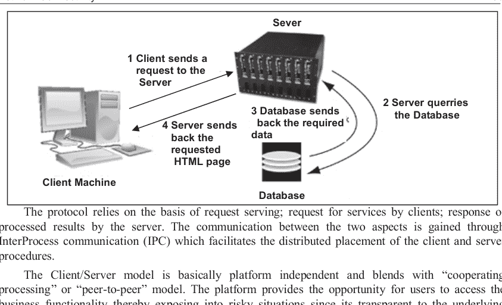

该协议依赖于请求服务的基础；客户端请求服务；服务器响应处理后的结果。两个方面之间的通信通过进程间通信（IPC）实现，这促进了客户端和服务器过程的分布式放置。

客户端/服务器模型基本上是平台无关的，并与"协作处理"或"对等"模型融合。该平台为用户提供了访问业务功能的机会，从而暴露于风险情况，因为它对底层技术以及用户都是透明的。

## 6.11 创建服务器-客户端程序

*客户端和服务器编程基础*

（请注意，对于客户端服务器连接，你需要在Linux中安装Python 3.4或最新版本，然后执行下面给出的步骤。我首先在VMware Workstation 12 Player中安装Linux，然后安装Python 3.5）

服务器是向你提供或交付特定服务的东西，客户端是请求该服务的人。

对于客户端和服务器连接，我们需要以下四个基本要素：

1.  套接字（TCP或用户定义协议）
2.  绑定
3.  监听
4.  接受

套接字通常是两个实体之间连接的端点，套接字充当客户端和服务器之间的桥梁。首先客户端将连接到套接字，那将是实际的服务器套接字，然后它将连接到服务器。现在我们需要基本的协议，即TCP。我们需要Python终端来导入套接字，套接字已经在Python库中，使用以下命令

```
>>>import socket
>>>s=socket.socket(socket.AF_INET,socket.SOCK_STREAM)
```

我们创建了套接字的完整实现，首先访问两个参数：第一个是地址族，即 `AF_INET`，另一个是实际协议 TCP。接下来的步骤是绑定，那么什么是绑定？绑定就是告诉服务器应该在哪里连接，以及它将在哪里提供服务，这可以通过以下方式轻松完成：

```python
>>>s.bind("127.0.0.1",8000)
```

它需要两个参数：一个是 IP 地址，另一个是它将连接的端口。现在下一步是监听，什么是监听？监听意味着我们告诉服务器开始监听，实际上是监听来自客户端的连接或请求，使用以下代码：

```python
>>>s.listen(2)
```

2 表示它将能够同时处理两个客户端，这样我们就可以在运行时实际连接两个客户端。最后一步是接受，这里服务器实际接受来自客户端的连接。

```python
>>>>(client,(ip,port))=s.accept()
```

我们创建一个客户端套接字，这意味着每当一个连接建立或即将建立到服务器时，会生成一个单独的客户端套接字，它告诉服务器是哪个客户端实际连接，这仅意味着服务器将能够建立或断开两个客户端之间的连接。另一个重要的部分是 IP 端口，它作为一个阻塞语句接受，并将等待直到我接收到任何类型的连接。我们可以使用 net cat 工具（即 `nc`）来建立连接，为此你在 Linux 中打开另一个新的终端窗口并输入以下命令：

```bash
$ nc 127.0.0.1 8000
```

现在，一旦你在前一个窗口中按下回车键，它会显示 python 提示符，即：

```python
>>>
```

在这里，你输入 `client` 并按下回车键，它会显示：

```python
>>>client
```

<socket._socketobject object at 0x61b61618> 这意味着服务器正在运行。

```python
>>>ip
```

'127.0.0.1' 这表明它已连接。

```python
>>>port
```

45918 所以它显示客户端连接的远程端口地址。

我们使用 IP 地址和实际使用的端口（即 8000）。现在使用以下代码从客户端发送一些内容：

```python
>>>client.send("Welcome in client server connection")
```

因此我们在之前打开的另一个终端窗口中成功接收到了横幅。

现在我们从客户端向服务器发送一些数据，为此你需要先告诉服务器你应该准备好接收数据，使用以下命令：

```python
>>>client.recv(2000)
```

现在这里的 2000 是缓冲区大小或数据大小。现在在第二个终端窗口中输入一些内容，例如 “This message is send from client for the server” 并按下回车键，所以一旦你在服务器窗口（即第一个终端窗口）按下回车键，你会得到：

```python
>>>client.recv(2000)
```

> 'This message is send from client for the server'

所以通过这种方式，我们可以建立简单的客户端和服务器连接。

### 服务器的步骤

-   创建套接字对象
-   将套接字对象绑定到特定的套接字
-   监听
-   程序循环：
    -   接受来自客户端的连接
    -   [执行程序逻辑]
    -   关闭套接字

### 客户端的步骤

-   创建套接字对象
-   请求连接到特定的套接字（服务器的套接字）
-   [执行程序逻辑]
-   关闭套接字

### 创建服务器-客户端程序

要创建服务器和客户端程序，我们必须首先了解服务器和客户端程序中使用的方法。

### 服务器套接字方法

| 方法 | 描述 |
|--------|-------------|
| `s.bind()` | 将地址（主机名，端口号对）绑定到套接字。 |
| `s.listen()` | 设置并启动 TCP 监听器。 |
| `s.accept()` | 被动地接受 TCP 客户端连接，等待直到连接到达（阻塞）。 |

### 客户端套接字方法

| 方法 | 描述 |
|--------|-------------|
| `s.connect()` | 这个特定方法主动发起连接。 |

### 服务器实现的顺序：

### 服务器实现

-   网络服务器稍微复杂一些
-   必须在知名端口号上监听传入的连接
-   通常在服务器循环中永久运行
-   可能需要服务多个客户端

#### TCP 服务器

-   一个简单的服务器

```python
from socket import *
s = socket(AF_INET,SOCK_STREAM)
s.bind(("",9000))
s.listen(5)
while True:
    c,a = s.accept()
    print "Received connection from", a
    c.send("Hello %s\n" % a[0])
    c.close()
```

-   向客户端发回消息

```bash
% telnet localhost 9000
Connected to localhost.
Escape character is '^]'.
Hello 127.0.0.1
Connection closed by foreign host.
%
```

服务器消息

#### TCP 服务器

-   地址绑定

```python
from socket import *
s = socket(AF_INET,SOCK_STREAM)
s.bind(("",9000))
s.listen(5)
while True:
    c,a = s.accept()
    print "Received connection from", a
    c.send("Hello %s\n" % a[0])
    c.close()
```

将套接字绑定到特定地址

-   寻址

```python
s.bind(("",9000))
s.bind(("localhost",9000))
s.bind(("192.168.2.1",9000))
s.bind(("104.21.4.2",9000))
```

绑定到 localhost

如果系统有多个 IP 地址，可以绑定到特定地址

#### TCP 服务器

-   开始监听连接

```python
from socket import *
s = socket(AF_INET,SOCK_STREAM)
s.bind(("",9000))
s.listen(5)
while True:
    c,a = s.accept()
    print "Received connection from", a
    c.send("Hello %s\n" % a[0])
    c.close()
```

告诉操作系统开始在套接字上监听连接

-   `s.listen(backlog)`
-   `backlog` 是允许的待处理连接数
-   注意：与客户端的最大数量无关

#### TCP 服务器

接受新连接

```python
from socket import *
s = socket(AF_INET, SOCK_STREAM)
s.bind(("", 9000))
s.listen(5)
while True:
    c,a = s.accept()
    print "Received connection from", a
    c.send("Hello %s\n" % a[0])
    c.close()
```

接受一个新的客户端连接

-   `s.accept()` 会阻塞直到接收到连接
-   如果没有事情发生，服务器会休眠

#### TCP 服务器

客户端套接字和地址

```python
from socket import *
s = socket(AF_INET, SOCK_STREAM)
s.bind(("", 9000))
s.listen(5)
while True:
    c,a = s.accept()
    print "Received connection from", a
    c.send("Hello %s\n" % a[0])
    c.close()
```

接受返回一对 `(client_socket, addr)`

这是一个用于数据传输的新套接字

这是已连接客户端的网络/端口地址

#### TCP 服务器

发送数据

```python
from socket import *
s = socket(AF_INET, SOCK_STREAM)
s.bind(("", 9000))
s.listen(5)
while True:
    c,a = s.accept()
    print "Received connection from", a
    c.send("Hello %s\n" % a[0])
    c.close()
```

向客户端发送数据

注意：使用客户端套接字来传输数据。服务器套接字仅用于接受新连接。

#### TCP 服务器

关闭连接

```python
from socket import *
s = socket(AF_INET, SOCK_STREAM)
s.bind(("", 9000))
s.listen(5)
while True:
    c,a = s.accept()
    print "Received connection from", a
    c.send("Hello %s\n" % a[0])
    c.close()
```

关闭客户端连接

注意：服务器可以根据需要保持客户端连接活跃

可以重复接收/发送数据

#### TCP 服务器

等待下一个连接

```python
from socket import *
s = socket(AF_INET, SOCK_STREAM)
s.bind(("", 9000))
s.listen(5)
while True:
    c,a = s.accept()
    print "Received connection from", a
    c.send("Hello %s\n" % a[0])
    c.close()
```

等待下一个连接

-   原始的服务器套接字被重用以监听更多连接
-   服务器像这样在一个循环中永久运行


```python
python
import socket
import sys

HOST = ''    # 符号名称，表示所有可用接口
PORT = 8888  # 任意非特权端口

s = socket.socket(socket.AF_INET, socket.SOCK_STREAM)
print('Socket created')

# 将套接字绑定到本地主机和端口
try:
    s.bind((HOST, PORT))
except socket.error as msg:
    print('Bind failed. Error Code : ' + str(msg[0]) + ' Message ' + msg[1])
    sys.exit()

print('Socket bind complete')

# 开始在套接字上监听
s.listen(10)
print('Socket now listening')

# 现在保持与客户端的通信
while 1:
    # 等待接受连接 - 阻塞调用
    conn, addr = s.accept()
    print('Connected with ' + addr[0] + ':' + str(addr[1]))

s.close()
```在上述程序中，`accept` 函数在循环中被调用，以便持续接受来自多个客户端的连接。

## server.py 程序的输出

输出表明套接字已被创建、绑定，然后进入监听模式。此时，请尝试从另一个终端使用 `telnet` 命令连接到此服务器。

```
C:\>telnet localhost 8888
```

`telnet` 命令应该会立即连接到服务器，服务器终端会显示以下信息。

1. **socket.socket()**: 使用给定的地址族、套接字类型和协议编号创建一个新的套接字。
2. **socket.bind(address)**: 将套接字绑定到地址。
3. **socket.listen(backlog)**: 监听对套接字的连接。`backlog` 参数指定等待连接的最大队列长度，且至少应为 0；最大值取决于系统（通常为 5），最小值强制为 0。
4. **socket.accept()**: 返回值是一个元组 (conn, address)，其中 conn 是一个可用于在连接上发送和接收数据的新套接字对象，而 address 是连接另一端绑定到套接字的地址。
    调用 `accept()` 时，会创建一个与命名套接字不同的新套接字。这个新套接字专门用于与该特定客户端进行通信。
    对于 TCP 服务器，用于接收连接的套接字对象与后续用于与客户端通信的套接字对象不同。特别是，`accept()` 系统调用返回一个实际用于该连接的新套接字对象。这允许服务器同时管理来自大量客户端的连接。
5. **socket.send(bytes[, flags])**: 向套接字发送数据。套接字必须连接到远程套接字。返回发送的字节数。应用程序负责检查所有数据是否已发送；如果只传输了部分数据，应用程序需要尝试发送剩余数据。
6. **socket.close()**: 将套接字标记为关闭。此后对该套接字对象的所有操作都将失败。远程端将不再收到数据（在排队的数据被清空之后）。套接字在垃圾回收时会自动关闭，但建议显式调用 `close()` 关闭它们。

请注意，**服务器**套接字不接收任何数据。它只是生成**客户端**套接字。每个**客户端套接字**都是为了响应某个**客户端**套接字对我们绑定到的主机和端口执行 **`connect()`** 操作而创建的。一旦我们创建了该**客户端套接字**，我们就会返回去监听更多连接。

## 6.12 通过 SMTP 发送邮件

### 6.12.1 SMTP 简介

简单邮件传输协议（SMTP）是一种处理电子邮件发送和在邮件服务器之间路由电子邮件的协议。

Python 提供了 **smtplib** 模块，该模块定义了一个 SMTP 客户端会话对象，可用于向任何具有 SMTP 或 ESMTP 监听守护程序的互联网机器发送邮件。

```
import smtplib
smtpObj = smtplib.SMTP( [host [, port [, local_hostname]]] )
```

以下是参数的详细说明：

**host**: 这是运行你的 SMTP 服务器的主机。你可以指定主机的 IP 地址或域名（例如 `tutorialspoint.com`）。这是一个可选参数。

**port**: 如果你提供了 `host` 参数，那么你需要指定 SMTP 服务器监听的端口。通常该端口为 25。

**local_hostname**: 如果你的 SMTP 服务器在本地机器上运行，那么你可以将 `localhost` 作为此选项的值。

SMTP 对象有一个名为 **sendmail** 的实例方法，通常用于执行发送邮件的任务。它接受三个参数：

- *sender*（发件人） – 一个包含发件人地址的字符串。
- *receivers*（收件人） – 一个字符串列表，每个字符串对应一个收件人。
- *message*（消息） – 一个按照各种 RFC 规定格式化的字符串消息。

### 6.12.2 发送邮件

**在 Python 中发送邮件**

首先在你的 Linux 机器上安装 sendmail 实用程序，这样你就不需要依赖任何 SMTP 服务器：

你需要安装 sendmail。在终端中输入以下命令：

```
# sudo apt-get install sendmail
要重启、停止、启动 sendmail
# /etc/init.d/sendmail restart
# /etc/init.d/sendmail stop
# /etc/init.d/sendmail start
```

## 在 Python 中创建 SMTP 对象的语法

```
import smtplib
smtpObj = smtplib.SMTP( [host [, port [, local_hostname]]] )
```

其中

**host:** 这是运行你的 SMTP 服务器的主机。在这里我们可以指定主机的 IP 地址或域名，例如我们使用域名 yahoo.com 或 facebook.com，但这是一个可选参数。

**port:** 它需要指定 SMTP 服务器监听的端口。默认值是 25。

**local_hostname:** 当我们在本地机器上运行 SMTP 服务器时，那么你可以将 `localhost` 作为此选项的值。

现在你的 SMTP 邮件传输代理（MTA）就可以使用了。如果你想从代码中发送邮件通知，你需要做的就是在 `smtplib.SMTP('localhost', 25)` 中导入 `smtplib` 模块。

简单邮件传输协议（SMTP）是一种处理电子邮件发送和在邮件服务器之间路由电子邮件的协议。在 Python 中，`smtplib` 模块用于发送邮件。该模块定义了一个 SMTP 客户端会话对象，可用于通过互联网向任何连接到具有 SMTP 或 ESMTP 监听守护程序的机器发送邮件。

现在在 **Linux vi 编辑器中创建 `send.py` 文件**，创建文件后使用以下命令运行该文件：

```
#python3.5 send.py
import smtplib
from_id = 'sender@domain.com'
to_id = ['vvastava@yahoo.com','vvastava@gmai.com']
mail_body = """From: From Person <naren>
To: vvastava@gmail.com
Subject: This is SMTP mail sent using
SMTP mail server located in same system(localhost)
"""
try:
    smtpObj = smtplib.SMTP('localhost', 25)
    smtpObj.sendmail(from_id, to_id, mail_body)
    print "Sent email succesfully"
except SMTPException:
    print "Error: Mail Not sent"
```

现在它会显示如下输出：

## 如何使用 Python 通过 Google 账户发送邮件

Python 便捷地内置了 `smtplib`，它处理了协议的所有不同部分，如连接、身份验证、验证和发送电子邮件。

使用这个库（即 `smtplib`），有几种不同的方法可以创建到邮件服务器的连接。在本节中，我们将专注于创建一个普通的、不安全的连接。这种连接是未加密的，并使用默认的端口地址 25。使用 `smtplib` 创建这些连接非常简单，这里我们使用端口 587。

```
import smtplib
try:
    server = smtplib.SMTP('smtp.gmail.com', 587)
    server.ehlo()
except:
    print('Something went wrong...')
```

其实除了传递服务器地址、端口和调用 `.ehlo()`（用于向 SMTP 服务器标识你自己）之外，没有太多其他内容。使用这个服务器对象，我们现在可以通过不安全的连接发送电子邮件。对于安全连接，我们只需在 `server.ehlo()` 之后添加一行，即 `server.starttls()`。

**创建电子邮件**
大多数电子邮件至少包含“发件人”、“收件人”、“主题”和正文字段。下面是一个简单的例子：

```
From: you@gmail.com
To: me@gmail.com, bill@gmail.com
Subject: Python email program
```

借助参数，这些字段可以使用 Python 中的字符串格式化：

```
from = 'you@gmail.com'
to = ['me@gmail.com', 'bill@gmail.com']
subject = 'Python email program'
body = 'Hello you are sending email'
email_text = '''\nFrom: %s
To: %s
Subject: %s
%s
''' % (from, ', '.join(to), subject, body)
```

现在你需要做的就是将 `email_text` 字符串传递给 `smtplib`，我们将在下一节中展示。

在通过 Gmail 使用 SMTP 发送邮件之前，你需要采取几个步骤，这与身份验证有关。如果你使用 Gmail 作为服务商，你需要告诉 Google 允许你通过 SMTP 连接，这被认为是一种“不太安全”的方法。

至于实际的 Python 代码，你需要做的就是调用登录方法：

```
import smtplib
gmail_user = 'you@gmail.com'
gmail_password = 'P@ssword!'
try:
    server = smtplib.SMTP_SSL('smtp.gmail.com', 587)
    server.ehlo()
    server.login(gmail_user, gmail_password)
except:
    print('Something went wrong...')
```

**发送电子邮件**

现在我们已经设置了 SMTP 连接并授权了我们的应用程序与 Google 交互，我们终于可以使用 Python 通过 Gmail 发送邮件了。

使用我们上面构建的电子邮件字符串和已连接/已授权的服务器对象，你需要调用 `.sendmail()` 方法。以下是完整的代码，包括关闭连接的方法：

```
from = 'you@gmail.com'
to = ['me@gmail.com', 'bill@gmail.com']
subject = 'Python email program'
body = 'Hello you are sending email'
email_text = """\nFrom: %s
To: %s
Subject: %s
%s
''' % (from, ', '.join(to), subject, body)
try:
    server = smtplib.SMTP_SSL('smtp.gmail.com', 465)
    server.ehlo()
```

server.login(gmail_user, gmail_password)
server.sendmail(from, to, email_text)
server.close()
print('Email sent!')
except:
    print('Something went wrong...')

## 6.13 什么是 URL？

URL（统一资源定位符）是 URI 的一种形式，是用于寻址可通过互联网和内网访问的文档的标准化命名约定。一个 URL 的示例是 http://www.kirancomputer.com，这是 Computer Hope 网站的 URL。

### URL 概览
以下是关于此页 HTTP URL 各部分的补充信息。


http://
“http” 代表超文本传输协议，它使浏览器能够知道将使用何种协议来访问指定域名中的信息。http 后面是冒号 ( : ) 和两个斜杠 ( // )，它们将协议与 URL 的其余部分分开。

www.
www. 代表万维网，用于区分内容。URL 的这一部分不是必需的，很多情况下可以省略。例如，输入 “http://kirancomputer.com” 仍然可以访问 Computer Hope 的网页。此地址部分也可以替换为一个称为子域的重要子页面。例如，http://support.computerhope.com 会将你引导到 Computer Hope 的主要帮助部分。

kirancomputer.com
接下来，computerhope.com 是网站的域名。域名的最后一部分称为“域名后缀”或顶级域，用于标识网站的类型或所在地。例如，.com 是 commercial（商业）的缩写，.org 是 organization（组织）的缩写，.co.uk 代表英国。还有数十种其他可用的域名后缀。要获得一个域名，你需要通过域名注册商注册该名称。

/kiran/python/
接下来，上述 URL 中的 “kiran” 和 “python” 部分是网页在服务器上的目录位置。在此示例中，该网页位于两层目录深度，因此如果你要尝试在服务器上找到该文件，它将位于 /public_html/kiran/python 目录中。对于大多数服务器，public_html 目录是包含 HTML 文件的默认目录。

url.htm
最后，url.htm 是你正在查看的域名上的实际网页。末尾的 .htm 是网页的文件扩展名，表明该文件是一个 HTML 文件。互联网上其他常见的文件扩展名包括 .html、.php、.asp、.cgi、.xml、.jpg 和 .gif。每个文件扩展名执行不同的功能，就像你计算机上所有不同类型的文件一样。

## 6.14 从 URL 读取

在 Python 3 中，urllib 模块已被拆分并重命名为 urllib.request、urllib.parse 和 urllib.error。

### urllib — URL 处理模块

urllib 是一个包含多个用于处理 URL 的模块的包：

- urllib.error：包含 urllib.request 抛出的异常
- urllib.parse：用于解析 URL
- urllib.robotparser：用于解析 robots.txt 文件

特别地，urlopen() 函数类似于内置的 open() 函数，但接受统一资源定位符（URL）而不是文件名。存在一些限制——它只能打开用于读取的 URL，并且不支持 seek 操作。

urllib.request 模块定义了有助于在复杂的网络环境中打开 URL（主要是 HTTP）的函数和类——包括基本和摘要认证、重定向、Cookie 等更多功能。

urllib.request 模块定义了以下函数：

```
urllib.urlopen(url[, data[, proxies[, context]]])
```

现在我们来看一个简单的例子，这个例子获取 python.org 主页并显示其前 300 个字节。

```
>>> import urllib.request
>>> f = urllib.request.urlopen('http://www.python.org/')
>>> print(f.read(300))
```


注意 urlopen 返回的是一个 bytes 对象。这是因为 urlopen 无法自动确定它从 HTTP 服务器接收到的字节流的编码方式。通常，程序在确定或猜测出合适的编码后，会将返回的 bytes 对象解码为字符串。

### Request 对象

**Request.full_url**
传递给构造函数的原始 URL。

**Request.type**
URI 方案。

**Request.host**
URI 权威部分，通常是主机名，但也可能包含用冒号分隔的端口。

**Request.origin_req_host**
请求的原始主机，不包括端口。

**Request.selector**
URI 路径。如果 Request 使用代理，那么 selector 将是传递给代理的完整 URL。

**Request.data**
请求的实体体，如果未指定则为 None。

**Request.method**
要使用的 HTTP 请求方法。默认值为 None，这意味着 get_method() 将执行其对要使用的方法的常规计算。其值可以通过以下方式设置（从而覆盖 get_method() 中的默认计算）：在 Request 子类中设置类级别默认值，或者通过 method 参数向 Request 构造函数传递一个值。

**Request.get_method()**
返回一个字符串，指示 HTTP 请求方法。如果 Request.method 不是 None，则返回其值；否则，如果 Request.data 为 None 则返回 ‘GET’，如果不为 None 则返回 ‘POST’。这只对 HTTP 请求有意义。

**Request.remove_header(header)**
从请求实例中移除指定的头部（包括常规和未重定向的头部）。

这是一个使用 GET 方法检索包含参数的 URL 的示例会话：

```
import urllib.request
import urllib.parse
params = urllib.parse.urlencode({'spam': 1, 'eggs': 2, 'bacon': 0})
f = urllib.request.urlopen("http://www.musi-cal.com/cgi-bin/query?%s" % params)
print(f.read().decode('utf-8'))
```

以下示例改用 POST 方法。

```
import urllib.request
import urllib.parse
data = urllib.parse.urlencode({'spam': 1, 'eggs': 2, 'bacon': 0})
data = data.encode('utf-8')
request = urllib.request.Request("http://requestb.in/xrbl82xr")
request.add_header("Content-Type","application/x-www-form-urlencoded;charset=utf-8")
f = urllib.request.urlopen(request, data)
print(f.read().decode('utf-8'))
```

**在 HTTP 的情况下，Request 对象允许你做两件额外的事情：**

1.  首先，你可以传递要发送给服务器的数据。
2.  其次，你可以传递额外的信息（即“元数据”），这些信息作为 HTTP “头部”发送。

### 数据

当我们想通过 HTTP 向一个 URL 发送数据时，这通常使用 **POST** 请求完成。这通常是你的浏览器在提交我们在网页上填写的 HTML 表单时所做的。

在 HTML 表单的常见情况下，数据需要以标准方式编码，然后作为 data 参数传递给 Request 对象。


这里我们向 CGI 的标准输入发送一个数据流，并读取它返回给我们的数据。请注意，此示例仅在 Python 安装支持 SSL 时有效。

```
>>> import urllib2
>>> req = urllib2.Request(url='https://localhost/cgi-bin/test.cgi', data='This data is passed')
>>> f = urllib2.urlopen(req)
>>> print f.read()
Got Data: "This data is passed"
```

### **基本 HTTP 认证的使用：**

```
import urllib2
# 创建一个支持基本 HTTP 认证的 OpenerDirector
# 并全局安装，以便可以与 urlopen 一起使用。
auth_handler = urllib2.HTTPBasicAuthHandler()
auth_handler.add_password('realm', 'host', 'username', 'password')
opener = urllib2.build_opener(auth_handler)
urllib2.install_opener(opener)
urllib2.urlopen('http://www.example.com/login.html')
```

build_opener() 默认提供许多处理器，包括 ProxyHandler。默认情况下，ProxyHandler 使用名为 <scheme>_proxy 的环境变量，其中 <scheme> 是涉及的 URL 方案。

我们首先看到 Requests 的安装。使用任何软件包的第一步是正确安装它。

### **Pip 安装 Requests**

要安装 Requests，只需在你选择的 Linux 终端中运行这个简单的命令：

```
# pip install requests
```

如果你没有安装 pip，请首先使用以下命令安装 pip

```
#apt install python-pip // 此命令安装 pip
```

### **获取源代码**

Requests 在 GitHub 上积极开发，代码始终可用。如果 git 未在你的操作系统中安装，请先使用以下命令安装 git，

```
#apt install git
```

你可以克隆公共仓库：

```
$ git clone git://github.com/kennethreitz/requests.git
```

以下方法描述了 Requests 的公共接口，它还定义了几个公共属性，客户端可以用来检查已解析的请求。

### **如何在 Python 中发送 POST 请求？**

```
import urllib
import requests
```

## Python 网络模块

Python 网络/互联网编程：

| 协议 | 常用功能 | 端口号 | Python 模块 |
| :--- | :--- | :--- | :--- |
| HTTP | 网页 | 80 | httplib, urllib, xmlrpclib |
| NNTP | Usenet 新闻组 | 119 | Nntplib |
| FTP | 文件传输 | 20 | ftplib, urllib |
| SMTP | 发送电子邮件 | 25 | SmtpLib |
| POP3 | 接收电子邮件 | 110 | Poplib |
| IMAP4 | 接收电子邮件 | 143 | Imaplib |
| Telnet | 命令行 | 23 | telnetlib |
| Gopher | 文档传输 | 70 | gopherlib, urllib |

## 6.15 问题

- 1. 解释什么是网络和网络拓扑结构
- 2. 解释不同类型的网络
- 3. 解释客户端-服务器架构
- 4. 解释套接字（Socket）及创建套接字的步骤
- 5. 解释套接字模块
- 6. 解释客户端-服务器架构，并用程序说明。
- 7. 解释 SMTP，并通过合适的程序示例展示如何在 Python 中发送邮件。
- 8. 解释无连接服务和面向连接的服务
- 9. 如何在 Python 中发送邮件，用示例说明。
- 10. 解释什么是 URL 以及如何读取 URL
- 11. 网络连接是什么意思？
- 12. 我们如何创建套接字？请解释。
- 13. 写出服务器和客户端程序中使用的方法。
- 14. 描述客户端和服务器连接所需的四个基本要素。
- 15. 如何在 Python 中创建 SMTP 对象
- 16. 如何使用 Python 通过 Google 账户发送电子邮件？
- 17. 如何在 Python 中创建电子邮件？
- 18. 如何在 Python 中发送 POST 请求？

## 最终 Python 实践

## 文件处理

1.  编写一个 Python GUI 程序来打印 `raw_input` 函数。

程序：

```python
str=raw_input("enter your input");
print"received input is:",str
```

输出：

enter your input :hello python
received input is: hello python

2.  编写一个 Python GUI 程序来打印 `input` 函数。

```python
str=input("enter your input:");
print"received input is:",str
```

输出：
enter your input:[x*5 for x in range (2,10,2)]
received input is: [10, 20, 30, 40]

3.  编写一个 GUI 程序来展示文件的打开和关闭。

```python
fo=open("foo.txt","wb")
print"name of file:",fo.name
print"closed or not:",fo.closed
print"opening mode:",fo.mode
print"softspace flag:",fo.softspace
```

输出：
name of file: foo.txt
closed or not: False
opening mode: wb
softspace flag: 0

4.  编写一个 GUI 程序来展示 `close` 函数。

程序：

```python
fo=open("foo.txt","wb")
print"name of the file",fo.name
fo.close
```

输出：

name of the file foo.txt

5.  编写一个 GUI 程序来展示 `write` 函数。

程序：

```python
fo=open("foo.txt","wb")
fo.write("python in great lang\n")
fo.close
```

输出

```python
>>> ============================= RESTART =============================
>>>
```

6.  编写一个 GUI 程序来展示 `read` 函数。

程序：

```python
fo=open("foo.txt","r+")
str=fo.read(10)
print"read string is",str
fo.close()
```

输出

read string is python in

7.  编写一个 GUI 程序来展示当前位置和 `read` 函数。

程序：

```python
fo=open("foo.txt","r+")
str=fo.read(10);
print"read string is:",str
position=fo.tell();
print"current position is:",+position
position=fo.seek(0,0);
str=fo.read(10);
print"read string is:",str
fo.close()
```

输出

```python
read string is: python in
current position is: 9
read string is: python in
```

8.  编写一个 Python 程序来演示如何重命名文件。

程序

```python
#!/usr/bin/python
import os
# 将文件从 test1.txt 重命名为 test2.txt
os.rename( "test1.txt", "test2.txt" )
```

9.  编写一个 Python 程序来演示如何删除文件。

程序：

```python
#!/usr/bin/python
import os
# 删除文件 test2.txt
os.remove("test2.txt")
```

10. 编写一个 Python 程序来演示如何创建目录。

程序：

```python
#!/usr/bin/python
import os
# 创建一个名为 "test" 的目录
os.mkdir("test")
```

11. 编写一个 Python 程序来演示如何更改目录。

程序：

```python
#!/usr/bin/python
import os
# 将目录更改为 "/home/newdir"
os.chdir("/home/newdir")
```

12. 编写一个 Python 程序来演示当前目录的位置。

程序：

```python
#!/usr/bin/python
import os
# 这将给出当前目录的位置
os.getcwd()
```

13. 编写一个 Python 程序来演示如何删除目录。

程序：

```python
#!/usr/bin/python
import os
# 这将删除 "/tmp/test" 目录。
os.rmdir( "/tmp/test" )
```

14. 编写一个 Python 程序来演示如何打开或关闭文件。

程序：

```python
#!/usr/bin/python
# 打开一个文件
fo = open("foo.txt", "wb")
print "Name of the file: ", fo.name
# 关闭已打开的文件
fo.close()
```

输出

Name of the file: foo.txt

```python
def getMonth():
    month=int(input('enter current month(1-12):'))
    if month < 1 or month > 12:
        raise ValueError('invalid month value')
    return month
valid=False
while not valid:
    try:
        month=getMonth()
        valid=True
    except ValueError as err_mesg:
        print(err_mesg, '\n')
```

```
Python 3.4.3 (v3.4.3:9b73f1c3e601, Feb 24 2015, 22:43:06) [MSC v.1600 32 bit (Intel)] on win32
Type "copyright", "credits" or "license()" for more information.
>>> ======================== RESTART ========================
>>> 
enter current month(1-12):u
invalid literal for int() with base 10: 'u'

enter current month(1-12):15
invalid month value

enter current month(1-12):4
>>> 
```

## 正则表达式

1.  编写一个 Python 程序来演示搜索与替换表达式。

**程序：**

```python
#!/usr/bin/python
import re
phone = "2004-959-559 # This is Phone Number"
# 删除 Python 风格的注释
num = re.sub(r'#.*$', "", phone)
print ('Phone Num : ', (num))
# 移除数字以外的所有字符
num = re.sub(r'\D', "", phone)
print ('Phone Num : ', (num))
```

输出

2.  编写一个 Python 程序来演示 `match` 函数。

程序

```python
#!/usr/bin/python
import re
line = "Cats are smarter than dogs"
matchObj = re.match( r'(.*) are (.*?) .*', line, re.M|re.I)
if matchObj:
    print ('matchObj.group() : ', (matchObj.group()))
    print ('matchObj.group(1) : ', (matchObj.group(1)))
    print ('matchObj.group(2) : ', (matchObj.group(2)))
else:
    print ('No match!!')
```

输出

3.  编写一个 Python 程序来演示 `search` 函数。

程序

```python
#!/usr/bin/python
import re

line = "Cats are smarter than dogs";
searchObj = re.search( r'(.*) are (.*?) .*', line, re.M|re.I)

if searchObj:
    print ('searchObj.group() : ', (searchObj.group()))
    print ('searchObj.group(1) : ', (searchObj.group(1)))
    print ('searchObj.group(2) : ', (searchObj.group(2)))
else:
    print ('Nothing found!!')
```

输出

4.  编写一个 Python 程序来演示匹配与搜索表达式的区别。

**程序：**

```python
#!/usr/bin/python
import re
line = "Cats are smarter than dogs";
matchObj = re.match( r'dogs', line, re.M|re.I)
if matchObj:
   print ('match --> matchObj.group() : ', matchObj.group())
else:
   print ('No match!!')
searchObj = re.search( r'dogs', line, re.M|re.I)
if searchObj:
   print ('search --> searchObj.group() : ', searchObj.group())
else:
   print ('Nothing found!!')
```

**输出**

## GUI 编程

1.  编写一个 Python GUI 程序来欢迎用户。

**程序：**

```python
import tkinter
from tkinter import *
widget=Label(None,text='this is my first GUI!!')
widget.pack()
widget.mainloop()
```## 输出


2.  用Python编写一个程序来演示tkinter的窗口。

### 程序

```python
import tkinter
top=tkinter.Tk()
top.mainloop()
```

### 输出

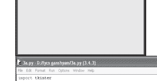

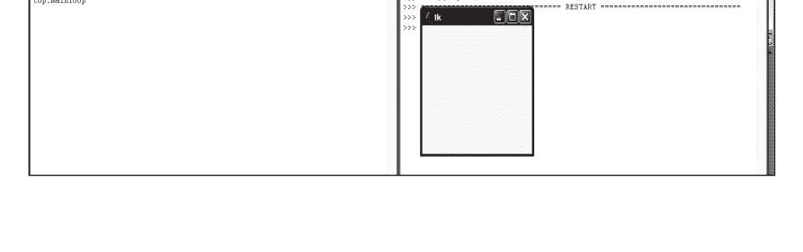

#### (A) 画布

1.  用Python编写一个程序来演示画布窗口。

**程序：**

```python
import tkinter
top=tkinter.Tk()
C=tkinter.Canvas(top,bg="blue",height=250,width=300)
C.pack()
top.mainloop()
```

**输出：**


2.  用Python编写一个程序来演示使用画布绘制弧形。

**程序：**

```python
import tkinter
top = tkinter.Tk()
C = tkinter.Canvas(top, bg="blue", height=250, width=300)
coord = 10, 50, 240, 210
arc = C.create_arc(coord, start=0, extent=150, fill="red")
C.pack()
top.mainloop()
```

**输出：**


3.  用Python编写一个程序来演示使用画布绘制弧形。

**程序：**

```python
import tkinter
top = tkinter.Tk()
C = tkinter.Canvas(top, bg="blue", height=250, width=300)
coord = 10, 50, 240, 210
arc = C.create_arc(coord, start=0, extent=180, fill="red")
C.pack()
top.mainloop()
```

**输出：**


4.  用Python编写一个程序来演示使用画布绘制椭圆。

**程序：**

```python
import tkinter
top = tkinter.Tk()
C = tkinter.Canvas(top, bg="blue", height=250, width=300)
coord = 10, 90, 210, 40
oval = C.create_oval(coord,fill="red")
C.pack()
top.mainloop()
```

**输出：**


5.  用Python编写一个程序来演示使用画布绘制线条。

**程序：**

```python
import tkinter
top = tkinter.Tk()
C = tkinter.Canvas(top, bg="blue", height=250, width=300)
coord = 100, 100, 300, 100
line = C.create_line(coord,fill="red")
C.pack()
top.mainloop()
```

**输出：**


6.  用Python编写一个程序来演示使用画布绘制多边形。

**程序：**

```python
import tkinter
top = tkinter.Tk()
C = tkinter.Canvas(top, bg="blue", height=250, width=300)
coord= 76, 92, 120, 47, 186, 96, 187, 178, 77, 177
oval = C.create_polygon(coord, fill="green")
C.pack()
top.mainloop()
```

**输出：**


7.  用Python编写一个程序来演示使用画布绘制圆形。

**程序：**

```python
import tkinter
top=tkinter.Tk()
C=tkinter.Canvas(top,bg="blue",height=250,width=300)
coord=100,100,50,50
oval=C.create_oval(coord,fill="red")
C.pack()
top.mainloop()
```

**输出：**


8.  用Python编写一个程序来演示使用画布绘制垂直椭圆。

**程序：**

```python
import tkinter
top=tkinter.Tk()
C=tkinter.Canvas(top,bg="blue",height=500,width=600)
coord=450,159,450,285
oval=C.create_oval(coord,width=80,fill="red")
C.pack()
top.mainloop()
```

**输出：**


9.  用Python编写一个程序来演示使用画布绘制水平椭圆。

**程序：**

```python
import tkinter
top=tkinter.Tk()
C=tkinter.Canvas(top,bg="blue",height=500,width=600)
coord=414,318,159,285
oval=C.create_oval(coord,fill="violet")
C.pack()
top.mainloop()
```

**输出：**


10. 用Python编写一个程序来演示使用画布绘制六边形。

**程序：**

```python
import tkinter
top=tkinter.Tk()
C=tkinter.Canvas(top,bg="blue",height=250,width=300)
coord=72,130,71,177,115,219,152,175,153,135,108,84
oval=C.create_polygon(coord,fill="green")
C.pack()
top.mainloop()
```

**输出：**


11. 用Python编写一个程序在画布上显示线条。

**程序：**

```python
from tkinter import *
root=Tk()

w=Canvas(root, width=300, height=300)
w.create_line(20,30,200,100)
w.pack()
w.mainloop()
```

**输出：**


12. 用Python编写一个程序在画布上显示矩形。

**程序：**

```python
from tkinter import *
root=Tk()

w=Canvas(root, width=300, height=300)
w.create_rectangle(40,50,100,90)
w.create_text(150,140,text="This is Rectangle")
w.pack()
w.mainloop()
```

**输出：**


#### (B) 框架

1.  用Python编写一个程序来演示使用GUI框架。

**程序：**

```python
from tkinter import *
root = Tk()
frame = Frame(root)
frame.pack()
bottomframe = Frame(root)
bottomframe.pack( side = BOTTOM )
redbutton = Button(frame, text="Red", fg="red")
redbutton.pack( side = LEFT)
greenbutton = Button(frame, text="Brown", fg="brown")
greenbutton.pack( side = LEFT )
bluebutton = Button(frame, text="Blue", fg="blue")
bluebutton.pack( side = LEFT )
blackbutton = Button(bottomframe, text="Black", fg="black")
blackbutton.pack( side = BOTTOM)
root.mainloop()
```

**输出：**


#### (C) 标签

1.  用Python编写一个程序来演示使用GUI标签。

**程序：**

```python
import tkinter
from tkinter import *
Label(text='my first gui!').pack(expand=YES,fill=BOTH)
mainloop()
```

**输出：**


2.  用Python编写一个程序来演示使用不同属性的标签。

**程序：**

```python
import tkinter
from tkinter import *
a=Tk()
l=Label(a,text="python",fg="red")
l.pack()
l1=Label(a,text="my first gui",fg="green")
l1.pack()
l2=Label(a,text="database",fg="violet")
l2.pack()
a.mainloop()
```

**输出：**


3.  用Python编写一个程序来显示标签。

**程序：**

```python
from tkinter import Label
x=Label(None, text="Hello Everyone!! Good Morning!")
x.pack()
x.mainloop()
```

**输出：**


#### (D) 输入框

1.  用Python编写一个程序来演示使用GUI输入框。

**程序：**

```python
import tkinter
from tkinter import *
a=Tk()
b=Entry(a)
b.pack()
b1=Entry(a)
b1.pack()
a.mainloop()
```

**输出：**


2.  用Python编写一个程序来演示使用GUI输入框。

**程序：**

```python
from tkinter import *
top = Tk()
L1 = Label(top, text="User Name")
L1.pack( side = LEFT)
E1 = Entry(top, bd =5)
E1.pack(side = RIGHT)
top.mainloop()
```

**输出：**

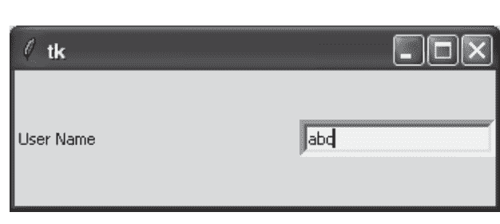

#### (E) 文本框

1.  用Python编写一个程序来演示使用GUI文本框。

**程序：**

```python
from tkinter import *
def onclick():
    pass
root = Tk()
text = Text(root)
text.insert(INSERT, "Hello.....")
text.insert(END, "Bye Bye.....")
text.pack()
text.tag_add("here", "1.0", "1.4")
text.tag_add("start", "1.8", "1.13")
text.tag_config("here", background="yellow", foreground="blue")
text.tag_config("start", background="black", foreground="green")
root.mainloop()
```

**输出：**

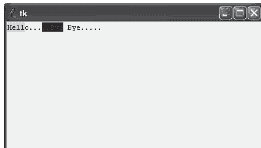

2.  用Python编写一个程序来演示使用GUI的简单文本框。

**程序：**

```python
import tkinter
from tkinter import *
a=Tk()
b=Text(a)
b.pack()
b.insert(END,"dolly")
b1=Text(a)
b1.pack()
a.mainloop()
```

**输出：**


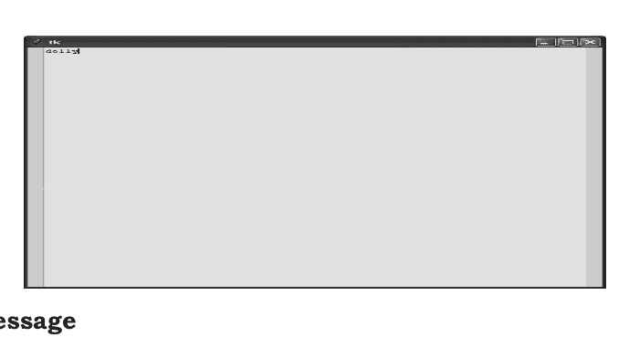

#### (F) 消息框

1.  用Python编写一个程序来演示使用GUI消息框。

**程序：**

```python
from tkinter import *
root = Tk()
var = StringVar()
label = Message( root, textvariable=var, relief=RAISED )
var.set("Hey!? How are you doing?")
label.pack()
root.mainloop()
```

**输出：**


### 2. 编写一个 Python 程序来显示消息对话框。

程序：

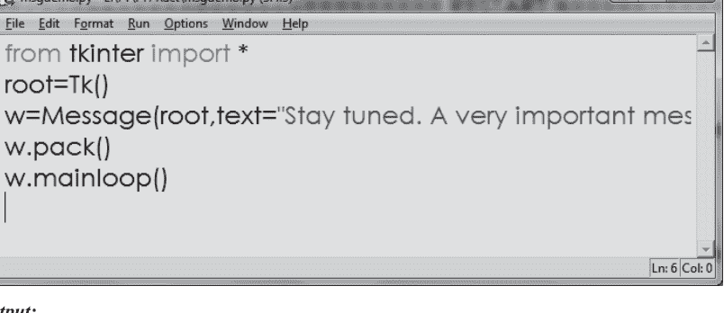

输出：


#### (G) 按钮

1.  编写一个 Python 程序来演示使用 GUI 创建按钮。

程序

```
import sys
from tkinter import *
widget=Button(None,text='Click me',command=sys.exit)
widget.pack()
widget.mainloop()
```

输出：


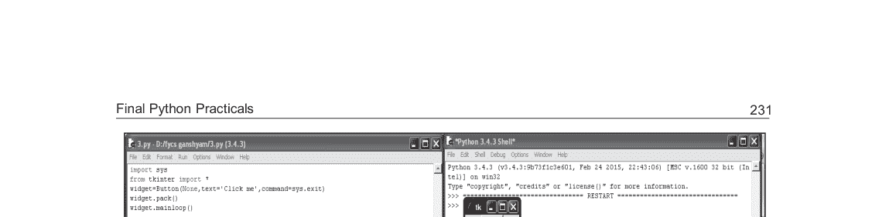

2.  编写一个 Python 程序来演示使用 GUI 创建具有不同属性的按钮。

程序

```
import tkinter
from tkinter import *
a=Tk()
b=Button(a,text="click")
b.pack()
b1=Button(a,text="edit")
b1.pack()
b2=Button(a,text="close")
b2.pack()
a.mainloop()
```

输出：

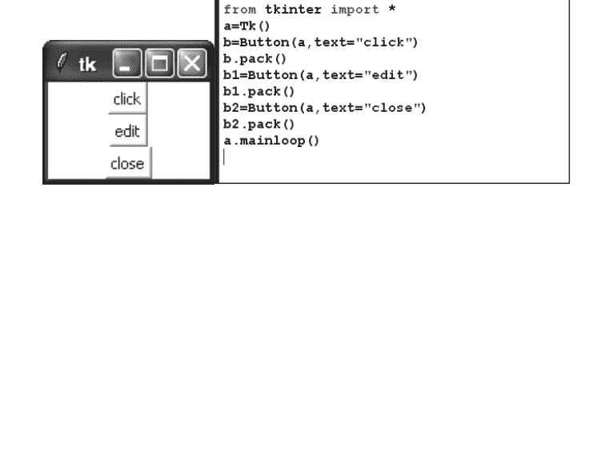

3.  编写一个 Python 程序来显示按钮。

程序：

```
import tkinter
top = tkinter.Tk()
B = tkinter.Button(top, text = "Hello", bg = 'black', fg = 'white')
B.pack()
top.mainloop()
```

输出：

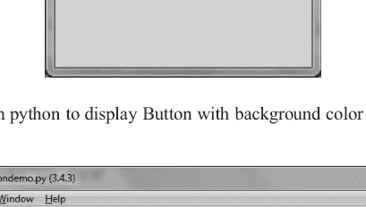

4.  编写一个 Python 程序来显示具有背景色和前景色的按钮。

程序

```
def response():
    print("You did it!")

from tkinter import Button
x=Button(None, text="Do it!", command=response, bg="red",fg="Yellow")
x.pack()
x.mainloop()
```

输出


5.  编写一个 Python 程序来显示在窗口中具有不同对齐方式的按钮。

程序：

```
from tkinter import *
root=Tk()
b1=Button(root, text="Button on Top East!")
b1.pack(side=TOP,anchor=E)

b2=Button(root, text="Button on Left")
b2.pack(side=LEFT)

b2=Button(root, text="Button on Bottom")
b2.pack(side=BOTTOM)

root.mainloop()
```

输出

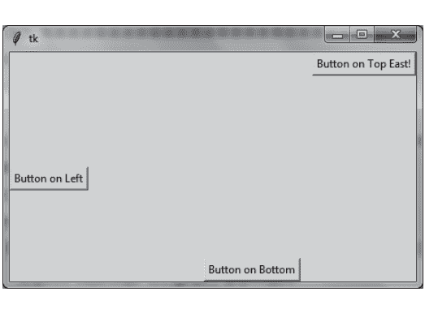

#### (H) 复选框

1.  编写一个 Python 程序来演示使用 GUI 创建复选框。

程序：

```
import tkinter
from tkinter import *
a=Tk()
b=Checkbutton(a,text="fc")
b.pack()
b1=Checkbutton(a,text="cs-1")
b1.pack()
b2=Checkbutton(a,text="cs-2")
b2.pack()
b3=Checkbutton(a,text="phy-1")
b3.pack()
b4=Checkbutton(a,text="phy-2")
b4.pack()
b5=Checkbutton(a,text="maths-1")
b5.pack()
b6=Checkbutton(a,text="maths-2")
b6.pack()
a.mainloop()
```

输出：

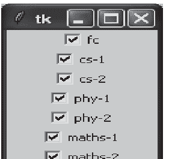

```
import tkinter
from tkinter import *
a=Tk()
b=Checkbutton(a, text="fc")
b.pack()
b1=Checkbutton(a, text="cs-1")
b1.pack()
b2=Checkbutton(a, text="cs-2")
b2.pack()
b3=Checkbutton(a, text="phy-1")
b3.pack()
b4=Checkbutton(a, text="phy-2")
b4.pack()
b5=Checkbutton(a, text="maths-1")
b5.pack()
b6=Checkbutton(a, text="maths-2")
b6.pack()
a.mainloop()
```

2.  编写一个 Python 程序来演示使用 GUI 创建具有不同属性的复选框。

程序：

```
from tkinter import *
import tkinter
top = tkinter.Tk()
CheckVar1 = IntVar()
CheckVar2 = IntVar()
C1 = Checkbutton(top, text = "Music", variable = CheckVar1, onvalue = 1, offvalue = 0, height=5, width = 20)
C2 = Checkbutton(top, text = "Video", variable = CheckVar2, onvalue = 1, offvalue = 0, height=5, width = 20)
C1.pack()
C2.pack()
top.mainloop()
```

输出：

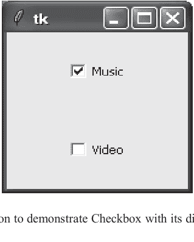

3.  编写一个 Python 程序来演示使用 GUI 创建具有不同属性的复选框。

程序：

```
from tkinter import *
states = [ ]
def check(i):
    states[i] = not states[i]
root = Tk( )
for i in range(4):
    test = Checkbutton(root, text=str(i), command=(lambda i=i: check(i)) )
    test.pack(side=TOP)
    states.append(0)
root.mainloop( )
print(states)
```

输出：

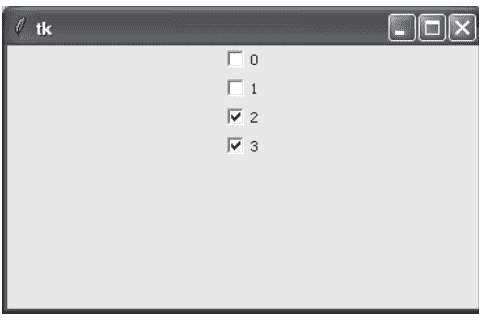

4.  编写一个 Python 程序来显示复选框。

程序：

```
from tkinter import *
root=Tk()
debug_mode=IntVar(value=0)
w=Checkbutton(root, text="Debug mode", variable=debug_mode)
w.pack()
w.mainloop()
```

输出：

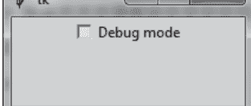

#### (I) 单选按钮

1.  编写一个 Python 程序来演示使用 GUI 创建单选按钮。

程序

```
from tkinter import *
root = Tk( )
R1=Radiobutton(root,text="male",value=1).pack()
R2=Radiobutton(root,text="female",value=2).pack()
root.mainloop()
```

输出：

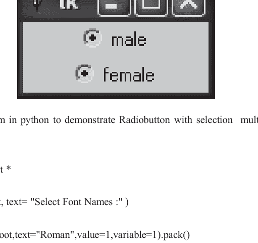

2.  编写一个 Python 程序来演示使用 GUI 创建支持多选功能的单选按钮组。

程序：

```
from tkinter import *
root = Tk()
label = Label( root, text= "Select Font Names :" )
label.pack()
R1=Radiobutton(root,text="Roman",value=1,variable=1).pack()
R2=Radiobutton(root,text="Impact",value=2, variable=1).pack()
R3=Radiobutton(root,text="Courier",value=3,variable=1).pack()
label1 = Label( root, text= "Select Font Size :" )
label1.pack()
R4=Radiobutton(root,text="10",value=4, variable=2).pack()
R5=Radiobutton(root,text="12",value=5,variable=2).pack()
R6=Radiobutton(root,text="14",value=6, variable=2).pack()
root.mainloop()
```

输出：

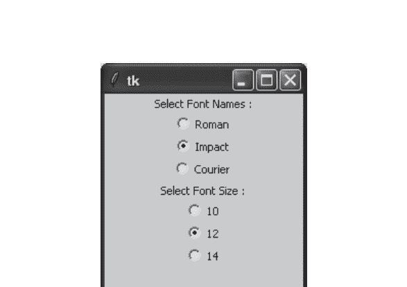

或者

```
from tkinter import *
root = Tk( )
label = Label( root, text= "Select Font Names :" )
label.pack()
R1=Radiobutton(root,text="Roman",value=1,variable='grp1').pack()
R2=Radiobutton(root,text="Impact",value=2, variable='grp1').pack()
R3=Radiobutton(root,text="Courier",value=3,variable='grp1').pack()

label1 = Label( root, text= "Select Font Size :" )
label1.pack()
R4=Radiobutton(root,text="10",value=4, variable='grp2').pack()
R5=Radiobutton(root,text="12",value=5,variable='grp2').pack()
R6=Radiobutton(root,text="14",value=6, variable='grp2').pack()
root.mainloop()
```

输出：

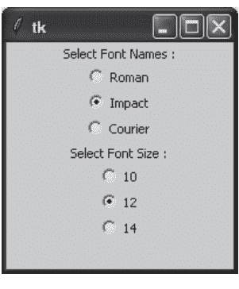

3.  编写一个 Python 程序来演示使用 GUI 创建具有属性的单选按钮。

```
from tkinter import *
def sel():
    selection = "You selected the option " + str(var.get())
    label.config(text = selection)
root = Tk()
var = IntVar()
R1 = Radiobutton(root, text="Option 1", variable=var, value=1,command=sel)
R1.pack( anchor = W )
R2 = Radiobutton(root, text="Option 2", variable=var, value=2,command=sel)
R2.pack( anchor = W )
R3 = Radiobutton(root, text="Option 3", variable=var, value=3,command=sel)
R3.pack( anchor = W)
label = Label(root)
label.pack()
root.mainloop()
```

输出

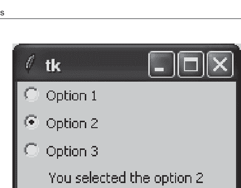

#### (J) 列表框

1.  编写一个 Python 程序来演示使用 GUI 创建列表框。

程序：

```
from tkinter import *
import tkinter
top = Tk()
Lb1 = Listbox(top)
Lb1.insert(1, "Python")
Lb1.insert(2, "Perl")
Lb1.insert(3, "C")
Lb1.insert(4, "PHP")
Lb1.insert(5, "JSP")
Lb1.insert(6, "Ruby")
Lb1.pack()
top.mainloop()
```

输出

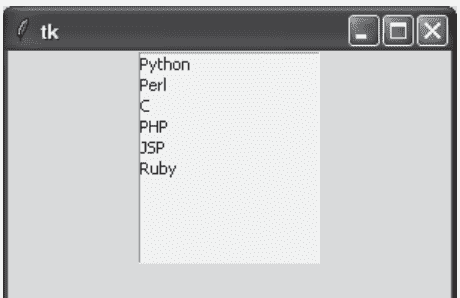

#### (K) 数字调节框

1.  编写一个 Python 程序来演示使用 GUI 创建数字调节框。

程序：

```
from tkinter import *
master = Tk()
w = Spinbox(master, from_=0, to=10)
w.pack()
mainloop()
```

输出：


## 数据库连接

1.  编写一个 Python 程序来创建持久化字典。

代码：

```
import dbm
db = dbm.open('websites', 'c')
# Add an item.
db['www.python.org'] = 'Python home page'
print(db['www.python.org'])
# Close and save to disk.
db.close()
```

输出：


2.  编写一个 Python 程序来访问持久化字典。

代码：

```
import dbm
# Open existing file.
db = dbm.open('websites', 'w')
# Add another item.
db['www.wrox.com'] = 'Wrox home page'
# Verify the previous item remains.
if db['www.python.org'] != None:
    print('Found www.python.org')
else:
    print('Error: Missing item')
# Iterate over the keys. May be slow May use a lot of memory.
for key in db.keys():
    print('Key =', key, 'value =', db[key])
del db['www.wrox.com']
print('After deleting www.wrox.com, we have:')
for key in db.keys():
    print('Key =', key, 'value =', db[key])
# Close and save to disk.
db.close()
```

输出：


### 3. 通过 sqlite3 进行数据库连接。

在 Python 命令行提示符下运行程序及其输出：


## Python 编程多选题

### 第一单元

1.  以下哪种模式用于读取二进制数据？
    (a) r
    (b) W
    (c) r+
    (d) rb

    **答案：(d) rb**

2.  Python 中用于关闭文件的函数是哪个？
    (a) Close()
    (b) Stop()
    (c) End()
    (d) Closefile()

    **答案：(a) Close()**

3.  哪两个是内置函数，用于从标准输入（默认来自键盘）读取一行文本？
    (a) Raw_input 和 Input
    (b) Scan
    (c) Scanner
    (d) keyboard

    **答案：(a) Raw_input 和 Input**

4.  以下哪个不是打开文件的有效模式？
    (a) rb
    (b) rw
    (c) r+
    (d) w+

    **答案：(b) rw**

5.  如何获取文件中的当前位置？
    (a) fp.seek()
    (b) fp.tell()
    (c) fp.loc
    (d) fp.pos

    **答案：(b) fp.tell()**

6.  以下哪种模式用于以二进制格式读写文件，且不会覆盖文件内容？
    (a) rb+
    (b) w
    (c) wb
    (d) w+

    **答案：(a) rb+**

7.  哪个函数用于从文件中读取单行？
    (a) Readline()
    (b) Readlines()
    (c) Readstatement()
    (d) Readfullline()

    **答案：(a) Readline()**

8.  我们可以在 Python 中创建文本文件吗？
    (a) 是
    (b) 否
    (c) 以上都不是
    (d) 以上都是

    **答案：(a) 是**

9.  如何删除文件？
    (a) del(fp)
    (b) fp.delete()
    (c) os.remove('file')
    (d) os.delete('file')

    **答案：(c) os.remove('file')**

10. 哪个语句可用于异常处理？
    (a) try 和 catch
    (b) try 和 except --- else
    (c) 仅 try
    (d) 仅 catch

    **答案：(b) try 和 except --- else**

### 第二单元

1.  GUI 的全称是
    (a) 图形用户界面
    (b) 图形使用界面
    (c) 图形化用户界面
    (d) 图形用户标识符

    **答案：(a) 图形用户界面**

2.  Tkinter 是 Python 自带的 Tk GUI 工具包的 Python 接口。
    (a) 正确
    (b) 错误

    **答案：(b) 错误**

3.  以下哪些是 Python 库？
    (a) Pyglet
    (b) Bottle
    (c) Invoke
    (d) Splinter

    **答案：(全部)**

4.  为了在屏幕上排列、管理、控制和注册不同的 Python tkinter 小部件，我们使用
    (a) 布局管理器
    (b) Tk()
    (c) tkinter
    (d) 以上都不是

    **答案：(a) 布局管理器**

5.  __________ 可以来自各种来源，包括用户的按键和鼠标操作。
    (a) 绑定
    (b) 事件
    (c) 运动事件
    (d) 以上都不是

    **答案：(b) 事件**

6.  __________ 小部件为 Tkinter 提供了结构化的图形功能。
    (a) 复选框
    (b) 画布
    (c) 按钮
    (d) 无

    **答案：(b) 画布**

7.  此小部件选项用于设置画布在 Y 维度上的大小。
    (a) 宽度
    (b) 高度
    (c) 长度
    (d) 边框

    **答案：(b) 高度**

8.  此小部件选项用于设置画布在 X 维度上的大小。
    (a) 宽度
    (b) 高度
    (c) 长度
    (d) 边框

    **答案：(a) 宽度**

9.  要在画布上绘制内容，请使用 __________ 方法添加新项目。
    (a) create
    (b) design
    (c) focus
    (d) arc

    **答案：(a) create**

10. 通过滚动画布，你可以指定画布 __________ 系统的哪个部分显示在窗口中。
    (a) 坐标
    (b) 行
    (c) 列
    (d) 以上都不是

    **答案：(a) 坐标**

11. Canvas 小部件使用两种坐标系：__________ 和 __________ 系统。
    (a) 窗口坐标
    (b) 画布坐标
    (c) 滚动
    (d) 网格间距

    **答案：(a) 窗口坐标 和 (b) 画布坐标**

12. 小部件是 __________ 的组成部分。
    (a) GUI
    (b) Tk()
    (c) tkinter
    (d) 小部件

    **答案：(a) GUI**

13. tkinter GUI 的主要单元是 __________。
    (a) Tk()
    (b) 小部件
    (c) WCK
    (d) 无

    **答案：(b) 小部件**

14. 当按钮被按下时，tkinter 会自动调用该 __________。
    (a) 应用程序和数据库
    (b) 小部件和 Tk()
    (c) 函数或方法
    (d) 仅 b

    **答案：(c) 函数或方法**

15. 默认情况下，__________ 键可用于移动到按钮小部件。
    (a) Shift 键
    (b) Tab 键
    (c) Enter 键
    (d) Alt 键

    **答案：(b) Tab 键**

16. __________ 是一个标准的 tkinter 小部件，用于实现多选一的选择按钮。
    (a) 选项按钮
    (b) 复选框按钮
    (c) 单选按钮
    (d) 以上都不是

    **答案：(d) 单选按钮**

17. __________ 小部件用于向用户显示更多的选项。
    (a) 复选框
    (b) 选项按钮
    (c) 单选按钮
    (d) 列表按钮

    **答案：(a) 复选框**

18. 复选框小部件最常用的方法是 __________ 和 __________。
    (a) select()
    (b) flash()
    (c) open()
    (d) close()

    **答案：(a) select() 和 (d) close()**

19. __________ 小部件是标准的 tkinter 小部件，用于输入或显示单行文本。
    (a) 复选按钮
    (b) 单选按钮
    (c) 输入框
    (d) 选项按钮

    **答案：(c) 输入框**

20. __________ 小部件的目的是显示一组文本行。
    (a) 输入框
    (b) 单选按钮
    (c) 列表框
    (d) 复选框

    **答案：(c) 列表框**

21. 框架基本上只是其他小部件的 __________，负责安排其他小部件的位置。
    (a) 一组行
    (b) 显示更多选项
    (c) 容器
    (d) 以上都不是

    **答案：(c) 容器**

22. __________ 小部件的目的是显示一组文本行。
    (a) 复选框
    (b) 输入框
    (c) 列表框
    (d) 选项

    **答案：(c) 列表框**

23. 标签是一个 Tkinter 小部件类，用于显示 __________ 或 __________。
    (a) 文本，图像
    (b) 文本，图片
    (c) 图像，线条
    (d) 文本，线条

    **答案：(a) 文本，图像**

24. __________ 小部件允许用户从给定的集合中选择值。这些值可以是一系列数字，或一组固定的字符串。
    (a) 列表框
    (b) 输入框
    (c) 按钮
    (d) 微调框

    **答案：(d) 微调框**

25. 我们使用 __________ 方法创建文本小部件。
    (a) Line()
    (b) Text()
    (c) pack()
    (d) insert()

    **答案：(b) Text()**

### 第三单元

1.  __________ 意味着我们将不同类型的网络相互连接。
    (a) 拓扑
    (b) 连接性
    (c) 网络连接
    (d) 接口

    **答案：(c) 网络连接**

2.  当 TCP/IP 套接字的两端都连接时，通信是 __________。
    (a) 双向通信
    (b) 广播
    (c) 单向通信
    (d) 双向的

    **答案：(d) 双向的**

3.  要创建套接字，我们必须使用 socket 模块中可用的 __________ 函数。
    (a) socket_family
    (b) socket.socket()
    (c) socket_type
    (d) socket.AF_INET

    **答案：(b) socket.socket()**

4.  当我们使用 __________ 时，套接字将对所有人可见。
    (a) socket.gethostname()
    (b) socket.get:hostname()
    (c) socket.gethost()
    (d) socket.get-hostname()

    **答案：(a) socket.gethostname()**

5.  对于客户端和服务器连接，我们需要以下四个基本要素
    (a) 套接字和绑定
    (b) 监听和接受
    (c) 选项 a 正确
    (d) 选项 a 和 b 都正确

    **答案：(d) 选项 a 和 b 都正确**

6.  套接字通常是两个实体之间连接的端点，套接字充当客户端和服务器之间的 __________。
    (a) 接口
    (b) 桥梁
    (c) 终端
    (d) 实现

    **答案：(b) 桥梁**

7.  IP 地址 127.0.0.1 被称为
    (a) 服务器 IP 地址
    (b) 客户端 IP 地址
    (c) 回环 IP 地址
    (d) 面向连接的 IP 地址

    **答案：(c) 回环 IP 地址**

8.  __________ 是一种协议，用于处理发送电子邮件和在邮件服务器之间路由电子邮件。
    (a) smtplib
    (b) 简单邮件传输协议 (SMTP)
    (c) ESMTP
    (d) MTA

    **答案：(b) 简单邮件传输协议 (SMTP)**

9.  大多数电子邮件至少包含 __________ 和正文字段。
    (a) "发件人"、"收件人"、"主题"
    (b) "发件人"、"收件人"、"抄送"
    (c) "发件人"、"收件人"、"主题" "密送"
    (d) "发件人"、"收件人"

    **答案：(a) "发件人"、"收件人"、"主题"**

10. __________ 模块定义了有助于在复杂世界中打开 URL 的函数和类——基本和摘要身份验证、重定向、Cookie 等。
    (a) Urllib.urlopen
    (b) urllib.request
    (c) Urllib.parse
    (d) urllib.robotparser

    **答案：(b) urllib.request**

11. 当我们想通过 HTTP 将数据发送到 URL 时，这通常使用 __________ 请求完成。
    (a) SEND
    (b) Receive
    (c) POST
    (d) a 和 C 都是

    **答案：(c) POST**

## 关于作者


**Kiran Gurbani 教授**

Kiran Gurbani 目前是 R.K. Talreja 艺术、科学与商业学院计算机科学系主任。她于 1994 年在 Jondhale 工程学院、浦那和孟买的 CDAC 中心开始了教学生涯，后来加入了 R.K.T. 学院。随后，在多所顶尖学院担任研究生 MSc 计算机科学与信息技术教授。拥有超过 18 年的培训师/学术主管/SME 经验，涉及多种技术平台。

她担任教授已有 18 年，教授多种技术——面向对象 C++、Java、Visual Basic、.NET (VB.NET & ASP.NET)、Unix Shell 脚本、Linux 管理、Oracle、SQL、云计算、虚拟化和云管理、Web 技术、软件工程、软件测试、JBOSS 和 Web Logic、并行与分布式计算、ADBMS、C#、CCNA 和互联网技术。

她是 Capgemini、Oracle、c-Edge、Seed、CDAC 等公司的自由企业培训师，教授 Unix Shell 脚本与 Ant 技术、Linux 管理、Unix Shell 脚本、云计算和软件工程 (SSAD, OOAD)、RDBMS、网络 CCNA 和中间件。

她是 ICWA、MMS 系统与技术以及 MSc 计算机科学与信息技术的客座教师。她为孟买各地的学生和教师举办了许多研讨会和讲座。

**她是孟买和塔那多所顶尖学院的自由培训师**，为本科生和研究生讲授 **Linux 故障排除**，并进行了 **迷你项目**，涉及 **域创建和通过 Apache Web 服务器上传公司网站**。Samba 服务器迷你项目，用于在认证用户之间共享 Windows 和 Linux 机器；**通过 Linux Shell 脚本处理数据、创建组、用户并进行身份验证**的迷你项目。

她是组织和顶尖学院以及大学级别培训项目的资源人员。

**她担任本科生和研究生毕业班学生的项目指导**，指导 .NET、Android 和云管理项目。

**她出版了关于** Visual Basic、C++ 编程、Linux 操作系统、Java 和数据结构、Linux 管理、命令式编程、C 语言编程和 Python 编程 - II 的书籍。

- **即将出版的书籍**
  (1) Web 编程，(2) Linux 操作系统 和 (3) 大数据分析（参考书）。

**她发表了多篇论文**
(1) 不同的 ICT 设备，(2) 女性在职业建设中面临的问题，
(3) 云存储的不同机制，(4) 使用 GitHub 的 OpenStack 私有云 和
(5) 大数据中 NOSQL 数据库系统分析的概率独立虚拟化数据库。


**Vijay Vastava 教授**

Vijay Vastava 目前是 K.M. Agrawal 艺术、科学与商业学院计算机科学与信息技术系的教授。他已完成 M.C.A.、PGDCSA，并获得微软认证专家 (MCP)。**他拥有 9 年的本科教学经验。**

**他担任本科生毕业班学生的项目指导**，指导 .NET 和 Java 项目。

- **他发表了多篇论文**
  (1) 城市化的影响，(2) 网络媒体与印地语，(3) ICT 对当代社会的影响，
  (4) ICT 对当代社会的影响，(5) 印度的全球形象：过去、现在和未来 和
  (6) 化学和生物科学的最新进展