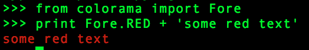
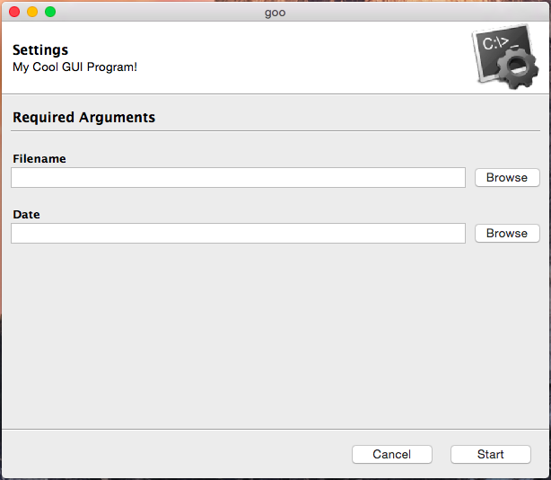
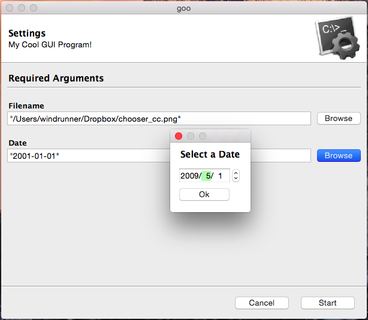
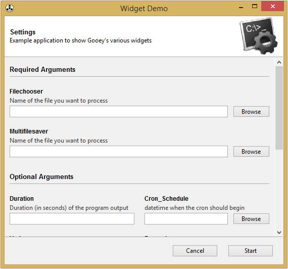
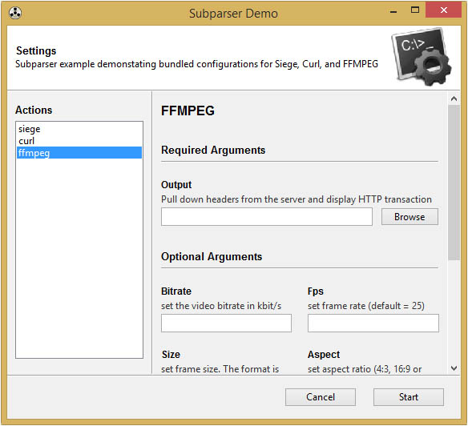

# 控制台程序

[`blog.yhathq.com/posts/11-python-libraries-you-might-not-know.html`](http://blog.yhathq.com/posts/11-python-libraries-you-might-not-know.html)

# sh

# sh

[sh](https://github.com/amoffat/sh) 库提供了 Shell 命令的封装， 如果你很熟悉 Shell 命令那么一定会喜欢上它。使用方法：

```
from sh import find
find("/tmp")
/tmp/foo
/tmp/foo/file1.json
/tmp/foo/file2.json
/tmp/foo/bar/file3.json 
```

# wget

# wget

[wget](http://bitbucket.org/techtonik/python-wget/) 是一个很强大的 Python 下载库， 使用方法如下：

```
>>> import wget
>>> url = 'http://www.futurecrew.com/skaven/song_files/mp3/razorback.mp3'
>>> filename = wget.download(url)
100% [................................................] 3841532 / 3841532>
>> filename
'razorback.mp3' 
```

# progressbar

# progressbar

[progressbar](https://pypi.python.org/pypi/progressbar) 提供了一个控制台进度条工具，示例代码：

```
from progressbar import ProgressBar
import time
pbar = ProgressBar(maxval=10)
for i in range(1, 11):
    pbar.update(i)
    time.sleep(1)
pbar.finish()
# 60% |########################################################                                      | 
```

# colorama

# colorama

提供彩色控制台输出：



# Gooey——把 CLI 程序变成 GUI

# Gooey——把 CLI 程序变成 GUI

[Gooey](https://github.com/chriskiehl/Gooey) 是一个 Python GUI 程序开发框架，基于 [wxPython](http://www.wxpython.org/) GUI 库，其使用方法类似于 Python 内置 CLI 开发库 argparse，因此很容易把一个基于 argparse 的 CLI 应用转换成 GUI 程序。

## 简单的示例

我们首先从一个简单的基于 argparse 库的 CLI 应用开始：

```
from argparse import ArgumentParser

def main():
    parser = ArgumentParser(description="My Cool GUI Program!")
    parser.add_argument('Filename')
    parser.add_argument('Date')
    parser.parse_args()

if __name__ == '__main__':
    main() 
```

这就有了一个接受 `Filename` 和 `Date` 的两个必填参数的 CLI 程序，为了简化程序我们并没有指定它的功能。

使用方法：`python cli.py FILENAME DATE`。

现在我们把它改成

```
from gooey import Gooey, GooeyParser

@Gooey
def main():
    parser = GooeyParser(description="My Cool GUI Program!")
    parser.add_argument('Filename')
    parser.add_argument('Date')
    parser.parse_args()

if   __name__ == '__main__':
    main() 
```

于是我们得到了一个简单的 GUI 对话框，并且基本上没有修过多少代码：



当然，仅仅这样是不够的，我们的 Filename 参数需要对应一个文件，而 Date 参数是一个日期，如果有专用的控件就好了！ Gooey 当然也想到了：



仅仅修改了 2 行代码：

```
parser.add_argument('Filename', widget="FileChooser")
parser.add_argument('Date', widget="DateChooser") 
```

## 控件

上面已经看到了两个简单的控件：`FileChooser` 和 `DateChooser`，分别提供了一个“文件选择器”和 “日期选择器”。现在支持的 chooser 类控件有：

| 控件名 | 控件类型 |
| --- | --- |
| FileChooser | 文件选择器 |
| MultiFileChooser | 文件多选器 |
| DirChooser | 目录选择器 |
| MultiDirChooser | 目录多选器 |
| FileSaver | 文件保存 |
| DateChooser | 日期选择 |
| TextField | 文本输入框 |
| Dropdown | 下拉列表 |
| Counter | 计数器 |
| CheckBox | 复选框 |
| RadioGroup | 单选框 |

## 国际化

Gooey 的国际化是通过配置实现的，使用方法如下：

```
@Gooey(language='russian')
def main():
    ... 
```

目前仅支持 `russian`，`english`、`dutch`、`french`、`portuguese` 的支持已在计划中。

## 配置

和 `language` 参数配置一样，Gooey 还支持很多其它配置，下面是它支持的参数列表：

| 参数 | 简介 |
| --- | --- |
| advanced | 切换显示全部设置还是仅仅是简化版本 |
| show_config | Skips the configuration all together and runs the program immediately |
| language | 指定从 `gooey/languages` 目录读取哪个语言包 |
| program_name | GUI 窗口显��的程序名。默认会显 `sys.argv[0]`。 |
| program_description | `Settings` 窗口顶栏显示的描述性文字。默认值从 `ArgumentParser` 中获取。 |
| default_size | 窗口默认大小。 |
| required_cols | 设置必选参数行数。 |
| optional_cols | 设置可选参数行数。 |
| dump_build_config | 将设置以 JSON 格式保存在硬盘中以供编辑/重用。 |

## 布局流

布局实例可以在下载这个 [exmaple 库](https://github.com/chriskiehl/GooeyExamples)体验。

| Flat Layout | Column Layout |
| --- | --- |
|  |  |
