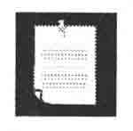
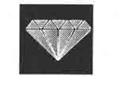
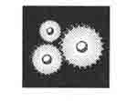

# 前言 Preface

## 欢迎走进 Python 核心编程

我们很高兴能帮你尽快并尽可能深入地学习 Python。掌握语法是本书的一个目标，不管怎样，我们都坚信，哪怕是一个初学者，只要他能掌握 Python 的运作机理，他就不再仅仅是用 Python“编写”，而是能开发出更高效的 Python 应用程序。但是你知道，并不是掌握了一门语言的语法就能让你立刻登堂入室。

在本书中，你能发现许多可以立即上手的例子。为了巩固基础，你还会在每章的末尾找到有趣又富有挑战性的习题。这些初级和中级水平的习题可以检验你的学习效果，并且提升你的 Python 技巧。确实没有什么能代替经验，我们只是想尽量用最短的时间让你不止初涉 Python，而且能学会驾驭它。

## 关于本书

本书之所以比其他 Python 书籍畅销，是因为它拥有广泛的选题、丰富的例子和必要的深入解析。本书不需要你拥有 C 语言或者面向对象程序设计之类的背景。本书同样也不是一本让你很难入门的个案解析。最后，本书也绝非一本纯粹的参考书或者快速入门指南。你手中的这本书包括了针对这门语言特性的包罗万象的介绍（第一部分中），通过其下各章你可以洞悉 Python 编程的每个细节。

本书 40%是介绍，40%是晋级，余下的 20%则是参考。我们将目标锁定于那些已经熟悉某种其他高级语言的人士和大、中学生。因为 Python 可以应用于 Zope、Plone、MailMan 和 Django 等大型的解决方案，所以本书可能被主要用于与这些系统有关的开发、管理、维护和整合工作。

对于书中代码的关注，第一版大约三分之一的读者来信抱怨说书中没有足够多和足够成熟的应用程序。也有人说代码的例子不够长或者不够完整。其他人则全部写信说他们喜欢书中简洁易懂的例子，它们从不连篇累牍、乱人心智。我们偏爱提供简短代码背后的哲学是，让读者能学会窥一斑而知全豹。像搭积木一样步步深入，最终垒土成山，完成大型应用程序。书中大多数大型程序都有逐行解释。丰富的翻译代码注释遍布其中，你可以在学习 Python 的同时加以实践——尽可能充分地使用交互解释器。通过这个方法你不仅可以学习和提高 Python 水平，同时还能在向源文件粘贴代码之前就解决 bug。

学习 Python 不能光学不练。你会发现每章的末尾的练习是本书的重要优势。它们可以检验你对该章主题和定义的理解，还能尽可能将你引向编码。开发应用程序是最快最高效学习程序设计语言所无可替代的方式。你将面对简单、中等、困难三种深度的问题。你要自己编写那些读者想在书中看到的“大”应用程序，而不是由我代劳，这将令你获益匪浅。

## 关于读者

本书主要面向那些没有接触过 Python 的程序员和那些已经有所了解但想继续学习和提高自身 Python 技巧的程序员。Python 已经被应用在了众多领域，包括工程、信息技术、科学、商务、娱乐，等等。这些领域涵盖了，但绝不局限于下列 Python 用户（以及本书读者）：

•　软件工程师；

•　硬件设计师/计算机辅助设计工程师；

•　质量评测/测试和自动控制构架开发者；

•　信息服务/信息技术/系统和网络管理员；

•　科学家和数学家；

•　技术或项目管理人员；

•　多媒体或音频/视频工程师；

•　源代码管理和发布工程师；

•　网站管理员和内容管理员；

•　客户/技术支持工程师；

•　数据库工程师和管理员；

•　研究与开发工程师；

•　软件集成开发和专业服务人士；

•　大学和高中教职人员；

•　网络服务系统工程师；

•　金融软件工程师；

•　诸多其他行业人士。

一些知名的大公司都在使用着 Python，例如：Google、雅虎、NASA、Lucasfilm/Industrial Light and Magic、Red Hat、Zope、迪斯尼、皮克斯和梦工厂。

## 作者的 Python 经历

我是十多年前在一家名为 Fourll 的公司里初涉 Python 的。那时，公司拥有一个拳头产品——Fourll.com 白页目录服务。Python 当时被用于设计我们的下一个产品：Rocketmail 在线电子邮件服务系统，也就是今天雅虎邮件系统的前身（白页是指用户信息数据库，Rocketmail 是第一个主流的免费邮件系统。日后 Fourll 被雅虎收购，雅虎使用 Rocketmail 的引擎开发了雅虎邮件——译者注）。

学习 Python 和加入最早的雅虎邮件引擎团队都是令人愉悦的。借此，我重构了地址簿和拼写检查程序。那时，Python 的身影也逐渐出现在了其他的雅虎页面上。比如“网上寻友”（People Search） 、“黄页”、“地图和出行路线”（Maps and Driving Directions）等，我还曾担任过“网上寻友”的主管工程师。

虽然当时 Python 对我来说是全新的，但是它却很容易上手——比我之前学过的语言都简单多了。由于当时 Python 教程的匮乏，所以我不得不使用《Python 库参考手册》和《快速参考指南》作为我的学习工具，这也触发了我写作你手中这本书的念头。

我还在雅虎的日子里，就可以利用 Python 找到有趣的途径来完成五花八门的工作了。每次，Python 的力量都能让我眼前一亮、信手拈来地化解问题。我同时还开发了一些 Python 课程，并将本书的内容用于授课，所以这真算得上是完全原创。

本书不仅是一本出众的学习用书，同样也是一部绝佳的 Python 教学用书。身为一位工程师，我知道如何学习、掌握、应用一门新技术。作为一名职业讲师，我也知道如何向顾客提供最高效的训练。正因为有了这些经验，才能给你带来真实情况的模拟和提示，这是你无法从那些仅仅是“训练师”或“书籍作者”的人那里获得的。

## 关于作者的写作风格：技术性强，但通俗易懂

与一本严格意义上的“入门”读物或纯粹的计算机核心技术参考书籍不同的是，我的教学经验告诉我，一本易于阅读并且还能坚持技术导向的书才是最符合读者需求的。也只有这样的书才能让你尽可能以最快的速度提高 Python，并能将其应用于你的任务中。我们引入概念，并配以相应的实例来加快学习进程。在每章的最后提供了许多练习，借此你可以巩固学到的概念并验证阅读中产生的想法。

能与 Bruce Eckel 的写作风格相提并论，让我们既感到荣幸，又觉得过誉了。这可不是一本枯燥的大学教材，作为作者，我是在和你交流，把你当作是我广受好评的 Python 培训班中的一员。作为一个终身学习者，我经常将自己置身于学生中，告诉你如何才能让你尽可能快速透彻地掌握概念。你将能够快速通畅的阅读本书，而不必去在意那些技术资料。

身为一名工程师，我知道为了让你掌握 Python 的概念需要传授什么。作为一个老师，我知道如何将技术细节凝炼成能让你轻松理解并能立刻上手的语言。本书充分地展现了我的写作风格和教学风格，但使用 Python 编程更是一种享受。

## 关于第二版

在本书第一版出版之后，随着 2\. 0 版的发布，Python 进入了自己的第二个时代。自那之后，这门语言的重大进步为其带来了全面而持续的成功和认可。摒除了缺陷，加入了新特点，这为全球的 Python 开发者带来了新一级别的能力和挑战。我真的很担心，这本续作能否在涵盖所有激动人心的新特点的同时还保持原来简单易懂的特点。本书涵盖了 2006 年秋发布的 Python 2\. 5 版本，乃至一些关于将来 2\. 6 版的预告。如同第一版一样，我们的目标是让本书所有主题不受版本的影响，让读者能终身受用，而不是很快被淘汰。

Python 的创始人 Guido van Rossum 一直慢慢酝酿着 Python 的下一次大转变，他亲切地称之为“Python3000”。“Python 3000”和它的缩写“Py3k”都只是 Python 3\. 0 的代号。它会和 2\. x 版本平行开发。尽管会产生一些和过去 Python 版本的不兼容，但是核心团队会尽全力确保绝大部分的向下兼容性（这也是 Python 新版本研发的惯例）。我们更加期盼能在摒除原有设计缺陷和争议的同时，添加更多有趣的特性。

在本版中加入的新主题包括：

•　布尔型和集合类型（第五章和第七章）

•　新式类（第十三章）

> •　子类、内建类

> •　静态方法和类方法

> •　slot

> •　属性

> •　描述符

> •　元类

•　函数（第十一章）

> •　生成器

> •　函数（与方法）装饰器

> •　静态嵌套作用域

> •　内部函数

> •　闭包

> •　Currying 和偏函数应用

•　循环结构（第八章）

> •　迭代器

> •　列表解析

> •　生成器表达式

•　扩展导入语法（第十二章）

> •　as 关键字

> •　多行导入

> •　绝对导入

> •　相对导入

•　改良的异常处理功能（第十章）

> •　with 语句

> •　try-except-finally 语句

此外，我们很高兴在本书中加入 3 章新内容：第十七章、第二十一章和第二十三章。这 3 章里面有很多中级的内容会经常用到。所有原来的章节都已经更新到 Python 的最新版本。

## 章节导航

本书分为两大部分：第一部分，占据了大约三分之二的篇幅，来向你阐释这门语言的“核心”内容。第二部分则提供了各种高级主题来向你展示你可以使用 Python 来做些什么。

Python 无处不在——有时发现正在使用 Python 的人，以及他们正在用 Python 解决的工作是令人惊异的——尽管我们很高兴在本书中加入了许多主题，比如 Java/Jython、Win32 编程、使用 HTMLgen 处理 CGI、使用第三方工具（wxWidgets、GTK+、Qt 等）的 GUI 编程、XML 处理、数字科学计算处理、视觉和图形图像处理、Web 服务和应用程序框架（Zope、Plone、Django、TurboGears 等），但是没有足够的时间将这些主题完善成独立的章节。不管怎样，我们很高兴至少针对这些 Python 发展的关键领域已经完成了很不错的介绍。这当然就包括前面提到的那些主题。

以下是每章概览：

### 第 1 部分：Python 核心

第一章——欢迎来到 Python 世界

在开始的地方我们会介绍 Python 的历史、特性和优点等，当然还有如何获得和安装 Python。

第二章——快速入门

如果你是一个有经验的程序员，只想看看 Python 如何工作的，这一章就是你想要去的地方。在这里我们会介绍 Python 中基本的概念和语句，其中很多内容对你来说也许会很熟悉，你可以只学习 Python 中正确的语法，然后直接开始你的项目了。

第三章——Python 基础

本章将对 Python 的语法进行总览，并给出一些关于风格的注意事项。你可以接触到 Python 的关键词，还会了解它的内存管理能力。在本章的结尾将会出现你的第一个 Python 程序，你可以体会到真正的 Python 代码。

第四章——Python 对象

本章主要介绍 Python 中的对象。除了一般对象的属性外，我们还会展示 Python 的数据类型和操作符，以及多种对标准类型的分类方法。本章还会涉及一部分内建函数，它们对绝大多数 Python 对象都有效。

第五章——数字

在这一章，我们会讨论 Python 主要的数字类型：整型、浮点型和复数。我们会研究对所有数字有效的操作符、内建函数以及工厂函数，还会简短地看一下其他相关的类型。

第六章——序列：字符串、列表和元组

这一章是你遇到的第一个内容丰富的章节，它将向你展示 Python 中所有的序列类型：字符串、列表和元组、它们功能很强大。我们还会向你展示和每个类型有关的内建函数、方法及特性，当然还有所有的操作符。

第七章——映射和集合类型

字典是 Python 中的集合类型，又称散列类型。和其他数据类型一样，字典也有操作符、内建函数和方法。本章还会讲述集合类型，同样会讨论它们的操作符、内建函数、工厂函数和内建方法。

第八章——条件和循环

和许多其他高级编程语言一样，Python 支持诸如 for 和 while 之类的循环，以及 if 语句（及相关内容）。Python 还有一个内建函数 range()，它可以使 Python 的 for 循环表现得像一个传统的计数循环，而不是像一个“foreach”迭代循环。本章还涵盖了一些辅助语句，例如 break、continue 和 pass。还有一部分内容是关于新的结构，例如迭代器、列表解析和生成器表达式。

第九章——文件和输入输出

除了标准文件对象和输入/输出，本章还介绍了文件系统存取、文件执行和永久存储。

第十章——错误和异常

Python 的最强大的结构之一就是它的异常处理能力。在本章，你可以看到完全的处理过程，还有一些用来告诉我们如何引发或者抛出异常的指示。还有一点更重要的内容是如何创造我们自己的异常类。

第十一章——函数和函数式编程

编写和调用函数相对而言还是比较直观的，但是 Python 还有许多特性会让你觉得有用，比如默认参数，“命名”参数或者说关键词参数、可变长度参数和函数式编程结构。我们还将粗略看一下变量范围和递归，另外还要讨论一些高级特性，比如生成器、装饰器、内部函数、闭包、偏函数程序（currying 的更普遍形式）。

第十二章——模块

Python 的一个关键能力就是它的可扩充性。这种特性允许“即插即用”访问，还鼓励了代码复用。写成模块的程序可以被其他程序导入，过程简单到只要一行代码。此外，多模块的软件分发可以通过使用包（package）来简化。

第十三章——面向对象编程

Python 是个完全的面向对象（OO）编程语言，而且从一开始就是这样设计的。当然，Python 不强迫你用这种方式编程，你可以继续开发结构式、过程式的代码。任何时间当你准备好利用 OO 编程的优势时，你可以转换到 OO 编程上。同样地，本章是为了指导你完全理解这些概念，还讨论了一些高级主题，例如操作符重载、定制和授权。本章还介绍了一些关于新式类的新特性，例如 slot、属性（property） 、描述符（descriptor）和元类（metaclass）。

第十四章——执行环境

“执行”这个词可以有很多不同的意义，从可调用和可执行的对象到执行其他程序（Python 或者其他的）。本章会讨论这些主题，以及通过操作系统接口来控制执行，另外还提出几种不同的终止执行的方法。

### 第 2 部分：高级主题

第十五章——正则表达式

正则表达式是个非常强大的工具，可以用来进行模式匹配、提取和搜索-替换。本章可以学习到这些内容。

第十六章——网络编程

如今有太多的程序是面向网络的。你该从何下手呢？可以从本章学习到如何使用 TCP/IP 和 UDP/IP 来创建客户端和服务器端，另外还可以初步了解 SocketServer 和 Twisted。

第十七章——网络客户端编程

在第十六章中，我们介绍了如何使用套接字来进行网络编程。今天我们使用的绝大部分网络协议都是使用套接字开发的。在这一章，我们将探索更高一层的库，它们被用来创建上述网络协议的客户端。特别地，我们会关注 FTP、NNTP、SMTP 和 POP3 客户端。

第十八章——多线程编程

多线程编程可以用来提高很多类型的程序的执行性能。很多人想要一些关于 Python 中多线程编程的文档，本章可以让这些呼声停止了，因为这里会解释概念，并向你展示如何正确的建造一个 Python 多线程程序。

第十九章——图形用户界面编程

Tkinter 是 Python 上的默认图形用户界面（GUI）开发模块，它是基于 Tk 图形工具集的。我们将向你展示如何打造一个简单的 GUI 程序例子（我至少要说 10 遍：真的非常快！）。最好的一种学习方法是复制，通过修改已有的这几个程序例子，你已经开始了你的 GUI 之旅。我们以一个较复杂的例子结束本章，当然还顺便介绍了 Tix、Pmw、wxPython 和 PyGTK。

第二十章——Web 编程

我们使用 Python 编程一共有三个主要形式，即 Web 客户端、Web 服务器和广受欢迎的通用网关接口（CGI）程序，后者用来帮助 Web 服务器传送动态产生的 Web 页面。本章将会包括所有内容：简单/高级的 Web 客户端和 CGI 程序，以及如何建立你自己的 Web 服务器。

第二十一章——数据库编程

对 Python 来说，数据库编程和其他类型的编程一样，都很简单、有趣。我们首先回顾一下基本的概念，然后介绍 Python 数据库的程序接口（API） 。接着我们将向你展示如何才能连接到一个关系数据库，如何使用 Python 进行查询和其他操作。最后，如果你不想碰 SQL，不想考虑底层的数据库而只想使用对象，我们将向你介绍一些对象-关系管理器（ORM），它们可以再次简化数据库编程。

第二十二章——扩展 Python

我们以前提到过代码复用和语言扩展的强大性。在纯 Python 中，这些扩展是以模块形式存在的，但是你也可以使用 C、C++或者 Java 来开发底层代码，并提供无缝的 Python 接口。使用低级别的编程语言编写你的扩展可以让你提高性能和安全性，因为源代码不需要公开。本章将一步一步介绍扩展的打造过程。

第二十三章——其他话题

本章包含了一些额外材料，我们会在下一版将它们扩展成全面、单独的章节。本章的主题包括 Web 服务、微软 Office （Win32 COM 客户端）编程和 Java/Jython。

## 选读段落

书中某些标有星号（*）的段落和练习，表示其为晋级或者可选读的。它们通常是自成一体的，你可以在今后有时间的时候再研究。

如果你已经有了足够的编程知识，并且已经设置好了 Python 开发环境。那么你就可以跳过第一章，直接进入第二章了。从那里你可以理解 Python 并开始实际应用。

## 体例

“核心笔记”图标

“核心风格”图标

“核心模块”图标

“核心提示”图标

Python 的新功能以这个图标标注。图标中数字是指该功能首次出现时的版本号。

## 本书资源

你可以在本书的网站（http://corepython.com）上找到：勘误表、更新、研讨预告、Python 训练、下载和其他相关信息。

## 致谢

### 第二版致谢

审稿人和供稿人

Shannon-jj Behrens（权威审稿人）

Michael Santos（权威审稿人）

Rick Kwan

Lindell Aldermann（第六章 Unicode 新段落的合著者）

Wai-Yip Tung（第二十章 Unicode 实例的合著者）

Eric Foster-Johnson （《Beginning Python》的合著者）

Alex Martelli （《Python Cookbook》的编辑和《Python in a Nutshell》的作者）

Larry Rosenstein

Jim Orosz

Krishna Srinivasan

Chuck Kung

精神动力

我出色的孩子和宠物仓鼠

出版

Mark Taub 和 Debra Williams-Cauley（组稿编辑）

Lara Wysong（策划编辑）

John Fuller（执行编辑）

Sam RC （International Typesetting and Composition 项目主管）

### 第一版致谢

审稿人和供稿者

Guido van Rossum （Python 语言的创始人）

Dowson Tong

James C. Ahlstrom （《Internet Programming with Python》的合著者）

S. Candelaria de Ram

Cay S. Horstmann （《Core Java and Core JavaServer Faces》的合著者）

Michael Santos

Greg Ward （distutils 包和文档的创始人）

Vincent C. Rubino

Martijn Faassen

Emile van Sebille

Raymond Tsai

Albert L. Anders（多线程编程相关章节的合著者）

Fredrik Lundh （《Python Standard Library》一书作者）

Cameron Laird

Fred L. Drake, Jr. （《Python & XML》的合著者，Python 官方文档的编辑）

Jeremy Hylton

Steve Yoshimoto

Aahz Maruch（《Python for Dummies》一书作者）

Jeffrey E. F. Friedl（《Mastering Regular Expressions》一书作者）

Pieter Claerhout

Catriona （Kate） Johnston

David Ascher（《Learning Python》的合著者，《Python Cookbook》的编辑）

Reg Charney

Christian Tismer （Stackless Python 的创始人）

Jason Stillwell

以及我在加州大学圣克鲁斯分校的学生们

精神动力

James P.Prior（我高中的编程老师）

Louise Moser 和 P.Michael Melliar-Smith（我在 UCSB（加州大学圣巴巴拉分校）的毕业论文指导教师）

Alan Parsons、 Eric Woolfson、 Andrew Powell、Ian Bairnson、Stuart Elliott、David Paton 和其他所有的项目参与者，以及那些 Projectologists 和 Roadkillers 的伙伴（感谢那些音乐、鼓励和美好的时光）。

我还要感谢我的家人、朋友和上司，是你们让我安稳地度过了那些秉烛而作却常常才思枯竭的疯狂岁月。最后，我还要向所有信任我的人献上最诚挚的感谢（你知道，我在说你！）——没有你们，我是无法取得今天的成绩的。那些不信任我的人……好吧，我想你知道你能做些什么！

最后，我还要深深地感谢你们，我的读者，以及 Python 社区。我非常高兴能指导你们学习 Python，并且希望在我们的第二次远航中你能与我们一同享受这段旅程！

Wesley Chun

加利福尼亚，硅谷

2006 年 7 月