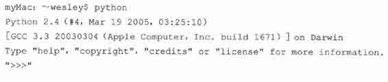
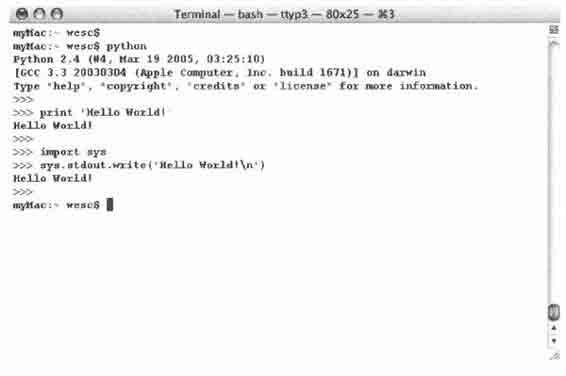
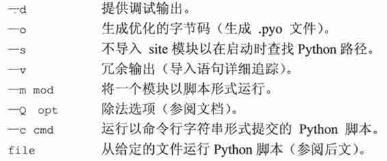
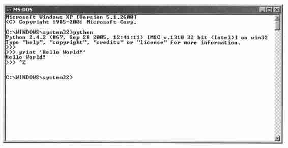
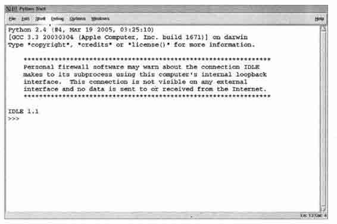
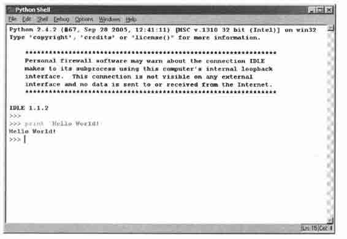

# 第一章　欢迎来到 Python 世界

本章主题

♦　什么是 Python

♦　Python 的起源

♦　Python 的特点

♦　下载 Python

♦　安装 Python

♦　运行 Python

♦　Python 文档

♦　比较 Python（与其他语言的比较）

♦　其他实现

开篇将介绍一些 Python 的背景知识，包括什么是 Python、Python 的起源和它的一些关键特性。一旦你来了兴致，我们就会向你介绍怎样获得 Python，以及如何在你的系统上安装并运行它。本章最后的练习将会帮助你非常自如地使用 Python，包括使用交互式解释器，以及创建并运行脚本程序。

## 1.1　什么是 Python

Python 是一门优雅而健壮的编程语言，它继承了传统编译语言的强大性和通用性，同时也借鉴了简单脚本和解释语言的易用性。它可以帮你完成工作，而且一段时间以后，你还能看明白自己写的这段代码。你会对自己如此快地学会它和它强大的功能感到十分的惊讶，更不用提你已经完成的工作了！只有你想不到，没有 Python 做不到。

## 1.2　起源

Guido van Rossum 于 1989 年底始创了 Python，那时，他还在荷兰的 CWI （Centrum voor Wiskunde en Informatica，国家数学和计算机科学研究院）。1991 年初，Python 发布了第一个公开发行版。这一切究竟是如何开始的呢？像 C、C++、Lisp、Java 和 Perl 一样，Python 来自于某个研究项目，项目中的那些程序员利用手边现有的工具辛苦地工作着，他们设想并开发出了更好的解决办法。

那时 van Rossum 是一位研究人员，对解释型语言 ABC 有着丰富的设计经验，这个语言同样也是在 CWI 开发的。但是他不满足其有限的开发能力。已经使用并参与开发了像 ABC 这样的高级语言后，再退回到 C 语言显然是不可能的。他所期望的工具有一些是用于完成日常系统管理任务的，而且它还希望能够访问 Amoeba 分布式操作系统的系统调用。尽管 van Rossum 也曾想过为 Amoeba 开发专用语言，但是创造一种通用的程序设计语言显然更加明智，于是在 1989 年末，Python 的种子被播下了。

## 1.3　特点

尽管 Python 已经流行了超过 15 年，但是一些人仍旧认为相对于通用软件开发产业而言，它还是个新丁。我们应当谨慎地使用”相对”这个词，因为”网络时代”的程序开发，几年看上去就像几十年。

当人们询问：“什么是 Python?”的时候，很难用任何一个具象来描述它。人们更倾向于一口气不加思索地说出他们对 Python 的所有感觉，Python 是 ____（请填写），这些特点究竟又是什么呢？为了让你能知其所以然，我们下面会对这些特点进行逐一地阐释。

### 1.3.1　高级

伴随着每一代编程语言的产生，我们会达到一个新的高度。汇编语言是献给那些挣扎在机器代码中的人的礼物，后来有了 FORTRAN、C 和 Pascal 语言，它们将计算提升到了崭新的高度，并且开创了软件开发行业。伴随着 C 语言诞生了更多的像 C++、Java 这样的现代编译语言。我们没有止步于此，于是有了强大的、可以进行系统调用的解释型脚本语言，例如 Tcl、Perl 和 Python。

这些语言都有高级的数据结构，这样就减少了以前”框架”开发需要的时间。像 Python 中的列表（大小可变的数组）和字典（哈希表）就是内建于语言本身的。在核心语言中提供这些重要的构建单元，可以鼓励人们使用它们，缩短开发时间与代码量，产生出可读性更好的代码。

在 C 语言中，对于混杂数组（Python 中的列表）和哈希表（Python 中的字典）还没有相应的标准库，所以它们经常被重复实现，并被复制到每个新项目中去。这个过程混乱而且容易产生错误。C++使用标准模板库改进了这种情况，但是标准模板库是很难与 Python 内建的列表和字典的简洁和易读相提并论的。

### 1.3.2　面向对象

建议：面向对象编程为数据和逻辑相分离的结构化和过程化编程添加了新的活力。面向对象编程支持将特定的行为、特性以及和/或功能与它们要处理或所代表的数据结合在一起。Python 的面向对象的特性是与生俱来的。然而，Python 绝不像 Java 或 Ruby 仅仅是一门面向对象语言，事实上它融汇了多种编程风格。例如，它甚至借鉴了一些像 Lisp 和 Haskell 这样的函数语言的特性。

### 1.3.3　可升级

大家常常将 Python 与批处理或 Unix 系统下的 shell 相提并论。简单的 shell 脚本可以用来处理简单的任务，就算它们可以在长度上（无限度的）增长，但是功能总会有所穷尽。shell 脚本的代码重用度很低，因此，你只能止步于小项目。实际上，即使一些小项目也可能导致脚本又臭又长。Python 却不是这样，你可以不断地在各个项目中完善你的代码，添加额外的新的或者现存的 Python 元素，也可以随时重用代码。Python 提倡简洁的代码设计、高级的数据结构和模块化的组件，这些特点可以让你在提升项目的范围和规模的同时，确保灵活性、一致性并缩短必要的调试时间。

“可升级”这个术语最经常用于衡量硬件的负载，通常指为系统添加了新的硬件后带来的性能提升。我们乐于在这里对这个引述概念加以区分，我们试图用“可升级”来传达一种观念，这就是：Python 提供了基本的开发模块，你可以在它上面开发你的软件，而且当这些需要扩展和增长时，Python 的可插入性和模块化架构则能使你的项目生机盎然和易于管理。

### 1.3.4　可扩展

就算你的项目中有大量的 Python 代码，你也依旧可以有条不紊地通过将其分离为多个文件或模块加以组织管理。而且你可以从一个模块中选取代码，而从另一个模块中读取属性。更棒的是，对于所有模块，Python 的访问语法都是相同的。不管这个模块是 Python 标准库中的还是你一分钟之前创造的，哪怕是你用其他语言写的扩展都没问题！借助这些特点，你会感觉自己根据需要“扩展”了这门语言，而且你已经这么做了。

代码中的瓶颈，可能是在性能分析中总排在前面的那些热门或者一些特别强调性能的地方，可以作为 Python 扩展用 C 重写。需要重申的是，这些接口和纯 Python 模块的接口是一模一样的，乃至代码和对象的访问方法也是如出一辙的。唯一不同的是，这些代码为性能带来了显著的提升。自然，这全部取决你的应用程序以及它对资源的需求情况。很多时候，使用编译型代码重写程序的瓶颈部分绝对是益处多多的，因为它能明显提升整体性能。

程序设计语言中的这种可扩展性使得工程师能够灵活附加或定制工具，缩短开发周期。虽然像 C、 C++乃至 Java 等主流第三代语言（3GL）都拥有该特性，但是这么容易地使用 C 编写扩展确实是 Python 的优势。此外，还有像 PyRex 这样的工具，允许 C 和 Python 混合编程，使编写扩展更加轻而易举，因为它会把所有的代码都转换成 C 语言代码。

因为 Python 的标准实现是使用 C 语言完成的（也就是 CPython），所以要使用 C 和 C++编写 Python 扩展。Python 的 Java 实现被称作 Jython，要使用 Java 编写其扩展。最后，还有 IronPython，这是针对。NET 或 Mono 平台的 C#实现。你可以使用 C#或者 VB.Net 扩展 IronPython。

### 1.3.5　可移植性

在各种不同的系统上可以看到 Python 的身影，这是由于在今天的计算机领域，Python 取得了持续快速的成长。因为 Python 是用 C 写的，又由于 C 的可移植性，使得 Python 可以运行在任何带有 ANSI C 编译器的平台上。尽管有一些针对不同平台开发的特有模块，但是在任何一个平台上用 Python 开发的通用软件都可以稍事修改或者原封不动地在其他平台上运行。这种可移植性既适用于不同的架构，也适用于不同的操作系统。

### 1.3.6　易学

Python 关键字少、结构简单、语法清晰。这样就使得学习者可以在更短的时间内轻松上手。对初学者而言，可能感觉比较新鲜的东西就是 Python 的面向对象特点了。那些还未能全部精通 OOP （Object Oriented Programming，面向对象的程序设计）的人对径直使用 Python 还是有所顾忌的，但是 OOP 并非必须或者强制的。入门也是很简单的，你可以先稍加涉猎，等到有所准备之后才开始使用。

### 1.3.7　易读

Python 与其他语言显著的差异是，它没有其他语言通常用来访问变量、定义代码块和进行模式匹配的命令式符号。通常这些符号包括：美元符号（$）、分号（;）、波浪号（〜）等。没有这些分神的家伙，Python 代码变得更加定义清晰和易于阅读。让很多程序员沮丧（或者欣慰）的是，不像其他语言，Python 没有给你多少机会使你能够写出晦涩难懂的代码，而是让其他人很快就能理解你写的代码，反之亦然。如前所述，一门语言的可读性让它更易于学习。我们甚至敢冒昧的声称，即使对那些之前连一行 Python 代码都没看过的人来说，那些代码也是相当容易理解的。

### 1.3.8　易维护

源代码维护是软件开发生命周期的组成部分。只要不被其他软件取代或者被放弃使用，你的软件通常会保持继续的再开发。这通常可比一个程序员在一家公司的在职时间要长得多了。Python 项目的成功很大程度上要归功于其源代码的易于维护，当然这也要视代码长度和复杂度而定。然而，得出这个结论并不难，因为 Python 本身就是易于学习和阅读的。Python 另外一个激动人心的优势就是，当你在阅读自己六个月之前写的脚本程序的时候，不会把自己搞得一头雾水，也不需要借助参考手册才能读懂自己的软件。

### 1.3.9　健壮性

没有什么能够比允许程序员在错误发生的时候根据出错条件提供处理机制更有效的了。针对错误， Python 提供了“安全合理”的退出机制，让程序员能掌控局面。一旦你的 Python 由于错误崩溃，解释程序就会转出一个“堆栈跟踪”，那里面有可用到的全部信息，包括你程序崩溃的原因，以及是哪段代码（文件名、行数、行数调用等）出错了。这些错误被称为异常。如果在运行时发生这样的错误，Python 使你能够监控这些错误并进行处理。

这些异常处理可以采取相应的措施，例如解决问题、重定向程序流、执行清除或维护步骤、正常关闭应用程序，亦或干脆忽略掉。无论如何，这都可以有效地缩减开发周期中的调试环节。Python 的健壮性对软件设计师和用户而言都是大有助益的。一旦某些错误处理不当，Python 也还能提供一些信息，作为某个错误结果而产生的堆栈追踪不仅可以描述错误的类型和位置，还能指出代码所在模块。

### 1.3.10　高效的快速原型开发工具

我们之前已经提到了 Python 是多么的易学易读。但是，你或许要问了，BASIC 也是如此啊，Python 有什么出类拔萃的呢？与那些封闭僵化的语言不同，Python 有许多面向其他系统的接口，它的功能足够强大，本身也足够强壮，所以完全可以使用 Python 开发整个系统的原型。显然，传统的编译型语言也能实现同样的系统建模，但是 Python 工程方面的简洁性让我们可以在同样的时间内游刃有余地完成相同的工作。此外，大家已经为 Python 开发了为数众多的扩展库，所以无论你打算开发什么样的应用程序，都可能找到先行的前辈。你所要做的全部事情，就是来个“即插即用”（当然，也要自行配置一番）！只要你能想得出来，Python 模块和包就能帮你实现。Python 标准库是很完备的，如果你在其中找不到所需的，那么第三方模块或包就会为你完成工作提供可能。

### 1.3.11　内存管理器

C 或者 C++最大的弊病在于内存管理是由开发者负责的。所以哪怕是对于一个很少访问、修改和管理内存的应用程序，程序员也必须在执行了基本任务之外履行这些职责。这些加在开发者身上的没有必要的负担和责任常常会分散精力。

在 Python 中，由于内存管理是由 Python 解释器负责的，所以开发人员就可以从内存事务中解放出来，全神贯注于最直接的目标，仅仅致力于开发计划中首要的应用程序。这会使错误更少、程序更健壮、开发周期更短。

### 1.3.12　解释性和（字节）编译性

Python 是一种解释型语言，这意味着开发过程中没有了编译这个环节。一般来说，由于不是以本地机器码运行，纯粹的解释型语言通常比编译型语言运行得慢。然而，类似于 Java, Python 实际上是字节编译的，其结果就是可以生成一种近似机器语言的中间形式。这不仅改善了 Python 的性能，还同时使它保持了解释型语言的优点。

核心笔记：文件扩展名

* * *

Python 源文件通常用.py 扩展名。当源文件被解释器加载或者显式地进行字节码编译的时候会被编译成字节码。由于调用解释器的方式不同，源文件会被编译成带有.pyc 或.pyo 扩展名的文件，你可以在第十二章学到更多的关于扩展名的知识。

* * *

## 1.4　下载和安装 Python

得到所有 Python 相关软件最直接的方法就是去访问它的网站（http://python.org）。为了方便读者，你也可以访问本书的网站（http://corepython.com）并点击左侧的“Download Python”链接——我们在表格中罗列了当前针对大多数平台的 Python 版本，当然，这还是主要集中在”三巨头”身上：Unix, Win32 和 MacOS X。

正如我们在前面 1.3.5 小节中提到的，Python 可应用的平台非常广泛。我们可以将其划分成如下的几大类和可用平台：

> > •　所有 Unix 衍生系统（Linux, MacOS X, Solaris, FreeBSD 等）

> > •　Win32 家族（Windows NT, 2000, XP 等）

> > •　早期平台：MacOS 8/9, Windows 3.x, DOS, OS/2, AIX

> > •　掌上平台（掌上电脑/移动电话）: Nokia Series 60/SymbianOS, Windows CE/Pocket PC, Sharp Zaurus/arm-linux, PalmOS

> > •　游戏控制台：Sony PS2, PSP, Nintendo GameCube

> > •　实时平台：VxWorks, QNX

> > •　其他实现版本：Jython, IronPython, stackless

> > •　其他

Python 大部分的最近版本都只是针对“三巨头”的。实际上，最新的 Linux 和 MacOS X 版本都已经安装好了 Python——你只需查看一下是哪个版本。尽管其他平台只能找到相对较早的 2.x 对应版本，但是就 1.5 版而言这些版本也有了显著的改进。一些平台有其对应二进制版本，可以直接安装，另外一些则需要在安装前手工编译。

Unix 衍生系统（Linux, MacOS X, Solaris, FreeBSD 等）

正如前文所述，基于 Unix 的系统可能已经安装了 Python。最好的检查方法就是通过命令行运行 Python，查看它是否在搜索路径中而且运行正常。只需输入：

Windows/DOS 系统

首先从前文提到的 python.org 或是 corepython.com 网站下载 msi 文件（例如，python-2.5.msi），之后执行该文件安装 Python。如果你打算开发 Win32 程序，例如使用 COM 或 MFC，或者需要 Win32 库，强烈建议下载并安装 Python 的 Windows 扩展。之后你就可以通过 DOS 命令行窗口或者 IDLE 和 Pythonwin 中的一个来运行 Python 了，IDLE 是 Python 缺省的 IDE （Integrated Development Environment，集成开发环境），而 Pythonwin 则来自 Windows 扩展模块。

自己动手编译 Python

对绝大多数其他平台，下载.tgz 文件，解压缩这些文件，然后执行以下操作以编译 Python。

1\. /configure

2\. make

3\. make install

Python 通常被安装在固定的位置，所以你很容易就能找到。如今，在系统上安装多种版本的 Python 已经是司空见惯的事情了。虽然容易找到二进制执行文件，你还是要设置好库文件的安装位置。

在 Unix 中，可执行文件通常会将 Python 安装到/usr/local/bin 子目录下，而库文件则通常安装在/usr/ local/lib/python2.x 子目录下，其中的 2.x 是你正在使用的版本号。MacOS X 系统中，Python 则安装在/sw/bin 以及/或者/usr/local/bin 子目录下。而库文件则在/sw/lib、usr/local/lib，以及/或者/Library/ Frameworks/ Python.framework/Versions 子目录下。

在 Windows 中，默认的安装地址是 C: \Python2x。请避免将其安装在 C: \Program Files 目录下。是的，我们知道这是通常安装程序的文件夹。但是 DOS 是不支持“Program Files”这样的长文件名的，它通常会被用“Progra~1”这个别名代替。这有可能给程序运行带来一些麻烦，所以最好尽量避免。所以，听我的，将 Python 安装在 C: \Python 目录下，这样标准库文件就会被安装在 C: \Python\Lib 目录下。

## 1.5　运行 Python

有三种不同的办法来启动 Python。最简单的方式就是交互式的启动解释器，每次输入一行 Python 代码来执行。另外一种启动 Python 的方法是运行 Python 脚本。这样会调用相关的脚本解释器。最后一种办法就是用集成开发环境中的图形用户界面运行 Python。集成开发环境通常整合了其他的工具，例如集成的调试器、文本编辑器，而且支持各种像 CVS 这样的源代码版本控制工具。

### 1.5.1　命令行上的交互式解释器

在命令行上启动解释器，你马上就可以开始编写 Python 代码。在 Unix, DOS 或其他提供命令行解释器或 shell 窗口的系统中，都可以这么做。学习 Python 的最好方法就是在交互式解释器中练习。在你需要体验 Python 的一些特性时，交互式解释器也非常有用。

Unix 衍生系统（Linux, MacOS X, Solaris, FreeBSD 等）

要访问 Python，除非你已经将 Python 所在路径添加到系统搜索路径之中，否则就必须输入 Python 的完整路径名才可以启动 Python。Python 一般安装在/usr/bin 或/usr/local/bin 子目录中。

我们建议读者把 Python （python 执行文件，或 Jython 执行文件——如果你想使用 Java 版的解释器的话）添加到你的系统搜索路径之中，这样你只需要输入解释器的名字就可以启动 Python 解释器了，而不必每次都输入完整路径。

要将 Python 添加到搜索路径中，只需要检查你的登录启动脚本，找到以 set path 或 PATH=指令开始，后面跟着一串目录的那行，然后添加解释器的完整路径。所有事情都做完之后，更新一下 shell 路径变量。现在在 Unix 提示符（根据 shell 的不同可能是%或$）处键入 python（或 jython）就可以启动解释器了，如下所示。

$ python

Python 启动成功之后，你会看到解释器启动信息，表明 Python 的版本号及平台信息，最后显示解释器提示符”>>>“等待你输入 Python 命令。

Windoes/DOS 环境

为了把 Python 添加到搜索路径中，你需要编辑 C:\autoexec.bat 文件并将完整的 Python 安装路径添加其中。这通常是 C:\Python 或 C:\Program Files\Python（或是“Program Files”在 DOS 下的简写名字 C:\Progra 〜1\Python）。

要想在 DOS 中将 Python 添加到搜索路径中去，需要编辑 C:\autoexec.bat 文件，把 Python 的安装目录添加上去。一般是 C:\Python 或 C:\Program Files\Python（或者它在 DOS 中的简写名字 C:\Progra〜1\Python）。在一个 DOS 窗口中（它可以是纯 DOS 环境或是在 Windows 中的启动的一个 DOS 窗口）启动 Python 的命令与 Unix 操作系统是一样的，都是“python”，它们唯一的区别在于提示符不同，DOS 中是 C:\>，如图 1-1 所示。

> > 图 1-1　在一个 UNIX（MacOs X）窗口启动 Python 时的屏幕画面

C:\> python

命令行选项

当从命令行启动 Python 的时候，可以给解释器一些选项。这里有部分选项可供选择。

> > 图 1-2　在一个 DOS/命令行窗口启动 Python

### 1.5.2　从命令行启动脚本

Unix 衍生系统（Linux, MacOS X, Solaris, FreeBSD 等）

不管哪种 Unix 平台，Python 脚本都可以像下面这样，在命令行上通过解释器执行。

$ python script.py

Python 脚本使用扩展名.py，上面的例子也说明了这一点。

Unix 平台还可以在不明确指定 Python 解释器的情况下，自动执行 Python 解释器。如果你使用的是类 Unix 平台，你可以在你的脚本的第一行使用 shell 魔术字符串（“sh-bang”）。

#!/usr/local/bin/python

在#！之后写上 Python 解释器的完整路径，我们前面曾经提到，Python 解释器通常安装在/usr/local/bin 或/usr/bin 目录下。如果 Python 没有安装到那里，你就必须确认你的 Python 解释器确实位于你指定的路径。错误的路径将导致出现类似于“找不到命令”的错误信息。

有一个更好的方案，许多 Unix 系统有一个命令叫 env，位于/bin 或/usr/bin 中。它会帮你在系统搜索路径中找到 python 解释器。如果你的系统拥有 env，你的启动行就可以改为下面这样。

#!/usr/bin/env python

或者，如果你的 env 位于/bin 的话，

#!/bin/env python

当你不能确定 Python 的具体路径或者 Python 的路径经常变化时（但不能挪到系统搜索路径之外），env 就非常有用。当你在你的脚本首行书写了合适的启动指令之后，这个脚本就能够直接执行。当调用脚本时，会先载入 Python 解释器，然后运行你的脚本。我们刚才提到，这样就不必显式调用 Python 解释器了，而只需要键入脚本的文件名。

$ script.py

注意，在键入文件名之前，必须先将这个文件的属性设置为可以执行。在文件列表中，你的文件应该将它设置为自己拥有 rwx 权限。如果在确定 Python 安装路径，或者改变文件权限，或使用 chmod 命令时遇到困难，请和系统管理员一道检查一下。

Windows/DOS 环境

DOS 命令窗口不支持自动执行机制，不过至少在 WinXP 当中，它能像在 Windows 中一样做到通过输入文件名执行脚本，这就是“文件类型”接口。这个接口允许 Windows 根据文件扩展名识别文件类型，从而调用相应的程序来处理这个文件。举例来说，如果你安装了带有 PythonWin 的 Python，双击一个带有.py 扩展名的 Python 脚本就会自动调用 Python 或 PythonWin IDE（如果你安装了的话）来执行你的脚本。运行以下命令就和双击它的效果一样。

C:\> script.py

这样无论是基于 Unix 操作系统还是 Win32 操作系统都可以无需在命令行指定 Python 解释器的情况下运行脚本，但是如果调用脚本时，得到类似“命令无法识别”之类的错误提示信息，你也总能正确处理。

### 1.5.3　集成开发环境

你也可以从图形用户界面环境运行 Python，你所需要的是支持 Python 的 GUI 程序。如果你已经找到了一个，很有可能它恰好也是集成开发环境。集成开发环境不仅仅是图形接口，通常会带有源代码编辑器、追踪和排错工具。

Unix 衍生系统（Linux, MacOS X, Solaris, FreeBSD 等）

IDLE 可以说是 Unix 平台下 Python 的第一个集成开发环境（IDE）。最初版本的 IDLE 也是 Guido van Rossum 开发的，在 Pythonl.5.2 中，它首次露面。IDLE 代表的就是 IDE，只不过多了一个“L”。我猜测， IDLE 是借用了“Monty Python”一个成员的名字[译注 1]…嗯…IDLE 基于 Tkinter，要运行它的话你的系统中必须先安装 Tcl/Tk。目前的 Python 发行版都带有一个迷你版的 Tcl/Tk 库，因此就不再需要 Tcl/Tk 的完整安装了。

如果你已经在系统中安装好了 Python，或者你有一个 Python RPM 包，可是它并没有包含 IDLE 或 Tkinter，那在你尝试 IDLE 之前，必须先将这两样东西安装好。（如果你需要，确实有一个独立的 Tkinter RPM 包可供下载，以便和 Python 一起工作）如果你是自己编译的 Python，而且有 Tk 库可用，那 Tkinter 会自动编译进 Python，而且 Tkinter 和 IDLE 也会随 Python 的安装而安装。

如果你打算运行 IDLE，就必须找到你的标准库安装位置：/usr/local/lib/python2\. x/idlelib/idle.py。如果你是自己编译 Python，你会在/usr/local/bin 目录中发现一个名为 idle 的脚本，这样你就可以在 shell 命令行中直接运行 idle。图 1-3 是类 Unix 系统下的 IDLE 界面。MacOS X 是一个非常类似 Unix（基于 mach 内核，BSD 服务）的操作系统。在 MacOS X 下，Python 可以用传统的 Unix 编译工具编译。MacOS X 发行版自带一个编译好的 Python 解释器，不过并没有任何一个面向 Mac 的特殊工具（比如 GNU readline，IDE 等），当然也没有 Tkinter 和 IDLE。

你可能会打算自己下载并编译一个出来，不过要小心一点，有时你新安装的 Python 会与 Apple 预装的版本混淆在一起。认真一点没有坏处。你也可以通过 Fink/Finkcommander 和 DarwinPorts 得到 MacOS X 版的 Python。

http://fink.sourceforge.net/

http://darwinports.org

如果要得到最新 Mac 版 Python 的组建和信息，请访问如下网页

http://undefined.org/python

http://pythonmac.org/packages

另一个选择是从 Python 站点下载 MacOS X 的通用二进制包。这个磁盘映像文件（DMG）要求操作系统版本至少为 10.3.9，它适用于基于 PowerPC 和 Intel 硬件的 Mac 机器。

> > 图 1-3　在 Unix 中启动 IDLE

Windows 环境

PythonWin 是 Python 的第一个 Windows 接口，并且还是个带有图形用户界面的集成开发环境。 PythonWin 发行版本中包含 WindowsAPI 和 COM 扩展。PythonWin 本身是针对 MFC 库编写的，它可以作为开发环境来开发你自己的 Windows 应用程序。你可以从下面给出的网页中下载并安装它。

PythonWin 通常被安装在和 Python 相同的目录中，在它自己的安装目录 C: \Python2x\Lib\ site-packages\pythonwin 中有可执行的启动文件 pythonwin.exe。PythonWin 拥有一个带有颜色显示的编辑器、一个新的增强版排错器、交互 shell 窗口、COM 扩展和更多的有用特性。如图 1-4 就是运行在 Windows 上的 PythonWin 集成开发环境的屏幕截图。

> > 图 1-4　Windows 环境中的 PythonWin

你可以在下面由 Mark Hammond 维护的网站中找到更多的关于 PythonWin 和 Python 针对 Windowns 的扩展（也被称为“win32all”）。

http://starship.python.net/crew/mhammond/win32/

http://sourceforge.net/projects/pywin32/

IDLE 也有 Windows 平台版本，这是由 Tcl/Tk 和 Python/Tkinter 的跨平台性特点决定的，它看上去很像 Unix 平台下的版本，如图 1-5 所示。

> > 图 1-5　在 Windows 中启动 IDLE

在 Windows 平台下，IDLE 可以在 Python 编译器通常所在的目录 C:\Python2x 下的子目录 Lib\idlelib 中找到。从 DOS 命令行窗口中启动 IDLE，请调用 idle.py。你也可以从 Windows 环境中调用 idle.py，但是会启动一个不必要的 DOS 窗口。取而代之的方法是双击 idle.pyw，以.pyw 作为扩展名的文件不会通过打开 DOS 命令行窗口来运行脚本。事实上你可以在桌面上创建一个到 C:\Python2x\Lib\idlelib\idle.pyw 的快捷方式，然后双击启动就可以了，简单吧！

### 1.5.4　其他的集成开发环境和执行环境

很多的软件开发专家事实上会选择在他们喜欢的文本编辑器中编写代码，比如 vi （m）或者 emacso 除了这些和上面提到到的集成开发环境，还有大量的开源和商业的集成开发环境，下面是个简短的列表。

开源

•　IDLE（在 Python 发行版中自带）

http://python.org/idle/

•　PythonWin+Win32 Extensions

http://starship.python.net/crew/skippy/win32

•　IPython（增强的交互式 Python）

http://ipython.scipy.org

•　IDE Studio（IDLE 以及更多）

http://starship.python.net/crew/mike/Idle

•　Eclipse

http://pydev.sf.net

http://eclipse.org/

商业

•　WingWare 开发的 WinglDE Python 集成开发环境

http://wingware.com/

•　ActiveState 开发的 Komodo 集成开发环境

http://activestate.com/Products/Komodo

通用集成开发环境列表

http://wiki.python.org/moin/IntegratedDevelopmentEnvironments

核心提示：运行本书中的代码实例

* * *

在本书中，你会发现很多的 Python 脚本样例，可以从本书的网站上下载。但是当你运行它们的时候，请记住这些代码是设计用来从命令行（DOS 命令行窗口或 Unix shell）或者集成开发环境执行的。如果你在使用 Win32 系统，双击 Python 程序会打开 DOS 窗口，但是在脚本执行完毕后就会关闭，所以你可能看不到输出结果。如果你遇到了这种情况，就直接打开 DOS 窗口，从命令行中运行相关的脚本，或者在集成开发环境中执行脚本。另外一种办法，就是在脚本的最后一行后面添加 raw_input()语句，这样就可以保持窗口开着，直到你按下回车键才关闭。

* * *

## 1.6　Python 文档

Python 文档可以在很多地方找到，最便捷的方式就是从 Python 网站查看在线文档。如果你没上网，并且使用的是 Win32 系统，那么在 C:\Python2x\Doc\目录下会找到一个名为 Python2x.chm 的离线帮助文档。它使用 IE 接口，所以你实际上是使用网页浏览器来查看文档。其他的离线文档包括 PDF 和 PostScript （PS）文件。最后，如果你下载了 Python 发行版，你会得到 LaTeX 格式的源文件。

在本书的网站中，我们创建了一个包括绝大多数 Python 版本的文档，只要访问 http://corepython.com，单击左侧的“Documentation”就可以了。

## 1.7　比较 Python（Python 与其他语言的比较）

Python 已经和很多语言比较过了。一个原因就是 Python 提供了很多其他语言拥有的特性，另外一个原因就是 Python 本身也是由诸多其他语言发展而来的，包括 ABC、Modula-3、C、C++、Algol-68、SmallTalk、 Unix shell 和其他的脚本语言，等等。Python 就是“浓缩的精华”：Van Rossum 研究过很多语言，从中吸收了许多觉得不错的特性，并将它们溶于一炉。

然而，往往因为 Python 是一门解释型语言，你会发现大多数的比较是在 Perl、Java、Tel，还有 JavaScript 之间进行的。Perl 是另外一种脚本语言，远远超越了标准的 shell 脚本。像 Python 一样，Perl 赋予了你所有编程语言的功能特性，还有系统调用能力。

Perl 最大的优势在于它的字符串模式匹配能力，其提供了一个十分强大的正则表达式匹配引擎。这使得 Perl 实际上成为了一种用于过滤、识别和抽取字符串文本的语言，而且它一直是开发 Web 服务器端 CGI （common gateway interface，通用网关接口）网络程序的最流行的语言。Python 的正则表达式引擎很大程度上是基于 Perl 的。

然而，Perl 语言的晦涩和对符号语法的过度使用，让解读变得很困难。这些语法令初学者不得精要，为他们的学习带来了不小的阻碍。Perl 的这些额外的“特色”使得完成同一个任务会有多个方法，进而引起了开发者之间的分歧。最后，通常当你想阅读几个月前写的 Perl 脚本的时候都不得不求助参考书。

Python 也经常被拿来和 Java 作对比，因为他们都有类似的面向对象的特性和语法。Java 的语法尽管比 C++简单的多，但是依旧有些繁琐，尤其是当你想完成一个小任务的时候。Python 的简洁与纯粹使用 Java 相比提供了更加快速的开发环境。在 Python 和 Java 的关系上，一个非常重大的革命就是 Jython 的开发。Jython 是一个完全用 Java 开发的 Python 解释器，现在可以在只有 Java 虚拟机的环境中运行 Python 程序。我们会在后面的章节中简单讲述 Jython 的更多优点，但是现在就可以告诉你：在 Jython 的脚本环境中，你可以熟练地处理 Java 对象，Java 可以和 Python 对象进行交互，你可以访问自己的 Java 标准类库，就如同 Java 一直是 Python 环境的一部分一样。

现在，由于 Rails 项目的流行，Python 也经常被拿来和 Ruby 进行比较。就像前面我们提到的，Python 是多种编程范式的混合，它不像 Ruby 那样完全面向对象，也没有像 Smalltalk 那样的块，或许这正是 Ruby 最引人注目的特性。Python 有一个字节码解释器，而 Ruby 没有。Python 更加易读，而 Ruby 事实上可以看作是面向对象的 Perl。相对于 Rails, Python 有几个自己的 Web 应用框架，比如 Django 和 Turbogears 这两个项目。

Tcl 是另一种可以与 Python 相提并论的脚本语言。Tcl 是最易于使用的脚本语言之一，程序员很容易像访问系统调用一样对 Tcl 语言进行扩展。Tcl 直到今天仍然很流行，与 Python 相比，它或许有更多局限性（主要是因为它有限的几种数据类型），不过它也拥有和 Python 一样的通过扩展超越其原始设计的能力。更重要的是，Tcl 通常总是和它的图形工具包 Tk 一起工作，一起协同开发图形用户界面应用程序。因为它非常流行，所以 Tk 已经被移植到 Perl （Perl/Tk）和 Python （Tkinter）中。同样有一个有争议的观点，那就是与 Tcl 相比，因为 Python 有类、模块及包的机制，所以写起大程序来更加得心应手。

Python 有一点点函数化编程（functional programming, FP）结构，这使得它有点类似于 List 或 Scheme 语言。尽管 Python 不是传统的函数化编程语言，但它持续地从 Lisp 和 haskell 语言中借用一些有价值的特性。举例来说，列表解析就是一个广受欢迎的来自 Haskell 的特性，而 Lisp 程序员在遇到 lambda、map、 filter 和 reduce 时也会感到异常亲切。

JavaScript 是另外一种非常类似 Python 的面向对象脚本语言。优秀的 JavaScript 程序员学起 Python 来易如反掌。聪慧的读者会注意到 JavaScript 是基于原型系统的，而 Python 则遵循传统的面向对象系统，这使得二者的类和对象有一些差异。

下面列出了有关 Python 与其他语言进行比较的网页。

Perl

http://www2.linuxjournal.com/article/3882

http://llama.med.harvard.edu/~fgibbons/PerlPythonPhrasebook.html

http://aplawrence.com/Unixart/pythonvsperl.html

http://pleac.sf.net/pleac_python

http://www.garshol.priv.no/download/text/perl.html

Java

http://dirtsimple.org/2004/12/python-is-not-java.html

http://twistedmatrix.com/users/glyph/rant/python-vs-java.html

http://netpub.cstudies.ubc.ca/oleary/python/python_java_comparison.php

Lisp

http://strout.net/python/pythonvslisp.html

http://norvig.com/python-lisp.html

Ruby

http://blog.ianbicking.org/ruby-python-power.html

http://www.rexx.com/〜oinkoink/Ruby_v_Python.html

http://dev.rubycentral.com/faq/rubyfaq-2.html

Perl、C++

http://strombergers.com/python/

Perl、Java、C++

http://furryland.org/~mikec/bench/

C++、Java、Ruby

http://dmh2000.com/cjpr

Perl, Java, PHP, Tcl

http://www-128.ibm.com/developerworks/linux/library/1-python101.html

http://www-128.ibm.com/developerworks/linux/library/1-script-survey/

C、C++、Java、Perl、Rexx、Tcl

http://www.ubka.uni-karlsruhe.de/indexer-vvv/ira/2000/5

你可以在下面的网址中看到更多 Python 与其他的语言的比较：

http://www.python.org/doc/Comparisons.html

## 1.8　其他实现

标准版本的 Python 是用 C 来编译的，又被称为 Cpython。除此之外，还有一些其他的 Python 实现。我们将在下面讲述些实现，除了本书中提到的这些实现以外，下面的网址还有更多的实现版本。

http://python.org/dev/implementations.html

Java

我们在上一节中曾经提到，还有一个可以用的 Python 解释器是完全由 Java 写成的，名为 Jython。尽管两种解释器之间存在一些细微的差别，但是它们非常接近，而且启动环境也完全相同。那 Jython 又有哪些优势呢？ Jython…

•　只要有 Java 虚拟机，就能运行 Jython。

•　拥有访问 Java 包与类库的能力。

•　为 Java 开发环境提供了脚本引擎。

•　能够很容易的测试 Java 类库。

•　提供访问 Java 原生异常处理的能力。

•　继承了 JavaBeans 特性和内省能力。

•　鼓励 Python 到 Java 的开发（反之亦然）。

•　GUI 开发人员可以访问 Java 的 AWT/Swing 库。

•　利用了 Java 原生垃圾收集器（CPython 未实现此功能）。

对 Jython 进行详细论述，超出了本文的范围，不过网上有非常多的 Jython 信息。Jython 目前仍然在不断开发之中，不时会增加新的特性。你可以通过访问 Jython 的网站得到更多有用的信息。

http://jython.org

.NET/Mono

现在已经有一个名为 IronPython 的 Python 实现，它是用 C#语言完成的，它适用的环境是.NET 和 Mono。你可以在一个.NET 应用程序中整合 IronPython 解释器来访问.NET 对象。ronPython 的扩展可以用 C#或 VB.NET 语言编写。除此之外，还有一种名为 Boo 的.NET/Mono 语言。你可以在下面的网址获得更多关于 IronPython 和 Boo 语言的信息。

http://codeplex.com/Wiki/View.aspx?ProjectName=IronPython

http://boo.codehaus.org/

Stackless

CPython 的一个局限就是每个 Python 函数调用都会产生一个 C 函数调用（从计算机科学的角度来说，我们在讨论栈帧）。这意味着同时产生的函数调用是有限制的，因此 Python 难以实现用户级的线程库和复杂递归应用。一旦超越这个限制，程序就会崩溃。你可以通过使用一个“stackless“的 Python 实现来突破这个限制，一个 C 栈帧可以拥有任意数量的 Python 栈帧，这样你就能够拥有几乎无穷的函数调用，并能支持巨大数量的线程，这个 Python 实现的名字就叫……Stackless（嘿嘿，很惊讶吗？）

Stackless 唯一的问题就是它要对现有的 CPython 解释器做重大修改，所以它几乎是一个独立的分支。另一个名为 Greenlets 的项目也支持微线程，它是一个标准的 C 扩展，因此不需要对标准 Python 解释器做任何修改。通过以下网址你能了解更多信息。

http://stackless.com

http://codespeak.net/py/current/doc/greenlet.html

## 1.9　练习

> > 1-1.安装 Python。请检查 Python 是否已经安装到你的系统上，如果没有，请下载并安装它。

> > 1-2.执行 Python。有多少种运行 Python 的不同方法？你喜欢哪一种？为什么？

> > 1-3.Python 标准库。

> > > > （a）请找到系统中 Python 执行程序的安装位置和标准库模块的安装位置。

> > > > （b）看看标准库里的一些文件，比如 string.py。这会帮助你适应阅读 Python 脚本。

> > 1-4.交互执行。启动你的 Python 交互解释器。你可以通过输入完整的路径名来启动它。当然，如果你已经在搜索路径中设置了它的位置，那么只输入它的名字（python 或者 python.exe）就行了（你可以任选最适合你的的 Python 实现方式，例如命令行、图形用户接口/集成开发环境、 Jython、IronPython 或者 Stackless）。启动界面看上去就像本章描述的一样，一旦你看到>>>提示符，就意味着解释器准备好要接受你的 Python 命令了。

> > > > 试着输入命令 print ‘Hello World!’（然后按回车键），完成著名的 Hello World!程序，然后退•解释器。在 Unix 系统中，按下 Ctrl+D 会发送 EOF 信号来中止 Python 解释器，在 DOS 系统中，使用的组合键是 Ctrl+Z。如果要从 Macintosh、PythonWin、Windows 或 Unix 中的 IDLE 这样的图形用户环境中退出，只要简单的关闭相关窗口就可以了。

> > 1-5.编写脚本。作为练习 1-4 的延续，创建“Hello World!“的 Python 脚本其实和上面的交互性练习并不是一回事。如果你在使用 Unix 系统，尝试建立自动运行代码行，这样你就可以在没有调用 Pyton 解释器的情况下运行程序了。

> > 1-6.编写脚本。使用 print 语句编写脚本，在屏幕上显示你名字、年龄、最喜欢的颜色和与你相关的一些事情（背景、兴趣、爱好等）。

译注 1: 　Monty Python,也称“蒙地蟒蛇“,是英国的一个 6 人喜剧团体，在 20 世纪 70 年代的电视剧和 80 年代的电影作品红极一时。Guido van Rossum 就是该团体的忠实影剧迷，故而将本语言命名为 Python。这里的 IDLE 指的是其成员 Eric Idle。