# 第二章　快速入门

本章主题

♦　引言

♦　输入/输出

♦　注释

♦　操作符

♦　变量与赋值

♦　Python 数据类型

♦　缩进

♦　循环与条件

♦　文件

♦　错误

♦　函数

♦　类

♦　模块

本章将对 Python 的主要特性做一个快速介绍，这样你就可以借助以前的编程经验识别出熟悉的语言结构，并立刻将 Python 付诸使用。虽然细节内容会在后续的章节中逐一讲解，但是对整体的了解可以让你迅速融入到 Python 中。阅读本章的最好的方法就是在电脑上打开 Python 解释器，尝试书中的示例，当然也可以随心所欲地自己做实验。

我们已经在第一章和练习 1-4 中介绍了如何启动 Python 解释器。在所有的交互示例中，你会看到 Python 的主提示符（>>>）和次提示符（…）。主提示符是解释器告诉你它在等待你输入下一个语句，次提示符告诉你解释器正在等待你输入当前语句的其他部分。

Python 有两种主要的方式来完成你的要求：语句和表达式（函数、算术表达式等）。相信大部分读者已经了解二者的不同，但是不管怎样，我们还是再来复习一下。语句使用关键字来组成命令，类似告诉解释器一个命令。你告诉 Python 做什么，它就为你做什么，语句可以有输出，也可以没有输出。下面我们先用 print 语句完成程序员们老生常谈第一个编程实例，Hello World。

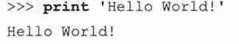

而表达式没有关键字。它们可以是使用数学操作符构成的算术表达式，也可以是使用括号调用的函数。它们可以接受用户输入，也可以不接受用户输入，有些会有输出，有些则没有。（在 Python 中未指定返回值的函数会自动返回 None,等价于 NULL）下面举一个例子，函数 abs()接受一个数值输入，然后输出这个数值的绝对值。

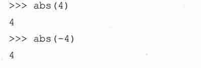

本章中我们将分别介绍语句和表达式。我们先来研究 print 语句。

## 2.1　程序输出,print 语句及“Hello World!“

有些语言，比如 C,通过函数输出数据到屏幕，例如函数 printfO。然而在 Python 和大多数解释执行的脚本语言中，则使用语句进行输出。很多的 shell 脚本语言使用 echo 命令来输出程序结果。

核心笔记：在交互式解释器中显示变量的值

* * *

通常当你想看变量内容时，你会在代码中使用 print 语句输出。不过在交互式解释器中，你可以用 print 语句显示变量的字符串表示，或者仅使用变量名查看该变量的原始值。

* * *

在下面的例子中，我们把一个字符串赋值给变量 myString，先用 print 来显示变量的内容，之后用变量名称来显示。

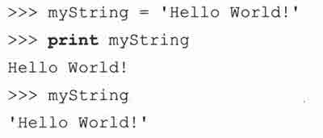

注意，在仅用变量名时，输出的字符串是用单引号括起来了的。这是为了让非字符串对象也能以字符串的方式显示在屏幕上——即它显示的是该对象的字符串表示，而不仅仅是字符串本身。引号表示你刚刚输入的变量的值是一个字符串。等你对 Python 有了较深入的了解之后，你就会知道 print 语句调用 str()函数显示对象，而交互式解释器则调用 repr()函数来显示对象。

下划线（_）在解释器中有特别的含义，表示最后一个表达式的值。所以上面的代码执行之后，下划线变量会包含字符串。

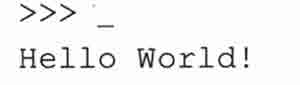

Python 的 print 语句，与字符串格式操作符（%）结合使用，可实现字符串替换功能，这一点和 C 语言中的 printf()函数非常相似。

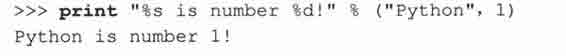

%s 表示由一个字符串来替换，而％d 表示由一个整型来替换，另外一个很常用的就是%f,它表示由一个浮点型来替换。我们会在本章中看到更多类似的例子。Python 非常灵活，所以即使你将数字传递给%s,也不会像其他要求严格的语言一样引发严重后果。参阅 6.4.1 节以了解更多关于字符串格式操作符的信息。Print 语句也支持将输出重定向到文件。这个特性是从 Python2.0 开始新增的。符号>>用来重定向输出，下面这个例子将输出重定向到标准错误输出。

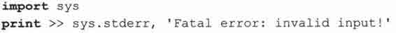

下面是一个将输出重定向到日志文件的例子。

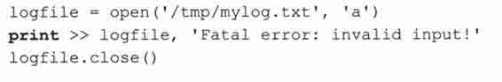

## 2.2　程序输入和 raw_input()内建函数

从用户那里得到数据输入的最容易的方法是使用 raw_input()内建函数。它读取标准输入，并将读取到的数据赋值给指定的变量。你可以使用 into 内建函数将用户输入的字符串转换为整型。

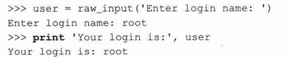

上面这个例子只能用于文本输入。下面是输入一个数值字符串（并将字符串转换为整型）的例子：

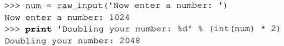

内建函数 int()将数值字符串转换成整型值，这样才可以对它进行数学运算。参阅第 6.5.3 节以了解更多有关内建函数 raw_input()的知识。

核心笔记：从交互式解释器中获得帮助

* * *

在学习 Python 的过程中，如果需要得到一个生疏函数的帮助，只需要对它调用内建函数 help()。通过用函数名作为 help()的参数就能得到相应的帮助信息。

从标准输入读取一个字符串并自动删除串尾的换行字符。如果用户键入了 EOF 字符（Unix: Ctrl+D, Windows: Ctrl+Z+回车），则引发 EOFError,在 Unix 平台，只要可用，就使用 GNU readline 库。如果提供提示字符串参数，则显示该字符,串并自动删去字符串末尾的换行字符。（本段是 help（raw_input）的输出，译文是对其加以解释，方便读者理解——译者注）

* * *

核心风格：一直在函数外做用户交互操作

* * *

新手在需要显示信息或得到用户输入时，很容易想到使用 print 语句和 raw_input()内建函数。不过我们在此建议函数应该保持其清晰性，也就是它只应该接受参数，返回结果。从用户那里得到需要的数据，然后调用函数处理，从函数得到返回值，然后显示结果给用户。这样你就能够在其他地方也可以使用你的函数而不必担心自定义输出的问题。这个规则的一个例外是，如果函数的基本功能就是为了得到用户输出，或者就是为了输出信息，这时在函数内使用 print 语句或 raw_input()也未尝不可。更重要的是，将函数分为两大类，一类只做事，不需要返回值（比如与用户交互或设置变量的值），另一类则执行一些运算，最后返回结果。如果输出就是函数的目的，那么在函数体内使用 print 语句也是可以接受的选择。

* * *

## 2.3　注释

和大部分脚本及 Unix-shell 语言一样，Python 也使用#符号标示注释，从#开始，直到一行结束的内容都是注释。

有一种叫做文档字符串的特别注释。你可以在模块、类或者函数的起始添加一个字符串，起到在线文档的功能，这是 Java 程序员非常熟悉的一个特性。

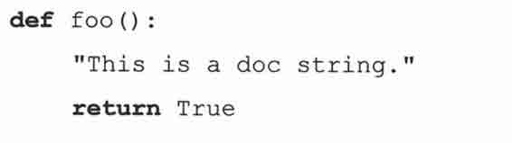

与普通注释不同，文档字符串可以在运行时访问，也可以用来自动生成文档。

## 2.4　操作符

和其他绝大多数的语言一样，Python 中的标准算术操作符以你熟悉的方式工作。

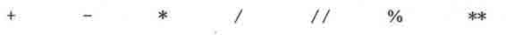

加、减、乘、除和取余都是标准操作符。Python 有两种除法操作符，单斜杠用作传统除法，双斜杠用作浮点除法（对结果进行四舍五入）。传统除法是指如果两个操作数都是整型的话，它将执行的是地板除（取比商小的最大整数）（关于“地板除“请参考第五章——译者注），而浮点除法是真正的除法，不管操作数是什么类型，浮点除法总是执行真正的除法。你可以在第五章学到更多有关传统除法、真正的除法及浮点除法的知识。

还有一个乘方操作符，双星号（**）。尽管我们一直强调这些操作符的算术本质，但是请注意对于其他数据类型，有些操作符是被重载了，比如字符串和列表。让我们看一个例子。

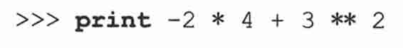

1

就像你看到的，操作符的优先级和你想象的一样：+和-优先级最低，*、/、//、%优先级较高，单目操作符+和-优先级更高，乘方的优先级最高。（3**2）首先求值，然后是（−2*4）,然后是对两个结果进行求和。

Python 当然也有标准比较操作符，比较运算根据表达式的值的真假返回布尔值。

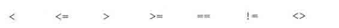

试一试,看看这些比较运算会得到什么结果。

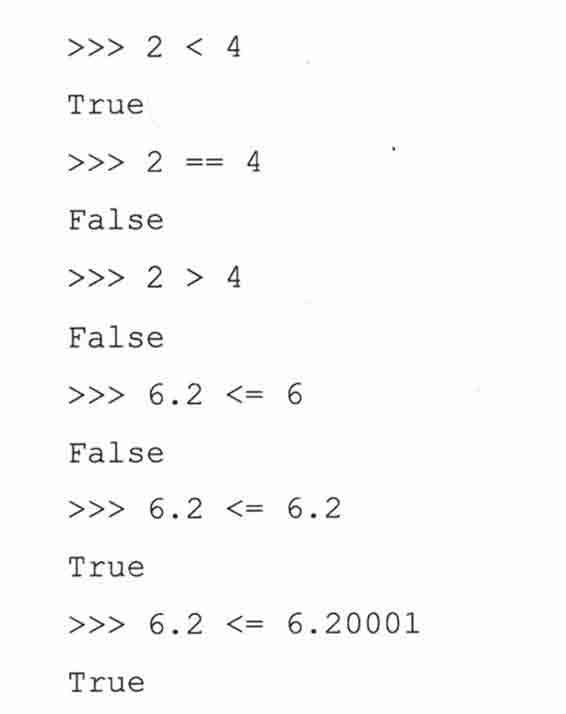

Python 目前支持两种“不等于“比较操作符，！=和<>，分别是 C 风格和 ABC/Pascal 风格。目前后者慢慢地被淘汰了，所以我们推荐使用前者。

Python 也提供了逻辑操作符。

and　　or　　not

使用逻辑操作符可以将任意表达式连接在一起，并得到一个布尔值。

最后一个例子在其他语言中通常是不合法的，不过 Python 支持这样的表达式，既简洁又优美。它实际上是下面表达式的缩写：

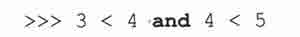

参阅 4.5 节以得到更多有关 Python 操作符的信息。

核心风格：合理使用括号增强代码的可读性

* * *

在很多场合使用括号都是一个好主意，而没用括号的话，会使程序得到错误结果，或使代码可读性降低，引起阅读者困惑。括号在 Python 语言中不是必须存在的，不过为了可读性，使用括号总是值得的。任何维护你代码的人会感谢你，在你再次阅读自己的代码时，你也会感谢你自己。

* * *

## 2.5　变量和赋值

Python 中变量名规则与其他大多数高级语言一样，都是受 C 语言影响（或者说这门语言本身就是 C 语言写成的）。变量名仅仅是一些字母开头的标识符——所谓字母开头——意指大写或小写字母，另外还包括下划线（_）。其他的字符可以是数字、字母或下划线。Python 变量名是大小写敏感的，也就是说变量“case“与“CaSe“是两个不同的变量。

Python 是动态类型语言，也就是说不需要预先声明变量的类型。变量的类型和值在赋值那一刻被初始化。变量赋值通过等号来执行。

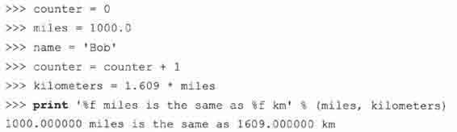

上面是五个变量赋值的例子。第一个是整型赋值，第二个是浮点型赋值，第三个是字符串赋值，第四个是对一个整型增 1，最后一个是浮点乘法赋值。

Python 也支持增量赋值，也就是操作符和等号合并在一起，看下面的例子。

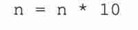

将上面的例子改成增量赋值方式就是：

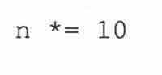

Python 不支持 C 语言中的自增 1 和自减 1 操作符，这是因为+和-也是单目操作符，Python 会将-n 解释为-（-n）从而得到 n，同样++n 的结果也是 n。

## 2.6　数字

Python 支持五种基本数字类型，其中有三种是整型类型。

•　有符号整型

> •　长整型

> •　布尔值

•　浮点值

•　复数

下面是一些例子。

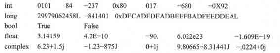

Python 中有两种有趣的类型，就是 Python 的长整型和复数类型。请不要将 Python 的长整型与 C 语言的长整型混淆。Python 的长整型所能表达的范围远远超过 C 语言的长整型，事实上，Python 长整型仅受限于用户计算机的虚拟内存总数。如果你熟悉 Java,Python 的长整型类似于 Java 中的 Biglnteger 类型。

从长远来看，整型与长整型正在逐步统一为一种整型类型。从 Python2.3 开始，再也不会报整型溢出错误，结果会被自动转换为长整型。在未来版本的 Python 中，两种整型类型将会无缝结合，长整型后缀“L“也会变得可有可无。

布尔值是特殊的整型。尽管布尔值由常量 True 和 False 来表示，如果将布尔值放到一个数值上下文环境中（比如将 True 与一个数字相加），True 会被当成整型值 1,而 False 则会被当成整型值()。复数（包括-1 的平方根，即所谓的虚数）在其他语言中通常不被直接支持（一般通过类来实现）。

其实还有第 6 种数字类型，即 decimal,用于十进制浮点型。不过它并不是内建类型，你必须先导入 decimal 模块才可以使用这种数值类型。由于需求日渐强烈，Python2.4 增加了这种类型。举例来说，由于在二进制表示中有一个无限循环片段，数字 1.1 无法用二进制浮点型精确表示。因此，数字 1.1 实际上会被表示成如下形式。

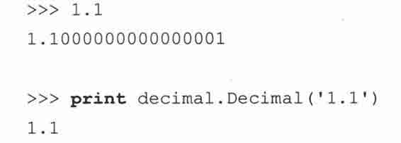

第五章将详细介绍所有的数字类型。

## 2.7　字符串

Python 中字符串被定义为引号之间的字符集合。Python 支持使用成对的单引号或双引号，三引号（三个连续的单引号或者双引号）可以用来包含特殊字符。使用索引操作符（[]）和切片操作符（[]）可以得到子字符串。字符串有其特有的索引规则：第一个字符的索引是(),最后一个字符的索引是-1。

加号（+）用于字符串连接运算，星号（*）则用于字符串重复。下面是几个例子。

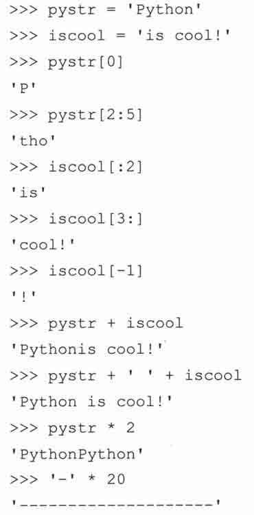

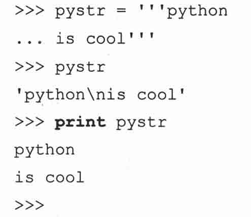

你可以在第六章学到更多有关字符串的知识。

## 2.8　列表和元组

可以将列表和元组当成普通的“数组“，它能保存任意数量任意类型的 Python 对象。和数组一样，通过从 0 开始的数字索引访问元素，但是列表和元组可以存储不同类型的对象。

列表和元组有几处重要的区别。列表元素用中括号（[]）包裹，元素的个数及元素的值可以改变。元组元素用小括号（()）包裹，不可以更改（尽管他们的内容可以）。元组可以看成是只读的列表。通过切片运算（[]和[:]）可以得到子集，这一点与字符串的使用方法一样。

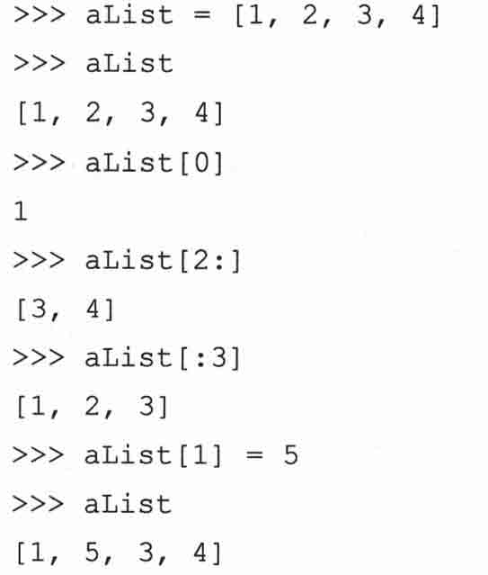

元组也可以进行切片运算，得到的结果也是元组（不能被修改）。

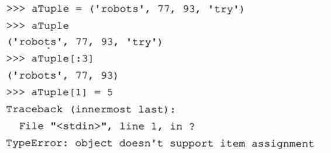

可以在第六章学到更多有关列表、元组及字符串的知识。

## 2.9　字典

字典是 Python 中的映射数据类型，工作原理类似 Perl 中的关联数组或哈希表，由键-值（key-value）对构成。几乎所有类型的 Python 对象都可以用作键，不过一般还是以数字或者字符串最为常用。

值可以是任意类型的 Python 对象，字典元素用大括号（{}）包裹。

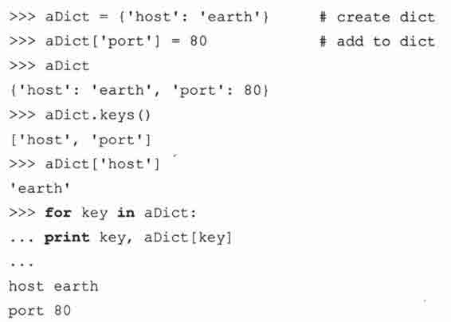

在第七章中会详细讲解字典。

## 2.10　代码块及缩进对齐

代码块通过缩进对齐表达代码逻辑，而不是使用大括号。因为没有了额外的字符，程序的可读性更高。而且缩进完全能够清楚地表达一个语句属于哪个代码块。当然，代码块也可以只有一个语句组成。

对一个 Python 初学者来说，仅使用缩进可能令他诧异。人们通常竭力避免改变，因此对那些使用大括号很多年的人来说，初次使用纯缩进来表示逻辑也许会多少感到有些不够坚定（不用大括号？到底成不成啊？）。然而回想一下，Python 有两大特性，一是简洁，二是可读性好。如果你实在讨厌使用缩进作为代码分界，我们希望你从现在开始，半年后再来看一下这种方式。也许你会发现生活中没有大括号并不会像你想像的那么糟糕。

## 2.11　if 语句

标准 if 条件语句的语法如下。

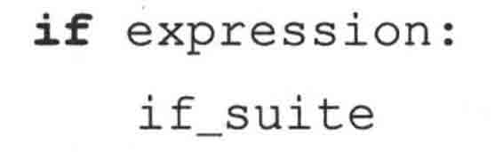

如果表达式的值非 0 或者为布尔值 True,则代码组 if_suite 被执行；否则就去执行下一条语句。代码组（suite）是一个 Python 术语，它由一条或多条语句组成，表示一个子代码块。Python 与其他语言不同，条件条达式并不需要用括号括起来。

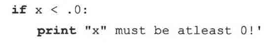

Python 当然也支持 else 语句，语法如下。

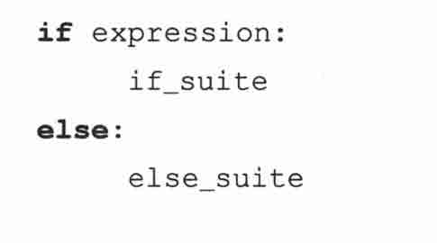

Python 还支持 elif（意指“else-if“）语句，语法如下。

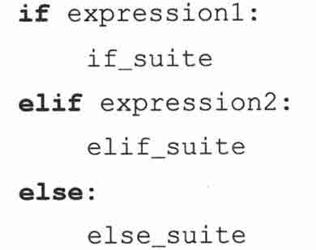

在本书写作之时，正在进行一个关于是否需要增加 switch/case 语句的讨论，不过目前并没有什么实质性的进展。在将来版本的 Python 语言当中，也非常有可能看到这样的“动物“。这个例子似乎有点奇怪、让人觉得困惑，但是因为有了 Python 干净的语法，if-elif-else 语句并不像别人说的那么丑陋（以致不能让人接受）。如果你非要避免写一堆 if-elif-else 语句，另一种变通的解决方案是使用 for 循环（参阅 2.13）来迭代你可能的“cases“列表。

在第八章你可以学到更多有关 if、elif 和 else 条件语句的知识。

## 2.12　while 循环

标准 while 条件循环语句的语法类似 if。再说一次,要使用缩进来分隔每个子代码块。

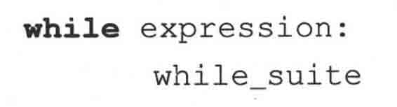

语句 while_suite 会被连续不断地循环执行，直到表达式的值变成 0 或 False,接着 Python 会执行下一句代码。类似 if 语句，Python 的 while 语句中的条件表达式也不需要用括号括起来。

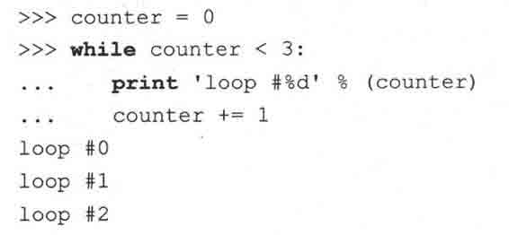

while 循环和马上就要讲到的 for 循环会在第八章的关于循环的小节进行详细讲解。

## 2.13　for 循环和 range()内建函数

Python 中的 for 循环与传统的 for 循环（计数器循环）不太一样，它更像 shell 脚本里的 foreach 迭代。 Python 中的 for 接受可迭代对象（例如序列或迭代器）作为其参数，每次迭代其中一个元素。

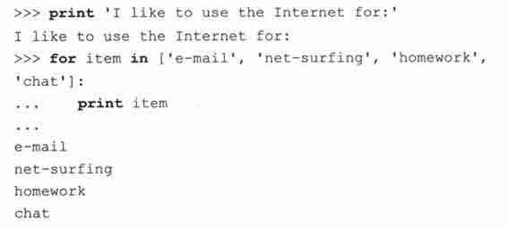

上面例子的输出如果能在同一行就会美观许多。print 语句默认会给每一行添加一个换行符。只要在 print 语句的最后添加一个逗号（，），就可以改变它这种行为。

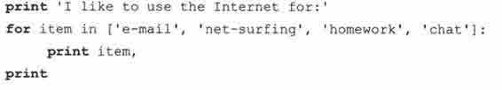

上面的代码还添加了一个额外的没有任何参数的 print 语句，它用来输出一个换行符。否则，提示信息就会立刻出现在我们的输出之后。下面是以上代码的输出。

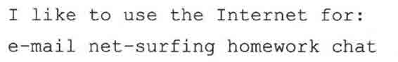

为了输出清晰美观，带逗号的 print 语句输出的元素之间会自动添加一个空格。通过指定输出格式，程序员可以最大程度地控制输出布局，也不用担心这些自动添加的空格。它也可以将所有数据放到一处输出——只需要将数据放在格式化操作符右侧的元组或字典中。

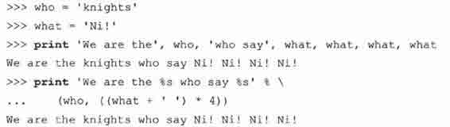

使用字符串格式操作符还允许我们做一些字符串输出之前的整理工作，就像你在刚才的例子中看到的一样。

通过演示一个让 Python for 循环更像传统循环（换言之，计数循环）的示例，我们来结束对循环的介绍。因为我们不能改变 for 循环的行为（迭代一个序列），我们可以生成一个数字序列。这样，尽管我们确实是在迭代一个序列，但是它至少展示的是递增计数的效果。

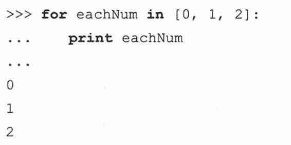

在这个循环中，eachNum 包含的整型值可以用于显示，也可以用于计算。因为我们要使用的数值范围可能会经常变化，Python 提供了一个 range()内建函数来生成这种列表。它正好能满足我们的需要，接受一个数值范围，生成一个列表。

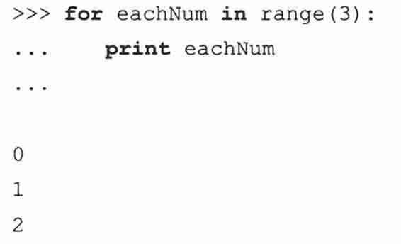

对字符串来说，很容易迭代每一个字符。

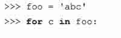

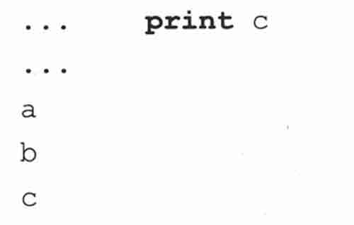

range()函数经常和 len()函数一起用于字符串索引。在这里我们要显示每一个元素及其索引值。

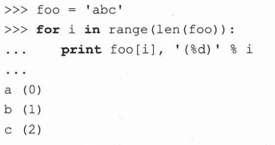

不过，这些循环有一个约束，你要么循环索引，要么循环元素。这导致了 enumerate()函数的推出 （Python2.3 新增）。它同时做到了这两点。

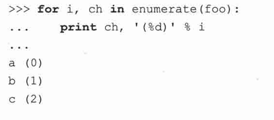

## 2.14　列表解析

这是一个让人欣喜的术语，表示你可以在一行中使用一个 for 循环将所有值放到一个列表当中：

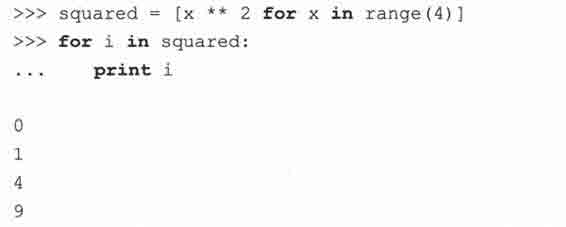

列表解析甚至能做更复杂的事情，比如挑选出符合要求的值放入列表。

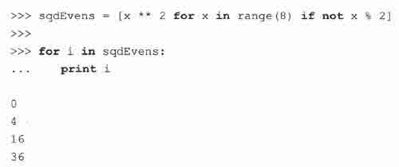

## 2.15　文件和内建函数 open()、file()

在你已经习惯一门语言的语法之后，文件访问是相当重要的一环。在一些工作做完之后，将它保存到持久存储是很重要的。

如何打开文件

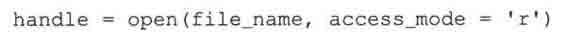

file__name 变量包含我们希望打开的文件的字符串名字，access_mode 中 Y 表示读取，‘w’表示写入，‘a’表示添加。其他可能用到的标识还有‘+’表示读写，‘b’表示二进制访问。如果未提供 access_mode,默认值为‘r’。如果 open()成功，一个文件对象句柄会被返回。所有后续的文件操作都必须通ã此文件句柄进行。当一个文件对象返回之后，我们就可以访问它的一些方法，比如 readlines()和 close()。文件对象的方法属性也必须通过句点属性标识法访问（参阅下面的核心笔记）。

核心笔记：什么是属性？

* * *

属性是与数据有关的项目。属性可以是简单的数据值，也可以是可执行对象，比如函数和方法。哪些对象拥有属性呢？很多。类、模块、文件和复数等对象都拥有属性。我如何访问对象属性？使用句点属性标识法。也就是说在对象名和属性名之间加一个句点（.）：object.attribute。

* * *

下面有一些代码，提示用户输入文件名，然后打开一个文件，并显示它的内容到屏幕上。

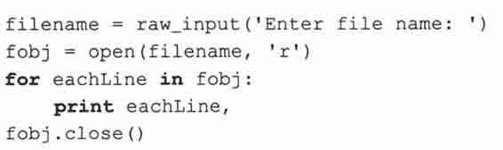

我们的代码没有用循环一次取一行显示，而是做了点改变。我们一次读入文件地所有行，然后关闭文件，再迭代每一行输出。这样写代码的好处是能够快速完整地访问文件。内容输出和文件访问不必交替进行。这样代码更清晰，而且将不相关的任务区分开来。需要注意的一点是文件的大小。上面的代码适用于文件大小适中的文件。对于很大的文件来说，上面的代码会占用太多的内存，这时你最好一次读一行（下一节有一个好例子）。

我们的代码中另一个有趣的语句是我们又一次在 print 语句中使用逗号来抑制自动生成的换行符号。为什么要这样做？因为文件中的每行文本已经自带了换行字符，如果我们不抑制 print 语句产生的换行符号，文本在显示时就会有额外的空行产生。

file()内建函数是最近才添加到 Python 当中的。它的功能等同于 open()，不过 file()这个名字可以更确切地表明它是一个工厂函数（生成文件对象）。类似于 intO 生成整型对象，dictO 生成字典对象。在第九章，我们将详细介绍文件对象和它们的内建方法属性，以及如何访问本地文件系统。请参考第九章以了解详细信息。

## 2.16　错误和异常

编译时会检查语法错误，不过 Python 也允许在程序运行时检测错误。当检测到一个错误，Python 解释器就引发一个异常，并显示异常的详细信息。程序员可以根据这些信息迅速定位问题并进行调试，并找出处理错误的办法。

要给你的代码添加错误检测及异常处理，只要将它们“封装”在 try-except 语句当中 otry 之后的代码组，就是你打算管理的代码 oexcept 之后的代码组，则是你处理错误的代码。

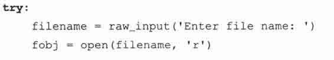

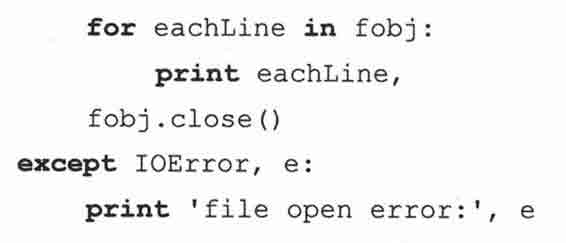

程序员也可以通过使用 raise 语句故意引发一个异常。在第十章你可以学到更多有关 Python 异常的知识。

## 2.17　函数

类似于其他语言，Python 中的函数使用小括号（()）调用。函数在调用之前必须先定义。如果函数中没有 return 语句，就会自动返回 None 对象。

Python 是通过引用调用的。这意味着函数内对参数的改变会影响到原始对象。不过事实上只有可变对象会受此影响，对不可变对象来说，它的行为类似按值调用。

### 2.17.1　如何定义函数

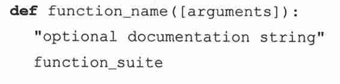

定义一个函数的语法由 def 关键字及紧随其后的函数名，再加上该函数需要的几个参数组成。函数参数（比较上面例子中的 arguments）是可选的，这也是为什么把它们放到中括号中的原因。（在你的代码里千万别写上中括号！）这个语句由一个冒号（:）结束（与 if 和 while 语句的结束方式一样），之后是代表函数体的代码组，下面是一个简短的例子。

这个函数，做的是“在我的值上加我”的工作。它接受一个对象，将它的值加到自身，然后返回和。对于数值类型参数，它的结果是显而易见的，不过我要在这里指出，加号操作符几乎与所有数据类型工作。换句话说，几乎所有的标准数据类型都支持+操作符，不管是数值相加还是序列合并。

### 2.17.2　如何调用函数

Python 语言中调用函数与在其他高级语言中一样，为函数名加上函数操作符——一对小括号。括号之间是所有可选的参数。即使一个参数也没有，小括号也不能省略。注意一下，+操作符在非数值类型中如何工作。

### 2.17.3　默认参数

函数的参数可以有一个默认值，如果提供有默认值，在函数定义中，参数以赋值语句的形式提供。事实上这仅仅是提供默认参数的语法，它表示函数调用时如果没有提供这个参数，它就取这个值作为默认值。

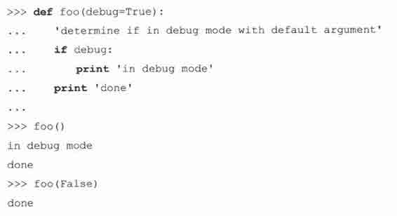

在上面的例子里，debug 参数有一个默认值 True。如果我们没有传递参数给函数 foo(), debug 自动拿到一个值 True。在第二次调用 foo()时，我们故意传递一个参数 False 给 foo(),这样，默认参数就没有被使用。函数拥有的特性远比我们在这里介绍的多，请阅读第十一章以了解更详细的函数的信息。

## 2.18　类

是面向对象编程的核心，它扮演相关数据及逻辑容器的角色。它们提供了创建“真实”对象（也就是实例）的蓝图。因为 Python 并不强求你以面向对象的方式编程（与 Java 不同），此刻你也可以不学习类。不过我们还是在这儿放了些例子，以方便感兴趣的读者浏览。

如何定义类

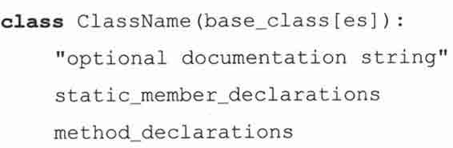

使用 class 关键字定义类。可以提供一个可选的父类或者说基类；如果没有合适的基类，那就使用 object 作为基类。class 行之后是可选的文档字符串、静态成员定义及方法定义。

在上面这个类中，我们定义了一个静态变量 version,它将被所有实例及 4 个方法共享——__init__(). showname()、showver()及熟悉的 addMe2Me()。这些 show*()方法并没有做什么有用的事情，仅仅输出对应的信息。__init__()方法有一个特殊名字，所有名字开始和结束都有两个下划线的方法都是特殊方法。

当一个类实例被创建时,__init__()方法会自动执行,在类实例创建完毕后执行,类似构造器。__init__()可以被当成构造器，不过不像其他语言中的构造器，它并不创建实例——它仅仅是你的对象创建后执行的第一个方法。它的目的是执行一些该对象的必要的初始化工作。通过创建自己的 __init__()方法，你可以覆盖默认的 __init__()方法（默认的方法什么也不做），从而能够修饰刚刚创建的对象。在这个例子里，我们初始化了一个名为 name 的类实例属性（或者说成员）。这个变量仅在类实例中存在，它并不是实际类本身的一部分。__init__()需要一个默认的参数，前一节中曾经介绍过。毫无疑问，你也注意到每个方法都有的一个参数，self。

什么是 self?它是类实例自身的引用。其他面向对象语言通常使用一个名为 this 的标识符。

如何创建类实例

屏幕上显示的字符串正是自动调用 __init__()方法的结果。当一个实例被创建，__init__()就会被自动调用，不管这个 __init__()是自定义的还是默认的。

创建一个类实例就像调用一个函数，它们确实拥有一样的语法，它们都是可调用对象。类实例使用同样的函数操作符调用一个函数或方法。既然我们成功创建了第一个类实例，那现在来进行一些方法调用。

每个方法的调用都返回我们期望的结果。比较有趣的数据是类名字。在 showname()方法中，我们显示 self.__class__.__name__ 变量的值。对一个实例来说，这个变量表示实例化它的类的名字（self.__class__ 引用实际的类）。在我们的例子里，创建类实例时我们并未传递名字参数，因此默认参数‘John Doe’就被自动使用。在我们下一个例子里，我们将指定一个参数。

第十三章将详细介绍 Python 类和类实例。

## 2.19　模块

模块是一种组织形式，它将彼此有关系的 Python 代码组织到一个个独立文件当中。模块可以包含可执行代码、函数和类，或者这些东西的组合。

当你创建了一个 Python 源文件，模块的名字就是不带.py 后缀的文件名。一个模块创建之后，你可以从另一个模块中使用 import 语句导入这个模块来使用。

### 2.19.1　如何导入模块

### 2.19.2　如何访问一个模块函数或访问一个模块变量

一旦导入完成，一个模块的属性（函数和变量）可以通过熟悉的句点属性标识法访问。

现在我们再次提供 Hello World!例子，不过这次使用 sys 模块中的输出函数。

这些代码的输出与我们使用 print 语句完全相同。唯一的区别在于这次调用了标准输出的 write()方法，而且这次需要显式地在字符串中提供换行字符。不同于 print 语句，write()不会自动在字符串后面添加换行符号。

关于模块和导入，你可以在第十二章中得到更多有用的信息。在那里会详细介绍本章上面所有提到的主题，希望我们提供的快速入门能达到帮助你迅速使用 Python 开始工作的目标。

核心笔记：什么是“PEP”

* * *

在本书中你会经常看到 PEP 这个字眼。一个 PEP 就是一个 Python 增强提案（Python Enhancement Proposal），这也是在新版 Python 中增加新特性的方式。从初学者的角度看，它们是一些高级读物，不但提供了新特性的完整描述，还有添加这些新特性的理由，如果需要的话，还会提供新的语法、技术实现细节、向后兼容信息等。在一个新特性被整合进 Python 之前，必须通过 Python 开发社区、PEP 作者及实现者，还有 Python 的创始人 Guido van Rossum 的一致同意。PEP1 阐述了 PEP 的目标及书写指南。在 PEP0 中可以找到所有的 PEP。PEP 索引的网址是 http://python.org/dev/peps。

* * *

## 2.20　实用的函数

本章中，我们用到了很多实用的内建函数。表 2.1 中总结了这些函数，并且提供了一些其他的有用函数（注意我们并没有提供完整的使用语法，仅提供了我们认为可能对你有用的部分）。

## 2.21　练习

> > 2-1.变量，print 和字符串格式化操作符。启动交互式解释器，给一些变量赋值（字符串，数值等）并通过输入变量名显示它们的值。再用 print 语句做同样的事。这二者有何区别？也尝试着使用字符串格式操作符%，多做几次，慢慢熟悉它。

> > 2-2.程序输出。阅读下面的 Python 脚本。

> > 

> > > > （a）你认为这段脚本是用来做什么的？

> > > > （b）你认为这段脚本会输出什么？

> > > > （c）输入以上代码，并保存为脚本，然后运行它。它所做的与你的预期一样吗？为什么一样不一样？

> > > > （d）这段代码单独执行和在交互解释器中执行有何不同？试一下，然后写出结果。

> > > > （e）如何改进这个脚本，以便它能和你想像的一样工作？

> > 2-3.数值和操作符。启动交互解释器，使用 Python 对两个数值（任意类型）进行加、减、乘、除运算。然后使用取余操作符来得到两个数相除的余数，最后使用乘方操作符求 A 数的 B 次方。

> > 2-4.使用 raw_input()函数得到用户输入。

> > > > （a）创建一段脚本使用 raw_input()内建函数从用户输入得到一个字符串，然后显示这个用户刚刚键入的字符串。

> > > > （b）添加一段类似的代码，不过这次输入的是数值。将输入数据转换为一个数值对象，（使用 int()或其他数值转换函数）并将这个值显示给用户看（注意，如果你用的是早于 1.5 的版本，你需要使用 stririg.ato*()函数执行这种转换）。

> > 2-5.循环和数字。

> > > > 分别使用 while 和 for 创建一个循环。

> > > > （a）写一个 while 循环，输出整型为 0〜10 （要确保是０〜10,而不是 O〜9 或 1〜10）。

> > > > （b）做同（a）一样的事，不过这次使用 range()内建函数。

> > 2-6.条件判断。判断一个数是正数，还是负数，或者是 0。开始先用固定的数值，然后修改你的代码支持用户输入数值再进行判断。

> > 2-7.循环和字串。从用户那里接受一个字符串输入，然后逐字符显示该字符串。先用 while 循环实现，然后再用 for 循环实现。

> > 2-8.循环和操作符。创建一个包含五个固定数值的列表或元组，输出他们的和。然后修改你的代码为接受用户输入数值。分别使用 while 和 for 循环实现。

> > 2-9.循环和操作符。创建一个包含五个固定数值的列表或元组，输出他们的平均值。本练习的难点之一是通过除法得到平均值。你会发现整型除会截去小数，因此你必须使用浮点除以得到更精确的结果。float()内建函数可以帮助你实现这一功能。

> > 2-10.带循环和条件判断的用户输入。使用 raw_input0 函数来提示用户输入一个 1 和 100 之间的数，如果用户输入的数满足这个条件，显示成功并退出。否则显示一个错误信息然后再次提示用户输入数值，直到满足条件为止。

> > 2-11.带文本菜单的程序写一个带文本菜单的程序，菜单项如下：（1）取五个数的和；（2）取五个数的平均值…（X）退出。由用户做一个选择，然后执行相应的功能。当用户选择退出时程序结束。这个程序的有用之处在于用户在功能之间切换不需要一遍一遍地重新启动你的脚本（这对开发人员测试自己的程序也会大有用处）。

> > 2-12.dir()内建函数。

> > > > （a）启动 Python 交互式解释器，通过直接键入 dir()回车以执行 dir()内建函数。你看到什么？显示你看到的每一个列表元素的值，记下实际值和你想像的值。

> > > > （b）你会问，dir()函数是干什么的？我们已经知道在 dir 后边加上一对括号可以执行 dir()内建函数，如果不加括号会如何？试一试。解释器返回给你什么信息？你认为这个信息表示什么意思？

> > > > （c） type()内建函数接收任意的 Python 对象作为参数并返回他们的类型。在解释器中键入 type（dir）,看看你得到的是什么？

> > > > （d）本练习的最后一部分，我们来瞧一瞧 Python 的文档字符串。通过 dir._doc_ 可以访问 dir()内建函数的文档字符串。print dir.__doc__ 可以显示这个字符串的内容。许多内建函数、方法、模块及模块属性都有相应的文档字符串。我们希望你在你的代码中也要书写文档字符串，它会对使用这些代码的人提供及时方便的帮助。

> > 2-13.利用 dir()找出 sys 模块中更多的东西。

> > > > （a）启动 Python 交互解释器，执行 dir()函数，然后键入 import sys 以导入 sys 模块。再次执行 dir()函数以确认 sys 模块被正确的导入。然后执行 dir（sys）,你就可以看到 sys 模块的所有属性了。

> > > > （b）显示 sys 模块的版本号属性及平台变量。记住在属性名前一定要加 sys.,这表示这个属性是 sys 模块的。其中 version 变量保存着你使用的 Python 解释器版本，platform 属性则包含你运行 Python 时使用的计算机平台信息。

> > > > （c）最后，调用 sys.exit()函数。这是一种热键之外的另一种退出 Python 解释器的方式。

> > 2-14.操作符优先级和括号分组。重写 2.4 小节中 print 语句里的算术表达式，试着在这个表达式中添加合适的括号以便它能正常工作。

> > 2-15.元素排序。

> > > > 让用户输入 3 个数值并将分别将它们保存到 3 个不同的变量中。不使用列表或排序算法,自己写代码来对 3 个数由小到大排序。（b）修改（a）的解决方案，使之从大到小排序。

> > 2-16.文件。键入 2.15 节的文件显示的代码，然后运行它，看看能否在你的系统上正常工作，然后试一下其他的输入文件。