# 第四章　Python 对象

本章主题

♦　Python 对象

♦　内建类型

♦　标准类型操作符

♦　值的比较

♦　对象身份比较

♦　布尔类型

♦　标准类型内建函数

♦　标准类型总览

♦　各种类型

♦　不支持的类型

我们现在来学习 Python 语言的核心部分。首先我们来了解什么是 Python 对象，然后讨论最常用的内建类型，接下来我们讨论标准类型操作符和内建函数,之后给出对标准类型的不同的分类方式。这有助于我们更好地理解他们如何工作。最后我们会提到 Python 目前还不支持的类型（这对那些有其他高级语言经验的人会有所帮助）。

## 4.1　Python 对象

Python 使用对象模型来存储数据。构造任何类型的值都是一个对象。尽管 Python 通常被当成一种“面向对象的编程语言”，但你完全能够写出不使用任何类和实例的实用脚本。不过 Python 的对象语法和架构鼓励我们使用这些特性，下面让我们仔细研究一下 Python 对象。

所有的 Python 对像都拥有三个特性：身份，类型和值。

> > 身份：每一个对象都有一个唯一的身份标识自己，任何对象的身份可以使用内建函数 id()来得到。这个值可以被认为是该对象的内存地址。你极少会用到这个值，也不用太关心它究竟是什么。

> > 类型：对象的类型决定了该对象可以保存什么类型的值，可以进行什么样的操作，以及遵循什么样的规则。你可以用内建函数 type()查看 Python 对象的类型。因为在 Python 中类型也是对象（还记得我们提到 Python 是面向对象的这句话吗?），所以 type()返回的是对象而不是简单的字符串。

> > 值：对象表示的数据项。

上面三个特性在对象创建的时候就被赋值，除了值之外，其他两个特性都是只读的。对于新式类型和类，对象的类型也是可以改变的，不过并不推荐初学者这样做。

如果对象支持更新操作，那么它的值就可以改变，否则它的值也是只读的。对象的值是否可以更改被称为对象的可改变性（mutability）,我们会在后面的 4.7 小节中讨论这个问题。只要一个对象还没有被销毁，这些特性就一直存在。

Python 有一系列的基本（内建）数据类型，必要时也可以创建自定义类型来满足你对应用程序的需求。绝大多数应用程序通常使用标准类型，对特定的数据存储则通过创建和实例化类来实现。

对象属性

某些 Python 对象有属性、值或相关联的可执行代码，比如方法（method）o Python 用句点（.）标记法来访问属性。属性包括相应对象的名字等，在 2.14 小节中曾做过介绍。最常用的属性是函数和方法，不过有一些 Python 类型也有数据属性。含有数据属性的对象包括（但不限于）：类、类实例、模块、复数和文件。

## 4.2　标准类型

•　数字（分为几个子类型，其中有三个是整型）

•　Integer 整型

•　Boolean 布尔型

•　Long integer 长整型

•　Floating point real number 浮点型

•　Complex number 复数型

•　String 字符串

•　List 列表

•　Tuple 元组

•　Dictionary 字典

在本书中，标准类型也称作“基本数据类型“，因为这些类型是 Python 内建的基本数据类型，我们会在第 5、第 6 和第七章中详细介绍它们。

## 4.3　其他内建类型

•　类型

•　Null 对象（None）

•　文件

•　集合/固定集合

•　函数/方法

•　模块

•　类

这些是当你做 Python 开发时可能会用到的一些数据类型。我们在这里讨论 Type 和 None 类型的使用，除此之外的其他类型将在其他章节中讨论。

### 4.3.1　类型对象和 type 类型对象

在本章我们要讨论所有的 Python 类型，虽然看上去把类型本身也当成对象有点特别，我们还是要在这里提一提。你一定还记得，对象的一系列固有行为和特性（比如支持哪些运算，具有哪些方法）必须事先定义好。从这个角度看，类型正是保存这些信息的最佳位置。描述一种类型所需要的信息不可能用一个字符串来搞定，所以类型不能是一个简单的字符串，这些信息不能也不应该和数据保存在一起，所以我们将类型定义成对象。

下面我们来正式介绍内建函数 type()。通过调用 type()函数你能够得到特定对象的类型信息。

>>> type （42）

<type ‘int’>

我们仔细研究一下这个例子，请注意看 type 函数有趣的返回值。我们得到一个简洁的输出结果<type‘int’>。不过你应当意识到它并不是一个简单地告诉你 42 是个整型的字符串。你看到的<type‘int’>实际上是一个类型对象，碰巧它输出了一个字符串来告诉你它是个 int 型对象。

现在你该问自己了，那么类型对象的类型是什么？来，我们试验一下。

>>>type（type（42））

<type ‘type’>

没错，所有类型对象的类型都是 type,它也是所有 Python 类型的根和所有 Python 标准类的默认元类（metadass）。你现在有点搞不明白，没关系，随着我们逐步深入地学习类和类型，你就会慢慢理解。

随着 Python 2.2 中类型和类的统一，类型对象在面向对象编程和日常对象使用中扮演着更加重要的角色。从现在起，类就是类型，实例是对应类型的对象。

### 4.3.2　None——Python 的 Null 对象

Python 有一个特殊的类型，被称为 Null 对象或者 NoneType,它只有一个值，那就是 None。它不支持任何运算也没有任何内建方法。如果非常熟悉 C 语言，就会知道和 None 类型最接近的 C 类型就是 void, None 类型的值和 C 的 NULL 值非常相似（其他类似的对象和值包括 Perl 的 undef 和 Java 的 void 类型和 null 值）。

None 没有什么有用的属性，它的布尔值总是 False。

核心笔记：布尔值

* * *

所有标准对象均可用于布尔测试，同类型的对象之间可以比较大小。每个对象天生具有布尔 True 或 False 值。空对象、值为零的任何数字或者 Null 对象 None 的布尔值都是 False。

下列对象的布尔值是 False。

•　None;

•　False （布尔类型）；

•　所有的值为零的数；

•　0 （整型）；

•　0.0 （浮点型）；

•　0L （长整型）；

•　0.0+0.0j （复数）；

•　“”（空字符串）；

•　[]（空列表）；

•　()（空元组）；

•　{}（空字典）。

值不是上面列出来的任何值的对象的布尔值都是 True,例如 non-empty、non-zero 等。用户创建的类实例如果定义了 nonzero（_nonzero_()）或 length（_len_()）且值为 0,那么它们的布尔值就是 False。

* * *

## 4.4　内部类型

•　代码

•　帧

•　跟踪记录

•　切片

•　省略

•　Xrange

我们在这里简要介绍一下这些内部类型，一般的程序员通常不会直接和这些对象打交道。不过为了这一章的完整性，我们还是在这里介绍一下它们。请参阅源代码或者 Python 的内部文档和在线文档来获得更详尽的信息。

你如果对异常感到迷惑的话，可以告诉你它们是用类来实现的。在老版本的 Python 中，异常是用字符串来实现的。

### 4.4.1　代码对象

代码对象是编译过的 Python 源代码片段，它是可执行对象。通过调用内建函数 compile()可以得到代码对象。代码对象可以被 exec 命令或 eval()内建函数来执行。在第十四章将详细研究代码对象。

代码对象本身不包含任何执行环境信息，它是用户自定义函数的核心，在被执行时动态获得上下文。（事实上代码对象是函数的一个属性）一个函数除了有代码对象属性以外,还有一些其他函数必须的属性，包括函数名、文档字符串、默认参数、及全局命名空间等。

### 4.4.2　帧对象

帧对象表示 Python 的执行栈帧。帧对象包含 Python 解释器在运行时所需要知道的所有信息。它的属性包括指向上一帧的链接，正在被执行的代码对象（参见上文），本地及全局名称空间字典及当前指令等。每次函数调用产生一个新的帧，每一个帧对象都会相应创建一个 C 栈帧。用到帧对象的一个地方是跟踪记录对象。

### 4.4.3　跟踪记录对象

当你的代码出错时，Python 就会引发一个异常。如果异常未被捕获和处理，解释器就会退出脚本运行，显示类似下面的诊断信息。

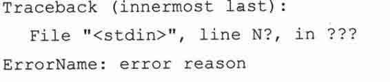

当异常发生时，一个包含针对异常的栈跟踪信息的跟踪记录对象被创建。如果一个异常有自己的处理程序，处理程序就可以访问这个跟踪记录对象。

### 4.4.4　切片对象

当使用 Python 扩展的切片语法时,就会创建切片对象。扩展的切片语法允许对不同的索引切片操作，包括步进切片、多维切片和省略切片。多维切片语法是 sequence[startl :endl，start2 : end2],或使用省略号，sequence[…，startl ： end1 ]。切片对象也可以由内建函数 slice()来生成。步进切片允许利用第 3 个切片元素进行步进切片，它的语法为 sequence[起始索引：结束索引：步进值]。Python 很早就支持扩展步进切片语法了，但直到 Python2.3 以前都必须依靠 C 语言的 API 或 Jython 才能工作。下面是几个步进切片的例子。

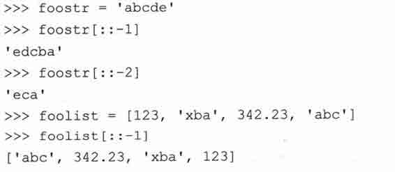

### 4.4.5　省略对象

省略对象用于扩展切片语法中，起记号作用。这个对象在切片语法中表示省略号。类似 Null 对象 None,省略对象有一个唯一的名字 Ellipsis,它的布尔值始终为 True。

### 4.4.6　XRange 对象

调用内建函数 xrange()会生成一个 Xrange 对象，xrange()是内建函数 range()的兄弟版本，用于需要节省内存使用或 range()无法完成的超大数据集场合。在第八章你可以找到更多关于 range()和 xrange()的使用信息。

## 4.5　标准类型操作符

### 4.5.1　对象值的比较

比较操作符用来判断同类型对象是否相等，所有的内建类型均支持比较运算，比较运算返回布尔值 True 或 False。如果你正在使用的是早于 Python2.3 的版本，因为这些版本还没有布尔类型，所以会看到比较结果为整型值 1 （代表 True）或 0 （代表 False）。

注意，实际进行的比较运算因类型而异。换言之，数字类型根据数值的大小和符号比较，字符串按照字符序列值进行比较，等等。

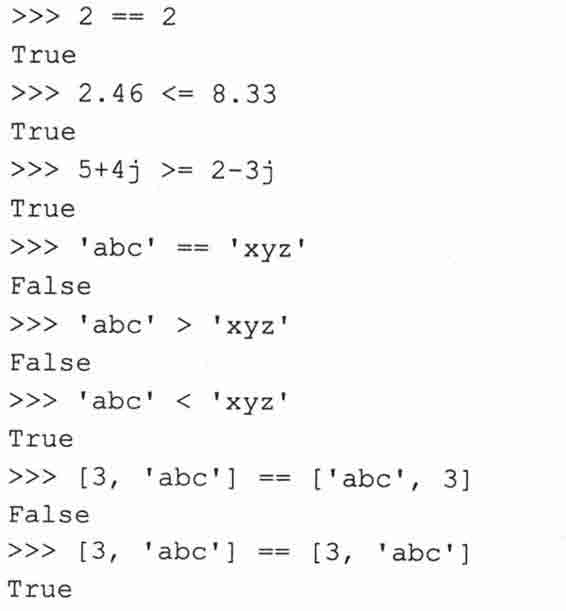

不同于很多其他语言，多个比较操作可以在同一行上进行，求值顺序为从左到右。

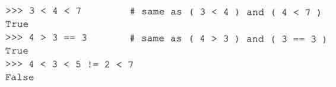

我们会注意到比较操作是针对对象的值进行的，也就是说比较的是对象的数值而不是对象本身。在后面的部分我们会研究对象身份的比较。

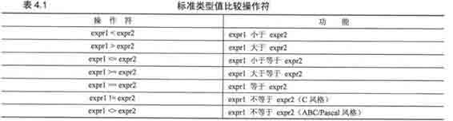

未来很有可能不再支持<>操作符，建议你一直使用!=操作符

### 4.5.2　对象身份比较

作为对值比较的补充，Python 也支持对象本身的比较。对象可以被赋值到另一个变量（通过引用）。因为每个变量都指向同一个（共享的）数据对象，只要任何一个引用发生改变，该对象的其他引用也会随之改变。

为了方便大家理解，最好先别考虑变量的值，而是将变量名看作对象的一个链接。让我们来看以下三个例子：

例 1: foo1 和 foo2 指向相同的对象

foo1 = foo2 = 4.3

当你从值的观点看这条语句时,它表现的只是一个多重赋值，将 4.3 这个值赋给了 fool 和 foo2 这两个变量。这当然是对的，不过它还有另一层含义。事实是一个值为 4.3 的数字对象被创建，然后这个对象的引用被赋值给 fool 和 foo2,结果就是 fool 和 foo2 指向同一个对象。图 4-1 演示了一个对象两个引用。

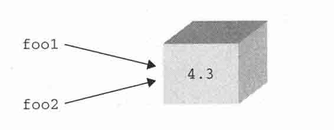

> > 图 4-1　foo1 和 foo2 指向相同的对象

例 2: foo1 和 foo2 指向相同的对象

foo1 = 4.3

foo2 = foo1

这个例子非常类似上一个，一个值为 4.3 的数值对象被创建，然后赋给一个变量，当执行 foo2 = foo1 时，foo2 被指向 foo1 所指向的同一个对象，这是因为 Python 通过传递引用来处理对象。foo2 就成为原始值 4.3 的一个新的引用。这样 foo1 和 foo2 就都指向了同一个对象。示意图也和图 4-1 一样。

例 3: fool 和 foo2 指向不同的对象

foo1 = 4.3

foo2 = 1.3 + 3.0

这个例子有所不同。首先一个数字对象被创建，然后赋值给 foo1。然后第二个数值对象被创建并赋值给 foo2。尽管两个对象保存的是同样大小的值，但事实上系统中保存的都是两个独立的对象，其中 foo1 是第一个对象的引用，foo2 则是第二个对象的引用。图 4-2 演示给我们这里有两个不同的对象，尽管这两个对象有同样大小的数值。我们为什么在示意图中使用盒子？没错，对象就像一个装着内容的盒子。当一个对象被赋值到一个变量，就像在这个盒子上贴了一个标签，表示创建了一个引用。每当这个对象有了一个新的引用，就会在盒子上新贴一张标签。当一个引用被销毁时，这个标签就会被撕掉。当所有的标签都被撕掉时，这个盒子就会被回收。那么，Python 是怎么知道这个盒子有多少个标签呢？

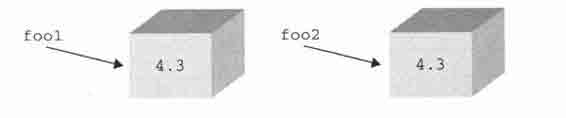

> > 图 4-2　foo1 和 foo2 指向不同的对象

每个对象都天生具有一个计数器，记录它自己的引用次数。这个数目表示有多少个变量指向该对象。这也就是我们在 3.5.5〜3.5.7 小节提到的引用计数。Python 提供了 is 和 is not 操作符来测试两个变量是否指向同一个对象。像下面这样执行一个测试。

a is b

这个表达式等价于下面的表达式。

id（a） == id（b）

对象身份比较操作符拥有同样的优先级，表 4.2 列出了这些操作符。在下面这个例子里，我们创建了一个变量，然后将第二个变量指向同一个对象。

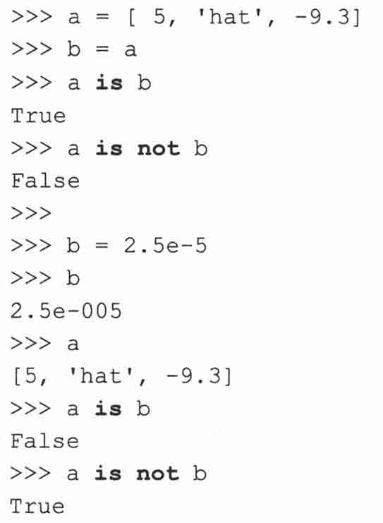

is 与 not 标识符都是 Python 关键字。

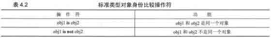

核心笔记：实践

* * *

在上面的例子中，你会注意到我们使用的是浮点型而不是整型。为什么会这样？整型对象和字符串对象是不可变对象，所以 Python 会很高效地缓存它们。这会造成我们认为 Python 应该创建新对象时，它却没有创建新对象的假象。请看下面的例子。

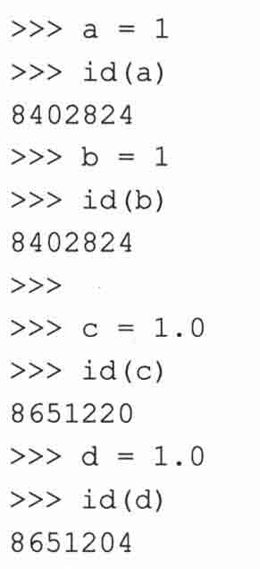

在上面的例子中，a 和 b 指向了相同的整型对象，但是 c 和 d 并没有指向相同的浮点型对象。如果我们是纯粹主义者，我们会希望 a 与 b 能和 c 与 d—样，因为我们本意就是为了创建两个整型对象，而不是像 b = a 这样的结果。

Python 仅缓存简单整型，因为它认为在 Python 应用程序中这些小整型会经常被用到。当我们在写作本书的时候，Python 缓存的整型范围是（-1，100）,不过这个范围是会改变的，所以请不要在你的应用程序使用这个特性。

Python2.3 中决定，在预定义缓存字符串表之外的字符串，如果不再有任何引用指向它，那这个字符串将不会被缓存。也就是说，被缓存的字符串将不会像以前那样永生不灭，对象回收器一样可以回收不再被使用的字符串。从 Python 1.5 起提供的用于缓存字符的内建函数 intern()也已经不再推荐使用，即将被废弃。

* * *

### 4.5.3　布尔类型

布尔逻辑操作符 and、or 和 not 都是 Python 关键字,这些操作符的优先级按从高到低的顺序列于表 4.3。not 操作符拥有最高优先级，只比所有比较操作符低一级。and 和 or 操作符则相应地再低一级。

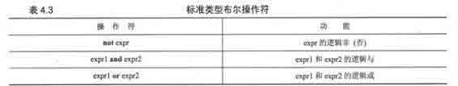

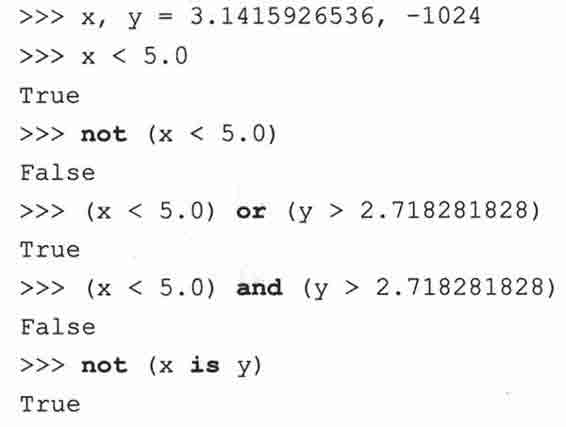

前面我们提到过 Python 支持一个表达式进行多种比较操作，其实这个表达式本质上是由多个隐式的 and 连接起来的多个表达式。

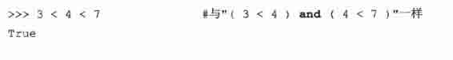

## 4.6　标准类型内建函酸

除了这些操作符，我们刚才也看到，Python 提供了一些内建函数用于这些基本对象类型：cmp()、repr()、str()、type()和等同于 repr()函数的单反引号（``）操作符。

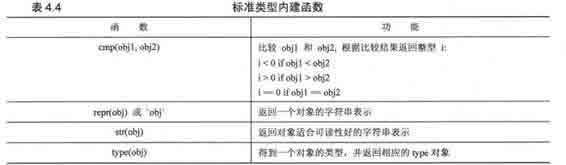

### 4.6.1　type()

我们现在来正式介绍 type()。在 Python2.2 以前，type()是内建函数。不过从那时起，它变成了一个 “工厂函数“。在本章的后面部分我们会讨论工厂函数，现在你仍然可以将 type()仅仅当成一个内建函数来看。type()的用法如下。

type（object）

type()接受一个对象作为参数，并返回它的类型。它的返回值是一个类型对象。

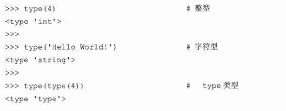

在上面的例子里，我们通过内建函数 type()得到了一个整型和一个字符串的类型；为了确认一下类型本身也是类型，我们对 type()的返回值再次调用 type()。注意 type()有趣的输出，它看上去不像一个典型的 Python 数据类型，比如一个整型或一个字符串，一些东西被一个大于号和一个小号包裹着。这种语法是为了告诉你它是一个对象。每个对象都可以实现一个可打印的字符串表示。不过并不总是这样，对那些不容易显示的对象来说，Python 会以一个相对标准的格式表示这个对象，格式通常是这种形式： <object_something_or_another>,以这种形式显示的对象通常会提供对象类别、对象 id 或位置，或者其他合适的息。

### 4.6.2　cmp()

内建函数 cmp()用于比较两个对象 objl 和 obj2。如果 obj1.小于 obj2,则返回一个负整型，如果 obj1 大于 obj2 则返回一个正整型，如果 obj1 等于 obj2,则返回 0。它的行为非常类似于 C 语言的 strcmp()函数。比较是在对象之间进行的，不管是标准类型对象还是用户自定义对象。如果是用户自定义对象，cmp()会调用该类的特殊方 0。在第十三章会详细介绍类的这些特殊方法。下面是几个使用 cmp()内建函数的对数值和字符串对象进行比较的例子。

在后面我们会研究 cmp()用于其他对象的比较操作。

### 4.6.3　str()和 repr()（及``操作符）

内建函数 str()和 repr()或反引号操作符（``）可以方便地以字符串的方式获取对象的内容、类型、数值属性等信息。str()函数得到的字符串可读性好，而 repr()函数得到的字符串通常可以用来重新获得该对象，通常情况下 0bj==eval（repr（obj））这个等式是成立的。这两个函数接受一个对象作为其参数，返回适当的字符串。在下面的例子里，我们会随机取一些 Python 对象来查看他们的字符串表示。

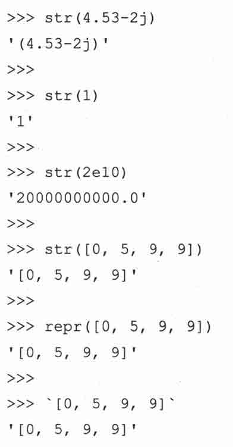

尽管 str()，repr()和、、运算在特性和功能方面都非常相似，事实上 repr()和“做的是完全一样的事情，它们返回的是一个对象的“官方“字符串表示，也就是说绝大多数情况下可以通过求值运算（使用内建函数 eval()）重新得到该对象，但 str()则有所不同。str()致力于生成一个对象的可读性好的字符串表示，它的返回结果通常无法用于 eval()求值,但很适合用于 print 语句输出。需要再次提醒的是,并不是所有 repr()返回的字符串都能够用 eval()内建函数得到原来的对象。

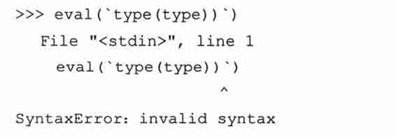

也就是说 repr()输出对 Python 比较友好，而 str()的输出对用户比较友好。虽然如此，很多情况下这三者的输出仍然都是完全一样的。

核心笔记：为什么我们有了 repr ()还需要``?

* * *

在 Python 学习过程中，你偶尔会遇到某个操作符和某个函数是做同样一件事情。之所以如此是因为某些场合函数会比操作符更适合使用。举个例子，当处理类似函数这样的可执行对象或根据不同的数据项调用不同的函数处理时，函数就比操作符用起来方便。另一个例子就是双星号（* * ）乘方运算和 pow()内建函数，x**y 和 pow（x，y）执行的都是 X 的 y 次方（译者注：事实上 Python 社区目前已经不鼓励继续使用``操作符。这是本书成书之后的变化）。

* * *

### 4.6.4　type()和 isinstance()

Python 不支持方法或函数重载，因此你必须自己保证调用的就是你想要的函数或对象。幸运的是，我们前面 4.3.1 小节提到的 type()内建函数可以帮助你确认这一点。一个名字里究竟保存的是什么？相当多，尤其是这是一个类型的名字时。确认接收到的类型对象的身份有很多时候都是很有用的。为了达到此目的，Python 提供了一个内建函数 type()。type()返回任意 Python 对象的类型，而不局限于标准类型。让我们通过交互式解释器来看几个使用 type()内建函数返回多种对象类型的例子。

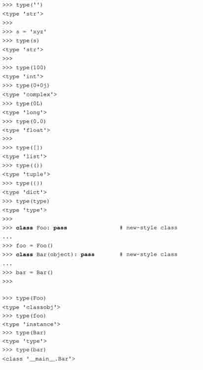

Python2.2 统一了类型和类，如果你使用的是低于 Python2.2 的解释器，你可能看到不一样的输出结果。

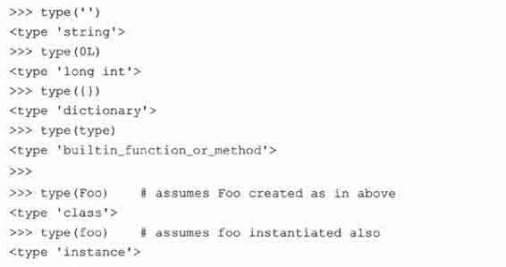

除了内建函数 type(),还有一个有用的内建函数叫做 isinstance()。我们会在第十三章（面向对象编程）正式研究这个函数，不过在这里我们还是要简要介绍一下如何利用它来确认一个对象的类型。

1.举例

在例 4.1 中我们提供了一段脚本来演示在运行时环境使用 isinstance()和 type()函数。随后我们讨论 type()的使用，以及怎么将这个例子移植为改用 isinstance()。

运行 typechk.py，我们会得到以下输出。

例 4.1　检查类型（typechk.py）

函数 displayNumType()接受一个数值参数，它使用内建函数 type()来确认数值的类型（或不是一个数值类型）。

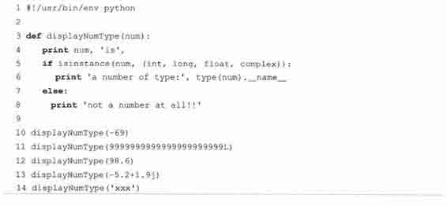

2.例子进阶

（1）原始

这个完成同样功能的函数与本书的第一版中的例子已经大不相同。

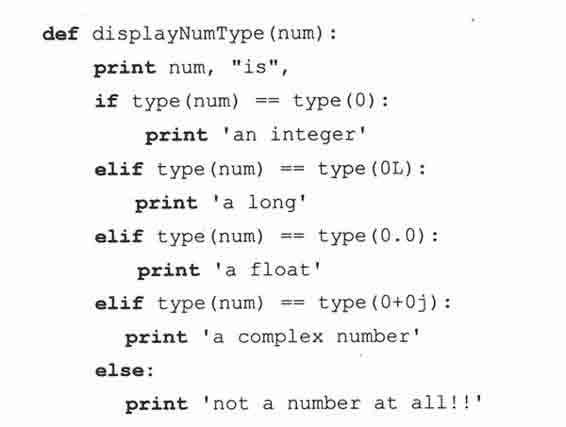

由于 Python 奉行简单但是比较慢的方式，所以我们必须这么做，看一眼我们原来的条件表达式：

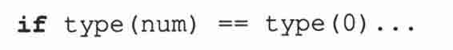

（2）减少函数调用的次数

如果我们仔细研究一下我们的代码，会看到我们调用了两次 type()。要知道每次调用函数都会付出性能代价，如果我们能减少函数的调用次数，就会提高程序的性能。

利用在本章我们前面提到的 types 模块，我们还有另一种比较对象类型的方法，那就是将检测得到的类型与一个已知类型进行比较。如果这样，我们就可以直接使用 type 对象而不用每次计算出这个对象来。那么我们现在修改一下代码，改为只调用一次 type()函数。

（3）对象值比较 VS 对象身份比较

在这一章的前面部分我们讨论了对象的值比较和身份比较，如果你了解其中的关键点，你就会发现我们的代码在性能上还不是最优的。在运行时期，只有一个类型对象来表示整型类型。也就是说， type（0）,type（42）,type（-100）都是同一个对象<type ‘int’> （types.IntType 也是这个对象）。

如果它们是同一个对象，我们为什么还要浪费时间去获得并比较它们的值呢（我们已经知道它们是相同的了）？所以比较对象本身是一个更好地方案。下面是改进后的代码。

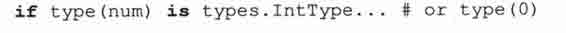

这样做有意义吗？我们用对象身份的比较来替代对象值的比较。如果对象是不同的，那意味着原来的变量一定是不同类型的（因为每一个类型只有一个类型对象），我们就没有必要去检查（值）了。一次这样的调用可能无关紧要，不过当很多类似的代码遍布在你的应用程序中的时候，就有影响了。

（4）减少查询次数

这是一个对前一个例子较小的改迸，如果你的程序像我们的例子中做很多次比较的话，程序的性能就会有一些差异。为了得到整型的对象类型，解释器不得不首先查找 types 这个模块的名字，然后在该模块的字典中查找 IntType。通过使用 from-import,你可以减少一次查询。

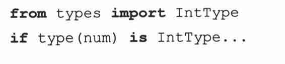

（5）惯例和代码风格

Pythori2.2 对类型和类的统一导致 isinstance()内建函数的使用率大大增加。我们将在第十三章（面向对象编程）正式介绍 isinstance(),在这里我们简单浏览一下。

这个布尔函数接受一个或多个对象作为其参数，由于类型和类现在都是一回事，int 现在既是一个类型又是一个类。我们可以使用 isinstance()函数来让我们的 if 语句更方便，并具有更好的可读性。

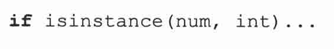

在判断对象类型时也使用 isinstance()已经被广为接受，我们上面的 typechk.py 脚本最终与改成了使用 isinstance()函数。值得一提的是，isinstance()接受一个类型对象的元组作为参数，这样我们就不必像使用 type()时那样写一堆 if-elif-else 判断了。

### 4.6.5　Python 类型操作符和内建函数总结

表 4.5 列出了所有操作符和内建函数，其中操作符顺序是按优先级从高到低排列的。同一种灰度的操作符拥有同样的优先级。注意在 operator 模块中有这些（和绝大多数 Python）操作符相应的同功能的函数可供使用。

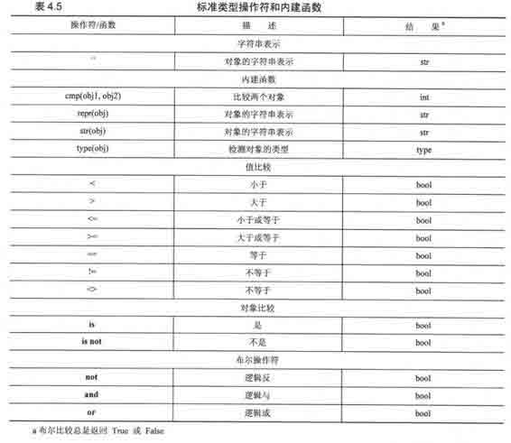

## 4.7　类型工厂函数

Pythori2.2 统一了类型和类，所有的内建类型现在也都是类，在这基础之上，原来的所谓内建转换函数像 int()、type()、 list()等，现在都成了工厂函数。也就是说虽然他们看上去有点像函数，实质上他们是类。当你调用它们时，实际上是生成了该类型的一个实例，就像工厂生产货物一样。

下面这些大家熟悉的工厂函数在之前的 Python 版里被称为内建函数。

> > •　int (), long (), float (), complex ()

> > •　str(), unicode (), basestring ()

> > •　list (), tuple()

> > •　type()

以前没有工厂函数的其他类型，现在也都有了工厂函数。除此之外，那些支持新式类的全新的数据类型，也添加了相应的工厂函数。下面列出了这些工厂函数。

> > •　dict ()

> > •　bool ()

> > •　set (), frozenset ()

> > •　object ()

> > •　classmethod ()

> > •　staticmethod ()

> > •　super ()

> > •　property ()

> > •　file ()

## 4.8　标准类型的分类

如果让我们最啰嗦地描述标准类型，我们也许会称它们是 Python 的“基本内建数据对象原始类型”。

> > •　“基本”是指这些类型都是 Python 提供的标准或核心类型。

> > •　“内建”是由于这些类型是 Python 默认就提供的。

> > •　“数据”是因为他们用于一般数据存储。

> > •　“对象”是因为对象是数据和功能的默认抽象。

> > •　“原始”是因为这些类型提供的是最底层的粒度数据存储。

> > •　“类型”是因为他们就是数据类型。

不过，上面这些描述实际上并没有告诉你每个类型如何工作，以及它们能发挥什么作用。事实上，几个类型共享某一些的特性，比如功能的实现手段，另一些类型则在访问数据值方面有一些共同之处。我们感、兴趣的还有这些类型的数据如何更新，以及它们能提供什么样的存储。有 3 种不同的模型可以帮助我们对基本类型进行分类，每种模型都展示给我们这些类型之间的相互关系。这些模型可以帮助我们更好的理解类型之间的相互关系以及他们的工作原理。

### 4.8.1　存储模型

我们对类型进行分类的第一种方式，就是看着这种类型的对象能保存多少个对象。Python 的类型，就像绝大多数其他语言一样，能容纳一个或多个值。一个能保存单个字面对象的类型，我们称它为原子或标量存储；那些可容纳多个对象的类型，我们称之为容器存储（容器对象有时会在文档中被称为复合对象，不过这些对象并不仅仅指类型，还包括类似类实例这样的对象）。容器类型又带来一个新问题，那就是它是否可以容纳不同类型的对象。所有的 Python 容器对象都能够容纳不同类型的对象。表 4.6 按存储模型对 Python 的类型进行了分类。

字符串看上去像一个容器类型，因为它“包含“字符（并且经常多于一个字符），不过由于 Python 并没有字符类型（参见章节 4.8）,所以字符串是一个自我包含的文字类型。

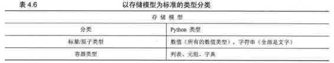

### 4.8.2　更新模型

另一种对标准类型进行分类的方式就是，针对每一个类型问一个问题：“对象创建成功之后，它的值可以进行更新吗？”在前面我们介绍 Python 数据类型时曾经提到，某些类型允许他们的值进行更新，而另一些则不允许。可变对象允许他们的值被更新，而不可变对象则不允许他们的值被更改。表 4.7 列出了支持更新和不支持更新的类型。

看完这个表之后，你可能马上冒出一个问题: “等等，你说数值和字符串对象是不可改变的？看看下面的例子！”

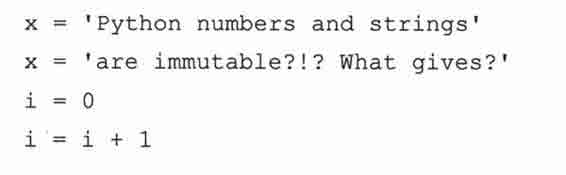

“在我看来，这可不像是不可变对象的行为！”没错，是这样，不过你还没有搞清楚幕后的真相。上面的例子中，事实上是一个新对象被创建，然后它取代了旧对象。就是这样，请多读一遍这段。

新创建的对象被关联到原来的变量名，旧对象被丢弃，垃圾回收器会在适当的时机回收这些对象。你可以通过内建函数 id()来确认对象的身份在两次赋值前后发生了变化。

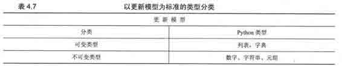

下面我们在上面的例子里加上 id()调用，就会清楚地看到对象实际上已经被替换了。

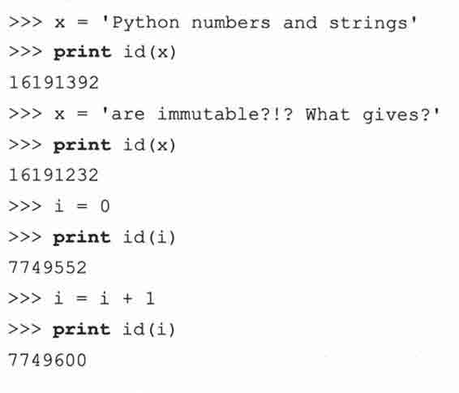

你看到的身份数字很可能和我不同，每次执行这些数字也会不同，这是正常的。这个数字与该对象当时分配的内存地址密切相关。因此不同的机器、不同的执行时间都会生成不同的对象身份。另一类对象，列表可以被修改而无须替换原始对象，请看下面的例子。

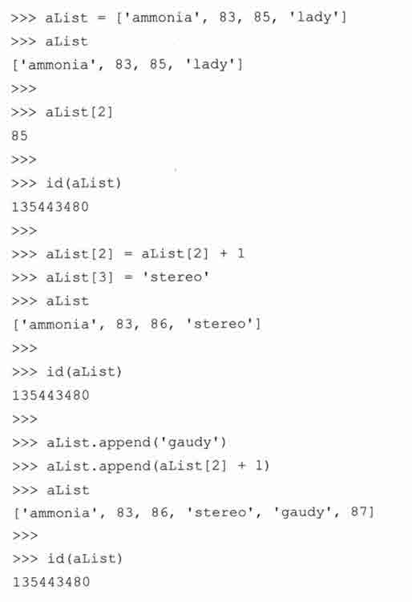

注意列表的值不论怎么改变，列表的 ID 始终保持不变。

### 4.8.3　访问模型

尽管前面两种模型分类方式在介绍 Python 时都很有用，它们还不是区分数据类型的首要模型。对这种目的，我们使用访问模型。也就是说根据访问我们存储的数据的方式对数据类型进行分类。在访问模型中共有三种访问方式：直接存取、顺序和映射。表 4.8 按访问方式对数据类型进行了分类。

对非容器类型可以直接访问。所有的数值类型都归到这一类。

序列类型是指容器内的元素按从 0 开始的索引顺序访问。一次可以访问一个元素或多个元素，也就是大家所了解的切片（slice）。字符串、列表和元组都归到这一类。我们前面提到过，Python 不支持字符类型，因此，虽然字符串是简单文字类型，但因为它有能力按照顺序访问子字符串，所以也将它归到序列类型。

映射类型类似序列的索引属性，不过它的索引并不使用顺序的数字偏移量取值，它的元素无序存放，通过一个唯一的键来访问，这就是映射类型，它容纳的是哈希键-值对的集合。

我们在以后的章节中将主要使用访问模型，详细介绍各种访问模型的类型，以及某个分类的类型之间有哪些相同之处（比如操作符和内建函数），然后讨论每种 Python 标准类型。所有类型的特殊操作符、内建函数及方法都会在相应的章节特别说明。

为什么要对同样的数据类型再三分类呢？首先，我们为什么要分类？因为 Python 提供了高级的数据结构，我们需要将那些原始的类型和功能强大的扩展类型区分开来。另一个原因就是这有助于搞清楚某种类型应该具有什么行为。举例来说，如果我们基本上不用问自己“列表和元组有什么区别？”或“什么是可变类型和不可变类型？”这些问题的时候，我们也就达到了目的。最后，某些分类中的所有类型具有一些相同的特性。一个优秀的工匠应该知道他或她的工具箱里都有哪些宝贝。

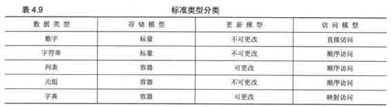

另一个问题就是，“为什么要用这么多不同的模型或从不同的方面来分类？”所有这些数据类型看上去是很难分类的。它们彼此都有着错综复杂的关系，所有类型的共同之处最好能揭示出来，而且我们还想揭示每种类型的独到之处。没有两种类型横跨所有的分类（当然，所有的数值子类型做到了这一点，所以我们将它们归纳到一类当中）。最后，我们确信搞清所有类型之间的关系会对你的开发工作有极大的帮助。你对每种类型的了解越多，你就越能在自己的程序中使用恰当的类型以达到最佳的性能。

我们提供了一个汇总表（表 4.9）。表中列出了所有的标准类型和我们使用的三个模型，以及每种类型归入的分类。

## 4.9　不支持的类型

在我们深入了解各个标准类型之前，我们在本章的结束列出 Python 目前还不支持的数据类型（因为在不同的语言中其相应的命名可能有诧异，所以为了不扰乱读者，在各节开头保持了类型原文——译者注）。

1\. char 或 byte

Python 没有 char 或 byte 类型来保存单一字符或 8 位整型。你可以使用长度为 1 的字符串表示字符或 8 位整型。

2.指针

Python 替你管理内存，因此没有必要访问指针。在 Python 中你可以使用 id()函数得到一个对象的身份号，这是最接近于指针的地址。因为你不能控制这个值，所以其实没有太大意义。其实在 Python 中，一切都是指针。

3\. int vs short vs long

Python 的普通整型相当于标准整型类型，不需要类似 C 语言中的 int、short 和 long 这三种整型类型。事实上 Python 的整型实现等同于 C 语言的长整型。由于 Python 的整型与长整型密切融合，用户几乎不需要担心什么。你仅需要使用一种类型，就是 Python 的整型。即便数值超出整型的表达范围，比如两个很大的数相乘，Python 会自动的返回一个长整型给你而不会报错。

4\. float vs double

C 语言有单精度和双精度两种浮点类型。Python 的浮点类型实际上是 C 语言的双精度浮点类型。 Python 认为同时支持两种浮点类型的好处与支持两种浮点类型带来的开销不成比例，所以 Python 决定不支持单精度浮点型。对那些宁愿放弃更大的取值范围而需要更高精确度的用户来说，Python 还有一种十进制浮点型类型 Decimal,不过你必须导入 decimal 模块才可以使用它。浮点型总是不精确的。Decimals 则拥有任意的精度。在处理金钱这类确定的值时，Decimal 类型就很有用。在处理重量、长度或其他度量单位的场合，float 足够用了。

## 4.10　练习

> > 4-1.Python 对象。与所有 Python 对象有关的三个属性是什么？请简单的描述一下。

> > 4-2.类型。不可更改（immutable）指的是什么？ Python 的哪些类型是可更改的（mutable）,哪些不是？

> > 4-3.类型。哪些 Python 类型是按照顺序访问的，它们和映射类型的不同是什么？

> > 4-4.type()。内建函数 type()做什么？ type()返回的对象是什么？

> > 4-5.str()和 repr()。内建函数 str()与 repr()之间的不同是什么？哪一个等价于反引号（``）操作符？

> > 4-6.对象相等。你认为 type（a） = type（b）和 type（a） is type（b）之间的不同是什么？为什么会选择后者？函数 isinstance()与这有什么关系？

> > 4-7.内建函数 dir()。在第二章的几个练习中，我们用内建函数 dir()做了几个实验，它接受一个对象，然后给出相应的属性。请对 types 模块做相同的实验。记下你熟悉的类型，包括你对这些类型的认识，然后记下你还不熟悉的类型。在学习 Python 的过程中，你要逐步将“不熟悉“的类型变得“熟悉“起来。

> > 4-8.列表和元组。列表和元组的相同点是什么？不同点是什么？

> > 4-9.*实践，给定以下赋值：

> > > > a = 10

> > > > b = 10

> > > > c = 100

> > > > d = 100

> > > > e = 10.0

> > > > f = 10.0

请问下面各表达式的输出是什么？为什么？

> > > > （a） a is b

> > > > （b） c is d

> > > > （c） e is f