# 第五章　数字

本章主题

♦　数字简介

♦　整型

♦　布尔型

♦　标准整型

♦　长整型

♦　浮点型实数

♦　复数

♦　操作符

♦　内建函数

♦　其他数字类型

♦　相关模块

本章的主题是 Python 中的数字。我们会详细介绍每一种数字类型，它们适用的各种操作符， 4、以及用于处理数字的内建函数。在本章的末尾，我们简单介绍了几个标准库中用于处理数字的模块。

## 5.1　数字简介

数字提供了标量贮存和直接访问。它是不可更改类型，也就是说变更数字的值会生成新的对象。当然，这个过程无论对程序员还是对用户都是透明的，并不会影响软件的开发方式。

Python 支持多种数字类型：整型、长整型、布尔型、双精度浮点型、十进制浮点型和复数。

### 5.1.1　如何创建数值对象并用其赋值（数字对象）

创建数值对象和给变量赋值一样同样简单。

anInt = 1

aLong = -9999999999999999L

aComplex = 1.23+4.56J

### 5.1.2　如何更新数字对象

通过给数字对象（重新）赋值，您可以“更新”一个数值对象。我们之所以给更新这两个字加上引号，是因为实际上并没有更新该对象的原始数值。这是因为数值对象是不可改变对象。Python 的对象模型与常规对象模型有些不同。你所认为的更新实际上是生成了一个新的数值对象，并得到它的引用。

在学习编程的过程中，我们一直接受这样的教育：变量就像一个盒子，里面装着变量的值。在 Python 中，变量更像一个指针指向装变量值的盒子。对不可改变类型来说，你无法改变盒子的内容，但可以将指针指向一个新盒子。每次将另外的数字赋给变量的时候，实际上是创建了一个新的对象并把它赋给变量（不仅仅是数字，对于所有的不可变类型，都是如此）。

anInt +=1

aFloat = 2.718281828

### 5.1.3　如何删除数字对象

按照 Python 的法则，你无法真正删除一个数值对象，你仅仅是不再使用它而已。如果你确实想删除一个数值聰的引用，使用 del 语句即可（参见 3.5.6 小节）。删除对象的引用之后，你就不能再使用这个引用（变量名），除非你给它赋一个新值。如果试图使用一个已经被删除的对象引用，会引发 NameError 异常。

del anInt

del aLong, aFloat, aComplex

好了，既然你已经了解如何创建和更新数值对象，那么来看一下 Python 的 4 种主要数字类型。

## 5.2　整型

Python 有几种整型类型。布尔类型是只有两个值的整型。常规整型是绝大多数现代系统都能识别的整型。Python 也有长整型类型。然而，它表示的数值大小远超过 C 语言的长整型。下面我们先来了解一下这些类型，然后再来研究那些用于 Python 整型类型的操作符和内建函数。

### 5.2.1　布尔型

Python 从版本 2.3 开始支持布尔类型。该类型的取值范围只有两个值，也就是布尔值 True 和布尔值 False。我们会在本章的末尾一节 5.7.1 详细讲解布尔对象。

### 5.2.2　标准整型

Python 的标准整型类型是最通用的数字类型。在大多数 32 位机器上,标准整型类型的取值范围是-2³¹到 2³¹-1,也就是-2 147 483 648〜2 147 483 647。如果在 64 位机器上使用 64 位编译器编译 Python,那么在这个系统上的整型将是 64 位。下面是一些 Python 标准整型类型对象的例子。

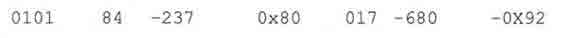

Python 标准整型类型等价于 C 的（有符号）长整型。整型一般以十进制表示，但是 Python 也支持八进制或十六进制来表示整型。如果八进制整型以数字“0”开始，十六进制整型则以“0x”或“0X”幵始。

### 5.2.3　长整型

关于 Python 长整型类型我们必须要提的是，请不要将它和 C 或其他编译型语言的长整型类型混淆。那些语言的长整型典型的取值范围是 32 位或 64 位。Python 的长整型类型能表达的数值仅仅与你的机器支持的（虚拟）内存大小有关，换句话说，Python 能轻松表达很大的整型。

长整型类型是标准整型类型的超集，当你的程序需要使用比标准整型类型更大的整型时，长整型类型就有用武之地了。在一个整型值后面加个 L （大写或小写都可以），表示这个整型是长整型。这个整型可以是十进制、八进制、或十六进制。下面是一些长整型的例子。

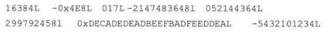

核心风格：用大写字母“L“表示长整型

* * *

尽管 Python 也支持用小写字母 L 标记的长整形，但是我们郑重推荐您仅使用大写的“L”，这样能有效避免数字 1 和小写 L 的混淆。Python 在显示长整型类型数值的时候总是用大写“L”，目前整型和长整型正在逐渐缓慢的统一，您只有在对长整型调用 repr()函数时才有机会看到“L”，如果对长整型对象调用 str()函数就看不到 L。举例如下。

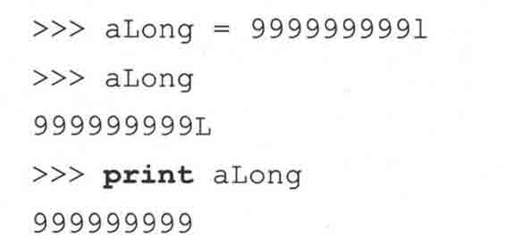

* * *

### 5.2.4　整型和长整型的统一

这两种整型类型正在逐渐统一为一种。在 Python 2.2 以前，标准整型类型对象超出取值范围会溢出 （比如上面提到的大于 2³²的数），但是从 Pythcm2.2 以后就再也没有这样的错误了。

Python 2.1

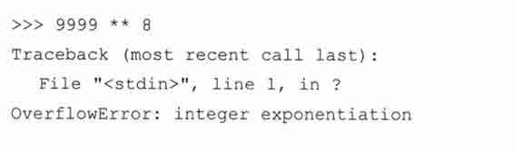

Python 2.2

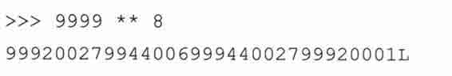

移除这个错误是第一步。下一步修改位移位，左移位导致出界（导致 0 值）在过去是经常可能发生的事。

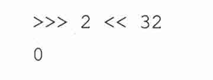

在 Python2.3 中，这个操作产生一个警告，不过在 2.4 版里移除了这个 Warning，并且这步操作生成了一个真正的长整型。

Python 2.3

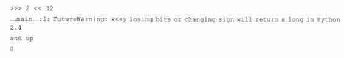

Python 2.4

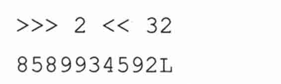

不远的将来，至少普通用户会几乎感觉不到长整型的存在。必要时整型会悄悄自动转换为长整型。当然，那些要调用 C 的人仍然可以继续使用这两种整型类型，因为 C 代码必须区分不同的整型类型。如果你想详细了解标准整型与长整型整合的信息，请阅读 PEP237。

## 5.3　双精度浮点型

Python 中的浮点型类似 C 语言中的 double 类型，是双精度浮点型，可以用直接的十进制或科学计数法表示。每个浮点型占 8 个字节（64 位），完全遵守 IEEE754 号规范（52M/11E/1S）,其中 52 个位用于表示底，11 个位用于表示指数（可表示的范围大约是±10^(308.25)），剩下的一个位表示符号。这看上去相当完美，然而，实际精度依赖于机器架构和创建 Python 解释器的编译器。

浮点型值通常都有一个小数点和一个可选的后缀 e （大写或小写，表示科学计数法）。在 e 和指数之间可以用正（+）或负（-）表示指数的正负（正数的话可以省略符号）。下面是一些典型的浮点型值的例子。

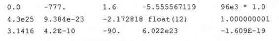

## 5.4　复数

在很久以前，数学家们被下面这样的等式困扰。

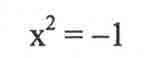

这是因为任何实数（无论正数还是负数）乘以自己总是会得到一个非负数。一个数怎么可以乘以自己却得到一个负数？没有这样的实数存在。就这样，直到 18 世纪，数学家们发明了一个虚拟的数 i （或者是 j,看你读的是哪本教科书了）。

基于这个特殊的数（或者称之为概念），数学从此有了一个新的分支。现在虚数已经广泛应用于数值和科学计算应用程序中。一个实数和一个虚数的组合构成一个复数。一个复数是一对有序浮点型（x，y）,表示为 x + yj，其中 X 是实数部分，y 是虚数部分。

复数渐渐在日常运算、机械、电子等行业获得了广泛的应用。由于一些研究人员不断重复制造用于复数运算的工具，在很久以前的 Pythcm1.4 版本里，复数终于成为一个真正 Python 数据类型。

下面是 Python 语言中有关复数的几个概念。

•　虚数不能单独存在，它们总是和一个值为 0.0 的实数部分一起来构成一个复数。

•　复数由实数部分和虚数部分构成。

•　表示虚数的语法：real+imagj。

•　实数部分和虚数部分都是浮点型。

•　虚数部分必须有后缀 j 或 J。

下面是一些复数的例子：

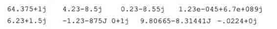

复数的内建属性

复数对象拥有数据属性（参见 4.1.1 节），分别为该复数的实部和虚部。复数还拥有 conjugate 方法，调用它可以返回该复数的共轭复数对象（两头牛背上的架子称为轭，轭使两头牛同步行走。共轭即为按一定的规律相配的一对——译者注）。

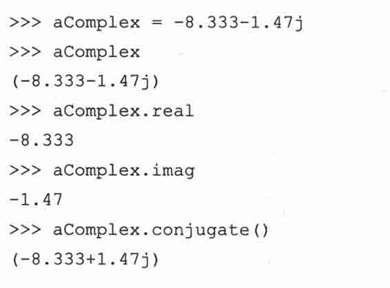

表 5.1 描述了复数的所有属性

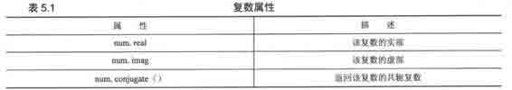

## 5.5　操作符

数值类型可进行多种运算。从标准操作符到数值操作符，甚至还有专门的整型操作符。

### 5.5.1　混合模式操作符

也许你还记得，过去将两个数相加时，你必须努力保证操作数是合适的类型。自然地，加法总是使用+号，然而在计算机语言看来这件事没那么简单，因为数字又有很多不同的类型。

当两个整型相加时，+号表示整型加法，当两个浮点型相加时，+表示浮点型加法，依此类推。在 Python 中，甚至非数字类型也可以使用+操作符。举例来说，字符串 A+字符串 B 并不表示加法操作，它表示的是把这两个字符串连接起来，生成一个新的字符串。关键之处在于支持+操作符的每种数据类型，必须告诉 Python, +操作符应该如何去工作。这也体现了重载概念的具体应用。

虽然我们不能让一个数字和一个字符串相加，但 Python 确实支持不同的数字类型相加。当一个整型和一个浮点型相加时，系统会决定使用整型加法还是浮点型加法（实际上并不存在混合运算）。Python 使用数字类型强制转换的方法来解决数字类型不一致的问题，也就是说它会强制将一个操作数转换为同另一个操作数相同的数据类型。这种操作不是随意进行的，它遵循以下基本规则。

首先，如果两个操作数都是同一种数据类型，没有必要进行类型转换。仅当两个操作数类型不一致时，Python 才会去检查一个操作数是否可以转换为另一类型的操作数。如果可以，转换它并返回转换结果。由于某些转换是不可能的，比如将一个复数转换为非复数类型，将一个浮点型转换为整型等，因此转换过程必须遵守几个规则。

要将一个整型转换为浮点型，只要在整型后面加个“.0“就可以了。要将一个非复数转换为复数，则只需要要加上一个“0j“的虚数部分。这些类型转换的基本原则是：整型转换为浮点型，非复数转换为复数。在 Python 语言参考中这样描述 coerce()方法：

> > •　如果有一个操作数是复数，另一个操作数被转换为复数；

> > •　否则，如果有一个操作数是浮点型，另一个操作数被转换为浮点型；

> > •　否则，如果有一个操作数是长整型，则另一个操作数被转换为长整型；

> > •　否则，两者必然都是普通整型，无须类型转换。（参见下文中的示意图）。

图 5-1 的流程图阐释了强制转换的规则。数字类型之间的转换是自动进行的，程序员无须自己编码处理类型转换。不过在确实需要明确指定对某种数据类型进特殊类型转换的场合，Python 提供了 coerce()内建函数来帮助你实现这种转换。（见 5.6.2 小节）

下面演示一下 Python 的自动数据类型转换。为了让一个整型和一个浮点型相加，必须使二者转换为同一类型。因为浮点型是超集，所以在运算开始之前，整型必须强制转换为一个浮点型,运算结果也是浮点型。

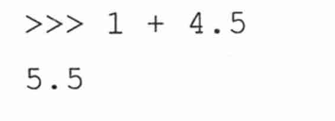

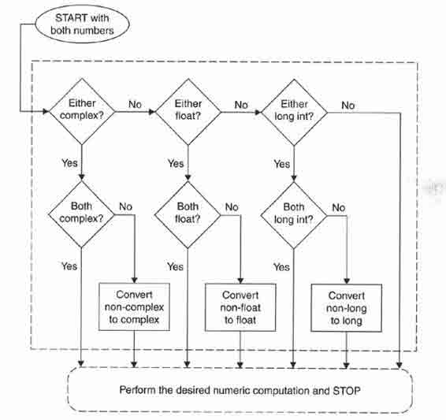

> > 图 5-1　数值类型转换

### 5.5.2　标准类型操作符

第四章中讲到的标准操作符都可以用于数值类型。上文中提到的混合模式运算问题，也就是不同数据类型之间的运算，在运算之前，Python 内部会将两个操作数转换为同一数据类型。

下面是一些数字标准运算的例子。

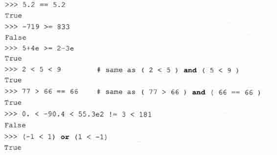

### 5.5.3　算术操作符

Python 支持单目操作符正号（+）和负号（一）；双目操作符+、一、*、/、％和**,分别表示加法、减法、乘法、除法、取余和幂运算。从 Python2.2 起，还增加了一种新的整除操作符//。

1.除法

拥有 C 背景的程序员一定熟悉传统除法——也就是说，对整型操作数，会执行“地板除”（floor,取比商小的最大整型。例如 5 除以 2 等于 2.5,其中“2”就称为商的“地板”，即“地板除”的结果。本书中使用“地板除”的说法是为了沿用原作者的风格，译者注）。对浮点操作数会执行真正的除法。然而，对第一次学编程的人或者那些依赖精确计算的人来说，可能就需要多次调整代码才能得到自己想要的结果。

在未来的 Python 版本中，Python 开发小组已经决定改变/操作符的行为。/的行为将变更为真正的除法，会增加一种新的运算来表示地板除。下面我们总结一下 Python 现在的除法规则，以及未来的除法规则。

传统除法

如果是整型除法，传统除法会舍去小数部分，返回一个整型（地板除）。如果操作数之一是浮点型，则执行真正的除法。包括 Python 语言在内的很多语言都是这种行为。请看下面的例子。

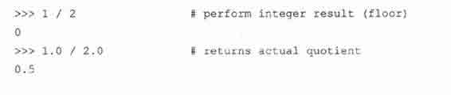

真正的除法

除法运算总是返回真实的商，不管操作数是整型还是浮点型。在未来版本的 Python 中，这将是除法运算的标准行为。现阶段通过执行 from_fiiture_import division 指令，也可以做到这一点。

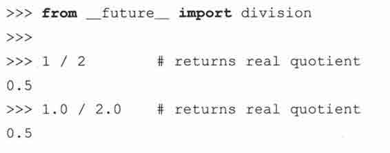

地板除

从 Python 2.2 开始，一个新的操作符//已经被增加进来，以执行地板除：//除法不管操作数为何种数值类型，总是舍去小数部分，返回数字序列中比真正的商小的最接近的数字。

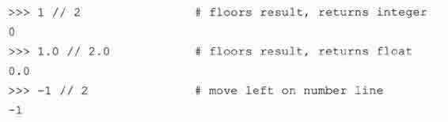

关于除法运算的变更，支持的人和反对的人几乎一样多。有些人认为这种变化是错误的，有些人则不想修改自己的现有代码，而剩下的人则想要真正的除法。

之所以会有这种变化是因为 Python 的核心开发团队认为 Python 的除法运算从一开始就设计失误。特别是，随着 Python 的逐渐发展，它已经成为那些从未接触过地板除的人们的首选学习语言。Python 语言的创始人在他的“What‘s New in Python 2.2“一文中讲到：

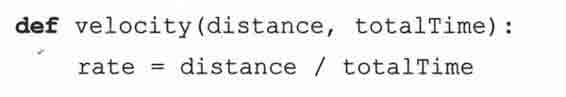

你可能会说，只要有一个参数为浮点型这个函数就能正常工作。像上面提到的那样，要确保它能正常工作需要强制将参数转换为浮点类型，也就是 rate = float（distance）/float（totalTime）。将来除法将转变为真正的除法，上面的代码可以无需更改正常工作。需要地板除的地方只需要改变为两个连续的除号。

是的，代码会受到一些影响，Python 团队己经创作了一系列脚本来帮助你转换旧代码，以确保它能适应新的除法行为。而且对那些强烈需要某种除法行为的人来说,Python 解释器提供了 Qdivision_style 启动参数。-Qriew 执行新的除法行为，-Qold 则执行传统除法行为（默认为 Qold）。你也可以帮ã你的用户使用-Qwarn 或-Qwamall 参数度过过渡时期。

关于这次变化的详细信息可以参考 PEP238。如果你对这场论战感兴趣，也可以翻阅 2001 年的 comp.lang.python 归档。表 5.2 总结了除法操作符在不同 Python 版本中的行为差异。

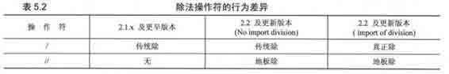

2.取余

整型取余相当容易理解，浮点型取余就略复杂些。

商取小于等于精确值的最大整型的乘积之差。即：x-（math.floor（x/y）*y）或者

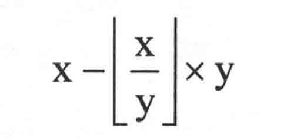

对于复数，取余的定义类似于浮点型，不同之处在于商仅取其实数部分，即 x-（math.floor<（x/y）.real）*y）。

3.幂运算

幂运算操作符和一元操作符之间的优先级关系比较特别：幂运算操作符比其左侧操作数的一元操作符优先级低，比其右侧操作数的一元操作符的优先级高，由于这个特性你会在算术操作符表中找到两个**。下面举几个例子：

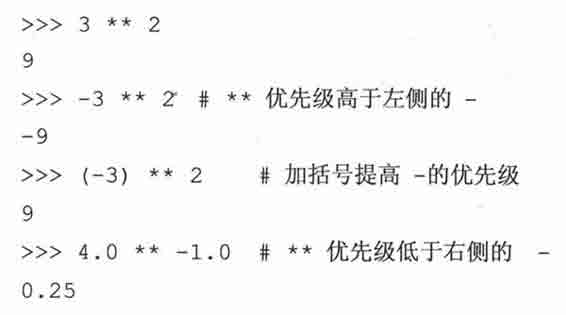

第 2 种情况下解释器先计算 3**2 再取其相反数，我们需要给“-3”加上括号来得到我们希望的结果。最后一个例子，结果是 4**（-1）,这是按照规定的优先级获得的结果。

注意 1/4 作为整型除法结果是 0 所以以整型为底进行负数指数运算会引发一个 negative power （负数指数）异常。

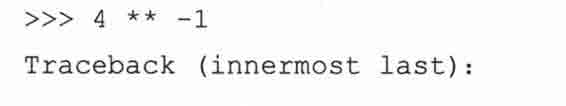

4.总结

表 5.3 总结了所有的算术操作符，从上到下，计算优先级依次降低。这里列出的所有操作符都比即将在 5.5.4 小节讲到的位操作符优先级高。

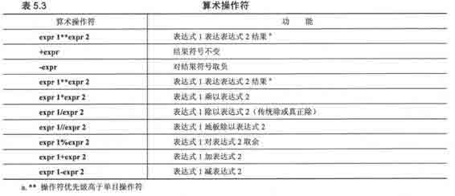

下面是更多 Python 数值运算的例子：

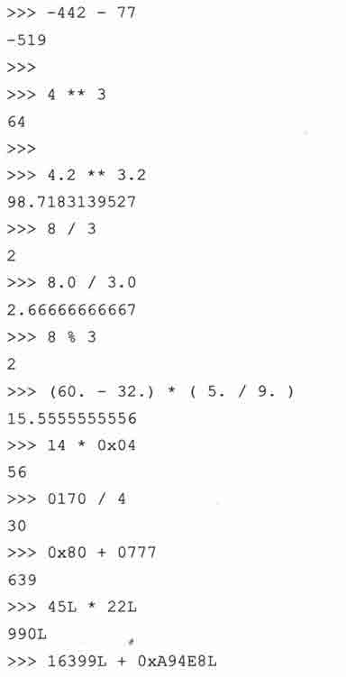

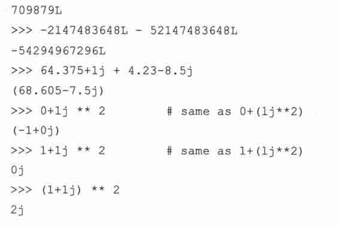

注意指数操作符的优先级高于连接实部和虚部的+号操作符。就上面最后一个例子来说，我们人为的加上了括号，这就改变运算顺序，从而得到我们想要的结果。

### 5.5.4　位操作符（只适用于整型）

Python 整型支持标准位运算：取反（〜），按位与（&）、或（|）和异或（^）,以及左移（<<）和右移（>>）。Python 这样处理位运算。

> > •　负数会被当成正数的 2 进制补码处理。

> > •　左移和右移 N 位等同于无溢出检查的 2 的 N 次幂运算：2**N。

> > •　对长整型来说，位操作符使用一种经修改的 2 进制补码形式，使得符号位可以无限向左扩展。

取反（〜）运算的优先级与数字单目操作符相同，是所有位操作符中优先级最高的一个。左移和右移运算的优先级次之，但低于加减法运算。与、或、异或运算优先级最低。所有位操作符按优先级高低列在表 5.4 中。

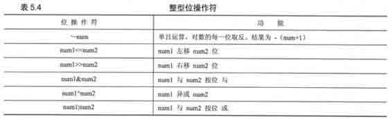

下面是几个使用整型 30, 45, 60 进行位运算的例子。

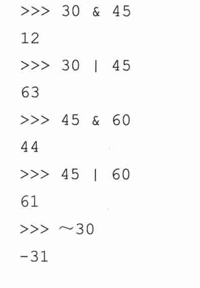

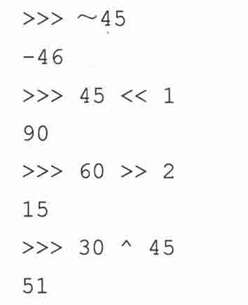

## 5.6　内建函数与工厂函数

### 5.6.1　标准类型函数

第四章中，我们介绍了 cmp()、str()和 type()内建函数。这些函数可以用于所有的标准类型。对数字对象来说，这些函数分别比较两个数的大小，将数字转换为字符串，以及返回数字对象的类型。

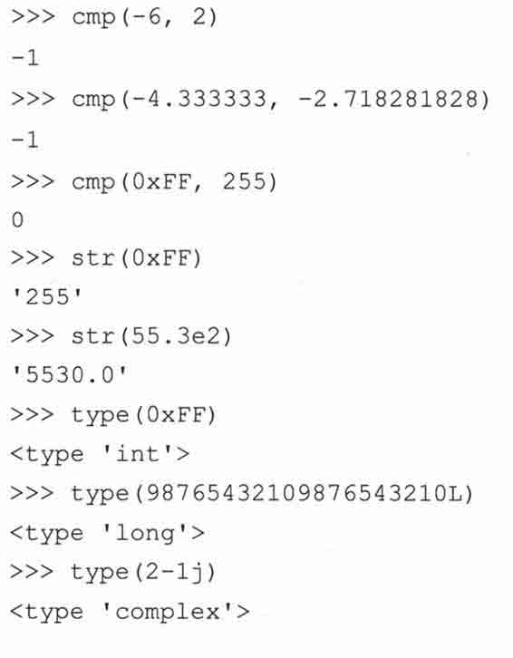

### 5.6.2　数字类型函数

Python 现在拥有一系列针对数字类型的内建函数。一些函数用于数字类型转换，另一些则执行一些常用运算。

1.转换工厂函数

函数 int()、long()、float()和 complex()用来将其他数值类型转换为相应的数值类型。从 Python 1.5 版本开始，这些函数也接受字符串参数，返回字符串所表示的数值。从 Python 1.6 版开始，int()和 long()在转换字符串时，接受一个进制参数。如果是数字类型之间的转换，则这个进制参数不能使用。

从 Pythori2.2 起，有了第 5 个内建函数 bool()。它用来将整型值 1 和 0 转换为标准布尔值 True 和 Falseo 从 Python2.3 开始，Python 的标准数据类型添加了一个新成员：布尔（Boolean）类型。从此 true 和 false。现在有了常量值即 True 和 False （不再是 1 和 0）。要了解布尔类型的更多信息，参阅 5.7.1 小节。

另外,由于 Python 2.2 对类型和类进行了整合（这里指 Python 的传统风格类和新风格类一译者注），所有这些内建函数现在都转变为工厂函数。我们曾经在第四章介绍过工厂函数，所谓工厂函数就是指这些内建函数都是类对象，当你调用它们时，实际上是创建了一个类实例。

不过不用担心，这些函数的使用方法并没有什么改变。

下面是一些使用内建函数的示例。

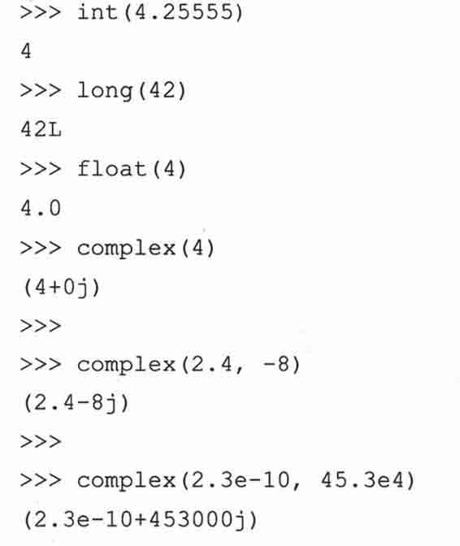

表 5.5 是数值工厂函数总结。

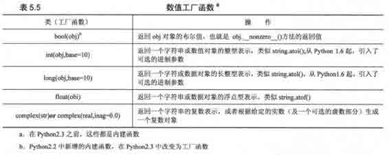

2.功能函数

Python 有 5 个运算内建函数用于数值运算：abs()、coerce()、divmod()、pow()、pow()和 round()。我们将对这些函数逐一浏览，并给出一些有用的例子。

abs()返回给定参数的绝对值。如果参数是一个复数，那么就返回 math.sqrt（num.real2 + num.imag2）。下面是几个 abs()函数的示例。

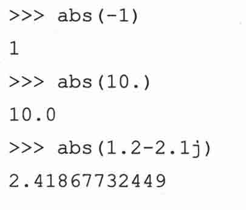

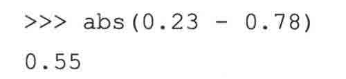

函数 coerce()，尽管从技术上讲它是一个数据类型转换函数，不过它的行为更像一个操作符，因此我将它放到了这一小节。在 5.5.1 小节，我们讨论了 Python 如何执行数值类型转换。函数 coerce ()为程序员提供了不依赖 Python 解释器，而是自定义两个数值类型转换的方法。对一种新创建的数值类型来说，这个特性非常有用。函数 coerce()仅返回一个包含类型转换完毕的两个数值元素的元组。下面是几个例子。

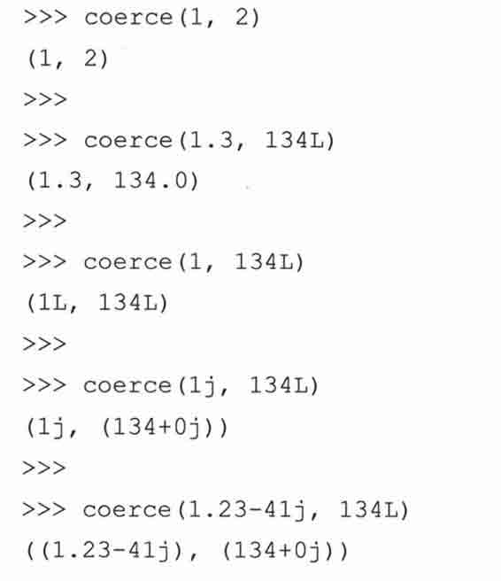

divmod()内建函数把除法和取余运算结合起来，返回一个包含商和余数的元组。对整型来说，它的返回值就是地板除和取余操作的结果。对浮点型来说，返回的商部分是 math.floor （num1/num2）,对复数来说，商部分是 ath.floor（（numl/num2）.real）。

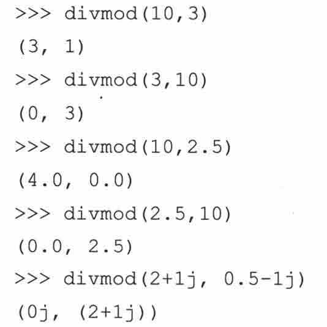

函数 pow()和双星号（**）操作符都可以进行指数运算。不过二者的区别并不仅仅在于一个是操作符，一个是内建函数。

在 Python 1.5 之前，并没有**操作符。内建函数 pow()还接受第三个可选的参数，即一个余数参数。如果有这个参数的，pow()先进行指数运算，然后将运算结果和第三个参数进行取余运算。这个特性主要用于密码运算，并且比 pow（x，y） % z 性能更好，这是因为这个函数的实现类似于 C 函数 pow（x，y，z）。

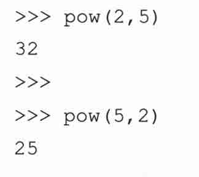

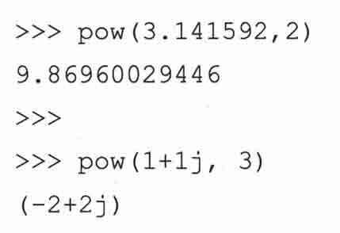

内建函数 mund()用于对浮点型进行四舍五入运算。它有一个可选的小数位数参数。如果不提供小数位参数，它返回与第一个参数最接近的整型（但仍然是浮点类型）。第二个参数告诉 round 函数将结果精确到小数点后指定位数。

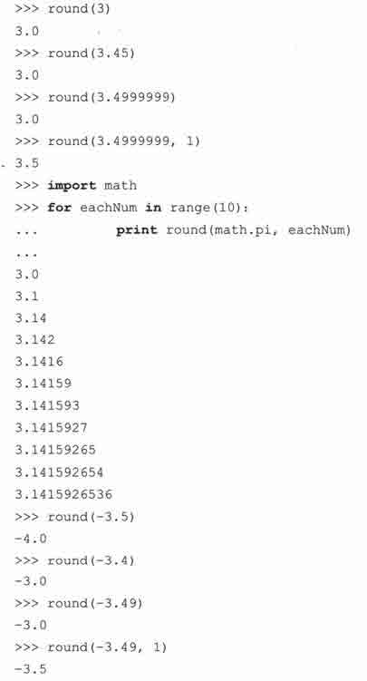

值得注意的是 round()函数是按四舍五入的规则进行取整。也就是 round （0.5）得到 1, round （-0.5）得到−1。猛一看 int()、round()、 math.floor()这几个函数好像做的是同一件事，很容易将它们弄混，是不是？下面列出它们之间的不同之处。

> > •　函数 int()直接截去小数部分（返回值为整型）。

> > •　函数 floor()得到最接近原数但小于原数的整型（返回值为浮点型）。

> > •　函数 round()得到最接近原数的整型（返回值为浮点型）。

下面的例子用 4 个正数和 4 个负数作为这三个函数的参数，将返回结果列在一起做个比较（为了便于比较我们将 int()函数的返回值也转换成了浮点型）。

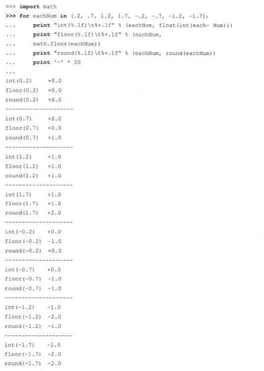

表 5.6 是数值运算函数一览。

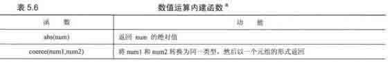

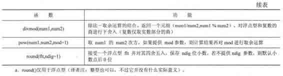

### 5.6.3　仅用于整型的函数

除了适应于所有数值类型的内建函数之外，Python 还提供一些仅适用于整型的内建函数（标准整型和长整型）。这些函数分为两类，一类用于进制转换，另一类用于 ASCII 转换。

1.进制转换函数

前面我们已经看到，除了十进制标准，Python 整型也支持八进制和十六进制整型。除此之外，Python 还提供了两个内建函数来返回字符串表示的八进制和十六进制整型，它们分别是 oct()和 hex()。它们都接受一个整型（任意进制的）对象，并返回一个对应值的字符串对象。下面是几个示例。

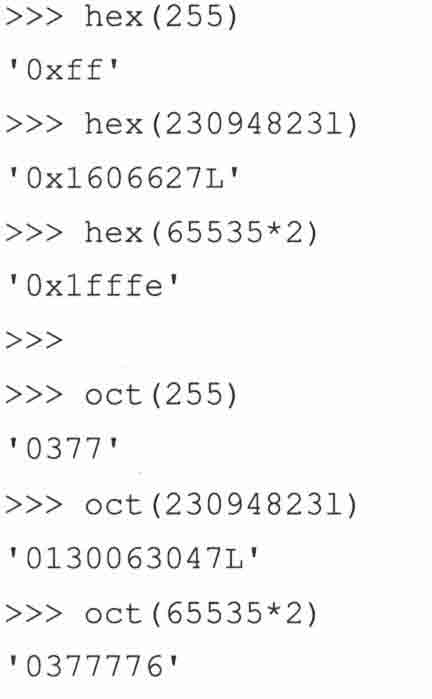

2\. ASCII 转换函数

Python 也提供了 ASCII （美国标准信息交换码）码与其序列值之间的转换函数。每个字符对应一个唯一的整型（0〜255）。对所有使用 ASCII 表的计算机来说，这个数值是不变的。这保证了不同系统之间程序行为的一致性。函数 chr()接受一个单字节整型值，返回一个字符串，其值为对应的字符。函数 ord()则相反，它接受一个字符，返回其对应的整型值。

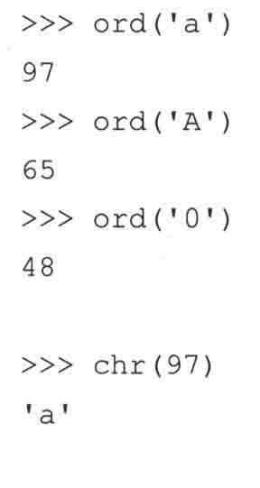

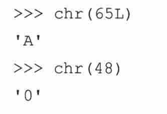

表 5.7 列出了用于整型类型的所有内建函数。

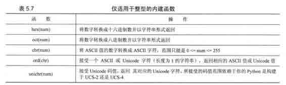

## 5.7　其他数字类型

### 5.7.1　布尔“数“

从 Python2.3 开始，布尔类型添加到了 Python 中来。尽管布尔值看上去是“True”和“False”，但是事实上是整型的子类，对应与整型的 1 和 0。下面是有关布尔类型的主要概念。

•　有两个永不改变的值 True 或 False。

•　布尔型是整型的子类，但是不能再被继承而生成它的子类。

•　没有 _nonzero_0 方法的对象的默认值是 True。

•　对于值为零的任何数字或空集（空列表、空元组和空字典等）在 Python 中的布尔值都是 False。

•　在数学运算中，Boolean 值的 True 和 False 分别对应于 1 和 0。

•　以前返回整型的大部分标准库函数和内建布尔型函数现在返回布尔型。

•　True 和 False 现在都不是关键字，但是在 Python 将来的版本中会是。

所有 Python 对象都有一个内建的 True 或 False 值，对内建类型来说，这个值究竟是 True 还是 False 请参阅章节 4.3.2 中的核心备注。下面是使用内建类型布尔值的一些例子。

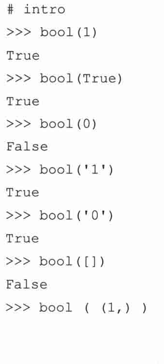

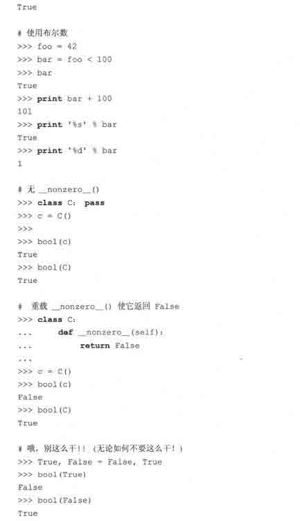

你可以在 Python 文档和 PEP 285 看到有关布尔类型的知识。

### 5.7.2　十进制浮点型

从 Python2.4 起（参阅 PEP327）十进制浮点制成为一个 Python 特性。这主要是因为下面的语句经常会让一些编写科学计算或金融应用程序的程序员发狂。

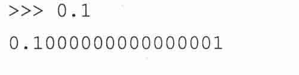

为什么会这样？这是因为语言绝大多数 C 语言的双精度实现都遵守 IEEE 754 规范，其中 52 位用于底。因此浮点值只能有 52 位精度，类似这样的值的二进制表示只能象上面那样被截断。0.1 的二进制表示是 0.11001100110011…*2^(-3),因为它最接近的二进制进似值是 0.0001100110011…,或 1/16 + 1/32+1/256+…

你可以看到，这些片段不停的重复直到舍入出错。如果我们使用十进制来做同样的事情，感觉就会好很多，看上去会有任意的精度。注意下面，你不能混用十进制浮点型和普通的浮点型。你可以通过字符串或其他十进制数创建十进制数浮点型。必须导入 decimal 模块以便使用 Decimal 类。

你可以从 Python 文档中读取相关的 PEP 以了解十进制数。值得庆幸的是，十进制数和其他数值类型一样，可以使用同样的算术操作符。由于十进制数本质上是一种用于数值计算的特殊类，我们在本章的剩余部分将不再专门讲解十进制数。

## 5.8　相关模块

在 Python 标准库中有不少专门用于处理数值类型对象的模块，它们增强并扩展了内建函数的功能和数值运算的功能。表 5.8 列出了几个比较核心的模块。要详细了解这些模块，请参阅这些模块的文献或在线文档。

对高级的数字科学计算应用来说，你会对著名的第三方包 Numeric（NumPy）和 SciPy 感兴趣。关于这两个包的详细请访问下面的网址。

http://numeric.scipy.org/

http://scipy.org/

核心模块：random

* * *

当你的程序需要随机数功能时，random 模块就能派上用场。该模块包含多个伪随机数发生器，它们均以当前的时间戳为随机数种子。这样只要载入这个模块就能随时开始工作。下面列出了该模块中最常用的函数。

* * *

到此，我们的 Python 数值类型之旅就该结束了。表 5.9 总结了数值类型的所有内建函数和操作符。

## 5.9　练习

本章的练习可以先通过应用程序的形式实现。一旦功能齐备并且调试通过，建议读者将自己的代码功能用函数封装起来，以便在后面的练习中重用代码。关于编程风格我在这儿提醒一下，最好不要在函数内使用 print 语句输出信息，而是通过 return 语句返回必要的值。这样调用函数的代码就可以自己处理显示方式。这样你的代码就适应性更广，更便于重用。

> > 5-1.整形。讲讲 Python 普通整型和长整型的区别。

> > 5-2.操作符。

> > > > （a）写一个函数，计算并返回两个数的乘积。

> > > > （b）写一段代码调用这个函数，并显示它的结果。

> > 5-3.标准类型操作符。写一段脚本，输入一个测验成绩，根据下面的标准，输出他的评分成绩（A-F）。

> > > > A: 90~100

> > > > B: 80~89

> > > > C: 70~79

> > > > D: 60~69

> > > > F: <60

> > 5-4.取余。判断给定年份是否是闰年。使用下面的公式。

> > > > 一个闰年就是指它可以被 4 整除，但不能被 100 整除，或者它既可以被 4 又可以被 100 整除。比如 1992 年、1996 年和 2000 年是闰年，但 1967 年和 1900 年则不是闰年。下一个是闰年的整世纪是 2400 年。

> > 5-5.取余。取一个任意小于 1 美元的金额，然后计算可以换成最少多少枚硬币。硬币有 1 美分、5 美分、10 美分、25 美分 4 种。1 美元等于 100 美分。举例来说，0.76 美元换算结果应该是 3 枚 25 美分，1 枚 1 美分。类似 76 枚 1 美分，2 枚 25 美分+2 枚 10 美分+1 枚 5 美分+1 枚 1 美分这样的结果都是不符合要求的。

> > 5-6.算术。写一个计算器程序。你的代码可以接受这样的表达式，两个操作数加一个操作符：N1 操作符 N2。其中 N1 和 N2 为整型或浮点型，操作符可以是+、-、*、/、%、**，分别表示加法、减法、乘法、整型除、取余和幂运算。计算这个表达式的结果，然后显示出来。提示：可以使用字符串方法 split()，但不可以使用内建函数 eval()。

> > 5-7.营业税。随意取一个商品金额，然后根据当地营业税额度计算应该交纳的营业税。

> > 5-8.几何。计算面积和体积。

> > > > （a）正方形和立方体

> > > > （b）圆和球

> > 5-9.数值形式回答下面关于数值格式的问题：

> > > > （a）为什么下面的例子里 17+32 等于 49，而 017+32 等于 47,017+032 等于 41?

> > > > （b）为什么下面这个表达式我们得到的结果是 134L 而不是 1342?

5-10.转换。写一对函数来进行华氏度到摄氏度的转换。转换公式为 C=（F-32）*（5/9）应该在这个练习中使用真正的除法，否则你会得到不正确的结果。

> > 5-11.取余。

> > > > （a）使用循环和算术运算，求出 0~20 之间的所有偶数。

> > > > （b）同上，不过这次输出所有的奇数。

> > > > （c）综合（a）和（b），请问辨别奇数和偶数的最简单的方法是什么？

> > > > （d）使用（c）的成果，写一个函数，检测一个整型能否被另一个整型整除。先要求用户输入两个数，然后你的函数判断两者是否有整除关系，根据判断结果分别返回 True 和 False。

> > 5-12.系统限制。写一段脚本确认一下你的 Python 所能处理的整型、长整型、浮点型和复数的范围。

> > 5-13.转换。写一个函数把由小时和分钟表示的时间转换为只用分钟表示的时间。

> > 5-14.银行利息。写一个函数，以定期存款利率为参数，假定该账户每日计算复利，请计算并返回年回报率。

> > 5-15.最大公约数和最小公倍数。请计算两个整型的最大公约数和最小公倍数。

> > 5-16.家庭财务。给定一个初始金额和月开销数，使用循环，确定剩下的金额和当月的支出数，包括最后的支出数。Payment()函数会用到初始金额和月额度，输出结果应该类似下面的格式（例子中的数字仅用于演示）。

> > 5-17.*随机数。熟读随机数模块然后解下面的题。

> > > > 生成一个有 N 个元素的由随机数 n 组成的列表，其中 N 和 n 的取值范围分别为（1< N <= 100）和（0<=n<=2³¹ -1）。然后再随机从这个列表中取 N（1<=N<=100）个随机数出来，对它们排序，然后显示这个子集。