# 第六章　序列：字符串、列表和元组

本章主题

♦　序列简介

♦　字符串

♦　列表

♦　元组

接下来我们要研究这样一些 Python 的类型，它们的成员有序排列的，并且可以通过下标偏移量访问到它的一个或者几个成员，这类 Python 类型统称为序列，包括字符串（普通字符串和 unicode 字符串）、列表和元组类型。

因为这些类型其实都是由一些成员共同组成的一个序列整体，所以我们把它们统称为序列，比如说，一个字符串是由一些字符（尽管 Python 并没有显式地定义字符这个类型）组成的序列，那么“Hello”这个字符串的第一个字符就是“H”，第二个字符就是‘e’…，同样的，列表类型和元组类型就是其他一些 Python 对象所组成的序列。

首先我们来熟悉一下适用于所有序列类型的操作符和内建函数（BIF）再对每一种从如下方面分别介绍；

•　简介；

•　操作符；

•　内建函数；

•　内建函数（如果可用）；

•　特性（如果可用）；

•　相关模块（如果可用）。

在本章的末尾我们会给出一个对于所有序列类型都适用的操作符和函数的参考图表，现在让我们概略看一下这些内容。

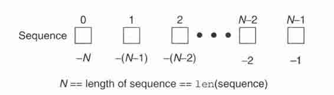

> > 图 6-1　有多少可以保存并可以被访问的序列元素

## 6.1　序列

序列类型有着相同的访问模式：它的每一个元素可以通过指定一个偏移量的方式得到。而多个元素可以通过切片操作的方式一次得到，切片操作会在接下来的内容中讲到。下标偏移量是从 0 开始到总元素数-1 结束——之所以要减 1 是因为我们是从 0 开始计数的。图 6-1 阐述了序列的元素是如何存储的。

### 6.1.1　标准类型操作符

标准类型操作符（参见 4.5 节）一般都能适用于所有的序列类型。当然，如果作复合类型的对象比较的话，这样说可能需要有所保留，不过其他的操作绝对是完全适用的。

### 6.1.2　序列类型操作符

表 6.1 列出了对所有序列类型都适用的操作符。操作符是按照优先级从高到底的顺序排列的。

1.　成员关系操作符（in、not in）

成员关系操作符是用来判断一个元素是否属于一个序列的。比如对字符串类型来说，就是判断一个字符是否属于这个字符串；对和元组类型来说，就代表了一个对象是否属于该对象序列。in/not in 操作符的返回值一般来讲就是 True/False，满足成员关系就返回 True，否则返回 False。该操作符的语法如下。

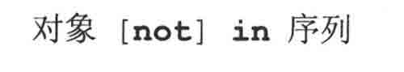

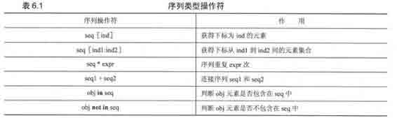

2.　连接操作符（+）

这个操作符允许我们把一个序列和另一个相同类型的序列做连接。语法如下。

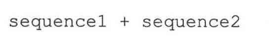

该表达式的结果是一个包含 sequence1 和 sequence2 的内容的新序列。注意，这种方式看起来似乎实现了把两个序列内容合并的概念，但是这个操作不是最快或者说最有效的。

对字符串来说，这个操作不如把所有的子字符串放到一个列表或可迭代对象中，然后调用一个 join 方法来把所有的内容连接在一起节约内存；类似地，对列表来说，我们推荐读者用列表类型的 extend()方法来把两个或者多个列表对象合并。当你需要简单地把两个对象的内容合并，或者说不能依赖于可变对象的那些没有返回值（实际上它返回一个 None）的内建方法来完成的时候时，连接操作符还是很方便的一个选择。下面的切片操作可以视作这些情况的例子。

3.　重复操作符（*）

当你需要需要一个序列的多份拷贝时，重复操作符非常有用，它的语法如下。

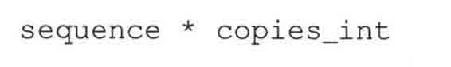

copies_int 必须是一个整型（1.6 节里面有讲到，不能是长整型）。像连接操作符一样，该操作符返回一个新的包含多份原对象拷贝的对象。

4.　切片操作符（［］，［:］，［::］）

简单地讲，所谓序列类型就是包含一些顺序排列的对象的一个结构。你可以简单的用方括号加一个下标的方式访问它的每一个元素，或者通过在方括号中用冒号把开始下标和结束下标分开的方式来访问一组连续的元素。

下面我们将详细的讲解提到的这两种方式。序列类型是其元素被顺序放置的一种数据结构类型，这种方式允许通过指定下标的方式来获得某一个数据元素，或者通过指定下标范围来获得一组序列的元素。这种访问序列的方式叫做切片，我们通过切片操作符就可以实现我们上面说到的操作。

访问某一个数据元素的语法如下：

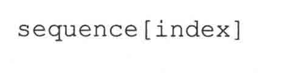

sequence 是序列的名字，index 是想要访问的元素对应的偏移量。偏移量可以是正值。范围从 0 到偏移最大值（比序列长度少一），用 len()函数（下一节会讲），可以得到序列长度，实际的范围是 0<=index<=len（sequence）-1。

另外，也可以使用负索引，范围是-1 到序列的负长度，-len（sequence），-len（sequence） <=index<=-1。正负索引的区别在于正索引以序列的开始为起点，负索引以序列的结束为起点。

试图访问一个越界的索引会引发一个如下的异常；

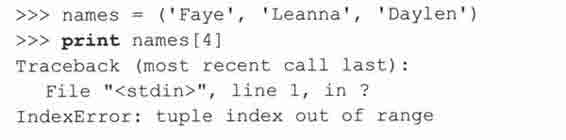

因为 Python 是面向对象的，所以你可以像下面这样直接访问一个序列的元素（不用先把它赋值给一个变量）。

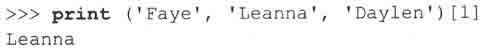

这个特性在你调用一个返回值是序列类型的函数，并且你只对返回的序列中的一个或某几个元素感兴趣时特别有用。

那么我们如何才能一次得到多个元素呢？其实这跟访问某一个单一元素一样简单，只要简单的给出开始和结束的索引值，并且用冒号分隔就可以了，其语法如下。

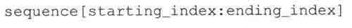

通过这种方式我们可以得到从起始索引到结束索引（不包括结束索引对应的元素）之间的一“片”元素。起始索引和结束索引都是可选的，如果没有提供或者用 None 作为索引值，切片操作会从序列的最开始处开始，或者直到序列的最末尾结束。

在图 6-2~图 6-6 里面，我们以一个长度为 5 的序列为例，分别讲解了这几种切片方式。

> > 图 6-2　整个序列：sequence 或 sequence[:]

> > 图 6-3　序列切片操作：sequence[0:3]或 sequence[:3]

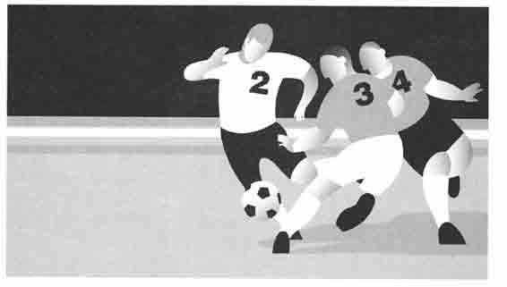

> > 图 6-4　序列切片操作：sequence[2:5]或 sequence[2:]

> > 图 6-5　序列切片操作：sequence[1:3]

> > 图 6-6　序列切片操作：sequence[3]

5.　用步长索引来进行扩展的切片操作

序列的最后一个切片操作是扩展切片操作，它多出来的第三个索引值被用做步长参数。你可以把这个参数看成跟内建函数 range()里面的步长参数或者类似于 C/C++、Perl、PHP 和 Java 语言里面 for 语句中的步长参数一样来理解。

Python 的虚拟机里面其实很早就有了扩展切片操作，只不过以前需要通过扩展的方式来使用。Jython 也支持这个语法（以前叫 JPython）。

很久以前的 C 解释程序 2.3 版就给出了其他所有方法。

以下是几个例子。

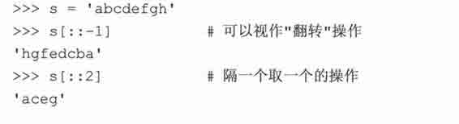

6.　切片索引的更多内容

切片索引的语法要比简单的单一元素索引灵活得多。开始和结束素引值可以超过字符串的长度。换句话说，起始索引可以小于 0，而对于结束索引，即使索引值为 100 的元素并不存在也不会报错，简单地说，即使用 100 来作为一个长度不到 100 的序列的结束索引也不会有什么问题，例子如下。

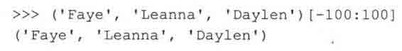

有这么一个问题：有一个字符串，我们想通过一个循环按照这样的形式显示它：每次都把位于最后的一个字符砍掉，下面是实现这个要求的一种方法。

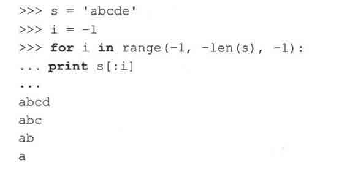

可是，该如何在第一次迭代的时候显示整个字符串呢？是否有一种方法可以不用在整个循环之前加入一个额外的 print 语句呢？我们该如何定义一个索引，来代表整个的序列呢？事实上在一个以负数作为索引的例子里是没有一个真正能解决这个问题的方法的，因为-1 已经是“最小”的索引了。我们不可能用 0 来作为索引值，因为这会切片到第一个元素之前而什么都不会显示。

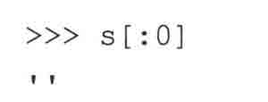

我们的方案是使用另一个小技巧：用 None 作为索引值，这样一来就可以满足你的需要，比如说，在你想用一个变量作为索引来从第一个到遍历最后一个元素的时候：

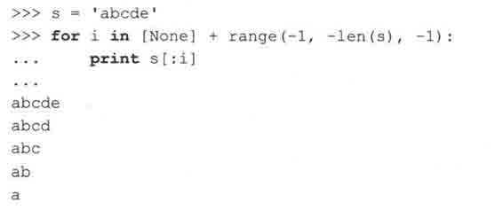

现在这个程序符合我们的要求了。在进行下面的内容之前，必须指出，似乎还可以先创建一个只包含 None 的列表，然后用 extend()函数把 range()的输出添加到这个列表，或者先建立 range()输出组成的列表然后再把 None 插入到这个列表的最前面，然后对这个列表进行遍历，但是可变对象的内建函数 extend()根本就没有返回值，所以这个方法是行不通的。

这个错误发生的原因是[None].extend（…）函数返回 None,None 既不是序列类型也不是可迭代对象。在这种情况下使用上面提到的列表连接操作来实现是唯一不需要添加额外代码的方法。

### 6.1.3　内建函数（BIF）

在讲解序列类型的内建函数之前，有一点需要说明，序列本身就内含了迭代的概念，之所以会这样，是因为迭代这个概念就是从序列，迭代器，或者其他支持迭代操作的对象中泛化得来的。

由于 Python 的 for 循环可以遍历所有的可迭代类型，在（非纯序列对象上）执行 for 循环时就像在一个纯序列对象上执行一样。而且 Python 的很多原来只支持序列作为参数的内建函数现在也开始支持迭代器或者或类迭代器了。我们把这些类型统称为“可迭代对象”。

在这一章里我们会详细的讨论跟序列关系紧密的内建函数（BIF）。在第八章“条件判断和循环”里面将讨论针对“在循环中迭代”这种情况的内建函数（BIF）。

1.　类型转换

内建函数 list()、str()和 tuple()被用做在各种序列类型之间转换。你可以把它们理解成其他语言里面的类型转换，但是并没有进行任何的转换。这些转换实际上是工厂函数（在第四章介绍），将对象作为参数，并将其内容（浅）拷贝到新生成的对象中。表 6.2 列出了适用于序列类型的转换函数。

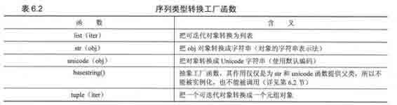

我们又用了一次“转换”这个词。不过，为什么 Python 里面不简单地把一个对象转换成另一个对象呢？回过头看一下第四章就会知道，一旦一个 Python 的对象被建立，我们就不能更改其身份或类型了。如果你把一个列表对象传给 list()函数，便会创建这个对象的一个浅拷贝，然后将其插入新的列表中。同样地，在做连接操作和重复操作时，我们也会这样处理。

所谓浅拷贝就是只拷贝了对对象的索引，而不是重新建立了一个对象。如果你想完全的拷贝一个对象（包括递归，如果你的对象是一个包含在容器中的容器），你需要用到深拷贝，关于浅拷贝和深拷贝的更多信息会在本章的末尾讲到。

str()函数在需要把一个对象的可打印信息输出时特别有用，不仅仅是对序列类型，对其他类型的对象同样如此。Unicode()是 str()函数的 unicode 版本，它跟 str()函数基本一样。list()和 tuple()函数在列表类型和元组类型的互换时非常有用。不过，虽然这些函数也适用于 string 类型（因为 string 类型也是序列的一种），但是在 string 类型上应用 tupleO 和 list()函数却得不到我们通常希望的结果。

2.　可操作

Python 为序列类型提供以下可操作 BIF（见表 6.3）注意，len()、reversed()和 sum()函数只能接受序列类型对象作为参数，而剩下的则还可以接受可迭代对象作为参数，另外，max()和 min()函数也可以接受一个参数列表。

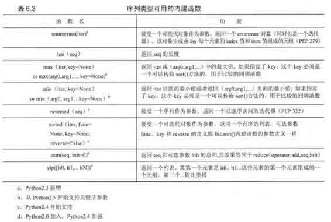

我们将分别在每个序列的章节里面提供使用这些函数的例子。

## 6.2　字符串

字符串类型是 Python 里面最常见的类型。我们可以简单地通过在引号间包含字符的方式创建它。 Python 里面单引号和双引号的作用是相同的，这一点 Python 不同于其他类 Shell 的脚本语言，在这些脚本语言中，通常转义字符仅仅在双引号字符串中起作用，在单一号括起的字符串中不起作用。Python 用“原始字符串”操作符来创建直接量字符串，所以再做区分就没什么意义了。其他的语言，比如 C 语言里面用单引号来标示字符，双引号标示字符串，而在 Python 里面没有字符这个类型。这可能是双引号和单引号在 Python 里面被视作一样的另一个原因。几乎所有的 Python 应用程序都会某种方式用到字符串类型。字符串是一种直接量或者说是一种标量，这意味着 Python 解释器在处理字符串时是把它作为单一值并且不会包含其他 Python 类型的。字符串是不可变类型，就是说改变一个字符串的元素需要新建一个新的字符串。字符串是由独立的字符组成的，并且这些字符可以通过切片操作顺序地访问。

根据在 2.2 节里面对类型和类的概念进行的统一，Python 实际上有三类字符串。通常意义的字符串（str）和 Unicode 字符串（unicode）实际上都是抽象类 basestring 的子类。这个 basestring 是不能实例化的，如果你试图实例化一个 basestring 类，你会得到以下报错信息。

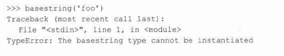

1.　字符串的创建和赋值

创建一个字符串就像使用一个标量一样简单，当然你也可以把 str()作为工厂方法来创建一个字符串并把它赋值给一个变量。

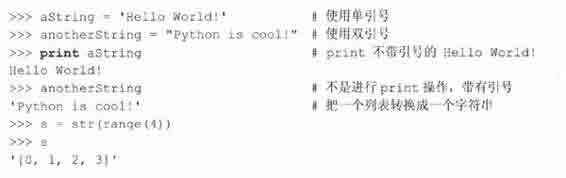

2.　如何访问字符串的值（字符和子串）

Python 里面没有字符这个类型，而是用长度为 1 的字符串来表示这个概念，当然，这其实也是一个子串。用方括号加一个或者多于一个索引的方式来获得子串；

3.　如何改变字符串

你可以通过给一个变量赋值（或者重赋值）的方式“更新”一个已有的字符串。新的值可能与原有值差不多，也可能跟原有串完全不同。

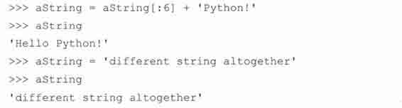

跟数字类型一样，字符串类型也是不可变的，所以你要改变一个字符串就必须通过创建一个新串的方式来实现。也就是说你不能只改变一个字符串的一个字符或者一个子串，然而，通过拼凑一个旧串的各个部分来得到一个新串是被允许的，正如上面你看到的那样。

4.　如何删除字符和字符串

再重复一遍，字符串是不可变的，所以你不能仅仅删除一个字符串里的某个字符，你能做的是清空一个空字符串，或者是把剔除了不需要的部分后的字符串组合起来形成一个新串。假设你想要从“Hello World!”里面删除小写的“1”。

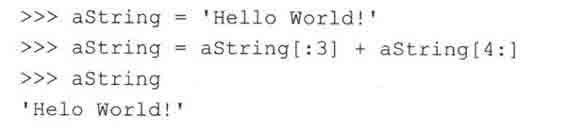

通过赋一个空字符串或者使用 del 语句来清空或者删除一个字符串：

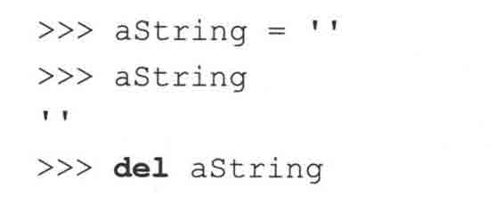

在大部分应用程序里，没有必要显式的删除字符串。定义这个字符串的代码最终会结束，那时 Python 会自动释放这些字符串。

## 6.3　字符串和操作符

### 6.3.1　标准类型操作符

在第四章里面，我们介绍了一些适用于包括标准类型在内的大部分对象的操作符，在这里再看一下其中的一些操作符是怎样作用于字符串类型的，下面是几个简单的例子。

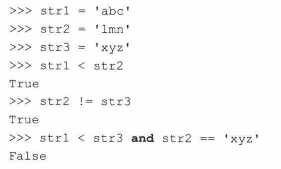

在做比较操作的时候，字符串是按照 ASCII 值的大小来比较的。

### 6.3.2　序列操作符切片（[]和[:]）

在先前的 6.1.1 节里面我们展示了如何访问序列类型的一个或一组元素，接下来我们会把这些知识应用到字符串类型上，着重考察以下的操作；

•　正向索引；

•　反向索引；

•　默认索引。

接下来以字符串‘abcd’为例子。表里面分别列出了使用正索引和负索引来定位字符的情况。可以用长度操作符来确认该字符串的长度是 4。

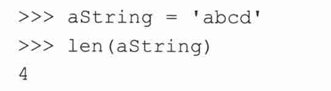

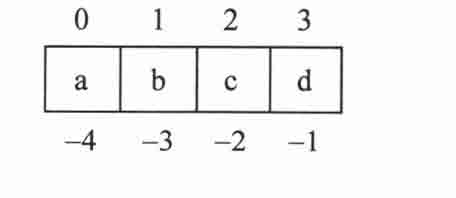

正向索引时，索引值开始于 0，结束于总长度减 1（因为我们是从 0 开始索引的）。本例中最后一个索引是：

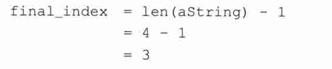

在这个范围内，我们可以访问任意的子串。用一个参数来调用切片操作符结果是一个单一字符，而使用一个数值范围（用）作为参数调用切片操作的参数会返回一串连续地字符。再强调一遍，对任何范围[start:end]，我们可以访问到包括 start 在内到 end（不包括 end）的所有字符，换句话说，假设 x 是[start:end]中的一个索引值，那么有：start<=x<end。

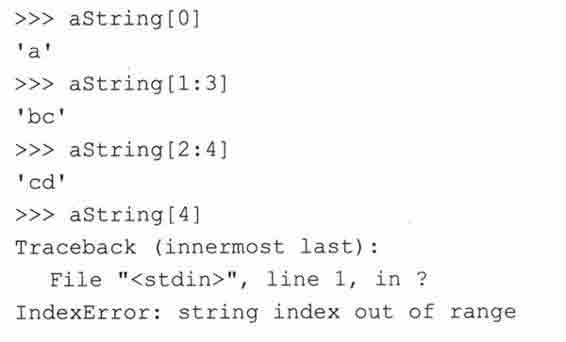

使用不在允许范围（本例中是 0 到 3）内的索引值会导致错误。上面的 aString[2:4]却并没有出错，那是因为实际上它返回的是索引值 2 和 3 的值。但是直接拿 4 作为索引访问是不被允许的。

在进行反向索引操作时，是从-1 开始，向字符串的开始方向计数，到字符串长度的负数为索引的结束。最末一个索引（也就是第一个字符）是这样定位的：

如果开始索引或者结束索引没有被指定，则分别以字符串的第一个和最后一个索引值为默认值。

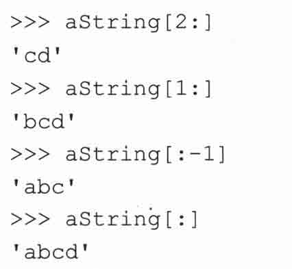

注意：起始/结束索引都没有指定的话会返回整个字符串。

1.　成员操作符（in,not in）

成员操作符用于判断一个字符或者一个子串（中的字符）是否出现在另一个字符串中。出现则返回 True，否则返回 False。注意，成员操作符不是用来判断一个字符串是否包含另一个字符串的，这样的功能由 find()或者 index()（还有它们的兄弟：rfind()和 rindex()）函数来完成。

下面是一些字符串和成员操作符的例子。在 Python 2.3 以前，in（和 not in）操作符只允许用来判断一个单个字符是否属于一个字符串，就像下面第 2 个例子那样。2.3 以后这个限制去掉了，所有的字符串都可以拿来判断。

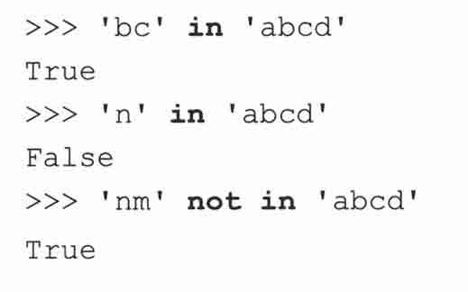

在例 6.1 里面，我们会用到下面这些 string 模块预定义的字符串：

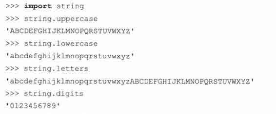

例 6.1 是一个用来检查 Python 有效标识符的小脚本，名字是 idcheck.py。我们知道，Python 标识符必须以字母或下划线开头，后面跟字母、下划线或者数字。

例 6.1　标识符检查（idcheck.py）

标识符合法性检查，首先要以字母或者下划线开始，后面要跟字母，下划线或者或数字。这个小例子只检查长度大于等于 2 的标识符。

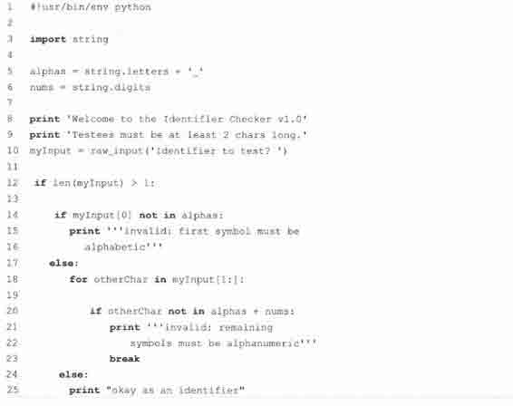

这个例子还展示了字符串连接符（+）的使用，本章的后面会讲到字符串连接符。运行几次后得到下面的输出：

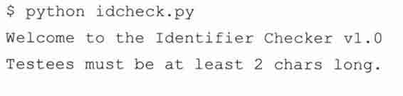

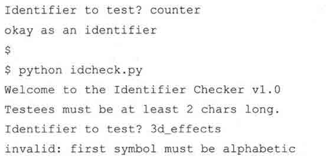

让我们逐行解释这个应用程序。

3 ~ 6 行

导入 string 模块并且预定义了两个字符串，用于后面的判断。

8 ~ 12 行

输出提示信息，第 12 行的 if 语句过滤掉长度小于 2 的标识符或者候选标识符。

14 ~ 16 行

检查第一个符号是不是字母或下划线，如果不是，输出结果并退出。

17 ~ 18 行

否则，从第二个字符开始到最后一个字符，循环检查剩余的字符。

20 ~ 23 行

检查剩余的符号是否都是字母，下划线或者数字。注意我们是如何使用连接操作符来创建合法字符集合的。只要发现一个非法字符，就显示结果并通过 break 语句退出。

核心提示：性能

* * *

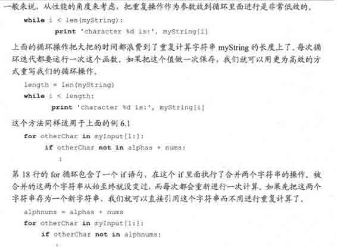

* * *

24 ~ 25 行

或许现在就向你展示 for-else 循环语句有点儿早，可是我们必须先看一看这个语句（在第八章有详细的介绍）。for 循环的 else 语句是一个可选项，它只在 for 循环完整的结束，没有遇到 break 时执行。在我们的例子中，如果所有的符号都检查合格，那么我们就得到了一个合法的标识符，程序会返回一个这样的结果，然后执行完毕。

其实，这段程序并不是完美的，一个问题就是标识符的长度必须大于 1。我们的程序几乎是，但还并没有真正定义出 Python 标识符的范围，Python 标识符长度可以是 1。另一个问题是这段程序并没有考虑到 Python 的关键字，而这些都是作为保留字，不允许用做标识符的。我们把这两个问题作为课后练习留给读者（见练习 6-2）。

2.　连接符（+）

运行时刻字符串连接

我们可以通过连接操作符来从原有字符串获得一个新的字符串。我们已经在前面的例 6-1 里面见识过连接符了，下面是一些更多的例子：

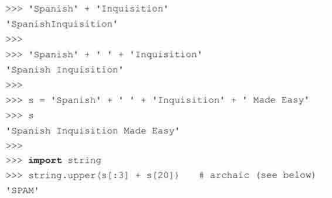

最后一个例子展示了用一个字符串 s 的两个切片来构成一个新串的操作，从“Spanish”里面切出“Spa”加上从“Made”里面切出来的“M”。将抽取出来字符串切片连接后作为参数传给了 string.upper()方法，该方法负责把字符串的所有字符都变为大写。String 模块的方法是在 Pythonl.6 里面添加进来的，所以这个操作也可以用最后一个字符串的一个单一方法调用来完成（见下面的例子）。现在已经没有必要导入 string 模块了，除非你需要访问该模块自己定义的字符串常量。注意：虽然对初学者来说 string 模块的方式更便于理解，但出于性能方面的考虑，我们还是建议你不要用 string 模块。原因是 Python 必须为每一个参加连接操作的字符串分配新的内存，包括新产生的字符串。取而代之，我们推荐你像下面介绍的那样使用字符串格式化操作符（%），或者把所有的字符串放到一个列表中去，然后用一个 join()方法来把它们连接在一起。

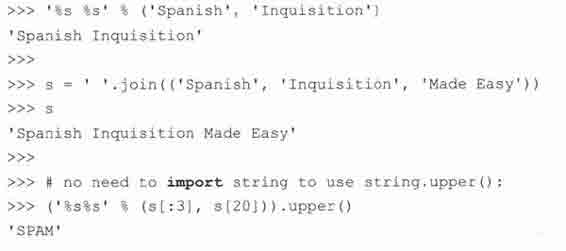

3.　编译时字符串连接

上面的语法在运行时字符串连接的加法操作，这个用法是非常标准的。Python 中还有一种并不是经常用到，更像是一种程序员的习惯用法的语法。Python 的语法允许你在源码中把几个字符串连在一起写，以此来构建新字符串。

通过这种方法，你可以把长的字符串分成几部分来写，而不用加反斜杠。如上所示，你可以在一行里面混用两种分号。这种写法的好处是你可以把注释也加进来，如下所示。

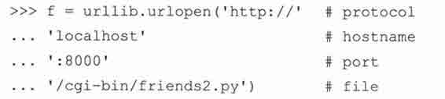

如你所想，下面就是 urlopen()方法所得到的真实输入。

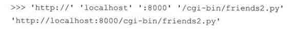

4.　普通字符串转化为 Unicode 字符串

如果把一个普通字符串和一个 Unicode 字符串做连接处理，Python 会在连接操作前先把普通字符串转化为 Unicode 字符串：

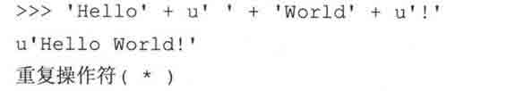

重复操作符创建一个包含了原有字符串的多个拷贝的新串。

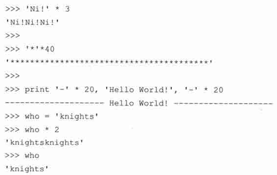

像其他的标准操作符一样，原变量是不被修改的，就像上面最后一个例子所示。

## 6.4　只适用于字符串的操作符

### 6.4.1　格式化操作符（%）

Python 风格的字符串格式化操作符。只适用于字符串类型，非常类似于 C 语言里面的 printf()函数的字符串格式化，甚至所用的符号都一样，都用百分号（%），并且支持所有 printf()式的格式化操作。语法如下。

左边的 format_string 里面同通常会在 printf()函数的第一个参数里面见到的一样，包含%的格式化字符串。表 6.4 列出了可用的各种符号。arguments_to_convert 参数是你要转化、显示的变量，对应于你送给 prinf()的其他参数。

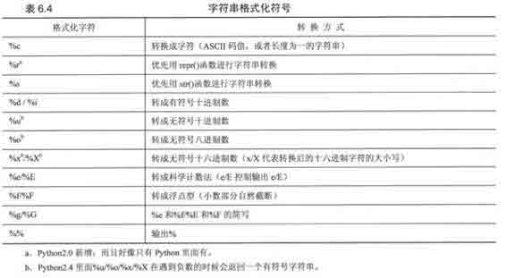

Python 支持两种格式的输入参数。第一种是元组（见 2.8 节，6.15 节），这基本上是一种的 C printf()风格的转换参数集；Python 支持的第二种形式是字典形式（详见第七章）字典其实是一个哈希键-值对的集合。这种形式里面，键是作为格式字符串出现，相对应的值作为参数在进行转化时提供给格式字符串．格式字符串既可以跟 print 语句一起用来向终端用户输出数据，又可以用来合并字符串形成新字符串，而且还可以直接显示到 GUI 界面上去。其他的格式字符和方法见表 6.5。

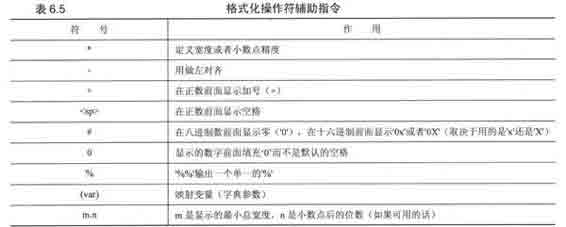

以下是一些使用格式字符串的例子。

1.　十六进制输出

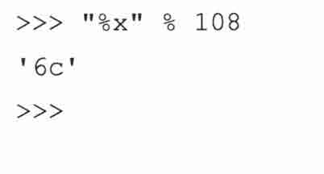

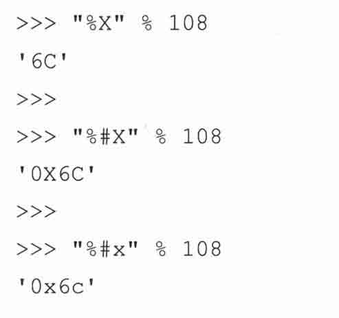

2.　浮点型和科学记数法形式输出

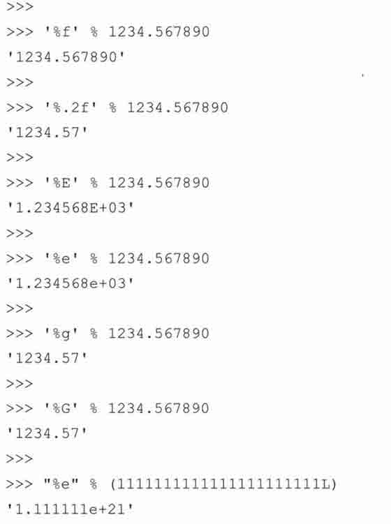

3.　整型和字符串输出

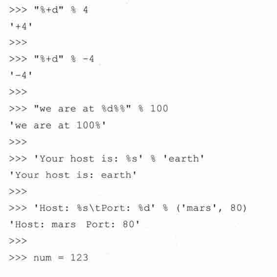

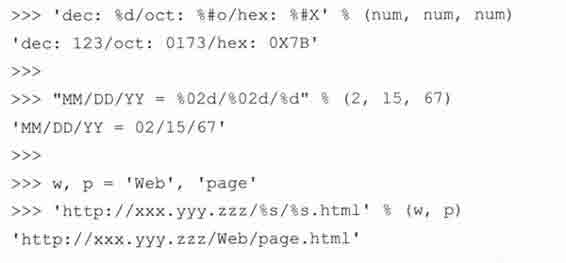

上面的例子都是使用的元组类型的参数作转换。下面我们将把字典类型的参数提供给格式化操作符。

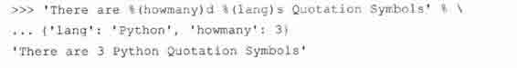

4.　令人称奇的调试工具

字符串格式化操作符不仅很酷、易用、上手快，而且是一个非常有用的调试工具。事实上，所有的 Python 对象都有一个字符串表示形式（通过 repr()函数，或 tr()函数来展现）。print 语句自动为每个对象调用 str()函数。更好的是，在定义自己的对象时，你可以利用“钩子”为你的对象创建字符串表达形式。这样，repr()，str()或者 print 被调用时，就可以获得一个适当的字符串描述信息。即使在坏得不能再坏的情况下，repr()或者 str()也不能显示一个对象的信息时，“Pythonic”的默认做法最起码能给你返回如下格式的信息。

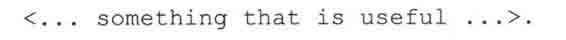

### 6.4.2　字符串模板：更简单的替代品

字符串格式化操作符是 Python 里面处理这类问题的主要手段，而且以后也是如此。然而它也不是完美的，其中的一个缺点是它不是那么直观，尤其对刚从 C/C++转过来的 Python 新手来说更是如此，即使是现在使用字典形式转换的程序员也会偶尔出现遗漏转换类型符号的错误。比如说，用了%（lang）而不是正确的%（lang）s。为了保证字符串被正确的转换，程序员必须明确的记住转换类型参数，比如到底是要转成字符串、整型还是其他什么类型。

新式的字符串模板的优势是不用去记住所有的相关细节的，而是像现在 shell 风格的脚本语言里面那样使用美元符号（$）。

由于新式的字符串 Template 对象的引进使得 string 模块又重新活了过来，Template 对象有两个方法， substitute()和 safe_substitute()。前者更为严谨，在 key 缺少的情况下它会报一个 KeyError 的异常出来，而后者在缺少 key 时，直接原封不动的把字符串显示出来。

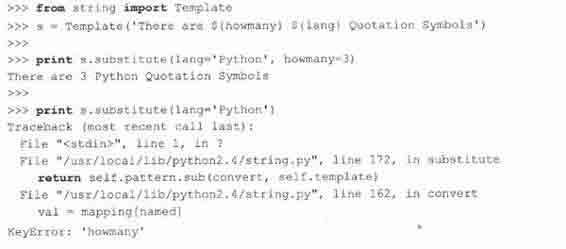

新式的字符串模板是从 Python2.4 开始加入的，更多信息请查阅《Python 类库参考手册》（Python Library Reference Manual）和 PEP 292。

### 6.4.3　原始字符串操作符（r/R）

关于原始字符串的目的，在 Pythonl.5 里面已经有说明，是为了对付那些在字符串中出现的特殊字符（下面的小节会介绍这些特殊字符）。在原始字符串里，所有的字符都是直接按照字面的意思来使用，没有转义特殊或不能打印的字符。

原始字符串的这个特性让一些工作变得非常的方便，比如正则表达式的创建（详见文档的 re 模块）。正则表达式是一些定义了高级搜索匹配方式的字符串，通常是由代表字符、分组、匹配信息、变量名和字符类等的特殊符号组成。正则表达式模块已经包含了足够用的符号。但当你必须插入额外的符号来使特殊字符表现的像普通字符的时候，你就陷入了“字符数字”的泥潭！这时原始字符串就会派上用场了。

除了原始字符串符号（引号前面的字母“r”）以外，原始字符串跟普通字符串有着几乎完全相同的语法。这个‘r’可以是小写也可以是大写，唯一的要求是必须紧靠在第一个引号前。在 3 个例子的第 1 个例子里面，我们需要一个反斜杠加一个“n”来而不是一个换行符。

接下来的例子里，我们打不开我们的 README 文件了，为什么？因为‘\t’和‘\r’被当成不在我们的文件名中的特殊符号，但它们实际上是文件路径中的 4 个独立的字符。

最后我们要找一对原始的\n 字符而不是换行。为了找到它，我们使用了一个简单的正则表达式，它的作用是查找通常被用来表示空白字符的反斜线-字符对（backslash-character pairs）。

### 6.4.4　Unicode 字符串操作符（u/U）

Unocide 字符串操作符，大写的（U）和小写的（u）是在 Pythonl.6 中和 Unicode 字符串一起被引入的，它用来把标准字符串或者是包含 Unicode 字符的字符串转换成完全的 Unicode 字符串对象。关于 Unicode 字符串的进一步信息在 6.7.4 节有详细介绍。另外，字符串方法（见 6.6 节）和正则表达式引擎也支持 Unicode。下面是几个例子。

Unicode 操作符也可以接受原始 Unicode 字符串，只要我们将 Unicode 操作符和前面讨论过的原始字符串操作符连接在一起就可以了。注意，Unicode 操作符必须出现在原始字符串操作符前面。

## 6.5　内建函数

### 6.5.1　标准类型函数

cmp()

同比较操作符一样，内建的 cmp()函数也根据字符串的 ASCII 码值进行比较。

### 6.5.2　序列类型函数

len()

正如你期望的那样，内建函数 len()返回字符串的字符数。

max() and min()

虽然 max()和 min()函数对其他的序列类型可能更有用，但对于 string 类型它们能很好地运行，返回最大或者最小的字符（按照 ASCII 码值排列），下面是几个例子。

enumerate()

zip()

### 6.5.3　字符串类型函数

raw_input()

内建的 raw_input()函数使用给定字符串提示用户输入并将这个输入返回，下面是一个使用 raw_input()的例子。

Python 里面没有 C 风格的结束字符 NUL，你输入多少个字符，len()函数的返回值就是多少。

str() and unicode()

str()和 unicode()函数都是工厂函数，就是说产生所对应的类型的对象。它们接受一个任意类型的对象，然后创建该对象的可打印的或者 Unicode 的字符串表示。它们和 basestring 都可以作为参数传给 isinstance()函数来判断一个对象的类型。

chr()、unichr()和 ord()

chr()函数用一个范围在 range（256）内的（就是 0~255）整数作参数，返回一个对应的字符。unichr()跟它一样，只不过返回的是 Unicode 字符，这个从 Python 2.0 才加入的 unichr()的参数范围依赖于你的 Python 是如何被编译的。如果是配置为 USC2 的 Unicode，那么它的允许范围就是 range（65536）或 OxOOOO-OxFFFF；如果配置为 UCS4，那么这个值应该是 range（1114112）或 0x000000-0x110000。如果提供的参数不在允许的范围内，则会报一个 ValueError 的异常。

ord()函数是 chr()函数（对于 8 位的 ASCII 字符串）或 unichr()函数（对于 Unicode 对象）的配对函数，它以一个字符（长度为 1 的字符串）作为参数，返回对应的 ASCII 数值，或者 Unicode 数值，如果所给的 Unicode 字符超出了你的 Python 定义范围，则会引发一个 TypeError 的异常。

## 6.6　字符串内建函数

字符串方法是从 Pythonl.6 到 2.0 慢慢加进来的——它们也被加到了 Jython 中。这些方法实现了 string 模块中的大部分方法，表 6.6 列出了目前字符串内建支持的方法，所有这些方法都包含了对 Unicode 的支持，有一些甚至是专门用于 Unicode 的。

下面是几个使用字符串方法的例子。

上面最复杂的例子是有 split()和 join()函数的那个。首先我们在 string 上调用 split()函数，没有用参数，也就是说以空格作为分隔符分隔字符串，然后我们以这个包含单词的列表做参数调用 join()方法把这些单词用一个新的分隔符冒号重新串在一起。注意。我们首先用 split()函数把 string 切片成一个列表，然后我们在字符串‘:’上应用 join()方法把这个列表重新连接成一个字符串。

## 6.7　字符串的独特特性

### 6.7.1　特殊字符串和控制字符

像其他高级语言和脚本语言一样，一个反斜线加一个单一字符可以表示一个特殊字符，通常是一个不可打印的字符，这就是我们上面讨论的特殊字符，如果这些特殊字符是包含在一个原始字符串中的，那么它就失去了转义的功能。

除了通常用的特殊字符，比如换行符（\n）,tab 符（\t）之外，也可以直接用 ASCII 码值来标示特殊字符：\000 或者\xXX，分别对应字符的八进制和十六进制 ASCII 码值，下面分别是十进制、八进制和十六进制的 065 和 255。

特殊字符，包括反斜杠转义的那些都可以像普通字符一样存储到 Python 的字符串中。

跟 C 字符串的另一个不同之处是 Python 的字符串并不是以 NUL（\000）作为结束符的。NUL 跟其他的反斜杠转义字符没什么两样。事实上，一个字符串中不仅可以出现 NUL 字符，而且还可以出现不止一次，在字符串的任意位置都可以。表 6.7 列出了被大部分 Python 版本支持的转义字符。

如上所述，就像使用连字符来让一行的内容持续到下一行一样，可以用显式定义八进制或者十六进制的 ASCII 码的方式定义特殊字符，合法的 ASCII 码值范围是 0~255（八进制的是 0177，十六进制是 0XFF）。

\OOO　八进制值（范围是 000~0177）

\xXX　x 打头的十六进制值（范围是 0x00 到 0xFF）

\　　连字符，将本行和下一行的内容连接起来。

控制字符的一个作用是用做字符串里面的定界符，在数据库或者 Web 应用中，大多数的可打印字符都是被允许用在数据项里面的，就是说可打印的字符不适合做定界符。

用可打印的字符串比如冒号（:）来作定界符，将会很难分辨一个字符到底是数据还是定界符。而且还会限定你能用在数据项里面的字符数量，而这不是你想要的。

一个通常的解决方案是，使用那些不经常使用的，不可打印的 ASCII 码值来作为定界符，它们是非常完美的定界符，这样一来诸如冒号这样的可打印字符就可以解脱出来用在数据项中了。

### 6.7.2　三引号

虽然你可以用单引号或者双引号来定义字符串，但是如果你需要包含诸如换行符这样的特殊字符时，单引号或者双引号就不是那么方便了。Python 的三引号就是为了解决这个问题的，它允许一个字符串跨多行，字符串中可以包含换行符、制表符以及其他特殊字符。

三引号的语法是一对连续的单引号或者双引号（通常都是成对的用）。

三引号让程序员从引号和特殊字符串的泥潭里面解脱出来，自始至终保持一小块字符串的格式是所谓的 WYSIWYG（所见即所得）格式的。

一个典型的用例是，当你需要一块 HTML 或者 SQL 时，这时用字符串组合，特殊字符串转义将会非常的繁琐。

### 6.7.3　字符串不变性

在第 4.7.2 节里面，我们讨论了字符串是一种不可变数据类型，就是说它的值是不能被改变或修改的。这就意味着如果你想修改一个字符串，或者截取一个子串，或者在字符串的末尾连接另一个字符串等，你必须新建一个字符串。

这听起来要比实际情况复杂。因为 Python 替你管理内存，你根本不需要知道到底发生了什么，每次你修改一个字符串或者做一些改变字符串内容的操作时，Python 都会自动为你分配一个新串。在下面的例子里面，Python 分别为“abc”和“def”分配了空间，当进行连接操作时，Python 自动为新的字符串“abcdef”分配了空间。

给变量赋值没什么不同。

上面的例子里，看起来是我们先把 abc 赋给了 s，然后在 s 的末尾添加了“def”。这样看起来字符串似乎是可变的，其实事实是在“s+‘def’”这个操作进行的时候，新建了一个新字符串，然后这个新的对象被赋给了 s，原来的字符串‘abc’被释放掉了。

我们可以用 id()函数来更明显的显示出来到底发生了什么复习一下，id()函数返回一个对象的身份，这个概念有点类似于“内存地址”。

注意修改前后的身份是不同的。另一个测试是针对字符串的一个字符或者一个子串所做的修改。我们现在将展示对字符串的一个字符或者一片字符的改动都是不被允许的。

两个操作都抛出了异常。为了实现要求，我们需要用现有字符串的子串来构建一个新串，然后把这个新串赋给原来的变量。

对像字符串这样的不可变对象，我们探究了它在赋值操作中为左值所限制，左值必须是一个完整的对象，比如说一个字符串对象，不能是字符串的一部分。对赋值操作的右值没有这个限制。

## 6.8　Unicode

从 Pythonl.6 起引进的 Unicode 字符串支持，是用来在多种双字节字符的格式、编码进行转换的，其中包括一些对这类字符串的操作管理功能。内建的字符串和正则表达式对 Unicode 字符串的支持，再加上 string 模块的辅助，Python 已经可以应付大部分应用对 Unicode 的存储、访问、操作的需要了。我们会尽最大的努力把 Python 对 Unicode 的支持说清楚，但在这之前，让我们先讨论一些基本的术语，然后问一下自己，到底什么是 Unicode。

### 6.8.1　术语

### 6.8.2　什么是 Unicode

Unicode 是计算机可以支持这个星球上多种语言的秘密武器。在 Unicode 之前，用的都是 ASCII。ASCII 码非常简单，每个英文字符都是以 7 位二进制数的方式存贮在计算机内，其范围是 32~126。当用户在文件中键入一个大写字符 A 时，计算机会把 A 的 ASCII 码值 65 写入磁盘，然后当计算机读取该文件时，它会首先把 65 转化成字符 A 然后显示到屏幕上。

ASCII 编码的文件小巧易读。一个程序只需简单地把文件的每个字节读出来，把对应的数值转换成字符显示出来就可以了。但是 ASCII 字符只能表示 95 个可打印字符。后来的软件厂商把 ASCII 码扩展到了 8 位，这样一来它就可以多标识 128 个字符，可是 223 个字符对需要成千上万的字符的非欧洲语系的语言来说仍然太少。

Unicode 通过使用一个或多个字节来表示一个字符的方法突破了 ASCII 的限制。在这样机制下， Unicode 可以表示超过 90 000 个字符。

### 6.8.3　怎样使用 Unicode

早先，Python 只能处理 8 位的 ASCII 值，字符串就是简单的数据类型，为了处理一个字符串，用户必须首先创建一个字符串，然后把它作为参数传给 string 模块的一个函数来处理。2000 年，Python 1.6（和 2.0）版释出，Unicode 第一次在 Python 里面得到了支持。

为了让 Unicode 和 ASCII 码值的字符串看起来尽可能相像，Python 的字符串从原来的简单数据类型改成了真正的对象。ASCII 字符串成了 StringType，而 Unicode 字符串成了 UnicodeType 类型。它们的行为是非常相近的。string 模块里面都有相应的处理函数。string 模块已经停止了更新，只保留了 ASCII 码的支持，string 模块已经不推荐使用，在任何需要跟 Unicode 兼容的代码里都不要再用该模块，Python 保留该模块仅仅是为了向后兼容。

Python 里面处理 Unicode 字符串跟处理 ASCII 字符串没什么两样。Python 把硬编码的字符串叫做字面上的字符串，默认所有字面上的字符串都用 ASCII 编码，可以通过在字符串前面加一个‘u’前缀的方式声明 Unicode 字符串，这个‘u’前缀告诉 Python 后面的字符串要编码成 Unicode 字符串。

内建的 str()函数和 chr()函数并没有升级成可以处理 Unicode。它们只能处理常规的 ASCII 编码字符串，如果一个 Unicode 字符串被作为参数传给了 str()函数，它会首先被转换成 ASCII 字符串然后在交给 str()函数。如果该 Unicode 字符串中包含任何不被 ASCII 字符串支持的字符，会导致 str()函数报异常。同样地，chr()函数只能以 0~255 作为参数工作。如果你传给它一个超出此范围的值（比如说一个 Unicode 字符），它会报异常。

新的内建函数 unicode()和 unichar()可以看成 Unicode 版本的 str()和 chr()。Unicode()函数可以把任何 Python 的数据类型转换成一个 Unicode 字符串，如果是对象，并且该对象定义了 _unicode_()方法，它还可以把该对象转换成相应的 Unicode 字符串。具体内容见 6.1.3 和 6.5.3 节。

### 6.8.4　Codec 是什么

codec 是 COder/DECoder 的首字母组合。它定义了文本跟二进制值的转换方式，跟 ASCII 那种用一个字节把字符转换成数字的方式不同，Unicode 用的是多字节。这导致了 Unicode 支持多种不同的编码方式。比如说 codec 支持的 4 种耳熟能详的编码方式：ASCII、ISO 8859-1/Latin-1、UTF-8 和 UTF-16。

其中最著名的是 UTF-8 编码，它也用一个字节来编码 ASCII 字符，这让那些必须同时处理 ASCII 码和 Unicode 码文本的程序员的工作变得非常轻松，因为 ASCII 字符的 UTF-8 编码跟 ASCII 编码完全相同。

UTF-8 编码可以用 1~4 个字节来表示其他语言的字符，CJK/East 这样的东亚文字一般都是用 3 个字节来表示，那些少用的、特殊的或者历史遗留的字符用 4 个字节来表示。这给那些需要直接处理 Unicode 数据的程序员带来了麻烦，因为他们没有办法按照固定长度逐一读出各个字符。幸运的是我们不需要掌握直接读写 Unicode 数据的方法，Python 已经替我们完成了相关细节，我们无须为处理多字节字符的复杂问题而担心。Python 里面的其他编码不是很常用，事实上，我们认为大部分的 Python 程序员根本就用不着去处理其他的编码，UTF-16 可能是个例外。

UTF-16 可能是以后大行其道的一种编码格式，它容易读写，因为它把所有的字符都是用单独的一个 16 位字，两个字节来存储的，正因为此，这两个字节的顺序需要定义一下，一般的 UTF-16 编码文件都需要一个 BOM（位顺序标记，Byte Order Mark），或者你显式地定义 UTF-16-LE（小端）或者 UTF-16-BE （大端）字节序。

从技术上讲，UTF-16 也是一种变长编码，但它不是很常用（人们一般不会知道或者根本不在意除了基本多文种平面 BMP 之外到底使用的是那种平面），尽管如此，UTF-16 并不向后兼容 ASCII，因此，实现它的程序很少，因为大家需要对 ASCII 进行支持。

### 6.8.5　编码解码

Unicode 支持多种编码格式，这为程序员带来了额外的负担，每当你向一个文件写入字符串的时候，你必须定义一个编码（encoding 参数）用于把对应的 Unicode 内容转换成你定义的格式，Python 通过 Unicode 字符串的 encode()函数解决了这个问题，该函数接受字符串中的字符为参数，输出你指定的编码格式的内容。

所以，每次我们写一个 Unicode 字符串到磁盘上我们都要用指定的编码器给他“编码”一下。相应地，当我们从这个文件读取数据时，我们必须“解码”该文件，使之成为相应的 Unicode 字符串对象。

1.　简单的例子

下面的代码创建了一个 Unicode 字符串，用 UTF-8 编码器将它编码，然后写入到一个文件中去。接着把数据从文件中读回来，解码成 Unicode 字符串对象。最后，打印出 Unicode 字符串，用以确认程序正确地运行。

2.　逐行解释

第 1 ~ 7 行

像通常一样，首先定义了 doc 字符串和用以表示解码器的常量，还有用以存储字符串的文件名。

第 9 ~ 19 行

我们创建了一个 Unicode 字符串，用我们指定的编码格式对其进行编码，然后把它写入到文件中去，（9-13 行），接着我们把内容从文件中重新读出来。解码，显示到屏幕上，输出的时候去掉 print 的自动换行，因为我们已经在字符串中写了一个换行符（15~19 行）。

例 6.2　简单 Unicode 字符串例子（uniFile.py）

这个简单的例子中，我们把一个 Unicode 字符串写入到磁盘文件，然后再把它读出并显示出来。写入的时候用 UTF-8 编码，读出也一样，用 UTF-8。

运行该程序，我们得到如下的输出。

在文件系统中也会发现一个叫 unicode.txt 的文件，里面包含跟输出的内容一致的数据。

3.　简单 Web 例子

在第二十章 Web 编程里面我们展示了一个简单的在 CGI 应用中使用 Unicode 的例子。

### 6.8.6　把 Unicode 应用到实际应用中

这些处理 Unicode 字符串的例子简单到让人感到有点假，事实上，只要你遵守以下的规则，处理 Unicode 就是这么简单。

•　程序中出现字符串时一定要加个前缀 u。

•　不要用 str()函数，用 unicode()代替。

•　不要用过时的 string 模块——如果传给它的是非 ASCII 字符，它会把一切搞砸。

•　不到必须时不要在你的程序里面编解码 Unicod 字符。只在你要写入文件或数据库或者网络时，才调用 encode()函数；相应地，只在你需要把数据读回来的时候才调用 decode()函数。

这些规则可以规避 90%由于 Unicode 字符串处理引起的 bug。现在的问题是剩下的 10%的问题却让你处理不了，幸亏 Python 提供了大量的模块、库来替你处理这些问题。它们可以让你用 10 行 Python 语句写出其他语言需要 100 行语句才能完成的功能，但是相应地，对 Unicode 支持的质量也完全取决于这些模块、库。

Python 标准库里面的绝大部分模块都是兼容 Unicode 的，除了 pickle 模块！pickle 模块只支持 ASCII 字符串。如果你把一个 Unicode 字符串交给 pickle 模块来 unpickle，它会报异常。你必须先把你的字符串转换成 ASCII 字符串才可以。所以最好是避免基于文本的 pickle 操作。幸运地是现在二进制格式已经作为 pickle 的默认格式了，pickle 的二进制格式支持不错。这点在你向数据库里面存东西是尤为突出，把它们作为 BLOB 字段存储而不是作为 TEXT 或者 VARCHAR 字段存储要好很多。万一有人把你的字段改成了 Unicode 类型，这可以避免 pickle 的崩溃。

如果你的程序里面用到了很多第三方模块，那么你很可能在各个模块统一使用 Unicode 通讯方面遇到麻烦，Unicode 还没成为一项必须的规定，在你系统里面的第三方模块（包括你的应用要面对的平台\系统）需要用相同的 Unicode 编码，否则，可能你就不能正确的读写数据。

作为一个例子，假设你正在构建一个用数据库来读写 Unicode 数据的 Web 应用。为了支持 Unicode，你必须确保以下方面对 Unicode 的支持。

•　数据库服务器（MySQL、PostgreSQL、SQL Server 等）

•　数据库适配器（MySQLdb 等）

•　Web 开发框架（mod_python、cgi,Zope、Plane、Django 等）

数据库方面最容易对付，你只要确保每张表都用 UTF-8 编码就可以了。

数据库适配器可能有点麻烦，有些适配器支持 Unicode 而有些不支持。比如说 MySQLdb，它并不是默认就支持 Unicode 模式，你必须在 connect()方法里面用一个特殊的关键字 use_unicode 来确保你得到的查询结果是 Unicode 字符串。mod_python 里面开启对 Unicode 的支持相当简单，只要在 request 对象里面把 text-encoding 一项设成“utf-8”就行了，剩下的 mod_python 都会替你完成，Zope 等其他复杂的系统可能需要更多的工作来支持 Unicode。

### 6.8.7　从现实中得来的教训

失误#1：你必须在一个极有限的时间内写出一个大型的应用，而且需要其他语言的支持，但是产品经理并没有明确定义这一点。你并没有考虑 Unicode 的兼容，直到项目快要结束……这时候再添加 Unicode 的支持几乎不太可能，不是吗？

结果#1：没能预测到最终用户对其他语言界面的需求，在集成他们用的面向其他语种的应用时又没有使用 Unicode 支持。更新整个系统既让人觉得枯燥，又浪费时间。

失误#2：在源码中到处使用 string 模块或者 str()和 chr()函数。

结果#2：通过全局的查找替换把 str()和 chr()替换成 unicode()和 unichr()，但是这样一来很可能就不能再用 pickle 模块，要用的话只能把所有要 pickle 处理的数据存成二进制形式，这样一来就必须修改数据库的结构，而修改数据库结构就意味着全部推倒重来。

失误#3：不能确定所有的辅助系统都完全地支持 Unicode。

结果#3：不得不去为那些系统打补丁，而其中有些系统可能你根本就没有源码。修复对 Unicode 支持的 bug 可能会降低代码的可靠性，而且非常有可能引入新的 bug。

总结：使应用程序完全支持 Unicode，兼容其他的语言本身就是一个工程。

它需要详细的考虑、计划。所有涉及的软件、系统都需要检查，包括 Python 的标准库和其他将要用到的第三方扩展模块。你甚至有可能需要组建一个经验丰富的团队来专门负责国际化（I18N）问题。

### 6.8.8　Python 的 Unicode 支持

1.　内建的 unicode()函数

Unicode 的工厂方法，同 Unicode 字符串操作符（u/U）的工作方式很类似，它接受一个 string 做参数，返回一个 Unicode 字符串。

2.　内建的 decode()/encode()方法

decode()和 encode()内建函数接受一个字符串做参数返回该字符串对应的解码后/编码后的字符串。 decode()和 encode()都可以应用于常规字符串和 Unicode 字符串。decode()方法是在 Python2.2 以后加入的。

3.　Unicode 类型

Unicode 字符串对象是 basestring 的子类、用 Unicode()工厂方法或直接在字符串前面加一个 u 或者 U 来创建实例。支持 Unicode 原始字符串，只要在你的字符串前面加一个 ur 或者 UR 就可以了。

4.　Unicode 序数

标准内建函数 ord()工作方式相同，最近已经升级到可以支持 Unicode 对象了。内建的 unichr()函数返回一个对应的 Unicode 字符（需要一个 32 位的值）；否则就产生一个 ValueError 异常。

5.　强制类型转换

混合类型字符串操作需要把普通字符串转换成 Unicode 对象。

6.　异常

UnicodeError 异常是在 exceptions 模块中定义的，ValueError 的子类。所有关于 Unicode 编解码的异常都要继承自 UnicodeError。详见 encode()函数。

7.　标准编码

表 6.9 简洁地列出了 Python 中常用的编码方式。更详细、完全的列表见 Python 文档，下面是它的链接。

8.　RE 引擎对 Unicode 的支持

正则表达式引擎需要 Unicode 支持。详见 6.9 节的 re 模块。

9.　字符串格式化操作符

对于 Python 的格式化字符串的操作符，%s 把 Python 字符串中的 Unicode 对象执行了 str（u）操作，所以，输出的应该是 u.encode（默认编码）。如果格式化字符串是 Unicode 对象，所有的参数都将首先强制转换成 Unicode 然后根据对应的格式串一起进行格式转换。数字首先被转换成普通字符串，然后在转换成 Unicode。Python 字符串通过默认编码格式转化成 Unicode。Unicode 对象不变，所有其他格式字符串都需要像上面这样转化，下面是例子。

## 6.9　相关模块

表 6.10 列出了 Python 标准库里面与字符串有关的主要模块。

核心模块：re

* * *

正则表达式（RE）提供了高级的字符串模式匹配方案。通过描述这些模式的语法，你可以像使用“过滤器”一样高效地查找传进来的文本。这些过滤器允许你基于自定义的模式字符串抽取匹配模式、执行查找-替换或分割字符串。

Python 1.5 中加入的 re 模块代替了早期的 regex 和 regsub 模块，全面采用了 Perl 正则表达式语法，使得 Python 在对正则表达式的支持方面前进了一大步。Python 1.6 里面重写了正则表达式引擎（SRE），增加了对 Unicode 字符串的支持并对性能进行了重大的升级。SRE 引擎取代了原有正则表达式的模块下的 PCRE 引擎。

该模块中包含的关键函数有：compile()-将一个 RE 表达式编译成一个可重用的 RE 对象； match()-试图从字符串的开始匹配一个模式；search()-找出字符串中所有匹配的项； sub()-进行查找替换操作。其中的一些函数返回匹配到的对象，你可以通过组匹配来访问（如果找到的话）。15 章整章的内容都是讲述正则表达式的。

* * *

## 6.10　字符串关键点总结

1.　一些引号分隔的字符

你可以把字符串看成是 Python 的一种数据类型，在 Python 单引号或者双引号之间的字符数组或者是连续的字符集合。在 Python 中最常用两个引号是单引号（’）和双引号（”）。字符串的实际内容是这些单引号（’）或者双引号（”）之间的字符，不包括引号本身。

可以用两种引号来创建字符串是很有益处的，因为是当你的字符串中包含单引号时，如果用单引号创建字符串，那么字符串中的双引号就不需要转义。反之亦然。

2.　不可分字符类型

字符串是唯一的字面上的字符序列类型。不过，字符本身并不是一种类型，所以，字符串是字符存储操作的最基本单位。字符应该视为长度为 1 的字符串。

3.　字符串格式化操作符（%）提供类似 printf()的功能

字符串格式化操作符（见 6.4.1 节）提供了一种基于多种输入类型的创建自定义字符串的灵活方式。它也提供了类似于 C/C++世界里的格式化操作的接口。

4.　三引号

在 6.7.2 节里面，我们介绍了三引号，在三引号字符串中可以包含诸如换行回车或者 tab 键这样的特殊字符。三引号字符串是用两边各三个单引号（’’’）或者两边各三个双引号（”””）来定义的。

5.　原始字符串对每个特殊字符串都使用它的原意

第 6.4.2 节中，我们讲述了原始字符串，并且讨论了它们并不通过反斜线转义特殊字符的特性。这个特性使得原始字符串非常适用于那些需要字符串原意的场合，比如在定义一个正则表达式时。

6.　Python 字符串不是通过 NUL 或者‘\0’来结束的

C 编程的一个主要问题是你访问了一个字符串后面的本不属于你的空间，这种情况发生在你没有在字符串末尾添加终结符、NUL 或者‘\0’（ASCII 值为 0）的时候。Python 不仅为你自动管理内存，而且也把 C 的这个负担或者说是小麻烦去掉了。Python 中的字符串不是以 NUL 结束的，所以你不需要为是否已经添加终结符担心。字符串中只包含你所定义的东西，没有别的。

## 6.11　列表

像字符串类型一样，列表类型也是序列式的数据类型，可以通过下标或者切片操作来访问某一个或者某一块连续的元素。然而，相同的方面也就这些，字符串只能由字符组成，而且是不可变的（不能单独改变它的某个值），而列表则是能保留任意数目的 Python 对象的灵活的容器。就像我们将要看到的例子中所示，创建列表非常简单，向列表中添加元素也是如此。

列表不仅可以包含 Python 的标准类型，而且可以用用户定义的对象作为自己的元素。列表可以包含不同类型的对象，而且要比 C 或者 Python 自己的数组类型（包含在 array 扩展包中）都要灵活，因为数组类型所有的元素只能是一种类型。列表可以执行 pop,empt、sort、reverse 等操作。列表也可以添加或者减少元素，还可以跟其他的列表结合或者把一个列表分成几个。可以对单独一个元素或者多个元素执行 insert、update 或 remove 操作。

元组类型在很多操作上都跟列表一样，许多用在列表上的例子在元组上照样能跑，我们有一节内容专门讲解元组类型。它们的主要不同在于元组是不可变的，或者说是只读的，所以那些用于更新列表的操作，比如用切片操作来更新一部分元素的操作，就不能用于元组类型。

1.　如何创建列表类型数据并给它赋值

创建一个列表就像给一个变量赋值一样的简单。你手工写一个列表（空的或者有值的都行）然后赋值给一个变量，列表是由方括号（[]）来定义的，当然，你也可以用工厂方法来创建它。

2.　如何访问列表中的值

列表的切片操作就像字符串中一样；切片操作符（[]）和索引值或索引值范围一起使用。

3.　如何更新列表

你可以通过在等号的左边指定一个索引或者索引范围的方式来更新一个或几个元素，也可以用 append()方法来追加元素到列表中去。

4.　如何删除列表中的元素或者列表（本身）

要删除列表中的元素，如果你确切的知道要删除元素的素引可以用 del 语句，否则可以用 remove()方法。

你还可以通过 pop()方法来删除并从列表中返回一个特定对象。

一般来说，程序员不需要去删除一个列表对象。列表对象出了作用域（比如程序结束，函数调用完成等等）后它会自动被析构，但是如果你想明确的删除一整个列表，你可以用 del 语句：

## 6.12　操作符

### 6.12.1　标准类型操作符

在第四章里，我们介绍了一些适用于包括标准类型在内的大部分对象的操作符，现在我们来看一下这些操作符如何作用在列表上。

在使用比较操作符时，比较数字和字符串是很明了的，但是用在列表上时就不是那么简单了。列表比较操作有些狡猾，但是合乎逻辑。比较列表时也是用的内建的 cmp()函数，基本的比较逻辑是这样的：两个列表的元素分别比较，直到有一方的元素胜出，比如我们上面的例子，‘abc’和‘xyz’的比较直接决定了比较结果，在‘abc’<‘xyz’时，list1<list2,list2>=list3，元组类型在进行比较操作时跟列表遵循相同的逻辑。

### 6.12.2　序列类型操作符

1.　切片（［］和［：］）

列表的切片操作跟字符串的切片操作很像，不过列表的切片操作返回的是一个对象或者是几个对象的集合，而不是像字符串那样，返回一个字符或者一个子串。我们定义以下几个列表用来做例子。

列表的切片操作也遵从正负索引规则，也有开始索引值，结束索引值，如果这两个值为空，默认也会分别指到序列的开始和结束位置。

跟字符串类型只能用字符为元素不同，列表类型的元素可以是另一个序列类型，这就意味着你在列表的元素上也可以使用所有的序列操作符或者在其上执行序列类型内建的各种操作。在下面的例子中，我们将会展示，不仅可以在一个切片操作的结果之上再进行切片，而且还可以改变这个切片的结果，即使新对象的类型跟原对象不同也可以。你会注意到，这跟多维数组有一些类似。

这时用 num_list 来做的另一个例子：

注意在最后一个例子中，我们是如何把列表的单一元素替换成一个列表。在列表中进行诸如 remove、add 和 replace 的操作是多么的自由了吧！还有一点要注意，如果你想以子列表的形式得到一个列表中的一个切片，那需要确保在赋值时等号的左边也是一个列表而不是一个列表的元素。

2.　成员关系操作（in not in）

列表中（同样适用于元组），我们可以检查一个对象是否是一个列表（或者元组）的成员。

注意，‘x’并不属于 mixup_list，因为‘x’本身并不是 mixup_list 的一个成员，而是 mixup_list[1]的，mixup_list[1]也是一个列表类型。成员关系操作运算同样适用于元组类型。

3.　连接操作符（+）

连接操作符允许我们把多个列表对象合并在一起。注意，列表类型的连接操作也只能在同类型之间进行，换句话说，你不能把两个不同类型的对象连接在一起，即便他们都是序列类型也不行。

在 6.23 节里面我们会讲到，从 Python 1.5.2 起，我们可以用 extend()方法来代替连接操作符把一个列表的内容添加到另一个中去。使用 extend()方法比连接操作的一个优点是它实际上是把新列表添加到了原有的列表里面，而不是像连接操作那样新建一个列表。list.extend()方法也被用来做复合赋值运算，也就是 Python 2.0 中添加的替换连接操作（+=）。

必须指出，连接操作符并不能实现向列表中添加新元素的操作。在接下来的例子中，我们展示了一个试图用连接操作向列表中添加新元素而报错的例子。

这个例子之所以是错误的，是因为我们在连接操作符的左右两边使用了不同类型的值，列表类型+字符串类型这样的操作是非法的。显然，我们的初衷是把一个字符串作为一个新元素添加到列表中去，不过我们的方法不正确。幸运的是，我们有一个正确的方法：

使用内建函数 append()（我们会在 6.13 节里面正式地介绍 append()和其他内建函数）。

4.　重复操作符（*）

重复操作符可能更多地应用在字符串类型中，不过，列表和元组跟字符串同属序列类型，所以需要的时候也可以使用这一操作。

Python 2.0 起，也开始支持复合赋值运算。

### 6.12.3　列表类型操作符和列表解析

其实 Python 中没有专门用于列表类型的操作符。列表可以使用大部分的对象和序列类型的操作符。此外，列表类型有属于自己的方法。列表才有的构建——列表解析。这种方法是结合了列表的方括弧和 for 循环，在逻辑上描述要创建的列表的内容。我们在第八章讨论列表解析，这里仅仅向本章其他地方所做的那样，展示一个简单的例子：

## 6.13　内建函数

### 6.13.1　标准类型函数

cmp()

在 4.6.1 节里，我们通过比较数字和字符串介绍了内建 cmp()函数。但我们还不知道 cmp()函数是如何跟其他的比如列表和元组类型合作的，这些类型不仅含有数字和字符串，而且还有列表、元组、字典之类的其他对象，甚至可以是用户自定义的对象。这种情况下 cmp()函数是如何工作的呢？

如果我们比较的是两个同类的对象，比较操作是非常直观的。比如数字和字符串，直接比较它们的值就行了。对于序列类型，比较操作稍微有点复杂了，但是方式上有相似 Python 在两个对象基本不能比较的时候尽量做出公平的结果，比如当两个对象没有关系时或者两种类型根本就没有用于比较的函数，这时 Python 只能根据“逻辑”来做出结论。

除了这种极端的情况之外，安全而又健全的比较方法是，如果有不相等的情况出现，比较操作就结束。这种算法是如何工作的呢？像我们前面简短的提到过的，列表的元素是可以无限迭代的。如果它的元素都是相同类型，则用标准的比较方法来作比较。否则，如果要比较的元素类型不一致，就像我们前面提到过的那样，如果比较的对象不一致，那么要得到一个准确的或者说绝对的比较结果就有些冒险。

当我们比较 list1 和 list2 时，listl 和 list2 进行逐项比较。第一个比较操作发生在两个列表的第一个元素之间，比如说，123 跟 456 比较，因为 123<456，所以 list1 被认为小于 list2。

如果比较的值相等，那么两个序列的下一个值继续比较，直到不相等的情况出现，或者到达较短的一个序列的末尾。在这种情况下，长的序列被认为是“较大”的。这就是为什么上面的 list2<list3 的原因。元组类型比较也是用这种算法。最后我们以这种算法的关键点作为本节的结束。

1.对两个列表的元素进行比较。

2.如果比较的元素是同类型的，则比较其值，返回结果。

3.如果两个元素不是同一种类型，则检查它们是否是数字。

> a.如果是数字，执行必要的数字强制类型转换，然后比较。

> b.如果有一方的元素是数字，则另一方的元素“大”（数字是“最小的”）。

> c.否则，通过类型名字的字母顺序进行比较。

4.如果有一个列表首先到达末尾，则另一个长一点的列表“大”。

5.如果我们用尽了两个列表的元素而且所有元素都是相等的，那么结果就是个平局，就是说返回一个 0。

### 6.13.2　序列类型函数

1.　len()

对字符串来说 len()返回字符串的长度，就是字符串包含的字符个数。对列表或者元组来说，它会像你想像的那样返回列表或者元组的元素个数，容器里面的每个对象被作为一个项来处理。我们下面的例子用了上面已经定义的列表。

2.　max()和 min()

max()和 min()函数在字符串操作里面用处不大，因为它们能对字符串做的只能是找出字符串中“最大”和“最小”的字符（按词典序），而对列表和元组来说，它们被定义了更多的用处。比如对只包含数字和字符串对象的列表，max()和 min()函数就非常有用，重申一遍，混合对象的结构越复杂返回的结构准确性就越差。然而，在有些情况下（虽然很少），这样的操作可以返回你需要的结果。我们展示了一些使用上面定义好的列表的例子。

3.　sorted()和 reversed()

初学者使用字符串，应该注意如何把单引号和双引号的使用矛盾和谐掉，同时还要注意字符串排序使用的是字典序，而不是字母序（字母‘Τ’的 ASCII 码值要比字母‘a’的还要靠前）

4.　enumerate()和 zip()

5.　sum()

6.　list()和 tuple()

list()函数和 tuple()函数接受可迭代对象（比如另一个序列）作为参数，并通过浅拷贝数据来创建一个新的列表或者元组。虽然字符串也是序列类型的，但是它们并不是经常用于 list()和 tuple()。更多的情况下，它们用于在两种类型之间进行转换，比如你需要把一个已有的元组转换成列表类型的（然后你就可以修改它的元素了），或者相反。

正如我们在本章的开头所讨论的，无论 list()还是 tuple()都不可能做完全的转换（见 6.1.2 节）。也就是说，你传给 tuple()的一个列表对象不可能变成一个元组，而你传给 list()的对象也不可能真正的变成一个列表。虽然前后两个对象（原来的和新的对象）有着相同的数据集合（所以相等==），但是变量指向的却不是同一个对象了（所以执行 is 操作会返回 false）。还要注意，即使它们的所有的值都相同，一个列表也不可能“等于”一个元组。

### 6.13.3　列表类型内建函数

如果你不考虑 range()函数的话，Python 中没有特定用于列表的内建函数。range()函数接受一个数值作为输入，输出一个符合标准的列表。第八章里面详细讨论了 range()函数。列表类型对象可以使用大多数的对象和序列的内建函数，并且，列表对象有属于它们自己的方法。

## 6.14　列表类型的内建函数

Python 中的列表类型有自己的方法。我们会在第十三章面向对象编程里面正式而详细的介绍方法这一概念，现在你只需要把方法视为特定对象的函数或者过程就好。本节讨论的方法就像内建的函数一样，除了它们只对列表类型进行操作之外。因为这些函数涉及到对列表更改（或者说更新），所以它们都不适应于元组。

你可以重温一下我们前面讲到的用点号的方式访问对象的属性 object.attribute 列表的方法也是这样：list.method()。我们用点号来访问一个对象的属性（在这里是一个函数），然后用函数操作符（()）来调用这个方法。

我们可以在一个列表对象上应用 dir()方法来得到它所有的方法和属性。

表 6.11 列出了目前列表类型支持的所有方法，稍后我们给出使用这些方法的例子。

在前面的例子中，我们用一个元素初始化了一个列表，然后当向列表插入元素，或在尾部追加新的元素后，都会去检查这个列表。现在确认一下一个值是否在我们的列表中，并看看如何找出元素在列表中的索引值。我们用 in 操作符和 index()方法实现这两个需求。

噢！最后一个例子怎么出错了？呃，看起来用 index()来检查一个元素是否存在于一个 list 中并不是个好主意，因为我们出错了。应该先用 in 成员关系操作符（或者是 not in）检查一下，然后在用 index()找到这个元素的位置。我们可以把最后几个对 index()调用放到一个单独的 for 循环里面，像这样：

这个方案避免了我们上面犯的错误，因为在确认一个元素属于该列表之前 index()方法是不会被调用的。稍后我们将会发现该如何处理这种错误，而不是这样的一出错，程序就崩溃了。

接下来我们测试 sort()和 reverse()方法，它们会把列表中的元素排序，然后翻转。

核心笔记：那些可以改变对象值的可变对象的方法是没有返回值的

* * *

Python 初学者经常会陷入一个误区：调用一个方法就返回一个值。最明显的例子就是 sort()。

在使用可变对象的方法如 sort()、extend()和 reverse()的时候要注意，这些操作会在列表中原地执行操作，也就是说现有的列表内容会被改变，但是没有返回值！是的，与之相反，字符串方法确实有返回值。

温习一下，字符串是不可变的——不可变对象的方法是不能改变它们的值的，所以它们必须返回一个新的对象。如果你确实需要返回一个对象，那么我们建议你看一下 Python2.4 以后加入的 reversed()和 sorted()内建函数。

它们像列表的方法一样工作，不同的是它们可以用做表达式，因为它们返回一个对象。同时原来的那个列表还是那个列表，没有改变，而你得到的是一个新的对象。

* * *

回到 sort()方法，它默认的排序算法是归并排序（或者说“timsort”）的衍生算法，时间复杂度是 O（lg（n!））。关于这个算法我们不做进一步的讲解，可以通过源码查看它们的详情——Objects/listobject.c，还有算法描述：Objects/listsort.txt。

extend()方法接受一个列表的内容然后把它的所有元素追加到另一个列表中去：

从 2.2 开始，extend()方法的参数支持任何可迭代对象。在 2.2 之前，它的参数必须是序列对象，而在 1.6 之前它的参数必须是列表对象。通过可迭代对象（而不是一个序列对象），你能做更多有趣的事情，比如：

1\. 5.2 中加入的 pop()方法会从列表中把最后的或指定的元素返回调用者。我们会在 6.15.1 节和练习中看到 pop()方法。

## 6.15　列表的特殊特性

用列表构建其他数据结构

列表有容器和可变的特性，这使得它非常灵活，用它来构建其他的数据结构不是件难事。我们马上能想到的是堆栈和队列。

1.　堆栈

堆栈是一个后进先出（LIFO）的数据结构，其工作方式就像自助餐厅里面用于放盘子的弹簧支架。把盘子想像成对象，第一个离开堆栈的是你最后放上的那个。在栈上“push”元素是个常用术语，意思是把一个对象添加到堆栈中。反之，要删除一个元素，你可以把它“pop”出堆栈，例 6.3 展示了一个菜单驱动的程序，它实现了一个简单的、用于存储字符串的堆栈。

逐行解释

1 ~ 3 行

一开始是 Unix 的起始行，然后我们初始化堆栈（其实是个列表）。

例 6.3　用列表模拟堆栈（stack.py）

这个简单的脚本把列表作为堆栈用于存储和取回输入的字符串，这个菜单驱动的程序仅使用了列表的 append()和 pop()方法。

5 ~ 6 行

pushit()函数添加一个元素（通过提示由用户输入）到堆栈中。

8 ~ 12 行

popit()函数从堆栈中移除一个元素（最新的那个）。试图从一个空的堆栈中移除元素会引发一个错误。这种情况下，用户会得到一个警告提示。当一个元素从堆栈中 pop 出来时，用户可以看到到底是哪个元素被移除了。我们用反单引号（`）来代替 repr()函数，把字符串的内容用引号括起来显示，而不是单单显示字符串的内容。

14 ~ 15 行

viewstack()方法显示堆栈现有的内容。

17 行

虽然我们下一章才会正式讲解字典类型，但是这里我们还是希望给你展示一个小例子，一个包含命令的矢量（CMD）。这个字典的内容是前面定义的三个“动作”函数，它们可以通过字母进行访问，用户必须输入这些字母来执行相应的命令。比如说，要进栈一个字符串，用户就必须输入‘u’，那么字母‘u’是如何从字典里面访问到 pushit()函数的呢？在第 43 行执行了选择的函数。

19 ~ 43 行

整个菜单驱动的应用都是由 showmenu()函数控制的。它首先向用户提供一个选单，如果用户输入了合法选项就调用相应的函数。我们还没有详细地涉及到异常的处理，try-except 语句，但本节里面的代码允许用户输入^D （EOF，产生一个 EOF 错误）或者^C（中断退出，产生一个 KeyboardInterrupt 异常），这两种操作在我们的脚本里面都会得到处理，结果等同于用户输入‘q’退出应用程序。这是对 Python 异常处理特性的一次应用，说明了 Python 的异常处理机制是多么方便。外循环用来执行用户输入的指令直到用户退出应用，内循环提示用户输入一个合法的命令项。

45 ~ 46 行

如果调用文件，这部分的代码就会启动程序。如果该脚本只是被作为一个模块导入，则仅仅是导入定义的函数和变量，而菜单也就不会显示。关于第 45 行和＿name＿变量，请查阅第 3.4.1 节。

下面简单的执行了一下该脚本。

2.　队列

队列是一种先进先出（FIFO）的数据类型，它的工作原理类似于超市中排队交钱或者银行里面的排队，队列里的第一个人首先接受服务（满心想第一个出去）。新的元素通过“入队”的方式添加进队列的末尾，“出队”就是从队列的头部删除。下面的例子里面展示了这种操作，我们把上面的堆栈的例子进行了改造，用列表实现了一个简单的队列。

例 6.4　把列表用做队列（queue.py）

这个例子中，我们把列表用做队列来存储和取回菜单驱动应用里面输入的字符串，只用到了列表的 append()和 pop()方法。

逐行解释

该脚本跟上面的 stack.py 非常相似，所以我们只讲解一下有显著不同的行。

1 ~ 7 行

定义了几个后面脚本要用到的常量。

5 ~ 6 行

enQ()方法跟 pushit()方法非常相近，只不过名字改变了。

8 ~ 12 行

两个脚本的主要差别就在于此，deQ()函数不像 popit()函数那样把列表的最后一个元素弹出来，而是第一个元素。

17、21 ~ 24、36 行

选项改变了，所以我们也需要重写原来的提示信息和输入检查。

还是在这里列举一些输出。

## 6.16　元组

实际上元组是跟列表非常相近的另一种容器类型。元组和列表看起来不同的一点是元组用的是圆括号而列表用的是方括号。而功能上，元组和列表相比有一个很重要的区别，元组是一种不可变类型。正因为这个原因，元组能做一些列表不能做的事情……用做一个字典的 key。另外当处理一组对象时，这个组默认是元组类型。

通常情况下，我们会先介绍可用于大部分对象的操作符和内建函数，然后是介绍针对序列类型的，最后是总结一下仅适用于元组类型的操作符和内建函数。不过，由于元组类型跟列表类型有着如此多的共同之处，按照这种讲法我们会重复非常多的上一节的内容。为了避免太多重复信息，我们会讲解元组和列表在应用于每一组操作符和内建函数上时的区别，然后讨论一下元组的不变性和其他的特性。

1.　如何创建一个元组并给它赋值

创建一个元组并给他赋值实际上跟创建一个列表并给它赋值完全一样，除了一点，只有一个元素的元组需要在元组分割符里面加一个逗号（，）以防止跟普通的分组操作符混淆。不要忘了它是一个工厂方法！

2.　如何访问元组中的值

元组的切片操作跟列表一样，用方括号作为切片操符（[]），里面写上索引值或者索引范围。

3.　如何更新元组

跟数字和字符串一样，元组也是不可变类型，就是说你不能更新或者改变元组的元素。在 6.2 和 6.3.2 节里，我们是通过现有字符串的片段再构造一个新字符串的方式解决的，对元组同样需要这样。

4.　如何移除一个元组的元素以及元组（本身）

删除一个单独的元组元素是不可能的。当然，把不需要的元素丢弃后，重新组成一个元组是没有问题的。

要显示地删除一整个元组，只要用 del 语句减少对象引用计数。当这个引用计数达到 0 的时候，该对象就会被析构。记住，大多数时候，我们不需要显式的用 del 删除一个对象，一出它的作用域它就会被析构，Python 编程里面用到显式删除元组的情况非常之少。

del aTuple

## 6.17　元组操作符和内建函数

### 6.17.1　标准类型操作符、序列类型操作符和内建函数

元组的对象和序列类型操作符和内建函数跟列表的完全一样。你仍然可以对元组进行切片操作、合并操作，以及多次拷贝一个元组，还可以检查一个对象是否属于一个元组，进行元组之间的比较等。

1.　创建、重复、连接操作

2.　成员关系操作、切片操作

3.　内建函数

4.操作符

### 6.17.2　元组类型操作符和内建函数、内建方法

像列表一样，元组也没有它自己专用的操作符和内建函数。上一节中描述的列表方法都跟列表对象的可变性有关，比如说排序、替换、添加等，因为元组是不可变的，所以这些操作对元组来说就是多余的，这些方法没有被实现。

## 6.18　元组的特殊特性

### 6.18.1　不可变性给元组带来了什么影响

是的，我们在好多地方使用到了“不可变性”这个单词，除了这个词的计算机学科定义和实现，从应用的角度来考虑，这个词的底线是什么？一个数据类型成为不可变的到底意味着什么？

在 3 个标准不可变类型里面——数字、字符串和元组字符串——元组是受到影响最大的，一个数据类型是不可变的，简单来讲，就意味着一旦一个对象被定义了，它的值就不能再被更新，除非重新创建一个新的对象。对数字和字符串的影响不是很大，因为它们是标量类型，当它们代表的值改变时，这种结果是有意义的，是按照你所想要的方式进行访问的。而对于元组，事情就不是这样了。

因为元组是容器对象，很多时候你想改变的只是这个容器中的一个或者多个元素。不幸的是这是不可能的，切片操作符不能用作左值进行赋值。这和字符串没什么不同，切片操作只能用于只读的操作。

不可变并不是坏事，比如我们把数据传给一个不了解的 API 时，可以确保我们的数据不会被修改。同样地，如果我们操作从一个函数返回的元组，可以通过内建 list()函数把它转换成一个列表。

### 6.18.2　元组也不是那么“不可变”

虽然元组是被定义成不可变的，但这并不影响它的灵活性。元组并不像我们想的那么不可变，这是什么意思？其实元组几个特定的行为让它看起来并不像我们先前声称的那么不可变。

比如说，既然我们可以把字符串组合在一起形成一个大字符串。那么把元组组合在一起形成一个大的元组也没什么不对。所以，连接操作可用，这个操作一点都没有改变那些小元组。我们所作的是把它们的元素结合在一起。这里有几个例子。

同样的概念也适用于重复操作。重复操作只不过是多次复制同样的元素。再有，我们前面提到过可以用一个简单的函数调用把一个元组变成一个可变的列表。我们的最后一个特性可能会吓到你。你可以“修改”特定的元组元素，哇！这意味着什么？

虽然元组对象本身是不可变的，但这并不意味着元组包含的可变对象也不可变了。

在上面的例子中，虽然 t 是一个元组类型变量，但是我们设法通过替换它的第一个元素（一个列表对象）的项来“改变”了它。我们替换了 t[0][1]，原来是个整型，我们把它替换成了一个列表对象[‘abc’，‘def’]。虽然我们只是改变了一个可变对象，但在某种意义上讲，我们也“改变”了我们的元组类型变量。

### 6.18.3　默认集合类型

所有的多对象的、逗号分隔的、没有明确用符号定义的（比如用方括号表示列表和用圆括号表示元组），这些集合默认的类型都是元组。下面是一个简单的示例。

所有函数返回的多对象（不包括有符号封装的）都是元组类型。注意，有符号封装的多对象集合其实是返回的一个单一的容器对象，比如：

上面的例子中，fool()返回 3 个对象，默认的作为一个 3 元组类型；foo2()返回一个单一对象，一个包含 3 个对象的列表；foo3()返回一个跟 fool()相同的对象。唯一不同的是这里的元组是显式定义的。

为了避免令人讨厌的副作用，建议总是显式地用圆括号表达式表示元组或者创建元组。

在第 1 个例子中小于号的优先级高于逗号，2<3 的结果成了元组变量的第 2 个元素，适当地封装元组就会得到希望得到的结果。

### 6.18.4　单元素元组

曾经试过创建一个只有一个元素的元组？你在列表上试过，它可以完成，但是无论你怎么在元组上试验，都不能得到想要的结果。

或许你忘记了圆括号被重载了，它也被用作分组操作符。由圆括号包裹的一个单一元素首先被作为分组操作，而不是作为元组的分界符。一个变通的方法是在第一个元素后面添一个逗号（，）来表明这是一个元组而不是在做分组操作。

### 6.18.5　字典的关键字

不可变对象的值是不可改变的。这就意味着它们通过 hash 算法得到的值总是一个值。这是作为字典键值的一个必备条件。在下一章节里面我们会讨论到，键值必须是可“hash”的对象，元组变量符合这个标准，而列表变量就不行。

核心笔记：列表 VS.元组

* * *

一个经常会被问到的问题是，“为什么我们要区分元组和列表变量？”这个问题也可以被表述为“我们真的需要两个相似的序列类型吗？”，一个原因是在有些情况下，使用其中的一种类型要优于使用另一种类型。

最好使用不可变类型变量的一个情况是，如果你在维护一些敏感的数据，并且需要把这些数据传递给一个并不了解的函数（或许是一个根本不是你写的 API），作为一个只负责一个软件某一部分的工程师，如果你确信你的数据不会被调用的函数篡改，你会觉得安全了许多。

一个需要可变类型参数的例子是，在管理动态数据集合时。你需要先把它们创建出来，逐渐地或者不定期地添加它们，或者有时还要移除一些单个的元素。这是一个必须使用可变类型对象的典型例子。幸运的是，通过内建的 list()和 tuple()转换函数，你可以非常轻松地在两者之间进行转换。

list()和 tuple()函数允许你用一个列表来创建一个元组，反之亦然。如果你有一个元组变量，但你需要一个列表变量，因为你要更新一下它的对象，这时 list()函数就是你最好的帮手。如果你有一个列表变量，并且想把它传递给一个函数，或许一个 API，而你又不想让任何人弄乱你的数据，这时 tuple()函数就非常有用。

* * *

## 6.19　相关模块

表 6.12 列出了与序列类型相关的关键模块，这个列表包含了前面我们间接提到的数组模块，它就像列表类型，不过它要求所有的元素都是同一类型。copy 模块（可以参考下面的 6.20 节）负责处理对象的浅拷贝和深拷贝。

operator 模块除了提供与数字操作符相同的功能外，还提供了与序列类型操作符相同的功能。types 模块是代表 python 支持的全部类型的 type 对象的引用。最后，UserList 模块包含了 list 对象的完全的类实现。因为 Python 类型不能作为子类，所以这个模块允许用户获得类似 list 的类，也可以派生出新的类或功能。如果你熟悉面向对象编程的话，我们强烈推荐你阅读第十三章。

## 6.20　*拷贝 Python 对象、浅拷贝和深拷贝

在前面的 3.5 节里面我们讲过，对象赋值实际上是简单的对象引用。也就是说，当你创建一个对象，然后把它赋给另一个变量的时候，Python 并没有拷贝这个对象，而是拷贝了这个对象的引用。

比如，假设你想创建一对小夫妻的通用档案，名为 person。然后你分别为他俩拷贝一份。在下面的例子中，我们展示了两种拷贝对象的方式，一种使用了切片操作，另一种用了工厂方法，为了区分出 3 个不同的对象，我们使用 id()内建函数来显示每个对象的标识符。（我们还可以用 is 操作符来做相同的事情）。

为他们创建了初始有$100 的个人存款账户，用户名改为定制的名字。但是，当丈夫取走$50 后，他的行为影响到了他妻子的账户，虽然我们进行了分开的拷贝操作（当然，前提是我们希望他们每个人都拥有自己单独的账号，而不是一个单一的联合账号。）为什么会这样呢？

原因是我们仅仅做了一个浅拷贝。对一个对象进行浅拷贝其实是新创建了一个类型跟原对象一样，其内容是原来对象元素的引用，换句话说，这个拷贝的对象本身是新的，但是它的内容不是。序列类型对象的浅拷贝是默认类型拷贝，并可以以下几种方式实施（1）完全切片操作[：]；（2）利用工厂函数，比如 list()、dict()等；（3）使用 copy 模块的 copy 函数。

你的下一个问题可能是，当妻子的名字被赋值，为什么丈夫的名字没有受到影响？难道它们的名字现在不应该都是‘jane’了吗？为什么名字没有变成一样的呢？怎么会是这样呢？这是因为在这两个列表的两个对象中。第 1 个对象是不可变的（是个字符串类型），而第 2 个是可变的（一个列表）。正因为如此，当进行浅拷贝时，字符串被显式的拷贝，并新创建了一个字符串对象，而列表元素只是把它的引用复制了一下，并不是它的成员。所以改变名字没有任何问题，但是更改他们银行账号的任何信息都会引发问题。现在，让我们分别看一下每个列表的元素的对象 ID 值。注意，银行账号对象是同一个对象，这也是为什么对一个对象进行修改会影响到另一个的原因。注意在我们改变他们的名字后，新的名字字符串是如何替换原有‘名字’字符串的。

改变前

改变后

假设我们要给这对夫妻创建一个联合账户，那这是一个非常棒的方案。但是，如果需要的是两个分离账户，就需要作些改动了。要得到一个完全拷贝或者说深拷贝——创建一个新的容器对象，包含原有对象元素（引用）全新拷贝的引用——需要 copy.deepcopy()函数。我们使用深拷贝来重写整个例子。

这就是我们想要的方式。作为验证，让我们确认一下所有四个对象都是不同的。

以下有几点关于拷贝操作的警告。第一，非容器类型（比如数字、字符串和其他“原子”类型的对象，像代码、类型和 xrange 对象等）没有被拷贝一说，浅拷贝是用完全切片操作来完成的。第二，如果元组变量只包含原子类型对象，对它的深拷贝将不会进行。如果我们把账户信息改成元组类型，那么即便按我们的要求使用深拷贝操作也只能得到一个浅拷贝。

核心模块：copy

* * *

我们刚才描述的浅拷贝和深拷贝操作都可以在 copy 模块中找到。其实 copy 模块中只有两个函数可用：copy()进行浅拷贝操作，而 deepcopy()进行深拷贝操作。

* * *

## 6.21　序列类型小结

序列类型为数据的顺序存储提供了几种机制。字符串是最常用的数据载体，无论是用于给用户显示、存贮到硬盘、通过网络传输还是作为一个多源信息的容器。列表和元组提供了容器存储能力，允许简单的操作和访问多个对象，无论它们是 Python 的对象还是用户自定义的对象。单一元素或一组元素可以通过持续有序地索引偏移进行切片操作来访问。总之，这些数据类型为你的 Python 开发环境提供了灵活而易用的存贮工具。我们用表 6.13——序列类型的操作符、内建函数和方法的摘要列表来总结本章。

## 6.22　练习

> > 6-1.字符串。string 模块中是否有一种字符串方法或者函数可以帮我鉴定下一个字符串是否是另一个大字符串的一部分？

> > 6-2.字符串标识符。修改例 6-1 的 idcheck.py 脚本，使之可以检测长度为一的标识符，并且可以识别 Python 关键字。对后一个要求，你可以使用 keyword 模块（特别是 keyword.kelist）来辅助。

> > 6-3.排序

> > > > （a）输入一串数字、并从大到小排列之。

> > > > （b）跟 a 一样。不过要用字典序从大到小排列。

> > 6-4.算术。更新上一章里面你的得分测试练习方案，把测试得分放到一个列表中去。你的代码应该可以计算出一个平均分，见练习 2-9 和练习 5-3。

> > 6-5.字符串

> > > > （a）更新你在练习 2-7 里面的方案，使之可以每次向前向后都显示一个字符串的一个字符。

> > > > （b）通过扫描来判断两个字符串是否匹配（不能使用比较操作符或者 cmp()内建函数）。

> > > > 附加题：在你的方案里加入大小写区分。

> > > > （c）判断一个字符串是否重现（后面跟前面的一致）。附加题：在处理除了严格的回文之外，加入对例如控制符号和空格的支持。

> > > > （d）接受一个字符，在其后面加一个反向的拷贝，构成一个回文字符串。

> > 6-6.字符串。创建一个 string.strip()的替代函数：接受一个字符串，去掉它前面和后面的空格（如果使用 string.*strip()函数那本练习就没有意义了）

> > 6-7.调试。看一下在例 6.5 中给出的代码（buggy.py）

> > > > （a）研究这段代码并描述这段代码想做什么。在所有的（#）处都要填写你的注释。

> > > > （b）这个程序有一个很大的问题，比如输入 6、12、20、30、等它会死掉。实际上它不能处理任何的偶数，找出原因。

> > > > （c）修正（b）中提出的问题。

> > 6-8.列表。给出一个整型值，返回代表该值的英文，比如输入 89 返回“eight-nine”。附加题：能够返回符合英文语法规则的形式，比如输入“89”返回“eighty-nine”。本练习中的值限定在 0~1000。

> > 6-9.转换。为练习 5-13 写一个姊妹函数，接受分钟数，返回小时数和分钟数。总时间不变，并且要求小时数尽可能大。

> > 6-10.字符串。写一个函数，返回一个跟输入字符串相似的字符串，要求字符串的大小写反转。比如，输入“Mr.Ed”，应该返回“mR.eD”作为输出。

> > > > 例 6.5　有 bug 的程序（buggy.py）

> > > > 这是一个用于练习 6-7 的程序，判断这个程序是干什么的，在“#”处添加你的注释，找出其中的错误，并修改之。

> > 6-11.转换。

> > > > （a）创建一个从整型到 IP 地址的转换程序，如下格式；WWW.XXX.YYY.ZZZ。

> > > > （b）更新你的程序，使之可以逆转换。

> > 6-12.字符串。

> > > > （a）创建一个名字为 findchr()的函数，函数声明如下。

> > > > def findchr （string, char）

> > > > findchr()要在字符串 string 中查找字符 char，找到就返回该值的索引，否则返回-1。不能用 string.*fmd()或者 string.*index()函数和方法。

> > > > （b）创建另一个叫 rfindchr()的函数，查找字符 char 最后一次出现的位置。它跟 findchr()工作类似，不过它是从字符串的最后开始向前查找的。

> > > > （c）创建第三个函数，名字叫 subchr()，声明如下。

def subchr（string, origchar, newchar）

> > > > subchr()跟 findchr()类似，不同的是，如果找到匹配的字符就用新的字符替换原先字符。返回修改后的字符串。

> > 6-13.字符串.string 模块包含三个函数，atoi()、atol()和 atof()，它们分别负责把字符串转换成整型、长整型和浮点型数字。从 Pythonl.5 起，Python 的内建函数 int()、long()、float()也可以做相同的事了，complex()函数可以把字符串转换成复数（然而 1.5 之前，这些转换函数只能工作于数字之上）。

> > > > string 模块中并没有实现一个 atoc()函数，那么你来实现一个 atoc()，接受单个字符串做参数输入，一个表示复数的字符串，例如‘-1\. 23e+4-5.67j’，返回相应的复数对象。你不能用 eval()函数，但可以使用 complex()函数，而且你只能在如下的限制之下使用：complex():complex（real，imag）的 real 和 imag 都必须是浮点值。

> > 6-14.随机数。设计一个“石头、剪子、布”游戏，有时又叫“Rochambeau”，你小时候可能玩过，下面是规则。你和你的对手，在同一时间做出特定的手势，必须是下面一种：石头、剪子、布。胜利者从下面的规则中产生，这个规则本身是个悖论。

> > > > （a）布包石头。

> > > > （b）石头砸剪子。

> > > > （c）剪子剪破布。在你的计算机版本中，用户输入她/他的选项，计算机找一个随机选项，然后由你的程序来决定一个胜利者或者平手。注意：最好的算法是尽量少的使用 if 语句。

> > 6-15.转换。

> > > > （a）给出两个可识别格式的日期，比如 MM/DD/YY 或者 DD/MM/YY 格式，计算出两个日期间的天数。

> > > > （b）给出一个人的生日，计算从此人出生到现在的天数，包括所有的闰月。

> > > > （c）还是上面的例子，计算出到此人下次过生日还有多少天。

> > 6-16.矩阵。处理矩阵 M 和 N 的加和乘操作。

> > 6-17.方法。实现一个叫 myPop()的函数，功能类似于列表的 pop()方法，用一个列表作为输入，移除列表的最新一个元素，并返回它。

> > 6-18.zip()内建函数。在 6.13.2 节里面关于 zip()函数的例子中，zip（fn,ln）返回的是什么？

> > 6-19.多列输出。有任意项的序列或者其他容器，把它们等距离分列显示。由调用者提供数据和输出格式。例如，如果你传入 100 个项并定义 3 列输出，按照需要的模式显示这些数据。这种情况下，应该是两列显示 33 个项，最后一列显示 34 个。你可以让用户来选择水平排序或者垂直排序。