# 第七章　映像和集合类型

本章主题

♦　映射类型：字典

♦　操作符

♦　内建函数

♦　内建方法

♦　字典的键

♦　集合类型

♦　操作符

♦　内建函数

♦　内建方法

♦　相关模块

本章我们来讨论 Python 语言中的映像类型和集合类型。和前面的章节一样，我们首先做一个介绍，再来讨论可用操作符，工厂函数、内建函数（BIF）和方法，然后再来看看每种数据类型的详细用法。

## 7.1　映射类型：字典

字典是 Python 语言中唯一的映射类型。映射类型对象里哈希值（键，key）和指向的对象（值。value）是一对多的关系。它们与 Perl 中的哈希类型（译者注：又称关联数组）相似，通常被认为是可变的哈希表。一个字典对象是可变的，它是一个容器类型，能存储任意个数的 Python 对象，其中也包括其他容器类型。字典类型和序列类型容器类（列表、元组）的区别是存储和访问数据的方式不同。序列类型只用数字类型的键（从序列的开始起按数值顺序索引）。映射类型可以用其他对象类型做键，一般最常见的是用字符串做键。和序列类型的键不同，映像类型的键直接或间接地和存储的数据值相关联。但因为在映射类型中，我们不再用“序列化排序”的键，所以映像类型中的数据是无序排列的。

显然，这并不影响我们使用映射类型，因为映射类型不要求用数字值做索引以从一个容器中获取对应的数据项。你可以用键直接“映射”到值，这就是为什么叫映射类型（“mapping type”）的原因。映射类型通常被称做哈希表，是因为字典对象就是哈希类型的。字典是 Python 中最强大的数据类型之一。

核心笔记：什么是哈希表？它们与字典的关系是什么？

* * *

序列类型用有序的数字键做索引将数据以数组的形式存储。一般索引值与所存储的数据毫无关系。还可以用另一种方式来存储数据：基于某种相关值，比如说一个字符串。我们在日常生活中一直这么做。把人们的电话号码按照他们的姓记录在电话簿上，按照时间在日历或约会簿上添加事件，等等。在这些例子中，你的键就是和数据项相关的值。哈希表是一种数据结构：它按照我们所要求的去工作。哈希表中存储的每一条数据，叫做一个值（value），是根据与它相关的一个被称作为键（key）的数据项进行存储的。键和值合在一起被称为“键-值对”（key-value pairs）。哈希表的算法是获取键，对键执行一个叫做哈希函数的操作，并根据计算的结果，选择在数据结构的某个地址中来存储你的值。任何一个值存储的地址皆取决于它的键。正因为这种随意性，哈希表中的值是没有顺序的。你拥有的是一个无序的数据集。

你所能获得的有序集合只能是字典中的键的集合或者值的集合。方法 Keys()或 values()返回一个列表，该列表是可排序的。你还可以用 items()方法得到包含键、值对的元组的列表来排序。由于字典本身是哈希的，所以是无序的。

哈希表一般有很好的性能，因为用键查询相当快。

* * *

Python 的字典是作为可变的哈希表实现的。如果你熟悉 Perl 的话，就可以发现字典与 Perl 中的“关系数组”或散列相似。

现在我们就来研究 Python 字典。一个字典条目的语法格式是键值。而且，多条字典条目被包含在大括号（{}）里。

### 7.1.1　如何创建字典和给字典赋值

创建字典只需要把字典赋值给一个变量，不管这个字典是否包含元素。

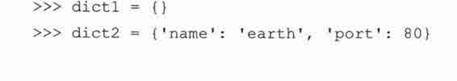

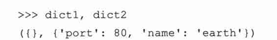

从 Python 2.2 版本起，可以用工厂方法 dict()来创建字典。当我们详细讨论 dict()的时候会看到更多的例子，现在来看一个小例子。

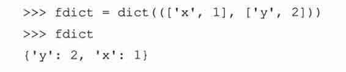

从 Python 2.3 版本起，可以用一个很方便的内建方法 fromkeys()来创建一个“默认”字典，字典中元素具有相同的值（如果没有给出，默认为 None）：

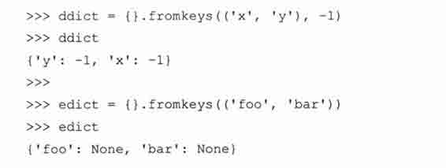

### 7.1.2　如何访问字典中的值

要想遍历一个字典（一般用键），你只需要循环查看它的键，像这样：

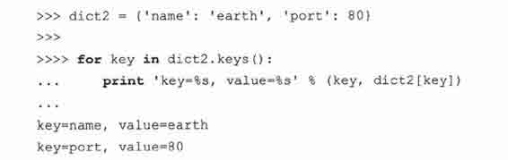

从 Python 2.2 开始，你可以不必再用 keys()方法获取供循环使用的键值列表了。可以用迭代器来轻松地访问类序列对象（sequence-like objects），比如字典和文件。只需要用字典的名字就可以在 for 循环里遍历字典。

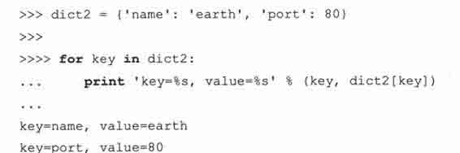

要得到字典中某个元素的值，可以用你所熟悉的字典键加上中括号来得到。

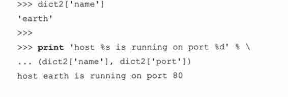

字典 dict1 是空的，字典 dict2 有两个数据元素。字典 dict2 的键是‘name’和‘port’，它们对应的值分别是‘earth’和 80。就像你看到的，通过键‘name’可以得到字典中的元素的值。

如果我们想访问该字典中的一个数据元素，而它在这个字典中没有对应的键，将会产生一个错误：

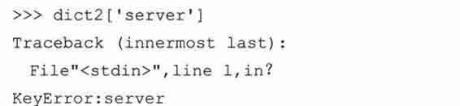

在这个例子中，我们试图获得字典中‘server’键所对应的值。你从上面的代码知道，‘server’这个键并不存在。检查一个字典中是否有某个键的最好方法是用字典的 has_key()方法，或者另一种比较好的方法就是从 2.2 版本起用的，in 或 not in 操作符。has_key()方法将会在未来的 Python 版本中弃用，所以用 in 或 not in 是最好的方法。

下面我们将介绍字典所有的方法。方法 has_key()和 in 以及 not in 操作符都是布尔类型的。对于前两者而言，如果字典中有该键就返回真（True），否则返回假（False） （Python 2.3 版本以前，没有布尔常量，为真时返回 1，假时返回 0）。

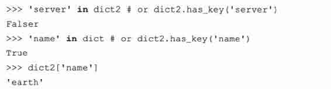

一个字典中混用数字和字符串的例子：

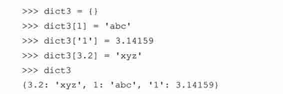

除了逐一地添加每个键-值对外，我们也可以给 dict3 整体赋值。

如果事先已经知道所有的数据就可以用键-值对来创建一个字典（这是显而易见的）。通过字典 dict3 的示例说明你可以采用各种类型的数据作为字典的键。如果我们被问到是否可以改变某个字典值的键时，你可能会说“不”，对吗？

为什么在执行中字典中的键不允许被改变呢？你这样想就会明白：比方说，你创建了一个字典，字典中包含一个元素（一个键和一个值）。可能是由于某个变量的改变导致键发生了改变。这时候你如果用原来的键来取出字典里的数据，会得到 KeyError（因为键的值已经改变了），现在你没办法从字典中获取该值了，因为键本身的值发生了变化。由于上面的原因，字典中的键必须是可哈希的，所以数字和字符串可以作为字典中的键，但是列表和其他字典不行（见 7.5.2 小节字典的键必须是可哈希的）。

### 7.1.3　如何更新字典

你可以通过以下几种方式对一个字典做修改：添加一个新数据项或新元素（即，一个键-值对）；修改一个已存在的数据项；或删除一个已存在的数据项（下面有关于数据项删除操作的详细讲述）。

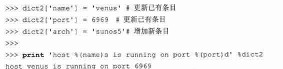

如果字典中该键已经存在，则字典中该键对应的值将被新值替代。上面的 print 语句展示了另一种在字典中使用字符串格式符（%）的方法。用字典参数可以简化 print 语句，因为这样做你只需要用到一次该字典的名字，而不用在每个元素出现的时候都用元组参数表示。你也可以用内建方法 update()将整个字典的内容添加到另一个字典。我们将在 7.4 节介绍此方法。

### 7.1.4　如何删除字典元素和字典

删除整个字典的操作不常见。通常，你删除字典中的单个元素或是清除整个字典的内容。但是，如果你真想“删除”一个字典，用 del 语句（介绍见小节 3.5.5）。以下是删除字典和字典元素的例子。

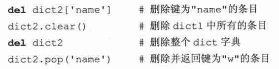

核心提示：避免使用内建对象名字作为变量的标识符

* * *

如果在 Python2.3 前，你已经开始使用 Python，你可能用 dict 作为一个字典的标识符。但是，因为 dict()现在已成为 Python 的类型和工厂方法，重载 dict()会给你带来麻烦和潜在的 bugs。编译器允许你做这样的重载，它认为你是聪明的，知道自己正在做什么！小心。请不要用 dict、list、file、bool、str、input、len 这样的内建类型为变量命名。

* * *

## 7.2　映射类型操作符

字典可以和所有的标准类型操作符一起工作，但却不支持像拼接（concatenation）和重复（repetition）这样的操作。这些操作对序列有意义，可对映射类型行不通。在接下来的两小节里，我们将向你讲述字典中的操作符。

### 7.2.1　标准类型操作符

标准类型操作符已在第四章介绍。下面是一些使用操作符的简单示例：

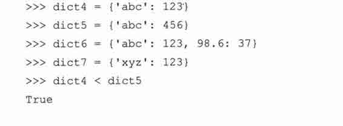

字典是如何比较的呢？与列表和元组一样，这个过程比数字和字符串的比较更复杂些。详细算法请见第 7.3.1 小节。

### 7.2.2　映射类型操作符（［］）

1.　字典的键查找操作符

键查找操作符是唯一仅用于字典类型的操作符，它和序列类型里单一元素的切片（slice）操作符很相象。对序列类型来说，用引做唯一参数或下标（subscript）以获取一个序列中某个元素的值。对字典类型来说，是用键查询（字典中的元素），所以键是参数（argument），而不是一个索引（index）。键查找操作符既可以用于给字典赋值，也可以用于从字典中取值：

d[k]v　通过键‘k’，给字典中某元素赋值‘V’；

d[k]　通过键‘k’，查询字典中某元素的值。

2.　（键）成员关系操作（in、not in）。

从 Python 2.2 起，程序员可以不用 has_key()方法，而用 in 和 not in 操作符来检查某个键是否存在于字典中：

## 7.3　映射类型的内建函数和工厂函数

### 7.3.1　标准类型函数[type()、str()和 cmp()]

如你所料，对一个字典调用 type()工厂方法，会返回字典类型，“<type ‘dict’>”。调用 str()工厂方法将返回该字典的字符串表示形式，这些都很容易理解。

在前面的章节里，我们已经讲述了用 cmp()内建函数来操作数字、字符串、列表和元组。那么字典又是如何比较的呢？字典是通过这样的算法来比较的：首先是字典的大小，然后是键，最后是值。可是，用 cmp()做字典的比较一般不是很有用。

接下来的小节里，将进一步详细说明字典比较的算法，但这部分是高层次的阅读内容，可以跳过，因为字典的比较不是很有用也不常见。

*字典比较算法

接下来的例子中，我们建立两个字典进行比较，然后慢慢修改，来看看这些修改对它们之间的比较带来的影响：

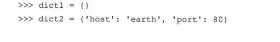

在第一个比较中，dict1 比 dict2 小，因为 dict2 有更多元素（2 个 vs.0 个）。在向 dict1 添加一个元素后，dict1 仍然比 dict2 小（2vs.1），虽然添加的元素在 dict2 中也存在。

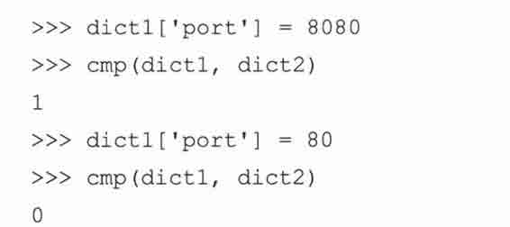

在向 dict1 中添加第二个元素后，两个字典的长度相同，所以用键比较大小。这时键相等，则通过它们的值比较大小。键‘host’的值相同，对于键‘port’，dict1 中值比 dict2 中的值大（8080 vs. 80）。当把 dict2 中‘port’的值设成和 dict1 中的值一样，那么两个字典相等：它们有相同的大小、相同的键、相同的值，所以 cmp()返回值是 0。（本段原文中为“dict2 中值比 dict1 中的值大”，应为笔者之误）

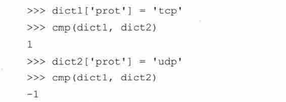

当向两个字典中的任何一个添加新元素时，这个字典马上会成为大的那个字典，就像例子中的 dict1 一样。向 dict2 添加键-值对后，因为两个字典的长度又相等了，会继续比较它们的键和值。

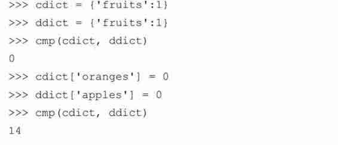

上面的例子表明 cmp()可以返回除-1、0、1 外的其他值。算法按照以下的顺序。

（1）比较字典长度

如果字典的长度不同，那么用 cmp（dict1，dict2）比较大小时，如果字典 dict1 比 dict2 长，cmp()返回正值；如果 dict2 比 dict1 长，则返回负值。也就是说，字典中的键的个数越多，这个字典就越大，即

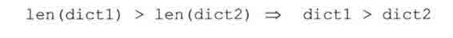

（2）比较字典的键

如果两个字典的长度相同，那就按字典的键比较；键比较的顺序和 keys()方法返回键的顺序相同。（注意：相同的键会映射到哈希表的同一位置，这保证了对字典键的检查的一致性。）这时，如果两个字典的键不匹配时，对这两个（不匹配的键）直接进行比较。当 dict1 中第一个不同的键大于 dict2 中第一个不同的键，cmp()会返回正值。

（3）比较字典的值

如果两个字典的长度相同而且它们的键也完全匹配，则用字典中每个相同的键所对应的值进行比较。一旦出现不匹配的值，就对这两个值进行直接比较。若 dict1 比 dict2 中相同的键所对应的值大，cmp()会返回正值。

（4）完全匹配

到此为止，每个字典有相同的长度、相同的键，每个键也对应相同的值，则字典完全匹配，返回 0 值。

图 7-1 说明了上述字典比较的算法

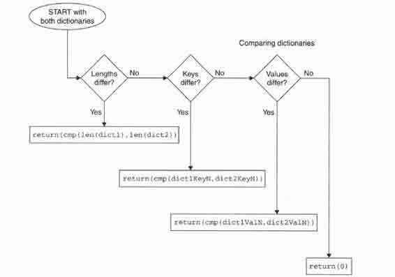

> > 图 7-1　字典是如何进行比较的

### 7.3.2　映射类型相关的函数

dict()

工厂函数被用来创建字典。如果不提供参数，会生成空字典。当容器类型对象作为一个参数传递给方法 dict()时很有意思。如果参数是可以迭代的，即一个序列，或是一个迭代器，或是一个支持迭代的对象，那每个可迭代的元素必须成对出现。在每个值对中，第 1 个元素是字典的键，第 2 个元素是字典中的值。见 Python 文档里关于 dict()的例子：

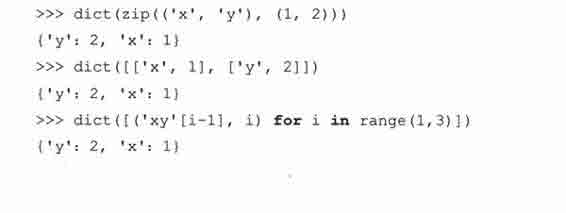

如果输入参数是（另）一个映射对象，比如，一个字典对象，对其调用 dict()会从存在的字典里复制内容来生成新的字典。新生成的字典是原来字典对象的浅复制版本，它与用字典的内建方法 copy()生成的字典对象是一样的。但是从已存在的字典生成新的字典速度比用 copy()方法慢，我们推荐使用 copy()。

从 Python2.3 开始，调用 dict()方法可以接受字典或关键字参数字典（函数操作符，第十一章）。

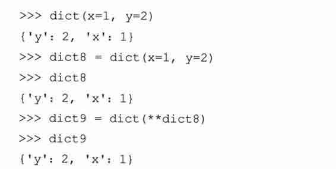

我们提醒读者 dict9 的例子只作为了解 dict()方法的用途，它不是现实中的例子。使用下面这些行的方法更聪明（效率更好）。

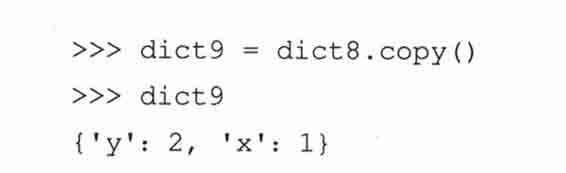

len()

内建函数 len()很灵活。它可用在序列、映像类型和集合上（在本章的后面我们会看到）。对字典调用 len()，它会返回所有元素（键-值对）的数目：

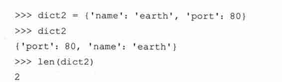

我们前面提到字典中的元素是没有顺序的。从上面的例子中可以看到，dict2 的元素显示的顺序和输入时的顺序正相反。

hash()

内建函数 hash()本身并不是为字典设计的方法，但它可以判断某个对象是否可以做一个字典的键。将一个对象作为参数传递给 hash()，会返回这个对象的哈希值。只有这个对象是可哈希的，才可作为字典的键（函数的返回值是整型，不产生错误或异常）。

如果用比较操作符来比较两个数值，发现它们是相等的，那么即使二者的数据类型不同，它们也会得到相同的哈希值。

如果非可哈希类型作为参数传递给 hash()方法，会产生 TypeError 错误（因此，如果使用这样的对象作为键给字典赋值时会出错）：

TypeError: dict objects are unhashable

在表 7.1 中，我们列出以下 3 个映射类型的相关函数。

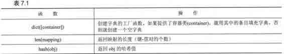

## 7.4　映射类型内建方法

字典提供了大量方法来帮我们做事情，见表 7.2。

下面说明字典的一些很常见的方法。在上面的例子里，我们已经看到 has_key()和它的替代方法 in 和 not in。如我们在 7.1 小节看到，试图查找一个字典里没有的键值会产生 KeyError 异常。

基本的字典方法关注他们的键和值。它们有：keys()方法，返回一个列表，包含字典中所有的键，values()方法，返回一个列表，包含字典中所有的值，items()，返回一个包含所有（键，值）元组的列表。这些方法在不按任何顺序遍历字典的键或值时很有用。

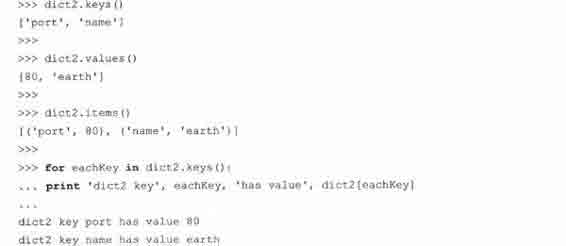

keys()方法很有用，它返回一个包含字典中所有键的列表，此方法可以与 for 循环一起使用来获取字典中的值。

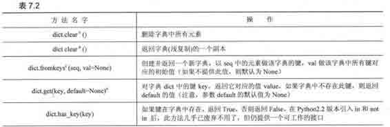

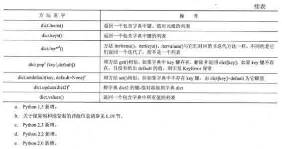

但是，它返回的元素是没有顺序的（和哈希表中的键一样），我们通常希望它们能按某种方式排序。

在 Python 2.4 版本以前，你只能调用字典的 keys()方法获得键的列表，然后调用列表的 sort()方法得到一个有序可遍历的列表。现在特别为迭代子设计了一个名为 sorted()的内建函数，它返回一个有序的迭代子：

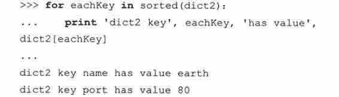

update()方法可以用来将一个字典的内容添加到另外一个字典中。字典中原有的键如果与新添加的键重复，那么重复键所对应的原有条目的值将被新键所对应的值所覆盖。原来不存在的条目则被添加到字典中。clear()方法可以用来删除字典中的所有的条目。

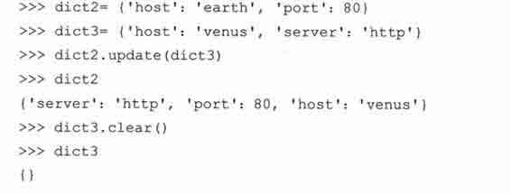

copy()方法返回一个字典的副本。注意这只是浅复制。关于浅复制和深复制请阅读小节 6.19。最后要说明，get()方法和键查找（key-lookup）操作符（[]）相似，不同的是它允许你为不存在的键提供默认值。如果该键不存在，也未给出它的默认值，则返回 None。此方法比采用键查找（key-lookup）更灵活，因为你不必担心因键不存在而引发异常。

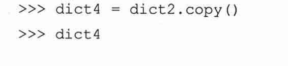

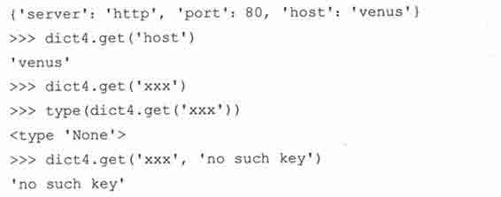

setdefault()是自 2.0 才有的内建方法，使得代码更加简洁，它实现了常用的语法：检查字典中是否含有某键。如果字典中这个键存在，你可以取到它的值。如果所找的键在字典中不存在，你可以给这个键赋默认值并返回此值。这正是执行 setdefault()方法的目的。

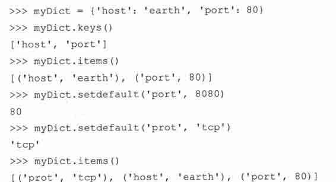

前面，我们曾简要介绍过 fromkeys()方法，下面是更多的示例。

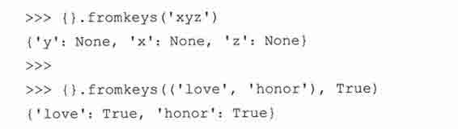

目前，keys()、items()和 values()方法的返回值都是列表。数据集如果很大会导致很难处理，这也正是 iteritems()、iterkeys()和 itervalues()方法被添加到 Python 2.2 的主要原因。这些函数与返回列表的对应方法相似，只是它们返回惰性赋值的迭代器，所以节省内存。未来的 Python 版本中，甚至会更灵活，那时这些方法将会返回强大的对象，暂叫做视图（views）。视图是访问容器对象的接口集。举例来说，你可以从一个视图中删除某个字典的键，从而改变某个字典。

## 7.5　字典的键

字典中的值没有任何限制。他们可以是任意 Python 对象，即从标准对象到用户自定义对象皆可。但是字典中的键是有类型限制的。

### 7.5.1　不允许一个键对应多个值

你必须明确一条原则：每个键只能对应一个项。也就是说，一键对应多个值是不允许的（像列表、元组和其他字典这样的容器对象是可以的）。当有键发生冲突（即字典键重复赋值），取最后（最近）的赋值。

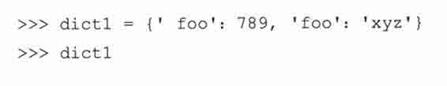

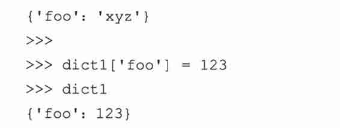

Python 并不会因字典中的键存在冲突而产生一个错误。它不会检查键的冲突是因为，如果真这样做的话，在每个键-值对赋值的时候都会做检查，这将会占用一定量的内存。在上面的例子里，键‘foo’被列出两次，Python 从左到右检查键-值对。首先值 789 被赋值（给键‘foo’所对应的值），然后又很快被字符串‘xyz’替代。当给字典中一个不存在的键赋值时，键和值会被创建和添加，但如果该键已经存在（键冲突），那此键所对应的值将被替换。上面例子中，键‘foo’所对应的值被替换了两次；最后的赋值语句，值 123 代替了值‘xyz’。

### 7.5.2　键必须是可哈希的

我们在小节 7.1 说过，大多数 Python 对象可以作为键；但它们必须是可哈希的对象。像列表和字典这样的可变类型，由于它们不是可哈希的，所以不能作为键。

所有不可变的类型都是可哈希的，因此它们都可以作为字典的键。一个要说明的是问题是数字：值相等的数字表示相同的键。换句话来说，整型数字 1 和浮点型 1.0 的哈希值是相同的，即它们是相同的键。

同时，也有一些可变对象（很少）是可哈希的，它们可以做字典的键，但很少见。举一个例子，一个实现了＿hash＿()特殊方法的类。因为＿hash＿()方法返回一个整型，所以仍然是用不可变的值（做字典的键）。

为什么键必须是可哈希的？解释器调用哈希函数，根据字典中键的值来计算存储你的数据的位置。如果键是可变对象，它的值可改变。如果键发生变化，哈希函数会映像到不同的地址来存储数据。如果这样的情况发生，哈希函数就不可能可靠地存储或获取相关的数据。选择可哈希的键的原因就是因为它们的值不能改变（此问题在 Python FAQ 中也能找到答案）。

我们知道数字和字符串可以被用做字典的键，但元组又怎么样呢？我们知道元组是不可变的，但在小节 6.17.2，我们提示过它们也可能不是一成不变的。用元组做有效的键，必须要加限制：元组中只包括像数字和字符串这样的不可变参数，才可以作为字典中有效的键。

我们用一个程序（userpw.py 例 7.1），来为本章关于字典的讲述做个小结。这个程序是用于管理用户名和密码的模拟登录数据系统。脚本接受新用户的信息：

这个程序管理用于登录系统的用户信息：登录名字和密码。登录用户账号建立后，已存在用户可以用登录名字和密码重返系统。新用户不能用别人的登录名建立用户账号。

例 7.1

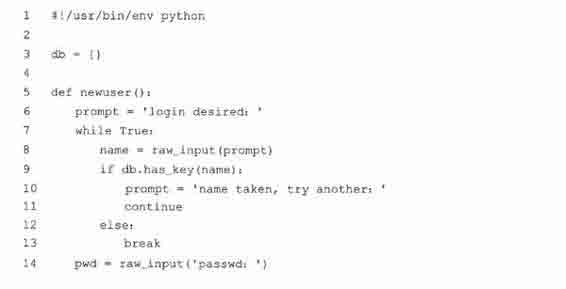

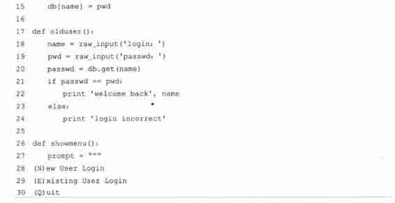

例 7.2　Dictionary Example （userpw.py） （continued）

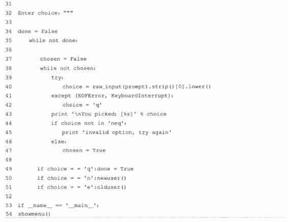

他们提供登录名和密码。账号建立后，已存在用户可用登录名和正确的密码重返系统。新用户不能用别人的登录名建立账号。

逐行解释

1 ~ 3 行

在 Unix 初始行后，我们用一个空用户数据库初始化程序。因为我们没有把数据存储在任何地方，每次程序执行时都会新建一个用户数据库。

5 ~ 15 行

newuser()函数用来建立新用户。它检查名字是否已经存在，如果证实是一个新名字，将要求用户输入他或她的密码（我们这个简单的程序没有加密），用户的密码被存储在字典里，以他们的名字做字典中的键。

17 ~ 24 行

olduser()函数处理返回的用户。如果用户用正确的用户名和密码登录，打出欢迎信息。否则通知用户是无效登录并返回菜单。我们不会采用一个无限循环来提示用户输入正确的密码，因为用户可能会无意进入错误的菜单选项。

26 ~ 51 行

真正控制这个脚本的是 showmenu()函数，它显示给用户一个友好界面。提示信息被包括在三引号里 （”””），这样做是因为提示信息跨多行，而且比单行包含‘\n’符号的字符串更容易处理。菜单显示后，它等待用户的有效输入，然后根据菜单选项选择操作方式。try-expect 语句和第六章 stack.py queue.py 例子里的一样（见小节 6.14.1）。

53 ~ 54 行

如果这个脚本被直接执行（不是通过 import 方式），这行代码会调用 showmenu()函数运行程序。下面是我们的脚本运行结果。

7.6　集合类型

数学上，把 set 称做由不同的元素组成的集合，集合（set）的成员通常被称做集合元素（set elements）。 Python 把这个概念引入到它的集合类型对象里。集合对象是一组无序排列的可哈希的值。是的，集合成员可以做字典中的键。数学集合转为 Python 的集合对象很有效，集合关系测试和 union、intersection 等操作符在 Python 里也同样如我们所预想地那样工作。

和其他容器类型一样，集合支持用 in 和 not in 操作符检查成员，由 len()内建函数得到集合的基数（大小），用 for 循环迭代集合的成员。但是因为集合本身是无序的，你不可以为集合创建索引或执行切片（slice）操作，也没有键可用来获取集合中元素的值。

集合有两种不同的类型，可变集合（set）和不可变集合（frozenset）。如你所想，对可变集合，你可以添加和删除元素，对不可变集合则不允许这样做。请注意，可变集合不是可哈希的，因此既不能用做字典的键也不能做其他集合中的元素。不可变集合则正好相反，即，他们有哈希值，能被用做字典的键或是作为集合中的一个成员。

集合最早出现在 Python2.3 版本中，通过集合模块来创建，并通过 ImmutableSet 类和 Set 类进行访问。而后来，大家都认为把它们作为内建的数据类型是个更好的主意，因此这些类被用 C 重写改进后包含进 Python2.4。关于集合类型和这些类改进的更多内容，可阅读此文获得详情：PEP 218，链接地址：http://python.org/peps/pep-0218.html。

虽然现在集合类型已经是 Python 的基本数据类型了，但它经常会以用户自定义类的形式出现在各种 Python 程序中，就像复数一样（复数从 Python1.4 版本起成为 python 的一个数据类型），这样重复的劳动已数不胜数了。在现在的 Python 版本之前，（即使集合类型对许多人的程序来说并不是最理想的数据结构，）许多人仍然试图给列表和字典这样的 Python 标准类型添加集合功能，这样可以把它们作为真正集合类型的代理来使用。因此现在的使用者有包括“真正”集合类型在内的多种选择。

在我们详细讲述 Python 的集合对象之前，我们必须理解 Python 中的一些数学符号（见表 7.3），这样对术语和功能有一个清晰的了解。

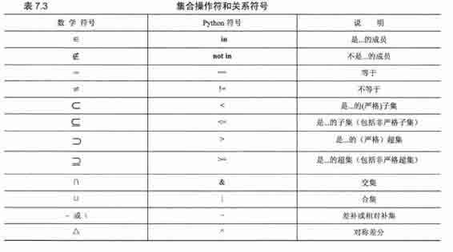

7.6.1　如何创建集合类型和给集合赋值

集合与列表（[]）和字典（{}）不同，没有特别的语法格式。列表和字典可以分别用他们自己的工厂方法 list()和 dict()创建，这也是集合被创建的唯一方法——用集合的工厂方法 set()和 frozenset()：

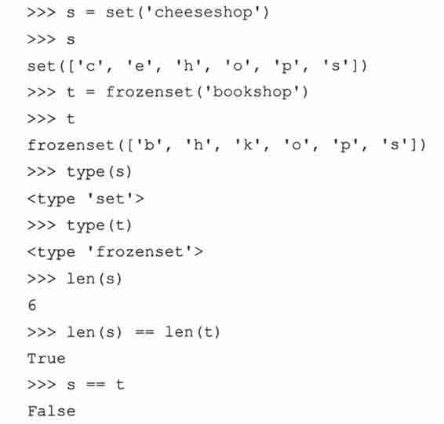

### 7.6.2　如何访问集合中的值

可以遍历查看集合成员或检查某项元素是否是一个集合中的成员。

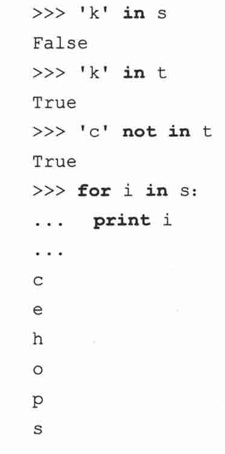

### 7.6.3　如何更新集合

用各种集合内建的方法和操作符添加和删除集合的成员。

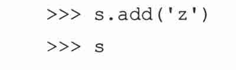

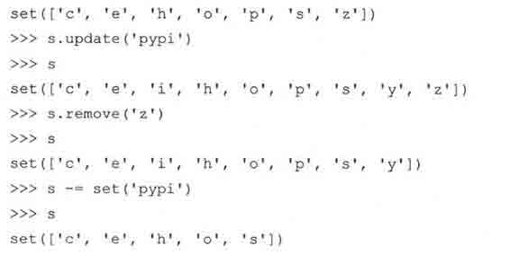

我们之前提到过，只有可变集合能被修改。试图修改不可变集合会引发异常。

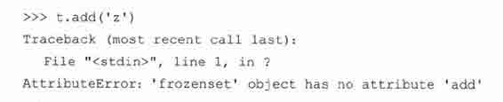

### 7.6.4　如何删除集合中的成员和集合

前面我们看到如何删除集合成员。如果如何删除集合本身，可以像删除任何 Python 对象一样，令集合超出它的作用范围，或调用 del 将他们直接清除出当前的名称空间。如果它的引用计数为零，也会被标记以便被垃圾回收。

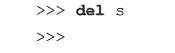

## 7.7　集合类型操作符

### 7.7.1　标准类型操作符（所有的集合类型）

1.　成员关系（in, not in）

就序列而言，Python 中的 in 和 not in 操作符决定某个元素是否是一个集合中的成员。

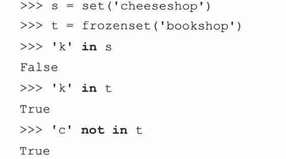

2.　集合等价/不等价

等价/不等价被用于在相同或不同的集合之间做比较。两个集合相等是指，对每个集合而言，当且仅当其中一个集合中的每个成员同时也是另一个集合中的成员。

你也可以说每个集合必须是另一个集合的一个子集，即 s< = t 和 s> = t 的值均为真（True）或（s< = t and s> = t）的值为真（True）。集合等价/不等价与集合的类型或集合成员的顺序无关，只与集合的元素有关。

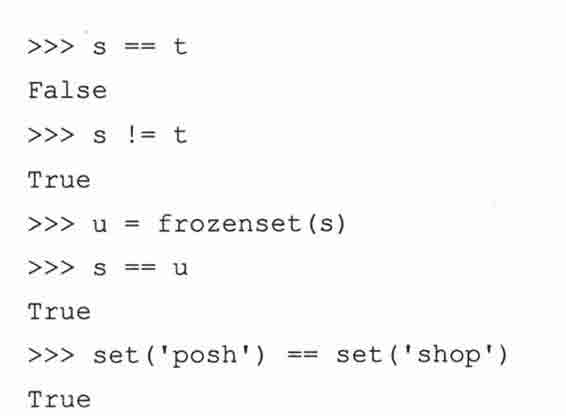

3.　子集/超集

Set 用 Python 的比较操作符检查某集合是否是其他集合的超集或子集。“小于”符号（<，<=）用来判断子集，“大于”符号（>，>=）用来判断超集。

“小于”和“大于”意味着两个集合在比较时不能相等。等于号允许非严格定义的子集和超集。

Set 支持严格（<）子集和非严格（< =）子集，也支持严格（>）超集和非严格（> =）超集。只有当第 1 个集合是第 2 个集合的严格子集时，我们才称第 1 个集合“小于”第 2 个集合，同理，只有当第 1 个集合是第 2 个集合的严格超集时，我们才称第 1 个集合“大于”第 2 个集合。

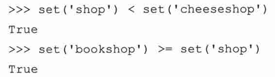

### 7.7.2　集合类型操作符（所有的集合类型）

1.　联合（|）

联合（union）操作和集合的 OR（又称可兼析取，inclusive disjunction）其实是等价的，两个集合的联合是一个新集合，该集合中的每个元素都至少是其中一个集合的成员，即，属于两个集合其中之一的成员。联合符号有一个等价的方法，union()。

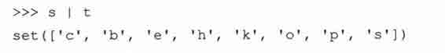

2.　交集（&）

你可以把交集操作比做集合的 AND（或合取）操作。两个集合的交集是一个新集合，该集合中的每个元素同时是两个集合中的成员，即属于两个集合的成员。交集符号有一个等价的方法，intersection()。

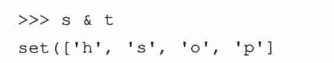

3.　差补/相对补集（-）

两个集合（s 和 t）的差补或相对补集是指一个集合 C，该集合中的元素，只属于集合 s，而不属于集合 t。差符号有一个等价的方法，difference()。

4.　对称差分（^）

和其他的布尔集合操作相似，对称差分是集合的 XOR（又称“异或”，exclusive disjunction）。两个集合（s 和 t）的对称差分是指另外一个集合 C，该集合中的元素，只能是属于集合 s 或者集合 t 的成员，不能同时属于两个集合。对称差分有一个等价的方法，symmetric_difference()。

5.　混合集合类型操作

上面的示例中，左边的 s 是可变集合，而右边的 t 是一个不可变集合，注意上面使用集合操作符所产生的仍然是可变集合，但是如果左右操作数的顺序反过来，结果就不一样了：

如果左右两个操作数的类型相同，既都是可变集合或不可变集合，则所产生的结果类型是相同的，但如果左右两个操作数的类型不相同（左操作数是 set，右操作数是 frozenset，或相反情况），则所产生的结果类型与左操作数的类型相同，上例中可以证明这一点。还要注意，加号不是集合类型的操作符：

### 7.7.3　集合类型操作符（仅适用于可变集合）

（Union） Update （|=）

这个更新方法从已存在的集合中添加（可能多个）成员，此方法和 update()等价。

Retention/Intersection Update（& =）

保留（或交集更新）操作保留与其他集合的共有成员。此方法和 intersection_update()等价。

Difference Update（-=）

对集合 s 和 t 进行差更新操作 s-=t，差更新操作会返回一个集合，该集合中的成员是集合 s 去除掉集合 t 中元素后剩余的元素。此方法和 difference_update()等价。

Symmetric Difference Update（^=）

对集合 s 和 t 进行对称差分更新操作（s^=t），对称差分更新操作会返回一个集合，该集合中的成员仅是原集合 s 或仅是另一集合 t 中的成员。此方法和 symmetric_difference_update()等价。

## 7.8　内建函数

### 7.8.1　标准类型函数

len()

把集合作为参数传递给内建函数 len()，返回集合的基数（或元素的个数）。

### 7.8.2　集合类型工厂函数

set()和 frozenset()

set()和 frozenset()工厂函数分别用来生成可变和不可变的集合。如果不提供任何参数，默认会生成空集合。如果提供一个参数，则该参数必须是可迭代的，即一个序列，或迭代器，或支持迭代的一个对象，例如一个文件或一个字典。

## 7.9　集合类型内建方法

### 7.9.1　方法（所有的集合方法）

我们己看到很多和内建方法等价的操作符，表 7.4 做了小结：

内建方法 copy()没有等价的操作符。和同名的字典方法一样，copy()方法比用像 set()、frozenset()或 dict()这样的工厂方法复制对象的副本要快。

### 7.9.2　方法（仅适用于可变集合）

表 7.5 总结了所有可变集合的内建方法，和上面的方法相似，我们已经看过许多和它们等价的操作符。

新的方法有 add()、remove()、discard()、pop()、clear()。这些接受对象的方法，参数必须是可哈希的。

### 7.9.3　操作符和内建方法比较

像你看到的，很多内建的方法几乎和操作符等价。我们说“几乎等价”，意思是它们间是有一个重要区别：当用操作符时，操作符两边的操作数必须是集合。在使用内建方法时，对象也可以是迭代类型的。为什么要用这种方式来实现呢？Python 的文档里写明：采用易懂的 set（‘abc’）.intersection（‘cbs’）可以避免使用 set（‘abc’）[and] ‘cbs’这样容易出错的构建方法。

## 7.10　集合类型总结表

表 7.6 中，我们总结了所有的集合类型的操作符、函数和方法。

## 7.11　相关模块

集合（set）模块从 2.3 版本引进，可继承 Set 或 ImmuteablSet 来生成子类。虽然从 Python2.4 起使用集合类型，但是集合模块不会弃用。

以下是一些你可能认为有用的在线参考文章：

http://en.wikipedia.org/wiki/Set

http://www.geocities.com/basicmathsets/set.html

http://www.math.uah.edu/stat/foundations/Sets.xhtml

## 7.12　练习

> > 7-1.字典方法。哪个字典方法可以用来把两个字典合并到一起？

> > 7-2.字典的键。我们知道字典的值可以是任意的 Python 对象，那字典的键又如何呢？请试着将除数字和字符串以外的其他不同类型的对象作为字典的键，看一看哪些类型可以，哪些不行？对那些不能作字典的键的对象类型，你认为是什么原因呢？

> > 7-3.字典和列表的方法。

> > > > （a）创建一个字典，并把这个字典中的键按照字母顺序显示出来。

> > > > （b）现在根据已按照字母顺序排序好的键，显示出这个字典中的键和值。

> > > > （c）同（b），但这次是根据已按照字母顺序排序好的字典的值，显示出这个字典中的键和值（注意：对字典和哈希表来说，这样做一般没有什么实际意义，因为大多数访问和排序（如果需要）都是基于字典的键，这里只把它作为一个练习）。

> > 7-4.建立字典。给定两个长度相同的列表，比如说，列表[1，2，3，…]和[‘abc’，‘def’，‘ghi’，…]，用这两个列表里的所有数据组成一个字典，像这样：{1：‘abc’，2：‘def’，3：‘ghi’，…}

> > 7-5.userpw2.py。下面的问题和例题 7.1 中管理名字-密码的键值对数据的程序有关。

> > > > （a）修改那个脚本，使它能记录用户上次的登录日期和时间（用 time 模块），并与用户密码一起保存起来。程序的界面有要求用户输入用户名和密码的提示。无论户名是否成功登录，都应有提示，在户名成功登录后，应更新相应用户的上次登录时间戳。如果本次登录与上次登录在时间上相差不超过 4 个小时，则通知该用户：“You already logged in at：<last_login_timestamp>。”

> > > > （b）添加一个“管理”菜单，其中有以下两项：（1）删除一个用户（2）显示系统中所有用户的名字和他们的密码的清单。

> > > > （c）口令目前没有加密。请添加一段对口令加密的代码（请参考 crypt、rotor，或其他加密模块）。

> > > > （d）为程序添加图形界面，例如，用 Tkinter 写。

> > > > （e）要求用户名不区分大小写。

> > > > （f）加强对用户名的限制，不允许符号和空白符。

> > > > （g）合并“新用户”和“老用户”两个选项。如果一个新用户试图用一个不存在的用户名登录，询问该用户是否是新用户，如果回答是肯定的，就创建该账户。否则，按照老用户的方式登录。

> > 7-6.列表和字典。创建一个简单的股票证券投资数据系统。其中应至少包含 4 项数据：股市行情显示器符号、所持有的股票、购买价格及当前价位——你可以随意添加其他数据项，比如收益率， 52 周最高指数、最低指数，等等。

> > > > 用户每次输入各列的数据构成一个输出行。每行数据构成一个列表。还有一个总列表，包括了所有行的数据。数据输入完毕后，提示用户选择一列数据项进行排序。把该数据项抽取出来作为字典的键，字典的值就是该键对应行的值的列表。提醒读者：被选择用来排序的数据项必须是非重复的键，否则就会丢失数据，因为字典不允许一个键有多个值。

> > > > 你还可以选择其他计算输出，比如盈亏比率、目前证券资产价值等。

> > 7-7.颠倒字典中的键和值。用一个字典做输入，输出另一个字典，用前者的键做值，前者的值做键。

> > 7-8.人力资源。创建一个简单的雇员姓名和编号的程序，让用户输入一组雇员姓名和编号。你的程序可以提供按照姓名排序输出的功能，雇员姓名显示在前面，后面是对应的雇员编号。附加题：添加一项功能，按照雇员编号的顺序输出数据。

> > 7-9.翻译。

> > > > （a）编写一个字符翻译程序（功能类似于 Unix 中的 tr 命令）。我们将这个函数叫做 tr()，它有三个字符串做参数：源字符串、目的字符串、基本字符串，语法定义如下：

> > > > srcstr 的内容是你打算“翻译”的字符集合，dsrstr 是翻译后得到的字符集合，而 string 是你打算进行翻译操作的字符串。举例来说，如果 srcstr==‘abc’，dststr==‘mno’，string==‘abcdef，那么 tr()的输出将是‘mnodef’。注意这里 len（srcstr）==len（dststr）。

> > > > 在这个练习里，你可以使用内建函数 chr()和 ord()，但它们并不一定是解决这个问题所必不可少的函数。

> > > > （b）在这个函数里增加一个标志参数，来处理不区分大小写的翻译问题。

> > > > （c）修改你的程序，使它能够处理删除字符的操作。字符串 srcstr 中不能够映射到字符串 dststr 中字符的多余字符都将被过滤掉。换句话说，这些字符没有映射到 dststr 字符串中的任何字符，因此就从函数返回的字符里被过滤掉了。举例来说：如果 srcstr==‘abcdef’, dststr==‘mno’, string==‘abcdefghi’，那么 tr()将输出‘mnoghi’。注意这里 len（srcstr）>=len（dststr）。

> > 7-10.加密。

> > > > （a）用上一个练习的思路编写一个“rot13”翻译器。“rot13”是一个古老而又简单的加密方法，它把字母表中的每个字母用其后的第 13 个字母来代替。字母表中前半部分字母将被映像到后半部分，而后半部分字母将被映像到前半部分，大小写保持不变。举例来说，‘a’将被替换为‘n’‘X’将被替换为‘K’；数字和符号不进行翻译。

> > > > （b）在你的解决方案的基础上加一个应用程序，让它提示用户输入准备加密的字符串（这个算法同时也可以对加密后的字符串进行解密），如下所示：

> > 7-11.定义。什么组成字典中合法的键？举例说明字典中合法的键和非法的键。

> > 7-12.定义。（a）在数学上，什么是集合？

> > > > （b）在 Python 中，关于集合类型的定义是什么？

> > 7-13.随机数。修改练习 5-17 的代码，使用 random 模块中的 randint()或 randrange()方法生成一个随机数集合，从 0 到 9（包括 9）中随机选择，生成 1~10 个随机数。这些数字组成集合 A（A 可以是可变集合，也可以不是）。同理，按此方法生成集合 B。每次新生成集合 A 和 B 后，显示结果 A|B 和 A&B。

> > 7-14.用户验证。修改前面的练习，要求用户输入 A|B 和 A&B 的结果，并告诉用户他（或她）的答案是否正确，而不是将 A|B 和 A&B 的结果直接显示出来。如果用户回答错误，允许他（或她）修改解决方案，然后重新验证用户输入的答案。如果用户三次提交的答案均不正确，程序将显示正确结果。附加题：运用你关于集合的知识，创建某个集合的潜在子集，并询问用户此潜在子集是否真是该集合的子集，要求和主程序一样有显示更正和答案的功能。

> > 7-15.编写计算器。这个练习取材于 http://math.hws.edu/在线免费 Java 教材中的练习 12.2。编写一个程序允许用户选择两个集合：A 和 B，及运算操作符。例如，in、not in、&、|、^、<、<=、 >、>=、==、！=等。（你自己定义集合的输入语法，它们并不一定要像 Java 示例中那样用方括号括住。）解析输入的字符串，按照用户选择的运算进行操作。你写的程序代码应该比 Java 该程序的版本更简洁。