# 第八章　条件和循环

本章主题

♦　- if 语句

♦　- else 语句

♦　- elif 语句

♦　-条件表达式

♦　- while 语句

♦　- for 语句

♦　- break 语句

♦　- continue 语句

♦　- pass 语句

♦　else 语句（两次述及）

♦　Iterators 迭代器

♦　-列表解析

♦　-生成器表达式

本章的主要内容是 Python 的条件和循环语句以及与它们相关的部分。我们会深入探讨 if、while、for 及与他们相搭配的 else、elif、break、continue 和 pass 语句。

## 8.1　if 语句

Python 中的 if 子句看起来十分熟悉。它由三部分组成：关键字本身，用于判断结果真假的条件表达式，以及当表达式为真或者非零时执行的代码块。 if 语句的语法如下：

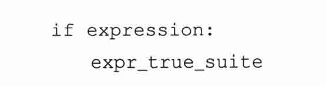

if 语句的 expr_true_suite 代码块只有在条件表达式的结果的布尔值为真时才执行，否则将继续执行紧跟在该代码块后面的语句。

### 8.1.1　多重条件表达式

单个 if 语句可以通过使用布尔操作符 and、or 和 not 实现多重判断条件或是否定判断条件。

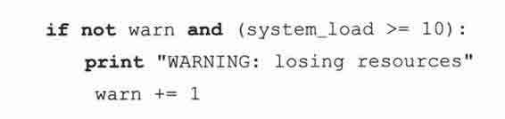

### 8.1.2　单一语句的代码块

如果一个复合语句（例如 if 子句，while 或 for 循环）的代码块仅仅包含一行代码，那么它可以和前面的语句写在同一行上：

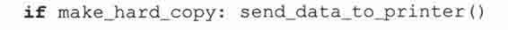

上边这样的单行语句是合法的，尽管它可能方便，但这样会使得代码更难阅读，所以我们推荐将这行代码移到下一行并合理地缩进。另外一个原因就是如果你需要添加新的代码，你还是得把它移到下一行。

## 8.2　else 语句

和其他语言一样，Python 提供了与 if 语句搭配使用的 else 语句。如果 if 语句的条件表达式的结果布尔值为假，那么程序将执行 else 语句后的代码。它的语法你甚至可以猜到：

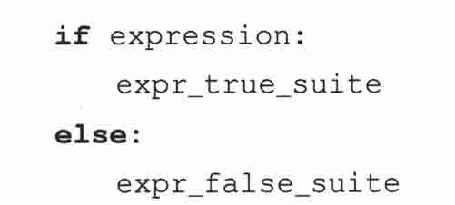

这里是样例代码：

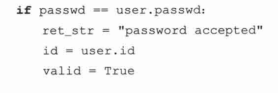

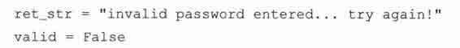

避免“悬挂 else”

Python 使用缩进而不是用大括号标记代码块边界的设计，不仅帮助强化了代码的正确性，而且还暗中帮助程序员避免了语法上正确的代码中存在潜在的问题。其中一个问题就是（臭名）昭著的“悬挂 else”（dangling else）问题，一种语义错觉。

我们在这里给出一段 C 代码来说明我们的例子（K&R 和其他的编程教材也给出过）（这里的 K&R 是指由 Brian W. Kernighan 和 Dennis M. Ritchie 合著的《C 程序设计语言》，译者注）：

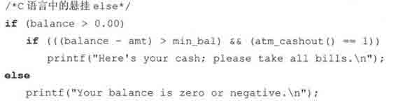

问题是 else 属于哪个 if？在 C 语言中，规则是 else 与最近的 if 搭配。所以我们上面的例子中，else 虽然是想和外层的 if 搭配，但是事实上 else 属于内部的 if，因为 C 编译器会忽略额外的空白。结果，如果你的 balance 是正数但小于最小值，你将得到错误的输出，程序会显示你的 balance 是零或者为负数。

由于这个例子很简单，所以解决这个问题并不难，但是如果是大块的代码嵌入到了类似这样的框架中，那么发现并改正程序中的错误需要耗费很多精力。Python 设置的护栏不仅阻止你掉下悬崖，而且会带你离开危险的境地。在 Python 中相同的例子对应如下的两种代码（只有一种是正确的）：

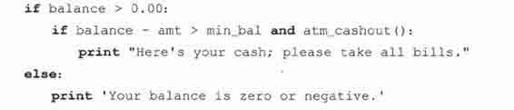

或者是：

Python 的缩进使用强制使代码正确对齐，让程序员来决定 else 属于哪一个 if。限制你的选择从而减少了不确定性，Python 鼓励你第一次就写出正确的代码。在 Python 中制造出“悬挂 else”问题是不可能的。而且，由于不再使用大括号，Python 代码变得更易读懂。

## 8.3　elif（即 else-if）语句

elif 是 Python 的 else-if 语句，它检查多个表达式是否为真，并在为真时执行特定代码块中的代码。和 else 一样，elif 声明是可选的，然而不同的是，if 语句后最多只能有一个 else 语句，但可以有任意数量的 elif 语句。

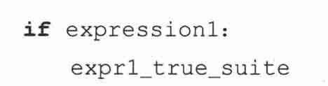

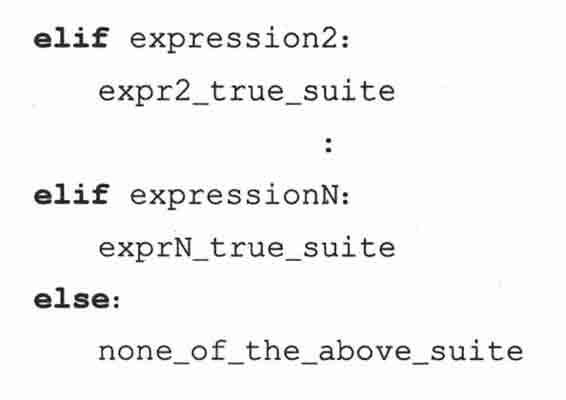

switch/case 语句的替代品么？

在将来的某天，Python 可能会支持 switch/case 语句，但是你完全可以用其他的 Python 结构来模拟它。在 Python 中，大量的 if-elif 语句并不难阅读：

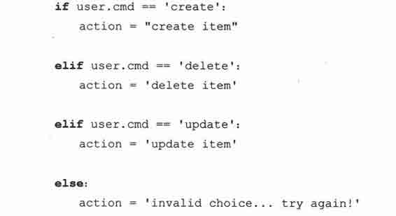

上面的语句完全可以满足我们的需要，不过我们还可以用序列和成员关系操作符来简化它：

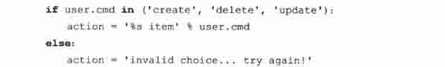

另外我们可以用 Python 字典给出更加优雅的解决方案，我们将在第七章中介绍字典。

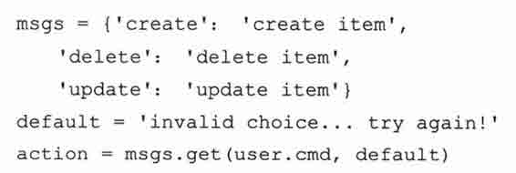

众所周知，使用映射对象（比如字典）的一个最大好处就是它的搜索操作比类似 if-elif-else 语句或是 for 循环这样的序列查询要快很多。

## 8.4　条件表达式（即“三元操作符”）

如果你来自 C/C++或者是 Java 世界，那么你很难忽略的一个事实就是 Python 在很长的一段时间里没有条件表达式（C? X：Y），或称三元操作符。（C 是条件表达式；X 是 C 为 True 时的结果，Y 是 C 为 False 时的结果）Guido Van Rossum 一直拒绝加入这样的功能，因为他认为应该保持代码简单，让程序员不轻易出错。不过在十年多后，他放弃了，主要是因为人们试着用 and 和 or 来模拟它，但大多都是错误的。根据《FAQ》，正确的方法（并不唯一）是（C and[X]or[Y]）[0]。唯一的问题是社区不同意这样的语法。（你可以看一看 PEP 308，其中有不同的方案）。对于 Python 的这一问题，人们表达了极大的诉求。

Guido Van Rossum 最终选择了一个最被看好（也是他最喜欢）的方案，然后把它运用于标准库中的一些模块。根据 PEP，“这个评审通过考察大量现实世界的案例，包含不同的应用，以及由不同程序员完成的代码。”最后 Python2.5 集成的语法确定为：X if C else Y。

有了三元操作符后你就只需要一行完成条件判断和赋值操作，而不需要像下面例子中的 min()那样，使用 if-else 语句实现对数字 x 和 y 的操作：

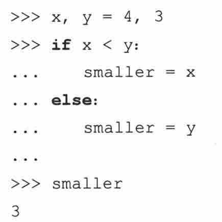

在 2.5 以前的版本中，Python 程序员最多这样做（其实是一个 hack，译者注）：

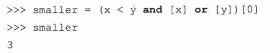

在 2.5 和更新的版本中，你可以使用更简明的条件表达式：

## 8.5　while 语句

Python 的 while 是本章我们遇到的第一个循环语句。事实它上是一个条件循环语句。与 if 声明相比，如果 if 后的条件为真，就会执行一次相应的代码块。而 while 中的代码块会一直循环执行，直到循环条件不再为真。

### 8.5.1　一般语法

while 循环的语法如下：

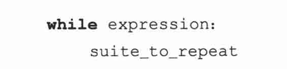

while 循环的 suite_to_repeat 子句会一直循环执行，直到 expression 值为布尔假。这种类型的循环机制常常用在计数循环中，请参见下节中例子。

### 8.5.2　计数循环

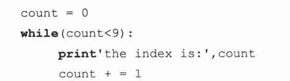

这里的代码块里包含了 print 和自增语句，它们被重复执行，直到 count 不再小于 9。索引 count 在每次迭代时被打印出来然后自增 1。如果在 Python 解释器中输入这些代码我们将得到这样的结果：

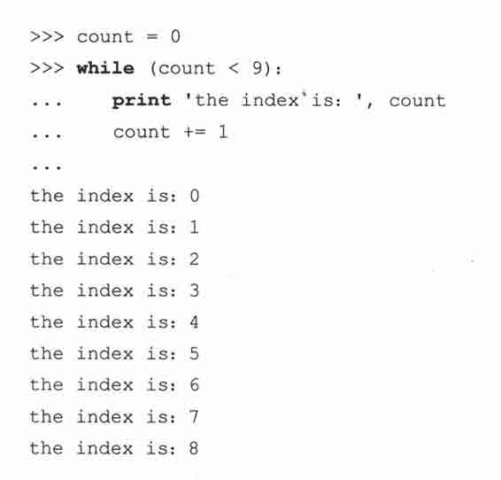

### 8.5.3　无限循环

你必须小心地使用 while 循环，因为有可能 condition 永远不会为布尔假。这样一来循环就永远不会结束。这些“无限”的循环不一定是坏事，许多通讯服务器的客户端/服务器系统就是通过它来工作的。这取决于循环是否需要一直执行下去，如果不是，那么这个循环是否会结束；也就是说，条件表达式会不会计算后得到布尔假？

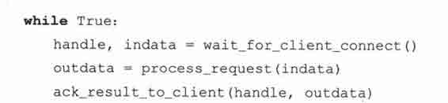

例如上边的代码就是故意被设置为无限循环的，因为 True 无论如何都不会变成 False。这是因为服务器代码是用来等待客户端（可能通过网络）来连接的。这些客户端向服务器发送请求，服务器处理请求。

请求被处理后，服务器将向客户端返回数据，而此时客户端可能断开连接或是发送另一个请求。对于服务器而言它已经完成了对这个客户端的任务，它会返回最外层循环等待下一个连接。在第十六章和第十七章里你将了解关于如何处理客户端/服务器的更多信息。

## 8.6　for 语句

Python 提供给我们的另一个循环机制就是 for 语句。它提供了 Python 中最强大的循环结构。它可以遍历序列成员，可以用在列表解析和生成器表达式中，它会自动地调用迭代器的 next()方法，捕获 StopIteration 异常并结束循环（所有这一切都是在内部发生的）。如果你刚刚接触 Python 那么我们要告诉你，在以后你会经常用到它的。和传统语言（例如 C/C++，Fortran，或者 Java）中的 for 语句不同，Python 的 for 更像是 shell 或是脚本语言中的 foreach 循环。

### 8.6.1　一般语法

for 循环会访问一个可迭代对象（例如序列或是迭代器）中的所有元素，并在所有条目都处理过后结束循环，它的语法如下：

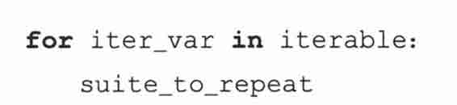

每次循环，iter_var 迭代变量被设置为可迭代对象（序列、迭代器或其他支持迭代的对象）的当前元素，提供给 suite_to_repeat 语句块使用。

### 8.6.2　用于序列类型

本节中，我们将学习用 for 循环迭代不同的序列对象。样例将涵盖字符串、列表及元组。

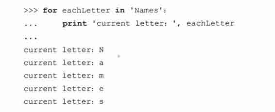

当迭代字符串时，迭代变量只会包含一个字符（长度为 1 的字符串）。但这并不常用。在字符串里中查找字符时，程序员往往使用 in 来测试成员关系，或者使用 string 模块中的函数以及字符串方法来检查子字符串。

看到单个的字符在一种情况下有用，即在通过 print 语句调试 for 循环中的序列时，如果你在应该看到字符串的地方发现的却是单个的字符，那么很有可能你接受到的是一个字符串，而不是对象的序列。

迭代序列有三种基本方法：

1.　通过序列项迭代

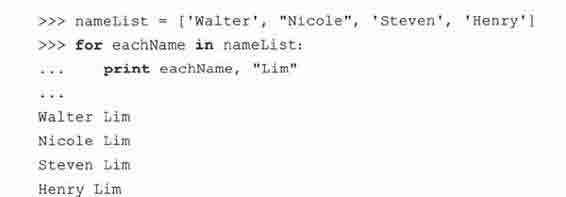

在上面的例子中，我们迭代一个列表。每次迭代，eacgName 变量都被设置为列表中特定某个元素，然后我们在代码块中打印出这个变量。

2.　通过序列索引迭代

另一个方法就是通过序列的索引来迭代：

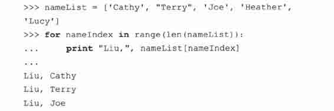

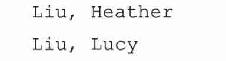

我们没有迭代元素，而是通过列表的索引迭代。

这里我们使用了内建的 len()函数获得序列长度，使用 range()函数（我们将在下面详细讨论它）创建了要迭代的序列。

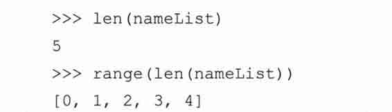

使用 range()我们可以得到用来迭代 nameList 的索引数列表；使用切片/下标操作符（[]），就可以访问对应的序列对象。

如果你对性能有所了解的话，那么毫无疑问你会意识到直接迭代序列要比通过索引迭代快。如果你不明白，那么你可以仔细想想。（参见练习 8-13）。

3.　使用项和索引迭代

两全其美的办法是使用内建的 enumerate()函数，它是 Python 2.3 的新增内容。代码如下：

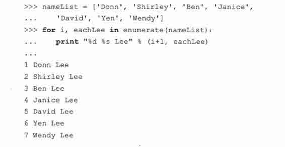

### 8.6.3　用于迭代器类型

用 for 循环访问迭代器和访问序列的方法差不多。唯一的区别就是 for 语句会为你做一些额外的事情。迭代器并不代表循环条目的集合。

迭代器对象有一个 next()方法，调用后返回下一个条目。所有条目迭代完后，迭代器引发一个 StopIteration 异常告诉程序循环结束。for 语句在内部调用 next()并捕获异常。

使用迭代器做 for 循环的代码与使用序列条目几乎完全相同。事实上在大多情况下，你无法分辨出你迭代的是一个序列还是迭代器，因此，这就是为什么我们在说要遍历一个迭代器时，实际上可能我们指的是要遍历一个序列，迭代器，或是一个支持迭代的对象（它有 next()方法）。

### 8.6.4　range()内建函数

我们前面介绍 Python 的 for 循环的时候提到过它是一种迭代的循环机制。Python 同样提供一个工具让我们在传统的伪条件设置下使用 for 声明，例如从一个数字开始计数到另一个数字，一旦到达最后的数字或者某个条件不再满足就立刻退出循环。

内建函数 range()可以把类似 foreach 的 for 循环变成你更加熟悉的语句。例如从 0 到 10 计数，或者从 10 到 100 一次递增 5。

range()的完整语法

Python 提供了两种不同的方法来调用 range()。完整语法要求提供两个或三个整型参数：

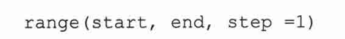

range()会返回一个包含所有 k 的列表，这里 start<= k < end，从 start 到 end，k 每次递增 step。step 不可以为零，否则将发生错误。

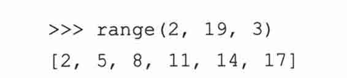

如果只给定两个参数，而省略 step，step 就使用默认值 1。

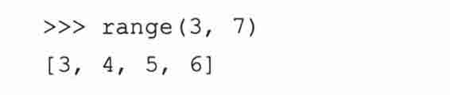

我们来看看解释器环境下的例子。

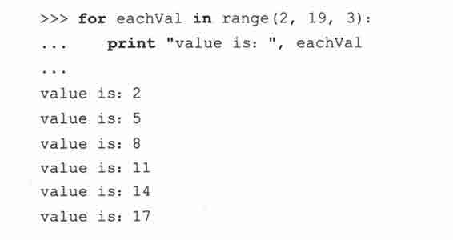

我们的循环从 2 “数”到 19，每次递增 3。如果你熟悉 C 的话，就会发现，range()的参数与 C 的 for 循环变量有着直接的关系：

虽然看起来像是一个条件循环（检查 eachVal<19），但实际上是 range()先用我们指定的条件生成一个列表，然后把列表用于这个 for 语句。

range()简略语法

range()还有两种简略的语法格式：

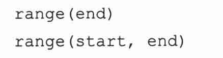

我们在第二章看到过最短的语法接受一个值，start 默认为 0，step 默认为 1，然后 range()返回从 0 到 end 的数列。

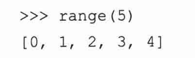

range()的中型版本和完整版本几乎完全一样，只是 step 使用默认值 1。现在我们在 Python 解释器中试下这条语句：

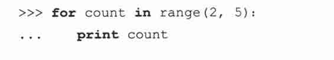

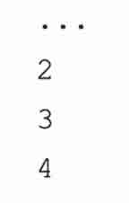

核心笔记：为什么 range()不是只有一种语法？

* * *

你已经知道了 range()的所有语法，有些人可能会问一个挑剔的问题，为什么不把这两种语法合并成一个下面这样的语法？

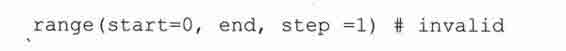

这个语法不可以使用两个参数调用。因为 step 要求给定 start。换句话说，你不能只传递 end 和 step 参数。因为它们会被解释器误认为是 start 和 end。

* * *

### 8.6.5　xrange()内建函数

xrange()类似 range()，不过当你有一个很大的范围列表时，xrange()可能更为适合，因为它不会在内存里创建列表的完整拷贝。它只被用在 for 循环中，在 for 循环外使用它没有意义。同样地，你可以想到，它的性能远高出 range()，因为它不生成整个列表。在 Python 的未来版本中，range()可能会像 xrange()一样，返回一个可迭代对象（不是列表也不是一个迭代器）。

### 8.6.6　与序列相关的内建函数

sorted()、reversed()、enumerate()、zip()

下边是使用循环相关和序列相关函数的例子。为什么它们叫“序列相关”呢？是因为其中两个函数（sorted()和 zip()）返回一个序列（列表），而另外两个函数（reversed()和 enumerate()）返回迭代器（类似序列）。

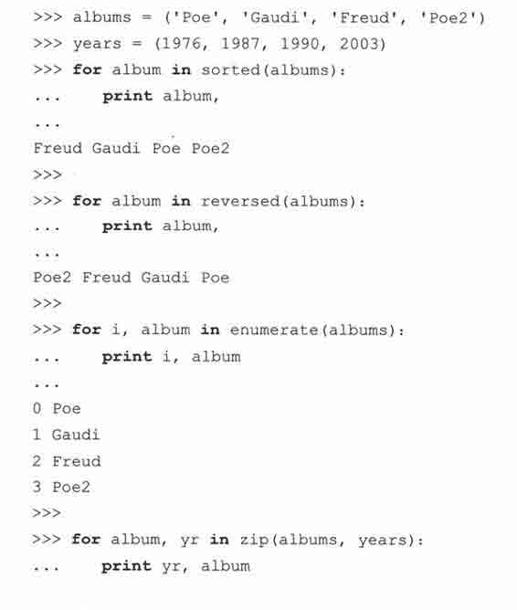

我们已经涵盖了 Python 中的所有循环语句，下面我们看看循环相关的语句，包括用于放弃循环的 break 语句和立即开始下一次迭代的 continue 语句。

## 8.7　break 语句

Python 中的 break 语句可以结束当前循环然后跳转到下条语句，类似 C 中的传统 break。常用在当某个外部条件被触发（一般通过 if 语句检查），需要立即从循环中退出时 break 语句可以用在 while 和 for 循环中。

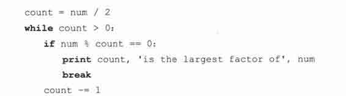

上边这段代码用于寻找给定数字 num 的最大约数。我们迭代所有可能的约数，count 变量依次递减，第一个能整除 num 的就是我们要找的最大约数，找到后就不再继续找了，使用 break 语句退出循环。

这里的 break 语句用于打断列表的迭代，目的是为了找到列表中的目标元素，如果找到，则把它从数据库里删除然后退出循环。

## 8.8　continue 语句

核心笔记：continue 语句

* * *

不管是对 Python、C、Java，还是其他任何支持 continue 语句的结构化语言，一些初学者有这样的一个误解：continue 语句“立即启动循环的下一次迭代”。实际上，当遇到 continue 语句时，程序会终止当前循环，并忽略剩余的语句，然后回到循环的顶端。在开始下一次迭代前，如果是条件循环，我们将验证条件表达式；如果是迭代循环，我们将验证是否还有元素可以迭代。只有在验证成功的情况下，我们才会开始下一次迭代。

* * *

Python 里的 continue 语句和其他高级语言中的传统 continue 并没有什么不同。它可以被用在 while 和 for 循环里。while 循环是条件性的，而 for 循环是迭代的，所以 continue 在开始下一次循环前要满足一些先决条件（前边的核心笔记中强调的），否则循环会正常结束。

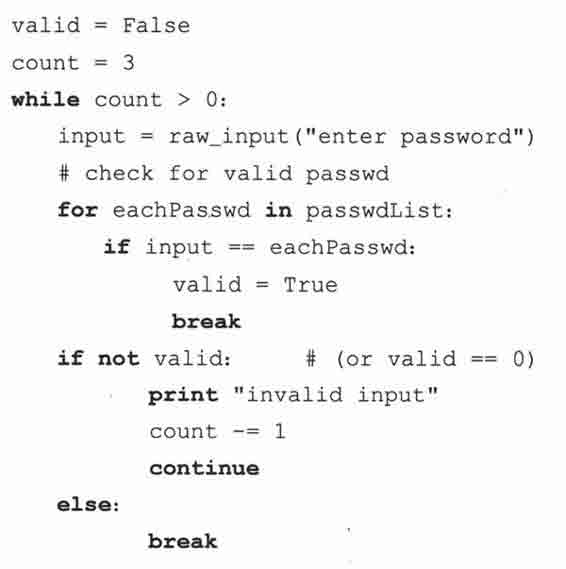

这里例子结合使用了 while、for、if、break 和 continue，用来验证用户输入。用户有三次机会来输入正确的密码，如果失败，那么 valid 变量将仍为一个布尔假（0），然后我们可以采取必要的操作阻止用户猜测密码。

## 8.9　pass 语句

Python 还提供了 pass 语句（C 中没有提供对应的语句）。Python 没有使用传统的大括号来标记代码块，有时，有些地方在语法上要求要有代码，而 Python 中没有对应的空大括号或是分号（;）来表示 C 语言中的“不做任何事”，如果你在需要在有语句块的地方不写任何语句，解释器会提示你语法错误。因此，Python 提供了 pass 语句，它不做任何事情——即 NOP，（No OPeration，无操作）我们从汇编语言中借用这个概念。pass 同样也可作为开发中的小技巧，标记你后来要完成的代码，例如这样：

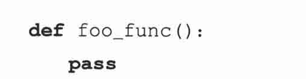

或者

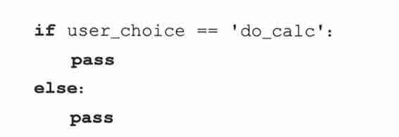

这样的代码结构在开发和调试时很有用，因为编写代码的时候你可能要先把结构定下来，但你不希望它干扰其他已经完成的代码。在不需要它做任何事情地方，放一个 pass 将是一个很好的主意。

另外它在异常处理中也被经常用到，我们将在第十章中详细介绍；比如你跟踪到了一个非致命的错误，不想采取任何措施（只是想记录一下事件或是在内部进行处理罢了）。

## 8.10　再谈 else 语句

在 C（以及大多其他语言中），你不会在条件语句范围外发现 else 语句，但 Python 不同，你可以在 while 和 for 循环中使用 else 语句。它们是怎么工作的呢？在循环中使用时，else 子句只在循环完成后执行，也就是说 break 语句也会跳过 else 块。

展示 while 语句中 else 用法的一个例子就是寻找一个数的最大约数。我们已经实现了完成这个任务的函数，使用 while 循环和 else 语句。例 8.1（maxFact.py）利用这个语法完成了 showMaxFactor()函数。

例 8.1　while-else 循环举例（maxFact.py）

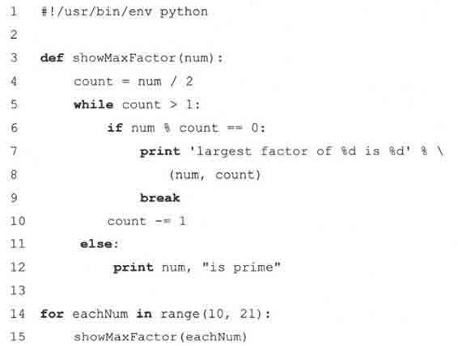

这个程序显示出 10~20 中的数字的最大约数。该脚本也会提示这个数是否为素数。

showMaxFactor()函数中第 3 行的循环从 amount 的一半开始计数（这样就可以检查这个数是否可以被 2 整除，如果可以，那就找到了最大的约数）。然后循环每次递减 1（第 10 行），直到发现约数（第 6~9 行）。如果循环递减到 1 还没有找到约数，那么这个数一定是素数。11~12 行的 else 子句负责处理这样的情况。程序的主体（14~15 行）用数字参数调用 showMaxFactor()。执行该程序将得到这样的输出：

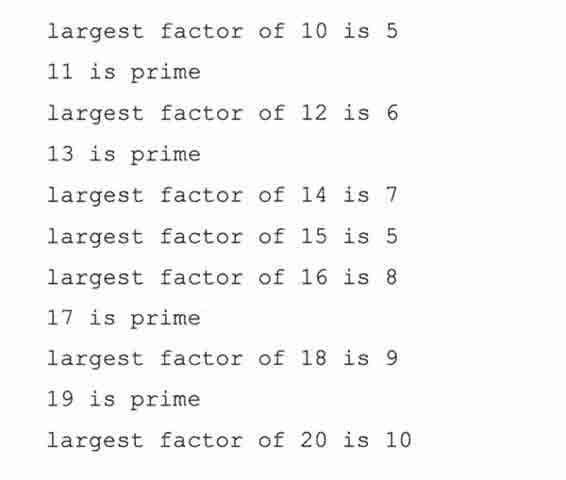

同样地，for 循环也可以有 else 用于循环后处理（post-processing）。它和 while 循环中的 else 处理方式相同。只要 for 循环是正常结束的（不是通过 break），else 子句就会执行。我们在 8.5.3 已经见过这样的例子。

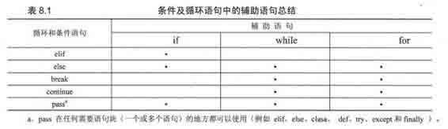

a. pass 在任何需要语句块（一个或多个语句）的地方都可以使用（例如 elif、elif、clasa、def、try、except 和 finally）。

## 8.11　迭代器和 iter()函数

### 8.11.1　什么是迭代器

迭代器是在版本 2.2 被加入 Python 的，它为类序列对象提供了一个类序列的接口。我们在前边的第六章已经正式地介绍过序列。它们是一组数据结构，你可以利用它们的索引从 0 开始一直“迭代”到序列的最后一个条目。用“计数”的方法迭代序列是很简单的。Python 的迭代无缝地支持序列对象，而且它还允许程序员迭代非序列类型，包括用户定义的对象。

迭代器用起来很灵巧，你可以迭代不是序列但表现出序列行为的对象，例如字典的键、一个文件的行，等等．当你使用循环迭代一个对象条目时，你几乎分辨不出它是迭代器还是序列。你不必去关注这些，因为 Python 让它像一个序列那样操作。

### 8.11.2　为什么要迭代器

引用 PEP（234）中对迭代器的定义：

•　提供了可扩展的迭代器接口；

•　对列表迭代带来了性能上的增强；

•　在字典迭代中性能提升；

•　创建真正的迭代接口，而不是原来的随机对象访问；

•　与所有已经存在的用户定义的类以及扩展的模拟序列和映射的对象向后兼容；

•　迭代非序列集合（例如映射和文件）时，可以创建更简洁可读的代码。

### 8.11.3　如何迭代

根本上说，迭代器就是有一个 next()方法的对象，而不是通过索引来计数。当你或是一个循环机制（例如 for 语句）需要下一个项时，调用迭代器的 next()方法就可以获得它。条目全部取出后，会引发一个 StopIteration 异常，这并不表示错误发生，只是告诉外部调用者，迭代完成。

不过，迭代器也有一些限制。例如你不能向后移动，不能回到开始，也不能复制一个迭代器。如果你要再次（或者是同时）迭代同个对象，你只能去创建另一个迭代器对象。不过，这并不糟糕，因为还有其他的工具来帮助你使用迭代器。

reversed()内建函数将返回一个反序访问的迭代器。enumerate()内建函数同样也返回迭代器。另外两个新的内建函数，any()和 all()，是在 Python 2.5 中新增的，如果迭代器中某个/所有条目的值都为布尔真时，则它们返回值为真。本章先前部分我们展示了如何在 for 循环中通过索引或是可迭代对象来遍历条目。同时 Python 还提供了一整个 itertools 模块，它包含各种有用的迭代器。

### 8.11.4　使用迭代器

1.　序列

正如先前提到的，迭代 Python 的序列对象和你想像的一样：

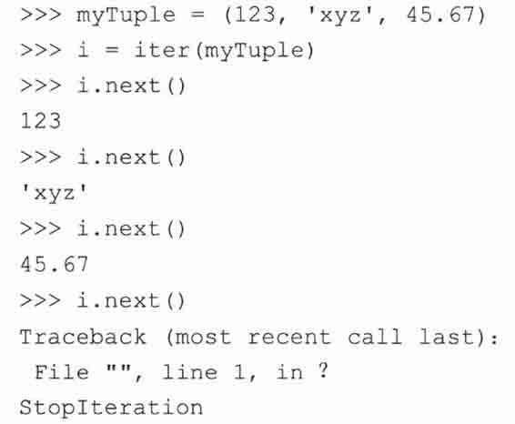

如果这是一个实际应用程序，那么我们需要把代码放在一个 try-except 块中。序列现在会自动地产生它们自己的迭代器，所以一个 for 循环：

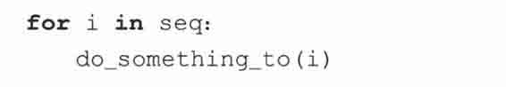

under the covers now really behaves like this:

实际上是这样工作的：

不过，你不需要改动你的代码，因为 for 循环会自动调用迭代器的 next()方法（以及监视 Stoplteration 异常）。

2.　字典

字典和文件是另外两个可迭代的 Python 数据类型。字典的迭代器会遍历它的键（key）。语句 for eachKey in myDict.keys()可以缩写为 for eachKey in myDict，例如：

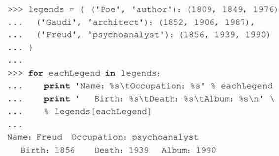

另外，Python 还引进了三个新的内建字典方法来定义迭代：myDict.iterkeys()（通过键迭代）、 myDict.itervalues()（通过值迭代）及 myDicit.iteritems()（通过键-值对来迭代）。注意，in 操作符也可以用于检查字典的键是否存在，之前的布尔表达式 myDict.has_key（anyKey）可以被简写为 anyKey in myDict。

3.　文件

文件对象生成的迭代器会自动调用 readline()方法。这样，循环就可以访问文本文件的所有行。程序员可以使用更简单的 for eachLine in myFile 替换 for eachLine in myFile.readlines()：

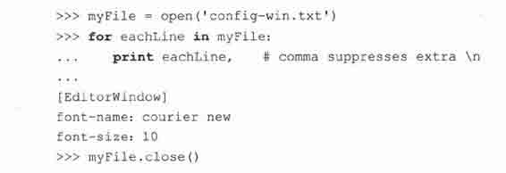

### 8.11.5　可变对象和迭代器

记住，在迭代可变对象的时候修改它们并不是个好主意。这在迭代器出现之前就是一个问题。一个流行的例子就是循环列表的时候删除满足（或不满足）特定条件的项：

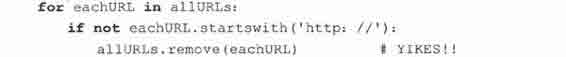

除列表外的其他序列都是不可变的，所以危险就发生在这里。一个序列的迭代器只是记录你当前到达第多少个元素，所以如果你在迭代时改变了元素，更新会立即反映到你所迭代的条目上。在迭代字典的键时，你绝对不能改变这个字典。使用字典的 keys()方法是可以的，因为 keys()返回一个独立于字典的列表。而迭代器是与实际对象绑定在一起的，它将不会继续执行下去：

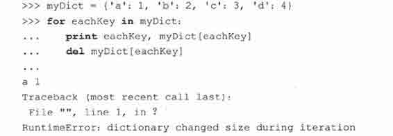

这样可以避免有缺陷的代码。更多有关迭代器的细节请参阅 PEP 234。

### 8.11.6　如何创建迭代器

对一个对象调用 iter()就可以得到它的迭代器。它的语法如下：

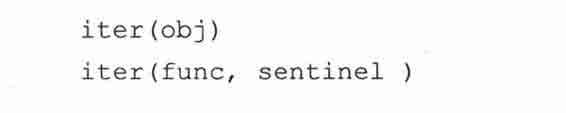

如果你传递一个参数给 iter()，它会检查你传递的是不是一个序列，如果是，那么很简单：根据索引从 0 一直迭代到序列结束。另一个创建迭代器的方法是使用类，我们将在第十三章详细介绍，一个实现了 _iter_()和 next()方法的类可以作为迭代器使用。

如果是传递两个参数给 iter()，它会重复地调用 func，直到迭代器的下个值等于 sentinel。

## 8.12　列表解析

列表解析（List comprehensions，或缩略为 list comps）来自函数式编程语言 Haskell。它是一个非常有用、简单而且灵活的工具，可以用来动态地创建列表。它在 Python 2.0 中被加入。

在第十一章中，我们将讨论 Python 早就支持的函数式编程特性，例如 lambda、map()和 filter()等，它们存在于 Python 中已经很长时间了，但通过列表解析，它们可以被简化为一个列表解析式子。map()对所有的列表成员应用一个操作，filter()基于一个条件表达式过滤列表成员。最后，lambda 允许你快速地创建只有一行的函数对象。你不需要现在就去掌握这些，在本节中你将看到它们出现在例子里，因为我们需要讨论列表解析的优势。首先让我们看看列表解析的语法：

这个语句的核心是 for 循环，它迭代 iterable 对象的所有条目。前边的 expr 应用于序列的每个成员，最后的结果值是该表达式产生的列表。迭代变量并不需要是表达式的一部分。这里用到了第十一章的一些代码。它有一个计算序列成员的平方的 lambda 函数表达式：

我们可以使用下面这样的列表解析来替换它：

在新语句中，只有一次函数调用（range()），而先前的语句中有三次函数调用（range()、map()和 lambda）。你也可以用括号包住表达式，像[（x**2）for x in range（6）]这样，更便于阅读。列表解析的表达式可以取代内建的 map()函数以及 lambda，而且效率更高。结合 if 语句，列表解析还提供了一个扩展版本的语法：

这个语法在迭代时会过滤或“捕获”满足条件表达式 cond_expr 的序列成员。

回想一下 odd()函数，它用于判断一个数值对象是奇数还是偶数（奇数返回 1，偶数返回 0）：

我们可以借用这个函数的核心操作，使用 filter()和 lambda 挑选出序列中的奇数：

和先前的例子一样，即使不用 filter()和 lambda，我们同样可以使用列表解析来完成操作，获得想要的数字：

我们使用更多实用的例子结束这节。

1.　矩阵样例

你需要迭代一个有 3 行 5 列的矩阵么？很简单：

2.　磁盘文件样例

假设我们有如下这样一个数据文件 hhga.txt，需要计算出所有非空白字符的数目：

And the Lord spake, saying, “First shalt thou take out the Holy Pin. Then shalt thou count to three, no more, no less. Three shall be the number thou shalt count, and the number of the counting shall be three. Four shalt thou not count, neither count thou two, excepting that thou then proceed to three. Five is right out. Once the number three, being the third number, be reached, then lobbest thou thy Holy Hand Grenade of Antioch towards thy foe, who, being naughty in My sight, shall snuff it.”

我们已经知道可以通过 for line in data 迭代文件内容。不过，除了这个，我们还可以把每行分割（split）为单词，然后我们可以像这样计算单词个数：

快速地计算文件大小

假定文件中至少有一个空白字符，我们知道文件中有少于 499 个非空字符。我们可以把每个单词的长度加起来，得到和。

这里我们用 seek()函数回到文件的开头，因为迭代器已经访问完了文件的所有行。一个清晰明了的列表解析完成了之前需要许多行代码才能完成的工作！如你所见，列表解析支持多重嵌套 for 循环以及多个 if 子句。完整的语法可以在官方文档中找到。你也可以在 PEP 202 中找到更多关于列表解析的资料。

## 8.13　生成器表达式

生成器表达式是列表解析的一个扩展。在 Python 2.0 中我们加入了列表解析，使语言有了一次革命化的发展，提供给用户了一个强大的工具，只用一行代码就可以创建包含特定内容的列表。你可以去问一个有多年 Python 经验的程序员是什么改变了他们编写 Python 程序的方式，那么得到最多的答案一定会是列表解析。

另一个在 Python 版本 2.2 时被加入的重要特性是生成器。生成器是特定的函数，允许你返回一个值，然后“暂停”代码的执行，稍后恢复。我们将在第十一章中讨论生成器。

列表解析的一个不足就是必要生成所有的数据，用以创建整个列表。这可能对有大量数据的迭代器有负面效应。生成器表达式通过结合列表解析和生成器解决了这个问题。

生成器表达式在 Python 2.4 被引入，它与列表解析非常相似，而且它们的基本语法基本相同；不过它并不真正创建数字列表，而是返回一个生成器，这个生成器在每次计算出一个条目后，把这个条目“产生”（yield）出来。生成器表达式使用了 “延迟计算”（lazy evaluation），所以它在使用内存上更有效。我们来看看它和列表解析到底有多相似：

列表解析：

生成器表达式：

生成器并不会让列表解析废弃，它只是一个内存使用更友好的结构，基于此，有很多使用生成器地方。下面我们提供了一些使用生成器表达式的例子，最后举一个冗长的样例，从它你可以感觉到 Python 代码在这些年来的变化。

1.　磁盘文件样例

在前边列表解析一节，我们计算文本文件中非空字符总和。最后的代码中，我们展示了如何使用一行列表解析代码做所有的事。如果这个文件的大小变得很大，那么这行代码的内存性能会很低，因为我们要创建一个很长的列表用于存放单词的长度。

为了避免创建庞大的列表，我们可以使用生成器表达式来完成求和操作。它会计算每个单词的长度然后传递给 sum()函数（它的参数不仅可以是列表，还可以是可迭代对象，比如生成器表达式）。这样，我们可以得到优化后的代码（代码长度，还有执行效率都很高效）：

我们所做的只是把方括号删除：少了两字节，而且更节省内存…非常地环保！

2.　交叉配对样例

生成器表达式就好像是懒惰的列表解析（这反而成了它主要的优势）。它还可以用来处理其他列表或生成器，例如这里的 rows 和 cols：

不需要创建新的列表，直接就可以创建配对。我们可以使用下面的生成器表达式：

现在我们可以循环 x_product_pairs，它会懒惰地循环 rows 和 cols：

3.　重构样例

我们通过一个寻找文件最长的行的例子来看看如何改进代码。在以前，我们这样读取文件：

事实上，这还不够老。真正的旧版本 Python 代码中，布尔常量应该写是整型 1，而且我们应该使用 string 模块而不是字符串的 strip()方法：

从那时起，我们认识到如果读取了所有的行，那么应该尽早释放文件资源。如果这是一个很多进程都要用到的日志文件，那么理所当然我们不能一直拿着它的句柄不释放。是的，我们的例子是用来展示的，但是你应该得到这个理念。所以读取文件的行的首选方法应该是这样：

列表解析允许我们稍微简化代码，而且我们可以在得到行的集合前做一定的处理。在下段代码中，除了读取文件中的行之外，我们还调用了字符串的 strip()方法处理行内容。

然而，两个例子在处理大文件时候都有问题，因为 readlines()会读取文件的所有行。后来我们有了迭代器，文件本身就成为了它自己的迭代器，不需要调用 readlines()函数。我们已经做到了这一步，为什么不去直接获得行长度的集合呢（之前我们得到的是行的集合）？这样，我们就可以使用 max()内建函数得到最长的字符串长度：

这里唯一的问题就是你一行一行迭代 f 的时候，列表解析需要文件的所有行读取到内存中，然后生成列表。我们可以进一步简化代码：使用生成器表达式替换列表解析，然后把它移到 max()函数里，这样，所有的核心部分只有一行：

最后，我们可以去掉文件打开模式（默认为读取），然后让 Python 去处理打开的文件。当然，文件用于写入的时候不能这么做，但这里我们不需要考虑太多：

我们走了好长一段路。注意，即便是这只有一行的 Python 程序也不是很晦涩。生成器表达式在 Python 2.4 中被加入，你可以在 PEP 289 中找到更多相关内容。

## 8.14　相关模块

Python 2.2 引进了迭代器，在下一个发行版（2.3）中，itertools 模块被加入，用来帮助那些发现迭代器威力但又需要一些辅助工具的开发者。有趣的是如果你阅读关于 itertools 中实用程序的文档，你会发现生成器。所以在迭代器和生成器间有一定的联系。你可以在第十一章中了解更多。

## 8.15　练习

> > 8-1.条件语句。请看下边的代码：

> > > > （a）如果 x<0，上面哪个语句（A, B, C, D, E）将被执行？

> > > > （b）如果 x==0，上面哪个居于将被执行？

> > > > （c）如果 x>0，上面哪个语句将被执行？

> > 8-2.循环。编写一个程序，让用户输入 3 个数字：（f）rom，（t）o 和（i）ncrement。以 i 为步长，从 f 计数到 t，包括 f 和 t。例如，如果输入的是 f==2、t ==26、i ==4，程序将输出 2, 6, 10, 14, 18, 22, 26。

> > 8-3.range()。如果我们需要生成下面的这些列表，分别需要在 range()内建函数中提供哪些参数？

> > > > （a） [0, 1, 2, 3, 4, 5, 6, 7, 8, 9]

> > > > （b） [3, 6, 9, 12, 15, 18]

> > > > （c） [-20, 200, 420, 640, 860]

> > 8-4.素数。我们在本章已经给出了一些代码来确定一个数字的最大约数或者它是否是一个素数。请把相关代码转换为一个返回值为布尔值的函数，函数名为 isprime()。如果输入的是一个素数，那么返回 True，否则返回 False。

> > 8-5.约数。完成一个名为 getfactors()的函数。它接受一个整型作为参数，返回它所有约数的列表，包括 1 和它本身。

> > 8-6.素因子分解。以刚才练习中的 isprime()和 getfactors()函数为基础编写一个函数，它接受一个整型作为参数，返回该整型所有素数因子的列表。这个过程叫做求素因子分解，它输出的所有因子之积应该是原来的数字。注意列表里可能有重复的元素。例如输入 20，返回结果应该是[2, 2, 5]。

> > 8-7.完全数。完全数被定义为这样的数字：它的约数（不包括它自己）之和为它本身。例如：6 的约数是 1，2，3，因为 1+2+3=6，所以 6 被认为是一个完全数。编写一个名为 isperfect()的函数，它接受一个整型作为参数，如果这个数字是完全数，返回 1；否则返回 0。

> > 8-8.阶乘。一个数的阶乘被定义为从 1 到该数字所有数字的乘积。N 的阶乘简写为 N!。 N！== factorial（N）==1*2*3*…*（N-2）*（N_l） * N. So 4! == 1*2*3*4

> > > > 写一个函数，指定 N，返回 N!的值。

> > 8-9.斐波那契数列。斐波那契数列形如 1，1，2，3，5，8，13, 21，等等。也就是说，下一个值是序列中前两个值之和。写一个函数，给定 N，返回第 N 个斐波那契数字。例如，第 1 个斐波那契数字是 1，第 6 个是 8。

> > 8-10.文本处理。统计一句话中的元音，辅音及单词（以空格分割）的个数。忽略元音和辅音的特殊情况，如“h”，“y”，“qu”等。附加题：编写处理这些特殊情况的代码。

> > 8-11.文本处理。要求输入一个姓名列表，输入格式是“LastName, First Name”即姓逗号名。编写程序处理输入，如果用户输入错误，比如“First Name Last Name，”，请纠正这些错误，并通知用户。同时你还需要记录输入错误次数。当用户输入结束后，给列表排序，然后以“姓，名”的顺序显示。

> > > > 输入输出示例（你不需要完全按照这里的例子完成）：

> > 8-12.（整型）位操作。编写一个程序，用户给出起始和结束数字后给出一个下面这样的表格，分别显示出两个数字间所有整型的十进制，二进制，八进制和十六进制表示。如果字符是可打印的 ASCII 字符，也要把它打印出来，如果没有一个是可打印字符，就省略掉 ASCII 那一栏的表头。请参考下面的输入输出格式：

> > 8-13.程序执行性能。在 8.5.2 节里，我们介绍了两种基本的迭代序列方法：（1）通过序列项，以及（2）通过序列索引遍历。该小节的末尾我们指出后一种方法在序列很长的时候性能不佳（在我的系统下，性能差了将近两倍[83%]）你认为它的原因是什么？