# 第十章　错误和异常

本章主题

♦　什么是异常

♦　Python 中的异常

♦　探测和处理异常

♦　上下文管理

♦　引发异常

♦　断言

♦　标准异常

♦　创建异常

♦　相关模块

程序员的一生中，错误几乎每天都在发生。在过去的一个时期，错误要么对程序（可能还有机器）是致命的，要么产生一大堆无意义的输出，无法被其他计算机或程序识别，连程序员自己也可能搞不懂它的意义。一旦出现错误，程序就会终止执行，直到错误被修正，程序重新执行。所以，人们需要一个“柔和”的处理错误的方法，而不是终止程序。同时，程序本身也在不断发展，并不是每个错误都是致命的，即使错误发生，编译器或是在执行中的程序也可以提供更多更有用的诊断信息，帮助程序员尽快解决问题。然而，错误毕竟是错误，一般都是停止编译或执行后才能去解决它。一小段代码只能让程序终止执行，也许还能打印出一些模糊的提示。当然，这一切都是在异常和异常处理出现之前的事了。

虽然目前还没有讨论到 Python 中的类和面向对象编程（OOP）,但我们这里要介绍的许多概念已经涉及了类和类实例^([[1]](../Text/index_split_160.html#filepos799490))。我们提供了一小节介绍如何创建自定义的异常类。

本章将介绍什么是异常、异常处理和 Python 对异常的支持。我们还会介绍如何在代码里生成异常。最后，我们会涉及如何创建自定义的异常类。

## 10.1　什么是异常

### 10.1.1　错误

在深入介绍异常之前，我们来看看什么是错误。从软件方面来说，错误是语法或是逻辑上的。语法错误指示软件的结构上有错误，导致不能被解释器解释或编译器无法编译。这些错误必须在程序执行前纠正。

当程序的语法正确后，剩下的就是逻辑错误了。逻辑错误可能是由于不完整或是不合法的输入所致；在其他情况下，还可能是逻辑无法生成、计算、或是输出结果需要的过程无法执行。这些错误通常分别被称为域错误和范围错误。

当 Python 检测到一个错误时，解释器就会指出当前流已经无法继续执行下去。这时候就出现了异常。

### 10.1.2　异常

对异常的最好描述是：它是因为程序出现了错误而在正常控制流以外釆取的行为。这个行为又分为两个阶段：首先是引起异常发生的错误，然后是检测（和釆取可能的措施）阶段。

第一个阶段是在发生了一个异常条件（有时候也叫做例外的条件）后发生的。只要检测到错误并且意识到异常条件，解释器会引发一个异常。引发也可以叫做触发，抛出或者生成。解释器通过它通知当前控制流有错误发生。Python 也允许程序员自己引发异常。无论是 Python 解释器还是程序员引发的，异常就是错误发生的信号。当前流将被打断，用来处理这个错误并釆取相应的操作。这就是第二阶段。

对异常的处理发生在第二阶段，异常引发后，可以调用很多不同的操作。可以是忽略错误（记录错误但不采取任何措施，采取补救措施后终止程序），或是减轻问题的影响后设法继续执行程序。所有的这些操作都代表一种继续，或是控制的分支。关键是程序员在错误发生时可以指示程序如何执行。

你可能已经得出这样一个结论：程序运行时发生的错误主要是由于外部原因引起的，例如非法输入或是其他操作失败等。这些因素并不在程序员的直接控制下，而程序员只能预见一部分错误，编写常见的补救措施代码。

类似 Python 这样支持引发和处理异常（这更重要）的语言，可以让开发人员可以在错误发生时更直接地控制它们。程序员不仅仅有了检测错误的能力，还可以在它们发生时采取更可靠的补救措施。由于有了运行时管理错误的能力，应用程序的健壮性有了很大的提高。

异常和异常处理并不是什么新概念。它们同样存在于 Ada、Modula-3、C++、Eiffel 和 Java 中。异常的起源可以追溯到处理系统错误和硬件中断这类异常的操作系统代码。在 1965 年左右，PL/1 作为第一个支持异常的主要语言出现，而异常处理是作为一个它提供的软件工具。和其他支持异常处理的语言类似,Python 采用了“尝试（try）”块和“捕获（catching）”块的概念，而且它在异常处理方面更有”纪律性”。我们可以为不同的异常创建不同的处理器，而不是盲目地创建一个“捕获所有（catch-all）”的代码。

## 10.2　Python 中的异常

在先前的一些章节里你已经执行了一些代码，你一定遇到了程序“崩溃”或因未解决的错误而终止的情况。你会看到“跟踪记录（traceback）”消息以及随后解释器向你提供的信息，包括错误的名称、原因和发生错误的行号。不管你是通过 Python 解释器执行还是标准的脚本执行，所有的错误都符合相似的格式，这提供了一个一致的错误接口。所有错误，无论是语意上的还是逻辑上的，都是由于和 Python 解释器不相容导致的，其后果就是引发异常。

我们来看几个异常的例子。

1\. NameError:尝试访问一个未申明的变量

NameError 表示我们访问了一个没有初始化的变量。在 Python 解释器的符号表没有找到那个另人讨厌的变量，我们将在后面的两章讨论名称空间，现在大家可以认为它们是连接名字和对象的“地址簿”就可以了。任何可访问的变量必须在名称空间里列出，访问变量需要由解释器进行搜索，如果请求的名字没有在任何名称空间里找到，那么将会生成一个 NameError 异常。

2\. ZeroDivisionError:除数为零

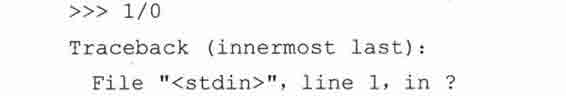

我们边的例子使用的是整型，但事实上，任何数值被零除都会导致一个 ZeroDivisionError 异常。

3\. SyntaxError: Python 解释器语法错误

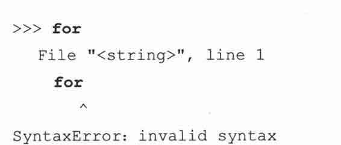

SyntaxError 异常是唯一不是在运行时发生的异常。它代表 Python 代码中有一个不正确的结构，在它改正之前程序无法执行。这些错误一般都是在编译时发生，Python 解释器无法把你的脚本转化为 Python 字节代码。当然这也可能是你导入一个有缺陷的模块的时候。

4\. IndexError:请求的索引超出序列范围

IndexError 在你尝试使用一个超出范围的值索引序列时引发。

5\. KeyError：请求一个不存在的字典关键字

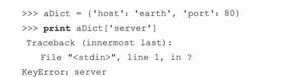

映射对象，例如字典，是依靠关键字（key）访问数据值的。如果使用错误的或是不存在的键请求字典就会引发一个 KeyError 异常。

6\. IOError:输入/输出错误

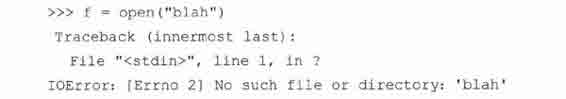

类似尝试打开一个不存在的磁盘文件一类的操作会引发一个操作系统输入/输出（I/O）错误。任何类型的 I/O 错误都会引发 IOError 异常。

7\. AttributeError:尝试访问未知的对象属性

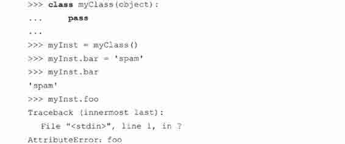

在我们的例子中，我们在 myInst.bar 储存了一个值，也就是实例 mylnst 的 bar 属性。属性被定义后，我们可以使用熟悉的点/属性操作符访问它，但如果是没有定义属性，例如我们访问 foo 属性，将导致一个 AttributeError 异常。

## 10.3　检测和处理异常

异常可以通过 try 语句来检测。任何在 try 语句块里的代码都会被监测，检查有无异常发生。

try 语句有两种主要形式：try-except 和 try-finally。这两个语句是互斥的，也就是说你只能使用其中的一种。一个 try 语句可以对应一个或多个 except 子句，但只能对应一个 finally 子句，或是一个 try-except-finally 复合语句。

你可以使用 try-except 语句检测和处理异常。你也可以添加一个可选的 else 子句处理没有探测到异常的执行的代码。而 try-finally 只允许检测异常并做一些必要的清除工作（无论发生错误与否），没有任何异常处理设施。正如你想像的，复合语句两者都可以做到。

### 10.3.1　try-except 语句

try-except 语句（以及其更复杂的形式）定义了进行异常监控的一段代码，并且提供了处理异常的机制。

最常见的 try-except 语句语法如下所示。它由 try 块和 except 块（try_suite 和 except_suite）组成，也可以有一个可选的错误原因。

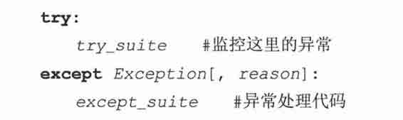

我们用一个例子说明这一切是如何工作的。我们将使用上边的 IOError 例子，把我们的代码封装在 try-except 里，让代码更健壮：

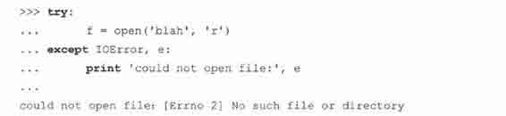

如你所见，我们的代码运行时似乎没有遇到任何错误。事实上我们在尝试打开一个不存在的文件时仍然发生了 IOError。有什么区别么？我们加入了探测和错误错误的代码。当引发 IOError 异常时，我们告诉解释器让它打印出一条诊断信息。程序继续执行，而不像以前的例子那样被“轰出来”——异常处理小小地显了下身手。那么在代码方面发生了什么呢？

在程序运行时，解释器尝试执行 try 块里的所有代码，如果代码块完成后没有异常发生，执行流就会忽略 except 语句继续执行。而当 except 语句所指定的异常发生后，我们保存了错误的原因，控制流立即跳转到对应的处理器（try 子句的剩余语句将被忽略），本例中我们显示出一个包含错误原因的错误信息。

在我们上边的例子中，我们只捕获 IOError 异常。任何其他异常不会被我们指定的处理器捕获。举例说，如果你要捕获一个 OSError,你必须加入一个特定的异常处理器。我们将在本章后面详细地介绍 try-except 语法。

核心笔记：忽略代码，继续执行’和向上移交

* * *

try 语句块中异常发生点后的剩余语句永远不会到达（所以也永远不会执行）。一旦一个异常被引发，就必须决定控制流下一步到达的位置。剩余代码将被忽略，解释器将搜索处理器，一旦找到，就开始执行处理器中的代码。

如果没有找到合适的处理器，那么异常就向上移交给调用者去处理，这意味着堆栈框架立即回到之前的那个。如果在上层调用者也没找到对应处理器，该异常会继续被向上移交，直到找到合适处理器。如果到达最顶层仍然没有找到对应处理器，那么就认为这个异常是未处理的，Python 解释器会显示出跟踪记录，然后退出。

* * *

### 10.3.2　包装内建函数

我们现在给出一个交互操作的例子——从最基本的错误检测开始，然后逐步改进它，增强代码的健壮性。这里的问题是把一个用字符串表示的数值转换为正确的数值表示形式，而且在过程中要检测并处理可能的错误。

float()内建函数的基本作用是把任意一个数值类型转换为一个浮点型。从 Python 1.5 开始，float()增加了把字符串表示的数值转换为浮点型的功能，没必要使用 string 模块中的 atof()函数。如果你使用的老版本的 Python,请使用 string.atof()替换这里的 float()。

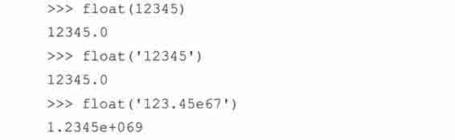

不幸的是, float()对输入很挑剔：

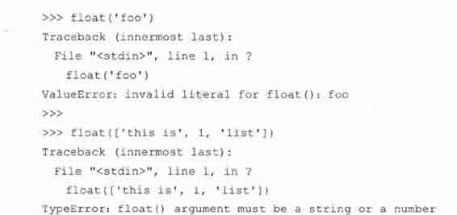

从上面的错误我们可以看出，float()对不合法的参数很不客气。例如，如果参数的类型正确（字符串），但值不可转换为浮点型，那么将引发 ValueError 异常，因为这是值的错误。列表也是不合法的参数，因为他的类型不正确，所以引发一个 TypeError 异常。

我们的目标是“安全地”调用 float()函数，或是使用一个“安全的方式”忽略掉错误，因为它们与我们转换数值类型的目标没有任何联系，而且这些错误也没有严重到要让解释器终止执行。为了实现我们的目的，这里我们创建了一个“封装”函数，在 try-except 的协助下创建我们预想的环境，我们把他叫做 safe_float()。在第一次改进中我们搜索并忽略 ValueError,因为这是最常发生的。而 TypeError 并不常见，我们一般不会把非字符串数据传递给 float()。

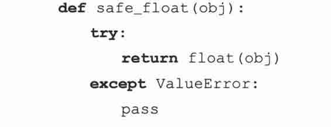

我们采取的第一步只是“止血”。在上面的例子中，我们把错误“吞了下去”。换句话说，错误会被探测到，而我们在 except 从句里没有放任何东西（除了一个 pass，这是为了语法上的需要），不进行任何处理，忽略这个错误。

这个解决方法有一个明显的不足，它在出现错误的时候没有明确地返回任何信息。虽然返回了 None（当函数没有显式地返回一个值时，例如没有执行到 return object 语句函数就结束了，它就返回 None）,我们并没有得到任何关于出错信息的提示。我们至少应该显式地返回 None,来使代码更容易理解：

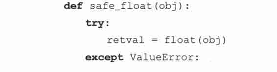

注意我们刚才做的修改，我们只是添加了一个局部变量。在有设计良好的应用程序接口（ApplicationProgrammer Interface, API）时，返回值可以更灵活。你可以在文档中这样写，如果传递给 safe_float()合适的参数，它将返回一个浮点型；如果出现错误，将返回一个字符串说明输入数据有什么问题。我们按照这个方案再修改一次代码，如下所示：

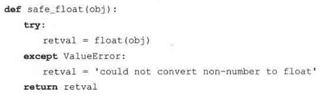

这里我们只是把 None 替换为一个错误字符串。下面我们试试这个函数看看它表现如何：

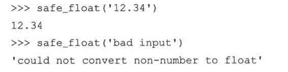

我们有了一个好的开始——现在我们已经可以探测到非法的字符串输入了，可如果传递的是一个非法的对象，还是会“受伤”：

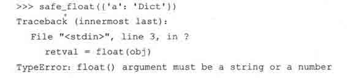

我们暂时只是指出这个缺点，在进一步改进程序之前，首先来看看 try-except 的其他灵活的语法，特别是 except 语句，它有好几种变化形式。

### 10.3.3　带有多个 except 的 try 语句

在本章的前边，我们已经介绍了 except 的基本语法：

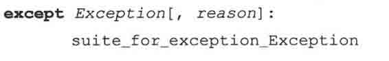

这种格式的 except 语句指定检测名为 Exception 的异常。你可以把多个 except 语句连接在一起，处理一个 try 块中可能发生的多种异常，如下所示：

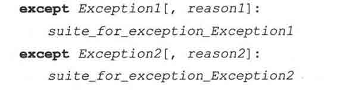

同样，首先尝试执行 try 子句，如果没有错误，忽略所有的 except 从句继续执行。如果发生异常，解释器将在这一串处理器（except 子句）中查找匹配的异常如果找到对应的处理器，执行流将跳转到这里。

我们的 safe_float()函数已经可以检测到指定的异常了。更聪明的代码能够处理好每一种异常。这就需要多个 except 语句，每个 except 语句对应一种异常类型。Python 支持把 except 语句串连使用我们将分别为每个异常类型分别创建对应的错误信息，用户可以得到更详细的关于错误的信息：

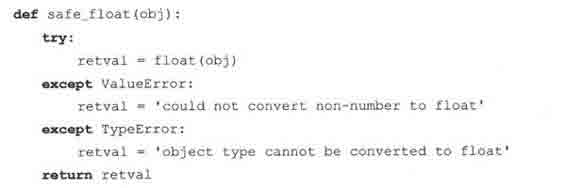

使用错误的参数调用这个函数，我们得到下面的输出结果：

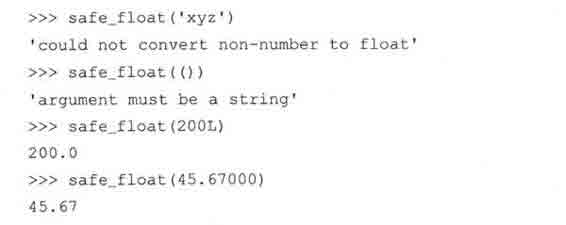

### 10.3.4　处理多个异常的 except 语句

我们还可以在一个 except 子句里处理多个异常。except 语句在处理多个异常时要求异常被放在一个元组里：

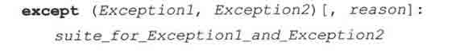

上边的语法展示了如何处理同时处理两个异常。事实上 except 语句可以处理任意多个异常，前提只是它们被放入一个元组里，如下所示：

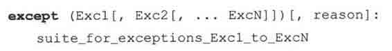

如果由于其他原因，也许是内存规定或是设计方面的因素，要求 safe_float()函数中的所有异常必须使用同样的代码处理，那么我们可以这样满足需求：

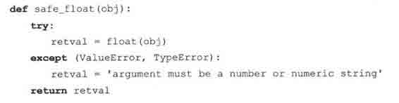

现在，错误的输入会返回相同的字符串：

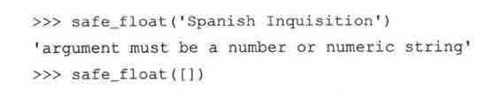

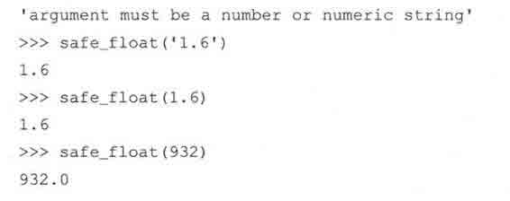

### 10.3.5　捕获所有异常

使用前一节的代码，我们可以捕获任意数目的指定异常，然后处理它们。如果我们想要捕获所有的异常呢？当然可以!自版本 1.5 后，异常成为类，实现这个功能的代码有了很大的改进。也因为这点（异常成为类），我们现在有一个异常继承结构可以遵循。

如果查询异常继承的树结构，我们会发现 Exception 是在最顶层的，所以我们的代码可能看起来会是这样：

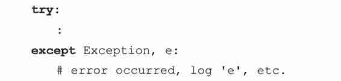

另一个我们不太推荐的方法是使用空 except 子句：

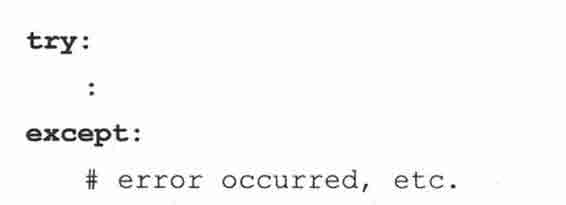

这个语法不如前个“Pythonic”。虽然这样的代码捕获大多异常，但它不是好的 Python 编程样式。一个主要原因是它不会考虑潜在的会导致异常的主要原因。我们的 catch-all 语句可能不会如你所想的那样工作，它不会调查发生了什么样的错误，如何避免它们。

我们没有指定任何要捕获的异常——这不会给我们任何关于可能发生的错误的信息。另外它会捕获所有异常，你可能会忽略掉重要的错误，正常情况下这些错误应该让调用者知道并做一定处理。最后，我们没有机会保存异常发生的原因。当然，你可以通过 sys.exc_info()获得它，但这样你就不得不去导入 sys 模块，然后执行函数——这样的操作本来是可以避免的，尤其当我们需要立即告诉用户为什么发生异常的时候。在 Python 的未来版本中很可能不再支持空 except 子句（参见“核心风格”）。

关于捕获所有异常，你应当知道有些异常不是由于错误条件引起的。它们是 SystemExit 和 KeyboardInterupt。 SystemExit 是由于当前 Python 应用程序需要退出，KeyboardInterupt 代表用户按下了 CTRL-C （^C）,想要关闭 Python。在真正需要的时候，这些异常却会被异常处理捕获。一个典型的迂回工作法代码框架可能会是这样：

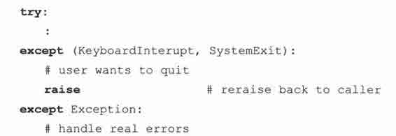

关于异常的一部分内容在 Python2.5 有了一些变化。异常被迁移到了新式类（new-style class）上，启用了一个新的“所有异常之母”，这个类叫做 BaseException,异常的继承结构有了少许调整，为了让人们摆脱不得不除创建两个处理器的惯用法。KeyboardInterrupt 和 SystemExit 被从 Exception 里移出和 Exception 平级：

你可以在表 10.2 找到整个异常继承结构（变化前后）。

这样，当你已经有了一个 Exception 处理器后，你不必为这两个异常创建额外的处理器。代码将会是这样：

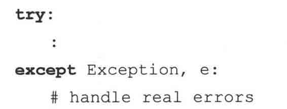

如果你确实需要捕获所有异常，那么你就得使用新的 BaseException:

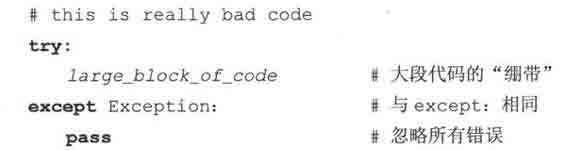

当然，也可以使用不被推荐的空 except 子句。

核心风格：不要处理并忽略所有错误

* * *

Python 提供给程序员的 try-except 语句是为了更好地跟踪潜在的错误并在代码里准备好处理异常的逻辑。这样的机制在其他语言（例如 C）是很难实现的。它的目的是减少程序出错的次数并在出错后仍能保证程序正常执行。作为一种工具而言，只有正确得当地使用它，才能使其发挥作用。

一个不正确的使用方法就是把它作为一个大绷带“绑定”到一大片代码上。也就是说把一大段程序（如果还不是整个程序源代码的话）放入一个 try 块中，再用一个通用的 except 语句“过滤”掉任何致命的错误，忽略它们。

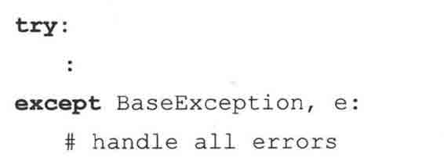

很明显，错误无法避免，try-except 的作用是提供一个可以提示错误或处理错误的机制，而不是一个错误过滤器。上边这样的结构会忽略许多错误，这样的用法是缺乏工程实践的表现，我们不赞同这样做。

底线：避免把大片的代码装入 try-except 中然后使用 pass 忽略掉错误。你可以捕获特定的异常并忽略它们，或是捕获所有异常并采取特定的动作。不要捕获所有异常，然后忽略掉它们。

* * *

### 10.3.6　“异常参数”

异常也可以有参数，异常引发后它会被传递给异常处理器。当异常被引发后参数是作为附加帮助信息传递给异常处理器的。虽然异常原因是可选的，但标准内建异常提供至少一个参数，指示异常原因的一个字符串。

异常的参数可以在处理器里忽略，但 Python 提供了保存这个值的语法。我们已经在上边接触到相关内容：要想访问提供的异常原因，你必须保留一个变量来保存这个参数。把这个参数放在 except 语句后，接在要处理的异常后面。except 语句的这个语法可以被扩展为：

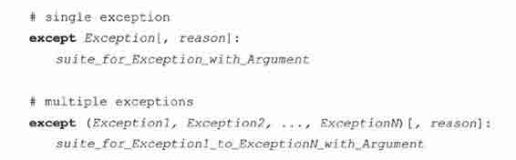

reason 将会是一个包含来自导致异常的代码的诊断信息的类实例。异常参数自身会组成一个元组，并存储为类实例（异常类的实例）的属性。上边的第一种用法中，reason 将会是一个 Exception 类的实例。

对于大多内建异常，也就是从 StandardError 派生的异常，这个元组只包含一个指示错误原因的字符串。一般说来，异常的名字已经是一个满意的线索了，但这个错误字符串会提供更多的信息。操作系统或其他环境类型的错误，例如 IOError,元组中会把操作系统的错误编号放在错误字符串前。

无论 reason 只包含一个字符串或是由错误编号和字符串组成的元组，调用 str （reason）总会返回一个良好可读的错误原因。不要忘记 reason 是一个类实例——这样做你其实是调用类的特殊方法 _str_()。我们将在第十三章探索面向对象编程中的这些特殊方法。

唯一的问题就是某些第三方或是其他外部库并不遵循这个标准协议。我们推荐你在引发你自己的异常时遵循这个标准（参见核心风格）。

核心风格：遵循异常参数规范

* * *

当你在自己的代码中引发内建 （built-in）的异常时，尽量遵循规范，用和已有 Python 代码一致错误信息作为传给异常的参数元组的一部分。简单地说，如果你引发一个 ValueError,那么最好提供和解释器引发 ValueError 时一致的参数信息，以此类推。这样可以在保证代码一致性，同时也能避免其他应用程序在使用你的模块时发生错误。

* * *

如下边的例子，它传参给内建 float 函数一个无效的对象，引发 TypeError 异常：

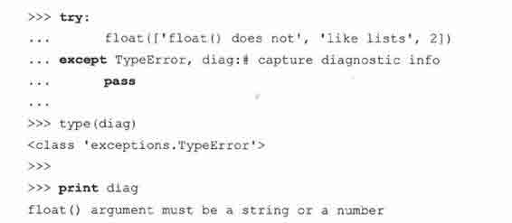

我们首先在一个 try 语句块中引发一个异常，随后简单的忽略了这个异常，但保留了错误的信息。调用内置的 type()函数，我们可以确认我们的异常对象的确是 TypeError 异常类的实例。最后我们对异常诊断参数调用 print 以显示错误。

为了获得更多的关于异常的信息，我们可以调用该实例的 _class_ 属性，它标示了实例是从什么类实例化而来。类对象也有属性，比如文档字符串（documentation string）和进一步阐明错误类型的名称字符串：

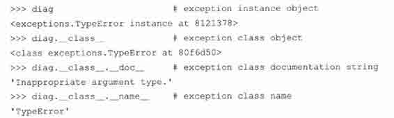

我们会在第十三章中发现，_class_ 属性存在于所有的类实例中，而 _doc_ 类属性存在于所有的定义了文档字符串的类中。

我们现在再次来改进我们的 saft_float()以包含异常参数，当 float()发生异常时传给解释器。在前一次改进中，我们在一句话中同时捕获了 ValueError 和 TypeError 异常以满足某些需求。但还是有瑕疵，那个解决方案中没有线索表明是哪一种异常引发了错误。它仅仅是返回了一个错误字符串指出有无效的参数。现在，通过异常参数可以改善这种状况。

因为每一个异常都将生成自己的异常参数，如果我们选择用这个字符串来而不是我们自定义的信息，可以提供一个更好的线索来指出问题。下面的代码片段中，我们用字符串化（string representation）的异常参数来替换单一的错误信息。

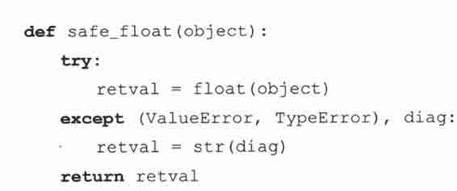

在此基础上运行我们的新代码，当我们提供 safe_float()的参数给不恰当时，虽然还是只有一条捕获语句，但是可以获得如下（不同的）信息。

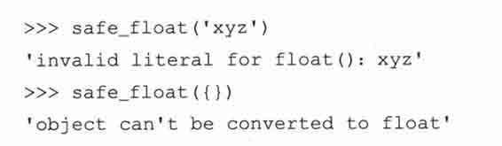

### 10.3.7　在应用使用我们封装的函数

我们将在一个迷你应用中特地的使用这个函数。它将打开信用卡交易的数据文件（carddata.txt）,加载所有的交易，包括解释的字符串。下面是一个示例的 carddate.txt 文件：

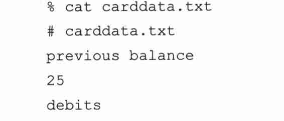

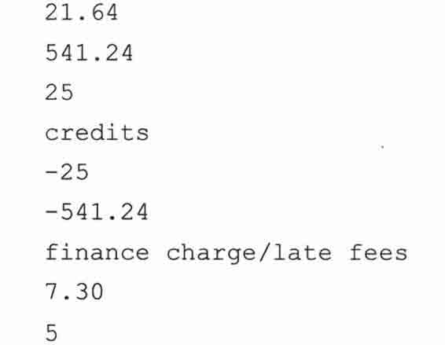

我们的程序 cardrun.py 见例 10.1。

例 10.1　信用卡交易系统（cardrun.py）

我们用 safe_float()来处理信用卡交易文件，将其作为字符串读入。并用一个日志文件跟踪处理进程。

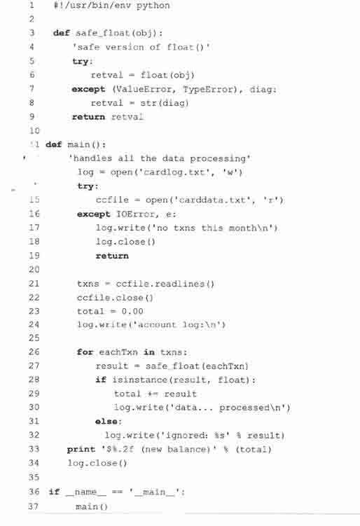

逐行解释

3 ~ 9 行

这段代码是 safe_float()函数的主体。

11 ~ 34 行

我们应用的核心部分有 3 个主要任务：

（1）读入信用卡的数据文件；

（2）处理输入；

（3）显示结果。

14 ~ 22 行

从文件中提取数据。你可以看到这里的文件打开被置于 try-except 语句段中。

同时还有一个处理的日志文件。在我们的例子中，我们假设这个日志文件可以不出错的打开。你可以看到我们的处理进程伴随着这个日志文件。如果信用卡的数据文件不能够被访问，我们可以假设该月没有信用卡交易（行 16~19）。

数据被读入 txns （transactions 交易）列表，随后在 26〜32 行遍历它。每次调用 safe_float()后，我们用内建的 isinstance 函数检查结果类型。在我们例子中，我们检查 safe_float 是返回字符串还是浮点型。任何字符串都意味着错误，表明该行不能转换为数字，同时所有的其他数字可以作为浮点型累加入 total。在 main()函数的尾行会显示最终生成的余额。

36 ~ 37 行

这两行通常表明“仅在非导入时启动”的功能。运行我们程序，可以得到如下的输出。

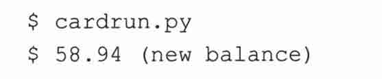

我们再看看 log 文件（cardlog.txt）,我们可以看到在处理完 carddata.txt 中的交易后有其有如下的记录条目：

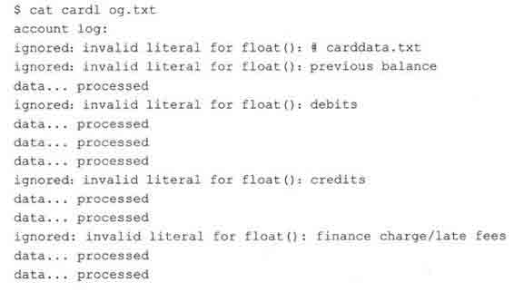

### 10.3.8　else 子句

我们已经看过 else 语句段配合其他的 Python 语句，比如条件和循环。至于 try-except 语句段，它的功能和你所见过的其他 else 没有太多的不同：在 try 范围中没有异常被检测到时，执行 else 子句。

在 else 范围中的任何代码运行前，try 范围中的所有代码必须完全成功（也就是，结束前没有引发异常）。下面是用 Python 伪代码写的简短例子。

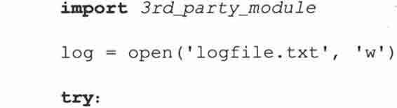

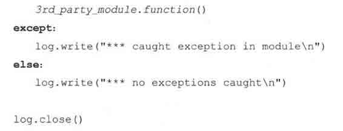

在前面的例子中，我们导入了一个外部的模块然后测试是否有错误。用一个日志文件来确定这个第三方模块是有无缺陷。根据运行时是否引发异常，我们将在日志中写入不同的消息。

### 10.3.9　finally 子句

finally 子句是无论异常是否发生，是否捕捉都会执行的一段代码。你可以将 finally 仅仅配合 try 一起使用，也可以和 try-except （else 也是可选的）一起使用。独立的 try-finally 将会在下一章介绍，我们稍后再来研究。

从 Python 2.5 开始，你可以用 finally 子句（再一次）与 try-except 或 try-except-else—起使用。之所以说是“再一次”是因为无论你相信与否，这并不是一个新的特性。回顾 Python 初期，这个特性早已存在，但是在 Python 0.9.6（1992 4 月）中被移除。那时，这样可以简化字节码的生成，并方便解析，另外 van Rossum 认为一个标准化的 try-except（-else）-finally 无论如何不会太流行。然而，十年时间改变了一切！

下面是 try-except-else-finally 语法的示例：

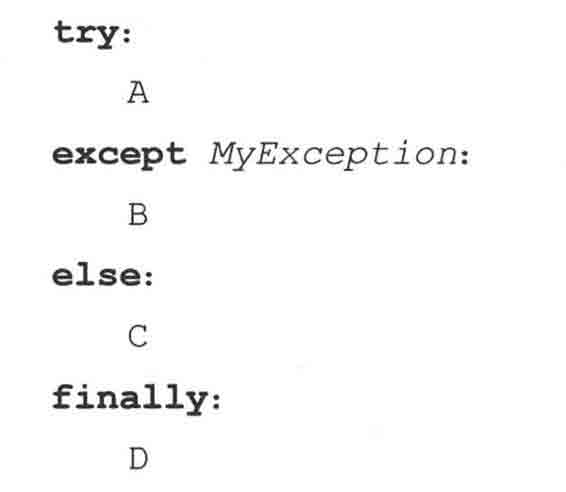

等价于 Python 0.9.6 至 2.4.x 中如下的写法：

当然，无论如何，你都可以有不止一个的 except 子句，但最少有一个 except 语句，而 else 和 finally 都是可选的。A、B、C 和 D 是程序（代码块）。程序会按预期的顺序执行。（注意：可能的顺序是 A-C-D[正常]或 A-B-D[异常]）。无论异常发生在Α、Β和/或 C 都将执行 finally 块。旧式写法依然有效，所以没有向后兼容的问题。

### 10.3.10　try-finally 语句

另一种使用 finally 的方式是 finally 单独和 try 连用。这个 try-finally 语句和 try-except 区别在于它不是用来捕捉异常的。作为替代，它常常用来维持一致的行为而无论异常是否发生。我们得知无论 try 中是否有异常触发，finally 代码段都会被执行。

当在 try 范围中产生一个异常时，（这里）会立即跳转到 finally 语句段。当 finally 中的所有代码都执行完毕后，会继续向上一层引发异常。

因而常常看到嵌套在 try-except 中的 try-finally 语句。当在读取 carddata.txt 中文本时可能引发异常，我们可以在 cardrun.py 的这一处添加 try-finally 语句段来改进代码。在当前示例 10.1 的代码中，我们在读取阶段没有探测到错误（通过 readlines()）。

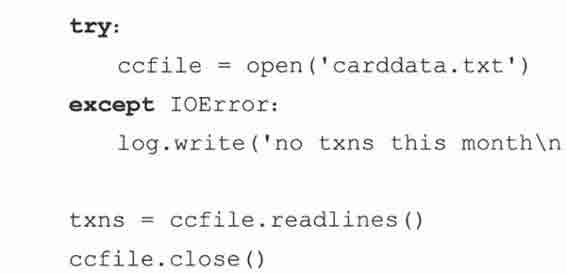

但有很多原因会导致 readlines()失败，其中一种就是 carddata.txt 存在于网络（或软盘）上，但是变得不能读取。无论怎样，我们可以把这一小段读取数据的代码整个放入 try 子句的范围中：

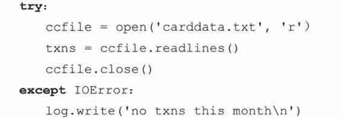

我们所做的一切不过是将 readline()和 close()方法调用都移入了 try 语句段。尽管我们代码变得更加的健壮了，但还有改进的空间。注意如果按照这样的顺序发生错误：打开成功，但是出于一些原因 readlines()调用失败，异常处理会去继续执行 except 中的子句，而不去尝试关闭文件。难道没有一种好的方式来关闭文件而无论错误是否发生?我们可以通过 try-finally 来实现：

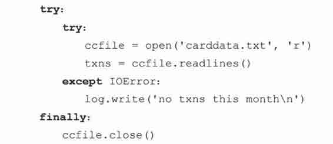

代码片段会尝试打开文件并且读取数据。如果在其中的某步发生一个错误，会写入日志，随后文件被正确的关闭。如果没有错误发生，文件也会被关闭（同样的功能可以通过上面标准化的 try-except-finally 语句段实现）。另一种可选的实现切换了 try-except 和 try-finally 包含的方式，如：

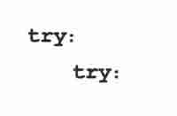

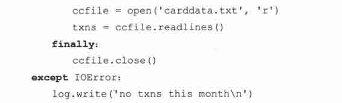

代码本质上千的是同一种工作，除了一些小小的不同。最显著的是关闭文件发生在异常处理器将错误写入日志之前。这是因为 finally 会自动的重新引发异常。

这样写的一个理由是如果在 finally 的语句块内发生了一个异常，你可以创建一个同现有的异常处理器在同一个（外）层次的异常处理器来处理它。这样，从本质上来说，就可以同时处理在原始的 try 语句块和 finally 语句块中发生的错误。这种方法唯一的问题是，当 finally 语句块中的确发生异常时，你会丢失原来异常的上下文信息，除非你在某个地方保存了它。

反对这种写法的一个理由是：在很多情况下，异常处理器需要做一些扫尾工作，而如果你在异常处理之前，用 finally 语句块中释放了某些资源，你就不能再去做这项工作了。简单地说，finally 语句块并不是如你所想的是“最终的（final）”了。

一个最终的注意点：如果 finally 中的代码引发了另一个异常或由于 return、break、continue 语法而终止，原来的异常将丢失而且无法重新引发。

### 10.3.11　try-except-else-finally：厨房一锅端

我们综合了这一章目前我们所见过的所有不同的可以处理异常的语法样式：

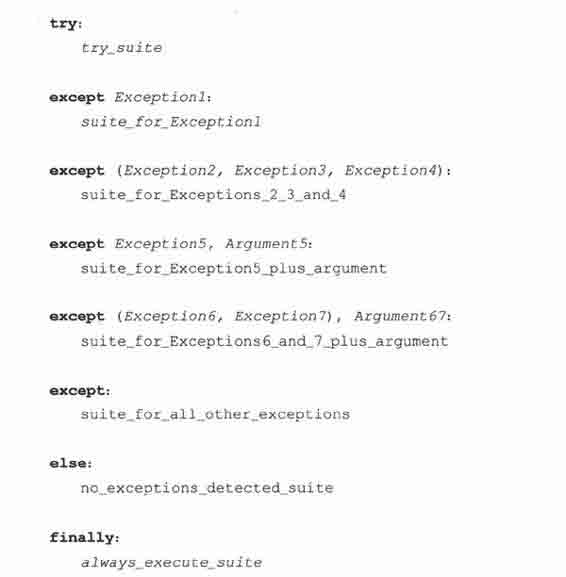

回顾上面，finally 子句和 try-except 或 try-except-else 联合使用是 Python 2.5 的“新”有的。这一节最重要的是无论你选择什么语法，你至少要有一个 except 子句，而 else 和 finally 都是可选的。

## 10.4　上下文管理

### 10.4.1　with 语句

如上所述的标准化的 try-except 和 try-finally 可以使得程序更加“Pythonic”，其含义是，在许多的其他特性之外，写得更加轻松，读得自在。Python 对隐藏细节已经做了大量的工作，因此需要你操心的仅是如何解决你所遇到的问题（你能假想移植一个复杂的 Python 应用到 C++或 Java 吗？）。

另一个隐藏低层次的抽象的例子是 with 语句，它在 Python 2.6 中正式启用（Python2.5 尝试性的引入了 with，并对使用 with 作为标识符的应用程序发出这样的警告——在 Python 2.6 中，with 将会成为关键字。如果你想在 Python 2.5 使用 with 语句，你必须用 from__future_import with_statement 来导入它）。

类似于 try-except-finally，with 语句也是用来简化代码的，这与用 try-except 和 try-finally 所想达到的目的前后呼应。try-except 和 try-finally 的一种特定的配合用法是保证共享的资源的唯一分配，并在任务结束的时候释放它。比如文件（数据、日志、数据库等等）、线程资源、简单同步、数据库连接，等等。with 语句的目标就是应用在这种场景。

然而，with 语句的目的在于从流程图中把 try、except 和 finally 关键字和资源分配释放相关代码统统去掉，而不是像 try-except-finally 那样仅仅简化代码使之易用。with 语法的基本用法如下：

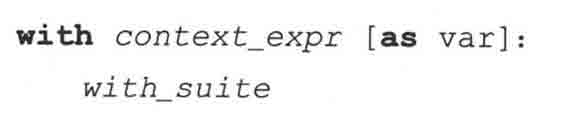

看起来如此简单，但是其背后还有一些工作要做。这并不如看上去的那么容易，因为你不能对 Python 的任意符号使用 with 语句。它仅能工作于支持上下文管理协议（context managementprotocol）的对象。这显然意味着只有内建了“上下文管理”的对象可以和 with 一起工作。我们过一会再来阐明它的含义。

现在，正如一个新的游戏硬件，每当有一个新的特性推出时，第一时间总有人开发出相应的新游戏，从而你打开盒子就可以开始玩了。类似，目前已经有了一些支持该协议的对象。下面是第一批成员的简短列表：

•　file

•　decimal.Context

•　thread.LockType

•　threading.Lock

•　threading.RLock

•　threading.Condition

•　threading.Semaphore

•　threading.BoundedSemaphore

既然 file 是上面的列表上的第一个也是最易于演示的，下面就给出一段和 with 一起使用的代码片段。

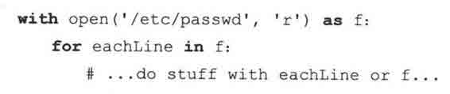

这个代码片段干了什么呢，这是 Python,因而你很可能已经猜到了。它会完成准备工作，比如试图打开一个文件，如果一切正常，把文件对象赋值给 f.然后用迭代器遍历文件中的每一行，当完成时，关闭文件。无论的在这一段代码的开始，中间，还是结束时发生异常，会执行清理的代码，此外文件仍会被自动的关闭。

因为已经从你手边拿走了一堆细节，所以实际上只是进行了两层处理：

第一，发生用户层——和 in 类似，你所需要关心的只是被使用的对象；

第二，在对象层。既然这个对象支持上下文管理协议，它干的也就是“上下文管理”。

### 10.4.2　*上下文管理协议

除非你打算自定义可以和 with 一起工作的类，比如：别的程序员会在他们的设计的应用中使用你的对象。绝大多数 Python 程序员仅仅需要使用 with 语句，可以跳过这一节。

我们不打算在这里对上下文管理做深入且详细的探讨，但会介绍兼容协议所必须的对象类型与功能，使其能和 with 一起工作。

前面，我们在例子中描述了一些关于协议如何和文件对象协同工作。让我们在此进一步地研究。

1.上下文表达式（context_expr），上下文管理器

当 with 语句执行时，便执行上下文符号（译者注：就是 with 与 as 间内容）来获得一个上下文管理器。上下文管理器的职责是提供一个上下文对象。这是通过调用 __context__()方法来实现的。该方法返回一个上下文对象，用于在 with 语句块中处理细节。有点需要注意的是上下文对象本身就可以是上下文管理器。所以 context_expr 既可以为一个真正的上下文管理器，也可以是一个可以自我管理的上下文对象。在后一种情况时，上下文对象仍然有 _context_()方法，返回其自身，如你所想。

2.上下文对象，with 语句块

一旦我们获得了上下文对象，就会调用它的 __enter()__ 方法。它将完成 with 语句块执行前的所有准备工作。你可以注意到在上面的 with 行的语法中有一个可选的 as 声明变量跟随在 context_expr 之后。如果提供提供了变量，以 _enter()_ 返回的内容来赋值；否则，丢弃返回值。在我们的文件对象例子中，上下文对象的 _enter()_ 返回文件对象并赋值给 f。

现在，执行了 with 语句块。当 with 语句块执行结束，无论是“和谐地”还是由于异常，都会调用上下文对象的 __exit()__ 方法。__exit__()有三个参数。如果 with 语句块正常结束，三个参数全部是 None。如果发生异常，三个参数的值的分别等于调用 sys.exc_info()函数（见 10.12）返回的三个值：类型（异常类）、值（异常实例）和跟踪记录（traceback）,相应的跟踪记录对象。

你可以自己决定如何在 __exit__()里面处理异常。惯例是当你处理完异常时不返回任何值，或返回 None,或返回其他布尔值为 False 对象。这样可以使异常抛给你的用户来处理。如果你明确地想屏蔽这个异常，返回一个布尔为 True 的值。如果没有发生异常或你在处理异常后返回 True,程序会继续执行 with 子句后的下一段代码。

因为上下文管理器主要作用于共享资源，你可以想象到 _enter()__ 和 _exit()_ 方法基本是干的需要分配和释放资源的低层次工作，比如：数据库连接、锁分配、信号量加减、状态管理、打开/关闭文件、异常处理等。

为了帮助你编写对象的上下文管理器，有一个 contextlib 模块，包含了实用的 functions/decorators,你可以用在你的函数/对象上而不用去操心关于类或 _context__()、__enter()_、__enter()__ 和 _exit()_ 这些方法的实现。

想了解更多关于上下文管理器的信息，请查看官方的 Python 文档的 with 语法和 contextlib 模块、类的指定方法（与 with 和 contexts 相关的）、PEP 343 和《What’s New in Python 2.5 （Python 2.5 的更新）》的文档。

## 10.5　*字符串作为异常

早在 Python 1.5 前，标准的异常是基于字符串实现的。然而，这样就限制了异常之间不能有相互关系。这种情况随着异常类的来临而不复存在。到 1.5 为止，所有的标准异常都是类了。程序员还是可以用字符串作为自己的异常的，但是我们建议从现在起使用异常类。

为了向后兼容性，还是可以启用基于字符串的异常。从命令行以-X 为参数启动 Python 可以提供你字符串方式的标准异常。从 Python1.6 起这个特性被视为废弃的。

Python 2.5 开始处理向来不赞成使用的字符串异常。在 2.5 中，触发字符串异常会导致一个警告。在 2.6，捕获字符串异常会导致一个警告。由于它很少被使用而且已经被废弃，我们将不再在本书范围内考虑字符串异常并且已经去除相关文字。（在本书的早期版本中你会找到这些）。唯一也是最后的中肯警告是：你可能用到仍然使用着字符串异常的外部或第三方的模块。字符串异常总而言之是一个糟糕的想法，读者可以回想，有着拼写错误的 Linux RPM 异常如在眼前。

## 10.6　触发异常

到目前为止，我们所见到的异常都是由解释器引发的。由于执行期间的错误而引发。程序员在编写 API 时也希望在遇到错误的输入时触发异常，为此，Python 提供了一种机制让程序员明确的触发异常，这就是 raise 语句。

raise 语句

1.语法与惯用法

raise 语句对所支持是参数十分灵活，对应到语法上就是支持许多不同的格式。rasie 一般的用法是：

raise [SomeException [, args [, traceback]]]

第一个参数，SomeExcpetion,是触发异常的名字。如果有，它必须是一个字符串，类或实例（详见下文）。如果有其他参数（arg 或 traceback）,就必须提供 SomeExcpetion.Python 所有的标准异常见表 10.2。

第二个符号为可选的 args（比如参数，值），来传给异常。这可以是一个单独的对象也可以是一个对象的元组。当异常发生时，异常的参数总是作为一个元组传入。如果 args 原本就是元组，那么就将其传给异常去处理；如果 args 是一个单独的对象，就生成只有一个元素的元组（就是单元素元组）。大多数情况下，单一的字符串用来指示错误的原因。如果传的是元组，通常的组成是一个错误字符串、一个错误编号，可能还有一个错误的地址，比如文件，等等。

最后一项参数，traceback,同样是可选的（实际上很少用它）。如果有的话，则是当异常触发时新生成的一个用于异常-正常化（exception—normally）的跟踪记录（traceback）对象。当你想重新引发异常时，第三个参数很有用（可以用来区分先前和当前的位置）。如果没有这个参数，就填写 None。

最常见的用法为 SomeException 是一个类。不需要其他的参数，但如果有的话，可以是一个单一对象参数，一个参数的元组，或一个异常类的实例。如果参数是一个实例，可以由给出的类及其派生类实例化（已存在异常类的子集）。若参数为实例，则不能有更多的其他参数。

2.更多的特殊/少见的惯用法

当参数是一个实例的时候会发生什么呢？该实例若是给定异常类的实例当然不会有问题。然而，如果该实例并非这个异常类或其子类的实例时，那么解释器将使用该实例的异常参数创建一个给定异常类的新实例。如果该实例是给定异常类子类的实例，那么新实例将作为异常类的子类出现，而不是原来的给定异常类。

如果 raise 语句的额外参数不是一个实例——作为替代，是一个单件（singleton）或元组——那么，将用这些作为此异常类的初始化的参数列表。如果不存在第二个参数或是 None，则参数列表为空。

如果 SomeException 是一个实例，我们就无需对什么进行实例化了。这种情况下，不能有额外的参数或只能是 None。异常的类型就是实例的类；也就是说，等价于触发此类异常，并用该实例为参数，比如 raise instance.__class__, instance。

我们建议用异常类，不赞成用字符串异常。但如果用字符串作为 SomeException,那么会触发一个用字符串标识的异常，还有一个可选的参量（args）作参数。

最后，这种不含任何参数的 raise 语句结构是在 Pythonl.5 中新引进的，会引发当前代码块（code block）最近触发的一个异常。如果之前没有异常触发，会因为没可以有重新触发的异常而生成一个 TypeError 异常。

由于 raise 有许多不同格式有效语法（比如：SomeException 可以是类，实例或一个字符串），我们提供表 10.1 来阐明 rasie 的不同用法。

## 10.7　断言

断言是一句必须等价于布尔真的判定；此外，发生异常也意味着表达式为假。这些工作类似于 C 语言预处理器中 assert 宏，但在 Python 中它们在运行时构建（与之相对的是编译期判别）。

如果你刚刚接触断言这个概念也没有关系。断言可以简简单单的想象为 raise-if 语句（更准确的说是 raise-if-not 语句）。测试一个表达式，如果返回值是假，触发异常。

断言通过 assert 语句实现，在 1.5 版中引入。

断言语句

断言语句等价于这样的 Python 表达式，如果断言成功不采取任何措施（类似语句），否则触发 AssertionError（断言错误）的异常.assert 的语法如下：

下面有一些演示 assert 用法的语句：

AssertionError 异常和其他的异常一样可以用 try-except 语句块捕捉，但是如果没有捕捉，它将终止程序运行而且提供一个如下的跟踪记录：

如同先前章节我们研究的 raise 语句，我们可以提供一个异常参数给我们的 assert 命令：

下面是我们如何用 try-except 语句捕获 AssertionError 异常：

从命令行执行上面的代码会导致如下的输出：

为了让你更加了解 assert 如何运作，想象一下断言语句在 Python 中如何用函数实现。可以像下面这样：

此处的 if 语句检查 assert 的语法是否合适，也就是 expr 必须是一个表达式。我们比较 expr 的类型和真正的表达式来确认。函数的第二部分对表达式求值然后根据结果选择性的引发异常。内建的变量 __debug_ 在通常情况下为 True,如果开启优化后为 False（命令行选项-O）（Python 2.2 后为布尔值 True 和 False）。

## 10.8　标准异常

表 10.2 列出了所有的 Python 当前的标准异常集，所有的异常都是内建的。所以它们在脚本启动前或在互交命令行提示符出现时已经是可用的了。

所有的标准/内建异常都是从根异常派生的。目前，有 3 个直接从 BaseException 派生的异常子类：SystemExit, Keyboardlnterrupt 和 Exception。其他的所有的内建异常都是 Exception 的子类。表 10.2 中的每一层缩进都代表一次异常类的派生。

到了 Python2.5，所有的异常的都是新式类，并且最终都是 BaseException 的子类。在这一版中，SystemExit 和 Keyboardlnterrupt 从 Exception 的继承中移到 BaseException 的继承中，这样可以允许如 except Exception 的语句捕获所有非控制程序退出的异常。

从 Pythonl.5 到 Python2.4.x，异常是标准的类，在这之前，他们是字符串。从 Python2.5 开始，不再支持构建基于字符串的异常并且被正式的弃用，也就是说你不能再触发一个字符串异常了。在 2.6，你将不能捕获他们。还有一个要求就是所有新的异常最终都是 BaseException 的子类，以便于他们有一个统一的接口。这将从 Python2.7 开始，并在余下的 Python2.x 发布版中延续。

## 10.9　*创建异常

尽管标准异常集包含的内容已经相当广泛，你还是可以创建自己的异常。一种情况是你想在特定的标准异常和模块异常中添加额外的信息。我们将介绍两个例子，都与 IOError 有关。IOError 是一个用于输入/输出地通用异常，可能在无效的文件访问或其他形式的通信中触发。假如我们想要更加明确地标明问题的来源，比如：对于文件错误，我们希望有行为类似 IOError 的一个 FileError 异常，但是名字表明是在执行文件操作。

我们将查看的另一个异常与套接字（socket）网络编程有关。socket 模块生成的异常叫 socket.error，不是内建的异常。它从通用 Exception 类派生。然而 socket.error 这个异常的宗旨和 IOError 很类似，所以我们打算定义一个新的从 IOError 派生的 NetworkError 的异常，但是其包含了 socket.error 提供的信息。

如同类和面向对象编程，我们暂时不会正式介绍网络编程，如果你需要的话可以跳到 16 章。

我们现在给出一个叫做 myexc.py 的模块和我们自定义的新异常 FileError 与 NetworkError.代码如例 10.2。

例 10.2　创建异常（myexc.py）

此模块定义了两个新的异常，FileError 和 NetworkError，也重新实现了一个诊断版的 openO[myopen()]和 socket.connect()[myconnect()]。同时包含了一个测试函数[test()]，当直接运行文件时执行。

1 ~ 3 行

模块的开始部分是 Unix 启动脚本和 socket、os、errno、types 和 tempfile 模块的导入。

5 ~ 9 行

无论你是否相信，这 5 行代码定义了我们的新异常。不是仅仅一个，而是两个。除了将要介绍的一个新功能，创建一个新的异常仅需要从一个已经存在的异常类派生一个出子类。本例中，这个基类是 IOError。我们也可以从 IOError 的基类 EnvironmentError 派生，但我们想明确表明我们的异常是 I/O 相关的。

我们选择 IOError 是因为它提供了两个参数，一个错误编号和一个错误字符串。文件相关[用 open()]的 IOError 异常甚至支持大部分异常没有的第三个参数，那个可以是文件名。我们将对这个在主要元组之外的，名字叫“filename”的参数执行一些特定的操作。

11 ~ 21 行

updArgs()函数的全部意图就是“更新”异常的参数。我们这里的意思是原来的异常提供给我们一个参数集。我们希望获取这些参数并让其成为我们新的异常的一部分，可能是嵌入或添加第三个参数（如果没有传入，什么也不添加——None 是其默认值，我们下一章将会学习）。我们的目标是提供更多的细节信息给用户，这样当问题发生时能够尽快的捕捉到。

23 ~ 53 行

函数 fileArgs()仅在 myopen()中使用（如下）。实际上，我们寻找表示”没有权限（permission denied.）”的错误 EACCES。其他所有的 IOError 异常我们将不加修改（54〜55 行）的传递。如果你对 ENXIO、EACCES 和其他的系统错误号感到好奇，你可以从 Unix 系统下/usr/include/sys/errno.h 或 Windows 系统下 Visula C++的 C: \Msdev\include\Errno.h 文件来对它们刨根究底。

在第 27 行，我们也确认了我们当前使用的机器支持 os.access()函数，它用来检查对任意一个特定文件你所拥有的权限。除非我们收到权限错误同时也能够检查我们拥有的权限，否则我们什么不做。当一切完毕，我们设置一个字典来帮助构建表示我们对文件所拥有的权限的字符串。

Unix 文件系统清晰标明用户（user）、组（group，可以有多个用户属于一个组）和其他（other，不是所有者，也不和所有者同组的用户）对文件的读、写、执行（‘r’, ‘w’, ‘x’）的权限。

Windows 支持这些权限中的一部分。现在可以来构建权限字符串了。如果对文件有某种权限，字符串中就有相应的字母，否则用‘-’替代。比如，字符串‘rw-’标明你可以对其进行读/写访问。如果字符串是‘r-x’，你仅可¯以对其进行读和执行操作；‘---’标示没有任何权限。

当权限字符串构建完成后，我们创建了一个临时的参数列表。我们随后更改了错误字符串使之包含权限字符串。（标准的 IOError 异常并没有提供权限字符串相关信息）。”Permission denied（没有权限）”这个错误似乎很愚蠢，而且系统并没有提供纠正它的方法。当然这是出于安全的考虑。当入侵者没有权限访问某个东西时，最好不要让他们看到文件的权限。不过，我们的例子仅仅是一个练习，所以我们可以暂时地”违背安全”。问题的关键在于确认调用 os.chmod()函数修改后的文件权限是不是你的本意。

最后一件事情我们把文件名加入参数列表，并以元组形式返回参数。

55 ~ 65 行

我们新的 myconnect()函数仅仅是简单的对套接字的函数 conect()进行包装当网络连接失败时提供一个 IOError 类型的异常。和一般的 socket.error 不一样，我们还提供给程序员主机名和端口号。

对于刚刚接触网络编程的，主机名和端口号可以想象为当你联系某人时的区号和电话号。在这个例子中，我们试着去连接一个在远程主机上运行的程序，可能是某种服务。因此我们需要知道主机名和服务器监听的端口。

当失败发生时，错误号和错误字符很有帮助，但是如果结合更精确的主机-端口会更有帮助，因为这一对可能是由某个数据库或名称服务动态生成或重新获得。这些值由我们版本的 connect()加入。另一种情形是无法找到主机，socket.error 异常没有直接提供的错误号，我们为了遵循 IOError 协议，提供了一个错误号-错误字符串对，我们查找最接近的错误号。我们选用 ENXIO。

67 ~ 73 行

类似同类 myconnect(), myopen()也封装了已经存在的一些代码。这里，我们用的是 open()函数。我们仅仅捕捉 IOError 异常。所有的其他都忽略并传给下一层（因为没有与他们相关的处理器）。一旦捕捉到 IOError 我们引发我们自己的异常并通过 fileArgs()返回值来定制参数。

75 ~ 95 行

我们首先测试文件，这里使用 testfile()函数。开始之前，我们需要新建一个测试文件，以便我们可以手工修改其权限来造成权限错误。这个 tempfile 模块包含了创建临时文件文件名和临时文件的代码。当前我们仅仅需要文件名，然后用 myopen()函数来创建一个空的文件。注意，如果此次产生了错误，我们不会捕获，我们的程序将致命的终止——测试程序当我们连文件都无法创建时不会继续。

我们的测试用了 4 种不同的权限配置。零表示没有任何权限，0100 表示仅能执行，0400 表示只读，0500 表示只可读或执行（0400+0100）。在所有的情况下，我们试图用一种无效的方式打开文件。os.chmod()被用来改变文件的权限（注意：这些权限有前导的零，表明他们是八进制[基数 8]数）。

如果发生错误，我们希望可以显示诊断的信息，类似 Python 解释器捕获异常时所做的那样。这就是给出异常名和紧跟其后的异常的参数。__class__ 属性表示实例化该实例的类对象。比在此显示完整的类名（myexc.FileError）更好的做法是通过类对象的 __name__ 属性来显示类名（FileError），这也是异常未被捕获时你在解释器所见到的。随后是我们在封装函数中辛辛苦苦聚到一起的参数。

如果文件被打开成功，也就是权限由于某种原因被忽略。我们通过诊断信息指明并关闭文件。当所有的测试都完成时，我们对文件开启所有的权限然后用 os.unlink()移除（os.remove()等价于 os.unlink()）。

97 ~ 106 行

下一段代码（testnet()）测试了我们的网络异常。套接字是一个用来与其他主机建立连接的通信端点。我们创建一个套接字，然后用它连接一个没有接受我们连接的服务器的主机和一个不存在于我们网络的主机。

108 ~ 110 行

我们希望仅在直接调用我们脚本时执行 test*()函数，此处的代码完成了该功能。大多数脚本用同样的格式给出了这段文本。

在 Unix 系的机器上运行这段脚本，我们得到了如下的输出：

在 Win32 的机器上有些不同：

你可以看到 Windows 不支持文件的读权限，这就是前两次尝试文件打开成功的原因。在你的机器和操作系统上的结果可能会大相径庭。

## 10.10　（现在）为什么用异常

毫无疑问，错误的存在会伴随着软件的存在。区别在于当今快节奏的计算世界，我们的执行环境已经改变，所以我们需要改变错误处理，以准确反映我们软件的开发环境。就现今应用来说，普遍的是自备（self-contained）的图形用户界面（GUI）或是客户机/服务器体系，例如 Web。

在应用层处理错误的能力近来变得更为重要，用户已不再是应用程序的的唯一的直接运行者。随着互联网和网上电子商业应用越来越普及，web 服务器将成为应用软件的主要客户。这意味着应用程序再也不能只是直接的失败或崩溃，因为如果这样，系统错误导致浏览器的错误，这反过来又会让用户沮丧。失去眼球意味着失去广告收入和和潜在的大量无可挽回的生意。

如果错误的确发生了，它们一般都归因于用户输入的数据无效。运行环境必须足够强健，来处理应用级别的错误，并提供用户级别的错误信息。就服务器而言，这必须转化为一个“非错误”因为应用必须要成功完成，即使所做的不过是返回一个错误的信息，向用户是提供一个有效的超文本标记语言（HTML）的网页指明错误。

如果你不清楚我在说什么，那么一个简单的网页浏览器窗口，用大而黑的字体写到“内部服务器错误”是否更耳熟？用一个弹出式窗口宣告“文件中没有数据”的致命错误如何？作为一个用户，这些词语对你有意义吗？没有，当然没有（除非你是一个互联网软件工程师），至于对普通用户来说，这些是无休止的混乱和挫折感的来源。这些错误导致在执行的程序时的失败。应用不论是返回无效的超文本传输协议（http）数据还是致命地终止，都会导致 Web 服务器举手投降，说：“我放弃！”

这种类型的执行错误不应该被允许，无论情况如何。随着系统变得更加复杂，又牵涉到更多的新手用户，要采取额外的措施，确保用户平滑地学到应用经验。即使面对一个错误，应用应该成功的中止，不至于灾难性的影响其执行环境。Python 异常处理促使成熟和正确的编程。

## 10.11　到底为什么要异常

如果上文的动机不够充分，试想 Python 编程没有程序级的异常处理。第一件事需要担心的是客户端程序员在自己的代码中遗忘控制。举例来说，如果你创造了一个交互的应用程序分配并使用了大量的资源，如果一个用户击中 Ctrl+C 或其他键盘中断，应用程序将不会有机会执行清理工作，可能导致数据丢失或数据损坏。此外，也没有机制来给出可选的行为，诸如提示用户，以确认他们真的是想退出或是他们意外的按下了 Ctrl 键。

另一个缺点就是函数必须重写来为错误的情形返回一个“特殊”的值，如：None。程序员要负责检查每一个函数调用的返回值。这可能是个麻烦，因为你可能不得不检查返回值，这和没有发生错误时你期待结果也许不是同一类型的对象。什么，你的函数要把 None 作为一个有效的数值返回？那么，你将不得不拿出另一个返回值，也许是负数。我们也许并不需要提醒你，在 Python 的环境下负数下可能是有效的，比如作为一个序列的索引。作为一个写应用程序接口（API）的程序员，你不得不为每个一个用户输入可能遇到的返回错误写文档。同时，我们难以（而且乏味）在多层次的代码中以传播错误（和原因）。

没有一个简单的传播方法像异常一样做到这一点。因为错误的数据需要在调用层次中向上转发，但在前进的道路上可能被曲解。一个不相干的错误可能会被宣布为起因，而实际上它与原始问题完全无关。在一层一层的传递中，我们失去了对原始错误封装和保管的能力，更不用说完全地失去我们原本关心的数据的踪影！异常不仅简化代码，而且简化整个错误管理体系——它不该在应用开发中如此重要角色；而有了 Python 的异常处理能力，也的确没有必要了。

## 10.12　异常和 sys 模块

另一种获取异常信息的途径是通过 sys 模块中 exc_info()函数。此功能提供了一个 3 元组（3-tuple）的信息，多于我们单纯用异常参数所能获得。让我们看看如何用 sys.exc_info()：

我们从 sys.exc_info()得到的元组中是：

exc_type:异常类；

exc_value：异常类的实例；

exc_traceback：跟踪记录对象。

我们所熟悉的前两项：实际的异常类，和这个异常类的实例（和在上一节我们讨论的异常参数是一样的）。第三项，是一个新增的跟踪记录对象。这一对象提供了的发生异常的上下文。它包含诸如代码的执行帧，异常发生时的行号等信息。

在旧版本中的 Python 中，这三个值分别存在于 sys 模块，为 sys.exc_type、sys.exc_value、sys.exc_traceback。不幸的是，这三者是全局变量而不是线程安全的。我们建议亡羊补牢，用 sys.exc_info()来代替。在未来版本 Python 中，所有这三个变量都将被逐步停用，并最终移除。

## 10.13　相关模块

表 10.3 是本章的相关模块。

## 10.14　练习

> > 10-1.引发异常。以下的哪个因素会在程序执行时引发异常？注意这里我们问的并不是异常的原因。

> > > > a)用户；

> > > > b)解释器；

> > > > c)程序；

> > > > d)以上所有；

> > > > e)只有 b）和 c）;

> > > > f)只有 a）和 c)。

> > 10-2.引发异常。参考上边问题的列表，哪些因素会在执行交互解释器时引发异常？

> > 10-3.关键字。用来引发异常的关键字有哪些？

> > 10-4.关键字。try-except 和 try-finally 有什么不同？

> > 10-5.异常。下面这些交互解释器下的 Python 代码段分别会引发什么异常（参阅表 10.2 给出的内建异常清单）：

> > 10-6.改进的 open()。为内建的 open()函数创建一个封装。使得成功打开文件后，返回文件句柄；若打开失败则返回给调用者 None，而不是生成一个异常。这样你打开文件时就不需要额外的异常处理语句。

> > 10-7.异常。下面两段 Python 伪代码 a）和 b）有什么区别？考虑语句 A 和 B 的上下文环境。（这么细致的区别要感谢 Guido！）

> > 10-8.改进的 raw_input()。本章的开头，我们给出了一个“安全”的 float()函数，它建立在内建函数 float()上，可以检测并处理 float()可能会引发的两种不同异常。同样，raw_input()函数也可能会生成两种异常，EOFError（文件末尾 EOF，在 Unix 下是由于按下了 Ctrl+D 在 Dos 下是因为 Ctrl+Z）或是 KeyboardInterrupt（取消输入，一般是由于按下了 Ctrl+C）。请创建一个封装函数 safe_input()，在发生异常时返回 None。

> > 10-9.改进的 math.sqrt()。math 模块包含大量用于处理数值相关运算的函数和常量。不幸的是，它不能识别复数，所以我们创建了 cmath 模块来支持复数相关运算。请创建一个 safe_sqrt()函数，它封装 math.sqrt()并能处理负值，返回一个对应的复数。

^([[1]](../Text/index_split_146.html#filepos717520)).从 Python1.5 开始，所有的标准异常都使用类来实现。如果你对类、实例和其他面向对象相关术语不太了解，请参阅第十三章。