# 第十一章　函数和函数式编程

本章主题

♦　什么是函数

♦　调用函数

♦　创建函数

♦　条件表达式

♦　传入函数

♦　形参

♦　变长参数

♦　函数式编程

♦　变量的作用域

♦　递归

♦　生成器

在第二章，我们引入了函数，并介绍了函数的创建和调用。这一章，我们将在前面内容的基础上，详细的讲解函数的方方面面。除了预期特性之外，Python 中的函数还支持多种调用方式以及参数类型并实现了一些函数式编程接口。最后我们将以对 Python 变量的作用域和递归函数的讨论来结束本章的学习。

## 11.1　什么是函数？

函数是对程序逻辑进行结构化或过程化的一种编程方法。能将整块代码巧妙地隔离成易于管理的小块，把重复代码放到函数中而不是进行大量的拷贝——这样既能节省空间，也有助于保持一致性，因为你只需改变单个的拷贝而无须去寻找再修改大量复制代码的拷贝。Python 中函数的基础部分与你熟悉的其他的语言没有什么不同。本章开始，我们先回顾一下函数基础，然后将着重介绍 Python 函数的其他特性。

函数可以以不同的形式出现。下面简单展示了一些创建、使用，或者引用函数的方法。

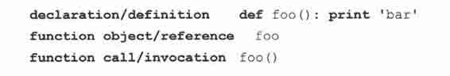

### 11.1.1　函数 VS 过程

我们经常拿函数和过程比较。两者都是可以被调用的实体，但是传统意义上的函数或者“黑盒”，可能不带任何输入参数，经过一定的处理，最后向调用者传回返回值。其中一些函数则是布尔类型的，返回一个“是”或者“否”的回答，更确切地说，一个非零或者零值。而过程是简单、特殊、没有返回值的函数。从后面内容你会看到，python 的过程就是函数，因为解释器会隐式地返回默认值 None。

### 11.1.2　返回值与函数类型

函数会向调用者返回一个值，而实际编程中大部分偏函数更接近过程，不显示地返回任何东西。把过程看待成函数的语言通常对于“什么都不返回”的函数设定了特殊的类型或者值的名字。这些函数在 C 中默认为“void”的返回类型，意思是没有值返回。在 python 中，对应的返回对象类型是 none。

下面 hello()函数的行为就像一个过程，没有返回值。如果保存了返回值，该值为 None:

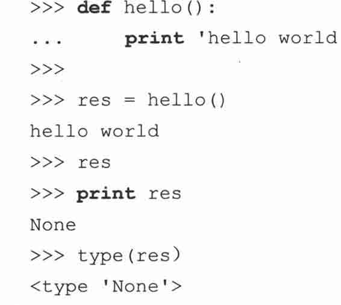

另外，与其他大多数的语言一样，Python 里的函数可以返回一个值或者对象。只是在返回一个容器对象的时候有点不同，看起来像是能返回多个对象。好比说，你不能拿着大量零散的商品离开百货店，但是你可以将它们放在一个购物袋里，然后带着这个袋子从商店走出去，合理合法。

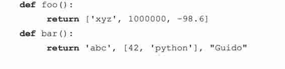

foo()函数返回一个列表，bar()函数返回一个元组。由于元组语法上不需要一定带上圆括号，所以让人真的以为可以返回多个对象。如果我们要恰当地给这个元组加上括号，bar()的定义看起来会是这样：

从返回值的角度来考虑，可以通过很多方式来存储元组。接下来的 3 种保存返回值的方式是等价的：

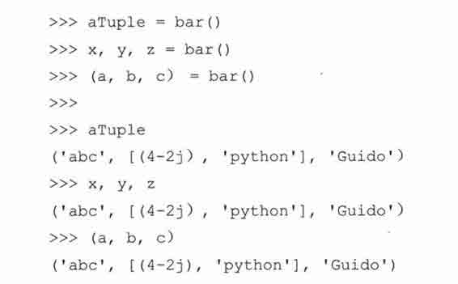

在对 x、y、z 和 a、b、c 的赋值中，根据值返回的顺序，每个变量会接收到与之对应的返回值。而 aTuple 直接获得函数隐式返回的整个元组。回想一下，元组既可以被分解成为单独的变量，也可以直接用单一变量对其进行引用（参见 6.18.3 小节）。

简而言之，当没有显式地返回元素或者如果返回 None 时，Python 会返回一个 None。那么调用者接收的就是 Python 返回的那个对象，且对象的类型仍然相同。如果函数返回多个对象，Python 把他们聚集起来并以一个元组返回。是的，尽管我们声称 Python 比诸如 C 那样只允许一个返回值的语言灵活得多，但是老实说，Python 也遵循了相同的传统，只是让程序员误以为可以返回多个对象。

表 11.1 总结了从一个函数中返回的对象的数目，以及 Python 实际返回的对象。

许多静态类型的语言主张一个函数的类型就是其返回值的类型。在 Python 中，由于 Python 是动态地确定类型而且函数能返回不同类型的值，所以没有进行直接的类型关联。因为重载并不是语言特性，程序员需要使用 type()这个内建函数作为代理，来处理有着不同参数类型的函数的多重声明以模拟类 C 语言的函数重载（以参数不同选择函数的多个原型）。

## 11.2　调用函数

### 11.2.1　函数操作符

同大多数语言相同，我们用一对圆括号调用函数。实际上，有些人认为（()）是一个双字符操作符。正如你可能意识到的，任何输入的参数都必须放置在括号中。作为函数声明的一部分，括号也会用来定义那些参数。虽然我们没有正式地学习类和面向对象编程，但你将会发现在 Python 中，函数的操作符同样用于类的实例化。

### 11.2.2　关键字参数

关键字参数的概念仅仅针对函数的调用。这种理念是让调用者通过函数调用中的参数名字来区分参数。这样规范允许参数缺失或者不按顺序，因为解释器能通过给出的关键字来匹配参数的值。

举个简单的例子，比如有一个函数 foo()，伪代码如下：

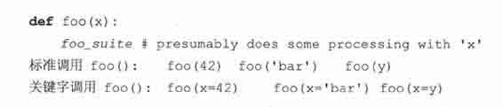

再举个更实际的例子，假设你有一个函数叫做 net_conn()，需要两个参数 host 和 port：

只要按照函数声明中参数定义的顺序，输入恰当的参数，自然就可以调用这个函数：

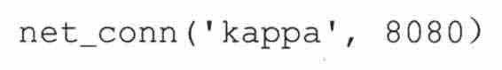

host 参数得到字符串‘kappa’，port 参数得到整型 8080．当然也可以不按照函数声明中的参数顺序输入，但是要输入相应的参数名，如下例：

当参数允许“缺失”的时候，也可以使用关键字参数。这取决于函数的默认参数，我们将在下一小节对它进行介绍。

### 11.2.3　默认参数

默认参数就是声明了默认值的参数。因为给参数赋予了默认值，所以，在函数调用时，不向该参数传入值也是允许的。我们将在 11.5.2 小节对默认参数进行更全面的介绍。

### 11.2.4　参数组

Python 同样允许程序员执行一个没有显式定义参数的函数，相应的方法是通过一个把元组（非关键字参数）或字典（关键字参数）作为参数组传递给函数。我们将在本章中讨论这两种形式。基本上，你可以将所有参数放进一个元组或者字典中，仅仅用这些装有参数的容器来调用一个函数，而不必显式地将它们放在函数调用中：

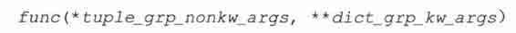

其中的 tuple_grp_nonkw_args 是以元组形式体现的非关键字参数组，dict_grp_kw_args 是装有关键字参数的字典。正如我们已经提到的，我们将在这章对这两者进行全面介绍，现在你只需知道，存在这样的特性允许你把变量放在元组和/或者字典里，并在没有显式地对参数进行逐个声明的情况下，调用函数。

实际上，你也可以给出形参！这些参数包括标准的位置参数和关键字参数，所以在 Python 中允许的函数调用的完整语法为：

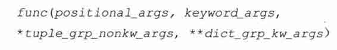

该语法中的所有的参数都是可选的——从参数传递到函数的过程来看，在单独的函数调用时，每个参数都是独立的。这可以有效地取代 apply()内建函数。（在 Python 1.6 版本之前，这样的参数对象只能通过 apply()函数来调用）。

1.例子

在子 11.1 里的数学游戏中，我们用函数调用转换来生成一个有两个子项的参数列表，并把这个列表发送给合的适算术函数（我们也会指出在原来版本中哪些地方会用到 apply()）。

easyMath.py 程序是一个儿童算术游戏，可以随机选择算术加减法。我们通过函数 add()，sub()等价+-操作符，这两者都可以在 operator 模块中找到。接着我们生成一个参数列表（该列表只有 2 个参数，因为这些是二元操作符/运算）。接着选择任意的数字作为算子。因为我们没打算在这个程序的基础版本中支持负数，所以我们将两个数字的列表按从大到小的顺序排序，然后用这个参数列表和随机选择的算术操作符去调用相对应的函数，最后获得问题的正确解答。

随机选择数字以及一个算术函数，显示问题，以及验证结果。在 3 次错误的尝试以后给出结果，等到用户输入一个正确的答案后便会继续运行。

例 11.1　算术游戏（easyMath.py）

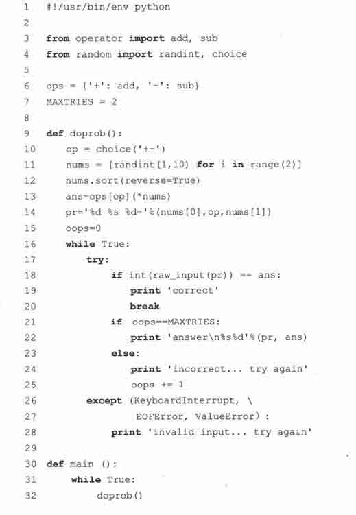

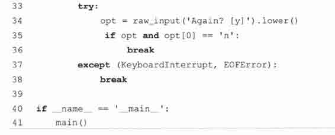

2.逐行解释

1 ~ 4 行

我们的代码从通常的 unix 启动行开始，接着从 operator 和 random 模块中，导入我们会用到的函数。

6 ~ 7 行

在这个应用程序中我们用的全局变量有：一个包含了操作符和与其相关联的函数的集合（字典），一个决定在给出正解之前，用户有多少次机会尝试给出答案的整型变量。函数字典的键值是操作符的符号，程序通过查字典找到合适的算术函数。

9 ~ 28 行

doprob()函数是应用程序的核心引擎。该函数随机选择一个操作并生成两个操作数，同时为了避免减法问题中的负数问题，将这两个算子按大到下进行排序。然后用这些值调用一个数学函数，计算出正确的解。接着用一个等式来提示用户输入并给用户 3 次机会来输入一个正确的答案。

第 10 行用了 random.choice()函数。它用于获取一个序列——我们案例中操作符号的字符串——并随机返回其中的元素。

第 11 行用了一个列表解析来随机地给我们的练习选择两个数。这个例子非常的简单以至于我们可以仅仅用两次 randint()来获得我们的操作数，比如，nums= [randint（1,10）,randint（1,10）]，但是为了让你能看看列表解析的又一个例子，我们没有这样做，而且使用列表解析更易于扩展和升级，比如获得更多的数，这与我们使用循环来代替剪切和粘贴的原因相似。

第 12 行只能在 Python2.4 以及更新的版本中运行，因为 list.sort()方法原本不支持倒转的标志位。如果你使用的是更早一点的 Python 版本，你可以：

•　增加一个反序的比较函数来获得倒转的排序，如

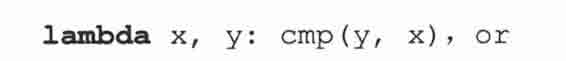

•　或者在 nums.sort()后调用 nums.reverse()

如果你之前没有看见过 lambda，不用害怕。我们会在这章对 lambda 进行详述，而现在，你可以认为它是一个单行的匿名函数。

如果你正使用 1.6 以前的 python，那第 13 行是可能会用到 apply()。对合适运算函数的调用要这样写 apply（ops[op], nums），而不是 ops[op]（*nums）。

16〜28 行描述了用来处理有效和无效输入的控制循环。while 循环是无限循环，直到有正确答案输入或者允许尝试的次数（我们的程序中设定为 3 次）被耗尽才终止运行。这允许程序接受不合法的输入，比如非数字或者各种键盘的控制字符。一旦用户超过了尝试最大的次数，程序就会给出答案并“强制”用户给出正确的答案，只有给出答案，程序才会向下进行。

30 ~ 41 行

程序的主入口是 main()，如果直接运行脚本，程序将自项向下的运行。如果被作为模块导入，导入者要么调用 doprob()函数来开始执行，要么调用 main()来进入程序控制。main()简单地调用 doprob()使用户与脚本的主要功能进行交互，并负责提示用户退出或者尝试下一个问题。

因为数值和操作符都是随机选择的，每次运行 easyMath.py 的结果应该都是不一样的。这是我们今天的得到的（噢，你的答案也可能不一样）：

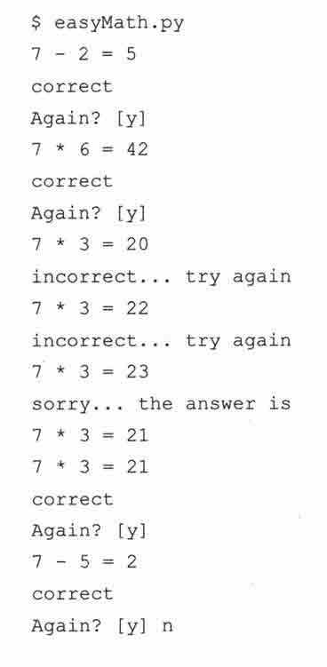

## 11.3　创建函数

### 11.3.1　def 语句

函数是用 def 语句来创建的，语法如下：

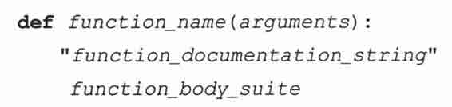

标题行由 def 关键字，函数的名字，以及参数的集合（如果有的话）组成。def 子句的剩余部分包括了一个虽然可选但是强烈推荐的文档字串和必需的函数体。在本书中我们已经看到很多函数的声明，这又是一个：

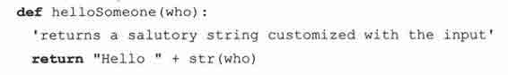

### 11.3.2　声明与定义比较

在某些编程语言里，函数声明和函数定义区分开的。一个函数声明包括提供对函数名，参数的名字（传统上还有参数的类型），但不必给出函数的任何代码，具体的代码通常属于函数定义的范畴。

在声明和定义有区别的语言中，往往是因为函数的定义可能和其声明放在不同的文件中。Python 将这两者视为一体，函数的子句由声明的标题行以及随后的定义体组成的。

### 11.3.3　前向引用

和其他高级语言类似，Python 也不允许在函数未声明之前，对其进行引用或者调用。我们下面给出几个例子来看一下：

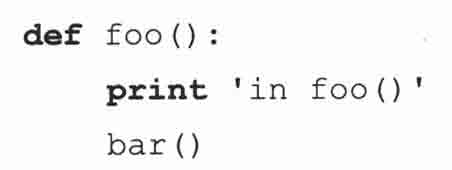

如果我们调用函数 foo(),肯定会失败，因为函数 bar()还没有声明：

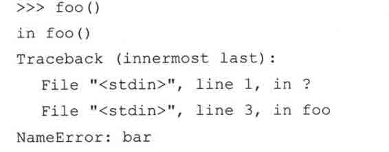

我们现在定义函数 bar()，在函数 foo()前给出 bar()的声明：

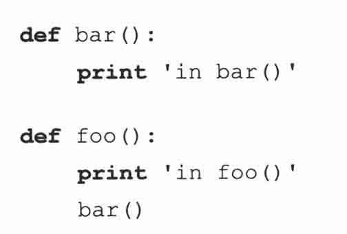

现在我们可以安全的调用 foo(),而不会出现任何问题：

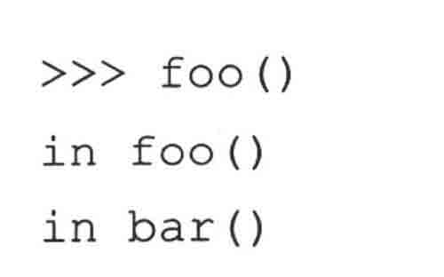

事实上，我们甚至可以在函数 bar()前定义函数 foo()：

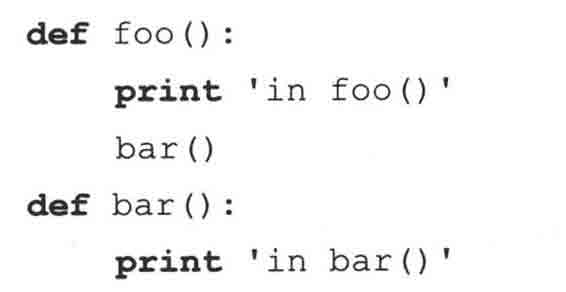

太神奇了，这段代码可以非常好的运行，不会有前向引用的问题：

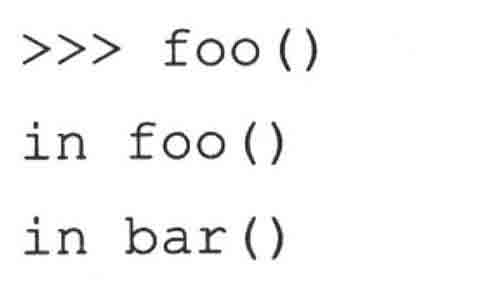

这段代码是正确的，因为即使（在 foo()中）对 bar()进行的调用出现在 bar()的定义之前，但 foo()本身不是在 bar()声明之前被调用的。换句话说，我们声明 foo()，然后再声明 bar()，接着调用 foo()，但是到那时，bar()已经存在了，所以调用成功。

注意 foo()在没有错误的情况下成功输出了 foo()。名字错误是当访问没有初始化的标识符时才产生的异常。

### 11.3.4　函数属性

在这一章中，我们稍后将对命名空间进行简短的讨论，尤其是它们与变量作用域的关系。在下一章中会有对命名空间的更深入的探讨，然而，这里我们只是想要指出 Python 名称空间的基本特征。

你可以获得每个 Pyhon 模块、类和函数中任意的名称空间。你可以在模块 foo 和 bar 里都有名为χ的一个变量，但是在将这两个模块导入你的程序后，仍然可以使用这两个变量。所以，即使在两个模块中使用了相同的变量名字，这也是安全的，因为句点属性标识对于两个模块意味了不同的命名空间，比如说，在这段代码中没有名字冲突：

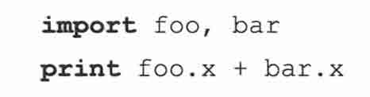

函数属性是 Python 另外一个使用了句点属性标识并拥有名称空间的领域（更多关于名称空间将在本章的稍后部分以及第十二章关于 Python 的模块中进行讨论）。

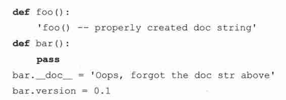

上面的 foo()中，我们以常规的方式创建了我们的文档字串，比如，在函数声明后第一个没有赋值的字串。当声明 bar()时，我们什么都没做，仅用了句点属性标识来增加文档字串以及其他属性。我们可以接着任意地访问属性。下面是一个使用了交互解释器的例子（你可能已经发现，用内建函数 help()显示会比用 __doc__ 属性更漂亮，但是你可以选择你喜欢的方式）。

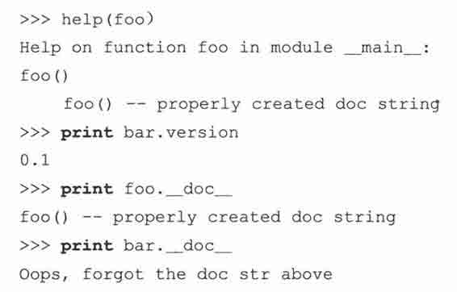

注意我们是如何在函数声明外定义一个文档字串。然而我们仍然可以就像平常一样，在运行时刻访问它。然而你不能在函数的声明中访问属性。换句话说，在函数声明中没有“self”这样的东西让你可以进行诸如 __dict__[‘version’] = 0.1 的赋值。这是因为函数体还没有被创建，但之后你有了函数对象，就可以按我们在上面描述的那样方法来访问它的字典。另外一个自由的名称空间！

函数属性是在 2.1 中添加到 Python 中的，你可以在 PEP232 中阅读到更多相关信息。

### 11.3.5　内部/内嵌函数

在函数体内创建另外一个函数（对象）是完全合法的。这种函数叫做内部/内嵌函数。因为现在 Python 支持静态地嵌套域（在 2.1 中引入但是到 2.2 时才是标准），内部函数实际上很有用的。内嵌函数对于较老的 python 版本没有什么意义，那些版本中只支持全局和一个局部域。那么如何去创造一个内嵌函数呢？

最明显的创造内部函数的方法是在外部函数的定义体内定义函数（用 def 关键字），如：

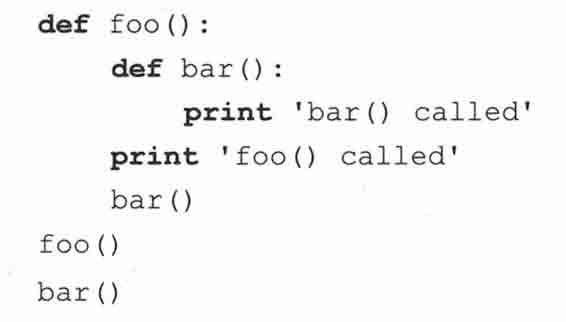

我们将以上代码置入一个模块中，如 inner.py，然后运行，会得到如下输出：

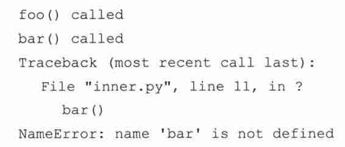

内部函数一个有趣的方面在于整个函数体都在外部函数的作用域（即是你可以访问一个对象的区域；稍后会有更多关于作用域的介绍）之内。如果没有任何对 bar()的外部引用，那么除了在函数体内，任何地方都不能对其进行调用，这就是在上述代码执行到最后你看到异常的原因。

另外一个函数体内创建函数对象的方式是使用 lambda 语句。我们会在稍后的 11.7.1 小节进行讲述。如果内部函数的定义包含了在外部函数里定义的对象的引用（这个对象甚至可以是在外部函数之外），内部函数会变成被称为闭包（closure）的特别之物。在接下来的 11.8.4 小节，我们将对闭包进行更多的学习。稍后我们将介绍装饰器，但是例子程序也包含了闭包的预览。

### 11.3.6　*函数（与方法）装饰器

装饰器背后的主要动机源自 Python 面向对象编程。装饰器是在函数调用之上的修饰。这些修饰仅是当声明一个函数或者方法的时候，才会应用的额外调用。

装饰器的语法以@开头，接着是装饰器函数的名字和可选的参数。紧跟着装饰器声明的是被修饰的函数和装饰函数的可选参数。装饰器看起来会是这样：

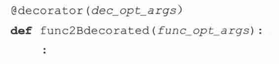

那么装饰器语法如何（以及为什么）产生的呢？装饰器背后的灵感是什么？唔，当静态方法和类方法在 2.2 时被加入到 Python 中的时候，实现方法很笨拙：

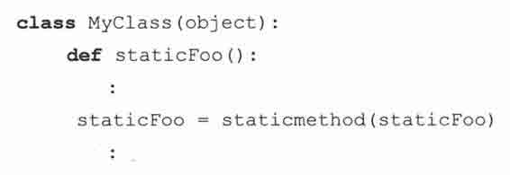

（要澄清的是对于那个发行版本，这不是最终的语法）在这个类的声明中，我们定义了叫 staticFoo()的方法。现在因为打算让它成为静态方法，我们省去它的 self 参数，而你会在 12 章中看到，self 参数在标准的类方法中是必需的。接着用 staticmethod()内建函数来将这个函数“转化”为静态方法，但是在 defstaticFoo()后跟着 staticFoo=staticmethod（sta-ticFoo）显得有多么的臃肿。使用装饰器，你现在可以用如下代码替换掉上面的：

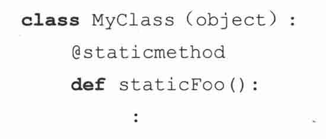

此外，装饰器可以如函数调用一样“堆叠”起来，这里有一个更加普遍的例子，使用了多个装饰器：

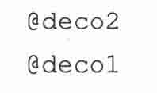

这和创建一个组合函数是等价的。

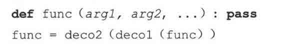

函数组合用数学来定义就像这样： （g.f）（x）=g（f（x））。对于在 Python 中的一致性：

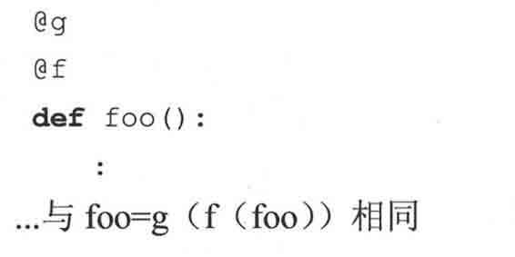

1.有参数和无参数的装饰器

是的，装饰器语法一开始有点让你犯迷糊，但是一旦你适应了，唯一会困扰你的就是什么时候使用带参数的装饰器。没有参数的情况，一个装饰器如：

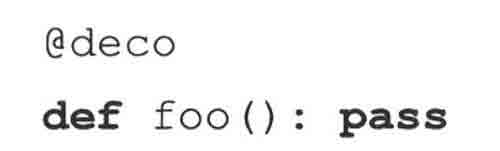

…非常地直接

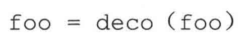

跟着是无参函数（如上面所见）组成。然而，带参数的装饰器 decomaker():

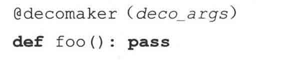

需要自己返回以函数作为参数的装饰器。换句话说，decomaker()用 deco_args 做了些事并返回函数对象，而该函数对象正是以 foo 作为其参数的装饰器。简单地说：

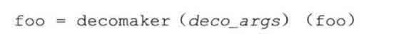

这里有一个含有多个装饰器的例子，其中的一个装饰器带有一个参数：

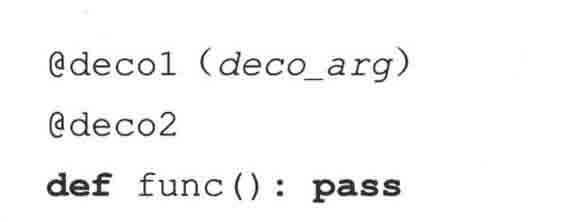

这等价于：

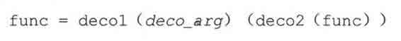

我们希望如果你明白这里的这些例子，那么事情就变得更加清楚了。下面我们会给出简单实用的脚本，该脚本中装饰器不带任何参数。例子 11.8 就是含有无参装饰器的中间脚本。

2.什么是装饰器

现在我们知道装饰器实际就是函数。我们也知道他们接受函数对象。但它们是怎样处理那些函数的呢？一般说来，当你包装一个函数的时候，你最终会调用它。最棒的是我们能在包装的环境下在合适的时机调用它。我们在执行函数之前，可以运行些预备代码，如 post-morrem 分析，也可以在执行代码之后做些清理工作。所以当你看见一个装饰器函数的时候，很可能在里面找到这样一些代码，它定义了某个函数并在定义内的某处嵌入了对目标函数的调用或者至少一些引用。从本质上看，这些特征引入了 Java 开发者称呼之为 AOP （Aspect Oriented Programming，面向方面编程）的概念。你可以考虑在装饰器中置入通用功能的代码来降低程序复杂度。例如，可以用装饰器来：

•　引入日志；

•　增加计时逻辑来检测性能；

•　给函数加入事务的能力。

对于用 Python 创建企业级应用，支持装饰器的特性是非常重要的。你将会看到上面的条例与我们下面的例子有非常紧密地联系，这在例 11.2 中也得到了很好地体现。

3.修饰符举例

下面我们有个极其简单的例子，但是它应该能让你开始真正地了解装饰器是如何工作的。这个例子通过显示函数执行的时间“装饰”了一个（没有用的）函数。这是一个“时戳装饰”，与我们在 16 章讨论的时戳服务器非常相似。

这个装饰器（以及闭包）示范表明装饰器仅仅是用来“装饰”（或者修饰）函数的包装，返回一个修改后的函数对象，将其重新赋值原来的标识符，并永久失去对原始函数对象的访问。

例 11.2　使用函数装饰器的例子（deco.py）

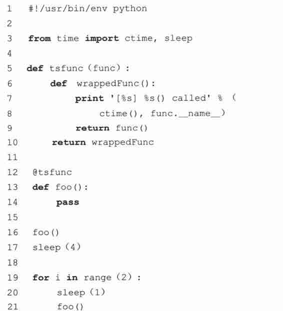

运行脚本，得到如下输出：

4.逐行解释

5 ~ 10 行

在启动和模块导入代码之后，tsfunc()函数是一个显示何时调用函数的时戳的装饰器。它定义了一个内部的函数 wrappedFunc()，该函数增加了时戳以及调用了目标函数。装饰器的返回值是一个“包装了”的函数。

12 ~ 21 行

我们用空函数体（什么都不做）来定义了 foo()函数并用 tsfunc()来装饰。为证明我们的设想，立刻调用它，然后等待 4 秒，然后再调用两次，并在每次调用前暂停 1 秒。

结果，函数立刻被调用，第 1 次调用后，调用函数的第 2 个时间点应该为 5（4+1），第 3 次的时间应该大约为之后的 1 秒。这与上面看见的函数输出十分吻合。

你可以在《Python langugae reference》、Python2.4 中“What’s New in Python 2.4”的文档和 PEP318 中来阅读更多关于装饰器的内容。

## 11.4　传递函数

当学习一门 C 这样的语言时，函数指针的概念是一个高级话题，但是对于函数就像其他对象的 Python 来说就不是那么回事了。函数是可以被引用的（访问或者以其他变量作为其别名），也作为参数传入函数，以及作为列表和字典等容器对象的元素函数有一个独一无二的特征使它同其他对象区分开来，那就是函数是可调用的。举例来说，可以通过函数操作来调用他们（在 Python 中有其他的可调用对象。更多信息，参见 14 章）。

在以上的描述中，我们注意到可以用其他的变量来作为函数的别名。

因为所有的对象都是通过引用来传递的，函数也不例外。当对一个变量赋值时，实际是将相同对象的引用赋值给这个变量。如果对象是函数的话，这个对象所有的别名都是可调用的。

当我们把 foo 赋值给 bar 时，bar 和 foo 引用了同一个函数对象，所以能以和调用 foo()相同的方式来调用 bar()。确定你明白“foo”（函数对象的引用）和“foo()”（函数对象的调用）的区别。

稍微深入下我们引用的例子，我们甚至可以把函数作为参数传入其他函数来进行调用。

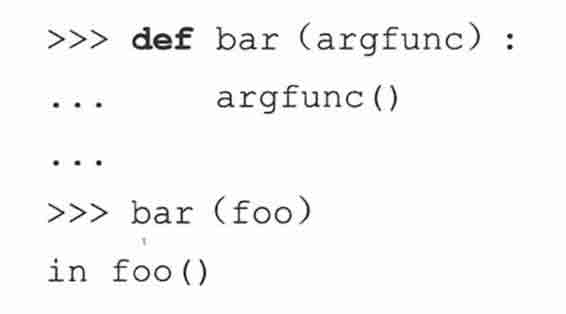

注意到函数对象 foo 被传入到 bar()中。bar()调用了 foo()（用局部变量 argfunc 来作为其别名就如同在前面的例子中我们把 foo 赋给 bar 一样）。现在我们来研究下一个更加实际的例子，numconv.py，代码在例子 11.3 中给出。

一个将函数作为参数传递，并在函数体内调用这些函数，更加实际的例子。这个脚本用传入的转换函数简单将一个序列的数转化为相同的类型。特别地，test()函数传入一个内建函数 int()、long()或 float()来执行转换。

例 11.3　传递和调用（内建）函数（numConv.py）

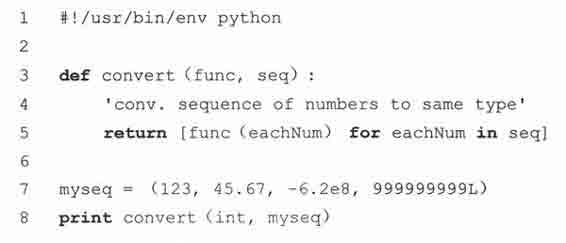

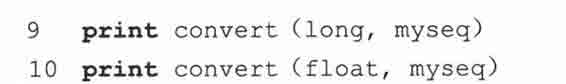

如果我们运行这个程序，我们将会得到如下输出：

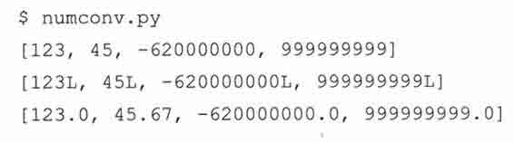

## 11.5　Formal Arguments

Python 函数的形参集合由在调用时要传入函数的所有参数组成，这参数与函数声明中的参数列表精确地配对。这些参数包括了所有必要参数（以正确的定位顺序来传入函数的）、关键字参数（以顺序或者不按顺序传入，但是带有参数列表中曾定义过的关键字）和所有含有默认值，函数调用时不必要指定的参数。（声明函数时创建的）局部命名空间为各个参数值，创建了一个名字。一旦函数开始执行，就能访问这个名字。

### 11.5.1　位置参数

这些我们都是熟悉的标准化参数。位置参数必须以在被调用函数中定义的准确顺序来传递。另外，没有任何默认参数（见下一个部分）的话，传入函数（调用）的参数的精确的数目必须和声明的数字一致。

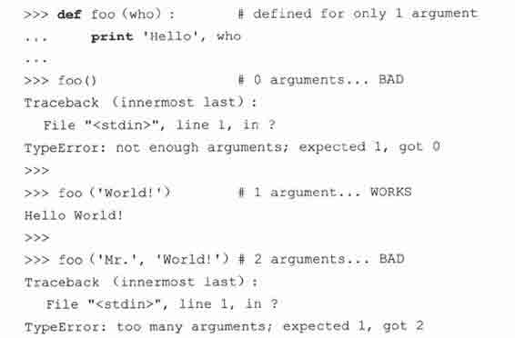

foo()函数有一个位置参数。那意味着任何对 foo()的调用必须有唯一的一个参数，不多，不少。否则你会频频看到 TypeError。看看，Python 的错误是多么具有信息性的。作为一个普遍的规则，无论何时调用函数，都必须提供函数的所有位置参数。可以不按位置地将关键字参数传入函数，给出关键字来匹配其在参数列表中的合适的位置是被准予的（可以回顾 11.2.2 小节）。

由于默认参数的特质，他们是函数调用的可选部分。

### 11.5.2　默认参数

对于默认参数如果在函数调用时没有为参数提供值则使用预先定义的默认值。这些定义在函数声明的标题行中给出。也支持默认参数，和 Python 有同样的语法：参数名等号默认值。这个从语法上来表明如果没有值传递给那个参数，那么这个参数将取默认值。

Python 中用默认值声明变量的语法是所有的位置参数必须出现在任何一个默认参数之前。

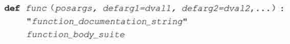

每个默认参数都紧跟着一个用默认值的赋值语句。如果在函数调用时没有给出值，那么这个赋值就会实现。

1.为什么用默认参数

默认参数让程序的健壮性上升到极高的级别，因为它们补充了标准位置参数没有提供的一些灵活性。这种简洁极大的帮助了程序员。当少几个需要操心的参数时候，生活不再那么复杂。这在一个程序员刚接触到一个 API 接口时，没有足够的知识来给参数提供更对口的值时显得尤为有帮助。

使用默认参数的概念与在你的电脑上安装软件的过程类似。一个人会有多少次选择默认安装而不是自定义安装？我可以说可能几乎都是默认安装。这既方便、易于操作，又能节省时间。总是选择自定义安装的只是少数人。

另外一个让开发者受益的地方在于，开发者能更好地控制为顾客开发的软件。当提供了默认值的时候，他们可以精心选择“最佳”的默认值，所以用户不需要马上面对繁琐的选项。随着时间流逝，当用户对系统或者 API 越来越熟悉的时候，他们最终能自行给出参数值，便不再需要使用“学步车”了。

下面这个例子中默认参数派得上用场，并在日益增长的电子商务中多少有些用处。

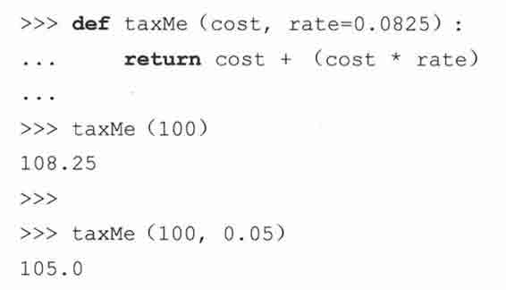

在上面个例子中，taxMe()函数以一个项目的成本输入参数，计算出附加了销售税的销售价格。成本是一个必需的参数，但税率是一个默认参数（在我们的例子中为 8.25%）。或许你是一个在线零售商，生意上的大部分客户来自相同的州或者国家。不同地方税率的顾客期望看见他们与当地销售税率相对应的购买价格总量。为了覆盖默认的税率，你所要做的就是提供一个参数值，比如在上面的例子中的 taxMe（100,0.05）。通过指定 5%税率，你提供了一个参数作为税率参数，所以覆盖或者说绕过了 0.0825 的默认值。

所有必需的参数都要在默认参数之前。为什么？简单说来就是因为它们是强制性的，但默认参数不是。从语法构成上看，对于解释器来说，如果允许混合模式，确定什么值来匹配什么参数是不可能的。如果没有按正确的顺序给出参数，就会产生一个语法错误。

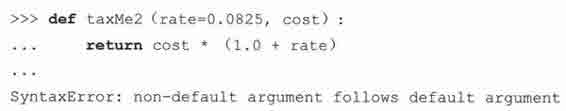

让我们再看下关键字参数，用我们的老朋友 net_conn()。

读者应该还记得，如果命名了参数，这里可以不按顺序给出参数。由于有了上述声明，我们可以做出如下（规则的）位置或者关键字参数调用：

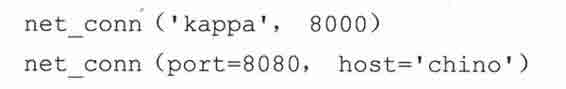

然而，如果我们将默认参数引入这个等式，情况就会不同，虽然上面的调用仍然有效。让我们修改下 net_conn()的声明以使端口参数有默认值 80，再增加另外的名为 stype（服务器的类型）默认值为’tcp’的参数：

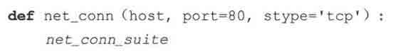

我们已经扩展了调用.net_conn()的方式。以下就是所有对 net_conn()有效的调用：

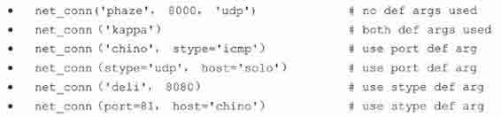

在上面所有的例子中，我们发现什么是一直不变的？唯一的必须参数，host。host 没有默认值，所以他必须出现在所有对 net_conn()的调用中。关键字参数已经被证明能给不按顺序的位置参数提供参数，结合默认参数，它们同样也能被用于跳过缺失参数，上面例子就是极好的证据。

2.默认函数对象参数举例

我们现在将给出另外一个证明默认参数会让人受益的例子。grabWeb.py 脚本，在例子 11.4 中给出，是一个主要目的是从互联网上抓取一个 Web 页面并暂时储存到一个本地文件中用于分析的简单脚本。这类程序能用来测试 Web 站点页面的完整性或者能监测一个服务器的负载（通过测量可链接性或者下载速度）。process()函数可以做我们想要的任何事，表现出了无限种的用途。我们为这个练习选择的用法是显示从 Web 页面上获得的第一和最后的非空格行。虽然在现实中这个特别的例子或许没有多少用处，但是你可以以这段代码为基础，举一反三。

这段脚本下载了一个 Web 页面（默认为本地的万维网服务器）并显示了 HTML 文件的第一个以及最后一个非空格行。由于 download()函数的双默认参数允许用不同的 urls 或者指定不同的处理函数来进行覆盖，灵活性得倒了提高。

例 11.4　抓取 Web 页面（grabWeb.py）

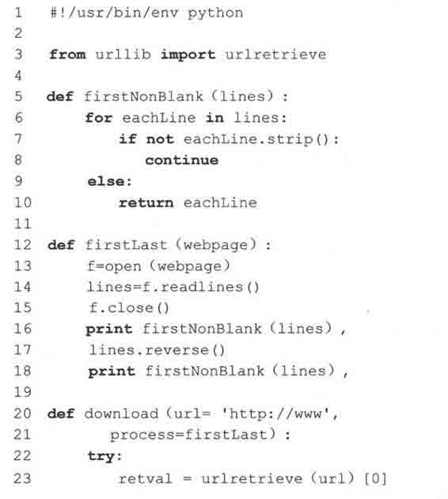

在我们的环境下运行这个脚本会得到如下的输出，虽然你的内容是绝对不同的，因为你将浏览一个完全不同的网页。

## 11.6　可变长度的参数

可能会有需要用函数处理可变数量参数的情况。这时可使用可变长度的参数列表。变长的参数在函数声明中不是显式命名的，因为参数的数目在运行时之前是未知的（甚至在运行的期间，每次函数调用的参数的数目也可能是不同的），这和常规参数（位置和默认）明显不同，常规参数都是在函数声明中命名的。由于函数调用提供了关键字以及非关键字两种参数类型，Python 用两种方法来支持变长参数。

在 11.2.4 小节中，我们了解了在函数调用中使用*和**符号来指定元组和字典的元素作为非关键字以及关键字参数的方法。在这个部分中，我们将再次使用相同的符号，但是这次在函数的声明中，表示在函数调用时接收这样的参数。这语法允许函数接收在函数声明中定义的形参之外的参数。

### 11.6.1　非关键字可变长参数（元组）

当函数被调用的时候，所有的形参（必须的和默认的）都将值赋给了在函数声明中相对应的局部变量。剩下的非关键字参数按顺序插入到一个元组中便于访问。可能你对 C 中的“varargs”（比如、va_list、va_arg 和省略号[…]）很熟悉。Python 提供了与之相等的支持——迭代过所有的元组元素和在 C 中用 va_arg 是相同的。对于那些不熟悉 C 或者“varargs”的人，这仅仅代表了在函数调用时，接受一个不定（非固定）数目的参数。

可变长的参数元组必须在位置和默认参数之后，带元组（或者非关键字可变长参数）的函数普遍的语法如下：

星号操作符之后的形参将作为元组传递给函数，元组保存了所有传递给函数的“额外”的参数（匹配了所有位置和具名参数后剩余的）。如果没有给出额外的参数，元组为空。

正如我们先前看见的，只要在函数调用时给出不正确的函数参数数目，就会产生一个 TypeError 异常。通过末尾增加一个可变的参数列表变量，我们就能处理当超出数目的参数被传入函数的情形，因为所有的额外（非关键字）参数会被添加到变量参数元组（额外的关键字参数需要关键字变量参数[参见下一小节]）。正如预料的那样，由于和位置参数必须放在关键字参数之前一样的原因，所有的形式参数必须先于非正式的参数之前出现。

我们现在调用这个函数来说明可变参数元组是如何工作的。

### 11.6.2　关键字变量参数（字典）

在我们有不定数目的或者额外集合的关键字的情况中，参数被放入一个字典中，字典中键为参数名，值为相应的参数值。为什么一定要是字典呢？因为每个参数——参数的名字和参数值——都是成对给出，用字典来保存这些参数自然就最适合不过了。

这给出使用了变量参数字典来应对额外关键字参数的函数定义的语法：

为了区分关键字参数和非关键字非正式参数，使用了双星号（**）。**是被重载了的以便不与幂运算发生混淆。关键字变量参数应该为函数定义的最后一个参数，带**。我们现在展示一个如何使用字典的例子：

在解释器中执行这个代码，我们得到以下输出。

关键字和非关键字可变长参数都有可能用在同一个函数中，只要关键字字典是最后一个参数并且非关键字元组先于它之前出现，正如在如下例子中的一样：

在解释器中调用我们的函数，我们得到如下的输出：

### 11.6.3　调用带有可变长参数对象函数

在上面的 11.2.4 部分中，我们介绍了在函数调用中使用*和**来指定参数集合。接下来带着对函数接受变长参数的些许偏见，我们会向你展示更多那种语法的例子。

我们现在将用在前面部分定义的，我们的老朋友 newfoo()，来测试新的调用语法。我们第一个对 newfoo()的调用将会使用旧风格的方式来分别列出所有的参数，甚至跟在所有形式参数之后的变长参数：

我们现在进行相似的调用；然而，我们将非关键字参数放在元组中将关键字参数放在字典中，而不是逐个列出变量参数：

最终，我们将再另外进行一次调用，但是是在函数调用之外来创建我们的元组和字典。

注意我们的元组和字典参数仅仅是被调函数中最终接收的元组和字典的子集。额外的非关键字值‘3’以及‘χ’和‘y’关键字对也被包含在最终的参数列表中，而它们不是‘*’和‘**’的可变参数中的元素。

之前的 1.6，过去变长对象只能通过 apply()函数传递给被调用函数，现在的调用语法已经可以有效取代 apply()的使用。下面演示了如何使用了这些符号来把任意类型任意个数的参数传递给任意函数对象。

函数式编程举例

函数式编程的另外一个有用的应用出现在调试和性能测量方面上。你正在使用需要每晚都被完全测试或通过回归，或需要给对潜在改善进行多次迭代计时的函数来工作。你所要做的就是创建一个设置测试环境的诊断函数，然后对有疑问的地方，调用函数。因为系统应该是灵活的，所以想 testee 函数作为参数传入。那么这样的函数对，timeit()和 testit()，可能会对如今的软件开发者有帮助。

我们现在将展示这样的一个 testit()函数的例子的源代码（见例 11.5）。我们将留下 timeit()函数作为读者的练习（见习题 11.12）。

该模块给函数提供了一个执行测试的环境。testit()函数使用了一个函数和一些参数，然后在异常处理的监控下，用给定的参数调用了那个函数。如果函数成功的完成，会返回 True 和函数的返回值给调用者。任何的失败都会导致 False 和异常的原因一同被返回。

（Exception 是所有运行时刻异常的根类：复习第十章以获得更详细的资料。）

例 11.5　测试函数（testit.py）

testit()用其参数地调用了一个给定的函数，成功的话，返回一个和那函数返回值打包的 True 的返回值，或者 False 和失败的原因。

单元测试函数 test()在一个为 4 个数字的输入集合运行了一个数字转换函数的集合。为了确定这样的功能性，在测试中有两个失败的案例。这里是运行脚本的输出：

## 11.7　函数式编程

Python 不是也不大可能会成为一种函数式编程语言，但是它支持许多有价值的函数式编程语言构建。也有些表现得像函数式编程机制但是从传统上也不能被认为是函数式编程语言的构建。Python 提供的以四种内建函数和 lambda 表达式的形式出现。

### 11.7.1　匿名函数与 lambda

python 允许用 lambda 关键字创造匿名函数。匿名是因为不需要以标准的方式来声明，比如说，使用 def 语句（除非赋值给一个局部变量，这样的对象也不会在任何的名称空间内创建名字）。然而，作为函数，它们也能有参数。一个完整的 lambda“语句”代表了一个表达式，这个表达式的定义体必须和声明放在同一行。我们现在来演示下匿名函数的语法：

参数是可选的，如果使用的参数话，参数通常也是表达式的一部分。

核心笔记：lambda 表达式返回可调用的函数对象。

* * *

用合适的表达式调用一个 lambda 生成一个可以像其他函数一样使用的函数对象。它们可被传给其他函数，用额外的引用别名化，作为容器对象以及作为可调用的对象被调用（如果需要的话，可以带参数）。当被调用的时候，如果给定相同的参数的话，这些对象会生成一个和相同表达式等价的结果。它们和那些返回等价表达式计算值相同的函数是不能区分的。

* * *

在我们看任何一个使用 lambda 的例子之前，我们意欲复习下单行语句，然后展示下 lambda 表达式的相似之处。

上面的函数没有带任何的参数并且总是返回 True。Python 中单行函数可以和标题写在同一行。如果那样的话，我们重写下我们的 true()函数以使其看其来像如下的东西：

在整这个章节，我们将以这样的方式呈现命名函数，因为这有助于形象化与它们等价的 lamdba 表达式。至于我们的 true()函数，使用 lambda 的等价表达式（没有参数，返回一个 True）为：

命名的 true()函数的用法相当的明显，但 lambda 就不是这样。我们仅仅是这样用，或者我们需要在某些地方用它进行赋值吗？一个 lambda 函数自己就是无目地服务，正如在这里看到的：

在上面的例子中，我们简单地用 lambda 创建了一个函数（对象），但是既没有在任何地方保存它，也没有调用它。这个函数对象的引用计数在函数创建时被设置为 True，但是因为没有引用保存下来，计数又回到零，然后被垃圾回收掉。为了保留住这个对象，我们将它保存到一个变量中，以后可以随时调用。现在可能就是一个好机会。

这里用它赋值看起来非常有用。相似地，我们可以把 lambda 表达式赋值给一个如列表和元组的数据结构，其中，基于一些输入标准，我们可以选择哪些函数可以执行，以及参数应该是什么（在下一部分中，我们将展示如何去使用带函数式编程构建的 lambda 表达式）。

我们现在来设计一个带两个数字或者字符串参数，返回数字之和或者已拼接的字符串的函数。我们先将展示一个标准的函数，然后再是其未命名的等价物。

默认以及可变的参数也是允许的，如下例所示：

看上去是一回事，所以我们现在将通过演示如何能在解释器中尝试这种做法，来努力让你相信：

关于 lambda 最后补充一点：虽然看起来 lambdda 是一个函数的单行版本，但是它不等同于 C++的内联语句，这种语句的目的是由于性能的原因，在调用时绕过函数的栈分配。lambda 表达式运作起来就像一个函数，当被调用时，创建一个框架对象。

### 11.7.2　内建函数 apply()、filter()、map()、reduce()

在这个部分中，我们将看看 apply()、filter(), map()及 reduce()内建函数并给出一些如何使用它们的例子。这些函数提供了在 python 中可以找到的函数式编程的特征。正如你想像的一样，lambda 函数可以很好地和使用了这些函数的应用程序结合起来，因为它们都带了一个可执行的函数对象，lambda 表达式提供了迅速创造这些函数的机制。

1\. *apply()

正如前面提到的，函数调用地语法，现在允许变量参数的元组以及关键字可变参数的字典，在 Pythonl.6 中有效地摈弃了 apply()。这个函数将来会逐步淘汰，在未来版本中最终会消失。我们在这里提及这个函数既是为了介绍下历史，也是出于维护具有 applay()函数的代码的目的。

2\. filter()

在本章中我们研究的第二个内建函数是 filter()。想像下，去一个果园，走的时候带着一包你从树上采下的苹果。如果你能通过一个过滤器，将包裹中好的苹果留下，不是一件很令人开心的事吗？这就是 filter()函数的主要前提。给定一个对象的序列和一个“过滤”函数，每个序列元素都通过这个过滤器进行筛选，保留函数返回为真的对象。filter 函数为已知的序列的每个元素调用给定布尔函数。每个 filter 返回的非零（true）值元素添加到一个列表中。返回的对象是一个从原始队列中“过滤后”的队列。

如果我们想要用纯 Python 编写 filter()，它或许就像这样：

一种更好地理解 filter()的方法就是形象化其行为。图 11-1 试着那样做。

> > 图 11-1　内建函数 filter()是如何工作的

在图 11-1 中，我们观察到我们原始队列在顶端，一个大小为 n 的队列，元素从 eq[0]， seq[1]，…seq[N-1]。每一次对 bool_func()的调用，举例来说，bool_func（seq[1]）、bool_func（seq[0]）等，每个为 True 或 False 的返回值都会回现。（因为 Boolean 函数的每个定义——确保你的函数确实返回一个真或假）。如果 bool_func()给每个序列的元返回一个真，那个元素将会被插入到返回的序列中。当迭代整个序列已经完成，filter()返回一个新创建的序列。我们下面展示在一个使用了 filer()来获得任意奇数的简短列表的脚本。该脚本产生一个较大的随机数集合，然后过滤出所有的的偶数，留给我们一个需要的数据集。当一开始编写这个例子的时候，oddnogen.py 如下所示：

代码包括两个函数：odd()，确定一个整型是奇数（真）或者偶数（假）Boolean 函数，以及 main()，主要的驱动部件。main()的目的是来产生 10 个在 1~100 的随机数：然后调用 filter()来移除掉所有的偶数。最后，先显示出我们过滤列表的大小，然后是奇数的集合。

导入和运行这个模块几次后，我们能得到如下输出：

第一次重构

在第二次浏览时，我们注意到 odd()是非常的简单的以致能用一个 lambda 表达式替换：

第二次重构

我们已经提到 list 综合使用如何能成为 filter()合适的替代者，如下便是：

第三次重构

我们通过整合另外的列表解析将我们最后的列表放在一起，来进一步简化我们的代码。正如你如下看到的一样，由于列表解析灵活的语法，就不再需要一个暂时的变量了（为了简单，我们用一个较短的名字将 randint()倒入到我们的代码中）。

3\. map()

map()内建函数与 filter()相似，因为它也能通过函数来处理序列。然而，不像 filter()、map()将函数调用“映射”到每个序列的元素上，并返回一个含有所有返回值的列表。

在最简单的形式中，map()带一个函数和队列，将函数作用在序列的每个元素上，然后创建由每次函数应用组成的返回值列表。所以如果你的映射函数是给每个进入的数字加 2，并且你将这个函数和一个数字的列表传给 map()，返回的结果列表是和原始集合相同的数字集合，但是每个数字都加了 2。如果我们要用 Python 编写这个简单形式的 map()如何运作的，它可能像在图 11-2 中阐释的如下代码：

> > 图 11-2　内建函数 map()是如何工作的

我们可以列举一些简短的 lambda 函数来展示如何用 map()处理实际数据：

我们已经讨论了有时 map()如何被列表解析取代，所以这里我们再分析下上面的两个例子。形式更一般的 map()能以多个序列作为其输入。如果是这种情况，那么 map()会并行地迭代每个序列。在第一次调用时，map()会将每个序列的第一个元素捆绑到一个元组中，将 func 函数作用到 map()上，当 map()已经完成执行的时候，并将元组的结果返回到 mapped_seq 映射的，最终以整体返回的序列上。图 11-2 阐述了一个 map()如何和单一的序列一起运行。如果我们用带有每个序列有 N 个对象的 M 个序列来的 map()，我们前面的图表会转变成如图 11-3 中展示的图表那样。

> > 图 11-3　内建函数 map()如何和>1 的序列一起运作

这里有些使用带多个序列的 map()的例子。

上面最后的例子使用了 map()和一个为 None 的函数对象来将不相关的序列归并在一起。这种思想在一个新的内建函数，zip，被加进来之前的 python2.0 是很普遍的。而 zip 是这样做的：

4\. reduce()

函数式编程的最后的一部分是 reduce()，reduce 使用了一个二元函数（一个接收带两个值作为输入，进行了一些计算然后返回一个值作为输出），一个序列，和一个可选的初始化器，卓有成效地将那个列表的内容“减少”为一个单一的值，如同它的名字一样。在其他的语言中，这种概念也被称作为折叠。

它通过取出序列的头两个元素，将他们传入二元函数来获得一个单一的值来实现。然后又用这个值和序列的下一个元素来获得又一个值，然后继续直到整个序列的内容都遍历完毕以及最后的值会被计算出来为止。

你可以尝试去形象化 reduce 如下面的等同的例子：

有些人认为 reduce()合适的函数式使用每次只需要仅需要一个元素。在上面一开始的迭代中，我们拿了两个元素因为我们没有从先前的值（因为我们没有任何先前的值）中获得的一个“结果”。这就是可选初始化器出现的地方（参见下面的 init 变量）。如果给定初始化器，那么一开始的迭代会用初始化器和一个序列的元素来进行，接着和正常的一样进行。

如果我们想要试着用纯 Python 实现 reduce()，它可能会是这样：

从概念上说这可能 4 个中最难的一个，所以我们应该再次向你演示一个例子以及一个函数式图表（见图 11-4）。reduce()的“hello world”是其一个简单加法函数的应用或在这章前面看到的与之等价的 lamda:

> > 图 11-4　reduce()内建函数是如何工作的

给定一个列表，我们可以简单地创建一个循环，迭代地遍历这个列表，再将现在元素加到前面元素的累加和上，最后当循环结束就能获得所有值的总和。

使用 lambda 和 reduce()，可以以一行代码做出相同的事情。

给出了上面的输入，reduce()函数运行了如下的算术操作。

用 list 的头两个元素（0，1），调用 mySum()来得到 1，然后用现在的结果和下一个元素 2 来再次调用 mySum()，再从这次调用中获得结果，与下面的元素 3 配对然后调用 mySum()，最终拿整个前面的求和，4 来调用 mySum()得到 10, 10 即为最终的返回值。

### 11.7.3　偏函数应用

currying 的概念将函数式编程的概念和默认参数以及可变参数结合在一起。一个带 n 个参数，curried 的函数固化第一个参数为固定参数，并返回另一个带 n-1 个参数函数对象，分别类似于 LISP 的原始函数 car 和 cdr 的行为。Currying 能泛化成为偏函数应用（partial function application，PFA），这种函数将任意数量（顺序）的参数的函数转化成另一个带剩余参数的函数对象。

在某种程度上，这似乎和不提供参数，就会使用默认参数情形相似。在 PFA 的例子中，参数不需要调用函数的默认值，只需明确的调用集合。你可以有很多的偏函数调用，每个都能用不同的参数传给函数，这便是不能使用默认参数的原因。

这个特征是在 Python2.5 的时候被引入的，通过 functools 模块能很好地被用户调用。

1.简单的函数式例子

如何创建一个简单小巧的例子呢？我们来使用下两个简单的函数 add()和 mul()，两者都来自 operator 模块。这两个函数仅仅是我们熟悉的+和*操作符的函数式接口，举例来说，add （x, y）与 x+y 一样。在我们的程序中，我们经常想要给和数字加一或者乘以 100。

除了大量的，如 add（1,foo）, add（1,bar）, mul （100,foo）, mul （100,bar）般的调用，拥有已存在的并使函数调用简化的函数不是一件很美妙的事吗？举例来说，addl（foo）、addl（bar）、mul100，但是却不用去实现函数 addl()和 mul100()?哦，现在用 PFA 你就可以这样做。你可以通过使用 functional 模块中的 partial()函数来创建 PFA：

这个例子或许不能让你看到 PFA 的威力，但是我们不得不从从某个地方开始。当调用带许多参数的函数的时候，PFA 是最好的方法。使用带关键字参数的 PFA 也是较简单的，因为能显示给出特定的参数，要么作为 curried 参数，要么作为那些更多在运行时刻传入的变量，并且我们不需担心顺序。下面的一个例子来自 Python 文档中关于在应用程序中使用，在这些程序中需要经常将二进制（作为字符串）转换成为整型。

这个例子使用了 int()内建函数并将 base 固定为 2 来指定二进制字符串转化。现在我们没有多次用相同的第二参数（2）来调用 int()，比如（‘10010’，2），相反，可以只用带一个参数的新 baseTwo()函数。接着给新的（部分）函数加入了新的文档并又一次很好地使用了“函数属性”（见上面的 11.3.4 部分），这是很好的风格。要注意的是这里需要关键字参数 base。

2.警惕关键字

如果你创建了不带 base 关键字的偏函数，比如，baseTwo-BAD=partial （int, 2），这可能会让参数以错误的顺序传入 int()，因为固定参数的总是放在运行时刻参数的左边，比如 baseTwoBAD （χ）=int（2，x）。如果你调用它，它会将 2 作为需要转化的数字，base 作为‘10010’来传入，接着产生一个异常：

由于关键字放置在恰当的位置，顺序就得固定下来，因为，如你所知，关键字参数总是出现在形参之后，所以 baseTwo （x） ==int（x，base=2）。

3.简单 GUI 类的例子

PFA 也扩展到所有可调用的东西，如类和方法。一个使用 PFA 的优秀的例子是提供了“部分 gui 模范化”。GUI 小部件通常有很多的参数，如文本、长度、最大尺寸、背景和前景色、活动或者非活动，等等。如果想要固定其中的一些参数，如让所有的文本标签为蓝底白字，你可以准确地以 PFA 的方式，自定义为相似对象的伪模板。

这是较有用的偏函数应用的例子，或者更准确的说，“部分类实例化”……为什么呢？

在 7~8 行，我们给 Tkinter.Button 创建了“部分类实例化器”（因为那便是它的名字，而不是偏函数），固定好父类的窗口参数然后是前景色和背景色。我们创建了两个按钮 bl 和 b2 来与模板匹配，只让文本标签唯一。quit 按钮（11〜12 行）是稍微自定义过的，带有不同的背景色（红色，覆盖了默认的蓝色）并配置了一个回调的函数，当按钮被按下的时候，关闭窗口（另外的两个按钮没有函数，当他们被按下的时候）。

没有 MyButton“模板”的话，你每次会不得不使用“完全”的语法（因为你仍然没有给全参数，由于有大量你不传入的，含有默认值的参数）：

这就一个简单的 GUI 的截图：

当你的代码可以变得更紧凑和易读的时候，为什么要还有重复的做令人心烦的事？你能在第十八章找到更多关于 GUI 编程的资料，在那我们着重描写了一个使用 PFA 的例子。从你迄今为止看到的内容中，可以发现，在以更函数化编程环境提供默认值方面，PFA 带有模板以及“style-sheeting”的感觉。你可以在《Python Library Reference》（Python 库参考），《What’s New in Python 2.5》文档和指定的 PEP309 里，关于 functools 模块的文档中阅读到更多关于 pfa 的资料。

## 11.8　变量作用域

标识符的作用域是定义为其声明在程序里的可应用范围，或者即是我们所说的变量可见性。换句话说，就好像在问你自己，你可以在程序里的哪些部分去访问一个制定的标识符。变量可以是局部域或者全局域。

### 11.8.1　全局变量与局部变量

定义在函数内的变量有局部作用域，在一个模块中最高级别的变量有全局作用域。在编译器理论里著名的“龙书”中，阿霍、塞西和乌尔曼作了如下总结：

“声明适用的程序的范围被称为了声明的作用域。在一个过程中，如果名字在过程的声明之内，它的出现即为过程的局部变量；否则的话，出现即为非局部。”

全局变量的一个特征是除非被删除掉，否则它们的存活到脚本运行结束，且对于所有的函数，他们的值都是可以被访问的，然而局部变量，就像它们存放的栈，暂时地存在，仅仅只依赖于定义它们的函数现阶段是否处于活动。当一个函数调用出现时，其局部变量就进入声明它们的作用域。在那一刻，一个新的局部变量名为那个对象创建了，一旦函数完成，框架被释放，变量将会离开作用域。

上面的例子中，global_str 是全局变量，而 local_str 是局部变量。foo()函数可以对全局和局部变量进行访问，而代码的主体部分只能访问全局变量。

核心笔记：搜索标识符（也称变量，名字，等等）

* * *

当搜索一个标识符的时候，Python 先从局部作用域开始搜索。如果在局部作用域内没有找到那个名字，那么就一定会在全局域找到这个变量否则就会被抛出 NameError 异常。一个变量的作用域和它寄住的名称空间相关。我们会在第十二章正式介绍名称空间；对于现在只能说子空间仅仅是将名字映射到对象的命名领域，现在使用的变量名字虚拟集合。作用域的概念和用于找到变量的名称空间搜索顺序相关。当一个函数执行的时候，所有在局部命名空间的名字都在局部作用域内。那就是当查找一个变量的时候，第一个被搜索的名称空间。如果没有在那找到变量的话，那么就可能找到同名的全局变量。这些变量存储（搜索）在一个全局及内建的名称空间。

仅仅通过创建一个局部变量来“隐藏”或者覆盖一个全局变量是有可能的。回想一下，局部名称空间是首先被搜索的，存在于其局部作用域。如果找到一个名字，搜索就不会继续去寻找一个全局域的变量，所以在全局或者内建的名称空间内，可以覆盖任何匹配的名字。

同样，当使用全局变量同名的局部变量的时候要小心。如果在赋予局部变量值之前，你在函数中（为了访问这个全局变量）使用了这样的名字，你将会得到一个异常（NAMEERROR 或者 Unbound-LocalError），而这取决于你使用的 Python 版本。

* * *

### 11.8.2　globa 语句

如果将全局变量的名字声明在一个函数体内的时候，全局变量的名字能被局部变量给覆盖掉。这里有另外的例子，与第一个相似，但是该变量的全局和局部的特性就不是那么清晰了。

得到如下输出：

我们局部的 bar 将全局的 bar 推出了局部作用域。为了明确地引用一个已命名的全局变量，必须使用 global 语句。global 的语法如下：

修改上面的例子，可以更新我们代码，这样我们便可以用全局版本的 is_this_global 而无须创建一个新的局部变量。

### 11.8.3　作用域的数字

Python 从语法上支持多个函数嵌套级别，就如在 Python2\. 1 中的，匹配静态嵌套的作用域。然而，在 2\. 1 之前的版本中，最多为两个作用域：一个函数的局部作用域和全局作用域。虽然存在多个函数的嵌套，但你不能访问超过两个作用域。

虽然这代码在今天能完美的运行…

在 Python2.1 之前执行它将会产生错误。

在函数 bar()内访问 foo()的局部变量 m 是非法的，因为 m 是声明为 foo()的局部变量。从 bar()中可访问唯一的作用域为局部作用域和全局作用域。foo()的局部作用域没有包含在上面两个作用域的列表中。注意‘print m’语句的输出成功了，而对 bar()的函数调用却失败了。幸运的是，由于 Python 的现有嵌套作用语规则，今天就不存在这个问题了。

### 11.8.4　闭包

由于 Python 的静态嵌套域，如我们早先看到的，定义内部函数变得很有用处。在下面的部分中，我们将着重讨论作用域和 lambda，但是在 Python 2\. 1 之前，当作用域规改则变为今天这样之前，内部函数也会遭受到相同的问题。如果在一个内部函数里，对在外部作用域（但不是在全局作用域）的变量进行引用，那么内部函数就被认为是闭包（closure）。定义在外部函数内的但由内部函数引用或者使用的变量被称为自由变量。闭包在函数式编程中是一个重要的概念，Scheme 和 Haskell 便是函数式编程中两种。闭包从语法上看很简单（和内部函数一样简单）但是仍然很有威力。

闭包将内部函数自己的代码和作用域以及外部函数的作用结合起来。闭包的词法变量不属于全局名称空间域或者局部的——而属于其他的名称空间，带着“流浪”的作用域。（注意这不同于对象因为那些变量是存活在一个对象的名称空间但是闭包变量存活在一个函数的名称空间和作用域）那么为什么你会想要用闭包？

闭包对于安装计算、隐藏状态和在函数对象和作用域中随意地切换是很有用的。闭包在 GUI 或者在很多 API 支持回调函数的事件驱动编程中是很有些用处的。以绝对相同的方式，应用于获取数据库行和处理数据。回调就是函数。闭包也是函数，但是他们能携带一些额外的作用域。它们仅仅是带了额外特征的函数……另外的作用域。

你可能会觉得闭包的使用和这章先前介绍的偏函数应用非常的相似，但是与闭包的使用相比，PFA 更像是 currying，因为闭包和函数调用没多少相关，而是关于使用定义在其他作用域的变量。

1.　简单的闭包的例子

下面是使用闭包简单的例子。我们会模拟一个计数器，同样也通过将整型包裹为一个列表的单一元素来模拟使整型易变。

counter()做的唯一一件事就是接受一个初始化的值来开始计数，并将该值赋给列表 count 唯一一个成员。然后定义一个 incr()的内部函数。通过在内部使用变量 count，我们创建了一个闭包，因为它现在携带了整个 counter()作用域。incr()增加了正在运行的 count 然后返回它。然后最后的魔法就是 counter()返回一个 incr，一个（可调用的）函数对象。如我们交互地运行这个函数，将得到如下的输出——注意这看起来和实例化一个 counter 对象并执行这个实例有多么相似：

有点不同的是我们能够做些原来需要我们写一个类做的事，并且不仅仅是要写，还必需覆盖掉这个类的 _call__()特别方法来使他的实例可调用。这里我们能够使用一对函数来做这件事。

现在，在很多情况下，类是最适合使用的。闭包更适合需要一个必需有自己的作用域的回调函数情况，尤其是回调函数是很小巧而且简单的，通常也很聪明。跟平常一样，如果你使用了闭包，对你的代码进行注释或者用文档字符串来解释你正做的事是很不错的主意。

2.　追踪闭包词法的变量

下面两个部分包含了给高级读者的材料……如果你愿意的话，你可以跳过去。我们将讨论如何能使用函数的 func_closure 属性来追踪自由变量。这里有个显示追踪的代码片段。

如果我们运行这段代码，将得到如下输入：

这个例子说明了如何能通过使用函数的 func closure 属性来追踪闭包变量。

3.　逐行解释

1 ~ 4 行

这段脚本由创建模板来输出一个变量开始：它的名字、ID 和值，然后设置变量 w、x、y 和 z。我们定义了模板，这样便不需要多次拷贝相同输出格式的字符串。

6 ~ 9、26 ~ 31 行

fl()函数的定义包括创建一个局部变量 x、y 和 z，以及一个内部函数 f2()的定义。（注意所有的局部变量遮蔽或者隐藏了对他们同名的全局变量的访问）。如果 f2()使用了任何的定义在 fl()作用域的变量，比如说，非全局的和非 f2()的局部域的，那么它们便是自由变量，将会被 fl.func_closure 追踪到。

9 ~ 10、19 ~ 24 行

这几行实际上是对 fl()的拷贝，对 f2()做相同的事，定义了局部变量 y 和 z，以及对一个内部函数 f3()。此外，这里的局部变量会遮蔽全局以及那些在中间局部化作用域的变量，如 fl() 。如果对于 f3()有任何的自由变量，他们会在这里显示出来。

毫无疑问，你会注意到对自由变量的引用是存储在单元对象里，或者简单地说，单元。这些东西是什么呢？单元是在作用域结束后使自由变量的引用存活的一种基础方法。

举例来说，我们假设函数 f3()已经被传入到其他一些函数，这样便可在稍后，甚至是 f2()完成之后调用它。你不想要让 f2()的栈出现，因为即使我们仅仅在乎 f3()使用的自由变量，栈也会让所有的 f2()’s 的变量保持存活。单元维持住自由变量以便 f2()的剩余部分能被释放掉。

12 ~ 17 行

这个部分描绘了 f3()的定义，创建一个局部的变量 z。接着显示 w、x、y、z，这 4 个变量从最内部作用域逐步向外的追踪到的。在 f3() 、f2()或 fl()中都是找不到变量 w 的，所以这是个全局变量。在 f3()或者 f2()中，找不到变量 x，所以来自 fl()的闭包变量。相似地，y 是一个来自 f2()的闭包变量。最后，z 是 f3()的局部变量。

33 ~ 38 行

main()中剩余的部分尝试去显示 fl()的闭包变量，但是什么都不会发生因为在全局域和 fl()的作用域之间没有任何的作用域——没有 fl()可以借用的作用域，因此不会创建闭包——所以第 34 行的条件表达式永远不会求得 True。这里的这段代码仅仅是有修饰的目的。

4.　*高级闭包和装饰器的例子

回到 11\. 3\. 6 部分，我们看到了一个使用闭包和装饰器的简单例子，deco.py。接下来就是稍微高级点的例子，来给你演示闭包的真正的威力。应用程序“logs”函数调用。用户选择是要在函数调用之前或者之后，把函数调用写入日志。如果选择贴日志，执行时间也会显示出来。

这个例子演示了带参数的装饰器，该参数最终决定哪一个闭包会被用的。这也是闭包的威力的特征。

如果执行这个脚本，你将会得到和下面相似的输出：

5.　逐行解释

5 ~ 10、28 ~ 32 行

这段代码描绘了 logged()函数的核心部分，其职责就是获得关于何时函数调用应该被写入日志的用户请求。它应该在目标函数被调用前还是之后呢？logged()有 3 个在它的定义体之内的助手内部函数：log(), pre_logged()和 post_logged()。 log()是实际上做日志写入的函数。它仅仅是显示标准输出函数的名字和参数。如果你愿意在“真实的世界中”使用该函数的话，你很有可能会把输出写到一个文件、数据库或者标准错误（sys.stderr） 。 logged()在 28〜32 行的最后的部分实际上是函数中非函数声明的最开始的代码。读取用户的选择然后返回*logged()函数中的一个便能用目标函调用并包裹它。

12 ~ 26 行

pre_logged()和 post_logged()都会包装目标函数然后根据它的名字写入日志，比如，当目标函数已经执行之后，post_loggeed()会将函数调用写入日志，而 pre_logged()则是在执行之前。

根据用户的选择，pre_logged()和 post_logged()其中之一会被返回。当这个装饰器被调用的时候，首先对装饰器和其参数进行求值，比如 logged（时间）。然后返回的函数对象作为目标的函数的参数进行调用，比如，pre_logged （f）或者 post_logged （f）。

两个*logged()函数都包括了一个名为 wrapper()的闭包。当合适将其写入日志的时候，它便会调用目标函数。这个函数返回了包裹好的函数对象，该对象随后将被重新赋值给原始的目标函数标识符。

34 ~ 38 行

这段脚本的主要部分简单地装饰了 hello()函数并将用修改过的函数对象一起执行它。当你在 38 行调用 hello()的时候，它和你在 35 行创建的函数对象已经不是一回事了。34 行的装饰器用特殊的装饰将原始函数对象进行了包裹并返回这个包裹后的 hello()版本。

### 11.8.5　作用域和 lambda

Python 的 lambda 匿名函数遵循和标准函数一样的作用域规则。一个 lambda 表达式定义了新的作用域，就像函数定义，所以这个作用域除了局部 lambda 函数，对于程序其他部分，该作用域都是不能对进行访问的。

那些声明为函数局部变量的 lambda 表达式在这个函数体内是可以访问的；然而，在 lambda 语句中的表达式有和函数相同的作用域。你也可以认为函数和一个 lambda 表达式是同胞。

现在知道这段代码能很好的运行。

……然而，我们必须在回顾下过去，去看下原来的 python 版本中让代码运行必需的，一种极其普遍的做法。在 2\. 1 之前，我们将会得到一个错误，如同你在下面看到的一样，因为函数和 lambda 都可访问全局变量，但两者都不能访问彼此的局部作用域。

在上面的例子中，虽然 lambda 表达式在 foo()的局部作用域中创建，但他仅仅只能访问两个作用域：它自己的局部作用域和全局的作用域（同样见 11\. 8\. 3 小节）。解决的方法是加入一个变量作为默认参数，这样我们便能从外面的局部作用域传递一个变量到内部。在我们上面的例子中，我们将 lambda 的那一行修改成这样：

由于这个改变，程序能运行了。外部 y 的值会作为一个参数传入，成为局部的 y （lambda 函数的局部变量）。你可以在所有你遇到的 Python 代码中看到这种普遍的做法；然而，这不表明存在改变外部 y 值的可能性，比如：

输出“完全错误”：

原因是外部 y 的值被传入并在 lambda 中“设置”，所以虽然其值在稍后改变了，但是 lambda 的定义没有变。那时唯一替代的方案就是在 lambda 表达式中加入对函数局部变量 y 进行引用的局部变量 z.

为了获得正确的输出所有的一切都是必需的：

这同样也不可取因为现在所有调用 bar()的地方都必需改为传入一个变量。从 Python2.1 开始，在没有任何修改的情况下整个程序都完美的运行。

正确的静态嵌套域（最后）被加入到 Python 中，你会不高兴吗？许多老前辈一定不会。你可以在 PEP 227 中阅读到更多关于这个重要改变的信息。

### 11.8.6　变量作用域和名称空间

从我们在这章的学习中，我们可以看见任何时候，总有一个或者两个活动的作用域——不多也不少。我们要么在只能访问全局作用域的模块的最高级，要么在一个我们能访问函数局部作用域和全局作用域的函数体内执行。名称空间是怎么和作用域关联的呢？

从 11\. 8\. 1 小节的核心笔记中，我们也可以发现，在任何给定的时间，存在两个或者三个的活动的名称空间。从函数内部，局部作用域包围了局部名称空间，第一个搜寻名字的地方。如果名字存在的话，那么将跳过检查全局作用域（全局和内建的名称空间）。

我们现在将给出例子 11\. 9，一个到处混合了作用域的脚本。我们将确定此程序输出作为练习留给读者。

局部变量隐藏了全局变量，正如在这个变量作用程序中显示的。程序的输出会是什么（以及为什么）呢？

12\. 3.1　小节有更多关于名称空间和变量作用域的信息。

## 11.9　*递归

如果函数包含了对其自身的调用，该函数就是递归的。根据 Aho、Sethi 和 Ullman,“[a]如果一个新的调用能在相同过程中较早的调用结束之前开始，那么该过程就是递归”。

递归广泛地应用于语言识别和使用递归函数的数学应用中。在本文的早先部分，我们第一次看到了我们定义的阶乘函数：

我们可以用这种方式来看阶乘：

我们现在可以看到阶乘是递归的，因为 factorial（N） =N* factorial（N-1） 。换句话说，为了获得 factorial（N）的值，需要计算 factorial （N-1） 。而且，为了找到 factorial （N-l），需要计算 factorial （N-2）等。我们现在给出阶乘函数的递归版本。

## 11.10　生成器

早先在第八章，我们讨论了迭代器背后的有效性以及它们如何给非序列对象一个像序列的迭代器接口。这很容易明白因为他们仅仅只有一个方法，用于调用获得下个元素的 next().

然而，除非你实现了一个迭代器的类，迭代器真正的并没有那么“聪明”。难道调用函数还没有强大到在迭代中以某种方式生成下一个值并且返回和 next()调用一样简单的东西？那就是生成器的动机之一。生成器的另外一个方面甚至更加强力——协同程序的概念。协同程序是可以运行的独立函数调用，可以暂停或者挂起，并从程序离开的地方继续或者重新开始。在有调用者和（被调用的）协同程序也有通信。举例来说，当协同程序暂停的时候，我们能从其中获得一个中间的返回值，当调用回到程序中时，能够传入额外或者改变了的参数，但仍能够从我们上次离开的地方继续，并且所有状态完整。挂起返回出中间值并多次继续的协同程序被称为生成器，那就是 Python 的生成器真正在做的事。在 2\. 2 的时候，生成器被加入到 Python 中接着在 2\. 3 中成为标准（见 PEP 255），虽然之前足够强大，但是在 Python2\. 5 的时候，得到了显著的提高（见 PEP 342） 。这些提升让生成器更加接近一个完全的协同程序，因为允许值（和异常）能传回到一个继续的函数中。同样地，当等待一个生成器的时候，生成器现在能返回控制。在调用的生成器能挂起（返回一个结果）之前，调用生成器返回一个结果而不是阻塞等待那个结果返回。让我们更进一步观察生成器自顶向下的启动。

什么是 Python 式的生成器？从语法上讲，生成器是一个带 yield 语句的函数。一个函数或者子程序只返回一次，但一个生成器能暂停执行并返回一个中间的结果——那就是 yield 语句的功能，返回一个值给调用者并暂停执行。当生成器的 next()方法被调用的时候，它会准确地从离开地方继续（当它返回[一个值以及]控制给调用者时）。

当在 2.2 生成器被加入的时候，因为它引入了一个新的关键字，yield，为了向下兼容，你需要从 _future_ 模块中导入 generators 来使用生成器。从 2.3 开始，当生成器成为标准的时候，这就不再是必需的了。

### 11.10.1　简单的生成器特性

与迭代器相似，生成器以另外的方式来运作：当到达一个真正的返回或者函数结束没有更多的值返回（当调用 next()），一个 Stoplteration 异常就会抛出。这里有个例子，简单的生成器：

现在我们有自己的生成器函数，让我们调用他来获得和保存一个生成器对象（以便我们能调用它的 next()方法从这个对象中获得连续的中间值）：

由于 Python 的 for 循环有 next()调用和对 StopIteration 的处理，使用一个 for 循环而不是手动迭代穿过一个生成器（或者那种事物的迭代器）总是要简洁漂亮得多。

当然这是个有点笨拙的例子：为什么不对这使用真正的迭代器呢？许多动机源自能够迭代穿越序列，而这需要函数威力而不是已经在某个序列中静态对象。

在接下来的例子中，我们将要创建一个带序列并从那个序列中返回一个随机元素的随机迭代器：

不同点在于每个返回的元素将从那个队列中消失，像一个 list.pop()和 random.choice()的结合的归类。

在接下来的几章中，当我们谈到面向对象编程的时候，将看见这个生成器较简单（和无限）的版本作为类的迭代器。在之前的 8\. 12 小节中，我们讨论了生成器表达式的语法。使用这个语法返回的对象是个生成器，但只以一个简单的形式，并允许使用过分简单化的列表解析的语法。

这些简单的例子应该让你有点明白生成器是如何工作的，但你或许会问，“在我的应用中，我可以在哪使用生成器？”或许，你会问”最适合使用这些个强大的构建的地方在哪？”

使用生成器最好的地方就是当你正迭代穿越一个巨大的数据集合，而重复迭代这个数据集合是一个很麻烦的事，比如一个巨大的磁盘文件，或者一个复杂的数据库查询。对于每行的数据，你希望执行非元素的操作以及处理，但当正指向和迭代过它的时候，你“不想失去你的地盘”。

你想要抓取一块数据，比如，将它返回给调用者来处理以及可能的对（另外一个）数据库的插入，接着你想要运行一次 next()来获得下一块的数据，等等。状态在挂起和再继续的过程中是保留了的，所以你会觉得很舒服有一个安全的处理数据的环境。没有生成器的话，你的程序代码很有可能会有很长的函数，里面有一个很长的循环。当然，这仅仅是因为一个语言这样的特征不意味着你需要用它。如果在你程序里没有明显适合的话，那就别增加多余的复杂性！当你遇到合适的情况时，你便会知道什么时候生成器正是要使用的东西。

### 11.10.2　加强的生成器特性

在 Python2\. 5 中，一些加强特性加入到生成器中，所以除了 next()来获得下个生成的值，用户可以将值回送给生成器[send()]，在生成器中抛出异常，以及要求生成器退出[close()]。

由于双向的动作涉及叫做 send()的代码来向生成器发送值（以及生成器返回的值发送回来），现在 yield 语句必须是一个表达式，因为当回到生成器中继续执行的时候，你或许正在接收一个进入的对象。下面是一个展示了这些特性的，简单的例子。我们用简单的闭包例子，counter:

生成器带有一个初始化的值，对每次对生成器[next() ]调用以 1 累加计数。用户已可以选择重置这个值，如果他们非常想要用新的值来调用 send()不是调用 next()。这个生成器是永远运行的，所以如果你想要终结它，调用 close()方法。如果我们交互的运行这段代码，会得到如下输出：

你可以在 PEP 255 和 PEP 342 中，以及为读者介绍 Python2\. 2 中新特性的文章中阅读到更多关于生成器的资料：

http://www. linuxjournal.com/article/5597

## 11.11　练习

> > 11-1.参数。比较下面 3 个函数：

> > > > > 给定如下的输入直到程序输出，你认为会发生什么？向下表 11\. 2 填入输出。如果你认为给定的输入会发生错误的话填入“ERROR”或者如果没有输出的话填入“NONE”。

> > 11-2.函数。结合你对练习 5-2 的解，以便你创建一个带相同对数字并同时返回一它们之和以及产物的结合函数。

> > 11-3.函数。在这个练习中，我们将实现 max()和 min()内建函数。

> > （a）写分别带两个元素返回一个较大和较小元素，简单的 max2()核 min2()函数。他们应该可以用任意的 python 对象运作。举例来说，max2 （4,8）和 min2 （4, 8）会各自每次返回 8 和 4。

> > （b）创建使用了在 a 部分中的解来重构 max()和 min()的新函数 my_max()和 my_min()。这些函数分别返回非空队列中一个最大和最小值。它们也能带一个参数集合作为输入。用数字和字符串来测试你的解。

> > 11-4.返回值。给你在 5-13 的解创建一个补充函数。创建一个以分为单位的总时间，以及返回一个以小时和分为单位的等价的总时间。

> > 11-5.默认参数。更新你在练习 5-7 中创建的销售税脚本以便让销售税率不再是函数输入的必要之物。创建使用你地方税率的默认参数如果在调用的时候没有值传入。

> > 11-6.变长参数。下一个称为 printf()的函数。有一个值参数，格式字符串。剩下的就是根据格式化字符串上的值，要显示在标准输出上的可变参数，格式化字符串中的值允许特别的字符串格式操作指示符，如%d, %f, etc。提示：解是很琐碎的——无需实现字符串操作符功能性，但你需要显示用字符串格式化操作（%） 。

> > 11-7.用 map()进行函数式编程。给定一对同一大小的列表，如[1,2,3]和[‘abc’,’def,‘ghi’, …，将两个标归并为一个由每个列表元素组成的元组的单一的表，以使我们的结果看起来像这样：{[（1,‘abc’）, （2,‘def’）, （3,‘ghi’）, …]。（虽然这问题在本质上和第六章的一个问题相似，那时两个解没有直接的联系）然后创建用 zip 内建函数创建另一个解。

> > 11-8.用 filer()进行函数式编程。使用练习 5-4 你给出的代码来决定闰年。更新你的代码一边他成为一个函数如果你还没有那么做的话。然后写一段代码来给出一个年份的列表并返回一个只有闰年的列表。然后将它转化为用列表解析。

> > 11-9.用 reduce()进行函数式编程。复习 11.7.2 部分，阐述如何用 reduce()数字集合的累加的代码。修改它，创建一个叫 average()的函数来计算每个数字集合的简单的平均值。

> > 11-10.用 filter()进行函数式编程。在 unix 文件系统中，在每个文件夹或者目录中都有两个特别的文件：‘.’表示现在的目录，‘..’表示父目录。给出上面的知识，看一下 os. listdir()函数的文档并描述这段代码做了什么：

> > 11-11.用 map()进行函数式编程。写一个使用文件名以及通过除去每行中所有排头和最尾的空白来“清洁”文件。在原始文件中读取然后写入一个新的文件，创建一个新的或者覆盖掉已存在的。给你的用户一个选择来决定执行哪一个。将你的解转换成使用列表解析。

> > 11-12.传递函数。给在这章中描述的 testit()函数写一个姊妹函数。timeit()会带一个函数对象（和参数一起）并计算出用了多少时间来执行这个函数，而不是测试执行时的错误。返回下面的状态：函数返回值、消耗的时间。你可以用 time. clock()或者 time. time()，无论哪一个给你提供了较高的精度（一般的共识是在 POSIX 上用 time. time()，在 win32 系统上用 time. clock()）注意：timeit()函数与 timeit 模块不相关（在 python2.3 中引入）。

> > 11-13.使用 reduce()进行函数式编程以及递归。在第 8 张中，我们看到 N 的阶乘或者 N 作为从 1 到 N 所有数字的乘积。

> > > > （a）用一分钟写一个带 x, y 并返回他们乘积的名为 mult （x, y）的简单小巧的函数。

> > > > （b）用你在 a 中创建 mult()函数以及 reduce 来计算阶乘。

> > > > （c）彻底抛弃掉 mult()的使用，用 lamda 表达式替代。

> > > > （d）在这章中，我们描绘了一个递归解决方案来找到 N！用你在上面问题中完成的 timeit()函数，并给三个版本阶乘函数计时（迭代的、reduce()和递归）。

> > 11-14.*递归。我们也来看下在第八章中的斐波纳契数字。重写你先前计算斐波纳契数字的解（练习 8-9）以便你可以使用递归。

> > 11-15.*递归。从写练习 6-5 的解，用递归向后打印一个字符串。用递归向前以及向后打印一个字符串。

> > 11-16.更新 easyMath.py。这个脚本，如例子 11\. 1 描绘的那样，以入门程序来帮助年轻人强化他们的数学技能。通过加入乘法作为可支持的操作来更进一步提升这个程序。额外的加分：也加入除法；这比较难做些因为你要找到有效的整型除数。幸运的是，已经有代码来确定分子比分母大，所以不需要支持分数。

> > 11-17.定义

> > > > （a）描述偏函数应用和 currying 之间的区别。

> > > > （b）偏函数应用和闭包之间有什么区别？

> > > > （c）最后，迭代器和生成器是怎么区别开的？

> > 11-18.*同步化函数调用。复习下第六章中当引入浅拷贝和深拷贝的时候，提到的丈夫和妻子情形（6\. 20 小结）。他们共用了一个普通账户，同时对他们银行账户访问时会发生不利影响。创建一个程序，让调用改变账户收支的函数必需同步。换句话说，在任意给定时刻只能有个一进程或者线程来执行函数。一开始你试着用文件，但是一个真正的解决方法是用装饰器和在 threading 或者 mutex 模块中的同步指令。你看看第十七章来获得更多的灵感。