# 第十四章　执行环境

本章主题

♦　可调用对象

♦　代码对象

♦　语句和内置函数

♦　执行其他程序

♦　终止执行

♦　各类操作系统接口

♦　相关模块

在 Python 中有多种运行外部程序的方法，比如，运行操作系统命令或另外的 Python 脚本，或执行一个磁盘上的文件，或通过网络来运行文件。这完全取决于你想要干什么。有些特定的执行场景包括：

> > •　在当前脚本继续运行；

> > •　创建和管理子进程；

> > •　执行外部命令或程序；

> > •　执行需要输入的命令；

> > •　通过网络来调用命令；

> > •　执行命令来创建需要处理的输出；

> > •　执行其他的 Python 脚本；

> > •　执行一系列动态生成的 Python 语句；

> > •　导入 Python 模块（和执行它顶层的代码）。

Python 中，内建和外部模块都可以提供上述各种功能。程序员得根据实现的需要，从这些模块中选择合适的处理方法。本章将对 Python 执行环境进行全面的描述，但不会涉及如何启动 Python 解释器和不同的命令行选项。读者可以从第二章中查阅到相关信息。

我们的 Python 执行环境之旅从可调用对象开始，接着是代码对象，然后去看看什么样的 Python 语句和内建函数适合支持我们需要的功能。执行其他程序的能力不仅大大增强了 Python 脚本的威力，也节约了资源，因为重复实现这些代码肯定是不合逻辑的，更浪费时间和人力。Python 给当前脚本环境提供了许多执行程序或者外部命令的机制，我们将介绍最普遍的几个命令。接下来，我们对 Python 的受限执行环境作一个简短的概况，最后，介绍下各种终止执行的方法（而不是让程序正常完成）。就从可调用对象开始我们的旅程吧。

## 14.1　可调用对象

许多的 Python 对象都是我们所说的可调用的，即是任何能通过函数操作符“()”来调用的对象。要调用可调用对象，函数操作符得紧跟在可调用对象之后。比方说，用“foo()”来调用函数“foo”。可调用对象可以通过函数式编程接口来进行调用，如 apply()、filter()、map()和 reduce()，这 4 个接口我们都在 11 章讨论过了。Python 有 4 种可调用对象：函数、方法、类、以及一些类的实例。记住这些对象的任何引用或者别名都是可调用的。

### 14.1.1　函数

我们介绍的第一种可调用的对象是函数。Python 有三种不同类型函数对象。第一种是内建函数。

1.内建函数（BIF）

内建函数（Built-in Function, BIF）是用 C/C++写的，编译过后放入 Python 解释器，然后把它们作为第一（内建）名称空间的一部分加载进系统。如前面章节所提到的，这些函数在 __bulitin__ 模块里，并作为 __builtins__ 模块导入到解释器中。

BIF 有基础类型属性，其中一些独特的属性已列在表 14.1 中。

你可以用 dir()列出函数的所有属性：

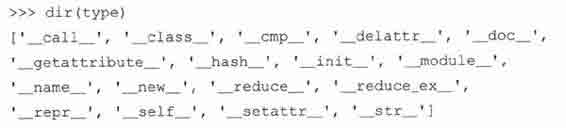

从内部机制来看，因为 BIF 和内建方法（BM）属于相同的类型，所以对 BIF 或者 BIM 调用 type()的结果是：

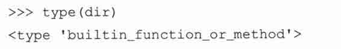

注意这不能应用于工厂函数，因为 type()正好会返回产生对象的类型：

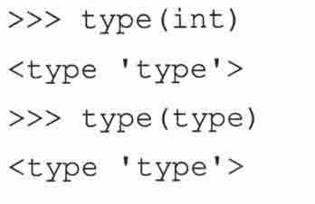

2.用户定义的函数（UDF）

用户定义的函数（User-Defined Function, UDF）通常是用 Python 写的，定义在模块的最高级，因此会作为全局名称空间的一部分（一旦创建好内建名称空间）装载到系统中。函数也可在其他的函数体内定义，并且由于在 2.2 中嵌套作用域的改进，我们现在可以对多重嵌套作用域中的属性进行访问。可以用 func_closure 属性来钩住在其他地方定义的属性。

如同上面的 BIF，UDF 也有许多的属性。UDF 最让人感兴趣和最特殊的属性都列在下面的表 14.2 中。

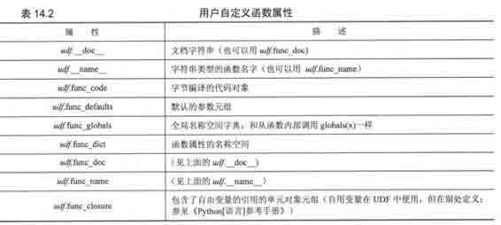

从内部机制来看，用户自定义的函数是“函数”类型的，如在下面的例子中用 type()表明的一样：

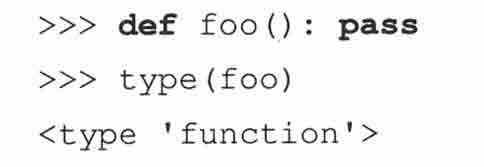

3\. lambda 表达式（名为“<lambda>”的函数）

lambda 表达式和用户自定义对函数相比，略有不同。虽然它们也是返回一个函数对象，但是 lambda 表达式不是用 def 语句创建的，而是用 lambda 关键字：

因为 lambda 表达式没有给命名绑定的代码提供基础结构，所以要通过函数式编程接口来调用，或把它们的引用赋值给一个变量，然后就可以直接调用或者再通过函数来调用。变量仅是个别名，并不是函数对象的名字。

通过 lambda 来创建函数的对象除了没有命名之外，享有和用户自定义函数相同的属性；__name__ 或者 func__name 属性给定为字符串“<lambda>”。使用 type()工厂函数，我们来演示下 lambda 表达式返回和用户自定义函数相同的函数对象。

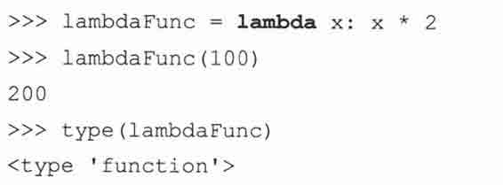

在上面的例子中，我们将表达式赋值给一个别名。我们也可以直接在一个 lambda 表达式上调用 type()：

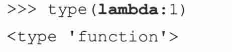

我们快速的来看看 UDF 名字，使用上面的 lambda Func 和先前小节中的 foo()：

从 11.9 小节中我们可以看到，一旦函数声明以后（且函数对象可用），程序员也可以自定义函数属性。所有的新属性变成 udf.__dict__ 对象的一部分。在本章的稍后内容中，我们将讨论获取含有 Python 代码的字符串并执行该代码。到了本章最后，会有一个组合例子，着重描写函数属性和 Python 代码（字符串）的动态求值和执行语句。

### 14.1.2　方法

在第十三章中，我们研究了方法。用户自定义方法是被定义为类的一部分函数。许多 Python 数据类型，比如列表和字典，也有方法，这些被称为内建方法。为了进一步说明“所有权”的类型，方法通过对象的名字和句点属性标识进行命名。

1.内建方法（BIM）

在前面的小节中，我们讨论了内建方法与内建函数的类似之处。只有内建类型（built-in type, BIT）有内建方法（built-in Method, BIM）。正如你在下面看到的，对于内建方法，type()工厂函数给出了和 BIF 相同的输出——注意，我们是如何提供一个内建对象来访问 BIM:

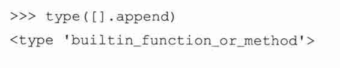

此外，BIM 和 BIF 两者也都享有相同属性。不同之处在于 BIM 的 __self__ 属性指向一个 Python 对象，而 BIF 指向 None。

对于类和实例，都能以该对象为参数，通过内建函数 dir()来获得他们的数据和方法属性。这也可以用在 BIM 上：

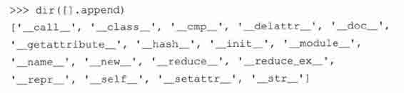

然而，不用多久就会发现，从功能上看，用实际的对象去访问其方法并不是非常有用，如最后的例子。由于没有引用来保存这个对象，所以它立即被垃圾回收了。你处理这种访问的类型唯一的用处就是显示 BIT 有什么方法。

2.用户定义的方法（UDM）

UDM （User-defined method，用户定义的方法）包含在类定义之中，只是拥有标准函数的包装，仅有定义它们的类可以使用。如果没有在子类定义中被覆盖掉，也可以通过子类实例来调用它们。正如在 13 章解释的那样，UDM 与类对象是关联的（非绑定方法），但是只能通过类的实例来调用（绑定方法）。无论 UDM 是否绑定，所有的 UMD 都是相同的类型——“实例方法”，如在下面例子看到的 type()调用：

表 11.4 中展示了 UDM 的属性。访问对象本身将会揭示你正在引用一个绑定方法还是非绑定方法。正如你从下面看到的，绑定的方法揭示了方法绑定到哪一个实例。

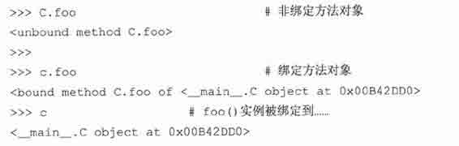

### 14.1.3　类

我们可以利用类的可调用性来创建实例。“调用”类的结果便是创建了实例，即大家所知道的实例化。类有默认构造器，该函数什么都不做，基本上只有一个 pass 语句。程序员可以通过实现 __int__()方法，来自定义实例化过程。实例化调用的任何参数都会传入到构造器里。

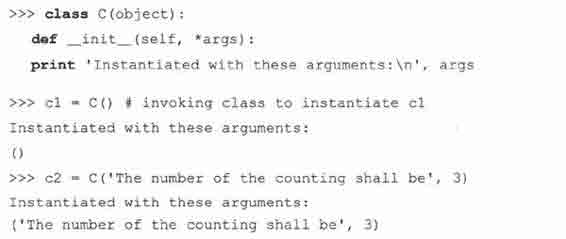

我们已经很熟悉实例化过程以及它是如何完成的，在这里将不再赘述。不过，一个新的问题是如何让实例能够被调用。

### 14.1.4　类的实例

Python 给类提供了名为 __call__ 的特别方法，该方法允许程序员创建可调用的对象（实例）。默认情况下，__call__()方法是没有实现的，这意味着大多数实例都是不可调用的。然而，如果在类定义中覆盖了这个方法，那么这个类的实例就成为可调用的了。调用这样的实例对象等同于调用 __call__()方法。自然地，任何在实例调用中给出的参数都会被传入到 __call()__ 中。那么 foo()就和 foo.__call__（foo）的效果相同，这里 foo 也作为参数出现，因为是对自己的引用，实例将自动成为每次方法调用的第一个参数。如果 __call__()有参数，比如（self, arg），那么 foo（arg）就和调用 foo.__call__（foo，arg）—样。这里我们给出一个可调用实例的例子，和前面小节的例子相似：

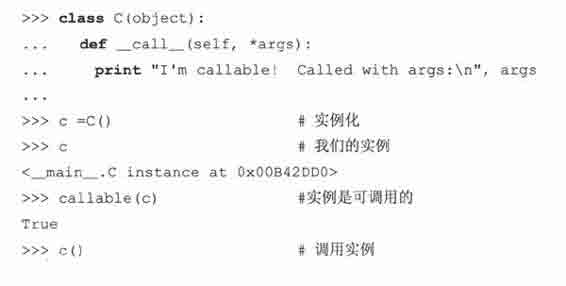

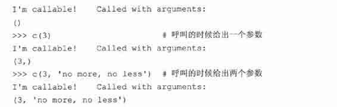

记住只有定义类的时候实现了 __call__ 方法，类的实例才能成为可调用的。

## 14.2　代码对象

可调用的对象是 Python 执行环境里最重要的部分，然而他们只是冰山一角。Python 语句、赋值、表达式，甚至还有模块构成了更宏大的场面。这些可执行对象无法像可调用物那样被调用。更确切地说，这些对象只是构成可执行代码块的拼图的很小一部分，而这些代码块被称为代码对象。

每个可调用物的核心都是代码对象，由语句、赋值、表达式和其他可调用物组成。查看一个模块意味着观察一个较大的、包含了模块中所有代码的对象。然后代码可以分成语句、赋值、表达式，以及可调用物。可调用物又可以递归分解到下一层，那儿有自己的代码对象。

一般说来，代码对象可以作为函数或者方法调用的一部分来执行，也可用 exec 语句或内建函数 eval()来执行。从整体上看，一个 Python 模块的代码对象是构成该模块的全部代码。

如果要执行 Python 代码，那么该代码必须先要转换成字节编译的代码（又称字节码）。这才是真正的代码对象。然而，它们不包含任何关于它们执行环境的信息，这便是可调用物存在的原因，它被用来包装一个代码对象并提供额外的信息。

还记得前面的小节中 UDF 的 udf.func_code 属性吗？呃，想不到吧？那就是代码对象。UDM 的 udm.im_func 函数对象又是怎么一回事呢？因为那也是一个函数对象，所以他同样有它自己的 udm.im_func.func_code 代码对象。这样的话，你会发现，函数对象仅是代码对象的包装，方法则是给函数对象的包装。你可以到处看看。当研究到最底层，你会发现便是一个代码对象。

## 14.3　可执行的对象声明和内建函数

Python 提供了大量的 BIF 来支持可调用/可执行对象，其中包括 exec 语句。这些函数帮助程序员执行代码对象，也可以用内建函数 complie()来生成代码对象。

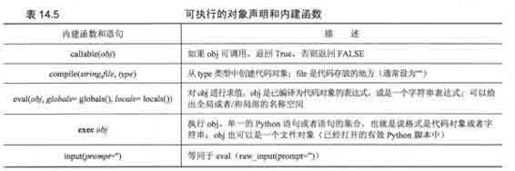

### 14.3.1　callable()

callable()是一个布尔函数，确定一个对象是否可以通过函数操作符（()）来调用。如果函数可调用便返回 True，否则便是 False（对与 2.2 和较早的版本而言，分别是 1 和 0）。这里有些对象及其对应的 callable 返回值:

### 14.3.2　compile()

compile()函数允许程序员在运行时刻迅速生成代码对象，然后就可以用 exec 语句或者内建函数 eval()来执行这些对象或者对它们进行求值。一个很重要的观点是：exec 和 eval()都可以执行字符串格式的 Python 代码。当执行字符串形式的代码时，每次都必须对这些代码进行字节编译处理。compile()函数提供了一次性字节代码预编译，以后每次调用的时候，都不用编译了。

compile 的三个参数都是必需的，第一参数代表了要编译的 Python 代码。第二个字符串，虽然是必需的，但通常被置为空串。该参数代表了存放代码对象的文件的名字（字符串类型）。compile 的通常用法是动态生成字符串形式的 Python 代码，然后生成一个代码对象——代码显然没有存放在任何文件。

最后的参数是个字符串，它用来表明代码对象的类型。有三个可能值：

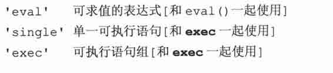

1.　可求值表达式

2.　单一可执行语句

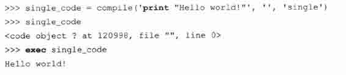

3.　可执行语句组

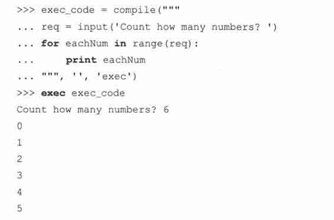

在最后的例子中，我们第一次看到 input()。一直以来，我们都是从 raw_input()中读取输入的。内建函数 input()是我们将在本章稍后讨论的一个快捷函数。

### 14.3.3　eval()

eval()对表达式求值，后者可以为字符串或内建函数 complie()创建的预编译代码对象。这是 eval()第一个也是最重要的参数……这便是你想要执行的对象。第二个和第三个参数，都为可选的，分别代表了全局和局部名称空间中的对象。如果给出这两个参数，globals 必须是个字典，locals 可以是任意的映射对象，比如，一个实现了 _getitem_()方法的对象。（在 2.4 之前，local 必须是一个字典）如果都没给出这两个参数，分别默认为 globals()和 locals()返回的对象，如果只传入了一个全局字典，那么该字典也作为 locals 传入。好了，我们一起来看看 eval():

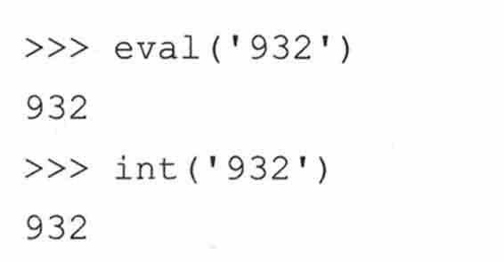

在这种情况下，eval()和 int()都返回相同的结果：整型 932。然而，它们采用的方式却不尽相同。内建函数 eval()接收引号内的字符串并把它作为 Python 表达式进行求值。内建函数 int()接收代表整型的字符串并把它转换为整型。这只有在该字符串只由字符串 932 组成的时候才会成功，而该字符串作为表达式返回值 932，932 也是字符串”932”所代表的整型。当我们用纯字符串表达式的时候，两者便不再相同了：

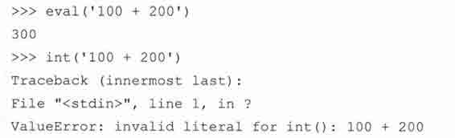

在这种情况下，eval()接收一个字符串并把“100+200”作为表达式求值，当进行整型加法后，给出返回值 300。而对 int()的调用失败了，因为字符串参数不是能代表整型的字符串，因为在字符串中有非法的文字，即，空格以及“+”字符。可以这样理解 eval()函数的工作方式：对表达式两端的引号视而不见，接着假设“如果我是 Python 解释器，我会怎样去观察表达式呢？”，换句话说，如果以交互方式输入相同的表达式，解释器会做出怎么样的反应呢？按下回车后的结果应该和 eval()返回的结果相同。

### 14.3.4　exec

和 eval()相似，exec 语句执行代码对象或字符串形式的 Python 代码。类似地，用 compile()预编译重复代码有助于改善性能，因为在调用时不必经过字节编译处理。exec 语句只接受一个参数，下面便是它的通用语法：

被执行的对象（obj）可以只是原始的字符串，比如单一语句或是语句组，它们也可以预编译成一个代码对象（分别用“single”和“exec”参数）。下面的例子中，多个语句作为一个字符串发送给 exec：

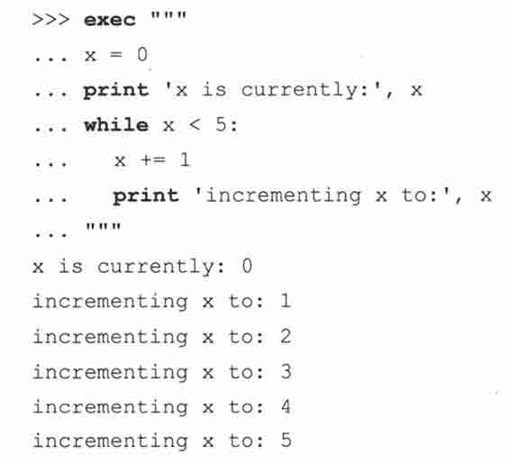

最后，exec 还可以接受有效的 Python 文件对象。如果我们用上面的多行代码创建一个叫 xcount.py 的文件，那么也可以用下面的方法执行相同的代码：

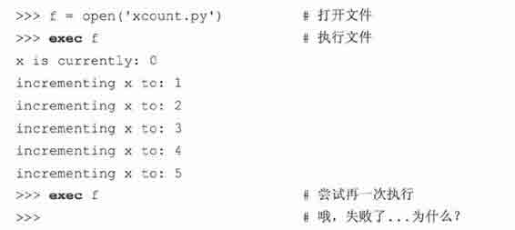

注意一旦执行完毕，继续对 exec 的调用就会失败。呃，并不是真正的失败……只是不再做任何事，这或许让你感到吃惊。事实上，exec 已从文件中读取了全部的数据且停留在文件末尾（end-of-file, EOF）。当用相同文件对象对 exec 进行调用的时候，便没有可以执行的代码了，所以 exec 什么都不做，如同上面看见的行为。我们如何知道它在 EOF 呢？

我们用文件对象的 tell()方法来告诉我们处于文件的何处，然后用 os.path.getsize()来告诉我们 xcount.py 脚本有多大。这样你就会发现，两个数字完全一样：

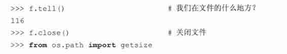

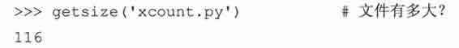

如果想在不关闭和重新打开文件的情况下再次运行它，可以用 seek()到文件最开头并再次调用 exec 了。比如，假定我们还没有调用 f.close()，那么我们可以这样做：

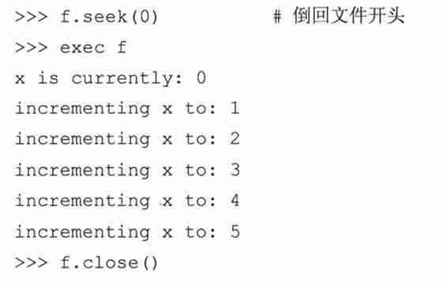

### 14.3.5　input()

内建函数 input()是 eval()和 raw_input()的组合，等价于 eval（raw_input()）。类似于 raw_input()，input()有一个可选的参数，该参数代表了给用户的字符串提示。如果不给定参数的话，该字符串默认为空串。

从功能上看，input 不同于 raw_input()，因为 raw_input()总是以字符串的形式，逐字地返回用户的输入。input()履行相同的的任务；而且，它还把输入作为 Python 表达式进行求值。这意味着 input()返回的数据是对输入表达式求值的结果：一个 Python 对象。

下面的例子会让人更加清楚：当用户输入一个列表时，raw_input()返回一个列表的字符串描绘，而 input()返回实际的列表：

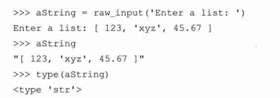

上面用 raw_input()运行。正如你看见的，每样东西都是字符串。现在来看看当用 input()的时候会发生什么：

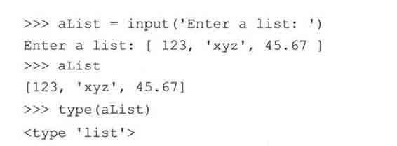

虽然用户输入字符串，但是 input()把输入作为 Python 对象来求值并返回表达式的结果。

### 14.3.6　使用 Python 在运行时生成和执行 Python 代码

本小节我们将看到两个 Python 脚本的例子，这两个例子在运行时刻把 Python 代码作为字符串并执行。第一个例子更加动态，但第二个突出了函数属性。

1.　在运行时生成和执行 Python 代码

第一个例子是 loopmake.py 脚本，一个简单的、迅速生成的和执行循环的计算机辅助软件工程（computer-aided software engineering，CASE）。它提示用户给出各种参数（比如，循环类型（while 或 for），迭代的数据类型（数字或序列）），生成代码字串，并执行它。

例 14.1　动态生成和执行 Python 代码（loopmake.py）

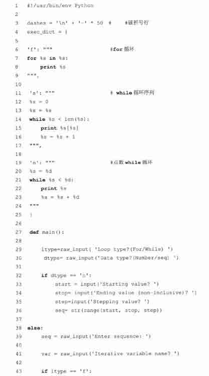

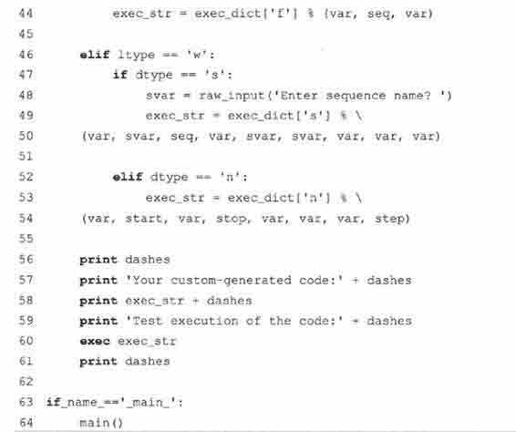

以下是一些脚本执行的例子。

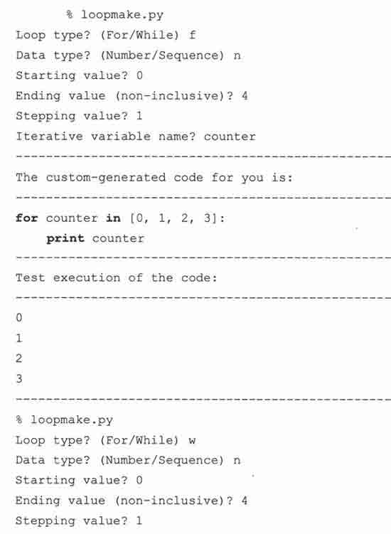

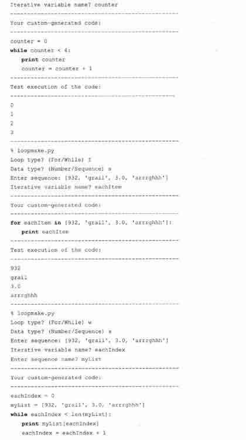

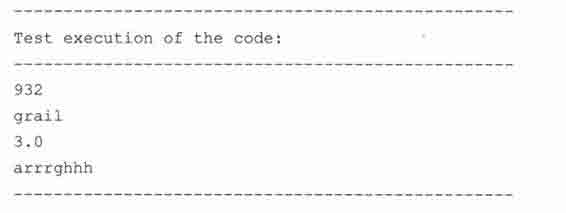

2．逐行解释

1 ~ 25 行

在脚本的第一部分，我们设置了两个全局变量。第一个是由一行破折号（即是名字）组成的静态字符串，第二个则是由用于生成循环的骨架代码组成的字典。for 循环的健值是“f”，用于迭代序列的 while 循环的则是“s”,而记数 while 循环的是“n”。

27 ~ 30 行

这里我们提示用户输入他想要的循环类型和数据类型。

32 ~ 36 行

选定数字；给出开始、停止和增量值。在这个部分的代码中，第一次引入了内建函数 input()。我们将在 14.3.5 小节中看到，input()和 raw_input()相似，因为它提示用户给出字符串输入，但是不同于 raw_input(), input()会把输入当成 Python 表达式来求值，即使用户以字符串的形式输入，也会返回一个 Python 对象。

38 ~ 39 行

选定序列；这里以字符串的形式输入一个序列。

41 行

给出用户想要使用的迭代循环变量的名字。

43 ~ 44 行

生成添加自定义内容的 for 循环。

46 ~ 50 行

生成迭代序列的 while 循环。

52 ~ 54 行

生成计数的 while 循环。

56 ~ 61 行

输出生成的源代码及其执行后的结果。

63 ~ 64 行

当直接调用该模块的时候，执行 main()。

为了很好地控制脚本的大小，我们从原来的脚本中剔除了所有的注释和错误检测。在本书的 Web 站点上，都可以找到原来的和修改后的版本。

扩展的版本包括了额外的特性，比如用于字符串输入的不必要的引号，输入数据的默认值，以及检测无效的返回和标识符；也不允许以关键字和内建名字作为变量名字。

3．有条件地执行代码

第二个例子着重描写了在第十一章引入的函数属性，它是从 Python 增强提议 232 （PEP 232）中的例子得到的灵感。假设你是一位负责质量控制的软件开发者，你鼓励你的工程师将回归测试或回归指令代码放到主代码中，但又不想让测试代码混合到产品代码中。你可以让工程师创建字符串形式的测试代码。当你的测试框架执行的时候，它会检测函数是否定义了测试体，如果是的话，（求值并）执行它。如果不是，便跳过，像通常一样执行。

例 14.2　函数属性（funcAttrs.py）

调用 sys.exit()使 Python 解释器退出。exit()的任何整型参数作为退出状态会返回给调用者，该值默认为 0。

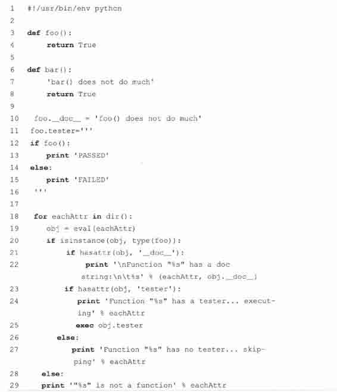

1 ~ 8 行

我们在脚本的开始部分定义了 foo()和 bar()。两个函数都只是返回 True。不同点在于 foo()没有属性而 bar()有文档字串。

10 ~ 16 行

使用函数属性，我们给 foo()加入了文档字串以及退化或单元测试字符串。注意检测字符串实际上由 Python 代码组成。

18 ~ 29 行

好了，真正的工作在这里开始。我们从用内建函数 dir()迭代现在（即全局）名称空间开始。它返回的列表包含了所有对象的名字。因为这些都是字符串，我们需要在第 19 行将它们转化为真正的 Python 对象。

除了预期的系统变量，比如，_builtins_，我们还期望显示函数。我们只对函数有兴趣；第 20 行的代码让我们跳过了所有遇到的非函数对象。一旦我们知道我们有某个函数，就可以检查它是否有文档字串，如果有的话，把它显示出来。23~27 行表演了魔法。如果函数有检测属性，那么就执行它，否则告诉用户没有可用的单元测试。最后的几行显示出遇到的非函数对象的名字。执行代码后，我们得到如下的输出：

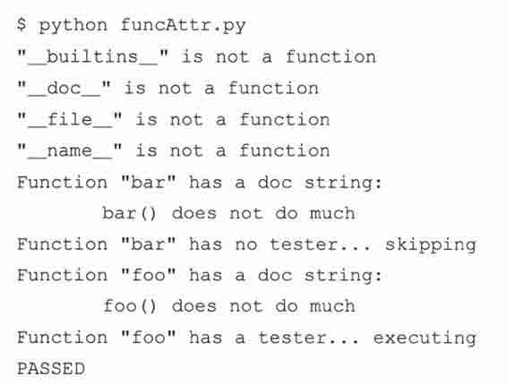

## 14.4　执行其他 （Python）程序

当讨论执行其他程序时，我们把它们分类为 Python 程序和其他所有的非 Python 程序，后者包括了二进制可执行文件或其他脚本语言的源代码。我们先讨论如何运行其他的 Python 程序，然后是如何用 os 模块调用外部程序。

### 14.4.1　导入

在运行时刻，有很多执行另外 Python 脚本的方法。正如我们先前讨论的，第一次导入模块会执行模块最高级的代码。不管你是否需要，这就是 Python 导入的行为。提醒，只有属于模块最高级的代码才是全局变量、全局类和全局函数声明。

核心笔记：当模块导入后，就执行所有的模块

* * *

这只是一个善意的提醒：在先前的第三章和第十二章已经谈过了，现在再说一次，当导入 Python 模块后，就会执行所有的模块！当你导入 foo 模块时候，它运行所有最高级别的（即没有缩进的）Python 代码，比如，“main()”。如果 foo 含有 bar 函数的声明，那么便执行 def foo（…）。再问一次为什么会这样做呢？由于某些原因，bar 必须被识别为 foo 模块中一个有效的名字，也就是说 bar 在 foo 的名称空间中。其次，解释器要知道它是一个已声明的函数，就像本地模块中的任何一个函数。现在我们知道要做什么了，那么如何处理那些不想每次导入都执行的代码呢？缩进它，并放入 if _name_ == ‘_main_’的内部。

* * *

跟着应该是一个 if 语句，它通过检测 _name_ 来确定是否要调用脚本，比如，“if_name__== ‘_main_’”。如果相等的话，你的脚本会执行 main 内代码；否则只是打算导入这个脚本，那么可以在这个模块内对代码进行测试。

当导入 Python 模块后，会执行该模块！当你导入 foo 模块时候，它运行所有最高级别的（即没有缩进的）Python 代码，再问一次为什么会这样做呢？由于某些原因，bar 必须被识别为 foo 模块中一个有效的名字，也就是说 bar 在 foo 的名称空间中，其次，解释器要知道它是一个已声明的函数，就像本地模块中的任何一个函数。现在我们知道要做什么了，那么如何处理那些不想每次导入都执行的代码呢？缩进它，并放入 if_name_ == ‘_main_’的内部。

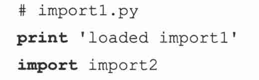

这里是 import2.py 的内容：

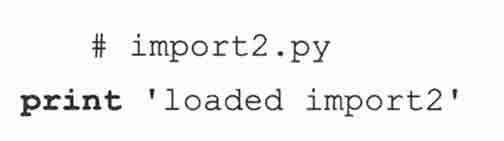

这是当我们导入 import1 时的输出：

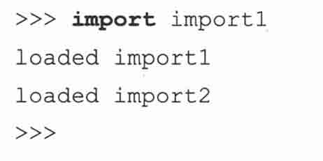

根据建议检测 _name_ 值的迂回工作法，我们改变了 importl.py 和 import2.py 里的代码，这样的情况就不会发生了。

这里是修改后的 import.py 版本：

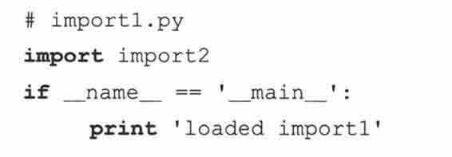

接着是 import2.py 的代码，以相同的方式修改：

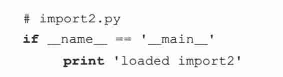

当从 Python 中导入 import1 的时候，我们不再会得到任何输出：

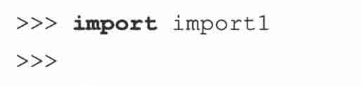

这不意味着在任何的情况下，都应该这样编写代码。在某些情况中，你可能想要显示输出来确定输入模块。这取决于你自身的情况。我们的目标是提供实效的编程例子来屏蔽副作用。

### 14.4.2　execfile()

显然，导入模块不是从另外的 Python 脚本中执行 Python 脚本最可取的方法。那也就不是导入过程。导入模块的副作用是导致最高级代码运行。

这章一开始，我们描述了如何通过文件对象，使用 exec 语句来读取 Python 脚本的内容并执行。下面的代码给出了例子：

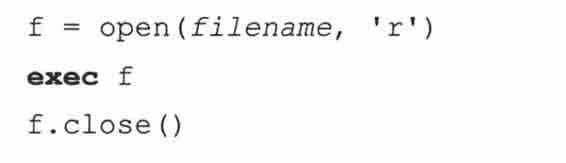

这 3 行可以调用 execfile()来换掉：

虽然上述代码执行了一个模块，但是仅可以在现有的执行环境下运行（比如，它自己的全局和局部的名称空间）。在某些情况下，可能需要用不同全局和局部的名称空间集合，而不是默认的集合来执行模块。execfile()函数的语法非常类似于 eval()函数的。

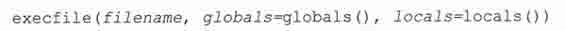

类似 eval()、globals 和 locals 都是可选的，如果不提供参数值的话，默认为执行环境的名称空间。如果只给定 globals，那么 locals 默认和 globals 相同。如果提供 locals 值的话，它可以是任何映射对象（一个定义／覆盖了 _getitem_()的对象）。在 2.4 之前，locals 必须是一个字典。注意：（在修改的时候）小心局部名称空间。比较安全的做法是传入一个虚假的”locals”字典并检查是否有副作用。execfile()不保证不会修改局部名称空间。见《Python 库参考手册》（Python Library Reference Manual）对 execfile()的解释。

### 14.4.3　将模块作为脚本执行

Pythpon2.4 里加入了一个新的命令行选项（或开关），允许从 shell 或 DOS 提示符，直接把模块作为脚本来执行。当以脚本的方式来书写模块的时候，执行它们是很容易的。可以使用命令行从你的工作目录调用你的脚本。

如果模块是标准库的一部分，安装在 site-packages 里，或者仅仅是包里面的模块，处理这样的模块就不是那么容易了，尤其是它们共享了已存在的同名 Python 模块。举例来说，你想运行免费的 Python web 服务器，以便创建和测试你自己的 Web 页面和 CGI 脚本。

你将必须在命令行敲入如下的字符：

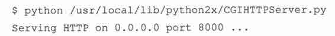

这是段很长的命令，如果它是第三方的，你不得不深入到 site-packages 去找到它真正定位的地方。如果没给出完全的路径名，可以从命令行运行一个模块，并让 Python 的导入机制为我们做这种跑腿工作吗？答案是肯定的。我们可以用 Python-c 命令行开关：

该选项允许你指定你想要运行的 Python 语句。虽然它可以这样工作，但问题是 _name_ 模块不是 ‘_main_’…而是你正在使用的模块（需要的话，你可以参阅前面的 3.4.1 小节复习 _name_）。在最后一行，解释器通过 import 装载了你的模块，并不是它当作脚本。因为如此，所有在 if_name_ == ‘_main_’之下的代码是不会执行的，所以你不得不手动地调用模块的 test()函数，就如同前面我们所做的一样。所以我们想同时要两者的优点——能够在类库中执行作为脚本的模块而不是作为导入的模块。这就是-m 参数的动机。现在可以像这样运行脚本：

这是不小的改进。尽管如此，还没有完全如预想那样实现特性。所以在 Python2.5 中，-m 开关有了更多的兼容性。从 2.5 开始，你可以用相同的参数来运行包内或需要特别加载的模块，比如 zip 文件里的模块，这是在 2.3 加入的特性（12.5.7 小节，396 页）。Python2.4 只让你执行标准的库模块。所以初始版本的-m 选项是不能运行特殊的模块如 PyCHecker （Python 的 lint），或其他的性能测试器（注意这些是装载和运行其他模块的模块）。但是 2.5 版本解决了这个问题。

## 14.5　执行其他（非 Python）程序

在 Python 程序里我们也可以执行非 Python 程序。这些程序包括了二进制可执行文件，其他的 shell 脚本等。所有的要求只是一个有效的执行环境，比如，允许文件访问和执行，脚本文件必须能访问它们的解释器（perl、bash 等），二进制必须是可访问的（和本地机器的构架兼容）。

最终，程序员必须考虑 Python 脚本是否必须和其他将要执行的程序通信。有些程序需要输入，而有的程序返回输出以及执行完成时的错误代码，也许有的两者都做。针对不同的环境，Python 提供了各种执行非 Python 程序的方法。在本节讨论的所有函数都可以在 os 模块中找到。在表 14.6 中，我们做了总结（我们会对那些只适合特定平台的函数进行标注），作为对本节剩余部分的介绍。

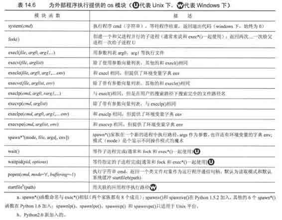

随着越来越接近软件的操作系统层面，你会发现执行跨平台程序（甚至是 Python 脚本）的一致性开始有些不确定了。上面我们提到在这个小节中描述的程序是在 os 模块中的。事实上，有多个 os 模块。比如说，基于 Unix 衍生系统（例如 Linux、MacOS X、Solaris、BSD 等）的模块是 posix 模块，windows 的是 nt（无论你现在用的是哪个版本的 windows; dos 用户有 dos 模块），旧的 macOS 为 mac 模块。不用担心，当你调用 import os 的时候，Python 会装载正确的模块。你不需要直接导入特定的操作系统模块。

在我们看看每个模块函数之前，对于 Python2.4 或者更新版本的用户，这里有个 subprocess 模块，可以作为上面所有函数很好的替代品。我们本章稍后部分演示如何使用这些函数，然后在最后给出 subprocess.Popen 类和 subprocess.call()函数的等价使用方法。

### 14.5.1　os.system()

我们列表中的第一个函数是 system()，一个非常简单的函数，接收字符串形式的系统命令并执行它。当执行命令的时候，Python 的运行是挂起的。当我们的执行完成之后，将会以 system()的返回值形式给出退出状态，Python 的执行也会继续。

system()保留了现有的标准文件，包括标准的输出，意味着执行任何命令和程序显示输出都会传到标准输出上。这里要当心，因为特定应用程序比如公共网关接口（common gateway interface, CGI），如果将除了有效的超文本标记语言（HTML）字符串之外的输出，经过标准输出发送回客户端，会引起 Web 浏览器错误。system()通常和不会产生输出的命令一起使用，其中的一些命令包括了压缩或转换文件的程序，挂载磁盘到系统的程序，或其他执行特定任务的命令——通过退出状态显示成功或失败而不是通过输入和／或输出通信。通常的约定是利用退出状态，0 表示成功，非 0 表示其他类型的错误。

作为例子，我们执行了两个从交互解释器中获取程序输入的命令，这样你便可以观察 system()是如何工作的。

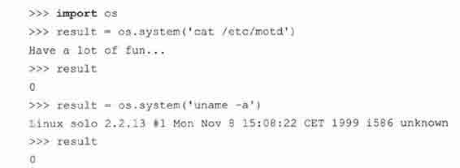

可以看到两个命令的输出和它们执行的退出状态，我们将其保存到 result 变量中。下面是一个执行 dos 命令的例子：

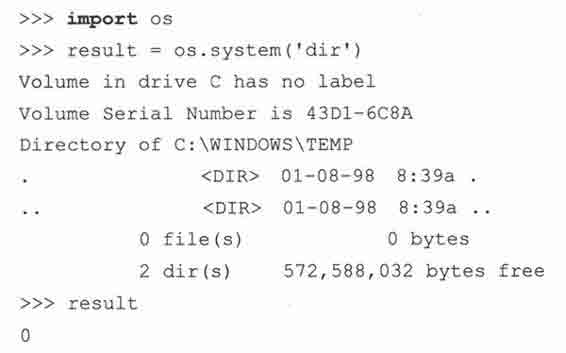

### 14.5.2　os.popen()

popen()函数是文件对象和 system()函数的结合。它工作方式和 system()相同，但它可以建立一个指向那个程序的单向连接，然后像访问文件一样访问这个程序。如果程序要求输入，那么你要用‘w’模式写入那个命令来调用 popen()。你发送给程序的数据会通过标准输入接收到。同样，‘r’模式允许 spawn 命令，那么当它写入标准输出的时候，你就可以通过类文件句柄使用熟悉的 file 对象的 read*()方法来读取输入。就像对于文件，当使用完毕以后，你应当 close()连接。在上面其中一个使用 system()的例子中，我们调用了 unix 程序 uname 来给我们提供机器和使用的操作系统的相关信息。该命令产生了一行输出，并直接写到屏幕上。如果想要把该字符串读入变量中并执行内部操作或者把它存储到日志文件中，我们可以使用 popen()。实际上，代码如下所示：

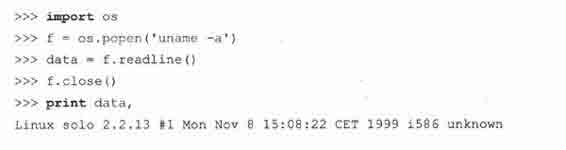

如你所见，popen()返回一个类文件对象；注意 readline()，往往保留输入文本行尾的 newline 字符。

### 14.5.3　os.fork()、os.exec*()、os.wait*()

本小节我们不会对操作系统理论做详尽的介绍，只是稍稍地介绍一下进程（process）。fork()采用称为进程的单一执行流程控制，如果你喜欢的话，可称之为创建“岔路口”。有趣的事情发生了：用户系统同时接管了两个岔路口——也就是说让用户拥有了两个连续且并行的程序（不用说，它们运行的是同一个程序，因为两个进程都是紧跟在 fork()调用后的下一行代码开始执行的）。调用 fork()的原始进程称为父进程，而作为该调用结果新创建的进程则称为子进程。当子进程返回的时候，其返回值永远是 0；当父进程返回时，其返回值永远是子进程的进程标识符（又称进程 ID，或 PID）（这样父进程就可以监控所有的子进程了）PID （process ID）也是唯一可以区分他们的方式！我们提到了两个进程会在调用 fork()后立刻运行。因为代码是相同的，如果没有其他的动作，我们将会看到同样的执行结果。而这通常不是我们想要的结果。创建另外一个进程的主要目的是为了运行其他程序，所以我们必须在父进程和子进程返回时采取分流措施。正如上面我们所说，它们的 PID 是不同的，而这正是我们区分它们的方法。

对于那些有进程管理经验的人来说，接下来的这段代码是再熟悉不过了。但是，如果你是新手的话，一开始就弄懂它是如何工作的可能就有点困难了，但是一旦你懂了，就会体会到其中的奥妙。

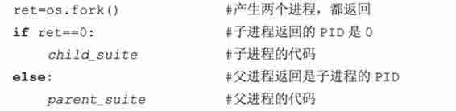

在代码第一行便调用了 fork()。现在子进程和父进程同时在运行。子进程本身有虚拟内存地址空间的拷贝，以及一份父进程地址空间的原样拷贝——是的，两者几乎都是相同的。fork()返回两次，意味着父进程和子进程都返回了。你或许会问，如果它们两个同时返回，如何区分两者呢？当父亲返回的时候，会带有进程的 PID。而当子进程返回的时候，其返回值为 0。这就是区分两个进程的方法。

利用 if-else 语句，我们能给子进程（比如，if 子句）和父进程（else 子句）指定各自的执行代码。在子进程的代码中，我们可以调用任何 exec*()函数来运行完全不同的程序，或者同一个程序中的其他的函数（只要子进程和父进程用不同的路径执行）。普遍做法是让子进程做所有的脏活，而父进程耐心等来子进程完成任务，或继续执行，稍后再来检查子进程是否正常结束。

所有的 exec*()函数装载文件或者命令，并用参数列表（分别给出或作为参数列表的一部分）来执行它。如果适用的话，也可以给命令提供环境变量字典。这些变量普遍用于给程序提供对当前执行环境的精确描述。其中一些著名的变量包括用户的名字、搜索路径、现在的 shell、终端类型、本地化语言、机器类型、操作系统名字等。

所有版本的 exec*()都会用给定文件作为现在要执行的程序取代当前（子）进程的 Python 解释器。和 system()不一样，对于 Python 来说没有返回值（因为 Python 已经被替代了）。如果因为某种原因，程序不能执行，那么 exec*()就会失败，进而导致引发异常。

接下来的代码在子进程中开始了一个称为“xbill”的可爱小巧的游戏，而父进程继续运行 Python 解释器。因为子进程从不返回，所以无需去顾虑调用 exec*()后的子进程代码。注意该命令也是参数列表中的必须的第一个参数。

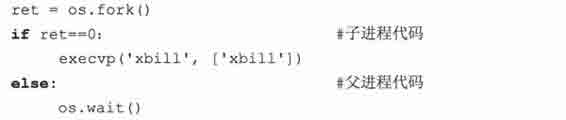

在这段代码中，还可以看到对 wait()的调用。当子进程执行完毕，需要它们的父进程进行扫尾工作。这个任务，称为“收获孩子”（reaping a child），可以用 wati*()函数完成。紧跟在 fork()之后，父进程可以等待子进程完成并在那进行扫尾。父进程也可以继续运行，稍后再扫尾，同样也是用 wait*()函数中的一个。

不管父进程选择了那个方法，该工作都必须进行。当子进程完成执行，还没有被收获的时候，它进入了闲置状态，变成了著名的僵尸进程。在系统中，应该尽量把僵尸进程的数目降到最少，因为在这种状态下的子进程仍保留着在存活时期分配给它们的系统资源，而这些资源只能在父进程收获它们之后才能释放掉。

调用 wait()会挂起执行（比如，waits），直到子进程（其他的子进程）正常执行完毕或通过信号终止。 wait()将会收获子进程，释放所有的资源。如果子进程已经完成，那么 wait()只是进行些收获的过程。 waitpid()具有和 wait()相同的的功能，但是多了一个参数 PID（指定要等待子进程的进程标识符），以及选项（通常是零或用“OR”组成的可选标志集合）。

### 14.5.4　os.spawn*()

函数 spawn*()家族和 fork, exec*()相似，因为它们在新进程中执行命令；然而，你不需要分别调用两个函数来创建进程，并让这个进程执行命令。你只需调用一次 spawn*()家族。由于其简单性，你放弃了“跟踪”父进程和子进程执行的能力；该模型类似于在线程中启动函数。还有点不同的是你必须知道传入 spawn*()的魔法模式参数。在其他的操作系统中（尤其是嵌入式实时操作系统（RTOS）），spawn*()比 fork()快很多。不是这种情况的操作系统通常使用写实拷贝（copy-on-write）技术。参阅 Python 库参考手册来获得更多 spanw*()的资料。各种 spanw*()家族成员是在 1.5 和 1.6（含 1.6）之间加入的。

### 14.5.5　subprocess 模块

在 Python 2.3 出来之后，一些关于 popen5 模块的工作开始展开。一开始该命名继承了先前 popen*()函数的传统，但是并没有延续下来，该模块最终被命名为 subproess，其中一个类叫 Popen，集中了我们在这章讨论的大部分面向进程的函数。同样也有名为 call()的便捷函数，可以轻易地取代了 os.system()。在 Python 2.4 中，subprocess 初次登场。下面就是演示该模块的例子：

Linux 上的例子：

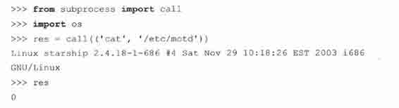

Win32 例子

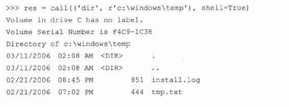

取代 os.popen()

创建 Popen()实例的语法只比调用 os.popen()函数复杂了一点

### 14.5.6　相关函数

表 14.7 列出了可以执行上述任务的函数（及其模块）。

## 14.6　受限执行

在 Python 历史某个时期内，存在着使用了 rexec 和 bastion 模块的限制执行的概念。第一个模块允许沙盒（sandbox）中的执行代码修改内建对象。第二个模块用来过滤属性和包装你的类。然而，由于一个显著的缺点和弥补安全漏洞的困难，这些模块便被废弃了。那些维护使用了这些模块的老代码的人员可能会用到这两个模块的文档。

## 14.7　结束执行

当程序运行完成，所有模块最高级的语句执行完毕后退出，我们便称这是干净的执行。可能有很多情况，需要从 Python 提前退出，比如某种致命错误，或是不满足继续执行的条件的时候。

在 Python 中，有各种应对错误的方法。其中之一便是通过异常和异常处理。另外一个方法便是建造一个“清扫器”方法，这样便可以把代码的主要部分放在 if 语句里，在没有错误的情况下执行，因而可以让错误的情况“正常地”终结。然而，有时也需要在退出调用程序的时候，返回错误代码以表明发生何种事件。

### 14.7.1　sys.exit() and SystemExit

立即退出程序并返回调用程序的主要方式是 sys 模块中的 exit()函数。sys.exit()的语法为：当调用 sys.exit()时，就会引发 systemExit()异常。除非对异常进行监控（在一个 try 语句和合适的 except 子句中），异常通常是不会被捕捉到或处理的，解释器会用给定的状态参数退出，如果没有给出的话，该参数默认为 0。System Exit 是唯一不看作错误的异常。它仅仅表示要退出 Python 的愿望。

sys.exit()经常用在命令调用的中途发现错误之后，比如，如果参数不正确，无效，或者参数数目不正确。下面的例子 14.4 （args.py）仅仅是一个测试脚本，在正确执行之前需要给出确定数目的参数。

执行这个脚本我们得到如下输出：

调用 sys.exit()使 Python 解释器退出。exit()的任何整型参数都会以退出状态返回给调用者，该值默认为 0;

许多命令行驱动的程序在进行之前，用脚本的核心功能测试了输入的有效性。如果验证失败，那么便调用 usage()函数去告知用户什么样的问题会导致这个错误，并“提示”用户如何才能正确地调用脚本。

### 14.7.2　sys.exitfunc()

sys.exitfunc()默认是不可用的，但你可以改写它以提供额外的功能。当调用了 sys.exit()并在解释器退出之前，就会用到这个函数了。这个函数不带任何参数的，所以你创建的函数也应该是无参的。

如果 sys.exitfunc 已经被先前定义的 exit 函数覆盖了，最好的方法是把这段代码作为你 exit()函数的一部分来执行。一般说来，exit 函数用于执行某些类型的关闭活动，比如关闭文件和网络连接，最好用于完成维护任务，比如释放先前保留的系统资源。

下面的例子介绍了如何设置 exit()函数，如果已经被设置了，则确保执行该函数：

在清理执行以后，我们执行了老的 exit()函数。getattr()调用只是检查了先前的 exitfunc()是否已经定义。如果没有，那么 prev_exit_func 赋值为 None，否则，prev_exit_func 变成 exit 函数新的别名，然后作为参数传入我们的新 exit 函数，my_exit_func。

对 getattr()的调用可以这样写：

### 14.7.3　os._exit()函数

os 模块的 _exit()函数不应该在一般应用中使用（平台相关，只适用特定的平台，比如基于 Unix 的平台，以及 Win32 平台）。其语法为：

这个函数提供的功能与 sys.exit()和 sys.exitfunc()相反，根本不执行任何清理便立即退出 Python。与 sys.exit()不同，状态参数是必需的。通过 sys.exit()退出是退出解释器的首选方法。

### 14.7.4　os.kill() Function

os 模块的 kill()函数模拟传统的 unix 函数来发送信号给进程。kill()参数是进程标识数（PID）和你想要发送到进程的信号。发送的典型信号为 SIGINT、SIGQUIT，或更彻底地，SIGKILL，来使进程终结。

## 14.8　各种操作系统接口

本章我们已看到各种通过 os 模块和操作系统进行交互的方法。我们看到的大多数函数都是处理文件或外部进程执行。这里有些方法允许对现在的用户和进程有较特殊的动作，我们将简要地看看。表 14.8 中描述的大部分函数只在 POSIX 系统上工作，除非标明了适用于 Windows 环境。

## 14.9　相关模块

在表 14.9 中，除了 os 和 sys 模块，你还可以找到与这章执行环境主题相关的模块列表。

## 14.10　练习

> > 14-1．可调用对象。说出 Python 中的可调用对象。exec 语句和内建函数 eval()有什么不同？

> > 14-2.input()和 raw.input()。内建函数 raw_input()和 input()有什么不同？

> > 14-3．执行环境。创建运行其他 Python 脚本的 Python 脚本。

> > 14-4.os.system()。选择熟悉的系统命令，该命令执行任务时不需要输入，也不输出到屏幕或根本不输出任何东西。调用 os.system()运行程序附加题：你的解决方案移植到 subprocess.call()。

> > 14-5.commands.getoutput()。用 commands.getoutput()解决前面的问题。

> > 14-6.popen()家族。选择熟悉的系统命令，该命令从标准输入获得文本，操作或输出数据。使用 os.popen()与程序进行通信。输出到哪儿呢？使用 popen2.popen2()代替。

> > 14-7.subprocess 模块。把先前问题的解决方案移植到 subprocess 模块。

> > 14-8.exit 函数。设计一个在程序退出时的函数。安装到 sys.exitfunc()，运行程序，演示你 exit 函数确实被调用了。

> > 14-9.shells。创建 shell（操作系统接口）程序。给出接受操作系统命令的命令行接口（任意平台）。

> > > > 附加题 1：支持管道（见 os 模块中的 dup()、dub2()和 pipe()函数）。管道过程允许进程的标准输入连接到另一个进程的标准输入。

> > > > 附加题 2：用括号支持逆序的管道，给 shell 一个函数式编程接口。换句话说，支持更加函数式风格如…sort（grep（ps -ef, root）, -n, +1），而不是 ps -ef | grep root | sort -n+1…这样的命令。

> > 14-10.fork()/exec*()和 spawn*()的比较。使用 fork()-exec*()对和 spawn*()家族函数有什么不同？哪一组的功能更强？

> > 14-11.生成和执行 Python 代码。用 funcAttrs.py 脚本（例 14.4）加入测试代码到已有程序的函数中。创建一个测试框架，每次遇到你特殊的函数属性，它都会运行你的测试代码。