# 第十五章　正则表达式

本章主题

♦　引言/动机

♦　特别的字符和符号

♦　正则表达式与 Python

♦　re 模块

## 15.1　引言/动机

处理文本和数据是件大事。如果你不相信我说的话，请仔细看看现如今的计算机主要都在做些什么工作：文字处理、网页填表、来自数据库的信息流、股票报价信息、新闻列表，这个清单还会不断地增长。因为我们可能不知道这些需要计算机编程处理文本或数据的具体内容，所以能把这些文本或数据以某种可被计算机识别和处理的模式表达出来是非常有用的。

假设我在运营一个电子邮件档案公司，而你是我的一位顾客，比如说，你想获得自己去年二月份收发的所有邮件，如果我能设计一个计算机程序来整理信息然后将它转发给你，而不是通过人工方法通读你的邮件后再手动地处理你的请求，那会非常不错。因为如果有人看了你的邮件信息，哪怕只是用眼睛瞄一下邮件上的时间，你可能都会对此感到担心（甚至愤怒）。又比如，你可能会认为凡是带有 “ILOVEYOU”这样主题的邮件都是已感染病毒的信息，并要求从你的个人邮箱中删除它们。这就引出一个问题，我们如何通过编程使计算机具有在文本中检索某种模式的能力。

正则表达式（RE）为高级文本模式匹配，以及搜索-替代等功能提供了基础。正则表达式（RE）是一些由字符和特殊符号组成的字符串，它们描述了这些字符和字符的某种重复方式，因此能按某种模式匹配一个有相似特征的字符串的集合，因此能按某模式匹配一系列有相似特征的字符串，见图 15-1。换句话说，它们能匹配多个字符串——一个只能匹配一个字符串的 RE 模式是乏味且毫无作用的，你说是不是？

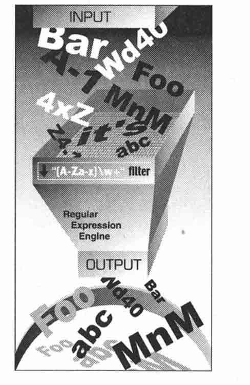

> > 图 　15-1

正则表达式引擎

图 15-1　你可以用这个正则表达式匹配有效的 Python 标识符。 “[A-Za-z]\w+”的含义是：第一个字符是字母，即，由大写字母 A~Z 或是小写字母 a~z 组成，它后面至少跟有一个（或更多）由字母或数字组成的字符（\w）。如图，你看到有很多字符串被过滤，只有那些符合我们要求的 RE 模式的字符串被筛选出来。比如，“4xZ”，因为它是以数字开头的，所以被过滤了。

Python 通过标准库的 re 模块支持正则表达式（RE），本节我们将简要地介绍一下。限于篇幅，内容将仅涉及 Python 编程中正则表达式（RE）方面最常见的内容。你们（对正则）的经验（熟悉程度）肯定不同。我们强烈建议你阅读一些官方帮助文档和与此主题有关的文本。那么你对字符串的理解方式就会有所改变。

核心笔记：搜索与匹配的比较

* * *

本章通篇涉及到对搜索和匹配用法的讲述。当我们完全讨论与字符串中模式有关的正则表达式时，我们会用术语“匹配”（matching），指的是术语“模式匹配”（pattern-matching）。在 Python 专门术语中，有两种主要方法完成模式匹配：搜索（searching）和匹配（matching）。搜索，即在字符串任意部分中搜索匹配的模式，而匹配是指，判断一个字符串能否从起始处全部或部分的匹配某个模式。搜索通过 search()函数或方法来实现，而匹配是以调用 match()函数或方法实现的。总之，当我们说模式的时候，我们全部使用术语“匹配” （matching）；我们按照 Python 如何完成模式匹配的方式来区分“搜索”和“匹配” 。

* * *

你的第一个正则表达式

我们上面已经提到，正则表达式是含有文本和特别字符的字符串，这些文本和特别字符描述的模式可以识别各种字符串。我们还简单阐述了正则表达式字母表，以及用于匹配通用文本的正则表达式字母表——所有大小写字母及数字的集合。也存在特别的字母表，比如，只含有字符“0”和“1”的字母表。该字母表可以表示所有二进制整型的集合，即,“0,” “1,” “00,” “01,” “10,” “11,” “100,”等。

让我们看看正则表达式的基本情况，虽然正则表达式常被视为是“高级主题”，但是有时候它们也是非常简单的。我们列出一些用一般文本的标准字母组成简单的正则表达式及它们所描述的字符串。以下的正则表达式是最基本、最普通的。它们仅由一个字符串定义了一个模式，该模式仅匹配这个字符串本身，该字符串由正则表达式定义。以下是正则表达式（RE）和匹配它们的字符串。

正则表达式模式匹配的字符串。

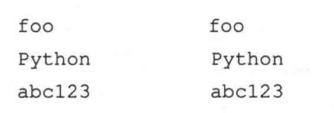

上表中第一个正则表达式模式是“foo”。这个模式不包含任何特殊符号去匹配其他符号，它仅匹配自身所描述的，所以只有字符串“foo”匹配此模式。同理，“Python”和“abcl23”也一样。正则表达式的强大之处在于特殊符号的应用，特殊符号定义了字符集合、子组匹配、模式重复次数。正是这些特殊符号使得一个正则表达式可以匹配字符串集合而不只是一个字符串。

## 15.2　正则表达式使用的特殊符号和字符

现在，我们来介绍最常用的元字符（metacharacter）——特殊字符和符号，正是它们赋予了正则表达式强大的功能和灵活性。正则表达式中最常见的符号和字符见表 15.1。

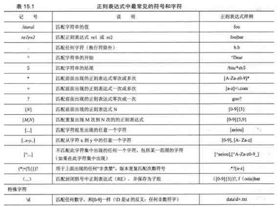

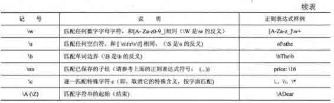

### 15.2.1　用管道符号（|）匹配多个正则表达式模式

管道符号（|），就是你键盘上的竖杠，表示一个或操作，它的意思是选择被管道符号分隔的多个不同的正则表达式中的一个。例如，下面的一些使用或操作的模式，和它们所匹配的字符串：

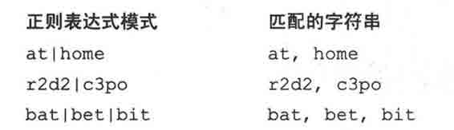

有了这个符号，正则表达式的灵活性增强了，使得它可以匹配不止一个字符串，“或”（操作）有时候也被叫做“联合”（union）或者逻辑或（OR）。

### 15.2.2　匹配任意一个单个的字符（.）

点字符或句点（.）符号匹配除换行符（NEWLINE）外的任意一个单个字符（Python 的正则表达式有一个编译标识[S or DOTALL]，该标识能去掉这一限制，使（.）在匹配时包括换行符（NEWLINE））。无论是字母、数字、不包括“\n”的空白符、可打印的字符、还是非打印字符，或是一个符号、点（.）都可以匹配他们。

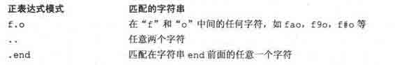

问：我怎样才能匹配句点（dot）或句号（period）？

答：为了明确地匹配一个句点（dot）本身，你必须（在前面）使用反斜线“\”，对它进行转义。

### 15.2.3　从字符串的开头或结尾或单词边界开始匹配（^/$ ΛbΛB ）

还有些符号和特殊字符是用来从字符串的开头或结尾开始搜索正则表达式模式的。如果想从字符串的开头开始匹配一个模式，你必须用脱字符号（^，即，Caret）或特殊字符\A（大写字母 A 前面加上一个反斜线）。后者主要是为那些没有 caret 符号的键盘使用的，比如说国际键盘。类似，美元符号（$）或\Z 是用来（零宽度）匹配字符串的结尾的。

用这些符号的模式与我们将在本章讲述的其他大多数符号是不同的，因为这些符号指定了（匹配字符）的位置。在上面的核心笔记里，我们曾说过“匹配”和“搜索”之间的区别，“匹配”是试图从整个字符串的开头进行匹配，而“搜索”则可从一个字符串的任意位置开始匹配。正因为这几个字符和搜索的位置有关，所以需要和搜索模式一起使用。下面是几个“擦边球”的正则表达式搜索模式：

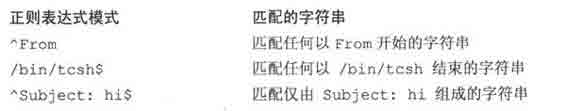

特别说明，如果你想匹配这两个字符中的任何一个（或全部），就必须用反斜线进行转义。例如，如果你想匹配任何以美元符号（$）结尾的字符串，一个可行的解决办法是用正则表达式模式“.*\$$”。

特殊字符\b and \B 用来匹配单词边界。两者之间的区别是，\b 匹配的模式是一个单词边界，就是说，与之对应的模式一定在一个单词的开头，不论这个单词的前面是有字符（该词在一个字符串的中间），还是没有字符（该单词在一行的起始处）。同样地，\B 只匹配出现在一个单词中间的模式（即，不在单词边界上的字符）。看下面几个例子：

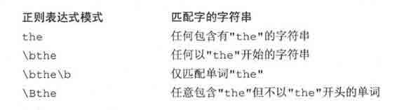

### 15.2.4　创建字符类（[]）

尽管句点可用来匹配任意字符，但有时候你需要匹配某些个特殊的字符。正因为如此，方括号（[]）被发明出来。使用方括号的正则表达式会匹配方括号里的任何一个字符。几个例子如下：

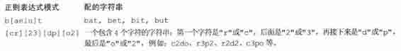

关于正则表达式“[cr][23][dp][o2]”的一点要说明：如果只让“r2d2 或“c3po”成为有效的字符串，就需要限定更为严格的正则表达式。但因为方括号只有“逻辑或”（“logical OR”）的功能，所以用方括号不能实现这一限定要求。唯一的解决办法是用管道符号（pipe），例如：“r2d2|c3po”。

对仅有单个字符的正则表达式，使用管道符号和方括号的效果是等价的。举例来说，正则表达式“ab”，只匹配以“a”开头后面再跟一个“b”的字符串。如果我们只想要一个字母的字符串，即， “a”或者“b”中的一个，就可以使用正则表达式“[ab]”。因为“a”和“b”是单个的字符串，我们也可以用正则表达式“a|b”。但是，如果我们想用模式匹配“ab”，后面接着是“cd”的字符串，就不能用方括号了，因为方括号只适用于单个字符的情况。这样，唯一的办法是用“ab|cd”，这和我们刚才提到的“r2d2|c3po”的道理是相同的。

### 15.2.5　指定范围（-）和否定（^）

方括号除匹配单个字符外，还可以支持所指定的字符范围。方括号里一对符号中间的连字符（-）用来表示一个字符的范围，例如 A-Z、a-z 或 0-9 分别代表大写字母、小写字母和十进制数字。这是一个按字母顺序排序的范围，所以它不限于只用在字母和十进制数字上。另外，如果在左方括号后第一个字符是上箭头符号（^），就表示不匹配指定字符集里的任意字符。

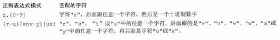

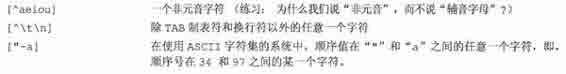

### 15.2.6　使用闭包操作符（*，+，？，{}）实现多次出现/重复匹配

现在我们来介绍最常用的正则表达式符号，即，特殊符号“*”、“+”和“？”，它们可以用于匹配字符串模式出现一次、多次或未出现的情况。星号或称星号操作符匹配它左边那个正则表达式出现零次或零次以上的情况（在计算机语言和编译器原理里，此操作符被叫做 Kleene 闭包操作符）。加号（+）操作符匹配它左边那个正则表达式模式至少出现一次的情况（它也被称为正闭包操作符），而问号操作符（？）匹配它左边那个正则表达式模式出现零次或一次的情况。

还有花括号操作符（{}），花括号里可以是单个的值，也可以是由逗号分开的一对值。如果是一个值，如，{N}，则表示匹配 N 次出现；如果是一对值，即，{M, N},就表示匹配 M 次到 N 次出现。可以在这些符号前用反斜线进行转义，使它们失去特殊作用，即，“\*ast;”将匹配星号本身等。

在上表中，我们注意到问号出现了不只一次（被重载），问号有两种含义：1．单独使用时表示匹配出现零次或一次的情况，2．紧跟在表示重复的元字符后面时，表示要求搜索引擎匹配的字符串越短越好，例如（+?）。

前面提到“越短越好”是什么意思呢？当使用了表示重复的元字符（*+? {m,n}）时，正则表达式引擎在匹配模式时会尽量“吸收”更多的字符。这就叫做”贪心”。问号告诉正则表达式引擎尽可能地偷懒，要求当前匹配消耗的字符越少越好，留下尽可能多的字符给后面的模式（如果存在）。在本章末尾，我们举一个有代表性的例子来说明必须使用非贪心模式的情况。

现在，让我们接着来看一些使用闭包操作符的例子。

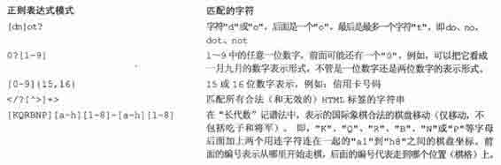

### 15.2.7　特殊字符表示、字符集

我们还提到有一些特殊字符可以用来代表字符集合。例如，你可以不使用“0-9”这个范围表示十进制数字，而改用简写“\d”表示。另一个特殊的字符“\w”可用来表示整个字符数字的字符集，即相当于“A-Za-z0-9_”的简写形式，特殊字符“\s”代表空白字符。这些特殊字符的大写形式表示不匹配，比如，“\D”表示非十进制数字的字符（等价于“[⁰-9]”），等等。我们来看几个运用这些简写形式的稍复杂的例子。

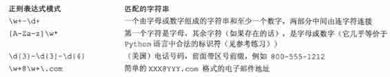

### 15.2.8　用圆括号（()）组建组

现在，或许我们可以匹配一个字符串和丢弃那些不匹配的字符串了，但有时候，我们也许对匹配的数据本身更有兴趣。我们不仅想知道是否整个字符串匹配我们的条件（正则表达式），还想在匹配成功时取出某个特定的字符串或子字符串。要达到这个目的，只需要给正则表达式的两边加上一对圆括号。

一对圆括号（()）和正则表达式一起使用时可以实现以下任意一个（或两个）功能：

•　对正则表达式进行分组

•　匹配子组

有时你需要对正则表达式进行分组，其中一个很好的例子就是，你要用两个不同的正则表达式去比较一个字符串。另一个理由是为整个正则表达式添加一个重复操作符（即不是仅重复单个字符或单一字符集）。

使用圆括号的一个额外好处就是匹配的子串会被保存到一个子组，便于今后使用。这些子组可以在同一次匹配或搜索中被重复调用，或被提取出来做进一步处理。在 15.3.9 小节的结尾你会读到一些提取子组的例子。

为什么需要使用子组匹配呢？主要是有时除了进行匹配操作外，你还想要提取匹配模式的内容。如果想知道在成功的匹配中，是哪些字符串匹配了我们的正则表达式模式。例如，我们想用正则表达式 “\w+-\d+”匹配一些内容，但又想把第一部分的字符和第二部分的数字分别保存，该怎么做呢？

如果我们给两个子模式都加上圆括号，即，将它写成“（\w+）- （\d+）”，那我们就可以对这两个匹配的子组分别进行访问了。当然你也可以使用其他方法达到同样目的，比如，先写一段代码判断是否找到匹配的对象，然后再执行另一个程式（也必须再写一段代码）来解析整个匹配的部分，从中提取出两个部分来。然而相比之下把正则表达式划分为子组是更好的实现办法，因为 Python 已经在 re 模块里支持此功能，那为什么不让 Python 来做这项工作，而非要重复发明一个轮子呢？

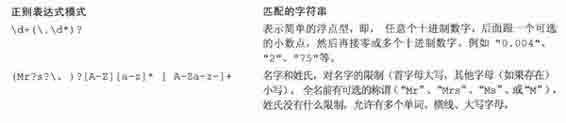

## 15.3　正则表达式和 Python 语言

既然我们已知道了有关正则表达式本身的所有知识，那让我们来详细研究当前 Python 的默认正则表达式模块 re 模块吧。re 模块在 Pythonl.5 版本被引入。如果你正在使用 Python 的早期版本，你将只能使用已过时的 regex、regsub 模块。这些模块具有 Emacs 风格，功能不丰富，而且与现在的 re 模块也不兼容。regex 和 regsub 这两个模块已在 Python 2.5 版本时被移除了，在 Python2.5 及其后续版本，引入这两个模块中的任何一个将会引发 Import Error 异常。

但正则表达式本身是不变的，所以本小节中的大多数基本概念仍然适用于旧版的 regex 和 reg-sub 模块。与旧模块形成鲜明对比的是，新的 re 模块支持功能更强大、更通用的 Perl 风格（具体说是 Perl5 的风格）的正则表达式，允许多线程共享同一经过编译的正则表达式对象，同时它还支持对正则表达式分组进行命名和按名字调用。另外，有一个名叫 reconvert 的转换模块是帮助开发者从 regex/regsub 模块迁移到 re 模块的。但请注意，正则表达式有不同的风格，我们主要研究当今 Python 语言中使用的正则表达式。

re 引擎已在 Python1.6 版本中被重写，改进了它的性能并添加了对 Unicode 的支持。接口并没有改变，因此模块的名字也保持不变。新的 re 引擎，内部被叫做 sre，替代了 1.5 版本中内部名为 pcre 的 re 引擎。

### 15.3.1　re 模块：核心函数和方法

表 15.2 列出了 re 模块最常用的函数和方法。其中有很多函数也与已编译的正则表达式对象（regex objects）和正则“匹配对象”（match objects）的方法同名并且具有相同功能。

在本小节，我们来看两个主要的函数/方法 match()和 search()，以及 compile()函数。在下一节我们还会再介绍更多，但如果想进一步了解我们涉及或没有涉及的更多相关信息，我们建议你参阅 Python 的文档。

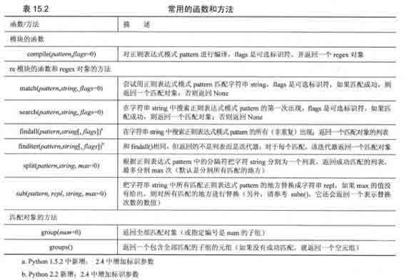

核心笔记：RE 编译（何时应该使用 compile 函数？）

* * *

在第十四章，我们曾说过 Python 的代码最终会被编译为字节码，然后才被解释器执行。我们特别提到用调用 eval()或 exec()调用一个代码对象而不是一个字符串，在性能上会有明显的提升，这是因为对前者来说，编译过程不必执行。换句话说，使用预编译代码对象要比使用字符串快，因为解释器在执行字符串形式的代码前必须先把它编译成代码对象。

这个概念也适用于正则表达式，在模式匹配之前，正则表达式模式必须先被编译成 regex 对象。由于正则表达式在执行过程中被多次用于比较，我们强烈建议先对它做预编译，而且，既然正则表达式的编译是必须的，那使用么预先编译来提升执行性能无疑是明智之举。re.compile()就是用来提供此功能的。

其实模块函数会对已编译对象进行缓存，所以不是所有使用相同正则表达式模式的 search()和 match()都需要编译。即使这样，你仍然节省了查询缓存，和用相同的字符串反复调用函数的性能开销。在 Python1.5.2 版本里，缓存区可以容纳 20 个已编译的正则表达式对象，而在 1.6 版本里，由于另外添加了对 Unicode 的支持，编译引擎的速度变慢了一些，所以缓存区被扩展到可以容纳 100 个已编译的 regex 对象。

* * *

### 15.3.2　使用 compile()编译正则表达式

我们稍后要讲到的大多数 re 模块函数都可以作为 regex 对象的方法。注意，尽管我们建议预编译，但它并不是必需的。如果你需要编译，就用方法，如果不需要，可以使用函数。幸运的是无论你用哪种方式-函数还是方法，名字都是相同的。（也许你曾对此好奇，这正是模块函数和方法完全一样的原因，例如 search()、match()等）在后面的例子里，我们将用字符串，这样可以省去一个小步骤。我们仍会用到几个预编译代码对象，这样你可以知道它的过程是怎么回事。

编译 rex 对象时给出一些可选标识符，可以得到特殊的编译对象。这些对象将允许不区别大小写的匹配，或使用系统的本地设置定义的字母表进行匹配等。详情请参阅有关文档。这些标识符也可以作为参数传给模块（改字）版本的 match()和 search()进行特定模式的匹配，其中一些标识符已在前面做过简短介绍（例如，DOTALL,LOCALE）-这些标识符多数用于编译，也正因如此它们可以被传给模块版本的 match()和 search()，而 match()和 search()肯定要对正则表达式模式编译一次。如果你想在 regex 对象的方法中使用这些标识符，则必须在编译对象时传递这些参数。

除下面的方法外，regex 对象还有一些数据属性，其中两个是创建时给定的编译标识符和正则表达式模式。

### 15.3.3　匹配对象和 group()、groups()方法

在处理正则表达式时，除 regex 对象外，还有另一种对象类型-匹配对象。这些对象是在 match()或 search()被成功调用之后所返回的结果。匹配对象有两个主要方法：group()和 groups()。

group()方法或者返回所有匹配对象或是根据要求返回某个特定子组。groups()则很简单，它返回一个包含唯一或所有子组的元组。如果正则表达式中没有子组的话，groups()将返回一个空元组，而 group()仍会返回全部匹配对象。

Python 语言中的正则表达式支持对匹配对象进行命名的功能，这部分内容超出了本介绍性小节对正则表达式的讨论范围。我们建议你阅读 re 模块的文档，里面有我们省略掉的关于这些高级主题的详细内容。

### 15.3.4　用 match()匹配字符串

我们先来研究 re 模块的函数、正则表达式对象（regex object）的方法：match()。match()函数尝试从字符串的开头开始对模式进行匹配。如果匹配成功，就返回一个匹配对象，而如果匹配失败了，就返回 None。匹配对象的 group()方法可以用来显示那个成功的匹配。下面是如何运用 match()（group()）的一个例子：

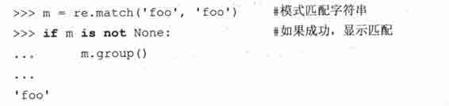

模式“foo”完全匹配字符串“foo”。在交互解析器中，我们能确定 m 就是一个匹配对象的实例。

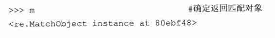

这是当匹配失败时的例子，它返回 None：

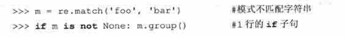

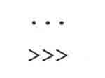

上面的匹配失败，所以 m 被赋值为 None，因为我们写的 if 语句中没有什么行动，所以也没有什么指令动作被执行。在以后的例子中，为了简洁，在可能的情况下，我们会省去 if 检查语句，但在实际编程中，最好写上它，以防止出现 AttributeError 异常（失败后返回 None，此时它是没有 group()属性（方法）的）。

即使字符串比模式要长，匹配也可能成功；只要模式是从字符串的开始进行匹配的。例如，模式“foo”在字符串“food on the table”中找到一个匹配，因为它是从该字符串开头进行匹配的：

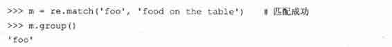

如你看到的，尽管字符串比模式要长，但从字符串开头有一个成功的匹配。子串“foo”是从那个较长的字符串中抽取出来的匹配部分。

我们甚至可以充分利用 Python 语言面向对象的特性，间接省略中间结果，将最终结果保存到一起：

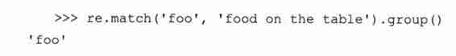

注意，上面的例子中，如果匹配失败，会引发一个 AttributeError 异常。

### 15.3.5　search()在一个字符串中查找一个模式（搜索与匹配的比较）

其实，你要搜索的模式出现在一个字符串中间的机率要比出现在字符串开头的机率更大一些。这正是 search()派上用场的时候。search 和 match 的工作方式一样，不同之处在于 search 会检查参数字符串任意位置的地方给定正则表达式模式的匹配情况。如果搜索到成功的匹配，会返回一个匹配对象，否则返回 None。

现在我们来举例说明 match()和 search()之间的区别。让我们举一个对长字符串进行匹配的例子。这次，我们用字符串“foo”去匹配“seafood”：

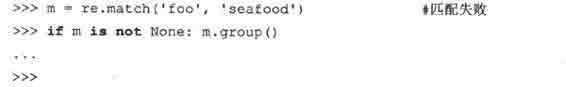

如你所见，这里没有匹配成功。match()尝试从字符串起始处进行匹配模式，即，模式中的“f”试匹配到字符串中首字母“s”上，这样匹配肯定是失败的。但字符串“foo”确实出现在“seafood”中，那我们如何才能让 Python 得出肯定的结果呢？答案是用 search()函数。search()搜索字符串中模式首次出现的位置，而不是尝试（在起始处）匹配。严格地说，search()是从左到右进行搜索。

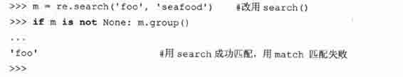

在本小节以后的内容里，将通过大量的例子展示如何在 Python 语言中运用正则表达式，我们会用到 regex 对象的方法 match()和 search()，匹配对象的方法 group()、groups()和正则表达式语法中的绝大多数特殊字符和符号。

### 15.3.6　匹配多个字符串（|）

在 15.2 小节里，我们在正则表达式“bat|bet|bit”中使用了管道符号。下面，我们把这个正则表达式用到 Python 的代码里：

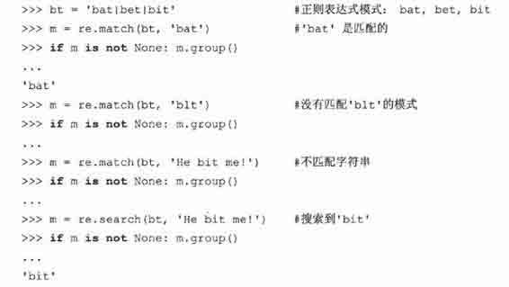

### 15.3.7　匹配任意单个字符（.）

以下的例子中，我们将说明句点是不能匹配换行符或非字符（即空字符串）的：

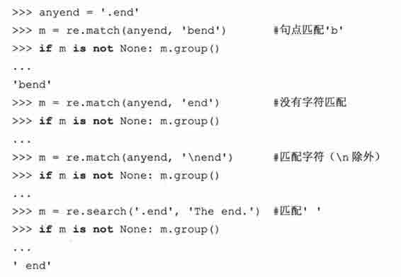

下面的例子是来搜索一个真正句点（小数点）的正则表达式，在正则表达式中，用反斜线对它进行转义，使句点失去它的特殊意义：

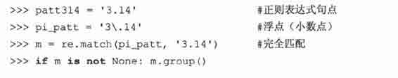

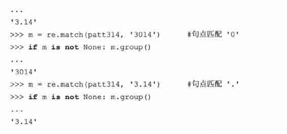

### 15.3.8　创建字符集合（[]）

前面我们曾讨论过“[cr][23][dp][o2]”和“r2d2|c3po”是不同的。从下面的例子中，可以看出“r2d2|c3po”与“[cr][23][dp][o2]”相比有更加严格的限制：

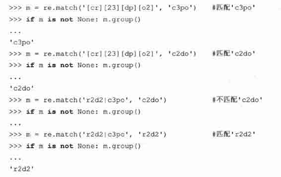

### 15.3.9　重复、特殊字符和子组

正则表达式中最常见的情况包括特殊字符的使用，正则表达式模式的重复出现，以及使用圆括号对匹配模式的各部分进行分组和提取操作。我们曾看到过一个关于简单电子邮件地址的正则表达式 （“\w+@\w+\.com”）或许我们想要匹配的邮件地址比这个正则表达式的允许的要多。比如，为了在域名前添加主机名称支持，即，支持“www.xxx.com”，而不只是允许“xxx.com”做整个域名，我们就必须修改现有的正则表达式。为了表示主机名是可选的，我们要写一个模式匹配主机名（后面跟一个句点），然后用问号“？”表示此模式可出现 0 次或 1 次，表示此部分是可选的，再把这个可选的正则表达式插入到我们前面的那个正则表达式中去：“\w+@（\w+\.）?\w+\.com”。从下面的例子中可以看出，这个表达式容许“.com”前面有一个或两个名字：

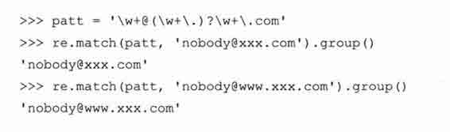

接下来，我们用以下模式进一步扩展我们的例子，允许任意数量的子域名存在。请特别注意细节的变化，将？改为*:“\w+@（\w+\.）*\w+\.com”:

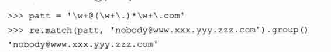

但我们必须要说明的是仅用字母或数字组成的字符不能满足邮件地址中可能出现的各种字符。上述正则表达式不匹配如“xxx-yyy.com”这样的域名或其他带有非单词字符（如“\W”等）的域名。

前面，我们曾讨论过用括号匹配并保存子组做进一步处理的好处，这样做比在确定正则表达式匹配后，再单写一个子程序来解析一个字符串要好。我们还特别提到用来匹配以“-”分隔的字母或数字组成的字符串和数字串的正则表达式“\w+-\d+”，以及如何通过对此正则表达式划分子组以构建一个新的正则表达式，“（\w+）-（\d+）”来完成任务，下面是旧版正则表达式的执行情况：

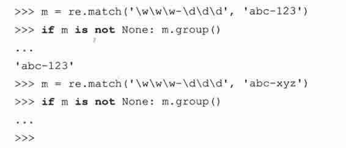

上面的代码中，一个正则表达式被用来匹配由三个字母或数字组成的字符串，再接着三个数字的字符串。这个正则表达式匹配“abc-123”，但不匹配“abc-xyz”。我们现在来修改正则表达式，使它能分别提取包含字母或数字的部分和仅含数字的部分。请注意我们是如何用 group()方法访问每个子组以及用 groups()方法获取一个包含所有匹配子组的元组的：

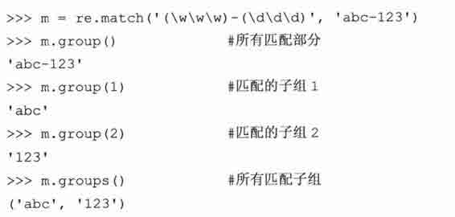

如你所见，group()通常用来显示所有匹配部分，也可用来获取个别匹配的子组。我们可用 groups()方法获得一个包含所有匹配子组的元组。

下面这个简单的例子通过子组的不同排列组合，帮助我们理解得更透彻：

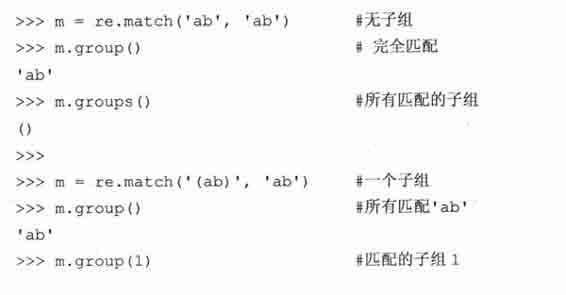

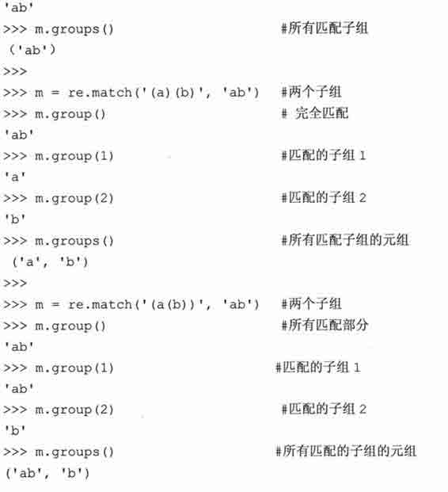

### 15.3.10　从字符串的开头或结尾匹配及在单词边界上的匹配

下面的例子强调了锚点性正则表达式操作符。这些锚点性正则表达式操作符主要被用于搜索而不是匹配，因为 match()总是从字符串的开头进行匹配的。

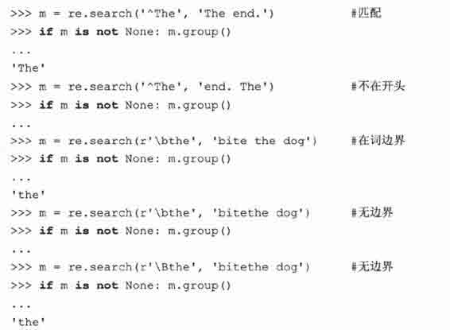

你可能在这里注意到了原始字符串（raw strings）的出现。在本章末尾的核心笔记中，有关于它的说明。通常，在正则表达式中使用原始字符串是个好主意。

你还应该了解另外四个 re 模块函数和 regex 对象方法：findall()、sub()、subn()和 split()。

### 15.3.11　用 findall()找到每个出现的匹配部分

findall()自 Python 1.5.2 版本被引入。它用于非重叠地搜索某字符串中一个正则表达式模式出现的情况。findall()和 search()相似之处在于二者都执行字符串搜索，但 findall()和 match()与 search()不同之处是， findall()总返回一个列表。如果 findall()没有找到匹配的部分，会返回空列表；如果成功找到匹配部分，则返回所有匹配部分的列表（按从左到右出现的顺序排列）。

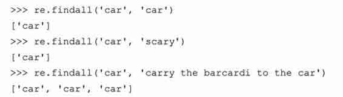

包含子组的搜索会返回更复杂的一个列表，这样做是有意义的，因为子组是允许你从单个正则表达式中抽取特定模式的一种机制，比如，匹配一个完整电话号码中的一部分（例如区号），或完整电子邮件地址的一部分（例如登录名）。

正则表达式仅有一个子组时，findall()返回子组匹配的字符串组成的列表；如果表达式有多个子组，返回的结果是一个元组的列表，元组中每个元素都是一个子组的匹配内容，像这样的元组（每一个成功的匹配对应一个元组）构成了返回列表中的元素。这些内容初次听到可能令人费解，但如果你看看各种例子，就会明白了。

### 15.3.12　用 sub()（和 subn()）进行搜索和替换

有两种函数/方法用于完成搜索和代替的功能：sub()和 subn()。二者几乎是一样的，都是将某字符串中所有匹配正则表达式模式的部分进行替换。用来替换的部分通常是一个字符串，但也可能是一个函数，该函数返回一个用来替换的字符串。subn()和 sub()一样，但它还返回一个表示替换次数的数字，替换后的字符串和表示替换次数的数字作为一个元组的元素返回。

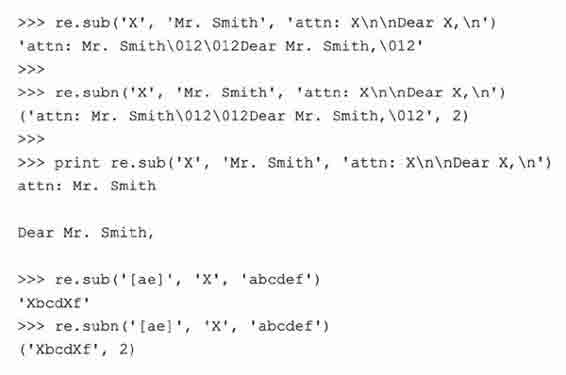

### 15.3.13　用 split()分割（分隔模式）

re 模块和正则表达式对象的方法 split()与字符串的 split()方法相似，前者是根据正则表达式模式分隔字符串，后者是根据固定的字符串分割，因此与后者相比，显著提升了字符分割的能力。如果你不想在每个模式匹配的地方都分割字符串，你可以通过设定一个值参数（非零）来指定分割的最大次数。

如果分隔符没有使用由特殊符号表示的正则表达式来匹配多个模式，那 re.split()和 string.split()的执行过程是一样的，见以下的例子（在每一个冒号处分隔）：

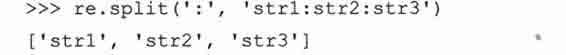

但运用正则表达式后，我们会发现 re.split()成了一个功能更强大的工具。比如，Unix 系统下 who 命令输出所有已登录系统的用户的信息：

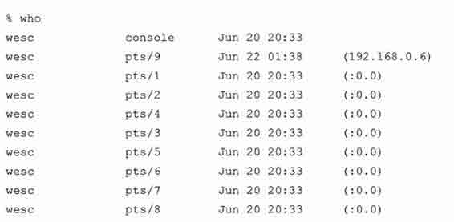

假如我们想要保存用户的登录信息，比如说，登录名，用户登录时的电传，他们的登录的时间以及登录地址。用上面的 string.split()很难有效果，因为分隔这些数据的空白符号是毫无规律且不确定的。还有一个问题，就是在登录时间的数据中，月、日、时之间有一个空格。而我们一般想把这些有关时间的数据排在一起。

你需要用某种方式来描述这样一种模式：“在两个或更多个空格符处进行分隔”。正则表达式很容易做到这一点。我们能很快写出这个正则表达式模式：“\s\s+”，含义是至少 2 个空白字符。我们来写一个名为 rewho.py 的程序，它读入 who 命令的输出-假设已保存到名为 whodata.txt 的文件中。起初，我们写的 rewho.py 脚本看起来像这样：

我们现在执行 who 命令，将输出结果保存到文件 whodata.txt，然后调用 rewho.py 来看看结果：

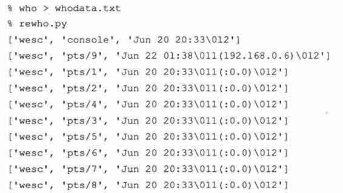

这是不错的尝试，但还不完全正确。首先，我们原先没有预料到输出中会包含一个 TAB 符号（ASCII\011）（它看上去像是至少两个空格，对吗？）。而且，我们可能对保存用来结束每行的换行符 NEWLINE（ASCII\012）也没什么兴趣。我们现在就做些改动来修正这些问题，同时提升程序的整体质量。

首先，我们改从脚本里执行 who 命令，而不是从外部调用它后将命令的输出结果保存到文件 whodata.txt——这样重复的步骤很快会令人厌烦的。要从我们写的脚本里调用另一个程序，可以用 os.popen()命令，这个命令在 14.5.2 小节已介绍过。尽管 os.popen()只能在 Unix 系统中使用，但本例子意在阐明 re.split()的用法，它可是跨系统平台的。

我们去掉每行行尾的换行符（NEWLINE），并添加检查单个 TAB 符号的模式，把 TAB 作为 re.split()的可选分隔符。例 15.1 是脚本 rewho.py 的最终版本。

例 15.1　Unix 下 who 命令输出结果进行分隔（rewho.py）

此脚本调用 who 命令，解析命令的输出结果，根据不同的空白符号分隔数据。

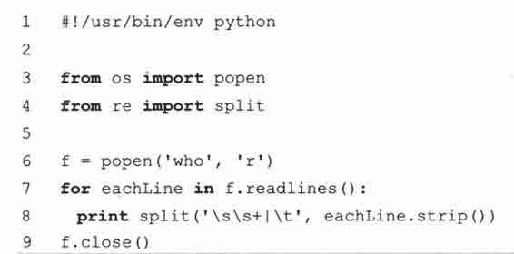

运行脚本，我们得到如下（正确）结果：

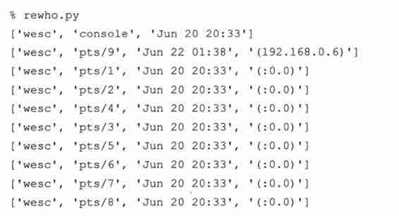

在 DOS/Windows 环境下，用 dir 命令代替 who 命令，也可完成此练习。

趁我们还熟悉 ASCII 字符，我们要提醒注意的是正则表达式的特殊字符和特殊 ASCII 字符是容易混淆的。我们可能用\n 来表示一个 ASCII 换行字符，但也可以用\d 表示匹配一个数字的正则表达式。如果同一个符号在 ASCII 和正则表达式中都可以用，就容易出问题了，所以在下页的核心笔记中，我们推荐使用 Python 语言中的“原始字符串”来避免混淆。还要注意：“\w”和“\W”这两个表示字母或数字的字符受 L 或 LOCALE 编译标识符的影响，在 Python 1.6 至 Python 2.0 以后的版本中受（U 或 UNICODE 的）Unicode 标识符号影响。

核心笔记：Python 原始字符串（raw strings）的用法

* * *

你可能已经看到前面关于原始字符串用法的一些例子了。原始字符串的产生正是由于有正则表达式的存在。原因是 ASCII 字符和正则表达式特殊字符间所产生的冲突。比如，特殊符号“\b”在 ASCII 字符中代表退格键，但同时“\b”也是一个正则表达式的特殊符号，代表“匹配一个单词边界”。为了让 RE 编译器把两个字符“\b”当成你想要表达的字符串，而不是一个退格键，你需要用另一个反斜线对它进行转义，即可以这样写：“\\b”。

但这样做会把问题复杂化，特别是当你的正则表达式字符串里有很多特殊字符时，就更容易令人困惑了。在第六章，我们曾介绍过原始字符串，它经常被用于简化正则表达式的复杂程度。事实上，很多 Python 程序员在定义正则表达式时都只使用原始字符串。下面的例子用来说明退格键“\b”和正则表达式“\b”（包含或不包含原始字符串）之间的区别：

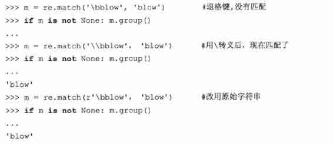

你可能注意到我们在正则表达式里使用“\d”，没用原始字符串，也没出现什么问题。那是因为 ASCII 里没有对应的特殊字符，所以正则表达式编译器能够知道你指的是一个十进制数字。

* * *

## 15.4　正则表达式示例

现在我们来通读一个详细完整的例子，它展示了用正则表达式处理字符串的不同办法。第一步：拿出一段代码用来生成随机数据，生成的数据用于以后操作。例 15.2 中，脚本 gendata.py 生成一个数据集。虽然程序只是将生成的字符串显示到标准输出，但此输出结果也可以重定向到一个测试文件中。

例 15.2　正则表达式练习的数据生成代码（gendata.py）

为练习使用正则表达式生成随机数据，并将产生的数据输出到屏幕。

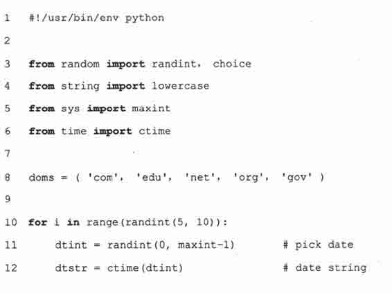

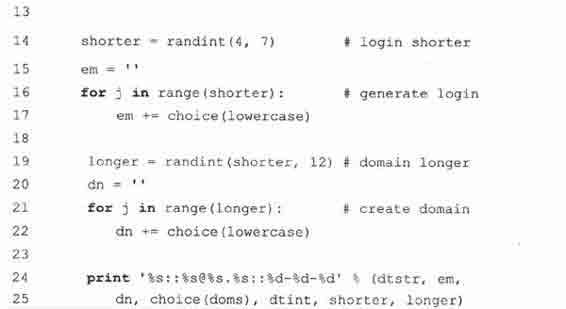

这个脚本生成 3 个字段，字段由一对冒号，或双冒号分隔。第一个字段是一个随机（32 位）整型，被转换为一个日期（见“核心笔记”）。第二个字段是一个随机产生的电子邮件（E-mail）地址，最后一个字段是由单个横线（-）分隔的一个整型集合。

执行这段代码，我们得到以下输出（你得到的输出肯定和本书中的不同），并把数据保存到本地文件 redata.txt 中：

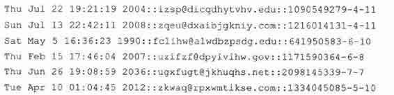

你或许能看出来，这个程序的输出数据适合用正则表达式来处理。在我们逐行解释后，会用几个正则表达式对这些数据的进行操作，也为本章后面的练习做好准备。

逐行解释

1 ~ 6 行

在这个示例脚本里，我们要使用多个模块。但因为我们只需要用到这些模块中的一两个函数，所以不必引入整个模块，只须引入模块中某些属性即可。我们用 from-import 而不是 import 正是基于这个原因。代码第一行是 Unix 起始提示符，后面是 from-import 这几行。

8 行

domes 是一组简单的包含顶级域名的集合，我们将从中随机挑选一个来随机生成电子邮件地址。

10 ~ 12 行

每次 gendata.py 执行都会产生 5~10 行的输出。（这个脚本用函数 random.randint()生成我们需要的所有随机整型。）在每个输出行中，我们从整个可能的范围（0〜2³¹-1 即[sys.maxint]）里，随机选一个整型，然后把这个整型用 time.ctime()转换成一个日期。大多数安装 Python 的基于 Unix 系统的计算机上，系统时间是根据 1970 年 1 月 1 日零点——即纪元（epoch）至今的秒数来计算的。如果我们选择 32 位整型，那系统日期就代表从纪元（epoch）到纪元后 2³²秒之间的某个时刻。

14 ~ 22 行

我们规定随机生成的邮箱地址中登录名的长度必须在 4~7 个字符。我们随机选择 4~7 个小写字母，依次将它们连结到一个字符串中。函数 random.choice()的用处就是根据指定序列，随机返回该序列中的一个元素。在这里我们指定序列是 26 个小写字母，string.lowercase。我们规定虚拟邮箱地址的域名长度在 4〜12 个字符，但不能短于登录名的长度。最后，我们随机选择一些小写字母，依次将它们连接起来组成域名。

24 ~ 25 行

这是本脚本的关键步骤：把随机数据组合到一起显示到输出行。以日期字符串开头，后面是分隔符，然后是随机生成的电子邮件地址。这个任意的电子邮件地址是我们把登录名，“@”符号，域名和一个随机选择的顶级域名连接到一起组成的。在最后一个双冒号后面，我们还加了一个随机整型字符串，它的前部分是与所选随机日期对应是整型，后面的部分分别是登录名和域名的长度，这几个整型之间由连字符分隔。

### 15.4.1　匹配一个字符串

在下面的练习里，写出你的正则表达式，包括宽松和限制性强的两个版本。我们建议你用前面的例子 redata.txt（或你自己运行 gendata.py 生成的随机数据）来测试小程序里的这些正则表达式。在做练习的时候，你还会再次用到这些数据。

在把正则表达式写入到我们的小程序之前，我们先要对它进行测试。我们先引入 re 模块，将 redata.txt 中的一行数据赋值到一个字符串变量中。下面的语句在以下的两个示例中都是这样，没有变化。

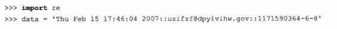

在第一个例子中，我们将写一个正则表达式，用它从文件 redata.txt 的每一行中（仅）提取时间戳中的有关星期的数据字段。我们将用到以下这个正则表达式：

上例要求字符串是以所列出的 7 个字符串之一作为开头（“^”正则表达式操作符）。如果我们想把上面的正则表达式“翻译”过来，它的意思大概是：“字符串必须以“Mon，” “Tue, ”…, “Sat, ”或“Sun”之一打头”。

或者，我们可以只用一个“^”符号，将日期字符串归为一组：

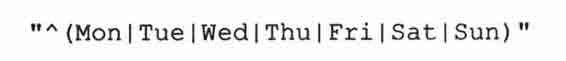

在这组字符串集合两边的圆括号表示是只有满足这些字符串之一匹配才能成功。这是比我们前面看到的那个没有圆括号的正则表达式“更友好”。而且，使用这个修改后的正则表达式还有一个好处，能使我们方便地访问被匹配字符串的那个子组：

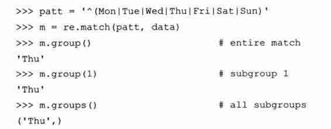

我们在这个例子里所看到的功能似乎没有那么新鲜或与众不同，但它对于下面的例子或是通过在正则表达式中添加额外数据来处理字符串匹配时就很有帮助了，即使这些字符并不是你感兴趣的字符串中的某部分。上面的两个正则表达式都是限制性很强的，特别要求只含有某些字符串。但在国际语言的系统环境中，使用各地区本地化时间和缩写的情况下，可能就行不通了。限制性更宽松的正则表达式是：“^\w{3}”。

这个正则表达式只要求字符串以三个由字符或数字组成的字符作开头。要是把它翻译成白话，就是，上箭头（^carat）表示以…开始，“\w”指任意一个由字符或数字组成的字符，“{3}”表示它左边描述的正则表达式模式必须连续出现三次。注意，如果你要对这个正则表达式分组，请用圆括号()，即，“^（\w{3}）”：

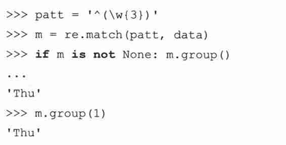

注意，要是把正则表达式写成“^（\w）{3}”是不正确的。如果把“{3}”写在圆括号里（（\w{3}）），表示匹配三个连续的由字符或数字组成的字符，再把这三个字符视为一个组。但如果把“{3}”挪到圆括号的外边（（\w）{3}），那现在它的含义就变成三个连续的单个由字符或数字组成的字符：

访问子组 1 的数据时，只看到“u”是因为子组 1 中的数据被不断地替换成下一个字符。也就是说，m.group（1）开始的结果是“T”，然后是“h”，最后又被替换成“u”。它们是三个独立（而且重复）的组，每个组是由字符或数字所组成的字符，而不是由连续的三个字符或数字组成的字符所形成的单个组。

在下一个（也是最后的）例子中，我们将写一个正则表达式来提取文件 redata.txt 中每行末尾的数值字段。

### 15.4.2　搜索与匹配的比较，“贪婪”匹配

在我们写正则表达式前，先明确这些整型数据项是在字符串数据的末尾。这意味着我们有两种选择：搜索（search）或匹配（match）。使用搜索更合适，因为我们确切地知道要搜索的数据是什么（三个整型的集合），它不在字符串的开头，也不是字符串的全部内容。如果我们用匹配（match）的方法，就不得不写一个正则表达式来匹配整行内容，并用子组保存我们感兴趣的那部分数据。为说明它们之间的区别，我们先用搜索搜索，再尝试用匹配来做，向你证明搜索搜索更适合。

因为我们要搜索的是三个由连字符号（-）分隔的整型集，所以我们写出如下正则表达式：“\d+-\d+-\d+”。这个正则表达式描述的是，“任意数字（至少有一个），后面有连字符号（-），然后是任意个数的数字（至少有一个），接着是另一个连字符号（-），最后还是任意数字（至少有一个）的集合。”，我们用 search()来测试这个正则表达式：

尝试用这个正则表达式来匹配数据会失败，这是为什么呢？因为匹配从字符串的起始位置开始进行的，而我们要找的数值字符串在末尾。我们只能再写一个匹配全部字符串的正则表达式。还有一个偷懒的办法，就是用“.+”来表示任意个字符集，后面再接上我们真正感兴趣的数据：

这个方法不错，可是我们只想获得每行末尾数字的字段，而不是整个字符串，所以需要用圆括号将我们感兴趣的那部分数据分成一组：

到底怎么回事呢？我们本应该得到数据“1171590364-6-8”，而不应该是“4-6-8”啊。第一个整型字段的前半部分到哪里去了呢？原因是：正则表达式本身默认是贪心匹配的。也就是说，如果正则表达式模式中使用到通配字，那它在按照从左到右的顺序求值时，会尽量“抓取”满足匹配的最长字符串。在我们上面的例子里，“.+”会从字符串的起始处抓取满足模式的最长字符，其中包括我们想得到的第一个整型字段的中的大部分。“\d+”只需一位数字就可以匹配，所以它匹配了数字“4”，而“.+”则匹配了从字符串起始到这个第一位数字“4”之间的所有字符：“Thu Feb 15 17:46:04 2007::uzifzf@dpyivihw.gov::117159036”，如图 15-2 所示。

> > 图 15-2　为什么匹配错了：“+”是贪心的量词（操作符）

一个解决办法是用“非贪婪”操作符“？”。这个操作符可以用在“*”、“+”或“？”的后面。它的作用是要求正则表达式引擎匹配的字符越少越好。因此，如果我们把“？”放在“.+”的后面，我们就得到了想要的结果，见图 15-3。

> > 图 15-3　解决“贪婪”匹配问题：“？”要求非“贪婪”匹配

另一种办法，更简单，注意运用“::”做字段分隔符号。你可以用一般字符串的 strip（‘::’）方法，得到全部字符，然后用 strip（‘-’）得到你要找的三个整型字段。我们现在不采用这种方法，因为我们的脚本 gendata.py 正是通过这种方法把字符组合到一起的。

最后一个例子：假设我们只想抽取三个整型字段里中间的那个整型部分。我们是这么做的（用搜索，这样就不必匹配整个字符了）： “-（\d+）-”。用这个模式“-（\d+）-”，我们得到：

在本章中，有很多正则表达式的强大功能我们未能涉及，由于篇幅所限，我们无法详细介绍它们。但我们希望所提供的信息和技巧对你的编程实践有所帮助。我们建议你参阅有关文档以获得更多在 Python 语言中使用正则表达式的知识。要精通正则表达式，我们建议你阅读 Jeffrey E.F.Friedl 所编写的《精通正则表达式》（Mastering Regular Expressions）一书。

## 15.5　练习

正则表达式。根据要求写出练习 15-1〜15-12 相应的正则表达式

> > 15-1.识别下列字符串：“bat”、“bit”、“but”、“hat”、“hit”或“hut”。

> > 15-2.匹配用一个空格分隔的任意一对单词，比如名和姓。

> > 15-3.匹配用一个逗号和一个空格分开的一个单词和一个字母。例如英文人名中的姓和名的首字母。

> > 15-4.匹配所有合法的 Python 标识符。

> > 15-5.请根据你（读者）本地关于地址的格式写法匹配一个街道地址（写出的正则表达式要尽可能通用以匹配任意数目的表示街道名字的单词，包括类型指示）。比如，美国的街道地址使用这样的格式：1180 Bordeaux Drive。使你写的正则表达式尽可能通用，要求能够匹配多个单词的街道名字，如：3120 De la Cruz Boulevard。

> > 15-6.匹配简单的以“www.”开头，以“.com”作结尾的 Web 域名，例如：www.yahoo.com.

附加题：使你写的正则表达式还支持其他顶级域名如.edu、.net 等比如 www.ucsc.edu。

> > 15-7.匹配全体 Python 整型的字符串表示形式的集合。

> > 15-8.匹配全体 Python 长整型的字符串表示形式的集合。

> > 15-9.匹配全体 Python 浮点型的字符串表示形式的集合。

> > 15-10.匹配全体 Python 复数的字符串表示形式的集合。

> > 15-11.匹配所有合法的电子邮件地址（先写出一个限制比较宽松的正则表达式，然后尽可能加强限制条件，但要保证功能的正确性）。

> > 15-12.匹配所有合法的 Web 网站地址（URL）（先写出一个限制比较宽松的正则表达式，然后尽可能加强限制条件，但要保证功能的正确性）。

> > 15-13.type().type()内建函数返回一个对象类型，此对象显示为 Python 的字符串形式，如下所示：

> > > > 请写一个正则表达式，能从这个字符串中提取出类型的名字。你的函数能实现以下功能：如果以字符串“<type’int’>”做输入，会返回类型“int”（返回其他类型也同理，如，返回类型’float’，‘builtin_function_or_method’等）。提示：正确的结果保存在类和某些内建类型的 __name__ 属性里。

> > 15-14.正则表达式。在 15.2 小节里，我们给出一个匹配由一位或两位数字代表一月到九月的字符串形式（“0?[1-9]”）。请写出一个正则表达式表示标准日历上其他的三个月（十月、十一月、十二月）。

> > 15-15.正则表达式。在 15.2 小节里，我们给出一个匹配信用卡卡号的模式：（“[0-9]{15，16}”）。但这个模式不允许用连字符号分割信用卡卡号中的数字。请写出一个允许使用连字符的正则表达式，但要求连字符必须出现在正确的位置。例如，15 位的信用卡卡号的格式是 4-6-5，表示四个数字，一个连字符，后面接 6 个数字、1 个连字符，最后是 5 个数字。16 位的信用卡卡号的格式是 4-4-4-4，数位不足时，添 0 补位。附加题：有一个用于确定某个信用卡卡号是否合法的算法。请写一段代码，它不但能识别格式正确的信用卡卡号，还能验证它的有效性。下面几个问题（练习 15-16~15-27）专门处理 gendata.py 生成的数据。在做练习 15-17 和 15-18 之前，请先把练习 15-16 和所有正则表达式做出来。

> > 15-16.修改脚本 gendata.py 的代码，使数据直接写入文件 redata.txt 中，而不是输出到屏幕上。

> > 15-17.统计生成的 redata.txt 文件中，星期中的每一天出现的次数（或统计各月份出现的次数）。

> > 15-18.通过检查每个输出行中整型字段部分的第一个整型是否和该行开头的时间戳相匹配来验证 redata.txt 中的数据是否完好。

根据各练习的要求写出相应的正则表达式。

> > 15-19.提取出每行中完整的时间戳字段。

> > 15-20.提取出每行中完整的电子邮件地址。

> > 15-21.只提取出时间戳字段中的月份。

> > 15-22.只提取出时间戳字段中的年份。

> > 15-23.只提取出时间戳字段中的值（格式：HH:MM:SS）。

> > 15-24.只从电子邮件地址中提取出登录名和域名（包括主域名和顶级域名，二者连在一起）。

> > 15-25.只从电子邮件地址中提取出登录名和域名（包括主域名和顶级域名，二者分别提取）。

> > 15-26.将每行中的电子邮件地址替换为你自己的电子邮件地址。

> > 15-27.提取出时间戳中的月、日、年，并按照格式“月　日，年”显示出来，且每行仅遍历一次。

我们在小节 15.2 中使用的一个匹配电话号码的正则表达式，其中电话号码允许包含可选的区号前缀：\d{3}-\d{3}-\d{4}.请在练习 15-28 和 15-29 中，修改这个正则表达式，使它满足：

> > 15-28.区号（第一组的三个数字和它后面的连字符）是可选的，即，你写的正则表达式对 800-555-1212 和 555-1212 都可以匹配。

> > 15-29.区号中可以包含圆括号或是连字符，而且它们是可选的，就是说你写的正则表达式可以匹配 800-555-1212、555-1212 或（800）555-1212。