# 第十六章　网络编程

本章主题

♦　引言：客户端/服务器架构

♦　套接字：通信终点

♦　套接字地址

♦　面向连接与无连接套接字

♦　Python 中的网络编程

♦　SOCKET 模块

♦　套接字对象方法

♦　TCP/IP 客户端和服务器

♦　UDP/IP 客户端和服务器

♦　SocketServer 模块

♦　Twisted 框架介绍

♦　相关模块

在本章中，我们将简要介绍如何使用套接字进行网络编程。首先，我们将给出一些网络编程方面的背景资料和 Python 中使用套接字的方法，然后介绍如何使用 Python 的一些模块来创建网络化的应用程序。

## 16.1　引言

### 16.1.1　什么是客户端/服务器架构

什么是客户端/服务器架构？不同的人有不同的答案。这要看你问的是什么人，以及指的是软件系统还是硬件系统了。但是，有一点是共通的：服务器是一个软件或硬件，用于向一个或多个客户端（客户）提供所需要的“服务”。服务器存在的唯一目的就是等待客户的请求，给这些客户服务，然后再等待其他的请求。

另一方面，客户连上一个（预先已知的）服务器，提出自己的请求，发送必要的数据，然后就等待服务器的完成请求或说明失败原因的反馈。服务器不停地处理外来的请求，而客户一次只能提出一个服务的请求，等待结果。然后结束这个事务。客户之后也可以再提出其他的请求，只是，这个请求会被视为另一个不同的事务了。

图 16-1 展示了如今最常见的“客户端/服务器”结构。一个用户或客户端电脑通过因特网从服务器上取数据。这的确是一个客户端/服务器架构的系统，但还有更多类似的系统满足客户端/服务器架构。而且，客户端/服务器架构也可以像应用到软件上那样应用到计算机硬件上。

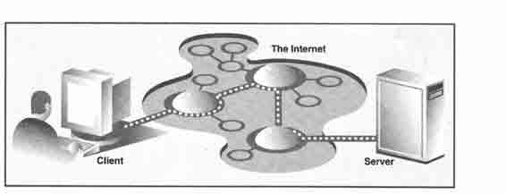

> > 图 16-1　因特网上典型的客户端/服务器概念

1.硬件的客户端/服务器架构

打印（机）服务器是一个硬件服务器的例子。它们处理打印任务，并把任务发给相连的打印机（或其他打印设备）。这样的计算机一般是可以通过网络访问的，而且客户机器可以远程发送打印请求给它。

另一个硬件服务器的例子是文件服务器。它们一般拥有大量的存储空间，客户可以远程访问。客户端计算机可以把服务器的磁盘映射到自己本地，就像本地磁盘一样使用它们。其中，Sun 公司的 NetworkFile System （NFS）是使用最为广泛的网络文件系统之一。如果你事实上已经映射了一个网络上的磁盘，但你却不知道它到底是本地的还是网络的，那客户端/服务器系统就很好的完成了它们的工作。其目的就是要让用户使用起来感觉就像使用本地磁盘一样。“抽象”到“一般的磁盘访问”这一层面之后，所有的操作就都是一样的了，而让所有操作都一样的“实现”则要依靠各自的程序了。

2.软件客户端/服务器架构

软件服务器也是运行在某个硬件上的。但不像硬件服务器那样，有专门的设备，如打印机、磁盘等。软件服务器提供的服务主要是程序的运行、数据的发送与接收、合并、升级或其他的程序或数据的操作。

如今，最常用的软件服务器是 Web 服务器。一台机器里放一些网页或 Web 应用程序，然后启动服务。这样的服务器的任务就是接受客户端的请求，把网页发给客户端（如用户计算机上的浏览器），然后等待下一个客户端请求。这些服务启动后的目标就是“永远运行下去”。虽然它们不可能实现这样的目标，但只要没有关机或硬件出错等外力干扰，它们就能够运行非常长的一段时间。

数据库服务器是另一种软件服务器。它们接受客户端的保存或读取请求，完成请求，然后再等待其他的请求。它们也被设计为要能“永远”运行。

我们要讨论的最后一种软件服务器是窗口服务器。这些服务器几乎可以被认为是硬件服务器了。它们运行于一个有显示器的机器上。窗口客户端实际上是那些在运行时需要窗口环境的程序，它们一般叫做图形用户界面（GUI）程序。这些程序如果在一个 DOS 窗口或 Unix 的 shell 等没有窗口服务器的纯文本环境中运行，将无法启动。一旦窗口服务器可以使用时，那一切就正常了。

当世界有了网络，那这样的环境就开始变得更有趣了。一般情况下，窗口客户端的显示和窗口服务器的提供都在同一台电脑上。但在 X Window 之类的网络化的窗口环境中，你可以选择其他电脑的窗口服务器来做显示。即你可以在一台电脑上运行 GUI 程序，而在另一台电脑上显示它！

3.银行出纳是服务器吗

理解客户端/服务器架构的一个方法是，想象一个不吃不喝不睡觉的银行出纳，他依次向排成长龙的顾客们提供一个又一个的服务（图 16-2）。有时，队伍可能很长，有时也可能没人。但顾客随时都可能出现。当然，在以前，是不可能有这样的出纳的。但现在的 ATM 机与这个模型很像。

> > 图 16-2　图中的银行出纳“永远不停歇”地为客户提供服务

当然，出纳就是一个运行在无限循环里的服务器。每一个顾客就是一个想要得到服务的客户。顾客到了之后，就按先来先服务（first-come-first-served, FCFS）的原则得到服务。一个事务结束后，客户就离开了，而服务器则要么马上为下一个顾客服务，要么坐着等待下一个顾客的到来。

为什么这些概念那么重要？因为，这种执行的方式就是客户端/服务器架构的特点。现在你对此已经有了大体的认识，我们就可以把客户端/服务器架构模型应用到网络编程中。

出纳运行在一个接收请求，处理请求然后再处理其他请求或等待其他客户的无限循环中。客户有可能已经排起了长龙，也有可能根本就没有客户。但是，无论如何，服务器都不会结束工作。

### 16.1.2　客户端/服务器网络编程

在完成服务之前，服务器必需要先完成一些设置。先要创建一个通讯端点，让服务器能“监听”请求。你可以把我们的服务器比做一个公司的接待员或回答公司总线电话的话务员，一旦电话和设备安装完成，话务员也就位之后，服务就可以开始了。

在网络世界里，基本上也是这样——一旦通信端点创建好之后，我们在“监听”的服务器就可以进入它那等待和处理客户请求的无限循环中了。当然，我们也不能忘记在信纸上、杂志里、广告中印上公司的电话号码。否则，就没有人会打电话进来了！

同样地，服务器在准备好之后，也要通知潜在的客户，让它们知道服务器已经准备好处理服务了，否则没有人会提请求的。比方说，你建立了一个全新的网站。这个网站非常出色，非常的吸引人，非常的有用，是所有网站中最酷的一个。但如果你不把网站的网址或者说统一资源定位符（URL）广而告之的话，没有人会知道这个网站的存在的。这个网站也就永远不见天日了。对于公司总部的新电话也是这样，你不把电话公之于众，那就没有人会打电话进来。

现在，你对服务器如何工作已经有了一个很好的认识。你已经完成了最难的那一部分。客户端的编程相对服务器端来说就简单得多了。所有的客户只要创建一个通信端点，建立到服务器的连接。然后客户端就可以提出请求了。请求中，也可以包含必要的数据交互。一旦请求处理完成，客户端收到了结果，通信就结束了。

## 16.2　套接字：通信端点

### 16.2.1　什么是套接字

套接字是一种具有之前所说的“通信端点”概念的计算机网络数据结构。网络化的应用程序在开始任何通讯之前都必需要创建套接字。就像电话的插口一样，没有它就完全没办法通信。

套接字起源于 20 世纪 70 年代加州大学伯克利分校版本的 Unix，即人们所说的 BSD Unix。因此，有时人们也把套接字称为“伯克利套接字”或“BSD 套接字”。一开始，套接字被设计用在同一台主机上多个应用程序之间的通讯。这也被称作进程间通讯，或 IPC。套接字有两种，分别是基于文件型的和基于网络型的。

Unix 套接字是我们要介绍的第一个套接字家族。其“家族名”为 AF_UNIX（在 POSIX1.g 标准中也叫 AF_LOCAL），表示“地址家族：UNIX”。包括 Python 在内的大多数流行平台上都使用术语“地址家族”及其缩写“AF”。而老一点的系统中，地址家族被称为“域”或“协议家族”，并使用缩写“PF”而不是“AF”。同样的，AF_LOCAL（在 2000-2001 年被列为标准）将会代替 AF_UNIX。不过，为了向后兼容，很多系统上，两者是等价的。Python 自己则仍然使用 AF_UNIX。

由于两个进程都运行在同一台机器上，而且这些套接字是基于文件的。所以，它们的底层结构是由文件系统来支持的。这样做相当有道理，因为，同一台电脑上，文件系统的确是不同的进程都能访问的。

另一种套接字是基于网络的，它有自己的家族名字：AF_INET，或叫“地址家族：Internet”。还有一种地址家族 AF_INET6 被用于网际协议第 6 版（IPv6）寻址上。还有一些其他的地址家族，不过，它们要么是只用在某个平台上，要么就是已经被废弃，或是很少被使用，或是根本就还没有实现。所有地址家族中，AF_INET 是使用最广泛的一个。Python 2.5 中加入了一种 Linux 套接字的支持：AF_NETLINK（无连接（稍后讲解））套接字家族让用户代码与内核代码之间的 IPC 可以使用标准 BSD 套接字接口。而且，相对之前那些往操作系统中加入新的系统调用、proc 文件系统支持或是“IOCTL”等复杂的方案来说，这种方法显得更为精巧，更为安全。

Python 只支持 AF_UNIX, AF_NETLINK，和 AF_INET 家族。由于我们只关心网络编程，所以在本章的大部分时候，我们都只用 AF_INET。

### 16.2.2　套接字地址：主机与端口

如果把套接字比做电话的插口——即通信的最底层结构，那主机与端口就像区号与电话号码的一对组合。有了能打电话的硬件还不够，你还要知道你要打给谁，往哪打。一个因特网地址由网络通信所必需的主机与端口组成。而且不用说，另一端一定要有人在听才可以。否则，你就会听到熟悉的声音“对不起，您拨的是空号，请查询后再拨”。你在上网的时候，可能也见过类似的情况，如“不能连接该服务器。服务器无响应或不可达”。

合法的端口号范围为 0~65535。其中，小于 1024 的端口号为系统保留端口。如果你所使用的是 Unix 操作系统，那么就可以通过/etc/services 文件获得保留的端口号（及其对应的服务/协议和套接字类型）。常用端口号列表可以从下面这个网站获得：

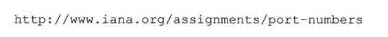

### 16.2.3　面向连接与无连接

1.面向连接

无论你使用哪一种地址家族，套接字的类型只有两种。一种是面向连接的套接字，即在通信之前一定要建立一条连接，就像跟朋友打电话时那样。这种通信方式也被称为“虚电路”或“流套接字”。面向连接的通信方式提供了顺序的、可靠的、不会重复的数据传输，而且也不会被加上数据边界。这也意味着，每一个要发送的信息，可能会被拆分成多份，每一份都会不多不少地正确到达目的地。然后被重新按顺序拼装起来，传给正在等待的应用程序。

实现这种连接的主要协议就是传输控制协议（即 TCP）。要创建 TCP 套接字就得在创建的时候指定套接字类型为 SOCK_STREAM。TCP 套接字采用 SOCK_STREAM 这个名字，表达了它作为流套接字的特点。由于这些套接字使用网际协议（IP）来查找网络中的主机，所以这样形成的整个系统，一般会由这两个协议（TCP 和 IP）名的组合来描述，即 TCP/IP。

2.无连接

与虚电路完全相反的是数据报型的无连接套接字。这意味着，无需建立连接就可以进行通讯。但这时，数据到达的顺序、可靠性及不重复性就无法保证了。数据报会保留数据边界，这就表示，数据是整个发送的，不会像面向连接的协议那样被先拆分成小块。

使用数据报来传输数据就像邮政服务一样。邮件和包裹不一定会按它们发送的顺序到达。事实上，它们还有可能根本到达不了！而且，在网络中报文甚至会重复发送，这也增加了复杂性。

既然数据报有这么多缺点，为什么还要使用它呢？（一定有能胜过流套接字的功能！）由于面向连接套接字要提供一些保证，以及要维持虚电路连接，这都是很重的额外负担。数据报没有这些负担，所以它更“便宜”。通常能提供更好的性能，更适合某些应用场合。

实现这种连接的主要协议就是用户数据报协议（即 UDP）。要创建 UDP 套接字就得在创建的时候指定套接字类型为 SOCK_DGRAM。 SOCK_DGRAM 这个名字，也许你已经猜到了，来自于单词“datagram”（“数据报”）。由于这些套接字使用网际协议来查找网络中的主机，这样形成的整个系统，一般会由这两个协议（UDP 和 IP）名的组合来描述，即 UDP/IP。

## 16.3　Python 中的网络编程

现在，你已经有了足够的客户端/服务器架构、套接字和网络方面的知识。我们现在就开始把这些概念带到 Python 中来。本节中，我们将主要使用 socket 模块。模块中的 socket()函数被用来创建套接字。套接字也有自己的一套函数来提供基于套接字的网络通信。

### 16.3.1　socket()模块函数

要使用 socket.socket()函数来创建套接字。其语法如下：

如前所述，Socket，family 不是 AF_VNIX 就是 AF_INET socket_type 可以是 SOCK_STREAM 或 SOCK_DGRAM，这一点前面已说过。protocol 一般不填，默认值为 0。

创建一个 TCP/IP 的套接字，你要这样调用 socket.socket():

同样地，创建一个 UDP/IP 的套接字，你要这样：

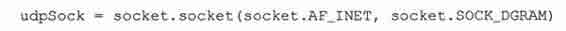

由于 socket 模块中有太多的属性，我们在这里破例使用了‘from module import*’语句。使用’fromsocket import*’，我们就把 socket 模块里的所有属性都带到我们的命名空间里了，这样能大幅减短我们的代码。

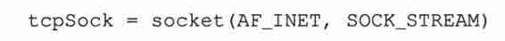

当我们创建了套接字对象后，所有的交互都将通过对该套接字对象的方法调用来进行。

### 16.3.2　套接字对象（内建）方法

表 16.1 中，我们列出了最常用的套接字对象的方法。在下一个小节中，我们将分别创建 TCP 和 UDP 的客户端和服务器，它们都要用到这些方法。虽然我们只关心因特网套接字，但是这些方法在 Unix 套接字中的也有类似的意义。

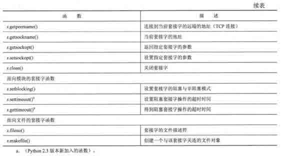

核心提示：在运行网络应用程序时，最好在不同的电脑上执行服务器和客户端的程序。

* * *

在本章的例子中，你将看到大量的代码和输出中提及“localhost”主机和 127.0.0.1IP 地址。例子中客户端与服务器运行在同一台电脑上，我们建议读者改掉主机名，并把代码放到不同的电脑上运行。眼看着自己的代码让不同的电脑在网络上进行通讯，这一时刻，你更能体会到开发的乐趣。

* * *

### 16.3.3　创建一个 TCP 服务器

我们首先将给出一个关于如何创建一个通用的 TCP 服务器的伪代码，然后解释会发生什么问题。要注意的是，这只是设计服务器的一种方法，当你对服务器的设计有了一定的了解之后，你就能用你所希望的方式来修改这段伪代码：

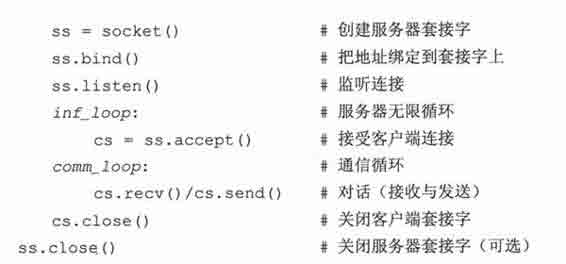

所有的套接字都用 socket.socket()函数来创建。服务器需要“坐在某个端口上”等待请求。所以它们必需要“绑定”到一个本地的地址上。由于 TCP 是一个面向连接的通信系统，在 TCP 服务器可以开始工作之前，要先完成一些设置。TCP 服务器必须“监听”（进来的）连接，设置完成之后，服务器就可以进入无限循环了。

一个简单的（单线程的）服务器会调用 accept()函数等待连接的到来。默认情况下，accept()函数是阻塞式的，即程序在连接到来之前会处于挂起状态。套接字也支持非阻塞模式。请参阅相关文档或操作系统手册以了解为何及如何使用非阻塞套接字。

一旦接收到一个连接，accept()函数就会返回一个单独的客户端套接字用于后续的通信。使用新的客户端套接字就像把客户的电话转给一个客户服务人员。当一个客户打电话进来的时候，总机接了电话，然后把电话转到合适的人那里来处理客户的需求。

这样就可以空出总机，也就是最初的那个服务器套接字，于是，话务员就可以等待下一个电话（客户端请求），与此同时，前一个客户与对应的客户服务人员在另一条线路上进行着他们之间的对话。同样的，当一个请求到来时，要创建一个新的端口，然后直接在那个端口上与客户对话，这样就可以空出主端口来接受其他客户的连接。

核心提示：创建线程来处理客户端请求。

* * *

我们不打算在例子里实现这样的功能。但是，创建一个新的线程或进程来完成与客户端通讯是一种非常常用的手段。SocketServer 模块是一个基于 socket 模块的高级别的套接字通讯模块，它支持在新的线程或进程中处理客户端请求。建议读者参阅相关文章及第十七章的习题，以了解更多的信息。

* * *

在临时套接字创建好之后，通信就可以开始了。客户与服务器都使用这个新创建的套接字进行数据的发送与接收，直到通讯的某一方关闭了连接或发送了一个空字符串之后，通讯就结束了。

在代码中，当客户端连接关闭后，服务器继续等待下一个客户端的连接。代码的最后一行，会把服务器的套接字关闭。由于服务器处在无限循环中，不可能会走到这一步，所以，这一步是可选的。我们写这一句话的主要目的是要提醒读者，在设计一个更智能的退出方案时，比方说，服务器被通知要关闭时，要确保 close()函数会被调用。

在例 16.1 的 tsTserv.py 文件中，会创建一个 TCP 服务器程序，这个程序会把客户端发送过来的字符串加上一个时间戳（格式：’[时间]数据’）返回给客户端（“tsTserv”代表时间戳 TCP 服务器。其他文档的命令将与此类似）。

例 16.1　TCP 时间戳服务器（tsTserv.py）

创建一个能接收客户端的消息，在消息前加一个时间戳后返回的 TCP 服务器。

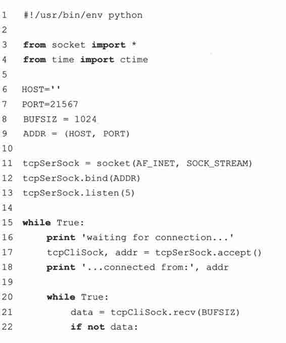

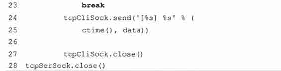

逐行解释

1 ~ 4 行

第 1 行是 Unix 的启动信息行，随后我们导入了 time.ctime()函数和 socket 模块的所有属性。

6 ~ 13 行

HOST 变量为空，表示 bind()函数可以绑定在所有有效的地址上。我们还选用了一个随机生成的未被占用的端口号。在程序中，我们把缓冲区的大小设定为 1K。你可以根据网络情况和应用的需要来修改这个大小。listen()函数的参数只是表示最多允许多少个连接同时连进来，而后来的连接就会被拒绝掉。

TCP 服务器的套接字（tcpSerSock）在第 11 行被生成。随后把套接字绑定到服务器的地址上，然后开始 TCP 监听。

15 ~ 28 行

在进入到服务器的无限循环后，我们（被动地）等待连接的到来。当有连接时，我们进入对话循环，等待客户端发送数据。如果消息为空，表示客户端已经退出，那就再去等待下一个客户端连接。得到客户端消息后，我们在消息前加一个时间戳然后返回。最后一行不会被执行到，放在这里用于提醒读者，在服务器要退出的时候，要记得调用 close()函数。

### 16.3.4　创建 TCP 客户端

创建 TCP 客户端相对服务器来说更为容易。与 TCP 服务器那节类似，我们也是先给出伪代码及其解释，然后再给出真正的代码。

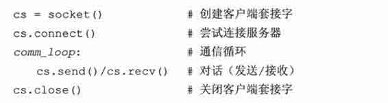

如前所述，所有的套接字都由 socket.socket()函数创建。在客户端有了套接字之后，马上就可以调用 connect()函数去连接服务器。连接建立后，就可以与服务器开始对话了。在对话结束后，客户端就可以关闭套接字，结束连接。

在例 16.2 中，我们给出了 TsTclnt.py 的代码。程序连接到服务器，提示用户输入要传输的数据，然后通过客户端代码显示服务器返回的加了时间戳的结果。

逐行解释

1 ~ 3 行

第 1 行是 Unix 的启动信息行，随后我们导入了 socket 模块的所有属性。

例 16.2　TCP 时间戳客户端（tsTclnt.py）

创建一个 TCP 客户端，程序会提示用户输入要传给服务器的信息，显示服务器返回的加了时间戳的结果。

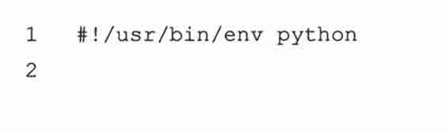

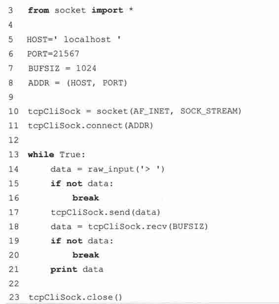

5 ~ 11 行

HOST 和 PORT 变量表示服务器的主机名与端口号。由于我们在同一台电脑上进行测试，所以 HOST 里放的是本机的主机名（如果你的服务器运行在其他电脑上，要做相应的修改）。端口号要与服务器上的设置完全相同（不然就没办法通信了）。缓冲区的大小还是设为 1K。

TCP 客户套接字（tcpCliSock）在第 10 行创建。然后就去连接服务器。

13 ~ 23 行

客户端也有一个无限循环，但这跟服务器的那个不期望退出的无限循环不一样。客户端的循环在以下两个条件的任意一个发生后就退出：用户没有输入任何内容（14〜16 行）或服务器由于某种原因退出，导致 recv()函数失败（18〜20 行）。否则，在一般情况下，客户端会把用户输入的字符串发给服务器进行处理，然后接收并显示服务器传回来的加了时间戳的字符串。

### 16.3.5　运行我们的客户端与 TCP 服务器

现在，我们来运行服务器和客户端程序，看看它们的运行情况如何。我们应该先运行服务器还是客户呢？很显然，如果我们先运行客户端，由于没有服务器在等待请求，客户端没办法做连接。服务器是一个被动端，它先创建自己然后被动地等待连接。而客户端则是主动端，由它主动地建立一个连接。所以：

要先开服务器，后开客户端。

我们在运行客户端和服务器的例子中，使用了同一台电脑。其实也可以把服务器放在其他的电脑上，这时只要改改主机名就好了。（看到自己写的第一个网络程序运行在不同的电脑上，那是多么激动人心的事啊）。

下面就是客户端的输入与输出，不输入数据直接按回车键就可以退出程序：

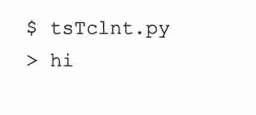

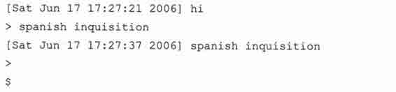

服务器的输出主要用于调试目的：

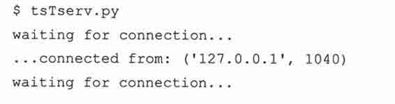

当有客户端连接上来的时候，会显示一个“…connected from…”信息。在客户端接受服务的时候，服务器又回去等待其他客户端连接。在从服务器退出的时候，我们要跳出那个无限循环，这时会触发一个异常。避免这种错误的方法是采用一种更优雅的退出方式。

核心提示：优雅的退出和调用服务器的 close()函数

* * *

“友好地”退出的一个方法就是把服务器的 while 循环放在一个 try-except 语句的 except 子句当中，并捕获 EOFError 和 Keyboardlnterrupt 异常。在 except 子句中，调用 close()函数关闭服务器的套接字。

* * *

这个简单的网络应用程序的有趣之处并不仅仅在于我们演示了数据怎样从客户端传到服务器，然后又传回给客户端，而且我们还把这个服务器当成了“时间服务器”，因为，字符串中的时间戳完全是来自于服务器的。

### 16.3.6　创建一个 UDP 服务器

由于 UDP 服务器不是面向连接的，所以不用像 TCP 服务器那样做那么多设置工作。事实上，并不用设置什么东西，直接等待进来的连接就好了。

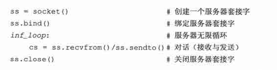

从伪代码中可以看出，使用的还是那套先创建套接字然后绑定到本地地址（主机/端口对）的方法。无限循环中包含了从客户端接收消息，返回加了时间戳的结果和回去等下一个消息这三步。同样的，由于代码不会跳出无限循环，所以，close()函数调用是可选的。我们写这一句话的原因是要提醒读者，在设计一个更智能的退出方案的时候，要确保 close()函数会被调用。

例 16.3　UDP 时间戳服务器（tsUserv.py）

创建一个能接收客户端消息、在消息前加一个时间戳后返回的 UDP 服务器。

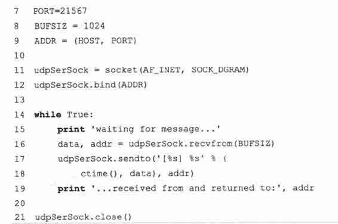

UDP 和 TCP 服务器的另一个重要的区别是，由于数据报套接字是无连接的，所以无法把客户端连接交给另外的套接字进行后续的通讯。这些服务器只是接受消息，需要的话，给客户端返回一个结果就可以了。

例 16.3 的 tsUserv.py 是之前那个 TCP 服务器的 UDP 版本，它接收客户端消息，加时间戳后返回给客户端。

逐行解释

1 ~ 4 行

就像 TCP 服务器的设置那样，在 Unix 的启动信息行后，我们导入了 time.ctime()函数和 socket 模块的所有属性。

6 ~ 12 行

HOST 和 PORT 变量与之前完全一样。socket()函数的调用有一些不同，我们现在要的是一个数据报/UDP 的套接字类型。不过 bind()函数的调用方式还是跟 TCP 版本的一样。同样地，由于 UDP 是无连接的，就不用调用 listen()函数来监听进来的连接了。

14 ~ 21 行

在进入到服务器的无限循环后，我们（被动地）等待（数据报）消息的到来。当有消息进来时，就处理它（在前面加时间戳），把结果返回去，然后再去等待下一个消息。就像之前一样，那个 close()函数只是一个演示而已。

### 16.3.7　创建一个 UDP 客户端

这一节中介绍的 4 段程序中，下面的这段 UDP 客户端代码是最短的。伪代码如下：

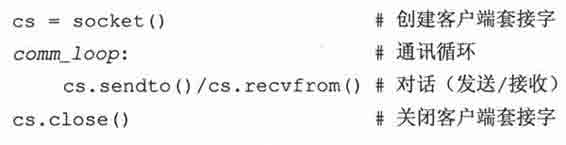

在套接字对象创建好之后，我们就进入一个与服务器的对话循环。在通信结束后，套接字就被关闭了。tsUclnt.py 真实的代码在例 16.4 中给出。

逐行解释

1 ~ 3 行

还是跟 TCP 版本的客户端一样，在 Unix 的启动信息行后，我们导入了 socket 模块的所有属性。

5 ~ 10 行

因为我们的服务器也是运行在本机，我们的客户端还是使用本机和相同的端口号。自然地，缓冲区的大小也还是 1K。创建套接字的方法跟 UDP 服务器中的一样。

12 ~ 22 行

UDP 客户端的循环基本上与 TCP 客户端的完全一样。唯一的区别就是，我们不用先去跟 UDP 服务器建立连接，而是直接把消息发送出去，然后等待服务器的回复。得到加了时间戳的字符串后，把它显示到屏幕上，然后再继续其他的消息。在输入结束后，退出循环，关闭套接字。

例 16.4　UDP 时间戳客户端（tsUclnt.py）

创建一个 UDP 客户端，程序会提示用户输入要传给服务器的信息，显示服务器返回的加了时间戳的结果。

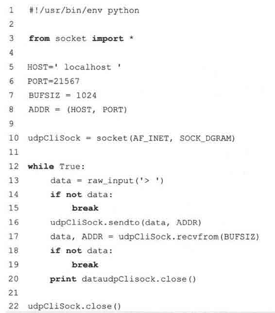

### 16.3.8　执行 UDP 服务器和客户端

UDP 客户端与 TCP 客户端的表现类似：

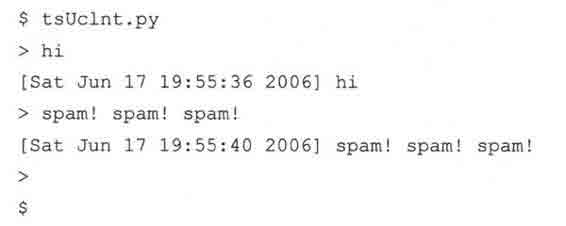

服务器也差不多：

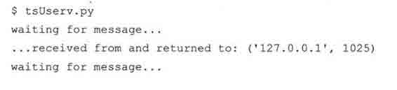

我们输出客户端信息的原因是，服务器可能会得到并回复多个客户端消息，这时，输出就可以让我们了解消息来自哪里。对于 TCP 服务器来说，由于客户端会创建一个连接，我们自然就能知道消息来自哪里。注意，我们的提示信息写的是“waiting for message”（“等待消息”）而不是“waiting for connection”（“等待连接”）。

### 16.3.9　Socket 模块属性

除了我们已经很熟悉的 socket.socket()函数之外，socket 模块还有很多属性可供网络应用程序使用。表 16.2 中列出了最常用的几个。

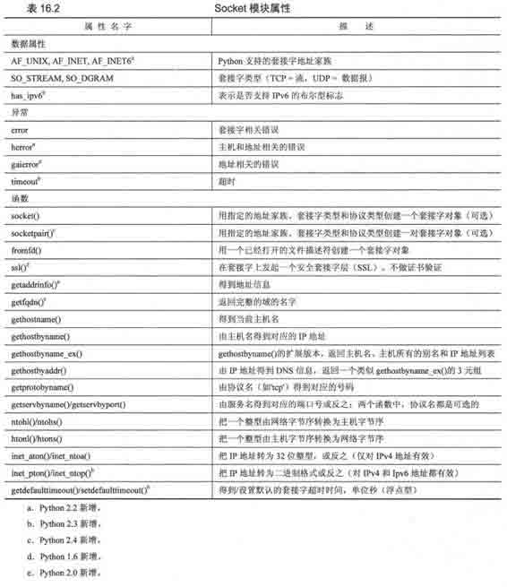

请参考《Python Library Reference》中 socket 模块的文档以了解更多的信息。

## 16.4　*SocketServer 模块

SocketServer 是标准库中一个高级别的模块。用于简化实现网络客户端与服务器所心需的大量样板代码。该模块中，已经实现了一些可供使用的类。

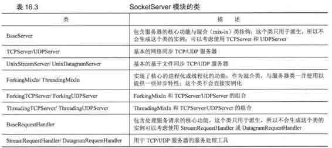

我们将再次实现之前的那个基本 TCP 的例子，生成一个 TCP 客户端和服务器。你会注意到新实现与之前有很多相似之处，但你也要注意到，现在很多繁杂的事情已经被封装好了，你不用再去关心那个样板代码了。例子给出的是一个最简单的同步服务器。记得要看看本章最后的把服务器改成异步的习题。

为了要隐藏实现的细节，我们现在写程序时会使用类，这是与之前代码的另一个不同。用面向对象的方法可以帮助我们更好的组织数据与逻辑功能。你也会注意到，我们的程序现在是“事件驱动”了。这就意味着，只有在事件出现的时候，程序才有“反应”。

事件包含发送与接收数据两种。事实上，你会看到，我们的类定义中只包含了接收客户端消息的事件处理器。其他的功能从我们所使用的 SocketServer 继承而来。GUI 编程（第十九章）也是事件驱动的。你会注意到有一个相似之处，即在代码的最后一行都有一个服务器的无限循环，等待并处理客户端服务请求。本章之前创建的基本 TCP 服务器也有一个类似的无限 while 循环。

在之前的服务器循环中，我们阻塞等待请求，有请求来的时候就处理请求，然后再回去继续等待。现在的服务器循环中，就不用在服务器里写代码了，改成定义一个处理器，服务器在收到进来的请求的时候，可以调用你的处理函数。

### 16.4.1　创建一个 SocketServerTCP 服务器

在代码中，先导入我们的服务器类，然后像之前一样定义主机常量。主机常量后就是我们的请求处理器类，然后是启动代码。在下面的代码片段中可以看到更多细节。

逐行解释

1 ~ 9 行

最开始的部分是从 SocketServer 导入需要的类。注意，我们在使用 Python 2.4 的多行导入的方式。如果你使用老版本的 Python，那么你要使用模块的形如 module.attribute 的名字。或者在导入的时候，把代码写在同一行里：

例 16.5　SocketServer 时间戳 TCP 服务器（TsTservss.py）

使用 SocketServer 里的 TCPServer 和 StreamRequestHandler 类创建一个时间戳 TCP 服务器。

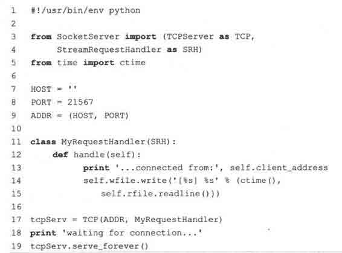

11 ~ 15 行

主要的工作在这里。我们从 SocketServer 的 StreamRequestHandler 类中派生出一个子类，并重写 handle()函数。在 BaseRequest 类中，这个函数因没有默认动作而被中断：

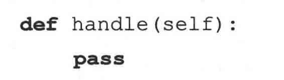

在有客户消息进来的时候，handle()函数就会被调用。StreamRequestHandler 类支持像操作文件对象那样操作输入输出套接字。我们可以用 readline()函数得到客户消息，用 write()函数把字符串发给客户端。

为了保持一致性，我们要在客户端与服务器两端的代码里都加上回车与换行。实际上，你在代码中看不到这个，因为，我们重用了客户端传过来的回车与换行。除了这些我们刚刚说到的不同之处外，代码看上去与之前的那个服务器是一样的。

17 ~ 19 行

代码的最后部分用给定的主机信息和请求处理类创建 TCP 服务器。然后进入等待客户端请求与处理客户请求的无限循环中。

### 16.4.2　创建 SocketServerTCP 客户端

很自然地，我们的客户端与之前的客户端的代码很相似，比服务器还相似得多。但客户端要做一些相应的调整以适应新的服务器。

逐行解释

1 ~ 8 行

没什么特别的，与原来的客户端代码完全相同。

例 16.6　SocketServer 时间戳 TCP 客户端（tsTclntSS.py）

这是一个时间戳 TCP 客户端，它知道如何与类似于文档的 SocketServer 里 StreamRequest Handler 对象进行通讯。

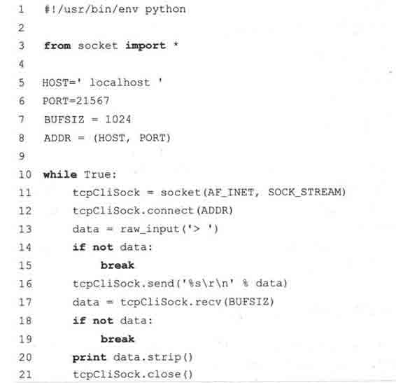

10 ~ 21 行

SocketServer 的请求处理器的默认行为是接受连接，得到请求，然后就关闭连接。这使得我们不能在程序运行时，一直保持连接状态，而是每次发送数据到服务器的时候都要创建一个新的套接字。

这种行为使得 TCP 服务器的行为有些像 UDP 服务器。不过，这种行为也可以通过重写请求处理器中相应的函数来改变。我们把这个留在本章最后的练习中。

现在，我们的客户端有点完全不一样了（我们得每次都创建一个连接）。其他的小区别在服务器代码的逐行解释中已经看到了：我们使用的处理器类像文件一样操作套接字，所以我们每次都要发送行结束字符（回车与换行）。服务器只是保留并重用我们发送的行结束字符。当我们从服务器得到数据的时候，我们使用 strip()函数去掉它们，然后使用 print 语句自动提供的回车。

### 16.4.3　执行 TCP 服务器和客户端

下面是我们 SocketServer TCP 客户端的输出：

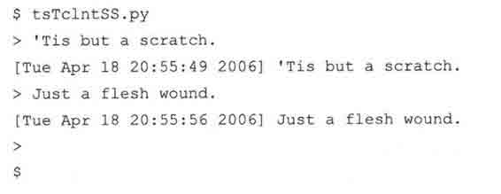

下面是服务器的输出：

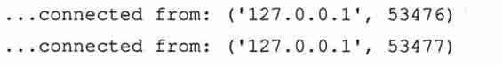

输出与我们之前的 TCP 客户端与服务器相似。不过，你能看到，我们连接了服务器两次。

## 16.5　Twisted 框架介绍

Twisted 是一个完全事件驱动的网络框架。它允许你使用和开发完全异步的网络应用程序和协议。在写本书的时候，它还不是 Python 标准库的一部分，要使用它，你必须另外下载并安装它（在本章最后能找到链接）。它为你创建一个完整系统提供了很大的帮助。系统中可以有：网络协议、线程、安全和认证、聊天/即时通讯、数据库管理、关系数据库集成、Wed/Internet、电子邮件、命令行参数、图形界面集成等。

使用 Twisted 来实现我们这个简单的例子有牛刀杀鸡的感觉。不过，学东西总要有切入点吧，我们先实现一个“Hello World”的网络应用程序。

像 SocketServer 一样，Twisted 的大部分功能都在它的类里面。在我们的例子中，我们将使用 Twisted 的 Internet 组件中 reactor 和 protocol 包的类。

### 16.5.1　创建一个 Twisted Reactor TCP 服务器

你会发现我们的代码与 SocketServer 例子有些相似。我们创建一个协议类，并像安装回调函数那样重写几个函数，而不是写一个处理器类。同样的，我们的例子是异步的。先来看服务器：

逐行解释

1 ~ 6 行

一开始的代码照常是模块导入部分。要注意 twisted.internet 中 protocol 和 reactor 包和端口号常量。

8 ~ 14 行

我们从 Protocol 类中派生出 TSServProtocol 类作为时间戳服务器。然后重写 connectionMade()函数，这个函数在有客户端连接的时候被调用，以及 dataReceived()函数，这个函数在客户端通过网络发送数据过来时被调用。reactor 把数据当成参数传到这个函数中，这样我们就不用自己去解析数据了。

例 16.7　Twisted Reactor 时间戳服务器（tsTservTW.py）

这是一个使用 Twisted Internet 类的时间戳 TCP 服务器。

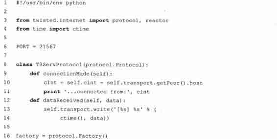

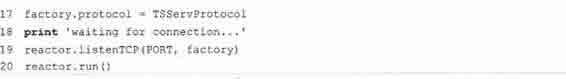

我们通过 transport 实例对象与客户端进行通信。你可以看到在 connectionMade()函数中，我们如何得到主机的信息，以及在 dataReceived()函数中，我们如何把数据传回客户端。

16 ~ 20 行

在服务器的最后一部分，我们创建一个 protocol Factory()。它被称为“工厂”是因为，每次我们有连接进来的时候，它都会“生产”一个我们的 protocol 对象。然后在 reactor 中安装一个 TCP 监听器以等待服务请求。当有请求进来时，创建一个 TSServProtocol 实例来服务那个客户端。

### 16.5.2　创建一个 Twisted Reactor TCP 客户端

与 SocketServer TCP 客户端不一样的是，这个例子与之前的所有其他客户端看上去都不大一样。它是完全 Twisted 的。

例 16.8　Twisted Reactor Timestamp TCP 客户端（tsTclntTW.py）

用 Twisted 重写我们已经熟悉的时间戳 TCP 客户端。

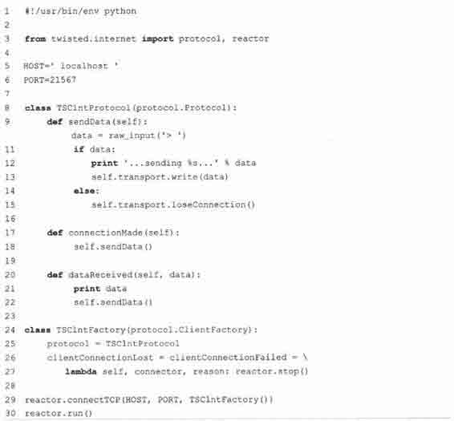

逐行解释

1 ~ 6 行

跟之前所有的客户端程序类似，这里还是导入 Twisted 的组件。

8 ~ 22 行

与服务器一样，我们扩展 Protocol，重写同样的函数 connectionMade()和 dataReceived()。这两个函数的用途也跟服务器一样。我们新加一个自己的函数 sendData()，用于在需要发送数据时调用。

由于我们现在是客户端，所以我们要主动发起跟服务器的对话。一旦连接建立好之后，我们先发送一个消息，服务器回复这个消息，我们把收到的回复显示在屏幕上，然后再发送其他消息给服务器。

这个过程会一直循环，直到用户没有给任何输入时，连接结束。结束时，就不是调用 transport 对象的 write()函数传数据给服务器了，而是调用 loseConnection()函数来关闭套接字。这时，工厂的 clientConnectionLost()函数会被调用，同时，reactor 就被关闭，脚本的执行就结束了。由于某些原因，clientConnectionFailed()被调用时，reactor 也会被关闭。

脚本的最后一部分是创建一个客户端工厂，连接到服务器，然后运行 reactor。注意，我们在这里实例化了客户端工厂，而不是像在服务器里那样把它传到 reactor 中。这是因为，我们不是等待客户端连接的服务器，服务器在有连接时要为每个连接创建一个新的 protocol 对象。我们只是一个客户端，所以我们只要创建一个 protocol 对象，连接到服务器，服务器的工厂会创建一个 protocol 对象来与我们对话。

### 16.5.3　执行 TCP 服务器和客户端

Twisted 客户端显示的内容与我们之前的客户端类似：

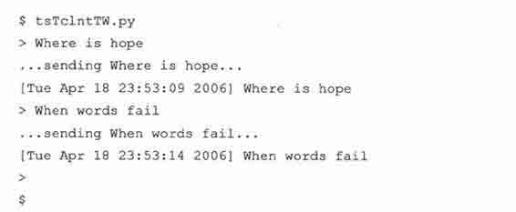

服务器又回到了只有一个连接的情况。Twisted 维护连接，不会在每个消息后都关 transport。

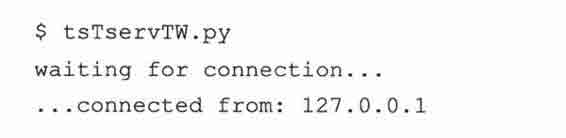

“connection from”输出没有其他的信息，因为我们只向服务器的 transport 对象的 getPeer()函数要了主机/地址的信息。

## 16.6　相关模块

表 16.4 列出了其他与网络和套接字相关的 Python 模块。select 模块通常在底层套接字程序中与 socket 模块联合使用。它提供的 select()函数可以同时管理多个套接字对象。它最有用的功能就是同时监听多个套接字的连接。select()函数会阻塞，直到有至少一个套接字准备好要进行通讯的时候才退出。它提供了哪些套接字已经准备好可以开始读取的集合（它也能决定了哪些套接字已经准备好可以开始写的集合，不过这个功能相对来说不大常用）。

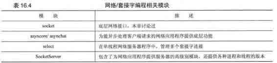

async*和 SocketServer 模块在创建服务器方面都提供了高层次的功能。由于是基于 socket 和（或）select 模块，封装了所有的底层的代码，它们使你可以快速开发客户端/服务器的系统。你所需要做的只是从适当的基类中派生出一个新的类。所有的东西就已经就绪了。就像之前所说的，SocketServer 甚至提供了把线程或进程集成到服务器中的功能，以实现更好的对客户端请求的并行处理能力。

虽然 async*是标准库提供的唯一的异步开发支持库，我们也可选择如 Twisted 这样相对于标准库更现代、更强大的第三方库。虽然这里看到的例子代码比之前的什么都自己处理的代码稍微长那么一点，Twisted 提供了更为强大、更具弹性的框架。它已经实现了很多协议。你可以在下面的网站找到更多有关 Twisted 的信息：

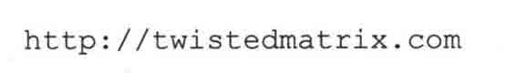

本章所讨论的主题涵盖了在 Python 中用 socket 网络编程和如何用低级别的协议如 TCP/IP 和 UDP/IP 来创建应用程序。如果你想要开发高层次的网页和因特网应用程序，强烈建议你阅读第十七章和第二十章。

## 16.7　练习

> > 16-1.套接字。面向连接和无连接有什么区别？

> > 16-2.客户端/服务器架构。用你自己的语言描述这个架构，并给出几个例子。

> > 16-3.套接字。TCP 和 UDP 中，哪一种服务器在接受连接后，把连接交给不同的套接字处理与客户端的通讯。

> > 16-4.客户端。修改 TCP（tsTclnt.py）和 UDP（tsUclnt.py）客户端，让服务器的名字不要在代码里写死，要允许用户指定一个主机名和端口，只有在两个值都没有输入的时候才使用默认值。

> > 16-5.网络互联和套接字。找到《Python Library Reference》中 7.2.2 节 Guido van Rossum 的示例 TCP 客户端/服务器程序，实现它并让它运行起来。先运行服务器，然后是客户端。源代码的一个在线版本可以在这里找到：

> > > > 你认为这个服务器太无聊了，决定要修改服务器，让它能识别以下命令：

> > > > 做这个作业的时候，你不一定要有网络——你的机器可以跟自己通讯。注：在服务器退出后，要清除绑定后才能再次运行。否则，有可能得碰到“端口已经被使用”（“port already bound”）的错误信息。操作系统一般会在 5 分钟内清除绑定。所以，请耐心等待。

> > 16-6.日期时间服务。使用 socket.getservbyname()函数得到 UDP 协议中“daytime”服务所对应的端口。请参考 getservbyname()函数的文档，查阅如何使用的详细语法。（即：socket.getservbyname._doc_）。现在，写一个程序发送一个随便什么数据过去，等待回答。一旦你收到了服务器的信息，显示到屏幕上。

> > 16-7.半双工聊天。创建一个简单的半双工聊天程序。“半双工”的意思是当创建一个连接，服务启动的时候，只有一个人可以打字，另一个人只有在等到有消息通知他输入消息时，才能说话。一旦消息发送出去后，要等到有回复了才能发送下一条消息。一个人是服务端，另一个人是客户端。

> > 16-8.全双工聊天。修改你刚才的程序，改成全双工，即两个人可以独立地发送和接收消息。

> > 16-9.多用户全双工聊天。再次修改你的程序，把聊天服务改成支持多用户版本。

> > 16-10.多用户、多房间全双工聊天。现在把聊天服务改成支持多个用户、多个房间。

> > 16-11.网页客户端。写一个 TCP 客户端，连到你最喜欢的网站的 80 端口（去掉“http://”和其他的后缀信息，只用主机名）。一旦创建了一个连接，发送 HTTP 命令字符串“GET/\n”，把服务器返回的所有数据写到一个文件中（GET 命令用于得到网页，“/”表示要得到的文件，“\n”把命令发送到服务器）。检查得到的文件的内容，它是什么？怎么检查你得到的数据是否正确？（注：你可能要在命令后加一个或是两个回车，一般来说，一个就可以了）。

> > 16-12.休眠服务器。创建一个“休眠”服务器，客户端可以要求要“休眠”几秒钟。服务器就去做休眠的操作。休眠结束后，返回一个消息给客户端，表示结束。客户端在收到消息的时候应该刚好等待了指定的时间。这就是一个简单的“远程过程调用”（“remote procedure call”），即客户端发送一个指令，网络另一边的远程的机器执行这个命令。

> > 16-13.名字服务器。设计并实现一个名字服务器。这个服务器负责维护一个主机名一端口号对的数据库，以及一个描述这个服务器提供的服务的字符串。选择一个或几个服务器到你的名字服务器上“注册”（注意，这时，这些服务器是名字服务器的客户端）。每一个客户端在启动的时候，都不知道它们想要找的服务器的信息。名字服务器的客户端也是这样。这些客户端应该发送一个请求到名字服务器，说明它们想要得到什么服务。名字服务器返回一个主机名一端口号对给客户端，客户端这时就可以连到合适的服务器来处理它的请求。

> > > > 附加题：

> > > > （1）在名字服务器中，加入对常用请求的缓冲。

> > > > （2）在名字服务器中，加入日志功能，记录下哪个服务器注册了，客户端在请求哪一个服务。

> > > > （3）名字服务器应该周期性地“ping”这些注册了的服务器的对应端口号，以确定这些服务器还在运行中。在连续数次 ping 失败后，就把这个服务器从列表中删除。

> > > > 你可以实现一些真实的服务，来注册到你的名字服务器上，或者也可以使用一些哑服务（它们根本不对请求做应答）。

> > 16-14.错误检查和优雅地退出。本章中，我们所有客户端和服务器的例子代码都没有做错误检查。我们没有检查用户是否按下了^C 来退出服务，或^D 来结束客户输入，也没有检查 raw_input()函数得到的输入的合法性，也没有检查网络错误。由于这些弱点，我们很可能会在退出程序的时候，没有关闭套接字，也有可能会丢失数据。选择一对客户端/服务器例子，加入足够的错误检查，让程序能正常退出。比方说会关闭网络连接。

> > 16-15.异步和 SocketServer。选取 TCP 服务器例子，使用某一个混合类（mix-in），让你的程序成为一个异步服务器。测试你的服务器，创建并同时运行多个客户端，在服务器的输出里查看你的服务器是否在同时响应多个请求。

> > 16-16.*扩展 SocketServer 类。在 SocketServer TCP 服务器代码中，我们不能使用原来的 TCP 客户端，要做修改。这是因为 SocketServer 类在多个请求之间不保持连接。

> > > > （a）从 TCPServer 和 StreamRequestHandler 中派生出新的类，重新设计服务器的架构，让服务器能为每个客户端只使用一个连接（而不是每个请求一个连接）。

> > > > （b）把前一个问题的解决方案应用到（a）部分，让多个客户端的请求可以被并行地处理。