# 第十八章　多线程编程

本章主题

♦　引言/动机

♦　线程和进程

♦　线程和 Python

♦　thread 模块

♦　threading 模块

♦　生产者-消费者问题和 Queue 模块

♦　相关模块

本章中，我们将探索在 Python 中，用多线程编程技术实现代码并行性的几种不同的方法。在前面几节中，我们将介绍进程与线程的区别。然后介绍多线程编程的概念（已经熟悉多线程编程的读者可以直接跳到第 18.3.5 节）。本章的最后几节将演示在 Python 中如何使用 threading 和 Queue 模块来实现多线程编程。

## 18.1　引言/动机

在多线程（multithreaded, MT）编程出现之前，电脑程序的运行由一个执行序列组成，执行序列按顺序在主机的中央处理器（CPU）中运行。无论是任务本身要求顺序执行还是整个程序是由多个子任务组成，程序都是按这种方式执行的。即使子任务相互独立，互相无关（即，一个子任务的结果不影响其他子任务的结果）时也是这样。这样是不是有点不合逻辑？会不会想要并行运行这些相互独立的子任务呢？这样的并行处理可以大幅度地提升整个任务的效率。这就是多线程编程的目的。

多线程编程对于某些任务来说是最理想的。这些任务具有以下特点：它们本质上就是异步的，需要有多个并发事务，各个事务的运行顺序可以是不确定的、随机的、不可预测的。这样的编程任务可以被分成多个执行流，每个流都有一个要完成的目标。根据应用的不同，这些子任务可能都要计算出一个中间结果，用于合并得到最后的结果。

运算密集型的任务一般都比较容易分隔成多个子任务，可以顺序执行或以多线程的方式执行。单线程处理多个外部输入源的的任务就不是那么容易了。这种编程任务如果不用多线程的方式处理，则一定要使用一个或多个计时器来实现。

一个顺序执行的程序要从每个 I/O（输入/输出）终端信道检查用户的输入时，程序无论如何也不能在读取 I/O 终端信道的时候阻塞。因为用户输入的到达是不确定的，阻塞会导致其他 I/O 信息的数据不能被处理。顺序执行的程序必须使用非阻塞 I/O，或是带有计时器的阻塞 I/O（这样才能保证阻塞只是暂时的）。

由于顺序执行的程序只有一个线程在运行。它要保证它要做的多任务，不会有某个任务占用太多的时间，而且要合理地分配用户的响应时间。执行多任务的顺序执行的程序一般程序控制流程都很复杂，难以理解。

使用多线程编程和一个共享的数据结构如 Queue（本章后面会介绍的一种多线程队列数据结构），这种程序任务可以用几个功能单一的线程来组织。

•　UserRequestThread：负责读取客户的输入，可能是一个 I/O 信道。程序可能创建多个线程，每个客户一个，请求会被放入队列中。

•　RequestProcessor：一个负责从队列中获取并处理请求的线程，它为下面那种线程提供输出。

•　ReplyThread：负责把给用户的输出取出来，如果是网络应用程序就把结果发送出去，否则就保存到本地文件系统或数据库中。

把这种编程任务用多线程来组织可以降低程序的复杂度，并使得干净、有效和具有良好组织的程序结构实现变得可能。每个线程的逻辑都不会很复杂，因为它要做的事情很清楚。例如，UserRequestThread 只是从用户或某个数据源读取数据，放到一个队列中，等待其他线程进一步的处理，等等，每个线程都有自己明确的任务。你只要设计好每个线程要做什么，并把要做的事做好就可以了。对某些任务使用线程跟亨利•福特制造汽车时使用的流水线模型有些相似。

## 18.2　线程和进程

### 18.2.1　什么是进程

计算机程序只不过是磁盘中可执行的二进制（或其他类型）的数据。它们只有在被读取到内存中，被操作系统调用的时候才开始它们的生命期。进程（有时被称为重量级进程）是程序的一次执行。每个进程都有自己的地址空间、内存、数据栈及其他记录其运行轨迹的辅助数据。操作系统管理在其上运行的所有进程，并为这些进程公平地分配时间、进程也可以通过 fork 和 spawn 操作来完成其他的任务。不过各个进程有自己的内存空间、数据栈等，所以只能使用进程间通讯（interprocess communication, IPC），而不能直接共享信息。

### 18.2.2　什么是线程

线程（有时被称为轻量级进程）跟进程有些相似，不同的是，所有的线程运行在同一个进程中，共享相同的运行环境。它们可以被想象成是在主进程或“主线程”中并行运行的“迷你进程”。

线程有开始，顺序执行和结束三部分。它有一个自己的指令指针，记录自己运行到什么地方。线程的运行可能被抢占（中断），或暂时的被挂起（也叫睡眠），让其他的线程运行，这叫做让步。一个进程中的各个线程之间共享同一片数据空间，所以线程之间可以比进程之间更方便地共享数据以及相互通讯。线程一般都是并发执行的，正是由于这种并行和数据共享的机制使得多个任务的合作变为可能。实际上，在单 CPU 的系统中，真正的并发是不可能的，每个线程会被安排成每次只运行一小会儿，然后就把 CPU 让出来，让其他的线程去运行。在进程的整个运行过程中，每个线程都只做自己的事，在需要的时候跟其他的线程共享运行的结果。

当然，这样的共享并不是完全没有危险的。如果多个线程共同访问同一片数据，则由于数据访问的顺序不一样，有可能导致数据结果的不一致的问题。这叫做竞态条件（race condition）。幸运的是，大多数线程库都带有一系列的同步原语，来控制线程的执行和数据的访问。

另一个要注意的地方是，由于有的函数会在完成之前阻塞住，在没有特别为多线程做修改的情况下，这种“贪婪”的函数会让 CPU 的时间分配有所倾斜。导致各个线程分配到的运行时间可能不尽相同，不尽公平。

## 18.3　Python、线程和全局解释器锁

### 18.3.1　全局解释器锁（GIL）

Python 代码的执行由 Python 虚拟机（也叫解释器主循环）来控制。Python 在设计之初就考虑到要在主循环中，同时只有一个线程在执行，就像单 CPU 的系统中运行多个进程那样，内存中可以存放多个程序，但任意时刻，只有一个程序在 CPU 中运行。同样地，虽然 Python 解释器中可以“运行”多个线程，但在任意时刻，只有一个线程在解释器中运行。

对 Python 虚拟机的访问由全局解释器锁（global interpreter lock, GIL）来控制，正是这个锁能保证同一时刻只有一个线程在运行。在多线程环境中，Python 虚拟机按以下方式执行。

1.设置 GIL。

2.切换到一个线程去运行。

3.运行：

> > > > a.指定数量的字节码的指令，或者

> > > > b.线程主动让出控制（可以调用 time.sleep（0））。

4.把线程设置为睡眠状态。

5.解锁 GIL。

6.再次重复以上所有步骤。

在调用外部代码（如 C/C++扩展函数）的时候，GIL 将会被锁定，直到这个函数结束为止（由于在这期间没有 Python 的字节码被运行，所以不会做线程切换）。编写扩展的程序员可以主动解锁 GIL。不过，Python 的开发人员则不用担心在这些情况下你的 Python 代码会被锁住。

例如，对所有面向 I/O 的（会调用内建的操作系统 C 代码的）程序来说，GIL 会在这个 I/O 调用之前被释放，以允许其他的线程在这个线程等待 I/O 的时候运行。如果某线程并未使用很多 I/O 操作，它会在自己的时间片内一直占用处理器（和 GIL）。也就是说，I/O 密集型的 Python 程序比计算密集型的程序更能充分利用多线程环境的好处。

对源代码，解释器主循环和 GIL 感兴趣的人，可以看看 Python/ceval.c 文件。

### 18.3.2　退出线程

当一个线程结束计算，它就退出了。线程可以调用 thread.exit()之类的退出函数，也可以使用 Python 退出进程的标准方法，如 sys.exit()或抛出一个 SystemExit 异常等。不过，你不可以直接“杀掉”（kill）一个线程。

在下面一节中，我们将要讨论两个跟线程有关的模块。这两个模块中，我们不建议使用 thread 模块。这样做有很多原因，很明显的一个原因是，当主线程退出的时候，所有其他线程没有被清除就退出了。但另一个模块 threading 就能确保所有“重要的”子线程都退出后，进程才会结束。（我们等一会儿会详细说明什么叫“重要的”，请参阅守护线程的“核心提示”）。

主线程应该是一个好的管理者，它要了解每个线程都要做些什么事，线程都需要什么数据和什么参数，以及在线程结束的时候，它们都提供了什么结果。这样，主线程就可以把各个线程的结果组合成一个有意义的最后结果。

### 18.3.3　在 Python 中使用线程

在 Win32 和 Linux, Solaris, MacOS, *BSD 等大多数类 Unix 系统上运行时，Python 支持多线程编程。Python 使用 POSIX 兼容的线程，即 pthreads。

默认情况下，从源代码编译的（2.0 及以上版本的）Python 以及 Win32 的安装包里，线程支持是打开的。想要从解释器里判断线程是否可用，只要简单地在交互式解释器里尝试导入 thread 模块就行了，只要没出现错误就表示线程可用。

如果你的 Python 解释器在编译时，没有打开线程支持，导入模块会失败：

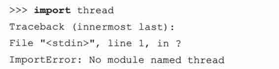

这种情况下，你就要重新编译你的 Python 解释器才能使用线程。你可以在运行配置脚本的时候，加上“-with-thread”参数。参考你的发布版的 README 文件，以获取如何编译支持线程的 Python 的相关信息。

### 18.3.4　没有线程支持的情况

第一个例子中，我们会使用 time.sleep()函数来演示线程是怎样工作的。time.sleep()需要一个浮点型的参数，来指定“睡眠”的时间（以秒为单位）。这就意味着，程序的运行会被挂起指定的时间。

我们要创建两个“计时循环”。一个睡眠 4 秒种，一个睡眠 2 秒种，分别是 loop0()和 loopl()。（我们命名为“loop0”和“loop1”表示我们将有一个循环的序列）。如果我们像例 18\. 1 的 onethr.py 中那样，在一个进程或一个线程中，顺序地执行 loop0()和 loop1()，那运行的总时间为 6 秒。在启动 loop0(),loop1()和其他的代码时，也要花去一些时间，所以，我们看到的总时间也有可能会是 7 秒钟。

在单线程中顺序执行两个循环。一个循环结束后，另一个才能开始。总时间是各个循环运行时间之和。

例 18.1

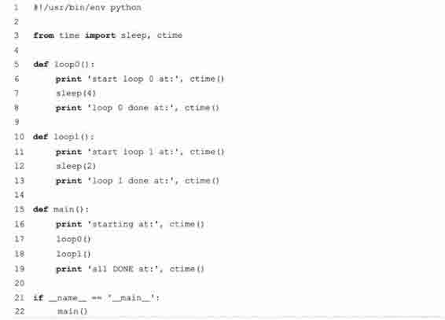

我们可以通过运行 onethr.py 来验证这一点，下面是运行的输出：

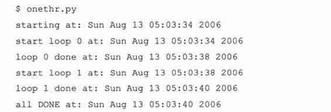

假定 loop0()和 loop1()里做的不是睡眠，而是各自独立的，不相关的运算，各自的运算结果到最后将会汇总成一个最终的结果。这时，如果能让这些计算并行执行的话，那不是可以减少总的运行时间吗？这就是我们现在要介绍的多线程编程的前提条件。

### 18.3.5　Python 的 threading 模块

Python 提供了几个用于多线程编程的模块，包括 thread、threading 和 Queue 等。thread 和 threading 模块允许程序员创建和管理线程。thread 模块提供了基本的线程和锁的支持，而 threading 提供了更高级别，功能更强的线程管理的功能。Queue 模块允许用户创建一个可以用于多个线程之间共享数据的队列数据结构。我们将分别介绍这几个模块，并给出一些例子和中等大小的应用。

核心提示：避免使用 thread 模块

* * *

出于以下几点考虑，我们不建议您使用 thread 模块。首先，更高级别的 threading 模块更为先进，对线程的支持更为完善，而且使用 thread 模块里的属性有可能会与 threading 出现冲突。其次，低级别的 thread 模块的同步原语很少（实际上只有一个），而 threading 模块则有很多。

不过，出于对学习 Python 和线程的兴趣，我们将给出一点使用 thread 模块的例子。这些代码只用于学习目的，让你对为什么应该避免使用 thread 模块有更深的认识，以及让你了解在把代码改为使用 threading 和 Queue 模块时，我们能获得多大的便利。

另一个不要使用 thread 原因是，对于你的进程什么时候应该结束完全没有控制，当主线程结束时，所有的线程都会被强制结束掉，没有警告也不会有正常的清除工作。我们之前说过，至少 threading 模块能确保重要的子线程退出后进程才退出。

只建议那些有经验的专家在想访问线程的底层结构的时候，才使用 thread 模块。而使用线程的新手们则应该看看我们是如何把线程应用到我们的第一个程序，从而增加代码的可读性，以及第一段例子如何进化到我们本章的主要的代码的。如果可以的话，你的第一个多线程程序应该尽可能地使用 threading 等高级别的线程模块。

* * *

## 18.4　thread 模块

我们先看看 thread 模块都提供了些什么。除了产生线程外，thread 模块也提供了基本的同步数据结构锁对象（lock object，也叫原语锁、简单锁、互斥锁、互斥量、二值信号量）。如之前所说，同步原语与线程的管理是密不可分的。

表 18.1 中所列的是常用的线程函数以及 LockType 类型的锁对象的方法。

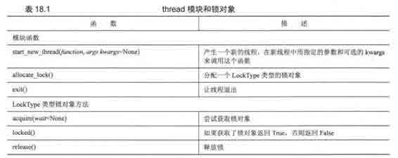

start_new_thread()函数是 thread 模块的一个关键函数，它的语法与内建的 apply()函数完全一样，其参数为：函数，函数的参数以及可选的关键字参数。不同的是，函数不是在主线程里运行，而是产生一个新的线程来运行这个函数。

现在，把线程加入到我们的 onethr.py 例子中。稍微改变一下 loop*()函数的调用方法，我们得到了例 18.2 的 mtsleepl.py。

这儿执行的是和 onethr.py 中一样的循环，不同的是，这一次我们使用的是 thread 模块提供的简单的多线程的机制。两个循环并发地被执行（显然，短的那个先结束）。总的运行时间为最慢的那个线程的运行时间，而不是所有的线程的运行时间之和。

例 18.2

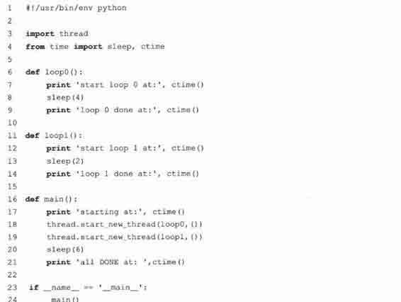

Start_new_thread()要求一定要有前两个参数。所以，就算我们想要运行的函数不要参数，我们也要传一个空的元组。

这个程序的输出与之前的输出大不相同，之前是运行了 6~7 秒，而现在则是 4 秒，是最长的循环的运行时间与其他的代码的时间总和。

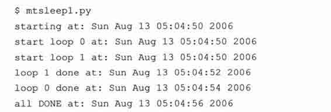

睡眠 4 秒和 2 秒的代码现在是并发执行的。这样，就使得总的运行时间被缩短了。可以看到，loop1 甚至在 loop()前面就结束了。程序的一大不同之处就是多了一个“sleep（6）”的函数调用。为什么要加上这一句呢？因为如果我们没有让主线程停下来，那主线程就会运行下一条语句，显示“all done”，然后就关闭运行着 loop0()和 loop1()的两个线程，退出了。

我们没有写让主线程停下来等所有子线程结束之后再继续运行的代码，这就是我们之前说线程需要同步的原因。在这里，我们使用了 sleep()函数作为我们的同步机制。我们使用 6 秒是因为我们已经知道，两个线程（你知道，一个要 4 秒，一个要 2 秒）在主线程等待 6 秒后应该已经结束了。

你也许在想，应该有什么好的管理线程的方法，而不是在主线程里做一个额外的延时 6 秒的操作。因为这样一来，我们的总的运行时间并不比单线程的版本来得少。而且，像这样使用 sleep()函数做线程的同步操作是不可靠的。如果我们的循环的执行时间不能事先确定的话，那怎么办呢？这可能造成主线程过早或过晚退出。这就是锁的用武之地了。

上一次修改程序，我们去掉了 loop 函数，现在，我们要再一次修改程序为例 18.3 的 mtsleep2.py，引入锁的概念。运行它，我们看到，其输出与 mtsleepl.py 很相似，唯一的区别是我们不用为线程什么时候结束再做额外的等待。使用了锁，我们就可以在两个线程都退出后，马上退出。

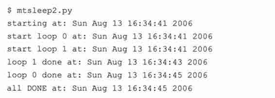

我们是怎么通过锁来完成任务的呢？先看一看代码吧。

例 18.3　使用线程和锁（mtsleep2.py）

这里，使用锁比 mtsleepl.py 那里在主线程中使用 sleep()函数更合理。

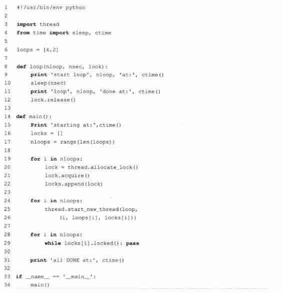

逐行解释

> > 1 ~ 6 行

> > 在 Unix 启动信息行后面，我们导入了 thread 模块和 time 模块里我们早已熟悉的几个函数。我们不再在函数里写死要等 4 秒和 2 秒，而是使用一个 loop()函数，把这些常量放在一个列表 loops 里。

> > 8 ~ 12 行

> > loop()函数替换了我们之前的那几个 loop*()函数。在 loop()函数里，增加了一些锁的操作。一个很明显的改变是，我们现在要在函数中记录下循环的号码和要睡眠的时间。最后一个不一样的地方就是那个锁了。每个线程都会被分配一个事先已经获得的锁，在 sleep()的时间到了之后就释放相应的锁以通知主线程，这个线程已经结束了。

> > 14 ~ 34 行

主要的工作在包含三个循环的 main()函数中完成。我们先调用 thread.allocate_lock()函数创建一个锁的列表，并分别调用各个锁的 acquire()函数获得锁。获得锁表示“把锁锁上”。锁上后，我们就把锁放到锁列表 locks 中。下一个循环创建线程，每个线程都用各自的循环号，睡眠时间和锁为参数去调用 loop()函数。为什么我们不在创建锁的循环里创建线程呢？有以下几个原因：（1）我们想到实现线程的同步，所以要让“所有的马同时冲出栅栏”。（2）获取锁要花一些时间，如果你的线程退出得“太快”，可能会导致还没有获得锁，线程就已经结束了的情况。

在线程结束的时候，线程要自己去做解锁操作。最后一个循环只是坐在那一直等（达到暂停主线程的目的），直到两个锁都被解锁为止才继续运行。由于我们顺序检查每一个锁，所以我们可能会要长时间地等待运行时间长且放在前面的线程，当这些线程的锁释放之后，后面的锁可能早就释放了（表示对应的线程已经运行完了）。结果主线程只能毫不停歇地完成对后面这些锁的检查。最后两行代码的意思你应该已经知道了，就是只有在我们直接运行这个脚本时，才运行 main()函数。

在核心笔记中我们就已经说过，使用 thread 模块只是为了给读者演示如何进行多线程编程。你的多线程程序应该使用更高级别的模块，如 threading 等。现在我们就开始讨论它。

## 18.5　threading 模块

接下来，我们要介绍的是更高级别的 threading 模块，它不仅提供了 Thread 类，还提供了各种非常好用的同步机制。表 18.2 列出了 threading 模块里所有的对象。

在这一节中，我们会演示如何使用 Thread 类来实现多线程。之前已经介绍过锁的基本概念，这里我们将不会提到锁原语。而 Thread 类也有某种同步机制，所以，没有必要详细介绍锁原语。

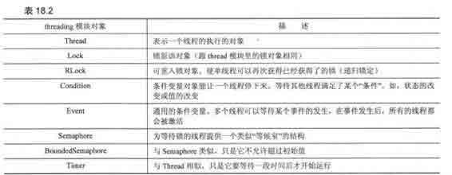

核心提示：守护线程

* * *

另一个避免使用 thread 模块的原因是，它不支持守护线程。当主线程退出时，所有的子线程不论它们是否还在工作，都会被强行退出。有时我们并不期望这种行为，这时就引入了守护线程的概念。

Threading 模块支持守护线程，它们是这样工作的：守护线程一般是一个等待客户请求服务器，如果没有客户提出请求，它就在那等着。如果你设定一个线程为守护线程，就表示你在说这个线程是不重要的，在进程退出的时候，不用等待这个线程退出。就像你在第十六章网络编程看到的，服务器线程运行在一个无限循环中，一般不会退出。

如果你的主线程要退出的时候，不用等待那些子线程完成，那就设定这些线程的 daemon 属性。即，在线程开始（调用 thread.start()）之前，调用 setDaemon()函数设定线程的 daemon 标志（thread.setDaemon（True））就表示这个线程“不重要”。

如果你想要等待子线程完成再退出，那就什么都不用做，或者显式地调用 thread.setDaemon（False）以保证其 daemon 标志为 False。你可以调用 thread.isDaemon()函数来判断其 daemon 标志的值。新的子线程会继承其父线程的 daemon 标志。整个 Python 会在所有的非守护线程退出后才会结束，即进程中没有非守护线程存在的时候才结束。

* * *

### 18.5.1　Thread 类

threading 的 Thread 类是你主要的运行对象。它有很多 thread 模块里没有的函数，详见表 18.3。

用 Thread 类，你可以用多种方法来创建线程。我们在这里介绍三种比较相像的方法。你可以任选一种你喜欢的，或最适合你的程序以及最能满足程序可扩展性的（我们一般比较喜欢最后一个选择）：

•　创建一个 Thread 的实例，传给它一个函数；

•　创建一个 Thread 的实例，传给它一个可调用的类对象；

•　从 Thread 派生出一个子类，创建一个这个子类的实例。

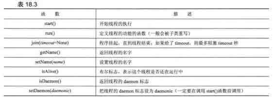

创建一个 Thread 的实例，传给它一个函数。

第一个例子中，我们将初始化一个 Thread 对象，把函数（及其参数）像上一个例子那样传进去。在线程开始执行的时候，这个函数会被执行。把 mtsleep2.py 脚本拿过来，一些调整加入 Thread 对象的使用，就成了例 18.4 中的 mtsleep3.py。

运行的输出跟之前很相似：

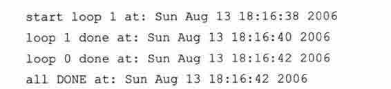

那么，都做了些什么修改呢？在使用 thread 模块时使用的锁没有了，新加了一些 Thread 对象。在实例化每个 Thread 对象的时候，我们把函数（target）和参数（args）传进去，得到返回的 Thread 实例。实例化一个 Thread （调用 Thread()）与调用 thread.start_new_thread()之间最大的区别就是，新的线程不会立即开始。在你创建线程对象，但不想马上开始运行线程的时候，这是一个很有用的同步特性。

例 18.4　使用 threading 模块（mtsleep3.py）

threading 模块的 Thread 类有一个 join()函数，允许主线程等待线程的结束。

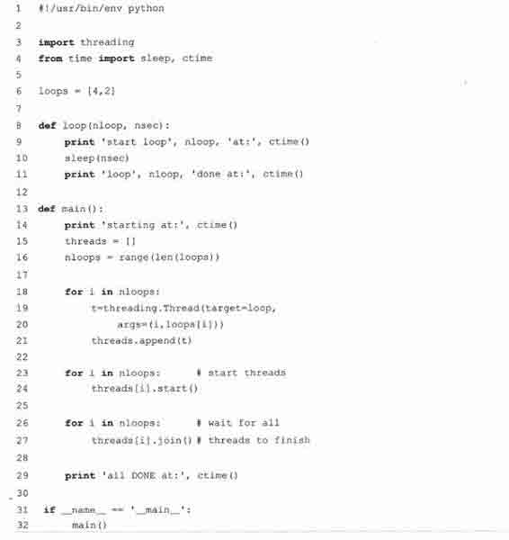

所有的线程都创建了之后，再一起调用 start()函数启动，而不是创建一个启动一个。而且，不用再管理一堆锁（分配锁、获得锁、释放锁、检查锁的状态等），只要简单地对每个线程调用 join()函数就可以了。

join()会等到线程结束，或者在给了 timeout 参数的时候，等到超时为止。使用 join()看上去会比使用一个等待锁释放的无限循环清楚一些（这种锁也被称为“自旋锁”）。

join()的另一个比较重要的方面是它可以完全不用调用。一旦线程启动后，就会一直运行，直到线程的函数结束，退出为止。如果你的主线程除了等线程结束外，还有其他的事情要做（如处理或等待其他的客户请求），那就不用调用 join()，只有在你要等待线程结束的时候才要调用 join()。

创建一个 Thread 的实例，传给它一个可调用的类对象。

与传一个函数很相似的另一个方法是在创建线程的时候，传一个可调用的类的实例供线程启动的时候执行——这是多线程编程的一个更为面向对象的方法。相对于一个或几个函数来说，由于类对象里可以使用类的强大的功能，可以保存更多的信息，这种方法更为灵活。

把 ThreadFunc 类加入到 mtsleep3.py 代码中，并做一些其他的小修改后，就得到了例 18.5 中的 mtsleep4.py。运行它，就会得到如下的输出：

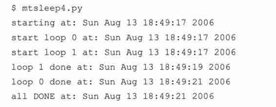

那么，这次又改了些什么呢？主要是增加了 ThreadFunc 类和创建 Thread 对象时会实例化一个可调用类 ThreadFunc 的类对象。也就是说，我们实例化了两个对象。下面，来仔细地看一看 ThreadFunc 类吧。

我们想让这个类在调用什么函数方面尽量地通用，并不局限于那个 loop()函数。所以，我们加了一些修改，如，这个类保存了函数的参数，函数本身以及函数的名字字符串。构造器 _init_()里做了这些值的赋值工作。

创建新线程的时候，Thread 对象会调用我们的 ThreadFunc 对象，这时会用到一个特殊函数 _call_()。由于我们已经有了要用的参数，所以就不用再传到 Thread()的构造器中。由于我们有一个参数的元组，这时要在代码中使用 apply()函数。如果你使用的是 Pythonl.6 或是更高版本，你可以使用 11.6.3 节中所说的新的调用语法，而不用像第 16 行那样使用 apply()函数：

此例中，我们传了一个可调用的类（的实例），而不是仅传一个函数。相对 mtsleep3.py 中的方法来说，这样做更具面向对象的概念。

例 18.5

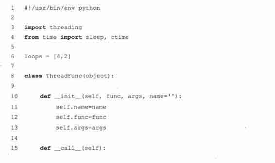

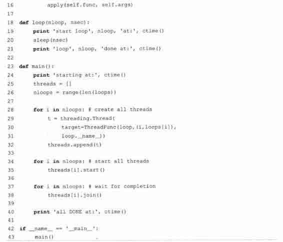

从 Thread 派生出一个子类，创建一个这个子类的实例。

最后一个例子介绍如何子类化 Thread 类，这与上一个例子中的创建一个可调用的类非常像。使用子类化创建线程（第 29~30 行）使代码看上去更清晰明了。我们将在例 18.6 中给出 mtsleep5.py 的代码，以及代码运行的输出。比较 mtsleep5.py 和 mtsleep4.py 的任务则留给读者作为练习。

下面是 mtsleep5.py 的输出，同样，跟我们的期望一致：

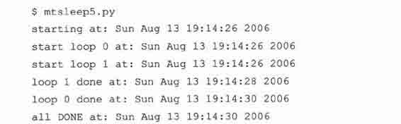

在读者比较 mtsleep4 和 mtsleep5 两个模块的代码之前，我们想指出最重要的两点改变：

（1）我们的 MyThread 子类的构造器一定要先调用基类的构造器（第 9 行）；（2）之前的特殊函数 _call_()在子类中，名字要改为 run()。

现在，在 MyThread 类中，加入一些用于调试的输出信息，把代码保存到 myThread 模块中（见例 18.7），并在下面的例子中导入这个类。除了简单地使用 apply()函数来运行这些函数之外，我们还把结果保存到实现的 self.res 属性中，并创建一个新的函数 getResult()来得到结果。

### 18.5.2　斐波那契、阶乘和累加和

例 18.8 中的 mtfacfib.py 脚本比较了递归求斐波那契、阶乘和累加和函数的运行。脚本先在单线程中运行这三个函数，然后在多线程中做同样的事，以说明多线程的好处。

我们现在要子类化 Thread 类，而不是创建它的实例。这样做可以更灵活地定制我们的线程对象，而且在创建线程的时候也更简单。

例 18.6

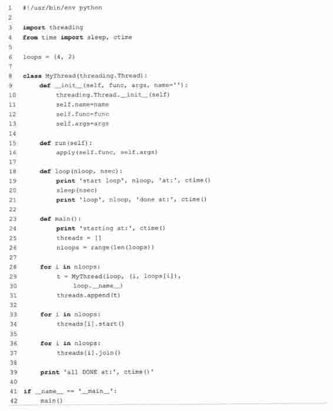

例 18.7　MyThread 子类化 Thread （myThread.py）

为了让 mtsleep5.py 中，Thread 的子类更为通用，我们把子类单独放在一个模块中，并加上一个 getResult()函数用以返回函数的运行结果。

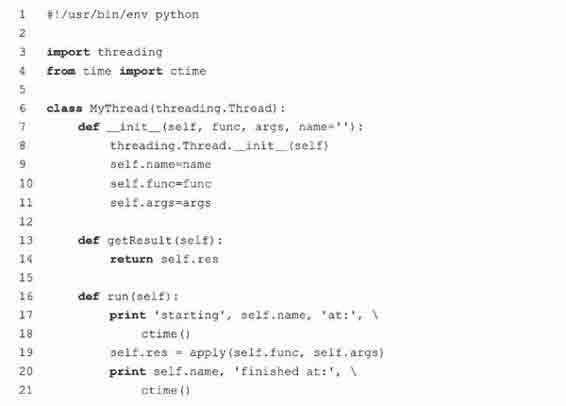

在单线程中运行只要简单地逐个调用这些函数，在函数结束后显示对应的结果。在多线程中，我们不马上显示结果。由于我们想让 MyThread 类尽可能地通用（能同时适应有输出和没输出的函数），我们会等到要结束时才会调用 getResult()函数，并在最后显示每个函数的结果。

由于这些函数运行得很快（斐波那契函数会慢一些），你会看到，我们得在每个函数中加上一个 sleep()函数，让函数慢下来，以便于我们能方便地看到多线程能在多大程度上加速程序的运行。不过实际工作中，你一般不会想在程序中加上 sleep()函数的。下面是程序的输出：

在这个多线程程序中，我们会分别在单线程和多线程环境中，运行三个递归函数。

例 18.8

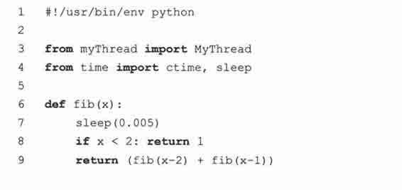

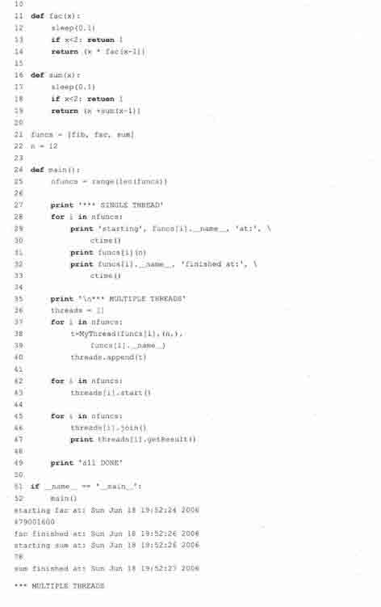

### 18.5.3　threading 模块中的其他函数

除了各种同步对象和线程对象外，threading 模块还提供了一些函数。见表 18.4。

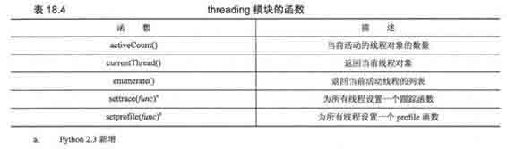

### 18.5.4　生产者-消费者问题和 Queue 模块

最后一个例子演示了生产者和消费者的场景。生产者生产货物，然后把货物放到一个队列之类的数据结构中，生产货物所要花费的时间无法预先确定。消费者消耗生产者生产的货物的时间也是不确定的。

Queue 模块可以用来进行线程间通讯，让各个线程之间共享数据。现在，我们创建一个队列，让生产者（线程）把新生产的货物放进去供消费者（线程）使用。要达到这个目的，我们要使用到 Queue 模块的以下属性（见表 18.5）。

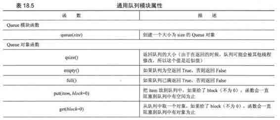

很容易地，我们就能写出例 18.9 的 prodcons.py 的代码。

下面是这个脚本的运行输出：

如你所见，生产者和消费者不一定是轮流执行的（多亏有了随机数）。实际上，真实生活总是充满了随机性和不确定性。

逐行解释

1 ~ 6 行

在这个模块中，我们要使用 Queue.Queue 对象和我们在例 18.7 中给出的线程类 myThread. MyThread。我们将使用 random.randint()函数来随机进行生产和消耗，并从 time 模块中导入常用的属性。

8 ~ 16 行

writeQ()和 readQ()函数分别用来把对象放入队列和消耗队列中的一个对象。在这里我们使用字符串‘XXX’来表示队列中的对象。

18 ~ 26 行

writer()函数只做一件事，就是一次往队列中放入一个对象，等待一会儿，然后再做指定次数的同样的事，这个次数是由脚本运行时随机生成的。reader()函数做的事比较类似，只是它是用来消耗对象的。

你会注意到，writer 睡眠的时间一般会比 reader 睡眠的时间短。这可以减少 reader 尝试从空队列中取数据的机会。writer 的睡眠时间短，那 reader 在想要数据的时候总是能拿到数据。

28 ~ 29 行

设置有多少个线程要被运行。

> > 例 18.9　生产者-消费者问题（prodcons.py）

这个实现中使用了 Queue 对象和随机地生产（和消耗）货物的方式。生产者和消费者相互独立并且并发地运行。

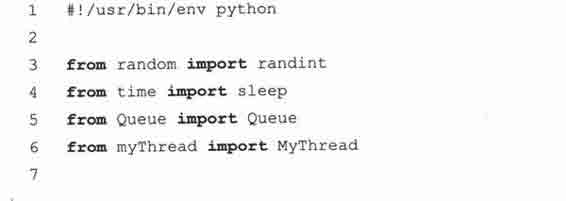

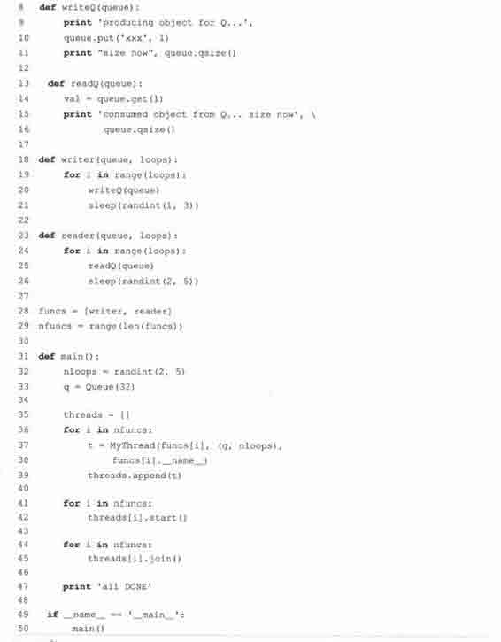

31 ~ 47 行

最后，就到了 main()函数，它与之前的所有脚本的 main()函数都很像。先是创建所有的线程，然后运行它们，最后，等两个线程都结束后，得到最后的运行结果。

从本例中，我们可以了解到，一个要完成多项任务的程序，可以考虑每个任务使用一个线程。这样的程序在设计上相对于单线程做所有事的程序来说，更为清晰明了。

本章中，我们看到了单线程的程序在程序性能上的限制。尤其在有相互独立的，运行时间不确定的多个任务的程序里，把多个任务分隔成多个线程同时运行会比顺序运行速度更快。由于 Python 解释器是单线程的，所以不是所有的程序都能从多线程中得到好处。不过，你已经对 Python 下的多线程有所了解，在适当的时候，可以利用它来改善程序的性能。

## 18.6　相关模块

下表列出了一些多线程编程中可能用得到的模块：

## 18.7　练习

> > 18-1.进程与线程。线程与进程的区别是什么？

> > 18-2.Python 的线程。在 Python 中，哪一种多线程的程序表现得更好，I/O 密集型的还是计算密集型的？

> > 18-3.线程。你认为多 CPU 的系统与一般的系统有什么大的不同？多线程的程序在这种系统上的表现会怎么样？

> > 18-4.线程和文件。把练习 9-19 的答案做一些改进。我们要得到一个字节值，一个文件名，然后显示在文件中那个字节出现了多少次。假设这个文件非常大。文件是可以有多个读者的，那我们就可以创建多个线程，每个线程负责文件的一部分。最后，把所有的线程的结果相加。使用 timeit()对单线程和多线程分别进行计时，对性能的改进进行讨论。

> > 18-5.线程，文件和正则表达式。你有一个非常大的 mailbox 文件——如果没有的话，你可以把你所有的电子邮件的原始信息放到一个文本文件中。你现在要做的是，使用在 15 章写的识别电子邮件地址和网页 URL 的正则表达式，分析出这个大文件里的所有的电子邮件地址和 URL，把这些链接写到一个.html（或.htm）文件中。在这个文件生成时，会自动显示一个浏览器，打开这个文件，显示所有的链接。使用多线程来分隔处理大文件和把结果写到一个新的.html 文件的操作。在浏览器中测试一下你的结果，确保那些链接都能正常工作。

> > 18-6.线程和网络。你在之前做的聊天服务器程序（练习 16-7 到 16-10）也许会用到重量级线程或者说进程，把那个代码改成多线程的。

> > 18-7.*线程和 Web 编程。练习 19.1 中的爬虫，是一个单线程的网页下载程序，但可以利用多线程提高性能。修改 crawl.py（你可以叫它 mtcrawl.py），让它可以使用多个不相关的线程来下载网页。注意要使用某种锁的机制以确保不会在访问链接队列的时候出现访问冲突。

> > 18-8.线程池。修改例 18.9 的代码，不再是一个生产者和一个消费者，而是可以有任意个消费者线程（一个线程池），每个线程可以在任意时刻处理或消耗任意多个产品。

> > 18-9.文件。创建一些线程来计算一些（可能很大量的）文件中一共有多少行。你可以选择要使用多少个线程。比较单线程与多线程的性能差异。提示：回顾一下第九章（文件和 I/O）的练习。

> > 18-10.把你之前的解决方案应用到你选择的几个任务中，如，处理一些电子邮件，下载一些网页，处理一些 RSS 和 Atom feeds，聊天时的消息处理，解一个谜题等。