# 第十九章　图形用户界编程

本章主题

♦　引言

♦　Tkinter 与 Python 编程

♦　Tkinter 模块

♦　Tk 组件库

♦　Tkinter 使用举例

♦　标签、按钮与进度条组件

♦　一个使用 Tk 的中级范例

♦　其他 GUI 简介（Tix、Pmw、wxPython 和 PyGTK）

♦　相关模块和其他 GUI

本章我们将对图形用户界面（graphical user interface, GUI）编程进行简介。不论你是初次涉及该领域还是想学到更多，抑或只是想看看 Python 是如何做的，这一章都会适合你。在这短短的一章里我们无法对 GUI 程序开发介绍得面面俱到，但我们将讲解最核心的内容。Python 的默认 GUI 工具集是 Tk，它也是我们将使用的最基本的 GUI 工具集，我们可以通过 Python 接口 Tkinter 来使用 Tk （Tkinter 正是“Tk 接口”之意）。

Tk 并非“最强、最新”，也不是包含 GUI 构建模块最多的工具集，但它非常简单，并且可以开发出能运行于大多数平台的 GUI 程序。我们将用 Tkinter 举几个例子其中包括一个中级范例，随后我们还将给出几个其他工具集的例子。一旦完成了本章的学习，你将掌握构建复杂应用程序的技巧，也有能力转向那些更流行的图形工具集。Python 有许多对主流工具集的绑定（Binding）或转接（Adaptor），其中不乏对商业系统的，这里就不多介绍了。

## 19.1　简介

### 19.1.1　什么是 Tcl、Tk 和 Tkinter

Tkinter 是 Python 的默认 GUI 库，它基于 Tk 工具集，后者最初是为工具命令语言（Tcl）设计的。Tk 流行后被移植到许多其他脚本语言中，包括 Perl（Perl/Tk）、Ruby（Ruby/Tk）和 Python （Tkinter）。借助于 Tk 开发 GUI 的可移植性和灵活性，加上脚本语言的简洁和系统语言的强劲，我们得到了一件可与商业软件相匹敌的利器，它可以用于快速开发各种 GUI 程序。

如果是初涉 GUI 编程，你会惊喜地发现一切竟如此简单。你也会发现 Python 搭配 Tkinter 提供了一种高效的、激动人心的应用程序构建方式，可以用来开发出有趣（并且往往还有用）的程序。而同样的程序如果直接使用 C/C++，基于本地窗口系统库开发，将多花很长的时间。一旦设计好了程序及相应外观，接下来要做的只是用那些被称作组件的基本构造块去搭建想要的模块，最终再赋予其功能就能让一切“活起来”。

如果你是个 Tk 老手，不论是使用过 Tcl 还是 Perl，都会发现 Python 提供了一种进行 GUI 编程的全新方式。Python 基于 Tk 提供了一种更高效的快速原型系统用以创建应用。别忘了你同时还享有 Python 的系统访问、网络操作、XML、数字可视化、数据库访问、以及所有其他标准库和第三方模块。

一旦你在自己的系统中装好了 Tkinter，用不了 15 分钟就可以让你的第一个 GUI 程序运行起来！

### 19.1.2　安装和使用 Tkinter

类似于线程模块，你系统中的 Tkinter 未必是默认开启的。你可以通过尝试导入 Tkinter 模块来判断它是否能被 Python 解释器使用。如果 Tkinter 是可用的，不会出现任何错误：

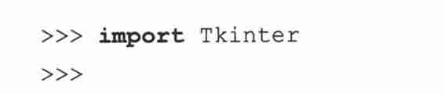

而如果你的 Python 解释器在编译时没有启用 Tkinter，导入过程将失败。

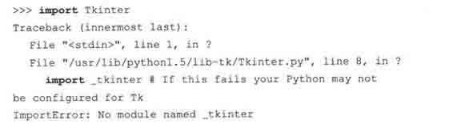

这时你不得不重编译 Python 解释器来访问 Tkinter。这通常会涉及编辑 Modules/Setup 文件和启用所有正确选项来编译你的 Python 解释器，以确保 Tkinter 能被选择安装在系统中。请检查你 Python 发行包中的 README 文件，里面有把 Tkinter 编译进系统的操作说明。请确定你编译完后启动的是刚刚创建的新 Python 解释器，否则它会像那个旧的不含 Tkinter 的解释器一样工作（实际上，它就是你那个旧解释器）。

### 19.1.3　客户端/服务器架构

在之前介绍的网络编程中，我们介绍了客户端/服务器计算模式的概念。窗口系统就是软件服务器的另一个例子，它们运行在一个有显示设备的机器上，比如带有一个某种类型的显示器。当然还有客户端（那些需要窗口环境来运行的程序，也就是我们所说的 GUI 程序），这些程序无法脱离窗口系统单独运行。

这种架构混合网络应用将显得更加有趣。通常一个 GUI 程序被执行时会在启动它的机器上显示（通过窗口服务器），但也可以在一些网络化的窗口环境中（例如 Unix 的 X Window 系统）选择其他机器的窗口服务器去显示。这样，你就可以在一台机器上运行 GUI 程序而在另一台机器上显示它！

## 19.2　Tkinter 与 Python 编程

### 19.2.1　Tkinter 模块：把 Tk 引入你的程序

为了让 Tkinter 成为你程序的一部分，应该怎么做呢？这并不是说你一定要先有一个应用程序。只要你愿意，当然可以创建一个纯粹的 GUI 程序，但如果没有让人感兴趣的功能的话，这个程序也许不会很有用。

要创建并运行你的 GUI 程序，下面五步是基本的。

1.导入 Tkinter 模块（import Tkinter 或者 from Tkinter import*）。

2.创建一个顶层窗口对象，来容纳你的整个 GUI 程序。

3.在你的顶层窗口对象上（或者说在“其中”）创建所有的 GUI 模块（以及功能）。

4.把这些 GUI 模块与底层程序代码相连接。

5.进入主事件循环。

第一步很明显：所有使用 Tkinter 的 GUI 程序必须先导入 Tkinter 模块。第一步就是为了获得 Tkinter 的访问权（参见 19.1.1 小节）。

### 19.2.2　GUI 程序开发简介

在举例之前，我们将先从宏观上来给你简单介绍一下 GUI 程序开发。这将给你以后的学习提供一些必要的背景知识。

创建 GUI 程序与画家作画有些相似。通常画家只会在一块画布上开展自己的创作。工作步骤或许是这样的：首先要找来一块干净的石板，你将在这个“顶层”窗口对象上创建所有其他模块。可以把这一步想象成一座房屋的地基或者某个画家的画架。换言之，在搭建各实物或展开画布之前，你必须先给地基浇灌好混凝土或者架好画架。对 Tkinter 而言，这个基础被称为顶层窗口对象。

在 GUI 程序中，会有一个顶层根窗口对象，它包含着所有小窗口对象，它们共同组成一个完整的 GUI 程序。这些小窗口对象可以是文字标签、按钮、列表框等等。这些独立的 GUI 构件就是所谓的组件。所以当我们说创建一个顶层窗口的时候，我们实际上是指你需要一个放置所有组件的地方。典型的 Python 语句如下行：

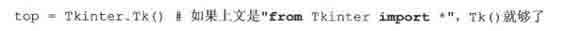

Tkinter. Tk()返回的对象通常被称作根窗口，正因为如此，有些程序用 root 来指示它，而非 top。顶层窗口是指那些在你的程序中独立显示的部分。你可以在 GUI 程序中创建多个顶层窗口，但它们中只能有一个是根窗口。你可以采用先完全设计好组件再添加实际功能的开发方式，也可以二者同时进行。（这意味着交替执行上述 5 步中的第 3 步和第 4 步。）

组件既可以是独立的也可以作为容器存在。如果一个组件“包含”其他组件，它就被认为是这些组件的父组件。相应地，如果一个组件被“包含”在其他组件中，它就被认为是父组件的孩子，父组件则是直接包围其外的那个容器组件。

通常，组件会有一些相应的行为，例如按钮被按下，或者文本框被写入。这种形式的用户行为被称为事件，而 GUI 程序对事件所采取的响应动作被称为回调。

用户操作包括按下（以及释放）按钮、移动鼠标、按下 RETURN 或 Enter 键等等，所有的这些从系统角度都被看作事件。GUI 程序正是由这伴随其始末的整套事件体系所驱动的。这个过程被称作事件驱动处理。

一个事件及其回调的例子是鼠标移动。我们假设鼠标指针停在你 GUI 程序的某处。如果鼠标被移到了程序的别处，一定是有什么东西引起了屏幕上指针的移动，从而表现这种位置的转移。系统必须处理这些鼠标移动事件才能展现（并实现）鼠标在窗口上的移动。一旦你释放了鼠标，就不再会有事件需要处理，相应地，屏幕上的一切又复归平静。

GUI 程序的事件驱动特性恰好体现出它的客户端/服务器架构。当你启动一个 GUI 程序时，它必须执行一些初始化例程来为核心功能的运行做准备，正如启动一个网络服务器时必须先申请一个套接字并把它绑定在一个本地地址上一样。Tk 有两个坐标管理器用来协助把组件放在正确的位置上；你将经常用到的一个称为“包”，亦即 packer。另一个坐标管理器是网格（Grid）。你可以用它来把 GUI 组件放在网格坐标系中，Grid 将依据 GUI 中的网格坐标来生成每个对象。我们将紧扣 packer 讲解。

一旦 packer 决定好你所有组件的尺寸和对齐方式，它将为你在屏幕上放置它们。当所有这些组件，包括顶层窗口，最终显示在你屏幕上时，GUI 程序就会进入一个“服务器式”的无限循环。这个无限循环包括等待 GUI 事件、处理事件、然后返回等待模式，等待下一个事件。

上述最后一步说明所有组件就绪后立即进入主循环。这正是我们提及的“服务器式”无限循环。对 Tkinter 而言，相应代码如下：

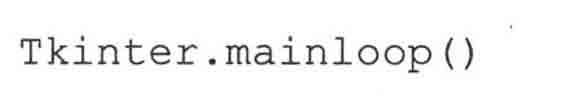

这通常是你程序执行的最后一段代码。一旦进入主循环，GUI 便从此掌握控制权。所有其他动作都来自回调函数，包括程序退出。当你拉下文件菜单点击“退出”菜单项或直接关闭窗口时，必须要唤起一个回调来结束你的程序。

### 19.2.3　顶层窗口：Tkinter.Tk()

我们前面提到所有的主要组件都建立在顶层窗口对象内。这个对象是由 Tkinter 中的 Tk 类创建的，并且是由普通构造器创建的：

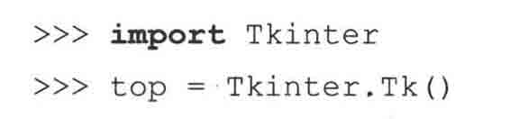

在这个窗口中，你可以放置独立组件或集成的模块来构建你的 GUI。那么，都有哪些组件可用呢？我们下面就来介绍 Tk 组件。

### 19.2.4　Tk 组件

Tk 目前有 15 种组件。我们在表 19.1 中列出了它们。

我们不准备对所有 Tk 组件都一一详细讲解，因为已经有许多关于它们的很好的文章可供参考——不论是从 Python 网站的 Tkinter 主题页面还是数量可观的 Tcl/Tk 印刷品，抑或是在线资源（其中一些可以在附录 B 中找到）。然而，我们将讲解一些例子来帮你启航。

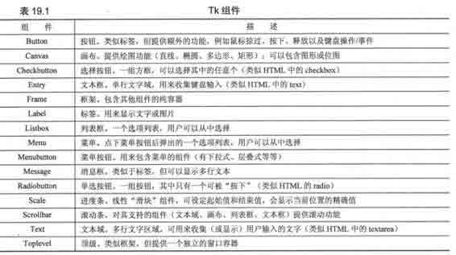

核心笔记：默认参数是你的朋友

* * *

GUI 开发从 Python 的缺省参数机制获益匪浅，因为 Tkinter 组件有大量的默认动作。除非你熟知自己使用的每一个组件的每一个可用选项，否则最好只设置你关心的参数而把其他的交由系统处理。这些缺省值是精心选出的。

如果你没有提供这些值也不必担心程序会在屏幕上表现怪异。作为一条基本规则，程序都由一系列经优化的缺省值创建，并且只有当你明确知道如何配置你的组件时，才有必要用自己的值替换这些缺省值。

* * *

例 19.1

我们的第一个 Tkinter 例子是……还能是什么呢？“Hello World!”具体地说，是介绍我们的第一个组件：标签。

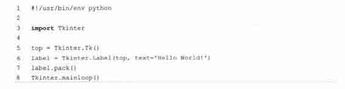

## 19.3　Tkinter 举例

### 19.3.1　标签组件

在例 19.1 中，我们展示了 Tkinter 版的“Hello World!”——tkhellol.py 实际上，它利用组件向你展示了如何创建一个 Tkinter 应用程序

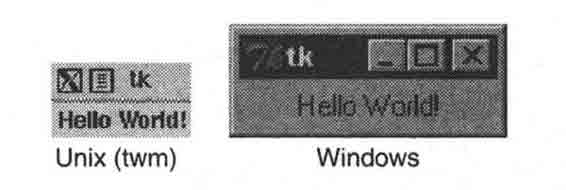

> > 图 19-1　Tkinter 标签组件（tkhello.py）

第一行，我们先创建了一个顶层窗口。随后是写着那串举世闻名的字符的标签组件。我们指明用 packer 来管理和显示组件，并最终调用 mainloop()来运行 GUI 程序。图 19-1 展示了运行该 GUI 程序后，你将会看到的效果。

### 19.3.2　按钮组件

第二个例子和第一个很相似。但我们这次将创建一个按钮而不只是显示一个简单的文字标签。例 19.2 是 tkhello2.py 的源码。

例 19\. 2

本例和 tkhellol.py 完全相同，除了我们创建的是按钮组件而非标签组件。

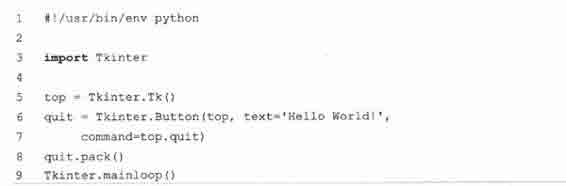

前面几行是相同的，不同的只是我们创建的是按钮组件。我们的按钮有一个额外的参数，Tkinter. quit()方法。这将给我们的按钮安装一个回调函数，在按钮按下（并释放）后让整个程序退出。最后的两行是通常的 pack()和进入 mainloop()。这个简单的按钮应用程序展示在图 19-2 中。

> > 图 19-2　Tkinter 标签组件（tkhellol.py）

### 19.3.3　标签和按钮组件

我们把 tkhellol.py 和 tkhello2.py 组合到 tkhello3.py 中，得到一个同时包含标签和按钮的脚本。另外，我们现在还使用了更多的参数，而不再满足于完全使用那些自动添入的缺省参数。例 19\. 3 给出了 tkhello3.py 的源码。

除了对组件新加的参数，我们还看到对 packer 的一些参数。fill 参数告诉 packer 让 QUIT 按钮填充水平方向的剩余空间，而 expand 参数则引导 packer 填充了水平方向的所有可视空间，并拉伸按钮到达窗口的左右边界。

例 19.3

本例同时展示了标签和按钮组件。既然我们已经了解了按钮组件和如何配置它，我们就可以设置得更多一些，而不必像以前那样大都使用缺省参数。

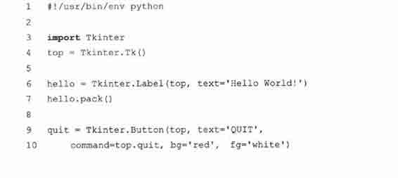

正如你在图 19-3 中看到的，对 packer 没有其他指令时，组件是按垂直顺序放置的（依次放在其他组件的上面）。要水平放置则需要创建一个框架对象，再用它来添加按钮。作为父对象的唯一子对象，框架将占据父对象的空间（参见 19.3.6 小节例 19.6 中 listdir.py 模块对按钮的处理）。

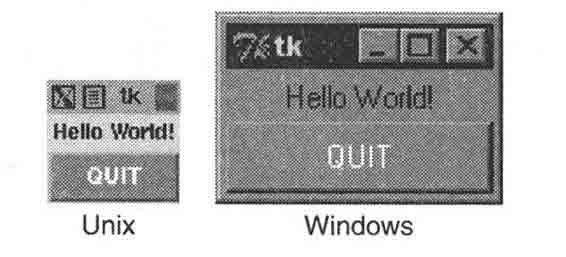

> > 图 19-3　Tkinter 标签和按钮控件（tkhello3.py）

### 19.3.4　标签、按钮和进度条组件

我们的最后一个例子 tkhello4.py，增加了一个进度条组件。具体来说，这个进度条是用来和标签组件交互的。进度条的滑块被用作控制标签组件文本大小的工具。滑块的位置值越大字体就越大，反之亦然，越小的位置值意味着越小的字体。例 19.4 展示了 tkhello4.py 的源码。

例 19.4

我们最后一个组件例子介绍了进度条组件，重点放在组件间通过回调函数的交互[诸如 resize()]。你对进度条组件的动作将影响标签组件上的文字。

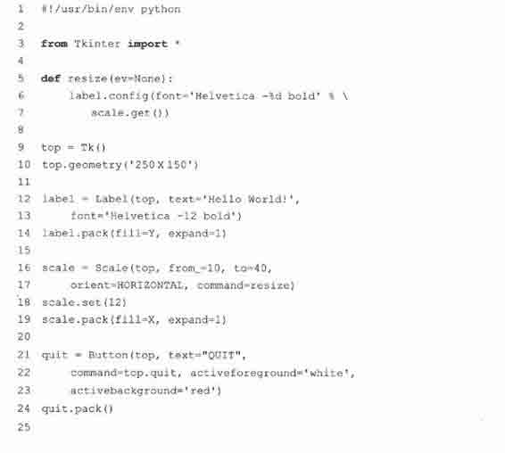

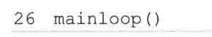

这段脚本新增加的 resizing()回调函数（5〜7 行）附加在进度条组件上。这段代码在进度条的滑块被移动时激活，调整标签里文字的大小。

我们还限定了顶层窗口的尺寸（250x150） （第 10 行）。这段脚本和前 3 段的最后一个不同点是用“from Tkinter import *”把 Tkinter 模块的属性引入我们的名称空间。虽然不建议这样做，因为这会“污染”你的名称空间，但这个程序涉及大量对 Tkinter 属性的引用，这正是我们这样做的主要原因。这种方式（译者注：指 import Tkinter 的方式）要求访问每个属性时都使用它们的全部限定性名称。而通过这种不被推荐的快捷方式，我们可以在访问属性时减少输入并且让代码易于理解，但同时也付出了一些代价。

正如你在图 19-4 所看到的，滑块装置及当前位置值都显示在窗口的显著位置。图 19-4 展示了用户把进度条/滑块移动到 36 时的 GUI 程序状态。

从代码中可以看出，进度条的初始值在程序启动时被设置为 12（第 18 行）。

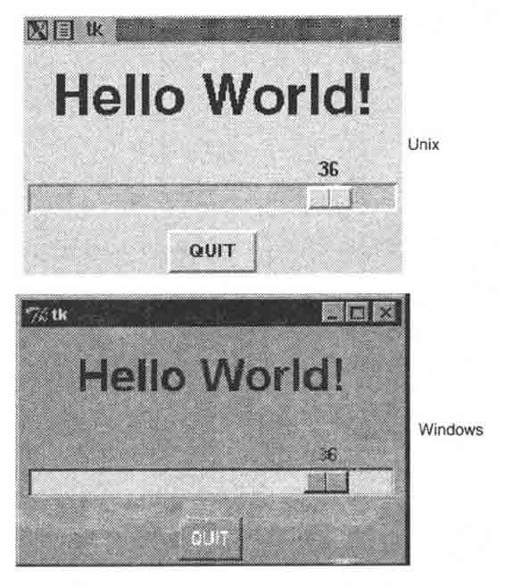

> > 图 19-4　Tkinter 标签、按钮和滑块控件（tkhello4.py）

### 19.3.5　偏函数应用举例

在看更大的 GUI 程序之前，我们先回顾一下第十一章 11\. 7\. 3 节介绍的偏函数应用（Partial FunctionApplication, PFA）。

Python2\. 5 新增了 PFA 等一系列新特性，它们显著提高了 Python 对函数编程的支持。

偏函数允许你“预存”一些函数变量并有效地“冻结”了这些预定参数，在运行时你获得了所需的其他变量后再把它们“解冻”出来，用这些最终确定的参数去调用函数。

最妙的是，PFA 不仅仅局限于函数。它们对任何“可调用”的东西都有效，任何有函数接口的对象，比如类、方法、或可调用对象，只要是有括号的。对于有许多待调对象并且许多调用都反复使用相同参数的情况，用 PFA 是最合适不过的。

GUI 编程有很好的操作环境，因为很有可能你需要 GUI 组件有某些一致的外观和体验，而这些一致性表现在可以使用相同的参数创建相似的对象。我们现在要展示的应用程序中，将有多个按钮有着相同的前景色和背景色。对这些仅有细小差别的按钮，每次调相同的构造器作初始化时都输入些相同的参数实在是一种浪费：前景和背景色都一样，只是文字有细小差别。

我们将用交通指示牌作为例子，程序中尝试创造一种文字型的交通指示牌，并且把它们分成如下几类：危急、警告、通知（正好和日志信息级别相类似）。指示牌的类型决定了它们在创建时的颜色格局。例如，危急指示牌使用亮红文字和白色背景，警告指示牌使用黑色文字和金色背景，通知也就是普通指示牌使用黑色文字和白色背景。我们约定“Do Not Enter”和“Wrong Way”标识为危急，“MergingTraffic”和“Railroad Crossinig”标识为警告，“Speed Limit”和“One Way”标识为通知。该程序创造“指示牌”，它们都只是些按钮。当用户点下按钮时，将简单地弹出一个 Tk 响应对话框，显示危急/错误、警告、通知。这的确不够好玩，但如何创建这些按钮却很有趣。你将在例 19\. 5 看到这里所描述的程序。

例 19.5　运用 PFA 的路灯指示牌 GUI 程序（pfaGUI2.py）

按照指示类型创建适当前景、背景色的路灯指示牌。使用 PFA 帮助“模板化”常用 GUI 参数。

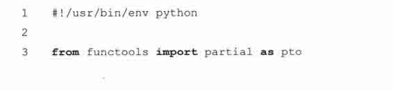

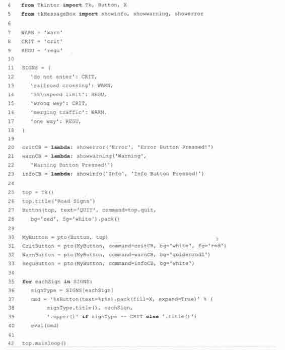

当你执行这个程序时，会看到一个类似图 19-5 的 GUI。

逐行解释

1 ~ 18 行

作为开始，我们导入了 functional. partial()、一些 Tkinter 属性以及 Tk 对话框（1〜5 行）。然后，我们定义了一些标识及其相应类型。

20 ~ 28 行

Tk 对话框被关联到按钮回调函数，我们将在创建按钮时使用它们（20〜23 行）。然后加载 Tk，设置标题，并创建了一个 QUIT 按钮（25〜28 行）。

30 ~ 33 行

这些行展示了 PFA 的魔力。我们通过两个步骤实现 PFA。第一步是模板化的按钮类及根窗口 top。这样当每次我们调用 MyButton 时，它会转而调用 Button（Tkinter. Button()创建了一个按钮）并使用 top 作为其第一个参数。我们把这一切“冻结”在了 MyButton 里。

PFA 的第二步使用了第一步的结果——MyButton，并再次对它模板化。我们对每个不同的指示类型都创建了单独类型的按钮。当用户创建一个危急按钮 CritButton 时（通过调用 CritButton()），它会转而调用 MyButton 并使用恰当的按钮回调和前景、背景色参数，这意味着用 top、按钮回调、前景、后景去调用 Button。你看出它是如何展开并逐步调用低层直到按钮组件了吗？如果没有 PFA 这个特性，它执行的那些调用本该由你自己执行。我们把同样的步骤应用到 WarnButton 和 ReguButton 上。

35 ~ 42 行

按钮类创建过程结束后，我们遍历了指示列表并创建出指示牌。我们使用了一个 Python 求值字串，它由正确的按钮名字、作为按钮标签传入的 text 参数组成，然后再 pack()一下。如果这是个危急指示牌，我们就把按钮文字全转成大写，否则的话就以标题形式显示。最后一步在第 39 行完成，同时也展示了 Python2\. 5 引入的另一个特性，临时操作符。随后我们对每一个按钮创建字串施以 eval()，每次创建一个按钮，最终形成了前面看到的图形。最后我们进入主事件循环，启动 GUI。

这个应用程序使用了一些 Python2.5 的新特性，所以你不能在旧版上运行它。

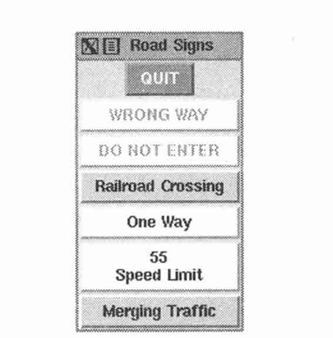

> > 图 19-5　在使用 MacOSX 的 XDarwin 服务器运用 PFA 的路灯指示牌 GUI 应用程序 on XDarwin in MacOS X（pfaGUI2.py）

### 19.3.6　中级 Tkinter 范例

我们以一个比较大型的例子来总结本节，listdir.py。这个应用程序是一个目录树遍历工具。它从当前目录开始并提供文件列表功能。双击列表中的任意其他目录都会让该工具转向这个新的目录，同时用新目录中的文件列表替换原有的文件列表。源码作为例 19.6 给出。

例 19\. 6

这个稍高级一些的 GUI 程序扩大了组建的使用范围，演员名单里新增了列表框、文本框和滚动条。而且还有大量的回调函数，例如鼠标点击、键盘输入和滚动条操作。

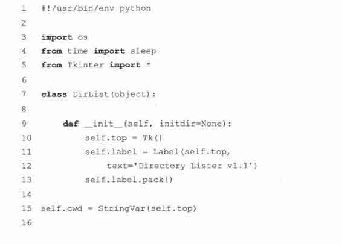

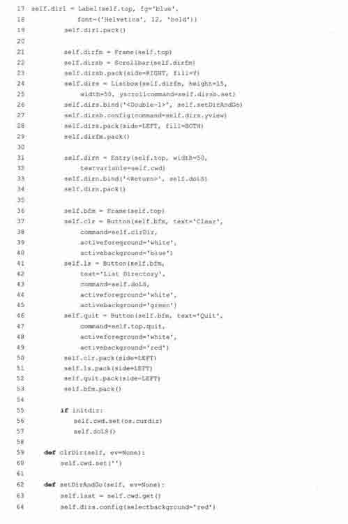

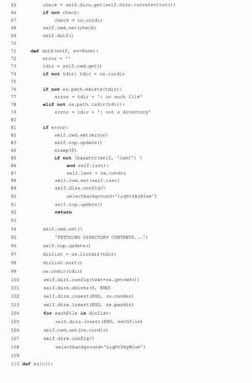

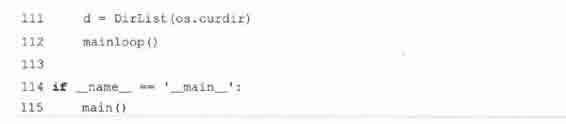

在图 19-6 中，我们展示了 Windows 环境中的 GUI 外观。

这个程序的 Unix 版本在图 19-7 中展示。

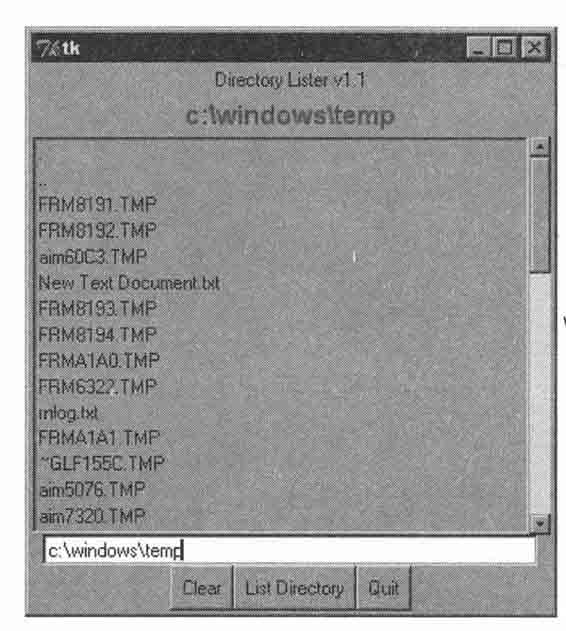

> > 图 19-6　Windows 下的表目录 GUI 应用程序（listdir.py）

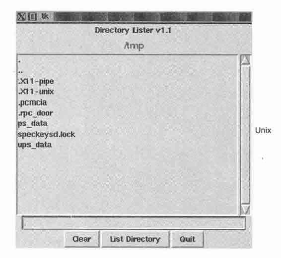

> > 图 19-7　Unix 下的表目录 GUI 应用程序（Listdir.py）

逐行解释

1 ~ 5 行

开始的几行包括通常的 Unix 启动行和导入 os 模块、time.sleep 函数及 Tkinter 模块的所有属性。

9 ~ 13 行

这些行定义了 DirList 类的构造器，以及一个代表我们程序的对象。我们创建的第一个标签包含了应用程序的主标题和它的版本号。

15 ~ 19 行

我们声明了一个名为 cwd 的 Tk 变量来保存当前所在目录的名字——我们马上就会看到这个值从哪来。还创建了另一个标签来显示当前目录的名字。

21 ~ 29 行

这段代码定义了我们这个 GUI 程序的核心，dirs（列表框）包含了被列目录的文件列表。使用一个滚动条以便用户在文件数目超过列表框窗口尺寸时移动列表。这两个组件都包含在一个框架组件中。列表框用 bind()方法把回调函数（setDirAndGo）和列表项绑定起来。

绑定意味着把一个回调函数连接在键盘输入、鼠标动作或其他什么事件上，当这个事件被用户触发时就会执行这个回调函数。当列表框中的任一项被双击时 setDirAndGo()函数就会被调用。滚动条被 Scrollbar. config()方法贴附在列表框上。

31 ~ 34 行

随后我们创建了一个文本框让用户输入目录名，以便转到他/她想去的目录，并在列表框中显示该目录中的文件。我们为该文字输入区加入了一个 RETURN 或 Enter 键的绑定，这样用户就能用敲 RETURN 的方法代替按钮点击，同样的事也会发生在上面提到的列表框中。当用户双击列表项时，效果等同于用户在文本框中输入目录名然后点击“go”按钮。

36 ~ 53 行

接下来我们定义了一个按钮框架（bfm）来保管这三个按钮：一个“clear”按钮（clr），一个“go”按钮（ls）和一个“quit”按钮（quite）。每一个按钮都有各自不同的配置和点击时的回调函数。

55 ~ 57 行

构造器的最后一部分初始化了这个 GUI 程序，程序将从当前工作目录开始。

59 ~ 60 行

clrDir()方法清空 Tk 字符串变量 cwd，其中保存着当前的“活动”目录。这个变量用来跟踪我们当前所处的目录，更重要的是，在错误发生时协助返回上一个目录。你一定注意到了回调函数中的 ev 参数的缺省值是 None。这样的任意值都可能由窗口系统传回，它们在你的回调函数里可以用也可以不用。

62 ~ 69 行

setDirAndGo()方法设置了要到达的目录并产生一个对 doLS()方法的调用，后者负责实现其余的一切。

71 ~ 108 行

现在看来，doLS()是整个 GUI 程序的关键。它负责所有的安全性检查（目标是否是一个目录以及它是否存在？）如果有错误发生，最终目录会被设置为当前目录。如果一切正确，它调用 os. listdir()来取得新的文件集合并替换列表框中的列表。当后台忙于获取新目录信息时，高亮的蓝色条会变成亮红色。当新目录设置完毕，它会恢复蓝色。

110 ~ 115 行

listdir.py 中的最后一段代码明显是代码的主体。main()函数只有在该脚本被直接调用时才会执行，并且当它执行时会创建 GUI 程序，后者随之掌控该程序。

我们把该程序的所有其他方面都留给读者作为练习，再次提醒，把整个程序看成是一系列组件和功能的组合，一切就都会简单起来。如果你清楚地知道每个单独程序段的意思，那么整个脚本就不会再显得可怕了。

但愿我们给了你一个够好的关于 Python 和 Tkinter 的 GUI 编程介绍。请记住熟悉 Tkinter 编程最好的方法就是实践和模仿一些例子！Python 发行包附带了很多可供你学习的应用程序范例。

如果你下载了源码包.就会在 Lib/lib-tk、Lib/idlelib 和 Demo/tkinter 下发现 Tkinter 的演示代码。如果你把 Win32 版本的 Python 安装在 C: \Python2\. x，那么可以在 Lib\lib-tk 和 Lib\idlelib 下找到这些演示代码。最后那个目录包含了最出名的 Tkinter 例子程序：IDLEIDE 本身。还有一些关于 Tk 编程的书籍供进一步参考，其中一本是专为 Tkinter 编写的。

## 19.4　其他 GUI 简介

我们期望最终能编写出独立的一章来对 GUI 编程作总体介绍，Python 拥有的大量图形工具集中有很多内容值得一讲，然而，这只能是以后的事了。作为替代，我们将使用其中 4 种比较流行且可用的工具集来编写同一个 GUI 程序例：Tix （Tk Interface eXtensions） 、Pmw （Python MegaWidgets 的 Tkinter 扩展）、wxPython （wxWidgets 的 Python 绑定）和 PyGTK （GTK+的 Python 绑定）。你可以在本章末尾参考部分获取更多信息和下载这些工具集的地方。

Tix 模块包含在 Python 标准库中，已经可用了。其他工具集是第三方的，你必须自己下载。因为 Pmw 只是对 Tkinter 的一个扩展，它的安装是最简便的（只需解压到你的网络包目录下）。wxPython 和 PyGTK 涉及下载多个文件并编译（除非你使用的是 Win32 版本，这样的话通常有安装包可用）。一旦这些工具集安装好并通过证，我们就能开始了。我们不打算局限在本章已经讲过的那些组件上，我们准备在后面的例子中介绍一些更复杂的组件。

除了我们已经看到过的标签和按钮组件，我们还准备介绍控制按钮（Control，又叫微调按钮，SpinButton）和组合框组件（ComboBox） 。控制组件是一个文本组件和一对箭头按钮的组合，文本值受旁边按钮的“控制”或者说“旋上、旋下”，而组合框则通常包括一个文本组件和一个下拉菜单，菜单项列表中当前激活或选中的项目将显示在文本组件中。

我们的应用程序相当简单：成对的动物要被搬走，动物的总数在从一对到一打（12 只）的范围内。用控制组件来显示总数，用组合框显示动物种类列表菜单供用户选择。注意默认的动物数量是 2，且没有选择动物类型。

一旦我们开始执行这个程序，事物就变得不同了，图 19-9 就是例证，它显示的是在 Tix 程序中改变一些元素后的结果。

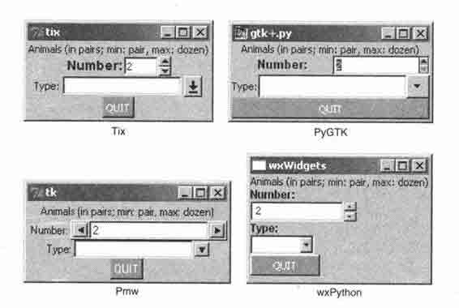

> > 图 19-8　Win32 下使用各种 GUI 的应用程序（animal*.pyw）

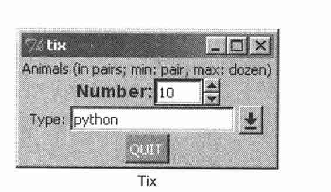

> > 图 19-9　修改我们应用程序的 Tix GUI 版本后（animalTix.pyw）

下面，你将看到所有 4 个版本的 GUI 程序代码。你会发现尽管它们有些相似，但每一个都有自己的特别之处。而且我们使用。pyw 作为文件后缀，这样可以防止弹出 Dos 命令窗口或终端窗口。

### 19.4.1　Tk Interface eXtensions （Tix）

我们从一个使用 Tix 模块的例子（19\. 7）开始。Tix 是对 Td/T（译者注：应该是 Tcl/Tk，应为作者笔误）的一个扩展库，其中增加了许多新的组件、图像类型和其他一些命令，提高 Tk 作为 GUI 开发工具集的可用性。我们现在来看看如何在 Python 中使用 Tix。

例 19.7　Tix GUI 编程演示（animalTix.pyw）

我们的第一个例子使用 Tix 模块。Tix 已经是 Python 的一部分了!

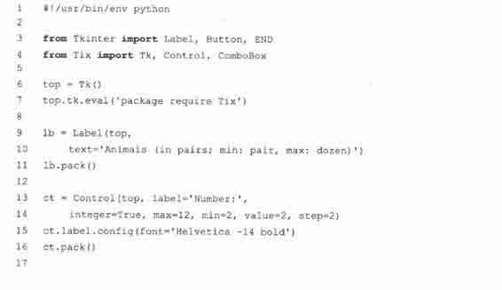

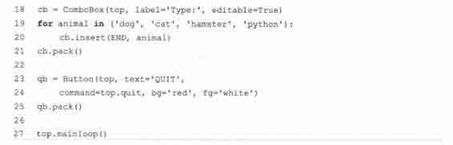

逐行解释

1 ~ 7 行

这里都是些初始化代码，模块导入操作，以及基本的 GUI 操作。第 7 行的断言要求程序可以使用 Tix 模块。

8 ~ 27 行

这些行创建了所有的组件：标签（9~11 行）、控制（13〜16 行）、组合框（18〜21 行）和退出按钮（23〜25 行）。组件构造器里的参数都很浅显明了无需更多解释。最后，我们在第 27 行进入 GUI 主事件循环。

### 19.4.2　Python MegaWidgets （PMW）

下面通过例 19\. 8 让我们来看看 Python MegaWidgets。这个模块体现了 Tkinter 悠久的历史。它基本上是通过在 GUI 工具集中添加一些新式的组件来延长 Tkinter 的寿命。

这个 Pmw 的例子和上面 Tix 的例子是如此相似，以致我们不准备对读者逐行解释它。代码中区别最大的一行是控制组件的构造器，那个 Pmw 的控制组件。它提供了验证函数的入口。不同于直接在组件构造器中以关键字参数的形式传入最大、最小值，Pmw 使用“验证器”来确保值不会超出我们可接受的范围。

现在我们终于要离开 Tk 的世界了。Tix 和 Pmw 分别扩展了 Tk 和 Tkinter，然而我们现在将改变方向去看看完全不同的工具集，即 wxWidgets 和 GTK+。在使用这些现代的、健壮的 GUI 工具集时，你将发现代码的行数增加了，这是因为我们使用了更多的面向对象特性。

### 19.4.3　wxWidgets 和 wxPython

wxWidgets（以前称作 wxWindows）是一个跨平台的工具集，用来构建图像用户程序。它用 C++实现并在各种平台上广泛使用，wxWidgets 为这些平台定义了一致、通用的 API。 wxWidgets 最大的优点是它在每个平台上都使用原生 GUI，所以你的程序将和所有其他桌面程序有相同的外观和用户体验。另一个特点是你不会被局限于使用 C++开发 wxWidgets 应用程序。它有对 Python 和 Perl 的接口。

例 19.8 使用 wxPython 展示了我们那个动物应用程序。

例 19\. 8

我们的第二个例子使用 Python MegaWidgets 包。

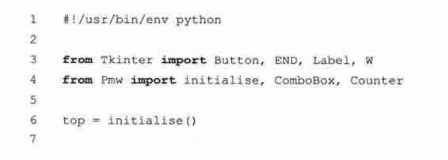

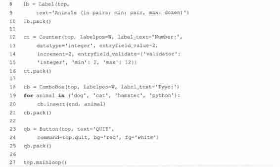

逐行解释

5 ~ 37 行

这里我们先编写了一个框架类（5〜8 行），它的唯一成员即其构造器。这个方法的唯一实用目的就是创建我们的组件。在框架组件中，我们创建了一个画板组件（panel） 。在画板中我们用 BoxSizer 来包含所有其他组件并对其布局（第 10 行和第 36 行），这些组件是标签（12〜14 行）、微调按钮（16〜20 行）、列表框（22〜27 行）和退出按钮（29〜34 行）。

例 19.9　wxPython GUI 演示（animal Wx.pyw）

我们的第三个例子使用 wxPython 及 wxWidgets。注意我们把所有的组件都放在一个布局管理器里，以及该程序中更多的面向对象本质。

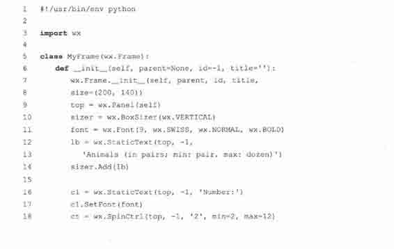

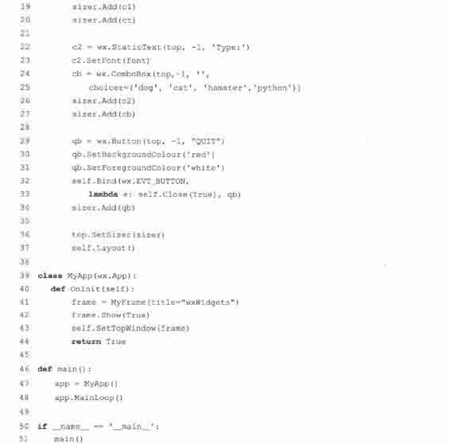

我们不得不手工为微调按钮和组合框组件添加标签，因为它们看起来并不包含标签。一旦我们创建好这些，就把他们加到布局管理器中，再把布局管理器交给画板组件，并确定其中每个组件的布局。你会注意到第 10 行说明布局管理器是垂直走向的，这表明我们所有的组件都会按从上到下的顺序排列。

微调按钮组件有一个弱点，它不支持“步进”功能。在其他 3 个例子中，我们可以点箭头按钮让控制组件每次增加或减少 2，但对这个组件却不行。

39 ~ 51 行

我们的应用程序类实例化了一个刚才设计的框架对象，把它绘制在屏幕上，并设置成程序的顶层窗口。最后，几行安装代码实例化了 GUI 应用程序对象并启动之。

### 19.4.4　GTK+和 PyGTK

最后是 PyGTK 版的例子，它和 wxPython GUI 程序非常相似（见例 19\. 10） 。最大的不同是我们只用一个类，还有那些设置对象——实际上就是按钮——前景、背景色的代码实在是很冗长。

逐行解释

1 ~ 6 行

我们导入了 3 个不同的模块和包，PyGTK、GTK 和 Pango。Pango 是一个用来布局和生成文本的库，专用于实现 I18N。这里需要这个库是因为它体现了 GTK+ （2.x）对文字和字体处理的核心思想。

我们最后一个例子使用 PyGTK（和 GTK+） 。类似 wxPython 的例子，这里对应用程序也用了一个类。对比一下这两个 GUI 程序例子的相似和不同点是很有趣的。这种现象并不奇怪，它使得开发者可以比较容易的转用其他工具集。

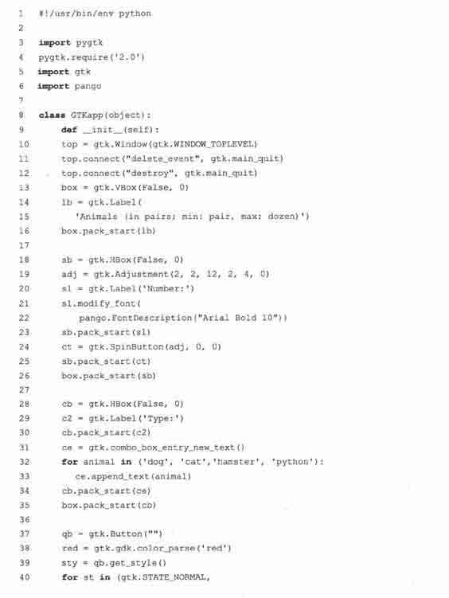

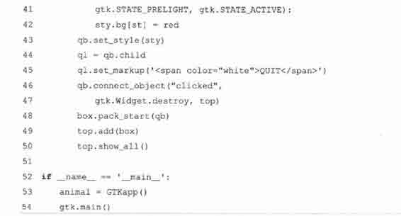

8 ~ 15 行

GTKapp 类反应了本程序中所有的组件。顶层窗口在这里创建（窗口管理器负责关闭它），而且还创建了一个垂直走向的布局管理器（VBox）来掌管我们的主要组件。这些实际上和我们在 wxPython GUI 程序中作的一样。

然而，为了让微调按钮和组合框的静态文本能出现它们的左侧（wxPython 例子中出现在上方），我们创建了小型的水平走向的方框来包括标签组件对（18〜36 行），而且还把这些 HBox 完全置于 VBox 的掌控之下。

接下来我们创建了退出按钮并把 VBox 添加到顶层窗口中，然后把一切绘制到屏幕上。你一定注意到我们刚开始用空标题创建了按钮。我们这样做是为了让标签（子）对象能作为按钮的一部分被创建。在 45〜46 行，我们取得标签的访问权并用白色字体设置了文字。

我们这样做的原因是如果你直接设置前景风格——通过 41〜44 行的循环和辅助代码——那么前景只会对按钮起作用而对其他——例如标签—却是无效的，假如你把前景设为白色并把焦点置在按钮上（通过按 TAB 键可以“选中”它），你将看到用来标识选中组件的内点画线是白色的，而标签文字却依然是黑色的，除非你像我们在第 45 行（译者注：原文为“第 46 行”，应为作者笔误）那样改一下。

53 ~ 55 行

我们在这里创建了应用程序并进入主事件循环。

## 19.5　相关模块和其他 GUI

Python 还有一些其他的 GUI 开发系统。我们在表 19.2 中列出适当的模块及其对应的窗口系统。

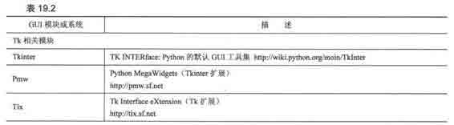

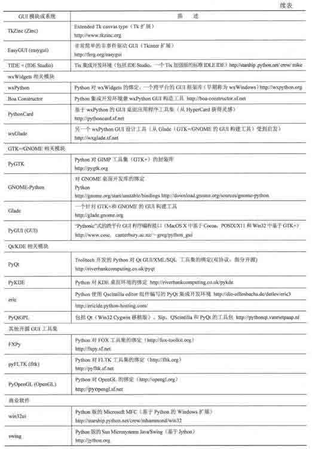

你还能从 Python 的 GUI 编程简介 wiki 页面 http://wiki.python.org/moin/GuiProgramming 上找到更多有关 Python GUI 编程的东西。

## 19.6　练习

> > 19-1.客户端/服务器架构。请描述窗口服务器的角色和窗口客户端的角色。

> > 19-2.面向对象编程。请描述子窗口和父窗口的关系。

> > 19-3.标签组件。请修改 tkhellol.py 脚本，让它显示你自定义的消息而非“Hello World”

> > 19-4.标签和按钮组件。请修改 tkhello3.py 脚本，除了 QUIT 按钮以外再新增 3 个按钮。按下这 3 个按钮中的任意一个都将改变标签文字，显示被按下的按钮（组件）上的文字。

> > 19-5.标签、按钮和单选按钮组件。请对你上一问题的答案作修改，用 3 个单选按钮实现对标签文字的选择。现在有两个按钮：QUIT 按钮和“更新”按钮。当更新按钮被按下时，标签里的文字变成选中的单项按钮上的文字。如果没有选中任何单选按钮，则标签内容保持不变。

> > 19-6.标签、按钮和文本框组件。请对你上一问题的答案作修改，用一个单行的文本框组件替换那 3 个单选按钮，文本框的默认值为“Hello World! ”（和标签的初始字符串保持一致）。用户可以编辑文本框，输入新的字符串，标签组件会在更新按钮被按下时显示这个新的字符串。

> > 19-7.标签、文本框组件及 Python I/O。创建包含一个文本框的 GUI 程序，用户可以在其中输入一个文本文件名。打开该文件并读取，把其中的内容显示在标签组件上。附加题（菜单）：把文本框换成一个包含文件打开选项的菜单，它会弹出一个窗口供用户选择要读取的文件。再给菜单加上一个 Exit 或 Quit 选项，这样就用不着 QUIT 按钮了。

> > 19-8.简单的文本编辑器。在你上一题答案的基础上创建一个简单的文本编辑器。可以用剪贴板或读文件的方式在一个文本域里显示一些文字供用户编辑。当用户退出程序时（通过 QUIT 按钮或 Quit/Exit 菜单项）会询问用户是否保存所作的修改。附加题：给你的脚本添加一个拼写检查接口，增加一个按钮或菜单项来对文件进行拼写检查。拼写错误的词句应在文本域组件中用不同的背景或前景色高亮显示出来。

> > 19-9.多线程聊天应用程序。第 13、16、17 章讲到的聊天程序可以完成了。创建一个全功能的多线程聊天服务器。这个服务器其实并不需要有 GUI，除非你想给它创建一个前端配置界面，配置端口号、名称、到域名服务器的连接等。创建一个多线程的聊天客户端，使用单独的线程监视用户输入（并以广播方式给服务器发送消息），另一个线程用来接收消息并显示给用户。客户端的 GUI 聊天窗口应当由两部分组成：较大的部分用来多行显示所有的对话，较小的文本域用来接收用户输入。

> > 19-10.使用其他 GUI。19\. 4 中的例子使用到了各种各样的工具集，这些 GUI 程序看起来很相似；然而，它们并不完全一样。尽管不可能让所有的例子看起来完全一样，但请尽量调整它们，让它们比现在看起来更一致些。

> > 19-11.使用 GUI 构建工具。下载 Boa Constructor（wxWidgets 平台）或 Glade （GTK+平台）（或者都下载），然后实现那个“动物” GUI 程序，只用从相应的工具栏拖曳一些组件就好了。给你的新 GUI 加上回调函数，让它能有本章例子程序中的那些行为。