# 第二十一章　数据库编程

本章主题

♦　介绍

♦　数据库和 Python，以及 Python 的 RDBMS、ORM

♦　数据库应用程序程序员接口（DB-API）

♦　关系型数据库（RDBM）

♦　对象-关系管理器（ORM）

♦　相关模块

♦　练习

本章的主题是如何通过 Python 访问数据库。前面我们已经了解了简单持久存储，但是在更多场合下，我们的应用程序需要的是一个功能齐全的关系型数据库（Relational Database Management System，RDBMS）。

## 21.1　介绍

### 21.1.1　持久存储

在任何的应用程序中，都需要持久存储。一般说来，有三种基本的存储机制：文件、关系型数据库或其他的一些变种，例如现有系统的 API、ORM、文件管理器、电子表格、配置文件等。

在前面的章节中，我们研究了通过基于常规文件的 Python 和 DBM 接口来实现持久存储、比如*dbm、dbhas/bsddb 文件、helve （pickle 和 DBM 的结合）。这些接口都提供了类似字典的对象接口。本章的主题是如何在中大型项目中使用关系型数据库（对这些项目而言，那些接口力不从心）。

### 21.1.2　基本的数据库操作和 SQL 语言

在深入主题之前，下面先简单介绍一下基本的数据库概念和结构化查询语言（Structured QueryLanguage, SQL）。如果你有足够的经验，可以跳过，也可以通过阅读正文来复习一下。

1.底层存储

数据库的底层存储通常使用文件系统，它可以是普通操作系统文件、专用操作系统文件，甚至有可能是磁盘分区。

2.用户界面

大部分的数据库系统会提供一个命令行工具来执行 SQL 命令和查询，当然也有一些使用图形界面的漂漂亮亮的客户端程序来干同样的事。

3.数据库

关系型数据库管理系统通常通常都支持多个数据库，例如销售库、市场库、客户支持库等。如果你使用的关系数据库管理系统是基于服务器的，这些数据库就都在同一台服务器上（一些简单的关系型数据库没有服务器，如 sqlite）。本章的例子中，MySQL 是一种基于服务器的关系数据库管理系统（只要服务器在运行，它就一直在等待运行指令）,SQLite 和 Gadfly 则是另一种轻量型的基于文件的关系数据库（它们没有服务器）。

4.组件

你可以将数据库存储想像为一个表格，每行数据都有一个或多个字段对应着数据库中的列。每个表每个列及其数据类型的集合构成数据库结构的定义。数据库能够被创建，也可以被删除，表也一样。往数据库里增加一条记录称为插入（inserting），修改库中一条已有的记录则称为更新（updating）.，删除表中已经有的数据行称为删除（deleting）。这些操作通常作为数据库操作命令来提交。从一个数据库中请求符合条件的数据称为查询（querying）。当你对一个数据库进行查询时，你可以一步取回所有符合条件的数据，也可以循环逐条取出每一行。有些数据库使用游标的概念来表示 SQL 命令、查询、取回结果集等。

5\. SQL

数据库命令和查询操作需要通过 SQL 语句来执行，不是所有的数据库都使用 SQL，但所有主流的关系型数据库都使用 SQL。下面是一些 SQL 命令的例子，绝大多数数据库被配置为大小写不敏感，除了数据库操作命令以外。被广为接受的书写 SQL 的基本风格是关键字大写。绝大多数命令行程序要求用一个分号来结束一条 SQL 语句。

（1）创建数据库

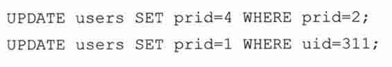

第一行创建一个名为”test”的数据库，第二行将该数据库的权限赋给具体用户（或者全部用户），以便它们可以执行下面的数据库操作。

（2）选择要使用的数据库

USE test;

如果在登录数据库时没有指定要使用那个数据库，这条简单的语句就可以指定你打算访问的数据库。

（3）删除数据库

这条短短的语句具有极大的威力，它用来删除数据库（包括数据库中所有的表及表中的数据）。在输入完这条语句按下回车之前，好好想想你是否真的打算这么做。

（4）创建表

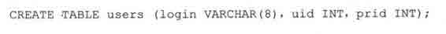

这个语句用于创建表 users，它有一个类型为字符串的列 login 和两个类型为整型的字段 uid 和 prid。

（5）删除表

这个简单的语句删除数据库中的一个表和它的所有数据。

（6）插入行

INSERT 语句用来向数据库中添加新的数据行。语句中必须指定要插入的表及该表中各个字段的值。上例中，表名是 users，字符串’leanna’对应着 login 字段，311 和 1 分别对应着 uid 和 prid。

（7）更新行

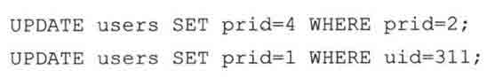

UPDATE 语句用来改变数据库中的已有记录。使用 SET 关键字来指定你要修改的字段及新值，你可以指定条件来筛选出需要更新的记录。在第一个例子中，所有 prid 字段值为 2 的记录，其 prid 字段的值都变更为 4。在第二个例子里，uid 字段值为 311 的用户，其 prid 字段的新值被置为 1。

（8）删除行

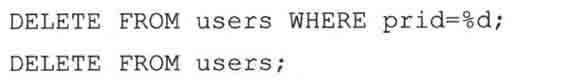

DELETE FROM 命令用来删除数据。必须指定你要删除的数据所在表名，如果未提供（可选的）筛选条件，就像第二个例子一样，表中所有的数据都会被删除。

现在你已经了解数据库的基本概念，有了这些基础，本章余下的部分学起来会更加容易。如果需要进一步了解数据库知识，市面上有数不清的数据库书籍可供选择。

### 21.1.3　数据库和 Python

下面我们要详细了解 Python 数据库 API。Python 能够直接通过数据库接口，也可以通过 ORM（不需要自己书写 SQL）来访问关系数据库。

关于数据库原理、并发能力、视图、原子性、数据完整性、数据可恢复性、左连接、触发器、查询优化、事务支持及存储过程等主题，（市面上）有数不清的资源可供参考。本章不讨论这些主题，我们将从一个 Python 应用程序开始，了解在 Python 框架下如何将数据保存到数据库，如何将数据从数据库中取出来。之后你就可以决定哪种方式适用于你手头的项目。通过学习示例代码，你可以立刻动手把某种数据库整合到你的 Python 应用程序当中。

在 Python 世界里，无需怀疑，与数据库协同工作已经几乎是所有应用程序的核心部分了。在本章中，我们将不仅仅使用”万能”的 Python 标准库，尽管我们需要从标准库开始。

作为一个软件工程师，在你的职业生涯中，你可能永远不需要学习数据库知识：如何使用命令行工具、如何使用 SQL、如何添加和更新数据等。但是如果 Python 是你的编程工具，那么为你的 Python 应用添加数据库支持会让它事半功倍。下面我们先来介绍一下 Python 的 DB-API，然后给出使用这个标准的例子。

我们的例子会使用开源的数据库系统。不过我们不会去讨论是开源产品还是商业产品更好。要适应其他的数据库也相当容易，需要特别提到的是亚伦·沃特（Aaron Watter）的 Gadfly 数据库，一个完全由 Python 代码写成的数据库系统。

从 Python 中访问数据库需要接口程序，接口程序是一个 Python 模块，它提供数据库客户端库（通常是 C 语言写成的）的接口供你访问。需要提到一点，所有 Python 接口程序都一定程度上遵守 PythonDB-API 规范，这也是本章的第一个主要主题。

图 21-1 演绎了 Python 数据库应用程序的结构（包括使用和不使用 ORM）。你可以看到 DB-API 是数据库客户端 C 库的接口。

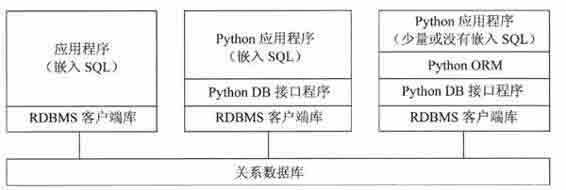

> > 图 21-1　数据库和应用程序之间的多层通讯

第一个框中一般是 C/C++程序，你的程序通过 DB-API 兼容接口程序访问数据库。

ORM 通过程序处理数据库细节来简化数据库开发。

## 21.2　Python 数据库应用程序程序员接口（DB-API）

去哪儿找一个合适的接口访问数据库？很简单，去 python.org 找到数据库主题那一节，你会发现所有支持 DB-API 2.0 的各种数据库模块、文档、SIG 等。从那时起，DB-API 被移到 PEP 249 中（这个 PEP 废弃了老的 DB-API 1.0，也就是 PEP248 标准）。那么，什么是 DB-API?

DB-API 是一个规范。它定义了一系列必需的对象和数据库存取方式，以便为各种各样的底层数据库系统和多种多样的数据库接口程序提供一致的访问接口。像绝大多数社区成果一样，这个 API 的产生来自于强烈的需求。

在过去，不同的人为各种各样的数据库实现了各种各样的数据库接口程序。同一个轮子被不同的人一遍又一遍地重复发明。这些接口由不同的人在不同的时间实现，功能接口各不兼容，这意味着使用这些接口的程序必须自定义他们选择的接口模块。当这个接口模块变化时，应用程序的代码也必须随之更新。

一个处理 Python 数据库事务的特殊事物小组（special interest group, SIG）因此诞生，最后 DB-API1.0 问世。DB-API 为不同的数据库提供了一致的访问接口，在不同的数据库之间移植代码成为一件轻松的事情（一般来说，只修要修改几行代码）。接下来你会看到这样的例子。

### 21.2.1　模块属性

DB-API 规范里的以下特性和属性必须提供。一个 DB-API 兼容的模块必须定义如下，表 21.1 中定义的所有全局属性。

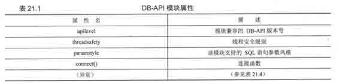

1.数据属性

（1） apilevel

apilevel 这个字符串（不是浮点型）表示这个 DB-API 模块所兼容的 DB-API 最高版本号。如“1.0”，“2.0”等。如果未定义，则默认是“1.0”。

（2） Threadsafety

这是一个整型，取值范围如下：

•　0：不支持线程安全，多个线程不能共享此模块

•　1：初级线程安全支持：线程可以共享模块，但不能共享连接

•　2：中级线程安全支持：线程可以共享模块和连接，但不能共享游标

•　3：完全线程安全支持：线程可以共享模块、连接及游标

如果一个资源被共享，就必需使用自旋锁或者是信号量这样的同步原语对其进行原子目标锁定。对这个目标来说，磁盘文件和全局变量都不可靠，并且有可能妨碍 mutex（互斥量）的操作。请参阅 threading 模块或第十六章（多线程编程）来了解如何使用锁。

（3） Paramstyle

DB-API 支持多种方式的 SQL 参数风格。这个参数是一个字符串，表明 SQL 语句中字符串替代的方式。（参阅表 21.2）

2.函数属性

connect 方法生成一个 connect 对象，我们通过这个对象来访问数据库。符合标准的模块都会实现 connect 方法。表 21.3 列出了 connect()函数的参数。

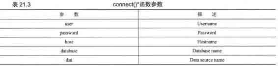

数据库连接参数可以以一个 DSN 字符串的形式提供，也可以以多个位置相关参数的形式提供（如果你明确知道参数的顺序的话），也可以以关键字参数的形式提供。下面是一个来自 PEP 249 的使用 connect()的例子：

使用 DSN 字符串还是独立参数？这要看你连接的是哪种数据库。举例来说，如果你使用类似 ODBC 或 JDBC 的 API，你就应该使用 DSN 字符串。如果你直接访问数据库，你就会更倾向于使用独立参数。另一个使用独立参数的原因是，很多数据库接口程序还不支持 DSN 参数。下面是一个非 DSN 的例子。

connect()调用。注意不是所有的接口程序都是严格按照规范实现的。MySQLdb 就使用了 db 参数而不是规范推荐的 database 参数来表示要访问的数据库。

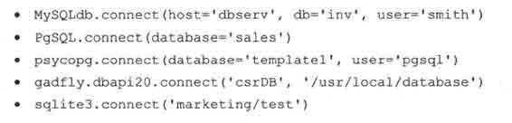

3.异常

兼容标准的模块也应该提供这些异常类。见表 21.4。表 21.4 DB-API 异常类

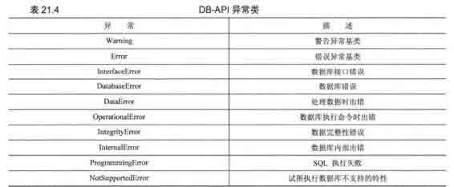

### 21.2.2　连接对象

要与数据库进行通信，必须先和数据库建立连接。连接对象处理将命令送往服务器，以及从服务器接收数据等基础功能。连接（或一个连接池）成功后你就能够向数据库服务器发送请求，得到响应。

方法

连接对象没有必须定义的数据属性，但是它至少应该定义表 21.5 中的这些方法。

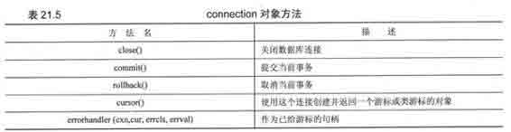

一旦执行了 close()方法，再试图使用连接对象的方法将会导致异常。

对不支持事务的数据库，或者虽然支持事务但设置了自动提交（auto-commit）的数据库系统来说，commit()方法什么也不做。如果你确实需要，可以实现一个自定义方法来关闭自动提交行为。由于 DB-API 要求必须实现此方法，所以对那些没有事务概念的数据库来说，这个方法只需要有一条 pass 语句就可以了。

类似 commit()、rollback()方法仅对支持事务的数据库有意义。执行完 rollback()，数据库将恢复到提交事务前的状态。根据 PEP249，在提交 commit()之前关闭数据库连接将会自动调用 rollback()方法。

对不支持游标的数据库来说，cursor()方法仍然会返回一个尽量模仿游标对象的对象。这是最低要求。特定数据库接口程序的开发者可以任意为他们的接口程序添加额外的属性，只要他们愿意。

DB-API 规范建议但不强制接口程序的开发者为所有数据库接口模块编写异常类。如果没有提供异常类，则假定该连接对象会引发一致的模块级异常。一旦你完成了数据库连接，并且关闭了游标对象，你应该执行 commit()提交你的操作，然后关闭这个连接。

### 21.2.3　游标对象

当你建立连接之后，就可以与数据库进行交互。就像我们在前一小节提到的，一个游标允许用户执行数据库命令和得到查询结果。一个 Python DB-API 游标对象总是扮演游标的角色，无论数据库是否真正支持游标。从这一点讲，数据库接口程序必须实现游标对象。只有这样，才能保证无论使用何种后端数据库你的代码都不需要做任何改变。

创建游标对象之后，你就可以执行查询或其他命令（或者多个查询和多个命令），也可以从结果集中取出一条或多条记录。表 21.6 列举了游标对象拥有的属性和方法。

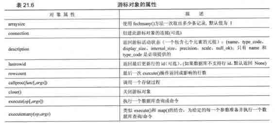

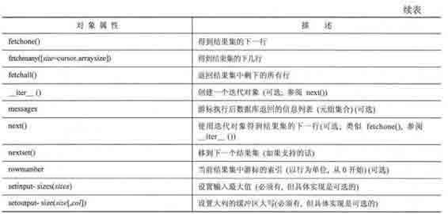

游标对象最重要的属性是 execute*()和 fetch*()方法。所有对数据库服务器的请求都由它们来完成。对 fetchmany()方法来说，设置一个合理的 arraysize 属性会很有用。当然，在不需要时关掉游标对象也是个好主意。如果你的数据库支持存储过程，你就可以使用 callproc()方法。

### 21.2.4　类型对象和构造器

通常两个不同系统的接口要求的参数类型是不一致的，譬如 Python 调用 C 函数时 Python 对象和 C 类型之间就需要数据格式的转换，反之亦然。类似地，在 Python 对象和原生数据库对象之间也是如此。对于 Python DB-API 的开发者来说，你传递给数据库的参数是字符串形式的，但数据库会根据需要将它转换为多种不同的形式。以确保每次查询能被正确执行。

举例来说，一个 Python 字符串可能被转换为一个 VARCHAR 或一个 TEXT，或一个 BLOB，或一个原生 BINARY 对象，或一个 DATE 或 TIME 对象。一个字符串到底会被转换成什么类型？必须小心地尽可能以数据库期望的数据类型来提供输入，因此另一个 DB-API 的需求是创建一个构造器以生成特殊的对象，以便能够方便地将 Python 对象转换为合适的数据库对象。表 21.7 描述了可以用于此目的的类。SQL 的 NULL 值被映射为 Pyhton 的 NULL 对象，也就是 None。

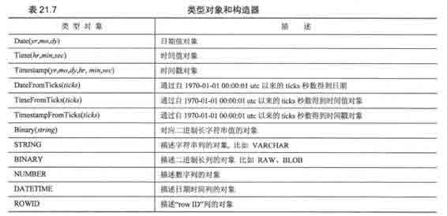

DB-API 版本变更

有几个重要的变更发生在 DB-API 从 1.0（1996）升级到 2.0（1999）时：

•　从 API 中移除了原来必须的 dbi 模块；

•　更新了类型对象；

•　增加了新的属性以提供更易用的数据库绑定；

•　变更了 callproc()的语义并重定义了 execute()的返回值；

•　基于异常的错误处理。

自从 DB-API 2.0 发布以来，曾经在 2002 年加入了一些可选的 DB-API 扩展，但一直没有什么重大的变更。在 DB-SIG 邮件列表中一直在讨论 DB-API 的未来版本——暂时命名为 DB-API 3.0。它将包括以下特性：

•　当有一个新的结果集时 nextset()会有一个更合适的返回值；

•　float 变更为 Decimal;

•　支持更灵活的参数风格；

•　预备语句或语句缓存；

•　优化事务模型；

•　确定 DB-API 可移值性的角色；

•　增加单元测试。

如果你对这些 API 特别感兴趣，欢迎积极参与。下面有一些手边的资源。

•　http://python.org/topics/database。

•　http://www.linuxjournal.com/article/2605。

•　http://wiki.python.org/moin/DbApi3。

### 21.2.5　关系数据库

现在我们准备开始，一个问题摆在面前，在 Pyhton 里我可以使用哪种数据库接口？换言之，Python 支持哪些平台？答案是几乎所有的平台。下面是一个不怎么完整的数据库支持列表。

商业关系数据库管理系统

•　Informix;

•　Sybase；

•　Oracle；

•　MS SQL Server；

•　DB/2；

•　SAP；

•　Interbase；

•　Ingres。

开源关系数据库管理系统

•　MySQL；

•　PostgreSQL；

•　SQLite；

•　Gadfly。

数据库 API

•　JDBC；

•　ODBC。

想要了解 Python 都支持哪些数据库，请参阅下面网址：

http://python.org/topics/database/modules.html

### 21.2.6　数据库和 Python：接口程序

对每一种支持的数据库，都有一个或多个 Python 接口程序允许你连接到目标数据库系统。某些数据库，比如 Sybase、SAP、Oracle 和 SQLServer，都有两个或更多个接口程序可供选择。你要做的就是挑选一个最能满足你需求的接口程序。你挑选接口程序的标准可以是，性能如何、文档或 WEB 站点的质量如何、是否有一个活跃的用户或开发社区、接口程序的质量和稳定性如何等。记住绝大多数接口程序只提供基本的连接功能，你可能需要一些额外的特性。高级应用代码，如线程和线程管理及数据库连接池的管理等，需要你自己来完成。

如果你不想处理这些，比方说你不喜欢自己写 SQL，也不想参与数据库管理的细节——那么本章后面讲到的 ORM （Object-Relational Mappers，对象-关系管理器）应该可以满足你的要求。现在来看一些使用接口程序访问数据库的例子，关键之处在于设置数据库连接。在建立连接之后，不管后端是何种数据库，对 DB-API 对象的属性和方法进行操作都是一样的。

### 21.2.7　使用数据库接口程序举例

首先，我们来看一下例子代码：创建数据库、创建表、使用表。我们分别提供了使用 MySQL、PostgreSQL 和 SQLite 的例子。

1\. MySQL

这里我们以 MySQL 数据库为例，使用唯一的 MySQL 接口程序 MySQLdb，这个接口程序又名 MySQL-python。在这部分代码里，我们故意在例子里埋下一个错误。

首先我们以管理员身份登录，创建一个数据库，并赋予相应权限，之后我们再以普通用户身份登录数据库，以便你能了解你希望得到什么，这样你会想到为它创建一个事件处理程序。

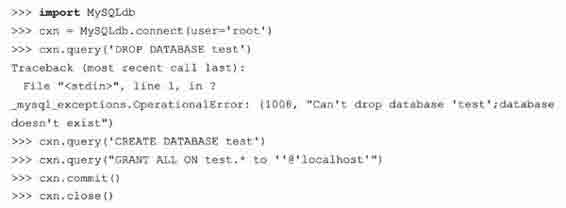

在上面的代码中，我们没有使用 cursor 对象。某些（但不是所有的）接口程序拥有连接对象，这些连接对象拥有 query()方法，可以执行 SQL 查询。我们建议你不要使用这个方法，或者事先检查该方法在当前接口程序当中是否可用。之后我们以普通用户身份再次连接这个新数据，创建表，然后通过 Python 执行 SQL 查询和命令，来完成我们的工作。这次我们使用游标对象（cursors）和它们的 execute()方法，下一个交互集演示了创建表。

下面的代码演示了如何创建一个表。在删除一个表之前如果试图重建这个表将产生错误。

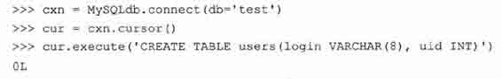

现在我们来插入几行数据到数据库，然后再将它们取出来。

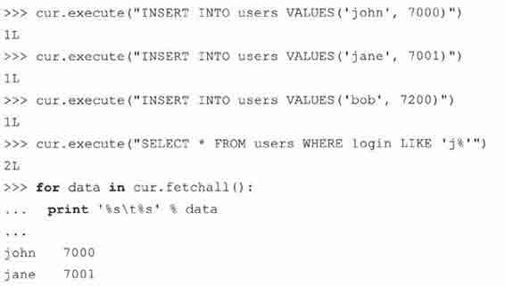

最后一个特性是更新表，包括更新或删除数据。

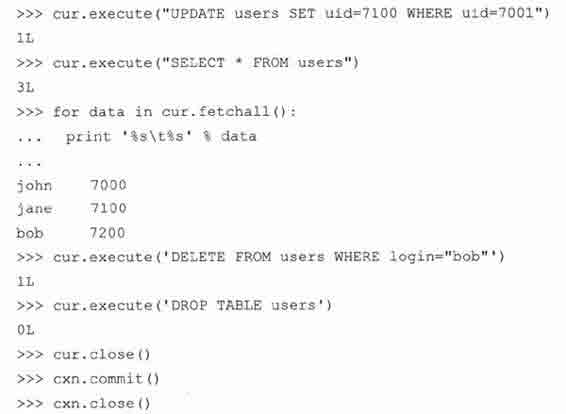

MySQL 是最流行的开源数据库之一。毫无疑问会有一个针对 MySQL 的 Python 接口程序。不过 Python 标准库中并没有集成这个接口程序，这是一个第三方包，你需要单独下载并安装它。在本章末尾的索引页，你可以找到如何下载它。

2\. PostgreSQL

另一个著名的开源数据库是 PostgreSQL。与 MySQL 不同，有至少 3 个 Python 接口程序可以访问 PosgreSQL: psycopg, PyPgSQL 和 PyGreSQL，第四个，PoPy，现在已经被废弃（2003 年，它贡献出自己的代码，与 PygreSQL 整合在一起）。这三个接口程序各有长处，各有缺点，根据实践结果来选择使用哪个接口更为明智。

多亏他们都支持 DB-API，所以他们的接口基本一致，你只需要写一个应用程序，然后分别测试这三个接口的性能（如果性能对你的程序很重要的话）。下面我给出这三个接口的连接代码：

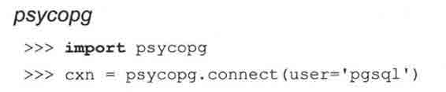

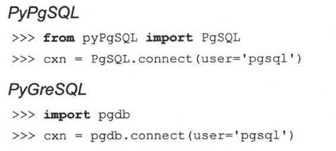

好，下面的代码就能够在所有接口程序下工作了。

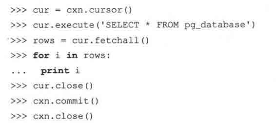

最后，你会发现他们的输出有一点点轻微的不同。

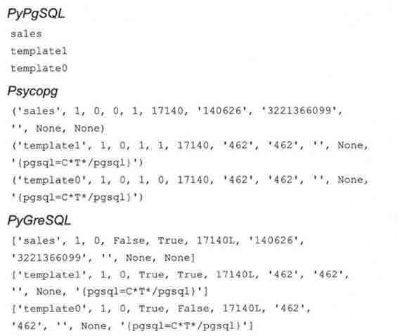

3\. SQLite

对非常简单的应用来说，使用文件进行持久存储通常就足够了。但对于绝大多数数据驱动的应用程序必须使用全功能的关系数据库。SQLite 介于二者之间，它定位于中小规模的应用。它是相当轻量级的全功能关系型数据库，速度很快，几乎不用配置，并且不需要服务器。

SQLite 正在迅速流行起来。并且在各个平台上都能用。Python2.5 中就集成了前面介绍的 pysqlite 数据库接口程序，作为 Python2.5 的 sqlite3 模块。这是 Python 第一次将一个数据库接口程序纳入标准库，也许这标志着一个新的开始。

它被打包到 Python 当中并不是因为他比其他的数据库接口程序更优秀，而是因为他足够简单，使用文件（或内存）作为它的后端存储，就像 DBM 模块做的那样，不需要服务器，而且也不存在授权问题。它是 Python 中其他的持久存储解决方案的一个替代品，一个拥有 SQL 访问界面的优秀替代品。在标准库中有这么一个模块，就能方便用户使用 Python 和 SQLite 进行软件开发，等到软件产品正式上市发布时，只要有需要，就能够很容易的将产品使用的数据库后端变更为一个全功能的、更强大的类似 MySQL、PostgreSQL、Oracle 或 SQL Server 那样的数据库。当然，对那些不需要那么大马力的应用程序来说，SQLite 已经足够使用。

尽管标准库已经提供了数据库接口程序，你仍然需要自己下载真正的数据库软件。一旦安装好之后，你就只需要打开 Python 解释器，下面是一个例子：

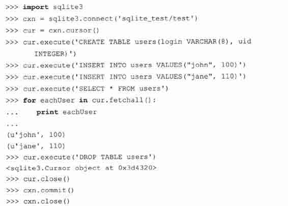

OK，这个小例子已经足够了。接下来，我们来看一个小程序，它类似前面使用 MySQL 的例子，但完成几种新的功能：

•　创建一个数据库（如果必要）

•　创建一个表

•　在表中插入行

•　在表中更新行

•　在表中删除行

•　删除表

这个例子中，我们仍然使用两个其他的开源数据库。SQLite 现如今已经相当流行。它体积小，而且足够快，是一个拥有几乎全部功能的相当轻量级的数据库。这个例子中用到的另一个数据库是 Gadfly，一个基本兼容 SQL 的纯 Python 写成的关系数据库。（某些关键的数据库结构有一个 C 模块，不过 Gadfly 没有它也一样可以运行（当然，会慢不少，嘿嘿）)。

在进入代码之前，有几件事要提醒。SQLite 和 Gadfly 需要用户指定保存数据库文件的位置（MySQL 有一个默认区域保存数据，在使用 MySQL 数据库时无需指定这个）。另外，Gadfly 目前的版本还不兼容 DB-API 2.0，也就是说，它缺失一些功能，尤其是缺少我们例子中用到的 cursor 属性 rowcount。

4.数据库接口程序应用程序举例

在下面这个例子里，我们演示了 Python 如何访问数据库。事实上，我们的程序支持三种不同的数据库系统：Gadfly、SQLite 和 MySQL。我们将要创建一个数据库（如果它不存在的话），然后进行多种数据库操作，比如创建表、删除表、插入数据、更新数据、删除数据等。在下一小节中的 ORM 中我们将重复例子 21.1 的这些功能。

5.逐行解释

第 1 ~ 18 行

脚本的第一部分导入必须的模块，创建一些”全局常量”（列的显示大小及我们的程序支持的数据库）。其中 setup()函数提供一个简单界面让用户选择使用哪种数据库。

值得留意的是 DB_EXC 常量，它代表数据库异常。他最终的值由用户最终选择使用的数据库决定。也就是说，如果用户选择 MySQL, DB_EXC 将是 _mysql_exceptions，依此类推。如果我们用流行的面向对象的方式来开发这个应用，它将会以一个实例属性的方式表示，比如 self.db_exc_module 或者什么别的名字。

第 20 ~ 75 行

这里的 connect()函数表现了数据库存取一致性。在每一小节的开头，我们尝试载入需要的数据库模块。如果找不到合适的模块，None 值被返回，表示这个数据库系统暂不支持。

在数据库连接建立以后，其余的代码对数据库和接口程序来说都是透明的（不区分哪种数据库、哪种接口程序，代码都可以工作）。有一个唯一的例外，就是脚本的 insert()函数。在这部分代码的所有 3 小段中，数据库连接成功后会返回一个连接对象 cxn。

如果选中了 SQLite（24 行~36 行），我们尝试载入一个数据库接口程序。我们首先尝试载入标准库模块 sqlite3（Python2.5 及更高版本支持），如果载入失败，就会去寻找第三方 pysqlite2 包。这个包支持 Python2.4.x 或更老些的系统。

如果成功导入合适的接口程序，由于 SQLite 是基于文件的数据库系统，同我们需要确认一下数据库文件所在的目录是否存在（当然，你也可以选择在内存里创建一个数据库）。当调用 connect()函数时，如果这个数据库文件已经存在，SQLite 会使用这个数据库，如果文件不存，它就会创建一个新文件。

例 21.1　数据库接口程序示例

这段脚本使用同样的接口对多种数据库执行了一些数据库基本操作。

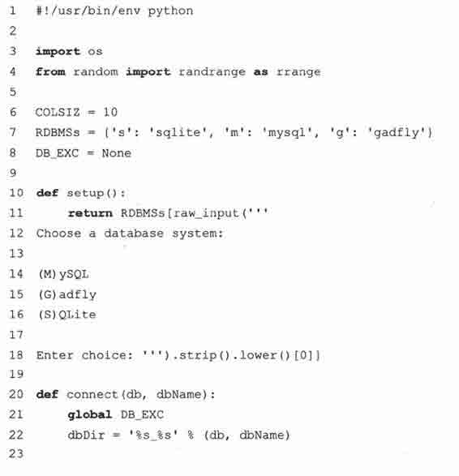

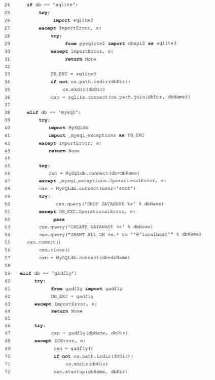

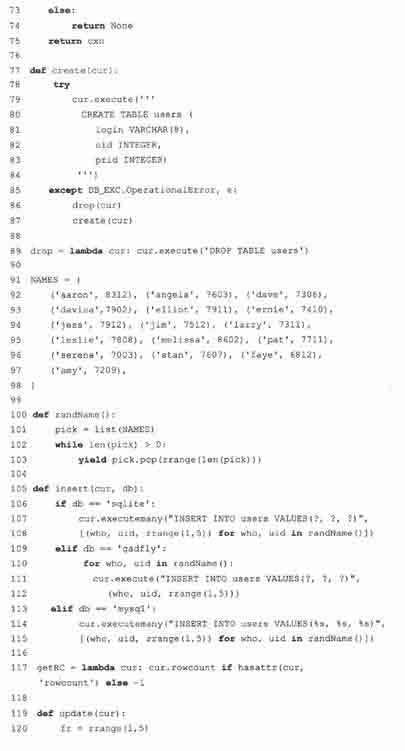

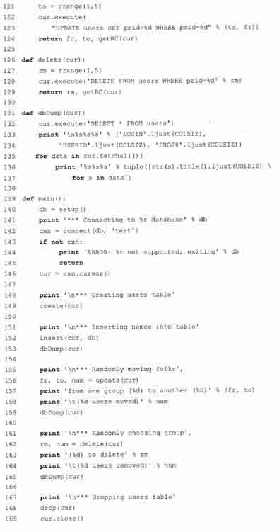

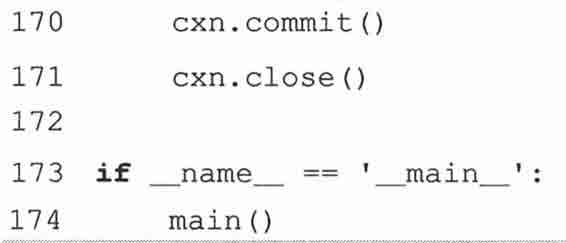

MySQL（38~57 行）的数据文件会存保在默认的数据存储区域，所以不需要用户指定存储位置。我们的代码尝试连接指定的数据库。如果发生错误，有可能是数据库不存在，或者虽然数据库存在但我们没有权限访问它。由于这仅仅是一个测试应用程序，我们选择完全先删掉这个数据库（忽略掉如果数据库不存在可能引发的错误），然后重建该库，然后给访问它的用户赋予权限。

我们的应用程序支持的最后一个数据库是 Gadfly（第 59~75 行）。在本书写作的时候，这个数据库已经几乎但还没有完全兼容 DB-API，你也会在这个程序里看到这一点。）它使用类似 SQLite 的启动机制：它的启动目录是数据文件所在的目录。如果数据文件在那儿，那没有问题，如果那儿没有数据文件，你必须重新启动一个新的数据库（为什么非要这样，我们也不十分清楚。我们认为 startup()函数应该被合并到构造器函数 gadfly.gadfly()当中去）。

77 ~ 89 行

create()函数在数据库中创建一个新的 users 表，如果中间产生问题，几乎肯定是因为这个表已经存在。如果正是这个原因的话，删掉这个表，然后递归调用 create()函数来重新创建它。这个代码有一个缺陷，就是当重建表仍然失败的话，你将陷入死循环，直至内存耗尽。在本章最后有一道习题就是这个问题，你可以试着修复这个潜在的 bug。

91 ~ 103 行

这可能是除了数据库操作之外最有趣的代码部分了。它由一组固定用户名及 ID 值的集合及一个生成器函数 randName()构成。这个函数的代码也可以在 11.10 节找到。NAMES 常量是一个元组，因为我们在 randName()这个生成器里需要改变它的值，所以我们必须在 randName()里先将它转换为一个列表。我们一次随机移除一个名字，直到列表为空为止。如果 NAMES 本身是一个列表，我们只能使用它一次（它就被消耗光了）。我们将它设计成为一个元组，这样我们就可以多次从这个元组生成一个列表供生成器使用。

105 ~ 115 行

由于各种数据库之间有一些细微差别，insert()函数里的代码是依赖具体数据库的。举例来说，SQLite 和 MySQL 的接口程序都是 DB-API 兼容的，所以它们的游标对象都拥有 executemany()方法，可是 Gadfly 没有这个方法，因此它只能一次插入一行。

另一个不同之处在于 SQLite 和 Gadfly 的参数风格是 qmark，而 MySQL 的参数风格是 format。由于这些原因，格式字符串必须不同。如果你比较细心的话，你会看到他们的参数创建过程非常相似。

这段代码的功能是：对每个 name-userlD 数据对，随机分配一个项目小组 ID，然后存入数据库。

117 行

这独立的一行是有一个条件表达式（读作 Python 3 目操作符），它返回最后一步操作所影响的行数，如果游标对象不支持这个属性（也就是说这个接口程序不兼容 DB-API）的话，它返回-1。python2.5 中新增了条件表达式，如果你使用的是 python 2.4.x 或更老版本，你可能就需要将它转换为老风格的方式了，如下所示。

如果你看不太明白这行代码，不用着急。看看 FAQ 就能知道为什么最终 Python2.5 中加入了条件表达式。如果你能弄明白，你就彻底搞明白了 Python 对象以及他们的布尔值。

119 ~ 129 行

update()和 delete()函数随机从一个组里选择了几条记录，如果是 update 操作，就将他们从当前小组移到另一个小组（也是随机选择的）。如果是 delete 操作，则删除它们。

131 ~ 137 行

dbDump()函数从数据库中读取所有数据，并将数据进行格式化，然后显示给用户看。print 语句显示每个用户不够清晰，所以我们将它分开显示。

首先，通过 fetchall()方法读取数据，然后迭代遍历每个用户，将三列数据（login、uid、 prid）转换为字符串（如果它们还不是的话），并将姓和名的首字母大写，再格式化整个字符为左对齐的 COLSIZ 列（右边留白）。由代码生成的字符串是一个列表（通过列表解析），我们需要将它们转换成一个元组以支持%操作符。

139 ~ 174 行

本部影片的导演 main()出场。它将上面定义的这些函数组织起来，让它们尽情发挥。（假定它们没有因为找不到数据库接口程序或者不能得到有效连接对象而中途退出（第 143~145 行））。它的大部分代码都是能够自我解释的 print 语句。最后 main()关闭游标对象，提交操作，然后关闭数据库连接。脚本的最后几行代码用来启动脚本的执行。

## 21.3　对象-关系管理器（ORM）

通过前一节我们知道，如今有很多种数据库系统，他们中的绝大多数都有 Python 接口，以方便你驾驭他们的能量。这些系统唯一的缺点是需要你懂得 SQL。如果你喜欢折腾 Python 对象却讨厌 SQL 查询，又想使用关系型数据库作为你的数据存储的后端，你就完全具备成为一个 ORM 用户的天资。

### 21.3.1　考虑对象，而不是 SQL

这些系统的创建者将绝大多数纯 SQL 层功能抽象为 Python 对象，这样你就无需编写 SQL 也能够完成同样的任务。如果你在某些情况下实在需要 SQL，有些系统也允许你拥有这种灵活性。但绝大多数情况下，你应该尽量避免进行直接的 SQL 查询。

数据库的表被转换为 Python 类，它具有列属性和操作数据库的方法。让你的应用程序支持 ORM 非常类似使用那些标准的数据库接口程序。由于大部分工作由 ORM 代为处理，相比直接使用接口程序来说，一些事情可能实际需要更多的代码。令人欣慰的是，一点点额外的付出会回报你更高的生产率。

### 21.3.2　Python 和 ORM

如今最知名的 Python ORM 模块是 SQLAlchemy 和 SQLObject。由于二者有着不同的设计哲学，我们会分别给出 SQLAlchemy 和 SQLObject 的例子。只要你能搞清楚这两种 ORM 的使用，转到其他的 ORM 将是相当简单的事。

其他的 Python ORM 包括 pyDO/PyD02、PDO、Dejavu、Durus、QLime 和 ForgetSQL。一些大型的 Web 开发工具/框架也可以有自己的 ORM 组件，如 WebWare MiddleKit 和 Django 的数据库 API。需要指出的是，知名的 ORM 并不意味着就是最适合你的应用程序的 ORM。那些其他的 ORM 虽然没有纳入我们的讨论范围，但一样有可能是适合你的应用程序的选择。

### 21.3.3　雇员数据库举例

现在我们将 shuffle 应用程序 ushuffle_db.py 改造为使用 SQLAlchemy 和 SQLObject 实现。数据库后端仍然是 MySQL。相对于直接使用原始 SQL 来讲，我们使用 ORM 时用类代替了函数，这样会更有对象的感觉。两个例子都使用了 ushuffle_db.py 中的 NAMES 集合和随机名字选择函数。这是为了避免将同样的代码到处复制粘贴，代码能够被有效重用是件好事情。

1.SQLAlchemy

与 SQLObject 相比，SQLAlchemy 的接口在某种程度上更接近 SQL，所以我们先从 SQLAlchemy 开始。SQLAlchemy 的抽象层确实相当完美，而且在你必须使用 SQL 完成某些功能时，它提供了足够的灵活性。你会发现这两个 ORM 模块在设置及存取数据时使用的术语非常相似，代码长度也很接近，都比 ushuffle_db.py 少（包括共享的 names 列表和随机名字生成器）。

2.逐行解释

1 ~ 10 行

和前面一样，第一件事是导入相关的模块和常量。我们提倡首先导入 Python 标准库模块，然后再导入第三方或扩展模块，最后导入本地模块这种风格。这些常量都是自解释的。

12 ~ 31 行

12~31 行是类的构造器，类似 ushuffle_db.connect()。它确保数据库可用并返回一个有效连接（第 18~31 行）。这也是唯一能看到原始 SQL 的地方。这是一种典型的操作任务，不是面向应用的任务。

33 ~ 44 行

这个 try-except 子句（33~40 行）用来重新载入一个已有的表，或者在表不存在的情况下创建一个新表。最终我们得到一个合适的对象实例。

例 21.2

这个 user shuffle 程序的主角是 SQLAlchemy 前端和 MySQL 数据库后端。

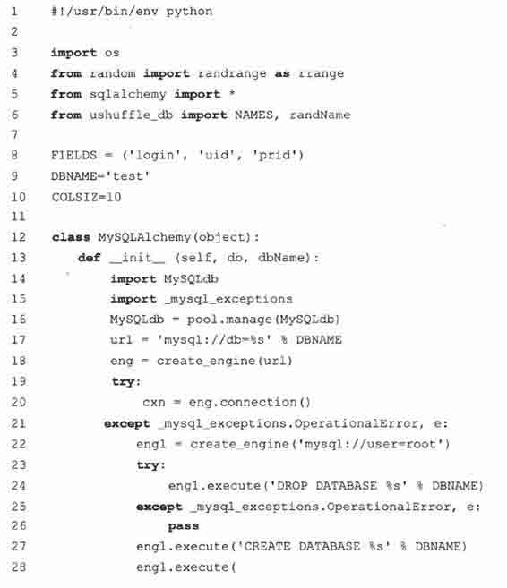

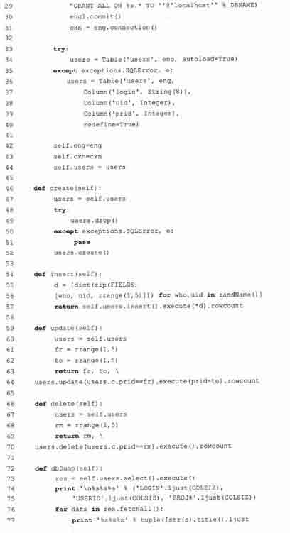

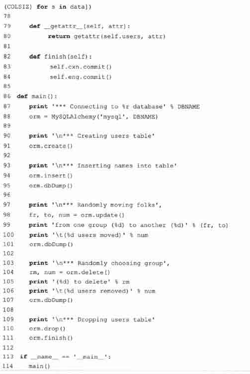

46 ~ 70 行

这 4 个方法处理数据库核心功能：创建表（46~52 行、插入数据（54~57 行）、更新数据（59~64 行）、删除数据（66~70 行）。我们也有一个方法用来删除表。

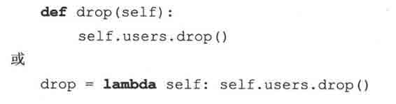

不过，我们还是决定提供另一种授权处理方式（曾在第十三章中介绍）。授权就是指一个方法调用不存在时，转交给另一个拥有此方法的对象去处理。参见第 79~80 行的解释。

72 ~ 77 行

输出内容由 dbDumpO 方法完成。它从数据库中得到数据，就像 ushuffle_db.py 中那样对数据进行美化，事实上，这部分代码几乎完全相同。

79 ~ 80 行

应该尽量避免为一个表创建一个 drop()方法，因为这总是会调用 table 自身的 drop()方法。同样，既然没有新增功能，那我们有什么必要创建另一个函数？无论属性查找是否成功，特殊方法 _getattr_()总是会被调用。如果调用 orm.drop()却发现这个对象并没有 drop()方法，getattr（orm,’drop’）就会被调用。发生这种情况时，_getattr_()被调用，之后将这个属性名委托给 self.users。解释器会发现 self.users 有一个 drop 属性并执行。

例 21.3　SQLObject ORM 示例（ushuffle_so.py）

这个 user shuffle 应用程序的主角前端是 SQLObject，后端是 MySQL 数据库。

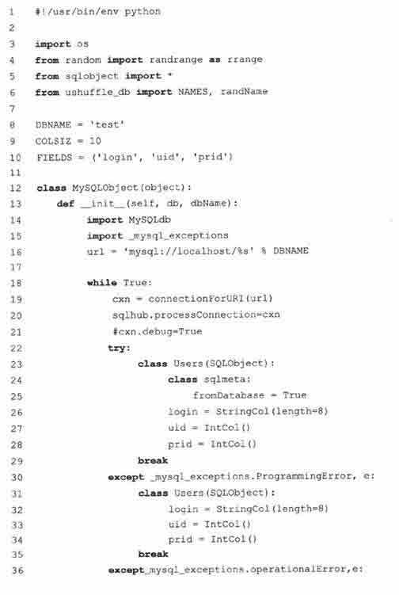

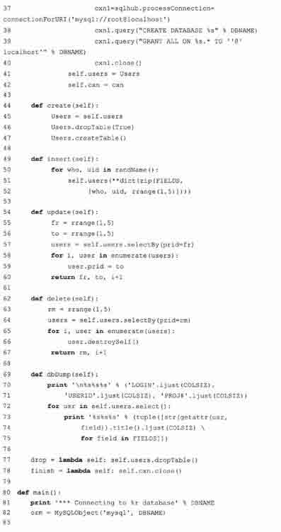

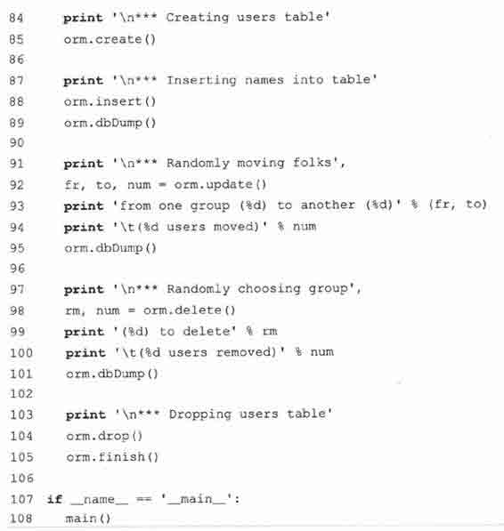

82 ~ 84 行

最后一个方法是 finish，它来提交整个事务。

86 ~ 114 行

main()函数是整个应用程序的入口，它创建了一个 MySQLAlchemy 对象并通过它完成所有的数据库操作。这段脚本和 ushuffle_db.py 功能一样。你会注意到数据库参数 db 是可选的，而且在 ushuffle_sa.py 和即将碰到的 ushuffle_so.py 中，它不起任何作用。它只是一个占位符以方便你对这个应用程序添加其他的数据库支持（参见本章后面的习题）。

运行这段脚本，你会看到类似下面的输出：

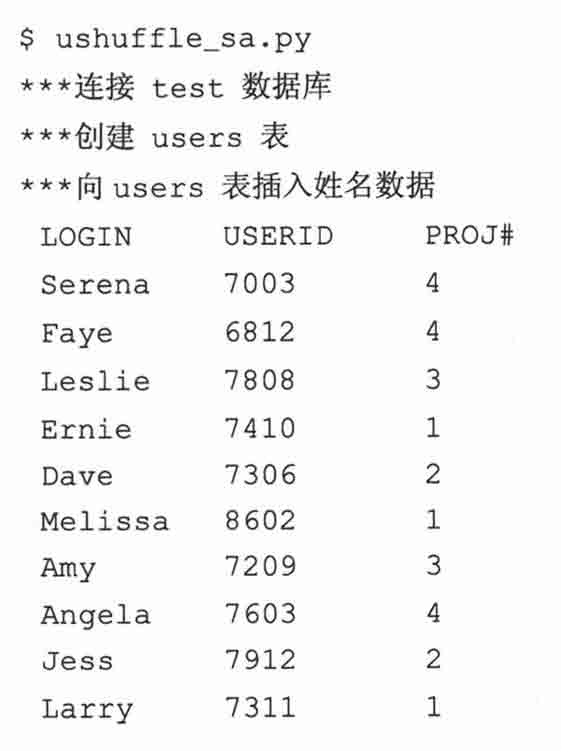

3.逐行解释

1 ~ 10 行

除了我们使用的是 SQLObject 而不是 SQLAlchemy 以外，导入模块和常量声明几乎与 ushuffle_sa.py 相同。

12 ~ 42 行

类似我们的 SQLAlchemy 例子，类的构造器做大量工作以确保有一个数据库可用，然后返回一个连接。同样的，这也是你能在程序里看到 SQL 语句的唯一位置。我们这个程序，如果因为某种原因造成 SQLObject 无法成功创建用户表，就会陷入无限循环当中。

我们尝试能够聪明地处理错误，解决掉这个重建表的问题。因为 SQLObject 使用元类，我们知道类的创建幕后发生特殊事件，所以我们不得不定义两个不同的类，一个用于表已经存在的情况，一个用于表不存在的情况。代码工作原理如下。

1.尝试建立一个连接到一个已经存在的表。如果正常工作，成功（第 23〜29 行）.

2.如果第一步不成功，则从零开始为这个表创建一个类，如果成功，成功（第 31〜36 行）.

3.如果第二步仍不成功，我们的数据库可能遇到麻烦，那就重新创建一个新的数据库（第 37〜40 行）.

4.重新开始新的循环。

希望程序最终能在第一步或第二步成功完成。当循环结束时，类似 ushuffle_sa.py，我们得到合适的对象实例。

44 ~ 67 行、77 ~ 78 行

这些行处理数据库操作。我们在 44〜47 行创建了表，并在 77 行删掉了表。在 49〜52 行插入数据，在 54〜60 行更新数据，在 62〜67 行删除了数据。78 行调用了 finish()方法来关闭数据库连接。我们不能像 SQLAlchemy 那样使用授权删表代理，因为 SQLObject 的删表代理名为 dropTable()而不是 drop().

69 ~ 75 行

使用 dbDump()方法，我们从数据库中得到数据，并将它显示在屏幕上。

80 ~ 108 行

又到了 main()函数。它工作的方式非常类似 ushuffle_sa.py。同样，构造器的 db 参数仅仅是一个占位符，用以支持其他的数据库系统（参阅本章最后的习题）.

当你运行这段脚本时，你的输出可能类似这样：

### 21.3.4　总结

关于如何在 Python 中使用关系型数据库，希望我们前面介绍的东西对你有用。当你应用程序的需求超出纯文本或类似 DBM 等特殊文件的能力时，有多种数据库可供选择，别忘了还有一个完全由 Python 实现的真正的免安装维护和管理的真实数据库系统。你能在下面找到多种 Python 数据库接口程序和 ORM 系统。我们也建议你研究一下互联网上的 DB-SIG 的网页和邮件列表。类似其他的软件开发领域，只不过 Python 更简单易学，用户体验更好。

## 21.4　相关模块

表 21.8 列出了常见的 Python 数据库接口程序，注意不是所有的接口程序都是 DB-API 兼容的。

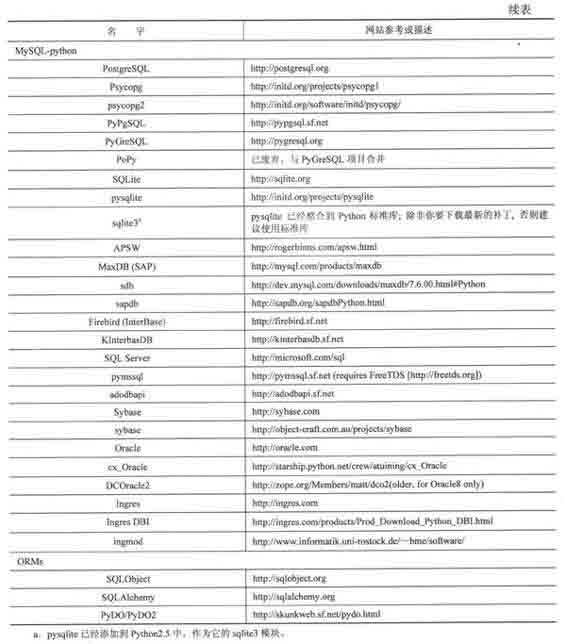

## 21.5　练习

> > 21-1.什么是 Python DB-API？它是一个好东西吗？为什么是（或为什么不是）?

> > 21-2.描述一下数据库模块参数风格之间的不同在哪儿？

> > 21-3.游标对象的 executed()系列方法有何区别？

> > 21-4.游标对象的 fetch*()系列方法有何区别？

> > 21-5.研究一下你使用的数据库及相应的 Python 模块。它是否与 DB-API 兼容？该模块是否提供了 DB-API 必须功能之外的更多特性？

> > 21-6.针对你使用的数据库和 DB-API 接口程序，学习使用 Type 对象写一段小的脚本，至少要用到其中的一个对象。

> > 21-7.重构。例 21.1 （ushuffle_db.py）中的 create()函数，一个 table 会先被删除，然后递归调用 create()函数重建这个 table。如果在重建这个 table 时失败，就会陷入无限循环之中。通过在异常处理中不再调用 create 命令（cur.execute()）修复这个问题，搞一个更实用的解决方案出来。附加题：实现如果创建 table 失败，在返回失败之前最多重试 3 次。

> > 21-8.数据库和 HTML。利用现有数据库的一个表和你在第二十章学到的开发知识，读出数据库表的内容，将它放到一个 HTML table 中去。

> > 21-9.数据库网站开发。给我们的 user shuffle 例子写一个网页界面。

> > 21-10.数据库界面编程。给我们的 user shuffle 例子写一个图形界面。

> > 21-11.股票投资组合类。修改第十三章股票数据的例子，将它改造为使用某一种关系数据库保存数据。

> > 21-12.切换 ORM 后端为其他的数据库。将 SQLAlchemy（ushuffle_sa.py）或 SQLObject （ushuffle_so.py）应用程序后端数据库由 MySQL 切换为另一种数据库系统。