# 第二十三章　其他话题

本章主题

♦　引言

♦　Web 服务

♦　用 Win32 的 COM 来操作 Microsoft Office

♦　用 Jython 写 Python 和 Java 的程序

♦　练习

本章将简单介绍一下有关 Python 编程的一些杂项，很可惜，我们没有足够的时间来更深入的探讨这些主题。希望在本书的下一版中，将每个相关主题单列一章。

## 23.1　Web 服务

在网络上，有大量的 Web 服务和应用，它们提供各式各样的服务。您会发现多数大型服务商都会提供（其服务的）应用程序接口（API），比如 Yahoo! 、Google、eBay 和 Amazon 等。过去 API 仅仅被用来访问使用这些服务的数据，但是今天的 API 已经不同，它们不但丰富而且功能齐全，而且您可以将这些 Web 服务整合到您自己的个人网站和网页中，这通常被称作“Mash-ups” ^([[1]](../Text/index_split_277.html#filepos1782091))

这是一些很有意思的功能，但是，暂时我们只简单的尝试一个很有用，同时提供时间也比较长的服务，即 Yahoo！提供的股票报价服务。其网址是 http://finance.yahoo.com.

Yahoo！金融股票报价服务器^([[2]](../Text/index_split_277.html#filepos1782464))

如果访问下面的网站查询某支股票的价格，就会在标了“DownloadData”的基本报价那里看到一个连接。这个连接允许你下载一个可以导入 Microsoft Excel 和 Intuit Quicken 的 CSV 格式文件。

http://finance.yahoo.com/d/

quotes.csv?s=GOOG&f=sl 1 dl ti c 1 ohgv&e=. esv

如果浏览器的 MIME 设置正确的话，你的浏览器将启动 Excel 打开下载好的文件。这主要是因为连接中包含了 e=xsv 的设置。这样的设置将使 server 返回 CSV 格式的结果。

如果我们使用 urllib.urlopen()来得到报价，会得到一行 CSV 格式的返回结果：

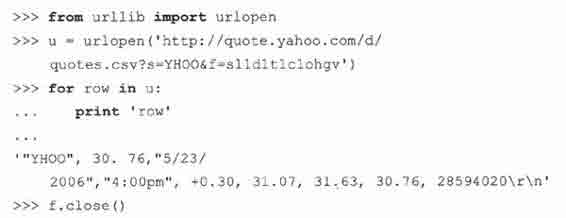

您可以手工解析这个返回的字符串（去掉头尾的空白字符，根据逗号进行分割），或者也可以使用 Python2\. 3 版本新加入的 csv 模块。这个模块自动完成字符串分割和去掉头尾空白字符的功能。使用 csv 的话，我们就可以其他的代码不变，把上面的那个 for 循环改为：

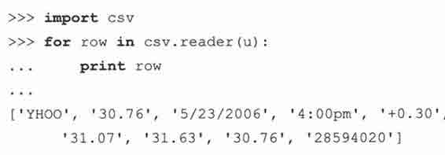

分析传递给 server 的 f 参数并看了 Yahoo！的这个服务的在线帮助后，我们可以知道，符号 slldltlclohgv 对应着：订单号、最后的价格、日期、时间、变化量、开盘价、当日最高、当日最低和成交量。

您可以通过访问 Yahoo! Finance 帮助页面获得更多的信息——只要搜索“download data”或“download spreadsheet format”就可以了。

深入的分析这个 API，我们可以得到更多的信息，如：上一次收盘价，52 周内的最高和最低价等。总而言之，表 23.1 列出了返回数据的格式。

每一段的名字按你想要的数据的顺序排列。只要把它们连接在一起整个作为参数 f，加到请求 URL 中。

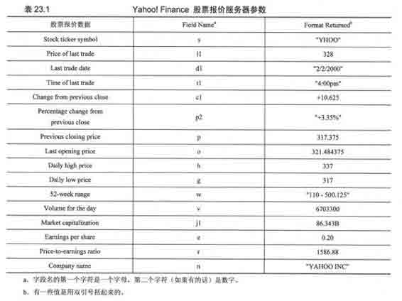

有些返回结果是用引号括起来的。解析代码要能正确地解析这些数据。观察上面手工解析返回字符串和用 CSV 模块解析返回字符串所得到的结果。如果某个值不存在报价，服务器会返回“N/A”。

例如，如果我们给服务器的 f 字段为 f=slldlclp2，我们会得到如下的字符串：

如果是不公开交易的股票，我们会得到如下的结果（注意，不少列都是双引号引起来的，包括 N/A）:

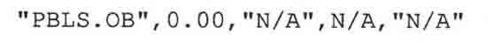

报价服务器也支持同时指定多支股票，如 s=YHOO,GOOQEBAY,AMZN。返回的结果是每支股票信息占一行。要记住 Yahoo! Finance 帮助页面所说的：任何把 Yahoo！显示的数据再次发布的行为都是严格禁止的。所以，你只能把这些信息用于私人用途。同时也要记住，所有你得到的数据，都是有一定延时的。用我们已有的知识，我们可以实现一个应用程序（例 23.1），用于读取并显示一些我们关心的互连网公司的股票报价信息。

例 23.1　Yahoo! Finance 股票报价示例（stock.py）

这个脚本能从 Yahoo！报价服务器下载并显示股票的价格。

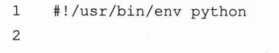

如果我们执行这个脚本，会得到如下的输出：

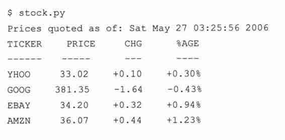

## 23.2　用 Win32 的 COM 来操作微软 Office

在你日常工作环境中所能做的最有用的事情之一就是集成对 Win32 程序的支持。实现从这样的应用程序中读写数据是很容易的事。虽然你所在的部门可能用不着 Win32 环境，但很有可能你的经理或是其他的工程组在用。Mark Hammond 的 Python 的 Windows 扩展使得程序员可以在本地环境直接与 Win32 程序进行交互。

Win32 编程是一个相当广泛的概念。Python 的 Windows 扩展包包含了其中的大部分。如：Windows API、进程、Microsoft Foundation Classes （MFC）图形界面接口（GUI）开发、Windows 多线程开发、服务、远程访问、管道、COM 服务端编程和事件。还有一个能在。NET/Mono 开发环境中使用的 Python 语言的 C#实现：IronPython。在本节，我们主要关注 Win32 程序设计的一部分——客户端 COM 编程，它有着相当广泛的实际用途。

### 23.2.1　客户端 COM 编程

我们可以使用组件对象模型，另一个比较熟悉的名字是 COM（市场化的名字是 ActiveX）来与诸如 Outlook 和 Excel 之类的工具进行通讯。对于程序员来说，能在 Python 代码中直接“控制”一个本地 Office 应用程序是一件很快乐的事情。

特别地，当说到使用一个 COM 对象时，即启动一个应用程序，并允许代码访问该应用程序提供的方法，被称为客户端的 COM 编程。实现一个 COM 对象供其他客户端调用则被称为服务端的 COM 编程。

核心笔记：Python 与微软 COM（客户端）编程

* * *

在 Windows 32 位平台上，Python 与 COM 是可以相互操作的。COM 是微软的一种接口技术，它定义了语言及格式无关的对象与对象之间或是更高层次的应用程序与应用程序之间的通讯。本节中，我们将看到如何把 Python 与 COM（客户端编程）组合起来，与微软 Office 的应用程序如 Word、Excel、PowerPoint 和 Outlook 之间进行通讯。

* * *

本节的先决条件是要运行在 Win32 平台上，并且安装了 Python 和 Python 的 Windows 扩展。同时，必需要安装一个或多个例子中用到的微软应用程序。Python 的 Windows 扩展的下载说明很容易看懂，照着做一般不会出问题。我们推荐用扩展自带的 PythonWin 作为创建和测试你 Win32 脚本的 IDE。

在本节中，我们将演示如何与 Office 应用程序进行交互。我们将给出几个示例，并详细解释它们。其中有一些例子是非常实用的。你也能在“Python Cookbook”网站找到一部分例子。必须承认的是，我们并不是 COM 或是 Visual Basic 的专家同时，我们也知道，这些例子还有很大的可以改进的空间。我们强烈希望所有读者把您认为对大家有用的评论、建议或改进发给我们。

我们先从很简单的微软 Excel、Word、PowerPoint、Outlook 的启动和交互开始。在展示例子之前，我们要先指出，客户端 COM 应用程序运行时都遵循相同的几个步骤。与这些应用程序进行交互的典型的方法是这样的：

1.启动应用程序；

2.打开要编辑的文档；

3.显示应用程序（如果有必要的话）；

4.对文档做一定的操作；

5.保存或放弃文档；

6.退出。

说的够多了，下面开始看一些代码吧。以下是一系列脚本，用于控制不同的微软的应用程序。这些脚本都导入了 win32com.client 模块和一些 Tk 模块来控制各个应用程序的启动（和其他操作）。同第十九章一样，我们釆用。pyw 后缀来避免不必要的 DOS 命令窗口。

### 23.2.2　微软 Excel

我们的第一个例子演示如何使用 Excel。在整个 Office 系列软件中，我们发现 Excel 是最可编程的。用 Excel 处理数据非常的有用，一方面可以利用电子表格的功能优势，另一方面可以用非常好的打印格式来查看数据。而且可以从电子表格中读取数据，然后使用像 Python 这样的编程语言来处理数据，这一点也非常有用。在这一部分的最后我们会给出一个使用 Excel 的更加复杂一点的例子，但是我们总得开始吧，所以我们先从例 23.2 开始。

例 23.2　Excel 例子（excel.pyw）

这个脚本启动 Excel，然后将数据填到电子表格的空格中。

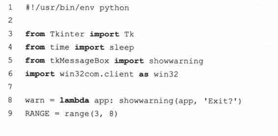

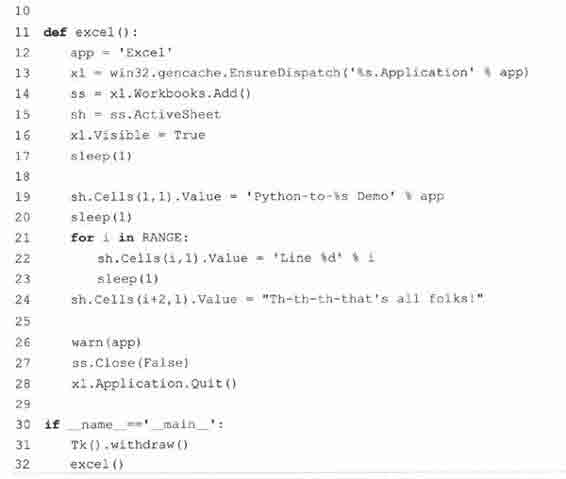

逐行解释

1 ~ 6、31 行

我们导入 Tkinter 和 tkMessageBox 模块只是为了使用 showwaming 消息框来终止演示。在显示对话框（26 行）之前，我们调用 withdraw()函数先绘出 Tk 最顶层的窗口（31 行）。如果你不首先初始化顶层窗口，系统会自动地为你创建一个，不过，自动创建的不会自动关闭，而会很讨厌地显示在屏幕上。

11 ~ 17 行

当代码启动（或调用）Excel 后，我们添加了一个工作簿（就是包含了多个可以写数据的工作表的电子表格）。并得到了正在显示的活动表格的句柄。不要在术语上花太多精力，因为“工作簿包含好几个工作表”这种话很容易使人迷惑。

核心笔记：静态和动态调用

* * *

在第 13 行，我们使用的是静态调用。在运行这个脚本之前，我们从 PythonWin 中运行 Makepy 工具（启动 IDE，选择 Tools-->COM Makepy 工具，然后选择相应的应用程序库），这个工具创建并缓存应用程序需要的对象。没有这些预先准备工作，对象和属性得在运行时建立。如果是在运行时创建对象和属性，那么就叫做动态调用。如果您想动态运行，那么请使用常用的 Dispatch()函数。

xl = win32com. client. Dispatch（‘%s. Application’% app）

* * *

Visible 标记必须设为 True，这样才可以让应用程序显示在桌面上，然后停下来，这样用户可以看到演示的每一步（行 16）。要知道第 17 行 sleep()调用的含义，请阅读接下来的内容。

19 ~ 24 行

在这个脚本程序的应用部分（application portion），我们把这个演示的标题写到了左上角的第一格，也就是（Al）或（1, 1），然后跳过了一行，把“Line N”写到相应的格中，N 是从 3 到 7 的数字。在写每一行的时候中间停顿 1 秒，这样您就可以看到演示过程了（如果没有延迟，写每一行的过程会非常快）。

26 ~ 32 行

在演示结束的时候，会弹出一个消息对话框，以方便用户在看完输出后，结束演示程序。电子表格关闭时不会被保存，首先调用 ss. Close（[SaveChanges=]False），然后应用程序结束。最后，脚本的“main”部分只是初始化 Tk，然后执行应用程序的核心部分。运行这个脚本程序，会弹出一个 Excel 应用程序窗口，如图 23-1 所示。

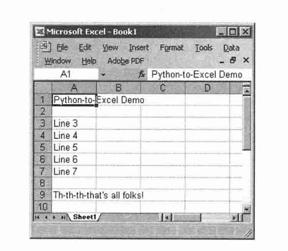

> > 图 23-1　Python-to-Excel 示例脚本（excel.pyw）

### 23.2.3　微软 Word

下面来演示一下如何使用 Word。由于涉及到的数据不多，用 Word 写文档的可编程性就不是那么强了。你可以考虑用 Word 来自动生成格式化的信件等。不过，在例 23\. 3 中，我们将创建一个文档，然后简单地写几行字。

例 23.3　Word 例子（word.pyw）

这个脚本启动 Word，然后向文档中写数据。

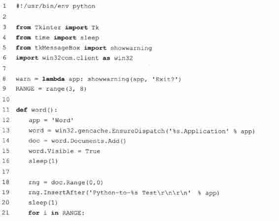

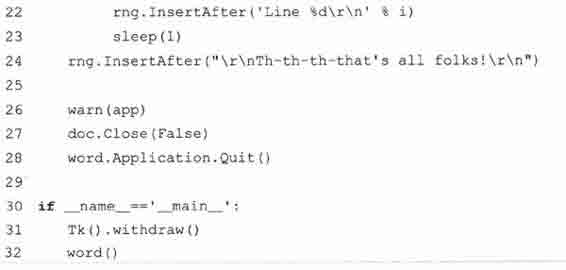

这个 Word 的例子和上面的 Excel 例子非常相似，惟一的不同是我们要在文档“范围”内插入字符串，每写一次向前移动一下光标，而不是像在 Excel 中那样写在每一格中。我们还要在程序中写明行结束符，也就是回车换行（\r\n）。

如果我们执行这个脚本程序，会显示如图 23-2 的界面。

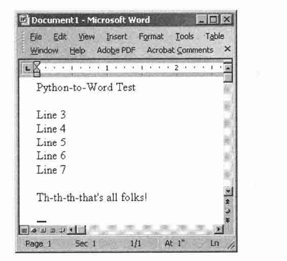

> > 图 23-2　Python-to-Word 示例脚本（word.pyw）

### 23.2.4　微软 PowerPoint

在应用程序中使用 PowerPoint 并不太常见，但是当您急于制作演示文稿的时候可能会考虑使用它。您可以在飞机上用文本文件写下核心内容，然后在抵达酒店的夜里用脚本程序处理这个文件来自动生成一系列的幻灯片。您甚至可以通过添加背景和动画等东西来增强效果，这些都可以通过 COM 接口做到。另外一个使用到的情况就是当您不得不自动生成或修改新的或已存在的演示文档的时候。您可以通过 shell 脚本程序控制 COM 脚本来创建或者调整每个生成的幻灯片。好了，解释得够多了……现在来看一下我们的 PowerPoint 例子，如例 23.4 所示。

您会再一次注意到这个例子和上面的 Excel 和 Word 演示非常相似。PowerPoint 的不同之处在于您写入数据的对象不一样了。不是向单独的表格或文档中写入数据，PowerPoint 更为复杂，因为每一张幻灯片可以有不同的布局。在一个演示文档中，您有多张幻灯片，其中每一张幻灯片可以有不同的布局（最新版本的 PowerPoint 有 30 种不同的布局）。你可以进行的操作依您所选的布局不一样而各有不同。

在本例中，我们选用一个只有标题和文本的布局（17 行），并填充主标题（19〜20 行），即 Shape[0]或 Shape（l）——Python 的下标从 0 开始，微软的软件从 1 开始——然后填充文本（22〜26 行），即 Shape[1]或 Shape（2）。为了了解要使用哪一个常量，你需要一个所有可用的常量列表。例如，ppLaycmtText 常量的值被定义为 2（整型）,ppLayoutTitle 为 1，等等。你可以在大多数微软 VB/Office 编程的书中或根 f 名字在线查找相关的定义。或者，你也可以直接使用整型值，而不使用 win32.coristaiits 中的名字。

例 23.4　PowerPoint 示例（ppoint.pyw）

这个脚本启动 PowerPoint 并在幻灯片中写入一些数据。

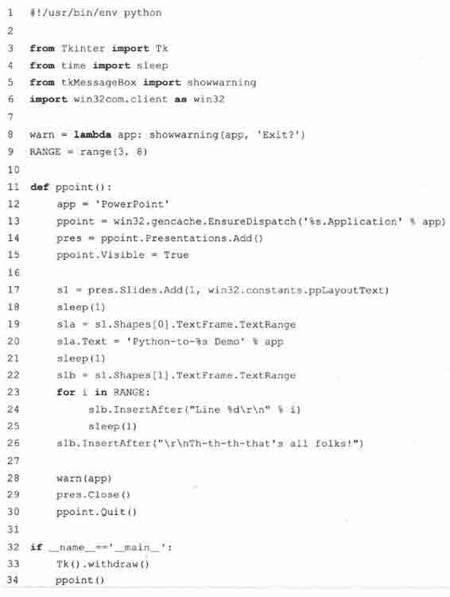

### 23.2.5　微软 Outlook

最后，我们给出一个 Outlook 的例子，它使用了比 PowerPoint 例子更多的常量，作为一个十分常见和通用的工具软件，在应用程序中使用 Outlook 非常有意义，这与前面 Excel 的例子一样。总是有电子邮件地址、邮件和其他数据可以在 Python 程序中轻松地处理。例 23.5 就是 Outlook 的一个例子，但是比前面的例子都要复杂一点。

在这个例子中，我们用 Outlook 给自己发了一封电子邮件。为了更好地演示这个例子，你需要先关闭网络访问，以确保你的 email 并不会真正被发送出去，这样，你就可以在发件箱里看到这封邮件（如果需要的话，还可以在看完后删除它）。启动 Outlook 后，我们写一封新的电子邮件，然后填好各个栏，例如收信人、主题和信件内容等（15〜21 行）。然后调用 send() （22 行）将信存储到发件箱，在这里，信件一旦被确实发送到邮件服务器上，就会被移动到“已发送”。

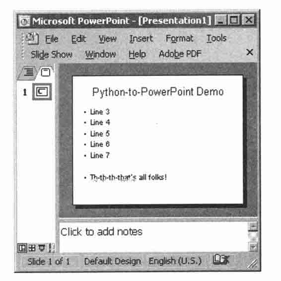

> > 图 23-3　Python-to-PowerPoint 示例脚本（ppoint.pyw）

像 PowerPoint 一样，Outlook 有很多可以使用的常量…… olMailltem（其值为 0）常量被用于电子邮件信息。其他常用的 Outlook 常量有：olAppointmentItem（1）, > olContactltem（2）、 olTaskItem（3）。当然，还有很多没有一一列出，你可以在介绍 VB/Office 编程的书中或者在线文档中查找相关常量的定义。

下一部分（24~27 行），我们使用了另一个常量 olFolder Outbox（4），来打开并显示发件箱目录，我们找到最新的几封邮件（有可能是我们刚刚创建的）并显示它们。其他几个常用的目录有：olFolderlnbox （6）、olFolderCalendar （9）、olFolderContacts（lO）、olFolderDrafts （16）、olFolderSentMail（5）和 olFolderTasks（13）。如果你使用动态调用，你可能要使用具体的数值，而不是常量的名字（见之前的核心笔记）。

例 23.5　Outlook 例子（olook.pyw）

这个脚本启动 Qiitlook，创建一封邮件，“发送”这封邮件，并允许你打开发件箱浏览这封邮件。

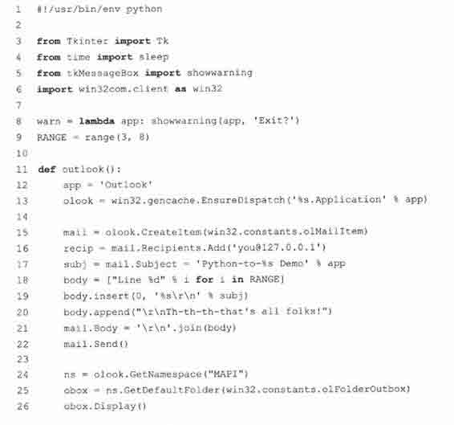

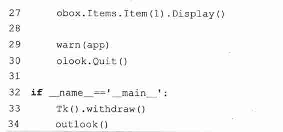

图 23-4 为邮件窗口的截图

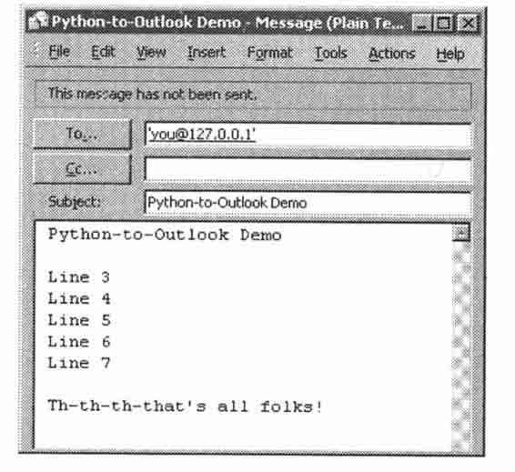

> > 图 23-4　Python-to- Outlook 示例脚本（olook.pyw）

由于以前的 Outlook 总是被用于各种各样的攻击中，微软在 Outlook 中加入了一些保护措施，来限制对通讯簿的访问以及代表你发送邮件。当外部程序想要访问你的 Outlook 的数据的时候，会弹出一个如图 23-5 所示的对话框，以征取你的同意。

当你想要用外部程序发送邮件的时候，你会看到一个如图 23-6 所示的警告对话框。你必需等到计时器倒数结束后才能点击“确定”按钮。

一旦你完成了所有安全检查，其他所有的事都能很顺利地完成。也有一些软件可以帮助你绕过这些检查，但它们需要单独下载和安装。

在本书的网站 http://corepython.com 上，你能找到一个把这所有 4 个小脚本集成在一起的一个脚本，允许用户选择要运行哪一个示例。

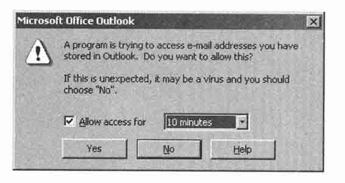

> > 图 23-5　Outlook 地址薄访问警告

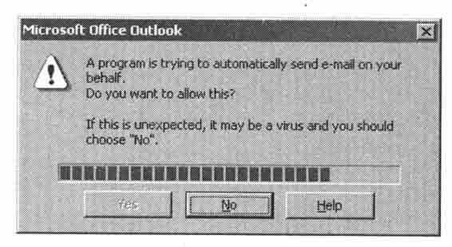

> > 图 23-6　Outlook 电子邮件传输警告

### 23.2.6　中等规模的例子

现在，我们对 Office 编程己经有了一些概念，接下来，我们要把本节所列的知识与 Web 服务那一节的知识组合起来，写一个更实用的应用程序。如果我们把股票报价的例子与 Excel 演示脚本合起来，就能形成一个能从网上下载股票报价，并把结果直接放到 Excel 中的应用程序，而不用把数据放在 CSV 文件中作为中介。

逐行解释

1~13 行

我们导入股票报价和 Excel 脚本两个例子中的所使用的模块与常量。

15 ~ 32 行

核心功能的第一部分是像之前那个脚本（17〜21 行）那样启动 Excel。把标题和时间写到相应的单元格中（23〜29 行），然后是粗体（30 行）的列的头。从第 6 行开始（32 行）的单元格会写入实际的股票报价的数据。

34 ~ 43 行

如同之前一样，打开一个 URL（34 行），但不再把结果写到标准输出，我们把结果填到电子表格的单元格中。一次放一列数据，每行一个公司的股票信息（35〜42 行）。

45 ~ 51 行

脚本的剩下几行作用与之前看到的一样。

例 23.6　股票报价与 Excel 例子（estock.pyw）

这个脚本从 Yahoo！下载股票报价并把数据写入到 Excel。

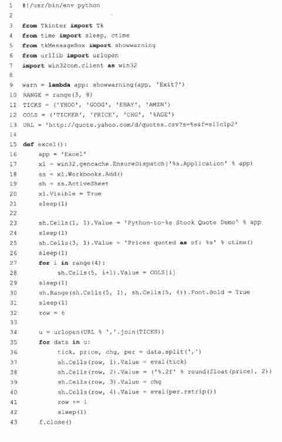

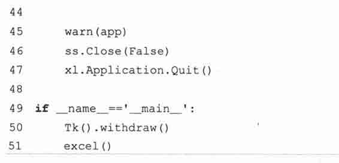

图 23-7 显示的是运行了我们的脚本后有实际数据的窗口。

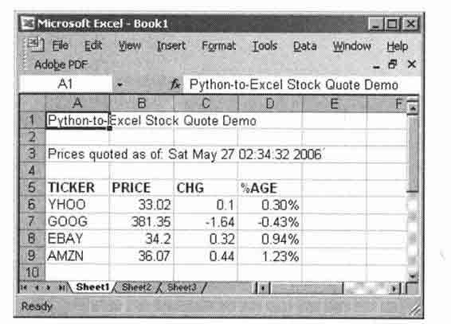

> > 图 23-7　Python-to-Excel 股票报价示例脚本（estock.pyw）

注意，存放数字的那几列的原始格式信息已经没有了，因为 Excel 用默认的单元格格式把它们存为数字了。我们把数字的格式改为保留小数点后两位。例如，虽然 Python 传递的是“34.20”，但显示的时候，还是显示“34.2”。而“自上次收盘的变动”那一列，则不仅少了小数点后的数字，而且数字前面的用于表示升值的正号（+）也没了（这是 Excel 的输出和原始文本版的比较。这些问题在本章结尾的练习中有详细说明）。

## 23.3　用 Jython 写 Python 和 Java 的程序

### 23.3.1　什么是 Jython

Jython 是一种可以把两种不同的编程语言结合在一起的工具。首先，它使 Python 程序员介入到 Java 开发环境并让他们能快速开发方案原型，以便无缝地集成到现有的 Java 平台上。其次，它能在 Java 中加入脚本语言，并以此来简化数计百万计的 Java 程序员的工作。Java 程序员们再也不用为他们刚写的一个类写一大堆的测试用例或驱动程序。

Jython 提供了 Python 的大部分功能，以及实例化 Java 类并与 Java 类交互的功能。Jython 代码被动态地编译成 Java 字节码，因此，你可以用 Jython 扩展 Java 类，也可以用 Java 来扩展 Python。在 Python 中写一个类，像使用 Java 类一样使用这个类是很容易的事情。你甚至可以把 Jython 脚本静态地编译为 Java 字节码。

你可以从本书的网站或 http://jython.org 下载 Jython。在安装完，并阅读了一些处理新的 jar 文件的默认启动注意事项后，启动 Jython 的交互解释器就跟用 Python 一样简单。而且，你也可以像在 Python 中一样，写一个“Hello World!”:

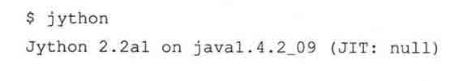

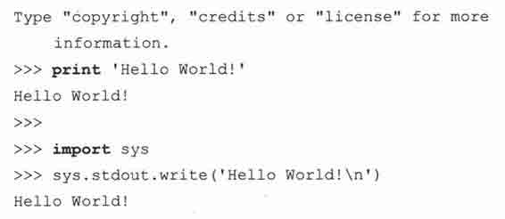

惟一的不同是，现在，你不得不等待 Java 那超长的启动时间。如果你能忍受这个，你就能做一些更有用的事了。用 Jython 交互解释器的一个更有趣的方面就是，现在你可以用 Java 来写“Hello World!”了：

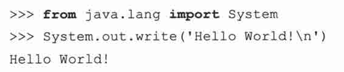

Java 给了 Python 用户一些额外的好处，即可以使用本地异常处理（这在标准 Python——相对于其他实现来说，也被称为“CPython”——里是没有的），以及可以使用 Java 的垃圾收集器（这样就没必要再为 Java 开发一套 Python 的实现了）。

### 23.3.2　Swing GUI 开发（Java 或者 Python!）

有了对所有 Java 类的访问能力，我们能做的事就太多了，例如，图形界面（GUI）的开发。在 Python 中，我们用 Tkinter 模块中的 Tk 作为默认 GUI，但是，Tk 不是 Python 的本地工具包。不过，Java 有 Swing，它是本地的。用 Jython，我们可以用 Swing 组件写一个 GUI 应用程序，不是用 Java，而是用 Python。

一个简单的“Hello World!” GUI 程序的 Java 版本和对应的 Python 版本分别在例 23.7 和例 23.8 中给出。这两个版本都模仿了图像界面编程那一章的 Tk 例子 tkhello3.py。这两段程序分别叫 swhellojava 和 swhello.py.

例 23.7　在 Java 中,用 Swing 写“Hello World” （swhello.java）

本程序像 tkhello3.py 那样，创建一个 GUI。使用 Swing 而不是 Tk，使用的语言是 Java。

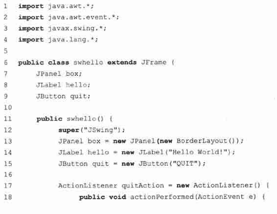

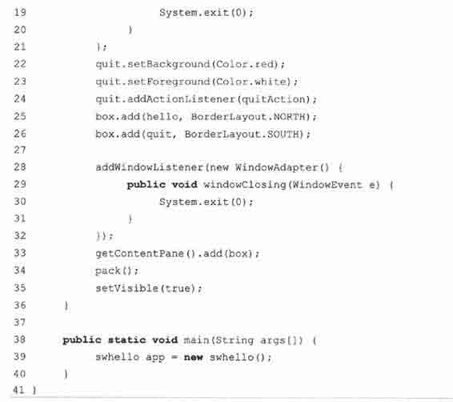

例 23.8　在 Python 中用 Swing 写“Hello World” （swhello.py）

下面的 Python 脚本代码具有和上面的 Java 程序具有相同的功能，需要在 Jython 解释器中执行。

两段代码都与 tkhello3.py—一致，惟一的区别就是它们使用了 Swing 而不是 Tk。Python 版本的特点是，做同样的事，Python 所要写的代码相对于 Java 大幅减少。Python 代码的表达能力更强，所以每一行都显得更为重要。简单地说，就是“白色噪音”（译者注：指 Java 大量换行造成的留白部分）更少了。Java 的代码更趋向于用更多的“样板”代码来完成工作，而 Python 则让你把注意力集中在你的应用的重要部位，即你要解决的问题的解决方案上。

由于两个程序都会被编译为 Java 字节码，在同一个平台上两个程序看上去完全一样也就没什么好奇怪的了（见图 23-8）。

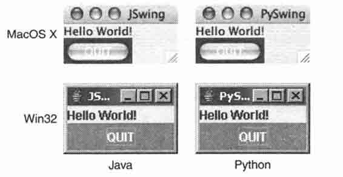

> > 图 23-8　Swing 的 Hello World 示例脚本（swhello.java 和 swhello.py）

Jython 是一个很伟大的工具。因为你可以同时得到了 Python 的强大的表达能力，以及 Java 库中丰富的 API。如果你现在是一个 Java 程序员，希望我们己经引起了你对你身后 Python 的强大力量的兴趣。如果你是 Java 新手，Jython 能让你更为轻松。你可以用 Jython 写原型，然后在必要的时候轻松地移植到 Java 中。

## 23.4　练习

Web 服务

> > 23-1\. Web 服务。使用 yahoo！股票报价示例（stoclcpy）并把这个程序改为把报价数据保存到一个文件中，而不在屏幕上显示。可选题[:] 你可以修改脚本，让用户可以选择是显示报价还是保存到文件中。

> > 23-2.Web 服务。修改 yahoo！股票报价示例（stocLpy），让程序可以下载上面所列的其他参数数据。可选题：你可以把这个功能加到上一题的程序中。

> > 23-3.Web 服务和[CSV]模块。修改 stock.py，像我们在示例代码中那样，使用 csv 模块来解析得到的数据。附加题：用同样的方法修改这个脚本的 Excel 版本（estock.py）。

> > 23-4.REST 与 Web 服务。学习现在的 Web 服务 API 和应用程序中，REST 与 XML 是如何被使用的。与老式的 Web 服务，像 Yahoo！报价服务这种用 URL 参数的方式相比较，额外提供了哪些功能。

> > 23-5.REST 与 Web 服务。利用 Python 对 REST 和 XML 的支持，创建一个应用程序的框架，这个框架要能在写使用如今这些更新的 Web 服务和 API 应用程序的时候，能实现代码的共享和重用。展示你的使用 Yahoo!、Google、eBay 及（或）Amazon 服务的代码。

> > > > 微软 Office 编程

> > 23-6.微软 Excel 和网页。创建一个应用程序，读取 Excel 电子表格中的数据，并生成一个对应的 HTML 表格（你可能需要第三方的 HTMLgen 模块）。

> > 23-7.微软 Office 应用程序与 Web 服务。连接到任何现有的 Web 服务，无论是基于 REST 还是 URL 的，并把数据写到 Excel 电子表格中，或设置一个比较好看的格式，然后放到 Word 文档中。格式要适于打印。附加题：要同时支持 Excel 和 Word。

> > 23-8.微软 Outlook 和 Web 服务。与之前的问题相似，做同样的事情，并把数据放到一封新的电子邮件中，并用 Outlook 发送出去。附加题：做同样的事，但是用普通的 SMTP 服务器来发送电子邮件，而不使用 Outlook（你可能想要参考第十七章 Internet 客户端编程）。

> > 23-9.微软 PowerPoint。设计一个演示文档生成器。设计一种用 Word 或普通文本编辑器就能生成的文本文件的格式。从遵循该格式的文本文件中，读出要演示的数据，并生成对应的 PowerPoint 幻灯片放在一个演示文档中。

> > 23-10.微软 Outlook、数据库和你的地址簿。写一个程序，从 Outlook 的地址簿中读出数据，把想要的字段保存到数据库中。数据库可以是一个文本文件、DBM 文件或是一个关系数据库（你可能想要参考第二十一章）。附加题：完成反向的工作。即从数据库（或允许用户直接输入）中读取联系人的信息，添加或更新记录到 Outlook 中。

> > 23-11.微软 Outlook 和电子邮件。开发一个程序读取收件箱和（或）其他重要的文件夹的数据，并把它们用普通的“box“格式保存到磁盘上。

> > 23-12.微软 Outlook 日历。写一个脚本创建新的 Outlook 任务。至少要允许用户输入以下信息：开始日期和时间、任务名字或主题及任务持续时间。

> > 23-13.微软 Outlook 日历。创建一个应用程序，导出你的所有任务信息到一个你指定的地方，如屏幕上、数据库中和 Excel 中等。附加题：程序也要可以导出 Outlook 任务。

> > 23-14.多线程。修改股票报价下载脚本（estocLpyw），使用多个 Python 线程，让数据下载部分可以“并行“。可选题：你也可以试用 win32process.beginthreadex()产生 VisualC++的线程来完成本题。

> > 23-15.Excel 单元格格式。在股票报价下载脚本（estock.pyw）的电子表格版本中，我们在图 23-7 中看到股票价格并不是默认到小数点后两位，就算我们传进去的是有后缀 0 的也不行。当 Excel 把这个字符串转为数字的时候，就自动使用数字格式的设定。（a）把单元格的 NumberFormat 属性设为“0.00“就可以把数字的格式正确的设定为两个小数位。（b）我们也看到“change from previous close，那一列除了小数点后的小数之外，还丢了“+“号。可是，方法（a）中的修正方法只能解决小数点后的小数的问题。对所有的数字，那个“+“号都会被自动丢掉。解决方法是，把这一栏设为文本，而不是数字。你可以把单元格的 NumberFormat 属性设为“ @ “来解决这个问题。 （c）问题是，把单元格的格式由数字改为文本的一个问题是，我们丢失了数字的自动对齐方式。在（b）的解决方案之外，还要再设置单元格的 HorizontalAlignment 属性为 Win32Excel 的 xlRight 常量。当你完成了上面三部分后，你的输出结果看上去就更令人满意了，如图 23-9 所示。

> > 图 23-9　改进 Python-to-Excel 股票报价脚本（estock.pyw）

> > > > Java、Python、Jython

> > 23-16.Jython.Jython 与 CPython 的区别是什么？

> > 23-17.Java 和 Python。选一个已经存在的 Java 应用程序，移植到 Python 中。在日记中写下你的经验。完成后，总结一下，都有哪些事是必需要做的，最重要的步骤是什么，移植的中一定要做的，公共的部分有哪些。

> > 23-18.Java 和 Python。研究 Jython 的源代码。描述一些 Python 标准类型是如何在 Java 中实现的。

> > 23-19.Java 和 Python。用 Java 写一个扩展来扩展 Python。哪几步是必要的？在 Jython 交互解释器中演示你的结果。

> > 23-20.Jython 和数据库。从第二十一章中找到一个比较有意思的练习，移植到 Jython 中。Jython 最好的一件事就是，从 2.1 版本开始，它自带了一个 JDBC 数据库模块叫 zxJDBC，而且它基本上遵循 Python DB-API 2.0 版本协议。

> > 23-21.Python 和 Jython。找到一个目前 Jython 中还没有的 Python 模块，并移植它。考虑把移植的结果作为一个补丁提交给 Jython 发布版。

* * *

> > ^([[1]](../Text/index_split_274.html#filepos1742966))注 1: Mash-ups，有人译作“混搭”或“混搭式网站”，意为通过多源头信息整合完成的服务。是与维基（Wiki）、网志（Blog）并举的 Web2\. 0 技术。目前最典型的代表是 Google。

> > ^([[2]](../Text/index_split_274.html#filepos1743376))注 2：本章中的 Yahoo！服务均来自“雅虎”而不是“雅虎中国”为了不让读者混淆，以及能随本书进行相关实践，故而 Yahoo 没有翻译成“雅虎”各项服务名称也保留了原文。