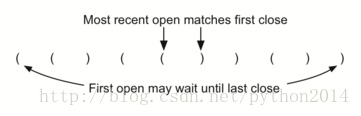

# python 数据结构与算法 5 栈的应用之圆括号平衡

## 栈应用之平衡括号

We now turn our attention to using stacks to solve real computerscience problems. You have no doubt written arithmetic expressions such as

现在我们用栈来解决一个计算机科学上的实际问题。你一定写过类似这样的算术算式：

(5+6)∗(7+8)/(4+3)

where parentheses are used to order the performance of operations.You may also have some experience programming in a language such as Lisp withconstructs like

这里括号为了规范操作顺序。你用过 LISP 语言的话，也许写过这样的语句：

(defun square(n)

     (* n n))

This defines a function called square that will return the square ofits argument n. Lisp is notorious for using lots and lots of parentheses.

这个语句定义了一个函数，用于返回参数 n 的平方值。Lisp 语言以用到大量的括号而闻名。

In both of these examples, parentheses must appear in a balancedfashion. Balanced parentheses means that each opening symbol has acorresponding closing symbol and the pairs of parentheses are properly nested.Consider the following correctly balanced strings of parentheses:

上面两个例子中，括号必须是平衡的。平衡括号的意思是，每个左括号一定对应着一个右括号，括号内又套着括号。看下面这些个括号组成的平衡表达式：

(()()()())

(((())))

(()((())()))

Compare those with the following, which are not balanced:

对比下面这些不平衡的括号：

((((((())

()))

(()()(()

The ability to differentiate between parentheses that are correctlybalanced and those that are unbalanced is an important part of recognizing manyprogramming language structures.

正确地区分平衡和不平衡括号，对很多编程语言来说，都是重要的内容。

The challenge then is to write an algorithm that will read a stringof parentheses from left to right and decide whether the symbols are balanced.To solve this problem we need to make an important observation. As you processsymbols from left to right, the most recent opening parenthesis must match thenext closing symbol (see Figure 4). Also, the first opening symbol processedmay have to wait until the very last symbol for its match. Closing symbolsmatch opening symbols in the reverse order of their appearance; they match fromthe inside out. This is a clue that stacks can be used to solve the problem.

现在的问题就是，写一个算法，读入一串括号字符串，并判断它们是否平衡。仔细观察一下平衡式的结构特点。当从左到右读入一串括号的时候，最早读到的一个右括号总是与他前面的紧邻的左括号匹配(图 4)，同样，最后一个右括号要与最先读到的左括号相匹配。即右括号与左括号是反序的，它们从内到外一一匹配，这就给我们启示，可以用栈来解决问题。



Figure 4: Matching Parentheses

图 4 括号匹配

Once you agree that a stack is the appropriate data structure forkeeping the parentheses, the statement of the algorithm is straightforward.Starting with an empty stack, process the parenthesis strings from left toright. If a symbol is an opening parenthesis, push it on the stack as a signalthat a corresponding closing symbol needs to appear later. If, on the otherhand, a symbol is a closing parenthesis, pop the stack. As long as it ispossible to pop the stack to match every closing symbol, the parentheses remainbalanced. If at any time there is no opening symbol on the stack to match aclosing symbol, the string is not balanced properly. At the end of the string,when all symbols have been processed, the stack should be empty. The Pythoncode to implement this algorithm is shown in ActiveCode 4.

一旦你明白栈的数据结构适合保存括号，算法就很简单了。创建一个空栈，从左到右读入括号串，如果遇到符号是左括号，把它压栈，标志着后面需要一个右括号与之匹配。另一方面，遇到一个右括号，就弹出栈顶数据。只要栈内还有数据可以弹出与右括号匹配，这些括号就仍然是平衡的。任何时候，栈内没有左括号用来匹配了，这个字符串就没有平衡好。到字符串的最后，所有的字符都处理过了，栈应该是空的。这个算法的 python 代码如下：

```py
from pythonds.basic.stack import Stack

def parChecker(symbolString):
    s = Stack()
    balanced = True
    index = 0
    while index <len(symbolString) and balanced:
        symbol =symbolString[index]
        if symbol =="(":
            s.push(symbol)
        else:
            if s.isEmpty():
                balanced =False
            else:
                s.pop()

        index = index + 1

    if balanced ands.isEmpty():
        return True
    else:
        return False

print(parChecker('((()))'))
print(parChecker('(()'))

```

This function, parChecker, assumes that a Stack class is availableand returns a boolean result as to whether the string of parentheses is balanced.Note that the boolean variable balanced is initialized to True as there is noreason to assume otherwise at the start. If the current symbol is (, then it ispushed on the stack (lines 9–10). Note also in line 15 that pop simply removesa symbol from the stack. The returned value is not used since we know it mustbe an opening symbol seen earlier. At the end (lines 19–22), as long as theexpression is balanced and the stack has been completely cleaned off, thestring represents a correctly balanced sequence of parentheses.

函数 parChecker，假定栈类可用，并返回一个布尔值，表示这个字符串是否括号平衡的。注意变量 balanced 初值是 True，因为没有理由在一开始就假定不平衡。如果当前符号是’(‘，压栈（9-10）行。注意 15 行用 pop 直接删除一个栈顶元素。返回值没有用，因为我们知道栈顶元素一定是个’(‘。结尾部分（19-22 行），只要栈被完全清空，这个表达式就是平衡的。