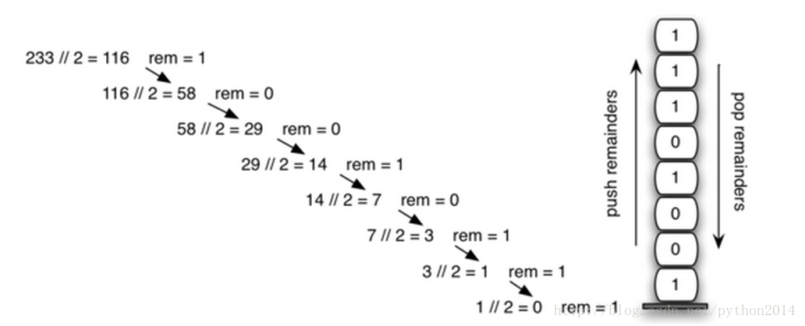

# Python 数据结构与算法 7 栈的应用之进制转换

## Converting Decimal Numbers to Binary Numbers

## 栈的应用：进制转换

In your study of computer science, you have probably been exposed inone way or another to the idea of a binary number. Binary representation is importantin computer science since all values stored within a computer exist as a stringof binary digits, a string of 0s and 1s. Without the ability to convert backand forth between common representations and binary numbers, we would need tointeract with computers in very awkward ways.

在学习计算机过程中，你总会被以这样那样的方式灌输二进制的思想。的确，计算机内部数据就是二进制存储的，所有的数据都是由 0 和 1 组的成串。幸亏二进制和日常数据格式之间能够相互转换，不然计算机可就一点不好玩了。

Integer values are common data items. They are used in computerprograms and computation all the time. We learn about them in math class and ofcourse represent them using the decimal number system, or base 10\. The decimalnumber 23310 and its corresponding binary equivalent 111010012are interpreted respectively as

计算机程序里，整数无处不在，我们在数学课上也学习整数，当然是十进制的整数，或者说叫做以 10 为基数的整数。十进制的 233[10] 在二进制里表示为：11101001[2]，或者按权展开成为：

2×10²+3×10¹+3×10⁰

and

和

1×2⁷+1×2⁶+1×2⁵+0×2⁴+1×2³+0×2²+0×2¹+1×2⁰

But how can we easily convert integer values into binary numbers?The answer is an algorithm called “Divide by 2” that uses a stack to keep trackof the digits for the binary result.

有一种很容易地把十进制转为二进制的方法，叫做“除二取余法”，用栈来保存二进制的位。

The Divide by 2 algorithm assumes that we start with an integergreater than 0\. A simple iteration then continually divides the decimal numberby 2 and keeps track of the remainder. The first division by 2 givesinformation as to whether the value is even or odd. An even value will have aremainder of 0\. It will have the digit 0 in the ones place. An odd value willhave a remainder of 1 and will have the digit 1 in the ones place. We thinkabout building our binary number as a sequence of digits; the first remainderwe compute will actually be the last digit in the sequence. As shown in Figure5, we again see the reversal property that signals that a stack is likely to bethe appropriate data structure for solving the problem.

这种算法从一个大于 0 的整数开始，通过递归法连续除以 2，并保存除 2 得到的余数。第一次除以 2 可以判断这个数是偶数还是奇数。偶数除以 2 的余数是 0，这个二进制位就 0；奇数除以 2 的余数是 1，这个位就是 1。这样连续相除得到一串的 0 或 1，第 1 次得到的位实际是最后一位。如图 5 所示，我们又一次见到了需要反转顺序的性质，这就表明需要利用栈的特性来解决问题了。



The Python code in ActiveCode 6 implements the Divide by 2algorithm. The function divideBy2 takes an argument that is a decimal numberand repeatedly divides it by 2\. Line 7 uses the built-in modulo operator, %, toextract the remainder and line 8 then pushes it on the stack. After thedivision process reaches 0, a binary string is constructed in lines 11-13\. Line11 creates an empty string. The binary digits are popped from the stack one ata time and appended to the right-hand end of the string. The binary string isthen returned.

算法的 Python 代码如下，函数 divideBy2（）的参数是一个十进制整数，连续被 2 除。第 7 行使用了 python 操作符%取得余数。第 8 把得到的余数压栈，当商是 0 的时候，11-13 行形成一个二进制字符串。11 行是建立空串，二进制位被从栈中一个一个被弹出，同时被追加到空字符串的右端(append)，最终返回一个二进制字符串。

```py
from pythonds.basic.stack import Stack

 def divideBy2(decNumber):
    remstack = Stack()

    while decNumber > 0:
        rem = decNumber % 2
        remstack.push(rem)
        decNumber = decNumber// 2

    binString = ""
    while notremstack.isEmpty():
        binString = binString+ str(remstack.pop())

    return binString

print(divideBy2(42))
```

The algorithm for binary conversion can easily be extended toperform the conversion for any base. In computer science it is common to use anumber of different encodings. The most common of these are binary, octal (base8), and hexadecimal (base 16).

上面的算法很容易扩展到任意进制的转换，计算机科学比较常用二进制，八进制和十六进制。

The decimal number 233 and its corresponding octal and hexadecimalequivalents 351[8] and E9[16] are interpreted as

十进制的 233，在八进制里是 351[8],在十六进制就是 E9[16]

按权展开式：

3×8²+5×8¹+1×8⁰

and

14×16¹+9×16⁰

The function divideBy2 can be modified to accept not only a decimalvalue but also a base for the intended conversion. The “Divide by 2” idea issimply replaced with a more general “Divide by base.” A new function calledbaseConverter,shown in ActiveCode 7, takes a decimal number and any base between 2 and 16 asparameters. The remainders are still pushed onto the stack until the valuebeing converted becomes 0\. The same left-to-right string construction techniquecan be used with one slight change. Base 2 through base 10 numbers need amaximum of 10 digits, so the typical digit characters 0, 1, 2, 3, 4, 5, 6, 7,8, and 9 work fine. The problem comes when we go beyond base 10\. We can nolonger simply use the remainders, as they are themselves represented astwo-digit decimal numbers. Instead we need to create a set of digits that canbe used to represent those remainders beyond 9.

函数 divideBy2 修改一下能用于转换其他进制，“除二取余法”就得改成“除基取余法”了，新函数名为 baseConverter，代码如下。第一个参数是任意二进制整数，第二个参数是 2 到 16 之间的基数，余数仍被压栈，直到商为 0。从左到右的字符串生成过程也是一样的。不过当基数超过 10 以后，问题就来了，因为栈内的余数是 2 位的十进制数！

```py
 from pythonds.basic.stackimport Stack

def baseConverter(decNumber,base):
    digits ="0123456789ABCDEF"

    remstack = Stack()

    while decNumber > 0:
        rem = decNumber % base
        remstack.push(rem)
        decNumber = decNumber// base

    newString = ""
    while notremstack.isEmpty():
        newString = newString+ digits[remstack.pop()]

    return newString

print(baseConverter(25,2))
print(baseConverter(25,16))

```

A solution to this problem is to extend the digit set to includesome alphabet characters. For example, hexadecimal uses the ten decimal digitsalong with the first six alphabet characters for the 16 digits. To implementthis, a digit string is created (line 4 in Listing 6) that stores the digits intheir corresponding positions. 0 is at position 0, 1 is at position 1, A is atposition 10, B is at position 11, and so on. When a remainder is removed fromthe stack, it can be used to index into the digit string and the correctresulting digit can be appended to the answer. For example, if the remainder 13is removed from the stack, the digit D is appended to the resulting string.

上面的解决办法是建立一个集合，包括一些字母符号。比如十六进制使用了 6 个字母，所以 4 行建立一个字符串存储相应位置的字符，如 0 在 0 位上，1 在 1 位上，A 在 10 位上，B 在 11 位上，如此等等。当一个余数被出栈时，以自己为索引到这个字符串上找到正确的字符并追加到答案的后面。比如 13 出栈，13 位上的 D 追加到结果中。

复习题

stk-3: What is value of 25 expressed as anoctal number 

25 转为 8 进制是多少？

stk-4: What is value of 256 expressed as ahexidecimal number

256 转为十六进制多少？

stk-5: What is value of 26 expressed in base26 

26 在 26 进制里是多少？