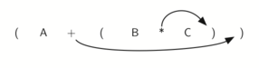
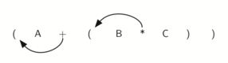
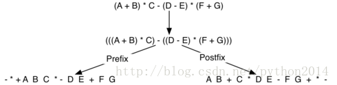

# python 数据结构与算法 9 中缀后前缀、后缀的转换思路

中缀到前缀和后缀的转换

So far, we have used adhoc methods to convert between infix expressions and the equivalentprefix and postfix expression notations. As you might expect, there arealgorithmic ways to perform the conversion that allow any expression of anycomplexity to be correctly transformed.

到目前为止，我们都是用特例的方法把中缀转前缀和后缀，也许有一种算法，能够转换任意复杂的表达式呢？

The first technique that we willconsider uses the notion of a fully parenthesized expression that was discussedearlier. Recall that A + B * C can be written as (A + (B * C)) to showexplicitly that the multiplication has precedence over the addition. On closerobservation, however, you can see that each parenthesis pair also denotes thebeginning and the end of an operand pair with the corresponding operator in themiddle.

我们考虑要用到前面所提到过的“完全括号”,象 A+B*C 写成（A+（B*C））以保证乘法的高优先级。仔细观察发现，每一对括号内都是一个计算过程，包括一对操作数和一个操作符的完整计算。

Look at the right parenthesis inthe subexpression (B * C) above. If we were to move the multiplication symbolto that position and remove the matching left parenthesis, giving us B C *, wewould in effect have converted the subexpression to postfix notation. If theaddition operator were also moved to its corresponding right parenthesisposition and the matching left parenthesis were removed, the complete postfixexpression would result (see [*Figure 6*](http://interactivepython.org/courselib/static/pythonds/BasicDS/stacks.html#fig-moveright)).

从一个局部（B*C）来看，如果把乘号移动到右括号的位置取而代之，并去掉相应的左括号，变成了 B C *,这不就是（B*C）的后缀式吗？更进一步，把加号移到它的右括号位置取代它，再去掉相应的左括号，整个后缀表达式就出来了，如图 6

Figure 6: Moving Operators to theRight for Postfix Notation

If we do the same thing butinstead of moving the symbol to the position of the right parenthesis, we moveit to the left, we get prefix notation (see [*Figure 7*](http://interactivepython.org/courselib/static/pythonds/BasicDS/stacks.html#fig-moveleft)). The position of the parenthesis pair is actually aclue to the final position of the enclosed operator.

如果改个方向，操作符左移取代左括号并去掉右括号，就得到前缀表达式。看来括号的位置，是找到操作符位置的线索。

Figure 7: Moving Operators to theLeft for Prefix Notation

So in order to convert anexpression, no matter how complex, to either prefix or postfix notation, fullyparenthesize the expression using the order of operations. Then move theenclosed operator to the position of either the left or the right parenthesisdepending on whether you want prefix or postfix notation.

所以要转换表达式，无论多么复杂，无论前缀还是后缀，先完全括号化，然后将操作符前移或后移取代括号。

Here is a more complexexpression: (A + B) * C - (D - E) * (F + G). [*Figure 8*](http://interactivepython.org/courselib/static/pythonds/BasicDS/stacks.html#fig-complexmove) shows the conversion to postfix and prefixnotations.

这是一个更复杂的转换例子：(A + B) * C - (D - E) *(F + G)，图 8 显示了转换过程。

 

Figure 8: Converting a ComplexExpression to Prefix and Postfix Notations