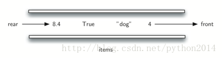

# python 数据结构与算法 12 队列的概念

什么是队列？

队列是有序数据集合，队列的特点，是在头部删除数据项，称为前端，在尾部增加数据项，称为后端。数据项总是在开始的时候排在队伍的后端，慢慢向前走，直到排到最前面，轮到它的时候离开队列。

刚进来的排在后端，待在队伍里时间最长的在前端，这种排列规则叫做 FIFO，意思是“先进先出”，或者叫做“先来先服务”。

最简单的例子就是平时我们的排队，象排队买票看电影，在超市排队付款，在自助餐厅排队取盘子（嗯，盘子可是后进先出的，那是栈规则）。队列严格执行一字排开的规则，一个方向进，同一方向出，不许插队，不许离队。图 1 是个 python 数据对象的队列。

图 1 数据队列

计算机科学里也有队列的例子，象我们实验室有 30 台电脑只有 1 台打印机，学生们要打印的时候，所有的打印任务排队等候，排在第一的马上就能打印，排在最后的就要等所有其他人都打完了才开始。随后我们会探讨这个很有意思的例子。

除打印队列外，操作系统使用了不同的队列控制系统进程。象调度系统就是使用了队列算法以保证尽可能快地执行程序，并响应尽可能多的用户。比如打字的时候有进发现敲了键盘，屏幕却延迟响应，这是因为系统系统正做其他事情，所以把键盘事件放在缓冲队列里，所以稍有延迟，不过最终还是会显示出来。