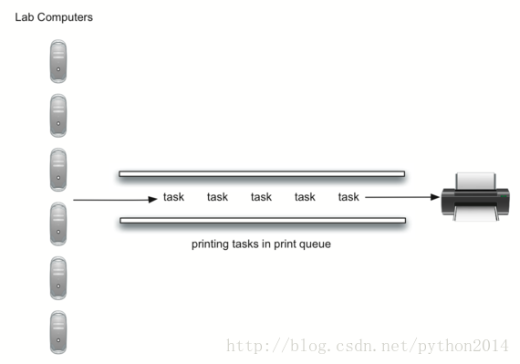

# python 数据结构与算法 16 队列应用之 打印任务

## 队列应用：打印任务

在本章开始我们就谈到过模拟打印任务队列的行为。回想学生时代，向共享打印机发送一个打印任务，并被放在一个先到先服务的队伍中等候处理。这种方法有很多的问题，最重要的是，打印机是否能够完成这么多数量的任务，如果打不完，学生们会等待太长时间，导致错过下次课。

考虑一下这种情形：计算机科学实验室里，平均每小时有 10 个学生在完成作业，这些个学生在这段时间里一般打印两次，每次任务可能是 1-20 页不等。实验室的打印机有点老，按草稿质量能够打印 10 页/分钟，如果切换到高质量，则只能打印 5 页/分钟，越慢等的时候越长，那么应该设置成多少？

我们可以通过建立一个实验室模型帮助决策。需要建立学生，打印任务和打印机的的模型。因为学生发出打印任务时，需要把任务加入打印任务队列。当打印机完成一个任务后，它要到队列中查看是还仍有任务要处理。我们感兴趣的是，学生们的平均等待时间，也等同于队列中任务的平均等待时间。



这个模型需要一点概率事件，例如，学生打印长度 1-20 页，如果每个长度可能性相等，那么实际长度可以用一个 1-20 之间的随机数来模拟。这表示，1-20 之间的长度机会均等。

如果 10 个学生每人打印两次，那么平均每小时有 20 个打印任务。在每一秒钟产生一个打印任务的可能性多大？这就要考虑任务与时间的比率。20 个任务每小时，意味着平均每 180 秒产生一个任务。

20 任务/小时 ×1 小时/60 钟×1 分钟/60 秒=1 任务/180 秒

我们可以通过产生一个 1-180 之间的随机数，来模拟每秒钟产生一个新任务的概率。如果数字是 180，那么任务已经产生了。要注意很多任务可能排成队，也有可能等好久也没有一个任务，这就是模拟的特性，我们的模拟总是想尽可能地接近真实情况。

## 主要模拟步骤

主要分这几个步骤。

1.  建立打印任务队列，每个任务要打上到达的时间戳，开始时是空的队列。
2.  对每一秒(`currentSecond`)

    2.1 有没有新任务到达？如果有，如果有，加入队列，加上(`currentSecond`)时间戳。

    2.2 如果打印机空闲且有任务在等待：

    2.2.1 从队列中除去下一个任务，并分配给打印机。

    2.2.2 当前时间减去加入队列的时间戳，就是本任务的等待时间

    2.2.3 把等待时间加入一个列表，后续处理。

    2.2.4 根据本任务的纸张数，计算打印所需时间

2.3 如果需要，打印机工作 1 秒钟，也要从任务所需时间中减去 1 秒钟

2.4 如果打印完成，也就是上一步中把时间减到 0 了，打印机进入空闲状态

3.模拟完成，根据任务时间列表，计算平均等待时间

## Python 实现

为了实现任务模拟，我们设计三个类对应现实世界的三种对象：`Printer`,`Task`,和 `PrintQueue`

`Printer` `类用来跟踪当前是否在工作，如果是，它的状态是``busy(13-17),``并且``busy``时间用纸张数计算出来。构造函数可以设置每分钟打印页数。``Tikc``方法递减内部时间，并将打印机设为``idle(11``行``)`

**Listing2**

class Printer:

    def__init__(self, ppm):

       self.pagerate = ppm

       self.currentTask = None

       self.timeRemaining = 0

    deftick(self):

        ifself.currentTask != None:

           self.timeRemaining = self.timeRemaining - 1

            ifself.timeRemaining <= 0:

                self.currentTask = None

    defbusy(self):

        ifself.currentTask != None:

           return True

        else:

           return False

    defstartNext(self,newtask):

       self.currentTask = newtask

       self.timeRemaining = newtask.getPages() * 60/self.pagerate

Task 类代表一个打印任务。产生任务时，构造函数提供一个 1-20 之间的随机数，代表任务的纸张数。要用到 random 模块的`randrange` 方法

```py
>>> importrandom
```

```py
>>> random.randrange(1,21)
```

```py
18
```

```py
>>> random.randrange(1,21)
```

```py
8
```

```py
>>> 
```

每个任务也要保存一个时间戳用来计算等待时间。这个时间戳代表产生任务并加入队列的时间，waitTime 方法用来计算任务在开始打印之前等待的时间。

**Listing3**

import random

class Task:

    def__init__(self,time):

        self.timestamp =time

        self.pages =random.randrange(1,21)

    def getStamp(self):

        returnself.timestamp

    def getPages(self):

        return self.pages

    def waitTime(self,currenttime):

        return currenttime- self.timestamp

模拟程序([*Listing 4*](http://interactivepython.org/courselib/static/pythonds/BasicDS/queues.html#lst-qumainsim))用来实现上面所述的算法。printQueue 对象是队列的抽象数据类型的实例，一个布尔值辅助函数，newPrintTask 用来决定是否有新任务产生，我们再次使用了 random 模块 randrange 方法返回一个 1-180 之间的随机数。打印任务每 180 秒到来一次，我们从一个范围内的随机整数中产生 180 的方法模拟随机事件（32 行）。这个模拟功能允许我们设置总时间和打印机的打印速度。

```py
frompythonds.basic.queueimport Queue

importrandom

defsimulation(numSeconds, pagesPerMinute):

   labprinter = Printer(pagesPerMinute)
   printQueue = Queue()
   waitingtimes = []

    for currentSecondinrange(numSeconds):

     if newPrintTask():
        task = Task(currentSecond)
        printQueue.enqueue(task)

     if (not labprinter.busy())and (not printQueue.isEmpty()):
       nexttask = printQueue.dequeue()
       waitingtimes.append(nexttask.waitTime(currentSecond))
       labprinter.startNext(nexttask)

     labprinter.tick()

   averageWait=sum(waitingtimes)/len(waitingtimes)
    print("Average Wait%6.2f secs%3d tasks remaining."%(averageWait,printQueue.size()))

defnewPrintTask():
   num = random.randrange(1,181)
    if num==180:
       returnTrue
    else:
       returnFalse

for iinrange(10):
   simulation(3600,5)

```

运行模拟程序时，对于每次运行的结果不同不必担心，这是随机数的原因，我们感兴趣的是，如果调整模拟参数，模拟程序的变化趋势。这里是一组测试数据。

首先，我们要运行模拟程序 60 分钟（3600 秒），使用 1 台 5ppm 的打印机，一共运行 10 次测试。再说一遍，因为随机数的原因，每次测试的结果不同。

>>>for i in range(10):

     simulation(3600,5)

Average Wait 165.38 secs 2 tasks remaining.

Average Wait  95.07 secs 1 tasks remaining.

Average Wait  65.05 secs 2 tasks remaining.

Average Wait  99.74 secs 1 tasks remaining.

Average Wait  17.27 secs 0 tasks remaining.

Average Wait 239.61 secs 5 tasks remaining.

Average Wait  75.11 secs 1 tasks remaining.

Average Wait  48.33 secs 0 tasks remaining.

Average Wait  39.31 secs 3 tasks remaining.

运行 10 次以后，我们能看得出平均等待时间是 122.155 秒，也能看到平均数据变化的范围很大，从最小的 17.27 秒到最大的 239.61 秒，而且只有 2 次的打印任务是完成的。

现在我们调整打印速度到 10ppm，再运行 10 次，通过更快的打印机任务，我们希望在一个小时的时间里，有更多的打印任务得以完成。

>>>for i in range(10):

     simulation(3600,10)

Average Wait   1.29 secs 0 tasks remaining.

Average Wait   7.00 secs 0 tasks remaining.

Average Wait  28.96 secs 1 tasks remaining.

Average Wait  13.55 secs 0 tasks remaining.

Average Wait  12.67 secs 0 tasks remaining.

Average Wait   6.46 secs 0 tasks remaining.

Average Wait  22.33 secs 0 tasks remaining.

Average Wait  12.39 secs 0 tasks remaining.

Average Wait   7.27 secs 0 tasks remaining.

Average Wait  18.17 secs 0 tasks remaining.

附完整代码:

```py
from pythonds.basic.queue import Queue

import random

class Printer:
    def __init__(self, ppm):
        self.pagerate = ppm
        self.currentTask =None
        self.timeRemaining = 0

    def tick(self):
        if self.currentTask !=None:
            self.timeRemaining= self.timeRemaining - 1
            ifself.timeRemaining <= 0:
                self.currentTask = None

    def busy(self):
        if self.currentTask !=None:
            return True
        else:
            return False

    defstartNext(self,newtask):
        self.currentTask =newtask
        self.timeRemaining =newtask.getPages() * 60/self.pagerate

class Task:
    def __init__(self,time):
        self.timestamp = time
        self.pages =random.randrange(1,21)

    def getStamp(self):
        return self.timestamp

    def getPages(self):
        return self.pages

    def waitTime(self,currenttime):
        return currenttime -self.timestamp

def simulation(numSeconds, pagesPerMinute):

    labprinter =Printer(pagesPerMinute)
    printQueue = Queue()
    waitingtimes = []

    for currentSecond inrange(numSeconds):

      if newPrintTask():
         task =Task(currentSecond)
        printQueue.enqueue(task)

      if (notlabprinter.busy()) and (not printQueue.isEmpty()):
        nexttask =printQueue.dequeue()
        waitingtimes.append(nexttask.waitTime(currentSecond))
       labprinter.startNext(nexttask)

      labprinter.tick()

   averageWait=sum(waitingtimes)/len(waitingtimes)
    print("Average Wait%6.2f secs %3d tasks remaining."%(averageWait,printQueue.size()))

def newPrintTask():
    num =random.randrange(1,181)
    if num == 180:
        return True
    else:
        return False

for i in range(10):
simulation(3600,5)
```

## 讨论

这次模拟的目的，是要问题这样一个问题，即通过降低打印速度提高打印皁，这台打印机是否能够承担这个打印负荷。这个过程就是编写一个模拟程序，为打印任务建模，并以随机的发生时间和随机的工作长度进行验证。

以上的输出表明，如果在 5ppm 的速度，平均等待时间是从 17 秒到 376 秒(约 6 分钟)，如果用速度加快，最小时间变为 1 秒到 28 秒。另外在 5ppm 的速度下，8 成的打印任务在 1 个小时内没有打完。

这样，我们会给出建议说，提高质量降低速度，不是一个好办法。学生们不能等那么长时间来等待，特别是下一节还有课，6 分钟的等待太长了。

这种模拟分析能够回答很多问题，特别是这类“如果怎样，那么怎样”类的问题，因为我们只要修改模拟程序的参数，就能模拟很多有趣的行为。比如

*   如果人数增多，现在有 20 个学生，是什么情形？
*   如果是周六，学生们不必去上课，他们会等待吗？
*   因为 python 语言太强大了，程序都变短，所以学生们的打印任务都变小了，会怎么样？

这些问题都可能修改模拟参数来得到答案，当然，必须明白，模拟程序只是使用可能真实假定数据。现实中的打印任务长度和每小时内要打印的学生数，也需要构建一个模拟程序。。