# python 数据结构与算法 18 无序列表的实现

### 无序列表的实现：链表

为了实现无序列表，先要实现我们通常称为“链表”的结构。前面说过我们保持列表元素之间的相对位置。当然，在连续存储的情况下不需要额外保存相对位置（如数组），但是如果数据以图 1 这样的随机方式保存，这就需要为每个元素配置额外的信息，指明它下一个元素的位置（图 2），这样每个元素的相对位置，就通过一个元素到另一个元素的链接实现了。

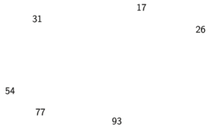

图 1 元素不固定物理位置

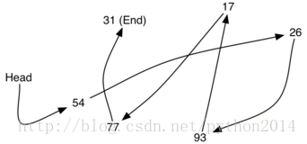

图 2 通过明确链接维持相对关系

特别要注意，链表第一个元素的位置必须单独指定，一旦知道了第一个元素，它就能告诉我们第 2 个元素的位置，依次类推。链表的外部引用通常就指向它的头部。类似地，最后一个元素，也要表明他“下面没有了”。

#### 节点类

节点（Node）是实现链表的基本模块，每个节点至少包括两个重要部分。首先，包含节点自身的数据，称为“数据域”。其次，包括对下一个节点的“引用”。下面代码是 Node 类的代码。为了构造节点，需要初始化节点的数据，如图 3，为节点赋值并返回一个节点对象。不过图 4 才是一般节点的图示方式。节点类也包括访问和修改数据域及指针域的的方法。

**Listing 1**

```py
classNode:
```

```py
    def__init__(self,initdata):
```

```py
        self.data= initdata
```

```py
        self.next=None
```

```py
    defgetData(self):
```

```py
        returnself.data
```

```py
    defgetNext(self):
```

```py
        returnself.next
```

```py
    defsetData(self,newdata):
```

```py
        self.data= newdata
```

```py
    defsetNext(self,newnext):
```

```py
        self.next= newnext
```

用上述类创建一个节点对象

```py
>>> temp= Node(93)
```

```py
>>> temp.getData()
```

```py
93
```

特殊的引用值 None 在节点类和链表中都非常重要。对 None 的引用代表没有下一个节点，象构造函数中，就是创建一个节点，把并它的“引用”赋值为 None。因为有时把最后一个节点称为“接地点”，我们干脆用电气上的接地符号代表 None。初始化一个“引用”时，先赋值为 None,是个不错的主意。

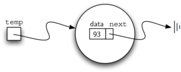

图 3 节点对象包括数据域和对下一个节点的引用

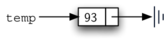

图 4 节点的典型表示法

### 无序列表类

如前所述，无序列表通过一个节点的集合来实现，每个节点包括对下一个节点的引用。只要我们找到第一个节点，跟着引用就能走遍每个数据项。按这个想法，无序列表类必须保存对第一个节点的引用。下面是构造方法，注意每个列表对象包含对“列表头”（head）的引用。

**Listing 2**

```py
classUnorderedList:
```

```py
    def__init__(self):
```

```py
        self.head=None
```

创建列表的时候进行初始化，这里没有数据项，赋值语句

```py
>>> mylist= UnorderedList()
```

创建的链表如图 5 所示。我们已经讨论过节点类的特殊引用 None，这里用来表示 head 没有引用任何节点。最后，前面给出的链表例子如图 6 所示，head 指向第一个节点，第一个节点包括第一个数据项。同样，第一个节点包括对下一个节点的引用。特别重要的是，链表类不包括任何节点对象，相反，它只包括对列表第一个元素的引用。

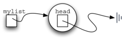

图 5 空列表

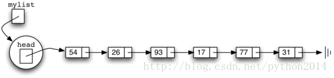

图 6 整数链表

下面代码段中的 isEmpty 方法，用来检查 head 引用是否是 None，方法中的返回值表达式 self.head==None，只有当链表中没有节点时为真。既然一个新建链表是空，构造函数和“isEmpty“函数一定保持一致，这也显示了用 None 来代表“结束”的优势。在 python 语言中，None 能够和任意的引用作比较，如果两个变量引用了同一对象，他们就是相等的。今后还会经常用到这种方法。

**Listing 3**

```py
defisEmpty(self):
```

```py
    returnself.head==None
```

这样的话，怎样把新的数据项加入列表呢？需要实现一个新 add 方法。但在此之前，需要处理一个重要问题：链表把新数据项放在什么位置？既然列表是无序的，新数据项的位置与原有元素关系不大，新数据项可放在任意位置，这样的话，我们可以把新项放在最容易处理的位置。

回想链表结构只为我们提供了一个入入，即列表的 head，所有其他节点都要通过引用逐个访问，这说明，最容易的处理的地方就是在 head 位置，或开始的位置。换个说法，新数据项总是列表的第一个项，原有数据项都通过引用依次排在它的后面。

图 6 显示了通过 add 方法几次形成的链表。

```py
>>> mylist.add(31)
```

```py
>>> mylist.add(77)
```

```py
>>> mylist.add(17)
```

```py
>>> mylist.add(93)
```

```py
>>> mylist.add(26)
```

```py
>>> mylist.add(54)
```

注意到 31 是第一个加入的数据，最终它是链表里最后一个。同样，54 是最后加入的，它成为链表的第一个节点的数据

Add 方法在代码 4 中实现。每个数据项都在节点对象内部。第 2 行创建一个新节点，并把数据保存在它的数据域内。然后需要把这个节点与现有结构连接起来，图 7 表明了两个步骤。第一步，把新节点的引用改成对原来第一个节点的引用。这样列表里其他节点就与新节点建立了链接，只要把修改 head 为对新节点的引用。第 4 行的赋值语句设置列表的 head。

上面两个步骤的顺序特别重要，如果 3 和 4 反序会怎么样？如果先修改了 head 的引用，就象图 8 所示，因为 head 是对列表节点的唯一外部引用入口，一旦失去，所有原来的节点将从内存中消失。

**Listing 4**

**代码 4**

```py
defadd(self,item):
```

```py
    temp = Node(item)
```

```py
    temp.setNext(self.head)
```

```py
    self.head= temp
```

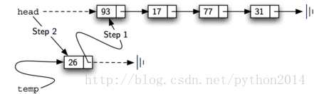

图 7 两步增加新节点

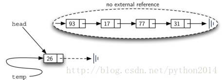

图 8 两步顺序倒置的结果

下面我们要建立的方法 size, search,和 remove，都基于链表的一种技术，即遍历实现的。遍历指系统地访问每个节点的过程。为此，我们从第一个节点的外部引用开始，每访问过一个节点，通过引用移动到下一个节点实现遍历。

为了实现 size 方法，我们也要遍历链表，这个过程中用一个变量记录我们经过的节点。代码 5 显示了计数器代码。外部引用叫做 current，第二行中初始化为链表的 head。开始时因为没有经历过任何节点，所以计数器变量为 0，第 4-6 行实现了遍历。只要 current 引用没有看到 None，就把 current 指向下一个节点（第 6 行）。

最后，迭代结束后，count 得以返回。图 9 显示了处理过程。

**Listing 5**

|  
```py
defsize(self):
```

```py
    current =self.head
```

```py
    count =0
```

```py
    while current !=None:
```

```py
        count = count +1
```

```py
        current = current.getNext()
```

```py
    return count
```

 |

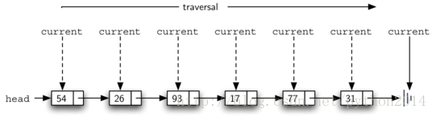

图 9 从头到尾的遍历

在无序列表中查找一个值 也要使用遍历技术，当访问每个节点的时候，都要比较它的数据是否与要查找的数据相符。这样，可能不用遍历全部的节点就能找到，如果找到了就不必继续找下去。事实上，如果我们真到了列表的尾部，就说明没找到。

List6 显示了查找方法的实现。象在 size 方法中一样，遍历从 head 开始（2 行），另用了一个 found 变量记录是否已经找到。因为开始的状态是没找到，found 初始化为 False。第 4 行使用了两个条件决定是否要继续遍历，1 后面还有节点 2、还没找到。行 5 行检查当前节点的数值是否符合，如果是，found 值为 True，遍历结束。

**Listing 6**

|  
```py
defsearch(self,item):
```

```py
    current =self.head
```

```py
    found =False
```

```py
    while current !=Noneandnot found:
```

```py
        if current.getData()== item:
```

```py
            found =True
```

```py
        else:
```

```py
            current = current.getNext()
```

```py
    return found
```

 |

试着查找一下 17

```py
>>> mylist.search(17)
```

```py
True
```

17 在列表中，遍历过程只需到含 17 的节点，在这点上，found 被置 True，while 的条件不成立，退出循环，返回 found 值。如图 10 所示

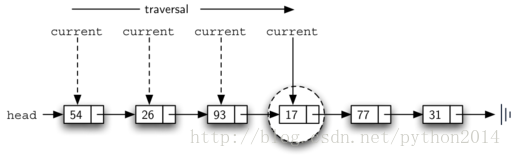
图 10 查找 17Remove 方法需要两个步骤。首先，需要遍历列表找到要删除的数据，一旦找到，再删除。第一步和查找很象，遍历列表，找到这个数据——因为假定数据是存在的，一定在到达 None 之前找到——这表明要用 found 的布尔值来标志

找到后，found 变成 True，current 就是对包含要删除的数据的节点的引用。一种可能的方式是用一种标志代替原来的数值，表明这个数值不存在。但这样一来，链表的节点数量和实际的数量对不上，所以不如直接删除这个节点。

为了删除节点，我们要把待删除节点前面的那个节点的 next 指向待删除节点后面那个节点就可以了。不幸的是，找到 current 以后，我们没办法再回到它前面，来不及改了。

解决办法办法是在遍历时使用两个外部引用，current 和以前一样，标志当前正在遍历的，新的引用，我们叫它 previous，跟在 current 后面遍历，这样 current 找到要删除节点时，previous 正好停在 current 前面节点上。

Listing7 显示了 remove 方法的全部代码。2-3 行为两个引用分配初值。注意，current 开始于 head，previous 是要跟在 current 后面的，所以 previous 的初值是 None，因为 head 前面没有节点（图 11）。Found 仍是叠代的控制变量。

在 6-7 行检查是否找到了要删除的节点，如果是，found 为 True。如果不是，previous 和 current 各自向前一步到下一个节点。再次注意，这个前移的步骤非常关键，previous 必须先移动到当前 current 的位置，current 才能向前走。这个过程时常称为“尺蠖”，因为这瞬间 previous 和 current 指向同一对象，就象尺蠖弓腰。图 12 显示了 previous 和 current 在查找 17 的过程中的运动。

（尺蠖，又名“弓腰虫”，行动时一屈一伸像个拱桥——译者）

**Listing 7**

|  
```py
defremove(self,item):
```

```py
    current =self.head
```

```py
    previous =None
```

```py
    found =False
```

```py
    whilenot found:
```

```py
        if current.getData()== item:
```

```py
            found =True
```

```py
        else:
```

```py
            previous = current
```

```py
            current = current.getNext()
```

```py
    if previous ==None:
```

```py
        self.head= current.getNext()
```

```py
    else:
```

```py
        previous.setNext(current.getNext())
```

 |

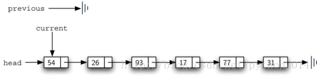

图 11 previous 和 current 的初始化

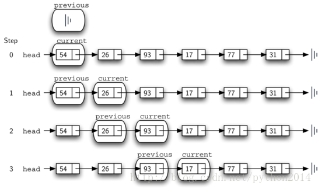

图 12 previou 和 current 的运动历程

一旦查找过程结束，开始删除过程。图 13 显示了要修改的链接。不过有一种特殊情况要处理，如果要删除的数据就在第一个节点上，current 就是第一个节点，这里 previous 仍然是 None，我们前面说过，prevous 所在节点是要修改它的 next 引用。但在这种特殊情况下，要修改的不是 previous 的 next,而是列表的 head。（图 14）

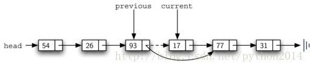

图 13 删除中间某节点

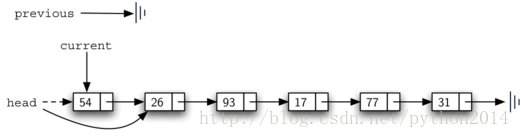

图 14 移除第一个节点

12 行让我们检查是否上面所说的特殊情况。如果 previous 还没有前移，它就仍然是 None，但这时 found 是 True，在这种情况下(13 行)，head 被修改为指向 current 的下个节点，效果上就是删除了第一个节点。不过，如果 previous 不是 None，那么要删除的节点就是在中间某处。这种情况下，previous 所在节点的 next 要做修改，15 行使用了 setNext 方法完成删除。要注意的是，在两种情况下，修改引用都指向了 current.getNext()。

不过这两种情况是否适用于要删除的节点在最后节点上呢？留作练习。

以下是无序列表的全部代码及测试代码

```py
class Node:
    def __init__(self, initdata):
        self.data = initdata
        self.next = None

    def getData(self):
        return self.data

    def getNext(self):
        return self.next

    def setData(self, newdata):
        self.data = newdata

    def setNext(self, newnext):
        self.next = newnext

classUnorderedList:
    def __init__(self):
        self.head = None

    def isEmpty(self):
        return self.head == None

    def add(self, item):
        temp = Node(item)
        temp.setNext(self.head)
        self.head = temp

    def size(self):
        current = self.head
        count = 0
        while current != None:
            count = count + 1
            current = current.getNext()

        return count

    def search(self, item):
        current = self.head
        found = False
        while current != None and not found:
            if current.getData() == item:
                found = True
            else:
                current = current.getNext()

        return found

    def remove(self, item):
        current = self.head
        previous = None
        found = False
        while not found:
            if current.getData() == item:
                found = True
            else:
                previous = current
                current = current.getNext()

        if previous == None:
            self.head = current.getNext()
        else:
            previous.setNext(current.getNext())

mylist =UnorderedList()

mylist.add(31)
mylist.add(77)
mylist.add(17)
mylist.add(93)
mylist.add(26)
mylist.add(54)

print(mylist.size())
print(mylist.search(93))
print(mylist.search(100))

mylist.add(100)
print(mylist.search(100))
print(mylist.size())

mylist.remove(54)
print(mylist.size())
mylist.remove(93)
print(mylist.size())
mylist.remove(31)
print(mylist.size())
print(mylist.search(93))
```

其他方法，append,insert,index 和 pop 留为练习。练习要注意，每个方法都要考虑是否适用于第一个元素或其他情况。另外，insert，index 和 pop 需要链表的索引名，我们约定索引名是整数，从 0 开始。