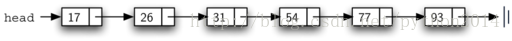
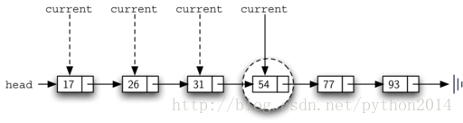
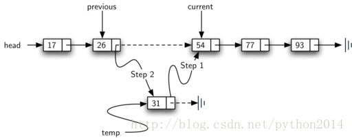

# python 数据结构与算法 19 有序列表 ADT 及实现

## 有序列表 ADT

我们开始讨论有序列表。就如上节中我们讨论的列表，如果数据项按升序排列，就要写成 17，26，31，54，77，93。17 是最小的，就是第一个数据项，93 是最大的，就占最后的位置。

有序列表的数据结构是数据项的集合，数据项之间保持其相对位置，而且这个位置是根据数据项的某个潜在特征排列的。典型的排列方法一般就是升序或降序或其他定义好的比较方法。有序列表的操作大部分与无序列表很象。

*   OrderedList() 创建有序列表，无需参数，返回空列表。

*   add(item) 加入数据项，并保持原有顺序特征。需要一个数据作为参数，无返回值，并假定要加入的数据不在列表里。

*   remove(item) 移除一个数据项，需要待移除的数据为参数，列表被个性。假设要移除的数据列表中确实有。

*   search(item)  查找数据项，参数是数据，返回布尔值。

*   isEmpty()  检查是否空表，不需要参数，返回布尔值。

*   size()  返回列表数据项数量，不需要参数，返回一个整数。

*   index(item) 返回数据项在列表中的位置。参数是数据，返回索引值。假设要查找的数据确实在列表里。

*   pop() 移除列表最后一个数据项，不需要参数，返回那个被移除的数据。假定列表不是空表。

*   pop(pos) 移除并返回指定位置的数据项，参数是位置索引，返回值是删除的项，假定列表中有这个项。

## 有序列表实现

要实现有序列表，我们必须要记住，列表的顺序是按一定规则排列的，前面讲过的整数列表（17，26，31，54，77，93）可用图 15 的表示方法，再一次，我们采用链接的节点来实现列表。



图 15 有序列表

有序列表类同无序列表一样，仍然用一个指向 None 的引用 head 来实现。

**Listing 8**

```py
classOrderedList:
```

```py
    def__init__(self):
```

```py
        self.head=None
```

在有序列表中操作中，isEmpty 和 size 仍然象无序表中一样，这是因为它们只关心数据项的个数，而不关心数据大小。同样的，remove 的操作也完全一样，只涉及前后的节点，与数据大小无关。只有 search 和 add 方法，需要作出改变。

无序列表的查找方法就是一次遍历所有元素来查找。在有序列表中，这个方法仍然适用，不过现在可以利用列表“有序”的特点，提前停止查找。

图 16 所示，在列表中查找 45。遍历的时候，从 head 开始，对比 17，17 不对，对比 26，仍然不对，再到 31，不对，到 54。这时感觉有什么不一样了吗？既然 54 不是我们要找的，理应到下一个节点，但是，这是一个有序列表，后面的数据项不必继续对比，因为一旦节点数据比我们要找的数据大，后面的数据只会更大，可以肯定返回值是 False，停止查找。



[*Listing 9*](http://interactivepython.org/courselib/static/pythonds/BasicDS/linkedlists.html#lst-ordersearch)*是对有序列表查找的实现。这里增加了一个新的布尔值变量 stop，并初始化为 False，与原有的判断条件结合在一起。如果 stop 是 False(notstop)，就继续查找，一旦发现某个数据比查找目标大，就设置 stop 为 True。其他的与无序列表一样。*

**Listing 9**

|  
```py
 1
```

```py
 2
```

```py
 3
```

```py
 4
```

```py
 5
```

```py
 6
```

```py
 7
```

```py
 8
```

```py
 9
```

```py
10
```

```py
11
```

```py
12
```

```py
13
```

```py
14
```

 |  
```py
defsearch(self,item):
```

```py
    current =self.head
```

```py
    found =False
```

```py
    stop =False
```

```py
    while current !=Noneandnot found andnot stop:
```

```py
        if current.getData()== item:
```

```py
            found =True
```

```py
        else:
```

```py
            if current.getData()> item:
```

```py
                stop =True
```

```py
            else:
```

```py
                current = current.getNext()
```

```py
    return found
```

 |

变化最大的是 add 方法，回想在无序列表里，add 方法只需要简单地在最前面增加一个节点，而这个点是最容易找到的一个。不幸的是，在有序列表里，这样不行，必须为新节点找到合适的位置。

假定我们有了列表 17，26，54，77，93，现在要增加一个 31。Add 方法必须找到合适的位置，即位于 26 和 54 之间。如图 17 显示了找到位置后的设置方法。如前所述，我们要遍历列表来找到位置，找么找到列表尾部（current 成为 None），要么找到第一个比我们要添加的数据大的数据项，停止遍历，它前面就是要添加位置。如图 17 中的 54。



图 17 在有序列表中添加数据项

如同在无序列表中看到的，既然 current 无法修改它前面的节点，也需要一个额外的引用变量，仍然叫做 previous，跟在 current 后面遍历。List10 是完整的 add 方法。2-3 行设置了两个额外的引用，9-10 行让 previous 跟在 current 后面亦步亦趋。5 行的条件判断，只要后面还有节点，而且当节点数据不大于添加项，循环叠代就继续下去。循环停止的时候，就是找到位置的时候。

图 17 所示的方法，这里用了两上步。节点构建以后，剩下的问题就是，要么放在队列前面，要么放在中间某处。那么 13 行的 previous==None 就是区别条件。

**Listing 10**

|  
```py
 1
```

```py
 2
```

```py
 3
```

```py
 4
```

```py
 5
```

```py
 6
```

```py
 7
```

```py
 8
```

```py
 9
```

```py
10
```

```py
11
```

```py
12
```

```py
13
```

```py
14
```

```py
15
```

```py
16
```

```py
17
```

```py
18
```

 |  
```py
defadd(self,item):
```

```py
    current =self.head
```

```py
    previous =None
```

```py
    stop =False
```

```py
    while current !=Noneandnot stop:
```

```py
        if current.getData()> item:
```

```py
            stop =True
```

```py
        else:
```

```py
            previous = current
```

```py
            current = current.getNext()
```

```py
    temp = Node(item)
```

```py
    if previous ==None:
```

```py
        temp.setNext(self.head)
```

```py
        self.head= temp
```

```py
    else:
```

```py
        temp.setNext(current)
```

```py
        previous.setNext(temp)
```

 |

目前为止讨论过的有序列表的方法都在下面的，没有列出的方法留作练习。练习时，小心考虑，无序列表的方法在有序表中是否仍然适用。

class Node:

    def__init__(self,initdata):

        self.data =initdata

        self.next = None

    def getData(self):

        return self.data

    def getNext(self):

        return self.next

    defsetData(self,newdata):

        self.data =newdata

    defsetNext(self,newnext):

        self.next =newnext

class OrderedList:

    def __init__(self):

        self.head = None

    def search(self,item):

        current =self.head

        found = False

        stop = False

        while current !=None and not found and not stop:

            ifcurrent.getData() == item:

                found =True

            else:

                ifcurrent.getData() > item:

                    stop =True

                else:

                    current = current.getNext()

        return found

    def add(self,item):

        current =self.head

        previous = None

        stop = False

        while current !=None and not stop:

            ifcurrent.getData() > item:

                stop =True

            else:

                previous =current

                current =current.getNext()

        temp = Node(item)

        if previous ==None:

           temp.setNext(self.head)

            self.head =temp

        else:

           temp.setNext(current)

           previous.setNext(temp)

    def isEmpty(self):

        return self.head== None

    def size(self):

        current =self.head

        count = 0

        while current !=None:

            count = count+ 1

            current =current.getNext()

        return count

mylist = OrderedList()

mylist.add(31)

mylist.add(77)

mylist.add(17)

mylist.add(93)

mylist.add(26)

mylist.add(54)

print(mylist.size())

print(mylist.search(93))

print(mylist.search(100))

### 链表性能分析

链表的性能分析，取决于是否需要遍历。考虑一个 n 个节点的链表，isEmpty 方法是 O(1)，因为它只需要判断 head==None。另一些方法则需要 n 步，因为除了从头到尾遍历一遍，别无它法，所以 length 是 O(n) （原著中是 O(1)，根据上文意思修改）。在无序列表里添加数据项是 O(1)，因为是加在最前面的，不用查找。但 search\remove\add 对有序列表来说，都需要遍历，即便有时不用全部遍历，但在最坏的情况下仍是全部遍历的。所以他们全是 O(n)。

你也许注意到我们这里讨论的性能与 python 语言里的 list 性能不同。这就提示我们，python 语言的列表不是这么实现的，实际上 python 的 list 是用数组实现的，我们在另外的章节里讨论数组。