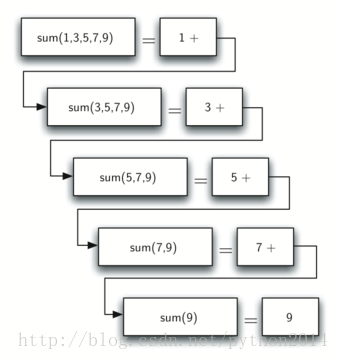
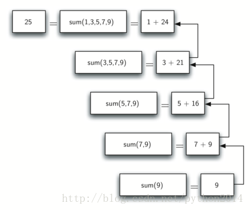

# python 数据结构与算法 20 递归和递归三定律

## 递归

## 本章目标

*   理解很多复杂问题，如果不用递归就很难解决，用递归也许非常简单
*   学会怎样进行递归编程
*   理解并应用递归三定律
*   理解递归也是一种迭代
*   建立一个问题的递归方法
*   理解递归在计算机系统内是如何进行的。

## 什么是递归？

递归是解决问题的一种方法，它把问题拆解得越来越小，直到变得非常容易，一般情况下，递归过程要包括一个自我访问的函数。与表面看起来似乎不一样，其实递归允许我们写出非常简洁的代码，但解决问题却很复杂，用其他办法很难处理。

### 列表元素求和

我们先不用递归，看一个问题不用递归是如何处理的。

假如你想计算一个整数列表各项的和，如[1,3,5,7,9]。下面的代码所示，函数使用了一个累加变量（theSum）来计算所有列表的项目的和：

deflistsum(numList):

    theSum = 0

    for i in numList:

        theSum = theSum + i

    return theSum

print(listsum([1,3,5,7,9]))

假如我们没有 while 和 for 循环语句，你又怎样来计算一系列数字的和呢？如果你是数学家，也许会想到，加法是一个函数，有两个参数，就是一对数字。把一个列表求和问题转为两个数字的求和问题，那么上面的过程可以写成一个完全括号表达式：

((((1+3)+5)+7)+9)

We can also parenthesize the expression theother way around,

还可以用另一种完全括号表达式：

(1+(3+(5+(7+9))))

注意最里层的括号，（7+9）的计算，我们不需要循环或其他结构就能算出来，事实上用下面的顺序计算出最后的和：

| *total*= (1+(3+(5+(7+9))))*total*= (1+(3+(5+16)))*total*= (1+(3+21))*total*= (1+24)*total*= 25 |

这种想法怎样变成 python 程序呢？首先要重新表达一下元素求和的问题。我们也可以说列表元素之和，是第一个元素 numList[0]和其他所有元素的和 numList[1:]，就如下式所示：

*listSum*(*numList*)=*first*(*numList*)+*listSum*(*rest*(*numList*))

在这个等式中，*first*(*numList*) 是列表第一个数据项，而*rest*(*numList*)是除第一项之外所有其他项，用 python 这样表达：

| 1 | ef listsum(numList):   if len(numList) == 1:        return numList[0]   else:        return numList[0] + listsum(numList[1:])print(listsum([1,3,5,7,9])) |
| 2 |
| 3 |
| 4 |
| 5 |
| 6 |
| 7 |

这段 7 行的代码里有几个关键的想法。首先，第 2 行，检查这个列表是否只有一个数据，这步检查很重要，是函数的“例外条款”。长度为 1 的列表求得最简单，就是数据自身。其次，第 5 行，我们的函数调用了它自己！这正是我们把它叫做递归算法的原因，递归函数就是调用自己的函数。

如图 1 所示，一连串的递归调用来求得列表[1,3,5,7,9]的和，应该把这连串的调用当作连续的简化，每次调用，都是解决越来越简单的问题，直到问题再也不能简化。

图 1 列表求和的递归调用

当问题到了不能再简化的终点，我们开始归拢被简化的问题，直到最开始的问题得以解决。如图 2 所示，列表求和从连串调用中返回，当 listSum 从最早一次调用中返回时，整个问题就解决了。

图 2 列表求和的连续返回过程

## 递归三定律

象阿西莫夫机器人三定律一样，所有递归算法必须遵守三个重要定律：

1.   递归算法必须有一个基点

2.   递归算法必须有一个趋向基点的状态变化过程

3.   递归算法必须自我调用

让我们更细致地研究一下这些定律，并观察在列表求和算法是如何使用的。首先，基点是让算法停止递归的点，通常是一个可以直接得到答案的简单问题。在列表求和过程中，基点是长度为 1 一个列表。

遵守第二定律，我们必须安排一个状态变化并朝向基点运行。状态变化意思是递归算法中某些数据是可变的，通常是让我们的问题变简单的数据在变。在列表求和算法中，主要数据是列表，所以必须改变列表。既然基点是长度为 1 的列表，那最自然的过程就是缩短列表。这就是第 5 行的过程，每次递归都在计算一个更短的列表。

第三定律是算法必须自我调用。这正是递归的定义。递归的概念对很多初级程序员来说容易犯糊涂。作为初入门者，你要了解到这个功能之所以好用，是因为它可以把大的问题分解成小问题。小问题就是可以写一个函数就能解决的问题。当我们讨论递归的时候，似乎是陷在一个圈套中，我们有一个要用函数解决的问题，但是这个函数要调用自己来解决问题，但在逻辑上并非如此，递归解决问题的方式是优雅地把问题变得越来越小越来越容易。

在本章的后部，我们会看到更多的实例，在每个实例中，我们都聚焦在设计一个方案，使用递归三定律来分解问题。

|  |   |