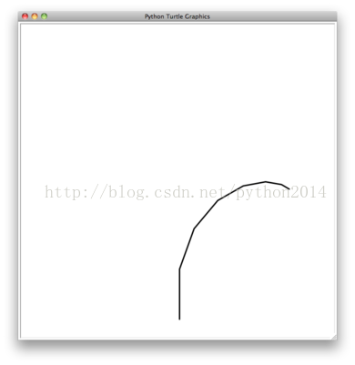
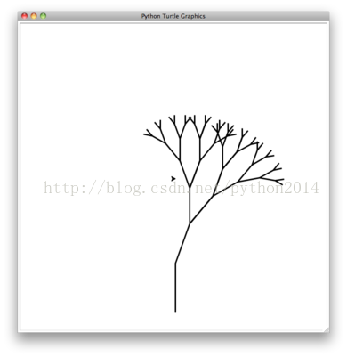

# python 数据结构与算法 22 递归图形

## 递归图形

上节中我们已经知道有些问题，如果用递归解决变得非常容易。但是仍然很难在大脑里形成一种模型或可视化的方法，让我们直觉地明白函数递归过程到底发生了什么。这一节我们引入几个例子，用递归的方法画几个有趣的图形，通过观察图形的生成，也许能帮助你洞察递归的过程，从而学会递归的方法。

我们要用的工具是 python 的图形模块 turtle，这个模块伴随 python 的全部版本而且很容易使用，语法也简单。你可以创建一个 turtle(乌龟)，让它向前，向后，左转，右转等，它的尾巴能抬起或落下，如果落下，当它运动的时候就画出一条轨迹线。为了增加艺术感，可以修改线条的宽度和墨水的颜色

这里有一个例子来说明 turtle 的基本功能。这段代码用 turtle 递归地画一段螺旋线。首先引入模块，然后创建一个 turtle 对象，并新建一个窗口对象作为画布。下面定义 drawSpiral 函数。递归函数的基点，是每次运动的距离降到不大于 0。向基点运动的方式，是每次画线之后，右转 90 度，然后再次画线，不过这次的距离就减少。在代码的最后会看到调用函数 myWin.exitonclick()，这是一个小方法，作用是 turtle 对象进入等待模式，如果在窗口里点击，即清理并退出运行。

importturtle

myTurtle = turtle.Turtle()

myWin = turtle.Screen()

defdrawSpiral(myTurtle,lineLen):

    iflineLen>0:

        myTurtle.forward(lineLen)

        myTurtle.right(90)

        drawSpiral(myTurtle,lineLen-5)

drawSpiral(myTurtle,100)

myWin.exitonclick()

知道这些就够了，足以画出令人惊叹的美图。下一个程序我们要画个棵分形树。分形是一个数学分枝，其中有很多的递归思想。分形的定义是，不论把图形放大多少倍，其中总有相似的图形。现实中的例子是象大陆海岸线，雪花，山岭，树或灌木。自然界的分形现象使得计算机能够产生足以乱真的电影效果。

要理解这一点，先要想一想我们是如何描述一个分形树的。记得我说过，分形就是不论放大多少倍，在不同的层级上图形都看起来很象。把这句话放在树或灌木上，可以说一个小树杈有着整棵树的形状和特征。这样说来，一棵树就是树干有左右两个分枝，每个分枝又是比较小的树。看到没有，上面这个定义中用到了递归。用树定义了树。

让我们把想法变成 python 代码。List1 就是用 turtle 画出的分形树。5-7 行是递归调用。第 5 行是向右转 20 度之后调用，这是刚才提到的右边的小树。第 7 行是是另一个递归调用，但这次是左转 40 度之后的调用。之所以要转 40 度，是因为先要从刚才的右转中回转 20，再转 20 才是左向 20 度。另外要注意的是，每次递归，都把树枝的长度减少一块，这是为了让树越来越小。第 2 行有一个检查过程，防止树枝长度过小，也是递归的基点

**Listing 1**

| 123456789 |  
**def**tree(branchLen,t):

    **if** branchLen>5:

        t.forward(branchLen)

        t.right(20)

        tree(branchLen-15,t)

        t.left(40)

        tree(branchLen-10,t)

        t.right(20)

        t.backward(branchLen)

 |

完全的实现代码在下面。在运行它之前，不妨心中先想像一个，程序会如何绘制这棵树。它会同时对称地在左右两棵树上绘制吗？还是先右再左呢？

i

```py
import turtle

def tree(branchLen,t):
    if branchLen > 5:
        t.forward(branchLen)
       t.right(20)
        tree(branchLen-15,t)
        t.left(40)
        tree(branchLen-15,t)
        t.right(20)
        t.backward(branchLen)

def main():
    t = turtle.Turtle()
    myWin = turtle.Screen()
    t.left(90)
    t.up()
    t.backward(100)
    t.down()
    t.color("green")
    tree(75,t)
    myWin.exitonclick()

main()
```

注意每一个树枝对应一次递归调用；

注意它是怎样一直向右延伸到最短的末梢，如图 1 所示；

注意程序怎样回退一直到整个右枝完全画完。整个的右枝见图 2.

注意到左树枝以后，不是把左边的一向画到最后的末梢，而是再次把左枝的右枝画到末梢，直到最后画完。


图 1 分形树的开始


图 2 分形树的右分枝

这个简单的程序只是一个开始点，可能这个树不太“真实”，这是因为自然界不象电脑程序那么对称。本章结束时将给你一些建议去探索一些有趣的选项，使得这棵树显得更真实一些。

（译者上一些分形图，与各位共享）