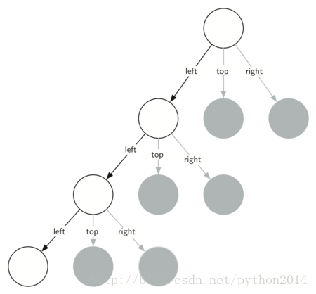

# python 数据结构与算法 23 宾斯基三角形

## 宾斯基三角形

另一个演示自相似分形图的是宾斯基三角形，如图 3 所示。宾斯基三角形说明了一种三通递归算法。这种图形手绘非常简单。从一个大三角形开始，连接三个边的中点，把三角形分成 4 个。不管中间的三角形，把其余三个再次应用前述的过程。每一次都新建一些三角形，再把每个同样的过程递归应用到小三角形上，只要你的铅笔够细，这个过程可以无限进行下去。在读下面的代码之前，一定要拿出笔来，亲手画一遍。


图 3 宾斯基三角形

既然这个过程可以无限进行，那么递归的基点在哪里？我们规定一个基点是切分的次数，这个次数有时被称为分形的“度”。递归调用一次，度减去 1，直到 0 度为止。生成图 3 的代码如下：

```py
import turtle

defdrawTriangle(points,color,myTurtle):
    myTurtle.fillcolor(color)
    myTurtle.up()
    myTurtle.goto(points[0][0],points[0][1])
    myTurtle.down()
    myTurtle.begin_fill()
   myTurtle.goto(points[1][0],points[1][1])
    myTurtle.goto(points[2][0],points[2][1])
    myTurtle.goto(points[0][0],points[0][1])
    myTurtle.end_fill()

def getMid(p1,p2):
    return ( (p1[0]+p2[0]) / 2, (p1[1] + p2[1])/ 2)

defsierpinski(points,degree,myTurtle):
    colormap =['blue','red','green','white','yellow',
                'violet','orange']
   drawTriangle(points,colormap[degree],myTurtle)
    if degree > 0:
        sierpinski([points[0],
                        getMid(points[0],points[1]),
                        getMid(points[0],points[2])],
                   degree-1, myTurtle)
        sierpinski([points[1],
                        getMid(points[0],points[1]),
                        getMid(points[1],points[2])],
                   degree-1, myTurtle)
        sierpinski([points[2],
                        getMid(points[2],points[1]),
                        getMid(points[0],points[2])],
                   degree-1, myTurtle)

def main():
   myTurtle = turtle.Turtle()
   myWin = turtle.Screen()
   myPoints = [[-100,-50],[0,100],[100,-50]]
   sierpinski(myPoints,3,myTurtle)
   myWin.exitonclick()

main()

```

上述代码正是前面思想的实现。第一件要做的事情就是画出外层的三角形，然后有三个递归调用，每个调用对应中点连线后形成的三个角上新三角形，再次使用 turtle 模块。关于 turtle 的方法细节，可以使用 help(‘turtle’)查看。

从代码分析一下绘制的顺序。顺序其实取决于最初的设定，我们假设三个角的顺序是左，上，右。因为宾斯基算法是递归算法，自我调用，所以它会把最左角上最小的三角形画完，再画其他的小三角形。然后是上部的三角形，它是先把最上面的小三角形画面，再画其他。右边也遵循同样的规律。

把递归算法用函数调用图的形式有助于理解。图 4 所示的递归调用，一直是向左的。被调用状态的函数是白色，不活动的函数是灰色的。向下一直到最底层，可以看到，最小的三个函数调用是一次完成的，画完左边，然后是中间，然后是右边。依次类推。



Sierpinski 函数非常依赖于 getMid 函数，getMid 取得两点作参数，返回中点。

另外，上面代码中有一个函数划填充的三角形，为了表明每个层级使用了不同的颜色来绘制。