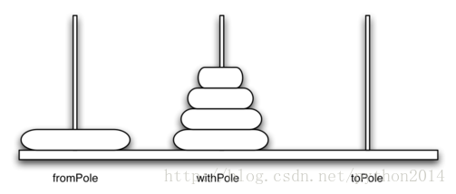

# python 数据结构与算法 24 汉诺塔问题(河内塔问题）

## 复杂递归问题

前面几节我们研究了几个相对比较容易的问题，有些有趣的图形问题可以在脑子里建立模型，让我们了解递归的过程。这一节开始我们要研究几个用迭代法比较难而用递归比较容易的问题，然后是一个看起来很简单但实际上很难的问题来结束。

## 河内塔问题

河内塔（汉诺塔的译法比较通行，但不对）问题是法国数学家 Edouard Lucas 于 1883 年受一个传说的启示提出的。据说是印度神庙里传授给年轻僧侣的谜题。开始的时候，给他们三个柱子和一摞 64 个的金盘，每个盘子都比他下面的一个稍小，他们的任务是把 64 个盘子从一个传递到另一个，有两条规定：一次只能移动一个盘子，不能把大盘子放在小盘子上面。僧侣们非常努力，日夜不休，每秒传递一个盘子，当他们完成工作时，神庙化为灰尘，世界将就此消失。传说是这么说的。

传说有意思吧，不过你不用担心世界末日马上就要到来，因为完成这 64 个盘子移动，需要 2⁶⁴-1=18,446,744,073,709,551,615 秒，也就是说需要 584,942,417,355 年。不怕，没那么快。



图 1 河内塔问题的一个中间步骤

问题怎样解决？用递归的话，基点是什么？我们从最下向上思考。假如你有五个盘子，放在 1 号柱上，如果你知道怎样把 4 个盘子放到 2 号柱上，那就可以直接把最下面这个盘子放到 3 号柱上，然后再把 4 个盘子从 2 号柱移动到 3 号。

但是怎样移动 4 个盘子呢？假设你知道怎么把 3 个盘子移动到 3 号柱，那就有办法把第 4 个盘子移动到 2 号柱，然后把 3 个盘子从 3 号柱移动到 2 号柱。

但是你会移动 3 个盘子吗？那么就把 2 个盘子先移动 2 号柱，然后把第 3 个盘子移动到 3 号柱，这样行吗？

不要告诉我你不会移动 2 个盘子啊。

剩下的就是把一个盘子从 1 号柱移动到 3 号柱——这就是递归的基点

这里是一个把 height 个盘子从“起始柱”通过“中间柱”移动盘子到“目标柱”的大纲式描述：

Ø  把 height-1 个盘子通过目标柱移动到中间柱上

Ø  把余下的盘子移动到目标柱上

Ø  把中间柱上的 height-1 个盘子通过起始柱移动到目标柱上。

只要遵循这些规则，不管盘子有多少个，都可以通过递归的方式在三步内完成。上面步骤中只少基点。在这个例子中，一个盘子的情形就是基点。另外，向基点的变化是 height 的减少（1 和 3）。以下是完成的代码：

defmoveTower(height,fromPole, toPole, withPole):

    if height >= 1:

       moveTower(height-1,fromPole,withPole,toPole)

        moveDisk(fromPole,toPole)

        moveTower(height-1,withPole,toPole,fromPole)

以上的代码简直就是英语的语言描述。算法简化的关键点是利用了 2 个不同的递归，第一个在第 3 行，第二个在第 5 行。第 3 行我们把起始柱上的盘子只留下一个其他全部移走，下一行把最底下这个直接移动到目标柱上。第 5 行把刚才移出的的盘子移动到目标柱上最大的盘子上面。基点就是 height=0 。这里要记住的重要事情就是：基点返回的地方，就是递归函数最后一次调用的地方

下面是 moveDisk 函数的实现，非常简单，只做一件事情就是打印一个盘子从一个柱到另一个柱。如果运行一下程序，你会发现这是一个非常有效的谜题答案。

Listing 2

defmoveDisk(fp,tp):

    print("moving diskfrom",fp,"to",tp)

以下程序是移动三个盘子的完整代码：

d

```py
def moveTower(height,fromPole, toPole, withPole):
    if height >= 1:
        moveTower(height-1,fromPole,withPole,toPole)
        moveDisk(fromPole,toPole)
       moveTower(height-1,withPole,toPole,fromPole)

def moveDisk(fp,tp):
    print("moving diskfrom",fp,"to",tp)

moveTower(3,"A","B","C")
```

运行结果：

moving disk from A to B
moving disk from A to C
moving disk from B to C
moving disk from A to B
moving disk from C to A
moving disk from C to B
moving disk from A to B

在看过 moveTower 和 moveDisk 之后，你也许想知道，为什么不用一个数据结构来清晰地跟踪哪个柱子上有哪些盘子。这里有个提示：如果要跟踪的话，需要三个栈对象，每个柱子一个。答案是，python 提供了我们需要的栈，但是通过调用栈隐性实现的。（最后这话实在不太明白，没找到相关资料）