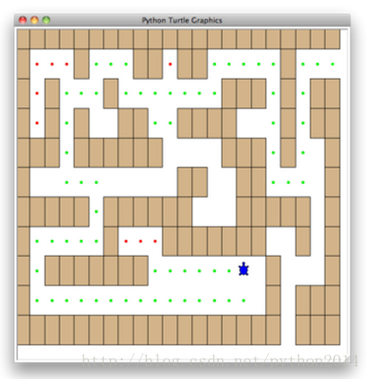

# python 数据结构与算法 25 探索迷宫

## 探索迷宫

这一节我们研究与机器人探索有关的问题：怎样走出迷宫？如果在宿舍用过真空吸尘器（哪位不是大学生？），就可以用本节学到的知识给它重新编程。我们的问题是要帮助小乌龟走出一个虚拟迷宫。迷宫问题可追溯到古希腊神话，提修斯被派到一个迷宫去杀死牛头怪，提修斯用线球一边走一边放线，在完成任务以后沿着线走出来。在现在这个问题中，我们假设小乌龟被扔到迷宫的某处，必须找到出口以逃出生死。如图 2 所示。



为简化问题，我们假设迷宫被分成一个个方块，每个方块或者是空地或者是墙，小乌龟只能走空地，如果遇到墙就必须转向。小乌龟需要一个系统化的方法来找路。按这个步骤：

开始时候，尝试向北走一步，并递归找路。

如果向北不成功，向南并重复步骤。

如果向南不行，改向西并递归重复

如果向北、南、西都不行，改向东。

如果四个方向都不行，失败。

貌似好简单哦，不过有好多细节要考虑。

如果第一步是向北，按上面的步骤，下一步仍然是向北。如果北面被堵了，那么第二步是向南，不幸的是，我们是从南边来的，那不又回去了吗?如果这样应用递归，就是在向北向南之间无限循环，所以必须要有个办法，记住去过哪里。

这里我们假设有一袋子面包屑一直背在身上，如果走到某一方向，发现那里有面包屑了，那么就应该立即退回尝试下一个方向。下面看代码的时候，你会发现退回和递归调用一样简单。

所有递归算法里都有基点，这个问题的基点，你可能想到了一些但这里有四个基点：

乌龟跑时墙里面了，因为位置就在方块墙里，哪里也动不了

发现一个已经探索过的地方，停止从这里继续，否则进入死循环。

发现在外面的空地，也就是出，逃出生天了。

进入一个方块，四个方向都出不来。

要让程序跑起来，我们还需要一个迷宫。实际上让小乌龟画一个迷宫再请君入瓮可以让我们看到算法的执行过程。迷宫对象提供以下方法：

__init__ 构造函数，读取数据文件，初始化迷宫参数，找到小乌龟的超始位置。

drawMaze 在窗口里画出迷宫

updatePosition 更新迷宫的内部状态，变更小乌龟的位置

isExit 检查当前位置是否为迷宫的出口

Maze 类重载了索引操作符[ ]以便算法查询任何广场的状态。

我们来研究一下查询函数 searchFrom，代码如下。注意这个函数要传入三个参数：迷宫对象，起始横坐标，起始纵坐标。这是因为每次递归调用都重新开始。

**Listing 3**

def searchFrom(maze, startRow, startColumn):

maze.updatePosition(startRow, startColumn)

#  Checkfor base cases:

#  1\. Wehave run into an obstacle, return false

if maze[startRow][startColumn] == OBSTACLE :

return False

#  2\. Wehave found a square that has already been explored

if maze[startRow][startColumn] == TRIED:

return False

# 3\. Success, an outside edge not occupied byan obstacle

if maze.isExit(startRow,startColumn):

maze.updatePosition(startRow, startColumn,PART_OF_PATH)

return True

maze.updatePosition(startRow, startColumn,TRIED)

# Otherwise, use logical short circuiting totry each

# direction in turn (if needed)

found = searchFrom(maze, startRow-1,startColumn) or \

searchFrom(maze, startRow+1, startColumn) or \

searchFrom(maze, startRow, startColumn-1) or \

searchFrom(maze, startRow, startColumn+1)

if found:

maze.updatePosition(startRow, startColumn,PART_OF_PATH)

else:

maze.updatePosition(startRow, startColumn,DEAD_END)

return found

细看算法中第 2 行就调用了 updatePosition,这只是为了及时更新画面，好让你能精确地看到小乌龟的探索过程。紧接着算法检查了四个基点中的三个：被封进墙里了吗？(第 5 行)，走回头路了吗？（第 8 行）找到出口了吗?(11 行),如果以上都不对，继续递归搜索。

在递归过程中，有 4 个递归调用到 searchFrom，很难预测这些个递归被调用多少次，因为他们之间 or 连在一起，如果第一次调用返回 True，另外的三个调用都不会执行。你可以把移动到（row-1,column）（如果习惯地图的话，就叫做向北一步）理解为走向出口的一步，如果这一步并不导向出口，那么下一个递归被调用，下次向南探索，向南失败，就西，向东。如果所有四个递归都返回错误，那就是在死角。这段程序应该下载或手动录入并且调整上面四个调用的次序来试验。

Maze 类的代码在 listing4,listing5 和 listing6。

__init__ 方法只一个文件名参数。这个文件一个文本文件，用”+”代表墙，空格代表空地，字母 S 代表起始点。图 3 是个迷宫数据文件的样例。迷宫的内部表示是一个列表的列表，每行的实例变化也是一个列表。

[ ['+','+','+','+',...,'+','+','+','+','+','+','+'],

['+',' ',' ',' ',...,' ',' ',' ','+',' ',' ',' '],

['+',' ','+',' ',...,'+','+',' ','+',' ','+','+'],

['+',' ','+',' ',...,' ',' ',' ','+',' ','+','+'],

['+','+','+',' ',...,'+','+',' ','+',' ',' ','+'],

['+',' ',' ',' ',...,'+','+',' ',' ',' ',' ','+'],

['+','+','+','+',...,'+','+','+','+','+',' ','+'],

['+',' ',' ',' ',...,'+','+',' ',' ','+',' ','+'],

['+',' ','+','+',...,' ',' ','+',' ',' ',' ','+'],

['+',' ',' ',' ',...,' ',' ','+',' ','+','+','+'],

['+','+','+','+',...,'+','+','+',' ','+','+','+']]

drawMaze 方法使用内部表示在屏幕窗口画出迷宫。

++++++++++++++++++++++

+  +   ++ ++     +

+ +  +       +++ + ++

+ + + ++  ++++   + ++

+++ ++++++   +++ +  +

+         ++  ++    +

+++++ ++++++  +++++ +

+    +   +++++++  + +

+ +++++++     S +   +

+                + +++

++++++++++++++++++ +++

如 listing5 所示，updatePosition 方法使用内部表示来检查是否走进墙里，也用用“.”和”-”来更新内部表示，来标明小乌龟是否走过某个广场，或者这个广场在死角里。另外，updatePosition 方法使用了两个辅助方法，moveTurtle 和 dropBreadCrumb 用来更新视图。

最后，isExit 方法使用当前位置判断判断是否走出迷宫，一个退出条件是无论何时小乌龟走到边缘，横坐标或纵坐标为 0，或最右边列，或最下面一行。

**Listing 4**

**classMaze**:

**def**__init__(self,mazeFileName):

rowsInMaze =0

columnsInMaze =0

self.mazelist= []

mazeFile =open(mazeFileName,'r')

rowsInMaze =0

**for** line**in** mazeFile:

rowList = []

col =0

**for** ch**in** line[:-1]:

rowList.append(ch)

**if** ch=='S':

self.startRow= rowsInMaze

self.startCol= col

col = col+1

rowsInMaze = rowsInMaze+1

self.mazelist.append(rowList)

columnsInMaze =len(rowList)

self.rowsInMaze= rowsInMaze

self.columnsInMaze= columnsInMaze

self.xTranslate=-columnsInMaze/2

self.yTranslate= rowsInMaze/2

self.t= Turtle(shape='turtle')

setup(width=600,height=600)

setworldcoordinates(-(columnsInMaze-1)/2-.5,

-(rowsInMaze-1)/2-.5,

(columnsInMaze-1)/2+.5,

(rowsInMaze-1)/2+.5)

**Listing 5**

**def**drawMaze(self):

**for** y**in**range(self.rowsInMaze):

**for** x**in**range(self.columnsInMaze):

**if**self.mazelist[y][x]== OBSTACLE:

self.drawCenteredBox(x+self.xTranslate,

-y+self.yTranslate,

'tan')

self.t.color('black','blue')

**def**drawCenteredBox(self,x,y,color):

tracer(0)

self.t.up()

self.t.goto(x-.5,y-.5)

self.t.color('black',color)

self.t.setheading(90)

self.t.down()

self.t.begin_fill()

**for** i**in**range(4):

self.t.forward(1)

self.t.right(90)

self.t.end_fill()

update()

tracer(1)

**def**moveTurtle(self,x,y):

self.t.up()

self.t.setheading(self.t.towards(x+self.xTranslate,

-y+self.yTranslate))

self.t.goto(x+self.xTranslate,-y+self.yTranslate)

**def**dropBreadcrumb(self,color):

self.t.dot(color)

**def**updatePosition(self,row,col,val=None):

**if** val:

self.mazelist[row][col]= val

self.moveTurtle(col,row)

**if** val== PART_OF_PATH:

color ='green'

**elif** val== OBSTACLE:

color ='red'

**elif** val== TRIED:

color ='black'

**elif** val== DEAD_END:

color ='red'

**else**:

color =None

**if** color:

self.dropBreadcrumb(color)

**Listing 6**

**def**isExit(self,row,col):

**return** (row==0**or**

row ==self.rowsInMaze-1**or**

col ==0**or**

col ==self.columnsInMaze-1 )

**def**__getitem__(self,idx):

**return**self.mazelist[idx]

下面这程序的完整代码，这段程序使用的迷宫文件为 maze2.txt，如下图示，这个迷宫要简单多了，乌龟非常靠近出口。

++++++++++++++++++++++

+  +   ++ ++        +

+    ++++++++++

+ +   ++  ++++ +++ ++

+ +   ++ ++    +++  +

+         ++  ++  + +

+++++ + +     ++  + +

+++++ +++ + +  ++   +

+         + + S+ +  +

+++++ + + + +     + +

++++++++++++++++++++++

完整代码：

```py
import turtle

PART_OF_PATH = 'O'
TRIED = '.'
OBSTACLE = '+'
DEAD_END = '-'

class Maze:
   def __init__(self,mazeFileName):
       rowsInMaze = 0
       columnsInMaze = 0
       self.mazelist = []
       mazeFile = open(mazeFileName,'r')
       rowsInMaze = 0
       for line in mazeFile:
            rowList = []
            col = 0
            for ch in line[:-1]:
                rowList.append(ch)
                if ch == 'S':
                    self.startRow = rowsInMaze
                    self.startCol = col
                col = col + 1
            rowsInMaze = rowsInMaze + 1
            self.mazelist.append(rowList)
            columnsInMaze = len(rowList)

       self.rowsInMaze = rowsInMaze
       self.columnsInMaze = columnsInMaze
       self.xTranslate = -columnsInMaze/2
       self.yTranslate = rowsInMaze/2
       self.t = turtle.Turtle()
       self.t.shape('turtle')
       self.wn = turtle.Screen()
       self.wn.setworldcoordinates(-(columnsInMaze-1)/2-.5,-(rowsInMaze-1)/2-.5,(columnsInMaze-1)/2+.5,(rowsInMaze-1)/2+.5)

   def drawMaze(self):
       self.t.speed(10)
       for y in range(self.rowsInMaze):
            for x in range(self.columnsInMaze):
                if self.mazelist[y][x] ==OBSTACLE:
                   self.drawCenteredBox(x+self.xTranslate,-y+self.yTranslate,'orange')
       self.t.color('black')
       self.t.fillcolor('blue')

   def drawCenteredBox(self,x,y,color):
       self.t.up()
       self.t.goto(x-.5,y-.5)
       self.t.color(color)
       self.t.fillcolor(color)
       self.t.setheading(90)
       self.t.down()
       self.t.begin_fill()
       for i in range(4):
            self.t.forward(1)
            self.t.right(90)
       self.t.end_fill()

   def moveTurtle(self,x,y):
       self.t.up()
       self.t.setheading(self.t.towards(x+self.xTranslate,-y+self.yTranslate))
       self.t.goto(x+self.xTranslate,-y+self.yTranslate)

   def dropBreadcrumb(self,color):
       self.t.dot(10,color)

   def updatePosition(self,row,col,val=None):
       if val:
            self.mazelist[row][col] = val
       self.moveTurtle(col,row)

       if val == PART_OF_PATH:
            color = 'green'
       elif val == OBSTACLE:
            color = 'red'
       elif val == TRIED:
            color = 'black'
       elif val == DEAD_END:
            color = 'red'
       else:
            color = None

       if color:
            self.dropBreadcrumb(color)

   def isExit(self,row,col):
       return (row == 0 or
                row == self.rowsInMaze-1 or
                col == 0 or
                col == self.columnsInMaze-1 )

   def __getitem__(self,idx):
       return self.mazelist[idx]

def searchFrom(maze, startRow,startColumn):
   # try each of four directions from this point until we find a way out.
   # base Case return values:
   #  1\. We have run into anobstacle, return false
   maze.updatePosition(startRow, startColumn)
   if maze[startRow][startColumn] == OBSTACLE :
       return False
   #  2\. We have found a square thathas already been explored
   if maze[startRow][startColumn] == TRIED or maze[startRow][startColumn]== DEAD_END:
       return False
   # 3\. We have found an outside edge not occupied by an obstacle
   if maze.isExit(startRow,startColumn):
       maze.updatePosition(startRow, startColumn, PART_OF_PATH)
       return True
   maze.updatePosition(startRow, startColumn, TRIED)
   # Otherwise, use logical short circuiting to try each direction
   # in turn (if needed)
   found = searchFrom(maze, startRow-1, startColumn) or \
            searchFrom(maze, startRow+1,startColumn) or \
            searchFrom(maze, startRow,startColumn-1) or \
            searchFrom(maze, startRow,startColumn+1)
   if found:
       maze.updatePosition(startRow, startColumn, PART_OF_PATH)
   else:
       maze.updatePosition(startRow, startColumn, DEAD_END)
   return found

myMaze = Maze('maze2.txt')
myMaze.drawMaze()
myMaze.updatePosition(myMaze.startRow,myMaze.startCol)

searchFrom(myMaze, myMaze.startRow,myMaze.startCol)

```

本节代码有点乱，发现运行不正常，请参考原网站 http://interactivepython.org/courselib/static/pythonds/Recursion/recursioncomplex.html#exploring-a-maze