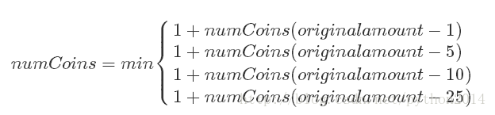
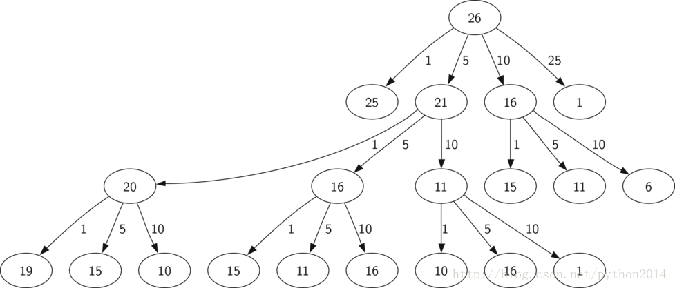
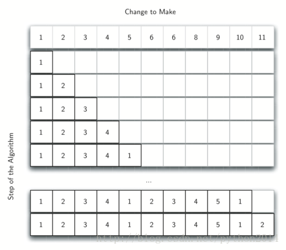
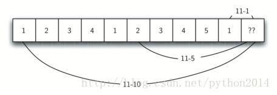

# python 数据结构与算法 26 动态规划

## 动态规划

很多程序的目的在数值优化。象计算两地之间的最短距离，一个点集的最佳拟合曲线，符合某些条件的最小集合等。这些问题有很多的求解方法，本节的目标就是向你展示不同的问题解决策略。动态规划就是优化问题的解决方法之一。

找零问题是数值优化的经典问题之一，假设你是一个自动售货机厂商的程序员，公司决定，为每次找交易的找零，计算需要的最小的硬币数量，从而实现流程化。如果一个顾客投入了 1 美元，买了 37 美分的东西，需要最小的硬币是多少？答案是 6 个：2 个 25 美分（译者：不知道作者为什么不使用 50 美分的硬币），1 个 10 美分，3 个 1 美分。答案怎么来的？我们从最大的硬币开始，尽可能多地使用大额硬币，直到余额不够这个面值，然后再尽可能多地使用第二面额的硬币，以此类推。这种方法叫做“贪婪方法”，因为我们总是对正在计算的问题，作出当前看来最好的结果。

```py
贪婪方法在美国硬币问题上回答正确，但如果你的公司要把自动售货机出口到 Lower Elbonia(译注：Elbonia 是系列漫画 Dilbert 中一个杜撰的原东欧共产主义国家。Lower Elbonia 指这国家的南部。)，那里除了平时所用的 1，5，10 和 25 美分硬币，还有一种 21 美分的。这时贪婪算法就失灵了，因为它仍然会算出 6 个硬币，但正确答案是 3 个 21 美分的硬币。
```

我们在研究找出一种确保正确答案的方法。既然本章是在谈递归，你也许想到用递归解决。先说递归的基点开始。

如果我们要找的零钱，正好是某个硬币的面值，那就简单了，一个硬币。

如果找零和手上的硬币都对不上号，那么答案是以下四种情况的最小值：

从要找的零钱中拿掉一个 1 分币，计算余额最少需要多少硬币，然后加上这个硬币

从要找的零钱中拿掉一个 5 分币，计算余额最少需要多少硬币，然后加上这个硬币

从要找的零钱中拿掉一个 10 币，计算余额最少需要多少硬币，然后加上这个硬币

从要找的零钱中拿掉一个 25 分币，计算余额最少需要多少硬币，然后加上这个硬币。

也就是按以下公式计算：



以上算法的实现如下。第三行是查检基点，就是说看一下找钱是否就是某个硬币的面值，如果不是，就把找钱的值减去每种硬币的面值，然后依次递归计算。第 6 行加了一个过滤，就是只比较面币比找钱小的硬币，递归过程也一直在降低找钱的数值。第 7 行进行递归调用，注意这一行我们对硬币数量有一个加 1 的的过程，因为后面的递归是减少一个硬币的递归，趋向基点的过程。

**Listing 7**

def recMC(coinValueList,change):

   minCoins = change

   if change incoinValueList:

     return 1

   else:

      for i in [c for c incoinValueList if c <= change]:

         numCoins = 1 +recMC(coinValueList,change-i)

         if numCoins <minCoins:

            minCoins = numCoins

   return minCoins

print(recMC([1,5,10,25],63))

可惜的是，上面算法效率非常之差，实际上，找到 6 毛 3 分钱的硬币数量，进行了 67,716,925 次递归。为了帮助理解，图 5 显示了一个较小的为了找到 2 毛 6 的硬币 377 次函数调用的过程。

图中，每个节点对一次 recMC 函数的调用。节点上的标签表示当前求解的找钱数量，箭头上的标签表示减掉的那个硬币。跟踪图形可以得到任意的硬币组合。主要问题在于重复计算太多了，例如图中 15 分的数值至少有 3 次计算，每次计算包括 52 次函数调用，很明显我们很多时间浪费在重复计算上。



减少计算量的关键是记住已经得到的中间结果。一个简单方法是把已经计算出最小值的找钱保存在表里，每次计算之前，先查一下表看看这个结果是否已知。如果已知就直接套用不再计算。下面是优化的算法：

```py
def recDC(coinValueList,change,knownResults):
  minCoins = change
  if change in coinValueList:
     knownResults[change] = 1
     return 1
  elif knownResults[change] > 0:
     return knownResults[change]
  else:
      for i in [c for c in coinValueList if c <= change]:
        numCoins = 1 + recDC(coinValueList, change-i,
                              knownResults)
        if numCoins < minCoins:
            minCoins = numCoins
            knownResults[change] = minCoins
  return minCoins

print(recDC([1,5,10,25],63,[0]*64))
```

注意第 6 行增加一个测试表中是否包括了计算结果，如果没有，计算并保存到表中。这样优化后，计算 6 毛 3 分钱的最小硬币数量，只用了 221 次调用。

虽然这个结果是正确的，但似乎有点黑客的味道。并且如果查看一下 knownResults 列表，会发现有太多的洞（0 值），事实上上面的算法不能称之为动态规划，只是利用了记忆或缓冲的做法优化了我们程序的性能。

真正的动态规划算法要更加系统化地逼近问题答案。解决方法从一个硬币开始，逐步靠近我们要计算的数值，在中间过程中每个找钱数字我们都得到了所需的最少硬币数量。

我们来研究一下，对于 11 分的找钱计算最小需要的硬币数量，怎样填表。如图 4 所示的过程，从 1 分开始，唯一可能是 1 个硬币。下一行显示的是 1 分和 2 分的情况，当然，2 分也只有一个答案就是 2 个硬币。从第 5 行开始事情变得有意思起来，我们有 2 个选择，是 5 个 1 分币或 1 个 5 分币。哪个方案好？我们查表发现对要找 4 分钱的情况是 4 个硬币，加上 1 个就 5 个硬币，或者是 0 个 5 分币加上 1 个 5 分币为 1 个硬币。因为最小值是 1，我们在表中填上 1。继续向前到表的末端考虑 11 分的情况，图 5 所示为我们要考虑的 3 个选项。

1.  1 个 1 分币加上 10 分找钱的最小硬币数量（1 个）
2.  1 个 5 分币加上 6 分找钱的最小硬币数量（2 个）
3.  1 个 10 分币加上 1 分找钱的最小硬币数量（1 个）

1 和 3 都给出了最小值 2 的答案。





下面是找零的程序代码。dpMakeChange 有 3 个参数：可用硬币的列表，找钱的数量，每个找零值所需硬币的最小数量列表。函数计算完成后，minCoin 将包括小于找钱的所有找零值所需要的最小硬币数量。

**Listing 8**

```py
def dpMakeChange(coinValueList,change,minCoins):
   for centsinrange(change+1):
     coinCount = cents
      for jin [cfor cin coinValueListif c<= cents]:
           if minCoins[cents-j]+1< coinCount:
              coinCount = minCoins[cents-j]+1
     minCoins[cents] = coinCount
   return minCoins[change]
```

注意 dpMakeChange 不是一个递归函数，虽然我们是从递归开始的。你要明白，虽然你可以写一个递归解法，并不意味着递归就是最好或最有效率的。这个函数的大部分工作是从第 4 行开始的循环中完成的，这个循环里，我们通过 cents 值考虑了所有可能的硬币找法，象在上面我们找 11 分的例子一样，把小于 change 值的所有最小找法存放在 minCoins 列表里。

虽然上面的找零算法很好地给出了最小的数量，但是不能用于找零操作，因为没有跟踪用到的零钱。我们可以很容易扩展算法，通过在 minCoin 表的入口记住最后加入的每个硬币来得到实际找的零钱。只要知道了最后加入的硬币，就可以减去这个硬币值得到上一个表的入口，依此类推直到最开始的第一个硬币。

下面代码显示了 dpMakeChange 的改进算法，加入一个函数 printCoins 用来倒查表格来打印每种硬币的使用数量。这里用到了我们解决 Lower Elbonia 问题时的做法。Main 函数前两行给出了找零的数量和硬币种类列表，下面两行创建两个后面要存储结果的列表，coinsUsed 是存储找零用到的硬币的列表，coinCount 是找零最小硬币数量的列表，这个表里找零值就是表索引。

注意我们打印硬币的时候，是从 coinsUsed 数组里直接输出的，例如查表 63 的位置，得到 21，然后 63-21=42，查找 42 的位置，再次得到 21，最后在 21 的位置也查到了 21，也就是说是 3 个 21 分的硬币。

```py
def dpMakeChange(coinValueList,change,minCoins,coinsUsed):
  for cents in range(change+1):
     coinCount = cents
     newCoin = 1
     for j in [c for c in coinValueList if c <= cents]:
            if minCoins[cents-j] + 1 <coinCount:
               coinCount = minCoins[cents-j]+1
               newCoin = j
     minCoins[cents] = coinCount
     coinsUsed[cents] = newCoin
  return minCoins[change]

def printCoins(coinsUsed,change):
  coin = change
  while coin > 0:
     thisCoin = coinsUsed[coin]
     print(thisCoin)
     coin = coin - thisCoin

def main():
   amnt = 63
   clist = [1,5,10,21,25]
   coinsUsed = [0]*(amnt+1)
   coinCount = [0]*(amnt+1)

   print("Making change for",amnt,"requires")
   print(dpMakeChange(clist,amnt,coinCount,coinsUsed),"coins")
   print("They are:")
   printCoins(coinsUsed,amnt)
   print("The used list is as follows:")
   print(coinsUsed)

main()
```