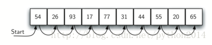
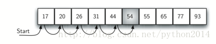

# python 数据结构与算法 27 排序与查找 顺序查找

## 排序与查找

目标

Ø  理解并实现顺序查找和二分查找

Ø  理解并实现选择排序，冒泡排序，合并排序，快速排序，插入排序和 shell 排序

Ø  理解哈希表用于查找的技术

Ø  介绍映射的抽象数据类型

Ø  用哈希表实现映射的抽象数据类型

## 查找

现在我们转向排序与查找的内容，这一节研究查找，后半章研究排序。查找是在一个数据集里找到某个特定元素的算法过程。查找的结果可能是找到或没找到，所以返回值是 True 或 False。这里为简单起见，我们只涉及与列表成员相关的问题。

在 python 里，有一个非常简单的方法查询某数据是否在列表里，使用 in 操作符：

**>>>** 15**in** [3,5,2,4,1]

False

**>>>** 3**in** [3,5,2,4,1]

True

>>> 

虽然这样写很简单，不过这个算法后面的处理过程我们还是要学习，查找有很多种方法，我们感兴趣的是算法以及算法之间的比较。

## 顺序查找

数据存储在数据集，象 list 一类的集合，我们说他们是线性的或者是顺序的。每个数据项都保存有相对的位置。在 python 的列表里，每个项的相对位置用 index 值表示。Index 是有序的，这样就产生了第一种查找算法：顺序查找

如图 1 所示，从列表的第一个元素开始，一个接一个检查，直到找到或全部找完，如果找完全部项，可以判断这个项在列表中不存在。

以下是这种算法的实现。这个函数的参数有：列表，待查项，返回值是布尔值。布尔变量 found 初始值为 False，如果找到就被赋值 True.

|  

&#124; 1 &#124; def sequentialSearch(alist, item): &#124;
&#124; 2 &#124;     pos = 0 &#124;
&#124; 3 &#124;     found = False &#124;
&#124; 4 &#124;
&#124; 5 &#124;     while pos < len(alist) and not found: &#124;
&#124; 6 &#124;         if alist[pos] == item: &#124;
&#124; 7 &#124;             found = True &#124;
&#124; 8 &#124;         else: &#124;
&#124; 9 &#124;             pos = pos+1 &#124;
&#124; 10 &#124;
&#124; 11 &#124;     return found &#124;
&#124; 12 &#124;
&#124; 13 &#124; testlist = [1, 2, 32, 8, 17, 19, 42, 13, 0] &#124;
&#124; 14 &#124; print(sequentialSearch(testlist, 3)) &#124;
&#124; 15 &#124; print(sequentialSearch(testlist, 13)) &#124;

 |

顺序查找的性能分析

要分析查找算法，先要决定一个基本计算单位。记得一般是解决问题的每一次重复算做一步。对查找来说，应该就是比较是与不是的次数。另外的一个假设就是列表是无序的，数据项在列表里随机安放，换句话说，数据项可能在列表的任何一个位置。

如果数据项不在列表里，唯一的判定办法就是把全部项逐个比较一番。如果表中有 n 个数据，顺序查找就需要 n 次比较。但是分析没有这么简单，有三种情形可能发生，最好的情况下，第一个项就是我们要找的，只有 1 次比较。最差的情况下，需要 n 次比较，全部比较过之后才知道找不到。

平均情况如何呢？在平均情况下，我们会发现是列表的一半，即平均要比较 n/2 次。回想一下，不论系数多大，在我们这里无关紧要，也就是说顺序查找的性能是*O*(*n*)。表 1 是各种结构的汇总。

| **Table 1: Comparisons Used in a Sequential Search of an Unordered List** |
| **Case** | **Best Case** | **Worst Case** | **Average Case** |
| item is present | 1 | *n* | *n/*2 |
| item is not present | *n* | *n* | *n* |

前面我们有一个假设，就是数据项在列表里面位置是随机的，所以之间没有相对顺序。但是假如表中数据项以某种方式排序了，怎样来查找呢？又怎样利用这个特性来获得更好的效率呢？

假如列表元素是升序排列的，即从低到高。如果数据项在列表中仍然是随机的，我们将仍然比较相同的次数来找到它。然而，如果元素不在列表里，在性能上会稍有提高。如图 2 所示的查找 50 的过程。注意数据项与列表元素逐个比较直到 54，这里我们遇到个特殊情况，不但 54 不是我们要找的，而且 54 后面的元素也不是我们要找的，因为元素是有序的！这时算法就不必继续遍历所有元素后才报告找不到，它可以在找到 54 后立即终止查找。

图 2 有序整数列表的查找

1    def orderedSequentialSearch(alist, item):

2          pos = 0

3          found = False

4          stop = False

5          while pos < len(alist) and not found and not stop:

6              if alist[pos] == item:

7                  found = True

8              else:

9                  if alist[pos] > item:

10                     stop = True

11                 else:

12                     pos = pos+1

13    

14         return found

15    

16     testlist = [0, 1, 2, 8, 13, 17, 19, 32, 42,]

17     print(orderedSequentialSearch(testlist, 3))

18 print(orderedSequentialSearch(testlist, 13))

表 2 是性能汇总，注意在最好的情况下，数据不在表中可以只找一个元素，平均情况下，要查找 n/2 次，但是这种技术仍然是*O*(*n*)。总的来说，顺序查找的性能提供只有在顺序列表中找不到的情况下存在。

| **Table 2: Comparisons Used in Sequential Search of an Ordered List** |
| item is present | 1 | *n* | *n/*2 |
| item not present | 1 | *n* | *n/*2 |