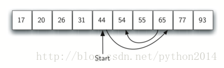

# python 数据结构与算法 28 二分查找

## 二分查找

在有序表的查找算法中，比较的过程用好了，可以从有序的特性中获得更多好处。在顺序查找中，与第一个元素比较之后，后面还有 n-1 个要比较。与顺序查找不同的是，二分查找从中间元素开始比对，如果中间元素就是要找的，完成；如果不是，就要考虑到有序的特性，如果要找的数据比中间项要大，那么列表的前半部分可以忽略，如果这个数据确实在列表里，那也一定在后半部分。

在后半部分继续这个过程，从中间元素开始比较。再次的，要么找到，要么判断出在前半部分或后半部分，这样又大幅度减小了查找空间。如图 3 所示为我们查找 54 的过程算法。后面是实现代码：

图 3 有序表的二分查找

1 def binarySearch(alist, item):
2    first = 0
3    last = len(alist)-1
4    found = False
5
6    while first<=last and not found:
7        midpoint = (first + last)//2
8        if alist[midpoint] == item:
9            found = True
10        else:
11            if item < alist[midpoint]:
12                last = midpoint-1
13            else:
14                first = midpoint+1
15
16    return found
17
18 testlist = [0, 1, 2, 8, 13, 17, 19, 32, 42,]
19 print(binarySearch(testlist, 3))
20 print(binarySearch(testlist, 13))

在分析性能之前，我们应该注意到这种算法是分而治之策略的一个很好实例。分而治之意思是把问题分解成小片，想法解决小问题然后把整个问题解决。在列表中查找时，先检查中间元素，如果小于中间元素，就在左半表中继续查找；类似地，如果大于中间元素，就在右边查找。这也是一个递归的方法，如下面的代码就用了递归法：

1 def binarySearch(alist, item):
2    if len(alist) == 0:
3        return False
4    else:
5        midpoint = len(alist)//2
6        if alist[midpoint]==item:
7          return True
8        else:
9          if item<alist[midpoint]:
10            return binarySearch(alist[:midpoint],item)
11          else:
12            return binarySearch(alist[midpoint+1:],item)
13
14 testlist = [0, 1, 2, 8, 13, 17, 19, 32, 42,]
15 print(binarySearch(testlist, 3))
16 print(binarySearch(testlist, 13))

## 二分查找的分析

回想二分查找过程中，每做一次比较，我们就忽略掉一半的元素，那么在一个列表中查找中，最多需要比对多少次呢？如果开始时有 n 个元素，第一次比较后就剩下 n/2 个，第二次比较后剩下 n/4，然后是 n/8，n/16 等等。最多要分割多少次呢？从表 3 我们能看到答案。

| **Table 3: Tabular Analysis for a Binary Search** |
| **Comparisons** | **Approximate Number of Items Left** |
| 1 | *n/*2 |
| 2 | *n/*4 |
| 3 | *n/*8 |
| ... |  |
| i | *n/*2*i* |

只要分割的次数够多，最终能得到一个只含一个元素的列表，无论这个元素是否要找的，查找结束。这样要查找的次数 I，符合 n/2^i=1，这样求解结果 *i*=log*n,这样*二分查找的性能是对数级的*O*(log*n*)

另外使用了递归的情况下，以下函数调用

binarySearch(alist[:midpoint],item)

使用切分操作符来创建一半元素的列表传递给下一次调用。以前分析的时候我们假设切分操作使用常数时间，然而我们知道在 python 里，切分实际上是 O(k)，这就意味着二分查找使用切分以后就不是严格意义上的对数级。不过好在切分时传递了起止索引使问题得到弥补。这个指标的计算我们留作练习。

虽然二分查找比顺序查找要好，但是如果 n 值很小，也许不值得事先排序。事实上我们必须仔细权衡排序的代价和查找的收益。如果是一次排序多次查找，那么排序的代价也许值得，但是对于很大的列表，排序一次也很麻烦，这时候最好的选择还是从头开始一次顺序查找吧。