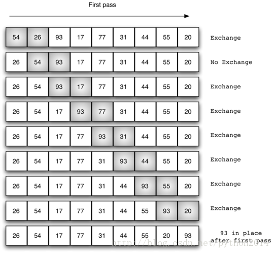

# python 数据结构与算法 30 冒泡排序

## 排序

排序是将集合中的元素以某种规律放置的过程。例如，一个单词的列表，可以按字母顺序排列或按长度排列；一个城市的列表可以按人口，面积，邮政编码来排序。对有序列表的好处，前面在研究二分查找等案例时领略过的。

有许多许多的排序算法被开发和研究，这也说明排序在计算机科学中的重要性。大数据量的排序要占用海量的计算资源，象查找一样，排序的算法效率与元素的数量有关，对小的数据集来说，复杂的排序方法不值得做，代价太高了。从另一方面说，对更大的数据集，就要尽可以采用高效率的算法。本节中，我们要讨论几种排序技术并比较他们的运行时间。

在开始具体的算法之前，先考虑一下在分析算法过程中要用到的操作。首先是比较大小，为了排序，需要一个系统化的方法比较元素的大小以判断他们是否在正确的位置上。总的比较次数是比较排序过程的最通用方法；其次，如果数值不在正确的位置上，要交换的次数也是评估算法效率的重要方法。

## 冒泡排序

冒泡排序方法需要多次访问列表，它比较相邻的两个元素，如果次序不对，就交换位置。每次遍历都把经历的最大的元素放到合适的位置上。就象气泡上浮到合适的位置。

图 1 是冒泡排序的第一次遍历。阴影部分是正在比较元素位置是否合适。如果有 n 个元素，那么就要有 n-1 次比较。注意如果最大的元素加入了比较，它就被一直推动着向上直到最顶。



第二次遍历开始的时候，最大元素已经就位。剩下 n-1 个元素要排序，意味着要进行 n-2 次捉对比较，既然每次都把最大元素推动到位，那么一共就需要 n-1 次。经过 n-1 次比较交换之后，最小的元素也一定就位不需要再交换。下面的代码是完整的 bubbleSort 函数，输入一个 list 作为参数，然后通过交换位置来修改次序。

交换的操作，在 python 语言里与其他语言稍有不同，一般地，交换两个元素需要一个临时变量(需要额外的地址空间)，代码片断是这样的

temp = alist[i]

alist[i] = alist[j]

alist[j] = temp

来交换第 i 个元素和第 j 个元素。如果不用临时变量，其中一个值会被覆盖。

在 python 里，允许进行同时赋值。赋值语句 a,b=b,a 能够一次完成两次赋值命令（图 2）。使用同时赋值语句，交换操作也可以一次完成。

下面代码里 5-7 行用三步法进行 i 和 i+1 元素的交换，这个步骤可以使用同时交换法。


图 2 python 的值交换

以下是上述描述的代码

```py
def bubbleSort(alist):
   for passnum in range(len(alist)-1,0,-1):
       for i in range(passnum):
           if alist[i]>alist[i+1]:
                temp = alist[i]
                alist[i] = alist[i+1]
                alist[i+1] = temp

alist = [54,26,93,17,77,31,44,55,20]
bubbleSort(alist)
print(alist)
```

分析冒泡排序的时候，我们需要注意到，不管列表元素原来是怎样排列的，n-1 次遍历是必须的。表 1 显示了每次遍历所要进行的比较次数。总的比较次数是前 n-1 个整数的和。回想 n 个整数的和是 前 n-1 个整数的和是,即，仍然是*O*(*n²*)。在最好的情况下，如果列表是有序的，一次交换也没有。但在最坏的情况下，每次比较都引发一次交换，平均情况是一半的时间。 

| **表 1 冒泡排序每次遍历的比较次数** |
| **Pass** | **Comparisons** |
| 1 | *n*−1 |
| 2 | *n*−2 |
| 3 | *n*−3 |
| ... | ... |
| *n*−1 | 1 |

一般认为冒泡排序是效率最差的排序方法，因为它在元素最终确定位置之前反复交换。这些浪费的交换操作很费资源。不过，因为冒泡排序对整个未排序部分遍历，它也能做到一些其他算法做不到的事情。在特殊情况下，如果一次遍历没有发生交换，我们知道这个列表一定是有序的，冒泡排序就可以提前停止。这意味着列表只需要一次遍历就知道自身是有序的从而提高效率。下面代码是利用了这个特点的修正版，通常称为短冒泡算法。

```py
def shortBubbleSort(alist):
   exchanges = True
   passnum = len(alist)-1
   while passnum > 0 and exchanges:
      exchanges = False
      for i in range(passnum):
          if alist[i]>alist[i+1]:
               exchanges = True
               temp = alist[i]
               alist[i] = alist[i+1]
               alist[i+1] = temp
      passnum = passnum-1

alist=[20,30,40,90,50,60,70,80,100,110]
shortBubbleSort(alist)
print(alist)
```