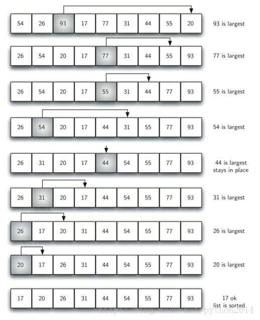

# python 数据结构与算法 31 选择排序

## 选择排序

选择排序是冒泡排序的改进，一次遍历只做一次交换。它在一次遍历中找到最大的元素，结束时放到合适的位置，正如冒泡排序一样，一次遍历后最大的元素就位。第二次遍历后，第二大的元素就位，这样持续进行，需要 n-1 个遍历来为 n 个元素排序。

图 3 显示了一整个的排序过程，一次遍历，剩余最大的元素被选中并正确就位，所以第一次选择了 93，第二次选择 77，第三次 55，等等。后面是代码.



```py
def selectionSort(alist):
  for fillslot in range(len(alist)-1,0,-1):
      positionOfMax=0
      for location in range(1,fillslot+1):
          if alist[location]>alist[positionOfMax]:
               positionOfMax = location

      temp = alist[fillslot]
      alist[fillslot] = alist[positionOfMax]
      alist[positionOfMax] = temp

alist = [54,26,93,17,77,31,44,55,20]
selectionSort(alist)
print(alist)
```

可以看出，选择排序和冒泡排序一样多的比较次数，所以它的性能依然是*O*(*n*²).不过，因为交换次数的减少，选择排序一般运行得比冒泡要快。在这个例子中，冒泡有 20 次交换，而选择排序只有 8 次。

以下测试使用在线运行方式