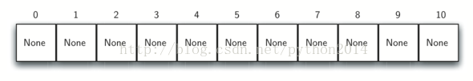
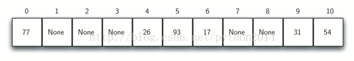
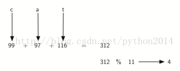

# python 数据结构与算法 29-1 哈希查找

###### 前面的章节中，我们利用数据集中元素的相对位置信息来提高查找算法的性能。比如知道列表是有序的，可以使用二分查找。本节我们走得更远一些，创建一个数据结构，使得查找性能提高到*O*(1)，称为哈希查找。

要做到这样的性能，我们要知道元素的可能位置，如果每个元素就在他应该在的位置上，那么要查找的时候只需要一次比较得到有没有的答案，但下面将会看到，不是这么回事。

哈希表是这样一种数据集合，元素的保存的时候就存在容易找到位置上。哈希表表中每一个位置，一般称为槽位，每个槽位都能保存一个数据元素并以一个整数命名(从 0 开始)。这样我们就有 0 号槽位，1 号槽位等等。起始时，哈希表里没有数据，槽位是空的。这样在构建哈希表的时候，可以把槽位值都初始化为 None，图 4 显示一个大小为 11 的哈希表，或者是说有 m 个槽位的哈希表，m 从 0 到 10.



图中元素和保存的槽位之间的映射关系，称为哈希函数，哈希函数接受一个元素作为参数，返回一个 0 到 m-1 的整数作为槽位名。假如我们有一个整数集 54，26，93，17，77 和 31，我们的第一个哈希函数就可以用“余数法”，简单地将元素除以表的大小，返回余数作为哈希值。(*h*(*item*)=*item*%11)，表 4 是上述整数集的哈希值。

| **Table 4: Simple Hash Function Using Remainders** |
| --- |
| **Item** | **Hash Value** |
| --- | --- |
| 54 | 10 |
| 26 | 4 |
| 93 | 5 |
| 17 | 6 |
| 77 | 0 |
| 31 | 9 |

注意余数法一般以某种形式存于所有哈希函数中，因为它的结果一定在槽位范围内。

一旦哈希值计算出来，就要把元素插入到哈希表中指定的位置。如图 5 所示，注意 6 槽位和 11 槽位是空的，这就要引入满载因子的概念，一般表述为：

λ=元素数量/哈希表容量



这里，就是

λ=6/11

现在当我们要查找的时候，只要简单地用哈希函数计算出槽位值，然后到表中检查是否存在就可以了，这个查找动作是*O*(1),因为计算哈希值的时间，以及到表中查找的时间是个常数。如果每件东西都各守其位，我们就发现了一个常数级的查找算法。

也许你已经注意到，这个技术仅在每个元素对应一个位置时有效，例如，上面的例子中如果增加一个 44，那么它的哈希值是 0，但是 77 的值也是 0，这时问题就出来了，2 个值对应同一个槽位，这被称为“collision”，很明显，collision 给哈希技术造成了困难，我们随后详细讨论。

## 哈希函数

对给定的数据集，哈希函数将每个元素映射为单个的槽位，称为“完美哈希函数”，如果我们知道元素和集合固定不变，那么构造一个完美哈希函数也许是可能的。坏消息是对一个任意数据集合，没有一个系统的方法来构造完美哈希函数，好消息是，哈希函数不完美也能提供不错的性能。

如果一定要完美的哈希函数，一种方法是做大哈希表，以保证每个元素都有自己的索引。虽然在数据不多的情况下可行，但是如果数据很大就不可行。比如，如果数据项是 8 位号码，这就需要十亿个槽位，要是我们仅仅用来保存 25 个学生的号码，就太费了。

我们的目标是：collision 最少，计算简单，分布均匀。有几种扩展余数法的方案，下面讨论其中几个。

折叠法：这种方法把元素分成相等的几片（最后一片可能不相等），然后再把碎片拼起来作为哈希值。比如我们的数据项是号码 436-555-4601，那么应该把号码分成 2 个一组，然后加起来，即 43+65+55+46+01，得到 210 。假设哈希表有 11 个槽位，那么再一步用 11 除 210 来得到槽位。即 210%11=1，所以号码 436-555-4601 的哈希值是 1 。有些折叠法多了一步，在相加之前，把数据位顺序反转，在上面的例子中，即 43+56+55+64+01=219 计算 219 % 11=10。

另一种算法叫做“平方取中法”，先计算元素的平方值，再从中提取几位数字，例如，对元素 44，先计算 44²=1936，提取中间两位 93，然后再取余数法，得到 5（93%11=5）

| **Table 5: Comparison of Remainder and Mid-Square Methods****表 5 余数法与平方取中法的比较** |
| --- |
| **Item** | **Remainder** | **Mid-Square** |
| --- | --- | --- |
| 54 | 10 | 3 |
| 26 | 4 | 7 |
| 93 | 5 | 9 |
| 17 | 6 | 8 |
| 77 | 0 | 4 |
| 31 | 9 | 6 |

对于字符类元素也能创建哈希函数，单词 cat 可以看成一个数字串

```py
>>> ord('c')
```

```py
99
```

```py
>>> ord('a')
```

```py
97
```

```py
>>> ord('t')
```

```py
116
```

我们把这三个数字加起来，用余数法计算哈希值。下面是一个计算字符串哈希值的函数：

**Listing 1**

```py
defhash(astring, tablesize):
```

```py
    sum=0
```

```py
    for pos inrange(len(astring)):
```

```py
        sum=sum+ord(astring[pos])
```

```py
    returnsum%tablesize
```



有意思的是，上述算法中，相同字母不同顺序的单词得到的哈希值相等，解决办法是加上字母的位置作为重量。图 7 显示了使用位置作为重量因子，修改后的哈希函数作为练习。

你也可以思考几种计算哈希值的方法，但必须要记住，哈希函数必须要简单高效，不能成为计算的主要负担。如果哈希函数太复杂，计算槽位名的时间超过了简单的顺序查找或二分查找的时间，那么哈希函数还有什么意义呢？