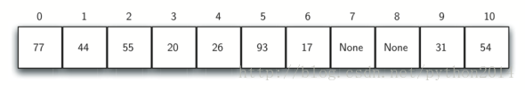
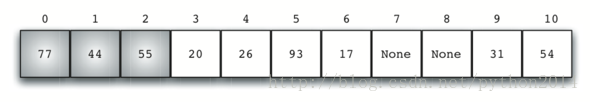
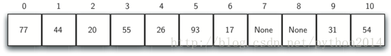
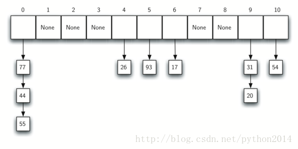

# python 数据结构与算法 29-2 冲突解决

## 冲突解决

现在返回到前面提到的冲突问题。当两个元素的哈希值指向同一个槽位，就应该有个系统的方法把第二个元素放进表中。这个过程叫做“冲突解决”。我们前面说过的，如果哈希函数是完美的，不会发生冲突。但完美无缺的事很少，所以冲突解决就成为哈希算法中的重要部分。

一种方法是为引起冲突的元素找到另一个位置。简单的做法就是从原来的位置开始，顺序向前查找，直到遇到一个空闲的槽位为止。注意的是我们可能需要循环地从第一个槽位开始以便覆盖整个哈希表。这种方法叫做开放地址法，因为它就是在哈希表中找下一个空闲槽位。通过系统地访问每个槽位，我们的开放地址技术叫做线性探测。

图 8 显示了一个用余数法作哈希函数的整数列表(54,26,93,17,77,31,44,55,20)。表 4 显示了起始元素的哈希值。图 5 显示的是原来的内容，当我们试图放置 44 到 0 位的时候，冲突发生了，使用线性探测技术，我们按顺序一个槽位一个槽位地找，最终找到一个空闲槽位。这个例子中是 1 位。

再次，55 也应该在 0 位上，但不得不放在 2 位上，因为这是第二个空闲位置。最后 20 的哈希值是 9，但 9 已经被占了，不得不再作探测，我们查找了 10，0，1，和 2 位，最后在 3 位上发现一个空位。

一旦我们用开放地址和线性探测法建立了一个哈希表，那就有必要用同样的方法实现查找。假设我们要找 93，计算哈希值，得到 5，查找 5 号槽，果然发现 93，这时可以返回 True 值。如果要找 20 呢？哈希值是 9，但 9 位上坐着 31，我们不能简单地返回 False 完事儿，因为我们知道可能存在冲突，这时就要进行一下顺序查找，从 10 位开始，逐个查找直到找到 20 或发现空槽位。

线性探测的一个不好的地方就是可能引起聚集现象，元素在表里成群出现。这是因为如果在同一槽位上发生很多冲突的话，周边的槽位就会被线性探测找到并填满，这会影响到其他插入的元素，就象前面我们看到插入 20 的情况，20 不得不跨过 0 后面好几个元素才找到开放地址，如图 9 所示。

一种解决办法是延伸线性探测，改变就近查找空槽的方法，而是跳过几个槽位，这样冲突的元素可以分散开来，从而潜在减少了聚集现象的可能性。图 10 显示的是线性+3 探测，意思是，冲突发生时，我们每隔 3 个位置探测一下是否空槽。

在发生冲突后查找另一个空槽的方法称为“再哈希”，用线性探测法，再哈希函数为

 *newhashvalue*=*rehash*(*oldhashvalue*) 

而*rehash*(*pos*)=(*pos*+1)%*sizeoftable*.

而+3 探测法就要重定义为：

*rehash*(*pos*)=(*pos*+3)%*sizeoftable*

一般情况下：

*rehash*(*pos*)=(*pos*+*skip*)%*sizeoftable*.

Skip 这个变理的选择必须保证表中所有的槽位都能访问到，否则，表中有些位置就会一直空闲。因此，为保证 skip 取值合适，一般建议表的大小是个质数，这也是为什么前面的例子中我们使用 11

线性探测思想的一个变种称为二次探测。它不再使用一个常数的“跳步”，而是用再哈希函数来逐次提高哈希值如 1，3，5，7，9 等。这就是说，如果第一次计算得到的哈希值是 h,那么后续的值就是*h*+1, *h*+4, *h*+9, *h*+16 等，换句话说，二次探测使用了完全平方数作为跳步，图 11 所示为使用了这个技术的方法。

另一种处理冲突问题的方法是让槽位上保存一个指向链地址的引用，这个方法可以在一个槽位上存在很多元素。这样当发生冲突时，元素仍然可以放在这个槽位上。但是如果越来越多的元素放置在同一槽位上，查找的难度也要增加。图 12 显示了使用链地址方法解决冲突的方法。

当查找一个元素时，使用哈希函数计算出一个元素“应该”在的槽位值，既然每个槽位挂了一个集合，也要使用查找技术来判断是否存在。这样的好处是每个槽位上的元素数量要少很多，所以查找的效率更高。本周结尾我们将讨论哈希查找的效率。