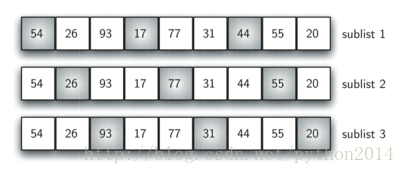
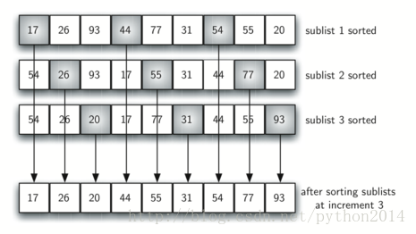
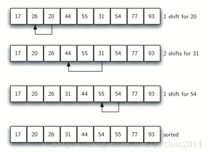
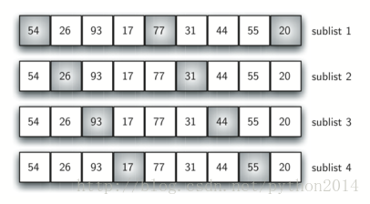

# python 数据结构与算法 33 希尔排序

## 希尔排序

希尔排序，有时称为递减增量排序，是在插入排序基础上，把列表拆成几个较小的子表，然后对每个子表使用插入排序的方法。选出子表的方法是希尔排序的关键，它并不是把列表的中相近的元素取出来组成子表，而是使用了一个增量值 I,有时也叫做“间隙”，然后每隔一个间隙选中一个元素来组成子表。

这可以从图 6 中看出来，列表中有 9 个元素，如果我们使用增量 3，就有 3 个子表，每个子表单独做插入排序。完成之后的列表如图 7，现在看这个表虽然没有完全排序，但对子表排序后，元素已经很接近它们的最终位置。


图 6 增量为 3 的希尔排序
图 7 子表排序之后的希尔排序

图 8 所示为增量是 1 的插入排序，或者说，这就是个标准的插入排序。得益于前面的子表排序过程，现在需要移动操作要少得多。在这个例子中，只需要移动 4 次就完成了排序。


图 8 希尔排序最后一步：增量为 1 的插入排序
图 9  希尔排序 初始化子表

前面我们说过，希尔排序的独特性就是增量的选择，下面的函数使用了一个不同的增量的集合，从 n/2 个子表开始，下一步就是 n/4 个子表要排序，最终是 1 个子表进行插入排序。图 9 所示是这种增量的第一批 4 个子表。

下面的 shellSort 函数对每个增量值进行一次子表排序，最终使用插入排序完成

```py
def shellSort(alist):
    sublistcount = len(alist)//2
    while sublistcount > 0:

      for startposition in range(sublistcount):
        gapInsertionSort(alist,startposition,sublistcount)

      print("After increments of size",sublistcount,
                                   "The list is",alist)

      sublistcount = sublistcount // 2

def gapInsertionSort(alist,start,gap):
    for i in range(start+gap,len(alist),gap):

        currentvalue = alist[i]
        position = i

        while position>=gap and alist[position-gap]>currentvalue:
            alist[position]=alist[position-gap]
            position = position-gap

        alist[position]=currentvalue

alist = [54,26,93,17,77,31,44,55,20]
shellSort(alist)
print(alist)

```

乍看起来，希尔排序不见得比插入排序更好，因为最后一步就完全是一个插入排序。但是，最后一步的插入排序，不需要很多步骤来完成比较和移动，因为通过前面的增量插入排序，列表已经做了“预排序”，也就是说，这个列表已经比普通列表“更有序”，所以在效率上有很大的不同。

对希尔排序的详细分析超出本书的范围，不过我们可以说，它趋向于*O*(*n*) 和 *O*(*n*²) 之间。对 listing5 中的增量，性能是*O*(*n*²)，变更增量，例如使用 2*^k*−1 (1, 3, 7,15, 31, 等)，性能可达到*O*(*n*^(3/2)).