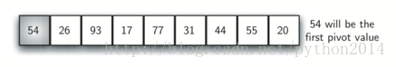
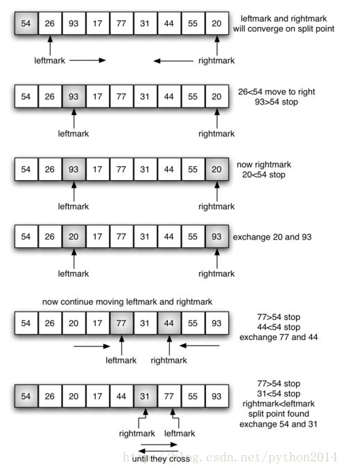
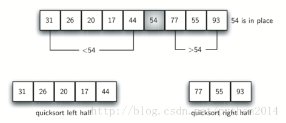

# python 数据结构与算法 35 快速排序

## 快速排序

快速排序也使用了分而治之的策略来提高性能，而且不需要额外的内存，但是这么做的代价就是，列表不是对半切分的，因而，性能上就有所下降。

快速排序选择一个数值，一般称为“轴点”，虽然有很多选取轴点的方法，我们还是简单地把列表中第一个元素做为轴点了。轴点的作用是帮助把列表分为两个部分。列表完成后，轴点所在的位置叫做“切分点”，从这一点上把列表分成两部分供后续调用。

图 12 所示，54 将作为轴点。这个例子我们已经排过多次了，我们知道 54 在排好序后将处于现在 31 的位置上。找到轴点以后，把列表中其他元素，按比轴点大或比轴点小的方法，分成两部分。


图 12  快速排序的第一个轴点

切分开始于定位两个位置标志……就叫做“左标”和“右标”好了……分别位于剩余列表元素的开始和结束处（图 13 的 1 位和 8 位）。切分的目标，是把相对于轴点来说，位置错误的元素移动在正确的位置上，同时左标和右标也将在“切分点”上相聚。


图 13  找到 54 的切分点

我们把`leftmark` 不停地+1，直到遇到一个元素值大于轴点。然后把`rightmark` 不停-1 直到遇到一个元素值小于轴点值。这时，我们发现这两个元素的位置不对，如上例中那样，遇到了 93 和 20，现在把两个元素交换，然后重复上述过程。

当`rightmark` 小于 `leftmark`时，停止。这时`rightmark` 成为切分点，轴点值与切分点的值交换，轴点已经找到位置（图 14）。另外，所有切分点左边的元素都小于轴点，所有右边的元素大于轴点，这时列表从切分点处分成两个子表，使用递归调用重复快速排序过程。


图 14  完成切分

`下面是实现``quickSort``的函数。它``调用了一个递归函数``quickSortHelper`. `quickSortHelper`.的基点和归并排序是一样的，如果列表的长度小于等于 1，它就是有序的，如果大于 1，它就要被切分并且递归排序。`Partition` `函数完成前面提到过的切分过程。`

```py
def quickSort(alist):
   quickSortHelper(alist,0,len(alist)-1)

def quickSortHelper(alist,first,last):
   if first<last:

       splitpoint = partition(alist,first,last)

       quickSortHelper(alist,first,splitpoint-1)
       quickSortHelper(alist,splitpoint+1,last)

def partition(alist,first,last):
   pivotvalue = alist[first]

   leftmark = first+1
   rightmark = last

   done = False
   while not done:

       while leftmark <= rightmark and \
               alist[leftmark] <= pivotvalue:
           leftmark = leftmark + 1

       while alist[rightmark] >= pivotvalue and \
               rightmark >= leftmark:
           rightmark = rightmark -1

       if rightmark < leftmark:
           done = True
       else:
           temp = alist[leftmark]
           alist[leftmark] = alist[rightmark]
           alist[rightmark] = temp

   temp = alist[first]
   alist[first] = alist[rightmark]
   alist[rightmark] = temp

   return rightmark

alist = [54,26,93,17,77,31,44,55,20]
quickSort(alist)
print(alist)

```

为了分析快速排序函数性能，要注意到一个长度为 n 的列表，如果切分点总是在列表的中间，那么就是要 log*n* 次切分。为了找到切分点，n 个元素都要与轴点作一次比较，结果需要*n*log*n*.另外，也不需要象归并排序一样消耗额外的内存。不幸的是，在最怀的情况下，切分点不在中间，而是偏左或偏右，生成很不均匀的子表，这种情况下，生成的子表是一个 0 个元素，一个 n-1 个元素，然后再切分，却生成一个子表是 0 个元素，另一个是 n-2 个元素等等。结果需要的开销就是*O*(*n*²)。

前面我们提到过有不同的方式来选择轴点，尤其是，我们可以使用一种叫做“三数取中”的技术，以减轻不均匀切分的可能性。这种方法从列表的第一个，中间的一个，最后的一个元素三个数中，取中间值。象上面的例子中，三数是 54，77 和 20，，那么选中 54 作为轴点。这种思想的来源，是认为第一个元素可能它的大小并不在中间的位置，但是三个数的中间值就比较靠近中间。这种方法特别适合那些开始时已经部分有序的列表。这个轴点值的选择方法留作练习。