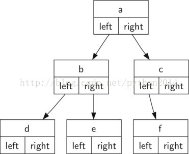

# python 数据结构与算法 37 树的实现

## 树的实现

记住上一节树的定义，在定义的基础上，我们用以下的函数创建并操作二叉树：

*   BinaryTree() 创建一个二叉树实例
*   getLeftChild() 返回节点的左孩子
*   getRightChild() 返回节点的右孩子
*   setRootVal(val) 把 val 变量值赋给当前节点
*   getRootVal() 返回当前节点对象。
*   insertLeft(val) 创建一个新二叉树作为当前节点的左孩子
*   insertRight(val) 创建一个新二叉树作为当前节点的右孩子。

实现树的关键点是合适的存储技术。Python 提供两种可用方法，所以在做出决定之前，先查验一下两种技术。第一种叫“列表的列表”，第二种叫“节点与引用”

## 列表的列表表示法

在列表的列表方法中，我们使用列表数据结构来实现上面的函数，虽然这种操作方法与我们以前的抽象数据结构很不相同，不过它很有意思的一点是，这是一个简单的递归结构，我们可以直接查看和检查。

在列表的列表树中，根节点的数值是列表的第一个元素，第二个元素是它的左子树，第三个元素就是它的右子树。为说明这个存储结构，我们看一个例子。图 1 所示为一个如此实现的简单树。


图 1 一棵小树

```py
myTree = ['a',   #root
      ['b',  #left subtree
       ['d' [], []],
       ['e' [], []] ],
      ['c',  #right subtree
       ['f' [], []],
       [] ]
     ]

```

有没有发现我们可以直接用列表的索引来访问子树。树根是 myTree[0],左子树是 myTree[1],右子树是 myTree[2]。下面的代码就是用列表创建了一棵树，完成之后，就可以访问它的根和子树，它的好处在于列表中的“元素列表”就代表了子树，与树有相同的结构，所以它的结构是递归的。如果一个子树有根节点，但是左右子树都是空列表，那么它就是叶子。另一个好处是这种方法产生的树可以推广到“多叉树”而不仅是二叉树，因为另一个子树也不过是一个列表而已。

```py
myTree = ['a', ['b', ['d',[],[]], ['e',[],[]] ], ['c', ['f',[],[]], []] ]
print(myTree)
print('left subtree = ', myTree[1])
print('root = ', myTree[0])
print('right subtree = ', myTree[2])

```

现在来为这种树形数据结构定义一些函数以方便使用。注意我们没有定义一个二叉树类，这些函数只是帮助操作一个列表，即使工作对象是一个树。

**def **BinaryTree(r):

    **return** [r, [], []]

BinaryTree 函数简单地创建了一个列表，内中只有一个根节点和两个空列表作为孩子。要增加左子树的话，就要插入一个新列表到根列表的第二个位置上。要小心一点，如果第二个位置上已经保存了数据，需要跟踪这个数据，并把它下压一级，作为新插入列表的左孩子。Listing1 是插入左孩子的代码。

**Listing 1**

**def **insertLeft(root,newBranch):

    t= root.pop(1)

    **if**len(t) >1:

       root.insert(1,[newBranch,t,[]])

    **else**:

       root.insert(1,[newBranch, [], []])

    **return** root

注意，要插入左孩子，先得到原来左孩子位置的列表（可能是空的），当加入新左孩子的时候，把原来的左孩子作为新节点的孩子。这样，我们可以把新节点放在树中任何位置。

插入右孩子的代码也很相似，见下面 listing 2.

**Listing 2**

**def **insertRight(root,newBranch):

    t= root.pop(2)

    **if**len(t) >1:

       root.insert(2,[newBranch,[],t])

    **else**:

       root.insert(2,[newBranch,[],[]])

    **return** root

下面 listing 3 是获取和赋值的函数，针对根节点和左右子树。

**Listing 3**

**def**getRootVal(root):

    **return** root[0]

**def**setRootVal(root,newVal):

   root[0] = newVal

**def**getLeftChild(root):

    **return** root[1]

**def**getRightChild(root):

    **return** root[2]

下面是完整的函数代码。

```py
def BinaryTree(r):
    return [r, [], []]

def insertLeft(root,newBranch):
    t = root.pop(1)
    if len(t) > 1:
        root.insert(1,[newBranch,t,[]])
    else:
        root.insert(1,[newBranch, [], []])
    return root

def insertRight(root,newBranch):
    t = root.pop(2)
    if len(t) > 1:
        root.insert(2,[newBranch,[],t])
    else:
        root.insert(2,[newBranch,[],[]])
    return root

def getRootVal(root):
    return root[0]

def setRootVal(root,newVal):
    root[0] = newVal

def getLeftChild(root):
    return root[1]

def getRightChild(root):
    return root[2]

r = BinaryTree(3)
insertLeft(r,4)
insertLeft(r,5)
insertRight(r,6)
insertRight(r,7)
l = getLeftChild(r)
print(l)

setRootVal(l,9)
print(r)
insertLeft(l,11)
print(r)
print(getRightChild(getRightChild(r)))

```

## 节点与引用方法

第二种表示方法使用节点和引用。在这种情况下我们定义一个类，它的属性值包括根，和左右子树。因为这种方法更加面向对象，以后的章节中，我们都用这种表示方法。

使用节点和引用，我们认为树形结构类似图 2 所示。



开始时如 linsting 4 所示，只是一个节点的定义和两个子树的引用。重要的是，左右子树的引用的，也是这个类的实例。例如，如果要插入一个新的左子树，那么创建一个新的树对象并且修改根节点的 self.leftChild 指向新树

**Listing4**

```py
classBinaryTree:
```

```py
    def__init__(self,rootObj):
```

```py
        self.key= rootObj
```

```py
        self.leftChild=None
```

```py
        self.rightChild=None
```

注意上面代码中，构造函数需要一个对象来保存在根节点。既然列表可以保存任意对象，那么树的根可以是任意对象。在前面的例子中，我们在根节点中保存节点的名字。在图 2 中那样的树，我们要创建 6 个 BinaryTree 的对象。

下面看另外的函数。要在树中增加一个左子树，需要新建一个二叉树对象，并把这个对象赋值给 leftChild。下面是实现代码。

**Listing5**

|  
```py
1
```

```py
2
```

```py
3
```

```py
4
```

```py
5
```

```py
6
```

```py
7
```

 |  
```py
definsertLeft(self,newNode):
```

```py
    ifself.leftChild==None:
```

```py
        self.leftChild= BinaryTree(newNode)
```

```py
    else:
```

```py
        t = BinaryTree(newNode)
```

```py
        t.leftChild=self.leftChild
```

```py
        self.leftChild= t
```

 |

上面代码中考虑了两种情况。第一种是没有左孩子，只需把节点加到树上。第二种是此节点已经有左孩子，这时要把现存的左孩子下移一级作为插入节点的左孩子。第二种情况是在上面代码中第 4 行的 else 语句处理的。

插入右孩子的操作也要对称地考虑，要么没有右孩子，否则把节点插入到根与现存右孩子之间。如下面的 listing 6

**Listing6**

```py
definsertRight(self,newNode):
```

```py
    ifself.rightChild==None:
```

```py
        self.rightChild= BinaryTree(newNode)
```

```py
    else:
```

```py
        t = BinaryTree(newNode)
```

```py
        t.rightChild=self.rightChild
```

```py
        self.rightChild= t
```

同样的，下面的函数是用来取值和赋值的。

**Listing7**

```py
defgetRightChild(self):
```

```py
    returnself.rightChild
```

```py
defgetLeftChild(self):
```

```py
    returnself.leftChild
```

```py
defsetRootVal(self,obj):
```

```py
    self.key= obj
```

```py
defgetRootVal(self):
```

```py
    returnself.key
```

现在我们完成了创建和操作树所需要的全部程序段，现在用它们来验证一下他们树的结构。我们先创建一个简单的树包含一个根和两个节点，b 和 c。下面的代码就是创建树，并为键，左孩子和右孩子赋值。注意左孩子和右孩子和根都是同一个类 BinaryTree 的不同对象，如同前面我们的递归定义一样，这使得我们可以象处理二叉树一样处理它的子树。

```py
class BinaryTree:
    def __init__(self,rootObj):
        self.key = rootObj
        self.leftChild = None
        self.rightChild = None

    def insertLeft(self,newNode):
        if self.leftChild == None:
            self.leftChild = BinaryTree(newNode)
        else:
            t = BinaryTree(newNode)
            t.leftChild = self.leftChild
            self.leftChild = t

    def insertRight(self,newNode):
        if self.rightChild == None:
            self.rightChild = BinaryTree(newNode)
        else:
            t = BinaryTree(newNode)
            t.rightChild = self.rightChild
            self.rightChild = t

    def getRightChild(self):
        return self.rightChild

    def getLeftChild(self):
        return self.leftChild

    def setRootVal(self,obj):
        self.key = obj

    def getRootVal(self):
        return self.key

r = BinaryTree('a')
print(r.getRootVal())
print(r.getLeftChild())
r.insertLeft('b')
print(r.getLeftChild())
print(r.getLeftChild().getRootVal())
r.insertRight('c')
print(r.getRightChild())
print(r.getRightChild().getRootVal())
r.getRightChild().setRootVal('hello')
print(r.getRightChild().getRootVal())

```